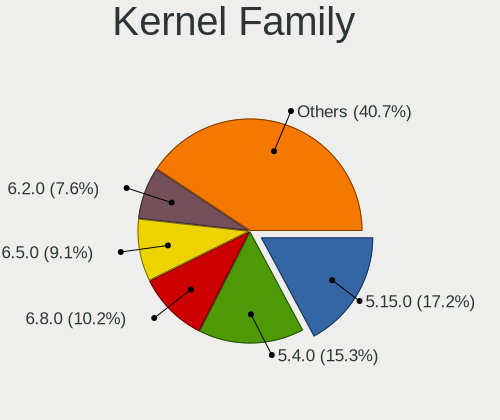
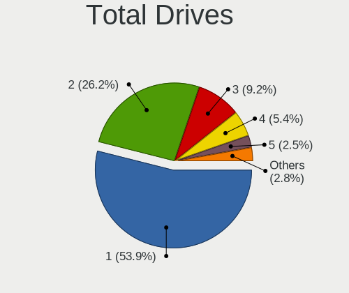

Kubuntu - Tested Hardware & Statistics
--------------------------------------

A project to collect tested hardware configurations for Kubuntu.

Anyone can contribute to this report by the [hw-probe](https://github.com/linuxhw/hw-probe) tool:

    sudo -E hw-probe -all -upload

Please contribute! Especially if your hardware is rare.

This is a report for all computer types. See also reports for [desktops](/Dist/Kubuntu/Desktop/README.md) and [notebooks](/Dist/Kubuntu/Notebook/README.md).

Contents
--------

* [ Test Cases ](#test-cases)

* [ System ](#system)
  - [ OS                       ](#os)
  - [ OS Family                ](#os-family)
  - [ Kernel                   ](#kernel)
  - [ Kernel Family            ](#kernel-family)
  - [ Kernel Major Ver.        ](#kernel-major-ver)
  - [ Arch                     ](#arch)
  - [ DE                       ](#de)
  - [ Display Server           ](#display-server)
  - [ Display Manager          ](#display-manager)
  - [ OS Lang                  ](#os-lang)
  - [ Boot Mode                ](#boot-mode)
  - [ Filesystem               ](#filesystem)
  - [ Part. scheme             ](#part-scheme)
  - [ Dual Boot with Linux/BSD ](#dual-boot-with-linuxbsd)
  - [ Dual Boot (Win)          ](#dual-boot-win)

* [ Board ](#board)
  - [ Vendor                   ](#vendor)
  - [ Model                    ](#model)
  - [ Model Family             ](#model-family)
  - [ MFG Year                 ](#mfg-year)
  - [ Form Factor              ](#form-factor)
  - [ Secure Boot              ](#secure-boot)
  - [ Coreboot                 ](#coreboot)
  - [ RAM Size                 ](#ram-size)
  - [ RAM Used                 ](#ram-used)
  - [ Total Drives             ](#total-drives)
  - [ Has CD-ROM               ](#has-cd-rom)
  - [ Has Ethernet             ](#has-ethernet)
  - [ Has WiFi                 ](#has-wifi)
  - [ Has Bluetooth            ](#has-bluetooth)

* [ Location ](#location)
  - [ Country                  ](#country)
  - [ City                     ](#city)

* [ Drives ](#drives)
  - [ Drive Vendor             ](#drive-vendor)
  - [ Drive Model              ](#drive-model)
  - [ HDD Vendor               ](#hdd-vendor)
  - [ SSD Vendor               ](#ssd-vendor)
  - [ Drive Kind               ](#drive-kind)
  - [ Drive Connector          ](#drive-connector)
  - [ Drive Size               ](#drive-size)
  - [ Space Total              ](#space-total)
  - [ Space Used               ](#space-used)
  - [ Malfunc. Drives          ](#malfunc-drives)
  - [ Malfunc. Drive Vendor    ](#malfunc-drive-vendor)
  - [ Malfunc. HDD Vendor      ](#malfunc-hdd-vendor)
  - [ Malfunc. Drive Kind      ](#malfunc-drive-kind)
  - [ Failed Drives            ](#failed-drives)
  - [ Failed Drive Vendor      ](#failed-drive-vendor)
  - [ Drive Status             ](#drive-status)

* [ Storage controller ](#storage-controller)
  - [ Storage Vendor           ](#storage-vendor)
  - [ Storage Model            ](#storage-model)
  - [ Storage Kind             ](#storage-kind)

* [ Processor ](#processor)
  - [ CPU Vendor               ](#cpu-vendor)
  - [ CPU Model                ](#cpu-model)
  - [ CPU Model Family         ](#cpu-model-family)
  - [ CPU Cores                ](#cpu-cores)
  - [ CPU Sockets              ](#cpu-sockets)
  - [ CPU Threads              ](#cpu-threads)
  - [ CPU Op-Modes             ](#cpu-op-modes)
  - [ CPU Microcode            ](#cpu-microcode)
  - [ CPU Microarch            ](#cpu-microarch)

* [ Graphics ](#graphics)
  - [ GPU Vendor               ](#gpu-vendor)
  - [ GPU Model                ](#gpu-model)
  - [ GPU Combo                ](#gpu-combo)
  - [ GPU Driver               ](#gpu-driver)
  - [ GPU Memory               ](#gpu-memory)

* [ Monitor ](#monitor)
  - [ Monitor Vendor           ](#monitor-vendor)
  - [ Monitor Model            ](#monitor-model)
  - [ Monitor Resolution       ](#monitor-resolution)
  - [ Monitor Diagonal         ](#monitor-diagonal)
  - [ Monitor Width            ](#monitor-width)
  - [ Aspect Ratio             ](#aspect-ratio)
  - [ Monitor Area             ](#monitor-area)
  - [ Pixel Density            ](#pixel-density)
  - [ Multiple Monitors        ](#multiple-monitors)

* [ Network ](#network)
  - [ Net Controller Vendor    ](#net-controller-vendor)
  - [ Net Controller Model     ](#net-controller-model)
  - [ Wireless Vendor          ](#wireless-vendor)
  - [ Wireless Model           ](#wireless-model)
  - [ Ethernet Vendor          ](#ethernet-vendor)
  - [ Ethernet Model           ](#ethernet-model)
  - [ Net Controller Kind      ](#net-controller-kind)
  - [ Used Controller          ](#used-controller)
  - [ NICs                     ](#nics)
  - [ IPv6                     ](#ipv6)

* [ Bluetooth ](#bluetooth)
  - [ Bluetooth Vendor         ](#bluetooth-vendor)
  - [ Bluetooth Model          ](#bluetooth-model)

* [ Sound ](#sound)
  - [ Sound Vendor             ](#sound-vendor)
  - [ Sound Model              ](#sound-model)

* [ Memory ](#memory)
  - [ Memory Vendor            ](#memory-vendor)
  - [ Memory Model             ](#memory-model)
  - [ Memory Kind              ](#memory-kind)
  - [ Memory Form Factor       ](#memory-form-factor)
  - [ Memory Size              ](#memory-size)
  - [ Memory Speed             ](#memory-speed)

* [ Printers & scanners ](#printers--scanners)
  - [ Printer Vendor           ](#printer-vendor)
  - [ Printer Model            ](#printer-model)
  - [ Scanner Vendor           ](#scanner-vendor)
  - [ Scanner Model            ](#scanner-model)

* [ Camera ](#camera)
  - [ Camera Vendor            ](#camera-vendor)
  - [ Camera Model             ](#camera-model)

* [ Security ](#security)
  - [ Fingerprint Vendor       ](#fingerprint-vendor)
  - [ Fingerprint Model        ](#fingerprint-model)
  - [ Chipcard Vendor          ](#chipcard-vendor)
  - [ Chipcard Model           ](#chipcard-model)

* [ Unsupported ](#unsupported)
  - [ Unsupported Devices      ](#unsupported-devices)
  - [ Unsupported Device Types ](#unsupported-device-types)

Test Cases
----------

Total: 5976

| Vendor        | Model                       | Form-Factor | Probe                                                      | Date         |
|---------------|-----------------------------|-------------|------------------------------------------------------------|--------------|
| MSI           | X470 GAMING PRO CARBON      | Desktop     | [1448f32279](https://linux-hardware.org/?probe=1448f32279) | Oct 01, 2023 |
| Dell          | 0X8DXD A00                  | Desktop     | [a44e0088f6](https://linux-hardware.org/?probe=a44e0088f6) | Oct 01, 2023 |
| ASUSTek       | VivoBook_ASUSLaptop M150... | Notebook    | [1330485afc](https://linux-hardware.org/?probe=1330485afc) | Oct 01, 2023 |
| HP            | EliteBook 745 G3            | Notebook    | [5cae9ddf98](https://linux-hardware.org/?probe=5cae9ddf98) | Sep 30, 2023 |
| Lenovo        | Legion 5 15ACH6H 82JU       | Notebook    | [48ff113276](https://linux-hardware.org/?probe=48ff113276) | Sep 30, 2023 |
| Apple         | Mac-F2268DAE                | All in one  | [4a47d466d9](https://linux-hardware.org/?probe=4a47d466d9) | Sep 30, 2023 |
| HP            | ProBook 650 G1              | Notebook    | [c9aca83f04](https://linux-hardware.org/?probe=c9aca83f04) | Sep 30, 2023 |
| Lenovo        | Legion 5 Pro 16ACH6H 82J... | Notebook    | [3421ba07f9](https://linux-hardware.org/?probe=3421ba07f9) | Sep 30, 2023 |
| Lenovo        | Legion 5 Pro 16ACH6H 82J... | Notebook    | [480316a0da](https://linux-hardware.org/?probe=480316a0da) | Sep 30, 2023 |
| Lenovo        | IdeaPad 3 15ALC6 82KU       | Notebook    | [cd9628c344](https://linux-hardware.org/?probe=cd9628c344) | Sep 29, 2023 |
| HP            | 1790                        | Desktop     | [b87e9dd9ad](https://linux-hardware.org/?probe=b87e9dd9ad) | Sep 29, 2023 |
| HP            | 1790                        | Desktop     | [89791e7bf0](https://linux-hardware.org/?probe=89791e7bf0) | Sep 29, 2023 |
| Alienware     | x15 R1                      | Notebook    | [a34b343fce](https://linux-hardware.org/?probe=a34b343fce) | Sep 29, 2023 |
| ASUSTek       | TUF Gaming X570-PLUS        | Desktop     | [6f07d7c834](https://linux-hardware.org/?probe=6f07d7c834) | Sep 29, 2023 |
| ASUSTek       | EB1501P                     | Desktop     | [df48fa7e96](https://linux-hardware.org/?probe=df48fa7e96) | Sep 29, 2023 |
| ASUSTek       | K72Jr                       | Notebook    | [9167494336](https://linux-hardware.org/?probe=9167494336) | Sep 28, 2023 |
| MSI           | H97M-G43                    | Desktop     | [b74346acb3](https://linux-hardware.org/?probe=b74346acb3) | Sep 28, 2023 |
| ASUSTek       | PRIME B365M-A               | Desktop     | [76937ddbce](https://linux-hardware.org/?probe=76937ddbce) | Sep 28, 2023 |
| Unknown       | Unknown                     | Desktop     | [a329c5630e](https://linux-hardware.org/?probe=a329c5630e) | Sep 28, 2023 |
| ASUSTek       | TUF X470-PLUS GAMING        | Desktop     | [e54490e96a](https://linux-hardware.org/?probe=e54490e96a) | Sep 27, 2023 |
| HP            | EliteBook 8770w             | Notebook    | [3286090099](https://linux-hardware.org/?probe=3286090099) | Sep 27, 2023 |
| ASUSTek       | TUF X470-PLUS GAMING        | Desktop     | [2f574aa287](https://linux-hardware.org/?probe=2f574aa287) | Sep 27, 2023 |
| Unknown       | Unknown                     | Desktop     | [128658b9f0](https://linux-hardware.org/?probe=128658b9f0) | Sep 26, 2023 |
| ASUSTek       | K72Jr                       | Notebook    | [9f32819945](https://linux-hardware.org/?probe=9f32819945) | Sep 26, 2023 |
| Apple         | MacBookAir7,2               | Notebook    | [d8c3afba9b](https://linux-hardware.org/?probe=d8c3afba9b) | Sep 26, 2023 |
| CHIPHD        | NT125D                      | Notebook    | [7e966b32de](https://linux-hardware.org/?probe=7e966b32de) | Sep 26, 2023 |
| Acer          | FX58M                       | Desktop     | [e24f36e0bd](https://linux-hardware.org/?probe=e24f36e0bd) | Sep 26, 2023 |
| Lenovo        | 3741 SDK0T76463 WIN 3422... | Desktop     | [e8397f6d0a](https://linux-hardware.org/?probe=e8397f6d0a) | Sep 26, 2023 |
| ASUSTek       | PRIME Z390-P                | Desktop     | [37840dad1c](https://linux-hardware.org/?probe=37840dad1c) | Sep 26, 2023 |
| Lenovo        | ThinkPad X12 Detachable ... | Tablet      | [1b72e3fe1c](https://linux-hardware.org/?probe=1b72e3fe1c) | Sep 26, 2023 |
| Lenovo        | ThinkPad X12 Detachable ... | Tablet      | [0281cc244a](https://linux-hardware.org/?probe=0281cc244a) | Sep 26, 2023 |
| ASUSTek       | TUF Gaming X570-PLUS        | Desktop     | [fe1163082c](https://linux-hardware.org/?probe=fe1163082c) | Sep 26, 2023 |
| Lenovo        | B480 20140                  | Notebook    | [960fe0be2b](https://linux-hardware.org/?probe=960fe0be2b) | Sep 25, 2023 |
| Dell          | Latitude E5470              | Notebook    | [64c20e3e21](https://linux-hardware.org/?probe=64c20e3e21) | Sep 25, 2023 |
| Unknown       | Unknown                     | Desktop     | [56cd5e0bfd](https://linux-hardware.org/?probe=56cd5e0bfd) | Sep 25, 2023 |
| ASUSTek       | VivoBook_ASUSLaptop TP42... | Convertible | [4095fbc19e](https://linux-hardware.org/?probe=4095fbc19e) | Sep 24, 2023 |
| ASUSTek       | VivoBook_ASUSLaptop TP42... | Convertible | [faf68444bc](https://linux-hardware.org/?probe=faf68444bc) | Sep 24, 2023 |
| Apple         | MacBookPro9,2               | Notebook    | [2691aa5f87](https://linux-hardware.org/?probe=2691aa5f87) | Sep 24, 2023 |
| Lenovo        | IdeaPad 3 15ALC6 82KU       | Notebook    | [a834cee874](https://linux-hardware.org/?probe=a834cee874) | Sep 24, 2023 |
| ASUSTek       | ROG STRIX B450-I GAMING     | Desktop     | [7f88191a7b](https://linux-hardware.org/?probe=7f88191a7b) | Sep 23, 2023 |
| Lenovo        | IdeaPad 700-15ISK 80RU      | Notebook    | [a616b7f5d0](https://linux-hardware.org/?probe=a616b7f5d0) | Sep 23, 2023 |
| ASRock        | ALiveXFire-eSATA2           | Desktop     | [7e69c8e2e1](https://linux-hardware.org/?probe=7e69c8e2e1) | Sep 23, 2023 |
| Lenovo        | ThinkPad P17 Gen 1 20SQS... | Notebook    | [05bf70d208](https://linux-hardware.org/?probe=05bf70d208) | Sep 22, 2023 |
| ASUSTek       | VivoBook_ASUSLaptop X515... | Notebook    | [ad1f9f63c0](https://linux-hardware.org/?probe=ad1f9f63c0) | Sep 22, 2023 |
| Dell          | 0D881F A05                  | Desktop     | [583c577b02](https://linux-hardware.org/?probe=583c577b02) | Sep 22, 2023 |
| ASUSTek       | TUF Z390-PRO GAMING         | Desktop     | [16fe0e3ba6](https://linux-hardware.org/?probe=16fe0e3ba6) | Sep 22, 2023 |
| ASUSTek       | TUF Z390-PRO GAMING         | Desktop     | [aab34fa582](https://linux-hardware.org/?probe=aab34fa582) | Sep 22, 2023 |
| ASRock        | H87 Pro4                    | Desktop     | [dc831a82cd](https://linux-hardware.org/?probe=dc831a82cd) | Sep 22, 2023 |
| Lenovo        | ThinkPad T14s Gen 1 20UJ... | Notebook    | [28c84c64c1](https://linux-hardware.org/?probe=28c84c64c1) | Sep 21, 2023 |
| Gigabyte      | GA-970A-DS3                 | Desktop     | [54a894ffd7](https://linux-hardware.org/?probe=54a894ffd7) | Sep 21, 2023 |
| HP            | 18E7                        | Desktop     | [ba0cb8996d](https://linux-hardware.org/?probe=ba0cb8996d) | Sep 21, 2023 |
| Gigabyte      | H310M H                     | Desktop     | [389282109e](https://linux-hardware.org/?probe=389282109e) | Sep 21, 2023 |
| MSI           | MPG B460I GAMING EDGE WI... | Desktop     | [b6d619d509](https://linux-hardware.org/?probe=b6d619d509) | Sep 21, 2023 |
| Lenovo        | IdeaPad S145-15API 81UT     | Notebook    | [d4060b585a](https://linux-hardware.org/?probe=d4060b585a) | Sep 20, 2023 |
| MSI           | MPG B460I GAMING EDGE WI... | Desktop     | [42b79f2641](https://linux-hardware.org/?probe=42b79f2641) | Sep 20, 2023 |
| Lenovo        | ThinkPad T16 Gen 1 21BVC... | Notebook    | [c7142a0d96](https://linux-hardware.org/?probe=c7142a0d96) | Sep 20, 2023 |
| HP            | ENVY TS 15                  | Notebook    | [98aa98d974](https://linux-hardware.org/?probe=98aa98d974) | Sep 20, 2023 |
| Toshiba       | Satellite Pro C70-B         | Notebook    | [a24c6808ba](https://linux-hardware.org/?probe=a24c6808ba) | Sep 20, 2023 |
| ASUSTek       | Maximus IX FORMULA          | Desktop     | [e76f3de142](https://linux-hardware.org/?probe=e76f3de142) | Sep 19, 2023 |
| ASUSTek       | Rampage V EDITION 10        | Desktop     | [e753271d63](https://linux-hardware.org/?probe=e753271d63) | Sep 19, 2023 |
| Dell          | Precision 7520              | Notebook    | [99e70bdd81](https://linux-hardware.org/?probe=99e70bdd81) | Sep 19, 2023 |
| ASRock        | Z68 Pro3                    | Desktop     | [4ffee8598b](https://linux-hardware.org/?probe=4ffee8598b) | Sep 19, 2023 |
| Gigabyte      | B550M AORUS ELITE           | Desktop     | [c8a7f18e5d](https://linux-hardware.org/?probe=c8a7f18e5d) | Sep 19, 2023 |
| Dell          | Precision 7520              | Notebook    | [89f1a6a0a5](https://linux-hardware.org/?probe=89f1a6a0a5) | Sep 18, 2023 |
| ASUSTek       | VivoBook_ASUSLaptop X415... | Notebook    | [cbfe8b032d](https://linux-hardware.org/?probe=cbfe8b032d) | Sep 18, 2023 |
| ASUSTek       | ROG STRIX X670E-A GAMING... | Desktop     | [144dcee0ae](https://linux-hardware.org/?probe=144dcee0ae) | Sep 18, 2023 |
| ASUSTek       | VivoBook_ASUSLaptop K660... | Notebook    | [6f676cd559](https://linux-hardware.org/?probe=6f676cd559) | Sep 18, 2023 |
| Apple         | MacBookPro8,1               | Notebook    | [c7b5f9224a](https://linux-hardware.org/?probe=c7b5f9224a) | Sep 17, 2023 |
| Dell          | Inspiron 5520               | Notebook    | [91404ec81d](https://linux-hardware.org/?probe=91404ec81d) | Sep 17, 2023 |
| Gigabyte      | H310M H                     | Desktop     | [5a9f4e8791](https://linux-hardware.org/?probe=5a9f4e8791) | Sep 17, 2023 |
| ASUSTek       | PRIME B450M-A               | Desktop     | [17e0d2ab92](https://linux-hardware.org/?probe=17e0d2ab92) | Sep 17, 2023 |
| ASUSTek       | PRIME X670-P WIFI           | Desktop     | [e6db76aa66](https://linux-hardware.org/?probe=e6db76aa66) | Sep 17, 2023 |
| Lenovo        | ThinkPad X230 2325FG0       | Notebook    | [e60aae9a1b](https://linux-hardware.org/?probe=e60aae9a1b) | Sep 17, 2023 |
| Apple         | MacBookPro11,1              | Notebook    | [82879c821a](https://linux-hardware.org/?probe=82879c821a) | Sep 17, 2023 |
| ASUSTek       | PRIME X670-P                | Desktop     | [76d6f570a8](https://linux-hardware.org/?probe=76d6f570a8) | Sep 16, 2023 |
| HP            | Compaq 6820s                | Notebook    | [99a625283d](https://linux-hardware.org/?probe=99a625283d) | Sep 16, 2023 |
| HP            | Compaq 6820s                | Notebook    | [2ae8b9ac9d](https://linux-hardware.org/?probe=2ae8b9ac9d) | Sep 16, 2023 |
| ASUSTek       | Z97-PRO                     | Desktop     | [37d6d12772](https://linux-hardware.org/?probe=37d6d12772) | Sep 15, 2023 |
| Lenovo        | 1037 SDK0Q40104 WIN 3305... | Server      | [fabf2bef4c](https://linux-hardware.org/?probe=fabf2bef4c) | Sep 15, 2023 |
| Acer          | Aspire A515-57              | Notebook    | [a73abd96f1](https://linux-hardware.org/?probe=a73abd96f1) | Sep 15, 2023 |
| Lenovo        | ThinkPad X230 23256N6       | Notebook    | [a32457e14d](https://linux-hardware.org/?probe=a32457e14d) | Sep 15, 2023 |
| ASUSTek       | TUF Gaming X570-PLUS        | Desktop     | [de7e036404](https://linux-hardware.org/?probe=de7e036404) | Sep 15, 2023 |
| HP            | 0A9Ch                       | Desktop     | [4894ac01b8](https://linux-hardware.org/?probe=4894ac01b8) | Sep 14, 2023 |
| ASRock        | B650M PG Riptide            | Desktop     | [3a1c100a69](https://linux-hardware.org/?probe=3a1c100a69) | Sep 14, 2023 |
| ASUSTek       | PRIME X370-PRO              | Desktop     | [15256fdeb2](https://linux-hardware.org/?probe=15256fdeb2) | Sep 14, 2023 |
| Notebook      | P65_P67SA                   | Notebook    | [4d11ae0ff7](https://linux-hardware.org/?probe=4d11ae0ff7) | Sep 13, 2023 |
| Lenovo        | IdeaPad 3 15ARE05 81W4      | Notebook    | [8f3c4bff98](https://linux-hardware.org/?probe=8f3c4bff98) | Sep 13, 2023 |
| Lenovo        | ThinkPad X270 W10DG 20K5... | Notebook    | [20ad52b9a4](https://linux-hardware.org/?probe=20ad52b9a4) | Sep 13, 2023 |
| MSI           | MAG B650 TOMAHAWK WIFI      | Desktop     | [959fc9f783](https://linux-hardware.org/?probe=959fc9f783) | Sep 13, 2023 |
| MSI           | MAG B650 TOMAHAWK WIFI      | Desktop     | [641089b224](https://linux-hardware.org/?probe=641089b224) | Sep 13, 2023 |
| AZW           | MINI S 10                   | Desktop     | [5cd0efea8b](https://linux-hardware.org/?probe=5cd0efea8b) | Sep 12, 2023 |
| HP            | 1998                        | Desktop     | [c3451afea8](https://linux-hardware.org/?probe=c3451afea8) | Sep 11, 2023 |
| Lenovo        | ThinkPad X1 Carbon Gen 1... | Notebook    | [3831230caa](https://linux-hardware.org/?probe=3831230caa) | Sep 11, 2023 |
| Lenovo        | IdeaPad 3 15ARE05 81W4      | Notebook    | [53139247c9](https://linux-hardware.org/?probe=53139247c9) | Sep 10, 2023 |
| ASUSTek       | VivoBook_ASUSLaptop N760... | Notebook    | [9ea0aa4b28](https://linux-hardware.org/?probe=9ea0aa4b28) | Sep 10, 2023 |
| ASUSTek       | ROG STRIX B560-A GAMING ... | Desktop     | [b12897892a](https://linux-hardware.org/?probe=b12897892a) | Sep 09, 2023 |
| MSI           | B360M BAZOOKA               | Desktop     | [33cc2ca68e](https://linux-hardware.org/?probe=33cc2ca68e) | Sep 09, 2023 |
| Valve         | Jupiter                     | Notebook    | [23da68a72c](https://linux-hardware.org/?probe=23da68a72c) | Sep 09, 2023 |
| Lenovo        | ThinkPad X230 23256N6       | Notebook    | [938cec3228](https://linux-hardware.org/?probe=938cec3228) | Sep 09, 2023 |
| ASUSTek       | PRIME A320M-K               | Desktop     | [1275709f08](https://linux-hardware.org/?probe=1275709f08) | Sep 09, 2023 |
| MSI           | GE75 Raider 9SE             | Notebook    | [5180b1e51e](https://linux-hardware.org/?probe=5180b1e51e) | Sep 09, 2023 |
| MSI           | GE75 Raider 9SE             | Notebook    | [6f3051262d](https://linux-hardware.org/?probe=6f3051262d) | Sep 09, 2023 |
| Lenovo        | IdeaPadFlex 5 14ABR8 82X... | Convertible | [fe6b08c772](https://linux-hardware.org/?probe=fe6b08c772) | Sep 08, 2023 |
| Lenovo        | IdeaPadFlex 5 14ABR8 82X... | Convertible | [c0422be924](https://linux-hardware.org/?probe=c0422be924) | Sep 08, 2023 |
| ASUSTek       | VivoBook_ASUSLaptop M350... | Notebook    | [4e30077177](https://linux-hardware.org/?probe=4e30077177) | Sep 08, 2023 |
| Notebook      | W65_67SR                    | Notebook    | [7169bc1dbb](https://linux-hardware.org/?probe=7169bc1dbb) | Sep 07, 2023 |
| Google        | Robo360                     | Notebook    | [86308cca01](https://linux-hardware.org/?probe=86308cca01) | Sep 07, 2023 |
| Lenovo        | ThinkPad X1 Carbon Gen 1... | Notebook    | [81a5f77f1c](https://linux-hardware.org/?probe=81a5f77f1c) | Sep 07, 2023 |
| Dell          | Latitude 7420               | Notebook    | [77df1805f6](https://linux-hardware.org/?probe=77df1805f6) | Sep 07, 2023 |
| Lenovo        | ThinkPad X230 23256N6       | Notebook    | [7ce5ebe4bc](https://linux-hardware.org/?probe=7ce5ebe4bc) | Sep 07, 2023 |
| MSI           | MPG B550 GAMING PLUS        | Desktop     | [48cc912b75](https://linux-hardware.org/?probe=48cc912b75) | Sep 06, 2023 |
| Lenovo        | 3708 NOK                    | Desktop     | [153f0dfa9d](https://linux-hardware.org/?probe=153f0dfa9d) | Sep 06, 2023 |
| ASUSTek       | G551JM                      | Notebook    | [784e1f216e](https://linux-hardware.org/?probe=784e1f216e) | Sep 06, 2023 |
| MSI           | Modern 15 A5M               | Notebook    | [eb92b04384](https://linux-hardware.org/?probe=eb92b04384) | Sep 06, 2023 |
| ASUSTek       | X580VD                      | Notebook    | [989134a7c5](https://linux-hardware.org/?probe=989134a7c5) | Sep 06, 2023 |
| Alienware     | 0H869M A00                  | Desktop     | [64132daa63](https://linux-hardware.org/?probe=64132daa63) | Sep 06, 2023 |
| ASUSTek       | ASUS TUF Gaming F15 FX50... | Notebook    | [cf9c65c6f4](https://linux-hardware.org/?probe=cf9c65c6f4) | Sep 06, 2023 |
| ASUSTek       | TUF Gaming Z590-PLUS WIF... | Desktop     | [d2ae9b900d](https://linux-hardware.org/?probe=d2ae9b900d) | Sep 06, 2023 |
| ASUSTek       | PRIME X470-PRO              | Desktop     | [f081f44bda](https://linux-hardware.org/?probe=f081f44bda) | Sep 05, 2023 |
| Dell          | Latitude 7490               | Notebook    | [2a945e76de](https://linux-hardware.org/?probe=2a945e76de) | Sep 05, 2023 |
| Samsung       | 950QED                      | Convertible | [e15539dd35](https://linux-hardware.org/?probe=e15539dd35) | Sep 05, 2023 |
| Dell          | Inspiron 3480               | Notebook    | [3d639d27ba](https://linux-hardware.org/?probe=3d639d27ba) | Sep 05, 2023 |
| MSI           | MAG B560M MORTAR            | Desktop     | [07429e910f](https://linux-hardware.org/?probe=07429e910f) | Sep 05, 2023 |
| Apple         | MacBookPro11,4              | Notebook    | [1cd7fc15b1](https://linux-hardware.org/?probe=1cd7fc15b1) | Sep 05, 2023 |
| AZW           | SER V01                     | Mini pc     | [b744dfb20a](https://linux-hardware.org/?probe=b744dfb20a) | Sep 05, 2023 |
| ASUSTek       | S400CA                      | Notebook    | [453335f199](https://linux-hardware.org/?probe=453335f199) | Sep 04, 2023 |
| ASUSTek       | K52JB                       | Notebook    | [7944dc4ca2](https://linux-hardware.org/?probe=7944dc4ca2) | Sep 04, 2023 |
| Gigabyte      | B650M AORUS ELITE AX        | Desktop     | [71da9ea288](https://linux-hardware.org/?probe=71da9ea288) | Sep 04, 2023 |
| Lenovo        | ThinkPad T495s 20QKS0SD0... | Notebook    | [2dff249b45](https://linux-hardware.org/?probe=2dff249b45) | Sep 04, 2023 |
| Gigabyte      | B650M AORUS ELITE AX        | Desktop     | [31cb6a887e](https://linux-hardware.org/?probe=31cb6a887e) | Sep 04, 2023 |
| Dell          | Latitude E6500              | Notebook    | [6199709334](https://linux-hardware.org/?probe=6199709334) | Sep 04, 2023 |
| Lenovo        | ThinkPad T495s 20QKS0SD0... | Notebook    | [515a81a0d1](https://linux-hardware.org/?probe=515a81a0d1) | Sep 03, 2023 |
| MSI           | MAG B560M MORTAR            | Desktop     | [c8978cf811](https://linux-hardware.org/?probe=c8978cf811) | Sep 03, 2023 |
| HP            | Notebook                    | Notebook    | [9be8a6b0e7](https://linux-hardware.org/?probe=9be8a6b0e7) | Sep 03, 2023 |
| HP            | Notebook                    | Notebook    | [d038b7106e](https://linux-hardware.org/?probe=d038b7106e) | Sep 03, 2023 |
| Lenovo        | Legion Slim 5 16APH8 82Y... | Notebook    | [cdf37a1590](https://linux-hardware.org/?probe=cdf37a1590) | Sep 03, 2023 |
| MSI           | MAG B560M MORTAR            | Desktop     | [62ac121b13](https://linux-hardware.org/?probe=62ac121b13) | Sep 03, 2023 |
| Dell          | Latitude E6500              | Notebook    | [308d8d0f19](https://linux-hardware.org/?probe=308d8d0f19) | Sep 03, 2023 |
| Fujitsu Si... | LIFEBOOK E8410              | Notebook    | [31618d06c6](https://linux-hardware.org/?probe=31618d06c6) | Sep 02, 2023 |
| Apple         | Mac-942B5BF58194151B        | All in one  | [85cc9860f3](https://linux-hardware.org/?probe=85cc9860f3) | Sep 02, 2023 |
| Lenovo        | ThinkPad T14s Gen 4 21F6... | Notebook    | [2fc5b41456](https://linux-hardware.org/?probe=2fc5b41456) | Sep 02, 2023 |
| Gigabyte      | H510M H                     | Desktop     | [1aeb1ffd17](https://linux-hardware.org/?probe=1aeb1ffd17) | Sep 02, 2023 |
| Lenovo        | Yoga 6 13ALC6 82ND          | Convertible | [9028ba6c0f](https://linux-hardware.org/?probe=9028ba6c0f) | Sep 02, 2023 |
| Gigabyte      | AX370-Gaming K7             | Desktop     | [7dabe0d117](https://linux-hardware.org/?probe=7dabe0d117) | Sep 01, 2023 |
| HP            | EliteBook 845 G8 Noteboo... | Notebook    | [d646fdb00d](https://linux-hardware.org/?probe=d646fdb00d) | Sep 01, 2023 |
| HP            | ProBook 440 G8 Notebook ... | Notebook    | [b132ff749e](https://linux-hardware.org/?probe=b132ff749e) | Sep 01, 2023 |
| MSI           | X470 GAMING PRO CARBON      | Desktop     | [d80ee341d8](https://linux-hardware.org/?probe=d80ee341d8) | Sep 01, 2023 |
| Dell          | 0XPDFK A01                  | Desktop     | [ac52854722](https://linux-hardware.org/?probe=ac52854722) | Aug 31, 2023 |
| Dell          | XPS 9315                    | Notebook    | [5676f0c210](https://linux-hardware.org/?probe=5676f0c210) | Aug 31, 2023 |
| Lenovo        | ThinkPad T14s Gen 4 21F6... | Notebook    | [3384884acc](https://linux-hardware.org/?probe=3384884acc) | Aug 31, 2023 |
| Gigabyte      | X570 AORUS MASTER           | Desktop     | [17e971c3fb](https://linux-hardware.org/?probe=17e971c3fb) | Aug 31, 2023 |
| Sony          | VPCEC390X                   | Notebook    | [ddad567e2a](https://linux-hardware.org/?probe=ddad567e2a) | Aug 31, 2023 |
| ASUSTek       | PRIME X299-DELUXE           | Desktop     | [d9a8673516](https://linux-hardware.org/?probe=d9a8673516) | Aug 31, 2023 |
| AZW           | MINI S                      | Desktop     | [fb828c24eb](https://linux-hardware.org/?probe=fb828c24eb) | Aug 31, 2023 |
| Avell High... | C62 MOB                     | Notebook    | [04e247a3d3](https://linux-hardware.org/?probe=04e247a3d3) | Aug 30, 2023 |
| Gigabyte      | B550 AORUS ELITE V2         | Desktop     | [27e226b6d4](https://linux-hardware.org/?probe=27e226b6d4) | Aug 30, 2023 |
| ASUSTek       | VivoBook_ASUSLaptop X515... | Notebook    | [2906fc34f6](https://linux-hardware.org/?probe=2906fc34f6) | Aug 30, 2023 |
| MSI           | MPG B460I GAMING EDGE WI... | Desktop     | [5a4e0650a2](https://linux-hardware.org/?probe=5a4e0650a2) | Aug 30, 2023 |
| Toshiba       | Satellite P850              | Notebook    | [a129c031fa](https://linux-hardware.org/?probe=a129c031fa) | Aug 29, 2023 |
| ASUSTek       | P8Z68-V PRO GEN3            | Desktop     | [a9d960e012](https://linux-hardware.org/?probe=a9d960e012) | Aug 29, 2023 |
| Gigabyte      | H310M H                     | Desktop     | [ca4ddb2663](https://linux-hardware.org/?probe=ca4ddb2663) | Aug 29, 2023 |
| ASRock        | Z68 Extreme3 Gen3           | Desktop     | [a2f18f43e4](https://linux-hardware.org/?probe=a2f18f43e4) | Aug 29, 2023 |
| HP            | 212B                        | Desktop     | [80b2496334](https://linux-hardware.org/?probe=80b2496334) | Aug 29, 2023 |
| MSI           | B550-A PRO                  | Desktop     | [a4bd03aafc](https://linux-hardware.org/?probe=a4bd03aafc) | Aug 29, 2023 |
| Fujitsu       | LIFEBOOK U9312              | Notebook    | [891b276812](https://linux-hardware.org/?probe=891b276812) | Aug 28, 2023 |
| ASUSTek       | Pro WS 565-ACE              | Desktop     | [ae73127da5](https://linux-hardware.org/?probe=ae73127da5) | Aug 28, 2023 |
| MSI           | MAG B550M BAZOOKA           | Desktop     | [5b0183001d](https://linux-hardware.org/?probe=5b0183001d) | Aug 28, 2023 |
| Dell          | Vostro 3501                 | Notebook    | [0211379a67](https://linux-hardware.org/?probe=0211379a67) | Aug 27, 2023 |
| MSI           | B550-A PRO                  | Desktop     | [19f07f081f](https://linux-hardware.org/?probe=19f07f081f) | Aug 27, 2023 |
| Lenovo        | IdeaPad 3 14ALC6 82KT       | Notebook    | [c437fa21b3](https://linux-hardware.org/?probe=c437fa21b3) | Aug 27, 2023 |
| Lenovo        | ThinkPad T495s 20QJCTO1W... | Notebook    | [69a4a078cd](https://linux-hardware.org/?probe=69a4a078cd) | Aug 27, 2023 |
| HP            | 18E7                        | Desktop     | [0b94065a0f](https://linux-hardware.org/?probe=0b94065a0f) | Aug 27, 2023 |
| Gigabyte      | B550 GAMING X V2            | Desktop     | [fa48902a10](https://linux-hardware.org/?probe=fa48902a10) | Aug 27, 2023 |
| ASUSTek       | PRIME Z690-P WIFI D4        | Desktop     | [cf2cba5c59](https://linux-hardware.org/?probe=cf2cba5c59) | Aug 26, 2023 |
| mPTech        | ARC 11.6 128GB HD           | Notebook    | [4167149587](https://linux-hardware.org/?probe=4167149587) | Aug 26, 2023 |
| Lenovo        | ThinkPad X230 23256N6       | Notebook    | [efa1e38911](https://linux-hardware.org/?probe=efa1e38911) | Aug 26, 2023 |
| Lenovo        | 3136 SDK0J40697 WIN 3305... | Mini pc     | [1f47bfe737](https://linux-hardware.org/?probe=1f47bfe737) | Aug 26, 2023 |
| MSI           | 990FXA GAMING               | Desktop     | [813d9c9c10](https://linux-hardware.org/?probe=813d9c9c10) | Aug 26, 2023 |
| ASRock        | X570 Steel Legend           | Desktop     | [65b6b29fc7](https://linux-hardware.org/?probe=65b6b29fc7) | Aug 26, 2023 |
| MSI           | X470 GAMING PRO CARBON      | Desktop     | [5004de7897](https://linux-hardware.org/?probe=5004de7897) | Aug 26, 2023 |
| ASUSTek       | PRIME X370-PRO              | Desktop     | [e4200e4c9a](https://linux-hardware.org/?probe=e4200e4c9a) | Aug 25, 2023 |
| ASUSTek       | VivoBook_ASUSLaptop X340... | Notebook    | [d0de544ecd](https://linux-hardware.org/?probe=d0de544ecd) | Aug 25, 2023 |
| HP            | ZBook 14 G2                 | Notebook    | [7fcd619af1](https://linux-hardware.org/?probe=7fcd619af1) | Aug 25, 2023 |
| ASUSTek       | TUF Gaming X570-PLUS        | Desktop     | [3acc953bde](https://linux-hardware.org/?probe=3acc953bde) | Aug 24, 2023 |
| Lenovo        | IdeaPad Z580                | Notebook    | [b84eb0a6fa](https://linux-hardware.org/?probe=b84eb0a6fa) | Aug 24, 2023 |
| ASUSTek       | TUF Gaming X570-PLUS        | Desktop     | [ccdc0814a8](https://linux-hardware.org/?probe=ccdc0814a8) | Aug 24, 2023 |
| ASUSTek       | M5A99X EVO R2.0             | Desktop     | [bc15f84b8c](https://linux-hardware.org/?probe=bc15f84b8c) | Aug 24, 2023 |
| ASUSTek       | M5A97 R2.0                  | Desktop     | [0161911081](https://linux-hardware.org/?probe=0161911081) | Aug 24, 2023 |
| Dell          | Precision 7780              | Notebook    | [a0627634fc](https://linux-hardware.org/?probe=a0627634fc) | Aug 23, 2023 |
| ASRock        | X570 Steel Legend           | Desktop     | [7bd62bca50](https://linux-hardware.org/?probe=7bd62bca50) | Aug 23, 2023 |
| Intel         | H55                         | Desktop     | [8320e0c758](https://linux-hardware.org/?probe=8320e0c758) | Aug 22, 2023 |
| MSI           | GL65 9SE                    | Notebook    | [aa162e5634](https://linux-hardware.org/?probe=aa162e5634) | Aug 22, 2023 |
| Irbis         | NB123                       | Notebook    | [6bfbd824c3](https://linux-hardware.org/?probe=6bfbd824c3) | Aug 22, 2023 |
| HP            | Pavilion Laptop 14-bf0xx    | Notebook    | [aee37b4a93](https://linux-hardware.org/?probe=aee37b4a93) | Aug 21, 2023 |
| Dell          | 0D881F A05                  | Desktop     | [8c6f4a2e1c](https://linux-hardware.org/?probe=8c6f4a2e1c) | Aug 21, 2023 |
| Lenovo        | ThinkPad X230 23256N6       | Notebook    | [4d631eed0e](https://linux-hardware.org/?probe=4d631eed0e) | Aug 21, 2023 |
| Lenovo        | Z70-80 80FG                 | Notebook    | [bb5a7dc0d8](https://linux-hardware.org/?probe=bb5a7dc0d8) | Aug 21, 2023 |
| HP            | ElitePad 1000 G2            | Notebook    | [bb21bd2dbc](https://linux-hardware.org/?probe=bb21bd2dbc) | Aug 21, 2023 |
| Fujitsu       | D3602-A1 S26361-D3602-A1    | Desktop     | [8144c6d466](https://linux-hardware.org/?probe=8144c6d466) | Aug 21, 2023 |
| Dell          | Latitude E6520              | Notebook    | [923d01a34f](https://linux-hardware.org/?probe=923d01a34f) | Aug 21, 2023 |
| HP            | Laptop 17-ca1xxx            | Notebook    | [7463f81c62](https://linux-hardware.org/?probe=7463f81c62) | Aug 20, 2023 |
| Gigabyte      | X470 AORUS ULTRA GAMING-... | Desktop     | [c78c246642](https://linux-hardware.org/?probe=c78c246642) | Aug 20, 2023 |
| Schenker      | XMG PRO (E23)               | Notebook    | [9b1639077c](https://linux-hardware.org/?probe=9b1639077c) | Aug 20, 2023 |
| Gigabyte      | B365M D3H-CF                | Desktop     | [3911bdd51d](https://linux-hardware.org/?probe=3911bdd51d) | Aug 20, 2023 |
| Gigabyte      | B365M D3H-CF                | Desktop     | [1979db3345](https://linux-hardware.org/?probe=1979db3345) | Aug 20, 2023 |
| ASRock        | X370 Taichi                 | Desktop     | [9a7f33c81b](https://linux-hardware.org/?probe=9a7f33c81b) | Aug 20, 2023 |
| HP            | ProBook 450 15.6 inch G9... | Notebook    | [df48f3ca66](https://linux-hardware.org/?probe=df48f3ca66) | Aug 19, 2023 |
| Dell          | XPS 15 9550                 | Notebook    | [3b3ae781c6](https://linux-hardware.org/?probe=3b3ae781c6) | Aug 19, 2023 |
| HP            | Pavilion Notebook           | Notebook    | [ed75b0702f](https://linux-hardware.org/?probe=ed75b0702f) | Aug 19, 2023 |
| Toshiba       | Satellite P850              | Notebook    | [8d00e88e1c](https://linux-hardware.org/?probe=8d00e88e1c) | Aug 19, 2023 |
| Dell          | XPS 15 9530                 | Notebook    | [93530d7cb1](https://linux-hardware.org/?probe=93530d7cb1) | Aug 18, 2023 |
| Dell          | XPS 17 9730                 | Notebook    | [e9ddab2ebc](https://linux-hardware.org/?probe=e9ddab2ebc) | Aug 18, 2023 |
| Gigabyte      | Z390 M GAMING-CF            | Desktop     | [b5973b3c67](https://linux-hardware.org/?probe=b5973b3c67) | Aug 18, 2023 |
| MSI           | B250M MORTAR                | Desktop     | [fc97ccab18](https://linux-hardware.org/?probe=fc97ccab18) | Aug 17, 2023 |
| ASUSTek       | TUF Gaming A520M-PLUS WI... | Desktop     | [1962f7a581](https://linux-hardware.org/?probe=1962f7a581) | Aug 17, 2023 |
| Intel         | D53427RKE G87971-402        | Desktop     | [433dcaffa6](https://linux-hardware.org/?probe=433dcaffa6) | Aug 17, 2023 |
| Acer          | Nitro AN517-41              | Notebook    | [a925a31ef1](https://linux-hardware.org/?probe=a925a31ef1) | Aug 17, 2023 |
| Dell          | XPS 15 9530                 | Notebook    | [ace741b68a](https://linux-hardware.org/?probe=ace741b68a) | Aug 17, 2023 |
| MSI           | MPG B460I GAMING EDGE WI... | Desktop     | [2da4b77f8a](https://linux-hardware.org/?probe=2da4b77f8a) | Aug 17, 2023 |
| Lenovo        | ThinkBook 14s Yoga G3 IR... | Convertible | [74da3f5482](https://linux-hardware.org/?probe=74da3f5482) | Aug 16, 2023 |
| Lenovo        | Legion 5 15ARH05H 82B1      | Notebook    | [ef53482168](https://linux-hardware.org/?probe=ef53482168) | Aug 16, 2023 |
| MSI           | B450 GAMING PLUS MAX        | Desktop     | [aaec4c4fe1](https://linux-hardware.org/?probe=aaec4c4fe1) | Aug 16, 2023 |
| Lenovo        | IdeaPad 300-14ISK 80Q6      | Notebook    | [a94c8dc31f](https://linux-hardware.org/?probe=a94c8dc31f) | Aug 16, 2023 |
| ASRock        | Z77 Extreme4                | Desktop     | [e9f564475b](https://linux-hardware.org/?probe=e9f564475b) | Aug 16, 2023 |
| HP            | EliteBook x360 830 G8 No... | Convertible | [8e409a97d7](https://linux-hardware.org/?probe=8e409a97d7) | Aug 15, 2023 |
| AZW           | SER V01                     | Mini pc     | [f0d325d7d3](https://linux-hardware.org/?probe=f0d325d7d3) | Aug 15, 2023 |
| AZW           | SER V01                     | Mini pc     | [a395628119](https://linux-hardware.org/?probe=a395628119) | Aug 15, 2023 |
| ASRock        | X370 Taichi                 | Desktop     | [e338ac8876](https://linux-hardware.org/?probe=e338ac8876) | Aug 14, 2023 |
| MSI           | MPG B650 CARBON WIFI        | Desktop     | [37086c4564](https://linux-hardware.org/?probe=37086c4564) | Aug 14, 2023 |
| ASUSTek       | TUF Gaming B550-PLUS        | Desktop     | [ed6e0727b2](https://linux-hardware.org/?probe=ed6e0727b2) | Aug 14, 2023 |
| AMI           | INTEL                       | Convertible | [21596eaf06](https://linux-hardware.org/?probe=21596eaf06) | Aug 14, 2023 |
| Lenovo        | ThinkPad Edge E540 20C60... | Notebook    | [41b9b0bfc9](https://linux-hardware.org/?probe=41b9b0bfc9) | Aug 14, 2023 |
| ASUSTek       | N53SV                       | Notebook    | [8643d609f2](https://linux-hardware.org/?probe=8643d609f2) | Aug 14, 2023 |
| HUAWEI        | KLVL-WXXW                   | Notebook    | [29aa72820d](https://linux-hardware.org/?probe=29aa72820d) | Aug 14, 2023 |
| Dell          | 0D881F A05                  | Desktop     | [83dd0f7fe7](https://linux-hardware.org/?probe=83dd0f7fe7) | Aug 14, 2023 |
| LG Electro... | 17Z90N-V.AA72A8             | Notebook    | [28e815418c](https://linux-hardware.org/?probe=28e815418c) | Aug 13, 2023 |
| Lenovo        | IdeaPad 5 14ITL05 82FE      | Notebook    | [7ad086cf8b](https://linux-hardware.org/?probe=7ad086cf8b) | Aug 13, 2023 |
| MSI           | H310M PRO-VDH PLUS          | Desktop     | [e2fe66aca4](https://linux-hardware.org/?probe=e2fe66aca4) | Aug 13, 2023 |
| Acer          | Aspire A515-51              | Notebook    | [7dd490a028](https://linux-hardware.org/?probe=7dd490a028) | Aug 13, 2023 |
| Lenovo        | ThinkPad X1 Carbon 2nd 2... | Notebook    | [307eb30c27](https://linux-hardware.org/?probe=307eb30c27) | Aug 13, 2023 |
| ASUSTek       | ROG STRIX X670E-A GAMING... | Desktop     | [0c8514df53](https://linux-hardware.org/?probe=0c8514df53) | Aug 13, 2023 |
| Gigabyte      | Z690 AORUS MASTER           | Desktop     | [760a5d6077](https://linux-hardware.org/?probe=760a5d6077) | Aug 13, 2023 |
| Dell          | 0GNVHC A00                  | Desktop     | [27e3be4942](https://linux-hardware.org/?probe=27e3be4942) | Aug 12, 2023 |
| ASUSTek       | CM1630                      | Desktop     | [dfd52e2852](https://linux-hardware.org/?probe=dfd52e2852) | Aug 12, 2023 |
| MSI           | X470 GAMING PRO CARBON      | Desktop     | [b4b9fa2d17](https://linux-hardware.org/?probe=b4b9fa2d17) | Aug 12, 2023 |
| ASUSTek       | CM1630                      | Desktop     | [d8f56bcdaf](https://linux-hardware.org/?probe=d8f56bcdaf) | Aug 12, 2023 |
| Apple         | Mac-F2268DAE                | All in one  | [97c78c17bd](https://linux-hardware.org/?probe=97c78c17bd) | Aug 12, 2023 |
| MSI           | X470 GAMING PRO CARBON      | Desktop     | [181db8cf87](https://linux-hardware.org/?probe=181db8cf87) | Aug 11, 2023 |
| Medion        | P651x series                | Notebook    | [46505da47d](https://linux-hardware.org/?probe=46505da47d) | Aug 11, 2023 |
| AZW           | SER V01                     | Mini pc     | [542d8da36c](https://linux-hardware.org/?probe=542d8da36c) | Aug 11, 2023 |
| HP            | Pavilion Laptop 14-bf0xx    | Notebook    | [ba03034ac5](https://linux-hardware.org/?probe=ba03034ac5) | Aug 10, 2023 |
| Gigabyte      | Z690 AORUS MASTER           | Desktop     | [be6c815f39](https://linux-hardware.org/?probe=be6c815f39) | Aug 10, 2023 |
| ASUSTek       | Q87M-E                      | Desktop     | [0dee84c129](https://linux-hardware.org/?probe=0dee84c129) | Aug 10, 2023 |
| Dell          | 0HY9JP A00                  | Desktop     | [f28a198267](https://linux-hardware.org/?probe=f28a198267) | Aug 10, 2023 |
| HP            | EliteBook 840 G6            | Notebook    | [767792bf33](https://linux-hardware.org/?probe=767792bf33) | Aug 09, 2023 |
| HUAWEI        | BOM-WXX9                    | Notebook    | [d255d00dc8](https://linux-hardware.org/?probe=d255d00dc8) | Aug 09, 2023 |
| ASUSTek       | ROG Strix G713IH_G713IH     | Notebook    | [352fd5fea3](https://linux-hardware.org/?probe=352fd5fea3) | Aug 09, 2023 |
| ASUSTek       | ROG Strix G713IH_G713IH     | Notebook    | [76bbb6695d](https://linux-hardware.org/?probe=76bbb6695d) | Aug 09, 2023 |
| Lenovo        | Legion Pro 5 16IRX8 82WK    | Notebook    | [d97ae334a3](https://linux-hardware.org/?probe=d97ae334a3) | Aug 09, 2023 |
| Lenovo        | ThinkPad X1 Carbon 2nd 2... | Notebook    | [f28e4b71d6](https://linux-hardware.org/?probe=f28e4b71d6) | Aug 09, 2023 |
| Google        | Dragonair                   | Notebook    | [45d7954a65](https://linux-hardware.org/?probe=45d7954a65) | Aug 08, 2023 |
| Google        | Dragonair                   | Notebook    | [d78af70cf3](https://linux-hardware.org/?probe=d78af70cf3) | Aug 08, 2023 |
| Lenovo        | Yoga 6 13ALC6 82ND          | Convertible | [58d7c4be4c](https://linux-hardware.org/?probe=58d7c4be4c) | Aug 08, 2023 |
| Acer          | Nitro AN515-55              | Notebook    | [1d117f6031](https://linux-hardware.org/?probe=1d117f6031) | Aug 07, 2023 |
| Lenovo        | ThinkPad W510 4391EC4       | Notebook    | [5e9baa223d](https://linux-hardware.org/?probe=5e9baa223d) | Aug 07, 2023 |
| GPU Compan... | GWTN141-10                  | Notebook    | [e03fdd9f60](https://linux-hardware.org/?probe=e03fdd9f60) | Aug 07, 2023 |
| HP            | Laptop 14s-dq2xxx           | Notebook    | [6d2ab6eef6](https://linux-hardware.org/?probe=6d2ab6eef6) | Aug 07, 2023 |
| HP            | ZBook 15 G3                 | Notebook    | [068b8c5a6f](https://linux-hardware.org/?probe=068b8c5a6f) | Aug 07, 2023 |
| Gigabyte      | TRX40 DESIGNARE             | Desktop     | [a71dc0067b](https://linux-hardware.org/?probe=a71dc0067b) | Aug 07, 2023 |
| ASRock        | N68C-S UCC                  | Desktop     | [ebe7ed3f69](https://linux-hardware.org/?probe=ebe7ed3f69) | Aug 07, 2023 |
| Packard Be... | EasyNote LS11HR             | Notebook    | [df59aff876](https://linux-hardware.org/?probe=df59aff876) | Aug 07, 2023 |
| Packard Be... | EasyNote LS11HR             | Notebook    | [8c8e1cef1c](https://linux-hardware.org/?probe=8c8e1cef1c) | Aug 06, 2023 |
| ASUSTek       | P5QD TURBO                  | Desktop     | [3d156d18e6](https://linux-hardware.org/?probe=3d156d18e6) | Aug 06, 2023 |
| Timi          | RedmiBook 14-APCS           | Notebook    | [a0a289f4ee](https://linux-hardware.org/?probe=a0a289f4ee) | Aug 06, 2023 |
| TECNO         | MEGABOOK T1                 | Notebook    | [ced0647d42](https://linux-hardware.org/?probe=ced0647d42) | Aug 06, 2023 |
| ASUSTek       | ROG Ally RC71L_RC71L        | Tablet      | [cb3d78955a](https://linux-hardware.org/?probe=cb3d78955a) | Aug 05, 2023 |
| Lenovo        | Yoga Slim 7 Pro 16ACH6 8... | Notebook    | [8c56195933](https://linux-hardware.org/?probe=8c56195933) | Aug 05, 2023 |
| MSI           | B450M-A PRO MAX             | Desktop     | [ec1bd43523](https://linux-hardware.org/?probe=ec1bd43523) | Aug 05, 2023 |
| Dell          | Inspiron 3520               | Notebook    | [00b2c0458a](https://linux-hardware.org/?probe=00b2c0458a) | Aug 05, 2023 |
| GPD           | G1621-02                    | Notebook    | [7e37b7bbee](https://linux-hardware.org/?probe=7e37b7bbee) | Aug 04, 2023 |
| ASUSTek       | PRIME Z270-K                | Desktop     | [838f543301](https://linux-hardware.org/?probe=838f543301) | Aug 04, 2023 |
| ASUSTek       | PRIME Z270-K                | Desktop     | [1b9b10c938](https://linux-hardware.org/?probe=1b9b10c938) | Aug 04, 2023 |
| HP            | 2AF7                        | Desktop     | [655c896815](https://linux-hardware.org/?probe=655c896815) | Aug 04, 2023 |
| Lenovo        | ThinkPad T480 20L50000MC    | Notebook    | [341698801e](https://linux-hardware.org/?probe=341698801e) | Aug 04, 2023 |
| ASUSTek       | ROG Strix G713PV_G713PV     | Notebook    | [848ed7bc51](https://linux-hardware.org/?probe=848ed7bc51) | Aug 04, 2023 |
| Dell          | Inspiron 3520               | Notebook    | [6bef2ead01](https://linux-hardware.org/?probe=6bef2ead01) | Aug 04, 2023 |
| Dell          | Precision 7670              | Notebook    | [09797bd60c](https://linux-hardware.org/?probe=09797bd60c) | Aug 04, 2023 |
| HP            | 158A                        | Desktop     | [ae8ecc3ee7](https://linux-hardware.org/?probe=ae8ecc3ee7) | Aug 04, 2023 |
| HP            | 3031h                       | Desktop     | [95b5c80f67](https://linux-hardware.org/?probe=95b5c80f67) | Aug 03, 2023 |
| Dell          | Latitude E6420              | Notebook    | [178bed5f56](https://linux-hardware.org/?probe=178bed5f56) | Aug 03, 2023 |
| Acer          | Aspire 5736Z                | Notebook    | [de1addc70b](https://linux-hardware.org/?probe=de1addc70b) | Aug 03, 2023 |
| Dell          | Latitude 5530               | Notebook    | [dd85033508](https://linux-hardware.org/?probe=dd85033508) | Aug 03, 2023 |
| HPE           | ML10Gen9                    | Server      | [f5115c8a74](https://linux-hardware.org/?probe=f5115c8a74) | Aug 03, 2023 |
| HP            | 3031h                       | Desktop     | [04c8ac1eee](https://linux-hardware.org/?probe=04c8ac1eee) | Aug 03, 2023 |
| AZW           | SER V01                     | Mini pc     | [5e552472e5](https://linux-hardware.org/?probe=5e552472e5) | Aug 03, 2023 |
| Intel         | NUC12WSBi7 M46422-303       | Mini pc     | [4d21c35777](https://linux-hardware.org/?probe=4d21c35777) | Aug 03, 2023 |
| System76      | Galago Pro                  | Notebook    | [2677fc9a99](https://linux-hardware.org/?probe=2677fc9a99) | Aug 03, 2023 |
| Unknown       | Unknown                     | Desktop     | [3bb1942723](https://linux-hardware.org/?probe=3bb1942723) | Aug 02, 2023 |
| Alienware     | 14                          | Notebook    | [90512d5e80](https://linux-hardware.org/?probe=90512d5e80) | Aug 02, 2023 |
| HP            | ProBook 440 G5              | Notebook    | [c0de5c7032](https://linux-hardware.org/?probe=c0de5c7032) | Aug 02, 2023 |
| HP            | 158A                        | Desktop     | [bac95226bd](https://linux-hardware.org/?probe=bac95226bd) | Aug 02, 2023 |
| Gigabyte      | AX370-Gaming K7             | Desktop     | [7748df9ae9](https://linux-hardware.org/?probe=7748df9ae9) | Aug 01, 2023 |
| Lenovo        | ThinkPad X1 Yoga 3rd 20L... | Convertible | [25dd387c2c](https://linux-hardware.org/?probe=25dd387c2c) | Aug 01, 2023 |
| Lenovo        | ThinkPad X1 Yoga 3rd 20L... | Convertible | [7f5c70c059](https://linux-hardware.org/?probe=7f5c70c059) | Aug 01, 2023 |
| ASUSTek       | ROG STRIX B450-F GAMING ... | Desktop     | [6519784d61](https://linux-hardware.org/?probe=6519784d61) | Aug 01, 2023 |
| MSI           | X470 GAMING PRO CARBON      | Desktop     | [48c7912f46](https://linux-hardware.org/?probe=48c7912f46) | Aug 01, 2023 |
| ASUSTek       | TUF Gaming X570-PLUS        | Desktop     | [cb493cc8c8](https://linux-hardware.org/?probe=cb493cc8c8) | Aug 01, 2023 |
| MSI           | PRO Z690-A                  | Desktop     | [19f4cb0c69](https://linux-hardware.org/?probe=19f4cb0c69) | Jul 31, 2023 |
| Lenovo        | ThinkPad T16 Gen 1 21BVC... | Notebook    | [be7baf7741](https://linux-hardware.org/?probe=be7baf7741) | Jul 31, 2023 |
| Lenovo        | ThinkPad T16 Gen 1 21BVC... | Notebook    | [3b0862f434](https://linux-hardware.org/?probe=3b0862f434) | Jul 31, 2023 |
| Dell          | Precision 3571              | Notebook    | [83a85ddae5](https://linux-hardware.org/?probe=83a85ddae5) | Jul 31, 2023 |
| Lenovo        | IdeaPad S145-15API 81V7     | Notebook    | [9371aa866b](https://linux-hardware.org/?probe=9371aa866b) | Jul 30, 2023 |
| Google        | Zako                        | Desktop     | [66946b6b49](https://linux-hardware.org/?probe=66946b6b49) | Jul 30, 2023 |
| ASUSTek       | ASUS BR1100FKA BR1100FKA... | Convertible | [65a741810c](https://linux-hardware.org/?probe=65a741810c) | Jul 30, 2023 |
| ASUSTek       | ASUS BR1100FKA BR1100FKA... | Convertible | [e5ad011556](https://linux-hardware.org/?probe=e5ad011556) | Jul 30, 2023 |
| Dell          | Inspiron 16 7610            | Notebook    | [e7befe5a64](https://linux-hardware.org/?probe=e7befe5a64) | Jul 29, 2023 |
| Lenovo        | V145-15AST 81MT             | Notebook    | [0ed7dfdf32](https://linux-hardware.org/?probe=0ed7dfdf32) | Jul 29, 2023 |
| ASUSTek       | PRIME B450M-A II            | Desktop     | [22b080cd6b](https://linux-hardware.org/?probe=22b080cd6b) | Jul 29, 2023 |
| ASUSTek       | PRIME Z390-A                | Desktop     | [8102a251ad](https://linux-hardware.org/?probe=8102a251ad) | Jul 29, 2023 |
| MSI           | X99S SLI PLUS               | Desktop     | [edf7fd3a91](https://linux-hardware.org/?probe=edf7fd3a91) | Jul 28, 2023 |
| Gigabyte      | EP45T-UD3LR                 | Desktop     | [c2928283bd](https://linux-hardware.org/?probe=c2928283bd) | Jul 28, 2023 |
| Lenovo        | IdeaPad 5 Pro 14ACN6 82L... | Notebook    | [6e4e0bebde](https://linux-hardware.org/?probe=6e4e0bebde) | Jul 28, 2023 |
| Lenovo        | IdeaPad 5 Pro 14ACN6 82L... | Notebook    | [63c601695f](https://linux-hardware.org/?probe=63c601695f) | Jul 28, 2023 |
| MSI           | PRO Z690-A                  | Desktop     | [f1a5d69727](https://linux-hardware.org/?probe=f1a5d69727) | Jul 28, 2023 |
| Acer          | Aspire 5560                 | Notebook    | [86868232f0](https://linux-hardware.org/?probe=86868232f0) | Jul 27, 2023 |
| ASUSTek       | ROG STRIX B550-F GAMING     | Desktop     | [4a34b9da9b](https://linux-hardware.org/?probe=4a34b9da9b) | Jul 27, 2023 |
| ASUSTek       | ROG STRIX B550-F GAMING     | Desktop     | [a26bbadd26](https://linux-hardware.org/?probe=a26bbadd26) | Jul 27, 2023 |
| Supermicro    | C7H61                       | Desktop     | [57c9a4eeff](https://linux-hardware.org/?probe=57c9a4eeff) | Jul 27, 2023 |
| MSI           | X470 GAMING PRO CARBON      | Desktop     | [810ff8bbd6](https://linux-hardware.org/?probe=810ff8bbd6) | Jul 26, 2023 |
| ASRock        | B450 Gaming-ITX/ac          | Desktop     | [3548050f99](https://linux-hardware.org/?probe=3548050f99) | Jul 26, 2023 |
| Lenovo        | ThinkPad E580 20KS003LLM    | Notebook    | [9bc92a8ef2](https://linux-hardware.org/?probe=9bc92a8ef2) | Jul 26, 2023 |
| Dell          | Inspiron 15-3567            | Notebook    | [7b7287762f](https://linux-hardware.org/?probe=7b7287762f) | Jul 26, 2023 |
| ASUSTek       | TUF Gaming X570-PLUS        | Desktop     | [7c5e9b6bc6](https://linux-hardware.org/?probe=7c5e9b6bc6) | Jul 26, 2023 |
| HP            | G60                         | Notebook    | [4d64158286](https://linux-hardware.org/?probe=4d64158286) | Jul 26, 2023 |
| Lenovo        | IdeaPad C340-14API 81N6     | Notebook    | [3b05aaff82](https://linux-hardware.org/?probe=3b05aaff82) | Jul 25, 2023 |
| Acer          | Aspire A515-45              | Notebook    | [914560761d](https://linux-hardware.org/?probe=914560761d) | Jul 25, 2023 |
| HP            | EliteBook 8470p             | Notebook    | [834378c125](https://linux-hardware.org/?probe=834378c125) | Jul 25, 2023 |
| ASRock        | FM2A88X Extreme6+           | Desktop     | [4a1a31cb65](https://linux-hardware.org/?probe=4a1a31cb65) | Jul 25, 2023 |
| Acer          | Aspire X3990                | Desktop     | [7b6b27241f](https://linux-hardware.org/?probe=7b6b27241f) | Jul 24, 2023 |
| AZW           | SER V01                     | Mini pc     | [440a88b8bf](https://linux-hardware.org/?probe=440a88b8bf) | Jul 24, 2023 |
| HP            | ENVY x360 Convertible 13... | Convertible | [273533f7f8](https://linux-hardware.org/?probe=273533f7f8) | Jul 24, 2023 |
| Dell          | Latitude 5290 2-in-1        | Notebook    | [26f325a346](https://linux-hardware.org/?probe=26f325a346) | Jul 23, 2023 |
| Gigabyte      | P67A-UD3-B3                 | Desktop     | [26e7657871](https://linux-hardware.org/?probe=26e7657871) | Jul 23, 2023 |
| ASRock        | B560M Pro4                  | Desktop     | [881853b4dc](https://linux-hardware.org/?probe=881853b4dc) | Jul 23, 2023 |
| Dell          | 0757V0 A00                  | Desktop     | [e367a3740a](https://linux-hardware.org/?probe=e367a3740a) | Jul 23, 2023 |
| MSI           | Z87 MPOWER                  | Desktop     | [dcbda0f556](https://linux-hardware.org/?probe=dcbda0f556) | Jul 23, 2023 |
| HP            | G62                         | Notebook    | [003a68db8b](https://linux-hardware.org/?probe=003a68db8b) | Jul 23, 2023 |
| MSI           | B550M PRO-VDH WIFI          | Desktop     | [751e776113](https://linux-hardware.org/?probe=751e776113) | Jul 23, 2023 |
| HP            | Presario CQ62               | Notebook    | [b736890f88](https://linux-hardware.org/?probe=b736890f88) | Jul 23, 2023 |
| Acer          | Aspire A517-52              | Notebook    | [25fd4c6993](https://linux-hardware.org/?probe=25fd4c6993) | Jul 22, 2023 |
| Acer          | Aspire A517-52              | Notebook    | [e07c3205da](https://linux-hardware.org/?probe=e07c3205da) | Jul 22, 2023 |
| Medion        | H110H4-EM2                  | Desktop     | [443b61cb44](https://linux-hardware.org/?probe=443b61cb44) | Jul 22, 2023 |
| Acer          | Predator PT516-52s          | Notebook    | [957a1037ee](https://linux-hardware.org/?probe=957a1037ee) | Jul 22, 2023 |
| ASUSTek       | VivoBook_ASUSLaptop M160... | Notebook    | [e948334857](https://linux-hardware.org/?probe=e948334857) | Jul 22, 2023 |
| ASUSTek       | PRIME B550M-A AC            | Desktop     | [1a39665e1c](https://linux-hardware.org/?probe=1a39665e1c) | Jul 22, 2023 |
| Lenovo        | Z50-75 80EC                 | Notebook    | [38a01d299e](https://linux-hardware.org/?probe=38a01d299e) | Jul 21, 2023 |
| Intel         | DQ57TM AAE70931-402         | Desktop     | [01621f8578](https://linux-hardware.org/?probe=01621f8578) | Jul 21, 2023 |
| Dell          | Latitude 5289               | Convertible | [eeb009e8f5](https://linux-hardware.org/?probe=eeb009e8f5) | Jul 21, 2023 |
| Lenovo        | 3151 SDK0J40697 WIN 3305... | Mini pc     | [3e6dc436dd](https://linux-hardware.org/?probe=3e6dc436dd) | Jul 21, 2023 |
| MSI           | MPG Z390 GAMING PLUS        | Desktop     | [620c7f4aec](https://linux-hardware.org/?probe=620c7f4aec) | Jul 21, 2023 |
| Acer          | ConceptD CN715-71           | Notebook    | [ae4de8c5b2](https://linux-hardware.org/?probe=ae4de8c5b2) | Jul 21, 2023 |
| HP            | EliteBook 840 G5            | Notebook    | [df9e2bd667](https://linux-hardware.org/?probe=df9e2bd667) | Jul 20, 2023 |
| Acer          | Nitro AN515-55              | Notebook    | [4f438fcc8b](https://linux-hardware.org/?probe=4f438fcc8b) | Jul 20, 2023 |
| ASUSTek       | TUF Gaming X570-PLUS        | Desktop     | [c5028381e5](https://linux-hardware.org/?probe=c5028381e5) | Jul 20, 2023 |
| HP            | ENVY Notebook               | Notebook    | [0055da01e2](https://linux-hardware.org/?probe=0055da01e2) | Jul 19, 2023 |
| Dell          | Latitude 5511               | Notebook    | [9dcb3c30b2](https://linux-hardware.org/?probe=9dcb3c30b2) | Jul 19, 2023 |
| Dell          | 0D881F A05                  | Desktop     | [26695664a7](https://linux-hardware.org/?probe=26695664a7) | Jul 18, 2023 |
| HP            | 83E9                        | Desktop     | [35c7f631ac](https://linux-hardware.org/?probe=35c7f631ac) | Jul 18, 2023 |
| Apple         | MacBookPro9,2               | Notebook    | [fd59d670e2](https://linux-hardware.org/?probe=fd59d670e2) | Jul 18, 2023 |
| Apple         | MacBookPro9,2               | Notebook    | [6a903d2c2f](https://linux-hardware.org/?probe=6a903d2c2f) | Jul 18, 2023 |
| MSI           | MAG B650 TOMAHAWK WIFI      | Desktop     | [b29b313957](https://linux-hardware.org/?probe=b29b313957) | Jul 17, 2023 |
| HP            | EliteBook 845 G8 Noteboo... | Notebook    | [d4a4fec7c0](https://linux-hardware.org/?probe=d4a4fec7c0) | Jul 17, 2023 |
| HP            | ENVY x360 Convertible       | Convertible | [392b85a82b](https://linux-hardware.org/?probe=392b85a82b) | Jul 17, 2023 |
| Lenovo        | Legion Y540-15IRH 81SX      | Notebook    | [15ef7f9ce4](https://linux-hardware.org/?probe=15ef7f9ce4) | Jul 16, 2023 |
| MSI           | X470 GAMING PRO CARBON      | Desktop     | [164e93a53b](https://linux-hardware.org/?probe=164e93a53b) | Jul 16, 2023 |
| Gigabyte      | X570S UD                    | Desktop     | [8fb3c405c0](https://linux-hardware.org/?probe=8fb3c405c0) | Jul 16, 2023 |
| ASRock        | X300M-STX                   | Desktop     | [0b447416c6](https://linux-hardware.org/?probe=0b447416c6) | Jul 15, 2023 |
| Lenovo        | MAHOBAY                     | Desktop     | [ded2ed05d8](https://linux-hardware.org/?probe=ded2ed05d8) | Jul 15, 2023 |
| ASUSTek       | PRIME A320M-K               | Desktop     | [d64ea4b9cd](https://linux-hardware.org/?probe=d64ea4b9cd) | Jul 15, 2023 |
| HP            | ZBook 17 G2                 | Notebook    | [bf8b4001a4](https://linux-hardware.org/?probe=bf8b4001a4) | Jul 15, 2023 |
| Unknown       | Unknown                     | Desktop     | [3caf271d7c](https://linux-hardware.org/?probe=3caf271d7c) | Jul 15, 2023 |
| Unknown       | Unknown                     | Desktop     | [689d391a1d](https://linux-hardware.org/?probe=689d391a1d) | Jul 15, 2023 |
| HP            | Spectre x360 Convertible... | Convertible | [0008f72dbf](https://linux-hardware.org/?probe=0008f72dbf) | Jul 15, 2023 |
| HP            | Spectre x360 Convertible... | Convertible | [745fa6a1b4](https://linux-hardware.org/?probe=745fa6a1b4) | Jul 15, 2023 |
| ASUSTek       | TUF Gaming X570-PLUS        | Desktop     | [c453f1df6b](https://linux-hardware.org/?probe=c453f1df6b) | Jul 14, 2023 |
| Lenovo        | IdeaPad 5 Pro 14ACN6 82L... | Notebook    | [8ea38146c1](https://linux-hardware.org/?probe=8ea38146c1) | Jul 14, 2023 |
| MSI           | X370 GAMING PRO CARBON      | Desktop     | [87a3354fc2](https://linux-hardware.org/?probe=87a3354fc2) | Jul 13, 2023 |
| HP            | Pavilion 15                 | Notebook    | [81ca680697](https://linux-hardware.org/?probe=81ca680697) | Jul 13, 2023 |
| ASRock        | B85M Pro4                   | Desktop     | [8e53be597f](https://linux-hardware.org/?probe=8e53be597f) | Jul 13, 2023 |
| ASRock        | B85M Pro4                   | Desktop     | [dcb1a242c5](https://linux-hardware.org/?probe=dcb1a242c5) | Jul 13, 2023 |
| Seeed Stud... | ODYSSEY-X86J4105 SD-BS-C... | Desktop     | [b5374c8055](https://linux-hardware.org/?probe=b5374c8055) | Jul 12, 2023 |
| MSI           | MPG B460I GAMING EDGE WI... | Desktop     | [93b2067918](https://linux-hardware.org/?probe=93b2067918) | Jul 11, 2023 |
| Lenovo        | Yoga C640-13IML 81UE        | Convertible | [6f62e1063c](https://linux-hardware.org/?probe=6f62e1063c) | Jul 11, 2023 |
| ASUSTek       | Q87M-E                      | Desktop     | [0d59e226ae](https://linux-hardware.org/?probe=0d59e226ae) | Jul 10, 2023 |
| Lenovo        | ThinkPad T460 20FMS43Q00    | Notebook    | [3f0c520d07](https://linux-hardware.org/?probe=3f0c520d07) | Jul 10, 2023 |
| Dell          | G3 3779                     | Notebook    | [2cdd1427c9](https://linux-hardware.org/?probe=2cdd1427c9) | Jul 10, 2023 |
| ASUSTek       | VivoBook_ASUS Laptop E41... | Notebook    | [975668f4f1](https://linux-hardware.org/?probe=975668f4f1) | Jul 10, 2023 |
| ASUSTek       | VivoBook_ASUS Laptop E41... | Notebook    | [7bc8c956fd](https://linux-hardware.org/?probe=7bc8c956fd) | Jul 10, 2023 |
| Dell          | Latitude E5420              | Notebook    | [6dba8e523b](https://linux-hardware.org/?probe=6dba8e523b) | Jul 09, 2023 |
| Lenovo        | B560 43308UG                | Notebook    | [20ea6219d4](https://linux-hardware.org/?probe=20ea6219d4) | Jul 09, 2023 |
| Microsoft     | Surface Laptop Go           | Tablet      | [41ede144c1](https://linux-hardware.org/?probe=41ede144c1) | Jul 09, 2023 |
| MSI           | X470 GAMING PRO CARBON      | Desktop     | [17c907528f](https://linux-hardware.org/?probe=17c907528f) | Jul 09, 2023 |
| Unknown       | Unknown                     | Notebook    | [95b195418f](https://linux-hardware.org/?probe=95b195418f) | Jul 09, 2023 |
| HP            | Notebook                    | Notebook    | [40226d935a](https://linux-hardware.org/?probe=40226d935a) | Jul 09, 2023 |
| HP            | ZBook Studio 15.6 inch G... | Notebook    | [9400bf75de](https://linux-hardware.org/?probe=9400bf75de) | Jul 09, 2023 |
| HP            | 2B3E                        | All in one  | [9ec58b6284](https://linux-hardware.org/?probe=9ec58b6284) | Jul 09, 2023 |
| Acer          | Predator G3-572             | Notebook    | [fe7753845c](https://linux-hardware.org/?probe=fe7753845c) | Jul 09, 2023 |
| MSI           | B360M MORTAR TITANIUM       | Desktop     | [31b2aa5991](https://linux-hardware.org/?probe=31b2aa5991) | Jul 08, 2023 |
| Dell          | Latitude E5430 non-vPro     | Notebook    | [978a7ef06f](https://linux-hardware.org/?probe=978a7ef06f) | Jul 08, 2023 |
| Dell          | G3 3779                     | Notebook    | [9274552475](https://linux-hardware.org/?probe=9274552475) | Jul 08, 2023 |
| ASUSTek       | M5A97 R2.0                  | Desktop     | [7c39787112](https://linux-hardware.org/?probe=7c39787112) | Jul 08, 2023 |
| Pegatron      | 2AC3                        | Desktop     | [a2981d590e](https://linux-hardware.org/?probe=a2981d590e) | Jul 08, 2023 |
| AWOW          | AR40S                       | Stick pc    | [35b286ba6b](https://linux-hardware.org/?probe=35b286ba6b) | Jul 08, 2023 |
| AWOW          | AR40S                       | Stick pc    | [44eaa3f5c1](https://linux-hardware.org/?probe=44eaa3f5c1) | Jul 08, 2023 |
| Huanan        | X99-F8 GAMING V5.0          | Desktop     | [2f16685519](https://linux-hardware.org/?probe=2f16685519) | Jul 08, 2023 |
| ASUSTek       | ASUS TUF Gaming F15 FX50... | Notebook    | [46132f9b9c](https://linux-hardware.org/?probe=46132f9b9c) | Jul 07, 2023 |
| ASUSTek       | PRIME H510M-K               | Desktop     | [c0b828ddc4](https://linux-hardware.org/?probe=c0b828ddc4) | Jul 07, 2023 |
| ASUSTek       | PRIME B450M-K II            | Desktop     | [43cb92095e](https://linux-hardware.org/?probe=43cb92095e) | Jul 07, 2023 |
| Toshiba       | Satellite L745              | Notebook    | [cda3474ee7](https://linux-hardware.org/?probe=cda3474ee7) | Jul 07, 2023 |
| HP            | 240 G7 Notebook PC          | Notebook    | [e7d87f5a64](https://linux-hardware.org/?probe=e7d87f5a64) | Jul 07, 2023 |
| AZW           | SER V01                     | Mini pc     | [49552e2240](https://linux-hardware.org/?probe=49552e2240) | Jul 07, 2023 |
| ASUSTek       | M5A78L-M LX PLUS            | Desktop     | [e5d4d7b4a7](https://linux-hardware.org/?probe=e5d4d7b4a7) | Jul 06, 2023 |
| HP            | Laptop 14s-dq2xxx           | Notebook    | [e566cda2af](https://linux-hardware.org/?probe=e566cda2af) | Jul 06, 2023 |
| ASUSTek       | ASUS EXPERTBOOK B2502CBA... | Notebook    | [397adc6b70](https://linux-hardware.org/?probe=397adc6b70) | Jul 06, 2023 |
| Dell          | Latitude E6530              | Notebook    | [16581ade55](https://linux-hardware.org/?probe=16581ade55) | Jul 06, 2023 |
| MSI           | MAG Z790 TOMAHAWK WIFI      | Desktop     | [b1f7c9aea2](https://linux-hardware.org/?probe=b1f7c9aea2) | Jul 06, 2023 |
| Lenovo        | ThinkPad T550 20CK000GCA    | Notebook    | [889e120cd5](https://linux-hardware.org/?probe=889e120cd5) | Jul 06, 2023 |
| HP            | ENVY TS 15                  | Notebook    | [5800dc6fbf](https://linux-hardware.org/?probe=5800dc6fbf) | Jul 06, 2023 |
| ASUSTek       | VivoBook_ASUSLaptop X515... | Notebook    | [335f69285d](https://linux-hardware.org/?probe=335f69285d) | Jul 05, 2023 |
| MSI           | X470 GAMING PRO CARBON      | Desktop     | [6b250aabab](https://linux-hardware.org/?probe=6b250aabab) | Jul 05, 2023 |
| Lenovo        | ThinkPad X1 Carbon Gen 1... | Notebook    | [d55667dbf0](https://linux-hardware.org/?probe=d55667dbf0) | Jul 05, 2023 |
| Lenovo        | ThinkCentre A70 7844H9G     | Desktop     | [46bfb7c0ff](https://linux-hardware.org/?probe=46bfb7c0ff) | Jul 05, 2023 |
| Gigabyte      | Z87-D3HP-CF                 | Desktop     | [7502eb638e](https://linux-hardware.org/?probe=7502eb638e) | Jul 04, 2023 |
| ASUSTek       | TUF Gaming X570-PLUS        | Desktop     | [673c5bfa9a](https://linux-hardware.org/?probe=673c5bfa9a) | Jul 04, 2023 |
| Gigabyte      | B550 AORUS PRO              | Desktop     | [61c278235a](https://linux-hardware.org/?probe=61c278235a) | Jul 03, 2023 |
| HP            | ProBook 650 G1              | Notebook    | [8805bd2666](https://linux-hardware.org/?probe=8805bd2666) | Jul 03, 2023 |
| Gigabyte      | B550 AORUS PRO              | Desktop     | [48f79dc803](https://linux-hardware.org/?probe=48f79dc803) | Jul 03, 2023 |
| Gigabyte      | B550 AORUS PRO              | Desktop     | [9d47ca40b8](https://linux-hardware.org/?probe=9d47ca40b8) | Jul 03, 2023 |
| Dell          | Latitude 7530               | Notebook    | [0d03a052d8](https://linux-hardware.org/?probe=0d03a052d8) | Jul 03, 2023 |
| Dell          | 0D881F A05                  | Desktop     | [947d2ff164](https://linux-hardware.org/?probe=947d2ff164) | Jul 03, 2023 |
| Notebook      | PC5x_7xHP_HR_HS             | Notebook    | [e76be78ba9](https://linux-hardware.org/?probe=e76be78ba9) | Jul 02, 2023 |
| MSI           | X470 GAMING PRO CARBON      | Desktop     | [b5a7ef8997](https://linux-hardware.org/?probe=b5a7ef8997) | Jul 02, 2023 |
| Gigabyte      | X570S UD                    | Desktop     | [22ca0e18f4](https://linux-hardware.org/?probe=22ca0e18f4) | Jul 02, 2023 |
| ASUSTek       | TUF Gaming B550-PLUS        | Desktop     | [07c8a86c16](https://linux-hardware.org/?probe=07c8a86c16) | Jul 02, 2023 |
| Gateway       | IPISB-VR                    | Desktop     | [73ab7736ca](https://linux-hardware.org/?probe=73ab7736ca) | Jul 02, 2023 |
| Dell          | G3 3779                     | Notebook    | [bcae1c7195](https://linux-hardware.org/?probe=bcae1c7195) | Jul 02, 2023 |
| Gigabyte      | AX370-Gaming K7             | Desktop     | [1c976fee39](https://linux-hardware.org/?probe=1c976fee39) | Jul 01, 2023 |
| ASUSTek       | ROG STRIX B560-A GAMING ... | Desktop     | [51d5b7d342](https://linux-hardware.org/?probe=51d5b7d342) | Jul 01, 2023 |
| ASUSTek       | ROG STRIX B560-A GAMING ... | Desktop     | [0571943e1f](https://linux-hardware.org/?probe=0571943e1f) | Jul 01, 2023 |
| ASUSTek       | Strix GL704GW_GL704GW       | Notebook    | [cb42a3f59d](https://linux-hardware.org/?probe=cb42a3f59d) | Jul 01, 2023 |
| Fujitsu       | LIFEBOOK U757               | Notebook    | [f7bac40ab1](https://linux-hardware.org/?probe=f7bac40ab1) | Jul 01, 2023 |
| Gigabyte      | B85-HD3                     | Desktop     | [ed2ea8b876](https://linux-hardware.org/?probe=ed2ea8b876) | Jul 01, 2023 |
| Lenovo        | IdeaPad 5 Pro 14ACN6 82L... | Notebook    | [9beb3b7196](https://linux-hardware.org/?probe=9beb3b7196) | Jul 01, 2023 |
| Gigabyte      | A320M-S2H-CF                | Desktop     | [7e7099c099](https://linux-hardware.org/?probe=7e7099c099) | Jul 01, 2023 |
| Lenovo        | Yoga 6 13ABR8 83B2          | Convertible | [f953c21e8e](https://linux-hardware.org/?probe=f953c21e8e) | Jul 01, 2023 |
| Lenovo        | Yoga 9 14IAP7 82LU          | Convertible | [cb6f37ea2b](https://linux-hardware.org/?probe=cb6f37ea2b) | Jul 01, 2023 |
| Dell          | G3 3779                     | Notebook    | [a6c5553133](https://linux-hardware.org/?probe=a6c5553133) | Jun 30, 2023 |
| Dell          | Latitude E5450              | Notebook    | [e0826ab83a](https://linux-hardware.org/?probe=e0826ab83a) | Jun 30, 2023 |
| Schenker      | XMG PRO (E23)               | Notebook    | [c70da63bd9](https://linux-hardware.org/?probe=c70da63bd9) | Jun 30, 2023 |
| Intel         | SHARKBAY                    | Desktop     | [581282a150](https://linux-hardware.org/?probe=581282a150) | Jun 29, 2023 |
| ASUSTek       | PRIME Z270-A                | Desktop     | [171e61b165](https://linux-hardware.org/?probe=171e61b165) | Jun 29, 2023 |
| Lenovo        | Legion 5 Pro 16ARH7H 82R... | Notebook    | [b52c0ac96a](https://linux-hardware.org/?probe=b52c0ac96a) | Jun 29, 2023 |
| Lenovo        | ThinkPad T14 Gen 2i 20W1... | Notebook    | [bbd13c14eb](https://linux-hardware.org/?probe=bbd13c14eb) | Jun 29, 2023 |
| ASUSTek       | Zenbook Pro Duo UX582ZW_... | Notebook    | [791bfd25bf](https://linux-hardware.org/?probe=791bfd25bf) | Jun 29, 2023 |
| ASUSTek       | P8Z77-V LE                  | Desktop     | [802b3686d4](https://linux-hardware.org/?probe=802b3686d4) | Jun 28, 2023 |
| HP            | ENVY x360 Convertible 15... | Convertible | [0081fa215e](https://linux-hardware.org/?probe=0081fa215e) | Jun 28, 2023 |
| Huanan        | Unknown                     | Desktop     | [397d33202e](https://linux-hardware.org/?probe=397d33202e) | Jun 28, 2023 |
| HP            | Laptop 14s-dq2xxx           | Notebook    | [7dd7d8e8ea](https://linux-hardware.org/?probe=7dd7d8e8ea) | Jun 28, 2023 |
| MSI           | H81M-P32                    | Desktop     | [c0c2f3ba48](https://linux-hardware.org/?probe=c0c2f3ba48) | Jun 28, 2023 |
| MSI           | H81M-P32                    | Desktop     | [75cbcde6b8](https://linux-hardware.org/?probe=75cbcde6b8) | Jun 28, 2023 |
| ASUSTek       | VivoBook_ASUSLaptop M540... | Notebook    | [9619e6fb09](https://linux-hardware.org/?probe=9619e6fb09) | Jun 27, 2023 |
| ASUSTek       | VivoBook_ASUSLaptop M760... | Notebook    | [abf9b9909f](https://linux-hardware.org/?probe=abf9b9909f) | Jun 27, 2023 |
| MSI           | H81M-P33                    | Desktop     | [1726bb80ec](https://linux-hardware.org/?probe=1726bb80ec) | Jun 27, 2023 |
| Apple         | Mac-F2268DAE                | All in one  | [7a5a27ddd7](https://linux-hardware.org/?probe=7a5a27ddd7) | Jun 27, 2023 |
| Positivo      | POS-PIH81DI                 | Desktop     | [42e304c777](https://linux-hardware.org/?probe=42e304c777) | Jun 26, 2023 |
| Positivo      | POS-PIH81DI                 | Desktop     | [77d2d3d01b](https://linux-hardware.org/?probe=77d2d3d01b) | Jun 26, 2023 |
| Apple         | Mac-F2268DAE                | All in one  | [16c312b7be](https://linux-hardware.org/?probe=16c312b7be) | Jun 26, 2023 |
| Lenovo        | IdeaPad S340-15API 81NC     | Notebook    | [e5c848cc49](https://linux-hardware.org/?probe=e5c848cc49) | Jun 25, 2023 |
| ASUSTek       | Maximus IX HERO             | Desktop     | [bd98bbb8c0](https://linux-hardware.org/?probe=bd98bbb8c0) | Jun 25, 2023 |
| HP            | Pavilion Laptop 14-bf0xx    | Notebook    | [589dd91af9](https://linux-hardware.org/?probe=589dd91af9) | Jun 25, 2023 |
| ASUSTek       | PRIME H310M-A R2.0          | Desktop     | [aab1616d0e](https://linux-hardware.org/?probe=aab1616d0e) | Jun 25, 2023 |
| Lenovo        | IdeaPad S340-15API 81NC     | Notebook    | [1c4e016f20](https://linux-hardware.org/?probe=1c4e016f20) | Jun 25, 2023 |
| HP            | ZBook Studio 15.6 inch G... | Notebook    | [f043aedf3c](https://linux-hardware.org/?probe=f043aedf3c) | Jun 24, 2023 |
| ASUSTek       | G551JM                      | Notebook    | [04f17cc1d0](https://linux-hardware.org/?probe=04f17cc1d0) | Jun 24, 2023 |
| Google        | Kohaku                      | Notebook    | [f9c3a3efb6](https://linux-hardware.org/?probe=f9c3a3efb6) | Jun 23, 2023 |
| Apple         | MacBookPro9,2               | Notebook    | [852dad5b6a](https://linux-hardware.org/?probe=852dad5b6a) | Jun 23, 2023 |
| Apple         | MacBookPro9,2               | Notebook    | [bf18f8c7dc](https://linux-hardware.org/?probe=bf18f8c7dc) | Jun 23, 2023 |
| Lenovo        | ThinkPad L15 Gen 2a 20X7... | Notebook    | [ed127d8c21](https://linux-hardware.org/?probe=ed127d8c21) | Jun 23, 2023 |
| Lenovo        | ThinkPad L15 Gen 2a 20X7... | Notebook    | [e4f7f39784](https://linux-hardware.org/?probe=e4f7f39784) | Jun 23, 2023 |
| Apple         | Mac-F2268DAE                | All in one  | [e5efed1ac5](https://linux-hardware.org/?probe=e5efed1ac5) | Jun 23, 2023 |
| HP            | 255 15.6 inch G9 Noteboo... | Notebook    | [aa50925a16](https://linux-hardware.org/?probe=aa50925a16) | Jun 23, 2023 |
| HP            | Laptop 14s-dq2xxx           | Notebook    | [f224dfda17](https://linux-hardware.org/?probe=f224dfda17) | Jun 22, 2023 |
| HP            | Pavilion Laptop 14-ce2xx... | Notebook    | [419687b31f](https://linux-hardware.org/?probe=419687b31f) | Jun 22, 2023 |
| Gigabyte      | M68MT-S2P                   | Desktop     | [dda587b759](https://linux-hardware.org/?probe=dda587b759) | Jun 22, 2023 |
| Dell          | G3 3590                     | Notebook    | [14ab83043b](https://linux-hardware.org/?probe=14ab83043b) | Jun 21, 2023 |
| HUAWEI        | NBLB-WAX9N                  | Notebook    | [014c851c43](https://linux-hardware.org/?probe=014c851c43) | Jun 21, 2023 |
| ASUSTek       | ASUS EXPERTBOOK B9400CBA... | Notebook    | [c5f46a6955](https://linux-hardware.org/?probe=c5f46a6955) | Jun 21, 2023 |
| MSI           | X470 GAMING PRO CARBON      | Desktop     | [3dffeb35fa](https://linux-hardware.org/?probe=3dffeb35fa) | Jun 20, 2023 |
| HP            | Notebook                    | Notebook    | [db641e216c](https://linux-hardware.org/?probe=db641e216c) | Jun 20, 2023 |
| Fujitsu       | D3600-A1 S26361-D3600-A1    | Desktop     | [29e7fc8e13](https://linux-hardware.org/?probe=29e7fc8e13) | Jun 20, 2023 |
| HP            | ENVY Laptop 14-eb0xxx       | Notebook    | [233b6c3412](https://linux-hardware.org/?probe=233b6c3412) | Jun 20, 2023 |
| Dell          | XPS 13 9380                 | Notebook    | [fa33088329](https://linux-hardware.org/?probe=fa33088329) | Jun 20, 2023 |
| BESSTAR Te... | UM700                       | Desktop     | [37292d4c84](https://linux-hardware.org/?probe=37292d4c84) | Jun 20, 2023 |
| Lenovo        | ThinkPad L15 Gen 1 20U30... | Notebook    | [7d00ddf4fc](https://linux-hardware.org/?probe=7d00ddf4fc) | Jun 20, 2023 |
| Framework     | Laptop (12th Gen Intel C... | Notebook    | [bfa769b311](https://linux-hardware.org/?probe=bfa769b311) | Jun 20, 2023 |
| Apple         | Mac-F2268DAE                | All in one  | [7cb19a32ac](https://linux-hardware.org/?probe=7cb19a32ac) | Jun 20, 2023 |
| Lenovo        | ThinkPad Z16 Gen 1 21D4C... | Notebook    | [9e06717237](https://linux-hardware.org/?probe=9e06717237) | Jun 19, 2023 |
| Lenovo        | IdeaPad 3 15ABA7 82RN       | Notebook    | [5daecd88f5](https://linux-hardware.org/?probe=5daecd88f5) | Jun 19, 2023 |
| Gigabyte      | Z490 AORUS ELITE AC         | Desktop     | [260297ab72](https://linux-hardware.org/?probe=260297ab72) | Jun 19, 2023 |
| XFX           | MI-9300-7AS9                | Desktop     | [e2c3a51177](https://linux-hardware.org/?probe=e2c3a51177) | Jun 18, 2023 |
| HP            | EliteBook 8760w             | Notebook    | [ac41230354](https://linux-hardware.org/?probe=ac41230354) | Jun 18, 2023 |
| ASUSTek       | ROG Zephyrus G14 GA401IV... | Notebook    | [ce819ae3d3](https://linux-hardware.org/?probe=ce819ae3d3) | Jun 18, 2023 |
| Lenovo        | IdeaPad 1 15ADA7 82R1       | Notebook    | [83d17fd3bd](https://linux-hardware.org/?probe=83d17fd3bd) | Jun 17, 2023 |
| Lenovo        | IdeaPad 1 15ADA7 82R1       | Notebook    | [739c466bf0](https://linux-hardware.org/?probe=739c466bf0) | Jun 17, 2023 |
| MSI           | X470 GAMING PRO CARBON      | Desktop     | [587c48c954](https://linux-hardware.org/?probe=587c48c954) | Jun 17, 2023 |
| Lenovo        | IdeaPad S340-14IIL 81VV     | Notebook    | [945376fe33](https://linux-hardware.org/?probe=945376fe33) | Jun 17, 2023 |
| HUAWEI        | KLVD-WXX9                   | Notebook    | [75eeeb7917](https://linux-hardware.org/?probe=75eeeb7917) | Jun 16, 2023 |
| Apple         | Mac-DB15BD556843C820 iMa... | All in one  | [6ecfbb88a0](https://linux-hardware.org/?probe=6ecfbb88a0) | Jun 16, 2023 |
| ASRock        | A320M-HDV R4.0              | Desktop     | [e2e55f5267](https://linux-hardware.org/?probe=e2e55f5267) | Jun 16, 2023 |
| Lenovo        | ThinkPad E15 Gen 2 20TD0... | Notebook    | [a1c36c44b1](https://linux-hardware.org/?probe=a1c36c44b1) | Jun 15, 2023 |
| Lenovo        | ThinkPad E15 Gen 2 20TD0... | Notebook    | [8d88084588](https://linux-hardware.org/?probe=8d88084588) | Jun 15, 2023 |
| Apple         | MacBookPro12,1              | Notebook    | [b8d24f1cc8](https://linux-hardware.org/?probe=b8d24f1cc8) | Jun 15, 2023 |
| HP            | Notebook                    | Notebook    | [e0a00a71de](https://linux-hardware.org/?probe=e0a00a71de) | Jun 15, 2023 |
| HP            | Notebook                    | Notebook    | [76433ab03f](https://linux-hardware.org/?probe=76433ab03f) | Jun 15, 2023 |
| HP            | 86F0 11000                  | All in one  | [45026f50ef](https://linux-hardware.org/?probe=45026f50ef) | Jun 15, 2023 |
| HP            | 86F0 11000                  | All in one  | [f074cca59a](https://linux-hardware.org/?probe=f074cca59a) | Jun 15, 2023 |
| Dell          | Latitude 3310               | Notebook    | [40aa328d98](https://linux-hardware.org/?probe=40aa328d98) | Jun 15, 2023 |
| ASUSTek       | PRIME H610M-E D4            | Desktop     | [39d273ec86](https://linux-hardware.org/?probe=39d273ec86) | Jun 15, 2023 |
| Lenovo        | ThinkPad E14 Gen 4 21E30... | Notebook    | [f7049b2256](https://linux-hardware.org/?probe=f7049b2256) | Jun 15, 2023 |
| Proline       | V1165C4                     | Notebook    | [89f6135da3](https://linux-hardware.org/?probe=89f6135da3) | Jun 14, 2023 |
| Dell          | Latitude E6420              | Notebook    | [f05e0e10e5](https://linux-hardware.org/?probe=f05e0e10e5) | Jun 14, 2023 |
| Fujitsu       | D3222-B1 S26361-D3222-B1    | Desktop     | [01f33d2c9b](https://linux-hardware.org/?probe=01f33d2c9b) | Jun 14, 2023 |
| ASUSTek       | VivoBook_ASUSLaptop M760... | Notebook    | [b1eabf98f6](https://linux-hardware.org/?probe=b1eabf98f6) | Jun 14, 2023 |
| Lenovo        | ThinkPad T440p 20AN009CU... | Notebook    | [54fd87b596](https://linux-hardware.org/?probe=54fd87b596) | Jun 14, 2023 |
| Irbis         | NB123                       | Notebook    | [f6dae4c3c4](https://linux-hardware.org/?probe=f6dae4c3c4) | Jun 14, 2023 |
| Intel         | NUC10i3FNB M38070-307       | Mini pc     | [a0cdda9a4d](https://linux-hardware.org/?probe=a0cdda9a4d) | Jun 14, 2023 |
| HUAWEI        | NBLB-WAX9N                  | Notebook    | [f616cb77b5](https://linux-hardware.org/?probe=f616cb77b5) | Jun 13, 2023 |
| Gigabyte      | C246-WU4-CF                 | Desktop     | [8babb9b5f1](https://linux-hardware.org/?probe=8babb9b5f1) | Jun 13, 2023 |
| HP            | Elite x2 1012 G2            | Tablet      | [0ec1b06d0c](https://linux-hardware.org/?probe=0ec1b06d0c) | Jun 13, 2023 |
| ASUSTek       | TUF Gaming Z690-PLUS WIF... | Desktop     | [7f974cd282](https://linux-hardware.org/?probe=7f974cd282) | Jun 12, 2023 |
| Apple         | Mac-DB15BD556843C820 iMa... | All in one  | [787fa3215e](https://linux-hardware.org/?probe=787fa3215e) | Jun 12, 2023 |
| Samsung       | 550XCJ/550XCR               | Notebook    | [679fb4f6ab](https://linux-hardware.org/?probe=679fb4f6ab) | Jun 11, 2023 |
| Acer          | Aspire A317-53              | Notebook    | [36f0bbcb6d](https://linux-hardware.org/?probe=36f0bbcb6d) | Jun 11, 2023 |
| Lenovo        | 312A SDK0R32862 WIN 3258... | Desktop     | [1e8ab337a5](https://linux-hardware.org/?probe=1e8ab337a5) | Jun 11, 2023 |
| Microsoft     | Surface Laptop 3            | Tablet      | [b599a55609](https://linux-hardware.org/?probe=b599a55609) | Jun 10, 2023 |
| Dell          | G3 3779                     | Notebook    | [0190c87b35](https://linux-hardware.org/?probe=0190c87b35) | Jun 10, 2023 |
| Lenovo        | ThinkPad T570 20H9000UUS    | Notebook    | [606989ab70](https://linux-hardware.org/?probe=606989ab70) | Jun 10, 2023 |
| Seco          | C40 C                       | Desktop     | [4d990c8a0c](https://linux-hardware.org/?probe=4d990c8a0c) | Jun 10, 2023 |
| Apple         | MacBookAir5,1               | Notebook    | [53ba4689ae](https://linux-hardware.org/?probe=53ba4689ae) | Jun 10, 2023 |
| Apple         | MacBookAir5,1               | Notebook    | [58f4272bee](https://linux-hardware.org/?probe=58f4272bee) | Jun 10, 2023 |
| Dell          | XPS 13 9333                 | Notebook    | [88020aee75](https://linux-hardware.org/?probe=88020aee75) | Jun 09, 2023 |
| Supermicro    | C7H61                       | Desktop     | [7eef5b7873](https://linux-hardware.org/?probe=7eef5b7873) | Jun 08, 2023 |
| Apple         | MacBookPro8,1               | Notebook    | [cbf7ed91a7](https://linux-hardware.org/?probe=cbf7ed91a7) | Jun 08, 2023 |
| Lenovo        | Slim 7 ProX 14ARH7 82V2     | Notebook    | [e8b6d763e4](https://linux-hardware.org/?probe=e8b6d763e4) | Jun 08, 2023 |
| Lenovo        | ThinkPad P14s Gen 1 20S5... | Notebook    | [0372aa0747](https://linux-hardware.org/?probe=0372aa0747) | Jun 08, 2023 |
| HP            | Notebook                    | Notebook    | [1b099710b7](https://linux-hardware.org/?probe=1b099710b7) | Jun 08, 2023 |
| HP            | Notebook                    | Notebook    | [9bf82397c3](https://linux-hardware.org/?probe=9bf82397c3) | Jun 08, 2023 |
| Gigabyte      | F2A88XM-D3H                 | Desktop     | [610c9c318f](https://linux-hardware.org/?probe=610c9c318f) | Jun 08, 2023 |
| PC Special... | Initia Ii 15                | Notebook    | [36a16c2890](https://linux-hardware.org/?probe=36a16c2890) | Jun 08, 2023 |
| AZW           | SER V01                     | Mini pc     | [6b694e4b4a](https://linux-hardware.org/?probe=6b694e4b4a) | Jun 08, 2023 |
| Acer          | Aspire A317-53              | Notebook    | [62418abec4](https://linux-hardware.org/?probe=62418abec4) | Jun 08, 2023 |
| AZW           | SER V01                     | Mini pc     | [0b7fb76a0b](https://linux-hardware.org/?probe=0b7fb76a0b) | Jun 08, 2023 |
| Lenovo        | Slim 7 ProX 14ARH7 82V2     | Notebook    | [810e331444](https://linux-hardware.org/?probe=810e331444) | Jun 07, 2023 |
| Gigabyte      | GA-MA770-US3                | Desktop     | [c22850601d](https://linux-hardware.org/?probe=c22850601d) | Jun 07, 2023 |
| Acer          | Nitro AN515-56              | Notebook    | [f02195de51](https://linux-hardware.org/?probe=f02195de51) | Jun 07, 2023 |
| AZW           | SER V1.0                    | Mini pc     | [cb8797fce5](https://linux-hardware.org/?probe=cb8797fce5) | Jun 07, 2023 |
| Microsoft     | Surface Laptop 3            | Tablet      | [646e1db08d](https://linux-hardware.org/?probe=646e1db08d) | Jun 07, 2023 |
| Acer          | Aspire E1-571               | Notebook    | [f4e4a4b982](https://linux-hardware.org/?probe=f4e4a4b982) | Jun 07, 2023 |
| Acer          | Aspire E1-571               | Notebook    | [7948f267c2](https://linux-hardware.org/?probe=7948f267c2) | Jun 07, 2023 |
| Lenovo        | ThinkPad P15s Gen 2i 20W... | Notebook    | [53341e2d0d](https://linux-hardware.org/?probe=53341e2d0d) | Jun 07, 2023 |
| Acer          | Aspire E1-571               | Notebook    | [1139c69312](https://linux-hardware.org/?probe=1139c69312) | Jun 06, 2023 |
| MSI           | 2AE0                        | Desktop     | [15b3c478d3](https://linux-hardware.org/?probe=15b3c478d3) | Jun 06, 2023 |
| ASUSTek       | K50IJ                       | Notebook    | [b06a0c9b89](https://linux-hardware.org/?probe=b06a0c9b89) | Jun 06, 2023 |
| Gigabyte      | G5 GE                       | Notebook    | [1b78246ef7](https://linux-hardware.org/?probe=1b78246ef7) | Jun 06, 2023 |
| HP            | ProBook 650 G1              | Notebook    | [776a9fb064](https://linux-hardware.org/?probe=776a9fb064) | Jun 05, 2023 |
| ASRock        | A320M-HDV R4.0              | Desktop     | [5e9fd3f392](https://linux-hardware.org/?probe=5e9fd3f392) | Jun 05, 2023 |
| Acer          | Aspire A317-53              | Notebook    | [693fdb51d3](https://linux-hardware.org/?probe=693fdb51d3) | Jun 05, 2023 |
| Biostar       | B350GT3                     | Desktop     | [b425f8d45a](https://linux-hardware.org/?probe=b425f8d45a) | Jun 05, 2023 |
| HP            | Pavilion Laptop 15-eh1xx... | Notebook    | [b9cd465d98](https://linux-hardware.org/?probe=b9cd465d98) | Jun 05, 2023 |
| Lenovo        | Yoga Creator 7 15IMH05 8... | Notebook    | [3bcc239452](https://linux-hardware.org/?probe=3bcc239452) | Jun 04, 2023 |
| ASUSTek       | H81M-A                      | Desktop     | [9636642e65](https://linux-hardware.org/?probe=9636642e65) | Jun 04, 2023 |
| Gigabyte      | G5 GE                       | Notebook    | [8ef447b2f3](https://linux-hardware.org/?probe=8ef447b2f3) | Jun 03, 2023 |
| MSI           | B450M PRO-M2 V2             | Desktop     | [fc8a306ca0](https://linux-hardware.org/?probe=fc8a306ca0) | Jun 03, 2023 |
| Gigabyte      | B365M H                     | Desktop     | [b7a585d1f1](https://linux-hardware.org/?probe=b7a585d1f1) | Jun 03, 2023 |
| Dell          | Latitude E6500              | Notebook    | [4053ff5676](https://linux-hardware.org/?probe=4053ff5676) | Jun 03, 2023 |
| Lenovo        | IdeaPad 320-15IKB 80YE      | Notebook    | [767241151a](https://linux-hardware.org/?probe=767241151a) | Jun 03, 2023 |
| Lenovo        | ThinkPad T460 20FN004BMN    | Notebook    | [dafbbaeb0f](https://linux-hardware.org/?probe=dafbbaeb0f) | Jun 02, 2023 |
| ASUSTek       | VivoBook_ASUS Laptop X50... | Notebook    | [6ae18b11ab](https://linux-hardware.org/?probe=6ae18b11ab) | Jun 02, 2023 |
| ASUSTek       | VivoBook_ASUSLaptop N760... | Notebook    | [05a99cf128](https://linux-hardware.org/?probe=05a99cf128) | Jun 02, 2023 |
| ASUSTek       | VivoBook_ASUS Laptop X50... | Notebook    | [963b30ca7f](https://linux-hardware.org/?probe=963b30ca7f) | Jun 02, 2023 |
| ASUSTek       | ASUS TUF Gaming F17 FX70... | Notebook    | [23e94c534e](https://linux-hardware.org/?probe=23e94c534e) | Jun 01, 2023 |
| Biostar       | A10N-8800E                  | Desktop     | [906dbab25c](https://linux-hardware.org/?probe=906dbab25c) | Jun 01, 2023 |
| Gigabyte      | AX370-Gaming K7             | Desktop     | [7baed02e0e](https://linux-hardware.org/?probe=7baed02e0e) | Jun 01, 2023 |
| AZW           | SER V1.0                    | Mini pc     | [16c536cda1](https://linux-hardware.org/?probe=16c536cda1) | Jun 01, 2023 |
| ASRock        | H170M Pro4                  | Desktop     | [d936c663d3](https://linux-hardware.org/?probe=d936c663d3) | Jun 01, 2023 |
| Lenovo        | ThinkPad P14s Gen 2a 21A... | Notebook    | [8720e6163e](https://linux-hardware.org/?probe=8720e6163e) | Jun 01, 2023 |
| ASUSTek       | M5A78L-M LX PLUS            | Desktop     | [fc4e2630c0](https://linux-hardware.org/?probe=fc4e2630c0) | Jun 01, 2023 |
| ASUSTek       | M5A78L-M LX PLUS            | Desktop     | [f02c7845e5](https://linux-hardware.org/?probe=f02c7845e5) | Jun 01, 2023 |
| MSI           | GF63 Thin 11SC              | Notebook    | [8f8afcc010](https://linux-hardware.org/?probe=8f8afcc010) | Jun 01, 2023 |
| Lenovo        | MAHOBAY Win8 Pro DPK TPG    | Desktop     | [0586d2c0e2](https://linux-hardware.org/?probe=0586d2c0e2) | Jun 01, 2023 |
| ASUSTek       | PRIME A320M-K               | Desktop     | [ebd7782079](https://linux-hardware.org/?probe=ebd7782079) | May 31, 2023 |
| ASUSTek       | P5Q                         | Desktop     | [e936e44332](https://linux-hardware.org/?probe=e936e44332) | May 31, 2023 |
| ASUSTek       | Z97-DELUXE                  | Desktop     | [2723d218b7](https://linux-hardware.org/?probe=2723d218b7) | May 31, 2023 |
| ASUSTek       | P9X79                       | Desktop     | [c677ff5b2d](https://linux-hardware.org/?probe=c677ff5b2d) | May 31, 2023 |
| AZW           | GTR V02                     | Desktop     | [bd1740c7b2](https://linux-hardware.org/?probe=bd1740c7b2) | May 31, 2023 |
| AZW           | GTR V02                     | Desktop     | [cab90f1838](https://linux-hardware.org/?probe=cab90f1838) | May 31, 2023 |
| Lenovo        | ThinkPad T15 Gen 2i 20W4... | Notebook    | [2667cb67a3](https://linux-hardware.org/?probe=2667cb67a3) | May 30, 2023 |
| Lenovo        | Legion 5 15IMH05 82AU       | Notebook    | [2ac99b8909](https://linux-hardware.org/?probe=2ac99b8909) | May 30, 2023 |
| Dell          | G15 5525                    | Notebook    | [f7e5d0ae57](https://linux-hardware.org/?probe=f7e5d0ae57) | May 30, 2023 |
| Lenovo        | ThinkPad T15 Gen 2i 20W4... | Notebook    | [0568aa067a](https://linux-hardware.org/?probe=0568aa067a) | May 30, 2023 |
| ASRock        | AB350M Pro4                 | Desktop     | [4f23de2827](https://linux-hardware.org/?probe=4f23de2827) | May 30, 2023 |
| MSI           | Titan GT77HX 13VH           | Notebook    | [7c3b8ed81d](https://linux-hardware.org/?probe=7c3b8ed81d) | May 29, 2023 |
| Packard Be... | MCP73                       | Desktop     | [e180017a10](https://linux-hardware.org/?probe=e180017a10) | May 29, 2023 |
| Acer          | Aspire A317-53              | Notebook    | [bca463af6d](https://linux-hardware.org/?probe=bca463af6d) | May 28, 2023 |
| Acer          | Aspire E5-575               | Notebook    | [cdc924595c](https://linux-hardware.org/?probe=cdc924595c) | May 28, 2023 |
| Lenovo        | ThinkPad E15 Gen 4 21EDC... | Notebook    | [8fd2003b01](https://linux-hardware.org/?probe=8fd2003b01) | May 28, 2023 |
| ASUSTek       | H81M-A                      | Desktop     | [70714d71f5](https://linux-hardware.org/?probe=70714d71f5) | May 28, 2023 |
| Acer          | Aspire A515-45              | Notebook    | [e429db5b0b](https://linux-hardware.org/?probe=e429db5b0b) | May 27, 2023 |
| Dell          | Precision 5530              | Notebook    | [cb116bdfd2](https://linux-hardware.org/?probe=cb116bdfd2) | May 26, 2023 |
| Lenovo        | IdeaPad 3 15ALC6 82MF       | Notebook    | [2b9c4431c2](https://linux-hardware.org/?probe=2b9c4431c2) | May 26, 2023 |
| Lenovo        | IdeaPad 3 15ALC6 82MF       | Notebook    | [f5b571be32](https://linux-hardware.org/?probe=f5b571be32) | May 26, 2023 |
| ASUSTek       | P7P55-M                     | Desktop     | [a8fd95ce79](https://linux-hardware.org/?probe=a8fd95ce79) | May 25, 2023 |
| ASUSTek       | ROG CROSSHAIR VII HERO      | Desktop     | [1c62418caf](https://linux-hardware.org/?probe=1c62418caf) | May 25, 2023 |
| Alienware     | 04VWF2 A00                  | Desktop     | [0d6c86d757](https://linux-hardware.org/?probe=0d6c86d757) | May 25, 2023 |
| Lenovo        | ThinkPad T16 Gen 1 21BVC... | Notebook    | [3e1fb6f93b](https://linux-hardware.org/?probe=3e1fb6f93b) | May 25, 2023 |
| Google        | Bluebird                    | Notebook    | [5b41bdf767](https://linux-hardware.org/?probe=5b41bdf767) | May 25, 2023 |
| Acer          | Aspire M3920                | Desktop     | [5e61c22a26](https://linux-hardware.org/?probe=5e61c22a26) | May 24, 2023 |
| Acer          | Aspire V3-772               | Notebook    | [2ef3c0b337](https://linux-hardware.org/?probe=2ef3c0b337) | May 24, 2023 |
| ASUSTek       | PRIME B350M-A               | Desktop     | [174a3139c4](https://linux-hardware.org/?probe=174a3139c4) | May 24, 2023 |
| Dell          | Inspiron 14 5401            | Notebook    | [16d8b1c945](https://linux-hardware.org/?probe=16d8b1c945) | May 24, 2023 |
| ASUSTek       | ROG STRIX Z390-E GAMING     | Desktop     | [9568d26302](https://linux-hardware.org/?probe=9568d26302) | May 24, 2023 |
| Acer          | Aspire V3-772               | Notebook    | [3eb016e8c7](https://linux-hardware.org/?probe=3eb016e8c7) | May 23, 2023 |
| HP            | Pavilion Gaming Laptop 1... | Notebook    | [3d4cdd163c](https://linux-hardware.org/?probe=3d4cdd163c) | May 23, 2023 |
| HP            | Pavilion Gaming Laptop 1... | Notebook    | [c3251b8c63](https://linux-hardware.org/?probe=c3251b8c63) | May 23, 2023 |
| Apple         | MacBookPro9,1               | Notebook    | [b880d4f8c1](https://linux-hardware.org/?probe=b880d4f8c1) | May 23, 2023 |
| ASUSTek       | Z170-PRO                    | Desktop     | [27819563b9](https://linux-hardware.org/?probe=27819563b9) | May 23, 2023 |
| Gigabyte      | Z490 AORUS ELITE AC         | Desktop     | [7f3dae82d3](https://linux-hardware.org/?probe=7f3dae82d3) | May 23, 2023 |
| Acer          | Aspire A317-53              | Notebook    | [185b65bf34](https://linux-hardware.org/?probe=185b65bf34) | May 22, 2023 |
| Packard Be... | MCP73                       | Desktop     | [1203dc5301](https://linux-hardware.org/?probe=1203dc5301) | May 22, 2023 |
| COM1          | NBINF-X5-9G5                | Notebook    | [8d8c13c10c](https://linux-hardware.org/?probe=8d8c13c10c) | May 22, 2023 |
| ASRock        | X99 Extreme6/ac             | Desktop     | [8e255dc13b](https://linux-hardware.org/?probe=8e255dc13b) | May 22, 2023 |
| Gigabyte      | GA-78LMT-USB3 R2 sex        | Desktop     | [434372d228](https://linux-hardware.org/?probe=434372d228) | May 21, 2023 |
| Gigabyte      | A320M-H-CF                  | Desktop     | [1c178d1658](https://linux-hardware.org/?probe=1c178d1658) | May 21, 2023 |
| Fujitsu       | LIFEBOOK U748               | Notebook    | [a8d8e219a2](https://linux-hardware.org/?probe=a8d8e219a2) | May 21, 2023 |
| MSI           | MPG B460I GAMING EDGE WI... | Desktop     | [80c62a0473](https://linux-hardware.org/?probe=80c62a0473) | May 21, 2023 |
| Alienware     | 04VWF2 A00                  | Desktop     | [7c09c55150](https://linux-hardware.org/?probe=7c09c55150) | May 21, 2023 |
| HP            | 350 G1                      | Notebook    | [7629c78328](https://linux-hardware.org/?probe=7629c78328) | May 20, 2023 |
| Lenovo        | ThinkPad E15 Gen 4 21EES... | Notebook    | [71ac41efb8](https://linux-hardware.org/?probe=71ac41efb8) | May 20, 2023 |
| MSI           | X370 GAMING PLUS            | Desktop     | [610c8c1a42](https://linux-hardware.org/?probe=610c8c1a42) | May 19, 2023 |
| Fujitsu       | D3430-U1 S26361-D3430-U1    | Desktop     | [1e7af790ed](https://linux-hardware.org/?probe=1e7af790ed) | May 19, 2023 |
| BOSGAME       | B95                         | Notebook    | [3d1805a2eb](https://linux-hardware.org/?probe=3d1805a2eb) | May 19, 2023 |
| ASUSTek       | ROG Strix G513RW_G513RW     | Notebook    | [26e8deafbf](https://linux-hardware.org/?probe=26e8deafbf) | May 19, 2023 |
| Acer          | Aspire E5-521               | Notebook    | [05227be8bc](https://linux-hardware.org/?probe=05227be8bc) | May 18, 2023 |
| Notebook      | NLx0MU                      | Notebook    | [e0300907f0](https://linux-hardware.org/?probe=e0300907f0) | May 18, 2023 |
| Lenovo        | IdeaPad 700-17ISK 80RV      | Notebook    | [61b0585530](https://linux-hardware.org/?probe=61b0585530) | May 18, 2023 |
| Lenovo        | 36C8 SDK0J40700 WIN 3258... | Desktop     | [166ec29ce0](https://linux-hardware.org/?probe=166ec29ce0) | May 18, 2023 |
| HP            | Laptop 14-fq0xxx            | Notebook    | [7da21ce089](https://linux-hardware.org/?probe=7da21ce089) | May 18, 2023 |
| Unknown       | V00                         | Mini pc     | [79cb590ea8](https://linux-hardware.org/?probe=79cb590ea8) | May 17, 2023 |
| Gigabyte      | B365M DS3H                  | Desktop     | [28b96d7d6a](https://linux-hardware.org/?probe=28b96d7d6a) | May 17, 2023 |
| Dell          | Inspiron 16 7620 2-in-1     | Convertible | [0906223758](https://linux-hardware.org/?probe=0906223758) | May 17, 2023 |
| Samsung       | 730QFG                      | Convertible | [134377c283](https://linux-hardware.org/?probe=134377c283) | May 17, 2023 |
| Dell          | Latitude E5530 non-vPro     | Notebook    | [7c05862259](https://linux-hardware.org/?probe=7c05862259) | May 16, 2023 |
| Lenovo        | ThinkBook 15 G4 IAP 21DJ    | Notebook    | [8cb1f28963](https://linux-hardware.org/?probe=8cb1f28963) | May 16, 2023 |
| Acer          | Swift SFX14-41G             | Notebook    | [0331ab9725](https://linux-hardware.org/?probe=0331ab9725) | May 16, 2023 |
| Gigabyte      | A320M-H-CF                  | Desktop     | [c8250719d9](https://linux-hardware.org/?probe=c8250719d9) | May 16, 2023 |
| HP            | EliteBook 865 16 inch G9... | Notebook    | [14edb35e71](https://linux-hardware.org/?probe=14edb35e71) | May 15, 2023 |
| HUAWEI        | BOHB-WAX9                   | Notebook    | [98ebdcd589](https://linux-hardware.org/?probe=98ebdcd589) | May 15, 2023 |
| HP            | 3397                        | Desktop     | [17d9dcc121](https://linux-hardware.org/?probe=17d9dcc121) | May 15, 2023 |
| HP            | ENVY TS 15                  | Notebook    | [f90de81324](https://linux-hardware.org/?probe=f90de81324) | May 15, 2023 |
| Lenovo        | IdeaPad Y700-15ISK 80NV     | Notebook    | [5f508efff4](https://linux-hardware.org/?probe=5f508efff4) | May 14, 2023 |
| ASUSTek       | F1A75-V PRO                 | Desktop     | [9ee8a0ca50](https://linux-hardware.org/?probe=9ee8a0ca50) | May 14, 2023 |
| AMI           | Intel                       | Desktop     | [569d80a4a0](https://linux-hardware.org/?probe=569d80a4a0) | May 14, 2023 |
| Dell          | XPS 15 7590                 | Notebook    | [e81d6a8a69](https://linux-hardware.org/?probe=e81d6a8a69) | May 14, 2023 |
| HP            | Compaq CQ58                 | Notebook    | [0df5818390](https://linux-hardware.org/?probe=0df5818390) | May 14, 2023 |
| Dell          | Latitude E6500              | Notebook    | [b223b17c87](https://linux-hardware.org/?probe=b223b17c87) | May 14, 2023 |
| PC Special... | P65_67RSRP                  | Notebook    | [892b6d56c8](https://linux-hardware.org/?probe=892b6d56c8) | May 13, 2023 |
| ASUSTek       | PRIME X570-PRO              | Desktop     | [0701f94970](https://linux-hardware.org/?probe=0701f94970) | May 13, 2023 |
| Dell          | G3 3590                     | Notebook    | [696d2d38df](https://linux-hardware.org/?probe=696d2d38df) | May 13, 2023 |
| Samsung       | R425/R525                   | Notebook    | [a7719ea5d3](https://linux-hardware.org/?probe=a7719ea5d3) | May 13, 2023 |
| Gigabyte      | H310M H x.x                 | Desktop     | [f8c0bd3176](https://linux-hardware.org/?probe=f8c0bd3176) | May 12, 2023 |
| HUAWEI        | HVY-WXX9                    | Notebook    | [9ca71ebd01](https://linux-hardware.org/?probe=9ca71ebd01) | May 12, 2023 |
| Lenovo        | ThinkPad X1 Carbon Gen 1... | Notebook    | [58557ae6a2](https://linux-hardware.org/?probe=58557ae6a2) | May 12, 2023 |
| HUAWEI        | NBD-WXX9                    | Notebook    | [d8c0bd3bff](https://linux-hardware.org/?probe=d8c0bd3bff) | May 12, 2023 |
| Dell          | Latitude 7490               | Notebook    | [a187ae7b7e](https://linux-hardware.org/?probe=a187ae7b7e) | May 12, 2023 |
| Dell          | 0WR7PY A02                  | Desktop     | [9448d89bb6](https://linux-hardware.org/?probe=9448d89bb6) | May 12, 2023 |
| Gigabyte      | X570S AORUS ELITE AX        | Desktop     | [094fd8b39a](https://linux-hardware.org/?probe=094fd8b39a) | May 12, 2023 |
| Lenovo        | Yoga 6 13ALC7 82UD          | Convertible | [c071e02f0d](https://linux-hardware.org/?probe=c071e02f0d) | May 12, 2023 |
| Dell          | Latitude E5470              | Notebook    | [59c95182ec](https://linux-hardware.org/?probe=59c95182ec) | May 11, 2023 |
| Intel         | H61                         | Desktop     | [57ef0f0f97](https://linux-hardware.org/?probe=57ef0f0f97) | May 11, 2023 |
| Gigabyte      | B75M-D3H                    | Desktop     | [e360693145](https://linux-hardware.org/?probe=e360693145) | May 11, 2023 |
| Dell          | Latitude 5420               | Notebook    | [a3c2a7c9bf](https://linux-hardware.org/?probe=a3c2a7c9bf) | May 11, 2023 |
| HP            | ProBook x360 440 G1         | Convertible | [63e082c879](https://linux-hardware.org/?probe=63e082c879) | May 10, 2023 |
| HP            | ProBook x360 440 G1         | Convertible | [c85cc0e79c](https://linux-hardware.org/?probe=c85cc0e79c) | May 10, 2023 |
| Lenovo        | IdeaPad 3 15ADA05 81W1      | Notebook    | [d567c1f954](https://linux-hardware.org/?probe=d567c1f954) | May 10, 2023 |
| ASUSTek       | TUF Gaming X570-PLUS        | Desktop     | [c80f41d509](https://linux-hardware.org/?probe=c80f41d509) | May 09, 2023 |
| IBM           | 00AM544                     | Server      | [4c011ef794](https://linux-hardware.org/?probe=4c011ef794) | May 09, 2023 |
| HP            | EliteBook 8470p             | Notebook    | [c941da38cd](https://linux-hardware.org/?probe=c941da38cd) | May 08, 2023 |
| Lenovo        | IdeaPad 3 15ADA05 81W1      | Notebook    | [cbafd29abc](https://linux-hardware.org/?probe=cbafd29abc) | May 08, 2023 |
| Lenovo        | ThinkPad E14 Gen 3 20YDS... | Notebook    | [8d1f016621](https://linux-hardware.org/?probe=8d1f016621) | May 08, 2023 |
| HP            | Laptop 15-da2xxx            | Notebook    | [8f08aa189f](https://linux-hardware.org/?probe=8f08aa189f) | May 08, 2023 |
| Dell          | Latitude 3570               | Notebook    | [8209fc06f4](https://linux-hardware.org/?probe=8209fc06f4) | May 08, 2023 |
| HP            | Pavilion Laptop 15-eg0xx... | Notebook    | [c075073dd8](https://linux-hardware.org/?probe=c075073dd8) | May 07, 2023 |
| TerraQue      | W65_W67RB                   | Notebook    | [842f203ec5](https://linux-hardware.org/?probe=842f203ec5) | May 07, 2023 |
| Acer          | Aspire M3920                | Desktop     | [aed14c1e20](https://linux-hardware.org/?probe=aed14c1e20) | May 07, 2023 |
| ASUSTek       | M5A97 PLUS                  | Desktop     | [a062cb2ab6](https://linux-hardware.org/?probe=a062cb2ab6) | May 07, 2023 |
| Biostar       | AM1MHP                      | Desktop     | [1f21e13fcd](https://linux-hardware.org/?probe=1f21e13fcd) | May 07, 2023 |
| Lenovo        | ThinkPad T460s 20F9CTO1W... | Notebook    | [4229be0afa](https://linux-hardware.org/?probe=4229be0afa) | May 07, 2023 |
| ASUSTek       | Zenbook UM6702RC_RM6702R... | Notebook    | [3cf83f50f0](https://linux-hardware.org/?probe=3cf83f50f0) | May 07, 2023 |
| Dell          | XPS 13 9300                 | Notebook    | [7bbdc5e568](https://linux-hardware.org/?probe=7bbdc5e568) | May 07, 2023 |
| Google        | Lars                        | Notebook    | [db3ba59095](https://linux-hardware.org/?probe=db3ba59095) | May 06, 2023 |
| Samsung       | Galaxy Book 12 LTE          | Tablet      | [167229560a](https://linux-hardware.org/?probe=167229560a) | May 05, 2023 |
| Intel         | NUC12WSBi7 M46422-303       | Mini pc     | [68b1e1e6cb](https://linux-hardware.org/?probe=68b1e1e6cb) | May 05, 2023 |
| Razer         | Blade Pro 17 (2019)         | Notebook    | [4b2265c354](https://linux-hardware.org/?probe=4b2265c354) | May 05, 2023 |
| HP            | ProBook 440 G5              | Notebook    | [f6251eeeb1](https://linux-hardware.org/?probe=f6251eeeb1) | May 05, 2023 |
| Medion        | E11201                      | Notebook    | [f0bfd835f8](https://linux-hardware.org/?probe=f0bfd835f8) | May 04, 2023 |
| Lenovo        | ThinkPad E14 Gen 4 21ECS... | Notebook    | [1f2d88bfae](https://linux-hardware.org/?probe=1f2d88bfae) | May 04, 2023 |
| Dell          | Latitude 5480               | Notebook    | [1ab8b910e4](https://linux-hardware.org/?probe=1ab8b910e4) | May 04, 2023 |
| ASRock        | FM2A88X Extreme6+           | Desktop     | [00a1158a86](https://linux-hardware.org/?probe=00a1158a86) | May 04, 2023 |
| ASUSTek       | X750JB                      | Notebook    | [02a5481254](https://linux-hardware.org/?probe=02a5481254) | May 03, 2023 |
| ASUSTek       | P8H61-M LX R2.0             | Desktop     | [ae1618c708](https://linux-hardware.org/?probe=ae1618c708) | May 03, 2023 |
| Gigabyte      | H87-HD3                     | Desktop     | [f0e4057e5f](https://linux-hardware.org/?probe=f0e4057e5f) | May 03, 2023 |
| ASUSTek       | M5A99X EVO                  | Desktop     | [63015eecb0](https://linux-hardware.org/?probe=63015eecb0) | May 03, 2023 |
| Lenovo        | IdeaPad 3 15IAU7 82RK       | Notebook    | [861ca2dca3](https://linux-hardware.org/?probe=861ca2dca3) | May 03, 2023 |
| MSI           | B450I GAMING PLUS AC        | Desktop     | [36574d4502](https://linux-hardware.org/?probe=36574d4502) | May 03, 2023 |
| ASUSTek       | Z97-PRO GAMER               | Desktop     | [2da8ff7129](https://linux-hardware.org/?probe=2da8ff7129) | May 03, 2023 |
| Dell          | Inspiron 3593               | Notebook    | [263099c212](https://linux-hardware.org/?probe=263099c212) | May 02, 2023 |
| Gigabyte      | AX370-Gaming K7             | Desktop     | [ee8e81add2](https://linux-hardware.org/?probe=ee8e81add2) | May 01, 2023 |
| ASUSTek       | VivoBook_ASUSLaptop X340... | Notebook    | [e8ce8c11c0](https://linux-hardware.org/?probe=e8ce8c11c0) | May 01, 2023 |
| HP            | ZBook Studio 15.6 inch G... | Notebook    | [1846ea93e7](https://linux-hardware.org/?probe=1846ea93e7) | May 01, 2023 |
| ASUSTek       | ROG STRIX X399-E GAMING     | Desktop     | [a3c89effff](https://linux-hardware.org/?probe=a3c89effff) | May 01, 2023 |
| HP            | Spectre x360 Convertible... | Convertible | [45a7e28db1](https://linux-hardware.org/?probe=45a7e28db1) | Apr 30, 2023 |
| HP            | 828A                        | Desktop     | [f1590b355f](https://linux-hardware.org/?probe=f1590b355f) | Apr 30, 2023 |
| Intel         | H81                         | Desktop     | [c70b10516b](https://linux-hardware.org/?probe=c70b10516b) | Apr 30, 2023 |
| Acer          | Aspire M5-481T              | Notebook    | [d215d36b64](https://linux-hardware.org/?probe=d215d36b64) | Apr 30, 2023 |
| Lenovo        | IdeaPad 5 Pro 16ARH7 82S... | Notebook    | [9a36e5ebaf](https://linux-hardware.org/?probe=9a36e5ebaf) | Apr 28, 2023 |
| Lenovo        | ThinkBook 14 G4 ABA 21DK    | Notebook    | [1ccae7d268](https://linux-hardware.org/?probe=1ccae7d268) | Apr 28, 2023 |
| HP            | ZBook Fury 15 G7 Mobile ... | Notebook    | [a31fa8f985](https://linux-hardware.org/?probe=a31fa8f985) | Apr 28, 2023 |
| ASUSTek       | X51RL                       | Notebook    | [0d18de9922](https://linux-hardware.org/?probe=0d18de9922) | Apr 28, 2023 |
| HP            | EliteBook 2570p             | Notebook    | [dd76e10243](https://linux-hardware.org/?probe=dd76e10243) | Apr 28, 2023 |
| Gigabyte      | B365M DS3H                  | Desktop     | [7feb43607e](https://linux-hardware.org/?probe=7feb43607e) | Apr 27, 2023 |
| MSI           | 970 GAMING                  | Desktop     | [44c5943019](https://linux-hardware.org/?probe=44c5943019) | Apr 27, 2023 |
| Lenovo        | ThinkPad E14 Gen 4 21ECS... | Notebook    | [442a827555](https://linux-hardware.org/?probe=442a827555) | Apr 27, 2023 |
| Lenovo        | ThinkPad P15 Gen 1 20ST0... | Notebook    | [a6845d78e4](https://linux-hardware.org/?probe=a6845d78e4) | Apr 27, 2023 |
| ASUSTek       | TUF Gaming B550M-PLUS       | Desktop     | [812906148b](https://linux-hardware.org/?probe=812906148b) | Apr 27, 2023 |
| HP            | ENVY x360 Convertible 13... | Convertible | [fee636a549](https://linux-hardware.org/?probe=fee636a549) | Apr 26, 2023 |
| Samsung       | 950XED                      | Notebook    | [02586ee1ba](https://linux-hardware.org/?probe=02586ee1ba) | Apr 26, 2023 |
| ASUSTek       | P5K/EPU                     | Desktop     | [33ef71c7e7](https://linux-hardware.org/?probe=33ef71c7e7) | Apr 26, 2023 |
| Dell          | Inspiron 3793               | Notebook    | [f9d337a0a1](https://linux-hardware.org/?probe=f9d337a0a1) | Apr 26, 2023 |
| Lenovo        | ThinkPad T430s 23539MU      | Notebook    | [83a1144be6](https://linux-hardware.org/?probe=83a1144be6) | Apr 26, 2023 |
| Lenovo        | ThinkPad P1 Gen 2 20QT00... | Notebook    | [4285b1a3d9](https://linux-hardware.org/?probe=4285b1a3d9) | Apr 25, 2023 |
| HP            | Pavilion Notebook           | Notebook    | [b03c4808b0](https://linux-hardware.org/?probe=b03c4808b0) | Apr 25, 2023 |
| Alienware     | Aurora R15 AMD              | Desktop     | [f2e22848d1](https://linux-hardware.org/?probe=f2e22848d1) | Apr 25, 2023 |
| MSI           | FM2-A75MA-E35               | Desktop     | [011f691ce1](https://linux-hardware.org/?probe=011f691ce1) | Apr 25, 2023 |
| Acer          | Spin SP313-51N              | Convertible | [76646ac40d](https://linux-hardware.org/?probe=76646ac40d) | Apr 24, 2023 |
| Lenovo        | IdeaPad 5 Pro 16ARH7 82S... | Notebook    | [6d49fc2276](https://linux-hardware.org/?probe=6d49fc2276) | Apr 24, 2023 |
| Gigabyte      | EX58-UD5                    | Desktop     | [3d8d7c49f8](https://linux-hardware.org/?probe=3d8d7c49f8) | Apr 24, 2023 |
| Gigabyte      | EX58-UD5                    | Desktop     | [e9a3b8f1d1](https://linux-hardware.org/?probe=e9a3b8f1d1) | Apr 24, 2023 |
| Lenovo        | Legion 5 Pro 16ACH6H 82J... | Notebook    | [38806ed70c](https://linux-hardware.org/?probe=38806ed70c) | Apr 24, 2023 |
| HP            | EliteBook 2570p             | Notebook    | [2a8a92135b](https://linux-hardware.org/?probe=2a8a92135b) | Apr 24, 2023 |
| HP            | Pavilion Notebook           | Notebook    | [0fde788ea5](https://linux-hardware.org/?probe=0fde788ea5) | Apr 24, 2023 |
| Foxconn       | H67M-S/H67M-V/H67           | Desktop     | [92fa61186f](https://linux-hardware.org/?probe=92fa61186f) | Apr 23, 2023 |
| Dell          | Inspiron 5521               | Notebook    | [8de2e801a3](https://linux-hardware.org/?probe=8de2e801a3) | Apr 23, 2023 |
| Dell          | Latitude E5530 non-vPro     | Notebook    | [fa5d5b4733](https://linux-hardware.org/?probe=fa5d5b4733) | Apr 23, 2023 |
| Gigabyte      | G5 KD                       | Notebook    | [d7648edaab](https://linux-hardware.org/?probe=d7648edaab) | Apr 23, 2023 |
| Apple         | MacBookPro5,5               | Notebook    | [bee14868f2](https://linux-hardware.org/?probe=bee14868f2) | Apr 23, 2023 |
| Carbon Sys... | Iridium 14                  | Notebook    | [10cd21aba6](https://linux-hardware.org/?probe=10cd21aba6) | Apr 23, 2023 |
| Dell          | 00V16R A00                  | All in one  | [cb94924faa](https://linux-hardware.org/?probe=cb94924faa) | Apr 23, 2023 |
| Dell          | Precision 5520              | Notebook    | [4d1dd8b673](https://linux-hardware.org/?probe=4d1dd8b673) | Apr 23, 2023 |
| Dell          | Precision 7550              | Notebook    | [31830a82c6](https://linux-hardware.org/?probe=31830a82c6) | Apr 22, 2023 |
| ASUSTek       | TUF Gaming B550M-PLUS       | Desktop     | [c4a5aad8a1](https://linux-hardware.org/?probe=c4a5aad8a1) | Apr 22, 2023 |
| Gigabyte      | AORUS 15P XD                | Notebook    | [22925aa0c9](https://linux-hardware.org/?probe=22925aa0c9) | Apr 22, 2023 |
| Fujitsu       | D3500-A1 S26361-D3500-A1    | Desktop     | [475a4d151d](https://linux-hardware.org/?probe=475a4d151d) | Apr 22, 2023 |
| Dell          | Latitude E5530 non-vPro     | Notebook    | [f7528e9759](https://linux-hardware.org/?probe=f7528e9759) | Apr 22, 2023 |
| HP            | 255 G8 Notebook PC          | Notebook    | [0dcc2eaa50](https://linux-hardware.org/?probe=0dcc2eaa50) | Apr 22, 2023 |
| Apple         | Mac-F2268CC8                | All in one  | [3165ab3194](https://linux-hardware.org/?probe=3165ab3194) | Apr 22, 2023 |
| ASUSTek       | ASUS TUF Gaming F17 FX70... | Notebook    | [918115dc84](https://linux-hardware.org/?probe=918115dc84) | Apr 21, 2023 |
| HP            | 82F2 A01                    | Desktop     | [fbcf679bae](https://linux-hardware.org/?probe=fbcf679bae) | Apr 21, 2023 |
| ASUSTek       | VivoBook_ASUSLaptop M760... | Notebook    | [a02462f614](https://linux-hardware.org/?probe=a02462f614) | Apr 21, 2023 |
| Supermicro    | C7H61                       | Desktop     | [f5e17f37d4](https://linux-hardware.org/?probe=f5e17f37d4) | Apr 21, 2023 |
| ASUSTek       | M5A78L LE                   | Desktop     | [3d241113f4](https://linux-hardware.org/?probe=3d241113f4) | Apr 21, 2023 |
| MSI           | 970 GAMING                  | Desktop     | [cb295448b6](https://linux-hardware.org/?probe=cb295448b6) | Apr 21, 2023 |
| Carbon Sys... | Iridium 14                  | Notebook    | [af5e3d750a](https://linux-hardware.org/?probe=af5e3d750a) | Apr 20, 2023 |
| ASUSTek       | Z170-PRO                    | Desktop     | [970c4dfa6f](https://linux-hardware.org/?probe=970c4dfa6f) | Apr 20, 2023 |
| Supermicro    | C7H61                       | Desktop     | [d975325f4b](https://linux-hardware.org/?probe=d975325f4b) | Apr 20, 2023 |
| ASUSTek       | Maximus VIII HERO           | Desktop     | [f83e11ca39](https://linux-hardware.org/?probe=f83e11ca39) | Apr 20, 2023 |
| Lenovo        | ThinkPad X1 Carbon 4th 2... | Notebook    | [cd58803d5c](https://linux-hardware.org/?probe=cd58803d5c) | Apr 19, 2023 |
| Lenovo        | ThinkPad X1 Carbon 4th 2... | Notebook    | [7adb4b2000](https://linux-hardware.org/?probe=7adb4b2000) | Apr 19, 2023 |
| ASUSTek       | X510UAR                     | Notebook    | [d96138627b](https://linux-hardware.org/?probe=d96138627b) | Apr 19, 2023 |
| ASUSTek       | TUF Gaming FX505GE_FX505... | Notebook    | [cccb2ff44c](https://linux-hardware.org/?probe=cccb2ff44c) | Apr 18, 2023 |
| HP            | 630                         | Notebook    | [daeae9f12e](https://linux-hardware.org/?probe=daeae9f12e) | Apr 18, 2023 |
| Apple         | MacBookPro14,2              | Notebook    | [26a430e092](https://linux-hardware.org/?probe=26a430e092) | Apr 18, 2023 |
| Lenovo        | ThinkPad E15 Gen 3 20YG0... | Notebook    | [cc18450a32](https://linux-hardware.org/?probe=cc18450a32) | Apr 17, 2023 |
| HP            | OMEN Laptop 15-en0xxx       | Notebook    | [7ed9078ed9](https://linux-hardware.org/?probe=7ed9078ed9) | Apr 17, 2023 |
| MSI           | Modern 14 B11MOU            | Notebook    | [d76555e7e6](https://linux-hardware.org/?probe=d76555e7e6) | Apr 16, 2023 |
| Dell          | 0D881F A05                  | Desktop     | [7aef52516b](https://linux-hardware.org/?probe=7aef52516b) | Apr 16, 2023 |
| ASRock        | B560M Pro4                  | Desktop     | [af72ecc689](https://linux-hardware.org/?probe=af72ecc689) | Apr 16, 2023 |
| Lenovo        | ThinkPad T14s Gen 3 21CQ... | Notebook    | [073b59d558](https://linux-hardware.org/?probe=073b59d558) | Apr 16, 2023 |
| MSI           | MPG B460I GAMING EDGE WI... | Desktop     | [c34c2e032c](https://linux-hardware.org/?probe=c34c2e032c) | Apr 15, 2023 |
| AXIOO         | SlimBook 11                 | Notebook    | [b0c639ab77](https://linux-hardware.org/?probe=b0c639ab77) | Apr 15, 2023 |
| HP            | ProBook 650 G3              | Notebook    | [00526690c9](https://linux-hardware.org/?probe=00526690c9) | Apr 15, 2023 |
| Gigabyte      | Z97X-Gaming 3               | Desktop     | [ffa823032e](https://linux-hardware.org/?probe=ffa823032e) | Apr 14, 2023 |
| Lenovo        | IdeaPad 320S-14IKB 81BN     | Notebook    | [c17cfe4d6d](https://linux-hardware.org/?probe=c17cfe4d6d) | Apr 13, 2023 |
| ASUSTek       | TUF Gaming X670E-PLUS       | Desktop     | [9518f3e6d8](https://linux-hardware.org/?probe=9518f3e6d8) | Apr 13, 2023 |
| ASUSTek       | ROG Strix G712LU_G712LU     | Notebook    | [91946b965a](https://linux-hardware.org/?probe=91946b965a) | Apr 13, 2023 |
| Lenovo        | S21e-20 80M4                | Notebook    | [8d235a410a](https://linux-hardware.org/?probe=8d235a410a) | Apr 13, 2023 |
| ASRock        | Z170 Extreme4               | Desktop     | [d21971f30f](https://linux-hardware.org/?probe=d21971f30f) | Apr 13, 2023 |
| Acer          | Nitro AN515-58              | Notebook    | [5e772c9376](https://linux-hardware.org/?probe=5e772c9376) | Apr 13, 2023 |
| Casper        | NIRVANA NOTEBOOK            | Notebook    | [624fa75f43](https://linux-hardware.org/?probe=624fa75f43) | Apr 12, 2023 |
| ASUSTek       | Z97-A                       | Desktop     | [139f5f3aca](https://linux-hardware.org/?probe=139f5f3aca) | Apr 12, 2023 |
| ASUSTek       | ROG Strix G712LU_G712LU     | Notebook    | [674533c5cd](https://linux-hardware.org/?probe=674533c5cd) | Apr 12, 2023 |
| Dell          | Latitude E5450              | Notebook    | [f98cdf4da0](https://linux-hardware.org/?probe=f98cdf4da0) | Apr 11, 2023 |
| Dell          | Latitude E5450              | Notebook    | [7bf04cdb7d](https://linux-hardware.org/?probe=7bf04cdb7d) | Apr 11, 2023 |
| ASUSTek       | X51RL                       | Notebook    | [ca3fb7f6d5](https://linux-hardware.org/?probe=ca3fb7f6d5) | Apr 11, 2023 |
| HP            | 829C                        | All in one  | [91f5a10ba1](https://linux-hardware.org/?probe=91f5a10ba1) | Apr 11, 2023 |
| Dell          | 0RW199                      | Desktop     | [8c41f4ff91](https://linux-hardware.org/?probe=8c41f4ff91) | Apr 11, 2023 |
| HUAWEI        | HVY-WXX9                    | Notebook    | [5875837a8d](https://linux-hardware.org/?probe=5875837a8d) | Apr 10, 2023 |
| HUAWEI        | HVY-WXX9                    | Notebook    | [6b6b2a8633](https://linux-hardware.org/?probe=6b6b2a8633) | Apr 09, 2023 |
| HUAWEI        | HVY-WXX9                    | Notebook    | [00489240d2](https://linux-hardware.org/?probe=00489240d2) | Apr 09, 2023 |
| Dell          | 0F373D A00                  | Desktop     | [e42bdc9769](https://linux-hardware.org/?probe=e42bdc9769) | Apr 09, 2023 |
| ASUSTek       | M4A785TD-M EVO              | Desktop     | [0ddbf6cc2e](https://linux-hardware.org/?probe=0ddbf6cc2e) | Apr 07, 2023 |
| MSI           | MPG Z690 CARBON WIFI        | Desktop     | [8187fc54a3](https://linux-hardware.org/?probe=8187fc54a3) | Apr 07, 2023 |
| Unknown       | Unknown                     | Notebook    | [0bf91f3219](https://linux-hardware.org/?probe=0bf91f3219) | Apr 06, 2023 |
| Lenovo        | ThinkPad T420 4177RVU       | Notebook    | [994fccf5d0](https://linux-hardware.org/?probe=994fccf5d0) | Apr 06, 2023 |
| Unknown       | Unknown                     | Notebook    | [ec673ad1c1](https://linux-hardware.org/?probe=ec673ad1c1) | Apr 06, 2023 |
| Lenovo        | V15-ADA 82C7                | Notebook    | [917714b1be](https://linux-hardware.org/?probe=917714b1be) | Apr 06, 2023 |
| Lenovo        | V15-ADA 82C7                | Notebook    | [ad148ede52](https://linux-hardware.org/?probe=ad148ede52) | Apr 06, 2023 |
| Gigabyte      | M61SME-S2                   | Desktop     | [25d436d2cb](https://linux-hardware.org/?probe=25d436d2cb) | Apr 06, 2023 |
| HP            | EliteBook 6930p             | Notebook    | [b7d43d9e23](https://linux-hardware.org/?probe=b7d43d9e23) | Apr 06, 2023 |
| Lenovo        | IdeaPad 330-15AST 81D6      | Notebook    | [edd397551c](https://linux-hardware.org/?probe=edd397551c) | Apr 05, 2023 |
| HP            | 0A9Ch                       | Desktop     | [178046626f](https://linux-hardware.org/?probe=178046626f) | Apr 05, 2023 |
| Gigabyte      | 970-GAMING                  | Desktop     | [6ec3c125d5](https://linux-hardware.org/?probe=6ec3c125d5) | Apr 05, 2023 |
| HP            | 3397                        | Desktop     | [175b460d57](https://linux-hardware.org/?probe=175b460d57) | Apr 05, 2023 |
| HP            | 3397                        | Desktop     | [b512b25055](https://linux-hardware.org/?probe=b512b25055) | Apr 05, 2023 |
| ASUSTek       | Z97-K                       | Desktop     | [32f708c916](https://linux-hardware.org/?probe=32f708c916) | Apr 05, 2023 |
| Lenovo        | ThinkPad X230 23256N6       | Notebook    | [0779903086](https://linux-hardware.org/?probe=0779903086) | Apr 05, 2023 |
| Apple         | Mac-7BA5B2DFE22DDD8C Mac... | Mini pc     | [7cce222ce2](https://linux-hardware.org/?probe=7cce222ce2) | Apr 04, 2023 |
| ASUSTek       | TUF Gaming X570-PRO         | Desktop     | [7eeea6ba29](https://linux-hardware.org/?probe=7eeea6ba29) | Apr 04, 2023 |
| MSI           | MPG B550 GAMING PLUS        | Desktop     | [62f7197973](https://linux-hardware.org/?probe=62f7197973) | Apr 04, 2023 |
| ASUSTek       | Z97-K                       | Desktop     | [6e750dfaa5](https://linux-hardware.org/?probe=6e750dfaa5) | Apr 04, 2023 |
| Notebook      | PD5x_7xSNC_SND_SNE          | Notebook    | [1c9d684eba](https://linux-hardware.org/?probe=1c9d684eba) | Apr 04, 2023 |
| Alienware     | 0VDT73 A00                  | Desktop     | [ed92305da6](https://linux-hardware.org/?probe=ed92305da6) | Apr 04, 2023 |
| Lenovo        | ThinkPad T14 Gen 3 21CFS... | Notebook    | [0cff652e48](https://linux-hardware.org/?probe=0cff652e48) | Apr 03, 2023 |
| Gigabyte      | B460M AORUS PRO             | Desktop     | [72dc18dacb](https://linux-hardware.org/?probe=72dc18dacb) | Apr 03, 2023 |
| Lenovo        | Yoga 7 14ACN6 82N7          | Convertible | [8ba82ca424](https://linux-hardware.org/?probe=8ba82ca424) | Apr 03, 2023 |
| ASUSTek       | PRIME H310M-A R2.0          | Desktop     | [f8e61fd850](https://linux-hardware.org/?probe=f8e61fd850) | Apr 03, 2023 |
| ASUSTek       | ASUS ExpertBook P2451FA_... | Notebook    | [05261a9b98](https://linux-hardware.org/?probe=05261a9b98) | Apr 03, 2023 |
| Google        | Eve                         | Convertible | [551ff8d7c2](https://linux-hardware.org/?probe=551ff8d7c2) | Apr 03, 2023 |
| Gigabyte      | X570 AORUS XTREME           | Desktop     | [35c3ae13c5](https://linux-hardware.org/?probe=35c3ae13c5) | Apr 02, 2023 |
| WeiBu         | ADL-N Prod                  | Desktop     | [9b96a245f1](https://linux-hardware.org/?probe=9b96a245f1) | Apr 02, 2023 |
| Thomson       | SPNEOX13-4RD64              | Notebook    | [bf3eb39804](https://linux-hardware.org/?probe=bf3eb39804) | Apr 02, 2023 |
| Lenovo        | IdeaPad 100-15IBY 80MJ      | Notebook    | [e800b0ff2e](https://linux-hardware.org/?probe=e800b0ff2e) | Apr 02, 2023 |
| Lenovo        | IdeaPad 100-15IBY 80MJ      | Notebook    | [a0dddcbb95](https://linux-hardware.org/?probe=a0dddcbb95) | Apr 02, 2023 |
| Gigabyte      | B460M AORUS PRO             | Desktop     | [12647b9601](https://linux-hardware.org/?probe=12647b9601) | Apr 02, 2023 |
| Apple         | Mac-942B5BF58194151B        | All in one  | [46e8dbcdc8](https://linux-hardware.org/?probe=46e8dbcdc8) | Apr 02, 2023 |
| ASUSTek       | VivoBook_ASUSLaptop X513... | Notebook    | [37beaa5cbb](https://linux-hardware.org/?probe=37beaa5cbb) | Apr 02, 2023 |
| Notebook      | PD5x_7xSNC_SND_SNE          | Notebook    | [4809c76aba](https://linux-hardware.org/?probe=4809c76aba) | Apr 02, 2023 |
| AAEON         | MF-001 V1.0                 | Desktop     | [ddceb8b5b0](https://linux-hardware.org/?probe=ddceb8b5b0) | Apr 02, 2023 |
| Lenovo        | ThinkPad X280 20KF001UUS    | Notebook    | [49e740bc77](https://linux-hardware.org/?probe=49e740bc77) | Apr 02, 2023 |
| Gigabyte      | EX58-UD5                    | Desktop     | [0fbed59931](https://linux-hardware.org/?probe=0fbed59931) | Apr 02, 2023 |
| HP            | EliteBook 6930p             | Notebook    | [98f2b162e1](https://linux-hardware.org/?probe=98f2b162e1) | Apr 01, 2023 |
| Gigabyte      | AX370-Gaming K7             | Desktop     | [bc77efa103](https://linux-hardware.org/?probe=bc77efa103) | Apr 01, 2023 |
| Acer          | Aspire A515-45              | Notebook    | [93f1374055](https://linux-hardware.org/?probe=93f1374055) | Apr 01, 2023 |
| MSI           | MAG A520M VECTOR WIFI       | Desktop     | [3c08cf9aba](https://linux-hardware.org/?probe=3c08cf9aba) | Apr 01, 2023 |
| Acer          | Aspire A515-57              | Notebook    | [4a1b8f3f21](https://linux-hardware.org/?probe=4a1b8f3f21) | Apr 01, 2023 |
| Gigabyte      | Z97X-Gaming 3               | Desktop     | [89ca656f30](https://linux-hardware.org/?probe=89ca656f30) | Apr 01, 2023 |
| Lenovo        | ThinkCentre M58 9728AHG     | Desktop     | [cb0fa70953](https://linux-hardware.org/?probe=cb0fa70953) | Apr 01, 2023 |
| Gigabyte      | A7 K1                       | Notebook    | [e5e7751054](https://linux-hardware.org/?probe=e5e7751054) | Mar 31, 2023 |
| Chuwi         | CoreBook XPro               | Notebook    | [85ad17d246](https://linux-hardware.org/?probe=85ad17d246) | Mar 31, 2023 |
| Intel         | Whiskey Platform            | Notebook    | [36b9d4d898](https://linux-hardware.org/?probe=36b9d4d898) | Mar 31, 2023 |
| Samsung       | 950QDB                      | Convertible | [09717388fb](https://linux-hardware.org/?probe=09717388fb) | Mar 31, 2023 |
| ASUSTek       | EB1036                      | Desktop     | [955d389e06](https://linux-hardware.org/?probe=955d389e06) | Mar 30, 2023 |
| Dell          | Vostro 15-3568              | Notebook    | [3636f7f999](https://linux-hardware.org/?probe=3636f7f999) | Mar 30, 2023 |
| Motion Com... | J3600                       | Notebook    | [0980fe0a37](https://linux-hardware.org/?probe=0980fe0a37) | Mar 30, 2023 |
| Intel         | Whiskey Platform            | Notebook    | [a96edb2321](https://linux-hardware.org/?probe=a96edb2321) | Mar 30, 2023 |
| HP            | Laptop 15-ef2xxx            | Notebook    | [278ed0e013](https://linux-hardware.org/?probe=278ed0e013) | Mar 30, 2023 |
| Gigabyte      | AERO 15-X9                  | Notebook    | [49f246c5e7](https://linux-hardware.org/?probe=49f246c5e7) | Mar 29, 2023 |
| ASUSTek       | PRIME A320M-K               | Desktop     | [4f9eed1de2](https://linux-hardware.org/?probe=4f9eed1de2) | Mar 29, 2023 |
| Lenovo        | ThinkPad T480 20L6S3H102    | Notebook    | [cf75eeabd5](https://linux-hardware.org/?probe=cf75eeabd5) | Mar 29, 2023 |
| Apple         | MacBookPro8,1               | Notebook    | [b72701d99c](https://linux-hardware.org/?probe=b72701d99c) | Mar 29, 2023 |
| Intel         | DQ67OW AAG28716-309         | Desktop     | [3a82d680e5](https://linux-hardware.org/?probe=3a82d680e5) | Mar 29, 2023 |
| Dell          | 0200DY A01                  | Desktop     | [722b28547b](https://linux-hardware.org/?probe=722b28547b) | Mar 28, 2023 |
| Lenovo        | ThinkPad X1 Yoga 2nd 20J... | Convertible | [548224967e](https://linux-hardware.org/?probe=548224967e) | Mar 28, 2023 |
| HP            | 0AACh                       | Desktop     | [e313c99b98](https://linux-hardware.org/?probe=e313c99b98) | Mar 28, 2023 |
| MSI           | B85-G43                     | Desktop     | [3dac8c76c2](https://linux-hardware.org/?probe=3dac8c76c2) | Mar 28, 2023 |
| MSI           | MAG B550 TOMAHAWK           | Desktop     | [fd1273ed2e](https://linux-hardware.org/?probe=fd1273ed2e) | Mar 28, 2023 |
| ASUSTek       | PRIME H510M-E               | Desktop     | [046b4b7497](https://linux-hardware.org/?probe=046b4b7497) | Mar 28, 2023 |
| Gigabyte      | A320M-S2H-CF                | Desktop     | [0f38ea375f](https://linux-hardware.org/?probe=0f38ea375f) | Mar 28, 2023 |
| Lenovo        | SHARKBAY SDK0J40709 WIN ... | Desktop     | [22e3e1831c](https://linux-hardware.org/?probe=22e3e1831c) | Mar 28, 2023 |
| HP            | 0AACh                       | Desktop     | [f354a2f03e](https://linux-hardware.org/?probe=f354a2f03e) | Mar 27, 2023 |
| MSI           | Modern 15 A5M               | Notebook    | [84092aca44](https://linux-hardware.org/?probe=84092aca44) | Mar 27, 2023 |
| HP            | EliteBook 8460p             | Notebook    | [ccae23c5a7](https://linux-hardware.org/?probe=ccae23c5a7) | Mar 27, 2023 |
| GEO           | GeoFlex 340                 | Convertible | [d18cb08996](https://linux-hardware.org/?probe=d18cb08996) | Mar 26, 2023 |
| Gigabyte      | B550 AORUS ELITE V2         | Desktop     | [6553d2c85a](https://linux-hardware.org/?probe=6553d2c85a) | Mar 26, 2023 |
| HP            | 1998                        | Desktop     | [346f37956b](https://linux-hardware.org/?probe=346f37956b) | Mar 26, 2023 |
| Lenovo        | ThinkPad SL 2743NSC         | Notebook    | [48d6301eaa](https://linux-hardware.org/?probe=48d6301eaa) | Mar 26, 2023 |
| Dell          | Inspiron 15-3567            | Notebook    | [ffb310e799](https://linux-hardware.org/?probe=ffb310e799) | Mar 26, 2023 |
| HUAWEI        | KLVDZ-WXX9                  | Notebook    | [369363c3a9](https://linux-hardware.org/?probe=369363c3a9) | Mar 26, 2023 |
| Intel         | NUC5i3RYB H41000-502        | Mini pc     | [fac3426827](https://linux-hardware.org/?probe=fac3426827) | Mar 26, 2023 |
| HUAWEI        | HN-WX9X                     | Notebook    | [cdc4b03fe2](https://linux-hardware.org/?probe=cdc4b03fe2) | Mar 26, 2023 |
| HP            | Laptop 15-ef2xxx            | Notebook    | [2246abad85](https://linux-hardware.org/?probe=2246abad85) | Mar 25, 2023 |
| Digibras      | NH4CU03                     | Notebook    | [4262f0e159](https://linux-hardware.org/?probe=4262f0e159) | Mar 25, 2023 |
| MSI           | Z170A PC MATE               | Desktop     | [ad4b4f6a8f](https://linux-hardware.org/?probe=ad4b4f6a8f) | Mar 25, 2023 |
| Intel         | Whiskey Platform            | Notebook    | [e90c029740](https://linux-hardware.org/?probe=e90c029740) | Mar 25, 2023 |
| ASUSTek       | H97-PLUS                    | Desktop     | [30d5652df2](https://linux-hardware.org/?probe=30d5652df2) | Mar 25, 2023 |
| Dell          | Inspiron 7400               | Notebook    | [a0bba69c40](https://linux-hardware.org/?probe=a0bba69c40) | Mar 25, 2023 |
| Dell          | Inspiron 7400               | Notebook    | [98d0daa764](https://linux-hardware.org/?probe=98d0daa764) | Mar 25, 2023 |
| Dell          | Latitude E6420              | Notebook    | [2613e5a6ef](https://linux-hardware.org/?probe=2613e5a6ef) | Mar 25, 2023 |
| ASUSTek       | ROG Maximus XII FORMULA     | Desktop     | [bf5cc186ea](https://linux-hardware.org/?probe=bf5cc186ea) | Mar 25, 2023 |
| ASUSTek       | ROG Maximus XII FORMULA     | Desktop     | [c37a546614](https://linux-hardware.org/?probe=c37a546614) | Mar 25, 2023 |
| Carbon Sys... | Iridium 14                  | Notebook    | [e7f9195a1d](https://linux-hardware.org/?probe=e7f9195a1d) | Mar 25, 2023 |
| Lenovo        | SHARKBAY SDK0E50510 PRO     | Desktop     | [e7b44d994b](https://linux-hardware.org/?probe=e7b44d994b) | Mar 25, 2023 |
| ASUSTek       | ROG Maximus XII FORMULA     | Desktop     | [444375922e](https://linux-hardware.org/?probe=444375922e) | Mar 25, 2023 |
| ASUSTek       | PRIME Z590-A                | Desktop     | [9a8b9b917f](https://linux-hardware.org/?probe=9a8b9b917f) | Mar 24, 2023 |
| Lenovo        | IdeaPad Gaming 3 15ACH6 ... | Notebook    | [c114580013](https://linux-hardware.org/?probe=c114580013) | Mar 24, 2023 |
| HP            | Pavilion Laptop 15-eh1xx... | Notebook    | [1f256fa102](https://linux-hardware.org/?probe=1f256fa102) | Mar 24, 2023 |
| Lenovo        | ThinkPad X230 23256N6       | Notebook    | [c7ec617422](https://linux-hardware.org/?probe=c7ec617422) | Mar 24, 2023 |
| HONOR         | BBR-WAX9                    | Notebook    | [63fafca0ac](https://linux-hardware.org/?probe=63fafca0ac) | Mar 24, 2023 |
| HONOR         | BBR-WAX9                    | Notebook    | [2d8268e40f](https://linux-hardware.org/?probe=2d8268e40f) | Mar 24, 2023 |
| ASUSTek       | P8Z77-V LE                  | Desktop     | [c50deee021](https://linux-hardware.org/?probe=c50deee021) | Mar 24, 2023 |
| ASUSTek       | M5A78L-M LX/BR              | Desktop     | [4e2b8b9de9](https://linux-hardware.org/?probe=4e2b8b9de9) | Mar 24, 2023 |
| MSI           | B360M BAZOOKA               | Desktop     | [6d1a1f7bd2](https://linux-hardware.org/?probe=6d1a1f7bd2) | Mar 24, 2023 |
| ASUSTek       | VivoBook_ASUSLaptop M560... | Notebook    | [16b93bfe5d](https://linux-hardware.org/?probe=16b93bfe5d) | Mar 24, 2023 |
| Dell          | Latitude 5420               | Notebook    | [42d5b573c4](https://linux-hardware.org/?probe=42d5b573c4) | Mar 24, 2023 |
| Dell          | Latitude E7470              | Notebook    | [ca8a2d9579](https://linux-hardware.org/?probe=ca8a2d9579) | Mar 24, 2023 |
| HP            | Laptop 15-ef2xxx            | Notebook    | [9b048b064d](https://linux-hardware.org/?probe=9b048b064d) | Mar 24, 2023 |
| Dell          | 0W13NR A08                  | Server      | [13bd99e4bc](https://linux-hardware.org/?probe=13bd99e4bc) | Mar 23, 2023 |
| ASUSTek       | SABERTOOTH Z77              | Desktop     | [43113791e9](https://linux-hardware.org/?probe=43113791e9) | Mar 23, 2023 |
| Gigabyte      | X670E AORUS MASTER          | Desktop     | [4077bee378](https://linux-hardware.org/?probe=4077bee378) | Mar 23, 2023 |
| Dell          | Vostro 5620                 | Notebook    | [529a2febf7](https://linux-hardware.org/?probe=529a2febf7) | Mar 23, 2023 |
| Notebook      | NV4xPZ                      | Notebook    | [74d70a3568](https://linux-hardware.org/?probe=74d70a3568) | Mar 23, 2023 |
| Lenovo        | ThinkCentre M58 9728AHG     | Desktop     | [e1cfc1c76d](https://linux-hardware.org/?probe=e1cfc1c76d) | Mar 23, 2023 |
| Lenovo        | SHARKBAY NOK                | Desktop     | [84f93bfcf1](https://linux-hardware.org/?probe=84f93bfcf1) | Mar 23, 2023 |
| HP            | ZBook 15 G6                 | Notebook    | [631968d54b](https://linux-hardware.org/?probe=631968d54b) | Mar 23, 2023 |
| HP            | ZBook 15 G6                 | Notebook    | [61dcde6523](https://linux-hardware.org/?probe=61dcde6523) | Mar 22, 2023 |
| Dell          | Latitude E7470              | Notebook    | [9595c39422](https://linux-hardware.org/?probe=9595c39422) | Mar 22, 2023 |
| Sony          | VGN-NW270F                  | Notebook    | [48080babd0](https://linux-hardware.org/?probe=48080babd0) | Mar 22, 2023 |
| MSI           | GE70 2PE                    | Notebook    | [5e68fcc30d](https://linux-hardware.org/?probe=5e68fcc30d) | Mar 22, 2023 |
| Lenovo        | ThinkPad X13 Gen 2a 20XH... | Notebook    | [ae63ffa582](https://linux-hardware.org/?probe=ae63ffa582) | Mar 21, 2023 |
| HUAWEI        | KLVL-WXX9                   | Notebook    | [2da4187f91](https://linux-hardware.org/?probe=2da4187f91) | Mar 21, 2023 |
| ASUSTek       | ROG STRIX Z390-E GAMING     | Desktop     | [d9c0447b0d](https://linux-hardware.org/?probe=d9c0447b0d) | Mar 21, 2023 |
| ASUSTek       | ROG STRIX B650-A GAMING ... | Desktop     | [293e9a941a](https://linux-hardware.org/?probe=293e9a941a) | Mar 20, 2023 |
| HP            | ProBook 640 G4              | Notebook    | [2787c4bf42](https://linux-hardware.org/?probe=2787c4bf42) | Mar 20, 2023 |
| Apple         | Mac-FA842E06C61E91C5 iMa... | All in one  | [0cfaf0934d](https://linux-hardware.org/?probe=0cfaf0934d) | Mar 20, 2023 |
| HP            | 21F5                        | Desktop     | [865a85e5bc](https://linux-hardware.org/?probe=865a85e5bc) | Mar 20, 2023 |
| HP            | Laptop 15s-eq3xxx           | Notebook    | [83fbe3a3d6](https://linux-hardware.org/?probe=83fbe3a3d6) | Mar 20, 2023 |
| Lenovo        | Yoga C740-15IML 81TD        | Convertible | [ede048bc5d](https://linux-hardware.org/?probe=ede048bc5d) | Mar 20, 2023 |
| Gigabyte      | B550 AORUS ELITE V2         | Desktop     | [a71c5a4629](https://linux-hardware.org/?probe=a71c5a4629) | Mar 19, 2023 |
| Gigabyte      | H170-D3HP-CF                | Desktop     | [619a36ed2f](https://linux-hardware.org/?probe=619a36ed2f) | Mar 19, 2023 |
| Intel         | DH67BL AAG10189-208         | Desktop     | [420f476f82](https://linux-hardware.org/?probe=420f476f82) | Mar 19, 2023 |
| ASUSTek       | T300CHI                     | Notebook    | [371961ad53](https://linux-hardware.org/?probe=371961ad53) | Mar 19, 2023 |
| Acer          | Nitro AN517-41              | Notebook    | [5e5fd3788e](https://linux-hardware.org/?probe=5e5fd3788e) | Mar 19, 2023 |
| Gigabyte      | B450 AORUS M                | Desktop     | [efaf7d4a30](https://linux-hardware.org/?probe=efaf7d4a30) | Mar 18, 2023 |
| MSI           | 970 GAMING                  | Desktop     | [99e92fa4df](https://linux-hardware.org/?probe=99e92fa4df) | Mar 18, 2023 |
| Avell High... | C62 MOB                     | Notebook    | [7eaededaac](https://linux-hardware.org/?probe=7eaededaac) | Mar 18, 2023 |
| MSI           | MPG B460I GAMING EDGE WI... | Desktop     | [8cf99eb521](https://linux-hardware.org/?probe=8cf99eb521) | Mar 18, 2023 |
| Carbon Sys... | Iridium 14                  | Notebook    | [c70e1d7e98](https://linux-hardware.org/?probe=c70e1d7e98) | Mar 18, 2023 |
| HP            | ZBook 15 G6                 | Notebook    | [5a429f93a7](https://linux-hardware.org/?probe=5a429f93a7) | Mar 18, 2023 |
| Acer          | Aspire XC600 v1.0           | Desktop     | [ef3e267972](https://linux-hardware.org/?probe=ef3e267972) | Mar 18, 2023 |
| Clevo         | W340EU                      | Notebook    | [b90ad98b0a](https://linux-hardware.org/?probe=b90ad98b0a) | Mar 18, 2023 |
| HP            | 8266                        | Desktop     | [8bac7f79e8](https://linux-hardware.org/?probe=8bac7f79e8) | Mar 17, 2023 |
| Lenovo        | IdeaPad 5 Pro 14ARH7 82S... | Notebook    | [786fded1ce](https://linux-hardware.org/?probe=786fded1ce) | Mar 17, 2023 |
| MSI           | MAG B550 TOMAHAWK           | Desktop     | [e0fa4709db](https://linux-hardware.org/?probe=e0fa4709db) | Mar 17, 2023 |
| MSI           | MAG B550 TOMAHAWK           | Desktop     | [3e5167941c](https://linux-hardware.org/?probe=3e5167941c) | Mar 17, 2023 |
| Clevo         | W340EU                      | Notebook    | [240779648a](https://linux-hardware.org/?probe=240779648a) | Mar 17, 2023 |
| ASUSTek       | H81M-K                      | Desktop     | [9ca1015389](https://linux-hardware.org/?probe=9ca1015389) | Mar 16, 2023 |
| Lenovo        | ThinkPad E15 Gen 4 21E60... | Notebook    | [1ed7ccd033](https://linux-hardware.org/?probe=1ed7ccd033) | Mar 16, 2023 |
| ASUSTek       | PRIME H510M-D               | Desktop     | [d1edfbc4b3](https://linux-hardware.org/?probe=d1edfbc4b3) | Mar 16, 2023 |
| Acer          | Aspire M3920                | Desktop     | [bb2e9ec8a1](https://linux-hardware.org/?probe=bb2e9ec8a1) | Mar 16, 2023 |
| Dell          | Inspiron 13 5310            | Notebook    | [697914b165](https://linux-hardware.org/?probe=697914b165) | Mar 16, 2023 |
| Lenovo        | ThinkPad X390 20Q0000SMX    | Notebook    | [69f39892c4](https://linux-hardware.org/?probe=69f39892c4) | Mar 15, 2023 |
| Unknown       | Unknown                     | Desktop     | [b20f8089c3](https://linux-hardware.org/?probe=b20f8089c3) | Mar 15, 2023 |
| Dell          | Inspiron 5575               | Notebook    | [0ace5375f4](https://linux-hardware.org/?probe=0ace5375f4) | Mar 15, 2023 |
| ASUSTek       | VivoBook_ASUSLaptop M760... | Notebook    | [fbbcc2d2c5](https://linux-hardware.org/?probe=fbbcc2d2c5) | Mar 15, 2023 |
| Unknown       | Unknown                     | Desktop     | [b0b8ac79d9](https://linux-hardware.org/?probe=b0b8ac79d9) | Mar 15, 2023 |
| Lenovo        | ThinkPad X390 20Q0000SMX    | Notebook    | [8fff8ca97d](https://linux-hardware.org/?probe=8fff8ca97d) | Mar 15, 2023 |
| Lenovo        | ThinkPad E480 20KNA01HIG    | Notebook    | [c8054d1090](https://linux-hardware.org/?probe=c8054d1090) | Mar 15, 2023 |
| Supermicro    | X9DRD-C/iT+                 | Desktop     | [57c78aa4db](https://linux-hardware.org/?probe=57c78aa4db) | Mar 15, 2023 |
| Toshiba       | QOSMIO X70-A                | Notebook    | [f85336fbca](https://linux-hardware.org/?probe=f85336fbca) | Mar 15, 2023 |
| HP            | ZBook 15                    | Notebook    | [ebc4b1e01e](https://linux-hardware.org/?probe=ebc4b1e01e) | Mar 14, 2023 |
| ASUSTek       | PRIME Z590-P                | Desktop     | [f424a1dc42](https://linux-hardware.org/?probe=f424a1dc42) | Mar 14, 2023 |
| HUAWEI        | HVY-WXX9                    | Notebook    | [b5ef4ae548](https://linux-hardware.org/?probe=b5ef4ae548) | Mar 14, 2023 |
| HP            | 2B52                        | Desktop     | [b541e6085e](https://linux-hardware.org/?probe=b541e6085e) | Mar 14, 2023 |
| ASUSTek       | H61M-K                      | Desktop     | [783ff991d4](https://linux-hardware.org/?probe=783ff991d4) | Mar 14, 2023 |
| Gigabyte      | Z270X-Ultra Gaming-CF       | Desktop     | [c5a25ab496](https://linux-hardware.org/?probe=c5a25ab496) | Mar 14, 2023 |
| ASUSTek       | ASUS TUF Gaming A17 FA70... | Notebook    | [21fc92246e](https://linux-hardware.org/?probe=21fc92246e) | Mar 13, 2023 |
| MSI           | B85-G43                     | Desktop     | [7e9ce07cb8](https://linux-hardware.org/?probe=7e9ce07cb8) | Mar 13, 2023 |
| ASUSTek       | VivoBook_ASUSLaptop X712... | Notebook    | [3c4e911c6d](https://linux-hardware.org/?probe=3c4e911c6d) | Mar 13, 2023 |
| HUAWEI        | HVY-WXX9                    | Notebook    | [e79cdeaf10](https://linux-hardware.org/?probe=e79cdeaf10) | Mar 13, 2023 |
| MSI           | B85-G43                     | Desktop     | [9a9a70ade3](https://linux-hardware.org/?probe=9a9a70ade3) | Mar 13, 2023 |
| Lenovo        | ThinkBook 14 G2 ITL 20VD    | Notebook    | [007f595264](https://linux-hardware.org/?probe=007f595264) | Mar 13, 2023 |
| Acer          | Aspire A715-74G             | Notebook    | [57000f8a86](https://linux-hardware.org/?probe=57000f8a86) | Mar 13, 2023 |
| Dell          | XPS 15 9570                 | Notebook    | [456057e6af](https://linux-hardware.org/?probe=456057e6af) | Mar 13, 2023 |
| Dell          | XPS 15 9570                 | Notebook    | [7ee93079fb](https://linux-hardware.org/?probe=7ee93079fb) | Mar 13, 2023 |
| Toshiba       | Satellite L515              | Notebook    | [11116a9517](https://linux-hardware.org/?probe=11116a9517) | Mar 13, 2023 |
| ASUSTek       | K55VJ                       | Notebook    | [6a0673f946](https://linux-hardware.org/?probe=6a0673f946) | Mar 13, 2023 |
| ASRockRack    | ROMED6U-2L2T                | Desktop     | [1af076312d](https://linux-hardware.org/?probe=1af076312d) | Mar 12, 2023 |
| Dell          | Latitude E6420              | Notebook    | [6fe2914b41](https://linux-hardware.org/?probe=6fe2914b41) | Mar 12, 2023 |
| Acer          | Nitro AN515-55              | Notebook    | [60bc8c1ef5](https://linux-hardware.org/?probe=60bc8c1ef5) | Mar 12, 2023 |
| Lenovo        | IdeaPad 3 15ALC6 82KU       | Notebook    | [4ee87a1213](https://linux-hardware.org/?probe=4ee87a1213) | Mar 12, 2023 |
| Gigabyte      | B560M DS3H V2               | Desktop     | [77b7a9348b](https://linux-hardware.org/?probe=77b7a9348b) | Mar 12, 2023 |
| ASUSTek       | K55VJ                       | Notebook    | [d550e765ac](https://linux-hardware.org/?probe=d550e765ac) | Mar 12, 2023 |

...

See full list of test cases in the file [Test_Cases.md](</Dist/Kubuntu/All/Test_Cases.md>).

System
------

OS
--

Installed operating systems

| Name            | Computers | Percent |
|-----------------|-----------|---------|
| Kubuntu 20.04   | 1413      | 32.88%  |
| Kubuntu 22.04   | 1037      | 24.13%  |
| Kubuntu 22.10   | 297       | 6.91%   |
| Kubuntu 23.04   | 264       | 6.14%   |
| Kubuntu 20.10   | 256       | 5.96%   |
| Kubuntu 21.10   | 242       | 5.63%   |
| Kubuntu 21.04   | 214       | 4.98%   |
| Kubuntu 18.04   | 201       | 4.68%   |
| Kubuntu 19.10   | 178       | 4.14%   |
| Kubuntu 11      | 95        | 2.21%   |
| Kubuntu 11.1    | 26        | 0.61%   |
| Kubuntu 19.04   | 22        | 0.51%   |
| Kubuntu 16.04   | 13        | 0.3%    |
| Kubuntu 23.10   | 9         | 0.21%   |
| Kubuntu         | 8         | 0.19%   |
| Kubuntu 18.10   | 7         | 0.16%   |
| Kubuntu 2.0     | 6         | 0.14%   |
| Kubuntu 17.10   | 3         | 0.07%   |
| Kubuntu 17.04   | 2         | 0.05%   |
| Kubuntu 14.04   | 2         | 0.05%   |
| Kubuntu 20.08.3 | 1         | 0.02%   |
| Kubuntu 12.04   | 1         | 0.02%   |

OS Family
---------

OS without a version

| Name    | Computers | Percent |
|---------|-----------|---------|
| Kubuntu | 4097      | 100%    |

Kernel
------

Version of the Linux kernel

| Version           | Computers | Percent |
|-------------------|-----------|---------|
| 5.4.0-42-generic  | 103       | 2.18%   |
| 5.15.0-52-generic | 84        | 1.78%   |
| 6.2.0-20-generic  | 80        | 1.69%   |
| 5.15.0-56-generic | 80        | 1.69%   |
| 5.19.0-35-generic | 70        | 1.48%   |
| 5.4.0-52-generic  | 68        | 1.44%   |
| 5.4.0-58-generic  | 59        | 1.25%   |
| 5.4.0-48-generic  | 59        | 1.25%   |
| 5.15.0-48-generic | 58        | 1.23%   |
| 5.15.0-46-generic | 53        | 1.12%   |
| 5.13.0-39-generic | 53        | 1.12%   |
| 5.19.0-23-generic | 52        | 1.1%    |
| 6.2.0-26-generic  | 50        | 1.06%   |
| 5.4.0-40-generic  | 47        | 0.99%   |
| 5.19.0-38-generic | 47        | 0.99%   |
| 5.13.0-28-generic | 44        | 0.93%   |
| 5.19.0-31-generic | 43        | 0.91%   |
| 5.19.0-26-generic | 42        | 0.89%   |
| 5.15.0-58-generic | 42        | 0.89%   |
| 5.15.0-43-generic | 42        | 0.89%   |
| 5.15.0-47-generic | 41        | 0.87%   |
| 5.15.0-41-generic | 39        | 0.83%   |
| 5.11.0-37-generic | 38        | 0.8%    |
| 5.11.0-25-generic | 38        | 0.8%    |
| 5.15.0-53-generic | 37        | 0.78%   |
| 5.13.0-30-generic | 37        | 0.78%   |
| 5.4.0-47-generic  | 36        | 0.76%   |
| 5.4.0-65-generic  | 35        | 0.74%   |
| 5.8.0-48-generic  | 34        | 0.72%   |
| 5.3.0-40-generic  | 34        | 0.72%   |
| 5.4.0-37-generic  | 33        | 0.7%    |
| 5.4.0-29-generic  | 33        | 0.7%    |
| 5.19.0-29-generic | 32        | 0.68%   |
| 5.15.0-60-generic | 32        | 0.68%   |
| 5.13.0-22-generic | 32        | 0.68%   |
| 6.2.0-32-generic  | 31        | 0.66%   |
| 5.4.0-45-generic  | 30        | 0.63%   |
| 5.8.0-50-generic  | 29        | 0.61%   |
| 5.15.0-67-generic | 29        | 0.61%   |
| 5.15.0-25-generic | 29        | 0.61%   |

Kernel Family
-------------

Linux kernel without a distro release

| Version | Computers | Percent |
|---------|-----------|---------|
| 5.4.0   | 944       | 21.56%  |
| 5.15.0  | 864       | 19.74%  |
| 5.19.0  | 446       | 10.19%  |
| 5.13.0  | 409       | 9.34%   |
| 5.8.0   | 406       | 9.27%   |
| 5.11.0  | 327       | 7.47%   |
| 6.2.0   | 292       | 6.67%   |
| 5.3.0   | 224       | 5.12%   |
| 4.15.0  | 69        | 1.58%   |
| 5.0.0   | 36        | 0.82%   |
| 5.17.0  | 21        | 0.48%   |
| 5.10.0  | 18        | 0.41%   |
| 5.6.0   | 15        | 0.34%   |
| 4.4.0   | 10        | 0.23%   |
| 6.1.0   | 9         | 0.21%   |
| 6.0.0   | 9         | 0.21%   |
| 5.14.0  | 8         | 0.18%   |
| 4.18.0  | 8         | 0.18%   |
| 6.0.9   | 6         | 0.14%   |
| 6.3.0   | 5         | 0.11%   |
| 5.9.0   | 5         | 0.11%   |
| 6.5.0   | 4         | 0.09%   |
| 6.4.0   | 4         | 0.09%   |
| 6.3.8   | 4         | 0.09%   |
| 5.7.0   | 4         | 0.09%   |
| 6.4.8   | 3         | 0.07%   |
| 6.4.10  | 3         | 0.07%   |
| 6.3.6   | 3         | 0.07%   |
| 6.3.1   | 3         | 0.07%   |
| 6.1.5   | 3         | 0.07%   |
| 5.8.18  | 3         | 0.07%   |
| 5.18.4  | 3         | 0.07%   |
| 5.18.10 | 3         | 0.07%   |
| 5.16.0  | 3         | 0.07%   |
| 5.12.8  | 3         | 0.07%   |
| 5.12.0  | 3         | 0.07%   |
| 4.13.0  | 3         | 0.07%   |
| 4.10.0  | 3         | 0.07%   |
| 6.5.3   | 2         | 0.05%   |
| 6.3.7   | 2         | 0.05%   |

Kernel Major Ver.
-----------------

Linux kernel major version

| Version | Computers | Percent |
|---------|-----------|---------|
| 5.4     | 951       | 21.76%  |
| 5.15    | 878       | 20.09%  |
| 5.19    | 452       | 10.34%  |
| 5.8     | 422       | 9.65%   |
| 5.13    | 419       | 9.59%   |
| 5.11    | 333       | 7.62%   |
| 6.2     | 301       | 6.89%   |
| 5.3     | 227       | 5.19%   |
| 4.15    | 70        | 1.6%    |
| 5.0     | 37        | 0.85%   |
| 5.10    | 30        | 0.69%   |
| 5.17    | 28        | 0.64%   |
| 6.1     | 25        | 0.57%   |
| 6.3     | 23        | 0.53%   |
| 6.0     | 21        | 0.48%   |
| 5.6     | 20        | 0.46%   |
| 5.14    | 17        | 0.39%   |
| 6.4     | 14        | 0.32%   |
| 5.9     | 13        | 0.3%    |
| 5.12    | 13        | 0.3%    |
| 5.18    | 12        | 0.27%   |
| 5.7     | 11        | 0.25%   |
| 5.16    | 10        | 0.23%   |
| 4.4     | 10        | 0.23%   |
| 4.18    | 10        | 0.23%   |
| 6.5     | 8         | 0.18%   |
| 5.5     | 5         | 0.11%   |
| 4.13    | 3         | 0.07%   |
| 4.10    | 3         | 0.07%   |
| 5.1     | 2         | 0.05%   |
| 4.17    | 1         | 0.02%   |
| 4.12    | 1         | 0.02%   |
| 3.13    | 1         | 0.02%   |

Arch
----

OS architecture (x86_64, i586, etc.)

| Name    | Computers | Percent |
|---------|-----------|---------|
| x86_64  | 4078      | 99.54%  |
| i686    | 12        | 0.29%   |
| aarch64 | 5         | 0.12%   |
| riscv64 | 2         | 0.05%   |

DE
--

Desktop Environment

| Name       | Computers | Percent |
|------------|-----------|---------|
| KDE5       | 3186      | 76.48%  |
| KDE        | 919       | 22.06%  |
| GNOME      | 22        | 0.53%   |
| Cinnamon   | 11        | 0.26%   |
| Budgie     | 8         | 0.19%   |
| MATE       | 6         | 0.14%   |
| XFCE       | 3         | 0.07%   |
| LXQt       | 3         | 0.07%   |
| KDE4       | 3         | 0.07%   |
| X-Cinnamon | 1         | 0.02%   |
| Unity      | 1         | 0.02%   |
| i3         | 1         | 0.02%   |
| GNUstep    | 1         | 0.02%   |
| Unknown    | 1         | 0.02%   |

Display Server
--------------

X11 or Wayland

| Name    | Computers | Percent |
|---------|-----------|---------|
| X11     | 3911      | 94.84%  |
| Wayland | 165       | 4%      |
| Tty     | 47        | 1.14%   |
| Web     | 1         | 0.02%   |

Display Manager
---------------

SDDM, LightDM, etc.

| Name    | Computers | Percent |
|---------|-----------|---------|
| SDDM    | 2473      | 59.22%  |
| Unknown | 1418      | 33.96%  |
| GDM     | 112       | 2.68%   |
| GDM3    | 79        | 1.89%   |
| LightDM | 70        | 1.68%   |
| TDM     | 21        | 0.5%    |
| SLiM    | 2         | 0.05%   |
| LXDM    | 1         | 0.02%   |

OS Lang
-------

Language

| Lang    | Computers | Percent |
|---------|-----------|---------|
| en_US   | 1769      | 42.8%   |
| de_DE   | 347       | 8.4%    |
| ru_RU   | 209       | 5.06%   |
| en_GB   | 206       | 4.98%   |
| fr_FR   | 186       | 4.5%    |
| pt_BR   | 172       | 4.16%   |
| it_IT   | 167       | 4.04%   |
| en_CA   | 86        | 2.08%   |
| es_ES   | 85        | 2.06%   |
| Unknown | 77        | 1.86%   |
| en_AU   | 76        | 1.84%   |
| pl_PL   | 75        | 1.81%   |
| en_IN   | 73        | 1.77%   |
| C       | 46        | 1.11%   |
| hu_HU   | 30        | 0.73%   |
| es_MX   | 29        | 0.7%    |
| nl_NL   | 24        | 0.58%   |
| en_ZA   | 24        | 0.58%   |
| cs_CZ   | 24        | 0.58%   |
| ru_UA   | 23        | 0.56%   |
| es_AR   | 23        | 0.56%   |
| de_AT   | 21        | 0.51%   |
| en_NZ   | 18        | 0.44%   |
| tr_TR   | 15        | 0.36%   |
| de_CH   | 15        | 0.36%   |
| es_CO   | 14        | 0.34%   |
| zh_CN   | 13        | 0.31%   |
| sv_SE   | 13        | 0.31%   |
| pt_PT   | 12        | 0.29%   |
| es_CL   | 11        | 0.27%   |
| en_PH   | 11        | 0.27%   |
| en_IE   | 11        | 0.27%   |
| el_GR   | 11        | 0.27%   |
| fr_BE   | 10        | 0.24%   |
| fi_FI   | 10        | 0.24%   |
| en_IL   | 10        | 0.24%   |
| nl_BE   | 9         | 0.22%   |
| es_VE   | 9         | 0.22%   |
| uk_UA   | 8         | 0.19%   |
| zh_TW   | 7         | 0.17%   |

Boot Mode
---------

EFI or BIOS

| Mode | Computers | Percent |
|------|-----------|---------|
| EFI  | 2273      | 54.57%  |
| BIOS | 1892      | 45.43%  |

Filesystem
----------

Type of filesystem

| Type     | Computers | Percent |
|----------|-----------|---------|
| Ext4     | 3666      | 88.66%  |
| Btrfs    | 166       | 4.01%   |
| Tmpfs    | 112       | 2.71%   |
| Overlay  | 104       | 2.52%   |
| Xfs      | 40        | 0.97%   |
| Zfs      | 21        | 0.51%   |
| Unknown  | 12        | 0.29%   |
| Ext3     | 5         | 0.12%   |
| Ext2     | 4         | 0.1%    |
| XXXX     | 1         | 0.02%   |
| Reiserfs | 1         | 0.02%   |
| Jfs      | 1         | 0.02%   |
| F2fs     | 1         | 0.02%   |
| ExX4     | 1         | 0.02%   |

Part. scheme
------------

Scheme of partitioning

| Type    | Computers | Percent |
|---------|-----------|---------|
| GPT     | 2146      | 51.45%  |
| Unknown | 1657      | 39.73%  |
| MBR     | 368       | 8.82%   |

Dual Boot with Linux/BSD
------------------------

Hosting more than one Linux/BSD

| Dual boot | Computers | Percent |
|-----------|-----------|---------|
| No        | 3595      | 86.77%  |
| Yes       | 548       | 13.23%  |

Dual Boot (Win)
---------------

Hosting Linux and Windows

| Dual boot | Computers | Percent |
|-----------|-----------|---------|
| No        | 2576      | 62.15%  |
| Yes       | 1569      | 37.85%  |

Board
-----

Vendor
------

Motherboard manufacturer

| Name                | Computers | Percent |
|---------------------|-----------|---------|
| ASUSTek Computer    | 679       | 16.57%  |
| Lenovo              | 634       | 15.47%  |
| Dell                | 554       | 13.52%  |
| Hewlett-Packard     | 541       | 13.2%   |
| Gigabyte Technology | 323       | 7.88%   |
| MSI                 | 275       | 6.71%   |
| Acer                | 188       | 4.59%   |
| ASRock              | 146       | 3.56%   |
| Apple               | 65        | 1.59%   |
| Intel               | 49        | 1.2%    |
| Samsung Electronics | 48        | 1.17%   |
| HUAWEI              | 46        | 1.12%   |
| Unknown             | 35        | 0.85%   |
| Toshiba             | 28        | 0.68%   |
| Notebook            | 27        | 0.66%   |
| Google              | 26        | 0.63%   |
| Fujitsu             | 25        | 0.61%   |
| Sony                | 22        | 0.54%   |
| TUXEDO              | 19        | 0.46%   |
| Alienware           | 18        | 0.44%   |
| Pegatron            | 15        | 0.37%   |
| Medion              | 15        | 0.37%   |
| AZW                 | 14        | 0.34%   |
| Timi                | 13        | 0.32%   |
| Positivo            | 13        | 0.32%   |
| Biostar             | 13        | 0.32%   |
| Packard Bell        | 10        | 0.24%   |
| Microsoft           | 10        | 0.24%   |
| Foxconn             | 10        | 0.24%   |
| Supermicro          | 9         | 0.22%   |
| ZOTAC               | 8         | 0.2%    |
| System76            | 8         | 0.2%    |
| PC Specialist       | 8         | 0.2%    |
| ECS                 | 8         | 0.2%    |
| Chuwi               | 8         | 0.2%    |
| LG Electronics      | 7         | 0.17%   |
| GPU Company         | 7         | 0.17%   |
| Shuttle             | 6         | 0.15%   |
| Razer               | 6         | 0.15%   |
| Huanan              | 6         | 0.15%   |

Model
-----

Motherboard model

| Name                               | Computers | Percent |
|------------------------------------|-----------|---------|
| ASUS All Series                    | 49        | 1.2%    |
| Unknown                            | 49        | 1.2%    |
| ASUS ROG STRIX B550-F GAMING       | 12        | 0.29%   |
| Gigabyte B450M DS3H                | 11        | 0.27%   |
| HP Notebook                        | 10        | 0.24%   |
| MSI MS-7C37                        | 9         | 0.22%   |
| MSI MS-7B79                        | 9         | 0.22%   |
| HP Pavilion g6                     | 9         | 0.22%   |
| HP Pavilion dv6                    | 9         | 0.22%   |
| Dell XPS 15 9560                   | 9         | 0.22%   |
| Dell OptiPlex 9020                 | 9         | 0.22%   |
| Dell OptiPlex 7010                 | 9         | 0.22%   |
| HUAWEI NBLK-WAX9X                  | 8         | 0.2%    |
| Gigabyte A320M-S2H                 | 8         | 0.2%    |
| ASUS ROG STRIX X570-E GAMING       | 8         | 0.2%    |
| ASUS PRIME B350-PLUS               | 8         | 0.2%    |
| ASUS PRIME A320M-K                 | 8         | 0.2%    |
| MSI MS-7C91                        | 7         | 0.17%   |
| MSI MS-7817                        | 7         | 0.17%   |
| HP Pavilion dv7                    | 7         | 0.17%   |
| HP Pavilion 15                     | 7         | 0.17%   |
| HP ENVY x360 Convertible 13-ay0xxx | 7         | 0.17%   |
| HP EliteBook 840 G5                | 7         | 0.17%   |
| Gigabyte X570 AORUS MASTER         | 7         | 0.17%   |
| Gigabyte 970A-DS3P                 | 7         | 0.17%   |
| Dell XPS 15 9570                   | 7         | 0.17%   |
| ASUS TUF Gaming B550-PLUS          | 7         | 0.17%   |
| ASUS PRIME B450M-A                 | 7         | 0.17%   |
| MSI MS-7C56                        | 6         | 0.15%   |
| MSI MS-7A34                        | 6         | 0.15%   |
| MSI MS-7693                        | 6         | 0.15%   |
| HUAWEI HVY-WXX9                    | 6         | 0.15%   |
| HP EliteBook 840 G6                | 6         | 0.15%   |
| HP EliteBook 840 G3                | 6         | 0.15%   |
| Dell XPS 15 7590                   | 6         | 0.15%   |
| Dell Latitude 5480                 | 6         | 0.15%   |
| AZW SER                            | 6         | 0.15%   |
| ASUS TUF Gaming X570-PLUS          | 6         | 0.15%   |
| ASRock A320M-HDV R4.0              | 6         | 0.15%   |
| MSI MS-7C95                        | 5         | 0.12%   |

Model Family
------------

Motherboard model prefix

| Name               | Computers | Percent |
|--------------------|-----------|---------|
| Lenovo ThinkPad    | 288       | 7.03%   |
| Dell Latitude      | 150       | 3.66%   |
| Dell Inspiron      | 132       | 3.22%   |
| Lenovo IdeaPad     | 121       | 2.95%   |
| Acer Aspire        | 120       | 2.93%   |
| HP Pavilion        | 105       | 2.56%   |
| ASUS PRIME         | 98        | 2.39%   |
| ASUS ROG           | 93        | 2.27%   |
| Dell XPS           | 82        | 2%      |
| HP EliteBook       | 69        | 1.68%   |
| HP ProBook         | 66        | 1.61%   |
| Dell Precision     | 62        | 1.51%   |
| ASUS VivoBook      | 59        | 1.44%   |
| HP Laptop          | 55        | 1.34%   |
| Dell OptiPlex      | 55        | 1.34%   |
| ASUS TUF           | 50        | 1.22%   |
| ASUS All           | 49        | 1.2%    |
| Unknown            | 49        | 1.2%    |
| Lenovo ThinkCentre | 37        | 0.9%    |
| HP ENVY            | 35        | 0.85%   |
| HP Compaq          | 34        | 0.83%   |
| Lenovo Yoga        | 32        | 0.78%   |
| Dell Vostro        | 32        | 0.78%   |
| Lenovo Legion      | 31        | 0.76%   |
| Acer Nitro         | 26        | 0.63%   |
| ASUS ASUS          | 25        | 0.61%   |
| Toshiba Satellite  | 24        | 0.59%   |
| Lenovo ThinkBook   | 23        | 0.56%   |
| ASUS ZenBook       | 20        | 0.49%   |
| Gigabyte B450M     | 19        | 0.46%   |
| Gigabyte X570      | 18        | 0.44%   |
| Acer Swift         | 18        | 0.44%   |
| HP ZBook           | 16        | 0.39%   |
| Gigabyte B550      | 14        | 0.34%   |
| HP EliteDesk       | 13        | 0.32%   |
| HP Spectre         | 12        | 0.29%   |
| Gigabyte A320M-S2H | 12        | 0.29%   |
| Dell G3            | 12        | 0.29%   |
| Fujitsu ESPRIMO    | 11        | 0.27%   |
| ASUS M5A78L-M      | 11        | 0.27%   |

MFG Year
--------

Motherboard manufacture year

| Year    | Computers | Percent |
|---------|-----------|---------|
| 2020    | 503       | 12.28%  |
| 2019    | 470       | 11.47%  |
| 2018    | 439       | 10.72%  |
| 2021    | 376       | 9.18%   |
| 2017    | 296       | 7.22%   |
| 2012    | 281       | 6.86%   |
| 2013    | 270       | 6.59%   |
| 2014    | 245       | 5.98%   |
| 2011    | 232       | 5.66%   |
| 2016    | 192       | 4.69%   |
| 2022    | 183       | 4.47%   |
| 2015    | 183       | 4.47%   |
| 2010    | 133       | 3.25%   |
| 2008    | 101       | 2.47%   |
| 2009    | 97        | 2.37%   |
| 2007    | 41        | 1%      |
| 2023    | 35        | 0.85%   |
| 2006    | 9         | 0.22%   |
| Unknown | 7         | 0.17%   |
| 2005    | 3         | 0.07%   |
| 2004    | 1         | 0.02%   |

Form Factor
-----------

Physical design of the computer

| Name           | Computers | Percent |
|----------------|-----------|---------|
| Notebook       | 2258      | 55.11%  |
| Desktop        | 1536      | 37.49%  |
| Convertible    | 143       | 3.49%   |
| Mini pc        | 63        | 1.54%   |
| All in one     | 45        | 1.1%    |
| Tablet         | 29        | 0.71%   |
| Server         | 17        | 0.41%   |
| System on chip | 5         | 0.12%   |
| Stick pc       | 1         | 0.02%   |

Secure Boot
-----------

Enabled or disabled

| State    | Computers | Percent |
|----------|-----------|---------|
| Disabled | 3761      | 91.2%   |
| Enabled  | 363       | 8.8%    |

Coreboot
--------

Have coreboot on board

| Used | Computers | Percent |
|------|-----------|---------|
| No   | 4064      | 99.19%  |
| Yes  | 33        | 0.81%   |

RAM Size
--------

Total RAM memory

| Size in GB      | Computers | Percent |
|-----------------|-----------|---------|
| 16.01-24.0      | 1062      | 25.68%  |
| 4.01-8.0        | 907       | 21.93%  |
| 8.01-16.0       | 760       | 18.38%  |
| 32.01-64.0      | 583       | 14.1%   |
| 3.01-4.0        | 468       | 11.32%  |
| 64.01-256.0     | 153       | 3.7%    |
| 24.01-32.0      | 120       | 2.9%    |
| 1.01-2.0        | 55        | 1.33%   |
| 2.01-3.0        | 24        | 0.58%   |
| More than 256.0 | 3         | 0.07%   |

RAM Used
--------

Used RAM memory

| Used GB     | Computers | Percent |
|-------------|-----------|---------|
| 2.01-3.0    | 1139      | 25.69%  |
| 4.01-8.0    | 1065      | 24.02%  |
| 1.01-2.0    | 969       | 21.86%  |
| 3.01-4.0    | 760       | 17.14%  |
| 8.01-16.0   | 326       | 7.35%   |
| 0.51-1.0    | 88        | 1.99%   |
| 16.01-24.0  | 51        | 1.15%   |
| 24.01-32.0  | 16        | 0.36%   |
| 32.01-64.0  | 10        | 0.23%   |
| 0.01-0.5    | 7         | 0.16%   |
| 64.01-256.0 | 1         | 0.02%   |
| Unknown     | 1         | 0.02%   |

Total Drives
------------

Number of drives on board

| Drives | Computers | Percent |
|--------|-----------|---------|
| 1      | 2242      | 53.28%  |
| 2      | 1137      | 27.02%  |
| 3      | 393       | 9.34%   |
| 4      | 218       | 5.18%   |
| 5      | 107       | 2.54%   |
| 6      | 48        | 1.14%   |
| 7      | 29        | 0.69%   |
| 0      | 13        | 0.31%   |
| 8      | 8         | 0.19%   |
| 9      | 5         | 0.12%   |
| 10     | 3         | 0.07%   |
| 12     | 2         | 0.05%   |
| 11     | 2         | 0.05%   |
| 13     | 1         | 0.02%   |

Has CD-ROM
----------

Has CD-ROM on board

| Presented | Computers | Percent |
|-----------|-----------|---------|
| No        | 2820      | 68.36%  |
| Yes       | 1305      | 31.64%  |

Has Ethernet
------------

Has Ethernet on board

| Presented | Computers | Percent |
|-----------|-----------|---------|
| Yes       | 3451      | 84.11%  |
| No        | 652       | 15.89%  |

Has WiFi
--------

Has WiFi module

| Presented | Computers | Percent |
|-----------|-----------|---------|
| Yes       | 3193      | 77.59%  |
| No        | 922       | 22.41%  |

Has Bluetooth
-------------

Has Bluetooth module

| Presented | Computers | Percent |
|-----------|-----------|---------|
| Yes       | 2758      | 66.75%  |
| No        | 1374      | 33.25%  |

Location
--------

Country
-------

Geographic location (country)

| Country      | Computers | Percent |
|--------------|-----------|---------|
| USA          | 803       | 19.55%  |
| Germany      | 468       | 11.39%  |
| Russia       | 279       | 6.79%   |
| France       | 231       | 5.62%   |
| Brazil       | 225       | 5.48%   |
| Italy        | 213       | 5.19%   |
| UK           | 195       | 4.75%   |
| Spain        | 122       | 2.97%   |
| Canada       | 107       | 2.6%    |
| Poland       | 105       | 2.56%   |
| Netherlands  | 97        | 2.36%   |
| India        | 77        | 1.87%   |
| Australia    | 74        | 1.8%    |
| Ukraine      | 63        | 1.53%   |
| Mexico       | 53        | 1.29%   |
| Switzerland  | 51        | 1.24%   |
| Hungary      | 50        | 1.22%   |
| Czechia      | 45        | 1.1%    |
| Belgium      | 39        | 0.95%   |
| Argentina    | 37        | 0.9%    |
| Austria      | 36        | 0.88%   |
| Turkey       | 34        | 0.83%   |
| Sweden       | 30        | 0.73%   |
| Finland      | 28        | 0.68%   |
| Indonesia    | 27        | 0.66%   |
| South Africa | 26        | 0.63%   |
| Greece       | 26        | 0.63%   |
| Bulgaria     | 26        | 0.63%   |
| Portugal     | 23        | 0.56%   |
| Slovenia     | 22        | 0.54%   |
| Romania      | 22        | 0.54%   |
| Denmark      | 22        | 0.54%   |
| Serbia       | 20        | 0.49%   |
| Colombia     | 20        | 0.49%   |
| New Zealand  | 18        | 0.44%   |
| China        | 18        | 0.44%   |
| Slovakia     | 16        | 0.39%   |
| Chile        | 16        | 0.39%   |
| Belarus      | 16        | 0.39%   |
| Norway       | 15        | 0.37%   |

City
----

Geographic location (city)

| City              | Computers | Percent |
|-------------------|-----------|---------|
| Moscow            | 77        | 1.79%   |
| Berlin            | 48        | 1.12%   |
| Paris             | 38        | 0.88%   |
| St Petersburg     | 33        | 0.77%   |
| Hamburg           | 32        | 0.74%   |
| Milan             | 30        | 0.7%    |
| Warsaw            | 29        | 0.68%   |
| Sao Paulo         | 26        | 0.61%   |
| Rome              | 26        | 0.61%   |
| Budapest          | 23        | 0.54%   |
| Munich            | 22        | 0.51%   |
| Madrid            | 22        | 0.51%   |
| Vienna            | 21        | 0.49%   |
| Cologne           | 21        | 0.49%   |
| Amsterdam         | 21        | 0.49%   |
| Sydney            | 20        | 0.47%   |
| London            | 20        | 0.47%   |
| Rio de Janeiro    | 19        | 0.44%   |
| Zurich            | 18        | 0.42%   |
| Melbourne         | 18        | 0.42%   |
| Kyiv              | 18        | 0.42%   |
| Frankfurt am Main | 18        | 0.42%   |
| Prague            | 16        | 0.37%   |
| Dallas            | 15        | 0.35%   |
| Belgrade          | 14        | 0.33%   |
| Sofia             | 13        | 0.3%    |
| Montreal          | 13        | 0.3%    |
| Minsk             | 13        | 0.3%    |
| Seattle           | 12        | 0.28%   |
| Novosibirsk       | 12        | 0.28%   |
| Krakow            | 12        | 0.28%   |
| Jakarta           | 12        | 0.28%   |
| Helsinki          | 12        | 0.28%   |
| Athens            | 12        | 0.28%   |
| San Francisco     | 11        | 0.26%   |
| Miami             | 11        | 0.26%   |
| Los Angeles       | 11        | 0.26%   |
| Leipzig           | 11        | 0.26%   |
| Istanbul          | 11        | 0.26%   |
| Auckland          | 11        | 0.26%   |

Drives
------

Drive Vendor
------------

Hard drive vendors

| Vendor                      | Computers | Drives | Percent |
|-----------------------------|-----------|--------|---------|
| Samsung Electronics         | 1158      | 1798   | 17.83%  |
| WDC                         | 930       | 1468   | 14.32%  |
| Seagate                     | 820       | 1263   | 12.63%  |
| Toshiba                     | 377       | 513    | 5.81%   |
| Kingston                    | 377       | 454    | 5.81%   |
| SanDisk                     | 370       | 468    | 5.7%    |
| Crucial                     | 268       | 334    | 4.13%   |
| Unknown                     | 212       | 265    | 3.27%   |
| Intel                       | 193       | 256    | 2.97%   |
| SK hynix                    | 169       | 202    | 2.6%    |
| Hitachi                     | 160       | 199    | 2.46%   |
| Micron Technology           | 123       | 140    | 1.89%   |
| HGST                        | 118       | 153    | 1.82%   |
| A-DATA Technology           | 97        | 107    | 1.49%   |
| KIOXIA                      | 58        | 66     | 0.89%   |
| Phison                      | 53        | 68     | 0.82%   |
| China                       | 53        | 70     | 0.82%   |
| Silicon Motion              | 44        | 50     | 0.68%   |
| Apple                       | 39        | 45     | 0.6%    |
| SPCC                        | 38        | 47     | 0.59%   |
| PNY                         | 38        | 52     | 0.59%   |
| Patriot                     | 32        | 43     | 0.49%   |
| Intenso                     | 32        | 38     | 0.49%   |
| Transcend                   | 31        | 33     | 0.48%   |
| Phison Electronics          | 30        | 30     | 0.46%   |
| OCZ                         | 26        | 33     | 0.4%    |
| LITEON                      | 26        | 28     | 0.4%    |
| Corsair                     | 26        | 40     | 0.4%    |
| Maxtor                      | 25        | 28     | 0.39%   |
| Unknown                     | 24        | 25     | 0.37%   |
| Micron/Crucial Technology   | 23        | 32     | 0.35%   |
| JMicron Technology          | 21        | 23     | 0.32%   |
| Kingston Technology Company | 20        | 22     | 0.31%   |
| GOODRAM                     | 19        | 34     | 0.29%   |
| Team                        | 17        | 18     | 0.26%   |
| SABRENT                     | 16        | 19     | 0.25%   |
| XPG                         | 15        | 16     | 0.23%   |
| LITEONIT                    | 14        | 16     | 0.22%   |
| KingSpec                    | 13        | 15     | 0.2%    |
| Gigabyte Technology         | 13        | 14     | 0.2%    |

Drive Model
-----------

Hard drive models

| Model                                               | Computers | Percent |
|-----------------------------------------------------|-----------|---------|
| Samsung SSD 860 EVO 500GB                           | 66        | 0.91%   |
| Kingston SA400S37240G 240GB SSD                     | 62        | 0.85%   |
| Samsung SSD 850 EVO 500GB                           | 54        | 0.74%   |
| Samsung SSD 850 EVO 250GB                           | 54        | 0.74%   |
| Kingston SA400S37480G 480GB SSD                     | 47        | 0.65%   |
| Seagate ST1000LM035-1RK172 1TB                      | 43        | 0.59%   |
| Samsung SSD 860 EVO 1TB                             | 43        | 0.59%   |
| Seagate ST1000LM024 HN-M101MBB 1TB                  | 37        | 0.51%   |
| Crucial CT1000MX500SSD1 1TB                         | 37        | 0.51%   |
| Samsung NVMe SSD Controller SM981/PM981/PM983 256GB | 36        | 0.49%   |
| Unknown MMC Card  32GB                              | 34        | 0.47%   |
| Unknown MMC Card  64GB                              | 33        | 0.45%   |
| Toshiba MQ04ABF100 1TB                              | 33        | 0.45%   |
| Samsung NVMe SSD Drive 500GB                        | 33        | 0.45%   |
| Toshiba MQ01ABD100 1TB                              | 32        | 0.44%   |
| Samsung SSD 970 EVO Plus 500GB                      | 32        | 0.44%   |
| Samsung SSD 970 EVO Plus 1TB                        | 32        | 0.44%   |
| HGST HTS721010A9E630 1TB                            | 31        | 0.43%   |
| Samsung NVMe SSD Drive 1TB                          | 30        | 0.41%   |
| WDC WD10EZEX-08WN4A0 1TB                            | 28        | 0.38%   |
| Samsung NVMe SSD Drive 512GB                        | 28        | 0.38%   |
| Samsung SSD 860 EVO 250GB                           | 27        | 0.37%   |
| Toshiba DT01ACA100 1TB                              | 26        | 0.36%   |
| Seagate ST4000DM004-2CV104 4TB                      | 26        | 0.36%   |
| Seagate ST2000DM008-2FR102 2TB                      | 26        | 0.36%   |
| Seagate ST1000DM010-2EP102 1TB                      | 26        | 0.36%   |
| Toshiba HDWD110 1TB                                 | 25        | 0.34%   |
| Seagate ST500DM002-1BD142 500GB                     | 25        | 0.34%   |
| Seagate ST1000DM003-1CH162 1TB                      | 25        | 0.34%   |
| Seagate ST1000DM003-1ER162 1TB                      | 24        | 0.33%   |
| Unknown                                             | 24        | 0.33%   |
| Seagate ST2000DM001-1ER164 2TB                      | 22        | 0.3%    |
| Seagate Expansion 1TB                               | 22        | 0.3%    |
| SanDisk SSD PLUS 240GB                              | 22        | 0.3%    |
| Kingston SA400S37120G 120GB SSD                     | 22        | 0.3%    |
| Crucial CT500MX500SSD1 500GB                        | 22        | 0.3%    |
| Crucial CT240BX500SSD1 240GB                        | 22        | 0.3%    |
| Seagate ST500LT012-1DG142 500GB                     | 21        | 0.29%   |
| SanDisk NVMe SSD Drive 1TB                          | 21        | 0.29%   |
| Toshiba DT01ACA200 2TB                              | 20        | 0.27%   |

HDD Vendor
----------

Hard disk drive vendors

| Vendor              | Computers | Drives | Percent |
|---------------------|-----------|--------|---------|
| Seagate             | 797       | 1220   | 35.38%  |
| WDC                 | 694       | 1133   | 30.8%   |
| Toshiba             | 262       | 360    | 11.63%  |
| Hitachi             | 160       | 199    | 7.1%    |
| HGST                | 117       | 152    | 5.19%   |
| Samsung Electronics | 109       | 170    | 4.84%   |
| Maxtor              | 24        | 27     | 1.07%   |
| Unknown             | 22        | 26     | 0.98%   |
| SABRENT             | 16        | 19     | 0.71%   |
| Apple               | 15        | 15     | 0.67%   |
| Fujitsu             | 11        | 14     | 0.49%   |
| External            | 5         | 6      | 0.22%   |
| Hewlett-Packard     | 3         | 5      | 0.13%   |
| USB3.0              | 2         | 2      | 0.09%   |
| SAGE                | 2         | 2      | 0.09%   |
| JMicron Technology  | 2         | 2      | 0.09%   |
| ASMT                | 2         | 2      | 0.09%   |
| WD MediaMax         | 1         | 1      | 0.04%   |
| USB                 | 1         | 1      | 0.04%   |
| Magnetic Data       | 1         | 2      | 0.04%   |
| LIO-ORG             | 1         | 1      | 0.04%   |
| LaCie               | 1         | 1      | 0.04%   |
| KESU                | 1         | 1      | 0.04%   |
| ipTIME              | 1         | 1      | 0.04%   |
| IET                 | 1         | 1      | 0.04%   |
| HPE                 | 1         | 6      | 0.04%   |
| HGST HTS            | 1         | 1      | 0.04%   |

SSD Vendor
----------

Solid state drive vendors

| Vendor              | Computers | Drives | Percent |
|---------------------|-----------|--------|---------|
| Samsung Electronics | 581       | 837    | 26.24%  |
| Kingston            | 274       | 327    | 12.38%  |
| Crucial             | 224       | 285    | 10.12%  |
| SanDisk             | 218       | 268    | 9.85%   |
| WDC                 | 119       | 159    | 5.37%   |
| A-DATA Technology   | 69        | 76     | 3.12%   |
| Intel               | 57        | 74     | 2.57%   |
| China               | 52        | 69     | 2.35%   |
| Micron Technology   | 41        | 45     | 1.85%   |
| Toshiba             | 37        | 52     | 1.67%   |
| PNY                 | 34        | 48     | 1.54%   |
| Patriot             | 32        | 43     | 1.45%   |
| SPCC                | 31        | 39     | 1.4%    |
| SK hynix            | 27        | 29     | 1.22%   |
| Intenso             | 27        | 31     | 1.22%   |
| OCZ                 | 26        | 33     | 1.17%   |
| Transcend           | 25        | 25     | 1.13%   |
| LITEON              | 21        | 22     | 0.95%   |
| GOODRAM             | 19        | 34     | 0.86%   |
| Team                | 15        | 15     | 0.68%   |
| LITEONIT            | 14        | 16     | 0.63%   |
| Corsair             | 14        | 25     | 0.63%   |
| Apple               | 14        | 14     | 0.63%   |
| KingSpec            | 13        | 15     | 0.59%   |
| JMicron Technology  | 11        | 12     | 0.5%    |
| Apacer              | 11        | 16     | 0.5%    |
| Mushkin             | 10        | 11     | 0.45%   |
| Emtec               | 8         | 9      | 0.36%   |
| Seagate             | 7         | 12     | 0.32%   |
| Plextor             | 7         | 8      | 0.32%   |
| Lexar               | 7         | 8      | 0.32%   |
| ASMT                | 7         | 8      | 0.32%   |
| Unknown             | 7         | 7      | 0.32%   |
| Verbatim            | 6         | 8      | 0.27%   |
| Netac               | 6         | 7      | 0.27%   |
| Hewlett-Packard     | 6         | 6      | 0.27%   |
| Dogfish             | 6         | 6      | 0.27%   |
| Gigabyte Technology | 5         | 5      | 0.23%   |
| Unknown             | 4         | 4      | 0.18%   |
| KingDian            | 4         | 5      | 0.18%   |

Drive Kind
----------

HDD or SSD

| Kind    | Computers | Drives | Percent |
|---------|-----------|--------|---------|
| SSD     | 1889      | 2858   | 32.92%  |
| HDD     | 1813      | 3370   | 31.59%  |
| NVMe    | 1753      | 2390   | 30.55%  |
| MMC     | 189       | 232    | 3.29%   |
| Unknown | 95        | 134    | 1.66%   |

Drive Connector
---------------

SATA, SAS, NVMe, etc.

| Type | Computers | Drives | Percent |
|------|-----------|--------|---------|
| SATA | 2837      | 6001   | 56.39%  |
| NVMe | 1751      | 2383   | 34.8%   |
| SAS  | 254       | 368    | 5.05%   |
| MMC  | 189       | 232    | 3.76%   |

Drive Size
----------

Size of hard drive

| Size in TB | Computers | Drives | Percent |
|------------|-----------|--------|---------|
| 0.01-0.5   | 1995      | 3165   | 50.34%  |
| 0.51-1.0   | 1244      | 1888   | 31.39%  |
| 1.01-2.0   | 397       | 625    | 10.02%  |
| 3.01-4.0   | 143       | 257    | 3.61%   |
| 2.01-3.0   | 84        | 120    | 2.12%   |
| 4.01-10.0  | 84        | 146    | 2.12%   |
| 10.01-20.0 | 16        | 27     | 0.4%    |

Space Total
-----------

Amount of disk space available on the file system

| Size in GB     | Computers | Percent |
|----------------|-----------|---------|
| 101-250        | 1033      | 24.3%   |
| 251-500        | 1006      | 23.67%  |
| 501-1000       | 791       | 18.61%  |
| 1001-2000      | 451       | 10.61%  |
| More than 3000 | 334       | 7.86%   |
| 51-100         | 209       | 4.92%   |
| 2001-3000      | 199       | 4.68%   |
| 1-20           | 115       | 2.71%   |
| 21-50          | 95        | 2.23%   |
| Unknown        | 18        | 0.42%   |

Space Used
----------

Amount of used disk space

| Used GB        | Computers | Percent |
|----------------|-----------|---------|
| 1-20           | 976       | 22.29%  |
| 101-250        | 765       | 17.47%  |
| 21-50          | 686       | 15.67%  |
| 51-100         | 578       | 13.2%   |
| 251-500        | 509       | 11.62%  |
| 501-1000       | 391       | 8.93%   |
| 1001-2000      | 226       | 5.16%   |
| More than 3000 | 153       | 3.49%   |
| 2001-3000      | 77        | 1.76%   |
| Unknown        | 18        | 0.41%   |

Malfunc. Drives
---------------

Drive models with a malfunction

| Model                                | Computers | Drives | Percent |
|--------------------------------------|-----------|--------|---------|
| Seagate ST500DM002-1BD142 500GB      | 6         | 6      | 1.34%   |
| Seagate ST1000LM024 HN-M101MBB 1TB   | 6         | 12     | 1.34%   |
| HGST HTS721010A9E630 1TB             | 6         | 7      | 1.34%   |
| Seagate ST31000524AS 1TB             | 5         | 6      | 1.12%   |
| Seagate ST1000LM035-1RK172 1TB       | 5         | 5      | 1.12%   |
| Toshiba MQ04ABF100 1TB               | 4         | 4      | 0.89%   |
| Toshiba MQ01ABD100 1TB               | 4         | 6      | 0.89%   |
| Seagate ST500LT012-9WS142 500GB      | 4         | 4      | 0.89%   |
| Seagate ST3500418AS 500GB            | 4         | 4      | 0.89%   |
| Seagate ST1000DM003-1CH162 1TB       | 4         | 10     | 0.89%   |
| Crucial CT1050MX300SSD1 1TB          | 4         | 4      | 0.89%   |
| WDC WD5000AAKS-00V1A0 500GB          | 3         | 4      | 0.67%   |
| WDC WD30EZRX-00MMMB0 3TB             | 3         | 3      | 0.67%   |
| WDC WD20EFRX-68EUZN0 2TB             | 3         | 6      | 0.67%   |
| Seagate ST9500325AS 500GB            | 3         | 5      | 0.67%   |
| Seagate ST500LM012 HN-M500MBB 500GB  | 3         | 3      | 0.67%   |
| Seagate ST31000528AS 1TB             | 3         | 3      | 0.67%   |
| Seagate ST1000LM048-2E7172 1TB       | 3         | 3      | 0.67%   |
| SanDisk SSD PLUS 240GB               | 3         | 3      | 0.67%   |
| Kingston SV300S37A120G 120GB SSD     | 3         | 3      | 0.67%   |
| Hitachi HTS547564A9E384 640GB        | 3         | 3      | 0.67%   |
| HGST HTS545050A7E680 500GB           | 3         | 3      | 0.67%   |
| HGST HTS541010A9E680 1TB             | 3         | 5      | 0.67%   |
| Crucial CT525MX300SSD1 528GB         | 3         | 3      | 0.67%   |
| WDC WD5000AAKS-00A7B0 500GB          | 2         | 2      | 0.45%   |
| WDC WD40EZRZ-00GXCB0 4TB             | 2         | 2      | 0.45%   |
| WDC WD40EFRX-68N32N0 4TB             | 2         | 4      | 0.45%   |
| WDC WD3200JD-22KLB0 320GB            | 2         | 2      | 0.45%   |
| WDC WD20EARX-00PASB0 2TB             | 2         | 2      | 0.45%   |
| WDC WD15EARS-00Z5B1 1TB              | 2         | 2      | 0.45%   |
| WDC WD10EZEX-22MFCA0 1TB             | 2         | 3      | 0.45%   |
| WDC WD10EZEX-08WN4A0 1TB             | 2         | 2      | 0.45%   |
| WDC WD10EZEX-00BN5A0 1TB             | 2         | 2      | 0.45%   |
| WDC WD10EARS-00MVWB0 1TB             | 2         | 4      | 0.45%   |
| WDC WD10EADS-00L5B1 1TB              | 2         | 2      | 0.45%   |
| WDC WD1001FALS-40U9B0 1TB            | 2         | 2      | 0.45%   |
| Toshiba THNSNK256GCS8 SATA 256GB SSD | 2         | 2      | 0.45%   |
| Toshiba MQ01ABD075 752GB             | 2         | 4      | 0.45%   |
| Toshiba MK1652GSX 160GB              | 2         | 2      | 0.45%   |
| Toshiba HDWD110 1TB                  | 2         | 2      | 0.45%   |

Malfunc. Drive Vendor
---------------------

Vendors of faulty drives

| Vendor              | Computers | Drives | Percent |
|---------------------|-----------|--------|---------|
| WDC                 | 96        | 120    | 22.12%  |
| Seagate             | 95        | 122    | 21.89%  |
| Samsung Electronics | 44        | 59     | 10.14%  |
| Toshiba             | 36        | 42     | 8.29%   |
| Hitachi             | 28        | 28     | 6.45%   |
| Crucial             | 19        | 23     | 4.38%   |
| SanDisk             | 16        | 17     | 3.69%   |
| HGST                | 15        | 18     | 3.46%   |
| Intel               | 14        | 19     | 3.23%   |
| SK hynix            | 11        | 11     | 2.53%   |
| Kingston            | 10        | 10     | 2.3%    |
| Maxtor              | 6         | 7      | 1.38%   |
| A-DATA Technology   | 6         | 6      | 1.38%   |
| Micron Technology   | 5         | 5      | 1.15%   |
| OCZ                 | 4         | 4      | 0.92%   |
| Apple               | 4         | 4      | 0.92%   |
| Neo                 | 2         | 2      | 0.46%   |
| LITEONIT            | 2         | 2      | 0.46%   |
| Intenso             | 2         | 2      | 0.46%   |
| Fujitsu             | 2         | 2      | 0.46%   |
| Zheino              | 1         | 2      | 0.23%   |
| XPG                 | 1         | 1      | 0.23%   |
| VISIPRO             | 1         | 2      | 0.23%   |
| VENO                | 1         | 1      | 0.23%   |
| tecmiyo             | 1         | 3      | 0.23%   |
| Team                | 1         | 1      | 0.23%   |
| T-FORCE             | 1         | 1      | 0.23%   |
| SPCC                | 1         | 1      | 0.23%   |
| R580                | 1         | 1      | 0.23%   |
| Phison Electronics  | 1         | 1      | 0.23%   |
| ORTIAL              | 1         | 1      | 0.23%   |
| Mushkin             | 1         | 1      | 0.23%   |
| LITEON              | 1         | 1      | 0.23%   |
| Drevo               | 1         | 1      | 0.23%   |
| BAITITON            | 1         | 3      | 0.23%   |
| ASMT                | 1         | 1      | 0.23%   |
| ASENNO              | 1         | 1      | 0.23%   |

Malfunc. HDD Vendor
-------------------

Vendors of faulty HDD drives

| Vendor              | Computers | Drives | Percent |
|---------------------|-----------|--------|---------|
| Seagate             | 95        | 122    | 32.42%  |
| WDC                 | 93        | 117    | 31.74%  |
| Toshiba             | 31        | 37     | 10.58%  |
| Hitachi             | 28        | 28     | 9.56%   |
| Samsung Electronics | 18        | 31     | 6.14%   |
| HGST                | 15        | 18     | 5.12%   |
| Maxtor              | 6         | 7      | 2.05%   |
| Apple               | 4         | 4      | 1.37%   |
| Fujitsu             | 2         | 2      | 0.68%   |
| ASMT                | 1         | 1      | 0.34%   |

Malfunc. Drive Kind
-------------------

Kinds of faulty drives

| Kind | Computers | Drives | Percent |
|------|-----------|--------|---------|
| HDD  | 265       | 367    | 65.76%  |
| SSD  | 112       | 132    | 27.79%  |
| NVMe | 26        | 27     | 6.45%   |

Failed Drives
-------------

Failed drive models

| Model                                 | Computers | Drives | Percent |
|---------------------------------------|-----------|--------|---------|
| Seagate ST9500325AS 500GB             | 1         | 1      | 14.29%  |
| Samsung Electronics SSD 960 EVO 250GB | 1         | 2      | 14.29%  |
| Samsung Electronics HD502IJ 500GB     | 1         | 1      | 14.29%  |
| OCZ VERTEX460A 480GB SSD              | 1         | 1      | 14.29%  |
| Intel SSDSC2KB960G8 960GB             | 1         | 1      | 14.29%  |
| Hitachi HTS547550A9E384 500GB         | 1         | 1      | 14.29%  |
| Acer SSD FA100 256GB                  | 1         | 1      | 14.29%  |

Failed Drive Vendor
-------------------

Failed drive vendors

| Vendor              | Computers | Drives | Percent |
|---------------------|-----------|--------|---------|
| Samsung Electronics | 2         | 3      | 28.57%  |
| Seagate             | 1         | 1      | 14.29%  |
| OCZ                 | 1         | 1      | 14.29%  |
| Intel               | 1         | 1      | 14.29%  |
| Hitachi             | 1         | 1      | 14.29%  |
| Acer                | 1         | 1      | 14.29%  |

Drive Status
------------

Number of failed and malfunc. drives

| Status   | Computers | Drives | Percent |
|----------|-----------|--------|---------|
| Detected | 2118      | 4708   | 45.9%   |
| Works    | 2099      | 3742   | 45.49%  |
| Malfunc  | 391       | 526    | 8.47%   |
| Failed   | 6         | 8      | 0.13%   |

Storage controller
------------------

Storage Vendor
--------------

Storage controller vendors

| Vendor                           | Computers | Percent |
|----------------------------------|-----------|---------|
| Intel                            | 2570      | 46.39%  |
| AMD                              | 928       | 16.75%  |
| Samsung Electronics              | 572       | 10.32%  |
| SanDisk                          | 302       | 5.45%   |
| SK hynix                         | 141       | 2.55%   |
| Kingston Technology Company      | 124       | 2.24%   |
| Phison Electronics               | 103       | 1.86%   |
| ASMedia Technology               | 96        | 1.73%   |
| Toshiba America Info Systems     | 88        | 1.59%   |
| Micron Technology                | 82        | 1.48%   |
| Micron/Crucial Technology        | 67        | 1.21%   |
| Silicon Motion                   | 60        | 1.08%   |
| KIOXIA                           | 56        | 1.01%   |
| JMicron Technology               | 55        | 0.99%   |
| Marvell Technology Group         | 45        | 0.81%   |
| ADATA Technology                 | 44        | 0.79%   |
| Nvidia                           | 42        | 0.76%   |
| Realtek Semiconductor            | 27        | 0.49%   |
| Solid State Storage Technology   | 17        | 0.31%   |
| Union Memory (Shenzhen)          | 16        | 0.29%   |
| Broadcom / LSI                   | 13        | 0.23%   |
| LSI Logic / Symbios Logic        | 12        | 0.22%   |
| Lite-On Technology               | 10        | 0.18%   |
| Silicon Image                    | 9         | 0.16%   |
| Seagate Technology               | 8         | 0.14%   |
| Apple                            | 8         | 0.14%   |
| VIA Technologies                 | 7         | 0.13%   |
| MAXIO Technology (Hangzhou)      | 5         | 0.09%   |
| Lenovo                           | 5         | 0.09%   |
| Shenzhen Longsys Electronics     | 3         | 0.05%   |
| Netac Technology                 | 3         | 0.05%   |
| INNOGRIT                         | 3         | 0.05%   |
| Yangtze Memory Technologies      | 2         | 0.04%   |
| Solidigm                         | 2         | 0.04%   |
| Silicon Integrated Systems [SiS] | 2         | 0.04%   |
| Integrated Technology Express    | 2         | 0.04%   |
| Biwin Storage Technology         | 2         | 0.04%   |
| Adaptec                          | 2         | 0.04%   |
| Zhaoxin                          | 1         | 0.02%   |
| Promise Technology               | 1         | 0.02%   |

Storage Model
-------------

Storage controller models

| Model                                                                          | Computers | Percent |
|--------------------------------------------------------------------------------|-----------|---------|
| AMD FCH SATA Controller [AHCI mode]                                            | 660       | 10.5%   |
| Samsung NVMe SSD Controller SM981/PM981/PM983                                  | 311       | 4.95%   |
| Intel Sunrise Point-LP SATA Controller [AHCI mode]                             | 214       | 3.4%    |
| Intel 8 Series/C220 Series Chipset Family 6-port SATA Controller 1 [AHCI mode] | 203       | 3.23%   |
| Intel 82801 Mobile SATA Controller [RAID mode]                                 | 165       | 2.62%   |
| Intel 7 Series Chipset Family 6-port SATA Controller [AHCI mode]               | 162       | 2.58%   |
| Intel Volume Management Device NVMe RAID Controller                            | 136       | 2.16%   |
| AMD 400 Series Chipset SATA Controller                                         | 127       | 2.02%   |
| Samsung NVMe SSD Controller 980                                                | 103       | 1.64%   |
| Intel Cannon Lake Mobile PCH SATA AHCI Controller                              | 100       | 1.59%   |
| Intel 6 Series/C200 Series Chipset Family 6 port Mobile SATA AHCI Controller   | 100       | 1.59%   |
| Intel Q170/Q150/B150/H170/H110/Z170/CM236 Chipset SATA Controller [AHCI Mode]  | 96        | 1.53%   |
| AMD SB7x0/SB8x0/SB9x0 SATA Controller [AHCI mode]                              | 90        | 1.43%   |
| ASMedia ASM1062 Serial ATA Controller                                          | 89        | 1.42%   |
| Intel 8 Series SATA Controller 1 [AHCI mode]                                   | 88        | 1.4%    |
| AMD 500 Series Chipset SATA Controller                                         | 88        | 1.4%    |
| Samsung NVMe SSD Controller PM9A1/PM9A3/980PRO                                 | 81        | 1.29%   |
| Intel 6 Series/C200 Series Chipset Family 6 port Desktop SATA AHCI Controller  | 81        | 1.29%   |
| Intel 200 Series PCH SATA controller [AHCI mode]                               | 80        | 1.27%   |
| AMD SB7x0/SB8x0/SB9x0 IDE Controller                                           | 79        | 1.26%   |
| SanDisk WD Black SN750 / PC SN730 NVMe SSD                                     | 75        | 1.19%   |
| Intel SSD 660P Series                                                          | 68        | 1.08%   |
| Intel Celeron/Pentium Silver Processor SATA Controller                         | 67        | 1.07%   |
| Samsung NVMe SSD Controller SM961/PM961/SM963                                  | 64        | 1.02%   |
| Intel SATA Controller [RAID mode]                                              | 63        | 1%      |
| Intel Comet Lake SATA AHCI Controller                                          | 62        | 0.99%   |
| Intel 7 Series/C210 Series Chipset Family 6-port SATA Controller [AHCI mode]   | 61        | 0.97%   |
| Intel Wildcat Point-LP SATA Controller [AHCI Mode]                             | 56        | 0.89%   |
| SanDisk WD Blue SN550 NVMe SSD                                                 | 55        | 0.87%   |
| Intel 82801IBM/IEM (ICH9M/ICH9M-E) 4 port SATA Controller [AHCI mode]          | 54        | 0.86%   |
| Intel Cannon Lake PCH SATA AHCI Controller                                     | 51        | 0.81%   |
| SK hynix Gold P31/BC711/PC711 NVMe Solid State Drive                           | 49        | 0.78%   |
| Intel HM170/QM170 Chipset SATA Controller [AHCI Mode]                          | 49        | 0.78%   |
| KIOXIA NVMe SSD Controller BG4 (DRAM-less)                                     | 45        | 0.72%   |
| Intel 5 Series/3400 Series Chipset 6 port SATA AHCI Controller                 | 45        | 0.72%   |
| AMD SB7x0/SB8x0/SB9x0 SATA Controller [IDE mode]                               | 44        | 0.7%    |
| Intel Cannon Point-LP SATA Controller [AHCI Mode]                              | 43        | 0.68%   |
| AMD FCH SATA Controller D                                                      | 43        | 0.68%   |
| AMD 300 Series Chipset SATA Controller                                         | 43        | 0.68%   |
| Silicon Motion SM2263EN/SM2263XT (DRAM-less) NVMe SSD Controllers              | 40        | 0.64%   |

Storage Kind
------------

Kind of storage controller (IDE, SATA, NVMe, SAS, ...)

| Kind | Computers | Percent |
|------|-----------|---------|
| SATA | 2997      | 54.19%  |
| NVMe | 1742      | 31.5%   |
| RAID | 413       | 7.47%   |
| IDE  | 356       | 6.44%   |
| SAS  | 15        | 0.27%   |
| SCSI | 8         | 0.14%   |

Processor
---------

CPU Vendor
----------

Processor vendors

| Vendor        | Computers | Percent |
|---------------|-----------|---------|
| Intel         | 2929      | 71.49%  |
| AMD           | 1160      | 28.31%  |
| ARM           | 3         | 0.07%   |
| sifive,u74-mc | 2         | 0.05%   |
| QUALCOMM      | 1         | 0.02%   |
| Phytium       | 1         | 0.02%   |
| CentaurHauls  | 1         | 0.02%   |

CPU Model
---------

Processor models

| Model                                         | Computers | Percent |
|-----------------------------------------------|-----------|---------|
| Intel 11th Gen Core i7-1165G7 @ 2.80GHz       | 65        | 1.58%   |
| Intel Core i7-9750H CPU @ 2.60GHz             | 52        | 1.27%   |
| Intel Core i5-8250U CPU @ 1.60GHz             | 48        | 1.17%   |
| Intel 11th Gen Core i5-1135G7 @ 2.40GHz       | 47        | 1.14%   |
| AMD Ryzen 5 3600 6-Core Processor             | 44        | 1.07%   |
| Intel Core i5-7200U CPU @ 2.50GHz             | 43        | 1.05%   |
| AMD Ryzen 5 3500U with Radeon Vega Mobile Gfx | 42        | 1.02%   |
| Intel Core i5-8265U CPU @ 1.60GHz             | 41        | 1%      |
| Intel Core i7-8750H CPU @ 2.20GHz             | 39        | 0.95%   |
| Intel Core i7-8550U CPU @ 1.80GHz             | 39        | 0.95%   |
| Intel Core i7-10510U CPU @ 1.80GHz            | 39        | 0.95%   |
| Intel Core i7-8565U CPU @ 1.80GHz             | 38        | 0.93%   |
| Intel Core i5-10210U CPU @ 1.60GHz            | 36        | 0.88%   |
| AMD Ryzen 7 3700X 8-Core Processor            | 36        | 0.88%   |
| Intel Core i5-3320M CPU @ 2.60GHz             | 34        | 0.83%   |
| Intel Core i5-6200U CPU @ 2.30GHz             | 32        | 0.78%   |
| AMD Ryzen 7 5800H with Radeon Graphics        | 32        | 0.78%   |
| Intel Core i7-10750H CPU @ 2.60GHz            | 31        | 0.76%   |
| Intel Core i7-7700HQ CPU @ 2.80GHz            | 30        | 0.73%   |
| AMD Ryzen 9 3900X 12-Core Processor           | 29        | 0.71%   |
| AMD Ryzen 7 4800H with Radeon Graphics        | 28        | 0.68%   |
| AMD Ryzen 5 5500U with Radeon Graphics        | 27        | 0.66%   |
| Intel Core i7-1065G7 CPU @ 1.30GHz            | 26        | 0.63%   |
| Intel Core i7-6700HQ CPU @ 2.60GHz            | 25        | 0.61%   |
| Intel Core i7-4790 CPU @ 3.60GHz              | 25        | 0.61%   |
| Intel Celeron N4020 CPU @ 1.10GHz             | 25        | 0.61%   |
| AMD Ryzen 5 5600X 6-Core Processor            | 25        | 0.61%   |
| AMD Ryzen 5 4500U with Radeon Graphics        | 25        | 0.61%   |
| Intel Core i7-3770 CPU @ 3.40GHz              | 22        | 0.54%   |
| AMD Ryzen 7 5700U with Radeon Graphics        | 22        | 0.54%   |
| Intel Core i7-7500U CPU @ 2.70GHz             | 21        | 0.51%   |
| Intel Core i7-6700K CPU @ 4.00GHz             | 20        | 0.49%   |
| Intel Core i5-1035G1 CPU @ 1.00GHz            | 20        | 0.49%   |
| Intel Core i7-4770 CPU @ 3.40GHz              | 19        | 0.46%   |
| AMD Ryzen 7 4700U with Radeon Graphics        | 19        | 0.46%   |
| AMD FX-8350 Eight-Core Processor              | 19        | 0.46%   |
| Intel 12th Gen Core i7-12700H                 | 18        | 0.44%   |
| Intel 11th Gen Core i7-11800H @ 2.30GHz       | 18        | 0.44%   |
| AMD Ryzen 5 2600 Six-Core Processor           | 18        | 0.44%   |
| Intel 12th Gen Core i7-1260P                  | 17        | 0.41%   |

CPU Model Family
----------------

Processor model prefix

| Model                   | Computers | Percent |
|-------------------------|-----------|---------|
| Intel Core i7           | 933       | 22.73%  |
| Intel Core i5           | 875       | 21.32%  |
| Other                   | 357       | 8.7%    |
| AMD Ryzen 5             | 335       | 8.16%   |
| AMD Ryzen 7             | 279       | 6.8%    |
| Intel Core i3           | 211       | 5.14%   |
| Intel Celeron           | 145       | 3.53%   |
| AMD Ryzen 9             | 99        | 2.41%   |
| Intel Core 2 Duo        | 93        | 2.27%   |
| Intel Xeon              | 88        | 2.14%   |
| AMD FX                  | 71        | 1.73%   |
| Intel Pentium           | 70        | 1.71%   |
| AMD Ryzen 3             | 49        | 1.19%   |
| Intel Core i9           | 39        | 0.95%   |
| AMD A6                  | 32        | 0.78%   |
| AMD A10                 | 32        | 0.78%   |
| AMD Ryzen 7 PRO         | 31        | 0.76%   |
| AMD A8                  | 28        | 0.68%   |
| Intel Atom              | 27        | 0.66%   |
| Intel Pentium Dual-Core | 26        | 0.63%   |
| Intel Core 2 Quad       | 24        | 0.58%   |
| AMD Phenom II X4        | 24        | 0.58%   |
| AMD Ryzen 5 PRO         | 18        | 0.44%   |
| Intel Pentium Silver    | 17        | 0.41%   |
| AMD Athlon II X4        | 14        | 0.34%   |
| AMD A4                  | 14        | 0.34%   |
| AMD Athlon              | 13        | 0.32%   |
| AMD Ryzen Threadripper  | 11        | 0.27%   |
| AMD Athlon II X2        | 9         | 0.22%   |
| AMD Athlon 64 X2        | 9         | 0.22%   |
| Intel Pentium Dual      | 8         | 0.19%   |
| Intel Genuine           | 8         | 0.19%   |
| AMD E1                  | 8         | 0.19%   |
| AMD E                   | 8         | 0.19%   |
| Intel Core m3           | 6         | 0.15%   |
| AMD Phenom II X6        | 6         | 0.15%   |
| AMD E2                  | 6         | 0.15%   |
| Intel Core 2            | 5         | 0.12%   |
| Intel Celeron Dual-Core | 5         | 0.12%   |
| AMD Sempron             | 5         | 0.12%   |

CPU Cores
---------

Number of processor cores

| Number  | Computers | Percent |
|---------|-----------|---------|
| 4       | 1627      | 39.64%  |
| 2       | 1239      | 30.19%  |
| 6       | 547       | 13.33%  |
| 8       | 406       | 9.89%   |
| 12      | 91        | 2.22%   |
| 16      | 51        | 1.24%   |
| 1       | 39        | 0.95%   |
| 10      | 33        | 0.8%    |
| 14      | 30        | 0.73%   |
| 24      | 13        | 0.32%   |
| 3       | 12        | 0.29%   |
| 32      | 5         | 0.12%   |
| 20      | 3         | 0.07%   |
| Unknown | 3         | 0.07%   |
| 18      | 2         | 0.05%   |
| 64      | 1         | 0.02%   |
| 36      | 1         | 0.02%   |
| 5       | 1         | 0.02%   |

CPU Sockets
-----------

Number of sockets

| Number  | Computers | Percent |
|---------|-----------|---------|
| 1       | 4064      | 99.19%  |
| 2       | 27        | 0.66%   |
| Unknown | 3         | 0.07%   |
| 4       | 2         | 0.05%   |
| 3       | 1         | 0.02%   |

CPU Threads
-----------

Threads per core (Hyper-Threading)

| Number  | Computers | Percent |
|---------|-----------|---------|
| 2       | 3096      | 75.37%  |
| 1       | 1009      | 24.56%  |
| Unknown | 3         | 0.07%   |

CPU Op-Modes
------------

CPU Operation Modes (32-bit, 64-bit)

| Op mode        | Computers | Percent |
|----------------|-----------|---------|
| 32-bit, 64-bit | 4091      | 99.85%  |
| Unknown        | 3         | 0.07%   |
| 32-bit         | 2         | 0.05%   |
| 64-bit         | 1         | 0.02%   |

CPU Microcode
-------------

Microcode number

| Number     | Computers | Percent |
|------------|-----------|---------|
| Unknown    | 1289      | 30.52%  |
| 0x306a9    | 178       | 4.21%   |
| 0x306c3    | 168       | 3.98%   |
| 0x206a7    | 158       | 3.74%   |
| 0x906ea    | 128       | 3.03%   |
| 0x806ec    | 111       | 2.63%   |
| 0x806c1    | 108       | 2.56%   |
| 0x806ea    | 102       | 2.41%   |
| 0x40651    | 81        | 1.92%   |
| 0x1067a    | 80        | 1.89%   |
| 0x906e9    | 78        | 1.85%   |
| 0x08701021 | 77        | 1.82%   |
| 0x806e9    | 76        | 1.8%    |
| 0x506e3    | 74        | 1.75%   |
| 0x406e3    | 62        | 1.47%   |
| 0x0a50000c | 62        | 1.47%   |
| 0x08108109 | 56        | 1.33%   |
| 0x08600106 | 47        | 1.11%   |
| 0x306d4    | 46        | 1.09%   |
| 0x0800820d | 46        | 1.09%   |
| 0x906a3    | 41        | 0.97%   |
| 0x06000852 | 40        | 0.95%   |
| 0x706e5    | 39        | 0.92%   |
| 0x08701013 | 39        | 0.92%   |
| 0x08108102 | 38        | 0.9%    |
| 0xa0652    | 36        | 0.85%   |
| 0x906ed    | 32        | 0.76%   |
| 0x806eb    | 32        | 0.76%   |
| 0x08608103 | 30        | 0.71%   |
| 0x20655    | 29        | 0.69%   |
| 0x706a1    | 28        | 0.66%   |
| 0x010000c8 | 28        | 0.66%   |
| 0x706a8    | 24        | 0.57%   |
| 0x406c4    | 23        | 0.54%   |
| 0x08600104 | 23        | 0.54%   |
| 0x806d1    | 20        | 0.47%   |
| 0x30678    | 20        | 0.47%   |
| 0x06001119 | 20        | 0.47%   |
| 0xa0653    | 19        | 0.45%   |
| 0x506c9    | 19        | 0.45%   |

CPU Microarch
-------------

Microarchitecture

| Name             | Computers | Percent |
|------------------|-----------|---------|
| KabyLake         | 764       | 18.59%  |
| Haswell          | 390       | 9.49%   |
| IvyBridge        | 276       | 6.72%   |
| Zen 2            | 265       | 6.45%   |
| SandyBridge      | 234       | 5.69%   |
| Skylake          | 204       | 4.96%   |
| Zen+             | 198       | 4.82%   |
| Zen 3            | 181       | 4.4%    |
| Unknown          | 180       | 4.38%   |
| TigerLake        | 168       | 4.09%   |
| Penryn           | 131       | 3.19%   |
| CometLake        | 108       | 2.63%   |
| Zen              | 95        | 2.31%   |
| IceLake          | 90        | 2.19%   |
| Piledriver       | 89        | 2.17%   |
| Alderlake Hybrid | 80        | 1.95%   |
| Goldmont plus    | 75        | 1.83%   |
| K10              | 73        | 1.78%   |
| Westmere         | 72        | 1.75%   |
| Broadwell        | 71        | 1.73%   |
| Silvermont       | 62        | 1.51%   |
| Core             | 55        | 1.34%   |
| Excavator        | 47        | 1.14%   |
| Nehalem          | 46        | 1.12%   |
| Goldmont         | 28        | 0.68%   |
| Steamroller      | 19        | 0.46%   |
| Puma             | 19        | 0.46%   |
| K10 Llano        | 19        | 0.46%   |
| K8 Hammer        | 16        | 0.39%   |
| Jaguar           | 15        | 0.37%   |
| Bobcat           | 14        | 0.34%   |
| Bulldozer        | 8         | 0.19%   |
| NetBurst         | 7         | 0.17%   |
| Bonnell          | 5         | 0.12%   |
| Tremont          | 2         | 0.05%   |
| K8 & K10 hybrid  | 2         | 0.05%   |
| K6               | 1         | 0.02%   |

Graphics
--------

GPU Vendor
----------

Vendors of graphics cards

| Vendor                           | Computers | Percent |
|----------------------------------|-----------|---------|
| Intel                            | 2269      | 45.65%  |
| Nvidia                           | 1489      | 29.96%  |
| AMD                              | 1191      | 23.96%  |
| ASPEED Technology                | 9         | 0.18%   |
| Matrox Electronics Systems       | 8         | 0.16%   |
| ATI Technologies                 | 2         | 0.04%   |
| Zhaoxin                          | 1         | 0.02%   |
| Silicon Integrated Systems [SiS] | 1         | 0.02%   |

GPU Model
---------

Graphics card models

| Model                                                                                    | Computers | Percent |
|------------------------------------------------------------------------------------------|-----------|---------|
| Intel 2nd Generation Core Processor Family Integrated Graphics Controller                | 163       | 3.21%   |
| Intel 3rd Gen Core processor Graphics Controller                                         | 156       | 3.07%   |
| Intel TigerLake-LP GT2 [Iris Xe Graphics]                                                | 153       | 3.01%   |
| Intel CoffeeLake-H GT2 [UHD Graphics 630]                                                | 132       | 2.6%    |
| AMD Picasso/Raven 2 [Radeon Vega Series / Radeon Vega Mobile Series]                     | 129       | 2.54%   |
| AMD Renoir                                                                               | 119       | 2.34%   |
| Intel UHD Graphics 620                                                                   | 114       | 2.24%   |
| Intel HD Graphics 620                                                                    | 99        | 1.95%   |
| Intel WhiskeyLake-U GT2 [UHD Graphics 620]                                               | 95        | 1.87%   |
| Intel Haswell-ULT Integrated Graphics Controller                                         | 94        | 1.85%   |
| Intel 4th Gen Core Processor Integrated Graphics Controller                              | 91        | 1.79%   |
| AMD Ellesmere [Radeon RX 470/480/570/570X/580/580X/590]                                  | 87        | 1.71%   |
| AMD Cezanne [Radeon Vega Series / Radeon Vega Mobile Series]                             | 87        | 1.71%   |
| Intel CometLake-U GT2 [UHD Graphics]                                                     | 84        | 1.65%   |
| Intel Xeon E3-1200 v3/4th Gen Core Processor Integrated Graphics Controller              | 82        | 1.61%   |
| Intel Skylake GT2 [HD Graphics 520]                                                      | 77        | 1.52%   |
| Intel HD Graphics 530                                                                    | 66        | 1.3%    |
| Intel HD Graphics 630                                                                    | 63        | 1.24%   |
| Intel GeminiLake [UHD Graphics 600]                                                      | 60        | 1.18%   |
| Intel CometLake-H GT2 [UHD Graphics]                                                     | 57        | 1.12%   |
| Nvidia GP107 [GeForce GTX 1050 Ti]                                                       | 54        | 1.06%   |
| Intel HD Graphics 5500                                                                   | 54        | 1.06%   |
| AMD Lucienne                                                                             | 53        | 1.04%   |
| Intel Alder Lake-P Integrated Graphics Controller                                        | 50        | 0.98%   |
| Intel Mobile 4 Series Chipset Integrated Graphics Controller                             | 48        | 0.94%   |
| Nvidia TU117M [GeForce GTX 1650 Mobile / Max-Q]                                          | 43        | 0.85%   |
| Nvidia GP107M [GeForce GTX 1050 Mobile]                                                  | 40        | 0.79%   |
| Nvidia GK208B [GeForce GT 710]                                                           | 39        | 0.77%   |
| Intel CoffeeLake-S GT2 [UHD Graphics 630]                                                | 38        | 0.75%   |
| Intel Atom/Celeron/Pentium Processor x5-E8000/J3xxx/N3xxx Integrated Graphics Controller | 34        | 0.67%   |
| AMD Raven Ridge [Radeon Vega Series / Radeon Vega Mobile Series]                         | 33        | 0.65%   |
| Intel TigerLake-H GT1 [UHD Graphics]                                                     | 32        | 0.63%   |
| Nvidia GP108 [GeForce GT 1030]                                                           | 31        | 0.61%   |
| Intel Xeon E3-1200 v2/3rd Gen Core processor Graphics Controller                         | 31        | 0.61%   |
| Intel Core Processor Integrated Graphics Controller                                      | 31        | 0.61%   |
| Intel Iris Plus Graphics G1 (Ice Lake)                                                   | 29        | 0.57%   |
| Intel Atom Processor Z36xxx/Z37xxx Series Graphics & Display                             | 28        | 0.55%   |
| Nvidia GP106 [GeForce GTX 1060 6GB]                                                      | 26        | 0.51%   |
| Nvidia GA106M [GeForce RTX 3060 Mobile / Max-Q]                                          | 26        | 0.51%   |
| Intel Iris Plus Graphics G7                                                              | 26        | 0.51%   |

GPU Combo
---------

Combinations of graphics cards

| Name                     | Computers | Percent |
|--------------------------|-----------|---------|
| 1 x Intel                | 1497      | 36.4%   |
| 1 x AMD                  | 929       | 22.59%  |
| 1 x Nvidia               | 762       | 18.53%  |
| Intel + Nvidia           | 612       | 14.88%  |
| Intel + AMD              | 107       | 2.6%    |
| AMD + Nvidia             | 90        | 2.19%   |
| 2 x AMD                  | 65        | 1.58%   |
| 2 x Nvidia               | 17        | 0.41%   |
| Other                    | 9         | 0.22%   |
| 1 x ASPEED               | 5         | 0.12%   |
| Nvidia + ASPEED          | 4         | 0.1%    |
| Nvidia + Matrox          | 3         | 0.07%   |
| 1 x Matrox               | 3         | 0.07%   |
| 3 x Nvidia               | 2         | 0.05%   |
| 2 x Intel                | 2         | 0.05%   |
| AMD + Matrox             | 2         | 0.05%   |
| 1 x Zhaoxin              | 1         | 0.02%   |
| 1 x SiS                  | 1         | 0.02%   |
| Intel + 2 x AMD          | 1         | 0.02%   |
| Intel + AMD + 1 x Nvidia | 1         | 0.02%   |

GPU Driver
----------

Free vs proprietary

| Driver      | Computers | Percent |
|-------------|-----------|---------|
| Free        | 2988      | 72.02%  |
| Proprietary | 1075      | 25.91%  |
| Unknown     | 86        | 2.07%   |

GPU Memory
----------

Total video memory

| Size in GB | Computers | Percent |
|------------|-----------|---------|
| Unknown    | 2314      | 55.04%  |
| 1.01-2.0   | 472       | 11.23%  |
| 0.01-0.5   | 369       | 8.78%   |
| 3.01-4.0   | 316       | 7.52%   |
| 0.51-1.0   | 287       | 6.83%   |
| 7.01-8.0   | 214       | 5.09%   |
| 5.01-6.0   | 121       | 2.88%   |
| 8.01-16.0  | 58        | 1.38%   |
| 2.01-3.0   | 36        | 0.86%   |
| 16.01-24.0 | 12        | 0.29%   |
| 4.01-5.0   | 4         | 0.1%    |
| 32.01-64.0 | 1         | 0.02%   |

Monitor
-------

Monitor Vendor
--------------

Monitor vendors

| Vendor                  | Computers | Percent |
|-------------------------|-----------|---------|
| Samsung Electronics     | 608       | 12.59%  |
| AU Optronics            | 509       | 10.54%  |
| BOE                     | 435       | 9.01%   |
| LG Display              | 411       | 8.51%   |
| Chimei Innolux          | 387       | 8.02%   |
| Dell                    | 321       | 6.65%   |
| Goldstar                | 262       | 5.43%   |
| Hewlett-Packard         | 174       | 3.6%    |
| Acer                    | 170       | 3.52%   |
| BenQ                    | 122       | 2.53%   |
| Philips                 | 119       | 2.46%   |
| AOC                     | 118       | 2.44%   |
| Ancor Communications    | 116       | 2.4%    |
| Sharp                   | 114       | 2.36%   |
| Lenovo                  | 65        | 1.35%   |
| Iiyama                  | 63        | 1.3%    |
| ASUSTek Computer        | 62        | 1.28%   |
| ViewSonic               | 57        | 1.18%   |
| Apple                   | 53        | 1.1%    |
| PANDA                   | 48        | 0.99%   |
| Chi Mei Optoelectronics | 47        | 0.97%   |
| InfoVision              | 39        | 0.81%   |
| LG Electronics          | 31        | 0.64%   |
| Sony                    | 25        | 0.52%   |
| Unknown                 | 24        | 0.5%    |
| NEC Computers           | 21        | 0.43%   |
| Panasonic               | 19        | 0.39%   |
| CSO                     | 18        | 0.37%   |
| Eizo                    | 16        | 0.33%   |
| Sceptre Tech            | 15        | 0.31%   |
| HannStar                | 15        | 0.31%   |
| MSI                     | 13        | 0.27%   |
| Medion                  | 11        | 0.23%   |
| Vizio                   | 10        | 0.21%   |
| Toshiba                 | 10        | 0.21%   |
| Gigabyte Technology     | 10        | 0.21%   |
| Vestel Elektronik       | 8         | 0.17%   |
| Idek Iiyama             | 8         | 0.17%   |
| LG Philips              | 7         | 0.14%   |
| RTK                     | 6         | 0.12%   |

Monitor Model
-------------

Monitor models

| Model                                                                     | Computers | Percent |
|---------------------------------------------------------------------------|-----------|---------|
| Samsung Electronics LCD Monitor SEC5441 1366x768 344x194mm 15.5-inch      | 22        | 0.44%   |
| Chimei Innolux LCD Monitor CMN15F5 1920x1080 344x193mm 15.5-inch          | 22        | 0.44%   |
| Chimei Innolux LCD Monitor CMN14D4 1920x1080 309x173mm 13.9-inch          | 22        | 0.44%   |
| AU Optronics LCD Monitor AUO21ED 1920x1080 344x194mm 15.5-inch            | 21        | 0.42%   |
| Goldstar ULTRAWIDE GSM59F1 2560x1080 673x284mm 28.8-inch                  | 20        | 0.4%    |
| AU Optronics LCD Monitor AUO38ED 1920x1080 344x193mm 15.5-inch            | 19        | 0.38%   |
| Chimei Innolux LCD Monitor CMN15E8 1920x1080 344x193mm 15.5-inch          | 17        | 0.34%   |
| Dell U2412M DELA07A 1920x1200 518x324mm 24.1-inch                         | 16        | 0.32%   |
| Chimei Innolux LCD Monitor CMN15E7 1920x1080 344x193mm 15.5-inch          | 16        | 0.32%   |
| LG Display LCD Monitor LGD02DC 1366x768 344x194mm 15.5-inch               | 14        | 0.28%   |
| Goldstar IPS FULLHD GSM5AB8 1920x1080 480x270mm 21.7-inch                 | 13        | 0.26%   |
| Goldstar FULL HD GSM5B55 1920x1080 480x270mm 21.7-inch                    | 13        | 0.26%   |
| Chimei Innolux LCD Monitor CMN1521 1920x1080 344x193mm 15.5-inch          | 13        | 0.26%   |
| AU Optronics LCD Monitor AUO2E3C 1366x768 309x173mm 13.9-inch             | 13        | 0.26%   |
| Chimei Innolux LCD Monitor CMN15DB 1366x768 344x193mm 15.5-inch           | 12        | 0.24%   |
| BOE LCD Monitor BOE0812 1920x1080 344x194mm 15.5-inch                     | 12        | 0.24%   |
| AU Optronics LCD Monitor AUO403D 1920x1080 309x173mm 13.9-inch            | 12        | 0.24%   |
| LG Display LCD Monitor LGD046F 1920x1080 345x194mm 15.6-inch              | 11        | 0.22%   |
| Sharp LCD Monitor SHP1453 1920x1080 346x194mm 15.6-inch                   | 10        | 0.2%    |
| Samsung Electronics C24F390 SAM0D2C 1920x1080 521x293mm 23.5-inch         | 10        | 0.2%    |
| Goldstar HDR 4K GSM7706 3840x2160 600x340mm 27.2-inch                     | 10        | 0.2%    |
| Samsung Electronics S24F350 SAM0D20 1920x1080 521x293mm 23.5-inch         | 9         | 0.18%   |
| LG Display LCD Monitor LGD0563 1920x1080 344x194mm 15.5-inch              | 9         | 0.18%   |
| AOC 27B2 AOC2702 1920x1080 598x336mm 27.0-inch                            | 9         | 0.18%   |
| Samsung Electronics U28E590 SAM0C4D 3840x2160 610x350mm 27.7-inch         | 8         | 0.16%   |
| Samsung Electronics LCD Monitor SDC324C 1920x1080 344x194mm 15.5-inch     | 8         | 0.16%   |
| Samsung Electronics C27F390 SAM0D32 1920x1080 598x336mm 27.0-inch         | 8         | 0.16%   |
| Lenovo LCD Monitor LEN40BA 1920x1080 344x194mm 15.5-inch                  | 8         | 0.16%   |
| Goldstar Ultra HD GSM5B09 3840x2160 600x340mm 27.2-inch                   | 8         | 0.16%   |
| Chimei Innolux LCD Monitor CMN15E6 1366x768 344x193mm 15.5-inch           | 8         | 0.16%   |
| Chimei Innolux LCD Monitor CMN15D5 1920x1080 344x193mm 15.5-inch          | 8         | 0.16%   |
| Chi Mei Optoelectronics LCD Monitor CMO1720 1920x1080 380x210mm 17.1-inch | 8         | 0.16%   |
| BOE LCD Monitor BOE0877 1920x1080 309x173mm 13.9-inch                     | 8         | 0.16%   |
| AU Optronics LCD Monitor AUO573D 1920x1080 309x174mm 14.0-inch            | 8         | 0.16%   |
| AU Optronics LCD Monitor AUO22EC 1366x768 344x193mm 15.5-inch             | 8         | 0.16%   |
| AU Optronics LCD Monitor AUO123D 1920x1080 309x173mm 13.9-inch            | 8         | 0.16%   |
| Vestel Elektronik 32W_LCD_TV VES3700 1920x1080 710x400mm 32.1-inch        | 7         | 0.14%   |
| Samsung Electronics LCD Monitor SDCA029 3840x2160 344x194mm 15.5-inch     | 7         | 0.14%   |
| Samsung Electronics LCD Monitor SDC4171 2880x1800 302x189mm 14.0-inch     | 7         | 0.14%   |
| Samsung Electronics LCD Monitor SAM0C39 1920x1080 885x498mm 40.0-inch     | 7         | 0.14%   |

Monitor Resolution
------------------

Monitor screen resolution

| Resolution         | Computers | Percent |
|--------------------|-----------|---------|
| 1920x1080 (FHD)    | 2187      | 48.16%  |
| 1366x768 (WXGA)    | 636       | 14.01%  |
| 3840x2160 (4K)     | 334       | 7.36%   |
| 2560x1440 (QHD)    | 246       | 5.42%   |
| 1600x900 (HD+)     | 157       | 3.46%   |
| 1920x1200 (WUXGA)  | 148       | 3.26%   |
| 1680x1050 (WSXGA+) | 109       | 2.4%    |
| 1280x1024 (SXGA)   | 86        | 1.89%   |
| Unknown            | 76        | 1.67%   |
| 1440x900 (WXGA+)   | 63        | 1.39%   |
| 3440x1440          | 61        | 1.34%   |
| 2560x1080          | 51        | 1.12%   |
| 1280x800 (WXGA)    | 41        | 0.9%    |
| 2560x1600          | 39        | 0.86%   |
| 3840x1080          | 34        | 0.75%   |
| 1360x768           | 31        | 0.68%   |
| 2880x1800          | 30        | 0.66%   |
| 3840x2400          | 20        | 0.44%   |
| 2160x1440          | 20        | 0.44%   |
| 1920x540           | 14        | 0.31%   |
| 1600x1200          | 13        | 0.29%   |
| 1024x768 (XGA)     | 12        | 0.26%   |
| 3840x1200          | 9         | 0.2%    |
| 2240x1400          | 9         | 0.2%    |
| 3200x1800 (QHD+)   | 7         | 0.15%   |
| 2256x1504          | 7         | 0.15%   |
| 1920x1280          | 7         | 0.15%   |
| 4480x1440          | 6         | 0.13%   |
| 3840x1600          | 6         | 0.13%   |
| 2736x1824          | 5         | 0.11%   |
| 1280x720 (HD)      | 5         | 0.11%   |
| 5760x1080          | 4         | 0.09%   |
| 3456x2160          | 4         | 0.09%   |
| 3072x1920          | 4         | 0.09%   |
| 2520x1680          | 4         | 0.09%   |
| 2288x1287          | 4         | 0.09%   |
| 5760x2160          | 3         | 0.07%   |
| 3600x1080          | 3         | 0.07%   |
| 3200x1080          | 3         | 0.07%   |
| 7680x2160          | 2         | 0.04%   |

Monitor Diagonal
----------------

Diagonal size in inches

| Inches  | Computers | Percent |
|---------|-----------|---------|
| 15      | 1133      | 23.56%  |
| 27      | 421       | 8.75%   |
| 24      | 412       | 8.57%   |
| 13      | 391       | 8.13%   |
| 14      | 379       | 7.88%   |
| 23      | 338       | 7.03%   |
| 17      | 277       | 5.76%   |
| 21      | 267       | 5.55%   |
| Unknown | 241       | 5.01%   |
| 31      | 118       | 2.45%   |
| 34      | 98        | 2.04%   |
| 19      | 93        | 1.93%   |
| 22      | 69        | 1.43%   |
| 20      | 59        | 1.23%   |
| 12      | 59        | 1.23%   |
| 16      | 56        | 1.16%   |
| 11      | 55        | 1.14%   |
| 18      | 51        | 1.06%   |
| 32      | 30        | 0.62%   |
| 84      | 29        | 0.6%    |
| 54      | 29        | 0.6%    |
| 25      | 25        | 0.52%   |
| 72      | 24        | 0.5%    |
| 40      | 20        | 0.42%   |
| 26      | 14        | 0.29%   |
| 46      | 11        | 0.23%   |
| 28      | 10        | 0.21%   |
| 48      | 8         | 0.17%   |
| 37      | 8         | 0.17%   |
| 42      | 7         | 0.15%   |
| 65      | 6         | 0.12%   |
| 10      | 6         | 0.12%   |
| 52      | 5         | 0.1%    |
| 36      | 5         | 0.1%    |
| 69      | 4         | 0.08%   |
| 60      | 4         | 0.08%   |
| 49      | 4         | 0.08%   |
| 39      | 4         | 0.08%   |
| 35      | 4         | 0.08%   |
| 33      | 4         | 0.08%   |

Monitor Width
-------------

Physical width

| Width in mm    | Computers | Percent |
|----------------|-----------|---------|
| 301-350        | 1750      | 37.33%  |
| 501-600        | 1067      | 22.76%  |
| 401-500        | 481       | 10.26%  |
| 351-400        | 329       | 7.02%   |
| 201-300        | 312       | 6.66%   |
| Unknown        | 241       | 5.14%   |
| 601-700        | 178       | 3.8%    |
| 701-800        | 135       | 2.88%   |
| 1001-1500      | 78        | 1.66%   |
| 1501-2000      | 61        | 1.3%    |
| 801-900        | 38        | 0.81%   |
| 901-1000       | 10        | 0.21%   |
| More than 2000 | 3         | 0.06%   |
| 1-100          | 3         | 0.06%   |
| 101-200        | 2         | 0.04%   |

Aspect Ratio
------------

Proportional relationship between the width and the height

| Ratio   | Computers | Percent |
|---------|-----------|---------|
| 16/9    | 3207      | 76.39%  |
| 16/10   | 477       | 11.36%  |
| Unknown | 210       | 5%      |
| 21/9    | 111       | 2.64%   |
| 5/4     | 82        | 1.95%   |
| 3/2     | 55        | 1.31%   |
| 4/3     | 27        | 0.64%   |
| 32/9    | 14        | 0.33%   |
| 0.56    | 4         | 0.1%    |
| 1.00    | 3         | 0.07%   |
| 6/5     | 2         | 0.05%   |
| 1.96    | 2         | 0.05%   |
| 3.40    | 1         | 0.02%   |
| 0.67    | 1         | 0.02%   |
| 0.62    | 1         | 0.02%   |
| 0.25    | 1         | 0.02%   |

Monitor Area
------------

Area in inch

| Area in inch | Computers | Percent |
|----------------|-----------|---------|
| 101-110        | 1132      | 23.95%  |
| 201-250        | 821       | 17.37%  |
| 81-90          | 608       | 12.86%  |
| 301-350        | 431       | 9.12%   |
| 351-500        | 259       | 5.48%   |
| Unknown        | 241       | 5.1%    |
| 151-200        | 218       | 4.61%   |
| 121-130        | 210       | 4.44%   |
| 71-80          | 168       | 3.55%   |
| 251-300        | 163       | 3.45%   |
| More than 1000 | 119       | 2.52%   |
| 141-150        | 81        | 1.71%   |
| 501-1000       | 70        | 1.48%   |
| 51-60          | 56        | 1.18%   |
| 111-120        | 50        | 1.06%   |
| 61-70          | 49        | 1.04%   |
| 131-140        | 28        | 0.59%   |
| 91-100         | 12        | 0.25%   |
| 41-50          | 6         | 0.13%   |
| 1-40           | 5         | 0.11%   |

Pixel Density
-------------

Pixels per inch

| Density       | Computers | Percent |
|---------------|-----------|---------|
| 51-100        | 1445      | 31.49%  |
| 121-160       | 1341      | 29.22%  |
| 101-120       | 998       | 21.75%  |
| 161-240       | 313       | 6.82%   |
| Unknown       | 241       | 5.25%   |
| More than 240 | 140       | 3.05%   |
| 1-50          | 111       | 2.42%   |

Multiple Monitors
-----------------

Total monitors connected

| Total | Computers | Percent |
|-------|-----------|---------|
| 1     | 3087      | 73.87%  |
| 2     | 879       | 21.03%  |
| 3     | 110       | 2.63%   |
| 0     | 90        | 2.15%   |
| 4     | 13        | 0.31%   |

Network
-------

Net Controller Vendor
---------------------

Controller vendors

| Vendor                            | Computers | Percent |
|-----------------------------------|-----------|---------|
| Realtek Semiconductor             | 2316      | 37.42%  |
| Intel                             | 2120      | 34.25%  |
| Qualcomm Atheros                  | 598       | 9.66%   |
| Broadcom                          | 261       | 4.22%   |
| MediaTek                          | 134       | 2.17%   |
| TP-Link                           | 74        | 1.2%    |
| Ralink Technology                 | 66        | 1.07%   |
| Ralink                            | 55        | 0.89%   |
| Broadcom Limited                  | 46        | 0.74%   |
| ASIX Electronics                  | 35        | 0.57%   |
| Nvidia                            | 34        | 0.55%   |
| Marvell Technology Group          | 32        | 0.52%   |
| Samsung Electronics               | 29        | 0.47%   |
| Aquantia                          | 23        | 0.37%   |
| Lenovo                            | 21        | 0.34%   |
| Qualcomm Atheros Communications   | 20        | 0.32%   |
| NetGear                           | 20        | 0.32%   |
| DisplayLink                       | 20        | 0.32%   |
| Xiaomi                            | 18        | 0.29%   |
| Microsoft                         | 18        | 0.29%   |
| Qualcomm                          | 17        | 0.27%   |
| Huawei Technologies               | 17        | 0.27%   |
| Sierra Wireless                   | 16        | 0.26%   |
| D-Link                            | 15        | 0.24%   |
| Dell                              | 12        | 0.19%   |
| ASUSTek Computer                  | 11        | 0.18%   |
| Ericsson Business Mobile Networks | 10        | 0.16%   |
| Edimax Technology                 | 10        | 0.16%   |
| Hewlett-Packard                   | 9         | 0.15%   |
| JMicron Technology                | 8         | 0.13%   |
| Linksys                           | 7         | 0.11%   |
| Belkin Components                 | 7         | 0.11%   |
| Apple                             | 7         | 0.11%   |
| Google                            | 6         | 0.1%    |
| D-Link System                     | 6         | 0.1%    |
| Fibocom                           | 5         | 0.08%   |
| AVM                               | 5         | 0.08%   |
| ZTE WCDMA Technologies MSM        | 4         | 0.06%   |
| VIA Technologies                  | 4         | 0.06%   |
| Wacom                             | 3         | 0.05%   |

Net Controller Model
--------------------

Controller models

| Model                                                             | Computers | Percent |
|-------------------------------------------------------------------|-----------|---------|
| Realtek RTL8111/8168/8411 PCI Express Gigabit Ethernet Controller | 1576      | 21.75%  |
| Intel Wi-Fi 6 AX200                                               | 237       | 3.27%   |
| Realtek RTL810xE PCI Express Fast Ethernet controller             | 199       | 2.75%   |
| Realtek RTL8153 Gigabit Ethernet Adapter                          | 145       | 2%      |
| Intel 82579LM Gigabit Network Connection (Lewisville)             | 144       | 1.99%   |
| Realtek RTL8125 2.5GbE Controller                                 | 137       | 1.89%   |
| Intel Wireless 8265 / 8275                                        | 130       | 1.79%   |
| Intel I211 Gigabit Network Connection                             | 127       | 1.75%   |
| Intel Wi-Fi 6 AX201                                               | 118       | 1.63%   |
| Realtek RTL8821CE 802.11ac PCIe Wireless Network Adapter          | 107       | 1.48%   |
| Qualcomm Atheros QCA9377 802.11ac Wireless Network Adapter        | 101       | 1.39%   |
| Qualcomm Atheros QCA6174 802.11ac Wireless Network Adapter        | 95        | 1.31%   |
| Intel Wireless 7260                                               | 94        | 1.3%    |
| Realtek RTL8822CE 802.11ac PCIe Wireless Network Adapter          | 93        | 1.28%   |
| Intel Wireless 7265                                               | 91        | 1.26%   |
| Intel Cannon Lake PCH CNVi WiFi                                   | 85        | 1.17%   |
| Qualcomm Atheros AR9485 Wireless Network Adapter                  | 76        | 1.05%   |
| MediaTek MT7921 802.11ax PCI Express Wireless Network Adapter     | 74        | 1.02%   |
| Intel Comet Lake PCH-LP CNVi WiFi                                 | 74        | 1.02%   |
| Intel Ethernet Connection (2) I219-V                              | 72        | 0.99%   |
| Intel Centrino Advanced-N 6205 [Taylor Peak]                      | 65        | 0.9%    |
| Qualcomm Atheros QCA9565 / AR9565 Wireless Network Adapter        | 64        | 0.88%   |
| Intel Wireless 3165                                               | 63        | 0.87%   |
| Intel Alder Lake-P PCH CNVi WiFi                                  | 62        | 0.86%   |
| Intel Ethernet Connection I217-LM                                 | 61        | 0.84%   |
| Intel Wireless 8260                                               | 60        | 0.83%   |
| Intel Ethernet Controller I225-V                                  | 59        | 0.81%   |
| Intel Comet Lake PCH CNVi WiFi                                    | 56        | 0.77%   |
| Intel Wireless-AC 9260                                            | 51        | 0.7%    |
| Intel Cannon Point-LP CNVi [Wireless-AC]                          | 51        | 0.7%    |
| Intel Dual Band Wireless-AC 3168NGW [Stone Peak]                  | 48        | 0.66%   |
| Qualcomm Atheros AR9285 Wireless Network Adapter (PCI-Express)    | 44        | 0.61%   |
| Intel Ethernet Connection (7) I219-V                              | 43        | 0.59%   |
| Intel Ethernet Connection (4) I219-LM                             | 42        | 0.58%   |
| Intel Wi-Fi 6 AX210/AX211/AX411 160MHz                            | 41        | 0.57%   |
| Intel Ethernet Connection (7) I219-LM                             | 38        | 0.52%   |
| Realtek RTL8723BE PCIe Wireless Network Adapter                   | 37        | 0.51%   |
| Broadcom BCM4313 802.11bgn Wireless Network Adapter               | 35        | 0.48%   |
| Realtek RTL8822BE 802.11a/b/g/n/ac WiFi adapter                   | 34        | 0.47%   |
| Intel Ice Lake-LP PCH CNVi WiFi                                   | 33        | 0.46%   |

Wireless Vendor
---------------

Wireless vendors

| Vendor                                | Computers | Percent |
|---------------------------------------|-----------|---------|
| Intel                                 | 1621      | 48.22%  |
| Realtek Semiconductor                 | 556       | 16.54%  |
| Qualcomm Atheros                      | 472       | 14.04%  |
| Broadcom                              | 173       | 5.15%   |
| MediaTek                              | 129       | 3.84%   |
| TP-Link                               | 66        | 1.96%   |
| Ralink Technology                     | 66        | 1.96%   |
| Ralink                                | 55        | 1.64%   |
| Broadcom Limited                      | 36        | 1.07%   |
| Qualcomm Atheros Communications       | 20        | 0.59%   |
| NetGear                               | 20        | 0.59%   |
| Microsoft                             | 17        | 0.51%   |
| Sierra Wireless                       | 16        | 0.48%   |
| D-Link                                | 15        | 0.45%   |
| Qualcomm                              | 12        | 0.36%   |
| ASUSTek Computer                      | 11        | 0.33%   |
| Edimax Technology                     | 10        | 0.3%    |
| Dell                                  | 7         | 0.21%   |
| Belkin Components                     | 7         | 0.21%   |
| Marvell Technology Group              | 6         | 0.18%   |
| Linksys                               | 6         | 0.18%   |
| Fibocom                               | 5         | 0.15%   |
| AVM                                   | 5         | 0.15%   |
| D-Link System                         | 4         | 0.12%   |
| Wacom                                 | 3         | 0.09%   |
| Hewlett-Packard                       | 3         | 0.09%   |
| ZyXEL Communications                  | 2         | 0.06%   |
| ZyDAS                                 | 2         | 0.06%   |
| Wilocity                              | 2         | 0.06%   |
| Mercucys                              | 2         | 0.06%   |
| 802.11g Adapter [Linksys WUSB54GC v3] | 2         | 0.06%   |
| Texas Instruments                     | 1         | 0.03%   |
| Tenda                                 | 1         | 0.03%   |
| Sitecom Europe                        | 1         | 0.03%   |
| Philips (or NXP)                      | 1         | 0.03%   |
| Micro Star International              | 1         | 0.03%   |
| LG Electronics                        | 1         | 0.03%   |
| IMC Networks                          | 1         | 0.03%   |
| Guillemot                             | 1         | 0.03%   |
| Gemtek                                | 1         | 0.03%   |

Wireless Model
--------------

Wireless models

| Model                                                          | Computers | Percent |
|----------------------------------------------------------------|-----------|---------|
| Intel Wi-Fi 6 AX200                                            | 237       | 6.99%   |
| Intel Wireless 8265 / 8275                                     | 130       | 3.83%   |
| Intel Wi-Fi 6 AX201                                            | 118       | 3.48%   |
| Realtek RTL8821CE 802.11ac PCIe Wireless Network Adapter       | 107       | 3.16%   |
| Qualcomm Atheros QCA9377 802.11ac Wireless Network Adapter     | 101       | 2.98%   |
| Qualcomm Atheros QCA6174 802.11ac Wireless Network Adapter     | 95        | 2.8%    |
| Intel Wireless 7260                                            | 94        | 2.77%   |
| Realtek RTL8822CE 802.11ac PCIe Wireless Network Adapter       | 93        | 2.74%   |
| Intel Wireless 7265                                            | 91        | 2.68%   |
| Intel Cannon Lake PCH CNVi WiFi                                | 85        | 2.51%   |
| Qualcomm Atheros AR9485 Wireless Network Adapter               | 76        | 2.24%   |
| MediaTek MT7921 802.11ax PCI Express Wireless Network Adapter  | 74        | 2.18%   |
| Intel Comet Lake PCH-LP CNVi WiFi                              | 74        | 2.18%   |
| Intel Centrino Advanced-N 6205 [Taylor Peak]                   | 65        | 1.92%   |
| Qualcomm Atheros QCA9565 / AR9565 Wireless Network Adapter     | 64        | 1.89%   |
| Intel Wireless 3165                                            | 63        | 1.86%   |
| Intel Alder Lake-P PCH CNVi WiFi                               | 61        | 1.8%    |
| Intel Wireless 8260                                            | 60        | 1.77%   |
| Intel Comet Lake PCH CNVi WiFi                                 | 56        | 1.65%   |
| Intel Wireless-AC 9260                                         | 51        | 1.5%    |
| Intel Cannon Point-LP CNVi [Wireless-AC]                       | 51        | 1.5%    |
| Intel Dual Band Wireless-AC 3168NGW [Stone Peak]               | 48        | 1.42%   |
| Qualcomm Atheros AR9285 Wireless Network Adapter (PCI-Express) | 44        | 1.3%    |
| Intel Wi-Fi 6 AX210/AX211/AX411 160MHz                         | 41        | 1.21%   |
| Realtek RTL8723BE PCIe Wireless Network Adapter                | 37        | 1.09%   |
| Broadcom BCM4313 802.11bgn Wireless Network Adapter            | 35        | 1.03%   |
| Realtek RTL8822BE 802.11a/b/g/n/ac WiFi adapter                | 34        | 1%      |
| Intel Ice Lake-LP PCH CNVi WiFi                                | 33        | 0.97%   |
| Realtek 802.11n WLAN Adapter                                   | 30        | 0.88%   |
| Ralink MT7601U Wireless Adapter                                | 30        | 0.88%   |
| Qualcomm Atheros AR9462 Wireless Network Adapter               | 29        | 0.86%   |
| Intel Dual Band Wireless-AC 3165 Plus Bluetooth                | 29        | 0.86%   |
| Realtek RTL8188EUS 802.11n Wireless Network Adapter            | 28        | 0.83%   |
| Intel Tiger Lake PCH CNVi WiFi                                 | 28        | 0.83%   |
| Realtek RTL8852AE 802.11ax PCIe Wireless Network Adapter       | 27        | 0.8%    |
| MediaTek MT7922 802.11ax PCI Express Wireless Network Adapter  | 27        | 0.8%    |
| Intel Wireless 3160                                            | 26        | 0.77%   |
| Realtek RTL88x2bu [AC1200 Techkey]                             | 25        | 0.74%   |
| Realtek 802.11ac NIC                                           | 25        | 0.74%   |
| Broadcom BCM43142 802.11b/g/n                                  | 25        | 0.74%   |

Ethernet Vendor
---------------

Ethernet vendors

| Vendor                           | Computers | Percent |
|----------------------------------|-----------|---------|
| Realtek Semiconductor            | 2067      | 55.88%  |
| Intel                            | 1047      | 28.3%   |
| Qualcomm Atheros                 | 166       | 4.49%   |
| Broadcom                         | 113       | 3.05%   |
| ASIX Electronics                 | 35        | 0.95%   |
| Nvidia                           | 34        | 0.92%   |
| Samsung Electronics              | 29        | 0.78%   |
| Marvell Technology Group         | 26        | 0.7%    |
| Aquantia                         | 23        | 0.62%   |
| Lenovo                           | 21        | 0.57%   |
| DisplayLink                      | 20        | 0.54%   |
| Xiaomi                           | 18        | 0.49%   |
| Huawei Technologies              | 14        | 0.38%   |
| Broadcom Limited                 | 11        | 0.3%    |
| TP-Link                          | 8         | 0.22%   |
| JMicron Technology               | 8         | 0.22%   |
| Apple                            | 7         | 0.19%   |
| Google                           | 6         | 0.16%   |
| Qualcomm                         | 5         | 0.14%   |
| MediaTek                         | 5         | 0.14%   |
| ZTE WCDMA Technologies MSM       | 4         | 0.11%   |
| VIA Technologies                 | 4         | 0.11%   |
| T & A Mobile Phones              | 3         | 0.08%   |
| Silicon Integrated Systems [SiS] | 2         | 0.05%   |
| Motorola PCS                     | 2         | 0.05%   |
| Mellanox Technologies            | 2         | 0.05%   |
| ICS Advent                       | 2         | 0.05%   |
| D-Link System                    | 2         | 0.05%   |
| 3Com                             | 2         | 0.05%   |
| Solarflare Communications        | 1         | 0.03%   |
| QNAP System                      | 1         | 0.03%   |
| OnePlus Technology (Shenzhen)    | 1         | 0.03%   |
| Motorola BCS                     | 1         | 0.03%   |
| Microsoft                        | 1         | 0.03%   |
| Linksys                          | 1         | 0.03%   |
| IBM                              | 1         | 0.03%   |
| HMD Global                       | 1         | 0.03%   |
| Hewlett-Packard                  | 1         | 0.03%   |
| Elecom                           | 1         | 0.03%   |
| Davicom Semiconductor            | 1         | 0.03%   |

Ethernet Model
--------------

Ethernet models

| Model                                                             | Computers | Percent |
|-------------------------------------------------------------------|-----------|---------|
| Realtek RTL8111/8168/8411 PCI Express Gigabit Ethernet Controller | 1576      | 41.42%  |
| Realtek RTL810xE PCI Express Fast Ethernet controller             | 199       | 5.23%   |
| Realtek RTL8153 Gigabit Ethernet Adapter                          | 145       | 3.81%   |
| Intel 82579LM Gigabit Network Connection (Lewisville)             | 144       | 3.78%   |
| Realtek RTL8125 2.5GbE Controller                                 | 137       | 3.6%    |
| Intel I211 Gigabit Network Connection                             | 127       | 3.34%   |
| Intel Ethernet Connection (2) I219-V                              | 72        | 1.89%   |
| Intel Ethernet Connection I217-LM                                 | 61        | 1.6%    |
| Intel Ethernet Controller I225-V                                  | 59        | 1.55%   |
| Intel Ethernet Connection (7) I219-V                              | 43        | 1.13%   |
| Intel Ethernet Connection (4) I219-LM                             | 42        | 1.1%    |
| Intel Ethernet Connection (7) I219-LM                             | 38        | 1%      |
| Intel 82579V Gigabit Network Connection                           | 32        | 0.84%   |
| ASIX AX88179 Gigabit Ethernet                                     | 31        | 0.81%   |
| Intel Ethernet Connection (2) I218-V                              | 29        | 0.76%   |
| Qualcomm Atheros Killer E220x Gigabit Ethernet Controller         | 28        | 0.74%   |
| Intel Ethernet Connection I219-LM                                 | 26        | 0.68%   |
| Intel I210 Gigabit Network Connection                             | 25        | 0.66%   |
| Intel Ethernet Connection I218-LM                                 | 25        | 0.66%   |
| Intel Ethernet Connection I217-V                                  | 22        | 0.58%   |
| Qualcomm Atheros Killer E2500 Gigabit Ethernet Controller         | 21        | 0.55%   |
| Intel Ethernet Connection (2) I219-LM                             | 21        | 0.55%   |
| Samsung Galaxy series, misc. (tethering mode)                     | 20        | 0.53%   |
| Realtek Killer E2600 Gigabit Ethernet Controller                  | 20        | 0.53%   |
| Qualcomm Atheros AR8151 v2.0 Gigabit Ethernet                     | 20        | 0.53%   |
| Qualcomm Atheros QCA8171 Gigabit Ethernet                         | 19        | 0.5%    |
| Intel Ethernet Connection (6) I219-V                              | 19        | 0.5%    |
| Intel 82574L Gigabit Network Connection                           | 19        | 0.5%    |
| Aquantia AQC107 NBase-T/IEEE 802.3bz Ethernet Controller [AQtion] | 19        | 0.5%    |
| Qualcomm Atheros AR8161 Gigabit Ethernet                          | 18        | 0.47%   |
| Intel Ethernet Connection (4) I219-V                              | 18        | 0.47%   |
| Intel Ethernet Connection (3) I218-LM                             | 18        | 0.47%   |
| Intel Ethernet Connection (10) I219-V                             | 17        | 0.45%   |
| Realtek RTL8152 Fast Ethernet Adapter                             | 16        | 0.42%   |
| Broadcom NetLink BCM57785 Gigabit Ethernet PCIe                   | 16        | 0.42%   |
| Realtek RTL-8100/8101L/8139 PCI Fast Ethernet Adapter             | 15        | 0.39%   |
| Intel Ethernet Connection (13) I219-V                             | 15        | 0.39%   |
| Broadcom NetXtreme BCM57765 Gigabit Ethernet PCIe                 | 15        | 0.39%   |
| Broadcom NetXtreme BCM5761 Gigabit Ethernet PCIe                  | 15        | 0.39%   |
| Intel 82577LM Gigabit Network Connection                          | 14        | 0.37%   |

Net Controller Kind
-------------------

Ethernet, WiFi or modem

| Kind     | Computers | Percent |
|----------|-----------|---------|
| Ethernet | 3443      | 51.51%  |
| WiFi     | 3193      | 47.77%  |
| Modem    | 44        | 0.66%   |
| Unknown  | 4         | 0.06%   |

Used Controller
---------------

Currently used network controller

| Kind     | Computers | Percent |
|----------|-----------|---------|
| WiFi     | 2493      | 57.5%   |
| Ethernet | 1842      | 42.48%  |
| Modem    | 1         | 0.02%   |

NICs
----

Total network controllers on board

| Total | Computers | Percent |
|-------|-----------|---------|
| 2     | 2187      | 53.32%  |
| 1     | 1737      | 42.35%  |
| 3     | 93        | 2.27%   |
| 0     | 64        | 1.56%   |
| 4     | 15        | 0.37%   |
| 6     | 4         | 0.1%    |
| 5     | 2         | 0.05%   |

IPv6
----

IPv6 vs IPv4

| Used    | Computers | Percent |
|---------|-----------|---------|
| No      | 3310      | 79.64%  |
| Yes     | 845       | 20.33%  |
| Unknown | 1         | 0.02%   |

Bluetooth
---------

Bluetooth Vendor
----------------

Controller vendors

| Vendor                          | Computers | Percent |
|---------------------------------|-----------|---------|
| Intel                           | 1403      | 50.11%  |
| Realtek Semiconductor           | 289       | 10.32%  |
| Qualcomm Atheros Communications | 210       | 7.5%    |
| Cambridge Silicon Radio         | 191       | 6.82%   |
| Broadcom                        | 126       | 4.5%    |
| IMC Networks                    | 115       | 4.11%   |
| Lite-On Technology              | 86        | 3.07%   |
| Foxconn / Hon Hai               | 85        | 3.04%   |
| Apple                           | 57        | 2.04%   |
| ASUSTek Computer                | 47        | 1.68%   |
| Dell                            | 34        | 1.21%   |
| Realtek                         | 31        | 1.11%   |
| MediaTek                        | 19        | 0.68%   |
| Ralink                          | 15        | 0.54%   |
| Hewlett-Packard                 | 13        | 0.46%   |
| Toshiba                         | 12        | 0.43%   |
| TP-Link                         | 9         | 0.32%   |
| Foxconn International           | 8         | 0.29%   |
| Marvell Semiconductor           | 7         | 0.25%   |
| Ralink Technology               | 5         | 0.18%   |
| Dynex                           | 5         | 0.18%   |
| ISSC                            | 4         | 0.14%   |
| Edimax Technology               | 4         | 0.14%   |
| Alps Electric                   | 4         | 0.14%   |
| USI                             | 2         | 0.07%   |
| Taiyo Yuden                     | 2         | 0.07%   |
| Smart Modular Technologies      | 2         | 0.07%   |
| Micro Star International        | 2         | 0.07%   |
| Integrated System Solution      | 2         | 0.07%   |
| D-Link                          | 2         | 0.07%   |
| Belkin Components               | 2         | 0.07%   |
| SINO WEALTH                     | 1         | 0.04%   |
| Kensington                      | 1         | 0.04%   |
| Creative Technology             | 1         | 0.04%   |
| Corsair                         | 1         | 0.04%   |
| Conwise Technology              | 1         | 0.04%   |
| Chicony Electronics             | 1         | 0.04%   |
| AboCom Systems                  | 1         | 0.04%   |

Bluetooth Model
---------------

Controller models

| Model                                               | Computers | Percent |
|-----------------------------------------------------|-----------|---------|
| Intel Bluetooth wireless interface                  | 451       | 16.09%  |
| Intel AX201 Bluetooth                               | 279       | 9.95%   |
| Intel AX200 Bluetooth                               | 231       | 8.24%   |
| Intel Bluetooth 9460/9560 Jefferson Peak (JfP)      | 198       | 7.06%   |
| Cambridge Silicon Radio Bluetooth Dongle (HCI mode) | 191       | 6.81%   |
| Realtek Bluetooth Radio                             | 185       | 6.6%    |
| Qualcomm Atheros  Bluetooth Device                  | 110       | 3.92%   |
| Realtek  Bluetooth 4.2 Adapter                      | 77        | 2.75%   |
| Intel Bluetooth Device                              | 62        | 2.21%   |
| Intel Wireless-AC 9260 Bluetooth Adapter            | 49        | 1.75%   |
| Intel Wireless-AC 3168 Bluetooth                    | 45        | 1.61%   |
| Intel AX210 Bluetooth                               | 41        | 1.46%   |
| IMC Networks Bluetooth Radio                        | 38        | 1.36%   |
| IMC Networks Wireless_Device                        | 36        | 1.28%   |
| Qualcomm Atheros QCA61x4 Bluetooth 4.0              | 33        | 1.18%   |
| Qualcomm Atheros AR3012 Bluetooth 4.0               | 32        | 1.14%   |
| Realtek Bluetooth Radio                             | 31        | 1.11%   |
| Intel Centrino Bluetooth Wireless Transceiver       | 30        | 1.07%   |
| Lite-On Bluetooth Device                            | 28        | 1%      |
| Broadcom BCM20702A0 Bluetooth 4.0                   | 28        | 1%      |
| Apple Bluetooth Host Controller                     | 24        | 0.86%   |
| Foxconn / Hon Hai MediaTek Bluetooth Adapter        | 23        | 0.82%   |
| Foxconn / Hon Hai Bluetooth Device                  | 23        | 0.82%   |
| Broadcom BCM20702 Bluetooth 4.0 [ThinkPad]          | 21        | 0.75%   |
| Lite-On Wireless_Device                             | 20        | 0.71%   |
| IMC Networks Bluetooth Device                       | 20        | 0.71%   |
| MediaTek Wireless_Device                            | 19        | 0.68%   |
| Intel Centrino Advanced-N 6230 Bluetooth adapter    | 18        | 0.64%   |
| Apple Bluetooth USB Host Controller                 | 18        | 0.64%   |
| Lite-On Qualcomm Atheros QCA9377 Bluetooth          | 17        | 0.61%   |
| Broadcom BCM2045B (BDC-2.1)                         | 16        | 0.57%   |
| Ralink RT3290 Bluetooth                             | 15        | 0.54%   |
| Foxconn / Hon Hai Wireless_Device                   | 15        | 0.54%   |
| Apple Built-in Bluetooth 2.0+EDR HCI                | 14        | 0.5%    |
| Qualcomm Atheros AR9462 Bluetooth                   | 13        | 0.46%   |
| Broadcom HP Portable SoftSailing                    | 13        | 0.46%   |
| ASUS ASUS USB-BT500                                 | 13        | 0.46%   |
| Realtek RTL8723B Bluetooth                          | 12        | 0.43%   |
| Qualcomm Atheros AR3011 Bluetooth                   | 12        | 0.43%   |
| Dell BCM20702A0 Bluetooth Module                    | 12        | 0.43%   |

Sound
-----

Sound Vendor
------------

Sound card vendors

| Vendor                     | Computers | Percent |
|----------------------------|-----------|---------|
| Intel                      | 2853      | 47.24%  |
| AMD                        | 1359      | 22.5%   |
| Nvidia                     | 1090      | 18.05%  |
| C-Media Electronics        | 114       | 1.89%   |
| Logitech                   | 46        | 0.76%   |
| GN Netcom                  | 39        | 0.65%   |
| Creative Labs              | 37        | 0.61%   |
| JMTek                      | 32        | 0.53%   |
| Realtek Semiconductor      | 31        | 0.51%   |
| Texas Instruments          | 25        | 0.41%   |
| Corsair                    | 21        | 0.35%   |
| ASUSTek Computer           | 21        | 0.35%   |
| Generalplus Technology     | 20        | 0.33%   |
| Razer USA                  | 18        | 0.3%    |
| Lenovo                     | 18        | 0.3%    |
| Creative Technology        | 18        | 0.3%    |
| Hewlett-Packard            | 17        | 0.28%   |
| Focusrite-Novation         | 16        | 0.26%   |
| Plantronics                | 15        | 0.25%   |
| SteelSeries ApS            | 13        | 0.22%   |
| Kingston Technology        | 12        | 0.2%    |
| VIA Technologies           | 11        | 0.18%   |
| Blue Microphones           | 9         | 0.15%   |
| Tenx Technology            | 8         | 0.13%   |
| Sony                       | 7         | 0.12%   |
| Micro Star International   | 7         | 0.12%   |
| Dell                       | 7         | 0.12%   |
| SAVITECH                   | 6         | 0.1%    |
| Sennheiser Communications  | 5         | 0.08%   |
| PreSonus Audio Electronics | 5         | 0.08%   |
| Yamaha                     | 4         | 0.07%   |
| Trust                      | 4         | 0.07%   |
| M-Audio                    | 4         | 0.07%   |
| GYROCOM C&C                | 4         | 0.07%   |
| BEHRINGER International    | 4         | 0.07%   |
| ZOOM                       | 3         | 0.05%   |
| TerraTec Electronic        | 3         | 0.05%   |
| TEAC                       | 3         | 0.05%   |
| Samson Technologies        | 3         | 0.05%   |
| Roland                     | 3         | 0.05%   |

Sound Model
-----------

Sound card models

| Model                                                                      | Computers | Percent |
|----------------------------------------------------------------------------|-----------|---------|
| AMD Family 17h/19h HD Audio Controller                                     | 490       | 6.78%   |
| Intel Sunrise Point-LP HD Audio                                            | 314       | 4.34%   |
| Intel 7 Series/C216 Chipset Family High Definition Audio Controller        | 255       | 3.53%   |
| AMD Renoir Radeon High Definition Audio Controller                         | 251       | 3.47%   |
| Intel 8 Series/C220 Series Chipset High Definition Audio Controller        | 227       | 3.14%   |
| Intel 6 Series/C200 Series Chipset Family High Definition Audio Controller | 222       | 3.07%   |
| AMD Starship/Matisse HD Audio Controller                                   | 207       | 2.86%   |
| Intel Cannon Lake PCH cAVS                                                 | 204       | 2.82%   |
| Intel Xeon E3-1200 v3/4th Gen Core Processor HD Audio Controller           | 179       | 2.48%   |
| Intel Tiger Lake-LP Smart Sound Technology Audio Controller                | 168       | 2.32%   |
| AMD Raven/Raven2/Fenghuang HDMI/DP Audio Controller                        | 156       | 2.16%   |
| AMD SBx00 Azalia (Intel HDA)                                               | 134       | 1.85%   |
| Intel 100 Series/C230 Series Chipset Family HD Audio Controller            | 125       | 1.73%   |
| AMD Family 17h (Models 00h-0fh) HD Audio Controller                        | 116       | 1.61%   |
| Nvidia GP107GL High Definition Audio Controller                            | 113       | 1.56%   |
| AMD FCH Azalia Controller                                                  | 104       | 1.44%   |
| Intel Cannon Point-LP High Definition Audio Controller                     | 101       | 1.4%    |
| Intel Haswell-ULT HD Audio Controller                                      | 96        | 1.33%   |
| Intel 8 Series HD Audio Controller                                         | 95        | 1.31%   |
| Intel Comet Lake PCH-LP cAVS                                               | 91        | 1.26%   |
| AMD Ellesmere HDMI Audio [Radeon RX 470/480 / 570/580/590]                 | 89        | 1.23%   |
| Intel 5 Series/3400 Series Chipset High Definition Audio                   | 86        | 1.19%   |
| Intel 200 Series PCH HD Audio                                              | 82        | 1.13%   |
| Nvidia TU107 GeForce GTX 1650 High Definition Audio Controller             | 77        | 1.07%   |
| Intel Comet Lake PCH cAVS                                                  | 76        | 1.05%   |
| Intel Celeron/Pentium Silver Processor High Definition Audio               | 74        | 1.02%   |
| Intel 82801I (ICH9 Family) HD Audio Controller                             | 73        | 1.01%   |
| Nvidia TU116 High Definition Audio Controller                              | 72        | 1%      |
| Intel Alder Lake PCH-P High Definition Audio Controller                    | 72        | 1%      |
| Nvidia TU106 High Definition Audio Controller                              | 69        | 0.95%   |
| Nvidia GK208 HDMI/DP Audio Controller                                      | 66        | 0.91%   |
| Nvidia GP106 High Definition Audio Controller                              | 63        | 0.87%   |
| Intel Broadwell-U Audio Controller                                         | 63        | 0.87%   |
| Intel Wildcat Point-LP High Definition Audio Controller                    | 62        | 0.86%   |
| AMD Oland/Hainan/Cape Verde/Pitcairn HDMI Audio [Radeon HD 7000 Series]    | 61        | 0.84%   |
| Intel Ice Lake-LP Smart Sound Technology Audio Controller                  | 55        | 0.76%   |
| Intel Tiger Lake-H HD Audio Controller                                     | 54        | 0.75%   |
| Nvidia GP104 High Definition Audio Controller                              | 53        | 0.73%   |
| Nvidia GF108 High Definition Audio Controller                              | 52        | 0.72%   |
| AMD Kabini HDMI/DP Audio                                                   | 52        | 0.72%   |

Memory
------

Memory Vendor
-------------

Memory module vendors

| Vendor              | Computers | Percent |
|---------------------|-----------|---------|
| Samsung Electronics | 666       | 21.81%  |
| SK hynix            | 491       | 16.08%  |
| Kingston            | 391       | 12.81%  |
| Micron Technology   | 317       | 10.38%  |
| Crucial             | 225       | 7.37%   |
| Unknown             | 199       | 6.52%   |
| Corsair             | 190       | 6.22%   |
| G.Skill             | 139       | 4.55%   |
| A-DATA Technology   | 60        | 1.97%   |
| Ramaxel Technology  | 51        | 1.67%   |
| Unknown (ABCD)      | 42        | 1.38%   |
| Nanya Technology    | 32        | 1.05%   |
| Elpida              | 32        | 1.05%   |
| Team                | 25        | 0.82%   |
| Patriot             | 20        | 0.66%   |
| Unknown             | 19        | 0.62%   |
| Transcend           | 17        | 0.56%   |
| Smart               | 16        | 0.52%   |
| GOODRAM             | 9         | 0.29%   |
| Silicon Power       | 8         | 0.26%   |
| AMD                 | 8         | 0.26%   |
| Apacer              | 6         | 0.2%    |
| Wilk                | 5         | 0.16%   |
| Teikon              | 5         | 0.16%   |
| Smart Brazil        | 5         | 0.16%   |
| Avant               | 5         | 0.16%   |
| PNY                 | 4         | 0.13%   |
| ASint Technology    | 4         | 0.13%   |
| SHARETRONIC         | 3         | 0.1%    |
| Goldkey             | 3         | 0.1%    |
| CSX                 | 3         | 0.1%    |
| V-GeN               | 2         | 0.07%   |
| Unifosa             | 2         | 0.07%   |
| Reboto              | 2         | 0.07%   |
| Kllisre             | 2         | 0.07%   |
| Kingmax             | 2         | 0.07%   |
| Imation             | 2         | 0.07%   |
| Hewlett-Packard     | 2         | 0.07%   |
| GLOWAY              | 2         | 0.07%   |
| GeIL                | 2         | 0.07%   |

Memory Model
------------

Memory module models

| Model                                                            | Computers | Percent |
|------------------------------------------------------------------|-----------|---------|
| Unknown (ABCD) RAM 123456789012345678 1GB SODIMM LPDDR4 2400MT/s | 33        | 1.01%   |
| Samsung RAM M471A1K43CB1-CTD 8GB SODIMM DDR4 2667MT/s            | 29        | 0.89%   |
| SK hynix RAM HMA81GS6AFR8N-UH 8GB SODIMM DDR4 2667MT/s           | 28        | 0.86%   |
| Samsung RAM M471A1G44AB0-CWE 8GB SODIMM DDR4 3200MT/s            | 27        | 0.83%   |
| Samsung RAM M471A1K43DB1-CTD 8GB SODIMM DDR4 2667MT/s            | 23        | 0.7%    |
| Samsung RAM M471A1K43CB1-CRC 8GB SODIMM DDR4 2667MT/s            | 23        | 0.7%    |
| Samsung RAM M471A5244CB0-CTD 4GB SODIMM DDR4 3266MT/s            | 22        | 0.67%   |
| SK hynix RAM HMAA1GS6CJR6N-XN 8GB SODIMM DDR4 3200MT/s           | 20        | 0.61%   |
| Micron RAM 4ATF51264HZ-2G6E1 4GB SODIMM DDR4 2667MT/s            | 20        | 0.61%   |
| Unknown                                                          | 19        | 0.58%   |
| Samsung RAM M471A1K43DB1-CWE 8GB SODIMM DDR4 3200MT/s            | 18        | 0.55%   |
| Samsung RAM M471A1G44AB0-CWE 8GB Row Of Chips DDR4 3200MT/s      | 18        | 0.55%   |
| Corsair RAM CMK16GX4M2B3200C16 8GB DIMM DDR4 3600MT/s            | 18        | 0.55%   |
| SK hynix RAM HMT351S6CFR8C-PB 4GB SODIMM DDR3 1600MT/s           | 16        | 0.49%   |
| SK hynix RAM HMA81GS6CJR8N-VK 8GB SODIMM DDR4 2667MT/s           | 16        | 0.49%   |
| Samsung RAM M471A5244CB0-CRC 4GB SODIMM DDR4 2667MT/s            | 16        | 0.49%   |
| Samsung RAM M471B5273DH0-CH9 4GB SODIMM DDR3 1334MT/s            | 15        | 0.46%   |
| Samsung RAM M471B5173DB0-YK0 4GB SODIMM DDR3 1600MT/s            | 15        | 0.46%   |
| Samsung RAM M471A5244CB0-CWE 4GB SODIMM DDR4 3200MT/s            | 15        | 0.46%   |
| Samsung RAM M471A2K43DB1-CTD 16GB SODIMM DDR4 2667MT/s           | 15        | 0.46%   |
| Samsung RAM M471B5173EB0-YK0 4GB SODIMM DDR3 1600MT/s            | 14        | 0.43%   |
| SK hynix RAM HMT451S6BFR8A-PB 4GB SODIMM DDR3 1600MT/s           | 13        | 0.4%    |
| SK hynix RAM HMT41GS6BFR8A-PB 8GB SODIMM DDR3 1600MT/s           | 13        | 0.4%    |
| Samsung RAM M471B5173QH0-YK0 4GB SODIMM DDR3 1600MT/s            | 13        | 0.4%    |
| Samsung RAM M471A2K43CB1-CTD 16GB SODIMM DDR4 8400MT/s           | 13        | 0.4%    |
| Micron RAM 4ATF1G64HZ-3G2E1 8GB SODIMM DDR4 3200MT/s             | 13        | 0.4%    |
| Micron RAM 4ATF1G64HZ-3G2E1 8GB Row Of Chips DDR4 3200MT/s       | 13        | 0.4%    |
| Samsung RAM M471B1G73DB0-YK0 8GB SODIMM DDR3 1600MT/s            | 12        | 0.37%   |
| Samsung RAM M471A2K43DB1-CWE 16384MB SODIMM DDR4 3200MT/s        | 12        | 0.37%   |
| SK hynix RAM HMA81GS6JJR8N-VK 8GB SODIMM DDR4 2667MT/s           | 11        | 0.34%   |
| Micron RAM 4ATF51264HZ-3G2J1 4GB SODIMM DDR4 3200MT/s            | 11        | 0.34%   |
| Unknown RAM Module 4096MB DIMM 1333MT/s                          | 10        | 0.31%   |
| SK hynix RAM HMA82GS6JJR8N-VK 16GB SODIMM DDR4 2667MT/s          | 10        | 0.31%   |
| SK hynix RAM HMA81GS6DJR8N-XN 8192MB SODIMM DDR4 3200MT/s        | 10        | 0.31%   |
| SK hynix RAM HMA41GS6AFR8N-TF 8GB SODIMM DDR4 2667MT/s           | 10        | 0.31%   |
| Samsung RAM M471A2G44AM0-CWE 16GB SODIMM DDR4 3200MT/s           | 10        | 0.31%   |
| Samsung RAM M471A1K43EB1-CWE 8GB SODIMM DDR4 3200MT/s            | 10        | 0.31%   |
| Samsung RAM M471A1G44BB0-CWE 8GB SODIMM DDR4 3200MT/s            | 10        | 0.31%   |
| Unknown (ABCD) RAM 123456789012345678 4GB DIMM LPDDR4 2400MT/s   | 9         | 0.28%   |
| SK hynix RAM HMT351S6EFR8A-PB 4GB SODIMM DDR3 1600MT/s           | 9         | 0.28%   |

Memory Kind
-----------

Memory module kinds

| Kind    | Computers | Percent |
|---------|-----------|---------|
| DDR4    | 1482      | 56.67%  |
| DDR3    | 706       | 27%     |
| LPDDR4  | 120       | 4.59%   |
| Unknown | 63        | 2.41%   |
| LPDDR3  | 58        | 2.22%   |
| DDR5    | 57        | 2.18%   |
| DDR2    | 51        | 1.95%   |
| SDRAM   | 38        | 1.45%   |
| LPDDR5  | 28        | 1.07%   |
| DDR     | 10        | 0.38%   |
| DRAM    | 2         | 0.08%   |

Memory Form Factor
------------------

Physical design of the memory module

| Name         | Computers | Percent |
|--------------|-----------|---------|
| SODIMM       | 1493      | 56.88%  |
| DIMM         | 889       | 33.87%  |
| Row Of Chips | 213       | 8.11%   |
| Chip         | 15        | 0.57%   |
| Unknown      | 10        | 0.38%   |
| FB-DIMM      | 3         | 0.11%   |
| RIMM         | 2         | 0.08%   |

Memory Size
-----------

Memory module size

| Size  | Computers | Percent |
|-------|-----------|---------|
| 8192  | 1247      | 43.57%  |
| 4096  | 690       | 24.11%  |
| 16384 | 549       | 19.18%  |
| 2048  | 231       | 8.07%   |
| 32768 | 111       | 3.88%   |
| 1024  | 30        | 1.05%   |
| 12288 | 1         | 0.03%   |
| 512   | 1         | 0.03%   |
| 256   | 1         | 0.03%   |
| 128   | 1         | 0.03%   |

Memory Speed
------------

Memory module speed

| Speed   | Computers | Percent |
|---------|-----------|---------|
| 3200    | 508       | 17.92%  |
| 2667    | 493       | 17.39%  |
| 1600    | 476       | 16.79%  |
| 2400    | 248       | 8.75%   |
| 1333    | 164       | 5.78%   |
| 2133    | 136       | 4.8%    |
| 3600    | 95        | 3.35%   |
| 1334    | 62        | 2.19%   |
| 4267    | 52        | 1.83%   |
| 1867    | 41        | 1.45%   |
| 4800    | 39        | 1.38%   |
| 800     | 35        | 1.23%   |
| 6400    | 30        | 1.06%   |
| 3266    | 30        | 1.06%   |
| 667     | 30        | 1.06%   |
| 2666    | 26        | 0.92%   |
| 3000    | 23        | 0.81%   |
| Unknown | 23        | 0.81%   |
| 3800    | 21        | 0.74%   |
| 3400    | 21        | 0.74%   |
| 2933    | 20        | 0.71%   |
| 3733    | 19        | 0.67%   |
| 1066    | 17        | 0.6%    |
| 1067    | 16        | 0.56%   |
| 8400    | 14        | 0.49%   |
| 1866    | 14        | 0.49%   |
| 1800    | 13        | 0.46%   |
| 3866    | 12        | 0.42%   |
| 2800    | 11        | 0.39%   |
| 4199    | 10        | 0.35%   |
| 4266    | 9         | 0.32%   |
| 3666    | 9         | 0.32%   |
| 400     | 9         | 0.32%   |
| 3533    | 8         | 0.28%   |
| 3333    | 7         | 0.25%   |
| 3066    | 7         | 0.25%   |
| 3466    | 6         | 0.21%   |
| 2048    | 6         | 0.21%   |
| 2000    | 6         | 0.21%   |
| 6000    | 5         | 0.18%   |

Printers & scanners
-------------------

Printer Vendor
--------------

Printer device vendors

| Vendor                 | Computers | Percent |
|------------------------|-----------|---------|
| Hewlett-Packard        | 48        | 37.8%   |
| Brother Industries     | 28        | 22.05%  |
| Seiko Epson            | 14        | 11.02%  |
| Samsung Electronics    | 11        | 8.66%   |
| Canon                  | 10        | 7.87%   |
| Xerox                  | 2         | 1.57%   |
| Prolific Technology    | 2         | 1.57%   |
| Pantum                 | 2         | 1.57%   |
| Dymo-CoStar            | 2         | 1.57%   |
| Zebra                  | 1         | 0.79%   |
| QinHeng Electronics    | 1         | 0.79%   |
| Panasonic (Matsushita) | 1         | 0.79%   |
| Kyocera                | 1         | 0.79%   |
| ICS Advent             | 1         | 0.79%   |
| Datamax-O'Neil         | 1         | 0.79%   |
| BESTEASY               | 1         | 0.79%   |
| Apple                  | 1         | 0.79%   |

Printer Model
-------------

Printer device models

| Model                                                  | Computers | Percent |
|--------------------------------------------------------|-----------|---------|
| HP OfficeJet Pro 8020 series                           | 3         | 2.33%   |
| Seiko Epson L360 Series                                | 2         | 1.55%   |
| Seiko Epson L3110 Series                               | 2         | 1.55%   |
| Samsung M2070 Series                                   | 2         | 1.55%   |
| Prolific PL2305 Parallel Port                          | 2         | 1.55%   |
| HP OfficeJet Pro 7740 series                           | 2         | 1.55%   |
| HP LaserJet P2015 series                               | 2         | 1.55%   |
| HP LaserJet 1020                                       | 2         | 1.55%   |
| HP LaserJet 1018                                       | 2         | 1.55%   |
| HP ENVY 4500 series                                    | 2         | 1.55%   |
| HP DeskJet 2700 series                                 | 2         | 1.55%   |
| HP DeskJet 2600 series                                 | 2         | 1.55%   |
| Brother MFC-J460DW                                     | 2         | 1.55%   |
| Brother HL-L2320D series                               | 2         | 1.55%   |
| Brother HL-2230 series                                 | 2         | 1.55%   |
| Zebra ZTC LP2844-Z-200dpi                              | 1         | 0.78%   |
| Xerox Phaser 6500DN                                    | 1         | 0.78%   |
| Xerox Phaser 3140 and 3155                             | 1         | 0.78%   |
| Seiko Epson XP-7100 Series                             | 1         | 0.78%   |
| Seiko Epson XP-3100 Series                             | 1         | 0.78%   |
| Seiko Epson XP-2200 Series                             | 1         | 0.78%   |
| Seiko Epson XP-2100 Series                             | 1         | 0.78%   |
| Seiko Epson WF-2530 Series                             | 1         | 0.78%   |
| Seiko Epson Printer                                    | 1         | 0.78%   |
| Seiko Epson ME Office 600F/Stylus Office BX300F/TX300F | 1         | 0.78%   |
| Seiko Epson L120 Series                                | 1         | 0.78%   |
| Seiko Epson ET-2710 Series                             | 1         | 0.78%   |
| Seiko Epson ET-2700 Series                             | 1         | 0.78%   |
| Samsung Xerox Phaser 3117 Laser Printer                | 1         | 0.78%   |
| Samsung SCX-3200 Series                                | 1         | 0.78%   |
| Samsung ML-2250 Series                                 | 1         | 0.78%   |
| Samsung ML-216x Series Laser Printer                   | 1         | 0.78%   |
| Samsung M262x/M282x Xpress Series Laser Printer        | 1         | 0.78%   |
| Samsung M2020 Series                                   | 1         | 0.78%   |
| Samsung CLX-3180 Series                                | 1         | 0.78%   |
| Samsung CLX-3170 Series                                | 1         | 0.78%   |
| Samsung CLP-360 Series                                 | 1         | 0.78%   |
| QinHeng CH340S                                         | 1         | 0.78%   |
| Pantum P2200W series                                   | 1         | 0.78%   |
| Pantum P2200 series                                    | 1         | 0.78%   |

Scanner Vendor
--------------

Scanner device vendors

| Vendor          | Computers | Percent |
|-----------------|-----------|---------|
| Canon           | 14        | 51.85%  |
| Seiko Epson     | 7         | 25.93%  |
| Mustek Systems  | 3         | 11.11%  |
| Hewlett-Packard | 3         | 11.11%  |

Scanner Model
-------------

Scanner device models

| Model                                                   | Computers | Percent |
|---------------------------------------------------------|-----------|---------|
| Seiko Epson GT-X820 [Perfection V600 Photo]             | 3         | 11.11%  |
| Canon CanoScan N670U/N676U/LiDE 20                      | 3         | 11.11%  |
| Seiko Epson GT-F730 [GT-S630/Perfection V33/V330 Photo] | 2         | 7.41%   |
| Canon CanoScan LiDE 50/LiDE 35/LiDE 40                  | 2         | 7.41%   |
| Canon CanoScan LiDE 220                                 | 2         | 7.41%   |
| Canon CanoScan LiDE 210                                 | 2         | 7.41%   |
| Canon CanoScan LiDE 110                                 | 2         | 7.41%   |
| Seiko Epson GT-X770 [Perfection V500]                   | 1         | 3.7%    |
| Seiko Epson ES-D200 [GT-S50]                            | 1         | 3.7%    |
| Mustek Systems SNAPSCAN e22                             | 1         | 3.7%    |
| Mustek Systems ScanExpress A3 USB 1200 PRO              | 1         | 3.7%    |
| Mustek Systems BearPaw 1200 CU Plus                     | 1         | 3.7%    |
| HP ScanJet G4010                                        | 1         | 3.7%    |
| HP ScanJet 82x0C                                        | 1         | 3.7%    |
| HP ScanJet 3770                                         | 1         | 3.7%    |
| Canon CanoScan LiDE 60                                  | 1         | 3.7%    |
| Canon CanoScan LIDE 25                                  | 1         | 3.7%    |
| Canon CanoScan LiDE 120                                 | 1         | 3.7%    |

Camera
------

Camera Vendor
-------------

Camera device vendors

| Vendor                                 | Computers | Percent |
|----------------------------------------|-----------|---------|
| Chicony Electronics                    | 504       | 18.48%  |
| IMC Networks                           | 276       | 10.12%  |
| Microdia                               | 249       | 9.13%   |
| Logitech                               | 206       | 7.55%   |
| Realtek Semiconductor                  | 202       | 7.4%    |
| Bison Electronics                      | 151       | 5.54%   |
| Quanta                                 | 145       | 5.32%   |
| Sunplus Innovation Technology          | 144       | 5.28%   |
| Cheng Uei Precision Industry (Foxlink) | 107       | 3.92%   |
| Acer                                   | 78        | 2.86%   |
| Syntek                                 | 62        | 2.27%   |
| Apple                                  | 55        | 2.02%   |
| Suyin                                  | 49        | 1.8%    |
| Luxvisions Innotech Limited            | 45        | 1.65%   |
| Silicon Motion                         | 44        | 1.61%   |
| Lite-On Technology                     | 44        | 1.61%   |
| Microsoft                              | 35        | 1.28%   |
| Alcor Micro                            | 31        | 1.14%   |
| Samsung Electronics                    | 30        | 1.1%    |
| Generalplus Technology                 | 18        | 0.66%   |
| Ricoh                                  | 16        | 0.59%   |
| Sonix Technology                       | 15        | 0.55%   |
| Lenovo                                 | 14        | 0.51%   |
| Z-Star Microelectronics                | 13        | 0.48%   |
| SunplusIT                              | 10        | 0.37%   |
| KYE Systems (Mouse Systems)            | 9         | 0.33%   |
| ARC International                      | 9         | 0.33%   |
| MacroSilicon                           | 8         | 0.29%   |
| Genesys Logic                          | 8         | 0.29%   |
| Y Media                                | 7         | 0.26%   |
| Huawei Technologies                    | 7         | 0.26%   |
| GEMBIRD                                | 7         | 0.26%   |
| Sunplus Technology                     | 6         | 0.22%   |
| Importek                               | 6         | 0.22%   |
| icSpring                               | 6         | 0.22%   |
| Cubeternet                             | 6         | 0.22%   |
| Primax Electronics                     | 5         | 0.18%   |
| LG Electronics                         | 5         | 0.18%   |
| Creative Technology                    | 5         | 0.18%   |
| USB Camera CS                          | 4         | 0.15%   |

Camera Model
------------

Camera device models

| Model                                                                      | Computers | Percent |
|----------------------------------------------------------------------------|-----------|---------|
| Chicony Integrated Camera                                                  | 121       | 4.4%    |
| Microdia Integrated_Webcam_HD                                              | 108       | 3.93%   |
| IMC Networks USB2.0 HD UVC WebCam                                          | 87        | 3.16%   |
| IMC Networks Integrated Camera                                             | 83        | 3.02%   |
| Realtek Integrated_Webcam_HD                                               | 82        | 2.98%   |
| Sunplus Integrated_Webcam_HD                                               | 67        | 2.44%   |
| Bison Integrated Camera                                                    | 57        | 2.07%   |
| Logitech HD Pro Webcam C920                                                | 53        | 1.93%   |
| Syntek Integrated Camera                                                   | 44        | 1.6%    |
| Chicony HD WebCam                                                          | 44        | 1.6%    |
| Logitech Webcam C270                                                       | 40        | 1.45%   |
| Chicony HP HD Camera                                                       | 33        | 1.2%    |
| Chicony USB2.0 Camera                                                      | 31        | 1.13%   |
| Samsung Galaxy series, misc. (MTP mode)                                    | 29        | 1.05%   |
| Quanta HD User Facing                                                      | 29        | 1.05%   |
| Chicony HD User Facing                                                     | 26        | 0.95%   |
| Bison HD Webcam                                                            | 25        | 0.91%   |
| Microdia Integrated Webcam                                                 | 22        | 0.8%    |
| Microdia Webcam Vitade AF                                                  | 21        | 0.76%   |
| Quanta HP TrueVision HD Camera                                             | 20        | 0.73%   |
| Chicony HP Wide Vision HD Camera                                           | 20        | 0.73%   |
| Apple iPhone 5/5C/5S/6/SE/7/8/X/XR                                         | 20        | 0.73%   |
| Chicony Integrated Camera (1280x720@30)                                    | 19        | 0.69%   |
| Quanta HP HD Camera                                                        | 18        | 0.65%   |
| Acer Integrated Camera                                                     | 18        | 0.65%   |
| Acer BisonCam,NB Pro                                                       | 18        | 0.65%   |
| Lite-On Integrated Camera                                                  | 17        | 0.62%   |
| Chicony HP Truevision HD                                                   | 16        | 0.58%   |
| Cheng Uei Precision Industry (Foxlink) HP Wide Vision HD integrated webcam | 16        | 0.58%   |
| Quanta HD Webcam                                                           | 15        | 0.55%   |
| Microsoft LifeCam HD-3000                                                  | 15        | 0.55%   |
| Microdia Integrated_Webcam_FHD                                             | 15        | 0.55%   |
| IMC Networks USB2.0 VGA UVC WebCam                                         | 15        | 0.55%   |
| Cheng Uei Precision Industry (Foxlink) HP Wide Vision HD Camera            | 15        | 0.55%   |
| Realtek Integrated Webcam                                                  | 14        | 0.51%   |
| Microdia USB 2.0 Camera                                                    | 14        | 0.51%   |
| Luxvisions Innotech Limited HP HD Camera                                   | 14        | 0.51%   |
| Logitech C922 Pro Stream Webcam                                            | 14        | 0.51%   |
| Chicony USB 2.0 Camera                                                     | 14        | 0.51%   |
| Sunplus HD WebCam                                                          | 13        | 0.47%   |

Security
--------

Fingerprint Vendor
------------------

Fingerprint sensor vendors

| Vendor                             | Computers | Percent |
|------------------------------------|-----------|---------|
| Synaptics                          | 184       | 33.21%  |
| Validity Sensors                   | 142       | 25.63%  |
| Shenzhen Goodix Technology         | 111       | 20.04%  |
| Elan Microelectronics              | 39        | 7.04%   |
| Upek                               | 22        | 3.97%   |
| LighTuning Technology              | 22        | 3.97%   |
| AuthenTec                          | 22        | 3.97%   |
| STMicroelectronics                 | 6         | 1.08%   |
| Realtek USB2.0 Finger Print Bridge | 3         | 0.54%   |
| Focal-systems.Corp                 | 2         | 0.36%   |
| DigitalPersona                     | 1         | 0.18%   |

Fingerprint Model
-----------------

Fingerprint sensor models

| Model                                                                      | Computers | Percent |
|----------------------------------------------------------------------------|-----------|---------|
| Shenzhen Goodix  FingerPrint Device                                        | 63        | 11.37%  |
| Synaptics Prometheus MIS Touch Fingerprint Reader                          | 59        | 10.65%  |
| Shenzhen Goodix Fingerprint Reader                                         | 31        | 5.6%    |
| Validity Sensors VFS495 Fingerprint Reader                                 | 25        | 4.51%   |
| Synaptics UWP WBDI                                                         | 23        | 4.15%   |
| Upek Biometric Touchchip/Touchstrip Fingerprint Sensor                     | 22        | 3.97%   |
| Validity Sensors VFS 5011 fingerprint sensor                               | 21        | 3.79%   |
| Shenzhen Goodix FingerPrint                                                | 17        | 3.07%   |
| Validity Sensors Synaptics WBDI                                            | 16        | 2.89%   |
| Elan ELAN:Fingerprint                                                      | 16        | 2.89%   |
| Validity Sensors VFS5011 Fingerprint Reader                                | 14        | 2.53%   |
| Synaptics Metallica MIS Touch Fingerprint Reader                           | 14        | 2.53%   |
| Elan ELAN:ARM-M4                                                           | 14        | 2.53%   |
| Synaptics WBDI                                                             | 13        | 2.35%   |
| Synaptics  FS7604 Touch Fingerprint Sensor with PurePrint                  | 13        | 2.35%   |
| Validity Sensors Synaptics VFS7552 Touch Fingerprint Sensor with PurePrint | 12        | 2.17%   |
| Validity Sensors Swipe Fingerprint Sensor                                  | 11        | 1.99%   |
| Synaptics  WBDI                                                            | 11        | 1.99%   |
| LighTuning EgisTec Touch Fingerprint Sensor                                | 11        | 1.99%   |
| Synaptics Metallica MOH Touch Fingerprint Reader                           | 10        | 1.81%   |
| Synaptics FS7604 Touch Fingerprint Sensor with PurePrint                   | 9         | 1.62%   |
| Synaptics Fingerprint reader [HP G6]                                       | 9         | 1.62%   |
| AuthenTec AES2810                                                          | 8         | 1.44%   |
| Validity Sensors VFS491                                                    | 7         | 1.26%   |
| Validity Sensors Fingerprint scanner                                       | 7         | 1.26%   |
| Synaptics WBDI Fingerprint Reader USB 086                                  | 7         | 1.26%   |
| LighTuning ES603 Swipe Fingerprint Sensor                                  | 7         | 1.26%   |
| Elan WBF Fingerprint Sensor                                                | 7         | 1.26%   |
| Validity Sensors VFS7552 Touch Fingerprint Sensor                          | 6         | 1.08%   |
| Validity Sensors VFS7500 Touch Fingerprint Sensor                          | 6         | 1.08%   |
| Validity Sensors VFS471 Fingerprint Reader                                 | 6         | 1.08%   |
| STMicroelectronics Fingerprint Reader                                      | 6         | 1.08%   |
| AuthenTec AES2501 Fingerprint Sensor                                       | 5         | 0.9%    |
| Unknown                                                                    | 5         | 0.9%    |
| Validity Sensors VFS451 Fingerprint Reader                                 | 4         | 0.72%   |
| Validity Sensors Synaptics VFS7552 Touch Fingerprint Sensor                | 4         | 0.72%   |
| Synaptics UWP WBDI Device                                                  | 4         | 0.72%   |
| AuthenTec Fingerprint Sensor                                               | 4         | 0.72%   |
| Realtek USB2.0 Finger Print Bridge FocalTech Fingerprint Device            | 3         | 0.54%   |
| Synaptics WBDI Device                                                      | 2         | 0.36%   |

Chipcard Vendor
---------------

Chipcard module vendors

| Vendor                    | Computers | Percent |
|---------------------------|-----------|---------|
| Broadcom                  | 99        | 41.77%  |
| Alcor Micro               | 70        | 29.54%  |
| Upek                      | 14        | 5.91%   |
| O2 Micro                  | 9         | 3.8%    |
| Lenovo                    | 8         | 3.38%   |
| Advanced Card Systems     | 6         | 2.53%   |
| SCM Microsystems          | 4         | 1.69%   |
| Yubico.com                | 3         | 1.27%   |
| OmniKey                   | 3         | 1.27%   |
| Gemalto (was Gemplus)     | 3         | 1.27%   |
| Reiner SCT Kartensysteme  | 2         | 0.84%   |
| Realtek Semiconductor     | 2         | 0.84%   |
| Fujitsu Siemens Computers | 2         | 0.84%   |
| Clay Logic                | 2         | 0.84%   |
| BIT4ID                    | 2         | 0.84%   |
| Aladdin R.D.              | 2         | 0.84%   |
| Watchdata                 | 1         | 0.42%   |
| In Focus Systems          | 1         | 0.42%   |
| Giesecke & Devrient       | 1         | 0.42%   |
| Chicony Electronics       | 1         | 0.42%   |
| Aladdin Knowledge Systems | 1         | 0.42%   |
| Aktiv                     | 1         | 0.42%   |

Chipcard Model
--------------

Chipcard module models

| Model                                                                        | Computers | Percent |
|------------------------------------------------------------------------------|-----------|---------|
| Alcor Micro AU9540 Smartcard Reader                                          | 68        | 28.69%  |
| Broadcom 5880                                                                | 29        | 12.24%  |
| Broadcom 58200                                                               | 27        | 11.39%  |
| Broadcom BCM5880 Secure Applications Processor                               | 26        | 10.97%  |
| Broadcom BCM5880 Secure Applications Processor with fingerprint swipe sensor | 15        | 6.33%   |
| Upek TouchChip Fingerprint Coprocessor (WBF advanced mode)                   | 14        | 5.91%   |
| O2 Micro OZ776 CCID Smartcard Reader                                         | 9         | 3.8%    |
| Lenovo Integrated Smart Card Reader                                          | 8         | 3.38%   |
| Advanced Card Systems ACR38 SmartCard Reader                                 | 4         | 1.69%   |
| Yubico.com Yubikey 4/5 U2F+CCID                                              | 3         | 1.27%   |
| Gemalto (was Gemplus) GemPC Twin SmartCard Reader                            | 3         | 1.27%   |
| SCM Microsystems SCR331 SmartCard Reader                                     | 2         | 0.84%   |
| Realtek Semiconductor Smart Card Reader Interface                            | 2         | 0.84%   |
| OmniKey CardMan 1021                                                         | 2         | 0.84%   |
| Clay Logic Nitrokey Pro                                                      | 2         | 0.84%   |
| Broadcom BCM5880 Secure Applications Processor with fingerprint touch sensor | 2         | 0.84%   |
| BIT4ID miniLector EVO                                                        | 2         | 0.84%   |
| Alcor Micro Watchdata W 1981                                                 | 2         | 0.84%   |
| Aladdin R.D. JaCarta                                                         | 2         | 0.84%   |
| Advanced Card Systems ACR39U                                                 | 2         | 0.84%   |
| Watchdata USB Key                                                            | 1         | 0.42%   |
| SCM Microsystems SCR3340 - ExpressCard54 Smart Card Reader                   | 1         | 0.42%   |
| SCM Microsystems SCR331-LC1 / SCR3310 SmartCard Reader                       | 1         | 0.42%   |
| Reiner SCT Kartensysteme tanJack USB                                         | 1         | 0.42%   |
| Reiner SCT Kartensysteme cyberJack RFID basis contactless smartcard reader   | 1         | 0.42%   |
| OmniKey CardMan 3021 / 3121                                                  | 1         | 0.42%   |
| In Focus Systems EMV Smartcard Reader                                        | 1         | 0.42%   |
| Giesecke & Devrient StarSign CUT                                             | 1         | 0.42%   |
| Fujitsu Siemens Computers Smartcard Reader D323                              | 1         | 0.42%   |
| Fujitsu Siemens Computers Keyboard KB SCR                                    | 1         | 0.42%   |
| Chicony Electronics HP Skylab USB Smartcard Keyboard                         | 1         | 0.42%   |
| Aladdin Knowledge Systems Token JC                                           | 1         | 0.42%   |
| Aktiv Rutoken lite                                                           | 1         | 0.42%   |

Unsupported
-----------

Unsupported Devices
-------------------

Total unsupported devices on board

| Total | Computers | Percent |
|-------|-----------|---------|
| 0     | 2846      | 68.12%  |
| 1     | 1069      | 25.59%  |
| 2     | 220       | 5.27%   |
| 3     | 23        | 0.55%   |
| 4     | 9         | 0.22%   |
| 6     | 4         | 0.1%    |
| 7     | 3         | 0.07%   |
| 5     | 3         | 0.07%   |
| 9     | 1         | 0.02%   |

Unsupported Device Types
------------------------

Types of unsupported devices

| Type                     | Computers | Percent |
|--------------------------|-----------|---------|
| Fingerprint reader       | 545       | 34%     |
| Graphics card            | 276       | 17.22%  |
| Chipcard                 | 205       | 12.79%  |
| Net/wireless             | 189       | 11.79%  |
| Camera                   | 76        | 4.74%   |
| Multimedia controller    | 72        | 4.49%   |
| Sound                    | 44        | 2.74%   |
| Bluetooth                | 44        | 2.74%   |
| Unassigned class         | 37        | 2.31%   |
| Communication controller | 36        | 2.25%   |
| Card reader              | 22        | 1.37%   |
| Storage                  | 19        | 1.19%   |
| Net/ethernet             | 10        | 0.62%   |
| Network                  | 8         | 0.5%    |
| Storage/ide              | 6         | 0.37%   |
| Modem                    | 6         | 0.37%   |
| Firewire controller      | 4         | 0.25%   |
| Dvb card                 | 3         | 0.19%   |
| Storage/raid             | 1         | 0.06%   |

