Kubuntu 20.04 - Tested Hardware & Statistics (Desktops)
-------------------------------------------------------

A project to collect tested hardware configurations for Kubuntu 20.04.

Anyone can contribute to this report by the [hw-probe](https://github.com/linuxhw/hw-probe) tool:

    sudo -E hw-probe -all -upload

Please contribute! Especially if your hardware is rare.

Contents
--------

* [ Test Cases ](#test-cases)

* [ System ](#system)
  - [ Kernel                   ](#kernel)
  - [ Kernel Family            ](#kernel-family)
  - [ Kernel Major Ver.        ](#kernel-major-ver)
  - [ Arch                     ](#arch)
  - [ DE                       ](#de)
  - [ Display Server           ](#display-server)
  - [ Display Manager          ](#display-manager)
  - [ OS Lang                  ](#os-lang)
  - [ Boot Mode                ](#boot-mode)
  - [ Filesystem               ](#filesystem)
  - [ Part. scheme             ](#part-scheme)
  - [ Dual Boot with Linux/BSD ](#dual-boot-with-linuxbsd)
  - [ Dual Boot (Win)          ](#dual-boot-win)

* [ Board ](#board)
  - [ Vendor                   ](#vendor)
  - [ Model                    ](#model)
  - [ Model Family             ](#model-family)
  - [ MFG Year                 ](#mfg-year)
  - [ Form Factor              ](#form-factor)
  - [ Secure Boot              ](#secure-boot)
  - [ Coreboot                 ](#coreboot)
  - [ RAM Size                 ](#ram-size)
  - [ RAM Used                 ](#ram-used)
  - [ Total Drives             ](#total-drives)
  - [ Has CD-ROM               ](#has-cd-rom)
  - [ Has Ethernet             ](#has-ethernet)
  - [ Has WiFi                 ](#has-wifi)
  - [ Has Bluetooth            ](#has-bluetooth)

* [ Location ](#location)
  - [ Country                  ](#country)
  - [ City                     ](#city)

* [ Drives ](#drives)
  - [ Drive Vendor             ](#drive-vendor)
  - [ Drive Model              ](#drive-model)
  - [ HDD Vendor               ](#hdd-vendor)
  - [ SSD Vendor               ](#ssd-vendor)
  - [ Drive Kind               ](#drive-kind)
  - [ Drive Connector          ](#drive-connector)
  - [ Drive Size               ](#drive-size)
  - [ Space Total              ](#space-total)
  - [ Space Used               ](#space-used)
  - [ Malfunc. Drives          ](#malfunc-drives)
  - [ Malfunc. Drive Vendor    ](#malfunc-drive-vendor)
  - [ Malfunc. HDD Vendor      ](#malfunc-hdd-vendor)
  - [ Malfunc. Drive Kind      ](#malfunc-drive-kind)
  - [ Failed Drives            ](#failed-drives)
  - [ Failed Drive Vendor      ](#failed-drive-vendor)
  - [ Drive Status             ](#drive-status)

* [ Storage controller ](#storage-controller)
  - [ Storage Vendor           ](#storage-vendor)
  - [ Storage Model            ](#storage-model)
  - [ Storage Kind             ](#storage-kind)

* [ Processor ](#processor)
  - [ CPU Vendor               ](#cpu-vendor)
  - [ CPU Model                ](#cpu-model)
  - [ CPU Model Family         ](#cpu-model-family)
  - [ CPU Cores                ](#cpu-cores)
  - [ CPU Sockets              ](#cpu-sockets)
  - [ CPU Threads              ](#cpu-threads)
  - [ CPU Op-Modes             ](#cpu-op-modes)
  - [ CPU Microcode            ](#cpu-microcode)
  - [ CPU Microarch            ](#cpu-microarch)

* [ Graphics ](#graphics)
  - [ GPU Vendor               ](#gpu-vendor)
  - [ GPU Model                ](#gpu-model)
  - [ GPU Combo                ](#gpu-combo)
  - [ GPU Driver               ](#gpu-driver)
  - [ GPU Memory               ](#gpu-memory)

* [ Monitor ](#monitor)
  - [ Monitor Vendor           ](#monitor-vendor)
  - [ Monitor Model            ](#monitor-model)
  - [ Monitor Resolution       ](#monitor-resolution)
  - [ Monitor Diagonal         ](#monitor-diagonal)
  - [ Monitor Width            ](#monitor-width)
  - [ Aspect Ratio             ](#aspect-ratio)
  - [ Monitor Area             ](#monitor-area)
  - [ Pixel Density            ](#pixel-density)
  - [ Multiple Monitors        ](#multiple-monitors)

* [ Network ](#network)
  - [ Net Controller Vendor    ](#net-controller-vendor)
  - [ Net Controller Model     ](#net-controller-model)
  - [ Wireless Vendor          ](#wireless-vendor)
  - [ Wireless Model           ](#wireless-model)
  - [ Ethernet Vendor          ](#ethernet-vendor)
  - [ Ethernet Model           ](#ethernet-model)
  - [ Net Controller Kind      ](#net-controller-kind)
  - [ Used Controller          ](#used-controller)
  - [ NICs                     ](#nics)
  - [ IPv6                     ](#ipv6)

* [ Bluetooth ](#bluetooth)
  - [ Bluetooth Vendor         ](#bluetooth-vendor)
  - [ Bluetooth Model          ](#bluetooth-model)

* [ Sound ](#sound)
  - [ Sound Vendor             ](#sound-vendor)
  - [ Sound Model              ](#sound-model)

* [ Memory ](#memory)
  - [ Memory Vendor            ](#memory-vendor)
  - [ Memory Model             ](#memory-model)
  - [ Memory Kind              ](#memory-kind)
  - [ Memory Form Factor       ](#memory-form-factor)
  - [ Memory Size              ](#memory-size)
  - [ Memory Speed             ](#memory-speed)

* [ Printers & scanners ](#printers--scanners)
  - [ Printer Vendor           ](#printer-vendor)
  - [ Printer Model            ](#printer-model)
  - [ Scanner Vendor           ](#scanner-vendor)
  - [ Scanner Model            ](#scanner-model)

* [ Camera ](#camera)
  - [ Camera Vendor            ](#camera-vendor)
  - [ Camera Model             ](#camera-model)

* [ Security ](#security)
  - [ Fingerprint Vendor       ](#fingerprint-vendor)
  - [ Fingerprint Model        ](#fingerprint-model)
  - [ Chipcard Vendor          ](#chipcard-vendor)
  - [ Chipcard Model           ](#chipcard-model)

* [ Unsupported ](#unsupported)
  - [ Unsupported Devices      ](#unsupported-devices)
  - [ Unsupported Device Types ](#unsupported-device-types)

Test Cases
----------

Total: 864

| Vendor        | Model                       | Probe                                                      | Date         |
|---------------|-----------------------------|------------------------------------------------------------|--------------|
| ASUSTek       | P7P55 LX                    | [82c13f2b01](https://linux-hardware.org/?probe=82c13f2b01) | Apr 25, 2022 |
| ASRock        | Z87 Pro4                    | [0c4cc8712f](https://linux-hardware.org/?probe=0c4cc8712f) | Apr 22, 2022 |
| MSI           | A320M-A PRO MAX             | [b925b403ca](https://linux-hardware.org/?probe=b925b403ca) | Apr 20, 2022 |
| Dell          | 0HY9JP A00                  | [a767ef8b4e](https://linux-hardware.org/?probe=a767ef8b4e) | Apr 16, 2022 |
| Dell          | 0HY9JP A00                  | [5ce6ef2934](https://linux-hardware.org/?probe=5ce6ef2934) | Apr 16, 2022 |
| Dell          | 0HY9JP A00                  | [fed643b7ec](https://linux-hardware.org/?probe=fed643b7ec) | Apr 16, 2022 |
| Gigabyte      | Z490 AORUS ELITE AC         | [78a785e4a9](https://linux-hardware.org/?probe=78a785e4a9) | Apr 15, 2022 |
| Pegatron      | 2AD5                        | [e172be90b8](https://linux-hardware.org/?probe=e172be90b8) | Apr 14, 2022 |
| MSI           | Z270 SLI PLUS               | [fa00f6ccd6](https://linux-hardware.org/?probe=fa00f6ccd6) | Apr 13, 2022 |
| ASRock        | H97 Pro4                    | [db6bf8f1b9](https://linux-hardware.org/?probe=db6bf8f1b9) | Apr 13, 2022 |
| ASRock        | H110M-ITX                   | [13dff6f000](https://linux-hardware.org/?probe=13dff6f000) | Apr 10, 2022 |
| ASUSTek       | ROG STRIX B450-F GAMING ... | [272c9f107a](https://linux-hardware.org/?probe=272c9f107a) | Apr 09, 2022 |
| Intel         | MAHOBAY                     | [47119856f6](https://linux-hardware.org/?probe=47119856f6) | Apr 09, 2022 |
| ASUSTek       | TUF X470-PLUS GAMING        | [f98a0cf73b](https://linux-hardware.org/?probe=f98a0cf73b) | Apr 05, 2022 |
| HP            | 805D                        | [709488e1da](https://linux-hardware.org/?probe=709488e1da) | Mar 31, 2022 |
| Gigabyte      | X570 AORUS PRO WIFI         | [5dae1dd2a5](https://linux-hardware.org/?probe=5dae1dd2a5) | Mar 28, 2022 |
| Gigabyte      | X570 AORUS PRO WIFI         | [dc2a2c1054](https://linux-hardware.org/?probe=dc2a2c1054) | Mar 25, 2022 |
| Gigabyte      | B75M-HD3                    | [b886cf0849](https://linux-hardware.org/?probe=b886cf0849) | Mar 23, 2022 |
| Dell          | 0NK70N A03                  | [e5fe628a7b](https://linux-hardware.org/?probe=e5fe628a7b) | Mar 23, 2022 |
| HP            | 1589                        | [998f465bfc](https://linux-hardware.org/?probe=998f465bfc) | Mar 19, 2022 |
| Dell          | 0RY206                      | [df958219ab](https://linux-hardware.org/?probe=df958219ab) | Mar 18, 2022 |
| Dell          | 0RY206                      | [d46b854bd5](https://linux-hardware.org/?probe=d46b854bd5) | Mar 18, 2022 |
| ASRock        | 990FX Killer                | [acdee8aa65](https://linux-hardware.org/?probe=acdee8aa65) | Mar 15, 2022 |
| Gigabyte      | Z590 AORUS PRO AX           | [c8809e0561](https://linux-hardware.org/?probe=c8809e0561) | Mar 15, 2022 |
| ASRock        | B360 Gaming K4              | [ae6cb3bea9](https://linux-hardware.org/?probe=ae6cb3bea9) | Mar 11, 2022 |
| HP            | 82F1                        | [390462d20a](https://linux-hardware.org/?probe=390462d20a) | Mar 10, 2022 |
| HP            | 82F1                        | [63273af14a](https://linux-hardware.org/?probe=63273af14a) | Mar 10, 2022 |
| MSI           | PRESTIGE X570 CREATION      | [2032fbba77](https://linux-hardware.org/?probe=2032fbba77) | Mar 09, 2022 |
| ASUSTek       | PRIME Z690-P D4             | [456b0dd391](https://linux-hardware.org/?probe=456b0dd391) | Mar 06, 2022 |
| Gigabyte      | B550 AORUS PRO AC           | [19c66b47da](https://linux-hardware.org/?probe=19c66b47da) | Mar 06, 2022 |
| HP            | 8266                        | [e0991ef205](https://linux-hardware.org/?probe=e0991ef205) | Mar 06, 2022 |
| MSI           | H81M-E34                    | [563e906e47](https://linux-hardware.org/?probe=563e906e47) | Mar 01, 2022 |
| Dell          | 042P49 A01                  | [25c0e14020](https://linux-hardware.org/?probe=25c0e14020) | Feb 28, 2022 |
| MSI           | B350 PC MATE                | [2e06b2fed8](https://linux-hardware.org/?probe=2e06b2fed8) | Feb 27, 2022 |
| ASUSTek       | B85-PRO GAMER               | [3f97cefeb4](https://linux-hardware.org/?probe=3f97cefeb4) | Feb 26, 2022 |
| Biostar       | B450MH                      | [40f413ddcb](https://linux-hardware.org/?probe=40f413ddcb) | Feb 26, 2022 |
| ASUSTek       | B85M-G                      | [8e648c583a](https://linux-hardware.org/?probe=8e648c583a) | Feb 25, 2022 |
| Unknown       | TB-4000                     | [70155eb876](https://linux-hardware.org/?probe=70155eb876) | Feb 24, 2022 |
| Fujitsu       | D3164-C2 S26361-D3164-C2    | [9d9c4fe241](https://linux-hardware.org/?probe=9d9c4fe241) | Feb 23, 2022 |
| Fujitsu       | D3164-C2 S26361-D3164-C2    | [84b8eefa6d](https://linux-hardware.org/?probe=84b8eefa6d) | Feb 23, 2022 |
| Supermicro    | X10DAI                      | [4de85d4700](https://linux-hardware.org/?probe=4de85d4700) | Feb 23, 2022 |
| MSI           | Z170-A PRO                  | [9628754bf4](https://linux-hardware.org/?probe=9628754bf4) | Feb 17, 2022 |
| Dell          | 0J8G6F A03                  | [c4314fa1c4](https://linux-hardware.org/?probe=c4314fa1c4) | Feb 17, 2022 |
| ASUSTek       | TUF X470-PLUS GAMING        | [9773bc9c72](https://linux-hardware.org/?probe=9773bc9c72) | Feb 16, 2022 |
| Gateway       | IPISB-VR                    | [af56b8d361](https://linux-hardware.org/?probe=af56b8d361) | Feb 16, 2022 |
| Lenovo        | MAHOBAY NOK                 | [4e3b8bfbb1](https://linux-hardware.org/?probe=4e3b8bfbb1) | Feb 16, 2022 |
| MSI           | MEG X570 GODLIKE            | [b4db24332b](https://linux-hardware.org/?probe=b4db24332b) | Feb 14, 2022 |
| Gigabyte      | B450 I AORUS PRO WIFI-CF    | [a98c8db3ad](https://linux-hardware.org/?probe=a98c8db3ad) | Feb 12, 2022 |
| ASUSTek       | ROG STRIX Z590-E GAMING ... | [ed39168e58](https://linux-hardware.org/?probe=ed39168e58) | Feb 12, 2022 |
| ASUSTek       | TUF B450-PLUS GAMING        | [2885a7e3ed](https://linux-hardware.org/?probe=2885a7e3ed) | Feb 11, 2022 |
| MSI           | MAG B550M MORTAR            | [5e071a1807](https://linux-hardware.org/?probe=5e071a1807) | Feb 09, 2022 |
| Gigabyte      | A320M-S2H-CF                | [3e8a21888f](https://linux-hardware.org/?probe=3e8a21888f) | Feb 04, 2022 |
| ASUSTek       | PRIME B350-PLUS             | [df711c6514](https://linux-hardware.org/?probe=df711c6514) | Feb 03, 2022 |
| Gigabyte      | H81M-H                      | [4c55c42084](https://linux-hardware.org/?probe=4c55c42084) | Feb 03, 2022 |
| MSI           | B450M MORTAR                | [a2fbd7d84e](https://linux-hardware.org/?probe=a2fbd7d84e) | Feb 03, 2022 |
| ASUSTek       | Q87M-E                      | [99abdcb1fe](https://linux-hardware.org/?probe=99abdcb1fe) | Feb 02, 2022 |
| Gigabyte      | F2A88XM-D3HP                | [0404256996](https://linux-hardware.org/?probe=0404256996) | Feb 01, 2022 |
| ASUSTek       | K30AD_M31AD_M51AD_M32AD     | [e8b6865345](https://linux-hardware.org/?probe=e8b6865345) | Jan 31, 2022 |
| ASUSTek       | K30AD_M31AD_M51AD_M32AD     | [1c6777fb1a](https://linux-hardware.org/?probe=1c6777fb1a) | Jan 31, 2022 |
| ASUSTek       | P7P55D-E PRO                | [7daa77d5ba](https://linux-hardware.org/?probe=7daa77d5ba) | Jan 27, 2022 |
| ASUSTek       | CM6330_CM6630_CM6730_CM6... | [a23be61a14](https://linux-hardware.org/?probe=a23be61a14) | Jan 26, 2022 |
| ASUSTek       | EB1501P                     | [bd43e4b748](https://linux-hardware.org/?probe=bd43e4b748) | Jan 22, 2022 |
| ASUSTek       | EB1501P                     | [fec419577b](https://linux-hardware.org/?probe=fec419577b) | Jan 22, 2022 |
| ASRock        | Z68 Pro3                    | [4cdd6daf44](https://linux-hardware.org/?probe=4cdd6daf44) | Jan 19, 2022 |
| Dell          | 0PC5F7 A03                  | [bc00e00b3d](https://linux-hardware.org/?probe=bc00e00b3d) | Jan 15, 2022 |
| MSI           | B85I                        | [dc1862e477](https://linux-hardware.org/?probe=dc1862e477) | Jan 15, 2022 |
| Lenovo        | SHARKBAY 0B98401 PRO        | [20cc8ef2ea](https://linux-hardware.org/?probe=20cc8ef2ea) | Jan 11, 2022 |
| Gigabyte      | GA-990X-Gaming SLI-CF       | [a7be44496a](https://linux-hardware.org/?probe=a7be44496a) | Jan 11, 2022 |
| Gigabyte      | A320M-H-CF                  | [c09f135f63](https://linux-hardware.org/?probe=c09f135f63) | Jan 09, 2022 |
| Dell          | 0DR845                      | [daa833f06d](https://linux-hardware.org/?probe=daa833f06d) | Jan 08, 2022 |
| ASUSTek       | H61M-A/BR                   | [82aa762a97](https://linux-hardware.org/?probe=82aa762a97) | Jan 08, 2022 |
| ASUSTek       | PRIME B560M-K               | [b44e84f8a6](https://linux-hardware.org/?probe=b44e84f8a6) | Jan 06, 2022 |
| ASRock        | B75 Pro3-M                  | [2daf055722](https://linux-hardware.org/?probe=2daf055722) | Jan 05, 2022 |
| ASRock        | Z77 Pro4-M                  | [c3ddad9a30](https://linux-hardware.org/?probe=c3ddad9a30) | Jan 03, 2022 |
| ASUSTek       | TUF B450M-PLUS GAMING       | [6324598512](https://linux-hardware.org/?probe=6324598512) | Dec 30, 2021 |
| ASUSTek       | TUF B450M-PLUS GAMING       | [38dda4af6b](https://linux-hardware.org/?probe=38dda4af6b) | Dec 30, 2021 |
| Gigabyte      | B550 VISION D-P             | [6f2dc843e9](https://linux-hardware.org/?probe=6f2dc843e9) | Dec 27, 2021 |
| ASRock        | Z87 Pro4                    | [8459ac43a8](https://linux-hardware.org/?probe=8459ac43a8) | Dec 27, 2021 |
| Acer          | Aspire T3-605               | [7acbb546e6](https://linux-hardware.org/?probe=7acbb546e6) | Dec 26, 2021 |
| Lenovo        | SHARKBAY NOK                | [2a7c56982c](https://linux-hardware.org/?probe=2a7c56982c) | Dec 26, 2021 |
| MSI           | B450 TOMAHAWK               | [dc6fd4bfc7](https://linux-hardware.org/?probe=dc6fd4bfc7) | Dec 25, 2021 |
| Gigabyte      | A320M-S2H-CF                | [6c56118d24](https://linux-hardware.org/?probe=6c56118d24) | Dec 25, 2021 |
| Gigabyte      | B550 VISION D-P             | [8fdab6dc11](https://linux-hardware.org/?probe=8fdab6dc11) | Dec 23, 2021 |
| ASUSTek       | Z97-A                       | [1d27772094](https://linux-hardware.org/?probe=1d27772094) | Dec 21, 2021 |
| MSI           | H310M PRO-VDH PLUS          | [992c6c4350](https://linux-hardware.org/?probe=992c6c4350) | Dec 21, 2021 |
| LattePanda    | Alpha                       | [73f961d1b6](https://linux-hardware.org/?probe=73f961d1b6) | Dec 21, 2021 |
| Gigabyte      | GA-870A-UD3                 | [c4b9060346](https://linux-hardware.org/?probe=c4b9060346) | Dec 18, 2021 |
| Lenovo        | Product                     | [64951d70ab](https://linux-hardware.org/?probe=64951d70ab) | Dec 16, 2021 |
| Gigabyte      | X470 AORUS GAMING 7 WIFI... | [463119e0f9](https://linux-hardware.org/?probe=463119e0f9) | Dec 09, 2021 |
| HP            | 8750                        | [b6c8c71af0](https://linux-hardware.org/?probe=b6c8c71af0) | Dec 07, 2021 |
| HP            | 8750                        | [5c912921e0](https://linux-hardware.org/?probe=5c912921e0) | Dec 07, 2021 |
| ASUSTek       | ROG STRIX B550-F GAMING     | [fc34582970](https://linux-hardware.org/?probe=fc34582970) | Nov 29, 2021 |
| Gigabyte      | B550 AORUS ELITE            | [5e81a55ce3](https://linux-hardware.org/?probe=5e81a55ce3) | Nov 28, 2021 |
| Dell          | 0N4YC8 A00                  | [6960aecc48](https://linux-hardware.org/?probe=6960aecc48) | Nov 28, 2021 |
| ASRock        | H61M-VS                     | [4aefcd6dd3](https://linux-hardware.org/?probe=4aefcd6dd3) | Nov 27, 2021 |
| MSI           | B460M PRO-VDH               | [4c7d18cb37](https://linux-hardware.org/?probe=4c7d18cb37) | Nov 26, 2021 |
| HP            | 212B                        | [0377d5dc76](https://linux-hardware.org/?probe=0377d5dc76) | Nov 23, 2021 |
| HP            | 304Ah                       | [ff34cb9fb8](https://linux-hardware.org/?probe=ff34cb9fb8) | Nov 20, 2021 |
| ASUSTek       | PRIME B560M-K               | [571e7e5de4](https://linux-hardware.org/?probe=571e7e5de4) | Nov 19, 2021 |
| HP            | 8599                        | [4103117abb](https://linux-hardware.org/?probe=4103117abb) | Nov 18, 2021 |
| Gigabyte      | B550 AORUS ELITE V2         | [941a3ff2ca](https://linux-hardware.org/?probe=941a3ff2ca) | Nov 15, 2021 |
| Fujitsu       | D3433-S2 S26361-D3433-S2    | [a9a66b59f1](https://linux-hardware.org/?probe=a9a66b59f1) | Nov 09, 2021 |
| Gigabyte      | B365M DS3H                  | [8e3176012c](https://linux-hardware.org/?probe=8e3176012c) | Nov 05, 2021 |
| Biostar       | A68MD PRO                   | [19a6612e0a](https://linux-hardware.org/?probe=19a6612e0a) | Nov 03, 2021 |
| Biostar       | A68MD PRO                   | [417cbcba6a](https://linux-hardware.org/?probe=417cbcba6a) | Nov 02, 2021 |
| ASUSTek       | PRIME B450M-A               | [1a8d172b1a](https://linux-hardware.org/?probe=1a8d172b1a) | Nov 02, 2021 |
| HP            | 212B                        | [9d2a807f08](https://linux-hardware.org/?probe=9d2a807f08) | Oct 29, 2021 |
| ASUSTek       | ROG STRIX X570-E GAMING     | [03af7df5b2](https://linux-hardware.org/?probe=03af7df5b2) | Oct 28, 2021 |
| Lenovo        | ThinkCentre M71e 3157RV2    | [6d4dc3e8af](https://linux-hardware.org/?probe=6d4dc3e8af) | Oct 26, 2021 |
| ASUSTek       | PRIME B350M-A               | [f20f2bfc32](https://linux-hardware.org/?probe=f20f2bfc32) | Oct 26, 2021 |
| Gigabyte      | A320M-S2H-CF                | [633fc31d82](https://linux-hardware.org/?probe=633fc31d82) | Oct 26, 2021 |
| HP            | 212B                        | [b72e4a7240](https://linux-hardware.org/?probe=b72e4a7240) | Oct 26, 2021 |
| Lenovo        | 0x36A017AA SDK0J40709 WI... | [afbb381cf3](https://linux-hardware.org/?probe=afbb381cf3) | Oct 25, 2021 |
| Fujitsu       | D3041-A1 S26361-D3041-A1    | [3134454d4f](https://linux-hardware.org/?probe=3134454d4f) | Oct 24, 2021 |
| Fujitsu       | D3041-A1 S26361-D3041-A1    | [eb97afcaa6](https://linux-hardware.org/?probe=eb97afcaa6) | Oct 24, 2021 |
| Intel         | D54250WYK H13922-303        | [21b715e26a](https://linux-hardware.org/?probe=21b715e26a) | Oct 17, 2021 |
| ASUSTek       | ROG STRIX X570-I GAMING     | [8b87eef23f](https://linux-hardware.org/?probe=8b87eef23f) | Oct 16, 2021 |
| ASRock        | Z370 Pro4                   | [4603126532](https://linux-hardware.org/?probe=4603126532) | Oct 15, 2021 |
| MSI           | H61M-P20                    | [4c9df75eee](https://linux-hardware.org/?probe=4c9df75eee) | Oct 15, 2021 |
| ASUSTek       | PRIME B450M-A               | [0b5ca0df4e](https://linux-hardware.org/?probe=0b5ca0df4e) | Oct 14, 2021 |
| MSI           | MPG X570 GAMING PRO CARB... | [a0c897a604](https://linux-hardware.org/?probe=a0c897a604) | Oct 13, 2021 |
| Gigabyte      | 970A-DS3P                   | [9dc8d76ce0](https://linux-hardware.org/?probe=9dc8d76ce0) | Oct 12, 2021 |
| ASUSTek       | PRIME B450M-A               | [138c57899f](https://linux-hardware.org/?probe=138c57899f) | Oct 11, 2021 |
| ASUSTek       | PRIME B350-PLUS             | [97dbb56e7f](https://linux-hardware.org/?probe=97dbb56e7f) | Oct 08, 2021 |
| Gigabyte      | B450 AORUS ELITE            | [bc7f078524](https://linux-hardware.org/?probe=bc7f078524) | Oct 07, 2021 |
| ASUSTek       | PRIME X570-P                | [07b92ffa9f](https://linux-hardware.org/?probe=07b92ffa9f) | Oct 06, 2021 |
| ASUSTek       | PRIME X570-P                | [90c1b2e414](https://linux-hardware.org/?probe=90c1b2e414) | Oct 06, 2021 |
| Intel         | DH67CL AAG10212-206         | [459d0f2e53](https://linux-hardware.org/?probe=459d0f2e53) | Oct 04, 2021 |
| Lenovo        | 0x36A017AA SDK0J40709 WI... | [a667195cd1](https://linux-hardware.org/?probe=a667195cd1) | Oct 03, 2021 |
| Gigabyte      | 970A-DS3P                   | [cdb8dd9b53](https://linux-hardware.org/?probe=cdb8dd9b53) | Oct 03, 2021 |
| ASRock        | B550M Steel Legend          | [6b9d5f5444](https://linux-hardware.org/?probe=6b9d5f5444) | Oct 02, 2021 |
| ASUSTek       | SABERTOOTH P67              | [8366a7edd1](https://linux-hardware.org/?probe=8366a7edd1) | Sep 29, 2021 |
| ECS           | A320AM4-M3D/3.x/5.x         | [c91a5b0d8d](https://linux-hardware.org/?probe=c91a5b0d8d) | Sep 25, 2021 |
| Intel         | Eaglelake Fab D             | [acd05f91f6](https://linux-hardware.org/?probe=acd05f91f6) | Sep 21, 2021 |
| Gigabyte      | H310M S2H x.x               | [d8df9a881c](https://linux-hardware.org/?probe=d8df9a881c) | Sep 20, 2021 |
| Acer          | Aspire XC-830               | [c2479661bc](https://linux-hardware.org/?probe=c2479661bc) | Sep 18, 2021 |
| ASUSTek       | P8P67                       | [8c1582c3ed](https://linux-hardware.org/?probe=8c1582c3ed) | Sep 18, 2021 |
| Gigabyte      | X99-UD3-CF                  | [c70024afd4](https://linux-hardware.org/?probe=c70024afd4) | Sep 16, 2021 |
| Dell          | 0J8H4R A00                  | [d482d475f7](https://linux-hardware.org/?probe=d482d475f7) | Sep 15, 2021 |
| MSI           | MAG B550 TOMAHAWK           | [15fa98aa93](https://linux-hardware.org/?probe=15fa98aa93) | Sep 14, 2021 |
| HP            | 0AECh D                     | [42d762e479](https://linux-hardware.org/?probe=42d762e479) | Sep 12, 2021 |
| Gigabyte      | H110M-S2PV-CF               | [fb3c4b683c](https://linux-hardware.org/?probe=fb3c4b683c) | Sep 08, 2021 |
| HP            | 0AECh D                     | [be336df1da](https://linux-hardware.org/?probe=be336df1da) | Sep 08, 2021 |
| Gigabyte      | A320M-S2H V2-CF             | [014c8bb745](https://linux-hardware.org/?probe=014c8bb745) | Sep 07, 2021 |
| Lenovo        | SDK0J40705 WIN 342503681... | [922e1625b6](https://linux-hardware.org/?probe=922e1625b6) | Sep 07, 2021 |
| Gigabyte      | B250M-DS3H-CF               | [07db84c018](https://linux-hardware.org/?probe=07db84c018) | Sep 07, 2021 |
| Pegatron      | Eureka3                     | [1a6858321a](https://linux-hardware.org/?probe=1a6858321a) | Sep 06, 2021 |
| Pegatron      | Eureka3                     | [c68cf534fd](https://linux-hardware.org/?probe=c68cf534fd) | Sep 06, 2021 |
| ASUSTek       | SABERTOOTH 990FX            | [10f34cd263](https://linux-hardware.org/?probe=10f34cd263) | Sep 05, 2021 |
| Lenovo        | SDK0J40705 WIN 342503681... | [0cb477dc5b](https://linux-hardware.org/?probe=0cb477dc5b) | Sep 05, 2021 |
| Lenovo        | SDK0J40705 WIN 342503681... | [f9084037fb](https://linux-hardware.org/?probe=f9084037fb) | Sep 01, 2021 |
| Lenovo        | SDK0J40705 WIN 342503681... | [6cc08cc5fb](https://linux-hardware.org/?probe=6cc08cc5fb) | Sep 01, 2021 |
| Lenovo        | SDK0J40705 WIN 342503681... | [cd40ede4b6](https://linux-hardware.org/?probe=cd40ede4b6) | Sep 01, 2021 |
| Lenovo        | SDK0J40705 WIN 342503681... | [e0439d7048](https://linux-hardware.org/?probe=e0439d7048) | Aug 31, 2021 |
| Lenovo        | SDK0J40705 WIN 342503681... | [969162fe45](https://linux-hardware.org/?probe=969162fe45) | Aug 30, 2021 |
| Lenovo        | SDK0J40705 WIN 342503681... | [d532b9c69c](https://linux-hardware.org/?probe=d532b9c69c) | Aug 30, 2021 |
| Dell          | 0D28YY A01                  | [c56901e13e](https://linux-hardware.org/?probe=c56901e13e) | Aug 30, 2021 |
| Gigabyte      | F2A55M-HD2                  | [d2ce2247c6](https://linux-hardware.org/?probe=d2ce2247c6) | Aug 30, 2021 |
| Dell          | 0D28YY A01                  | [153ad5ee53](https://linux-hardware.org/?probe=153ad5ee53) | Aug 30, 2021 |
| MSI           | 970A SLI Krait Edition      | [7b8f7d0fb9](https://linux-hardware.org/?probe=7b8f7d0fb9) | Aug 29, 2021 |
| ASUSTek       | P8Z77-V PRO                 | [a113806a4a](https://linux-hardware.org/?probe=a113806a4a) | Aug 29, 2021 |
| Dell          | 0D28YY A01                  | [b79861fda0](https://linux-hardware.org/?probe=b79861fda0) | Aug 28, 2021 |
| Gigabyte      | B75M-D3V                    | [7f53bb7787](https://linux-hardware.org/?probe=7f53bb7787) | Aug 28, 2021 |
| Gigabyte      | Z390 M GAMING-CF            | [5374669067](https://linux-hardware.org/?probe=5374669067) | Aug 26, 2021 |
| Dell          | 0D28YY A01                  | [3129839a3b](https://linux-hardware.org/?probe=3129839a3b) | Aug 26, 2021 |
| Dell          | 0D28YY A01                  | [97244fc520](https://linux-hardware.org/?probe=97244fc520) | Aug 24, 2021 |
| ASUSTek       | H61-PLUS                    | [806118d8b3](https://linux-hardware.org/?probe=806118d8b3) | Aug 22, 2021 |
| Dell          | 0D28YY A01                  | [6f08d0dd20](https://linux-hardware.org/?probe=6f08d0dd20) | Aug 20, 2021 |
| Dell          | 0D28YY A01                  | [4f52520969](https://linux-hardware.org/?probe=4f52520969) | Aug 20, 2021 |
| ASUSTek       | Z170-WS                     | [ac73f29c0f](https://linux-hardware.org/?probe=ac73f29c0f) | Aug 18, 2021 |
| Dell          | 0D28YY A01                  | [94f71656d6](https://linux-hardware.org/?probe=94f71656d6) | Aug 18, 2021 |
| MSI           | MAG B550 TOMAHAWK           | [56d35bbff9](https://linux-hardware.org/?probe=56d35bbff9) | Aug 16, 2021 |
| Dell          | 0D28YY A01                  | [599f91ad85](https://linux-hardware.org/?probe=599f91ad85) | Aug 14, 2021 |
| HP            | 8653 A                      | [7ba975c504](https://linux-hardware.org/?probe=7ba975c504) | Aug 13, 2021 |
| SYWZ          | S210H Series                | [72d2c9aafc](https://linux-hardware.org/?probe=72d2c9aafc) | Aug 13, 2021 |
| Dell          | 0D28YY A01                  | [bf1444d4f9](https://linux-hardware.org/?probe=bf1444d4f9) | Aug 12, 2021 |
| ASUSTek       | M4A87TD                     | [c5c19a5f46](https://linux-hardware.org/?probe=c5c19a5f46) | Aug 11, 2021 |
| MSI           | B450M GAMING PLUS           | [18ff34f941](https://linux-hardware.org/?probe=18ff34f941) | Aug 10, 2021 |
| ASUSTek       | P8Z77-V PRO                 | [e3508d3cd3](https://linux-hardware.org/?probe=e3508d3cd3) | Aug 10, 2021 |
| Lenovo        | SHARKBAY 0B98401 PRO        | [bd0ee7aa7f](https://linux-hardware.org/?probe=bd0ee7aa7f) | Aug 08, 2021 |
| Dell          | 0D28YY A01                  | [3bde2e73c1](https://linux-hardware.org/?probe=3bde2e73c1) | Aug 07, 2021 |
| Dell          | 0D28YY A01                  | [d701717927](https://linux-hardware.org/?probe=d701717927) | Aug 07, 2021 |
| Dell          | 0D28YY A01                  | [af29cc7bcf](https://linux-hardware.org/?probe=af29cc7bcf) | Aug 07, 2021 |
| Dell          | 0D28YY A01                  | [87717d0c5d](https://linux-hardware.org/?probe=87717d0c5d) | Aug 06, 2021 |
| Gigabyte      | H310M M.2                   | [9218549ef6](https://linux-hardware.org/?probe=9218549ef6) | Aug 06, 2021 |
| Gigabyte      | H310M M.2                   | [1f289dd5ed](https://linux-hardware.org/?probe=1f289dd5ed) | Aug 06, 2021 |
| Dell          | 0D28YY A01                  | [1957e721bb](https://linux-hardware.org/?probe=1957e721bb) | Aug 05, 2021 |
| MSI           | B85M-E45                    | [85f98480a8](https://linux-hardware.org/?probe=85f98480a8) | Aug 05, 2021 |
| Dell          | 0D28YY A01                  | [8fed2c87c2](https://linux-hardware.org/?probe=8fed2c87c2) | Aug 05, 2021 |
| ASUSTek       | PRIME B450M-A               | [446300d07d](https://linux-hardware.org/?probe=446300d07d) | Aug 04, 2021 |
| Dell          | 0D28YY A01                  | [3d97d80723](https://linux-hardware.org/?probe=3d97d80723) | Aug 01, 2021 |
| Dell          | 0D28YY A01                  | [69226516bc](https://linux-hardware.org/?probe=69226516bc) | Aug 01, 2021 |
| ASUSTek       | ROG STRIX B550-F GAMING     | [2a9fe5f63c](https://linux-hardware.org/?probe=2a9fe5f63c) | Jul 31, 2021 |
| ASUSTek       | ROG STRIX B550-F GAMING     | [1c5dccfd22](https://linux-hardware.org/?probe=1c5dccfd22) | Jul 31, 2021 |
| ASUSTek       | P5G41T-M LX3                | [7c3d5f062e](https://linux-hardware.org/?probe=7c3d5f062e) | Jul 30, 2021 |
| ASRock        | FM2A88X Extreme6+           | [30e4889c5a](https://linux-hardware.org/?probe=30e4889c5a) | Jul 30, 2021 |
| Dell          | 0D28YY A01                  | [8b5af8c088](https://linux-hardware.org/?probe=8b5af8c088) | Jul 28, 2021 |
| Dell          | 0D28YY A01                  | [6cd0733dae](https://linux-hardware.org/?probe=6cd0733dae) | Jul 27, 2021 |
| Intel         | DP55WB AAE64798-206         | [7c880b70f2](https://linux-hardware.org/?probe=7c880b70f2) | Jul 27, 2021 |
| MSI           | MPG B550 GAMING EDGE WIF... | [6df63b2eac](https://linux-hardware.org/?probe=6df63b2eac) | Jul 27, 2021 |
| Dell          | 0D28YY A01                  | [ebaa9a7e7a](https://linux-hardware.org/?probe=ebaa9a7e7a) | Jul 26, 2021 |
| MSI           | B85M-E45                    | [d06bc5e141](https://linux-hardware.org/?probe=d06bc5e141) | Jul 26, 2021 |
| ASUSTek       | M3A78-EM                    | [021f8f6a56](https://linux-hardware.org/?probe=021f8f6a56) | Jul 25, 2021 |
| ASUSTek       | PRIME B350-PLUS             | [4ae6eba2f6](https://linux-hardware.org/?probe=4ae6eba2f6) | Jul 25, 2021 |
| Gigabyte      | AX370-Gaming K5-CF          | [abb23e508c](https://linux-hardware.org/?probe=abb23e508c) | Jul 25, 2021 |
| Dell          | 0D28YY A01                  | [77b7f1787c](https://linux-hardware.org/?probe=77b7f1787c) | Jul 23, 2021 |
| ASUSTek       | PRIME X370-PRO              | [6c1a9d102e](https://linux-hardware.org/?probe=6c1a9d102e) | Jul 23, 2021 |
| Foxconn       | ELA01                       | [13bcd06d5f](https://linux-hardware.org/?probe=13bcd06d5f) | Jul 23, 2021 |
| Foxconn       | ELA01                       | [a73982649a](https://linux-hardware.org/?probe=a73982649a) | Jul 22, 2021 |
| ASUSTek       | P6T DELUXE V2               | [09f145783b](https://linux-hardware.org/?probe=09f145783b) | Jul 22, 2021 |
| Dell          | 0D28YY A01                  | [5e436e1ce2](https://linux-hardware.org/?probe=5e436e1ce2) | Jul 21, 2021 |
| Lenovo        | MAHOBAY NO DPK              | [696645fa69](https://linux-hardware.org/?probe=696645fa69) | Jul 17, 2021 |
| Dell          | 0D28YY A01                  | [f0027b8414](https://linux-hardware.org/?probe=f0027b8414) | Jul 16, 2021 |
| Dell          | 0YXT71 A02                  | [1c944ecf6b](https://linux-hardware.org/?probe=1c944ecf6b) | Jul 16, 2021 |
| Dell          | 0D28YY A01                  | [ac92e036fe](https://linux-hardware.org/?probe=ac92e036fe) | Jul 12, 2021 |
| ASUSTek       | TUF GAMING B550-PLUS        | [380f5c41bf](https://linux-hardware.org/?probe=380f5c41bf) | Jul 12, 2021 |
| Dell          | 0KWVT8 A02                  | [b0ed7c660f](https://linux-hardware.org/?probe=b0ed7c660f) | Jul 12, 2021 |
| Gigabyte      | GA-790XT-USB3               | [72f5d673d9](https://linux-hardware.org/?probe=72f5d673d9) | Jul 11, 2021 |
| ASRock        | 760GM-HDV                   | [f58961af45](https://linux-hardware.org/?probe=f58961af45) | Jul 11, 2021 |
| Dell          | 0D28YY A01                  | [752faee05e](https://linux-hardware.org/?probe=752faee05e) | Jul 09, 2021 |
| ASUSTek       | PRIME H410M-E               | [3758d2a6b8](https://linux-hardware.org/?probe=3758d2a6b8) | Jul 09, 2021 |
| Lenovo        | SDK0E50510 WIN              | [d37ee6f754](https://linux-hardware.org/?probe=d37ee6f754) | Jul 04, 2021 |
| Lenovo        | SDK0E50510 WIN              | [2d6120fa61](https://linux-hardware.org/?probe=2d6120fa61) | Jul 04, 2021 |
| Dell          | 0D28YY A01                  | [4358b4fdea](https://linux-hardware.org/?probe=4358b4fdea) | Jul 04, 2021 |
| ASRock        | A320M-DGS                   | [1039b9c2f5](https://linux-hardware.org/?probe=1039b9c2f5) | Jul 04, 2021 |
| MSI           | MPG B460I GAMING EDGE WI... | [1567387500](https://linux-hardware.org/?probe=1567387500) | Jul 04, 2021 |
| Gigabyte      | X570 AORUS ELITE            | [c198cbd693](https://linux-hardware.org/?probe=c198cbd693) | Jul 02, 2021 |
| Dell          | 0D28YY A01                  | [94c42f1e1d](https://linux-hardware.org/?probe=94c42f1e1d) | Jul 02, 2021 |
| Dell          | 0D28YY A01                  | [d95ce95021](https://linux-hardware.org/?probe=d95ce95021) | Jul 01, 2021 |
| Biostar       | TA790GXB A2+                | [9fb8b9219e](https://linux-hardware.org/?probe=9fb8b9219e) | Jun 30, 2021 |
| Dell          | 0D28YY A01                  | [a861d1164e](https://linux-hardware.org/?probe=a861d1164e) | Jun 29, 2021 |
| ASRock        | N68-S3 UCC                  | [da689c7012](https://linux-hardware.org/?probe=da689c7012) | Jun 26, 2021 |
| MSI           | MAG B550M MORTAR            | [dfa95a4efd](https://linux-hardware.org/?probe=dfa95a4efd) | Jun 26, 2021 |
| ASUSTek       | TUF GAMING X570-PLUS        | [a26c01da62](https://linux-hardware.org/?probe=a26c01da62) | Jun 26, 2021 |
| ASUSTek       | TUF GAMING X570-PLUS        | [69b129d658](https://linux-hardware.org/?probe=69b129d658) | Jun 26, 2021 |
| HP            | 82FE 11                     | [acabfe917b](https://linux-hardware.org/?probe=acabfe917b) | Jun 22, 2021 |
| ASUSTek       | PRIME X470-PRO              | [fca4787959](https://linux-hardware.org/?probe=fca4787959) | Jun 22, 2021 |
| Intel         | X99                         | [436dda258b](https://linux-hardware.org/?probe=436dda258b) | Jun 21, 2021 |
| ASUSTek       | P8Z77-V LX                  | [98be9faa06](https://linux-hardware.org/?probe=98be9faa06) | Jun 21, 2021 |
| Dell          | 0D28YY A01                  | [5cdcacb2f2](https://linux-hardware.org/?probe=5cdcacb2f2) | Jun 20, 2021 |
| ASRock        | AB350 Pro4                  | [6c9f9a3c6f](https://linux-hardware.org/?probe=6c9f9a3c6f) | Jun 20, 2021 |
| ASRock        | X300M-STX                   | [270961254a](https://linux-hardware.org/?probe=270961254a) | Jun 20, 2021 |
| ASRock        | X300M-STX                   | [441c0bb81f](https://linux-hardware.org/?probe=441c0bb81f) | Jun 19, 2021 |
| ASRock        | H61M-VS                     | [cb1c07fa68](https://linux-hardware.org/?probe=cb1c07fa68) | Jun 17, 2021 |
| ASUSTek       | H87-PRO                     | [acd35c74b5](https://linux-hardware.org/?probe=acd35c74b5) | Jun 17, 2021 |
| Intel         | H55                         | [c6c7036ebd](https://linux-hardware.org/?probe=c6c7036ebd) | Jun 16, 2021 |
| Dell          | 0D28YY A01                  | [f6b05efbb8](https://linux-hardware.org/?probe=f6b05efbb8) | Jun 16, 2021 |
| Gigabyte      | F2A78M-DS2                  | [85c3988842](https://linux-hardware.org/?probe=85c3988842) | Jun 15, 2021 |
| HP            | 198E                        | [4d38d777c3](https://linux-hardware.org/?probe=4d38d777c3) | Jun 13, 2021 |
| HP            | 198E                        | [056f258949](https://linux-hardware.org/?probe=056f258949) | Jun 13, 2021 |
| Dell          | 0D28YY A01                  | [9a18a08c1f](https://linux-hardware.org/?probe=9a18a08c1f) | Jun 13, 2021 |
| ASUSTek       | P5Q PRO TURBO               | [d99f5ee668](https://linux-hardware.org/?probe=d99f5ee668) | Jun 12, 2021 |
| ASUSTek       | P5Q PRO TURBO               | [cfa0cf242c](https://linux-hardware.org/?probe=cfa0cf242c) | Jun 11, 2021 |
| Dell          | 0D28YY A01                  | [073273f6a4](https://linux-hardware.org/?probe=073273f6a4) | Jun 11, 2021 |
| ASRock        | Z170 Extreme7+              | [442ebaf444](https://linux-hardware.org/?probe=442ebaf444) | Jun 10, 2021 |
| HP            | 198E                        | [683e970f55](https://linux-hardware.org/?probe=683e970f55) | Jun 10, 2021 |
| Lenovo        | Tilapia CRB                 | [1b9acc3bdf](https://linux-hardware.org/?probe=1b9acc3bdf) | Jun 08, 2021 |
| Gigabyte      | H81M-H                      | [cfc0aceaf9](https://linux-hardware.org/?probe=cfc0aceaf9) | Jun 08, 2021 |
| Dell          | 0D28YY A01                  | [485a6fe2dd](https://linux-hardware.org/?probe=485a6fe2dd) | Jun 06, 2021 |
| MSI           | MPG X570 GAMING PLUS        | [5e73374bbc](https://linux-hardware.org/?probe=5e73374bbc) | Jun 06, 2021 |
| ASRock        | Z390 Taichi Ultimate        | [fa126d0d5f](https://linux-hardware.org/?probe=fa126d0d5f) | Jun 05, 2021 |
| MSI           | 970 GAMING                  | [dcae361982](https://linux-hardware.org/?probe=dcae361982) | Jun 05, 2021 |
| ASUSTek       | ROG STRIX Z390-F GAMING     | [a580ef9f5c](https://linux-hardware.org/?probe=a580ef9f5c) | Jun 04, 2021 |
| HP            | 304Bh                       | [4f331fec6f](https://linux-hardware.org/?probe=4f331fec6f) | Jun 04, 2021 |
| MSI           | 970 GAMING                  | [fe8cc5a05e](https://linux-hardware.org/?probe=fe8cc5a05e) | Jun 04, 2021 |
| HP            | 304Bh                       | [a41a097984](https://linux-hardware.org/?probe=a41a097984) | Jun 04, 2021 |
| ASUSTek       | PRIME A320M-K               | [c540bad35d](https://linux-hardware.org/?probe=c540bad35d) | Jun 03, 2021 |
| Dell          | 0D28YY A01                  | [db42b43d7e](https://linux-hardware.org/?probe=db42b43d7e) | Jun 01, 2021 |
| Dell          | 0D28YY A01                  | [bfa6d609ba](https://linux-hardware.org/?probe=bfa6d609ba) | May 31, 2021 |
| Huanan        | X99-TF                      | [b92f4485e6](https://linux-hardware.org/?probe=b92f4485e6) | May 31, 2021 |
| Gigabyte      | B450M DS3H-CF               | [d71af3d423](https://linux-hardware.org/?probe=d71af3d423) | May 31, 2021 |
| Gigabyte      | Z270X-UD3-CF                | [834a7ae73b](https://linux-hardware.org/?probe=834a7ae73b) | May 30, 2021 |
| ASRock        | B550M Steel Legend          | [f39108e22f](https://linux-hardware.org/?probe=f39108e22f) | May 29, 2021 |
| MSI           | 970 GAMING                  | [d0fd1ce0e8](https://linux-hardware.org/?probe=d0fd1ce0e8) | May 28, 2021 |
| ASUSTek       | TUF GAMING X570-PLUS        | [56b16c9c71](https://linux-hardware.org/?probe=56b16c9c71) | May 26, 2021 |
| Foxconn       | 2ABF                        | [57ffe115ac](https://linux-hardware.org/?probe=57ffe115ac) | May 26, 2021 |
| ASRock        | Z170 Extreme7+              | [3de199f8f3](https://linux-hardware.org/?probe=3de199f8f3) | May 26, 2021 |
| Dell          | 0D28YY A01                  | [1bbdf4baa5](https://linux-hardware.org/?probe=1bbdf4baa5) | May 25, 2021 |
| Dell          | 0D28YY A01                  | [4bd51e385d](https://linux-hardware.org/?probe=4bd51e385d) | May 25, 2021 |
| ASRock        | Z170 Extreme7+              | [21c989b928](https://linux-hardware.org/?probe=21c989b928) | May 24, 2021 |
| ASRock        | Z170 Extreme7+              | [77d9207a29](https://linux-hardware.org/?probe=77d9207a29) | May 24, 2021 |
| MSI           | Z490-A PRO                  | [e034d1b339](https://linux-hardware.org/?probe=e034d1b339) | May 23, 2021 |
| ASUSTek       | TUF GAMING X570-PLUS        | [e5974ee826](https://linux-hardware.org/?probe=e5974ee826) | May 22, 2021 |
| ASUSTek       | TUF GAMING X570-PLUS        | [fdff074ae2](https://linux-hardware.org/?probe=fdff074ae2) | May 21, 2021 |
| HP            | 158B                        | [e7d78d4e6c](https://linux-hardware.org/?probe=e7d78d4e6c) | May 21, 2021 |
| MSI           | H81M-E34                    | [ea9b132e77](https://linux-hardware.org/?probe=ea9b132e77) | May 19, 2021 |
| Foxconn       | 2ABF                        | [7806332395](https://linux-hardware.org/?probe=7806332395) | May 19, 2021 |
| ASUSTek       | TUF GAMING X570-PLUS        | [54a21bec35](https://linux-hardware.org/?probe=54a21bec35) | May 19, 2021 |
| MSI           | 2AE0                        | [cdddabf42c](https://linux-hardware.org/?probe=cdddabf42c) | May 19, 2021 |
| MSI           | Z170A GAMING M5             | [7493d31acb](https://linux-hardware.org/?probe=7493d31acb) | May 18, 2021 |
| ASUSTek       | TUF B450M-PLUS GAMING       | [f12c26f48d](https://linux-hardware.org/?probe=f12c26f48d) | May 18, 2021 |
| HP            | 21B4 A01                    | [45752d3232](https://linux-hardware.org/?probe=45752d3232) | May 18, 2021 |
| Foxconn       | 2ABF                        | [b8de97b4c0](https://linux-hardware.org/?probe=b8de97b4c0) | May 17, 2021 |
| Gigabyte      | GA-78LMT-S2P                | [426ecdf62e](https://linux-hardware.org/?probe=426ecdf62e) | May 17, 2021 |
| Gigabyte      | GA-78LMT-S2P                | [d01af38384](https://linux-hardware.org/?probe=d01af38384) | May 17, 2021 |
| Intel         | DX79SI AAG28808-600         | [4d5e452411](https://linux-hardware.org/?probe=4d5e452411) | May 16, 2021 |
| ASRock        | A320M-DGS                   | [e5a3726b96](https://linux-hardware.org/?probe=e5a3726b96) | May 16, 2021 |
| Foxconn       | 2ABF                        | [6e96a8df5f](https://linux-hardware.org/?probe=6e96a8df5f) | May 16, 2021 |
| Gigabyte      | B550 AORUS ELITE            | [57b918a36e](https://linux-hardware.org/?probe=57b918a36e) | May 15, 2021 |
| Gigabyte      | B550 AORUS ELITE            | [636edc34ba](https://linux-hardware.org/?probe=636edc34ba) | May 15, 2021 |
| ASUSTek       | PRIME B360M-A               | [22b412f033](https://linux-hardware.org/?probe=22b412f033) | May 15, 2021 |
| Lenovo        | 312A SDK0J40697 WIN 3305... | [2c5c989a79](https://linux-hardware.org/?probe=2c5c989a79) | May 14, 2021 |
| ASUSTek       | B85M-G                      | [29ad7fb8e1](https://linux-hardware.org/?probe=29ad7fb8e1) | May 12, 2021 |
| Gigabyte      | B450 AORUS PRO WIFI-CF      | [3fd70c5b87](https://linux-hardware.org/?probe=3fd70c5b87) | May 12, 2021 |
| Dell          | 088DT1 A01                  | [3a544adcc9](https://linux-hardware.org/?probe=3a544adcc9) | May 11, 2021 |
| ASRock        | H61M-VS                     | [9e701873b1](https://linux-hardware.org/?probe=9e701873b1) | May 09, 2021 |
| ASRock        | H61M-VS                     | [59a6774cd5](https://linux-hardware.org/?probe=59a6774cd5) | May 09, 2021 |
| ECS           | A320AM4-M3D/3.x/5.x         | [9ad8acccaa](https://linux-hardware.org/?probe=9ad8acccaa) | May 08, 2021 |
| MSI           | H110M PRO-VD                | [86167086f7](https://linux-hardware.org/?probe=86167086f7) | May 06, 2021 |
| ASRock        | Z170 Extreme7+              | [1e8acae283](https://linux-hardware.org/?probe=1e8acae283) | May 01, 2021 |
| ASRock        | Z170 Extreme7+              | [7de0627698](https://linux-hardware.org/?probe=7de0627698) | May 01, 2021 |
| Dell          | 0M858N A01                  | [5cf29d108d](https://linux-hardware.org/?probe=5cf29d108d) | Apr 29, 2021 |
| Dell          | 0M858N A01                  | [6db1d18e09](https://linux-hardware.org/?probe=6db1d18e09) | Apr 29, 2021 |
| Dell          | 0N13T1 A01                  | [7c02e11615](https://linux-hardware.org/?probe=7c02e11615) | Apr 28, 2021 |
| ASUSTek       | CM6330_CM6630_CM6730_CM6... | [0113cc8ad1](https://linux-hardware.org/?probe=0113cc8ad1) | Apr 26, 2021 |
| ASRock        | N68C-GS4 FX                 | [48953fbb84](https://linux-hardware.org/?probe=48953fbb84) | Apr 26, 2021 |
| Gigabyte      | Z170X-Gaming 5              | [54a619054a](https://linux-hardware.org/?probe=54a619054a) | Apr 24, 2021 |
| Gigabyte      | B450M GAMING                | [8ed2b2284e](https://linux-hardware.org/?probe=8ed2b2284e) | Apr 24, 2021 |
| ASRock        | N68C-GS4 FX                 | [ebbe6aadd7](https://linux-hardware.org/?probe=ebbe6aadd7) | Apr 24, 2021 |
| HP            | 1497                        | [cfa3220a15](https://linux-hardware.org/?probe=cfa3220a15) | Apr 23, 2021 |
| HP            | 1497                        | [6d68a38b71](https://linux-hardware.org/?probe=6d68a38b71) | Apr 23, 2021 |
| ASUSTek       | ROG STRIX B460-I GAMING     | [092f84c945](https://linux-hardware.org/?probe=092f84c945) | Apr 23, 2021 |
| HP            | 3397                        | [cbbaaa3476](https://linux-hardware.org/?probe=cbbaaa3476) | Apr 23, 2021 |
| Gigabyte      | F2A88X-D3HP                 | [9f418e1758](https://linux-hardware.org/?probe=9f418e1758) | Apr 23, 2021 |
| Gigabyte      | F2A88X-D3HP                 | [f05632d235](https://linux-hardware.org/?probe=f05632d235) | Apr 23, 2021 |
| HP            | 21B4 A01                    | [399b0bbaf6](https://linux-hardware.org/?probe=399b0bbaf6) | Apr 22, 2021 |
| Unknown       | Unknown                     | [39a0744819](https://linux-hardware.org/?probe=39a0744819) | Apr 20, 2021 |
| Dell          | 0G7W4R A00                  | [477ba6a2a6](https://linux-hardware.org/?probe=477ba6a2a6) | Apr 19, 2021 |
| Gigabyte      | P67A-D3-B3                  | [5bf2da0f2e](https://linux-hardware.org/?probe=5bf2da0f2e) | Apr 19, 2021 |
| ASUSTek       | ROG STRIX B450-F GAMING     | [1bd86cbcae](https://linux-hardware.org/?probe=1bd86cbcae) | Apr 17, 2021 |
| Gigabyte      | B365M DS3H                  | [1749421eaa](https://linux-hardware.org/?probe=1749421eaa) | Apr 16, 2021 |
| MSI           | B350 TOMAHAWK               | [382673d3f6](https://linux-hardware.org/?probe=382673d3f6) | Apr 15, 2021 |
| Unknown       | Unknown                     | [5ed47267b8](https://linux-hardware.org/?probe=5ed47267b8) | Apr 13, 2021 |
| MSI           | H110M PRO-VD                | [346db366ae](https://linux-hardware.org/?probe=346db366ae) | Apr 13, 2021 |
| MSI           | A320M-A PRO MAX             | [834cdeef2d](https://linux-hardware.org/?probe=834cdeef2d) | Apr 12, 2021 |
| Gigabyte      | AX370-Gaming K7             | [312edcd189](https://linux-hardware.org/?probe=312edcd189) | Apr 12, 2021 |
| Unknown       | Unknown                     | [779ffb190e](https://linux-hardware.org/?probe=779ffb190e) | Apr 11, 2021 |
| Gigabyte      | AX370-Gaming K7             | [9fec121fac](https://linux-hardware.org/?probe=9fec121fac) | Apr 10, 2021 |
| MSI           | PH67S-C43                   | [bf84a891cc](https://linux-hardware.org/?probe=bf84a891cc) | Apr 10, 2021 |
| Gigabyte      | AX370-Gaming K7             | [88c4aeb7cb](https://linux-hardware.org/?probe=88c4aeb7cb) | Apr 10, 2021 |
| Gigabyte      | B450M DS3H-CF               | [c367f0f682](https://linux-hardware.org/?probe=c367f0f682) | Apr 10, 2021 |
| Wortmann      | TERRA_PC                    | [9224f13a87](https://linux-hardware.org/?probe=9224f13a87) | Apr 09, 2021 |
| Gigabyte      | B550 AORUS ELITE            | [59cb82d24c](https://linux-hardware.org/?probe=59cb82d24c) | Apr 09, 2021 |
| Fujitsu       | D3221-A1 S26361-D3221-A1    | [035b6fca1d](https://linux-hardware.org/?probe=035b6fca1d) | Apr 08, 2021 |
| MSI           | A320M-A PRO MAX             | [37a29de2c0](https://linux-hardware.org/?probe=37a29de2c0) | Apr 07, 2021 |
| ASRock        | J3355B-ITX                  | [8f3bd77b70](https://linux-hardware.org/?probe=8f3bd77b70) | Apr 06, 2021 |
| Unknown       | Unknown                     | [de28910ce1](https://linux-hardware.org/?probe=de28910ce1) | Apr 05, 2021 |
| ASUSTek       | P8H61-M LE                  | [b7ca2f4a18](https://linux-hardware.org/?probe=b7ca2f4a18) | Apr 04, 2021 |
| Gigabyte      | A320M-H-CF                  | [0b31a00f14](https://linux-hardware.org/?probe=0b31a00f14) | Apr 04, 2021 |
| Unknown       | Unknown                     | [831b3f8c68](https://linux-hardware.org/?probe=831b3f8c68) | Apr 04, 2021 |
| Dell          | 0M5DCD A00                  | [0eaf54f4f5](https://linux-hardware.org/?probe=0eaf54f4f5) | Apr 03, 2021 |
| ASUSTek       | M4N68T-M LE                 | [819d6e7ad3](https://linux-hardware.org/?probe=819d6e7ad3) | Apr 03, 2021 |
| Dell          | 0M5DCD A00                  | [51543dbb4d](https://linux-hardware.org/?probe=51543dbb4d) | Apr 03, 2021 |
| ASUSTek       | H110M-C                     | [5809742ae4](https://linux-hardware.org/?probe=5809742ae4) | Apr 02, 2021 |
| ASRock        | Z270 Gaming-ITX/ac          | [c4b61cff94](https://linux-hardware.org/?probe=c4b61cff94) | Apr 02, 2021 |
| Gigabyte      | B450 AORUS PRO WIFI-CF      | [4080e1b43f](https://linux-hardware.org/?probe=4080e1b43f) | Apr 01, 2021 |
| Wortmann      | TERRA_PC                    | [dfb7105a9a](https://linux-hardware.org/?probe=dfb7105a9a) | Mar 31, 2021 |
| Wortmann      | TERRA_PC                    | [c107b4f1a1](https://linux-hardware.org/?probe=c107b4f1a1) | Mar 31, 2021 |
| HP            | 8299                        | [12120a16f6](https://linux-hardware.org/?probe=12120a16f6) | Mar 30, 2021 |
| ASUSTek       | M4A88TD-V EVO/USB3          | [d4f182e3de](https://linux-hardware.org/?probe=d4f182e3de) | Mar 30, 2021 |
| MSI           | X399 SLI PLUS               | [4caff5f0c4](https://linux-hardware.org/?probe=4caff5f0c4) | Mar 29, 2021 |
| Gigabyte      | B550M AORUS PRO-P           | [26427e6d23](https://linux-hardware.org/?probe=26427e6d23) | Mar 29, 2021 |
| ASUSTek       | P9X79                       | [262c2c82c1](https://linux-hardware.org/?probe=262c2c82c1) | Mar 29, 2021 |
| Gigabyte      | Z390 AORUS PRO-CF           | [9e88c8329e](https://linux-hardware.org/?probe=9e88c8329e) | Mar 28, 2021 |
| ASUSTek       | PRIME H270-PRO              | [c849cdad45](https://linux-hardware.org/?probe=c849cdad45) | Mar 27, 2021 |
| ASUSTek       | Z170 PRO GAMING             | [bb2ba9b142](https://linux-hardware.org/?probe=bb2ba9b142) | Mar 24, 2021 |
| ASUSTek       | P8H77-V LE                  | [973d60c63e](https://linux-hardware.org/?probe=973d60c63e) | Mar 24, 2021 |
| Acer          | FIH57                       | [ddb03d82a0](https://linux-hardware.org/?probe=ddb03d82a0) | Mar 24, 2021 |
| ASUSTek       | TUF GAMING X570-PLUS        | [39ca68ed11](https://linux-hardware.org/?probe=39ca68ed11) | Mar 23, 2021 |
| ASUSTek       | TUF GAMING X570-PLUS        | [c434219563](https://linux-hardware.org/?probe=c434219563) | Mar 22, 2021 |
| MSI           | B365M PRO-VDH               | [85eae8241f](https://linux-hardware.org/?probe=85eae8241f) | Mar 22, 2021 |
| ASUSTek       | M5A97 R2.0                  | [b139612360](https://linux-hardware.org/?probe=b139612360) | Mar 21, 2021 |
| Gigabyte      | A320M-H-CF                  | [6270efa573](https://linux-hardware.org/?probe=6270efa573) | Mar 20, 2021 |
| ASUSTek       | ROG STRIX B550-F GAMING     | [e2f4d3b86f](https://linux-hardware.org/?probe=e2f4d3b86f) | Mar 20, 2021 |
| Seco          | C40 C                       | [70a92f2d8a](https://linux-hardware.org/?probe=70a92f2d8a) | Mar 19, 2021 |
| Gigabyte      | Z170X-UD5-CF                | [edac373896](https://linux-hardware.org/?probe=edac373896) | Mar 19, 2021 |
| MSI           | H110M PRO-VD                | [4c78db6d10](https://linux-hardware.org/?probe=4c78db6d10) | Mar 18, 2021 |
| ASUSTek       | Maximus IV Extreme          | [42afab4523](https://linux-hardware.org/?probe=42afab4523) | Mar 18, 2021 |
| ASRock        | H67DE3                      | [14e5916050](https://linux-hardware.org/?probe=14e5916050) | Mar 18, 2021 |
| Gigabyte      | Z87-HD3                     | [ff76102e23](https://linux-hardware.org/?probe=ff76102e23) | Mar 17, 2021 |
| Gigabyte      | GA-78LMT-USB3               | [4d8d7a3551](https://linux-hardware.org/?probe=4d8d7a3551) | Mar 17, 2021 |
| ASRock        | G41C-VS                     | [6ef4d0ea12](https://linux-hardware.org/?probe=6ef4d0ea12) | Mar 16, 2021 |
| ASUSTek       | ROG STRIX B550-A GAMING     | [402cbaf164](https://linux-hardware.org/?probe=402cbaf164) | Mar 15, 2021 |
| MSI           | MPG Z490M GAMING EDGE WI... | [b8d7e8ae57](https://linux-hardware.org/?probe=b8d7e8ae57) | Mar 14, 2021 |
| Gigabyte      | B365M DS3H                  | [50735eb518](https://linux-hardware.org/?probe=50735eb518) | Mar 13, 2021 |
| Dell          | 0KRC95 A02                  | [ced325be18](https://linux-hardware.org/?probe=ced325be18) | Mar 12, 2021 |
| Gigabyte      | B365M DS3H                  | [b7e979c3a3](https://linux-hardware.org/?probe=b7e979c3a3) | Mar 07, 2021 |
| Gigabyte      | B365M DS3H                  | [7e69e82879](https://linux-hardware.org/?probe=7e69e82879) | Mar 05, 2021 |
| Gigabyte      | GA-970-Gaming SLI-CF        | [e3f7effc1c](https://linux-hardware.org/?probe=e3f7effc1c) | Mar 03, 2021 |
| Acer          | Aspire X3400                | [37dca6b989](https://linux-hardware.org/?probe=37dca6b989) | Mar 03, 2021 |
| HP            | 8299                        | [e8e31dfc6e](https://linux-hardware.org/?probe=e8e31dfc6e) | Mar 01, 2021 |
| Foxconn       | 2AB1                        | [94f5daf626](https://linux-hardware.org/?probe=94f5daf626) | Feb 28, 2021 |
| Dell          | 0XPDFK A01                  | [88dfa8bfe4](https://linux-hardware.org/?probe=88dfa8bfe4) | Feb 27, 2021 |
| ASUSTek       | TUF GAMING X570-PLUS        | [0560c0ea42](https://linux-hardware.org/?probe=0560c0ea42) | Feb 27, 2021 |
| ASUSTek       | TUF GAMING X570-PLUS        | [3e7cc43118](https://linux-hardware.org/?probe=3e7cc43118) | Feb 27, 2021 |
| Dell          | 0FH884                      | [3f73f703ea](https://linux-hardware.org/?probe=3f73f703ea) | Feb 25, 2021 |
| Dell          | 0FH884                      | [9ef7d7ac26](https://linux-hardware.org/?probe=9ef7d7ac26) | Feb 24, 2021 |
| HP            | 1589                        | [8784e0d9ad](https://linux-hardware.org/?probe=8784e0d9ad) | Feb 22, 2021 |
| ASUSTek       | TUF B450M-PLUS GAMING       | [e6bcb06746](https://linux-hardware.org/?probe=e6bcb06746) | Feb 20, 2021 |
| ASUSTek       | TUF B450M-PLUS GAMING       | [25a2434de6](https://linux-hardware.org/?probe=25a2434de6) | Feb 19, 2021 |
| Gigabyte      | EP45-UD3P                   | [2caf18393e](https://linux-hardware.org/?probe=2caf18393e) | Feb 18, 2021 |
| ASUSTek       | PRIME A320M-K               | [dccd0e25f6](https://linux-hardware.org/?probe=dccd0e25f6) | Feb 18, 2021 |
| Gigabyte      | F2A88X-D3H                  | [ea95229d12](https://linux-hardware.org/?probe=ea95229d12) | Feb 18, 2021 |
| ASUSTek       | PRIME A320M-K               | [acdf8601fd](https://linux-hardware.org/?probe=acdf8601fd) | Feb 18, 2021 |
| MSI           | X470 GAMING PLUS            | [51e50d143a](https://linux-hardware.org/?probe=51e50d143a) | Feb 18, 2021 |
| ASUSTek       | TUF GAMING B550-PLUS        | [65b32aa4a5](https://linux-hardware.org/?probe=65b32aa4a5) | Feb 16, 2021 |
| Intel         | H55                         | [695737f53f](https://linux-hardware.org/?probe=695737f53f) | Feb 16, 2021 |
| MSI           | A320M-A PRO MAX             | [fb6179a8ee](https://linux-hardware.org/?probe=fb6179a8ee) | Feb 16, 2021 |
| Dell          | 0HN7XN A01                  | [848bce680c](https://linux-hardware.org/?probe=848bce680c) | Feb 15, 2021 |
| JINGSHA       | Unknown                     | [8f0c5a3c20](https://linux-hardware.org/?probe=8f0c5a3c20) | Feb 14, 2021 |
| Lenovo        | ThinkCentre M90p 5498PK8    | [df39a8847b](https://linux-hardware.org/?probe=df39a8847b) | Feb 14, 2021 |
| ASUSTek       | Z170 PRO GAMING             | [99b31bd894](https://linux-hardware.org/?probe=99b31bd894) | Feb 13, 2021 |
| MSI           | B85M-E45                    | [16c99d1061](https://linux-hardware.org/?probe=16c99d1061) | Feb 13, 2021 |
| ASRock        | X570 Extreme4               | [3f2929b8fd](https://linux-hardware.org/?probe=3f2929b8fd) | Feb 11, 2021 |
| ASUSTek       | M5A78L-M/USB3               | [d993271043](https://linux-hardware.org/?probe=d993271043) | Feb 11, 2021 |
| ASUSTek       | M5A78L-M/USB3               | [ab8c311c17](https://linux-hardware.org/?probe=ab8c311c17) | Feb 11, 2021 |
| Dell          | 0F896N A03                  | [2dd5786964](https://linux-hardware.org/?probe=2dd5786964) | Feb 10, 2021 |
| AZW           | Gemini M                    | [a610efb6d7](https://linux-hardware.org/?probe=a610efb6d7) | Feb 08, 2021 |
| Gigabyte      | X570 AORUS MASTER           | [dd9e4c1dde](https://linux-hardware.org/?probe=dd9e4c1dde) | Feb 07, 2021 |
| Gigabyte      | B550 AORUS ELITE            | [1835552ae4](https://linux-hardware.org/?probe=1835552ae4) | Feb 06, 2021 |
| Intel         | D33217GKE G76540-205        | [acd358e227](https://linux-hardware.org/?probe=acd358e227) | Feb 06, 2021 |
| ASUSTek       | M5A78L-M/USB3               | [c40d5bfeff](https://linux-hardware.org/?probe=c40d5bfeff) | Feb 05, 2021 |
| ASRock        | A300M-STX                   | [ceda1f734f](https://linux-hardware.org/?probe=ceda1f734f) | Feb 04, 2021 |
| Gigabyte      | GA-790XT-USB3               | [d14e71b6b4](https://linux-hardware.org/?probe=d14e71b6b4) | Feb 03, 2021 |
| MSI           | MPG X570 GAMING PRO CARB... | [d88bfb96f9](https://linux-hardware.org/?probe=d88bfb96f9) | Feb 01, 2021 |
| Gigabyte      | EX58-UD5                    | [9743cd82ce](https://linux-hardware.org/?probe=9743cd82ce) | Feb 01, 2021 |
| MSI           | Z170A SLI PLUS              | [2e49a21374](https://linux-hardware.org/?probe=2e49a21374) | Feb 01, 2021 |
| ASUSTek       | TUF GAMING X570-PLUS        | [1292b81dfa](https://linux-hardware.org/?probe=1292b81dfa) | Feb 01, 2021 |
| HP            | 8299                        | [16e50ec1cd](https://linux-hardware.org/?probe=16e50ec1cd) | Jan 31, 2021 |
| ASRock        | Z170 Extreme7+              | [8f8b3ad8e1](https://linux-hardware.org/?probe=8f8b3ad8e1) | Jan 31, 2021 |
| ASRock        | E350M1/USB3                 | [fc0abf0e10](https://linux-hardware.org/?probe=fc0abf0e10) | Jan 30, 2021 |
| ASUSTek       | AM1M-A/BR                   | [f8f1db15da](https://linux-hardware.org/?probe=f8f1db15da) | Jan 26, 2021 |
| ASUSTek       | M5A78L-M/USB3               | [8c7c26863a](https://linux-hardware.org/?probe=8c7c26863a) | Jan 26, 2021 |
| ASUSTek       | AM1M-A/BR                   | [f44186ef76](https://linux-hardware.org/?probe=f44186ef76) | Jan 24, 2021 |
| ASUSTek       | ROG STRIX X570-E GAMING     | [b1f5eac9a6](https://linux-hardware.org/?probe=b1f5eac9a6) | Jan 23, 2021 |
| Gigabyte      | H110M-A-CF                  | [d8b9528d50](https://linux-hardware.org/?probe=d8b9528d50) | Jan 23, 2021 |
| Gigabyte      | B365M DS3H                  | [02ad674822](https://linux-hardware.org/?probe=02ad674822) | Jan 23, 2021 |
| MSI           | X58 Pro-E                   | [b5a0f60525](https://linux-hardware.org/?probe=b5a0f60525) | Jan 22, 2021 |
| ASRock        | N68C-S UCC                  | [4296bcfa3c](https://linux-hardware.org/?probe=4296bcfa3c) | Jan 21, 2021 |
| Pegatron      | M2N-VM1394                  | [5405301d47](https://linux-hardware.org/?probe=5405301d47) | Jan 21, 2021 |
| ASRock        | A300M-STX                   | [4f8794ed64](https://linux-hardware.org/?probe=4f8794ed64) | Jan 21, 2021 |
| MSI           | MPG Z390 GAMING PRO CARB... | [c1bf2c43e1](https://linux-hardware.org/?probe=c1bf2c43e1) | Jan 21, 2021 |
| Gigabyte      | B365M HD3                   | [32878b3dae](https://linux-hardware.org/?probe=32878b3dae) | Jan 20, 2021 |
| Gigabyte      | B365M HD3                   | [03b73f8223](https://linux-hardware.org/?probe=03b73f8223) | Jan 20, 2021 |
| MSI           | MPG Z390 GAMING PRO CARB... | [09f7b419ec](https://linux-hardware.org/?probe=09f7b419ec) | Jan 20, 2021 |
| ASUSTek       | PRIME Q270M-C               | [c485dcca0d](https://linux-hardware.org/?probe=c485dcca0d) | Jan 20, 2021 |
| ASUSTek       | AM1M-A/BR                   | [3a415134f0](https://linux-hardware.org/?probe=3a415134f0) | Jan 19, 2021 |
| Pegatron      | M2N-VM1394                  | [837561f3bf](https://linux-hardware.org/?probe=837561f3bf) | Jan 19, 2021 |
| ASUSTek       | TUF X470-PLUS GAMING        | [c765adbbfc](https://linux-hardware.org/?probe=c765adbbfc) | Jan 18, 2021 |
| ASRock        | Z170 Extreme7+              | [293421172c](https://linux-hardware.org/?probe=293421172c) | Jan 18, 2021 |
| ASUSTek       | ROG STRIX B550-F GAMING     | [866d489976](https://linux-hardware.org/?probe=866d489976) | Jan 15, 2021 |
| Huanan        | X79 VAA1                    | [d88d20e6fc](https://linux-hardware.org/?probe=d88d20e6fc) | Jan 15, 2021 |
| ASRock        | Z170 Extreme7+              | [e6edb893f5](https://linux-hardware.org/?probe=e6edb893f5) | Jan 15, 2021 |
| MSI           | X570-A PRO                  | [c121653064](https://linux-hardware.org/?probe=c121653064) | Jan 14, 2021 |
| MSI           | X570-A PRO                  | [07bd3ed250](https://linux-hardware.org/?probe=07bd3ed250) | Jan 14, 2021 |
| ASUSTek       | TUF X470-PLUS GAMING        | [86998ce7eb](https://linux-hardware.org/?probe=86998ce7eb) | Jan 13, 2021 |
| ASUSTek       | P8Z77-V LX                  | [f631333cfc](https://linux-hardware.org/?probe=f631333cfc) | Jan 13, 2021 |
| ASRock        | AB350 Gaming-ITX/ac         | [a732f970ee](https://linux-hardware.org/?probe=a732f970ee) | Jan 13, 2021 |
| Gigabyte      | G33-DS3R                    | [490a799d8b](https://linux-hardware.org/?probe=490a799d8b) | Jan 13, 2021 |
| ASUSTek       | AM1M-A/BR                   | [9458ed8ab7](https://linux-hardware.org/?probe=9458ed8ab7) | Jan 13, 2021 |
| ASUSTek       | Berkeley                    | [4db5f0b0aa](https://linux-hardware.org/?probe=4db5f0b0aa) | Jan 12, 2021 |
| Gigabyte      | GA-790XT-USB3               | [637d6c6ea6](https://linux-hardware.org/?probe=637d6c6ea6) | Jan 11, 2021 |
| ASRock        | Z170 Extreme7+              | [cc6c7e2617](https://linux-hardware.org/?probe=cc6c7e2617) | Jan 10, 2021 |
| ASRock        | Z170 Extreme7+              | [7fdf42857e](https://linux-hardware.org/?probe=7fdf42857e) | Jan 08, 2021 |
| ASRock        | Z170 Extreme7+              | [73f1457335](https://linux-hardware.org/?probe=73f1457335) | Jan 08, 2021 |
| ASRock        | Z170 Extreme7+              | [fccfe06a0d](https://linux-hardware.org/?probe=fccfe06a0d) | Jan 07, 2021 |
| ASUSTek       | AM1M-A/BR                   | [82106ee656](https://linux-hardware.org/?probe=82106ee656) | Jan 06, 2021 |
| ASUSTek       | AM1M-A/BR                   | [2641a0bb89](https://linux-hardware.org/?probe=2641a0bb89) | Jan 06, 2021 |
| MSI           | B75A-G43                    | [23c8b4ee0a](https://linux-hardware.org/?probe=23c8b4ee0a) | Jan 06, 2021 |
| Gigabyte      | G41MT-S2                    | [ee6e390e3c](https://linux-hardware.org/?probe=ee6e390e3c) | Jan 06, 2021 |
| ASRock        | B450M Pro4                  | [c5fba295b9](https://linux-hardware.org/?probe=c5fba295b9) | Jan 05, 2021 |
| ASUSTek       | ROG STRIX X570-E GAMING     | [1a2f4429b1](https://linux-hardware.org/?probe=1a2f4429b1) | Jan 05, 2021 |
| Alienware     | 0T76PD A01                  | [453a903a3b](https://linux-hardware.org/?probe=453a903a3b) | Jan 03, 2021 |
| ASRock        | 775Dual-VSTA                | [e45a885545](https://linux-hardware.org/?probe=e45a885545) | Jan 03, 2021 |
| ASUSTek       | ROG STRIX X570-E GAMING     | [b4f32eead2](https://linux-hardware.org/?probe=b4f32eead2) | Jan 03, 2021 |
| ASUSTek       | TUF X470-PLUS GAMING        | [d4b2a29860](https://linux-hardware.org/?probe=d4b2a29860) | Jan 03, 2021 |
| ASUSTek       | TUF X470-PLUS GAMING        | [7b4723037b](https://linux-hardware.org/?probe=7b4723037b) | Jan 03, 2021 |
| ASRock        | N68C-GS4 FX                 | [cf19e9b8ee](https://linux-hardware.org/?probe=cf19e9b8ee) | Jan 03, 2021 |
| MSI           | H310M PRO-M2                | [d3ae82193a](https://linux-hardware.org/?probe=d3ae82193a) | Jan 02, 2021 |
| ASRock        | 775Dual-VSTA                | [6b49796eee](https://linux-hardware.org/?probe=6b49796eee) | Jan 02, 2021 |
| ASRock        | A300M-STX                   | [bd23fb61ad](https://linux-hardware.org/?probe=bd23fb61ad) | Jan 01, 2021 |
| Gigabyte      | F2A88XM-HD3                 | [3656c88417](https://linux-hardware.org/?probe=3656c88417) | Jan 01, 2021 |
| ASUSTek       | Maximus VIII RANGER         | [6fddc5c5e3](https://linux-hardware.org/?probe=6fddc5c5e3) | Dec 31, 2020 |
| ASUSTek       | Maximus VIII RANGER         | [d31654b018](https://linux-hardware.org/?probe=d31654b018) | Dec 31, 2020 |
| Biostar       | TA790GXB A2+                | [f308fe673b](https://linux-hardware.org/?probe=f308fe673b) | Dec 30, 2020 |
| Intel         | X58M                        | [e0308437db](https://linux-hardware.org/?probe=e0308437db) | Dec 30, 2020 |
| Intel         | H110                        | [61d0cc0b0d](https://linux-hardware.org/?probe=61d0cc0b0d) | Dec 29, 2020 |
| MSI           | H61M-P20                    | [f402863234](https://linux-hardware.org/?probe=f402863234) | Dec 29, 2020 |
| ASUSTek       | PRIME A320M-K               | [cc4041e701](https://linux-hardware.org/?probe=cc4041e701) | Dec 28, 2020 |
| ASUSTek       | TUF GAMING X570-PLUS        | [095b9feabe](https://linux-hardware.org/?probe=095b9feabe) | Dec 28, 2020 |
| MSI           | Z77A-G41                    | [171be87aa0](https://linux-hardware.org/?probe=171be87aa0) | Dec 27, 2020 |
| ASRock        | P67 Extreme6                | [276b4b3251](https://linux-hardware.org/?probe=276b4b3251) | Dec 26, 2020 |
| ASRock        | P67 Extreme6                | [49ac9f184b](https://linux-hardware.org/?probe=49ac9f184b) | Dec 26, 2020 |
| ASUSTek       | ROG STRIX X570-E GAMING     | [dcef8dba06](https://linux-hardware.org/?probe=dcef8dba06) | Dec 25, 2020 |
| ASUSTek       | PRIME A320M-C R2.0          | [c2463308c5](https://linux-hardware.org/?probe=c2463308c5) | Dec 24, 2020 |
| Gigabyte      | F2A88XM-HD3                 | [eb82a63318](https://linux-hardware.org/?probe=eb82a63318) | Dec 24, 2020 |
| ASUSTek       | ROG STRIX X570-E GAMING     | [ba557d3a92](https://linux-hardware.org/?probe=ba557d3a92) | Dec 23, 2020 |
| ASUSTek       | ROG STRIX X570-E GAMING     | [f10fd9d89d](https://linux-hardware.org/?probe=f10fd9d89d) | Dec 23, 2020 |
| Gigabyte      | GA-990FXA-UD3               | [191e84568a](https://linux-hardware.org/?probe=191e84568a) | Dec 22, 2020 |
| MSI           | MS-7388                     | [2470f3c112](https://linux-hardware.org/?probe=2470f3c112) | Dec 22, 2020 |
| ASUSTek       | PRIME A320M-K/BR            | [6af7f81ca3](https://linux-hardware.org/?probe=6af7f81ca3) | Dec 20, 2020 |
| ASRock        | P55 Pro                     | [2c93457122](https://linux-hardware.org/?probe=2c93457122) | Dec 18, 2020 |
| Lenovo        | MAHOBAY                     | [0f2eefc2e9](https://linux-hardware.org/?probe=0f2eefc2e9) | Dec 18, 2020 |
| Gigabyte      | Z77-DS3H                    | [e7d015bde4](https://linux-hardware.org/?probe=e7d015bde4) | Dec 16, 2020 |
| ASUSTek       | PRIME B450M-GAMING/BR       | [2711b7a9b7](https://linux-hardware.org/?probe=2711b7a9b7) | Dec 13, 2020 |
| Gigabyte      | B550I AORUS PRO AX          | [a7dd5ba89e](https://linux-hardware.org/?probe=a7dd5ba89e) | Dec 10, 2020 |
| HP            | 339A                        | [81a0e65daf](https://linux-hardware.org/?probe=81a0e65daf) | Dec 09, 2020 |
| Gigabyte      | B360M D3H-CF                | [27f9412b8a](https://linux-hardware.org/?probe=27f9412b8a) | Dec 08, 2020 |
| ASRock        | Z170 Extreme7+              | [7858b282ff](https://linux-hardware.org/?probe=7858b282ff) | Dec 06, 2020 |
| Dell          | 09KPNV A01                  | [7615b677f1](https://linux-hardware.org/?probe=7615b677f1) | Dec 05, 2020 |
| Pegatron      | 2AB5                        | [070afe6a00](https://linux-hardware.org/?probe=070afe6a00) | Dec 04, 2020 |
| ASUSTek       | CROSSHAIR V FORMULA-Z       | [e9fb942639](https://linux-hardware.org/?probe=e9fb942639) | Dec 04, 2020 |
| Gigabyte      | GA-MA74GM-S2H               | [17333fb7fd](https://linux-hardware.org/?probe=17333fb7fd) | Dec 03, 2020 |
| HP            | 2129                        | [2d6a252f42](https://linux-hardware.org/?probe=2d6a252f42) | Dec 02, 2020 |
| MSI           | NF980-G65                   | [905c03a3d4](https://linux-hardware.org/?probe=905c03a3d4) | Dec 02, 2020 |
| Dell          | 0R849J A01                  | [a9811d7fbd](https://linux-hardware.org/?probe=a9811d7fbd) | Dec 01, 2020 |
| ASUSTek       | P5KPL-AM SE                 | [2c52f626c8](https://linux-hardware.org/?probe=2c52f626c8) | Dec 01, 2020 |
| Dell          | 0R849J A01                  | [024d1c547d](https://linux-hardware.org/?probe=024d1c547d) | Nov 30, 2020 |
| Fujitsu       | D3041-A1 S26361-D3041-A1    | [cedd6ad29f](https://linux-hardware.org/?probe=cedd6ad29f) | Nov 29, 2020 |
| MSI           | MAG B550M MORTAR            | [37f28ef73f](https://linux-hardware.org/?probe=37f28ef73f) | Nov 29, 2020 |
| MSI           | NF980-G65                   | [9e34262419](https://linux-hardware.org/?probe=9e34262419) | Nov 28, 2020 |
| ASUSTek       | H87-PLUS                    | [563b11dfc7](https://linux-hardware.org/?probe=563b11dfc7) | Nov 27, 2020 |
| ASUSTek       | H87-PLUS                    | [7b22071212](https://linux-hardware.org/?probe=7b22071212) | Nov 27, 2020 |
| ASUSTek       | AM1I-A                      | [b3202de053](https://linux-hardware.org/?probe=b3202de053) | Nov 26, 2020 |
| MSI           | MEG X570 UNIFY              | [a50e9bd7bb](https://linux-hardware.org/?probe=a50e9bd7bb) | Nov 25, 2020 |
| ASUSTek       | TUF B450M-PLUS GAMING       | [c433b6c798](https://linux-hardware.org/?probe=c433b6c798) | Nov 24, 2020 |
| ECS           | GeForce6100PM-M2            | [ff1cc0b0b7](https://linux-hardware.org/?probe=ff1cc0b0b7) | Nov 21, 2020 |
| MSI           | B360M Xtreme                | [68ebbb560b](https://linux-hardware.org/?probe=68ebbb560b) | Nov 20, 2020 |
| Dell          | 048DY8 A01                  | [206fc66c5c](https://linux-hardware.org/?probe=206fc66c5c) | Nov 19, 2020 |
| ASRock        | X570 Phantom Gaming 4       | [490fa38293](https://linux-hardware.org/?probe=490fa38293) | Nov 19, 2020 |
| ASUSTek       | TUF GAMING B550M-PLUS       | [fabdb78a80](https://linux-hardware.org/?probe=fabdb78a80) | Nov 19, 2020 |
| ASUSTek       | ROG STRIX TRX40-E GAMING    | [8b1f5d16fc](https://linux-hardware.org/?probe=8b1f5d16fc) | Nov 18, 2020 |
| ASRock        | AB350 Pro4                  | [c8af4ac482](https://linux-hardware.org/?probe=c8af4ac482) | Nov 18, 2020 |
| Biostar       | B350GT3                     | [35a9330750](https://linux-hardware.org/?probe=35a9330750) | Nov 17, 2020 |
| Biostar       | B350GT3                     | [2f41a7e32d](https://linux-hardware.org/?probe=2f41a7e32d) | Nov 17, 2020 |
| MSI           | MEG X570 ACE                | [df9073af0d](https://linux-hardware.org/?probe=df9073af0d) | Nov 16, 2020 |
| MSI           | B75A-G43                    | [3674b1e802](https://linux-hardware.org/?probe=3674b1e802) | Nov 16, 2020 |
| Gigabyte      | 970A-DS3P                   | [401a871151](https://linux-hardware.org/?probe=401a871151) | Nov 15, 2020 |
| Gigabyte      | AB350M-Gaming 3-CF          | [bdb4536081](https://linux-hardware.org/?probe=bdb4536081) | Nov 15, 2020 |
| Lenovo        | SHARKBAY 0B98401 WIN        | [50cab28a32](https://linux-hardware.org/?probe=50cab28a32) | Nov 14, 2020 |
| MSI           | B85-G41 PC Mate             | [37775c5053](https://linux-hardware.org/?probe=37775c5053) | Nov 12, 2020 |
| ASRock        | P55 Pro/USB3                | [c6d943db90](https://linux-hardware.org/?probe=c6d943db90) | Nov 12, 2020 |
| ASUSTek       | A88XM-E                     | [52b7c8a912](https://linux-hardware.org/?probe=52b7c8a912) | Nov 12, 2020 |
| Dell          | 0M3918                      | [1ae4feee32](https://linux-hardware.org/?probe=1ae4feee32) | Nov 10, 2020 |
| ASUSTek       | A55BM-K                     | [bff939ac49](https://linux-hardware.org/?probe=bff939ac49) | Nov 09, 2020 |
| ASRock        | N68-S3 FX                   | [3d560dcd13](https://linux-hardware.org/?probe=3d560dcd13) | Nov 08, 2020 |
| Gigabyte      | F2A88X-D3H                  | [2846226b13](https://linux-hardware.org/?probe=2846226b13) | Nov 08, 2020 |
| Dell          | 054KM3 A00                  | [e24f78dcc5](https://linux-hardware.org/?probe=e24f78dcc5) | Nov 05, 2020 |
| ASUSTek       | P8P67-M PRO                 | [45a8acd5b2](https://linux-hardware.org/?probe=45a8acd5b2) | Nov 05, 2020 |
| ASUSTek       | AM1I-A                      | [e524e6ba83](https://linux-hardware.org/?probe=e524e6ba83) | Nov 04, 2020 |
| MSI           | NF980-G65                   | [91f0882001](https://linux-hardware.org/?probe=91f0882001) | Nov 04, 2020 |
| Dell          | 0KWVT8 A02                  | [2403e6e21e](https://linux-hardware.org/?probe=2403e6e21e) | Nov 03, 2020 |
| ASRock        | Z170 Extreme7+              | [58312aac21](https://linux-hardware.org/?probe=58312aac21) | Oct 31, 2020 |
| MSI           | X370 GAMING PLUS            | [bc7b255540](https://linux-hardware.org/?probe=bc7b255540) | Oct 31, 2020 |
| HP            | 1497                        | [522b4035a5](https://linux-hardware.org/?probe=522b4035a5) | Oct 31, 2020 |
| ASRock        | Z170 OC Formula             | [067d0719a1](https://linux-hardware.org/?probe=067d0719a1) | Oct 30, 2020 |
| Packard Be... | Veriton M275                | [0d3ab22c33](https://linux-hardware.org/?probe=0d3ab22c33) | Oct 30, 2020 |
| Gigabyte      | AB350M-Gaming 3-CF          | [08b544552e](https://linux-hardware.org/?probe=08b544552e) | Oct 29, 2020 |
| MSI           | Z270 SLI                    | [f8adb0fcd7](https://linux-hardware.org/?probe=f8adb0fcd7) | Oct 29, 2020 |
| Dell          | 0X75JG A00                  | [b984a93bcc](https://linux-hardware.org/?probe=b984a93bcc) | Oct 29, 2020 |
| ASRock        | X470 Gaming-ITX/ac          | [3f18f3f21e](https://linux-hardware.org/?probe=3f18f3f21e) | Oct 28, 2020 |
| ASRock        | Z170 Extreme7+              | [68232dd449](https://linux-hardware.org/?probe=68232dd449) | Oct 28, 2020 |
| Foxconn       | 2AB1                        | [abc0471a17](https://linux-hardware.org/?probe=abc0471a17) | Oct 27, 2020 |
| Dell          | 03NVJ6 A01                  | [10f9e6c3d8](https://linux-hardware.org/?probe=10f9e6c3d8) | Oct 25, 2020 |
| Lenovo        | 3706 SDK0J40700 WIN 3258... | [d19a6fb1ad](https://linux-hardware.org/?probe=d19a6fb1ad) | Oct 24, 2020 |
| ASUSTek       | PRIME Z390-P                | [7e20defaed](https://linux-hardware.org/?probe=7e20defaed) | Oct 24, 2020 |
| MSI           | NF980-G65                   | [b37787e43b](https://linux-hardware.org/?probe=b37787e43b) | Oct 24, 2020 |
| Packard Be... | M2N-NM                      | [52db91efa6](https://linux-hardware.org/?probe=52db91efa6) | Oct 23, 2020 |
| ASRock        | Z170 Extreme7+              | [892b8db889](https://linux-hardware.org/?probe=892b8db889) | Oct 23, 2020 |
| ASRock        | Z170 Extreme7+              | [3dc126996a](https://linux-hardware.org/?probe=3dc126996a) | Oct 23, 2020 |
| Dell          | 0XPDFK A01                  | [0224c9fc78](https://linux-hardware.org/?probe=0224c9fc78) | Oct 22, 2020 |
| Gigabyte      | 970A-DS3P                   | [4c38164a20](https://linux-hardware.org/?probe=4c38164a20) | Oct 21, 2020 |
| Gigabyte      | F2A88X-D3H                  | [c48530abc5](https://linux-hardware.org/?probe=c48530abc5) | Oct 21, 2020 |
| Dell          | 088DT1 A01                  | [41919737ef](https://linux-hardware.org/?probe=41919737ef) | Oct 20, 2020 |
| ASUSTek       | PRIME Z390-P                | [98ab87075c](https://linux-hardware.org/?probe=98ab87075c) | Oct 18, 2020 |
| MSI           | Z370M MORTAR                | [0a86954ea1](https://linux-hardware.org/?probe=0a86954ea1) | Oct 18, 2020 |
| Acer          | Aspire XC-605               | [77bfaa4cf4](https://linux-hardware.org/?probe=77bfaa4cf4) | Oct 17, 2020 |
| Pegatron      | M2N-VM1394                  | [1fe28c5fbb](https://linux-hardware.org/?probe=1fe28c5fbb) | Oct 15, 2020 |
| Gigabyte      | X570 AORUS ELITE            | [b252bc95af](https://linux-hardware.org/?probe=b252bc95af) | Oct 15, 2020 |
| ASRock        | AB350 Gaming-ITX/ac         | [e0f9f6a923](https://linux-hardware.org/?probe=e0f9f6a923) | Oct 14, 2020 |
| ZOTAC         | MEK Mini                    | [9e475e6609](https://linux-hardware.org/?probe=9e475e6609) | Oct 14, 2020 |
| Pegatron      | IPM31G                      | [e42252fd1c](https://linux-hardware.org/?probe=e42252fd1c) | Oct 14, 2020 |
| Pegatron      | IPM31G                      | [5026b30c12](https://linux-hardware.org/?probe=5026b30c12) | Oct 13, 2020 |
| Intel         | H55                         | [9b6779ffba](https://linux-hardware.org/?probe=9b6779ffba) | Oct 13, 2020 |
| Gigabyte      | Z77-D3H                     | [f788b311f5](https://linux-hardware.org/?probe=f788b311f5) | Oct 12, 2020 |
| Gigabyte      | Z68XP-UD3                   | [ee0649427b](https://linux-hardware.org/?probe=ee0649427b) | Oct 12, 2020 |
| ASUSTek       | ROG ZENITH EXTREME          | [ede21e126b](https://linux-hardware.org/?probe=ede21e126b) | Oct 12, 2020 |
| ASRock        | AB350M-HDV R3.0             | [368bc3c902](https://linux-hardware.org/?probe=368bc3c902) | Oct 11, 2020 |
| ASUSTek       | ROG ZENITH EXTREME          | [47dc69334e](https://linux-hardware.org/?probe=47dc69334e) | Oct 10, 2020 |
| WeiBu         | WTGLKC1R120 SD-BS-CJ41G-... | [bf41c99f19](https://linux-hardware.org/?probe=bf41c99f19) | Oct 10, 2020 |
| ASUSTek       | Z87-A                       | [7e99ba9f73](https://linux-hardware.org/?probe=7e99ba9f73) | Oct 08, 2020 |
| ASUSTek       | ROG ZENITH EXTREME          | [5d3f7000fa](https://linux-hardware.org/?probe=5d3f7000fa) | Oct 08, 2020 |
| HP            | 1998                        | [36f71f3062](https://linux-hardware.org/?probe=36f71f3062) | Oct 07, 2020 |
| Gigabyte      | X570 GAMING X               | [1d28040300](https://linux-hardware.org/?probe=1d28040300) | Oct 05, 2020 |
| Gigabyte      | B360M HD3                   | [e0aadcb07c](https://linux-hardware.org/?probe=e0aadcb07c) | Oct 04, 2020 |
| ASRock        | A300M-STX                   | [48d09a0a0f](https://linux-hardware.org/?probe=48d09a0a0f) | Oct 03, 2020 |
| ASRock        | B450 Pro4                   | [e7a5537652](https://linux-hardware.org/?probe=e7a5537652) | Oct 02, 2020 |
| MSI           | B350M MORTAR ARCTIC         | [afa58777a9](https://linux-hardware.org/?probe=afa58777a9) | Oct 02, 2020 |
| Biostar       | A320MH                      | [ee41403938](https://linux-hardware.org/?probe=ee41403938) | Oct 02, 2020 |
| Gigabyte      | 970A-DS3P                   | [fcd36c5060](https://linux-hardware.org/?probe=fcd36c5060) | Oct 02, 2020 |
| ASUSTek       | ROG STRIX Z390-E GAMING     | [c32337249b](https://linux-hardware.org/?probe=c32337249b) | Sep 30, 2020 |
| Gigabyte      | Z97X-Gaming 5               | [3bee2f38f1](https://linux-hardware.org/?probe=3bee2f38f1) | Sep 29, 2020 |
| Gigabyte      | Z97X-Gaming 5               | [7478c9e282](https://linux-hardware.org/?probe=7478c9e282) | Sep 29, 2020 |
| WeiBu         | WTGLKC1R120 SD-BS-CJ41G-... | [ee0a5bb389](https://linux-hardware.org/?probe=ee0a5bb389) | Sep 29, 2020 |
| ASUSTek       | ROG STRIX Z390-E GAMING     | [aba0775a08](https://linux-hardware.org/?probe=aba0775a08) | Sep 29, 2020 |
| ASUSTek       | ROG STRIX Z390-E GAMING     | [47838e477e](https://linux-hardware.org/?probe=47838e477e) | Sep 29, 2020 |
| ASUSTek       | PRIME B450M-A               | [a36b437918](https://linux-hardware.org/?probe=a36b437918) | Sep 28, 2020 |
| Gigabyte      | B450M DS3H-CF               | [b49235a2e5](https://linux-hardware.org/?probe=b49235a2e5) | Sep 28, 2020 |
| ASUSTek       | ROG STRIX X470-F GAMING     | [cf7fb176a2](https://linux-hardware.org/?probe=cf7fb176a2) | Sep 28, 2020 |
| MSI           | Z97A SLI Krait Edition      | [8204be4261](https://linux-hardware.org/?probe=8204be4261) | Sep 28, 2020 |
| ASRock        | AB350 Gaming-ITX/ac         | [a0ef0c68c8](https://linux-hardware.org/?probe=a0ef0c68c8) | Sep 28, 2020 |
| Gigabyte      | F2A88XM-D3H                 | [ea4ebc4c7c](https://linux-hardware.org/?probe=ea4ebc4c7c) | Sep 27, 2020 |
| ASRock        | 775Dual-VSTA                | [40ed4cc83b](https://linux-hardware.org/?probe=40ed4cc83b) | Sep 24, 2020 |
| WeiBu         | WTGLKC1R120 SD-BS-CJ41G-... | [c42578d8e4](https://linux-hardware.org/?probe=c42578d8e4) | Sep 24, 2020 |
| ASUSTek       | B85M-E/BR                   | [b3089d3cb7](https://linux-hardware.org/?probe=b3089d3cb7) | Sep 24, 2020 |
| ASUSTek       | B85M-E/BR                   | [d734e4f3a6](https://linux-hardware.org/?probe=d734e4f3a6) | Sep 24, 2020 |
| Foxconn       | 2AB1                        | [49ad44dfa5](https://linux-hardware.org/?probe=49ad44dfa5) | Sep 22, 2020 |
| ASRock        | H110M-HG4                   | [bf0521b64f](https://linux-hardware.org/?probe=bf0521b64f) | Sep 22, 2020 |
| MSI           | MPG Z390 GAMING EDGE AC     | [de8040f8f2](https://linux-hardware.org/?probe=de8040f8f2) | Sep 20, 2020 |
| ASRock        | B450M-HDV                   | [18c72cc162](https://linux-hardware.org/?probe=18c72cc162) | Sep 20, 2020 |
| Koloe         | X58                         | [81d474ab62](https://linux-hardware.org/?probe=81d474ab62) | Sep 20, 2020 |
| Pegatron      | 2AB5                        | [00d244942e](https://linux-hardware.org/?probe=00d244942e) | Sep 18, 2020 |
| ASUSTek       | AM1I-A                      | [267811706f](https://linux-hardware.org/?probe=267811706f) | Sep 18, 2020 |
| Gigabyte      | X470 AORUS ULTRA GAMING-... | [0cf8ee1ae8](https://linux-hardware.org/?probe=0cf8ee1ae8) | Sep 16, 2020 |
| Dell          | 0M5DCD A00                  | [a309e5b32f](https://linux-hardware.org/?probe=a309e5b32f) | Sep 16, 2020 |
| Dell          | 0M5DCD A00                  | [3b0cfbae5d](https://linux-hardware.org/?probe=3b0cfbae5d) | Sep 16, 2020 |
| ASRock        | H110M-HG4                   | [354bc6411b](https://linux-hardware.org/?probe=354bc6411b) | Sep 14, 2020 |
| Gigabyte      | B550M DS3H                  | [b2f1c44a0a](https://linux-hardware.org/?probe=b2f1c44a0a) | Sep 14, 2020 |
| ASRock        | H110M-HG4                   | [71e3809cfa](https://linux-hardware.org/?probe=71e3809cfa) | Sep 13, 2020 |
| ASRock        | H110M-HG4                   | [21fae97e39](https://linux-hardware.org/?probe=21fae97e39) | Sep 13, 2020 |
| ASUSTek       | ROG ZENITH EXTREME          | [898dca2493](https://linux-hardware.org/?probe=898dca2493) | Sep 12, 2020 |
| Gigabyte      | A320M-S2H-CF                | [c7631d7914](https://linux-hardware.org/?probe=c7631d7914) | Sep 12, 2020 |
| Gigabyte      | M68MT-S2P                   | [b23396f446](https://linux-hardware.org/?probe=b23396f446) | Sep 10, 2020 |
| MSI           | B450M PRO-VDH MAX           | [044c2421f2](https://linux-hardware.org/?probe=044c2421f2) | Sep 10, 2020 |
| HP            | 3031h                       | [55e0edb811](https://linux-hardware.org/?probe=55e0edb811) | Sep 09, 2020 |
| Huanan        | X79 INTEL (INTEL Xeon E5... | [fe6668f9b4](https://linux-hardware.org/?probe=fe6668f9b4) | Sep 08, 2020 |
| ASUSTek       | ROG ZENITH EXTREME          | [c45b64a8d0](https://linux-hardware.org/?probe=c45b64a8d0) | Sep 08, 2020 |
| Gigabyte      | B360M HD3                   | [7521b3b6e2](https://linux-hardware.org/?probe=7521b3b6e2) | Sep 07, 2020 |
| ASUSTek       | P6T                         | [5b4f0b4a9d](https://linux-hardware.org/?probe=5b4f0b4a9d) | Sep 06, 2020 |
| Gigabyte      | X570 AORUS ELITE WIFI       | [6435c0f263](https://linux-hardware.org/?probe=6435c0f263) | Sep 06, 2020 |
| Gigabyte      | M68MT-S2P                   | [e27a9041fe](https://linux-hardware.org/?probe=e27a9041fe) | Sep 06, 2020 |
| ASUSTek       | Z170-A                      | [543b18512b](https://linux-hardware.org/?probe=543b18512b) | Sep 05, 2020 |
| Gigabyte      | 970A-DS3P                   | [b1248e2b3b](https://linux-hardware.org/?probe=b1248e2b3b) | Sep 05, 2020 |
| HP            | 843B                        | [9af121301d](https://linux-hardware.org/?probe=9af121301d) | Sep 05, 2020 |
| Gigabyte      | F2A75M-D3H                  | [ffa4fe7acd](https://linux-hardware.org/?probe=ffa4fe7acd) | Sep 04, 2020 |
| ASUSTek       | H170 PRO GAMING             | [2e8f4e982d](https://linux-hardware.org/?probe=2e8f4e982d) | Sep 04, 2020 |
| ASUSTek       | H170 PRO GAMING             | [b079daad2c](https://linux-hardware.org/?probe=b079daad2c) | Sep 04, 2020 |
| ASUSTek       | STRIX Z270E GAMING          | [242f9cb8c6](https://linux-hardware.org/?probe=242f9cb8c6) | Sep 03, 2020 |
| MSI           | MAG B550 TOMAHAWK           | [84ab08b92f](https://linux-hardware.org/?probe=84ab08b92f) | Sep 03, 2020 |
| MSI           | MAG B550 TOMAHAWK           | [57787ad63d](https://linux-hardware.org/?probe=57787ad63d) | Sep 03, 2020 |
| Gigabyte      | X570 AORUS ELITE WIFI       | [66f1d9fde1](https://linux-hardware.org/?probe=66f1d9fde1) | Sep 03, 2020 |
| ASUSTek       | ROG STRIX Z390-E GAMING     | [13e0a80ca9](https://linux-hardware.org/?probe=13e0a80ca9) | Sep 03, 2020 |
| MSI           | Z97-G45 GAMING              | [23d327ddd1](https://linux-hardware.org/?probe=23d327ddd1) | Sep 02, 2020 |
| HP            | 3031h                       | [07f0c3ce98](https://linux-hardware.org/?probe=07f0c3ce98) | Sep 01, 2020 |
| ASUSTek       | Z170 PRO GAMING             | [1f74a97af3](https://linux-hardware.org/?probe=1f74a97af3) | Sep 01, 2020 |
| ECS           | 945GCT-M3                   | [f9ba0e8e03](https://linux-hardware.org/?probe=f9ba0e8e03) | Sep 01, 2020 |
| MSI           | Boston                      | [90c8e43351](https://linux-hardware.org/?probe=90c8e43351) | Aug 31, 2020 |
| ASUSTek       | ROG CROSSHAIR VII HERO      | [78553c451b](https://linux-hardware.org/?probe=78553c451b) | Aug 31, 2020 |
| Dell          | 048DY8 A01                  | [bc89fe6963](https://linux-hardware.org/?probe=bc89fe6963) | Aug 31, 2020 |
| ASUSTek       | P5Q SE                      | [37d2955943](https://linux-hardware.org/?probe=37d2955943) | Aug 30, 2020 |
| ASUSTek       | PRIME B450M-A               | [e4cd61504d](https://linux-hardware.org/?probe=e4cd61504d) | Aug 29, 2020 |
| MSI           | B550-A PRO                  | [8a0712da96](https://linux-hardware.org/?probe=8a0712da96) | Aug 28, 2020 |
| HP            | 0266                        | [b2d762f823](https://linux-hardware.org/?probe=b2d762f823) | Aug 27, 2020 |
| ASRock        | Z87E-ITX                    | [e286963b35](https://linux-hardware.org/?probe=e286963b35) | Aug 26, 2020 |
| ASRock        | H410M-HVS                   | [6fb6841972](https://linux-hardware.org/?probe=6fb6841972) | Aug 26, 2020 |
| ASUSTek       | H110M-CS/BR                 | [e1f992e468](https://linux-hardware.org/?probe=e1f992e468) | Aug 26, 2020 |
| HP            | 339A                        | [6565380ec2](https://linux-hardware.org/?probe=6565380ec2) | Aug 26, 2020 |
| ASRock        | Z170 Extreme7+              | [019aa19877](https://linux-hardware.org/?probe=019aa19877) | Aug 25, 2020 |
| ASUSTek       | PRIME Z390-P                | [4889be0d7d](https://linux-hardware.org/?probe=4889be0d7d) | Aug 22, 2020 |
| Gigabyte      | F2A75M-D3H                  | [d958b35d39](https://linux-hardware.org/?probe=d958b35d39) | Aug 21, 2020 |
| HP            | 212B                        | [2ec5e51a63](https://linux-hardware.org/?probe=2ec5e51a63) | Aug 21, 2020 |
| Pegatron      | 2AB5                        | [954d271b91](https://linux-hardware.org/?probe=954d271b91) | Aug 20, 2020 |
| ASRock        | Z170 Extreme7+              | [a8d3c14440](https://linux-hardware.org/?probe=a8d3c14440) | Aug 20, 2020 |
| ASRock        | B360M Performance           | [52345bce36](https://linux-hardware.org/?probe=52345bce36) | Aug 19, 2020 |
| MSI           | B450-A PRO MAX              | [a8bb7acbbc](https://linux-hardware.org/?probe=a8bb7acbbc) | Aug 19, 2020 |
| Gigabyte      | X570 AORUS ELITE            | [5c09a8571d](https://linux-hardware.org/?probe=5c09a8571d) | Aug 19, 2020 |
| ASUSTek       | TUF X470-PLUS GAMING        | [316ac04cd7](https://linux-hardware.org/?probe=316ac04cd7) | Aug 17, 2020 |
| ASRock        | Z170 Extreme7+              | [d254d96179](https://linux-hardware.org/?probe=d254d96179) | Aug 16, 2020 |
| MSI           | Z370-A PRO                  | [e37fd4a94f](https://linux-hardware.org/?probe=e37fd4a94f) | Aug 14, 2020 |
| MSI           | B350 PC MATE                | [0d1eb9465b](https://linux-hardware.org/?probe=0d1eb9465b) | Aug 12, 2020 |
| MSI           | B250M BAZOOKA               | [78bb05b2c6](https://linux-hardware.org/?probe=78bb05b2c6) | Aug 12, 2020 |
| ASRock        | A320M-HDV R4.0              | [a00f58a226](https://linux-hardware.org/?probe=a00f58a226) | Aug 11, 2020 |
| Gigabyte      | Z77-DS3H                    | [e238793adb](https://linux-hardware.org/?probe=e238793adb) | Aug 08, 2020 |
| Gigabyte      | Z87M-D3H                    | [69126c9388](https://linux-hardware.org/?probe=69126c9388) | Aug 08, 2020 |
| ASRock        | Z87 Pro3                    | [9fc26dbca3](https://linux-hardware.org/?probe=9fc26dbca3) | Aug 07, 2020 |
| ASRock        | B450 Gaming-ITX/ac          | [3e788a2bd9](https://linux-hardware.org/?probe=3e788a2bd9) | Aug 07, 2020 |
| ASRock        | Z87 Pro3                    | [fda49e84b2](https://linux-hardware.org/?probe=fda49e84b2) | Aug 06, 2020 |
| ASRock        | Z170 Extreme7+              | [8f00b6e4d5](https://linux-hardware.org/?probe=8f00b6e4d5) | Aug 05, 2020 |
| Gigabyte      | H97M-D3H                    | [2cd61abaf3](https://linux-hardware.org/?probe=2cd61abaf3) | Aug 05, 2020 |
| Gigabyte      | H97M-D3H                    | [35d7a6081d](https://linux-hardware.org/?probe=35d7a6081d) | Aug 05, 2020 |
| Intel         | E5 (INTEL Xeon E5/Core i... | [3917eb1849](https://linux-hardware.org/?probe=3917eb1849) | Aug 05, 2020 |
| ASUSTek       | PRIME Z390-P                | [66421b347c](https://linux-hardware.org/?probe=66421b347c) | Aug 03, 2020 |
| Gigabyte      | GA-890GPA-UD3H              | [3e56d4fbe5](https://linux-hardware.org/?probe=3e56d4fbe5) | Aug 02, 2020 |
| Gigabyte      | P67X-UD3-B3                 | [2a8cccd919](https://linux-hardware.org/?probe=2a8cccd919) | Aug 02, 2020 |
| Gigabyte      | B450M DS3H-CF               | [0ecb4938d1](https://linux-hardware.org/?probe=0ecb4938d1) | Aug 02, 2020 |
| ASRock        | 775Dual-VSTA                | [a2ad60fd2b](https://linux-hardware.org/?probe=a2ad60fd2b) | Aug 01, 2020 |
| MSI           | MPG X570 GAMING PRO CARB... | [747e731b16](https://linux-hardware.org/?probe=747e731b16) | Jul 30, 2020 |
| ASRock        | Z370 Gaming K6              | [d2b117ce8f](https://linux-hardware.org/?probe=d2b117ce8f) | Jul 29, 2020 |
| HP            | 1495                        | [8a51ce66a3](https://linux-hardware.org/?probe=8a51ce66a3) | Jul 27, 2020 |
| ASUSTek       | Z97-A                       | [94b11d033b](https://linux-hardware.org/?probe=94b11d033b) | Jul 26, 2020 |
| Gigabyte      | GA-78LMT-S2                 | [d5f013fb10](https://linux-hardware.org/?probe=d5f013fb10) | Jul 25, 2020 |
| Gigabyte      | H110M-S2V-CF                | [8fde64525d](https://linux-hardware.org/?probe=8fde64525d) | Jul 24, 2020 |
| ASUSTek       | PRIME X570-P                | [f8f7d2d073](https://linux-hardware.org/?probe=f8f7d2d073) | Jul 24, 2020 |
| Gigabyte      | H110M-S2V-CF                | [780c10c662](https://linux-hardware.org/?probe=780c10c662) | Jul 24, 2020 |
| ASUSTek       | H110M-C/BR                  | [0c4cd978f2](https://linux-hardware.org/?probe=0c4cd978f2) | Jul 24, 2020 |
| Gigabyte      | X570 AORUS PRO              | [f6f1267e91](https://linux-hardware.org/?probe=f6f1267e91) | Jul 23, 2020 |
| ASRock        | AB350 Gaming-ITX/ac         | [746d3cea84](https://linux-hardware.org/?probe=746d3cea84) | Jul 23, 2020 |
| MSI           | H97 GUARD-PRO               | [ca29557f55](https://linux-hardware.org/?probe=ca29557f55) | Jul 23, 2020 |
| Huanan        | X79-ZD3 INTEL (INTEL Xeo... | [f1727aeef0](https://linux-hardware.org/?probe=f1727aeef0) | Jul 22, 2020 |
| ASUSTek       | M4N72-E                     | [d77d4e79eb](https://linux-hardware.org/?probe=d77d4e79eb) | Jul 22, 2020 |
| ASUSTek       | B85-PRO GAMER               | [f69af5d26f](https://linux-hardware.org/?probe=f69af5d26f) | Jul 21, 2020 |
| Gigabyte      | A320M-S2H-CF                | [6284319c25](https://linux-hardware.org/?probe=6284319c25) | Jul 20, 2020 |
| ASRock        | B450 Gaming-ITX/ac          | [3f740083f9](https://linux-hardware.org/?probe=3f740083f9) | Jul 19, 2020 |
| ASRock        | B450 Gaming-ITX/ac          | [f1c586d370](https://linux-hardware.org/?probe=f1c586d370) | Jul 19, 2020 |
| Gigabyte      | H97-Gaming 3                | [2298274454](https://linux-hardware.org/?probe=2298274454) | Jul 17, 2020 |
| Gigabyte      | H97-Gaming 3                | [2f5df8729a](https://linux-hardware.org/?probe=2f5df8729a) | Jul 17, 2020 |
| Dell          | 0XPDFK A01                  | [97e1cc5928](https://linux-hardware.org/?probe=97e1cc5928) | Jul 17, 2020 |
| Dell          | 00V62H A00                  | [34a7d1db11](https://linux-hardware.org/?probe=34a7d1db11) | Jul 17, 2020 |
| ASUSTek       | ROG CROSSHAIR VIII HERO     | [b3cf909105](https://linux-hardware.org/?probe=b3cf909105) | Jul 17, 2020 |
| ASUSTek       | H81-PLUS                    | [0e79ae7820](https://linux-hardware.org/?probe=0e79ae7820) | Jul 16, 2020 |
| ASUSTek       | H81-PLUS                    | [915f6d5a88](https://linux-hardware.org/?probe=915f6d5a88) | Jul 16, 2020 |
| ASUSTek       | AM1I-A                      | [9425979073](https://linux-hardware.org/?probe=9425979073) | Jul 14, 2020 |
| ASUSTek       | TUF B450-PRO GAMING         | [de4ad13bb4](https://linux-hardware.org/?probe=de4ad13bb4) | Jul 14, 2020 |
| ASRock        | H61M-VG4                    | [2f9520527b](https://linux-hardware.org/?probe=2f9520527b) | Jul 11, 2020 |
| ASRock        | H61M-VG4                    | [b36bc5f47e](https://linux-hardware.org/?probe=b36bc5f47e) | Jul 11, 2020 |
| ECS           | A790GXM-AD3                 | [dc63f56959](https://linux-hardware.org/?probe=dc63f56959) | Jul 10, 2020 |
| ECS           | A790GXM-AD3                 | [f692211349](https://linux-hardware.org/?probe=f692211349) | Jul 10, 2020 |
| MSI           | B450M PRO-M2 MAX            | [79aa82328a](https://linux-hardware.org/?probe=79aa82328a) | Jul 10, 2020 |
| HP            | 3646h                       | [717ed10c8e](https://linux-hardware.org/?probe=717ed10c8e) | Jul 09, 2020 |
| ASRock        | AM2NF3-VSTA                 | [3231309a17](https://linux-hardware.org/?probe=3231309a17) | Jul 09, 2020 |
| Dell          | 048DY8 A01                  | [fc9d7c9dbe](https://linux-hardware.org/?probe=fc9d7c9dbe) | Jul 09, 2020 |
| ASUSTek       | TUF B450-PRO GAMING         | [c6c58a06a8](https://linux-hardware.org/?probe=c6c58a06a8) | Jul 09, 2020 |
| MSI           | G41M-P33 Combo              | [eb330d82bf](https://linux-hardware.org/?probe=eb330d82bf) | Jul 09, 2020 |
| ASUSTek       | TUF B450-PRO GAMING         | [9465d6fd4e](https://linux-hardware.org/?probe=9465d6fd4e) | Jul 09, 2020 |
| ASRock        | AM2NF3-VSTA                 | [ee27e6e96c](https://linux-hardware.org/?probe=ee27e6e96c) | Jul 08, 2020 |
| ASUSTek       | PRIME Z390-P                | [e70d8ca32d](https://linux-hardware.org/?probe=e70d8ca32d) | Jul 08, 2020 |
| Foxconn       | 2ABF                        | [910a91e8d2](https://linux-hardware.org/?probe=910a91e8d2) | Jul 07, 2020 |
| Fujitsu       | D3161-A1 S26361-D3161-A1    | [e7446f8931](https://linux-hardware.org/?probe=e7446f8931) | Jul 06, 2020 |
| Acer          | Aspire MC605 v1.0           | [1ddf75d3b7](https://linux-hardware.org/?probe=1ddf75d3b7) | Jul 06, 2020 |
| HP            | 3646h                       | [e30378adda](https://linux-hardware.org/?probe=e30378adda) | Jul 01, 2020 |
| MSI           | G41M-P33 Combo              | [f4d356b23c](https://linux-hardware.org/?probe=f4d356b23c) | Jul 01, 2020 |
| MSI           | G41M-P33 Combo              | [d62e09770d](https://linux-hardware.org/?probe=d62e09770d) | Jul 01, 2020 |
| MSI           | G41M-P33 Combo              | [aff1817a63](https://linux-hardware.org/?probe=aff1817a63) | Jul 01, 2020 |
| MSI           | H97 PC Mate                 | [f913833d11](https://linux-hardware.org/?probe=f913833d11) | Jun 30, 2020 |
| MSI           | G41M-P33 Combo              | [0ee105915b](https://linux-hardware.org/?probe=0ee105915b) | Jun 30, 2020 |
| HP            | 1495                        | [e653a7c634](https://linux-hardware.org/?probe=e653a7c634) | Jun 30, 2020 |
| Acer          | Aspire T3-715A              | [af6b734a68](https://linux-hardware.org/?probe=af6b734a68) | Jun 30, 2020 |
| Acer          | Aspire T3-715A              | [43d21108b1](https://linux-hardware.org/?probe=43d21108b1) | Jun 30, 2020 |
| MSI           | X370 SLI PLUS               | [3a3835d50f](https://linux-hardware.org/?probe=3a3835d50f) | Jun 30, 2020 |
| MSI           | B350 PC MATE                | [2d20d8d586](https://linux-hardware.org/?probe=2d20d8d586) | Jun 28, 2020 |
| MSI           | G41M-P33 Combo              | [ba89294f76](https://linux-hardware.org/?probe=ba89294f76) | Jun 27, 2020 |
| MSI           | G41M-P33 Combo              | [050ede864c](https://linux-hardware.org/?probe=050ede864c) | Jun 27, 2020 |
| Gigabyte      | Z97X-UD3H-BK-CF             | [345d74a8be](https://linux-hardware.org/?probe=345d74a8be) | Jun 26, 2020 |
| MSI           | G41M-P33 Combo              | [e4a4fecc18](https://linux-hardware.org/?probe=e4a4fecc18) | Jun 26, 2020 |
| Gigabyte      | 970-GAMING                  | [e78780d56d](https://linux-hardware.org/?probe=e78780d56d) | Jun 24, 2020 |
| Gigabyte      | 970-GAMING                  | [f3886361af](https://linux-hardware.org/?probe=f3886361af) | Jun 24, 2020 |
| ASUSTek       | PRIME X470-PRO              | [5d95482dd3](https://linux-hardware.org/?probe=5d95482dd3) | Jun 24, 2020 |
| ASUSTek       | PRIME B450M-A               | [6533c926f7](https://linux-hardware.org/?probe=6533c926f7) | Jun 23, 2020 |
| Gigabyte      | B365M DS3H                  | [e5a5391106](https://linux-hardware.org/?probe=e5a5391106) | Jun 23, 2020 |
| ASRock        | AM2NF3-VSTA                 | [2a17598f66](https://linux-hardware.org/?probe=2a17598f66) | Jun 23, 2020 |
| ASUSTek       | PRIME X470-PRO              | [bec57f19ed](https://linux-hardware.org/?probe=bec57f19ed) | Jun 23, 2020 |
| ASUSTek       | PRIME X570-PRO              | [e578876ee9](https://linux-hardware.org/?probe=e578876ee9) | Jun 23, 2020 |
| MSI           | G41M-P33 Combo              | [3c6060c43d](https://linux-hardware.org/?probe=3c6060c43d) | Jun 22, 2020 |
| ASRock        | AM2NF3-VSTA                 | [5ecf090d54](https://linux-hardware.org/?probe=5ecf090d54) | Jun 21, 2020 |
| MSI           | G41M-P33 Combo              | [08eac1f15f](https://linux-hardware.org/?probe=08eac1f15f) | Jun 21, 2020 |
| MSI           | G41M-P33 Combo              | [bd024d4ce2](https://linux-hardware.org/?probe=bd024d4ce2) | Jun 20, 2020 |
| MSI           | G41M-P33 Combo              | [4569a83fa0](https://linux-hardware.org/?probe=4569a83fa0) | Jun 20, 2020 |
| Gigabyte      | X99-UD4-CF                  | [f2f35bedba](https://linux-hardware.org/?probe=f2f35bedba) | Jun 20, 2020 |
| Gigabyte      | X99-UD4-CF                  | [5e0e1d5516](https://linux-hardware.org/?probe=5e0e1d5516) | Jun 20, 2020 |
| Gigabyte      | B365M DS3H                  | [3c311dbb3d](https://linux-hardware.org/?probe=3c311dbb3d) | Jun 20, 2020 |
| ASRock        | B450M/ac                    | [9ef30975fb](https://linux-hardware.org/?probe=9ef30975fb) | Jun 19, 2020 |
| Lenovo        | MAHOBAY NOK                 | [0d8f915ebe](https://linux-hardware.org/?probe=0d8f915ebe) | Jun 18, 2020 |
| ASRock        | A320M-HDV R3.0              | [e33cafa4a6](https://linux-hardware.org/?probe=e33cafa4a6) | Jun 17, 2020 |
| Dell          | 048DY8 A01                  | [a01da8b9cb](https://linux-hardware.org/?probe=a01da8b9cb) | Jun 16, 2020 |
| Gigabyte      | X99-UD4-CF                  | [22ca9e31e5](https://linux-hardware.org/?probe=22ca9e31e5) | Jun 15, 2020 |
| Gigabyte      | B365M DS3H                  | [13f8a3088a](https://linux-hardware.org/?probe=13f8a3088a) | Jun 15, 2020 |
| MSI           | X370 SLI PLUS               | [796d817286](https://linux-hardware.org/?probe=796d817286) | Jun 14, 2020 |
| MSI           | MPG X570 GAMING EDGE WIF... | [4b8ab04c19](https://linux-hardware.org/?probe=4b8ab04c19) | Jun 13, 2020 |
| MSI           | X399 GAMING PRO CARBON A... | [f14aaa2c68](https://linux-hardware.org/?probe=f14aaa2c68) | Jun 13, 2020 |
| HP            | 1495                        | [c9c1099add](https://linux-hardware.org/?probe=c9c1099add) | Jun 12, 2020 |
| ASUSTek       | X99-A                       | [9f73fa9aef](https://linux-hardware.org/?probe=9f73fa9aef) | Jun 12, 2020 |
| ASUSTek       | A88XM-E                     | [2bfa6a1ebb](https://linux-hardware.org/?probe=2bfa6a1ebb) | Jun 11, 2020 |
| HP            | 8591                        | [27ba8cf5b9](https://linux-hardware.org/?probe=27ba8cf5b9) | Jun 11, 2020 |
| ASUSTek       | CM6330_CM6630_CM6730_CM6... | [96ea0d1786](https://linux-hardware.org/?probe=96ea0d1786) | Jun 10, 2020 |
| Acer          | Aspire MC605 v1.0           | [351886a313](https://linux-hardware.org/?probe=351886a313) | Jun 10, 2020 |
| ZOTAC         | Cherry Trail FFD            | [18e726a7e2](https://linux-hardware.org/?probe=18e726a7e2) | Jun 10, 2020 |
| Gigabyte      | AX370-Gaming K3             | [c5e79c39f3](https://linux-hardware.org/?probe=c5e79c39f3) | Jun 10, 2020 |
| Dell          | 0C2XKD A00                  | [739ceaf54e](https://linux-hardware.org/?probe=739ceaf54e) | Jun 09, 2020 |
| Dell          | 088DT1 A01                  | [4cc00c0b24](https://linux-hardware.org/?probe=4cc00c0b24) | Jun 08, 2020 |
| ASUSTek       | CM6330_CM6630_CM6730_CM6... | [b03c6bffae](https://linux-hardware.org/?probe=b03c6bffae) | Jun 08, 2020 |
| ASUSTek       | SABERTOOTH 990FX R2.0       | [067e65da66](https://linux-hardware.org/?probe=067e65da66) | Jun 07, 2020 |
| ASUSTek       | A88XM-PLUS                  | [9c57c2c81d](https://linux-hardware.org/?probe=9c57c2c81d) | Jun 06, 2020 |
| ASUSTek       | A88XM-PLUS                  | [2a6d578647](https://linux-hardware.org/?probe=2a6d578647) | Jun 06, 2020 |
| Lenovo        | Board                       | [67ffdf7c6b](https://linux-hardware.org/?probe=67ffdf7c6b) | Jun 03, 2020 |
| Lenovo        | Board                       | [b061f7cdf0](https://linux-hardware.org/?probe=b061f7cdf0) | Jun 01, 2020 |
| Acer          | Aspire MC605 v1.0           | [f1876ad26c](https://linux-hardware.org/?probe=f1876ad26c) | May 29, 2020 |
| Gigabyte      | X570 AORUS MASTER           | [5c36dd075c](https://linux-hardware.org/?probe=5c36dd075c) | May 28, 2020 |
| HP            | 822A                        | [1e9ccee3cc](https://linux-hardware.org/?probe=1e9ccee3cc) | May 28, 2020 |
| ASUSTek       | P8B75-M                     | [ee88269196](https://linux-hardware.org/?probe=ee88269196) | May 28, 2020 |
| ASUSTek       | P8B75-M                     | [b03ff365bd](https://linux-hardware.org/?probe=b03ff365bd) | May 28, 2020 |
| Acer          | Aspire MC605 v1.0           | [7c514cba36](https://linux-hardware.org/?probe=7c514cba36) | May 26, 2020 |
| MSI           | MPG X570 GAMING PRO CARB... | [5d99916419](https://linux-hardware.org/?probe=5d99916419) | May 26, 2020 |
| Acer          | Aspire MC605 v1.0           | [367c03176d](https://linux-hardware.org/?probe=367c03176d) | May 26, 2020 |
| Gigabyte      | GA-78LMT-USB3 SEx           | [f9b28ed0fd](https://linux-hardware.org/?probe=f9b28ed0fd) | May 25, 2020 |
| MSI           | MPG X570 GAMING PRO CARB... | [068c02c57a](https://linux-hardware.org/?probe=068c02c57a) | May 25, 2020 |
| Dell          | 0C27VV A01                  | [1192d26033](https://linux-hardware.org/?probe=1192d26033) | May 25, 2020 |
| ASUSTek       | H81-PLUS                    | [d5ecf72e99](https://linux-hardware.org/?probe=d5ecf72e99) | May 24, 2020 |
| Gigabyte      | GA-78LMT-USB3 SEx           | [4570574009](https://linux-hardware.org/?probe=4570574009) | May 24, 2020 |
| Gigabyte      | G41MT-S2                    | [f8702707c6](https://linux-hardware.org/?probe=f8702707c6) | May 22, 2020 |
| HP            | 2B05                        | [18cf8082cf](https://linux-hardware.org/?probe=18cf8082cf) | May 21, 2020 |
| MSI           | MPG X570 GAMING PRO CARB... | [c036bad389](https://linux-hardware.org/?probe=c036bad389) | May 21, 2020 |
| ASUSTek       | ROG CROSSHAIR VIII HERO     | [aa40c0bbfe](https://linux-hardware.org/?probe=aa40c0bbfe) | May 20, 2020 |
| ASUSTek       | M4A88TD-V EVO/USB3          | [a4f4b1886e](https://linux-hardware.org/?probe=a4f4b1886e) | May 20, 2020 |
| MSI           | MPG X570 GAMING PRO CARB... | [52d692bb22](https://linux-hardware.org/?probe=52d692bb22) | May 18, 2020 |
| Gigabyte      | B450M S2H                   | [aae61a6dd0](https://linux-hardware.org/?probe=aae61a6dd0) | May 18, 2020 |
| ASUSTek       | Maximus III Formula         | [68098da61c](https://linux-hardware.org/?probe=68098da61c) | May 16, 2020 |
| ASUSTek       | M4A88TD-V EVO/USB3          | [5a2fb87ad8](https://linux-hardware.org/?probe=5a2fb87ad8) | May 16, 2020 |
| HP            | 2B05                        | [3d400c1712](https://linux-hardware.org/?probe=3d400c1712) | May 16, 2020 |
| ASUSTek       | P5N-D                       | [b25cc2b7d0](https://linux-hardware.org/?probe=b25cc2b7d0) | May 15, 2020 |
| ASUSTek       | B75M-A                      | [c2166b0fd6](https://linux-hardware.org/?probe=c2166b0fd6) | May 14, 2020 |
| ASUSTek       | B75M-A                      | [1f7883ca50](https://linux-hardware.org/?probe=1f7883ca50) | May 14, 2020 |
| MSI           | H61MA-E35                   | [86a0188756](https://linux-hardware.org/?probe=86a0188756) | May 12, 2020 |
| HP            | 8593                        | [1e043f3437](https://linux-hardware.org/?probe=1e043f3437) | May 12, 2020 |
| ASUSTek       | PRIME Z390-A                | [293425d26e](https://linux-hardware.org/?probe=293425d26e) | May 12, 2020 |
| ASUSTek       | Z97-A-USB31                 | [33e83e91d6](https://linux-hardware.org/?probe=33e83e91d6) | May 11, 2020 |
| ASUSTek       | Z97-A-USB31                 | [a912cfd29f](https://linux-hardware.org/?probe=a912cfd29f) | May 11, 2020 |
| ASUSTek       | M5A78L LE                   | [bfd4db6986](https://linux-hardware.org/?probe=bfd4db6986) | May 09, 2020 |
| Dell          | 0HN7XN A00                  | [bf437b3d4d](https://linux-hardware.org/?probe=bf437b3d4d) | May 09, 2020 |
| Dell          | 0HN7XN A00                  | [0b20f22d3e](https://linux-hardware.org/?probe=0b20f22d3e) | May 09, 2020 |
| Acer          | Aspire XC600                | [037ab363ad](https://linux-hardware.org/?probe=037ab363ad) | May 07, 2020 |
| MSI           | H97 PC Mate                 | [25f66d5708](https://linux-hardware.org/?probe=25f66d5708) | May 06, 2020 |
| ASUSTek       | ROG STRIX Z390-I GAMING     | [683ea6779d](https://linux-hardware.org/?probe=683ea6779d) | May 05, 2020 |
| Dell          | 0PC5F7 A01                  | [541846e7d7](https://linux-hardware.org/?probe=541846e7d7) | May 01, 2020 |
| ASUSTek       | M5A78L LE                   | [c86ac0eb55](https://linux-hardware.org/?probe=c86ac0eb55) | Apr 28, 2020 |
| MSI           | H61MA-E35                   | [f222330a94](https://linux-hardware.org/?probe=f222330a94) | Apr 27, 2020 |
| ASUSTek       | M5A78L LE                   | [451f27f05c](https://linux-hardware.org/?probe=451f27f05c) | Apr 25, 2020 |
| MSI           | H97 PC Mate                 | [2565308a86](https://linux-hardware.org/?probe=2565308a86) | Apr 24, 2020 |
| ASRock        | X370 Gaming X               | [ee40a22fd6](https://linux-hardware.org/?probe=ee40a22fd6) | Apr 23, 2020 |
| MSI           | Z97I GAMING AC              | [0ecedca18a](https://linux-hardware.org/?probe=0ecedca18a) | Apr 20, 2020 |
| MSI           | H61MA-E35                   | [2e35363058](https://linux-hardware.org/?probe=2e35363058) | Apr 18, 2020 |
| MSI           | Z97I GAMING AC              | [9d0975567e](https://linux-hardware.org/?probe=9d0975567e) | Apr 16, 2020 |
| MSI           | Z97I GAMING AC              | [38c8205309](https://linux-hardware.org/?probe=38c8205309) | Apr 16, 2020 |
| ASUSTek       | Z87-PRO                     | [ff19591c79](https://linux-hardware.org/?probe=ff19591c79) | Apr 12, 2020 |
| MSI           | Z370-A PRO                  | [5709f429d1](https://linux-hardware.org/?probe=5709f429d1) | Apr 12, 2020 |
| MSI           | H61MA-E35                   | [9fa876498d](https://linux-hardware.org/?probe=9fa876498d) | Apr 04, 2020 |
| MSI           | H61MA-E35                   | [deb16b6497](https://linux-hardware.org/?probe=deb16b6497) | Apr 02, 2020 |
| ASRock        | H81 Pro BTC R2.0            | [ce2286218c](https://linux-hardware.org/?probe=ce2286218c) | Apr 01, 2020 |
| MSI           | H61MA-E35                   | [2940cce6e8](https://linux-hardware.org/?probe=2940cce6e8) | Apr 01, 2020 |
| MSI           | H61MA-E35                   | [68fd93fe6f](https://linux-hardware.org/?probe=68fd93fe6f) | Mar 29, 2020 |
| ASUSTek       | ROG CROSSHAIR VIII HERO     | [18e07bee29](https://linux-hardware.org/?probe=18e07bee29) | Mar 26, 2020 |
| Gigabyte      | Z170X-Gaming 3              | [6fc123427e](https://linux-hardware.org/?probe=6fc123427e) | Mar 21, 2020 |
| Gigabyte      | Z170X-Gaming 3              | [ec5fdd7cf2](https://linux-hardware.org/?probe=ec5fdd7cf2) | Mar 21, 2020 |
| MSI           | H61MA-E35                   | [7a334444a5](https://linux-hardware.org/?probe=7a334444a5) | Mar 10, 2020 |
| MSI           | H61MA-E35                   | [a4db262f2a](https://linux-hardware.org/?probe=a4db262f2a) | Feb 23, 2020 |
| MSI           | H61MA-E35                   | [44ceef61ed](https://linux-hardware.org/?probe=44ceef61ed) | Feb 22, 2020 |
| ASRock        | H81 Pro BTC R2.0            | [9ad122a9b9](https://linux-hardware.org/?probe=9ad122a9b9) | Jan 16, 2020 |
| MSI           | H61MA-E35                   | [a59a2323ff](https://linux-hardware.org/?probe=a59a2323ff) | Jan 10, 2020 |
| MSI           | H61MA-E35                   | [d6ec77aabc](https://linux-hardware.org/?probe=d6ec77aabc) | Jan 02, 2020 |
| Gigabyte      | 970A-UD3P                   | [cfcec9bcbb](https://linux-hardware.org/?probe=cfcec9bcbb) | Dec 02, 2019 |
| Gigabyte      | 970A-UD3P                   | [75358150da](https://linux-hardware.org/?probe=75358150da) | Dec 02, 2019 |
| MSI           | H61MA-E35                   | [82e9dee223](https://linux-hardware.org/?probe=82e9dee223) | Dec 01, 2019 |
| MSI           | H61MA-E35                   | [794ec1bbaf](https://linux-hardware.org/?probe=794ec1bbaf) | Dec 01, 2019 |
| MSI           | H61MA-E35                   | [8029cab2fb](https://linux-hardware.org/?probe=8029cab2fb) | Nov 25, 2019 |
| MSI           | H61MA-E35                   | [60dfc4f073](https://linux-hardware.org/?probe=60dfc4f073) | Nov 23, 2019 |

System
------

Kernel
------

Version of the Linux kernel

| Version           | Desktops | Percent |
|-------------------|----------|---------|
| 5.4.0-42-generic  | 38       | 6.23%   |
| 5.4.0-52-generic  | 24       | 3.93%   |
| 5.4.0-48-generic  | 20       | 3.28%   |
| 5.4.0-58-generic  | 19       | 3.11%   |
| 5.4.0-40-generic  | 18       | 2.95%   |
| 5.4.0-65-generic  | 16       | 2.62%   |
| 5.4.0-37-generic  | 16       | 2.62%   |
| 5.4.0-54-generic  | 14       | 2.3%    |
| 5.4.0-47-generic  | 14       | 2.3%    |
| 5.4.0-45-generic  | 13       | 2.13%   |
| 5.11.0-37-generic | 13       | 2.13%   |
| 5.8.0-48-generic  | 12       | 1.97%   |
| 5.8.0-50-generic  | 11       | 1.8%    |
| 5.4.0-29-generic  | 11       | 1.8%    |
| 5.8.0-53-generic  | 10       | 1.64%   |
| 5.8.0-45-generic  | 10       | 1.64%   |
| 5.4.0-74-generic  | 9        | 1.48%   |
| 5.13.0-28-generic | 9        | 1.48%   |
| 5.8.0-55-generic  | 8        | 1.31%   |
| 5.8.0-43-generic  | 8        | 1.31%   |
| 5.4.0-70-generic  | 8        | 1.31%   |
| 5.4.0-26-generic  | 8        | 1.31%   |
| 5.11.0-43-generic | 8        | 1.31%   |
| 5.11.0-27-generic | 8        | 1.31%   |
| 5.8.0-63-generic  | 7        | 1.15%   |
| 5.4.0-77-generic  | 7        | 1.15%   |
| 5.4.0-73-generic  | 7        | 1.15%   |
| 5.4.0-56-generic  | 7        | 1.15%   |
| 5.4.0-39-generic  | 7        | 1.15%   |
| 5.4.0-33-generic  | 7        | 1.15%   |
| 5.4.0-31-generic  | 7        | 1.15%   |
| 5.11.0-25-generic | 7        | 1.15%   |
| 5.4.0-99-generic  | 6        | 0.98%   |
| 5.4.0-91-generic  | 6        | 0.98%   |
| 5.4.0-81-generic  | 6        | 0.98%   |
| 5.4.0-72-generic  | 6        | 0.98%   |
| 5.4.0-66-generic  | 6        | 0.98%   |
| 5.13.0-39-generic | 6        | 0.98%   |
| 5.11.0-34-generic | 6        | 0.98%   |
| 5.4.0-80-generic  | 5        | 0.82%   |
| 5.4.0-60-generic  | 5        | 0.82%   |
| 5.4.0-59-generic  | 5        | 0.82%   |
| 5.4.0-53-generic  | 5        | 0.82%   |
| 5.4.0-100-generic | 5        | 0.82%   |
| 5.11.0-44-generic | 5        | 0.82%   |
| 5.11.0-40-generic | 5        | 0.82%   |
| 5.13.0-35-generic | 4        | 0.66%   |
| 5.13.0-30-generic | 4        | 0.66%   |
| 5.8.0-59-generic  | 3        | 0.49%   |
| 5.8.0-44-generic  | 3        | 0.49%   |
| 5.8.0-29-generic  | 3        | 0.49%   |
| 5.4.0-96-generic  | 3        | 0.49%   |
| 5.4.0-90-generic  | 3        | 0.49%   |
| 5.4.0-88-generic  | 3        | 0.49%   |
| 5.4.0-67-generic  | 3        | 0.49%   |
| 5.4.0-64-generic  | 3        | 0.49%   |
| 5.4.0-62-generic  | 3        | 0.49%   |
| 5.4.0-51-generic  | 3        | 0.49%   |
| 5.4.0-28-generic  | 3        | 0.49%   |
| 5.4.0-21-generic  | 3        | 0.49%   |

Kernel Family
-------------

Linux kernel without a distro release

| Version | Desktops | Percent |
|---------|----------|---------|
| 5.4.0   | 346      | 62.91%  |
| 5.8.0   | 79       | 14.36%  |
| 5.11.0  | 54       | 9.82%   |
| 5.13.0  | 29       | 5.27%   |
| 5.6.0   | 8        | 1.45%   |
| 5.9.0   | 2        | 0.36%   |
| 5.8.18  | 2        | 0.36%   |
| 5.7.10  | 2        | 0.36%   |
| 5.3.0   | 2        | 0.36%   |
| 5.10.0  | 2        | 0.36%   |
| 5.9.6   | 1        | 0.18%   |
| 5.9.16  | 1        | 0.18%   |
| 5.9.1   | 1        | 0.18%   |
| 5.8.5   | 1        | 0.18%   |
| 5.8.2   | 1        | 0.18%   |
| 5.8.12  | 1        | 0.18%   |
| 5.8.1   | 1        | 0.18%   |
| 5.7.9   | 1        | 0.18%   |
| 5.7.6   | 1        | 0.18%   |
| 5.7.15  | 1        | 0.18%   |
| 5.7.1   | 1        | 0.18%   |
| 5.6.7   | 1        | 0.18%   |
| 5.6.15  | 1        | 0.18%   |
| 5.6.11  | 1        | 0.18%   |
| 5.5.0   | 1        | 0.18%   |
| 5.4.78  | 1        | 0.18%   |
| 5.4.72  | 1        | 0.18%   |
| 5.4.42  | 1        | 0.18%   |
| 5.15.0  | 1        | 0.18%   |
| 5.14.10 | 1        | 0.18%   |
| 5.12.7  | 1        | 0.18%   |
| 5.12.6  | 1        | 0.18%   |
| 5.11.15 | 1        | 0.18%   |
| 5.10.26 | 1        | 0.18%   |

Kernel Major Ver.
-----------------

Linux kernel major version

| Version | Desktops | Percent |
|---------|----------|---------|
| 5.4     | 348      | 63.5%   |
| 5.8     | 85       | 15.51%  |
| 5.11    | 55       | 10.04%  |
| 5.13    | 29       | 5.29%   |
| 5.6     | 10       | 1.82%   |
| 5.7     | 6        | 1.09%   |
| 5.9     | 5        | 0.91%   |
| 5.10    | 3        | 0.55%   |
| 5.3     | 2        | 0.36%   |
| 5.12    | 2        | 0.36%   |
| 5.5     | 1        | 0.18%   |
| 5.15    | 1        | 0.18%   |
| 5.14    | 1        | 0.18%   |

Arch
----

OS architecture (x86_64, i586, etc.)

| Name   | Desktops | Percent |
|--------|----------|---------|
| x86_64 | 535      | 100%    |

DE
--

Desktop Environment

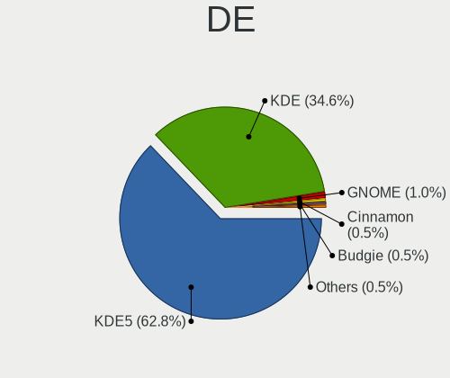

| Name     | Desktops | Percent |
|----------|----------|---------|
| KDE5     | 319      | 58.96%  |
| KDE      | 210      | 38.82%  |
| GNOME    | 4        | 0.74%   |
| Budgie   | 3        | 0.55%   |
| XFCE     | 2        | 0.37%   |
| Cinnamon | 2        | 0.37%   |
| MATE     | 1        | 0.18%   |

Display Server
--------------

X11 or Wayland

| Name    | Desktops | Percent |
|---------|----------|---------|
| X11     | 519      | 97.01%  |
| Tty     | 10       | 1.87%   |
| Wayland | 6        | 1.12%   |

Display Manager
---------------

SDDM, LightDM, etc.

| Name    | Desktops | Percent |
|---------|----------|---------|
| SDDM    | 281      | 52.23%  |
| Unknown | 214      | 39.78%  |
| GDM     | 27       | 5.02%   |
| TDM     | 7        | 1.3%    |
| LightDM | 6        | 1.12%   |
| GDM3    | 2        | 0.37%   |
| SLiM    | 1        | 0.19%   |

OS Lang
-------

Language

| Lang    | Desktops | Percent |
|---------|----------|---------|
| en_US   | 231      | 42.94%  |
| de_DE   | 43       | 7.99%   |
| ru_RU   | 36       | 6.69%   |
| en_GB   | 34       | 6.32%   |
| fr_FR   | 28       | 5.2%    |
| pt_BR   | 27       | 5.02%   |
| it_IT   | 18       | 3.35%   |
| pl_PL   | 12       | 2.23%   |
| en_CA   | 10       | 1.86%   |
| en_AU   | 10       | 1.86%   |
| es_ES   | 8        | 1.49%   |
| es_AR   | 5        | 0.93%   |
| cs_CZ   | 5        | 0.93%   |
| ru_UA   | 4        | 0.74%   |
| en_ZA   | 4        | 0.74%   |
| el_GR   | 4        | 0.74%   |
| zh_TW   | 3        | 0.56%   |
| uk_UA   | 3        | 0.56%   |
| nl_NL   | 3        | 0.56%   |
| hu_HU   | 3        | 0.56%   |
| es_VE   | 3        | 0.56%   |
| en_IL   | 3        | 0.56%   |
| C       | 3        | 0.56%   |
| pt_PT   | 2        | 0.37%   |
| nl_BE   | 2        | 0.37%   |
| ja_JP   | 2        | 0.37%   |
| fi_FI   | 2        | 0.37%   |
| es_MX   | 2        | 0.37%   |
| en_NZ   | 2        | 0.37%   |
| en_IN   | 2        | 0.37%   |
| en_DE   | 2        | 0.37%   |
| de_AT   | 2        | 0.37%   |
| Unknown | 2        | 0.37%   |
| zh_CN   | 1        | 0.19%   |
| tr_TR   | 1        | 0.19%   |
| sv_SE   | 1        | 0.19%   |
| sl_SI   | 1        | 0.19%   |
| sk_SK   | 1        | 0.19%   |
| sa_IN   | 1        | 0.19%   |
| hr_HR   | 1        | 0.19%   |
| fr_CH   | 1        | 0.19%   |
| es_PE   | 1        | 0.19%   |
| es_HN   | 1        | 0.19%   |
| es_CO   | 1        | 0.19%   |
| es_CL   | 1        | 0.19%   |
| en_PK   | 1        | 0.19%   |
| en_NL   | 1        | 0.19%   |
| en_IE   | 1        | 0.19%   |
| en_DK   | 1        | 0.19%   |
| bg_BG   | 1        | 0.19%   |
| be_BY   | 1        | 0.19%   |

Boot Mode
---------

EFI or BIOS

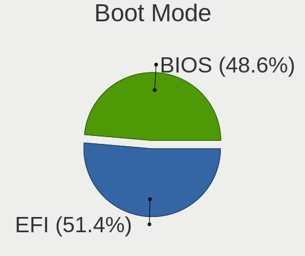

| Mode | Desktops | Percent |
|------|----------|---------|
| EFI  | 274      | 50.74%  |
| BIOS | 266      | 49.26%  |

Filesystem
----------

Type of filesystem

| Type    | Desktops | Percent |
|---------|----------|---------|
| Ext4    | 480      | 89.55%  |
| Btrfs   | 31       | 5.78%   |
| Xfs     | 11       | 2.05%   |
| Overlay | 8        | 1.49%   |
| Zfs     | 2        | 0.37%   |
| XXXX    | 1        | 0.19%   |
| Jfs     | 1        | 0.19%   |
| Ext3    | 1        | 0.19%   |
| Ext2    | 1        | 0.19%   |

Part. scheme
------------

Scheme of partitioning

| Type    | Desktops | Percent |
|---------|----------|---------|
| Unknown | 240      | 44.53%  |
| GPT     | 219      | 40.63%  |
| MBR     | 80       | 14.84%  |

Dual Boot with Linux/BSD
------------------------

Hosting more than one Linux/BSD

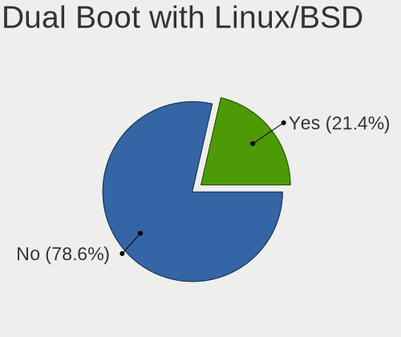

| Dual boot | Desktops | Percent |
|-----------|----------|---------|
| No        | 441      | 81.22%  |
| Yes       | 102      | 18.78%  |

Dual Boot (Win)
---------------

Hosting Linux and Windows

| Dual boot | Desktops | Percent |
|-----------|----------|---------|
| No        | 310      | 57.51%  |
| Yes       | 229      | 42.49%  |

Board
-----

Vendor
------

Motherboard manufacturer

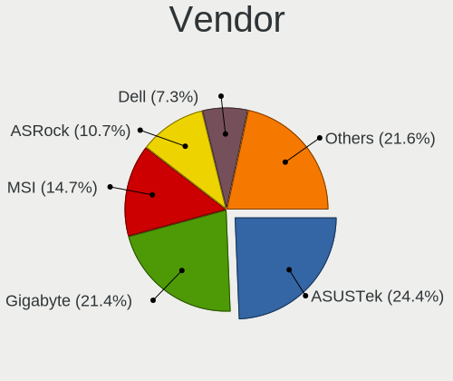

| Name                | Desktops | Percent |
|---------------------|----------|---------|
| ASUSTek Computer    | 132      | 24.67%  |
| Gigabyte Technology | 109      | 20.37%  |
| MSI                 | 82       | 15.33%  |
| ASRock              | 58       | 10.84%  |
| Dell                | 38       | 7.1%    |
| Hewlett-Packard     | 35       | 6.54%   |
| Lenovo              | 17       | 3.18%   |
| Intel               | 11       | 2.06%   |
| Acer                | 8        | 1.5%    |
| Pegatron            | 7        | 1.31%   |
| Fujitsu             | 5        | 0.93%   |
| Biostar             | 5        | 0.93%   |
| Huanan              | 4        | 0.75%   |
| Foxconn             | 4        | 0.75%   |
| ECS                 | 4        | 0.75%   |
| ZOTAC               | 2        | 0.37%   |
| Packard Bell        | 2        | 0.37%   |
| Unknown             | 2        | 0.37%   |
| Wortmann AG         | 1        | 0.19%   |
| WeiBu               | 1        | 0.19%   |
| SYWZ                | 1        | 0.19%   |
| Supermicro          | 1        | 0.19%   |
| Seco                | 1        | 0.19%   |
| Koloe               | 1        | 0.19%   |
| JINGSHA             | 1        | 0.19%   |
| Gateway             | 1        | 0.19%   |
| AZW                 | 1        | 0.19%   |
| Alienware           | 1        | 0.19%   |

Model
-----

Motherboard model

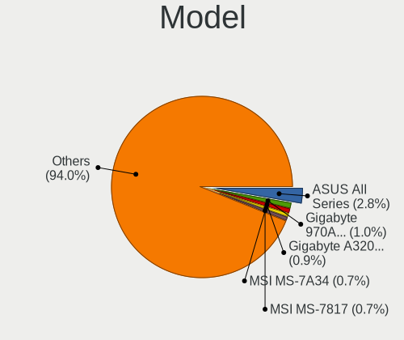

| Name                               | Desktops | Percent |
|------------------------------------|----------|---------|
| ASUS All Series                    | 16       | 2.99%   |
| Gigabyte A320M-S2H                 | 5        | 0.93%   |
| Gigabyte 970A-DS3P                 | 5        | 0.93%   |
| ASUS PRIME B450M-A                 | 5        | 0.93%   |
| MSI MS-7A34                        | 4        | 0.75%   |
| MSI MS-7817                        | 4        | 0.75%   |
| Dell OptiPlex 9020                 | 4        | 0.75%   |
| MSI MS-7C91                        | 3        | 0.56%   |
| MSI MS-7C52                        | 3        | 0.56%   |
| MSI MS-7C37                        | 3        | 0.56%   |
| MSI MS-7996                        | 3        | 0.56%   |
| Gigabyte X570 AORUS ELITE          | 3        | 0.56%   |
| Gigabyte B550 AORUS ELITE          | 3        | 0.56%   |
| Gigabyte B450M DS3H                | 3        | 0.56%   |
| Gigabyte A320M-H                   | 3        | 0.56%   |
| ASUS Z170 PRO GAMING               | 3        | 0.56%   |
| ASUS TUF GAMING X570-PLUS          | 3        | 0.56%   |
| ASUS TUF B450M-PLUS GAMING         | 3        | 0.56%   |
| ASUS ROG STRIX B550-F GAMING       | 3        | 0.56%   |
| ASUS PRIME B350-PLUS               | 3        | 0.56%   |
| Unknown                            | 3        | 0.56%   |
| Pegatron RM ECOQUIET 630A          | 2        | 0.37%   |
| MSI MS-7C94                        | 2        | 0.37%   |
| MSI MS-7C35                        | 2        | 0.37%   |
| MSI MS-7B93                        | 2        | 0.37%   |
| MSI MS-7B48                        | 2        | 0.37%   |
| MSI MS-7B17                        | 2        | 0.37%   |
| MSI MS-7B09                        | 2        | 0.37%   |
| MSI MS-7A59                        | 2        | 0.37%   |
| MSI MS-7A33                        | 2        | 0.37%   |
| MSI MS-7850                        | 2        | 0.37%   |
| MSI MS-7788                        | 2        | 0.37%   |
| MSI MS-7758                        | 2        | 0.37%   |
| MSI MS-7693                        | 2        | 0.37%   |
| MSI MS-7612                        | 2        | 0.37%   |
| HP Z440 Workstation                | 2        | 0.37%   |
| HP Z420 Workstation                | 2        | 0.37%   |
| HP Compaq dc7900 Small Form Factor | 2        | 0.37%   |
| HP Compaq 8200 Elite SFF PC        | 2        | 0.37%   |
| Gigabyte Z77-DS3H                  | 2        | 0.37%   |
| Gigabyte X570 AORUS MASTER         | 2        | 0.37%   |
| Gigabyte H81M-H                    | 2        | 0.37%   |
| Gigabyte G41MT-S2                  | 2        | 0.37%   |
| Gigabyte F2A88X-D3H                | 2        | 0.37%   |
| Gigabyte B365M DS3H                | 2        | 0.37%   |
| Gigabyte AB350M-Gaming 3           | 2        | 0.37%   |
| Fujitsu ESPRIMO P2560              | 2        | 0.37%   |
| Dell XPS 8700                      | 2        | 0.37%   |
| Dell Precision WorkStation T3500   | 2        | 0.37%   |
| Dell Precision T1700               | 2        | 0.37%   |
| Dell OptiPlex 790                  | 2        | 0.37%   |
| Dell OptiPlex 780                  | 2        | 0.37%   |
| Dell OptiPlex 7010                 | 2        | 0.37%   |
| Dell OptiPlex 390                  | 2        | 0.37%   |
| Dell OptiPlex 380                  | 2        | 0.37%   |
| Dell Inspiron 3847                 | 2        | 0.37%   |
| ASUS TUF X470-PLUS GAMING          | 2        | 0.37%   |
| ASUS ROG STRIX X570-E GAMING       | 2        | 0.37%   |
| ASUS PRIME Z390-P                  | 2        | 0.37%   |
| ASUS PRIME X570-P                  | 2        | 0.37%   |

Model Family
------------

Motherboard model prefix

| Name                  | Desktops | Percent |
|-----------------------|----------|---------|
| ASUS PRIME            | 28       | 5.23%   |
| Dell OptiPlex         | 19       | 3.55%   |
| ASUS ROG              | 18       | 3.36%   |
| ASUS All              | 16       | 2.99%   |
| Lenovo ThinkCentre    | 13       | 2.43%   |
| HP Compaq             | 12       | 2.24%   |
| ASUS TUF              | 12       | 2.24%   |
| Gigabyte X570         | 8        | 1.5%    |
| Acer Aspire           | 8        | 1.5%    |
| Dell Precision        | 7        | 1.31%   |
| Gigabyte A320M-S2H    | 6        | 1.12%   |
| Gigabyte B550         | 5        | 0.93%   |
| Gigabyte B450M        | 5        | 0.93%   |
| Gigabyte 970A-DS3P    | 5        | 0.93%   |
| Dell Inspiron         | 5        | 0.93%   |
| MSI MS-7A34           | 4        | 0.75%   |
| MSI MS-7817           | 4        | 0.75%   |
| Fujitsu ESPRIMO       | 4        | 0.75%   |
| ASRock AB350          | 4        | 0.75%   |
| MSI MS-7C91           | 3        | 0.56%   |
| MSI MS-7C52           | 3        | 0.56%   |
| MSI MS-7C37           | 3        | 0.56%   |
| MSI MS-7996           | 3        | 0.56%   |
| HP ProDesk            | 3        | 0.56%   |
| HP Pavilion           | 3        | 0.56%   |
| HP EliteDesk          | 3        | 0.56%   |
| Gigabyte B450         | 3        | 0.56%   |
| Gigabyte AX370-Gaming | 3        | 0.56%   |
| Gigabyte A320M-H      | 3        | 0.56%   |
| ASUS Z170             | 3        | 0.56%   |
| ASUS SABERTOOTH       | 3        | 0.56%   |
| ASUS P8Z77-V          | 3        | 0.56%   |
| ASUS Maximus          | 3        | 0.56%   |
| ASRock Z170           | 3        | 0.56%   |
| ASRock B450           | 3        | 0.56%   |
| Unknown               | 3        | 0.56%   |
| Pegatron RM           | 2        | 0.37%   |
| Pegatron Elite        | 2        | 0.37%   |
| MSI MS-7C94           | 2        | 0.37%   |
| MSI MS-7C35           | 2        | 0.37%   |
| MSI MS-7B93           | 2        | 0.37%   |
| MSI MS-7B48           | 2        | 0.37%   |
| MSI MS-7B17           | 2        | 0.37%   |
| MSI MS-7B09           | 2        | 0.37%   |
| MSI MS-7A59           | 2        | 0.37%   |
| MSI MS-7A33           | 2        | 0.37%   |
| MSI MS-7850           | 2        | 0.37%   |
| MSI MS-7788           | 2        | 0.37%   |
| MSI MS-7758           | 2        | 0.37%   |
| MSI MS-7693           | 2        | 0.37%   |
| MSI MS-7612           | 2        | 0.37%   |
| Huanan X79            | 2        | 0.37%   |
| HP Z440               | 2        | 0.37%   |
| HP Z420               | 2        | 0.37%   |
| Gigabyte Z77-DS3H     | 2        | 0.37%   |
| Gigabyte Z390         | 2        | 0.37%   |
| Gigabyte Z170X-Gaming | 2        | 0.37%   |
| Gigabyte X470         | 2        | 0.37%   |
| Gigabyte H81M-H       | 2        | 0.37%   |
| Gigabyte H310M        | 2        | 0.37%   |

MFG Year
--------

Motherboard manufacture year

| Year    | Desktops | Percent |
|---------|----------|---------|
| 2018    | 75       | 14.02%  |
| 2019    | 58       | 10.84%  |
| 2013    | 58       | 10.84%  |
| 2017    | 51       | 9.53%   |
| 2020    | 41       | 7.66%   |
| 2012    | 39       | 7.29%   |
| 2011    | 39       | 7.29%   |
| 2015    | 34       | 6.36%   |
| 2014    | 34       | 6.36%   |
| 2010    | 28       | 5.23%   |
| 2016    | 22       | 4.11%   |
| 2009    | 20       | 3.74%   |
| 2008    | 15       | 2.8%    |
| 2021    | 9        | 1.68%   |
| 2007    | 7        | 1.31%   |
| 2006    | 3        | 0.56%   |
| 2005    | 1        | 0.19%   |
| Unknown | 1        | 0.19%   |

Form Factor
-----------

Physical design of the computer

| Name    | Desktops | Percent |
|---------|----------|---------|
| Desktop | 535      | 100%    |

Secure Boot
-----------

Enabled or disabled

| State    | Desktops | Percent |
|----------|----------|---------|
| Disabled | 525      | 98.13%  |
| Enabled  | 10       | 1.87%   |

Coreboot
--------

Have coreboot on board

| Used | Desktops | Percent |
|------|----------|---------|
| No   | 534      | 99.81%  |
| Yes  | 1        | 0.19%   |

RAM Size
--------

Total RAM memory

| Size in GB  | Desktops | Percent |
|-------------|----------|---------|
| 16.01-24.0  | 169      | 31.24%  |
| 32.01-64.0  | 108      | 19.96%  |
| 8.01-16.0   | 97       | 17.93%  |
| 4.01-8.0    | 77       | 14.23%  |
| 3.01-4.0    | 47       | 8.69%   |
| 64.01-256.0 | 22       | 4.07%   |
| 24.01-32.0  | 15       | 2.77%   |
| 1.01-2.0    | 5        | 0.92%   |
| 2.01-3.0    | 1        | 0.18%   |

RAM Used
--------

Used RAM memory

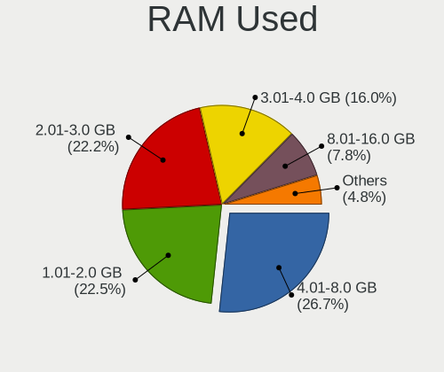

| Used GB    | Desktops | Percent |
|------------|----------|---------|
| 4.01-8.0   | 151      | 25.9%   |
| 1.01-2.0   | 136      | 23.33%  |
| 2.01-3.0   | 133      | 22.81%  |
| 3.01-4.0   | 90       | 15.44%  |
| 8.01-16.0  | 45       | 7.72%   |
| 0.51-1.0   | 16       | 2.74%   |
| 16.01-24.0 | 6        | 1.03%   |
| 24.01-32.0 | 3        | 0.51%   |
| 0.01-0.5   | 3        | 0.51%   |

Total Drives
------------

Number of drives on board

| Drives | Desktops | Percent |
|--------|----------|---------|
| 2      | 161      | 28.96%  |
| 1      | 157      | 28.24%  |
| 3      | 112      | 20.14%  |
| 4      | 65       | 11.69%  |
| 5      | 31       | 5.58%   |
| 6      | 15       | 2.7%    |
| 7      | 8        | 1.44%   |
| 8      | 3        | 0.54%   |
| 9      | 2        | 0.36%   |
| 11     | 1        | 0.18%   |
| 10     | 1        | 0.18%   |

Has CD-ROM
----------

Has CD-ROM on board

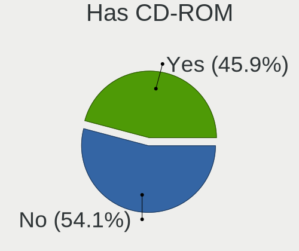

| Presented | Desktops | Percent |
|-----------|----------|---------|
| No        | 302      | 56.13%  |
| Yes       | 236      | 43.87%  |

Has Ethernet
------------

Has Ethernet on board

| Presented | Desktops | Percent |
|-----------|----------|---------|
| Yes       | 532      | 99.44%  |
| No        | 3        | 0.56%   |

Has WiFi
--------

Has WiFi module

| Presented | Desktops | Percent |
|-----------|----------|---------|
| No        | 335      | 62.04%  |
| Yes       | 205      | 37.96%  |

Has Bluetooth
-------------

Has Bluetooth module

| Presented | Desktops | Percent |
|-----------|----------|---------|
| No        | 353      | 65.74%  |
| Yes       | 184      | 34.26%  |

Location
--------

Country
-------

Geographic location (country)

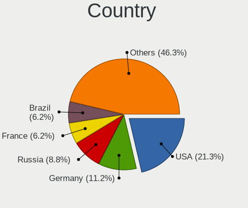

| Country      | Desktops | Percent |
|--------------|----------|---------|
| USA          | 116      | 21.64%  |
| Germany      | 55       | 10.26%  |
| Russia       | 46       | 8.58%   |
| Brazil       | 37       | 6.9%    |
| France       | 33       | 6.16%   |
| UK           | 26       | 4.85%   |
| Italy        | 22       | 4.1%    |
| Netherlands  | 16       | 2.99%   |
| Poland       | 15       | 2.8%    |
| Ukraine      | 14       | 2.61%   |
| Spain        | 12       | 2.24%   |
| Canada       | 12       | 2.24%   |
| Argentina    | 10       | 1.87%   |
| Australia    | 9        | 1.68%   |
| Hungary      | 6        | 1.12%   |
| Greece       | 6        | 1.12%   |
| Finland      | 5        | 0.93%   |
| Czechia      | 5        | 0.93%   |
| Belgium      | 5        | 0.93%   |
| Switzerland  | 4        | 0.75%   |
| South Africa | 4        | 0.75%   |
| Serbia       | 4        | 0.75%   |
| Israel       | 4        | 0.75%   |
| Austria      | 4        | 0.75%   |
| Venezuela    | 3        | 0.56%   |
| Taiwan       | 3        | 0.56%   |
| Sweden       | 3        | 0.56%   |
| Romania      | 3        | 0.56%   |
| Norway       | 3        | 0.56%   |
| Mexico       | 3        | 0.56%   |
| Japan        | 3        | 0.56%   |
| India        | 3        | 0.56%   |
| Estonia      | 3        | 0.56%   |
| Chile        | 3        | 0.56%   |
| Bulgaria     | 3        | 0.56%   |
| Belarus      | 3        | 0.56%   |
| Turkey       | 2        | 0.37%   |
| Slovakia     | 2        | 0.37%   |
| Portugal     | 2        | 0.37%   |
| Peru         | 2        | 0.37%   |
| New Zealand  | 2        | 0.37%   |
| Colombia     | 2        | 0.37%   |
| Vietnam      | 1        | 0.19%   |
| Uzbekistan   | 1        | 0.19%   |
| Suriname     | 1        | 0.19%   |
| Slovenia     | 1        | 0.19%   |
| Saudi Arabia | 1        | 0.19%   |
| Pakistan     | 1        | 0.19%   |
| Oman         | 1        | 0.19%   |
| Martinique   | 1        | 0.19%   |
| Luxembourg   | 1        | 0.19%   |
| Lithuania    | 1        | 0.19%   |
| Latvia       | 1        | 0.19%   |
| Ireland      | 1        | 0.19%   |
| Honduras     | 1        | 0.19%   |
| Georgia      | 1        | 0.19%   |
| Denmark      | 1        | 0.19%   |
| Croatia      | 1        | 0.19%   |
| China        | 1        | 0.19%   |
| Bangladesh   | 1        | 0.19%   |

City
----

Geographic location (city)

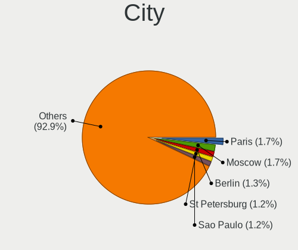

| City               | Desktops | Percent |
|--------------------|----------|---------|
| Paris              | 8        | 1.46%   |
| St Petersburg      | 7        | 1.28%   |
| Sao Paulo          | 7        | 1.28%   |
| London             | 7        | 1.28%   |
| Kyiv               | 6        | 1.09%   |
| Warsaw             | 5        | 0.91%   |
| Rome               | 5        | 0.91%   |
| Moscow             | 5        | 0.91%   |
| Frankfurt am Main  | 5        | 0.91%   |
| Berlin             | 5        | 0.91%   |
| Seattle            | 4        | 0.73%   |
| Novosibirsk        | 4        | 0.73%   |
| Hamburg            | 4        | 0.73%   |
| Usol'ye-Sibirskoye | 3        | 0.55%   |
| Oryol              | 3        | 0.55%   |
| Manchester         | 3        | 0.55%   |
| Krakow             | 3        | 0.55%   |
| Johannesburg       | 3        | 0.55%   |
| Helsinki           | 3        | 0.55%   |
| Chicago            | 3        | 0.55%   |
| Budapest           | 3        | 0.55%   |
| Belgrade           | 3        | 0.55%   |
| Athens             | 3        | 0.55%   |
| Albuquerque        | 3        | 0.55%   |
| Zurich             | 2        | 0.36%   |
| Sydney             | 2        | 0.36%   |
| Strongsville       | 2        | 0.36%   |
| St Louis           | 2        | 0.36%   |
| Sparks             | 2        | 0.36%   |
| So Carlos      | 2        | 0.36%   |
| San Diego          | 2        | 0.36%   |
| Ryazan             | 2        | 0.36%   |
| Ponchatoula        | 2        | 0.36%   |
| Plano              | 2        | 0.36%   |
| Perm               | 2        | 0.36%   |
| Owensboro          | 2        | 0.36%   |
| Ottawa             | 2        | 0.36%   |
| Munich             | 2        | 0.36%   |
| Most               | 2        | 0.36%   |
| Minsk              | 2        | 0.36%   |
| Milan              | 2        | 0.36%   |
| Mexico City        | 2        | 0.36%   |
| Melbourne          | 2        | 0.36%   |
| Los Angeles        | 2        | 0.36%   |
| Koobrzeg      | 2        | 0.36%   |
| Karlsruhe          | 2        | 0.36%   |
| Jacksonville       | 2        | 0.36%   |
| Ilmenau            | 2        | 0.36%   |
| Haifa              | 2        | 0.36%   |
| Fresno             | 2        | 0.36%   |
| Dsseldorf      | 2        | 0.36%   |
| Curitiba           | 2        | 0.36%   |
| Buenos Aires       | 2        | 0.36%   |
| Bonn               | 2        | 0.36%   |
| Barnaul            | 2        | 0.36%   |
| Aurora             | 2        | 0.36%   |
| Auckland           | 2        | 0.36%   |
| Amsterdam          | 2        | 0.36%   |
| Adelaide           | 2        | 0.36%   |
| beda           | 1        | 0.18%   |

Drives
------

Drive Vendor
------------

Hard drive vendors

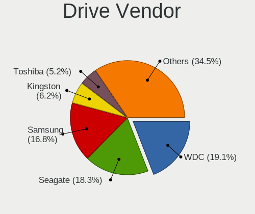

| Vendor                    | Desktops | Drives | Percent |
|---------------------------|----------|--------|---------|
| WDC                       | 208      | 393    | 19.59%  |
| Seagate                   | 201      | 291    | 18.93%  |
| Samsung Electronics       | 176      | 288    | 16.57%  |
| Kingston                  | 65       | 86     | 6.12%   |
| Toshiba                   | 54       | 77     | 5.08%   |
| Crucial                   | 45       | 54     | 4.24%   |
| SanDisk                   | 44       | 51     | 4.14%   |
| Hitachi                   | 38       | 49     | 3.58%   |
| Intel                     | 17       | 27     | 1.6%    |
| Unknown                   | 16       | 22     | 1.51%   |
| A-DATA Technology         | 16       | 16     | 1.51%   |
| Phison                    | 12       | 16     | 1.13%   |
| HGST                      | 12       | 12     | 1.13%   |
| OCZ                       | 11       | 13     | 1.04%   |
| Micron Technology         | 10       | 12     | 0.94%   |
| Silicon Motion            | 8        | 8      | 0.75%   |
| PNY                       | 7        | 7      | 0.66%   |
| Patriot                   | 7        | 9      | 0.66%   |
| Corsair                   | 7        | 8      | 0.66%   |
| XPG                       | 6        | 6      | 0.56%   |
| MAXTOR                    | 6        | 6      | 0.56%   |
| Intenso                   | 6        | 6      | 0.56%   |
| GOODRAM                   | 6        | 16     | 0.56%   |
| Team                      | 5        | 5      | 0.47%   |
| Transcend                 | 4        | 4      | 0.38%   |
| SPCC                      | 4        | 7      | 0.38%   |
| LDLC                      | 4        | 10     | 0.38%   |
| Gigabyte Technology       | 4        | 4      | 0.38%   |
| China                     | 4        | 5      | 0.38%   |
| SABRENT                   | 3        | 3      | 0.28%   |
| Mushkin                   | 3        | 3      | 0.28%   |
| KingSpec                  | 3        | 3      | 0.28%   |
| Apacer                    | 3        | 4      | 0.28%   |
| Verbatim                  | 2        | 2      | 0.19%   |
| VENO                      | 2        | 5      | 0.19%   |
| SK Hynix                  | 2        | 2      | 0.19%   |
| Realtek Semiconductor     | 2        | 2      | 0.19%   |
| MDT                       | 2        | 4      | 0.19%   |
| LITEON                    | 2        | 3      | 0.19%   |
| Leven                     | 2        | 3      | 0.19%   |
| JMicron                   | 2        | 2      | 0.19%   |
| AMD                       | 2        | 2      | 0.19%   |
| XrayDisk                  | 1        | 1      | 0.09%   |
| WD MediaMax               | 1        | 1      | 0.09%   |
| USB                       | 1        | 1      | 0.09%   |
| TCSUNBOW                  | 1        | 1      | 0.09%   |
| Super Talent              | 1        | 1      | 0.09%   |
| StoreJet                  | 1        | 1      | 0.09%   |
| STM                       | 1        | 1      | 0.09%   |
| Smartbuy                  | 1        | 2      | 0.09%   |
| PNY USB                   | 1        | 1      | 0.09%   |
| PLEXTOR                   | 1        | 2      | 0.09%   |
| NE-1TB                    | 1        | 1      | 0.09%   |
| Micron/Crucial Technology | 1        | 1      | 0.09%   |
| LITEONIT                  | 1        | 1      | 0.09%   |
| Linux                     | 1        | 1      | 0.09%   |
| LaCie                     | 1        | 1      | 0.09%   |
| KIOXIA-EXCERIA            | 1        | 1      | 0.09%   |
| KIOXIA                    | 1        | 1      | 0.09%   |
| KingFast                  | 1        | 1      | 0.09%   |

Drive Model
-----------

Hard drive models

| Model                              | Desktops | Percent |
|------------------------------------|----------|---------|
| Samsung SSD 860 EVO 500GB          | 15       | 1.17%   |
| Samsung SSD 850 EVO 250GB          | 15       | 1.17%   |
| Kingston SA400S37480G 480GB SSD    | 15       | 1.17%   |
| Seagate ST1000DM003-1ER162 1TB     | 13       | 1.02%   |
| Seagate ST1000DM003-1CH162 1TB     | 12       | 0.94%   |
| Seagate ST1000DM010-2EP102 1TB     | 11       | 0.86%   |
| WDC WD10EZEX-08WN4A0 1TB           | 10       | 0.78%   |
| Toshiba HDWD110 1TB                | 10       | 0.78%   |
| Seagate ST500DM002-1BD142 500GB    | 10       | 0.78%   |
| Samsung SSD 860 EVO 1TB            | 10       | 0.78%   |
| Samsung SSD 850 EVO 500GB          | 9        | 0.7%    |
| Kingston SA400S37240G 240GB SSD    | 9        | 0.7%    |
| WDC WD20EARX-00PASB0 2TB           | 8        | 0.63%   |
| Seagate ST2000DM001-1ER164 2TB     | 8        | 0.63%   |
| Samsung SSD 970 EVO Plus 1TB       | 8        | 0.63%   |
| Samsung NVMe SSD Drive 500GB       | 8        | 0.63%   |
| Samsung NVMe SSD Drive 1TB         | 8        | 0.63%   |
| Crucial CT1000MX500SSD1 1TB        | 8        | 0.63%   |
| WDC WDS240G2G0A-00JH30 240GB SSD   | 7        | 0.55%   |
| WDC WD1003FZEX-00K3CA0 1TB         | 7        | 0.55%   |
| Toshiba DT01ACA100 1TB             | 7        | 0.55%   |
| Seagate ST2000DM008-2FR102 2TB     | 7        | 0.55%   |
| Seagate ST2000DM006-2DM164 2TB     | 7        | 0.55%   |
| Seagate ST2000DM001-1CH164 2TB     | 7        | 0.55%   |
| Seagate ST1000LM024 HN-M101MBB 1TB | 7        | 0.55%   |
| SanDisk SSD PLUS 480GB             | 7        | 0.55%   |
| Samsung SSD 970 EVO Plus 500GB     | 7        | 0.55%   |
| WDC WD1002FAEX-00Z3A0 1TB          | 6        | 0.47%   |
| Toshiba DT01ACA200 2TB             | 6        | 0.47%   |
| Seagate ST4000DM004-2CV104 4TB     | 6        | 0.47%   |
| Seagate ST3500418AS 500GB          | 6        | 0.47%   |
| Seagate ST31000528AS 1TB           | 6        | 0.47%   |
| Seagate Expansion+ 2TB             | 6        | 0.47%   |
| Samsung SSD 970 EVO 1TB            | 6        | 0.47%   |
| Samsung SSD 860 EVO 250GB          | 6        | 0.47%   |
| WDC WDS500G2B0A-00SM50 500GB SSD   | 5        | 0.39%   |
| WDC WD20EZRZ-00Z5HB0 2TB           | 5        | 0.39%   |
| Unknown SD/MMC/MS PRO 16GB         | 5        | 0.39%   |
| Toshiba DT01ACA050 500GB           | 5        | 0.39%   |
| Seagate ST31000524AS 1TB           | 5        | 0.39%   |
| Samsung SSD 840 EVO 250GB          | 5        | 0.39%   |
| Samsung HD103SJ 1TB                | 5        | 0.39%   |
| Kingston SA2000M81000G 1TB         | 5        | 0.39%   |
| Hitachi HDS721010CLA332 1TB        | 5        | 0.39%   |
| WDC WD40EFRX-68N32N0 4TB           | 4        | 0.31%   |
| WDC WD4003FZEX-00Z4SA0 4TB         | 4        | 0.31%   |
| WDC WD30EFRX-68EUZN0 3TB           | 4        | 0.31%   |
| WDC WD20EZRX-00DC0B0 2TB           | 4        | 0.31%   |
| WDC WD10JPVX-22JC3T0 1TB           | 4        | 0.31%   |
| WDC WD10EZEX-75M2NA0 1TB           | 4        | 0.31%   |
| WDC WD10EZEX-00WN4A0 1TB           | 4        | 0.31%   |
| WDC WD10EZEX-00BN5A0 1TB           | 4        | 0.31%   |
| WDC WD1003FZEX-00MK2A0 1TB         | 4        | 0.31%   |
| Seagate ST3500413AS 500GB          | 4        | 0.31%   |
| Seagate Expansion Desk 4TB         | 4        | 0.31%   |
| Seagate BUP Portable 5TB           | 4        | 0.31%   |
| Sandisk NVMe SSD Drive 500GB       | 4        | 0.31%   |
| Samsung SSD 870 QVO 2TB            | 4        | 0.31%   |
| Samsung SSD 840 EVO 120GB          | 4        | 0.31%   |
| Samsung NVMe SSD Drive 250GB       | 4        | 0.31%   |

HDD Vendor
----------

Hard disk drive vendors

| Vendor              | Desktops | Drives | Percent |
|---------------------|----------|--------|---------|
| Seagate             | 199      | 288    | 36.72%  |
| WDC                 | 187      | 355    | 34.5%   |
| Toshiba             | 48       | 70     | 8.86%   |
| Hitachi             | 38       | 49     | 7.01%   |
| Samsung Electronics | 37       | 64     | 6.83%   |
| HGST                | 12       | 12     | 2.21%   |
| Unknown             | 7        | 7      | 1.29%   |
| MAXTOR              | 6        | 6      | 1.11%   |
| SABRENT             | 3        | 3      | 0.55%   |
| WD MediaMax         | 1        | 1      | 0.18%   |
| USB                 | 1        | 1      | 0.18%   |
| LaCie               | 1        | 1      | 0.18%   |
| Hewlett-Packard     | 1        | 3      | 0.18%   |
| ASMT                | 1        | 1      | 0.18%   |

SSD Vendor
----------

Solid state drive vendors

| Vendor              | Desktops | Drives | Percent |
|---------------------|----------|--------|---------|
| Samsung Electronics | 101      | 132    | 27.01%  |
| Kingston            | 57       | 77     | 15.24%  |
| Crucial             | 37       | 45     | 9.89%   |
| SanDisk             | 33       | 38     | 8.82%   |
| WDC                 | 23       | 25     | 6.15%   |
| A-DATA Technology   | 12       | 12     | 3.21%   |
| OCZ                 | 11       | 13     | 2.94%   |
| Intel               | 9        | 15     | 2.41%   |
| Patriot             | 7        | 9      | 1.87%   |
| Micron Technology   | 7        | 8      | 1.87%   |
| Intenso             | 6        | 6      | 1.6%    |
| GOODRAM             | 6        | 16     | 1.6%    |
| Team                | 5        | 5      | 1.34%   |
| PNY                 | 5        | 5      | 1.34%   |
| Corsair             | 5        | 6      | 1.34%   |
| Toshiba             | 4        | 5      | 1.07%   |
| SPCC                | 4        | 6      | 1.07%   |
| China               | 4        | 5      | 1.07%   |
| Transcend           | 3        | 3      | 0.8%    |
| Mushkin             | 3        | 3      | 0.8%    |
| KingSpec            | 3        | 3      | 0.8%    |
| Apacer              | 3        | 4      | 0.8%    |
| Verbatim            | 2        | 2      | 0.53%   |
| VENO                | 2        | 5      | 0.53%   |
| LITEON              | 2        | 3      | 0.53%   |
| Leven               | 2        | 3      | 0.53%   |
| LDLC                | 2        | 2      | 0.53%   |
| Gigabyte Technology | 2        | 2      | 0.53%   |
| Unknown             | 1        | 1      | 0.27%   |
| TCSUNBOW            | 1        | 1      | 0.27%   |
| Super Talent        | 1        | 1      | 0.27%   |
| Smartbuy            | 1        | 2      | 0.27%   |
| Seagate             | 1        | 1      | 0.27%   |
| PNY USB             | 1        | 1      | 0.27%   |
| PLEXTOR             | 1        | 2      | 0.27%   |
| LITEONIT            | 1        | 1      | 0.27%   |
| KIOXIA-EXCERIA      | 1        | 1      | 0.27%   |
| JMicron             | 1        | 1      | 0.27%   |
| EMTEC               | 1        | 1      | 0.27%   |
| Avant               | 1        | 1      | 0.27%   |
| AMD                 | 1        | 1      | 0.27%   |
| AEGO                | 1        | 2      | 0.27%   |

Drive Kind
----------

HDD or SSD

| Kind    | Desktops | Drives | Percent |
|---------|----------|--------|---------|
| HDD     | 396      | 861    | 45%     |
| SSD     | 309      | 475    | 35.11%  |
| NVMe    | 151      | 206    | 17.16%  |
| Unknown | 21       | 36     | 2.39%   |
| MMC     | 3        | 5      | 0.34%   |

Drive Connector
---------------

SATA, SAS, NVMe, etc.

| Type | Desktops | Drives | Percent |
|------|----------|--------|---------|
| SATA | 493      | 1314   | 71.14%  |
| NVMe | 151      | 206    | 21.79%  |
| SAS  | 46       | 58     | 6.64%   |
| MMC  | 3        | 5      | 0.43%   |

Drive Size
----------

Size of hard drive

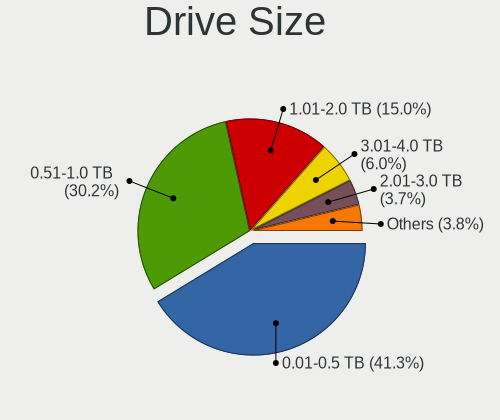

| Size in TB | Desktops | Drives | Percent |
|------------|----------|--------|---------|
| 0.01-0.5   | 343      | 592    | 42.45%  |
| 0.51-1.0   | 251      | 414    | 31.06%  |
| 1.01-2.0   | 113      | 176    | 13.99%  |
| 3.01-4.0   | 44       | 81     | 5.45%   |
| 2.01-3.0   | 30       | 37     | 3.71%   |
| 4.01-10.0  | 24       | 32     | 2.97%   |
| 10.01-20.0 | 3        | 4      | 0.37%   |

Space Total
-----------

Amount of disk space available on the file system

| Size in GB     | Desktops | Percent |
|----------------|----------|---------|
| 251-500        | 107      | 19.35%  |
| 501-1000       | 97       | 17.54%  |
| More than 3000 | 96       | 17.36%  |
| 101-250        | 90       | 16.27%  |
| 1001-2000      | 81       | 14.65%  |
| 2001-3000      | 42       | 7.59%   |
| 51-100         | 19       | 3.44%   |
| 1-20           | 9        | 1.63%   |
| 21-50          | 7        | 1.27%   |
| Unknown        | 5        | 0.9%    |

Space Used
----------

Amount of used disk space

| Used GB        | Desktops | Percent |
|----------------|----------|---------|
| 1-20           | 99       | 17.55%  |
| 101-250        | 88       | 15.6%   |
| 51-100         | 74       | 13.12%  |
| 501-1000       | 67       | 11.88%  |
| 251-500        | 62       | 10.99%  |
| 21-50          | 56       | 9.93%   |
| More than 3000 | 50       | 8.87%   |
| 1001-2000      | 44       | 7.8%    |
| 2001-3000      | 19       | 3.37%   |
| Unknown        | 5        | 0.89%   |

Malfunc. Drives
---------------

Drive models with a malfunction

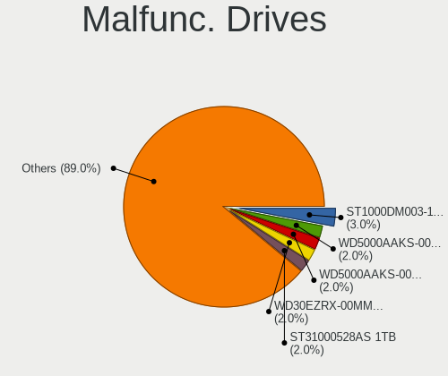

| Model                                 | Desktops | Drives | Percent |
|---------------------------------------|----------|--------|---------|
| Seagate ST1000DM003-1CH162 1TB        | 3        | 4      | 3.49%   |
| WDC WD5000AAKS-00V1A0 500GB           | 2        | 3      | 2.33%   |
| WDC WD5000AAKS-00A7B0 500GB           | 2        | 2      | 2.33%   |
| Seagate ST31000528AS 1TB              | 2        | 2      | 2.33%   |
| SanDisk SSD PLUS 240 GB               | 2        | 2      | 2.33%   |
| Intel SSDSA2M080G2GC 80GB             | 2        | 2      | 2.33%   |
| Crucial CT275MX300SSD1 275GB          | 2        | 3      | 2.33%   |
| WDC WD5000AAVS-00G9B1 500GB           | 1        | 1      | 1.16%   |
| WDC WD5000AAKS-00UU3A0 500GB          | 1        | 2      | 1.16%   |
| WDC WD5000AADS-56S9B1 499GB           | 1        | 1      | 1.16%   |
| WDC WD40EZRZ-00GXCB0 4TB              | 1        | 1      | 1.16%   |
| WDC WD40EZRX-00SPEB0 4TB              | 1        | 1      | 1.16%   |
| WDC WD40EFRX-68N32N0 4TB              | 1        | 2      | 1.16%   |
| WDC WD4003FZEX-00Z4SA0 4TB            | 1        | 2      | 1.16%   |
| WDC WD3200AAKX-001CA0 320GB           | 1        | 1      | 1.16%   |
| WDC WD30EZRX-00MMMB0 3TB              | 1        | 1      | 1.16%   |
| WDC WD30EZRX-00DC0B0 3TB              | 1        | 1      | 1.16%   |
| WDC WD30EFRX-68EUZN0 3TB              | 1        | 1      | 1.16%   |
| WDC WD2500AAJS-00B4A0 250GB           | 1        | 1      | 1.16%   |
| WDC WD1600AAJS-22L7A0 160GB           | 1        | 1      | 1.16%   |
| WDC WD15EARS-00Z5B1 1TB               | 1        | 1      | 1.16%   |
| WDC WD10JPVX-22JC3T0 1TB              | 1        | 1      | 1.16%   |
| WDC WD10EZEX-75M2NA0 1TB              | 1        | 1      | 1.16%   |
| WDC WD10EZEX-60WN4A1 1TB              | 1        | 1      | 1.16%   |
| WDC WD10EZEX-60M2NA0 1TB              | 1        | 1      | 1.16%   |
| WDC WD10EZEX-08WN4A0 1TB              | 1        | 1      | 1.16%   |
| WDC WD10EZEX-00BN5A0 1TB              | 1        | 1      | 1.16%   |
| WDC WD10EARS-22Y5B1 1TB               | 1        | 1      | 1.16%   |
| WDC WD10EARS-00Y5B1 1TB               | 1        | 1      | 1.16%   |
| WDC WD10EADS-00M2B0 1TB               | 1        | 1      | 1.16%   |
| WDC WD1003FZEX-00K3CA0 1TB            | 1        | 1      | 1.16%   |
| WDC WD1002FBYS-02A6B0 1TB             | 1        | 1      | 1.16%   |
| WDC WD1002FAEX-00Z3A0 1TB             | 1        | 1      | 1.16%   |
| WDC WD1001FALS-00U9B0 1TB             | 1        | 1      | 1.16%   |
| VENO SCORP SSD 240GB                  | 1        | 1      | 1.16%   |
| Toshiba THNSNK128GCS8 SATA 128GB SSD  | 1        | 1      | 1.16%   |
| Toshiba HDWE150 5TB                   | 1        | 2      | 1.16%   |
| Toshiba HDWD110 1TB                   | 1        | 1      | 1.16%   |
| Toshiba DT01ACA300 3TB                | 1        | 1      | 1.16%   |
| Toshiba DT01ACA200 2TB                | 1        | 1      | 1.16%   |
| SPCC M.2 SSD 1TB                      | 1        | 1      | 1.16%   |
| Seagate ST3500418AS 500GB             | 1        | 1      | 1.16%   |
| Seagate ST3320613AS 320GB             | 1        | 1      | 1.16%   |
| Seagate ST3320418AS 320GB             | 1        | 1      | 1.16%   |
| Seagate ST3250410AS 250GB             | 1        | 1      | 1.16%   |
| Seagate ST32000542AS 2TB              | 1        | 1      | 1.16%   |
| Seagate ST3160215AS 160GB             | 1        | 1      | 1.16%   |
| Seagate ST31000524AS 1TB              | 1        | 1      | 1.16%   |
| Seagate ST2000DM001-1E6164 2TB        | 1        | 2      | 1.16%   |
| Seagate ST12000D M0007-2GR116 12TB    | 1        | 1      | 1.16%   |
| Seagate ST1000LM035-1RK172 1TB        | 1        | 1      | 1.16%   |
| Seagate ST1000DM003-9YN162 1TB        | 1        | 1      | 1.16%   |
| Seagate ST1000DM003-1SB102 1TB        | 1        | 1      | 1.16%   |
| SanDisk SSD PLUS 480 GB               | 1        | 1      | 1.16%   |
| SanDisk SDSSDP064G 64GB               | 1        | 1      | 1.16%   |
| Samsung Electronics SSD 960 PRO 512GB | 1        | 1      | 1.16%   |
| Samsung Electronics SP2504C 250GB     | 1        | 1      | 1.16%   |
| Samsung Electronics SP1614N 160GB     | 1        | 1      | 1.16%   |
| Samsung Electronics HD753LJ 752GB     | 1        | 1      | 1.16%   |
| Samsung Electronics HD642JJ 640GB     | 1        | 1      | 1.16%   |

Malfunc. Drive Vendor
---------------------

Vendors of faulty drives

| Vendor              | Desktops | Drives | Percent |
|---------------------|----------|--------|---------|
| WDC                 | 31       | 35     | 36.47%  |
| Seagate             | 17       | 19     | 20%     |
| Samsung Electronics | 10       | 11     | 11.76%  |
| Toshiba             | 5        | 6      | 5.88%   |
| Hitachi             | 5        | 5      | 5.88%   |
| SanDisk             | 4        | 4      | 4.71%   |
| Intel               | 3        | 3      | 3.53%   |
| Crucial             | 3        | 4      | 3.53%   |
| OCZ                 | 2        | 2      | 2.35%   |
| VENO                | 1        | 1      | 1.18%   |
| SPCC                | 1        | 1      | 1.18%   |
| Micron Technology   | 1        | 1      | 1.18%   |
| Kingston            | 1        | 1      | 1.18%   |
| A-DATA Technology   | 1        | 1      | 1.18%   |

Malfunc. HDD Vendor
-------------------

Vendors of faulty HDD drives

| Vendor              | Desktops | Drives | Percent |
|---------------------|----------|--------|---------|
| WDC                 | 31       | 35     | 46.97%  |
| Seagate             | 17       | 19     | 25.76%  |
| Samsung Electronics | 9        | 10     | 13.64%  |
| Hitachi             | 5        | 5      | 7.58%   |
| Toshiba             | 4        | 5      | 6.06%   |

Malfunc. Drive Kind
-------------------

Kinds of faulty drives

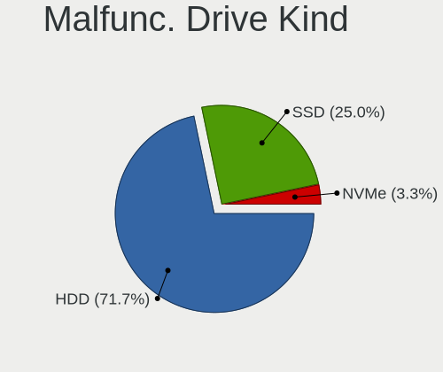

| Kind | Desktops | Drives | Percent |
|------|----------|--------|---------|
| HDD  | 58       | 74     | 75.32%  |
| SSD  | 17       | 18     | 22.08%  |
| NVMe | 2        | 2      | 2.6%    |

Failed Drives
-------------

Failed drive models

| Model                           | Desktops | Drives | Percent |
|---------------------------------|----------|--------|---------|
| Seagate ST500DM002-1BD142 500GB | 1        | 1      | 50%     |
| OCZ VERTEX460A 480GB SSD        | 1        | 1      | 50%     |

Failed Drive Vendor
-------------------

Failed drive vendors

| Vendor  | Desktops | Drives | Percent |
|---------|----------|--------|---------|
| Seagate | 1        | 1      | 50%     |
| OCZ     | 1        | 1      | 50%     |

Drive Status
------------

Number of failed and malfunc. drives

| Status   | Desktops | Drives | Percent |
|----------|----------|--------|---------|
| Works    | 295      | 650    | 46.75%  |
| Detected | 259      | 837    | 41.05%  |
| Malfunc  | 75       | 94     | 11.89%  |
| Failed   | 2        | 2      | 0.32%   |

Storage controller
------------------

Storage Vendor
--------------

Storage controller vendors

| Vendor                       | Desktops | Percent |
|------------------------------|----------|---------|
| Intel                        | 312      | 41.22%  |
| AMD                          | 209      | 27.61%  |
| Samsung Electronics          | 66       | 8.72%   |
| ASMedia Technology           | 28       | 3.7%    |
| Sandisk                      | 20       | 2.64%   |
| Phison Electronics           | 18       | 2.38%   |
| Nvidia                       | 16       | 2.11%   |
| JMicron Technology           | 13       | 1.72%   |
| Silicon Motion               | 12       | 1.59%   |
| Marvell Technology Group     | 11       | 1.45%   |
| Micron/Crucial Technology    | 9        | 1.19%   |
| Kingston Technology Company  | 8        | 1.06%   |
| ADATA Technology             | 8        | 1.06%   |
| Realtek Semiconductor        | 5        | 0.66%   |
| Broadcom / LSI               | 5        | 0.66%   |
| VIA Technologies             | 3        | 0.4%    |
| Toshiba America Info Systems | 3        | 0.4%    |
| Micron Technology            | 3        | 0.4%    |
| SK Hynix                     | 2        | 0.26%   |
| Silicon Image                | 2        | 0.26%   |
| Unknown                      | 1        | 0.13%   |
| LSI Logic / Symbios Logic    | 1        | 0.13%   |
| Adaptec                      | 1        | 0.13%   |
| 3ware                        | 1        | 0.13%   |

Storage Model
-------------

Storage controller models

| Model                                                                                   | Desktops | Percent |
|-----------------------------------------------------------------------------------------|----------|---------|
| AMD FCH SATA Controller [AHCI mode]                                                     | 142      | 14.9%   |
| Samsung NVMe SSD Controller SM981/PM981/PM983                                           | 51       | 5.35%   |
| AMD 400 Series Chipset SATA Controller                                                  | 44       | 4.62%   |
| Intel 8 Series/C220 Series Chipset Family 6-port SATA Controller 1 [AHCI mode]          | 43       | 4.51%   |
| Intel Q170/Q150/B150/H170/H110/Z170/CM236 Chipset SATA Controller [AHCI Mode]           | 33       | 3.46%   |
| Intel 6 Series/C200 Series Chipset Family 6 port Desktop SATA AHCI Controller           | 31       | 3.25%   |
| ASMedia ASM1062 Serial ATA Controller                                                   | 26       | 2.73%   |
| Intel 7 Series/C210 Series Chipset Family 6-port SATA Controller [AHCI mode]            | 25       | 2.62%   |
| AMD SB7x0/SB8x0/SB9x0 SATA Controller [AHCI mode]                                       | 24       | 2.52%   |
| Intel 200 Series PCH SATA controller [AHCI mode]                                        | 23       | 2.41%   |
| AMD SB7x0/SB8x0/SB9x0 IDE Controller                                                    | 22       | 2.31%   |
| AMD 500 Series Chipset SATA Controller                                                  | 22       | 2.31%   |
| Intel Cannon Lake PCH SATA AHCI Controller                                              | 21       | 2.2%    |
| AMD FCH SATA Controller D                                                               | 20       | 2.1%    |
| AMD 300 Series Chipset SATA Controller                                                  | 20       | 2.1%    |
| Intel SATA Controller [RAID mode]                                                       | 16       | 1.68%   |
| Intel NM10/ICH7 Family SATA Controller [IDE mode]                                       | 16       | 1.68%   |
| Intel 6 Series/C200 Series Chipset Family Desktop SATA Controller (IDE mode, ports 4-5) | 13       | 1.36%   |
| Intel 6 Series/C200 Series Chipset Family Desktop SATA Controller (IDE mode, ports 0-3) | 13       | 1.36%   |
| AMD SB7x0/SB8x0/SB9x0 SATA Controller [IDE mode]                                        | 13       | 1.36%   |
| Intel 9 Series Chipset Family SATA Controller [AHCI Mode]                               | 12       | 1.26%   |
| Samsung NVMe SSD Controller SM961/PM961/SM963                                           | 11       | 1.15%   |
| Intel 82801G (ICH7 Family) IDE Controller                                               | 11       | 1.15%   |
| JMicron JMB363 SATA/IDE Controller                                                      | 10       | 1.05%   |
| Intel 5 Series/3400 Series Chipset 6 port SATA AHCI Controller                          | 10       | 1.05%   |
| Phison E12 NVMe Controller                                                              | 8        | 0.84%   |
| Nvidia MCP61 SATA Controller                                                            | 8        | 0.84%   |
| Kingston Company A2000 NVMe SSD                                                         | 8        | 0.84%   |
| Intel C600/X79 series chipset SATA RAID Controller                                      | 8        | 0.84%   |
| Silicon Motion SM2263EN/SM2263XT SSD Controller                                         | 7        | 0.73%   |
| Sandisk WD Blue SN550 NVMe SSD                                                          | 7        | 0.73%   |
| Phison E16 PCIe4 NVMe Controller                                                        | 7        | 0.73%   |
| Nvidia MCP61 IDE                                                                        | 7        | 0.73%   |
| Intel 82801JI (ICH10 Family) SATA AHCI Controller                                       | 7        | 0.73%   |
| Intel 82801JI (ICH10 Family) 4 port SATA IDE Controller #1                              | 7        | 0.73%   |
| ADATA XPG SX8200 Pro PCIe Gen3x4 M.2 2280 Solid State Drive                             | 7        | 0.73%   |
| Intel SSD 660P Series                                                                   | 6        | 0.63%   |
| Intel 82801JI (ICH10 Family) 2 port SATA IDE Controller #2                              | 6        | 0.63%   |
| Intel 400 Series Chipset Family SATA AHCI Controller                                    | 6        | 0.63%   |
| AMD X370 Series Chipset SATA Controller                                                 | 6        | 0.63%   |
| Silicon Motion SM2262/SM2262EN SSD Controller                                           | 5        | 0.52%   |
| Micron/Crucial NVMe Controller                                                          | 5        | 0.52%   |
| Marvell Group 88SE9172 SATA 6Gb/s Controller                                            | 5        | 0.52%   |
| Intel 4 Series Chipset PT IDER Controller                                               | 5        | 0.52%   |
| Sandisk WD Black SN750 / PC SN730 NVMe SSD                                              | 4        | 0.42%   |
| Realtek Realtek Non-Volatile memory controller                                          | 4        | 0.42%   |
| Nvidia MCP78S [GeForce 8200] AHCI Controller                                            | 4        | 0.42%   |
| Intel Comet Lake SATA AHCI Controller                                                   | 4        | 0.42%   |
| Intel C610/X99 series chipset sSATA Controller [AHCI mode]                              | 4        | 0.42%   |
| Intel C600/X79 series chipset IDE-r Controller                                          | 4        | 0.42%   |
| Intel C600/X79 series chipset 6-Port SATA AHCI Controller                               | 4        | 0.42%   |
| Intel 500 Series Chipset Family SATA AHCI Controller                                    | 4        | 0.42%   |
| AMD RS690 PCI to PCI Bridge (PCI Express Port 2)                                        | 4        | 0.42%   |
| Sandisk WD Black 2018/SN750 / PC SN720 NVMe SSD                                         | 3        | 0.31%   |
| Nvidia MCP78S [GeForce 8200] IDE                                                        | 3        | 0.31%   |
| Micron/Crucial P1 NVMe PCIe SSD                                                         | 3        | 0.31%   |
| Micron Non-Volatile memory controller                                                   | 3        | 0.31%   |
| Intel SSD 600P Series                                                                   | 3        | 0.31%   |
| Intel Celeron/Pentium Silver Processor SATA Controller                                  | 3        | 0.31%   |
| Intel C610/X99 series chipset sSATA Controller [RAID mode]                              | 3        | 0.31%   |

Storage Kind
------------

Kind of storage controller (IDE, SATA, NVMe, SAS, ...)

| Kind | Desktops | Percent |
|------|----------|---------|
| SATA | 454      | 60.78%  |
| NVMe | 151      | 20.21%  |
| IDE  | 101      | 13.52%  |
| RAID | 34       | 4.55%   |
| SAS  | 5        | 0.67%   |
| SCSI | 2        | 0.27%   |

Processor
---------

CPU Vendor
----------

Processor vendors

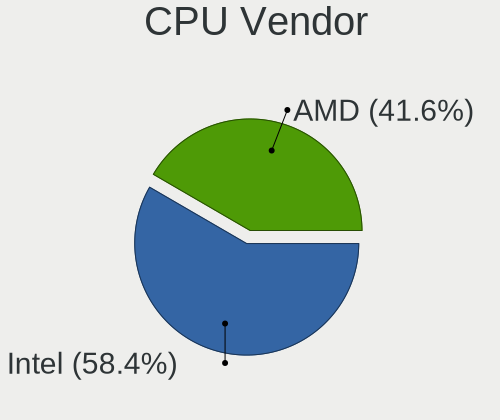

| Vendor | Desktops | Percent |
|--------|----------|---------|
| Intel  | 311      | 58.13%  |
| AMD    | 224      | 41.87%  |

CPU Model
---------

Processor models

| Model                                           | Desktops | Percent |
|-------------------------------------------------|----------|---------|
| AMD Ryzen 7 3700X 8-Core Processor              | 21       | 3.91%   |
| AMD Ryzen 9 3900X 12-Core Processor             | 18       | 3.35%   |
| AMD Ryzen 5 3600 6-Core Processor               | 18       | 3.35%   |
| Intel Core i7-6700K CPU @ 4.00GHz               | 12       | 2.23%   |
| AMD Ryzen 5 2600 Six-Core Processor             | 11       | 2.05%   |
| Intel Core 2 Duo CPU E8400 @ 3.00GHz            | 9        | 1.68%   |
| Intel Core i7-4790 CPU @ 3.60GHz                | 8        | 1.49%   |
| AMD Ryzen 5 1600 Six-Core Processor             | 8        | 1.49%   |
| AMD FX-8350 Eight-Core Processor                | 8        | 1.49%   |
| Intel Core i7-4770 CPU @ 3.40GHz                | 7        | 1.3%    |
| Intel Core i5-3470 CPU @ 3.20GHz                | 7        | 1.3%    |
| Intel Core i9-9900K CPU @ 3.60GHz               | 6        | 1.12%   |
| Intel Core i7-3770 CPU @ 3.40GHz                | 6        | 1.12%   |
| Intel Core i5-9400F CPU @ 2.90GHz               | 6        | 1.12%   |
| Intel Core i5-2400 CPU @ 3.10GHz                | 6        | 1.12%   |
| AMD Ryzen 7 3800X 8-Core Processor              | 6        | 1.12%   |
| AMD Ryzen 7 2700X Eight-Core Processor          | 6        | 1.12%   |
| AMD Ryzen 7 2700 Eight-Core Processor           | 6        | 1.12%   |
| AMD Ryzen 5 3400G with Radeon Vega Graphics     | 6        | 1.12%   |
| Intel Core i7-2600 CPU @ 3.40GHz                | 5        | 0.93%   |
| Intel Core i5-4690 CPU @ 3.50GHz                | 5        | 0.93%   |
| Intel Core i3-2120 CPU @ 3.30GHz                | 5        | 0.93%   |
| AMD Ryzen 5 3600X 6-Core Processor              | 5        | 0.93%   |
| AMD Ryzen 5 2600X Six-Core Processor            | 5        | 0.93%   |
| Intel Core i7-8700 CPU @ 3.20GHz                | 4        | 0.74%   |
| Intel Core i7-7700K CPU @ 4.20GHz               | 4        | 0.74%   |
| Intel Core i7-7700 CPU @ 3.60GHz                | 4        | 0.74%   |
| Intel Core i7-4790K CPU @ 4.00GHz               | 4        | 0.74%   |
| Intel Core i7 CPU 920 @ 2.67GHz                 | 4        | 0.74%   |
| Intel Core i5-8400 CPU @ 2.80GHz                | 4        | 0.74%   |
| Intel Core i5-4460 CPU @ 3.20GHz                | 4        | 0.74%   |
| Intel Core i5-3570 CPU @ 3.40GHz                | 4        | 0.74%   |
| Intel Core i3-2100 CPU @ 3.10GHz                | 4        | 0.74%   |
| AMD Ryzen 5 2400G with Radeon Vega Graphics     | 4        | 0.74%   |
| AMD Ryzen 3 3200G with Radeon Vega Graphics     | 4        | 0.74%   |
| Intel Pentium CPU G4560 @ 3.50GHz               | 3        | 0.56%   |
| Intel Core i7-9700K CPU @ 3.60GHz               | 3        | 0.56%   |
| Intel Core i7-10700K CPU @ 3.80GHz              | 3        | 0.56%   |
| Intel Core i7 CPU 860 @ 2.80GHz                 | 3        | 0.56%   |
| Intel Core i5-9400 CPU @ 2.90GHz                | 3        | 0.56%   |
| Intel Core i5-6500 CPU @ 3.20GHz                | 3        | 0.56%   |
| Intel Core i5-4570T CPU @ 2.90GHz               | 3        | 0.56%   |
| Intel Core i5-4440 CPU @ 3.10GHz                | 3        | 0.56%   |
| Intel Core i5-3470T CPU @ 2.90GHz               | 3        | 0.56%   |
| Intel Core i5-2500 CPU @ 3.30GHz                | 3        | 0.56%   |
| Intel Core i3-6100 CPU @ 3.70GHz                | 3        | 0.56%   |
| Intel Core i3-4150 CPU @ 3.50GHz                | 3        | 0.56%   |
| Intel Core 2 Quad CPU Q8400 @ 2.66GHz           | 3        | 0.56%   |
| Intel Core 2 Quad CPU Q6600 @ 2.40GHz           | 3        | 0.56%   |
| Intel Core 2 Duo CPU E7500 @ 2.93GHz            | 3        | 0.56%   |
| AMD Ryzen 7 1700X Eight-Core Processor          | 3        | 0.56%   |
| AMD Ryzen 5 5600X 6-Core Processor              | 3        | 0.56%   |
| AMD Ryzen 3 2200G with Radeon Vega Graphics     | 3        | 0.56%   |
| AMD Phenom II X4 965 Processor                  | 3        | 0.56%   |
| AMD FX-8300 Eight-Core Processor                | 3        | 0.56%   |
| AMD FX-6300 Six-Core Processor                  | 3        | 0.56%   |
| AMD Athlon II X4 630 Processor                  | 3        | 0.56%   |
| AMD A10-7700K Radeon R7, 10 Compute Cores 4C+6G | 3        | 0.56%   |
| Intel Xeon CPU X5570 @ 2.93GHz                  | 2        | 0.37%   |
| Intel Xeon CPU E5-2678 v3 @ 2.50GHz             | 2        | 0.37%   |

CPU Model Family
----------------

Processor model prefix

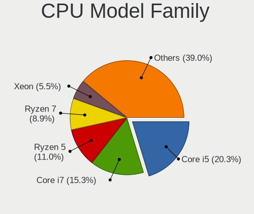

| Model                   | Desktops | Percent |
|-------------------------|----------|---------|
| Intel Core i5           | 101      | 18.81%  |
| Intel Core i7           | 89       | 16.57%  |
| AMD Ryzen 5             | 64       | 11.92%  |
| AMD Ryzen 7             | 45       | 8.38%   |
| Intel Xeon              | 27       | 5.03%   |
| Intel Core i3           | 25       | 4.66%   |
| AMD Ryzen 9             | 22       | 4.1%    |
| AMD FX                  | 20       | 3.72%   |
| Intel Core 2 Duo        | 14       | 2.61%   |
| Intel Pentium           | 13       | 2.42%   |
| AMD Phenom II X4        | 10       | 1.86%   |
| Intel Celeron           | 9        | 1.68%   |
| AMD Ryzen 3             | 9        | 1.68%   |
| AMD A10                 | 9        | 1.68%   |
| Intel Core i9           | 8        | 1.49%   |
| Intel Core 2 Quad       | 8        | 1.49%   |
| AMD Athlon II X4        | 6        | 1.12%   |
| AMD A8                  | 6        | 1.12%   |
| Intel Pentium Dual-Core | 5        | 0.93%   |
| AMD Athlon              | 5        | 0.93%   |
| Other                   | 4        | 0.74%   |
| AMD Ryzen Threadripper  | 4        | 0.74%   |
| AMD Athlon 64 X2        | 4        | 0.74%   |
| Intel Pentium D         | 3        | 0.56%   |
| AMD Phenom II X2        | 3        | 0.56%   |
| Intel Atom              | 2        | 0.37%   |
| AMD Sempron             | 2        | 0.37%   |
| AMD Phenom II X6        | 2        | 0.37%   |
| AMD Phenom              | 2        | 0.37%   |
| AMD Athlon II X2        | 2        | 0.37%   |
| AMD Athlon 64           | 2        | 0.37%   |
| Intel Xeon Bronze       | 1        | 0.19%   |
| Intel Pentium Silver    | 1        | 0.19%   |
| Intel Pentium Dual      | 1        | 0.19%   |
| Intel Pentium 4         | 1        | 0.19%   |
| AMD Ryzen Embedded      | 1        | 0.19%   |
| AMD Ryzen 7 PRO         | 1        | 0.19%   |
| AMD GX                  | 1        | 0.19%   |
| AMD E                   | 1        | 0.19%   |
| AMD Athlon X4           | 1        | 0.19%   |
| AMD A6                  | 1        | 0.19%   |
| AMD A4                  | 1        | 0.19%   |
| AMD A12                 | 1        | 0.19%   |

CPU Cores
---------

Number of processor cores

| Number | Desktops | Percent |
|--------|----------|---------|
| 4      | 226      | 42.16%  |
| 2      | 108      | 20.15%  |
| 6      | 87       | 16.23%  |
| 8      | 71       | 13.25%  |
| 12     | 23       | 4.29%   |
| 16     | 7        | 1.31%   |
| 1      | 7        | 1.31%   |
| 3      | 3        | 0.56%   |
| 24     | 2        | 0.37%   |
| 20     | 1        | 0.19%   |
| 18     | 1        | 0.19%   |

CPU Sockets
-----------

Number of sockets

| Number | Desktops | Percent |
|--------|----------|---------|
| 1      | 529      | 98.88%  |
| 2      | 6        | 1.12%   |

CPU Threads
-----------

Threads per core (Hyper-Threading)

| Number | Desktops | Percent |
|--------|----------|---------|
| 2      | 332      | 61.94%  |
| 1      | 204      | 38.06%  |

CPU Op-Modes
------------

CPU Operation Modes (32-bit, 64-bit)

| Op mode        | Desktops | Percent |
|----------------|----------|---------|
| 32-bit, 64-bit | 535      | 100%    |

CPU Microcode
-------------

Microcode number

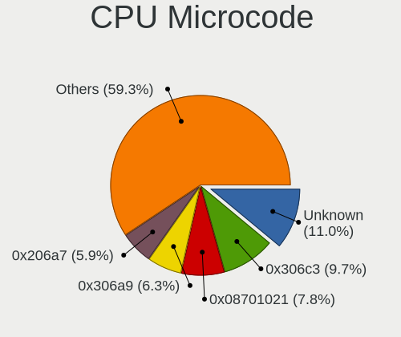

| Number     | Desktops | Percent |
|------------|----------|---------|
| Unknown    | 58       | 10.66%  |
| 0x306c3    | 55       | 10.11%  |
| 0x08701021 | 44       | 8.09%   |
| 0x206a7    | 35       | 6.43%   |
| 0x306a9    | 31       | 5.7%    |
| 0x0800820d | 28       | 5.15%   |
| 0x506e3    | 23       | 4.23%   |
| 0x1067a    | 22       | 4.04%   |
| 0x08701013 | 22       | 4.04%   |
| 0x906ea    | 18       | 3.31%   |
| 0x906e9    | 17       | 3.13%   |
| 0x06000852 | 16       | 2.94%   |
| 0x010000c8 | 10       | 1.84%   |
| 0x08108109 | 9        | 1.65%   |
| 0x010000db | 9        | 1.65%   |
| 0x906ed    | 8        | 1.47%   |
| 0x306f2    | 8        | 1.47%   |
| 0x106a5    | 8        | 1.47%   |
| 0x106e5    | 6        | 1.1%    |
| 0x06001119 | 6        | 1.1%    |
| 0xa0655    | 5        | 0.92%   |
| 0x906ec    | 5        | 0.92%   |
| 0x0810100b | 5        | 0.92%   |
| 0x08001138 | 5        | 0.92%   |
| 0x08001137 | 5        | 0.92%   |
| 0x06003106 | 5        | 0.92%   |
| 0xa0653    | 4        | 0.74%   |
| 0x6fb      | 4        | 0.74%   |
| 0x306e4    | 4        | 0.74%   |
| 0x206d7    | 4        | 0.74%   |
| 0xa0671    | 3        | 0.55%   |
| 0x10676    | 3        | 0.55%   |
| 0x0a201016 | 3        | 0.55%   |
| 0x0a201009 | 3        | 0.55%   |
| 0x08101016 | 3        | 0.55%   |
| 0x0800111c | 3        | 0.55%   |
| 0x0700010f | 3        | 0.55%   |
| 0xf64      | 2        | 0.37%   |
| 0x906eb    | 2        | 0.37%   |
| 0x706a1    | 2        | 0.37%   |
| 0x20655    | 2        | 0.37%   |
| 0x20652    | 2        | 0.37%   |
| 0x08108102 | 2        | 0.37%   |
| 0x08001129 | 2        | 0.37%   |
| 0x0600611a | 2        | 0.37%   |
| 0x06003104 | 2        | 0.37%   |
| 0x010000dc | 2        | 0.37%   |
| 0x01000083 | 2        | 0.37%   |
| 0xf62      | 1        | 0.18%   |
| 0xf41      | 1        | 0.18%   |
| 0x806ec    | 1        | 0.18%   |
| 0x706a8    | 1        | 0.18%   |
| 0x6fd      | 1        | 0.18%   |
| 0x506c9    | 1        | 0.18%   |
| 0x50657    | 1        | 0.18%   |
| 0x406f1    | 1        | 0.18%   |
| 0x406c3    | 1        | 0.18%   |
| 0x40651    | 1        | 0.18%   |
| 0x206d6    | 1        | 0.18%   |
| 0x206c2    | 1        | 0.18%   |

CPU Microarch
-------------

Microarchitecture

| Name          | Desktops | Percent |
|---------------|----------|---------|
| Zen 2         | 72       | 13.41%  |
| Haswell       | 70       | 13.04%  |
| KabyLake      | 56       | 10.43%  |
| Zen+          | 45       | 8.38%   |
| SandyBridge   | 44       | 8.19%   |
| IvyBridge     | 37       | 6.89%   |
| Skylake       | 28       | 5.21%   |
| Piledriver    | 27       | 5.03%   |
| Penryn        | 26       | 4.84%   |
| K10           | 26       | 4.84%   |
| Zen           | 25       | 4.66%   |
| Nehalem       | 16       | 2.98%   |
| CometLake     | 10       | 1.86%   |
| Zen 3         | 7        | 1.3%    |
| Steamroller   | 7        | 1.3%    |
| K8 Hammer     | 7        | 1.3%    |
| Westmere      | 5        | 0.93%   |
| Core          | 5        | 0.93%   |
| NetBurst      | 4        | 0.74%   |
| Jaguar        | 4        | 0.74%   |
| Icelake       | 3        | 0.56%   |
| Goldmont plus | 3        | 0.56%   |
| Excavator     | 3        | 0.56%   |
| Silvermont    | 1        | 0.19%   |
| Goldmont      | 1        | 0.19%   |
| Bulldozer     | 1        | 0.19%   |
| Broadwell     | 1        | 0.19%   |
| Bonnell       | 1        | 0.19%   |
| Bobcat        | 1        | 0.19%   |
| Unknown       | 1        | 0.19%   |

Graphics
--------

GPU Vendor
----------

Vendors of graphics cards

| Vendor            | Desktops | Percent |
|-------------------|----------|---------|
| Nvidia            | 258      | 45.83%  |
| AMD               | 179      | 31.79%  |
| Intel             | 125      | 22.2%   |
| ASPEED Technology | 1        | 0.18%   |

GPU Model
---------

Graphics card models

| Model                                                                             | Desktops | Percent |
|-----------------------------------------------------------------------------------|----------|---------|
| AMD Ellesmere [Radeon RX 470/480/570/570X/580/580X/590]                           | 31       | 5.4%    |
| Intel Xeon E3-1200 v3/4th Gen Core Processor Integrated Graphics Controller       | 26       | 4.53%   |
| Nvidia GP107 [GeForce GTX 1050 Ti]                                                | 18       | 3.14%   |
| Nvidia GK208B [GeForce GT 710]                                                    | 18       | 3.14%   |
| Intel 2nd Generation Core Processor Family Integrated Graphics Controller         | 16       | 2.79%   |
| Intel CoffeeLake-S GT2 [UHD Graphics 630]                                         | 15       | 2.61%   |
| Nvidia GP106 [GeForce GTX 1060 6GB]                                               | 13       | 2.26%   |
| Intel Xeon E3-1200 v2/3rd Gen Core processor Graphics Controller                  | 12       | 2.09%   |
| AMD Navi 10 [Radeon RX 5600 OEM/5600 XT / 5700/5700 XT]                           | 11       | 1.92%   |
| AMD Vega 10 XL/XT [Radeon RX Vega 56/64]                                          | 10       | 1.74%   |
| AMD Picasso/Raven 2 [Radeon Vega Series / Radeon Vega Mobile Series]              | 10       | 1.74%   |
| Nvidia GT218 [GeForce 210]                                                        | 9        | 1.57%   |
| Nvidia GM204 [GeForce GTX 970]                                                    | 9        | 1.57%   |
| Nvidia TU116 [GeForce GTX 1660 SUPER]                                             | 8        | 1.39%   |
| Nvidia GP108 [GeForce GT 1030]                                                    | 8        | 1.39%   |
| Nvidia GP104 [GeForce GTX 1080]                                                   | 8        | 1.39%   |
| Intel HD Graphics 530                                                             | 8        | 1.39%   |
| Intel CometLake-S GT2 [UHD Graphics 630]                                          | 8        | 1.39%   |
| Intel 4 Series Chipset Integrated Graphics Controller                             | 8        | 1.39%   |
| AMD Raven Ridge [Radeon Vega Series / Radeon Vega Mobile Series]                  | 8        | 1.39%   |
| Nvidia GP104 [GeForce GTX 1070]                                                   | 7        | 1.22%   |
| Nvidia GM206 [GeForce GTX 960]                                                    | 7        | 1.22%   |
| AMD Lexa PRO [Radeon 540/540X/550/550X / RX 540X/550/550X]                        | 7        | 1.22%   |
| Nvidia GP106 [GeForce GTX 1060 3GB]                                               | 6        | 1.05%   |
| Nvidia GP102 [GeForce GTX 1080 Ti]                                                | 6        | 1.05%   |
| Nvidia GM107 [GeForce GTX 750 Ti]                                                 | 6        | 1.05%   |
| Nvidia GF119 [GeForce GT 610]                                                     | 6        | 1.05%   |
| Nvidia TU117 [GeForce GTX 1650]                                                   | 5        | 0.87%   |
| Nvidia TU116 [GeForce GTX 1660]                                                   | 5        | 0.87%   |
| Nvidia TU116 [GeForce GTX 1660 Ti]                                                | 5        | 0.87%   |
| Nvidia GP107 [GeForce GTX 1050]                                                   | 5        | 0.87%   |
| Nvidia GK208B [GeForce GT 730]                                                    | 5        | 0.87%   |
| Intel IvyBridge GT2 [HD Graphics 4000]                                            | 5        | 0.87%   |
| Intel HD Graphics 630                                                             | 5        | 0.87%   |
| AMD Navi 14 [Radeon RX 5500/5500M / Pro 5500M]                                    | 5        | 0.87%   |
| AMD Kaveri [Radeon R7 Graphics]                                                   | 5        | 0.87%   |
| AMD Cedar [Radeon HD 5000/6000/7350/8350 Series]                                  | 5        | 0.87%   |
| AMD Cape Verde XT [Radeon HD 7770/8760 / R7 250X]                                 | 5        | 0.87%   |
| Nvidia GM206 [GeForce GTX 950]                                                    | 4        | 0.7%    |
| AMD RS780L [Radeon 3000]                                                          | 4        | 0.7%    |
| AMD Oland XT [Radeon HD 8670 / R5 340X OEM / R7 250/350/350X OEM]                 | 4        | 0.7%    |
| AMD Caicos [Radeon HD 6450/7450/8450 / R5 230 OEM]                                | 4        | 0.7%    |
| Nvidia TU106 [GeForce RTX 2070]                                                   | 3        | 0.52%   |
| Nvidia TU106 [GeForce RTX 2060 SUPER]                                             | 3        | 0.52%   |
| Nvidia TU104 [GeForce RTX 2080]                                                   | 3        | 0.52%   |
| Nvidia TU104 [GeForce RTX 2080 SUPER]                                             | 3        | 0.52%   |
| Nvidia GT218 [NVS 300]                                                            | 3        | 0.52%   |
| Nvidia GM204 [GeForce GTX 980]                                                    | 3        | 0.52%   |
| Nvidia GM200 [GeForce GTX 980 Ti]                                                 | 3        | 0.52%   |
| Nvidia GF108 [GeForce GT 630]                                                     | 3        | 0.52%   |
| Nvidia GF108 [GeForce GT 430]                                                     | 3        | 0.52%   |
| Nvidia C61 [GeForce 7025 / nForce 630a]                                           | 3        | 0.52%   |
| Intel Core Processor Integrated Graphics Controller                               | 3        | 0.52%   |
| AMD Pitcairn PRO [Radeon HD 7850 / R7 265 / R9 270 1024SP]                        | 3        | 0.52%   |
| AMD Oland PRO [Radeon R7 240/340 / Radeon 520]                                    | 3        | 0.52%   |
| AMD Kabini [Radeon HD 8400 / R3 Series]                                           | 3        | 0.52%   |
| AMD Juniper XT [Radeon HD 5770]                                                   | 3        | 0.52%   |
| AMD Hawaii PRO [Radeon R9 290/390]                                                | 3        | 0.52%   |
| AMD Cape Verde PRO / Venus LE / Tropo PRO-L [Radeon HD 8830M / R7 250 / R7 M465X] | 3        | 0.52%   |
| Nvidia TU116 [GeForce GTX 1650]                                                   | 2        | 0.35%   |

GPU Combo
---------

Combinations of graphics cards

| Name            | Desktops | Percent |
|-----------------|----------|---------|
| 1 x Nvidia      | 238      | 44.07%  |
| 1 x AMD         | 170      | 31.48%  |
| 1 x Intel       | 107      | 19.81%  |
| Intel + Nvidia  | 7        | 1.3%    |
| 2 x Nvidia      | 6        | 1.11%   |
| 2 x AMD         | 5        | 0.93%   |
| AMD + Nvidia    | 5        | 0.93%   |
| Nvidia + ASPEED | 1        | 0.19%   |
| Intel + AMD     | 1        | 0.19%   |

GPU Driver
----------

Free vs proprietary

| Driver      | Desktops | Percent |
|-------------|----------|---------|
| Free        | 326      | 59.82%  |
| Proprietary | 212      | 38.9%   |
| Unknown     | 7        | 1.28%   |

GPU Memory
----------

Total video memory

| Size in GB | Desktops | Percent |
|------------|----------|---------|
| Unknown    | 148      | 27.21%  |
| 1.01-2.0   | 83       | 15.26%  |
| 7.01-8.0   | 75       | 13.79%  |
| 0.51-1.0   | 72       | 13.24%  |
| 3.01-4.0   | 64       | 11.76%  |
| 0.01-0.5   | 43       | 7.9%    |
| 5.01-6.0   | 33       | 6.07%   |
| 8.01-16.0  | 13       | 2.39%   |
| 2.01-3.0   | 11       | 2.02%   |
| 32.01-64.0 | 1        | 0.18%   |
| 4.01-5.0   | 1        | 0.18%   |

Monitor
-------

Monitor Vendor
--------------

Monitor vendors

| Vendor                  | Desktops | Percent |
|-------------------------|----------|---------|
| Samsung Electronics     | 106      | 16.61%  |
| Dell                    | 66       | 10.34%  |
| Goldstar                | 63       | 9.87%   |
| Acer                    | 50       | 7.84%   |
| Hewlett-Packard         | 41       | 6.43%   |
| BenQ                    | 37       | 5.8%    |
| Ancor Communications    | 36       | 5.64%   |
| AOC                     | 32       | 5.02%   |
| Philips                 | 24       | 3.76%   |
| ViewSonic               | 22       | 3.45%   |
| LG Electronics          | 16       | 2.51%   |
| Iiyama                  | 13       | 2.04%   |
| Unknown                 | 12       | 1.88%   |
| ASUSTek Computer        | 12       | 1.88%   |
| Lenovo                  | 8        | 1.25%   |
| Sony                    | 7        | 1.1%    |
| Panasonic               | 5        | 0.78%   |
| NEC Computers           | 4        | 0.63%   |
| Medion                  | 4        | 0.63%   |
| Viotek                  | 3        | 0.47%   |
| Sceptre Tech            | 3        | 0.47%   |
| Onkyo                   | 3        | 0.47%   |
| HPN                     | 3        | 0.47%   |
| Eizo                    | 3        | 0.47%   |
| DENON                   | 3        | 0.47%   |
| Unknown (XXX)           | 2        | 0.31%   |
| Sceptre                 | 2        | 0.31%   |
| ONN                     | 2        | 0.31%   |
| Lenovo Group Limited    | 2        | 0.31%   |
| Idek Iiyama             | 2        | 0.31%   |
| HannStar                | 2        | 0.31%   |
| Gateway                 | 2        | 0.31%   |
| Fujitsu Siemens         | 2        | 0.31%   |
| Envision                | 2        | 0.31%   |
| Chi Mei Optoelectronics | 2        | 0.31%   |
| AUS                     | 2        | 0.31%   |
| Yamaha                  | 1        | 0.16%   |
| Xiaomi                  | 1        | 0.16%   |
| VST                     | 1        | 0.16%   |
| VMO                     | 1        | 0.16%   |
| Vizio                   | 1        | 0.16%   |
| Vestel                  | 1        | 0.16%   |
| Valve                   | 1        | 0.16%   |
| TXD                     | 1        | 0.16%   |
| Targa Visionary         | 1        | 0.16%   |
| SKY                     | 1        | 0.16%   |
| Sharp                   | 1        | 0.16%   |
| SFX                     | 1        | 0.16%   |
| Semp Toshiba            | 1        | 0.16%   |
| SEG                     | 1        | 0.16%   |
| Sanyo                   | 1        | 0.16%   |
| SAC                     | 1        | 0.16%   |
| PLN                     | 1        | 0.16%   |
| Plain Tree Systems      | 1        | 0.16%   |
| MStar                   | 1        | 0.16%   |
| MSI                     | 1        | 0.16%   |
| Monoprice               | 1        | 0.16%   |
| MiTAC                   | 1        | 0.16%   |
| Microstep               | 1        | 0.16%   |
| LOE                     | 1        | 0.16%   |

Monitor Model
-------------

Monitor models

| Model                                                                    | Desktops | Percent |
|--------------------------------------------------------------------------|----------|---------|
| Goldstar ULTRAWIDE GSM59F1 2560x1080 677x290mm 29.0-inch                 | 6        | 0.86%   |
| Dell U2412M DELA07A 1920x1200 518x324mm 24.1-inch                        | 5        | 0.72%   |
| Goldstar LCD Monitor GSM5AB8 1920x1080 480x270mm 21.7-inch               | 4        | 0.57%   |
| Unknown LCD Monitor SAMSUNG 1920x1080                                    | 3        | 0.43%   |
| Samsung Electronics S22F350 SAM0D1A 1920x1080 477x268mm 21.5-inch        | 3        | 0.43%   |
| Samsung Electronics LCD Monitor SAM0C39 1920x1080 700x390mm 31.5-inch    | 3        | 0.43%   |
| Hewlett-Packard L1740 HWP2649 1280x1024 330x270mm 16.8-inch              | 3        | 0.43%   |
| Goldstar Ultra HD GSM5B09 3780x2160 600x340mm 27.2-inch                  | 3        | 0.43%   |
| Dell UP2716D DEL40DD 2560x1440 597x336mm 27.0-inch                       | 3        | 0.43%   |
| BenQ GL2780 BNQ78EC 1920x1080 600x340mm 27.2-inch                        | 3        | 0.43%   |
| BenQ GL2460 BNQ78CE 1920x1080 531x299mm 24.0-inch                        | 3        | 0.43%   |
| AOC G2460 AOC2460 1920x1080 531x299mm 24.0-inch                          | 3        | 0.43%   |
| Viotek GN34CW VTK3400 3440x1440 795x334mm 33.9-inch                      | 2        | 0.29%   |
| Unknown LCD Monitor SAMSUNG 3840x2160                                    | 2        | 0.29%   |
| Samsung Electronics U32J59x SAM0F33 3840x2160 697x392mm 31.5-inch        | 2        | 0.29%   |
| Samsung Electronics U28E590 SAM0C4D 3840x2160 610x350mm 27.7-inch        | 2        | 0.29%   |
| Samsung Electronics SyncMaster STN0046 1280x1024 338x270mm 17.0-inch     | 2        | 0.29%   |
| Samsung Electronics SyncMaster SAM0272 1280x1024 340x270mm 17.1-inch     | 2        | 0.29%   |
| Samsung Electronics SyncMaster SAM01E1 1280x1024 376x301mm 19.0-inch     | 2        | 0.29%   |
| Samsung Electronics LCD Monitor SAM04FD 1280x720                         | 2        | 0.29%   |
| Samsung Electronics C32F391 SAM0D34 1920x1080 698x393mm 31.5-inch        | 2        | 0.29%   |
| Samsung Electronics C27F398 SAM0D44 1920x1080 598x336mm 27.0-inch        | 2        | 0.29%   |
| Samsung Electronics C24F390 SAM0D2C 1920x1080 521x293mm 23.5-inch        | 2        | 0.29%   |
| Panasonic LCD Monitor TV 1920x1080                                       | 2        | 0.29%   |
| ONN 100002487 ONN0101 1920x1080 517x323mm 24.0-inch                      | 2        | 0.29%   |
| LG Electronics LCD Monitor LG Ultra HD 3840x2160                         | 2        | 0.29%   |
| LG Electronics LCD Monitor LG IPS FULLHD                                 | 2        | 0.29%   |
| Lenovo L2250p Wide LEN0A0C 1680x1050 474x296mm 22.0-inch                 | 2        | 0.29%   |
| Hewlett-Packard 24es HWP3320 1920x1080 527x296mm 23.8-inch               | 2        | 0.29%   |
| Goldstar LG HDR 4K GSM7707 3840x2160 600x340mm 27.2-inch                 | 2        | 0.29%   |
| Goldstar IPS FULLHD GSM5AB6 1920x1080 480x270mm 21.7-inch                | 2        | 0.29%   |
| Goldstar HDR 4K GSM7706 3840x2160 600x340mm 27.2-inch                    | 2        | 0.29%   |
| Goldstar FULL HD GSM5ABB 1920x1080 480x270mm 21.7-inch                   | 2        | 0.29%   |
| Goldstar E2351 GSM5872 1920x1080 510x290mm 23.1-inch                     | 2        | 0.29%   |
| Goldstar 2D FHD TV GSM59C6 1920x1080 509x286mm 23.0-inch                 | 2        | 0.29%   |
| Goldstar 23MP55 GSM5A23 1920x1080 510x290mm 23.1-inch                    | 2        | 0.29%   |
| Gateway FPD2185W GWY088A 1680x1050 450x280mm 20.9-inch                   | 2        | 0.29%   |
| Dell UP3017 DEL40FA 2560x1600 641x401mm 29.8-inch                        | 2        | 0.29%   |
| Dell U2718Q DELA0EC 3840x2160 609x349mm 27.6-inch                        | 2        | 0.29%   |
| Dell U2415 DELA0B9 1920x1200 518x324mm 24.1-inch                         | 2        | 0.29%   |
| Dell U2412M DELA07B 1920x1200 518x324mm 24.1-inch                        | 2        | 0.29%   |
| Dell U2412M DELA079 1920x1200 518x324mm 24.1-inch                        | 2        | 0.29%   |
| Dell U2312HM DEL4073 1920x1080 510x287mm 23.0-inch                       | 2        | 0.29%   |
| Dell S2421HS DEL41F4 1920x1080 527x296mm 23.8-inch                       | 2        | 0.29%   |
| Dell P2418D DELD0C1 2560x1440 526x296mm 23.8-inch                        | 2        | 0.29%   |
| Dell 2209WA DELF011 1680x1050 474x296mm 22.0-inch                        | 2        | 0.29%   |
| Chi Mei Optoelectronics CMC 17" AD CMO7801 1280x1024 338x270mm 17.0-inch | 2        | 0.29%   |
| BenQ XL2730Z BNQ7F45 2560x1440 600x340mm 27.2-inch                       | 2        | 0.29%   |
| BenQ GW2270 BNQ78DB 1920x1080 476x268mm 21.5-inch                        | 2        | 0.29%   |
| AOC 2470W AOC2470 1920x1080 521x293mm 23.5-inch                          | 2        | 0.29%   |
| AOC 2353 AOC2353 1920x1080 509x286mm 23.0-inch                           | 2        | 0.29%   |
| AOC 2260WG5 AOC2260 1920x1080 480x270mm 21.7-inch                        | 2        | 0.29%   |
| AOC 1970W AOC1970 1366x768 410x230mm 18.5-inch                           | 2        | 0.29%   |
| Ancor Communications VE248 ACI2494 1920x1080 530x300mm 24.0-inch         | 2        | 0.29%   |
| Ancor Communications ASUS VC239 ACI23C4 1920x1080 509x286mm 23.0-inch    | 2        | 0.29%   |
| Acer XB253Q ACR0741 1920x1080 543x302mm 24.5-inch                        | 2        | 0.29%   |
| Acer H236HL ACR0318 1920x1080 510x290mm 23.1-inch                        | 2        | 0.29%   |
| Acer G276HL ACR0300 1920x1080 598x336mm 27.0-inch                        | 2        | 0.29%   |
| Acer G235H ACR0113 1920x1080 510x287mm 23.0-inch                         | 2        | 0.29%   |
| Yamaha HTR-3072 YMH31ED 1920x540                                         | 1        | 0.14%   |

Monitor Resolution
------------------

Monitor screen resolution

| Resolution         | Desktops | Percent |
|--------------------|----------|---------|
| 1920x1080 (FHD)    | 287      | 46.37%  |
| 3840x2160 (4K)     | 54       | 8.72%   |
| 2560x1440 (QHD)    | 47       | 7.59%   |
| 1280x1024 (SXGA)   | 36       | 5.82%   |
| 1680x1050 (WSXGA+) | 29       | 4.68%   |
| Unknown            | 28       | 4.52%   |
| 1920x1200 (WUXGA)  | 27       | 4.36%   |
| 1366x768 (WXGA)    | 14       | 2.26%   |
| 1440x900 (WXGA+)   | 13       | 2.1%    |
| 2560x1080          | 12       | 1.94%   |
| 1600x900 (HD+)     | 10       | 1.62%   |
| 3840x1080          | 9        | 1.45%   |
| 3440x1440          | 9        | 1.45%   |
| 1920x540           | 5        | 0.81%   |
| 1360x768           | 4        | 0.65%   |
| 5760x1080          | 3        | 0.48%   |
| 4480x1440          | 3        | 0.48%   |
| 3600x1080          | 3        | 0.48%   |
| 2560x1600          | 3        | 0.48%   |
| 1600x1200          | 3        | 0.48%   |
| 3840x1600          | 2        | 0.32%   |
| 3200x1080          | 2        | 0.32%   |
| 1024x768 (XGA)     | 2        | 0.32%   |
| 7680x2160          | 1        | 0.16%   |
| 6400x2160          | 1        | 0.16%   |
| 4480x1600          | 1        | 0.16%   |
| 4480x1080          | 1        | 0.16%   |
| 3840x1920          | 1        | 0.16%   |
| 3840x1200          | 1        | 0.16%   |
| 3600x1200          | 1        | 0.16%   |
| 3360x1080          | 1        | 0.16%   |
| 2880x1440          | 1        | 0.16%   |
| 2048x1152          | 1        | 0.16%   |
| 1921x1080          | 1        | 0.16%   |
| 1400x1050          | 1        | 0.16%   |
| 1280x960           | 1        | 0.16%   |
| 1280x720 (HD)      | 1        | 0.16%   |

Monitor Diagonal
----------------

Diagonal size in inches

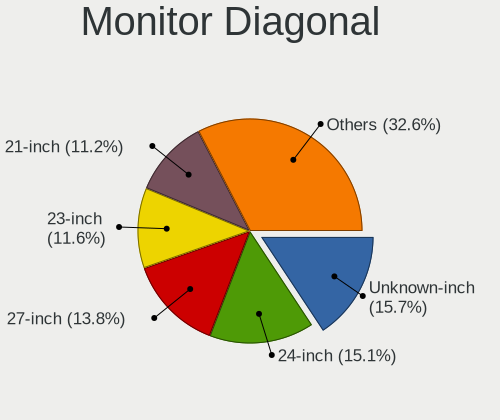

| Inches  | Desktops | Percent |
|---------|----------|---------|
| Unknown | 100      | 15.75%  |
| 24      | 95       | 14.96%  |
| 27      | 91       | 14.33%  |
| 23      | 74       | 11.65%  |
| 21      | 71       | 11.18%  |
| 19      | 33       | 5.2%    |
| 31      | 25       | 3.94%   |
| 22      | 21       | 3.31%   |
| 17      | 20       | 3.15%   |
| 34      | 18       | 2.83%   |
| 20      | 17       | 2.68%   |
| 25      | 11       | 1.73%   |
| 18      | 11       | 1.73%   |
| 84      | 5        | 0.79%   |
| 54      | 5        | 0.79%   |
| 32      | 4        | 0.63%   |
| 26      | 4        | 0.63%   |
| 72      | 3        | 0.47%   |
| 47      | 3        | 0.47%   |
| 43      | 3        | 0.47%   |
| 37      | 3        | 0.47%   |
| 15      | 3        | 0.47%   |
| 40      | 2        | 0.31%   |
| 29      | 2        | 0.31%   |
| 74      | 1        | 0.16%   |
| 65      | 1        | 0.16%   |
| 55      | 1        | 0.16%   |
| 52      | 1        | 0.16%   |
| 49      | 1        | 0.16%   |
| 48      | 1        | 0.16%   |
| 46      | 1        | 0.16%   |
| 39      | 1        | 0.16%   |
| 30      | 1        | 0.16%   |
| 28      | 1        | 0.16%   |
| 3       | 1        | 0.16%   |

Monitor Width
-------------

Physical width

| Width in mm | Desktops | Percent |
|-------------|----------|---------|
| 501-600     | 234      | 39.2%   |
| 401-500     | 123      | 20.6%   |
| Unknown     | 100      | 16.75%  |
| 601-700     | 41       | 6.87%   |
| 351-400     | 24       | 4.02%   |
| 701-800     | 22       | 3.69%   |
| 301-350     | 20       | 3.35%   |
| 1001-1500   | 14       | 2.35%   |
| 1501-2000   | 9        | 1.51%   |
| 801-900     | 6        | 1.01%   |
| 901-1000    | 3        | 0.5%    |
| 1-100       | 1        | 0.17%   |

Aspect Ratio
------------

Proportional relationship between the width and the height

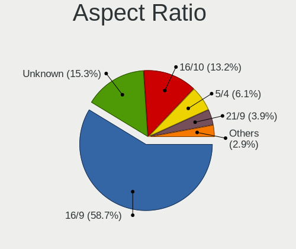

| Ratio   | Desktops | Percent |
|---------|----------|---------|
| 16/9    | 344      | 59.01%  |
| Unknown | 88       | 15.09%  |
| 16/10   | 78       | 13.38%  |
| 5/4     | 38       | 6.52%   |
| 21/9    | 20       | 3.43%   |
| 32/9    | 6        | 1.03%   |
| 4/3     | 5        | 0.86%   |
| 3/2     | 2        | 0.34%   |
| 6/5     | 1        | 0.17%   |
| 1.96    | 1        | 0.17%   |

Monitor Area
------------

Area in inch

| Area in inch | Desktops | Percent |
|----------------|----------|---------|
| 201-250        | 192      | 31.27%  |
| Unknown        | 100      | 16.29%  |
| 301-350        | 93       | 15.15%  |
| 151-200        | 65       | 10.59%  |
| 351-500        | 51       | 8.31%   |
| 251-300        | 47       | 7.65%   |
| 141-150        | 27       | 4.4%    |
| More than 1000 | 18       | 2.93%   |
| 501-1000       | 14       | 2.28%   |
| 101-110        | 3        | 0.49%   |
| 131-140        | 2        | 0.33%   |
| 1-40           | 1        | 0.16%   |
| 121-130        | 1        | 0.16%   |

Pixel Density
-------------

Pixels per inch

| Density       | Desktops | Percent |
|---------------|----------|---------|
| 51-100        | 323      | 55.31%  |
| 101-120       | 112      | 19.18%  |
| Unknown       | 100      | 17.12%  |
| 121-160       | 23       | 3.94%   |
| 1-50          | 16       | 2.74%   |
| 161-240       | 9        | 1.54%   |
| More than 240 | 1        | 0.17%   |

Multiple Monitors
-----------------

Total monitors connected

| Total | Desktops | Percent |
|-------|----------|---------|
| 1     | 384      | 71.11%  |
| 2     | 132      | 24.44%  |
| 3     | 15       | 2.78%   |
| 0     | 8        | 1.48%   |
| 4     | 1        | 0.19%   |

Network
-------

Net Controller Vendor
---------------------

Controller vendors

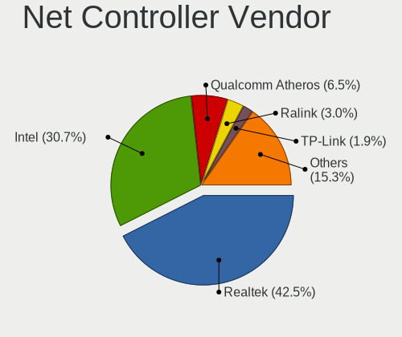

| Vendor                                | Desktops | Percent |
|---------------------------------------|----------|---------|
| Realtek Semiconductor                 | 321      | 43.44%  |
| Intel                                 | 216      | 29.23%  |
| Qualcomm Atheros                      | 51       | 6.9%    |
| Ralink Technology                     | 22       | 2.98%   |
| TP-Link                               | 14       | 1.89%   |
| Nvidia                                | 13       | 1.76%   |
| Broadcom                              | 13       | 1.76%   |
| Microsoft                             | 10       | 1.35%   |
| Ralink                                | 9        | 1.22%   |
| Aquantia                              | 7        | 0.95%   |
| Xiaomi                                | 4        | 0.54%   |
| Samsung Electronics                   | 4        | 0.54%   |
| Qualcomm Atheros Communications       | 4        | 0.54%   |
| NetGear                               | 4        | 0.54%   |
| D-Link System                         | 4        | 0.54%   |
| DisplayLink                           | 3        | 0.41%   |
| Broadcom Limited                      | 3        | 0.41%   |
| STMicroelectronics                    | 2        | 0.27%   |
| Marvell Technology Group              | 2        | 0.27%   |
| Linksys                               | 2        | 0.27%   |
| Edimax Technology                     | 2        | 0.27%   |
| D-Link                                | 2        | 0.27%   |
| Belkin Components                     | 2        | 0.27%   |
| ASIX Electronics                      | 2        | 0.27%   |
| Apple                                 | 2        | 0.27%   |
| ZTE WCDMA Technologies MSM            | 1        | 0.14%   |
| Wilocity                              | 1        | 0.14%   |
| Wacom                                 | 1        | 0.14%   |
| VIA Technologies                      | 1        | 0.14%   |
| Sigma Designs                         | 1        | 0.14%   |
| Seeed Technology                      | 1        | 0.14%   |
| Qualcomm                              | 1        | 0.14%   |
| Motorola BCS                          | 1        | 0.14%   |
| Mercucys                              | 1        | 0.14%   |
| Mellanox Technologies                 | 1        | 0.14%   |
| MediaTek                              | 1        | 0.14%   |
| Lenovo                                | 1        | 0.14%   |
| Huawei Technologies                   | 1        | 0.14%   |
| Gemtek                                | 1        | 0.14%   |
| Elecom                                | 1        | 0.14%   |
| Davicom Semiconductor                 | 1        | 0.14%   |
| Arduino SA                            | 1        | 0.14%   |
| AirTies Wireless Networks             | 1        | 0.14%   |
| Accton Technology                     | 1        | 0.14%   |
| 802.11g Adapter [Linksys WUSB54GC v3] | 1        | 0.14%   |
| 3Com                                  | 1        | 0.14%   |

Net Controller Model
--------------------

Controller models

| Model                                                             | Desktops | Percent |
|-------------------------------------------------------------------|----------|---------|
| Realtek RTL8111/8168/8411 PCI Express Gigabit Ethernet Controller | 266      | 31.67%  |
| Intel I211 Gigabit Network Connection                             | 52       | 6.19%   |
| Realtek RTL8125 2.5GbE Controller                                 | 29       | 3.45%   |
| Intel Wi-Fi 6 AX200                                               | 28       | 3.33%   |
| Intel 82579LM Gigabit Network Connection (Lewisville)             | 22       | 2.62%   |
| Intel Ethernet Connection (2) I219-V                              | 21       | 2.5%    |
| Intel Ethernet Connection (7) I219-V                              | 15       | 1.79%   |
| Realtek RTL810xE PCI Express Fast Ethernet controller             | 12       | 1.43%   |
| Intel Ethernet Connection I217-LM                                 | 11       | 1.31%   |
| Intel Dual Band Wireless-AC 3168NGW [Stone Peak]                  | 11       | 1.31%   |
| Ralink MT7601U Wireless Adapter                                   | 9        | 1.07%   |
| Intel Wireless-AC 9260                                            | 9        | 1.07%   |
| Intel Ethernet Connection I217-V                                  | 9        | 1.07%   |
| Qualcomm Atheros Killer E220x Gigabit Ethernet Controller         | 8        | 0.95%   |
| Intel Ethernet Connection (2) I218-V                              | 8        | 0.95%   |
| Intel 82579V Gigabit Network Connection                           | 8        | 0.95%   |
| Intel 82567LM-3 Gigabit Network Connection                        | 7        | 0.83%   |
| Realtek RTL8188EUS 802.11n Wireless Network Adapter               | 6        | 0.71%   |
| Realtek RTL8153 Gigabit Ethernet Adapter                          | 6        | 0.71%   |
| Realtek RTL-8100/8101L/8139 PCI Fast Ethernet Adapter             | 6        | 0.71%   |
| Qualcomm Atheros AR9485 Wireless Network Adapter                  | 6        | 0.71%   |
| Microsoft Xbox 360 Wireless Adapter                               | 6        | 0.71%   |
| Intel Wireless 7260                                               | 6        | 0.71%   |
| Intel I210 Gigabit Network Connection                             | 6        | 0.71%   |
| Intel Ethernet Controller I225-V                                  | 6        | 0.71%   |
| Aquantia AQC107 NBase-T/IEEE 802.3bz Ethernet Controller [AQtion] | 6        | 0.71%   |
| Realtek 802.11ac NIC                                              | 5        | 0.6%    |
| Ralink RT5370 Wireless Adapter                                    | 5        | 0.6%    |
| Nvidia MCP61 Ethernet                                             | 5        | 0.6%    |
| TP-Link Archer T4U ver.3                                          | 4        | 0.48%   |
| Realtek RTL8192EE PCIe Wireless Network Adapter                   | 4        | 0.48%   |
| Qualcomm Atheros QCA9565 / AR9565 Wireless Network Adapter        | 4        | 0.48%   |
| Qualcomm Atheros QCA6174 802.11ac Wireless Network Adapter        | 4        | 0.48%   |
| Qualcomm Atheros AR9271 802.11n                                   | 4        | 0.48%   |
| Qualcomm Atheros AR8161 Gigabit Ethernet                          | 4        | 0.48%   |
| Qualcomm Atheros AR8151 v2.0 Gigabit Ethernet                     | 4        | 0.48%   |
| Nvidia MCP77 Ethernet                                             | 4        | 0.48%   |
| Intel Ethernet Connection (2) I219-LM                             | 4        | 0.48%   |
| Intel Cannon Lake PCH CNVi WiFi                                   | 4        | 0.48%   |
| Broadcom BCM4360 802.11ac Wireless Network Adapter                | 4        | 0.48%   |
| TP-Link Archer T9UH v1 [Realtek RTL8814AU]                        | 3        | 0.36%   |
| Samsung Galaxy series, misc. (tethering mode)                     | 3        | 0.36%   |
| Realtek RTL8821CE 802.11ac PCIe Wireless Network Adapter          | 3        | 0.36%   |
| Realtek RTL8812AE 802.11ac PCIe Wireless Network Adapter          | 3        | 0.36%   |
| Realtek RTL8192CE PCIe Wireless Network Adapter                   | 3        | 0.36%   |
| Ralink RT2870/RT3070 Wireless Adapter                             | 3        | 0.36%   |
| Qualcomm Atheros Killer E2500 Gigabit Ethernet Controller         | 3        | 0.36%   |
| Qualcomm Atheros AR9227 Wireless Network Adapter                  | 3        | 0.36%   |
| NetGear A6100 AC600 DB Wireless Adapter [Realtek RTL8811AU]       | 3        | 0.36%   |
| Intel Wireless 7265                                               | 3        | 0.36%   |
| Intel Wireless 3165                                               | 3        | 0.36%   |
| Intel Ethernet Connection (2) I218-LM                             | 3        | 0.36%   |
| Intel 82578DM Gigabit Network Connection                          | 3        | 0.36%   |
| Broadcom NetLink BCM57780 Gigabit Ethernet PCIe                   | 3        | 0.36%   |
| Xiaomi Mi/Redmi series (RNDIS)                                    | 2        | 0.24%   |
| Xiaomi Mi/Redmi series (RNDIS + ADB)                              | 2        | 0.24%   |
| Realtek RTL8822BE 802.11a/b/g/n/ac WiFi adapter                   | 2        | 0.24%   |
| Realtek RTL8821AE 802.11ac PCIe Wireless Network Adapter          | 2        | 0.24%   |
| Realtek RTL8192EU 802.11b/g/n WLAN Adapter                        | 2        | 0.24%   |
| Realtek RTL8188FTV 802.11b/g/n 1T1R 2.4G WLAN Adapter             | 2        | 0.24%   |

Wireless Vendor
---------------

Wireless vendors

| Vendor                                | Desktops | Percent |
|---------------------------------------|----------|---------|
| Intel                                 | 73       | 32.44%  |
| Realtek Semiconductor                 | 40       | 17.78%  |
| Qualcomm Atheros                      | 26       | 11.56%  |
| Ralink Technology                     | 22       | 9.78%   |
| TP-Link                               | 14       | 6.22%   |
| Microsoft                             | 10       | 4.44%   |
| Ralink                                | 9        | 4%      |
| Broadcom                              | 5        | 2.22%   |
| Qualcomm Atheros Communications       | 4        | 1.78%   |
| NetGear                               | 4        | 1.78%   |
| Linksys                               | 2        | 0.89%   |
| Edimax Technology                     | 2        | 0.89%   |
| D-Link System                         | 2        | 0.89%   |
| D-Link                                | 2        | 0.89%   |
| Belkin Components                     | 2        | 0.89%   |
| Wilocity                              | 1        | 0.44%   |
| Wacom                                 | 1        | 0.44%   |
| Mercucys                              | 1        | 0.44%   |
| Gemtek                                | 1        | 0.44%   |
| Broadcom Limited                      | 1        | 0.44%   |
| AirTies Wireless Networks             | 1        | 0.44%   |
| Accton Technology                     | 1        | 0.44%   |
| 802.11g Adapter [Linksys WUSB54GC v3] | 1        | 0.44%   |

Wireless Model
--------------

Wireless models

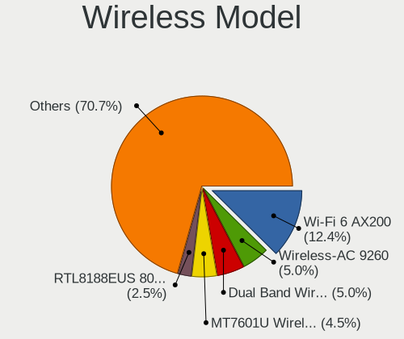

| Model                                                                                         | Desktops | Percent |
|-----------------------------------------------------------------------------------------------|----------|---------|
| Intel Wi-Fi 6 AX200                                                                           | 28       | 12.33%  |
| Intel Dual Band Wireless-AC 3168NGW [Stone Peak]                                              | 11       | 4.85%   |
| Ralink MT7601U Wireless Adapter                                                               | 9        | 3.96%   |
| Intel Wireless-AC 9260                                                                        | 9        | 3.96%   |
| Realtek RTL8188EUS 802.11n Wireless Network Adapter                                           | 6        | 2.64%   |
| Qualcomm Atheros AR9485 Wireless Network Adapter                                              | 6        | 2.64%   |
| Microsoft Xbox 360 Wireless Adapter                                                           | 6        | 2.64%   |
| Intel Wireless 7260                                                                           | 6        | 2.64%   |
| Realtek 802.11ac NIC                                                                          | 5        | 2.2%    |
| Ralink RT5370 Wireless Adapter                                                                | 5        | 2.2%    |
| TP-Link Archer T4U ver.3                                                                      | 4        | 1.76%   |
| Realtek RTL8192EE PCIe Wireless Network Adapter                                               | 4        | 1.76%   |
| Qualcomm Atheros QCA9565 / AR9565 Wireless Network Adapter                                    | 4        | 1.76%   |
| Qualcomm Atheros QCA6174 802.11ac Wireless Network Adapter                                    | 4        | 1.76%   |
| Qualcomm Atheros AR9271 802.11n                                                               | 4        | 1.76%   |
| Intel Cannon Lake PCH CNVi WiFi                                                               | 4        | 1.76%   |
| Broadcom BCM4360 802.11ac Wireless Network Adapter                                            | 4        | 1.76%   |
| TP-Link Archer T9UH v1 [Realtek RTL8814AU]                                                    | 3        | 1.32%   |
| Realtek RTL8821CE 802.11ac PCIe Wireless Network Adapter                                      | 3        | 1.32%   |
| Realtek RTL8812AE 802.11ac PCIe Wireless Network Adapter                                      | 3        | 1.32%   |
| Realtek RTL8192CE PCIe Wireless Network Adapter                                               | 3        | 1.32%   |
| Ralink RT2870/RT3070 Wireless Adapter                                                         | 3        | 1.32%   |
| Qualcomm Atheros AR9227 Wireless Network Adapter                                              | 3        | 1.32%   |
| NetGear A6100 AC600 DB Wireless Adapter [Realtek RTL8811AU]                                   | 3        | 1.32%   |
| Intel Wireless 7265                                                                           | 3        | 1.32%   |
| Intel Wireless 3165                                                                           | 3        | 1.32%   |
| Realtek RTL8822BE 802.11a/b/g/n/ac WiFi adapter                                               | 2        | 0.88%   |
| Realtek RTL8821AE 802.11ac PCIe Wireless Network Adapter                                      | 2        | 0.88%   |
| Realtek RTL8192EU 802.11b/g/n WLAN Adapter                                                    | 2        | 0.88%   |
| Realtek RTL8188FTV 802.11b/g/n 1T1R 2.4G WLAN Adapter                                         | 2        | 0.88%   |
| Realtek Realtek 8812AU/8821AU 802.11ac WLAN Adapter [USB Wireless Dual-Band Adapter 2.4/5Ghz] | 2        | 0.88%   |
| Ralink RT5572 Wireless Adapter                                                                | 2        | 0.88%   |
| Ralink MT7610U ("Archer T2U" 2.4G+5G WLAN Adapter                                             | 2        | 0.88%   |
| Ralink RT5392 PCIe Wireless Network Adapter                                                   | 2        | 0.88%   |
| Qualcomm Atheros AR9462 Wireless Network Adapter                                              | 2        | 0.88%   |
| Qualcomm Atheros AR93xx Wireless Network Adapter                                              | 2        | 0.88%   |
| Qualcomm Atheros AR9285 Wireless Network Adapter (PCI-Express)                                | 2        | 0.88%   |
| Microsoft XBOX ACC                                                                            | 2        | 0.88%   |
| Microsoft Wireless XBox Controller Dongle                                                     | 2        | 0.88%   |
| Intel Comet Lake PCH CNVi WiFi                                                                | 2        | 0.88%   |
| Wilocity Wil6200 802.11ad Wireless Network Adapter                                            | 1        | 0.44%   |
| Wacom ACK-40401 [Wireless Accessory Kit]                                                      | 1        | 0.44%   |
| TP-Link TL-WN823N v2/v3 [Realtek RTL8192EU]                                                   | 1        | 0.44%   |
| TP-Link TL-WN821N v5/v6 [RTL8192EU]                                                           | 1        | 0.44%   |
| TP-Link TL-WN722N v2/v3 [Realtek RTL8188EUS]                                                  | 1        | 0.44%   |
| TP-Link Archer T2U PLUS [RTL8821AU]                                                           | 1        | 0.44%   |
| TP-Link AC600 wireless Realtek RTL8811AU [Archer T2U Nano]                                    | 1        | 0.44%   |
| TP-Link 802.11ac WLAN Adapter                                                                 | 1        | 0.44%   |
| TP-Link 802.11ac NIC                                                                          | 1        | 0.44%   |
| Realtek RTL88x2bu [AC1200 Techkey]                                                            | 1        | 0.44%   |
| Realtek RTL8812AU 802.11a/b/g/n/ac 2T2R DB WLAN Adapter                                       | 1        | 0.44%   |
| Realtek RTL8811AU 802.11a/b/g/n/ac WLAN Adapter                                               | 1        | 0.44%   |
| Realtek RTL8192CU 802.11n WLAN Adapter                                                        | 1        | 0.44%   |
| Realtek RTL8191SU 802.11n WLAN Adapter                                                        | 1        | 0.44%   |
| Realtek RTL8188CE 802.11b/g/n WiFi Adapter                                                    | 1        | 0.44%   |
| Realtek RTL8187B Wireless 802.11g 54Mbps Network Adapter                                      | 1        | 0.44%   |
| Ralink RT2501/RT2573 Wireless Adapter                                                         | 1        | 0.44%   |
| Ralink RT5390R 802.11bgn PCIe Wireless Network Adapter                                        | 1        | 0.44%   |
| Ralink RT5390 Wireless 802.11n 1T/1R PCIe                                                     | 1        | 0.44%   |
| Ralink RT5360 Wireless 802.11n 1T/1R                                                          | 1        | 0.44%   |

Ethernet Vendor
---------------

Ethernet vendors

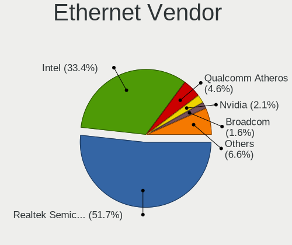

| Vendor                     | Desktops | Percent |
|----------------------------|----------|---------|
| Realtek Semiconductor      | 310      | 53.17%  |
| Intel                      | 185      | 31.73%  |
| Qualcomm Atheros           | 28       | 4.8%    |
| Nvidia                     | 13       | 2.23%   |
| Broadcom                   | 8        | 1.37%   |
| Aquantia                   | 7        | 1.2%    |
| Xiaomi                     | 4        | 0.69%   |
| Samsung Electronics        | 4        | 0.69%   |
| DisplayLink                | 3        | 0.51%   |
| Marvell Technology Group   | 2        | 0.34%   |
| D-Link System              | 2        | 0.34%   |
| Broadcom Limited           | 2        | 0.34%   |
| ASIX Electronics           | 2        | 0.34%   |
| Apple                      | 2        | 0.34%   |
| ZTE WCDMA Technologies MSM | 1        | 0.17%   |
| VIA Technologies           | 1        | 0.17%   |
| Qualcomm                   | 1        | 0.17%   |
| Motorola BCS               | 1        | 0.17%   |
| Mellanox Technologies      | 1        | 0.17%   |
| MediaTek                   | 1        | 0.17%   |
| Lenovo                     | 1        | 0.17%   |
| Huawei Technologies        | 1        | 0.17%   |
| Elecom                     | 1        | 0.17%   |
| Davicom Semiconductor      | 1        | 0.17%   |
| 3Com                       | 1        | 0.17%   |

Ethernet Model
--------------

Ethernet models

| Model                                                             | Desktops | Percent |
|-------------------------------------------------------------------|----------|---------|
| Realtek RTL8111/8168/8411 PCI Express Gigabit Ethernet Controller | 266      | 43.75%  |
| Intel I211 Gigabit Network Connection                             | 52       | 8.55%   |
| Realtek RTL8125 2.5GbE Controller                                 | 29       | 4.77%   |
| Intel 82579LM Gigabit Network Connection (Lewisville)             | 22       | 3.62%   |
| Intel Ethernet Connection (2) I219-V                              | 21       | 3.45%   |
| Intel Ethernet Connection (7) I219-V                              | 15       | 2.47%   |
| Realtek RTL810xE PCI Express Fast Ethernet controller             | 12       | 1.97%   |
| Intel Ethernet Connection I217-LM                                 | 11       | 1.81%   |
| Intel Ethernet Connection I217-V                                  | 9        | 1.48%   |
| Qualcomm Atheros Killer E220x Gigabit Ethernet Controller         | 8        | 1.32%   |
| Intel Ethernet Connection (2) I218-V                              | 8        | 1.32%   |
| Intel 82579V Gigabit Network Connection                           | 8        | 1.32%   |
| Intel 82567LM-3 Gigabit Network Connection                        | 7        | 1.15%   |
| Realtek RTL8153 Gigabit Ethernet Adapter                          | 6        | 0.99%   |
| Realtek RTL-8100/8101L/8139 PCI Fast Ethernet Adapter             | 6        | 0.99%   |
| Intel I210 Gigabit Network Connection                             | 6        | 0.99%   |
| Intel Ethernet Controller I225-V                                  | 6        | 0.99%   |
| Aquantia AQC107 NBase-T/IEEE 802.3bz Ethernet Controller [AQtion] | 6        | 0.99%   |
| Nvidia MCP61 Ethernet                                             | 5        | 0.82%   |
| Qualcomm Atheros AR8161 Gigabit Ethernet                          | 4        | 0.66%   |
| Qualcomm Atheros AR8151 v2.0 Gigabit Ethernet                     | 4        | 0.66%   |
| Nvidia MCP77 Ethernet                                             | 4        | 0.66%   |
| Intel Ethernet Connection (2) I219-LM                             | 4        | 0.66%   |
| Samsung Galaxy series, misc. (tethering mode)                     | 3        | 0.49%   |
| Qualcomm Atheros Killer E2500 Gigabit Ethernet Controller         | 3        | 0.49%   |
| Intel Ethernet Connection (2) I218-LM                             | 3        | 0.49%   |
| Intel 82578DM Gigabit Network Connection                          | 3        | 0.49%   |
| Broadcom NetLink BCM57780 Gigabit Ethernet PCIe                   | 3        | 0.49%   |
| Xiaomi Mi/Redmi series (RNDIS)                                    | 2        | 0.33%   |
| Xiaomi Mi/Redmi series (RNDIS + ADB)                              | 2        | 0.33%   |
| Qualcomm Atheros QCA8171 Gigabit Ethernet                         | 2        | 0.33%   |
| Qualcomm Atheros Killer E2400 Gigabit Ethernet Controller         | 2        | 0.33%   |
| Qualcomm Atheros AR8152 v2.0 Fast Ethernet                        | 2        | 0.33%   |
| Qualcomm Atheros AR8121/AR8113/AR8114 Gigabit or Fast Ethernet    | 2        | 0.33%   |
| Nvidia MCP67 Ethernet                                             | 2        | 0.33%   |
| Intel Ethernet Connection (7) I219-LM                             | 2        | 0.33%   |
| Intel Ethernet Connection (5) I219-LM                             | 2        | 0.33%   |
| Intel Ethernet Connection (14) I219-V                             | 2        | 0.33%   |
| Intel 82574L Gigabit Network Connection                           | 2        | 0.33%   |
| D-Link System DGE-528T Gigabit Ethernet Adapter                   | 2        | 0.33%   |
| Broadcom NetXtreme BCM5761 Gigabit Ethernet PCIe                  | 2        | 0.33%   |
| Broadcom Limited NetXtreme BCM5722 Gigabit Ethernet PCI Express   | 2        | 0.33%   |
| ASIX AX88179 Gigabit Ethernet                                     | 2        | 0.33%   |
| Apple iPad 4/Mini1                                                | 2        | 0.33%   |
| ZTE WCDMA MSM Z6201V                                              | 1        | 0.16%   |
| VIA VT6102/VT6103 [Rhine-II]                                      | 1        | 0.16%   |
| Samsung GT-I9070 (network tethering, USB debugging enabled)       | 1        | 0.16%   |
| Realtek RTL-8110SC/8169SC Gigabit Ethernet                        | 1        | 0.16%   |
| Realtek Killer E3000 2.5GbE Controller                            | 1        | 0.16%   |
| Realtek Killer E2600 Gigabit Ethernet Controller                  | 1        | 0.16%   |
| Qualcomm Mobile Router                                            | 1        | 0.16%   |
| Qualcomm Atheros AR8132 Fast Ethernet                             | 1        | 0.16%   |
| Nvidia MCP51 Ethernet Controller                                  | 1        | 0.16%   |
| Nvidia CK8S Ethernet Controller                                   | 1        | 0.16%   |
| Motorola BCS SurfBoard SB5100 Cable Modem                         | 1        | 0.16%   |
| Mellanox MT26448 [ConnectX EN 10GigE, PCIe 2.0 5GT/s]             | 1        | 0.16%   |
| MediaTek WP7                                                      | 1        | 0.16%   |
| Marvell Group 88E8057 PCI-E Gigabit Ethernet Controller           | 1        | 0.16%   |
| Marvell Group 88E8056 PCI-E Gigabit Ethernet Controller           | 1        | 0.16%   |
| Lenovo Ethernet adapter [U2L 100P-Y1]                             | 1        | 0.16%   |

Net Controller Kind
-------------------

Ethernet, WiFi or modem

| Kind     | Desktops | Percent |
|----------|----------|---------|
| Ethernet | 532      | 71.6%   |
| WiFi     | 206      | 27.73%  |
| Modem    | 5        | 0.67%   |

Used Controller
---------------

Currently used network controller

| Kind     | Desktops | Percent |
|----------|----------|---------|
| Ethernet | 480      | 75.83%  |
| WiFi     | 153      | 24.17%  |

NICs
----

Total network controllers on board

| Total | Desktops | Percent |
|-------|----------|---------|
| 1     | 368      | 68.66%  |
| 2     | 147      | 27.43%  |
| 3     | 16       | 2.99%   |
| 4     | 3        | 0.56%   |
| 6     | 1        | 0.19%   |
| 0     | 1        | 0.19%   |

IPv6
----

IPv6 vs IPv4

| Used | Desktops | Percent |
|------|----------|---------|
| No   | 477      | 88.01%  |
| Yes  | 65       | 11.99%  |

Bluetooth
---------

Bluetooth Vendor
----------------

Controller vendors

| Vendor                          | Desktops | Percent |
|---------------------------------|----------|---------|
| Intel                           | 69       | 36.32%  |
| Cambridge Silicon Radio         | 61       | 32.11%  |
| Broadcom                        | 18       | 9.47%   |
| Realtek Semiconductor           | 14       | 7.37%   |
| ASUSTek Computer                | 10       | 5.26%   |
| Qualcomm Atheros Communications | 8        | 4.21%   |
| Lite-On Technology              | 2        | 1.05%   |
| Belkin Components               | 2        | 1.05%   |
| Ralink                          | 1        | 0.53%   |
| Integrated System Solution      | 1        | 0.53%   |
| IMC Networks                    | 1        | 0.53%   |
| Dynex                           | 1        | 0.53%   |
| Creative Technology             | 1        | 0.53%   |
| AboCom Systems                  | 1        | 0.53%   |

Bluetooth Model
---------------

Controller models

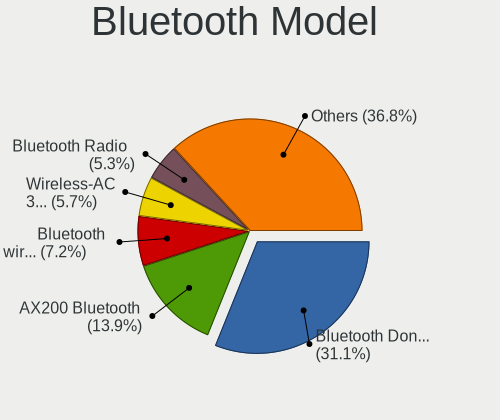

| Model                                                    | Desktops | Percent |
|----------------------------------------------------------|----------|---------|
| Cambridge Silicon Radio Bluetooth Dongle (HCI mode)      | 61       | 31.94%  |
| Intel AX200 Bluetooth                                    | 27       | 14.14%  |
| Intel Bluetooth wireless interface                       | 14       | 7.33%   |
| Intel Wireless-AC 3168 Bluetooth                         | 11       | 5.76%   |
| Realtek Bluetooth Radio                                  | 10       | 5.24%   |
| Intel Wireless-AC 9260 Bluetooth Adapter                 | 8        | 4.19%   |
| Broadcom BCM20702A0 Bluetooth 4.0                        | 8        | 4.19%   |
| Intel Bluetooth 9460/9560 Jefferson Peak (JfP)           | 7        | 3.66%   |
| Realtek  Bluetooth 4.2 Adapter                           | 3        | 1.57%   |
| ASUS Broadcom BCM20702A0 Bluetooth                       | 3        | 1.57%   |
| ASUS ASUS USB-BT500                                      | 3        | 1.57%   |
| Qualcomm Atheros  Bluetooth Device                       | 2        | 1.05%   |
| Qualcomm Atheros Bluetooth USB Host Controller           | 2        | 1.05%   |
| Qualcomm Atheros AR9462 Bluetooth                        | 2        | 1.05%   |
| Broadcom BCM92045B3 ROM                                  | 2        | 1.05%   |
| Belkin Components F8T065BF Mini Bluetooth 4.0 Adapter    | 2        | 1.05%   |
| ASUS Bluetooth Device                                    | 2        | 1.05%   |
| Realtek RTL8821A Bluetooth                               | 1        | 0.52%   |
| Ralink RT3290 Bluetooth                                  | 1        | 0.52%   |
| Qualcomm Atheros QCA61x4 Bluetooth 4.0                   | 1        | 0.52%   |
| Qualcomm Atheros AR3011 Bluetooth                        | 1        | 0.52%   |
| Lite-On Bluetooth Device                                 | 1        | 0.52%   |
| Lite-On Atheros AR3012 Bluetooth                         | 1        | 0.52%   |
| Intel Centrino Bluetooth Wireless Transceiver            | 1        | 0.52%   |
| Intel Bluetooth Device                                   | 1        | 0.52%   |
| Intel AX210 Bluetooth                                    | 1        | 0.52%   |
| Integrated System Solution KY-BT100 Bluetooth Adapter    | 1        | 0.52%   |
| IMC Networks Bluetooth Radio                             | 1        | 0.52%   |
| Dynex Bluetooth 4.0 Adapter [Broadcom, 1.12, BCM20702A0] | 1        | 0.52%   |
| Creative Bluetooth Audio W2                              | 1        | 0.52%   |
| Broadcom Bluetooth Controller                            | 1        | 0.52%   |
| Broadcom Bluetooth 3.0 Dongle                            | 1        | 0.52%   |
| Broadcom Bluetooth 3.0 Device                            | 1        | 0.52%   |
| Broadcom BCM92046DG-CL1ROM Bluetooth 2.1 UHE Dongle      | 1        | 0.52%   |
| Broadcom BCM92046DG-CL1ROM Bluetooth 2.1 Adapter         | 1        | 0.52%   |
| Broadcom BCM2045 Bluetooth                               | 1        | 0.52%   |
| Broadcom BCM2035B3 Bluetooth Adapter                     | 1        | 0.52%   |
| Broadcom ANYCOM Blue USB-200/250                         | 1        | 0.52%   |
| ASUS Bluetooth Radio                                     | 1        | 0.52%   |
| ASUS Bluetooth Adapter                                   | 1        | 0.52%   |
| AboCom Systems AboCom Bluetooth Device                   | 1        | 0.52%   |

Sound
-----

Sound Vendor
------------

Sound card vendors

| Vendor                    | Desktops | Percent |
|---------------------------|----------|---------|
| Intel                     | 302      | 31.07%  |
| AMD                       | 267      | 27.47%  |
| Nvidia                    | 248      | 25.51%  |
| C-Media Electronics       | 30       | 3.09%   |
| Creative Labs             | 14       | 1.44%   |
| Logitech                  | 11       | 1.13%   |
| JMTek                     | 8        | 0.82%   |
| Corsair                   | 7        | 0.72%   |
| Texas Instruments         | 6        | 0.62%   |
| GN Netcom                 | 6        | 0.62%   |
| Razer USA                 | 5        | 0.51%   |
| ASUSTek Computer          | 5        | 0.51%   |
| Plantronics               | 4        | 0.41%   |
| Focusrite-Novation        | 4        | 0.41%   |
| Creative Technology       | 4        | 0.41%   |
| Tenx Technology           | 3        | 0.31%   |
| SAVITECH                  | 3        | 0.31%   |
| Realtek Semiconductor     | 3        | 0.31%   |
| Yamaha                    | 2        | 0.21%   |
| XMOS                      | 2        | 0.21%   |
| VIA Technologies          | 2        | 0.21%   |
| Trust                     | 2        | 0.21%   |
| RODE Microphones          | 2        | 0.21%   |
| ONN                       | 2        | 0.21%   |
| Native Instruments        | 2        | 0.21%   |
| Hewlett-Packard           | 2        | 0.21%   |
| Generalplus Technology    | 2        | 0.21%   |
| Fry's Electronics         | 2        | 0.21%   |
| Valve Software            | 1        | 0.1%    |
| USB MICROPHONE            | 1        | 0.1%    |
| Turtle Beach              | 1        | 0.1%    |
| TEAC                      | 1        | 0.1%    |
| SteelSeries ApS           | 1        | 0.1%    |
| Sony                      | 1        | 0.1%    |
| Sennheiser Communications | 1        | 0.1%    |
| Schiit Audio              | 1        | 0.1%    |
| Samson Technologies       | 1        | 0.1%    |
| Roland                    | 1        | 0.1%    |
| ROCCAT                    | 1        | 0.1%    |
| QinHeng Electronics       | 1        | 0.1%    |
| Kingston Technology       | 1        | 0.1%    |
| GYROCOM C&C               | 1        | 0.1%    |
| Griffin Technology        | 1        | 0.1%    |
| Giga-Byte Technology      | 1        | 0.1%    |
| Dell                      | 1        | 0.1%    |
| Cambridge Silicon Radio   | 1        | 0.1%    |
| Cambridge Audio           | 1        | 0.1%    |
| Bose                      | 1        | 0.1%    |
| Blue Microphones          | 1        | 0.1%    |
| BEHRINGER International   | 1        | 0.1%    |

Sound Model
-----------

Sound card models

| Model                                                                             | Desktops | Percent |
|-----------------------------------------------------------------------------------|----------|---------|
| AMD Starship/Matisse HD Audio Controller                                          | 76       | 6.77%   |
| AMD Family 17h (Models 00h-0fh) HD Audio Controller                               | 48       | 4.27%   |
| Intel 8 Series/C220 Series Chipset High Definition Audio Controller               | 46       | 4.1%    |
| Intel 6 Series/C200 Series Chipset Family High Definition Audio Controller        | 42       | 3.74%   |
| AMD SBx00 Azalia (Intel HDA)                                                      | 38       | 3.38%   |
| Intel 100 Series/C230 Series Chipset Family HD Audio Controller                   | 33       | 2.94%   |
| AMD Ellesmere HDMI Audio [Radeon RX 470/480 / 570/580/590]                        | 32       | 2.85%   |
| Intel 7 Series/C216 Chipset Family High Definition Audio Controller               | 28       | 2.49%   |
| Nvidia GP107GL High Definition Audio Controller                                   | 27       | 2.4%    |
| Intel Xeon E3-1200 v3/4th Gen Core Processor HD Audio Controller                  | 27       | 2.4%    |
| Nvidia GK208 HDMI/DP Audio Controller                                             | 25       | 2.23%   |
| Intel Cannon Lake PCH cAVS                                                        | 25       | 2.23%   |
| Intel 200 Series PCH HD Audio                                                     | 23       | 2.05%   |
| AMD Oland/Hainan/Cape Verde/Pitcairn HDMI Audio [Radeon HD 7000 Series]           | 22       | 1.96%   |
| AMD Family 17h/19h HD Audio Controller                                            | 22       | 1.96%   |
| Nvidia TU116 High Definition Audio Controller                                     | 21       | 1.87%   |
| Nvidia GP106 High Definition Audio Controller                                     | 20       | 1.78%   |
| AMD Raven/Raven2/Fenghuang HDMI/DP Audio Controller                               | 18       | 1.6%    |
| AMD Navi 10 HDMI Audio                                                            | 17       | 1.51%   |
| AMD FCH Azalia Controller                                                         | 17       | 1.51%   |
| Nvidia GP104 High Definition Audio Controller                                     | 16       | 1.42%   |
| Intel NM10/ICH7 Family High Definition Audio Controller                           | 16       | 1.42%   |
| Intel 82801JI (ICH10 Family) HD Audio Controller                                  | 15       | 1.34%   |
| Nvidia High Definition Audio Controller                                           | 14       | 1.25%   |
| Intel 9 Series Chipset Family HD Audio Controller                                 | 13       | 1.16%   |
| Nvidia GM204 High Definition Audio Controller                                     | 12       | 1.07%   |
| AMD Baffin HDMI/DP Audio [Radeon RX 550 640SP / RX 560/560X]                      | 12       | 1.07%   |
| Nvidia GM206 High Definition Audio Controller                                     | 11       | 0.98%   |
| Nvidia TU106 High Definition Audio Controller                                     | 10       | 0.89%   |
| Nvidia GF108 High Definition Audio Controller                                     | 10       | 0.89%   |
| Intel C610/X99 series chipset HD Audio Controller                                 | 10       | 0.89%   |
| Intel 5 Series/3400 Series Chipset High Definition Audio                          | 10       | 0.89%   |
| AMD Vega 10 HDMI Audio [Radeon Vega 56/64]                                        | 10       | 0.89%   |
| Nvidia GM107 High Definition Audio Controller [GeForce 940MX]                     | 9        | 0.8%    |
| Nvidia MCP61 High Definition Audio                                                | 8        | 0.71%   |
| Nvidia GP108 High Definition Audio Controller                                     | 8        | 0.71%   |
| Nvidia GF119 HDMI Audio Controller                                                | 8        | 0.71%   |
| Nvidia TU104 HD Audio Controller                                                  | 7        | 0.62%   |
| JMTek USB PnP Audio Device                                                        | 7        | 0.62%   |
| Intel C600/X79 series chipset High Definition Audio Controller                    | 7        | 0.62%   |
| Intel 82801JD/DO (ICH10 Family) HD Audio Controller                               | 7        | 0.62%   |
| AMD Caicos HDMI Audio [Radeon HD 6450 / 7450/8450/8490 OEM / R5 230/235/235X OEM] | 7        | 0.62%   |
| Nvidia GP102 HDMI Audio Controller                                                | 6        | 0.53%   |
| Nvidia GK106 HDMI Audio Controller                                                | 6        | 0.53%   |
| Intel Comet Lake PCH-V cAVS                                                       | 6        | 0.53%   |
| AMD Cedar HDMI Audio [Radeon HD 5400/6300/7300 Series]                            | 6        | 0.53%   |
| Nvidia TU107 GeForce GTX 1650 High Definition Audio Controller                    | 5        | 0.45%   |
| Nvidia GK107 HDMI Audio Controller                                                | 5        | 0.45%   |
| AMD RS780 HDMI Audio [Radeon 3000/3100 / HD 3200/3300]                            | 5        | 0.45%   |
| AMD Kaveri HDMI/DP Audio Controller                                               | 5        | 0.45%   |
| Nvidia GF116 High Definition Audio Controller                                     | 4        | 0.36%   |
| Intel Tiger Lake-H HD Audio Controller                                            | 4        | 0.36%   |
| Intel Comet Lake PCH cAVS                                                         | 4        | 0.36%   |
| Creative Labs Sound Core3D [Sound Blaster Recon3D / Z-Series]                     | 4        | 0.36%   |
| C-Media Electronics Auna Mic CM900                                                | 4        | 0.36%   |
| C-Media Electronics Audio Adapter (Unitek Y-247A)                                 | 4        | 0.36%   |
| ASUSTek Computer USB Audio                                                        | 4        | 0.36%   |
| AMD Turks HDMI Audio [Radeon HD 6500/6600 / 6700M Series]                         | 4        | 0.36%   |
| AMD Trinity HDMI Audio Controller                                                 | 4        | 0.36%   |
| AMD Navi 21/23 HDMI/DP Audio Controller                                           | 4        | 0.36%   |

Memory
------

Memory Vendor
-------------

Memory module vendors

| Vendor              | Desktops | Percent |
|---------------------|----------|---------|
| Kingston            | 75       | 19.89%  |
| Corsair             | 59       | 15.65%  |
| Crucial             | 47       | 12.47%  |
| Unknown             | 45       | 11.94%  |
| G.Skill             | 37       | 9.81%   |
| Samsung Electronics | 28       | 7.43%   |
| SK Hynix            | 25       | 6.63%   |
| Micron Technology   | 12       | 3.18%   |
| Patriot             | 8        | 2.12%   |
| A-DATA Technology   | 7        | 1.86%   |
| Team                | 5        | 1.33%   |
| GOODRAM             | 4        | 1.06%   |
| Transcend           | 3        | 0.8%    |
| Ramaxel Technology  | 3        | 0.8%    |
| Silicon Power       | 2        | 0.53%   |
| Nanya Technology    | 2        | 0.53%   |
| Hewlett-Packard     | 2        | 0.53%   |
| AMD                 | 2        | 0.53%   |
| Unifosa             | 1        | 0.27%   |
| Smart               | 1        | 0.27%   |
| Reboto              | 1        | 0.27%   |
| Kllisre             | 1        | 0.27%   |
| GeIL                | 1        | 0.27%   |
| Elpida              | 1        | 0.27%   |
| Centon              | 1        | 0.27%   |
| Avant               | 1        | 0.27%   |
| ASint Technology    | 1        | 0.27%   |
| Apacer              | 1        | 0.27%   |
| ankowall            | 1        | 0.27%   |

Memory Model
------------

Memory module models

| Model                                                       | Desktops | Percent |
|-------------------------------------------------------------|----------|---------|
| Corsair RAM CMK16GX4M2B3200C16 8GB DIMM DDR4 3600MT/s       | 9        | 2.1%    |
| Kingston RAM KHX1600C9D3/4GX 4GB DIMM DDR3 2400MT/s         | 5        | 1.17%   |
| Unknown RAM Module 2048MB DIMM DDR2 800MT/s                 | 4        | 0.93%   |
| Unknown RAM Module 4096MB DIMM 1333MT/s                     | 3        | 0.7%    |
| Samsung RAM M378B5173DB0-CK0 4GB DIMM DDR3 1600MT/s         | 3        | 0.7%    |
| Kingston RAM KHX3200C16D4/16GX 16GB DIMM DDR4 3600MT/s      | 3        | 0.7%    |
| Kingston RAM KHX1866C10D3/8G 8GB DIMM DDR3 1867MT/s         | 3        | 0.7%    |
| Kingston RAM KHX1600C10D3/ 4GB DIMM DDR3 1600MT/s           | 3        | 0.7%    |
| G.Skill RAM F4-3200C16-16GVK 16GB DIMM DDR4 3600MT/s        | 3        | 0.7%    |
| Corsair RAM CMK32GX4M2B3200C16 16GB DIMM DDR4 3400MT/s      | 3        | 0.7%    |
| Corsair RAM CMK32GX4M2B3000C15 16384MB DIMM DDR4 3000MT/s   | 3        | 0.7%    |
| Corsair RAM CMK16GX4M2B3000C15 8GB DIMM DDR4 3000MT/s       | 3        | 0.7%    |
| Unknown RAM Module 8192MB DIMM DDR3 1600MT/s                | 2        | 0.47%   |
| Unknown RAM Module 8192MB DIMM 667MT/s                      | 2        | 0.47%   |
| Unknown RAM Module 8192MB DIMM 1333MT/s                     | 2        | 0.47%   |
| Unknown RAM Module 4096MB DIMM SDRAM                        | 2        | 0.47%   |
| Unknown RAM Module 4096MB DIMM DDR2 800MT/s                 | 2        | 0.47%   |
| Unknown RAM Module 4096MB DIMM 1600MT/s                     | 2        | 0.47%   |
| Unknown RAM Module 2048MB DIMM SDRAM                        | 2        | 0.47%   |
| Unknown RAM Module 2048MB DIMM DDR2 667MT/s                 | 2        | 0.47%   |
| Unknown RAM Module 2048MB DIMM 1333MT/s                     | 2        | 0.47%   |
| Team RAM TEAMGROUP-UD4-2666 4GB DIMM DDR4 2667MT/s          | 2        | 0.47%   |
| SK Hynix RAM HMT41GU6BFR8C-PB 8192MB DIMM DDR3 1600MT/s     | 2        | 0.47%   |
| SK Hynix RAM HMT325U6EFR8C-PB 2GB DIMM DDR3 1600MT/s        | 2        | 0.47%   |
| Samsung RAM M393B2G70DB0 16GB DIMM DDR3 1866MT/s            | 2        | 0.47%   |
| Samsung RAM M378B5773DH0-CK0 2GB DIMM DDR3 1600MT/s         | 2        | 0.47%   |
| Samsung RAM M378B5673FH0-CH9 2GB DIMM DDR3 1600MT/s         | 2        | 0.47%   |
| Micron RAM 8JTF25664AZ-1G4M1 2048MB DIMM DDR3 1333MT/s      | 2        | 0.47%   |
| Micron RAM 8JTF25664AZ-1G4D1 2GB DIMM DDR3 1333MT/s         | 2        | 0.47%   |
| Kingston RAM KHX3333C16D4/8GX 8GB DIMM DDR4 3800MT/s        | 2        | 0.47%   |
| Kingston RAM KHX2666C16/8G 8GB DIMM DDR4 3466MT/s           | 2        | 0.47%   |
| Kingston RAM KHX2666C15S4/16G 16GB SODIMM DDR4 2667MT/s     | 2        | 0.47%   |
| Kingston RAM KHX2400C15D4/4G 4GB DIMM DDR4 3151MT/s         | 2        | 0.47%   |
| Kingston RAM KHX2400C15/8G 8GB DIMM DDR4 2933MT/s           | 2        | 0.47%   |
| Kingston RAM KHX2400C11D3/8GX 8GB DIMM DDR3 2400MT/s        | 2        | 0.47%   |
| Kingston RAM KHX2133C14/8G 8192MB DIMM DDR4 2400MT/s        | 2        | 0.47%   |
| Kingston RAM 99U5471-066.A00LF 8GB DIMM DDR3 1600MT/s       | 2        | 0.47%   |
| Kingston RAM 9905471-001.A01LF 2GB DIMM DDR3 1600MT/s       | 2        | 0.47%   |
| G.Skill RAM F4-3600C17-16GTZKW 16GB DIMM DDR4 3600MT/s      | 2        | 0.47%   |
| G.Skill RAM F4-3600C16-16GVKC 16GB DIMM DDR4 3866MT/s       | 2        | 0.47%   |
| G.Skill RAM F4-3200C14-8GFX 8GB DIMM DDR4 3733MT/s          | 2        | 0.47%   |
| G.Skill RAM F4-3200C14-16GTZ 16384MB DIMM DDR4 3600MT/s     | 2        | 0.47%   |
| G.Skill RAM F3-2133C10-8GXM 8192MB DIMM DDR3 2132MT/s       | 2        | 0.47%   |
| Crucial RAM CT51264BA160BJ.C8F 4GB DIMM DDR3 1600MT/s       | 2        | 0.47%   |
| Crucial RAM CT16G4DFD824A.M16FJ 16384MB DIMM DDR4 2400MT/s  | 2        | 0.47%   |
| Crucial RAM CT16G4DFD824A.C16FBD 16GB DIMM DDR4 2933MT/s    | 2        | 0.47%   |
| Crucial RAM BLS8G4D32AESCK.M8FE 8GB DIMM DDR4 3200MT/s      | 2        | 0.47%   |
| Crucial RAM BLS16G4D32AESC.M16FE 16384MB DIMM DDR4 3200MT/s | 2        | 0.47%   |
| Crucial RAM BLS16G4D32AESB.M16FE 16GB DIMM DDR4 3800MT/s    | 2        | 0.47%   |
| Corsair RAM CMK32GX4M2E3200C16 16384MB DIMM DDR4 3200MT/s   | 2        | 0.47%   |
| Unknown RAM Module 8GB DIMM DDR3 1600MT/s                   | 1        | 0.23%   |
| Unknown RAM Module 8192MB DIMM DDR3 1333MT/s                | 1        | 0.23%   |
| Unknown RAM Module 8192MB DIMM DDR3 1066MT/s                | 1        | 0.23%   |
| Unknown RAM Module 4GB DIMM 800MT/s                         | 1        | 0.23%   |
| Unknown RAM Module 4GB DIMM 1333MT/s                        | 1        | 0.23%   |
| Unknown RAM Module 4096MB DIMM DDR4 2400MT/s                | 1        | 0.23%   |
| Unknown RAM Module 4096MB DIMM DDR3 1333MT/s                | 1        | 0.23%   |
| Unknown RAM Module 4096MB DIMM DDR2 400MT/s                 | 1        | 0.23%   |
| Unknown RAM Module 4096MB DIMM DDR2 1067MT/s                | 1        | 0.23%   |
| Unknown RAM Module 4096MB DIMM DDR 1333MT/s                 | 1        | 0.23%   |

Memory Kind
-----------

Memory module kinds

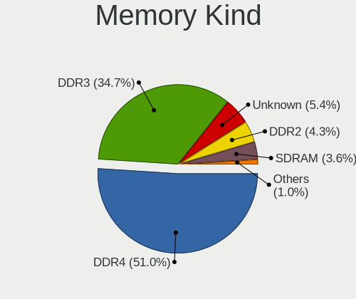

| Kind    | Desktops | Percent |
|---------|----------|---------|
| DDR4    | 179      | 52.03%  |
| DDR3    | 120      | 34.88%  |
| Unknown | 18       | 5.23%   |
| DDR2    | 15       | 4.36%   |
| SDRAM   | 10       | 2.91%   |
| DDR     | 2        | 0.58%   |

Memory Form Factor
------------------

Physical design of the memory module

| Name   | Desktops | Percent |
|--------|----------|---------|
| DIMM   | 324      | 95.29%  |
| SODIMM | 16       | 4.71%   |

Memory Size
-----------

Memory module size

| Size  | Desktops | Percent |
|-------|----------|---------|
| 8192  | 143      | 38.24%  |
| 16384 | 83       | 22.19%  |
| 4096  | 77       | 20.59%  |
| 2048  | 54       | 14.44%  |
| 32768 | 9        | 2.41%   |
| 1024  | 8        | 2.14%   |

Memory Speed
------------

Memory module speed

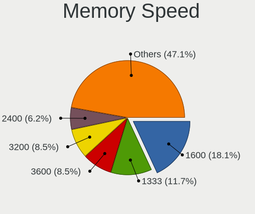

| Speed   | Desktops | Percent |
|---------|----------|---------|
| 1600    | 73       | 19.31%  |
| 1333    | 40       | 10.58%  |
| 3200    | 37       | 9.79%   |
| 3600    | 34       | 8.99%   |
| 2400    | 30       | 7.94%   |
| 2667    | 21       | 5.56%   |
| 2133    | 20       | 5.29%   |
| 800     | 15       | 3.97%   |
| 3000    | 12       | 3.17%   |
| 2666    | 12       | 3.17%   |
| 2933    | 8        | 2.12%   |
| 667     | 8        | 2.12%   |
| 3733    | 6        | 1.59%   |
| 3800    | 5        | 1.32%   |
| 3466    | 5        | 1.32%   |
| 3400    | 5        | 1.32%   |
| 1066    | 5        | 1.32%   |
| 1866    | 4        | 1.06%   |
| Unknown | 4        | 1.06%   |
| 2800    | 3        | 0.79%   |
| 2000    | 3        | 0.79%   |
| 1800    | 3        | 0.79%   |
| 400     | 3        | 0.79%   |
| 3866    | 2        | 0.53%   |
| 3333    | 2        | 0.53%   |
| 3151    | 2        | 0.53%   |
| 2132    | 2        | 0.53%   |
| 1067    | 2        | 0.53%   |
| 3467    | 1        | 0.26%   |
| 3334    | 1        | 0.26%   |
| 3266    | 1        | 0.26%   |
| 3066    | 1        | 0.26%   |
| 2473    | 1        | 0.26%   |
| 2134    | 1        | 0.26%   |
| 2048    | 1        | 0.26%   |
| 1867    | 1        | 0.26%   |
| 1334    | 1        | 0.26%   |
| 880     | 1        | 0.26%   |
| 533     | 1        | 0.26%   |
| 333     | 1        | 0.26%   |

Printers & scanners
-------------------

Printer Vendor
--------------

Printer device vendors

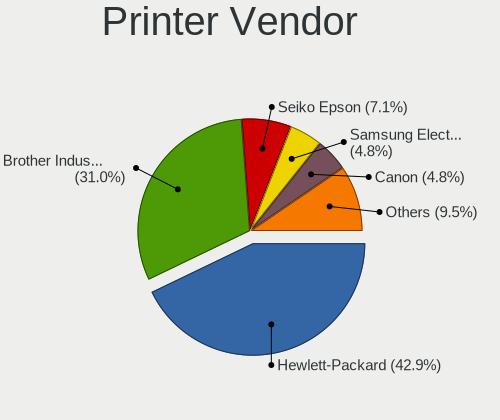

| Vendor                 | Desktops | Percent |
|------------------------|----------|---------|
| Hewlett-Packard        | 17       | 44.74%  |
| Brother Industries     | 11       | 28.95%  |
| Seiko Epson            | 3        | 7.89%   |
| Samsung Electronics    | 2        | 5.26%   |
| Canon                  | 2        | 5.26%   |
| Prolific Technology    | 1        | 2.63%   |
| Pantum                 | 1        | 2.63%   |
| Panasonic (Matsushita) | 1        | 2.63%   |

Printer Model
-------------

Printer device models

| Model                                | Desktops | Percent |
|--------------------------------------|----------|---------|
| Seiko Epson Printer                  | 1        | 2.56%   |
| Seiko Epson L120 Series              | 1        | 2.56%   |
| Seiko Epson ET-2710 Series           | 1        | 2.56%   |
| Samsung ML-216x Series Laser Printer | 1        | 2.56%   |
| Samsung CLX-3180 Series              | 1        | 2.56%   |
| Prolific PL2305 Parallel Port        | 1        | 2.56%   |
| Pantum P2200 series                  | 1        | 2.56%   |
| Panasonic (Matsushita) KX-MB1500CX   | 1        | 2.56%   |
| HP OfficeJet Pro 9010 series         | 1        | 2.56%   |
| HP Officejet 4630 series             | 1        | 2.56%   |
| HP OfficeJet 3830 series             | 1        | 2.56%   |
| HP LaserJet P2035                    | 1        | 2.56%   |
| HP LaserJet P2015 series             | 1        | 2.56%   |
| HP LaserJet P1102                    | 1        | 2.56%   |
| HP LaserJet M101-M106                | 1        | 2.56%   |
| HP LaserJet CP1025nw                 | 1        | 2.56%   |
| HP LaserJet 200 color M251nw         | 1        | 2.56%   |
| HP LaserJet 1018                     | 1        | 2.56%   |
| HP LaserJet 1010                     | 1        | 2.56%   |
| HP ENVY 5000 series                  | 1        | 2.56%   |
| HP ENVY 4500 series                  | 1        | 2.56%   |
| HP Deskjet F4500 series              | 1        | 2.56%   |
| HP DeskJet 930c                      | 1        | 2.56%   |
| HP DeskJet 2700 series               | 1        | 2.56%   |
| HP DeskJet 2620 All-in-One Printer   | 1        | 2.56%   |
| HP Deskjet 2540 series               | 1        | 2.56%   |
| Canon PIXMA MP495                    | 1        | 2.56%   |
| Canon PIXMA MG2500 Series            | 1        | 2.56%   |
| Brother MFC-L3770CDW                 | 1        | 2.56%   |
| Brother MFC-L2710DW series           | 1        | 2.56%   |
| Brother MFC-J805DW                   | 1        | 2.56%   |
| Brother MFC-J491DW                   | 1        | 2.56%   |
| Brother MFC-9330CDW                  | 1        | 2.56%   |
| Brother MFC-7460DN                   | 1        | 2.56%   |
| Brother MFC-7420                     | 1        | 2.56%   |
| Brother HL-L2300D series             | 1        | 2.56%   |
| Brother HL-5340 series               | 1        | 2.56%   |
| Brother DCP-J140W                    | 1        | 2.56%   |
| Brother DCP-9020CDW                  | 1        | 2.56%   |

Scanner Vendor
--------------

Scanner device vendors

| Vendor          | Desktops | Percent |
|-----------------|----------|---------|
| Canon           | 4        | 57.14%  |
| Seiko Epson     | 2        | 28.57%  |
| Hewlett-Packard | 1        | 14.29%  |

Scanner Model
-------------

Scanner device models

| Model                                                   | Desktops | Percent |
|---------------------------------------------------------|----------|---------|
| Seiko Epson GT-F730 [GT-S630/Perfection V33/V330 Photo] | 1        | 14.29%  |
| Seiko Epson ES-D200 [GT-S50]                            | 1        | 14.29%  |
| HP ScanJet G4010                                        | 1        | 14.29%  |
| Canon CanoScan LIDE 25                                  | 1        | 14.29%  |
| Canon CanoScan LiDE 220                                 | 1        | 14.29%  |
| Canon CanoScan LiDE 120                                 | 1        | 14.29%  |
| Canon CanoScan LiDE 110                                 | 1        | 14.29%  |

Camera
------

Camera Vendor
-------------

Camera device vendors

| Vendor                        | Desktops | Percent |
|-------------------------------|----------|---------|
| Logitech                      | 58       | 41.43%  |
| Samsung Electronics           | 9        | 6.43%   |
| Microsoft                     | 9        | 6.43%   |
| Microdia                      | 8        | 5.71%   |
| Sunplus Innovation Technology | 5        | 3.57%   |
| ARC International             | 5        | 3.57%   |
| Z-Star Microelectronics       | 4        | 2.86%   |
| KYE Systems (Mouse Systems)   | 4        | 2.86%   |
| Huawei Technologies           | 3        | 2.14%   |
| Generalplus Technology        | 3        | 2.14%   |
| Chicony Electronics           | 3        | 2.14%   |
| Apple                         | 3        | 2.14%   |
| Alcor Micro                   | 3        | 2.14%   |
| MacroSilicon                  | 2        | 1.43%   |
| Genesys Logic                 | 2        | 1.43%   |
| Cubeternet                    | 2        | 1.43%   |
| Arkmicro Technologies         | 2        | 1.43%   |
| A4Tech                        | 2        | 1.43%   |
| webcam                        | 1        | 0.71%   |
| Valve Software                | 1        | 0.71%   |
| Unknown                       | 1        | 0.71%   |
| Realtek Semiconductor         | 1        | 0.71%   |
| Razer USA                     | 1        | 0.71%   |
| Pixart Imaging                | 1        | 0.71%   |
| Philips (or NXP)              | 1        | 0.71%   |
| MediaTek                      | 1        | 0.71%   |
| lihappe8                      | 1        | 0.71%   |
| Lenovo                        | 1        | 0.71%   |
| Intel                         | 1        | 0.71%   |
| HDR webcam                    | 1        | 0.71%   |
| GEMBIRD                       | 1        | 0.71%   |

Camera Model
------------

Camera device models

| Model                                           | Desktops | Percent |
|-------------------------------------------------|----------|---------|
| Logitech Webcam C270                            | 16       | 11.11%  |
| Logitech HD Pro Webcam C920                     | 11       | 7.64%   |
| Samsung Galaxy A5 (MTP)                         | 8        | 5.56%   |
| Logitech HD Webcam C615                         | 6        | 4.17%   |
| ARC International Camera                        | 5        | 3.47%   |
| Microsoft LifeCam HD-3000                       | 4        | 2.78%   |
| Logitech Webcam Pro 9000                        | 4        | 2.78%   |
| Logitech HD Webcam C525                         | 4        | 2.78%   |
| Microdia Webcam Vitade AF                       | 3        | 2.08%   |
| Microdia Camera                                 | 3        | 2.08%   |
| Huawei UVC Camera                               | 3        | 2.08%   |
| Z-Star Vimicro USB Camera (Altair)              | 2        | 1.39%   |
| Z-Star Venus USB2.0 Camera                      | 2        | 1.39%   |
| MacroSilicon USB Video                          | 2        | 1.39%   |
| Logitech Webcam C210                            | 2        | 1.39%   |
| Logitech Webcam C200                            | 2        | 1.39%   |
| Logitech Webcam C170                            | 2        | 1.39%   |
| Logitech B525 HD Webcam                         | 2        | 1.39%   |
| KYE Systems (Mouse Systems) Genius FaceCam 320  | 2        | 1.39%   |
| Generalplus GENERAL WEBCAM                      | 2        | 1.39%   |
| Arkmicro USB2.0 PC CAMERA                       | 2        | 1.39%   |
| Apple iPhone 5/5C/5S/6/SE                       | 2        | 1.39%   |
| webcam webcam                                   | 1        | 0.69%   |
| Valve Software 3D Camera                        | 1        | 0.69%   |
| Unknown Integrated RGB Camera                   | 1        | 0.69%   |
| Sunplus Integrated_Webcam_HD                    | 1        | 0.69%   |
| Sunplus Feeltek Full HD Webcam 1080P            | 1        | 0.69%   |
| Sunplus Canyon CNS CWC5 Webcam                  | 1        | 0.69%   |
| Sunplus Aukey-PC-LM1E Camera                    | 1        | 0.69%   |
| Sunplus 2K FHD camera                           | 1        | 0.69%   |
| Samsung Galaxy (debugging mode)                 | 1        | 0.69%   |
| Realtek FULL HD 1080P Webcam                    | 1        | 0.69%   |
| Razer USA Gaming Webcam [Kiyo]                  | 1        | 0.69%   |
| Pixart Imaging Webcam Genius iLook 300          | 1        | 0.69%   |
| Philips (or NXP) PCVC740K ToUcam Pro [pwc]      | 1        | 0.69%   |
| Microsoft LifeCam VX-800                        | 1        | 0.69%   |
| Microsoft LifeCam VX-5000                       | 1        | 0.69%   |
| Microsoft LifeCam VX-500 [1357]                 | 1        | 0.69%   |
| Microsoft LifeCam NX-3000 (UVC-compliant)       | 1        | 0.69%   |
| Microsoft LifeCam Cinema                        | 1        | 0.69%   |
| Microdia USB 2.0 Camera                         | 1        | 0.69%   |
| Microdia JP001                                  | 1        | 0.69%   |
| MediaTek Lenny4                                 | 1        | 0.69%   |
| Logitech Webcam C930e                           | 1        | 0.69%   |
| Logitech Webcam C925e                           | 1        | 0.69%   |
| Logitech Webcam C310                            | 1        | 0.69%   |
| Logitech Webcam C300                            | 1        | 0.69%   |
| Logitech Webcam C260                            | 1        | 0.69%   |
| Logitech QuickCam Sphere                        | 1        | 0.69%   |
| Logitech QuickCam Orbit/Sphere AF               | 1        | 0.69%   |
| Logitech QuickCam E 3500                        | 1        | 0.69%   |
| Logitech QuickCam Communicate MP/S5500          | 1        | 0.69%   |
| Logitech HD Webcam C910                         | 1        | 0.69%   |
| Logitech HD Webcam C510                         | 1        | 0.69%   |
| Logitech CrystalCam                             | 1        | 0.69%   |
| Logitech C922 Pro Stream Webcam                 | 1        | 0.69%   |
| lihappe8 USB 2.0 Camera                         | 1        | 0.69%   |
| Lenovo FHD Webcam                               | 1        | 0.69%   |
| KYE Systems (Mouse Systems) Genius WideCam F100 | 1        | 0.69%   |
| KYE Systems (Mouse Systems) Genius Webcam       | 1        | 0.69%   |

Security
--------

Fingerprint Vendor
------------------

Fingerprint sensor vendors

| Vendor             | Desktops | Percent |
|--------------------|----------|---------|
| STMicroelectronics | 1        | 33.33%  |
| DigitalPersona     | 1        | 33.33%  |
| AuthenTec          | 1        | 33.33%  |

Fingerprint Model
-----------------

Fingerprint sensor models

| Model                                 | Desktops | Percent |
|---------------------------------------|----------|---------|
| STMicroelectronics Fingerprint Reader | 1        | 33.33%  |
| DigitalPersona Fingerprint Reader     | 1        | 33.33%  |
| AuthenTec AES1600                     | 1        | 33.33%  |

Chipcard Vendor
---------------

Chipcard module vendors

| Vendor                   | Desktops | Percent |
|--------------------------|----------|---------|
| OmniKey                  | 2        | 16.67%  |
| Alcor Micro              | 2        | 16.67%  |
| Advanced Card Systems    | 2        | 16.67%  |
| SCM Microsystems         | 1        | 8.33%   |
| Reiner SCT Kartensysteme | 1        | 8.33%   |
| Gemalto (was Gemplus)    | 1        | 8.33%   |
| BIT4ID                   | 1        | 8.33%   |
| ARDS                     | 1        | 8.33%   |
| Aktiv                    | 1        | 8.33%   |

Chipcard Model
--------------

Chipcard module models

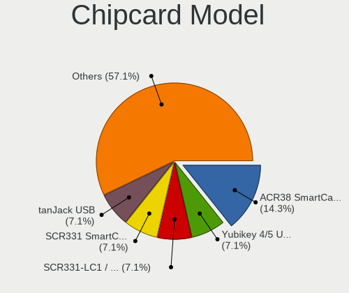

| Model                                             | Desktops | Percent |
|---------------------------------------------------|----------|---------|
| Advanced Card Systems ACR38 SmartCard Reader      | 2        | 16.67%  |
| SCM Microsystems SCR331 SmartCard Reader          | 1        | 8.33%   |
| Reiner SCT Kartensysteme tanJack USB              | 1        | 8.33%   |
| OmniKey CardMan 3021 / 3121                       | 1        | 8.33%   |
| OmniKey CardMan 1021                              | 1        | 8.33%   |
| Gemalto (was Gemplus) GemPC Twin SmartCard Reader | 1        | 8.33%   |
| BIT4ID miniLector EVO                             | 1        | 8.33%   |
| ARDS JaCarta                                      | 1        | 8.33%   |
| Alcor Micro Watchdata W 1981                      | 1        | 8.33%   |
| Alcor Micro AU9540 Smartcard Reader               | 1        | 8.33%   |
| Aktiv Rutoken lite                                | 1        | 8.33%   |

Unsupported
-----------

Unsupported Devices
-------------------

Total unsupported devices on board

| Total | Desktops | Percent |
|-------|----------|---------|
| 0     | 466      | 85.66%  |
| 1     | 64       | 11.76%  |
| 2     | 8        | 1.47%   |
| 4     | 4        | 0.74%   |
| 6     | 1        | 0.18%   |
| 3     | 1        | 0.18%   |

Unsupported Device Types
------------------------

Types of unsupported devices

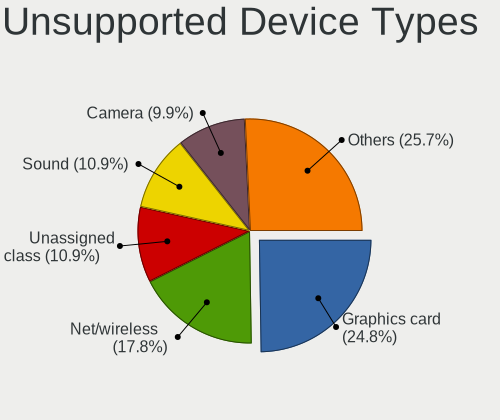

| Type                     | Desktops | Percent |
|--------------------------|----------|---------|
| Graphics card            | 22       | 22.68%  |
| Net/wireless             | 16       | 16.49%  |
| Unassigned class         | 11       | 11.34%  |
| Sound                    | 10       | 10.31%  |
| Camera                   | 10       | 10.31%  |
| Chipcard                 | 6        | 6.19%   |
| Bluetooth                | 6        | 6.19%   |
| Communication controller | 4        | 4.12%   |
| Multimedia controller    | 3        | 3.09%   |
| Fingerprint reader       | 3        | 3.09%   |
| Network                  | 2        | 2.06%   |
| Storage/ide              | 1        | 1.03%   |
| Net/ethernet             | 1        | 1.03%   |
| Firewire controller      | 1        | 1.03%   |
| Card reader              | 1        | 1.03%   |

