Kubuntu 20.04 - Tested Hardware & Statistics (Notebooks)
--------------------------------------------------------

A project to collect tested hardware configurations for Kubuntu 20.04.

Anyone can contribute to this report by the [hw-probe](https://github.com/linuxhw/hw-probe) tool:

    sudo -E hw-probe -all -upload

Please contribute! Especially if your hardware is rare.

Contents
--------

* [ Test Cases ](#test-cases)

* [ System ](#system)
  - [ Kernel                   ](#kernel)
  - [ Kernel Family            ](#kernel-family)
  - [ Kernel Major Ver.        ](#kernel-major-ver)
  - [ Arch                     ](#arch)
  - [ DE                       ](#de)
  - [ Display Server           ](#display-server)
  - [ Display Manager          ](#display-manager)
  - [ OS Lang                  ](#os-lang)
  - [ Boot Mode                ](#boot-mode)
  - [ Filesystem               ](#filesystem)
  - [ Part. scheme             ](#part-scheme)
  - [ Dual Boot with Linux/BSD ](#dual-boot-with-linuxbsd)
  - [ Dual Boot (Win)          ](#dual-boot-win)

* [ Board ](#board)
  - [ Vendor                   ](#vendor)
  - [ Model                    ](#model)
  - [ Model Family             ](#model-family)
  - [ MFG Year                 ](#mfg-year)
  - [ Form Factor              ](#form-factor)
  - [ Secure Boot              ](#secure-boot)
  - [ Coreboot                 ](#coreboot)
  - [ RAM Size                 ](#ram-size)
  - [ RAM Used                 ](#ram-used)
  - [ Total Drives             ](#total-drives)
  - [ Has CD-ROM               ](#has-cd-rom)
  - [ Has Ethernet             ](#has-ethernet)
  - [ Has WiFi                 ](#has-wifi)
  - [ Has Bluetooth            ](#has-bluetooth)

* [ Location ](#location)
  - [ Country                  ](#country)
  - [ City                     ](#city)

* [ Drives ](#drives)
  - [ Drive Vendor             ](#drive-vendor)
  - [ Drive Model              ](#drive-model)
  - [ HDD Vendor               ](#hdd-vendor)
  - [ SSD Vendor               ](#ssd-vendor)
  - [ Drive Kind               ](#drive-kind)
  - [ Drive Connector          ](#drive-connector)
  - [ Drive Size               ](#drive-size)
  - [ Space Total              ](#space-total)
  - [ Space Used               ](#space-used)
  - [ Malfunc. Drives          ](#malfunc-drives)
  - [ Malfunc. Drive Vendor    ](#malfunc-drive-vendor)
  - [ Malfunc. HDD Vendor      ](#malfunc-hdd-vendor)
  - [ Malfunc. Drive Kind      ](#malfunc-drive-kind)
  - [ Failed Drives            ](#failed-drives)
  - [ Failed Drive Vendor      ](#failed-drive-vendor)
  - [ Drive Status             ](#drive-status)

* [ Storage controller ](#storage-controller)
  - [ Storage Vendor           ](#storage-vendor)
  - [ Storage Model            ](#storage-model)
  - [ Storage Kind             ](#storage-kind)

* [ Processor ](#processor)
  - [ CPU Vendor               ](#cpu-vendor)
  - [ CPU Model                ](#cpu-model)
  - [ CPU Model Family         ](#cpu-model-family)
  - [ CPU Cores                ](#cpu-cores)
  - [ CPU Sockets              ](#cpu-sockets)
  - [ CPU Threads              ](#cpu-threads)
  - [ CPU Op-Modes             ](#cpu-op-modes)
  - [ CPU Microcode            ](#cpu-microcode)
  - [ CPU Microarch            ](#cpu-microarch)

* [ Graphics ](#graphics)
  - [ GPU Vendor               ](#gpu-vendor)
  - [ GPU Model                ](#gpu-model)
  - [ GPU Combo                ](#gpu-combo)
  - [ GPU Driver               ](#gpu-driver)
  - [ GPU Memory               ](#gpu-memory)

* [ Monitor ](#monitor)
  - [ Monitor Vendor           ](#monitor-vendor)
  - [ Monitor Model            ](#monitor-model)
  - [ Monitor Resolution       ](#monitor-resolution)
  - [ Monitor Diagonal         ](#monitor-diagonal)
  - [ Monitor Width            ](#monitor-width)
  - [ Aspect Ratio             ](#aspect-ratio)
  - [ Monitor Area             ](#monitor-area)
  - [ Pixel Density            ](#pixel-density)
  - [ Multiple Monitors        ](#multiple-monitors)

* [ Network ](#network)
  - [ Net Controller Vendor    ](#net-controller-vendor)
  - [ Net Controller Model     ](#net-controller-model)
  - [ Wireless Vendor          ](#wireless-vendor)
  - [ Wireless Model           ](#wireless-model)
  - [ Ethernet Vendor          ](#ethernet-vendor)
  - [ Ethernet Model           ](#ethernet-model)
  - [ Net Controller Kind      ](#net-controller-kind)
  - [ Used Controller          ](#used-controller)
  - [ NICs                     ](#nics)
  - [ IPv6                     ](#ipv6)

* [ Bluetooth ](#bluetooth)
  - [ Bluetooth Vendor         ](#bluetooth-vendor)
  - [ Bluetooth Model          ](#bluetooth-model)

* [ Sound ](#sound)
  - [ Sound Vendor             ](#sound-vendor)
  - [ Sound Model              ](#sound-model)

* [ Memory ](#memory)
  - [ Memory Vendor            ](#memory-vendor)
  - [ Memory Model             ](#memory-model)
  - [ Memory Kind              ](#memory-kind)
  - [ Memory Form Factor       ](#memory-form-factor)
  - [ Memory Size              ](#memory-size)
  - [ Memory Speed             ](#memory-speed)

* [ Printers & scanners ](#printers--scanners)
  - [ Printer Vendor           ](#printer-vendor)
  - [ Printer Model            ](#printer-model)
  - [ Scanner Vendor           ](#scanner-vendor)
  - [ Scanner Model            ](#scanner-model)

* [ Camera ](#camera)
  - [ Camera Vendor            ](#camera-vendor)
  - [ Camera Model             ](#camera-model)

* [ Security ](#security)
  - [ Fingerprint Vendor       ](#fingerprint-vendor)
  - [ Fingerprint Model        ](#fingerprint-model)
  - [ Chipcard Vendor          ](#chipcard-vendor)
  - [ Chipcard Model           ](#chipcard-model)

* [ Unsupported ](#unsupported)
  - [ Unsupported Devices      ](#unsupported-devices)
  - [ Unsupported Device Types ](#unsupported-device-types)

Test Cases
----------

Total: 1002

| Vendor        | Model                       | Probe                                                      | Date         |
|---------------|-----------------------------|------------------------------------------------------------|--------------|
| Lenovo        | ThinkPad T470s 20HGS1JN0... | [049bc54496](https://linux-hardware.org/?probe=049bc54496) | Dec 30, 2022 |
| Dell          | Inspiron 5775               | [cfb1c3fcd6](https://linux-hardware.org/?probe=cfb1c3fcd6) | Dec 26, 2022 |
| Lenovo        | IdeaPad 700-17ISK 80RV      | [59bf9e85bf](https://linux-hardware.org/?probe=59bf9e85bf) | Dec 22, 2022 |
| Lenovo        | ThinkBook 15-IML 20RW       | [d8d72f23e6](https://linux-hardware.org/?probe=d8d72f23e6) | Dec 14, 2022 |
| Acer          | Aspire A515-44              | [965817e5f0](https://linux-hardware.org/?probe=965817e5f0) | Dec 11, 2022 |
| HUAWEI        | NBLK-WAX9X                  | [8f17b6a915](https://linux-hardware.org/?probe=8f17b6a915) | Nov 29, 2022 |
| Dell          | Latitude E6440              | [348f786878](https://linux-hardware.org/?probe=348f786878) | Nov 26, 2022 |
| ASUSTek       | VivoBook_ASUSLaptop X580... | [6e0f255eeb](https://linux-hardware.org/?probe=6e0f255eeb) | Nov 18, 2022 |
| HP            | Laptop 17-ca2xxx            | [a31e9f30cc](https://linux-hardware.org/?probe=a31e9f30cc) | Nov 09, 2022 |
| Sony          | VGN-FW21E                   | [8be58df3e0](https://linux-hardware.org/?probe=8be58df3e0) | Nov 06, 2022 |
| Lenovo        | ThinkPad X1 Carbon 4th 2... | [cfa027a9e2](https://linux-hardware.org/?probe=cfa027a9e2) | Oct 28, 2022 |
| Dell          | Inspiron 5515               | [74ad4c8c59](https://linux-hardware.org/?probe=74ad4c8c59) | Oct 27, 2022 |
| ASUSTek       | N751JK                      | [f6f0ff5048](https://linux-hardware.org/?probe=f6f0ff5048) | Oct 25, 2022 |
| Dell          | Vostro 15 5501              | [3338297022](https://linux-hardware.org/?probe=3338297022) | Oct 25, 2022 |
| HP            | 470 G8 Notebook PC          | [1cae6fb5ac](https://linux-hardware.org/?probe=1cae6fb5ac) | Oct 24, 2022 |
| HP            | 470 G8 Notebook PC          | [4c3e8196af](https://linux-hardware.org/?probe=4c3e8196af) | Oct 24, 2022 |
| ASUSTek       | X455LD                      | [ae520872e3](https://linux-hardware.org/?probe=ae520872e3) | Oct 14, 2022 |
| Lenovo        | ThinkPad E590 20NB005MUS    | [7a11da121e](https://linux-hardware.org/?probe=7a11da121e) | Oct 11, 2022 |
| Lenovo        | ThinkPad E590 20NB005MUS    | [76709f5d09](https://linux-hardware.org/?probe=76709f5d09) | Oct 04, 2022 |
| ASUSTek       | N56VZ                       | [2b78a7c7f1](https://linux-hardware.org/?probe=2b78a7c7f1) | Sep 29, 2022 |
| Lenovo        | ThinkPad E590 20NB005MUS    | [4b198e87aa](https://linux-hardware.org/?probe=4b198e87aa) | Sep 28, 2022 |
| Dell          | Latitude E5400              | [09be905a45](https://linux-hardware.org/?probe=09be905a45) | Sep 24, 2022 |
| HP            | Pavilion 14                 | [277d97cc71](https://linux-hardware.org/?probe=277d97cc71) | Sep 23, 2022 |
| Dell          | Inspiron 7559               | [4abbaf3df9](https://linux-hardware.org/?probe=4abbaf3df9) | Sep 19, 2022 |
| Dell          | Latitude 7430               | [4fdf1a303c](https://linux-hardware.org/?probe=4fdf1a303c) | Sep 15, 2022 |
| Dell          | Precision M4800             | [280ca4dce2](https://linux-hardware.org/?probe=280ca4dce2) | Sep 07, 2022 |
| Dell          | Precision M4800             | [9d494c5486](https://linux-hardware.org/?probe=9d494c5486) | Sep 07, 2022 |
| HP            | ProBook 4540s               | [f082a7566a](https://linux-hardware.org/?probe=f082a7566a) | Aug 24, 2022 |
| HP            | ProBook 4540s               | [de08e9b296](https://linux-hardware.org/?probe=de08e9b296) | Aug 24, 2022 |
| Lenovo        | IdeaPad Gaming 3 15ACH6 ... | [30820abfa2](https://linux-hardware.org/?probe=30820abfa2) | Aug 14, 2022 |
| HP            | ProBook 455 G7              | [b2e805c687](https://linux-hardware.org/?probe=b2e805c687) | Aug 07, 2022 |
| Dell          | Precision 7530              | [40854a027f](https://linux-hardware.org/?probe=40854a027f) | Aug 05, 2022 |
| VIT           | P2402                       | [895454e84f](https://linux-hardware.org/?probe=895454e84f) | Aug 03, 2022 |
| Fujitsu       | LIFEBOOK U758               | [3a73f1ffdd](https://linux-hardware.org/?probe=3a73f1ffdd) | Aug 03, 2022 |
| ASUSTek       | X540SA                      | [6adb003f2e](https://linux-hardware.org/?probe=6adb003f2e) | Aug 01, 2022 |
| ASUSTek       | X540SA                      | [4dbed1e983](https://linux-hardware.org/?probe=4dbed1e983) | Aug 01, 2022 |
| VIT           | P2402                       | [fd1ab8ad90](https://linux-hardware.org/?probe=fd1ab8ad90) | Aug 01, 2022 |
| HP            | EliteBook 840 G6            | [1a2713a2b0](https://linux-hardware.org/?probe=1a2713a2b0) | Jul 31, 2022 |
| Lenovo        | Legion Y540-17IRH 81Q4      | [5dcf2bfdbd](https://linux-hardware.org/?probe=5dcf2bfdbd) | Jul 30, 2022 |
| Lenovo        | ThinkPad E570 20H5006TFR    | [1a1220dc79](https://linux-hardware.org/?probe=1a1220dc79) | Jul 21, 2022 |
| HP            | Laptop 17-cn0xxx            | [02a5205d57](https://linux-hardware.org/?probe=02a5205d57) | Jul 14, 2022 |
| HP            | G42                         | [4a57fd54c6](https://linux-hardware.org/?probe=4a57fd54c6) | Jul 06, 2022 |
| Sony          | VPCSA3M9E                   | [b36435a1fd](https://linux-hardware.org/?probe=b36435a1fd) | Jul 03, 2022 |
| HP            | EliteBook 840 G1            | [b691598870](https://linux-hardware.org/?probe=b691598870) | Jul 01, 2022 |
| Lenovo        | ThinkPad P15 Gen 1 20SUS... | [4b04ded505](https://linux-hardware.org/?probe=4b04ded505) | Jun 30, 2022 |
| HP            | EliteBook 840 G6            | [faaa7b9c81](https://linux-hardware.org/?probe=faaa7b9c81) | Jun 29, 2022 |
| Dell          | Precision 5540              | [d4a5611433](https://linux-hardware.org/?probe=d4a5611433) | Jun 22, 2022 |
| Dell          | Inspiron 3521               | [13a04a66d8](https://linux-hardware.org/?probe=13a04a66d8) | Jun 12, 2022 |
| HP            | ZBook Firefly 14 G7 Mobi... | [011acdab42](https://linux-hardware.org/?probe=011acdab42) | Jun 09, 2022 |
| HP            | ZBook Firefly 14 G7 Mobi... | [c751dcffff](https://linux-hardware.org/?probe=c751dcffff) | Jun 09, 2022 |
| Lenovo        | ThinkPad P15s Gen 1 20T4... | [54a2c4fa94](https://linux-hardware.org/?probe=54a2c4fa94) | Jun 08, 2022 |
| Dell          | Latitude E5470              | [e858488f6f](https://linux-hardware.org/?probe=e858488f6f) | Jun 03, 2022 |
| Dell          | G7 7588                     | [3e41b876c2](https://linux-hardware.org/?probe=3e41b876c2) | May 31, 2022 |
| Dell          | Vostro 5481                 | [5fd6fe3593](https://linux-hardware.org/?probe=5fd6fe3593) | May 31, 2022 |
| Dell          | Precision 7710              | [f24e29d104](https://linux-hardware.org/?probe=f24e29d104) | May 30, 2022 |
| Dell          | Precision 7710              | [1bae5a0bf0](https://linux-hardware.org/?probe=1bae5a0bf0) | May 30, 2022 |
| ASUSTek       | X540LA                      | [57e0b15d17](https://linux-hardware.org/?probe=57e0b15d17) | May 30, 2022 |
| Medion        | S6445 MD61489               | [a933286b06](https://linux-hardware.org/?probe=a933286b06) | May 29, 2022 |
| HP            | 15                          | [a61f6dd1eb](https://linux-hardware.org/?probe=a61f6dd1eb) | May 23, 2022 |
| Lenovo        | G780 20138                  | [ee6e90c751](https://linux-hardware.org/?probe=ee6e90c751) | May 17, 2022 |
| Dell          | Latitude E6540              | [a5bb9f2b58](https://linux-hardware.org/?probe=a5bb9f2b58) | May 10, 2022 |
| HP            | ProBook 470 G1              | [cb4ef48c3d](https://linux-hardware.org/?probe=cb4ef48c3d) | May 10, 2022 |
| HP            | ProBook 470 G1              | [a20a5df1ad](https://linux-hardware.org/?probe=a20a5df1ad) | May 06, 2022 |
| Acer          | Nitro AN515-45              | [aefe7a52e0](https://linux-hardware.org/?probe=aefe7a52e0) | May 06, 2022 |
| HP            | ProBook 6450b               | [0c23a5cbc2](https://linux-hardware.org/?probe=0c23a5cbc2) | May 04, 2022 |
| HP            | Pavilion dv7                | [978f98cef3](https://linux-hardware.org/?probe=978f98cef3) | May 04, 2022 |
| Alienware     | 17                          | [1a4cd056f8](https://linux-hardware.org/?probe=1a4cd056f8) | May 04, 2022 |
| HP            | Pavilion Gaming Laptop 1... | [e126640b3b](https://linux-hardware.org/?probe=e126640b3b) | May 03, 2022 |
| Dell          | XPS 15 9510                 | [52609c3695](https://linux-hardware.org/?probe=52609c3695) | Apr 29, 2022 |
| ASUSTek       | ZenBook UX450FDX_UX480FD    | [9f7923bcd2](https://linux-hardware.org/?probe=9f7923bcd2) | Apr 29, 2022 |
| Lenovo        | ThinkPad X1 Extreme 2nd ... | [12a0105da3](https://linux-hardware.org/?probe=12a0105da3) | Apr 29, 2022 |
| Acer          | Nitro AN515-57              | [3206e0f075](https://linux-hardware.org/?probe=3206e0f075) | Apr 27, 2022 |
| Unknown       | Unknown                     | [e77a313003](https://linux-hardware.org/?probe=e77a313003) | Apr 27, 2022 |
| Lenovo        | ThinkPad X1 Extreme 2nd ... | [e466d79804](https://linux-hardware.org/?probe=e466d79804) | Apr 26, 2022 |
| Dell          | Studio 1558                 | [b31435ef0c](https://linux-hardware.org/?probe=b31435ef0c) | Apr 24, 2022 |
| Lenovo        | IdeaPad 330S-15IKB 81F5     | [9877ddeaf6](https://linux-hardware.org/?probe=9877ddeaf6) | Apr 24, 2022 |
| Lenovo        | ThinkBook 15 G2 ARE 20VG    | [99e25e855e](https://linux-hardware.org/?probe=99e25e855e) | Apr 23, 2022 |
| Acer          | Nitro AN515-57              | [848b9d8f5c](https://linux-hardware.org/?probe=848b9d8f5c) | Apr 22, 2022 |
| Acer          | Nitro AN515-57              | [da630d58cf](https://linux-hardware.org/?probe=da630d58cf) | Apr 22, 2022 |
| Dell          | XPS 15 7590                 | [ee7354dd8d](https://linux-hardware.org/?probe=ee7354dd8d) | Apr 19, 2022 |
| Dell          | Inspiron 15-3567            | [f8e7d70919](https://linux-hardware.org/?probe=f8e7d70919) | Apr 18, 2022 |
| Lenovo        | ThinkPad T420 4180DV2       | [4ed718df3e](https://linux-hardware.org/?probe=4ed718df3e) | Apr 18, 2022 |
| Lenovo        | ThinkPad T420 4180DV2       | [402c31b107](https://linux-hardware.org/?probe=402c31b107) | Apr 18, 2022 |
| ASUSTek       | S551LB                      | [bb1d6d3623](https://linux-hardware.org/?probe=bb1d6d3623) | Apr 17, 2022 |
| Dell          | Latitude 7410               | [da82f8bba8](https://linux-hardware.org/?probe=da82f8bba8) | Apr 15, 2022 |
| Lenovo        | G40-45 80E1                 | [840ffde0c4](https://linux-hardware.org/?probe=840ffde0c4) | Apr 15, 2022 |
| Dell          | Latitude E6540              | [2ee68b5f38](https://linux-hardware.org/?probe=2ee68b5f38) | Apr 14, 2022 |
| Lenovo        | ThinkPad Edge E540 20C60... | [45b8eba74c](https://linux-hardware.org/?probe=45b8eba74c) | Apr 14, 2022 |
| HP            | Pavilion Laptop 15-cs3xx... | [3e09de906e](https://linux-hardware.org/?probe=3e09de906e) | Apr 14, 2022 |
| Lenovo        | ThinkPad P51 20HH000AUS     | [b7365a4abd](https://linux-hardware.org/?probe=b7365a4abd) | Apr 14, 2022 |
| Samsung       | R425D/R525D                 | [bd5a2f5943](https://linux-hardware.org/?probe=bd5a2f5943) | Apr 14, 2022 |
| Lenovo        | ThinkPad X1 Extreme 2nd ... | [479b8d48fc](https://linux-hardware.org/?probe=479b8d48fc) | Apr 13, 2022 |
| Dell          | Latitude 5591               | [3f3f097a1a](https://linux-hardware.org/?probe=3f3f097a1a) | Apr 13, 2022 |
| Dell          | Latitude 7400               | [2c32d69a57](https://linux-hardware.org/?probe=2c32d69a57) | Apr 13, 2022 |
| HP            | Pavilion g6                 | [44035cfa83](https://linux-hardware.org/?probe=44035cfa83) | Apr 13, 2022 |
| Lenovo        | ThinkPad T430 2349T2A       | [344710cc3a](https://linux-hardware.org/?probe=344710cc3a) | Apr 12, 2022 |
| HONOR         | NBD-WXX9                    | [090560f0c5](https://linux-hardware.org/?probe=090560f0c5) | Apr 12, 2022 |
| Lenovo        | IdeaPad Z585                | [5f84c70657](https://linux-hardware.org/?probe=5f84c70657) | Apr 10, 2022 |
| Dell          | Vostro 15 3515              | [848a486145](https://linux-hardware.org/?probe=848a486145) | Apr 10, 2022 |
| eMachines     | G525                        | [6ba45c519c](https://linux-hardware.org/?probe=6ba45c519c) | Apr 09, 2022 |
| Positivo      | N1250                       | [c64a47d6fc](https://linux-hardware.org/?probe=c64a47d6fc) | Apr 09, 2022 |
| Sony          | VPCF236FM                   | [ea109b146b](https://linux-hardware.org/?probe=ea109b146b) | Apr 08, 2022 |
| Lenovo        | ThinkPad L15 Gen 1 20U8S... | [dea231bf61](https://linux-hardware.org/?probe=dea231bf61) | Apr 07, 2022 |
| Lenovo        | ThinkPad L15 Gen 1 20U8S... | [b02ac7d8ce](https://linux-hardware.org/?probe=b02ac7d8ce) | Apr 07, 2022 |
| Dell          | Latitude E6530              | [a63f363043](https://linux-hardware.org/?probe=a63f363043) | Apr 04, 2022 |
| Lenovo        | ThinkPad T540p 20BEA00FR... | [c9323a9c40](https://linux-hardware.org/?probe=c9323a9c40) | Mar 31, 2022 |
| Dell          | XPS 13 9305                 | [946628cb20](https://linux-hardware.org/?probe=946628cb20) | Mar 30, 2022 |
| Dell          | Vostro 15 3515              | [b61b3e31e7](https://linux-hardware.org/?probe=b61b3e31e7) | Mar 30, 2022 |
| HUAWEI        | BOHB-WAX9                   | [f398041b40](https://linux-hardware.org/?probe=f398041b40) | Mar 29, 2022 |
| HP            | Pavilion 14                 | [1b15a2e740](https://linux-hardware.org/?probe=1b15a2e740) | Mar 28, 2022 |
| HP            | Stream Notebook PC 14       | [9fc309dcaf](https://linux-hardware.org/?probe=9fc309dcaf) | Mar 27, 2022 |
| Positivo      | Q232A                       | [fe29ba6b10](https://linux-hardware.org/?probe=fe29ba6b10) | Mar 27, 2022 |
| Lenovo        | IdeaPad S530-13IWL 81J7     | [a9a4291601](https://linux-hardware.org/?probe=a9a4291601) | Mar 26, 2022 |
| Dell          | Latitude 5290 2-in-1        | [f0a08eb35b](https://linux-hardware.org/?probe=f0a08eb35b) | Mar 25, 2022 |
| Avell High... | B.ON                        | [19b689aa12](https://linux-hardware.org/?probe=19b689aa12) | Mar 25, 2022 |
| ASUSTek       | VivoBook_ASUSLaptop X760... | [713ff9dcb8](https://linux-hardware.org/?probe=713ff9dcb8) | Mar 23, 2022 |
| Dell          | XPS 15 7590                 | [96244433f0](https://linux-hardware.org/?probe=96244433f0) | Mar 23, 2022 |
| Acer          | Swift SF314-54G             | [615009b8ee](https://linux-hardware.org/?probe=615009b8ee) | Mar 23, 2022 |
| ASUSTek       | N550LF                      | [5e5462ce64](https://linux-hardware.org/?probe=5e5462ce64) | Mar 23, 2022 |
| Dell          | System Inspiron N7110       | [d3b1757cf5](https://linux-hardware.org/?probe=d3b1757cf5) | Mar 21, 2022 |
| Apple         | MacBookPro12,1              | [0e4992c717](https://linux-hardware.org/?probe=0e4992c717) | Mar 20, 2022 |
| Panasonic     | FZ-M1CC-51BE                | [94e014ee40](https://linux-hardware.org/?probe=94e014ee40) | Mar 18, 2022 |
| HP            | EliteBook 850 G5            | [6d8c8748e2](https://linux-hardware.org/?probe=6d8c8748e2) | Mar 17, 2022 |
| Samsung       | 300E4Z/300E5Z/300E7Z        | [95c6b15672](https://linux-hardware.org/?probe=95c6b15672) | Mar 14, 2022 |
| ASUSTek       | VivoBook_ASUSLaptop X513... | [96b413780f](https://linux-hardware.org/?probe=96b413780f) | Mar 13, 2022 |
| MSI           | Katana GF76 11UC            | [949d0886a1](https://linux-hardware.org/?probe=949d0886a1) | Mar 06, 2022 |
| MSI           | Katana GF76 11UC            | [f5241bc829](https://linux-hardware.org/?probe=f5241bc829) | Mar 05, 2022 |
| Unknown       | KN12A                       | [3ba6165509](https://linux-hardware.org/?probe=3ba6165509) | Mar 05, 2022 |
| Dell          | Latitude E6530              | [f13c84346e](https://linux-hardware.org/?probe=f13c84346e) | Mar 02, 2022 |
| ASUSTek       | K55N                        | [6143b27a96](https://linux-hardware.org/?probe=6143b27a96) | Mar 02, 2022 |
| MSI           | Katana GF76 11UC            | [880490eb1e](https://linux-hardware.org/?probe=880490eb1e) | Mar 01, 2022 |
| Schenker      | VIA 15                      | [c84aacc342](https://linux-hardware.org/?probe=c84aacc342) | Feb 28, 2022 |
| MSI           | Katana GF76 11UC            | [79cc0b97a4](https://linux-hardware.org/?probe=79cc0b97a4) | Feb 28, 2022 |
| MSI           | Katana GF76 11UC            | [74bc866ab2](https://linux-hardware.org/?probe=74bc866ab2) | Feb 27, 2022 |
| ASUSTek       | ASUS TUF Gaming F15 FX50... | [c7db8c9806](https://linux-hardware.org/?probe=c7db8c9806) | Feb 27, 2022 |
| Dell          | Inspiron 3583               | [83dec4f285](https://linux-hardware.org/?probe=83dec4f285) | Feb 26, 2022 |
| HUAWEI        | HVY-WXX9                    | [fb4c469104](https://linux-hardware.org/?probe=fb4c469104) | Feb 26, 2022 |
| Dell          | XPS 15 9560                 | [4c72ebcb41](https://linux-hardware.org/?probe=4c72ebcb41) | Feb 25, 2022 |
| HP            | EliteBook 745 G3            | [eed2589bd2](https://linux-hardware.org/?probe=eed2589bd2) | Feb 25, 2022 |
| ASUSTek       | ZenBook UX434IQ_UM433IQ     | [885239a137](https://linux-hardware.org/?probe=885239a137) | Feb 24, 2022 |
| Lenovo        | ThinkPad T430 23495P8       | [03266eea0a](https://linux-hardware.org/?probe=03266eea0a) | Feb 23, 2022 |
| Lenovo        | ThinkPad L430 2468CTO       | [9244a0f8f9](https://linux-hardware.org/?probe=9244a0f8f9) | Feb 18, 2022 |
| HP            | Pavilion Laptop 14-ce0xx... | [ffb9eb537e](https://linux-hardware.org/?probe=ffb9eb537e) | Feb 17, 2022 |
| Lenovo        | G40-45 80E1                 | [88c9f0db96](https://linux-hardware.org/?probe=88c9f0db96) | Feb 16, 2022 |
| Lenovo        | ThinkPad T14s Gen 1 20UH... | [3db88acec8](https://linux-hardware.org/?probe=3db88acec8) | Feb 15, 2022 |
| ASUSTek       | ASUS BR1100CKA BR1100CKA... | [5768ab0770](https://linux-hardware.org/?probe=5768ab0770) | Feb 13, 2022 |
| Lenovo        | G50-70 20351                | [5795d9b341](https://linux-hardware.org/?probe=5795d9b341) | Feb 12, 2022 |
| ASUSTek       | X540NA                      | [a9271fbd9f](https://linux-hardware.org/?probe=a9271fbd9f) | Feb 12, 2022 |
| Dell          | Latitude 5580               | [77466f0d8f](https://linux-hardware.org/?probe=77466f0d8f) | Feb 11, 2022 |
| Dell          | Latitude 5580               | [8d65e0f7c7](https://linux-hardware.org/?probe=8d65e0f7c7) | Feb 11, 2022 |
| MSI           | Prestige 14 A10RB           | [7195cacd54](https://linux-hardware.org/?probe=7195cacd54) | Feb 10, 2022 |
| HP            | Victus by Laptop 16-e0xx... | [9c3722a690](https://linux-hardware.org/?probe=9c3722a690) | Feb 07, 2022 |
| Sony          | VPCF236FM                   | [784b1b0c3b](https://linux-hardware.org/?probe=784b1b0c3b) | Feb 06, 2022 |
| Dell          | System XPS L502X            | [c2a3b5d930](https://linux-hardware.org/?probe=c2a3b5d930) | Feb 05, 2022 |
| Medion        | E4241 MD60996               | [d89f5e4089](https://linux-hardware.org/?probe=d89f5e4089) | Feb 05, 2022 |
| Lenovo        | G710 20252                  | [ffc1b2ca5a](https://linux-hardware.org/?probe=ffc1b2ca5a) | Feb 04, 2022 |
| Lenovo        | V580c 20160                 | [8b9e72e0ed](https://linux-hardware.org/?probe=8b9e72e0ed) | Feb 03, 2022 |
| HP            | Laptop 15g-br1xx            | [092ea39c7e](https://linux-hardware.org/?probe=092ea39c7e) | Feb 03, 2022 |
| Toshiba       | Satellite S55-C             | [ba1cbdf586](https://linux-hardware.org/?probe=ba1cbdf586) | Feb 03, 2022 |
| Lenovo        | IdeaPad 3 15ARE05 81W4      | [3df622872c](https://linux-hardware.org/?probe=3df622872c) | Feb 03, 2022 |
| HP            | Pavilion dv6                | [63c8ab5447](https://linux-hardware.org/?probe=63c8ab5447) | Feb 03, 2022 |
| MSI           | GF63 Thin 10SC              | [be02f0bd97](https://linux-hardware.org/?probe=be02f0bd97) | Jan 31, 2022 |
| Lenovo        | ThinkBook 15 G2 ITL 20VE    | [cd876e95b9](https://linux-hardware.org/?probe=cd876e95b9) | Jan 29, 2022 |
| System76      | Serval WS                   | [a6e447aa98](https://linux-hardware.org/?probe=a6e447aa98) | Jan 28, 2022 |
| System76      | Serval WS                   | [371fbc5a98](https://linux-hardware.org/?probe=371fbc5a98) | Jan 28, 2022 |
| Dell          | G5 5500                     | [4917524046](https://linux-hardware.org/?probe=4917524046) | Jan 28, 2022 |
| Dell          | XPS 13 9310                 | [311e85f0cb](https://linux-hardware.org/?probe=311e85f0cb) | Jan 27, 2022 |
| Lenovo        | IdeaPad S145-15API 81V7     | [3e03426280](https://linux-hardware.org/?probe=3e03426280) | Jan 26, 2022 |
| Lenovo        | IdeaPad S145-15API 81V7     | [4283316d8a](https://linux-hardware.org/?probe=4283316d8a) | Jan 26, 2022 |
| ASUSTek       | ASUS TUF Gaming A15 FA50... | [12d652c14a](https://linux-hardware.org/?probe=12d652c14a) | Jan 23, 2022 |
| HP            | Pavilion Laptop 14-ce0xx... | [bdf7199e93](https://linux-hardware.org/?probe=bdf7199e93) | Jan 21, 2022 |
| Lenovo        | ThinkPad T14 Gen 1 20UES... | [24c10d9f2d](https://linux-hardware.org/?probe=24c10d9f2d) | Jan 20, 2022 |
| Toshiba       | Satellite S55-C             | [8821f2145e](https://linux-hardware.org/?probe=8821f2145e) | Jan 20, 2022 |
| Dell          | Latitude 7490               | [66984a4e2b](https://linux-hardware.org/?probe=66984a4e2b) | Jan 18, 2022 |
| Dell          | Inspiron 3421               | [1f699a9a4d](https://linux-hardware.org/?probe=1f699a9a4d) | Jan 17, 2022 |
| HP            | G60                         | [0c45a490c6](https://linux-hardware.org/?probe=0c45a490c6) | Jan 17, 2022 |
| HP            | Victus by Laptop 16-e0xx... | [d19a03f3b4](https://linux-hardware.org/?probe=d19a03f3b4) | Jan 14, 2022 |
| HP            | Victus by Laptop 16-e0xx... | [31cd8dd167](https://linux-hardware.org/?probe=31cd8dd167) | Jan 14, 2022 |
| HP            | ZBook 17 G2                 | [232d1f1cb4](https://linux-hardware.org/?probe=232d1f1cb4) | Jan 12, 2022 |
| Lenovo        | ThinkPad E595 20NF0000GE    | [c78518f0ac](https://linux-hardware.org/?probe=c78518f0ac) | Jan 10, 2022 |
| Acer          | Aspire E1-571               | [c4d40f6344](https://linux-hardware.org/?probe=c4d40f6344) | Jan 08, 2022 |
| Lenovo        | ThinkBook 15 G2 ITL 20VE    | [13c6bafd04](https://linux-hardware.org/?probe=13c6bafd04) | Jan 08, 2022 |
| Lenovo        | ThinkBook 15 G2 ITL 20VE    | [e50bae67a6](https://linux-hardware.org/?probe=e50bae67a6) | Jan 08, 2022 |
| Packard Be... | EasyNote TK85               | [5cd2548a30](https://linux-hardware.org/?probe=5cd2548a30) | Jan 07, 2022 |
| Packard Be... | EasyNote TK85               | [5e77633e52](https://linux-hardware.org/?probe=5e77633e52) | Jan 07, 2022 |
| HP            | Victus by Laptop 16-e0xx... | [bab91e3b63](https://linux-hardware.org/?probe=bab91e3b63) | Jan 06, 2022 |
| Sony          | VPCCA35FA                   | [85f4fcc0b6](https://linux-hardware.org/?probe=85f4fcc0b6) | Jan 03, 2022 |
| Sony          | VPCCA35FA                   | [f69299cbfb](https://linux-hardware.org/?probe=f69299cbfb) | Jan 03, 2022 |
| HP            | Pavilion dv7                | [c8e2178f07](https://linux-hardware.org/?probe=c8e2178f07) | Jan 02, 2022 |
| Dell          | Latitude 3420               | [a248c25326](https://linux-hardware.org/?probe=a248c25326) | Dec 31, 2021 |
| Lenovo        | V580c 20160                 | [9f9fe096db](https://linux-hardware.org/?probe=9f9fe096db) | Dec 30, 2021 |
| Lenovo        | ThinkPad L15 Gen 2 20X30... | [b93b965f55](https://linux-hardware.org/?probe=b93b965f55) | Dec 30, 2021 |
| HP            | Pavilion dv6                | [d39214a966](https://linux-hardware.org/?probe=d39214a966) | Dec 29, 2021 |
| Lenovo        | G710 20252                  | [961341534c](https://linux-hardware.org/?probe=961341534c) | Dec 26, 2021 |
| ASUSTek       | ROG Strix G712LU_G712LU     | [4e4cc2bfb3](https://linux-hardware.org/?probe=4e4cc2bfb3) | Dec 26, 2021 |
| HP            | Laptop 15-ef0xxx            | [c72566a702](https://linux-hardware.org/?probe=c72566a702) | Dec 21, 2021 |
| ASUSTek       | ASUS EXPERTBOOK P2451FA_... | [5c05fe22a6](https://linux-hardware.org/?probe=5c05fe22a6) | Dec 20, 2021 |
| Lenovo        | G505 20240                  | [e29df1e2a0](https://linux-hardware.org/?probe=e29df1e2a0) | Dec 19, 2021 |
| Dell          | Latitude E5530 non-vPro     | [f68d8e194a](https://linux-hardware.org/?probe=f68d8e194a) | Dec 18, 2021 |
| Unknown       | Unknown                     | [1892cdff8d](https://linux-hardware.org/?probe=1892cdff8d) | Dec 17, 2021 |
| Dell          | Latitude 5590               | [db16174d3a](https://linux-hardware.org/?probe=db16174d3a) | Dec 16, 2021 |
| Chuwi         | GemiBook                    | [9ed21194f5](https://linux-hardware.org/?probe=9ed21194f5) | Dec 15, 2021 |
| HP            | Pavilion g6                 | [a39e3fe72e](https://linux-hardware.org/?probe=a39e3fe72e) | Dec 13, 2021 |
| Dell          | Latitude E5530 non-vPro     | [6ad7a31369](https://linux-hardware.org/?probe=6ad7a31369) | Dec 08, 2021 |
| ASUSTek       | X580VD                      | [8473dd1cc0](https://linux-hardware.org/?probe=8473dd1cc0) | Dec 08, 2021 |
| HP            | Presario CQ57               | [38f630bbc9](https://linux-hardware.org/?probe=38f630bbc9) | Dec 06, 2021 |
| ASUSTek       | K72Jr                       | [10bd6955bd](https://linux-hardware.org/?probe=10bd6955bd) | Dec 04, 2021 |
| Lenovo        | Legion Y530-15ICH 81FV      | [dac924cd16](https://linux-hardware.org/?probe=dac924cd16) | Dec 04, 2021 |
| Chuwi         | GemiBook                    | [1e8e0ca774](https://linux-hardware.org/?probe=1e8e0ca774) | Dec 03, 2021 |
| HP            | ENVY Laptop 17-ce1xxx       | [dfc664e15c](https://linux-hardware.org/?probe=dfc664e15c) | Dec 03, 2021 |
| Acer          | Aspire VN7-572TG            | [b930282529](https://linux-hardware.org/?probe=b930282529) | Dec 02, 2021 |
| Lenovo        | IdeaPad 320-17IKB 80XM      | [d63786632f](https://linux-hardware.org/?probe=d63786632f) | Nov 26, 2021 |
| Acer          | Aspire A315-51              | [d49eff3d64](https://linux-hardware.org/?probe=d49eff3d64) | Nov 21, 2021 |
| Lenovo        | V155-15API 81V5             | [2fa6ddfb10](https://linux-hardware.org/?probe=2fa6ddfb10) | Nov 20, 2021 |
| Sony          | VPCF236FM                   | [70cffc5595](https://linux-hardware.org/?probe=70cffc5595) | Nov 16, 2021 |
| MSI           | GE75 Raider 10SF            | [140e781aa9](https://linux-hardware.org/?probe=140e781aa9) | Nov 14, 2021 |
| HP            | Laptop 15s-eq2xxx           | [b7cdb93074](https://linux-hardware.org/?probe=b7cdb93074) | Nov 14, 2021 |
| Dell          | Inspiron 15 5510            | [8394f01b73](https://linux-hardware.org/?probe=8394f01b73) | Nov 13, 2021 |
| ASUSTek       | S451LB                      | [996eef15cb](https://linux-hardware.org/?probe=996eef15cb) | Nov 11, 2021 |
| Lenovo        | ThinkPad L15 Gen 2 20X4S... | [eb66540889](https://linux-hardware.org/?probe=eb66540889) | Nov 10, 2021 |
| Dell          | Latitude E7250              | [5c22b9ed65](https://linux-hardware.org/?probe=5c22b9ed65) | Nov 10, 2021 |
| ASUSTek       | UX430UNR                    | [292992ce5a](https://linux-hardware.org/?probe=292992ce5a) | Nov 07, 2021 |
| Sony          | VPCF236FM                   | [dda9f712f8](https://linux-hardware.org/?probe=dda9f712f8) | Nov 07, 2021 |
| Dell          | Latitude E5530 non-vPro     | [e05f9fb40e](https://linux-hardware.org/?probe=e05f9fb40e) | Nov 06, 2021 |
| Lenovo        | ThinkPad L440 20ASS0QS00    | [056c5c6007](https://linux-hardware.org/?probe=056c5c6007) | Nov 06, 2021 |
| Lenovo        | ThinkPad E15 20RDCTO1WW     | [d7c67d8ce7](https://linux-hardware.org/?probe=d7c67d8ce7) | Nov 02, 2021 |
| HP            | EliteBook 840 G3            | [6376d7464b](https://linux-hardware.org/?probe=6376d7464b) | Nov 02, 2021 |
| Dell          | Inspiron 14 5410            | [6a3d844d87](https://linux-hardware.org/?probe=6a3d844d87) | Oct 30, 2021 |
| Dell          | Inspiron 14 5410            | [2a7532fb18](https://linux-hardware.org/?probe=2a7532fb18) | Oct 30, 2021 |
| Lenovo        | ThinkPad X230 2325L19       | [a120083d3c](https://linux-hardware.org/?probe=a120083d3c) | Oct 30, 2021 |
| Lenovo        | ThinkPad E14 Gen 3 20Y7C... | [73f2c9ee59](https://linux-hardware.org/?probe=73f2c9ee59) | Oct 30, 2021 |
| Lenovo        | ThinkPad T490 20N2CTO1WW    | [a01e524a66](https://linux-hardware.org/?probe=a01e524a66) | Oct 29, 2021 |
| Lenovo        | ThinkPad X220 Tablet 429... | [e07abb010e](https://linux-hardware.org/?probe=e07abb010e) | Oct 27, 2021 |
| Dell          | Latitude E5430 non-vPro     | [e6d67ebc2e](https://linux-hardware.org/?probe=e6d67ebc2e) | Oct 27, 2021 |
| ASUSTek       | VivoBook_ASUSLaptop X509... | [111b26a250](https://linux-hardware.org/?probe=111b26a250) | Oct 25, 2021 |
| Lenovo        | G50-45 80MQ                 | [0d0aa3b82b](https://linux-hardware.org/?probe=0d0aa3b82b) | Oct 24, 2021 |
| Dell          | XPS 15 7590                 | [51162ce3fb](https://linux-hardware.org/?probe=51162ce3fb) | Oct 22, 2021 |
| HP            | ProBook 5320m               | [c3f92d48e5](https://linux-hardware.org/?probe=c3f92d48e5) | Oct 21, 2021 |
| Lenovo        | ThinkPad P14s Gen 1 20Y1... | [273a5ff27d](https://linux-hardware.org/?probe=273a5ff27d) | Oct 20, 2021 |
| Lenovo        | ThinkPad P14s Gen 1 20S4... | [6214c9eb86](https://linux-hardware.org/?probe=6214c9eb86) | Oct 20, 2021 |
| Notebook      | PB50_70RF,RD,RC             | [ec41eeb7c0](https://linux-hardware.org/?probe=ec41eeb7c0) | Oct 20, 2021 |
| Acer          | Aspire V5-571PG             | [7302dc6be1](https://linux-hardware.org/?probe=7302dc6be1) | Oct 19, 2021 |
| HP            | Laptop 15-bw0xx             | [57ee9bd872](https://linux-hardware.org/?probe=57ee9bd872) | Oct 18, 2021 |
| ASUSTek       | ASUS TUF Dash F15 FX516P... | [696a85e281](https://linux-hardware.org/?probe=696a85e281) | Oct 18, 2021 |
| HP            | ENVY Laptop 17-ce1xxx       | [4c643fc684](https://linux-hardware.org/?probe=4c643fc684) | Oct 17, 2021 |
| Timi          | A35                         | [318b31ee5d](https://linux-hardware.org/?probe=318b31ee5d) | Oct 17, 2021 |
| Timi          | A34                         | [e2fbec93e6](https://linux-hardware.org/?probe=e2fbec93e6) | Oct 17, 2021 |
| Notebook      | P775DM3(-G)                 | [9403539acc](https://linux-hardware.org/?probe=9403539acc) | Oct 15, 2021 |
| MSI           | GF65 Thin 10SDR             | [0a048a009d](https://linux-hardware.org/?probe=0a048a009d) | Oct 15, 2021 |
| Dell          | Inspiron 3521               | [831fff897a](https://linux-hardware.org/?probe=831fff897a) | Oct 15, 2021 |
| Lenovo        | IdeaPad 3 15IIL05 81WE      | [e5391d41e0](https://linux-hardware.org/?probe=e5391d41e0) | Oct 14, 2021 |
| Lenovo        | IdeaPad 3 15IIL05 81WE      | [3f6e406107](https://linux-hardware.org/?probe=3f6e406107) | Oct 14, 2021 |
| ASUSTek       | VivoBook_ASUSLaptop X515... | [6559ae09ed](https://linux-hardware.org/?probe=6559ae09ed) | Oct 13, 2021 |
| ASUSTek       | ASUS TUF Gaming A15 FA50... | [da1bab4a9c](https://linux-hardware.org/?probe=da1bab4a9c) | Oct 13, 2021 |
| Lenovo        | IdeaPad S145-15API 81V7     | [edd8f01f22](https://linux-hardware.org/?probe=edd8f01f22) | Oct 12, 2021 |
| SHENZHEN X... | ST106                       | [5ca1710273](https://linux-hardware.org/?probe=5ca1710273) | Oct 11, 2021 |
| Chuwi         | GemiBook Pro                | [f4cbdf70ef](https://linux-hardware.org/?probe=f4cbdf70ef) | Oct 11, 2021 |
| HP            | EliteBook 2760p             | [0b1f6a34ce](https://linux-hardware.org/?probe=0b1f6a34ce) | Oct 10, 2021 |
| Dell          | Latitude 7490               | [8462c89ad6](https://linux-hardware.org/?probe=8462c89ad6) | Oct 10, 2021 |
| Lenovo        | ThinkBook 14-IIL 20SL       | [b00a9b9ff3](https://linux-hardware.org/?probe=b00a9b9ff3) | Oct 09, 2021 |
| HP            | Notebook                    | [8051753f57](https://linux-hardware.org/?probe=8051753f57) | Oct 09, 2021 |
| HP            | ProBook 4530s               | [1e0b067117](https://linux-hardware.org/?probe=1e0b067117) | Oct 07, 2021 |
| Dell          | Precision M6800             | [24e7a40a7a](https://linux-hardware.org/?probe=24e7a40a7a) | Oct 06, 2021 |
| HP            | ProBook 450 G8 Notebook ... | [29322bf1de](https://linux-hardware.org/?probe=29322bf1de) | Oct 04, 2021 |
| ASUSTek       | ASUS TUF Gaming F15 FX50... | [bea39ba8be](https://linux-hardware.org/?probe=bea39ba8be) | Oct 03, 2021 |
| Samsung       | 950XDB/951XDB/950XDY        | [fbc7a613a6](https://linux-hardware.org/?probe=fbc7a613a6) | Sep 29, 2021 |
| Lenovo        | B50-70 20384                | [8641901755](https://linux-hardware.org/?probe=8641901755) | Sep 27, 2021 |
| Lenovo        | ThinkPad X61s 7667DE3       | [9d3daab4b3](https://linux-hardware.org/?probe=9d3daab4b3) | Sep 25, 2021 |
| ASUSTek       | VivoBook_ASUSLaptop X515... | [e4c16022ab](https://linux-hardware.org/?probe=e4c16022ab) | Sep 24, 2021 |
| Positivo      | CHT12CP                     | [0a2987d902](https://linux-hardware.org/?probe=0a2987d902) | Sep 24, 2021 |
| Lenovo        | ThinkPad T580 20L90026RT    | [227465cf98](https://linux-hardware.org/?probe=227465cf98) | Sep 23, 2021 |
| Dell          | Inspiron 3531               | [43e74b0bbb](https://linux-hardware.org/?probe=43e74b0bbb) | Sep 23, 2021 |
| Acer          | Nitro AN515-54              | [abdedf857f](https://linux-hardware.org/?probe=abdedf857f) | Sep 23, 2021 |
| Positivo      | CHT12CP                     | [1473ddbea8](https://linux-hardware.org/?probe=1473ddbea8) | Sep 22, 2021 |
| MSI           | Modern 14 B4MW              | [c1b1b6661d](https://linux-hardware.org/?probe=c1b1b6661d) | Sep 20, 2021 |
| Lenovo        | ThinkBook 14s-IML 20RS      | [f93df3c890](https://linux-hardware.org/?probe=f93df3c890) | Sep 19, 2021 |
| ASUSTek       | TP500LN                     | [5e377590c7](https://linux-hardware.org/?probe=5e377590c7) | Sep 16, 2021 |
| Unknown       | Unknown                     | [d7b86e803f](https://linux-hardware.org/?probe=d7b86e803f) | Sep 16, 2021 |
| ASUSTek       | TUF Gaming FA506IV_TUF56... | [9cdec29684](https://linux-hardware.org/?probe=9cdec29684) | Sep 12, 2021 |
| Lenovo        | ThinkPad T550 20CJS03300    | [2b53cd0d2d](https://linux-hardware.org/?probe=2b53cd0d2d) | Sep 11, 2021 |
| ASUSTek       | VivoBook_ASUSLaptop X515... | [99898b4c58](https://linux-hardware.org/?probe=99898b4c58) | Sep 07, 2021 |
| ASUSTek       | VivoBook_ASUSLaptop X512... | [aad125e760](https://linux-hardware.org/?probe=aad125e760) | Sep 07, 2021 |
| TUXEDO        | Pulse 15 Gen1               | [0ab8136443](https://linux-hardware.org/?probe=0ab8136443) | Sep 07, 2021 |
| Acer          | Aspire A315-41              | [48a05b1697](https://linux-hardware.org/?probe=48a05b1697) | Sep 07, 2021 |
| Dell          | Latitude 7490               | [5a238ecfcc](https://linux-hardware.org/?probe=5a238ecfcc) | Sep 06, 2021 |
| LG Electro... | A410-K.BE43P1               | [889fd56c8b](https://linux-hardware.org/?probe=889fd56c8b) | Sep 05, 2021 |
| ASUSTek       | ASUS TUF Gaming A15 FA50... | [fe1d6870db](https://linux-hardware.org/?probe=fe1d6870db) | Sep 05, 2021 |
| ASUSTek       | TUF Gaming FA506IV_TUF56... | [7366162a3e](https://linux-hardware.org/?probe=7366162a3e) | Sep 05, 2021 |
| MSI           | GS63 7RE                    | [db1e9a9bd4](https://linux-hardware.org/?probe=db1e9a9bd4) | Sep 04, 2021 |
| Lenovo        | ThinkPad T540p 20BE0084B... | [45914d6e06](https://linux-hardware.org/?probe=45914d6e06) | Sep 04, 2021 |
| Lenovo        | ThinkPad E14 20RA004YUS     | [2eed4a9229](https://linux-hardware.org/?probe=2eed4a9229) | Sep 01, 2021 |
| Acer          | Aspire A315-41              | [0a38ee6028](https://linux-hardware.org/?probe=0a38ee6028) | Sep 01, 2021 |
| HP            | Pavilion Laptop 15-cw0xx... | [b409334e94](https://linux-hardware.org/?probe=b409334e94) | Aug 30, 2021 |
| TUXEDO        | InfinityBook Pro 15 v5      | [e0a78bb2e5](https://linux-hardware.org/?probe=e0a78bb2e5) | Aug 30, 2021 |
| HP            | Pavilion g7                 | [bd69b29a21](https://linux-hardware.org/?probe=bd69b29a21) | Aug 24, 2021 |
| Google        | Cyan                        | [b8b9ee3f4b](https://linux-hardware.org/?probe=b8b9ee3f4b) | Aug 24, 2021 |
| Dell          | Latitude E6510              | [79b48c22ef](https://linux-hardware.org/?probe=79b48c22ef) | Aug 23, 2021 |
| Dell          | Latitude E6400              | [89bdf7b44a](https://linux-hardware.org/?probe=89bdf7b44a) | Aug 21, 2021 |
| ASUSTek       | ROG Strix G513QR_G513QR     | [d9a6f9c739](https://linux-hardware.org/?probe=d9a6f9c739) | Aug 21, 2021 |
| Dell          | Inspiron 3442               | [b708963e17](https://linux-hardware.org/?probe=b708963e17) | Aug 20, 2021 |
| Dell          | Inspiron 7577               | [82ff6985ce](https://linux-hardware.org/?probe=82ff6985ce) | Aug 18, 2021 |
| PC Special... | N130BU                      | [5fee63c283](https://linux-hardware.org/?probe=5fee63c283) | Aug 17, 2021 |
| Lenovo        | ThinkPad X230 2325V1K       | [7d414b5aee](https://linux-hardware.org/?probe=7d414b5aee) | Aug 17, 2021 |
| Lenovo        | ThinkPad E15 Gen 2 20T80... | [05e4a8bcb2](https://linux-hardware.org/?probe=05e4a8bcb2) | Aug 16, 2021 |
| HP            | Pavilion g7                 | [1767745263](https://linux-hardware.org/?probe=1767745263) | Aug 15, 2021 |
| ASUSTek       | UX21E                       | [d334eaddee](https://linux-hardware.org/?probe=d334eaddee) | Aug 13, 2021 |
| Lenovo        | IdeaPad 330-15IKB 81DE      | [f2c3f335f8](https://linux-hardware.org/?probe=f2c3f335f8) | Aug 09, 2021 |
| Lenovo        | ThinkPad E15 20RD003JRT     | [761bc4f353](https://linux-hardware.org/?probe=761bc4f353) | Aug 09, 2021 |
| ASUSTek       | K72Jr                       | [02bdf9e250](https://linux-hardware.org/?probe=02bdf9e250) | Aug 08, 2021 |
| MSI           | GE620/GE620DX/FX620DX/FX... | [31891cbc13](https://linux-hardware.org/?probe=31891cbc13) | Aug 08, 2021 |
| ASUSTek       | FX503VD                     | [7c2b153867](https://linux-hardware.org/?probe=7c2b153867) | Aug 08, 2021 |
| Samsung       | 700Z3A/700Z4A/700Z5A/700... | [c98a94e99c](https://linux-hardware.org/?probe=c98a94e99c) | Aug 06, 2021 |
| HP            | ENVY TS m7                  | [3edfb9b561](https://linux-hardware.org/?probe=3edfb9b561) | Aug 06, 2021 |
| Unknown       | Unknown                     | [608425d791](https://linux-hardware.org/?probe=608425d791) | Aug 05, 2021 |
| HP            | Pavilion Laptop 17-ar0xx    | [aa28a89c93](https://linux-hardware.org/?probe=aa28a89c93) | Aug 05, 2021 |
| Toshiba       | QOSMIO X70-A                | [4c65635b12](https://linux-hardware.org/?probe=4c65635b12) | Aug 04, 2021 |
| ASUSTek       | G55VW                       | [9e7dc8e8cf](https://linux-hardware.org/?probe=9e7dc8e8cf) | Aug 03, 2021 |
| HP            | ENVY TS m7                  | [8418d1a788](https://linux-hardware.org/?probe=8418d1a788) | Aug 03, 2021 |
| Lenovo        | ThinkPad T470 W10DG 20JM... | [b1d019f3cd](https://linux-hardware.org/?probe=b1d019f3cd) | Aug 01, 2021 |
| Lenovo        | G400s VILG1                 | [48553f1ff1](https://linux-hardware.org/?probe=48553f1ff1) | Jul 30, 2021 |
| Alienware     | 17 R2                       | [897bcbbe33](https://linux-hardware.org/?probe=897bcbbe33) | Jul 30, 2021 |
| HP            | Notebook                    | [79da18091b](https://linux-hardware.org/?probe=79da18091b) | Jul 30, 2021 |
| MSI           | GE620/GE620DX/FX620DX/FX... | [4b49f7026f](https://linux-hardware.org/?probe=4b49f7026f) | Jul 27, 2021 |
| MSI           | GE620/GE620DX/FX620DX/FX... | [2bd8f0dd2e](https://linux-hardware.org/?probe=2bd8f0dd2e) | Jul 27, 2021 |
| HP            | ProBook 445 G7              | [54207766a6](https://linux-hardware.org/?probe=54207766a6) | Jul 26, 2021 |
| HP            | Pavilion g6                 | [41b431df89](https://linux-hardware.org/?probe=41b431df89) | Jul 25, 2021 |
| Google        | Cyan                        | [46266a438c](https://linux-hardware.org/?probe=46266a438c) | Jul 24, 2021 |
| Fujitsu       | FMVS03004                   | [0182178989](https://linux-hardware.org/?probe=0182178989) | Jul 24, 2021 |
| Dell          | Precision 7530              | [ae6bf75479](https://linux-hardware.org/?probe=ae6bf75479) | Jul 23, 2021 |
| Dell          | Inspiron N5110              | [c1463a2843](https://linux-hardware.org/?probe=c1463a2843) | Jul 23, 2021 |
| Dell          | Inspiron N5110              | [b40b338aac](https://linux-hardware.org/?probe=b40b338aac) | Jul 23, 2021 |
| Dell          | XPS 15 9510                 | [e05ed6b947](https://linux-hardware.org/?probe=e05ed6b947) | Jul 23, 2021 |
| HP            | Pavilion dv6                | [0814f9bb87](https://linux-hardware.org/?probe=0814f9bb87) | Jul 21, 2021 |
| Lenovo        | ThinkPad X240 20AMS4P300    | [704fb2e1d1](https://linux-hardware.org/?probe=704fb2e1d1) | Jul 21, 2021 |
| Dell          | Inspiron 15 5510            | [49660ef55a](https://linux-hardware.org/?probe=49660ef55a) | Jul 21, 2021 |
| HP            | Pavilion Notebook           | [40d1ea391b](https://linux-hardware.org/?probe=40d1ea391b) | Jul 17, 2021 |
| Lenovo        | Legion Y540-15IRH-PG0 81... | [fc0d0dfa77](https://linux-hardware.org/?probe=fc0d0dfa77) | Jul 16, 2021 |
| Lenovo        | ThinkPad L390 20NR001EGE    | [b808df1ed1](https://linux-hardware.org/?probe=b808df1ed1) | Jul 16, 2021 |
| Dell          | G3 3579                     | [04e1e60c32](https://linux-hardware.org/?probe=04e1e60c32) | Jul 16, 2021 |
| Notebook      | P65_P67RGRERA               | [447e30ec88](https://linux-hardware.org/?probe=447e30ec88) | Jul 12, 2021 |
| Purism        | Librem 15 v3                | [1f97243626](https://linux-hardware.org/?probe=1f97243626) | Jul 11, 2021 |
| Dell          | G3 3579                     | [d5f51334ef](https://linux-hardware.org/?probe=d5f51334ef) | Jul 09, 2021 |
| Dell          | G3 3579                     | [8a7d8d5919](https://linux-hardware.org/?probe=8a7d8d5919) | Jul 09, 2021 |
| Dell          | XPS 15 9500                 | [7e2f0e6a10](https://linux-hardware.org/?probe=7e2f0e6a10) | Jul 06, 2021 |
| Entroware     | Apollo                      | [e707e4f502](https://linux-hardware.org/?probe=e707e4f502) | Jul 06, 2021 |
| Dell          | Latitude 5320               | [460e8274ff](https://linux-hardware.org/?probe=460e8274ff) | Jul 05, 2021 |
| Lenovo        | ThinkPad P15v Gen 1 20TQ... | [abf5e04bd3](https://linux-hardware.org/?probe=abf5e04bd3) | Jul 05, 2021 |
| PC Special... | N550RN                      | [dc21c20be8](https://linux-hardware.org/?probe=dc21c20be8) | Jul 04, 2021 |
| Lenovo        | Legion 5 Pro 16ACH6H 82J... | [d1fef5f2de](https://linux-hardware.org/?probe=d1fef5f2de) | Jul 02, 2021 |
| Lenovo        | Legion 5 Pro 16ACH6H 82J... | [f23be94d69](https://linux-hardware.org/?probe=f23be94d69) | Jul 02, 2021 |
| HP            | Pavilion Gaming Laptop 1... | [e42003e8ce](https://linux-hardware.org/?probe=e42003e8ce) | Jul 01, 2021 |
| Toshiba       | QOSMIO X70-A                | [e214ce4b74](https://linux-hardware.org/?probe=e214ce4b74) | Jun 30, 2021 |
| Lenovo        | ThinkPad T470p 20J60042M... | [6ce76d671e](https://linux-hardware.org/?probe=6ce76d671e) | Jun 29, 2021 |
| Dell          | Latitude 5580               | [da9c2daba5](https://linux-hardware.org/?probe=da9c2daba5) | Jun 26, 2021 |
| Dell          | Latitude 5580               | [0464095111](https://linux-hardware.org/?probe=0464095111) | Jun 25, 2021 |
| Fujitsu       | LIFEBOOK T901               | [fac68d6d96](https://linux-hardware.org/?probe=fac68d6d96) | Jun 23, 2021 |
| Dell          | Latitude 5501               | [93207f51d2](https://linux-hardware.org/?probe=93207f51d2) | Jun 22, 2021 |
| Dell          | Latitude 5501               | [40a42a978d](https://linux-hardware.org/?probe=40a42a978d) | Jun 22, 2021 |
| Dell          | XPS 13 7390                 | [ffd6111ce0](https://linux-hardware.org/?probe=ffd6111ce0) | Jun 21, 2021 |
| Apple         | MacBookPro14,1              | [a69ed7dfd9](https://linux-hardware.org/?probe=a69ed7dfd9) | Jun 18, 2021 |
| System76      | Kudu Professional           | [3efac330f0](https://linux-hardware.org/?probe=3efac330f0) | Jun 18, 2021 |
| Dell          | Latitude E6520              | [718e90b724](https://linux-hardware.org/?probe=718e90b724) | Jun 17, 2021 |
| HP            | ProBook 450 G7              | [dac3d6b5f5](https://linux-hardware.org/?probe=dac3d6b5f5) | Jun 17, 2021 |
| Acer          | Aspire E5-572G              | [073ee459eb](https://linux-hardware.org/?probe=073ee459eb) | Jun 16, 2021 |
| Lenovo        | IdeaPad 320-15ABR 80XS      | [3eb01e93e5](https://linux-hardware.org/?probe=3eb01e93e5) | Jun 16, 2021 |
| Intel         | ChiefRiver                  | [72aa2e75fc](https://linux-hardware.org/?probe=72aa2e75fc) | Jun 15, 2021 |
| HP            | EliteBook 850 G1            | [75e4118519](https://linux-hardware.org/?probe=75e4118519) | Jun 15, 2021 |
| Dell          | Latitude 5590               | [ddf8c05b96](https://linux-hardware.org/?probe=ddf8c05b96) | Jun 15, 2021 |
| Acer          | Extensa 2540                | [505cc98c20](https://linux-hardware.org/?probe=505cc98c20) | Jun 14, 2021 |
| HUAWEI        | HLYL-WXX9                   | [b90af008d3](https://linux-hardware.org/?probe=b90af008d3) | Jun 14, 2021 |
| HP            | ProBook 455 G7              | [174ef2fee6](https://linux-hardware.org/?probe=174ef2fee6) | Jun 11, 2021 |
| HP            | ProBook 455 G7              | [955f2768da](https://linux-hardware.org/?probe=955f2768da) | Jun 11, 2021 |
| HP            | EliteBook 850 G1            | [4c0ae26777](https://linux-hardware.org/?probe=4c0ae26777) | Jun 08, 2021 |
| Dell          | Latitude E6330              | [eaef8796a5](https://linux-hardware.org/?probe=eaef8796a5) | Jun 04, 2021 |
| HUAWEI        | HLYL-WXX9                   | [0d2cfdc2d8](https://linux-hardware.org/?probe=0d2cfdc2d8) | Jun 04, 2021 |
| Dell          | Latitude E6330              | [4a51b670ac](https://linux-hardware.org/?probe=4a51b670ac) | Jun 03, 2021 |
| Dell          | Latitude E6410              | [dd2824f257](https://linux-hardware.org/?probe=dd2824f257) | Jun 03, 2021 |
| HP            | Pavilion Gaming Laptop 1... | [d3a001e377](https://linux-hardware.org/?probe=d3a001e377) | Jun 01, 2021 |
| HP            | Pavilion Gaming Laptop 1... | [a4d00095a1](https://linux-hardware.org/?probe=a4d00095a1) | Jun 01, 2021 |
| HP            | ENVY TS 14 Sleekbook        | [f52091e51e](https://linux-hardware.org/?probe=f52091e51e) | May 31, 2021 |
| HP            | ENVY TS 15                  | [8369c42ce2](https://linux-hardware.org/?probe=8369c42ce2) | May 31, 2021 |
| Acer          | AO722                       | [8a6d18ebad](https://linux-hardware.org/?probe=8a6d18ebad) | May 30, 2021 |
| Acer          | AO722                       | [bc3de3323b](https://linux-hardware.org/?probe=bc3de3323b) | May 30, 2021 |
| Unknown       | Unknown                     | [f36322ada4](https://linux-hardware.org/?probe=f36322ada4) | May 27, 2021 |
| TUXEDO        | Unknown                     | [849be7da3e](https://linux-hardware.org/?probe=849be7da3e) | May 26, 2021 |
| Lenovo        | ThinkPad X220 Tablet 429... | [3ff174d668](https://linux-hardware.org/?probe=3ff174d668) | May 26, 2021 |
| Dell          | XPS 17 9700                 | [98f9559b42](https://linux-hardware.org/?probe=98f9559b42) | May 25, 2021 |
| Acer          | Swift SF314-41              | [da566f34dd](https://linux-hardware.org/?probe=da566f34dd) | May 24, 2021 |
| HP            | OMEN Laptop 15-en0xxx       | [3ae2f83c9f](https://linux-hardware.org/?probe=3ae2f83c9f) | May 23, 2021 |
| Unknown       | Unknown                     | [de75ca92a2](https://linux-hardware.org/?probe=de75ca92a2) | May 23, 2021 |
| Unknown       | Unknown                     | [292fe218cd](https://linux-hardware.org/?probe=292fe218cd) | May 23, 2021 |
| Dell          | XPS 13 9343                 | [fc4a208720](https://linux-hardware.org/?probe=fc4a208720) | May 20, 2021 |
| Samsung       | 530U3C/530U4C               | [a7aa09da10](https://linux-hardware.org/?probe=a7aa09da10) | May 20, 2021 |
| HP            | EliteBook 840 G3            | [bc4cdd85ce](https://linux-hardware.org/?probe=bc4cdd85ce) | May 20, 2021 |
| Sony          | VGN-FW510F                  | [1a9761824e](https://linux-hardware.org/?probe=1a9761824e) | May 20, 2021 |
| Toshiba       | Satellite L850-1C9          | [1c040e75dd](https://linux-hardware.org/?probe=1c040e75dd) | May 16, 2021 |
| Lenovo        | ThinkPad E550 20DF00CPFR    | [0afb5fd49d](https://linux-hardware.org/?probe=0afb5fd49d) | May 14, 2021 |
| Lenovo        | ThinkPad E550 20DF00CPFR    | [af28d9b401](https://linux-hardware.org/?probe=af28d9b401) | May 14, 2021 |
| Acer          | Swift SF314-41              | [609b25a62b](https://linux-hardware.org/?probe=609b25a62b) | May 13, 2021 |
| Dell          | Latitude 5590               | [9b726ce28d](https://linux-hardware.org/?probe=9b726ce28d) | May 13, 2021 |
| HP            | Pavilion dm4                | [12873cce8e](https://linux-hardware.org/?probe=12873cce8e) | May 12, 2021 |
| ASUSTek       | GL752VW                     | [6ca916356b](https://linux-hardware.org/?probe=6ca916356b) | May 09, 2021 |
| TUXEDO        | Unknown                     | [6300246c13](https://linux-hardware.org/?probe=6300246c13) | May 07, 2021 |
| HP            | Laptop 15s-eq0xxx           | [d4cf6a320b](https://linux-hardware.org/?probe=d4cf6a320b) | May 07, 2021 |
| Lenovo        | IdeaPad S540-14IML 81NF     | [6367a7db0a](https://linux-hardware.org/?probe=6367a7db0a) | May 06, 2021 |
| Unknown       | Unknown                     | [0a82b79706](https://linux-hardware.org/?probe=0a82b79706) | May 04, 2021 |
| Lenovo        | ThinkPad T14s Gen 1 20UH... | [4c91d3d2b0](https://linux-hardware.org/?probe=4c91d3d2b0) | May 04, 2021 |
| Lenovo        | ThinkPad T14s Gen 1 20UH... | [735f58d176](https://linux-hardware.org/?probe=735f58d176) | May 04, 2021 |
| HP            | Pavilion 15                 | [882223f1be](https://linux-hardware.org/?probe=882223f1be) | May 01, 2021 |
| Dell          | Precision M4700             | [908638c5f1](https://linux-hardware.org/?probe=908638c5f1) | May 01, 2021 |
| LG Electro... | A410-K.BE43P1               | [e909bbda9e](https://linux-hardware.org/?probe=e909bbda9e) | Apr 26, 2021 |
| ASUSTek       | X555YI                      | [66780ed1f3](https://linux-hardware.org/?probe=66780ed1f3) | Apr 25, 2021 |
| HP            | ENVY 17                     | [d1edd93e74](https://linux-hardware.org/?probe=d1edd93e74) | Apr 25, 2021 |
| Lenovo        | ThinkPad T440s 20ARS45U0... | [4316a83fc7](https://linux-hardware.org/?probe=4316a83fc7) | Apr 24, 2021 |
| ASUSTek       | K53E                        | [54fb711c08](https://linux-hardware.org/?probe=54fb711c08) | Apr 23, 2021 |
| Lenovo        | ThinkPad X250 20CLS1G70A    | [101cc9e3ae](https://linux-hardware.org/?probe=101cc9e3ae) | Apr 23, 2021 |
| Alienware     | 17 R2                       | [494e22b607](https://linux-hardware.org/?probe=494e22b607) | Apr 22, 2021 |
| ASUSTek       | X401U                       | [c2a6402a22](https://linux-hardware.org/?probe=c2a6402a22) | Apr 22, 2021 |
| Dell          | Latitude 5590               | [ae217762e2](https://linux-hardware.org/?probe=ae217762e2) | Apr 21, 2021 |
| Acer          | Aspire E5-575G              | [ddf7e5250e](https://linux-hardware.org/?probe=ddf7e5250e) | Apr 19, 2021 |
| HP            | ProBook 455 G7              | [6558dfd5fd](https://linux-hardware.org/?probe=6558dfd5fd) | Apr 19, 2021 |
| HP            | Pavilion Laptop 17-ar0xx    | [9bb274bf17](https://linux-hardware.org/?probe=9bb274bf17) | Apr 19, 2021 |
| Acer          | Aspire A514-53              | [2a5c4baa8f](https://linux-hardware.org/?probe=2a5c4baa8f) | Apr 18, 2021 |
| Lenovo        | IdeaPad 500-15ISK 80NT      | [93f314efa4](https://linux-hardware.org/?probe=93f314efa4) | Apr 18, 2021 |
| Acer          | Aspire E5-575G              | [28c95d7c77](https://linux-hardware.org/?probe=28c95d7c77) | Apr 17, 2021 |
| Dell          | XPS 13 9300                 | [f77abb46a7](https://linux-hardware.org/?probe=f77abb46a7) | Apr 16, 2021 |
| MSI           | GX60 3CC                    | [0725dd67d5](https://linux-hardware.org/?probe=0725dd67d5) | Apr 14, 2021 |
| HP            | 255 G1                      | [0244337bdd](https://linux-hardware.org/?probe=0244337bdd) | Apr 12, 2021 |
| HP            | 255 G1                      | [df0d528c9c](https://linux-hardware.org/?probe=df0d528c9c) | Apr 12, 2021 |
| Dell          | XPS 15 9500                 | [bf5944a98e](https://linux-hardware.org/?probe=bf5944a98e) | Apr 12, 2021 |
| HP            | ENVY 17                     | [d548035b69](https://linux-hardware.org/?probe=d548035b69) | Apr 11, 2021 |
| HP            | ENVY 17                     | [a4ee48d831](https://linux-hardware.org/?probe=a4ee48d831) | Apr 11, 2021 |
| Toshiba       | Satellite C850-BLK          | [9c4c8a260c](https://linux-hardware.org/?probe=9c4c8a260c) | Apr 11, 2021 |
| Dell          | XPS 15 9500                 | [850e9ad783](https://linux-hardware.org/?probe=850e9ad783) | Apr 10, 2021 |
| Dell          | Inspiron 3501               | [cc2dcd8258](https://linux-hardware.org/?probe=cc2dcd8258) | Apr 10, 2021 |
| HP            | 15                          | [27bcfc6f15](https://linux-hardware.org/?probe=27bcfc6f15) | Apr 10, 2021 |
| HP            | 15                          | [aebfb75282](https://linux-hardware.org/?probe=aebfb75282) | Apr 10, 2021 |
| HP            | Laptop 15-bs0xx             | [9a9c3c8d26](https://linux-hardware.org/?probe=9a9c3c8d26) | Apr 09, 2021 |
| Acer          | Aspire A515-54              | [a1f4d1a0e6](https://linux-hardware.org/?probe=a1f4d1a0e6) | Apr 09, 2021 |
| Lenovo        | ThinkPad T470 20HES18S03    | [8b6474986c](https://linux-hardware.org/?probe=8b6474986c) | Apr 08, 2021 |
| HP            | Laptop 15-bs0xx             | [60168d5b6d](https://linux-hardware.org/?probe=60168d5b6d) | Apr 07, 2021 |
| Acer          | Nitro AN515-43              | [8a34a292e5](https://linux-hardware.org/?probe=8a34a292e5) | Apr 07, 2021 |
| Hampoo        | Cherry Trail CR V200        | [fcbaa285ef](https://linux-hardware.org/?probe=fcbaa285ef) | Apr 07, 2021 |
| Lenovo        | ThinkPad T590 20N4CTO1WW    | [c55d72e928](https://linux-hardware.org/?probe=c55d72e928) | Apr 06, 2021 |
| Acer          | Aspire E1-571               | [bc92089206](https://linux-hardware.org/?probe=bc92089206) | Apr 04, 2021 |
| HP            | 250 G6 Notebook PC          | [2ca16685f0](https://linux-hardware.org/?probe=2ca16685f0) | Apr 03, 2021 |
| Dell          | Studio 1747                 | [31c1b6a828](https://linux-hardware.org/?probe=31c1b6a828) | Apr 01, 2021 |
| Dell          | XPS 15 9570                 | [f74fdee693](https://linux-hardware.org/?probe=f74fdee693) | Apr 01, 2021 |
| ASUSTek       | VivoBook_ASUSLaptop X512... | [07ad242a41](https://linux-hardware.org/?probe=07ad242a41) | Mar 30, 2021 |
| Dell          | Precision 5550              | [76fb436ef0](https://linux-hardware.org/?probe=76fb436ef0) | Mar 29, 2021 |
| HP            | Pavilion g6                 | [4bbe96d0c3](https://linux-hardware.org/?probe=4bbe96d0c3) | Mar 29, 2021 |
| HP            | Pavilion g6                 | [509c863d2e](https://linux-hardware.org/?probe=509c863d2e) | Mar 29, 2021 |
| TUXEDO        | InfinityBook S 14 Gen6      | [4d05114173](https://linux-hardware.org/?probe=4d05114173) | Mar 28, 2021 |
| TUXEDO        | InfinityBook S 14 Gen6      | [39d2fcc25c](https://linux-hardware.org/?probe=39d2fcc25c) | Mar 28, 2021 |
| Dell          | XPS 13 9370                 | [8253b82c52](https://linux-hardware.org/?probe=8253b82c52) | Mar 28, 2021 |
| Dell          | Latitude E4310              | [9e4e10b6ac](https://linux-hardware.org/?probe=9e4e10b6ac) | Mar 25, 2021 |
| Notebook      | W65_67SF                    | [18494a4239](https://linux-hardware.org/?probe=18494a4239) | Mar 25, 2021 |
| Acer          | Aspire A515-44G             | [cee95b2125](https://linux-hardware.org/?probe=cee95b2125) | Mar 23, 2021 |
| Positivo      | C14CR01                     | [80a20c54ab](https://linux-hardware.org/?probe=80a20c54ab) | Mar 21, 2021 |
| HP            | Laptop 15s-eq1xxx           | [af1f2a3c0d](https://linux-hardware.org/?probe=af1f2a3c0d) | Mar 20, 2021 |
| Dell          | XPS 15 9500                 | [cac842cdbb](https://linux-hardware.org/?probe=cac842cdbb) | Mar 20, 2021 |
| Lenovo        | IdeaPad S340-14API 81NB     | [b39a7d0921](https://linux-hardware.org/?probe=b39a7d0921) | Mar 17, 2021 |
| Dell          | Latitude 5501               | [ec0cbf54dd](https://linux-hardware.org/?probe=ec0cbf54dd) | Mar 17, 2021 |
| HP            | ProBook 4730s               | [5809a45a9a](https://linux-hardware.org/?probe=5809a45a9a) | Mar 17, 2021 |
| ASUSTek       | N551JM                      | [7faf90e652](https://linux-hardware.org/?probe=7faf90e652) | Mar 17, 2021 |
| Acer          | Nitro AN515-51              | [ac92ab9404](https://linux-hardware.org/?probe=ac92ab9404) | Mar 15, 2021 |
| Dell          | System Inspiron N7110       | [fe4bf0f1bb](https://linux-hardware.org/?probe=fe4bf0f1bb) | Mar 15, 2021 |
| HP            | EliteBook 2570p             | [3bf2664982](https://linux-hardware.org/?probe=3bf2664982) | Mar 14, 2021 |
| ASUSTek       | ASUS TUF Gaming A15 FA50... | [08501b7f5a](https://linux-hardware.org/?probe=08501b7f5a) | Mar 13, 2021 |
| Lenovo        | ThinkPad T440 20B7S2SM00    | [f784781973](https://linux-hardware.org/?probe=f784781973) | Mar 13, 2021 |
| ASUSTek       | VivoBook_ASUSLaptop X421... | [640a0a3857](https://linux-hardware.org/?probe=640a0a3857) | Mar 13, 2021 |
| HP            | ProBook 455 G7              | [8e8f1a2dee](https://linux-hardware.org/?probe=8e8f1a2dee) | Mar 12, 2021 |
| HP            | ProBook 455 G7              | [8027a5eab2](https://linux-hardware.org/?probe=8027a5eab2) | Mar 12, 2021 |
| MSI           | Modern 15 A10M              | [d0b9267af6](https://linux-hardware.org/?probe=d0b9267af6) | Mar 12, 2021 |
| ASUSTek       | VivoBook_ASUSLaptop X421... | [66de852009](https://linux-hardware.org/?probe=66de852009) | Mar 11, 2021 |
| Dell          | Latitude 5590               | [d2b562137b](https://linux-hardware.org/?probe=d2b562137b) | Mar 11, 2021 |
| Notebook      | W54_55_94_95_97AU,AUQ       | [1a4c02ee0c](https://linux-hardware.org/?probe=1a4c02ee0c) | Mar 08, 2021 |
| HP            | Stream Notebook PC 14       | [72a34a3dd4](https://linux-hardware.org/?probe=72a34a3dd4) | Mar 05, 2021 |
| ASUSTek       | VivoBook_ASUSLaptop X512... | [ad1380deaa](https://linux-hardware.org/?probe=ad1380deaa) | Mar 05, 2021 |
| Samsung       | 370E4K                      | [5f1f92fd09](https://linux-hardware.org/?probe=5f1f92fd09) | Mar 04, 2021 |
| Acer          | Nitro AN515-43              | [67054a2b55](https://linux-hardware.org/?probe=67054a2b55) | Mar 04, 2021 |
| Dell          | XPS M1530                   | [9f9d1a39f5](https://linux-hardware.org/?probe=9f9d1a39f5) | Mar 03, 2021 |
| HP            | Pavilion 15                 | [7899110cfa](https://linux-hardware.org/?probe=7899110cfa) | Mar 01, 2021 |
| HP            | 15                          | [3d3d11173c](https://linux-hardware.org/?probe=3d3d11173c) | Feb 27, 2021 |
| ASUSTek       | VivoBook_ASUS Laptop X50... | [12ac027d4a](https://linux-hardware.org/?probe=12ac027d4a) | Feb 26, 2021 |
| Dell          | G5 5500                     | [786bdf5cec](https://linux-hardware.org/?probe=786bdf5cec) | Feb 25, 2021 |
| Lenovo        | ThinkPad E15 20RD003JRT     | [7c9fd9dde4](https://linux-hardware.org/?probe=7c9fd9dde4) | Feb 24, 2021 |
| Dell          | Inspiron 5559               | [08723d28a4](https://linux-hardware.org/?probe=08723d28a4) | Feb 24, 2021 |
| Dell          | Latitude E6430s             | [cb9032f7b7](https://linux-hardware.org/?probe=cb9032f7b7) | Feb 24, 2021 |
| HP            | EliteBook 2570p             | [f3e1294a65](https://linux-hardware.org/?probe=f3e1294a65) | Feb 23, 2021 |
| Sony          | VGN-TZ150N                  | [213e5e739e](https://linux-hardware.org/?probe=213e5e739e) | Feb 22, 2021 |
| Acer          | Aspire E5-575               | [9493316900](https://linux-hardware.org/?probe=9493316900) | Feb 22, 2021 |
| Lenovo        | ThinkPad X1 Extreme 20MF... | [80bebb61bc](https://linux-hardware.org/?probe=80bebb61bc) | Feb 20, 2021 |
| Dell          | Inspiron 5559               | [cc6c16c095](https://linux-hardware.org/?probe=cc6c16c095) | Feb 19, 2021 |
| TUXEDO        | Unknown                     | [4275f330af](https://linux-hardware.org/?probe=4275f330af) | Feb 18, 2021 |
| Acer          | Nitro AN515-43              | [31612033c1](https://linux-hardware.org/?probe=31612033c1) | Feb 18, 2021 |
| Notebook      | W65_67SJ                    | [27f2a581af](https://linux-hardware.org/?probe=27f2a581af) | Feb 17, 2021 |
| Notebook      | W65_67SJ                    | [d9841ed6c0](https://linux-hardware.org/?probe=d9841ed6c0) | Feb 17, 2021 |
| Lenovo        | ThinkPad T430s 2356A89      | [22f56fdeda](https://linux-hardware.org/?probe=22f56fdeda) | Feb 14, 2021 |
| Acer          | Aspire 5732Z                | [7ad83acc43](https://linux-hardware.org/?probe=7ad83acc43) | Feb 13, 2021 |
| Lenovo        | Y50-70 20378                | [0b9e39df3d](https://linux-hardware.org/?probe=0b9e39df3d) | Feb 12, 2021 |
| ASUSTek       | TUF Gaming FX705DT_FX705... | [13d6b7a012](https://linux-hardware.org/?probe=13d6b7a012) | Feb 12, 2021 |
| Dell          | Precision M4700             | [fb357e9f90](https://linux-hardware.org/?probe=fb357e9f90) | Feb 10, 2021 |
| Dell          | Inspiron 5559               | [4f0639f7c9](https://linux-hardware.org/?probe=4f0639f7c9) | Feb 10, 2021 |
| Dell          | Inspiron 5559               | [e3d953f88d](https://linux-hardware.org/?probe=e3d953f88d) | Feb 10, 2021 |
| MSI           | GE66 Raider 10SF            | [a9bc0b88b6](https://linux-hardware.org/?probe=a9bc0b88b6) | Feb 10, 2021 |
| Dell          | Precision M4700             | [f674f91052](https://linux-hardware.org/?probe=f674f91052) | Feb 08, 2021 |
| Dell          | Inspiron 17-7779            | [f579f7a11c](https://linux-hardware.org/?probe=f579f7a11c) | Feb 06, 2021 |
| HP            | 2000                        | [cd28e0c1a6](https://linux-hardware.org/?probe=cd28e0c1a6) | Feb 06, 2021 |
| Dell          | Inspiron 17-7779            | [e146e67342](https://linux-hardware.org/?probe=e146e67342) | Feb 05, 2021 |
| Lenovo        | IdeaPad S145-15API 81V7     | [42eea1df17](https://linux-hardware.org/?probe=42eea1df17) | Feb 04, 2021 |
| Dell          | Latitude 5480               | [d4927a9f76](https://linux-hardware.org/?probe=d4927a9f76) | Feb 02, 2021 |
| HP            | Laptop 17-ca0xxx            | [d0cfe35dee](https://linux-hardware.org/?probe=d0cfe35dee) | Jan 31, 2021 |
| ASUSTek       | N56JN                       | [02008fdd48](https://linux-hardware.org/?probe=02008fdd48) | Jan 31, 2021 |
| Dell          | Latitude E7240              | [27236969c7](https://linux-hardware.org/?probe=27236969c7) | Jan 29, 2021 |
| ASUSTek       | UX331UA                     | [6360711ded](https://linux-hardware.org/?probe=6360711ded) | Jan 28, 2021 |
| HP            | 250 G3                      | [19a1d2d008](https://linux-hardware.org/?probe=19a1d2d008) | Jan 28, 2021 |
| Acer          | Aspire E5-571G              | [77c2137bbd](https://linux-hardware.org/?probe=77c2137bbd) | Jan 28, 2021 |
| Acer          | Aspire E5-575G              | [eac34165b9](https://linux-hardware.org/?probe=eac34165b9) | Jan 27, 2021 |
| HP            | Laptop 17-ca0xxx            | [1a3802ce22](https://linux-hardware.org/?probe=1a3802ce22) | Jan 26, 2021 |
| Lenovo        | ThinkPad T430s 2356A89      | [e576c1b644](https://linux-hardware.org/?probe=e576c1b644) | Jan 26, 2021 |
| Intel         | HuronRiver Platform         | [1ace53e871](https://linux-hardware.org/?probe=1ace53e871) | Jan 25, 2021 |
| ASUSTek       | VivoBook_ASUSLaptop X412... | [4cacca5cdf](https://linux-hardware.org/?probe=4cacca5cdf) | Jan 25, 2021 |
| Sony          | SVE1711V1RB                 | [47cc12535d](https://linux-hardware.org/?probe=47cc12535d) | Jan 24, 2021 |
| Dell          | Latitude E6430              | [f5bb578cc8](https://linux-hardware.org/?probe=f5bb578cc8) | Jan 24, 2021 |
| HP            | ProBook 445R G6             | [e5137128ac](https://linux-hardware.org/?probe=e5137128ac) | Jan 21, 2021 |
| HP            | Laptop 15s-eq0xxx           | [785ae57d8b](https://linux-hardware.org/?probe=785ae57d8b) | Jan 21, 2021 |
| HP            | ProBook 450 G3              | [c5e2124079](https://linux-hardware.org/?probe=c5e2124079) | Jan 21, 2021 |
| Lenovo        | ThinkPad X1 Carbon 3rd 2... | [62e4ff5be8](https://linux-hardware.org/?probe=62e4ff5be8) | Jan 20, 2021 |
| Lenovo        | IdeaPad 330-15IGM 81D1      | [41ccaa294c](https://linux-hardware.org/?probe=41ccaa294c) | Jan 19, 2021 |
| Dell          | XPS 17 9700                 | [3b0c45f89b](https://linux-hardware.org/?probe=3b0c45f89b) | Jan 16, 2021 |
| Dell          | Latitude 5580               | [eba5e925b8](https://linux-hardware.org/?probe=eba5e925b8) | Jan 14, 2021 |
| HP            | EliteBook 840 G5            | [dbfdc51ac7](https://linux-hardware.org/?probe=dbfdc51ac7) | Jan 14, 2021 |
| HP            | Laptop 15-da0xxx            | [5aa7b5f881](https://linux-hardware.org/?probe=5aa7b5f881) | Jan 14, 2021 |
| Lenovo        | ThinkPad T430 2347AG4       | [01c5b6209d](https://linux-hardware.org/?probe=01c5b6209d) | Jan 11, 2021 |
| HP            | 620                         | [23ef7f9a59](https://linux-hardware.org/?probe=23ef7f9a59) | Jan 11, 2021 |
| HP            | 620                         | [0a3e3591a1](https://linux-hardware.org/?probe=0a3e3591a1) | Jan 11, 2021 |
| HP            | EliteBook 2570p             | [731a3aef2a](https://linux-hardware.org/?probe=731a3aef2a) | Jan 10, 2021 |
| Lenovo        | Z70-80 80FG                 | [a0041407c9](https://linux-hardware.org/?probe=a0041407c9) | Jan 09, 2021 |
| HP            | EliteBook 2570p             | [68910248cd](https://linux-hardware.org/?probe=68910248cd) | Jan 09, 2021 |
| Lenovo        | ThinkPad E14 Gen 2 20TA0... | [e1b42ecbe7](https://linux-hardware.org/?probe=e1b42ecbe7) | Jan 08, 2021 |
| Dell          | Vostro 5471                 | [28aad77d5f](https://linux-hardware.org/?probe=28aad77d5f) | Jan 08, 2021 |
| Lenovo        | ThinkPad T495 20NJCTO1WW    | [cccd6e2d9f](https://linux-hardware.org/?probe=cccd6e2d9f) | Jan 07, 2021 |
| Lenovo        | G560e 20107                 | [aa92d6896e](https://linux-hardware.org/?probe=aa92d6896e) | Jan 07, 2021 |
| Digma         | ES6021EW                    | [27c6d34c4f](https://linux-hardware.org/?probe=27c6d34c4f) | Jan 05, 2021 |
| Lenovo        | ThinkPad X1 Carbon Gen 8... | [7fa2f92090](https://linux-hardware.org/?probe=7fa2f92090) | Jan 05, 2021 |
| Dell          | Inspiron 14-3467            | [fe678ae6f5](https://linux-hardware.org/?probe=fe678ae6f5) | Jan 04, 2021 |
| Lenovo        | ThinkPad E480 20KN005CRT    | [7334ac7f2d](https://linux-hardware.org/?probe=7334ac7f2d) | Jan 03, 2021 |
| Acer          | Aspire E5-571G              | [aab465bdfd](https://linux-hardware.org/?probe=aab465bdfd) | Jan 03, 2021 |
| HP            | ProBook 430 G6              | [e50e81e73a](https://linux-hardware.org/?probe=e50e81e73a) | Jan 03, 2021 |
| Samsung       | 3570R/370R/470R/450R/510... | [1d22a8d70a](https://linux-hardware.org/?probe=1d22a8d70a) | Jan 03, 2021 |
| ASUSTek       | X555QG                      | [801defb54c](https://linux-hardware.org/?probe=801defb54c) | Jan 02, 2021 |
| HUAWEI        | MRC-WX0                     | [f650998a3d](https://linux-hardware.org/?probe=f650998a3d) | Jan 02, 2021 |
| Lenovo        | ThinkPad T430 2347AT2       | [b2b1e214c2](https://linux-hardware.org/?probe=b2b1e214c2) | Jan 01, 2021 |
| HP            | Notebook                    | [f35ecfc673](https://linux-hardware.org/?probe=f35ecfc673) | Dec 31, 2020 |
| Dell          | Inspiron 1525               | [f479bc037f](https://linux-hardware.org/?probe=f479bc037f) | Dec 29, 2020 |
| Dell          | Latitude 5285               | [21853e6ddd](https://linux-hardware.org/?probe=21853e6ddd) | Dec 28, 2020 |
| Lenovo        | ThinkPad T450s 20BWS0130... | [1967b969bb](https://linux-hardware.org/?probe=1967b969bb) | Dec 28, 2020 |
| ASUSTek       | Q504UA                      | [149ef6f418](https://linux-hardware.org/?probe=149ef6f418) | Dec 27, 2020 |
| Lenovo        | ThinkPad P1 Gen 3 20TJS1... | [c5acd280dc](https://linux-hardware.org/?probe=c5acd280dc) | Dec 25, 2020 |
| HP            | Laptop 17-ca0xxx            | [ffc5a4faa0](https://linux-hardware.org/?probe=ffc5a4faa0) | Dec 25, 2020 |
| Notebook      | NH50_70RH                   | [17b9e17199](https://linux-hardware.org/?probe=17b9e17199) | Dec 25, 2020 |
| Dell          | XPS 15 9500                 | [6b93ac772c](https://linux-hardware.org/?probe=6b93ac772c) | Dec 24, 2020 |
| Dell          | XPS 15 9570                 | [699368b0e6](https://linux-hardware.org/?probe=699368b0e6) | Dec 24, 2020 |
| Dell          | XPS 15 9570                 | [76064c0c88](https://linux-hardware.org/?probe=76064c0c88) | Dec 24, 2020 |
| TUXEDO        | Unknown                     | [1035c22955](https://linux-hardware.org/?probe=1035c22955) | Dec 23, 2020 |
| TUXEDO        | Unknown                     | [1869efd485](https://linux-hardware.org/?probe=1869efd485) | Dec 23, 2020 |
| HP            | Pavilion Laptop 15-cs3xx... | [a97071fcf0](https://linux-hardware.org/?probe=a97071fcf0) | Dec 22, 2020 |
| Lenovo        | ThinkPad E14 20RA004YUS     | [2f37bf84f5](https://linux-hardware.org/?probe=2f37bf84f5) | Dec 22, 2020 |
| Dell          | Latitude E6430              | [ff1b9b54b8](https://linux-hardware.org/?probe=ff1b9b54b8) | Dec 21, 2020 |
| Lenovo        | ThinkPad P1 Gen 3 20TJS1... | [991d88e936](https://linux-hardware.org/?probe=991d88e936) | Dec 21, 2020 |
| Lenovo        | ThinkPad P1 Gen 3 20TJS1... | [f5320272b1](https://linux-hardware.org/?probe=f5320272b1) | Dec 21, 2020 |
| Acer          | Aspire A515-44G             | [eb2ec87de1](https://linux-hardware.org/?probe=eb2ec87de1) | Dec 20, 2020 |
| HP            | EliteBook 840 G3            | [f5e5aaee76](https://linux-hardware.org/?probe=f5e5aaee76) | Dec 20, 2020 |
| ASUSTek       | X555QG                      | [263df4fa91](https://linux-hardware.org/?probe=263df4fa91) | Dec 19, 2020 |
| Dell          | Latitude 7390               | [0d5f4826a2](https://linux-hardware.org/?probe=0d5f4826a2) | Dec 16, 2020 |
| HP            | ProBook 4540s               | [7f0de14d6d](https://linux-hardware.org/?probe=7f0de14d6d) | Dec 16, 2020 |
| Dell          | Latitude 7300               | [07ee4ec79c](https://linux-hardware.org/?probe=07ee4ec79c) | Dec 16, 2020 |
| Dell          | Inspiron 5458               | [ba9b8c33be](https://linux-hardware.org/?probe=ba9b8c33be) | Dec 16, 2020 |
| Lenovo        | IdeaPad S540-14IML 81NF     | [0caaf0f2b5](https://linux-hardware.org/?probe=0caaf0f2b5) | Dec 15, 2020 |
| HUAWEI        | NBLK-WAX9X                  | [40db30ed00](https://linux-hardware.org/?probe=40db30ed00) | Dec 14, 2020 |
| Dell          | Inspiron 5557               | [5a98d5a754](https://linux-hardware.org/?probe=5a98d5a754) | Dec 14, 2020 |
| Samsung       | R540/R580/R780/SA41/E452... | [3046fb7580](https://linux-hardware.org/?probe=3046fb7580) | Dec 13, 2020 |
| MSI           | Bravo 15 A4DDR              | [bab2a69242](https://linux-hardware.org/?probe=bab2a69242) | Dec 12, 2020 |
| MSI           | Bravo 15 A4DDR              | [9f69acb29e](https://linux-hardware.org/?probe=9f69acb29e) | Dec 12, 2020 |
| Lenovo        | IdeaPad S540-14IML 81NF     | [b8d0c8158d](https://linux-hardware.org/?probe=b8d0c8158d) | Dec 12, 2020 |
| MSI           | GV62 8RE                    | [0f99c76a1f](https://linux-hardware.org/?probe=0f99c76a1f) | Dec 11, 2020 |
| Avell High... | Avell A52 LIV               | [1da7f21a54](https://linux-hardware.org/?probe=1da7f21a54) | Dec 09, 2020 |
| Dell          | Latitude 5401               | [2f4ca16020](https://linux-hardware.org/?probe=2f4ca16020) | Dec 08, 2020 |
| Lenovo        | ThinkPad 11e 20DAS15V00     | [8a32a0ec2e](https://linux-hardware.org/?probe=8a32a0ec2e) | Dec 08, 2020 |
| Lenovo        | ThinkPad 11e 20DAS15V00     | [318416a95a](https://linux-hardware.org/?probe=318416a95a) | Dec 08, 2020 |
| Lenovo        | Z50-70 20354                | [7aca37de47](https://linux-hardware.org/?probe=7aca37de47) | Dec 08, 2020 |
| Dell          | Latitude E6220              | [c3b3bae0fb](https://linux-hardware.org/?probe=c3b3bae0fb) | Dec 07, 2020 |
| HP            | Laptop 17-ca0xxx            | [2e367ad7ca](https://linux-hardware.org/?probe=2e367ad7ca) | Dec 07, 2020 |
| PC Special... | GK5NR0O                     | [1dfbed1284](https://linux-hardware.org/?probe=1dfbed1284) | Dec 05, 2020 |
| MSI           | GF63 8RC                    | [89656eef14](https://linux-hardware.org/?probe=89656eef14) | Dec 05, 2020 |
| Dell          | Latitude E6440              | [c5f71093b2](https://linux-hardware.org/?probe=c5f71093b2) | Dec 05, 2020 |
| HP            | EliteBook Folio 1040 G3     | [a9d4fd08fb](https://linux-hardware.org/?probe=a9d4fd08fb) | Dec 04, 2020 |
| HP            | EliteBook Folio 1040 G3     | [1698815ca8](https://linux-hardware.org/?probe=1698815ca8) | Dec 04, 2020 |
| Dell          | Inspiron 3437               | [a1663301b9](https://linux-hardware.org/?probe=a1663301b9) | Dec 04, 2020 |
| Dell          | Inspiron 5557               | [baed8eba69](https://linux-hardware.org/?probe=baed8eba69) | Dec 04, 2020 |
| BANGHO        | MOV                         | [237e3b0449](https://linux-hardware.org/?probe=237e3b0449) | Dec 03, 2020 |
| ASUSTek       | X555QG                      | [841208193d](https://linux-hardware.org/?probe=841208193d) | Dec 03, 2020 |
| Dell          | Latitude 5591               | [43f7f0c137](https://linux-hardware.org/?probe=43f7f0c137) | Dec 02, 2020 |
| Apple         | MacBookPro9,2               | [ffd7043bc8](https://linux-hardware.org/?probe=ffd7043bc8) | Dec 01, 2020 |
| ASUSTek       | X555QG                      | [e90cdb39ef](https://linux-hardware.org/?probe=e90cdb39ef) | Nov 30, 2020 |
| Lenovo        | ThinkPad T440 20B7004KUS    | [1f8016d112](https://linux-hardware.org/?probe=1f8016d112) | Nov 30, 2020 |
| Dell          | XPS 15 9560                 | [5858e130c3](https://linux-hardware.org/?probe=5858e130c3) | Nov 27, 2020 |
| Lenovo        | ThinkPad E15 20RD003JRT     | [698e9f1d85](https://linux-hardware.org/?probe=698e9f1d85) | Nov 25, 2020 |
| ASUSTek       | N56JN                       | [e14774acd5](https://linux-hardware.org/?probe=e14774acd5) | Nov 25, 2020 |
| Lenovo        | ThinkPad E15 20RD003JRT     | [4a16873b8c](https://linux-hardware.org/?probe=4a16873b8c) | Nov 25, 2020 |
| TUXEDO        | Unknown                     | [bd5ed920b4](https://linux-hardware.org/?probe=bd5ed920b4) | Nov 24, 2020 |
| ASUSTek       | X751LD                      | [5621028ebe](https://linux-hardware.org/?probe=5621028ebe) | Nov 24, 2020 |
| Dell          | Latitude E7270              | [bd99a0a889](https://linux-hardware.org/?probe=bd99a0a889) | Nov 23, 2020 |
| Dell          | Latitude E7270              | [8352753e5c](https://linux-hardware.org/?probe=8352753e5c) | Nov 23, 2020 |
| Dell          | XPS 15 9570                 | [5b7b91dcd9](https://linux-hardware.org/?probe=5b7b91dcd9) | Nov 21, 2020 |
| BANGHO        | MOV                         | [466365322d](https://linux-hardware.org/?probe=466365322d) | Nov 20, 2020 |
| Lenovo        | ThinkPad X1 Carbon Gen 8... | [baae1bd1ef](https://linux-hardware.org/?probe=baae1bd1ef) | Nov 20, 2020 |
| MSI           | GF65 Thin 10SDR             | [7459ea254f](https://linux-hardware.org/?probe=7459ea254f) | Nov 20, 2020 |
| MSI           | GF65 Thin 10SDR             | [ccd5e2e9b7](https://linux-hardware.org/?probe=ccd5e2e9b7) | Nov 20, 2020 |
| HP            | ProBook 455R G6             | [6768a1ee64](https://linux-hardware.org/?probe=6768a1ee64) | Nov 20, 2020 |
| Dell          | Inspiron 3443               | [d4740015ec](https://linux-hardware.org/?probe=d4740015ec) | Nov 19, 2020 |
| Lenovo        | B560 43308JG                | [a3bc47eb68](https://linux-hardware.org/?probe=a3bc47eb68) | Nov 18, 2020 |
| Dell          | Inspiron 5577               | [efb6f602ba](https://linux-hardware.org/?probe=efb6f602ba) | Nov 18, 2020 |
| HP            | ProBook 450 G7              | [2a743b7c68](https://linux-hardware.org/?probe=2a743b7c68) | Nov 17, 2020 |
| HP            | ProBook 450 G7              | [907aebb56a](https://linux-hardware.org/?probe=907aebb56a) | Nov 16, 2020 |
| Dell          | Latitude E6430              | [4cbfa4d98e](https://linux-hardware.org/?probe=4cbfa4d98e) | Nov 16, 2020 |
| HUAWEI        | WRT-WX9                     | [2787eac1ff](https://linux-hardware.org/?probe=2787eac1ff) | Nov 15, 2020 |
| Toshiba       | Satellite Pro L830          | [97a68dd7c5](https://linux-hardware.org/?probe=97a68dd7c5) | Nov 14, 2020 |
| Lenovo        | G50-45 80E3                 | [ff4800db40](https://linux-hardware.org/?probe=ff4800db40) | Nov 12, 2020 |
| Lenovo        | ThinkPad E590 20NCS02G00    | [11b7c15e41](https://linux-hardware.org/?probe=11b7c15e41) | Nov 11, 2020 |
| Lenovo        | E41-25 81FS                 | [981f77fdb0](https://linux-hardware.org/?probe=981f77fdb0) | Nov 09, 2020 |
| Lenovo        | ThinkPad T430 2342A19       | [579f942204](https://linux-hardware.org/?probe=579f942204) | Nov 09, 2020 |
| Dell          | Inspiron 5423               | [b3d994d481](https://linux-hardware.org/?probe=b3d994d481) | Nov 08, 2020 |
| ASUSTek       | TP300LA                     | [e111d34571](https://linux-hardware.org/?probe=e111d34571) | Nov 07, 2020 |
| Dell          | Inspiron N5110              | [ee5fa15c46](https://linux-hardware.org/?probe=ee5fa15c46) | Nov 06, 2020 |
| ASUSTek       | VivoBook_ASUSLaptop X571... | [517f296618](https://linux-hardware.org/?probe=517f296618) | Nov 05, 2020 |
| Acer          | Swift SF514-54T             | [55729d8e4c](https://linux-hardware.org/?probe=55729d8e4c) | Nov 05, 2020 |
| HP            | Laptop 17-ca1xxx            | [2d2aeee1c2](https://linux-hardware.org/?probe=2d2aeee1c2) | Nov 05, 2020 |
| Dell          | Precision 7740              | [887976cf88](https://linux-hardware.org/?probe=887976cf88) | Nov 05, 2020 |
| HP            | Laptop 15-rb0xx             | [24a0812127](https://linux-hardware.org/?probe=24a0812127) | Nov 04, 2020 |
| Lenovo        | ThinkPad T14 Gen 1 20UDS... | [d65f8070e0](https://linux-hardware.org/?probe=d65f8070e0) | Nov 03, 2020 |
| Acer          | Aspire E1-522               | [105d49fff8](https://linux-hardware.org/?probe=105d49fff8) | Nov 03, 2020 |
| Acer          | Aspire E1-522               | [565e92bb38](https://linux-hardware.org/?probe=565e92bb38) | Nov 03, 2020 |
| Dell          | Latitude E6520              | [7585dcdbb1](https://linux-hardware.org/?probe=7585dcdbb1) | Nov 03, 2020 |
| HP            | 250 G3                      | [8f9843ca68](https://linux-hardware.org/?probe=8f9843ca68) | Nov 02, 2020 |
| Lenovo        | G40-30 80FY                 | [7bc709a3cd](https://linux-hardware.org/?probe=7bc709a3cd) | Nov 01, 2020 |
| Lenovo        | IdeaPad S145-15IWL 81MV     | [3375f7b42a](https://linux-hardware.org/?probe=3375f7b42a) | Nov 01, 2020 |
| Schenker      | SLIM15 SSL15L19             | [fa9a4ec7af](https://linux-hardware.org/?probe=fa9a4ec7af) | Oct 31, 2020 |
| HUAWEI        | MRC-WX0                     | [57608acdc4](https://linux-hardware.org/?probe=57608acdc4) | Oct 31, 2020 |
| HP            | Compaq Presario CQ60        | [81d71d0c66](https://linux-hardware.org/?probe=81d71d0c66) | Oct 30, 2020 |
| Lenovo        | ThinkPad X240 20AMS1D10C    | [ca9137f2cc](https://linux-hardware.org/?probe=ca9137f2cc) | Oct 29, 2020 |
| Samsung       | 940Z5L                      | [6f6b5fc7b0](https://linux-hardware.org/?probe=6f6b5fc7b0) | Oct 29, 2020 |
| Packard Be... | EasyNote ML65               | [7817bf7259](https://linux-hardware.org/?probe=7817bf7259) | Oct 29, 2020 |
| Avell High... | 1513                        | [e096bbb333](https://linux-hardware.org/?probe=e096bbb333) | Oct 29, 2020 |
| Unknown       | Unknown                     | [bc4aa886d3](https://linux-hardware.org/?probe=bc4aa886d3) | Oct 28, 2020 |
| Lenovo        | ThinkPad X230 Tablet 343... | [e318eef11b](https://linux-hardware.org/?probe=e318eef11b) | Oct 28, 2020 |
| Dell          | Vostro 3558                 | [eda9a94c60](https://linux-hardware.org/?probe=eda9a94c60) | Oct 28, 2020 |
| ASUSTek       | K53SJ                       | [9b2c191205](https://linux-hardware.org/?probe=9b2c191205) | Oct 25, 2020 |
| Lenovo        | G780 20138                  | [5dd91534ec](https://linux-hardware.org/?probe=5dd91534ec) | Oct 25, 2020 |
| Dell          | Latitude E6400              | [7716757d6d](https://linux-hardware.org/?probe=7716757d6d) | Oct 24, 2020 |
| Dell          | Vostro 3558                 | [e22529c904](https://linux-hardware.org/?probe=e22529c904) | Oct 23, 2020 |
| Samsung       | 300V3A/300V4A/300V5A/200... | [47cb21f832](https://linux-hardware.org/?probe=47cb21f832) | Oct 23, 2020 |
| HP            | 630                         | [f5e6e95546](https://linux-hardware.org/?probe=f5e6e95546) | Oct 22, 2020 |
| Dell          | Inspiron 7559               | [9baf706433](https://linux-hardware.org/?probe=9baf706433) | Oct 21, 2020 |
| Lenovo        | Legion 5 15IMH05H 81Y6      | [2defe4758c](https://linux-hardware.org/?probe=2defe4758c) | Oct 18, 2020 |
| Acer          | Aspire F5-771G              | [2078fc1092](https://linux-hardware.org/?probe=2078fc1092) | Oct 18, 2020 |
| HP            | Laptop 15-rb0xx             | [78b81d2179](https://linux-hardware.org/?probe=78b81d2179) | Oct 16, 2020 |
| HP            | Pavilion Gaming Laptop 1... | [c51e5d8d0c](https://linux-hardware.org/?probe=c51e5d8d0c) | Oct 14, 2020 |
| Lenovo        | IdeaPad 700-17ISK 80RV      | [248f174931](https://linux-hardware.org/?probe=248f174931) | Oct 14, 2020 |
| Lenovo        | ThinkPad T400 7417CTO       | [41f5d8bbb1](https://linux-hardware.org/?probe=41f5d8bbb1) | Oct 12, 2020 |
| Google        | Samus                       | [003074f1f5](https://linux-hardware.org/?probe=003074f1f5) | Oct 12, 2020 |
| Dell          | Inspiron 5547               | [81ee9f01b2](https://linux-hardware.org/?probe=81ee9f01b2) | Oct 11, 2020 |
| Dell          | Precision M6600             | [5eab77ccc6](https://linux-hardware.org/?probe=5eab77ccc6) | Oct 10, 2020 |
| Dell          | Precision M6600             | [8d87679ebf](https://linux-hardware.org/?probe=8d87679ebf) | Oct 10, 2020 |
| Unknown       | Unknown                     | [787abc9835](https://linux-hardware.org/?probe=787abc9835) | Oct 10, 2020 |
| Lenovo        | ThinkPad E15 20RD0011MC     | [726bdf3762](https://linux-hardware.org/?probe=726bdf3762) | Oct 08, 2020 |
| Lenovo        | ThinkPad E15 Gen 2 20T80... | [83ae97a2cc](https://linux-hardware.org/?probe=83ae97a2cc) | Oct 08, 2020 |
| Acer          | Aspire 5750                 | [fd6f0a34c8](https://linux-hardware.org/?probe=fd6f0a34c8) | Oct 08, 2020 |
| Dell          | Latitude E7240              | [f0eed491f0](https://linux-hardware.org/?probe=f0eed491f0) | Oct 07, 2020 |
| Dell          | Inspiron 7460               | [8c83b04a18](https://linux-hardware.org/?probe=8c83b04a18) | Oct 07, 2020 |
| HUAWEI        | BOHK-WAX9X                  | [8b24c24267](https://linux-hardware.org/?probe=8b24c24267) | Oct 07, 2020 |
| HP            | 15                          | [d9177855f2](https://linux-hardware.org/?probe=d9177855f2) | Oct 06, 2020 |
| HP            | ENVY m7 Notebook            | [2087443349](https://linux-hardware.org/?probe=2087443349) | Oct 06, 2020 |
| HP            | EliteBook 840 G5            | [39dbff3b4e](https://linux-hardware.org/?probe=39dbff3b4e) | Oct 06, 2020 |
| HP            | EliteBook 840 G5            | [911a69ad62](https://linux-hardware.org/?probe=911a69ad62) | Oct 06, 2020 |
| Lenovo        | IdeaPad Z460 0913           | [f31c3b6a1e](https://linux-hardware.org/?probe=f31c3b6a1e) | Oct 06, 2020 |
| Samsung       | N145P/N250P/N260P           | [167ad77b77](https://linux-hardware.org/?probe=167ad77b77) | Oct 05, 2020 |
| Lenovo        | ThinkBook 15-IML 20RW       | [4c45779def](https://linux-hardware.org/?probe=4c45779def) | Oct 05, 2020 |
| LG Electro... | 17Z90N-V.AA85D              | [4cfc3f24ed](https://linux-hardware.org/?probe=4cfc3f24ed) | Oct 05, 2020 |
| HP            | ProBook 450 G4              | [cf0e73081e](https://linux-hardware.org/?probe=cf0e73081e) | Oct 05, 2020 |
| Dell          | Latitude E5530 non-vPro     | [fd73b699f6](https://linux-hardware.org/?probe=fd73b699f6) | Oct 05, 2020 |
| Apple         | MacBookPro5,1               | [6e37cbe673](https://linux-hardware.org/?probe=6e37cbe673) | Oct 04, 2020 |
| Lenovo        | ThinkPad T410 2522DS2       | [6ad4cf1872](https://linux-hardware.org/?probe=6ad4cf1872) | Oct 04, 2020 |
| HP            | 255 G7 Notebook PC          | [4544ce6b1d](https://linux-hardware.org/?probe=4544ce6b1d) | Oct 04, 2020 |
| Samsung       | 700Z3A/700Z4A/700Z5A/700... | [02b8f545e7](https://linux-hardware.org/?probe=02b8f545e7) | Oct 03, 2020 |
| Lenovo        | ThinkPad X1 Carbon 6th 2... | [f7cdc16947](https://linux-hardware.org/?probe=f7cdc16947) | Oct 03, 2020 |
| HP            | ProBook 650 G2              | [50d00d9ac8](https://linux-hardware.org/?probe=50d00d9ac8) | Oct 02, 2020 |
| Multilaser    | PC150                       | [b67243c0e6](https://linux-hardware.org/?probe=b67243c0e6) | Oct 01, 2020 |
| Dell          | Latitude 5501               | [ef5248a72c](https://linux-hardware.org/?probe=ef5248a72c) | Oct 01, 2020 |
| Medion        | P861X                       | [b088ab1281](https://linux-hardware.org/?probe=b088ab1281) | Oct 01, 2020 |
| Lenovo        | ThinkPad E520 1143ADU       | [124d606ddd](https://linux-hardware.org/?probe=124d606ddd) | Sep 30, 2020 |
| TUXEDO        | N13xWU                      | [4d7b7108a7](https://linux-hardware.org/?probe=4d7b7108a7) | Sep 30, 2020 |
| Samsung       | 305E4A/305E5A/305E7A        | [dc773c8027](https://linux-hardware.org/?probe=dc773c8027) | Sep 30, 2020 |
| Samsung       | 305E4A/305E5A/305E7A        | [875ed73389](https://linux-hardware.org/?probe=875ed73389) | Sep 30, 2020 |
| Samsung       | 300E5EV/300E4EV/270E5EV/... | [6f21834dc9](https://linux-hardware.org/?probe=6f21834dc9) | Sep 30, 2020 |
| Lenovo        | B560 43308JG                | [4b3226d9aa](https://linux-hardware.org/?probe=4b3226d9aa) | Sep 29, 2020 |
| Apple         | MacBookPro14,1              | [b509e38dad](https://linux-hardware.org/?probe=b509e38dad) | Sep 29, 2020 |
| Dell          | XPS 15 9560                 | [44178be6cc](https://linux-hardware.org/?probe=44178be6cc) | Sep 29, 2020 |
| ASUSTek       | K75DE                       | [b4cb493794](https://linux-hardware.org/?probe=b4cb493794) | Sep 28, 2020 |
| Lenovo        | ThinkPad P53 20QN000DGE     | [3a0bc546cc](https://linux-hardware.org/?probe=3a0bc546cc) | Sep 28, 2020 |
| LG Electro... | 17Z90N-V.AA85D              | [cfa1561aff](https://linux-hardware.org/?probe=cfa1561aff) | Sep 27, 2020 |
| Lenovo        | ThinkPad L380 20M6S24V00    | [5ed75210ae](https://linux-hardware.org/?probe=5ed75210ae) | Sep 24, 2020 |
| Dell          | Latitude 3450               | [72d34c3efc](https://linux-hardware.org/?probe=72d34c3efc) | Sep 23, 2020 |
| Lenovo        | Z50-75 80EC                 | [7b7a357d96](https://linux-hardware.org/?probe=7b7a357d96) | Sep 23, 2020 |
| Samsung       | 300V3A/300V4A/300V5A/200... | [4b03ee65ce](https://linux-hardware.org/?probe=4b03ee65ce) | Sep 23, 2020 |
| Dell          | Latitude E7440              | [7e013a08e4](https://linux-hardware.org/?probe=7e013a08e4) | Sep 22, 2020 |
| Dell          | Latitude 3450               | [876bad7f61](https://linux-hardware.org/?probe=876bad7f61) | Sep 22, 2020 |
| Acer          | Aspire ES1-111M             | [b5a412b4ae](https://linux-hardware.org/?probe=b5a412b4ae) | Sep 22, 2020 |
| Dell          | Latitude E6430              | [ea0ad060bb](https://linux-hardware.org/?probe=ea0ad060bb) | Sep 21, 2020 |
| HP            | Laptop 15-db1xxx            | [0c58f48e72](https://linux-hardware.org/?probe=0c58f48e72) | Sep 21, 2020 |
| Samsung       | 300V3A/300V4A/300V5A/200... | [7a07706a75](https://linux-hardware.org/?probe=7a07706a75) | Sep 21, 2020 |
| Dell          | Latitude E7440              | [868beceb46](https://linux-hardware.org/?probe=868beceb46) | Sep 21, 2020 |
| HP            | Notebook                    | [07eb4784fa](https://linux-hardware.org/?probe=07eb4784fa) | Sep 20, 2020 |
| Lenovo        | V15-IIL 82C5                | [69c7b645f0](https://linux-hardware.org/?probe=69c7b645f0) | Sep 20, 2020 |
| Dell          | Inspiron 7559               | [0665343246](https://linux-hardware.org/?probe=0665343246) | Sep 20, 2020 |
| Lenovo        | V15-IIL 82C5                | [da6e444e64](https://linux-hardware.org/?probe=da6e444e64) | Sep 20, 2020 |
| HUAWEI        | BOHK-WAX9X                  | [6ec343f930](https://linux-hardware.org/?probe=6ec343f930) | Sep 16, 2020 |
| Lenovo        | G50-45 80E3                 | [29e9c90535](https://linux-hardware.org/?probe=29e9c90535) | Sep 16, 2020 |
| Lenovo        | ThinkPad T490 20N2S13700    | [1818c8c46e](https://linux-hardware.org/?probe=1818c8c46e) | Sep 16, 2020 |
| HP            | 250 G4                      | [6518dd62f0](https://linux-hardware.org/?probe=6518dd62f0) | Sep 16, 2020 |
| Clevo         | M1110M                      | [c545781337](https://linux-hardware.org/?probe=c545781337) | Sep 15, 2020 |
| HP            | 245 G5 Notebook PC          | [d2e8cd8f97](https://linux-hardware.org/?probe=d2e8cd8f97) | Sep 15, 2020 |
| Lenovo        | U41-70                      | [fdb99e4db2](https://linux-hardware.org/?probe=fdb99e4db2) | Sep 15, 2020 |
| HP            | 245 G5 Notebook PC          | [da0f03edfc](https://linux-hardware.org/?probe=da0f03edfc) | Sep 14, 2020 |
| ASUSTek       | G750JW                      | [7d9956c2b8](https://linux-hardware.org/?probe=7d9956c2b8) | Sep 13, 2020 |
| MSI           | Prestige 15 A10SC           | [cf7a5991ac](https://linux-hardware.org/?probe=cf7a5991ac) | Sep 13, 2020 |
| ASUSTek       | TUF Gaming FX505DY          | [9149c8b59c](https://linux-hardware.org/?probe=9149c8b59c) | Sep 11, 2020 |
| ASUSTek       | TUF Gaming FX505DY          | [d549f8665d](https://linux-hardware.org/?probe=d549f8665d) | Sep 11, 2020 |
| Acer          | Aspire A715-75G             | [5f5f26f02c](https://linux-hardware.org/?probe=5f5f26f02c) | Sep 11, 2020 |
| HP            | 245 G5 Notebook PC          | [2ef10aa9df](https://linux-hardware.org/?probe=2ef10aa9df) | Sep 10, 2020 |
| Lenovo        | IdeaPad S340-15API 81NC     | [3280a78a79](https://linux-hardware.org/?probe=3280a78a79) | Sep 09, 2020 |
| Dell          | Inspiron 5557               | [47f8b2d362](https://linux-hardware.org/?probe=47f8b2d362) | Sep 09, 2020 |
| HP            | Notebook                    | [06a50afc04](https://linux-hardware.org/?probe=06a50afc04) | Sep 08, 2020 |
| LG Electro... | 14Z990-V.AR52A2             | [c2bd6779ff](https://linux-hardware.org/?probe=c2bd6779ff) | Sep 08, 2020 |
| Dell          | Inspiron 5557               | [7359e2dd84](https://linux-hardware.org/?probe=7359e2dd84) | Sep 07, 2020 |
| Dell          | Inspiron 13-7378            | [b5f30e080b](https://linux-hardware.org/?probe=b5f30e080b) | Sep 06, 2020 |
| Lenovo        | G50-70 20351                | [f93061fe2b](https://linux-hardware.org/?probe=f93061fe2b) | Sep 05, 2020 |
| Notebook      | NH50_70RA                   | [e196e35eef](https://linux-hardware.org/?probe=e196e35eef) | Sep 05, 2020 |
| Lenovo        | ThinkPad L470 20J4000NIX    | [a9bf3bb043](https://linux-hardware.org/?probe=a9bf3bb043) | Sep 04, 2020 |
| Dell          | Inspiron 5557               | [a6f77b3cc6](https://linux-hardware.org/?probe=a6f77b3cc6) | Sep 04, 2020 |
| Sony          | SVF14A15CBB                 | [ad06e8af25](https://linux-hardware.org/?probe=ad06e8af25) | Sep 04, 2020 |
| Standard      | Unknown                     | [2a141c33ce](https://linux-hardware.org/?probe=2a141c33ce) | Sep 03, 2020 |
| MSI           | GF63 Thin 8RCS              | [ec4eac1cb7](https://linux-hardware.org/?probe=ec4eac1cb7) | Sep 03, 2020 |
| HP            | OMEN by Laptop 15-ce0xx     | [8cd545336f](https://linux-hardware.org/?probe=8cd545336f) | Sep 03, 2020 |
| Dell          | Inspiron 7559               | [7fe7f3fa13](https://linux-hardware.org/?probe=7fe7f3fa13) | Sep 03, 2020 |
| HP            | 255 G6 Notebook PC          | [1fbe32dcdc](https://linux-hardware.org/?probe=1fbe32dcdc) | Sep 03, 2020 |
| Acer          | Aspire VN7-592G             | [2eeaf6bdda](https://linux-hardware.org/?probe=2eeaf6bdda) | Sep 02, 2020 |
| Lenovo        | IdeaPad 330-15IKB 81FE      | [8771bcd693](https://linux-hardware.org/?probe=8771bcd693) | Sep 02, 2020 |
| TUXEDO        | N650DU                      | [9ae3f57dbb](https://linux-hardware.org/?probe=9ae3f57dbb) | Sep 01, 2020 |
| HP            | EliteBook 2570p             | [fd7fc1ce8d](https://linux-hardware.org/?probe=fd7fc1ce8d) | Aug 31, 2020 |
| Dell          | Inspiron 5557               | [8e66b19fac](https://linux-hardware.org/?probe=8e66b19fac) | Aug 31, 2020 |
| HP            | Laptop 15-rb0xx             | [46be2eb505](https://linux-hardware.org/?probe=46be2eb505) | Aug 29, 2020 |
| ASUSTek       | X202E                       | [31ae5ac511](https://linux-hardware.org/?probe=31ae5ac511) | Aug 29, 2020 |
| ASUSTek       | X202E                       | [74ccf153c8](https://linux-hardware.org/?probe=74ccf153c8) | Aug 29, 2020 |
| Lenovo        | ThinkPad T430s 23539MU      | [46e52c99b2](https://linux-hardware.org/?probe=46e52c99b2) | Aug 29, 2020 |
| Lenovo        | ThinkPad T430s 23539MU      | [675c58e89c](https://linux-hardware.org/?probe=675c58e89c) | Aug 29, 2020 |
| ASUSTek       | Zephyrus G GU502DU_GA502... | [8906eb8e2a](https://linux-hardware.org/?probe=8906eb8e2a) | Aug 28, 2020 |
| Positivo      | C14CR21                     | [3ae459b25d](https://linux-hardware.org/?probe=3ae459b25d) | Aug 28, 2020 |
| Dell          | Inspiron 5557               | [09095e1ecf](https://linux-hardware.org/?probe=09095e1ecf) | Aug 27, 2020 |
| Lenovo        | ThinkPad S5 Yoga 15 20DQ... | [0ee88118f8](https://linux-hardware.org/?probe=0ee88118f8) | Aug 26, 2020 |
| ASUSTek       | Zephyrus G GU502DU_GA502... | [3f34506c1d](https://linux-hardware.org/?probe=3f34506c1d) | Aug 26, 2020 |
| Lenovo        | ThinkPad T490 20N3S02L00    | [9cb7bccca3](https://linux-hardware.org/?probe=9cb7bccca3) | Aug 25, 2020 |
| Lenovo        | ThinkPad X200 7458M3U       | [676494e561](https://linux-hardware.org/?probe=676494e561) | Aug 24, 2020 |
| Lenovo        | U41-70                      | [d35278ec3d](https://linux-hardware.org/?probe=d35278ec3d) | Aug 24, 2020 |
| LG Electro... | 15Z990-V.AA78B              | [f99a7bd86f](https://linux-hardware.org/?probe=f99a7bd86f) | Aug 24, 2020 |
| TUXEDO        | N650DU                      | [74b4a706ca](https://linux-hardware.org/?probe=74b4a706ca) | Aug 21, 2020 |
| Samsung       | 530U3C/530U4C/532U3C        | [a032eb097e](https://linux-hardware.org/?probe=a032eb097e) | Aug 21, 2020 |
| Dell          | Precision M4800             | [4765bc9ec2](https://linux-hardware.org/?probe=4765bc9ec2) | Aug 19, 2020 |
| Dell          | Precision M4800             | [eee5b97967](https://linux-hardware.org/?probe=eee5b97967) | Aug 19, 2020 |
| Samsung       | 800G5M/800G5W               | [0d6c9159da](https://linux-hardware.org/?probe=0d6c9159da) | Aug 19, 2020 |
| Google        | Cyan                        | [9cf6dad6b6](https://linux-hardware.org/?probe=9cf6dad6b6) | Aug 19, 2020 |
| Google        | Cyan                        | [93a0058cec](https://linux-hardware.org/?probe=93a0058cec) | Aug 19, 2020 |
| HP            | EliteBook 840 G1            | [eb53034724](https://linux-hardware.org/?probe=eb53034724) | Aug 18, 2020 |
| HP            | EliteBook 840 G1            | [e340100f45](https://linux-hardware.org/?probe=e340100f45) | Aug 18, 2020 |
| Acer          | Aspire A515-44G             | [ad50c2f263](https://linux-hardware.org/?probe=ad50c2f263) | Aug 17, 2020 |
| Acer          | Aspire A515-44G             | [97a874306a](https://linux-hardware.org/?probe=97a874306a) | Aug 17, 2020 |
| Unknown       | KN12A                       | [56648f0d99](https://linux-hardware.org/?probe=56648f0d99) | Aug 16, 2020 |
| Acer          | Nitro AN515-43              | [65cf550e5a](https://linux-hardware.org/?probe=65cf550e5a) | Aug 16, 2020 |
| ASUSTek       | X541SA                      | [2d6beed0c6](https://linux-hardware.org/?probe=2d6beed0c6) | Aug 13, 2020 |
| Dell          | Latitude E6410              | [09350e680d](https://linux-hardware.org/?probe=09350e680d) | Aug 12, 2020 |
| Dell          | System XPS L502X            | [9621996153](https://linux-hardware.org/?probe=9621996153) | Aug 11, 2020 |
| HP            | Notebook                    | [1b80bb7f7e](https://linux-hardware.org/?probe=1b80bb7f7e) | Aug 11, 2020 |
| MSI           | Prestige 15 A10SC           | [6c6091dbad](https://linux-hardware.org/?probe=6c6091dbad) | Aug 10, 2020 |
| Dell          | Inspiron 5759               | [6484055ab4](https://linux-hardware.org/?probe=6484055ab4) | Aug 10, 2020 |
| Dell          | Inspiron 3793               | [3db004f298](https://linux-hardware.org/?probe=3db004f298) | Aug 09, 2020 |
| Dell          | Inspiron 3542               | [e4a1d6db53](https://linux-hardware.org/?probe=e4a1d6db53) | Aug 08, 2020 |
| Dell          | Inspiron 5570               | [e7bbf8e988](https://linux-hardware.org/?probe=e7bbf8e988) | Aug 08, 2020 |
| BANGHO        | MAX G5                      | [f38efc30b3](https://linux-hardware.org/?probe=f38efc30b3) | Aug 07, 2020 |
| HP            | EliteBook 840 G1            | [4d69d17277](https://linux-hardware.org/?probe=4d69d17277) | Aug 05, 2020 |
| Gigabyte      | AERO 15-SA                  | [6f661c14fd](https://linux-hardware.org/?probe=6f661c14fd) | Aug 04, 2020 |
| Razer         | Blade                       | [d75a02f0df](https://linux-hardware.org/?probe=d75a02f0df) | Aug 04, 2020 |
| ASUSTek       | FX503VD                     | [26ce95f067](https://linux-hardware.org/?probe=26ce95f067) | Aug 03, 2020 |
| Dell          | Latitude E7440              | [9f2adcf4cc](https://linux-hardware.org/?probe=9f2adcf4cc) | Jul 31, 2020 |
| Dell          | Latitude 5580               | [f2260d4787](https://linux-hardware.org/?probe=f2260d4787) | Jul 30, 2020 |
| Dell          | Latitude 5490               | [3e498b1c43](https://linux-hardware.org/?probe=3e498b1c43) | Jul 30, 2020 |
| Dell          | Vostro 5590                 | [8232cfcfe5](https://linux-hardware.org/?probe=8232cfcfe5) | Jul 28, 2020 |
| Lenovo        | ThinkPad T490s 20NX000DR... | [8326d433b9](https://linux-hardware.org/?probe=8326d433b9) | Jul 27, 2020 |
| Lenovo        | ThinkPad T490s 20NX000DR... | [95b87e4baf](https://linux-hardware.org/?probe=95b87e4baf) | Jul 27, 2020 |
| Dell          | Vostro 5481                 | [e87aff2d7f](https://linux-hardware.org/?probe=e87aff2d7f) | Jul 27, 2020 |
| ASUSTek       | VivoBook_ASUSLaptop X512... | [f5c932c351](https://linux-hardware.org/?probe=f5c932c351) | Jul 27, 2020 |
| Samsung       | 300E5EV/300E4EV/270E5EV/... | [0aa3ff02cb](https://linux-hardware.org/?probe=0aa3ff02cb) | Jul 26, 2020 |
| Samsung       | 300E5EV/300E4EV/270E5EV/... | [b49d7f155b](https://linux-hardware.org/?probe=b49d7f155b) | Jul 26, 2020 |
| Lenovo        | Legion Y540-15IRH 81SX      | [68ef74226e](https://linux-hardware.org/?probe=68ef74226e) | Jul 26, 2020 |
| HP            | ProBook 440 G4              | [2c9f3809f5](https://linux-hardware.org/?probe=2c9f3809f5) | Jul 25, 2020 |
| Acer          | Extensa 5620                | [9cd383a169](https://linux-hardware.org/?probe=9cd383a169) | Jul 24, 2020 |
| Lenovo        | ThinkPad E480 20KQ000EBR    | [8a9f7186fb](https://linux-hardware.org/?probe=8a9f7186fb) | Jul 24, 2020 |
| Lenovo        | B330-15IKBR 81M1            | [a31b1a2785](https://linux-hardware.org/?probe=a31b1a2785) | Jul 24, 2020 |
| Samsung       | 300E5M/300E5L               | [1342a6e4c6](https://linux-hardware.org/?probe=1342a6e4c6) | Jul 24, 2020 |
| Dell          | Latitude 5480               | [e9eebe91ff](https://linux-hardware.org/?probe=e9eebe91ff) | Jul 24, 2020 |
| Dell          | Latitude 5480               | [27e8086cb0](https://linux-hardware.org/?probe=27e8086cb0) | Jul 24, 2020 |
| Samsung       | 300E5M/300E5L               | [1f38eb4b9f](https://linux-hardware.org/?probe=1f38eb4b9f) | Jul 24, 2020 |
| Samsung       | 550XBE/350XBE               | [e6daff2785](https://linux-hardware.org/?probe=e6daff2785) | Jul 24, 2020 |
| Dell          | Inspiron N4050              | [e7b12d791d](https://linux-hardware.org/?probe=e7b12d791d) | Jul 24, 2020 |
| Lenovo        | IdeaPad S145-15IWL 81S9     | [8d28e2ad83](https://linux-hardware.org/?probe=8d28e2ad83) | Jul 24, 2020 |
| Lenovo        | IdeaPad 330-15IGM 81FN      | [badc539e85](https://linux-hardware.org/?probe=badc539e85) | Jul 24, 2020 |
| Dell          | Inspiron N5110              | [c88ef41ab5](https://linux-hardware.org/?probe=c88ef41ab5) | Jul 24, 2020 |
| Dell          | Inspiron N5110              | [b0815fe9a9](https://linux-hardware.org/?probe=b0815fe9a9) | Jul 24, 2020 |
| Gateway       | NV59                        | [072f41bee2](https://linux-hardware.org/?probe=072f41bee2) | Jul 23, 2020 |
| PC Special... | UltraNoteIV 14              | [52e8c39bcd](https://linux-hardware.org/?probe=52e8c39bcd) | Jul 23, 2020 |
| PC Special... | UltraNoteIV 14              | [405d3a990b](https://linux-hardware.org/?probe=405d3a990b) | Jul 23, 2020 |
| Lenovo        | ThinkPad E470 20H20008BR    | [b4a20d1c82](https://linux-hardware.org/?probe=b4a20d1c82) | Jul 23, 2020 |
| SIRAGON       | Series 5100/7100/9100       | [c24a54538a](https://linux-hardware.org/?probe=c24a54538a) | Jul 22, 2020 |
| HP            | Pavilion Gaming Laptop 1... | [180d7fadbc](https://linux-hardware.org/?probe=180d7fadbc) | Jul 22, 2020 |
| Dell          | Vostro 3560                 | [349fafab4b](https://linux-hardware.org/?probe=349fafab4b) | Jul 20, 2020 |
| Lenovo        | G50-70 20351                | [b920c346ed](https://linux-hardware.org/?probe=b920c346ed) | Jul 19, 2020 |
| Lenovo        | G50-70 20351                | [0d034528d4](https://linux-hardware.org/?probe=0d034528d4) | Jul 19, 2020 |
| HP            | EliteBook 850 G3            | [6bdfab8f44](https://linux-hardware.org/?probe=6bdfab8f44) | Jul 19, 2020 |
| HP            | G71                         | [f950e81d78](https://linux-hardware.org/?probe=f950e81d78) | Jul 19, 2020 |
| Dell          | XPS 15 9560                 | [987d62f6ed](https://linux-hardware.org/?probe=987d62f6ed) | Jul 17, 2020 |
| Dell          | Latitude 5401               | [d5cde026f3](https://linux-hardware.org/?probe=d5cde026f3) | Jul 14, 2020 |
| Dell          | G3 3590                     | [7af64cd3fa](https://linux-hardware.org/?probe=7af64cd3fa) | Jul 14, 2020 |
| Dell          | Latitude E7440              | [324ee4f4c5](https://linux-hardware.org/?probe=324ee4f4c5) | Jul 13, 2020 |
| Dell          | Latitude 5580               | [554f51cf25](https://linux-hardware.org/?probe=554f51cf25) | Jul 13, 2020 |
| HP            | Laptop 15-da1xxx            | [2bafa31949](https://linux-hardware.org/?probe=2bafa31949) | Jul 11, 2020 |
| Dell          | Latitude 7480               | [c265940ec9](https://linux-hardware.org/?probe=c265940ec9) | Jul 11, 2020 |
| Dell          | Latitude E5440              | [99905ddc2d](https://linux-hardware.org/?probe=99905ddc2d) | Jul 11, 2020 |
| Lenovo        | ThinkPad X1 Extreme 2nd ... | [7982b39946](https://linux-hardware.org/?probe=7982b39946) | Jul 10, 2020 |
| Dell          | Latitude E4310              | [b1580e01cb](https://linux-hardware.org/?probe=b1580e01cb) | Jul 10, 2020 |
| Positivo      | N1240                       | [f2e8c91060](https://linux-hardware.org/?probe=f2e8c91060) | Jul 09, 2020 |
| ASUSTek       | VivoBook_ASUSLaptop X409... | [ebd7d22162](https://linux-hardware.org/?probe=ebd7d22162) | Jul 08, 2020 |
| Acer          | Nitro AN517-51              | [c796207530](https://linux-hardware.org/?probe=c796207530) | Jul 08, 2020 |
| PC Special... | N150CU                      | [98055ea3a5](https://linux-hardware.org/?probe=98055ea3a5) | Jul 06, 2020 |
| Lenovo        | IdeaPad 330-15IKB 81DE      | [da708c50fe](https://linux-hardware.org/?probe=da708c50fe) | Jul 04, 2020 |
| Lenovo        | ThinkPad T590 20N5S2BP00    | [16f6fb2756](https://linux-hardware.org/?probe=16f6fb2756) | Jul 02, 2020 |
| Acer          | Aspire A314-32              | [3f0e239f7f](https://linux-hardware.org/?probe=3f0e239f7f) | Jul 01, 2020 |
| Timi          | TM1701                      | [1c736e7fe5](https://linux-hardware.org/?probe=1c736e7fe5) | Jun 30, 2020 |
| HP            | ProBook 430 G6              | [f8f987b32b](https://linux-hardware.org/?probe=f8f987b32b) | Jun 29, 2020 |
| Lenovo        | ThinkPad X1 Extreme 2nd ... | [f1e82d3eec](https://linux-hardware.org/?probe=f1e82d3eec) | Jun 29, 2020 |
| HP            | Pavilion Laptop 15-cw0xx... | [0999108dfb](https://linux-hardware.org/?probe=0999108dfb) | Jun 29, 2020 |
| Dell          | Latitude E6540              | [62974c655c](https://linux-hardware.org/?probe=62974c655c) | Jun 28, 2020 |
| Dell          | Precision 3530              | [00c86145f3](https://linux-hardware.org/?probe=00c86145f3) | Jun 27, 2020 |
| Acer          | Aspire 5750G                | [37a63f46e7](https://linux-hardware.org/?probe=37a63f46e7) | Jun 27, 2020 |
| Dell          | Inspiron 7572               | [698e020246](https://linux-hardware.org/?probe=698e020246) | Jun 27, 2020 |
| Acer          | Peppy                       | [c858e37129](https://linux-hardware.org/?probe=c858e37129) | Jun 26, 2020 |
| HP            | ProBook 450 G3              | [ee74bc0db4](https://linux-hardware.org/?probe=ee74bc0db4) | Jun 25, 2020 |
| Acer          | Peppy                       | [773efcf87c](https://linux-hardware.org/?probe=773efcf87c) | Jun 25, 2020 |
| Gigabyte      | AERO 15-SA                  | [2d2a8c27c3](https://linux-hardware.org/?probe=2d2a8c27c3) | Jun 25, 2020 |
| Dell          | Precision 7520              | [d83e2536d6](https://linux-hardware.org/?probe=d83e2536d6) | Jun 24, 2020 |
| HP            | EliteBook 840 G6            | [a7583112c2](https://linux-hardware.org/?probe=a7583112c2) | Jun 24, 2020 |
| Timi          | TM1701                      | [9e4aed377b](https://linux-hardware.org/?probe=9e4aed377b) | Jun 24, 2020 |
| Alienware     | 15 R4                       | [7a2bc4090c](https://linux-hardware.org/?probe=7a2bc4090c) | Jun 23, 2020 |
| HP            | Stream Laptop 14-ax0XX      | [27f1606ad6](https://linux-hardware.org/?probe=27f1606ad6) | Jun 23, 2020 |
| Samsung       | 300E4C/300E5C/300E7C        | [7e8026e797](https://linux-hardware.org/?probe=7e8026e797) | Jun 22, 2020 |
| PC Special... | N150CU                      | [82eaf1bef8](https://linux-hardware.org/?probe=82eaf1bef8) | Jun 21, 2020 |
| HP            | Pavilion 15                 | [c22fec3bed](https://linux-hardware.org/?probe=c22fec3bed) | Jun 21, 2020 |
| Toshiba       | Satellite S55-A             | [43678072c3](https://linux-hardware.org/?probe=43678072c3) | Jun 19, 2020 |
| Toshiba       | Satellite S55-A             | [00d68303ee](https://linux-hardware.org/?probe=00d68303ee) | Jun 18, 2020 |
| HP            | Pavilion dv6                | [665d630864](https://linux-hardware.org/?probe=665d630864) | Jun 18, 2020 |
| HP            | Pavilion Notebook           | [8d0c93ef24](https://linux-hardware.org/?probe=8d0c93ef24) | Jun 17, 2020 |
| HP            | Stream Laptop 14-ax0XX      | [c1cc141eb0](https://linux-hardware.org/?probe=c1cc141eb0) | Jun 17, 2020 |
| Lenovo        | ThinkPad T480s 20L7001VR... | [040cd52140](https://linux-hardware.org/?probe=040cd52140) | Jun 17, 2020 |
| Lenovo        | ThinkBook 15-IIL 20SM       | [2c0dcbae5e](https://linux-hardware.org/?probe=2c0dcbae5e) | Jun 16, 2020 |
| Lenovo        | ThinkPad T400 2768G17       | [0115de0c40](https://linux-hardware.org/?probe=0115de0c40) | Jun 16, 2020 |
| HP            | ProBook 450 G3              | [518b5029c3](https://linux-hardware.org/?probe=518b5029c3) | Jun 16, 2020 |
| Timi          | TM1703                      | [68fcdf9007](https://linux-hardware.org/?probe=68fcdf9007) | Jun 15, 2020 |
| Dell          | Latitude 5400               | [4f2a6d90c2](https://linux-hardware.org/?probe=4f2a6d90c2) | Jun 15, 2020 |
| Dell          | Latitude 5400               | [4a13749c62](https://linux-hardware.org/?probe=4a13749c62) | Jun 15, 2020 |
| Lenovo        | ThinkPad T400 2768G17       | [7843cf0e20](https://linux-hardware.org/?probe=7843cf0e20) | Jun 14, 2020 |
| Dell          | XPS 15 9560                 | [867ca870fd](https://linux-hardware.org/?probe=867ca870fd) | Jun 14, 2020 |
| Dell          | XPS 13 9360                 | [b4a0a6b489](https://linux-hardware.org/?probe=b4a0a6b489) | Jun 14, 2020 |
| HP            | 250 G4                      | [97a52338bf](https://linux-hardware.org/?probe=97a52338bf) | Jun 13, 2020 |
| Acer          | Aspire A314-32              | [5f0185f644](https://linux-hardware.org/?probe=5f0185f644) | Jun 13, 2020 |
| Dell          | Inspiron 5547               | [4af3b6870a](https://linux-hardware.org/?probe=4af3b6870a) | Jun 12, 2020 |
| Google        | Cyan                        | [e3a542625e](https://linux-hardware.org/?probe=e3a542625e) | Jun 11, 2020 |
| Google        | Cyan                        | [a0e5f8c7b8](https://linux-hardware.org/?probe=a0e5f8c7b8) | Jun 11, 2020 |
| Lenovo        | ThinkPad X1 Carbon 7th 2... | [87aedec9f6](https://linux-hardware.org/?probe=87aedec9f6) | Jun 10, 2020 |
| Dell          | Vostro 5568                 | [c19e1a711c](https://linux-hardware.org/?probe=c19e1a711c) | Jun 09, 2020 |
| Dell          | Inspiron 5775               | [513bbee3bb](https://linux-hardware.org/?probe=513bbee3bb) | Jun 09, 2020 |
| Dell          | Inspiron 5775               | [6191f46c34](https://linux-hardware.org/?probe=6191f46c34) | Jun 09, 2020 |
| ASUSTek       | K53SC                       | [fa0211d8cb](https://linux-hardware.org/?probe=fa0211d8cb) | Jun 09, 2020 |
| Avell High... | Avell G1555 MUV / A62 MU... | [9151561b18](https://linux-hardware.org/?probe=9151561b18) | Jun 08, 2020 |
| Lenovo        | ThinkPad W520 4284Y19       | [ac2ade7339](https://linux-hardware.org/?probe=ac2ade7339) | Jun 07, 2020 |
| HP            | Stream Laptop 14-ax0XX      | [a62f6cf3ca](https://linux-hardware.org/?probe=a62f6cf3ca) | Jun 06, 2020 |
| Acer          | Nitro AN515-43              | [65f523b6f2](https://linux-hardware.org/?probe=65f523b6f2) | Jun 06, 2020 |
| Acer          | Nitro AN515-43              | [c8ddcb0ec8](https://linux-hardware.org/?probe=c8ddcb0ec8) | Jun 06, 2020 |
| HP            | Pavilion Gaming Laptop 1... | [bbf7b189e8](https://linux-hardware.org/?probe=bbf7b189e8) | Jun 04, 2020 |
| Lenovo        | ThinkPad T440s 20ARS2V90... | [8efa9667d9](https://linux-hardware.org/?probe=8efa9667d9) | Jun 03, 2020 |
| Lenovo        | V155-15API 81V5             | [000e693ccd](https://linux-hardware.org/?probe=000e693ccd) | Jun 03, 2020 |
| Lenovo        | V570 1066A9U                | [7d5fbbf8ba](https://linux-hardware.org/?probe=7d5fbbf8ba) | Jun 03, 2020 |
| Lenovo        | V570 1066A9U                | [15eb059b20](https://linux-hardware.org/?probe=15eb059b20) | Jun 03, 2020 |
| Lenovo        | V570 1066A9U                | [14d8fe9d0e](https://linux-hardware.org/?probe=14d8fe9d0e) | Jun 02, 2020 |
| Lenovo        | IdeaPad Slim 1-14AST-05 ... | [53876756f4](https://linux-hardware.org/?probe=53876756f4) | Jun 01, 2020 |
| Lenovo        | IdeaPad 5 14ARE05 81YM      | [02bdc14e88](https://linux-hardware.org/?probe=02bdc14e88) | Jun 01, 2020 |
| ASUSTek       | VivoBook 15_ASUS Laptop ... | [93a181e326](https://linux-hardware.org/?probe=93a181e326) | Jun 01, 2020 |
| Lenovo        | IdeaPad Slim 1-14AST-05 ... | [fefc9ab091](https://linux-hardware.org/?probe=fefc9ab091) | Jun 01, 2020 |
| GPD           | MicroPC                     | [22d2a2db24](https://linux-hardware.org/?probe=22d2a2db24) | May 31, 2020 |
| Dell          | Inspiron 5559               | [3eee5b1f3d](https://linux-hardware.org/?probe=3eee5b1f3d) | May 31, 2020 |
| HP            | EliteBook 8540w             | [a8e5567ca8](https://linux-hardware.org/?probe=a8e5567ca8) | May 30, 2020 |
| Dell          | Inspiron 13-5378            | [8bff7d0406](https://linux-hardware.org/?probe=8bff7d0406) | May 30, 2020 |
| HP            | Pavilion Gaming Laptop 1... | [6c69546de7](https://linux-hardware.org/?probe=6c69546de7) | May 29, 2020 |
| HP            | Pavilion Gaming Laptop 1... | [4aff0b33d1](https://linux-hardware.org/?probe=4aff0b33d1) | May 29, 2020 |
| HP            | ENVY m6                     | [b2acc7d66b](https://linux-hardware.org/?probe=b2acc7d66b) | May 28, 2020 |
| HP            | Pavilion Gaming Laptop 1... | [00f65112c3](https://linux-hardware.org/?probe=00f65112c3) | May 28, 2020 |
| HP            | Pavilion Gaming Laptop 1... | [5240a97feb](https://linux-hardware.org/?probe=5240a97feb) | May 26, 2020 |
| ASUSTek       | TUF Gaming FX505DT_FX505... | [dd2b530ebb](https://linux-hardware.org/?probe=dd2b530ebb) | May 26, 2020 |
| ASUSTek       | ZenBook UX533FD_UX533FD     | [37c69ea279](https://linux-hardware.org/?probe=37c69ea279) | May 24, 2020 |
| Dell          | Inspiron 13-5378            | [8ef0229b2f](https://linux-hardware.org/?probe=8ef0229b2f) | May 24, 2020 |
| Dell          | Vostro 5481                 | [c711c1baf9](https://linux-hardware.org/?probe=c711c1baf9) | May 23, 2020 |
| Unknown       | Unknown                     | [e8a608f296](https://linux-hardware.org/?probe=e8a608f296) | May 23, 2020 |
| Dell          | Inspiron 7577               | [fa25786589](https://linux-hardware.org/?probe=fa25786589) | May 22, 2020 |
| Dell          | Latitude E6440              | [6b424e35a0](https://linux-hardware.org/?probe=6b424e35a0) | May 22, 2020 |
| Acer          | Aspire 5750G                | [6ccdda0719](https://linux-hardware.org/?probe=6ccdda0719) | May 21, 2020 |
| Acer          | Aspire 5750G                | [af22566839](https://linux-hardware.org/?probe=af22566839) | May 21, 2020 |
| Chuwi         | LapBook SE                  | [493b0a1194](https://linux-hardware.org/?probe=493b0a1194) | May 19, 2020 |
| Samsung       | RV418/RV518/RV718           | [ff8f525d6b](https://linux-hardware.org/?probe=ff8f525d6b) | May 18, 2020 |
| Dell          | Inspiron 3593               | [48e0acf7e4](https://linux-hardware.org/?probe=48e0acf7e4) | May 16, 2020 |
| Dell          | Inspiron 3593               | [72d4975c9e](https://linux-hardware.org/?probe=72d4975c9e) | May 16, 2020 |
| Dell          | Inspiron 3558               | [e1f352ee7e](https://linux-hardware.org/?probe=e1f352ee7e) | May 15, 2020 |
| Acer          | Aspire A515-43              | [48fef84850](https://linux-hardware.org/?probe=48fef84850) | May 14, 2020 |
| System76      | Galago Pro                  | [3ae6d02922](https://linux-hardware.org/?probe=3ae6d02922) | May 14, 2020 |
| HP            | ProBook 450 G0              | [88fc8f3bc8](https://linux-hardware.org/?probe=88fc8f3bc8) | May 13, 2020 |
| Sony          | VPCCB25FX                   | [b323a8e4f4](https://linux-hardware.org/?probe=b323a8e4f4) | May 13, 2020 |
| Dell          | Latitude E5440              | [fcbadf8429](https://linux-hardware.org/?probe=fcbadf8429) | May 13, 2020 |
| HUAWEI        | WRT-WX9                     | [2a7d1f49c8](https://linux-hardware.org/?probe=2a7d1f49c8) | May 11, 2020 |
| Google        | Cyan                        | [0d526567aa](https://linux-hardware.org/?probe=0d526567aa) | May 10, 2020 |
| Google        | Cyan                        | [ad4cfbb41a](https://linux-hardware.org/?probe=ad4cfbb41a) | May 10, 2020 |
| HUAWEI        | MateBook D                  | [a2d2b013bb](https://linux-hardware.org/?probe=a2d2b013bb) | May 10, 2020 |
| Lenovo        | ThinkPad T420 4236M73       | [82ef7951d1](https://linux-hardware.org/?probe=82ef7951d1) | May 10, 2020 |
| Dell          | Inspiron 5580               | [daf389f21b](https://linux-hardware.org/?probe=daf389f21b) | May 09, 2020 |
| Dell          | Inspiron 5547               | [983d5fd7ae](https://linux-hardware.org/?probe=983d5fd7ae) | May 09, 2020 |
| ASUSTek       | N750JV                      | [c68eace641](https://linux-hardware.org/?probe=c68eace641) | May 08, 2020 |
| ASUSTek       | X556URK                     | [63c6b5a357](https://linux-hardware.org/?probe=63c6b5a357) | May 08, 2020 |
| Lenovo        | IdeaPad L340-15IWL 81LG     | [14de3b8b52](https://linux-hardware.org/?probe=14de3b8b52) | May 08, 2020 |
| Lenovo        | ThinkPad T495s 20QJCTO1W... | [3fd4bc3339](https://linux-hardware.org/?probe=3fd4bc3339) | May 07, 2020 |
| HP            | Pavilion Laptop 14-bf1xx    | [515b303eb1](https://linux-hardware.org/?probe=515b303eb1) | May 07, 2020 |
| HP            | Pavilion Laptop 14-bf1xx    | [43e0d2e237](https://linux-hardware.org/?probe=43e0d2e237) | May 07, 2020 |
| HP            | ProBook 450 G6              | [ff446033f4](https://linux-hardware.org/?probe=ff446033f4) | May 07, 2020 |
| Dell          | Latitude E5440              | [738e4f4d94](https://linux-hardware.org/?probe=738e4f4d94) | May 06, 2020 |
| Lenovo        | ThinkPad X1 Carbon 5th 2... | [11ea4aeb04](https://linux-hardware.org/?probe=11ea4aeb04) | May 06, 2020 |
| Dell          | XPS 15 9570                 | [3bbd048f28](https://linux-hardware.org/?probe=3bbd048f28) | May 05, 2020 |
| Acer          | Nitro AN515-43              | [3d2cb9c44e](https://linux-hardware.org/?probe=3d2cb9c44e) | May 05, 2020 |
| HP            | Pavilion dv6500             | [03979cb13f](https://linux-hardware.org/?probe=03979cb13f) | May 05, 2020 |
| ASUSTek       | S400CA                      | [f56b7603ba](https://linux-hardware.org/?probe=f56b7603ba) | May 04, 2020 |
| ASUSTek       | S400CA                      | [7802e0f5db](https://linux-hardware.org/?probe=7802e0f5db) | May 04, 2020 |
| ASUSTek       | S400CA                      | [98627f5c6d](https://linux-hardware.org/?probe=98627f5c6d) | May 04, 2020 |
| Dell          | Inspiron 7577               | [02c7c61130](https://linux-hardware.org/?probe=02c7c61130) | May 03, 2020 |
| Dell          | Inspiron 7577               | [d987f6c242](https://linux-hardware.org/?probe=d987f6c242) | May 03, 2020 |
| Alienware     | M17xR4                      | [111df09dcd](https://linux-hardware.org/?probe=111df09dcd) | May 03, 2020 |
| HP            | Pavilion g6                 | [c2f0ff23ad](https://linux-hardware.org/?probe=c2f0ff23ad) | May 02, 2020 |
| ASUSTek       | TUF Gaming FX505DT_FX505... | [74e2f5dd42](https://linux-hardware.org/?probe=74e2f5dd42) | May 02, 2020 |
| Acer          | Swift SF114-32              | [172a00d950](https://linux-hardware.org/?probe=172a00d950) | May 01, 2020 |
| Samsung       | 900X3C/900X3D/900X4C/900... | [35b95432ac](https://linux-hardware.org/?probe=35b95432ac) | Apr 30, 2020 |
| Dell          | Inspiron 5547               | [11d567fe28](https://linux-hardware.org/?probe=11d567fe28) | Apr 29, 2020 |
| Lenovo        | IdeaPad L340-15IWL 81LG     | [b6b6abc86c](https://linux-hardware.org/?probe=b6b6abc86c) | Apr 29, 2020 |
| Razer         | Blade                       | [e8524cf311](https://linux-hardware.org/?probe=e8524cf311) | Apr 28, 2020 |
| HUAWEI        | MateBook D                  | [3d9721fb5d](https://linux-hardware.org/?probe=3d9721fb5d) | Apr 28, 2020 |
| Lenovo        | G400 20235                  | [f57a501d35](https://linux-hardware.org/?probe=f57a501d35) | Apr 28, 2020 |
| Razer         | Blade                       | [fa76c108b4](https://linux-hardware.org/?probe=fa76c108b4) | Apr 26, 2020 |
| ASUSTek       | ZenBook UX333FA_UX333FA     | [7c4e126e3b](https://linux-hardware.org/?probe=7c4e126e3b) | Apr 26, 2020 |
| Dell          | G3 3579                     | [f6c47104d8](https://linux-hardware.org/?probe=f6c47104d8) | Apr 25, 2020 |
| Dell          | System Vostro 3750          | [829be11cda](https://linux-hardware.org/?probe=829be11cda) | Apr 25, 2020 |
| Dell          | Inspiron 3793               | [a98c61fbba](https://linux-hardware.org/?probe=a98c61fbba) | Apr 24, 2020 |
| Dell          | Inspiron 3793               | [01f76e62b7](https://linux-hardware.org/?probe=01f76e62b7) | Apr 22, 2020 |
| Dell          | Inspiron 5593               | [11076c443f](https://linux-hardware.org/?probe=11076c443f) | Apr 21, 2020 |
| HP            | OMEN X by Laptop 15-dg0x... | [9477c868dd](https://linux-hardware.org/?probe=9477c868dd) | Apr 16, 2020 |
| Gigabyte      | AERO 15WV8                  | [fb3a45d76c](https://linux-hardware.org/?probe=fb3a45d76c) | Apr 16, 2020 |
| Dell          | Latitude D830               | [ab8e2f538c](https://linux-hardware.org/?probe=ab8e2f538c) | Apr 13, 2020 |
| Lenovo        | Yoga 2 Pro 20266            | [86c3e31acc](https://linux-hardware.org/?probe=86c3e31acc) | Apr 13, 2020 |
| Dell          | Inspiron 7559               | [74f2809bb1](https://linux-hardware.org/?probe=74f2809bb1) | Apr 12, 2020 |
| MSI           | GP62 7RD                    | [69764e7885](https://linux-hardware.org/?probe=69764e7885) | Apr 12, 2020 |
| ASUSTek       | Strix 17 GL703GE            | [2f87bcd627](https://linux-hardware.org/?probe=2f87bcd627) | Apr 07, 2020 |
| ASUSTek       | Strix 17 GL703GE            | [16ff51d343](https://linux-hardware.org/?probe=16ff51d343) | Apr 07, 2020 |
| Lenovo        | IdeaPad Flex-14API 81SS     | [e6e13ef9b2](https://linux-hardware.org/?probe=e6e13ef9b2) | Apr 07, 2020 |
| Dell          | Inspiron 3793               | [7a906446b6](https://linux-hardware.org/?probe=7a906446b6) | Apr 05, 2020 |
| HP            | EliteBook 840 G5            | [2aab729aee](https://linux-hardware.org/?probe=2aab729aee) | Mar 30, 2020 |
| ASUSTek       | TUF Gaming FX505GM_FX505... | [edf4388f6a](https://linux-hardware.org/?probe=edf4388f6a) | Mar 26, 2020 |
| HP            | 250 G7 Notebook PC          | [1f1fc2bd96](https://linux-hardware.org/?probe=1f1fc2bd96) | Mar 18, 2020 |
| HP            | 250 G7 Notebook PC          | [d431cacca8](https://linux-hardware.org/?probe=d431cacca8) | Mar 16, 2020 |
| Lenovo        | ThinkPad P53 20QQS2K20F     | [179e3d00b2](https://linux-hardware.org/?probe=179e3d00b2) | Feb 19, 2020 |
| Packard Be... | EasyNote TS44HR             | [832f6ef100](https://linux-hardware.org/?probe=832f6ef100) | Dec 25, 2019 |

...

See full list of test cases in the file [Test_Cases.md](</Dist/Kubuntu_20.04/Notebook/Test_Cases.md>).

System
------

Kernel
------

Version of the Linux kernel

| Version           | Notebooks | Percent |
|-------------------|-----------|---------|
| 5.4.0-42-generic  | 48        | 5.91%   |
| 5.4.0-48-generic  | 34        | 4.19%   |
| 5.4.0-52-generic  | 30        | 3.69%   |
| 5.4.0-58-generic  | 26        | 3.2%    |
| 5.4.0-40-generic  | 24        | 2.96%   |
| 5.4.0-29-generic  | 19        | 2.34%   |
| 5.4.0-47-generic  | 18        | 2.22%   |
| 5.4.0-37-generic  | 18        | 2.22%   |
| 5.13.0-39-generic | 18        | 2.22%   |
| 5.4.0-65-generic  | 15        | 1.85%   |
| 5.4.0-45-generic  | 15        | 1.85%   |
| 5.4.0-33-generic  | 15        | 1.85%   |
| 5.4.0-26-generic  | 15        | 1.85%   |
| 5.4.0-56-generic  | 14        | 1.72%   |
| 5.13.0-28-generic | 14        | 1.72%   |
| 5.11.0-27-generic | 14        | 1.72%   |
| 5.13.0-30-generic | 12        | 1.48%   |
| 5.11.0-37-generic | 12        | 1.48%   |
| 5.11.0-38-generic | 11        | 1.35%   |
| 5.8.0-48-generic  | 10        | 1.23%   |
| 5.4.0-66-generic  | 10        | 1.23%   |
| 5.4.0-54-generic  | 10        | 1.23%   |
| 5.4.0-31-generic  | 10        | 1.23%   |
| 5.8.0-59-generic  | 9         | 1.11%   |
| 5.8.0-55-generic  | 9         | 1.11%   |
| 5.8.0-50-generic  | 9         | 1.11%   |
| 5.8.0-44-generic  | 9         | 1.11%   |
| 5.11.0-41-generic | 9         | 1.11%   |
| 5.8.0-43-generic  | 8         | 0.99%   |
| 5.4.0-28-generic  | 8         | 0.99%   |
| 5.8.0-63-generic  | 7         | 0.86%   |
| 5.4.0-81-generic  | 7         | 0.86%   |
| 5.4.0-73-generic  | 7         | 0.86%   |
| 5.4.0-67-generic  | 7         | 0.86%   |
| 5.4.0-59-generic  | 7         | 0.86%   |
| 5.4.0-21-generic  | 7         | 0.86%   |
| 5.13.0-40-generic | 7         | 0.86%   |
| 5.13.0-37-generic | 7         | 0.86%   |
| 5.11.0-40-generic | 7         | 0.86%   |
| 5.8.0-53-generic  | 6         | 0.74%   |

Kernel Family
-------------

Linux kernel without a distro release

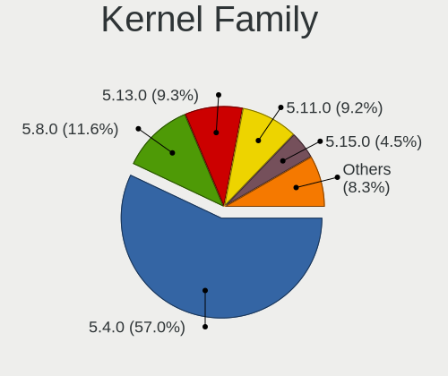

| Version | Notebooks | Percent |
|---------|-----------|---------|
| 5.4.0   | 439       | 58.46%  |
| 5.8.0   | 90        | 11.98%  |
| 5.13.0  | 73        | 9.72%   |
| 5.11.0  | 71        | 9.45%   |
| 5.15.0  | 18        | 2.4%    |
| 5.6.0   | 7         | 0.93%   |
| 5.10.0  | 7         | 0.93%   |
| 5.7.0   | 4         | 0.53%   |
| 5.14.0  | 4         | 0.53%   |
| 5.3.0   | 3         | 0.4%    |
| 5.9.10  | 2         | 0.27%   |
| 5.17.0  | 2         | 0.27%   |
| 5.9.1   | 1         | 0.13%   |
| 5.9.0   | 1         | 0.13%   |
| 5.8.2   | 1         | 0.13%   |
| 5.8.14  | 1         | 0.13%   |
| 5.8.13  | 1         | 0.13%   |
| 5.8.12  | 1         | 0.13%   |
| 5.8.11  | 1         | 0.13%   |
| 5.7.19  | 1         | 0.13%   |
| 5.7.1   | 1         | 0.13%   |
| 5.5.0   | 1         | 0.13%   |
| 5.4.63  | 1         | 0.13%   |
| 5.18.8  | 1         | 0.13%   |
| 5.16.10 | 1         | 0.13%   |
| 5.15.78 | 1         | 0.13%   |
| 5.15.15 | 1         | 0.13%   |
| 5.15.12 | 1         | 0.13%   |
| 5.14.12 | 1         | 0.13%   |
| 5.13.2  | 1         | 0.13%   |
| 5.13.1  | 1         | 0.13%   |
| 5.12.8  | 1         | 0.13%   |
| 5.12.6  | 1         | 0.13%   |
| 5.12.0  | 1         | 0.13%   |
| 5.11.6  | 1         | 0.13%   |
| 5.11.17 | 1         | 0.13%   |
| 5.11.15 | 1         | 0.13%   |
| 5.11.12 | 1         | 0.13%   |
| 5.11.11 | 1         | 0.13%   |
| 5.10.8  | 1         | 0.13%   |

Kernel Major Ver.
-----------------

Linux kernel major version

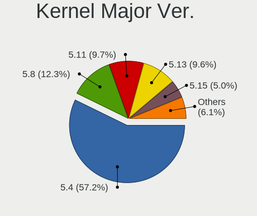

| Version | Notebooks | Percent |
|---------|-----------|---------|
| 5.4     | 440       | 58.67%  |
| 5.8     | 95        | 12.67%  |
| 5.13    | 75        | 10%     |
| 5.11    | 75        | 10%     |
| 5.15    | 21        | 2.8%    |
| 5.10    | 10        | 1.33%   |
| 5.6     | 7         | 0.93%   |
| 5.7     | 6         | 0.8%    |
| 5.14    | 5         | 0.67%   |
| 5.9     | 4         | 0.53%   |
| 5.3     | 3         | 0.4%    |
| 5.12    | 3         | 0.4%    |
| 5.17    | 2         | 0.27%   |
| 5.5     | 1         | 0.13%   |
| 5.18    | 1         | 0.13%   |
| 5.16    | 1         | 0.13%   |
| 5.0     | 1         | 0.13%   |

Arch
----

OS architecture (x86_64, i586, etc.)

| Name   | Notebooks | Percent |
|--------|-----------|---------|
| x86_64 | 729       | 100%    |

DE
--

Desktop Environment

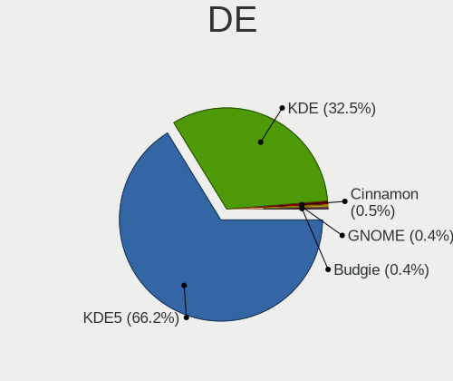

| Name     | Notebooks | Percent |
|----------|-----------|---------|
| KDE5     | 485       | 65.1%   |
| KDE      | 250       | 33.56%  |
| Cinnamon | 4         | 0.54%   |
| GNOME    | 3         | 0.4%    |
| Budgie   | 3         | 0.4%    |

Display Server
--------------

X11 or Wayland

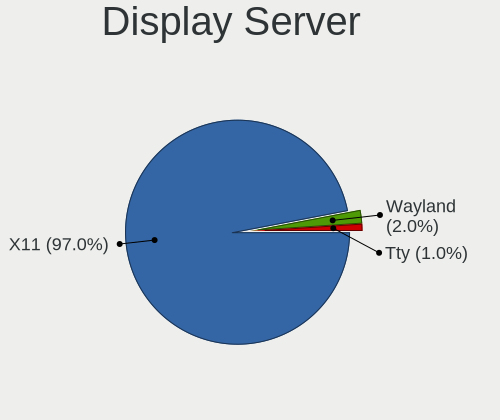

| Name    | Notebooks | Percent |
|---------|-----------|---------|
| X11     | 709       | 96.86%  |
| Wayland | 15        | 2.05%   |
| Tty     | 8         | 1.09%   |

Display Manager
---------------

SDDM, LightDM, etc.

| Name    | Notebooks | Percent |
|---------|-----------|---------|
| SDDM    | 437       | 58.66%  |
| Unknown | 250       | 33.56%  |
| GDM     | 42        | 5.64%   |
| LightDM | 6         | 0.81%   |
| GDM3    | 6         | 0.81%   |
| TDM     | 4         | 0.54%   |

OS Lang
-------

Language

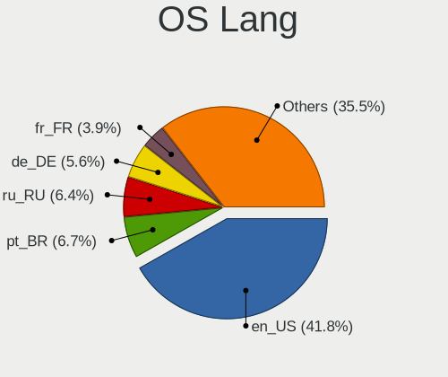

| Lang    | Notebooks | Percent |
|---------|-----------|---------|
| en_US   | 301       | 41.06%  |
| pt_BR   | 51        | 6.96%   |
| ru_RU   | 47        | 6.41%   |
| de_DE   | 43        | 5.87%   |
| it_IT   | 29        | 3.96%   |
| fr_FR   | 29        | 3.96%   |
| en_GB   | 28        | 3.82%   |
| es_ES   | 20        | 2.73%   |
| en_IN   | 19        | 2.59%   |
| en_CA   | 17        | 2.32%   |
| pl_PL   | 14        | 1.91%   |
| en_AU   | 10        | 1.36%   |
| es_MX   | 8         | 1.09%   |
| hu_HU   | 7         | 0.95%   |
| ru_UA   | 6         | 0.82%   |
| cs_CZ   | 6         | 0.82%   |
| nl_NL   | 5         | 0.68%   |
| es_CO   | 5         | 0.68%   |
| en_ZA   | 5         | 0.68%   |
| zh_CN   | 4         | 0.55%   |
| tr_TR   | 4         | 0.55%   |
| es_VE   | 4         | 0.55%   |
| en_NZ   | 4         | 0.55%   |
| de_CH   | 4         | 0.55%   |
| sv_SE   | 3         | 0.41%   |
| pt_PT   | 3         | 0.41%   |
| nl_BE   | 3         | 0.41%   |
| es_CL   | 3         | 0.41%   |
| es_AR   | 3         | 0.41%   |
| ca_ES   | 3         | 0.41%   |
| Unknown | 3         | 0.41%   |
| ro_RO   | 2         | 0.27%   |
| ja_JP   | 2         | 0.27%   |
| fr_CH   | 2         | 0.27%   |
| es_PE   | 2         | 0.27%   |
| en_IL   | 2         | 0.27%   |
| en_IE   | 2         | 0.27%   |
| el_GR   | 2         | 0.27%   |
| de_AT   | 2         | 0.27%   |
| da_DK   | 2         | 0.27%   |

Boot Mode
---------

EFI or BIOS

| Mode | Notebooks | Percent |
|------|-----------|---------|
| EFI  | 507       | 68.7%   |
| BIOS | 231       | 31.3%   |

Filesystem
----------

Type of filesystem

| Type    | Notebooks | Percent |
|---------|-----------|---------|
| Ext4    | 673       | 92.07%  |
| Btrfs   | 29        | 3.97%   |
| Overlay | 13        | 1.78%   |
| Xfs     | 8         | 1.09%   |
| Zfs     | 5         | 0.68%   |
| Ext2    | 2         | 0.27%   |
| Ext3    | 1         | 0.14%   |

Part. scheme
------------

Scheme of partitioning

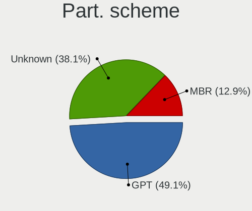

| Type    | Notebooks | Percent |
|---------|-----------|---------|
| GPT     | 356       | 48.11%  |
| Unknown | 289       | 39.05%  |
| MBR     | 95        | 12.84%  |

Dual Boot with Linux/BSD
------------------------

Hosting more than one Linux/BSD

| Dual boot | Notebooks | Percent |
|-----------|-----------|---------|
| No        | 657       | 89.88%  |
| Yes       | 74        | 10.12%  |

Dual Boot (Win)
---------------

Hosting Linux and Windows

| Dual boot | Notebooks | Percent |
|-----------|-----------|---------|
| No        | 431       | 59.04%  |
| Yes       | 299       | 40.96%  |

Board
-----

Vendor
------

Motherboard manufacturer

| Name                   | Notebooks | Percent |
|------------------------|-----------|---------|
| Dell                   | 179       | 24.55%  |
| Lenovo                 | 149       | 20.44%  |
| Hewlett-Packard        | 134       | 18.38%  |
| ASUSTek Computer       | 72        | 9.88%   |
| Acer                   | 38        | 5.21%   |
| Samsung Electronics    | 22        | 3.02%   |
| MSI                    | 17        | 2.33%   |
| HUAWEI                 | 10        | 1.37%   |
| TUXEDO                 | 9         | 1.23%   |
| Sony                   | 9         | 1.23%   |
| Notebook               | 8         | 1.1%    |
| Unknown                | 7         | 0.96%   |
| Toshiba                | 6         | 0.82%   |
| Positivo               | 6         | 0.82%   |
| PC Specialist          | 5         | 0.69%   |
| Timi                   | 4         | 0.55%   |
| Google                 | 4         | 0.55%   |
| Apple                  | 4         | 0.55%   |
| Alienware              | 4         | 0.55%   |
| System76               | 3         | 0.41%   |
| Packard Bell           | 3         | 0.41%   |
| Medion                 | 3         | 0.41%   |
| LG Electronics         | 3         | 0.41%   |
| Chuwi                  | 3         | 0.41%   |
| Avell High Performance | 3         | 0.41%   |
| Schenker               | 2         | 0.27%   |
| Intel                  | 2         | 0.27%   |
| Gigabyte Technology    | 2         | 0.27%   |
| BANGHO                 | 2         | 0.27%   |
| VIT                    | 1         | 0.14%   |
| Standard               | 1         | 0.14%   |
| SIRAGON                | 1         | 0.14%   |
| Razer                  | 1         | 0.14%   |
| Purism                 | 1         | 0.14%   |
| Panasonic              | 1         | 0.14%   |
| Multilaser             | 1         | 0.14%   |
| HONOR                  | 1         | 0.14%   |
| Hampoo                 | 1         | 0.14%   |
| GPD                    | 1         | 0.14%   |
| Gateway                | 1         | 0.14%   |

Model
-----

Motherboard model

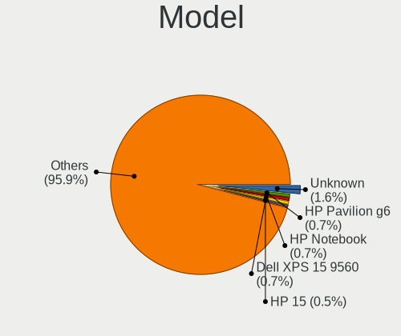

| Name                                       | Notebooks | Percent |
|--------------------------------------------|-----------|---------|
| Unknown                                    | 12        | 1.65%   |
| HP Pavilion g6                             | 5         | 0.69%   |
| Dell XPS 15 9560                           | 5         | 0.69%   |
| HP Notebook                                | 4         | 0.55%   |
| HP 15                                      | 4         | 0.55%   |
| Dell XPS 15 9570                           | 4         | 0.55%   |
| Dell XPS 15 9500                           | 4         | 0.55%   |
| Dell Latitude 5580                         | 4         | 0.55%   |
| Dell Inspiron 7559                         | 4         | 0.55%   |
| Lenovo G50-70 20351                        | 3         | 0.41%   |
| HP ProBook 450 G7                          | 3         | 0.41%   |
| HP ProBook 450 G3                          | 3         | 0.41%   |
| HP Pavilion Gaming Laptop 15-cx0xxx        | 3         | 0.41%   |
| HP Pavilion dv6                            | 3         | 0.41%   |
| HP Laptop 17-ca0xxx                        | 3         | 0.41%   |
| HP EliteBook 840 G5                        | 3         | 0.41%   |
| HP EliteBook 840 G3                        | 3         | 0.41%   |
| Google Cyan                                | 3         | 0.41%   |
| Dell XPS 15 7590                           | 3         | 0.41%   |
| Dell Vostro 5481                           | 3         | 0.41%   |
| Dell Latitude E7440                        | 3         | 0.41%   |
| Dell Latitude E6540                        | 3         | 0.41%   |
| Dell Latitude E6440                        | 3         | 0.41%   |
| Dell Latitude E5530 non-vPro               | 3         | 0.41%   |
| Dell Latitude 5501                         | 3         | 0.41%   |
| Dell Inspiron N5110                        | 3         | 0.41%   |
| Dell Inspiron 7577                         | 3         | 0.41%   |
| Dell Inspiron 5547                         | 3         | 0.41%   |
| Samsung 700Z3A/700Z4A/700Z5A/700Z5B        | 2         | 0.27%   |
| Samsung 300V3A/300V4A/300V5A/200A4B/200A5B | 2         | 0.27%   |
| Samsung 300E5M/300E5L                      | 2         | 0.27%   |
| MSI Prestige 15 A10SC                      | 2         | 0.27%   |
| Lenovo V155-15API 81V5                     | 2         | 0.27%   |
| Lenovo ThinkPad E14 20RA004YUS             | 2         | 0.27%   |
| Lenovo IdeaPad S145-15API 81V7             | 2         | 0.27%   |
| Lenovo IdeaPad 330-15IKB 81DE              | 2         | 0.27%   |
| HUAWEI WRT-WX9                             | 2         | 0.27%   |
| HUAWEI NBLK-WAX9X                          | 2         | 0.27%   |
| HP ProBook 4540s                           | 2         | 0.27%   |
| HP Pavilion Notebook                       | 2         | 0.27%   |

Model Family
------------

Motherboard model prefix

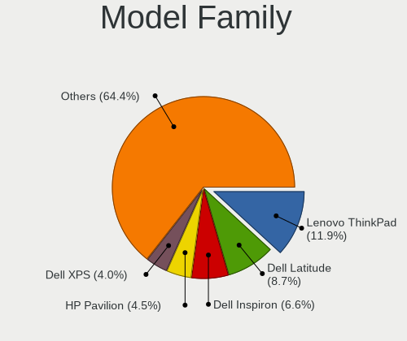

| Name                  | Notebooks | Percent |
|-----------------------|-----------|---------|
| Lenovo ThinkPad       | 85        | 11.66%  |
| Dell Latitude         | 65        | 8.92%   |
| Dell Inspiron         | 50        | 6.86%   |
| HP Pavilion           | 34        | 4.66%   |
| Dell XPS              | 28        | 3.84%   |
| Lenovo IdeaPad        | 26        | 3.57%   |
| Acer Aspire           | 25        | 3.43%   |
| HP ProBook            | 24        | 3.29%   |
| HP EliteBook          | 19        | 2.61%   |
| HP Laptop             | 17        | 2.33%   |
| ASUS VivoBook         | 16        | 2.19%   |
| Dell Precision        | 13        | 1.78%   |
| Unknown               | 12        | 1.65%   |
| Dell Vostro           | 11        | 1.51%   |
| ASUS ASUS             | 8         | 1.1%    |
| HP ENVY               | 7         | 0.96%   |
| Acer Nitro            | 6         | 0.82%   |
| Toshiba Satellite     | 5         | 0.69%   |
| Lenovo ThinkBook      | 5         | 0.69%   |
| Lenovo Legion         | 5         | 0.69%   |
| Dell System           | 5         | 0.69%   |
| ASUS TUF              | 5         | 0.69%   |
| HP Notebook           | 4         | 0.55%   |
| HP 15                 | 4         | 0.55%   |
| Acer Swift            | 4         | 0.55%   |
| Packard Bell EasyNote | 3         | 0.41%   |
| MSI Prestige          | 3         | 0.41%   |
| Lenovo G50-70         | 3         | 0.41%   |
| HP OMEN               | 3         | 0.41%   |
| HP 255                | 3         | 0.41%   |
| HP 250                | 3         | 0.41%   |
| Google Cyan           | 3         | 0.41%   |
| Dell G3               | 3         | 0.41%   |
| ASUS ZenBook          | 3         | 0.41%   |
| TUXEDO InfinityBook   | 2         | 0.27%   |
| Samsung 700Z3A        | 2         | 0.27%   |
| Samsung 300V3A        | 2         | 0.27%   |
| Samsung 300E5M        | 2         | 0.27%   |
| Notebook W65          | 2         | 0.27%   |
| Notebook NH50         | 2         | 0.27%   |

MFG Year
--------

Motherboard manufacture year

| Year | Notebooks | Percent |
|------|-----------|---------|
| 2019 | 131       | 17.97%  |
| 2018 | 82        | 11.25%  |
| 2020 | 80        | 10.97%  |
| 2017 | 66        | 9.05%   |
| 2013 | 62        | 8.5%    |
| 2012 | 56        | 7.68%   |
| 2011 | 52        | 7.13%   |
| 2014 | 41        | 5.62%   |
| 2021 | 40        | 5.49%   |
| 2016 | 36        | 4.94%   |
| 2015 | 31        | 4.25%   |
| 2010 | 21        | 2.88%   |
| 2008 | 18        | 2.47%   |
| 2009 | 7         | 0.96%   |
| 2007 | 5         | 0.69%   |
| 2022 | 1         | 0.14%   |

Form Factor
-----------

Physical design of the computer

| Name     | Notebooks | Percent |
|----------|-----------|---------|
| Notebook | 729       | 100%    |

Secure Boot
-----------

Enabled or disabled

| State    | Notebooks | Percent |
|----------|-----------|---------|
| Disabled | 651       | 88.57%  |
| Enabled  | 84        | 11.43%  |

Coreboot
--------

Have coreboot on board

| Used | Notebooks | Percent |
|------|-----------|---------|
| No   | 723       | 99.18%  |
| Yes  | 6         | 0.82%   |

RAM Size
--------

Total RAM memory

| Size in GB  | Notebooks | Percent |
|-------------|-----------|---------|
| 4.01-8.0    | 188       | 25.75%  |
| 16.01-24.0  | 187       | 25.62%  |
| 8.01-16.0   | 149       | 20.41%  |
| 3.01-4.0    | 106       | 14.52%  |
| 32.01-64.0  | 59        | 8.08%   |
| 1.01-2.0    | 19        | 2.6%    |
| 24.01-32.0  | 10        | 1.37%   |
| 64.01-256.0 | 8         | 1.1%    |
| 2.01-3.0    | 4         | 0.55%   |

RAM Used
--------

Used RAM memory

| Used GB    | Notebooks | Percent |
|------------|-----------|---------|
| 2.01-3.0   | 219       | 28.01%  |
| 1.01-2.0   | 184       | 23.53%  |
| 4.01-8.0   | 173       | 22.12%  |
| 3.01-4.0   | 114       | 14.58%  |
| 8.01-16.0  | 65        | 8.31%   |
| 0.51-1.0   | 20        | 2.56%   |
| 16.01-24.0 | 6         | 0.77%   |
| 32.01-64.0 | 1         | 0.13%   |

Total Drives
------------

Number of drives on board

| Drives | Notebooks | Percent |
|--------|-----------|---------|
| 1      | 509       | 68.97%  |
| 2      | 197       | 26.69%  |
| 3      | 21        | 2.85%   |
| 4      | 7         | 0.95%   |
| 0      | 3         | 0.41%   |
| 5      | 1         | 0.14%   |

Has CD-ROM
----------

Has CD-ROM on board

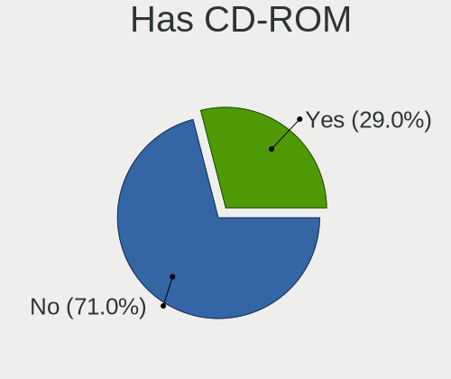

| Presented | Notebooks | Percent |
|-----------|-----------|---------|
| No        | 517       | 70.63%  |
| Yes       | 215       | 29.37%  |

Has Ethernet
------------

Has Ethernet on board

| Presented | Notebooks | Percent |
|-----------|-----------|---------|
| Yes       | 611       | 83.7%   |
| No        | 119       | 16.3%   |

Has WiFi
--------

Has WiFi module

| Presented | Notebooks | Percent |
|-----------|-----------|---------|
| Yes       | 720       | 98.77%  |
| No        | 9         | 1.23%   |

Has Bluetooth
-------------

Has Bluetooth module

| Presented | Notebooks | Percent |
|-----------|-----------|---------|
| Yes       | 612       | 83.72%  |
| No        | 119       | 16.28%  |

Location
--------

Country
-------

Geographic location (country)

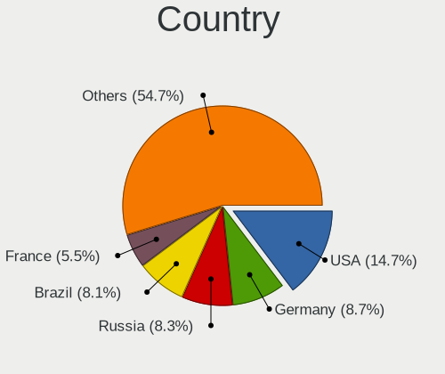

| Country      | Notebooks | Percent |
|--------------|-----------|---------|
| USA          | 107       | 14.64%  |
| Germany      | 64        | 8.76%   |
| Brazil       | 62        | 8.48%   |
| Russia       | 59        | 8.07%   |
| France       | 41        | 5.61%   |
| Italy        | 35        | 4.79%   |
| Spain        | 28        | 3.83%   |
| UK           | 25        | 3.42%   |
| India        | 19        | 2.6%    |
| Poland       | 18        | 2.46%   |
| Ukraine      | 17        | 2.33%   |
| Netherlands  | 17        | 2.33%   |
| Canada       | 16        | 2.19%   |
| Mexico       | 15        | 2.05%   |
| Hungary      | 12        | 1.64%   |
| Switzerland  | 10        | 1.37%   |
| Czechia      | 10        | 1.37%   |
| Indonesia    | 9         | 1.23%   |
| Bulgaria     | 9         | 1.23%   |
| Australia    | 9         | 1.23%   |
| Turkey       | 7         | 0.96%   |
| Belgium      | 7         | 0.96%   |
| South Africa | 6         | 0.82%   |
| Greece       | 6         | 0.82%   |
| Belarus      | 6         | 0.82%   |
| Colombia     | 5         | 0.68%   |
| Argentina    | 5         | 0.68%   |
| Venezuela    | 4         | 0.55%   |
| Sweden       | 4         | 0.55%   |
| Romania      | 4         | 0.55%   |
| Portugal     | 4         | 0.55%   |
| New Zealand  | 4         | 0.55%   |
| Denmark      | 4         | 0.55%   |
| Thailand     | 3         | 0.41%   |
| Slovenia     | 3         | 0.41%   |
| Ireland      | 3         | 0.41%   |
| Iran         | 3         | 0.41%   |
| Estonia      | 3         | 0.41%   |
| Egypt        | 3         | 0.41%   |
| China        | 3         | 0.41%   |

City
----

Geographic location (city)

| City              | Notebooks | Percent |
|-------------------|-----------|---------|
| Moscow            | 16        | 2.11%   |
| Madrid            | 9         | 1.19%   |
| Hamburg           | 8         | 1.06%   |
| Budapest          | 8         | 1.06%   |
| Milan             | 7         | 0.92%   |
| Warsaw            | 6         | 0.79%   |
| Sofia             | 6         | 0.79%   |
| Sao Paulo         | 6         | 0.79%   |
| Minsk             | 6         | 0.79%   |
| Berlin            | 6         | 0.79%   |
| Zurich            | 5         | 0.66%   |
| St Petersburg     | 5         | 0.66%   |
| Prague            | 5         | 0.66%   |
| Kyiv              | 5         | 0.66%   |
| Athens            | 5         | 0.66%   |
| Sydney            | 4         | 0.53%   |
| Paris             | 4         | 0.53%   |
| Jakarta           | 4         | 0.53%   |
| Frankfurt am Main | 4         | 0.53%   |
| Curitiba          | 4         | 0.53%   |
| Cologne           | 4         | 0.53%   |
| Bogot           | 4         | 0.53%   |
| Yekaterinburg     | 3         | 0.4%    |
| San Jose          | 3         | 0.4%    |
| Rome              | 3         | 0.4%    |
| Pune              | 3         | 0.4%    |
| Phoenix           | 3         | 0.4%    |
| Novosibirsk       | 3         | 0.4%    |
| Munich            | 3         | 0.4%    |
| Marseille         | 3         | 0.4%    |
| Los Angeles       | 3         | 0.4%    |
| Le Mans           | 3         | 0.4%    |
| Dallas            | 3         | 0.4%    |
| Cape Town         | 3         | 0.4%    |
| Braslia         | 3         | 0.4%    |
| Bonn              | 3         | 0.4%    |
| Birmingham        | 3         | 0.4%    |
| Zaragoza          | 2         | 0.26%   |
| Zapopan           | 2         | 0.26%   |
| Wroclaw           | 2         | 0.26%   |

Drives
------

Drive Vendor
------------

Hard drive vendors

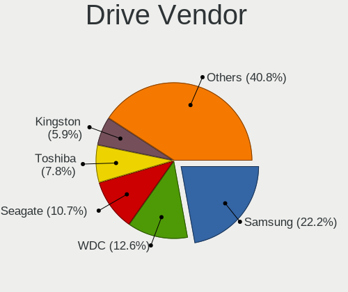

| Vendor              | Notebooks | Drives | Percent |
|---------------------|-----------|--------|---------|
| Samsung Electronics | 204       | 253    | 21.68%  |
| WDC                 | 122       | 149    | 12.96%  |
| Seagate             | 102       | 114    | 10.84%  |
| Toshiba             | 75        | 87     | 7.97%   |
| Kingston            | 58        | 66     | 6.16%   |
| SanDisk             | 49        | 56     | 5.21%   |
| Unknown             | 45        | 54     | 4.78%   |
| Crucial             | 39        | 47     | 4.14%   |
| SK hynix            | 36        | 40     | 3.83%   |
| Intel               | 33        | 44     | 3.51%   |
| HGST                | 20        | 24     | 2.13%   |
| A-DATA Technology   | 19        | 19     | 2.02%   |
| Hitachi             | 17        | 18     | 1.81%   |
| Micron Technology   | 15        | 16     | 1.59%   |
| KIOXIA              | 9         | 9      | 0.96%   |
| Apple               | 6         | 7      | 0.64%   |
| Transcend           | 5         | 5      | 0.53%   |
| LITEON              | 5         | 6      | 0.53%   |
| SPCC                | 4         | 5      | 0.43%   |
| Silicon Motion      | 4         | 5      | 0.43%   |
| PNY                 | 4         | 4      | 0.43%   |
| LITEONIT            | 4         | 4      | 0.43%   |
| Fujitsu             | 4         | 4      | 0.43%   |
| Phison              | 3         | 3      | 0.32%   |
| Lenovo              | 3         | 3      | 0.32%   |
| China               | 3         | 3      | 0.32%   |
| Unknown             | 3         | 3      | 0.32%   |
| Zheino              | 2         | 4      | 0.21%   |
| XPG                 | 2         | 2      | 0.21%   |
| TO Exter            | 2         | 2      | 0.21%   |
| Team                | 2         | 3      | 0.21%   |
| KingSpec            | 2         | 2      | 0.21%   |
| JMicron Technology  | 2         | 2      | 0.21%   |
| Intenso             | 2         | 2      | 0.21%   |
| Goodram             | 2         | 2      | 0.21%   |
| Dogfish             | 2         | 2      | 0.21%   |
| Apacer              | 2         | 2      | 0.21%   |
| Verbatim            | 1         | 1      | 0.11%   |
| sobetter            | 1         | 1      | 0.11%   |
| SMI                 | 1         | 1      | 0.11%   |

Drive Model
-----------

Hard drive models

| Model                               | Notebooks | Percent |
|-------------------------------------|-----------|---------|
| Unknown MMC Card  32GB              | 13        | 1.33%   |
| Seagate ST1000LM035-1RK172 1TB      | 13        | 1.33%   |
| Seagate ST1000LM024 HN-M101MBB 1TB  | 13        | 1.33%   |
| Samsung NVMe SSD Drive 512GB        | 13        | 1.33%   |
| Samsung SSD 860 EVO 500GB           | 12        | 1.23%   |
| Seagate ST500LT012-1DG142 500GB     | 9         | 0.92%   |
| Samsung SSD 860 EVO M.2 500GB       | 9         | 0.92%   |
| Samsung NVMe SSD Drive 1TB          | 9         | 0.92%   |
| Toshiba MQ04ABF100 1TB              | 8         | 0.82%   |
| Samsung SSD 850 EVO 500GB           | 8         | 0.82%   |
| HGST HTS721010A9E630 1TB            | 8         | 0.82%   |
| Toshiba MQ01ABF050 500GB            | 7         | 0.72%   |
| Toshiba MQ01ABD100 1TB              | 7         | 0.72%   |
| Seagate ST750LM022 HN-M750MBB 752GB | 6         | 0.62%   |
| Seagate ST500LM012 HN-M500MBB 500GB | 6         | 0.62%   |
| Seagate ST1000LX015-1U7172 1TB      | 6         | 0.62%   |
| Kingston SA400S37240G 240GB SSD     | 6         | 0.62%   |
| WDC WD10SPZX-24Z10 1TB              | 5         | 0.51%   |
| Seagate ST2000LM007-1R8174 2TB      | 5         | 0.51%   |
| Seagate ST1000LM048-2E7172 1TB      | 5         | 0.51%   |
| SanDisk SSD PLUS 240GB              | 5         | 0.51%   |
| SanDisk NVMe SSD Drive 512GB        | 5         | 0.51%   |
| SanDisk NVMe SSD Drive 256GB        | 5         | 0.51%   |
| Samsung SSD 860 QVO 1TB             | 5         | 0.51%   |
| Samsung SSD 860 EVO 1TB             | 5         | 0.51%   |
| Samsung SSD 850 EVO 250GB           | 5         | 0.51%   |
| Samsung MZVLB512HBJQ-000L7 512GB    | 5         | 0.51%   |
| KIOXIA KBG40ZNS512G NVMe 512GB      | 5         | 0.51%   |
| Kingston SV300S37A120G 120GB SSD    | 5         | 0.51%   |
| Kingston SA400S37120G 120GB SSD     | 5         | 0.51%   |
| Hitachi HTS547575A9E384 752GB       | 5         | 0.51%   |
| Crucial CT1000MX500SSD1 1TB         | 5         | 0.51%   |
| WDC WDS240G2G0A-00JH30 240GB SSD    | 4         | 0.41%   |
| WDC WDS120G2G0A-00JH30 120GB SSD    | 4         | 0.41%   |
| WDC WD10SPZX-21Z10T0 1TB            | 4         | 0.41%   |
| WDC PC SN730 NVMe 1024GB            | 4         | 0.41%   |
| Unknown MMC Card  64GB              | 4         | 0.41%   |
| Toshiba NVMe SSD Drive 256GB        | 4         | 0.41%   |
| Toshiba MQ01ACF050 500GB            | 4         | 0.41%   |
| SK hynix NVMe SSD Drive 512GB       | 4         | 0.41%   |

HDD Vendor
----------

Hard disk drive vendors

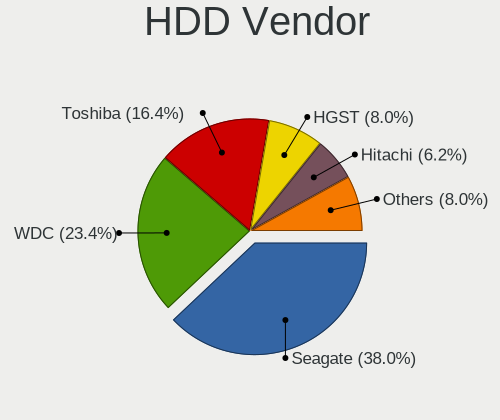

| Vendor              | Notebooks | Drives | Percent |
|---------------------|-----------|--------|---------|
| Seagate             | 102       | 114    | 38.35%  |
| WDC                 | 63        | 76     | 23.68%  |
| Toshiba             | 45        | 52     | 16.92%  |
| HGST                | 20        | 24     | 7.52%   |
| Hitachi             | 17        | 18     | 6.39%   |
| Samsung Electronics | 8         | 10     | 3.01%   |
| Fujitsu             | 4         | 4      | 1.5%    |
| Unknown             | 3         | 3      | 1.13%   |
| Apple               | 2         | 2      | 0.75%   |
| JMicron Technology  | 1         | 1      | 0.38%   |
| ASMT                | 1         | 2      | 0.38%   |

SSD Vendor
----------

Solid state drive vendors

| Vendor              | Notebooks | Drives | Percent |
|---------------------|-----------|--------|---------|
| Samsung Electronics | 104       | 130    | 31.42%  |
| Kingston            | 38        | 44     | 11.48%  |
| Crucial             | 36        | 44     | 10.88%  |
| SanDisk             | 34        | 38     | 10.27%  |
| WDC                 | 19        | 26     | 5.74%   |
| Toshiba             | 11        | 15     | 3.32%   |
| A-DATA Technology   | 9         | 9      | 2.72%   |
| Micron Technology   | 8         | 9      | 2.42%   |
| Intel               | 7         | 7      | 2.11%   |
| SK hynix            | 6         | 6      | 1.81%   |
| Transcend           | 4         | 4      | 1.21%   |
| SPCC                | 4         | 5      | 1.21%   |
| PNY                 | 4         | 4      | 1.21%   |
| LITEONIT            | 4         | 4      | 1.21%   |
| LITEON              | 3         | 3      | 0.91%   |
| China               | 3         | 3      | 0.91%   |
| Zheino              | 2         | 4      | 0.6%    |
| TO Exter            | 2         | 2      | 0.6%    |
| KingSpec            | 2         | 2      | 0.6%    |
| Intenso             | 2         | 2      | 0.6%    |
| Goodram             | 2         | 2      | 0.6%    |
| Dogfish             | 2         | 2      | 0.6%    |
| Apple               | 2         | 2      | 0.6%    |
| Apacer              | 2         | 2      | 0.6%    |
| Verbatim            | 1         | 1      | 0.3%    |
| Team                | 1         | 1      | 0.3%    |
| SMI                 | 1         | 1      | 0.3%    |
| ShanDianZhe         | 1         | 2      | 0.3%    |
| RZX                 | 1         | 1      | 0.3%    |
| Patriot             | 1         | 1      | 0.3%    |
| OCZ                 | 1         | 1      | 0.3%    |
| Netac               | 1         | 1      | 0.3%    |
| MidasForce          | 1         | 1      | 0.3%    |
| Lexar               | 1         | 1      | 0.3%    |
| KingFast            | 1         | 1      | 0.3%    |
| JMicron Technology  | 1         | 1      | 0.3%    |
| INDMEM              | 1         | 1      | 0.3%    |
| FORESEE             | 1         | 1      | 0.3%    |
| Emtec               | 1         | 1      | 0.3%    |
| Drevo               | 1         | 1      | 0.3%    |

Drive Kind
----------

HDD or SSD

| Kind    | Notebooks | Drives | Percent |
|---------|-----------|--------|---------|
| SSD     | 304       | 392    | 33.59%  |
| NVMe    | 289       | 348    | 31.93%  |
| HDD     | 262       | 306    | 28.95%  |
| MMC     | 43        | 52     | 4.75%   |
| Unknown | 7         | 6      | 0.77%   |

Drive Connector
---------------

SATA, SAS, NVMe, etc.

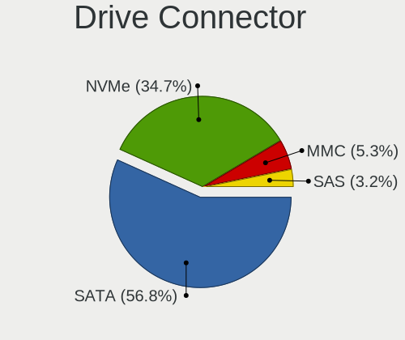

| Type | Notebooks | Drives | Percent |
|------|-----------|--------|---------|
| SATA | 489       | 676    | 57.67%  |
| NVMe | 289       | 346    | 34.08%  |
| MMC  | 43        | 52     | 5.07%   |
| SAS  | 27        | 30     | 3.18%   |

Drive Size
----------

Size of hard drive

| Size in TB | Notebooks | Drives | Percent |
|------------|-----------|--------|---------|
| 0.01-0.5   | 334       | 417    | 60.18%  |
| 0.51-1.0   | 191       | 244    | 34.41%  |
| 1.01-2.0   | 25        | 32     | 4.5%    |
| 3.01-4.0   | 4         | 4      | 0.72%   |
| 4.01-10.0  | 1         | 1      | 0.18%   |

Space Total
-----------

Amount of disk space available on the file system

| Size in GB     | Notebooks | Percent |
|----------------|-----------|---------|
| 251-500        | 224       | 30.23%  |
| 101-250        | 222       | 29.96%  |
| 501-1000       | 143       | 19.3%   |
| 1001-2000      | 54        | 7.29%   |
| 51-100         | 34        | 4.59%   |
| 21-50          | 19        | 2.56%   |
| 1-20           | 18        | 2.43%   |
| 2001-3000      | 17        | 2.29%   |
| More than 3000 | 10        | 1.35%   |

Space Used
----------

Amount of used disk space

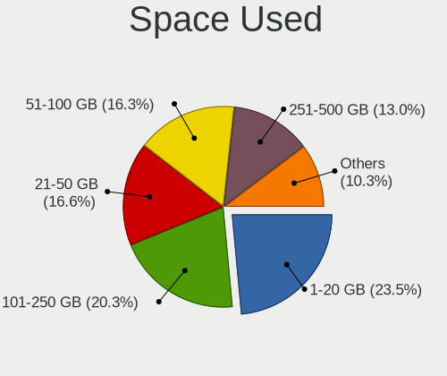

| Used GB        | Notebooks | Percent |
|----------------|-----------|---------|
| 1-20           | 180       | 23.5%   |
| 101-250        | 154       | 20.1%   |
| 21-50          | 128       | 16.71%  |
| 51-100         | 126       | 16.45%  |
| 251-500        | 99        | 12.92%  |
| 501-1000       | 51        | 6.66%   |
| 1001-2000      | 20        | 2.61%   |
| More than 3000 | 5         | 0.65%   |
| 2001-3000      | 3         | 0.39%   |

Malfunc. Drives
---------------

Drive models with a malfunction

| Model                                    | Notebooks | Drives | Percent |
|------------------------------------------|-----------|--------|---------|
| Seagate ST1000LM048-2E7172 1TB           | 3         | 3      | 3.9%    |
| Seagate ST1000LM024 HN-M101MBB 1TB       | 3         | 3      | 3.9%    |
| Kingston SV300S37A120G 120GB SSD         | 3         | 3      | 3.9%    |
| Seagate ST500LT012-9WS142 500GB          | 2         | 2      | 2.6%    |
| Seagate ST500LT012-1DG142 500GB          | 2         | 2      | 2.6%    |
| Seagate ST1000LM035-1RK172 1TB           | 2         | 2      | 2.6%    |
| Hitachi HTS547575A9E384 752GB            | 2         | 2      | 2.6%    |
| HGST HTS721010A9E630 1TB                 | 2         | 3      | 2.6%    |
| Zheino CHN mSATA02M 256 256GB SSD        | 1         | 2      | 1.3%    |
| WDC WD6400BEVT-00A0RT0 640GB             | 1         | 1      | 1.3%    |
| WDC WD5000LPVX-75V0TT0 500GB             | 1         | 1      | 1.3%    |
| WDC WD5000LPVX-55V0TT0 500GB             | 1         | 1      | 1.3%    |
| WDC WD5000LPVT-24G33T1 500GB             | 1         | 1      | 1.3%    |
| WDC WD5000LPVT-22G33T0 500GB             | 1         | 1      | 1.3%    |
| WDC WD5000LPLX-00ZNTT0 500GB             | 1         | 1      | 1.3%    |
| WDC WD1600BJKT-75F4T0 160GB              | 1         | 1      | 1.3%    |
| WDC WD10JPVX-60JC3T1 1TB                 | 1         | 1      | 1.3%    |
| WDC PC SN520 SDAPMUW-512G-1001 512GB     | 1         | 1      | 1.3%    |
| Toshiba THNSNK256GVN8 M.2 2280 256GB SSD | 1         | 1      | 1.3%    |
| Toshiba THNSNK256GCS8 SATA 256GB SSD     | 1         | 1      | 1.3%    |
| Toshiba MQ04ABF100 1TB                   | 1         | 1      | 1.3%    |
| Toshiba MQ01ACF050 500GB                 | 1         | 1      | 1.3%    |
| Toshiba MQ01ABD100 1TB                   | 1         | 1      | 1.3%    |
| Toshiba MQ01ABD075 752GB                 | 1         | 1      | 1.3%    |
| Toshiba MK7575GSX 752GB                  | 1         | 1      | 1.3%    |
| Toshiba MK7559GSXP 752GB                 | 1         | 2      | 1.3%    |
| Toshiba MK6476GSX 640GB                  | 1         | 1      | 1.3%    |
| Toshiba MK5076GSX 500GB                  | 1         | 1      | 1.3%    |
| Toshiba MK2555GSX 250GB                  | 1         | 1      | 1.3%    |
| Toshiba MK1652GSX 160GB                  | 1         | 1      | 1.3%    |
| Toshiba MK1011GAH 100GB                  | 1         | 1      | 1.3%    |
| Toshiba HDWJ110 1TB                      | 1         | 1      | 1.3%    |
| SK hynix SC401 SATA 512GB SSD            | 1         | 1      | 1.3%    |
| SK hynix PC401 NVMe 512GB                | 1         | 1      | 1.3%    |
| SK hynix BC501 HFM512GDJTNG-8310A 512GB  | 1         | 1      | 1.3%    |
| Seagate ST9500325AS 500GB                | 1         | 1      | 1.3%    |
| Seagate ST9320423AS 320GB                | 1         | 1      | 1.3%    |
| Seagate ST500LM012 HN-M500MBB 500GB      | 1         | 1      | 1.3%    |
| Seagate ST320LT020-9YG142 320GB          | 1         | 1      | 1.3%    |
| Seagate ST2000LM003 HN-M201RAD 2TB       | 1         | 1      | 1.3%    |

Malfunc. Drive Vendor
---------------------

Vendors of faulty drives

| Vendor              | Notebooks | Drives | Percent |
|---------------------|-----------|--------|---------|
| Seagate             | 18        | 18     | 23.38%  |
| Toshiba             | 14        | 15     | 18.18%  |
| WDC                 | 9         | 9      | 11.69%  |
| Hitachi             | 7         | 7      | 9.09%   |
| HGST                | 6         | 7      | 7.79%   |
| Kingston            | 5         | 5      | 6.49%   |
| Samsung Electronics | 4         | 4      | 5.19%   |
| Crucial             | 4         | 4      | 5.19%   |
| SK hynix            | 3         | 3      | 3.9%    |
| SanDisk             | 2         | 2      | 2.6%    |
| A-DATA Technology   | 2         | 2      | 2.6%    |
| Zheino              | 1         | 2      | 1.3%    |
| Mushkin             | 1         | 1      | 1.3%    |
| Drevo               | 1         | 1      | 1.3%    |

Malfunc. HDD Vendor
-------------------

Vendors of faulty HDD drives

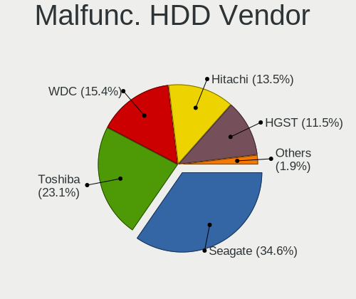

| Vendor              | Notebooks | Drives | Percent |
|---------------------|-----------|--------|---------|
| Seagate             | 18        | 18     | 34.62%  |
| Toshiba             | 12        | 13     | 23.08%  |
| WDC                 | 8         | 8      | 15.38%  |
| Hitachi             | 7         | 7      | 13.46%  |
| HGST                | 6         | 7      | 11.54%  |
| Samsung Electronics | 1         | 1      | 1.92%   |

Malfunc. Drive Kind
-------------------

Kinds of faulty drives

| Kind | Notebooks | Drives | Percent |
|------|-----------|--------|---------|
| HDD  | 52        | 54     | 67.53%  |
| SSD  | 20        | 21     | 25.97%  |
| NVMe | 5         | 5      | 6.49%   |

Failed Drives
-------------

Failed drive models

Zero info for selected period =(

Failed Drive Vendor
-------------------

Failed drive vendors

Zero info for selected period =(

Drive Status
------------

Number of failed and malfunc. drives

| Status   | Notebooks | Drives | Percent |
|----------|-----------|--------|---------|
| Works    | 413       | 543    | 51.5%   |
| Detected | 313       | 481    | 39.03%  |
| Malfunc  | 76        | 80     | 9.48%   |

Storage controller
------------------

Storage Vendor
--------------

Storage controller vendors

| Vendor                           | Notebooks | Percent |
|----------------------------------|-----------|---------|
| Intel                            | 521       | 58.28%  |
| Samsung Electronics              | 101       | 11.3%   |
| AMD                              | 91        | 10.18%  |
| SanDisk                          | 57        | 6.38%   |
| SK hynix                         | 30        | 3.36%   |
| Kingston Technology Company      | 20        | 2.24%   |
| Toshiba America Info Systems     | 19        | 2.13%   |
| KIOXIA                           | 10        | 1.12%   |
| ADATA Technology                 | 10        | 1.12%   |
| Silicon Motion                   | 7         | 0.78%   |
| Micron Technology                | 7         | 0.78%   |
| Realtek Semiconductor            | 4         | 0.45%   |
| Micron/Crucial Technology        | 4         | 0.45%   |
| Phison Electronics               | 3         | 0.34%   |
| Lenovo                           | 3         | 0.34%   |
| Lite-On Technology               | 2         | 0.22%   |
| Union Memory (Shenzhen)          | 1         | 0.11%   |
| Silicon Integrated Systems [SiS] | 1         | 0.11%   |
| Nvidia                           | 1         | 0.11%   |
| Marvell Technology Group         | 1         | 0.11%   |
| Apple                            | 1         | 0.11%   |

Storage Model
-------------

Storage controller models

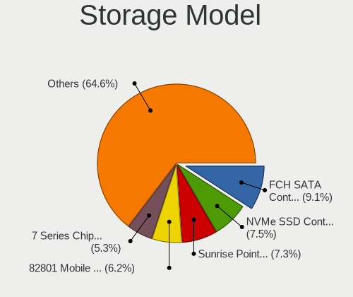

| Model                                                                          | Notebooks | Percent |
|--------------------------------------------------------------------------------|-----------|---------|
| AMD FCH SATA Controller [AHCI mode]                                            | 86        | 9.21%   |
| Intel Sunrise Point-LP SATA Controller [AHCI mode]                             | 70        | 7.49%   |
| Samsung NVMe SSD Controller SM981/PM981/PM983                                  | 67        | 7.17%   |
| Intel 82801 Mobile SATA Controller [RAID mode]                                 | 60        | 6.42%   |
| Intel 7 Series Chipset Family 6-port SATA Controller [AHCI mode]               | 51        | 5.46%   |
| Intel 6 Series/C200 Series Chipset Family 6 port Mobile SATA AHCI Controller   | 41        | 4.39%   |
| Intel Cannon Lake Mobile PCH SATA AHCI Controller                              | 40        | 4.28%   |
| Intel 8 Series SATA Controller 1 [AHCI mode]                                   | 40        | 4.28%   |
| Intel 8 Series/C220 Series Chipset Family 6-port SATA Controller 1 [AHCI mode] | 25        | 2.68%   |
| SanDisk WD Black SN750 / PC SN730 NVMe SSD                                     | 22        | 2.36%   |
| Intel HM170/QM170 Chipset SATA Controller [AHCI Mode]                          | 22        | 2.36%   |
| Intel Wildcat Point-LP SATA Controller [AHCI Mode]                             | 21        | 2.25%   |
| Samsung NVMe SSD Controller 980                                                | 19        | 2.03%   |
| Intel Cannon Point-LP SATA Controller [AHCI Mode]                              | 19        | 2.03%   |
| Intel SSD 660P Series                                                          | 17        | 1.82%   |
| Intel Comet Lake SATA AHCI Controller                                          | 17        | 1.82%   |
| Intel 82801IBM/IEM (ICH9M/ICH9M-E) 4 port SATA Controller [AHCI mode]          | 16        | 1.71%   |
| SanDisk WD Blue SN500 / PC SN520 NVMe SSD                                      | 14        | 1.5%    |
| Intel Volume Management Device NVMe RAID Controller                            | 13        | 1.39%   |
| Intel Celeron/Pentium Silver Processor SATA Controller                         | 13        | 1.39%   |
| SK hynix BC501 NVMe Solid State Drive                                          | 9         | 0.96%   |
| Samsung NVMe SSD Controller SM961/PM961/SM963                                  | 9         | 0.96%   |
| KIOXIA NVMe SSD Controller BG4                                                 | 9         | 0.96%   |
| Intel 5 Series/3400 Series Chipset 4 port SATA AHCI Controller                 | 9         | 0.96%   |
| SK hynix Gold P31/PC711 NVMe Solid State Drive                                 | 8         | 0.86%   |
| Kingston Company Company Non-Volatile memory controller                        | 8         | 0.86%   |
| Intel SSD Pro 7600p/760p/E 6100p Series                                        | 8         | 0.86%   |
| Intel Ice Lake-LP SATA Controller [AHCI mode]                                  | 8         | 0.86%   |
| SanDisk WD Blue SN550 NVMe SSD                                                 | 7         | 0.75%   |
| SanDisk WD Black 2018/SN750 / PC SN720 NVMe SSD                                | 7         | 0.75%   |
| Micron Non-Volatile memory controller                                          | 7         | 0.75%   |
| Intel Q170/Q150/B150/H170/H110/Z170/CM236 Chipset SATA Controller [AHCI Mode]  | 7         | 0.75%   |
| ADATA XPG SX8200 Pro PCIe Gen3x4 M.2 2280 Solid State Drive                    | 7         | 0.75%   |
| Toshiba America Info Systems XG6 NVMe SSD Controller                           | 6         | 0.64%   |
| Kingston Company A2000 NVMe SSD                                                | 6         | 0.64%   |
| Intel Tiger Lake-LP SATA Controller                                            | 6         | 0.64%   |
| Intel 82801HM/HEM (ICH8M/ICH8M-E) IDE Controller                               | 6         | 0.64%   |
| Toshiba America Info Systems XG5 NVMe SSD Controller                           | 5         | 0.54%   |
| SK hynix Non-Volatile memory controller                                        | 5         | 0.54%   |
| SK hynix BC511                                                                 | 5         | 0.54%   |

Storage Kind
------------

Kind of storage controller (IDE, SATA, NVMe, SAS, ...)

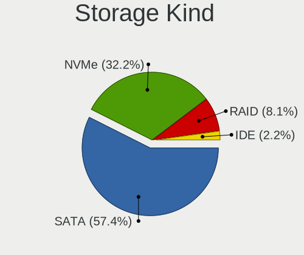

| Kind | Notebooks | Percent |
|------|-----------|---------|
| SATA | 526       | 57.93%  |
| NVMe | 289       | 31.83%  |
| RAID | 72        | 7.93%   |
| IDE  | 21        | 2.31%   |

Processor
---------

CPU Vendor
----------

Processor vendors

| Vendor | Notebooks | Percent |
|--------|-----------|---------|
| Intel  | 607       | 83.26%  |
| AMD    | 122       | 16.74%  |

CPU Model
---------

Processor models

| Model                                         | Notebooks | Percent |
|-----------------------------------------------|-----------|---------|
| Intel Core i7-9750H CPU @ 2.60GHz             | 21        | 2.88%   |
| Intel Core i5-8250U CPU @ 1.60GHz             | 19        | 2.61%   |
| AMD Ryzen 5 3500U with Radeon Vega Mobile Gfx | 19        | 2.61%   |
| Intel Core i7-8565U CPU @ 1.80GHz             | 17        | 2.33%   |
| Intel Core i7-10510U CPU @ 1.80GHz            | 17        | 2.33%   |
| Intel Core i5-8265U CPU @ 1.60GHz             | 16        | 2.19%   |
| Intel Core i5-7200U CPU @ 2.50GHz             | 16        | 2.19%   |
| Intel Core i7-8750H CPU @ 2.20GHz             | 15        | 2.06%   |
| Intel Core i7-7700HQ CPU @ 2.80GHz            | 14        | 1.92%   |
| Intel Core i5-3320M CPU @ 2.60GHz             | 14        | 1.92%   |
| Intel Core i7-10750H CPU @ 2.60GHz            | 11        | 1.51%   |
| Intel 11th Gen Core i7-1165G7 @ 2.80GHz       | 11        | 1.51%   |
| Intel Core i7-8550U CPU @ 1.80GHz             | 10        | 1.37%   |
| Intel Core i5-6200U CPU @ 2.30GHz             | 10        | 1.37%   |
| Intel Core i5-4200U CPU @ 1.60GHz             | 9         | 1.23%   |
| Intel Core i7-6700HQ CPU @ 2.60GHz            | 8         | 1.1%    |
| Intel Core i5-5200U CPU @ 2.20GHz             | 8         | 1.1%    |
| Intel Core i5-10210U CPU @ 1.60GHz            | 8         | 1.1%    |
| AMD Ryzen 7 4800H with Radeon Graphics        | 8         | 1.1%    |
| Intel Core i7-7500U CPU @ 2.70GHz             | 7         | 0.96%   |
| Intel Core i7-6500U CPU @ 2.50GHz             | 7         | 0.96%   |
| Intel Core i7-2670QM CPU @ 2.20GHz            | 7         | 0.96%   |
| Intel Core i7-1065G7 CPU @ 1.30GHz            | 7         | 0.96%   |
| Intel Core i5-4210U CPU @ 1.70GHz             | 7         | 0.96%   |
| Intel Core i5-3230M CPU @ 2.60GHz             | 7         | 0.96%   |
| Intel Core i5-2450M CPU @ 2.50GHz             | 7         | 0.96%   |
| Intel Core i3-3110M CPU @ 2.40GHz             | 7         | 0.96%   |
| AMD Ryzen 5 4500U with Radeon Graphics        | 7         | 0.96%   |
| Intel Core i7-4700MQ CPU @ 2.40GHz            | 6         | 0.82%   |
| Intel Core i7-4600U CPU @ 2.10GHz             | 6         | 0.82%   |
| Intel Core i5-4300U CPU @ 1.90GHz             | 6         | 0.82%   |
| Intel Core i5-2410M CPU @ 2.30GHz             | 6         | 0.82%   |
| Intel Core i7-9850H CPU @ 2.60GHz             | 5         | 0.69%   |
| Intel Core i7-5500U CPU @ 2.40GHz             | 5         | 0.69%   |
| Intel Core i5-8350U CPU @ 1.70GHz             | 5         | 0.69%   |
| Intel Core i5-8300H CPU @ 2.30GHz             | 5         | 0.69%   |
| Intel Core i5-7300HQ CPU @ 2.50GHz            | 5         | 0.69%   |
| Intel Core i5-3317U CPU @ 1.70GHz             | 5         | 0.69%   |
| Intel Core i5-1035G1 CPU @ 1.00GHz            | 5         | 0.69%   |
| Intel Atom x5-Z8350 CPU @ 1.44GHz             | 5         | 0.69%   |

CPU Model Family
----------------

Processor model prefix

| Model                   | Notebooks | Percent |
|-------------------------|-----------|---------|
| Intel Core i7           | 232       | 31.82%  |
| Intel Core i5           | 219       | 30.04%  |
| Intel Core i3           | 50        | 6.86%   |
| AMD Ryzen 5             | 37        | 5.08%   |
| Other                   | 33        | 4.53%   |
| Intel Celeron           | 28        | 3.84%   |
| AMD Ryzen 7             | 22        | 3.02%   |
| Intel Core 2 Duo        | 14        | 1.92%   |
| AMD Ryzen 3             | 12        | 1.65%   |
| AMD A10                 | 8         | 1.1%    |
| Intel Atom              | 7         | 0.96%   |
| AMD Ryzen 7 PRO         | 7         | 0.96%   |
| AMD A6                  | 7         | 0.96%   |
| Intel Pentium Dual-Core | 6         | 0.82%   |
| Intel Pentium           | 6         | 0.82%   |
| AMD E2                  | 5         | 0.69%   |
| Intel Pentium Silver    | 4         | 0.55%   |
| AMD E1                  | 4         | 0.55%   |
| AMD A8                  | 4         | 0.55%   |
| Intel Core i9           | 3         | 0.41%   |
| Intel Xeon              | 2         | 0.27%   |
| Intel Celeron Dual-Core | 2         | 0.27%   |
| AMD Ryzen 9             | 2         | 0.27%   |
| AMD C-50                | 2         | 0.27%   |
| AMD A4                  | 2         | 0.27%   |
| AMD A12                 | 2         | 0.27%   |
| Intel Pentium Dual      | 1         | 0.14%   |
| Intel Genuine           | 1         | 0.14%   |
| Intel Core 2 Quad       | 1         | 0.14%   |
| Intel Core 2            | 1         | 0.14%   |
| AMD QC                  | 1         | 0.14%   |
| AMD FX                  | 1         | 0.14%   |
| AMD C-60                | 1         | 0.14%   |
| AMD Athlon X2           | 1         | 0.14%   |
| AMD Athlon II           | 1         | 0.14%   |

CPU Cores
---------

Number of processor cores

| Number | Notebooks | Percent |
|--------|-----------|---------|
| 2      | 328       | 44.99%  |
| 4      | 293       | 40.19%  |
| 6      | 76        | 10.43%  |
| 8      | 27        | 3.7%    |
| 1      | 3         | 0.41%   |
| 12     | 1         | 0.14%   |
| 10     | 1         | 0.14%   |

CPU Sockets
-----------

Number of sockets

| Number | Notebooks | Percent |
|--------|-----------|---------|
| 1      | 729       | 100%    |

CPU Threads
-----------

Threads per core (Hyper-Threading)

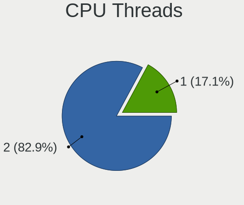

| Number | Notebooks | Percent |
|--------|-----------|---------|
| 2      | 609       | 83.54%  |
| 1      | 120       | 16.46%  |

CPU Op-Modes
------------

CPU Operation Modes (32-bit, 64-bit)

| Op mode        | Notebooks | Percent |
|----------------|-----------|---------|
| 32-bit, 64-bit | 729       | 100%    |

CPU Microcode
-------------

Microcode number

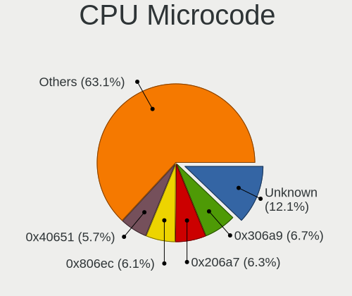

| Number     | Notebooks | Percent |
|------------|-----------|---------|
| Unknown    | 87        | 11.71%  |
| 0x306a9    | 51        | 6.86%   |
| 0x206a7    | 49        | 6.59%   |
| 0x806ec    | 45        | 6.06%   |
| 0x40651    | 42        | 5.65%   |
| 0x906ea    | 36        | 4.85%   |
| 0x806ea    | 35        | 4.71%   |
| 0x806e9    | 30        | 4.04%   |
| 0x306c3    | 27        | 3.63%   |
| 0x406e3    | 22        | 2.96%   |
| 0x306d4    | 22        | 2.96%   |
| 0x906e9    | 21        | 2.83%   |
| 0x08108102 | 21        | 2.83%   |
| 0x806c1    | 19        | 2.56%   |
| 0x08108109 | 17        | 2.29%   |
| 0xa0652    | 16        | 2.15%   |
| 0x806eb    | 16        | 2.15%   |
| 0x1067a    | 16        | 2.15%   |
| 0x706e5    | 14        | 1.88%   |
| 0x506e3    | 12        | 1.62%   |
| 0x08600106 | 11        | 1.48%   |
| 0x706a1    | 10        | 1.35%   |
| 0x406c4    | 10        | 1.35%   |
| 0x906ed    | 9         | 1.21%   |
| 0x20655    | 7         | 0.94%   |
| 0x0810100b | 6         | 0.81%   |
| 0x07030105 | 6         | 0.81%   |
| 0x03000027 | 6         | 0.81%   |
| 0x30678    | 5         | 0.67%   |
| 0x20652    | 5         | 0.67%   |
| 0x06006705 | 5         | 0.67%   |
| 0x06001119 | 5         | 0.67%   |
| 0x806d1    | 4         | 0.54%   |
| 0x10676    | 4         | 0.54%   |
| 0x08600104 | 4         | 0.54%   |
| 0x08600103 | 4         | 0.54%   |
| 0x0700010f | 4         | 0.54%   |
| 0x06006118 | 4         | 0.54%   |
| 0x406c3    | 3         | 0.4%    |
| 0x0600611a | 3         | 0.4%    |

CPU Microarch
-------------

Microarchitecture

| Name             | Notebooks | Percent |
|------------------|-----------|---------|
| KabyLake         | 221       | 30.32%  |
| Haswell          | 76        | 10.43%  |
| IvyBridge        | 54        | 7.41%   |
| SandyBridge      | 52        | 7.13%   |
| Zen+             | 39        | 5.35%   |
| Skylake          | 36        | 4.94%   |
| Zen 2            | 27        | 3.7%    |
| TigerLake        | 24        | 3.29%   |
| Broadwell        | 23        | 3.16%   |
| Penryn           | 22        | 3.02%   |
| CometLake        | 21        | 2.88%   |
| IceLake          | 19        | 2.61%   |
| Silvermont       | 18        | 2.47%   |
| Westmere         | 16        | 2.19%   |
| Goldmont plus    | 13        | 1.78%   |
| Excavator        | 13        | 1.78%   |
| Puma             | 7         | 0.96%   |
| Zen 3            | 6         | 0.82%   |
| Zen              | 6         | 0.82%   |
| K10 Llano        | 6         | 0.82%   |
| Piledriver       | 5         | 0.69%   |
| Core             | 5         | 0.69%   |
| Jaguar           | 4         | 0.55%   |
| Bobcat           | 4         | 0.55%   |
| Unknown          | 3         | 0.41%   |
| Bonnell          | 2         | 0.27%   |
| Tremont          | 1         | 0.14%   |
| Steamroller      | 1         | 0.14%   |
| Nehalem          | 1         | 0.14%   |
| K8 & K10 hybrid  | 1         | 0.14%   |
| K10              | 1         | 0.14%   |
| Goldmont         | 1         | 0.14%   |
| Alderlake Hybrid | 1         | 0.14%   |

Graphics
--------

GPU Vendor
----------

Vendors of graphics cards

| Vendor                           | Notebooks | Percent |
|----------------------------------|-----------|---------|
| Intel                            | 574       | 58.33%  |
| Nvidia                           | 238       | 24.19%  |
| AMD                              | 170       | 17.28%  |
| Silicon Integrated Systems [SiS] | 1         | 0.1%    |
| ATI Technologies                 | 1         | 0.1%    |

GPU Model
---------

Graphics card models

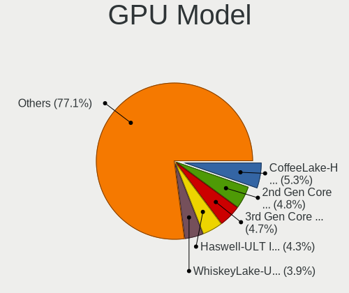

| Model                                                                                    | Notebooks | Percent |
|------------------------------------------------------------------------------------------|-----------|---------|
| Intel CoffeeLake-H GT2 [UHD Graphics 630]                                                | 54        | 5.36%   |
| Intel 2nd Generation Core Processor Family Integrated Graphics Controller                | 50        | 4.96%   |
| Intel 3rd Gen Core processor Graphics Controller                                         | 48        | 4.76%   |
| Intel Haswell-ULT Integrated Graphics Controller                                         | 43        | 4.27%   |
| AMD Picasso/Raven 2 [Radeon Vega Series / Radeon Vega Mobile Series]                     | 39        | 3.87%   |
| Intel WhiskeyLake-U GT2 [UHD Graphics 620]                                               | 38        | 3.77%   |
| Intel UHD Graphics 620                                                                   | 38        | 3.77%   |
| Intel HD Graphics 620                                                                    | 32        | 3.17%   |
| Intel 4th Gen Core Processor Integrated Graphics Controller                              | 30        | 2.98%   |
| Intel CometLake-U GT2 [UHD Graphics]                                                     | 28        | 2.78%   |
| AMD Renoir                                                                               | 26        | 2.58%   |
| Intel TigerLake-LP GT2 [Iris Xe Graphics]                                                | 23        | 2.28%   |
| Intel Skylake GT2 [HD Graphics 520]                                                      | 23        | 2.28%   |
| Intel HD Graphics 5500                                                                   | 22        | 2.18%   |
| Intel HD Graphics 630                                                                    | 21        | 2.08%   |
| Nvidia GP107M [GeForce GTX 1050 Mobile]                                                  | 20        | 1.98%   |
| Nvidia TU117M [GeForce GTX 1650 Mobile / Max-Q]                                          | 18        | 1.79%   |
| Intel CometLake-H GT2 [UHD Graphics]                                                     | 17        | 1.69%   |
| Intel Mobile 4 Series Chipset Integrated Graphics Controller                             | 13        | 1.29%   |
| Intel Atom/Celeron/Pentium Processor x5-E8000/J3xxx/N3xxx Integrated Graphics Controller | 13        | 1.29%   |
| Intel HD Graphics 530                                                                    | 11        | 1.09%   |
| Intel GeminiLake [UHD Graphics 600]                                                      | 10        | 0.99%   |
| Intel Core Processor Integrated Graphics Controller                                      | 10        | 0.99%   |
| Nvidia GP108M [GeForce MX150]                                                            | 9         | 0.89%   |
| Nvidia GP107M [GeForce GTX 1050 Ti Mobile]                                               | 9         | 0.89%   |
| AMD Topaz XT [Radeon R7 M260/M265 / M340/M360 / M440/M445 / 530/535 / 620/625 Mobile]    | 9         | 0.89%   |
| Nvidia TU117M [GeForce GTX 1650 Ti Mobile]                                               | 8         | 0.79%   |
| Nvidia GP106M [GeForce GTX 1060 Mobile]                                                  | 8         | 0.79%   |
| Nvidia GM108M [GeForce 840M]                                                             | 8         | 0.79%   |
| Intel Iris Plus Graphics G1 (Ice Lake)                                                   | 8         | 0.79%   |
| Nvidia TU116M [GeForce GTX 1660 Ti Mobile]                                               | 7         | 0.69%   |
| Nvidia TU106M [GeForce RTX 2060 Mobile]                                                  | 7         | 0.69%   |
| Nvidia GM108M [GeForce 940MX]                                                            | 7         | 0.69%   |
| Nvidia GF117M [GeForce 610M/710M/810M/820M / GT 620M/625M/630M/720M]                     | 7         | 0.69%   |
| Intel Iris Plus Graphics G7                                                              | 7         | 0.69%   |
| AMD Wani [Radeon R5/R6/R7 Graphics]                                                      | 7         | 0.69%   |
| AMD Sun XT [Radeon HD 8670A/8670M/8690M / R5 M330 / M430 / Radeon 520 Mobile]            | 7         | 0.69%   |
| Nvidia GP108M [GeForce MX250]                                                            | 6         | 0.6%    |
| Nvidia GM108M [GeForce MX130]                                                            | 6         | 0.6%    |
| Nvidia GM107M [GeForce GTX 960M]                                                         | 6         | 0.6%    |

GPU Combo
---------

Combinations of graphics cards

| Name           | Notebooks | Percent |
|----------------|-----------|---------|
| 1 x Intel      | 335       | 45.83%  |
| Intel + Nvidia | 201       | 27.5%   |
| 1 x AMD        | 101       | 13.82%  |
| Intel + AMD    | 38        | 5.2%    |
| 1 x Nvidia     | 22        | 3.01%   |
| 2 x AMD        | 18        | 2.46%   |
| AMD + Nvidia   | 14        | 1.92%   |
| 2 x Nvidia     | 1         | 0.14%   |
| 1 x SiS        | 1         | 0.14%   |

GPU Driver
----------

Free vs proprietary

| Driver      | Notebooks | Percent |
|-------------|-----------|---------|
| Free        | 561       | 75.91%  |
| Proprietary | 160       | 21.65%  |
| Unknown     | 18        | 2.44%   |

GPU Memory
----------

Total video memory

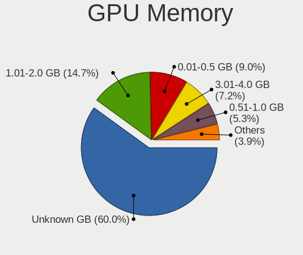

| Size in GB | Notebooks | Percent |
|------------|-----------|---------|
| Unknown    | 443       | 59.62%  |
| 1.01-2.0   | 113       | 15.21%  |
| 0.01-0.5   | 68        | 9.15%   |
| 3.01-4.0   | 53        | 7.13%   |
| 0.51-1.0   | 39        | 5.25%   |
| 5.01-6.0   | 15        | 2.02%   |
| 7.01-8.0   | 6         | 0.81%   |
| 2.01-3.0   | 6         | 0.81%   |

Monitor
-------

Monitor Vendor
--------------

Monitor vendors

| Vendor                  | Notebooks | Percent |
|-------------------------|-----------|---------|
| AU Optronics            | 158       | 18.08%  |
| LG Display              | 137       | 15.68%  |
| Chimei Innolux          | 124       | 14.19%  |
| BOE                     | 112       | 12.81%  |
| Samsung Electronics     | 90        | 10.3%   |
| Dell                    | 36        | 4.12%   |
| Sharp                   | 35        | 4%      |
| Goldstar                | 28        | 3.2%    |
| PANDA                   | 21        | 2.4%    |
| Acer                    | 17        | 1.95%   |
| Chi Mei Optoelectronics | 13        | 1.49%   |
| Lenovo                  | 12        | 1.37%   |
| Hewlett-Packard         | 12        | 1.37%   |
| Philips                 | 9         | 1.03%   |
| AOC                     | 8         | 0.92%   |
| Ancor Communications    | 7         | 0.8%    |
| InfoVision              | 5         | 0.57%   |
| BenQ                    | 5         | 0.57%   |
| ViewSonic               | 4         | 0.46%   |
| Iiyama                  | 4         | 0.46%   |
| Apple                   | 4         | 0.46%   |
| LG Philips              | 3         | 0.34%   |
| Vizio                   | 2         | 0.23%   |
| Vestel Elektronik       | 2         | 0.23%   |
| Seiko/Epson             | 2         | 0.23%   |
| HannStar                | 2         | 0.23%   |
| CPT                     | 2         | 0.23%   |
| UTV                     | 1         | 0.11%   |
| Unknown                 | 1         | 0.11%   |
| Toshiba                 | 1         | 0.11%   |
| STD                     | 1         | 0.11%   |
| STA                     | 1         | 0.11%   |
| Sony                    | 1         | 0.11%   |
| Panasonic               | 1         | 0.11%   |
| NEC Computers           | 1         | 0.11%   |
| MSI                     | 1         | 0.11%   |
| MiTAC                   | 1         | 0.11%   |
| LGD                     | 1         | 0.11%   |
| KTC                     | 1         | 0.11%   |
| KDC                     | 1         | 0.11%   |

Monitor Model
-------------

Monitor models

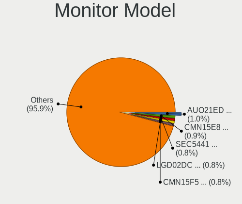

| Model                                                                 | Notebooks | Percent |
|-----------------------------------------------------------------------|-----------|---------|
| AU Optronics LCD Monitor AUO21ED 1920x1080 344x193mm 15.5-inch        | 9         | 1.01%   |
| Samsung Electronics LCD Monitor SEC5441 1366x768 344x194mm 15.5-inch  | 7         | 0.79%   |
| LG Display LCD Monitor LGD02DC 1366x768 344x194mm 15.5-inch           | 7         | 0.79%   |
| Chimei Innolux LCD Monitor CMN15F5 1920x1080 344x193mm 15.5-inch      | 7         | 0.79%   |
| Chimei Innolux LCD Monitor CMN15E8 1920x1080 344x193mm 15.5-inch      | 7         | 0.79%   |
| BOE LCD Monitor BOE0812 1920x1080 344x194mm 15.5-inch                 | 7         | 0.79%   |
| Chimei Innolux LCD Monitor CMN15E7 1920x1080 344x193mm 15.5-inch      | 6         | 0.67%   |
| BOE LCD Monitor BOE06CB 1920x1080 344x194mm 15.5-inch                 | 6         | 0.67%   |
| PANDA LCD Monitor NCP0036 1920x1080 344x194mm 15.5-inch               | 5         | 0.56%   |
| LG Display LCD Monitor LGD0563 1920x1080 344x194mm 15.5-inch          | 5         | 0.56%   |
| Chimei Innolux LCD Monitor CMN14C9 1920x1080 309x173mm 13.9-inch      | 5         | 0.56%   |
| AU Optronics LCD Monitor AUO38ED 1920x1080 344x193mm 15.5-inch        | 5         | 0.56%   |
| AU Optronics LCD Monitor AUO2E3C 1366x768 309x173mm 13.9-inch         | 5         | 0.56%   |
| AU Optronics LCD Monitor AUO123D 1920x1080 309x173mm 13.9-inch        | 5         | 0.56%   |
| Sharp LCD Monitor SHP14D1 1920x1200 336x210mm 15.6-inch               | 4         | 0.45%   |
| Samsung Electronics LCD Monitor SDCA029 3840x2160 344x194mm 15.5-inch | 4         | 0.45%   |
| PANDA LCD Monitor NCP004D 1920x1080 344x194mm 15.5-inch               | 4         | 0.45%   |
| LG Display LCD Monitor LGD046F 1920x1080 344x194mm 15.5-inch          | 4         | 0.45%   |
| Chimei Innolux P130ZFA-BA1 CMN8201 2160x1440 275x183mm 13.0-inch      | 4         | 0.45%   |
| Chimei Innolux LCD Monitor CMN15DB 1366x768 344x193mm 15.5-inch       | 4         | 0.45%   |
| Chimei Innolux LCD Monitor CMN14F2 1920x1080 309x173mm 13.9-inch      | 4         | 0.45%   |
| BOE LCD Monitor BOE0852 1920x1080 344x194mm 15.5-inch                 | 4         | 0.45%   |
| BOE LCD Monitor BOE0747 1920x1080 344x194mm 15.5-inch                 | 4         | 0.45%   |
| AU Optronics LCD Monitor AUO71EC 1366x768 344x193mm 15.5-inch         | 4         | 0.45%   |
| AU Optronics LCD Monitor AUO403D 1920x1080 309x173mm 13.9-inch        | 4         | 0.45%   |
| Sharp LCD Monitor SHP1453 1920x1080 346x194mm 15.6-inch               | 3         | 0.34%   |
| Samsung Electronics S24F350 SAM0D20 1920x1080 520x290mm 23.4-inch     | 3         | 0.34%   |
| Samsung Electronics LCD Monitor SDC4852 1366x768 340x190mm 15.3-inch  | 3         | 0.34%   |
| Samsung Electronics LCD Monitor SDC4651 1366x768 344x194mm 15.5-inch  | 3         | 0.34%   |
| LG Display LCD Monitor LGD065A 1920x1080 344x194mm 15.5-inch          | 3         | 0.34%   |
| LG Display LCD Monitor LGD05E5 1920x1080 340x190mm 15.3-inch          | 3         | 0.34%   |
| LG Display LCD Monitor LGD0540 1920x1080 344x194mm 15.5-inch          | 3         | 0.34%   |
| LG Display LCD Monitor LGD053F 1920x1080 344x194mm 15.5-inch          | 3         | 0.34%   |
| LG Display LCD Monitor LGD0468 1366x768 344x194mm 15.5-inch           | 3         | 0.34%   |
| LG Display LCD Monitor LGD0456 1366x768 344x194mm 15.5-inch           | 3         | 0.34%   |
| LG Display LCD Monitor LGD0385 1366x768 309x174mm 14.0-inch           | 3         | 0.34%   |
| LG Display LCD Monitor LGD032C 1920x1080 344x194mm 15.5-inch          | 3         | 0.34%   |
| LG Display LCD Monitor LGD02D8 1366x768 277x156mm 12.5-inch           | 3         | 0.34%   |
| Chimei Innolux LCD Monitor CMN15D5 1920x1080 344x193mm 15.5-inch      | 3         | 0.34%   |
| Chimei Innolux LCD Monitor CMN15C3 1920x1080 344x193mm 15.5-inch      | 3         | 0.34%   |

Monitor Resolution
------------------

Monitor screen resolution

| Resolution         | Notebooks | Percent |
|--------------------|-----------|---------|
| 1920x1080 (FHD)    | 406       | 50.5%   |
| 1366x768 (WXGA)    | 209       | 26%     |
| 3840x2160 (4K)     | 41        | 5.1%    |
| 1600x900 (HD+)     | 38        | 4.73%   |
| 2560x1440 (QHD)    | 25        | 3.11%   |
| 1920x1200 (WUXGA)  | 11        | 1.37%   |
| 1280x800 (WXGA)    | 11        | 1.37%   |
| 1440x900 (WXGA+)   | 7         | 0.87%   |
| 3840x2400          | 6         | 0.75%   |
| 3440x1440          | 5         | 0.62%   |
| 2560x1080          | 5         | 0.62%   |
| 1280x1024 (SXGA)   | 5         | 0.62%   |
| 2560x1600          | 4         | 0.5%    |
| 2160x1440          | 4         | 0.5%    |
| 1680x1050 (WSXGA+) | 4         | 0.5%    |
| 1360x768           | 4         | 0.5%    |
| 3200x1800 (QHD+)   | 3         | 0.37%   |
| 3456x2160          | 2         | 0.25%   |
| 2880x1800          | 2         | 0.25%   |
| 1920x1280          | 2         | 0.25%   |
| 1600x1200          | 2         | 0.25%   |
| Unknown            | 2         | 0.25%   |
| 3840x1080          | 1         | 0.12%   |
| 3000x1920          | 1         | 0.12%   |
| 2560x1700          | 1         | 0.12%   |
| 1680x945           | 1         | 0.12%   |
| 1024x768 (XGA)     | 1         | 0.12%   |
| 1024x600           | 1         | 0.12%   |

Monitor Diagonal
----------------

Diagonal size in inches

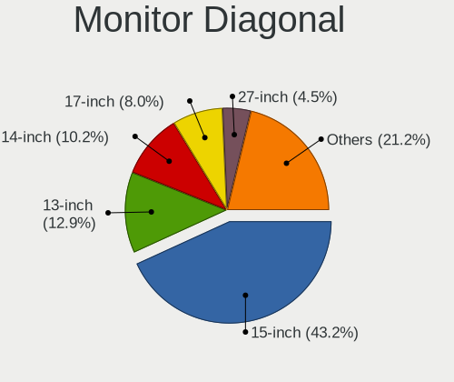

| Inches  | Notebooks | Percent |
|---------|-----------|---------|
| 15      | 386       | 44.01%  |
| 13      | 114       | 13%     |
| 14      | 88        | 10.03%  |
| 17      | 70        | 7.98%   |
| 27      | 41        | 4.68%   |
| 23      | 36        | 4.1%    |
| 24      | 29        | 3.31%   |
| 21      | 22        | 2.51%   |
| 12      | 17        | 1.94%   |
| 34      | 10        | 1.14%   |
| 11      | 9         | 1.03%   |
| Unknown | 9         | 1.03%   |
| 31      | 7         | 0.8%    |
| 18      | 6         | 0.68%   |
| 20      | 5         | 0.57%   |
| 16      | 5         | 0.57%   |
| 84      | 4         | 0.46%   |
| 19      | 4         | 0.46%   |
| 22      | 3         | 0.34%   |
| 42      | 2         | 0.23%   |
| 61      | 1         | 0.11%   |
| 54      | 1         | 0.11%   |
| 52      | 1         | 0.11%   |
| 47      | 1         | 0.11%   |
| 46      | 1         | 0.11%   |
| 40      | 1         | 0.11%   |
| 32      | 1         | 0.11%   |
| 25      | 1         | 0.11%   |
| 10      | 1         | 0.11%   |
| 8       | 1         | 0.11%   |

Monitor Width
-------------

Physical width

| Width in mm | Notebooks | Percent |
|-------------|-----------|---------|
| 301-350     | 540       | 62.28%  |
| 501-600     | 98        | 11.3%   |
| 351-400     | 83        | 9.57%   |
| 201-300     | 66        | 7.61%   |
| 401-500     | 37        | 4.27%   |
| 701-800     | 11        | 1.27%   |
| 601-700     | 10        | 1.15%   |
| Unknown     | 9         | 1.04%   |
| 1001-1500   | 5         | 0.58%   |
| 1501-2000   | 4         | 0.46%   |
| 901-1000    | 2         | 0.23%   |
| 801-900     | 1         | 0.12%   |
| 101-200     | 1         | 0.12%   |

Aspect Ratio
------------

Proportional relationship between the width and the height

| Ratio   | Notebooks | Percent |
|---------|-----------|---------|
| 16/9    | 663       | 89.47%  |
| 16/10   | 46        | 6.21%   |
| 21/9    | 10        | 1.35%   |
| 3/2     | 7         | 0.94%   |
| Unknown | 6         | 0.81%   |
| 5/4     | 5         | 0.67%   |
| 4/3     | 3         | 0.4%    |
| 0.62    | 1         | 0.13%   |

Monitor Area
------------

Area in inch

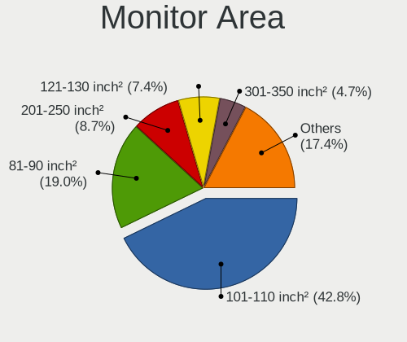

| Area in inch | Notebooks | Percent |
|----------------|-----------|---------|
| 101-110        | 386       | 44.06%  |
| 81-90          | 165       | 18.84%  |
| 201-250        | 74        | 8.45%   |
| 121-130        | 64        | 7.31%   |
| 301-350        | 41        | 4.68%   |
| 71-80          | 39        | 4.45%   |
| 351-500        | 18        | 2.05%   |
| 151-200        | 17        | 1.94%   |
| 61-70          | 15        | 1.71%   |
| 251-300        | 10        | 1.14%   |
| 51-60          | 9         | 1.03%   |
| Unknown        | 9         | 1.03%   |
| More than 1000 | 7         | 0.8%    |
| 141-150        | 7         | 0.8%    |
| 501-1000       | 5         | 0.57%   |
| 131-140        | 3         | 0.34%   |
| 111-120        | 3         | 0.34%   |
| 91-100         | 2         | 0.23%   |
| 41-50          | 1         | 0.11%   |
| 1-40           | 1         | 0.11%   |

Pixel Density
-------------

Pixels per inch

| Density       | Notebooks | Percent |
|---------------|-----------|---------|
| 121-160       | 393       | 45.7%   |
| 101-120       | 235       | 27.33%  |
| 51-100        | 140       | 16.28%  |
| 161-240       | 41        | 4.77%   |
| More than 240 | 35        | 4.07%   |
| Unknown       | 9         | 1.05%   |
| 1-50          | 7         | 0.81%   |

Multiple Monitors
-----------------

Total monitors connected

| Total | Notebooks | Percent |
|-------|-----------|---------|
| 1     | 554       | 74.26%  |
| 2     | 152       | 20.38%  |
| 3     | 20        | 2.68%   |
| 0     | 19        | 2.55%   |
| 4     | 1         | 0.13%   |

Network
-------

Net Controller Vendor
---------------------

Controller vendors

| Vendor                            | Notebooks | Percent |
|-----------------------------------|-----------|---------|
| Realtek Semiconductor             | 428       | 36.58%  |
| Intel                             | 426       | 36.41%  |
| Qualcomm Atheros                  | 166       | 14.19%  |
| Broadcom                          | 52        | 4.44%   |
| Ralink                            | 11        | 0.94%   |
| Broadcom Limited                  | 9         | 0.77%   |
| Marvell Technology Group          | 8         | 0.68%   |
| MediaTek                          | 7         | 0.6%    |
| TP-Link                           | 5         | 0.43%   |
| Dell                              | 5         | 0.43%   |
| ASIX Electronics                  | 5         | 0.43%   |
| Sierra Wireless                   | 4         | 0.34%   |
| Ralink Technology                 | 4         | 0.34%   |
| Qualcomm                          | 4         | 0.34%   |
| JMicron Technology                | 4         | 0.34%   |
| Xiaomi                            | 3         | 0.26%   |
| Samsung Electronics               | 3         | 0.26%   |
| DisplayLink                       | 3         | 0.26%   |
| D-Link                            | 3         | 0.26%   |
| T & A Mobile Phones               | 2         | 0.17%   |
| Lenovo                            | 2         | 0.17%   |
| Huawei Technologies               | 2         | 0.17%   |
| Hewlett-Packard                   | 2         | 0.17%   |
| Fibocom                           | 2         | 0.17%   |
| Ericsson Business Mobile Networks | 2         | 0.17%   |
| ZyDAS                             | 1         | 0.09%   |
| ZTE WCDMA Technologies MSM        | 1         | 0.09%   |
| Silicon Integrated Systems [SiS]  | 1         | 0.09%   |
| Qualcomm Atheros Communications   | 1         | 0.09%   |
| Nvidia                            | 1         | 0.09%   |
| Linksys                           | 1         | 0.09%   |
| HMD Global                        | 1         | 0.09%   |
| Apple                             | 1         | 0.09%   |

Net Controller Model
--------------------

Controller models

| Model                                                             | Notebooks | Percent |
|-------------------------------------------------------------------|-----------|---------|
| Realtek RTL8111/8168/8411 PCI Express Gigabit Ethernet Controller | 281       | 19.91%  |
| Realtek RTL810xE PCI Express Fast Ethernet controller             | 75        | 5.32%   |
| Intel Wireless 8265 / 8275                                        | 49        | 3.47%   |
| Intel Wi-Fi 6 AX200                                               | 49        | 3.47%   |
| Realtek RTL8153 Gigabit Ethernet Adapter                          | 42        | 2.98%   |
| Qualcomm Atheros QCA9377 802.11ac Wireless Network Adapter        | 38        | 2.69%   |
| Qualcomm Atheros QCA6174 802.11ac Wireless Network Adapter        | 33        | 2.34%   |
| Intel Wireless 7260                                               | 31        | 2.2%    |
| Realtek RTL8821CE 802.11ac PCIe Wireless Network Adapter          | 28        | 1.98%   |
| Qualcomm Atheros AR9485 Wireless Network Adapter                  | 27        | 1.91%   |
| Intel Cannon Lake PCH CNVi WiFi                                   | 27        | 1.91%   |
| Intel 82579LM Gigabit Network Connection (Lewisville)             | 26        | 1.84%   |
| Qualcomm Atheros QCA9565 / AR9565 Wireless Network Adapter        | 25        | 1.77%   |
| Intel Cannon Point-LP CNVi [Wireless-AC]                          | 24        | 1.7%    |
| Intel Comet Lake PCH-LP CNVi WiFi                                 | 22        | 1.56%   |
| Intel Wireless 7265                                               | 18        | 1.28%   |
| Intel Ethernet Connection (4) I219-LM                             | 18        | 1.28%   |
| Intel Centrino Advanced-N 6205 [Taylor Peak]                      | 18        | 1.28%   |
| Realtek RTL8822CE 802.11ac PCIe Wireless Network Adapter          | 17        | 1.2%    |
| Intel Wi-Fi 6 AX201                                               | 16        | 1.13%   |
| Intel Comet Lake PCH CNVi WiFi                                    | 16        | 1.13%   |
| Intel Wireless 8260                                               | 15        | 1.06%   |
| Intel Ethernet Connection I218-LM                                 | 15        | 1.06%   |
| Realtek RTL8723BE PCIe Wireless Network Adapter                   | 13        | 0.92%   |
| Intel Ethernet Connection (7) I219-LM                             | 13        | 0.92%   |
| Intel Wireless 3165                                               | 12        | 0.85%   |
| Realtek RTL8822BE 802.11a/b/g/n/ac WiFi adapter                   | 11        | 0.78%   |
| Qualcomm Atheros AR9285 Wireless Network Adapter (PCI-Express)    | 11        | 0.78%   |
| Intel Wireless-AC 9260                                            | 11        | 0.78%   |
| Intel Ethernet Connection I217-LM                                 | 11        | 0.78%   |
| Broadcom BCM43142 802.11b/g/n                                     | 11        | 0.78%   |
| Broadcom BCM4313 802.11bgn Wireless Network Adapter               | 10        | 0.71%   |
| Intel Dual Band Wireless-AC 3168NGW [Stone Peak]                  | 9         | 0.64%   |
| Intel Centrino Ultimate-N 6300                                    | 9         | 0.64%   |
| Realtek RTL8188EE Wireless Network Adapter                        | 8         | 0.57%   |
| Ralink RT3290 Wireless 802.11n 1T/1R PCIe                         | 8         | 0.57%   |
| Intel Wireless 3160                                               | 8         | 0.57%   |
| Intel Ice Lake-LP PCH CNVi WiFi                                   | 8         | 0.57%   |
| Intel Ethernet Connection (6) I219-V                              | 8         | 0.57%   |
| Intel Dual Band Wireless-AC 3165 Plus Bluetooth                   | 7         | 0.5%    |

Wireless Vendor
---------------

Wireless vendors

| Vendor                          | Notebooks | Percent |
|---------------------------------|-----------|---------|
| Intel                           | 408       | 54.26%  |
| Qualcomm Atheros                | 144       | 19.15%  |
| Realtek Semiconductor           | 110       | 14.63%  |
| Broadcom                        | 39        | 5.19%   |
| Ralink                          | 11        | 1.46%   |
| Broadcom Limited                | 9         | 1.2%    |
| TP-Link                         | 5         | 0.66%   |
| MediaTek                        | 5         | 0.66%   |
| Sierra Wireless                 | 4         | 0.53%   |
| Ralink Technology               | 4         | 0.53%   |
| Dell                            | 3         | 0.4%    |
| D-Link                          | 3         | 0.4%    |
| Qualcomm                        | 2         | 0.27%   |
| Fibocom                         | 2         | 0.27%   |
| ZyDAS                           | 1         | 0.13%   |
| Qualcomm Atheros Communications | 1         | 0.13%   |
| Linksys                         | 1         | 0.13%   |

Wireless Model
--------------

Wireless models

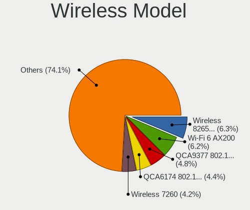

| Model                                                          | Notebooks | Percent |
|----------------------------------------------------------------|-----------|---------|
| Intel Wireless 8265 / 8275                                     | 49        | 6.46%   |
| Intel Wi-Fi 6 AX200                                            | 49        | 6.46%   |
| Qualcomm Atheros QCA9377 802.11ac Wireless Network Adapter     | 38        | 5.01%   |
| Qualcomm Atheros QCA6174 802.11ac Wireless Network Adapter     | 33        | 4.35%   |
| Intel Wireless 7260                                            | 31        | 4.08%   |
| Realtek RTL8821CE 802.11ac PCIe Wireless Network Adapter       | 28        | 3.69%   |
| Qualcomm Atheros AR9485 Wireless Network Adapter               | 27        | 3.56%   |
| Intel Cannon Lake PCH CNVi WiFi                                | 27        | 3.56%   |
| Qualcomm Atheros QCA9565 / AR9565 Wireless Network Adapter     | 25        | 3.29%   |
| Intel Cannon Point-LP CNVi [Wireless-AC]                       | 24        | 3.16%   |
| Intel Comet Lake PCH-LP CNVi WiFi                              | 22        | 2.9%    |
| Intel Wireless 7265                                            | 18        | 2.37%   |
| Intel Centrino Advanced-N 6205 [Taylor Peak]                   | 18        | 2.37%   |
| Realtek RTL8822CE 802.11ac PCIe Wireless Network Adapter       | 17        | 2.24%   |
| Intel Wi-Fi 6 AX201                                            | 16        | 2.11%   |
| Intel Comet Lake PCH CNVi WiFi                                 | 16        | 2.11%   |
| Intel Wireless 8260                                            | 15        | 1.98%   |
| Realtek RTL8723BE PCIe Wireless Network Adapter                | 13        | 1.71%   |
| Intel Wireless 3165                                            | 12        | 1.58%   |
| Realtek RTL8822BE 802.11a/b/g/n/ac WiFi adapter                | 11        | 1.45%   |
| Qualcomm Atheros AR9285 Wireless Network Adapter (PCI-Express) | 11        | 1.45%   |
| Intel Wireless-AC 9260                                         | 11        | 1.45%   |
| Broadcom BCM43142 802.11b/g/n                                  | 11        | 1.45%   |
| Broadcom BCM4313 802.11bgn Wireless Network Adapter            | 10        | 1.32%   |
| Intel Dual Band Wireless-AC 3168NGW [Stone Peak]               | 9         | 1.19%   |
| Intel Centrino Ultimate-N 6300                                 | 9         | 1.19%   |
| Realtek RTL8188EE Wireless Network Adapter                     | 8         | 1.05%   |
| Ralink RT3290 Wireless 802.11n 1T/1R PCIe                      | 8         | 1.05%   |
| Intel Wireless 3160                                            | 8         | 1.05%   |
| Intel Ice Lake-LP PCH CNVi WiFi                                | 8         | 1.05%   |
| Intel Dual Band Wireless-AC 3165 Plus Bluetooth                | 7         | 0.92%   |
| Intel Centrino Wireless-N 1030 [Rainbow Peak]                  | 7         | 0.92%   |
| Realtek RTL8852AE 802.11ax PCIe Wireless Network Adapter       | 5         | 0.66%   |
| Realtek RTL8188CE 802.11b/g/n WiFi Adapter                     | 5         | 0.66%   |
| Qualcomm Atheros AR9462 Wireless Network Adapter               | 5         | 0.66%   |
| Intel WiFi Link 5100                                           | 5         | 0.66%   |
| Intel Tiger Lake PCH CNVi WiFi                                 | 5         | 0.66%   |
| Intel PRO/Wireless 4965 AG or AGN [Kedron] Network Connection  | 5         | 0.66%   |
| Intel Centrino Wireless-N 1000 [Condor Peak]                   | 5         | 0.66%   |
| Intel Centrino Advanced-N 6235                                 | 5         | 0.66%   |

Ethernet Vendor
---------------

Ethernet vendors

| Vendor                           | Notebooks | Percent |
|----------------------------------|-----------|---------|
| Realtek Semiconductor            | 397       | 62.32%  |
| Intel                            | 146       | 22.92%  |
| Qualcomm Atheros                 | 37        | 5.81%   |
| Broadcom                         | 15        | 2.35%   |
| Marvell Technology Group         | 8         | 1.26%   |
| ASIX Electronics                 | 5         | 0.78%   |
| JMicron Technology               | 4         | 0.63%   |
| Xiaomi                           | 3         | 0.47%   |
| Samsung Electronics              | 3         | 0.47%   |
| DisplayLink                      | 3         | 0.47%   |
| T & A Mobile Phones              | 2         | 0.31%   |
| Qualcomm                         | 2         | 0.31%   |
| MediaTek                         | 2         | 0.31%   |
| Lenovo                           | 2         | 0.31%   |
| ZTE WCDMA Technologies MSM       | 1         | 0.16%   |
| Silicon Integrated Systems [SiS] | 1         | 0.16%   |
| Nvidia                           | 1         | 0.16%   |
| Huawei Technologies              | 1         | 0.16%   |
| HMD Global                       | 1         | 0.16%   |
| Hewlett-Packard                  | 1         | 0.16%   |
| Broadcom Limited                 | 1         | 0.16%   |
| Apple                            | 1         | 0.16%   |

Ethernet Model
--------------

Ethernet models

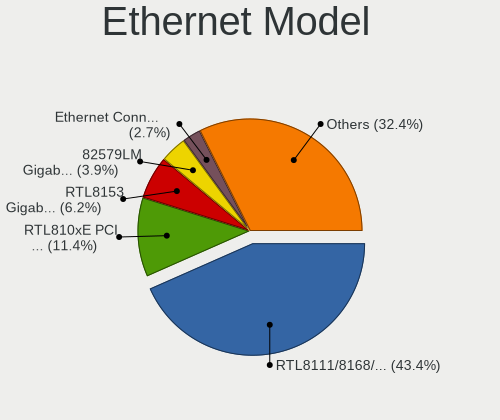

| Model                                                             | Notebooks | Percent |
|-------------------------------------------------------------------|-----------|---------|
| Realtek RTL8111/8168/8411 PCI Express Gigabit Ethernet Controller | 281       | 43.5%   |
| Realtek RTL810xE PCI Express Fast Ethernet controller             | 75        | 11.61%  |
| Realtek RTL8153 Gigabit Ethernet Adapter                          | 42        | 6.5%    |
| Intel 82579LM Gigabit Network Connection (Lewisville)             | 26        | 4.02%   |
| Intel Ethernet Connection (4) I219-LM                             | 18        | 2.79%   |
| Intel Ethernet Connection I218-LM                                 | 15        | 2.32%   |
| Intel Ethernet Connection (7) I219-LM                             | 13        | 2.01%   |
| Intel Ethernet Connection I217-LM                                 | 11        | 1.7%    |
| Intel Ethernet Connection (6) I219-V                              | 8         | 1.24%   |
| Qualcomm Atheros AR8151 v2.0 Gigabit Ethernet                     | 6         | 0.93%   |
| Qualcomm Atheros Killer E2500 Gigabit Ethernet Controller         | 5         | 0.77%   |
| Marvell Group 88E8040 PCI-E Fast Ethernet Controller              | 5         | 0.77%   |
| Intel Ethernet Connection I219-V                                  | 5         | 0.77%   |
| Intel Ethernet Connection (4) I219-V                              | 5         | 0.77%   |
| Intel Ethernet Connection (10) I219-V                             | 5         | 0.77%   |
| Intel 82577LM Gigabit Network Connection                          | 5         | 0.77%   |
| Broadcom NetLink BCM57785 Gigabit Ethernet PCIe                   | 5         | 0.77%   |
| ASIX AX88179 Gigabit Ethernet                                     | 5         | 0.77%   |
| Realtek RTL8152 Fast Ethernet Adapter                             | 4         | 0.62%   |
| Qualcomm Atheros QCA8171 Gigabit Ethernet                         | 4         | 0.62%   |
| Qualcomm Atheros AR8161 Gigabit Ethernet                          | 4         | 0.62%   |
| Intel Ethernet Connection I219-LM                                 | 4         | 0.62%   |
| Intel Ethernet Connection (3) I218-LM                             | 4         | 0.62%   |
| Intel 82567LM Gigabit Network Connection                          | 4         | 0.62%   |
| Broadcom NetXtreme BCM5761 Gigabit Ethernet PCIe                  | 4         | 0.62%   |
| Realtek Killer E2600 Gigabit Ethernet Controller                  | 3         | 0.46%   |
| Qualcomm Atheros QCA8172 Fast Ethernet                            | 3         | 0.46%   |
| Qualcomm Atheros Killer E220x Gigabit Ethernet Controller         | 3         | 0.46%   |
| Qualcomm Atheros AR8162 Fast Ethernet                             | 3         | 0.46%   |
| Qualcomm Atheros AR8131 Gigabit Ethernet                          | 3         | 0.46%   |
| Marvell Group 88E8055 PCI-E Gigabit Ethernet Controller           | 3         | 0.46%   |
| JMicron JMC250 PCI Express Gigabit Ethernet Controller            | 3         | 0.46%   |
| Intel Ethernet Connection (7) I219-V                              | 3         | 0.46%   |
| Intel Ethernet Connection (5) I219-LM                             | 3         | 0.46%   |
| Xiaomi Mi/Redmi series (RNDIS)                                    | 2         | 0.31%   |
| Samsung GT-I9070 (network tethering, USB debugging enabled)       | 2         | 0.31%   |
| Qualcomm Nokia 5.4                                                | 2         | 0.31%   |
| Qualcomm Atheros Killer E2400 Gigabit Ethernet Controller         | 2         | 0.31%   |
| Qualcomm Atheros AR8152 v2.0 Fast Ethernet                        | 2         | 0.31%   |
| Qualcomm Atheros AR8132 Fast Ethernet                             | 2         | 0.31%   |

Net Controller Kind
-------------------

Ethernet, WiFi or modem

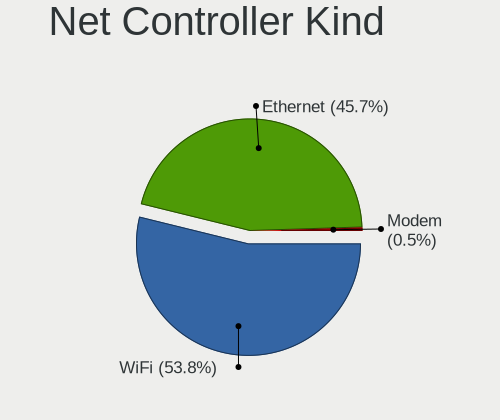

| Kind     | Notebooks | Percent |
|----------|-----------|---------|
| WiFi     | 720       | 53.85%  |
| Ethernet | 611       | 45.7%   |
| Modem    | 6         | 0.45%   |

Used Controller
---------------

Currently used network controller

| Kind     | Notebooks | Percent |
|----------|-----------|---------|
| WiFi     | 603       | 76.91%  |
| Ethernet | 181       | 23.09%  |

NICs
----

Total network controllers on board

| Total | Notebooks | Percent |
|-------|-----------|---------|
| 2     | 561       | 76.95%  |
| 1     | 154       | 21.12%  |
| 0     | 8         | 1.1%    |
| 3     | 6         | 0.82%   |

IPv6
----

IPv6 vs IPv4

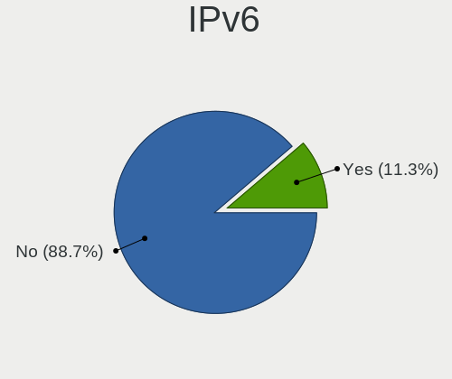

| Used | Notebooks | Percent |
|------|-----------|---------|
| No   | 654       | 89.1%   |
| Yes  | 80        | 10.9%   |

Bluetooth
---------

Bluetooth Vendor
----------------

Controller vendors

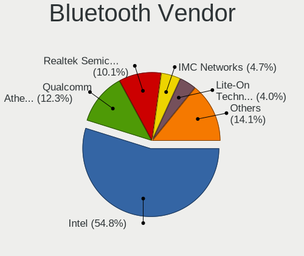

| Vendor                          | Notebooks | Percent |
|---------------------------------|-----------|---------|
| Intel                           | 337       | 54.44%  |
| Qualcomm Atheros Communications | 79        | 12.76%  |
| Realtek Semiconductor           | 63        | 10.18%  |
| IMC Networks                    | 28        | 4.52%   |
| Broadcom                        | 26        | 4.2%    |
| Lite-On Technology              | 25        | 4.04%   |
| Foxconn / Hon Hai               | 13        | 2.1%    |
| Dell                            | 12        | 1.94%   |
| Ralink                          | 8         | 1.29%   |
| Toshiba                         | 5         | 0.81%   |
| Realtek                         | 4         | 0.65%   |
| Cambridge Silicon Radio         | 4         | 0.65%   |
| Hewlett-Packard                 | 3         | 0.48%   |
| Foxconn International           | 3         | 0.48%   |
| Apple                           | 3         | 0.48%   |
| Unknown                         | 2         | 0.32%   |
| Ralink Technology               | 2         | 0.32%   |
| Alps Electric                   | 2         | 0.32%   |

Bluetooth Model
---------------

Controller models

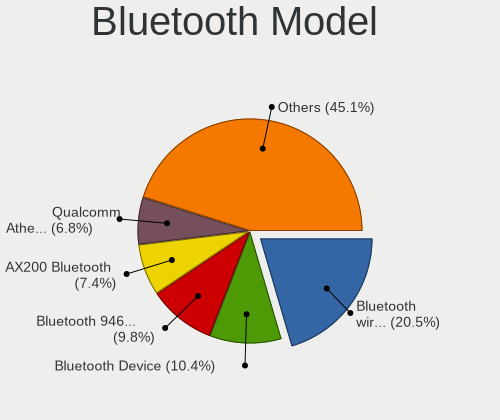

| Model                                                                               | Notebooks | Percent |
|-------------------------------------------------------------------------------------|-----------|---------|
| Intel Bluetooth wireless interface                                                  | 128       | 20.65%  |
| Intel Bluetooth 9460/9560 Jefferson Peak (JfP)                                      | 60        | 9.68%   |
| Intel AX201 Bluetooth                                                               | 60        | 9.68%   |
| Intel AX200 Bluetooth                                                               | 48        | 7.74%   |
| Qualcomm Atheros  Bluetooth Device                                                  | 44        | 7.1%    |
| Realtek Bluetooth Radio                                                             | 32        | 5.16%   |
| Realtek  Bluetooth 4.2 Adapter                                                      | 25        | 4.03%   |
| Intel Centrino Advanced-N 6230 Bluetooth adapter                                    | 14        | 2.26%   |
| Qualcomm Atheros AR3012 Bluetooth 4.0                                               | 13        | 2.1%    |
| Lite-On Bluetooth Device                                                            | 12        | 1.94%   |
| Qualcomm Atheros QCA61x4 Bluetooth 4.0                                              | 11        | 1.77%   |
| Intel Wireless-AC 9260 Bluetooth Adapter                                            | 10        | 1.61%   |
| Intel Wireless-AC 3168 Bluetooth                                                    | 9         | 1.45%   |
| IMC Networks Bluetooth Radio                                                        | 9         | 1.45%   |
| Ralink RT3290 Bluetooth                                                             | 8         | 1.29%   |
| Intel Centrino Bluetooth Wireless Transceiver                                       | 7         | 1.13%   |
| Broadcom BCM20702 Bluetooth 4.0 [ThinkPad]                                          | 7         | 1.13%   |
| Lite-On Qualcomm Atheros QCA9377 Bluetooth                                          | 6         | 0.97%   |
| IMC Networks Bluetooth Device                                                       | 6         | 0.97%   |
| Dell BCM20702A0 Bluetooth Module                                                    | 6         | 0.97%   |
| Realtek RTL8723B Bluetooth                                                          | 5         | 0.81%   |
| Qualcomm Atheros AR9462 Bluetooth                                                   | 5         | 0.81%   |
| IMC Networks Bluetooth USB Host Controller                                          | 5         | 0.81%   |
| Realtek Bluetooth Radio                                                             | 4         | 0.65%   |
| Qualcomm Atheros AR3011 Bluetooth                                                   | 4         | 0.65%   |
| Lite-On Bluetooth Radio                                                             | 4         | 0.65%   |
| Foxconn / Hon Hai Bluetooth Device                                                  | 4         | 0.65%   |
| Cambridge Silicon Radio Bluetooth Dongle (HCI mode)                                 | 4         | 0.65%   |
| Broadcom BCM2045B (BDC-2.1)                                                         | 4         | 0.65%   |
| IMC Networks Atheros AR3012 Bluetooth 4.0 Adapter                                   | 3         | 0.48%   |
| HP Broadcom 2070 Bluetooth Combo                                                    | 3         | 0.48%   |
| Foxconn International BCM43142A0 Bluetooth module                                   | 3         | 0.48%   |
| Dell DW375 Bluetooth Module                                                         | 3         | 0.48%   |
| Broadcom BCM20702A0 Bluetooth 4.0                                                   | 3         | 0.48%   |
| Unknown Bluetooth Device                                                            | 2         | 0.32%   |
| Toshiba Bluetooth USB Host Controller                                               | 2         | 0.32%   |
| Lite-On Atheros AR3012 Bluetooth                                                    | 2         | 0.32%   |
| IMC Networks BCM20702A0                                                             | 2         | 0.32%   |
| Foxconn / Hon Hai Foxconn T77H114 BCM2070 [Single-Chip Bluetooth 2.1 + EDR Adapter] | 2         | 0.32%   |
| Foxconn / Hon Hai BT                                                                | 2         | 0.32%   |

Sound
-----

Sound Vendor
------------

Sound card vendors

| Vendor                           | Notebooks | Percent |
|----------------------------------|-----------|---------|
| Intel                            | 600       | 66.89%  |
| AMD                              | 137       | 15.27%  |
| Nvidia                           | 100       | 11.15%  |
| Realtek Semiconductor            | 12        | 1.34%   |
| GN Netcom                        | 9         | 1%      |
| Plantronics                      | 5         | 0.56%   |
| Logitech                         | 5         | 0.56%   |
| C-Media Electronics              | 5         | 0.56%   |
| Lenovo                           | 4         | 0.45%   |
| Razer USA                        | 2         | 0.22%   |
| Hewlett-Packard                  | 2         | 0.22%   |
| Generalplus Technology           | 2         | 0.22%   |
| Conexant Systems                 | 2         | 0.22%   |
| CMX Systems                      | 2         | 0.22%   |
| Texas Instruments                | 1         | 0.11%   |
| Silicon Integrated Systems [SiS] | 1         | 0.11%   |
| RODE Microphones                 | 1         | 0.11%   |
| Microsoft                        | 1         | 0.11%   |
| Magic Control Technology         | 1         | 0.11%   |
| Kingston Technology              | 1         | 0.11%   |
| JMTek                            | 1         | 0.11%   |
| GYROCOM C&C                      | 1         | 0.11%   |
| Creative Technology              | 1         | 0.11%   |
| AUDIOLAB                         | 1         | 0.11%   |

Sound Model
-----------

Sound card models

| Model                                                                                             | Notebooks | Percent |
|---------------------------------------------------------------------------------------------------|-----------|---------|
| Intel Sunrise Point-LP HD Audio                                                                   | 97        | 8.75%   |
| AMD Family 17h/19h HD Audio Controller                                                            | 78        | 7.04%   |
| Intel 7 Series/C216 Chipset Family High Definition Audio Controller                               | 61        | 5.51%   |
| Intel Cannon Lake PCH cAVS                                                                        | 58        | 5.23%   |
| Intel 6 Series/C200 Series Chipset Family High Definition Audio Controller                        | 45        | 4.06%   |
| Intel Haswell-ULT HD Audio Controller                                                             | 44        | 3.97%   |
| Intel 8 Series HD Audio Controller                                                                | 44        | 3.97%   |
| AMD Raven/Raven2/Fenghuang HDMI/DP Audio Controller                                               | 43        | 3.88%   |
| Intel Cannon Point-LP High Definition Audio Controller                                            | 38        | 3.43%   |
| Intel 8 Series/C220 Series Chipset High Definition Audio Controller                               | 32        | 2.89%   |
| Intel Comet Lake PCH-LP cAVS                                                                      | 31        | 2.8%    |
| Intel Xeon E3-1200 v3/4th Gen Core Processor HD Audio Controller                                  | 30        | 2.71%   |
| AMD Renoir Radeon High Definition Audio Controller                                                | 28        | 2.53%   |
| AMD FCH Azalia Controller                                                                         | 25        | 2.26%   |
| Intel Tiger Lake-LP Smart Sound Technology Audio Controller                                       | 24        | 2.17%   |
| Intel Broadwell-U Audio Controller                                                                | 23        | 2.08%   |
| Intel Wildcat Point-LP High Definition Audio Controller                                           | 22        | 1.99%   |
| Intel CM238 HD Audio Controller                                                                   | 21        | 1.9%    |
| Nvidia TU107 GeForce GTX 1650 High Definition Audio Controller                                    | 20        | 1.81%   |
| Intel Comet Lake PCH cAVS                                                                         | 18        | 1.62%   |
| Intel 82801I (ICH9 Family) HD Audio Controller                                                    | 18        | 1.62%   |
| AMD Kabini HDMI/DP Audio                                                                          | 18        | 1.62%   |
| Intel 5 Series/3400 Series Chipset High Definition Audio                                          | 17        | 1.53%   |
| Intel Ice Lake-LP Smart Sound Technology Audio Controller                                         | 15        | 1.35%   |
| Nvidia GP107GL High Definition Audio Controller                                                   | 14        | 1.26%   |
| Intel 100 Series/C230 Series Chipset Family HD Audio Controller                                   | 14        | 1.26%   |
| Intel Celeron/Pentium Silver Processor High Definition Audio                                      | 13        | 1.17%   |
| AMD Family 15h (Models 60h-6fh) Audio Controller                                                  | 13        | 1.17%   |
| Realtek Semiconductor USB Audio                                                                   | 11        | 0.99%   |
| Nvidia TU106 High Definition Audio Controller                                                     | 10        | 0.9%    |
| Nvidia GP106 High Definition Audio Controller                                                     | 10        | 0.9%    |
| Nvidia GF108 High Definition Audio Controller                                                     | 10        | 0.9%    |
| Intel Atom/Celeron/Pentium Processor x5-E8000/J3xxx/N3xxx Series High Definition Audio Controller | 8         | 0.72%   |
| Nvidia TU116 High Definition Audio Controller                                                     | 7         | 0.63%   |
| Intel 82801H (ICH8 Family) HD Audio Controller                                                    | 6         | 0.54%   |
| AMD RV710/730 HDMI Audio [Radeon HD 4000 series]                                                  | 6         | 0.54%   |
| AMD High Definition Audio Controller                                                              | 6         | 0.54%   |
| AMD BeaverCreek HDMI Audio [Radeon HD 6500D and 6400G-6600G series]                               | 6         | 0.54%   |
| Intel Tiger Lake-H HD Audio Controller                                                            | 5         | 0.45%   |
| Intel Atom Processor Z36xxx/Z37xxx Series High Definition Audio Controller                        | 5         | 0.45%   |

Memory
------

Memory Vendor
-------------

Memory module vendors

| Vendor              | Notebooks | Percent |
|---------------------|-----------|---------|
| Samsung Electronics | 171       | 27.36%  |
| SK hynix            | 128       | 20.48%  |
| Micron Technology   | 83        | 13.28%  |
| Kingston            | 69        | 11.04%  |
| Crucial             | 36        | 5.76%   |
| Unknown             | 30        | 4.8%    |
| Ramaxel Technology  | 17        | 2.72%   |
| A-DATA Technology   | 14        | 2.24%   |
| Elpida              | 12        | 1.92%   |
| Corsair             | 9         | 1.44%   |
| Nanya Technology    | 8         | 1.28%   |
| Unknown (ABCD)      | 6         | 0.96%   |
| Smart               | 5         | 0.8%    |
| Transcend           | 4         | 0.64%   |
| Smart Brazil        | 4         | 0.64%   |
| G.Skill             | 4         | 0.64%   |
| Teikon              | 3         | 0.48%   |
| Apacer              | 3         | 0.48%   |
| Team                | 2         | 0.32%   |
| Unknown             | 2         | 0.32%   |
| V-GeN               | 1         | 0.16%   |
| Unknown (08AE)      | 1         | 0.16%   |
| Silicon Power       | 1         | 0.16%   |
| SHARETRONIC         | 1         | 0.16%   |
| PUSKILL             | 1         | 0.16%   |
| Magnum Tech         | 1         | 0.16%   |
| Kllisre             | 1         | 0.16%   |
| KingFast            | 1         | 0.16%   |
| Goldkey             | 1         | 0.16%   |
| Axiom               | 1         | 0.16%   |
| Avant               | 1         | 0.16%   |
| ASint Technology    | 1         | 0.16%   |
| AMD                 | 1         | 0.16%   |
| 89AD000080AD        | 1         | 0.16%   |
| 48spaces            | 1         | 0.16%   |

Memory Model
------------

Memory module models

| Model                                                            | Notebooks | Percent |
|------------------------------------------------------------------|-----------|---------|
| SK hynix RAM HMA81GS6AFR8N-UH 8GB SODIMM DDR4 2667MT/s           | 13        | 1.97%   |
| Samsung RAM M471A1K43CB1-CTD 8GB SODIMM DDR4 2667MT/s            | 13        | 1.97%   |
| Samsung RAM M471A1K43DB1-CTD 8GB SODIMM DDR4 2667MT/s            | 10        | 1.52%   |
| Samsung RAM M471A1K43CB1-CRC 8GB SODIMM DDR4 2667MT/s            | 10        | 1.52%   |
| Samsung RAM M471B5273DH0-CH9 4096MB SODIMM DDR3 1334MT/s         | 9         | 1.37%   |
| SK hynix RAM HMA81GS6CJR8N-VK 8GB SODIMM DDR4 2667MT/s           | 8         | 1.21%   |
| Samsung RAM M471A5244CB0-CTD 4GB SODIMM DDR4 3266MT/s            | 8         | 1.21%   |
| Samsung RAM M471A2K43DB1-CTD 16GB SODIMM DDR4 2667MT/s           | 8         | 1.21%   |
| Samsung RAM M471A2K43CB1-CTD 16GB SODIMM DDR4 8400MT/s           | 8         | 1.21%   |
| SK hynix RAM HMT351S6CFR8C-PB 4GB SODIMM DDR3 1600MT/s           | 7         | 1.06%   |
| Samsung RAM M471B5173QH0-YK0 4GB SODIMM DDR3 1600MT/s            | 7         | 1.06%   |
| Samsung RAM M471A1G44AB0-CWE 8GB SODIMM DDR4 3200MT/s            | 7         | 1.06%   |
| Unknown (ABCD) RAM 123456789012345678 2GB SODIMM LPDDR4 2400MT/s | 6         | 0.91%   |
| SK hynix RAM HMT451S6AFR8A-PB 4GB SODIMM DDR3 1600MT/s           | 6         | 0.91%   |
| SK hynix RAM HMT41GS6BFR8A-PB 8GB SODIMM DDR3 1600MT/s           | 6         | 0.91%   |
| SK hynix RAM HMA851S6AFR6N-UH 2GB SODIMM LPDDR4 2667MT/s         | 6         | 0.91%   |
| SK hynix RAM HMA82GS6JJR8N-VK 16GB SODIMM DDR4 2667MT/s          | 6         | 0.91%   |
| SK hynix RAM HMT451S6BFR8A-PB 4GB SODIMM DDR3 1600MT/s           | 5         | 0.76%   |
| SK hynix RAM HMT41GS6AFR8A-PB 8GB SODIMM DDR3 1600MT/s           | 5         | 0.76%   |
| SK hynix RAM HMA851S6CJR6N-VK 4GB SODIMM DDR4 2667MT/s           | 5         | 0.76%   |
| Micron RAM 4ATF1G64HZ-3G2E1 8GB SODIMM DDR4 3200MT/s             | 5         | 0.76%   |
| Kingston RAM KHX2400C14S4/16G 16GB SODIMM DDR4 2667MT/s          | 5         | 0.76%   |
| Smart Brazil RAM SMS4TDC3C0K0446SCG 4096MB SODIMM DDR4 2667MT/s  | 4         | 0.61%   |
| SK hynix RAM HMA41GS6AFR8N-TF 8GB SODIMM DDR4 2667MT/s           | 4         | 0.61%   |
| Samsung RAM M471B5173EB0-YK0 4GB SODIMM DDR3 1600MT/s            | 4         | 0.61%   |
| Samsung RAM M471B5173DB0-YK0 4GB SODIMM DDR3 1600MT/s            | 4         | 0.61%   |
| Samsung RAM M471B1G73QH0-YK0 8192MB SODIMM DDR3 1600MT/s         | 4         | 0.61%   |
| Samsung RAM M471A5244CB0-CRC 4GB SODIMM DDR4 2667MT/s            | 4         | 0.61%   |
| Samsung RAM M471A2K43DB1-CWE 16GB SODIMM DDR4 3200MT/s           | 4         | 0.61%   |
| Samsung RAM M471A2G44AM0-CWE 16GB SODIMM DDR4 3200MT/s           | 4         | 0.61%   |
| Samsung RAM M471A1K43BB1-CRC 8192MB SODIMM DDR4 2667MT/s         | 4         | 0.61%   |
| Micron RAM 4ATF51264HZ-2G6E1 4GB SODIMM DDR4 2667MT/s            | 4         | 0.61%   |
| Crucial RAM CT8G4SFS824A.M8FE 8192MB SODIMM DDR4 2667MT/s        | 4         | 0.61%   |
| Crucial RAM CT102464BF160B.C16 8GB SODIMM DDR3 1600MT/s          | 4         | 0.61%   |
| Unknown RAM Module 4096MB SODIMM DDR3                            | 3         | 0.46%   |
| SK hynix RAM HMT351S6EFR8A-PB 4096MB SODIMM DDR3 1600MT/s        | 3         | 0.46%   |
| SK hynix RAM HMT325S6CFR8C-PB 2GB SODIMM DDR3 1600MT/s           | 3         | 0.46%   |
| SK hynix RAM HMA82GS6DJR8N-VK 16GB SODIMM DDR4 2667MT/s          | 3         | 0.46%   |
| SK hynix RAM HMA81GS6JJR8N-VK 8GB SODIMM DDR4 2667MT/s           | 3         | 0.46%   |
| SK hynix RAM HMA81GS6DJR8N-XN 8GB SODIMM DDR4 3200MT/s           | 3         | 0.46%   |

Memory Kind
-----------

Memory module kinds

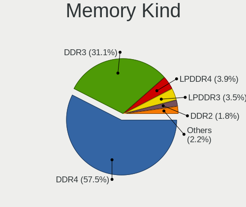

| Kind    | Notebooks | Percent |
|---------|-----------|---------|
| DDR4    | 299       | 57.72%  |
| DDR3    | 163       | 31.47%  |
| LPDDR4  | 18        | 3.47%   |
| LPDDR3  | 17        | 3.28%   |
| DDR2    | 10        | 1.93%   |
| SDRAM   | 7         | 1.35%   |
| Unknown | 3         | 0.58%   |
| DDR     | 1         | 0.19%   |

Memory Form Factor
------------------

Physical design of the memory module

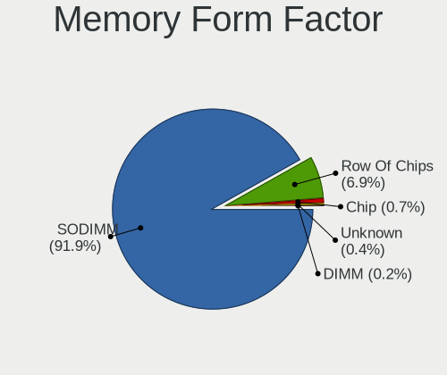

| Name         | Notebooks | Percent |
|--------------|-----------|---------|
| SODIMM       | 477       | 92.44%  |
| Row Of Chips | 32        | 6.2%    |
| Chip         | 4         | 0.78%   |
| Unknown      | 2         | 0.39%   |
| DIMM         | 1         | 0.19%   |

Memory Size
-----------

Memory module size

| Size  | Notebooks | Percent |
|-------|-----------|---------|
| 8192  | 250       | 44.09%  |
| 4096  | 165       | 29.1%   |
| 16384 | 95        | 16.75%  |
| 2048  | 44        | 7.76%   |
| 32768 | 9         | 1.59%   |
| 1024  | 4         | 0.71%   |

Memory Speed
------------

Memory module speed

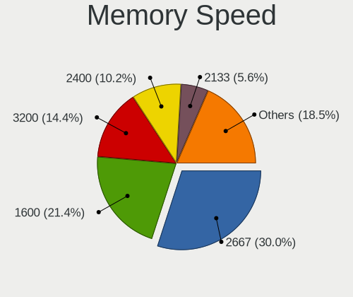

| Speed   | Notebooks | Percent |
|---------|-----------|---------|
| 2667    | 173       | 30.57%  |
| 1600    | 121       | 21.38%  |
| 3200    | 73        | 12.9%   |
| 2400    | 59        | 10.42%  |
| 2133    | 33        | 5.83%   |
| 1334    | 24        | 4.24%   |
| 1333    | 15        | 2.65%   |
| 8400    | 9         | 1.59%   |
| 3266    | 8         | 1.41%   |
| 800     | 7         | 1.24%   |
| Unknown | 7         | 1.24%   |
| 4267    | 6         | 1.06%   |
| 1867    | 6         | 1.06%   |
| 1067    | 6         | 1.06%   |
| 4199    | 5         | 0.88%   |
| 667     | 5         | 0.88%   |
| 2048    | 2         | 0.35%   |
| 1866    | 2         | 0.35%   |
| 1066    | 2         | 0.35%   |
| 3000    | 1         | 0.18%   |
| 1776    | 1         | 0.18%   |
| 975     | 1         | 0.18%   |

Printers & scanners
-------------------

Printer Vendor
--------------

Printer device vendors

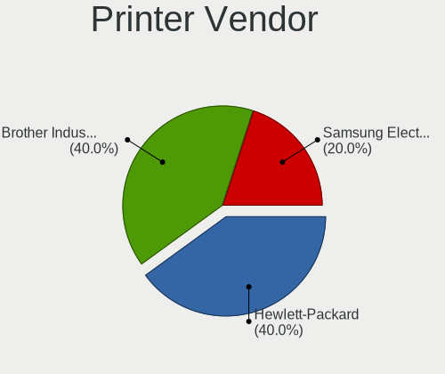

| Vendor              | Notebooks | Percent |
|---------------------|-----------|---------|
| Hewlett-Packard     | 2         | 50%     |
| Samsung Electronics | 1         | 25%     |
| Brother Industries  | 1         | 25%     |

Printer Model
-------------

Printer device models

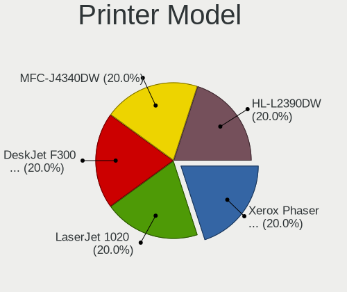

| Model                                   | Notebooks | Percent |
|-----------------------------------------|-----------|---------|
| Samsung Xerox Phaser 3117 Laser Printer | 1         | 25%     |
| HP LaserJet 1020                        | 1         | 25%     |
| HP DeskJet F300 series                  | 1         | 25%     |
| Brother MFC-J4340DW                     | 1         | 25%     |

Scanner Vendor
--------------

Scanner device vendors

Zero info for selected period =(

Scanner Model
-------------

Scanner device models

Zero info for selected period =(

Camera
------

Camera Vendor
-------------

Camera device vendors

| Vendor                                 | Notebooks | Percent |
|----------------------------------------|-----------|---------|
| Chicony Electronics                    | 147       | 21%     |
| Microdia                               | 83        | 11.86%  |
| IMC Networks                           | 75        | 10.71%  |
| Realtek Semiconductor                  | 68        | 9.71%   |
| Acer                                   | 62        | 8.86%   |
| Sunplus Innovation Technology          | 47        | 6.71%   |
| Cheng Uei Precision Industry (Foxlink) | 39        | 5.57%   |
| Quanta                                 | 29        | 4.14%   |
| Silicon Motion                         | 24        | 3.43%   |
| Suyin                                  | 20        | 2.86%   |
| Lite-On Technology                     | 15        | 2.14%   |
| Syntek                                 | 12        | 1.71%   |
| Ricoh                                  | 11        | 1.57%   |
| Logitech                               | 10        | 1.43%   |
| Alcor Micro                            | 8         | 1.14%   |
| Luxvisions Innotech Limited            | 6         | 0.86%   |
| Apple                                  | 6         | 0.86%   |
| Samsung Electronics                    | 5         | 0.71%   |
| Generalplus Technology                 | 4         | 0.57%   |
| Sonix Technology                       | 3         | 0.43%   |
| Lenovo                                 | 3         | 0.43%   |
| Sunplus Technology                     | 2         | 0.29%   |
| Microsoft                              | 2         | 0.29%   |
| Intel                                  | 2         | 0.29%   |
| Genesys Logic                          | 2         | 0.29%   |
| Unknown                                | 1         | 0.14%   |
| SunplusIT                              | 1         | 0.14%   |
| Razer USA                              | 1         | 0.14%   |
| Primax Electronics                     | 1         | 0.14%   |
| OmniVision Technologies                | 1         | 0.14%   |
| Novatek Microelectronics               | 1         | 0.14%   |
| Nokia Mobile Phones                    | 1         | 0.14%   |
| MacroSilicon                           | 1         | 0.14%   |
| LG Electronics                         | 1         | 0.14%   |
| KYE Systems (Mouse Systems)            | 1         | 0.14%   |
| Image Processor                        | 1         | 0.14%   |
| Google                                 | 1         | 0.14%   |
| DJJHFA1BIF5595                         | 1         | 0.14%   |
| DigiTech                               | 1         | 0.14%   |
| ALi                                    | 1         | 0.14%   |

Camera Model
------------

Camera device models

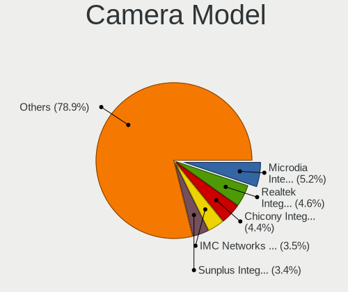

| Model                                                                      | Notebooks | Percent |
|----------------------------------------------------------------------------|-----------|---------|
| Realtek Integrated_Webcam_HD                                               | 37        | 5.26%   |
| Microdia Integrated_Webcam_HD                                              | 37        | 5.26%   |
| Chicony Integrated Camera                                                  | 32        | 4.55%   |
| IMC Networks USB2.0 HD UVC WebCam                                          | 26        | 3.69%   |
| Sunplus Integrated_Webcam_HD                                               | 25        | 3.55%   |
| IMC Networks Integrated Camera                                             | 18        | 2.56%   |
| Acer Integrated Camera                                                     | 17        | 2.41%   |
| Microdia Integrated Webcam                                                 | 15        | 2.13%   |
| Chicony USB2.0 Camera                                                      | 14        | 1.99%   |
| Chicony HD Webcam                                                          | 13        | 1.85%   |
| Acer Lenovo EasyCamera                                                     | 13        | 1.85%   |
| Acer HD Webcam                                                             | 10        | 1.42%   |
| Chicony HD User Facing                                                     | 8         | 1.14%   |
| IMC Networks USB2.0 VGA UVC WebCam                                         | 7         | 0.99%   |
| Chicony Integrated Camera (1280x720@30)                                    | 7         | 0.99%   |
| Chicony HP Wide Vision HD Camera                                           | 7         | 0.99%   |
| Chicony HP HD Camera                                                       | 7         | 0.99%   |
| Cheng Uei Precision Industry (Foxlink) HP Wide Vision HD Integrated Webcam | 7         | 0.99%   |
| Syntek Integrated Camera                                                   | 6         | 0.85%   |
| Realtek Integrated Webcam                                                  | 6         | 0.85%   |
| Microdia USB 2.0 Camera                                                    | 6         | 0.85%   |
| Lite-On Integrated Camera                                                  | 6         | 0.85%   |
| Chicony HP Truevision HD                                                   | 6         | 0.85%   |
| Cheng Uei Precision Industry (Foxlink) HP Webcam                           | 6         | 0.85%   |
| Sunplus HD WebCam                                                          | 5         | 0.71%   |
| Samsung Galaxy A5 (MTP)                                                    | 5         | 0.71%   |
| Ricoh USB2.0 Camera                                                        | 5         | 0.71%   |
| Quanta HP HD Camera                                                        | 5         | 0.71%   |
| IMC Networks USB2.0 UVC HD Webcam                                          | 5         | 0.71%   |
| Chicony USB 2.0 Camera                                                     | 5         | 0.71%   |
| Chicony HP TrueVision HD Camera                                            | 5         | 0.71%   |
| Cheng Uei Precision Industry (Foxlink) HP HD Camera                        | 5         | 0.71%   |
| Apple iPhone5/5C/5S/6                                                      | 5         | 0.71%   |
| Acer BisonCam, NB Pro                                                      | 5         | 0.71%   |
| Syntek EasyCamera                                                          | 4         | 0.57%   |
| Suyin HP Truevision HD                                                     | 4         | 0.57%   |
| Silicon Motion Web Camera                                                  | 4         | 0.57%   |
| Quanta HD User Facing                                                      | 4         | 0.57%   |
| Microdia Laptop_Integrated_Webcam_HD                                       | 4         | 0.57%   |
| Microdia Dell Laptop Integrated Webcam HD                                  | 4         | 0.57%   |

Security
--------

Fingerprint Vendor
------------------

Fingerprint sensor vendors

| Vendor                     | Notebooks | Percent |
|----------------------------|-----------|---------|
| Synaptics                  | 51        | 34%     |
| Validity Sensors           | 47        | 31.33%  |
| Shenzhen Goodix Technology | 24        | 16%     |
| Elan Microelectronics      | 8         | 5.33%   |
| LighTuning Technology      | 7         | 4.67%   |
| AuthenTec                  | 6         | 4%      |
| Upek                       | 5         | 3.33%   |
| STMicroelectronics         | 2         | 1.33%   |

Fingerprint Model
-----------------

Fingerprint sensor models

| Model                                                                      | Notebooks | Percent |
|----------------------------------------------------------------------------|-----------|---------|
| Synaptics Prometheus MIS Touch Fingerprint Reader                          | 24        | 16%     |
| Unknown                                                                    | 11        | 7.33%   |
| Shenzhen Goodix FingerPrint                                                | 9         | 6%      |
| Shenzhen Goodix  FingerPrint Device                                        | 8         | 5.33%   |
| Validity Sensors VFS5011 Fingerprint Reader                                | 7         | 4.67%   |
| Validity Sensors VFS495 Fingerprint Reader                                 | 7         | 4.67%   |
| Shenzhen Goodix Fingerprint Reader                                         | 7         | 4.67%   |
| Elan ELAN:Fingerprint                                                      | 7         | 4.67%   |
| Validity Sensors VFS 5011 fingerprint sensor                               | 6         | 4%      |
| Validity Sensors Synaptics WBDI                                            | 6         | 4%      |
| Validity Sensors Synaptics VFS7552 Touch Fingerprint Sensor with PurePrint | 5         | 3.33%   |
| Upek Biometric Touchchip/Touchstrip Fingerprint Sensor                     | 5         | 3.33%   |
| Validity Sensors Swipe Fingerprint Sensor                                  | 4         | 2.67%   |
| Synaptics  FS7604 Touch Fingerprint Sensor with PurePrint                  | 4         | 2.67%   |
| Synaptics Metallica MOH Touch Fingerprint Reader                           | 4         | 2.67%   |
| Synaptics Metallica MIS Touch Fingerprint Reader                           | 4         | 2.67%   |
| LighTuning EgisTec Touch Fingerprint Sensor                                | 4         | 2.67%   |
| Validity Sensors VFS491                                                    | 3         | 2%      |
| Validity Sensors Fingerprint scanner                                       | 3         | 2%      |
| Synaptics  VFS7552 Touch Fingerprint Sensor with PurePrint                 | 3         | 2%      |
| AuthenTec AES2810                                                          | 3         | 2%      |
| Validity Sensors VFS7552 Touch Fingerprint Sensor                          | 2         | 1.33%   |
| Validity Sensors VFS451 Fingerprint Reader                                 | 2         | 1.33%   |
| STMicroelectronics Fingerprint Reader                                      | 2         | 1.33%   |
| LighTuning ES603 Swipe Fingerprint Sensor                                  | 2         | 1.33%   |
| Validity Sensors VFS7500 Touch Fingerprint Sensor                          | 1         | 0.67%   |
| Validity Sensors VFS471 Fingerprint Reader                                 | 1         | 0.67%   |
| Synaptics WBDI Device                                                      | 1         | 0.67%   |
| LighTuning Fingerprint Reader                                              | 1         | 0.67%   |
| Elan ELAN:ARM-M4                                                           | 1         | 0.67%   |
| AuthenTec Fingerprint Sensor                                               | 1         | 0.67%   |
| AuthenTec AES3500 TruePrint Sensor                                         | 1         | 0.67%   |
| AuthenTec AES1660 Fingerprint Sensor                                       | 1         | 0.67%   |

Chipcard Vendor
---------------

Chipcard module vendors

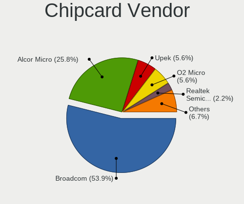

| Vendor                | Notebooks | Percent |
|-----------------------|-----------|---------|
| Broadcom              | 47        | 54.65%  |
| Alcor Micro           | 21        | 24.42%  |
| Upek                  | 5         | 5.81%   |
| O2 Micro              | 5         | 5.81%   |
| Realtek Semiconductor | 2         | 2.33%   |
| Lenovo                | 2         | 2.33%   |
| Yubico.com            | 1         | 1.16%   |
| In Focus Systems      | 1         | 1.16%   |
| Giesecke & Devrient   | 1         | 1.16%   |
| Chicony Electronics   | 1         | 1.16%   |

Chipcard Model
--------------

Chipcard module models

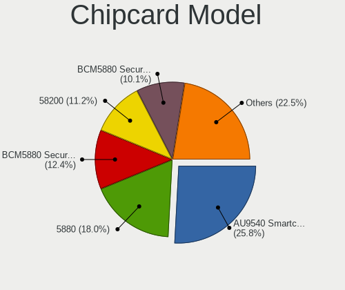

| Model                                                                        | Notebooks | Percent |
|------------------------------------------------------------------------------|-----------|---------|
| Alcor Micro AU9540 Smartcard Reader                                          | 21        | 24.42%  |
| Broadcom 5880                                                                | 15        | 17.44%  |
| Broadcom BCM5880 Secure Applications Processor                               | 11        | 12.79%  |
| Broadcom 58200                                                               | 10        | 11.63%  |
| Broadcom BCM5880 Secure Applications Processor with fingerprint swipe sensor | 9         | 10.47%  |
| Upek TouchChip Fingerprint Coprocessor (WBF advanced mode)                   | 5         | 5.81%   |
| O2 Micro OZ776 CCID Smartcard Reader                                         | 5         | 5.81%   |
| Realtek Semiconductor Smart Card Reader Interface                            | 2         | 2.33%   |
| Lenovo Integrated Smart Card Reader                                          | 2         | 2.33%   |
| Broadcom BCM5880 Secure Applications Processor with fingerprint touch sensor | 2         | 2.33%   |
| Yubico.com Yubikey 4/5 U2F+CCID                                              | 1         | 1.16%   |
| In Focus Systems EMV Smartcard Reader                                        | 1         | 1.16%   |
| Giesecke & Devrient StarSign CUT                                             | 1         | 1.16%   |
| Chicony Electronics HP Skylab USB Smartcard Keyboard                         | 1         | 1.16%   |

Unsupported
-----------

Unsupported Devices
-------------------

Total unsupported devices on board

| Total | Notebooks | Percent |
|-------|-----------|---------|
| 0     | 429       | 57.51%  |
| 1     | 250       | 33.51%  |
| 2     | 57        | 7.64%   |
| 3     | 5         | 0.67%   |
| 7     | 3         | 0.4%    |
| 6     | 1         | 0.13%   |
| 4     | 1         | 0.13%   |

Unsupported Device Types
------------------------

Types of unsupported devices

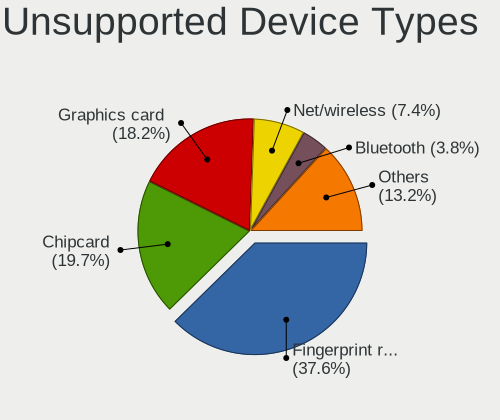

| Type                     | Notebooks | Percent |
|--------------------------|-----------|---------|
| Fingerprint reader       | 148       | 37.28%  |
| Chipcard                 | 79        | 19.9%   |
| Graphics card            | 72        | 18.14%  |
| Net/wireless             | 31        | 7.81%   |
| Bluetooth                | 15        | 3.78%   |
| Camera                   | 12        | 3.02%   |
| Communication controller | 10        | 2.52%   |
| Card reader              | 9         | 2.27%   |
| Storage                  | 6         | 1.51%   |
| Sound                    | 6         | 1.51%   |
| Multimedia controller    | 4         | 1.01%   |
| Net/ethernet             | 2         | 0.5%    |
| Modem                    | 2         | 0.5%    |
| Firewire controller      | 1         | 0.25%   |

