Kubuntu 20.04 - Tested Hardware & Statistics
--------------------------------------------

A project to collect tested hardware configurations for Kubuntu 20.04.

Anyone can contribute to this report by the [hw-probe](https://github.com/linuxhw/hw-probe) tool:

    sudo -E hw-probe -all -upload

Please contribute! Especially if your hardware is rare.

This is a report for all computer types. See also reports for [desktops](/Dist/Kubuntu_20.04/Desktop/README.md) and [notebooks](/Dist/Kubuntu_20.04/Notebook/README.md).

Contents
--------

* [ Test Cases ](#test-cases)

* [ System ](#system)
  - [ Kernel                   ](#kernel)
  - [ Kernel Family            ](#kernel-family)
  - [ Kernel Major Ver.        ](#kernel-major-ver)
  - [ Arch                     ](#arch)
  - [ DE                       ](#de)
  - [ Display Server           ](#display-server)
  - [ Display Manager          ](#display-manager)
  - [ OS Lang                  ](#os-lang)
  - [ Boot Mode                ](#boot-mode)
  - [ Filesystem               ](#filesystem)
  - [ Part. scheme             ](#part-scheme)
  - [ Dual Boot with Linux/BSD ](#dual-boot-with-linuxbsd)
  - [ Dual Boot (Win)          ](#dual-boot-win)

* [ Board ](#board)
  - [ Vendor                   ](#vendor)
  - [ Model                    ](#model)
  - [ Model Family             ](#model-family)
  - [ MFG Year                 ](#mfg-year)
  - [ Form Factor              ](#form-factor)
  - [ Secure Boot              ](#secure-boot)
  - [ Coreboot                 ](#coreboot)
  - [ RAM Size                 ](#ram-size)
  - [ RAM Used                 ](#ram-used)
  - [ Total Drives             ](#total-drives)
  - [ Has CD-ROM               ](#has-cd-rom)
  - [ Has Ethernet             ](#has-ethernet)
  - [ Has WiFi                 ](#has-wifi)
  - [ Has Bluetooth            ](#has-bluetooth)

* [ Location ](#location)
  - [ Country                  ](#country)
  - [ City                     ](#city)

* [ Drives ](#drives)
  - [ Drive Vendor             ](#drive-vendor)
  - [ Drive Model              ](#drive-model)
  - [ HDD Vendor               ](#hdd-vendor)
  - [ SSD Vendor               ](#ssd-vendor)
  - [ Drive Kind               ](#drive-kind)
  - [ Drive Connector          ](#drive-connector)
  - [ Drive Size               ](#drive-size)
  - [ Space Total              ](#space-total)
  - [ Space Used               ](#space-used)
  - [ Malfunc. Drives          ](#malfunc-drives)
  - [ Malfunc. Drive Vendor    ](#malfunc-drive-vendor)
  - [ Malfunc. HDD Vendor      ](#malfunc-hdd-vendor)
  - [ Malfunc. Drive Kind      ](#malfunc-drive-kind)
  - [ Failed Drives            ](#failed-drives)
  - [ Failed Drive Vendor      ](#failed-drive-vendor)
  - [ Drive Status             ](#drive-status)

* [ Storage controller ](#storage-controller)
  - [ Storage Vendor           ](#storage-vendor)
  - [ Storage Model            ](#storage-model)
  - [ Storage Kind             ](#storage-kind)

* [ Processor ](#processor)
  - [ CPU Vendor               ](#cpu-vendor)
  - [ CPU Model                ](#cpu-model)
  - [ CPU Model Family         ](#cpu-model-family)
  - [ CPU Cores                ](#cpu-cores)
  - [ CPU Sockets              ](#cpu-sockets)
  - [ CPU Threads              ](#cpu-threads)
  - [ CPU Op-Modes             ](#cpu-op-modes)
  - [ CPU Microcode            ](#cpu-microcode)
  - [ CPU Microarch            ](#cpu-microarch)

* [ Graphics ](#graphics)
  - [ GPU Vendor               ](#gpu-vendor)
  - [ GPU Model                ](#gpu-model)
  - [ GPU Combo                ](#gpu-combo)
  - [ GPU Driver               ](#gpu-driver)
  - [ GPU Memory               ](#gpu-memory)

* [ Monitor ](#monitor)
  - [ Monitor Vendor           ](#monitor-vendor)
  - [ Monitor Model            ](#monitor-model)
  - [ Monitor Resolution       ](#monitor-resolution)
  - [ Monitor Diagonal         ](#monitor-diagonal)
  - [ Monitor Width            ](#monitor-width)
  - [ Aspect Ratio             ](#aspect-ratio)
  - [ Monitor Area             ](#monitor-area)
  - [ Pixel Density            ](#pixel-density)
  - [ Multiple Monitors        ](#multiple-monitors)

* [ Network ](#network)
  - [ Net Controller Vendor    ](#net-controller-vendor)
  - [ Net Controller Model     ](#net-controller-model)
  - [ Wireless Vendor          ](#wireless-vendor)
  - [ Wireless Model           ](#wireless-model)
  - [ Ethernet Vendor          ](#ethernet-vendor)
  - [ Ethernet Model           ](#ethernet-model)
  - [ Net Controller Kind      ](#net-controller-kind)
  - [ Used Controller          ](#used-controller)
  - [ NICs                     ](#nics)
  - [ IPv6                     ](#ipv6)

* [ Bluetooth ](#bluetooth)
  - [ Bluetooth Vendor         ](#bluetooth-vendor)
  - [ Bluetooth Model          ](#bluetooth-model)

* [ Sound ](#sound)
  - [ Sound Vendor             ](#sound-vendor)
  - [ Sound Model              ](#sound-model)

* [ Memory ](#memory)
  - [ Memory Vendor            ](#memory-vendor)
  - [ Memory Model             ](#memory-model)
  - [ Memory Kind              ](#memory-kind)
  - [ Memory Form Factor       ](#memory-form-factor)
  - [ Memory Size              ](#memory-size)
  - [ Memory Speed             ](#memory-speed)

* [ Printers & scanners ](#printers--scanners)
  - [ Printer Vendor           ](#printer-vendor)
  - [ Printer Model            ](#printer-model)
  - [ Scanner Vendor           ](#scanner-vendor)
  - [ Scanner Model            ](#scanner-model)

* [ Camera ](#camera)
  - [ Camera Vendor            ](#camera-vendor)
  - [ Camera Model             ](#camera-model)

* [ Security ](#security)
  - [ Fingerprint Vendor       ](#fingerprint-vendor)
  - [ Fingerprint Model        ](#fingerprint-model)
  - [ Chipcard Vendor          ](#chipcard-vendor)
  - [ Chipcard Model           ](#chipcard-model)

* [ Unsupported ](#unsupported)
  - [ Unsupported Devices      ](#unsupported-devices)
  - [ Unsupported Device Types ](#unsupported-device-types)

Test Cases
----------

Total: 1827

| Vendor        | Model                       | Form-Factor | Probe                                                      | Date         |
|---------------|-----------------------------|-------------|------------------------------------------------------------|--------------|
| Dell          | 06NWYK A01                  | Desktop     | [91408af847](https://linux-hardware.org/?probe=91408af847) | Jul 01, 2022 |
| HP            | EliteBook 840 G1            | Notebook    | [b691598870](https://linux-hardware.org/?probe=b691598870) | Jul 01, 2022 |
| Lenovo        | ThinkPad P15 Gen 1 20SUS... | Notebook    | [4b04ded505](https://linux-hardware.org/?probe=4b04ded505) | Jun 30, 2022 |
| Gigabyte      | GA-78LMT-USB3 SEx           | Desktop     | [530c44caa8](https://linux-hardware.org/?probe=530c44caa8) | Jun 30, 2022 |
| HP            | EliteBook 840 G6            | Notebook    | [faaa7b9c81](https://linux-hardware.org/?probe=faaa7b9c81) | Jun 29, 2022 |
| Gigabyte      | Z490 AORUS ELITE AC         | Desktop     | [86a93d8ea0](https://linux-hardware.org/?probe=86a93d8ea0) | Jun 29, 2022 |
| Gigabyte      | Z490 AORUS ELITE AC         | Desktop     | [fd93206df4](https://linux-hardware.org/?probe=fd93206df4) | Jun 27, 2022 |
| ASUSTek       | TUF Gaming X570-PLUS        | Desktop     | [554ba1726f](https://linux-hardware.org/?probe=554ba1726f) | Jun 24, 2022 |
| ASUSTek       | TUF Gaming X570-PLUS        | Desktop     | [3dffa312da](https://linux-hardware.org/?probe=3dffa312da) | Jun 24, 2022 |
| Apple         | Mac-F221BEC8                | Desktop     | [ba64ef130a](https://linux-hardware.org/?probe=ba64ef130a) | Jun 23, 2022 |
| Dell          | Precision 5540              | Notebook    | [d4a5611433](https://linux-hardware.org/?probe=d4a5611433) | Jun 22, 2022 |
| Dell          | Inspiron 3521               | Notebook    | [13a04a66d8](https://linux-hardware.org/?probe=13a04a66d8) | Jun 12, 2022 |
| HP            | 0A98h                       | Desktop     | [d3c54ab2d6](https://linux-hardware.org/?probe=d3c54ab2d6) | Jun 10, 2022 |
| HP            | ZBook Firefly 14 G7 Mobi... | Notebook    | [011acdab42](https://linux-hardware.org/?probe=011acdab42) | Jun 09, 2022 |
| HP            | ZBook Firefly 14 G7 Mobi... | Notebook    | [c751dcffff](https://linux-hardware.org/?probe=c751dcffff) | Jun 09, 2022 |
| Lenovo        | ThinkPad P15s Gen 1 20T4... | Notebook    | [54a2c4fa94](https://linux-hardware.org/?probe=54a2c4fa94) | Jun 08, 2022 |
| ASRock        | 960GM-VGS3 FX               | Desktop     | [82aa782cce](https://linux-hardware.org/?probe=82aa782cce) | Jun 08, 2022 |
| ASRock        | X470 Master SLI             | Desktop     | [eb62d09265](https://linux-hardware.org/?probe=eb62d09265) | Jun 05, 2022 |
| Dell          | Latitude E5470              | Notebook    | [e858488f6f](https://linux-hardware.org/?probe=e858488f6f) | Jun 03, 2022 |
| Dell          | G7 7588                     | Notebook    | [3e41b876c2](https://linux-hardware.org/?probe=3e41b876c2) | May 31, 2022 |
| Dell          | Vostro 5481                 | Notebook    | [5fd6fe3593](https://linux-hardware.org/?probe=5fd6fe3593) | May 31, 2022 |
| ASRock        | B460 Phantom Gaming 4       | Desktop     | [b450673fc0](https://linux-hardware.org/?probe=b450673fc0) | May 31, 2022 |
| Dell          | Precision 7710              | Notebook    | [f24e29d104](https://linux-hardware.org/?probe=f24e29d104) | May 30, 2022 |
| Dell          | Precision 7710              | Notebook    | [1bae5a0bf0](https://linux-hardware.org/?probe=1bae5a0bf0) | May 30, 2022 |
| ASUSTek       | X540LA                      | Notebook    | [57e0b15d17](https://linux-hardware.org/?probe=57e0b15d17) | May 30, 2022 |
| Medion        | S6445 MD61489               | Notebook    | [a933286b06](https://linux-hardware.org/?probe=a933286b06) | May 29, 2022 |
| Gigabyte      | Z270-HD3P-CF                | Desktop     | [326c7a11e6](https://linux-hardware.org/?probe=326c7a11e6) | May 28, 2022 |
| ASUSTek       | PRIME B460M-K               | Desktop     | [765d22e752](https://linux-hardware.org/?probe=765d22e752) | May 23, 2022 |
| HP            | 15                          | Notebook    | [a61f6dd1eb](https://linux-hardware.org/?probe=a61f6dd1eb) | May 23, 2022 |
| ASUSTek       | P7P55D-E PRO                | Desktop     | [dfa1010543](https://linux-hardware.org/?probe=dfa1010543) | May 21, 2022 |
| MSI           | 2AE0                        | Desktop     | [d99294cadc](https://linux-hardware.org/?probe=d99294cadc) | May 21, 2022 |
| MSI           | X470 GAMING PRO CARBON      | Desktop     | [b098eb44db](https://linux-hardware.org/?probe=b098eb44db) | May 18, 2022 |
| Lenovo        | G780 20138                  | Notebook    | [ee6e90c751](https://linux-hardware.org/?probe=ee6e90c751) | May 17, 2022 |
| Gigabyte      | 990FXA-UD3                  | Desktop     | [4bc8f93383](https://linux-hardware.org/?probe=4bc8f93383) | May 17, 2022 |
| MSI           | X470 GAMING PRO CARBON      | Desktop     | [78fe695a2f](https://linux-hardware.org/?probe=78fe695a2f) | May 16, 2022 |
| Gigabyte      | 990FXA-UD3                  | Desktop     | [89b16a89c5](https://linux-hardware.org/?probe=89b16a89c5) | May 16, 2022 |
| Foxconn       | 2ADA                        | Desktop     | [cd20eb0809](https://linux-hardware.org/?probe=cd20eb0809) | May 14, 2022 |
| Dell          | Latitude E6540              | Notebook    | [a5bb9f2b58](https://linux-hardware.org/?probe=a5bb9f2b58) | May 10, 2022 |
| HP            | ProBook 470 G1              | Notebook    | [cb4ef48c3d](https://linux-hardware.org/?probe=cb4ef48c3d) | May 10, 2022 |
| ASUSTek       | TUF X470-PLUS GAMING        | Desktop     | [dc9b228486](https://linux-hardware.org/?probe=dc9b228486) | May 08, 2022 |
| HP            | ProBook 470 G1              | Notebook    | [a20a5df1ad](https://linux-hardware.org/?probe=a20a5df1ad) | May 06, 2022 |
| ASUSTek       | EB1501P                     | Desktop     | [f1d427d32b](https://linux-hardware.org/?probe=f1d427d32b) | May 06, 2022 |
| Acer          | Nitro AN515-45              | Notebook    | [aefe7a52e0](https://linux-hardware.org/?probe=aefe7a52e0) | May 06, 2022 |
| ASUSTek       | TUF Gaming B460M-PLUS       | Desktop     | [71c0c4f257](https://linux-hardware.org/?probe=71c0c4f257) | May 05, 2022 |
| HP            | ProBook 6450b               | Notebook    | [0c23a5cbc2](https://linux-hardware.org/?probe=0c23a5cbc2) | May 04, 2022 |
| HP            | Pavilion dv7                | Notebook    | [978f98cef3](https://linux-hardware.org/?probe=978f98cef3) | May 04, 2022 |
| Alienware     | 17                          | Notebook    | [1a4cd056f8](https://linux-hardware.org/?probe=1a4cd056f8) | May 04, 2022 |
| HP            | Pavilion Gaming Laptop 1... | Notebook    | [e126640b3b](https://linux-hardware.org/?probe=e126640b3b) | May 03, 2022 |
| Dell          | XPS 15 9510                 | Notebook    | [52609c3695](https://linux-hardware.org/?probe=52609c3695) | Apr 29, 2022 |
| ASUSTek       | ZenBook UX450FDX_UX480FD    | Notebook    | [9f7923bcd2](https://linux-hardware.org/?probe=9f7923bcd2) | Apr 29, 2022 |
| Lenovo        | ThinkPad X1 Extreme 2nd ... | Notebook    | [12a0105da3](https://linux-hardware.org/?probe=12a0105da3) | Apr 29, 2022 |
| Acer          | Nitro AN515-57              | Notebook    | [3206e0f075](https://linux-hardware.org/?probe=3206e0f075) | Apr 27, 2022 |
| Unknown       | Unknown                     | Notebook    | [e77a313003](https://linux-hardware.org/?probe=e77a313003) | Apr 27, 2022 |
| Lenovo        | ThinkPad X1 Extreme 2nd ... | Notebook    | [e466d79804](https://linux-hardware.org/?probe=e466d79804) | Apr 26, 2022 |
| ASUSTek       | P7P55 LX                    | Desktop     | [82c13f2b01](https://linux-hardware.org/?probe=82c13f2b01) | Apr 25, 2022 |
| Dell          | Studio 1558                 | Notebook    | [b31435ef0c](https://linux-hardware.org/?probe=b31435ef0c) | Apr 24, 2022 |
| Lenovo        | IdeaPad 330S-15IKB 81F5     | Notebook    | [9877ddeaf6](https://linux-hardware.org/?probe=9877ddeaf6) | Apr 24, 2022 |
| Lenovo        | ThinkBook 15 G2 ARE 20VG    | Notebook    | [99e25e855e](https://linux-hardware.org/?probe=99e25e855e) | Apr 23, 2022 |
| Acer          | Nitro AN515-57              | Notebook    | [848b9d8f5c](https://linux-hardware.org/?probe=848b9d8f5c) | Apr 22, 2022 |
| Acer          | Nitro AN515-57              | Notebook    | [da630d58cf](https://linux-hardware.org/?probe=da630d58cf) | Apr 22, 2022 |
| ASRock        | Z87 Pro4                    | Desktop     | [0c4cc8712f](https://linux-hardware.org/?probe=0c4cc8712f) | Apr 22, 2022 |
| MSI           | A320M-A PRO MAX             | Desktop     | [b925b403ca](https://linux-hardware.org/?probe=b925b403ca) | Apr 20, 2022 |
| Dell          | XPS 15 7590                 | Notebook    | [ee7354dd8d](https://linux-hardware.org/?probe=ee7354dd8d) | Apr 19, 2022 |
| Dell          | Inspiron 15-3567            | Notebook    | [f8e7d70919](https://linux-hardware.org/?probe=f8e7d70919) | Apr 18, 2022 |
| Lenovo        | ThinkPad T420 4180DV2       | Notebook    | [4ed718df3e](https://linux-hardware.org/?probe=4ed718df3e) | Apr 18, 2022 |
| Lenovo        | ThinkPad T420 4180DV2       | Notebook    | [402c31b107](https://linux-hardware.org/?probe=402c31b107) | Apr 18, 2022 |
| ASUSTek       | S551LB                      | Notebook    | [bb1d6d3623](https://linux-hardware.org/?probe=bb1d6d3623) | Apr 17, 2022 |
| Dell          | 0HY9JP A00                  | Desktop     | [a767ef8b4e](https://linux-hardware.org/?probe=a767ef8b4e) | Apr 16, 2022 |
| Dell          | 0HY9JP A00                  | Desktop     | [5ce6ef2934](https://linux-hardware.org/?probe=5ce6ef2934) | Apr 16, 2022 |
| Dell          | 0HY9JP A00                  | Desktop     | [fed643b7ec](https://linux-hardware.org/?probe=fed643b7ec) | Apr 16, 2022 |
| Dell          | Latitude 7410               | Notebook    | [da82f8bba8](https://linux-hardware.org/?probe=da82f8bba8) | Apr 15, 2022 |
| Lenovo        | G40-45 80E1                 | Notebook    | [840ffde0c4](https://linux-hardware.org/?probe=840ffde0c4) | Apr 15, 2022 |
| Gigabyte      | Z490 AORUS ELITE AC         | Desktop     | [78a785e4a9](https://linux-hardware.org/?probe=78a785e4a9) | Apr 15, 2022 |
| Dell          | Latitude E6540              | Notebook    | [2ee68b5f38](https://linux-hardware.org/?probe=2ee68b5f38) | Apr 14, 2022 |
| Pegatron      | 2AD5                        | Desktop     | [e172be90b8](https://linux-hardware.org/?probe=e172be90b8) | Apr 14, 2022 |
| Lenovo        | ThinkPad Edge E540 20C60... | Notebook    | [45b8eba74c](https://linux-hardware.org/?probe=45b8eba74c) | Apr 14, 2022 |
| HP            | Pavilion Laptop 15-cs3xx... | Notebook    | [3e09de906e](https://linux-hardware.org/?probe=3e09de906e) | Apr 14, 2022 |
| Lenovo        | ThinkPad P51 20HH000AUS     | Notebook    | [b7365a4abd](https://linux-hardware.org/?probe=b7365a4abd) | Apr 14, 2022 |
| Samsung       | R425D/R525D                 | Notebook    | [bd5a2f5943](https://linux-hardware.org/?probe=bd5a2f5943) | Apr 14, 2022 |
| Lenovo        | ThinkPad X1 Extreme 2nd ... | Notebook    | [479b8d48fc](https://linux-hardware.org/?probe=479b8d48fc) | Apr 13, 2022 |
| MSI           | Z270 SLI PLUS               | Desktop     | [fa00f6ccd6](https://linux-hardware.org/?probe=fa00f6ccd6) | Apr 13, 2022 |
| Dell          | Latitude 5591               | Notebook    | [3f3f097a1a](https://linux-hardware.org/?probe=3f3f097a1a) | Apr 13, 2022 |
| Dell          | Latitude 7400               | Notebook    | [2c32d69a57](https://linux-hardware.org/?probe=2c32d69a57) | Apr 13, 2022 |
| HP            | Pavilion g6                 | Notebook    | [44035cfa83](https://linux-hardware.org/?probe=44035cfa83) | Apr 13, 2022 |
| ASRock        | H97 Pro4                    | Desktop     | [db6bf8f1b9](https://linux-hardware.org/?probe=db6bf8f1b9) | Apr 13, 2022 |
| Lenovo        | ThinkPad T430 2349T2A       | Notebook    | [344710cc3a](https://linux-hardware.org/?probe=344710cc3a) | Apr 12, 2022 |
| HONOR         | NBD-WXX9                    | Notebook    | [090560f0c5](https://linux-hardware.org/?probe=090560f0c5) | Apr 12, 2022 |
| Lenovo        | IdeaPad Z585                | Notebook    | [5f84c70657](https://linux-hardware.org/?probe=5f84c70657) | Apr 10, 2022 |
| ASRock        | H110M-ITX                   | Desktop     | [13dff6f000](https://linux-hardware.org/?probe=13dff6f000) | Apr 10, 2022 |
| Dell          | Vostro 15 3515              | Notebook    | [848a486145](https://linux-hardware.org/?probe=848a486145) | Apr 10, 2022 |
| eMachines     | G525                        | Notebook    | [6ba45c519c](https://linux-hardware.org/?probe=6ba45c519c) | Apr 09, 2022 |
| ASUSTek       | ROG STRIX B450-F GAMING ... | Desktop     | [272c9f107a](https://linux-hardware.org/?probe=272c9f107a) | Apr 09, 2022 |
| Intel         | MAHOBAY                     | Desktop     | [47119856f6](https://linux-hardware.org/?probe=47119856f6) | Apr 09, 2022 |
| Positivo      | N1250                       | Notebook    | [c64a47d6fc](https://linux-hardware.org/?probe=c64a47d6fc) | Apr 09, 2022 |
| Sony          | VPCF236FM                   | Notebook    | [ea109b146b](https://linux-hardware.org/?probe=ea109b146b) | Apr 08, 2022 |
| Lenovo        | ThinkPad L15 Gen 1 20U8S... | Notebook    | [dea231bf61](https://linux-hardware.org/?probe=dea231bf61) | Apr 07, 2022 |
| Lenovo        | ThinkPad L15 Gen 1 20U8S... | Notebook    | [b02ac7d8ce](https://linux-hardware.org/?probe=b02ac7d8ce) | Apr 07, 2022 |
| ASUSTek       | TUF X470-PLUS GAMING        | Desktop     | [f98a0cf73b](https://linux-hardware.org/?probe=f98a0cf73b) | Apr 05, 2022 |
| Dell          | Latitude E6530              | Notebook    | [a63f363043](https://linux-hardware.org/?probe=a63f363043) | Apr 04, 2022 |
| HP            | 805D                        | Desktop     | [709488e1da](https://linux-hardware.org/?probe=709488e1da) | Mar 31, 2022 |
| Lenovo        | ThinkPad T540p 20BEA00FR... | Notebook    | [c9323a9c40](https://linux-hardware.org/?probe=c9323a9c40) | Mar 31, 2022 |
| Dell          | XPS 13 9305                 | Notebook    | [946628cb20](https://linux-hardware.org/?probe=946628cb20) | Mar 30, 2022 |
| Dell          | Vostro 15 3515              | Notebook    | [b61b3e31e7](https://linux-hardware.org/?probe=b61b3e31e7) | Mar 30, 2022 |
| Lenovo        | MIIX 320-10ICR 80XF         | Tablet      | [f47336bbed](https://linux-hardware.org/?probe=f47336bbed) | Mar 30, 2022 |
| HUAWEI        | BOHB-WAX9                   | Notebook    | [f398041b40](https://linux-hardware.org/?probe=f398041b40) | Mar 29, 2022 |
| Gigabyte      | X570 AORUS PRO WIFI         | Desktop     | [5dae1dd2a5](https://linux-hardware.org/?probe=5dae1dd2a5) | Mar 28, 2022 |
| HP            | Pavilion 14                 | Notebook    | [1b15a2e740](https://linux-hardware.org/?probe=1b15a2e740) | Mar 28, 2022 |
| HP            | Stream Notebook PC 14       | Notebook    | [9fc309dcaf](https://linux-hardware.org/?probe=9fc309dcaf) | Mar 27, 2022 |
| Positivo      | Q232A                       | Notebook    | [fe29ba6b10](https://linux-hardware.org/?probe=fe29ba6b10) | Mar 27, 2022 |
| Lenovo        | IdeaPad S530-13IWL 81J7     | Notebook    | [a9a4291601](https://linux-hardware.org/?probe=a9a4291601) | Mar 26, 2022 |
| Gigabyte      | X570 AORUS PRO WIFI         | Desktop     | [dc2a2c1054](https://linux-hardware.org/?probe=dc2a2c1054) | Mar 25, 2022 |
| Dell          | Latitude 5290 2-in-1        | Notebook    | [f0a08eb35b](https://linux-hardware.org/?probe=f0a08eb35b) | Mar 25, 2022 |
| Lenovo        | ThinkPad L13 Yoga Gen 2 ... | Convertible | [eef252e4f2](https://linux-hardware.org/?probe=eef252e4f2) | Mar 25, 2022 |
| Avell High... | B.ON                        | Notebook    | [19b689aa12](https://linux-hardware.org/?probe=19b689aa12) | Mar 25, 2022 |
| ASUSTek       | VivoBook_ASUSLaptop X760... | Notebook    | [713ff9dcb8](https://linux-hardware.org/?probe=713ff9dcb8) | Mar 23, 2022 |
| Dell          | XPS 15 7590                 | Notebook    | [96244433f0](https://linux-hardware.org/?probe=96244433f0) | Mar 23, 2022 |
| Gigabyte      | B75M-HD3                    | Desktop     | [b886cf0849](https://linux-hardware.org/?probe=b886cf0849) | Mar 23, 2022 |
| Acer          | Swift SF314-54G             | Notebook    | [615009b8ee](https://linux-hardware.org/?probe=615009b8ee) | Mar 23, 2022 |
| ASUSTek       | N550LF                      | Notebook    | [5e5462ce64](https://linux-hardware.org/?probe=5e5462ce64) | Mar 23, 2022 |
| Dell          | 0NK70N A03                  | Desktop     | [e5fe628a7b](https://linux-hardware.org/?probe=e5fe628a7b) | Mar 23, 2022 |
| Dell          | System Inspiron N7110       | Notebook    | [d3b1757cf5](https://linux-hardware.org/?probe=d3b1757cf5) | Mar 21, 2022 |
| Apple         | MacBookPro12,1              | Notebook    | [0e4992c717](https://linux-hardware.org/?probe=0e4992c717) | Mar 20, 2022 |
| HP            | 1589                        | Desktop     | [998f465bfc](https://linux-hardware.org/?probe=998f465bfc) | Mar 19, 2022 |
| Panasonic     | FZ-M1CC-51BE                | Notebook    | [94e014ee40](https://linux-hardware.org/?probe=94e014ee40) | Mar 18, 2022 |
| Dell          | 0RY206                      | Desktop     | [df958219ab](https://linux-hardware.org/?probe=df958219ab) | Mar 18, 2022 |
| Dell          | 0RY206                      | Desktop     | [d46b854bd5](https://linux-hardware.org/?probe=d46b854bd5) | Mar 18, 2022 |
| HP            | EliteBook 850 G5            | Notebook    | [6d8c8748e2](https://linux-hardware.org/?probe=6d8c8748e2) | Mar 17, 2022 |
| ASRock        | 990FX Killer                | Desktop     | [acdee8aa65](https://linux-hardware.org/?probe=acdee8aa65) | Mar 15, 2022 |
| Gigabyte      | Z590 AORUS PRO AX           | Desktop     | [c8809e0561](https://linux-hardware.org/?probe=c8809e0561) | Mar 15, 2022 |
| Samsung       | 300E4Z/300E5Z/300E7Z        | Notebook    | [95c6b15672](https://linux-hardware.org/?probe=95c6b15672) | Mar 14, 2022 |
| ASUSTek       | VivoBook_ASUSLaptop X513... | Notebook    | [96b413780f](https://linux-hardware.org/?probe=96b413780f) | Mar 13, 2022 |
| ASRock        | B360 Gaming K4              | Desktop     | [ae6cb3bea9](https://linux-hardware.org/?probe=ae6cb3bea9) | Mar 11, 2022 |
| HP            | 82F1                        | Desktop     | [390462d20a](https://linux-hardware.org/?probe=390462d20a) | Mar 10, 2022 |
| HP            | 82F1                        | Desktop     | [63273af14a](https://linux-hardware.org/?probe=63273af14a) | Mar 10, 2022 |
| MSI           | PRESTIGE X570 CREATION      | Desktop     | [2032fbba77](https://linux-hardware.org/?probe=2032fbba77) | Mar 09, 2022 |
| Medion        | E2292 MD63390               | Convertible | [6f0eb8e6d7](https://linux-hardware.org/?probe=6f0eb8e6d7) | Mar 07, 2022 |
| ASUSTek       | PRIME Z690-P D4             | Desktop     | [456b0dd391](https://linux-hardware.org/?probe=456b0dd391) | Mar 06, 2022 |
| Gigabyte      | B550 AORUS PRO AC           | Desktop     | [19c66b47da](https://linux-hardware.org/?probe=19c66b47da) | Mar 06, 2022 |
| HP            | 8266                        | Desktop     | [e0991ef205](https://linux-hardware.org/?probe=e0991ef205) | Mar 06, 2022 |
| MSI           | Katana GF76 11UC            | Notebook    | [949d0886a1](https://linux-hardware.org/?probe=949d0886a1) | Mar 06, 2022 |
| MSI           | Katana GF76 11UC            | Notebook    | [f5241bc829](https://linux-hardware.org/?probe=f5241bc829) | Mar 05, 2022 |
| Unknown       | KN12A                       | Notebook    | [3ba6165509](https://linux-hardware.org/?probe=3ba6165509) | Mar 05, 2022 |
| HP            | Spectre x360 Convertible    | Convertible | [7d46bb8f25](https://linux-hardware.org/?probe=7d46bb8f25) | Mar 03, 2022 |
| Dell          | Latitude E6530              | Notebook    | [f13c84346e](https://linux-hardware.org/?probe=f13c84346e) | Mar 02, 2022 |
| ASUSTek       | K55N                        | Notebook    | [6143b27a96](https://linux-hardware.org/?probe=6143b27a96) | Mar 02, 2022 |
| MSI           | Katana GF76 11UC            | Notebook    | [880490eb1e](https://linux-hardware.org/?probe=880490eb1e) | Mar 01, 2022 |
| MSI           | H81M-E34                    | Desktop     | [563e906e47](https://linux-hardware.org/?probe=563e906e47) | Mar 01, 2022 |
| Schenker      | VIA 15                      | Notebook    | [c84aacc342](https://linux-hardware.org/?probe=c84aacc342) | Feb 28, 2022 |
| Dell          | 042P49 A01                  | Desktop     | [25c0e14020](https://linux-hardware.org/?probe=25c0e14020) | Feb 28, 2022 |
| MSI           | Katana GF76 11UC            | Notebook    | [79cc0b97a4](https://linux-hardware.org/?probe=79cc0b97a4) | Feb 28, 2022 |
| MSI           | Katana GF76 11UC            | Notebook    | [74bc866ab2](https://linux-hardware.org/?probe=74bc866ab2) | Feb 27, 2022 |
| ASUSTek       | ASUS TUF Gaming F15 FX50... | Notebook    | [c7db8c9806](https://linux-hardware.org/?probe=c7db8c9806) | Feb 27, 2022 |
| MSI           | B350 PC MATE                | Desktop     | [2e06b2fed8](https://linux-hardware.org/?probe=2e06b2fed8) | Feb 27, 2022 |
| Dell          | Inspiron 3583               | Notebook    | [83dec4f285](https://linux-hardware.org/?probe=83dec4f285) | Feb 26, 2022 |
| ASUSTek       | B85-PRO GAMER               | Desktop     | [3f97cefeb4](https://linux-hardware.org/?probe=3f97cefeb4) | Feb 26, 2022 |
| HUAWEI        | HVY-WXX9                    | Notebook    | [fb4c469104](https://linux-hardware.org/?probe=fb4c469104) | Feb 26, 2022 |
| Biostar       | B450MH                      | Desktop     | [40f413ddcb](https://linux-hardware.org/?probe=40f413ddcb) | Feb 26, 2022 |
| ASUSTek       | B85M-G                      | Desktop     | [8e648c583a](https://linux-hardware.org/?probe=8e648c583a) | Feb 25, 2022 |
| Dell          | XPS 15 9560                 | Notebook    | [4c72ebcb41](https://linux-hardware.org/?probe=4c72ebcb41) | Feb 25, 2022 |
| HP            | EliteBook 745 G3            | Notebook    | [eed2589bd2](https://linux-hardware.org/?probe=eed2589bd2) | Feb 25, 2022 |
| ASUSTek       | ZenBook UX434IQ_UM433IQ     | Notebook    | [885239a137](https://linux-hardware.org/?probe=885239a137) | Feb 24, 2022 |
| Unknown       | TB-4000                     | Desktop     | [70155eb876](https://linux-hardware.org/?probe=70155eb876) | Feb 24, 2022 |
| Fujitsu       | D3164-C2 S26361-D3164-C2    | Desktop     | [9d9c4fe241](https://linux-hardware.org/?probe=9d9c4fe241) | Feb 23, 2022 |
| Fujitsu       | D3164-C2 S26361-D3164-C2    | Desktop     | [84b8eefa6d](https://linux-hardware.org/?probe=84b8eefa6d) | Feb 23, 2022 |
| Supermicro    | X10DAI                      | Desktop     | [4de85d4700](https://linux-hardware.org/?probe=4de85d4700) | Feb 23, 2022 |
| Lenovo        | ThinkPad T430 23495P8       | Notebook    | [03266eea0a](https://linux-hardware.org/?probe=03266eea0a) | Feb 23, 2022 |
| Lenovo        | ThinkPad Yoga 260 20FES2... | Convertible | [259dd8bc78](https://linux-hardware.org/?probe=259dd8bc78) | Feb 19, 2022 |
| Lenovo        | ThinkPad L430 2468CTO       | Notebook    | [9244a0f8f9](https://linux-hardware.org/?probe=9244a0f8f9) | Feb 18, 2022 |
| Lenovo        | ThinkPad Yoga 260 20FES2... | Convertible | [83a05f5d1e](https://linux-hardware.org/?probe=83a05f5d1e) | Feb 18, 2022 |
| HP            | Pavilion Laptop 14-ce0xx... | Notebook    | [ffb9eb537e](https://linux-hardware.org/?probe=ffb9eb537e) | Feb 17, 2022 |
| MSI           | Z170-A PRO                  | Desktop     | [9628754bf4](https://linux-hardware.org/?probe=9628754bf4) | Feb 17, 2022 |
| Dell          | 0J8G6F A03                  | Desktop     | [c4314fa1c4](https://linux-hardware.org/?probe=c4314fa1c4) | Feb 17, 2022 |
| ASUSTek       | TUF X470-PLUS GAMING        | Desktop     | [9773bc9c72](https://linux-hardware.org/?probe=9773bc9c72) | Feb 16, 2022 |
| Lenovo        | G40-45 80E1                 | Notebook    | [88c9f0db96](https://linux-hardware.org/?probe=88c9f0db96) | Feb 16, 2022 |
| Gateway       | IPISB-VR                    | Desktop     | [af56b8d361](https://linux-hardware.org/?probe=af56b8d361) | Feb 16, 2022 |
| Lenovo        | MAHOBAY NOK                 | Desktop     | [4e3b8bfbb1](https://linux-hardware.org/?probe=4e3b8bfbb1) | Feb 16, 2022 |
| Lenovo        | ThinkPad T14s Gen 1 20UH... | Notebook    | [3db88acec8](https://linux-hardware.org/?probe=3db88acec8) | Feb 15, 2022 |
| MSI           | MEG X570 GODLIKE            | Desktop     | [b4db24332b](https://linux-hardware.org/?probe=b4db24332b) | Feb 14, 2022 |
| ASUSTek       | ASUS BR1100CKA BR1100CKA... | Notebook    | [5768ab0770](https://linux-hardware.org/?probe=5768ab0770) | Feb 13, 2022 |
| Gigabyte      | B450 I AORUS PRO WIFI-CF    | Desktop     | [a98c8db3ad](https://linux-hardware.org/?probe=a98c8db3ad) | Feb 12, 2022 |
| Lenovo        | G50-70 20351                | Notebook    | [5795d9b341](https://linux-hardware.org/?probe=5795d9b341) | Feb 12, 2022 |
| ASUSTek       | X540NA                      | Notebook    | [a9271fbd9f](https://linux-hardware.org/?probe=a9271fbd9f) | Feb 12, 2022 |
| ASUSTek       | ROG STRIX Z590-E GAMING ... | Desktop     | [ed39168e58](https://linux-hardware.org/?probe=ed39168e58) | Feb 12, 2022 |
| Dell          | Latitude 5580               | Notebook    | [77466f0d8f](https://linux-hardware.org/?probe=77466f0d8f) | Feb 11, 2022 |
| Dell          | Latitude 5580               | Notebook    | [8d65e0f7c7](https://linux-hardware.org/?probe=8d65e0f7c7) | Feb 11, 2022 |
| ASUSTek       | TUF B450-PLUS GAMING        | Desktop     | [2885a7e3ed](https://linux-hardware.org/?probe=2885a7e3ed) | Feb 11, 2022 |
| MSI           | Prestige 14 A10RB           | Notebook    | [7195cacd54](https://linux-hardware.org/?probe=7195cacd54) | Feb 10, 2022 |
| MSI           | MAG B550M MORTAR            | Desktop     | [5e071a1807](https://linux-hardware.org/?probe=5e071a1807) | Feb 09, 2022 |
| HP            | Victus by Laptop 16-e0xx... | Notebook    | [9c3722a690](https://linux-hardware.org/?probe=9c3722a690) | Feb 07, 2022 |
| Sony          | VPCF236FM                   | Notebook    | [784b1b0c3b](https://linux-hardware.org/?probe=784b1b0c3b) | Feb 06, 2022 |
| Dell          | System XPS L502X            | Notebook    | [c2a3b5d930](https://linux-hardware.org/?probe=c2a3b5d930) | Feb 05, 2022 |
| Medion        | E4241 MD60996               | Notebook    | [d89f5e4089](https://linux-hardware.org/?probe=d89f5e4089) | Feb 05, 2022 |
| Lenovo        | G710 20252                  | Notebook    | [ffc1b2ca5a](https://linux-hardware.org/?probe=ffc1b2ca5a) | Feb 04, 2022 |
| Gigabyte      | A320M-S2H-CF                | Desktop     | [3e8a21888f](https://linux-hardware.org/?probe=3e8a21888f) | Feb 04, 2022 |
| Lenovo        | V580c 20160                 | Notebook    | [8b9e72e0ed](https://linux-hardware.org/?probe=8b9e72e0ed) | Feb 03, 2022 |
| HP            | Laptop 15g-br1xx            | Notebook    | [092ea39c7e](https://linux-hardware.org/?probe=092ea39c7e) | Feb 03, 2022 |
| ASUSTek       | PRIME B350-PLUS             | Desktop     | [df711c6514](https://linux-hardware.org/?probe=df711c6514) | Feb 03, 2022 |
| Gigabyte      | H81M-H                      | Desktop     | [4c55c42084](https://linux-hardware.org/?probe=4c55c42084) | Feb 03, 2022 |
| MSI           | B450M MORTAR                | Desktop     | [a2fbd7d84e](https://linux-hardware.org/?probe=a2fbd7d84e) | Feb 03, 2022 |
| Toshiba       | Satellite S55-C             | Notebook    | [ba1cbdf586](https://linux-hardware.org/?probe=ba1cbdf586) | Feb 03, 2022 |
| Lenovo        | IdeaPad 3 15ARE05 81W4      | Notebook    | [3df622872c](https://linux-hardware.org/?probe=3df622872c) | Feb 03, 2022 |
| HP            | Pavilion dv6                | Notebook    | [63c8ab5447](https://linux-hardware.org/?probe=63c8ab5447) | Feb 03, 2022 |
| ASUSTek       | WS-C621E-SAGE Series        | Server      | [3035fdad91](https://linux-hardware.org/?probe=3035fdad91) | Feb 03, 2022 |
| ASUSTek       | Q87M-E                      | Desktop     | [99abdcb1fe](https://linux-hardware.org/?probe=99abdcb1fe) | Feb 02, 2022 |
| ASUSTek       | WS-C621E-SAGE Series        | Server      | [46a851b841](https://linux-hardware.org/?probe=46a851b841) | Feb 02, 2022 |
| Gigabyte      | F2A88XM-D3HP                | Desktop     | [0404256996](https://linux-hardware.org/?probe=0404256996) | Feb 01, 2022 |
| Intel         | NUC7i3BNB J22859-313        | Mini pc     | [8f83ae693d](https://linux-hardware.org/?probe=8f83ae693d) | Jan 31, 2022 |
| MSI           | GF63 Thin 10SC              | Notebook    | [be02f0bd97](https://linux-hardware.org/?probe=be02f0bd97) | Jan 31, 2022 |
| ASUSTek       | K30AD_M31AD_M51AD_M32AD     | Desktop     | [e8b6865345](https://linux-hardware.org/?probe=e8b6865345) | Jan 31, 2022 |
| ASUSTek       | K30AD_M31AD_M51AD_M32AD     | Desktop     | [1c6777fb1a](https://linux-hardware.org/?probe=1c6777fb1a) | Jan 31, 2022 |
| Lenovo        | ThinkBook 15 G2 ITL 20VE    | Notebook    | [cd876e95b9](https://linux-hardware.org/?probe=cd876e95b9) | Jan 29, 2022 |
| System76      | Serval WS                   | Notebook    | [a6e447aa98](https://linux-hardware.org/?probe=a6e447aa98) | Jan 28, 2022 |
| System76      | Serval WS                   | Notebook    | [371fbc5a98](https://linux-hardware.org/?probe=371fbc5a98) | Jan 28, 2022 |
| Dell          | G5 5500                     | Notebook    | [4917524046](https://linux-hardware.org/?probe=4917524046) | Jan 28, 2022 |
| ASUSTek       | P7P55D-E PRO                | Desktop     | [7daa77d5ba](https://linux-hardware.org/?probe=7daa77d5ba) | Jan 27, 2022 |
| Dell          | XPS 13 9310                 | Notebook    | [311e85f0cb](https://linux-hardware.org/?probe=311e85f0cb) | Jan 27, 2022 |
| ASUSTek       | CM6330_CM6630_CM6730_CM6... | Desktop     | [a23be61a14](https://linux-hardware.org/?probe=a23be61a14) | Jan 26, 2022 |
| Lenovo        | IdeaPad S145-15API 81V7     | Notebook    | [3e03426280](https://linux-hardware.org/?probe=3e03426280) | Jan 26, 2022 |
| Lenovo        | IdeaPad S145-15API 81V7     | Notebook    | [4283316d8a](https://linux-hardware.org/?probe=4283316d8a) | Jan 26, 2022 |
| ASUSTek       | ASUS TUF Gaming A15 FA50... | Notebook    | [12d652c14a](https://linux-hardware.org/?probe=12d652c14a) | Jan 23, 2022 |
| ASUSTek       | EB1501P                     | Desktop     | [bd43e4b748](https://linux-hardware.org/?probe=bd43e4b748) | Jan 22, 2022 |
| ASUSTek       | EB1501P                     | Desktop     | [fec419577b](https://linux-hardware.org/?probe=fec419577b) | Jan 22, 2022 |
| HP            | Pavilion Laptop 14-ce0xx... | Notebook    | [bdf7199e93](https://linux-hardware.org/?probe=bdf7199e93) | Jan 21, 2022 |
| Lenovo        | ThinkPad T14 Gen 1 20UES... | Notebook    | [24c10d9f2d](https://linux-hardware.org/?probe=24c10d9f2d) | Jan 20, 2022 |
| Toshiba       | Satellite S55-C             | Notebook    | [8821f2145e](https://linux-hardware.org/?probe=8821f2145e) | Jan 20, 2022 |
| Dell          | Latitude 7490               | Notebook    | [66984a4e2b](https://linux-hardware.org/?probe=66984a4e2b) | Jan 18, 2022 |
| Dell          | Inspiron 3421               | Notebook    | [1f699a9a4d](https://linux-hardware.org/?probe=1f699a9a4d) | Jan 17, 2022 |
| HP            | G60                         | Notebook    | [0c45a490c6](https://linux-hardware.org/?probe=0c45a490c6) | Jan 17, 2022 |
| Dell          | 0PC5F7 A03                  | Desktop     | [bc00e00b3d](https://linux-hardware.org/?probe=bc00e00b3d) | Jan 15, 2022 |
| MSI           | B85I                        | Desktop     | [dc1862e477](https://linux-hardware.org/?probe=dc1862e477) | Jan 15, 2022 |
| HP            | Victus by Laptop 16-e0xx... | Notebook    | [d19a03f3b4](https://linux-hardware.org/?probe=d19a03f3b4) | Jan 14, 2022 |
| HP            | Victus by Laptop 16-e0xx... | Notebook    | [31cd8dd167](https://linux-hardware.org/?probe=31cd8dd167) | Jan 14, 2022 |
| HP            | Pavilion x360 Convertibl... | Convertible | [8ef391b2ba](https://linux-hardware.org/?probe=8ef391b2ba) | Jan 13, 2022 |
| HP            | ZBook 17 G2                 | Notebook    | [232d1f1cb4](https://linux-hardware.org/?probe=232d1f1cb4) | Jan 12, 2022 |
| Lenovo        | SHARKBAY 0B98401 PRO        | Desktop     | [20cc8ef2ea](https://linux-hardware.org/?probe=20cc8ef2ea) | Jan 11, 2022 |
| Gigabyte      | GA-990X-Gaming SLI-CF       | Desktop     | [a7be44496a](https://linux-hardware.org/?probe=a7be44496a) | Jan 11, 2022 |
| Lenovo        | ThinkPad E595 20NF0000GE    | Notebook    | [c78518f0ac](https://linux-hardware.org/?probe=c78518f0ac) | Jan 10, 2022 |
| Gigabyte      | A320M-H-CF                  | Desktop     | [c09f135f63](https://linux-hardware.org/?probe=c09f135f63) | Jan 09, 2022 |
| Dell          | 0DR845                      | Desktop     | [daa833f06d](https://linux-hardware.org/?probe=daa833f06d) | Jan 08, 2022 |
| Acer          | Aspire E1-571               | Notebook    | [c4d40f6344](https://linux-hardware.org/?probe=c4d40f6344) | Jan 08, 2022 |
| ASUSTek       | H61M-A/BR                   | Desktop     | [82aa762a97](https://linux-hardware.org/?probe=82aa762a97) | Jan 08, 2022 |
| Lenovo        | ThinkBook 15 G2 ITL 20VE    | Notebook    | [13c6bafd04](https://linux-hardware.org/?probe=13c6bafd04) | Jan 08, 2022 |
| Lenovo        | ThinkBook 15 G2 ITL 20VE    | Notebook    | [e50bae67a6](https://linux-hardware.org/?probe=e50bae67a6) | Jan 08, 2022 |
| Packard Be... | EasyNote TK85               | Notebook    | [5cd2548a30](https://linux-hardware.org/?probe=5cd2548a30) | Jan 07, 2022 |
| Packard Be... | EasyNote TK85               | Notebook    | [5e77633e52](https://linux-hardware.org/?probe=5e77633e52) | Jan 07, 2022 |
| ASUSTek       | PRIME B560M-K               | Desktop     | [b44e84f8a6](https://linux-hardware.org/?probe=b44e84f8a6) | Jan 06, 2022 |
| HP            | Victus by Laptop 16-e0xx... | Notebook    | [bab91e3b63](https://linux-hardware.org/?probe=bab91e3b63) | Jan 06, 2022 |
| ASRock        | B75 Pro3-M                  | Desktop     | [2daf055722](https://linux-hardware.org/?probe=2daf055722) | Jan 05, 2022 |
| ASRock        | Z77 Pro4-M                  | Desktop     | [c3ddad9a30](https://linux-hardware.org/?probe=c3ddad9a30) | Jan 03, 2022 |
| Sony          | VPCCA35FA                   | Notebook    | [85f4fcc0b6](https://linux-hardware.org/?probe=85f4fcc0b6) | Jan 03, 2022 |
| Sony          | VPCCA35FA                   | Notebook    | [f69299cbfb](https://linux-hardware.org/?probe=f69299cbfb) | Jan 03, 2022 |
| HP            | Pavilion dv7                | Notebook    | [c8e2178f07](https://linux-hardware.org/?probe=c8e2178f07) | Jan 02, 2022 |
| HP            | Spectre x360 Convertible... | Convertible | [b3a76ceb99](https://linux-hardware.org/?probe=b3a76ceb99) | Dec 31, 2021 |
| Dell          | Latitude 3420               | Notebook    | [a248c25326](https://linux-hardware.org/?probe=a248c25326) | Dec 31, 2021 |
| HP            | Spectre x360 Convertible... | Convertible | [8d56c47c8d](https://linux-hardware.org/?probe=8d56c47c8d) | Dec 31, 2021 |
| Lenovo        | V580c 20160                 | Notebook    | [9f9fe096db](https://linux-hardware.org/?probe=9f9fe096db) | Dec 30, 2021 |
| ASUSTek       | TUF B450M-PLUS GAMING       | Desktop     | [6324598512](https://linux-hardware.org/?probe=6324598512) | Dec 30, 2021 |
| ASUSTek       | TUF B450M-PLUS GAMING       | Desktop     | [38dda4af6b](https://linux-hardware.org/?probe=38dda4af6b) | Dec 30, 2021 |
| Lenovo        | ThinkPad L15 Gen 2 20X30... | Notebook    | [b93b965f55](https://linux-hardware.org/?probe=b93b965f55) | Dec 30, 2021 |
| HP            | Pavilion dv6                | Notebook    | [d39214a966](https://linux-hardware.org/?probe=d39214a966) | Dec 29, 2021 |
| Gigabyte      | B550 VISION D-P             | Desktop     | [6f2dc843e9](https://linux-hardware.org/?probe=6f2dc843e9) | Dec 27, 2021 |
| ASRock        | Z87 Pro4                    | Desktop     | [8459ac43a8](https://linux-hardware.org/?probe=8459ac43a8) | Dec 27, 2021 |
| Acer          | Aspire T3-605               | Desktop     | [7acbb546e6](https://linux-hardware.org/?probe=7acbb546e6) | Dec 26, 2021 |
| Lenovo        | G710 20252                  | Notebook    | [961341534c](https://linux-hardware.org/?probe=961341534c) | Dec 26, 2021 |
| Lenovo        | SHARKBAY NOK                | Desktop     | [2a7c56982c](https://linux-hardware.org/?probe=2a7c56982c) | Dec 26, 2021 |
| ASUSTek       | ROG Strix G712LU_G712LU     | Notebook    | [4e4cc2bfb3](https://linux-hardware.org/?probe=4e4cc2bfb3) | Dec 26, 2021 |
| MSI           | B450 TOMAHAWK               | Desktop     | [dc6fd4bfc7](https://linux-hardware.org/?probe=dc6fd4bfc7) | Dec 25, 2021 |
| Gigabyte      | A320M-S2H-CF                | Desktop     | [6c56118d24](https://linux-hardware.org/?probe=6c56118d24) | Dec 25, 2021 |
| Gigabyte      | B550 VISION D-P             | Desktop     | [8fdab6dc11](https://linux-hardware.org/?probe=8fdab6dc11) | Dec 23, 2021 |
| HP            | Laptop 15-ef0xxx            | Notebook    | [c72566a702](https://linux-hardware.org/?probe=c72566a702) | Dec 21, 2021 |
| ASUSTek       | Z97-A                       | Desktop     | [1d27772094](https://linux-hardware.org/?probe=1d27772094) | Dec 21, 2021 |
| MSI           | H310M PRO-VDH PLUS          | Desktop     | [992c6c4350](https://linux-hardware.org/?probe=992c6c4350) | Dec 21, 2021 |
| ASUSTek       | ASUS EXPERTBOOK P2451FA_... | Notebook    | [5c05fe22a6](https://linux-hardware.org/?probe=5c05fe22a6) | Dec 20, 2021 |
| Lenovo        | G505 20240                  | Notebook    | [e29df1e2a0](https://linux-hardware.org/?probe=e29df1e2a0) | Dec 19, 2021 |
| Dell          | Latitude E5530 non-vPro     | Notebook    | [f68d8e194a](https://linux-hardware.org/?probe=f68d8e194a) | Dec 18, 2021 |
| Gigabyte      | GA-870A-UD3                 | Desktop     | [c4b9060346](https://linux-hardware.org/?probe=c4b9060346) | Dec 18, 2021 |
| Unknown       | Unknown                     | Notebook    | [1892cdff8d](https://linux-hardware.org/?probe=1892cdff8d) | Dec 17, 2021 |
| Lenovo        | Unknown                     | Desktop     | [64951d70ab](https://linux-hardware.org/?probe=64951d70ab) | Dec 16, 2021 |
| Dell          | Latitude 5590               | Notebook    | [db16174d3a](https://linux-hardware.org/?probe=db16174d3a) | Dec 16, 2021 |
| Chuwi         | GemiBook                    | Notebook    | [9ed21194f5](https://linux-hardware.org/?probe=9ed21194f5) | Dec 15, 2021 |
| HP            | Pavilion g6                 | Notebook    | [a39e3fe72e](https://linux-hardware.org/?probe=a39e3fe72e) | Dec 13, 2021 |
| Gigabyte      | X470 AORUS GAMING 7 WIFI... | Desktop     | [463119e0f9](https://linux-hardware.org/?probe=463119e0f9) | Dec 09, 2021 |
| Dell          | Latitude E5530 non-vPro     | Notebook    | [6ad7a31369](https://linux-hardware.org/?probe=6ad7a31369) | Dec 08, 2021 |
| ASUSTek       | X580VD                      | Notebook    | [8473dd1cc0](https://linux-hardware.org/?probe=8473dd1cc0) | Dec 08, 2021 |
| HP            | 8750                        | Desktop     | [b6c8c71af0](https://linux-hardware.org/?probe=b6c8c71af0) | Dec 07, 2021 |
| HP            | 8750                        | Desktop     | [5c912921e0](https://linux-hardware.org/?probe=5c912921e0) | Dec 07, 2021 |
| Lenovo        | IdeaPad C340-14IML 81TK     | Convertible | [0114082cf9](https://linux-hardware.org/?probe=0114082cf9) | Dec 07, 2021 |
| HP            | Presario CQ57               | Notebook    | [38f630bbc9](https://linux-hardware.org/?probe=38f630bbc9) | Dec 06, 2021 |
| ASUSTek       | K72Jr                       | Notebook    | [10bd6955bd](https://linux-hardware.org/?probe=10bd6955bd) | Dec 04, 2021 |
| Lenovo        | Legion Y530-15ICH 81FV      | Notebook    | [dac924cd16](https://linux-hardware.org/?probe=dac924cd16) | Dec 04, 2021 |
| Chuwi         | GemiBook                    | Notebook    | [1e8e0ca774](https://linux-hardware.org/?probe=1e8e0ca774) | Dec 03, 2021 |
| HP            | ENVY Laptop 17-ce1xxx       | Notebook    | [dfc664e15c](https://linux-hardware.org/?probe=dfc664e15c) | Dec 03, 2021 |
| Acer          | Aspire VN7-572TG            | Notebook    | [b930282529](https://linux-hardware.org/?probe=b930282529) | Dec 02, 2021 |
| ASUSTek       | ROG STRIX B550-F GAMING     | Desktop     | [fc34582970](https://linux-hardware.org/?probe=fc34582970) | Nov 29, 2021 |
| Gigabyte      | B550 AORUS ELITE            | Desktop     | [5e81a55ce3](https://linux-hardware.org/?probe=5e81a55ce3) | Nov 28, 2021 |
| Dell          | 0N4YC8 A00                  | Desktop     | [6960aecc48](https://linux-hardware.org/?probe=6960aecc48) | Nov 28, 2021 |
| ASRock        | H61M-VS                     | Desktop     | [4aefcd6dd3](https://linux-hardware.org/?probe=4aefcd6dd3) | Nov 27, 2021 |
| Lenovo        | IdeaPad 320-17IKB 80XM      | Notebook    | [d63786632f](https://linux-hardware.org/?probe=d63786632f) | Nov 26, 2021 |
| MSI           | B460M PRO-VDH               | Desktop     | [4c7d18cb37](https://linux-hardware.org/?probe=4c7d18cb37) | Nov 26, 2021 |
| HP            | 212B                        | Desktop     | [0377d5dc76](https://linux-hardware.org/?probe=0377d5dc76) | Nov 23, 2021 |
| Acer          | Aspire A315-51              | Notebook    | [d49eff3d64](https://linux-hardware.org/?probe=d49eff3d64) | Nov 21, 2021 |
| HP            | 304Ah                       | Desktop     | [ff34cb9fb8](https://linux-hardware.org/?probe=ff34cb9fb8) | Nov 20, 2021 |
| Lenovo        | V155-15API 81V5             | Notebook    | [2fa6ddfb10](https://linux-hardware.org/?probe=2fa6ddfb10) | Nov 20, 2021 |
| ASUSTek       | PRIME B560M-K               | Desktop     | [571e7e5de4](https://linux-hardware.org/?probe=571e7e5de4) | Nov 19, 2021 |
| HP            | 8599                        | Desktop     | [4103117abb](https://linux-hardware.org/?probe=4103117abb) | Nov 18, 2021 |
| Lenovo        | IdeaPad D330-10IGM 81H3     | Tablet      | [4b7026b949](https://linux-hardware.org/?probe=4b7026b949) | Nov 18, 2021 |
| Google        | Soraka                      | Tablet      | [72ccad3aa6](https://linux-hardware.org/?probe=72ccad3aa6) | Nov 18, 2021 |
| Sony          | VPCF236FM                   | Notebook    | [70cffc5595](https://linux-hardware.org/?probe=70cffc5595) | Nov 16, 2021 |
| Gigabyte      | B550 AORUS ELITE V2         | Desktop     | [941a3ff2ca](https://linux-hardware.org/?probe=941a3ff2ca) | Nov 15, 2021 |
| MSI           | GE75 Raider 10SF            | Notebook    | [140e781aa9](https://linux-hardware.org/?probe=140e781aa9) | Nov 14, 2021 |
| HP            | Laptop 15s-eq2xxx           | Notebook    | [b7cdb93074](https://linux-hardware.org/?probe=b7cdb93074) | Nov 14, 2021 |
| Dell          | Inspiron 15 5510            | Notebook    | [8394f01b73](https://linux-hardware.org/?probe=8394f01b73) | Nov 13, 2021 |
| ASUSTek       | S451LB                      | Notebook    | [996eef15cb](https://linux-hardware.org/?probe=996eef15cb) | Nov 11, 2021 |
| Lenovo        | ThinkPad L15 Gen 2 20X4S... | Notebook    | [eb66540889](https://linux-hardware.org/?probe=eb66540889) | Nov 10, 2021 |
| Dell          | Latitude E7250              | Notebook    | [5c22b9ed65](https://linux-hardware.org/?probe=5c22b9ed65) | Nov 10, 2021 |
| Fujitsu       | D3433-S2 S26361-D3433-S2    | Desktop     | [a9a66b59f1](https://linux-hardware.org/?probe=a9a66b59f1) | Nov 09, 2021 |
| ASUSTek       | UX430UNR                    | Notebook    | [292992ce5a](https://linux-hardware.org/?probe=292992ce5a) | Nov 07, 2021 |
| Sony          | VPCF236FM                   | Notebook    | [dda9f712f8](https://linux-hardware.org/?probe=dda9f712f8) | Nov 07, 2021 |
| Dell          | Latitude E5530 non-vPro     | Notebook    | [e05f9fb40e](https://linux-hardware.org/?probe=e05f9fb40e) | Nov 06, 2021 |
| Lenovo        | ThinkPad L440 20ASS0QS00    | Notebook    | [056c5c6007](https://linux-hardware.org/?probe=056c5c6007) | Nov 06, 2021 |
| Dell          | Latitude 5300 2-in-1        | Convertible | [44642a2fa4](https://linux-hardware.org/?probe=44642a2fa4) | Nov 06, 2021 |
| Dell          | Latitude 5300 2-in-1        | Convertible | [73cf10090b](https://linux-hardware.org/?probe=73cf10090b) | Nov 06, 2021 |
| Gigabyte      | B365M DS3H                  | Desktop     | [8e3176012c](https://linux-hardware.org/?probe=8e3176012c) | Nov 05, 2021 |
| HP            | Spectre x360 Convertible    | Convertible | [43d9b0df9e](https://linux-hardware.org/?probe=43d9b0df9e) | Nov 05, 2021 |
| Biostar       | A68MD PRO                   | Desktop     | [19a6612e0a](https://linux-hardware.org/?probe=19a6612e0a) | Nov 03, 2021 |
| Lenovo        | ThinkPad E15 20RDCTO1WW     | Notebook    | [d7c67d8ce7](https://linux-hardware.org/?probe=d7c67d8ce7) | Nov 02, 2021 |
| HP            | EliteBook 840 G3            | Notebook    | [6376d7464b](https://linux-hardware.org/?probe=6376d7464b) | Nov 02, 2021 |
| Biostar       | A68MD PRO                   | Desktop     | [417cbcba6a](https://linux-hardware.org/?probe=417cbcba6a) | Nov 02, 2021 |
| Dell          | Inspiron 14 5410            | Notebook    | [6a3d844d87](https://linux-hardware.org/?probe=6a3d844d87) | Oct 30, 2021 |
| Dell          | Inspiron 14 5410            | Notebook    | [2a7532fb18](https://linux-hardware.org/?probe=2a7532fb18) | Oct 30, 2021 |
| Lenovo        | ThinkPad X230 2325L19       | Notebook    | [a120083d3c](https://linux-hardware.org/?probe=a120083d3c) | Oct 30, 2021 |
| Lenovo        | ThinkPad E14 Gen 3 20Y7C... | Notebook    | [73f2c9ee59](https://linux-hardware.org/?probe=73f2c9ee59) | Oct 30, 2021 |
| Lenovo        | ThinkPad T490 20N2CTO1WW    | Notebook    | [a01e524a66](https://linux-hardware.org/?probe=a01e524a66) | Oct 29, 2021 |
| HP            | 212B                        | Desktop     | [9d2a807f08](https://linux-hardware.org/?probe=9d2a807f08) | Oct 29, 2021 |
| ASUSTek       | ROG STRIX X570-E GAMING     | Desktop     | [03af7df5b2](https://linux-hardware.org/?probe=03af7df5b2) | Oct 28, 2021 |
| Lenovo        | ThinkPad X220 Tablet 429... | Notebook    | [e07abb010e](https://linux-hardware.org/?probe=e07abb010e) | Oct 27, 2021 |
| Dell          | Latitude E5430 non-vPro     | Notebook    | [e6d67ebc2e](https://linux-hardware.org/?probe=e6d67ebc2e) | Oct 27, 2021 |
| Lenovo        | ThinkCentre M71e 3157RV2    | Desktop     | [6d4dc3e8af](https://linux-hardware.org/?probe=6d4dc3e8af) | Oct 26, 2021 |
| ASUSTek       | PRIME B350M-A               | Desktop     | [f20f2bfc32](https://linux-hardware.org/?probe=f20f2bfc32) | Oct 26, 2021 |
| Gigabyte      | A320M-S2H-CF                | Desktop     | [633fc31d82](https://linux-hardware.org/?probe=633fc31d82) | Oct 26, 2021 |
| HP            | 212B                        | Desktop     | [b72e4a7240](https://linux-hardware.org/?probe=b72e4a7240) | Oct 26, 2021 |
| ASUSTek       | VivoBook_ASUSLaptop X509... | Notebook    | [111b26a250](https://linux-hardware.org/?probe=111b26a250) | Oct 25, 2021 |
| Lenovo        | 0x36A017AA SDK0J40709 WI... | Desktop     | [afbb381cf3](https://linux-hardware.org/?probe=afbb381cf3) | Oct 25, 2021 |
| Fujitsu       | D3041-A1 S26361-D3041-A1    | Desktop     | [3134454d4f](https://linux-hardware.org/?probe=3134454d4f) | Oct 24, 2021 |
| Fujitsu       | D3041-A1 S26361-D3041-A1    | Desktop     | [eb97afcaa6](https://linux-hardware.org/?probe=eb97afcaa6) | Oct 24, 2021 |
| Lenovo        | G50-45 80MQ                 | Notebook    | [0d0aa3b82b](https://linux-hardware.org/?probe=0d0aa3b82b) | Oct 24, 2021 |
| Dell          | XPS 15 7590                 | Notebook    | [51162ce3fb](https://linux-hardware.org/?probe=51162ce3fb) | Oct 22, 2021 |
| HP            | ProBook 5320m               | Notebook    | [c3f92d48e5](https://linux-hardware.org/?probe=c3f92d48e5) | Oct 21, 2021 |
| Lenovo        | ThinkPad P14s Gen 1 20Y1... | Notebook    | [273a5ff27d](https://linux-hardware.org/?probe=273a5ff27d) | Oct 20, 2021 |
| Lenovo        | ThinkPad P14s Gen 1 20S4... | Notebook    | [6214c9eb86](https://linux-hardware.org/?probe=6214c9eb86) | Oct 20, 2021 |
| Notebook      | PB50_70RF,RD,RC             | Notebook    | [ec41eeb7c0](https://linux-hardware.org/?probe=ec41eeb7c0) | Oct 20, 2021 |
| Acer          | Aspire V5-571PG             | Notebook    | [7302dc6be1](https://linux-hardware.org/?probe=7302dc6be1) | Oct 19, 2021 |
| HP            | Laptop 15-bw0xx             | Notebook    | [57ee9bd872](https://linux-hardware.org/?probe=57ee9bd872) | Oct 18, 2021 |
| ASUSTek       | ASUS TUF Dash F15 FX516P... | Notebook    | [696a85e281](https://linux-hardware.org/?probe=696a85e281) | Oct 18, 2021 |
| Intel         | D54250WYK H13922-303        | Desktop     | [21b715e26a](https://linux-hardware.org/?probe=21b715e26a) | Oct 17, 2021 |
| HP            | ENVY Laptop 17-ce1xxx       | Notebook    | [4c643fc684](https://linux-hardware.org/?probe=4c643fc684) | Oct 17, 2021 |
| Timi          | A35                         | Notebook    | [318b31ee5d](https://linux-hardware.org/?probe=318b31ee5d) | Oct 17, 2021 |
| Timi          | A34                         | Notebook    | [e2fbec93e6](https://linux-hardware.org/?probe=e2fbec93e6) | Oct 17, 2021 |
| ASUSTek       | ROG STRIX X570-I GAMING     | Desktop     | [8b87eef23f](https://linux-hardware.org/?probe=8b87eef23f) | Oct 16, 2021 |
| ASRock        | Z370 Pro4                   | Desktop     | [4603126532](https://linux-hardware.org/?probe=4603126532) | Oct 15, 2021 |
| Notebook      | P775DM3(-G)                 | Notebook    | [9403539acc](https://linux-hardware.org/?probe=9403539acc) | Oct 15, 2021 |
| MSI           | GF65 Thin 10SDR             | Notebook    | [0a048a009d](https://linux-hardware.org/?probe=0a048a009d) | Oct 15, 2021 |
| Dell          | Inspiron 3521               | Notebook    | [831fff897a](https://linux-hardware.org/?probe=831fff897a) | Oct 15, 2021 |
| ASUSTek       | PRIME B450M-A               | Desktop     | [0b5ca0df4e](https://linux-hardware.org/?probe=0b5ca0df4e) | Oct 14, 2021 |
| Lenovo        | IdeaPad 3 15IIL05 81WE      | Notebook    | [e5391d41e0](https://linux-hardware.org/?probe=e5391d41e0) | Oct 14, 2021 |
| Lenovo        | IdeaPad 3 15IIL05 81WE      | Notebook    | [3f6e406107](https://linux-hardware.org/?probe=3f6e406107) | Oct 14, 2021 |
| MSI           | MPG X570 GAMING PRO CARB... | Desktop     | [a0c897a604](https://linux-hardware.org/?probe=a0c897a604) | Oct 13, 2021 |
| ASUSTek       | VivoBook_ASUSLaptop X515... | Notebook    | [6559ae09ed](https://linux-hardware.org/?probe=6559ae09ed) | Oct 13, 2021 |
| ASUSTek       | ASUS TUF Gaming A15 FA50... | Notebook    | [da1bab4a9c](https://linux-hardware.org/?probe=da1bab4a9c) | Oct 13, 2021 |
| Lenovo        | IdeaPad S145-15API 81V7     | Notebook    | [edd8f01f22](https://linux-hardware.org/?probe=edd8f01f22) | Oct 12, 2021 |
| Gigabyte      | 970A-DS3P                   | Desktop     | [9dc8d76ce0](https://linux-hardware.org/?probe=9dc8d76ce0) | Oct 12, 2021 |
| SHENZHEN X... | ST106                       | Notebook    | [5ca1710273](https://linux-hardware.org/?probe=5ca1710273) | Oct 11, 2021 |
| ASUSTek       | PRIME B450M-A               | Desktop     | [138c57899f](https://linux-hardware.org/?probe=138c57899f) | Oct 11, 2021 |
| Chuwi         | GemiBook Pro                | Notebook    | [f4cbdf70ef](https://linux-hardware.org/?probe=f4cbdf70ef) | Oct 11, 2021 |
| HP            | EliteBook 2760p             | Notebook    | [0b1f6a34ce](https://linux-hardware.org/?probe=0b1f6a34ce) | Oct 10, 2021 |
| Dell          | Latitude 7490               | Notebook    | [8462c89ad6](https://linux-hardware.org/?probe=8462c89ad6) | Oct 10, 2021 |
| Lenovo        | ThinkBook 14-IIL 20SL       | Notebook    | [b00a9b9ff3](https://linux-hardware.org/?probe=b00a9b9ff3) | Oct 09, 2021 |
| HP            | Notebook                    | Notebook    | [8051753f57](https://linux-hardware.org/?probe=8051753f57) | Oct 09, 2021 |
| HP            | ProBook 4530s               | Notebook    | [1e0b067117](https://linux-hardware.org/?probe=1e0b067117) | Oct 07, 2021 |
| Gigabyte      | B450 AORUS ELITE            | Desktop     | [bc7f078524](https://linux-hardware.org/?probe=bc7f078524) | Oct 07, 2021 |
| ASUSTek       | PRIME X570-P                | Desktop     | [07b92ffa9f](https://linux-hardware.org/?probe=07b92ffa9f) | Oct 06, 2021 |
| ASUSTek       | PRIME X570-P                | Desktop     | [90c1b2e414](https://linux-hardware.org/?probe=90c1b2e414) | Oct 06, 2021 |
| Dell          | Precision M6800             | Notebook    | [24e7a40a7a](https://linux-hardware.org/?probe=24e7a40a7a) | Oct 06, 2021 |
| Intel         | DH67CL AAG10212-206         | Desktop     | [459d0f2e53](https://linux-hardware.org/?probe=459d0f2e53) | Oct 04, 2021 |
| HP            | ProBook 450 G8 Notebook ... | Notebook    | [29322bf1de](https://linux-hardware.org/?probe=29322bf1de) | Oct 04, 2021 |
| Lenovo        | 0x36A017AA SDK0J40709 WI... | Desktop     | [a667195cd1](https://linux-hardware.org/?probe=a667195cd1) | Oct 03, 2021 |
| Gigabyte      | 970A-DS3P                   | Desktop     | [cdb8dd9b53](https://linux-hardware.org/?probe=cdb8dd9b53) | Oct 03, 2021 |
| ASUSTek       | ASUS TUF Gaming F15 FX50... | Notebook    | [bea39ba8be](https://linux-hardware.org/?probe=bea39ba8be) | Oct 03, 2021 |
| ASRock        | B550M Steel Legend          | Desktop     | [6b9d5f5444](https://linux-hardware.org/?probe=6b9d5f5444) | Oct 02, 2021 |
| Samsung       | 950XDB/951XDB/950XDY        | Notebook    | [fbc7a613a6](https://linux-hardware.org/?probe=fbc7a613a6) | Sep 29, 2021 |
| ASUSTek       | SABERTOOTH P67              | Desktop     | [8366a7edd1](https://linux-hardware.org/?probe=8366a7edd1) | Sep 29, 2021 |
| Lenovo        | B50-70 20384                | Notebook    | [8641901755](https://linux-hardware.org/?probe=8641901755) | Sep 27, 2021 |
| ECS           | A320AM4-M3D/3.x/5.x         | Desktop     | [c91a5b0d8d](https://linux-hardware.org/?probe=c91a5b0d8d) | Sep 25, 2021 |
| Lenovo        | ThinkPad X61s 7667DE3       | Notebook    | [9d3daab4b3](https://linux-hardware.org/?probe=9d3daab4b3) | Sep 25, 2021 |
| ASUSTek       | VivoBook_ASUSLaptop X515... | Notebook    | [e4c16022ab](https://linux-hardware.org/?probe=e4c16022ab) | Sep 24, 2021 |
| Positivo      | CHT12CP                     | Notebook    | [0a2987d902](https://linux-hardware.org/?probe=0a2987d902) | Sep 24, 2021 |
| Lenovo        | ThinkPad T580 20L90026RT    | Notebook    | [227465cf98](https://linux-hardware.org/?probe=227465cf98) | Sep 23, 2021 |
| Dell          | Inspiron 3531               | Notebook    | [43e74b0bbb](https://linux-hardware.org/?probe=43e74b0bbb) | Sep 23, 2021 |
| Acer          | Nitro AN515-54              | Notebook    | [abdedf857f](https://linux-hardware.org/?probe=abdedf857f) | Sep 23, 2021 |
| Positivo      | CHT12CP                     | Notebook    | [1473ddbea8](https://linux-hardware.org/?probe=1473ddbea8) | Sep 22, 2021 |
| Intel         | Eaglelake Fab D             | Desktop     | [acd05f91f6](https://linux-hardware.org/?probe=acd05f91f6) | Sep 21, 2021 |
| MSI           | Modern 14 B4MW              | Notebook    | [c1b1b6661d](https://linux-hardware.org/?probe=c1b1b6661d) | Sep 20, 2021 |
| Gigabyte      | H310M S2H x.x               | Desktop     | [d8df9a881c](https://linux-hardware.org/?probe=d8df9a881c) | Sep 20, 2021 |
| Lenovo        | ThinkBook 14s-IML 20RS      | Notebook    | [f93df3c890](https://linux-hardware.org/?probe=f93df3c890) | Sep 19, 2021 |
| Acer          | Aspire XC-830               | Desktop     | [c2479661bc](https://linux-hardware.org/?probe=c2479661bc) | Sep 18, 2021 |
| ASUSTek       | P8P67                       | Desktop     | [8c1582c3ed](https://linux-hardware.org/?probe=8c1582c3ed) | Sep 18, 2021 |
| ASUSTek       | TP500LN                     | Notebook    | [5e377590c7](https://linux-hardware.org/?probe=5e377590c7) | Sep 16, 2021 |
| Unknown       | Unknown                     | Notebook    | [d7b86e803f](https://linux-hardware.org/?probe=d7b86e803f) | Sep 16, 2021 |
| Gigabyte      | X99-UD3-CF                  | Desktop     | [c70024afd4](https://linux-hardware.org/?probe=c70024afd4) | Sep 16, 2021 |
| Dell          | 0J8H4R A00                  | Desktop     | [d482d475f7](https://linux-hardware.org/?probe=d482d475f7) | Sep 15, 2021 |
| HP            | ProBook x360 435 G7         | Convertible | [2e48186431](https://linux-hardware.org/?probe=2e48186431) | Sep 14, 2021 |
| MSI           | MAG B550 TOMAHAWK           | Desktop     | [15fa98aa93](https://linux-hardware.org/?probe=15fa98aa93) | Sep 14, 2021 |
| HP            | 0AECh D                     | Desktop     | [42d762e479](https://linux-hardware.org/?probe=42d762e479) | Sep 12, 2021 |
| ASUSTek       | TUF Gaming FA506IV_TUF56... | Notebook    | [9cdec29684](https://linux-hardware.org/?probe=9cdec29684) | Sep 12, 2021 |
| Lenovo        | ThinkPad T550 20CJS03300    | Notebook    | [2b53cd0d2d](https://linux-hardware.org/?probe=2b53cd0d2d) | Sep 11, 2021 |
| Gigabyte      | H110M-S2PV-CF               | Desktop     | [fb3c4b683c](https://linux-hardware.org/?probe=fb3c4b683c) | Sep 08, 2021 |
| HP            | 0AECh D                     | Desktop     | [be336df1da](https://linux-hardware.org/?probe=be336df1da) | Sep 08, 2021 |
| Microsoft     | Surface Laptop Go           | Tablet      | [846ba30d43](https://linux-hardware.org/?probe=846ba30d43) | Sep 07, 2021 |
| Gigabyte      | A320M-S2H V2-CF             | Desktop     | [014c8bb745](https://linux-hardware.org/?probe=014c8bb745) | Sep 07, 2021 |
| ASUSTek       | VivoBook_ASUSLaptop X515... | Notebook    | [99898b4c58](https://linux-hardware.org/?probe=99898b4c58) | Sep 07, 2021 |
| Lenovo        | 3098 SDK0J40705 WIN 3425... | Desktop     | [922e1625b6](https://linux-hardware.org/?probe=922e1625b6) | Sep 07, 2021 |
| Gigabyte      | B250M-DS3H-CF               | Desktop     | [07db84c018](https://linux-hardware.org/?probe=07db84c018) | Sep 07, 2021 |
| ASUSTek       | VivoBook_ASUSLaptop X512... | Notebook    | [aad125e760](https://linux-hardware.org/?probe=aad125e760) | Sep 07, 2021 |
| TUXEDO        | Pulse 15 Gen1               | Notebook    | [0ab8136443](https://linux-hardware.org/?probe=0ab8136443) | Sep 07, 2021 |
| Acer          | Aspire A315-41              | Notebook    | [48a05b1697](https://linux-hardware.org/?probe=48a05b1697) | Sep 07, 2021 |
| Dell          | Latitude 7490               | Notebook    | [5a238ecfcc](https://linux-hardware.org/?probe=5a238ecfcc) | Sep 06, 2021 |
| Lenovo        | ThinkPad X1 Yoga 3rd 20L... | Convertible | [c5fbf3298a](https://linux-hardware.org/?probe=c5fbf3298a) | Sep 06, 2021 |
| LG Electro... | A410-K.BE43P1               | Notebook    | [889fd56c8b](https://linux-hardware.org/?probe=889fd56c8b) | Sep 05, 2021 |
| ASUSTek       | SABERTOOTH 990FX            | Desktop     | [10f34cd263](https://linux-hardware.org/?probe=10f34cd263) | Sep 05, 2021 |
| ASUSTek       | ASUS TUF Gaming A15 FA50... | Notebook    | [fe1d6870db](https://linux-hardware.org/?probe=fe1d6870db) | Sep 05, 2021 |
| ASUSTek       | TUF Gaming FA506IV_TUF56... | Notebook    | [7366162a3e](https://linux-hardware.org/?probe=7366162a3e) | Sep 05, 2021 |
| MSI           | GS63 7RE                    | Notebook    | [db1e9a9bd4](https://linux-hardware.org/?probe=db1e9a9bd4) | Sep 04, 2021 |
| Lenovo        | ThinkPad T540p 20BE0084B... | Notebook    | [45914d6e06](https://linux-hardware.org/?probe=45914d6e06) | Sep 04, 2021 |
| Lenovo        | ThinkPad E14 20RA004YUS     | Notebook    | [2eed4a9229](https://linux-hardware.org/?probe=2eed4a9229) | Sep 01, 2021 |
| Acer          | Aspire A315-41              | Notebook    | [0a38ee6028](https://linux-hardware.org/?probe=0a38ee6028) | Sep 01, 2021 |
| HP            | Pavilion Laptop 15-cw0xx... | Notebook    | [b409334e94](https://linux-hardware.org/?probe=b409334e94) | Aug 30, 2021 |
| TUXEDO        | InfinityBook Pro 15 v5      | Notebook    | [e0a78bb2e5](https://linux-hardware.org/?probe=e0a78bb2e5) | Aug 30, 2021 |
| Lenovo        | 3098 SDK0J40705 WIN 3425... | Desktop     | [d532b9c69c](https://linux-hardware.org/?probe=d532b9c69c) | Aug 30, 2021 |
| Dell          | 0D28YY A01                  | Desktop     | [c56901e13e](https://linux-hardware.org/?probe=c56901e13e) | Aug 30, 2021 |
| Gigabyte      | F2A55M-HD2                  | Desktop     | [d2ce2247c6](https://linux-hardware.org/?probe=d2ce2247c6) | Aug 30, 2021 |
| MSI           | 970A SLI Krait Edition      | Desktop     | [7b8f7d0fb9](https://linux-hardware.org/?probe=7b8f7d0fb9) | Aug 29, 2021 |
| ASUSTek       | P8Z77-V PRO                 | Desktop     | [a113806a4a](https://linux-hardware.org/?probe=a113806a4a) | Aug 29, 2021 |
| Gigabyte      | B75M-D3V                    | Desktop     | [7f53bb7787](https://linux-hardware.org/?probe=7f53bb7787) | Aug 28, 2021 |
| Gigabyte      | Z390 M GAMING-CF            | Desktop     | [5374669067](https://linux-hardware.org/?probe=5374669067) | Aug 26, 2021 |
| HP            | Pavilion g7                 | Notebook    | [bd69b29a21](https://linux-hardware.org/?probe=bd69b29a21) | Aug 24, 2021 |
| Google        | Cyan                        | Notebook    | [b8b9ee3f4b](https://linux-hardware.org/?probe=b8b9ee3f4b) | Aug 24, 2021 |
| Dell          | Latitude E6510              | Notebook    | [79b48c22ef](https://linux-hardware.org/?probe=79b48c22ef) | Aug 23, 2021 |
| ASUSTek       | H61-PLUS                    | Desktop     | [806118d8b3](https://linux-hardware.org/?probe=806118d8b3) | Aug 22, 2021 |
| Dell          | Latitude E6400              | Notebook    | [89bdf7b44a](https://linux-hardware.org/?probe=89bdf7b44a) | Aug 21, 2021 |
| ASUSTek       | ROG Strix G513QR_G513QR     | Notebook    | [d9a6f9c739](https://linux-hardware.org/?probe=d9a6f9c739) | Aug 21, 2021 |
| Dell          | 0D28YY A01                  | Desktop     | [6f08d0dd20](https://linux-hardware.org/?probe=6f08d0dd20) | Aug 20, 2021 |
| Dell          | Inspiron 3442               | Notebook    | [b708963e17](https://linux-hardware.org/?probe=b708963e17) | Aug 20, 2021 |
| Dell          | Inspiron 7577               | Notebook    | [82ff6985ce](https://linux-hardware.org/?probe=82ff6985ce) | Aug 18, 2021 |
| ASUSTek       | Z170-WS                     | Desktop     | [ac73f29c0f](https://linux-hardware.org/?probe=ac73f29c0f) | Aug 18, 2021 |
| PC Special... | N130BU                      | Notebook    | [5fee63c283](https://linux-hardware.org/?probe=5fee63c283) | Aug 17, 2021 |
| Lenovo        | ThinkPad X230 2325V1K       | Notebook    | [7d414b5aee](https://linux-hardware.org/?probe=7d414b5aee) | Aug 17, 2021 |
| Lenovo        | ThinkPad E15 Gen 2 20T80... | Notebook    | [05e4a8bcb2](https://linux-hardware.org/?probe=05e4a8bcb2) | Aug 16, 2021 |
| MSI           | MAG B550 TOMAHAWK           | Desktop     | [56d35bbff9](https://linux-hardware.org/?probe=56d35bbff9) | Aug 16, 2021 |
| HP            | Pavilion g7                 | Notebook    | [1767745263](https://linux-hardware.org/?probe=1767745263) | Aug 15, 2021 |
| Dell          | 0D28YY A01                  | Desktop     | [599f91ad85](https://linux-hardware.org/?probe=599f91ad85) | Aug 14, 2021 |
| HP            | 8653 A                      | Desktop     | [7ba975c504](https://linux-hardware.org/?probe=7ba975c504) | Aug 13, 2021 |
| HP            | EliteBook x360 1030 G2      | Convertible | [3e73238fc6](https://linux-hardware.org/?probe=3e73238fc6) | Aug 13, 2021 |
| SYWZ          | S210H Series                | Desktop     | [72d2c9aafc](https://linux-hardware.org/?probe=72d2c9aafc) | Aug 13, 2021 |
| ASUSTek       | UX21E                       | Notebook    | [d334eaddee](https://linux-hardware.org/?probe=d334eaddee) | Aug 13, 2021 |
| ASUSTek       | M4A87TD                     | Desktop     | [c5c19a5f46](https://linux-hardware.org/?probe=c5c19a5f46) | Aug 11, 2021 |
| MSI           | B450M GAMING PLUS           | Desktop     | [18ff34f941](https://linux-hardware.org/?probe=18ff34f941) | Aug 10, 2021 |
| ASUSTek       | P8Z77-V PRO                 | Desktop     | [e3508d3cd3](https://linux-hardware.org/?probe=e3508d3cd3) | Aug 10, 2021 |
| Lenovo        | IdeaPad 330-15IKB 81DE      | Notebook    | [f2c3f335f8](https://linux-hardware.org/?probe=f2c3f335f8) | Aug 09, 2021 |
| Lenovo        | ThinkPad E15 20RD003JRT     | Notebook    | [761bc4f353](https://linux-hardware.org/?probe=761bc4f353) | Aug 09, 2021 |
| ASUSTek       | K72Jr                       | Notebook    | [02bdf9e250](https://linux-hardware.org/?probe=02bdf9e250) | Aug 08, 2021 |
| MSI           | GE620/GE620DX/FX620DX/FX... | Notebook    | [31891cbc13](https://linux-hardware.org/?probe=31891cbc13) | Aug 08, 2021 |
| ASUSTek       | FX503VD                     | Notebook    | [7c2b153867](https://linux-hardware.org/?probe=7c2b153867) | Aug 08, 2021 |
| Lenovo        | SHARKBAY 0B98401 PRO        | Desktop     | [bd0ee7aa7f](https://linux-hardware.org/?probe=bd0ee7aa7f) | Aug 08, 2021 |
| Samsung       | 700Z3A/700Z4A/700Z5A/700... | Notebook    | [c98a94e99c](https://linux-hardware.org/?probe=c98a94e99c) | Aug 06, 2021 |
| Gigabyte      | H310M M.2                   | Desktop     | [9218549ef6](https://linux-hardware.org/?probe=9218549ef6) | Aug 06, 2021 |
| Gigabyte      | H310M M.2                   | Desktop     | [1f289dd5ed](https://linux-hardware.org/?probe=1f289dd5ed) | Aug 06, 2021 |
| HP            | ENVY TS m7                  | Notebook    | [3edfb9b561](https://linux-hardware.org/?probe=3edfb9b561) | Aug 06, 2021 |
| Unknown       | Unknown                     | Notebook    | [608425d791](https://linux-hardware.org/?probe=608425d791) | Aug 05, 2021 |
| MSI           | B85M-E45                    | Desktop     | [85f98480a8](https://linux-hardware.org/?probe=85f98480a8) | Aug 05, 2021 |
| HP            | Pavilion Laptop 17-ar0xx    | Notebook    | [aa28a89c93](https://linux-hardware.org/?probe=aa28a89c93) | Aug 05, 2021 |
| Toshiba       | QOSMIO X70-A                | Notebook    | [4c65635b12](https://linux-hardware.org/?probe=4c65635b12) | Aug 04, 2021 |
| ASUSTek       | G55VW                       | Notebook    | [9e7dc8e8cf](https://linux-hardware.org/?probe=9e7dc8e8cf) | Aug 03, 2021 |
| HP            | ENVY TS m7                  | Notebook    | [8418d1a788](https://linux-hardware.org/?probe=8418d1a788) | Aug 03, 2021 |
| Lenovo        | ThinkPad T470 W10DG 20JM... | Notebook    | [b1d019f3cd](https://linux-hardware.org/?probe=b1d019f3cd) | Aug 01, 2021 |
| ASUSTek       | ROG STRIX B550-F GAMING     | Desktop     | [2a9fe5f63c](https://linux-hardware.org/?probe=2a9fe5f63c) | Jul 31, 2021 |
| ASUSTek       | ROG STRIX B550-F GAMING     | Desktop     | [1c5dccfd22](https://linux-hardware.org/?probe=1c5dccfd22) | Jul 31, 2021 |
| Lenovo        | G400s VILG1                 | Notebook    | [48553f1ff1](https://linux-hardware.org/?probe=48553f1ff1) | Jul 30, 2021 |
| ASUSTek       | P5G41T-M LX3                | Desktop     | [7c3d5f062e](https://linux-hardware.org/?probe=7c3d5f062e) | Jul 30, 2021 |
| ASRock        | FM2A88X Extreme6+           | Desktop     | [30e4889c5a](https://linux-hardware.org/?probe=30e4889c5a) | Jul 30, 2021 |
| Alienware     | 17 R2                       | Notebook    | [897bcbbe33](https://linux-hardware.org/?probe=897bcbbe33) | Jul 30, 2021 |
| HP            | Notebook                    | Notebook    | [79da18091b](https://linux-hardware.org/?probe=79da18091b) | Jul 30, 2021 |
| MSI           | GE620/GE620DX/FX620DX/FX... | Notebook    | [4b49f7026f](https://linux-hardware.org/?probe=4b49f7026f) | Jul 27, 2021 |
| MSI           | GE620/GE620DX/FX620DX/FX... | Notebook    | [2bd8f0dd2e](https://linux-hardware.org/?probe=2bd8f0dd2e) | Jul 27, 2021 |
| Intel         | DP55WB AAE64798-206         | Desktop     | [7c880b70f2](https://linux-hardware.org/?probe=7c880b70f2) | Jul 27, 2021 |
| MSI           | MPG B550 GAMING EDGE WIF... | Desktop     | [6df63b2eac](https://linux-hardware.org/?probe=6df63b2eac) | Jul 27, 2021 |
| HP            | ProBook 445 G7              | Notebook    | [54207766a6](https://linux-hardware.org/?probe=54207766a6) | Jul 26, 2021 |
| MSI           | B85M-E45                    | Desktop     | [d06bc5e141](https://linux-hardware.org/?probe=d06bc5e141) | Jul 26, 2021 |
| ASUSTek       | M3A78-EM                    | Desktop     | [021f8f6a56](https://linux-hardware.org/?probe=021f8f6a56) | Jul 25, 2021 |
| HP            | Pavilion g6                 | Notebook    | [41b431df89](https://linux-hardware.org/?probe=41b431df89) | Jul 25, 2021 |
| ASUSTek       | PRIME B350-PLUS             | Desktop     | [4ae6eba2f6](https://linux-hardware.org/?probe=4ae6eba2f6) | Jul 25, 2021 |
| Gigabyte      | AX370-Gaming K5-CF          | Desktop     | [abb23e508c](https://linux-hardware.org/?probe=abb23e508c) | Jul 25, 2021 |
| Google        | Cyan                        | Notebook    | [46266a438c](https://linux-hardware.org/?probe=46266a438c) | Jul 24, 2021 |
| Fujitsu       | FMVS03004                   | Notebook    | [0182178989](https://linux-hardware.org/?probe=0182178989) | Jul 24, 2021 |
| Dell          | Precision 7530              | Notebook    | [ae6bf75479](https://linux-hardware.org/?probe=ae6bf75479) | Jul 23, 2021 |
| ASUSTek       | PRIME X370-PRO              | Desktop     | [6c1a9d102e](https://linux-hardware.org/?probe=6c1a9d102e) | Jul 23, 2021 |
| Dell          | Inspiron N5110              | Notebook    | [c1463a2843](https://linux-hardware.org/?probe=c1463a2843) | Jul 23, 2021 |
| Dell          | Inspiron N5110              | Notebook    | [b40b338aac](https://linux-hardware.org/?probe=b40b338aac) | Jul 23, 2021 |
| Foxconn       | ELA01                       | Desktop     | [13bcd06d5f](https://linux-hardware.org/?probe=13bcd06d5f) | Jul 23, 2021 |
| Dell          | XPS 15 9510                 | Notebook    | [e05ed6b947](https://linux-hardware.org/?probe=e05ed6b947) | Jul 23, 2021 |
| Foxconn       | ELA01                       | Desktop     | [a73982649a](https://linux-hardware.org/?probe=a73982649a) | Jul 22, 2021 |
| ASUSTek       | P6T DELUXE V2               | Desktop     | [09f145783b](https://linux-hardware.org/?probe=09f145783b) | Jul 22, 2021 |
| HP            | Pavilion dv6                | Notebook    | [0814f9bb87](https://linux-hardware.org/?probe=0814f9bb87) | Jul 21, 2021 |
| Lenovo        | ThinkPad X240 20AMS4P300    | Notebook    | [704fb2e1d1](https://linux-hardware.org/?probe=704fb2e1d1) | Jul 21, 2021 |
| Dell          | Inspiron 15 5510            | Notebook    | [49660ef55a](https://linux-hardware.org/?probe=49660ef55a) | Jul 21, 2021 |
| Lenovo        | MAHOBAY NO DPK              | Desktop     | [696645fa69](https://linux-hardware.org/?probe=696645fa69) | Jul 17, 2021 |
| HP            | Pavilion Notebook           | Notebook    | [40d1ea391b](https://linux-hardware.org/?probe=40d1ea391b) | Jul 17, 2021 |
| Lenovo        | Legion Y540-15IRH-PG0 81... | Notebook    | [fc0d0dfa77](https://linux-hardware.org/?probe=fc0d0dfa77) | Jul 16, 2021 |
| Dell          | 0YXT71 A02                  | Desktop     | [1c944ecf6b](https://linux-hardware.org/?probe=1c944ecf6b) | Jul 16, 2021 |
| Lenovo        | ThinkPad L390 20NR001EGE    | Notebook    | [b808df1ed1](https://linux-hardware.org/?probe=b808df1ed1) | Jul 16, 2021 |
| Dell          | G3 3579                     | Notebook    | [04e1e60c32](https://linux-hardware.org/?probe=04e1e60c32) | Jul 16, 2021 |
| ASUSTek       | TUF Gaming B550-PLUS        | Desktop     | [380f5c41bf](https://linux-hardware.org/?probe=380f5c41bf) | Jul 12, 2021 |
| Dell          | 0KWVT8 A02                  | Desktop     | [b0ed7c660f](https://linux-hardware.org/?probe=b0ed7c660f) | Jul 12, 2021 |
| Notebook      | P65_P67RGRERA               | Notebook    | [447e30ec88](https://linux-hardware.org/?probe=447e30ec88) | Jul 12, 2021 |
| Purism        | Librem 15 v3                | Notebook    | [1f97243626](https://linux-hardware.org/?probe=1f97243626) | Jul 11, 2021 |
| Gigabyte      | GA-790XT-USB3               | Desktop     | [72f5d673d9](https://linux-hardware.org/?probe=72f5d673d9) | Jul 11, 2021 |
| ASRock        | 760GM-HDV                   | Desktop     | [f58961af45](https://linux-hardware.org/?probe=f58961af45) | Jul 11, 2021 |
| Dell          | G3 3579                     | Notebook    | [d5f51334ef](https://linux-hardware.org/?probe=d5f51334ef) | Jul 09, 2021 |
| Dell          | G3 3579                     | Notebook    | [8a7d8d5919](https://linux-hardware.org/?probe=8a7d8d5919) | Jul 09, 2021 |
| Dell          | XPS 15 9500                 | Notebook    | [7e2f0e6a10](https://linux-hardware.org/?probe=7e2f0e6a10) | Jul 06, 2021 |
| Entroware     | Apollo                      | Notebook    | [e707e4f502](https://linux-hardware.org/?probe=e707e4f502) | Jul 06, 2021 |
| Dell          | Latitude 5320               | Notebook    | [460e8274ff](https://linux-hardware.org/?probe=460e8274ff) | Jul 05, 2021 |
| Lenovo        | ThinkPad P15v Gen 1 20TQ... | Notebook    | [abf5e04bd3](https://linux-hardware.org/?probe=abf5e04bd3) | Jul 05, 2021 |
| Dell          | Inspiron 7306 2n1           | Convertible | [f4d326f499](https://linux-hardware.org/?probe=f4d326f499) | Jul 05, 2021 |
| Lenovo        | SDK0E50510 WIN              | Desktop     | [d37ee6f754](https://linux-hardware.org/?probe=d37ee6f754) | Jul 04, 2021 |
| Lenovo        | SDK0E50510 WIN              | Desktop     | [2d6120fa61](https://linux-hardware.org/?probe=2d6120fa61) | Jul 04, 2021 |
| PC Special... | N550RN                      | Notebook    | [dc21c20be8](https://linux-hardware.org/?probe=dc21c20be8) | Jul 04, 2021 |
| ASRock        | A320M-DGS                   | Desktop     | [1039b9c2f5](https://linux-hardware.org/?probe=1039b9c2f5) | Jul 04, 2021 |
| MSI           | MPG B460I GAMING EDGE WI... | Desktop     | [1567387500](https://linux-hardware.org/?probe=1567387500) | Jul 04, 2021 |
| Gigabyte      | X570 AORUS ELITE            | Desktop     | [c198cbd693](https://linux-hardware.org/?probe=c198cbd693) | Jul 02, 2021 |
| Lenovo        | Legion 5 Pro 16ACH6H 82J... | Notebook    | [d1fef5f2de](https://linux-hardware.org/?probe=d1fef5f2de) | Jul 02, 2021 |
| Lenovo        | Legion 5 Pro 16ACH6H 82J... | Notebook    | [f23be94d69](https://linux-hardware.org/?probe=f23be94d69) | Jul 02, 2021 |
| HP            | Pavilion Gaming Laptop 1... | Notebook    | [e42003e8ce](https://linux-hardware.org/?probe=e42003e8ce) | Jul 01, 2021 |
| HP            | 17E2                        | Mini pc     | [e53c1d5e09](https://linux-hardware.org/?probe=e53c1d5e09) | Jul 01, 2021 |
| Toshiba       | QOSMIO X70-A                | Notebook    | [e214ce4b74](https://linux-hardware.org/?probe=e214ce4b74) | Jun 30, 2021 |
| Biostar       | TA790GXB A2+                | Desktop     | [9fb8b9219e](https://linux-hardware.org/?probe=9fb8b9219e) | Jun 30, 2021 |
| Lenovo        | ThinkPad T470p 20J60042M... | Notebook    | [6ce76d671e](https://linux-hardware.org/?probe=6ce76d671e) | Jun 29, 2021 |
| ASRock        | N68-S3 UCC                  | Desktop     | [da689c7012](https://linux-hardware.org/?probe=da689c7012) | Jun 26, 2021 |
| MSI           | MAG B550M MORTAR            | Desktop     | [dfa95a4efd](https://linux-hardware.org/?probe=dfa95a4efd) | Jun 26, 2021 |
| ASUSTek       | TUF Gaming X570-PLUS        | Desktop     | [a26c01da62](https://linux-hardware.org/?probe=a26c01da62) | Jun 26, 2021 |
| Dell          | Latitude 5580               | Notebook    | [da9c2daba5](https://linux-hardware.org/?probe=da9c2daba5) | Jun 26, 2021 |
| Dell          | Latitude 5580               | Notebook    | [0464095111](https://linux-hardware.org/?probe=0464095111) | Jun 25, 2021 |
| Fujitsu       | LIFEBOOK T901               | Notebook    | [fac68d6d96](https://linux-hardware.org/?probe=fac68d6d96) | Jun 23, 2021 |
| Dell          | Latitude 5501               | Notebook    | [93207f51d2](https://linux-hardware.org/?probe=93207f51d2) | Jun 22, 2021 |
| Dell          | Latitude 5501               | Notebook    | [40a42a978d](https://linux-hardware.org/?probe=40a42a978d) | Jun 22, 2021 |
| ASUSTek       | PRIME X470-PRO              | Desktop     | [fca4787959](https://linux-hardware.org/?probe=fca4787959) | Jun 22, 2021 |
| Intel         | X99                         | Desktop     | [436dda258b](https://linux-hardware.org/?probe=436dda258b) | Jun 21, 2021 |
| ASUSTek       | P8Z77-V LX                  | Desktop     | [98be9faa06](https://linux-hardware.org/?probe=98be9faa06) | Jun 21, 2021 |
| Dell          | XPS 13 7390                 | Notebook    | [ffd6111ce0](https://linux-hardware.org/?probe=ffd6111ce0) | Jun 21, 2021 |
| Dell          | 0D28YY A01                  | Desktop     | [5cdcacb2f2](https://linux-hardware.org/?probe=5cdcacb2f2) | Jun 20, 2021 |
| ASRock        | AB350 Pro4                  | Desktop     | [6c9f9a3c6f](https://linux-hardware.org/?probe=6c9f9a3c6f) | Jun 20, 2021 |
| ASRock        | X300M-STX                   | Desktop     | [270961254a](https://linux-hardware.org/?probe=270961254a) | Jun 20, 2021 |
| ASRock        | X300M-STX                   | Desktop     | [441c0bb81f](https://linux-hardware.org/?probe=441c0bb81f) | Jun 19, 2021 |
| Dell          | 0X2MKR A00                  | All in one  | [41fa85048c](https://linux-hardware.org/?probe=41fa85048c) | Jun 19, 2021 |
| Dell          | 0X2MKR A00                  | All in one  | [0050574359](https://linux-hardware.org/?probe=0050574359) | Jun 18, 2021 |
| Apple         | MacBookPro14,1              | Notebook    | [a69ed7dfd9](https://linux-hardware.org/?probe=a69ed7dfd9) | Jun 18, 2021 |
| System76      | Kudu Professional           | Notebook    | [3efac330f0](https://linux-hardware.org/?probe=3efac330f0) | Jun 18, 2021 |
| Dell          | Latitude E6520              | Notebook    | [718e90b724](https://linux-hardware.org/?probe=718e90b724) | Jun 17, 2021 |
| ASUSTek       | H87-PRO                     | Desktop     | [acd35c74b5](https://linux-hardware.org/?probe=acd35c74b5) | Jun 17, 2021 |
| HP            | ProBook 450 G7              | Notebook    | [dac3d6b5f5](https://linux-hardware.org/?probe=dac3d6b5f5) | Jun 17, 2021 |
| Acer          | Aspire E5-572G              | Notebook    | [073ee459eb](https://linux-hardware.org/?probe=073ee459eb) | Jun 16, 2021 |
| Intel         | H55                         | Desktop     | [c6c7036ebd](https://linux-hardware.org/?probe=c6c7036ebd) | Jun 16, 2021 |
| Lenovo        | IdeaPad 320-15ABR 80XS      | Notebook    | [3eb01e93e5](https://linux-hardware.org/?probe=3eb01e93e5) | Jun 16, 2021 |
| Intel         | ChiefRiver                  | Notebook    | [72aa2e75fc](https://linux-hardware.org/?probe=72aa2e75fc) | Jun 15, 2021 |
| Gigabyte      | F2A78M-DS2                  | Desktop     | [85c3988842](https://linux-hardware.org/?probe=85c3988842) | Jun 15, 2021 |
| HP            | EliteBook 850 G1            | Notebook    | [75e4118519](https://linux-hardware.org/?probe=75e4118519) | Jun 15, 2021 |
| Dell          | Latitude 5590               | Notebook    | [ddf8c05b96](https://linux-hardware.org/?probe=ddf8c05b96) | Jun 15, 2021 |
| Acer          | Extensa 2540                | Notebook    | [505cc98c20](https://linux-hardware.org/?probe=505cc98c20) | Jun 14, 2021 |
| HUAWEI        | HLYL-WXX9                   | Notebook    | [b90af008d3](https://linux-hardware.org/?probe=b90af008d3) | Jun 14, 2021 |
| HP            | 198E                        | Desktop     | [4d38d777c3](https://linux-hardware.org/?probe=4d38d777c3) | Jun 13, 2021 |
| ASUSTek       | P5Q PRO TURBO               | Desktop     | [d99f5ee668](https://linux-hardware.org/?probe=d99f5ee668) | Jun 12, 2021 |
| ASUSTek       | P5Q PRO TURBO               | Desktop     | [cfa0cf242c](https://linux-hardware.org/?probe=cfa0cf242c) | Jun 11, 2021 |
| HP            | ProBook 455 G7              | Notebook    | [174ef2fee6](https://linux-hardware.org/?probe=174ef2fee6) | Jun 11, 2021 |
| HP            | ProBook 455 G7              | Notebook    | [955f2768da](https://linux-hardware.org/?probe=955f2768da) | Jun 11, 2021 |
| ASRock        | Z170 Extreme7+              | Desktop     | [442ebaf444](https://linux-hardware.org/?probe=442ebaf444) | Jun 10, 2021 |
| HP            | 198E                        | Desktop     | [683e970f55](https://linux-hardware.org/?probe=683e970f55) | Jun 10, 2021 |
| Lenovo        | IdeaPad D330-10IGM 81H3     | Tablet      | [851f20cb74](https://linux-hardware.org/?probe=851f20cb74) | Jun 09, 2021 |
| HP            | EliteBook 850 G1            | Notebook    | [4c0ae26777](https://linux-hardware.org/?probe=4c0ae26777) | Jun 08, 2021 |
| Lenovo        | Tilapia CRB                 | Desktop     | [1b9acc3bdf](https://linux-hardware.org/?probe=1b9acc3bdf) | Jun 08, 2021 |
| Gigabyte      | H81M-H                      | Desktop     | [cfc0aceaf9](https://linux-hardware.org/?probe=cfc0aceaf9) | Jun 08, 2021 |
| MSI           | MPG X570 GAMING PLUS        | Desktop     | [5e73374bbc](https://linux-hardware.org/?probe=5e73374bbc) | Jun 06, 2021 |
| ASRock        | Z390 Taichi Ultimate        | Desktop     | [fa126d0d5f](https://linux-hardware.org/?probe=fa126d0d5f) | Jun 05, 2021 |
| MSI           | 970 GAMING                  | Desktop     | [dcae361982](https://linux-hardware.org/?probe=dcae361982) | Jun 05, 2021 |
| ASUSTek       | ROG STRIX Z390-F GAMING     | Desktop     | [a580ef9f5c](https://linux-hardware.org/?probe=a580ef9f5c) | Jun 04, 2021 |
| HP            | 304Bh                       | Desktop     | [4f331fec6f](https://linux-hardware.org/?probe=4f331fec6f) | Jun 04, 2021 |
| MSI           | 970 GAMING                  | Desktop     | [fe8cc5a05e](https://linux-hardware.org/?probe=fe8cc5a05e) | Jun 04, 2021 |
| Dell          | Latitude E6330              | Notebook    | [eaef8796a5](https://linux-hardware.org/?probe=eaef8796a5) | Jun 04, 2021 |
| HP            | 304Bh                       | Desktop     | [a41a097984](https://linux-hardware.org/?probe=a41a097984) | Jun 04, 2021 |
| HUAWEI        | HLYL-WXX9                   | Notebook    | [0d2cfdc2d8](https://linux-hardware.org/?probe=0d2cfdc2d8) | Jun 04, 2021 |
| ASUSTek       | PRIME A320M-K               | Desktop     | [c540bad35d](https://linux-hardware.org/?probe=c540bad35d) | Jun 03, 2021 |
| Dell          | Latitude E6330              | Notebook    | [4a51b670ac](https://linux-hardware.org/?probe=4a51b670ac) | Jun 03, 2021 |
| Dell          | Latitude E6410              | Notebook    | [dd2824f257](https://linux-hardware.org/?probe=dd2824f257) | Jun 03, 2021 |
| HP            | Pavilion Gaming Laptop 1... | Notebook    | [d3a001e377](https://linux-hardware.org/?probe=d3a001e377) | Jun 01, 2021 |
| HP            | Pavilion Gaming Laptop 1... | Notebook    | [a4d00095a1](https://linux-hardware.org/?probe=a4d00095a1) | Jun 01, 2021 |
| Huanan        | X99-TF                      | Desktop     | [b92f4485e6](https://linux-hardware.org/?probe=b92f4485e6) | May 31, 2021 |
| HP            | ENVY TS 14 Sleekbook        | Notebook    | [f52091e51e](https://linux-hardware.org/?probe=f52091e51e) | May 31, 2021 |
| HP            | ENVY TS 15                  | Notebook    | [8369c42ce2](https://linux-hardware.org/?probe=8369c42ce2) | May 31, 2021 |
| Gigabyte      | B450M DS3H-CF               | Desktop     | [d71af3d423](https://linux-hardware.org/?probe=d71af3d423) | May 31, 2021 |
| Cube          | SurfTab twin 11.6           | Convertible | [1866d29174](https://linux-hardware.org/?probe=1866d29174) | May 30, 2021 |
| Acer          | AO722                       | Notebook    | [8a6d18ebad](https://linux-hardware.org/?probe=8a6d18ebad) | May 30, 2021 |
| Acer          | AO722                       | Notebook    | [bc3de3323b](https://linux-hardware.org/?probe=bc3de3323b) | May 30, 2021 |
| Gigabyte      | Z270X-UD3-CF                | Desktop     | [834a7ae73b](https://linux-hardware.org/?probe=834a7ae73b) | May 30, 2021 |
| ASRock        | B550M Steel Legend          | Desktop     | [f39108e22f](https://linux-hardware.org/?probe=f39108e22f) | May 29, 2021 |
| MSI           | 970 GAMING                  | Desktop     | [d0fd1ce0e8](https://linux-hardware.org/?probe=d0fd1ce0e8) | May 28, 2021 |
| Unknown       | Unknown                     | Notebook    | [f36322ada4](https://linux-hardware.org/?probe=f36322ada4) | May 27, 2021 |
| TUXEDO        | Unknown                     | Notebook    | [849be7da3e](https://linux-hardware.org/?probe=849be7da3e) | May 26, 2021 |
| Lenovo        | ThinkPad X220 Tablet 429... | Notebook    | [3ff174d668](https://linux-hardware.org/?probe=3ff174d668) | May 26, 2021 |
| Foxconn       | 2ABF                        | Desktop     | [57ffe115ac](https://linux-hardware.org/?probe=57ffe115ac) | May 26, 2021 |
| ASRock        | Z170 Extreme7+              | Desktop     | [3de199f8f3](https://linux-hardware.org/?probe=3de199f8f3) | May 26, 2021 |
| Dell          | XPS 17 9700                 | Notebook    | [98f9559b42](https://linux-hardware.org/?probe=98f9559b42) | May 25, 2021 |
| Dell          | 0D28YY A01                  | Desktop     | [4bd51e385d](https://linux-hardware.org/?probe=4bd51e385d) | May 25, 2021 |
| Acer          | Swift SF314-41              | Notebook    | [da566f34dd](https://linux-hardware.org/?probe=da566f34dd) | May 24, 2021 |
| HP            | OMEN Laptop 15-en0xxx       | Notebook    | [3ae2f83c9f](https://linux-hardware.org/?probe=3ae2f83c9f) | May 23, 2021 |
| MSI           | Z490-A PRO                  | Desktop     | [e034d1b339](https://linux-hardware.org/?probe=e034d1b339) | May 23, 2021 |
| Intel         | NUC7i7BNB J31145-309        | Mini pc     | [1bc6e7aca3](https://linux-hardware.org/?probe=1bc6e7aca3) | May 23, 2021 |
| Unknown       | Unknown                     | Notebook    | [de75ca92a2](https://linux-hardware.org/?probe=de75ca92a2) | May 23, 2021 |
| Unknown       | Unknown                     | Notebook    | [292fe218cd](https://linux-hardware.org/?probe=292fe218cd) | May 23, 2021 |
| HP            | 158B                        | Desktop     | [e7d78d4e6c](https://linux-hardware.org/?probe=e7d78d4e6c) | May 21, 2021 |
| Dell          | XPS 13 9343                 | Notebook    | [fc4a208720](https://linux-hardware.org/?probe=fc4a208720) | May 20, 2021 |
| Samsung       | 530U3C/530U4C               | Notebook    | [a7aa09da10](https://linux-hardware.org/?probe=a7aa09da10) | May 20, 2021 |
| HP            | EliteBook 840 G3            | Notebook    | [bc4cdd85ce](https://linux-hardware.org/?probe=bc4cdd85ce) | May 20, 2021 |
| Sony          | VGN-FW510F                  | Notebook    | [1a9761824e](https://linux-hardware.org/?probe=1a9761824e) | May 20, 2021 |
| MSI           | H81M-E34                    | Desktop     | [ea9b132e77](https://linux-hardware.org/?probe=ea9b132e77) | May 19, 2021 |
| ASUSTek       | TUF Gaming X570-PLUS        | Desktop     | [54a21bec35](https://linux-hardware.org/?probe=54a21bec35) | May 19, 2021 |
| MSI           | Z170A GAMING M5             | Desktop     | [7493d31acb](https://linux-hardware.org/?probe=7493d31acb) | May 18, 2021 |
| ASUSTek       | TUF B450M-PLUS GAMING       | Desktop     | [f12c26f48d](https://linux-hardware.org/?probe=f12c26f48d) | May 18, 2021 |
| HP            | 21B4 A01                    | Desktop     | [45752d3232](https://linux-hardware.org/?probe=45752d3232) | May 18, 2021 |
| Gigabyte      | GA-78LMT-S2P                | Desktop     | [426ecdf62e](https://linux-hardware.org/?probe=426ecdf62e) | May 17, 2021 |
| Gigabyte      | GA-78LMT-S2P                | Desktop     | [d01af38384](https://linux-hardware.org/?probe=d01af38384) | May 17, 2021 |
| Supermicro    | H8QG6                       | Server      | [d5563e325c](https://linux-hardware.org/?probe=d5563e325c) | May 17, 2021 |
| Intel         | DX79SI AAG28808-600         | Desktop     | [4d5e452411](https://linux-hardware.org/?probe=4d5e452411) | May 16, 2021 |
| Toshiba       | Satellite L850-1C9          | Notebook    | [1c040e75dd](https://linux-hardware.org/?probe=1c040e75dd) | May 16, 2021 |
| ASRock        | A320M-DGS                   | Desktop     | [e5a3726b96](https://linux-hardware.org/?probe=e5a3726b96) | May 16, 2021 |
| Foxconn       | 2ABF                        | Desktop     | [6e96a8df5f](https://linux-hardware.org/?probe=6e96a8df5f) | May 16, 2021 |
| Gigabyte      | B550 AORUS ELITE            | Desktop     | [57b918a36e](https://linux-hardware.org/?probe=57b918a36e) | May 15, 2021 |
| ASUSTek       | PRIME B360M-A               | Desktop     | [22b412f033](https://linux-hardware.org/?probe=22b412f033) | May 15, 2021 |
| Lenovo        | 312A SDK0J40697 WIN 3305... | Desktop     | [2c5c989a79](https://linux-hardware.org/?probe=2c5c989a79) | May 14, 2021 |
| Lenovo        | ThinkPad E550 20DF00CPFR    | Notebook    | [0afb5fd49d](https://linux-hardware.org/?probe=0afb5fd49d) | May 14, 2021 |
| Lenovo        | ThinkPad E550 20DF00CPFR    | Notebook    | [af28d9b401](https://linux-hardware.org/?probe=af28d9b401) | May 14, 2021 |
| Acer          | Swift SF314-41              | Notebook    | [609b25a62b](https://linux-hardware.org/?probe=609b25a62b) | May 13, 2021 |
| Dell          | Latitude 5590               | Notebook    | [9b726ce28d](https://linux-hardware.org/?probe=9b726ce28d) | May 13, 2021 |
| ASUSTek       | B85M-G                      | Desktop     | [29ad7fb8e1](https://linux-hardware.org/?probe=29ad7fb8e1) | May 12, 2021 |
| Gigabyte      | B450 AORUS PRO WIFI-CF      | Desktop     | [3fd70c5b87](https://linux-hardware.org/?probe=3fd70c5b87) | May 12, 2021 |
| HP            | Pavilion dm4                | Notebook    | [12873cce8e](https://linux-hardware.org/?probe=12873cce8e) | May 12, 2021 |
| Dell          | 088DT1 A01                  | Desktop     | [3a544adcc9](https://linux-hardware.org/?probe=3a544adcc9) | May 11, 2021 |
| ASUSTek       | GL752VW                     | Notebook    | [6ca916356b](https://linux-hardware.org/?probe=6ca916356b) | May 09, 2021 |
| ECS           | A320AM4-M3D/3.x/5.x         | Desktop     | [9ad8acccaa](https://linux-hardware.org/?probe=9ad8acccaa) | May 08, 2021 |
| TUXEDO        | Unknown                     | Notebook    | [6300246c13](https://linux-hardware.org/?probe=6300246c13) | May 07, 2021 |
| HP            | Laptop 15s-eq0xxx           | Notebook    | [d4cf6a320b](https://linux-hardware.org/?probe=d4cf6a320b) | May 07, 2021 |
| MSI           | H110M PRO-VD                | Desktop     | [86167086f7](https://linux-hardware.org/?probe=86167086f7) | May 06, 2021 |
| Lenovo        | IdeaPad S540-14IML 81NF     | Notebook    | [6367a7db0a](https://linux-hardware.org/?probe=6367a7db0a) | May 06, 2021 |
| Lenovo        | Yoga 510-15IKB 80VC         | Convertible | [a4d6f3cce4](https://linux-hardware.org/?probe=a4d6f3cce4) | May 04, 2021 |
| Unknown       | Unknown                     | Notebook    | [0a82b79706](https://linux-hardware.org/?probe=0a82b79706) | May 04, 2021 |
| Lenovo        | ThinkPad T14s Gen 1 20UH... | Notebook    | [4c91d3d2b0](https://linux-hardware.org/?probe=4c91d3d2b0) | May 04, 2021 |
| Lenovo        | ThinkPad T14s Gen 1 20UH... | Notebook    | [735f58d176](https://linux-hardware.org/?probe=735f58d176) | May 04, 2021 |
| ASRock        | Z170 Extreme7+              | Desktop     | [1e8acae283](https://linux-hardware.org/?probe=1e8acae283) | May 01, 2021 |
| HP            | Pavilion 15                 | Notebook    | [882223f1be](https://linux-hardware.org/?probe=882223f1be) | May 01, 2021 |
| ASRock        | Z170 Extreme7+              | Desktop     | [7de0627698](https://linux-hardware.org/?probe=7de0627698) | May 01, 2021 |
| Dell          | Precision M4700             | Notebook    | [908638c5f1](https://linux-hardware.org/?probe=908638c5f1) | May 01, 2021 |
| Dell          | 0M858N A01                  | Desktop     | [5cf29d108d](https://linux-hardware.org/?probe=5cf29d108d) | Apr 29, 2021 |
| Dell          | 0M858N A01                  | Desktop     | [6db1d18e09](https://linux-hardware.org/?probe=6db1d18e09) | Apr 29, 2021 |
| Dell          | 0N13T1 A01                  | Desktop     | [7c02e11615](https://linux-hardware.org/?probe=7c02e11615) | Apr 28, 2021 |
| ASUSTek       | CM6330_CM6630_CM6730_CM6... | Desktop     | [0113cc8ad1](https://linux-hardware.org/?probe=0113cc8ad1) | Apr 26, 2021 |
| ASRock        | N68C-GS4 FX                 | Desktop     | [48953fbb84](https://linux-hardware.org/?probe=48953fbb84) | Apr 26, 2021 |
| LG Electro... | A410-K.BE43P1               | Notebook    | [e909bbda9e](https://linux-hardware.org/?probe=e909bbda9e) | Apr 26, 2021 |
| ASUSTek       | X555YI                      | Notebook    | [66780ed1f3](https://linux-hardware.org/?probe=66780ed1f3) | Apr 25, 2021 |
| HP            | ENVY 17                     | Notebook    | [d1edd93e74](https://linux-hardware.org/?probe=d1edd93e74) | Apr 25, 2021 |
| Lenovo        | IdeaPad C340-14IWL 81RL     | Convertible | [00e650f868](https://linux-hardware.org/?probe=00e650f868) | Apr 25, 2021 |
| Gigabyte      | Z170X-Gaming 5              | Desktop     | [54a619054a](https://linux-hardware.org/?probe=54a619054a) | Apr 24, 2021 |
| Lenovo        | ThinkPad T440s 20ARS45U0... | Notebook    | [4316a83fc7](https://linux-hardware.org/?probe=4316a83fc7) | Apr 24, 2021 |
| Gigabyte      | B450M GAMING                | Desktop     | [8ed2b2284e](https://linux-hardware.org/?probe=8ed2b2284e) | Apr 24, 2021 |
| ASUSTek       | K53E                        | Notebook    | [54fb711c08](https://linux-hardware.org/?probe=54fb711c08) | Apr 23, 2021 |
| Lenovo        | ThinkPad X250 20CLS1G70A    | Notebook    | [101cc9e3ae](https://linux-hardware.org/?probe=101cc9e3ae) | Apr 23, 2021 |
| HP            | 1497                        | Desktop     | [cfa3220a15](https://linux-hardware.org/?probe=cfa3220a15) | Apr 23, 2021 |
| HP            | 1497                        | Desktop     | [6d68a38b71](https://linux-hardware.org/?probe=6d68a38b71) | Apr 23, 2021 |
| ASUSTek       | ROG STRIX B460-I GAMING     | Desktop     | [092f84c945](https://linux-hardware.org/?probe=092f84c945) | Apr 23, 2021 |
| HP            | 3397                        | Desktop     | [cbbaaa3476](https://linux-hardware.org/?probe=cbbaaa3476) | Apr 23, 2021 |
| Gigabyte      | F2A88X-D3HP                 | Desktop     | [9f418e1758](https://linux-hardware.org/?probe=9f418e1758) | Apr 23, 2021 |
| Gigabyte      | F2A88X-D3HP                 | Desktop     | [f05632d235](https://linux-hardware.org/?probe=f05632d235) | Apr 23, 2021 |
| Alienware     | 17 R2                       | Notebook    | [494e22b607](https://linux-hardware.org/?probe=494e22b607) | Apr 22, 2021 |
| HP            | 21B4 A01                    | Desktop     | [399b0bbaf6](https://linux-hardware.org/?probe=399b0bbaf6) | Apr 22, 2021 |
| ASUSTek       | X401U                       | Notebook    | [c2a6402a22](https://linux-hardware.org/?probe=c2a6402a22) | Apr 22, 2021 |
| Dell          | Latitude 5590               | Notebook    | [ae217762e2](https://linux-hardware.org/?probe=ae217762e2) | Apr 21, 2021 |
| Unknown       | Unknown                     | Desktop     | [39a0744819](https://linux-hardware.org/?probe=39a0744819) | Apr 20, 2021 |
| Acer          | Aspire E5-575G              | Notebook    | [ddf7e5250e](https://linux-hardware.org/?probe=ddf7e5250e) | Apr 19, 2021 |
| HP            | ProBook 455 G7              | Notebook    | [6558dfd5fd](https://linux-hardware.org/?probe=6558dfd5fd) | Apr 19, 2021 |
| Dell          | 0G7W4R A00                  | Desktop     | [477ba6a2a6](https://linux-hardware.org/?probe=477ba6a2a6) | Apr 19, 2021 |
| Gigabyte      | P67A-D3-B3                  | Desktop     | [5bf2da0f2e](https://linux-hardware.org/?probe=5bf2da0f2e) | Apr 19, 2021 |
| HP            | Pavilion Laptop 17-ar0xx    | Notebook    | [9bb274bf17](https://linux-hardware.org/?probe=9bb274bf17) | Apr 19, 2021 |
| Acer          | Aspire A514-53              | Notebook    | [2a5c4baa8f](https://linux-hardware.org/?probe=2a5c4baa8f) | Apr 18, 2021 |
| Lenovo        | IdeaPad 500-15ISK 80NT      | Notebook    | [93f314efa4](https://linux-hardware.org/?probe=93f314efa4) | Apr 18, 2021 |
| Acer          | Aspire E5-575G              | Notebook    | [28c95d7c77](https://linux-hardware.org/?probe=28c95d7c77) | Apr 17, 2021 |
| ASUSTek       | ROG STRIX B450-F GAMING     | Desktop     | [1bd86cbcae](https://linux-hardware.org/?probe=1bd86cbcae) | Apr 17, 2021 |
| Dell          | XPS 13 9300                 | Notebook    | [f77abb46a7](https://linux-hardware.org/?probe=f77abb46a7) | Apr 16, 2021 |
| Gigabyte      | B365M DS3H                  | Desktop     | [1749421eaa](https://linux-hardware.org/?probe=1749421eaa) | Apr 16, 2021 |
| MSI           | B350 TOMAHAWK               | Desktop     | [382673d3f6](https://linux-hardware.org/?probe=382673d3f6) | Apr 15, 2021 |
| MSI           | GX60 3CC                    | Notebook    | [0725dd67d5](https://linux-hardware.org/?probe=0725dd67d5) | Apr 14, 2021 |
| Unknown       | Unknown                     | Desktop     | [5ed47267b8](https://linux-hardware.org/?probe=5ed47267b8) | Apr 13, 2021 |
| MSI           | H110M PRO-VD                | Desktop     | [346db366ae](https://linux-hardware.org/?probe=346db366ae) | Apr 13, 2021 |
| HP            | 255 G1                      | Notebook    | [0244337bdd](https://linux-hardware.org/?probe=0244337bdd) | Apr 12, 2021 |
| HP            | 255 G1                      | Notebook    | [df0d528c9c](https://linux-hardware.org/?probe=df0d528c9c) | Apr 12, 2021 |
| MSI           | A320M-A PRO MAX             | Desktop     | [834cdeef2d](https://linux-hardware.org/?probe=834cdeef2d) | Apr 12, 2021 |
| Dell          | XPS 15 9500                 | Notebook    | [bf5944a98e](https://linux-hardware.org/?probe=bf5944a98e) | Apr 12, 2021 |
| Gigabyte      | AX370-Gaming K7             | Desktop     | [312edcd189](https://linux-hardware.org/?probe=312edcd189) | Apr 12, 2021 |
| HP            | ENVY 17                     | Notebook    | [d548035b69](https://linux-hardware.org/?probe=d548035b69) | Apr 11, 2021 |
| HP            | ENVY 17                     | Notebook    | [a4ee48d831](https://linux-hardware.org/?probe=a4ee48d831) | Apr 11, 2021 |
| Toshiba       | Satellite C850-BLK          | Notebook    | [9c4c8a260c](https://linux-hardware.org/?probe=9c4c8a260c) | Apr 11, 2021 |
| Dell          | XPS 15 9500                 | Notebook    | [850e9ad783](https://linux-hardware.org/?probe=850e9ad783) | Apr 10, 2021 |
| Gigabyte      | AX370-Gaming K7             | Desktop     | [9fec121fac](https://linux-hardware.org/?probe=9fec121fac) | Apr 10, 2021 |
| MSI           | PH67S-C43                   | Desktop     | [bf84a891cc](https://linux-hardware.org/?probe=bf84a891cc) | Apr 10, 2021 |
| Gigabyte      | AX370-Gaming K7             | Desktop     | [88c4aeb7cb](https://linux-hardware.org/?probe=88c4aeb7cb) | Apr 10, 2021 |
| Dell          | Inspiron 3501               | Notebook    | [cc2dcd8258](https://linux-hardware.org/?probe=cc2dcd8258) | Apr 10, 2021 |
| Gigabyte      | B450M DS3H-CF               | Desktop     | [c367f0f682](https://linux-hardware.org/?probe=c367f0f682) | Apr 10, 2021 |
| HP            | 15                          | Notebook    | [27bcfc6f15](https://linux-hardware.org/?probe=27bcfc6f15) | Apr 10, 2021 |
| HP            | 15                          | Notebook    | [aebfb75282](https://linux-hardware.org/?probe=aebfb75282) | Apr 10, 2021 |
| Gigabyte      | B550 AORUS ELITE            | Desktop     | [59cb82d24c](https://linux-hardware.org/?probe=59cb82d24c) | Apr 09, 2021 |
| HP            | Laptop 15-bs0xx             | Notebook    | [9a9c3c8d26](https://linux-hardware.org/?probe=9a9c3c8d26) | Apr 09, 2021 |
| Acer          | Aspire A515-54              | Notebook    | [a1f4d1a0e6](https://linux-hardware.org/?probe=a1f4d1a0e6) | Apr 09, 2021 |
| Intel         | NUC7i3BNB J22859-313        | Mini pc     | [97ea0f0897](https://linux-hardware.org/?probe=97ea0f0897) | Apr 08, 2021 |
| Fujitsu       | D3221-A1 S26361-D3221-A1    | Desktop     | [035b6fca1d](https://linux-hardware.org/?probe=035b6fca1d) | Apr 08, 2021 |
| Lenovo        | ThinkPad T470 20HES18S03    | Notebook    | [8b6474986c](https://linux-hardware.org/?probe=8b6474986c) | Apr 08, 2021 |
| HP            | Laptop 15-bs0xx             | Notebook    | [60168d5b6d](https://linux-hardware.org/?probe=60168d5b6d) | Apr 07, 2021 |
| Acer          | Nitro AN515-43              | Notebook    | [8a34a292e5](https://linux-hardware.org/?probe=8a34a292e5) | Apr 07, 2021 |
| MSI           | A320M-A PRO MAX             | Desktop     | [37a29de2c0](https://linux-hardware.org/?probe=37a29de2c0) | Apr 07, 2021 |
| Hampoo        | Cherry Trail CR V200        | Notebook    | [fcbaa285ef](https://linux-hardware.org/?probe=fcbaa285ef) | Apr 07, 2021 |
| ASRock        | J3355B-ITX                  | Desktop     | [8f3bd77b70](https://linux-hardware.org/?probe=8f3bd77b70) | Apr 06, 2021 |
| Lenovo        | ThinkPad T590 20N4CTO1WW    | Notebook    | [c55d72e928](https://linux-hardware.org/?probe=c55d72e928) | Apr 06, 2021 |
| HP            | 86F0 11000                  | All in one  | [5fd801909f](https://linux-hardware.org/?probe=5fd801909f) | Apr 05, 2021 |
| ASUSTek       | P8H61-M LE                  | Desktop     | [b7ca2f4a18](https://linux-hardware.org/?probe=b7ca2f4a18) | Apr 04, 2021 |
| Acer          | Aspire E1-571               | Notebook    | [bc92089206](https://linux-hardware.org/?probe=bc92089206) | Apr 04, 2021 |
| Gigabyte      | A320M-H-CF                  | Desktop     | [0b31a00f14](https://linux-hardware.org/?probe=0b31a00f14) | Apr 04, 2021 |
| Unknown       | Unknown                     | Desktop     | [831b3f8c68](https://linux-hardware.org/?probe=831b3f8c68) | Apr 04, 2021 |
| HP            | 250 G6 Notebook PC          | Notebook    | [2ca16685f0](https://linux-hardware.org/?probe=2ca16685f0) | Apr 03, 2021 |
| Dell          | 0M5DCD A00                  | Desktop     | [0eaf54f4f5](https://linux-hardware.org/?probe=0eaf54f4f5) | Apr 03, 2021 |
| ASUSTek       | M4N68T-M LE                 | Desktop     | [819d6e7ad3](https://linux-hardware.org/?probe=819d6e7ad3) | Apr 03, 2021 |
| Dell          | 0M5DCD A00                  | Desktop     | [51543dbb4d](https://linux-hardware.org/?probe=51543dbb4d) | Apr 03, 2021 |
| ASUSTek       | H110M-C                     | Desktop     | [5809742ae4](https://linux-hardware.org/?probe=5809742ae4) | Apr 02, 2021 |
| ASRock        | Z270 Gaming-ITX/ac          | Desktop     | [c4b61cff94](https://linux-hardware.org/?probe=c4b61cff94) | Apr 02, 2021 |
| Dell          | Studio 1747                 | Notebook    | [31c1b6a828](https://linux-hardware.org/?probe=31c1b6a828) | Apr 01, 2021 |
| Dell          | XPS 15 9570                 | Notebook    | [f74fdee693](https://linux-hardware.org/?probe=f74fdee693) | Apr 01, 2021 |
| Gigabyte      | B450 AORUS PRO WIFI-CF      | Desktop     | [4080e1b43f](https://linux-hardware.org/?probe=4080e1b43f) | Apr 01, 2021 |
| HP            | 8299                        | Desktop     | [12120a16f6](https://linux-hardware.org/?probe=12120a16f6) | Mar 30, 2021 |
| ASUSTek       | M4A88TD-V EVO/USB3          | Desktop     | [d4f182e3de](https://linux-hardware.org/?probe=d4f182e3de) | Mar 30, 2021 |
| ASUSTek       | VivoBook_ASUSLaptop X512... | Notebook    | [07ad242a41](https://linux-hardware.org/?probe=07ad242a41) | Mar 30, 2021 |
| Dell          | Precision 5550              | Notebook    | [76fb436ef0](https://linux-hardware.org/?probe=76fb436ef0) | Mar 29, 2021 |
| MSI           | X399 SLI PLUS               | Desktop     | [4caff5f0c4](https://linux-hardware.org/?probe=4caff5f0c4) | Mar 29, 2021 |
| Gigabyte      | B550M AORUS PRO-P           | Desktop     | [26427e6d23](https://linux-hardware.org/?probe=26427e6d23) | Mar 29, 2021 |
| HP            | Pavilion g6                 | Notebook    | [4bbe96d0c3](https://linux-hardware.org/?probe=4bbe96d0c3) | Mar 29, 2021 |
| HP            | Pavilion g6                 | Notebook    | [509c863d2e](https://linux-hardware.org/?probe=509c863d2e) | Mar 29, 2021 |
| ASUSTek       | P9X79                       | Desktop     | [262c2c82c1](https://linux-hardware.org/?probe=262c2c82c1) | Mar 29, 2021 |
| TUXEDO        | InfinityBook S 14 Gen6      | Notebook    | [4d05114173](https://linux-hardware.org/?probe=4d05114173) | Mar 28, 2021 |
| Gigabyte      | Z390 AORUS PRO-CF           | Desktop     | [9e88c8329e](https://linux-hardware.org/?probe=9e88c8329e) | Mar 28, 2021 |
| TUXEDO        | InfinityBook S 14 Gen6      | Notebook    | [39d2fcc25c](https://linux-hardware.org/?probe=39d2fcc25c) | Mar 28, 2021 |
| Dell          | XPS 13 9370                 | Notebook    | [8253b82c52](https://linux-hardware.org/?probe=8253b82c52) | Mar 28, 2021 |
| ASUSTek       | PRIME H270-PRO              | Desktop     | [c849cdad45](https://linux-hardware.org/?probe=c849cdad45) | Mar 27, 2021 |
| Dell          | Latitude E4310              | Notebook    | [9e4e10b6ac](https://linux-hardware.org/?probe=9e4e10b6ac) | Mar 25, 2021 |
| Notebook      | W65_67SF                    | Notebook    | [18494a4239](https://linux-hardware.org/?probe=18494a4239) | Mar 25, 2021 |
| ASUSTek       | Z170 PRO GAMING             | Desktop     | [bb2ba9b142](https://linux-hardware.org/?probe=bb2ba9b142) | Mar 24, 2021 |
| ASUSTek       | P8H77-V LE                  | Desktop     | [973d60c63e](https://linux-hardware.org/?probe=973d60c63e) | Mar 24, 2021 |
| Acer          | FIH57                       | Desktop     | [ddb03d82a0](https://linux-hardware.org/?probe=ddb03d82a0) | Mar 24, 2021 |
| Acer          | Aspire A515-44G             | Notebook    | [cee95b2125](https://linux-hardware.org/?probe=cee95b2125) | Mar 23, 2021 |
| MSI           | B365M PRO-VDH               | Desktop     | [85eae8241f](https://linux-hardware.org/?probe=85eae8241f) | Mar 22, 2021 |
| ASUSTek       | M5A97 R2.0                  | Desktop     | [b139612360](https://linux-hardware.org/?probe=b139612360) | Mar 21, 2021 |
| Positivo      | C14CR01                     | Notebook    | [80a20c54ab](https://linux-hardware.org/?probe=80a20c54ab) | Mar 21, 2021 |
| Gigabyte      | A320M-H-CF                  | Desktop     | [6270efa573](https://linux-hardware.org/?probe=6270efa573) | Mar 20, 2021 |
| HP            | Laptop 15s-eq1xxx           | Notebook    | [af1f2a3c0d](https://linux-hardware.org/?probe=af1f2a3c0d) | Mar 20, 2021 |
| Dell          | XPS 15 9500                 | Notebook    | [cac842cdbb](https://linux-hardware.org/?probe=cac842cdbb) | Mar 20, 2021 |
| ASUSTek       | ROG STRIX B550-F GAMING     | Desktop     | [e2f4d3b86f](https://linux-hardware.org/?probe=e2f4d3b86f) | Mar 20, 2021 |
| Seco          | C40 C                       | Desktop     | [70a92f2d8a](https://linux-hardware.org/?probe=70a92f2d8a) | Mar 19, 2021 |
| Gigabyte      | Z170X-UD5-CF                | Desktop     | [edac373896](https://linux-hardware.org/?probe=edac373896) | Mar 19, 2021 |
| MSI           | H110M PRO-VD                | Desktop     | [4c78db6d10](https://linux-hardware.org/?probe=4c78db6d10) | Mar 18, 2021 |
| ASUSTek       | Maximus IV Extreme          | Desktop     | [42afab4523](https://linux-hardware.org/?probe=42afab4523) | Mar 18, 2021 |
| ASRock        | H67DE3                      | Desktop     | [14e5916050](https://linux-hardware.org/?probe=14e5916050) | Mar 18, 2021 |
| Lenovo        | IdeaPad S340-14API 81NB     | Notebook    | [b39a7d0921](https://linux-hardware.org/?probe=b39a7d0921) | Mar 17, 2021 |
| Gigabyte      | Z87-HD3                     | Desktop     | [ff76102e23](https://linux-hardware.org/?probe=ff76102e23) | Mar 17, 2021 |
| Dell          | Latitude 5501               | Notebook    | [ec0cbf54dd](https://linux-hardware.org/?probe=ec0cbf54dd) | Mar 17, 2021 |
| Gigabyte      | GA-78LMT-USB3               | Desktop     | [4d8d7a3551](https://linux-hardware.org/?probe=4d8d7a3551) | Mar 17, 2021 |
| HP            | ProBook 4730s               | Notebook    | [5809a45a9a](https://linux-hardware.org/?probe=5809a45a9a) | Mar 17, 2021 |
| ASUSTek       | N551JM                      | Notebook    | [7faf90e652](https://linux-hardware.org/?probe=7faf90e652) | Mar 17, 2021 |
| ASRock        | G41C-VS                     | Desktop     | [6ef4d0ea12](https://linux-hardware.org/?probe=6ef4d0ea12) | Mar 16, 2021 |
| Acer          | Nitro AN515-51              | Notebook    | [ac92ab9404](https://linux-hardware.org/?probe=ac92ab9404) | Mar 15, 2021 |
| ASUSTek       | ROG STRIX B550-A GAMING     | Desktop     | [402cbaf164](https://linux-hardware.org/?probe=402cbaf164) | Mar 15, 2021 |
| Dell          | System Inspiron N7110       | Notebook    | [fe4bf0f1bb](https://linux-hardware.org/?probe=fe4bf0f1bb) | Mar 15, 2021 |
| HP            | EliteBook 2570p             | Notebook    | [3bf2664982](https://linux-hardware.org/?probe=3bf2664982) | Mar 14, 2021 |
| MSI           | MPG Z490M GAMING EDGE WI... | Desktop     | [b8d7e8ae57](https://linux-hardware.org/?probe=b8d7e8ae57) | Mar 14, 2021 |
| Gigabyte      | B365M DS3H                  | Desktop     | [50735eb518](https://linux-hardware.org/?probe=50735eb518) | Mar 13, 2021 |
| ASUSTek       | ASUS TUF Gaming A15 FA50... | Notebook    | [08501b7f5a](https://linux-hardware.org/?probe=08501b7f5a) | Mar 13, 2021 |
| Lenovo        | ThinkPad T440 20B7S2SM00    | Notebook    | [f784781973](https://linux-hardware.org/?probe=f784781973) | Mar 13, 2021 |
| ASUSTek       | VivoBook_ASUSLaptop X421... | Notebook    | [640a0a3857](https://linux-hardware.org/?probe=640a0a3857) | Mar 13, 2021 |
| Dell          | 0KRC95 A02                  | Desktop     | [ced325be18](https://linux-hardware.org/?probe=ced325be18) | Mar 12, 2021 |
| HP            | ProBook 455 G7              | Notebook    | [8e8f1a2dee](https://linux-hardware.org/?probe=8e8f1a2dee) | Mar 12, 2021 |
| HP            | ProBook 455 G7              | Notebook    | [8027a5eab2](https://linux-hardware.org/?probe=8027a5eab2) | Mar 12, 2021 |
| MSI           | Modern 15 A10M              | Notebook    | [d0b9267af6](https://linux-hardware.org/?probe=d0b9267af6) | Mar 12, 2021 |
| ASUSTek       | VivoBook_ASUSLaptop X421... | Notebook    | [66de852009](https://linux-hardware.org/?probe=66de852009) | Mar 11, 2021 |
| Dell          | Latitude 5590               | Notebook    | [d2b562137b](https://linux-hardware.org/?probe=d2b562137b) | Mar 11, 2021 |
| Notebook      | W54_55_94_95_97AU,AUQ       | Notebook    | [1a4c02ee0c](https://linux-hardware.org/?probe=1a4c02ee0c) | Mar 08, 2021 |
| HP            | Stream Notebook PC 14       | Notebook    | [72a34a3dd4](https://linux-hardware.org/?probe=72a34a3dd4) | Mar 05, 2021 |
| ASUSTek       | VivoBook_ASUSLaptop X512... | Notebook    | [ad1380deaa](https://linux-hardware.org/?probe=ad1380deaa) | Mar 05, 2021 |
| Samsung       | 370E4K                      | Notebook    | [5f1f92fd09](https://linux-hardware.org/?probe=5f1f92fd09) | Mar 04, 2021 |
| Acer          | Nitro AN515-43              | Notebook    | [67054a2b55](https://linux-hardware.org/?probe=67054a2b55) | Mar 04, 2021 |
| Dell          | XPS M1530                   | Notebook    | [9f9d1a39f5](https://linux-hardware.org/?probe=9f9d1a39f5) | Mar 03, 2021 |
| Gigabyte      | GA-970-Gaming SLI-CF        | Desktop     | [e3f7effc1c](https://linux-hardware.org/?probe=e3f7effc1c) | Mar 03, 2021 |
| Acer          | Aspire X3400                | Desktop     | [37dca6b989](https://linux-hardware.org/?probe=37dca6b989) | Mar 03, 2021 |
| HP            | 8299                        | Desktop     | [e8e31dfc6e](https://linux-hardware.org/?probe=e8e31dfc6e) | Mar 01, 2021 |
| HP            | Pavilion 15                 | Notebook    | [7899110cfa](https://linux-hardware.org/?probe=7899110cfa) | Mar 01, 2021 |
| Foxconn       | 2AB1                        | Desktop     | [94f5daf626](https://linux-hardware.org/?probe=94f5daf626) | Feb 28, 2021 |
| HP            | 15                          | Notebook    | [3d3d11173c](https://linux-hardware.org/?probe=3d3d11173c) | Feb 27, 2021 |
| Dell          | 0XPDFK A01                  | Desktop     | [88dfa8bfe4](https://linux-hardware.org/?probe=88dfa8bfe4) | Feb 27, 2021 |
| ASUSTek       | TUF Gaming X570-PLUS        | Desktop     | [0560c0ea42](https://linux-hardware.org/?probe=0560c0ea42) | Feb 27, 2021 |
| ASUSTek       | VivoBook_ASUS Laptop X50... | Notebook    | [12ac027d4a](https://linux-hardware.org/?probe=12ac027d4a) | Feb 26, 2021 |
| Dell          | G5 5500                     | Notebook    | [786bdf5cec](https://linux-hardware.org/?probe=786bdf5cec) | Feb 25, 2021 |
| Lenovo        | ThinkPad E15 20RD003JRT     | Notebook    | [7c9fd9dde4](https://linux-hardware.org/?probe=7c9fd9dde4) | Feb 24, 2021 |
| Dell          | Inspiron 5559               | Notebook    | [08723d28a4](https://linux-hardware.org/?probe=08723d28a4) | Feb 24, 2021 |
| Dell          | Latitude E6430s             | Notebook    | [cb9032f7b7](https://linux-hardware.org/?probe=cb9032f7b7) | Feb 24, 2021 |
| HP            | EliteBook 2570p             | Notebook    | [f3e1294a65](https://linux-hardware.org/?probe=f3e1294a65) | Feb 23, 2021 |
| Sony          | VGN-TZ150N                  | Notebook    | [213e5e739e](https://linux-hardware.org/?probe=213e5e739e) | Feb 22, 2021 |
| HP            | 1589                        | Desktop     | [8784e0d9ad](https://linux-hardware.org/?probe=8784e0d9ad) | Feb 22, 2021 |
| Acer          | Aspire E5-575               | Notebook    | [9493316900](https://linux-hardware.org/?probe=9493316900) | Feb 22, 2021 |
| ASUSTek       | TUF B450M-PLUS GAMING       | Desktop     | [e6bcb06746](https://linux-hardware.org/?probe=e6bcb06746) | Feb 20, 2021 |
| Lenovo        | ThinkPad X1 Extreme 20MF... | Notebook    | [80bebb61bc](https://linux-hardware.org/?probe=80bebb61bc) | Feb 20, 2021 |
| ASUSTek       | TUF B450M-PLUS GAMING       | Desktop     | [25a2434de6](https://linux-hardware.org/?probe=25a2434de6) | Feb 19, 2021 |
| Dell          | Inspiron 5559               | Notebook    | [cc6c16c095](https://linux-hardware.org/?probe=cc6c16c095) | Feb 19, 2021 |
| Gigabyte      | EP45-UD3P                   | Desktop     | [2caf18393e](https://linux-hardware.org/?probe=2caf18393e) | Feb 18, 2021 |
| Gigabyte      | F2A88X-D3H                  | Desktop     | [ea95229d12](https://linux-hardware.org/?probe=ea95229d12) | Feb 18, 2021 |
| ASUSTek       | PRIME A320M-K               | Desktop     | [acdf8601fd](https://linux-hardware.org/?probe=acdf8601fd) | Feb 18, 2021 |
| MSI           | X470 GAMING PLUS            | Desktop     | [51e50d143a](https://linux-hardware.org/?probe=51e50d143a) | Feb 18, 2021 |
| TUXEDO        | Unknown                     | Notebook    | [4275f330af](https://linux-hardware.org/?probe=4275f330af) | Feb 18, 2021 |
| Acer          | Nitro AN515-43              | Notebook    | [31612033c1](https://linux-hardware.org/?probe=31612033c1) | Feb 18, 2021 |
| Notebook      | W65_67SJ                    | Notebook    | [27f2a581af](https://linux-hardware.org/?probe=27f2a581af) | Feb 17, 2021 |
| Notebook      | W65_67SJ                    | Notebook    | [d9841ed6c0](https://linux-hardware.org/?probe=d9841ed6c0) | Feb 17, 2021 |
| ASUSTek       | TUF Gaming B550-PLUS        | Desktop     | [65b32aa4a5](https://linux-hardware.org/?probe=65b32aa4a5) | Feb 16, 2021 |
| MSI           | A320M-A PRO MAX             | Desktop     | [fb6179a8ee](https://linux-hardware.org/?probe=fb6179a8ee) | Feb 16, 2021 |
| Dell          | 0HN7XN A01                  | Desktop     | [848bce680c](https://linux-hardware.org/?probe=848bce680c) | Feb 15, 2021 |
| JINGSHA       | Unknown                     | Desktop     | [8f0c5a3c20](https://linux-hardware.org/?probe=8f0c5a3c20) | Feb 14, 2021 |
| Lenovo        | ThinkPad T430s 2356A89      | Notebook    | [22f56fdeda](https://linux-hardware.org/?probe=22f56fdeda) | Feb 14, 2021 |
| Lenovo        | ThinkCentre M90p 5498PK8    | Desktop     | [df39a8847b](https://linux-hardware.org/?probe=df39a8847b) | Feb 14, 2021 |
| Acer          | Aspire 5732Z                | Notebook    | [7ad83acc43](https://linux-hardware.org/?probe=7ad83acc43) | Feb 13, 2021 |
| ASUSTek       | Z170 PRO GAMING             | Desktop     | [99b31bd894](https://linux-hardware.org/?probe=99b31bd894) | Feb 13, 2021 |
| MSI           | B85M-E45                    | Desktop     | [16c99d1061](https://linux-hardware.org/?probe=16c99d1061) | Feb 13, 2021 |
| Lenovo        | Y50-70 20378                | Notebook    | [0b9e39df3d](https://linux-hardware.org/?probe=0b9e39df3d) | Feb 12, 2021 |
| ASUSTek       | TUF Gaming FX705DT_FX705... | Notebook    | [13d6b7a012](https://linux-hardware.org/?probe=13d6b7a012) | Feb 12, 2021 |
| ASRock        | X570 Extreme4               | Desktop     | [3f2929b8fd](https://linux-hardware.org/?probe=3f2929b8fd) | Feb 11, 2021 |
| ASUSTek       | M5A78L-M/USB3               | Desktop     | [d993271043](https://linux-hardware.org/?probe=d993271043) | Feb 11, 2021 |
| ASUSTek       | M5A78L-M/USB3               | Desktop     | [ab8c311c17](https://linux-hardware.org/?probe=ab8c311c17) | Feb 11, 2021 |
| Dell          | Precision M4700             | Notebook    | [fb357e9f90](https://linux-hardware.org/?probe=fb357e9f90) | Feb 10, 2021 |
| Dell          | Inspiron 5559               | Notebook    | [4f0639f7c9](https://linux-hardware.org/?probe=4f0639f7c9) | Feb 10, 2021 |
| Dell          | Inspiron 5559               | Notebook    | [e3d953f88d](https://linux-hardware.org/?probe=e3d953f88d) | Feb 10, 2021 |
| MSI           | GE66 Raider 10SF            | Notebook    | [a9bc0b88b6](https://linux-hardware.org/?probe=a9bc0b88b6) | Feb 10, 2021 |
| Dell          | 0F896N A03                  | Desktop     | [2dd5786964](https://linux-hardware.org/?probe=2dd5786964) | Feb 10, 2021 |
| Apple         | Mac-35C5E08120C7EEAF Mac... | Mini pc     | [6679a796a7](https://linux-hardware.org/?probe=6679a796a7) | Feb 09, 2021 |
| Dell          | Precision M4700             | Notebook    | [f674f91052](https://linux-hardware.org/?probe=f674f91052) | Feb 08, 2021 |
| AZW           | Gemini M                    | Desktop     | [a610efb6d7](https://linux-hardware.org/?probe=a610efb6d7) | Feb 08, 2021 |
| Gigabyte      | X570 AORUS MASTER           | Desktop     | [dd9e4c1dde](https://linux-hardware.org/?probe=dd9e4c1dde) | Feb 07, 2021 |
| Dell          | Inspiron 17-7779            | Notebook    | [f579f7a11c](https://linux-hardware.org/?probe=f579f7a11c) | Feb 06, 2021 |
| Gigabyte      | B550 AORUS ELITE            | Desktop     | [1835552ae4](https://linux-hardware.org/?probe=1835552ae4) | Feb 06, 2021 |
| HP            | 2000                        | Notebook    | [cd28e0c1a6](https://linux-hardware.org/?probe=cd28e0c1a6) | Feb 06, 2021 |
| Intel         | D33217GKE G76540-205        | Desktop     | [acd358e227](https://linux-hardware.org/?probe=acd358e227) | Feb 06, 2021 |
| ASUSTek       | M5A78L-M/USB3               | Desktop     | [c40d5bfeff](https://linux-hardware.org/?probe=c40d5bfeff) | Feb 05, 2021 |
| Dell          | Inspiron 17-7779            | Notebook    | [e146e67342](https://linux-hardware.org/?probe=e146e67342) | Feb 05, 2021 |
| ASRock        | A300M-STX                   | Desktop     | [ceda1f734f](https://linux-hardware.org/?probe=ceda1f734f) | Feb 04, 2021 |
| Lenovo        | IdeaPad S145-15API 81V7     | Notebook    | [42eea1df17](https://linux-hardware.org/?probe=42eea1df17) | Feb 04, 2021 |
| Gigabyte      | GA-790XT-USB3               | Desktop     | [d14e71b6b4](https://linux-hardware.org/?probe=d14e71b6b4) | Feb 03, 2021 |
| Dell          | Latitude 5480               | Notebook    | [d4927a9f76](https://linux-hardware.org/?probe=d4927a9f76) | Feb 02, 2021 |
| MSI           | MPG X570 GAMING PRO CARB... | Desktop     | [d88bfb96f9](https://linux-hardware.org/?probe=d88bfb96f9) | Feb 01, 2021 |
| MSI           | Z170A SLI PLUS              | Desktop     | [2e49a21374](https://linux-hardware.org/?probe=2e49a21374) | Feb 01, 2021 |
| ASUSTek       | TUF Gaming X570-PLUS        | Desktop     | [1292b81dfa](https://linux-hardware.org/?probe=1292b81dfa) | Feb 01, 2021 |
| HP            | 8299                        | Desktop     | [16e50ec1cd](https://linux-hardware.org/?probe=16e50ec1cd) | Jan 31, 2021 |
| HP            | Laptop 17-ca0xxx            | Notebook    | [d0cfe35dee](https://linux-hardware.org/?probe=d0cfe35dee) | Jan 31, 2021 |
| ASRock        | Z170 Extreme7+              | Desktop     | [8f8b3ad8e1](https://linux-hardware.org/?probe=8f8b3ad8e1) | Jan 31, 2021 |
| ASUSTek       | N56JN                       | Notebook    | [02008fdd48](https://linux-hardware.org/?probe=02008fdd48) | Jan 31, 2021 |
| ASRock        | E350M1/USB3                 | Desktop     | [fc0abf0e10](https://linux-hardware.org/?probe=fc0abf0e10) | Jan 30, 2021 |
| Dell          | Latitude E7240              | Notebook    | [27236969c7](https://linux-hardware.org/?probe=27236969c7) | Jan 29, 2021 |
| ASUSTek       | UX331UA                     | Notebook    | [6360711ded](https://linux-hardware.org/?probe=6360711ded) | Jan 28, 2021 |
| HP            | 250 G3                      | Notebook    | [19a1d2d008](https://linux-hardware.org/?probe=19a1d2d008) | Jan 28, 2021 |
| Acer          | Aspire E5-571G              | Notebook    | [77c2137bbd](https://linux-hardware.org/?probe=77c2137bbd) | Jan 28, 2021 |
| Intel         | NUC7i3BNB J22859-313        | Mini pc     | [81b93f4513](https://linux-hardware.org/?probe=81b93f4513) | Jan 27, 2021 |
| Acer          | Aspire E5-575G              | Notebook    | [eac34165b9](https://linux-hardware.org/?probe=eac34165b9) | Jan 27, 2021 |
| ASUSTek       | AM1M-A/BR                   | Desktop     | [f8f1db15da](https://linux-hardware.org/?probe=f8f1db15da) | Jan 26, 2021 |
| ASUSTek       | M5A78L-M/USB3               | Desktop     | [8c7c26863a](https://linux-hardware.org/?probe=8c7c26863a) | Jan 26, 2021 |
| HP            | Laptop 17-ca0xxx            | Notebook    | [1a3802ce22](https://linux-hardware.org/?probe=1a3802ce22) | Jan 26, 2021 |
| Lenovo        | ThinkPad T430s 2356A89      | Notebook    | [e576c1b644](https://linux-hardware.org/?probe=e576c1b644) | Jan 26, 2021 |
| Intel         | HuronRiver Platform         | Notebook    | [1ace53e871](https://linux-hardware.org/?probe=1ace53e871) | Jan 25, 2021 |
| ASUSTek       | VivoBook_ASUSLaptop X412... | Notebook    | [4cacca5cdf](https://linux-hardware.org/?probe=4cacca5cdf) | Jan 25, 2021 |
| Sony          | SVE1711V1RB                 | Notebook    | [47cc12535d](https://linux-hardware.org/?probe=47cc12535d) | Jan 24, 2021 |
| ASUSTek       | AM1M-A/BR                   | Desktop     | [f44186ef76](https://linux-hardware.org/?probe=f44186ef76) | Jan 24, 2021 |
| Dell          | Latitude E6430              | Notebook    | [f5bb578cc8](https://linux-hardware.org/?probe=f5bb578cc8) | Jan 24, 2021 |
| ASUSTek       | ROG STRIX X570-E GAMING     | Desktop     | [b1f5eac9a6](https://linux-hardware.org/?probe=b1f5eac9a6) | Jan 23, 2021 |
| Gigabyte      | H110M-A-CF                  | Desktop     | [d8b9528d50](https://linux-hardware.org/?probe=d8b9528d50) | Jan 23, 2021 |
| MSI           | X58 Pro-E                   | Desktop     | [b5a0f60525](https://linux-hardware.org/?probe=b5a0f60525) | Jan 22, 2021 |
| ZOTAC         | ZBOX-CI620/CI640/CI660      | Mini pc     | [d391c49614](https://linux-hardware.org/?probe=d391c49614) | Jan 22, 2021 |
| HP            | ProBook 445R G6             | Notebook    | [e5137128ac](https://linux-hardware.org/?probe=e5137128ac) | Jan 21, 2021 |
| ASRock        | N68C-S UCC                  | Desktop     | [4296bcfa3c](https://linux-hardware.org/?probe=4296bcfa3c) | Jan 21, 2021 |
| Pegatron      | M2N-VM1394                  | Desktop     | [5405301d47](https://linux-hardware.org/?probe=5405301d47) | Jan 21, 2021 |
| ASRock        | A300M-STX                   | Desktop     | [4f8794ed64](https://linux-hardware.org/?probe=4f8794ed64) | Jan 21, 2021 |
| HP            | Laptop 15s-eq0xxx           | Notebook    | [785ae57d8b](https://linux-hardware.org/?probe=785ae57d8b) | Jan 21, 2021 |
| MSI           | MPG Z390 GAMING PRO CARB... | Desktop     | [c1bf2c43e1](https://linux-hardware.org/?probe=c1bf2c43e1) | Jan 21, 2021 |
| HP            | ProBook 450 G3              | Notebook    | [c5e2124079](https://linux-hardware.org/?probe=c5e2124079) | Jan 21, 2021 |
| Gigabyte      | B365M HD3                   | Desktop     | [32878b3dae](https://linux-hardware.org/?probe=32878b3dae) | Jan 20, 2021 |
| Gigabyte      | B365M HD3                   | Desktop     | [03b73f8223](https://linux-hardware.org/?probe=03b73f8223) | Jan 20, 2021 |
| Lenovo        | ThinkPad X1 Carbon 3rd 2... | Notebook    | [62e4ff5be8](https://linux-hardware.org/?probe=62e4ff5be8) | Jan 20, 2021 |
| MSI           | MPG Z390 GAMING PRO CARB... | Desktop     | [09f7b419ec](https://linux-hardware.org/?probe=09f7b419ec) | Jan 20, 2021 |
| ASUSTek       | PRIME Q270M-C               | Desktop     | [c485dcca0d](https://linux-hardware.org/?probe=c485dcca0d) | Jan 20, 2021 |
| Lenovo        | IdeaPad 330-15IGM 81D1      | Notebook    | [41ccaa294c](https://linux-hardware.org/?probe=41ccaa294c) | Jan 19, 2021 |
| Pegatron      | M2N-VM1394                  | Desktop     | [837561f3bf](https://linux-hardware.org/?probe=837561f3bf) | Jan 19, 2021 |
| ASUSTek       | TUF X470-PLUS GAMING        | Desktop     | [c765adbbfc](https://linux-hardware.org/?probe=c765adbbfc) | Jan 18, 2021 |
| ASRock        | Z170 Extreme7+              | Desktop     | [293421172c](https://linux-hardware.org/?probe=293421172c) | Jan 18, 2021 |
| Dell          | XPS 17 9700                 | Notebook    | [3b0c45f89b](https://linux-hardware.org/?probe=3b0c45f89b) | Jan 16, 2021 |
| ASUSTek       | ROG STRIX B550-F GAMING     | Desktop     | [866d489976](https://linux-hardware.org/?probe=866d489976) | Jan 15, 2021 |
| Huanan        | X79 VAA1                    | Desktop     | [d88d20e6fc](https://linux-hardware.org/?probe=d88d20e6fc) | Jan 15, 2021 |
| Dell          | Latitude 5580               | Notebook    | [eba5e925b8](https://linux-hardware.org/?probe=eba5e925b8) | Jan 14, 2021 |
| HP            | EliteBook 840 G5            | Notebook    | [dbfdc51ac7](https://linux-hardware.org/?probe=dbfdc51ac7) | Jan 14, 2021 |
| HP            | Laptop 15-da0xxx            | Notebook    | [5aa7b5f881](https://linux-hardware.org/?probe=5aa7b5f881) | Jan 14, 2021 |
| MSI           | X570-A PRO                  | Desktop     | [c121653064](https://linux-hardware.org/?probe=c121653064) | Jan 14, 2021 |
| MSI           | X570-A PRO                  | Desktop     | [07bd3ed250](https://linux-hardware.org/?probe=07bd3ed250) | Jan 14, 2021 |
| ASUSTek       | P8Z77-V LX                  | Desktop     | [f631333cfc](https://linux-hardware.org/?probe=f631333cfc) | Jan 13, 2021 |
| ASRock        | AB350 Gaming-ITX/ac         | Desktop     | [a732f970ee](https://linux-hardware.org/?probe=a732f970ee) | Jan 13, 2021 |
| Gigabyte      | G33-DS3R                    | Desktop     | [490a799d8b](https://linux-hardware.org/?probe=490a799d8b) | Jan 13, 2021 |
| ASUSTek       | Berkeley                    | Desktop     | [4db5f0b0aa](https://linux-hardware.org/?probe=4db5f0b0aa) | Jan 12, 2021 |
| Gigabyte      | GA-790XT-USB3               | Desktop     | [637d6c6ea6](https://linux-hardware.org/?probe=637d6c6ea6) | Jan 11, 2021 |
| Lenovo        | ThinkPad T430 2347AG4       | Notebook    | [01c5b6209d](https://linux-hardware.org/?probe=01c5b6209d) | Jan 11, 2021 |
| HP            | 620                         | Notebook    | [23ef7f9a59](https://linux-hardware.org/?probe=23ef7f9a59) | Jan 11, 2021 |
| HP            | 620                         | Notebook    | [0a3e3591a1](https://linux-hardware.org/?probe=0a3e3591a1) | Jan 11, 2021 |
| HP            | EliteBook 2570p             | Notebook    | [731a3aef2a](https://linux-hardware.org/?probe=731a3aef2a) | Jan 10, 2021 |
| Lenovo        | Z70-80 80FG                 | Notebook    | [a0041407c9](https://linux-hardware.org/?probe=a0041407c9) | Jan 09, 2021 |
| HP            | EliteBook 2570p             | Notebook    | [68910248cd](https://linux-hardware.org/?probe=68910248cd) | Jan 09, 2021 |
| ASRock        | Z170 Extreme7+              | Desktop     | [7fdf42857e](https://linux-hardware.org/?probe=7fdf42857e) | Jan 08, 2021 |
| Lenovo        | ThinkPad E14 Gen 2 20TA0... | Notebook    | [e1b42ecbe7](https://linux-hardware.org/?probe=e1b42ecbe7) | Jan 08, 2021 |
| ASRock        | Z170 Extreme7+              | Desktop     | [73f1457335](https://linux-hardware.org/?probe=73f1457335) | Jan 08, 2021 |
| Dell          | Vostro 5471                 | Notebook    | [28aad77d5f](https://linux-hardware.org/?probe=28aad77d5f) | Jan 08, 2021 |
| Lenovo        | ThinkPad T495 20NJCTO1WW    | Notebook    | [cccd6e2d9f](https://linux-hardware.org/?probe=cccd6e2d9f) | Jan 07, 2021 |
| Lenovo        | ThinkPad X1 Yoga 1st 20F... | Convertible | [c040346718](https://linux-hardware.org/?probe=c040346718) | Jan 07, 2021 |
| Lenovo        | G560e 20107                 | Notebook    | [aa92d6896e](https://linux-hardware.org/?probe=aa92d6896e) | Jan 07, 2021 |
| ASUSTek       | AM1M-A/BR                   | Desktop     | [2641a0bb89](https://linux-hardware.org/?probe=2641a0bb89) | Jan 06, 2021 |
| MSI           | B75A-G43                    | Desktop     | [23c8b4ee0a](https://linux-hardware.org/?probe=23c8b4ee0a) | Jan 06, 2021 |
| Gigabyte      | G41MT-S2                    | Desktop     | [ee6e390e3c](https://linux-hardware.org/?probe=ee6e390e3c) | Jan 06, 2021 |
| Digma         | ES6021EW                    | Notebook    | [27c6d34c4f](https://linux-hardware.org/?probe=27c6d34c4f) | Jan 05, 2021 |
| Lenovo        | ThinkPad X1 Carbon Gen 8... | Notebook    | [7fa2f92090](https://linux-hardware.org/?probe=7fa2f92090) | Jan 05, 2021 |
| ASRock        | B450M Pro4                  | Desktop     | [c5fba295b9](https://linux-hardware.org/?probe=c5fba295b9) | Jan 05, 2021 |
| Intel         | NUC6CAYB J23203-404         | Mini pc     | [b4a706ae2b](https://linux-hardware.org/?probe=b4a706ae2b) | Jan 05, 2021 |
| ASUSTek       | ROG STRIX X570-E GAMING     | Desktop     | [1a2f4429b1](https://linux-hardware.org/?probe=1a2f4429b1) | Jan 05, 2021 |
| Dell          | Inspiron 14-3467            | Notebook    | [fe678ae6f5](https://linux-hardware.org/?probe=fe678ae6f5) | Jan 04, 2021 |
| Alienware     | 0T76PD A01                  | Desktop     | [453a903a3b](https://linux-hardware.org/?probe=453a903a3b) | Jan 03, 2021 |
| Lenovo        | ThinkPad E480 20KN005CRT    | Notebook    | [7334ac7f2d](https://linux-hardware.org/?probe=7334ac7f2d) | Jan 03, 2021 |
| ASRock        | 775Dual-VSTA                | Desktop     | [e45a885545](https://linux-hardware.org/?probe=e45a885545) | Jan 03, 2021 |
| Acer          | Aspire E5-571G              | Notebook    | [aab465bdfd](https://linux-hardware.org/?probe=aab465bdfd) | Jan 03, 2021 |
| ASUSTek       | Z9PR-D12 Series             | Server      | [6acbf140d4](https://linux-hardware.org/?probe=6acbf140d4) | Jan 03, 2021 |
| ASUSTek       | ROG STRIX X570-E GAMING     | Desktop     | [b4f32eead2](https://linux-hardware.org/?probe=b4f32eead2) | Jan 03, 2021 |
| ASUSTek       | TUF X470-PLUS GAMING        | Desktop     | [d4b2a29860](https://linux-hardware.org/?probe=d4b2a29860) | Jan 03, 2021 |
| HP            | ProBook 430 G6              | Notebook    | [e50e81e73a](https://linux-hardware.org/?probe=e50e81e73a) | Jan 03, 2021 |
| ASUSTek       | TUF X470-PLUS GAMING        | Desktop     | [7b4723037b](https://linux-hardware.org/?probe=7b4723037b) | Jan 03, 2021 |
| Samsung       | 3570R/370R/470R/450R/510... | Notebook    | [1d22a8d70a](https://linux-hardware.org/?probe=1d22a8d70a) | Jan 03, 2021 |
| ASRock        | N68C-GS4 FX                 | Desktop     | [cf19e9b8ee](https://linux-hardware.org/?probe=cf19e9b8ee) | Jan 03, 2021 |
| MSI           | H310M PRO-M2                | Desktop     | [d3ae82193a](https://linux-hardware.org/?probe=d3ae82193a) | Jan 02, 2021 |
| ASUSTek       | X555QG                      | Notebook    | [801defb54c](https://linux-hardware.org/?probe=801defb54c) | Jan 02, 2021 |
| HUAWEI        | MRC-WX0                     | Notebook    | [f650998a3d](https://linux-hardware.org/?probe=f650998a3d) | Jan 02, 2021 |
| ZOTAC         | ZBOX-CI620/CI640/CI660      | Mini pc     | [e0c5fe36c4](https://linux-hardware.org/?probe=e0c5fe36c4) | Jan 01, 2021 |
| ASRock        | A300M-STX                   | Desktop     | [bd23fb61ad](https://linux-hardware.org/?probe=bd23fb61ad) | Jan 01, 2021 |
| Gigabyte      | F2A88XM-HD3                 | Desktop     | [3656c88417](https://linux-hardware.org/?probe=3656c88417) | Jan 01, 2021 |
| Lenovo        | ThinkPad T430 2347AT2       | Notebook    | [b2b1e214c2](https://linux-hardware.org/?probe=b2b1e214c2) | Jan 01, 2021 |
| HP            | Notebook                    | Notebook    | [f35ecfc673](https://linux-hardware.org/?probe=f35ecfc673) | Dec 31, 2020 |
| ASUSTek       | Maximus VIII RANGER         | Desktop     | [6fddc5c5e3](https://linux-hardware.org/?probe=6fddc5c5e3) | Dec 31, 2020 |
| ASUSTek       | Maximus VIII RANGER         | Desktop     | [d31654b018](https://linux-hardware.org/?probe=d31654b018) | Dec 31, 2020 |
| Biostar       | TA790GXB A2+                | Desktop     | [f308fe673b](https://linux-hardware.org/?probe=f308fe673b) | Dec 30, 2020 |
| Intel         | X58M                        | Desktop     | [e0308437db](https://linux-hardware.org/?probe=e0308437db) | Dec 30, 2020 |
| Dell          | 0TWFTR A01                  | All in one  | [301b4de8ea](https://linux-hardware.org/?probe=301b4de8ea) | Dec 30, 2020 |
| Lenovo        | Yoga 720-12IKB 81B5         | Convertible | [f6f6ae0026](https://linux-hardware.org/?probe=f6f6ae0026) | Dec 29, 2020 |
| Intel         | H110                        | Desktop     | [61d0cc0b0d](https://linux-hardware.org/?probe=61d0cc0b0d) | Dec 29, 2020 |
| MSI           | H61M-P20                    | Desktop     | [f402863234](https://linux-hardware.org/?probe=f402863234) | Dec 29, 2020 |
| Dell          | Inspiron 1525               | Notebook    | [f479bc037f](https://linux-hardware.org/?probe=f479bc037f) | Dec 29, 2020 |
| Dell          | Latitude 5285               | Notebook    | [21853e6ddd](https://linux-hardware.org/?probe=21853e6ddd) | Dec 28, 2020 |
| ASUSTek       | PRIME A320M-K               | Desktop     | [cc4041e701](https://linux-hardware.org/?probe=cc4041e701) | Dec 28, 2020 |
| ASUSTek       | TUF Gaming X570-PLUS        | Desktop     | [095b9feabe](https://linux-hardware.org/?probe=095b9feabe) | Dec 28, 2020 |
| Lenovo        | ThinkPad T450s 20BWS0130... | Notebook    | [1967b969bb](https://linux-hardware.org/?probe=1967b969bb) | Dec 28, 2020 |
| HP            | EliteBook x360 1030 G7 N... | Convertible | [b6102d6b20](https://linux-hardware.org/?probe=b6102d6b20) | Dec 27, 2020 |
| ASUSTek       | Q504UA                      | Notebook    | [149ef6f418](https://linux-hardware.org/?probe=149ef6f418) | Dec 27, 2020 |
| MSI           | Z77A-G41                    | Desktop     | [171be87aa0](https://linux-hardware.org/?probe=171be87aa0) | Dec 27, 2020 |
| ASRock        | P67 Extreme6                | Desktop     | [276b4b3251](https://linux-hardware.org/?probe=276b4b3251) | Dec 26, 2020 |
| ASRock        | P67 Extreme6                | Desktop     | [49ac9f184b](https://linux-hardware.org/?probe=49ac9f184b) | Dec 26, 2020 |
| Lenovo        | IdeaPad C340-14IWL 81RL     | Convertible | [e31df74cd8](https://linux-hardware.org/?probe=e31df74cd8) | Dec 26, 2020 |
| ASUSTek       | ROG STRIX X570-E GAMING     | Desktop     | [dcef8dba06](https://linux-hardware.org/?probe=dcef8dba06) | Dec 25, 2020 |
| Lenovo        | ThinkPad P1 Gen 3 20TJS1... | Notebook    | [c5acd280dc](https://linux-hardware.org/?probe=c5acd280dc) | Dec 25, 2020 |
| HP            | Laptop 17-ca0xxx            | Notebook    | [ffc5a4faa0](https://linux-hardware.org/?probe=ffc5a4faa0) | Dec 25, 2020 |
| Notebook      | NH50_70RH                   | Notebook    | [17b9e17199](https://linux-hardware.org/?probe=17b9e17199) | Dec 25, 2020 |
| Dell          | Inspiron 7391 2n1           | Convertible | [01da85c434](https://linux-hardware.org/?probe=01da85c434) | Dec 25, 2020 |
| Dell          | Inspiron 7391 2n1           | Convertible | [597b76daa1](https://linux-hardware.org/?probe=597b76daa1) | Dec 25, 2020 |
| Dell          | XPS 15 9500                 | Notebook    | [6b93ac772c](https://linux-hardware.org/?probe=6b93ac772c) | Dec 24, 2020 |
| Dell          | XPS 15 9570                 | Notebook    | [699368b0e6](https://linux-hardware.org/?probe=699368b0e6) | Dec 24, 2020 |
| Dell          | XPS 15 9570                 | Notebook    | [76064c0c88](https://linux-hardware.org/?probe=76064c0c88) | Dec 24, 2020 |
| ASUSTek       | PRIME A320M-C R2.0          | Desktop     | [c2463308c5](https://linux-hardware.org/?probe=c2463308c5) | Dec 24, 2020 |
| Gigabyte      | F2A88XM-HD3                 | Desktop     | [eb82a63318](https://linux-hardware.org/?probe=eb82a63318) | Dec 24, 2020 |
| TUXEDO        | Unknown                     | Notebook    | [1035c22955](https://linux-hardware.org/?probe=1035c22955) | Dec 23, 2020 |
| TUXEDO        | Unknown                     | Notebook    | [1869efd485](https://linux-hardware.org/?probe=1869efd485) | Dec 23, 2020 |
| ASUSTek       | ROG STRIX X570-E GAMING     | Desktop     | [ba557d3a92](https://linux-hardware.org/?probe=ba557d3a92) | Dec 23, 2020 |
| ASUSTek       | ROG STRIX X570-E GAMING     | Desktop     | [f10fd9d89d](https://linux-hardware.org/?probe=f10fd9d89d) | Dec 23, 2020 |
| Gigabyte      | GA-990FXA-UD3               | Desktop     | [191e84568a](https://linux-hardware.org/?probe=191e84568a) | Dec 22, 2020 |
| MSI           | MS-7388                     | Desktop     | [2470f3c112](https://linux-hardware.org/?probe=2470f3c112) | Dec 22, 2020 |
| HP            | Pavilion Laptop 15-cs3xx... | Notebook    | [a97071fcf0](https://linux-hardware.org/?probe=a97071fcf0) | Dec 22, 2020 |
| Lenovo        | ThinkPad E14 20RA004YUS     | Notebook    | [2f37bf84f5](https://linux-hardware.org/?probe=2f37bf84f5) | Dec 22, 2020 |
| Dell          | Latitude E6430              | Notebook    | [ff1b9b54b8](https://linux-hardware.org/?probe=ff1b9b54b8) | Dec 21, 2020 |
| Lenovo        | ThinkPad P1 Gen 3 20TJS1... | Notebook    | [991d88e936](https://linux-hardware.org/?probe=991d88e936) | Dec 21, 2020 |
| Lenovo        | ThinkPad P1 Gen 3 20TJS1... | Notebook    | [f5320272b1](https://linux-hardware.org/?probe=f5320272b1) | Dec 21, 2020 |
| Acer          | Aspire A515-44G             | Notebook    | [eb2ec87de1](https://linux-hardware.org/?probe=eb2ec87de1) | Dec 20, 2020 |
| ASUSTek       | PRIME A320M-K/BR            | Desktop     | [6af7f81ca3](https://linux-hardware.org/?probe=6af7f81ca3) | Dec 20, 2020 |
| HP            | EliteBook 840 G3            | Notebook    | [f5e5aaee76](https://linux-hardware.org/?probe=f5e5aaee76) | Dec 20, 2020 |
| ASUSTek       | X555QG                      | Notebook    | [263df4fa91](https://linux-hardware.org/?probe=263df4fa91) | Dec 19, 2020 |
| HP            | Pavilion x360 Convertibl... | Convertible | [244e92ab75](https://linux-hardware.org/?probe=244e92ab75) | Dec 19, 2020 |
| ASRock        | P55 Pro                     | Desktop     | [2c93457122](https://linux-hardware.org/?probe=2c93457122) | Dec 18, 2020 |
| Lenovo        | MAHOBAY                     | Desktop     | [0f2eefc2e9](https://linux-hardware.org/?probe=0f2eefc2e9) | Dec 18, 2020 |
| Dell          | Latitude 7390               | Notebook    | [0d5f4826a2](https://linux-hardware.org/?probe=0d5f4826a2) | Dec 16, 2020 |
| HP            | ProBook 4540s               | Notebook    | [7f0de14d6d](https://linux-hardware.org/?probe=7f0de14d6d) | Dec 16, 2020 |
| Intel         | NUC5i5RYB H40999-502        | Mini pc     | [3b024af75b](https://linux-hardware.org/?probe=3b024af75b) | Dec 16, 2020 |
| Dell          | Latitude 7300               | Notebook    | [07ee4ec79c](https://linux-hardware.org/?probe=07ee4ec79c) | Dec 16, 2020 |
| Gigabyte      | Z77-DS3H                    | Desktop     | [e7d015bde4](https://linux-hardware.org/?probe=e7d015bde4) | Dec 16, 2020 |
| Dell          | Inspiron 5458               | Notebook    | [ba9b8c33be](https://linux-hardware.org/?probe=ba9b8c33be) | Dec 16, 2020 |
| Lenovo        | IdeaPad S540-14IML 81NF     | Notebook    | [0caaf0f2b5](https://linux-hardware.org/?probe=0caaf0f2b5) | Dec 15, 2020 |
| HUAWEI        | NBLK-WAX9X                  | Notebook    | [40db30ed00](https://linux-hardware.org/?probe=40db30ed00) | Dec 14, 2020 |
| Dell          | Inspiron 5557               | Notebook    | [5a98d5a754](https://linux-hardware.org/?probe=5a98d5a754) | Dec 14, 2020 |
| ASUSTek       | PRIME B450M-GAMING/BR       | Desktop     | [2711b7a9b7](https://linux-hardware.org/?probe=2711b7a9b7) | Dec 13, 2020 |
| BESSTAR Te... | AB1A                        | Mini pc     | [699b06c357](https://linux-hardware.org/?probe=699b06c357) | Dec 13, 2020 |
| Samsung       | R540/R580/R780/SA41/E452... | Notebook    | [3046fb7580](https://linux-hardware.org/?probe=3046fb7580) | Dec 13, 2020 |
| Intel         | NUC5i5RYB H40999-502        | Mini pc     | [189ec9e1a2](https://linux-hardware.org/?probe=189ec9e1a2) | Dec 12, 2020 |
| MSI           | Bravo 15 A4DDR              | Notebook    | [bab2a69242](https://linux-hardware.org/?probe=bab2a69242) | Dec 12, 2020 |
| MSI           | Bravo 15 A4DDR              | Notebook    | [9f69acb29e](https://linux-hardware.org/?probe=9f69acb29e) | Dec 12, 2020 |
| Lenovo        | IdeaPad S540-14IML 81NF     | Notebook    | [b8d0c8158d](https://linux-hardware.org/?probe=b8d0c8158d) | Dec 12, 2020 |
| MSI           | GV62 8RE                    | Notebook    | [0f99c76a1f](https://linux-hardware.org/?probe=0f99c76a1f) | Dec 11, 2020 |
| Gigabyte      | B550I AORUS PRO AX          | Desktop     | [a7dd5ba89e](https://linux-hardware.org/?probe=a7dd5ba89e) | Dec 10, 2020 |
| Avell High... | Avell A52 LIV               | Notebook    | [1da7f21a54](https://linux-hardware.org/?probe=1da7f21a54) | Dec 09, 2020 |
| HP            | 339A                        | Desktop     | [81a0e65daf](https://linux-hardware.org/?probe=81a0e65daf) | Dec 09, 2020 |
| Gigabyte      | B360M D3H-CF                | Desktop     | [27f9412b8a](https://linux-hardware.org/?probe=27f9412b8a) | Dec 08, 2020 |
| Dell          | Latitude 5401               | Notebook    | [2f4ca16020](https://linux-hardware.org/?probe=2f4ca16020) | Dec 08, 2020 |
| Lenovo        | ThinkPad 11e 20DAS15V00     | Notebook    | [8a32a0ec2e](https://linux-hardware.org/?probe=8a32a0ec2e) | Dec 08, 2020 |
| Lenovo        | ThinkPad 11e 20DAS15V00     | Notebook    | [318416a95a](https://linux-hardware.org/?probe=318416a95a) | Dec 08, 2020 |
| Lenovo        | Z50-70 20354                | Notebook    | [7aca37de47](https://linux-hardware.org/?probe=7aca37de47) | Dec 08, 2020 |
| Dell          | Latitude E6220              | Notebook    | [c3b3bae0fb](https://linux-hardware.org/?probe=c3b3bae0fb) | Dec 07, 2020 |
| HP            | Laptop 17-ca0xxx            | Notebook    | [2e367ad7ca](https://linux-hardware.org/?probe=2e367ad7ca) | Dec 07, 2020 |
| PC Special... | GK5NR0O                     | Notebook    | [1dfbed1284](https://linux-hardware.org/?probe=1dfbed1284) | Dec 05, 2020 |
| Dell          | 09KPNV A01                  | Desktop     | [7615b677f1](https://linux-hardware.org/?probe=7615b677f1) | Dec 05, 2020 |
| MSI           | GF63 8RC                    | Notebook    | [89656eef14](https://linux-hardware.org/?probe=89656eef14) | Dec 05, 2020 |
| Dell          | Latitude E6440              | Notebook    | [c5f71093b2](https://linux-hardware.org/?probe=c5f71093b2) | Dec 05, 2020 |
| Pegatron      | 2AB5                        | Desktop     | [070afe6a00](https://linux-hardware.org/?probe=070afe6a00) | Dec 04, 2020 |
| ASUSTek       | CROSSHAIR V FORMULA-Z       | Desktop     | [e9fb942639](https://linux-hardware.org/?probe=e9fb942639) | Dec 04, 2020 |
| HP            | EliteBook Folio 1040 G3     | Notebook    | [a9d4fd08fb](https://linux-hardware.org/?probe=a9d4fd08fb) | Dec 04, 2020 |
| HP            | EliteBook Folio 1040 G3     | Notebook    | [1698815ca8](https://linux-hardware.org/?probe=1698815ca8) | Dec 04, 2020 |
| Dell          | Inspiron 3437               | Notebook    | [a1663301b9](https://linux-hardware.org/?probe=a1663301b9) | Dec 04, 2020 |
| Dell          | Inspiron 5557               | Notebook    | [baed8eba69](https://linux-hardware.org/?probe=baed8eba69) | Dec 04, 2020 |
| Apple         | Mac-BE088AF8C5EB4FA2 iMa... | All in one  | [0f481a1b93](https://linux-hardware.org/?probe=0f481a1b93) | Dec 04, 2020 |
| Apple         | Mac-BE088AF8C5EB4FA2 iMa... | All in one  | [14d57b951e](https://linux-hardware.org/?probe=14d57b951e) | Dec 04, 2020 |
| BANGHO        | MOV                         | Notebook    | [237e3b0449](https://linux-hardware.org/?probe=237e3b0449) | Dec 03, 2020 |
| Gigabyte      | GA-MA74GM-S2H               | Desktop     | [17333fb7fd](https://linux-hardware.org/?probe=17333fb7fd) | Dec 03, 2020 |
| ASUSTek       | X555QG                      | Notebook    | [841208193d](https://linux-hardware.org/?probe=841208193d) | Dec 03, 2020 |
| Dell          | Latitude 5591               | Notebook    | [43f7f0c137](https://linux-hardware.org/?probe=43f7f0c137) | Dec 02, 2020 |
| HP            | 2129                        | Desktop     | [2d6a252f42](https://linux-hardware.org/?probe=2d6a252f42) | Dec 02, 2020 |
| MSI           | NF980-G65                   | Desktop     | [905c03a3d4](https://linux-hardware.org/?probe=905c03a3d4) | Dec 02, 2020 |
| Apple         | MacBookPro9,2               | Notebook    | [ffd7043bc8](https://linux-hardware.org/?probe=ffd7043bc8) | Dec 01, 2020 |
| Dell          | 0R849J A01                  | Desktop     | [a9811d7fbd](https://linux-hardware.org/?probe=a9811d7fbd) | Dec 01, 2020 |
| ASUSTek       | P5KPL-AM SE                 | Desktop     | [2c52f626c8](https://linux-hardware.org/?probe=2c52f626c8) | Dec 01, 2020 |
| Intel         | NUC5i5RYB H40999-502        | Mini pc     | [264c65947e](https://linux-hardware.org/?probe=264c65947e) | Dec 01, 2020 |
| Dell          | 0R849J A01                  | Desktop     | [024d1c547d](https://linux-hardware.org/?probe=024d1c547d) | Nov 30, 2020 |
| ZOTAC         | ZBOX-CI620/CI640/CI660      | Mini pc     | [39447c8f3d](https://linux-hardware.org/?probe=39447c8f3d) | Nov 30, 2020 |
| ASUSTek       | X555QG                      | Notebook    | [e90cdb39ef](https://linux-hardware.org/?probe=e90cdb39ef) | Nov 30, 2020 |
| Lenovo        | ThinkPad T440 20B7004KUS    | Notebook    | [1f8016d112](https://linux-hardware.org/?probe=1f8016d112) | Nov 30, 2020 |
| HP            | Pavilion x360 Convertibl... | Convertible | [78cf05bb96](https://linux-hardware.org/?probe=78cf05bb96) | Nov 29, 2020 |
| Fujitsu       | D3041-A1 S26361-D3041-A1    | Desktop     | [cedd6ad29f](https://linux-hardware.org/?probe=cedd6ad29f) | Nov 29, 2020 |
| MSI           | MAG B550M MORTAR            | Desktop     | [37f28ef73f](https://linux-hardware.org/?probe=37f28ef73f) | Nov 29, 2020 |
| Dell          | XPS 15 9560                 | Notebook    | [5858e130c3](https://linux-hardware.org/?probe=5858e130c3) | Nov 27, 2020 |
| ASUSTek       | AM1I-A                      | Desktop     | [b3202de053](https://linux-hardware.org/?probe=b3202de053) | Nov 26, 2020 |
| Lenovo        | ThinkPad E15 20RD003JRT     | Notebook    | [698e9f1d85](https://linux-hardware.org/?probe=698e9f1d85) | Nov 25, 2020 |
| ASUSTek       | N56JN                       | Notebook    | [e14774acd5](https://linux-hardware.org/?probe=e14774acd5) | Nov 25, 2020 |
| MSI           | MEG X570 UNIFY              | Desktop     | [a50e9bd7bb](https://linux-hardware.org/?probe=a50e9bd7bb) | Nov 25, 2020 |
| BESSTAR Te... | AB1A                        | Mini pc     | [9740b02be6](https://linux-hardware.org/?probe=9740b02be6) | Nov 25, 2020 |
| Lenovo        | ThinkPad E15 20RD003JRT     | Notebook    | [4a16873b8c](https://linux-hardware.org/?probe=4a16873b8c) | Nov 25, 2020 |
| ZOTAC         | ZBOX-MI525                  | Mini pc     | [e8be53afa7](https://linux-hardware.org/?probe=e8be53afa7) | Nov 25, 2020 |
| TUXEDO        | Unknown                     | Notebook    | [bd5ed920b4](https://linux-hardware.org/?probe=bd5ed920b4) | Nov 24, 2020 |
| ASUSTek       | X751LD                      | Notebook    | [5621028ebe](https://linux-hardware.org/?probe=5621028ebe) | Nov 24, 2020 |
| ASUSTek       | TUF B450M-PLUS GAMING       | Desktop     | [c433b6c798](https://linux-hardware.org/?probe=c433b6c798) | Nov 24, 2020 |
| Dell          | Latitude E7270              | Notebook    | [bd99a0a889](https://linux-hardware.org/?probe=bd99a0a889) | Nov 23, 2020 |
| Dell          | Latitude E7270              | Notebook    | [8352753e5c](https://linux-hardware.org/?probe=8352753e5c) | Nov 23, 2020 |
| ECS           | GeForce6100PM-M2            | Desktop     | [ff1cc0b0b7](https://linux-hardware.org/?probe=ff1cc0b0b7) | Nov 21, 2020 |
| Dell          | XPS 15 9570                 | Notebook    | [5b7b91dcd9](https://linux-hardware.org/?probe=5b7b91dcd9) | Nov 21, 2020 |
| BANGHO        | MOV                         | Notebook    | [466365322d](https://linux-hardware.org/?probe=466365322d) | Nov 20, 2020 |
| Lenovo        | ThinkPad X1 Carbon Gen 8... | Notebook    | [baae1bd1ef](https://linux-hardware.org/?probe=baae1bd1ef) | Nov 20, 2020 |
| MSI           | GF65 Thin 10SDR             | Notebook    | [7459ea254f](https://linux-hardware.org/?probe=7459ea254f) | Nov 20, 2020 |
| MSI           | GF65 Thin 10SDR             | Notebook    | [ccd5e2e9b7](https://linux-hardware.org/?probe=ccd5e2e9b7) | Nov 20, 2020 |
| HP            | ProBook 455R G6             | Notebook    | [6768a1ee64](https://linux-hardware.org/?probe=6768a1ee64) | Nov 20, 2020 |
| Dell          | Inspiron 3443               | Notebook    | [d4740015ec](https://linux-hardware.org/?probe=d4740015ec) | Nov 19, 2020 |
| Dell          | 048DY8 A01                  | Desktop     | [206fc66c5c](https://linux-hardware.org/?probe=206fc66c5c) | Nov 19, 2020 |
| ASRock        | X570 Phantom Gaming 4       | Desktop     | [490fa38293](https://linux-hardware.org/?probe=490fa38293) | Nov 19, 2020 |
| ASUSTek       | TUF Gaming B550M-PLUS       | Desktop     | [fabdb78a80](https://linux-hardware.org/?probe=fabdb78a80) | Nov 19, 2020 |
| Lenovo        | B560 43308JG                | Notebook    | [a3bc47eb68](https://linux-hardware.org/?probe=a3bc47eb68) | Nov 18, 2020 |
| ASUSTek       | ROG STRIX TRX40-E GAMING    | Desktop     | [8b1f5d16fc](https://linux-hardware.org/?probe=8b1f5d16fc) | Nov 18, 2020 |
| Dell          | Inspiron 5577               | Notebook    | [efb6f602ba](https://linux-hardware.org/?probe=efb6f602ba) | Nov 18, 2020 |
| ASRock        | AB350 Pro4                  | Desktop     | [c8af4ac482](https://linux-hardware.org/?probe=c8af4ac482) | Nov 18, 2020 |
| Biostar       | B350GT3                     | Desktop     | [35a9330750](https://linux-hardware.org/?probe=35a9330750) | Nov 17, 2020 |
| Biostar       | B350GT3                     | Desktop     | [2f41a7e32d](https://linux-hardware.org/?probe=2f41a7e32d) | Nov 17, 2020 |
| HP            | ProBook 450 G7              | Notebook    | [2a743b7c68](https://linux-hardware.org/?probe=2a743b7c68) | Nov 17, 2020 |
| HP            | ProBook 450 G7              | Notebook    | [907aebb56a](https://linux-hardware.org/?probe=907aebb56a) | Nov 16, 2020 |
| MSI           | MEG X570 ACE                | Desktop     | [df9073af0d](https://linux-hardware.org/?probe=df9073af0d) | Nov 16, 2020 |
| MSI           | B75A-G43                    | Desktop     | [3674b1e802](https://linux-hardware.org/?probe=3674b1e802) | Nov 16, 2020 |
| Dell          | Latitude E6430              | Notebook    | [4cbfa4d98e](https://linux-hardware.org/?probe=4cbfa4d98e) | Nov 16, 2020 |
| HUAWEI        | WRT-WX9                     | Notebook    | [2787eac1ff](https://linux-hardware.org/?probe=2787eac1ff) | Nov 15, 2020 |
| Gigabyte      | 970A-DS3P                   | Desktop     | [401a871151](https://linux-hardware.org/?probe=401a871151) | Nov 15, 2020 |
| Gigabyte      | AB350M-Gaming 3-CF          | Desktop     | [bdb4536081](https://linux-hardware.org/?probe=bdb4536081) | Nov 15, 2020 |
| Lenovo        | SHARKBAY 0B98401 WIN        | Desktop     | [50cab28a32](https://linux-hardware.org/?probe=50cab28a32) | Nov 14, 2020 |
| Toshiba       | Satellite Pro L830          | Notebook    | [97a68dd7c5](https://linux-hardware.org/?probe=97a68dd7c5) | Nov 14, 2020 |
| Lenovo        | G50-45 80E3                 | Notebook    | [ff4800db40](https://linux-hardware.org/?probe=ff4800db40) | Nov 12, 2020 |
| MSI           | B85-G41 PC Mate             | Desktop     | [37775c5053](https://linux-hardware.org/?probe=37775c5053) | Nov 12, 2020 |
| ASRock        | P55 Pro/USB3                | Desktop     | [c6d943db90](https://linux-hardware.org/?probe=c6d943db90) | Nov 12, 2020 |
| ASUSTek       | A88XM-E                     | Desktop     | [52b7c8a912](https://linux-hardware.org/?probe=52b7c8a912) | Nov 12, 2020 |
| HP            | Pavilion x360 Convertibl... | Convertible | [08124a672d](https://linux-hardware.org/?probe=08124a672d) | Nov 12, 2020 |
| Lenovo        | ThinkPad E590 20NCS02G00    | Notebook    | [11b7c15e41](https://linux-hardware.org/?probe=11b7c15e41) | Nov 11, 2020 |
| ASUSTek       | PN62                        | Mini pc     | [945c5cadf4](https://linux-hardware.org/?probe=945c5cadf4) | Nov 11, 2020 |
| Dell          | 0M3918                      | Desktop     | [1ae4feee32](https://linux-hardware.org/?probe=1ae4feee32) | Nov 10, 2020 |
| ASUSTek       | PN62                        | Mini pc     | [82ddcf65c3](https://linux-hardware.org/?probe=82ddcf65c3) | Nov 09, 2020 |
| Lenovo        | E41-25 81FS                 | Notebook    | [981f77fdb0](https://linux-hardware.org/?probe=981f77fdb0) | Nov 09, 2020 |
| Lenovo        | ThinkPad T430 2342A19       | Notebook    | [579f942204](https://linux-hardware.org/?probe=579f942204) | Nov 09, 2020 |
| ASUSTek       | A55BM-K                     | Desktop     | [bff939ac49](https://linux-hardware.org/?probe=bff939ac49) | Nov 09, 2020 |
| Dell          | Inspiron 5423               | Notebook    | [b3d994d481](https://linux-hardware.org/?probe=b3d994d481) | Nov 08, 2020 |
| ASRock        | N68-S3 FX                   | Desktop     | [3d560dcd13](https://linux-hardware.org/?probe=3d560dcd13) | Nov 08, 2020 |
| Gigabyte      | F2A88X-D3H                  | Desktop     | [2846226b13](https://linux-hardware.org/?probe=2846226b13) | Nov 08, 2020 |
| ASUSTek       | TP300LA                     | Notebook    | [e111d34571](https://linux-hardware.org/?probe=e111d34571) | Nov 07, 2020 |
| Dell          | Inspiron N5110              | Notebook    | [ee5fa15c46](https://linux-hardware.org/?probe=ee5fa15c46) | Nov 06, 2020 |
| ASUSTek       | VivoBook_ASUSLaptop X571... | Notebook    | [517f296618](https://linux-hardware.org/?probe=517f296618) | Nov 05, 2020 |
| Acer          | Swift SF514-54T             | Notebook    | [55729d8e4c](https://linux-hardware.org/?probe=55729d8e4c) | Nov 05, 2020 |
| Dell          | 054KM3 A00                  | Desktop     | [e24f78dcc5](https://linux-hardware.org/?probe=e24f78dcc5) | Nov 05, 2020 |
| HP            | Laptop 17-ca1xxx            | Notebook    | [2d2aeee1c2](https://linux-hardware.org/?probe=2d2aeee1c2) | Nov 05, 2020 |
| Dell          | Precision 7740              | Notebook    | [887976cf88](https://linux-hardware.org/?probe=887976cf88) | Nov 05, 2020 |
| Lenovo        | MIIX 310-10ICR 80SG         | Tablet      | [ea1071debc](https://linux-hardware.org/?probe=ea1071debc) | Nov 05, 2020 |
| ASUSTek       | P8P67-M PRO                 | Desktop     | [45a8acd5b2](https://linux-hardware.org/?probe=45a8acd5b2) | Nov 05, 2020 |
| MSI           | NF980-G65                   | Desktop     | [91f0882001](https://linux-hardware.org/?probe=91f0882001) | Nov 04, 2020 |
| HP            | Laptop 15-rb0xx             | Notebook    | [24a0812127](https://linux-hardware.org/?probe=24a0812127) | Nov 04, 2020 |
| Lenovo        | ThinkPad T14 Gen 1 20UDS... | Notebook    | [d65f8070e0](https://linux-hardware.org/?probe=d65f8070e0) | Nov 03, 2020 |
| Dell          | 0KWVT8 A02                  | Desktop     | [2403e6e21e](https://linux-hardware.org/?probe=2403e6e21e) | Nov 03, 2020 |
| HP            | ProBook x360 11 G5 EE       | Convertible | [ade4a70e45](https://linux-hardware.org/?probe=ade4a70e45) | Nov 03, 2020 |
| Acer          | Aspire E1-522               | Notebook    | [105d49fff8](https://linux-hardware.org/?probe=105d49fff8) | Nov 03, 2020 |
| Acer          | Aspire E1-522               | Notebook    | [565e92bb38](https://linux-hardware.org/?probe=565e92bb38) | Nov 03, 2020 |
| Dell          | Latitude E6520              | Notebook    | [7585dcdbb1](https://linux-hardware.org/?probe=7585dcdbb1) | Nov 03, 2020 |
| HP            | 250 G3                      | Notebook    | [8f9843ca68](https://linux-hardware.org/?probe=8f9843ca68) | Nov 02, 2020 |
| Lenovo        | G40-30 80FY                 | Notebook    | [7bc709a3cd](https://linux-hardware.org/?probe=7bc709a3cd) | Nov 01, 2020 |
| Lenovo        | IdeaPad S145-15IWL 81MV     | Notebook    | [3375f7b42a](https://linux-hardware.org/?probe=3375f7b42a) | Nov 01, 2020 |
| Schenker      | SLIM15 SSL15L19             | Notebook    | [fa9a4ec7af](https://linux-hardware.org/?probe=fa9a4ec7af) | Oct 31, 2020 |
| HUAWEI        | MRC-WX0                     | Notebook    | [57608acdc4](https://linux-hardware.org/?probe=57608acdc4) | Oct 31, 2020 |
| MSI           | X370 GAMING PLUS            | Desktop     | [bc7b255540](https://linux-hardware.org/?probe=bc7b255540) | Oct 31, 2020 |
| HP            | 1497                        | Desktop     | [522b4035a5](https://linux-hardware.org/?probe=522b4035a5) | Oct 31, 2020 |
| ASRock        | Z170 OC Formula             | Desktop     | [067d0719a1](https://linux-hardware.org/?probe=067d0719a1) | Oct 30, 2020 |
| HP            | Compaq Presario CQ60        | Notebook    | [81d71d0c66](https://linux-hardware.org/?probe=81d71d0c66) | Oct 30, 2020 |
| Packard Be... | Veriton M275                | Desktop     | [0d3ab22c33](https://linux-hardware.org/?probe=0d3ab22c33) | Oct 30, 2020 |
| Lenovo        | ThinkPad X240 20AMS1D10C    | Notebook    | [ca9137f2cc](https://linux-hardware.org/?probe=ca9137f2cc) | Oct 29, 2020 |
| Gigabyte      | AB350M-Gaming 3-CF          | Desktop     | [08b544552e](https://linux-hardware.org/?probe=08b544552e) | Oct 29, 2020 |
| Samsung       | 940Z5L                      | Notebook    | [6f6b5fc7b0](https://linux-hardware.org/?probe=6f6b5fc7b0) | Oct 29, 2020 |
| Packard Be... | EasyNote ML65               | Notebook    | [7817bf7259](https://linux-hardware.org/?probe=7817bf7259) | Oct 29, 2020 |
| MSI           | Z270 SLI                    | Desktop     | [f8adb0fcd7](https://linux-hardware.org/?probe=f8adb0fcd7) | Oct 29, 2020 |
| Avell High... | 1513                        | Notebook    | [e096bbb333](https://linux-hardware.org/?probe=e096bbb333) | Oct 29, 2020 |
| Dell          | 0X75JG A00                  | Desktop     | [b984a93bcc](https://linux-hardware.org/?probe=b984a93bcc) | Oct 29, 2020 |
| ASRock        | X470 Gaming-ITX/ac          | Desktop     | [3f18f3f21e](https://linux-hardware.org/?probe=3f18f3f21e) | Oct 28, 2020 |
| Unknown       | Unknown                     | Notebook    | [bc4aa886d3](https://linux-hardware.org/?probe=bc4aa886d3) | Oct 28, 2020 |
| ASRock        | Z170 Extreme7+              | Desktop     | [68232dd449](https://linux-hardware.org/?probe=68232dd449) | Oct 28, 2020 |
| Lenovo        | ThinkPad X230 Tablet 343... | Notebook    | [e318eef11b](https://linux-hardware.org/?probe=e318eef11b) | Oct 28, 2020 |
| Dell          | Vostro 3558                 | Notebook    | [eda9a94c60](https://linux-hardware.org/?probe=eda9a94c60) | Oct 28, 2020 |
| Foxconn       | 2AB1                        | Desktop     | [abc0471a17](https://linux-hardware.org/?probe=abc0471a17) | Oct 27, 2020 |
| ASUSTek       | K53SJ                       | Notebook    | [9b2c191205](https://linux-hardware.org/?probe=9b2c191205) | Oct 25, 2020 |
| Lenovo        | G780 20138                  | Notebook    | [5dd91534ec](https://linux-hardware.org/?probe=5dd91534ec) | Oct 25, 2020 |
| Dell          | 03NVJ6 A01                  | Desktop     | [10f9e6c3d8](https://linux-hardware.org/?probe=10f9e6c3d8) | Oct 25, 2020 |
| Dell          | Latitude E6400              | Notebook    | [7716757d6d](https://linux-hardware.org/?probe=7716757d6d) | Oct 24, 2020 |
| Lenovo        | 3706 SDK0J40700 WIN 3258... | Desktop     | [d19a6fb1ad](https://linux-hardware.org/?probe=d19a6fb1ad) | Oct 24, 2020 |
| ASUSTek       | PRIME Z390-P                | Desktop     | [7e20defaed](https://linux-hardware.org/?probe=7e20defaed) | Oct 24, 2020 |
| Complet       | MY8307                      | Tablet      | [cdc4024687](https://linux-hardware.org/?probe=cdc4024687) | Oct 24, 2020 |
| MSI           | NF980-G65                   | Desktop     | [b37787e43b](https://linux-hardware.org/?probe=b37787e43b) | Oct 24, 2020 |
| Packard Be... | M2N-NM                      | Desktop     | [52db91efa6](https://linux-hardware.org/?probe=52db91efa6) | Oct 23, 2020 |
| Dell          | 0TWFTR A01                  | All in one  | [027019184d](https://linux-hardware.org/?probe=027019184d) | Oct 23, 2020 |
| Dell          | Vostro 3558                 | Notebook    | [e22529c904](https://linux-hardware.org/?probe=e22529c904) | Oct 23, 2020 |
| Samsung       | 300V3A/300V4A/300V5A/200... | Notebook    | [47cb21f832](https://linux-hardware.org/?probe=47cb21f832) | Oct 23, 2020 |
| ASRock        | Z170 Extreme7+              | Desktop     | [892b8db889](https://linux-hardware.org/?probe=892b8db889) | Oct 23, 2020 |
| Dell          | 0XPDFK A01                  | Desktop     | [0224c9fc78](https://linux-hardware.org/?probe=0224c9fc78) | Oct 22, 2020 |
| HP            | 630                         | Notebook    | [f5e6e95546](https://linux-hardware.org/?probe=f5e6e95546) | Oct 22, 2020 |
| Gigabyte      | 970A-DS3P                   | Desktop     | [4c38164a20](https://linux-hardware.org/?probe=4c38164a20) | Oct 21, 2020 |
| Dell          | Inspiron 7559               | Notebook    | [9baf706433](https://linux-hardware.org/?probe=9baf706433) | Oct 21, 2020 |
| Gigabyte      | F2A88X-D3H                  | Desktop     | [c48530abc5](https://linux-hardware.org/?probe=c48530abc5) | Oct 21, 2020 |
| Acer          | Spin SP113-31               | Convertible | [c55fc9990d](https://linux-hardware.org/?probe=c55fc9990d) | Oct 21, 2020 |
| Dell          | 088DT1 A01                  | Desktop     | [41919737ef](https://linux-hardware.org/?probe=41919737ef) | Oct 20, 2020 |
| ASUSTek       | PRIME Z390-P                | Desktop     | [98ab87075c](https://linux-hardware.org/?probe=98ab87075c) | Oct 18, 2020 |
| Lenovo        | Legion 5 15IMH05H 81Y6      | Notebook    | [2defe4758c](https://linux-hardware.org/?probe=2defe4758c) | Oct 18, 2020 |
| MSI           | Z370M MORTAR                | Desktop     | [0a86954ea1](https://linux-hardware.org/?probe=0a86954ea1) | Oct 18, 2020 |
| Acer          | Aspire F5-771G              | Notebook    | [2078fc1092](https://linux-hardware.org/?probe=2078fc1092) | Oct 18, 2020 |
| Acer          | Aspire XC-605               | Desktop     | [77bfaa4cf4](https://linux-hardware.org/?probe=77bfaa4cf4) | Oct 17, 2020 |
| HP            | Laptop 15-rb0xx             | Notebook    | [78b81d2179](https://linux-hardware.org/?probe=78b81d2179) | Oct 16, 2020 |
| Pegatron      | M2N-VM1394                  | Desktop     | [1fe28c5fbb](https://linux-hardware.org/?probe=1fe28c5fbb) | Oct 15, 2020 |
| Gigabyte      | X570 AORUS ELITE            | Desktop     | [b252bc95af](https://linux-hardware.org/?probe=b252bc95af) | Oct 15, 2020 |
| HP            | Pavilion Gaming Laptop 1... | Notebook    | [c51e5d8d0c](https://linux-hardware.org/?probe=c51e5d8d0c) | Oct 14, 2020 |
| Lenovo        | IdeaPad 700-17ISK 80RV      | Notebook    | [248f174931](https://linux-hardware.org/?probe=248f174931) | Oct 14, 2020 |
| ASRock        | AB350 Gaming-ITX/ac         | Desktop     | [e0f9f6a923](https://linux-hardware.org/?probe=e0f9f6a923) | Oct 14, 2020 |
| ZOTAC         | ZBOX-CI620/CI640/CI660      | Mini pc     | [c6155e13c4](https://linux-hardware.org/?probe=c6155e13c4) | Oct 14, 2020 |
| ZOTAC         | MEK Mini                    | Desktop     | [9e475e6609](https://linux-hardware.org/?probe=9e475e6609) | Oct 14, 2020 |
| Pegatron      | IPM31G                      | Desktop     | [e42252fd1c](https://linux-hardware.org/?probe=e42252fd1c) | Oct 14, 2020 |
| Pegatron      | IPM31G                      | Desktop     | [5026b30c12](https://linux-hardware.org/?probe=5026b30c12) | Oct 13, 2020 |
| Intel         | H55                         | Desktop     | [9b6779ffba](https://linux-hardware.org/?probe=9b6779ffba) | Oct 13, 2020 |
| HP            | ENVY x360 Convertible 13... | Convertible | [c87b57ee51](https://linux-hardware.org/?probe=c87b57ee51) | Oct 13, 2020 |
| Gigabyte      | Z77-D3H                     | Desktop     | [f788b311f5](https://linux-hardware.org/?probe=f788b311f5) | Oct 12, 2020 |
| Gigabyte      | Z68XP-UD3                   | Desktop     | [ee0649427b](https://linux-hardware.org/?probe=ee0649427b) | Oct 12, 2020 |
| Lenovo        | ThinkPad T400 7417CTO       | Notebook    | [41f5d8bbb1](https://linux-hardware.org/?probe=41f5d8bbb1) | Oct 12, 2020 |
| ASUSTek       | ROG ZENITH EXTREME          | Desktop     | [ede21e126b](https://linux-hardware.org/?probe=ede21e126b) | Oct 12, 2020 |
| Google        | Samus                       | Notebook    | [003074f1f5](https://linux-hardware.org/?probe=003074f1f5) | Oct 12, 2020 |
| Dell          | Inspiron 5547               | Notebook    | [81ee9f01b2](https://linux-hardware.org/?probe=81ee9f01b2) | Oct 11, 2020 |
| ASRock        | AB350M-HDV R3.0             | Desktop     | [368bc3c902](https://linux-hardware.org/?probe=368bc3c902) | Oct 11, 2020 |
| Dell          | Precision M6600             | Notebook    | [5eab77ccc6](https://linux-hardware.org/?probe=5eab77ccc6) | Oct 10, 2020 |
| Dell          | Precision M6600             | Notebook    | [8d87679ebf](https://linux-hardware.org/?probe=8d87679ebf) | Oct 10, 2020 |
| ASUSTek       | ROG ZENITH EXTREME          | Desktop     | [47dc69334e](https://linux-hardware.org/?probe=47dc69334e) | Oct 10, 2020 |
| Unknown       | Unknown                     | Notebook    | [787abc9835](https://linux-hardware.org/?probe=787abc9835) | Oct 10, 2020 |
| WeiBu         | WTGLKC1R120 SD-BS-CJ41G-... | Desktop     | [bf41c99f19](https://linux-hardware.org/?probe=bf41c99f19) | Oct 10, 2020 |
| Lenovo        | ThinkPad E15 20RD0011MC     | Notebook    | [726bdf3762](https://linux-hardware.org/?probe=726bdf3762) | Oct 08, 2020 |
| Lenovo        | ThinkPad E15 Gen 2 20T80... | Notebook    | [83ae97a2cc](https://linux-hardware.org/?probe=83ae97a2cc) | Oct 08, 2020 |
| ASUSTek       | Z87-A                       | Desktop     | [7e99ba9f73](https://linux-hardware.org/?probe=7e99ba9f73) | Oct 08, 2020 |
| Acer          | Aspire 5750                 | Notebook    | [fd6f0a34c8](https://linux-hardware.org/?probe=fd6f0a34c8) | Oct 08, 2020 |
| ASUSTek       | ROG ZENITH EXTREME          | Desktop     | [5d3f7000fa](https://linux-hardware.org/?probe=5d3f7000fa) | Oct 08, 2020 |
| Dell          | Latitude E7240              | Notebook    | [f0eed491f0](https://linux-hardware.org/?probe=f0eed491f0) | Oct 07, 2020 |
| Dell          | Inspiron 7460               | Notebook    | [8c83b04a18](https://linux-hardware.org/?probe=8c83b04a18) | Oct 07, 2020 |
| HP            | 1998                        | Desktop     | [36f71f3062](https://linux-hardware.org/?probe=36f71f3062) | Oct 07, 2020 |
| HUAWEI        | BOHK-WAX9X                  | Notebook    | [8b24c24267](https://linux-hardware.org/?probe=8b24c24267) | Oct 07, 2020 |
| HP            | 15                          | Notebook    | [d9177855f2](https://linux-hardware.org/?probe=d9177855f2) | Oct 06, 2020 |
| HP            | ENVY m7 Notebook            | Notebook    | [2087443349](https://linux-hardware.org/?probe=2087443349) | Oct 06, 2020 |
| HP            | EliteBook 840 G5            | Notebook    | [39dbff3b4e](https://linux-hardware.org/?probe=39dbff3b4e) | Oct 06, 2020 |
| HP            | EliteBook 840 G5            | Notebook    | [911a69ad62](https://linux-hardware.org/?probe=911a69ad62) | Oct 06, 2020 |
| Lenovo        | IdeaPad Z460 0913           | Notebook    | [f31c3b6a1e](https://linux-hardware.org/?probe=f31c3b6a1e) | Oct 06, 2020 |
| Samsung       | N145P/N250P/N260P           | Notebook    | [167ad77b77](https://linux-hardware.org/?probe=167ad77b77) | Oct 05, 2020 |
| Lenovo        | ThinkBook 15-IML 20RW       | Notebook    | [4c45779def](https://linux-hardware.org/?probe=4c45779def) | Oct 05, 2020 |
| Gigabyte      | X570 GAMING X               | Desktop     | [1d28040300](https://linux-hardware.org/?probe=1d28040300) | Oct 05, 2020 |
| LG Electro... | 17Z90N-V.AA85D              | Notebook    | [4cfc3f24ed](https://linux-hardware.org/?probe=4cfc3f24ed) | Oct 05, 2020 |
| HP            | ProBook 450 G4              | Notebook    | [cf0e73081e](https://linux-hardware.org/?probe=cf0e73081e) | Oct 05, 2020 |
| Dell          | Latitude E5530 non-vPro     | Notebook    | [fd73b699f6](https://linux-hardware.org/?probe=fd73b699f6) | Oct 05, 2020 |
| Apple         | MacBookPro5,1               | Notebook    | [6e37cbe673](https://linux-hardware.org/?probe=6e37cbe673) | Oct 04, 2020 |
| Lenovo        | ThinkPad T410 2522DS2       | Notebook    | [6ad4cf1872](https://linux-hardware.org/?probe=6ad4cf1872) | Oct 04, 2020 |
| HP            | 255 G7 Notebook PC          | Notebook    | [4544ce6b1d](https://linux-hardware.org/?probe=4544ce6b1d) | Oct 04, 2020 |
| Gigabyte      | B360M HD3                   | Desktop     | [e0aadcb07c](https://linux-hardware.org/?probe=e0aadcb07c) | Oct 04, 2020 |
| Samsung       | 700Z3A/700Z4A/700Z5A/700... | Notebook    | [02b8f545e7](https://linux-hardware.org/?probe=02b8f545e7) | Oct 03, 2020 |
| ASRock        | A300M-STX                   | Desktop     | [48d09a0a0f](https://linux-hardware.org/?probe=48d09a0a0f) | Oct 03, 2020 |
| Lenovo        | ThinkPad X1 Carbon 6th 2... | Notebook    | [f7cdc16947](https://linux-hardware.org/?probe=f7cdc16947) | Oct 03, 2020 |
| HP            | ProBook 650 G2              | Notebook    | [50d00d9ac8](https://linux-hardware.org/?probe=50d00d9ac8) | Oct 02, 2020 |
| ASRock        | B450 Pro4                   | Desktop     | [e7a5537652](https://linux-hardware.org/?probe=e7a5537652) | Oct 02, 2020 |
| MSI           | B350M MORTAR ARCTIC         | Desktop     | [afa58777a9](https://linux-hardware.org/?probe=afa58777a9) | Oct 02, 2020 |
| Biostar       | A320MH                      | Desktop     | [ee41403938](https://linux-hardware.org/?probe=ee41403938) | Oct 02, 2020 |
| Gigabyte      | 970A-DS3P                   | Desktop     | [fcd36c5060](https://linux-hardware.org/?probe=fcd36c5060) | Oct 02, 2020 |
| Multilaser    | PC150                       | Notebook    | [b67243c0e6](https://linux-hardware.org/?probe=b67243c0e6) | Oct 01, 2020 |
| Dell          | Latitude 5501               | Notebook    | [ef5248a72c](https://linux-hardware.org/?probe=ef5248a72c) | Oct 01, 2020 |
| Medion        | P861X                       | Notebook    | [b088ab1281](https://linux-hardware.org/?probe=b088ab1281) | Oct 01, 2020 |
| Lenovo        | ThinkPad E520 1143ADU       | Notebook    | [124d606ddd](https://linux-hardware.org/?probe=124d606ddd) | Sep 30, 2020 |
| TUXEDO        | N13xWU                      | Notebook    | [4d7b7108a7](https://linux-hardware.org/?probe=4d7b7108a7) | Sep 30, 2020 |
| Samsung       | 305E4A/305E5A/305E7A        | Notebook    | [dc773c8027](https://linux-hardware.org/?probe=dc773c8027) | Sep 30, 2020 |
| Samsung       | 305E4A/305E5A/305E7A        | Notebook    | [875ed73389](https://linux-hardware.org/?probe=875ed73389) | Sep 30, 2020 |
| ASUSTek       | ROG STRIX Z390-E GAMING     | Desktop     | [c32337249b](https://linux-hardware.org/?probe=c32337249b) | Sep 30, 2020 |
| Samsung       | 300E5EV/300E4EV/270E5EV/... | Notebook    | [6f21834dc9](https://linux-hardware.org/?probe=6f21834dc9) | Sep 30, 2020 |
| Gigabyte      | Z97X-Gaming 5               | Desktop     | [3bee2f38f1](https://linux-hardware.org/?probe=3bee2f38f1) | Sep 29, 2020 |
| Gigabyte      | Z97X-Gaming 5               | Desktop     | [7478c9e282](https://linux-hardware.org/?probe=7478c9e282) | Sep 29, 2020 |
| Lenovo        | B560 43308JG                | Notebook    | [4b3226d9aa](https://linux-hardware.org/?probe=4b3226d9aa) | Sep 29, 2020 |
| WeiBu         | WTGLKC1R120 SD-BS-CJ41G-... | Desktop     | [ee0a5bb389](https://linux-hardware.org/?probe=ee0a5bb389) | Sep 29, 2020 |
| Apple         | MacBookPro14,1              | Notebook    | [b509e38dad](https://linux-hardware.org/?probe=b509e38dad) | Sep 29, 2020 |
| ASUSTek       | ROG STRIX Z390-E GAMING     | Desktop     | [47838e477e](https://linux-hardware.org/?probe=47838e477e) | Sep 29, 2020 |
| Dell          | XPS 15 9560                 | Notebook    | [44178be6cc](https://linux-hardware.org/?probe=44178be6cc) | Sep 29, 2020 |
| Lenovo        | Yoga C940-14IIL 81Q9        | Convertible | [e473000ada](https://linux-hardware.org/?probe=e473000ada) | Sep 28, 2020 |
| ASUSTek       | K75DE                       | Notebook    | [b4cb493794](https://linux-hardware.org/?probe=b4cb493794) | Sep 28, 2020 |
| ASUSTek       | PRIME B450M-A               | Desktop     | [a36b437918](https://linux-hardware.org/?probe=a36b437918) | Sep 28, 2020 |
| Gigabyte      | B450M DS3H-CF               | Desktop     | [b49235a2e5](https://linux-hardware.org/?probe=b49235a2e5) | Sep 28, 2020 |
| ASUSTek       | ROG STRIX X470-F GAMING     | Desktop     | [cf7fb176a2](https://linux-hardware.org/?probe=cf7fb176a2) | Sep 28, 2020 |
| MSI           | Z97A SLI Krait Edition      | Desktop     | [8204be4261](https://linux-hardware.org/?probe=8204be4261) | Sep 28, 2020 |
| ASRock        | AB350 Gaming-ITX/ac         | Desktop     | [a0ef0c68c8](https://linux-hardware.org/?probe=a0ef0c68c8) | Sep 28, 2020 |
| Lenovo        | ThinkPad P53 20QN000DGE     | Notebook    | [3a0bc546cc](https://linux-hardware.org/?probe=3a0bc546cc) | Sep 28, 2020 |
| Gigabyte      | F2A88XM-D3H                 | Desktop     | [ea4ebc4c7c](https://linux-hardware.org/?probe=ea4ebc4c7c) | Sep 27, 2020 |
| LG Electro... | 17Z90N-V.AA85D              | Notebook    | [cfa1561aff](https://linux-hardware.org/?probe=cfa1561aff) | Sep 27, 2020 |
| ASRock        | 775Dual-VSTA                | Desktop     | [40ed4cc83b](https://linux-hardware.org/?probe=40ed4cc83b) | Sep 24, 2020 |
| Dell          | 0TWFTR A01                  | All in one  | [c46c49722a](https://linux-hardware.org/?probe=c46c49722a) | Sep 24, 2020 |
| WeiBu         | WTGLKC1R120 SD-BS-CJ41G-... | Desktop     | [c42578d8e4](https://linux-hardware.org/?probe=c42578d8e4) | Sep 24, 2020 |
| Lenovo        | ThinkPad L380 20M6S24V00    | Notebook    | [5ed75210ae](https://linux-hardware.org/?probe=5ed75210ae) | Sep 24, 2020 |
| HP            | Pavilion x360 Convertibl... | Convertible | [9525add8b0](https://linux-hardware.org/?probe=9525add8b0) | Sep 24, 2020 |
| ASUSTek       | B85M-E/BR                   | Desktop     | [b3089d3cb7](https://linux-hardware.org/?probe=b3089d3cb7) | Sep 24, 2020 |
| ASUSTek       | B85M-E/BR                   | Desktop     | [d734e4f3a6](https://linux-hardware.org/?probe=d734e4f3a6) | Sep 24, 2020 |
| Dell          | Latitude 3450               | Notebook    | [72d34c3efc](https://linux-hardware.org/?probe=72d34c3efc) | Sep 23, 2020 |
| Lenovo        | Z50-75 80EC                 | Notebook    | [7b7a357d96](https://linux-hardware.org/?probe=7b7a357d96) | Sep 23, 2020 |
| Samsung       | 300V3A/300V4A/300V5A/200... | Notebook    | [4b03ee65ce](https://linux-hardware.org/?probe=4b03ee65ce) | Sep 23, 2020 |
| Lenovo        | Yoga 520-14IKB 80YM         | Convertible | [4c5a166fa8](https://linux-hardware.org/?probe=4c5a166fa8) | Sep 23, 2020 |
| Foxconn       | 2AB1                        | Desktop     | [49ad44dfa5](https://linux-hardware.org/?probe=49ad44dfa5) | Sep 22, 2020 |
| ASRock        | H110M-HG4                   | Desktop     | [bf0521b64f](https://linux-hardware.org/?probe=bf0521b64f) | Sep 22, 2020 |
| Dell          | Latitude E7440              | Notebook    | [7e013a08e4](https://linux-hardware.org/?probe=7e013a08e4) | Sep 22, 2020 |
| Dell          | Latitude 3450               | Notebook    | [876bad7f61](https://linux-hardware.org/?probe=876bad7f61) | Sep 22, 2020 |
| Acer          | Aspire ES1-111M             | Notebook    | [b5a412b4ae](https://linux-hardware.org/?probe=b5a412b4ae) | Sep 22, 2020 |
| Dell          | Latitude E6430              | Notebook    | [ea0ad060bb](https://linux-hardware.org/?probe=ea0ad060bb) | Sep 21, 2020 |
| HP            | Laptop 15-db1xxx            | Notebook    | [0c58f48e72](https://linux-hardware.org/?probe=0c58f48e72) | Sep 21, 2020 |
| Samsung       | 300V3A/300V4A/300V5A/200... | Notebook    | [7a07706a75](https://linux-hardware.org/?probe=7a07706a75) | Sep 21, 2020 |
| Dell          | Latitude E7440              | Notebook    | [868beceb46](https://linux-hardware.org/?probe=868beceb46) | Sep 21, 2020 |
| MSI           | MPG Z390 GAMING EDGE AC     | Desktop     | [de8040f8f2](https://linux-hardware.org/?probe=de8040f8f2) | Sep 20, 2020 |
| HP            | Notebook                    | Notebook    | [07eb4784fa](https://linux-hardware.org/?probe=07eb4784fa) | Sep 20, 2020 |
| Lenovo        | V15-IIL 82C5                | Notebook    | [69c7b645f0](https://linux-hardware.org/?probe=69c7b645f0) | Sep 20, 2020 |
| ASRock        | B450M-HDV                   | Desktop     | [18c72cc162](https://linux-hardware.org/?probe=18c72cc162) | Sep 20, 2020 |
| Dell          | Inspiron 7559               | Notebook    | [0665343246](https://linux-hardware.org/?probe=0665343246) | Sep 20, 2020 |
| Lenovo        | V15-IIL 82C5                | Notebook    | [da6e444e64](https://linux-hardware.org/?probe=da6e444e64) | Sep 20, 2020 |
| Koloe         | X58                         | Desktop     | [81d474ab62](https://linux-hardware.org/?probe=81d474ab62) | Sep 20, 2020 |
| Pegatron      | 2AB5                        | Desktop     | [00d244942e](https://linux-hardware.org/?probe=00d244942e) | Sep 18, 2020 |
| Acer          | Aspire C27-962              | All in one  | [679e8852df](https://linux-hardware.org/?probe=679e8852df) | Sep 18, 2020 |
| Apple         | Mac-F2218FA9                | All in one  | [20134e0251](https://linux-hardware.org/?probe=20134e0251) | Sep 17, 2020 |
| HUAWEI        | BOHK-WAX9X                  | Notebook    | [6ec343f930](https://linux-hardware.org/?probe=6ec343f930) | Sep 16, 2020 |
| Lenovo        | G50-45 80E3                 | Notebook    | [29e9c90535](https://linux-hardware.org/?probe=29e9c90535) | Sep 16, 2020 |
| Lenovo        | ThinkPad T490 20N2S13700    | Notebook    | [1818c8c46e](https://linux-hardware.org/?probe=1818c8c46e) | Sep 16, 2020 |
| HP            | 250 G4                      | Notebook    | [6518dd62f0](https://linux-hardware.org/?probe=6518dd62f0) | Sep 16, 2020 |
| Gigabyte      | X470 AORUS ULTRA GAMING-... | Desktop     | [0cf8ee1ae8](https://linux-hardware.org/?probe=0cf8ee1ae8) | Sep 16, 2020 |
| Dell          | 0M5DCD A00                  | Desktop     | [a309e5b32f](https://linux-hardware.org/?probe=a309e5b32f) | Sep 16, 2020 |
| Dell          | 0M5DCD A00                  | Desktop     | [3b0cfbae5d](https://linux-hardware.org/?probe=3b0cfbae5d) | Sep 16, 2020 |
| Clevo         | M1110M                      | Notebook    | [c545781337](https://linux-hardware.org/?probe=c545781337) | Sep 15, 2020 |
| HP            | 245 G5 Notebook PC          | Notebook    | [d2e8cd8f97](https://linux-hardware.org/?probe=d2e8cd8f97) | Sep 15, 2020 |
| Lenovo        | U41-70                      | Notebook    | [fdb99e4db2](https://linux-hardware.org/?probe=fdb99e4db2) | Sep 15, 2020 |
| Gigabyte      | B550M DS3H                  | Desktop     | [b2f1c44a0a](https://linux-hardware.org/?probe=b2f1c44a0a) | Sep 14, 2020 |
| HP            | 245 G5 Notebook PC          | Notebook    | [da0f03edfc](https://linux-hardware.org/?probe=da0f03edfc) | Sep 14, 2020 |
| ASRock        | H110M-HG4                   | Desktop     | [21fae97e39](https://linux-hardware.org/?probe=21fae97e39) | Sep 13, 2020 |
| ASUSTek       | G750JW                      | Notebook    | [7d9956c2b8](https://linux-hardware.org/?probe=7d9956c2b8) | Sep 13, 2020 |
| MSI           | Prestige 15 A10SC           | Notebook    | [cf7a5991ac](https://linux-hardware.org/?probe=cf7a5991ac) | Sep 13, 2020 |
| Gigabyte      | A320M-S2H-CF                | Desktop     | [c7631d7914](https://linux-hardware.org/?probe=c7631d7914) | Sep 12, 2020 |
| HP            | Pavilion x360 Convertibl... | Convertible | [026067e41d](https://linux-hardware.org/?probe=026067e41d) | Sep 12, 2020 |
| TYAN Compu... | S4885 Thunder K8SQ S4885    | Server      | [64251b3f2a](https://linux-hardware.org/?probe=64251b3f2a) | Sep 12, 2020 |
| ASUSTek       | TUF Gaming FX505DY          | Notebook    | [9149c8b59c](https://linux-hardware.org/?probe=9149c8b59c) | Sep 11, 2020 |
| ASUSTek       | TUF Gaming FX505DY          | Notebook    | [d549f8665d](https://linux-hardware.org/?probe=d549f8665d) | Sep 11, 2020 |
| Acer          | Aspire A715-75G             | Notebook    | [5f5f26f02c](https://linux-hardware.org/?probe=5f5f26f02c) | Sep 11, 2020 |
| HP            | 245 G5 Notebook PC          | Notebook    | [2ef10aa9df](https://linux-hardware.org/?probe=2ef10aa9df) | Sep 10, 2020 |
| Gigabyte      | M68MT-S2P                   | Desktop     | [b23396f446](https://linux-hardware.org/?probe=b23396f446) | Sep 10, 2020 |
| MSI           | B450M PRO-VDH MAX           | Desktop     | [044c2421f2](https://linux-hardware.org/?probe=044c2421f2) | Sep 10, 2020 |
| Lenovo        | IdeaPad S340-15API 81NC     | Notebook    | [3280a78a79](https://linux-hardware.org/?probe=3280a78a79) | Sep 09, 2020 |
| Dell          | Inspiron 5557               | Notebook    | [47f8b2d362](https://linux-hardware.org/?probe=47f8b2d362) | Sep 09, 2020 |
| HP            | 3031h                       | Desktop     | [55e0edb811](https://linux-hardware.org/?probe=55e0edb811) | Sep 09, 2020 |
| Huanan        | X79 INTEL (INTEL Xeon E5... | Desktop     | [fe6668f9b4](https://linux-hardware.org/?probe=fe6668f9b4) | Sep 08, 2020 |
| ASUSTek       | ROG ZENITH EXTREME          | Desktop     | [c45b64a8d0](https://linux-hardware.org/?probe=c45b64a8d0) | Sep 08, 2020 |
| HP            | Notebook                    | Notebook    | [06a50afc04](https://linux-hardware.org/?probe=06a50afc04) | Sep 08, 2020 |
| LG Electro... | 14Z990-V.AR52A2             | Notebook    | [c2bd6779ff](https://linux-hardware.org/?probe=c2bd6779ff) | Sep 08, 2020 |
| Gigabyte      | B360M HD3                   | Desktop     | [7521b3b6e2](https://linux-hardware.org/?probe=7521b3b6e2) | Sep 07, 2020 |
| Dell          | Inspiron 5557               | Notebook    | [7359e2dd84](https://linux-hardware.org/?probe=7359e2dd84) | Sep 07, 2020 |
| Lenovo        | Yoga 520-14IKB 81C8         | Convertible | [1b230fa054](https://linux-hardware.org/?probe=1b230fa054) | Sep 07, 2020 |
| ASUSTek       | P6T                         | Desktop     | [5b4f0b4a9d](https://linux-hardware.org/?probe=5b4f0b4a9d) | Sep 06, 2020 |
| Dell          | Inspiron 13-7378            | Notebook    | [b5f30e080b](https://linux-hardware.org/?probe=b5f30e080b) | Sep 06, 2020 |
| Gigabyte      | X570 AORUS ELITE WIFI       | Desktop     | [6435c0f263](https://linux-hardware.org/?probe=6435c0f263) | Sep 06, 2020 |
| Gigabyte      | M68MT-S2P                   | Desktop     | [e27a9041fe](https://linux-hardware.org/?probe=e27a9041fe) | Sep 06, 2020 |
| ASUSTek       | Z170-A                      | Desktop     | [543b18512b](https://linux-hardware.org/?probe=543b18512b) | Sep 05, 2020 |
| Lenovo        | G50-70 20351                | Notebook    | [f93061fe2b](https://linux-hardware.org/?probe=f93061fe2b) | Sep 05, 2020 |
| Notebook      | NH50_70RA                   | Notebook    | [e196e35eef](https://linux-hardware.org/?probe=e196e35eef) | Sep 05, 2020 |
| Gigabyte      | 970A-DS3P                   | Desktop     | [b1248e2b3b](https://linux-hardware.org/?probe=b1248e2b3b) | Sep 05, 2020 |
| HP            | 843B                        | Desktop     | [9af121301d](https://linux-hardware.org/?probe=9af121301d) | Sep 05, 2020 |
| Lenovo        | ThinkPad L470 20J4000NIX    | Notebook    | [a9bf3bb043](https://linux-hardware.org/?probe=a9bf3bb043) | Sep 04, 2020 |
| Dell          | Inspiron 5557               | Notebook    | [a6f77b3cc6](https://linux-hardware.org/?probe=a6f77b3cc6) | Sep 04, 2020 |
| Gigabyte      | F2A75M-D3H                  | Desktop     | [ffa4fe7acd](https://linux-hardware.org/?probe=ffa4fe7acd) | Sep 04, 2020 |
| Sony          | SVF14A15CBB                 | Notebook    | [ad06e8af25](https://linux-hardware.org/?probe=ad06e8af25) | Sep 04, 2020 |
| ASUSTek       | H170 PRO GAMING             | Desktop     | [2e8f4e982d](https://linux-hardware.org/?probe=2e8f4e982d) | Sep 04, 2020 |
| ASUSTek       | H170 PRO GAMING             | Desktop     | [b079daad2c](https://linux-hardware.org/?probe=b079daad2c) | Sep 04, 2020 |
| ASUSTek       | STRIX Z270E GAMING          | Desktop     | [242f9cb8c6](https://linux-hardware.org/?probe=242f9cb8c6) | Sep 03, 2020 |
| Standard      | Unknown                     | Notebook    | [2a141c33ce](https://linux-hardware.org/?probe=2a141c33ce) | Sep 03, 2020 |
| MSI           | GF63 Thin 8RCS              | Notebook    | [ec4eac1cb7](https://linux-hardware.org/?probe=ec4eac1cb7) | Sep 03, 2020 |
| MSI           | MAG B550 TOMAHAWK           | Desktop     | [84ab08b92f](https://linux-hardware.org/?probe=84ab08b92f) | Sep 03, 2020 |
| MSI           | MAG B550 TOMAHAWK           | Desktop     | [57787ad63d](https://linux-hardware.org/?probe=57787ad63d) | Sep 03, 2020 |
| Gigabyte      | X570 AORUS ELITE WIFI       | Desktop     | [66f1d9fde1](https://linux-hardware.org/?probe=66f1d9fde1) | Sep 03, 2020 |
| HP            | OMEN by Laptop 15-ce0xx     | Notebook    | [8cd545336f](https://linux-hardware.org/?probe=8cd545336f) | Sep 03, 2020 |
| Dell          | Inspiron 7559               | Notebook    | [7fe7f3fa13](https://linux-hardware.org/?probe=7fe7f3fa13) | Sep 03, 2020 |
| HP            | 255 G6 Notebook PC          | Notebook    | [1fbe32dcdc](https://linux-hardware.org/?probe=1fbe32dcdc) | Sep 03, 2020 |
| ASUSTek       | ROG STRIX Z390-E GAMING     | Desktop     | [13e0a80ca9](https://linux-hardware.org/?probe=13e0a80ca9) | Sep 03, 2020 |
| MSI           | Z97-G45 GAMING              | Desktop     | [23d327ddd1](https://linux-hardware.org/?probe=23d327ddd1) | Sep 02, 2020 |
| Acer          | Aspire VN7-592G             | Notebook    | [2eeaf6bdda](https://linux-hardware.org/?probe=2eeaf6bdda) | Sep 02, 2020 |
| Lenovo        | IdeaPad 330-15IKB 81FE      | Notebook    | [8771bcd693](https://linux-hardware.org/?probe=8771bcd693) | Sep 02, 2020 |
| HP            | 3031h                       | Desktop     | [07f0c3ce98](https://linux-hardware.org/?probe=07f0c3ce98) | Sep 01, 2020 |
| ASUSTek       | Z170 PRO GAMING             | Desktop     | [1f74a97af3](https://linux-hardware.org/?probe=1f74a97af3) | Sep 01, 2020 |
| TUXEDO        | N650DU                      | Notebook    | [9ae3f57dbb](https://linux-hardware.org/?probe=9ae3f57dbb) | Sep 01, 2020 |
| ECS           | 945GCT-M3                   | Desktop     | [f9ba0e8e03](https://linux-hardware.org/?probe=f9ba0e8e03) | Sep 01, 2020 |
| BESSTAR Te... | AB1A                        | Mini pc     | [ae96b73126](https://linux-hardware.org/?probe=ae96b73126) | Aug 31, 2020 |
| HP            | EliteBook 2570p             | Notebook    | [fd7fc1ce8d](https://linux-hardware.org/?probe=fd7fc1ce8d) | Aug 31, 2020 |
| MSI           | Boston                      | Desktop     | [90c8e43351](https://linux-hardware.org/?probe=90c8e43351) | Aug 31, 2020 |
| ASUSTek       | ROG CROSSHAIR VII HERO      | Desktop     | [78553c451b](https://linux-hardware.org/?probe=78553c451b) | Aug 31, 2020 |
| Dell          | Inspiron 5557               | Notebook    | [8e66b19fac](https://linux-hardware.org/?probe=8e66b19fac) | Aug 31, 2020 |
| Dell          | 048DY8 A01                  | Desktop     | [bc89fe6963](https://linux-hardware.org/?probe=bc89fe6963) | Aug 31, 2020 |
| ASUSTek       | P5Q SE                      | Desktop     | [37d2955943](https://linux-hardware.org/?probe=37d2955943) | Aug 30, 2020 |
| Acer          | Aspire C24-865              | All in one  | [68d89317dc](https://linux-hardware.org/?probe=68d89317dc) | Aug 30, 2020 |
| Acer          | Aspire C24-865              | All in one  | [b10a4e5810](https://linux-hardware.org/?probe=b10a4e5810) | Aug 30, 2020 |
| HP            | Laptop 15-rb0xx             | Notebook    | [46be2eb505](https://linux-hardware.org/?probe=46be2eb505) | Aug 29, 2020 |
| ASUSTek       | X202E                       | Notebook    | [31ae5ac511](https://linux-hardware.org/?probe=31ae5ac511) | Aug 29, 2020 |
| ASUSTek       | PRIME B450M-A               | Desktop     | [e4cd61504d](https://linux-hardware.org/?probe=e4cd61504d) | Aug 29, 2020 |
| ASUSTek       | X202E                       | Notebook    | [74ccf153c8](https://linux-hardware.org/?probe=74ccf153c8) | Aug 29, 2020 |
| Lenovo        | ThinkPad T430s 23539MU      | Notebook    | [46e52c99b2](https://linux-hardware.org/?probe=46e52c99b2) | Aug 29, 2020 |
| Lenovo        | ThinkPad T430s 23539MU      | Notebook    | [675c58e89c](https://linux-hardware.org/?probe=675c58e89c) | Aug 29, 2020 |
| MSI           | B550-A PRO                  | Desktop     | [8a0712da96](https://linux-hardware.org/?probe=8a0712da96) | Aug 28, 2020 |
| ASUSTek       | Zephyrus G GU502DU_GA502... | Notebook    | [8906eb8e2a](https://linux-hardware.org/?probe=8906eb8e2a) | Aug 28, 2020 |
| Positivo      | C14CR21                     | Notebook    | [3ae459b25d](https://linux-hardware.org/?probe=3ae459b25d) | Aug 28, 2020 |
| HP            | 0266                        | Desktop     | [b2d762f823](https://linux-hardware.org/?probe=b2d762f823) | Aug 27, 2020 |
| Dell          | Inspiron 5557               | Notebook    | [09095e1ecf](https://linux-hardware.org/?probe=09095e1ecf) | Aug 27, 2020 |
| ASRock        | Z87E-ITX                    | Desktop     | [e286963b35](https://linux-hardware.org/?probe=e286963b35) | Aug 26, 2020 |
| ASRock        | H410M-HVS                   | Desktop     | [6fb6841972](https://linux-hardware.org/?probe=6fb6841972) | Aug 26, 2020 |
| ASUSTek       | H110M-CS/BR                 | Desktop     | [e1f992e468](https://linux-hardware.org/?probe=e1f992e468) | Aug 26, 2020 |
| HP            | 339A                        | Desktop     | [6565380ec2](https://linux-hardware.org/?probe=6565380ec2) | Aug 26, 2020 |
| Lenovo        | ThinkPad S5 Yoga 15 20DQ... | Notebook    | [0ee88118f8](https://linux-hardware.org/?probe=0ee88118f8) | Aug 26, 2020 |
| ASUSTek       | Zephyrus G GU502DU_GA502... | Notebook    | [3f34506c1d](https://linux-hardware.org/?probe=3f34506c1d) | Aug 26, 2020 |
| Lenovo        | ThinkPad T490 20N3S02L00    | Notebook    | [9cb7bccca3](https://linux-hardware.org/?probe=9cb7bccca3) | Aug 25, 2020 |
| ASRock        | Z170 Extreme7+              | Desktop     | [019aa19877](https://linux-hardware.org/?probe=019aa19877) | Aug 25, 2020 |
| Lenovo        | ThinkPad X200 7458M3U       | Notebook    | [676494e561](https://linux-hardware.org/?probe=676494e561) | Aug 24, 2020 |
| Lenovo        | U41-70                      | Notebook    | [d35278ec3d](https://linux-hardware.org/?probe=d35278ec3d) | Aug 24, 2020 |
| LG Electro... | 15Z990-V.AA78B              | Notebook    | [f99a7bd86f](https://linux-hardware.org/?probe=f99a7bd86f) | Aug 24, 2020 |
| ASUSTek       | PRIME Z390-P                | Desktop     | [4889be0d7d](https://linux-hardware.org/?probe=4889be0d7d) | Aug 22, 2020 |
| Gigabyte      | F2A75M-D3H                  | Desktop     | [d958b35d39](https://linux-hardware.org/?probe=d958b35d39) | Aug 21, 2020 |
| TUXEDO        | N650DU                      | Notebook    | [74b4a706ca](https://linux-hardware.org/?probe=74b4a706ca) | Aug 21, 2020 |
| HP            | 212B                        | Desktop     | [2ec5e51a63](https://linux-hardware.org/?probe=2ec5e51a63) | Aug 21, 2020 |
| Samsung       | 530U3C/530U4C/532U3C        | Notebook    | [a032eb097e](https://linux-hardware.org/?probe=a032eb097e) | Aug 21, 2020 |
| Pegatron      | 2AB5                        | Desktop     | [954d271b91](https://linux-hardware.org/?probe=954d271b91) | Aug 20, 2020 |
| ASRock        | B360M Performance           | Desktop     | [52345bce36](https://linux-hardware.org/?probe=52345bce36) | Aug 19, 2020 |
| Dell          | Precision M4800             | Notebook    | [4765bc9ec2](https://linux-hardware.org/?probe=4765bc9ec2) | Aug 19, 2020 |
| MSI           | B450-A PRO MAX              | Desktop     | [a8bb7acbbc](https://linux-hardware.org/?probe=a8bb7acbbc) | Aug 19, 2020 |
| Dell          | Precision M4800             | Notebook    | [eee5b97967](https://linux-hardware.org/?probe=eee5b97967) | Aug 19, 2020 |
| Samsung       | 800G5M/800G5W               | Notebook    | [0d6c9159da](https://linux-hardware.org/?probe=0d6c9159da) | Aug 19, 2020 |
| Google        | Cyan                        | Notebook    | [9cf6dad6b6](https://linux-hardware.org/?probe=9cf6dad6b6) | Aug 19, 2020 |
| Google        | Cyan                        | Notebook    | [93a0058cec](https://linux-hardware.org/?probe=93a0058cec) | Aug 19, 2020 |
| Gigabyte      | X570 AORUS ELITE            | Desktop     | [5c09a8571d](https://linux-hardware.org/?probe=5c09a8571d) | Aug 19, 2020 |
| HP            | EliteBook 840 G1            | Notebook    | [eb53034724](https://linux-hardware.org/?probe=eb53034724) | Aug 18, 2020 |
| HP            | EliteBook 840 G1            | Notebook    | [e340100f45](https://linux-hardware.org/?probe=e340100f45) | Aug 18, 2020 |
| Acer          | Aspire A515-44G             | Notebook    | [ad50c2f263](https://linux-hardware.org/?probe=ad50c2f263) | Aug 17, 2020 |
| Acer          | Aspire A515-44G             | Notebook    | [97a874306a](https://linux-hardware.org/?probe=97a874306a) | Aug 17, 2020 |
| ASUSTek       | TUF X470-PLUS GAMING        | Desktop     | [316ac04cd7](https://linux-hardware.org/?probe=316ac04cd7) | Aug 17, 2020 |
| Unknown       | KN12A                       | Notebook    | [56648f0d99](https://linux-hardware.org/?probe=56648f0d99) | Aug 16, 2020 |
| ASRock        | Z170 Extreme7+              | Desktop     | [d254d96179](https://linux-hardware.org/?probe=d254d96179) | Aug 16, 2020 |
| Acer          | Nitro AN515-43              | Notebook    | [65cf550e5a](https://linux-hardware.org/?probe=65cf550e5a) | Aug 16, 2020 |
| MSI           | Z370-A PRO                  | Desktop     | [e37fd4a94f](https://linux-hardware.org/?probe=e37fd4a94f) | Aug 14, 2020 |
| ASUSTek       | X541SA                      | Notebook    | [2d6beed0c6](https://linux-hardware.org/?probe=2d6beed0c6) | Aug 13, 2020 |
| Dell          | Latitude E6410              | Notebook    | [09350e680d](https://linux-hardware.org/?probe=09350e680d) | Aug 12, 2020 |
| Lenovo        | HURONRIVER                  | All in one  | [f2d65d0d1d](https://linux-hardware.org/?probe=f2d65d0d1d) | Aug 12, 2020 |
| MSI           | B350 PC MATE                | Desktop     | [0d1eb9465b](https://linux-hardware.org/?probe=0d1eb9465b) | Aug 12, 2020 |
| MSI           | B250M BAZOOKA               | Desktop     | [78bb05b2c6](https://linux-hardware.org/?probe=78bb05b2c6) | Aug 12, 2020 |
| ASRock        | A320M-HDV R4.0              | Desktop     | [a00f58a226](https://linux-hardware.org/?probe=a00f58a226) | Aug 11, 2020 |
| Dell          | System XPS L502X            | Notebook    | [9621996153](https://linux-hardware.org/?probe=9621996153) | Aug 11, 2020 |
| HP            | Notebook                    | Notebook    | [1b80bb7f7e](https://linux-hardware.org/?probe=1b80bb7f7e) | Aug 11, 2020 |
| MSI           | Prestige 15 A10SC           | Notebook    | [6c6091dbad](https://linux-hardware.org/?probe=6c6091dbad) | Aug 10, 2020 |
| Dell          | Inspiron 5759               | Notebook    | [6484055ab4](https://linux-hardware.org/?probe=6484055ab4) | Aug 10, 2020 |
| Dell          | Inspiron 3793               | Notebook    | [3db004f298](https://linux-hardware.org/?probe=3db004f298) | Aug 09, 2020 |
| Lenovo        | Yoga 720-12IKB 81B5         | Convertible | [61518f1e84](https://linux-hardware.org/?probe=61518f1e84) | Aug 09, 2020 |
| Lenovo        | Yoga 720-12IKB 81B5         | Convertible | [09e63aa959](https://linux-hardware.org/?probe=09e63aa959) | Aug 09, 2020 |
| Dell          | Inspiron 3542               | Notebook    | [e4a1d6db53](https://linux-hardware.org/?probe=e4a1d6db53) | Aug 08, 2020 |
| Dell          | Inspiron 5570               | Notebook    | [e7bbf8e988](https://linux-hardware.org/?probe=e7bbf8e988) | Aug 08, 2020 |
| Gigabyte      | Z77-DS3H                    | Desktop     | [e238793adb](https://linux-hardware.org/?probe=e238793adb) | Aug 08, 2020 |
| Gigabyte      | Z87M-D3H                    | Desktop     | [69126c9388](https://linux-hardware.org/?probe=69126c9388) | Aug 08, 2020 |
| ASRock        | Z87 Pro3                    | Desktop     | [9fc26dbca3](https://linux-hardware.org/?probe=9fc26dbca3) | Aug 07, 2020 |
| ASRock        | B450 Gaming-ITX/ac          | Desktop     | [3e788a2bd9](https://linux-hardware.org/?probe=3e788a2bd9) | Aug 07, 2020 |
| BANGHO        | MAX G5                      | Notebook    | [f38efc30b3](https://linux-hardware.org/?probe=f38efc30b3) | Aug 07, 2020 |
| ASRock        | Z87 Pro3                    | Desktop     | [fda49e84b2](https://linux-hardware.org/?probe=fda49e84b2) | Aug 06, 2020 |
| ASRock        | Z170 Extreme7+              | Desktop     | [8f00b6e4d5](https://linux-hardware.org/?probe=8f00b6e4d5) | Aug 05, 2020 |
| HP            | EliteBook 840 G1            | Notebook    | [4d69d17277](https://linux-hardware.org/?probe=4d69d17277) | Aug 05, 2020 |
| Gigabyte      | H97M-D3H                    | Desktop     | [2cd61abaf3](https://linux-hardware.org/?probe=2cd61abaf3) | Aug 05, 2020 |
| Gigabyte      | H97M-D3H                    | Desktop     | [35d7a6081d](https://linux-hardware.org/?probe=35d7a6081d) | Aug 05, 2020 |
| Intel         | E5 (INTEL Xeon E5/Core i... | Desktop     | [3917eb1849](https://linux-hardware.org/?probe=3917eb1849) | Aug 05, 2020 |
| Chuwi         | Hi10 X                      | Tablet      | [fcd613858b](https://linux-hardware.org/?probe=fcd613858b) | Aug 05, 2020 |
| Gigabyte      | AERO 15-SA                  | Notebook    | [6f661c14fd](https://linux-hardware.org/?probe=6f661c14fd) | Aug 04, 2020 |
| Razer         | Blade                       | Notebook    | [d75a02f0df](https://linux-hardware.org/?probe=d75a02f0df) | Aug 04, 2020 |
| Chuwi         | Hi10 X                      | Tablet      | [64481efe47](https://linux-hardware.org/?probe=64481efe47) | Aug 04, 2020 |
| ASUSTek       | PRIME Z390-P                | Desktop     | [66421b347c](https://linux-hardware.org/?probe=66421b347c) | Aug 03, 2020 |
| ASUSTek       | FX503VD                     | Notebook    | [26ce95f067](https://linux-hardware.org/?probe=26ce95f067) | Aug 03, 2020 |
| Gigabyte      | GA-890GPA-UD3H              | Desktop     | [3e56d4fbe5](https://linux-hardware.org/?probe=3e56d4fbe5) | Aug 02, 2020 |
| Gigabyte      | P67X-UD3-B3                 | Desktop     | [2a8cccd919](https://linux-hardware.org/?probe=2a8cccd919) | Aug 02, 2020 |
| Gigabyte      | B450M DS3H-CF               | Desktop     | [0ecb4938d1](https://linux-hardware.org/?probe=0ecb4938d1) | Aug 02, 2020 |
| ASRock        | 775Dual-VSTA                | Desktop     | [a2ad60fd2b](https://linux-hardware.org/?probe=a2ad60fd2b) | Aug 01, 2020 |
| Dell          | Latitude E7440              | Notebook    | [9f2adcf4cc](https://linux-hardware.org/?probe=9f2adcf4cc) | Jul 31, 2020 |
| Dell          | Latitude 5580               | Notebook    | [f2260d4787](https://linux-hardware.org/?probe=f2260d4787) | Jul 30, 2020 |
| MSI           | MPG X570 GAMING PRO CARB... | Desktop     | [747e731b16](https://linux-hardware.org/?probe=747e731b16) | Jul 30, 2020 |
| Dell          | Latitude 5490               | Notebook    | [3e498b1c43](https://linux-hardware.org/?probe=3e498b1c43) | Jul 30, 2020 |
| ASRock        | Z370 Gaming K6              | Desktop     | [d2b117ce8f](https://linux-hardware.org/?probe=d2b117ce8f) | Jul 29, 2020 |
| Dell          | Vostro 5590                 | Notebook    | [8232cfcfe5](https://linux-hardware.org/?probe=8232cfcfe5) | Jul 28, 2020 |
| Lenovo        | ThinkPad T490s 20NX000DR... | Notebook    | [8326d433b9](https://linux-hardware.org/?probe=8326d433b9) | Jul 27, 2020 |
| Lenovo        | ThinkPad T490s 20NX000DR... | Notebook    | [95b87e4baf](https://linux-hardware.org/?probe=95b87e4baf) | Jul 27, 2020 |
| Lenovo        | 314D SDK0J40697 WIN 3305... | Mini pc     | [0f375027b9](https://linux-hardware.org/?probe=0f375027b9) | Jul 27, 2020 |
| Dell          | Vostro 5481                 | Notebook    | [e87aff2d7f](https://linux-hardware.org/?probe=e87aff2d7f) | Jul 27, 2020 |
| HP            | 1495                        | Desktop     | [8a51ce66a3](https://linux-hardware.org/?probe=8a51ce66a3) | Jul 27, 2020 |
| ASUSTek       | VivoBook_ASUSLaptop X512... | Notebook    | [f5c932c351](https://linux-hardware.org/?probe=f5c932c351) | Jul 27, 2020 |
| ASUSTek       | Z97-A                       | Desktop     | [94b11d033b](https://linux-hardware.org/?probe=94b11d033b) | Jul 26, 2020 |
| Samsung       | 300E5EV/300E4EV/270E5EV/... | Notebook    | [0aa3ff02cb](https://linux-hardware.org/?probe=0aa3ff02cb) | Jul 26, 2020 |
| Samsung       | 300E5EV/300E4EV/270E5EV/... | Notebook    | [b49d7f155b](https://linux-hardware.org/?probe=b49d7f155b) | Jul 26, 2020 |
| Lenovo        | Legion Y540-15IRH 81SX      | Notebook    | [68ef74226e](https://linux-hardware.org/?probe=68ef74226e) | Jul 26, 2020 |
| HP            | ProBook 440 G4              | Notebook    | [2c9f3809f5](https://linux-hardware.org/?probe=2c9f3809f5) | Jul 25, 2020 |
| Gigabyte      | GA-78LMT-S2                 | Desktop     | [d5f013fb10](https://linux-hardware.org/?probe=d5f013fb10) | Jul 25, 2020 |
| Gigabyte      | H110M-S2V-CF                | Desktop     | [8fde64525d](https://linux-hardware.org/?probe=8fde64525d) | Jul 24, 2020 |
| ASUSTek       | PRIME X570-P                | Desktop     | [f8f7d2d073](https://linux-hardware.org/?probe=f8f7d2d073) | Jul 24, 2020 |
| Acer          | Extensa 5620                | Notebook    | [9cd383a169](https://linux-hardware.org/?probe=9cd383a169) | Jul 24, 2020 |
| Lenovo        | ThinkPad E480 20KQ000EBR    | Notebook    | [8a9f7186fb](https://linux-hardware.org/?probe=8a9f7186fb) | Jul 24, 2020 |
| Lenovo        | B330-15IKBR 81M1            | Notebook    | [a31b1a2785](https://linux-hardware.org/?probe=a31b1a2785) | Jul 24, 2020 |
| Samsung       | 300E5M/300E5L               | Notebook    | [1342a6e4c6](https://linux-hardware.org/?probe=1342a6e4c6) | Jul 24, 2020 |
| Dell          | Latitude 5480               | Notebook    | [e9eebe91ff](https://linux-hardware.org/?probe=e9eebe91ff) | Jul 24, 2020 |
| Dell          | Latitude 5480               | Notebook    | [27e8086cb0](https://linux-hardware.org/?probe=27e8086cb0) | Jul 24, 2020 |
| Samsung       | 300E5M/300E5L               | Notebook    | [1f38eb4b9f](https://linux-hardware.org/?probe=1f38eb4b9f) | Jul 24, 2020 |
| Samsung       | 550XBE/350XBE               | Notebook    | [e6daff2785](https://linux-hardware.org/?probe=e6daff2785) | Jul 24, 2020 |
| Gigabyte      | H110M-S2V-CF                | Desktop     | [780c10c662](https://linux-hardware.org/?probe=780c10c662) | Jul 24, 2020 |
| Dell          | Inspiron N4050              | Notebook    | [e7b12d791d](https://linux-hardware.org/?probe=e7b12d791d) | Jul 24, 2020 |
| Lenovo        | IdeaPad S145-15IWL 81S9     | Notebook    | [8d28e2ad83](https://linux-hardware.org/?probe=8d28e2ad83) | Jul 24, 2020 |
| Lenovo        | IdeaPad 330-15IGM 81FN      | Notebook    | [badc539e85](https://linux-hardware.org/?probe=badc539e85) | Jul 24, 2020 |
| Dell          | Inspiron N5110              | Notebook    | [c88ef41ab5](https://linux-hardware.org/?probe=c88ef41ab5) | Jul 24, 2020 |
| Dell          | Inspiron N5110              | Notebook    | [b0815fe9a9](https://linux-hardware.org/?probe=b0815fe9a9) | Jul 24, 2020 |
| Gateway       | NV59                        | Notebook    | [072f41bee2](https://linux-hardware.org/?probe=072f41bee2) | Jul 23, 2020 |
| PC Special... | UltraNoteIV 14              | Notebook    | [52e8c39bcd](https://linux-hardware.org/?probe=52e8c39bcd) | Jul 23, 2020 |
| Intel         | NUC8BEB J72688-303          | Mini pc     | [730d20b522](https://linux-hardware.org/?probe=730d20b522) | Jul 23, 2020 |
| PC Special... | UltraNoteIV 14              | Notebook    | [405d3a990b](https://linux-hardware.org/?probe=405d3a990b) | Jul 23, 2020 |
| Gigabyte      | X570 AORUS PRO              | Desktop     | [f6f1267e91](https://linux-hardware.org/?probe=f6f1267e91) | Jul 23, 2020 |
| ASRock        | AB350 Gaming-ITX/ac         | Desktop     | [746d3cea84](https://linux-hardware.org/?probe=746d3cea84) | Jul 23, 2020 |
| MSI           | H97 GUARD-PRO               | Desktop     | [ca29557f55](https://linux-hardware.org/?probe=ca29557f55) | Jul 23, 2020 |
| Lenovo        | ThinkPad E470 20H20008BR    | Notebook    | [b4a20d1c82](https://linux-hardware.org/?probe=b4a20d1c82) | Jul 23, 2020 |
| Huanan        | X79-ZD3 INTEL (INTEL Xeo... | Desktop     | [f1727aeef0](https://linux-hardware.org/?probe=f1727aeef0) | Jul 22, 2020 |
| SIRAGON       | Series 5100/7100/9100       | Notebook    | [c24a54538a](https://linux-hardware.org/?probe=c24a54538a) | Jul 22, 2020 |
| HP            | Pavilion Gaming Laptop 1... | Notebook    | [180d7fadbc](https://linux-hardware.org/?probe=180d7fadbc) | Jul 22, 2020 |
| ASUSTek       | M4N72-E                     | Desktop     | [d77d4e79eb](https://linux-hardware.org/?probe=d77d4e79eb) | Jul 22, 2020 |
| ASUSTek       | B85-PRO GAMER               | Desktop     | [f69af5d26f](https://linux-hardware.org/?probe=f69af5d26f) | Jul 21, 2020 |
| Gigabyte      | A320M-S2H-CF                | Desktop     | [6284319c25](https://linux-hardware.org/?probe=6284319c25) | Jul 20, 2020 |
| Dell          | Vostro 3560                 | Notebook    | [349fafab4b](https://linux-hardware.org/?probe=349fafab4b) | Jul 20, 2020 |
| Lenovo        | G50-70 20351                | Notebook    | [b920c346ed](https://linux-hardware.org/?probe=b920c346ed) | Jul 19, 2020 |
| Lenovo        | G50-70 20351                | Notebook    | [0d034528d4](https://linux-hardware.org/?probe=0d034528d4) | Jul 19, 2020 |
| HP            | EliteBook 850 G3            | Notebook    | [6bdfab8f44](https://linux-hardware.org/?probe=6bdfab8f44) | Jul 19, 2020 |
| ASRock        | B450 Gaming-ITX/ac          | Desktop     | [3f740083f9](https://linux-hardware.org/?probe=3f740083f9) | Jul 19, 2020 |
| ASRock        | B450 Gaming-ITX/ac          | Desktop     | [f1c586d370](https://linux-hardware.org/?probe=f1c586d370) | Jul 19, 2020 |
| HP            | G71                         | Notebook    | [f950e81d78](https://linux-hardware.org/?probe=f950e81d78) | Jul 19, 2020 |
| Dell          | Inspiron 7586               | Convertible | [8db78d8a92](https://linux-hardware.org/?probe=8db78d8a92) | Jul 18, 2020 |
| Dell          | 0JYH5J A00                  | All in one  | [4269e1e573](https://linux-hardware.org/?probe=4269e1e573) | Jul 18, 2020 |
| Dell          | XPS 15 9560                 | Notebook    | [987d62f6ed](https://linux-hardware.org/?probe=987d62f6ed) | Jul 17, 2020 |
| Gigabyte      | H97-Gaming 3                | Desktop     | [2298274454](https://linux-hardware.org/?probe=2298274454) | Jul 17, 2020 |
| Gigabyte      | H97-Gaming 3                | Desktop     | [2f5df8729a](https://linux-hardware.org/?probe=2f5df8729a) | Jul 17, 2020 |
| Dell          | 0XPDFK A01                  | Desktop     | [97e1cc5928](https://linux-hardware.org/?probe=97e1cc5928) | Jul 17, 2020 |
| Dell          | 00V62H A00                  | Desktop     | [34a7d1db11](https://linux-hardware.org/?probe=34a7d1db11) | Jul 17, 2020 |
| ASUSTek       | ROG CROSSHAIR VIII HERO     | Desktop     | [b3cf909105](https://linux-hardware.org/?probe=b3cf909105) | Jul 17, 2020 |
| Dell          | Inspiron 7791 2n1           | Convertible | [ee7d2822e1](https://linux-hardware.org/?probe=ee7d2822e1) | Jul 15, 2020 |
| ASUSTek       | AM1I-A                      | Desktop     | [9425979073](https://linux-hardware.org/?probe=9425979073) | Jul 14, 2020 |
| Dell          | Latitude 5401               | Notebook    | [d5cde026f3](https://linux-hardware.org/?probe=d5cde026f3) | Jul 14, 2020 |
| Dell          | G3 3590                     | Notebook    | [7af64cd3fa](https://linux-hardware.org/?probe=7af64cd3fa) | Jul 14, 2020 |
| ASUSTek       | TUF B450-PRO GAMING         | Desktop     | [de4ad13bb4](https://linux-hardware.org/?probe=de4ad13bb4) | Jul 14, 2020 |
| Dell          | Latitude E7440              | Notebook    | [324ee4f4c5](https://linux-hardware.org/?probe=324ee4f4c5) | Jul 13, 2020 |
| Dell          | Latitude 5580               | Notebook    | [554f51cf25](https://linux-hardware.org/?probe=554f51cf25) | Jul 13, 2020 |
| Dell          | 0TWFTR A01                  | All in one  | [539ade784f](https://linux-hardware.org/?probe=539ade784f) | Jul 12, 2020 |
| ASRock        | H61M-VG4                    | Desktop     | [2f9520527b](https://linux-hardware.org/?probe=2f9520527b) | Jul 11, 2020 |
| HP            | Laptop 15-da1xxx            | Notebook    | [2bafa31949](https://linux-hardware.org/?probe=2bafa31949) | Jul 11, 2020 |
| ASRock        | H61M-VG4                    | Desktop     | [b36bc5f47e](https://linux-hardware.org/?probe=b36bc5f47e) | Jul 11, 2020 |
| Dell          | Latitude 7480               | Notebook    | [c265940ec9](https://linux-hardware.org/?probe=c265940ec9) | Jul 11, 2020 |
| Dell          | Latitude E5440              | Notebook    | [99905ddc2d](https://linux-hardware.org/?probe=99905ddc2d) | Jul 11, 2020 |
| Lenovo        | ThinkPad X1 Extreme 2nd ... | Notebook    | [7982b39946](https://linux-hardware.org/?probe=7982b39946) | Jul 10, 2020 |
| ECS           | A790GXM-AD3                 | Desktop     | [dc63f56959](https://linux-hardware.org/?probe=dc63f56959) | Jul 10, 2020 |
| ECS           | A790GXM-AD3                 | Desktop     | [f692211349](https://linux-hardware.org/?probe=f692211349) | Jul 10, 2020 |
| Dell          | Latitude E4310              | Notebook    | [b1580e01cb](https://linux-hardware.org/?probe=b1580e01cb) | Jul 10, 2020 |
| MSI           | B450M PRO-M2 MAX            | Desktop     | [79aa82328a](https://linux-hardware.org/?probe=79aa82328a) | Jul 10, 2020 |
| HP            | 3646h                       | Desktop     | [717ed10c8e](https://linux-hardware.org/?probe=717ed10c8e) | Jul 09, 2020 |
| Positivo      | N1240                       | Notebook    | [f2e8c91060](https://linux-hardware.org/?probe=f2e8c91060) | Jul 09, 2020 |
| ASRock        | AM2NF3-VSTA                 | Desktop     | [3231309a17](https://linux-hardware.org/?probe=3231309a17) | Jul 09, 2020 |
| Dell          | 048DY8 A01                  | Desktop     | [fc9d7c9dbe](https://linux-hardware.org/?probe=fc9d7c9dbe) | Jul 09, 2020 |
| MSI           | G41M-P33 Combo              | Desktop     | [eb330d82bf](https://linux-hardware.org/?probe=eb330d82bf) | Jul 09, 2020 |
| ASUSTek       | TUF B450-PRO GAMING         | Desktop     | [9465d6fd4e](https://linux-hardware.org/?probe=9465d6fd4e) | Jul 09, 2020 |
| ASUSTek       | VivoBook_ASUSLaptop X409... | Notebook    | [ebd7d22162](https://linux-hardware.org/?probe=ebd7d22162) | Jul 08, 2020 |
| ASUSTek       | PRIME Z390-P                | Desktop     | [e70d8ca32d](https://linux-hardware.org/?probe=e70d8ca32d) | Jul 08, 2020 |
| Acer          | Nitro AN517-51              | Notebook    | [c796207530](https://linux-hardware.org/?probe=c796207530) | Jul 08, 2020 |
| Foxconn       | 2ABF                        | Desktop     | [910a91e8d2](https://linux-hardware.org/?probe=910a91e8d2) | Jul 07, 2020 |
| Dell          | Latitude 5285               | Tablet      | [086ab97331](https://linux-hardware.org/?probe=086ab97331) | Jul 06, 2020 |
| Fujitsu       | D3161-A1 S26361-D3161-A1    | Desktop     | [e7446f8931](https://linux-hardware.org/?probe=e7446f8931) | Jul 06, 2020 |
| Acer          | Aspire MC605 v1.0           | Desktop     | [1ddf75d3b7](https://linux-hardware.org/?probe=1ddf75d3b7) | Jul 06, 2020 |
| PC Special... | N150CU                      | Notebook    | [98055ea3a5](https://linux-hardware.org/?probe=98055ea3a5) | Jul 06, 2020 |
| Dell          | 0DK46J A00                  | All in one  | [bb462bf2f6](https://linux-hardware.org/?probe=bb462bf2f6) | Jul 04, 2020 |
| Lenovo        | IdeaPad 330-15IKB 81DE      | Notebook    | [da708c50fe](https://linux-hardware.org/?probe=da708c50fe) | Jul 04, 2020 |
| Lenovo        | ThinkPad T590 20N5S2BP00    | Notebook    | [16f6fb2756](https://linux-hardware.org/?probe=16f6fb2756) | Jul 02, 2020 |
| HP            | 3646h                       | Desktop     | [e30378adda](https://linux-hardware.org/?probe=e30378adda) | Jul 01, 2020 |
| MSI           | G41M-P33 Combo              | Desktop     | [f4d356b23c](https://linux-hardware.org/?probe=f4d356b23c) | Jul 01, 2020 |
| MSI           | G41M-P33 Combo              | Desktop     | [aff1817a63](https://linux-hardware.org/?probe=aff1817a63) | Jul 01, 2020 |
| Acer          | Aspire A314-32              | Notebook    | [3f0e239f7f](https://linux-hardware.org/?probe=3f0e239f7f) | Jul 01, 2020 |
| MSI           | H97 PC Mate                 | Desktop     | [f913833d11](https://linux-hardware.org/?probe=f913833d11) | Jun 30, 2020 |
| Timi          | TM1701                      | Notebook    | [1c736e7fe5](https://linux-hardware.org/?probe=1c736e7fe5) | Jun 30, 2020 |
| MSI           | G41M-P33 Combo              | Desktop     | [0ee105915b](https://linux-hardware.org/?probe=0ee105915b) | Jun 30, 2020 |
| HP            | 1495                        | Desktop     | [e653a7c634](https://linux-hardware.org/?probe=e653a7c634) | Jun 30, 2020 |
| Acer          | Aspire T3-715A              | Desktop     | [af6b734a68](https://linux-hardware.org/?probe=af6b734a68) | Jun 30, 2020 |
| Acer          | Aspire T3-715A              | Desktop     | [43d21108b1](https://linux-hardware.org/?probe=43d21108b1) | Jun 30, 2020 |
| Apple         | Mac-F65AE981FFA204ED Mac... | Mini pc     | [208372f76a](https://linux-hardware.org/?probe=208372f76a) | Jun 30, 2020 |
| MSI           | X370 SLI PLUS               | Desktop     | [3a3835d50f](https://linux-hardware.org/?probe=3a3835d50f) | Jun 30, 2020 |
| HP            | ProBook 430 G6              | Notebook    | [f8f987b32b](https://linux-hardware.org/?probe=f8f987b32b) | Jun 29, 2020 |
| Lenovo        | ThinkPad X1 Extreme 2nd ... | Notebook    | [f1e82d3eec](https://linux-hardware.org/?probe=f1e82d3eec) | Jun 29, 2020 |
| HP            | Pavilion Laptop 15-cw0xx... | Notebook    | [0999108dfb](https://linux-hardware.org/?probe=0999108dfb) | Jun 29, 2020 |
| MSI           | B350 PC MATE                | Desktop     | [2d20d8d586](https://linux-hardware.org/?probe=2d20d8d586) | Jun 28, 2020 |
| Dell          | Latitude E6540              | Notebook    | [62974c655c](https://linux-hardware.org/?probe=62974c655c) | Jun 28, 2020 |
| Dell          | Precision 3530              | Notebook    | [00c86145f3](https://linux-hardware.org/?probe=00c86145f3) | Jun 27, 2020 |
| Acer          | Aspire 5750G                | Notebook    | [37a63f46e7](https://linux-hardware.org/?probe=37a63f46e7) | Jun 27, 2020 |
| Dell          | Inspiron 7572               | Notebook    | [698e020246](https://linux-hardware.org/?probe=698e020246) | Jun 27, 2020 |
| MSI           | G41M-P33 Combo              | Desktop     | [ba89294f76](https://linux-hardware.org/?probe=ba89294f76) | Jun 27, 2020 |
| Acer          | Peppy                       | Notebook    | [c858e37129](https://linux-hardware.org/?probe=c858e37129) | Jun 26, 2020 |
| Gigabyte      | Z97X-UD3H-BK-CF             | Desktop     | [345d74a8be](https://linux-hardware.org/?probe=345d74a8be) | Jun 26, 2020 |
| HP            | ProBook 450 G3              | Notebook    | [ee74bc0db4](https://linux-hardware.org/?probe=ee74bc0db4) | Jun 25, 2020 |
| Acer          | Peppy                       | Notebook    | [773efcf87c](https://linux-hardware.org/?probe=773efcf87c) | Jun 25, 2020 |
| Gigabyte      | AERO 15-SA                  | Notebook    | [2d2a8c27c3](https://linux-hardware.org/?probe=2d2a8c27c3) | Jun 25, 2020 |
| Gigabyte      | 970-GAMING                  | Desktop     | [e78780d56d](https://linux-hardware.org/?probe=e78780d56d) | Jun 24, 2020 |
| Gigabyte      | 970-GAMING                  | Desktop     | [f3886361af](https://linux-hardware.org/?probe=f3886361af) | Jun 24, 2020 |
| ASUSTek       | PRIME X470-PRO              | Desktop     | [5d95482dd3](https://linux-hardware.org/?probe=5d95482dd3) | Jun 24, 2020 |
| Dell          | Precision 7520              | Notebook    | [d83e2536d6](https://linux-hardware.org/?probe=d83e2536d6) | Jun 24, 2020 |
| HP            | EliteBook 840 G6            | Notebook    | [a7583112c2](https://linux-hardware.org/?probe=a7583112c2) | Jun 24, 2020 |
| Timi          | TM1701                      | Notebook    | [9e4aed377b](https://linux-hardware.org/?probe=9e4aed377b) | Jun 24, 2020 |
| ASUSTek       | PRIME B450M-A               | Desktop     | [6533c926f7](https://linux-hardware.org/?probe=6533c926f7) | Jun 23, 2020 |
| Gigabyte      | B365M DS3H                  | Desktop     | [e5a5391106](https://linux-hardware.org/?probe=e5a5391106) | Jun 23, 2020 |
| ASRock        | AM2NF3-VSTA                 | Desktop     | [2a17598f66](https://linux-hardware.org/?probe=2a17598f66) | Jun 23, 2020 |
| ASUSTek       | PRIME X470-PRO              | Desktop     | [bec57f19ed](https://linux-hardware.org/?probe=bec57f19ed) | Jun 23, 2020 |
| ASUSTek       | PRIME X570-PRO              | Desktop     | [e578876ee9](https://linux-hardware.org/?probe=e578876ee9) | Jun 23, 2020 |
| Alienware     | 15 R4                       | Notebook    | [7a2bc4090c](https://linux-hardware.org/?probe=7a2bc4090c) | Jun 23, 2020 |
| HP            | Stream Laptop 14-ax0XX      | Notebook    | [27f1606ad6](https://linux-hardware.org/?probe=27f1606ad6) | Jun 23, 2020 |
| Samsung       | 300E4C/300E5C/300E7C        | Notebook    | [7e8026e797](https://linux-hardware.org/?probe=7e8026e797) | Jun 22, 2020 |
| ASRock        | AM2NF3-VSTA                 | Desktop     | [5ecf090d54](https://linux-hardware.org/?probe=5ecf090d54) | Jun 21, 2020 |
| PC Special... | N150CU                      | Notebook    | [82eaf1bef8](https://linux-hardware.org/?probe=82eaf1bef8) | Jun 21, 2020 |
| HP            | Pavilion 15                 | Notebook    | [c22fec3bed](https://linux-hardware.org/?probe=c22fec3bed) | Jun 21, 2020 |
| MSI           | G41M-P33 Combo              | Desktop     | [bd024d4ce2](https://linux-hardware.org/?probe=bd024d4ce2) | Jun 20, 2020 |
| MSI           | G41M-P33 Combo              | Desktop     | [4569a83fa0](https://linux-hardware.org/?probe=4569a83fa0) | Jun 20, 2020 |
| Gigabyte      | X99-UD4-CF                  | Desktop     | [f2f35bedba](https://linux-hardware.org/?probe=f2f35bedba) | Jun 20, 2020 |
| Gigabyte      | B365M DS3H                  | Desktop     | [3c311dbb3d](https://linux-hardware.org/?probe=3c311dbb3d) | Jun 20, 2020 |
| Toshiba       | Satellite S55-A             | Notebook    | [43678072c3](https://linux-hardware.org/?probe=43678072c3) | Jun 19, 2020 |
| ASRock        | B450M/ac                    | Desktop     | [9ef30975fb](https://linux-hardware.org/?probe=9ef30975fb) | Jun 19, 2020 |
| Lenovo        | MAHOBAY NOK                 | Desktop     | [0d8f915ebe](https://linux-hardware.org/?probe=0d8f915ebe) | Jun 18, 2020 |
| Toshiba       | Satellite S55-A             | Notebook    | [00d68303ee](https://linux-hardware.org/?probe=00d68303ee) | Jun 18, 2020 |
| HP            | Pavilion dv6                | Notebook    | [665d630864](https://linux-hardware.org/?probe=665d630864) | Jun 18, 2020 |
| Raspberry ... | Raspberry Pi 4 Model B R... | Soc         | [744e29c831](https://linux-hardware.org/?probe=744e29c831) | Jun 17, 2020 |
| ASRock        | A320M-HDV R3.0              | Desktop     | [e33cafa4a6](https://linux-hardware.org/?probe=e33cafa4a6) | Jun 17, 2020 |
| HP            | Pavilion Notebook           | Notebook    | [8d0c93ef24](https://linux-hardware.org/?probe=8d0c93ef24) | Jun 17, 2020 |
| HP            | Stream Laptop 14-ax0XX      | Notebook    | [c1cc141eb0](https://linux-hardware.org/?probe=c1cc141eb0) | Jun 17, 2020 |
| Lenovo        | ThinkPad T480s 20L7001VR... | Notebook    | [040cd52140](https://linux-hardware.org/?probe=040cd52140) | Jun 17, 2020 |
| Lenovo        | ThinkBook 15-IIL 20SM       | Notebook    | [2c0dcbae5e](https://linux-hardware.org/?probe=2c0dcbae5e) | Jun 16, 2020 |
| Lenovo        | ThinkPad T400 2768G17       | Notebook    | [0115de0c40](https://linux-hardware.org/?probe=0115de0c40) | Jun 16, 2020 |
| HP            | ProBook 450 G3              | Notebook    | [518b5029c3](https://linux-hardware.org/?probe=518b5029c3) | Jun 16, 2020 |
| Dell          | 048DY8 A01                  | Desktop     | [a01da8b9cb](https://linux-hardware.org/?probe=a01da8b9cb) | Jun 16, 2020 |
| Gigabyte      | X99-UD4-CF                  | Desktop     | [22ca9e31e5](https://linux-hardware.org/?probe=22ca9e31e5) | Jun 15, 2020 |
| CompuLab      | fitlet2                     | Mini pc     | [552177cdc5](https://linux-hardware.org/?probe=552177cdc5) | Jun 15, 2020 |
| Timi          | TM1703                      | Notebook    | [68fcdf9007](https://linux-hardware.org/?probe=68fcdf9007) | Jun 15, 2020 |
| Gigabyte      | B365M DS3H                  | Desktop     | [13f8a3088a](https://linux-hardware.org/?probe=13f8a3088a) | Jun 15, 2020 |
| Dell          | Latitude 5400               | Notebook    | [4f2a6d90c2](https://linux-hardware.org/?probe=4f2a6d90c2) | Jun 15, 2020 |
| Dell          | Latitude 5400               | Notebook    | [4a13749c62](https://linux-hardware.org/?probe=4a13749c62) | Jun 15, 2020 |
| MSI           | X370 SLI PLUS               | Desktop     | [796d817286](https://linux-hardware.org/?probe=796d817286) | Jun 14, 2020 |
| Lenovo        | ThinkPad T400 2768G17       | Notebook    | [7843cf0e20](https://linux-hardware.org/?probe=7843cf0e20) | Jun 14, 2020 |
| Dell          | XPS 15 9560                 | Notebook    | [867ca870fd](https://linux-hardware.org/?probe=867ca870fd) | Jun 14, 2020 |
| Dell          | XPS 13 9360                 | Notebook    | [b4a0a6b489](https://linux-hardware.org/?probe=b4a0a6b489) | Jun 14, 2020 |
| Raspberry ... | Raspberry Pi 4 Model B R... | Soc         | [202f337a74](https://linux-hardware.org/?probe=202f337a74) | Jun 13, 2020 |
| MSI           | MPG X570 GAMING EDGE WIF... | Desktop     | [4b8ab04c19](https://linux-hardware.org/?probe=4b8ab04c19) | Jun 13, 2020 |
| HP            | 250 G4                      | Notebook    | [97a52338bf](https://linux-hardware.org/?probe=97a52338bf) | Jun 13, 2020 |
| MSI           | X399 GAMING PRO CARBON A... | Desktop     | [f14aaa2c68](https://linux-hardware.org/?probe=f14aaa2c68) | Jun 13, 2020 |
| Acer          | Aspire A314-32              | Notebook    | [5f0185f644](https://linux-hardware.org/?probe=5f0185f644) | Jun 13, 2020 |
| HP            | 1495                        | Desktop     | [c9c1099add](https://linux-hardware.org/?probe=c9c1099add) | Jun 12, 2020 |
| ASUSTek       | X99-A                       | Desktop     | [9f73fa9aef](https://linux-hardware.org/?probe=9f73fa9aef) | Jun 12, 2020 |
| Dell          | Inspiron 5547               | Notebook    | [4af3b6870a](https://linux-hardware.org/?probe=4af3b6870a) | Jun 12, 2020 |
| ASUSTek       | A88XM-E                     | Desktop     | [2bfa6a1ebb](https://linux-hardware.org/?probe=2bfa6a1ebb) | Jun 11, 2020 |
| Google        | Cyan                        | Notebook    | [e3a542625e](https://linux-hardware.org/?probe=e3a542625e) | Jun 11, 2020 |
| Google        | Cyan                        | Notebook    | [a0e5f8c7b8](https://linux-hardware.org/?probe=a0e5f8c7b8) | Jun 11, 2020 |
| HP            | 8591                        | Desktop     | [27ba8cf5b9](https://linux-hardware.org/?probe=27ba8cf5b9) | Jun 11, 2020 |
| Lenovo        | ThinkPad X1 Carbon 7th 2... | Notebook    | [87aedec9f6](https://linux-hardware.org/?probe=87aedec9f6) | Jun 10, 2020 |
| ASUSTek       | CM6330_CM6630_CM6730_CM6... | Desktop     | [96ea0d1786](https://linux-hardware.org/?probe=96ea0d1786) | Jun 10, 2020 |
| Acer          | Aspire MC605 v1.0           | Desktop     | [351886a313](https://linux-hardware.org/?probe=351886a313) | Jun 10, 2020 |
| ZOTAC         | Cherry Trail FFD            | Desktop     | [18e726a7e2](https://linux-hardware.org/?probe=18e726a7e2) | Jun 10, 2020 |
| Gigabyte      | AX370-Gaming K3             | Desktop     | [c5e79c39f3](https://linux-hardware.org/?probe=c5e79c39f3) | Jun 10, 2020 |
| Dell          | Vostro 5568                 | Notebook    | [c19e1a711c](https://linux-hardware.org/?probe=c19e1a711c) | Jun 09, 2020 |
| Dell          | 0C2XKD A00                  | Desktop     | [739ceaf54e](https://linux-hardware.org/?probe=739ceaf54e) | Jun 09, 2020 |
| Dell          | Inspiron 5775               | Notebook    | [513bbee3bb](https://linux-hardware.org/?probe=513bbee3bb) | Jun 09, 2020 |
| Dell          | Inspiron 5775               | Notebook    | [6191f46c34](https://linux-hardware.org/?probe=6191f46c34) | Jun 09, 2020 |
| ASUSTek       | K53SC                       | Notebook    | [fa0211d8cb](https://linux-hardware.org/?probe=fa0211d8cb) | Jun 09, 2020 |
| Avell High... | Avell G1555 MUV / A62 MU... | Notebook    | [9151561b18](https://linux-hardware.org/?probe=9151561b18) | Jun 08, 2020 |
| Dell          | 088DT1 A01                  | Desktop     | [4cc00c0b24](https://linux-hardware.org/?probe=4cc00c0b24) | Jun 08, 2020 |
| ASUSTek       | CM6330_CM6630_CM6730_CM6... | Desktop     | [b03c6bffae](https://linux-hardware.org/?probe=b03c6bffae) | Jun 08, 2020 |
| ASUSTek       | SABERTOOTH 990FX R2.0       | Desktop     | [067e65da66](https://linux-hardware.org/?probe=067e65da66) | Jun 07, 2020 |
| Lenovo        | ThinkPad W520 4284Y19       | Notebook    | [ac2ade7339](https://linux-hardware.org/?probe=ac2ade7339) | Jun 07, 2020 |
| ASUSTek       | A88XM-PLUS                  | Desktop     | [9c57c2c81d](https://linux-hardware.org/?probe=9c57c2c81d) | Jun 06, 2020 |
| ASUSTek       | A88XM-PLUS                  | Desktop     | [2a6d578647](https://linux-hardware.org/?probe=2a6d578647) | Jun 06, 2020 |
| HP            | Stream Laptop 14-ax0XX      | Notebook    | [a62f6cf3ca](https://linux-hardware.org/?probe=a62f6cf3ca) | Jun 06, 2020 |
| Acer          | Nitro AN515-43              | Notebook    | [65f523b6f2](https://linux-hardware.org/?probe=65f523b6f2) | Jun 06, 2020 |
| Acer          | Nitro AN515-43              | Notebook    | [c8ddcb0ec8](https://linux-hardware.org/?probe=c8ddcb0ec8) | Jun 06, 2020 |
| HP            | Pavilion Gaming Laptop 1... | Notebook    | [bbf7b189e8](https://linux-hardware.org/?probe=bbf7b189e8) | Jun 04, 2020 |
| Raspberry ... | Raspberry Pi 4 Model B R... | Soc         | [c47edd2fad](https://linux-hardware.org/?probe=c47edd2fad) | Jun 03, 2020 |
| Lenovo        | ThinkCentre M58p 7479AD4    | Desktop     | [67ffdf7c6b](https://linux-hardware.org/?probe=67ffdf7c6b) | Jun 03, 2020 |
| Lenovo        | ThinkPad T440s 20ARS2V90... | Notebook    | [8efa9667d9](https://linux-hardware.org/?probe=8efa9667d9) | Jun 03, 2020 |
| Raspberry ... | Raspberry Pi 4 Model B R... | Soc         | [41bcb9737f](https://linux-hardware.org/?probe=41bcb9737f) | Jun 03, 2020 |
| Lenovo        | V155-15API 81V5             | Notebook    | [000e693ccd](https://linux-hardware.org/?probe=000e693ccd) | Jun 03, 2020 |
| Lenovo        | V570 1066A9U                | Notebook    | [7d5fbbf8ba](https://linux-hardware.org/?probe=7d5fbbf8ba) | Jun 03, 2020 |
| Lenovo        | V570 1066A9U                | Notebook    | [15eb059b20](https://linux-hardware.org/?probe=15eb059b20) | Jun 03, 2020 |
| Lenovo        | V570 1066A9U                | Notebook    | [14d8fe9d0e](https://linux-hardware.org/?probe=14d8fe9d0e) | Jun 02, 2020 |
| Raspberry ... | Raspberry Pi 4 Model B R... | Soc         | [f618d5a619](https://linux-hardware.org/?probe=f618d5a619) | Jun 01, 2020 |
| Lenovo        | IdeaPad Slim 1-14AST-05 ... | Notebook    | [53876756f4](https://linux-hardware.org/?probe=53876756f4) | Jun 01, 2020 |
| Lenovo        | ThinkCentre M58p 7479AD4    | Desktop     | [b061f7cdf0](https://linux-hardware.org/?probe=b061f7cdf0) | Jun 01, 2020 |
| Lenovo        | IdeaPad 5 14ARE05 81YM      | Notebook    | [02bdc14e88](https://linux-hardware.org/?probe=02bdc14e88) | Jun 01, 2020 |
| ASUSTek       | VivoBook 15_ASUS Laptop ... | Notebook    | [93a181e326](https://linux-hardware.org/?probe=93a181e326) | Jun 01, 2020 |
| Lenovo        | IdeaPad Slim 1-14AST-05 ... | Notebook    | [fefc9ab091](https://linux-hardware.org/?probe=fefc9ab091) | Jun 01, 2020 |
| GPD           | MicroPC                     | Notebook    | [22d2a2db24](https://linux-hardware.org/?probe=22d2a2db24) | May 31, 2020 |
| Dell          | Inspiron 5559               | Notebook    | [3eee5b1f3d](https://linux-hardware.org/?probe=3eee5b1f3d) | May 31, 2020 |
| HP            | EliteBook 8540w             | Notebook    | [a8e5567ca8](https://linux-hardware.org/?probe=a8e5567ca8) | May 30, 2020 |
| Dell          | Inspiron 13-5378            | Notebook    | [8bff7d0406](https://linux-hardware.org/?probe=8bff7d0406) | May 30, 2020 |
| Dell          | Inspiron 7573               | Convertible | [4ccec31055](https://linux-hardware.org/?probe=4ccec31055) | May 30, 2020 |
| HP            | Pavilion Gaming Laptop 1... | Notebook    | [6c69546de7](https://linux-hardware.org/?probe=6c69546de7) | May 29, 2020 |
| HP            | Pavilion Gaming Laptop 1... | Notebook    | [4aff0b33d1](https://linux-hardware.org/?probe=4aff0b33d1) | May 29, 2020 |
| Gigabyte      | X570 AORUS MASTER           | Desktop     | [5c36dd075c](https://linux-hardware.org/?probe=5c36dd075c) | May 28, 2020 |
| HP            | ENVY m6                     | Notebook    | [b2acc7d66b](https://linux-hardware.org/?probe=b2acc7d66b) | May 28, 2020 |
| HP            | 822A                        | Desktop     | [1e9ccee3cc](https://linux-hardware.org/?probe=1e9ccee3cc) | May 28, 2020 |
| HP            | Pavilion Gaming Laptop 1... | Notebook    | [00f65112c3](https://linux-hardware.org/?probe=00f65112c3) | May 28, 2020 |
| ASUSTek       | P8B75-M                     | Desktop     | [ee88269196](https://linux-hardware.org/?probe=ee88269196) | May 28, 2020 |
| ASUSTek       | P8B75-M                     | Desktop     | [b03ff365bd](https://linux-hardware.org/?probe=b03ff365bd) | May 28, 2020 |
| Acer          | Aspire MC605 v1.0           | Desktop     | [7c514cba36](https://linux-hardware.org/?probe=7c514cba36) | May 26, 2020 |
| HP            | Pavilion Gaming Laptop 1... | Notebook    | [5240a97feb](https://linux-hardware.org/?probe=5240a97feb) | May 26, 2020 |
| MSI           | MPG X570 GAMING PRO CARB... | Desktop     | [5d99916419](https://linux-hardware.org/?probe=5d99916419) | May 26, 2020 |
| Acer          | Aspire MC605 v1.0           | Desktop     | [367c03176d](https://linux-hardware.org/?probe=367c03176d) | May 26, 2020 |
| ASUSTek       | TUF Gaming FX505DT_FX505... | Notebook    | [dd2b530ebb](https://linux-hardware.org/?probe=dd2b530ebb) | May 26, 2020 |
| Gigabyte      | GA-78LMT-USB3 SEx           | Desktop     | [f9b28ed0fd](https://linux-hardware.org/?probe=f9b28ed0fd) | May 25, 2020 |
| Dell          | 0C27VV A01                  | Desktop     | [1192d26033](https://linux-hardware.org/?probe=1192d26033) | May 25, 2020 |
| ASUSTek       | ZenBook UX533FD_UX533FD     | Notebook    | [37c69ea279](https://linux-hardware.org/?probe=37c69ea279) | May 24, 2020 |
| Gigabyte      | GA-78LMT-USB3 SEx           | Desktop     | [4570574009](https://linux-hardware.org/?probe=4570574009) | May 24, 2020 |
| Dell          | Inspiron 13-5378            | Notebook    | [8ef0229b2f](https://linux-hardware.org/?probe=8ef0229b2f) | May 24, 2020 |
| HP            | Pavilion x360 Convertibl... | Convertible | [447ac858da](https://linux-hardware.org/?probe=447ac858da) | May 24, 2020 |
| Dell          | Vostro 5481                 | Notebook    | [c711c1baf9](https://linux-hardware.org/?probe=c711c1baf9) | May 23, 2020 |
| Unknown       | Unknown                     | Notebook    | [e8a608f296](https://linux-hardware.org/?probe=e8a608f296) | May 23, 2020 |
| Dell          | Inspiron 7577               | Notebook    | [fa25786589](https://linux-hardware.org/?probe=fa25786589) | May 22, 2020 |
| Gigabyte      | G41MT-S2                    | Desktop     | [f8702707c6](https://linux-hardware.org/?probe=f8702707c6) | May 22, 2020 |
| Dell          | Latitude E6440              | Notebook    | [6b424e35a0](https://linux-hardware.org/?probe=6b424e35a0) | May 22, 2020 |
| HP            | 2B05                        | Desktop     | [18cf8082cf](https://linux-hardware.org/?probe=18cf8082cf) | May 21, 2020 |
| Acer          | Aspire 5750G                | Notebook    | [6ccdda0719](https://linux-hardware.org/?probe=6ccdda0719) | May 21, 2020 |
| Acer          | Aspire 5750G                | Notebook    | [af22566839](https://linux-hardware.org/?probe=af22566839) | May 21, 2020 |
| ASUSTek       | ROG CROSSHAIR VIII HERO     | Desktop     | [aa40c0bbfe](https://linux-hardware.org/?probe=aa40c0bbfe) | May 20, 2020 |
| Fujitsu       | D3049-B1 S26361-D3049-B1... | Server      | [6ea2d21613](https://linux-hardware.org/?probe=6ea2d21613) | May 20, 2020 |
| ASUSTek       | M4A88TD-V EVO/USB3          | Desktop     | [a4f4b1886e](https://linux-hardware.org/?probe=a4f4b1886e) | May 20, 2020 |
| Dell          | 0TWFTR A01                  | All in one  | [557667a351](https://linux-hardware.org/?probe=557667a351) | May 19, 2020 |
| Chuwi         | LapBook SE                  | Notebook    | [493b0a1194](https://linux-hardware.org/?probe=493b0a1194) | May 19, 2020 |
| Samsung       | RV418/RV518/RV718           | Notebook    | [ff8f525d6b](https://linux-hardware.org/?probe=ff8f525d6b) | May 18, 2020 |
| MSI           | MPG X570 GAMING PRO CARB... | Desktop     | [52d692bb22](https://linux-hardware.org/?probe=52d692bb22) | May 18, 2020 |
| Gigabyte      | B450M S2H                   | Desktop     | [aae61a6dd0](https://linux-hardware.org/?probe=aae61a6dd0) | May 18, 2020 |
| Apple         | Mac-F2268DAE                | All in one  | [d90c44b813](https://linux-hardware.org/?probe=d90c44b813) | May 18, 2020 |
| Dell          | Inspiron 3593               | Notebook    | [48e0acf7e4](https://linux-hardware.org/?probe=48e0acf7e4) | May 16, 2020 |
| ASUSTek       | Maximus III Formula         | Desktop     | [68098da61c](https://linux-hardware.org/?probe=68098da61c) | May 16, 2020 |
| Dell          | Inspiron 7573               | Convertible | [0cfc00642d](https://linux-hardware.org/?probe=0cfc00642d) | May 16, 2020 |
| Dell          | Inspiron 7573               | Convertible | [bee3311072](https://linux-hardware.org/?probe=bee3311072) | May 16, 2020 |
| ASUSTek       | M4A88TD-V EVO/USB3          | Desktop     | [5a2fb87ad8](https://linux-hardware.org/?probe=5a2fb87ad8) | May 16, 2020 |
| Dell          | Inspiron 3593               | Notebook    | [72d4975c9e](https://linux-hardware.org/?probe=72d4975c9e) | May 16, 2020 |
| HP            | 2B05                        | Desktop     | [3d400c1712](https://linux-hardware.org/?probe=3d400c1712) | May 16, 2020 |
| ASUSTek       | P5N-D                       | Desktop     | [b25cc2b7d0](https://linux-hardware.org/?probe=b25cc2b7d0) | May 15, 2020 |
| Dell          | Inspiron 3558               | Notebook    | [e1f352ee7e](https://linux-hardware.org/?probe=e1f352ee7e) | May 15, 2020 |
| ASUSTek       | B75M-A                      | Desktop     | [c2166b0fd6](https://linux-hardware.org/?probe=c2166b0fd6) | May 14, 2020 |
| ASUSTek       | B75M-A                      | Desktop     | [1f7883ca50](https://linux-hardware.org/?probe=1f7883ca50) | May 14, 2020 |
| Acer          | Aspire A515-43              | Notebook    | [48fef84850](https://linux-hardware.org/?probe=48fef84850) | May 14, 2020 |
| Dell          | Inspiron 7586               | Convertible | [ff9b284809](https://linux-hardware.org/?probe=ff9b284809) | May 14, 2020 |
| System76      | Galago Pro                  | Notebook    | [3ae6d02922](https://linux-hardware.org/?probe=3ae6d02922) | May 14, 2020 |
| HP            | ProBook 450 G0              | Notebook    | [88fc8f3bc8](https://linux-hardware.org/?probe=88fc8f3bc8) | May 13, 2020 |
| Sony          | VPCCB25FX                   | Notebook    | [b323a8e4f4](https://linux-hardware.org/?probe=b323a8e4f4) | May 13, 2020 |
| Dell          | Latitude E5440              | Notebook    | [fcbadf8429](https://linux-hardware.org/?probe=fcbadf8429) | May 13, 2020 |
| MSI           | H61MA-E35                   | Desktop     | [86a0188756](https://linux-hardware.org/?probe=86a0188756) | May 12, 2020 |
| HP            | 8593                        | Desktop     | [1e043f3437](https://linux-hardware.org/?probe=1e043f3437) | May 12, 2020 |
| ASUSTek       | PRIME Z390-A                | Desktop     | [293425d26e](https://linux-hardware.org/?probe=293425d26e) | May 12, 2020 |
| HUAWEI        | WRT-WX9                     | Notebook    | [2a7d1f49c8](https://linux-hardware.org/?probe=2a7d1f49c8) | May 11, 2020 |
| ASUSTek       | Z97-A-USB31                 | Desktop     | [33e83e91d6](https://linux-hardware.org/?probe=33e83e91d6) | May 11, 2020 |
| ASUSTek       | Z97-A-USB31                 | Desktop     | [a912cfd29f](https://linux-hardware.org/?probe=a912cfd29f) | May 11, 2020 |
| Google        | Cyan                        | Notebook    | [0d526567aa](https://linux-hardware.org/?probe=0d526567aa) | May 10, 2020 |
| Google        | Cyan                        | Notebook    | [ad4cfbb41a](https://linux-hardware.org/?probe=ad4cfbb41a) | May 10, 2020 |
| HUAWEI        | MateBook D                  | Notebook    | [a2d2b013bb](https://linux-hardware.org/?probe=a2d2b013bb) | May 10, 2020 |
| Lenovo        | ThinkPad T420 4236M73       | Notebook    | [82ef7951d1](https://linux-hardware.org/?probe=82ef7951d1) | May 10, 2020 |
| Dell          | Inspiron 5580               | Notebook    | [daf389f21b](https://linux-hardware.org/?probe=daf389f21b) | May 09, 2020 |
| ASUSTek       | M5A78L LE                   | Desktop     | [bfd4db6986](https://linux-hardware.org/?probe=bfd4db6986) | May 09, 2020 |
| Dell          | Inspiron 5547               | Notebook    | [983d5fd7ae](https://linux-hardware.org/?probe=983d5fd7ae) | May 09, 2020 |
| Dell          | 0HN7XN A00                  | Desktop     | [bf437b3d4d](https://linux-hardware.org/?probe=bf437b3d4d) | May 09, 2020 |
| Dell          | 0HN7XN A00                  | Desktop     | [0b20f22d3e](https://linux-hardware.org/?probe=0b20f22d3e) | May 09, 2020 |
| Dell          | 0JYH5J A00                  | All in one  | [5f30d761b3](https://linux-hardware.org/?probe=5f30d761b3) | May 09, 2020 |
| ASUSTek       | N750JV                      | Notebook    | [c68eace641](https://linux-hardware.org/?probe=c68eace641) | May 08, 2020 |
| ASUSTek       | X556URK                     | Notebook    | [63c6b5a357](https://linux-hardware.org/?probe=63c6b5a357) | May 08, 2020 |
| Lenovo        | IdeaPad L340-15IWL 81LG     | Notebook    | [14de3b8b52](https://linux-hardware.org/?probe=14de3b8b52) | May 08, 2020 |
| Lenovo        | ThinkPad T495s 20QJCTO1W... | Notebook    | [3fd4bc3339](https://linux-hardware.org/?probe=3fd4bc3339) | May 07, 2020 |
| Acer          | Aspire XC600                | Desktop     | [037ab363ad](https://linux-hardware.org/?probe=037ab363ad) | May 07, 2020 |
| HP            | Pavilion Laptop 14-bf1xx    | Notebook    | [515b303eb1](https://linux-hardware.org/?probe=515b303eb1) | May 07, 2020 |
| HP            | Pavilion Laptop 14-bf1xx    | Notebook    | [43e0d2e237](https://linux-hardware.org/?probe=43e0d2e237) | May 07, 2020 |
| HP            | ProBook 450 G6              | Notebook    | [ff446033f4](https://linux-hardware.org/?probe=ff446033f4) | May 07, 2020 |
| Dell          | Latitude E5440              | Notebook    | [738e4f4d94](https://linux-hardware.org/?probe=738e4f4d94) | May 06, 2020 |
| MSI           | H97 PC Mate                 | Desktop     | [25f66d5708](https://linux-hardware.org/?probe=25f66d5708) | May 06, 2020 |
| Lenovo        | ThinkPad X1 Carbon 5th 2... | Notebook    | [11ea4aeb04](https://linux-hardware.org/?probe=11ea4aeb04) | May 06, 2020 |
| Dell          | XPS 15 9570                 | Notebook    | [3bbd048f28](https://linux-hardware.org/?probe=3bbd048f28) | May 05, 2020 |
| Acer          | Nitro AN515-43              | Notebook    | [3d2cb9c44e](https://linux-hardware.org/?probe=3d2cb9c44e) | May 05, 2020 |
| HP            | Pavilion dv6500             | Notebook    | [03979cb13f](https://linux-hardware.org/?probe=03979cb13f) | May 05, 2020 |
| ASUSTek       | ROG STRIX Z390-I GAMING     | Desktop     | [683ea6779d](https://linux-hardware.org/?probe=683ea6779d) | May 05, 2020 |
| ASUSTek       | S400CA                      | Notebook    | [f56b7603ba](https://linux-hardware.org/?probe=f56b7603ba) | May 04, 2020 |
| ASUSTek       | S400CA                      | Notebook    | [7802e0f5db](https://linux-hardware.org/?probe=7802e0f5db) | May 04, 2020 |
| ASUSTek       | S400CA                      | Notebook    | [98627f5c6d](https://linux-hardware.org/?probe=98627f5c6d) | May 04, 2020 |
| Dell          | Inspiron 7577               | Notebook    | [02c7c61130](https://linux-hardware.org/?probe=02c7c61130) | May 03, 2020 |
| Dell          | Inspiron 7577               | Notebook    | [d987f6c242](https://linux-hardware.org/?probe=d987f6c242) | May 03, 2020 |
| Alienware     | M17xR4                      | Notebook    | [111df09dcd](https://linux-hardware.org/?probe=111df09dcd) | May 03, 2020 |
| HP            | Pavilion g6                 | Notebook    | [c2f0ff23ad](https://linux-hardware.org/?probe=c2f0ff23ad) | May 02, 2020 |
| ASUSTek       | TUF Gaming FX505DT_FX505... | Notebook    | [74e2f5dd42](https://linux-hardware.org/?probe=74e2f5dd42) | May 02, 2020 |
| Dell          | 0PC5F7 A01                  | Desktop     | [541846e7d7](https://linux-hardware.org/?probe=541846e7d7) | May 01, 2020 |
| Acer          | Swift SF114-32              | Notebook    | [172a00d950](https://linux-hardware.org/?probe=172a00d950) | May 01, 2020 |
| Samsung       | 900X3C/900X3D/900X4C/900... | Notebook    | [35b95432ac](https://linux-hardware.org/?probe=35b95432ac) | Apr 30, 2020 |
| Dell          | Inspiron 5547               | Notebook    | [11d567fe28](https://linux-hardware.org/?probe=11d567fe28) | Apr 29, 2020 |
| Lenovo        | IdeaPad L340-15IWL 81LG     | Notebook    | [b6b6abc86c](https://linux-hardware.org/?probe=b6b6abc86c) | Apr 29, 2020 |
| Razer         | Blade                       | Notebook    | [e8524cf311](https://linux-hardware.org/?probe=e8524cf311) | Apr 28, 2020 |
| ASUSTek       | M5A78L LE                   | Desktop     | [c86ac0eb55](https://linux-hardware.org/?probe=c86ac0eb55) | Apr 28, 2020 |
| HUAWEI        | MateBook D                  | Notebook    | [3d9721fb5d](https://linux-hardware.org/?probe=3d9721fb5d) | Apr 28, 2020 |
| Lenovo        | G400 20235                  | Notebook    | [f57a501d35](https://linux-hardware.org/?probe=f57a501d35) | Apr 28, 2020 |
| Razer         | Blade                       | Notebook    | [fa76c108b4](https://linux-hardware.org/?probe=fa76c108b4) | Apr 26, 2020 |
| ASUSTek       | ZenBook UX333FA_UX333FA     | Notebook    | [7c4e126e3b](https://linux-hardware.org/?probe=7c4e126e3b) | Apr 26, 2020 |
| Dell          | G3 3579                     | Notebook    | [f6c47104d8](https://linux-hardware.org/?probe=f6c47104d8) | Apr 25, 2020 |
| Dell          | System Vostro 3750          | Notebook    | [829be11cda](https://linux-hardware.org/?probe=829be11cda) | Apr 25, 2020 |
| ASUSTek       | M5A78L LE                   | Desktop     | [451f27f05c](https://linux-hardware.org/?probe=451f27f05c) | Apr 25, 2020 |
| Dell          | 0JYH5J A00                  | All in one  | [79983e0ae4](https://linux-hardware.org/?probe=79983e0ae4) | Apr 25, 2020 |
| Dell          | Inspiron 3793               | Notebook    | [a98c61fbba](https://linux-hardware.org/?probe=a98c61fbba) | Apr 24, 2020 |
| MSI           | H97 PC Mate                 | Desktop     | [2565308a86](https://linux-hardware.org/?probe=2565308a86) | Apr 24, 2020 |
| ASRock        | X370 Gaming X               | Desktop     | [ee40a22fd6](https://linux-hardware.org/?probe=ee40a22fd6) | Apr 23, 2020 |
| Dell          | Inspiron 3793               | Notebook    | [01f76e62b7](https://linux-hardware.org/?probe=01f76e62b7) | Apr 22, 2020 |
| Dell          | Inspiron 5593               | Notebook    | [11076c443f](https://linux-hardware.org/?probe=11076c443f) | Apr 21, 2020 |
| MSI           | Z97I GAMING AC              | Desktop     | [0ecedca18a](https://linux-hardware.org/?probe=0ecedca18a) | Apr 20, 2020 |
| MSI           | H61MA-E35                   | Desktop     | [2e35363058](https://linux-hardware.org/?probe=2e35363058) | Apr 18, 2020 |
| HP            | OMEN X by Laptop 15-dg0x... | Notebook    | [9477c868dd](https://linux-hardware.org/?probe=9477c868dd) | Apr 16, 2020 |
| Gigabyte      | AERO 15WV8                  | Notebook    | [fb3a45d76c](https://linux-hardware.org/?probe=fb3a45d76c) | Apr 16, 2020 |
| MSI           | Z97I GAMING AC              | Desktop     | [38c8205309](https://linux-hardware.org/?probe=38c8205309) | Apr 16, 2020 |
| HP            | Spectre x360 Convertible... | Convertible | [b39074a74b](https://linux-hardware.org/?probe=b39074a74b) | Apr 13, 2020 |
| Dell          | Latitude D830               | Notebook    | [ab8e2f538c](https://linux-hardware.org/?probe=ab8e2f538c) | Apr 13, 2020 |
| Lenovo        | Yoga 2 Pro 20266            | Notebook    | [86c3e31acc](https://linux-hardware.org/?probe=86c3e31acc) | Apr 13, 2020 |
| Dell          | Inspiron 7559               | Notebook    | [74f2809bb1](https://linux-hardware.org/?probe=74f2809bb1) | Apr 12, 2020 |
| ASUSTek       | Z87-PRO                     | Desktop     | [ff19591c79](https://linux-hardware.org/?probe=ff19591c79) | Apr 12, 2020 |
| MSI           | Z370-A PRO                  | Desktop     | [5709f429d1](https://linux-hardware.org/?probe=5709f429d1) | Apr 12, 2020 |
| MSI           | GP62 7RD                    | Notebook    | [69764e7885](https://linux-hardware.org/?probe=69764e7885) | Apr 12, 2020 |
| ASUSTek       | Strix 17 GL703GE            | Notebook    | [2f87bcd627](https://linux-hardware.org/?probe=2f87bcd627) | Apr 07, 2020 |
| ASUSTek       | Strix 17 GL703GE            | Notebook    | [16ff51d343](https://linux-hardware.org/?probe=16ff51d343) | Apr 07, 2020 |
| Lenovo        | IdeaPad Flex-14API 81SS     | Notebook    | [e6e13ef9b2](https://linux-hardware.org/?probe=e6e13ef9b2) | Apr 07, 2020 |
| Dell          | Inspiron 3793               | Notebook    | [7a906446b6](https://linux-hardware.org/?probe=7a906446b6) | Apr 05, 2020 |
| HP            | ENVY x360 Convertible 13... | Convertible | [ef5ac31b28](https://linux-hardware.org/?probe=ef5ac31b28) | Apr 02, 2020 |
| ASRock        | H81 Pro BTC R2.0            | Desktop     | [ce2286218c](https://linux-hardware.org/?probe=ce2286218c) | Apr 01, 2020 |
| HP            | EliteBook 840 G5            | Notebook    | [2aab729aee](https://linux-hardware.org/?probe=2aab729aee) | Mar 30, 2020 |
| ASUSTek       | ROG CROSSHAIR VIII HERO     | Desktop     | [18e07bee29](https://linux-hardware.org/?probe=18e07bee29) | Mar 26, 2020 |
| ASUSTek       | TUF Gaming FX505GM_FX505... | Notebook    | [edf4388f6a](https://linux-hardware.org/?probe=edf4388f6a) | Mar 26, 2020 |
| Gigabyte      | Z170X-Gaming 3              | Desktop     | [6fc123427e](https://linux-hardware.org/?probe=6fc123427e) | Mar 21, 2020 |
| Gigabyte      | Z170X-Gaming 3              | Desktop     | [ec5fdd7cf2](https://linux-hardware.org/?probe=ec5fdd7cf2) | Mar 21, 2020 |
| HP            | 250 G7 Notebook PC          | Notebook    | [1f1fc2bd96](https://linux-hardware.org/?probe=1f1fc2bd96) | Mar 18, 2020 |
| HP            | 250 G7 Notebook PC          | Notebook    | [d431cacca8](https://linux-hardware.org/?probe=d431cacca8) | Mar 16, 2020 |
| MSI           | H61MA-E35                   | Desktop     | [7a334444a5](https://linux-hardware.org/?probe=7a334444a5) | Mar 10, 2020 |
| Lenovo        | ThinkPad P53 20QQS2K20F     | Notebook    | [179e3d00b2](https://linux-hardware.org/?probe=179e3d00b2) | Feb 19, 2020 |
| ASRock        | H81 Pro BTC R2.0            | Desktop     | [9ad122a9b9](https://linux-hardware.org/?probe=9ad122a9b9) | Jan 16, 2020 |
| Packard Be... | EasyNote TS44HR             | Notebook    | [832f6ef100](https://linux-hardware.org/?probe=832f6ef100) | Dec 25, 2019 |
| Gigabyte      | 970A-UD3P                   | Desktop     | [cfcec9bcbb](https://linux-hardware.org/?probe=cfcec9bcbb) | Dec 02, 2019 |
| Gigabyte      | 970A-UD3P                   | Desktop     | [75358150da](https://linux-hardware.org/?probe=75358150da) | Dec 02, 2019 |
| MSI           | H61MA-E35                   | Desktop     | [60dfc4f073](https://linux-hardware.org/?probe=60dfc4f073) | Nov 23, 2019 |
| Dell          | Inspiron 3537               | Notebook    | [2e1ed25b78](https://linux-hardware.org/?probe=2e1ed25b78) | Oct 30, 2019 |

...

See full list of test cases in the file [Test_Cases.md](</Dist/Kubuntu_20.04/All/Test_Cases.md>).

System
------

Kernel
------

Version of the Linux kernel

| Version           | Computers | Percent |
|-------------------|-----------|---------|
| 5.4.0-42-generic  | 89        | 6.09%   |
| 5.4.0-52-generic  | 59        | 4.04%   |
| 5.4.0-48-generic  | 56        | 3.83%   |
| 5.4.0-58-generic  | 54        | 3.69%   |
| 5.4.0-40-generic  | 47        | 3.21%   |
| 5.4.0-47-generic  | 35        | 2.39%   |
| 5.4.0-37-generic  | 33        | 2.26%   |
| 5.4.0-29-generic  | 33        | 2.26%   |
| 5.4.0-65-generic  | 31        | 2.12%   |
| 5.4.0-45-generic  | 30        | 2.05%   |
| 5.4.0-54-generic  | 25        | 1.71%   |
| 5.4.0-26-generic  | 25        | 1.71%   |
| 5.13.0-39-generic | 24        | 1.64%   |
| 5.13.0-28-generic | 23        | 1.57%   |
| 5.8.0-48-generic  | 22        | 1.5%    |
| 5.4.0-56-generic  | 22        | 1.5%    |
| 5.4.0-33-generic  | 22        | 1.5%    |
| 5.11.0-37-generic | 22        | 1.5%    |
| 5.11.0-27-generic | 22        | 1.5%    |
| 5.4.0-31-generic  | 21        | 1.44%   |
| 5.8.0-50-generic  | 20        | 1.37%   |
| 5.13.0-30-generic | 18        | 1.23%   |
| 5.8.0-55-generic  | 17        | 1.16%   |
| 5.4.0-73-generic  | 17        | 1.16%   |
| 5.4.0-66-generic  | 17        | 1.16%   |
| 5.8.0-63-generic  | 15        | 1.03%   |
| 5.8.0-43-generic  | 15        | 1.03%   |
| 5.8.0-59-generic  | 14        | 0.96%   |
| 5.8.0-53-generic  | 14        | 0.96%   |
| 5.4.0-74-generic  | 14        | 0.96%   |
| 5.4.0-39-generic  | 14        | 0.96%   |
| 5.11.0-38-generic | 14        | 0.96%   |
| 5.4.0-91-generic  | 13        | 0.89%   |
| 5.4.0-81-generic  | 13        | 0.89%   |
| 5.4.0-70-generic  | 13        | 0.89%   |
| 5.11.0-43-generic | 13        | 0.89%   |
| 5.8.0-45-generic  | 12        | 0.82%   |
| 5.4.0-72-generic  | 12        | 0.82%   |
| 5.4.0-59-generic  | 12        | 0.82%   |
| 5.4.0-53-generic  | 12        | 0.82%   |
| 5.4.0-21-generic  | 12        | 0.82%   |
| 5.11.0-40-generic | 12        | 0.82%   |
| 5.8.0-44-generic  | 11        | 0.75%   |
| 5.4.0-60-generic  | 11        | 0.75%   |
| 5.4.0-28-generic  | 11        | 0.75%   |
| 5.4.0-67-generic  | 10        | 0.68%   |
| 5.13.0-40-generic | 10        | 0.68%   |
| 5.13.0-37-generic | 10        | 0.68%   |
| 5.11.0-41-generic | 10        | 0.68%   |
| 5.11.0-25-generic | 10        | 0.68%   |
| 5.4.0-80-generic  | 9         | 0.62%   |
| 5.4.0-77-generic  | 9         | 0.62%   |
| 5.13.0-35-generic | 9         | 0.62%   |
| 5.4.0-64-generic  | 8         | 0.55%   |
| 5.11.0-34-generic | 8         | 0.55%   |
| 5.8.0-41-generic  | 7         | 0.48%   |
| 5.11.0-44-generic | 7         | 0.48%   |
| 5.4.0-99-generic  | 6         | 0.41%   |
| 5.4.0-90-generic  | 6         | 0.41%   |
| 5.4.0-88-generic  | 6         | 0.41%   |

Kernel Family
-------------

Linux kernel without a distro release

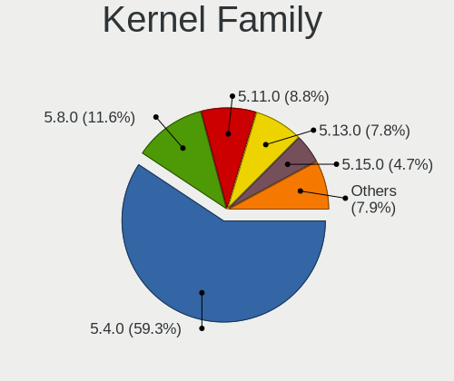

| Version | Computers | Percent |
|---------|-----------|---------|
| 5.4.0   | 832       | 62.14%  |
| 5.8.0   | 167       | 12.47%  |
| 5.11.0  | 126       | 9.41%   |
| 5.13.0  | 110       | 8.22%   |
| 5.6.0   | 14        | 1.05%   |
| 5.10.0  | 10        | 0.75%   |
| 5.3.0   | 5         | 0.37%   |
| 5.7.0   | 4         | 0.3%    |
| 5.14.0  | 4         | 0.3%    |
| 5.9.0   | 3         | 0.22%   |
| 5.9.10  | 2         | 0.15%   |
| 5.8.2   | 2         | 0.15%   |
| 5.8.18  | 2         | 0.15%   |
| 5.8.12  | 2         | 0.15%   |
| 5.7.10  | 2         | 0.15%   |
| 5.7.1   | 2         | 0.15%   |
| 5.17.0  | 2         | 0.15%   |
| 5.12.6  | 2         | 0.15%   |
| 5.11.15 | 2         | 0.15%   |
| 5.11.12 | 2         | 0.15%   |
| 5.9.6   | 1         | 0.07%   |
| 5.9.16  | 1         | 0.07%   |
| 5.9.1   | 1         | 0.07%   |
| 5.8.5   | 1         | 0.07%   |
| 5.8.14  | 1         | 0.07%   |
| 5.8.13  | 1         | 0.07%   |
| 5.8.11  | 1         | 0.07%   |
| 5.8.1   | 1         | 0.07%   |
| 5.7.6   | 1         | 0.07%   |
| 5.7.19  | 1         | 0.07%   |
| 5.7.15  | 1         | 0.07%   |
| 5.6.7   | 1         | 0.07%   |
| 5.6.17  | 1         | 0.07%   |
| 5.6.15  | 1         | 0.07%   |
| 5.6.11  | 1         | 0.07%   |
| 5.5.0   | 1         | 0.07%   |
| 5.4.78  | 1         | 0.07%   |
| 5.4.72  | 1         | 0.07%   |
| 5.4.63  | 1         | 0.07%   |
| 5.4.58  | 1         | 0.07%   |
| 5.4.42  | 1         | 0.07%   |
| 5.18.8  | 1         | 0.07%   |
| 5.17.1  | 1         | 0.07%   |
| 5.16.10 | 1         | 0.07%   |
| 5.15.15 | 1         | 0.07%   |
| 5.15.0  | 1         | 0.07%   |
| 5.14.9  | 1         | 0.07%   |
| 5.14.12 | 1         | 0.07%   |
| 5.14.10 | 1         | 0.07%   |
| 5.13.2  | 1         | 0.07%   |
| 5.13.13 | 1         | 0.07%   |
| 5.13.1  | 1         | 0.07%   |
| 5.12.8  | 1         | 0.07%   |
| 5.12.7  | 1         | 0.07%   |
| 5.12.0  | 1         | 0.07%   |
| 5.11.6  | 1         | 0.07%   |
| 5.11.17 | 1         | 0.07%   |
| 5.11.11 | 1         | 0.07%   |
| 5.10.8  | 1         | 0.07%   |
| 5.10.26 | 1         | 0.07%   |

Kernel Major Ver.
-----------------

Linux kernel major version

| Version | Computers | Percent |
|---------|-----------|---------|
| 5.4     | 836       | 62.53%  |
| 5.8     | 178       | 13.31%  |
| 5.11    | 132       | 9.87%   |
| 5.13    | 113       | 8.45%   |
| 5.6     | 18        | 1.35%   |
| 5.10    | 15        | 1.12%   |
| 5.7     | 11        | 0.82%   |
| 5.9     | 8         | 0.6%    |
| 5.14    | 7         | 0.52%   |
| 5.3     | 5         | 0.37%   |
| 5.12    | 5         | 0.37%   |
| 5.17    | 3         | 0.22%   |
| 5.15    | 2         | 0.15%   |
| 5.5     | 1         | 0.07%   |
| 5.18    | 1         | 0.07%   |
| 5.16    | 1         | 0.07%   |
| 5.0     | 1         | 0.07%   |

Arch
----

OS architecture (x86_64, i586, etc.)

| Name   | Computers | Percent |
|--------|-----------|---------|
| x86_64 | 1305      | 100%    |

DE
--

Desktop Environment

| Name     | Computers | Percent |
|----------|-----------|---------|
| KDE5     | 827       | 62.51%  |
| KDE      | 473       | 35.75%  |
| GNOME    | 7         | 0.53%   |
| Cinnamon | 6         | 0.45%   |
| Budgie   | 6         | 0.45%   |
| XFCE     | 2         | 0.15%   |
| MATE     | 1         | 0.08%   |
| LXQt     | 1         | 0.08%   |

Display Server
--------------

X11 or Wayland

| Name    | Computers | Percent |
|---------|-----------|---------|
| X11     | 1267      | 96.94%  |
| Wayland | 22        | 1.68%   |
| Tty     | 18        | 1.38%   |

Display Manager
---------------

SDDM, LightDM, etc.

| Name    | Computers | Percent |
|---------|-----------|---------|
| SDDM    | 742       | 56.17%  |
| Unknown | 478       | 36.18%  |
| GDM     | 72        | 5.45%   |
| LightDM | 11        | 0.83%   |
| TDM     | 9         | 0.68%   |
| GDM3    | 8         | 0.61%   |
| SLiM    | 1         | 0.08%   |

OS Lang
-------

Language

| Lang    | Computers | Percent |
|---------|-----------|---------|
| en_US   | 564       | 42.99%  |
| de_DE   | 87        | 6.63%   |
| ru_RU   | 85        | 6.48%   |
| pt_BR   | 78        | 5.95%   |
| en_GB   | 66        | 5.03%   |
| fr_FR   | 58        | 4.42%   |
| it_IT   | 46        | 3.51%   |
| es_ES   | 28        | 2.13%   |
| en_CA   | 28        | 2.13%   |
| pl_PL   | 26        | 1.98%   |
| en_IN   | 22        | 1.68%   |
| en_AU   | 19        | 1.45%   |
| es_MX   | 11        | 0.84%   |
| ru_UA   | 10        | 0.76%   |
| hu_HU   | 10        | 0.76%   |
| cs_CZ   | 10        | 0.76%   |
| es_AR   | 9         | 0.69%   |
| en_ZA   | 9         | 0.69%   |
| nl_NL   | 8         | 0.61%   |
| es_CO   | 7         | 0.53%   |
| en_NZ   | 6         | 0.46%   |
| el_GR   | 6         | 0.46%   |
| C       | 6         | 0.46%   |
| zh_CN   | 5         | 0.38%   |
| tr_TR   | 5         | 0.38%   |
| sv_SE   | 5         | 0.38%   |
| nl_BE   | 5         | 0.38%   |
| es_VE   | 5         | 0.38%   |
| en_IL   | 5         | 0.38%   |
| de_CH   | 5         | 0.38%   |
| Unknown | 5         | 0.38%   |
| pt_PT   | 4         | 0.3%    |
| ja_JP   | 4         | 0.3%    |
| es_CL   | 4         | 0.3%    |
| de_AT   | 4         | 0.3%    |
| zh_TW   | 3         | 0.23%   |
| uk_UA   | 3         | 0.23%   |
| ro_RO   | 3         | 0.23%   |
| fr_CH   | 3         | 0.23%   |
| es_PE   | 3         | 0.23%   |
| ca_ES   | 3         | 0.23%   |
| be_BY   | 3         | 0.23%   |
| sk_SK   | 2         | 0.15%   |
| hr_HR   | 2         | 0.15%   |
| fi_FI   | 2         | 0.15%   |
| en_NL   | 2         | 0.15%   |
| en_IE   | 2         | 0.15%   |
| en_DK   | 2         | 0.15%   |
| en_DE   | 2         | 0.15%   |
| da_DK   | 2         | 0.15%   |
| sl_SI   | 1         | 0.08%   |
| sa_IN   | 1         | 0.08%   |
| nb_NO   | 1         | 0.08%   |
| mn_CN   | 1         | 0.08%   |
| ko_KR   | 1         | 0.08%   |
| id_ID   | 1         | 0.08%   |
| es_UY   | 1         | 0.08%   |
| es_PY   | 1         | 0.08%   |
| es_HN   | 1         | 0.08%   |
| es_EC   | 1         | 0.08%   |

Boot Mode
---------

EFI or BIOS

| Mode | Computers | Percent |
|------|-----------|---------|
| EFI  | 818       | 62.06%  |
| BIOS | 500       | 37.94%  |

Filesystem
----------

Type of filesystem

| Type    | Computers | Percent |
|---------|-----------|---------|
| Ext4    | 1197      | 91.37%  |
| Btrfs   | 60        | 4.58%   |
| Xfs     | 21        | 1.6%    |
| Overlay | 19        | 1.45%   |
| Zfs     | 8         | 0.61%   |
| Ext2    | 2         | 0.15%   |
| XXXX    | 1         | 0.08%   |
| Jfs     | 1         | 0.08%   |
| Ext3    | 1         | 0.08%   |

Part. scheme
------------

Scheme of partitioning

| Type    | Computers | Percent |
|---------|-----------|---------|
| GPT     | 592       | 45.02%  |
| Unknown | 543       | 41.29%  |
| MBR     | 180       | 13.69%  |

Dual Boot with Linux/BSD
------------------------

Hosting more than one Linux/BSD

| Dual boot | Computers | Percent |
|-----------|-----------|---------|
| No        | 1123      | 85.33%  |
| Yes       | 193       | 14.67%  |

Dual Boot (Win)
---------------

Hosting Linux and Windows

| Dual boot | Computers | Percent |
|-----------|-----------|---------|
| No        | 775       | 59.07%  |
| Yes       | 537       | 40.93%  |

Board
-----

Vendor
------

Motherboard manufacturer

| Name                   | Computers | Percent |
|------------------------|-----------|---------|
| Dell                   | 222       | 17.01%  |
| ASUSTek Computer       | 198       | 15.17%  |
| Hewlett-Packard        | 179       | 13.72%  |
| Lenovo                 | 174       | 13.33%  |
| Gigabyte Technology    | 113       | 8.66%   |
| MSI                    | 98        | 7.51%   |
| ASRock                 | 58        | 4.44%   |
| Acer                   | 48        | 3.68%   |
| Samsung Electronics    | 22        | 1.69%   |
| Intel                  | 18        | 1.38%   |
| Apple                  | 10        | 0.77%   |
| TUXEDO                 | 9         | 0.69%   |
| HUAWEI                 | 9         | 0.69%   |
| Unknown                | 9         | 0.69%   |
| Notebook               | 8         | 0.61%   |
| Sony                   | 7         | 0.54%   |
| Fujitsu                | 7         | 0.54%   |
| ZOTAC                  | 6         | 0.46%   |
| Toshiba                | 6         | 0.46%   |
| Positivo               | 6         | 0.46%   |
| Pegatron               | 6         | 0.46%   |
| PC Specialist          | 5         | 0.38%   |
| Packard Bell           | 5         | 0.38%   |
| Google                 | 5         | 0.38%   |
| Foxconn                | 5         | 0.38%   |
| Biostar                | 5         | 0.38%   |
| Alienware              | 5         | 0.38%   |
| Timi                   | 4         | 0.31%   |
| Medion                 | 4         | 0.31%   |
| Huanan                 | 4         | 0.31%   |
| ECS                    | 4         | 0.31%   |
| Chuwi                  | 4         | 0.31%   |
| System76               | 3         | 0.23%   |
| LG Electronics         | 3         | 0.23%   |
| Avell High Performance | 3         | 0.23%   |
| Supermicro             | 2         | 0.15%   |
| Schenker               | 2         | 0.15%   |
| Gateway                | 2         | 0.15%   |
| BANGHO                 | 2         | 0.15%   |
| WeiBu                  | 1         | 0.08%   |
| TYAN Computer          | 1         | 0.08%   |
| SYWZ                   | 1         | 0.08%   |
| Standard               | 1         | 0.08%   |
| SIRAGON                | 1         | 0.08%   |
| Seco                   | 1         | 0.08%   |
| Razer                  | 1         | 0.08%   |
| Purism                 | 1         | 0.08%   |
| Panasonic              | 1         | 0.08%   |
| Multilaser             | 1         | 0.08%   |
| Microsoft              | 1         | 0.08%   |
| Koloe                  | 1         | 0.08%   |
| JINGSHA                | 1         | 0.08%   |
| HONOR                  | 1         | 0.08%   |
| Hampoo                 | 1         | 0.08%   |
| GPD                    | 1         | 0.08%   |
| Entroware              | 1         | 0.08%   |
| eMachines              | 1         | 0.08%   |
| Digma                  | 1         | 0.08%   |
| Cube                   | 1         | 0.08%   |
| CompuLab               | 1         | 0.08%   |

Model
-----

Motherboard model

| Name                                       | Computers | Percent |
|--------------------------------------------|-----------|---------|
| Unknown                                    | 16        | 1.23%   |
| ASUS All Series                            | 14        | 1.07%   |
| HP Pavilion g6                             | 5         | 0.38%   |
| Gigabyte A320M-S2H                         | 5         | 0.38%   |
| Gigabyte 970A-DS3P                         | 5         | 0.38%   |
| Dell XPS 15 9560                           | 5         | 0.38%   |
| MSI MS-7A34                                | 4         | 0.31%   |
| MSI MS-7817                                | 4         | 0.31%   |
| HP Notebook                                | 4         | 0.31%   |
| HP 15                                      | 4         | 0.31%   |
| Dell XPS 15 9570                           | 4         | 0.31%   |
| Dell XPS 15 9500                           | 4         | 0.31%   |
| Dell OptiPlex 9020                         | 4         | 0.31%   |
| Dell Latitude 5580                         | 4         | 0.31%   |
| Dell Inspiron 7559                         | 4         | 0.31%   |
| ASUS PRIME B450M-A                         | 4         | 0.31%   |
| ZOTAC ZBOX-CI620/CI640/CI660               | 3         | 0.23%   |
| MSI MS-7C91                                | 3         | 0.23%   |
| MSI MS-7C52                                | 3         | 0.23%   |
| MSI MS-7C37                                | 3         | 0.23%   |
| MSI MS-7996                                | 3         | 0.23%   |
| Lenovo G50-70 20351                        | 3         | 0.23%   |
| HP ProBook 450 G7                          | 3         | 0.23%   |
| HP ProBook 450 G3                          | 3         | 0.23%   |
| HP Pavilion x360 Convertible 14-dh0xxx     | 3         | 0.23%   |
| HP Pavilion Gaming Laptop 15-cx0xxx        | 3         | 0.23%   |
| HP Pavilion dv6                            | 3         | 0.23%   |
| HP Laptop 17-ca0xxx                        | 3         | 0.23%   |
| HP EliteBook 840 G5                        | 3         | 0.23%   |
| HP EliteBook 840 G3                        | 3         | 0.23%   |
| Google Cyan                                | 3         | 0.23%   |
| Gigabyte X570 AORUS ELITE                  | 3         | 0.23%   |
| Gigabyte B550 AORUS ELITE                  | 3         | 0.23%   |
| Gigabyte B450M DS3H                        | 3         | 0.23%   |
| Gigabyte A320M-H                           | 3         | 0.23%   |
| Dell XPS 15 7590                           | 3         | 0.23%   |
| Dell Vostro 5481                           | 3         | 0.23%   |
| Dell Latitude E7440                        | 3         | 0.23%   |
| Dell Latitude E6540                        | 3         | 0.23%   |
| Dell Latitude E5530 non-vPro               | 3         | 0.23%   |
| Dell Latitude 5501                         | 3         | 0.23%   |
| Dell Inspiron N5110                        | 3         | 0.23%   |
| Dell Inspiron 7577                         | 3         | 0.23%   |
| Dell Inspiron 5547                         | 3         | 0.23%   |
| ASUS Z170 PRO GAMING                       | 3         | 0.23%   |
| ASUS TUF Gaming X570-PLUS                  | 3         | 0.23%   |
| ASUS TUF B450M-PLUS GAMING                 | 3         | 0.23%   |
| ASUS ROG STRIX B550-F GAMING               | 3         | 0.23%   |
| Samsung 700Z3A/700Z4A/700Z5A/700Z5B        | 2         | 0.15%   |
| Samsung 300V3A/300V4A/300V5A/200A4B/200A5B | 2         | 0.15%   |
| Samsung 300E5M/300E5L                      | 2         | 0.15%   |
| Pegatron ECOQUIET 630A                     | 2         | 0.15%   |
| MSI Prestige 15 A10SC                      | 2         | 0.15%   |
| MSI MS-7C94                                | 2         | 0.15%   |
| MSI MS-7C35                                | 2         | 0.15%   |
| MSI MS-7B93                                | 2         | 0.15%   |
| MSI MS-7B48                                | 2         | 0.15%   |
| MSI MS-7B17                                | 2         | 0.15%   |
| MSI MS-7B09                                | 2         | 0.15%   |
| MSI MS-7A59                                | 2         | 0.15%   |

Model Family
------------

Motherboard model prefix

| Name                   | Computers | Percent |
|------------------------|-----------|---------|
| Lenovo ThinkPad        | 84        | 6.44%   |
| Dell Latitude          | 64        | 4.9%    |
| Dell Inspiron          | 61        | 4.67%   |
| HP Pavilion            | 43        | 3.3%    |
| Acer Aspire            | 34        | 2.61%   |
| Dell XPS               | 30        | 2.3%    |
| Lenovo IdeaPad         | 28        | 2.15%   |
| ASUS PRIME             | 26        | 1.99%   |
| HP ProBook             | 24        | 1.84%   |
| Dell OptiPlex          | 21        | 1.61%   |
| HP EliteBook           | 20        | 1.53%   |
| ASUS ROG               | 20        | 1.53%   |
| Dell Precision         | 19        | 1.46%   |
| ASUS TUF               | 18        | 1.38%   |
| Unknown                | 16        | 1.23%   |
| HP Laptop              | 15        | 1.15%   |
| ASUS VivoBook          | 15        | 1.15%   |
| Lenovo ThinkCentre     | 14        | 1.07%   |
| ASUS All               | 14        | 1.07%   |
| HP Compaq              | 13        | 1%      |
| Dell Vostro            | 12        | 0.92%   |
| HP ENVY                | 8         | 0.61%   |
| Gigabyte X570          | 8         | 0.61%   |
| ASUS ASUS              | 8         | 0.61%   |
| Lenovo Yoga            | 6         | 0.46%   |
| Gigabyte A320M-S2H     | 6         | 0.46%   |
| Acer Nitro             | 6         | 0.46%   |
| Toshiba Satellite      | 5         | 0.38%   |
| Lenovo ThinkBook       | 5         | 0.38%   |
| Gigabyte B550          | 5         | 0.38%   |
| Gigabyte B450M         | 5         | 0.38%   |
| Gigabyte 970A-DS3P     | 5         | 0.38%   |
| Dell System            | 5         | 0.38%   |
| MSI MS-7A34            | 4         | 0.31%   |
| MSI MS-7817            | 4         | 0.31%   |
| Lenovo Legion          | 4         | 0.31%   |
| HP OMEN                | 4         | 0.31%   |
| HP Notebook            | 4         | 0.31%   |
| HP 15                  | 4         | 0.31%   |
| Fujitsu ESPRIMO        | 4         | 0.31%   |
| ASRock AB350           | 4         | 0.31%   |
| Acer Swift             | 4         | 0.31%   |
| ZOTAC ZBOX-CI620       | 3         | 0.23%   |
| Packard Bell EasyNote  | 3         | 0.23%   |
| MSI Prestige           | 3         | 0.23%   |
| MSI MS-7C91            | 3         | 0.23%   |
| MSI MS-7C52            | 3         | 0.23%   |
| MSI MS-7C37            | 3         | 0.23%   |
| MSI MS-7996            | 3         | 0.23%   |
| Lenovo G50-70          | 3         | 0.23%   |
| HP Spectre             | 3         | 0.23%   |
| HP ProDesk             | 3         | 0.23%   |
| HP EliteDesk           | 3         | 0.23%   |
| HP 255                 | 3         | 0.23%   |
| HP 250                 | 3         | 0.23%   |
| Google Cyan            | 3         | 0.23%   |
| Gigabyte GA-78LMT-USB3 | 3         | 0.23%   |
| Gigabyte B450          | 3         | 0.23%   |
| Gigabyte AX370-Gaming  | 3         | 0.23%   |
| Gigabyte A320M-H       | 3         | 0.23%   |

MFG Year
--------

Motherboard manufacture year

| Year    | Computers | Percent |
|---------|-----------|---------|
| 2019    | 202       | 15.48%  |
| 2018    | 170       | 13.03%  |
| 2020    | 131       | 10.04%  |
| 2017    | 124       | 9.5%    |
| 2013    | 112       | 8.58%   |
| 2012    | 95        | 7.28%   |
| 2011    | 91        | 6.97%   |
| 2014    | 79        | 6.05%   |
| 2015    | 72        | 5.52%   |
| 2016    | 57        | 4.37%   |
| 2010    | 49        | 3.75%   |
| 2021    | 47        | 3.6%    |
| 2008    | 32        | 2.45%   |
| 2009    | 27        | 2.07%   |
| 2007    | 12        | 0.92%   |
| 2006    | 3         | 0.23%   |
| 2005    | 1         | 0.08%   |
| Unknown | 1         | 0.08%   |

Form Factor
-----------

Physical design of the computer

| Name        | Computers | Percent |
|-------------|-----------|---------|
| Notebook    | 700       | 53.64%  |
| Desktop     | 532       | 40.77%  |
| Convertible | 33        | 2.53%   |
| Mini pc     | 16        | 1.23%   |
| All in one  | 12        | 0.92%   |
| Tablet      | 7         | 0.54%   |
| Server      | 5         | 0.38%   |

Secure Boot
-----------

Enabled or disabled

| State    | Computers | Percent |
|----------|-----------|---------|
| Disabled | 1207      | 92.21%  |
| Enabled  | 102       | 7.79%   |

Coreboot
--------

Have coreboot on board

| Used | Computers | Percent |
|------|-----------|---------|
| No   | 1297      | 99.39%  |
| Yes  | 8         | 0.61%   |

RAM Size
--------

Total RAM memory

| Size in GB  | Computers | Percent |
|-------------|-----------|---------|
| 16.01-24.0  | 366       | 27.9%   |
| 4.01-8.0    | 282       | 21.49%  |
| 8.01-16.0   | 248       | 18.9%   |
| 32.01-64.0  | 171       | 13.03%  |
| 3.01-4.0    | 157       | 11.97%  |
| 64.01-256.0 | 32        | 2.44%   |
| 24.01-32.0  | 27        | 2.06%   |
| 1.01-2.0    | 24        | 1.83%   |
| 2.01-3.0    | 5         | 0.38%   |

RAM Used
--------

Used RAM memory

| Used GB    | Computers | Percent |
|------------|-----------|---------|
| 2.01-3.0   | 363       | 25.97%  |
| 1.01-2.0   | 329       | 23.53%  |
| 4.01-8.0   | 326       | 23.32%  |
| 3.01-4.0   | 213       | 15.24%  |
| 8.01-16.0  | 109       | 7.8%    |
| 0.51-1.0   | 37        | 2.65%   |
| 16.01-24.0 | 14        | 1%      |
| 24.01-32.0 | 3         | 0.21%   |
| 0.01-0.5   | 3         | 0.21%   |
| 32.01-64.0 | 1         | 0.07%   |

Total Drives
------------

Number of drives on board

| Drives | Computers | Percent |
|--------|-----------|---------|
| 1      | 693       | 51.79%  |
| 2      | 374       | 27.95%  |
| 3      | 132       | 9.87%   |
| 4      | 72        | 5.38%   |
| 5      | 33        | 2.47%   |
| 6      | 16        | 1.2%    |
| 7      | 8         | 0.6%    |
| 8      | 3         | 0.22%   |
| 0      | 3         | 0.22%   |
| 9      | 2         | 0.15%   |
| 11     | 1         | 0.07%   |
| 10     | 1         | 0.07%   |

Has CD-ROM
----------

Has CD-ROM on board

| Presented | Computers | Percent |
|-----------|-----------|---------|
| No        | 855       | 65.32%  |
| Yes       | 454       | 34.68%  |

Has Ethernet
------------

Has Ethernet on board

| Presented | Computers | Percent |
|-----------|-----------|---------|
| Yes       | 1155      | 88.44%  |
| No        | 151       | 11.56%  |

Has WiFi
--------

Has WiFi module

| Presented | Computers | Percent |
|-----------|-----------|---------|
| Yes       | 961       | 73.36%  |
| No        | 349       | 26.64%  |

Has Bluetooth
-------------

Has Bluetooth module

| Presented | Computers | Percent |
|-----------|-----------|---------|
| Yes       | 833       | 63.64%  |
| No        | 476       | 36.36%  |

Location
--------

Country
-------

Geographic location (country)

| Country      | Computers | Percent |
|--------------|-----------|---------|
| USA          | 240       | 18.36%  |
| Germany      | 125       | 9.56%   |
| Russia       | 111       | 8.49%   |
| Brazil       | 98        | 7.5%    |
| France       | 75        | 5.74%   |
| UK           | 55        | 4.21%   |
| Italy        | 53        | 4.06%   |
| Spain        | 39        | 2.98%   |
| Netherlands  | 35        | 2.68%   |
| Poland       | 33        | 2.52%   |
| Ukraine      | 31        | 2.37%   |
| Canada       | 29        | 2.22%   |
| India        | 23        | 1.76%   |
| Mexico       | 20        | 1.53%   |
| Hungary      | 19        | 1.45%   |
| Australia    | 17        | 1.3%    |
| Czechia      | 16        | 1.22%   |
| Argentina    | 15        | 1.15%   |
| Switzerland  | 14        | 1.07%   |
| Greece       | 12        | 0.92%   |
| Bulgaria     | 12        | 0.92%   |
| Belgium      | 12        | 0.92%   |
| South Africa | 10        | 0.77%   |
| Turkey       | 9         | 0.69%   |
| Colombia     | 9         | 0.69%   |
| Belarus      | 9         | 0.69%   |
| Sweden       | 8         | 0.61%   |
| Romania      | 8         | 0.61%   |
| Indonesia    | 8         | 0.61%   |
| Israel       | 7         | 0.54%   |
| Finland      | 7         | 0.54%   |
| Austria      | 7         | 0.54%   |
| Serbia       | 6         | 0.46%   |
| Norway       | 6         | 0.46%   |
| New Zealand  | 6         | 0.46%   |
| Estonia      | 6         | 0.46%   |
| Chile        | 6         | 0.46%   |
| Venezuela    | 5         | 0.38%   |
| Portugal     | 5         | 0.38%   |
| Japan        | 5         | 0.38%   |
| Denmark      | 5         | 0.38%   |
| China        | 5         | 0.38%   |
| Taiwan       | 4         | 0.31%   |
| Slovenia     | 4         | 0.31%   |
| Saudi Arabia | 4         | 0.31%   |
| Peru         | 4         | 0.31%   |
| Vietnam      | 3         | 0.23%   |
| Thailand     | 3         | 0.23%   |
| Slovakia     | 3         | 0.23%   |
| Pakistan     | 3         | 0.23%   |
| Ireland      | 3         | 0.23%   |
| Iran         | 3         | 0.23%   |
| Georgia      | 3         | 0.23%   |
| Egypt        | 3         | 0.23%   |
| Croatia      | 3         | 0.23%   |
| Bangladesh   | 3         | 0.23%   |
| Vatican      | 2         | 0.15%   |
| Nigeria      | 2         | 0.15%   |
| Lithuania    | 2         | 0.15%   |
| Bolivia      | 2         | 0.15%   |

City
----

Geographic location (city)

| City              | Computers | Percent |
|-------------------|-----------|---------|
| Moscow            | 26        | 1.93%   |
| Paris             | 16        | 1.19%   |
| Sao Paulo         | 13        | 0.96%   |
| Warsaw            | 12        | 0.89%   |
| Hamburg           | 12        | 0.89%   |
| St Petersburg     | 11        | 0.82%   |
| Kyiv              | 11        | 0.82%   |
| Berlin            | 11        | 0.82%   |
| Milan             | 9         | 0.67%   |
| Madrid            | 9         | 0.67%   |
| Budapest          | 9         | 0.67%   |
| Novosibirsk       | 8         | 0.59%   |
| Minsk             | 8         | 0.59%   |
| Frankfurt am Main | 8         | 0.59%   |
| Athens            | 8         | 0.59%   |
| Zurich            | 7         | 0.52%   |
| Sydney            | 7         | 0.52%   |
| Sofia             | 7         | 0.52%   |
| Rome              | 7         | 0.52%   |
| Munich            | 6         | 0.45%   |
| London            | 6         | 0.45%   |
| Prague            | 5         | 0.37%   |
| Phoenix           | 5         | 0.37%   |
| Melbourne         | 5         | 0.37%   |
| Los Angeles       | 5         | 0.37%   |
| Curitiba          | 5         | 0.37%   |
| Bogot           | 5         | 0.37%   |
| Amsterdam         | 5         | 0.37%   |
| Tel Aviv          | 4         | 0.3%    |
| St Louis          | 4         | 0.3%    |
| Seattle           | 4         | 0.3%    |
| San Jose          | 4         | 0.3%    |
| Rio de Janeiro    | 4         | 0.3%    |
| Montreal          | 4         | 0.3%    |
| Marseille         | 4         | 0.3%    |
| Jakarta           | 4         | 0.3%    |
| Dallas            | 4         | 0.3%    |
| Cologne           | 4         | 0.3%    |
| Brooklyn          | 4         | 0.3%    |
| Bonn              | 4         | 0.3%    |
| Belgrade          | 4         | 0.3%    |
| Auckland          | 4         | 0.3%    |
| Yekaterinburg     | 3         | 0.22%   |
| Vienna            | 3         | 0.22%   |
| Ulyanovsk         | 3         | 0.22%   |
| Tyumen            | 3         | 0.22%   |
| The Hague         | 3         | 0.22%   |
| Sao Carlos        | 3         | 0.22%   |
| San Antonio       | 3         | 0.22%   |
| Rostov-on-Don     | 3         | 0.22%   |
| Pune              | 3         | 0.22%   |
| Oryol             | 3         | 0.22%   |
| Monterrey         | 3         | 0.22%   |
| Modena            | 3         | 0.22%   |
| Mexico City       | 3         | 0.22%   |
| Medelln         | 3         | 0.22%   |
| Manchester        | 3         | 0.22%   |
| Liverpool         | 3         | 0.22%   |
| Lima              | 3         | 0.22%   |
| Leipzig           | 3         | 0.22%   |

Drives
------

Drive Vendor
------------

Hard drive vendors

| Vendor                | Computers | Drives | Percent |
|-----------------------|-----------|--------|---------|
| Samsung Electronics   | 392       | 554    | 18.98%  |
| WDC                   | 331       | 526    | 16.03%  |
| Seagate               | 305       | 420    | 14.77%  |
| Toshiba               | 129       | 163    | 6.25%   |
| Kingston              | 126       | 152    | 6.1%    |
| SanDisk               | 103       | 116    | 4.99%   |
| Crucial               | 84        | 101    | 4.07%   |
| Unknown               | 74        | 92     | 3.58%   |
| Hitachi               | 56        | 67     | 2.71%   |
| Intel                 | 52        | 77     | 2.52%   |
| SK hynix              | 46        | 51     | 2.23%   |
| A-DATA Technology     | 36        | 36     | 1.74%   |
| HGST                  | 33        | 40     | 1.6%    |
| Micron Technology     | 26        | 29     | 1.26%   |
| Phison                | 17        | 24     | 0.82%   |
| Silicon Motion        | 13        | 15     | 0.63%   |
| OCZ                   | 12        | 14     | 0.58%   |
| KIOXIA                | 10        | 10     | 0.48%   |
| Transcend             | 9         | 9      | 0.44%   |
| PNY                   | 9         | 9      | 0.44%   |
| LITEON                | 9         | 11     | 0.44%   |
| Intenso               | 9         | 9      | 0.44%   |
| Corsair               | 9         | 10     | 0.44%   |
| Apple                 | 9         | 10     | 0.44%   |
| SPCC                  | 8         | 11     | 0.39%   |
| Patriot               | 8         | 10     | 0.39%   |
| Goodram               | 8         | 18     | 0.39%   |
| XPG                   | 7         | 7      | 0.34%   |
| Team                  | 7         | 8      | 0.34%   |
| Maxtor                | 7         | 7      | 0.34%   |
| China                 | 7         | 8      | 0.34%   |
| KingSpec              | 6         | 6      | 0.29%   |
| LITEONIT              | 5         | 5      | 0.24%   |
| JMicron Technology    | 5         | 5      | 0.24%   |
| Apacer                | 5         | 5      | 0.24%   |
| Mushkin               | 4         | 4      | 0.19%   |
| LDLC                  | 4         | 12     | 0.19%   |
| Gigabyte Technology   | 4         | 4      | 0.19%   |
| Fujitsu               | 4         | 4      | 0.19%   |
| Verbatim              | 3         | 3      | 0.15%   |
| SABRENT               | 3         | 3      | 0.15%   |
| Realtek Semiconductor | 3         | 3      | 0.15%   |
| Lenovo                | 3         | 3      | 0.15%   |
| Hewlett-Packard       | 3         | 3      | 0.15%   |
| Zheino                | 2         | 4      | 0.1%    |
| VENO                  | 2         | 4      | 0.1%    |
| TO Exter              | 2         | 2      | 0.1%    |
| Netac                 | 2         | 2      | 0.1%    |
| MDT                   | 2         | 4      | 0.1%    |
| Leven                 | 2         | 3      | 0.1%    |
| KingFast              | 2         | 2      | 0.1%    |
| EMTEC                 | 2         | 2      | 0.1%    |
| BIWIN                 | 2         | 2      | 0.1%    |
| ASMT                  | 2         | 3      | 0.1%    |
| AMD                   | 2         | 2      | 0.1%    |
| Unknown               | 2         | 2      | 0.1%    |
| XrayDisk              | 1         | 1      | 0.05%   |
| WD MediaMax           | 1         | 1      | 0.05%   |
| USB                   | 1         | 1      | 0.05%   |
| TCSUNBOW              | 1         | 1      | 0.05%   |

Drive Model
-----------

Hard drive models

| Model                                  | Computers | Percent |
|----------------------------------------|-----------|---------|
| Samsung SSD 860 EVO 500GB              | 31        | 1.34%   |
| Seagate ST1000LM024 HN-M101MBB 1TB     | 20        | 0.86%   |
| Samsung SSD 850 EVO 250GB              | 20        | 0.86%   |
| Samsung SSD 850 EVO 500GB              | 19        | 0.82%   |
| Kingston SA400S37240G 240GB SSD        | 19        | 0.82%   |
| Samsung NVMe SSD Drive 512GB           | 18        | 0.78%   |
| Samsung NVMe SSD Drive 1TB             | 17        | 0.73%   |
| Kingston SA400S37480G 480GB SSD        | 17        | 0.73%   |
| Unknown MMC Card  32GB                 | 16        | 0.69%   |
| Samsung SSD 860 EVO 1TB                | 16        | 0.69%   |
| Seagate ST1000LM035-1RK172 1TB         | 14        | 0.6%    |
| Seagate ST1000DM003-1ER162 1TB         | 14        | 0.6%    |
| Samsung SM963 2.5" NVMe PCIe SSD 500GB | 14        | 0.6%    |
| Crucial CT1000MX500SSD1 1TB            | 14        | 0.6%    |
| Seagate ST1000DM010-2EP102 1TB         | 12        | 0.52%   |
| Seagate ST1000DM003-1CH162 1TB         | 12        | 0.52%   |
| Samsung SSD 860 EVO 250GB              | 12        | 0.52%   |
| Toshiba MQ04ABF100 1TB                 | 11        | 0.47%   |
| Samsung SSD 970 EVO Plus 500GB         | 11        | 0.47%   |
| WDC WDS240G2G0A-00JH30 240GB SSD       | 10        | 0.43%   |
| Toshiba HDWD110 1TB                    | 10        | 0.43%   |
| Seagate Expansion 1TB                  | 10        | 0.43%   |
| Samsung SSD 970 EVO Plus 1TB           | 10        | 0.43%   |
| Samsung SSD 860 EVO M.2 500GB          | 10        | 0.43%   |
| Kingston SA400S37120G 120GB SSD        | 10        | 0.43%   |
| HGST HTS721010A9E630 1TB               | 10        | 0.43%   |
| WDC WD10EZEX-08WN4A0 1TB               | 9         | 0.39%   |
| Unknown SD/MMC/MS PRO 128GB            | 9         | 0.39%   |
| Toshiba MQ01ABF050 500GB               | 9         | 0.39%   |
| Seagate ST500LT012-1DG142 500GB        | 9         | 0.39%   |
| Seagate ST500DM002-1BD142 500GB        | 9         | 0.39%   |
| SanDisk SSD PLUS 240GB                 | 9         | 0.39%   |
| SanDisk NVMe SSD Drive 512GB           | 9         | 0.39%   |
| Samsung SSD 840 EVO 250GB              | 9         | 0.39%   |
| Kingston SV300S37A240G 240GB SSD       | 9         | 0.39%   |
| Kingston SV300S37A120G 120GB SSD       | 9         | 0.39%   |
| Crucial CT500MX500SSD1 500GB           | 9         | 0.39%   |
| WDC WD20EARX-00PASB0 2TB               | 8         | 0.34%   |
| Toshiba MQ01ABD100 1TB                 | 8         | 0.34%   |
| Toshiba DT01ACA100 1TB                 | 8         | 0.34%   |
| Seagate ST2000DM001-1ER164 2TB         | 8         | 0.34%   |
| SanDisk SSD PLUS 480GB                 | 8         | 0.34%   |
| WDC WD1003FZEX-00K3CA0 1TB             | 7         | 0.3%    |
| Toshiba DT01ACA200 2TB                 | 7         | 0.3%    |
| Seagate ST500LM012 HN-M500MBB 500GB    | 7         | 0.3%    |
| Seagate ST4000DM004-2CV104 4TB         | 7         | 0.3%    |
| Seagate ST2000DM008-2FR102 2TB         | 7         | 0.3%    |
| Seagate ST2000DM006-2DM164 2TB         | 7         | 0.3%    |
| Seagate ST1000LM048-2E7172 1TB         | 7         | 0.3%    |
| WDC WD10SPZX-21Z10T0 1TB               | 6         | 0.26%   |
| WDC WD1002FAEX-00Z3A0 1TB              | 6         | 0.26%   |
| Unknown MMC Card  64GB                 | 6         | 0.26%   |
| Seagate ST3500413AS 500GB              | 6         | 0.26%   |
| Seagate ST2000LM007-1R8174 2TB         | 6         | 0.26%   |
| Seagate ST2000DM001-1CH164 2TB         | 6         | 0.26%   |
| SanDisk NVMe SSD Drive 256GB           | 6         | 0.26%   |
| SanDisk NVMe SSD Drive 1TB             | 6         | 0.26%   |
| Samsung SSD 970 EVO 1TB                | 6         | 0.26%   |
| Samsung SSD 860 QVO 1TB                | 6         | 0.26%   |
| Samsung SSD 860 EVO M.2 1TB            | 6         | 0.26%   |

HDD Vendor
----------

Hard disk drive vendors

| Vendor              | Computers | Drives | Percent |
|---------------------|-----------|--------|---------|
| Seagate             | 301       | 410    | 36.93%  |
| WDC                 | 248       | 413    | 30.43%  |
| Toshiba             | 94        | 122    | 11.53%  |
| Hitachi             | 56        | 67     | 6.87%   |
| Samsung Electronics | 45        | 71     | 5.52%   |
| HGST                | 33        | 40     | 4.05%   |
| Unknown             | 13        | 14     | 1.6%    |
| Maxtor              | 7         | 7      | 0.86%   |
| Apple               | 5         | 5      | 0.61%   |
| Fujitsu             | 4         | 4      | 0.49%   |
| JMicron Technology  | 3         | 3      | 0.37%   |
| ASMT                | 2         | 3      | 0.25%   |
| WD MediaMax         | 1         | 1      | 0.12%   |
| USB                 | 1         | 1      | 0.12%   |
| LaCie               | 1         | 1      | 0.12%   |
| Hewlett-Packard     | 1         | 2      | 0.12%   |

SSD Vendor
----------

Solid state drive vendors

| Vendor              | Computers | Drives | Percent |
|---------------------|-----------|--------|---------|
| Samsung Electronics | 218       | 279    | 29.78%  |
| Kingston            | 100       | 123    | 13.66%  |
| Crucial             | 73        | 89     | 9.97%   |
| SanDisk             | 70        | 79     | 9.56%   |
| WDC                 | 42        | 51     | 5.74%   |
| A-DATA Technology   | 21        | 21     | 2.87%   |
| Toshiba             | 16        | 20     | 2.19%   |
| Micron Technology   | 15        | 17     | 2.05%   |
| Intel               | 15        | 21     | 2.05%   |
| OCZ                 | 12        | 14     | 1.64%   |
| SK hynix            | 9         | 10     | 1.23%   |
| Intenso             | 9         | 9      | 1.23%   |
| SPCC                | 8         | 10     | 1.09%   |
| Patriot             | 8         | 10     | 1.09%   |
| Goodram             | 8         | 18     | 1.09%   |
| Transcend           | 7         | 7      | 0.96%   |
| PNY                 | 7         | 7      | 0.96%   |
| LITEON              | 7         | 8      | 0.96%   |
| Corsair             | 7         | 8      | 0.96%   |
| China               | 7         | 8      | 0.96%   |
| Team                | 6         | 6      | 0.82%   |
| KingSpec            | 6         | 6      | 0.82%   |
| LITEONIT            | 5         | 5      | 0.68%   |
| Apacer              | 5         | 5      | 0.68%   |
| Verbatim            | 3         | 3      | 0.41%   |
| Mushkin             | 3         | 3      | 0.41%   |
| Zheino              | 2         | 4      | 0.27%   |
| VENO                | 2         | 4      | 0.27%   |
| TO Exter            | 2         | 2      | 0.27%   |
| Seagate             | 2         | 7      | 0.27%   |
| Netac               | 2         | 2      | 0.27%   |
| Leven               | 2         | 3      | 0.27%   |
| LDLC                | 2         | 2      | 0.27%   |
| Gigabyte Technology | 2         | 2      | 0.27%   |
| EMTEC               | 2         | 2      | 0.27%   |
| Apple               | 2         | 2      | 0.27%   |
| Unknown             | 1         | 1      | 0.14%   |
| TCSUNBOW            | 1         | 1      | 0.14%   |
| Super Talent        | 1         | 1      | 0.14%   |
| SMI                 | 1         | 1      | 0.14%   |
| Smartbuy            | 1         | 2      | 0.14%   |
| ShanDianZhe         | 1         | 2      | 0.14%   |
| RZX                 | 1         | 1      | 0.14%   |
| PNY USB             | 1         | 1      | 0.14%   |
| Plextor             | 1         | 2      | 0.14%   |
| Maximus             | 1         | 1      | 0.14%   |
| Lexar               | 1         | 1      | 0.14%   |
| KIOXIA-EXCERIA      | 1         | 1      | 0.14%   |
| KingFast            | 1         | 1      | 0.14%   |
| JMicron Technology  | 1         | 1      | 0.14%   |
| INDMEM              | 1         | 1      | 0.14%   |
| Hewlett-Packard     | 1         | 1      | 0.14%   |
| FORESEE             | 1         | 1      | 0.14%   |
| Drevo               | 1         | 1      | 0.14%   |
| Dogfish             | 1         | 1      | 0.14%   |
| BIWIN               | 1         | 1      | 0.14%   |
| BHT                 | 1         | 2      | 0.14%   |
| Avant               | 1         | 1      | 0.14%   |
| AMD                 | 1         | 1      | 0.14%   |
| AEGO                | 1         | 2      | 0.14%   |

Drive Kind
----------

HDD or SSD

| Kind    | Computers | Drives | Percent |
|---------|-----------|--------|---------|
| HDD     | 665       | 1164   | 36.14%  |
| SSD     | 634       | 897    | 34.46%  |
| NVMe    | 456       | 576    | 24.78%  |
| MMC     | 57        | 72     | 3.1%    |
| Unknown | 28        | 44     | 1.52%   |

Drive Connector
---------------

SATA, SAS, NVMe, etc.

| Type | Computers | Drives | Percent |
|------|-----------|--------|---------|
| SATA | 1001      | 2005   | 62.76%  |
| NVMe | 455       | 571    | 28.53%  |
| SAS  | 82        | 105    | 5.14%   |
| MMC  | 57        | 72     | 3.57%   |

Drive Size
----------

Size of hard drive

| Size in TB | Computers | Drives | Percent |
|------------|-----------|--------|---------|
| 0.01-0.5   | 691       | 1033   | 49.89%  |
| 0.51-1.0   | 448       | 655    | 32.35%  |
| 1.01-2.0   | 137       | 209    | 9.89%   |
| 3.01-4.0   | 48        | 86     | 3.47%   |
| 2.01-3.0   | 30        | 37     | 2.17%   |
| 4.01-10.0  | 27        | 36     | 1.95%   |
| 10.01-20.0 | 4         | 5      | 0.29%   |

Space Total
-----------

Amount of disk space available on the file system

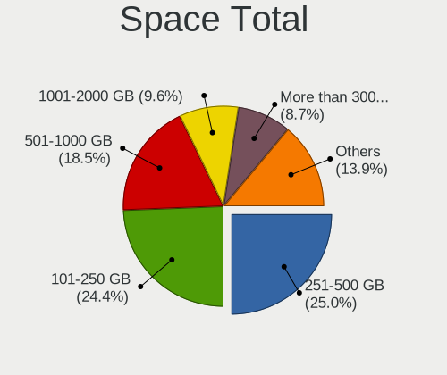

| Size in GB     | Computers | Percent |
|----------------|-----------|---------|
| 251-500        | 344       | 25.77%  |
| 101-250        | 326       | 24.42%  |
| 501-1000       | 248       | 18.58%  |
| 1001-2000      | 128       | 9.59%   |
| More than 3000 | 110       | 8.24%   |
| 51-100         | 59        | 4.42%   |
| 2001-3000      | 58        | 4.34%   |
| 21-50          | 30        | 2.25%   |
| 1-20           | 27        | 2.02%   |
| Unknown        | 5         | 0.37%   |

Space Used
----------

Amount of used disk space

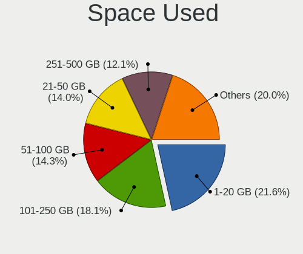

| Used GB        | Computers | Percent |
|----------------|-----------|---------|
| 1-20           | 301       | 21.95%  |
| 101-250        | 246       | 17.94%  |
| 51-100         | 202       | 14.73%  |
| 21-50          | 193       | 14.08%  |
| 251-500        | 163       | 11.89%  |
| 501-1000       | 117       | 8.53%   |
| 1001-2000      | 63        | 4.6%    |
| More than 3000 | 56        | 4.08%   |
| 2001-3000      | 25        | 1.82%   |
| Unknown        | 5         | 0.36%   |

Malfunc. Drives
---------------

Drive models with a malfunction

| Model                                    | Computers | Drives | Percent |
|------------------------------------------|-----------|--------|---------|
| Seagate ST1000LM035-1RK172 1TB           | 4         | 4      | 2.42%   |
| Seagate ST1000LM048-2E7172 1TB           | 3         | 3      | 1.82%   |
| Seagate ST1000LM024 HN-M101MBB 1TB       | 3         | 3      | 1.82%   |
| Seagate ST1000DM003-1CH162 1TB           | 3         | 4      | 1.82%   |
| Kingston SV300S37A120G 120GB SSD         | 3         | 3      | 1.82%   |
| WDC WD5000AAKS-00V1A0 500GB              | 2         | 3      | 1.21%   |
| WDC WD5000AAKS-00A7B0 500GB              | 2         | 2      | 1.21%   |
| Seagate ST500LT012-9WS142 500GB          | 2         | 2      | 1.21%   |
| Seagate ST31000528AS 1TB                 | 2         | 2      | 1.21%   |
| SanDisk SSD PLUS 240 GB                  | 2         | 2      | 1.21%   |
| Intel SSDSA2M080G2GC 80GB                | 2         | 2      | 1.21%   |
| Hitachi HTS547575A9E384 752GB            | 2         | 2      | 1.21%   |
| HGST HTS721010A9E630 1TB                 | 2         | 3      | 1.21%   |
| Crucial CT275MX300SSD1 275GB             | 2         | 3      | 1.21%   |
| Zheino CHN mSATA02M 256 256GB SSD        | 1         | 2      | 0.61%   |
| WDC WD6400BEVT-00A0RT0 640GB             | 1         | 1      | 0.61%   |
| WDC WD5000LPVX-75V0TT0 500GB             | 1         | 1      | 0.61%   |
| WDC WD5000LPVX-60V0TT0 500GB             | 1         | 1      | 0.61%   |
| WDC WD5000LPVX-55V0TT0 500GB             | 1         | 1      | 0.61%   |
| WDC WD5000LPVT-24G33T1 500GB             | 1         | 1      | 0.61%   |
| WDC WD5000LPVT-22G33T0 500GB             | 1         | 1      | 0.61%   |
| WDC WD5000LPLX-00ZNTT0 500GB             | 1         | 1      | 0.61%   |
| WDC WD5000AAKS-00UU3A0 500GB             | 1         | 2      | 0.61%   |
| WDC WD5000AADS-56S9B1 499GB              | 1         | 1      | 0.61%   |
| WDC WD40EZRZ-00GXCB0 4TB                 | 1         | 1      | 0.61%   |
| WDC WD40EZRX-00SPEB0 4TB                 | 1         | 1      | 0.61%   |
| WDC WD40EFRX-68N32N0 4TB                 | 1         | 2      | 0.61%   |
| WDC WD4003FZEX-00Z4SA0 4TB               | 1         | 2      | 0.61%   |
| WDC WD3200AAKX-001CA0 320GB              | 1         | 1      | 0.61%   |
| WDC WD30EZRX-00MMMB0 3TB                 | 1         | 1      | 0.61%   |
| WDC WD30EZRX-00DC0B0 3TB                 | 1         | 1      | 0.61%   |
| WDC WD30EFRX-68EUZN0 3TB                 | 1         | 1      | 0.61%   |
| WDC WD2500AAJS-00B4A0 250GB              | 1         | 1      | 0.61%   |
| WDC WD1600BJKT-75F4T0 160GB              | 1         | 1      | 0.61%   |
| WDC WD1600AAJS-22L7A0 160GB              | 1         | 1      | 0.61%   |
| WDC WD15EARS-00Z5B1 1TB                  | 1         | 1      | 0.61%   |
| WDC WD10JPVX-60JC3T1 1TB                 | 1         | 1      | 0.61%   |
| WDC WD10JPVX-22JC3T0 1TB                 | 1         | 1      | 0.61%   |
| WDC WD10EZEX-75M2NA0 1TB                 | 1         | 1      | 0.61%   |
| WDC WD10EZEX-60WN4A1 1TB                 | 1         | 1      | 0.61%   |
| WDC WD10EZEX-60M2NA0 1TB                 | 1         | 1      | 0.61%   |
| WDC WD10EZEX-08WN4A0 1TB                 | 1         | 1      | 0.61%   |
| WDC WD10EZEX-00BN5A0 1TB                 | 1         | 1      | 0.61%   |
| WDC WD10EARS-22Y5B1 1TB                  | 1         | 1      | 0.61%   |
| WDC WD10EARS-00Y5B1 1TB                  | 1         | 1      | 0.61%   |
| WDC WD10EADS-00M2B0 1TB                  | 1         | 1      | 0.61%   |
| WDC WD1003FZEX-00K3CA0 1TB               | 1         | 1      | 0.61%   |
| WDC WD1002FBYS-02A6B0 1TB                | 1         | 1      | 0.61%   |
| WDC WD1002FAEX-00Z3A0 1TB                | 1         | 1      | 0.61%   |
| WDC WD1001FALS-00U9B0 1TB                | 1         | 1      | 0.61%   |
| WDC PC SN520 SDAPMUW-512G-1001 512GB     | 1         | 1      | 0.61%   |
| VENO SCORP SSD 240GB                     | 1         | 1      | 0.61%   |
| Toshiba THNSNK256GVN8 M.2 2280 256GB SSD | 1         | 1      | 0.61%   |
| Toshiba THNSNK256GCS8 SATA 256GB SSD     | 1         | 1      | 0.61%   |
| Toshiba THNSNK128GCS8 SATA 128GB SSD     | 1         | 1      | 0.61%   |
| Toshiba MQ04ABF100 1TB                   | 1         | 1      | 0.61%   |
| Toshiba MQ01ABD100 1TB                   | 1         | 1      | 0.61%   |
| Toshiba MQ01ABD075 752GB                 | 1         | 1      | 0.61%   |
| Toshiba MK7575GSX 752GB                  | 1         | 1      | 0.61%   |
| Toshiba MK7559GSXP 752GB                 | 1         | 2      | 0.61%   |

Malfunc. Drive Vendor
---------------------

Vendors of faulty drives

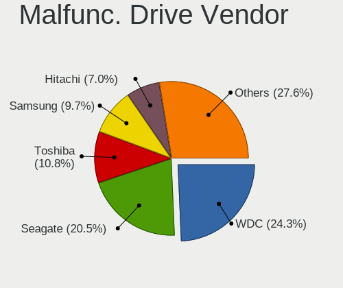

| Vendor              | Computers | Drives | Percent |
|---------------------|-----------|--------|---------|
| WDC                 | 40        | 44     | 24.39%  |
| Seagate             | 34        | 36     | 20.73%  |
| Toshiba             | 18        | 20     | 10.98%  |
| Samsung Electronics | 14        | 15     | 8.54%   |
| Hitachi             | 12        | 12     | 7.32%   |
| SanDisk             | 7         | 7      | 4.27%   |
| Crucial             | 7         | 8      | 4.27%   |
| Kingston            | 6         | 6      | 3.66%   |
| HGST                | 6         | 7      | 3.66%   |
| SK hynix            | 3         | 3      | 1.83%   |
| Intel               | 3         | 3      | 1.83%   |
| A-DATA Technology   | 3         | 3      | 1.83%   |
| OCZ                 | 2         | 2      | 1.22%   |
| Apple               | 2         | 2      | 1.22%   |
| Zheino              | 1         | 2      | 0.61%   |
| VENO                | 1         | 1      | 0.61%   |
| SPCC                | 1         | 1      | 0.61%   |
| Mushkin             | 1         | 1      | 0.61%   |
| Micron Technology   | 1         | 1      | 0.61%   |
| Maxtor              | 1         | 1      | 0.61%   |
| Drevo               | 1         | 1      | 0.61%   |

Malfunc. HDD Vendor
-------------------

Vendors of faulty HDD drives

| Vendor              | Computers | Drives | Percent |
|---------------------|-----------|--------|---------|
| WDC                 | 39        | 43     | 32.77%  |
| Seagate             | 34        | 36     | 28.57%  |
| Toshiba             | 15        | 17     | 12.61%  |
| Hitachi             | 12        | 12     | 10.08%  |
| Samsung Electronics | 10        | 11     | 8.4%    |
| HGST                | 6         | 7      | 5.04%   |
| Apple               | 2         | 2      | 1.68%   |
| Maxtor              | 1         | 1      | 0.84%   |

Malfunc. Drive Kind
-------------------

Kinds of faulty drives

| Kind | Computers | Drives | Percent |
|------|-----------|--------|---------|
| HDD  | 112       | 129    | 71.34%  |
| SSD  | 38        | 40     | 24.2%   |
| NVMe | 7         | 7      | 4.46%   |

Failed Drives
-------------

Failed drive models

| Model                    | Computers | Drives | Percent |
|--------------------------|-----------|--------|---------|
| OCZ VERTEX460A 480GB SSD | 1         | 1      | 100%    |

Failed Drive Vendor
-------------------

Failed drive vendors

| Vendor | Computers | Drives | Percent |
|--------|-----------|--------|---------|
| OCZ    | 1         | 1      | 100%    |

Drive Status
------------

Number of failed and malfunc. drives

| Status   | Computers | Drives | Percent |
|----------|-----------|--------|---------|
| Works    | 729       | 1225   | 49.19%  |
| Detected | 598       | 1351   | 40.35%  |
| Malfunc  | 154       | 176    | 10.39%  |
| Failed   | 1         | 1      | 0.07%   |

Storage controller
------------------

Storage Vendor
--------------

Storage controller vendors

| Vendor                           | Computers | Percent |
|----------------------------------|-----------|---------|
| Intel                            | 864       | 50.97%  |
| AMD                              | 301       | 17.76%  |
| Samsung Electronics              | 165       | 9.73%   |
| SanDisk                          | 82        | 4.84%   |
| SK hynix                         | 36        | 2.12%   |
| ASMedia Technology               | 30        | 1.77%   |
| Kingston Technology Company      | 26        | 1.53%   |
| Phison Electronics               | 23        | 1.36%   |
| Toshiba America Info Systems     | 21        | 1.24%   |
| Silicon Motion                   | 20        | 1.18%   |
| Nvidia                           | 19        | 1.12%   |
| ADATA Technology                 | 19        | 1.12%   |
| Micron Technology                | 12        | 0.71%   |
| Marvell Technology Group         | 12        | 0.71%   |
| JMicron Technology               | 12        | 0.71%   |
| Micron/Crucial Technology        | 11        | 0.65%   |
| Realtek Semiconductor            | 9         | 0.53%   |
| KIOXIA                           | 9         | 0.53%   |
| Broadcom / LSI                   | 7         | 0.41%   |
| VIA Technologies                 | 3         | 0.18%   |
| Lenovo                           | 3         | 0.18%   |
| Silicon Image                    | 2         | 0.12%   |
| Lite-On Technology               | 2         | 0.12%   |
| Unknown                          | 1         | 0.06%   |
| Union Memory (Shenzhen)          | 1         | 0.06%   |
| Silicon Integrated Systems [SiS] | 1         | 0.06%   |
| LSI Logic / Symbios Logic        | 1         | 0.06%   |
| Apple                            | 1         | 0.06%   |
| Adaptec                          | 1         | 0.06%   |
| 3ware                            | 1         | 0.06%   |

Storage Model
-------------

Storage controller models

| Model                                                                                   | Computers | Percent |
|-----------------------------------------------------------------------------------------|-----------|---------|
| AMD FCH SATA Controller [AHCI mode]                                                     | 225       | 11.63%  |
| Samsung NVMe SSD Controller SM981/PM981/PM983                                           | 119       | 6.15%   |
| Intel Sunrise Point-LP SATA Controller [AHCI mode]                                      | 84        | 4.34%   |
| Intel 82801 Mobile SATA Controller [RAID mode]                                          | 68        | 3.52%   |
| Intel 8 Series/C220 Series Chipset Family 6-port SATA Controller 1 [AHCI mode]          | 64        | 3.31%   |
| Intel 7 Series Chipset Family 6-port SATA Controller [AHCI mode]                        | 50        | 2.59%   |
| AMD 400 Series Chipset SATA Controller                                                  | 45        | 2.33%   |
| Intel 6 Series/C200 Series Chipset Family 6 port Mobile SATA AHCI Controller            | 42        | 2.17%   |
| Intel Q170/Q150/B150/H170/H110/Z170/CM236 Chipset SATA Controller [AHCI Mode]           | 41        | 2.12%   |
| Intel 8 Series SATA Controller 1 [AHCI mode]                                            | 41        | 2.12%   |
| Intel Cannon Lake Mobile PCH SATA AHCI Controller                                       | 37        | 1.91%   |
| Intel 6 Series/C200 Series Chipset Family 6 port Desktop SATA AHCI Controller           | 33        | 1.71%   |
| AMD SB7x0/SB8x0/SB9x0 SATA Controller [AHCI mode]                                       | 30        | 1.55%   |
| SanDisk WD Black SN750 / PC SN730 NVMe SSD                                              | 27        | 1.4%    |
| ASMedia ASM1062 Serial ATA Controller                                                   | 26        | 1.34%   |
| AMD SB7x0/SB8x0/SB9x0 IDE Controller                                                    | 26        | 1.34%   |
| Intel 7 Series/C210 Series Chipset Family 6-port SATA Controller [AHCI mode]            | 25        | 1.29%   |
| Intel Comet Lake SATA AHCI Controller                                                   | 24        | 1.24%   |
| Intel 200 Series PCH SATA controller [AHCI mode]                                        | 24        | 1.24%   |
| Intel Cannon Point-LP SATA Controller [AHCI Mode]                                       | 23        | 1.19%   |
| Intel Cannon Lake PCH SATA AHCI Controller                                              | 23        | 1.19%   |
| Samsung NVMe SSD Controller SM961/PM961/SM963                                           | 22        | 1.14%   |
| Intel Wildcat Point-LP SATA Controller [AHCI Mode]                                      | 22        | 1.14%   |
| Intel HM170/QM170 Chipset SATA Controller [AHCI Mode]                                   | 22        | 1.14%   |
| AMD 500 Series Chipset SATA Controller                                                  | 22        | 1.14%   |
| Intel SSD 660P Series                                                                   | 21        | 1.09%   |
| AMD FCH SATA Controller D                                                               | 20        | 1.03%   |
| Intel Celeron/Pentium Silver Processor SATA Controller                                  | 19        | 0.98%   |
| AMD 300 Series Chipset SATA Controller                                                  | 18        | 0.93%   |
| Samsung NVMe SSD Controller 980                                                         | 17        | 0.88%   |
| Intel SATA Controller [RAID mode]                                                       | 17        | 0.88%   |
| AMD SB7x0/SB8x0/SB9x0 SATA Controller [IDE mode]                                        | 16        | 0.83%   |
| SanDisk WD Blue SN550 NVMe SSD                                                          | 15        | 0.78%   |
| SanDisk WD Blue SN500 / PC SN520 NVMe SSD                                               | 15        | 0.78%   |
| Intel NM10/ICH7 Family SATA Controller [IDE mode]                                       | 15        | 0.78%   |
| Intel 5 Series/3400 Series Chipset 6 port SATA AHCI Controller                          | 15        | 0.78%   |
| ADATA XPG SX8200 Pro PCIe Gen3x4 M.2 2280 Solid State Drive                             | 15        | 0.78%   |
| Intel 82801IBM/IEM (ICH9M/ICH9M-E) 4 port SATA Controller [AHCI mode]                   | 14        | 0.72%   |
| SK hynix BC501 NVMe Solid State Drive                                                   | 13        | 0.67%   |
| Silicon Motion SM2263EN/SM2263XT SSD Controller                                         | 13        | 0.67%   |
| Phison E12 NVMe Controller                                                              | 13        | 0.67%   |
| Kingston Company A2000 NVMe SSD                                                         | 13        | 0.67%   |
| Intel Volume Management Device NVMe RAID Controller                                     | 13        | 0.67%   |
| Intel 400 Series Chipset Family SATA AHCI Controller                                    | 13        | 0.67%   |
| Micron Non-Volatile memory controller                                                   | 12        | 0.62%   |
| Intel 9 Series Chipset Family SATA Controller [AHCI Mode]                               | 12        | 0.62%   |
| Intel 82801G (ICH7 Family) IDE Controller                                               | 11        | 0.57%   |
| SanDisk WD Black 2018/SN750 / PC SN720 NVMe SSD                                         | 10        | 0.52%   |
| Intel 6 Series/C200 Series Chipset Family Desktop SATA Controller (IDE mode, ports 4-5) | 10        | 0.52%   |
| Intel 6 Series/C200 Series Chipset Family Desktop SATA Controller (IDE mode, ports 0-3) | 10        | 0.52%   |
| KIOXIA Non-Volatile memory controller                                                   | 9         | 0.47%   |
| JMicron JMB363 SATA/IDE Controller                                                      | 9         | 0.47%   |
| Intel SSD Pro 7600p/760p/E 6100p Series                                                 | 9         | 0.47%   |
| Toshiba America Info Systems XG6 NVMe SSD Controller                                    | 8         | 0.41%   |
| SK hynix Gold P31 SSD                                                                   | 8         | 0.41%   |
| SanDisk PC SN520 NVMe SSD                                                               | 8         | 0.41%   |
| Nvidia MCP61 SATA Controller                                                            | 8         | 0.41%   |
| Kingston Company Company Non-Volatile memory controller                                 | 8         | 0.41%   |
| Intel Ice Lake-LP SATA Controller [AHCI mode]                                           | 8         | 0.41%   |
| Intel C600/X79 series chipset SATA RAID Controller                                      | 8         | 0.41%   |

Storage Kind
------------

Kind of storage controller (IDE, SATA, NVMe, SAS, ...)

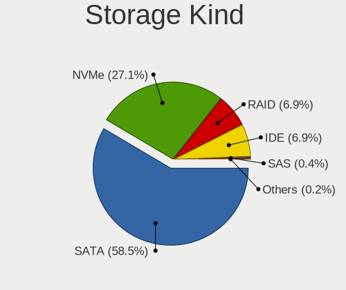

| Kind | Computers | Percent |
|------|-----------|---------|
| SATA | 1010      | 59.1%   |
| NVMe | 453       | 26.51%  |
| IDE  | 121       | 7.08%   |
| RAID | 115       | 6.73%   |
| SAS  | 7         | 0.41%   |
| SCSI | 3         | 0.18%   |

Processor
---------

CPU Vendor
----------

Processor vendors

| Vendor | Computers | Percent |
|--------|-----------|---------|
| Intel  | 958       | 73.41%  |
| AMD    | 347       | 26.59%  |

CPU Model
---------

Processor models

| Model                                         | Computers | Percent |
|-----------------------------------------------|-----------|---------|
| Intel Core i5-8250U CPU @ 1.60GHz             | 24        | 1.84%   |
| AMD Ryzen 7 3700X 8-Core Processor            | 21        | 1.61%   |
| Intel Core i7-9750H CPU @ 2.60GHz             | 20        | 1.53%   |
| Intel Core i7-8565U CPU @ 1.80GHz             | 20        | 1.53%   |
| Intel Core i7-10510U CPU @ 1.80GHz            | 20        | 1.53%   |
| Intel Core i5-8265U CPU @ 1.60GHz             | 18        | 1.38%   |
| AMD Ryzen 9 3900X 12-Core Processor           | 18        | 1.38%   |
| AMD Ryzen 5 3600 6-Core Processor             | 18        | 1.38%   |
| AMD Ryzen 5 3500U with Radeon Vega Mobile Gfx | 18        | 1.38%   |
| Intel Core i5-7200U CPU @ 2.50GHz             | 17        | 1.3%    |
| Intel Core i7-8750H CPU @ 2.20GHz             | 14        | 1.07%   |
| Intel Core i7-7700HQ CPU @ 2.80GHz            | 14        | 1.07%   |
| Intel Core i5-3320M CPU @ 2.60GHz             | 14        | 1.07%   |
| Intel Core i7-8550U CPU @ 1.80GHz             | 12        | 0.92%   |
| Intel Core i7-6700K CPU @ 4.00GHz             | 12        | 0.92%   |
| Intel 11th Gen Core i7-1165G7 @ 2.80GHz       | 12        | 0.92%   |
| Intel Core i7-10750H CPU @ 2.60GHz            | 11        | 0.84%   |
| Intel Core i5-10210U CPU @ 1.60GHz            | 11        | 0.84%   |
| AMD Ryzen 5 2600 Six-Core Processor           | 11        | 0.84%   |
| Intel Core i5-6200U CPU @ 2.30GHz             | 10        | 0.77%   |
| Intel Core i5-4200U CPU @ 1.60GHz             | 9         | 0.69%   |
| Intel Core 2 Duo CPU E8400 @ 3.00GHz          | 9         | 0.69%   |
| AMD Ryzen 7 4800H with Radeon Graphics        | 9         | 0.69%   |
| AMD FX-8350 Eight-Core Processor              | 9         | 0.69%   |
| Intel Core i7-7500U CPU @ 2.70GHz             | 8         | 0.61%   |
| Intel Core i7-6700HQ CPU @ 2.60GHz            | 8         | 0.61%   |
| Intel Core i7-4790 CPU @ 3.60GHz              | 8         | 0.61%   |
| Intel Core i7-1065G7 CPU @ 1.30GHz            | 8         | 0.61%   |
| Intel Core i5-5200U CPU @ 2.20GHz             | 8         | 0.61%   |
| Intel Atom x5-Z8350 CPU @ 1.44GHz             | 8         | 0.61%   |
| Intel Core i7-6500U CPU @ 2.50GHz             | 7         | 0.54%   |
| Intel Core i7-2670QM CPU @ 2.20GHz            | 7         | 0.54%   |
| Intel Core i5-3470 CPU @ 3.20GHz              | 7         | 0.54%   |
| Intel Core i5-2450M CPU @ 2.50GHz             | 7         | 0.54%   |
| Intel Core i5-1035G1 CPU @ 1.00GHz            | 7         | 0.54%   |
| AMD Ryzen 7 2700X Eight-Core Processor        | 7         | 0.54%   |
| AMD Ryzen 5 4500U with Radeon Graphics        | 7         | 0.54%   |
| AMD Ryzen 5 1600 Six-Core Processor           | 7         | 0.54%   |
| Intel Core i9-9900K CPU @ 3.60GHz             | 6         | 0.46%   |
| Intel Core i7-8700 CPU @ 3.20GHz              | 6         | 0.46%   |
| Intel Core i7-4770 CPU @ 3.40GHz              | 6         | 0.46%   |
| Intel Core i7-4700MQ CPU @ 2.40GHz            | 6         | 0.46%   |
| Intel Core i7-4600U CPU @ 2.10GHz             | 6         | 0.46%   |
| Intel Core i7-3770 CPU @ 3.40GHz              | 6         | 0.46%   |
| Intel Core i5-4300U CPU @ 1.90GHz             | 6         | 0.46%   |
| Intel Core i5-4210U CPU @ 1.70GHz             | 6         | 0.46%   |
| Intel Core i5-3230M CPU @ 2.60GHz             | 6         | 0.46%   |
| Intel Core i5-2410M CPU @ 2.30GHz             | 6         | 0.46%   |
| Intel Core i5-2400 CPU @ 3.10GHz              | 6         | 0.46%   |
| Intel Core i3-3110M CPU @ 2.40GHz             | 6         | 0.46%   |
| AMD Ryzen 7 3800X 8-Core Processor            | 6         | 0.46%   |
| AMD Ryzen 7 3700U with Radeon Vega Mobile Gfx | 6         | 0.46%   |
| AMD Ryzen 7 2700 Eight-Core Processor         | 6         | 0.46%   |
| AMD Ryzen 5 3400G with Radeon Vega Graphics   | 6         | 0.46%   |
| Intel Core i7-9850H CPU @ 2.60GHz             | 5         | 0.38%   |
| Intel Core i7-7700K CPU @ 4.20GHz             | 5         | 0.38%   |
| Intel Core i7-5500U CPU @ 2.40GHz             | 5         | 0.38%   |
| Intel Core i7-2600 CPU @ 3.40GHz              | 5         | 0.38%   |
| Intel Core i5-9400F CPU @ 2.90GHz             | 5         | 0.38%   |
| Intel Core i5-8350U CPU @ 1.70GHz             | 5         | 0.38%   |

CPU Model Family
----------------

Processor model prefix

| Model                   | Computers | Percent |
|-------------------------|-----------|---------|
| Intel Core i5           | 336       | 25.71%  |
| Intel Core i7           | 331       | 25.33%  |
| AMD Ryzen 5             | 97        | 7.42%   |
| Intel Core i3           | 79        | 6.04%   |
| AMD Ryzen 7             | 68        | 5.2%    |
| Intel Celeron           | 38        | 2.91%   |
| Other                   | 37        | 2.83%   |
| Intel Xeon              | 33        | 2.52%   |
| Intel Core 2 Duo        | 27        | 2.07%   |
| AMD Ryzen 9             | 24        | 1.84%   |
| AMD FX                  | 23        | 1.76%   |
| Intel Pentium           | 19        | 1.45%   |
| AMD Ryzen 3             | 19        | 1.45%   |
| AMD A10                 | 16        | 1.22%   |
| Intel Atom              | 13        | 0.99%   |
| Intel Pentium Dual-Core | 11        | 0.84%   |
| Intel Core i9           | 11        | 0.84%   |
| AMD Phenom II X4        | 10        | 0.77%   |
| AMD A8                  | 10        | 0.77%   |
| Intel Core 2 Quad       | 8         | 0.61%   |
| AMD Ryzen 7 PRO         | 8         | 0.61%   |
| AMD A6                  | 8         | 0.61%   |
| Intel Pentium Silver    | 7         | 0.54%   |
| AMD Athlon II X4        | 6         | 0.46%   |
| AMD E2                  | 5         | 0.38%   |
| AMD Athlon              | 5         | 0.38%   |
| AMD Ryzen Threadripper  | 4         | 0.31%   |
| AMD E1                  | 4         | 0.31%   |
| AMD Athlon 64 X2        | 4         | 0.31%   |
| AMD A4                  | 4         | 0.31%   |
| AMD Sempron             | 3         | 0.23%   |
| AMD Phenom II X2        | 3         | 0.23%   |
| AMD A12                 | 3         | 0.23%   |
| Intel Pentium Dual      | 2         | 0.15%   |
| Intel Pentium D         | 2         | 0.15%   |
| Intel Celeron Dual-Core | 2         | 0.15%   |
| AMD Phenom II X6        | 2         | 0.15%   |
| AMD Phenom              | 2         | 0.15%   |
| AMD C-50                | 2         | 0.15%   |
| AMD Athlon II X2        | 2         | 0.15%   |
| AMD Athlon 64           | 2         | 0.15%   |
| Intel Xeon Gold         | 1         | 0.08%   |
| Intel Xeon Bronze       | 1         | 0.08%   |
| Intel Pentium 4         | 1         | 0.08%   |
| Intel Genuine           | 1         | 0.08%   |
| Intel Core m3           | 1         | 0.08%   |
| Intel Core 2            | 1         | 0.08%   |
| AMD Ryzen Embedded      | 1         | 0.08%   |
| AMD QC                  | 1         | 0.08%   |
| AMD Opteron             | 1         | 0.08%   |
| AMD GX                  | 1         | 0.08%   |
| AMD G                   | 1         | 0.08%   |
| AMD E                   | 1         | 0.08%   |
| AMD Dual Core Opteron   | 1         | 0.08%   |
| AMD C-60                | 1         | 0.08%   |
| AMD Athlon X4           | 1         | 0.08%   |
| AMD Athlon X2           | 1         | 0.08%   |
| AMD Athlon II           | 1         | 0.08%   |

CPU Cores
---------

Number of processor cores

| Number | Computers | Percent |
|--------|-----------|---------|
| 4      | 557       | 42.65%  |
| 2      | 436       | 33.38%  |
| 6      | 162       | 12.4%   |
| 8      | 98        | 7.5%    |
| 12     | 26        | 1.99%   |
| 1      | 11        | 0.84%   |
| 16     | 8         | 0.61%   |
| 3      | 3         | 0.23%   |
| 24     | 2         | 0.15%   |
| 32     | 1         | 0.08%   |
| 20     | 1         | 0.08%   |
| 18     | 1         | 0.08%   |

CPU Sockets
-----------

Number of sockets

| Number | Computers | Percent |
|--------|-----------|---------|
| 1      | 1294      | 99.16%  |
| 2      | 10        | 0.77%   |
| 4      | 1         | 0.08%   |

CPU Threads
-----------

Threads per core (Hyper-Threading)

| Number | Computers | Percent |
|--------|-----------|---------|
| 2      | 971       | 74.35%  |
| 1      | 335       | 25.65%  |

CPU Op-Modes
------------

CPU Operation Modes (32-bit, 64-bit)

| Op mode        | Computers | Percent |
|----------------|-----------|---------|
| 32-bit, 64-bit | 1305      | 100%    |

CPU Microcode
-------------

Microcode number

| Number     | Computers | Percent |
|------------|-----------|---------|
| Unknown    | 150       | 11.29%  |
| 0x206a7    | 84        | 6.32%   |
| 0x306a9    | 81        | 6.09%   |
| 0x306c3    | 78        | 5.87%   |
| 0x806ec    | 55        | 4.14%   |
| 0x906ea    | 52        | 3.91%   |
| 0x08701021 | 43        | 3.24%   |
| 0x806ea    | 42        | 3.16%   |
| 0x40651    | 42        | 3.16%   |
| 0x906e9    | 40        | 3.01%   |
| 0x1067a    | 37        | 2.78%   |
| 0x806e9    | 36        | 2.71%   |
| 0x506e3    | 35        | 2.63%   |
| 0x0800820d | 29        | 2.18%   |
| 0x406e3    | 26        | 1.96%   |
| 0x08701013 | 24        | 1.81%   |
| 0x08108109 | 24        | 1.81%   |
| 0x08108102 | 24        | 1.81%   |
| 0x306d4    | 23        | 1.73%   |
| 0x806c1    | 20        | 1.5%    |
| 0x06000852 | 19        | 1.43%   |
| 0x806eb    | 18        | 1.35%   |
| 0x906ed    | 17        | 1.28%   |
| 0x706e5    | 17        | 1.28%   |
| 0xa0652    | 16        | 1.2%    |
| 0x706a1    | 15        | 1.13%   |
| 0x406c4    | 13        | 0.98%   |
| 0x08600106 | 13        | 0.98%   |
| 0x010000c8 | 12        | 0.9%    |
| 0x06001119 | 11        | 0.83%   |
| 0x0810100b | 9         | 0.68%   |
| 0x010000db | 9         | 0.68%   |
| 0x306f2    | 8         | 0.6%    |
| 0x20655    | 8         | 0.6%    |
| 0x106e5    | 8         | 0.6%    |
| 0x0700010f | 8         | 0.6%    |
| 0x20652    | 7         | 0.53%   |
| 0x106a5    | 7         | 0.53%   |
| 0x10676    | 7         | 0.53%   |
| 0xa0653    | 6         | 0.45%   |
| 0x07030105 | 6         | 0.45%   |
| 0x06003106 | 6         | 0.45%   |
| 0x03000027 | 6         | 0.45%   |
| 0xa0655    | 5         | 0.38%   |
| 0x906ec    | 5         | 0.38%   |
| 0x6fb      | 5         | 0.38%   |
| 0x506c9    | 5         | 0.38%   |
| 0x30678    | 5         | 0.38%   |
| 0x08001137 | 5         | 0.38%   |
| 0x06006705 | 5         | 0.38%   |
| 0x06006118 | 5         | 0.38%   |
| 0x806d1    | 4         | 0.3%    |
| 0x706a8    | 4         | 0.3%    |
| 0x406c3    | 4         | 0.3%    |
| 0x306e4    | 4         | 0.3%    |
| 0x206d7    | 4         | 0.3%    |
| 0x08600104 | 4         | 0.3%    |
| 0x08001138 | 4         | 0.3%    |
| 0x0600611a | 4         | 0.3%    |
| 0xa0671    | 3         | 0.23%   |

CPU Microarch
-------------

Microarchitecture

| Name            | Computers | Percent |
|-----------------|-----------|---------|
| KabyLake        | 303       | 23.18%  |
| Haswell         | 141       | 10.79%  |
| Zen 2           | 99        | 7.57%   |
| SandyBridge     | 95        | 7.27%   |
| IvyBridge       | 90        | 6.89%   |
| Zen+            | 84        | 6.43%   |
| Skylake         | 69        | 5.28%   |
| Penryn          | 47        | 3.6%    |
| Piledriver      | 35        | 2.68%   |
| CometLake       | 34        | 2.6%    |
| Zen             | 28        | 2.14%   |
| K10             | 28        | 2.14%   |
| TigerLake       | 25        | 1.91%   |
| IceLake         | 25        | 1.91%   |
| Broadwell       | 25        | 1.91%   |
| Silvermont      | 22        | 1.68%   |
| Westmere        | 21        | 1.61%   |
| Goldmont plus   | 20        | 1.53%   |
| Nehalem         | 17        | 1.3%    |
| Excavator       | 15        | 1.15%   |
| Zen 3           | 12        | 0.92%   |
| Core            | 10        | 0.77%   |
| Jaguar          | 9         | 0.69%   |
| Steamroller     | 8         | 0.61%   |
| K8 Hammer       | 8         | 0.61%   |
| Puma            | 7         | 0.54%   |
| K10 Llano       | 6         | 0.46%   |
| Goldmont        | 6         | 0.46%   |
| Bobcat          | 6         | 0.46%   |
| NetBurst        | 3         | 0.23%   |
| Bonnell         | 3         | 0.23%   |
| Unknown         | 3         | 0.23%   |
| Tremont         | 1         | 0.08%   |
| K8 & K10 hybrid | 1         | 0.08%   |
| Bulldozer       | 1         | 0.08%   |

Graphics
--------

GPU Vendor
----------

Vendors of graphics cards

| Vendor                           | Computers | Percent |
|----------------------------------|-----------|---------|
| Intel                            | 735       | 46.52%  |
| Nvidia                           | 492       | 31.14%  |
| AMD                              | 347       | 21.96%  |
| ASPEED Technology                | 3         | 0.19%   |
| Silicon Integrated Systems [SiS] | 1         | 0.06%   |
| Matrox Electronics Systems       | 1         | 0.06%   |
| ATI Technologies                 | 1         | 0.06%   |

GPU Model
---------

Graphics card models

| Model                                                                                    | Computers | Percent |
|------------------------------------------------------------------------------------------|-----------|---------|
| Intel 2nd Generation Core Processor Family Integrated Graphics Controller                | 65        | 4.02%   |
| Intel CoffeeLake-H GT2 [UHD Graphics 630]                                                | 54        | 3.34%   |
| AMD Picasso/Raven 2 [Radeon Vega Series / Radeon Vega Mobile Series]                     | 48        | 2.97%   |
| Intel 3rd Gen Core processor Graphics Controller                                         | 47        | 2.91%   |
| Intel WhiskeyLake-U GT2 [UHD Graphics 620]                                               | 45        | 2.79%   |
| Intel UHD Graphics 620                                                                   | 45        | 2.79%   |
| Intel Haswell-ULT Integrated Graphics Controller                                         | 44        | 2.72%   |
| Intel HD Graphics 620                                                                    | 36        | 2.23%   |
| Intel CometLake-U GT2 [UHD Graphics]                                                     | 34        | 2.11%   |
| AMD Ellesmere [Radeon RX 470/480/570/570X/580/580X/590]                                  | 33        | 2.04%   |
| Intel Skylake GT2 [HD Graphics 520]                                                      | 27        | 1.67%   |
| Intel 4th Gen Core Processor Integrated Graphics Controller                              | 27        | 1.67%   |
| AMD Renoir                                                                               | 27        | 1.67%   |
| Intel HD Graphics 630                                                                    | 26        | 1.61%   |
| Intel Xeon E3-1200 v3/4th Gen Core Processor Integrated Graphics Controller              | 25        | 1.55%   |
| Intel TigerLake-LP GT2 [Iris Xe Graphics]                                                | 24        | 1.49%   |
| Intel HD Graphics 5500                                                                   | 22        | 1.36%   |
| Intel HD Graphics 530                                                                    | 20        | 1.24%   |
| Nvidia GP107M [GeForce GTX 1050 Mobile]                                                  | 19        | 1.18%   |
| Nvidia GP107 [GeForce GTX 1050 Ti]                                                       | 19        | 1.18%   |
| Nvidia TU117M [GeForce GTX 1650 Mobile / Max-Q]                                          | 18        | 1.11%   |
| Intel CometLake-H GT2 [UHD Graphics]                                                     | 17        | 1.05%   |
| Intel CoffeeLake-S GT2 [UHD Graphics 630]                                                | 17        | 1.05%   |
| Intel Atom/Celeron/Pentium Processor x5-E8000/J3xxx/N3xxx Integrated Graphics Controller | 17        | 1.05%   |
| Nvidia GK208B [GeForce GT 710]                                                           | 16        | 0.99%   |
| Nvidia GP106 [GeForce GTX 1060 6GB]                                                      | 14        | 0.87%   |
| Intel GeminiLake [UHD Graphics 600]                                                      | 14        | 0.87%   |
| Intel Xeon E3-1200 v2/3rd Gen Core processor Graphics Controller                         | 12        | 0.74%   |
| Intel Mobile 4 Series Chipset Integrated Graphics Controller                             | 12        | 0.74%   |
| Intel Core Processor Integrated Graphics Controller                                      | 12        | 0.74%   |
| AMD Raven Ridge [Radeon Vega Series / Radeon Vega Mobile Series]                         | 12        | 0.74%   |
| AMD Navi 10 [Radeon RX 5600 OEM/5600 XT / 5700/5700 XT]                                  | 11        | 0.68%   |
| Intel Iris Plus Graphics G1 (Ice Lake)                                                   | 10        | 0.62%   |
| Nvidia GP108M [GeForce MX150]                                                            | 9         | 0.56%   |
| Nvidia GP108 [GeForce GT 1030]                                                           | 9         | 0.56%   |
| Nvidia GP107M [GeForce GTX 1050 Ti Mobile]                                               | 9         | 0.56%   |
| Nvidia GM204 [GeForce GTX 970]                                                           | 9         | 0.56%   |
| AMD Vega 10 XL/XT [Radeon RX Vega 56/64]                                                 | 9         | 0.56%   |
| AMD Topaz XT [Radeon R7 M260/M265 / M340/M360 / M440/M445 / 530/535 / 620/625 Mobile]    | 9         | 0.56%   |
| AMD Lexa PRO [Radeon 540/540X/550/550X / RX 540X/550/550X]                               | 9         | 0.56%   |
| Nvidia TU117M [GeForce GTX 1650 Ti Mobile]                                               | 8         | 0.5%    |
| Nvidia GT218 [GeForce 210]                                                               | 8         | 0.5%    |
| Nvidia GP108M [GeForce MX250]                                                            | 8         | 0.5%    |
| Nvidia GP106M [GeForce GTX 1060 Mobile]                                                  | 8         | 0.5%    |
| Nvidia GP104 [GeForce GTX 1080]                                                          | 8         | 0.5%    |
| Nvidia GM206 [GeForce GTX 960]                                                           | 8         | 0.5%    |
| Nvidia GM108M [GeForce 840M]                                                             | 8         | 0.5%    |
| Intel Iris Plus Graphics G7                                                              | 8         | 0.5%    |
| Intel CometLake-S GT2 [UHD Graphics 630]                                                 | 8         | 0.5%    |
| Nvidia TU116M [GeForce GTX 1660 Ti Mobile]                                               | 7         | 0.43%   |
| Nvidia TU116 [GeForce GTX 1660 SUPER]                                                    | 7         | 0.43%   |
| Nvidia GP104 [GeForce GTX 1070]                                                          | 7         | 0.43%   |
| Nvidia GM108M [GeForce MX130]                                                            | 7         | 0.43%   |
| Nvidia GM108M [GeForce 940MX]                                                            | 7         | 0.43%   |
| Intel 4 Series Chipset Integrated Graphics Controller                                    | 7         | 0.43%   |
| AMD Wani [Radeon R5/R6/R7 Graphics]                                                      | 7         | 0.43%   |
| AMD Sun XT [Radeon HD 8670A/8670M/8690M / R5 M330 / M430 / Radeon 520 Mobile]            | 7         | 0.43%   |
| Nvidia TU106M [GeForce RTX 2060 Mobile]                                                  | 6         | 0.37%   |
| Nvidia GP106 [GeForce GTX 1060 3GB]                                                      | 6         | 0.37%   |
| Nvidia GP102 [GeForce GTX 1080 Ti]                                                       | 6         | 0.37%   |

GPU Combo
---------

Combinations of graphics cards

| Name            | Computers | Percent |
|-----------------|-----------|---------|
| 1 x Intel       | 485       | 36.97%  |
| 1 x AMD         | 271       | 20.66%  |
| 1 x Nvidia      | 262       | 19.97%  |
| Intel + Nvidia  | 203       | 15.47%  |
| Intel + AMD     | 38        | 2.9%    |
| 2 x AMD         | 23        | 1.75%   |
| AMD + Nvidia    | 18        | 1.37%   |
| 2 x Nvidia      | 7         | 0.53%   |
| 1 x ASPEED      | 2         | 0.15%   |
| 1 x SiS         | 1         | 0.08%   |
| Nvidia + ASPEED | 1         | 0.08%   |
| 1 x Matrox      | 1         | 0.08%   |

GPU Driver
----------

Free vs proprietary

| Driver      | Computers | Percent |
|-------------|-----------|---------|
| Free        | 928       | 70.2%   |
| Proprietary | 367       | 27.76%  |
| Unknown     | 27        | 2.04%   |

GPU Memory
----------

Total video memory

| Size in GB | Computers | Percent |
|------------|-----------|---------|
| Unknown    | 634       | 47.85%  |
| 1.01-2.0   | 195       | 14.72%  |
| 3.01-4.0   | 116       | 8.75%   |
| 0.51-1.0   | 109       | 8.23%   |
| 0.01-0.5   | 109       | 8.23%   |
| 7.01-8.0   | 82        | 6.19%   |
| 5.01-6.0   | 48        | 3.62%   |
| 2.01-3.0   | 17        | 1.28%   |
| 8.01-16.0  | 13        | 0.98%   |
| 32.01-64.0 | 1         | 0.08%   |
| 4.01-5.0   | 1         | 0.08%   |

Monitor
-------

Monitor Vendor
--------------

Monitor vendors

| Vendor                  | Computers | Percent |
|-------------------------|-----------|---------|
| Samsung Electronics     | 195       | 12.59%  |
| AU Optronics            | 161       | 10.39%  |
| LG Display              | 138       | 8.91%   |
| Chimei Innolux          | 122       | 7.88%   |
| BOE                     | 118       | 7.62%   |
| Dell                    | 115       | 7.42%   |
| Goldstar                | 96        | 6.2%    |
| Acer                    | 71        | 4.58%   |
| Hewlett-Packard         | 53        | 3.42%   |
| Ancor Communications    | 45        | 2.91%   |
| BenQ                    | 44        | 2.84%   |
| AOC                     | 40        | 2.58%   |
| Sharp                   | 37        | 2.39%   |
| Philips                 | 34        | 2.19%   |
| ViewSonic               | 27        | 1.74%   |
| PANDA                   | 21        | 1.36%   |
| Lenovo                  | 18        | 1.16%   |
| Iiyama                  | 17        | 1.1%    |
| LG Electronics          | 16        | 1.03%   |
| Chi Mei Optoelectronics | 14        | 0.9%    |
| Unknown                 | 12        | 0.77%   |
| ASUSTek Computer        | 12        | 0.77%   |
| Sony                    | 9         | 0.58%   |
| Apple                   | 7         | 0.45%   |
| Panasonic               | 6         | 0.39%   |
| InfoVision              | 6         | 0.39%   |
| NEC Computers           | 5         | 0.32%   |
| Medion                  | 5         | 0.32%   |
| HannStar                | 4         | 0.26%   |
| Gateway                 | 4         | 0.26%   |
| Vizio                   | 3         | 0.19%   |
| Viotek                  | 3         | 0.19%   |
| LG Philips              | 3         | 0.19%   |
| HPN                     | 3         | 0.19%   |
| Eizo                    | 3         | 0.19%   |
| DENON                   | 3         | 0.19%   |
| Unknown (XXX)           | 2         | 0.13%   |
| Seiko/Epson             | 2         | 0.13%   |
| Sceptre Tech            | 2         | 0.13%   |
| Sceptre                 | 2         | 0.13%   |
| ONN                     | 2         | 0.13%   |
| Onkyo                   | 2         | 0.13%   |
| NCS                     | 2         | 0.13%   |
| MSI                     | 2         | 0.13%   |
| MiTAC                   | 2         | 0.13%   |
| Idek Iiyama             | 2         | 0.13%   |
| Fujitsu Siemens         | 2         | 0.13%   |
| Envision                | 2         | 0.13%   |
| CPT                     | 2         | 0.13%   |
| AVX                     | 2         | 0.13%   |
| AUS                     | 2         | 0.13%   |
| Yamaha                  | 1         | 0.06%   |
| Xiaomi                  | 1         | 0.06%   |
| VST                     | 1         | 0.06%   |
| VMO                     | 1         | 0.06%   |
| Vestel Elektronik       | 1         | 0.06%   |
| Valve                   | 1         | 0.06%   |
| UTV                     | 1         | 0.06%   |
| TXD                     | 1         | 0.06%   |
| Toshiba                 | 1         | 0.06%   |

Monitor Model
-------------

Monitor models

| Model                                                                   | Computers | Percent |
|-------------------------------------------------------------------------|-----------|---------|
| Goldstar ULTRAWIDE GSM59F1 2560x1080 673x284mm 28.8-inch                | 8         | 0.49%   |
| AU Optronics LCD Monitor AUO21ED 1920x1080 344x193mm 15.5-inch          | 8         | 0.49%   |
| LG Display LCD Monitor LGD02DC 1366x768 344x194mm 15.5-inch             | 7         | 0.43%   |
| Dell U2412M DELA07A 1920x1200 518x324mm 24.1-inch                       | 7         | 0.43%   |
| Chimei Innolux LCD Monitor CMN15F5 1920x1080 344x193mm 15.5-inch        | 7         | 0.43%   |
| Chimei Innolux LCD Monitor CMN15E8 1920x1080 340x190mm 15.3-inch        | 7         | 0.43%   |
| BOE LCD Monitor BOE0812 1920x1080 344x194mm 15.5-inch                   | 7         | 0.43%   |
| Samsung Electronics LCD Monitor SEC5441 1366x768 344x194mm 15.5-inch    | 6         | 0.37%   |
| Chimei Innolux LCD Monitor CMN15E7 1920x1080 344x193mm 15.5-inch        | 6         | 0.37%   |
| BOE LCD Monitor BOE06CB 1920x1080 344x194mm 15.5-inch                   | 6         | 0.37%   |
| Samsung Electronics S24F350 SAM0D20 1920x1080 521x293mm 23.5-inch       | 5         | 0.31%   |
| PANDA LCD Monitor NCP0036 1920x1080 344x194mm 15.5-inch                 | 5         | 0.31%   |
| LG Display LCD Monitor LGD0563 1920x1080 344x194mm 15.5-inch            | 5         | 0.31%   |
| Goldstar IPS FULLHD GSM5AB8 1920x1080 480x270mm 21.7-inch               | 5         | 0.31%   |
| Chimei Innolux LCD Monitor CMN14C9 1920x1080 309x173mm 13.9-inch        | 5         | 0.31%   |
| AU Optronics LCD Monitor AUO38ED 1920x1080 344x193mm 15.5-inch          | 5         | 0.31%   |
| AU Optronics LCD Monitor AUO2E3C 1366x768 309x173mm 13.9-inch           | 5         | 0.31%   |
| AU Optronics LCD Monitor AUO123D 1920x1080 309x173mm 13.9-inch          | 5         | 0.31%   |
| Sharp LCD Monitor SHP14D1 1920x1200 336x210mm 15.6-inch                 | 4         | 0.25%   |
| Samsung Electronics U28E590 SAM0C4D 3840x2160 607x345mm 27.5-inch       | 4         | 0.25%   |
| Samsung Electronics LCD Monitor SAM0C39 1920x1080 885x498mm 40.0-inch   | 4         | 0.25%   |
| Samsung Electronics Color LCD SDCA029 2160x1440 252x168mm 11.9-inch     | 4         | 0.25%   |
| PANDA LCD Monitor NCP004D 1920x1080 344x194mm 15.5-inch                 | 4         | 0.25%   |
| LG Display LCD Monitor LGD046F 1920x1080 344x194mm 15.5-inch            | 4         | 0.25%   |
| Goldstar HDR WFHD GSM7714 2560x1080 798x334mm 34.1-inch                 | 4         | 0.25%   |
| Goldstar HDR 4K GSM7706 3840x2160 600x340mm 27.2-inch                   | 4         | 0.25%   |
| Goldstar FULL HD GSM5B55 1920x1080 480x270mm 21.7-inch                  | 4         | 0.25%   |
| Dell U2412M DELA079 1920x1200 518x324mm 24.1-inch                       | 4         | 0.25%   |
| Chimei Innolux P130ZFA-BA1 CMN8201 2160x1440 275x183mm 13.0-inch        | 4         | 0.25%   |
| Chimei Innolux LCD Monitor CMN15DB 1366x768 344x193mm 15.5-inch         | 4         | 0.25%   |
| Chimei Innolux LCD Monitor CMN14F2 1920x1080 309x173mm 13.9-inch        | 4         | 0.25%   |
| BOE LCD Monitor BOE0852 1920x1080 344x194mm 15.5-inch                   | 4         | 0.25%   |
| BOE LCD Monitor BOE0747 1920x1080 344x194mm 15.5-inch                   | 4         | 0.25%   |
| BenQ GL2460 BNQ78CE 1920x1080 531x299mm 24.0-inch                       | 4         | 0.25%   |
| AU Optronics LCD Monitor AUO71EC 1366x768 344x193mm 15.5-inch           | 4         | 0.25%   |
| AU Optronics LCD Monitor AUO403D 1920x1080 309x174mm 14.0-inch          | 4         | 0.25%   |
| AU Optronics LCD Monitor AUO23ED 1920x1080 344x193mm 15.5-inch          | 4         | 0.25%   |
| Unknown LCD Monitor SAMSUNG 1920x1080                                   | 3         | 0.18%   |
| Sharp LCD Monitor SHP1453 1920x1080 346x194mm 15.6-inch                 | 3         | 0.18%   |
| Samsung Electronics S34J55x SAM0F71 3440x1440 797x333mm 34.0-inch       | 3         | 0.18%   |
| Samsung Electronics S22F350 SAM0D1A 1920x1080 477x268mm 21.5-inch       | 3         | 0.18%   |
| Samsung Electronics LCD Monitor SDC4852 1366x768 344x194mm 15.5-inch    | 3         | 0.18%   |
| Samsung Electronics LCD Monitor SDC4651 1366x768 344x194mm 15.5-inch    | 3         | 0.18%   |
| Samsung Electronics LCD Monitor SAM0FEE 3840x2160 1872x1053mm 84.6-inch | 3         | 0.18%   |
| Samsung Electronics C24F390 SAM0D2C 1920x1080 521x293mm 23.5-inch       | 3         | 0.18%   |
| LG Display LCD Monitor LGD05E5 1920x1080 340x190mm 15.3-inch            | 3         | 0.18%   |
| LG Display LCD Monitor LGD053F 1920x1080 344x194mm 15.5-inch            | 3         | 0.18%   |
| LG Display LCD Monitor LGD0468 1366x768 344x194mm 15.5-inch             | 3         | 0.18%   |
| LG Display LCD Monitor LGD0456 1366x768 344x194mm 15.5-inch             | 3         | 0.18%   |
| LG Display LCD Monitor LGD032C 1920x1080 344x194mm 15.5-inch            | 3         | 0.18%   |
| LG Display LCD Monitor LGD02D8 1366x768 277x156mm 12.5-inch             | 3         | 0.18%   |
| Hewlett-Packard L1740 HWP2649 1280x1024 338x270mm 17.0-inch             | 3         | 0.18%   |
| Hewlett-Packard 24es HWP3320 1920x1080 527x296mm 23.8-inch              | 3         | 0.18%   |
| Goldstar Ultra HD GSM5B09 3840x2160 600x340mm 27.2-inch                 | 3         | 0.18%   |
| Goldstar IPS FULLHD GSM5AB6 1920x1080 480x270mm 21.7-inch               | 3         | 0.18%   |
| Goldstar HDR 4K GSM7707 3840x2160 600x340mm 27.2-inch                   | 3         | 0.18%   |
| Goldstar 2D HD TV GSM59CA 1366x768 509x286mm 23.0-inch                  | 3         | 0.18%   |
| Dell UP2716D DEL40DD 2560x1440 597x336mm 27.0-inch                      | 3         | 0.18%   |
| Dell SE2416H DELD082 1920x1080 527x296mm 23.8-inch                      | 3         | 0.18%   |
| Chimei Innolux LCD Monitor CMN15D7 1920x1080 344x193mm 15.5-inch        | 3         | 0.18%   |

Monitor Resolution
------------------

Monitor screen resolution

| Resolution         | Computers | Percent |
|--------------------|-----------|---------|
| 1920x1080 (FHD)    | 713       | 48.84%  |
| 1366x768 (WXGA)    | 216       | 14.79%  |
| 3840x2160 (4K)     | 102       | 6.99%   |
| 2560x1440 (QHD)    | 74        | 5.07%   |
| 1600x900 (HD+)     | 50        | 3.42%   |
| 1280x1024 (SXGA)   | 42        | 2.88%   |
| 1920x1200 (WUXGA)  | 40        | 2.74%   |
| 1680x1050 (WSXGA+) | 35        | 2.4%    |
| Unknown            | 29        | 1.99%   |
| 1440x900 (WXGA+)   | 21        | 1.44%   |
| 2560x1080          | 20        | 1.37%   |
| 3440x1440          | 15        | 1.03%   |
| 1280x800 (WXGA)    | 11        | 0.75%   |
| 3840x1080          | 9         | 0.62%   |
| 1360x768           | 9         | 0.62%   |
| 3840x2400          | 6         | 0.41%   |
| 2560x1600          | 6         | 0.41%   |
| 1920x540           | 5         | 0.34%   |
| 1600x1200          | 5         | 0.34%   |
| 1024x768 (XGA)     | 5         | 0.34%   |
| 2160x1440          | 4         | 0.27%   |
| 5760x1080          | 3         | 0.21%   |
| 4480x1440          | 3         | 0.21%   |
| 3600x1080          | 3         | 0.21%   |
| 3200x1800 (QHD+)   | 3         | 0.21%   |
| 1920x1280          | 3         | 0.21%   |
| 3840x1600          | 2         | 0.14%   |
| 3456x2160          | 2         | 0.14%   |
| 3200x1080          | 2         | 0.14%   |
| 2880x1800          | 2         | 0.14%   |
| 7680x2160          | 1         | 0.07%   |
| 6400x2160          | 1         | 0.07%   |
| 4480x1600          | 1         | 0.07%   |
| 4480x1080          | 1         | 0.07%   |
| 3840x1920          | 1         | 0.07%   |
| 3840x1200          | 1         | 0.07%   |
| 3600x1200          | 1         | 0.07%   |
| 3360x1080          | 1         | 0.07%   |
| 3000x1920          | 1         | 0.07%   |
| 2880x1440          | 1         | 0.07%   |
| 2736x1824          | 1         | 0.07%   |
| 2560x1700          | 1         | 0.07%   |
| 2400x1600          | 1         | 0.07%   |
| 2048x1152          | 1         | 0.07%   |
| 1921x1080          | 1         | 0.07%   |
| 1680x945           | 1         | 0.07%   |
| 1400x1050          | 1         | 0.07%   |
| 1280x960           | 1         | 0.07%   |
| 1280x720 (HD)      | 1         | 0.07%   |
| 1024x600           | 1         | 0.07%   |

Monitor Diagonal
----------------

Diagonal size in inches

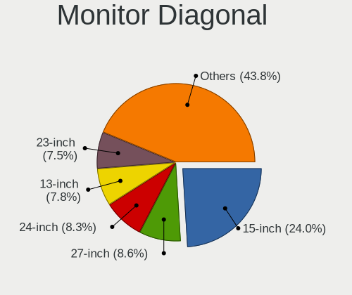

| Inches  | Computers | Percent |
|---------|-----------|---------|
| 15      | 381       | 24.61%  |
| 27      | 135       | 8.72%   |
| 13      | 126       | 8.14%   |
| 24      | 124       | 8.01%   |
| 23      | 120       | 7.75%   |
| Unknown | 108       | 6.98%   |
| 21      | 96        | 6.2%    |
| 14      | 90        | 5.81%   |
| 17      | 85        | 5.49%   |
| 19      | 39        | 2.52%   |
| 31      | 33        | 2.13%   |
| 34      | 30        | 1.94%   |
| 22      | 26        | 1.68%   |
| 20      | 26        | 1.68%   |
| 12      | 25        | 1.61%   |
| 18      | 16        | 1.03%   |
| 11      | 12        | 0.78%   |
| 25      | 11        | 0.71%   |
| 84      | 9         | 0.58%   |
| 54      | 5         | 0.32%   |
| 32      | 5         | 0.32%   |
| 16      | 5         | 0.32%   |
| 72      | 4         | 0.26%   |
| 47      | 4         | 0.26%   |
| 26      | 4         | 0.26%   |
| 43      | 3         | 0.19%   |
| 40      | 3         | 0.19%   |
| 37      | 3         | 0.19%   |
| 52      | 2         | 0.13%   |
| 46      | 2         | 0.13%   |
| 42      | 2         | 0.13%   |
| 28      | 2         | 0.13%   |
| 74      | 1         | 0.06%   |
| 65      | 1         | 0.06%   |
| 61      | 1         | 0.06%   |
| 57      | 1         | 0.06%   |
| 55      | 1         | 0.06%   |
| 48      | 1         | 0.06%   |
| 39      | 1         | 0.06%   |
| 30      | 1         | 0.06%   |
| 29      | 1         | 0.06%   |
| 10      | 1         | 0.06%   |
| 8       | 1         | 0.06%   |
| 3       | 1         | 0.06%   |

Monitor Width
-------------

Physical width

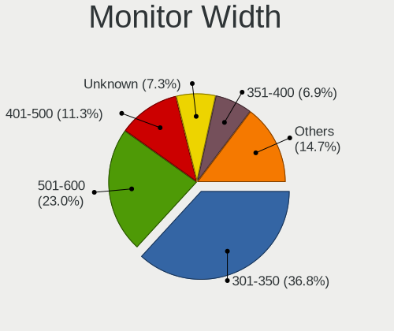

| Width in mm | Computers | Percent |
|-------------|-----------|---------|
| 301-350     | 557       | 37.16%  |
| 501-600     | 342       | 22.82%  |
| 401-500     | 169       | 11.27%  |
| Unknown     | 108       | 7.2%    |
| 351-400     | 101       | 6.74%   |
| 201-300     | 88        | 5.87%   |
| 601-700     | 53        | 3.54%   |
| 701-800     | 35        | 2.33%   |
| 1001-1500   | 18        | 1.2%    |
| 1501-2000   | 14        | 0.93%   |
| 801-900     | 7         | 0.47%   |
| 901-1000    | 5         | 0.33%   |
| 101-200     | 1         | 0.07%   |
| 1-100       | 1         | 0.07%   |

Aspect Ratio
------------

Proportional relationship between the width and the height

| Ratio   | Computers | Percent |
|---------|-----------|---------|
| 16/9    | 1030      | 75.62%  |
| 16/10   | 128       | 9.4%    |
| Unknown | 93        | 6.83%   |
| 5/4     | 43        | 3.16%   |
| 21/9    | 33        | 2.42%   |
| 4/3     | 13        | 0.95%   |
| 3/2     | 12        | 0.88%   |
| 32/9    | 6         | 0.44%   |
| 6/5     | 2         | 0.15%   |
| 1.96    | 1         | 0.07%   |
| 0.62    | 1         | 0.07%   |

Monitor Area
------------

Area in inch

| Area in inch | Computers | Percent |
|----------------|-----------|---------|
| 101-110        | 382       | 25.1%   |
| 201-250        | 276       | 18.13%  |
| 81-90          | 168       | 11.04%  |
| 301-350        | 137       | 9%      |
| Unknown        | 108       | 7.1%    |
| 151-200        | 88        | 5.78%   |
| 351-500        | 71        | 4.66%   |
| 121-130        | 60        | 3.94%   |
| 251-300        | 59        | 3.88%   |
| 71-80          | 54        | 3.55%   |
| 141-150        | 33        | 2.17%   |
| More than 1000 | 24        | 1.58%   |
| 61-70          | 19        | 1.25%   |
| 501-1000       | 19        | 1.25%   |
| 51-60          | 12        | 0.79%   |
| 131-140        | 5         | 0.33%   |
| 1-40           | 2         | 0.13%   |
| 111-120        | 2         | 0.13%   |
| 91-100         | 2         | 0.13%   |
| 41-50          | 1         | 0.07%   |

Pixel Density
-------------

Pixels per inch

| Density       | Computers | Percent |
|---------------|-----------|---------|
| 51-100        | 483       | 32.66%  |
| 121-160       | 414       | 27.99%  |
| 101-120       | 343       | 23.19%  |
| Unknown       | 108       | 7.3%    |
| 161-240       | 69        | 4.67%   |
| More than 240 | 40        | 2.7%    |
| 1-50          | 22        | 1.49%   |

Multiple Monitors
-----------------

Total monitors connected

| Total | Computers | Percent |
|-------|-----------|---------|
| 1     | 971       | 73.23%  |
| 2     | 289       | 21.79%  |
| 3     | 35        | 2.64%   |
| 0     | 29        | 2.19%   |
| 4     | 2         | 0.15%   |

Network
-------

Net Controller Vendor
---------------------

Controller vendors

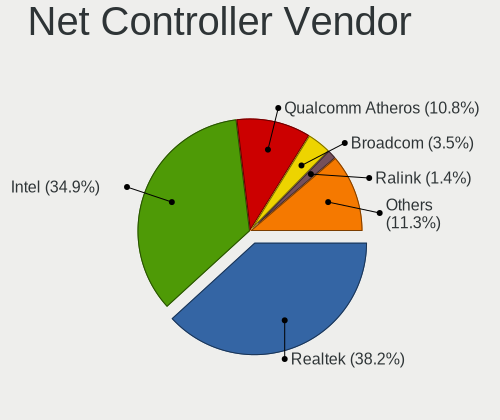

| Vendor                                | Computers | Percent |
|---------------------------------------|-----------|---------|
| Realtek Semiconductor                 | 748       | 38.26%  |
| Intel                                 | 681       | 34.83%  |
| Qualcomm Atheros                      | 217       | 11.1%   |
| Broadcom                              | 70        | 3.58%   |
| Ralink Technology                     | 28        | 1.43%   |
| TP-Link                               | 22        | 1.13%   |
| Ralink                                | 19        | 0.97%   |
| Nvidia                                | 16        | 0.82%   |
| Broadcom Limited                      | 12        | 0.61%   |
| Microsoft                             | 10        | 0.51%   |
| Marvell Technology Group              | 9         | 0.46%   |
| Xiaomi                                | 7         | 0.36%   |
| ASIX Electronics                      | 7         | 0.36%   |
| Aquantia                              | 7         | 0.36%   |
| Samsung Electronics                   | 6         | 0.31%   |
| MediaTek                              | 6         | 0.31%   |
| Dell                                  | 6         | 0.31%   |
| Qualcomm Atheros Communications       | 5         | 0.26%   |
| Qualcomm                              | 5         | 0.26%   |
| DisplayLink                           | 5         | 0.26%   |
| D-Link                                | 5         | 0.26%   |
| NetGear                               | 4         | 0.2%    |
| JMicron Technology                    | 4         | 0.2%    |
| D-Link System                         | 4         | 0.2%    |
| Sierra Wireless                       | 3         | 0.15%   |
| Lenovo                                | 3         | 0.15%   |
| Huawei Technologies                   | 3         | 0.15%   |
| Fibocom                               | 3         | 0.15%   |
| Apple                                 | 3         | 0.15%   |
| ZTE WCDMA Technologies MSM            | 2         | 0.1%    |
| T & A Mobile Phones                   | 2         | 0.1%    |
| STMicroelectronics                    | 2         | 0.1%    |
| Hewlett-Packard                       | 2         | 0.1%    |
| Ericsson Business Mobile Networks     | 2         | 0.1%    |
| Edimax Technology                     | 2         | 0.1%    |
| Belkin Components                     | 2         | 0.1%    |
| 802.11g Adapter [Linksys WUSB54GC v3] | 2         | 0.1%    |
| ZyDAS                                 | 1         | 0.05%   |
| Wilocity                              | 1         | 0.05%   |
| Wacom                                 | 1         | 0.05%   |
| VIA Technologies                      | 1         | 0.05%   |
| Silicon Integrated Systems [SiS]      | 1         | 0.05%   |
| Sigma Designs                         | 1         | 0.05%   |
| Seeed Technology                      | 1         | 0.05%   |
| Realtek                               | 1         | 0.05%   |
| QNAP System                           | 1         | 0.05%   |
| Motorola BCS                          | 1         | 0.05%   |
| Micro Star International              | 1         | 0.05%   |
| Mellanox Technologies                 | 1         | 0.05%   |
| Linksys                               | 1         | 0.05%   |
| HMD Global                            | 1         | 0.05%   |
| Gemtek                                | 1         | 0.05%   |
| Elecom                                | 1         | 0.05%   |
| Davicom Semiconductor                 | 1         | 0.05%   |
| Arduino SA                            | 1         | 0.05%   |
| AirTies Wireless Networks             | 1         | 0.05%   |
| Accton Technology                     | 1         | 0.05%   |
| 3Com                                  | 1         | 0.05%   |

Net Controller Model
--------------------

Controller models

| Model                                                             | Computers | Percent |
|-------------------------------------------------------------------|-----------|---------|
| Realtek RTL8111/8168/8411 PCI Express Gigabit Ethernet Controller | 540       | 23.44%  |
| Realtek RTL810xE PCI Express Fast Ethernet controller             | 86        | 3.73%   |
| Intel Wi-Fi 6 AX200                                               | 78        | 3.39%   |
| Intel I211 Gigabit Network Connection                             | 54        | 2.34%   |
| Intel Wireless 8265 / 8275                                        | 52        | 2.26%   |
| Intel 82579LM Gigabit Network Connection (Lewisville)             | 50        | 2.17%   |
| Realtek RTL8153 Gigabit Ethernet Adapter                          | 47        | 2.04%   |
| Qualcomm Atheros QCA9377 802.11ac Wireless Network Adapter        | 42        | 1.82%   |
| Intel Wireless 7260                                               | 37        | 1.61%   |
| Qualcomm Atheros QCA6174 802.11ac Wireless Network Adapter        | 36        | 1.56%   |
| Realtek RTL8821CE 802.11ac PCIe Wireless Network Adapter          | 32        | 1.39%   |
| Qualcomm Atheros AR9485 Wireless Network Adapter                  | 31        | 1.35%   |
| Intel Cannon Lake PCH CNVi WiFi                                   | 30        | 1.3%    |
| Realtek RTL8125 2.5GbE Controller                                 | 29        | 1.26%   |
| Intel Cannon Point-LP CNVi [Wireless-AC]                          | 29        | 1.26%   |
| Qualcomm Atheros QCA9565 / AR9565 Wireless Network Adapter        | 28        | 1.22%   |
| Intel Comet Lake PCH-LP CNVi WiFi                                 | 27        | 1.17%   |
| Intel Wireless 7265                                               | 25        | 1.09%   |
| Intel Ethernet Connection (2) I219-V                              | 22        | 0.95%   |
| Intel Dual Band Wireless-AC 3168NGW [Stone Peak]                  | 22        | 0.95%   |
| Intel Wireless 3165                                               | 21        | 0.91%   |
| Intel Ethernet Connection I217-LM                                 | 20        | 0.87%   |
| Intel Wireless-AC 9260                                            | 19        | 0.82%   |
| Intel Wireless 8260                                               | 19        | 0.82%   |
| Intel Centrino Advanced-N 6205 [Taylor Peak]                      | 19        | 0.82%   |
| Intel Wi-Fi 6 AX201                                               | 18        | 0.78%   |
| Intel Comet Lake PCH CNVi WiFi                                    | 18        | 0.78%   |
| Realtek RTL8822BE 802.11a/b/g/n/ac WiFi adapter                   | 17        | 0.74%   |
| Intel Ethernet Connection (7) I219-V                              | 17        | 0.74%   |
| Intel Ethernet Connection (4) I219-LM                             | 17        | 0.74%   |
| Intel Ethernet Connection (7) I219-LM                             | 16        | 0.69%   |
| Realtek RTL8822CE 802.11ac PCIe Wireless Network Adapter          | 15        | 0.65%   |
| Intel Ethernet Connection I218-LM                                 | 15        | 0.65%   |
| Realtek RTL8723BE PCIe Wireless Network Adapter                   | 14        | 0.61%   |
| Qualcomm Atheros AR9285 Wireless Network Adapter (PCI-Express)    | 13        | 0.56%   |
| Ralink MT7601U Wireless Adapter                                   | 12        | 0.52%   |
| Intel Ice Lake-LP PCH CNVi WiFi                                   | 12        | 0.52%   |
| Qualcomm Atheros Killer E220x Gigabit Ethernet Controller         | 11        | 0.48%   |
| Broadcom BCM43142 802.11b/g/n                                     | 11        | 0.48%   |
| Qualcomm Atheros AR8151 v2.0 Gigabit Ethernet                     | 10        | 0.43%   |
| Intel Ethernet Connection (6) I219-V                              | 10        | 0.43%   |
| Broadcom BCM4313 802.11bgn Wireless Network Adapter               | 10        | 0.43%   |
| Realtek RTL8188EUS 802.11n Wireless Network Adapter               | 9         | 0.39%   |
| Realtek 802.11ac NIC                                              | 9         | 0.39%   |
| Intel Wireless 3160                                               | 9         | 0.39%   |
| Intel Ethernet Connection I217-V                                  | 9         | 0.39%   |
| Realtek RTL8188EE Wireless Network Adapter                        | 8         | 0.35%   |
| Qualcomm Atheros Killer E2500 Gigabit Ethernet Controller         | 8         | 0.35%   |
| Intel Ethernet Connection (2) I218-V                              | 8         | 0.35%   |
| Intel Centrino Ultimate-N 6300                                    | 8         | 0.35%   |
| Intel 82579V Gigabit Network Connection                           | 8         | 0.35%   |
| Realtek RTL-8100/8101L/8139 PCI Fast Ethernet Adapter             | 7         | 0.3%    |
| Ralink RT3290 Wireless 802.11n 1T/1R PCIe                         | 7         | 0.3%    |
| Qualcomm Atheros AR9462 Wireless Network Adapter                  | 7         | 0.3%    |
| Intel I210 Gigabit Network Connection                             | 7         | 0.3%    |
| Intel Ethernet Connection I219-LM                                 | 7         | 0.3%    |
| Intel Ethernet Connection (2) I219-LM                             | 7         | 0.3%    |
| Intel Dual Band Wireless-AC 3165 Plus Bluetooth                   | 7         | 0.3%    |
| Intel Centrino Wireless-N 1030 [Rainbow Peak]                     | 7         | 0.3%    |
| Intel 82567LM-3 Gigabit Network Connection                        | 7         | 0.3%    |

Wireless Vendor
---------------

Wireless vendors

| Vendor                                | Computers | Percent |
|---------------------------------------|-----------|---------|
| Intel                                 | 511       | 50.3%   |
| Qualcomm Atheros                      | 171       | 16.83%  |
| Realtek Semiconductor                 | 155       | 15.26%  |
| Broadcom                              | 47        | 4.63%   |
| Ralink Technology                     | 28        | 2.76%   |
| TP-Link                               | 20        | 1.97%   |
| Ralink                                | 19        | 1.87%   |
| Microsoft                             | 10        | 0.98%   |
| Broadcom Limited                      | 10        | 0.98%   |
| Qualcomm Atheros Communications       | 5         | 0.49%   |
| D-Link                                | 5         | 0.49%   |
| NetGear                               | 4         | 0.39%   |
| Dell                                  | 4         | 0.39%   |
| Sierra Wireless                       | 3         | 0.3%    |
| MediaTek                              | 3         | 0.3%    |
| Qualcomm                              | 2         | 0.2%    |
| Fibocom                               | 2         | 0.2%    |
| Edimax Technology                     | 2         | 0.2%    |
| D-Link System                         | 2         | 0.2%    |
| Belkin Components                     | 2         | 0.2%    |
| 802.11g Adapter [Linksys WUSB54GC v3] | 2         | 0.2%    |
| ZyDAS                                 | 1         | 0.1%    |
| Wilocity                              | 1         | 0.1%    |
| Wacom                                 | 1         | 0.1%    |
| Realtek                               | 1         | 0.1%    |
| Micro Star International              | 1         | 0.1%    |
| Linksys                               | 1         | 0.1%    |
| Gemtek                                | 1         | 0.1%    |
| AirTies Wireless Networks             | 1         | 0.1%    |
| Accton Technology                     | 1         | 0.1%    |

Wireless Model
--------------

Wireless models

| Model                                                          | Computers | Percent |
|----------------------------------------------------------------|-----------|---------|
| Intel Wi-Fi 6 AX200                                            | 78        | 7.61%   |
| Intel Wireless 8265 / 8275                                     | 52        | 5.07%   |
| Qualcomm Atheros QCA9377 802.11ac Wireless Network Adapter     | 42        | 4.1%    |
| Intel Wireless 7260                                            | 37        | 3.61%   |
| Qualcomm Atheros QCA6174 802.11ac Wireless Network Adapter     | 36        | 3.51%   |
| Realtek RTL8821CE 802.11ac PCIe Wireless Network Adapter       | 32        | 3.12%   |
| Qualcomm Atheros AR9485 Wireless Network Adapter               | 31        | 3.02%   |
| Intel Cannon Lake PCH CNVi WiFi                                | 30        | 2.93%   |
| Intel Cannon Point-LP CNVi [Wireless-AC]                       | 29        | 2.83%   |
| Qualcomm Atheros QCA9565 / AR9565 Wireless Network Adapter     | 28        | 2.73%   |
| Intel Comet Lake PCH-LP CNVi WiFi                              | 27        | 2.63%   |
| Intel Wireless 7265                                            | 25        | 2.44%   |
| Intel Dual Band Wireless-AC 3168NGW [Stone Peak]               | 22        | 2.15%   |
| Intel Wireless 3165                                            | 21        | 2.05%   |
| Intel Wireless-AC 9260                                         | 19        | 1.85%   |
| Intel Wireless 8260                                            | 19        | 1.85%   |
| Intel Centrino Advanced-N 6205 [Taylor Peak]                   | 19        | 1.85%   |
| Intel Wi-Fi 6 AX201                                            | 18        | 1.76%   |
| Intel Comet Lake PCH CNVi WiFi                                 | 18        | 1.76%   |
| Realtek RTL8822BE 802.11a/b/g/n/ac WiFi adapter                | 17        | 1.66%   |
| Realtek RTL8822CE 802.11ac PCIe Wireless Network Adapter       | 15        | 1.46%   |
| Realtek RTL8723BE PCIe Wireless Network Adapter                | 14        | 1.37%   |
| Qualcomm Atheros AR9285 Wireless Network Adapter (PCI-Express) | 13        | 1.27%   |
| Ralink MT7601U Wireless Adapter                                | 12        | 1.17%   |
| Intel Ice Lake-LP PCH CNVi WiFi                                | 12        | 1.17%   |
| Broadcom BCM43142 802.11b/g/n                                  | 11        | 1.07%   |
| Broadcom BCM4313 802.11bgn Wireless Network Adapter            | 10        | 0.98%   |
| Realtek RTL8188EUS 802.11n Wireless Network Adapter            | 9         | 0.88%   |
| Realtek 802.11ac NIC                                           | 9         | 0.88%   |
| Intel Wireless 3160                                            | 9         | 0.88%   |
| Realtek RTL8188EE Wireless Network Adapter                     | 8         | 0.78%   |
| Intel Centrino Ultimate-N 6300                                 | 8         | 0.78%   |
| Ralink RT3290 Wireless 802.11n 1T/1R PCIe                      | 7         | 0.68%   |
| Qualcomm Atheros AR9462 Wireless Network Adapter               | 7         | 0.68%   |
| Intel Dual Band Wireless-AC 3165 Plus Bluetooth                | 7         | 0.68%   |
| Intel Centrino Wireless-N 1030 [Rainbow Peak]                  | 7         | 0.68%   |
| Realtek RTL88x2bu [AC1200 Techkey]                             | 6         | 0.59%   |
| Microsoft Xbox 360 Wireless Adapter                            | 6         | 0.59%   |
| Intel Centrino Advanced-N 6235                                 | 6         | 0.59%   |
| TP-Link Archer T4U ver.3                                       | 5         | 0.49%   |
| Realtek RTL8852AE 802.11ax PCIe Wireless Network Adapter       | 5         | 0.49%   |
| Realtek RTL8192EE PCIe Wireless Network Adapter                | 5         | 0.49%   |
| Realtek RTL8188CE 802.11b/g/n WiFi Adapter                     | 5         | 0.49%   |
| Ralink RT5370 Wireless Adapter                                 | 5         | 0.49%   |
| Qualcomm Atheros AR9271 802.11n                                | 5         | 0.49%   |
| Intel WiFi Link 5100                                           | 5         | 0.49%   |
| Intel Tiger Lake PCH CNVi WiFi                                 | 5         | 0.49%   |
| Intel PRO/Wireless 4965 AG or AGN [Kedron] Network Connection  | 5         | 0.49%   |
| Intel Gemini Lake PCH CNVi WiFi                                | 5         | 0.49%   |
| Intel Centrino Wireless-N 1000 [Condor Peak]                   | 5         | 0.49%   |
| Broadcom BCM4360 802.11ac Wireless Network Adapter             | 5         | 0.49%   |
| Realtek RTL8723DE Wireless Network Adapter                     | 4         | 0.39%   |
| Realtek RTL8723BU 802.11b/g/n WLAN Adapter                     | 4         | 0.39%   |
| Ralink RT2870/RT3070 Wireless Adapter                          | 4         | 0.39%   |
| Intel Centrino Wireless-N 130                                  | 4         | 0.39%   |
| TP-Link Archer T9UH v1 [Realtek RTL8814AU]                     | 3         | 0.29%   |
| TP-Link AC600 wireless Realtek RTL8811AU [Archer T2U Nano]     | 3         | 0.29%   |
| Realtek RTL8812AE 802.11ac PCIe Wireless Network Adapter       | 3         | 0.29%   |
| Realtek RTL8192CE PCIe Wireless Network Adapter                | 3         | 0.29%   |
| Realtek RTL8191SEvB Wireless LAN Controller                    | 3         | 0.29%   |

Ethernet Vendor
---------------

Ethernet vendors

| Vendor                           | Computers | Percent |
|----------------------------------|-----------|---------|
| Realtek Semiconductor            | 698       | 56.66%  |
| Intel                            | 348       | 28.25%  |
| Qualcomm Atheros                 | 62        | 5.03%   |
| Broadcom                         | 27        | 2.19%   |
| Nvidia                           | 16        | 1.3%    |
| Marvell Technology Group         | 9         | 0.73%   |
| Xiaomi                           | 7         | 0.57%   |
| ASIX Electronics                 | 7         | 0.57%   |
| Aquantia                         | 7         | 0.57%   |
| Samsung Electronics              | 6         | 0.49%   |
| DisplayLink                      | 5         | 0.41%   |
| JMicron Technology               | 4         | 0.32%   |
| Qualcomm                         | 3         | 0.24%   |
| MediaTek                         | 3         | 0.24%   |
| Lenovo                           | 3         | 0.24%   |
| Broadcom Limited                 | 3         | 0.24%   |
| Apple                            | 3         | 0.24%   |
| ZTE WCDMA Technologies MSM       | 2         | 0.16%   |
| TP-Link                          | 2         | 0.16%   |
| T & A Mobile Phones              | 2         | 0.16%   |
| Huawei Technologies              | 2         | 0.16%   |
| D-Link System                    | 2         | 0.16%   |
| VIA Technologies                 | 1         | 0.08%   |
| Silicon Integrated Systems [SiS] | 1         | 0.08%   |
| QNAP System                      | 1         | 0.08%   |
| Motorola BCS                     | 1         | 0.08%   |
| Mellanox Technologies            | 1         | 0.08%   |
| HMD Global                       | 1         | 0.08%   |
| Hewlett-Packard                  | 1         | 0.08%   |
| Fibocom                          | 1         | 0.08%   |
| Elecom                           | 1         | 0.08%   |
| Davicom Semiconductor            | 1         | 0.08%   |
| 3Com                             | 1         | 0.08%   |

Ethernet Model
--------------

Ethernet models

| Model                                                             | Computers | Percent |
|-------------------------------------------------------------------|-----------|---------|
| Realtek RTL8111/8168/8411 PCI Express Gigabit Ethernet Controller | 540       | 42.59%  |
| Realtek RTL810xE PCI Express Fast Ethernet controller             | 86        | 6.78%   |
| Intel I211 Gigabit Network Connection                             | 54        | 4.26%   |
| Intel 82579LM Gigabit Network Connection (Lewisville)             | 50        | 3.94%   |
| Realtek RTL8153 Gigabit Ethernet Adapter                          | 47        | 3.71%   |
| Realtek RTL8125 2.5GbE Controller                                 | 29        | 2.29%   |
| Intel Ethernet Connection (2) I219-V                              | 22        | 1.74%   |
| Intel Ethernet Connection I217-LM                                 | 20        | 1.58%   |
| Intel Ethernet Connection (7) I219-V                              | 17        | 1.34%   |
| Intel Ethernet Connection (4) I219-LM                             | 17        | 1.34%   |
| Intel Ethernet Connection (7) I219-LM                             | 16        | 1.26%   |
| Intel Ethernet Connection I218-LM                                 | 15        | 1.18%   |
| Qualcomm Atheros Killer E220x Gigabit Ethernet Controller         | 11        | 0.87%   |
| Qualcomm Atheros AR8151 v2.0 Gigabit Ethernet                     | 10        | 0.79%   |
| Intel Ethernet Connection (6) I219-V                              | 10        | 0.79%   |
| Intel Ethernet Connection I217-V                                  | 9         | 0.71%   |
| Qualcomm Atheros Killer E2500 Gigabit Ethernet Controller         | 8         | 0.63%   |
| Intel Ethernet Connection (2) I218-V                              | 8         | 0.63%   |
| Intel 82579V Gigabit Network Connection                           | 8         | 0.63%   |
| Realtek RTL-8100/8101L/8139 PCI Fast Ethernet Adapter             | 7         | 0.55%   |
| Intel I210 Gigabit Network Connection                             | 7         | 0.55%   |
| Intel Ethernet Connection I219-LM                                 | 7         | 0.55%   |
| Intel Ethernet Connection (2) I219-LM                             | 7         | 0.55%   |
| Intel 82567LM-3 Gigabit Network Connection                        | 7         | 0.55%   |
| ASIX AX88179 Gigabit Ethernet                                     | 7         | 0.55%   |
| Qualcomm Atheros QCA8171 Gigabit Ethernet                         | 6         | 0.47%   |
| Qualcomm Atheros AR8161 Gigabit Ethernet                          | 6         | 0.47%   |
| Intel Ethernet Controller I225-V                                  | 6         | 0.47%   |
| Intel Ethernet Connection (4) I219-V                              | 6         | 0.47%   |
| Intel Ethernet Connection (10) I219-V                             | 6         | 0.47%   |
| Broadcom NetXtreme BCM5761 Gigabit Ethernet PCIe                  | 6         | 0.47%   |
| Aquantia AQC107 NBase-T/IEEE 802.3bz Ethernet Controller [AQtion] | 6         | 0.47%   |
| Nvidia MCP61 Ethernet                                             | 5         | 0.39%   |
| Marvell Group 88E8040 PCI-E Fast Ethernet Controller              | 5         | 0.39%   |
| Intel Ethernet Connection (5) I219-LM                             | 5         | 0.39%   |
| Intel 82577LM Gigabit Network Connection                          | 5         | 0.39%   |
| Intel 82574L Gigabit Network Connection                           | 5         | 0.39%   |
| Broadcom NetLink BCM57785 Gigabit Ethernet PCIe                   | 5         | 0.39%   |
| Broadcom NetLink BCM57780 Gigabit Ethernet PCIe                   | 5         | 0.39%   |
| Xiaomi Mi/Redmi series (RNDIS)                                    | 4         | 0.32%   |
| Realtek RTL8152 Fast Ethernet Adapter                             | 4         | 0.32%   |
| Realtek Killer E2600 Gigabit Ethernet Controller                  | 4         | 0.32%   |
| Qualcomm Atheros Killer E2400 Gigabit Ethernet Controller         | 4         | 0.32%   |
| Nvidia MCP77 Ethernet                                             | 4         | 0.32%   |
| Intel Ethernet Connection I219-V                                  | 4         | 0.32%   |
| Intel Ethernet Connection (3) I218-LM                             | 4         | 0.32%   |
| Intel 82567LM Gigabit Network Connection                          | 4         | 0.32%   |
| Xiaomi Mi/Redmi series (RNDIS + ADB)                              | 3         | 0.24%   |
| Samsung GT-I9070 (network tethering, USB debugging enabled)       | 3         | 0.24%   |
| Samsung Galaxy series, misc. (tethering mode)                     | 3         | 0.24%   |
| Qualcomm Atheros QCA8172 Fast Ethernet                            | 3         | 0.24%   |
| Qualcomm Atheros AR8162 Fast Ethernet                             | 3         | 0.24%   |
| Qualcomm Atheros AR8152 v2.0 Fast Ethernet                        | 3         | 0.24%   |
| Qualcomm Atheros AR8132 Fast Ethernet                             | 3         | 0.24%   |
| Qualcomm Atheros AR8131 Gigabit Ethernet                          | 3         | 0.24%   |
| JMicron JMC250 PCI Express Gigabit Ethernet Controller            | 3         | 0.24%   |
| Intel Ethernet Connection (3) I218-V                              | 3         | 0.24%   |
| Intel Ethernet Connection (2) I218-LM                             | 3         | 0.24%   |
| Intel Ethernet Connection (13) I219-V                             | 3         | 0.24%   |
| Intel 82578DM Gigabit Network Connection                          | 3         | 0.24%   |

Net Controller Kind
-------------------

Ethernet, WiFi or modem

| Kind     | Computers | Percent |
|----------|-----------|---------|
| Ethernet | 1155      | 54.28%  |
| WiFi     | 962       | 45.21%  |
| Modem    | 11        | 0.52%   |

Used Controller
---------------

Currently used network controller

| Kind     | Computers | Percent |
|----------|-----------|---------|
| WiFi     | 755       | 54.55%  |
| Ethernet | 629       | 45.45%  |

NICs
----

Total network controllers on board

| Total | Computers | Percent |
|-------|-----------|---------|
| 2     | 714       | 54.67%  |
| 1     | 546       | 41.81%  |
| 3     | 28        | 2.14%   |
| 0     | 13        | 1%      |
| 4     | 4         | 0.31%   |
| 6     | 1         | 0.08%   |

IPv6
----

IPv6 vs IPv4

| Used | Computers | Percent |
|------|-----------|---------|
| No   | 1174      | 88.94%  |
| Yes  | 146       | 11.06%  |

Bluetooth
---------

Bluetooth Vendor
----------------

Controller vendors

| Vendor                          | Computers | Percent |
|---------------------------------|-----------|---------|
| Intel                           | 437       | 51.72%  |
| Qualcomm Atheros Communications | 91        | 10.77%  |
| Realtek Semiconductor           | 82        | 9.7%    |
| Cambridge Silicon Radio         | 64        | 7.57%   |
| Broadcom                        | 45        | 5.33%   |
| Lite-On Technology              | 26        | 3.08%   |
| IMC Networks                    | 26        | 3.08%   |
| Foxconn / Hon Hai               | 11        | 1.3%    |
| Dell                            | 11        | 1.3%    |
| ASUSTek Computer                | 10        | 1.18%   |
| Apple                           | 9         | 1.07%   |
| Ralink                          | 7         | 0.83%   |
| Toshiba                         | 5         | 0.59%   |
| Realtek                         | 3         | 0.36%   |
| Hewlett-Packard                 | 3         | 0.36%   |
| Foxconn International           | 3         | 0.36%   |
| Unknown                         | 2         | 0.24%   |
| Ralink Technology               | 2         | 0.24%   |
| Belkin Components               | 2         | 0.24%   |
| Micro Star International        | 1         | 0.12%   |
| Integrated System Solution      | 1         | 0.12%   |
| Dynex                           | 1         | 0.12%   |
| Creative Technology             | 1         | 0.12%   |
| Alps Electric                   | 1         | 0.12%   |
| AboCom Systems                  | 1         | 0.12%   |

Bluetooth Model
---------------

Controller models

| Model                                                                               | Computers | Percent |
|-------------------------------------------------------------------------------------|-----------|---------|
| Intel Bluetooth wireless interface                                                  | 157       | 18.54%  |
| Intel AX200 Bluetooth                                                               | 76        | 8.97%   |
| Intel Bluetooth 9460/9560 Jefferson Peak (JfP)                                      | 74        | 8.74%   |
| Intel Bluetooth Device                                                              | 69        | 8.15%   |
| Cambridge Silicon Radio Bluetooth Dongle (HCI mode)                                 | 64        | 7.56%   |
| Qualcomm Atheros  Bluetooth Device                                                  | 48        | 5.67%   |
| Realtek Bluetooth Radio                                                             | 39        | 4.6%    |
| Realtek  Bluetooth 4.2 Adapter                                                      | 33        | 3.9%    |
| Intel Wireless-AC 3168 Bluetooth                                                    | 22        | 2.6%    |
| Intel Wireless-AC 9260 Bluetooth Adapter                                            | 17        | 2.01%   |
| Qualcomm Atheros QCA61x4 Bluetooth 4.0                                              | 13        | 1.53%   |
| Qualcomm Atheros AR3012 Bluetooth 4.0                                               | 13        | 1.53%   |
| Intel Centrino Advanced-N 6230 Bluetooth adapter                                    | 13        | 1.53%   |
| Broadcom BCM20702A0 Bluetooth 4.0                                                   | 12        | 1.42%   |
| Lite-On Bluetooth Device                                                            | 11        | 1.3%    |
| IMC Networks Bluetooth Radio                                                        | 10        | 1.18%   |
| Qualcomm Atheros AR9462 Bluetooth                                                   | 8         | 0.94%   |
| Intel Centrino Bluetooth Wireless Transceiver                                       | 8         | 0.94%   |
| Ralink RT3290 Bluetooth                                                             | 7         | 0.83%   |
| Lite-On Qualcomm Atheros QCA9377 Bluetooth                                          | 7         | 0.83%   |
| Broadcom BCM20702 Bluetooth 4.0 [ThinkPad]                                          | 7         | 0.83%   |
| Dell BCM20702A0 Bluetooth Module                                                    | 6         | 0.71%   |
| Realtek RTL8723B Bluetooth                                                          | 5         | 0.59%   |
| Qualcomm Atheros AR3011 Bluetooth                                                   | 5         | 0.59%   |
| IMC Networks Bluetooth USB Host Controller                                          | 5         | 0.59%   |
| IMC Networks Bluetooth Device                                                       | 5         | 0.59%   |
| Lite-On Bluetooth Radio                                                             | 4         | 0.47%   |
| Foxconn / Hon Hai Bluetooth Device                                                  | 4         | 0.47%   |
| Broadcom BCM2045B (BDC-2.1)                                                         | 4         | 0.47%   |
| Realtek RTL8822BE Bluetooth 4.2 Adapter                                             | 3         | 0.35%   |
| Realtek Bluetooth Radio                                                             | 3         | 0.35%   |
| Lite-On Atheros AR3012 Bluetooth                                                    | 3         | 0.35%   |
| HP Broadcom 2070 Bluetooth Combo                                                    | 3         | 0.35%   |
| Foxconn International BCM43142A0 Bluetooth module                                   | 3         | 0.35%   |
| Dell DW375 Bluetooth Module                                                         | 3         | 0.35%   |
| ASUS Broadcom BCM20702A0 Bluetooth                                                  | 3         | 0.35%   |
| ASUS ASUS USB-BT500                                                                 | 3         | 0.35%   |
| Apple Built-in Bluetooth 2.0+EDR HCI                                                | 3         | 0.35%   |
| Apple Bluetooth USB Host Controller                                                 | 3         | 0.35%   |
| Apple Bluetooth Host Controller                                                     | 3         | 0.35%   |
| Unknown Bluetooth Device                                                            | 2         | 0.24%   |
| Toshiba Bluetooth USB Host Controller                                               | 2         | 0.24%   |
| Qualcomm Atheros Bluetooth USB Host Controller                                      | 2         | 0.24%   |
| Intel AX210 Bluetooth                                                               | 2         | 0.24%   |
| IMC Networks BCM20702A0                                                             | 2         | 0.24%   |
| IMC Networks Atheros AR3012 Bluetooth 4.0 Adapter                                   | 2         | 0.24%   |
| Foxconn / Hon Hai Foxconn T77H114 BCM2070 [Single-Chip Bluetooth 2.1 + EDR Adapter] | 2         | 0.24%   |
| Broadcom BCM92045B3 ROM                                                             | 2         | 0.24%   |
| Broadcom BCM43142A0 Bluetooth Device                                                | 2         | 0.24%   |
| Broadcom BCM43142A0 Bluetooth 4.0                                                   | 2         | 0.24%   |
| Belkin Components F8T065BF Mini Bluetooth 4.0 Adapter                               | 2         | 0.24%   |
| ASUS Bluetooth Device                                                               | 2         | 0.24%   |
| Toshiba RT Bluetooth Radio                                                          | 1         | 0.12%   |
| Toshiba Bluetooth Device                                                            | 1         | 0.12%   |
| Toshiba Askey Bluetooth Module                                                      | 1         | 0.12%   |
| Realtek RTL8821A Bluetooth                                                          | 1         | 0.12%   |
| Realtek RTL8723A Bluetooth                                                          | 1         | 0.12%   |
| Ralink Motorola BC4 Bluetooth 3.0+HS Adapter                                        | 1         | 0.12%   |
| Ralink CSR BS8510                                                                   | 1         | 0.12%   |
| Qualcomm Atheros Bluetooth                                                          | 1         | 0.12%   |

Sound
-----

Sound Vendor
------------

Sound card vendors

| Vendor                           | Computers | Percent |
|----------------------------------|-----------|---------|
| Intel                            | 935       | 49.13%  |
| AMD                              | 407       | 21.39%  |
| Nvidia                           | 345       | 18.13%  |
| C-Media Electronics              | 34        | 1.79%   |
| Logitech                         | 16        | 0.84%   |
| Realtek Semiconductor            | 15        | 0.79%   |
| GN Netcom                        | 14        | 0.74%   |
| Creative Labs                    | 13        | 0.68%   |
| JMTek                            | 10        | 0.53%   |
| Plantronics                      | 9         | 0.47%   |
| Texas Instruments                | 7         | 0.37%   |
| Corsair                          | 7         | 0.37%   |
| Razer USA                        | 6         | 0.32%   |
| Creative Technology              | 5         | 0.26%   |
| ASUSTek Computer                 | 5         | 0.26%   |
| SAVITECH                         | 4         | 0.21%   |
| Lenovo                           | 4         | 0.21%   |
| Hewlett-Packard                  | 4         | 0.21%   |
| Generalplus Technology           | 4         | 0.21%   |
| Focusrite-Novation               | 4         | 0.21%   |
| Tenx Technology                  | 3         | 0.16%   |
| RODE Microphones                 | 3         | 0.16%   |
| Yamaha                           | 2         | 0.11%   |
| XMOS                             | 2         | 0.11%   |
| VIA Technologies                 | 2         | 0.11%   |
| Trust                            | 2         | 0.11%   |
| ONN                              | 2         | 0.11%   |
| Native Instruments               | 2         | 0.11%   |
| Kingston Technology              | 2         | 0.11%   |
| GYROCOM C&C                      | 2         | 0.11%   |
| Fry's Electronics                | 2         | 0.11%   |
| Conexant Systems                 | 2         | 0.11%   |
| C&T                              | 2         | 0.11%   |
| Bose                             | 2         | 0.11%   |
| Valve Software                   | 1         | 0.05%   |
| Turtle Beach                     | 1         | 0.05%   |
| TEAC                             | 1         | 0.05%   |
| SteelSeries ApS                  | 1         | 0.05%   |
| Sony                             | 1         | 0.05%   |
| Silicon Integrated Systems [SiS] | 1         | 0.05%   |
| Sennheiser Communications        | 1         | 0.05%   |
| Schiit Audio                     | 1         | 0.05%   |
| Samson Technologies              | 1         | 0.05%   |
| Roland                           | 1         | 0.05%   |
| ROCCAT                           | 1         | 0.05%   |
| QinHeng Electronics              | 1         | 0.05%   |
| Pro-Ject                         | 1         | 0.05%   |
| Microsoft                        | 1         | 0.05%   |
| Magic Control Technology         | 1         | 0.05%   |
| Griffin Technology               | 1         | 0.05%   |
| Giga-Byte Technology             | 1         | 0.05%   |
| DEXP U700 microphone             | 1         | 0.05%   |
| Dell                             | 1         | 0.05%   |
| Cirrus Logic                     | 1         | 0.05%   |
| Cambridge Silicon Radio          | 1         | 0.05%   |
| Cambridge Audio                  | 1         | 0.05%   |
| Blue Microphones                 | 1         | 0.05%   |
| BEHRINGER International          | 1         | 0.05%   |
| AUDIOLAB                         | 1         | 0.05%   |

Sound Model
-----------

Sound card models

| Model                                                                      | Computers | Percent |
|----------------------------------------------------------------------------|-----------|---------|
| Intel Sunrise Point-LP HD Audio                                            | 113       | 5.01%   |
| AMD Family 17h/19h HD Audio Controller                                     | 95        | 4.21%   |
| Intel 7 Series/C216 Chipset Family High Definition Audio Controller        | 86        | 3.81%   |
| Intel 6 Series/C200 Series Chipset Family High Definition Audio Controller | 86        | 3.81%   |
| Intel Cannon Lake PCH cAVS                                                 | 81        | 3.59%   |
| AMD Starship/Matisse HD Audio Controller                                   | 77        | 3.41%   |
| Intel 8 Series/C220 Series Chipset High Definition Audio Controller        | 73        | 3.24%   |
| AMD Raven/Raven2/Fenghuang HDMI/DP Audio Controller                        | 58        | 2.57%   |
| Intel Xeon E3-1200 v3/4th Gen Core Processor HD Audio Controller           | 54        | 2.39%   |
| Intel 100 Series/C230 Series Chipset Family HD Audio Controller            | 48        | 2.13%   |
| AMD Family 17h (Models 00h-0fh) HD Audio Controller                        | 48        | 2.13%   |
| Intel Cannon Point-LP High Definition Audio Controller                     | 46        | 2.04%   |
| AMD SBx00 Azalia (Intel HDA)                                               | 46        | 2.04%   |
| Intel Haswell-ULT HD Audio Controller                                      | 45        | 1.99%   |
| Intel 8 Series HD Audio Controller                                         | 45        | 1.99%   |
| AMD FCH Azalia Controller                                                  | 43        | 1.91%   |
| Nvidia GP107GL High Definition Audio Controller                            | 42        | 1.86%   |
| Intel Comet Lake PCH-LP cAVS                                               | 38        | 1.68%   |
| AMD Ellesmere HDMI Audio [Radeon RX 470/480 / 570/580/590]                 | 35        | 1.55%   |
| Nvidia GP106 High Definition Audio Controller                              | 31        | 1.37%   |
| Nvidia TU116 High Definition Audio Controller                              | 28        | 1.24%   |
| Intel 5 Series/3400 Series Chipset High Definition Audio                   | 27        | 1.2%    |
| AMD Renoir Radeon High Definition Audio Controller                         | 27        | 1.2%    |
| Nvidia TU107 GeForce GTX 1650 High Definition Audio Controller             | 25        | 1.11%   |
| Intel Tiger Lake-LP Smart Sound Technology Audio Controller                | 25        | 1.11%   |
| Intel Broadwell-U Audio Controller                                         | 24        | 1.06%   |
| Intel 200 Series PCH HD Audio                                              | 24        | 1.06%   |
| Intel Wildcat Point-LP High Definition Audio Controller                    | 23        | 1.02%   |
| AMD Oland/Hainan/Cape Verde/Pitcairn HDMI Audio [Radeon HD 7000 Series]    | 23        | 1.02%   |
| Nvidia GK208 HDMI/DP Audio Controller                                      | 22        | 0.98%   |
| Intel Comet Lake PCH cAVS                                                  | 22        | 0.98%   |
| Intel CM238 HD Audio Controller                                            | 21        | 0.93%   |
| AMD Kabini HDMI/DP Audio                                                   | 21        | 0.93%   |
| Intel Celeron/Pentium Silver Processor High Definition Audio               | 20        | 0.89%   |
| Nvidia TU106 High Definition Audio Controller                              | 19        | 0.84%   |
| Intel NM10/ICH7 Family High Definition Audio Controller                    | 19        | 0.84%   |
| Intel 82801I (ICH9 Family) HD Audio Controller                             | 19        | 0.84%   |
| Intel Ice Lake-LP Smart Sound Technology Audio Controller                  | 18        | 0.8%    |
| Nvidia GF108 High Definition Audio Controller                              | 17        | 0.75%   |
| AMD Navi 10 HDMI Audio                                                     | 17        | 0.75%   |
| Nvidia High Definition Audio Controller                                    | 16        | 0.71%   |
| Nvidia GP104 High Definition Audio Controller                              | 16        | 0.71%   |
| AMD Family 15h (Models 60h-6fh) Audio Controller                           | 15        | 0.66%   |
| Intel 82801JI (ICH10 Family) HD Audio Controller                           | 14        | 0.62%   |
| Realtek Semiconductor USB Audio                                            | 13        | 0.58%   |
| Nvidia GM204 High Definition Audio Controller                              | 13        | 0.58%   |
| Intel 9 Series Chipset Family HD Audio Controller                          | 13        | 0.58%   |
| AMD Baffin HDMI/DP Audio [Radeon RX 550 640SP / RX 560/560X]               | 13        | 0.58%   |
| Nvidia GM206 High Definition Audio Controller                              | 12        | 0.53%   |
| Nvidia GM107 High Definition Audio Controller [GeForce 940MX]              | 12        | 0.53%   |
| Nvidia GF119 HDMI Audio Controller                                         | 10        | 0.44%   |
| Intel C610/X99 series chipset HD Audio Controller                          | 10        | 0.44%   |
| Nvidia TU104 HD Audio Controller                                           | 9         | 0.4%    |
| Nvidia GP108 High Definition Audio Controller                              | 9         | 0.4%    |
| Nvidia GK106 HDMI Audio Controller                                         | 9         | 0.4%    |
| JMTek USB PnP Audio Device                                                 | 9         | 0.4%    |
| Intel Tiger Lake-H HD Audio Controller                                     | 9         | 0.4%    |
| AMD Vega 10 HDMI Audio [Radeon Vega 56/64]                                 | 9         | 0.4%    |
| AMD Trinity HDMI Audio Controller                                          | 9         | 0.4%    |
| AMD RV710/730 HDMI Audio [Radeon HD 4000 series]                           | 9         | 0.4%    |

Memory
------

Memory Vendor
-------------

Memory module vendors

| Vendor              | Computers | Percent |
|---------------------|-----------|---------|
| Samsung Electronics | 211       | 20.29%  |
| SK hynix            | 154       | 14.81%  |
| Kingston            | 150       | 14.42%  |
| Micron Technology   | 105       | 10.1%   |
| Crucial             | 87        | 8.37%   |
| Unknown             | 76        | 7.31%   |
| Corsair             | 71        | 6.83%   |
| G.Skill             | 43        | 4.13%   |
| A-DATA Technology   | 20        | 1.92%   |
| Ramaxel Technology  | 19        | 1.83%   |
| Elpida              | 13        | 1.25%   |
| Nanya Technology    | 12        | 1.15%   |
| Unknown (ABCD)      | 9         | 0.87%   |
| Patriot             | 8         | 0.77%   |
| Transcend           | 7         | 0.67%   |
| Team                | 7         | 0.67%   |
| Smart               | 5         | 0.48%   |
| Smart Brazil        | 4         | 0.38%   |
| Goodram             | 4         | 0.38%   |
| Apacer              | 4         | 0.38%   |
| Teikon              | 3         | 0.29%   |
| Silicon Power       | 3         | 0.29%   |
| AMD                 | 3         | 0.29%   |
| Kllisre             | 2         | 0.19%   |
| Avant               | 2         | 0.19%   |
| ASint Technology    | 2         | 0.19%   |
| V-GeN               | 1         | 0.1%    |
| Unknown (08AE)      | 1         | 0.1%    |
| Unifosa             | 1         | 0.1%    |
| SHARETRONIC         | 1         | 0.1%    |
| Reboto              | 1         | 0.1%    |
| PUSKILL             | 1         | 0.1%    |
| Magnum Tech         | 1         | 0.1%    |
| KingFast            | 1         | 0.1%    |
| Hewlett-Packard     | 1         | 0.1%    |
| Goldkey             | 1         | 0.1%    |
| GeIL                | 1         | 0.1%    |
| Centon              | 1         | 0.1%    |
| Axiom               | 1         | 0.1%    |
| Ankowall            | 1         | 0.1%    |
| 48spaces            | 1         | 0.1%    |
| Unknown             | 1         | 0.1%    |

Memory Model
------------

Memory module models

| Model                                                               | Computers | Percent |
|---------------------------------------------------------------------|-----------|---------|
| Samsung RAM M471A1K43CB1-CTD 8GB SODIMM DDR4 2667MT/s               | 14        | 1.24%   |
| SK hynix RAM HMA81GS6AFR8N-UH 8GB SODIMM DDR4 2667MT/s              | 13        | 1.15%   |
| Samsung RAM M471A1K43CB1-CRC 8192MB SODIMM DDR4 2667MT/s            | 10        | 0.88%   |
| Corsair RAM CMK16GX4M2B3200C16 8GB DIMM DDR4 3600MT/s               | 10        | 0.88%   |
| Samsung RAM M471B5273DH0-CH9 4GB SODIMM DDR3 1334MT/s               | 9         | 0.8%    |
| Samsung RAM M471A5244CB0-CTD 4GB SODIMM DDR4 3266MT/s               | 9         | 0.8%    |
| Unknown (ABCD) RAM 123456789012345678 2048MB SODIMM LPDDR4 2400MT/s | 8         | 0.71%   |
| SK hynix RAM HMA81GS6CJR8N-VK 8GB SODIMM DDR4 2667MT/s              | 8         | 0.71%   |
| Samsung RAM M471A2K43DB1-CTD 16384MB SODIMM DDR4 2667MT/s           | 8         | 0.71%   |
| Samsung RAM M471A2K43CB1-CTD 16GB SODIMM DDR4 2667MT/s              | 8         | 0.71%   |
| Samsung RAM M471A1K43DB1-CTD 8GB SODIMM DDR4 2667MT/s               | 8         | 0.71%   |
| Samsung RAM M471B5173QH0-YK0 4GB SODIMM DDR3 1600MT/s               | 7         | 0.62%   |
| Samsung RAM M471A1G44AB0-CWE 8192MB SODIMM DDR4 3200MT/s            | 7         | 0.62%   |
| SK hynix RAM HMT41GS6BFR8A-PB 8GB SODIMM DDR3 1600MT/s              | 6         | 0.53%   |
| SK hynix RAM HMA851S6CJR6N-VK 4GB SODIMM DDR4 2667MT/s              | 6         | 0.53%   |
| SK hynix RAM HMA851S6AFR6N-UH 4GB SODIMM DDR4 2667MT/s              | 6         | 0.53%   |
| SK hynix RAM HMA82GS6JJR8N-VK 16GB SODIMM DDR4 2667MT/s             | 6         | 0.53%   |
| Samsung RAM M471B5173EB0-YK0 4GB SODIMM DDR3 1600MT/s               | 6         | 0.53%   |
| Micron RAM 4ATF51264HZ-2G6E1 4GB SODIMM DDR4 2667MT/s               | 6         | 0.53%   |
| SK hynix RAM HMT451S6BFR8A-PB 4096MB SODIMM DDR3 1600MT/s           | 5         | 0.44%   |
| SK hynix RAM HMT451S6AFR8A-PB 4GB SODIMM DDR3 1600MT/s              | 5         | 0.44%   |
| SK hynix RAM HMT41GS6AFR8A-PB 8192MB SODIMM DDR3 1600MT/s           | 5         | 0.44%   |
| SK hynix RAM HMT351S6CFR8C-PB 4GB SODIMM DDR3 1600MT/s              | 5         | 0.44%   |
| Samsung RAM M471A5244CB0-CRC 4GB SODIMM DDR4 2667MT/s               | 5         | 0.44%   |
| Micron RAM 4ATF1G64HZ-3G2E1 8GB SODIMM DDR4 3200MT/s                | 5         | 0.44%   |
| Kingston RAM KHX2666C15S4/16G 16GB SODIMM DDR4 2667MT/s             | 5         | 0.44%   |
| Kingston RAM KHX2400C14S4/16G 16GB SODIMM DDR4 2667MT/s             | 5         | 0.44%   |
| Crucial RAM CT102464BF160B.C16 8GB SODIMM DDR3 1600MT/s             | 5         | 0.44%   |
| Unknown RAM Module 4096MB DIMM 1333MT/s                             | 4         | 0.35%   |
| Unknown RAM Module 2048MB DIMM DDR2 800MT/s                         | 4         | 0.35%   |
| Smart Brazil RAM SMS4TDC3C0K0446SCG 4GB SODIMM DDR4 2667MT/s        | 4         | 0.35%   |
| SK hynix RAM HMA82GS6DJR8N-VK 16384MB SODIMM DDR4 2667MT/s          | 4         | 0.35%   |
| SK hynix RAM HMA41GS6AFR8N-TF 8GB SODIMM DDR4 2667MT/s              | 4         | 0.35%   |
| Samsung RAM M471B5173DB0-YK0 4GB SODIMM DDR3 1600MT/s               | 4         | 0.35%   |
| Samsung RAM M471B1G73QH0-YK0 8GB SODIMM DDR3 1600MT/s               | 4         | 0.35%   |
| Samsung RAM M471A2K43DB1-CWE 16GB SODIMM DDR4 3200MT/s              | 4         | 0.35%   |
| Samsung RAM M471A2G44AM0-CWE 16384MB SODIMM DDR4 3200MT/s           | 4         | 0.35%   |
| Samsung RAM M471A1K43BB1-CRC 8GB SODIMM DDR4 2667MT/s               | 4         | 0.35%   |
| Kingston RAM KHX1600C9S3L/8G 8GB SODIMM DDR3 1600MT/s               | 4         | 0.35%   |
| Kingston RAM KHX1600C9D3/4GX 4GB DIMM DDR3 2400MT/s                 | 4         | 0.35%   |
| Corsair RAM CMK16GX4M2B3000C15 8192MB DIMM DDR4 3000MT/s            | 4         | 0.35%   |
| Unknown RAM Module 8192MB DIMM 1333MT/s                             | 3         | 0.27%   |
| SK hynix RAM Module 4096MB SODIMM DDR3 1600MT/s                     | 3         | 0.27%   |
| SK hynix RAM HMT351S6EFR8A-PB 4096MB SODIMM DDR3 1600MT/s           | 3         | 0.27%   |
| SK hynix RAM HMA81GS6JJR8N-VK 8GB SODIMM DDR4 2667MT/s              | 3         | 0.27%   |
| Samsung RAM Module 8192MB SODIMM DDR4 2133MT/s                      | 3         | 0.27%   |
| Samsung RAM M471B5273CH0-YK0 4096MB SODIMM DDR3 1600MT/s            | 3         | 0.27%   |
| Samsung RAM M471B1G73EB0-YK0 8GB SODIMM DDR3 1600MT/s               | 3         | 0.27%   |
| Samsung RAM M471A5244CB0-CTD 4GB Row Of Chips DDR4 2667MT/s         | 3         | 0.27%   |
| Samsung RAM M471A4G43MB1-CTD 32GB SODIMM DDR4 2667MT/s              | 3         | 0.27%   |
| Samsung RAM M471A1K43BB1-CTD 8GB SODIMM DDR4 2667MT/s               | 3         | 0.27%   |
| Micron RAM 8ATF1G64HZ-2G6E1 8192MB SODIMM DDR4 2667MT/s             | 3         | 0.27%   |
| Micron RAM 4ATF51264HZ-3G2J1 4GB SODIMM DDR4 3200MT/s               | 3         | 0.27%   |
| Micron RAM 4ATF1G64HZ-3G2E2 8GB SODIMM DDR4 3200MT/s                | 3         | 0.27%   |
| Micron RAM 16KTF51264HZ-1G6M1 4GB SODIMM DDR3 1600MT/s              | 3         | 0.27%   |
| Micron RAM 16JSF51264HZ-1G4D1 4GB SODIMM DDR3 1334MT/s              | 3         | 0.27%   |
| Kingston RAM KHX3200C16D4/16GX 16GB DIMM DDR4 3600MT/s              | 3         | 0.27%   |
| Kingston RAM KHX2400C15/8G 8GB DIMM DDR4 2933MT/s                   | 3         | 0.27%   |
| Kingston RAM KHX1866C10D3/8G 8GB DIMM DDR3 1867MT/s                 | 3         | 0.27%   |
| Kingston RAM KHX1600C10D3/ 8GB DIMM DDR3 1600MT/s                   | 3         | 0.27%   |

Memory Kind
-----------

Memory module kinds

| Kind    | Computers | Percent |
|---------|-----------|---------|
| DDR4    | 488       | 54.46%  |
| DDR3    | 292       | 32.59%  |
| LPDDR4  | 28        | 3.13%   |
| DDR2    | 25        | 2.79%   |
| Unknown | 22        | 2.46%   |
| LPDDR3  | 20        | 2.23%   |
| SDRAM   | 17        | 1.9%    |
| DDR     | 3         | 0.33%   |
| DRAM    | 1         | 0.11%   |

Memory Form Factor
------------------

Physical design of the memory module

| Name         | Computers | Percent |
|--------------|-----------|---------|
| SODIMM       | 508       | 57.08%  |
| DIMM         | 337       | 37.87%  |
| Row Of Chips | 38        | 4.27%   |
| Chip         | 4         | 0.45%   |
| Unknown      | 2         | 0.22%   |
| FB-DIMM      | 1         | 0.11%   |

Memory Size
-----------

Memory module size

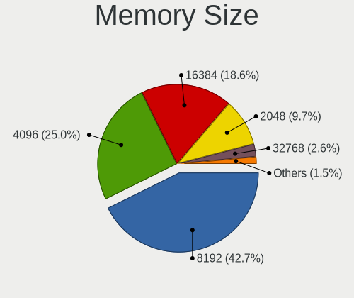

| Size  | Computers | Percent |
|-------|-----------|---------|
| 8192  | 400       | 40.82%  |
| 4096  | 269       | 27.45%  |
| 16384 | 178       | 18.16%  |
| 2048  | 101       | 10.31%  |
| 32768 | 18        | 1.84%   |
| 1024  | 13        | 1.33%   |
| 128   | 1         | 0.1%    |

Memory Speed
------------

Memory module speed

| Speed   | Computers | Percent |
|---------|-----------|---------|
| 2667    | 206       | 21.11%  |
| 1600    | 200       | 20.49%  |
| 3200    | 110       | 11.27%  |
| 2400    | 91        | 9.32%   |
| 1333    | 57        | 5.84%   |
| 2133    | 56        | 5.74%   |
| 3600    | 35        | 3.59%   |
| 1334    | 26        | 2.66%   |
| 800     | 23        | 2.36%   |
| 667     | 14        | 1.43%   |
| 2666    | 12        | 1.23%   |
| 4267    | 11        | 1.13%   |
| 3000    | 11        | 1.13%   |
| 3266    | 10        | 1.02%   |
| Unknown | 10        | 1.02%   |
| 2933    | 9         | 0.92%   |
| 1867    | 9         | 0.92%   |
| 1067    | 9         | 0.92%   |
| 3733    | 7         | 0.72%   |
| 3466    | 7         | 0.72%   |
| 1066    | 7         | 0.72%   |
| 3800    | 6         | 0.61%   |
| 1866    | 6         | 0.61%   |
| 4199    | 5         | 0.51%   |
| 3400    | 5         | 0.51%   |
| 2800    | 3         | 0.31%   |
| 2048    | 3         | 0.31%   |
| 1800    | 3         | 0.31%   |
| 400     | 3         | 0.31%   |
| 3866    | 2         | 0.2%    |
| 3333    | 2         | 0.2%    |
| 3151    | 2         | 0.2%    |
| 2132    | 2         | 0.2%    |
| 2000    | 2         | 0.2%    |
| 8400    | 1         | 0.1%    |
| 3533    | 1         | 0.1%    |
| 3467    | 1         | 0.1%    |
| 3334    | 1         | 0.1%    |
| 3066    | 1         | 0.1%    |
| 2473    | 1         | 0.1%    |
| 2134    | 1         | 0.1%    |
| 1776    | 1         | 0.1%    |
| 975     | 1         | 0.1%    |
| 880     | 1         | 0.1%    |
| 533     | 1         | 0.1%    |
| 333     | 1         | 0.1%    |

Printers & scanners
-------------------

Printer Vendor
--------------

Printer device vendors

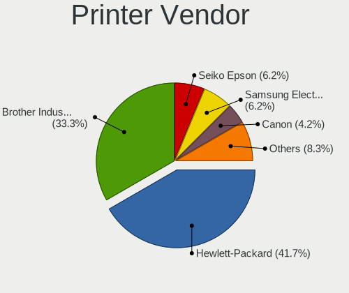

| Vendor                 | Computers | Percent |
|------------------------|-----------|---------|
| Hewlett-Packard        | 19        | 43.18%  |
| Brother Industries     | 13        | 29.55%  |
| Seiko Epson            | 3         | 6.82%   |
| Samsung Electronics    | 3         | 6.82%   |
| Canon                  | 2         | 4.55%   |
| SAT                    | 1         | 2.27%   |
| Prolific Technology    | 1         | 2.27%   |
| Pantum                 | 1         | 2.27%   |
| Panasonic (Matsushita) | 1         | 2.27%   |

Printer Model
-------------

Printer device models

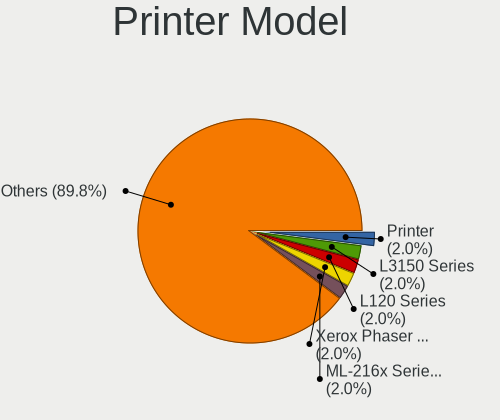

| Model                                   | Computers | Percent |
|-----------------------------------------|-----------|---------|
| Seiko Epson Printer                     | 1         | 2.22%   |
| Seiko Epson L3150 Series                | 1         | 2.22%   |
| Seiko Epson L120 Series                 | 1         | 2.22%   |
| SAT SAT38TUSE                           | 1         | 2.22%   |
| Samsung Xerox Phaser 3117 Laser Printer | 1         | 2.22%   |
| Samsung ML-216x Series Laser Printer    | 1         | 2.22%   |
| Samsung CLX-3180 Series                 | 1         | 2.22%   |
| Prolific PL2305 Parallel Port           | 1         | 2.22%   |
| Pantum P2200 series                     | 1         | 2.22%   |
| Panasonic (Matsushita) KX-MB1500CX      | 1         | 2.22%   |
| HP OfficeJet Pro 9010 series            | 1         | 2.22%   |
| HP Officejet 4630 series                | 1         | 2.22%   |
| HP OfficeJet 3830 series                | 1         | 2.22%   |
| HP LaserJet P2035                       | 1         | 2.22%   |
| HP LaserJet P2015 series                | 1         | 2.22%   |
| HP LaserJet P1102                       | 1         | 2.22%   |
| HP LaserJet M101-M106                   | 1         | 2.22%   |
| HP LaserJet CP1025nw                    | 1         | 2.22%   |
| HP LaserJet 200 color M251nw            | 1         | 2.22%   |
| HP LaserJet 1022                        | 1         | 2.22%   |
| HP LaserJet 1020                        | 1         | 2.22%   |
| HP LaserJet 1018                        | 1         | 2.22%   |
| HP LaserJet 1010                        | 1         | 2.22%   |
| HP ENVY 4500 series                     | 1         | 2.22%   |
| HP Deskjet F4500 series                 | 1         | 2.22%   |
| HP DeskJet F300 series                  | 1         | 2.22%   |
| HP DeskJet 930c                         | 1         | 2.22%   |
| HP DeskJet 2700 series                  | 1         | 2.22%   |
| HP DeskJet 2620 All-in-One Printer      | 1         | 2.22%   |
| HP Deskjet 2540 series                  | 1         | 2.22%   |
| Canon PIXMA MP495                       | 1         | 2.22%   |
| Canon PIXMA MG2500 Series               | 1         | 2.22%   |
| Brother MFC-L3770CDW series             | 1         | 2.22%   |
| Brother MFC-L2710DW series              | 1         | 2.22%   |
| Brother MFC-J805DW                      | 1         | 2.22%   |
| Brother MFC-J491DW                      | 1         | 2.22%   |
| Brother MFC-9330CDW                     | 1         | 2.22%   |
| Brother MFC-7460DN                      | 1         | 2.22%   |
| Brother MFC-7420                        | 1         | 2.22%   |
| Brother HL-L2300D series                | 1         | 2.22%   |
| Brother HL-5340 series                  | 1         | 2.22%   |
| Brother HL-2230 series                  | 1         | 2.22%   |
| Brother DCP-L2540DW                     | 1         | 2.22%   |
| Brother DCP-J140W                       | 1         | 2.22%   |
| Brother DCP-9020CDW                     | 1         | 2.22%   |

Scanner Vendor
--------------

Scanner device vendors

| Vendor          | Computers | Percent |
|-----------------|-----------|---------|
| Canon           | 3         | 50%     |
| Seiko Epson     | 2         | 33.33%  |
| Hewlett-Packard | 1         | 16.67%  |

Scanner Model
-------------

Scanner device models

| Model                                                   | Computers | Percent |
|---------------------------------------------------------|-----------|---------|
| Seiko Epson GT-F730 [GT-S630/Perfection V33/V330 Photo] | 1         | 16.67%  |
| Seiko Epson ES-D200 [GT-S50]                            | 1         | 16.67%  |
| HP ScanJet G4010                                        | 1         | 16.67%  |
| Canon CanoScan LiDE 220                                 | 1         | 16.67%  |
| Canon CanoScan LiDE 120                                 | 1         | 16.67%  |
| Canon CanoScan LiDE 110                                 | 1         | 16.67%  |

Camera
------

Camera Vendor
-------------

Camera device vendors

| Vendor                                 | Computers | Percent |
|----------------------------------------|-----------|---------|
| Chicony Electronics                    | 153       | 17.79%  |
| Microdia                               | 89        | 10.35%  |
| IMC Networks                           | 73        | 8.49%   |
| Realtek Semiconductor                  | 70        | 8.14%   |
| Logitech                               | 69        | 8.02%   |
| Acer                                   | 66        | 7.67%   |
| Sunplus Innovation Technology          | 55        | 6.4%    |
| Cheng Uei Precision Industry (Foxlink) | 43        | 5%      |
| Quanta                                 | 31        | 3.6%    |
| Silicon Motion                         | 24        | 2.79%   |
| Suyin                                  | 21        | 2.44%   |
| Lite-On Technology                     | 15        | 1.74%   |
| Samsung Electronics                    | 13        | 1.51%   |
| Alcor Micro                            | 13        | 1.51%   |
| Syntek                                 | 12        | 1.4%    |
| Apple                                  | 11        | 1.28%   |
| Microsoft                              | 10        | 1.16%   |
| Ricoh                                  | 9         | 1.05%   |
| Luxvisions Innotech Limited            | 8         | 0.93%   |
| Generalplus Technology                 | 6         | 0.7%    |
| Z-Star Microelectronics                | 5         | 0.58%   |
| KYE Systems (Mouse Systems)            | 5         | 0.58%   |
| ARC International                      | 5         | 0.58%   |
| MacroSilicon                           | 4         | 0.47%   |
| Lenovo                                 | 4         | 0.47%   |
| Genesys Logic                          | 4         | 0.47%   |
| Sonix Technology                       | 3         | 0.35%   |
| Intel                                  | 3         | 0.35%   |
| Unknown                                | 2         | 0.23%   |
| Sunplus Technology                     | 2         | 0.23%   |
| Razer USA                              | 2         | 0.23%   |
| Huawei Technologies                    | 2         | 0.23%   |
| Cubeternet                             | 2         | 0.23%   |
| Arkmicro Technologies                  | 2         | 0.23%   |
| A4Tech                                 | 2         | 0.23%   |
| Yealink Network Technology             | 1         | 0.12%   |
| Y Media                                | 1         | 0.12%   |
| Valve Software                         | 1         | 0.12%   |
| SunplusIT                              | 1         | 0.12%   |
| Primax Electronics                     | 1         | 0.12%   |
| Pixart Imaging                         | 1         | 0.12%   |
| Philips (or NXP)                       | 1         | 0.12%   |
| OmniVision Technologies                | 1         | 0.12%   |
| Novatek Microelectronics               | 1         | 0.12%   |
| Nokia Mobile Phones                    | 1         | 0.12%   |
| MediaTek                               | 1         | 0.12%   |
| lihappe8                               | 1         | 0.12%   |
| LG Electronics                         | 1         | 0.12%   |
| Jieli Technology                       | 1         | 0.12%   |
| Image Processor                        | 1         | 0.12%   |
| HDR webcam                             | 1         | 0.12%   |
| Google                                 | 1         | 0.12%   |
| GEMBIRD                                | 1         | 0.12%   |
| DigiTech                               | 1         | 0.12%   |
| Creative Technology                    | 1         | 0.12%   |
| ALi                                    | 1         | 0.12%   |
| 2M UVC CAMERA                          | 1         | 0.12%   |

Camera Model
------------

Camera device models

| Model                                                                      | Computers | Percent |
|----------------------------------------------------------------------------|-----------|---------|
| Microdia Integrated_Webcam_HD                                              | 39        | 4.49%   |
| Realtek Integrated_Webcam_HD                                               | 35        | 4.03%   |
| Chicony Integrated Camera                                                  | 32        | 3.68%   |
| Sunplus Integrated_Webcam_HD                                               | 26        | 2.99%   |
| IMC Networks USB2.0 HD UVC WebCam                                          | 25        | 2.88%   |
| IMC Networks Integrated Camera                                             | 18        | 2.07%   |
| Logitech Webcam C270                                                       | 17        | 1.96%   |
| Chicony HD Webcam                                                          | 17        | 1.96%   |
| Acer Integrated Camera                                                     | 17        | 1.96%   |
| Logitech HD Pro Webcam C920                                                | 16        | 1.84%   |
| Microdia Integrated Webcam                                                 | 14        | 1.61%   |
| Chicony USB2.0 Camera                                                      | 14        | 1.61%   |
| Samsung Galaxy series, misc. (MTP mode)                                    | 12        | 1.38%   |
| Acer Lenovo EasyCamera                                                     | 12        | 1.38%   |
| Acer HD Webcam                                                             | 10        | 1.15%   |
| Chicony HP Truevision HD                                                   | 8         | 0.92%   |
| Chicony HP HD Camera                                                       | 8         | 0.92%   |
| Logitech HD Webcam C615                                                    | 7         | 0.81%   |
| IMC Networks USB2.0 VGA UVC WebCam                                         | 7         | 0.81%   |
| Chicony HP Wide Vision HD Camera                                           | 7         | 0.81%   |
| Chicony HD User Facing                                                     | 7         | 0.81%   |
| Cheng Uei Precision Industry (Foxlink) HP Wide Vision HD Integrated Webcam | 7         | 0.81%   |
| Apple iPhone 5/5C/5S/6/SE                                                  | 7         | 0.81%   |
| Syntek Integrated Camera                                                   | 6         | 0.69%   |
| Realtek Integrated Webcam HD                                               | 6         | 0.69%   |
| Microdia Webcam Vitade AF                                                  | 6         | 0.69%   |
| Lite-On Integrated Camera                                                  | 6         | 0.69%   |
| Chicony Integrated Camera (1280x720@30)                                    | 6         | 0.69%   |
| Cheng Uei Precision Industry (Foxlink) HP Webcam                           | 6         | 0.69%   |
| Cheng Uei Precision Industry (Foxlink) HP HD Camera                        | 6         | 0.69%   |
| Alcor Micro USB 2.0 Camera                                                 | 6         | 0.69%   |
| Acer BisonCam, NB Pro                                                      | 6         | 0.69%   |
| Sunplus HD WebCam                                                          | 5         | 0.58%   |
| Realtek Integrated Webcam                                                  | 5         | 0.58%   |
| Quanta HP HD Camera                                                        | 5         | 0.58%   |
| Microsoft LifeCam HD-3000                                                  | 5         | 0.58%   |
| IMC Networks USB2.0 UVC HD Webcam                                          | 5         | 0.58%   |
| IMC Networks HD Camera                                                     | 5         | 0.58%   |
| ARC International Camera                                                   | 5         | 0.58%   |
| Syntek EasyCamera                                                          | 4         | 0.46%   |
| Suyin HP Truevision HD                                                     | 4         | 0.46%   |
| Silicon Motion Web Camera                                                  | 4         | 0.46%   |
| Ricoh USB2.0 Camera                                                        | 4         | 0.46%   |
| Quanta VGA WebCam                                                          | 4         | 0.46%   |
| Quanta HP Wide Vision HD Camera                                            | 4         | 0.46%   |
| Quanta HP TrueVision HD Camera                                             | 4         | 0.46%   |
| Quanta HD User Facing                                                      | 4         | 0.46%   |
| Microdia Dell Laptop Integrated Webcam HD                                  | 4         | 0.46%   |
| Microdia Camera                                                            | 4         | 0.46%   |
| MacroSilicon MiraBox Capture                                               | 4         | 0.46%   |
| Logitech Webcam Pro 9000                                                   | 4         | 0.46%   |
| Logitech HD Webcam C525                                                    | 4         | 0.46%   |
| Generalplus 808 Camera                                                     | 4         | 0.46%   |
| Chicony ThinkPad T490 Webcam                                               | 4         | 0.46%   |
| Cheng Uei Precision Industry (Foxlink) HP Wide Vision HD Camera            | 4         | 0.46%   |
| Acer BisonCam,NB Pro                                                       | 4         | 0.46%   |
| Suyin Integrated_Webcam_HD                                                 | 3         | 0.35%   |
| Suyin Acer/HP Integrated Webcam [CN0314]                                   | 3         | 0.35%   |
| Sunplus Laptop_Integrated_Webcam_HD                                        | 3         | 0.35%   |
| Sunplus Laptop Integrated Webcam HD                                        | 3         | 0.35%   |

Security
--------

Fingerprint Vendor
------------------

Fingerprint sensor vendors

| Vendor                     | Computers | Percent |
|----------------------------|-----------|---------|
| Synaptics                  | 61        | 37.42%  |
| Validity Sensors           | 46        | 28.22%  |
| Shenzhen Goodix Technology | 27        | 16.56%  |
| LighTuning Technology      | 7         | 4.29%   |
| Elan Microelectronics      | 7         | 4.29%   |
| AuthenTec                  | 6         | 3.68%   |
| Upek                       | 5         | 3.07%   |
| STMicroelectronics         | 3         | 1.84%   |
| DigitalPersona             | 1         | 0.61%   |

Fingerprint Model
-----------------

Fingerprint sensor models

| Model                                                                      | Computers | Percent |
|----------------------------------------------------------------------------|-----------|---------|
| Synaptics Prometheus MIS Touch Fingerprint Reader                          | 25        | 15.34%  |
| Unknown                                                                    | 15        | 9.2%    |
| Shenzhen Goodix Fingerprint Reader                                         | 11        | 6.75%   |
| Shenzhen Goodix FingerPrint                                                | 9         | 5.52%   |
| Validity Sensors VFS495 Fingerprint Reader                                 | 7         | 4.29%   |
| Shenzhen Goodix  Fingerprint Device                                        | 7         | 4.29%   |
| Elan ELAN:Fingerprint                                                      | 7         | 4.29%   |
| Validity Sensors VFS5011 Fingerprint Reader                                | 6         | 3.68%   |
| Validity Sensors VFS 5011 fingerprint sensor                               | 6         | 3.68%   |
| Validity Sensors Synaptics WBDI                                            | 6         | 3.68%   |
| Synaptics  FS7604 Touch Fingerprint Sensor with PurePrint                  | 6         | 3.68%   |
| Validity Sensors Synaptics VFS7552 Touch Fingerprint Sensor with PurePrint | 5         | 3.07%   |
| Upek Biometric Touchchip/Touchstrip Fingerprint Sensor                     | 5         | 3.07%   |
| Validity Sensors Swipe Fingerprint Sensor                                  | 4         | 2.45%   |
| Synaptics Metallica MOH Touch Fingerprint Reader                           | 4         | 2.45%   |
| Synaptics Metallica MIS Touch Fingerprint Reader                           | 4         | 2.45%   |
| LighTuning EgisTec Touch Fingerprint Sensor                                | 4         | 2.45%   |
| Validity Sensors Fingerprint scanner                                       | 3         | 1.84%   |
| Synaptics  WBDI                                                            | 3         | 1.84%   |
| Synaptics  VFS7552 Touch Fingerprint Sensor with PurePrint                 | 3         | 1.84%   |
| STMicroelectronics Fingerprint Reader                                      | 3         | 1.84%   |
| AuthenTec AES2810                                                          | 3         | 1.84%   |
| Validity Sensors VFS7552 Touch Fingerprint Sensor                          | 2         | 1.23%   |
| Validity Sensors VFS7500 Touch Fingerprint Sensor                          | 2         | 1.23%   |
| Validity Sensors VFS491                                                    | 2         | 1.23%   |
| Validity Sensors VFS451 Fingerprint Reader                                 | 2         | 1.23%   |
| LighTuning ES603 Swipe Fingerprint Sensor                                  | 2         | 1.23%   |
| Validity Sensors VFS471 Fingerprint Reader                                 | 1         | 0.61%   |
| Synaptics WBDI Device                                                      | 1         | 0.61%   |
| LighTuning Fingerprint Reader                                              | 1         | 0.61%   |
| DigitalPersona Fingerprint Reader                                          | 1         | 0.61%   |
| AuthenTec Fingerprint Sensor                                               | 1         | 0.61%   |
| AuthenTec AES3500 TruePrint Sensor                                         | 1         | 0.61%   |
| AuthenTec AES1600                                                          | 1         | 0.61%   |

Chipcard Vendor
---------------

Chipcard module vendors

| Vendor                   | Computers | Percent |
|--------------------------|-----------|---------|
| Broadcom                 | 45        | 46.88%  |
| Alcor Micro              | 24        | 25%     |
| Upek                     | 5         | 5.21%   |
| O2 Micro                 | 5         | 5.21%   |
| Realtek Semiconductor    | 2         | 2.08%   |
| OmniKey                  | 2         | 2.08%   |
| Lenovo                   | 2         | 2.08%   |
| Advanced Card Systems    | 2         | 2.08%   |
| Yubico.com               | 1         | 1.04%   |
| SCM Microsystems         | 1         | 1.04%   |
| Reiner SCT Kartensysteme | 1         | 1.04%   |
| In Focus Systems         | 1         | 1.04%   |
| Giesecke & Devrient      | 1         | 1.04%   |
| Gemalto (was Gemplus)    | 1         | 1.04%   |
| Chicony Electronics      | 1         | 1.04%   |
| Aladdin R.D.             | 1         | 1.04%   |
| Aktiv                    | 1         | 1.04%   |

Chipcard Model
--------------

Chipcard module models

| Model                                                                        | Computers | Percent |
|------------------------------------------------------------------------------|-----------|---------|
| Alcor Micro AU9540 Smartcard Reader                                          | 23        | 23.96%  |
| Broadcom 5880                                                                | 14        | 14.58%  |
| Broadcom BCM5880 Secure Applications Processor                               | 10        | 10.42%  |
| Broadcom 58200                                                               | 10        | 10.42%  |
| Broadcom BCM5880 Secure Applications Processor with fingerprint swipe sensor | 9         | 9.38%   |
| Upek TouchChip Fingerprint Coprocessor (WBF advanced mode)                   | 5         | 5.21%   |
| O2 Micro OZ776 CCID Smartcard Reader                                         | 5         | 5.21%   |
| Realtek Semiconductor Smart Card Reader Interface                            | 2         | 2.08%   |
| Lenovo Integrated Smart Card Reader                                          | 2         | 2.08%   |
| Broadcom BCM5880 Secure Applications Processor with fingerprint touch sensor | 2         | 2.08%   |
| Advanced Card Systems ACR38 SmartCard Reader                                 | 2         | 2.08%   |
| Yubico.com Yubikey 4/5 U2F+CCID                                              | 1         | 1.04%   |
| SCM Microsystems SCR331 SmartCard Reader                                     | 1         | 1.04%   |
| Reiner SCT Kartensysteme tanJack USB                                         | 1         | 1.04%   |
| OmniKey CardMan 3021 / 3121                                                  | 1         | 1.04%   |
| OmniKey CardMan 1021                                                         | 1         | 1.04%   |
| In Focus Systems EMV Smartcard Reader                                        | 1         | 1.04%   |
| Giesecke & Devrient StarSign CUT                                             | 1         | 1.04%   |
| Gemalto (was Gemplus) GemPC Twin SmartCard Reader                            | 1         | 1.04%   |
| Chicony Electronics HP Skylab USB Smartcard Keyboard                         | 1         | 1.04%   |
| Alcor Micro Watchdata W 1981                                                 | 1         | 1.04%   |
| Aladdin R.D. JaCarta                                                         | 1         | 1.04%   |
| Aktiv Rutoken lite                                                           | 1         | 1.04%   |

Unsupported
-----------

Unsupported Devices
-------------------

Total unsupported devices on board

| Total | Computers | Percent |
|-------|-----------|---------|
| 0     | 923       | 69.5%   |
| 1     | 325       | 24.47%  |
| 2     | 63        | 4.74%   |
| 3     | 7         | 0.53%   |
| 4     | 5         | 0.38%   |
| 7     | 3         | 0.23%   |
| 6     | 2         | 0.15%   |

Unsupported Device Types
------------------------

Types of unsupported devices

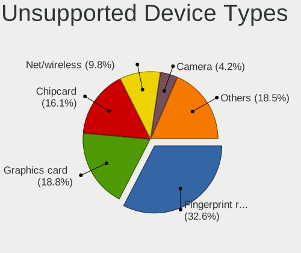

| Type                     | Computers | Percent |
|--------------------------|-----------|---------|
| Fingerprint reader       | 161       | 32.07%  |
| Graphics card            | 89        | 17.73%  |
| Chipcard                 | 84        | 16.73%  |
| Net/wireless             | 51        | 10.16%  |
| Camera                   | 21        | 4.18%   |
| Bluetooth                | 18        | 3.59%   |
| Communication controller | 17        | 3.39%   |
| Sound                    | 16        | 3.19%   |
| Unassigned class         | 12        | 2.39%   |
| Card reader              | 10        | 1.99%   |
| Multimedia controller    | 7         | 1.39%   |
| Storage                  | 6         | 1.2%    |
| Net/ethernet             | 3         | 0.6%    |
| Network                  | 2         | 0.4%    |
| Modem                    | 2         | 0.4%    |
| Firewire controller      | 2         | 0.4%    |
| Storage/ide              | 1         | 0.2%    |

