Kubuntu 22.04 - Tested Hardware & Statistics
--------------------------------------------

A project to collect tested hardware configurations for Kubuntu 22.04.

Anyone can contribute to this report by the [hw-probe](https://github.com/linuxhw/hw-probe) tool:

    sudo -E hw-probe -all -upload

Please contribute! Especially if your hardware is rare.

This is a report for all computer types. See also reports for [desktops](/Dist/Kubuntu_22.04/Desktop/README.md) and [notebooks](/Dist/Kubuntu_22.04/Notebook/README.md).

Contents
--------

* [ Test Cases ](#test-cases)

* [ System ](#system)
  - [ Kernel                   ](#kernel)
  - [ Kernel Family            ](#kernel-family)
  - [ Kernel Major Ver.        ](#kernel-major-ver)
  - [ Arch                     ](#arch)
  - [ DE                       ](#de)
  - [ Display Server           ](#display-server)
  - [ Display Manager          ](#display-manager)
  - [ OS Lang                  ](#os-lang)
  - [ Boot Mode                ](#boot-mode)
  - [ Filesystem               ](#filesystem)
  - [ Part. scheme             ](#part-scheme)
  - [ Dual Boot with Linux/BSD ](#dual-boot-with-linuxbsd)
  - [ Dual Boot (Win)          ](#dual-boot-win)

* [ Board ](#board)
  - [ Vendor                   ](#vendor)
  - [ Model                    ](#model)
  - [ Model Family             ](#model-family)
  - [ MFG Year                 ](#mfg-year)
  - [ Form Factor              ](#form-factor)
  - [ Secure Boot              ](#secure-boot)
  - [ Coreboot                 ](#coreboot)
  - [ RAM Size                 ](#ram-size)
  - [ RAM Used                 ](#ram-used)
  - [ Total Drives             ](#total-drives)
  - [ Has CD-ROM               ](#has-cd-rom)
  - [ Has Ethernet             ](#has-ethernet)
  - [ Has WiFi                 ](#has-wifi)
  - [ Has Bluetooth            ](#has-bluetooth)

* [ Location ](#location)
  - [ Country                  ](#country)
  - [ City                     ](#city)

* [ Drives ](#drives)
  - [ Drive Vendor             ](#drive-vendor)
  - [ Drive Model              ](#drive-model)
  - [ HDD Vendor               ](#hdd-vendor)
  - [ SSD Vendor               ](#ssd-vendor)
  - [ Drive Kind               ](#drive-kind)
  - [ Drive Connector          ](#drive-connector)
  - [ Drive Size               ](#drive-size)
  - [ Space Total              ](#space-total)
  - [ Space Used               ](#space-used)
  - [ Malfunc. Drives          ](#malfunc-drives)
  - [ Malfunc. Drive Vendor    ](#malfunc-drive-vendor)
  - [ Malfunc. HDD Vendor      ](#malfunc-hdd-vendor)
  - [ Malfunc. Drive Kind      ](#malfunc-drive-kind)
  - [ Failed Drives            ](#failed-drives)
  - [ Failed Drive Vendor      ](#failed-drive-vendor)
  - [ Drive Status             ](#drive-status)

* [ Storage controller ](#storage-controller)
  - [ Storage Vendor           ](#storage-vendor)
  - [ Storage Model            ](#storage-model)
  - [ Storage Kind             ](#storage-kind)

* [ Processor ](#processor)
  - [ CPU Vendor               ](#cpu-vendor)
  - [ CPU Model                ](#cpu-model)
  - [ CPU Model Family         ](#cpu-model-family)
  - [ CPU Cores                ](#cpu-cores)
  - [ CPU Sockets              ](#cpu-sockets)
  - [ CPU Threads              ](#cpu-threads)
  - [ CPU Op-Modes             ](#cpu-op-modes)
  - [ CPU Microcode            ](#cpu-microcode)
  - [ CPU Microarch            ](#cpu-microarch)

* [ Graphics ](#graphics)
  - [ GPU Vendor               ](#gpu-vendor)
  - [ GPU Model                ](#gpu-model)
  - [ GPU Combo                ](#gpu-combo)
  - [ GPU Driver               ](#gpu-driver)
  - [ GPU Memory               ](#gpu-memory)

* [ Monitor ](#monitor)
  - [ Monitor Vendor           ](#monitor-vendor)
  - [ Monitor Model            ](#monitor-model)
  - [ Monitor Resolution       ](#monitor-resolution)
  - [ Monitor Diagonal         ](#monitor-diagonal)
  - [ Monitor Width            ](#monitor-width)
  - [ Aspect Ratio             ](#aspect-ratio)
  - [ Monitor Area             ](#monitor-area)
  - [ Pixel Density            ](#pixel-density)
  - [ Multiple Monitors        ](#multiple-monitors)

* [ Network ](#network)
  - [ Net Controller Vendor    ](#net-controller-vendor)
  - [ Net Controller Model     ](#net-controller-model)
  - [ Wireless Vendor          ](#wireless-vendor)
  - [ Wireless Model           ](#wireless-model)
  - [ Ethernet Vendor          ](#ethernet-vendor)
  - [ Ethernet Model           ](#ethernet-model)
  - [ Net Controller Kind      ](#net-controller-kind)
  - [ Used Controller          ](#used-controller)
  - [ NICs                     ](#nics)
  - [ IPv6                     ](#ipv6)

* [ Bluetooth ](#bluetooth)
  - [ Bluetooth Vendor         ](#bluetooth-vendor)
  - [ Bluetooth Model          ](#bluetooth-model)

* [ Sound ](#sound)
  - [ Sound Vendor             ](#sound-vendor)
  - [ Sound Model              ](#sound-model)

* [ Memory ](#memory)
  - [ Memory Vendor            ](#memory-vendor)
  - [ Memory Model             ](#memory-model)
  - [ Memory Kind              ](#memory-kind)
  - [ Memory Form Factor       ](#memory-form-factor)
  - [ Memory Size              ](#memory-size)
  - [ Memory Speed             ](#memory-speed)

* [ Printers & scanners ](#printers--scanners)
  - [ Printer Vendor           ](#printer-vendor)
  - [ Printer Model            ](#printer-model)
  - [ Scanner Vendor           ](#scanner-vendor)
  - [ Scanner Model            ](#scanner-model)

* [ Camera ](#camera)
  - [ Camera Vendor            ](#camera-vendor)
  - [ Camera Model             ](#camera-model)

* [ Security ](#security)
  - [ Fingerprint Vendor       ](#fingerprint-vendor)
  - [ Fingerprint Model        ](#fingerprint-model)
  - [ Chipcard Vendor          ](#chipcard-vendor)
  - [ Chipcard Model           ](#chipcard-model)

* [ Unsupported ](#unsupported)
  - [ Unsupported Devices      ](#unsupported-devices)
  - [ Unsupported Device Types ](#unsupported-device-types)

Test Cases
----------

Total: 2298

| Vendor        | Model                       | Form-Factor | Probe                                                      | Date         |
|---------------|-----------------------------|-------------|------------------------------------------------------------|--------------|
| Gigabyte      | B250M-DS3H-CF               | Desktop     | [0377551a1d](https://linux-hardware.org/?probe=0377551a1d) | Dec 31, 2025 |
| HP            | Notebook                    | Notebook    | [440344f56e](https://linux-hardware.org/?probe=440344f56e) | Dec 07, 2025 |
| ASUSTek       | Maximus VII HERO            | Desktop     | [b4cc2d8ce7](https://linux-hardware.org/?probe=b4cc2d8ce7) | Nov 30, 2025 |
| ASUSTek       | Rampage V EDITION 10        | Desktop     | [e0df66fb15](https://linux-hardware.org/?probe=e0df66fb15) | Nov 21, 2025 |
| Dell          | 0PTTT9 A00                  | Desktop     | [3a7d455a64](https://linux-hardware.org/?probe=3a7d455a64) | Nov 18, 2025 |
| ASUSTek       | X555LD                      | Notebook    | [bf13868650](https://linux-hardware.org/?probe=bf13868650) | Nov 13, 2025 |
| ASUSTek       | PRIME Z490-A                | Desktop     | [be8398bed8](https://linux-hardware.org/?probe=be8398bed8) | Nov 08, 2025 |
| Lenovo        | 3098 NOK                    | Desktop     | [e5599695aa](https://linux-hardware.org/?probe=e5599695aa) | Nov 07, 2025 |
| Lenovo        | Yoga Slim 7 Pro 16IAH7 8... | Notebook    | [cb5f77e634](https://linux-hardware.org/?probe=cb5f77e634) | Oct 27, 2025 |
| ASUSTek       | ROG Zephyrus M16 GU603HE... | Notebook    | [0220a6ff38](https://linux-hardware.org/?probe=0220a6ff38) | Oct 06, 2025 |
| Gigabyte      | AX370-Gaming K7             | Desktop     | [af1b1ea629](https://linux-hardware.org/?probe=af1b1ea629) | Oct 01, 2025 |
| Lenovo        | ThinkPad T450 20BUS0EU0N    | Notebook    | [0538b48579](https://linux-hardware.org/?probe=0538b48579) | Sep 26, 2025 |
| Lenovo        | ThinkPad T450 20BUS0EU0N    | Notebook    | [475e6c61ea](https://linux-hardware.org/?probe=475e6c61ea) | Sep 26, 2025 |
| Acer          | Aspire 5732Z                | Notebook    | [d5767ffbca](https://linux-hardware.org/?probe=d5767ffbca) | Sep 13, 2025 |
| Lenovo        | ThinkPad T560 20FHCTO1WW    | Notebook    | [25033eb0f7](https://linux-hardware.org/?probe=25033eb0f7) | Sep 03, 2025 |
| ASUSTek       | ROG STRIX B650E-F GAMING... | Desktop     | [f69a8160e7](https://linux-hardware.org/?probe=f69a8160e7) | Sep 03, 2025 |
| Gigabyte      | AX370-Gaming K7             | Desktop     | [9daa61d505](https://linux-hardware.org/?probe=9daa61d505) | Sep 01, 2025 |
| Dell          | 0JMK61 A00                  | Server      | [a413700338](https://linux-hardware.org/?probe=a413700338) | Aug 24, 2025 |
| Lenovo        | IdeaPad 3 15IAU7 82RK       | Notebook    | [bc9f634f50](https://linux-hardware.org/?probe=bc9f634f50) | Aug 05, 2025 |
| Gigabyte      | AX370-Gaming K7             | Desktop     | [d44288b73b](https://linux-hardware.org/?probe=d44288b73b) | Aug 01, 2025 |
| Lenovo        | Yoga 920-13IKB 80Y7         | Convertible | [523c363e20](https://linux-hardware.org/?probe=523c363e20) | Jul 30, 2025 |
| MSI           | MPG B550 GAMING PLUS        | Desktop     | [3ff141ccc1](https://linux-hardware.org/?probe=3ff141ccc1) | Jul 28, 2025 |
| HP            | ProBook x360 435 G7         | Convertible | [d76646a994](https://linux-hardware.org/?probe=d76646a994) | Jul 24, 2025 |
| Unknown       | Unknown                     | Desktop     | [2d8ef16a26](https://linux-hardware.org/?probe=2d8ef16a26) | Jul 22, 2025 |
| Lenovo        | ThinkPad P15 Gen 2i 20YR... | Notebook    | [c38deb84dd](https://linux-hardware.org/?probe=c38deb84dd) | Jul 04, 2025 |
| HP            | ZBook 17                    | Notebook    | [25c873aa6a](https://linux-hardware.org/?probe=25c873aa6a) | Jul 03, 2025 |
| Gigabyte      | AX370-Gaming K7             | Desktop     | [944c87a6a6](https://linux-hardware.org/?probe=944c87a6a6) | Jul 01, 2025 |
| ASUSTek       | ROG STRIX B650E-F GAMING... | Desktop     | [5bd6b6b75a](https://linux-hardware.org/?probe=5bd6b6b75a) | Jul 01, 2025 |
| Fujitsu       | D3430-U1 S26361-D3430-U1    | Desktop     | [c6c01dcbee](https://linux-hardware.org/?probe=c6c01dcbee) | Jun 25, 2025 |
| Unknown       | ROUTER                      | Desktop     | [fcd55b143d](https://linux-hardware.org/?probe=fcd55b143d) | Jun 15, 2025 |
| ASRock        | Z690M-ITX/ax                | Desktop     | [562f056fe8](https://linux-hardware.org/?probe=562f056fe8) | Jun 15, 2025 |
| ASUSTek       | B85M-E                      | Desktop     | [27155f6e4c](https://linux-hardware.org/?probe=27155f6e4c) | Jun 10, 2025 |
| Gigabyte      | B450M S2H                   | Desktop     | [475088d246](https://linux-hardware.org/?probe=475088d246) | Jun 06, 2025 |
| HP            | ZBook 17                    | Notebook    | [8709a2e908](https://linux-hardware.org/?probe=8709a2e908) | Jun 06, 2025 |
| Gigabyte      | AX370-Gaming K7             | Desktop     | [c4fbf4aed7](https://linux-hardware.org/?probe=c4fbf4aed7) | Jun 01, 2025 |
| Pegatron      | 2AB6                        | Desktop     | [a1682ea927](https://linux-hardware.org/?probe=a1682ea927) | May 30, 2025 |
| ASUSTek       | P9X79 DELUXE                | Desktop     | [f1a4de23f2](https://linux-hardware.org/?probe=f1a4de23f2) | May 27, 2025 |
| ASUSTek       | P9X79 DELUXE                | Desktop     | [7b442413c7](https://linux-hardware.org/?probe=7b442413c7) | May 26, 2025 |
| ASRock        | B550M Pro4                  | Desktop     | [6fcf82d89d](https://linux-hardware.org/?probe=6fcf82d89d) | May 05, 2025 |
| Gigabyte      | AX370-Gaming K7             | Desktop     | [08e99b43a6](https://linux-hardware.org/?probe=08e99b43a6) | May 01, 2025 |
| Samsung       | Galaxy TabPro S             | Tablet      | [6bc0114f80](https://linux-hardware.org/?probe=6bc0114f80) | Apr 27, 2025 |
| MECHREVO      | WUJIE15XA                   | Notebook    | [567d285f72](https://linux-hardware.org/?probe=567d285f72) | Apr 26, 2025 |
| ASUSTek       | VivoBook_ASUSLaptop M150... | Notebook    | [e82e4d327a](https://linux-hardware.org/?probe=e82e4d327a) | Apr 19, 2025 |
| MSI           | Stealth 15M B12UE           | Notebook    | [360de723dd](https://linux-hardware.org/?probe=360de723dd) | Apr 18, 2025 |
| Pegatron      | 2AB6                        | Desktop     | [dc10e45914](https://linux-hardware.org/?probe=dc10e45914) | Apr 15, 2025 |
| AZW           | MINI S                      | Mini pc     | [217e28127b](https://linux-hardware.org/?probe=217e28127b) | Apr 12, 2025 |
| HUAWEI        | BOHB-WAX9                   | Notebook    | [f5f0a7dac2](https://linux-hardware.org/?probe=f5f0a7dac2) | Apr 09, 2025 |
| Gigabyte      | AX370-Gaming K7             | Desktop     | [91ac5cc82f](https://linux-hardware.org/?probe=91ac5cc82f) | Apr 01, 2025 |
| HP            | 250 G7 Notebook PC          | Notebook    | [b6f0a5bf65](https://linux-hardware.org/?probe=b6f0a5bf65) | Mar 27, 2025 |
| HP            | Pavilion Gaming Laptop 1... | Notebook    | [8899848987](https://linux-hardware.org/?probe=8899848987) | Mar 23, 2025 |
| Lenovo        | ThinkPad T14 Gen 1 20UD0... | Notebook    | [d3b5e9a0a2](https://linux-hardware.org/?probe=d3b5e9a0a2) | Mar 20, 2025 |
| ASUSTek       | NUC14RVB 60AS0080-MB7A05    | Mini pc     | [3fbe0a4b93](https://linux-hardware.org/?probe=3fbe0a4b93) | Mar 16, 2025 |
| Gigabyte      | B660M DS3H DDR4             | Desktop     | [9a99fbc772](https://linux-hardware.org/?probe=9a99fbc772) | Mar 10, 2025 |
| Unknown       | In-S_reserve                | Desktop     | [099579e7e8](https://linux-hardware.org/?probe=099579e7e8) | Mar 09, 2025 |
| Apple         | MacBookPro11,3              | Notebook    | [c9f9a67dfc](https://linux-hardware.org/?probe=c9f9a67dfc) | Mar 03, 2025 |
| PC Special... | Elimina 15 Spark            | Notebook    | [dbb98f9d57](https://linux-hardware.org/?probe=dbb98f9d57) | Mar 03, 2025 |
| Gigabyte      | AX370-Gaming K7             | Desktop     | [9b0ae87e25](https://linux-hardware.org/?probe=9b0ae87e25) | Mar 02, 2025 |
| ASUSTek       | VivoBook_ASUSLaptop M140... | Notebook    | [f4f79666f2](https://linux-hardware.org/?probe=f4f79666f2) | Mar 01, 2025 |
| Fujitsu       | D3230-A1 S26361-D3230-A1    | Desktop     | [84f9e0fd0b](https://linux-hardware.org/?probe=84f9e0fd0b) | Mar 01, 2025 |
| ASRock        | B550M-HDV                   | Desktop     | [113575c717](https://linux-hardware.org/?probe=113575c717) | Feb 28, 2025 |
| Dell          | Precision M4600             | Notebook    | [d404119ecc](https://linux-hardware.org/?probe=d404119ecc) | Feb 19, 2025 |
| MSI           | X58 Pro-E                   | Desktop     | [0ab1806406](https://linux-hardware.org/?probe=0ab1806406) | Feb 10, 2025 |
| MSI           | X58 Pro-E                   | Desktop     | [505d32acdb](https://linux-hardware.org/?probe=505d32acdb) | Feb 10, 2025 |
| MSI           | MAG B550M MORTAR            | Desktop     | [fdb94de5da](https://linux-hardware.org/?probe=fdb94de5da) | Feb 05, 2025 |
| Lenovo        | ThinkBook 15 G3 ITL 21A5    | Notebook    | [8f97f0cce3](https://linux-hardware.org/?probe=8f97f0cce3) | Feb 05, 2025 |
| Gigabyte      | AX370-Gaming K7             | Desktop     | [694b12c7b0](https://linux-hardware.org/?probe=694b12c7b0) | Feb 02, 2025 |
| HP            | ProBook 450 G6              | Notebook    | [4cba0d5a03](https://linux-hardware.org/?probe=4cba0d5a03) | Jan 24, 2025 |
| Apple         | Mac-81E3E92DD6088272 iMa... | All in one  | [4757827eb4](https://linux-hardware.org/?probe=4757827eb4) | Jan 24, 2025 |
| Dell          | Precision 5470              | Notebook    | [9c8e16a0b5](https://linux-hardware.org/?probe=9c8e16a0b5) | Jan 22, 2025 |
| ASUSTek       | SABERTOOTH P67              | Desktop     | [4e846379a4](https://linux-hardware.org/?probe=4e846379a4) | Jan 15, 2025 |
| Gateway       | FX6850                      | Desktop     | [95f89fad69](https://linux-hardware.org/?probe=95f89fad69) | Jan 13, 2025 |
| Gateway       | FX6850                      | Desktop     | [974490ee08](https://linux-hardware.org/?probe=974490ee08) | Jan 13, 2025 |
| ASUSTek       | M5A97 R2.0                  | Desktop     | [024920416d](https://linux-hardware.org/?probe=024920416d) | Jan 12, 2025 |
| HP            | 8580                        | Desktop     | [d3f46a2098](https://linux-hardware.org/?probe=d3f46a2098) | Jan 07, 2025 |
| ASUSTek       | 970 PRO GAMING/AURA         | Desktop     | [b105855f62](https://linux-hardware.org/?probe=b105855f62) | Jan 06, 2025 |
| ASRock        | Z690M-ITX/ax                | Desktop     | [bbbb62d243](https://linux-hardware.org/?probe=bbbb62d243) | Jan 05, 2025 |
| Dell          | Inspiron 15-3567            | Notebook    | [96419f9337](https://linux-hardware.org/?probe=96419f9337) | Jan 05, 2025 |
| Gigabyte      | AX370-Gaming K7             | Desktop     | [50b5770d28](https://linux-hardware.org/?probe=50b5770d28) | Jan 02, 2025 |
| Dell          | Latitude 5430               | Notebook    | [751e3be041](https://linux-hardware.org/?probe=751e3be041) | Dec 24, 2024 |
| Dell          | Latitude 5430               | Notebook    | [b9d91d702c](https://linux-hardware.org/?probe=b9d91d702c) | Dec 24, 2024 |
| ASUSTek       | 970 PRO GAMING/AURA         | Desktop     | [4885d454da](https://linux-hardware.org/?probe=4885d454da) | Dec 23, 2024 |
| Gigabyte      | B550 AORUS ELITE AX V2      | Desktop     | [671a76bf13](https://linux-hardware.org/?probe=671a76bf13) | Dec 21, 2024 |
| Lenovo        | 300w Gen 3 82J1             | Convertible | [abef694a7c](https://linux-hardware.org/?probe=abef694a7c) | Dec 21, 2024 |
| Lenovo        | 300w Gen 3 82J1             | Convertible | [1015720abc](https://linux-hardware.org/?probe=1015720abc) | Dec 21, 2024 |
| Dell          | Vostro 5625                 | Notebook    | [c081eaa179](https://linux-hardware.org/?probe=c081eaa179) | Dec 20, 2024 |
| MSI           | Creator Z17 A12UGST         | Notebook    | [c6a09edf29](https://linux-hardware.org/?probe=c6a09edf29) | Dec 14, 2024 |
| HP            | Laptop 17-cp0xxx            | Notebook    | [f1344c53ac](https://linux-hardware.org/?probe=f1344c53ac) | Dec 11, 2024 |
| HP            | Laptop 17-cp0xxx            | Notebook    | [8a8e971015](https://linux-hardware.org/?probe=8a8e971015) | Dec 11, 2024 |
| Pegatron      | 2AB6                        | Desktop     | [6ab7d72400](https://linux-hardware.org/?probe=6ab7d72400) | Dec 08, 2024 |
| Dell          | Precision M4800             | Notebook    | [66261c03d0](https://linux-hardware.org/?probe=66261c03d0) | Dec 08, 2024 |
| Lenovo        | Legion 5 15IMH05 82AU       | Notebook    | [79ab3bbc9e](https://linux-hardware.org/?probe=79ab3bbc9e) | Dec 06, 2024 |
| HP            | Pavilion HDX9000            | Notebook    | [cd2b41f1d1](https://linux-hardware.org/?probe=cd2b41f1d1) | Dec 05, 2024 |
| Gigabyte      | AX370-Gaming K7             | Desktop     | [5b59960dcf](https://linux-hardware.org/?probe=5b59960dcf) | Dec 02, 2024 |
| Dell          | Inspiron 15-3567            | Notebook    | [0b52a4dd46](https://linux-hardware.org/?probe=0b52a4dd46) | Nov 25, 2024 |
| Dell          | Inspiron 15-3567            | Notebook    | [83c44e5dcb](https://linux-hardware.org/?probe=83c44e5dcb) | Nov 25, 2024 |
| Lenovo        | V15 G4 ABP 83CR             | Notebook    | [7babc4592f](https://linux-hardware.org/?probe=7babc4592f) | Nov 24, 2024 |
| HP            | 87D6 SMVB                   | Desktop     | [88199b7676](https://linux-hardware.org/?probe=88199b7676) | Nov 18, 2024 |
| HP            | 87D6 SMVB                   | Desktop     | [9ee644390f](https://linux-hardware.org/?probe=9ee644390f) | Nov 18, 2024 |
| Foxconn       | G31MXP FAB:1.1              | Desktop     | [e6250c0cfc](https://linux-hardware.org/?probe=e6250c0cfc) | Nov 16, 2024 |
| OrangePi      | 4 LTS                       | Soc         | [fc0f154b4f](https://linux-hardware.org/?probe=fc0f154b4f) | Nov 07, 2024 |
| Lenovo        | ThinkPad P53 20QQS38314     | Notebook    | [c04225f7b2](https://linux-hardware.org/?probe=c04225f7b2) | Nov 06, 2024 |
| Acer          | Aspire A315-44P             | Notebook    | [c1acd872a4](https://linux-hardware.org/?probe=c1acd872a4) | Nov 04, 2024 |
| Apple         | Mac-7BA5B2DFE22DDD8C Mac... | Mini pc     | [6bd8291a58](https://linux-hardware.org/?probe=6bd8291a58) | Nov 02, 2024 |
| Gigabyte      | AX370-Gaming K7             | Desktop     | [3a24bb6154](https://linux-hardware.org/?probe=3a24bb6154) | Nov 02, 2024 |
| Fujitsu       | D3164-C2 S26361-D3164-C2    | Desktop     | [9fed3b2d74](https://linux-hardware.org/?probe=9fed3b2d74) | Oct 29, 2024 |
| HP            | 18E4                        | Desktop     | [0936cdf872](https://linux-hardware.org/?probe=0936cdf872) | Oct 28, 2024 |
| ASUSTek       | PRIME B550-PLUS             | Desktop     | [0ef7db0f77](https://linux-hardware.org/?probe=0ef7db0f77) | Oct 28, 2024 |
| Microsoft     | Surface Pro                 | Tablet      | [7a9ec412b6](https://linux-hardware.org/?probe=7a9ec412b6) | Oct 28, 2024 |
| MSI           | GL62 6QD                    | Notebook    | [3c9b967190](https://linux-hardware.org/?probe=3c9b967190) | Oct 27, 2024 |
| Samsung       | 370E4K                      | Notebook    | [9ad45ccd8d](https://linux-hardware.org/?probe=9ad45ccd8d) | Oct 26, 2024 |
| MSI           | B350M PRO-VDH               | Desktop     | [dd36ced75f](https://linux-hardware.org/?probe=dd36ced75f) | Oct 23, 2024 |
| ASUSTek       | M4A88TD-V EVO/USB3          | Desktop     | [594f81b2d2](https://linux-hardware.org/?probe=594f81b2d2) | Oct 23, 2024 |
| Dell          | System Inspiron N4110       | Notebook    | [fe7c181867](https://linux-hardware.org/?probe=fe7c181867) | Oct 22, 2024 |
| HP            | 620                         | Notebook    | [5770270596](https://linux-hardware.org/?probe=5770270596) | Oct 22, 2024 |
| MSI           | B350M PRO-VDH               | Desktop     | [30255b191f](https://linux-hardware.org/?probe=30255b191f) | Oct 21, 2024 |
| TUXEDO        | InfinityBook Pro Gen7 (M... | Notebook    | [369e3e4bdd](https://linux-hardware.org/?probe=369e3e4bdd) | Oct 21, 2024 |
| Dell          | Inspiron 15-3567            | Notebook    | [bdae6dbc5e](https://linux-hardware.org/?probe=bdae6dbc5e) | Oct 21, 2024 |
| Dell          | System Inspiron N4110       | Notebook    | [826dbd78ff](https://linux-hardware.org/?probe=826dbd78ff) | Oct 19, 2024 |
| ASUSTek       | M4A88TD-V EVO/USB3          | Desktop     | [60b027e69b](https://linux-hardware.org/?probe=60b027e69b) | Oct 19, 2024 |
| MSI           | GT63 Titan 8RF              | Notebook    | [f4980bf120](https://linux-hardware.org/?probe=f4980bf120) | Oct 16, 2024 |
| Dell          | Inspiron 15-3567            | Notebook    | [be96d4e9b3](https://linux-hardware.org/?probe=be96d4e9b3) | Oct 14, 2024 |
| Acer          | Veriton X2631G V:1.0        | Desktop     | [c16aec5e6a](https://linux-hardware.org/?probe=c16aec5e6a) | Oct 14, 2024 |
| ASUSTek       | TUF Gaming B550M-PLUS       | Desktop     | [958542aabf](https://linux-hardware.org/?probe=958542aabf) | Oct 13, 2024 |
| Juana Mans... | SF20GM7                     | Notebook    | [8038ce30cd](https://linux-hardware.org/?probe=8038ce30cd) | Oct 11, 2024 |
| MSI           | PRO H610M-E DDR4            | Desktop     | [a95a15d17b](https://linux-hardware.org/?probe=a95a15d17b) | Oct 08, 2024 |
| Lenovo        | ThinkPad X260 20F5S8AB00    | Notebook    | [5876807d2f](https://linux-hardware.org/?probe=5876807d2f) | Oct 08, 2024 |
| Unknown       | Unknown                     | Desktop     | [599e683113](https://linux-hardware.org/?probe=599e683113) | Oct 06, 2024 |
| Pegatron      | 2AB6                        | Desktop     | [9e31ddb1af](https://linux-hardware.org/?probe=9e31ddb1af) | Oct 04, 2024 |
| ASRock        | H410M-HDV                   | Desktop     | [01a1e8594c](https://linux-hardware.org/?probe=01a1e8594c) | Oct 04, 2024 |
| Fujitsu       | LIFEBOOK T938               | Convertible | [9e4632ead1](https://linux-hardware.org/?probe=9e4632ead1) | Oct 04, 2024 |
| Fujitsu       | LIFEBOOK T938               | Convertible | [a81bb71161](https://linux-hardware.org/?probe=a81bb71161) | Oct 03, 2024 |
| Pegatron      | 2AB5                        | Desktop     | [5e1831ce63](https://linux-hardware.org/?probe=5e1831ce63) | Oct 03, 2024 |
| ASUSTek       | ASUS TUF Gaming A15 FA50... | Notebook    | [eb4d6382f5](https://linux-hardware.org/?probe=eb4d6382f5) | Oct 03, 2024 |
| ASUSTek       | 970 PRO GAMING/AURA         | Desktop     | [3c3570695d](https://linux-hardware.org/?probe=3c3570695d) | Oct 02, 2024 |
| Gigabyte      | AX370-Gaming K7             | Desktop     | [ddc95ea8b4](https://linux-hardware.org/?probe=ddc95ea8b4) | Oct 01, 2024 |
| Dell          | Inspiron 15-3567            | Notebook    | [eea09c3fff](https://linux-hardware.org/?probe=eea09c3fff) | Oct 01, 2024 |
| ASRock        | H410M-HDV                   | Desktop     | [e8a196d76d](https://linux-hardware.org/?probe=e8a196d76d) | Oct 01, 2024 |
| ASUSTek       | P6TD DELUXE                 | Desktop     | [b0b13c581e](https://linux-hardware.org/?probe=b0b13c581e) | Sep 30, 2024 |
| Unknown       | Unknown                     | Soc         | [e8c673f13a](https://linux-hardware.org/?probe=e8c673f13a) | Sep 28, 2024 |
| HP            | EliteBook 840 14 inch G1... | Notebook    | [b25c87e79e](https://linux-hardware.org/?probe=b25c87e79e) | Sep 27, 2024 |
| HP            | 15                          | Notebook    | [6c9df8c1e4](https://linux-hardware.org/?probe=6c9df8c1e4) | Sep 27, 2024 |
| Pegatron      | 2AB6                        | Desktop     | [621eefa747](https://linux-hardware.org/?probe=621eefa747) | Sep 26, 2024 |
| ASUSTek       | X555LF                      | Notebook    | [0fab3f70ea](https://linux-hardware.org/?probe=0fab3f70ea) | Sep 24, 2024 |
| ASUSTek       | X555LF                      | Notebook    | [7fa5e25191](https://linux-hardware.org/?probe=7fa5e25191) | Sep 24, 2024 |
| Gigabyte      | 970A-DS3P                   | Desktop     | [b5cff39380](https://linux-hardware.org/?probe=b5cff39380) | Sep 23, 2024 |
| Lenovo        | ThinkPad T590 20N4S1T200    | Notebook    | [db75b736c8](https://linux-hardware.org/?probe=db75b736c8) | Sep 21, 2024 |
| HP            | 843C                        | Desktop     | [1192869981](https://linux-hardware.org/?probe=1192869981) | Sep 21, 2024 |
| ASUSTek       | VivoBook_ASUSLaptop X420... | Notebook    | [71da8d4236](https://linux-hardware.org/?probe=71da8d4236) | Sep 21, 2024 |
| ASUSTek       | Z170-PRO                    | Desktop     | [c2c30664b7](https://linux-hardware.org/?probe=c2c30664b7) | Sep 21, 2024 |
| Apple         | MacBookPro7,1               | Notebook    | [78e53f0016](https://linux-hardware.org/?probe=78e53f0016) | Sep 20, 2024 |
| Rockchip      | RK3588 OPi 5 Plus           | Soc         | [e6512bb923](https://linux-hardware.org/?probe=e6512bb923) | Sep 18, 2024 |
| Rockchip      | RK3588 OPi 5 Plus           | Soc         | [29e7452de3](https://linux-hardware.org/?probe=29e7452de3) | Sep 18, 2024 |
| MSI           | X470 GAMING PRO CARBON      | Desktop     | [b48e7ccff0](https://linux-hardware.org/?probe=b48e7ccff0) | Sep 15, 2024 |
| Dell          | Precision M4800             | Notebook    | [7c6b03d6b0](https://linux-hardware.org/?probe=7c6b03d6b0) | Sep 13, 2024 |
| Dell          | Vostro 5625                 | Notebook    | [0ba2c3fbfa](https://linux-hardware.org/?probe=0ba2c3fbfa) | Sep 11, 2024 |
| Fujitsu       | D3401-B2 S26361-D3401-B2    | Desktop     | [ecc2fc4b42](https://linux-hardware.org/?probe=ecc2fc4b42) | Sep 11, 2024 |
| MECHREVO      | Jiaolong15K Series GM5RG... | Notebook    | [335d47bc16](https://linux-hardware.org/?probe=335d47bc16) | Sep 11, 2024 |
| Toshiba       | Satellite L850-1VR          | Notebook    | [60e6341f6e](https://linux-hardware.org/?probe=60e6341f6e) | Sep 11, 2024 |
| Gigabyte      | 970-GAMING                  | Desktop     | [e06391b86d](https://linux-hardware.org/?probe=e06391b86d) | Sep 10, 2024 |
| HP            | 1825                        | Desktop     | [dad25ef0f2](https://linux-hardware.org/?probe=dad25ef0f2) | Sep 09, 2024 |
| HP            | EliteBook 830 G6            | Notebook    | [f9944097ac](https://linux-hardware.org/?probe=f9944097ac) | Sep 08, 2024 |
| HP            | ProLiant DL380 G7           | Server      | [ae3c7088ad](https://linux-hardware.org/?probe=ae3c7088ad) | Sep 08, 2024 |
| Dell          | Vostro 5625                 | Notebook    | [77ba1698f0](https://linux-hardware.org/?probe=77ba1698f0) | Sep 07, 2024 |
| ASUSTek       | VivoBook_ASUSLaptop K650... | Notebook    | [b1bf11cd0f](https://linux-hardware.org/?probe=b1bf11cd0f) | Sep 04, 2024 |
| Thomson       | NEO17C-8B1TCO               | Notebook    | [b75988800d](https://linux-hardware.org/?probe=b75988800d) | Sep 02, 2024 |
| ASUSTek       | 970 PRO GAMING/AURA         | Desktop     | [db3ce60da0](https://linux-hardware.org/?probe=db3ce60da0) | Sep 02, 2024 |
| Dell          | XPS 13 7390 2-in-1          | Convertible | [8f889d40ea](https://linux-hardware.org/?probe=8f889d40ea) | Sep 02, 2024 |
| Gigabyte      | B550M AORUS ELITE           | Desktop     | [8b0e9e2cb3](https://linux-hardware.org/?probe=8b0e9e2cb3) | Sep 02, 2024 |
| Gigabyte      | AX370-Gaming K7             | Desktop     | [f4ecd68705](https://linux-hardware.org/?probe=f4ecd68705) | Sep 01, 2024 |
| MSI           | X470 GAMING PRO CARBON      | Desktop     | [249520907c](https://linux-hardware.org/?probe=249520907c) | Sep 01, 2024 |
| Dell          | Latitude E7270              | Notebook    | [7b008f6780](https://linux-hardware.org/?probe=7b008f6780) | Aug 30, 2024 |
| ASUSTek       | Z170-PRO                    | Desktop     | [1df85adc47](https://linux-hardware.org/?probe=1df85adc47) | Aug 27, 2024 |
| Fujitsu       | D3401-B2 S26361-D3401-B2    | Desktop     | [4a901b8c0b](https://linux-hardware.org/?probe=4a901b8c0b) | Aug 27, 2024 |
| MSI           | X370 GAMING PRO CARBON      | Desktop     | [c8e6b2f118](https://linux-hardware.org/?probe=c8e6b2f118) | Aug 26, 2024 |
| Gigabyte      | P55-UD3                     | Desktop     | [cf0af05881](https://linux-hardware.org/?probe=cf0af05881) | Aug 26, 2024 |
| ASUSTek       | ROG Strix G733PY_G733PY_... | Notebook    | [d3a8fc48e3](https://linux-hardware.org/?probe=d3a8fc48e3) | Aug 22, 2024 |
| HP            | Pro x2 612 G2               | Tablet      | [047e6659e2](https://linux-hardware.org/?probe=047e6659e2) | Aug 22, 2024 |
| ASUSTek       | TUF Gaming B650-PLUS WIF... | Desktop     | [7496218099](https://linux-hardware.org/?probe=7496218099) | Aug 21, 2024 |
| Apple         | MacBookPro11,5              | Notebook    | [a34e18b69a](https://linux-hardware.org/?probe=a34e18b69a) | Aug 20, 2024 |
| HP            | Pavilion Laptop 15-eg2xx... | Notebook    | [b2ad01d5a0](https://linux-hardware.org/?probe=b2ad01d5a0) | Aug 18, 2024 |
| Dell          | Latitude E6530              | Notebook    | [2c90332011](https://linux-hardware.org/?probe=2c90332011) | Aug 18, 2024 |
| HUAWEI        | BOM-WXX9                    | Notebook    | [c3c2248719](https://linux-hardware.org/?probe=c3c2248719) | Aug 17, 2024 |
| HUAWEI        | BOM-WXX9                    | Notebook    | [43ecf8613d](https://linux-hardware.org/?probe=43ecf8613d) | Aug 17, 2024 |
| MSI           | X470 GAMING PRO CARBON      | Desktop     | [82e70084ce](https://linux-hardware.org/?probe=82e70084ce) | Aug 16, 2024 |
| Gigabyte      | Z490 AORUS ELITE AC         | Desktop     | [c6e46b55fe](https://linux-hardware.org/?probe=c6e46b55fe) | Aug 14, 2024 |
| Lenovo        | ThinkPad X1 Carbon 6th 2... | Notebook    | [75132eee8a](https://linux-hardware.org/?probe=75132eee8a) | Aug 13, 2024 |
| ASUSTek       | Maximus VII HERO            | Desktop     | [5c94a6c420](https://linux-hardware.org/?probe=5c94a6c420) | Aug 10, 2024 |
| HP            | 3397                        | Desktop     | [27aae09898](https://linux-hardware.org/?probe=27aae09898) | Aug 10, 2024 |
| HP            | EliteBook 850 G2            | Notebook    | [f10cc323c5](https://linux-hardware.org/?probe=f10cc323c5) | Aug 10, 2024 |
| Dell          | 060J9C A00                  | Mini pc     | [7be68c4169](https://linux-hardware.org/?probe=7be68c4169) | Aug 09, 2024 |
| Unknown       | Orange Pi 5 Plus (DT)       | Soc         | [7067a29851](https://linux-hardware.org/?probe=7067a29851) | Aug 08, 2024 |
| Dell          | G5 5500                     | Notebook    | [529bf5c539](https://linux-hardware.org/?probe=529bf5c539) | Aug 07, 2024 |
| Dell          | G5 5500                     | Notebook    | [6b57608b15](https://linux-hardware.org/?probe=6b57608b15) | Aug 07, 2024 |
| Biostar       | G31D-M7                     | Desktop     | [b67c1be009](https://linux-hardware.org/?probe=b67c1be009) | Aug 07, 2024 |
| Avell High... | A70 MOB                     | Notebook    | [4fdf29dafe](https://linux-hardware.org/?probe=4fdf29dafe) | Aug 07, 2024 |
| HP            | Victus by Laptop 16-e0xx... | Notebook    | [43bd4dfa35](https://linux-hardware.org/?probe=43bd4dfa35) | Aug 05, 2024 |
| Dell          | XPS 15 9500                 | Notebook    | [649daab5ff](https://linux-hardware.org/?probe=649daab5ff) | Aug 04, 2024 |
| MSI           | MAG X570S TORPEDO MAX       | Desktop     | [bed88d1de4](https://linux-hardware.org/?probe=bed88d1de4) | Aug 04, 2024 |
| ASRock        | Z270 Pro4                   | Desktop     | [5536db56f1](https://linux-hardware.org/?probe=5536db56f1) | Aug 04, 2024 |
| MSI           | X470 GAMING PRO CARBON      | Desktop     | [66634e8715](https://linux-hardware.org/?probe=66634e8715) | Aug 03, 2024 |
| Toshiba       | Satellite C50-A             | Notebook    | [5134fda652](https://linux-hardware.org/?probe=5134fda652) | Aug 03, 2024 |
| Gigabyte      | AX370-Gaming K7             | Desktop     | [6ca3d35800](https://linux-hardware.org/?probe=6ca3d35800) | Aug 01, 2024 |
| Dell          | Latitude 5591               | Notebook    | [6523ef40aa](https://linux-hardware.org/?probe=6523ef40aa) | Aug 01, 2024 |
| MSI           | X470 GAMING PRO CARBON      | Desktop     | [91ac23bd2e](https://linux-hardware.org/?probe=91ac23bd2e) | Aug 01, 2024 |
| Lenovo        | ThinkPad T14 Gen 3 21AH0... | Notebook    | [f8bdefd56a](https://linux-hardware.org/?probe=f8bdefd56a) | Jul 30, 2024 |
| ASUSTek       | ROG STRIX X670E-E GAMING... | Desktop     | [de1bd8e3cb](https://linux-hardware.org/?probe=de1bd8e3cb) | Jul 30, 2024 |
| ASUSTek       | ROG STRIX X670E-E GAMING... | Desktop     | [1333a1a8dd](https://linux-hardware.org/?probe=1333a1a8dd) | Jul 30, 2024 |
| MACHINIST     | E5-MR9A V1.0                | Desktop     | [77788e715d](https://linux-hardware.org/?probe=77788e715d) | Jul 29, 2024 |
| ASUSTek       | P5KPL-CM                    | Desktop     | [30546cb187](https://linux-hardware.org/?probe=30546cb187) | Jul 29, 2024 |
| AZW           | SER V1.0                    | Mini pc     | [0bbcb49c1a](https://linux-hardware.org/?probe=0bbcb49c1a) | Jul 26, 2024 |
| ASUSTek       | PRIME X299-A                | Desktop     | [860a944117](https://linux-hardware.org/?probe=860a944117) | Jul 26, 2024 |
| ASUSTek       | P8H67-M LE                  | Desktop     | [0e270eee51](https://linux-hardware.org/?probe=0e270eee51) | Jul 25, 2024 |
| Unknown       | Unknown                     | Desktop     | [dbab5a12cb](https://linux-hardware.org/?probe=dbab5a12cb) | Jul 23, 2024 |
| Lenovo        | ThinkPad E520 1143R77       | Notebook    | [8b56684ec6](https://linux-hardware.org/?probe=8b56684ec6) | Jul 22, 2024 |
| Thomson       | NEO17C-8B1TCO               | Notebook    | [57196a3352](https://linux-hardware.org/?probe=57196a3352) | Jul 20, 2024 |
| ASUSTek       | P6T DELUXE V2               | Desktop     | [c4168d8fdb](https://linux-hardware.org/?probe=c4168d8fdb) | Jul 20, 2024 |
| Dell          | Latitude 5480               | Notebook    | [793652c84d](https://linux-hardware.org/?probe=793652c84d) | Jul 20, 2024 |
| Lenovo        | ThinkPad T14 Gen 1 20S00... | Notebook    | [8261fcaf88](https://linux-hardware.org/?probe=8261fcaf88) | Jul 18, 2024 |
| Fujitsu       | D3401-B2 S26361-D3401-B2    | Desktop     | [86dbf0c37d](https://linux-hardware.org/?probe=86dbf0c37d) | Jul 18, 2024 |
| ASRock        | B550M-ITX/ac                | Desktop     | [3f08512bd1](https://linux-hardware.org/?probe=3f08512bd1) | Jul 17, 2024 |
| Thomson       | NEO17C-8B1TCO               | Notebook    | [1f664168bd](https://linux-hardware.org/?probe=1f664168bd) | Jul 16, 2024 |
| Lenovo        | E50-80 80J2                 | Notebook    | [d8878401b4](https://linux-hardware.org/?probe=d8878401b4) | Jul 15, 2024 |
| ASUSTek       | SABERTOOTH 990FX            | Desktop     | [aff348b763](https://linux-hardware.org/?probe=aff348b763) | Jul 14, 2024 |
| BESSTAR Te... | GB7                         | Mini pc     | [38a02dd43a](https://linux-hardware.org/?probe=38a02dd43a) | Jul 13, 2024 |
| Lenovo        | ThinkPad T14s Gen 3 21CR... | Notebook    | [ca845576e9](https://linux-hardware.org/?probe=ca845576e9) | Jul 11, 2024 |
| Maibenben     | Perfectum Series            | Notebook    | [f291f48021](https://linux-hardware.org/?probe=f291f48021) | Jul 10, 2024 |
| HP            | 245 G7 Notebook PC          | Notebook    | [9ac235fa31](https://linux-hardware.org/?probe=9ac235fa31) | Jul 08, 2024 |
| ASUSTek       | ASUS EXPERTBOOK B1502CVA... | Notebook    | [64e3eee4c8](https://linux-hardware.org/?probe=64e3eee4c8) | Jul 07, 2024 |
| ASUSTek       | B85M-E                      | Desktop     | [a8452650eb](https://linux-hardware.org/?probe=a8452650eb) | Jul 06, 2024 |
| MSI           | A520M-A PRO                 | Desktop     | [57d0db3642](https://linux-hardware.org/?probe=57d0db3642) | Jul 05, 2024 |
| MSI           | PRO Z690-A WIFI             | Desktop     | [82d11210a6](https://linux-hardware.org/?probe=82d11210a6) | Jul 04, 2024 |
| ASUSTek       | TUF Gaming B550M-PLUS       | Desktop     | [d982fabc4a](https://linux-hardware.org/?probe=d982fabc4a) | Jul 04, 2024 |
| Lenovo        | IdeaPad Gaming 3 15IMH05... | Notebook    | [d028dd2318](https://linux-hardware.org/?probe=d028dd2318) | Jul 02, 2024 |
| Gigabyte      | AX370-Gaming K7             | Desktop     | [0b2fed265f](https://linux-hardware.org/?probe=0b2fed265f) | Jul 01, 2024 |
| MSI           | X470 GAMING PRO CARBON      | Desktop     | [03349c5084](https://linux-hardware.org/?probe=03349c5084) | Jul 01, 2024 |
| ASRock        | Z790 Taichi Lite            | Desktop     | [ef95746d6e](https://linux-hardware.org/?probe=ef95746d6e) | Jul 01, 2024 |
| HP            | Pavilion 17                 | Notebook    | [fefa287764](https://linux-hardware.org/?probe=fefa287764) | Jun 29, 2024 |
| Lenovo        | ThinkPad T530 2394E33       | Notebook    | [7396652ad3](https://linux-hardware.org/?probe=7396652ad3) | Jun 29, 2024 |
| Fujitsu       | D3230-A1 S26361-D3230-A1    | Desktop     | [67a596e66d](https://linux-hardware.org/?probe=67a596e66d) | Jun 29, 2024 |
| Fujitsu       | D3230-A1 S26361-D3230-A1    | Desktop     | [6c5690edc3](https://linux-hardware.org/?probe=6c5690edc3) | Jun 29, 2024 |
| ASUSTek       | PRIME B450M-A II            | Desktop     | [10cc6e356c](https://linux-hardware.org/?probe=10cc6e356c) | Jun 28, 2024 |
| Acer          | Predator PT315-52           | Notebook    | [abaf6fae75](https://linux-hardware.org/?probe=abaf6fae75) | Jun 28, 2024 |
| Acer          | Aspire E5-575               | Notebook    | [0a6f9cc236](https://linux-hardware.org/?probe=0a6f9cc236) | Jun 28, 2024 |
| MSI           | Z590-A PRO                  | Desktop     | [c7af568c23](https://linux-hardware.org/?probe=c7af568c23) | Jun 28, 2024 |
| MSI           | MAG B650 TOMAHAWK WIFI      | Desktop     | [bba470ebe1](https://linux-hardware.org/?probe=bba470ebe1) | Jun 27, 2024 |
| Dell          | Latitude 7490               | Notebook    | [78ebc66523](https://linux-hardware.org/?probe=78ebc66523) | Jun 27, 2024 |
| Dell          | Latitude 7490               | Notebook    | [4d995c1044](https://linux-hardware.org/?probe=4d995c1044) | Jun 27, 2024 |
| HP            | Laptop 17-by2xxx            | Notebook    | [40f443e60a](https://linux-hardware.org/?probe=40f443e60a) | Jun 27, 2024 |
| ASUSTek       | VivoBook_ASUSLaptop X515... | Notebook    | [d676f996d2](https://linux-hardware.org/?probe=d676f996d2) | Jun 24, 2024 |
| HP            | Victus by Laptop 16-e0xx... | Notebook    | [8e9f4c066b](https://linux-hardware.org/?probe=8e9f4c066b) | Jun 23, 2024 |
| MSI           | MAG Z790 TOMAHAWK WIFI D... | Desktop     | [ac4cddaec8](https://linux-hardware.org/?probe=ac4cddaec8) | Jun 22, 2024 |
| Dell          | Latitude E6530              | Notebook    | [db464f3999](https://linux-hardware.org/?probe=db464f3999) | Jun 21, 2024 |
| Lenovo        | IdeaPad 5 14ARE05 81YM      | Notebook    | [dfdddb640d](https://linux-hardware.org/?probe=dfdddb640d) | Jun 19, 2024 |
| Lenovo        | ThinkPad X1 Carbon Gen 1... | Notebook    | [f28969678d](https://linux-hardware.org/?probe=f28969678d) | Jun 19, 2024 |
| Dell          | 0T1D10 A01                  | Desktop     | [5293cefaef](https://linux-hardware.org/?probe=5293cefaef) | Jun 18, 2024 |
| ASUSTek       | ROG Strix G513IM_G513IM     | Notebook    | [4cab65cc10](https://linux-hardware.org/?probe=4cab65cc10) | Jun 15, 2024 |
| HP            | Victus by Laptop 16-e0xx... | Notebook    | [a68cea8750](https://linux-hardware.org/?probe=a68cea8750) | Jun 15, 2024 |
| Dell          | Inspiron 7520               | Notebook    | [a97f587c37](https://linux-hardware.org/?probe=a97f587c37) | Jun 15, 2024 |
| ASUSTek       | PRIME H510M-A               | Desktop     | [ec21967f0a](https://linux-hardware.org/?probe=ec21967f0a) | Jun 14, 2024 |
| ASUSTek       | VivoBook_ASUSLaptop X412... | Notebook    | [6d71054af1](https://linux-hardware.org/?probe=6d71054af1) | Jun 13, 2024 |
| ASUSTek       | X756UXK                     | Notebook    | [830aa4d3fb](https://linux-hardware.org/?probe=830aa4d3fb) | Jun 10, 2024 |
| ASUSTek       | PRIME B450M-GAMING/BR       | Desktop     | [8ed7d5ad10](https://linux-hardware.org/?probe=8ed7d5ad10) | Jun 10, 2024 |
| ASUSTek       | PRIME B450M-GAMING/BR       | Desktop     | [593dc0e739](https://linux-hardware.org/?probe=593dc0e739) | Jun 10, 2024 |
| ASUSTek       | M4N68T-M LE                 | Desktop     | [196e8db012](https://linux-hardware.org/?probe=196e8db012) | Jun 10, 2024 |
| HP            | Laptop 15-bs1xx             | Notebook    | [37c90fc56c](https://linux-hardware.org/?probe=37c90fc56c) | Jun 09, 2024 |
| ASRock        | Z690M-ITX/ax                | Desktop     | [140a4d343a](https://linux-hardware.org/?probe=140a4d343a) | Jun 09, 2024 |
| MSI           | MPG Z390 GAMING PLUS        | Desktop     | [9694df133d](https://linux-hardware.org/?probe=9694df133d) | Jun 09, 2024 |
| HP            | Laptop 14s-cf3xxx           | Notebook    | [fd48784b0f](https://linux-hardware.org/?probe=fd48784b0f) | Jun 08, 2024 |
| Gigabyte      | A320M-H-CF                  | Desktop     | [c6cfa28e4c](https://linux-hardware.org/?probe=c6cfa28e4c) | Jun 08, 2024 |
| Dell          | Latitude 5440               | Notebook    | [d0542958a0](https://linux-hardware.org/?probe=d0542958a0) | Jun 07, 2024 |
| Gigabyte      | F2A55M-S1                   | Desktop     | [a276ceeae9](https://linux-hardware.org/?probe=a276ceeae9) | Jun 07, 2024 |
| ASUSTek       | PRIME X370-PRO              | Desktop     | [a45e1b649c](https://linux-hardware.org/?probe=a45e1b649c) | Jun 06, 2024 |
| Lenovo        | ThinkPad T14 Gen 1 20UD0... | Notebook    | [21f5e30fab](https://linux-hardware.org/?probe=21f5e30fab) | Jun 06, 2024 |
| Acer          | TravelMate B118-M           | Notebook    | [8aceab2507](https://linux-hardware.org/?probe=8aceab2507) | Jun 05, 2024 |
| HP            | 2AA7 H                      | Desktop     | [3f761cfc1d](https://linux-hardware.org/?probe=3f761cfc1d) | Jun 04, 2024 |
| Samsung       | 300E5EV/300E4EV/270E5EV/... | Notebook    | [01d633a55b](https://linux-hardware.org/?probe=01d633a55b) | Jun 04, 2024 |
| Apple         | MacBookPro12,1              | Notebook    | [3b964a535f](https://linux-hardware.org/?probe=3b964a535f) | Jun 04, 2024 |
| ASUSTek       | VivoBook_ASUSLaptop X515... | Notebook    | [278c01dc3a](https://linux-hardware.org/?probe=278c01dc3a) | Jun 03, 2024 |
| HP            | ZBook Fury 17.3 inch G8 ... | Notebook    | [2dfed2a45a](https://linux-hardware.org/?probe=2dfed2a45a) | Jun 03, 2024 |
| ASUSTek       | ROG Zephyrus G14 GA402RJ... | Notebook    | [47bf95565e](https://linux-hardware.org/?probe=47bf95565e) | Jun 03, 2024 |
| Acer          | TravelMate B118-M           | Notebook    | [085026de02](https://linux-hardware.org/?probe=085026de02) | Jun 03, 2024 |
| Chuwi         | GemiBook XPro               | Notebook    | [b0db1a684b](https://linux-hardware.org/?probe=b0db1a684b) | Jun 02, 2024 |
| ASUSTek       | P5Q                         | Desktop     | [b03f355816](https://linux-hardware.org/?probe=b03f355816) | Jun 02, 2024 |
| Gigabyte      | H81M-DS2                    | Desktop     | [643f4990ff](https://linux-hardware.org/?probe=643f4990ff) | Jun 02, 2024 |
| ASUSTek       | PRIME B450M-A II            | Desktop     | [1b0fc3bc58](https://linux-hardware.org/?probe=1b0fc3bc58) | Jun 02, 2024 |
| Gigabyte      | AX370-Gaming K7             | Desktop     | [358c7b7d8f](https://linux-hardware.org/?probe=358c7b7d8f) | Jun 01, 2024 |
| HP            | 2AA7 H                      | Desktop     | [5696d0e2fb](https://linux-hardware.org/?probe=5696d0e2fb) | May 31, 2024 |
| ASUSTek       | VivoBook_ASUSLaptop M360... | Notebook    | [409f8fc16d](https://linux-hardware.org/?probe=409f8fc16d) | May 28, 2024 |
| HP            | Laptop 15-bs0xx             | Notebook    | [750c40c84c](https://linux-hardware.org/?probe=750c40c84c) | May 22, 2024 |
| HP            | 2ADC                        | Desktop     | [66f5e8294a](https://linux-hardware.org/?probe=66f5e8294a) | May 21, 2024 |
| Lenovo        | ThinkPad T14 Gen 3 21AH0... | Notebook    | [71de3759dc](https://linux-hardware.org/?probe=71de3759dc) | May 21, 2024 |
| ASUSTek       | VivoBook_ASUSLaptop M160... | Notebook    | [a563b40acb](https://linux-hardware.org/?probe=a563b40acb) | May 21, 2024 |
| Apple         | Mac-F2238AC8                | All in one  | [3041554d27](https://linux-hardware.org/?probe=3041554d27) | May 20, 2024 |
| ASUSTek       | X756UXK                     | Notebook    | [fb3bec80ee](https://linux-hardware.org/?probe=fb3bec80ee) | May 20, 2024 |
| Packard Be... | EasyNote TK85               | Notebook    | [57b60144b0](https://linux-hardware.org/?probe=57b60144b0) | May 20, 2024 |
| HP            | Laptop 15-ef2xxx            | Notebook    | [66f796afa2](https://linux-hardware.org/?probe=66f796afa2) | May 20, 2024 |
| HP            | 8768 A                      | Desktop     | [906ad85020](https://linux-hardware.org/?probe=906ad85020) | May 19, 2024 |
| Dell          | Precision M4800             | Notebook    | [bdc2cd278c](https://linux-hardware.org/?probe=bdc2cd278c) | May 19, 2024 |
| HP            | Laptop 15-bw0xx             | Notebook    | [db046ca073](https://linux-hardware.org/?probe=db046ca073) | May 18, 2024 |
| Dell          | XPS 9315                    | Notebook    | [82dd215dea](https://linux-hardware.org/?probe=82dd215dea) | May 17, 2024 |
| ASUSTek       | ROG STRIX Z390-E GAMING     | Desktop     | [cd3ef6ca70](https://linux-hardware.org/?probe=cd3ef6ca70) | May 17, 2024 |
| Lenovo        | ThinkPad T470 W10DG 20JN... | Notebook    | [eaec029171](https://linux-hardware.org/?probe=eaec029171) | May 17, 2024 |
| Gigabyte      | H110M-S2H-CF                | Desktop     | [f9618afb19](https://linux-hardware.org/?probe=f9618afb19) | May 16, 2024 |
| ASUSTek       | ROG STRIX B450-F GAMING     | Desktop     | [ea49781cb7](https://linux-hardware.org/?probe=ea49781cb7) | May 15, 2024 |
| Dell          | 06JWJY A00                  | Desktop     | [5886801845](https://linux-hardware.org/?probe=5886801845) | May 14, 2024 |
| Toshiba       | QOSMIO X875                 | Notebook    | [0d5cc8e6ec](https://linux-hardware.org/?probe=0d5cc8e6ec) | May 14, 2024 |
| HP            | Laptop 15-ef2xxx            | Notebook    | [e8b2e46267](https://linux-hardware.org/?probe=e8b2e46267) | May 14, 2024 |
| Lenovo        | ThinkPad T470 W10DG 20JN... | Notebook    | [90d13f4a3d](https://linux-hardware.org/?probe=90d13f4a3d) | May 14, 2024 |
| HP            | 8704                        | Desktop     | [dea17248ba](https://linux-hardware.org/?probe=dea17248ba) | May 13, 2024 |
| MSI           | CR61 3M                     | Notebook    | [5db576edfd](https://linux-hardware.org/?probe=5db576edfd) | May 12, 2024 |
| ASUSTek       | M5A97 LE R2.0               | Desktop     | [98aa0808c4](https://linux-hardware.org/?probe=98aa0808c4) | May 12, 2024 |
| MSI           | PRO Z790-P WIFI             | Desktop     | [787be7c93a](https://linux-hardware.org/?probe=787be7c93a) | May 12, 2024 |
| HP            | Pavilion g6                 | Notebook    | [78e40e3df0](https://linux-hardware.org/?probe=78e40e3df0) | May 11, 2024 |
| MSI           | X470 GAMING PRO CARBON      | Desktop     | [1cc56e9dae](https://linux-hardware.org/?probe=1cc56e9dae) | May 11, 2024 |
| ASUSTek       | PRIME B450M-K II            | Desktop     | [1118b63d68](https://linux-hardware.org/?probe=1118b63d68) | May 09, 2024 |
| HP            | Dev One Notebook PC         | Notebook    | [095bc08ae2](https://linux-hardware.org/?probe=095bc08ae2) | May 09, 2024 |
| ASUSTek       | N61Vn                       | Notebook    | [07f83fc6c0](https://linux-hardware.org/?probe=07f83fc6c0) | May 08, 2024 |
| Gigabyte      | Z270-HD3P-CF                | Desktop     | [b67da2effc](https://linux-hardware.org/?probe=b67da2effc) | May 08, 2024 |
| ASUSTek       | PRIME X370-PRO              | Desktop     | [54f40400ed](https://linux-hardware.org/?probe=54f40400ed) | May 08, 2024 |
| HP            | Laptop 15-bs0xx             | Notebook    | [f0bc418296](https://linux-hardware.org/?probe=f0bc418296) | May 08, 2024 |
| ASRock        | B450 Gaming-ITX/ac          | Desktop     | [9b4c39c111](https://linux-hardware.org/?probe=9b4c39c111) | May 07, 2024 |
| ASUSTek       | VivoBook_ASUSLaptop X712... | Notebook    | [d7c1c96567](https://linux-hardware.org/?probe=d7c1c96567) | May 07, 2024 |
| MSI           | MPG X570 GAMING PLUS        | Desktop     | [60ef8abb02](https://linux-hardware.org/?probe=60ef8abb02) | May 07, 2024 |
| Dell          | Latitude E6540              | Notebook    | [634735e1da](https://linux-hardware.org/?probe=634735e1da) | May 06, 2024 |
| Dell          | Vostro 15 3510              | Notebook    | [cd07d15de0](https://linux-hardware.org/?probe=cd07d15de0) | May 06, 2024 |
| ASUSTek       | P5Q                         | Desktop     | [5af3396f04](https://linux-hardware.org/?probe=5af3396f04) | May 05, 2024 |
| HP            | OMEN Laptop 15-en0xxx       | Notebook    | [9c6cf56bbb](https://linux-hardware.org/?probe=9c6cf56bbb) | May 05, 2024 |
| ASUSTek       | N61Vn                       | Notebook    | [5aaf9f4609](https://linux-hardware.org/?probe=5aaf9f4609) | May 05, 2024 |
| ASUSTek       | PN50                        | Mini pc     | [bab451ff6f](https://linux-hardware.org/?probe=bab451ff6f) | May 05, 2024 |
| HP            | 8054                        | Desktop     | [bc7d8e8b56](https://linux-hardware.org/?probe=bc7d8e8b56) | May 04, 2024 |
| Lenovo        | ThinkPad X1 Yoga Gen 8 2... | Convertible | [7dfe52f49a](https://linux-hardware.org/?probe=7dfe52f49a) | May 03, 2024 |
| ASUSTek       | VivoBook_ASUSLaptop K650... | Notebook    | [40f4c2e910](https://linux-hardware.org/?probe=40f4c2e910) | May 03, 2024 |
| Dell          | 0D881F A05                  | Desktop     | [9dfc8fb5b7](https://linux-hardware.org/?probe=9dfc8fb5b7) | May 03, 2024 |
| ASUSTek       | VivoBook_ASUSLaptop X712... | Notebook    | [750eaa16c3](https://linux-hardware.org/?probe=750eaa16c3) | May 02, 2024 |
| Gigabyte      | AX370-Gaming K7             | Desktop     | [e759e41a51](https://linux-hardware.org/?probe=e759e41a51) | May 01, 2024 |
| MSI           | X470 GAMING PRO CARBON      | Desktop     | [6486b4f435](https://linux-hardware.org/?probe=6486b4f435) | May 01, 2024 |
| Dell          | Inspiron 3543               | Notebook    | [13549c3c7b](https://linux-hardware.org/?probe=13549c3c7b) | May 01, 2024 |
| Lenovo        | ThinkPad T570 20H9CTO1WW    | Notebook    | [433a701205](https://linux-hardware.org/?probe=433a701205) | Apr 30, 2024 |
| Lenovo        | Z70-80 80FG                 | Notebook    | [4a07e72bf5](https://linux-hardware.org/?probe=4a07e72bf5) | Apr 30, 2024 |
| ASUSTek       | KGPE-D16                    | Desktop     | [f199ccf950](https://linux-hardware.org/?probe=f199ccf950) | Apr 30, 2024 |
| MSI           | MS-7D46                     | Notebook    | [135fa9337a](https://linux-hardware.org/?probe=135fa9337a) | Apr 28, 2024 |
| Dell          | 04GJJT A00                  | Desktop     | [b336911f53](https://linux-hardware.org/?probe=b336911f53) | Apr 28, 2024 |
| Timi          | RedmiBook Pro 14S           | Notebook    | [a330c6b15e](https://linux-hardware.org/?probe=a330c6b15e) | Apr 28, 2024 |
| Acer          | Nitro AN715-51              | Notebook    | [0056e3f773](https://linux-hardware.org/?probe=0056e3f773) | Apr 27, 2024 |
| ASUSTek       | ASUS TUF Gaming F15 FX50... | Notebook    | [86089f64dc](https://linux-hardware.org/?probe=86089f64dc) | Apr 26, 2024 |
| Dell          | Inspiron 1525               | Notebook    | [c609a3560c](https://linux-hardware.org/?probe=c609a3560c) | Apr 26, 2024 |
| HP            | EliteBook 8730w             | Notebook    | [da4db94e97](https://linux-hardware.org/?probe=da4db94e97) | Apr 26, 2024 |
| MSI           | Z790 GAMING PLUS WIFI       | Desktop     | [c1242570d2](https://linux-hardware.org/?probe=c1242570d2) | Apr 25, 2024 |
| Gigabyte      | B75M-D2V                    | Desktop     | [21c055a907](https://linux-hardware.org/?probe=21c055a907) | Apr 25, 2024 |
| Gigabyte      | B365 M AORUS ELITE-CF       | Desktop     | [e89543357b](https://linux-hardware.org/?probe=e89543357b) | Apr 25, 2024 |
| Gigabyte      | G5 MD                       | Notebook    | [09c723ce43](https://linux-hardware.org/?probe=09c723ce43) | Apr 25, 2024 |
| Gigabyte      | G5 MD                       | Notebook    | [4529b157ae](https://linux-hardware.org/?probe=4529b157ae) | Apr 25, 2024 |
| HP            | 829A                        | Mini pc     | [b8f9282a11](https://linux-hardware.org/?probe=b8f9282a11) | Apr 25, 2024 |
| Gigabyte      | B365 M AORUS ELITE-CF       | Desktop     | [91dc4d43de](https://linux-hardware.org/?probe=91dc4d43de) | Apr 25, 2024 |
| ASUSTek       | P5K Premium                 | Desktop     | [9b09b4d8bd](https://linux-hardware.org/?probe=9b09b4d8bd) | Apr 24, 2024 |
| Carbon Sys... | Iridium 16 Pro              | Notebook    | [b35260710f](https://linux-hardware.org/?probe=b35260710f) | Apr 24, 2024 |
| Gigabyte      | 970A-DS3P                   | Desktop     | [1cc02514fd](https://linux-hardware.org/?probe=1cc02514fd) | Apr 23, 2024 |
| ASUSTek       | TUF B450M-PLUS GAMING       | Desktop     | [11d418a07c](https://linux-hardware.org/?probe=11d418a07c) | Apr 22, 2024 |
| Gigabyte      | H310M S2P                   | Desktop     | [80fc55e632](https://linux-hardware.org/?probe=80fc55e632) | Apr 22, 2024 |
| Dell          | 00V62H A01                  | Desktop     | [89c9b39716](https://linux-hardware.org/?probe=89c9b39716) | Apr 22, 2024 |
| HP            | Pavilion g7                 | Notebook    | [b700499e3c](https://linux-hardware.org/?probe=b700499e3c) | Apr 21, 2024 |
| Gigabyte      | Z77-D3H                     | Desktop     | [6808539c26](https://linux-hardware.org/?probe=6808539c26) | Apr 21, 2024 |
| Lenovo        | ThinkPad T14 Gen 3 21AH0... | Notebook    | [96c7946b39](https://linux-hardware.org/?probe=96c7946b39) | Apr 20, 2024 |
| Lenovo        | ThinkBook 16 G4+ IAP 21C... | Notebook    | [06f11dee2c](https://linux-hardware.org/?probe=06f11dee2c) | Apr 19, 2024 |
| Dell          | 0HD5W2 A01                  | Desktop     | [47d879fa41](https://linux-hardware.org/?probe=47d879fa41) | Apr 19, 2024 |
| Gigabyte      | H61MA-D3V                   | Desktop     | [ebc9dd41f4](https://linux-hardware.org/?probe=ebc9dd41f4) | Apr 19, 2024 |
| ASUSTek       | X756UXK                     | Notebook    | [c529e5199d](https://linux-hardware.org/?probe=c529e5199d) | Apr 18, 2024 |
| Dell          | 0HD5W2 A01                  | Desktop     | [6074f97307](https://linux-hardware.org/?probe=6074f97307) | Apr 18, 2024 |
| Apple         | MacBookPro11,5              | Notebook    | [52efce758f](https://linux-hardware.org/?probe=52efce758f) | Apr 18, 2024 |
| ASUSTek       | PRIME X299-DELUXE           | Desktop     | [6b14b793c5](https://linux-hardware.org/?probe=6b14b793c5) | Apr 17, 2024 |
| MSI           | X470 GAMING PRO CARBON      | Desktop     | [78cd7a86b3](https://linux-hardware.org/?probe=78cd7a86b3) | Apr 17, 2024 |
| MSI           | MAG Z790 TOMAHAWK WIFI      | Desktop     | [2dc0b12567](https://linux-hardware.org/?probe=2dc0b12567) | Apr 16, 2024 |
| ASUSTek       | P6T SE                      | Desktop     | [31a598cb35](https://linux-hardware.org/?probe=31a598cb35) | Apr 16, 2024 |
| Maibenben     | MaiBook M                   | Notebook    | [9bf28eb5b5](https://linux-hardware.org/?probe=9bf28eb5b5) | Apr 15, 2024 |
| Lenovo        | ThinkPad W540 20BHS0KY08    | Notebook    | [2628bdee23](https://linux-hardware.org/?probe=2628bdee23) | Apr 15, 2024 |
| HP            | Laptop 15-bs1xx             | Notebook    | [f51e425901](https://linux-hardware.org/?probe=f51e425901) | Apr 15, 2024 |
| HP            | Laptop 15-fd0xxx            | Notebook    | [7674249513](https://linux-hardware.org/?probe=7674249513) | Apr 15, 2024 |
| ASUSTek       | PRIME B650-PLUS             | Desktop     | [bca932a740](https://linux-hardware.org/?probe=bca932a740) | Apr 15, 2024 |
| MSI           | B450 GAMING PRO CARBON A... | Desktop     | [d2060f0dcd](https://linux-hardware.org/?probe=d2060f0dcd) | Apr 14, 2024 |
| AMI           | Intel                       | Desktop     | [d8aa9b61b5](https://linux-hardware.org/?probe=d8aa9b61b5) | Apr 14, 2024 |
| ASUSTek       | ROG STRIX B450-F GAMING ... | Desktop     | [2b471c5586](https://linux-hardware.org/?probe=2b471c5586) | Apr 14, 2024 |
| Intel         | B250                        | Desktop     | [197e339bcf](https://linux-hardware.org/?probe=197e339bcf) | Apr 14, 2024 |
| Samsung       | 550XDA                      | Notebook    | [2679015030](https://linux-hardware.org/?probe=2679015030) | Apr 12, 2024 |
| HP            | Pavilion x360 Convertibl... | Convertible | [a678b9a33b](https://linux-hardware.org/?probe=a678b9a33b) | Apr 12, 2024 |
| Samsung       | 550XDA                      | Notebook    | [ac02b37e1d](https://linux-hardware.org/?probe=ac02b37e1d) | Apr 12, 2024 |
| HP            | Pavilion x360 Convertibl... | Convertible | [44a31677ab](https://linux-hardware.org/?probe=44a31677ab) | Apr 12, 2024 |
| Acer          | Nitro AN515-43              | Notebook    | [36bf325205](https://linux-hardware.org/?probe=36bf325205) | Apr 12, 2024 |
| AZW           | SER V1.0                    | Mini pc     | [3173fd0ebe](https://linux-hardware.org/?probe=3173fd0ebe) | Apr 12, 2024 |
| Dell          | Inspiron 14 5425            | Notebook    | [65702761a8](https://linux-hardware.org/?probe=65702761a8) | Apr 10, 2024 |
| Acer          | Aspire A515-45              | Notebook    | [d62d670bd4](https://linux-hardware.org/?probe=d62d670bd4) | Apr 09, 2024 |
| MSI           | B450 GAMING PRO CARBON A... | Desktop     | [37733a1209](https://linux-hardware.org/?probe=37733a1209) | Apr 09, 2024 |
| Gigabyte      | A320M-DS2-CF                | Desktop     | [14aae5a31c](https://linux-hardware.org/?probe=14aae5a31c) | Apr 08, 2024 |
| Lenovo        | ThinkPad Yoga 260 20FES1... | Convertible | [fa773129c2](https://linux-hardware.org/?probe=fa773129c2) | Apr 08, 2024 |
| MSI           | Katana GF76 11SC            | Notebook    | [937a23fec5](https://linux-hardware.org/?probe=937a23fec5) | Apr 08, 2024 |
| HP            | 15                          | Notebook    | [8e4dc27da3](https://linux-hardware.org/?probe=8e4dc27da3) | Apr 08, 2024 |
| Lenovo        | ThinkPad T530 2359CTO       | Notebook    | [3fb9602631](https://linux-hardware.org/?probe=3fb9602631) | Apr 08, 2024 |
| Dell          | Inspiron N5110              | Notebook    | [e6d6bf8f56](https://linux-hardware.org/?probe=e6d6bf8f56) | Apr 06, 2024 |
| ASUSTek       | N551JX                      | Notebook    | [e7f0a7b86d](https://linux-hardware.org/?probe=e7f0a7b86d) | Apr 06, 2024 |
| Acer          | Aspire A315-59              | Notebook    | [f436469297](https://linux-hardware.org/?probe=f436469297) | Apr 06, 2024 |
| Unknown       | Unknown                     | Desktop     | [edbaa46cbe](https://linux-hardware.org/?probe=edbaa46cbe) | Apr 05, 2024 |
| MSI           | MS-B9241                    | Desktop     | [f0b74d9e54](https://linux-hardware.org/?probe=f0b74d9e54) | Apr 05, 2024 |
| Avell High... | B.ON                        | Notebook    | [9070104d8b](https://linux-hardware.org/?probe=9070104d8b) | Apr 05, 2024 |
| MSI           | Prestige 14Evo A11M         | Notebook    | [62fb7b6781](https://linux-hardware.org/?probe=62fb7b6781) | Apr 05, 2024 |
| Acer          | Nitro AN715-51              | Notebook    | [8f37d9426f](https://linux-hardware.org/?probe=8f37d9426f) | Apr 05, 2024 |
| HP            | Laptop 15q-ds0xxx           | Notebook    | [64e20f99d6](https://linux-hardware.org/?probe=64e20f99d6) | Apr 05, 2024 |
| Gigabyte      | AX370-Gaming K7             | Desktop     | [bba7520a79](https://linux-hardware.org/?probe=bba7520a79) | Apr 01, 2024 |
| MSI           | X470 GAMING PRO CARBON      | Desktop     | [d82daf5b14](https://linux-hardware.org/?probe=d82daf5b14) | Apr 01, 2024 |
| Lenovo        | ThinkPad E520 1143R77       | Notebook    | [5aa9f4eb4b](https://linux-hardware.org/?probe=5aa9f4eb4b) | Apr 01, 2024 |
| HP            | Pavilion Gaming Laptop 1... | Notebook    | [8b7a171522](https://linux-hardware.org/?probe=8b7a171522) | Mar 31, 2024 |
| Lenovo        | IdeaCentre K430             | Desktop     | [b72fcce004](https://linux-hardware.org/?probe=b72fcce004) | Mar 31, 2024 |
| Lenovo        | IdeaCentre K430             | Desktop     | [a2c9b21fb9](https://linux-hardware.org/?probe=a2c9b21fb9) | Mar 31, 2024 |
| MSI           | X370 GAMING PRO CARBON      | Desktop     | [84b0e3e2af](https://linux-hardware.org/?probe=84b0e3e2af) | Mar 31, 2024 |
| ASUSTek       | ROG CROSSHAIR VII HERO      | Desktop     | [175015e349](https://linux-hardware.org/?probe=175015e349) | Mar 30, 2024 |
| Wortmann      | 1220571_1470066             | Notebook    | [702441f1cb](https://linux-hardware.org/?probe=702441f1cb) | Mar 30, 2024 |
| AMI           | Aptio CRB                   | Mini pc     | [ec84be5fad](https://linux-hardware.org/?probe=ec84be5fad) | Mar 30, 2024 |
| Avell High... | B.ON                        | Notebook    | [577f3c12bf](https://linux-hardware.org/?probe=577f3c12bf) | Mar 30, 2024 |
| Dell          | G3 3590                     | Notebook    | [5d1da882a1](https://linux-hardware.org/?probe=5d1da882a1) | Mar 30, 2024 |
| Dell          | Latitude 5580               | Notebook    | [db427c180d](https://linux-hardware.org/?probe=db427c180d) | Mar 28, 2024 |
| Lenovo        | ThinkBook 14 G3 ACL 21A2    | Notebook    | [75c0051304](https://linux-hardware.org/?probe=75c0051304) | Mar 28, 2024 |
| HUAWEI        | YTF-XXX                     | Notebook    | [fe3bb27b46](https://linux-hardware.org/?probe=fe3bb27b46) | Mar 28, 2024 |
| HP            | Laptop 15-fd0xxx            | Notebook    | [ff78c23f0b](https://linux-hardware.org/?probe=ff78c23f0b) | Mar 28, 2024 |
| HP            | 1998                        | Desktop     | [4c2971ed76](https://linux-hardware.org/?probe=4c2971ed76) | Mar 27, 2024 |
| Dell          | Inspiron 3543               | Notebook    | [d73ccce6fc](https://linux-hardware.org/?probe=d73ccce6fc) | Mar 27, 2024 |
| Dell          | XPS 15 7590                 | Notebook    | [44a28c885e](https://linux-hardware.org/?probe=44a28c885e) | Mar 27, 2024 |
| HP            | Notebook                    | Notebook    | [1b9763e964](https://linux-hardware.org/?probe=1b9763e964) | Mar 26, 2024 |
| AZW           | SER V1.0                    | Mini pc     | [8f85bd11a7](https://linux-hardware.org/?probe=8f85bd11a7) | Mar 26, 2024 |
| Dell          | Inspiron 3543               | Notebook    | [f4df9e06b2](https://linux-hardware.org/?probe=f4df9e06b2) | Mar 26, 2024 |
| Gigabyte      | A520I AC                    | Desktop     | [baff8cb9b8](https://linux-hardware.org/?probe=baff8cb9b8) | Mar 25, 2024 |
| Lenovo        | ThinkPad T430 2342A19       | Notebook    | [d71f48c168](https://linux-hardware.org/?probe=d71f48c168) | Mar 25, 2024 |
| ASRock        | B450M Pro4                  | Desktop     | [2e8543e629](https://linux-hardware.org/?probe=2e8543e629) | Mar 25, 2024 |
| ASUSTek       | VivoBook_ASUSLaptop X150... | Notebook    | [97a323caf9](https://linux-hardware.org/?probe=97a323caf9) | Mar 25, 2024 |
| HP            | 1998                        | Desktop     | [d8865ee940](https://linux-hardware.org/?probe=d8865ee940) | Mar 24, 2024 |
| Unknown       | Cherry Trail CR             | Notebook    | [efb2513f33](https://linux-hardware.org/?probe=efb2513f33) | Mar 22, 2024 |
| Acer          | Aspire E5-575G              | Notebook    | [cfac3d0451](https://linux-hardware.org/?probe=cfac3d0451) | Mar 21, 2024 |
| HP            | Pavilion 15                 | Notebook    | [6901a5764b](https://linux-hardware.org/?probe=6901a5764b) | Mar 20, 2024 |
| ASUSTek       | PRIME Z390-A                | Desktop     | [891d67a053](https://linux-hardware.org/?probe=891d67a053) | Mar 19, 2024 |
| Lenovo        | 102F                        | Desktop     | [e4e070f4df](https://linux-hardware.org/?probe=e4e070f4df) | Mar 19, 2024 |
| HP            | EliteBook 8570p             | Notebook    | [04c8384abd](https://linux-hardware.org/?probe=04c8384abd) | Mar 19, 2024 |
| HP            | EliteBook 8570p             | Notebook    | [3dd98d315b](https://linux-hardware.org/?probe=3dd98d315b) | Mar 19, 2024 |
| ASUSTek       | P8H61-M LE/USB3             | Desktop     | [d24e51a631](https://linux-hardware.org/?probe=d24e51a631) | Mar 17, 2024 |
| ASUSTek       | ASUS TUF Gaming A17 FA70... | Notebook    | [a98bd8065a](https://linux-hardware.org/?probe=a98bd8065a) | Mar 16, 2024 |
| ASUSTek       | ASUS TUF Gaming A17 FA70... | Notebook    | [dff6166e47](https://linux-hardware.org/?probe=dff6166e47) | Mar 16, 2024 |
| Lenovo        | IdeaPad 3 14IIL05 81WD      | Notebook    | [c63d09f5fa](https://linux-hardware.org/?probe=c63d09f5fa) | Mar 15, 2024 |
| Lenovo        | IdeaPad 3 14IIL05 81WD      | Notebook    | [3f7ac15be0](https://linux-hardware.org/?probe=3f7ac15be0) | Mar 15, 2024 |
| ASRock        | B550M-ITX/ac                | Desktop     | [cdcb2eddcf](https://linux-hardware.org/?probe=cdcb2eddcf) | Mar 15, 2024 |
| ASUSTek       | TUF Z270 MARK 1             | Desktop     | [bd35285f2c](https://linux-hardware.org/?probe=bd35285f2c) | Mar 14, 2024 |
| Dell          | Unidentified System         | Notebook    | [bab85b187d](https://linux-hardware.org/?probe=bab85b187d) | Mar 14, 2024 |
| MSI           | MAG X670E TOMAHAWK WIFI     | Desktop     | [56218fcc37](https://linux-hardware.org/?probe=56218fcc37) | Mar 13, 2024 |
| MSI           | MAG X670E TOMAHAWK WIFI     | Desktop     | [9fd3e4a19d](https://linux-hardware.org/?probe=9fd3e4a19d) | Mar 13, 2024 |
| ASUSTek       | SABERTOOTH 990FX R2.0       | Desktop     | [c4fe7430eb](https://linux-hardware.org/?probe=c4fe7430eb) | Mar 13, 2024 |
| Dell          | Inspiron 3505               | Notebook    | [f3a4539b51](https://linux-hardware.org/?probe=f3a4539b51) | Mar 12, 2024 |
| HP            | Laptop 15-ef2xxx            | Notebook    | [ea8dd3c585](https://linux-hardware.org/?probe=ea8dd3c585) | Mar 11, 2024 |
| Lenovo        | ThinkPad L390 Yoga 20NT0... | Convertible | [4c224edb1a](https://linux-hardware.org/?probe=4c224edb1a) | Mar 11, 2024 |
| Lenovo        | ThinkPad L390 Yoga 20NT0... | Convertible | [f18cdf7cd0](https://linux-hardware.org/?probe=f18cdf7cd0) | Mar 11, 2024 |
| Lenovo        | ThinkPad E480 20KN007XAD    | Notebook    | [44866c275d](https://linux-hardware.org/?probe=44866c275d) | Mar 10, 2024 |
| ASUSTek       | M5A97 LE R2.0               | Desktop     | [78ab08dee5](https://linux-hardware.org/?probe=78ab08dee5) | Mar 09, 2024 |
| ASUSTek       | ROG Strix G513RC_G513RC     | Notebook    | [4832f2d4f3](https://linux-hardware.org/?probe=4832f2d4f3) | Mar 09, 2024 |
| Lenovo        | Legion Y540-15IRH 81SX      | Notebook    | [afa0de9aa3](https://linux-hardware.org/?probe=afa0de9aa3) | Mar 09, 2024 |
| ASUSTek       | ROG Strix G513RC_G513RC     | Notebook    | [3908a94356](https://linux-hardware.org/?probe=3908a94356) | Mar 08, 2024 |
| HP            | ProBook 450 G5              | Notebook    | [7e89a95523](https://linux-hardware.org/?probe=7e89a95523) | Mar 06, 2024 |
| HP            | 8704                        | Desktop     | [a9a02c9d98](https://linux-hardware.org/?probe=a9a02c9d98) | Mar 06, 2024 |
| Lenovo        | ThinkBook 15 G3 ACL 21A4    | Notebook    | [e3503e808b](https://linux-hardware.org/?probe=e3503e808b) | Mar 05, 2024 |
| MSI           | 970 GAMING                  | Desktop     | [7ec06861ba](https://linux-hardware.org/?probe=7ec06861ba) | Mar 05, 2024 |
| Lenovo        | ThinkPad T14s Gen 3 21CQ... | Notebook    | [f46cf35368](https://linux-hardware.org/?probe=f46cf35368) | Mar 05, 2024 |
| Lenovo        | ThinkPad T470 20HD000EHV    | Notebook    | [b2d96be2dd](https://linux-hardware.org/?probe=b2d96be2dd) | Mar 04, 2024 |
| ASUSTek       | VivoBook_ASUSLaptop X515... | Notebook    | [1d8f8e4d0f](https://linux-hardware.org/?probe=1d8f8e4d0f) | Mar 04, 2024 |
| MSI           | MPG Z690 EDGE WIFI DDR4     | Desktop     | [65080da98c](https://linux-hardware.org/?probe=65080da98c) | Mar 04, 2024 |
| Dell          | Inspiron 5567               | Notebook    | [0304104a60](https://linux-hardware.org/?probe=0304104a60) | Mar 03, 2024 |
| Apple         | MacBookPro9,2               | Notebook    | [336cabac77](https://linux-hardware.org/?probe=336cabac77) | Mar 02, 2024 |
| Gigabyte      | AX370-Gaming K7             | Desktop     | [59d562ccb2](https://linux-hardware.org/?probe=59d562ccb2) | Mar 02, 2024 |
| MSI           | X470 GAMING PRO CARBON      | Desktop     | [b58bb65fff](https://linux-hardware.org/?probe=b58bb65fff) | Mar 01, 2024 |
| Acer          | Aspire Z3-615               | All in one  | [fd9c0e6b48](https://linux-hardware.org/?probe=fd9c0e6b48) | Feb 29, 2024 |
| Fujitsu       | LIFEBOOK T725               | Notebook    | [4f3102fa7d](https://linux-hardware.org/?probe=4f3102fa7d) | Feb 29, 2024 |
| ASUSTek       | K53SV                       | Notebook    | [1043b72dee](https://linux-hardware.org/?probe=1043b72dee) | Feb 29, 2024 |
| Acer          | Swift SF114-34              | Notebook    | [75d2193098](https://linux-hardware.org/?probe=75d2193098) | Feb 28, 2024 |
| ASUSTek       | PRIME Z390-P                | Desktop     | [3022d85c07](https://linux-hardware.org/?probe=3022d85c07) | Feb 28, 2024 |
| MSI           | Pulse GL66 12UEK            | Notebook    | [49640f04ca](https://linux-hardware.org/?probe=49640f04ca) | Feb 28, 2024 |
| Lenovo        | ThinkBook 16p Gen 4 21J8    | Notebook    | [e947cc88f8](https://linux-hardware.org/?probe=e947cc88f8) | Feb 28, 2024 |
| ASUSTek       | VivoBook_ASUSLaptop TP42... | Convertible | [d549a1c39d](https://linux-hardware.org/?probe=d549a1c39d) | Feb 27, 2024 |
| Gigabyte      | A320M-S2H-CF                | Desktop     | [8f3bba3e55](https://linux-hardware.org/?probe=8f3bba3e55) | Feb 27, 2024 |
| Acer          | Veriton M4660G V:1.0        | Desktop     | [f4d17adcc4](https://linux-hardware.org/?probe=f4d17adcc4) | Feb 26, 2024 |
| HP            | EliteBook 840 G5            | Notebook    | [2c00c513d3](https://linux-hardware.org/?probe=2c00c513d3) | Feb 26, 2024 |
| HP            | EliteBook 840 G5            | Notebook    | [60b6b91372](https://linux-hardware.org/?probe=60b6b91372) | Feb 26, 2024 |
| MSI           | GF63 8RD                    | Notebook    | [b933a88005](https://linux-hardware.org/?probe=b933a88005) | Feb 26, 2024 |
| ASUSTek       | ASUS TUF Gaming F15 FX50... | Notebook    | [e4c07576f6](https://linux-hardware.org/?probe=e4c07576f6) | Feb 26, 2024 |
| ASUSTek       | P7P55-M                     | Desktop     | [3ea869d864](https://linux-hardware.org/?probe=3ea869d864) | Feb 24, 2024 |
| Apple         | Mac-942B5BF58194151B        | All in one  | [84300cc9c1](https://linux-hardware.org/?probe=84300cc9c1) | Feb 24, 2024 |
| Apple         | Mac-B809C3757DA9BB8D iMa... | All in one  | [ec1d2f8b0d](https://linux-hardware.org/?probe=ec1d2f8b0d) | Feb 24, 2024 |
| Apple         | MacBookPro16,3              | Notebook    | [4921eebd7d](https://linux-hardware.org/?probe=4921eebd7d) | Feb 23, 2024 |
| HP            | 1496                        | Desktop     | [1cc3bd19db](https://linux-hardware.org/?probe=1cc3bd19db) | Feb 23, 2024 |
| Gigabyte      | B760M DS3H                  | Desktop     | [7e6352f1af](https://linux-hardware.org/?probe=7e6352f1af) | Feb 23, 2024 |
| Apple         | MacBookPro8,1               | Notebook    | [682708c8fc](https://linux-hardware.org/?probe=682708c8fc) | Feb 22, 2024 |
| Apple         | MacBookPro8,1               | Notebook    | [7b6aebf503](https://linux-hardware.org/?probe=7b6aebf503) | Feb 22, 2024 |
| ASUSTek       | P8H61-M LE                  | Desktop     | [6511d32b6d](https://linux-hardware.org/?probe=6511d32b6d) | Feb 22, 2024 |
| Fujitsu       | D3602-A1 S26361-D3602-A1    | Desktop     | [daeb6385eb](https://linux-hardware.org/?probe=daeb6385eb) | Feb 22, 2024 |
| ASUSTek       | ASUS TUF Gaming F15 FX50... | Notebook    | [dbfe2d4d52](https://linux-hardware.org/?probe=dbfe2d4d52) | Feb 22, 2024 |
| ASUSTek       | M5A97 LE R2.0               | Desktop     | [af9bba507c](https://linux-hardware.org/?probe=af9bba507c) | Feb 22, 2024 |
| ASRock        | B450M Pro4                  | Desktop     | [6ca9a09551](https://linux-hardware.org/?probe=6ca9a09551) | Feb 21, 2024 |
| Lenovo        | Legion Pro 7 16IRX8H 82W... | Notebook    | [1e64feccdb](https://linux-hardware.org/?probe=1e64feccdb) | Feb 21, 2024 |
| Lenovo        | ThinkPad E595 20NFCTO1WW    | Notebook    | [034c817132](https://linux-hardware.org/?probe=034c817132) | Feb 20, 2024 |
| Dell          | Latitude E6530              | Notebook    | [cd8cb1807f](https://linux-hardware.org/?probe=cd8cb1807f) | Feb 19, 2024 |
| ASUSTek       | ASUS TUF Gaming F15 FX50... | Notebook    | [129f9eb367](https://linux-hardware.org/?probe=129f9eb367) | Feb 17, 2024 |
| ASUSTek       | ASUS TUF Gaming F15 FX50... | Notebook    | [81acc04317](https://linux-hardware.org/?probe=81acc04317) | Feb 17, 2024 |
| Dell          | XPS 13 9315 2-in-1          | Tablet      | [c220d545b2](https://linux-hardware.org/?probe=c220d545b2) | Feb 17, 2024 |
| Dell          | XPS 13 9315 2-in-1          | Tablet      | [4886dcfde6](https://linux-hardware.org/?probe=4886dcfde6) | Feb 17, 2024 |
| Acer          | Nitro AN515-52              | Notebook    | [ecfbf20c60](https://linux-hardware.org/?probe=ecfbf20c60) | Feb 16, 2024 |
| AZW           | SER V1.0                    | Mini pc     | [106c5b5cdb](https://linux-hardware.org/?probe=106c5b5cdb) | Feb 15, 2024 |
| HP            | Spectre x360 Convertible... | Convertible | [3ea0c302a4](https://linux-hardware.org/?probe=3ea0c302a4) | Feb 15, 2024 |
| Gigabyte      | B650M DS3H                  | Desktop     | [91f2211c0c](https://linux-hardware.org/?probe=91f2211c0c) | Feb 14, 2024 |
| ASUSTek       | P5LD2-TVM-SE-SI             | Desktop     | [d0a9f3664e](https://linux-hardware.org/?probe=d0a9f3664e) | Feb 13, 2024 |
| Gigabyte      | A320M-S2H-CF                | Desktop     | [c5a7934836](https://linux-hardware.org/?probe=c5a7934836) | Feb 13, 2024 |
| ASUSTek       | H61M-A/BR                   | Desktop     | [6a09917f6f](https://linux-hardware.org/?probe=6a09917f6f) | Feb 13, 2024 |
| HP            | EliteBook 650 15.6 inch ... | Notebook    | [c82778e496](https://linux-hardware.org/?probe=c82778e496) | Feb 13, 2024 |
| AZW           | SER V1.0                    | Mini pc     | [0b68327f4f](https://linux-hardware.org/?probe=0b68327f4f) | Feb 13, 2024 |
| HP            | 843B                        | Desktop     | [aa6fd9964e](https://linux-hardware.org/?probe=aa6fd9964e) | Feb 13, 2024 |
| Gigabyte      | F2A68HM-H                   | Desktop     | [f8f33cacdf](https://linux-hardware.org/?probe=f8f33cacdf) | Feb 13, 2024 |
| Gigabyte      | A320M-S2H-CF                | Desktop     | [25f4ea22cd](https://linux-hardware.org/?probe=25f4ea22cd) | Feb 12, 2024 |
| HP            | G62                         | Notebook    | [b6daa4e6b1](https://linux-hardware.org/?probe=b6daa4e6b1) | Feb 12, 2024 |
| Lenovo        | ThinkPad X230 23256N6       | Notebook    | [6f6d39cf77](https://linux-hardware.org/?probe=6f6d39cf77) | Feb 12, 2024 |
| Gigabyte      | B460 AORUS PRO AC           | Desktop     | [00a2a68eef](https://linux-hardware.org/?probe=00a2a68eef) | Feb 12, 2024 |
| AMD           | 990FXA-UD3                  | Desktop     | [a8866aee9c](https://linux-hardware.org/?probe=a8866aee9c) | Feb 12, 2024 |
| Lenovo        | ThinkPad P51 20HJS3Q700     | Notebook    | [2de6ff345e](https://linux-hardware.org/?probe=2de6ff345e) | Feb 12, 2024 |
| MSI           | Z270 GAMING PLUS            | Desktop     | [d232086b57](https://linux-hardware.org/?probe=d232086b57) | Feb 11, 2024 |
| Intel         | DQ57TM AAE70931-402         | Desktop     | [1c8831a84d](https://linux-hardware.org/?probe=1c8831a84d) | Feb 11, 2024 |
| Unknown       | Unknown                     | Desktop     | [0a197d31ec](https://linux-hardware.org/?probe=0a197d31ec) | Feb 10, 2024 |
| Apple         | MacBookPro11,1              | Notebook    | [bc1e6e90c1](https://linux-hardware.org/?probe=bc1e6e90c1) | Feb 10, 2024 |
| HP            | 1998                        | Desktop     | [de3c15346c](https://linux-hardware.org/?probe=de3c15346c) | Feb 10, 2024 |
| Apple         | MacBookPro11,1              | Notebook    | [0c1b63b275](https://linux-hardware.org/?probe=0c1b63b275) | Feb 10, 2024 |
| AAEON         | S500 V1.0                   | Desktop     | [e4d8723e6f](https://linux-hardware.org/?probe=e4d8723e6f) | Feb 09, 2024 |
| Acer          | Aspire A515-57              | Notebook    | [5e72988c18](https://linux-hardware.org/?probe=5e72988c18) | Feb 08, 2024 |
| ASUSTek       | P5LD2-TVM-SE-SI             | Desktop     | [df029c3635](https://linux-hardware.org/?probe=df029c3635) | Feb 07, 2024 |
| MSI           | B550M PRO-VDH WIFI          | Desktop     | [85c4dfa0f4](https://linux-hardware.org/?probe=85c4dfa0f4) | Feb 07, 2024 |
| Dell          | XPS 13 7390 2-in-1          | Convertible | [790b3a7124](https://linux-hardware.org/?probe=790b3a7124) | Feb 07, 2024 |
| MSI           | X470 GAMING PRO CARBON      | Desktop     | [429b3c3517](https://linux-hardware.org/?probe=429b3c3517) | Feb 05, 2024 |
| ASUSTek       | PRIME X370-PRO              | Desktop     | [4b6f872d8b](https://linux-hardware.org/?probe=4b6f872d8b) | Feb 05, 2024 |
| HP            | 1998                        | Desktop     | [5e85b19897](https://linux-hardware.org/?probe=5e85b19897) | Feb 05, 2024 |
| Toshiba       | QOSMIO X505                 | Notebook    | [109be22d5f](https://linux-hardware.org/?probe=109be22d5f) | Feb 05, 2024 |
| HP            | Pavilion 15                 | Notebook    | [066b0cf774](https://linux-hardware.org/?probe=066b0cf774) | Feb 05, 2024 |
| HP            | 89D8 SMVB                   | Desktop     | [732db9f3b4](https://linux-hardware.org/?probe=732db9f3b4) | Feb 04, 2024 |
| Lenovo        | IdeaPad Y560                | Notebook    | [24bf3674dc](https://linux-hardware.org/?probe=24bf3674dc) | Feb 04, 2024 |
| Lenovo        | IdeaPad Y560                | Notebook    | [7d98e0f393](https://linux-hardware.org/?probe=7d98e0f393) | Feb 04, 2024 |
| Lenovo        | ThinkPad E520 1143R77       | Notebook    | [b36ea31ed6](https://linux-hardware.org/?probe=b36ea31ed6) | Feb 04, 2024 |
| Shenzhen M... | F6BFC                       | Desktop     | [489a0859f2](https://linux-hardware.org/?probe=489a0859f2) | Feb 03, 2024 |
| Dell          | Inspiron 5593               | Notebook    | [99994880b0](https://linux-hardware.org/?probe=99994880b0) | Feb 03, 2024 |
| Biostar       | G41-M7                      | Desktop     | [eea33a47ac](https://linux-hardware.org/?probe=eea33a47ac) | Feb 03, 2024 |
| ASUSTek       | PRIME X370-PRO              | Desktop     | [58d150eef2](https://linux-hardware.org/?probe=58d150eef2) | Feb 02, 2024 |
| Unknown       | Unknown                     | Notebook    | [8c03bd946c](https://linux-hardware.org/?probe=8c03bd946c) | Feb 02, 2024 |
| Notebook      | V15x_V17xRNx                | Notebook    | [901e71289e](https://linux-hardware.org/?probe=901e71289e) | Feb 02, 2024 |
| ASUSTek       | P5Q                         | Desktop     | [63522c9a09](https://linux-hardware.org/?probe=63522c9a09) | Feb 02, 2024 |
| GX55          | Unknown                     | Tablet      | [99db62ac14](https://linux-hardware.org/?probe=99db62ac14) | Feb 02, 2024 |
| Dell          | Inspiron 5547               | Notebook    | [507fad3c00](https://linux-hardware.org/?probe=507fad3c00) | Feb 02, 2024 |
| Gigabyte      | AX370-Gaming K7             | Desktop     | [c2514048e9](https://linux-hardware.org/?probe=c2514048e9) | Feb 02, 2024 |
| ASUSTek       | TUF Gaming B550-PLUS        | Desktop     | [8e3680cd5d](https://linux-hardware.org/?probe=8e3680cd5d) | Feb 01, 2024 |
| Lenovo        | ThinkPad X1 Carbon Gen 1... | Notebook    | [f1b0b8716f](https://linux-hardware.org/?probe=f1b0b8716f) | Feb 01, 2024 |
| MSI           | X470 GAMING PRO CARBON      | Desktop     | [9d2088ace3](https://linux-hardware.org/?probe=9d2088ace3) | Feb 01, 2024 |
| Lenovo        | IdeaPad Slim 5 16IRL8 82... | Notebook    | [8f630da527](https://linux-hardware.org/?probe=8f630da527) | Jan 31, 2024 |
| ASUSTek       | ROG Zephyrus G14 GA401QC... | Notebook    | [02d7b129fc](https://linux-hardware.org/?probe=02d7b129fc) | Jan 31, 2024 |
| ASUSTek       | SABERTOOTH 990FX            | Desktop     | [a477ec4fe1](https://linux-hardware.org/?probe=a477ec4fe1) | Jan 31, 2024 |
| MSI           | PRO B660M-A WIFI DDR4       | Desktop     | [aabd02c85c](https://linux-hardware.org/?probe=aabd02c85c) | Jan 30, 2024 |
| Gigabyte      | X570 AORUS ULTRA            | Desktop     | [c823432a5a](https://linux-hardware.org/?probe=c823432a5a) | Jan 30, 2024 |
| ASUSTek       | G75VX                       | Notebook    | [5c270f1082](https://linux-hardware.org/?probe=5c270f1082) | Jan 30, 2024 |
| Toshiba       | Satellite P300              | Notebook    | [14da91750f](https://linux-hardware.org/?probe=14da91750f) | Jan 29, 2024 |
| Acer          | Veriton X6630G              | Desktop     | [66d62ae7ed](https://linux-hardware.org/?probe=66d62ae7ed) | Jan 29, 2024 |
| Acer          | Veriton X6630G              | Desktop     | [9684aca764](https://linux-hardware.org/?probe=9684aca764) | Jan 29, 2024 |
| Acer          | TravelMate P215-41-G2       | Notebook    | [0500733b2d](https://linux-hardware.org/?probe=0500733b2d) | Jan 28, 2024 |
| HP            | EliteBook 8470w             | Notebook    | [a92904a970](https://linux-hardware.org/?probe=a92904a970) | Jan 28, 2024 |
| Acer          | Aspire A715-42G             | Notebook    | [6e3e887615](https://linux-hardware.org/?probe=6e3e887615) | Jan 27, 2024 |
| Lenovo        | ThinkPad T14 Gen 3 21AHA... | Notebook    | [f2ed690a39](https://linux-hardware.org/?probe=f2ed690a39) | Jan 27, 2024 |
| Lenovo        | ThinkPad T14 Gen 3 21AHA... | Notebook    | [4644130b45](https://linux-hardware.org/?probe=4644130b45) | Jan 27, 2024 |
| ASRock        | B450M Pro4                  | Desktop     | [23faf0c03e](https://linux-hardware.org/?probe=23faf0c03e) | Jan 25, 2024 |
| Lenovo        | ThinkPad Twist 334729G      | Notebook    | [0a17051b66](https://linux-hardware.org/?probe=0a17051b66) | Jan 25, 2024 |
| Medion        | S14409                      | Notebook    | [8e8339905a](https://linux-hardware.org/?probe=8e8339905a) | Jan 25, 2024 |
| AZW           | Gemini T45                  | Desktop     | [5a3dba74d6](https://linux-hardware.org/?probe=5a3dba74d6) | Jan 24, 2024 |
| AZW           | Gemini T45                  | Desktop     | [a0e1db7908](https://linux-hardware.org/?probe=a0e1db7908) | Jan 24, 2024 |
| ASUSTek       | M4A89GTD-PRO/USB3           | Desktop     | [7c94952653](https://linux-hardware.org/?probe=7c94952653) | Jan 23, 2024 |
| ASUSTek       | VivoBook_ASUSLaptop X170... | Notebook    | [f9da9c2d2e](https://linux-hardware.org/?probe=f9da9c2d2e) | Jan 23, 2024 |
| HP            | ProBook 4540s               | Notebook    | [84367073dd](https://linux-hardware.org/?probe=84367073dd) | Jan 22, 2024 |
| HP            | ProBook 4540s               | Notebook    | [f72cd2d1a0](https://linux-hardware.org/?probe=f72cd2d1a0) | Jan 22, 2024 |
| Lenovo        | 1037 SDK0Q40104 WIN 3305... | Server      | [e8d7aba4fe](https://linux-hardware.org/?probe=e8d7aba4fe) | Jan 22, 2024 |
| Packard Be... | EasyNote TS11HR             | Notebook    | [31a4f6e57f](https://linux-hardware.org/?probe=31a4f6e57f) | Jan 22, 2024 |
| ASUSTek       | UX410UAK                    | Notebook    | [1155ca8c5c](https://linux-hardware.org/?probe=1155ca8c5c) | Jan 22, 2024 |
| Gigabyte      | Z97-HD3                     | Desktop     | [e568089bad](https://linux-hardware.org/?probe=e568089bad) | Jan 21, 2024 |
| Lenovo        | ThinkPad L14 Gen 2 20X10... | Notebook    | [aaf1d1d0de](https://linux-hardware.org/?probe=aaf1d1d0de) | Jan 21, 2024 |
| HP            | Notebook                    | Notebook    | [71136f647b](https://linux-hardware.org/?probe=71136f647b) | Jan 20, 2024 |
| MSI           | MPG Z390 GAMING PLUS        | Desktop     | [494d0af2e5](https://linux-hardware.org/?probe=494d0af2e5) | Jan 19, 2024 |
| Dell          | Latitude 7330               | Notebook    | [d8b532bbee](https://linux-hardware.org/?probe=d8b532bbee) | Jan 19, 2024 |
| HP            | OMEN Laptop 15-ek1xxx       | Notebook    | [5c18e1a4bc](https://linux-hardware.org/?probe=5c18e1a4bc) | Jan 18, 2024 |
| Great Wall    | MBX-Z60AR110 TBD            | Desktop     | [fdfa81d344](https://linux-hardware.org/?probe=fdfa81d344) | Jan 18, 2024 |
| Dell          | Latitude 5530               | Notebook    | [df5d5becd7](https://linux-hardware.org/?probe=df5d5becd7) | Jan 17, 2024 |
| Medion        | H110H4-EM                   | Desktop     | [ea736cf314](https://linux-hardware.org/?probe=ea736cf314) | Jan 17, 2024 |
| ASUSTek       | PRIME H410M-A               | Desktop     | [0d81012aa0](https://linux-hardware.org/?probe=0d81012aa0) | Jan 16, 2024 |
| ASUSTek       | M4A89GTD-PRO/USB3           | Desktop     | [c69281db28](https://linux-hardware.org/?probe=c69281db28) | Jan 15, 2024 |
| HP            | Laptop 15-ef2xxx            | Notebook    | [ca627d3c3e](https://linux-hardware.org/?probe=ca627d3c3e) | Jan 15, 2024 |
| MSI           | X470 GAMING PRO CARBON      | Desktop     | [cdfc29ad66](https://linux-hardware.org/?probe=cdfc29ad66) | Jan 15, 2024 |
| MSI           | Summit E16Flip A12UCT       | Notebook    | [efb852e7fb](https://linux-hardware.org/?probe=efb852e7fb) | Jan 15, 2024 |
| Google        | Fleex                       | Notebook    | [46f5b6af86](https://linux-hardware.org/?probe=46f5b6af86) | Jan 14, 2024 |
| VALE          | Notebook Slim S132          | Notebook    | [32021c35d3](https://linux-hardware.org/?probe=32021c35d3) | Jan 14, 2024 |
| VALE          | Notebook Slim S132          | Notebook    | [0d2db2e184](https://linux-hardware.org/?probe=0d2db2e184) | Jan 14, 2024 |
| HP            | x2 210 G2                   | Tablet      | [e1baf3e443](https://linux-hardware.org/?probe=e1baf3e443) | Jan 14, 2024 |
| ASUSTek       | VivoBook_ASUSLaptop X712... | Notebook    | [bda32c8468](https://linux-hardware.org/?probe=bda32c8468) | Jan 14, 2024 |
| ASUSTek       | ROG STRIX X570-E GAMING ... | Desktop     | [398927cd45](https://linux-hardware.org/?probe=398927cd45) | Jan 13, 2024 |
| Unknown       | Unknown                     | Desktop     | [25341b5586](https://linux-hardware.org/?probe=25341b5586) | Jan 13, 2024 |
| Lenovo        | ThinkPad T495 20NJ000XIX    | Notebook    | [700470a7f6](https://linux-hardware.org/?probe=700470a7f6) | Jan 12, 2024 |
| MSI           | H410M PRO                   | Desktop     | [76a24b5fa3](https://linux-hardware.org/?probe=76a24b5fa3) | Jan 12, 2024 |
| Lenovo        | ThinkPad E450 20DC003WUS    | Notebook    | [817c17d60e](https://linux-hardware.org/?probe=817c17d60e) | Jan 12, 2024 |
| HP            | ProBook 6450b               | Notebook    | [ddae4148a2](https://linux-hardware.org/?probe=ddae4148a2) | Jan 12, 2024 |
| ASUSTek       | PRIME A320M-K               | Desktop     | [bddc683db5](https://linux-hardware.org/?probe=bddc683db5) | Jan 12, 2024 |
| MSI           | Z370 GAMING PLUS            | Desktop     | [a188d14c50](https://linux-hardware.org/?probe=a188d14c50) | Jan 11, 2024 |
| Dell          | Inspiron 3793               | Notebook    | [60ded5e8e7](https://linux-hardware.org/?probe=60ded5e8e7) | Jan 11, 2024 |
| ASUSTek       | TUF Gaming X570-PLUS        | Desktop     | [f1814dff2e](https://linux-hardware.org/?probe=f1814dff2e) | Jan 11, 2024 |
| HP            | 8767 A                      | Desktop     | [88f6719b01](https://linux-hardware.org/?probe=88f6719b01) | Jan 10, 2024 |
| ASUSTek       | H81T R2.0                   | Desktop     | [23cc8eb053](https://linux-hardware.org/?probe=23cc8eb053) | Jan 10, 2024 |
| Sony          | VGN-CS190N                  | Notebook    | [2ac26516a6](https://linux-hardware.org/?probe=2ac26516a6) | Jan 09, 2024 |
| ASUSTek       | Zephyrus S GX502GW_GX502... | Notebook    | [8101d22b4a](https://linux-hardware.org/?probe=8101d22b4a) | Jan 09, 2024 |
| Dell          | 0HD5W2 A01                  | Desktop     | [7194fe43ed](https://linux-hardware.org/?probe=7194fe43ed) | Jan 09, 2024 |
| Dell          | 0F96C8 A00                  | All in one  | [f7d20028f6](https://linux-hardware.org/?probe=f7d20028f6) | Jan 08, 2024 |
| Gigabyte      | H67A-UD3H-B3                | Desktop     | [f43717fa8e](https://linux-hardware.org/?probe=f43717fa8e) | Jan 08, 2024 |
| Dell          | Latitude E7450              | Notebook    | [a60667c993](https://linux-hardware.org/?probe=a60667c993) | Jan 08, 2024 |
| Apple         | MacBookAir9,1               | Notebook    | [6af0a29be6](https://linux-hardware.org/?probe=6af0a29be6) | Jan 07, 2024 |
| Apple         | Mac-F60DEB81FF30ACF6 Mac... | Desktop     | [ee9fb5898f](https://linux-hardware.org/?probe=ee9fb5898f) | Jan 07, 2024 |
| HP            | 3397                        | Desktop     | [0ba7322ded](https://linux-hardware.org/?probe=0ba7322ded) | Jan 05, 2024 |
| MSI           | MPG Z390 GAMING PLUS        | Desktop     | [5feecec8b2](https://linux-hardware.org/?probe=5feecec8b2) | Jan 05, 2024 |
| Biostar       | B365MHC                     | Desktop     | [0936a451ce](https://linux-hardware.org/?probe=0936a451ce) | Jan 04, 2024 |
| HP            | ENVY m6                     | Notebook    | [d63a06fb89](https://linux-hardware.org/?probe=d63a06fb89) | Jan 04, 2024 |
| Lenovo        | ThinkPad E15 Gen 4 21E60... | Notebook    | [cf1f935e69](https://linux-hardware.org/?probe=cf1f935e69) | Jan 03, 2024 |
| ASUSTek       | PRIME A320M-K               | Desktop     | [cf07066830](https://linux-hardware.org/?probe=cf07066830) | Jan 03, 2024 |
| HUAWEI        | BOM-WXX9                    | Notebook    | [4c7efd21fe](https://linux-hardware.org/?probe=4c7efd21fe) | Jan 02, 2024 |
| Rockchip      | RK3588 OPi 5 Plus           | Soc         | [a948fd2006](https://linux-hardware.org/?probe=a948fd2006) | Jan 02, 2024 |
| Lenovo        | IdeaPad 5 15ARE05 81YQ      | Notebook    | [fb59929b28](https://linux-hardware.org/?probe=fb59929b28) | Jan 02, 2024 |
| Gigabyte      | AX370-Gaming K7             | Desktop     | [435dc251c1](https://linux-hardware.org/?probe=435dc251c1) | Jan 02, 2024 |
| Rockchip      | RK3588 OPi 5 Plus           | Soc         | [e8e24c9091](https://linux-hardware.org/?probe=e8e24c9091) | Jan 01, 2024 |
| MSI           | 2AE0                        | Desktop     | [00b5d15112](https://linux-hardware.org/?probe=00b5d15112) | Jan 01, 2024 |
| MSI           | X470 GAMING PRO CARBON      | Desktop     | [8a1771af4b](https://linux-hardware.org/?probe=8a1771af4b) | Jan 01, 2024 |
| Rockchip      | RK3588 OPi 5 Plus           | Soc         | [c6a3df522b](https://linux-hardware.org/?probe=c6a3df522b) | Dec 31, 2023 |
| Toshiba       | STI 013442                  | Desktop     | [c8488906f2](https://linux-hardware.org/?probe=c8488906f2) | Dec 31, 2023 |
| Notebook      | NL5xNU                      | Notebook    | [915031852a](https://linux-hardware.org/?probe=915031852a) | Dec 31, 2023 |
| Toshiba       | STI 013442                  | Desktop     | [ed56d2dcb5](https://linux-hardware.org/?probe=ed56d2dcb5) | Dec 31, 2023 |
| Apple         | MacBookAir9,1               | Notebook    | [71c755966f](https://linux-hardware.org/?probe=71c755966f) | Dec 31, 2023 |
| Apple         | MacBookAir9,1               | Notebook    | [b13ec8c4fe](https://linux-hardware.org/?probe=b13ec8c4fe) | Dec 31, 2023 |
| ASUSTek       | PRIME B360M-A               | Notebook    | [42b25d8ac5](https://linux-hardware.org/?probe=42b25d8ac5) | Dec 30, 2023 |
| HP            | ENVY m4                     | Notebook    | [6416f24210](https://linux-hardware.org/?probe=6416f24210) | Dec 30, 2023 |
| HP            | ENVY m4                     | Notebook    | [f0cd285399](https://linux-hardware.org/?probe=f0cd285399) | Dec 30, 2023 |
| MSI           | X470 GAMING PRO CARBON      | Desktop     | [3700165122](https://linux-hardware.org/?probe=3700165122) | Dec 28, 2023 |
| Rockchip      | RK3588 OPi 5 Plus           | Soc         | [4f74bf57df](https://linux-hardware.org/?probe=4f74bf57df) | Dec 28, 2023 |
| Rockchip      | RK3588 OPi 5 Plus           | Soc         | [59ae3d3d52](https://linux-hardware.org/?probe=59ae3d3d52) | Dec 28, 2023 |
| ASUSTek       | ROG STRIX B350-F GAMING     | Desktop     | [c68ea76b65](https://linux-hardware.org/?probe=c68ea76b65) | Dec 28, 2023 |
| ASUSTek       | ROG STRIX B350-F GAMING     | Desktop     | [48d04b219b](https://linux-hardware.org/?probe=48d04b219b) | Dec 28, 2023 |
| Foxconn       | 2AB7                        | Desktop     | [2d0962bbfa](https://linux-hardware.org/?probe=2d0962bbfa) | Dec 27, 2023 |
| Foxconn       | 2AB7                        | Desktop     | [b1b00dd0b5](https://linux-hardware.org/?probe=b1b00dd0b5) | Dec 27, 2023 |
| Notebook      | NL5xNU                      | Notebook    | [ad5a093909](https://linux-hardware.org/?probe=ad5a093909) | Dec 26, 2023 |
| Lenovo        | ThinkPad T520 4243ED3       | Notebook    | [6fd4832f12](https://linux-hardware.org/?probe=6fd4832f12) | Dec 26, 2023 |
| Apple         | MacBookAir9,1               | Notebook    | [22b65c12f2](https://linux-hardware.org/?probe=22b65c12f2) | Dec 26, 2023 |
| Apple         | MacBookPro12,1              | Notebook    | [0714d5920a](https://linux-hardware.org/?probe=0714d5920a) | Dec 26, 2023 |
| PC Special... | 14 Fusion Pro               | Notebook    | [76bf311c34](https://linux-hardware.org/?probe=76bf311c34) | Dec 25, 2023 |
| Dell          | 0F6X5P A00                  | Desktop     | [8b6cbdd646](https://linux-hardware.org/?probe=8b6cbdd646) | Dec 24, 2023 |
| HP            | 340S G7 Notebook PC         | Notebook    | [097603b65a](https://linux-hardware.org/?probe=097603b65a) | Dec 23, 2023 |
| Lenovo        | ThinkPad T500 20564RG       | Notebook    | [e17f4b51d6](https://linux-hardware.org/?probe=e17f4b51d6) | Dec 22, 2023 |
| Lenovo        | M30-70 80H8                 | Notebook    | [8ec7db7a8a](https://linux-hardware.org/?probe=8ec7db7a8a) | Dec 22, 2023 |
| Eluktronic... | MECH-17                     | Notebook    | [0a69b2e084](https://linux-hardware.org/?probe=0a69b2e084) | Dec 22, 2023 |
| HP            | Pavilion Laptop 15-eg2xx... | Notebook    | [db6db43604](https://linux-hardware.org/?probe=db6db43604) | Dec 22, 2023 |
| HUAWEI        | RLEF-XX                     | Notebook    | [cdcc0b8368](https://linux-hardware.org/?probe=cdcc0b8368) | Dec 22, 2023 |
| HP            | Laptop 15-dw3xxx            | Notebook    | [1b860f6465](https://linux-hardware.org/?probe=1b860f6465) | Dec 21, 2023 |
| Dell          | 0F6X5P A00                  | Desktop     | [fb2877e727](https://linux-hardware.org/?probe=fb2877e727) | Dec 21, 2023 |
| Apple         | Mac-F2218FC8                | All in one  | [81855c7ee8](https://linux-hardware.org/?probe=81855c7ee8) | Dec 21, 2023 |
| Google        | Cave                        | Notebook    | [ec9d49335f](https://linux-hardware.org/?probe=ec9d49335f) | Dec 20, 2023 |
| HP            | Pavilion 17                 | Notebook    | [449c36ff1c](https://linux-hardware.org/?probe=449c36ff1c) | Dec 19, 2023 |
| TUXEDO        | Pulse 14 Gen1               | Notebook    | [031f8b45bd](https://linux-hardware.org/?probe=031f8b45bd) | Dec 19, 2023 |
| MSI           | H97M-P35                    | Desktop     | [759943cd15](https://linux-hardware.org/?probe=759943cd15) | Dec 19, 2023 |
| HP            | EliteBook 840 G6            | Notebook    | [42706222be](https://linux-hardware.org/?probe=42706222be) | Dec 19, 2023 |
| HP            | 81B3                        | Desktop     | [86d9fc12a5](https://linux-hardware.org/?probe=86d9fc12a5) | Dec 19, 2023 |
| MSI           | MPG Z390 GAMING PLUS        | Desktop     | [d56dcc35b9](https://linux-hardware.org/?probe=d56dcc35b9) | Dec 18, 2023 |
| Gateway       | NV54 Series                 | Notebook    | [1bd87c77d2](https://linux-hardware.org/?probe=1bd87c77d2) | Dec 18, 2023 |
| MSI           | X470 GAMING PRO CARBON      | Desktop     | [6115b25184](https://linux-hardware.org/?probe=6115b25184) | Dec 18, 2023 |
| Lenovo        | Yoga Slim 7 13ACN5 82CY     | Notebook    | [8507460974](https://linux-hardware.org/?probe=8507460974) | Dec 18, 2023 |
| MSI           | GF63 Thin 9RCX              | Notebook    | [fe9179b1fb](https://linux-hardware.org/?probe=fe9179b1fb) | Dec 16, 2023 |
| Gigabyte      | 970-GAMING                  | Desktop     | [f1f6a55f9c](https://linux-hardware.org/?probe=f1f6a55f9c) | Dec 16, 2023 |
| Gigabyte      | 970-GAMING                  | Desktop     | [8b6e7627f9](https://linux-hardware.org/?probe=8b6e7627f9) | Dec 16, 2023 |
| HP            | G62                         | Notebook    | [fd110d99fd](https://linux-hardware.org/?probe=fd110d99fd) | Dec 15, 2023 |
| Lenovo        | IdeaPad Pro 5 16APH8 83A... | Notebook    | [d438fe20ff](https://linux-hardware.org/?probe=d438fe20ff) | Dec 15, 2023 |
| ASUSTek       | VivoBook_ASUSLaptop X170... | Notebook    | [42b02a9d8e](https://linux-hardware.org/?probe=42b02a9d8e) | Dec 14, 2023 |
| MSI           | Z370 GAMING PLUS            | Desktop     | [57cc6cbccf](https://linux-hardware.org/?probe=57cc6cbccf) | Dec 14, 2023 |
| Apple         | Mac-031B6874CF7F642A iMa... | All in one  | [27c22f0c94](https://linux-hardware.org/?probe=27c22f0c94) | Dec 14, 2023 |
| Gigabyte      | B550 AORUS ELITE V2         | Desktop     | [22dfb202b4](https://linux-hardware.org/?probe=22dfb202b4) | Dec 12, 2023 |
| Lenovo        | IdeaPad D330-10IGL 82H0     | Tablet      | [a73b0c39f2](https://linux-hardware.org/?probe=a73b0c39f2) | Dec 12, 2023 |
| Lenovo        | IdeaPad D330-10IGL 82H0     | Tablet      | [b569f37962](https://linux-hardware.org/?probe=b569f37962) | Dec 11, 2023 |
| HP            | Laptop                      | Notebook    | [8bdb6d048e](https://linux-hardware.org/?probe=8bdb6d048e) | Dec 11, 2023 |
| MSI           | X470 GAMING PRO CARBON      | Desktop     | [281cfa9ff7](https://linux-hardware.org/?probe=281cfa9ff7) | Dec 11, 2023 |
| HP            | Laptop                      | Notebook    | [b5d2cf7074](https://linux-hardware.org/?probe=b5d2cf7074) | Dec 10, 2023 |
| Acer          | Nitro AN517-41              | Notebook    | [6e5abc0ea5](https://linux-hardware.org/?probe=6e5abc0ea5) | Dec 10, 2023 |
| Gigabyte      | P55-UD3                     | Desktop     | [4c20f6a826](https://linux-hardware.org/?probe=4c20f6a826) | Dec 10, 2023 |
| Gigabyte      | X670E AORUS MASTER          | Desktop     | [3a6b7f5ae4](https://linux-hardware.org/?probe=3a6b7f5ae4) | Dec 09, 2023 |
| Notebook      | N24_25JU                    | Notebook    | [170b205714](https://linux-hardware.org/?probe=170b205714) | Dec 09, 2023 |
| HUAWEI        | HVY-WXX9                    | Notebook    | [6f35ce12bd](https://linux-hardware.org/?probe=6f35ce12bd) | Dec 07, 2023 |
| ASUSTek       | K52JB                       | Notebook    | [2edc689735](https://linux-hardware.org/?probe=2edc689735) | Dec 06, 2023 |
| Lenovo        | ThinkPad E595 20NFCTO1WW    | Notebook    | [1f68b6b7c7](https://linux-hardware.org/?probe=1f68b6b7c7) | Dec 06, 2023 |
| eMachines     | eME732G                     | Notebook    | [d94dd62bf1](https://linux-hardware.org/?probe=d94dd62bf1) | Dec 05, 2023 |
| ASUSTek       | PRIME A320M-K               | Desktop     | [e90c011500](https://linux-hardware.org/?probe=e90c011500) | Dec 05, 2023 |
| Acer          | Aspire A314-22              | Notebook    | [daa41db960](https://linux-hardware.org/?probe=daa41db960) | Dec 05, 2023 |
| Gigabyte      | F2A68HM-H                   | Desktop     | [57a63775b2](https://linux-hardware.org/?probe=57a63775b2) | Dec 05, 2023 |
| HUAWEI        | BOD-WXX9                    | Notebook    | [e6e58d5148](https://linux-hardware.org/?probe=e6e58d5148) | Dec 05, 2023 |
| Samsung       | 730QED                      | Convertible | [e7b8057036](https://linux-hardware.org/?probe=e7b8057036) | Dec 04, 2023 |
| ASUSTek       | H81M-K                      | Desktop     | [8fd5e3b166](https://linux-hardware.org/?probe=8fd5e3b166) | Dec 04, 2023 |
| eMachines     | eME732G                     | Notebook    | [931569e396](https://linux-hardware.org/?probe=931569e396) | Dec 03, 2023 |
| Gigabyte      | B550M AORUS PRO-P           | Desktop     | [abb3c226ed](https://linux-hardware.org/?probe=abb3c226ed) | Dec 02, 2023 |
| Gigabyte      | AX370-Gaming K7             | Desktop     | [ff37eb859a](https://linux-hardware.org/?probe=ff37eb859a) | Dec 02, 2023 |
| ASUSTek       | M4A88TD-M EVO               | Desktop     | [7f6b5fd810](https://linux-hardware.org/?probe=7f6b5fd810) | Dec 01, 2023 |
| Lenovo        | K14 G2 IRU 21G1             | Notebook    | [b52ce46b0d](https://linux-hardware.org/?probe=b52ce46b0d) | Dec 01, 2023 |
| MSI           | X470 GAMING PRO CARBON      | Desktop     | [88bd7270db](https://linux-hardware.org/?probe=88bd7270db) | Dec 01, 2023 |
| Lenovo        | SHARKBAY NOK                | Desktop     | [be4ecb6dfa](https://linux-hardware.org/?probe=be4ecb6dfa) | Nov 29, 2023 |
| ASUSTek       | P7P55D-E PRO                | Desktop     | [6fe23dd80e](https://linux-hardware.org/?probe=6fe23dd80e) | Nov 28, 2023 |
| Lenovo        | IdeaPad 3 15IIL05 81WE      | Notebook    | [1f830eb37e](https://linux-hardware.org/?probe=1f830eb37e) | Nov 27, 2023 |
| ASUSTek       | Z170-A                      | Desktop     | [e38428746a](https://linux-hardware.org/?probe=e38428746a) | Nov 27, 2023 |
| HP            | EliteBook 840 G2            | Notebook    | [12e26441e1](https://linux-hardware.org/?probe=12e26441e1) | Nov 27, 2023 |
| ASUSTek       | M5A97 R2.0                  | Desktop     | [4b4737d484](https://linux-hardware.org/?probe=4b4737d484) | Nov 27, 2023 |
| Lenovo        | IdeaPad 3 15IIL05 81WE      | Notebook    | [8474959120](https://linux-hardware.org/?probe=8474959120) | Nov 26, 2023 |
| ASUSTek       | ROG Maximus X HERO          | Desktop     | [c166853e23](https://linux-hardware.org/?probe=c166853e23) | Nov 26, 2023 |
| ASUSTek       | ROG STRIX B460-I GAMING     | Desktop     | [7a0adaf9f3](https://linux-hardware.org/?probe=7a0adaf9f3) | Nov 25, 2023 |
| ASUSTek       | ROG STRIX B460-I GAMING     | Desktop     | [b96e460a4f](https://linux-hardware.org/?probe=b96e460a4f) | Nov 25, 2023 |
| Dell          | Inspiron 5537               | Notebook    | [7c92224aed](https://linux-hardware.org/?probe=7c92224aed) | Nov 25, 2023 |
| Dell          | Inspiron 5537               | Notebook    | [57a3d9064a](https://linux-hardware.org/?probe=57a3d9064a) | Nov 25, 2023 |
| Dell          | Inspiron 5537               | Notebook    | [a4c63ff9b4](https://linux-hardware.org/?probe=a4c63ff9b4) | Nov 25, 2023 |
| Lenovo        | IdeaPad Pro 5 16APH8 83A... | Notebook    | [2b5e71ca1e](https://linux-hardware.org/?probe=2b5e71ca1e) | Nov 24, 2023 |
| ASUSTek       | ROG STRIX X670E-E GAMING... | Desktop     | [48112cbfe0](https://linux-hardware.org/?probe=48112cbfe0) | Nov 24, 2023 |
| Acer          | Aspire E5-575               | Notebook    | [1ad50e2862](https://linux-hardware.org/?probe=1ad50e2862) | Nov 23, 2023 |
| Lenovo        | 1037 SDK0Q40104 WIN 3305... | Server      | [7b466d7f56](https://linux-hardware.org/?probe=7b466d7f56) | Nov 22, 2023 |
| BESSTAR Te... | TH50                        | Desktop     | [39c4acf035](https://linux-hardware.org/?probe=39c4acf035) | Nov 22, 2023 |
| Acer          | Aspire E1-570               | Notebook    | [8c6fd80245](https://linux-hardware.org/?probe=8c6fd80245) | Nov 22, 2023 |
| Lenovo        | ThinkCentre M91p 4518A31    | Desktop     | [9031421465](https://linux-hardware.org/?probe=9031421465) | Nov 22, 2023 |
| ASUSTek       | ROG STRIX X670E-E GAMING... | Desktop     | [195e3a2ce6](https://linux-hardware.org/?probe=195e3a2ce6) | Nov 22, 2023 |
| ASUSTek       | PRIME X299-DELUXE           | Desktop     | [cd86a8c45b](https://linux-hardware.org/?probe=cd86a8c45b) | Nov 22, 2023 |
| HP            | 2AA7 H                      | Desktop     | [c98041f477](https://linux-hardware.org/?probe=c98041f477) | Nov 21, 2023 |
| Gigabyte      | X570 AORUS MASTER           | Desktop     | [6066ce2199](https://linux-hardware.org/?probe=6066ce2199) | Nov 20, 2023 |
| PC Special... | Lafite Pro II 15            | Notebook    | [b7b85ab8ce](https://linux-hardware.org/?probe=b7b85ab8ce) | Nov 20, 2023 |
| Dell          | 0YJPT1 A00                  | Desktop     | [7728c1ff4c](https://linux-hardware.org/?probe=7728c1ff4c) | Nov 20, 2023 |
| HP            | ProBook 430 G6              | Notebook    | [6175f06df9](https://linux-hardware.org/?probe=6175f06df9) | Nov 20, 2023 |
| Dell          | 02M8NY A00                  | Desktop     | [dd2bdfb403](https://linux-hardware.org/?probe=dd2bdfb403) | Nov 20, 2023 |
| HP            | Pavilion 17                 | Notebook    | [00c2d45d1d](https://linux-hardware.org/?probe=00c2d45d1d) | Nov 19, 2023 |
| ASUSTek       | P8Z77-V LK                  | Desktop     | [883da32584](https://linux-hardware.org/?probe=883da32584) | Nov 18, 2023 |
| Gigabyte      | X570 UD                     | Desktop     | [2902bc3e9f](https://linux-hardware.org/?probe=2902bc3e9f) | Nov 15, 2023 |
| Dell          | Latitude 5521               | Notebook    | [2cd2e72764](https://linux-hardware.org/?probe=2cd2e72764) | Nov 15, 2023 |
| Dell          | Latitude E7450              | Notebook    | [500f23ef78](https://linux-hardware.org/?probe=500f23ef78) | Nov 14, 2023 |
| HP            | ProBook 6570b               | Notebook    | [edf0d74b51](https://linux-hardware.org/?probe=edf0d74b51) | Nov 14, 2023 |
| Lenovo        | G550 2958                   | Notebook    | [b158de590e](https://linux-hardware.org/?probe=b158de590e) | Nov 14, 2023 |
| Lenovo        | G550 2958                   | Notebook    | [25455f055b](https://linux-hardware.org/?probe=25455f055b) | Nov 14, 2023 |
| Lenovo        | 312A SDK0J40697 WIN 3305... | Desktop     | [0874caf8a9](https://linux-hardware.org/?probe=0874caf8a9) | Nov 13, 2023 |
| ASRock        | B760M Steel Legend WiFi     | Desktop     | [8fd2ed0ba7](https://linux-hardware.org/?probe=8fd2ed0ba7) | Nov 13, 2023 |
| ASUSTek       | ROG Strix G531GT_G531GT     | Notebook    | [2166a882d2](https://linux-hardware.org/?probe=2166a882d2) | Nov 13, 2023 |
| HP            | ProBook 450 G2              | Notebook    | [872e6f2ca5](https://linux-hardware.org/?probe=872e6f2ca5) | Nov 12, 2023 |
| HP            | Pavilion g6                 | Notebook    | [1215d8475b](https://linux-hardware.org/?probe=1215d8475b) | Nov 11, 2023 |
| Lenovo        | ThinkPad T480s 20L7001MH... | Notebook    | [f5c3846dce](https://linux-hardware.org/?probe=f5c3846dce) | Nov 10, 2023 |
| Dell          | 0WN7Y6 A01                  | Desktop     | [85e2b37a15](https://linux-hardware.org/?probe=85e2b37a15) | Nov 10, 2023 |
| HP            | EliteBook 840 G8 Noteboo... | Notebook    | [ecb49b0454](https://linux-hardware.org/?probe=ecb49b0454) | Nov 09, 2023 |
| HP            | EliteBook 840 G8 Noteboo... | Notebook    | [5b67ed0642](https://linux-hardware.org/?probe=5b67ed0642) | Nov 09, 2023 |
| Lenovo        | ThinkPad E595 20NFCTO1WW    | Notebook    | [34c0a2ec4c](https://linux-hardware.org/?probe=34c0a2ec4c) | Nov 07, 2023 |
| Lenovo        | ThinkPad X1 Carbon Gen 1... | Notebook    | [8ef23bbac8](https://linux-hardware.org/?probe=8ef23bbac8) | Nov 07, 2023 |
| Lenovo        | ThinkPad X1 Carbon Gen 1... | Notebook    | [003be2f197](https://linux-hardware.org/?probe=003be2f197) | Nov 07, 2023 |
| Dell          | 0D881F A05                  | Desktop     | [9b3ffcb3d5](https://linux-hardware.org/?probe=9b3ffcb3d5) | Nov 07, 2023 |
| HP            | Pavilion Laptop 14-bf0xx    | Notebook    | [01884ea8de](https://linux-hardware.org/?probe=01884ea8de) | Nov 07, 2023 |
| Dell          | Precision 3561              | Notebook    | [8fd1f7d515](https://linux-hardware.org/?probe=8fd1f7d515) | Nov 06, 2023 |
| ASUSTek       | VivoBook 14_ASUS Laptop ... | Notebook    | [b5e4afb8e9](https://linux-hardware.org/?probe=b5e4afb8e9) | Nov 06, 2023 |
| Lenovo        | ThinkPad T480 20L6S5VP3U    | Notebook    | [ea70f0e597](https://linux-hardware.org/?probe=ea70f0e597) | Nov 05, 2023 |
| Dell          | 08WKV3 A00                  | Desktop     | [e16dbbaf8b](https://linux-hardware.org/?probe=e16dbbaf8b) | Nov 05, 2023 |
| ASUSTek       | ROG STRIX X570-E GAMING     | Desktop     | [4f690a4297](https://linux-hardware.org/?probe=4f690a4297) | Nov 05, 2023 |
| HP            | EliteBook 8470p             | Notebook    | [f154c5979f](https://linux-hardware.org/?probe=f154c5979f) | Nov 05, 2023 |
| Unknown       | Unknown                     | Desktop     | [85733c0ec0](https://linux-hardware.org/?probe=85733c0ec0) | Nov 05, 2023 |
| ASUSTek       | M5A97 R2.0                  | Desktop     | [8a4147b40a](https://linux-hardware.org/?probe=8a4147b40a) | Nov 05, 2023 |
| Tactus        | GeoFlex 140                 | Convertible | [a386eceffe](https://linux-hardware.org/?probe=a386eceffe) | Nov 05, 2023 |
| Tactus        | GeoFlex 140                 | Convertible | [1e6407d9d5](https://linux-hardware.org/?probe=1e6407d9d5) | Nov 04, 2023 |
| Gigabyte      | H81M-DS2                    | Desktop     | [5ac9818b1f](https://linux-hardware.org/?probe=5ac9818b1f) | Nov 03, 2023 |
| ASUSTek       | TUF Gaming Z490-PLUS        | Desktop     | [c9e7b12e63](https://linux-hardware.org/?probe=c9e7b12e63) | Nov 03, 2023 |
| Dell          | Latitude E7470              | Notebook    | [343fdc858a](https://linux-hardware.org/?probe=343fdc858a) | Nov 03, 2023 |
| Gigabyte      | P35-DS3L                    | Desktop     | [c2df6f267b](https://linux-hardware.org/?probe=c2df6f267b) | Nov 03, 2023 |
| Acer          | Aspire A515-43              | Notebook    | [6aa1f3a294](https://linux-hardware.org/?probe=6aa1f3a294) | Nov 02, 2023 |
| Acer          | Aspire A515-43              | Notebook    | [3e65346dfd](https://linux-hardware.org/?probe=3e65346dfd) | Nov 02, 2023 |
| ASRock        | H61M-VS                     | Desktop     | [677490b7c2](https://linux-hardware.org/?probe=677490b7c2) | Nov 02, 2023 |
| Gigabyte      | AX370-Gaming K7             | Desktop     | [0f4435d620](https://linux-hardware.org/?probe=0f4435d620) | Nov 02, 2023 |
| Lenovo        | ThinkBook 14p Gen 3 21EJ    | Notebook    | [cde7923bf2](https://linux-hardware.org/?probe=cde7923bf2) | Nov 01, 2023 |
| MSI           | B450-A PRO                  | Desktop     | [f0b1ef4bc8](https://linux-hardware.org/?probe=f0b1ef4bc8) | Nov 01, 2023 |
| ASUSTek       | Z170-A                      | Desktop     | [50a30d4ebd](https://linux-hardware.org/?probe=50a30d4ebd) | Nov 01, 2023 |
| Acer          | Aspire A517-52G             | Notebook    | [f65225d50a](https://linux-hardware.org/?probe=f65225d50a) | Nov 01, 2023 |
| Lenovo        | ThinkPad T14 Gen 1 20S00... | Notebook    | [5acc8f68a0](https://linux-hardware.org/?probe=5acc8f68a0) | Nov 01, 2023 |
| Acer          | Aspire A517-52G             | Notebook    | [69f7a5ebed](https://linux-hardware.org/?probe=69f7a5ebed) | Nov 01, 2023 |
| ASUSTek       | VivoBook_ASUSLaptop X415... | Notebook    | [8a2a3561ab](https://linux-hardware.org/?probe=8a2a3561ab) | Nov 01, 2023 |
| MSI           | X470 GAMING PRO CARBON      | Desktop     | [7271f0fc8c](https://linux-hardware.org/?probe=7271f0fc8c) | Nov 01, 2023 |
| HP            | 2AF7                        | Desktop     | [0a2c239b75](https://linux-hardware.org/?probe=0a2c239b75) | Nov 01, 2023 |
| Dell          | Latitude 7290               | Notebook    | [b7170343fb](https://linux-hardware.org/?probe=b7170343fb) | Oct 31, 2023 |
| ASUSTek       | ROG Strix G531GT_G531GT     | Notebook    | [98d01105c7](https://linux-hardware.org/?probe=98d01105c7) | Oct 31, 2023 |
| ASRock        | H110 Pro BTC+               | Desktop     | [c889a29b7f](https://linux-hardware.org/?probe=c889a29b7f) | Oct 31, 2023 |
| Lenovo        | MAHOBAY NOK                 | Desktop     | [77d9982cf2](https://linux-hardware.org/?probe=77d9982cf2) | Oct 31, 2023 |
| Acer          | Aspire AV15-51              | Notebook    | [84064baf19](https://linux-hardware.org/?probe=84064baf19) | Oct 31, 2023 |
| Lenovo        | Yoga 9 14IAP7 82LU          | Convertible | [babfdba8f2](https://linux-hardware.org/?probe=babfdba8f2) | Oct 30, 2023 |
| Dell          | Latitude 5530               | Notebook    | [1731342e23](https://linux-hardware.org/?probe=1731342e23) | Oct 30, 2023 |
| Unknown       | Unknown                     | Desktop     | [986edacf9a](https://linux-hardware.org/?probe=986edacf9a) | Oct 30, 2023 |
| HP            | Laptop 17-cp0xxx            | Notebook    | [9b3c09e73a](https://linux-hardware.org/?probe=9b3c09e73a) | Oct 27, 2023 |
| ASUSTek       | PRIME B550-PLUS             | Desktop     | [40769bf0a3](https://linux-hardware.org/?probe=40769bf0a3) | Oct 27, 2023 |
| MSI           | B250M PRO-VDH               | Desktop     | [c3d5a72f41](https://linux-hardware.org/?probe=c3d5a72f41) | Oct 27, 2023 |
| Gigabyte      | Z490 AORUS ELITE AC         | Desktop     | [3831a70240](https://linux-hardware.org/?probe=3831a70240) | Oct 27, 2023 |
| EXTRA Comp... | MS-1758                     | Notebook    | [eced546e79](https://linux-hardware.org/?probe=eced546e79) | Oct 26, 2023 |
| HP            | Pavilion 17                 | Notebook    | [9eb519ce8c](https://linux-hardware.org/?probe=9eb519ce8c) | Oct 26, 2023 |
| HP            | Pavilion 17                 | Notebook    | [9b004ab742](https://linux-hardware.org/?probe=9b004ab742) | Oct 26, 2023 |
| Acer          | Nitro AN515-58              | Notebook    | [f956ab0313](https://linux-hardware.org/?probe=f956ab0313) | Oct 26, 2023 |
| SYWZ          | S210H Series                | Desktop     | [9239922f80](https://linux-hardware.org/?probe=9239922f80) | Oct 26, 2023 |
| AZW           | SER V1.0                    | Mini pc     | [e25ec0e229](https://linux-hardware.org/?probe=e25ec0e229) | Oct 25, 2023 |
| HP            | Pavilion g7                 | Notebook    | [3bd963fd9e](https://linux-hardware.org/?probe=3bd963fd9e) | Oct 24, 2023 |
| ASUSTek       | K56CM                       | Notebook    | [a5437fcab8](https://linux-hardware.org/?probe=a5437fcab8) | Oct 24, 2023 |
| ASUSTek       | ROG STRIX B550-F GAMING     | Desktop     | [c74b24edc0](https://linux-hardware.org/?probe=c74b24edc0) | Oct 23, 2023 |
| HP            | Pavilion Notebook           | Notebook    | [4f269eeaa7](https://linux-hardware.org/?probe=4f269eeaa7) | Oct 23, 2023 |
| ASRockRack    | ROMED8-2T                   | Desktop     | [d71e04d478](https://linux-hardware.org/?probe=d71e04d478) | Oct 23, 2023 |
| Lenovo        | IdeaPad 3 14ARE05 81W3      | Notebook    | [55c5bbce9f](https://linux-hardware.org/?probe=55c5bbce9f) | Oct 23, 2023 |
| Gigabyte      | Z77X-UP7                    | Desktop     | [806cdb2bef](https://linux-hardware.org/?probe=806cdb2bef) | Oct 23, 2023 |
| AZW           | SEi                         | Notebook    | [94602bd41b](https://linux-hardware.org/?probe=94602bd41b) | Oct 22, 2023 |
| Gigabyte      | GA-890FXA-UD5               | Desktop     | [bd8cdfe190](https://linux-hardware.org/?probe=bd8cdfe190) | Oct 22, 2023 |
| HP            | ProBook 4340s               | Notebook    | [8746af78f7](https://linux-hardware.org/?probe=8746af78f7) | Oct 22, 2023 |
| ECS           | CHICAGO2                    | Desktop     | [e33ec52f5a](https://linux-hardware.org/?probe=e33ec52f5a) | Oct 21, 2023 |
| ASUSTek       | VivoBook_ASUSLaptop X515... | Notebook    | [130d199934](https://linux-hardware.org/?probe=130d199934) | Oct 21, 2023 |
| Unknown       | Unknown                     | Desktop     | [f23d0ff7da](https://linux-hardware.org/?probe=f23d0ff7da) | Oct 20, 2023 |
| Dell          | Latitude E7470              | Notebook    | [4870f90403](https://linux-hardware.org/?probe=4870f90403) | Oct 20, 2023 |
| MACHENIKE     | MACHCREATOR-16              | Notebook    | [91f29a5a63](https://linux-hardware.org/?probe=91f29a5a63) | Oct 20, 2023 |
| Unknown       | Unknown                     | Desktop     | [09b04f5fd5](https://linux-hardware.org/?probe=09b04f5fd5) | Oct 20, 2023 |
| Lenovo        | ThinkBook 14p Gen 3 21EJ    | Notebook    | [4bfe18fe76](https://linux-hardware.org/?probe=4bfe18fe76) | Oct 20, 2023 |
| Lenovo        | ThinkBook 14p Gen 3 21EJ    | Notebook    | [e83ad29e5e](https://linux-hardware.org/?probe=e83ad29e5e) | Oct 20, 2023 |
| MSI           | X470 GAMING PRO CARBON      | Desktop     | [a0cdc0c3e1](https://linux-hardware.org/?probe=a0cdc0c3e1) | Oct 19, 2023 |
| Fujitsu       | D2990-A3 S26361-D2990-A3    | Desktop     | [c2215ccabb](https://linux-hardware.org/?probe=c2215ccabb) | Oct 19, 2023 |
| MSI           | X470 GAMING PLUS MAX        | Desktop     | [aad7482915](https://linux-hardware.org/?probe=aad7482915) | Oct 19, 2023 |
| HP            | G60                         | Notebook    | [3c3f75c072](https://linux-hardware.org/?probe=3c3f75c072) | Oct 19, 2023 |
| Lenovo        | IdeaPad Gaming 3 15IMH05... | Notebook    | [495a705c9e](https://linux-hardware.org/?probe=495a705c9e) | Oct 18, 2023 |
| Dell          | Precision 7520              | Notebook    | [bd78f68578](https://linux-hardware.org/?probe=bd78f68578) | Oct 18, 2023 |
| Lenovo        | ThinkPad X1 Carbon 5th 2... | Notebook    | [6fe57753a4](https://linux-hardware.org/?probe=6fe57753a4) | Oct 17, 2023 |
| Lenovo        | 01KN179                     | Server      | [9f36a4143d](https://linux-hardware.org/?probe=9f36a4143d) | Oct 16, 2023 |
| HP            | ZBook 15 G3                 | Notebook    | [02bc0ccf6d](https://linux-hardware.org/?probe=02bc0ccf6d) | Oct 16, 2023 |
| AMI           | Intel                       | Convertible | [38a3df30fe](https://linux-hardware.org/?probe=38a3df30fe) | Oct 15, 2023 |
| Dell          | Latitude E7470              | Notebook    | [59258fc186](https://linux-hardware.org/?probe=59258fc186) | Oct 15, 2023 |
| HP            | Pavilion Laptop 15-eg2xx... | Notebook    | [88c47cfb66](https://linux-hardware.org/?probe=88c47cfb66) | Oct 15, 2023 |
| HP            | ZBook 17 G3                 | Notebook    | [92049beb26](https://linux-hardware.org/?probe=92049beb26) | Oct 15, 2023 |
| HP            | ZBook 17 G3                 | Notebook    | [3eff97b04d](https://linux-hardware.org/?probe=3eff97b04d) | Oct 15, 2023 |
| HP            | 829A                        | Mini pc     | [f9af7b48fe](https://linux-hardware.org/?probe=f9af7b48fe) | Oct 14, 2023 |
| MSI           | B560M PRO                   | Desktop     | [1dba250310](https://linux-hardware.org/?probe=1dba250310) | Oct 14, 2023 |
| Lenovo        | ThinkBook 15-IIL 20SM       | Notebook    | [a03109d57a](https://linux-hardware.org/?probe=a03109d57a) | Oct 14, 2023 |
| Shenzhen M... | F6BFC                       | Desktop     | [007ce9ca02](https://linux-hardware.org/?probe=007ce9ca02) | Oct 14, 2023 |
| ASUSTek       | P8Z77-V LX                  | Desktop     | [09a90189ec](https://linux-hardware.org/?probe=09a90189ec) | Oct 14, 2023 |
| Lenovo        | ThinkPad E15 Gen 2 20TD0... | Notebook    | [f18ac93db8](https://linux-hardware.org/?probe=f18ac93db8) | Oct 13, 2023 |
| MSI           | B85-G43                     | Desktop     | [8684995c92](https://linux-hardware.org/?probe=8684995c92) | Oct 13, 2023 |
| Dell          | Latitude 7490               | Notebook    | [b5e38fe27e](https://linux-hardware.org/?probe=b5e38fe27e) | Oct 13, 2023 |
| Acer          | Aspire 5250                 | Notebook    | [bef1086dfe](https://linux-hardware.org/?probe=bef1086dfe) | Oct 12, 2023 |
| HP            | EliteBook 8770w             | Notebook    | [bf26581f5d](https://linux-hardware.org/?probe=bf26581f5d) | Oct 12, 2023 |
| HP            | Pavilion Laptop 15-eg2xx... | Notebook    | [f48331f12b](https://linux-hardware.org/?probe=f48331f12b) | Oct 12, 2023 |
| Dell          | Vostro 5490                 | Notebook    | [616aecbfbd](https://linux-hardware.org/?probe=616aecbfbd) | Oct 11, 2023 |
| Alienware     | m16 R1                      | Notebook    | [6ea5ba513f](https://linux-hardware.org/?probe=6ea5ba513f) | Oct 11, 2023 |
| Alienware     | m16 R1                      | Notebook    | [f9c4374e7c](https://linux-hardware.org/?probe=f9c4374e7c) | Oct 11, 2023 |
| Dell          | Latitude 5511               | Notebook    | [164cc57420](https://linux-hardware.org/?probe=164cc57420) | Oct 10, 2023 |
| Dell          | Latitude 5511               | Notebook    | [9827df8ea8](https://linux-hardware.org/?probe=9827df8ea8) | Oct 10, 2023 |
| Dell          | Latitude 5530               | Notebook    | [95ec4384f9](https://linux-hardware.org/?probe=95ec4384f9) | Oct 10, 2023 |
| Dell          | Latitude 5530               | Notebook    | [4d218edfa4](https://linux-hardware.org/?probe=4d218edfa4) | Oct 10, 2023 |
| Lenovo        | Yoga 2 Pro 20266            | Notebook    | [3ba4207fd0](https://linux-hardware.org/?probe=3ba4207fd0) | Oct 09, 2023 |
| MSI           | X470 GAMING PRO CARBON      | Desktop     | [f6dac1e5f6](https://linux-hardware.org/?probe=f6dac1e5f6) | Oct 09, 2023 |
| Lenovo        | IdeaPad Slim 5 16IRL8 82... | Notebook    | [1996d5a1ff](https://linux-hardware.org/?probe=1996d5a1ff) | Oct 08, 2023 |
| ASRock        | 970 Pro3 R2.0               | Desktop     | [84ff0a9a08](https://linux-hardware.org/?probe=84ff0a9a08) | Oct 07, 2023 |
| ASRock        | 970 Pro3 R2.0               | Desktop     | [1505f63948](https://linux-hardware.org/?probe=1505f63948) | Oct 07, 2023 |
| Medion        | E15302                      | Notebook    | [d26c76cedf](https://linux-hardware.org/?probe=d26c76cedf) | Oct 07, 2023 |
| TUXEDO        | Book XP15 / XP17 Gen12      | Notebook    | [5ff0e17804](https://linux-hardware.org/?probe=5ff0e17804) | Oct 07, 2023 |
| ATOPNUC       | MA90                        | Mini pc     | [5ac03d658c](https://linux-hardware.org/?probe=5ac03d658c) | Oct 07, 2023 |
| MSI           | Z370 GAMING PLUS            | Desktop     | [7e01bc1824](https://linux-hardware.org/?probe=7e01bc1824) | Oct 06, 2023 |
| ASUSTek       | Z87-PRO                     | Desktop     | [31248aa2bf](https://linux-hardware.org/?probe=31248aa2bf) | Oct 06, 2023 |
| Lenovo        | ThinkPad X1 Carbon Gen 1... | Notebook    | [5b84610e15](https://linux-hardware.org/?probe=5b84610e15) | Oct 06, 2023 |
| Lenovo        | Yoga Creator 7 15IMH05 8... | Notebook    | [e796c2f9ba](https://linux-hardware.org/?probe=e796c2f9ba) | Oct 05, 2023 |
| Dell          | Latitude 7490               | Notebook    | [ff1fcbaff6](https://linux-hardware.org/?probe=ff1fcbaff6) | Oct 04, 2023 |
| Dell          | Latitude 7490               | Notebook    | [7eca4901d4](https://linux-hardware.org/?probe=7eca4901d4) | Oct 04, 2023 |
| MSI           | Z370 GAMING PLUS            | Desktop     | [57b1771805](https://linux-hardware.org/?probe=57b1771805) | Oct 04, 2023 |
| Lenovo        | IdeaPad S540-13IML 81XA     | Notebook    | [2fdd309c6a](https://linux-hardware.org/?probe=2fdd309c6a) | Oct 04, 2023 |
| ASUSTek       | E2KM1I-DELUXE               | Desktop     | [bb9493309a](https://linux-hardware.org/?probe=bb9493309a) | Oct 04, 2023 |
| HP            | Laptop 15s-eq2xxx           | Notebook    | [3f7231bda4](https://linux-hardware.org/?probe=3f7231bda4) | Oct 03, 2023 |
| ASUSTek       | ROG Strix G513IM_G513IM     | Notebook    | [f349819e0a](https://linux-hardware.org/?probe=f349819e0a) | Oct 02, 2023 |
| Google        | Blorb                       | Notebook    | [04e37bafe3](https://linux-hardware.org/?probe=04e37bafe3) | Oct 02, 2023 |
| ASUSTek       | ROG Strix G513IM_G513IM     | Notebook    | [122f1d4ca8](https://linux-hardware.org/?probe=122f1d4ca8) | Oct 02, 2023 |
| Gigabyte      | AX370-Gaming K7             | Desktop     | [f8ee109cbd](https://linux-hardware.org/?probe=f8ee109cbd) | Oct 01, 2023 |
| Schenker      | VIA 15 Pro (M22)            | Notebook    | [1919690674](https://linux-hardware.org/?probe=1919690674) | Oct 01, 2023 |
| Lenovo        | IdeaPad Slim 5 16IRL8 82... | Notebook    | [ffd2e0d99d](https://linux-hardware.org/?probe=ffd2e0d99d) | Oct 01, 2023 |
| MSI           | X470 GAMING PRO CARBON      | Desktop     | [1448f32279](https://linux-hardware.org/?probe=1448f32279) | Oct 01, 2023 |
| Lenovo        | Legion 5 15ACH6H 82JU       | Notebook    | [48ff113276](https://linux-hardware.org/?probe=48ff113276) | Sep 30, 2023 |
| Lenovo        | Legion 5 Pro 16ACH6H 82J... | Notebook    | [3421ba07f9](https://linux-hardware.org/?probe=3421ba07f9) | Sep 30, 2023 |
| Lenovo        | Legion 5 Pro 16ACH6H 82J... | Notebook    | [480316a0da](https://linux-hardware.org/?probe=480316a0da) | Sep 30, 2023 |
| Lenovo        | IdeaPad 3 15ALC6 82KU       | Notebook    | [cd9628c344](https://linux-hardware.org/?probe=cd9628c344) | Sep 29, 2023 |
| Alienware     | x15 R1                      | Notebook    | [a34b343fce](https://linux-hardware.org/?probe=a34b343fce) | Sep 29, 2023 |
| ASUSTek       | EB1501P                     | Desktop     | [df48fa7e96](https://linux-hardware.org/?probe=df48fa7e96) | Sep 29, 2023 |
| ASUSTek       | K72Jr                       | Notebook    | [9167494336](https://linux-hardware.org/?probe=9167494336) | Sep 28, 2023 |
| Unknown       | Unknown                     | Desktop     | [a329c5630e](https://linux-hardware.org/?probe=a329c5630e) | Sep 28, 2023 |
| ASUSTek       | TUF X470-PLUS GAMING        | Desktop     | [e54490e96a](https://linux-hardware.org/?probe=e54490e96a) | Sep 27, 2023 |
| HP            | EliteBook 8770w             | Notebook    | [3286090099](https://linux-hardware.org/?probe=3286090099) | Sep 27, 2023 |
| ASUSTek       | TUF X470-PLUS GAMING        | Desktop     | [2f574aa287](https://linux-hardware.org/?probe=2f574aa287) | Sep 27, 2023 |
| Acer          | FX58M                       | Desktop     | [e24f36e0bd](https://linux-hardware.org/?probe=e24f36e0bd) | Sep 26, 2023 |
| ASUSTek       | PRIME Z390-P                | Desktop     | [37840dad1c](https://linux-hardware.org/?probe=37840dad1c) | Sep 26, 2023 |
| Lenovo        | B480 20140                  | Notebook    | [960fe0be2b](https://linux-hardware.org/?probe=960fe0be2b) | Sep 25, 2023 |
| Unknown       | Unknown                     | Desktop     | [56cd5e0bfd](https://linux-hardware.org/?probe=56cd5e0bfd) | Sep 25, 2023 |
| Apple         | MacBookPro9,2               | Notebook    | [2691aa5f87](https://linux-hardware.org/?probe=2691aa5f87) | Sep 24, 2023 |
| Lenovo        | IdeaPad 3 15ALC6 82KU       | Notebook    | [a834cee874](https://linux-hardware.org/?probe=a834cee874) | Sep 24, 2023 |
| ASRock        | ALiveXFire-eSATA2           | Desktop     | [7e69c8e2e1](https://linux-hardware.org/?probe=7e69c8e2e1) | Sep 23, 2023 |
| Lenovo        | ThinkPad P17 Gen 1 20SQS... | Notebook    | [05bf70d208](https://linux-hardware.org/?probe=05bf70d208) | Sep 22, 2023 |
| ASUSTek       | VivoBook_ASUSLaptop X515... | Notebook    | [ad1f9f63c0](https://linux-hardware.org/?probe=ad1f9f63c0) | Sep 22, 2023 |
| Dell          | 0D881F A05                  | Desktop     | [583c577b02](https://linux-hardware.org/?probe=583c577b02) | Sep 22, 2023 |
| ASUSTek       | TUF Z390-PRO GAMING         | Desktop     | [16fe0e3ba6](https://linux-hardware.org/?probe=16fe0e3ba6) | Sep 22, 2023 |
| ASUSTek       | TUF Z390-PRO GAMING         | Desktop     | [aab34fa582](https://linux-hardware.org/?probe=aab34fa582) | Sep 22, 2023 |
| Lenovo        | ThinkPad T14s Gen 1 20UJ... | Notebook    | [28c84c64c1](https://linux-hardware.org/?probe=28c84c64c1) | Sep 21, 2023 |
| HP            | 18E7                        | Desktop     | [ba0cb8996d](https://linux-hardware.org/?probe=ba0cb8996d) | Sep 21, 2023 |
| Gigabyte      | H310M H                     | Desktop     | [389282109e](https://linux-hardware.org/?probe=389282109e) | Sep 21, 2023 |
| Lenovo        | ThinkPad T16 Gen 1 21BVC... | Notebook    | [c7142a0d96](https://linux-hardware.org/?probe=c7142a0d96) | Sep 20, 2023 |
| Toshiba       | Satellite Pro C70-B         | Notebook    | [a24c6808ba](https://linux-hardware.org/?probe=a24c6808ba) | Sep 20, 2023 |
| ASUSTek       | Rampage V EDITION 10        | Desktop     | [e753271d63](https://linux-hardware.org/?probe=e753271d63) | Sep 19, 2023 |
| Dell          | Precision 7520              | Notebook    | [99e70bdd81](https://linux-hardware.org/?probe=99e70bdd81) | Sep 19, 2023 |
| ASRock        | Z68 Pro3                    | Desktop     | [4ffee8598b](https://linux-hardware.org/?probe=4ffee8598b) | Sep 19, 2023 |
| Gigabyte      | B550M AORUS ELITE           | Desktop     | [c8a7f18e5d](https://linux-hardware.org/?probe=c8a7f18e5d) | Sep 19, 2023 |
| Dell          | Precision 7520              | Notebook    | [89f1a6a0a5](https://linux-hardware.org/?probe=89f1a6a0a5) | Sep 18, 2023 |
| ASUSTek       | VivoBook_ASUSLaptop X415... | Notebook    | [cbfe8b032d](https://linux-hardware.org/?probe=cbfe8b032d) | Sep 18, 2023 |
| ASUSTek       | ROG STRIX X670E-A GAMING... | Desktop     | [144dcee0ae](https://linux-hardware.org/?probe=144dcee0ae) | Sep 18, 2023 |
| Dell          | Inspiron 5520               | Notebook    | [91404ec81d](https://linux-hardware.org/?probe=91404ec81d) | Sep 17, 2023 |
| Gigabyte      | H310M H                     | Desktop     | [5a9f4e8791](https://linux-hardware.org/?probe=5a9f4e8791) | Sep 17, 2023 |
| ASUSTek       | PRIME X670-P WIFI           | Desktop     | [e6db76aa66](https://linux-hardware.org/?probe=e6db76aa66) | Sep 17, 2023 |
| HP            | Compaq 6820s                | Notebook    | [99a625283d](https://linux-hardware.org/?probe=99a625283d) | Sep 16, 2023 |
| HP            | Compaq 6820s                | Notebook    | [2ae8b9ac9d](https://linux-hardware.org/?probe=2ae8b9ac9d) | Sep 16, 2023 |
| ASUSTek       | Z97-PRO                     | Desktop     | [37d6d12772](https://linux-hardware.org/?probe=37d6d12772) | Sep 15, 2023 |
| Lenovo        | 1037 SDK0Q40104 WIN 3305... | Server      | [fabf2bef4c](https://linux-hardware.org/?probe=fabf2bef4c) | Sep 15, 2023 |
| Lenovo        | ThinkPad X230 23256N6       | Notebook    | [a32457e14d](https://linux-hardware.org/?probe=a32457e14d) | Sep 15, 2023 |
| HP            | 0A9Ch                       | Desktop     | [4894ac01b8](https://linux-hardware.org/?probe=4894ac01b8) | Sep 14, 2023 |
| ASUSTek       | PRIME X370-PRO              | Desktop     | [15256fdeb2](https://linux-hardware.org/?probe=15256fdeb2) | Sep 14, 2023 |
| Notebook      | P65_P67SA                   | Notebook    | [4d11ae0ff7](https://linux-hardware.org/?probe=4d11ae0ff7) | Sep 13, 2023 |
| Lenovo        | IdeaPad 3 15ARE05 81W4      | Notebook    | [8f3c4bff98](https://linux-hardware.org/?probe=8f3c4bff98) | Sep 13, 2023 |
| HP            | 1998                        | Desktop     | [c3451afea8](https://linux-hardware.org/?probe=c3451afea8) | Sep 11, 2023 |
| Lenovo        | IdeaPad 3 15ARE05 81W4      | Notebook    | [53139247c9](https://linux-hardware.org/?probe=53139247c9) | Sep 10, 2023 |
| Lenovo        | ThinkPad X230 23256N6       | Notebook    | [938cec3228](https://linux-hardware.org/?probe=938cec3228) | Sep 09, 2023 |
| ASUSTek       | VivoBook_ASUSLaptop M350... | Notebook    | [4e30077177](https://linux-hardware.org/?probe=4e30077177) | Sep 08, 2023 |
| Lenovo        | ThinkPad X230 23256N6       | Notebook    | [7ce5ebe4bc](https://linux-hardware.org/?probe=7ce5ebe4bc) | Sep 07, 2023 |
| MSI           | Modern 15 A5M               | Notebook    | [eb92b04384](https://linux-hardware.org/?probe=eb92b04384) | Sep 06, 2023 |
| ASUSTek       | X580VD                      | Notebook    | [989134a7c5](https://linux-hardware.org/?probe=989134a7c5) | Sep 06, 2023 |
| Alienware     | 0H869M A00                  | Desktop     | [64132daa63](https://linux-hardware.org/?probe=64132daa63) | Sep 06, 2023 |
| ASUSTek       | ASUS TUF Gaming F15 FX50... | Notebook    | [cf9c65c6f4](https://linux-hardware.org/?probe=cf9c65c6f4) | Sep 06, 2023 |
| ASUSTek       | TUF Gaming Z590-PLUS WIF... | Desktop     | [d2ae9b900d](https://linux-hardware.org/?probe=d2ae9b900d) | Sep 06, 2023 |
| Dell          | Latitude 7490               | Notebook    | [2a945e76de](https://linux-hardware.org/?probe=2a945e76de) | Sep 05, 2023 |
| Dell          | Inspiron 3480               | Notebook    | [3d639d27ba](https://linux-hardware.org/?probe=3d639d27ba) | Sep 05, 2023 |
| Apple         | MacBookPro11,4              | Notebook    | [1cd7fc15b1](https://linux-hardware.org/?probe=1cd7fc15b1) | Sep 05, 2023 |
| ASUSTek       | S400CA                      | Notebook    | [453335f199](https://linux-hardware.org/?probe=453335f199) | Sep 04, 2023 |
| ASUSTek       | K52JB                       | Notebook    | [7944dc4ca2](https://linux-hardware.org/?probe=7944dc4ca2) | Sep 04, 2023 |
| Lenovo        | ThinkPad T495s 20QKS0SD0... | Notebook    | [2dff249b45](https://linux-hardware.org/?probe=2dff249b45) | Sep 04, 2023 |
| Dell          | Latitude E6500              | Notebook    | [6199709334](https://linux-hardware.org/?probe=6199709334) | Sep 04, 2023 |
| Lenovo        | ThinkPad T495s 20QKS0SD0... | Notebook    | [515a81a0d1](https://linux-hardware.org/?probe=515a81a0d1) | Sep 03, 2023 |
| Dell          | Latitude E6500              | Notebook    | [308d8d0f19](https://linux-hardware.org/?probe=308d8d0f19) | Sep 03, 2023 |
| Fujitsu Si... | LIFEBOOK E8410              | Notebook    | [31618d06c6](https://linux-hardware.org/?probe=31618d06c6) | Sep 02, 2023 |
| Apple         | Mac-942B5BF58194151B        | All in one  | [85cc9860f3](https://linux-hardware.org/?probe=85cc9860f3) | Sep 02, 2023 |
| Lenovo        | ThinkPad T14s Gen 4 21F6... | Notebook    | [2fc5b41456](https://linux-hardware.org/?probe=2fc5b41456) | Sep 02, 2023 |
| Gigabyte      | H510M H                     | Desktop     | [1aeb1ffd17](https://linux-hardware.org/?probe=1aeb1ffd17) | Sep 02, 2023 |
| Lenovo        | Yoga 6 13ALC6 82ND          | Convertible | [9028ba6c0f](https://linux-hardware.org/?probe=9028ba6c0f) | Sep 02, 2023 |
| Gigabyte      | AX370-Gaming K7             | Desktop     | [7dabe0d117](https://linux-hardware.org/?probe=7dabe0d117) | Sep 01, 2023 |
| HP            | ProBook 440 G8 Notebook ... | Notebook    | [b132ff749e](https://linux-hardware.org/?probe=b132ff749e) | Sep 01, 2023 |
| MSI           | X470 GAMING PRO CARBON      | Desktop     | [d80ee341d8](https://linux-hardware.org/?probe=d80ee341d8) | Sep 01, 2023 |
| Dell          | XPS 9315                    | Notebook    | [5676f0c210](https://linux-hardware.org/?probe=5676f0c210) | Aug 31, 2023 |
| Lenovo        | ThinkPad T14s Gen 4 21F6... | Notebook    | [3384884acc](https://linux-hardware.org/?probe=3384884acc) | Aug 31, 2023 |
| Gigabyte      | X570 AORUS MASTER           | Desktop     | [17e971c3fb](https://linux-hardware.org/?probe=17e971c3fb) | Aug 31, 2023 |
| Sony          | VPCEC390X                   | Notebook    | [ddad567e2a](https://linux-hardware.org/?probe=ddad567e2a) | Aug 31, 2023 |
| ASUSTek       | PRIME X299-DELUXE           | Desktop     | [d9a8673516](https://linux-hardware.org/?probe=d9a8673516) | Aug 31, 2023 |
| AZW           | MINI S                      | Desktop     | [fb828c24eb](https://linux-hardware.org/?probe=fb828c24eb) | Aug 31, 2023 |
| ASUSTek       | VivoBook_ASUSLaptop X515... | Notebook    | [2906fc34f6](https://linux-hardware.org/?probe=2906fc34f6) | Aug 30, 2023 |
| Gigabyte      | H310M H                     | Desktop     | [ca4ddb2663](https://linux-hardware.org/?probe=ca4ddb2663) | Aug 29, 2023 |
| HP            | 212B                        | Desktop     | [80b2496334](https://linux-hardware.org/?probe=80b2496334) | Aug 29, 2023 |
| Fujitsu       | LIFEBOOK U9312              | Notebook    | [891b276812](https://linux-hardware.org/?probe=891b276812) | Aug 28, 2023 |
| ASUSTek       | Pro WS 565-ACE              | Desktop     | [ae73127da5](https://linux-hardware.org/?probe=ae73127da5) | Aug 28, 2023 |
| Dell          | Vostro 3501                 | Notebook    | [0211379a67](https://linux-hardware.org/?probe=0211379a67) | Aug 27, 2023 |
| Lenovo        | ThinkPad T495s 20QJCTO1W... | Notebook    | [69a4a078cd](https://linux-hardware.org/?probe=69a4a078cd) | Aug 27, 2023 |
| HP            | 18E7                        | Desktop     | [0b94065a0f](https://linux-hardware.org/?probe=0b94065a0f) | Aug 27, 2023 |
| ASUSTek       | PRIME Z690-P WIFI D4        | Desktop     | [cf2cba5c59](https://linux-hardware.org/?probe=cf2cba5c59) | Aug 26, 2023 |
| mPTech        | ARC 11.6 128GB HD           | Notebook    | [4167149587](https://linux-hardware.org/?probe=4167149587) | Aug 26, 2023 |
| Lenovo        | ThinkPad X230 23256N6       | Notebook    | [efa1e38911](https://linux-hardware.org/?probe=efa1e38911) | Aug 26, 2023 |
| MSI           | 990FXA GAMING               | Desktop     | [813d9c9c10](https://linux-hardware.org/?probe=813d9c9c10) | Aug 26, 2023 |
| MSI           | X470 GAMING PRO CARBON      | Desktop     | [5004de7897](https://linux-hardware.org/?probe=5004de7897) | Aug 26, 2023 |
| ASUSTek       | VivoBook_ASUSLaptop X340... | Notebook    | [d0de544ecd](https://linux-hardware.org/?probe=d0de544ecd) | Aug 25, 2023 |
| Lenovo        | IdeaPad Z580                | Notebook    | [b84eb0a6fa](https://linux-hardware.org/?probe=b84eb0a6fa) | Aug 24, 2023 |
| ASUSTek       | M5A97 R2.0                  | Desktop     | [0161911081](https://linux-hardware.org/?probe=0161911081) | Aug 24, 2023 |
| MSI           | GL65 9SE                    | Notebook    | [aa162e5634](https://linux-hardware.org/?probe=aa162e5634) | Aug 22, 2023 |
| HP            | Pavilion Laptop 14-bf0xx    | Notebook    | [aee37b4a93](https://linux-hardware.org/?probe=aee37b4a93) | Aug 21, 2023 |
| Dell          | 0D881F A05                  | Desktop     | [8c6f4a2e1c](https://linux-hardware.org/?probe=8c6f4a2e1c) | Aug 21, 2023 |
| Lenovo        | ThinkPad X230 23256N6       | Notebook    | [4d631eed0e](https://linux-hardware.org/?probe=4d631eed0e) | Aug 21, 2023 |
| Lenovo        | Z70-80 80FG                 | Notebook    | [bb5a7dc0d8](https://linux-hardware.org/?probe=bb5a7dc0d8) | Aug 21, 2023 |
| HP            | ElitePad 1000 G2            | Notebook    | [bb21bd2dbc](https://linux-hardware.org/?probe=bb21bd2dbc) | Aug 21, 2023 |
| Fujitsu       | D3602-A1 S26361-D3602-A1    | Desktop     | [8144c6d466](https://linux-hardware.org/?probe=8144c6d466) | Aug 21, 2023 |
| Dell          | Latitude E6520              | Notebook    | [923d01a34f](https://linux-hardware.org/?probe=923d01a34f) | Aug 21, 2023 |
| Schenker      | XMG PRO (E23)               | Notebook    | [9b1639077c](https://linux-hardware.org/?probe=9b1639077c) | Aug 20, 2023 |
| HP            | ProBook 450 15.6 inch G9... | Notebook    | [df48f3ca66](https://linux-hardware.org/?probe=df48f3ca66) | Aug 19, 2023 |
| HP            | Pavilion Notebook           | Notebook    | [ed75b0702f](https://linux-hardware.org/?probe=ed75b0702f) | Aug 19, 2023 |
| MSI           | B250M MORTAR                | Desktop     | [fc97ccab18](https://linux-hardware.org/?probe=fc97ccab18) | Aug 17, 2023 |
| ASUSTek       | TUF Gaming A520M-PLUS WI... | Desktop     | [1962f7a581](https://linux-hardware.org/?probe=1962f7a581) | Aug 17, 2023 |
| Intel         | D53427RKE G87971-402        | Desktop     | [433dcaffa6](https://linux-hardware.org/?probe=433dcaffa6) | Aug 17, 2023 |
| Dell          | XPS 15 9530                 | Notebook    | [ace741b68a](https://linux-hardware.org/?probe=ace741b68a) | Aug 17, 2023 |
| ASRock        | Z77 Extreme4                | Desktop     | [e9f564475b](https://linux-hardware.org/?probe=e9f564475b) | Aug 16, 2023 |
| Lenovo        | ThinkPad Edge E540 20C60... | Notebook    | [41b9b0bfc9](https://linux-hardware.org/?probe=41b9b0bfc9) | Aug 14, 2023 |
| ASUSTek       | N53SV                       | Notebook    | [8643d609f2](https://linux-hardware.org/?probe=8643d609f2) | Aug 14, 2023 |
| HUAWEI        | KLVL-WXXW                   | Notebook    | [29aa72820d](https://linux-hardware.org/?probe=29aa72820d) | Aug 14, 2023 |
| Dell          | 0D881F A05                  | Desktop     | [83dd0f7fe7](https://linux-hardware.org/?probe=83dd0f7fe7) | Aug 14, 2023 |
| LG Electro... | 17Z90N-V.AA72A8             | Notebook    | [28e815418c](https://linux-hardware.org/?probe=28e815418c) | Aug 13, 2023 |
| Lenovo        | IdeaPad 5 14ITL05 82FE      | Notebook    | [7ad086cf8b](https://linux-hardware.org/?probe=7ad086cf8b) | Aug 13, 2023 |
| MSI           | H310M PRO-VDH PLUS          | Desktop     | [e2fe66aca4](https://linux-hardware.org/?probe=e2fe66aca4) | Aug 13, 2023 |
| Lenovo        | ThinkPad X1 Carbon 2nd 2... | Notebook    | [307eb30c27](https://linux-hardware.org/?probe=307eb30c27) | Aug 13, 2023 |
| Gigabyte      | Z690 AORUS MASTER           | Desktop     | [760a5d6077](https://linux-hardware.org/?probe=760a5d6077) | Aug 13, 2023 |
| Dell          | 0GNVHC A00                  | Desktop     | [27e3be4942](https://linux-hardware.org/?probe=27e3be4942) | Aug 12, 2023 |
| ASUSTek       | CM1630                      | Desktop     | [dfd52e2852](https://linux-hardware.org/?probe=dfd52e2852) | Aug 12, 2023 |

...

See full list of test cases in the file [Test_Cases.md](</Dist/Kubuntu_22.04/All/Test_Cases.md>).

System
------

Kernel
------

Version of the Linux kernel

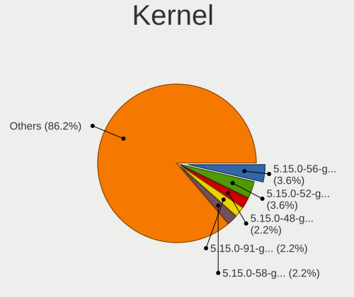

| Version            | Computers | Percent |
|--------------------|-----------|---------|
| 5.15.0-56-generic  | 67        | 3.64%   |
| 5.15.0-52-generic  | 66        | 3.58%   |
| 5.15.0-48-generic  | 41        | 2.22%   |
| 5.15.0-91-generic  | 40        | 2.17%   |
| 5.15.0-58-generic  | 40        | 2.17%   |
| 5.15.0-43-generic  | 39        | 2.12%   |
| 6.2.0-26-generic   | 37        | 2.01%   |
| 5.15.0-47-generic  | 36        | 1.95%   |
| 5.15.0-53-generic  | 33        | 1.79%   |
| 5.15.0-46-generic  | 33        | 1.79%   |
| 5.15.0-60-generic  | 32        | 1.74%   |
| 6.5.0-28-generic   | 31        | 1.68%   |
| 5.15.0-25-generic  | 30        | 1.63%   |
| 5.15.0-41-generic  | 29        | 1.57%   |
| 5.15.0-107-generic | 29        | 1.57%   |
| 5.19.0-35-generic  | 28        | 1.52%   |
| 6.5.0-15-generic   | 27        | 1.47%   |
| 5.15.0-67-generic  | 26        | 1.41%   |
| 5.15.0-40-generic  | 26        | 1.41%   |
| 6.2.0-34-generic   | 25        | 1.36%   |
| 6.2.0-39-generic   | 24        | 1.3%    |
| 5.19.0-46-generic  | 24        | 1.3%    |
| 5.15.0-27-generic  | 24        | 1.3%    |
| 5.15.0-50-generic  | 23        | 1.25%   |
| 5.19.0-38-generic  | 22        | 1.19%   |
| 5.19.0-32-generic  | 22        | 1.19%   |
| 5.15.0-75-generic  | 21        | 1.14%   |
| 6.5.0-26-generic   | 20        | 1.09%   |
| 6.2.0-37-generic   | 20        | 1.09%   |
| 6.5.0-35-generic   | 19        | 1.03%   |
| 6.2.0-36-generic   | 19        | 1.03%   |
| 5.19.0-41-generic  | 19        | 1.03%   |
| 5.15.0-33-generic  | 18        | 0.98%   |
| 6.8.0-40-generic   | 17        | 0.92%   |
| 6.5.0-21-generic   | 16        | 0.87%   |
| 6.2.0-33-generic   | 16        | 0.87%   |
| 6.5.0-27-generic   | 15        | 0.81%   |
| 6.5.0-14-generic   | 15        | 0.81%   |
| 5.15.0-78-generic  | 15        | 0.81%   |
| 5.15.0-71-generic  | 15        | 0.81%   |

Kernel Family
-------------

Linux kernel without a distro release

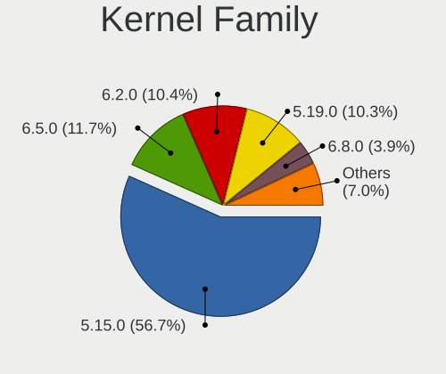

| Version | Computers | Percent |
|---------|-----------|---------|
| 5.15.0  | 956       | 56.7%   |
| 6.5.0   | 198       | 11.74%  |
| 6.2.0   | 175       | 10.38%  |
| 5.19.0  | 173       | 10.26%  |
| 6.8.0   | 66        | 3.91%   |
| 5.17.0  | 16        | 0.95%   |
| 6.0.0   | 6         | 0.36%   |
| 5.13.0  | 6         | 0.36%   |
| 6.1.0   | 5         | 0.3%    |
| 6.4.8   | 2         | 0.12%   |
| 6.4.10  | 2         | 0.12%   |
| 6.3.8   | 2         | 0.12%   |
| 6.3.6   | 2         | 0.12%   |
| 6.2.2   | 2         | 0.12%   |
| 6.2.16  | 2         | 0.12%   |
| 6.1.5   | 2         | 0.12%   |
| 6.0.7   | 2         | 0.12%   |
| 6.0.1   | 2         | 0.12%   |
| 5.19.5  | 2         | 0.12%   |
| 5.18.4  | 2         | 0.12%   |
| 5.18.10 | 2         | 0.12%   |
| 6.9.9   | 1         | 0.06%   |
| 6.9.7   | 1         | 0.06%   |
| 6.8.6   | 1         | 0.06%   |
| 6.8.1   | 1         | 0.06%   |
| 6.7.9   | 1         | 0.06%   |
| 6.7.11  | 1         | 0.06%   |
| 6.7.1   | 1         | 0.06%   |
| 6.6.30  | 1         | 0.06%   |
| 6.6.2   | 1         | 0.06%   |
| 6.5.7   | 1         | 0.06%   |
| 6.5.5   | 1         | 0.06%   |
| 6.5.3   | 1         | 0.06%   |
| 6.5.10  | 1         | 0.06%   |
| 6.4.3   | 1         | 0.06%   |
| 6.4.0   | 1         | 0.06%   |
| 6.3.9   | 1         | 0.06%   |
| 6.3.4   | 1         | 0.06%   |
| 6.3.1   | 1         | 0.06%   |
| 6.3.0   | 1         | 0.06%   |

Kernel Major Ver.
-----------------

Linux kernel major version

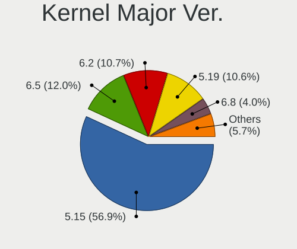

| Version | Computers | Percent |
|---------|-----------|---------|
| 5.15    | 958       | 56.89%  |
| 6.5     | 202       | 12%     |
| 6.2     | 181       | 10.75%  |
| 5.19    | 179       | 10.63%  |
| 6.8     | 68        | 4.04%   |
| 5.17    | 21        | 1.25%   |
| 6.1     | 16        | 0.95%   |
| 6.0     | 12        | 0.71%   |
| 5.18    | 9         | 0.53%   |
| 6.3     | 8         | 0.48%   |
| 6.4     | 6         | 0.36%   |
| 5.13    | 6         | 0.36%   |
| 6.7     | 3         | 0.18%   |
| 5.16    | 3         | 0.18%   |
| 6.9     | 2         | 0.12%   |
| 6.6     | 2         | 0.12%   |
| 5.10    | 2         | 0.12%   |
| 6.15    | 1         | 0.06%   |
| 6.13    | 1         | 0.06%   |
| 5.4     | 1         | 0.06%   |
| 5.3     | 1         | 0.06%   |
| 5.14    | 1         | 0.06%   |
| 5.11    | 1         | 0.06%   |

Arch
----

OS architecture (x86_64, i586, etc.)

| Name    | Computers | Percent |
|---------|-----------|---------|
| x86_64  | 1614      | 99.63%  |
| aarch64 | 5         | 0.31%   |
| riscv64 | 1         | 0.06%   |

DE
--

Desktop Environment

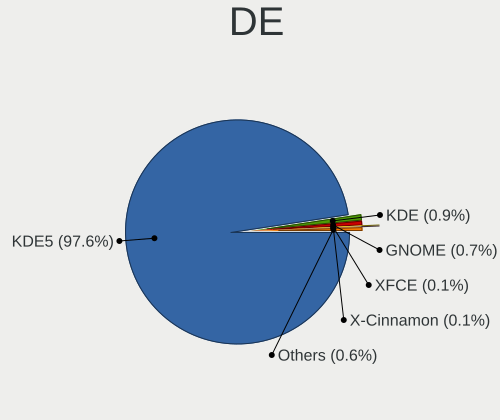

| Name       | Computers | Percent |
|------------|-----------|---------|
| KDE5       | 1585      | 97.6%   |
| KDE        | 15        | 0.92%   |
| GNOME      | 11        | 0.68%   |
| XFCE       | 2         | 0.12%   |
| X-Cinnamon | 2         | 0.12%   |
| KDE6       | 2         | 0.12%   |
| Unity      | 1         | 0.06%   |
| MATE       | 1         | 0.06%   |
| i3         | 1         | 0.06%   |
| GNUstep    | 1         | 0.06%   |
| Deepin     | 1         | 0.06%   |
| Cinnamon   | 1         | 0.06%   |
| Budgie     | 1         | 0.06%   |

Display Server
--------------

X11 or Wayland

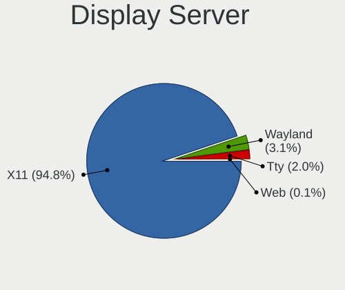

| Name    | Computers | Percent |
|---------|-----------|---------|
| X11     | 1543      | 94.84%  |
| Wayland | 51        | 3.13%   |
| Tty     | 32        | 1.97%   |
| Web     | 1         | 0.06%   |

Display Manager
---------------

SDDM, LightDM, etc.

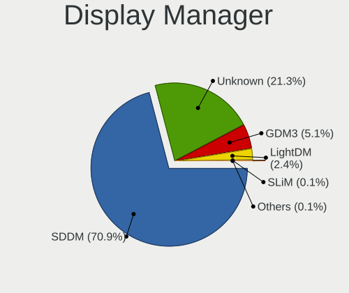

| Name    | Computers | Percent |
|---------|-----------|---------|
| SDDM    | 1160      | 70.95%  |
| Unknown | 349       | 21.35%  |
| GDM3    | 83        | 5.08%   |
| LightDM | 39        | 2.39%   |
| SLiM    | 2         | 0.12%   |
| LXDM    | 1         | 0.06%   |
| GDM     | 1         | 0.06%   |

OS Lang
-------

Language

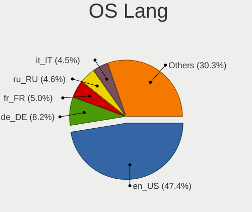

| Lang    | Computers | Percent |
|---------|-----------|---------|
| en_US   | 771       | 47.45%  |
| de_DE   | 133       | 8.18%   |
| fr_FR   | 82        | 5.05%   |
| ru_RU   | 74        | 4.55%   |
| it_IT   | 73        | 4.49%   |
| en_GB   | 68        | 4.18%   |
| pt_BR   | 47        | 2.89%   |
| es_ES   | 47        | 2.89%   |
| en_AU   | 35        | 2.15%   |
| en_CA   | 29        | 1.78%   |
| en_IN   | 27        | 1.66%   |
| pl_PL   | 26        | 1.6%    |
| es_AR   | 14        | 0.86%   |
| cs_CZ   | 14        | 0.86%   |
| C       | 14        | 0.86%   |
| hu_HU   | 10        | 0.62%   |
| en_NZ   | 9         | 0.55%   |
| zh_CN   | 8         | 0.49%   |
| en_ZA   | 8         | 0.49%   |
| de_AT   | 8         | 0.49%   |
| nl_NL   | 7         | 0.43%   |
| en_PH   | 7         | 0.43%   |
| nl_BE   | 6         | 0.37%   |
| es_MX   | 6         | 0.37%   |
| es_CO   | 6         | 0.37%   |
| en_SG   | 6         | 0.37%   |
| de_CH   | 6         | 0.37%   |
| tr_TR   | 5         | 0.31%   |
| el_GR   | 5         | 0.31%   |
| Default | 5         | 0.31%   |
| fr_BE   | 4         | 0.25%   |
| fi_FI   | 4         | 0.25%   |
| es_CL   | 4         | 0.25%   |
| en_AG   | 4         | 0.25%   |
| pt_PT   | 3         | 0.18%   |
| lt_LT   | 3         | 0.18%   |
| fr_CH   | 3         | 0.18%   |
| es_VE   | 3         | 0.18%   |
| es_CR   | 3         | 0.18%   |
| da_DK   | 3         | 0.18%   |

Boot Mode
---------

EFI or BIOS

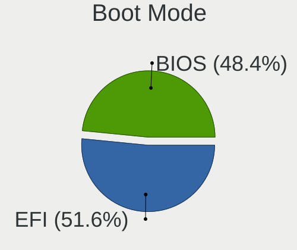

| Mode | Computers | Percent |
|------|-----------|---------|
| EFI  | 845       | 51.56%  |
| BIOS | 794       | 48.44%  |

Filesystem
----------

Type of filesystem

| Type    | Computers | Percent |
|---------|-----------|---------|
| Ext4    | 1312      | 80%     |
| Tmpfs   | 211       | 12.87%  |
| Btrfs   | 53        | 3.23%   |
| Overlay | 45        | 2.74%   |
| Xfs     | 11        | 0.67%   |
| Zfs     | 4         | 0.24%   |
| Ext2    | 2         | 0.12%   |
| F2fs    | 1         | 0.06%   |
| Ext3    | 1         | 0.06%   |

Part. scheme
------------

Scheme of partitioning

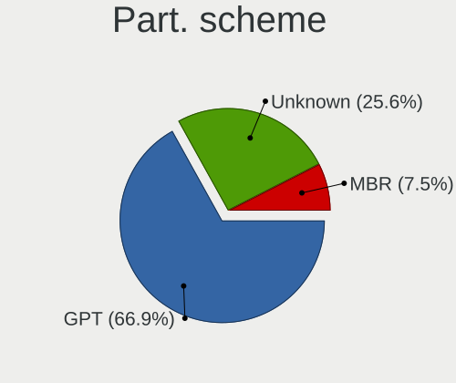

| Type    | Computers | Percent |
|---------|-----------|---------|
| GPT     | 1097      | 66.93%  |
| Unknown | 419       | 25.56%  |
| MBR     | 123       | 7.5%    |

Dual Boot with Linux/BSD
------------------------

Hosting more than one Linux/BSD

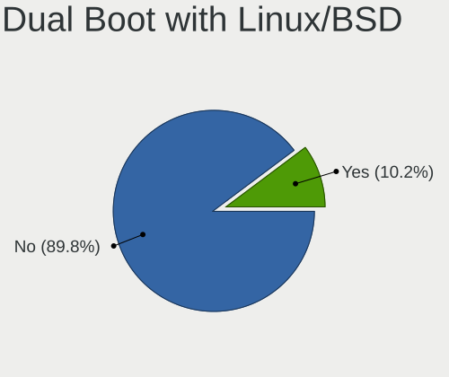

| Dual boot | Computers | Percent |
|-----------|-----------|---------|
| No        | 1465      | 89.77%  |
| Yes       | 167       | 10.23%  |

Dual Boot (Win)
---------------

Hosting Linux and Windows

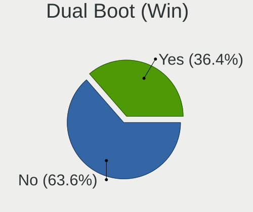

| Dual boot | Computers | Percent |
|-----------|-----------|---------|
| No        | 1038      | 63.6%   |
| Yes       | 594       | 36.4%   |

Board
-----

Vendor
------

Motherboard manufacturer

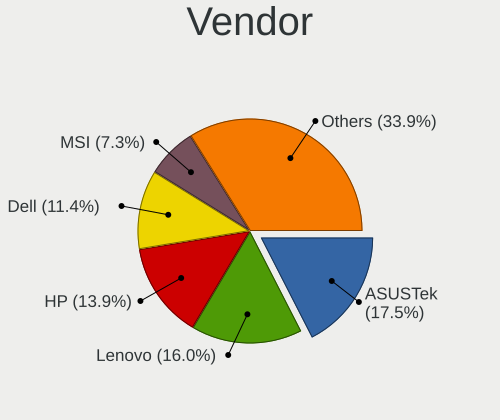

| Name                                 | Computers | Percent |
|--------------------------------------|-----------|---------|
| ASUSTek Computer                     | 283       | 17.47%  |
| Lenovo                               | 260       | 16.05%  |
| Hewlett-Packard                      | 225       | 13.89%  |
| Dell                                 | 185       | 11.42%  |
| MSI                                  | 118       | 7.28%   |
| Gigabyte Technology                  | 111       | 6.85%   |
| Acer                                 | 77        | 4.75%   |
| ASRock                               | 47        | 2.9%    |
| Apple                                | 40        | 2.47%   |
| HUAWEI                               | 21        | 1.3%    |
| Samsung Electronics                  | 16        | 0.99%   |
| Unknown                              | 16        | 0.99%   |
| Fujitsu                              | 15        | 0.93%   |
| Toshiba                              | 12        | 0.74%   |
| AZW                                  | 12        | 0.74%   |
| Intel                                | 9         | 0.56%   |
| Google                               | 9         | 0.56%   |
| Notebook                             | 8         | 0.49%   |
| Alienware                            | 8         | 0.49%   |
| TUXEDO                               | 7         | 0.43%   |
| Supermicro                           | 6         | 0.37%   |
| Biostar                              | 6         | 0.37%   |
| Timi                                 | 5         | 0.31%   |
| Sony                                 | 5         | 0.31%   |
| Microsoft                            | 5         | 0.31%   |
| Medion                               | 5         | 0.31%   |
| PC Specialist                        | 4         | 0.25%   |
| System76                             | 3         | 0.19%   |
| Schenker                             | 3         | 0.19%   |
| Pegatron                             | 3         | 0.19%   |
| Framework                            | 3         | 0.19%   |
| Foxconn                              | 3         | 0.19%   |
| Carbon Systems                       | 3         | 0.19%   |
| BESSTAR Tech                         | 3         | 0.19%   |
| AMI                                  | 3         | 0.19%   |
| VALE                                 | 2         | 0.12%   |
| Thomson                              | 2         | 0.12%   |
| Shuttle                              | 2         | 0.12%   |
| Shenzhen Meigao Electronic Equipment | 2         | 0.12%   |
| Razer                                | 2         | 0.12%   |

Model
-----

Motherboard model

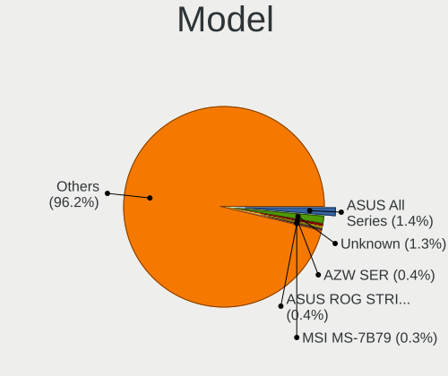

| Name                                   | Computers | Percent |
|----------------------------------------|-----------|---------|
| ASUS All Series                        | 23        | 1.42%   |
| Unknown                                | 21        | 1.3%    |
| AZW SER                                | 6         | 0.37%   |
| ASUS ROG STRIX B550-F GAMING           | 6         | 0.37%   |
| MSI MS-7B79                            | 5         | 0.31%   |
| HUAWEI HVY-WXX9                        | 5         | 0.31%   |
| HP Pavilion g6                         | 5         | 0.31%   |
| ASUS PRIME X370-PRO                    | 5         | 0.31%   |
| MSI MS-7B51                            | 4         | 0.25%   |
| Lenovo IdeaPad 5 15ARE05 81YQ          | 4         | 0.25%   |
| HP OMEN Laptop 15-en0xxx               | 4         | 0.25%   |
| HP Notebook                            | 4         | 0.25%   |
| HP Compaq Elite 8300 SFF               | 4         | 0.25%   |
| HP 255 G8 Notebook PC                  | 4         | 0.25%   |
| Dell Latitude 7490                     | 4         | 0.25%   |
| ASUS P5Q                               | 4         | 0.25%   |
| ASRock B450M Pro4                      | 4         | 0.25%   |
| Acer Aspire A515-45                    | 4         | 0.25%   |
| MSI MS-7D91                            | 3         | 0.19%   |
| MSI MS-7C95                            | 3         | 0.19%   |
| MSI MS-7C56                            | 3         | 0.19%   |
| MSI MS-7B86                            | 3         | 0.19%   |
| MSI MS-7A32                            | 3         | 0.19%   |
| Lenovo IdeaPad 5 Pro 14ACN6 82L7       | 3         | 0.19%   |
| Lenovo IdeaPad 3 15ALC6 82KU           | 3         | 0.19%   |
| HUAWEI BOM-WXX9                        | 3         | 0.19%   |
| HP ProBook 6570b                       | 3         | 0.19%   |
| HP ProBook 6470b                       | 3         | 0.19%   |
| HP ProBook 440 G8 Notebook PC          | 3         | 0.19%   |
| HP Pavilion Gaming Laptop 15-ec0xxx    | 3         | 0.19%   |
| HP Pavilion 17                         | 3         | 0.19%   |
| HP Laptop 17-cp0xxx                    | 3         | 0.19%   |
| HP Laptop 15-ef2xxx                    | 3         | 0.19%   |
| HP G62                                 | 3         | 0.19%   |
| HP EliteDesk 800 G1 SFF                | 3         | 0.19%   |
| HP EliteBook 845 G7 Notebook PC        | 3         | 0.19%   |
| HP 15                                  | 3         | 0.19%   |
| Gigabyte B450M DS3H                    | 3         | 0.19%   |
| Framework Laptop (12th Gen Intel Core) | 3         | 0.19%   |
| Dell XPS 15 9560                       | 3         | 0.19%   |

Model Family
------------

Motherboard model prefix

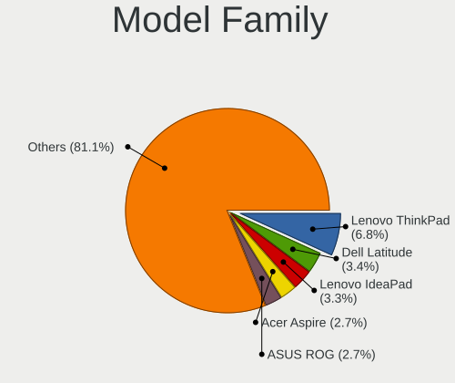

| Name               | Computers | Percent |
|--------------------|-----------|---------|
| Lenovo ThinkPad    | 110       | 6.79%   |
| Dell Latitude      | 55        | 3.4%    |
| Lenovo IdeaPad     | 53        | 3.27%   |
| ASUS ROG           | 44        | 2.72%   |
| Acer Aspire        | 44        | 2.72%   |
| Dell Inspiron      | 39        | 2.41%   |
| ASUS PRIME         | 37        | 2.28%   |
| HP Pavilion        | 36        | 2.22%   |
| ASUS VivoBook      | 32        | 1.98%   |
| HP ProBook         | 28        | 1.73%   |
| HP EliteBook       | 28        | 1.73%   |
| HP Laptop          | 25        | 1.54%   |
| Dell XPS           | 24        | 1.48%   |
| Dell Precision     | 24        | 1.48%   |
| ASUS All           | 23        | 1.42%   |
| ASUS TUF           | 21        | 1.3%    |
| Unknown            | 21        | 1.3%    |
| Lenovo ThinkCentre | 18        | 1.11%   |
| Dell OptiPlex      | 18        | 1.11%   |
| Lenovo ThinkBook   | 15        | 0.93%   |
| Lenovo Legion      | 15        | 0.93%   |
| Lenovo Yoga        | 14        | 0.86%   |
| Acer Nitro         | 13        | 0.8%    |
| HP ENVY            | 10        | 0.62%   |
| HP EliteDesk       | 10        | 0.62%   |
| Dell Vostro        | 10        | 0.62%   |
| ASUS ASUS          | 10        | 0.62%   |
| Toshiba Satellite  | 9         | 0.56%   |
| HP ZBook           | 9         | 0.56%   |
| Gigabyte X570      | 9         | 0.56%   |
| HP OMEN            | 8         | 0.49%   |
| Fujitsu ESPRIMO    | 8         | 0.49%   |
| HP Compaq          | 7         | 0.43%   |
| Apple MacBookPro11 | 7         | 0.43%   |
| HP ProDesk         | 6         | 0.37%   |
| Fujitsu LIFEBOOK   | 6         | 0.37%   |
| AZW SER            | 6         | 0.37%   |
| MSI MS-7B79        | 5         | 0.31%   |
| Microsoft Surface  | 5         | 0.31%   |
| Lenovo IdeaCentre  | 5         | 0.31%   |

MFG Year
--------

Motherboard manufacture year

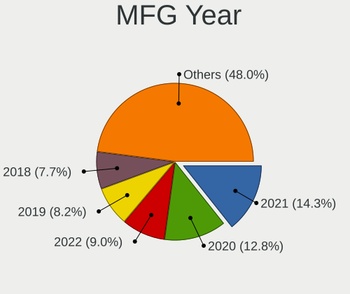

| Year    | Computers | Percent |
|---------|-----------|---------|
| 2021    | 232       | 14.32%  |
| 2020    | 208       | 12.84%  |
| 2022    | 146       | 9.01%   |
| 2019    | 133       | 8.21%   |
| 2018    | 124       | 7.65%   |
| 2012    | 117       | 7.22%   |
| 2017    | 97        | 5.99%   |
| 2013    | 90        | 5.56%   |
| 2014    | 85        | 5.25%   |
| 2016    | 74        | 4.57%   |
| 2011    | 70        | 4.32%   |
| 2015    | 64        | 3.95%   |
| 2023    | 56        | 3.46%   |
| 2010    | 46        | 2.84%   |
| 2009    | 25        | 1.54%   |
| 2008    | 24        | 1.48%   |
| 2007    | 16        | 0.99%   |
| Unknown | 6         | 0.37%   |
| 2024    | 4         | 0.25%   |
| 2025    | 3         | 0.19%   |

Form Factor
-----------

Physical design of the computer

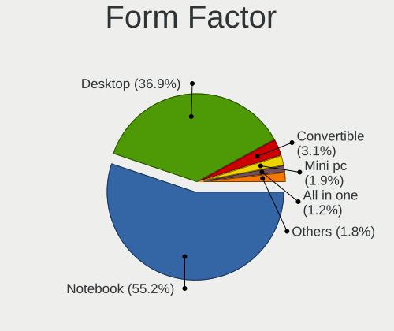

| Name           | Computers | Percent |
|----------------|-----------|---------|
| Notebook       | 894       | 55.19%  |
| Desktop        | 597       | 36.85%  |
| Convertible    | 50        | 3.09%   |
| Mini pc        | 30        | 1.85%   |
| All in one     | 20        | 1.23%   |
| Tablet         | 14        | 0.86%   |
| Server         | 9         | 0.56%   |
| System on chip | 5         | 0.31%   |
| Stick pc       | 1         | 0.06%   |

Secure Boot
-----------

Enabled or disabled

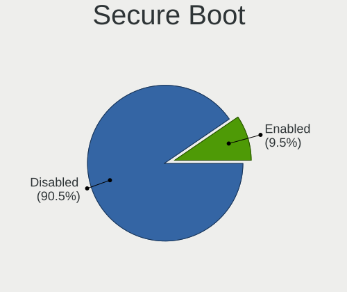

| State    | Computers | Percent |
|----------|-----------|---------|
| Disabled | 1473      | 90.48%  |
| Enabled  | 155       | 9.52%   |

Coreboot
--------

Have coreboot on board

| Used | Computers | Percent |
|------|-----------|---------|
| No   | 1608      | 99.26%  |
| Yes  | 12        | 0.74%   |

RAM Size
--------

Total RAM memory

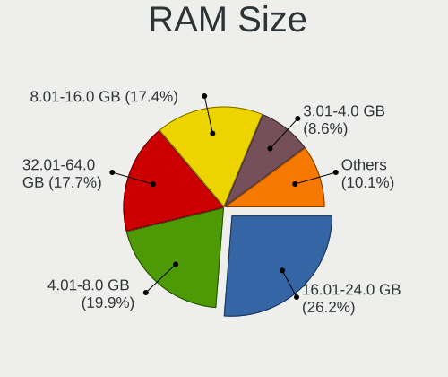

| Size in GB      | Computers | Percent |
|-----------------|-----------|---------|
| 16.01-24.0      | 429       | 26.24%  |
| 4.01-8.0        | 326       | 19.94%  |
| 32.01-64.0      | 289       | 17.68%  |
| 8.01-16.0       | 285       | 17.43%  |
| 3.01-4.0        | 141       | 8.62%   |
| 64.01-256.0     | 87        | 5.32%   |
| 24.01-32.0      | 57        | 3.49%   |
| 2.01-3.0        | 8         | 0.49%   |
| 1.01-2.0        | 8         | 0.49%   |
| More than 256.0 | 4         | 0.24%   |
| 0.51-1.0        | 1         | 0.06%   |

RAM Used
--------

Used RAM memory

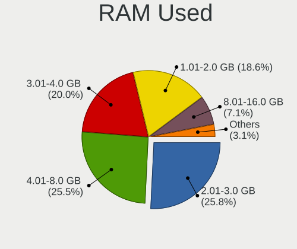

| Used GB     | Computers | Percent |
|-------------|-----------|---------|
| 2.01-3.0    | 451       | 25.77%  |
| 4.01-8.0    | 446       | 25.49%  |
| 3.01-4.0    | 350       | 20%     |
| 1.01-2.0    | 325       | 18.57%  |
| 8.01-16.0   | 124       | 7.09%   |
| 16.01-24.0  | 27        | 1.54%   |
| 0.51-1.0    | 10        | 0.57%   |
| 24.01-32.0  | 9         | 0.51%   |
| 32.01-64.0  | 5         | 0.29%   |
| 0.01-0.5    | 2         | 0.11%   |
| 64.01-256.0 | 1         | 0.06%   |

Total Drives
------------

Number of drives on board

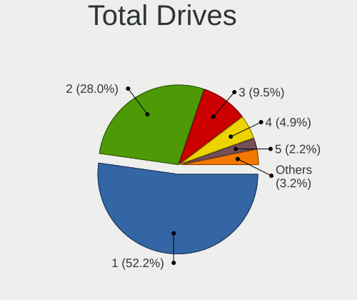

| Drives | Computers | Percent |
|--------|-----------|---------|
| 1      | 861       | 52.25%  |
| 2      | 461       | 27.97%  |
| 3      | 156       | 9.47%   |
| 4      | 80        | 4.85%   |
| 5      | 37        | 2.25%   |
| 6      | 20        | 1.21%   |
| 7      | 19        | 1.15%   |
| 9      | 5         | 0.3%    |
| 8      | 3         | 0.18%   |
| 0      | 3         | 0.18%   |
| 11     | 2         | 0.12%   |
| 12     | 1         | 0.06%   |

Has CD-ROM
----------

Has CD-ROM on board

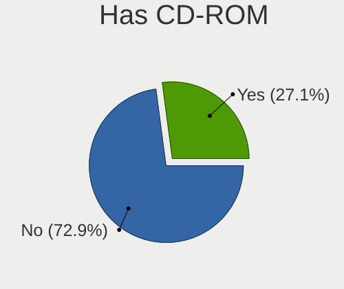

| Presented | Computers | Percent |
|-----------|-----------|---------|
| No        | 1187      | 72.91%  |
| Yes       | 441       | 27.09%  |

Has Ethernet
------------

Has Ethernet on board

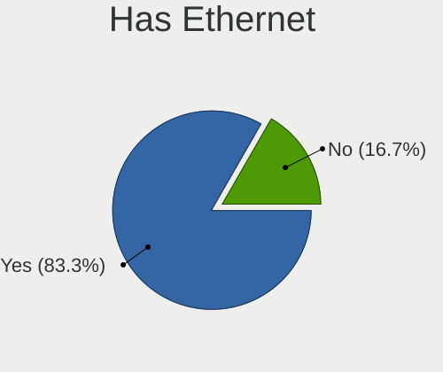

| Presented | Computers | Percent |
|-----------|-----------|---------|
| Yes       | 1352      | 83.3%   |
| No        | 271       | 16.7%   |

Has WiFi
--------

Has WiFi module

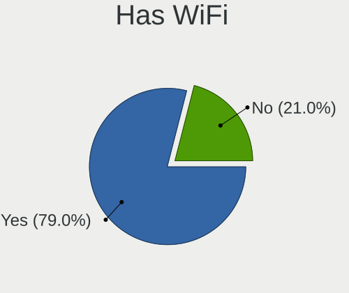

| Presented | Computers | Percent |
|-----------|-----------|---------|
| Yes       | 1282      | 78.99%  |
| No        | 341       | 21.01%  |

Has Bluetooth
-------------

Has Bluetooth module

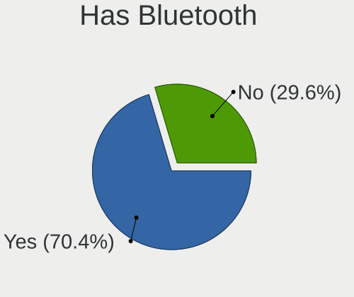

| Presented | Computers | Percent |
|-----------|-----------|---------|
| Yes       | 1153      | 70.43%  |
| No        | 484       | 29.57%  |

Location
--------

Country
-------

Geographic location (country)

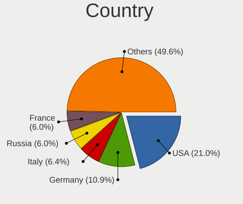

| Country      | Computers | Percent |
|--------------|-----------|---------|
| USA          | 341       | 20.97%  |
| Germany      | 178       | 10.95%  |
| Italy        | 104       | 6.4%    |
| Russia       | 98        | 6.03%   |
| France       | 98        | 6.03%   |
| Brazil       | 67        | 4.12%   |
| UK           | 62        | 3.81%   |
| Spain        | 62        | 3.81%   |
| Poland       | 45        | 2.77%   |
| Canada       | 37        | 2.28%   |
| Australia    | 34        | 2.09%   |
| India        | 32        | 1.97%   |
| Netherlands  | 25        | 1.54%   |
| Switzerland  | 24        | 1.48%   |
| Czechia      | 23        | 1.41%   |
| Argentina    | 21        | 1.29%   |
| Hungary      | 20        | 1.23%   |
| Belgium      | 18        | 1.11%   |
| Austria      | 16        | 0.98%   |
| Finland      | 14        | 0.86%   |
| Turkey       | 13        | 0.8%    |
| Indonesia    | 13        | 0.8%    |
| Mexico       | 12        | 0.74%   |
| Bulgaria     | 12        | 0.74%   |
| New Zealand  | 11        | 0.68%   |
| Portugal     | 10        | 0.62%   |
| Greece       | 10        | 0.62%   |
| China        | 10        | 0.62%   |
| Sweden       | 9         | 0.55%   |
| South Africa | 9         | 0.55%   |
| Slovenia     | 9         | 0.55%   |
| Serbia       | 9         | 0.55%   |
| Romania      | 9         | 0.55%   |
| Colombia     | 9         | 0.55%   |
| Philippines  | 8         | 0.49%   |
| Norway       | 8         | 0.49%   |
| Denmark      | 8         | 0.49%   |
| Thailand     | 7         | 0.43%   |
| Singapore    | 7         | 0.43%   |
| Chile        | 7         | 0.43%   |

City
----

Geographic location (city)

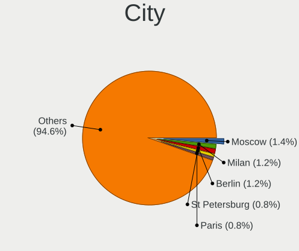

| City              | Computers | Percent |
|-------------------|-----------|---------|
| Moscow            | 24        | 1.42%   |
| Milan             | 20        | 1.18%   |
| Berlin            | 20        | 1.18%   |
| St Petersburg     | 14        | 0.83%   |
| Paris             | 13        | 0.77%   |
| Madrid            | 12        | 0.71%   |
| Munich            | 11        | 0.65%   |
| Hamburg           | 11        | 0.65%   |
| Budapest          | 11        | 0.65%   |
| Warsaw            | 10        | 0.59%   |
| Sao Paulo         | 10        | 0.59%   |
| Sydney            | 9         | 0.53%   |
| Prague            | 9         | 0.53%   |
| Montreal          | 9         | 0.53%   |
| Dallas            | 9         | 0.53%   |
| Vienna            | 8         | 0.47%   |
| London            | 8         | 0.47%   |
| Frankfurt am Main | 8         | 0.47%   |
| Amsterdam         | 8         | 0.47%   |
| Zurich            | 7         | 0.41%   |
| Singapore         | 7         | 0.41%   |
| Castro Valley     | 7         | 0.41%   |
| Belgrade          | 7         | 0.41%   |
| Vladivostok       | 6         | 0.35%   |
| Rome              | 6         | 0.35%   |
| New York          | 6         | 0.35%   |
| Melbourne         | 6         | 0.35%   |
| Istanbul          | 6         | 0.35%   |
| Houston           | 6         | 0.35%   |
| Cologne           | 6         | 0.35%   |
| Bengaluru         | 6         | 0.35%   |
| Auckland          | 6         | 0.35%   |
| Wroclaw           | 5         | 0.3%    |
| Seattle           | 5         | 0.3%    |
| Rio de Janeiro    | 5         | 0.3%    |
| Krakow            | 5         | 0.3%    |
| Johannesburg      | 5         | 0.3%    |
| Brussels          | 5         | 0.3%    |
| Brisbane          | 5         | 0.3%    |
| Barcelona         | 5         | 0.3%    |

Drives
------

Drive Vendor
------------

Hard drive vendors

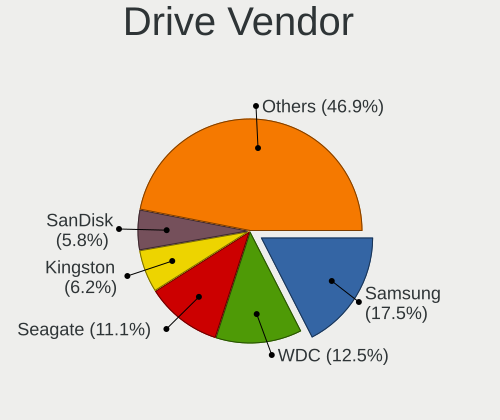

| Vendor                      | Computers | Drives | Percent |
|-----------------------------|-----------|--------|---------|
| Samsung Electronics         | 450       | 743    | 17.47%  |
| WDC                         | 322       | 488    | 12.5%   |
| Seagate                     | 285       | 493    | 11.06%  |
| Kingston                    | 160       | 199    | 6.21%   |
| SanDisk                     | 150       | 206    | 5.82%   |
| Toshiba                     | 128       | 181    | 4.97%   |
| Crucial                     | 102       | 125    | 3.96%   |
| SK hynix                    | 83        | 95     | 3.22%   |
| Unknown                     | 73        | 101    | 2.83%   |
| Intel                       | 72        | 90     | 2.8%    |
| Micron Technology           | 63        | 68     | 2.45%   |
| Hitachi                     | 57        | 66     | 2.21%   |
| HGST                        | 40        | 51     | 1.55%   |
| KIOXIA                      | 38        | 43     | 1.48%   |
| A-DATA Technology           | 38        | 47     | 1.48%   |
| China                       | 32        | 38     | 1.24%   |
| Apple                       | 25        | 30     | 0.97%   |
| SPCC                        | 20        | 29     | 0.78%   |
| Silicon Motion              | 20        | 26     | 0.78%   |
| Phison Electronics          | 20        | 23     | 0.78%   |
| PNY                         | 19        | 55     | 0.74%   |
| Phison                      | 19        | 19     | 0.74%   |
| Patriot                     | 17        | 20     | 0.66%   |
| Micron/Crucial Technology   | 15        | 21     | 0.58%   |
| Corsair                     | 15        | 18     | 0.58%   |
| Unknown                     | 15        | 15     | 0.58%   |
| Kingston Technology Company | 11        | 16     | 0.43%   |
| JMicron Technology          | 11        | 11     | 0.43%   |
| SSSTC                       | 9         | 9      | 0.35%   |
| Lexar                       | 9         | 9      | 0.35%   |
| Realtek Semiconductor       | 8         | 8      | 0.31%   |
| OCZ                         | 8         | 9      | 0.31%   |
| Maxtor                      | 8         | 11     | 0.31%   |
| LITEON                      | 8         | 8      | 0.31%   |
| Intenso                     | 8         | 11     | 0.31%   |
| Transcend                   | 7         | 8      | 0.27%   |
| Team                        | 7         | 7      | 0.27%   |
| SABRENT                     | 7         | 9      | 0.27%   |
| Netac                       | 7         | 10     | 0.27%   |
| GOODRAM                     | 7         | 8      | 0.27%   |

Drive Model
-----------

Hard drive models

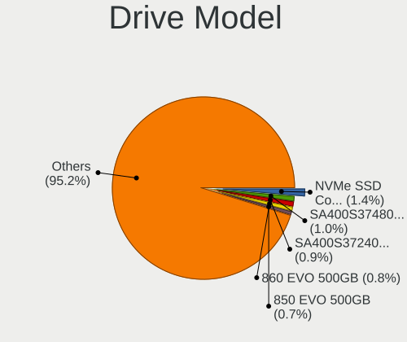

| Model                                                 | Computers | Percent |
|-------------------------------------------------------|-----------|---------|
| Samsung NVMe SSD Controller SM981/PM981/PM983 1TB     | 40        | 1.38%   |
| Kingston SA400S37480G 480GB SSD                       | 28        | 0.97%   |
| Kingston SA400S37240G 240GB SSD                       | 27        | 0.93%   |
| Samsung SSD 860 EVO 500GB                             | 24        | 0.83%   |
| Samsung SSD 850 EVO 500GB                             | 19        | 0.66%   |
| Samsung NVMe SSD Controller PM9A1/PM9A3/980PRO 1TB    | 19        | 0.66%   |
| Samsung SSD 860 EVO 1TB                               | 16        | 0.55%   |
| Toshiba DT01ACA100 1TB                                | 15        | 0.52%   |
| Samsung SSD 980 PRO 1TB                               | 15        | 0.52%   |
| Samsung SSD 980 1TB                                   | 15        | 0.52%   |
| Samsung SSD 870 EVO 1TB                               | 15        | 0.52%   |
| Unknown                                               | 15        | 0.52%   |
| Crucial CT1000MX500SSD1 1TB                           | 14        | 0.48%   |
| Seagate ST2000DM008-2FR102 2TB                        | 13        | 0.45%   |
| Samsung SSD 850 EVO 250GB                             | 13        | 0.45%   |
| Unknown MMC Card  64GB                                | 12        | 0.41%   |
| Seagate ST4000DM004-2CV104 4TB                        | 12        | 0.41%   |
| Sandisk WD Blue SN550 NVMe SSD 1024GB                 | 12        | 0.41%   |
| Samsung SSD 870 QVO 1TB                               | 12        | 0.41%   |
| Toshiba MQ01ABD100 1TB                                | 11        | 0.38%   |
| Seagate ST1000LM035-1RK172 1TB                        | 11        | 0.38%   |
| Seagate ST1000LM024 HN-M101MBB 1TB                    | 11        | 0.38%   |
| Sandisk WD Black SN750 / PC SN730 NVMe SSD 500GB      | 11        | 0.38%   |
| Unknown MMC Card  32GB                                | 10        | 0.35%   |
| SanDisk NVMe SSD Drive 1TB                            | 10        | 0.35%   |
| Samsung SSD 970 EVO Plus 500GB                        | 10        | 0.35%   |
| Samsung SSD 970 EVO Plus 1TB                          | 10        | 0.35%   |
| Samsung SSD 870 EVO 500GB                             | 10        | 0.35%   |
| Crucial CT500MX500SSD1 500GB                          | 10        | 0.35%   |
| Crucial CT240BX500SSD1 240GB                          | 10        | 0.35%   |
| WDC WD10EZEX-08WN4A0 1TB                              | 9         | 0.31%   |
| Silicon Motion SM2263EN/SM2263XT SSD Controller 512GB | 9         | 0.31%   |
| Kingston SA400S37960G 960GB SSD                       | 9         | 0.31%   |
| Crucial CT1000BX500SSD1 1TB                           | 9         | 0.31%   |
| Unknown MMC Card  128GB                               | 8         | 0.28%   |
| Toshiba MQ04ABF100 1TB                                | 8         | 0.28%   |
| Seagate ST1000DM003-1ER162 1TB                        | 8         | 0.28%   |
| Seagate Expansion 2TB                                 | 8         | 0.28%   |
| Samsung SSD 860 QVO 1TB                               | 8         | 0.28%   |
| Phison PS5013 E13 NVMe Controller 500GB               | 8         | 0.28%   |

HDD Vendor
----------

Hard disk drive vendors

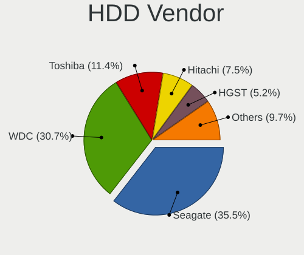

| Vendor              | Computers | Drives | Percent |
|---------------------|-----------|--------|---------|
| Seagate             | 271       | 465    | 35.52%  |
| WDC                 | 234       | 333    | 30.67%  |
| Toshiba             | 87        | 127    | 11.4%   |
| Hitachi             | 57        | 66     | 7.47%   |
| HGST                | 40        | 51     | 5.24%   |
| Samsung Electronics | 28        | 48     | 3.67%   |
| Maxtor              | 7         | 10     | 0.92%   |
| JMicron Technology  | 6         | 6      | 0.79%   |
| Apple               | 6         | 6      | 0.79%   |
| Unknown             | 5         | 5      | 0.66%   |
| USB3.0              | 3         | 5      | 0.39%   |
| Fujitsu             | 3         | 3      | 0.39%   |
| SAGE                | 2         | 2      | 0.26%   |
| IET                 | 2         | 2      | 0.26%   |
| Hewlett-Packard     | 2         | 2      | 0.26%   |
| T-FORCE             | 1         | 1      | 0.13%   |
| SSK                 | 1         | 2      | 0.13%   |
| KESU                | 1         | 1      | 0.13%   |
| Intenso             | 1         | 1      | 0.13%   |
| HPE                 | 1         | 6      | 0.13%   |
| HGST HTS            | 1         | 1      | 0.13%   |
| External            | 1         | 1      | 0.13%   |
| DELLBOSS            | 1         | 1      | 0.13%   |
| ASMT109x            | 1         | 1      | 0.13%   |
| ASMT                | 1         | 1      | 0.13%   |

SSD Vendor
----------

Solid state drive vendors

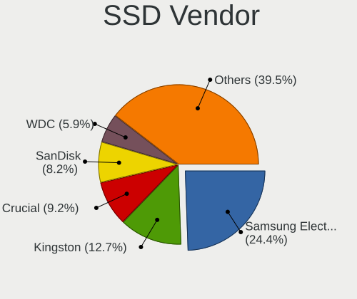

| Vendor              | Computers | Drives | Percent |
|---------------------|-----------|--------|---------|
| Samsung Electronics | 211       | 330    | 24.45%  |
| Kingston            | 110       | 132    | 12.75%  |
| Crucial             | 79        | 98     | 9.15%   |
| SanDisk             | 71        | 91     | 8.23%   |
| WDC                 | 51        | 97     | 5.91%   |
| China               | 30        | 36     | 3.48%   |
| A-DATA Technology   | 29        | 35     | 3.36%   |
| SPCC                | 17        | 22     | 1.97%   |
| Patriot             | 17        | 20     | 1.97%   |
| Intel               | 17        | 25     | 1.97%   |
| PNY                 | 16        | 52     | 1.85%   |
| Micron Technology   | 16        | 16     | 1.85%   |
| SK hynix            | 12        | 12     | 1.39%   |
| Apple               | 12        | 13     | 1.39%   |
| Toshiba             | 10        | 14     | 1.16%   |
| OCZ                 | 8         | 9      | 0.93%   |
| Lexar               | 8         | 8      | 0.93%   |
| SABRENT             | 7         | 9      | 0.81%   |
| LITEON              | 7         | 7      | 0.81%   |
| GOODRAM             | 7         | 8      | 0.81%   |
| Corsair             | 7         | 7      | 0.81%   |
| Transcend           | 6         | 6      | 0.7%    |
| Unknown             | 6         | 6      | 0.7%    |
| Verbatim            | 5         | 5      | 0.58%   |
| Team                | 5         | 5      | 0.58%   |
| Netac               | 5         | 8      | 0.58%   |
| Mushkin             | 5         | 8      | 0.58%   |
| Intenso             | 5         | 6      | 0.58%   |
| LITEONIT            | 4         | 4      | 0.46%   |
| Hewlett-Packard     | 4         | 4      | 0.46%   |
| Emtec               | 4         | 4      | 0.46%   |
| Apacer              | 4         | 4      | 0.46%   |
| Seagate             | 3         | 5      | 0.35%   |
| Plextor             | 3         | 3      | 0.35%   |
| KIOXIA-EXCERIA      | 3         | 5      | 0.35%   |
| Smart               | 2         | 2      | 0.23%   |
| RZX                 | 2         | 2      | 0.23%   |
| LT                  | 2         | 4      | 0.23%   |
| KODAK               | 2         | 2      | 0.23%   |
| KingSpec            | 2         | 2      | 0.23%   |

Drive Kind
----------

HDD or SSD

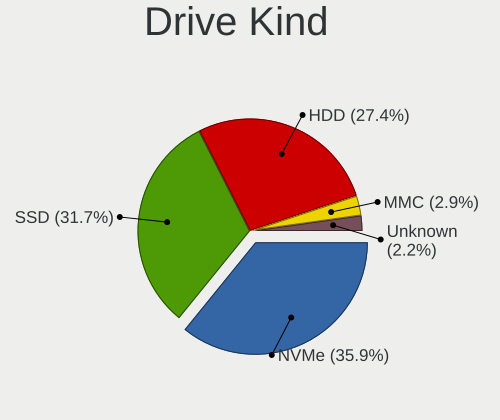

| Kind    | Computers | Drives | Percent |
|---------|-----------|--------|---------|
| NVMe    | 824       | 1154   | 35.86%  |
| SSD     | 728       | 1195   | 31.68%  |
| HDD     | 629       | 1147   | 27.37%  |
| MMC     | 66        | 80     | 2.87%   |
| Unknown | 51        | 78     | 2.22%   |

Drive Connector
---------------

SATA, SAS, NVMe, etc.

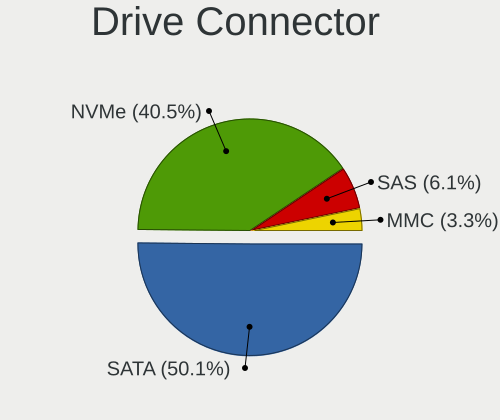

| Type | Computers | Drives | Percent |
|------|-----------|--------|---------|
| SATA | 1015      | 2232   | 50.15%  |
| NVMe | 819       | 1143   | 40.46%  |
| SAS  | 124       | 199    | 6.13%   |
| MMC  | 66        | 80     | 3.26%   |

Drive Size
----------

Size of hard drive

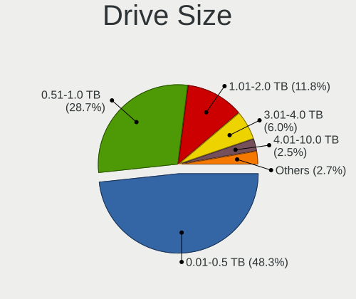

| Size in TB | Computers | Drives | Percent |
|------------|-----------|--------|---------|
| 0.01-0.5   | 712       | 1162   | 48.3%   |
| 0.51-1.0   | 423       | 587    | 28.7%   |
| 1.01-2.0   | 174       | 297    | 11.8%   |
| 3.01-4.0   | 88        | 189    | 5.97%   |
| 4.01-10.0  | 37        | 56     | 2.51%   |
| 2.01-3.0   | 32        | 37     | 2.17%   |
| 10.01-20.0 | 8         | 14     | 0.54%   |

Space Total
-----------

Amount of disk space available on the file system

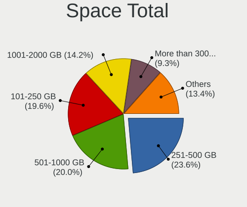

| Size in GB     | Computers | Percent |
|----------------|-----------|---------|
| 251-500        | 390       | 23.61%  |
| 501-1000       | 330       | 19.98%  |
| 101-250        | 323       | 19.55%  |
| 1001-2000      | 234       | 14.16%  |
| More than 3000 | 153       | 9.26%   |
| 2001-3000      | 89        | 5.39%   |
| 51-100         | 58        | 3.51%   |
| 1-20           | 56        | 3.39%   |
| 21-50          | 16        | 0.97%   |
| Unknown        | 3         | 0.18%   |

Space Used
----------

Amount of used disk space

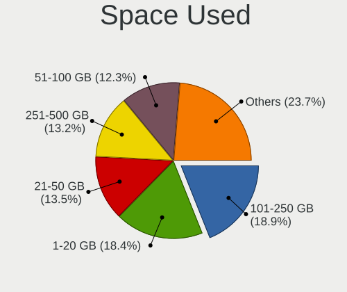

| Used GB        | Computers | Percent |
|----------------|-----------|---------|
| 101-250        | 322       | 18.94%  |
| 1-20           | 313       | 18.41%  |
| 21-50          | 229       | 13.47%  |
| 251-500        | 224       | 13.18%  |
| 51-100         | 209       | 12.29%  |
| 501-1000       | 189       | 11.12%  |
| 1001-2000      | 113       | 6.65%   |
| More than 3000 | 68        | 4%      |
| 2001-3000      | 30        | 1.76%   |
| Unknown        | 3         | 0.18%   |

Malfunc. Drives
---------------

Drive models with a malfunction

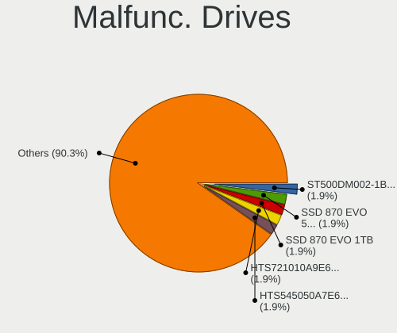

| Model                                 | Computers | Drives | Percent |
|---------------------------------------|-----------|--------|---------|
| Seagate ST500DM002-1BD142 500GB       | 3         | 3      | 1.95%   |
| Samsung Electronics SSD 870 EVO 500GB | 3         | 3      | 1.95%   |
| Samsung Electronics SSD 870 EVO 1TB   | 3         | 3      | 1.95%   |
| HGST HTS721010A9E630 1TB              | 3         | 3      | 1.95%   |
| HGST HTS545050A7E680 500GB            | 3         | 3      | 1.95%   |
| WDC WD10JPVX-60JC3T0 1TB              | 2         | 2      | 1.3%    |
| Toshiba MQ04ABF100 1TB                | 2         | 2      | 1.3%    |
| SK hynix BC711 HFM512GD3JX013N 512GB  | 2         | 2      | 1.3%    |
| SK hynix BC711 HFM256GD3JX013N 256GB  | 2         | 2      | 1.3%    |
| Seagate ST3500418AS 500GB             | 2         | 2      | 1.3%    |
| Seagate ST31000524AS 1TB              | 2         | 3      | 1.3%    |
| Seagate ST2000LM007-1R8174 2TB        | 2         | 2      | 1.3%    |
| SanDisk SSD PLUS 240GB                | 2         | 2      | 1.3%    |
| Samsung Electronics SSD 870 EVO 250GB | 2         | 2      | 1.3%    |
| Samsung Electronics HM321HI 320GB     | 2         | 2      | 1.3%    |
| Samsung Electronics HD103SI 1TB       | 2         | 2      | 1.3%    |
| Maxtor STM3250310AS 250GB             | 2         | 3      | 1.3%    |
| Kingston SUV400S37240G 240GB SSD      | 2         | 2      | 1.3%    |
| Kingston SA400S37480G 480GB SSD       | 2         | 2      | 1.3%    |
| Hitachi HTS547550A9E384 500GB         | 2         | 2      | 1.3%    |
| Hitachi HDS721010CLA630 1TB           | 2         | 2      | 1.3%    |
| WDC WDS240G2G0B-00EPW0 240GB SSD      | 1         | 1      | 0.65%   |
| WDC WD7502ABYS-02A6B0 752GB           | 1         | 1      | 0.65%   |
| WDC WD5000AZRX-00A3KB0 500GB          | 1         | 1      | 0.65%   |
| WDC WD5000AVVS-63M8B0 500GB           | 1         | 1      | 0.65%   |
| WDC WD5000AAKS-00V1A0 500GB           | 1         | 1      | 0.65%   |
| WDC WD40EURX-63BMCY0 4TB              | 1         | 1      | 0.65%   |
| WDC WD40EFAX-68JH4N1 4TB              | 1         | 4      | 0.65%   |
| WDC WD3200JD-22KLB0 320GB             | 1         | 1      | 0.65%   |
| WDC WD30EZRX-00MMMB0 3TB              | 1         | 1      | 0.65%   |
| WDC WD30EFRX-68EUZN0 3TB              | 1         | 1      | 0.65%   |
| WDC WD20EFRX-68EUZN0 2TB              | 1         | 2      | 0.65%   |
| WDC WD20EADS-14R6B0 2TB               | 1         | 1      | 0.65%   |
| WDC WD10EZRZ-00HTKB0 1TB              | 1         | 1      | 0.65%   |
| WDC WD10EZRX-00L4HB0 1TB              | 1         | 1      | 0.65%   |
| WDC WD10EZEX-22MFCA0 1TB              | 1         | 1      | 0.65%   |
| WDC WD10EZEX-08M2NA0 1TB              | 1         | 1      | 0.65%   |
| WDC WD10EURX-73C57Y0 1TB              | 1         | 1      | 0.65%   |
| WDC WD10EARS-00MVWB0 1TB              | 1         | 1      | 0.65%   |
| WDC WD10EADS-00L5B1 1TB               | 1         | 1      | 0.65%   |

Malfunc. Drive Vendor
---------------------

Vendors of faulty drives

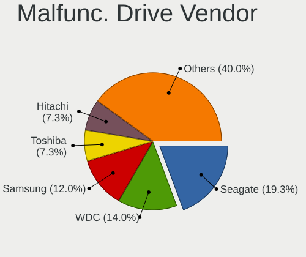

| Vendor              | Computers | Drives | Percent |
|---------------------|-----------|--------|---------|
| Seagate             | 29        | 34     | 19.33%  |
| WDC                 | 21        | 27     | 14%     |
| Samsung Electronics | 18        | 32     | 12%     |
| Toshiba             | 11        | 12     | 7.33%   |
| Hitachi             | 11        | 11     | 7.33%   |
| HGST                | 7         | 7      | 4.67%   |
| Crucial             | 7         | 7      | 4.67%   |
| SK hynix            | 6         | 6      | 4%      |
| SanDisk             | 6         | 6      | 4%      |
| Kingston            | 6         | 6      | 4%      |
| Micron Technology   | 3         | 3      | 2%      |
| Maxtor              | 3         | 4      | 2%      |
| A-DATA Technology   | 3         | 3      | 2%      |
| SSSTC               | 2         | 2      | 1.33%   |
| Intel               | 2         | 5      | 1.33%   |
| VISIPRO             | 1         | 2      | 0.67%   |
| tecmiyo             | 1         | 3      | 0.67%   |
| Team                | 1         | 1      | 0.67%   |
| T-FORCE             | 1         | 1      | 0.67%   |
| R580                | 1         | 1      | 0.67%   |
| Phison Electronics  | 1         | 1      | 0.67%   |
| OCZ                 | 1         | 1      | 0.67%   |
| LITEONIT            | 1         | 1      | 0.67%   |
| LITEON              | 1         | 1      | 0.67%   |
| JMicron Technology  | 1         | 1      | 0.67%   |
| Intenso             | 1         | 1      | 0.67%   |
| Corsair             | 1         | 1      | 0.67%   |
| China               | 1         | 1      | 0.67%   |
| BAITITON            | 1         | 1      | 0.67%   |
| Apple               | 1         | 1      | 0.67%   |

Malfunc. HDD Vendor
-------------------

Vendors of faulty HDD drives

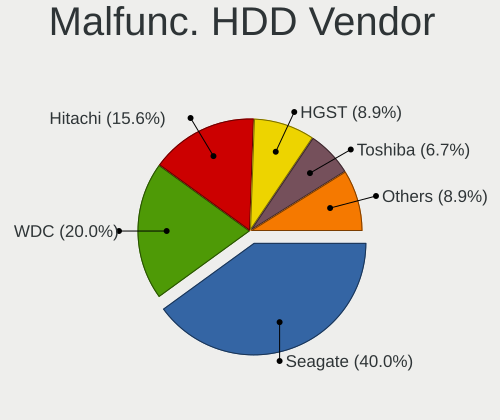

| Vendor              | Computers | Drives | Percent |
|---------------------|-----------|--------|---------|
| Seagate             | 29        | 34     | 33.33%  |
| WDC                 | 20        | 26     | 22.99%  |
| Hitachi             | 11        | 11     | 12.64%  |
| Toshiba             | 10        | 11     | 11.49%  |
| HGST                | 7         | 7      | 8.05%   |
| Samsung Electronics | 5         | 19     | 5.75%   |
| Maxtor              | 3         | 4      | 3.45%   |
| JMicron Technology  | 1         | 1      | 1.15%   |
| Apple               | 1         | 1      | 1.15%   |

Malfunc. Drive Kind
-------------------

Kinds of faulty drives

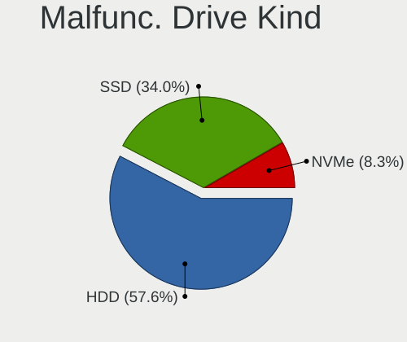

| Kind | Computers | Drives | Percent |
|------|-----------|--------|---------|
| HDD  | 83        | 114    | 57.64%  |
| SSD  | 49        | 57     | 34.03%  |
| NVMe | 12        | 12     | 8.33%   |

Failed Drives
-------------

Failed drive models

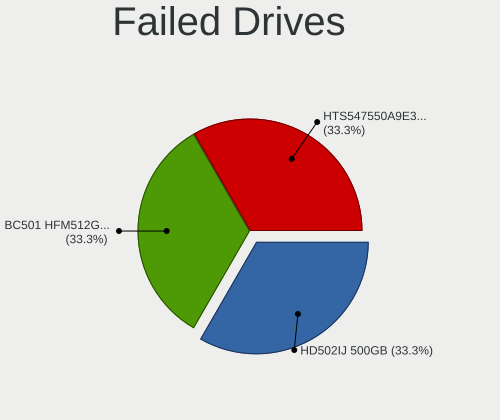

| Model                                   | Computers | Drives | Percent |
|-----------------------------------------|-----------|--------|---------|
| SK hynix BC501 HFM512GDJTNG-8310A 512GB | 1         | 1      | 33.33%  |
| Samsung Electronics HD502IJ 500GB       | 1         | 1      | 33.33%  |
| Hitachi HTS547550A9E384 500GB           | 1         | 1      | 33.33%  |

Failed Drive Vendor
-------------------

Failed drive vendors

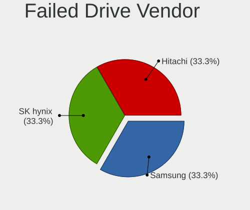

| Vendor              | Computers | Drives | Percent |
|---------------------|-----------|--------|---------|
| SK hynix            | 1         | 1      | 33.33%  |
| Samsung Electronics | 1         | 1      | 33.33%  |
| Hitachi             | 1         | 1      | 33.33%  |

Drive Status
------------

Number of failed and malfunc. drives

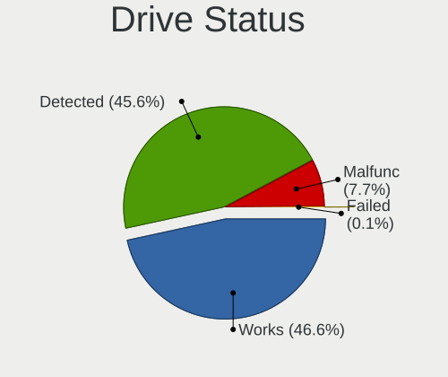

| Status   | Computers | Drives | Percent |
|----------|-----------|--------|---------|
| Works    | 851       | 1675   | 46.6%   |
| Detected | 833       | 1793   | 45.62%  |
| Malfunc  | 140       | 183    | 7.67%   |
| Failed   | 2         | 3      | 0.11%   |

Storage controller
------------------

Storage Vendor
--------------

Storage controller vendors

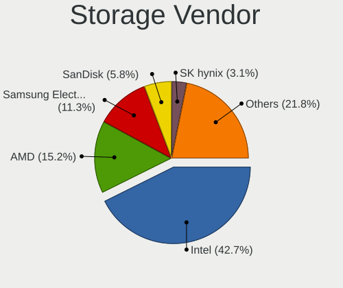

| Vendor                                  | Computers | Percent |
|-----------------------------------------|-----------|---------|
| Intel                                   | 968       | 42.66%  |
| AMD                                     | 346       | 15.25%  |
| Samsung Electronics                     | 257       | 11.33%  |
| SanDisk                                 | 132       | 5.82%   |
| SK hynix                                | 71        | 3.13%   |
| Kingston Technology Company             | 65        | 2.86%   |
| Phison Electronics                      | 55        | 2.42%   |
| Micron Technology                       | 47        | 2.07%   |
| Micron/Crucial Technology               | 38        | 1.67%   |
| KIOXIA                                  | 37        | 1.63%   |
| ASMedia Technology                      | 37        | 1.63%   |
| Toshiba America Info Systems            | 35        | 1.54%   |
| Silicon Motion                          | 25        | 1.1%    |
| Marvell Technology Group                | 22        | 0.97%   |
| JMicron Technology                      | 22        | 0.97%   |
| Realtek Semiconductor                   | 15        | 0.66%   |
| ADATA Technology                        | 14        | 0.62%   |
| Solid State Storage Technology          | 10        | 0.44%   |
| Apple                                   | 8         | 0.35%   |
| Nvidia                                  | 7         | 0.31%   |
| LSI Logic / Symbios Logic               | 7         | 0.31%   |
| Union Memory (Shenzhen)                 | 6         | 0.26%   |
| Seagate Technology                      | 5         | 0.22%   |
| MAXIO Technology (Hangzhou)             | 5         | 0.22%   |
| Shenzhen Longsys Electronics            | 4         | 0.18%   |
| Broadcom / LSI                          | 4         | 0.18%   |
| Solidigm                                | 3         | 0.13%   |
| Silicon Image                           | 3         | 0.13%   |
| Zhaoxin                                 | 2         | 0.09%   |
| VIA Technologies                        | 2         | 0.09%   |
| Netac Technology                        | 2         | 0.09%   |
| Lite-On Technology                      | 2         | 0.09%   |
| INNOGRIT                                | 2         | 0.09%   |
| Hewlett-Packard                         | 2         | 0.09%   |
| Yangtze Memory Technologies             | 1         | 0.04%   |
| Promise Technology                      | 1         | 0.04%   |
| OCZ Technology Group                    | 1         | 0.04%   |
| O2 Micro                                | 1         | 0.04%   |
| Lenovo                                  | 1         | 0.04%   |
| Jiangsu Xinsheng Intelligent Technology | 1         | 0.04%   |

Storage Model
-------------

Storage controller models

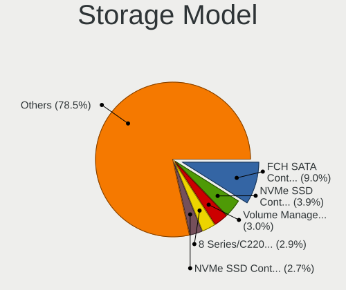

| Model                                                                          | Computers | Percent |
|--------------------------------------------------------------------------------|-----------|---------|
| AMD FCH SATA Controller [AHCI mode]                                            | 229       | 8.95%   |
| Samsung NVMe SSD Controller SM981/PM981/PM983                                  | 100       | 3.91%   |
| Intel Volume Management Device NVMe RAID Controller                            | 78        | 3.05%   |
| Intel 8 Series/C220 Series Chipset Family 6-port SATA Controller 1 [AHCI mode] | 75        | 2.93%   |
| Samsung NVMe SSD Controller PM9A1/PM9A3/980PRO                                 | 69        | 2.7%    |
| Intel Sunrise Point-LP SATA Controller [AHCI mode]                             | 69        | 2.7%    |
| Intel 7 Series Chipset Family 6-port SATA Controller [AHCI mode]               | 68        | 2.66%   |
| Samsung NVMe SSD Controller 980 (DRAM-less)                                    | 59        | 2.31%   |
| Intel 82801 Mobile SATA Controller [RAID mode]                                 | 53        | 2.07%   |
| AMD 400 Series Chipset SATA Controller                                         | 48        | 1.88%   |
| AMD 500 Series Chipset SATA Controller                                         | 42        | 1.64%   |
| Intel 200 Series PCH SATA controller [AHCI mode]                               | 35        | 1.37%   |
| AMD SB7x0/SB8x0/SB9x0 SATA Controller [AHCI mode]                              | 35        | 1.37%   |
| ASMedia ASM1061/ASM1062 Serial ATA Controller                                  | 34        | 1.33%   |
| Intel Cannon Lake Mobile PCH SATA AHCI Controller                              | 33        | 1.29%   |
| Intel Q170/Q150/B150/H170/H110/Z170/CM236 Chipset SATA Controller [AHCI Mode]  | 32        | 1.25%   |
| SanDisk Ultra 3D / WD PC SN530, IX SN530, Blue SN550 NVMe SSD (DRAM-less)      | 31        | 1.21%   |
| Intel 6 Series/C200 Series Chipset Family 6 port Desktop SATA AHCI Controller  | 31        | 1.21%   |
| SK hynix Gold P31/BC711/PC711 NVMe Solid State Drive                           | 29        | 1.13%   |
| Intel Tiger Lake-LP SATA Controller                                            | 28        | 1.09%   |
| Intel Celeron/Pentium Silver Processor SATA Controller                         | 28        | 1.09%   |
| Intel Cannon Lake PCH SATA AHCI Controller                                     | 26        | 1.02%   |
| Intel 7 Series/C210 Series Chipset Family 6-port SATA Controller [AHCI mode]   | 26        | 1.02%   |
| Intel SATA Controller [RAID mode]                                              | 25        | 0.98%   |
| Micron/Crucial P2 [Nick P2] / P3 / P3 Plus NVMe PCIe SSD (DRAM-less)           | 24        | 0.94%   |
| KIOXIA NVMe SSD Controller BG4 (DRAM-less)                                     | 24        | 0.94%   |
| Intel SSD 660P Series                                                          | 23        | 0.9%    |
| AMD SB7x0/SB8x0/SB9x0 IDE Controller                                           | 23        | 0.9%    |
| Intel Wildcat Point-LP SATA Controller [AHCI Mode]                             | 20        | 0.78%   |
| Intel SSD 670p Series [Keystone Harbor]                                        | 20        | 0.78%   |
| Intel 500 Series Chipset Family SATA AHCI Controller                           | 20        | 0.78%   |
| SanDisk Extreme Pro / WD Black SN750 / PC SN730 / Red SN700 NVMe SSD           | 19        | 0.74%   |
| Intel Comet Lake SATA AHCI Controller                                          | 19        | 0.74%   |
| Intel 9 Series Chipset Family SATA Controller [AHCI Mode]                      | 19        | 0.74%   |
| Intel 6 Series/C200 Series Chipset Family 6 port Mobile SATA AHCI Controller   | 19        | 0.74%   |
| Intel 400 Series Chipset Family SATA AHCI Controller                           | 19        | 0.74%   |
| Intel Alder Lake-S PCH SATA Controller [AHCI Mode]                             | 18        | 0.7%    |
| Intel 8 Series SATA Controller 1 [AHCI mode]                                   | 18        | 0.7%    |
| Toshiba America Info Systems XG6 NVMe SSD Controller                           | 16        | 0.63%   |
| Phison PS5013-E13 PCIe3 NVMe Controller (DRAM-less)                            | 16        | 0.63%   |

Storage Kind
------------

Kind of storage controller (IDE, SATA, NVMe, SAS, ...)

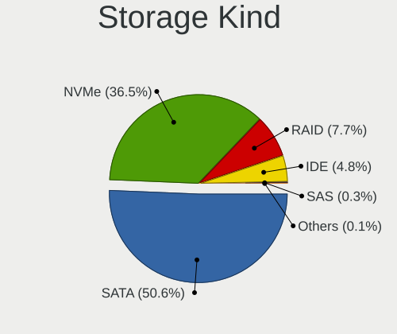

| Kind | Computers | Percent |
|------|-----------|---------|
| SATA | 1133      | 50.65%  |
| NVMe | 816       | 36.48%  |
| RAID | 173       | 7.73%   |
| IDE  | 107       | 4.78%   |
| SAS  | 6         | 0.27%   |
| SCSI | 2         | 0.09%   |

Processor
---------

CPU Vendor
----------

Processor vendors

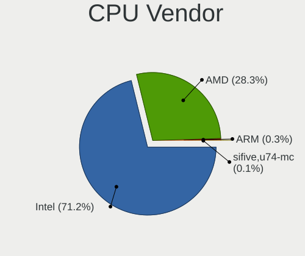

| Vendor        | Computers | Percent |
|---------------|-----------|---------|
| Intel         | 1153      | 71.17%  |
| AMD           | 459       | 28.33%  |
| ARM           | 5         | 0.31%   |
| CentaurHauls  | 2         | 0.12%   |
| sifive,u74-mc | 1         | 0.06%   |

CPU Model
---------

Processor models

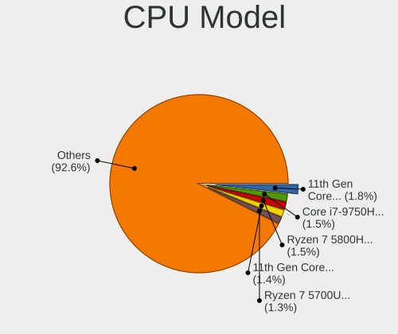

| Model                                   | Computers | Percent |
|-----------------------------------------|-----------|---------|
| Intel 11th Gen Core i5-1135G7 @ 2.40GHz | 29        | 1.79%   |
| Intel Core i7-9750H CPU @ 2.60GHz       | 24        | 1.48%   |
| AMD Ryzen 7 5800H with Radeon Graphics  | 24        | 1.48%   |
| Intel 11th Gen Core i7-1165G7 @ 2.80GHz | 22        | 1.36%   |
| AMD Ryzen 7 5700U with Radeon Graphics  | 21        | 1.3%    |
| Intel 12th Gen Core i7-12700H           | 19        | 1.17%   |
| AMD Ryzen 5 5500U with Radeon Graphics  | 19        | 1.17%   |
| Intel Core i7-8550U CPU @ 1.80GHz       | 16        | 0.99%   |
| Intel Core i5-7200U CPU @ 2.50GHz       | 16        | 0.99%   |
| Intel Core i7-3770 CPU @ 3.40GHz        | 15        | 0.93%   |
| Intel Celeron N4020 CPU @ 1.10GHz       | 15        | 0.93%   |
| Intel Core i5-8250U CPU @ 1.60GHz       | 13        | 0.8%    |
| Intel Core i5-3320M CPU @ 2.60GHz       | 12        | 0.74%   |
| Intel Core i7-1065G7 CPU @ 1.30GHz      | 11        | 0.68%   |
| Intel Core i7-10510U CPU @ 1.80GHz      | 11        | 0.68%   |
| Intel Core i5-6200U CPU @ 2.30GHz       | 11        | 0.68%   |
| AMD Ryzen 7 3700X 8-Core Processor      | 11        | 0.68%   |
| Intel Core i7-7500U CPU @ 2.70GHz       | 10        | 0.62%   |
| Intel Core i7-10750H CPU @ 2.60GHz      | 10        | 0.62%   |
| Intel Core i5-4590 CPU @ 3.30GHz        | 10        | 0.62%   |
| Intel 12th Gen Core i7-1255U            | 10        | 0.62%   |
| AMD Ryzen 5 5600X 6-Core Processor      | 10        | 0.62%   |
| AMD Ryzen 5 5600G with Radeon Graphics  | 10        | 0.62%   |
| Intel Core i7-4790K CPU @ 4.00GHz       | 9         | 0.56%   |
| Intel Core i7-4790 CPU @ 3.60GHz        | 9         | 0.56%   |
| Intel Core i5-7300U CPU @ 2.60GHz       | 9         | 0.56%   |
| Intel 12th Gen Core i7-1260P            | 9         | 0.56%   |
| Intel 11th Gen Core i3-1115G4 @ 3.00GHz | 9         | 0.56%   |
| AMD Ryzen 7 4800H with Radeon Graphics  | 9         | 0.56%   |
| Intel Core i5-9600K CPU @ 3.70GHz       | 8         | 0.49%   |
| Intel Core i5-3210M CPU @ 2.50GHz       | 8         | 0.49%   |
| Intel Core i5-10210U CPU @ 1.60GHz      | 8         | 0.49%   |
| AMD Ryzen 9 5900X 12-Core Processor     | 8         | 0.49%   |
| AMD Ryzen 5 3600 6-Core Processor       | 8         | 0.49%   |
| Intel Core i7-8750H CPU @ 2.20GHz       | 7         | 0.43%   |
| Intel Core i7-7700HQ CPU @ 2.80GHz      | 7         | 0.43%   |
| Intel Core i7-6700 CPU @ 3.40GHz        | 7         | 0.43%   |
| Intel Core i7-3630QM CPU @ 2.40GHz      | 7         | 0.43%   |
| Intel Core i5-8265U CPU @ 1.60GHz       | 7         | 0.43%   |
| Intel Core i5-10400F CPU @ 2.90GHz      | 7         | 0.43%   |

CPU Model Family
----------------

Processor model prefix

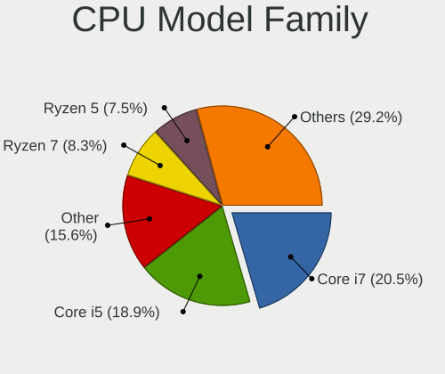

| Model                   | Computers | Percent |
|-------------------------|-----------|---------|
| Intel Core i7           | 332       | 20.49%  |
| Intel Core i5           | 306       | 18.89%  |
| Other                   | 252       | 15.56%  |
| AMD Ryzen 7             | 135       | 8.33%   |
| AMD Ryzen 5             | 122       | 7.53%   |
| Intel Core i3           | 78        | 4.81%   |
| Intel Celeron           | 50        | 3.09%   |
| AMD Ryzen 9             | 48        | 2.96%   |
| Intel Xeon              | 33        | 2.04%   |
| Intel Core 2 Duo        | 28        | 1.73%   |
| Intel Pentium           | 27        | 1.67%   |
| AMD Ryzen 3             | 24        | 1.48%   |
| AMD FX                  | 22        | 1.36%   |
| AMD Ryzen 7 PRO         | 19        | 1.17%   |
| Intel Core i9           | 15        | 0.93%   |
| AMD A6                  | 13        | 0.8%    |
| Intel Pentium Silver    | 9         | 0.56%   |
| AMD A8                  | 9         | 0.56%   |
| Intel Core 2 Quad       | 8         | 0.49%   |
| AMD Ryzen 5 PRO         | 8         | 0.49%   |
| Intel Atom              | 7         | 0.43%   |
| AMD Phenom II X4        | 7         | 0.43%   |
| AMD A10                 | 7         | 0.43%   |
| AMD Athlon              | 6         | 0.37%   |
| Intel Pentium Dual-Core | 5         | 0.31%   |
| Intel Pentium Gold      | 4         | 0.25%   |
| AMD Phenom II X6        | 4         | 0.25%   |
| Intel Core m3           | 3         | 0.19%   |
| AMD Ryzen Threadripper  | 3         | 0.19%   |
| AMD Phenom II X2        | 3         | 0.19%   |
| AMD Opteron             | 3         | 0.19%   |
| AMD E                   | 3         | 0.19%   |
| AMD Athlon II X2        | 3         | 0.19%   |
| AMD Athlon 64 X2        | 3         | 0.19%   |
| Intel Xeon Gold         | 2         | 0.12%   |
| AMD PRO A10             | 2         | 0.12%   |
| AMD Athlon II           | 2         | 0.12%   |
| AMD A4                  | 2         | 0.12%   |
| Intel Xeon Platinum     | 1         | 0.06%   |
| Intel Pentium D         | 1         | 0.06%   |

CPU Cores
---------

Number of processor cores

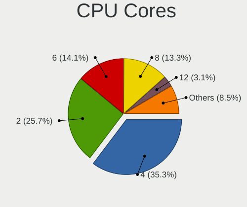

| Number  | Computers | Percent |
|---------|-----------|---------|
| 4       | 572       | 35.29%  |
| 2       | 417       | 25.72%  |
| 6       | 228       | 14.07%  |
| 8       | 216       | 13.33%  |
| 12      | 51        | 3.15%   |
| 14      | 41        | 2.53%   |
| 10      | 38        | 2.34%   |
| 16      | 28        | 1.73%   |
| 24      | 10        | 0.62%   |
| 1       | 8         | 0.49%   |
| 3       | 4         | 0.25%   |
| Unknown | 3         | 0.19%   |
| 48      | 1         | 0.06%   |
| 44      | 1         | 0.06%   |
| 36      | 1         | 0.06%   |
| 20      | 1         | 0.06%   |
| 5       | 1         | 0.06%   |

CPU Sockets
-----------

Number of sockets

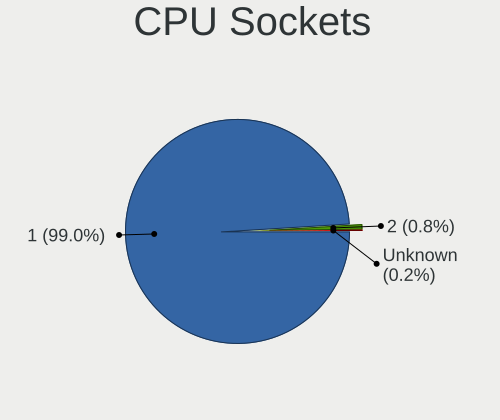

| Number  | Computers | Percent |
|---------|-----------|---------|
| 1       | 1605      | 99.01%  |
| 2       | 13        | 0.8%    |
| Unknown | 3         | 0.19%   |

CPU Threads
-----------

Threads per core (Hyper-Threading)

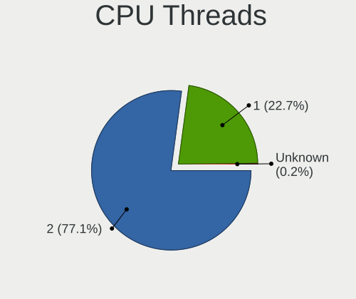

| Number  | Computers | Percent |
|---------|-----------|---------|
| 2       | 1254      | 77.12%  |
| 1       | 369       | 22.69%  |
| Unknown | 3         | 0.18%   |

CPU Op-Modes
------------

CPU Operation Modes (32-bit, 64-bit)

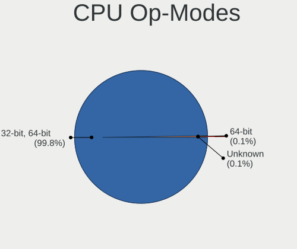

| Op mode        | Computers | Percent |
|----------------|-----------|---------|
| 32-bit, 64-bit | 1616      | 99.75%  |
| 64-bit         | 2         | 0.12%   |
| Unknown        | 2         | 0.12%   |

CPU Microcode
-------------

Microcode number

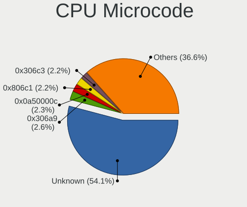

| Number     | Computers | Percent |
|------------|-----------|---------|
| Unknown    | 895       | 54.11%  |
| 0x306a9    | 43        | 2.6%    |
| 0x0a50000c | 38        | 2.3%    |
| 0x806c1    | 37        | 2.24%   |
| 0x306c3    | 36        | 2.18%   |
| 0x906a3    | 33        | 2%      |
| 0x806ea    | 29        | 1.75%   |
| 0x906ea    | 28        | 1.69%   |
| 0x08608103 | 22        | 1.33%   |
| 0x206a7    | 21        | 1.27%   |
| 0x08600106 | 21        | 1.27%   |
| 0x08701021 | 20        | 1.21%   |
| 0x906e9    | 18        | 1.09%   |
| 0x806ec    | 18        | 1.09%   |
| 0x506e3    | 17        | 1.03%   |
| 0x0a50000d | 17        | 1.03%   |
| 0x806e9    | 13        | 0.79%   |
| 0x406e3    | 13        | 0.79%   |
| 0x906ed    | 12        | 0.73%   |
| 0x08108109 | 11        | 0.67%   |
| 0xa0652    | 10        | 0.6%    |
| 0x906a4    | 10        | 0.6%    |
| 0x1067a    | 10        | 0.6%    |
| 0x0800820d | 10        | 0.6%    |
| 0x806c2    | 9         | 0.54%   |
| 0xa0653    | 8         | 0.48%   |
| 0x706a8    | 8         | 0.48%   |
| 0x40651    | 8         | 0.48%   |
| 0x0a404102 | 8         | 0.48%   |
| 0x08608102 | 8         | 0.48%   |
| 0x010000c8 | 8         | 0.48%   |
| 0xa0655    | 7         | 0.42%   |
| 0x806d1    | 7         | 0.42%   |
| 0x706a1    | 7         | 0.42%   |
| 0x0a201016 | 7         | 0.42%   |
| 0x90672    | 6         | 0.36%   |
| 0x706e5    | 6         | 0.36%   |
| 0x08001138 | 6         | 0.36%   |
| 0x06006705 | 6         | 0.36%   |
| 0x06000852 | 6         | 0.36%   |

CPU Microarch
-------------

Microarchitecture

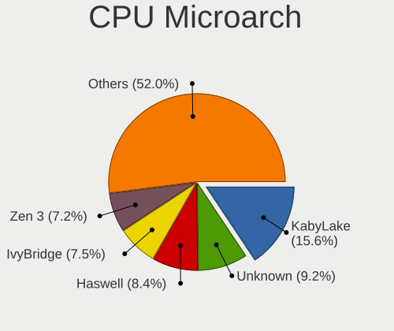

| Name              | Computers | Percent |
|-------------------|-----------|---------|
| KabyLake          | 254       | 15.64%  |
| Unknown           | 149       | 9.17%   |
| Haswell           | 137       | 8.44%   |
| IvyBridge         | 122       | 7.51%   |
| Zen 3             | 117       | 7.2%    |
| Alderlake Hybrid  | 87        | 5.36%   |
| Zen 2             | 82        | 5.05%   |
| TigerLake         | 82        | 5.05%   |
| Skylake           | 72        | 4.43%   |
| SandyBridge       | 64        | 3.94%   |
| Zen+              | 58        | 3.57%   |
| CometLake         | 52        | 3.2%    |
| Icelake           | 39        | 2.4%    |
| Goldmont plus     | 35        | 2.16%   |
| Penryn            | 33        | 2.03%   |
| Zen               | 31        | 1.91%   |
| Broadwell         | 31        | 1.91%   |
| Piledriver        | 29        | 1.79%   |
| Westmere          | 27        | 1.66%   |
| K10               | 22        | 1.35%   |
| Silvermont        | 16        | 0.99%   |
| Nehalem           | 15        | 0.92%   |
| Excavator         | 15        | 0.92%   |
| Core              | 13        | 0.8%    |
| Goldmont          | 8         | 0.49%   |
| Steamroller       | 5         | 0.31%   |
| Puma              | 5         | 0.31%   |
| Bobcat            | 5         | 0.31%   |
| K10 Llano         | 4         | 0.25%   |
| K8 Hammer         | 3         | 0.18%   |
| Gracemont         | 3         | 0.18%   |
| Bulldozer         | 2         | 0.12%   |
| Bonnell           | 2         | 0.12%   |
| Tremont           | 1         | 0.06%   |
| NetBurst          | 1         | 0.06%   |
| Meteorlake Hybrid | 1         | 0.06%   |
| K8 & K10 hybrid   | 1         | 0.06%   |
| Jaguar            | 1         | 0.06%   |

Graphics
--------

GPU Vendor
----------

Vendors of graphics cards

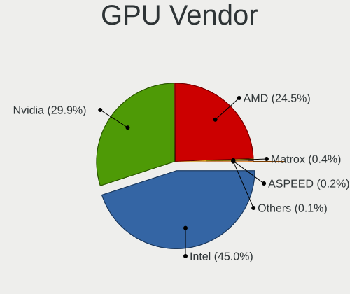

| Vendor                     | Computers | Percent |
|----------------------------|-----------|---------|
| Intel                      | 890       | 44.99%  |
| Nvidia                     | 592       | 29.93%  |
| AMD                        | 484       | 24.47%  |
| Matrox Electronics Systems | 7         | 0.35%   |
| ASPEED Technology          | 3         | 0.15%   |
| Zhaoxin                    | 2         | 0.1%    |

GPU Model
---------

Graphics card models

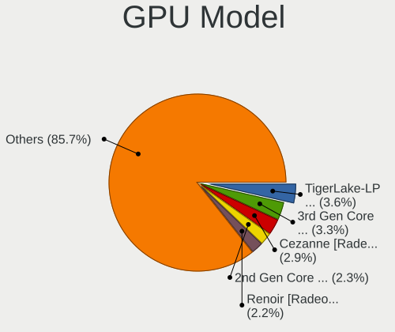

| Model                                                                                 | Computers | Percent |
|---------------------------------------------------------------------------------------|-----------|---------|
| Intel TigerLake-LP GT2 [Iris Xe Graphics]                                             | 72        | 3.57%   |
| Intel 3rd Gen Core processor Graphics Controller                                      | 67        | 3.32%   |
| AMD Cezanne [Radeon Vega Series / Radeon Vega Mobile Series]                          | 59        | 2.92%   |
| Intel 2nd Generation Core Processor Family Integrated Graphics Controller             | 46        | 2.28%   |
| AMD Renoir [Radeon Vega Series / Radeon Vega Mobile Series]                           | 45        | 2.23%   |
| AMD Lucienne                                                                          | 45        | 2.23%   |
| Intel Alder Lake-P GT2 [Iris Xe Graphics]                                             | 43        | 2.13%   |
| Intel Kaby Lake-U GT2 [HD Graphics 620]                                               | 42        | 2.08%   |
| Intel Kaby Lake-R GT2 [UHD Graphics 620]                                              | 41        | 2.03%   |
| Intel CoffeeLake-H GT2 [UHD Graphics 630]                                             | 41        | 2.03%   |
| AMD Picasso/Raven 2 [Radeon Vega Series / Radeon Vega Mobile Series]                  | 38        | 1.88%   |
| Intel Xeon E3-1200 v3/4th Gen Core Processor Integrated Graphics Controller           | 34        | 1.68%   |
| Nvidia GP107 [GeForce GTX 1050 Ti]                                                    | 27        | 1.34%   |
| Intel GeminiLake [UHD Graphics 600]                                                   | 27        | 1.34%   |
| Intel 4th Gen Core Processor Integrated Graphics Controller                           | 27        | 1.34%   |
| Intel Skylake-U GT2 [HD Graphics 520]                                                 | 26        | 1.29%   |
| AMD Ellesmere [Radeon RX 470/480/570/570X/580/580X/590]                               | 26        | 1.29%   |
| Nvidia TU117M [GeForce GTX 1650 Mobile / Max-Q]                                       | 25        | 1.24%   |
| Intel CometLake-H GT2 [UHD Graphics]                                                  | 22        | 1.09%   |
| Intel CometLake-U GT2 [UHD Graphics]                                                  | 21        | 1.04%   |
| Intel Haswell-ULT Integrated Graphics Controller                                      | 19        | 0.94%   |
| Intel Alder Lake-UP3 GT2 [Iris Xe Graphics]                                           | 19        | 0.94%   |
| Nvidia GA106M [GeForce RTX 3060 Mobile / Max-Q]                                       | 18        | 0.89%   |
| Intel TigerLake-H GT1 [UHD Graphics]                                                  | 18        | 0.89%   |
| Intel Broadwell-U GT2 [HD Graphics 5500]                                              | 18        | 0.89%   |
| Intel WhiskeyLake-U GT2 [UHD Graphics 620]                                            | 16        | 0.79%   |
| AMD Rembrandt [Radeon 680M]                                                           | 16        | 0.79%   |
| Nvidia GK208B [GeForce GT 710]                                                        | 15        | 0.74%   |
| Intel Skylake-S GT2 [HD Graphics 530]                                                 | 15        | 0.74%   |
| Intel Raptor Lake-P [Iris Xe Graphics]                                                | 15        | 0.74%   |
| Intel CoffeeLake-S GT2 [UHD Graphics 630]                                             | 15        | 0.74%   |
| Nvidia GP104 [GeForce GTX 1070]                                                       | 14        | 0.69%   |
| Intel IvyBridge GT2 [HD Graphics 4000]                                                | 14        | 0.69%   |
| Nvidia TU116M [GeForce GTX 1660 Ti Mobile]                                            | 13        | 0.64%   |
| AMD Raphael                                                                           | 13        | 0.64%   |
| Nvidia GA107M [GeForce RTX 3050 Mobile]                                               | 12        | 0.59%   |
| Intel Kaby Lake-S GT2 [HD Graphics 630]                                               | 12        | 0.59%   |
| AMD Topaz XT [Radeon R7 M260/M265 / M340/M360 / M440/M445 / 530/535 / 620/625 Mobile] | 12        | 0.59%   |
| Nvidia TU117 [GeForce GTX 1650]                                                       | 11        | 0.54%   |
| Nvidia GP108 [GeForce GT 1030]                                                        | 11        | 0.54%   |

GPU Combo
---------

Combinations of graphics cards

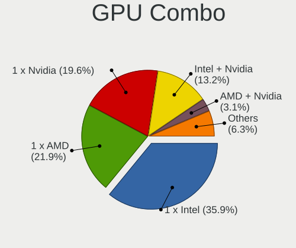

| Name                     | Computers | Percent |
|--------------------------|-----------|---------|
| 1 x Intel                | 584       | 35.92%  |
| 1 x AMD                  | 356       | 21.89%  |
| 1 x Nvidia               | 318       | 19.56%  |
| Intel + Nvidia           | 214       | 13.16%  |
| AMD + Nvidia             | 51        | 3.14%   |
| Intel + AMD              | 48        | 2.95%   |
| 2 x AMD                  | 26        | 1.6%    |
| Other                    | 10        | 0.62%   |
| 2 x Nvidia               | 4         | 0.25%   |
| 1 x Matrox               | 3         | 0.18%   |
| 3 x Nvidia               | 2         | 0.12%   |
| 1 x Zhaoxin              | 2         | 0.12%   |
| Nvidia + Matrox          | 2         | 0.12%   |
| Nvidia + ASPEED          | 2         | 0.12%   |
| AMD + Matrox             | 2         | 0.12%   |
| Intel + AMD + 1 x Nvidia | 1         | 0.06%   |
| 1 x ASPEED               | 1         | 0.06%   |

GPU Driver
----------

Free vs proprietary

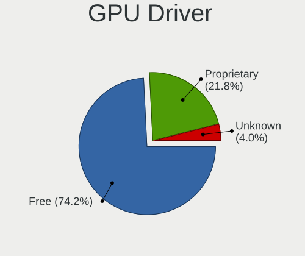

| Driver      | Computers | Percent |
|-------------|-----------|---------|
| Free        | 1212      | 74.22%  |
| Proprietary | 356       | 21.8%   |
| Unknown     | 65        | 3.98%   |

GPU Memory
----------

Total video memory

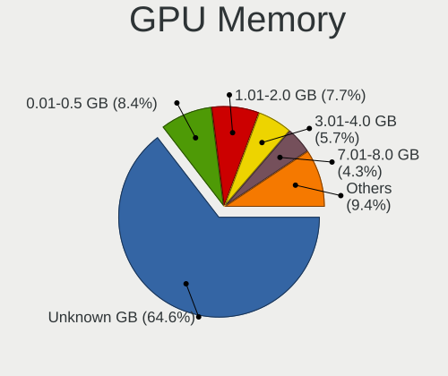

| Size in GB | Computers | Percent |
|------------|-----------|---------|
| Unknown    | 1062      | 64.56%  |
| 0.01-0.5   | 139       | 8.45%   |
| 1.01-2.0   | 126       | 7.66%   |
| 3.01-4.0   | 93        | 5.65%   |
| 7.01-8.0   | 71        | 4.32%   |
| 0.51-1.0   | 70        | 4.26%   |
| 5.01-6.0   | 45        | 2.74%   |
| 8.01-16.0  | 27        | 1.64%   |
| 2.01-3.0   | 6         | 0.36%   |
| 16.01-24.0 | 5         | 0.3%    |
| 4.01-5.0   | 1         | 0.06%   |

Monitor
-------

Monitor Vendor
--------------

Monitor vendors

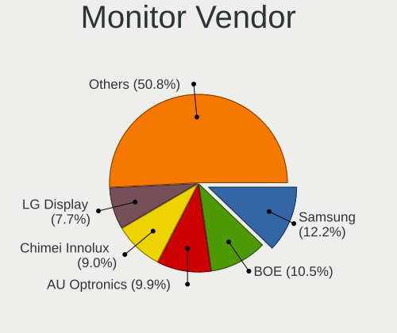

| Vendor                  | Computers | Percent |
|-------------------------|-----------|---------|
| Samsung Electronics     | 232       | 12.17%  |
| BOE                     | 201       | 10.55%  |
| AU Optronics            | 188       | 9.86%   |
| Chimei Innolux          | 171       | 8.97%   |
| LG Display              | 146       | 7.66%   |
| Dell                    | 130       | 6.82%   |
| Goldstar                | 113       | 5.93%   |
| Hewlett-Packard         | 80        | 4.2%    |
| Acer                    | 62        | 3.25%   |
| Philips                 | 50        | 2.62%   |
| BenQ                    | 41        | 2.15%   |
| AOC                     | 41        | 2.15%   |
| Iiyama                  | 36        | 1.89%   |
| Apple                   | 34        | 1.78%   |
| ASUSTek Computer        | 33        | 1.73%   |
| Sharp                   | 30        | 1.57%   |
| Ancor Communications    | 29        | 1.52%   |
| InfoVision              | 22        | 1.15%   |
| Lenovo                  | 20        | 1.05%   |
| CSO                     | 15        | 0.79%   |
| Sony                    | 14        | 0.73%   |
| Chi Mei Optoelectronics | 13        | 0.68%   |
| ViewSonic               | 11        | 0.58%   |
| PANDA                   | 10        | 0.52%   |
| Eizo                    | 9         | 0.47%   |
| Sceptre Tech            | 7         | 0.37%   |
| Panasonic               | 6         | 0.31%   |
| NEC Computers           | 6         | 0.31%   |
| HKC                     | 6         | 0.31%   |
| Gigabyte Technology     | 6         | 0.31%   |
| Fujitsu Siemens         | 6         | 0.31%   |
| Vizio                   | 5         | 0.26%   |
| RTK                     | 5         | 0.26%   |
| MSI                     | 5         | 0.26%   |
| Mi                      | 5         | 0.26%   |
| Idek Iiyama             | 5         | 0.26%   |
| Toshiba                 | 4         | 0.21%   |
| Medion                  | 4         | 0.21%   |
| Insignia                | 4         | 0.21%   |
| Unknown                 | 3         | 0.16%   |

Monitor Model
-------------

Monitor models

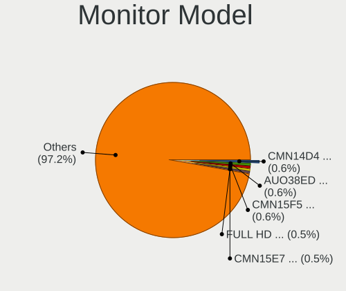

| Model                                                                     | Computers | Percent |
|---------------------------------------------------------------------------|-----------|---------|
| Chimei Innolux LCD Monitor CMN14D4 1920x1080 309x173mm 13.9-inch          | 12        | 0.61%   |
| AU Optronics LCD Monitor AUO38ED 1920x1080 344x193mm 15.5-inch            | 12        | 0.61%   |
| Chimei Innolux LCD Monitor CMN15F5 1920x1080 344x193mm 15.5-inch          | 11        | 0.56%   |
| Goldstar FULL HD GSM5B55 1920x1080 480x270mm 21.7-inch                    | 10        | 0.51%   |
| Chimei Innolux LCD Monitor CMN15E7 1920x1080 344x193mm 15.5-inch          | 10        | 0.51%   |
| Chimei Innolux LCD Monitor CMN1521 1920x1080 344x193mm 15.5-inch          | 10        | 0.51%   |
| Samsung Electronics LCD Monitor SEC5441 1280x800 331x207mm 15.4-inch      | 9         | 0.46%   |
| BOE LCD Monitor BOE084E 1920x1080 382x215mm 17.3-inch                     | 8         | 0.41%   |
| AU Optronics LCD Monitor AUO21ED 1920x1080 344x193mm 15.5-inch            | 8         | 0.41%   |
| Samsung Electronics C24F390 SAM0D2C 1920x1080 521x293mm 23.5-inch         | 7         | 0.35%   |
| BOE LCD Monitor BOE0872 1920x1080 344x194mm 15.5-inch                     | 7         | 0.35%   |
| LG Display LCD Monitor LGD046F 1920x1080 344x194mm 15.5-inch              | 6         | 0.3%    |
| Goldstar LG IPS FULLHD GSM5AB8 1920x1080 480x270mm 21.7-inch              | 6         | 0.3%    |
| Goldstar HDR 4K GSM7706 3840x2160 600x340mm 27.2-inch                     | 6         | 0.3%    |
| Dell U2412M DELA07A 1920x1200 518x324mm 24.1-inch                         | 6         | 0.3%    |
| AU Optronics LCD Monitor AUO403D 1920x1080 309x174mm 14.0-inch            | 6         | 0.3%    |
| Samsung Electronics LCD Monitor SDC4171 2880x1800 302x189mm 14.0-inch     | 5         | 0.25%   |
| LG Display LCD Monitor LGD0563 1920x1080 344x194mm 15.5-inch              | 5         | 0.25%   |
| Goldstar LG ULTRAWIDE GSM59F1 2560x1080 670x280mm 28.6-inch               | 5         | 0.25%   |
| Chimei Innolux LCD Monitor CMN151E 1920x1080 344x193mm 15.5-inch          | 5         | 0.25%   |
| Chi Mei Optoelectronics LCD Monitor CMO1720 1920x1080 382x215mm 17.3-inch | 5         | 0.25%   |
| AU Optronics LCD Monitor AUO22EC 1366x768 344x193mm 15.5-inch             | 5         | 0.25%   |
| AOC 27G2G4 AOC2702 1920x1080 598x336mm 27.0-inch                          | 5         | 0.25%   |
| Samsung Electronics S24F350 SAM0D20 1920x1080 521x293mm 23.5-inch         | 4         | 0.2%    |
| Samsung Electronics C27F390 SAM0D32 1920x1080 598x336mm 27.0-inch         | 4         | 0.2%    |
| RTK LCD Monitor RTK1D1A 1920x1080 1020x570mm 46.0-inch                    | 4         | 0.2%    |
| LG Display LCD Monitor LGD05E5 1920x1080 344x194mm 15.5-inch              | 4         | 0.2%    |
| LG Display LCD Monitor LGD033A 1366x768 344x194mm 15.5-inch               | 4         | 0.2%    |
| InfoVision LCD Monitor IVO0536 1920x1080 294x165mm 13.3-inch              | 4         | 0.2%    |
| Goldstar LG TV SSCR2 GSMC0C8 3840x2160                                    | 4         | 0.2%    |
| Dell U2412M DELA07B 1920x1200 518x324mm 24.1-inch                         | 4         | 0.2%    |
| Dell S2340L DELD058 1920x1080 509x286mm 23.0-inch                         | 4         | 0.2%    |
| Dell P2314H DEL4099 1920x1080 510x290mm 23.1-inch                         | 4         | 0.2%    |
| Chimei Innolux LCD Monitor CMN15D2 1920x1080 344x193mm 15.5-inch          | 4         | 0.2%    |
| Chimei Innolux LCD Monitor CMN140A 1920x1080 309x173mm 13.9-inch          | 4         | 0.2%    |
| BOE LCD Monitor BOE0893 2160x1440 296x197mm 14.0-inch                     | 4         | 0.2%    |
| BOE LCD Monitor BOE0878 1920x1080 355x200mm 16.0-inch                     | 4         | 0.2%    |
| BOE LCD Monitor BOE0731 1366x768 256x144mm 11.6-inch                      | 4         | 0.2%    |
| BOE LCD Monitor BOE069B 1600x900 382x215mm 17.3-inch                      | 4         | 0.2%    |
| AU Optronics LCD Monitor AUO82ED 1920x1080 344x194mm 15.5-inch            | 4         | 0.2%    |

Monitor Resolution
------------------

Monitor screen resolution

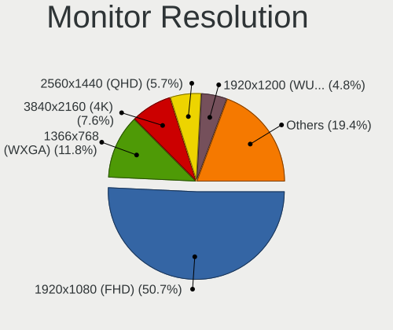

| Resolution         | Computers | Percent |
|--------------------|-----------|---------|
| 1920x1080 (FHD)    | 906       | 50.73%  |
| 1366x768 (WXGA)    | 211       | 11.81%  |
| 3840x2160 (4K)     | 136       | 7.61%   |
| 2560x1440 (QHD)    | 102       | 5.71%   |
| 1920x1200 (WUXGA)  | 85        | 4.76%   |
| 1600x900 (HD+)     | 52        | 2.91%   |
| 2560x1600          | 43        | 2.41%   |
| 1680x1050 (WSXGA+) | 42        | 2.35%   |
| 3440x1440          | 32        | 1.79%   |
| 1280x1024 (SXGA)   | 29        | 1.62%   |
| 2880x1800          | 20        | 1.12%   |
| 1440x900 (WXGA+)   | 18        | 1.01%   |
| 2560x1080          | 16        | 0.9%    |
| 1280x800 (WXGA)    | 11        | 0.62%   |
| 1360x768           | 9         | 0.5%    |
| 3840x1080          | 7         | 0.39%   |
| 1920x540           | 7         | 0.39%   |
| 2240x1400          | 6         | 0.34%   |
| Unknown            | 6         | 0.34%   |
| 2160x1440          | 4         | 0.22%   |
| 3840x2400          | 3         | 0.17%   |
| 3840x1600          | 3         | 0.17%   |
| 2880x1920          | 3         | 0.17%   |
| 2256x1504          | 3         | 0.17%   |
| 1280x720 (HD)      | 3         | 0.17%   |
| 1024x768 (XGA)     | 3         | 0.17%   |
| 3072x1920          | 2         | 0.11%   |
| 2520x1680          | 2         | 0.11%   |
| 2288x1287          | 2         | 0.11%   |
| 1920x1280          | 2         | 0.11%   |
| 1600x1200          | 2         | 0.11%   |
| 6160x1440          | 1         | 0.06%   |
| 5760x2160          | 1         | 0.06%   |
| 5760x1080          | 1         | 0.06%   |
| 480x1920           | 1         | 0.06%   |
| 4800x1080          | 1         | 0.06%   |
| 3840x1200          | 1         | 0.06%   |
| 3600x1200          | 1         | 0.06%   |
| 3200x1800 (QHD+)   | 1         | 0.06%   |
| 3000x2000          | 1         | 0.06%   |

Monitor Diagonal
----------------

Diagonal size in inches

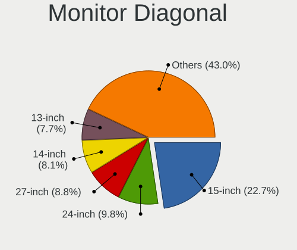

| Inches  | Computers | Percent |
|---------|-----------|---------|
| 15      | 432       | 22.65%  |
| 24      | 187       | 9.81%   |
| 27      | 167       | 8.76%   |
| 14      | 155       | 8.13%   |
| 13      | 146       | 7.66%   |
| 23      | 141       | 7.39%   |
| 21      | 107       | 5.61%   |
| 17      | 98        | 5.14%   |
| 31      | 70        | 3.67%   |
| 16      | 48        | 2.52%   |
| 34      | 46        | 2.41%   |
| Unknown | 34        | 1.78%   |
| 19      | 32        | 1.68%   |
| 22      | 26        | 1.36%   |
| 20      | 22        | 1.15%   |
| 18      | 21        | 1.1%    |
| 12      | 18        | 0.94%   |
| 32      | 17        | 0.89%   |
| 72      | 15        | 0.79%   |
| 11      | 15        | 0.79%   |
| 54      | 10        | 0.52%   |
| 84      | 9         | 0.47%   |
| 46      | 9         | 0.47%   |
| 40      | 9         | 0.47%   |
| 25      | 8         | 0.42%   |
| 28      | 6         | 0.31%   |
| 48      | 5         | 0.26%   |
| 65      | 4         | 0.21%   |
| 52      | 4         | 0.21%   |
| 49      | 4         | 0.21%   |
| 10      | 4         | 0.21%   |
| 63      | 3         | 0.16%   |
| 43      | 3         | 0.16%   |
| 37      | 3         | 0.16%   |
| 36      | 3         | 0.16%   |
| 26      | 3         | 0.16%   |
| 142     | 2         | 0.1%    |
| 60      | 2         | 0.1%    |
| 42      | 2         | 0.1%    |
| 39      | 2         | 0.1%    |

Monitor Width
-------------

Physical width

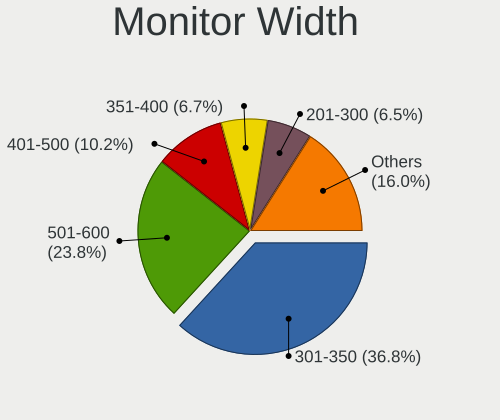

| Width in mm    | Computers | Percent |
|----------------|-----------|---------|
| 301-350        | 683       | 36.8%   |
| 501-600        | 442       | 23.81%  |
| 401-500        | 189       | 10.18%  |
| 351-400        | 125       | 6.73%   |
| 201-300        | 120       | 6.47%   |
| 601-700        | 99        | 5.33%   |
| 701-800        | 66        | 3.56%   |
| 1001-1500      | 46        | 2.48%   |
| Unknown        | 34        | 1.83%   |
| 1501-2000      | 28        | 1.51%   |
| 801-900        | 16        | 0.86%   |
| 901-1000       | 6         | 0.32%   |
| More than 2000 | 2         | 0.11%   |

Aspect Ratio
------------

Proportional relationship between the width and the height

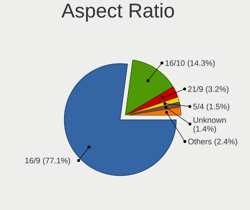

| Ratio   | Computers | Percent |
|---------|-----------|---------|
| 16/9    | 1279      | 77.14%  |
| 16/10   | 237       | 14.29%  |
| 21/9    | 53        | 3.2%    |
| 5/4     | 25        | 1.51%   |
| Unknown | 24        | 1.45%   |
| 3/2     | 20        | 1.21%   |
| 4/3     | 7         | 0.42%   |
| 32/9    | 7         | 0.42%   |
| 6/5     | 2         | 0.12%   |
| 1.00    | 2         | 0.12%   |
| 1.96    | 1         | 0.06%   |
| 0.25    | 1         | 0.06%   |

Monitor Area
------------

Area in inch²

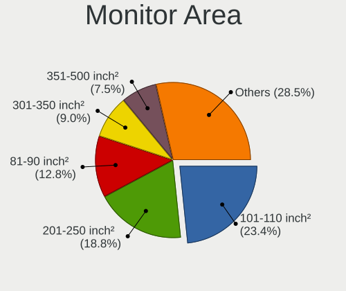

| Area in inch² | Computers | Percent |
|----------------|-----------|---------|
| 101-110        | 438       | 23.37%  |
| 201-250        | 353       | 18.84%  |
| 81-90          | 240       | 12.81%  |
| 301-350        | 168       | 8.96%   |
| 351-500        | 140       | 7.47%   |
| 121-130        | 81        | 4.32%   |
| 151-200        | 75        | 4%      |
| 251-300        | 69        | 3.68%   |
| 71-80          | 62        | 3.31%   |
| More than 1000 | 61        | 3.26%   |
| 111-120        | 41        | 2.19%   |
| 501-1000       | 37        | 1.97%   |
| Unknown        | 34        | 1.81%   |
| 141-150        | 30        | 1.6%    |
| 61-70          | 16        | 0.85%   |
| 51-60          | 15        | 0.8%    |
| 131-140        | 7         | 0.37%   |
| 41-50          | 4         | 0.21%   |
| 91-100         | 3         | 0.16%   |

Pixel Density
-------------

Pixels per inch

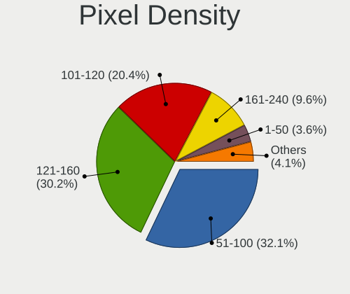

| Density       | Computers | Percent |
|---------------|-----------|---------|
| 51-100        | 577       | 32.11%  |
| 121-160       | 542       | 30.16%  |
| 101-120       | 367       | 20.42%  |
| 161-240       | 172       | 9.57%   |
| 1-50          | 65        | 3.62%   |
| More than 240 | 40        | 2.23%   |
| Unknown       | 34        | 1.89%   |

Multiple Monitors
-----------------

Total monitors connected

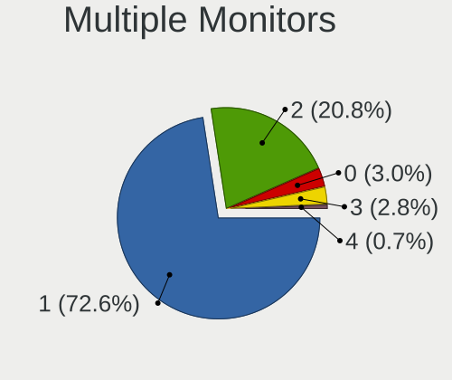

| Total | Computers | Percent |
|-------|-----------|---------|
| 1     | 1199      | 72.58%  |
| 2     | 344       | 20.82%  |
| 0     | 50        | 3.03%   |
| 3     | 47        | 2.85%   |
| 4     | 12        | 0.73%   |

Network
-------

Net Controller Vendor
---------------------

Controller vendors

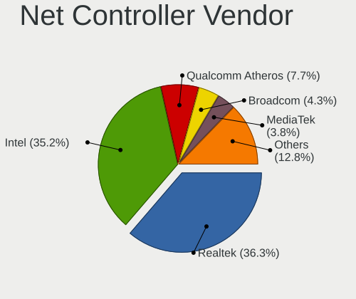

| Vendor                            | Computers | Percent |
|-----------------------------------|-----------|---------|
| Realtek Semiconductor             | 899       | 36.29%  |
| Intel                             | 873       | 35.24%  |
| Qualcomm Atheros                  | 190       | 7.67%   |
| Broadcom                          | 106       | 4.28%   |
| MediaTek                          | 93        | 3.75%   |
| TP-Link                           | 33        | 1.33%   |
| Ralink Technology                 | 28        | 1.13%   |
| ASIX Electronics                  | 24        | 0.97%   |
| Ralink                            | 18        | 0.73%   |
| Samsung Electronics               | 17        | 0.69%   |
| Broadcom Limited                  | 14        | 0.57%   |
| Marvell Technology Group          | 13        | 0.52%   |
| Shenzhen Goodix Technology        | 12        | 0.48%   |
| Sierra Wireless                   | 10        | 0.4%    |
| Lenovo                            | 10        | 0.4%    |
| Aquantia                          | 10        | 0.4%    |
| Huawei Technologies               | 8         | 0.32%   |
| Dell                              | 8         | 0.32%   |
| Xiaomi                            | 7         | 0.28%   |
| Qualcomm Atheros Communications   | 7         | 0.28%   |
| Qualcomm                          | 7         | 0.28%   |
| NetGear                           | 7         | 0.28%   |
| Nvidia                            | 6         | 0.24%   |
| DisplayLink                       | 6         | 0.24%   |
| Edimax Technology                 | 5         | 0.2%    |
| Hewlett-Packard                   | 4         | 0.16%   |
| Belkin Components                 | 4         | 0.16%   |
| Apple                             | 4         | 0.16%   |
| OPPO Electronics                  | 3         | 0.12%   |
| Ericsson Business Mobile Networks | 3         | 0.12%   |
| D-Link                            | 3         | 0.12%   |
| ASUSTek Computer                  | 3         | 0.12%   |
| Wilocity                          | 2         | 0.08%   |
| VIA Technologies                  | 2         | 0.08%   |
| U-Blox                            | 2         | 0.08%   |
| Solarflare Communications         | 2         | 0.08%   |
| QinHeng Electronics               | 2         | 0.08%   |
| Motorola PCS                      | 2         | 0.08%   |
| Mellanox Technologies             | 2         | 0.08%   |
| JMicron Technology                | 2         | 0.08%   |

Net Controller Model
--------------------

Controller models

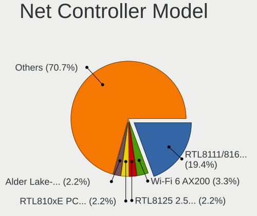

| Model                                                                  | Computers | Percent |
|------------------------------------------------------------------------|-----------|---------|
| Realtek RTL8111/8168/8211/8411 PCI Express Gigabit Ethernet Controller | 569       | 19.37%  |
| Intel Wi-Fi 6 AX200                                                    | 96        | 3.27%   |
| Realtek RTL8125 2.5GbE Controller                                      | 66        | 2.25%   |
| Realtek RTL810xE PCI Express Fast Ethernet controller                  | 66        | 2.25%   |
| Intel Alder Lake-P PCH CNVi WiFi                                       | 64        | 2.18%   |
| Realtek RTL8153 Gigabit Ethernet Adapter                               | 63        | 2.15%   |
| Intel Wi-Fi 6 AX201                                                    | 59        | 2.01%   |
| MediaTek MT7921 802.11ax PCIe Wireless Network Adapter [Filogic 330]   | 57        | 1.94%   |
| Intel Wireless 8265 / 8275                                             | 52        | 1.77%   |
| Intel 82579LM Gigabit Network Connection (Lewisville)                  | 52        | 1.77%   |
| Realtek RTL8822CE 802.11ac PCIe Wireless Network Adapter               | 49        | 1.67%   |
| Intel I211 Gigabit Network Connection                                  | 44        | 1.5%    |
| Realtek RTL8821CE 802.11ac PCIe Wireless Network Adapter               | 43        | 1.46%   |
| Intel Ethernet Controller I225-V                                       | 39        | 1.33%   |
| Intel Wireless 7265                                                    | 30        | 1.02%   |
| Intel Ethernet Connection I217-LM                                      | 30        | 1.02%   |
| Qualcomm Atheros QCA9377 802.11ac Wireless Network Adapter             | 29        | 0.99%   |
| Intel Wireless 7260                                                    | 29        | 0.99%   |
| Intel Cannon Lake PCH CNVi WiFi                                        | 29        | 0.99%   |
| Qualcomm Atheros AR9485 Wireless Network Adapter                       | 28        | 0.95%   |
| Intel Wi-Fi 6E(802.11ax) AX210/AX1675* 2x2 [Typhoon Peak]              | 28        | 0.95%   |
| Qualcomm Atheros QCA6174 802.11ac Wireless Network Adapter             | 26        | 0.89%   |
| Intel Wireless 8260                                                    | 25        | 0.85%   |
| Intel Ethernet Connection (2) I219-V                                   | 25        | 0.85%   |
| Intel Comet Lake PCH CNVi WiFi                                         | 24        | 0.82%   |
| ASIX AX88179 Gigabit Ethernet                                          | 22        | 0.75%   |
| Qualcomm Atheros QCA9565 / AR9565 Wireless Network Adapter             | 21        | 0.72%   |
| Intel Wireless 3165                                                    | 21        | 0.72%   |
| Intel Ethernet Connection (7) I219-V                                   | 21        | 0.72%   |
| Intel Ethernet Connection (4) I219-LM                                  | 21        | 0.72%   |
| Intel Centrino Advanced-N 6205 [Taylor Peak]                           | 21        | 0.72%   |
| Intel Comet Lake PCH-LP CNVi WiFi                                      | 20        | 0.68%   |
| Realtek RTL8188EUS 802.11n Wireless Network Adapter                    | 19        | 0.65%   |
| Intel 82579V Gigabit Network Connection                                | 17        | 0.58%   |
| Realtek RTL8723BE PCIe Wireless Network Adapter                        | 16        | 0.54%   |
| Realtek RTL88x2bu [AC1200 Techkey]                                     | 15        | 0.51%   |
| Realtek RTL8852BE PCIe 802.11ax Wireless Network Controller            | 15        | 0.51%   |
| Intel Raptor Lake PCH CNVi WiFi                                        | 15        | 0.51%   |
| Intel Dual Band Wireless-AC 3168NGW [Stone Peak]                       | 15        | 0.51%   |
| Realtek 802.11ac NIC                                                   | 14        | 0.48%   |

Wireless Vendor
---------------

Wireless vendors

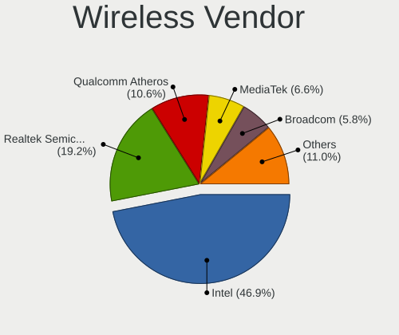

| Vendor                          | Computers | Percent |
|---------------------------------|-----------|---------|
| Intel                           | 634       | 46.93%  |
| Realtek Semiconductor           | 259       | 19.17%  |
| Qualcomm Atheros                | 143       | 10.58%  |
| MediaTek                        | 89        | 6.59%   |
| Broadcom                        | 78        | 5.77%   |
| Ralink Technology               | 28        | 2.07%   |
| TP-Link                         | 27        | 2%      |
| Ralink                          | 18        | 1.33%   |
| Sierra Wireless                 | 10        | 0.74%   |
| Broadcom Limited                | 10        | 0.74%   |
| Qualcomm Atheros Communications | 7         | 0.52%   |
| NetGear                         | 7         | 0.52%   |
| Dell                            | 6         | 0.44%   |
| Qualcomm                        | 5         | 0.37%   |
| Edimax Technology               | 5         | 0.37%   |
| Belkin Components               | 4         | 0.3%    |
| Marvell Technology Group        | 3         | 0.22%   |
| D-Link                          | 3         | 0.22%   |
| ASUSTek Computer                | 3         | 0.22%   |
| Wilocity                        | 2         | 0.15%   |
| D-Link System                   | 2         | 0.15%   |
| ZyXEL Communications            | 1         | 0.07%   |
| Quectel Wireless Solutions      | 1         | 0.07%   |
| Microsoft                       | 1         | 0.07%   |
| Mercucys                        | 1         | 0.07%   |
| Linksys                         | 1         | 0.07%   |
| LG Electronics                  | 1         | 0.07%   |
| Fibocom                         | 1         | 0.07%   |
| Acer Peripherals (now BenQ)     | 1         | 0.07%   |

Wireless Model
--------------

Wireless models

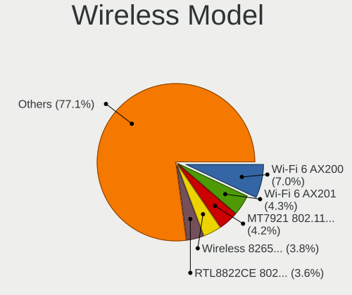

| Model                                                                | Computers | Percent |
|----------------------------------------------------------------------|-----------|---------|
| Intel Wi-Fi 6 AX200                                                  | 96        | 7.01%   |
| Intel Wi-Fi 6 AX201                                                  | 59        | 4.31%   |
| MediaTek MT7921 802.11ax PCIe Wireless Network Adapter [Filogic 330] | 57        | 4.16%   |
| Intel Wireless 8265 / 8275                                           | 52        | 3.8%    |
| Realtek RTL8822CE 802.11ac PCIe Wireless Network Adapter             | 49        | 3.58%   |
| Realtek RTL8821CE 802.11ac PCIe Wireless Network Adapter             | 43        | 3.14%   |
| Intel Alder Lake-P PCH CNVi WiFi                                     | 41        | 2.99%   |
| Intel Wireless 7265                                                  | 30        | 2.19%   |
| Qualcomm Atheros QCA9377 802.11ac Wireless Network Adapter           | 29        | 2.12%   |
| Intel Wireless 7260                                                  | 29        | 2.12%   |
| Intel Cannon Lake PCH CNVi WiFi                                      | 29        | 2.12%   |
| Qualcomm Atheros AR9485 Wireless Network Adapter                     | 28        | 2.05%   |
| Intel Wi-Fi 6E(802.11ax) AX210/AX1675* 2x2 [Typhoon Peak]            | 28        | 2.05%   |
| Qualcomm Atheros QCA6174 802.11ac Wireless Network Adapter           | 26        | 1.9%    |
| Intel Wireless 8260                                                  | 25        | 1.83%   |
| Intel Comet Lake PCH CNVi WiFi                                       | 24        | 1.75%   |
| Qualcomm Atheros QCA9565 / AR9565 Wireless Network Adapter           | 21        | 1.53%   |
| Intel Wireless 3165                                                  | 21        | 1.53%   |
| Intel Centrino Advanced-N 6205 [Taylor Peak]                         | 21        | 1.53%   |
| Intel Comet Lake PCH-LP CNVi WiFi                                    | 20        | 1.46%   |
| Realtek RTL8188EUS 802.11n Wireless Network Adapter                  | 19        | 1.39%   |
| Realtek RTL8723BE PCIe Wireless Network Adapter                      | 16        | 1.17%   |
| Realtek RTL88x2bu [AC1200 Techkey]                                   | 15        | 1.1%    |
| Intel Raptor Lake PCH CNVi WiFi                                      | 15        | 1.1%    |
| Intel Dual Band Wireless-AC 3168NGW [Stone Peak]                     | 15        | 1.1%    |
| Realtek 802.11ac NIC                                                 | 14        | 1.02%   |
| Intel Wi-Fi 5(802.11ac) Wireless-AC 9x6x [Thunder Peak]              | 14        | 1.02%   |
| Broadcom BCM4360 802.11ac Dual Band Wireless Network Adapter         | 14        | 1.02%   |
| Realtek RTL8852AE 802.11ax PCIe Wireless Network Adapter             | 13        | 0.95%   |
| Intel Tiger Lake PCH CNVi WiFi                                       | 13        | 0.95%   |
| Broadcom BCM4313 802.11bgn Wireless Network Adapter                  | 13        | 0.95%   |
| Realtek RTL8852BE PCIe 802.11ax Wireless Network Controller          | 12        | 0.88%   |
| Ralink MT7601U Wireless Adapter                                      | 12        | 0.88%   |
| Qualcomm Atheros AR9285 Wireless Network Adapter (PCI-Express)       | 12        | 0.88%   |
| MediaTek MT7921K (RZ608) Wi-Fi 6E 80MHz                              | 11        | 0.8%    |
| MediaTek MT7922 802.11ax PCI Express Wireless Network Adapter        | 10        | 0.73%   |
| Intel Wireless 3160                                                  | 10        | 0.73%   |
| Intel Ice Lake-LP PCH CNVi WiFi                                      | 10        | 0.73%   |
| Intel Gemini Lake PCH CNVi WiFi                                      | 10        | 0.73%   |
| Intel Cannon Point-LP CNVi [Wireless-AC]                             | 10        | 0.73%   |

Ethernet Vendor
---------------

Ethernet vendors

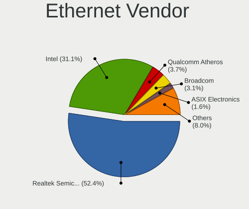

| Vendor                                 | Computers | Percent |
|----------------------------------------|-----------|---------|
| Realtek Semiconductor                  | 775       | 52.36%  |
| Intel                                  | 461       | 31.15%  |
| Qualcomm Atheros                       | 55        | 3.72%   |
| Broadcom                               | 46        | 3.11%   |
| ASIX Electronics                       | 24        | 1.62%   |
| Samsung Electronics                    | 17        | 1.15%   |
| Marvell Technology Group               | 10        | 0.68%   |
| Lenovo                                 | 10        | 0.68%   |
| Aquantia                               | 10        | 0.68%   |
| Huawei Technologies                    | 8         | 0.54%   |
| Xiaomi                                 | 7         | 0.47%   |
| TP-Link                                | 6         | 0.41%   |
| Nvidia                                 | 6         | 0.41%   |
| DisplayLink                            | 6         | 0.41%   |
| MediaTek                               | 4         | 0.27%   |
| Broadcom Limited                       | 4         | 0.27%   |
| Apple                                  | 4         | 0.27%   |
| OPPO Electronics                       | 3         | 0.2%    |
| VIA Technologies                       | 2         | 0.14%   |
| Solarflare Communications              | 2         | 0.14%   |
| Qualcomm                               | 2         | 0.14%   |
| Motorola PCS                           | 2         | 0.14%   |
| Mellanox Technologies                  | 2         | 0.14%   |
| JMicron Technology                     | 2         | 0.14%   |
| IBM                                    | 2         | 0.14%   |
| Hewlett-Packard                        | 2         | 0.14%   |
| Google                                 | 2         | 0.14%   |
| Suzhou Motorcomm Electronic Technology | 1         | 0.07%   |
| Spreadtrum Communications              | 1         | 0.07%   |
| QinHeng Electronics                    | 1         | 0.07%   |
| ICS Advent                             | 1         | 0.07%   |
| Dell                                   | 1         | 0.07%   |
| American Megatrends                    | 1         | 0.07%   |

Ethernet Model
--------------

Ethernet models

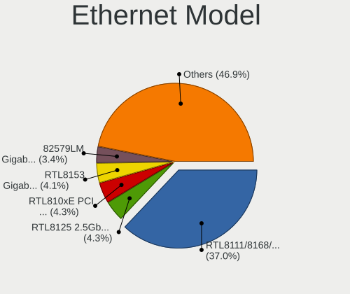

| Model                                                                          | Computers | Percent |
|--------------------------------------------------------------------------------|-----------|---------|
| Realtek RTL8111/8168/8211/8411 PCI Express Gigabit Ethernet Controller         | 569       | 37.04%  |
| Realtek RTL8125 2.5GbE Controller                                              | 66        | 4.3%    |
| Realtek RTL810xE PCI Express Fast Ethernet controller                          | 66        | 4.3%    |
| Realtek RTL8153 Gigabit Ethernet Adapter                                       | 63        | 4.1%    |
| Intel 82579LM Gigabit Network Connection (Lewisville)                          | 52        | 3.39%   |
| Intel I211 Gigabit Network Connection                                          | 44        | 2.86%   |
| Intel Ethernet Controller I225-V                                               | 39        | 2.54%   |
| Intel Ethernet Connection I217-LM                                              | 30        | 1.95%   |
| Intel Ethernet Connection (2) I219-V                                           | 25        | 1.63%   |
| Intel Alder Lake-P PCH CNVi WiFi                                               | 23        | 1.5%    |
| ASIX AX88179 Gigabit Ethernet                                                  | 22        | 1.43%   |
| Intel Ethernet Connection (7) I219-V                                           | 21        | 1.37%   |
| Intel Ethernet Connection (4) I219-LM                                          | 21        | 1.37%   |
| Intel 82579V Gigabit Network Connection                                        | 17        | 1.11%   |
| Intel Ethernet Connection (2) I218-V                                           | 14        | 0.91%   |
| Samsung Galaxy series, misc. (tethering mode)                                  | 13        | 0.85%   |
| Realtek Killer E2600 GbE Controller                                            | 11        | 0.72%   |
| Intel I210 Gigabit Network Connection                                          | 11        | 0.72%   |
| Intel Ethernet Connection I219-LM                                              | 11        | 0.72%   |
| Intel Ethernet Connection (7) I219-LM                                          | 11        | 0.72%   |
| Qualcomm Atheros Killer E220x Gigabit Ethernet Controller                      | 10        | 0.65%   |
| Qualcomm Atheros AR8161 Gigabit Ethernet                                       | 9         | 0.59%   |
| Intel Ethernet Connection (5) I219-LM                                          | 9         | 0.59%   |
| Intel Ethernet Connection (16) I219-LM                                         | 9         | 0.59%   |
| Intel 82574L Gigabit Network Connection                                        | 9         | 0.59%   |
| Qualcomm Atheros Killer E2500 Gigabit Ethernet Controller                      | 8         | 0.52%   |
| Intel Ethernet Connection (4) I219-V                                           | 8         | 0.52%   |
| Intel Ethernet Connection (3) I218-LM                                          | 8         | 0.52%   |
| Intel Ethernet Connection (2) I219-LM                                          | 8         | 0.52%   |
| Intel Ethernet Connection (10) I219-V                                          | 8         | 0.52%   |
| Broadcom NetXtreme BCM57766 Gigabit Ethernet PCIe                              | 8         | 0.52%   |
| Broadcom NetXtreme BCM57765 Gigabit Ethernet PCIe                              | 8         | 0.52%   |
| Realtek RTL8152 Fast Ethernet Adapter                                          | 7         | 0.46%   |
| Intel Ethernet Connection (14) I219-V                                          | 7         | 0.46%   |
| Intel Ethernet Connection (13) I219-V                                          | 7         | 0.46%   |
| Aquantia AQtion AQC107 NBase-T/IEEE 802.3an Ethernet Controller [Atlantic 10G] | 7         | 0.46%   |
| Xiaomi Mi/Redmi series (RNDIS)                                                 | 6         | 0.39%   |
| TP-Link UE300 10/100/1000 LAN (ethernet mode) [Realtek RTL8153]                | 6         | 0.39%   |
| Qualcomm Atheros QCA8171 Gigabit Ethernet                                      | 6         | 0.39%   |
| Intel Ethernet Connection I217-V                                               | 6         | 0.39%   |

Net Controller Kind
-------------------

Ethernet, WiFi or modem

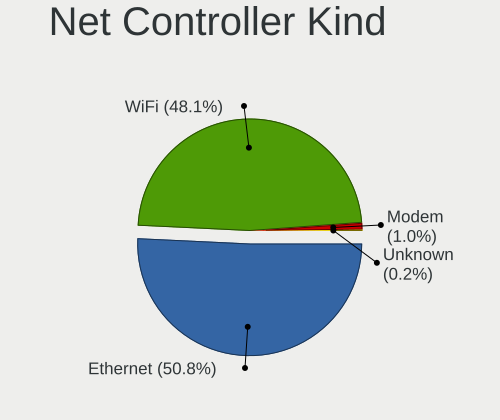

| Kind     | Computers | Percent |
|----------|-----------|---------|
| Ethernet | 1349      | 50.75%  |
| WiFi     | 1278      | 48.08%  |
| Modem    | 26        | 0.98%   |
| Unknown  | 5         | 0.19%   |

Used Controller
---------------

Currently used network controller

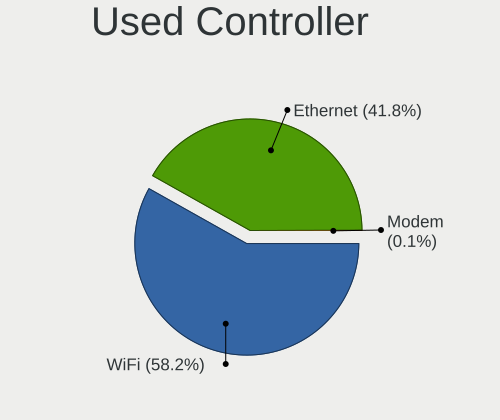

| Kind     | Computers | Percent |
|----------|-----------|---------|
| WiFi     | 988       | 58.15%  |
| Ethernet | 710       | 41.79%  |
| Modem    | 1         | 0.06%   |

NICs
----

Total network controllers on board

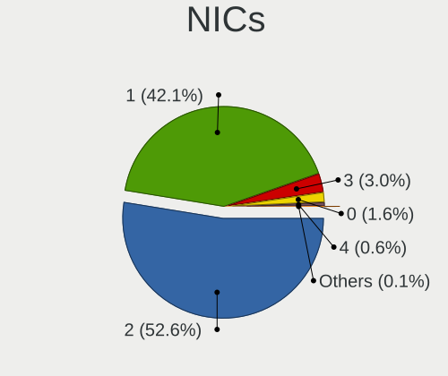

| Total | Computers | Percent |
|-------|-----------|---------|
| 2     | 852       | 52.56%  |
| 1     | 682       | 42.07%  |
| 3     | 49        | 3.02%   |
| 0     | 26        | 1.6%    |
| 4     | 10        | 0.62%   |
| 6     | 2         | 0.12%   |

IPv6
----

IPv6 vs IPv4

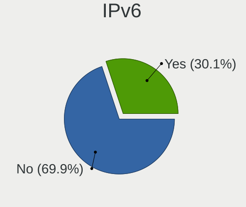

| Used | Computers | Percent |
|------|-----------|---------|
| No   | 1146      | 69.92%  |
| Yes  | 493       | 30.08%  |

Bluetooth
---------

Bluetooth Vendor
----------------

Controller vendors

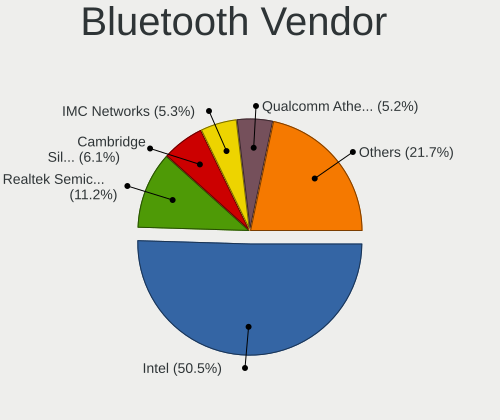

| Vendor                          | Computers | Percent |
|---------------------------------|-----------|---------|
| Intel                           | 591       | 50.47%  |
| Realtek Semiconductor           | 131       | 11.19%  |
| Cambridge Silicon Radio         | 72        | 6.15%   |
| IMC Networks                    | 62        | 5.29%   |
| Qualcomm Atheros Communications | 61        | 5.21%   |
| Broadcom                        | 47        | 4.01%   |
| Foxconn / Hon Hai               | 40        | 3.42%   |
| Lite-On Technology              | 36        | 3.07%   |
| Apple                           | 31        | 2.65%   |
| ASUSTek Computer                | 22        | 1.88%   |
| MediaTek                        | 16        | 1.37%   |
| Dell                            | 11        | 0.94%   |
| TP-Link                         | 9         | 0.77%   |
| Realtek                         | 9         | 0.77%   |
| Ralink                          | 6         | 0.51%   |
| Toshiba                         | 5         | 0.43%   |
| Edimax Technology               | 4         | 0.34%   |
| Marvell Semiconductor           | 3         | 0.26%   |
| Hewlett-Packard                 | 3         | 0.26%   |
| USI                             | 2         | 0.17%   |
| SiW                             | 2         | 0.17%   |
| Alps Electric                   | 2         | 0.17%   |
| SINO WEALTH                     | 1         | 0.09%   |
| Foxconn International           | 1         | 0.09%   |
| Dynex                           | 1         | 0.09%   |
| D-Link                          | 1         | 0.09%   |
| Conwise Technology              | 1         | 0.09%   |
| Chicony Electronics             | 1         | 0.09%   |

Bluetooth Model
---------------

Controller models

| Model                                               | Computers | Percent |
|-----------------------------------------------------|-----------|---------|
| Intel Bluetooth wireless interface                  | 156       | 13.3%   |
| Intel AX201 Bluetooth                               | 126       | 10.74%  |
| Realtek Bluetooth Radio                             | 103       | 8.78%   |
| Intel AX200 Bluetooth                               | 93        | 7.93%   |
| Intel Bluetooth Device                              | 76        | 6.48%   |
| Intel Bluetooth 9460/9560 Jefferson Peak (JfP)      | 72        | 6.14%   |
| Cambridge Silicon Radio Bluetooth Dongle (HCI mode) | 72        | 6.14%   |
| Qualcomm Atheros  Bluetooth Device                  | 31        | 2.64%   |
| IMC Networks Wireless_Device                        | 29        | 2.47%   |
| Intel AX210 Bluetooth                               | 26        | 2.22%   |
| Realtek  Bluetooth 4.2 Adapter                      | 23        | 1.96%   |
| IMC Networks Bluetooth Radio                        | 21        | 1.79%   |
| Apple Bluetooth Host Controller                     | 21        | 1.79%   |
| Lite-On Wireless_Device                             | 18        | 1.53%   |
| MediaTek Wireless_Device                            | 16        | 1.36%   |
| Intel Wireless-AC 9260 Bluetooth Adapter            | 15        | 1.28%   |
| Intel Wireless-AC 3168 Bluetooth                    | 15        | 1.28%   |
| Foxconn / Hon Hai MediaTek Bluetooth Adapter        | 15        | 1.28%   |
| Qualcomm Atheros QCA61x4 Bluetooth 4.0              | 12        | 1.02%   |
| Intel Centrino Bluetooth Wireless Transceiver       | 12        | 1.02%   |
| Qualcomm Atheros AR3012 Bluetooth 4.0               | 11        | 0.94%   |
| Broadcom HP Portable SoftSailing                    | 10        | 0.85%   |
| TP-Link TP-T@- UB500 Adapter                        | 9         | 0.77%   |
| Realtek Bluetooth Radio                             | 9         | 0.77%   |
| Broadcom BCM20702A0 Bluetooth 4.0                   | 9         | 0.77%   |
| Broadcom BCM20702 Bluetooth 4.0 [ThinkPad]          | 9         | 0.77%   |
| ASUS ASUS USB-BT500                                 | 9         | 0.77%   |
| Foxconn / Hon Hai Wireless_Device                   | 8         | 0.68%   |
| Foxconn / Hon Hai Bluetooth Device                  | 7         | 0.6%    |
| Ralink RT3290 Bluetooth                             | 6         | 0.51%   |
| Lite-On Qualcomm Atheros QCA9377 Bluetooth          | 6         | 0.51%   |
| IMC Networks Bluetooth Device                       | 6         | 0.51%   |
| Foxconn / Hon Hai MediaTek MT7921 Bluetooth         | 5         | 0.43%   |
| Dell DW375 Bluetooth Module                         | 5         | 0.43%   |
| Apple Built-in Bluetooth 2.0+EDR HCI                | 5         | 0.43%   |
| Apple Bluetooth USB Host Controller                 | 5         | 0.43%   |
| Lite-On Bluetooth Device                            | 4         | 0.34%   |
| Broadcom BCM2045B (BDC-2.1)                         | 4         | 0.34%   |
| Qualcomm Atheros Bluetooth USB Host Controller      | 3         | 0.26%   |
| Marvell Bluetooth and Wireless LAN Composite        | 3         | 0.26%   |

Sound
-----

Sound Vendor
------------

Sound card vendors

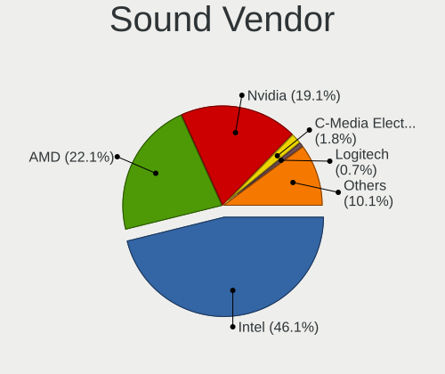

| Vendor                     | Computers | Percent |
|----------------------------|-----------|---------|
| Intel                      | 1126      | 46.15%  |
| AMD                        | 539       | 22.09%  |
| Nvidia                     | 467       | 19.14%  |
| C-Media Electronics        | 43        | 1.76%   |
| Logitech                   | 18        | 0.74%   |
| JMTek                      | 18        | 0.74%   |
| GN Netcom                  | 18        | 0.74%   |
| Hewlett-Packard            | 11        | 0.45%   |
| Texas Instruments          | 10        | 0.41%   |
| Micro Star International   | 10        | 0.41%   |
| Lenovo                     | 10        | 0.41%   |
| Generalplus Technology     | 10        | 0.41%   |
| Creative Labs              | 8         | 0.33%   |
| Realtek Semiconductor      | 7         | 0.29%   |
| Focusrite-Novation         | 7         | 0.29%   |
| Corsair                    | 7         | 0.29%   |
| Apple                      | 7         | 0.29%   |
| Razer USA                  | 6         | 0.25%   |
| ASUSTek Computer           | 6         | 0.25%   |
| Kingston Technology        | 5         | 0.2%    |
| Creative Technology        | 5         | 0.2%    |
| VIA Technologies           | 4         | 0.16%   |
| M-Audio                    | 4         | 0.16%   |
| Blue Microphones           | 4         | 0.16%   |
| TerraTec Electronic        | 3         | 0.12%   |
| Tenx Technology            | 3         | 0.12%   |
| SteelSeries ApS            | 3         | 0.12%   |
| Samson Technologies        | 3         | 0.12%   |
| KORG                       | 3         | 0.12%   |
| Arturia                    | 3         | 0.12%   |
| AKAI Professional M.I.     | 3         | 0.12%   |
| ZOOM                       | 2         | 0.08%   |
| Zhaoxin                    | 2         | 0.08%   |
| Unknown                    | 2         | 0.08%   |
| Sony                       | 2         | 0.08%   |
| PreSonus Audio Electronics | 2         | 0.08%   |
| Plantronics                | 2         | 0.08%   |
| Nordic Semiconductor ASA   | 2         | 0.08%   |
| Microsoft                  | 2         | 0.08%   |
| Medeli Electronics         | 2         | 0.08%   |

Sound Model
-----------

Sound card models

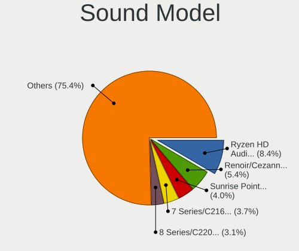

| Model                                                                      | Computers | Percent |
|----------------------------------------------------------------------------|-----------|---------|
| AMD Ryzen HD Audio Controller                                              | 245       | 8.43%   |
| AMD Renoir/Cezanne HDMI/DP Audio Controller                                | 156       | 5.37%   |
| Intel Sunrise Point-LP HD Audio                                            | 116       | 3.99%   |
| Intel 7 Series/C216 Chipset Family High Definition Audio Controller        | 108       | 3.72%   |
| Intel 8 Series/C220 Series Chipset High Definition Audio Controller        | 89        | 3.06%   |
| Intel Tiger Lake-LP Smart Sound Technology Audio Controller                | 82        | 2.82%   |
| Intel Cannon Lake PCH cAVS                                                 | 76        | 2.62%   |
| Intel Alder Lake PCH-P High Definition Audio Controller                    | 74        | 2.55%   |
| AMD Starship/Matisse HD Audio Controller                                   | 69        | 2.38%   |
| Intel Xeon E3-1200 v3/4th Gen Core Processor HD Audio Controller           | 65        | 2.24%   |
| Intel 6 Series/C200 Series Chipset Family High Definition Audio Controller | 65        | 2.24%   |
| AMD SBx00 Azalia (Intel HDA)                                               | 46        | 1.58%   |
| Nvidia GP107GL High Definition Audio Controller                            | 44        | 1.51%   |
| AMD Raven/Raven2/Fenghuang HDMI/DP Audio Controller                        | 43        | 1.48%   |
| AMD Family 17h (Models 00h-0fh) HD Audio Controller                        | 39        | 1.34%   |
| Intel 100 Series/C230 Series Chipset Family HD Audio Controller            | 37        | 1.27%   |
| Intel 200 Series PCH HD Audio                                              | 36        | 1.24%   |
| Nvidia TU107 GeForce GTX 1650 High Definition Audio Controller             | 35        | 1.2%    |
| Intel Celeron/Pentium Silver Processor High Definition Audio               | 34        | 1.17%   |
| Intel Comet Lake PCH cAVS                                                  | 33        | 1.14%   |
| Nvidia GK208 HDMI/DP Audio Controller                                      | 30        | 1.03%   |
| Intel 5 Series/3400 Series Chipset High Definition Audio                   | 30        | 1.03%   |
| Nvidia TU116 High Definition Audio Controller                              | 29        | 1%      |
| Nvidia GA106 High Definition Audio Controller                              | 29        | 1%      |
| Nvidia GA104 High Definition Audio Controller                              | 29        | 1%      |
| AMD Radeon High Definition Audio Controller                                | 29        | 1%      |
| AMD Navi 21/23 HDMI/DP Audio Controller                                    | 28        | 0.96%   |
| Intel Tiger Lake-H HD Audio Controller                                     | 27        | 0.93%   |
| Nvidia TU106 High Definition Audio Controller                              | 26        | 0.9%    |
| Nvidia GP104 High Definition Audio Controller                              | 26        | 0.9%    |
| AMD Ellesmere HDMI Audio [Radeon RX 470/480 / 570/580/590]                 | 26        | 0.9%    |
| AMD FCH Azalia Controller                                                  | 25        | 0.86%   |
| Intel Wildcat Point-LP High Definition Audio Controller                    | 24        | 0.83%   |
| Intel Broadwell-U Audio Controller                                         | 24        | 0.83%   |
| Intel Ice Lake-LP Smart Sound Technology Audio Controller                  | 22        | 0.76%   |
| Intel Comet Lake PCH-LP cAVS                                               | 22        | 0.76%   |
| Nvidia GM107 High Definition Audio Controller [GeForce 940MX]              | 21        | 0.72%   |
| Nvidia GF108 High Definition Audio Controller                              | 21        | 0.72%   |
| Intel Cannon Point-LP High Definition Audio Controller                     | 21        | 0.72%   |
| Intel Haswell-ULT HD Audio Controller                                      | 20        | 0.69%   |

Memory
------

Memory Vendor
-------------

Memory module vendors

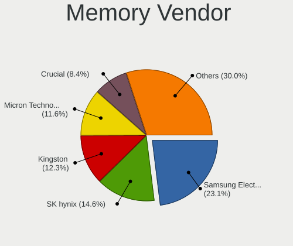

| Vendor                     | Computers | Percent |
|----------------------------|-----------|---------|
| Samsung Electronics        | 281       | 23.05%  |
| SK hynix                   | 178       | 14.6%   |
| Kingston                   | 150       | 12.31%  |
| Micron Technology          | 141       | 11.57%  |
| Crucial                    | 103       | 8.45%   |
| Corsair                    | 78        | 6.4%    |
| Unknown                    | 57        | 4.68%   |
| G.Skill                    | 48        | 3.94%   |
| A-DATA Technology          | 26        | 2.13%   |
| Unknown (ABCD)             | 19        | 1.56%   |
| Unknown                    | 17        | 1.39%   |
| Ramaxel Technology         | 14        | 1.15%   |
| Elpida                     | 11        | 0.9%    |
| Team                       | 10        | 0.82%   |
| Nanya Technology           | 9         | 0.74%   |
| Smart                      | 8         | 0.66%   |
| Patriot                    | 7         | 0.57%   |
| Transcend                  | 6         | 0.49%   |
| Silicon Power              | 4         | 0.33%   |
| AMD                        | 4         | 0.33%   |
| Wilk                       | 3         | 0.25%   |
| PNY                        | 3         | 0.25%   |
| Lexar                      | 3         | 0.25%   |
| GOODRAM                    | 3         | 0.25%   |
| ff                         | 3         | 0.25%   |
| 4ea5                       | 3         | 0.25%   |
| Teikon                     | 2         | 0.16%   |
| Avant                      | 2         | 0.16%   |
| Atermiter                  | 2         | 0.16%   |
| Xi'an UniIC Semiconductors | 1         | 0.08%   |
| V-Color                    | 1         | 0.08%   |
| Unknown (8A02)             | 1         | 0.08%   |
| Unknown (08C8)             | 1         | 0.08%   |
| Unifosa                    | 1         | 0.08%   |
| Super Talent               | 1         | 0.08%   |
| Shenzhen Zhongteng         | 1         | 0.08%   |
| Shenzhen WODPOSIT          | 1         | 0.08%   |
| SHARETRONIC                | 1         | 0.08%   |
| Sesame                     | 1         | 0.08%   |
| Qumo                       | 1         | 0.08%   |

Memory Model
------------

Memory module models

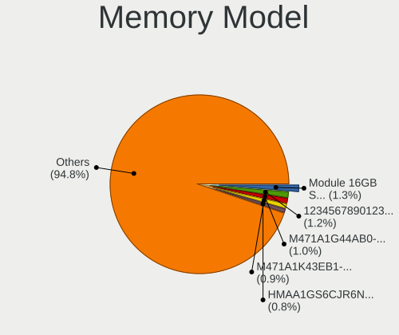

| Model                                                            | Computers | Percent |
|------------------------------------------------------------------|-----------|---------|
| Unknown                                                          | 17        | 1.31%   |
| Unknown (ABCD) RAM 123456789012345678 2GB SODIMM LPDDR4 2400MT/s | 15        | 1.16%   |
| Samsung RAM M471A1G44AB0-CWE 8GiB SODIMM DDR4 3200MT/s           | 13        | 1.01%   |
| Samsung RAM M471A1K43EB1-CWE 8GB SODIMM DDR4 3200MT/s            | 12        | 0.93%   |
| SK hynix RAM HMAA1GS6CJR6N-XN 8GB SODIMM DDR4 3200MT/s           | 10        | 0.77%   |
| SK hynix RAM HMA81GS6DJR8N-XN 8GB SODIMM DDR4 3200MT/s           | 10        | 0.77%   |
| Micron RAM 4ATF1G64HZ-3G2E1 8GB Row Of Chips DDR4 3200MT/s       | 10        | 0.77%   |
| SK hynix RAM HMA81GS6AFR8N-UH 8GB SODIMM DDR4 2667MT/s           | 9         | 0.7%    |
| Samsung RAM M471A1K43CB1-CTD 8GB SODIMM DDR4 3200MT/s            | 9         | 0.7%    |
| Samsung RAM M471A1G44BB0-CWE 8GB SODIMM DDR4 3200MT/s            | 9         | 0.7%    |
| Unknown RAM Module 4GB DIMM 1333MT/s                             | 8         | 0.62%   |
| SK hynix RAM HMT351S6CFR8C-PB 4GB SODIMM DDR3 1600MT/s           | 8         | 0.62%   |
| Samsung RAM M471A1K43DB1-CWE 8GB SODIMM DDR4 3200MT/s            | 8         | 0.62%   |
| Micron RAM 4ATF1G64HZ-3G2F1 8GB SODIMM DDR4 3200MT/s             | 8         | 0.62%   |
| Samsung RAM M471A5244CB0-CWE 4GB SODIMM DDR4 3200MT/s            | 7         | 0.54%   |
| Samsung RAM M471A2K43DB1-CTD 16GB SODIMM DDR4 2667MT/s           | 7         | 0.54%   |
| Samsung RAM M471A1G44AB0-CWE 8GB Row Of Chips DDR4 3200MT/s      | 7         | 0.54%   |
| Micron RAM 8ATF1G64HZ-3G2R1 8GB SODIMM DDR4 3200MT/s             | 7         | 0.54%   |
| Micron RAM 4ATF1G64HZ-3G2E1 8GB SODIMM DDR4 3200MT/s             | 7         | 0.54%   |
| Corsair RAM CMK16GX4M2B3200C16 8GB DIMM DDR4 3600MT/s            | 7         | 0.54%   |
| SK hynix RAM HMAA1GS6CJR6N-XN 8GB Row Of Chips DDR4 3200MT/s     | 6         | 0.46%   |
| Samsung RAM M471B1G73DB0-YK0 8GB SODIMM DDR3 1600MT/s            | 6         | 0.46%   |
| Samsung RAM M471A5244CB0-CTD 4GB SODIMM DDR4 3266MT/s            | 6         | 0.46%   |
| Micron RAM MTC4C10163S1SC48BA1 8GB SODIMM DDR5 4800MT/s          | 6         | 0.46%   |
| Micron RAM 8ATF1G64HZ-3G2J1 8GB SODIMM DDR4 3200MT/s             | 6         | 0.46%   |
| SK hynix RAM HMT451S6BFR8A-PB 4GB SODIMM DDR3 1600MT/s           | 5         | 0.39%   |
| SK hynix RAM HMA81GS6CJR8N-XN 8GB SODIMM DDR4 3200MT/s           | 5         | 0.39%   |
| Samsung RAM M471B5173EB0-YK0 4GB SODIMM DDR3 1600MT/s            | 5         | 0.39%   |
| Samsung RAM M471B5173DB0-YK0 4GB SODIMM DDR3 1600MT/s            | 5         | 0.39%   |
| Samsung RAM M471A5244CB0-CRC 4GB SODIMM DDR4 2667MT/s            | 5         | 0.39%   |
| Samsung RAM M471A1K43CB1-CRC 8GB SODIMM DDR4 8400MT/s            | 5         | 0.39%   |
| Unknown (ABCD) RAM 123456789012345678 2GB DIMM LPDDR4 2133MT/s   | 4         | 0.31%   |
| SK hynix RAM Module 8GB SODIMM DDR3 1600MT/s                     | 4         | 0.31%   |
| SK hynix RAM Module 16GB SODIMM DDR4 3200MT/s                    | 4         | 0.31%   |
| Samsung RAM Module 8GB SODIMM DDR4 2400MT/s                      | 4         | 0.31%   |
| Samsung RAM Module 8GB SODIMM DDR4 2133MT/s                      | 4         | 0.31%   |
| Samsung RAM M471B5273CH0-CH9 4GB SODIMM DDR3 1334MT/s            | 4         | 0.31%   |
| Samsung RAM M471B1G73EB0-YK0 8192MB SODIMM DDR3 1600MT/s         | 4         | 0.31%   |
| Samsung RAM M471A4G43AB1-CWE 32GB SODIMM DDR4 3200MT/s           | 4         | 0.31%   |
| Samsung RAM M471A2G43BB2-CWE 16GB SODIMM DDR4 3200MT/s           | 4         | 0.31%   |

Memory Kind
-----------

Memory module kinds

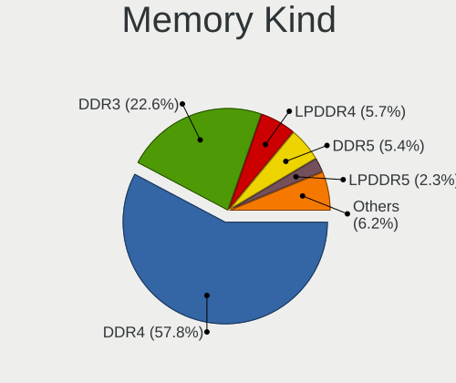

| Kind    | Computers | Percent |
|---------|-----------|---------|
| DDR4    | 596       | 57.75%  |
| DDR3    | 233       | 22.58%  |
| LPDDR4  | 59        | 5.72%   |
| DDR5    | 56        | 5.43%   |
| LPDDR5  | 24        | 2.33%   |
| Unknown | 20        | 1.94%   |
| SDRAM   | 15        | 1.45%   |
| DDR2    | 14        | 1.36%   |
| LPDDR3  | 12        | 1.16%   |
| DDR     | 2         | 0.19%   |
| DRAM    | 1         | 0.1%    |

Memory Form Factor
------------------

Physical design of the memory module

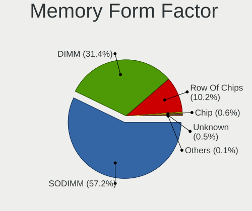

| Name         | Computers | Percent |
|--------------|-----------|---------|
| SODIMM       | 593       | 57.18%  |
| DIMM         | 326       | 31.44%  |
| Row Of Chips | 106       | 10.22%  |
| Chip         | 6         | 0.58%   |
| Unknown      | 5         | 0.48%   |
| RIMM         | 1         | 0.1%    |

Memory Size
-----------

Memory module size

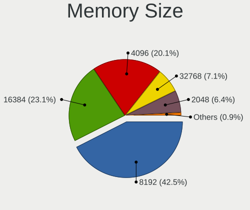

| Size  | Computers | Percent |
|-------|-----------|---------|
| 8192  | 481       | 42.53%  |
| 16384 | 261       | 23.08%  |
| 4096  | 227       | 20.07%  |
| 32768 | 80        | 7.07%   |
| 2048  | 72        | 6.37%   |
| 1024  | 8         | 0.71%   |
| 24576 | 1         | 0.09%   |
| 12288 | 1         | 0.09%   |

Memory Speed
------------

Memory module speed

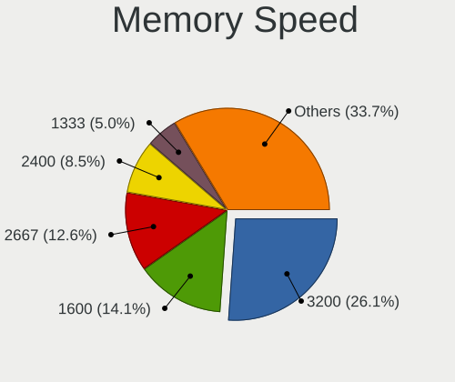

| Speed   | Computers | Percent |
|---------|-----------|---------|
| 3200    | 291       | 26.12%  |
| 1600    | 157       | 14.09%  |
| 2667    | 140       | 12.57%  |
| 2400    | 95        | 8.53%   |
| 1333    | 56        | 5.03%   |
| 2133    | 39        | 3.5%    |
| 3600    | 35        | 3.14%   |
| 4800    | 31        | 2.78%   |
| 4267    | 24        | 2.15%   |
| 6400    | 22        | 1.97%   |
| 1867    | 20        | 1.8%    |
| 2666    | 17        | 1.53%   |
| 5600    | 12        | 1.08%   |
| 1334    | 12        | 1.08%   |
| 3800    | 10        | 0.9%    |
| 3000    | 9         | 0.81%   |
| 3733    | 8         | 0.72%   |
| 3266    | 8         | 0.72%   |
| 8400    | 7         | 0.63%   |
| 4000    | 7         | 0.63%   |
| 1866    | 7         | 0.63%   |
| 1066    | 7         | 0.63%   |
| 800     | 7         | 0.63%   |
| 6000    | 6         | 0.54%   |
| 2933    | 6         | 0.54%   |
| 667     | 6         | 0.54%   |
| Unknown | 6         | 0.54%   |
| 4266    | 5         | 0.45%   |
| 3400    | 5         | 0.45%   |
| 4199    | 4         | 0.36%   |
| 3066    | 4         | 0.36%   |
| 2800    | 4         | 0.36%   |
| 1648    | 4         | 0.36%   |
| 5200    | 3         | 0.27%   |
| 3666    | 3         | 0.27%   |
| 3333    | 3         | 0.27%   |
| 2048    | 3         | 0.27%   |
| 400     | 3         | 0.27%   |
| 7500    | 2         | 0.18%   |
| 5800    | 2         | 0.18%   |

Printers & scanners
-------------------

Printer Vendor
--------------

Printer device vendors

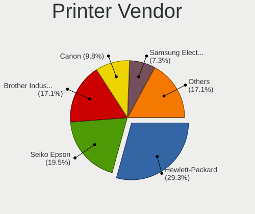

| Vendor                | Computers | Percent |
|-----------------------|-----------|---------|
| Hewlett-Packard       | 12        | 29.27%  |
| Seiko Epson           | 8         | 19.51%  |
| Brother Industries    | 7         | 17.07%  |
| Canon                 | 4         | 9.76%   |
| Samsung Electronics   | 3         | 7.32%   |
| Zebra                 | 1         | 2.44%   |
| Xerox                 | 1         | 2.44%   |
| Prolific Technology   | 1         | 2.44%   |
| Lexmark International | 1         | 2.44%   |
| Kyocera               | 1         | 2.44%   |
| Dymo-CoStar           | 1         | 2.44%   |
| Datamax-O'Neil        | 1         | 2.44%   |

Printer Model
-------------

Printer device models

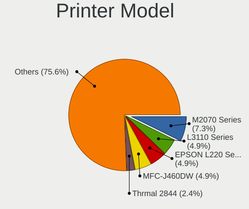

| Model                                 | Computers | Percent |
|---------------------------------------|-----------|---------|
| Samsung M2070 Series                  | 3         | 7.32%   |
| Seiko Epson L3110 Series              | 2         | 4.88%   |
| Seiko Epson EPSON L220 Series         | 2         | 4.88%   |
| Brother MFC-J460DW                    | 2         | 4.88%   |
| Zebra Thrmal 2844                     | 1         | 2.44%   |
| Xerox Phaser 3140 and 3155            | 1         | 2.44%   |
| Seiko Epson XP-3100 Series            | 1         | 2.44%   |
| Seiko Epson XP-2150 Series            | 1         | 2.44%   |
| Seiko Epson ET-2710 Series            | 1         | 2.44%   |
| Seiko Epson ET-2700 Series            | 1         | 2.44%   |
| Prolific PL2305 Parallel Port         | 1         | 2.44%   |
| Lexmark International CX510de         | 1         | 2.44%   |
| Kyocera Mita FS-820                   | 1         | 2.44%   |
| HP OfficeJet Pro 7730 series          | 1         | 2.44%   |
| HP OfficeJet 5500 series              | 1         | 2.44%   |
| HP LaserJet Professional P 1102w      | 1         | 2.44%   |
| HP LaserJet P2015 series              | 1         | 2.44%   |
| HP LaserJet 1022                      | 1         | 2.44%   |
| HP LaserJet 1012                      | 1         | 2.44%   |
| HP ENVY Photo 6200 series             | 1         | 2.44%   |
| HP ENVY 4500 series                   | 1         | 2.44%   |
| HP DeskJet D2300                      | 1         | 2.44%   |
| HP DeskJet 3700 series                | 1         | 2.44%   |
| HP DeskJet 3630 series                | 1         | 2.44%   |
| HP ColorLaserJet M253-M254            | 1         | 2.44%   |
| Dymo-CoStar LabelWriter 450           | 1         | 2.44%   |
| Datamax-O'Neil Datamax E-4304         | 1         | 2.44%   |
| Canon PIXMA MX470 Series              | 1         | 2.44%   |
| Canon PIXMA MG5500 Series             | 1         | 2.44%   |
| Canon LaserShot LBP-1120 Printer      | 1         | 2.44%   |
| Canon iP2600 series                   | 1         | 2.44%   |
| Brother PT-P700 P-touch Label Printer | 1         | 2.44%   |
| Brother MFC-L2750DW series            | 1         | 2.44%   |
| Brother HL-2230 series                | 1         | 2.44%   |
| Brother DCP-L2500D                    | 1         | 2.44%   |
| Brother DCP-7065DN                    | 1         | 2.44%   |

Scanner Vendor
--------------

Scanner device vendors

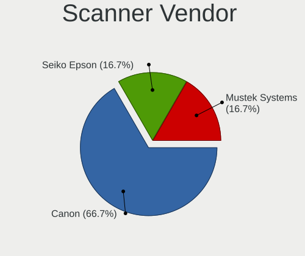

| Vendor         | Computers | Percent |
|----------------|-----------|---------|
| Canon          | 7         | 70%     |
| Seiko Epson    | 2         | 20%     |
| Mustek Systems | 1         | 10%     |

Scanner Model
-------------

Scanner device models

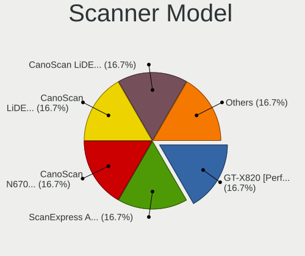

| Model                                       | Computers | Percent |
|---------------------------------------------|-----------|---------|
| Canon CanoScan LiDE 50/LiDE 35/LiDE 40      | 2         | 20%     |
| Seiko Epson GT-X820 [Perfection V600 Photo] | 1         | 10%     |
| Seiko Epson GT-6600U [Perfection 610]       | 1         | 10%     |
| Mustek Systems ScanExpress A3 USB 1200 PRO  | 1         | 10%     |
| Canon CanoScan N670U/N676U/LiDE 20          | 1         | 10%     |
| Canon CanoScan N1240U/LiDE 30               | 1         | 10%     |
| Canon CanoScan LiDE 220                     | 1         | 10%     |
| Canon CanoScan LiDE 210                     | 1         | 10%     |
| Canon CanoScan LiDE 110                     | 1         | 10%     |

Camera
------

Camera Vendor
-------------

Camera device vendors

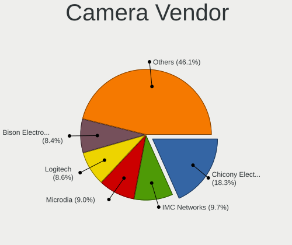

| Vendor                                 | Computers | Percent |
|----------------------------------------|-----------|---------|
| Chicony Electronics                    | 199       | 18.31%  |
| IMC Networks                           | 105       | 9.66%   |
| Microdia                               | 98        | 9.02%   |
| Logitech                               | 93        | 8.56%   |
| Bison Electronics                      | 91        | 8.37%   |
| Realtek Semiconductor                  | 69        | 6.35%   |
| Quanta                                 | 69        | 6.35%   |
| Sunplus Innovation Technology          | 57        | 5.24%   |
| Cheng Uei Precision Industry (Foxlink) | 41        | 3.77%   |
| Luxvisions Innotech Limited            | 30        | 2.76%   |
| Apple                                  | 25        | 2.3%    |
| Syntek                                 | 20        | 1.84%   |
| Lite-On Technology                     | 17        | 1.56%   |
| Suyin                                  | 15        | 1.38%   |
| Silicon Motion                         | 10        | 0.92%   |
| Samsung Electronics                    | 10        | 0.92%   |
| Microsoft                              | 10        | 0.92%   |
| Sonix Technology                       | 9         | 0.83%   |
| SunplusIT                              | 8         | 0.74%   |
| Alcor Micro                            | 8         | 0.74%   |
| Generalplus Technology                 | 7         | 0.64%   |
| Z-Star Microelectronics                | 5         | 0.46%   |
| Y Media                                | 5         | 0.46%   |
| icSpring                               | 5         | 0.46%   |
| ShineTech                              | 4         | 0.37%   |
| KYE Systems (Mouse Systems)            | 4         | 0.37%   |
| GEMBIRD                                | 4         | 0.37%   |
| Cubeternet                             | 4         | 0.37%   |
| Creative Technology                    | 4         | 0.37%   |
| Acer                                   | 4         | 0.37%   |
| Ricoh                                  | 3         | 0.28%   |
| MacroSilicon                           | 3         | 0.28%   |
| ARC International                      | 3         | 0.28%   |
| YGTek                                  | 2         | 0.18%   |
| Unknown                                | 2         | 0.18%   |
| Trust                                  | 2         | 0.18%   |
| Razer USA                              | 2         | 0.18%   |
| Primax Electronics                     | 2         | 0.18%   |
| Motorola PCS                           | 2         | 0.18%   |
| LG Electronics                         | 2         | 0.18%   |

Camera Model
------------

Camera device models

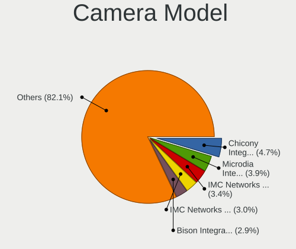

| Model                                                | Computers | Percent |
|------------------------------------------------------|-----------|---------|
| Chicony Integrated Camera                            | 51        | 4.67%   |
| Microdia Integrated_Webcam_HD                        | 43        | 3.93%   |
| IMC Networks Integrated Camera                       | 37        | 3.39%   |
| IMC Networks USB2.0 HD UVC WebCam                    | 33        | 3.02%   |
| Bison Integrated Camera                              | 32        | 2.93%   |
| Logitech Webcam C270                                 | 20        | 1.83%   |
| Chicony HD User Facing                               | 20        | 1.83%   |
| Realtek Integrated_Webcam_HD                         | 19        | 1.74%   |
| Sunplus Integrated_Webcam_HD                         | 18        | 1.65%   |
| Logitech HD Pro Webcam C920                          | 17        | 1.56%   |
| Chicony HD Webcam                                    | 16        | 1.46%   |
| Syntek Integrated Camera                             | 14        | 1.28%   |
| Quanta HP TrueVision HD Camera                       | 14        | 1.28%   |
| Quanta HD User Facing                                | 12        | 1.1%    |
| Microdia Integrated_Webcam_FHD                       | 12        | 1.1%    |
| Bison HD Webcam                                      | 12        | 1.1%    |
| Chicony HP HD Camera                                 | 11        | 1.01%   |
| Apple FaceTime HD Camera (Built-in)                  | 11        | 1.01%   |
| Microdia Webcam Vitade AF                            | 10        | 0.91%   |
| Bison BisonCam,NB Pro                                | 10        | 0.91%   |
| Samsung Galaxy series, misc. (MTP mode)              | 9         | 0.82%   |
| Quanta HD Webcam                                     | 9         | 0.82%   |
| IMC Networks HD Camera                               | 9         | 0.82%   |
| Quanta HP HD Camera                                  | 8         | 0.73%   |
| Chicony Integrated Camera (1280x720@30)              | 8         | 0.73%   |
| Luxvisions Innotech Limited HP TrueVision HD Camera  | 7         | 0.64%   |
| Logitech C922 Pro Stream Webcam                      | 7         | 0.64%   |
| Chicony HP Wide Vision HD Camera                     | 7         | 0.64%   |
| Chicony HP TrueVision HD Camera                      | 7         | 0.64%   |
| Bison Integrated RGB Camera                          | 7         | 0.64%   |
| Sonix USB2.0 HD UVC WebCam                           | 6         | 0.55%   |
| Realtek USB Camera                                   | 6         | 0.55%   |
| Quanta HP Wide Vision HD Camera                      | 6         | 0.55%   |
| Microdia USB 2.0 Camera                              | 6         | 0.55%   |
| Luxvisions Innotech Limited Integrated Camera        | 6         | 0.55%   |
| Luxvisions Innotech Limited HP Wide Vision HD Camera | 6         | 0.55%   |
| Logitech C920 PRO HD Webcam                          | 6         | 0.55%   |
| Lite-On Integrated Camera                            | 6         | 0.55%   |
| Lite-On HP HD Camera                                 | 6         | 0.55%   |
| Chicony HP TrueVision HD                             | 6         | 0.55%   |

Security
--------

Fingerprint Vendor
------------------

Fingerprint sensor vendors

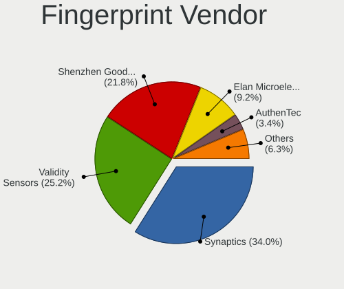

| Vendor                             | Computers | Percent |
|------------------------------------|-----------|---------|
| Synaptics                          | 70        | 33.98%  |
| Validity Sensors                   | 52        | 25.24%  |
| Shenzhen Goodix Technology         | 45        | 21.84%  |
| Elan Microelectronics              | 19        | 9.22%   |
| AuthenTec                          | 7         | 3.4%    |
| Upek                               | 5         | 2.43%   |
| LighTuning Technology              | 4         | 1.94%   |
| STMicroelectronics                 | 1         | 0.49%   |
| Realtek USB2.0 Finger Print Bridge | 1         | 0.49%   |
| Focal-systems.Corp                 | 1         | 0.49%   |
| Dell                               | 1         | 0.49%   |

Fingerprint Model
-----------------

Fingerprint sensor models

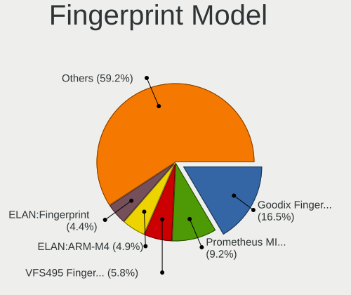

| Model                                                                      | Computers | Percent |
|----------------------------------------------------------------------------|-----------|---------|
| Shenzhen Goodix  FingerPrint Device                                        | 34        | 16.5%   |
| Synaptics Prometheus MIS Touch Fingerprint Reader                          | 19        | 9.22%   |
| Validity Sensors VFS495 Fingerprint Reader                                 | 12        | 5.83%   |
| Elan ELAN:ARM-M4                                                           | 10        | 4.85%   |
| Elan ELAN:Fingerprint                                                      | 9         | 4.37%   |
| Synaptics Metallica MIS Touch Fingerprint Reader                           | 8         | 3.88%   |
| Shenzhen Goodix Fingerprint Reader                                         | 8         | 3.88%   |
| Validity Sensors VFS491                                                    | 7         | 3.4%    |
| Validity Sensors VFS 5011 fingerprint sensor                               | 7         | 3.4%    |
| Validity Sensors Synaptics WBDI                                            | 7         | 3.4%    |
| Upek Biometric Touchchip/Touchstrip Fingerprint Sensor                     | 5         | 2.43%   |
| Synaptics WBDI                                                             | 5         | 2.43%   |
| Synaptics UWP WBDI                                                         | 5         | 2.43%   |
| Synaptics  FS7604 Touch Fingerprint Sensor with PurePrint                  | 5         | 2.43%   |
| Validity Sensors VFS5011 Fingerprint Reader                                | 4         | 1.94%   |
| Validity Sensors Synaptics VFS7552 Touch Fingerprint Sensor with PurePrint | 4         | 1.94%   |
| Synaptics UWP WBDI Device                                                  | 4         | 1.94%   |
| Synaptics Prometheus Fingerprint Reader                                    | 4         | 1.94%   |
| Synaptics FS7604 Touch Fingerprint Sensor with PurePrint                   | 4         | 1.94%   |
| Synaptics WBDI Fingerprint Reader USB 086                                  | 3         | 1.46%   |
| Synaptics  WBDI                                                            | 3         | 1.46%   |
| Synaptics Metallica MOH Touch Fingerprint Reader                           | 3         | 1.46%   |
| Synaptics Fingerprint reader [HP G6]                                       | 3         | 1.46%   |
| Shenzhen Goodix FingerPrint                                                | 3         | 1.46%   |
| AuthenTec Fingerprint Sensor                                               | 3         | 1.46%   |
| Validity Sensors VFS7552 Touch Fingerprint Sensor                          | 2         | 0.97%   |
| Validity Sensors VFS7500 Touch Fingerprint Sensor                          | 2         | 0.97%   |
| Validity Sensors VFS471 Fingerprint Reader                                 | 2         | 0.97%   |
| Validity Sensors Swipe Fingerprint Sensor                                  | 2         | 0.97%   |
| Synaptics  WBDI Fingerprint Reader - USB 052                               | 2         | 0.97%   |
| AuthenTec AES2810                                                          | 2         | 0.97%   |
| AuthenTec AES2501 Fingerprint Sensor                                       | 2         | 0.97%   |
| Validity Sensors VFS300 Fingerprint Reader                                 | 1         | 0.49%   |
| Validity Sensors Synaptics VFS7552 Touch Fingerprint Sensor                | 1         | 0.49%   |
| Validity Sensors Fingerprint scanner                                       | 1         | 0.49%   |
| Synaptics WBDI Fingerprint Reader USB 102                                  | 1         | 0.49%   |
| Synaptics TouchPad                                                         | 1         | 0.49%   |
| STMicroelectronics Fingerprint Reader                                      | 1         | 0.49%   |
| Realtek USB2.0 Finger Print Bridge FocalTech Fingerprint Device            | 1         | 0.49%   |
| LighTuning Fingerprint Sensor                                              | 1         | 0.49%   |

Chipcard Vendor
---------------

Chipcard module vendors

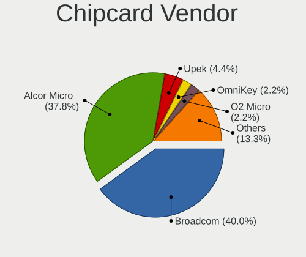

| Vendor                    | Computers | Percent |
|---------------------------|-----------|---------|
| Broadcom                  | 36        | 40%     |
| Alcor Micro               | 34        | 37.78%  |
| Upek                      | 4         | 4.44%   |
| OmniKey                   | 2         | 2.22%   |
| O2 Micro                  | 2         | 2.22%   |
| Lenovo                    | 2         | 2.22%   |
| Gemalto (was Gemplus)     | 2         | 2.22%   |
| Bit4id                    | 2         | 2.22%   |
| Advanced Card Systems     | 2         | 2.22%   |
| SCM Microsystems          | 1         | 1.11%   |
| Clay Logic                | 1         | 1.11%   |
| Aladdin R.D.              | 1         | 1.11%   |
| Aladdin Knowledge Systems | 1         | 1.11%   |

Chipcard Model
--------------

Chipcard module models

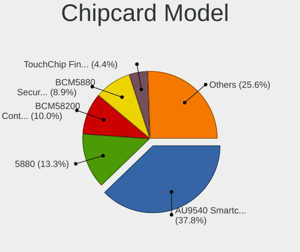

| Model                                                                        | Computers | Percent |
|------------------------------------------------------------------------------|-----------|---------|
| Alcor Micro AU9540 Smartcard Reader                                          | 34        | 37.78%  |
| Broadcom 5880                                                                | 12        | 13.33%  |
| Broadcom BCM58200 ControlVault 3 (FingerPrint sensor + Contacted SmartCard)  | 9         | 10%     |
| Broadcom BCM5880 Secure Applications Processor                               | 8         | 8.89%   |
| Upek TouchChip Fingerprint Coprocessor (WBF advanced mode)                   | 4         | 4.44%   |
| Broadcom BCM5880 Secure Applications Processor with fingerprint swipe sensor | 4         | 4.44%   |
| Broadcom 58200                                                               | 3         | 3.33%   |
| O2 Micro OZ776 CCID Smartcard Reader                                         | 2         | 2.22%   |
| Lenovo Integrated Smart Card Reader                                          | 2         | 2.22%   |
| Bit4id miniLector EVO                                                        | 2         | 2.22%   |
| SCM Microsystems SCR331 SmartCard Reader                                     | 1         | 1.11%   |
| OmniKey CardMan 3021 / 3121                                                  | 1         | 1.11%   |
| OmniKey CardMan 1021                                                         | 1         | 1.11%   |
| Gemalto (was Gemplus) GemPC Twin SmartCard Reader                            | 1         | 1.11%   |
| Gemalto (was Gemplus) GemPC Key SmartCard Reader                             | 1         | 1.11%   |
| Clay Logic Nitrokey Pro                                                      | 1         | 1.11%   |
| Aladdin R.D. JaCarta                                                         | 1         | 1.11%   |
| Aladdin Knowledge Systems Token JC                                           | 1         | 1.11%   |
| Advanced Card Systems ACR39U                                                 | 1         | 1.11%   |
| Advanced Card Systems ACR122U                                                | 1         | 1.11%   |

Unsupported
-----------

Unsupported Devices
-------------------

Total unsupported devices on board

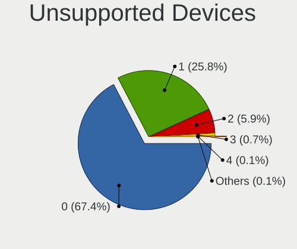

| Total | Computers | Percent |
|-------|-----------|---------|
| 0     | 1112      | 67.35%  |
| 1     | 426       | 25.8%   |
| 2     | 97        | 5.88%   |
| 3     | 12        | 0.73%   |
| 4     | 2         | 0.12%   |
| 9     | 1         | 0.06%   |
| 7     | 1         | 0.06%   |

Unsupported Device Types
------------------------

Types of unsupported devices

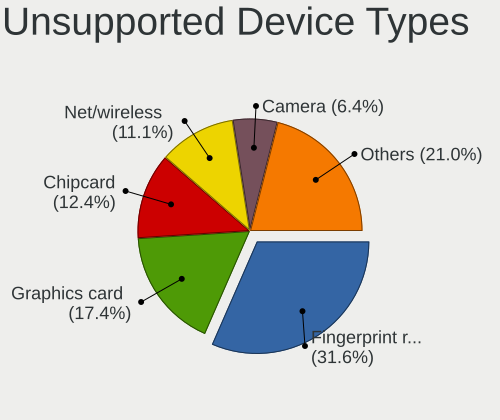

| Type                     | Computers | Percent |
|--------------------------|-----------|---------|
| Fingerprint reader       | 201       | 31.55%  |
| Graphics card            | 111       | 17.43%  |
| Chipcard                 | 79        | 12.4%   |
| Net/wireless             | 71        | 11.15%  |
| Camera                   | 41        | 6.44%   |
| Multimedia controller    | 38        | 5.97%   |
| Unassigned class         | 20        | 3.14%   |
| Bluetooth                | 19        | 2.98%   |
| Sound                    | 16        | 2.51%   |
| Communication controller | 12        | 1.88%   |
| Storage                  | 7         | 1.1%    |
| Storage/ide              | 4         | 0.63%   |
| Network                  | 4         | 0.63%   |
| Net/ethernet             | 4         | 0.63%   |
| Card reader              | 4         | 0.63%   |
| Dvb card                 | 3         | 0.47%   |
| Modem                    | 2         | 0.31%   |
| Storage/raid             | 1         | 0.16%   |

