Kubuntu 22.04 - Tested Hardware & Statistics
--------------------------------------------

A project to collect tested hardware configurations for Kubuntu 22.04.

Anyone can contribute to this report by the [hw-probe](https://github.com/linuxhw/hw-probe) tool:

    sudo -E hw-probe -all -upload

Please contribute! Especially if your hardware is rare.

This is a report for all computer types. See also reports for [desktops](/Dist/Kubuntu_22.04/Desktop/README.md) and [notebooks](/Dist/Kubuntu_22.04/Notebook/README.md).

Contents
--------

* [ Test Cases ](#test-cases)

* [ System ](#system)
  - [ Kernel                   ](#kernel)
  - [ Kernel Family            ](#kernel-family)
  - [ Kernel Major Ver.        ](#kernel-major-ver)
  - [ Arch                     ](#arch)
  - [ DE                       ](#de)
  - [ Display Server           ](#display-server)
  - [ Display Manager          ](#display-manager)
  - [ OS Lang                  ](#os-lang)
  - [ Boot Mode                ](#boot-mode)
  - [ Filesystem               ](#filesystem)
  - [ Part. scheme             ](#part-scheme)
  - [ Dual Boot with Linux/BSD ](#dual-boot-with-linuxbsd)
  - [ Dual Boot (Win)          ](#dual-boot-win)

* [ Board ](#board)
  - [ Vendor                   ](#vendor)
  - [ Model                    ](#model)
  - [ Model Family             ](#model-family)
  - [ MFG Year                 ](#mfg-year)
  - [ Form Factor              ](#form-factor)
  - [ Secure Boot              ](#secure-boot)
  - [ Coreboot                 ](#coreboot)
  - [ RAM Size                 ](#ram-size)
  - [ RAM Used                 ](#ram-used)
  - [ Total Drives             ](#total-drives)
  - [ Has CD-ROM               ](#has-cd-rom)
  - [ Has Ethernet             ](#has-ethernet)
  - [ Has WiFi                 ](#has-wifi)
  - [ Has Bluetooth            ](#has-bluetooth)

* [ Location ](#location)
  - [ Country                  ](#country)
  - [ City                     ](#city)

* [ Drives ](#drives)
  - [ Drive Vendor             ](#drive-vendor)
  - [ Drive Model              ](#drive-model)
  - [ HDD Vendor               ](#hdd-vendor)
  - [ SSD Vendor               ](#ssd-vendor)
  - [ Drive Kind               ](#drive-kind)
  - [ Drive Connector          ](#drive-connector)
  - [ Drive Size               ](#drive-size)
  - [ Space Total              ](#space-total)
  - [ Space Used               ](#space-used)
  - [ Malfunc. Drives          ](#malfunc-drives)
  - [ Malfunc. Drive Vendor    ](#malfunc-drive-vendor)
  - [ Malfunc. HDD Vendor      ](#malfunc-hdd-vendor)
  - [ Malfunc. Drive Kind      ](#malfunc-drive-kind)
  - [ Failed Drives            ](#failed-drives)
  - [ Failed Drive Vendor      ](#failed-drive-vendor)
  - [ Drive Status             ](#drive-status)

* [ Storage controller ](#storage-controller)
  - [ Storage Vendor           ](#storage-vendor)
  - [ Storage Model            ](#storage-model)
  - [ Storage Kind             ](#storage-kind)

* [ Processor ](#processor)
  - [ CPU Vendor               ](#cpu-vendor)
  - [ CPU Model                ](#cpu-model)
  - [ CPU Model Family         ](#cpu-model-family)
  - [ CPU Cores                ](#cpu-cores)
  - [ CPU Sockets              ](#cpu-sockets)
  - [ CPU Threads              ](#cpu-threads)
  - [ CPU Op-Modes             ](#cpu-op-modes)
  - [ CPU Microcode            ](#cpu-microcode)
  - [ CPU Microarch            ](#cpu-microarch)

* [ Graphics ](#graphics)
  - [ GPU Vendor               ](#gpu-vendor)
  - [ GPU Model                ](#gpu-model)
  - [ GPU Combo                ](#gpu-combo)
  - [ GPU Driver               ](#gpu-driver)
  - [ GPU Memory               ](#gpu-memory)

* [ Monitor ](#monitor)
  - [ Monitor Vendor           ](#monitor-vendor)
  - [ Monitor Model            ](#monitor-model)
  - [ Monitor Resolution       ](#monitor-resolution)
  - [ Monitor Diagonal         ](#monitor-diagonal)
  - [ Monitor Width            ](#monitor-width)
  - [ Aspect Ratio             ](#aspect-ratio)
  - [ Monitor Area             ](#monitor-area)
  - [ Pixel Density            ](#pixel-density)
  - [ Multiple Monitors        ](#multiple-monitors)

* [ Network ](#network)
  - [ Net Controller Vendor    ](#net-controller-vendor)
  - [ Net Controller Model     ](#net-controller-model)
  - [ Wireless Vendor          ](#wireless-vendor)
  - [ Wireless Model           ](#wireless-model)
  - [ Ethernet Vendor          ](#ethernet-vendor)
  - [ Ethernet Model           ](#ethernet-model)
  - [ Net Controller Kind      ](#net-controller-kind)
  - [ Used Controller          ](#used-controller)
  - [ NICs                     ](#nics)
  - [ IPv6                     ](#ipv6)

* [ Bluetooth ](#bluetooth)
  - [ Bluetooth Vendor         ](#bluetooth-vendor)
  - [ Bluetooth Model          ](#bluetooth-model)

* [ Sound ](#sound)
  - [ Sound Vendor             ](#sound-vendor)
  - [ Sound Model              ](#sound-model)

* [ Memory ](#memory)
  - [ Memory Vendor            ](#memory-vendor)
  - [ Memory Model             ](#memory-model)
  - [ Memory Kind              ](#memory-kind)
  - [ Memory Form Factor       ](#memory-form-factor)
  - [ Memory Size              ](#memory-size)
  - [ Memory Speed             ](#memory-speed)

* [ Printers & scanners ](#printers--scanners)
  - [ Printer Vendor           ](#printer-vendor)
  - [ Printer Model            ](#printer-model)
  - [ Scanner Vendor           ](#scanner-vendor)
  - [ Scanner Model            ](#scanner-model)

* [ Camera ](#camera)
  - [ Camera Vendor            ](#camera-vendor)
  - [ Camera Model             ](#camera-model)

* [ Security ](#security)
  - [ Fingerprint Vendor       ](#fingerprint-vendor)
  - [ Fingerprint Model        ](#fingerprint-model)
  - [ Chipcard Vendor          ](#chipcard-vendor)
  - [ Chipcard Model           ](#chipcard-model)

* [ Unsupported ](#unsupported)
  - [ Unsupported Devices      ](#unsupported-devices)
  - [ Unsupported Device Types ](#unsupported-device-types)

Test Cases
----------

Total: 1539

| Vendor        | Model                       | Form-Factor | Probe                                                      | Date         |
|---------------|-----------------------------|-------------|------------------------------------------------------------|--------------|
| ASUSTek       | VivoBook 14_ASUS Laptop ... | Notebook    | [b5e4afb8e9](https://linux-hardware.org/?probe=b5e4afb8e9) | Nov 06, 2023 |
| Lenovo        | ThinkPad T480 20L6S5VP3U    | Notebook    | [ea70f0e597](https://linux-hardware.org/?probe=ea70f0e597) | Nov 05, 2023 |
| Dell          | 08WKV3 A00                  | Desktop     | [e16dbbaf8b](https://linux-hardware.org/?probe=e16dbbaf8b) | Nov 05, 2023 |
| ASUSTek       | ROG STRIX X570-E GAMING     | Desktop     | [4f690a4297](https://linux-hardware.org/?probe=4f690a4297) | Nov 05, 2023 |
| HP            | EliteBook 8470p             | Notebook    | [f154c5979f](https://linux-hardware.org/?probe=f154c5979f) | Nov 05, 2023 |
| Unknown       | Unknown                     | Desktop     | [85733c0ec0](https://linux-hardware.org/?probe=85733c0ec0) | Nov 05, 2023 |
| ASUSTek       | M5A97 R2.0                  | Desktop     | [8a4147b40a](https://linux-hardware.org/?probe=8a4147b40a) | Nov 05, 2023 |
| Tactus        | GeoFlex 140                 | Convertible | [a386eceffe](https://linux-hardware.org/?probe=a386eceffe) | Nov 05, 2023 |
| Tactus        | GeoFlex 140                 | Convertible | [1e6407d9d5](https://linux-hardware.org/?probe=1e6407d9d5) | Nov 04, 2023 |
| Gigabyte      | H81M-DS2                    | Desktop     | [5ac9818b1f](https://linux-hardware.org/?probe=5ac9818b1f) | Nov 03, 2023 |
| ASUSTek       | TUF Gaming Z490-PLUS        | Desktop     | [c9e7b12e63](https://linux-hardware.org/?probe=c9e7b12e63) | Nov 03, 2023 |
| Dell          | Latitude E7470              | Notebook    | [343fdc858a](https://linux-hardware.org/?probe=343fdc858a) | Nov 03, 2023 |
| Gigabyte      | P35-DS3L                    | Desktop     | [c2df6f267b](https://linux-hardware.org/?probe=c2df6f267b) | Nov 03, 2023 |
| Acer          | Aspire A515-43              | Notebook    | [6aa1f3a294](https://linux-hardware.org/?probe=6aa1f3a294) | Nov 02, 2023 |
| Acer          | Aspire A515-43              | Notebook    | [3e65346dfd](https://linux-hardware.org/?probe=3e65346dfd) | Nov 02, 2023 |
| ASRock        | H61M-VS                     | Desktop     | [677490b7c2](https://linux-hardware.org/?probe=677490b7c2) | Nov 02, 2023 |
| Gigabyte      | AX370-Gaming K7             | Desktop     | [0f4435d620](https://linux-hardware.org/?probe=0f4435d620) | Nov 02, 2023 |
| Lenovo        | ThinkBook 14p Gen 3 21EJ    | Notebook    | [cde7923bf2](https://linux-hardware.org/?probe=cde7923bf2) | Nov 01, 2023 |
| MSI           | B450-A PRO                  | Desktop     | [f0b1ef4bc8](https://linux-hardware.org/?probe=f0b1ef4bc8) | Nov 01, 2023 |
| ASUSTek       | Z170-A                      | Desktop     | [50a30d4ebd](https://linux-hardware.org/?probe=50a30d4ebd) | Nov 01, 2023 |
| Acer          | Aspire A517-52G             | Notebook    | [f65225d50a](https://linux-hardware.org/?probe=f65225d50a) | Nov 01, 2023 |
| Lenovo        | ThinkPad T14 Gen 1 20S00... | Notebook    | [5acc8f68a0](https://linux-hardware.org/?probe=5acc8f68a0) | Nov 01, 2023 |
| Acer          | Aspire A517-52G             | Notebook    | [69f7a5ebed](https://linux-hardware.org/?probe=69f7a5ebed) | Nov 01, 2023 |
| ASUSTek       | VivoBook_ASUSLaptop X415... | Notebook    | [8a2a3561ab](https://linux-hardware.org/?probe=8a2a3561ab) | Nov 01, 2023 |
| MSI           | X470 GAMING PRO CARBON      | Desktop     | [7271f0fc8c](https://linux-hardware.org/?probe=7271f0fc8c) | Nov 01, 2023 |
| HP            | 2AF7                        | Desktop     | [0a2c239b75](https://linux-hardware.org/?probe=0a2c239b75) | Nov 01, 2023 |
| Dell          | Latitude 7290               | Notebook    | [b7170343fb](https://linux-hardware.org/?probe=b7170343fb) | Oct 31, 2023 |
| ASUSTek       | ROG Strix G531GT_G531GT     | Notebook    | [98d01105c7](https://linux-hardware.org/?probe=98d01105c7) | Oct 31, 2023 |
| ASRock        | H110 Pro BTC+               | Desktop     | [c889a29b7f](https://linux-hardware.org/?probe=c889a29b7f) | Oct 31, 2023 |
| Lenovo        | MAHOBAY NOK                 | Desktop     | [77d9982cf2](https://linux-hardware.org/?probe=77d9982cf2) | Oct 31, 2023 |
| Acer          | Aspire AV15-51              | Notebook    | [84064baf19](https://linux-hardware.org/?probe=84064baf19) | Oct 31, 2023 |
| Lenovo        | Yoga 9 14IAP7 82LU          | Convertible | [babfdba8f2](https://linux-hardware.org/?probe=babfdba8f2) | Oct 30, 2023 |
| Dell          | Latitude 5530               | Notebook    | [1731342e23](https://linux-hardware.org/?probe=1731342e23) | Oct 30, 2023 |
| Unknown       | Unknown                     | Desktop     | [986edacf9a](https://linux-hardware.org/?probe=986edacf9a) | Oct 30, 2023 |
| HP            | Laptop 17-cp0xxx            | Notebook    | [9b3c09e73a](https://linux-hardware.org/?probe=9b3c09e73a) | Oct 27, 2023 |
| ASUSTek       | PRIME B550-PLUS             | Desktop     | [40769bf0a3](https://linux-hardware.org/?probe=40769bf0a3) | Oct 27, 2023 |
| MSI           | B250M PRO-VDH               | Desktop     | [c3d5a72f41](https://linux-hardware.org/?probe=c3d5a72f41) | Oct 27, 2023 |
| Gigabyte      | Z490 AORUS ELITE AC         | Desktop     | [3831a70240](https://linux-hardware.org/?probe=3831a70240) | Oct 27, 2023 |
| EXTRA Comp... | MS-1758                     | Notebook    | [eced546e79](https://linux-hardware.org/?probe=eced546e79) | Oct 26, 2023 |
| HP            | Pavilion 17                 | Notebook    | [9eb519ce8c](https://linux-hardware.org/?probe=9eb519ce8c) | Oct 26, 2023 |
| HP            | Pavilion 17                 | Notebook    | [9b004ab742](https://linux-hardware.org/?probe=9b004ab742) | Oct 26, 2023 |
| Acer          | Nitro AN515-58              | Notebook    | [f956ab0313](https://linux-hardware.org/?probe=f956ab0313) | Oct 26, 2023 |
| SYWZ          | S210H Series                | Desktop     | [9239922f80](https://linux-hardware.org/?probe=9239922f80) | Oct 26, 2023 |
| AZW           | SER V1.0                    | Mini pc     | [e25ec0e229](https://linux-hardware.org/?probe=e25ec0e229) | Oct 25, 2023 |
| HP            | Pavilion g7                 | Notebook    | [3bd963fd9e](https://linux-hardware.org/?probe=3bd963fd9e) | Oct 24, 2023 |
| ASUSTek       | K56CM                       | Notebook    | [a5437fcab8](https://linux-hardware.org/?probe=a5437fcab8) | Oct 24, 2023 |
| ASUSTek       | ROG STRIX B550-F GAMING     | Desktop     | [c74b24edc0](https://linux-hardware.org/?probe=c74b24edc0) | Oct 23, 2023 |
| HP            | Pavilion Notebook           | Notebook    | [4f269eeaa7](https://linux-hardware.org/?probe=4f269eeaa7) | Oct 23, 2023 |
| ASRockRack    | ROMED8-2T                   | Desktop     | [d71e04d478](https://linux-hardware.org/?probe=d71e04d478) | Oct 23, 2023 |
| Lenovo        | IdeaPad 3 14ARE05 81W3      | Notebook    | [55c5bbce9f](https://linux-hardware.org/?probe=55c5bbce9f) | Oct 23, 2023 |
| Gigabyte      | Z77X-UP7                    | Desktop     | [806cdb2bef](https://linux-hardware.org/?probe=806cdb2bef) | Oct 23, 2023 |
| AZW           | SEi                         | Notebook    | [94602bd41b](https://linux-hardware.org/?probe=94602bd41b) | Oct 22, 2023 |
| Gigabyte      | GA-890FXA-UD5               | Desktop     | [bd8cdfe190](https://linux-hardware.org/?probe=bd8cdfe190) | Oct 22, 2023 |
| HP            | ProBook 4340s               | Notebook    | [8746af78f7](https://linux-hardware.org/?probe=8746af78f7) | Oct 22, 2023 |
| ECS           | CHICAGO2                    | Desktop     | [e33ec52f5a](https://linux-hardware.org/?probe=e33ec52f5a) | Oct 21, 2023 |
| ASUSTek       | VivoBook_ASUSLaptop X515... | Notebook    | [130d199934](https://linux-hardware.org/?probe=130d199934) | Oct 21, 2023 |
| Unknown       | Unknown                     | Desktop     | [f23d0ff7da](https://linux-hardware.org/?probe=f23d0ff7da) | Oct 20, 2023 |
| Dell          | Latitude E7470              | Notebook    | [4870f90403](https://linux-hardware.org/?probe=4870f90403) | Oct 20, 2023 |
| MACHENIKE     | MACHCREATOR-16              | Notebook    | [91f29a5a63](https://linux-hardware.org/?probe=91f29a5a63) | Oct 20, 2023 |
| Unknown       | Unknown                     | Desktop     | [09b04f5fd5](https://linux-hardware.org/?probe=09b04f5fd5) | Oct 20, 2023 |
| Lenovo        | ThinkBook 14p Gen 3 21EJ    | Notebook    | [4bfe18fe76](https://linux-hardware.org/?probe=4bfe18fe76) | Oct 20, 2023 |
| Lenovo        | ThinkBook 14p Gen 3 21EJ    | Notebook    | [e83ad29e5e](https://linux-hardware.org/?probe=e83ad29e5e) | Oct 20, 2023 |
| MSI           | X470 GAMING PRO CARBON      | Desktop     | [a0cdc0c3e1](https://linux-hardware.org/?probe=a0cdc0c3e1) | Oct 19, 2023 |
| Fujitsu       | D2990-A3 S26361-D2990-A3    | Desktop     | [c2215ccabb](https://linux-hardware.org/?probe=c2215ccabb) | Oct 19, 2023 |
| MSI           | X470 GAMING PLUS MAX        | Desktop     | [aad7482915](https://linux-hardware.org/?probe=aad7482915) | Oct 19, 2023 |
| HP            | G60                         | Notebook    | [3c3f75c072](https://linux-hardware.org/?probe=3c3f75c072) | Oct 19, 2023 |
| Lenovo        | IdeaPad Gaming 3 15IMH05... | Notebook    | [495a705c9e](https://linux-hardware.org/?probe=495a705c9e) | Oct 18, 2023 |
| Dell          | Precision 7520              | Notebook    | [bd78f68578](https://linux-hardware.org/?probe=bd78f68578) | Oct 18, 2023 |
| Lenovo        | ThinkPad X1 Carbon 5th 2... | Notebook    | [6fe57753a4](https://linux-hardware.org/?probe=6fe57753a4) | Oct 17, 2023 |
| Lenovo        | 01KN179                     | Server      | [9f36a4143d](https://linux-hardware.org/?probe=9f36a4143d) | Oct 16, 2023 |
| HP            | ZBook 15 G3                 | Notebook    | [02bc0ccf6d](https://linux-hardware.org/?probe=02bc0ccf6d) | Oct 16, 2023 |
| AMI           | Intel                       | Convertible | [38a3df30fe](https://linux-hardware.org/?probe=38a3df30fe) | Oct 15, 2023 |
| Dell          | Latitude E7470              | Notebook    | [59258fc186](https://linux-hardware.org/?probe=59258fc186) | Oct 15, 2023 |
| HP            | Pavilion Laptop 15-eg2xx... | Notebook    | [88c47cfb66](https://linux-hardware.org/?probe=88c47cfb66) | Oct 15, 2023 |
| HP            | ZBook 17 G3                 | Notebook    | [92049beb26](https://linux-hardware.org/?probe=92049beb26) | Oct 15, 2023 |
| HP            | ZBook 17 G3                 | Notebook    | [3eff97b04d](https://linux-hardware.org/?probe=3eff97b04d) | Oct 15, 2023 |
| HP            | 829A                        | Mini pc     | [f9af7b48fe](https://linux-hardware.org/?probe=f9af7b48fe) | Oct 14, 2023 |
| MSI           | B560M PRO                   | Desktop     | [1dba250310](https://linux-hardware.org/?probe=1dba250310) | Oct 14, 2023 |
| Lenovo        | ThinkBook 15-IIL 20SM       | Notebook    | [a03109d57a](https://linux-hardware.org/?probe=a03109d57a) | Oct 14, 2023 |
| Shenzhen M... | F6BFC                       | Desktop     | [007ce9ca02](https://linux-hardware.org/?probe=007ce9ca02) | Oct 14, 2023 |
| ASUSTek       | P8Z77-V LX                  | Desktop     | [09a90189ec](https://linux-hardware.org/?probe=09a90189ec) | Oct 14, 2023 |
| Lenovo        | ThinkPad E15 Gen 2 20TD0... | Notebook    | [f18ac93db8](https://linux-hardware.org/?probe=f18ac93db8) | Oct 13, 2023 |
| MSI           | B85-G43                     | Desktop     | [8684995c92](https://linux-hardware.org/?probe=8684995c92) | Oct 13, 2023 |
| Dell          | Latitude 7490               | Notebook    | [b5e38fe27e](https://linux-hardware.org/?probe=b5e38fe27e) | Oct 13, 2023 |
| Acer          | Aspire 5250                 | Notebook    | [bef1086dfe](https://linux-hardware.org/?probe=bef1086dfe) | Oct 12, 2023 |
| HP            | EliteBook 8770w             | Notebook    | [bf26581f5d](https://linux-hardware.org/?probe=bf26581f5d) | Oct 12, 2023 |
| HP            | Pavilion Laptop 15-eg2xx... | Notebook    | [f48331f12b](https://linux-hardware.org/?probe=f48331f12b) | Oct 12, 2023 |
| Dell          | Vostro 5490                 | Notebook    | [616aecbfbd](https://linux-hardware.org/?probe=616aecbfbd) | Oct 11, 2023 |
| Alienware     | m16 R1                      | Notebook    | [6ea5ba513f](https://linux-hardware.org/?probe=6ea5ba513f) | Oct 11, 2023 |
| Alienware     | m16 R1                      | Notebook    | [f9c4374e7c](https://linux-hardware.org/?probe=f9c4374e7c) | Oct 11, 2023 |
| Dell          | Latitude 5511               | Notebook    | [164cc57420](https://linux-hardware.org/?probe=164cc57420) | Oct 10, 2023 |
| Dell          | Latitude 5511               | Notebook    | [9827df8ea8](https://linux-hardware.org/?probe=9827df8ea8) | Oct 10, 2023 |
| Dell          | Latitude 5530               | Notebook    | [95ec4384f9](https://linux-hardware.org/?probe=95ec4384f9) | Oct 10, 2023 |
| Dell          | Latitude 5530               | Notebook    | [4d218edfa4](https://linux-hardware.org/?probe=4d218edfa4) | Oct 10, 2023 |
| Lenovo        | Yoga 2 Pro 20266            | Notebook    | [3ba4207fd0](https://linux-hardware.org/?probe=3ba4207fd0) | Oct 09, 2023 |
| MSI           | X470 GAMING PRO CARBON      | Desktop     | [f6dac1e5f6](https://linux-hardware.org/?probe=f6dac1e5f6) | Oct 09, 2023 |
| Lenovo        | IdeaPad Slim 5 16IRL8 82... | Notebook    | [1996d5a1ff](https://linux-hardware.org/?probe=1996d5a1ff) | Oct 08, 2023 |
| ASRock        | 970 Pro3 R2.0               | Desktop     | [84ff0a9a08](https://linux-hardware.org/?probe=84ff0a9a08) | Oct 07, 2023 |
| ASRock        | 970 Pro3 R2.0               | Desktop     | [1505f63948](https://linux-hardware.org/?probe=1505f63948) | Oct 07, 2023 |
| Medion        | E15302                      | Notebook    | [d26c76cedf](https://linux-hardware.org/?probe=d26c76cedf) | Oct 07, 2023 |
| TUXEDO        | Book XP15 / XP17 Gen12      | Notebook    | [5ff0e17804](https://linux-hardware.org/?probe=5ff0e17804) | Oct 07, 2023 |
| ATOPNUC       | MA90                        | Mini pc     | [5ac03d658c](https://linux-hardware.org/?probe=5ac03d658c) | Oct 07, 2023 |
| MSI           | Z370 GAMING PLUS            | Desktop     | [7e01bc1824](https://linux-hardware.org/?probe=7e01bc1824) | Oct 06, 2023 |
| ASUSTek       | Z87-PRO                     | Desktop     | [31248aa2bf](https://linux-hardware.org/?probe=31248aa2bf) | Oct 06, 2023 |
| Lenovo        | ThinkPad X1 Carbon Gen 1... | Notebook    | [5b84610e15](https://linux-hardware.org/?probe=5b84610e15) | Oct 06, 2023 |
| Lenovo        | Yoga Creator 7 15IMH05 8... | Notebook    | [e796c2f9ba](https://linux-hardware.org/?probe=e796c2f9ba) | Oct 05, 2023 |
| Dell          | Latitude 7490               | Notebook    | [ff1fcbaff6](https://linux-hardware.org/?probe=ff1fcbaff6) | Oct 04, 2023 |
| Dell          | Latitude 7490               | Notebook    | [7eca4901d4](https://linux-hardware.org/?probe=7eca4901d4) | Oct 04, 2023 |
| MSI           | Z370 GAMING PLUS            | Desktop     | [57b1771805](https://linux-hardware.org/?probe=57b1771805) | Oct 04, 2023 |
| Lenovo        | IdeaPad S540-13IML 81XA     | Notebook    | [2fdd309c6a](https://linux-hardware.org/?probe=2fdd309c6a) | Oct 04, 2023 |
| ASUSTek       | E2KM1I-DELUXE               | Desktop     | [bb9493309a](https://linux-hardware.org/?probe=bb9493309a) | Oct 04, 2023 |
| HP            | Laptop 15s-eq2xxx           | Notebook    | [3f7231bda4](https://linux-hardware.org/?probe=3f7231bda4) | Oct 03, 2023 |
| ASUSTek       | ROG Strix G513IM_G513IM     | Notebook    | [f349819e0a](https://linux-hardware.org/?probe=f349819e0a) | Oct 02, 2023 |
| Google        | Blorb                       | Notebook    | [04e37bafe3](https://linux-hardware.org/?probe=04e37bafe3) | Oct 02, 2023 |
| ASUSTek       | ROG Strix G513IM_G513IM     | Notebook    | [122f1d4ca8](https://linux-hardware.org/?probe=122f1d4ca8) | Oct 02, 2023 |
| Gigabyte      | AX370-Gaming K7             | Desktop     | [f8ee109cbd](https://linux-hardware.org/?probe=f8ee109cbd) | Oct 01, 2023 |
| Schenker      | VIA 15 Pro (M22)            | Notebook    | [1919690674](https://linux-hardware.org/?probe=1919690674) | Oct 01, 2023 |
| Lenovo        | IdeaPad Slim 5 16IRL8 82... | Notebook    | [ffd2e0d99d](https://linux-hardware.org/?probe=ffd2e0d99d) | Oct 01, 2023 |
| MSI           | X470 GAMING PRO CARBON      | Desktop     | [1448f32279](https://linux-hardware.org/?probe=1448f32279) | Oct 01, 2023 |
| Lenovo        | Legion 5 15ACH6H 82JU       | Notebook    | [48ff113276](https://linux-hardware.org/?probe=48ff113276) | Sep 30, 2023 |
| Lenovo        | Legion 5 Pro 16ACH6H 82J... | Notebook    | [3421ba07f9](https://linux-hardware.org/?probe=3421ba07f9) | Sep 30, 2023 |
| Lenovo        | Legion 5 Pro 16ACH6H 82J... | Notebook    | [480316a0da](https://linux-hardware.org/?probe=480316a0da) | Sep 30, 2023 |
| Lenovo        | IdeaPad 3 15ALC6 82KU       | Notebook    | [cd9628c344](https://linux-hardware.org/?probe=cd9628c344) | Sep 29, 2023 |
| Alienware     | x15 R1                      | Notebook    | [a34b343fce](https://linux-hardware.org/?probe=a34b343fce) | Sep 29, 2023 |
| ASUSTek       | EB1501P                     | Desktop     | [df48fa7e96](https://linux-hardware.org/?probe=df48fa7e96) | Sep 29, 2023 |
| ASUSTek       | K72Jr                       | Notebook    | [9167494336](https://linux-hardware.org/?probe=9167494336) | Sep 28, 2023 |
| Unknown       | Unknown                     | Desktop     | [a329c5630e](https://linux-hardware.org/?probe=a329c5630e) | Sep 28, 2023 |
| ASUSTek       | TUF X470-PLUS GAMING        | Desktop     | [e54490e96a](https://linux-hardware.org/?probe=e54490e96a) | Sep 27, 2023 |
| HP            | EliteBook 8770w             | Notebook    | [3286090099](https://linux-hardware.org/?probe=3286090099) | Sep 27, 2023 |
| ASUSTek       | TUF X470-PLUS GAMING        | Desktop     | [2f574aa287](https://linux-hardware.org/?probe=2f574aa287) | Sep 27, 2023 |
| Acer          | FX58M                       | Desktop     | [e24f36e0bd](https://linux-hardware.org/?probe=e24f36e0bd) | Sep 26, 2023 |
| ASUSTek       | PRIME Z390-P                | Desktop     | [37840dad1c](https://linux-hardware.org/?probe=37840dad1c) | Sep 26, 2023 |
| Lenovo        | B480 20140                  | Notebook    | [960fe0be2b](https://linux-hardware.org/?probe=960fe0be2b) | Sep 25, 2023 |
| Unknown       | Unknown                     | Desktop     | [56cd5e0bfd](https://linux-hardware.org/?probe=56cd5e0bfd) | Sep 25, 2023 |
| Apple         | MacBookPro9,2               | Notebook    | [2691aa5f87](https://linux-hardware.org/?probe=2691aa5f87) | Sep 24, 2023 |
| Lenovo        | IdeaPad 3 15ALC6 82KU       | Notebook    | [a834cee874](https://linux-hardware.org/?probe=a834cee874) | Sep 24, 2023 |
| ASRock        | ALiveXFire-eSATA2           | Desktop     | [7e69c8e2e1](https://linux-hardware.org/?probe=7e69c8e2e1) | Sep 23, 2023 |
| Lenovo        | ThinkPad P17 Gen 1 20SQS... | Notebook    | [05bf70d208](https://linux-hardware.org/?probe=05bf70d208) | Sep 22, 2023 |
| ASUSTek       | VivoBook_ASUSLaptop X515... | Notebook    | [ad1f9f63c0](https://linux-hardware.org/?probe=ad1f9f63c0) | Sep 22, 2023 |
| Dell          | 0D881F A05                  | Desktop     | [583c577b02](https://linux-hardware.org/?probe=583c577b02) | Sep 22, 2023 |
| ASUSTek       | TUF Z390-PRO GAMING         | Desktop     | [16fe0e3ba6](https://linux-hardware.org/?probe=16fe0e3ba6) | Sep 22, 2023 |
| ASUSTek       | TUF Z390-PRO GAMING         | Desktop     | [aab34fa582](https://linux-hardware.org/?probe=aab34fa582) | Sep 22, 2023 |
| Lenovo        | ThinkPad T14s Gen 1 20UJ... | Notebook    | [28c84c64c1](https://linux-hardware.org/?probe=28c84c64c1) | Sep 21, 2023 |
| HP            | 18E7                        | Desktop     | [ba0cb8996d](https://linux-hardware.org/?probe=ba0cb8996d) | Sep 21, 2023 |
| Gigabyte      | H310M H                     | Desktop     | [389282109e](https://linux-hardware.org/?probe=389282109e) | Sep 21, 2023 |
| Lenovo        | ThinkPad T16 Gen 1 21BVC... | Notebook    | [c7142a0d96](https://linux-hardware.org/?probe=c7142a0d96) | Sep 20, 2023 |
| Toshiba       | Satellite Pro C70-B         | Notebook    | [a24c6808ba](https://linux-hardware.org/?probe=a24c6808ba) | Sep 20, 2023 |
| ASUSTek       | Rampage V EDITION 10        | Desktop     | [e753271d63](https://linux-hardware.org/?probe=e753271d63) | Sep 19, 2023 |
| Dell          | Precision 7520              | Notebook    | [99e70bdd81](https://linux-hardware.org/?probe=99e70bdd81) | Sep 19, 2023 |
| ASRock        | Z68 Pro3                    | Desktop     | [4ffee8598b](https://linux-hardware.org/?probe=4ffee8598b) | Sep 19, 2023 |
| Gigabyte      | B550M AORUS ELITE           | Desktop     | [c8a7f18e5d](https://linux-hardware.org/?probe=c8a7f18e5d) | Sep 19, 2023 |
| Dell          | Precision 7520              | Notebook    | [89f1a6a0a5](https://linux-hardware.org/?probe=89f1a6a0a5) | Sep 18, 2023 |
| ASUSTek       | VivoBook_ASUSLaptop X415... | Notebook    | [cbfe8b032d](https://linux-hardware.org/?probe=cbfe8b032d) | Sep 18, 2023 |
| ASUSTek       | ROG STRIX X670E-A GAMING... | Desktop     | [144dcee0ae](https://linux-hardware.org/?probe=144dcee0ae) | Sep 18, 2023 |
| Dell          | Inspiron 5520               | Notebook    | [91404ec81d](https://linux-hardware.org/?probe=91404ec81d) | Sep 17, 2023 |
| Gigabyte      | H310M H                     | Desktop     | [5a9f4e8791](https://linux-hardware.org/?probe=5a9f4e8791) | Sep 17, 2023 |
| ASUSTek       | PRIME X670-P WIFI           | Desktop     | [e6db76aa66](https://linux-hardware.org/?probe=e6db76aa66) | Sep 17, 2023 |
| HP            | Compaq 6820s                | Notebook    | [99a625283d](https://linux-hardware.org/?probe=99a625283d) | Sep 16, 2023 |
| HP            | Compaq 6820s                | Notebook    | [2ae8b9ac9d](https://linux-hardware.org/?probe=2ae8b9ac9d) | Sep 16, 2023 |
| ASUSTek       | Z97-PRO                     | Desktop     | [37d6d12772](https://linux-hardware.org/?probe=37d6d12772) | Sep 15, 2023 |
| Lenovo        | 1037 SDK0Q40104 WIN 3305... | Server      | [fabf2bef4c](https://linux-hardware.org/?probe=fabf2bef4c) | Sep 15, 2023 |
| Lenovo        | ThinkPad X230 23256N6       | Notebook    | [a32457e14d](https://linux-hardware.org/?probe=a32457e14d) | Sep 15, 2023 |
| HP            | 0A9Ch                       | Desktop     | [4894ac01b8](https://linux-hardware.org/?probe=4894ac01b8) | Sep 14, 2023 |
| ASUSTek       | PRIME X370-PRO              | Desktop     | [15256fdeb2](https://linux-hardware.org/?probe=15256fdeb2) | Sep 14, 2023 |
| Notebook      | P65_P67SA                   | Notebook    | [4d11ae0ff7](https://linux-hardware.org/?probe=4d11ae0ff7) | Sep 13, 2023 |
| Lenovo        | IdeaPad 3 15ARE05 81W4      | Notebook    | [8f3c4bff98](https://linux-hardware.org/?probe=8f3c4bff98) | Sep 13, 2023 |
| HP            | 1998                        | Desktop     | [c3451afea8](https://linux-hardware.org/?probe=c3451afea8) | Sep 11, 2023 |
| Lenovo        | IdeaPad 3 15ARE05 81W4      | Notebook    | [53139247c9](https://linux-hardware.org/?probe=53139247c9) | Sep 10, 2023 |
| Lenovo        | ThinkPad X230 23256N6       | Notebook    | [938cec3228](https://linux-hardware.org/?probe=938cec3228) | Sep 09, 2023 |
| ASUSTek       | VivoBook_ASUSLaptop M350... | Notebook    | [4e30077177](https://linux-hardware.org/?probe=4e30077177) | Sep 08, 2023 |
| Lenovo        | ThinkPad X230 23256N6       | Notebook    | [7ce5ebe4bc](https://linux-hardware.org/?probe=7ce5ebe4bc) | Sep 07, 2023 |
| MSI           | Modern 15 A5M               | Notebook    | [eb92b04384](https://linux-hardware.org/?probe=eb92b04384) | Sep 06, 2023 |
| ASUSTek       | X580VD                      | Notebook    | [989134a7c5](https://linux-hardware.org/?probe=989134a7c5) | Sep 06, 2023 |
| Alienware     | 0H869M A00                  | Desktop     | [64132daa63](https://linux-hardware.org/?probe=64132daa63) | Sep 06, 2023 |
| ASUSTek       | ASUS TUF Gaming F15 FX50... | Notebook    | [cf9c65c6f4](https://linux-hardware.org/?probe=cf9c65c6f4) | Sep 06, 2023 |
| ASUSTek       | TUF Gaming Z590-PLUS WIF... | Desktop     | [d2ae9b900d](https://linux-hardware.org/?probe=d2ae9b900d) | Sep 06, 2023 |
| Dell          | Latitude 7490               | Notebook    | [2a945e76de](https://linux-hardware.org/?probe=2a945e76de) | Sep 05, 2023 |
| Dell          | Inspiron 3480               | Notebook    | [3d639d27ba](https://linux-hardware.org/?probe=3d639d27ba) | Sep 05, 2023 |
| Apple         | MacBookPro11,4              | Notebook    | [1cd7fc15b1](https://linux-hardware.org/?probe=1cd7fc15b1) | Sep 05, 2023 |
| ASUSTek       | S400CA                      | Notebook    | [453335f199](https://linux-hardware.org/?probe=453335f199) | Sep 04, 2023 |
| ASUSTek       | K52JB                       | Notebook    | [7944dc4ca2](https://linux-hardware.org/?probe=7944dc4ca2) | Sep 04, 2023 |
| Lenovo        | ThinkPad T495s 20QKS0SD0... | Notebook    | [2dff249b45](https://linux-hardware.org/?probe=2dff249b45) | Sep 04, 2023 |
| Dell          | Latitude E6500              | Notebook    | [6199709334](https://linux-hardware.org/?probe=6199709334) | Sep 04, 2023 |
| Lenovo        | ThinkPad T495s 20QKS0SD0... | Notebook    | [515a81a0d1](https://linux-hardware.org/?probe=515a81a0d1) | Sep 03, 2023 |
| Dell          | Latitude E6500              | Notebook    | [308d8d0f19](https://linux-hardware.org/?probe=308d8d0f19) | Sep 03, 2023 |
| Fujitsu Si... | LIFEBOOK E8410              | Notebook    | [31618d06c6](https://linux-hardware.org/?probe=31618d06c6) | Sep 02, 2023 |
| Apple         | Mac-942B5BF58194151B        | All in one  | [85cc9860f3](https://linux-hardware.org/?probe=85cc9860f3) | Sep 02, 2023 |
| Lenovo        | ThinkPad T14s Gen 4 21F6... | Notebook    | [2fc5b41456](https://linux-hardware.org/?probe=2fc5b41456) | Sep 02, 2023 |
| Gigabyte      | H510M H                     | Desktop     | [1aeb1ffd17](https://linux-hardware.org/?probe=1aeb1ffd17) | Sep 02, 2023 |
| Lenovo        | Yoga 6 13ALC6 82ND          | Convertible | [9028ba6c0f](https://linux-hardware.org/?probe=9028ba6c0f) | Sep 02, 2023 |
| Gigabyte      | AX370-Gaming K7             | Desktop     | [7dabe0d117](https://linux-hardware.org/?probe=7dabe0d117) | Sep 01, 2023 |
| HP            | ProBook 440 G8 Notebook ... | Notebook    | [b132ff749e](https://linux-hardware.org/?probe=b132ff749e) | Sep 01, 2023 |
| MSI           | X470 GAMING PRO CARBON      | Desktop     | [d80ee341d8](https://linux-hardware.org/?probe=d80ee341d8) | Sep 01, 2023 |
| Dell          | XPS 9315                    | Notebook    | [5676f0c210](https://linux-hardware.org/?probe=5676f0c210) | Aug 31, 2023 |
| Lenovo        | ThinkPad T14s Gen 4 21F6... | Notebook    | [3384884acc](https://linux-hardware.org/?probe=3384884acc) | Aug 31, 2023 |
| Gigabyte      | X570 AORUS MASTER           | Desktop     | [17e971c3fb](https://linux-hardware.org/?probe=17e971c3fb) | Aug 31, 2023 |
| Sony          | VPCEC390X                   | Notebook    | [ddad567e2a](https://linux-hardware.org/?probe=ddad567e2a) | Aug 31, 2023 |
| ASUSTek       | PRIME X299-DELUXE           | Desktop     | [d9a8673516](https://linux-hardware.org/?probe=d9a8673516) | Aug 31, 2023 |
| AZW           | MINI S                      | Desktop     | [fb828c24eb](https://linux-hardware.org/?probe=fb828c24eb) | Aug 31, 2023 |
| ASUSTek       | VivoBook_ASUSLaptop X515... | Notebook    | [2906fc34f6](https://linux-hardware.org/?probe=2906fc34f6) | Aug 30, 2023 |
| Gigabyte      | H310M H                     | Desktop     | [ca4ddb2663](https://linux-hardware.org/?probe=ca4ddb2663) | Aug 29, 2023 |
| HP            | 212B                        | Desktop     | [80b2496334](https://linux-hardware.org/?probe=80b2496334) | Aug 29, 2023 |
| Fujitsu       | LIFEBOOK U9312              | Notebook    | [891b276812](https://linux-hardware.org/?probe=891b276812) | Aug 28, 2023 |
| ASUSTek       | Pro WS 565-ACE              | Desktop     | [ae73127da5](https://linux-hardware.org/?probe=ae73127da5) | Aug 28, 2023 |
| Dell          | Vostro 3501                 | Notebook    | [0211379a67](https://linux-hardware.org/?probe=0211379a67) | Aug 27, 2023 |
| Lenovo        | ThinkPad T495s 20QJCTO1W... | Notebook    | [69a4a078cd](https://linux-hardware.org/?probe=69a4a078cd) | Aug 27, 2023 |
| HP            | 18E7                        | Desktop     | [0b94065a0f](https://linux-hardware.org/?probe=0b94065a0f) | Aug 27, 2023 |
| ASUSTek       | PRIME Z690-P WIFI D4        | Desktop     | [cf2cba5c59](https://linux-hardware.org/?probe=cf2cba5c59) | Aug 26, 2023 |
| mPTech        | ARC 11.6 128GB HD           | Notebook    | [4167149587](https://linux-hardware.org/?probe=4167149587) | Aug 26, 2023 |
| Lenovo        | ThinkPad X230 23256N6       | Notebook    | [efa1e38911](https://linux-hardware.org/?probe=efa1e38911) | Aug 26, 2023 |
| MSI           | 990FXA GAMING               | Desktop     | [813d9c9c10](https://linux-hardware.org/?probe=813d9c9c10) | Aug 26, 2023 |
| MSI           | X470 GAMING PRO CARBON      | Desktop     | [5004de7897](https://linux-hardware.org/?probe=5004de7897) | Aug 26, 2023 |
| ASUSTek       | VivoBook_ASUSLaptop X340... | Notebook    | [d0de544ecd](https://linux-hardware.org/?probe=d0de544ecd) | Aug 25, 2023 |
| Lenovo        | IdeaPad Z580                | Notebook    | [b84eb0a6fa](https://linux-hardware.org/?probe=b84eb0a6fa) | Aug 24, 2023 |
| ASUSTek       | M5A97 R2.0                  | Desktop     | [0161911081](https://linux-hardware.org/?probe=0161911081) | Aug 24, 2023 |
| MSI           | GL65 9SE                    | Notebook    | [aa162e5634](https://linux-hardware.org/?probe=aa162e5634) | Aug 22, 2023 |
| HP            | Pavilion Laptop 14-bf0xx    | Notebook    | [aee37b4a93](https://linux-hardware.org/?probe=aee37b4a93) | Aug 21, 2023 |
| Dell          | 0D881F A05                  | Desktop     | [8c6f4a2e1c](https://linux-hardware.org/?probe=8c6f4a2e1c) | Aug 21, 2023 |
| Lenovo        | ThinkPad X230 23256N6       | Notebook    | [4d631eed0e](https://linux-hardware.org/?probe=4d631eed0e) | Aug 21, 2023 |
| Lenovo        | Z70-80 80FG                 | Notebook    | [bb5a7dc0d8](https://linux-hardware.org/?probe=bb5a7dc0d8) | Aug 21, 2023 |
| HP            | ElitePad 1000 G2            | Notebook    | [bb21bd2dbc](https://linux-hardware.org/?probe=bb21bd2dbc) | Aug 21, 2023 |
| Fujitsu       | D3602-A1 S26361-D3602-A1    | Desktop     | [8144c6d466](https://linux-hardware.org/?probe=8144c6d466) | Aug 21, 2023 |
| Dell          | Latitude E6520              | Notebook    | [923d01a34f](https://linux-hardware.org/?probe=923d01a34f) | Aug 21, 2023 |
| Schenker      | XMG PRO (E23)               | Notebook    | [9b1639077c](https://linux-hardware.org/?probe=9b1639077c) | Aug 20, 2023 |
| HP            | ProBook 450 15.6 inch G9... | Notebook    | [df48f3ca66](https://linux-hardware.org/?probe=df48f3ca66) | Aug 19, 2023 |
| HP            | Pavilion Notebook           | Notebook    | [ed75b0702f](https://linux-hardware.org/?probe=ed75b0702f) | Aug 19, 2023 |
| MSI           | B250M MORTAR                | Desktop     | [fc97ccab18](https://linux-hardware.org/?probe=fc97ccab18) | Aug 17, 2023 |
| ASUSTek       | TUF Gaming A520M-PLUS WI... | Desktop     | [1962f7a581](https://linux-hardware.org/?probe=1962f7a581) | Aug 17, 2023 |
| Intel         | D53427RKE G87971-402        | Desktop     | [433dcaffa6](https://linux-hardware.org/?probe=433dcaffa6) | Aug 17, 2023 |
| Dell          | XPS 15 9530                 | Notebook    | [ace741b68a](https://linux-hardware.org/?probe=ace741b68a) | Aug 17, 2023 |
| ASRock        | Z77 Extreme4                | Desktop     | [e9f564475b](https://linux-hardware.org/?probe=e9f564475b) | Aug 16, 2023 |
| Lenovo        | ThinkPad Edge E540 20C60... | Notebook    | [41b9b0bfc9](https://linux-hardware.org/?probe=41b9b0bfc9) | Aug 14, 2023 |
| ASUSTek       | N53SV                       | Notebook    | [8643d609f2](https://linux-hardware.org/?probe=8643d609f2) | Aug 14, 2023 |
| HUAWEI        | KLVL-WXXW                   | Notebook    | [29aa72820d](https://linux-hardware.org/?probe=29aa72820d) | Aug 14, 2023 |
| Dell          | 0D881F A05                  | Desktop     | [83dd0f7fe7](https://linux-hardware.org/?probe=83dd0f7fe7) | Aug 14, 2023 |
| LG Electro... | 17Z90N-V.AA72A8             | Notebook    | [28e815418c](https://linux-hardware.org/?probe=28e815418c) | Aug 13, 2023 |
| Lenovo        | IdeaPad 5 14ITL05 82FE      | Notebook    | [7ad086cf8b](https://linux-hardware.org/?probe=7ad086cf8b) | Aug 13, 2023 |
| MSI           | H310M PRO-VDH PLUS          | Desktop     | [e2fe66aca4](https://linux-hardware.org/?probe=e2fe66aca4) | Aug 13, 2023 |
| Lenovo        | ThinkPad X1 Carbon 2nd 2... | Notebook    | [307eb30c27](https://linux-hardware.org/?probe=307eb30c27) | Aug 13, 2023 |
| Gigabyte      | Z690 AORUS MASTER           | Desktop     | [760a5d6077](https://linux-hardware.org/?probe=760a5d6077) | Aug 13, 2023 |
| Dell          | 0GNVHC A00                  | Desktop     | [27e3be4942](https://linux-hardware.org/?probe=27e3be4942) | Aug 12, 2023 |
| ASUSTek       | CM1630                      | Desktop     | [dfd52e2852](https://linux-hardware.org/?probe=dfd52e2852) | Aug 12, 2023 |
| MSI           | X470 GAMING PRO CARBON      | Desktop     | [b4b9fa2d17](https://linux-hardware.org/?probe=b4b9fa2d17) | Aug 12, 2023 |
| ASUSTek       | CM1630                      | Desktop     | [d8f56bcdaf](https://linux-hardware.org/?probe=d8f56bcdaf) | Aug 12, 2023 |
| MSI           | X470 GAMING PRO CARBON      | Desktop     | [181db8cf87](https://linux-hardware.org/?probe=181db8cf87) | Aug 11, 2023 |
| Medion        | P651x series                | Notebook    | [46505da47d](https://linux-hardware.org/?probe=46505da47d) | Aug 11, 2023 |
| HP            | Pavilion Laptop 14-bf0xx    | Notebook    | [ba03034ac5](https://linux-hardware.org/?probe=ba03034ac5) | Aug 10, 2023 |
| Gigabyte      | Z690 AORUS MASTER           | Desktop     | [be6c815f39](https://linux-hardware.org/?probe=be6c815f39) | Aug 10, 2023 |
| ASUSTek       | Q87M-E                      | Desktop     | [0dee84c129](https://linux-hardware.org/?probe=0dee84c129) | Aug 10, 2023 |
| Lenovo        | Legion Pro 5 16IRX8 82WK    | Notebook    | [d97ae334a3](https://linux-hardware.org/?probe=d97ae334a3) | Aug 09, 2023 |
| Lenovo        | ThinkPad X1 Carbon 2nd 2... | Notebook    | [f28e4b71d6](https://linux-hardware.org/?probe=f28e4b71d6) | Aug 09, 2023 |
| Lenovo        | Yoga 6 13ALC6 82ND          | Convertible | [58d7c4be4c](https://linux-hardware.org/?probe=58d7c4be4c) | Aug 08, 2023 |
| HP            | ZBook 15 G3                 | Notebook    | [068b8c5a6f](https://linux-hardware.org/?probe=068b8c5a6f) | Aug 07, 2023 |
| ASRock        | N68C-S UCC                  | Desktop     | [ebe7ed3f69](https://linux-hardware.org/?probe=ebe7ed3f69) | Aug 07, 2023 |
| Timi          | RedmiBook 14-APCS           | Notebook    | [a0a289f4ee](https://linux-hardware.org/?probe=a0a289f4ee) | Aug 06, 2023 |
| MSI           | B450M-A PRO MAX             | Desktop     | [ec1bd43523](https://linux-hardware.org/?probe=ec1bd43523) | Aug 05, 2023 |
| Dell          | Inspiron 3520               | Notebook    | [00b2c0458a](https://linux-hardware.org/?probe=00b2c0458a) | Aug 05, 2023 |
| HP            | 2AF7                        | Desktop     | [655c896815](https://linux-hardware.org/?probe=655c896815) | Aug 04, 2023 |
| Lenovo        | ThinkPad T480 20L50000MC    | Notebook    | [341698801e](https://linux-hardware.org/?probe=341698801e) | Aug 04, 2023 |
| Dell          | Inspiron 3520               | Notebook    | [6bef2ead01](https://linux-hardware.org/?probe=6bef2ead01) | Aug 04, 2023 |
| Dell          | Latitude 5530               | Notebook    | [dd85033508](https://linux-hardware.org/?probe=dd85033508) | Aug 03, 2023 |
| System76      | Galago Pro                  | Notebook    | [2677fc9a99](https://linux-hardware.org/?probe=2677fc9a99) | Aug 03, 2023 |
| Unknown       | Unknown                     | Desktop     | [3bb1942723](https://linux-hardware.org/?probe=3bb1942723) | Aug 02, 2023 |
| Gigabyte      | AX370-Gaming K7             | Desktop     | [7748df9ae9](https://linux-hardware.org/?probe=7748df9ae9) | Aug 01, 2023 |
| MSI           | X470 GAMING PRO CARBON      | Desktop     | [48c7912f46](https://linux-hardware.org/?probe=48c7912f46) | Aug 01, 2023 |
| MSI           | PRO Z690-A                  | Desktop     | [19f4cb0c69](https://linux-hardware.org/?probe=19f4cb0c69) | Jul 31, 2023 |
| Lenovo        | ThinkPad T16 Gen 1 21BVC... | Notebook    | [be7baf7741](https://linux-hardware.org/?probe=be7baf7741) | Jul 31, 2023 |
| Lenovo        | ThinkPad T16 Gen 1 21BVC... | Notebook    | [3b0862f434](https://linux-hardware.org/?probe=3b0862f434) | Jul 31, 2023 |
| Dell          | Precision 3571              | Notebook    | [83a85ddae5](https://linux-hardware.org/?probe=83a85ddae5) | Jul 31, 2023 |
| Dell          | Inspiron 16 7610            | Notebook    | [e7befe5a64](https://linux-hardware.org/?probe=e7befe5a64) | Jul 29, 2023 |
| Lenovo        | V145-15AST 81MT             | Notebook    | [0ed7dfdf32](https://linux-hardware.org/?probe=0ed7dfdf32) | Jul 29, 2023 |
| MSI           | X99S SLI PLUS               | Desktop     | [edf7fd3a91](https://linux-hardware.org/?probe=edf7fd3a91) | Jul 28, 2023 |
| Gigabyte      | EP45T-UD3LR                 | Desktop     | [c2928283bd](https://linux-hardware.org/?probe=c2928283bd) | Jul 28, 2023 |
| MSI           | PRO Z690-A                  | Desktop     | [f1a5d69727](https://linux-hardware.org/?probe=f1a5d69727) | Jul 28, 2023 |
| Supermicro    | C7H61                       | Desktop     | [57c9a4eeff](https://linux-hardware.org/?probe=57c9a4eeff) | Jul 27, 2023 |
| MSI           | X470 GAMING PRO CARBON      | Desktop     | [810ff8bbd6](https://linux-hardware.org/?probe=810ff8bbd6) | Jul 26, 2023 |
| ASRock        | B450 Gaming-ITX/ac          | Desktop     | [3548050f99](https://linux-hardware.org/?probe=3548050f99) | Jul 26, 2023 |
| Lenovo        | ThinkPad E580 20KS003LLM    | Notebook    | [9bc92a8ef2](https://linux-hardware.org/?probe=9bc92a8ef2) | Jul 26, 2023 |
| Dell          | Inspiron 15-3567            | Notebook    | [7b7287762f](https://linux-hardware.org/?probe=7b7287762f) | Jul 26, 2023 |
| HP            | G60                         | Notebook    | [4d64158286](https://linux-hardware.org/?probe=4d64158286) | Jul 26, 2023 |
| Acer          | Aspire A515-45              | Notebook    | [914560761d](https://linux-hardware.org/?probe=914560761d) | Jul 25, 2023 |
| ASRock        | FM2A88X Extreme6+           | Desktop     | [4a1a31cb65](https://linux-hardware.org/?probe=4a1a31cb65) | Jul 25, 2023 |
| Gigabyte      | P67A-UD3-B3                 | Desktop     | [26e7657871](https://linux-hardware.org/?probe=26e7657871) | Jul 23, 2023 |
| MSI           | Z87 MPOWER                  | Desktop     | [dcbda0f556](https://linux-hardware.org/?probe=dcbda0f556) | Jul 23, 2023 |
| HP            | Presario CQ62               | Notebook    | [b736890f88](https://linux-hardware.org/?probe=b736890f88) | Jul 23, 2023 |
| Acer          | Aspire A517-52              | Notebook    | [25fd4c6993](https://linux-hardware.org/?probe=25fd4c6993) | Jul 22, 2023 |
| Acer          | Aspire A517-52              | Notebook    | [e07c3205da](https://linux-hardware.org/?probe=e07c3205da) | Jul 22, 2023 |
| Medion        | H110H4-EM2                  | Desktop     | [443b61cb44](https://linux-hardware.org/?probe=443b61cb44) | Jul 22, 2023 |
| ASUSTek       | VivoBook_ASUSLaptop M160... | Notebook    | [e948334857](https://linux-hardware.org/?probe=e948334857) | Jul 22, 2023 |
| ASUSTek       | PRIME B550M-A AC            | Desktop     | [1a39665e1c](https://linux-hardware.org/?probe=1a39665e1c) | Jul 22, 2023 |
| Lenovo        | Z50-75 80EC                 | Notebook    | [38a01d299e](https://linux-hardware.org/?probe=38a01d299e) | Jul 21, 2023 |
| Intel         | DQ57TM AAE70931-402         | Desktop     | [01621f8578](https://linux-hardware.org/?probe=01621f8578) | Jul 21, 2023 |
| Dell          | Latitude 5289               | Convertible | [eeb009e8f5](https://linux-hardware.org/?probe=eeb009e8f5) | Jul 21, 2023 |
| Lenovo        | 3151 SDK0J40697 WIN 3305... | Mini pc     | [3e6dc436dd](https://linux-hardware.org/?probe=3e6dc436dd) | Jul 21, 2023 |
| MSI           | MPG Z390 GAMING PLUS        | Desktop     | [620c7f4aec](https://linux-hardware.org/?probe=620c7f4aec) | Jul 21, 2023 |
| Acer          | ConceptD CN715-71           | Notebook    | [ae4de8c5b2](https://linux-hardware.org/?probe=ae4de8c5b2) | Jul 21, 2023 |
| HP            | EliteBook 840 G5            | Notebook    | [df9e2bd667](https://linux-hardware.org/?probe=df9e2bd667) | Jul 20, 2023 |
| Acer          | Nitro AN515-55              | Notebook    | [4f438fcc8b](https://linux-hardware.org/?probe=4f438fcc8b) | Jul 20, 2023 |
| Dell          | 0D881F A05                  | Desktop     | [26695664a7](https://linux-hardware.org/?probe=26695664a7) | Jul 18, 2023 |
| HP            | EliteBook 845 G8 Noteboo... | Notebook    | [d4a4fec7c0](https://linux-hardware.org/?probe=d4a4fec7c0) | Jul 17, 2023 |
| MSI           | X470 GAMING PRO CARBON      | Desktop     | [164e93a53b](https://linux-hardware.org/?probe=164e93a53b) | Jul 16, 2023 |
| Lenovo        | MAHOBAY                     | Desktop     | [ded2ed05d8](https://linux-hardware.org/?probe=ded2ed05d8) | Jul 15, 2023 |
| Unknown       | Unknown                     | Desktop     | [3caf271d7c](https://linux-hardware.org/?probe=3caf271d7c) | Jul 15, 2023 |
| Unknown       | Unknown                     | Desktop     | [689d391a1d](https://linux-hardware.org/?probe=689d391a1d) | Jul 15, 2023 |
| ASRock        | B85M Pro4                   | Desktop     | [8e53be597f](https://linux-hardware.org/?probe=8e53be597f) | Jul 13, 2023 |
| ASRock        | B85M Pro4                   | Desktop     | [dcb1a242c5](https://linux-hardware.org/?probe=dcb1a242c5) | Jul 13, 2023 |
| Seeed Stud... | ODYSSEY-X86J4105 SD-BS-C... | Desktop     | [b5374c8055](https://linux-hardware.org/?probe=b5374c8055) | Jul 12, 2023 |
| ASUSTek       | Q87M-E                      | Desktop     | [0d59e226ae](https://linux-hardware.org/?probe=0d59e226ae) | Jul 10, 2023 |
| ASUSTek       | VivoBook_ASUS Laptop E41... | Notebook    | [975668f4f1](https://linux-hardware.org/?probe=975668f4f1) | Jul 10, 2023 |
| ASUSTek       | VivoBook_ASUS Laptop E41... | Notebook    | [7bc8c956fd](https://linux-hardware.org/?probe=7bc8c956fd) | Jul 10, 2023 |
| Dell          | Latitude E5420              | Notebook    | [6dba8e523b](https://linux-hardware.org/?probe=6dba8e523b) | Jul 09, 2023 |
| Lenovo        | B560 43308UG                | Notebook    | [20ea6219d4](https://linux-hardware.org/?probe=20ea6219d4) | Jul 09, 2023 |
| Microsoft     | Surface Laptop Go           | Tablet      | [41ede144c1](https://linux-hardware.org/?probe=41ede144c1) | Jul 09, 2023 |
| MSI           | X470 GAMING PRO CARBON      | Desktop     | [17c907528f](https://linux-hardware.org/?probe=17c907528f) | Jul 09, 2023 |
| Dell          | Latitude E5430 non-vPro     | Notebook    | [978a7ef06f](https://linux-hardware.org/?probe=978a7ef06f) | Jul 08, 2023 |
| ASUSTek       | M5A97 R2.0                  | Desktop     | [7c39787112](https://linux-hardware.org/?probe=7c39787112) | Jul 08, 2023 |
| AWOW          | AR40S                       | Stick pc    | [35b286ba6b](https://linux-hardware.org/?probe=35b286ba6b) | Jul 08, 2023 |
| AWOW          | AR40S                       | Stick pc    | [44eaa3f5c1](https://linux-hardware.org/?probe=44eaa3f5c1) | Jul 08, 2023 |
| ASUSTek       | ASUS TUF Gaming F15 FX50... | Notebook    | [46132f9b9c](https://linux-hardware.org/?probe=46132f9b9c) | Jul 07, 2023 |
| ASUSTek       | ASUS EXPERTBOOK B2502CBA... | Notebook    | [397adc6b70](https://linux-hardware.org/?probe=397adc6b70) | Jul 06, 2023 |
| Dell          | Latitude E6530              | Notebook    | [16581ade55](https://linux-hardware.org/?probe=16581ade55) | Jul 06, 2023 |
| MSI           | MAG Z790 TOMAHAWK WIFI      | Desktop     | [b1f7c9aea2](https://linux-hardware.org/?probe=b1f7c9aea2) | Jul 06, 2023 |
| MSI           | X470 GAMING PRO CARBON      | Desktop     | [6b250aabab](https://linux-hardware.org/?probe=6b250aabab) | Jul 05, 2023 |
| Lenovo        | ThinkCentre A70 7844H9G     | Desktop     | [46bfb7c0ff](https://linux-hardware.org/?probe=46bfb7c0ff) | Jul 05, 2023 |
| Gigabyte      | Z87-D3HP-CF                 | Desktop     | [7502eb638e](https://linux-hardware.org/?probe=7502eb638e) | Jul 04, 2023 |
| Dell          | Latitude 7530               | Notebook    | [0d03a052d8](https://linux-hardware.org/?probe=0d03a052d8) | Jul 03, 2023 |
| Dell          | 0D881F A05                  | Desktop     | [947d2ff164](https://linux-hardware.org/?probe=947d2ff164) | Jul 03, 2023 |
| MSI           | X470 GAMING PRO CARBON      | Desktop     | [b5a7ef8997](https://linux-hardware.org/?probe=b5a7ef8997) | Jul 02, 2023 |
| Dell          | G3 3779                     | Notebook    | [bcae1c7195](https://linux-hardware.org/?probe=bcae1c7195) | Jul 02, 2023 |
| Gigabyte      | AX370-Gaming K7             | Desktop     | [1c976fee39](https://linux-hardware.org/?probe=1c976fee39) | Jul 01, 2023 |
| Fujitsu       | LIFEBOOK U757               | Notebook    | [f7bac40ab1](https://linux-hardware.org/?probe=f7bac40ab1) | Jul 01, 2023 |
| Lenovo        | IdeaPad 5 Pro 14ACN6 82L... | Notebook    | [9beb3b7196](https://linux-hardware.org/?probe=9beb3b7196) | Jul 01, 2023 |
| Lenovo        | Yoga 9 14IAP7 82LU          | Convertible | [cb6f37ea2b](https://linux-hardware.org/?probe=cb6f37ea2b) | Jul 01, 2023 |
| Dell          | Latitude E5450              | Notebook    | [e0826ab83a](https://linux-hardware.org/?probe=e0826ab83a) | Jun 30, 2023 |
| Schenker      | XMG PRO (E23)               | Notebook    | [c70da63bd9](https://linux-hardware.org/?probe=c70da63bd9) | Jun 30, 2023 |
| Lenovo        | Legion 5 Pro 16ARH7H 82R... | Notebook    | [b52c0ac96a](https://linux-hardware.org/?probe=b52c0ac96a) | Jun 29, 2023 |
| Lenovo        | ThinkPad T14 Gen 2i 20W1... | Notebook    | [bbd13c14eb](https://linux-hardware.org/?probe=bbd13c14eb) | Jun 29, 2023 |
| ASUSTek       | P8Z77-V LE                  | Desktop     | [802b3686d4](https://linux-hardware.org/?probe=802b3686d4) | Jun 28, 2023 |
| ASUSTek       | VivoBook_ASUSLaptop M760... | Notebook    | [abf9b9909f](https://linux-hardware.org/?probe=abf9b9909f) | Jun 27, 2023 |
| MSI           | H81M-P33                    | Desktop     | [1726bb80ec](https://linux-hardware.org/?probe=1726bb80ec) | Jun 27, 2023 |
| Positivo      | POS-PIH81DI                 | Desktop     | [42e304c777](https://linux-hardware.org/?probe=42e304c777) | Jun 26, 2023 |
| Positivo      | POS-PIH81DI                 | Desktop     | [77d2d3d01b](https://linux-hardware.org/?probe=77d2d3d01b) | Jun 26, 2023 |
| HP            | Pavilion Laptop 14-bf0xx    | Notebook    | [589dd91af9](https://linux-hardware.org/?probe=589dd91af9) | Jun 25, 2023 |
| HP            | 255 15.6 inch G9 Noteboo... | Notebook    | [aa50925a16](https://linux-hardware.org/?probe=aa50925a16) | Jun 23, 2023 |
| Dell          | G3 3590                     | Notebook    | [14ab83043b](https://linux-hardware.org/?probe=14ab83043b) | Jun 21, 2023 |
| HUAWEI        | NBLB-WAX9N                  | Notebook    | [014c851c43](https://linux-hardware.org/?probe=014c851c43) | Jun 21, 2023 |
| MSI           | X470 GAMING PRO CARBON      | Desktop     | [3dffeb35fa](https://linux-hardware.org/?probe=3dffeb35fa) | Jun 20, 2023 |
| HP            | ENVY Laptop 14-eb0xxx       | Notebook    | [233b6c3412](https://linux-hardware.org/?probe=233b6c3412) | Jun 20, 2023 |
| Lenovo        | ThinkPad L15 Gen 1 20U30... | Notebook    | [7d00ddf4fc](https://linux-hardware.org/?probe=7d00ddf4fc) | Jun 20, 2023 |
| Lenovo        | IdeaPad 3 15ABA7 82RN       | Notebook    | [5daecd88f5](https://linux-hardware.org/?probe=5daecd88f5) | Jun 19, 2023 |
| Gigabyte      | Z490 AORUS ELITE AC         | Desktop     | [260297ab72](https://linux-hardware.org/?probe=260297ab72) | Jun 19, 2023 |
| Lenovo        | IdeaPad 1 15ADA7 82R1       | Notebook    | [83d17fd3bd](https://linux-hardware.org/?probe=83d17fd3bd) | Jun 17, 2023 |
| Lenovo        | IdeaPad 1 15ADA7 82R1       | Notebook    | [739c466bf0](https://linux-hardware.org/?probe=739c466bf0) | Jun 17, 2023 |
| MSI           | X470 GAMING PRO CARBON      | Desktop     | [587c48c954](https://linux-hardware.org/?probe=587c48c954) | Jun 17, 2023 |
| HUAWEI        | KLVD-WXX9                   | Notebook    | [75eeeb7917](https://linux-hardware.org/?probe=75eeeb7917) | Jun 16, 2023 |
| Apple         | MacBookPro12,1              | Notebook    | [b8d24f1cc8](https://linux-hardware.org/?probe=b8d24f1cc8) | Jun 15, 2023 |
| HP            | Notebook                    | Notebook    | [e0a00a71de](https://linux-hardware.org/?probe=e0a00a71de) | Jun 15, 2023 |
| HP            | Notebook                    | Notebook    | [76433ab03f](https://linux-hardware.org/?probe=76433ab03f) | Jun 15, 2023 |
| HP            | 86F0 11000                  | All in one  | [45026f50ef](https://linux-hardware.org/?probe=45026f50ef) | Jun 15, 2023 |
| HP            | 86F0 11000                  | All in one  | [f074cca59a](https://linux-hardware.org/?probe=f074cca59a) | Jun 15, 2023 |
| Dell          | Latitude 3310               | Notebook    | [40aa328d98](https://linux-hardware.org/?probe=40aa328d98) | Jun 15, 2023 |
| Proline       | V1165C4                     | Notebook    | [89f6135da3](https://linux-hardware.org/?probe=89f6135da3) | Jun 14, 2023 |
| Lenovo        | ThinkPad T440p 20AN009CU... | Notebook    | [54fd87b596](https://linux-hardware.org/?probe=54fd87b596) | Jun 14, 2023 |
| Intel         | NUC10i3FNB M38070-307       | Mini pc     | [a0cdda9a4d](https://linux-hardware.org/?probe=a0cdda9a4d) | Jun 14, 2023 |
| HUAWEI        | NBLB-WAX9N                  | Notebook    | [f616cb77b5](https://linux-hardware.org/?probe=f616cb77b5) | Jun 13, 2023 |
| Gigabyte      | C246-WU4-CF                 | Desktop     | [8babb9b5f1](https://linux-hardware.org/?probe=8babb9b5f1) | Jun 13, 2023 |
| ASUSTek       | TUF Gaming Z690-PLUS WIF... | Desktop     | [7f974cd282](https://linux-hardware.org/?probe=7f974cd282) | Jun 12, 2023 |
| Samsung       | 550XCJ/550XCR               | Notebook    | [679fb4f6ab](https://linux-hardware.org/?probe=679fb4f6ab) | Jun 11, 2023 |
| Acer          | Aspire A317-53              | Notebook    | [36f0bbcb6d](https://linux-hardware.org/?probe=36f0bbcb6d) | Jun 11, 2023 |
| Lenovo        | 312A SDK0R32862 WIN 3258... | Desktop     | [1e8ab337a5](https://linux-hardware.org/?probe=1e8ab337a5) | Jun 11, 2023 |
| Microsoft     | Surface Laptop 3            | Tablet      | [b599a55609](https://linux-hardware.org/?probe=b599a55609) | Jun 10, 2023 |
| Lenovo        | ThinkPad T570 20H9000UUS    | Notebook    | [606989ab70](https://linux-hardware.org/?probe=606989ab70) | Jun 10, 2023 |
| Supermicro    | C7H61                       | Desktop     | [7eef5b7873](https://linux-hardware.org/?probe=7eef5b7873) | Jun 08, 2023 |
| Gigabyte      | F2A88XM-D3H                 | Desktop     | [610c9c318f](https://linux-hardware.org/?probe=610c9c318f) | Jun 08, 2023 |
| PC Special... | Initia Ii 15                | Notebook    | [36a16c2890](https://linux-hardware.org/?probe=36a16c2890) | Jun 08, 2023 |
| Acer          | Aspire A317-53              | Notebook    | [62418abec4](https://linux-hardware.org/?probe=62418abec4) | Jun 08, 2023 |
| Acer          | Nitro AN515-56              | Notebook    | [f02195de51](https://linux-hardware.org/?probe=f02195de51) | Jun 07, 2023 |
| Microsoft     | Surface Laptop 3            | Tablet      | [646e1db08d](https://linux-hardware.org/?probe=646e1db08d) | Jun 07, 2023 |
| Acer          | Aspire E1-571               | Notebook    | [f4e4a4b982](https://linux-hardware.org/?probe=f4e4a4b982) | Jun 07, 2023 |
| Acer          | Aspire E1-571               | Notebook    | [7948f267c2](https://linux-hardware.org/?probe=7948f267c2) | Jun 07, 2023 |
| Acer          | Aspire E1-571               | Notebook    | [1139c69312](https://linux-hardware.org/?probe=1139c69312) | Jun 06, 2023 |
| MSI           | 2AE0                        | Desktop     | [15b3c478d3](https://linux-hardware.org/?probe=15b3c478d3) | Jun 06, 2023 |
| ASRock        | A320M-HDV R4.0              | Desktop     | [5e9fd3f392](https://linux-hardware.org/?probe=5e9fd3f392) | Jun 05, 2023 |
| Acer          | Aspire A317-53              | Notebook    | [693fdb51d3](https://linux-hardware.org/?probe=693fdb51d3) | Jun 05, 2023 |
| Biostar       | B350GT3                     | Desktop     | [b425f8d45a](https://linux-hardware.org/?probe=b425f8d45a) | Jun 05, 2023 |
| Lenovo        | Yoga Creator 7 15IMH05 8... | Notebook    | [3bcc239452](https://linux-hardware.org/?probe=3bcc239452) | Jun 04, 2023 |
| Dell          | Latitude E6500              | Notebook    | [4053ff5676](https://linux-hardware.org/?probe=4053ff5676) | Jun 03, 2023 |
| Lenovo        | IdeaPad 320-15IKB 80YE      | Notebook    | [767241151a](https://linux-hardware.org/?probe=767241151a) | Jun 03, 2023 |
| Lenovo        | ThinkPad T460 20FN004BMN    | Notebook    | [dafbbaeb0f](https://linux-hardware.org/?probe=dafbbaeb0f) | Jun 02, 2023 |
| ASUSTek       | VivoBook_ASUS Laptop X50... | Notebook    | [6ae18b11ab](https://linux-hardware.org/?probe=6ae18b11ab) | Jun 02, 2023 |
| ASUSTek       | VivoBook_ASUS Laptop X50... | Notebook    | [963b30ca7f](https://linux-hardware.org/?probe=963b30ca7f) | Jun 02, 2023 |
| Biostar       | A10N-8800E                  | Desktop     | [906dbab25c](https://linux-hardware.org/?probe=906dbab25c) | Jun 01, 2023 |
| Gigabyte      | AX370-Gaming K7             | Desktop     | [7baed02e0e](https://linux-hardware.org/?probe=7baed02e0e) | Jun 01, 2023 |
| ASRock        | H170M Pro4                  | Desktop     | [d936c663d3](https://linux-hardware.org/?probe=d936c663d3) | Jun 01, 2023 |
| Lenovo        | ThinkPad P14s Gen 2a 21A... | Notebook    | [8720e6163e](https://linux-hardware.org/?probe=8720e6163e) | Jun 01, 2023 |
| MSI           | GF63 Thin 11SC              | Notebook    | [8f8afcc010](https://linux-hardware.org/?probe=8f8afcc010) | Jun 01, 2023 |
| Lenovo        | MAHOBAY Win8 Pro DPK TPG    | Desktop     | [0586d2c0e2](https://linux-hardware.org/?probe=0586d2c0e2) | Jun 01, 2023 |
| ASUSTek       | PRIME A320M-K               | Desktop     | [ebd7782079](https://linux-hardware.org/?probe=ebd7782079) | May 31, 2023 |
| ASUSTek       | P5Q                         | Desktop     | [e936e44332](https://linux-hardware.org/?probe=e936e44332) | May 31, 2023 |
| ASUSTek       | Z97-DELUXE                  | Desktop     | [2723d218b7](https://linux-hardware.org/?probe=2723d218b7) | May 31, 2023 |
| ASUSTek       | P9X79                       | Desktop     | [c677ff5b2d](https://linux-hardware.org/?probe=c677ff5b2d) | May 31, 2023 |
| AZW           | GTR V02                     | Desktop     | [bd1740c7b2](https://linux-hardware.org/?probe=bd1740c7b2) | May 31, 2023 |
| AZW           | GTR V02                     | Desktop     | [cab90f1838](https://linux-hardware.org/?probe=cab90f1838) | May 31, 2023 |
| Lenovo        | ThinkPad T15 Gen 2i 20W4... | Notebook    | [2667cb67a3](https://linux-hardware.org/?probe=2667cb67a3) | May 30, 2023 |
| Dell          | G15 5525                    | Notebook    | [f7e5d0ae57](https://linux-hardware.org/?probe=f7e5d0ae57) | May 30, 2023 |
| Lenovo        | ThinkPad T15 Gen 2i 20W4... | Notebook    | [0568aa067a](https://linux-hardware.org/?probe=0568aa067a) | May 30, 2023 |
| ASRock        | AB350M Pro4                 | Desktop     | [4f23de2827](https://linux-hardware.org/?probe=4f23de2827) | May 30, 2023 |
| Acer          | Aspire A317-53              | Notebook    | [bca463af6d](https://linux-hardware.org/?probe=bca463af6d) | May 28, 2023 |
| Acer          | Aspire A515-45              | Notebook    | [e429db5b0b](https://linux-hardware.org/?probe=e429db5b0b) | May 27, 2023 |
| Dell          | Precision 5530              | Notebook    | [cb116bdfd2](https://linux-hardware.org/?probe=cb116bdfd2) | May 26, 2023 |
| ASUSTek       | P7P55-M                     | Desktop     | [a8fd95ce79](https://linux-hardware.org/?probe=a8fd95ce79) | May 25, 2023 |
| ASUSTek       | ROG CROSSHAIR VII HERO      | Desktop     | [1c62418caf](https://linux-hardware.org/?probe=1c62418caf) | May 25, 2023 |
| Lenovo        | ThinkPad T16 Gen 1 21BVC... | Notebook    | [3e1fb6f93b](https://linux-hardware.org/?probe=3e1fb6f93b) | May 25, 2023 |
| Acer          | Aspire M3920                | Desktop     | [5e61c22a26](https://linux-hardware.org/?probe=5e61c22a26) | May 24, 2023 |
| Acer          | Aspire V3-772               | Notebook    | [2ef3c0b337](https://linux-hardware.org/?probe=2ef3c0b337) | May 24, 2023 |
| ASUSTek       | PRIME B350M-A               | Desktop     | [174a3139c4](https://linux-hardware.org/?probe=174a3139c4) | May 24, 2023 |
| Dell          | Inspiron 14 5401            | Notebook    | [16d8b1c945](https://linux-hardware.org/?probe=16d8b1c945) | May 24, 2023 |
| ASUSTek       | ROG STRIX Z390-E GAMING     | Desktop     | [9568d26302](https://linux-hardware.org/?probe=9568d26302) | May 24, 2023 |
| Acer          | Aspire V3-772               | Notebook    | [3eb016e8c7](https://linux-hardware.org/?probe=3eb016e8c7) | May 23, 2023 |
| HP            | Pavilion Gaming Laptop 1... | Notebook    | [3d4cdd163c](https://linux-hardware.org/?probe=3d4cdd163c) | May 23, 2023 |
| HP            | Pavilion Gaming Laptop 1... | Notebook    | [c3251b8c63](https://linux-hardware.org/?probe=c3251b8c63) | May 23, 2023 |
| ASUSTek       | Z170-PRO                    | Desktop     | [27819563b9](https://linux-hardware.org/?probe=27819563b9) | May 23, 2023 |
| Gigabyte      | Z490 AORUS ELITE AC         | Desktop     | [7f3dae82d3](https://linux-hardware.org/?probe=7f3dae82d3) | May 23, 2023 |
| Acer          | Aspire A317-53              | Notebook    | [185b65bf34](https://linux-hardware.org/?probe=185b65bf34) | May 22, 2023 |
| COM1          | NBINF-X5-9G5                | Notebook    | [8d8c13c10c](https://linux-hardware.org/?probe=8d8c13c10c) | May 22, 2023 |
| Gigabyte      | GA-78LMT-USB3 R2 sex        | Desktop     | [434372d228](https://linux-hardware.org/?probe=434372d228) | May 21, 2023 |
| Gigabyte      | A320M-H-CF                  | Desktop     | [1c178d1658](https://linux-hardware.org/?probe=1c178d1658) | May 21, 2023 |
| Fujitsu       | LIFEBOOK U748               | Notebook    | [a8d8e219a2](https://linux-hardware.org/?probe=a8d8e219a2) | May 21, 2023 |
| MSI           | X370 GAMING PLUS            | Desktop     | [610c8c1a42](https://linux-hardware.org/?probe=610c8c1a42) | May 19, 2023 |
| Fujitsu       | D3430-U1 S26361-D3430-U1    | Desktop     | [1e7af790ed](https://linux-hardware.org/?probe=1e7af790ed) | May 19, 2023 |
| Notebook      | NLx0MU                      | Notebook    | [e0300907f0](https://linux-hardware.org/?probe=e0300907f0) | May 18, 2023 |
| HP            | Laptop 14-fq0xxx            | Notebook    | [7da21ce089](https://linux-hardware.org/?probe=7da21ce089) | May 18, 2023 |
| Gigabyte      | B365M DS3H                  | Desktop     | [28b96d7d6a](https://linux-hardware.org/?probe=28b96d7d6a) | May 17, 2023 |
| Samsung       | 730QFG                      | Convertible | [134377c283](https://linux-hardware.org/?probe=134377c283) | May 17, 2023 |
| Dell          | Latitude E5530 non-vPro     | Notebook    | [7c05862259](https://linux-hardware.org/?probe=7c05862259) | May 16, 2023 |
| Lenovo        | ThinkBook 15 G4 IAP 21DJ    | Notebook    | [8cb1f28963](https://linux-hardware.org/?probe=8cb1f28963) | May 16, 2023 |
| Gigabyte      | A320M-H-CF                  | Desktop     | [c8250719d9](https://linux-hardware.org/?probe=c8250719d9) | May 16, 2023 |
| ASUSTek       | F1A75-V PRO                 | Desktop     | [9ee8a0ca50](https://linux-hardware.org/?probe=9ee8a0ca50) | May 14, 2023 |
| Dell          | XPS 15 7590                 | Notebook    | [e81d6a8a69](https://linux-hardware.org/?probe=e81d6a8a69) | May 14, 2023 |
| Dell          | Latitude E6500              | Notebook    | [b223b17c87](https://linux-hardware.org/?probe=b223b17c87) | May 14, 2023 |
| ASUSTek       | PRIME X570-PRO              | Desktop     | [0701f94970](https://linux-hardware.org/?probe=0701f94970) | May 13, 2023 |
| Dell          | G3 3590                     | Notebook    | [696d2d38df](https://linux-hardware.org/?probe=696d2d38df) | May 13, 2023 |
| Samsung       | R425/R525                   | Notebook    | [a7719ea5d3](https://linux-hardware.org/?probe=a7719ea5d3) | May 13, 2023 |
| HUAWEI        | HVY-WXX9                    | Notebook    | [9ca71ebd01](https://linux-hardware.org/?probe=9ca71ebd01) | May 12, 2023 |
| Dell          | Latitude 7490               | Notebook    | [a187ae7b7e](https://linux-hardware.org/?probe=a187ae7b7e) | May 12, 2023 |
| Dell          | 0WR7PY A02                  | Desktop     | [9448d89bb6](https://linux-hardware.org/?probe=9448d89bb6) | May 12, 2023 |
| Gigabyte      | B75M-D3H                    | Desktop     | [e360693145](https://linux-hardware.org/?probe=e360693145) | May 11, 2023 |
| Dell          | Latitude 5420               | Notebook    | [a3c2a7c9bf](https://linux-hardware.org/?probe=a3c2a7c9bf) | May 11, 2023 |
| HP            | ProBook x360 440 G1         | Convertible | [63e082c879](https://linux-hardware.org/?probe=63e082c879) | May 10, 2023 |
| HP            | ProBook x360 440 G1         | Convertible | [c85cc0e79c](https://linux-hardware.org/?probe=c85cc0e79c) | May 10, 2023 |
| Lenovo        | IdeaPad 3 15ADA05 81W1      | Notebook    | [d567c1f954](https://linux-hardware.org/?probe=d567c1f954) | May 10, 2023 |
| IBM           | 00AM544                     | Server      | [4c011ef794](https://linux-hardware.org/?probe=4c011ef794) | May 09, 2023 |
| HP            | EliteBook 8470p             | Notebook    | [c941da38cd](https://linux-hardware.org/?probe=c941da38cd) | May 08, 2023 |
| Lenovo        | IdeaPad 3 15ADA05 81W1      | Notebook    | [cbafd29abc](https://linux-hardware.org/?probe=cbafd29abc) | May 08, 2023 |
| Dell          | Latitude 3570               | Notebook    | [8209fc06f4](https://linux-hardware.org/?probe=8209fc06f4) | May 08, 2023 |
| TerraQue      | W65_W67RB                   | Notebook    | [842f203ec5](https://linux-hardware.org/?probe=842f203ec5) | May 07, 2023 |
| Acer          | Aspire M3920                | Desktop     | [aed14c1e20](https://linux-hardware.org/?probe=aed14c1e20) | May 07, 2023 |
| ASUSTek       | M5A97 PLUS                  | Desktop     | [a062cb2ab6](https://linux-hardware.org/?probe=a062cb2ab6) | May 07, 2023 |
| Lenovo        | ThinkPad T460s 20F9CTO1W... | Notebook    | [4229be0afa](https://linux-hardware.org/?probe=4229be0afa) | May 07, 2023 |
| Dell          | XPS 13 9300                 | Notebook    | [7bbdc5e568](https://linux-hardware.org/?probe=7bbdc5e568) | May 07, 2023 |
| Samsung       | Galaxy Book 10.6            | Tablet      | [167229560a](https://linux-hardware.org/?probe=167229560a) | May 05, 2023 |
| Razer         | Blade Pro 17 (2019)         | Notebook    | [4b2265c354](https://linux-hardware.org/?probe=4b2265c354) | May 05, 2023 |
| ASRock        | FM2A88X Extreme6+           | Desktop     | [00a1158a86](https://linux-hardware.org/?probe=00a1158a86) | May 04, 2023 |
| ASUSTek       | X750JB                      | Notebook    | [02a5481254](https://linux-hardware.org/?probe=02a5481254) | May 03, 2023 |
| ASUSTek       | P8H61-M LX R2.0             | Desktop     | [ae1618c708](https://linux-hardware.org/?probe=ae1618c708) | May 03, 2023 |
| ASUSTek       | M5A99X EVO                  | Desktop     | [63015eecb0](https://linux-hardware.org/?probe=63015eecb0) | May 03, 2023 |
| MSI           | B450I GAMING PLUS AC        | Desktop     | [36574d4502](https://linux-hardware.org/?probe=36574d4502) | May 03, 2023 |
| ASUSTek       | Z97-PRO GAMER               | Desktop     | [2da8ff7129](https://linux-hardware.org/?probe=2da8ff7129) | May 03, 2023 |
| Dell          | Inspiron 3593               | Notebook    | [263099c212](https://linux-hardware.org/?probe=263099c212) | May 02, 2023 |
| Gigabyte      | AX370-Gaming K7             | Desktop     | [ee8e81add2](https://linux-hardware.org/?probe=ee8e81add2) | May 01, 2023 |
| ASUSTek       | VivoBook_ASUSLaptop X340... | Notebook    | [e8ce8c11c0](https://linux-hardware.org/?probe=e8ce8c11c0) | May 01, 2023 |
| HP            | Spectre x360 Convertible... | Convertible | [45a7e28db1](https://linux-hardware.org/?probe=45a7e28db1) | Apr 30, 2023 |
| Intel         | H81                         | Desktop     | [c70b10516b](https://linux-hardware.org/?probe=c70b10516b) | Apr 30, 2023 |
| Acer          | Aspire M5-481T              | Notebook    | [d215d36b64](https://linux-hardware.org/?probe=d215d36b64) | Apr 30, 2023 |
| HP            | ZBook Fury 15 G7 Mobile ... | Notebook    | [a31fa8f985](https://linux-hardware.org/?probe=a31fa8f985) | Apr 28, 2023 |
| HP            | EliteBook 2570p             | Notebook    | [dd76e10243](https://linux-hardware.org/?probe=dd76e10243) | Apr 28, 2023 |
| Gigabyte      | B365M DS3H                  | Desktop     | [7feb43607e](https://linux-hardware.org/?probe=7feb43607e) | Apr 27, 2023 |
| MSI           | 970 GAMING                  | Desktop     | [44c5943019](https://linux-hardware.org/?probe=44c5943019) | Apr 27, 2023 |
| ASUSTek       | TUF Gaming B550M-PLUS       | Desktop     | [812906148b](https://linux-hardware.org/?probe=812906148b) | Apr 27, 2023 |
| Dell          | Inspiron 3793               | Notebook    | [f9d337a0a1](https://linux-hardware.org/?probe=f9d337a0a1) | Apr 26, 2023 |
| Lenovo        | ThinkPad T430s 23539MU      | Notebook    | [83a1144be6](https://linux-hardware.org/?probe=83a1144be6) | Apr 26, 2023 |
| Alienware     | Aurora R15 AMD              | Desktop     | [f2e22848d1](https://linux-hardware.org/?probe=f2e22848d1) | Apr 25, 2023 |
| MSI           | FM2-A75MA-E35               | Desktop     | [011f691ce1](https://linux-hardware.org/?probe=011f691ce1) | Apr 25, 2023 |
| Acer          | Spin SP313-51N              | Convertible | [76646ac40d](https://linux-hardware.org/?probe=76646ac40d) | Apr 24, 2023 |
| Lenovo        | IdeaPad 5 Pro 16ARH7 82S... | Notebook    | [6d49fc2276](https://linux-hardware.org/?probe=6d49fc2276) | Apr 24, 2023 |
| Gigabyte      | EX58-UD5                    | Desktop     | [3d8d7c49f8](https://linux-hardware.org/?probe=3d8d7c49f8) | Apr 24, 2023 |
| Gigabyte      | EX58-UD5                    | Desktop     | [e9a3b8f1d1](https://linux-hardware.org/?probe=e9a3b8f1d1) | Apr 24, 2023 |
| HP            | EliteBook 2570p             | Notebook    | [2a8a92135b](https://linux-hardware.org/?probe=2a8a92135b) | Apr 24, 2023 |
| Carbon Sys... | Iridium 14                  | Notebook    | [10cd21aba6](https://linux-hardware.org/?probe=10cd21aba6) | Apr 23, 2023 |
| Dell          | 00V16R A00                  | All in one  | [cb94924faa](https://linux-hardware.org/?probe=cb94924faa) | Apr 23, 2023 |
| Dell          | Precision 7550              | Notebook    | [31830a82c6](https://linux-hardware.org/?probe=31830a82c6) | Apr 22, 2023 |
| ASUSTek       | TUF Gaming B550M-PLUS       | Desktop     | [c4a5aad8a1](https://linux-hardware.org/?probe=c4a5aad8a1) | Apr 22, 2023 |
| HP            | 255 G8 Notebook PC          | Notebook    | [0dcc2eaa50](https://linux-hardware.org/?probe=0dcc2eaa50) | Apr 22, 2023 |
| HP            | 82F2 A01                    | Desktop     | [fbcf679bae](https://linux-hardware.org/?probe=fbcf679bae) | Apr 21, 2023 |
| Supermicro    | C7H61                       | Desktop     | [f5e17f37d4](https://linux-hardware.org/?probe=f5e17f37d4) | Apr 21, 2023 |
| Carbon Sys... | Iridium 14                  | Notebook    | [af5e3d750a](https://linux-hardware.org/?probe=af5e3d750a) | Apr 20, 2023 |
| ASUSTek       | Z170-PRO                    | Desktop     | [970c4dfa6f](https://linux-hardware.org/?probe=970c4dfa6f) | Apr 20, 2023 |
| Supermicro    | C7H61                       | Desktop     | [d975325f4b](https://linux-hardware.org/?probe=d975325f4b) | Apr 20, 2023 |
| Lenovo        | ThinkPad X1 Carbon 4th 2... | Notebook    | [cd58803d5c](https://linux-hardware.org/?probe=cd58803d5c) | Apr 19, 2023 |
| Lenovo        | ThinkPad X1 Carbon 4th 2... | Notebook    | [7adb4b2000](https://linux-hardware.org/?probe=7adb4b2000) | Apr 19, 2023 |
| ASUSTek       | TUF Gaming FX505GE_FX505... | Notebook    | [cccb2ff44c](https://linux-hardware.org/?probe=cccb2ff44c) | Apr 18, 2023 |
| Lenovo        | ThinkPad E15 Gen 3 20YG0... | Notebook    | [cc18450a32](https://linux-hardware.org/?probe=cc18450a32) | Apr 17, 2023 |
| HP            | OMEN Laptop 15-en0xxx       | Notebook    | [7ed9078ed9](https://linux-hardware.org/?probe=7ed9078ed9) | Apr 17, 2023 |
| MSI           | Modern 14 B11MOU            | Notebook    | [d76555e7e6](https://linux-hardware.org/?probe=d76555e7e6) | Apr 16, 2023 |
| Dell          | 0D881F A05                  | Desktop     | [7aef52516b](https://linux-hardware.org/?probe=7aef52516b) | Apr 16, 2023 |
| Lenovo        | ThinkPad T14s Gen 3 21CQ... | Notebook    | [073b59d558](https://linux-hardware.org/?probe=073b59d558) | Apr 16, 2023 |
| AXIOO         | SlimBook 11                 | Notebook    | [b0c639ab77](https://linux-hardware.org/?probe=b0c639ab77) | Apr 15, 2023 |
| HP            | ProBook 650 G3              | Notebook    | [00526690c9](https://linux-hardware.org/?probe=00526690c9) | Apr 15, 2023 |
| ASRock        | Z170 Extreme4               | Desktop     | [d21971f30f](https://linux-hardware.org/?probe=d21971f30f) | Apr 13, 2023 |
| Casper        | NIRVANA NOTEBOOK            | Notebook    | [624fa75f43](https://linux-hardware.org/?probe=624fa75f43) | Apr 12, 2023 |
| ASUSTek       | Z97-A                       | Desktop     | [139f5f3aca](https://linux-hardware.org/?probe=139f5f3aca) | Apr 12, 2023 |
| Dell          | Latitude E5450              | Notebook    | [f98cdf4da0](https://linux-hardware.org/?probe=f98cdf4da0) | Apr 11, 2023 |
| Dell          | Latitude E5450              | Notebook    | [7bf04cdb7d](https://linux-hardware.org/?probe=7bf04cdb7d) | Apr 11, 2023 |
| HP            | 829C                        | All in one  | [91f5a10ba1](https://linux-hardware.org/?probe=91f5a10ba1) | Apr 11, 2023 |
| Dell          | 0RW199                      | Desktop     | [8c41f4ff91](https://linux-hardware.org/?probe=8c41f4ff91) | Apr 11, 2023 |
| HUAWEI        | HVY-WXX9                    | Notebook    | [5875837a8d](https://linux-hardware.org/?probe=5875837a8d) | Apr 10, 2023 |
| HUAWEI        | HVY-WXX9                    | Notebook    | [6b6b2a8633](https://linux-hardware.org/?probe=6b6b2a8633) | Apr 09, 2023 |
| HUAWEI        | HVY-WXX9                    | Notebook    | [00489240d2](https://linux-hardware.org/?probe=00489240d2) | Apr 09, 2023 |
| Dell          | 0F373D A00                  | Desktop     | [e42bdc9769](https://linux-hardware.org/?probe=e42bdc9769) | Apr 09, 2023 |
| MSI           | MPG Z690 CARBON WIFI        | Desktop     | [8187fc54a3](https://linux-hardware.org/?probe=8187fc54a3) | Apr 07, 2023 |
| Unknown       | Unknown                     | Notebook    | [0bf91f3219](https://linux-hardware.org/?probe=0bf91f3219) | Apr 06, 2023 |
| Lenovo        | ThinkPad T420 4177RVU       | Notebook    | [994fccf5d0](https://linux-hardware.org/?probe=994fccf5d0) | Apr 06, 2023 |
| Unknown       | Unknown                     | Notebook    | [ec673ad1c1](https://linux-hardware.org/?probe=ec673ad1c1) | Apr 06, 2023 |
| Gigabyte      | M61SME-S2                   | Desktop     | [25d436d2cb](https://linux-hardware.org/?probe=25d436d2cb) | Apr 06, 2023 |
| Lenovo        | IdeaPad 330-15AST 81D6      | Notebook    | [edd397551c](https://linux-hardware.org/?probe=edd397551c) | Apr 05, 2023 |
| HP            | 0A9Ch                       | Desktop     | [178046626f](https://linux-hardware.org/?probe=178046626f) | Apr 05, 2023 |
| Gigabyte      | 970-GAMING                  | Desktop     | [6ec3c125d5](https://linux-hardware.org/?probe=6ec3c125d5) | Apr 05, 2023 |
| ASUSTek       | Z97-K                       | Desktop     | [32f708c916](https://linux-hardware.org/?probe=32f708c916) | Apr 05, 2023 |
| Lenovo        | ThinkPad X230 23256N6       | Notebook    | [0779903086](https://linux-hardware.org/?probe=0779903086) | Apr 05, 2023 |
| Apple         | Mac-7BA5B2DFE22DDD8C Mac... | Mini pc     | [7cce222ce2](https://linux-hardware.org/?probe=7cce222ce2) | Apr 04, 2023 |
| ASUSTek       | TUF Gaming X570-PRO         | Desktop     | [7eeea6ba29](https://linux-hardware.org/?probe=7eeea6ba29) | Apr 04, 2023 |
| ASUSTek       | Z97-K                       | Desktop     | [6e750dfaa5](https://linux-hardware.org/?probe=6e750dfaa5) | Apr 04, 2023 |
| Notebook      | PD5x_7xSNC_SND_SNE          | Notebook    | [1c9d684eba](https://linux-hardware.org/?probe=1c9d684eba) | Apr 04, 2023 |
| Alienware     | 0VDT73 A00                  | Desktop     | [ed92305da6](https://linux-hardware.org/?probe=ed92305da6) | Apr 04, 2023 |
| Lenovo        | ThinkPad T14 Gen 3 21CFS... | Notebook    | [0cff652e48](https://linux-hardware.org/?probe=0cff652e48) | Apr 03, 2023 |
| Gigabyte      | B460M AORUS PRO             | Desktop     | [72dc18dacb](https://linux-hardware.org/?probe=72dc18dacb) | Apr 03, 2023 |
| Lenovo        | Yoga 7 14ACN6 82N7          | Convertible | [8ba82ca424](https://linux-hardware.org/?probe=8ba82ca424) | Apr 03, 2023 |
| ASUSTek       | PRIME H310M-A R2.0          | Desktop     | [f8e61fd850](https://linux-hardware.org/?probe=f8e61fd850) | Apr 03, 2023 |
| ASUSTek       | ASUS ExpertBook P2451FA_... | Notebook    | [05261a9b98](https://linux-hardware.org/?probe=05261a9b98) | Apr 03, 2023 |
| Gigabyte      | X570 AORUS XTREME           | Desktop     | [35c3ae13c5](https://linux-hardware.org/?probe=35c3ae13c5) | Apr 02, 2023 |
| Thomson       | SPNEOX13-4RD64              | Notebook    | [bf3eb39804](https://linux-hardware.org/?probe=bf3eb39804) | Apr 02, 2023 |
| Lenovo        | IdeaPad 100-15IBY 80MJ      | Notebook    | [e800b0ff2e](https://linux-hardware.org/?probe=e800b0ff2e) | Apr 02, 2023 |
| Lenovo        | IdeaPad 100-15IBY 80MJ      | Notebook    | [a0dddcbb95](https://linux-hardware.org/?probe=a0dddcbb95) | Apr 02, 2023 |
| Gigabyte      | B460M AORUS PRO             | Desktop     | [12647b9601](https://linux-hardware.org/?probe=12647b9601) | Apr 02, 2023 |
| Apple         | Mac-942B5BF58194151B        | All in one  | [46e8dbcdc8](https://linux-hardware.org/?probe=46e8dbcdc8) | Apr 02, 2023 |
| Notebook      | PD5x_7xSNC_SND_SNE          | Notebook    | [4809c76aba](https://linux-hardware.org/?probe=4809c76aba) | Apr 02, 2023 |
| Lenovo        | ThinkPad X280 20KF001UUS    | Notebook    | [49e740bc77](https://linux-hardware.org/?probe=49e740bc77) | Apr 02, 2023 |
| Gigabyte      | EX58-UD5                    | Desktop     | [0fbed59931](https://linux-hardware.org/?probe=0fbed59931) | Apr 02, 2023 |
| Gigabyte      | AX370-Gaming K7             | Desktop     | [bc77efa103](https://linux-hardware.org/?probe=bc77efa103) | Apr 01, 2023 |
| MSI           | MAG A520M VECTOR WIFI       | Desktop     | [3c08cf9aba](https://linux-hardware.org/?probe=3c08cf9aba) | Apr 01, 2023 |
| ASUSTek       | EB1036                      | Desktop     | [955d389e06](https://linux-hardware.org/?probe=955d389e06) | Mar 30, 2023 |
| HP            | Laptop 15-ef2xxx            | Notebook    | [278ed0e013](https://linux-hardware.org/?probe=278ed0e013) | Mar 30, 2023 |
| Dell          | 0200DY A01                  | Desktop     | [722b28547b](https://linux-hardware.org/?probe=722b28547b) | Mar 28, 2023 |
| Lenovo        | ThinkPad X1 Yoga 2nd 20J... | Convertible | [548224967e](https://linux-hardware.org/?probe=548224967e) | Mar 28, 2023 |
| MSI           | B85-G43                     | Desktop     | [3dac8c76c2](https://linux-hardware.org/?probe=3dac8c76c2) | Mar 28, 2023 |
| Lenovo        | SHARKBAY SDK0J40709 WIN ... | Desktop     | [22e3e1831c](https://linux-hardware.org/?probe=22e3e1831c) | Mar 28, 2023 |
| MSI           | Modern 15 A5M               | Notebook    | [84092aca44](https://linux-hardware.org/?probe=84092aca44) | Mar 27, 2023 |
| Gigabyte      | B550 AORUS ELITE V2         | Desktop     | [6553d2c85a](https://linux-hardware.org/?probe=6553d2c85a) | Mar 26, 2023 |
| Lenovo        | ThinkPad SL 2743NSC         | Notebook    | [48d6301eaa](https://linux-hardware.org/?probe=48d6301eaa) | Mar 26, 2023 |
| HUAWEI        | KLVDZ-WXX9                  | Notebook    | [369363c3a9](https://linux-hardware.org/?probe=369363c3a9) | Mar 26, 2023 |
| Intel         | NUC5i3RYB H41000-502        | Mini pc     | [fac3426827](https://linux-hardware.org/?probe=fac3426827) | Mar 26, 2023 |
| HP            | Laptop 15-ef2xxx            | Notebook    | [2246abad85](https://linux-hardware.org/?probe=2246abad85) | Mar 25, 2023 |
| Digibras      | NH4CU03                     | Notebook    | [4262f0e159](https://linux-hardware.org/?probe=4262f0e159) | Mar 25, 2023 |
| Carbon Sys... | Iridium 14                  | Notebook    | [e7f9195a1d](https://linux-hardware.org/?probe=e7f9195a1d) | Mar 25, 2023 |
| ASUSTek       | PRIME Z590-A                | Desktop     | [9a8b9b917f](https://linux-hardware.org/?probe=9a8b9b917f) | Mar 24, 2023 |
| Lenovo        | IdeaPad Gaming 3 15ACH6 ... | Notebook    | [c114580013](https://linux-hardware.org/?probe=c114580013) | Mar 24, 2023 |
| Lenovo        | ThinkPad X230 23256N6       | Notebook    | [c7ec617422](https://linux-hardware.org/?probe=c7ec617422) | Mar 24, 2023 |
| ASUSTek       | P8Z77-V LE                  | Desktop     | [c50deee021](https://linux-hardware.org/?probe=c50deee021) | Mar 24, 2023 |
| ASUSTek       | VivoBook_ASUSLaptop M560... | Notebook    | [16b93bfe5d](https://linux-hardware.org/?probe=16b93bfe5d) | Mar 24, 2023 |
| Dell          | Latitude 5420               | Notebook    | [42d5b573c4](https://linux-hardware.org/?probe=42d5b573c4) | Mar 24, 2023 |
| HP            | Laptop 15-ef2xxx            | Notebook    | [9b048b064d](https://linux-hardware.org/?probe=9b048b064d) | Mar 24, 2023 |
| Notebook      | NV4xPZ                      | Notebook    | [74d70a3568](https://linux-hardware.org/?probe=74d70a3568) | Mar 23, 2023 |
| Lenovo        | SHARKBAY NOK                | Desktop     | [84f93bfcf1](https://linux-hardware.org/?probe=84f93bfcf1) | Mar 23, 2023 |
| HP            | ZBook 15 G6                 | Notebook    | [61dcde6523](https://linux-hardware.org/?probe=61dcde6523) | Mar 22, 2023 |
| MSI           | GE70 2PE                    | Notebook    | [5e68fcc30d](https://linux-hardware.org/?probe=5e68fcc30d) | Mar 22, 2023 |
| Lenovo        | ThinkPad X13 Gen 2a 20XH... | Notebook    | [ae63ffa582](https://linux-hardware.org/?probe=ae63ffa582) | Mar 21, 2023 |
| ASUSTek       | ROG STRIX Z390-E GAMING     | Desktop     | [d9c0447b0d](https://linux-hardware.org/?probe=d9c0447b0d) | Mar 21, 2023 |
| HP            | ProBook 640 G4              | Notebook    | [2787c4bf42](https://linux-hardware.org/?probe=2787c4bf42) | Mar 20, 2023 |
| HP            | 21F5                        | Desktop     | [865a85e5bc](https://linux-hardware.org/?probe=865a85e5bc) | Mar 20, 2023 |
| Intel         | DH67BL AAG10189-208         | Desktop     | [420f476f82](https://linux-hardware.org/?probe=420f476f82) | Mar 19, 2023 |
| ASUSTek       | T300CHI                     | Notebook    | [371961ad53](https://linux-hardware.org/?probe=371961ad53) | Mar 19, 2023 |
| Acer          | Nitro AN517-41              | Notebook    | [5e5fd3788e](https://linux-hardware.org/?probe=5e5fd3788e) | Mar 19, 2023 |
| Gigabyte      | B450 AORUS M                | Desktop     | [efaf7d4a30](https://linux-hardware.org/?probe=efaf7d4a30) | Mar 18, 2023 |
| Carbon Sys... | Iridium 14                  | Notebook    | [c70e1d7e98](https://linux-hardware.org/?probe=c70e1d7e98) | Mar 18, 2023 |
| Acer          | Aspire XC600 v1.0           | Desktop     | [ef3e267972](https://linux-hardware.org/?probe=ef3e267972) | Mar 18, 2023 |
| Clevo         | W340EU                      | Notebook    | [b90ad98b0a](https://linux-hardware.org/?probe=b90ad98b0a) | Mar 18, 2023 |
| HP            | 8266                        | Desktop     | [8bac7f79e8](https://linux-hardware.org/?probe=8bac7f79e8) | Mar 17, 2023 |
| Clevo         | W340EU                      | Notebook    | [240779648a](https://linux-hardware.org/?probe=240779648a) | Mar 17, 2023 |
| ASUSTek       | H81M-K                      | Desktop     | [9ca1015389](https://linux-hardware.org/?probe=9ca1015389) | Mar 16, 2023 |
| Lenovo        | ThinkPad E15 Gen 4 21E60... | Notebook    | [1ed7ccd033](https://linux-hardware.org/?probe=1ed7ccd033) | Mar 16, 2023 |
| ASUSTek       | PRIME H510M-D               | Desktop     | [d1edfbc4b3](https://linux-hardware.org/?probe=d1edfbc4b3) | Mar 16, 2023 |
| Acer          | Aspire M3920                | Desktop     | [bb2e9ec8a1](https://linux-hardware.org/?probe=bb2e9ec8a1) | Mar 16, 2023 |
| Dell          | Inspiron 13 5310            | Notebook    | [697914b165](https://linux-hardware.org/?probe=697914b165) | Mar 16, 2023 |
| Lenovo        | ThinkPad X390 20Q0000SMX    | Notebook    | [69f39892c4](https://linux-hardware.org/?probe=69f39892c4) | Mar 15, 2023 |
| Dell          | Inspiron 5575               | Notebook    | [0ace5375f4](https://linux-hardware.org/?probe=0ace5375f4) | Mar 15, 2023 |
| Lenovo        | ThinkPad X390 20Q0000SMX    | Notebook    | [8fff8ca97d](https://linux-hardware.org/?probe=8fff8ca97d) | Mar 15, 2023 |
| Supermicro    | X9DRD-C/iT+                 | Desktop     | [57c78aa4db](https://linux-hardware.org/?probe=57c78aa4db) | Mar 15, 2023 |
| HP            | ZBook 15                    | Notebook    | [ebc4b1e01e](https://linux-hardware.org/?probe=ebc4b1e01e) | Mar 14, 2023 |
| ASUSTek       | PRIME Z590-P                | Desktop     | [f424a1dc42](https://linux-hardware.org/?probe=f424a1dc42) | Mar 14, 2023 |
| HUAWEI        | HVY-WXX9                    | Notebook    | [b5ef4ae548](https://linux-hardware.org/?probe=b5ef4ae548) | Mar 14, 2023 |
| ASUSTek       | H61M-K                      | Desktop     | [783ff991d4](https://linux-hardware.org/?probe=783ff991d4) | Mar 14, 2023 |
| MSI           | B85-G43                     | Desktop     | [7e9ce07cb8](https://linux-hardware.org/?probe=7e9ce07cb8) | Mar 13, 2023 |
| HUAWEI        | HVY-WXX9                    | Notebook    | [e79cdeaf10](https://linux-hardware.org/?probe=e79cdeaf10) | Mar 13, 2023 |
| MSI           | B85-G43                     | Desktop     | [9a9a70ade3](https://linux-hardware.org/?probe=9a9a70ade3) | Mar 13, 2023 |
| Acer          | Aspire A715-74G             | Notebook    | [57000f8a86](https://linux-hardware.org/?probe=57000f8a86) | Mar 13, 2023 |
| Dell          | Latitude E6420              | Notebook    | [6fe2914b41](https://linux-hardware.org/?probe=6fe2914b41) | Mar 12, 2023 |
| Acer          | Nitro AN515-55              | Notebook    | [60bc8c1ef5](https://linux-hardware.org/?probe=60bc8c1ef5) | Mar 12, 2023 |
| Lenovo        | IdeaPad 3 15ALC6 82KU       | Notebook    | [4ee87a1213](https://linux-hardware.org/?probe=4ee87a1213) | Mar 12, 2023 |
| Gigabyte      | B560M DS3H V2               | Desktop     | [77b7a9348b](https://linux-hardware.org/?probe=77b7a9348b) | Mar 12, 2023 |
| MSI           | MAG B660M BAZOOKA DDR4      | Desktop     | [cb1be19cd3](https://linux-hardware.org/?probe=cb1be19cd3) | Mar 11, 2023 |
| MSI           | B85-G43                     | Desktop     | [47ac638c2e](https://linux-hardware.org/?probe=47ac638c2e) | Mar 11, 2023 |
| Gigabyte      | B550 AORUS ELITE AX V2      | Desktop     | [d039d459d7](https://linux-hardware.org/?probe=d039d459d7) | Mar 10, 2023 |
| Fujitsu       | LIFEBOOK E734               | Notebook    | [9f02108ada](https://linux-hardware.org/?probe=9f02108ada) | Mar 09, 2023 |
| Fujitsu       | LIFEBOOK E734               | Notebook    | [5a0eb5bfed](https://linux-hardware.org/?probe=5a0eb5bfed) | Mar 09, 2023 |
| Apple         | Mac-35C5E08120C7EEAF Mac... | Mini pc     | [f658e58c98](https://linux-hardware.org/?probe=f658e58c98) | Mar 09, 2023 |
| Dell          | Inspiron 15-3565            | Notebook    | [a71845e346](https://linux-hardware.org/?probe=a71845e346) | Mar 09, 2023 |
| Lenovo        | 36F7 SDK0J40700 WIN 3258... | Desktop     | [fdc9f52c81](https://linux-hardware.org/?probe=fdc9f52c81) | Mar 08, 2023 |
| Lenovo        | 36F7 SDK0J40700 WIN 3258... | Desktop     | [7bd6e95116](https://linux-hardware.org/?probe=7bd6e95116) | Mar 08, 2023 |
| Lenovo        | Legion Y540-15IRH 81SX      | Notebook    | [d3cd7ae3e8](https://linux-hardware.org/?probe=d3cd7ae3e8) | Mar 07, 2023 |
| Lenovo        | IdeaPad C340-14IWL 81RL     | Convertible | [9625716631](https://linux-hardware.org/?probe=9625716631) | Mar 07, 2023 |
| Lenovo        | Legion Y540-15IRH 81SX      | Notebook    | [b48c76be97](https://linux-hardware.org/?probe=b48c76be97) | Mar 07, 2023 |
| Gigabyte      | B365M DS3H                  | Desktop     | [22569ee1f4](https://linux-hardware.org/?probe=22569ee1f4) | Mar 07, 2023 |
| HP            | ENVY TS 17                  | Notebook    | [c915d51f5e](https://linux-hardware.org/?probe=c915d51f5e) | Mar 07, 2023 |
| ASUSTek       | K52JT                       | Notebook    | [802fe86b5c](https://linux-hardware.org/?probe=802fe86b5c) | Mar 06, 2023 |
| Alienware     | x14                         | Notebook    | [a1665c85ab](https://linux-hardware.org/?probe=a1665c85ab) | Mar 06, 2023 |
| Alienware     | x14                         | Notebook    | [8f12fe3ee5](https://linux-hardware.org/?probe=8f12fe3ee5) | Mar 06, 2023 |
| Lenovo        | Legion 5 17ACH6 82K0        | Notebook    | [6db57d4d9f](https://linux-hardware.org/?probe=6db57d4d9f) | Mar 05, 2023 |
| HUAWEI        | HVY-WXX9                    | Notebook    | [28dbdcfbb7](https://linux-hardware.org/?probe=28dbdcfbb7) | Mar 05, 2023 |
| Dell          | Latitude E6420              | Notebook    | [569d016799](https://linux-hardware.org/?probe=569d016799) | Mar 05, 2023 |
| Gigabyte      | EX58-UD5                    | Desktop     | [8805f0bce5](https://linux-hardware.org/?probe=8805f0bce5) | Mar 05, 2023 |
| Gigabyte      | B365M DS3H                  | Desktop     | [7d43df02db](https://linux-hardware.org/?probe=7d43df02db) | Mar 04, 2023 |
| HP            | EliteBook 840 G8 Noteboo... | Notebook    | [63e9a399f8](https://linux-hardware.org/?probe=63e9a399f8) | Mar 04, 2023 |
| Dell          | XPS 13 9310                 | Notebook    | [c654c1809d](https://linux-hardware.org/?probe=c654c1809d) | Mar 04, 2023 |
| ASUSTek       | P9X79                       | Desktop     | [9a3c215b30](https://linux-hardware.org/?probe=9a3c215b30) | Mar 03, 2023 |
| Gigabyte      | H410M H V3                  | Desktop     | [fdee05953f](https://linux-hardware.org/?probe=fdee05953f) | Mar 03, 2023 |
| Digibras      | NH4CU03                     | Notebook    | [a5939aa47c](https://linux-hardware.org/?probe=a5939aa47c) | Mar 03, 2023 |
| Lenovo        | Legion 5 Pro 16IAH7H 82R... | Notebook    | [cc8c299b5d](https://linux-hardware.org/?probe=cc8c299b5d) | Mar 01, 2023 |
| Dell          | XPS 15 9520                 | Notebook    | [ecfa5f6c27](https://linux-hardware.org/?probe=ecfa5f6c27) | Mar 01, 2023 |
| ASRock        | B550M Steel Legend          | Desktop     | [8fd450db03](https://linux-hardware.org/?probe=8fd450db03) | Feb 28, 2023 |
| Dell          | Latitude 5530               | Notebook    | [f892221e4c](https://linux-hardware.org/?probe=f892221e4c) | Feb 27, 2023 |
| HP            | EliteBook 835 G8 Noteboo... | Notebook    | [aa26becbb1](https://linux-hardware.org/?probe=aa26becbb1) | Feb 27, 2023 |
| Lenovo        | IdeaPad 5 Pro 14ACN6 82L... | Notebook    | [a2af33e0e3](https://linux-hardware.org/?probe=a2af33e0e3) | Feb 27, 2023 |
| ASUSTek       | TUF Gaming FX705DT_FX705... | Notebook    | [a5f5bdc903](https://linux-hardware.org/?probe=a5f5bdc903) | Feb 26, 2023 |
| ASUSTek       | PRIME B450M-K               | Desktop     | [575e6a8c55](https://linux-hardware.org/?probe=575e6a8c55) | Feb 26, 2023 |
| Digibras      | NH4CU03                     | Notebook    | [8bfe7e434d](https://linux-hardware.org/?probe=8bfe7e434d) | Feb 26, 2023 |
| Apple         | Mac-8ED6AF5B48C039E1 Mac... | Mini pc     | [c6ca9e8499](https://linux-hardware.org/?probe=c6ca9e8499) | Feb 26, 2023 |
| HP            | G62                         | Notebook    | [871207750c](https://linux-hardware.org/?probe=871207750c) | Feb 25, 2023 |
| ASRock        | H97 Pro4                    | Desktop     | [f703af2e6b](https://linux-hardware.org/?probe=f703af2e6b) | Feb 25, 2023 |
| Alienware     | m15 R7 AMD                  | Notebook    | [0a44dcc29e](https://linux-hardware.org/?probe=0a44dcc29e) | Feb 24, 2023 |
| Dell          | Latitude 5530               | Notebook    | [8ad26dd8a0](https://linux-hardware.org/?probe=8ad26dd8a0) | Feb 24, 2023 |
| Alienware     | m15 R7 AMD                  | Notebook    | [3ba05d49d8](https://linux-hardware.org/?probe=3ba05d49d8) | Feb 24, 2023 |
| ASRock        | M3A770DE                    | Desktop     | [b025c7a092](https://linux-hardware.org/?probe=b025c7a092) | Feb 24, 2023 |
| Gigabyte      | B365M DS3H                  | Desktop     | [463265c999](https://linux-hardware.org/?probe=463265c999) | Feb 24, 2023 |
| Gigabyte      | B365M DS3H                  | Desktop     | [4aec81f692](https://linux-hardware.org/?probe=4aec81f692) | Feb 24, 2023 |
| Dell          | System Inspiron N7110       | Notebook    | [4a3b8e0755](https://linux-hardware.org/?probe=4a3b8e0755) | Feb 22, 2023 |
| Acer          | Nitro AN515-55              | Notebook    | [acb8644ede](https://linux-hardware.org/?probe=acb8644ede) | Feb 21, 2023 |
| MSI           | B85-G43                     | Desktop     | [62273631b2](https://linux-hardware.org/?probe=62273631b2) | Feb 21, 2023 |
| Lenovo        | ThinkPad T440p 20AWS3E20... | Notebook    | [012b54b31c](https://linux-hardware.org/?probe=012b54b31c) | Feb 21, 2023 |
| ASRock        | 960GC-GS FX                 | Desktop     | [39718b8983](https://linux-hardware.org/?probe=39718b8983) | Feb 20, 2023 |
| Lenovo        | ThinkBook 15 G3 ACL 21A4    | Notebook    | [6033e6cb63](https://linux-hardware.org/?probe=6033e6cb63) | Feb 20, 2023 |
| Framework     | Laptop (12th Gen Intel C... | Notebook    | [63de5bef96](https://linux-hardware.org/?probe=63de5bef96) | Feb 20, 2023 |
| Gigabyte      | X99-Ultra Gaming-CF         | Desktop     | [031c13ea35](https://linux-hardware.org/?probe=031c13ea35) | Feb 19, 2023 |
| ASUSTek       | H97-PLUS                    | Desktop     | [6824ee9944](https://linux-hardware.org/?probe=6824ee9944) | Feb 19, 2023 |
| Lenovo        | ThinkBook 15 G2 ITL 20VE    | Notebook    | [82db23bd7f](https://linux-hardware.org/?probe=82db23bd7f) | Feb 19, 2023 |
| ASUSTek       | X555LJ                      | Notebook    | [93f3ae1f77](https://linux-hardware.org/?probe=93f3ae1f77) | Feb 19, 2023 |
| Gigabyte      | X670 AORUS ELITE AX         | Desktop     | [25c9923614](https://linux-hardware.org/?probe=25c9923614) | Feb 18, 2023 |
| ASRock        | B550M Steel Legend          | Desktop     | [b3c5c043ea](https://linux-hardware.org/?probe=b3c5c043ea) | Feb 18, 2023 |
| ASRock        | B550M Steel Legend          | Desktop     | [1c1470c8a2](https://linux-hardware.org/?probe=1c1470c8a2) | Feb 18, 2023 |
| Dell          | Inspiron 14 7420 2-in-1     | Convertible | [7daf230ef2](https://linux-hardware.org/?probe=7daf230ef2) | Feb 18, 2023 |
| Dell          | System Inspiron N7110       | Notebook    | [542553dd55](https://linux-hardware.org/?probe=542553dd55) | Feb 18, 2023 |
| Lenovo        | ThinkPad T14 Gen 1 20S00... | Notebook    | [4baabf8013](https://linux-hardware.org/?probe=4baabf8013) | Feb 18, 2023 |
| Dell          | Precision 7540              | Notebook    | [2a511e3e78](https://linux-hardware.org/?probe=2a511e3e78) | Feb 17, 2023 |
| MSI           | MAG B560 TOMAHAWK WIFI      | Desktop     | [6538791548](https://linux-hardware.org/?probe=6538791548) | Feb 17, 2023 |
| MSI           | MAG B560 TOMAHAWK WIFI      | Desktop     | [2da59271fe](https://linux-hardware.org/?probe=2da59271fe) | Feb 17, 2023 |
| Dell          | 0DF42J A00                  | Desktop     | [e192547cd3](https://linux-hardware.org/?probe=e192547cd3) | Feb 17, 2023 |
| Alienware     | 17 R2                       | Notebook    | [a70da6118b](https://linux-hardware.org/?probe=a70da6118b) | Feb 16, 2023 |
| Dell          | System Inspiron N7110       | Notebook    | [a59b4a2c12](https://linux-hardware.org/?probe=a59b4a2c12) | Feb 16, 2023 |
| ASUSTek       | X75VD                       | Notebook    | [81c64d5916](https://linux-hardware.org/?probe=81c64d5916) | Feb 16, 2023 |
| Lenovo        | ThinkPad Yoga 11e 20DAS0... | Notebook    | [6f0ca25023](https://linux-hardware.org/?probe=6f0ca25023) | Feb 16, 2023 |
| Lenovo        | ThinkPad L13 20R30006PB     | Notebook    | [aad1f06bb9](https://linux-hardware.org/?probe=aad1f06bb9) | Feb 16, 2023 |
| Dell          | G15 5515                    | Notebook    | [17ff15f50e](https://linux-hardware.org/?probe=17ff15f50e) | Feb 16, 2023 |
| Samsung       | 305E4A/305E5A/305E7A        | Notebook    | [832920f31b](https://linux-hardware.org/?probe=832920f31b) | Feb 14, 2023 |
| Samsung       | 305E4A/305E5A/305E7A        | Notebook    | [e6f972234b](https://linux-hardware.org/?probe=e6f972234b) | Feb 14, 2023 |
| Gigabyte      | Z390 AORUS PRO WIFI-CF      | Desktop     | [695abe8c65](https://linux-hardware.org/?probe=695abe8c65) | Feb 14, 2023 |
| Acer          | Swift SF314-512             | Notebook    | [08a9c049a1](https://linux-hardware.org/?probe=08a9c049a1) | Feb 13, 2023 |
| ASUSTek       | Z10PE-D16 WS                | Desktop     | [d517411fc5](https://linux-hardware.org/?probe=d517411fc5) | Feb 13, 2023 |
| HP            | ProBook 6470b               | Notebook    | [e747086309](https://linux-hardware.org/?probe=e747086309) | Feb 13, 2023 |
| Lenovo        | IdeaPad S340-15API 81NC     | Notebook    | [23eec2d2bc](https://linux-hardware.org/?probe=23eec2d2bc) | Feb 13, 2023 |
| Gigabyte      | B560 HD3                    | Desktop     | [067646f7f8](https://linux-hardware.org/?probe=067646f7f8) | Feb 12, 2023 |
| MSI           | GE62VR 6RF                  | Notebook    | [89c148a5f9](https://linux-hardware.org/?probe=89c148a5f9) | Feb 12, 2023 |
| Lenovo        | ThinkPad T450 20BV0001US    | Notebook    | [d149fd1ed6](https://linux-hardware.org/?probe=d149fd1ed6) | Feb 12, 2023 |
| HP            | 3397                        | Desktop     | [cc5cdaf09b](https://linux-hardware.org/?probe=cc5cdaf09b) | Feb 12, 2023 |
| Google        | Blooguard                   | Notebook    | [b4cdae3965](https://linux-hardware.org/?probe=b4cdae3965) | Feb 11, 2023 |
| Gigabyte      | GB-BKi5(H)A-7200            | Notebook    | [57ff1b0fe3](https://linux-hardware.org/?probe=57ff1b0fe3) | Feb 11, 2023 |
| Lenovo        | ZHAOYANG K4e-ITL 82Q1       | Notebook    | [4ab5181634](https://linux-hardware.org/?probe=4ab5181634) | Feb 11, 2023 |
| Lenovo        | IdeaPad 320-15ISK 80XH      | Notebook    | [3af9191e4f](https://linux-hardware.org/?probe=3af9191e4f) | Feb 11, 2023 |
| ASUSTek       | ET2400IN-1G                 | All in one  | [c65e5f04d0](https://linux-hardware.org/?probe=c65e5f04d0) | Feb 11, 2023 |
| ASUSTek       | Z10PE-D16 WS                | Desktop     | [b2c120d8d7](https://linux-hardware.org/?probe=b2c120d8d7) | Feb 11, 2023 |
| ASUSTek       | Z10PE-D16 WS                | Desktop     | [a19717f948](https://linux-hardware.org/?probe=a19717f948) | Feb 10, 2023 |
| HP            | 86F0 11000                  | All in one  | [2fab63e976](https://linux-hardware.org/?probe=2fab63e976) | Feb 10, 2023 |
| Lenovo        | ThinkPad E14 Gen 4 21EB0... | Notebook    | [e3ea6ad8da](https://linux-hardware.org/?probe=e3ea6ad8da) | Feb 10, 2023 |
| MSI           | GS73 Stealth 8RF            | Notebook    | [ccbec1376d](https://linux-hardware.org/?probe=ccbec1376d) | Feb 09, 2023 |
| MSI           | GS73 Stealth 8RF            | Notebook    | [0d5a38a089](https://linux-hardware.org/?probe=0d5a38a089) | Feb 09, 2023 |
| Gigabyte      | B560 HD3                    | Desktop     | [b4fa86401f](https://linux-hardware.org/?probe=b4fa86401f) | Feb 09, 2023 |
| MSI           | MAG B650 TOMAHAWK WIFI      | Desktop     | [ee5a11ee81](https://linux-hardware.org/?probe=ee5a11ee81) | Feb 08, 2023 |
| MSI           | MAG B650 TOMAHAWK WIFI      | Desktop     | [5df3b5ad7e](https://linux-hardware.org/?probe=5df3b5ad7e) | Feb 08, 2023 |
| Acer          | Swift SF314-512             | Notebook    | [556b064487](https://linux-hardware.org/?probe=556b064487) | Feb 07, 2023 |
| ASUSTek       | PRIME Z490-P                | Desktop     | [be25e0c930](https://linux-hardware.org/?probe=be25e0c930) | Feb 07, 2023 |
| ASUSTek       | PRIME Z490-P                | Desktop     | [d139473252](https://linux-hardware.org/?probe=d139473252) | Feb 07, 2023 |
| Dell          | 0WR7PY A02                  | Desktop     | [7dcb345b45](https://linux-hardware.org/?probe=7dcb345b45) | Feb 06, 2023 |
| Dell          | 0WR7PY A02                  | Desktop     | [8c3dd4055e](https://linux-hardware.org/?probe=8c3dd4055e) | Feb 06, 2023 |
| Lenovo        | ThinkPad X230 23256N6       | Notebook    | [c454139724](https://linux-hardware.org/?probe=c454139724) | Feb 06, 2023 |
| Lenovo        | ThinkPad T470 20HES3X300    | Notebook    | [6a77ec4c4f](https://linux-hardware.org/?probe=6a77ec4c4f) | Feb 06, 2023 |
| Acer          | Swift SFX14-41G             | Notebook    | [5f59acbf0d](https://linux-hardware.org/?probe=5f59acbf0d) | Feb 05, 2023 |
| ONN           | 100002435                   | Tablet      | [35d8a4ce58](https://linux-hardware.org/?probe=35d8a4ce58) | Feb 05, 2023 |
| ASRock        | X300M-STX                   | Desktop     | [c614e44344](https://linux-hardware.org/?probe=c614e44344) | Feb 05, 2023 |
| ASRock        | X300M-STX                   | Desktop     | [ad59fdb4e4](https://linux-hardware.org/?probe=ad59fdb4e4) | Feb 05, 2023 |
| HP            | G60                         | Notebook    | [518195af9f](https://linux-hardware.org/?probe=518195af9f) | Feb 04, 2023 |
| Acer          | Nitro AN515-55              | Notebook    | [27d852788e](https://linux-hardware.org/?probe=27d852788e) | Feb 03, 2023 |
| Acer          | Nitro AN515-55              | Notebook    | [2ed6b9969d](https://linux-hardware.org/?probe=2ed6b9969d) | Feb 03, 2023 |
| ASUSTek       | X550JK                      | Notebook    | [c42e4eb249](https://linux-hardware.org/?probe=c42e4eb249) | Feb 03, 2023 |
| Lenovo        | ThinkPad T460 20FMS66R00    | Notebook    | [293690383a](https://linux-hardware.org/?probe=293690383a) | Feb 02, 2023 |
| Dell          | Vostro 15-3568              | Notebook    | [caf63a9d0f](https://linux-hardware.org/?probe=caf63a9d0f) | Feb 02, 2023 |
| Lenovo        | ThinkPad W530 2463A49       | Notebook    | [374c21a672](https://linux-hardware.org/?probe=374c21a672) | Feb 02, 2023 |
| Dell          | Inspiron 5570               | Notebook    | [d186290a3f](https://linux-hardware.org/?probe=d186290a3f) | Feb 01, 2023 |
| Dell          | Precision 7540              | Notebook    | [1d0d197808](https://linux-hardware.org/?probe=1d0d197808) | Feb 01, 2023 |
| Google        | Lillipup                    | Notebook    | [45f9b8c3cf](https://linux-hardware.org/?probe=45f9b8c3cf) | Jan 31, 2023 |
| Acer          | Aspire AV14-51              | Notebook    | [fa801eea4b](https://linux-hardware.org/?probe=fa801eea4b) | Jan 31, 2023 |
| HP            | 829A                        | Mini pc     | [a6925c200b](https://linux-hardware.org/?probe=a6925c200b) | Jan 31, 2023 |
| Framework     | Laptop (12th Gen Intel C... | Notebook    | [96671141f9](https://linux-hardware.org/?probe=96671141f9) | Jan 30, 2023 |
| MSI           | Bravo 15 B5DD               | Notebook    | [b3c357b53b](https://linux-hardware.org/?probe=b3c357b53b) | Jan 30, 2023 |
| Lenovo        | ThinkPad T580 20LA0025MX    | Notebook    | [c5e4274143](https://linux-hardware.org/?probe=c5e4274143) | Jan 29, 2023 |
| Lenovo        | IdeaPad 720S-14IKB 81BD     | Notebook    | [50eb066d41](https://linux-hardware.org/?probe=50eb066d41) | Jan 29, 2023 |
| Lenovo        | Legion 5 15ACH6 82JW        | Notebook    | [175211d52c](https://linux-hardware.org/?probe=175211d52c) | Jan 29, 2023 |
| Lenovo        | NO DPK                      | Desktop     | [0abc762f30](https://linux-hardware.org/?probe=0abc762f30) | Jan 28, 2023 |
| Lenovo        | IdeaPad 3 15ADA05 81W1      | Notebook    | [a011ba3b9e](https://linux-hardware.org/?probe=a011ba3b9e) | Jan 28, 2023 |
| Gigabyte      | GA-78LMT-USB3 SEx           | Desktop     | [1a9e67408e](https://linux-hardware.org/?probe=1a9e67408e) | Jan 28, 2023 |
| Dell          | Precision 7730              | Notebook    | [058f16ac84](https://linux-hardware.org/?probe=058f16ac84) | Jan 28, 2023 |
| ASUSTek       | PRIME H510M-E               | Desktop     | [fa464af5fb](https://linux-hardware.org/?probe=fa464af5fb) | Jan 27, 2023 |
| HP            | 3397                        | Desktop     | [764f737fcf](https://linux-hardware.org/?probe=764f737fcf) | Jan 27, 2023 |
| HP            | Laptop 15-da0xxx            | Notebook    | [32a666b611](https://linux-hardware.org/?probe=32a666b611) | Jan 27, 2023 |
| Acer          | Nitro AN517-55              | Notebook    | [7273b8320c](https://linux-hardware.org/?probe=7273b8320c) | Jan 26, 2023 |
| Acer          | Nitro AN517-55              | Notebook    | [2de4e60fef](https://linux-hardware.org/?probe=2de4e60fef) | Jan 26, 2023 |
| Lenovo        | IdeaPad 3 15ADA05 81W1      | Notebook    | [7403ca2f73](https://linux-hardware.org/?probe=7403ca2f73) | Jan 25, 2023 |
| Lenovo        | ThinkPad L380 20M6S2YE00    | Notebook    | [e6c626133e](https://linux-hardware.org/?probe=e6c626133e) | Jan 25, 2023 |
| TrekStor      | Surfbook A13B               | Notebook    | [4306d9ba1c](https://linux-hardware.org/?probe=4306d9ba1c) | Jan 25, 2023 |
| Lenovo        | 36F7 SDK0J40700 WIN 3258... | Desktop     | [b7dea81a92](https://linux-hardware.org/?probe=b7dea81a92) | Jan 25, 2023 |
| ASRock        | B450M Pro4                  | Desktop     | [6462d71b74](https://linux-hardware.org/?probe=6462d71b74) | Jan 25, 2023 |
| Lenovo        | IdeaPad 3 15ADA05 81W1      | Notebook    | [18d42efe40](https://linux-hardware.org/?probe=18d42efe40) | Jan 24, 2023 |
| HP            | ProBook 6470b               | Notebook    | [3319221b9c](https://linux-hardware.org/?probe=3319221b9c) | Jan 23, 2023 |
| HP            | Spectre x360 Convertible... | Convertible | [3951ddfe72](https://linux-hardware.org/?probe=3951ddfe72) | Jan 23, 2023 |
| MSI           | MS-AEC21                    | All in one  | [e541cd3043](https://linux-hardware.org/?probe=e541cd3043) | Jan 23, 2023 |
| HP            | ProBook 6570b               | Notebook    | [3bc0488b6d](https://linux-hardware.org/?probe=3bc0488b6d) | Jan 22, 2023 |
| Dell          | Latitude E6430s             | Notebook    | [8f9185a327](https://linux-hardware.org/?probe=8f9185a327) | Jan 22, 2023 |
| Carbon Sys... | Iridium 14                  | Notebook    | [7fcc79f37c](https://linux-hardware.org/?probe=7fcc79f37c) | Jan 22, 2023 |
| Apple         | Mac-F65AE981FFA204ED Mac... | Mini pc     | [d2b797f3de](https://linux-hardware.org/?probe=d2b797f3de) | Jan 21, 2023 |
| Acer          | TravelMate B118-M           | Notebook    | [029850a46e](https://linux-hardware.org/?probe=029850a46e) | Jan 21, 2023 |
| HP            | ENVY x360 Convertible 15... | Convertible | [bfaffed5d2](https://linux-hardware.org/?probe=bfaffed5d2) | Jan 21, 2023 |
| Gigabyte      | X570S AORUS MASTER          | Desktop     | [a6f80e64b2](https://linux-hardware.org/?probe=a6f80e64b2) | Jan 21, 2023 |
| MSI           | Prestige 15 A12SC           | Notebook    | [b368e80a36](https://linux-hardware.org/?probe=b368e80a36) | Jan 21, 2023 |
| Gigabyte      | B365M DS3H                  | Desktop     | [29d770594e](https://linux-hardware.org/?probe=29d770594e) | Jan 21, 2023 |
| Dell          | 0WR7PY A02                  | Desktop     | [0072a47bce](https://linux-hardware.org/?probe=0072a47bce) | Jan 20, 2023 |
| HP            | Laptop 15-ef2xxx            | Notebook    | [732a1b992a](https://linux-hardware.org/?probe=732a1b992a) | Jan 20, 2023 |
| ASUSTek       | P8Z68-V LX                  | Desktop     | [49f0bb23ea](https://linux-hardware.org/?probe=49f0bb23ea) | Jan 20, 2023 |
| Apple         | MacBookPro11,3              | Notebook    | [28b4d041ad](https://linux-hardware.org/?probe=28b4d041ad) | Jan 20, 2023 |
| Dell          | Latitude 5320               | Notebook    | [aaf625ee63](https://linux-hardware.org/?probe=aaf625ee63) | Jan 20, 2023 |
| ASUSTek       | ROG STRIX Z370-F GAMING     | Desktop     | [2b7ce5b726](https://linux-hardware.org/?probe=2b7ce5b726) | Jan 20, 2023 |
| HP            | Laptop 15-ef2xxx            | Notebook    | [d9e9f47ad4](https://linux-hardware.org/?probe=d9e9f47ad4) | Jan 19, 2023 |
| Lenovo        | ThinkPad X1 Yoga 2nd 20J... | Convertible | [a9d66d6af6](https://linux-hardware.org/?probe=a9d66d6af6) | Jan 18, 2023 |
| HP            | Spectre x360 Convertible... | Convertible | [0bc976587f](https://linux-hardware.org/?probe=0bc976587f) | Jan 18, 2023 |
| MSI           | B550M PRO-VDH WIFI          | Desktop     | [3dfd98d007](https://linux-hardware.org/?probe=3dfd98d007) | Jan 17, 2023 |
| Dell          | 0D881F A05                  | Desktop     | [0426ee9130](https://linux-hardware.org/?probe=0426ee9130) | Jan 17, 2023 |
| ASUSTek       | H110M-K                     | Desktop     | [dcbf101b59](https://linux-hardware.org/?probe=dcbf101b59) | Jan 17, 2023 |
| ASUSTek       | H110M-K                     | Desktop     | [3964c82d71](https://linux-hardware.org/?probe=3964c82d71) | Jan 17, 2023 |
| HP            | Laptop 17-by3xxx            | Notebook    | [542c3d1ef4](https://linux-hardware.org/?probe=542c3d1ef4) | Jan 16, 2023 |
| Acer          | Aspire A515-56              | Notebook    | [3f24b17bd8](https://linux-hardware.org/?probe=3f24b17bd8) | Jan 16, 2023 |
| Acer          | Aspire V3-571G              | Notebook    | [3715650f46](https://linux-hardware.org/?probe=3715650f46) | Jan 16, 2023 |
| Dynabook      | Satellite Pro C50-J         | Notebook    | [ba8e771128](https://linux-hardware.org/?probe=ba8e771128) | Jan 15, 2023 |
| ASUSTek       | ROG STRIX B550-F GAMING     | Desktop     | [86039b3063](https://linux-hardware.org/?probe=86039b3063) | Jan 15, 2023 |
| ASRock        | A320M-HDV R4.0              | Desktop     | [aa35c556bc](https://linux-hardware.org/?probe=aa35c556bc) | Jan 13, 2023 |
| ASUSTek       | Z97-P                       | Desktop     | [709045636c](https://linux-hardware.org/?probe=709045636c) | Jan 13, 2023 |
| ASUSTek       | G10AJ                       | Desktop     | [e300c19806](https://linux-hardware.org/?probe=e300c19806) | Jan 13, 2023 |
| HP            | 255 G8 Notebook PC          | Notebook    | [1b1fee733e](https://linux-hardware.org/?probe=1b1fee733e) | Jan 12, 2023 |
| Dell          | Latitude 3420               | Notebook    | [53b3f46e20](https://linux-hardware.org/?probe=53b3f46e20) | Jan 12, 2023 |
| Lenovo        | ThinkPad L430 24663D1       | Notebook    | [1987221c12](https://linux-hardware.org/?probe=1987221c12) | Jan 12, 2023 |
| HP            | x2 Detachable 10-p0XX       | Tablet      | [6286dbdb0b](https://linux-hardware.org/?probe=6286dbdb0b) | Jan 11, 2023 |
| Lenovo        | IdeaPad 5 15ARE05 81YQ      | Notebook    | [c5e0e8163f](https://linux-hardware.org/?probe=c5e0e8163f) | Jan 10, 2023 |
| Google        | Rammus                      | Notebook    | [489d09eaa7](https://linux-hardware.org/?probe=489d09eaa7) | Jan 10, 2023 |
| ASUSTek       | STRIX Z270H GAMING          | Desktop     | [1a619ff898](https://linux-hardware.org/?probe=1a619ff898) | Jan 10, 2023 |
| HP            | ProBook 6570b               | Notebook    | [e5c0ea26d1](https://linux-hardware.org/?probe=e5c0ea26d1) | Jan 09, 2023 |
| HP            | Spectre x360 Convertible... | Convertible | [774322328a](https://linux-hardware.org/?probe=774322328a) | Jan 09, 2023 |
| Dell          | Inspiron 5575               | Notebook    | [5bc41d3659](https://linux-hardware.org/?probe=5bc41d3659) | Jan 09, 2023 |
| HP            | Spectre x360 Convertible... | Convertible | [d94fa63122](https://linux-hardware.org/?probe=d94fa63122) | Jan 08, 2023 |
| Acer          | Aspire A515-56              | Notebook    | [fc7a1958c4](https://linux-hardware.org/?probe=fc7a1958c4) | Jan 07, 2023 |
| HP            | EliteBook 845 14 inch G9... | Notebook    | [929ff5acbb](https://linux-hardware.org/?probe=929ff5acbb) | Jan 07, 2023 |
| ASUSTek       | PRIME B450M-A II            | Desktop     | [c7a6fdbf55](https://linux-hardware.org/?probe=c7a6fdbf55) | Jan 06, 2023 |
| MSI           | MEG Z490 UNIFY              | Desktop     | [cb25b352e0](https://linux-hardware.org/?probe=cb25b352e0) | Jan 06, 2023 |
| Gigabyte      | Z490 AORUS ELITE AC         | Desktop     | [e4f0b0506b](https://linux-hardware.org/?probe=e4f0b0506b) | Jan 06, 2023 |
| Microsoft     | Surface Laptop              | Tablet      | [391d13c7ba](https://linux-hardware.org/?probe=391d13c7ba) | Jan 06, 2023 |
| Lenovo        | Legion 5 17ACH6 82K0        | Notebook    | [9a108faf93](https://linux-hardware.org/?probe=9a108faf93) | Jan 06, 2023 |
| ASRock        | A320M-HDV R4.0              | Desktop     | [78ab02a131](https://linux-hardware.org/?probe=78ab02a131) | Jan 05, 2023 |
| Dell          | 0WPMFG A00                  | Desktop     | [02a8ab8bdc](https://linux-hardware.org/?probe=02a8ab8bdc) | Jan 05, 2023 |
| Gigabyte      | Z490 AORUS ELITE AC         | Desktop     | [efb1372825](https://linux-hardware.org/?probe=efb1372825) | Jan 05, 2023 |
| Dell          | 096JG8 A01                  | Desktop     | [1c58ea8841](https://linux-hardware.org/?probe=1c58ea8841) | Jan 05, 2023 |
| Dell          | 096JG8 A01                  | Desktop     | [90cbbe6b1d](https://linux-hardware.org/?probe=90cbbe6b1d) | Jan 04, 2023 |
| HP            | 250 G4 Notebook PC          | Notebook    | [a6d6683371](https://linux-hardware.org/?probe=a6d6683371) | Jan 04, 2023 |
| HP            | 250 G4 Notebook PC          | Notebook    | [08526a890a](https://linux-hardware.org/?probe=08526a890a) | Jan 04, 2023 |
| Notebook      | NP5x_NP6x_NP7xPNK_PNH_PN... | Notebook    | [ace1cd7d4d](https://linux-hardware.org/?probe=ace1cd7d4d) | Jan 04, 2023 |
| Dell          | 096JG8 A01                  | Desktop     | [2e047c3ad5](https://linux-hardware.org/?probe=2e047c3ad5) | Jan 04, 2023 |
| MSI           | Raider GE76 12UGS           | Notebook    | [8552e25872](https://linux-hardware.org/?probe=8552e25872) | Jan 03, 2023 |
| Acer          | Aspire M5-481T              | Notebook    | [2e2e7afb8a](https://linux-hardware.org/?probe=2e2e7afb8a) | Jan 03, 2023 |
| Acer          | Aspire M5-481T              | Notebook    | [54bd1d5aae](https://linux-hardware.org/?probe=54bd1d5aae) | Jan 03, 2023 |
| MSI           | X370 GAMING PRO CARBON      | Desktop     | [54403a8bbf](https://linux-hardware.org/?probe=54403a8bbf) | Jan 02, 2023 |
| MSI           | Prestige 14 A10RAS          | Notebook    | [fc119df9bc](https://linux-hardware.org/?probe=fc119df9bc) | Jan 02, 2023 |
| ASUSTek       | G10DK                       | Desktop     | [e75694d9a6](https://linux-hardware.org/?probe=e75694d9a6) | Jan 02, 2023 |
| Gigabyte      | Z590 UD AC                  | Desktop     | [9346b2e1bc](https://linux-hardware.org/?probe=9346b2e1bc) | Jan 01, 2023 |
| HP            | ENVY x360 Convertible 13... | Convertible | [a5b2453630](https://linux-hardware.org/?probe=a5b2453630) | Jan 01, 2023 |
| Lenovo        | ThinkPad L430 24663D1       | Notebook    | [8eada9744e](https://linux-hardware.org/?probe=8eada9744e) | Jan 01, 2023 |
| Lenovo        | ThinkPad X230 23256N6       | Notebook    | [09d6510700](https://linux-hardware.org/?probe=09d6510700) | Jan 01, 2023 |
| Dell          | 0PTTT9 A00                  | Desktop     | [7f2851fcf5](https://linux-hardware.org/?probe=7f2851fcf5) | Dec 31, 2022 |
| Acer          | Aspire A315-41              | Notebook    | [9cddb65ac1](https://linux-hardware.org/?probe=9cddb65ac1) | Dec 30, 2022 |
| ASUSTek       | UX31E                       | Notebook    | [5e6dc18098](https://linux-hardware.org/?probe=5e6dc18098) | Dec 30, 2022 |
| HP            | Victus by Laptop 16-e1xx... | Notebook    | [25183d70e2](https://linux-hardware.org/?probe=25183d70e2) | Dec 29, 2022 |
| Carbon Sys... | Iridium 14                  | Notebook    | [d2275f6785](https://linux-hardware.org/?probe=d2275f6785) | Dec 29, 2022 |
| HP            | 8399                        | Desktop     | [204c8c0a3f](https://linux-hardware.org/?probe=204c8c0a3f) | Dec 29, 2022 |
| Acer          | Aspire X3960                | Desktop     | [f045d61192](https://linux-hardware.org/?probe=f045d61192) | Dec 29, 2022 |
| Acer          | Aspire X3960                | Desktop     | [75e053c90f](https://linux-hardware.org/?probe=75e053c90f) | Dec 29, 2022 |
| HP            | EliteBook 745 G3            | Notebook    | [1ca2f43148](https://linux-hardware.org/?probe=1ca2f43148) | Dec 27, 2022 |
| Dell          | 0KWVT8 A03                  | Desktop     | [9d2542cf36](https://linux-hardware.org/?probe=9d2542cf36) | Dec 27, 2022 |
| MSI           | GP62 7QF                    | Notebook    | [3db82bd91e](https://linux-hardware.org/?probe=3db82bd91e) | Dec 27, 2022 |
| ASUSTek       | X550VXK                     | Notebook    | [301db79821](https://linux-hardware.org/?probe=301db79821) | Dec 27, 2022 |
| Dell          | 0KWVT8 A03                  | Desktop     | [f2998cdede](https://linux-hardware.org/?probe=f2998cdede) | Dec 27, 2022 |
| Gigabyte      | 970-GAMING                  | Desktop     | [4a2d0b56d6](https://linux-hardware.org/?probe=4a2d0b56d6) | Dec 27, 2022 |
| HP            | Beats 15                    | Notebook    | [d000f23d61](https://linux-hardware.org/?probe=d000f23d61) | Dec 27, 2022 |
| Notebook      | NP5x_NP6x_NP7xPNK_PNH_PN... | Notebook    | [792a203576](https://linux-hardware.org/?probe=792a203576) | Dec 26, 2022 |
| Gigabyte      | 970-GAMING                  | Desktop     | [9df04c213d](https://linux-hardware.org/?probe=9df04c213d) | Dec 26, 2022 |
| Gigabyte      | X570 I AORUS PRO WIFI       | Desktop     | [8d9b11c617](https://linux-hardware.org/?probe=8d9b11c617) | Dec 25, 2022 |
| Gigabyte      | B450 AORUS ELITE            | Desktop     | [d66772a936](https://linux-hardware.org/?probe=d66772a936) | Dec 25, 2022 |
| Acer          | Aspire A517-53              | Notebook    | [e440a77fa7](https://linux-hardware.org/?probe=e440a77fa7) | Dec 25, 2022 |
| Gigabyte      | 970-GAMING                  | Desktop     | [ef0c06d132](https://linux-hardware.org/?probe=ef0c06d132) | Dec 25, 2022 |
| Gigabyte      | 970-GAMING                  | Desktop     | [9de3d146ff](https://linux-hardware.org/?probe=9de3d146ff) | Dec 25, 2022 |
| ASUSTek       | X99-DELUXE                  | Desktop     | [3d538213fc](https://linux-hardware.org/?probe=3d538213fc) | Dec 25, 2022 |
| BESSTAR Te... | HM90                        | Desktop     | [3672c73d5a](https://linux-hardware.org/?probe=3672c73d5a) | Dec 24, 2022 |
| HP            | EliteBook Folio 1040 G3     | Notebook    | [7b8e9fe353](https://linux-hardware.org/?probe=7b8e9fe353) | Dec 24, 2022 |
| Dell          | Latitude 5590               | Notebook    | [f7011844b5](https://linux-hardware.org/?probe=f7011844b5) | Dec 24, 2022 |
| Dell          | Latitude 5590               | Notebook    | [3f1acac04f](https://linux-hardware.org/?probe=3f1acac04f) | Dec 24, 2022 |
| Lenovo        | ThinkPad R61 8918DMG        | Notebook    | [d40595761e](https://linux-hardware.org/?probe=d40595761e) | Dec 24, 2022 |
| Dell          | Latitude 5590               | Notebook    | [e439eb94d4](https://linux-hardware.org/?probe=e439eb94d4) | Dec 24, 2022 |
| Dell          | Latitude 5590               | Notebook    | [816056e28e](https://linux-hardware.org/?probe=816056e28e) | Dec 24, 2022 |
| Lenovo        | ThinkPad T510 4313CTO       | Notebook    | [a3db191efa](https://linux-hardware.org/?probe=a3db191efa) | Dec 24, 2022 |
| ASRock        | X570 Steel Legend           | Desktop     | [7b79249b18](https://linux-hardware.org/?probe=7b79249b18) | Dec 23, 2022 |
| Samsung       | 550P5C/550P7C               | Notebook    | [780cc47e7f](https://linux-hardware.org/?probe=780cc47e7f) | Dec 23, 2022 |
| Lenovo        | ThinkPad X230 23256N6       | Notebook    | [6b09c2afcf](https://linux-hardware.org/?probe=6b09c2afcf) | Dec 23, 2022 |
| Lenovo        | ThinkPad X230 23256N6       | Notebook    | [efc1b154fb](https://linux-hardware.org/?probe=efc1b154fb) | Dec 23, 2022 |
| HP            | EliteBook 845 G7 Noteboo... | Notebook    | [f2197bb9ec](https://linux-hardware.org/?probe=f2197bb9ec) | Dec 23, 2022 |
| MSI           | MPG Z390 GAMING PRO CARB... | Desktop     | [841b610817](https://linux-hardware.org/?probe=841b610817) | Dec 23, 2022 |
| ASUSTek       | Q504UAK                     | Convertible | [af0433651a](https://linux-hardware.org/?probe=af0433651a) | Dec 22, 2022 |
| SGIN          | laptop                      | Notebook    | [33b93cc75b](https://linux-hardware.org/?probe=33b93cc75b) | Dec 22, 2022 |
| Acer          | Aspire A515-47              | Notebook    | [0ec462e927](https://linux-hardware.org/?probe=0ec462e927) | Dec 21, 2022 |
| Gigabyte      | Z97M-DS3H                   | Desktop     | [dca79c9d6d](https://linux-hardware.org/?probe=dca79c9d6d) | Dec 21, 2022 |
| HP            | Sona                        | Notebook    | [85c88dea70](https://linux-hardware.org/?probe=85c88dea70) | Dec 20, 2022 |
| Timi          | TM1701                      | Notebook    | [49f0865503](https://linux-hardware.org/?probe=49f0865503) | Dec 20, 2022 |
| Lenovo        | IdeaPadFlex 5 14ALC7 82R... | Convertible | [3d563943d4](https://linux-hardware.org/?probe=3d563943d4) | Dec 20, 2022 |
| MSI           | X470 GAMING PLUS            | Desktop     | [44cdfa03bf](https://linux-hardware.org/?probe=44cdfa03bf) | Dec 19, 2022 |
| MSI           | B450M PRO-VDH MAX           | Desktop     | [d5d8eaf2b9](https://linux-hardware.org/?probe=d5d8eaf2b9) | Dec 19, 2022 |
| HP            | Laptop 17-by3xxx            | Notebook    | [5bce63e8cb](https://linux-hardware.org/?probe=5bce63e8cb) | Dec 19, 2022 |
| Dell          | Precision 5540              | Notebook    | [0e2ce6eb28](https://linux-hardware.org/?probe=0e2ce6eb28) | Dec 17, 2022 |
| HP            | Spectre x360 Convertible... | Convertible | [1cbc80c6fb](https://linux-hardware.org/?probe=1cbc80c6fb) | Dec 17, 2022 |
| Lenovo        | G50-70 20351                | Notebook    | [4d39c63e0a](https://linux-hardware.org/?probe=4d39c63e0a) | Dec 17, 2022 |
| Lenovo        | ThinkPad E15 20RD0011MZ     | Notebook    | [86627d739c](https://linux-hardware.org/?probe=86627d739c) | Dec 16, 2022 |
| Lenovo        | ThinkPad E15 20RD0011MZ     | Notebook    | [ee758acf19](https://linux-hardware.org/?probe=ee758acf19) | Dec 16, 2022 |
| Dell          | 084J0R A00                  | Desktop     | [dabf78159d](https://linux-hardware.org/?probe=dabf78159d) | Dec 15, 2022 |
| HUAWEI        | BOM-WXX9                    | Notebook    | [a1a11b56d0](https://linux-hardware.org/?probe=a1a11b56d0) | Dec 15, 2022 |
| Lenovo        | ThinkPad T530 24295XU       | Notebook    | [0ebd945403](https://linux-hardware.org/?probe=0ebd945403) | Dec 15, 2022 |
| Lenovo        | NOK                         | Desktop     | [01d1b7fdb7](https://linux-hardware.org/?probe=01d1b7fdb7) | Dec 15, 2022 |
| MSI           | A320M PRO-VD/S              | Desktop     | [9e9573c0c5](https://linux-hardware.org/?probe=9e9573c0c5) | Dec 14, 2022 |
| ASUSTek       | VivoBook_ASUS Laptop E40... | Notebook    | [76c76bdd82](https://linux-hardware.org/?probe=76c76bdd82) | Dec 14, 2022 |
| ASUSTek       | VivoBook_ASUS Laptop E40... | Notebook    | [1db7d2fa59](https://linux-hardware.org/?probe=1db7d2fa59) | Dec 14, 2022 |
| Lenovo        | ThinkCentre A70 7844H9G     | Desktop     | [aad5a91184](https://linux-hardware.org/?probe=aad5a91184) | Dec 14, 2022 |
| MSI           | A320M PRO-VD/S              | Desktop     | [c428800285](https://linux-hardware.org/?probe=c428800285) | Dec 14, 2022 |
| Fujitsu       | LIFEBOOK E734               | Notebook    | [5ac5b0aaa8](https://linux-hardware.org/?probe=5ac5b0aaa8) | Dec 14, 2022 |
| Acer          | Nitro AN517-54              | Notebook    | [3896296ad1](https://linux-hardware.org/?probe=3896296ad1) | Dec 12, 2022 |
| Dell          | Precision 5510              | Notebook    | [77b7f6dd95](https://linux-hardware.org/?probe=77b7f6dd95) | Dec 12, 2022 |
| ASUSTek       | H170-PRO                    | Desktop     | [0a28fbd557](https://linux-hardware.org/?probe=0a28fbd557) | Dec 12, 2022 |
| Framework     | Laptop (12th Gen Intel C... | Notebook    | [dfa4685ecc](https://linux-hardware.org/?probe=dfa4685ecc) | Dec 12, 2022 |
| Gigabyte      | B550M DS3H                  | Desktop     | [13434876df](https://linux-hardware.org/?probe=13434876df) | Dec 11, 2022 |
| Acer          | Predator PH317-52           | Notebook    | [e3236b49d3](https://linux-hardware.org/?probe=e3236b49d3) | Dec 10, 2022 |
| TUXEDO        | InfinityBook Pro Gen7 (M... | Notebook    | [474cde3412](https://linux-hardware.org/?probe=474cde3412) | Dec 08, 2022 |
| Microsoft     | Surface Laptop              | Tablet      | [8745419f51](https://linux-hardware.org/?probe=8745419f51) | Dec 08, 2022 |
| Lenovo        | ThinkPad P1 Gen 3 20THCT... | Notebook    | [c66f0c0c8d](https://linux-hardware.org/?probe=c66f0c0c8d) | Dec 08, 2022 |
| ASUSTek       | ASUS TUF Gaming F17 FX70... | Notebook    | [3a9774bdac](https://linux-hardware.org/?probe=3a9774bdac) | Dec 07, 2022 |
| Apple         | Mac-031B6874CF7F642A iMa... | All in one  | [55e56516e5](https://linux-hardware.org/?probe=55e56516e5) | Dec 06, 2022 |
| HP            | Beats 15                    | Notebook    | [5a09b2cb1d](https://linux-hardware.org/?probe=5a09b2cb1d) | Dec 06, 2022 |
| Dell          | Inspiron 7577               | Notebook    | [cb376e265d](https://linux-hardware.org/?probe=cb376e265d) | Dec 05, 2022 |
| HP            | EliteBook x360 1040 G5      | Convertible | [02c80899f7](https://linux-hardware.org/?probe=02c80899f7) | Dec 05, 2022 |
| Dell          | Vostro 5471                 | Notebook    | [0bad01b327](https://linux-hardware.org/?probe=0bad01b327) | Dec 04, 2022 |
| Acer          | Aspire VN7-572G             | Notebook    | [2147d11bad](https://linux-hardware.org/?probe=2147d11bad) | Dec 04, 2022 |
| Acer          | Aspire VN7-572G             | Notebook    | [5a456d1825](https://linux-hardware.org/?probe=5a456d1825) | Dec 04, 2022 |
| ASRock        | B450M Pro4                  | Desktop     | [36ef5b0deb](https://linux-hardware.org/?probe=36ef5b0deb) | Dec 04, 2022 |
| Gigabyte      | X470 AORUS ULTRA GAMING-... | Desktop     | [23f903a61d](https://linux-hardware.org/?probe=23f903a61d) | Dec 03, 2022 |
| HP            | ProBook 430 G2              | Notebook    | [a66be8f003](https://linux-hardware.org/?probe=a66be8f003) | Dec 03, 2022 |
| ASUSTek       | PN51-S1                     | Mini pc     | [5b17c3205f](https://linux-hardware.org/?probe=5b17c3205f) | Dec 03, 2022 |
| Dell          | Vostro 5481                 | Notebook    | [6c58c07e64](https://linux-hardware.org/?probe=6c58c07e64) | Dec 03, 2022 |
| Dell          | Latitude E6220              | Notebook    | [8c99ad2bde](https://linux-hardware.org/?probe=8c99ad2bde) | Dec 02, 2022 |
| MSI           | Prestige 14 A12UC           | Notebook    | [7d88c55edb](https://linux-hardware.org/?probe=7d88c55edb) | Dec 02, 2022 |
| Dell          | XPS 15 9570                 | Notebook    | [867e3d70f0](https://linux-hardware.org/?probe=867e3d70f0) | Dec 02, 2022 |
| Dell          | 084J0R A00                  | Desktop     | [57b5a73c5d](https://linux-hardware.org/?probe=57b5a73c5d) | Dec 01, 2022 |
| HP            | ProBook 450 G2              | Notebook    | [552ac907a0](https://linux-hardware.org/?probe=552ac907a0) | Dec 01, 2022 |
| System76      | Thelio thelio-r1            | Desktop     | [76343aa234](https://linux-hardware.org/?probe=76343aa234) | Dec 01, 2022 |
| ASRock        | B75M-DGS                    | Desktop     | [ca277bb16c](https://linux-hardware.org/?probe=ca277bb16c) | Nov 30, 2022 |
| Haier         | A1420EM                     | Notebook    | [6f18b3c1ce](https://linux-hardware.org/?probe=6f18b3c1ce) | Nov 30, 2022 |
| MSI           | Z370 GAMING PLUS            | Desktop     | [bd1c91dba9](https://linux-hardware.org/?probe=bd1c91dba9) | Nov 30, 2022 |
| ASRock        | A320M-HDV R4.0              | Desktop     | [3a64631617](https://linux-hardware.org/?probe=3a64631617) | Nov 30, 2022 |
| HP            | ENVY x360 Convertible 15... | Convertible | [fc681f2f42](https://linux-hardware.org/?probe=fc681f2f42) | Nov 30, 2022 |
| ASRock        | A320M-HDV R4.0              | Desktop     | [12492cb99a](https://linux-hardware.org/?probe=12492cb99a) | Nov 29, 2022 |
| HUAWEI        | BOD-WXX9                    | Notebook    | [a2b8deb4e3](https://linux-hardware.org/?probe=a2b8deb4e3) | Nov 29, 2022 |
| Dell          | Inspiron 3521               | Notebook    | [2ecbfd5e39](https://linux-hardware.org/?probe=2ecbfd5e39) | Nov 29, 2022 |
| Acer          | Nitro AN517-51              | Notebook    | [c20385f7bd](https://linux-hardware.org/?probe=c20385f7bd) | Nov 29, 2022 |
| MSI           | Prestige 15 A12SC           | Notebook    | [af2a404105](https://linux-hardware.org/?probe=af2a404105) | Nov 28, 2022 |
| Gigabyte      | RC14UD                      | Notebook    | [37c4b79c24](https://linux-hardware.org/?probe=37c4b79c24) | Nov 27, 2022 |
| Lenovo        | ThinkPad T430 2349DS5       | Notebook    | [f52677ec2e](https://linux-hardware.org/?probe=f52677ec2e) | Nov 27, 2022 |
| ASUSTek       | ASUS EXPERTBOOK B3402FEA... | Convertible | [e3c2051d8f](https://linux-hardware.org/?probe=e3c2051d8f) | Nov 26, 2022 |
| Monster       | TULPAR T7                   | Notebook    | [6634421091](https://linux-hardware.org/?probe=6634421091) | Nov 26, 2022 |
| Dell          | Vostro 5471                 | Notebook    | [7a6ec88b73](https://linux-hardware.org/?probe=7a6ec88b73) | Nov 26, 2022 |
| Dell          | Vostro 5471                 | Notebook    | [b9bbfd7551](https://linux-hardware.org/?probe=b9bbfd7551) | Nov 26, 2022 |
| GPU Compan... | GWNR71517                   | Notebook    | [15173435f0](https://linux-hardware.org/?probe=15173435f0) | Nov 26, 2022 |
| Lenovo        | IdeaPad 320-15IKB 80YE      | Notebook    | [fa21163ace](https://linux-hardware.org/?probe=fa21163ace) | Nov 26, 2022 |
| Lenovo        | ThinkPad X230 23256N6       | Notebook    | [a462983d82](https://linux-hardware.org/?probe=a462983d82) | Nov 25, 2022 |
| Acer          | Nitro AN515-45              | Notebook    | [10186425ec](https://linux-hardware.org/?probe=10186425ec) | Nov 25, 2022 |
| Acer          | Nitro AN515-45              | Notebook    | [5a7b57dae6](https://linux-hardware.org/?probe=5a7b57dae6) | Nov 25, 2022 |
| Lenovo        | IdeaPad 5 Pro 14ACN6 82L... | Notebook    | [57c8d65b2e](https://linux-hardware.org/?probe=57c8d65b2e) | Nov 25, 2022 |
| ASUSTek       | X510UQ                      | Notebook    | [5972ededc2](https://linux-hardware.org/?probe=5972ededc2) | Nov 24, 2022 |
| Gigabyte      | H97-HD3                     | Desktop     | [7c2db201dc](https://linux-hardware.org/?probe=7c2db201dc) | Nov 24, 2022 |
| MSI           | B350 PC MATE                | Desktop     | [601fd47da1](https://linux-hardware.org/?probe=601fd47da1) | Nov 24, 2022 |
| Dell          | XPS 15 9510                 | Notebook    | [26fb968043](https://linux-hardware.org/?probe=26fb968043) | Nov 23, 2022 |
| Lenovo        | IdeaPadFlex 5 14ALC05 82... | Convertible | [f396cc27ff](https://linux-hardware.org/?probe=f396cc27ff) | Nov 23, 2022 |
| Lenovo        | G40-45 80E1                 | Notebook    | [c50111eb6d](https://linux-hardware.org/?probe=c50111eb6d) | Nov 22, 2022 |
| Intel         | NUC12WSBi7 M46422-302       | Mini pc     | [d876db7f78](https://linux-hardware.org/?probe=d876db7f78) | Nov 22, 2022 |
| Lenovo        | ThinkPad T440s 20AQ007SM... | Notebook    | [326b5bad4c](https://linux-hardware.org/?probe=326b5bad4c) | Nov 21, 2022 |
| Gigabyte      | H110M-S2H-CF                | Desktop     | [87c95f019e](https://linux-hardware.org/?probe=87c95f019e) | Nov 20, 2022 |
| Acer          | Nitro AN517-51              | Notebook    | [de8506cc0b](https://linux-hardware.org/?probe=de8506cc0b) | Nov 19, 2022 |
| MSI           | Vector GP66 12UGS           | Notebook    | [9aab7e297a](https://linux-hardware.org/?probe=9aab7e297a) | Nov 19, 2022 |
| MSI           | Vector GP66 12UGS           | Notebook    | [e10c2abc9b](https://linux-hardware.org/?probe=e10c2abc9b) | Nov 19, 2022 |
| HP            | Laptop 17-cp0xxx            | Notebook    | [a3fde1deaa](https://linux-hardware.org/?probe=a3fde1deaa) | Nov 19, 2022 |
| AMI           | Aptio CRB                   | Mini pc     | [0734f58b03](https://linux-hardware.org/?probe=0734f58b03) | Nov 18, 2022 |
| Lenovo        | Legion 5 15IMH05H 81Y6      | Notebook    | [53a2707274](https://linux-hardware.org/?probe=53a2707274) | Nov 18, 2022 |
| Dell          | Inspiron 7348               | Notebook    | [6a46a84480](https://linux-hardware.org/?probe=6a46a84480) | Nov 18, 2022 |
| HP            | Laptop 17-cp0xxx            | Notebook    | [f4c6260289](https://linux-hardware.org/?probe=f4c6260289) | Nov 18, 2022 |
| Unknown       | Unknown                     | Desktop     | [554da2ef73](https://linux-hardware.org/?probe=554da2ef73) | Nov 18, 2022 |
| Dell          | Inspiron 5759               | Notebook    | [8cdba26964](https://linux-hardware.org/?probe=8cdba26964) | Nov 18, 2022 |
| Digma         | EVE 15 C423 ES5069EW        | Notebook    | [57cd27008a](https://linux-hardware.org/?probe=57cd27008a) | Nov 18, 2022 |
| ASUSTek       | PRIME H510M-D               | Desktop     | [3491c5eef1](https://linux-hardware.org/?probe=3491c5eef1) | Nov 17, 2022 |
| ASRock        | B560M-ITX/ac                | Desktop     | [c8f725f9cd](https://linux-hardware.org/?probe=c8f725f9cd) | Nov 17, 2022 |
| HP            | Pavilion 15                 | Notebook    | [fbef42d1dc](https://linux-hardware.org/?probe=fbef42d1dc) | Nov 16, 2022 |
| Lenovo        | ThinkPad X230 23256N6       | Notebook    | [facd5aa317](https://linux-hardware.org/?probe=facd5aa317) | Nov 16, 2022 |
| ASUSTek       | STRIX Z270E GAMING          | Desktop     | [8e4ab9c969](https://linux-hardware.org/?probe=8e4ab9c969) | Nov 16, 2022 |
| HP            | Spectre x360 Convertible... | Convertible | [12fe5843d1](https://linux-hardware.org/?probe=12fe5843d1) | Nov 15, 2022 |
| HP            | Spectre x360 Convertible... | Convertible | [22b0ad0cb0](https://linux-hardware.org/?probe=22b0ad0cb0) | Nov 15, 2022 |
| Acer          | TravelMate P633-M           | Notebook    | [2277ff1866](https://linux-hardware.org/?probe=2277ff1866) | Nov 15, 2022 |
| Gigabyte      | H97-HD3                     | Desktop     | [b99ae215e4](https://linux-hardware.org/?probe=b99ae215e4) | Nov 14, 2022 |
| Gigabyte      | BOLD E3032                  | Desktop     | [9d013ae9aa](https://linux-hardware.org/?probe=9d013ae9aa) | Nov 14, 2022 |
| Dell          | Inspiron 3480               | Notebook    | [699e532a38](https://linux-hardware.org/?probe=699e532a38) | Nov 14, 2022 |
| Dell          | Inspiron 3480               | Notebook    | [3fca000783](https://linux-hardware.org/?probe=3fca000783) | Nov 14, 2022 |
| Gigabyte      | B660M GAMING DDR4           | Desktop     | [d22c86a486](https://linux-hardware.org/?probe=d22c86a486) | Nov 14, 2022 |
| Gigabyte      | GA-MA790FX-DS5              | Desktop     | [63bba2efec](https://linux-hardware.org/?probe=63bba2efec) | Nov 14, 2022 |
| HP            | Laptop 17-cp0xxx            | Notebook    | [fa8dcc3eed](https://linux-hardware.org/?probe=fa8dcc3eed) | Nov 13, 2022 |
| ASUSTek       | K53Z                        | Notebook    | [7eb8b08a75](https://linux-hardware.org/?probe=7eb8b08a75) | Nov 13, 2022 |
| Supermicro    | X9DAL                       | Desktop     | [56d4bd9f26](https://linux-hardware.org/?probe=56d4bd9f26) | Nov 13, 2022 |
| Foxconn       | 2ADA                        | Desktop     | [4ddae3c3a0](https://linux-hardware.org/?probe=4ddae3c3a0) | Nov 13, 2022 |
| ASUSTek       | ROG STRIX X570-E GAMING     | Desktop     | [733739e049](https://linux-hardware.org/?probe=733739e049) | Nov 12, 2022 |
| Lenovo        | ThinkPad X260 20F5S28R00    | Notebook    | [ac107ff6e8](https://linux-hardware.org/?probe=ac107ff6e8) | Nov 12, 2022 |
| Dell          | 0HY9JP A00                  | Desktop     | [fed46e3161](https://linux-hardware.org/?probe=fed46e3161) | Nov 12, 2022 |
| ASRock        | B75M                        | Desktop     | [7da4910326](https://linux-hardware.org/?probe=7da4910326) | Nov 12, 2022 |
| Timi          | TM1703                      | Notebook    | [b59fbfd729](https://linux-hardware.org/?probe=b59fbfd729) | Nov 11, 2022 |
| ASRock        | X99 Extreme4                | Desktop     | [00da120cde](https://linux-hardware.org/?probe=00da120cde) | Nov 11, 2022 |
| Lenovo        | ThinkPad P15v Gen 1 20TQ... | Notebook    | [d8adeb01a9](https://linux-hardware.org/?probe=d8adeb01a9) | Nov 10, 2022 |
| Dell          | 0773VG A00                  | Desktop     | [2ffe6c18f7](https://linux-hardware.org/?probe=2ffe6c18f7) | Nov 10, 2022 |
| HP            | EliteBook 8470p             | Notebook    | [45f26463b7](https://linux-hardware.org/?probe=45f26463b7) | Nov 10, 2022 |
| Acer          | Predator PT516-52s          | Notebook    | [b8ebbe76e8](https://linux-hardware.org/?probe=b8ebbe76e8) | Nov 10, 2022 |
| HP            | Pavilion g6                 | Notebook    | [e2a0a47587](https://linux-hardware.org/?probe=e2a0a47587) | Nov 10, 2022 |
| Samsung       | 950QED                      | Convertible | [c68fd01b4c](https://linux-hardware.org/?probe=c68fd01b4c) | Nov 10, 2022 |
| VALE          | Notebook Slim S132          | Notebook    | [fc8cf254ad](https://linux-hardware.org/?probe=fc8cf254ad) | Nov 10, 2022 |
| VALE          | Notebook Slim S132          | Notebook    | [720ddf5d0f](https://linux-hardware.org/?probe=720ddf5d0f) | Nov 10, 2022 |
| Dell          | XPS 15 9560                 | Notebook    | [d7a20bdac6](https://linux-hardware.org/?probe=d7a20bdac6) | Nov 09, 2022 |
| Timi          | TM1701                      | Notebook    | [917ec43bd1](https://linux-hardware.org/?probe=917ec43bd1) | Nov 09, 2022 |
| HP            | EliteBook 855 G7 Noteboo... | Notebook    | [de85ac10f6](https://linux-hardware.org/?probe=de85ac10f6) | Nov 09, 2022 |
| HP            | Laptop 17-cp0xxx            | Notebook    | [1c51983a67](https://linux-hardware.org/?probe=1c51983a67) | Nov 09, 2022 |
| Lenovo        | ThinkBook 14 G4 ABA 21DK    | Notebook    | [5d479ec43f](https://linux-hardware.org/?probe=5d479ec43f) | Nov 08, 2022 |
| MSI           | Unknown                     | Notebook    | [76090d77bf](https://linux-hardware.org/?probe=76090d77bf) | Nov 08, 2022 |
| HP            | Laptop 17-cp0xxx            | Notebook    | [91355e2bd7](https://linux-hardware.org/?probe=91355e2bd7) | Nov 08, 2022 |
| HP            | OMEN by Laptop 16-c0xxx     | Notebook    | [5584c6e2d1](https://linux-hardware.org/?probe=5584c6e2d1) | Nov 08, 2022 |
| Lenovo        | ThinkPad L15 Gen 1 20U8S... | Notebook    | [1a4822b860](https://linux-hardware.org/?probe=1a4822b860) | Nov 08, 2022 |
| Lenovo        | B590 20206                  | Notebook    | [d454a9a1e7](https://linux-hardware.org/?probe=d454a9a1e7) | Nov 07, 2022 |
| HP            | ProBook 5330m               | Notebook    | [7ddff41cb6](https://linux-hardware.org/?probe=7ddff41cb6) | Nov 07, 2022 |
| Lenovo        | Yoga 7 14ITL5 82BH          | Convertible | [16b7880c43](https://linux-hardware.org/?probe=16b7880c43) | Nov 07, 2022 |
| Lenovo        | G500 20236                  | Notebook    | [76d6e74fad](https://linux-hardware.org/?probe=76d6e74fad) | Nov 07, 2022 |
| Gigabyte      | B660M D3H DDR4              | Desktop     | [64aed4564c](https://linux-hardware.org/?probe=64aed4564c) | Nov 07, 2022 |
| ASUSTek       | ROG STRIX X570-I GAMING     | Desktop     | [8ef47e1adb](https://linux-hardware.org/?probe=8ef47e1adb) | Nov 06, 2022 |
| HP            | Pavilion x360 Convertibl... | Convertible | [317efeba98](https://linux-hardware.org/?probe=317efeba98) | Nov 06, 2022 |
| Lenovo        | IdeaPad 3 15ADA6 82KR       | Notebook    | [8090894691](https://linux-hardware.org/?probe=8090894691) | Nov 06, 2022 |
| HP            | Laptop 15-dw0xxx            | Notebook    | [46c9baf82c](https://linux-hardware.org/?probe=46c9baf82c) | Nov 05, 2022 |

...

See full list of test cases in the file [Test_Cases.md](</Dist/Kubuntu_22.04/All/Test_Cases.md>).

System
------

Kernel
------

Version of the Linux kernel

| Version           | Computers | Percent |
|-------------------|-----------|---------|
| 5.15.0-56-generic | 67        | 5.42%   |
| 5.15.0-52-generic | 66        | 5.34%   |
| 5.15.0-48-generic | 41        | 3.31%   |
| 5.15.0-58-generic | 40        | 3.23%   |
| 5.15.0-43-generic | 38        | 3.07%   |
| 5.15.0-47-generic | 36        | 2.91%   |
| 5.15.0-53-generic | 33        | 2.67%   |
| 5.15.0-46-generic | 33        | 2.67%   |
| 5.15.0-60-generic | 32        | 2.59%   |
| 6.2.0-26-generic  | 29        | 2.34%   |
| 5.15.0-41-generic | 29        | 2.34%   |
| 5.19.0-35-generic | 28        | 2.26%   |
| 5.15.0-25-generic | 28        | 2.26%   |
| 5.15.0-40-generic | 26        | 2.1%    |
| 5.15.0-67-generic | 25        | 2.02%   |
| 5.19.0-46-generic | 24        | 1.94%   |
| 5.15.0-27-generic | 24        | 1.94%   |
| 6.2.0-34-generic  | 23        | 1.86%   |
| 5.19.0-38-generic | 22        | 1.78%   |
| 5.15.0-50-generic | 22        | 1.78%   |
| 5.19.0-41-generic | 19        | 1.54%   |
| 5.19.0-32-generic | 19        | 1.54%   |
| 5.15.0-33-generic | 18        | 1.46%   |
| 6.2.0-33-generic  | 16        | 1.29%   |
| 5.15.0-78-generic | 15        | 1.21%   |
| 5.15.0-71-generic | 15        | 1.21%   |
| 5.15.0-69-generic | 15        | 1.21%   |
| 6.2.0-32-generic  | 14        | 1.13%   |
| 5.19.0-42-generic | 14        | 1.13%   |
| 5.15.0-75-generic | 14        | 1.13%   |
| 5.15.0-57-generic | 14        | 1.13%   |
| 5.15.0-73-generic | 13        | 1.05%   |
| 5.19.0-43-generic | 12        | 0.97%   |
| 5.15.0-72-generic | 12        | 0.97%   |
| 6.2.0-35-generic  | 10        | 0.81%   |
| 5.15.0-87-generic | 10        | 0.81%   |
| 5.15.0-37-generic | 10        | 0.81%   |
| 5.15.0-30-generic | 10        | 0.81%   |
| 5.19.0-50-generic | 9         | 0.73%   |
| 5.15.0-83-generic | 9         | 0.73%   |

Kernel Family
-------------

Linux kernel without a distro release

| Version | Computers | Percent |
|---------|-----------|---------|
| 5.15.0  | 781       | 67.62%  |
| 5.19.0  | 169       | 14.63%  |
| 6.2.0   | 108       | 9.35%   |
| 5.17.0  | 16        | 1.39%   |
| 6.0.0   | 6         | 0.52%   |
| 5.13.0  | 6         | 0.52%   |
| 6.1.0   | 5         | 0.43%   |
| 6.4.10  | 2         | 0.17%   |
| 6.3.8   | 2         | 0.17%   |
| 6.3.6   | 2         | 0.17%   |
| 6.2.2   | 2         | 0.17%   |
| 6.2.16  | 2         | 0.17%   |
| 6.1.5   | 2         | 0.17%   |
| 6.0.7   | 2         | 0.17%   |
| 6.0.1   | 2         | 0.17%   |
| 5.19.5  | 2         | 0.17%   |
| 5.18.4  | 2         | 0.17%   |
| 5.18.10 | 2         | 0.17%   |
| 6.5.7   | 1         | 0.09%   |
| 6.5.5   | 1         | 0.09%   |
| 6.5.3   | 1         | 0.09%   |
| 6.5.10  | 1         | 0.09%   |
| 6.5.0   | 1         | 0.09%   |
| 6.4.8   | 1         | 0.09%   |
| 6.4.0   | 1         | 0.09%   |
| 6.3.9   | 1         | 0.09%   |
| 6.3.4   | 1         | 0.09%   |
| 6.3.1   | 1         | 0.09%   |
| 6.3.0   | 1         | 0.09%   |
| 6.2.8   | 1         | 0.09%   |
| 6.1.9   | 1         | 0.09%   |
| 6.1.58  | 1         | 0.09%   |
| 6.1.55  | 1         | 0.09%   |
| 6.1.12  | 1         | 0.09%   |
| 6.1.1   | 1         | 0.09%   |
| 6.0.9   | 1         | 0.09%   |
| 6.0.8   | 1         | 0.09%   |
| 6.0.6   | 1         | 0.09%   |
| 5.4.0   | 1         | 0.09%   |
| 5.19.2  | 1         | 0.09%   |

Kernel Major Ver.
-----------------

Linux kernel major version

| Version | Computers | Percent |
|---------|-----------|---------|
| 5.15    | 783       | 67.91%  |
| 5.19    | 174       | 15.09%  |
| 6.2     | 113       | 9.8%    |
| 5.17    | 21        | 1.82%   |
| 6.1     | 12        | 1.04%   |
| 6.0     | 12        | 1.04%   |
| 6.3     | 8         | 0.69%   |
| 5.18    | 8         | 0.69%   |
| 5.13    | 6         | 0.52%   |
| 6.5     | 5         | 0.43%   |
| 6.4     | 4         | 0.35%   |
| 5.16    | 3         | 0.26%   |
| 5.4     | 1         | 0.09%   |
| 5.14    | 1         | 0.09%   |
| 5.11    | 1         | 0.09%   |
| 5.10    | 1         | 0.09%   |

Arch
----

OS architecture (x86_64, i586, etc.)

| Name    | Computers | Percent |
|---------|-----------|---------|
| x86_64  | 1116      | 99.82%  |
| riscv64 | 1         | 0.09%   |
| aarch64 | 1         | 0.09%   |

DE
--

Desktop Environment

| Name       | Computers | Percent |
|------------|-----------|---------|
| KDE5       | 1097      | 97.95%  |
| KDE        | 8         | 0.71%   |
| GNOME      | 8         | 0.71%   |
| XFCE       | 1         | 0.09%   |
| X-Cinnamon | 1         | 0.09%   |
| MATE       | 1         | 0.09%   |
| i3         | 1         | 0.09%   |
| GNUstep    | 1         | 0.09%   |
| Cinnamon   | 1         | 0.09%   |
| Budgie     | 1         | 0.09%   |

Display Server
--------------

X11 or Wayland

| Name    | Computers | Percent |
|---------|-----------|---------|
| X11     | 1068      | 95.1%   |
| Wayland | 35        | 3.12%   |
| Tty     | 19        | 1.69%   |
| Web     | 1         | 0.09%   |

Display Manager
---------------

SDDM, LightDM, etc.

| Name    | Computers | Percent |
|---------|-----------|---------|
| SDDM    | 825       | 73.33%  |
| Unknown | 216       | 19.2%   |
| GDM3    | 56        | 4.98%   |
| LightDM | 25        | 2.22%   |
| SLiM    | 1         | 0.09%   |
| LXDM    | 1         | 0.09%   |
| GDM     | 1         | 0.09%   |

OS Lang
-------

Language

| Lang    | Computers | Percent |
|---------|-----------|---------|
| en_US   | 536       | 47.77%  |
| de_DE   | 98        | 8.73%   |
| it_IT   | 56        | 4.99%   |
| ru_RU   | 52        | 4.63%   |
| fr_FR   | 52        | 4.63%   |
| en_GB   | 51        | 4.55%   |
| es_ES   | 27        | 2.41%   |
| pt_BR   | 26        | 2.32%   |
| en_AU   | 26        | 2.32%   |
| pl_PL   | 20        | 1.78%   |
| en_IN   | 20        | 1.78%   |
| en_CA   | 17        | 1.52%   |
| es_AR   | 9         | 0.8%    |
| cs_CZ   | 8         | 0.71%   |
| hu_HU   | 7         | 0.62%   |
| en_ZA   | 7         | 0.62%   |
| en_PH   | 7         | 0.62%   |
| C       | 7         | 0.62%   |
| nl_NL   | 6         | 0.53%   |
| en_NZ   | 6         | 0.53%   |
| zh_CN   | 5         | 0.45%   |
| tr_TR   | 5         | 0.45%   |
| es_CO   | 5         | 0.45%   |
| en_SG   | 5         | 0.45%   |
| fi_FI   | 4         | 0.36%   |
| Default | 4         | 0.36%   |
| nl_BE   | 3         | 0.27%   |
| fr_BE   | 3         | 0.27%   |
| es_MX   | 3         | 0.27%   |
| en_AG   | 3         | 0.27%   |
| el_GR   | 3         | 0.27%   |
| de_CH   | 3         | 0.27%   |
| sl_SI   | 2         | 0.18%   |
| pt_PT   | 2         | 0.18%   |
| fr_CH   | 2         | 0.18%   |
| es_VE   | 2         | 0.18%   |
| es_CL   | 2         | 0.18%   |
| en_DE   | 2         | 0.18%   |
| de_AT   | 2         | 0.18%   |
| da_DK   | 2         | 0.18%   |

Boot Mode
---------

EFI or BIOS

| Mode | Computers | Percent |
|------|-----------|---------|
| EFI  | 608       | 54%     |
| BIOS | 518       | 46%     |

Filesystem
----------

Type of filesystem

| Type    | Computers | Percent |
|---------|-----------|---------|
| Ext4    | 965       | 85.4%   |
| Tmpfs   | 72        | 6.37%   |
| Btrfs   | 43        | 3.81%   |
| Overlay | 38        | 3.36%   |
| Xfs     | 8         | 0.71%   |
| Zfs     | 2         | 0.18%   |
| Ext3    | 1         | 0.09%   |
| Ext2    | 1         | 0.09%   |

Part. scheme
------------

Scheme of partitioning

| Type    | Computers | Percent |
|---------|-----------|---------|
| GPT     | 765       | 67.82%  |
| Unknown | 287       | 25.44%  |
| MBR     | 76        | 6.74%   |

Dual Boot with Linux/BSD
------------------------

Hosting more than one Linux/BSD

| Dual boot | Computers | Percent |
|-----------|-----------|---------|
| No        | 1006      | 89.5%   |
| Yes       | 118       | 10.5%   |

Dual Boot (Win)
---------------

Hosting Linux and Windows

| Dual boot | Computers | Percent |
|-----------|-----------|---------|
| No        | 699       | 62.3%   |
| Yes       | 423       | 37.7%   |

Board
-----

Vendor
------

Motherboard manufacturer

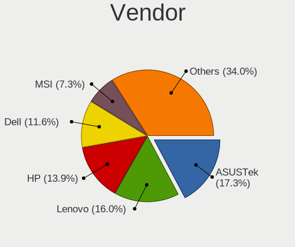

| Name                | Computers | Percent |
|---------------------|-----------|---------|
| Lenovo              | 193       | 17.26%  |
| ASUSTek Computer    | 184       | 16.46%  |
| Hewlett-Packard     | 146       | 13.06%  |
| Dell                | 137       | 12.25%  |
| MSI                 | 78        | 6.98%   |
| Gigabyte Technology | 78        | 6.98%   |
| Acer                | 54        | 4.83%   |
| ASRock              | 38        | 3.4%    |
| Apple               | 21        | 1.88%   |
| HUAWEI              | 15        | 1.34%   |
| Samsung Electronics | 12        | 1.07%   |
| Fujitsu             | 9         | 0.81%   |
| Intel               | 8         | 0.72%   |
| Alienware           | 8         | 0.72%   |
| Toshiba             | 7         | 0.63%   |
| Google              | 7         | 0.63%   |
| AZW                 | 7         | 0.63%   |
| Unknown             | 7         | 0.63%   |
| Supermicro          | 6         | 0.54%   |
| Notebook            | 6         | 0.54%   |
| TUXEDO              | 5         | 0.45%   |
| Timi                | 4         | 0.36%   |
| Sony                | 4         | 0.36%   |
| Microsoft           | 4         | 0.36%   |
| Biostar             | 4         | 0.36%   |
| System76            | 3         | 0.27%   |
| Schenker            | 3         | 0.27%   |
| Medion              | 3         | 0.27%   |
| Framework           | 3         | 0.27%   |
| Tactus              | 2         | 0.18%   |
| Shuttle             | 2         | 0.18%   |
| Razer               | 2         | 0.18%   |
| Positivo            | 2         | 0.18%   |
| Panasonic           | 2         | 0.18%   |
| LG Electronics      | 2         | 0.18%   |
| HONOR               | 2         | 0.18%   |
| Haier               | 2         | 0.18%   |
| GPU Company         | 2         | 0.18%   |
| Carbon Systems      | 2         | 0.18%   |
| AMI                 | 2         | 0.18%   |

Model
-----

Motherboard model

| Name                                   | Computers | Percent |
|----------------------------------------|-----------|---------|
| ASUS All Series                        | 17        | 1.52%   |
| Unknown                                | 11        | 0.98%   |
| ASUS ROG STRIX B550-F GAMING           | 6         | 0.54%   |
| MSI MS-7B79                            | 5         | 0.45%   |
| HUAWEI HVY-WXX9                        | 5         | 0.45%   |
| HP 255 G8 Notebook PC                  | 4         | 0.36%   |
| MSI MS-7B86                            | 3         | 0.27%   |
| Lenovo IdeaPad 5 Pro 14ACN6 82L7       | 3         | 0.27%   |
| Lenovo IdeaPad 5 15ARE05 81YQ          | 3         | 0.27%   |
| Lenovo IdeaPad 3 15ALC6 82KU           | 3         | 0.27%   |
| HP ProBook 6470b                       | 3         | 0.27%   |
| HP ProBook 440 G8 Notebook PC          | 3         | 0.27%   |
| HP Pavilion g6                         | 3         | 0.27%   |
| HP OMEN Laptop 15-en0xxx               | 3         | 0.27%   |
| HP Laptop 15-ef2xxx                    | 3         | 0.27%   |
| HP EliteBook 845 G7 Notebook PC        | 3         | 0.27%   |
| Gigabyte B450M DS3H                    | 3         | 0.27%   |
| Framework Laptop (12th Gen Intel Core) | 3         | 0.27%   |
| Dell XPS 15 9560                       | 3         | 0.27%   |
| Dell OptiPlex 7010                     | 3         | 0.27%   |
| Dell Latitude 7490                     | 3         | 0.27%   |
| Dell Latitude 5420                     | 3         | 0.27%   |
| Dell Latitude 3420                     | 3         | 0.27%   |
| AZW SER                                | 3         | 0.27%   |
| ASUS ROG STRIX X570-E GAMING           | 3         | 0.27%   |
| Acer Aspire A515-45                    | 3         | 0.27%   |
| Timi TM1701                            | 2         | 0.18%   |
| Supermicro SKAGIT09                    | 2         | 0.18%   |
| MSI MS-7C95                            | 2         | 0.18%   |
| MSI MS-7C56                            | 2         | 0.18%   |
| MSI MS-7B84                            | 2         | 0.18%   |
| MSI MS-7B61                            | 2         | 0.18%   |
| MSI MS-7A40                            | 2         | 0.18%   |
| MSI Modern 15 A5M                      | 2         | 0.18%   |
| Lenovo Z50-75 80EC                     | 2         | 0.18%   |
| Lenovo Yoga 9 14IAP7 82LU              | 2         | 0.18%   |
| Lenovo ThinkBook 15 G2 ITL 20VE        | 2         | 0.18%   |
| Lenovo Legion 5 Pro 16ACH6H 82JQ       | 2         | 0.18%   |
| Lenovo Legion 5 15ACH6H 82JU           | 2         | 0.18%   |
| Lenovo IdeaPad Gaming 3 15ACH6 82K2    | 2         | 0.18%   |

Model Family
------------

Motherboard model prefix

| Name               | Computers | Percent |
|--------------------|-----------|---------|
| Lenovo ThinkPad    | 77        | 6.89%   |
| Lenovo IdeaPad     | 43        | 3.85%   |
| Dell Latitude      | 41        | 3.67%   |
| Acer Aspire        | 32        | 2.86%   |
| ASUS ROG           | 28        | 2.5%    |
| Dell Inspiron      | 27        | 2.42%   |
| HP Pavilion        | 24        | 2.15%   |
| ASUS PRIME         | 23        | 2.06%   |
| HP ProBook         | 20        | 1.79%   |
| Dell XPS           | 19        | 1.7%    |
| ASUS VivoBook      | 18        | 1.61%   |
| HP EliteBook       | 17        | 1.52%   |
| Dell Precision     | 17        | 1.52%   |
| ASUS All           | 17        | 1.52%   |
| HP Laptop          | 16        | 1.43%   |
| ASUS TUF           | 16        | 1.43%   |
| Dell OptiPlex      | 15        | 1.34%   |
| Lenovo ThinkCentre | 14        | 1.25%   |
| Lenovo Legion      | 12        | 1.07%   |
| Lenovo Yoga        | 11        | 0.98%   |
| Unknown            | 11        | 0.98%   |
| Lenovo ThinkBook   | 10        | 0.89%   |
| Acer Nitro         | 9         | 0.81%   |
| HP ENVY            | 8         | 0.72%   |
| Dell Vostro        | 8         | 0.72%   |
| HP ZBook           | 7         | 0.63%   |
| Toshiba Satellite  | 6         | 0.54%   |
| Gigabyte X570      | 6         | 0.54%   |
| ASUS ASUS          | 6         | 0.54%   |
| MSI MS-7B79        | 5         | 0.45%   |
| HUAWEI HVY-WXX9    | 5         | 0.45%   |
| HP ProDesk         | 5         | 0.45%   |
| HP OMEN            | 5         | 0.45%   |
| HP EliteDesk       | 5         | 0.45%   |
| HP 255             | 5         | 0.45%   |
| Fujitsu ESPRIMO    | 5         | 0.45%   |
| Microsoft Surface  | 4         | 0.36%   |
| Lenovo IdeaCentre  | 4         | 0.36%   |
| HP Spectre         | 4         | 0.36%   |
| HP Compaq          | 4         | 0.36%   |

MFG Year
--------

Motherboard manufacture year

| Year    | Computers | Percent |
|---------|-----------|---------|
| 2021    | 179       | 16.01%  |
| 2020    | 153       | 13.69%  |
| 2022    | 100       | 8.94%   |
| 2019    | 99        | 8.86%   |
| 2018    | 94        | 8.41%   |
| 2012    | 81        | 7.25%   |
| 2017    | 64        | 5.72%   |
| 2014    | 63        | 5.64%   |
| 2013    | 60        | 5.37%   |
| 2016    | 52        | 4.65%   |
| 2015    | 46        | 4.11%   |
| 2011    | 44        | 3.94%   |
| 2010    | 27        | 2.42%   |
| 2023    | 18        | 1.61%   |
| 2008    | 14        | 1.25%   |
| 2009    | 12        | 1.07%   |
| 2007    | 11        | 0.98%   |
| Unknown | 1         | 0.09%   |

Form Factor
-----------

Physical design of the computer

| Name           | Computers | Percent |
|----------------|-----------|---------|
| Notebook       | 628       | 56.17%  |
| Desktop        | 402       | 35.96%  |
| Convertible    | 40        | 3.58%   |
| Mini pc        | 20        | 1.79%   |
| All in one     | 12        | 1.07%   |
| Tablet         | 8         | 0.72%   |
| Server         | 6         | 0.54%   |
| Stick pc       | 1         | 0.09%   |
| System on chip | 1         | 0.09%   |

Secure Boot
-----------

Enabled or disabled

| State    | Computers | Percent |
|----------|-----------|---------|
| Disabled | 1012      | 90.2%   |
| Enabled  | 110       | 9.8%    |

Coreboot
--------

Have coreboot on board

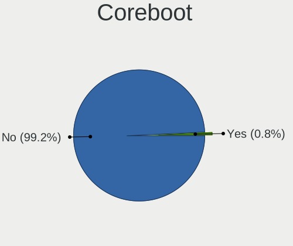

| Used | Computers | Percent |
|------|-----------|---------|
| No   | 1109      | 99.19%  |
| Yes  | 9         | 0.81%   |

RAM Size
--------

Total RAM memory

| Size in GB      | Computers | Percent |
|-----------------|-----------|---------|
| 16.01-24.0      | 303       | 26.89%  |
| 4.01-8.0        | 237       | 21.03%  |
| 8.01-16.0       | 195       | 17.3%   |
| 32.01-64.0      | 189       | 16.77%  |
| 3.01-4.0        | 94        | 8.34%   |
| 64.01-256.0     | 60        | 5.32%   |
| 24.01-32.0      | 35        | 3.11%   |
| 1.01-2.0        | 6         | 0.53%   |
| More than 256.0 | 4         | 0.35%   |
| 2.01-3.0        | 4         | 0.35%   |

RAM Used
--------

Used RAM memory

| Used GB    | Computers | Percent |
|------------|-----------|---------|
| 2.01-3.0   | 303       | 25.63%  |
| 4.01-8.0   | 300       | 25.38%  |
| 3.01-4.0   | 238       | 20.14%  |
| 1.01-2.0   | 226       | 19.12%  |
| 8.01-16.0  | 81        | 6.85%   |
| 16.01-24.0 | 16        | 1.35%   |
| 0.51-1.0   | 8         | 0.68%   |
| 24.01-32.0 | 5         | 0.42%   |
| 32.01-64.0 | 3         | 0.25%   |
| 0.01-0.5   | 2         | 0.17%   |

Total Drives
------------

Number of drives on board

| Drives | Computers | Percent |
|--------|-----------|---------|
| 1      | 592       | 52.3%   |
| 2      | 321       | 28.36%  |
| 3      | 104       | 9.19%   |
| 4      | 53        | 4.68%   |
| 5      | 28        | 2.47%   |
| 6      | 16        | 1.41%   |
| 7      | 10        | 0.88%   |
| 9      | 2         | 0.18%   |
| 8      | 2         | 0.18%   |
| 0      | 2         | 0.18%   |
| 12     | 1         | 0.09%   |
| 11     | 1         | 0.09%   |

Has CD-ROM
----------

Has CD-ROM on board

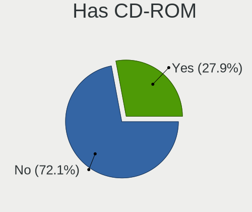

| Presented | Computers | Percent |
|-----------|-----------|---------|
| No        | 826       | 73.75%  |
| Yes       | 294       | 26.25%  |

Has Ethernet
------------

Has Ethernet on board

| Presented | Computers | Percent |
|-----------|-----------|---------|
| Yes       | 915       | 81.7%   |
| No        | 205       | 18.3%   |

Has WiFi
--------

Has WiFi module

| Presented | Computers | Percent |
|-----------|-----------|---------|
| Yes       | 914       | 81.61%  |
| No        | 206       | 18.39%  |

Has Bluetooth
-------------

Has Bluetooth module

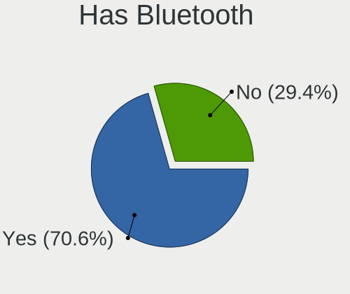

| Presented | Computers | Percent |
|-----------|-----------|---------|
| Yes       | 801       | 71.14%  |
| No        | 325       | 28.86%  |

Location
--------

Country
-------

Geographic location (country)

| Country      | Computers | Percent |
|--------------|-----------|---------|
| USA          | 241       | 21.5%   |
| Germany      | 127       | 11.33%  |
| Italy        | 79        | 7.05%   |
| France       | 65        | 5.8%    |
| Russia       | 61        | 5.44%   |
| UK           | 48        | 4.28%   |
| Brazil       | 38        | 3.39%   |
| Poland       | 35        | 3.12%   |
| Spain        | 32        | 2.85%   |
| Canada       | 24        | 2.14%   |
| Australia    | 24        | 2.14%   |
| Netherlands  | 23        | 2.05%   |
| India        | 21        | 1.87%   |
| Switzerland  | 15        | 1.34%   |
| Hungary      | 14        | 1.25%   |
| Czechia      | 14        | 1.25%   |
| Argentina    | 14        | 1.25%   |
| Finland      | 11        | 0.98%   |
| Belgium      | 11        | 0.98%   |
| Turkey       | 9         | 0.8%    |
| Slovenia     | 9         | 0.8%    |
| Mexico       | 9         | 0.8%    |
| Indonesia    | 9         | 0.8%    |
| Bulgaria     | 9         | 0.8%    |
| Sweden       | 8         | 0.71%   |
| Portugal     | 8         | 0.71%   |
| Philippines  | 8         | 0.71%   |
| South Africa | 7         | 0.62%   |
| Serbia       | 7         | 0.62%   |
| New Zealand  | 7         | 0.62%   |
| Thailand     | 6         | 0.54%   |
| Norway       | 6         | 0.54%   |
| Greece       | 6         | 0.54%   |
| China        | 6         | 0.54%   |
| Austria      | 6         | 0.54%   |
| Singapore    | 5         | 0.45%   |
| Denmark      | 5         | 0.45%   |
| Colombia     | 5         | 0.45%   |
| Chile        | 5         | 0.45%   |
| Vietnam      | 4         | 0.36%   |

City
----

Geographic location (city)

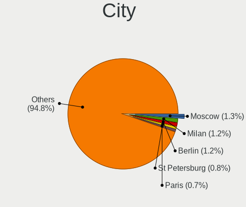

| City              | Computers | Percent |
|-------------------|-----------|---------|
| Moscow            | 19        | 1.64%   |
| Berlin            | 16        | 1.38%   |
| Milan             | 15        | 1.29%   |
| Paris             | 9         | 0.78%   |
| Warsaw            | 8         | 0.69%   |
| Sydney            | 7         | 0.6%    |
| Prague            | 7         | 0.6%    |
| Munich            | 7         | 0.6%    |
| Montreal          | 7         | 0.6%    |
| Hamburg           | 7         | 0.6%    |
| Castro Valley     | 7         | 0.6%    |
| Budapest          | 7         | 0.6%    |
| Vladivostok       | 6         | 0.52%   |
| St Petersburg     | 6         | 0.52%   |
| Sao Paulo         | 6         | 0.52%   |
| Madrid            | 6         | 0.52%   |
| Dallas            | 6         | 0.52%   |
| Bengaluru         | 6         | 0.52%   |
| Amsterdam         | 6         | 0.52%   |
| Wroclaw           | 5         | 0.43%   |
| Singapore         | 5         | 0.43%   |
| Rio de Janeiro    | 5         | 0.43%   |
| New York          | 5         | 0.43%   |
| London            | 5         | 0.43%   |
| Houston           | 5         | 0.43%   |
| Frankfurt am Main | 5         | 0.43%   |
| Cologne           | 5         | 0.43%   |
| Belgrade          | 5         | 0.43%   |
| Auckland          | 5         | 0.43%   |
| Zurich            | 4         | 0.34%   |
| Washington        | 4         | 0.34%   |
| Vilnius           | 4         | 0.34%   |
| Vienna            | 4         | 0.34%   |
| Varna             | 4         | 0.34%   |
| Turin             | 4         | 0.34%   |
| Rome              | 4         | 0.34%   |
| Melbourne         | 4         | 0.34%   |
| Krakow            | 4         | 0.34%   |
| Johannesburg      | 4         | 0.34%   |
| Jakarta           | 4         | 0.34%   |

Drives
------

Drive Vendor
------------

Hard drive vendors

| Vendor                      | Computers | Drives | Percent |
|-----------------------------|-----------|--------|---------|
| Samsung Electronics         | 301       | 465    | 17.12%  |
| WDC                         | 229       | 321    | 13.03%  |
| Seagate                     | 194       | 324    | 11.04%  |
| Kingston                    | 114       | 135    | 6.48%   |
| Sandisk                     | 106       | 146    | 6.03%   |
| Toshiba                     | 97        | 137    | 5.52%   |
| Crucial                     | 69        | 80     | 3.92%   |
| SK hynix                    | 57        | 66     | 3.24%   |
| Unknown                     | 54        | 70     | 3.07%   |
| Intel                       | 52        | 63     | 2.96%   |
| Hitachi                     | 39        | 47     | 2.22%   |
| Micron Technology           | 38        | 41     | 2.16%   |
| A-DATA Technology           | 28        | 31     | 1.59%   |
| KIOXIA                      | 27        | 29     | 1.54%   |
| HGST                        | 24        | 30     | 1.37%   |
| China                       | 23        | 28     | 1.31%   |
| Phison                      | 15        | 15     | 0.85%   |
| SPCC                        | 13        | 13     | 0.74%   |
| PNY                         | 13        | 23     | 0.74%   |
| Phison Electronics          | 13        | 13     | 0.74%   |
| Patriot                     | 13        | 16     | 0.74%   |
| Apple                       | 13        | 14     | 0.74%   |
| Micron/Crucial Technology   | 10        | 13     | 0.57%   |
| Unknown                     | 10        | 10     | 0.57%   |
| Silicon Motion              | 9         | 11     | 0.51%   |
| Kingston Technology Company | 8         | 11     | 0.46%   |
| JMicron Technology          | 7         | 7      | 0.4%    |
| Team                        | 6         | 6      | 0.34%   |
| SSSTC                       | 6         | 6      | 0.34%   |
| SABRENT                     | 6         | 8      | 0.34%   |
| OCZ                         | 6         | 6      | 0.34%   |
| Maxtor                      | 6         | 8      | 0.34%   |
| LITEON                      | 6         | 6      | 0.34%   |
| Lexar                       | 6         | 6      | 0.34%   |
| Corsair                     | 6         | 8      | 0.34%   |
| Realtek Semiconductor       | 5         | 5      | 0.28%   |
| Intenso                     | 5         | 8      | 0.28%   |
| Verbatim                    | 4         | 4      | 0.23%   |
| UMIS                        | 4         | 4      | 0.23%   |
| Transcend                   | 4         | 5      | 0.23%   |

Drive Model
-----------

Hard drive models

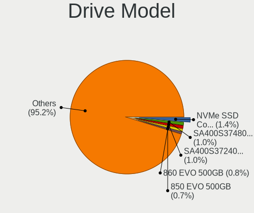

| Model                                              | Computers | Percent |
|----------------------------------------------------|-----------|---------|
| Samsung NVMe SSD Controller SM981/PM981/PM983 1TB  | 21        | 1.07%   |
| Kingston SA400S37240G 240GB SSD                    | 20        | 1.02%   |
| Kingston SA400S37480G 480GB SSD                    | 18        | 0.91%   |
| Samsung SSD 860 EVO 500GB                          | 17        | 0.86%   |
| Samsung SSD 850 EVO 500GB                          | 14        | 0.71%   |
| Samsung NVMe SSD Controller PM9A1/PM9A3/980PRO 1TB | 11        | 0.56%   |
| Seagate ST4000DM004-2CV104 4TB                     | 10        | 0.51%   |
| Samsung SSD 970 EVO Plus 500GB                     | 10        | 0.51%   |
| Samsung SSD 860 EVO 1TB                            | 10        | 0.51%   |
| Samsung SSD 850 EVO 250GB                          | 10        | 0.51%   |
| Unknown                                            | 10        | 0.51%   |
| Unknown MMC Card  64GB                             | 9         | 0.46%   |
| Toshiba MQ01ABD100 1TB                             | 9         | 0.46%   |
| Toshiba DT01ACA100 1TB                             | 9         | 0.46%   |
| Sandisk WD Black SN750 / PC SN730 NVMe SSD 1024GB  | 9         | 0.46%   |
| SanDisk NVMe SSD Drive 1TB                         | 9         | 0.46%   |
| Samsung SSD 980 PRO 1TB                            | 9         | 0.46%   |
| Samsung SSD 970 EVO Plus 1TB                       | 9         | 0.46%   |
| Crucial CT240BX500SSD1 240GB                       | 9         | 0.46%   |
| Seagate ST2000DM008-2FR102 2TB                     | 8         | 0.41%   |
| Seagate ST1000LM035-1RK172 1TB                     | 8         | 0.41%   |
| Seagate Expansion 1TB                              | 8         | 0.41%   |
| Samsung SSD 980 1TB                                | 8         | 0.41%   |
| Crucial CT1000MX500SSD1 1TB                        | 8         | 0.41%   |
| WDC WD10EZEX-08WN4A0 1TB                           | 7         | 0.36%   |
| Seagate ST2000LM007-1R8174 2TB                     | 7         | 0.36%   |
| Sandisk WD Blue SN550 NVMe SSD 1TB                 | 7         | 0.36%   |
| Samsung SSD 870 QVO 1TB                            | 7         | 0.36%   |
| Samsung SSD 870 EVO 500GB                          | 7         | 0.36%   |
| Samsung SSD 870 EVO 1TB                            | 7         | 0.36%   |
| Kingston SA2000M81000G 1TB                         | 7         | 0.36%   |
| Crucial CT500MX500SSD1 500GB                       | 7         | 0.36%   |
| Unknown MMC Card  32GB                             | 6         | 0.3%    |
| Unknown MMC Card  128GB                            | 6         | 0.3%    |
| Toshiba MQ04ABF100 1TB                             | 6         | 0.3%    |
| Seagate ST500DM002-1BD142 500GB                    | 6         | 0.3%    |
| Seagate ST1000LM024 HN-M101MBB 1TB                 | 6         | 0.3%    |
| SanDisk NVMe SSD Drive 500GB                       | 6         | 0.3%    |
| Samsung SSD 970 EVO Plus 2TB                       | 6         | 0.3%    |
| Samsung SSD 970 EVO Plus 250GB                     | 6         | 0.3%    |

HDD Vendor
----------

Hard disk drive vendors

| Vendor              | Computers | Drives | Percent |
|---------------------|-----------|--------|---------|
| Seagate             | 185       | 307    | 36.13%  |
| WDC                 | 157       | 212    | 30.66%  |
| Toshiba             | 62        | 91     | 12.11%  |
| Hitachi             | 39        | 47     | 7.62%   |
| HGST                | 24        | 30     | 4.69%   |
| Samsung Electronics | 23        | 33     | 4.49%   |
| Maxtor              | 5         | 7      | 0.98%   |
| Apple               | 4         | 4      | 0.78%   |
| Unknown             | 3         | 3      | 0.59%   |
| USB3.0              | 2         | 2      | 0.39%   |
| SAGE                | 1         | 1      | 0.2%    |
| KESU                | 1         | 1      | 0.2%    |
| JMicron Technology  | 1         | 1      | 0.2%    |
| IET                 | 1         | 1      | 0.2%    |
| HPE                 | 1         | 6      | 0.2%    |
| HGST HTS            | 1         | 1      | 0.2%    |
| Fujitsu             | 1         | 1      | 0.2%    |
| External            | 1         | 1      | 0.2%    |

SSD Vendor
----------

Solid state drive vendors

| Vendor              | Computers | Drives | Percent |
|---------------------|-----------|--------|---------|
| Samsung Electronics | 149       | 219    | 25.17%  |
| Kingston            | 75        | 87     | 12.67%  |
| Crucial             | 53        | 61     | 8.95%   |
| SanDisk             | 52        | 67     | 8.78%   |
| WDC                 | 37        | 56     | 6.25%   |
| China               | 22        | 27     | 3.72%   |
| A-DATA Technology   | 22        | 24     | 3.72%   |
| Patriot             | 13        | 16     | 2.2%    |
| Intel               | 13        | 18     | 2.2%    |
| PNY                 | 11        | 21     | 1.86%   |
| SPCC                | 10        | 10     | 1.69%   |
| Micron Technology   | 9         | 9      | 1.52%   |
| Toshiba             | 7         | 10     | 1.18%   |
| SABRENT             | 6         | 8      | 1.01%   |
| OCZ                 | 6         | 6      | 1.01%   |
| LITEON              | 6         | 6      | 1.01%   |
| Team                | 5         | 5      | 0.84%   |
| Lexar               | 5         | 5      | 0.84%   |
| Apple               | 5         | 5      | 0.84%   |
| Verbatim            | 4         | 4      | 0.68%   |
| SK hynix            | 4         | 4      | 0.68%   |
| Intenso             | 4         | 5      | 0.68%   |
| GOODRAM             | 4         | 4      | 0.68%   |
| Transcend           | 3         | 3      | 0.51%   |
| Plextor             | 3         | 3      | 0.51%   |
| Mushkin             | 3         | 4      | 0.51%   |
| LITEONIT            | 3         | 3      | 0.51%   |
| Hewlett-Packard     | 3         | 3      | 0.51%   |
| Emtec               | 3         | 3      | 0.51%   |
| Unknown             | 3         | 3      | 0.51%   |
| Smart               | 2         | 2      | 0.34%   |
| Netac               | 2         | 2      | 0.34%   |
| KODAK               | 2         | 2      | 0.34%   |
| KIOXIA-EXCERIA      | 2         | 4      | 0.34%   |
| Corsair             | 2         | 2      | 0.34%   |
| Apacer              | 2         | 2      | 0.34%   |
| ADATA SU            | 2         | 2      | 0.34%   |
| XUM                 | 1         | 1      | 0.17%   |
| VISIPRO             | 1         | 2      | 0.17%   |
| ValueTech           | 1         | 1      | 0.17%   |

Drive Kind
----------

HDD or SSD

| Kind    | Computers | Drives | Percent |
|---------|-----------|--------|---------|
| NVMe    | 566       | 760    | 36.1%   |
| SSD     | 501       | 754    | 31.95%  |
| HDD     | 419       | 749    | 26.72%  |
| MMC     | 52        | 62     | 3.32%   |
| Unknown | 30        | 41     | 1.91%   |

Drive Connector
---------------

SATA, SAS, NVMe, etc.

| Type | Computers | Drives | Percent |
|------|-----------|--------|---------|
| SATA | 694       | 1427   | 50.18%  |
| NVMe | 561       | 751    | 40.56%  |
| SAS  | 76        | 126    | 5.5%    |
| MMC  | 52        | 62     | 3.76%   |

Drive Size
----------

Size of hard drive

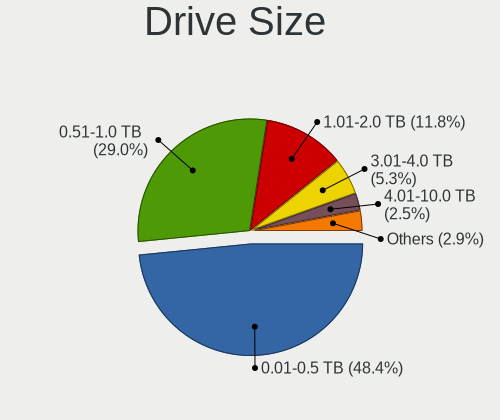

| Size in TB | Computers | Drives | Percent |
|------------|-----------|--------|---------|
| 0.01-0.5   | 488       | 767    | 49.54%  |
| 0.51-1.0   | 284       | 405    | 28.83%  |
| 1.01-2.0   | 106       | 151    | 10.76%  |
| 3.01-4.0   | 52        | 105    | 5.28%   |
| 4.01-10.0  | 30        | 42     | 3.05%   |
| 2.01-3.0   | 20        | 24     | 2.03%   |
| 10.01-20.0 | 5         | 9      | 0.51%   |

Space Total
-----------

Amount of disk space available on the file system

| Size in GB     | Computers | Percent |
|----------------|-----------|---------|
| 251-500        | 272       | 23.82%  |
| 101-250        | 239       | 20.93%  |
| 501-1000       | 210       | 18.39%  |
| 1001-2000      | 154       | 13.49%  |
| More than 3000 | 102       | 8.93%   |
| 2001-3000      | 71        | 6.22%   |
| 1-20           | 40        | 3.5%    |
| 51-100         | 40        | 3.5%    |
| 21-50          | 11        | 0.96%   |
| Unknown        | 3         | 0.26%   |

Space Used
----------

Amount of used disk space

| Used GB        | Computers | Percent |
|----------------|-----------|---------|
| 1-20           | 228       | 19.67%  |
| 101-250        | 221       | 19.07%  |
| 251-500        | 151       | 13.03%  |
| 51-100         | 149       | 12.86%  |
| 21-50          | 146       | 12.6%   |
| 501-1000       | 117       | 10.09%  |
| 1001-2000      | 76        | 6.56%   |
| More than 3000 | 46        | 3.97%   |
| 2001-3000      | 22        | 1.9%    |
| Unknown        | 3         | 0.26%   |

Malfunc. Drives
---------------

Drive models with a malfunction

| Model                                 | Computers | Drives | Percent |
|---------------------------------------|-----------|--------|---------|
| Seagate ST500DM002-1BD142 500GB       | 3         | 3      | 2.68%   |
| Samsung Electronics SSD 870 EVO 500GB | 3         | 3      | 2.68%   |
| Toshiba MQ04ABF100 1TB                | 2         | 2      | 1.79%   |
| SK hynix BC711 HFM512GD3JX013N 512GB  | 2         | 2      | 1.79%   |
| SK hynix BC711 HFM256GD3JX013N 256GB  | 2         | 2      | 1.79%   |
| Seagate ST3500418AS 500GB             | 2         | 2      | 1.79%   |
| Seagate ST2000LM007-1R8174 2TB        | 2         | 2      | 1.79%   |
| SanDisk SSD PLUS 240GB                | 2         | 2      | 1.79%   |
| Samsung Electronics SSD 870 EVO 1TB   | 2         | 2      | 1.79%   |
| Samsung Electronics HM321HI 320GB     | 2         | 2      | 1.79%   |
| Samsung Electronics HD103SI 1TB       | 2         | 2      | 1.79%   |
| Kingston SUV400S37240G 240GB SSD      | 2         | 2      | 1.79%   |
| Hitachi HTS547550A9E384 500GB         | 2         | 2      | 1.79%   |
| Hitachi HDS721010CLA630 1TB           | 2         | 2      | 1.79%   |
| HGST HTS721010A9E630 1TB              | 2         | 2      | 1.79%   |
| WDC WDS240G2G0B-00EPW0 240GB SSD      | 1         | 1      | 0.89%   |
| WDC WD7502ABYS-02A6B0 752GB           | 1         | 1      | 0.89%   |
| WDC WD5000AZRX-00A3KB0 500GB          | 1         | 1      | 0.89%   |
| WDC WD5000AVVS-63M8B0 500GB           | 1         | 1      | 0.89%   |
| WDC WD5000AAKS-00V1A0 500GB           | 1         | 1      | 0.89%   |
| WDC WD30EZRX-00MMMB0 3TB              | 1         | 1      | 0.89%   |
| WDC WD30EFRX-68EUZN0 3TB              | 1         | 1      | 0.89%   |
| WDC WD20EFRX-68EUZN0 2TB              | 1         | 2      | 0.89%   |
| WDC WD20EADS-14R6B0 2TB               | 1         | 1      | 0.89%   |
| WDC WD10EZRX-00L4HB0 1TB              | 1         | 1      | 0.89%   |
| WDC WD10EZEX-22MFCA0 1TB              | 1         | 1      | 0.89%   |
| WDC WD10EZEX-08M2NA0 1TB              | 1         | 1      | 0.89%   |
| WDC WD10EURX-73C57Y0 1TB              | 1         | 1      | 0.89%   |
| WDC WD10EARS-00MVWB0 1TB              | 1         | 1      | 0.89%   |
| WDC WD10EADS-00L5B1 1TB               | 1         | 1      | 0.89%   |
| WDC WD10EACS-65D6B0 1TB               | 1         | 1      | 0.89%   |
| VISIPRO SSD 256GB                     | 1         | 2      | 0.89%   |
| Toshiba THNSNK256GCS8 SATA 256GB SSD  | 1         | 1      | 0.89%   |
| Toshiba MQ01ABF032 320GB              | 1         | 1      | 0.89%   |
| Toshiba MQ01ABD100 1TB                | 1         | 1      | 0.89%   |
| Toshiba MQ01ABD075 752GB              | 1         | 1      | 0.89%   |
| Toshiba MK6475GSX 640GB               | 1         | 1      | 0.89%   |
| Toshiba MK5061GSY 500GB               | 1         | 1      | 0.89%   |
| tecmiyo SATA SSD 128GB                | 1         | 3      | 0.89%   |
| T-FORCE SSD 512GB                     | 1         | 1      | 0.89%   |

Malfunc. Drive Vendor
---------------------

Vendors of faulty drives

| Vendor              | Computers | Drives | Percent |
|---------------------|-----------|--------|---------|
| Seagate             | 21        | 25     | 19.27%  |
| WDC                 | 15        | 17     | 13.76%  |
| Samsung Electronics | 14        | 21     | 12.84%  |
| Hitachi             | 11        | 11     | 10.09%  |
| Toshiba             | 8         | 8      | 7.34%   |
| Crucial             | 6         | 6      | 5.5%    |
| SanDisk             | 5         | 5      | 4.59%   |
| SK hynix            | 4         | 4      | 3.67%   |
| HGST                | 4         | 4      | 3.67%   |
| Kingston            | 3         | 3      | 2.75%   |
| Micron Technology   | 2         | 2      | 1.83%   |
| Maxtor              | 2         | 2      | 1.83%   |
| Intel               | 2         | 5      | 1.83%   |
| A-DATA Technology   | 2         | 2      | 1.83%   |
| VISIPRO             | 1         | 2      | 0.92%   |
| tecmiyo             | 1         | 3      | 0.92%   |
| T-FORCE             | 1         | 1      | 0.92%   |
| R580                | 1         | 1      | 0.92%   |
| Phison Electronics  | 1         | 1      | 0.92%   |
| OCZ                 | 1         | 1      | 0.92%   |
| LITEONIT            | 1         | 1      | 0.92%   |
| LITEON              | 1         | 1      | 0.92%   |
| Intenso             | 1         | 1      | 0.92%   |
| BAITITON            | 1         | 1      | 0.92%   |

Malfunc. HDD Vendor
-------------------

Vendors of faulty HDD drives

| Vendor              | Computers | Drives | Percent |
|---------------------|-----------|--------|---------|
| Seagate             | 21        | 25     | 32.81%  |
| WDC                 | 14        | 16     | 21.88%  |
| Hitachi             | 11        | 11     | 17.19%  |
| Toshiba             | 7         | 7      | 10.94%  |
| Samsung Electronics | 5         | 12     | 7.81%   |
| HGST                | 4         | 4      | 6.25%   |
| Maxtor              | 2         | 2      | 3.13%   |

Malfunc. Drive Kind
-------------------

Kinds of faulty drives

| Kind | Computers | Drives | Percent |
|------|-----------|--------|---------|
| HDD  | 60        | 77     | 57.69%  |
| SSD  | 36        | 43     | 34.62%  |
| NVMe | 8         | 8      | 7.69%   |

Failed Drives
-------------

Failed drive models

| Model                             | Computers | Drives | Percent |
|-----------------------------------|-----------|--------|---------|
| Samsung Electronics HD502IJ 500GB | 1         | 1      | 50%     |
| Hitachi HTS547550A9E384 500GB     | 1         | 1      | 50%     |

Failed Drive Vendor
-------------------

Failed drive vendors

| Vendor              | Computers | Drives | Percent |
|---------------------|-----------|--------|---------|
| Samsung Electronics | 1         | 1      | 50%     |
| Hitachi             | 1         | 1      | 50%     |

Drive Status
------------

Number of failed and malfunc. drives

| Status   | Computers | Drives | Percent |
|----------|-----------|--------|---------|
| Works    | 627       | 1133   | 49.68%  |
| Detected | 532       | 1103   | 42.16%  |
| Malfunc  | 102       | 128    | 8.08%   |
| Failed   | 1         | 2      | 0.08%   |

Storage controller
------------------

Storage Vendor
--------------

Storage controller vendors

| Vendor                         | Computers | Percent |
|--------------------------------|-----------|---------|
| Intel                          | 670       | 42.92%  |
| AMD                            | 245       | 15.7%   |
| Samsung Electronics            | 160       | 10.25%  |
| SanDisk                        | 102       | 6.53%   |
| SK hynix                       | 53        | 3.4%    |
| Kingston Technology Company    | 49        | 3.14%   |
| Phison Electronics             | 36        | 2.31%   |
| Toshiba America Info Systems   | 30        | 1.92%   |
| Micron Technology              | 29        | 1.86%   |
| ASMedia Technology             | 29        | 1.86%   |
| Micron/Crucial Technology      | 27        | 1.73%   |
| KIOXIA                         | 26        | 1.67%   |
| Silicon Motion                 | 12        | 0.77%   |
| JMicron Technology             | 12        | 0.77%   |
| Realtek Semiconductor          | 10        | 0.64%   |
| Marvell Technology Group       | 9         | 0.58%   |
| Solid State Storage Technology | 8         | 0.51%   |
| ADATA Technology               | 8         | 0.51%   |
| Union Memory (Shenzhen)        | 6         | 0.38%   |
| LSI Logic / Symbios Logic      | 6         | 0.38%   |
| Seagate Technology             | 5         | 0.32%   |
| Nvidia                         | 4         | 0.26%   |
| Apple                          | 4         | 0.26%   |
| MAXIO Technology (Hangzhou)    | 3         | 0.19%   |
| Broadcom / LSI                 | 3         | 0.19%   |
| Silicon Image                  | 2         | 0.13%   |
| Shenzhen Longsys Electronics   | 2         | 0.13%   |
| Netac Technology               | 2         | 0.13%   |
| Zhaoxin                        | 1         | 0.06%   |
| Yangtze Memory Technologies    | 1         | 0.06%   |
| VIA Technologies               | 1         | 0.06%   |
| OCZ Technology Group           | 1         | 0.06%   |
| O2 Micro                       | 1         | 0.06%   |
| Lenovo                         | 1         | 0.06%   |
| INNOGRIT                       | 1         | 0.06%   |
| Hewlett-Packard                | 1         | 0.06%   |
| Unknown                        | 1         | 0.06%   |

Storage Model
-------------

Storage controller models

| Model                                                                          | Computers | Percent |
|--------------------------------------------------------------------------------|-----------|---------|
| AMD FCH SATA Controller [AHCI mode]                                            | 177       | 10.05%  |
| Samsung NVMe SSD Controller SM981/PM981/PM983                                  | 71        | 4.03%   |
| Intel Volume Management Device NVMe RAID Controller                            | 65        | 3.69%   |
| Intel 8 Series/C220 Series Chipset Family 6-port SATA Controller 1 [AHCI mode] | 57        | 3.23%   |
| Intel 7 Series Chipset Family 6-port SATA Controller [AHCI mode]               | 53        | 3.01%   |
| Intel Sunrise Point-LP SATA Controller [AHCI mode]                             | 51        | 2.89%   |
| Samsung NVMe SSD Controller PM9A1/PM9A3/980PRO                                 | 44        | 2.5%    |
| AMD 400 Series Chipset SATA Controller                                         | 37        | 2.1%    |
| Intel 82801 Mobile SATA Controller [RAID mode]                                 | 36        | 2.04%   |
| Samsung NVMe SSD Controller 980 (DRAM-less)                                    | 34        | 1.93%   |
| AMD 500 Series Chipset SATA Controller                                         | 28        | 1.59%   |
| ASMedia ASM1062 Serial ATA Controller                                          | 27        | 1.53%   |
| Intel Celeron/Pentium Silver Processor SATA Controller                         | 25        | 1.42%   |
| SanDisk Ultra 3D / WD Blue SN550 NVMe SSD                                      | 24        | 1.36%   |
| Intel 200 Series PCH SATA controller [AHCI mode]                               | 24        | 1.36%   |
| SK hynix Gold P31/BC711/PC711 NVMe Solid State Drive                           | 23        | 1.31%   |
| Intel Cannon Lake Mobile PCH SATA AHCI Controller                              | 23        | 1.31%   |
| Intel Tiger Lake-LP SATA Controller                                            | 21        | 1.19%   |
| Intel 6 Series/C200 Series Chipset Family 6 port Desktop SATA AHCI Controller  | 21        | 1.19%   |
| AMD SB7x0/SB8x0/SB9x0 SATA Controller [AHCI mode]                              | 21        | 1.19%   |
| Intel Q170/Q150/B150/H170/H110/Z170/CM236 Chipset SATA Controller [AHCI Mode]  | 20        | 1.14%   |
| KIOXIA NVMe SSD Controller BG4 (DRAM-less)                                     | 19        | 1.08%   |
| Intel 500 Series Chipset Family SATA AHCI Controller                           | 19        | 1.08%   |
| Intel 7 Series/C210 Series Chipset Family 6-port SATA Controller [AHCI mode]   | 18        | 1.02%   |
| SanDisk Extreme Pro / WD Black SN750 / PC SN730 / Red SN700 NVMe SSD           | 17        | 0.96%   |
| Intel Comet Lake SATA AHCI Controller                                          | 17        | 0.96%   |
| Micron/Crucial P2 [Nick P2] / P3 / P3 Plus NVMe PCIe SSD (DRAM-less)           | 16        | 0.91%   |
| Intel SSD 660P Series                                                          | 16        | 0.91%   |
| AMD SB7x0/SB8x0/SB9x0 IDE Controller                                           | 16        | 0.91%   |
| Intel SATA Controller [RAID mode]                                              | 15        | 0.85%   |
| Intel Cannon Lake PCH SATA AHCI Controller                                     | 15        | 0.85%   |
| Intel 9 Series Chipset Family SATA Controller [AHCI Mode]                      | 15        | 0.85%   |
| Toshiba America Info Systems XG6 NVMe SSD Controller                           | 13        | 0.74%   |
| Intel SSD 670p Series [Keystone Harbor]                                        | 13        | 0.74%   |
| Phison E12 NVMe Controller                                                     | 12        | 0.68%   |
| Intel 6 Series/C200 Series Chipset Family 6 port Mobile SATA AHCI Controller   | 12        | 0.68%   |
| Samsung NVMe SSD Controller SM961/PM961/SM963                                  | 11        | 0.62%   |
| Intel 8 Series SATA Controller 1 [AHCI mode]                                   | 11        | 0.62%   |
| SanDisk Ultra 3D / WD Blue SN570 NVMe SSD (DRAM-less)                          | 10        | 0.57%   |
| Phison PS5013-E13 PCIe3 NVMe Controller (DRAM-less)                            | 10        | 0.57%   |

Storage Kind
------------

Kind of storage controller (IDE, SATA, NVMe, SAS, ...)

| Kind | Computers | Percent |
|------|-----------|---------|
| SATA | 790       | 50.97%  |
| NVMe | 557       | 35.94%  |
| RAID | 126       | 8.13%   |
| IDE  | 69        | 4.45%   |
| SAS  | 6         | 0.39%   |
| SCSI | 2         | 0.13%   |

Processor
---------

CPU Vendor
----------

Processor vendors

| Vendor        | Computers | Percent |
|---------------|-----------|---------|
| Intel         | 790       | 70.66%  |
| AMD           | 325       | 29.07%  |
| sifive,u74-mc | 1         | 0.09%   |
| CentaurHauls  | 1         | 0.09%   |
| ARM           | 1         | 0.09%   |

CPU Model
---------

Processor models

| Model                                   | Computers | Percent |
|-----------------------------------------|-----------|---------|
| Intel 11th Gen Core i5-1135G7 @ 2.40GHz | 22        | 1.97%   |
| Intel 11th Gen Core i7-1165G7 @ 2.80GHz | 21        | 1.88%   |
| AMD Ryzen 7 5800H with Radeon Graphics  | 19        | 1.7%    |
| Intel Core i7-9750H CPU @ 2.60GHz       | 18        | 1.61%   |
| AMD Ryzen 7 5700U with Radeon Graphics  | 15        | 1.34%   |
| Intel 12th Gen Core i7-12700H           | 14        | 1.25%   |
| AMD Ryzen 5 5500U with Radeon Graphics  | 14        | 1.25%   |
| Intel Core i7-8550U CPU @ 1.80GHz       | 12        | 1.07%   |
| Intel Core i5-7200U CPU @ 2.50GHz       | 12        | 1.07%   |
| Intel Core i5-3320M CPU @ 2.60GHz       | 12        | 1.07%   |
| Intel Celeron N4020 CPU @ 1.10GHz       | 12        | 1.07%   |
| Intel Core i7-10510U CPU @ 1.80GHz      | 10        | 0.89%   |
| Intel Core i7-3770 CPU @ 3.40GHz        | 9         | 0.81%   |
| Intel Core i5-8250U CPU @ 1.60GHz       | 9         | 0.81%   |
| Intel Core i5-6200U CPU @ 2.30GHz       | 9         | 0.81%   |
| Intel 12th Gen Core i7-1255U            | 9         | 0.81%   |
| AMD Ryzen 5 5600X 6-Core Processor      | 9         | 0.81%   |
| Intel Core i7-4790 CPU @ 3.60GHz        | 8         | 0.72%   |
| Intel Core i7-1065G7 CPU @ 1.30GHz      | 8         | 0.72%   |
| Intel Core i5-10210U CPU @ 1.60GHz      | 8         | 0.72%   |
| Intel 12th Gen Core i7-1260P            | 8         | 0.72%   |
| Intel Core i7-7700HQ CPU @ 2.80GHz      | 7         | 0.63%   |
| Intel Core i7-4790K CPU @ 4.00GHz       | 7         | 0.63%   |
| Intel Core i5-7300U CPU @ 2.60GHz       | 7         | 0.63%   |
| Intel Core i5-4590 CPU @ 3.30GHz        | 7         | 0.63%   |
| Intel Core i5-3210M CPU @ 2.50GHz       | 7         | 0.63%   |
| Intel 11th Gen Core i3-1115G4 @ 3.00GHz | 7         | 0.63%   |
| AMD Ryzen 5 4600H with Radeon Graphics  | 7         | 0.63%   |
| Intel Core i7-6700 CPU @ 3.40GHz        | 6         | 0.54%   |
| Intel Core i7-4700MQ CPU @ 2.40GHz      | 6         | 0.54%   |
| Intel Core i7-10750H CPU @ 2.60GHz      | 6         | 0.54%   |
| Intel Core i5-9600K CPU @ 3.70GHz       | 6         | 0.54%   |
| Intel Core i5-10400F CPU @ 2.90GHz      | 6         | 0.54%   |
| AMD Ryzen 7 3700X 8-Core Processor      | 6         | 0.54%   |
| AMD Ryzen 5 3600 6-Core Processor       | 6         | 0.54%   |
| AMD Ryzen 5 2600X Six-Core Processor    | 6         | 0.54%   |
| Intel Core i7-8750H CPU @ 2.20GHz       | 5         | 0.45%   |
| Intel Core i7-7500U CPU @ 2.70GHz       | 5         | 0.45%   |
| Intel Core i7-6700HQ CPU @ 2.60GHz      | 5         | 0.45%   |
| Intel Core i7-6600U CPU @ 2.60GHz       | 5         | 0.45%   |

CPU Model Family
----------------

Processor model prefix

| Model                   | Computers | Percent |
|-------------------------|-----------|---------|
| Intel Core i7           | 237       | 21.2%   |
| Intel Core i5           | 208       | 18.6%   |
| Other                   | 166       | 14.85%  |
| AMD Ryzen 7             | 92        | 8.23%   |
| AMD Ryzen 5             | 90        | 8.05%   |
| Intel Core i3           | 49        | 4.38%   |
| Intel Celeron           | 40        | 3.58%   |
| AMD Ryzen 9             | 30        | 2.68%   |
| Intel Xeon              | 23        | 2.06%   |
| Intel Pentium           | 20        | 1.79%   |
| AMD Ryzen 3             | 19        | 1.7%    |
| Intel Core 2 Duo        | 16        | 1.43%   |
| AMD FX                  | 14        | 1.25%   |
| Intel Core i9           | 13        | 1.16%   |
| AMD Ryzen 7 PRO         | 13        | 1.16%   |
| AMD A6                  | 9         | 0.81%   |
| AMD A8                  | 8         | 0.72%   |
| Intel Pentium Silver    | 7         | 0.63%   |
| AMD Ryzen 5 PRO         | 5         | 0.45%   |
| AMD Phenom II X4        | 5         | 0.45%   |
| AMD Athlon              | 5         | 0.45%   |
| AMD A10                 | 5         | 0.45%   |
| Intel Core 2 Quad       | 4         | 0.36%   |
| Intel Atom              | 4         | 0.36%   |
| AMD Ryzen Threadripper  | 3         | 0.27%   |
| AMD E                   | 3         | 0.27%   |
| AMD Athlon 64 X2        | 3         | 0.27%   |
| Intel Pentium Gold      | 2         | 0.18%   |
| Intel Core m3           | 2         | 0.18%   |
| AMD PRO A10             | 2         | 0.18%   |
| AMD Phenom II X2        | 2         | 0.18%   |
| AMD Opteron             | 2         | 0.18%   |
| AMD Athlon II           | 2         | 0.18%   |
| AMD A4                  | 2         | 0.18%   |
| Intel Xeon Gold         | 1         | 0.09%   |
| Intel Pentium Dual-Core | 1         | 0.09%   |
| Intel Core M            | 1         | 0.09%   |
| Intel Core 2            | 1         | 0.09%   |
| Intel Celeron Dual-Core | 1         | 0.09%   |
| AMD Sempron             | 1         | 0.09%   |

CPU Cores
---------

Number of processor cores

| Number  | Computers | Percent |
|---------|-----------|---------|
| 4       | 408       | 36.49%  |
| 2       | 290       | 25.94%  |
| 6       | 162       | 14.49%  |
| 8       | 145       | 12.97%  |
| 12      | 31        | 2.77%   |
| 14      | 23        | 2.06%   |
| 16      | 20        | 1.79%   |
| 10      | 20        | 1.79%   |
| 24      | 6         | 0.54%   |
| 1       | 6         | 0.54%   |
| 3       | 2         | 0.18%   |
| Unknown | 2         | 0.18%   |
| 44      | 1         | 0.09%   |
| 36      | 1         | 0.09%   |
| 5       | 1         | 0.09%   |

CPU Sockets
-----------

Number of sockets

| Number  | Computers | Percent |
|---------|-----------|---------|
| 1       | 1109      | 99.19%  |
| 2       | 7         | 0.63%   |
| Unknown | 2         | 0.18%   |

CPU Threads
-----------

Threads per core (Hyper-Threading)

| Number  | Computers | Percent |
|---------|-----------|---------|
| 2       | 885       | 78.88%  |
| 1       | 235       | 20.94%  |
| Unknown | 2         | 0.18%   |

CPU Op-Modes
------------

CPU Operation Modes (32-bit, 64-bit)

| Op mode        | Computers | Percent |
|----------------|-----------|---------|
| 32-bit, 64-bit | 1117      | 99.91%  |
| Unknown        | 1         | 0.09%   |

CPU Microcode
-------------

Microcode number

| Number     | Computers | Percent |
|------------|-----------|---------|
| Unknown    | 491       | 43.11%  |
| 0x806c1    | 37        | 3.25%   |
| 0x306a9    | 37        | 3.25%   |
| 0x0a50000c | 33        | 2.9%    |
| 0x906a3    | 32        | 2.81%   |
| 0x306c3    | 32        | 2.81%   |
| 0x806ea    | 28        | 2.46%   |
| 0x906ea    | 23        | 2.02%   |
| 0x806ec    | 18        | 1.58%   |
| 0x08608103 | 18        | 1.58%   |
| 0x206a7    | 17        | 1.49%   |
| 0x08600106 | 16        | 1.4%    |
| 0x906e9    | 15        | 1.32%   |
| 0x506e3    | 15        | 1.32%   |
| 0x08701021 | 14        | 1.23%   |
| 0x806e9    | 13        | 1.14%   |
| 0x406e3    | 11        | 0.97%   |
| 0x0a50000d | 10        | 0.88%   |
| 0x906ed    | 9         | 0.79%   |
| 0x906a4    | 9         | 0.79%   |
| 0x1067a    | 9         | 0.79%   |
| 0x08108109 | 9         | 0.79%   |
| 0x0800820d | 9         | 0.79%   |
| 0xa0652    | 8         | 0.7%    |
| 0x706a8    | 8         | 0.7%    |
| 0x08608102 | 8         | 0.7%    |
| 0xa0653    | 7         | 0.61%   |
| 0x806c2    | 7         | 0.61%   |
| 0x706a1    | 7         | 0.61%   |
| 0x40651    | 7         | 0.61%   |
| 0xa0655    | 6         | 0.53%   |
| 0x90672    | 6         | 0.53%   |
| 0x806d1    | 6         | 0.53%   |
| 0x706e5    | 6         | 0.53%   |
| 0x010000c8 | 6         | 0.53%   |
| 0x406f1    | 5         | 0.44%   |
| 0x40661    | 5         | 0.44%   |
| 0x0a201205 | 5         | 0.44%   |
| 0x0a201016 | 5         | 0.44%   |
| 0x06006705 | 5         | 0.44%   |

CPU Microarch
-------------

Microarchitecture

| Name             | Computers | Percent |
|------------------|-----------|---------|
| KabyLake         | 183       | 16.34%  |
| Haswell          | 99        | 8.84%   |
| IvyBridge        | 90        | 8.04%   |
| Zen 3            | 88        | 7.86%   |
| Unknown          | 82        | 7.32%   |
| TigerLake        | 68        | 6.07%   |
| Zen 2            | 56        | 5%      |
| Alderlake Hybrid | 55        | 4.91%   |
| Skylake          | 49        | 4.38%   |
| Zen+             | 43        | 3.84%   |
| SandyBridge      | 42        | 3.75%   |
| CometLake        | 35        | 3.13%   |
| Goldmont plus    | 30        | 2.68%   |
| Icelake          | 26        | 2.32%   |
| Zen              | 22        | 1.96%   |
| Piledriver       | 19        | 1.7%    |
| Broadwell        | 18        | 1.61%   |
| Penryn           | 17        | 1.52%   |
| Westmere         | 14        | 1.25%   |
| K10              | 14        | 1.25%   |
| Excavator        | 14        | 1.25%   |
| Silvermont       | 10        | 0.89%   |
| Nehalem          | 10        | 0.89%   |
| Core             | 9         | 0.8%    |
| Goldmont         | 6         | 0.54%   |
| Puma             | 4         | 0.36%   |
| K10 Llano        | 4         | 0.36%   |
| Bobcat           | 4         | 0.36%   |
| Steamroller      | 3         | 0.27%   |
| K8 Hammer        | 3         | 0.27%   |
| K8 & K10 hybrid  | 1         | 0.09%   |
| Bulldozer        | 1         | 0.09%   |
| Bonnell          | 1         | 0.09%   |

Graphics
--------

GPU Vendor
----------

Vendors of graphics cards

| Vendor                     | Computers | Percent |
|----------------------------|-----------|---------|
| Intel                      | 613       | 44.68%  |
| Nvidia                     | 410       | 29.88%  |
| AMD                        | 339       | 24.71%  |
| Matrox Electronics Systems | 6         | 0.44%   |
| ASPEED Technology          | 3         | 0.22%   |
| Zhaoxin                    | 1         | 0.07%   |

GPU Model
---------

Graphics card models

| Model                                                                                 | Computers | Percent |
|---------------------------------------------------------------------------------------|-----------|---------|
| Intel TigerLake-LP GT2 [Iris Xe Graphics]                                             | 60        | 4.3%    |
| Intel 3rd Gen Core processor Graphics Controller                                      | 52        | 3.72%   |
| AMD Cezanne [Radeon Vega Series / Radeon Vega Mobile Series]                          | 44        | 3.15%   |
| Intel Alder Lake-P GT2 [Iris Xe Graphics]                                             | 33        | 2.36%   |
| AMD Lucienne                                                                          | 33        | 2.36%   |
| Intel UHD Graphics 620                                                                | 32        | 2.29%   |
| AMD Renoir [Radeon RX Vega 6 (Ryzen 4000/5000 Mobile Series)]                         | 32        | 2.29%   |
| Intel CoffeeLake-H GT2 [UHD Graphics 630]                                             | 30        | 2.15%   |
| Intel 2nd Generation Core Processor Family Integrated Graphics Controller             | 30        | 2.15%   |
| Intel HD Graphics 620                                                                 | 29        | 2.08%   |
| AMD Picasso/Raven 2 [Radeon Vega Series / Radeon Vega Mobile Series]                  | 26        | 1.86%   |
| Intel Xeon E3-1200 v3/4th Gen Core Processor Integrated Graphics Controller           | 24        | 1.72%   |
| Intel GeminiLake [UHD Graphics 600]                                                   | 23        | 1.65%   |
| Intel 4th Gen Core Processor Integrated Graphics Controller                           | 23        | 1.65%   |
| Intel Skylake GT2 [HD Graphics 520]                                                   | 20        | 1.43%   |
| Intel CometLake-U GT2 [UHD Graphics]                                                  | 19        | 1.36%   |
| Nvidia GP107 [GeForce GTX 1050 Ti]                                                    | 18        | 1.29%   |
| Intel HD Graphics 630                                                                 | 18        | 1.29%   |
| Intel HD Graphics 530                                                                 | 18        | 1.29%   |
| Nvidia TU117M [GeForce GTX 1650 Mobile / Max-Q]                                       | 16        | 1.15%   |
| AMD Ellesmere [Radeon RX 470/480/570/570X/580/580X/590]                               | 16        | 1.15%   |
| Intel CometLake-H GT2 [UHD Graphics]                                                  | 15        | 1.07%   |
| Nvidia GA106M [GeForce RTX 3060 Mobile / Max-Q]                                       | 14        | 1%      |
| Intel Alder Lake-UP3 GT2 [Iris Xe Graphics]                                           | 13        | 0.93%   |
| Nvidia GK208B [GeForce GT 710]                                                        | 12        | 0.86%   |
| Intel Haswell-ULT Integrated Graphics Controller                                      | 11        | 0.79%   |
| AMD Rembrandt [Radeon 680M]                                                           | 11        | 0.79%   |
| Nvidia GP108 [GeForce GT 1030]                                                        | 10        | 0.72%   |
| Intel TigerLake-H GT1 [UHD Graphics]                                                  | 10        | 0.72%   |
| Nvidia TU117 [GeForce GTX 1650]                                                       | 9         | 0.64%   |
| Nvidia TU106M [GeForce RTX 2060 Mobile]                                               | 9         | 0.64%   |
| Nvidia GA107M [GeForce RTX 3050 Ti Mobile]                                            | 9         | 0.64%   |
| Intel IvyBridge GT2 [HD Graphics 4000]                                                | 9         | 0.64%   |
| AMD Navi 23 [Radeon RX 6600/6600 XT/6600M]                                            | 9         | 0.64%   |
| Nvidia GA107M [GeForce RTX 3050 Mobile]                                               | 8         | 0.57%   |
| Intel Iris Plus Graphics G7                                                           | 8         | 0.57%   |
| Intel HD Graphics 5500                                                                | 8         | 0.57%   |
| Intel CoffeeLake-S GT2 [UHD Graphics 630]                                             | 8         | 0.57%   |
| AMD Topaz XT [Radeon R7 M260/M265 / M340/M360 / M440/M445 / 530/535 / 620/625 Mobile] | 8         | 0.57%   |
| AMD Stoney [Radeon R2/R3/R4/R5 Graphics]                                              | 8         | 0.57%   |

GPU Combo
---------

Combinations of graphics cards

| Name                     | Computers | Percent |
|--------------------------|-----------|---------|
| 1 x Intel                | 395       | 35.27%  |
| 1 x AMD                  | 256       | 22.86%  |
| 1 x Nvidia               | 211       | 18.84%  |
| Intel + Nvidia           | 158       | 14.11%  |
| AMD + Nvidia             | 34        | 3.04%   |
| Intel + AMD              | 31        | 2.77%   |
| 2 x AMD                  | 14        | 1.25%   |
| Other                    | 5         | 0.45%   |
| 2 x Nvidia               | 4         | 0.36%   |
| 1 x Matrox               | 3         | 0.27%   |
| Nvidia + ASPEED          | 2         | 0.18%   |
| AMD + Matrox             | 2         | 0.18%   |
| 3 x Nvidia               | 1         | 0.09%   |
| 1 x Zhaoxin              | 1         | 0.09%   |
| Nvidia + Matrox          | 1         | 0.09%   |
| Intel + AMD + 1 x Nvidia | 1         | 0.09%   |
| 1 x ASPEED               | 1         | 0.09%   |

GPU Driver
----------

Free vs proprietary

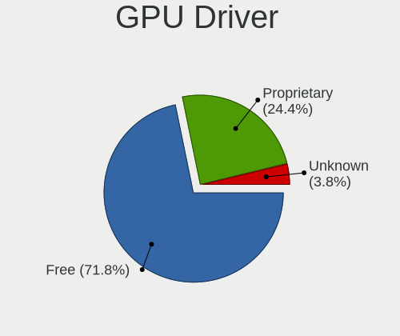

| Driver      | Computers | Percent |
|-------------|-----------|---------|
| Free        | 800       | 71.11%  |
| Proprietary | 293       | 26.04%  |
| Unknown     | 32        | 2.84%   |

GPU Memory
----------

Total video memory

| Size in GB | Computers | Percent |
|------------|-----------|---------|
| Unknown    | 714       | 63.07%  |
| 0.01-0.5   | 102       | 9.01%   |
| 1.01-2.0   | 92        | 8.13%   |
| 3.01-4.0   | 63        | 5.57%   |
| 0.51-1.0   | 55        | 4.86%   |
| 7.01-8.0   | 49        | 4.33%   |
| 5.01-6.0   | 33        | 2.92%   |
| 8.01-16.0  | 17        | 1.5%    |
| 16.01-24.0 | 4         | 0.35%   |
| 2.01-3.0   | 2         | 0.18%   |
| 4.01-5.0   | 1         | 0.09%   |

Monitor
-------

Monitor Vendor
--------------

Monitor vendors

| Vendor                  | Computers | Percent |
|-------------------------|-----------|---------|
| Samsung Electronics     | 170       | 12.84%  |
| BOE                     | 138       | 10.42%  |
| AU Optronics            | 132       | 9.97%   |
| Chimei Innolux          | 119       | 8.99%   |
| LG Display              | 105       | 7.93%   |
| Dell                    | 86        | 6.5%    |
| Goldstar                | 79        | 5.97%   |
| Hewlett-Packard         | 59        | 4.46%   |
| Acer                    | 40        | 3.02%   |
| Philips                 | 39        | 2.95%   |
| BenQ                    | 29        | 2.19%   |
| AOC                     | 27        | 2.04%   |
| Sharp                   | 25        | 1.89%   |
| Ancor Communications    | 24        | 1.81%   |
| Iiyama                  | 22        | 1.66%   |
| ASUSTek Computer        | 20        | 1.51%   |
| InfoVision              | 16        | 1.21%   |
| Apple                   | 16        | 1.21%   |
| Lenovo                  | 13        | 0.98%   |
| CSO                     | 13        | 0.98%   |
| Sony                    | 10        | 0.76%   |
| Chi Mei Optoelectronics | 10        | 0.76%   |
| ViewSonic               | 8         | 0.6%    |
| PANDA                   | 7         | 0.53%   |
| Eizo                    | 7         | 0.53%   |
| NEC Computers           | 5         | 0.38%   |
| Vizio                   | 4         | 0.3%    |
| Sceptre Tech            | 4         | 0.3%    |
| RTK                     | 4         | 0.3%    |
| Gigabyte Technology     | 4         | 0.3%    |
| Panasonic               | 3         | 0.23%   |
| MSI                     | 3         | 0.23%   |
| LG Electronics          | 3         | 0.23%   |
| Idek Iiyama             | 3         | 0.23%   |
| HKC                     | 3         | 0.23%   |
| Fujitsu Siemens         | 3         | 0.23%   |
| CHD                     | 3         | 0.23%   |
| Xiaomi                  | 2         | 0.15%   |
| Vestel Elektronik       | 2         | 0.15%   |
| Unknown                 | 2         | 0.15%   |

Monitor Model
-------------

Monitor models

| Model                                                                     | Computers | Percent |
|---------------------------------------------------------------------------|-----------|---------|
| Chimei Innolux LCD Monitor CMN15F5 1920x1080 344x193mm 15.5-inch          | 9         | 0.66%   |
| Chimei Innolux LCD Monitor CMN15E7 1920x1080 344x193mm 15.5-inch          | 9         | 0.66%   |
| Chimei Innolux LCD Monitor CMN1521 1920x1080 344x193mm 15.5-inch          | 8         | 0.58%   |
| AU Optronics LCD Monitor AUO38ED 1920x1080 344x193mm 15.5-inch            | 8         | 0.58%   |
| Goldstar FULL HD GSM5B55 1920x1080 480x270mm 21.7-inch                    | 7         | 0.51%   |
| Chimei Innolux LCD Monitor CMN14D4 1920x1080 309x173mm 13.9-inch          | 7         | 0.51%   |
| Samsung Electronics LCD Monitor SEC5441 1366x768 309x174mm 14.0-inch      | 6         | 0.44%   |
| Goldstar HDR 4K GSM7706 3840x2160 600x340mm 27.2-inch                     | 6         | 0.44%   |
| Dell U2412M DELA07A 1920x1200 518x324mm 24.1-inch                         | 6         | 0.44%   |
| Samsung Electronics LCD Monitor SDC4171 2880x1800 302x189mm 14.0-inch     | 5         | 0.37%   |
| Samsung Electronics C24F390 SAM0D2C 1920x1080 521x293mm 23.5-inch         | 5         | 0.37%   |
| LG Display LCD Monitor LGD046F 1920x1080 345x194mm 15.6-inch              | 5         | 0.37%   |
| Goldstar LG ULTRAWIDE GSM59F1 2560x1080 800x340mm 34.2-inch               | 5         | 0.37%   |
| Goldstar LG IPS FULLHD GSM5AB8 1920x1080 480x270mm 21.7-inch              | 5         | 0.37%   |
| LG Display LCD Monitor LGD05E5 1920x1080 344x194mm 15.5-inch              | 4         | 0.29%   |
| Chimei Innolux LCD Monitor CMN151E 1920x1080 344x193mm 15.5-inch          | 4         | 0.29%   |
| Chi Mei Optoelectronics LCD Monitor CMO1720 1920x1080 382x215mm 17.3-inch | 4         | 0.29%   |
| BOE LCD Monitor BOE0893 2160x1440 296x197mm 14.0-inch                     | 4         | 0.29%   |
| BOE LCD Monitor BOE0878 1920x1080 355x200mm 16.0-inch                     | 4         | 0.29%   |
| BOE LCD Monitor BOE084E 1920x1080 382x215mm 17.3-inch                     | 4         | 0.29%   |
| AU Optronics LCD Monitor AUO403D 1920x1080 309x173mm 13.9-inch            | 4         | 0.29%   |
| AU Optronics LCD Monitor AUO2E8D 1920x1080 344x194mm 15.5-inch            | 4         | 0.29%   |
| Sharp LCD Monitor SHP1453 1920x1080 346x194mm 15.6-inch                   | 3         | 0.22%   |
| Samsung Electronics U28E590 SAM0C4D 3840x2160 610x350mm 27.7-inch         | 3         | 0.22%   |
| Samsung Electronics S24F350 SAM0D20 1920x1080 521x293mm 23.5-inch         | 3         | 0.22%   |
| Samsung Electronics C27F390 SAM0D32 1920x1080 598x336mm 27.0-inch         | 3         | 0.22%   |
| RTK LCD Monitor RTK1D1A 1920x1080 1020x570mm 46.0-inch                    | 3         | 0.22%   |
| Philips FTV PHL01EA 1920x1080 640x360mm 28.9-inch                         | 3         | 0.22%   |
| LG Display LCD Monitor LGD068D 1920x1080 309x174mm 14.0-inch              | 3         | 0.22%   |
| LG Display LCD Monitor LGD0395 1366x768 344x194mm 15.5-inch               | 3         | 0.22%   |
| LG Display LCD Monitor LGD033A 1366x768 344x194mm 15.5-inch               | 3         | 0.22%   |
| InfoVision LCD Monitor IVO0536 1920x1080 294x165mm 13.3-inch              | 3         | 0.22%   |
| Iiyama PLE2207WS IVM5609 1680x1050 474x296mm 22.0-inch                    | 3         | 0.22%   |
| Goldstar LG TV SSCR2 GSMC0C8 3840x2160                                    | 3         | 0.22%   |
| Goldstar IPS FULLHD GSM5AB7 1920x1080 480x270mm 21.7-inch                 | 3         | 0.22%   |
| Goldstar 2D HD TV GSM59CA 1366x768 509x286mm 23.0-inch                    | 3         | 0.22%   |
| Dell P2314H DEL4099 1920x1080 510x290mm 23.1-inch                         | 3         | 0.22%   |
| Dell 2408WFP DELA02B 1920x1200 519x320mm 24.0-inch                        | 3         | 0.22%   |
| CSO LCD Monitor CSO1402 2880x1800 302x188mm 14.0-inch                     | 3         | 0.22%   |
| Chimei Innolux LCD Monitor CMN176C 1920x1080 381x214mm 17.2-inch          | 3         | 0.22%   |

Monitor Resolution
------------------

Monitor screen resolution

| Resolution         | Computers | Percent |
|--------------------|-----------|---------|
| 1920x1080 (FHD)    | 620       | 50.53%  |
| 1366x768 (WXGA)    | 149       | 12.14%  |
| 3840x2160 (4K)     | 94        | 7.66%   |
| 2560x1440 (QHD)    | 68        | 5.54%   |
| 1920x1200 (WUXGA)  | 56        | 4.56%   |
| 1600x900 (HD+)     | 36        | 2.93%   |
| 1680x1050 (WSXGA+) | 33        | 2.69%   |
| 1280x1024 (SXGA)   | 22        | 1.79%   |
| 2560x1600          | 21        | 1.71%   |
| 3440x1440          | 19        | 1.55%   |
| 2880x1800          | 16        | 1.3%    |
| 2560x1080          | 13        | 1.06%   |
| 1440x900 (WXGA+)   | 10        | 0.81%   |
| 1360x768           | 7         | 0.57%   |
| 3840x1080          | 6         | 0.49%   |
| 1280x800 (WXGA)    | 6         | 0.49%   |
| 2240x1400          | 5         | 0.41%   |
| Unknown            | 5         | 0.41%   |
| 2160x1440          | 4         | 0.33%   |
| 2256x1504          | 3         | 0.24%   |
| 1920x540           | 3         | 0.24%   |
| 1024x768 (XGA)     | 3         | 0.24%   |
| 3840x2400          | 2         | 0.16%   |
| 3840x1600          | 2         | 0.16%   |
| 3072x1920          | 2         | 0.16%   |
| 2736x1824          | 2         | 0.16%   |
| 2520x1680          | 2         | 0.16%   |
| 1600x1200          | 2         | 0.16%   |
| 1280x720 (HD)      | 2         | 0.16%   |
| 6160x1440          | 1         | 0.08%   |
| 5760x2160          | 1         | 0.08%   |
| 5760x1080          | 1         | 0.08%   |
| 480x1920           | 1         | 0.08%   |
| 4800x1080          | 1         | 0.08%   |
| 3840x1200          | 1         | 0.08%   |
| 3600x1200          | 1         | 0.08%   |
| 3200x1800 (QHD+)   | 1         | 0.08%   |
| 3000x2000          | 1         | 0.08%   |
| 2496x1664          | 1         | 0.08%   |
| 2288x1287          | 1         | 0.08%   |

Monitor Diagonal
----------------

Diagonal size in inches

| Inches  | Computers | Percent |
|---------|-----------|---------|
| 15      | 307       | 23.28%  |
| 24      | 123       | 9.33%   |
| 14      | 118       | 8.95%   |
| 27      | 114       | 8.64%   |
| 13      | 101       | 7.66%   |
| 23      | 100       | 7.58%   |
| 21      | 77        | 5.84%   |
| 17      | 68        | 5.16%   |
| 31      | 38        | 2.88%   |
| 16      | 33        | 2.5%    |
| 34      | 30        | 2.27%   |
| Unknown | 24        | 1.82%   |
| 22      | 21        | 1.59%   |
| 19      | 21        | 1.59%   |
| 20      | 13        | 0.99%   |
| 12      | 13        | 0.99%   |
| 18      | 12        | 0.91%   |
| 72      | 11        | 0.83%   |
| 32      | 10        | 0.76%   |
| 11      | 10        | 0.76%   |
| 54      | 8         | 0.61%   |
| 46      | 7         | 0.53%   |
| 40      | 7         | 0.53%   |
| 25      | 7         | 0.53%   |
| 84      | 6         | 0.45%   |
| 65      | 4         | 0.3%    |
| 48      | 4         | 0.3%    |
| 28      | 4         | 0.3%    |
| 49      | 3         | 0.23%   |
| 36      | 3         | 0.23%   |
| 10      | 3         | 0.23%   |
| 69      | 2         | 0.15%   |
| 60      | 2         | 0.15%   |
| 42      | 2         | 0.15%   |
| 37      | 2         | 0.15%   |
| 26      | 2         | 0.15%   |
| 142     | 1         | 0.08%   |
| 78      | 1         | 0.08%   |
| 64      | 1         | 0.08%   |
| 63      | 1         | 0.08%   |

Monitor Width
-------------

Physical width

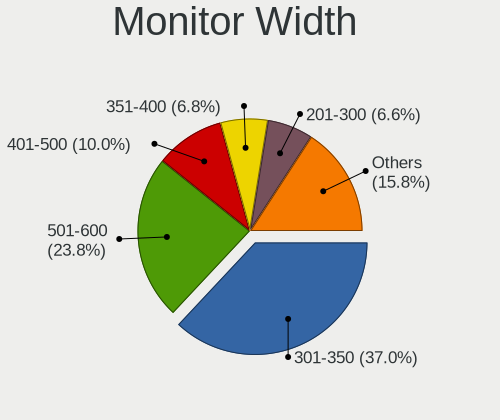

| Width in mm    | Computers | Percent |
|----------------|-----------|---------|
| 301-350        | 487       | 37.81%  |
| 501-600        | 300       | 23.29%  |
| 401-500        | 131       | 10.17%  |
| 351-400        | 93        | 7.22%   |
| 201-300        | 84        | 6.52%   |
| 601-700        | 60        | 4.66%   |
| 701-800        | 43        | 3.34%   |
| 1001-1500      | 31        | 2.41%   |
| Unknown        | 24        | 1.86%   |
| 1501-2000      | 20        | 1.55%   |
| 801-900        | 11        | 0.85%   |
| 901-1000       | 3         | 0.23%   |
| More than 2000 | 1         | 0.08%   |

Aspect Ratio
------------

Proportional relationship between the width and the height

| Ratio   | Computers | Percent |
|---------|-----------|---------|
| 16/9    | 885       | 77.7%   |
| 16/10   | 153       | 13.43%  |
| 21/9    | 34        | 2.99%   |
| 5/4     | 18        | 1.58%   |
| Unknown | 18        | 1.58%   |
| 3/2     | 17        | 1.49%   |
| 32/9    | 5         | 0.44%   |
| 4/3     | 4         | 0.35%   |
| 6/5     | 2         | 0.18%   |
| 1.96    | 1         | 0.09%   |
| 1.00    | 1         | 0.09%   |
| 0.25    | 1         | 0.09%   |

Monitor Area
------------

Area in inch

| Area in inch | Computers | Percent |
|----------------|-----------|---------|
| 101-110        | 314       | 24.25%  |
| 201-250        | 245       | 18.92%  |
| 81-90          | 176       | 13.59%  |
| 301-350        | 116       | 8.96%   |
| 351-500        | 80        | 6.18%   |
| 121-130        | 59        | 4.56%   |
| 151-200        | 52        | 4.02%   |
| 71-80          | 45        | 3.47%   |
| 251-300        | 44        | 3.4%    |
| More than 1000 | 39        | 3.01%   |
| 501-1000       | 29        | 2.24%   |
| 111-120        | 25        | 1.93%   |
| Unknown        | 24        | 1.85%   |
| 141-150        | 17        | 1.31%   |
| 61-70          | 11        | 0.85%   |
| 51-60          | 10        | 0.77%   |
| 41-50          | 3         | 0.23%   |
| 131-140        | 3         | 0.23%   |
| 91-100         | 3         | 0.23%   |

Pixel Density
-------------

Pixels per inch

| Density       | Computers | Percent |
|---------------|-----------|---------|
| 121-160       | 394       | 31.57%  |
| 51-100        | 385       | 30.85%  |
| 101-120       | 249       | 19.95%  |
| 161-240       | 119       | 9.54%   |
| 1-50          | 45        | 3.61%   |
| More than 240 | 32        | 2.56%   |
| Unknown       | 24        | 1.92%   |

Multiple Monitors
-----------------

Total monitors connected

| Total | Computers | Percent |
|-------|-----------|---------|
| 1     | 820       | 72.31%  |
| 2     | 239       | 21.08%  |
| 3     | 35        | 3.09%   |
| 0     | 33        | 2.91%   |
| 4     | 7         | 0.62%   |

Network
-------

Net Controller Vendor
---------------------

Controller vendors

| Vendor                            | Computers | Percent |
|-----------------------------------|-----------|---------|
| Realtek Semiconductor             | 618       | 36.1%   |
| Intel                             | 613       | 35.81%  |
| Qualcomm Atheros                  | 142       | 8.29%   |
| Broadcom                          | 72        | 4.21%   |
| MediaTek                          | 62        | 3.62%   |
| TP-Link                           | 20        | 1.17%   |
| Ralink Technology                 | 20        | 1.17%   |
| ASIX Electronics                  | 15        | 0.88%   |
| Samsung Electronics               | 12        | 0.7%    |
| Ralink                            | 10        | 0.58%   |
| Aquantia                          | 10        | 0.58%   |
| Lenovo                            | 8         | 0.47%   |
| Huawei Technologies               | 8         | 0.47%   |
| Broadcom Limited                  | 8         | 0.47%   |
| Sierra Wireless                   | 7         | 0.41%   |
| Marvell Technology Group          | 6         | 0.35%   |
| Edimax Technology                 | 5         | 0.29%   |
| Xiaomi                            | 4         | 0.23%   |
| Qualcomm Atheros Communications   | 4         | 0.23%   |
| Qualcomm                          | 4         | 0.23%   |
| Nvidia                            | 4         | 0.23%   |
| NetGear                           | 4         | 0.23%   |
| DisplayLink                       | 4         | 0.23%   |
| Belkin Components                 | 4         | 0.23%   |
| Hewlett-Packard                   | 3         | 0.18%   |
| Dell                              | 3         | 0.18%   |
| D-Link                            | 3         | 0.18%   |
| ASUSTek Computer                  | 3         | 0.18%   |
| Wilocity                          | 2         | 0.12%   |
| VIA Technologies                  | 2         | 0.12%   |
| JMicron Technology                | 2         | 0.12%   |
| IBM                               | 2         | 0.12%   |
| Google                            | 2         | 0.12%   |
| Ericsson Business Mobile Networks | 2         | 0.12%   |
| D-Link System                     | 2         | 0.12%   |
| Apple                             | 2         | 0.12%   |
| ZyXEL Communications              | 1         | 0.06%   |
| ZTE WCDMA Technologies MSM        | 1         | 0.06%   |
| U-Blox                            | 1         | 0.06%   |
| Solarflare Communications         | 1         | 0.06%   |

Net Controller Model
--------------------

Controller models

| Model                                                             | Computers | Percent |
|-------------------------------------------------------------------|-----------|---------|
| Realtek RTL8111/8168/8411 PCI Express Gigabit Ethernet Controller | 395       | 19.54%  |
| Intel Wi-Fi 6 AX200                                               | 67        | 3.32%   |
| Intel Wi-Fi 6 AX201                                               | 49        | 2.42%   |
| Realtek RTL8153 Gigabit Ethernet Adapter                          | 48        | 2.38%   |
| Intel Alder Lake-P PCH CNVi WiFi                                  | 45        | 2.23%   |
| MediaTek MT7921 802.11ax PCI Express Wireless Network Adapter     | 44        | 2.18%   |
| Realtek RTL8125 2.5GbE Controller                                 | 39        | 1.93%   |
| Realtek RTL8822CE 802.11ac PCIe Wireless Network Adapter          | 38        | 1.88%   |
| Realtek RTL810xE PCI Express Fast Ethernet controller             | 38        | 1.88%   |
| Intel 82579LM Gigabit Network Connection (Lewisville)             | 37        | 1.83%   |
| Intel Wireless 8265 / 8275                                        | 36        | 1.78%   |
| Realtek RTL8821CE 802.11ac PCIe Wireless Network Adapter          | 34        | 1.68%   |
| Intel I211 Gigabit Network Connection                             | 30        | 1.48%   |
| Intel Ethernet Controller I225-V                                  | 28        | 1.39%   |
| Intel Wireless 7260                                               | 25        | 1.24%   |
| Qualcomm Atheros QCA6174 802.11ac Wireless Network Adapter        | 24        | 1.19%   |
| Qualcomm Atheros QCA9377 802.11ac Wireless Network Adapter        | 23        | 1.14%   |
| Intel Wireless 7265                                               | 22        | 1.09%   |
| Qualcomm Atheros AR9485 Wireless Network Adapter                  | 21        | 1.04%   |
| Intel Ethernet Connection I217-LM                                 | 21        | 1.04%   |
| Intel Cannon Lake PCH CNVi WiFi                                   | 21        | 1.04%   |
| Intel Wireless 8260                                               | 19        | 0.94%   |
| Intel Wi-Fi 6 AX210/AX211/AX411 160MHz                            | 19        | 0.94%   |
| Intel Comet Lake PCH-LP CNVi WiFi                                 | 19        | 0.94%   |
| Intel Centrino Advanced-N 6205 [Taylor Peak]                      | 19        | 0.94%   |
| Intel Ethernet Connection (4) I219-LM                             | 17        | 0.84%   |
| Intel Ethernet Connection (2) I219-V                              | 16        | 0.79%   |
| Intel Comet Lake PCH CNVi WiFi                                    | 16        | 0.79%   |
| Intel Ethernet Connection (7) I219-V                              | 15        | 0.74%   |
| Intel 82579V Gigabit Network Connection                           | 14        | 0.69%   |
| Intel Wireless 3165                                               | 13        | 0.64%   |
| ASIX AX88179 Gigabit Ethernet                                     | 13        | 0.64%   |
| Realtek RTL8723BE PCIe Wireless Network Adapter                   | 12        | 0.59%   |
| Realtek RTL8188EUS 802.11n Wireless Network Adapter               | 12        | 0.59%   |
| Realtek 802.11ac NIC                                              | 12        | 0.59%   |
| Intel Ethernet Connection (2) I218-V                              | 12        | 0.59%   |
| Intel Dual Band Wireless-AC 3168NGW [Stone Peak]                  | 12        | 0.59%   |
| Realtek RTL88x2bu [AC1200 Techkey]                                | 11        | 0.54%   |
| Realtek RTL8852AE 802.11ax PCIe Wireless Network Adapter          | 11        | 0.54%   |
| Broadcom BCM4313 802.11bgn Wireless Network Adapter               | 11        | 0.54%   |

Wireless Vendor
---------------

Wireless vendors

| Vendor                            | Computers | Percent |
|-----------------------------------|-----------|---------|
| Intel                             | 461       | 47.67%  |
| Realtek Semiconductor             | 185       | 19.13%  |
| Qualcomm Atheros                  | 105       | 10.86%  |
| MediaTek                          | 61        | 6.31%   |
| Broadcom                          | 52        | 5.38%   |
| Ralink Technology                 | 20        | 2.07%   |
| TP-Link                           | 16        | 1.65%   |
| Ralink                            | 10        | 1.03%   |
| Sierra Wireless                   | 7         | 0.72%   |
| Broadcom Limited                  | 6         | 0.62%   |
| Edimax Technology                 | 5         | 0.52%   |
| Qualcomm Atheros Communications   | 4         | 0.41%   |
| Qualcomm                          | 4         | 0.41%   |
| NetGear                           | 4         | 0.41%   |
| Belkin Components                 | 4         | 0.41%   |
| Dell                              | 3         | 0.31%   |
| D-Link                            | 3         | 0.31%   |
| ASUSTek Computer                  | 3         | 0.31%   |
| Wilocity                          | 2         | 0.21%   |
| Marvell Technology Group          | 2         | 0.21%   |
| Ericsson Business Mobile Networks | 2         | 0.21%   |
| D-Link System                     | 2         | 0.21%   |
| ZyXEL Communications              | 1         | 0.1%    |
| Microsoft                         | 1         | 0.1%    |
| Mercucys                          | 1         | 0.1%    |
| Linksys                           | 1         | 0.1%    |
| LG Electronics                    | 1         | 0.1%    |
| Fibocom                           | 1         | 0.1%    |

Wireless Model
--------------

Wireless models

| Model                                                          | Computers | Percent |
|----------------------------------------------------------------|-----------|---------|
| Intel Wi-Fi 6 AX200                                            | 67        | 6.82%   |
| Intel Wi-Fi 6 AX201                                            | 49        | 4.99%   |
| Intel Alder Lake-P PCH CNVi WiFi                               | 45        | 4.58%   |
| MediaTek MT7921 802.11ax PCI Express Wireless Network Adapter  | 44        | 4.48%   |
| Realtek RTL8822CE 802.11ac PCIe Wireless Network Adapter       | 38        | 3.87%   |
| Intel Wireless 8265 / 8275                                     | 36        | 3.67%   |
| Realtek RTL8821CE 802.11ac PCIe Wireless Network Adapter       | 34        | 3.46%   |
| Intel Wireless 7260                                            | 25        | 2.55%   |
| Qualcomm Atheros QCA6174 802.11ac Wireless Network Adapter     | 24        | 2.44%   |
| Qualcomm Atheros QCA9377 802.11ac Wireless Network Adapter     | 23        | 2.34%   |
| Intel Wireless 7265                                            | 22        | 2.24%   |
| Qualcomm Atheros AR9485 Wireless Network Adapter               | 21        | 2.14%   |
| Intel Cannon Lake PCH CNVi WiFi                                | 21        | 2.14%   |
| Intel Wireless 8260                                            | 19        | 1.93%   |
| Intel Wi-Fi 6 AX210/AX211/AX411 160MHz                         | 19        | 1.93%   |
| Intel Comet Lake PCH-LP CNVi WiFi                              | 19        | 1.93%   |
| Intel Centrino Advanced-N 6205 [Taylor Peak]                   | 19        | 1.93%   |
| Intel Comet Lake PCH CNVi WiFi                                 | 16        | 1.63%   |
| Intel Wireless 3165                                            | 13        | 1.32%   |
| Realtek RTL8723BE PCIe Wireless Network Adapter                | 12        | 1.22%   |
| Realtek RTL8188EUS 802.11n Wireless Network Adapter            | 12        | 1.22%   |
| Realtek 802.11ac NIC                                           | 12        | 1.22%   |
| Intel Dual Band Wireless-AC 3168NGW [Stone Peak]               | 12        | 1.22%   |
| Realtek RTL88x2bu [AC1200 Techkey]                             | 11        | 1.12%   |
| Realtek RTL8852AE 802.11ax PCIe Wireless Network Adapter       | 11        | 1.12%   |
| Broadcom BCM4313 802.11bgn Wireless Network Adapter            | 11        | 1.12%   |
| Qualcomm Atheros QCA9565 / AR9565 Wireless Network Adapter     | 10        | 1.02%   |
| Broadcom BCM4360 802.11ac Dual Band Wireless Network Adapter   | 10        | 1.02%   |
| Realtek RTL8821AE 802.11ac PCIe Wireless Network Adapter       | 8         | 0.81%   |
| Realtek 802.11n WLAN Adapter                                   | 8         | 0.81%   |
| Qualcomm Atheros AR9285 Wireless Network Adapter (PCI-Express) | 8         | 0.81%   |
| Intel Tiger Lake PCH CNVi WiFi                                 | 8         | 0.81%   |
| Intel Gemini Lake PCH CNVi WiFi                                | 8         | 0.81%   |
| Intel Centrino Advanced-N 6235                                 | 8         | 0.81%   |
| Realtek RTL8852BE PCIe 802.11ax Wireless Network Controller    | 7         | 0.71%   |
| Ralink MT7601U Wireless Adapter                                | 7         | 0.71%   |
| MediaTek MT7921K (RZ608) Wi-Fi 6E 80MHz                        | 7         | 0.71%   |
| Intel Wireless-AC 9260                                         | 7         | 0.71%   |
| Intel Ice Lake-LP PCH CNVi WiFi                                | 7         | 0.71%   |
| Realtek RTL8188CE 802.11b/g/n WiFi Adapter                     | 6         | 0.61%   |

Ethernet Vendor
---------------

Ethernet vendors

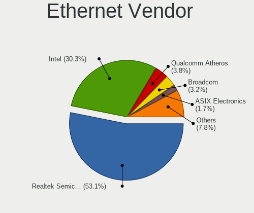

| Vendor                     | Computers | Percent |
|----------------------------|-----------|---------|
| Realtek Semiconductor      | 525       | 52.66%  |
| Intel                      | 310       | 31.09%  |
| Qualcomm Atheros           | 41        | 4.11%   |
| Broadcom                   | 29        | 2.91%   |
| ASIX Electronics           | 15        | 1.5%    |
| Samsung Electronics        | 12        | 1.2%    |
| Aquantia                   | 10        | 1%      |
| Lenovo                     | 8         | 0.8%    |
| Huawei Technologies        | 8         | 0.8%    |
| Xiaomi                     | 4         | 0.4%    |
| TP-Link                    | 4         | 0.4%    |
| Nvidia                     | 4         | 0.4%    |
| Marvell Technology Group   | 4         | 0.4%    |
| DisplayLink                | 4         | 0.4%    |
| VIA Technologies           | 2         | 0.2%    |
| JMicron Technology         | 2         | 0.2%    |
| IBM                        | 2         | 0.2%    |
| Google                     | 2         | 0.2%    |
| Broadcom Limited           | 2         | 0.2%    |
| Apple                      | 2         | 0.2%    |
| ZTE WCDMA Technologies MSM | 1         | 0.1%    |
| Solarflare Communications  | 1         | 0.1%    |
| Mellanox Technologies      | 1         | 0.1%    |
| MediaTek                   | 1         | 0.1%    |
| ICS Advent                 | 1         | 0.1%    |
| Hewlett-Packard            | 1         | 0.1%    |
| American Megatrends        | 1         | 0.1%    |

Ethernet Model
--------------

Ethernet models

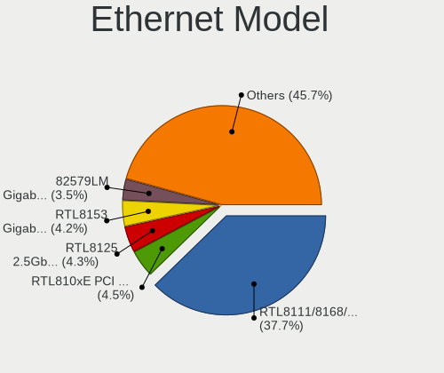

| Model                                                             | Computers | Percent |
|-------------------------------------------------------------------|-----------|---------|
| Realtek RTL8111/8168/8411 PCI Express Gigabit Ethernet Controller | 395       | 38.42%  |
| Realtek RTL8153 Gigabit Ethernet Adapter                          | 48        | 4.67%   |
| Realtek RTL8125 2.5GbE Controller                                 | 39        | 3.79%   |
| Realtek RTL810xE PCI Express Fast Ethernet controller             | 38        | 3.7%    |
| Intel 82579LM Gigabit Network Connection (Lewisville)             | 37        | 3.6%    |
| Intel I211 Gigabit Network Connection                             | 30        | 2.92%   |
| Intel Ethernet Controller I225-V                                  | 28        | 2.72%   |
| Intel Ethernet Connection I217-LM                                 | 21        | 2.04%   |
| Intel Ethernet Connection (4) I219-LM                             | 17        | 1.65%   |
| Intel Ethernet Connection (2) I219-V                              | 16        | 1.56%   |
| Intel Ethernet Connection (7) I219-V                              | 15        | 1.46%   |
| Intel 82579V Gigabit Network Connection                           | 14        | 1.36%   |
| ASIX AX88179 Gigabit Ethernet                                     | 13        | 1.26%   |
| Intel Ethernet Connection (2) I218-V                              | 12        | 1.17%   |
| Samsung Galaxy series, misc. (tethering mode)                     | 9         | 0.88%   |
| Realtek Killer E2600 Gigabit Ethernet Controller                  | 9         | 0.88%   |
| Qualcomm Atheros Killer E220x Gigabit Ethernet Controller         | 9         | 0.88%   |
| Intel Ethernet Connection I219-LM                                 | 9         | 0.88%   |
| Intel I210 Gigabit Network Connection                             | 8         | 0.78%   |
| Intel Ethernet Connection (7) I219-LM                             | 8         | 0.78%   |
| Intel Ethernet Connection (10) I219-V                             | 8         | 0.78%   |
| Qualcomm Atheros Killer E2500 Gigabit Ethernet Controller         | 7         | 0.68%   |
| Qualcomm Atheros AR8161 Gigabit Ethernet                          | 7         | 0.68%   |
| Intel Ethernet Connection (16) I219-LM                            | 7         | 0.68%   |
| Intel Ethernet Connection (13) I219-V                             | 7         | 0.68%   |
| Intel 82574L Gigabit Network Connection                           | 7         | 0.68%   |
| Aquantia AQC107 NBase-T/IEEE 802.3bz Ethernet Controller [AQtion] | 7         | 0.68%   |
| Intel Ethernet Connection I217-V                                  | 6         | 0.58%   |
| Intel Ethernet Connection (14) I219-V                             | 6         | 0.58%   |
| Huawei ALP-AL00                                                   | 6         | 0.58%   |
| Realtek RTL8152 Fast Ethernet Adapter                             | 5         | 0.49%   |
| Realtek Killer E3000 2.5GbE Controller                            | 5         | 0.49%   |
| Intel Ethernet Connection (5) I219-LM                             | 5         | 0.49%   |
| Intel Ethernet Connection (2) I219-LM                             | 5         | 0.49%   |
| Intel Ethernet Connection (11) I219-V                             | 5         | 0.49%   |
| Broadcom NetXtreme BCM57765 Gigabit Ethernet PCIe                 | 5         | 0.49%   |
| TP-Link UE300 10/100/1000 LAN (ethernet mode) [Realtek RTL8153]   | 4         | 0.39%   |
| Qualcomm Atheros QCA8171 Gigabit Ethernet                         | 4         | 0.39%   |
| Qualcomm Atheros AR8152 v2.0 Fast Ethernet                        | 4         | 0.39%   |
| Intel Ethernet Connection I218-LM                                 | 4         | 0.39%   |

Net Controller Kind
-------------------

Ethernet, WiFi or modem

| Kind     | Computers | Percent |
|----------|-----------|---------|
| WiFi     | 913       | 49.73%  |
| Ethernet | 913       | 49.73%  |
| Modem    | 7         | 0.38%   |
| Unknown  | 3         | 0.16%   |

Used Controller
---------------

Currently used network controller

| Kind     | Computers | Percent |
|----------|-----------|---------|
| WiFi     | 711       | 60.67%  |
| Ethernet | 461       | 39.33%  |

NICs
----

Total network controllers on board

| Total | Computers | Percent |
|-------|-----------|---------|
| 2     | 585       | 52.33%  |
| 1     | 471       | 42.13%  |
| 3     | 32        | 2.86%   |
| 0     | 21        | 1.88%   |
| 4     | 7         | 0.63%   |
| 6     | 2         | 0.18%   |

IPv6
----

IPv6 vs IPv4

| Used | Computers | Percent |
|------|-----------|---------|
| No   | 794       | 70.52%  |
| Yes  | 332       | 29.48%  |

Bluetooth
---------

Bluetooth Vendor
----------------

Controller vendors

| Vendor                          | Computers | Percent |
|---------------------------------|-----------|---------|
| Intel                           | 408       | 49.94%  |
| Realtek Semiconductor           | 95        | 11.63%  |
| Cambridge Silicon Radio         | 52        | 6.36%   |
| Qualcomm Atheros Communications | 46        | 5.63%   |
| IMC Networks                    | 42        | 5.14%   |
| Broadcom                        | 31        | 3.79%   |
| Foxconn / Hon Hai               | 30        | 3.67%   |
| Lite-On Technology              | 23        | 2.82%   |
| ASUSTek Computer                | 21        | 2.57%   |
| Apple                           | 16        | 1.96%   |
| MediaTek                        | 10        | 1.22%   |
| TP-Link                         | 7         | 0.86%   |
| Realtek                         | 6         | 0.73%   |
| Dell                            | 6         | 0.73%   |
| Toshiba                         | 5         | 0.61%   |
| Edimax Technology               | 4         | 0.49%   |
| Ralink                          | 3         | 0.37%   |
| Marvell Semiconductor           | 2         | 0.24%   |
| Hewlett-Packard                 | 2         | 0.24%   |
| USI                             | 1         | 0.12%   |
| SINO WEALTH                     | 1         | 0.12%   |
| Foxconn International           | 1         | 0.12%   |
| Dynex                           | 1         | 0.12%   |
| D-Link                          | 1         | 0.12%   |
| Conwise Technology              | 1         | 0.12%   |
| Chicony Electronics             | 1         | 0.12%   |
| Alps Electric                   | 1         | 0.12%   |

Bluetooth Model
---------------

Controller models

| Model                                                                               | Computers | Percent |
|-------------------------------------------------------------------------------------|-----------|---------|
| Intel Bluetooth wireless interface                                                  | 111       | 13.55%  |
| Intel AX201 Bluetooth                                                               | 91        | 11.11%  |
| Realtek Bluetooth Radio                                                             | 76        | 9.28%   |
| Intel AX200 Bluetooth                                                               | 65        | 7.94%   |
| Intel Bluetooth 9460/9560 Jefferson Peak (JfP)                                      | 53        | 6.47%   |
| Cambridge Silicon Radio Bluetooth Dongle (HCI mode)                                 | 52        | 6.35%   |
| Intel Bluetooth Device                                                              | 44        | 5.37%   |
| Qualcomm Atheros  Bluetooth Device                                                  | 23        | 2.81%   |
| Intel AX210 Bluetooth                                                               | 18        | 2.2%    |
| IMC Networks Wireless_Device                                                        | 18        | 2.2%    |
| Realtek  Bluetooth 4.2 Adapter                                                      | 15        | 1.83%   |
| IMC Networks Bluetooth Radio                                                        | 15        | 1.83%   |
| Foxconn / Hon Hai Wireless_Device                                                   | 15        | 1.83%   |
| Lite-On Wireless_Device                                                             | 14        | 1.71%   |
| Qualcomm Atheros QCA61x4 Bluetooth 4.0                                              | 11        | 1.34%   |
| Intel Wireless-AC 3168 Bluetooth                                                    | 11        | 1.34%   |
| Apple Bluetooth Host Controller                                                     | 11        | 1.34%   |
| MediaTek Wireless_Device                                                            | 10        | 1.22%   |
| Intel Centrino Bluetooth Wireless Transceiver                                       | 9         | 1.1%    |
| Qualcomm Atheros AR3012 Bluetooth 4.0                                               | 8         | 0.98%   |
| Intel Wireless-AC 9260 Bluetooth Adapter                                            | 8         | 0.98%   |
| ASUS ASUS USB-BT500                                                                 | 8         | 0.98%   |
| TP-Link UB500 Adapter                                                               | 7         | 0.85%   |
| Foxconn / Hon Hai Bluetooth Device                                                  | 7         | 0.85%   |
| Broadcom HP Portable SoftSailing                                                    | 7         | 0.85%   |
| Broadcom BCM20702A0 Bluetooth 4.0                                                   | 7         | 0.85%   |
| Realtek Bluetooth Radio                                                             | 6         | 0.73%   |
| Broadcom BCM20702 Bluetooth 4.0 [ThinkPad]                                          | 6         | 0.73%   |
| IMC Networks Bluetooth Device                                                       | 5         | 0.61%   |
| Foxconn / Hon Hai MediaTek MT7921 Bluetooth                                         | 4         | 0.49%   |
| Dell DW375 Bluetooth Module                                                         | 4         | 0.49%   |
| Ralink RT3290 Bluetooth                                                             | 3         | 0.37%   |
| Lite-On Qualcomm Atheros QCA9377 Bluetooth                                          | 3         | 0.37%   |
| Apple Bluetooth USB Host Controller                                                 | 3         | 0.37%   |
| Realtek RTL8723B Bluetooth                                                          | 2         | 0.24%   |
| Qualcomm Atheros Bluetooth USB Host Controller                                      | 2         | 0.24%   |
| Marvell Bluetooth and Wireless LAN Composite                                        | 2         | 0.24%   |
| Lite-On Bluetooth Device                                                            | 2         | 0.24%   |
| IMC Networks Bluetooth                                                              | 2         | 0.24%   |
| Foxconn / Hon Hai Foxconn T77H114 BCM2070 [Single-Chip Bluetooth 2.1 + EDR Adapter] | 2         | 0.24%   |

Sound
-----

Sound Vendor
------------

Sound card vendors

| Vendor                      | Computers | Percent |
|-----------------------------|-----------|---------|
| Intel                       | 770       | 45.92%  |
| AMD                         | 381       | 22.72%  |
| Nvidia                      | 317       | 18.9%   |
| C-Media Electronics         | 30        | 1.79%   |
| GN Netcom                   | 15        | 0.89%   |
| JMTek                       | 12        | 0.72%   |
| Lenovo                      | 9         | 0.54%   |
| Texas Instruments           | 7         | 0.42%   |
| Logitech                    | 7         | 0.42%   |
| Hewlett-Packard             | 7         | 0.42%   |
| Generalplus Technology      | 7         | 0.42%   |
| Razer USA                   | 6         | 0.36%   |
| Creative Labs               | 6         | 0.36%   |
| Realtek Semiconductor       | 5         | 0.3%    |
| Focusrite-Novation          | 5         | 0.3%    |
| Corsair                     | 5         | 0.3%    |
| VIA Technologies            | 4         | 0.24%   |
| Micro Star International    | 4         | 0.24%   |
| Kingston Technology         | 4         | 0.24%   |
| Blue Microphones            | 4         | 0.24%   |
| ASUSTek Computer            | 4         | 0.24%   |
| Tenx Technology             | 3         | 0.18%   |
| KORG                        | 3         | 0.18%   |
| Apple                       | 3         | 0.18%   |
| ZOOM                        | 2         | 0.12%   |
| TerraTec Electronic         | 2         | 0.12%   |
| SteelSeries ApS             | 2         | 0.12%   |
| Sennheiser Communications   | 2         | 0.12%   |
| Plantronics                 | 2         | 0.12%   |
| Nordic Semiconductor ASA    | 2         | 0.12%   |
| M-Audio                     | 2         | 0.12%   |
| HECATE G4 TE GAMING HEADSET | 2         | 0.12%   |
| Arturia                     | 2         | 0.12%   |
| AKAI Professional M.I.      | 2         | 0.12%   |
| Zhaoxin                     | 1         | 0.06%   |
| Yamaha                      | 1         | 0.06%   |
| Veho                        | 1         | 0.06%   |
| Unknown                     | 1         | 0.06%   |
| Spreadtrum Communications   | 1         | 0.06%   |
| Sony                        | 1         | 0.06%   |

Sound Model
-----------

Sound card models

| Model                                                                      | Computers | Percent |
|----------------------------------------------------------------------------|-----------|---------|
| AMD Family 17h/19h HD Audio Controller                                     | 170       | 8.53%   |
| AMD Renoir Radeon High Definition Audio Controller                         | 111       | 5.57%   |
| Intel Sunrise Point-LP HD Audio                                            | 86        | 4.32%   |
| Intel 7 Series/C216 Chipset Family High Definition Audio Controller        | 81        | 4.06%   |
| Intel Tiger Lake-LP Smart Sound Technology Audio Controller                | 68        | 3.41%   |
| Intel 8 Series/C220 Series Chipset High Definition Audio Controller        | 64        | 3.21%   |
| Intel Alder Lake PCH-P High Definition Audio Controller                    | 53        | 2.66%   |
| Intel Cannon Lake PCH cAVS                                                 | 51        | 2.56%   |
| AMD Starship/Matisse HD Audio Controller                                   | 49        | 2.46%   |
| Intel Xeon E3-1200 v3/4th Gen Core Processor HD Audio Controller           | 48        | 2.41%   |
| Intel 6 Series/C200 Series Chipset Family High Definition Audio Controller | 41        | 2.06%   |
| Nvidia GP107GL High Definition Audio Controller                            | 31        | 1.56%   |
| AMD Raven/Raven2/Fenghuang HDMI/DP Audio Controller                        | 30        | 1.51%   |
| Intel Celeron/Pentium Silver Processor High Definition Audio               | 29        | 1.46%   |
| AMD SBx00 Azalia (Intel HDA)                                               | 29        | 1.46%   |
| AMD Family 17h (Models 00h-0fh) HD Audio Controller                        | 29        | 1.46%   |
| Intel 100 Series/C230 Series Chipset Family HD Audio Controller            | 27        | 1.35%   |
| Nvidia TU107 GeForce GTX 1650 High Definition Audio Controller             | 26        | 1.3%    |
| Nvidia GK208 HDMI/DP Audio Controller                                      | 23        | 1.15%   |
| Intel Comet Lake PCH cAVS                                                  | 23        | 1.15%   |
| Intel 200 Series PCH HD Audio                                              | 23        | 1.15%   |
| Nvidia TU116 High Definition Audio Controller                              | 20        | 1%      |
| Nvidia TU106 High Definition Audio Controller                              | 20        | 1%      |
| Nvidia GA106 High Definition Audio Controller                              | 20        | 1%      |
| Intel Comet Lake PCH-LP cAVS                                               | 20        | 1%      |
| Nvidia GA104 High Definition Audio Controller                              | 19        | 0.95%   |
| Intel Tiger Lake-H HD Audio Controller                                     | 19        | 0.95%   |
| AMD Navi 21/23 HDMI/DP Audio Controller                                    | 19        | 0.95%   |
| AMD FCH Azalia Controller                                                  | 19        | 0.95%   |
| Intel 5 Series/3400 Series Chipset High Definition Audio                   | 17        | 0.85%   |
| AMD Ellesmere HDMI Audio [Radeon RX 470/480 / 570/580/590]                 | 16        | 0.8%    |
| AMD Baffin HDMI/DP Audio [Radeon RX 550 640SP / RX 560/560X]               | 16        | 0.8%    |
| Nvidia GM107 High Definition Audio Controller [GeForce 940MX]              | 15        | 0.75%   |
| Intel 9 Series Chipset Family HD Audio Controller                          | 15        | 0.75%   |
| AMD Rembrandt Radeon High Definition Audio Controller                      | 15        | 0.75%   |
| Nvidia GK107 HDMI Audio Controller                                         | 14        | 0.7%    |
| AMD Oland/Hainan/Cape Verde/Pitcairn HDMI Audio [Radeon HD 7000 Series]    | 14        | 0.7%    |
| Nvidia High Definition Audio Controller                                    | 13        | 0.65%   |
| Intel Ice Lake-LP Smart Sound Technology Audio Controller                  | 13        | 0.65%   |
| AMD Family 15h (Models 60h-6fh) Audio Controller                           | 13        | 0.65%   |

Memory
------

Memory Vendor
-------------

Memory module vendors

| Vendor              | Computers | Percent |
|---------------------|-----------|---------|
| Samsung Electronics | 209       | 23.59%  |
| SK hynix            | 134       | 15.12%  |
| Kingston            | 106       | 11.96%  |
| Micron Technology   | 92        | 10.38%  |
| Crucial             | 73        | 8.24%   |
| Corsair             | 55        | 6.21%   |
| Unknown             | 41        | 4.63%   |
| G.Skill             | 33        | 3.72%   |
| A-DATA Technology   | 18        | 2.03%   |
| Unknown (ABCD)      | 17        | 1.92%   |
| Ramaxel Technology  | 10        | 1.13%   |
| Unknown             | 10        | 1.13%   |
| Elpida              | 9         | 1.02%   |
| Team                | 8         | 0.9%    |
| Nanya Technology    | 8         | 0.9%    |
| Patriot             | 6         | 0.68%   |
| Transcend           | 5         | 0.56%   |
| Smart               | 5         | 0.56%   |
| Silicon Power       | 4         | 0.45%   |
| AMD                 | 4         | 0.45%   |
| Wilk                | 3         | 0.34%   |
| PNY                 | 3         | 0.34%   |
| Teikon              | 2         | 0.23%   |
| Lexar               | 2         | 0.23%   |
| GOODRAM             | 2         | 0.23%   |
| ff                  | 2         | 0.23%   |
| Atermiter           | 2         | 0.23%   |
| ASint Technology    | 2         | 0.23%   |
| 4ea5                | 2         | 0.23%   |
| Unknown (8A02)      | 1         | 0.11%   |
| Unknown (08C8)      | 1         | 0.11%   |
| Unifosa             | 1         | 0.11%   |
| Super Talent        | 1         | 0.11%   |
| Shenzhen Zhongteng  | 1         | 0.11%   |
| Shenzhen WODPOSIT   | 1         | 0.11%   |
| SHARETRONIC         | 1         | 0.11%   |
| Qumo                | 1         | 0.11%   |
| Qimonda             | 1         | 0.11%   |
| Neo Forza           | 1         | 0.11%   |
| Kingmax             | 1         | 0.11%   |

Memory Model
------------

Memory module models

| Model                                                            | Computers | Percent |
|------------------------------------------------------------------|-----------|---------|
| Unknown (ABCD) RAM 123456789012345678 2GB SODIMM LPDDR4 2400MT/s | 14        | 1.5%    |
| Samsung RAM M471A1G44AB0-CWE 8GB SODIMM DDR4 3200MT/s            | 11        | 1.18%   |
| SK hynix RAM HMAA1GS6CJR6N-XN 8GB SODIMM DDR4 3200MT/s           | 10        | 1.07%   |
| Unknown                                                          | 10        | 1.07%   |
| Micron RAM 4ATF1G64HZ-3G2E1 8GB Row Of Chips DDR4 3200MT/s       | 9         | 0.96%   |
| SK hynix RAM HMA81GS6DJR8N-XN 8GB SODIMM DDR4 3200MT/s           | 8         | 0.86%   |
| Samsung RAM M471A1K43CB1-CTD 8GB SODIMM DDR4 2667MT/s            | 8         | 0.86%   |
| SK hynix RAM HMT351S6CFR8C-PB 4GB SODIMM DDR3 1600MT/s           | 7         | 0.75%   |
| Samsung RAM M471A2K43DB1-CTD 16GB SODIMM DDR4 2667MT/s           | 7         | 0.75%   |
| Samsung RAM M471A1K43EB1-CWE 8GB SODIMM DDR4 3200MT/s            | 7         | 0.75%   |
| SK hynix RAM HMA81GS6AFR8N-UH 8GB SODIMM DDR4 2667MT/s           | 6         | 0.64%   |
| Samsung RAM M471B1G73DB0-YK0 8GB SODIMM DDR3 1600MT/s            | 6         | 0.64%   |
| Samsung RAM M471A5244CB0-CWE 4GB SODIMM DDR4 3200MT/s            | 6         | 0.64%   |
| Samsung RAM M471A1G44AB0-CWE 8GB Row Of Chips DDR4 3200MT/s      | 6         | 0.64%   |
| Micron RAM 4ATF1G64HZ-3G2E1 8GB SODIMM DDR4 3200MT/s             | 6         | 0.64%   |
| Corsair RAM CMK16GX4M2B3200C16 8GB DIMM DDR4 3600MT/s            | 6         | 0.64%   |
| Samsung RAM M471B5173EB0-YK0 4GB SODIMM DDR3 1600MT/s            | 5         | 0.53%   |
| Samsung RAM M471A5244CB0-CTD 4GB SODIMM DDR4 3266MT/s            | 5         | 0.53%   |
| Samsung RAM M471A5244CB0-CRC 4GB SODIMM DDR4 2667MT/s            | 5         | 0.53%   |
| Samsung RAM M471A1K43DB1-CWE 8GB SODIMM DDR4 3200MT/s            | 5         | 0.53%   |
| Samsung RAM M471A1G44BB0-CWE 8GB SODIMM DDR4 3200MT/s            | 5         | 0.53%   |
| Micron RAM 8ATF1G64HZ-3G2R1 8GB SODIMM DDR4 3200MT/s             | 5         | 0.53%   |
| Unknown RAM Module 4GB DIMM 1333MT/s                             | 4         | 0.43%   |
| SK hynix RAM HMAA1GS6CJR6N-XN 8GB Row Of Chips DDR4 3200MT/s     | 4         | 0.43%   |
| Samsung RAM Module 8GB SODIMM DDR4 2400MT/s                      | 4         | 0.43%   |
| Samsung RAM Module 8GB SODIMM DDR4 2133MT/s                      | 4         | 0.43%   |
| Samsung RAM M471B5273CH0-CH9 4GB SODIMM DDR3 1334MT/s            | 4         | 0.43%   |
| Samsung RAM M471A4G43AB1-CWE 32GB SODIMM DDR4 3200MT/s           | 4         | 0.43%   |
| Micron RAM MTC4C10163S1SC48BA1 8GB SODIMM DDR5 4800MT/s          | 4         | 0.43%   |
| Micron RAM 8ATF1G64HZ-3G2J1 8GB SODIMM DDR4 3200MT/s             | 4         | 0.43%   |
| Elpida RAM EBJ40UG8BBU0-GN-F 4GB SODIMM DDR3 1600MT/s            | 4         | 0.43%   |
| Unknown RAM Module 2GB SODIMM DDR2 667MT/s                       | 3         | 0.32%   |
| Unknown (ABCD) RAM 123456789012345678 2GB DIMM LPDDR4 2400MT/s   | 3         | 0.32%   |
| SK hynix RAM Module 8GB SODIMM DDR4 2400MT/s                     | 3         | 0.32%   |
| SK hynix RAM HMT451S6BFR8A-PB 4096MB SODIMM DDR3 1600MT/s        | 3         | 0.32%   |
| SK hynix RAM HMAA2GS6CJR8N-XN 16GB SODIMM DDR4 3200MT/s          | 3         | 0.32%   |
| SK hynix RAM HMA851S6DJR6N-XN 4GB Row Of Chips DDR4 3200MT/s     | 3         | 0.32%   |
| SK hynix RAM HMA81GS6JJR8N-VK 8GB SODIMM DDR4 2667MT/s           | 3         | 0.32%   |
| SK hynix RAM HMA81GS6CJR8N-XN 8192MB SODIMM DDR4 3200MT/s        | 3         | 0.32%   |
| SK hynix RAM HMA81GS6CJR8N-VK 8GB SODIMM DDR4 2667MT/s           | 3         | 0.32%   |

Memory Kind
-----------

Memory module kinds

| Kind    | Computers | Percent |
|---------|-----------|---------|
| DDR4    | 449       | 60.03%  |
| DDR3    | 169       | 22.59%  |
| LPDDR4  | 44        | 5.88%   |
| DDR5    | 28        | 3.74%   |
| LPDDR5  | 14        | 1.87%   |
| Unknown | 13        | 1.74%   |
| DDR2    | 12        | 1.6%    |
| LPDDR3  | 9         | 1.2%    |
| SDRAM   | 8         | 1.07%   |
| DDR     | 2         | 0.27%   |

Memory Form Factor
------------------

Physical design of the memory module

| Name         | Computers | Percent |
|--------------|-----------|---------|
| SODIMM       | 436       | 57.6%   |
| DIMM         | 238       | 31.44%  |
| Row Of Chips | 73        | 9.64%   |
| Chip         | 5         | 0.66%   |
| Unknown      | 4         | 0.53%   |
| RIMM         | 1         | 0.13%   |

Memory Size
-----------

Memory module size

| Size  | Computers | Percent |
|-------|-----------|---------|
| 8192  | 358       | 43.98%  |
| 16384 | 176       | 21.62%  |
| 4096  | 172       | 21.13%  |
| 2048  | 53        | 6.51%   |
| 32768 | 49        | 6.02%   |
| 1024  | 6         | 0.74%   |

Memory Speed
------------

Memory module speed

| Speed   | Computers | Percent |
|---------|-----------|---------|
| 3200    | 210       | 26.18%  |
| 1600    | 115       | 14.34%  |
| 2667    | 109       | 13.59%  |
| 2400    | 71        | 8.85%   |
| 1333    | 43        | 5.36%   |
| 3600    | 29        | 3.62%   |
| 2133    | 27        | 3.37%   |
| 4800    | 22        | 2.74%   |
| 4267    | 18        | 2.24%   |
| 1867    | 15        | 1.87%   |
| 6400    | 13        | 1.62%   |
| 1334    | 11        | 1.37%   |
| 2666    | 9         | 1.12%   |
| 3800    | 7         | 0.87%   |
| 3266    | 7         | 0.87%   |
| 3000    | 7         | 0.87%   |
| 2933    | 6         | 0.75%   |
| 1066    | 6         | 0.75%   |
| 667     | 6         | 0.75%   |
| 4266    | 4         | 0.5%    |
| 3666    | 4         | 0.5%    |
| 3066    | 4         | 0.5%    |
| 2800    | 4         | 0.5%    |
| 800     | 4         | 0.5%    |
| Unknown | 4         | 0.5%    |
| 3533    | 3         | 0.37%   |
| 3333    | 3         | 0.37%   |
| 1866    | 3         | 0.37%   |
| 1648    | 3         | 0.37%   |
| 400     | 3         | 0.37%   |
| 8400    | 2         | 0.25%   |
| 6000    | 2         | 0.25%   |
| 3866    | 2         | 0.25%   |
| 2048    | 2         | 0.25%   |
| 52217   | 1         | 0.12%   |
| 7500    | 1         | 0.12%   |
| 5808    | 1         | 0.12%   |
| 5800    | 1         | 0.12%   |
| 5600    | 1         | 0.12%   |
| 5200    | 1         | 0.12%   |

Printers & scanners
-------------------

Printer Vendor
--------------

Printer device vendors

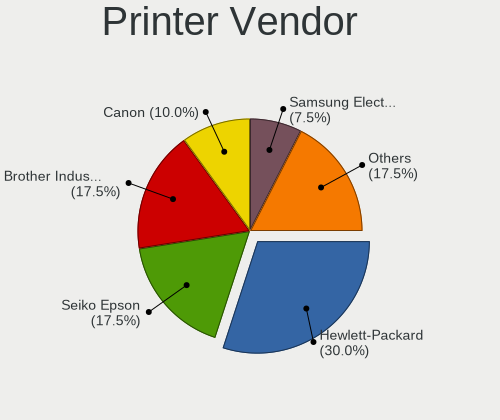

| Vendor              | Computers | Percent |
|---------------------|-----------|---------|
| Hewlett-Packard     | 10        | 32.26%  |
| Seiko Epson         | 6         | 19.35%  |
| Canon               | 4         | 12.9%   |
| Brother Industries  | 4         | 12.9%   |
| Samsung Electronics | 2         | 6.45%   |
| Xerox               | 1         | 3.23%   |
| Prolific Technology | 1         | 3.23%   |
| Kyocera             | 1         | 3.23%   |
| Dymo-CoStar         | 1         | 3.23%   |
| Datamax-O'Neil      | 1         | 3.23%   |

Printer Model
-------------

Printer device models

| Model                                 | Computers | Percent |
|---------------------------------------|-----------|---------|
| Seiko Epson L360 Series               | 2         | 6.45%   |
| Seiko Epson L3110 Series              | 2         | 6.45%   |
| Samsung M2070 Series                  | 2         | 6.45%   |
| Brother MFC-J460DW                    | 2         | 6.45%   |
| Xerox Phaser 3140 and 3155            | 1         | 3.23%   |
| Seiko Epson XP-3100 Series            | 1         | 3.23%   |
| Seiko Epson ET-2700 Series            | 1         | 3.23%   |
| Prolific PL2305 Parallel Port         | 1         | 3.23%   |
| Kyocera Mita FS-820                   | 1         | 3.23%   |
| HP OfficeJet 5500 series              | 1         | 3.23%   |
| HP LaserJet Professional P 1102w      | 1         | 3.23%   |
| HP LaserJet P2015 series              | 1         | 3.23%   |
| HP LaserJet 1022                      | 1         | 3.23%   |
| HP LaserJet 1012                      | 1         | 3.23%   |
| HP ENVY 4500 series                   | 1         | 3.23%   |
| HP DeskJet D2300                      | 1         | 3.23%   |
| HP DeskJet 3700 series                | 1         | 3.23%   |
| HP DeskJet 3630 series                | 1         | 3.23%   |
| HP ColorLaserJet M253-M254            | 1         | 3.23%   |
| Dymo-CoStar LabelWriter 450           | 1         | 3.23%   |
| Datamax-O'Neil Datamax E-4304         | 1         | 3.23%   |
| Canon PIXMA MX470 Series              | 1         | 3.23%   |
| Canon PIXMA MG5500 Series             | 1         | 3.23%   |
| Canon LaserShot LBP-1120 Printer      | 1         | 3.23%   |
| Canon iP2600 series                   | 1         | 3.23%   |
| Brother PT-P700 P-touch Label Printer | 1         | 3.23%   |
| Brother HL-2230 series                | 1         | 3.23%   |

Scanner Vendor
--------------

Scanner device vendors

| Vendor         | Computers | Percent |
|----------------|-----------|---------|
| Canon          | 5         | 71.43%  |
| Seiko Epson    | 1         | 14.29%  |
| Mustek Systems | 1         | 14.29%  |

Scanner Model
-------------

Scanner device models

| Model                                       | Computers | Percent |
|---------------------------------------------|-----------|---------|
| Canon CanoScan LiDE 50/LiDE 35/LiDE 40      | 2         | 28.57%  |
| Seiko Epson GT-X820 [Perfection V600 Photo] | 1         | 14.29%  |
| Mustek Systems ScanExpress A3 USB 1200 PRO  | 1         | 14.29%  |
| Canon CanoScan N670U/N676U/LiDE 20          | 1         | 14.29%  |
| Canon CanoScan LiDE 220                     | 1         | 14.29%  |
| Canon CanoScan LiDE 210                     | 1         | 14.29%  |

Camera
------

Camera Vendor
-------------

Camera device vendors

| Vendor                                 | Computers | Percent |
|----------------------------------------|-----------|---------|
| Chicony Electronics                    | 133       | 17.62%  |
| Microdia                               | 77        | 10.2%   |
| IMC Networks                           | 77        | 10.2%   |
| Logitech                               | 64        | 8.48%   |
| Quanta                                 | 53        | 7.02%   |
| Realtek Semiconductor                  | 50        | 6.62%   |
| Bison Electronics                      | 48        | 6.36%   |
| Sunplus Innovation Technology          | 35        | 4.64%   |
| Cheng Uei Precision Industry (Foxlink) | 28        | 3.71%   |
| Acer                                   | 23        | 3.05%   |
| Syntek                                 | 18        | 2.38%   |
| Luxvisions Innotech Limited            | 17        | 2.25%   |
| Lite-On Technology                     | 12        | 1.59%   |
| Apple                                  | 11        | 1.46%   |
| Silicon Motion                         | 8         | 1.06%   |
| Samsung Electronics                    | 8         | 1.06%   |
| Microsoft                              | 7         | 0.93%   |
| Generalplus Technology                 | 6         | 0.79%   |
| Y Media                                | 5         | 0.66%   |
| Sonix Technology                       | 5         | 0.66%   |
| Alcor Micro                            | 5         | 0.66%   |
| Suyin                                  | 4         | 0.53%   |
| SunplusIT                              | 4         | 0.53%   |
| icSpring                               | 4         | 0.53%   |
| Z-Star Microelectronics                | 3         | 0.4%    |
| KYE Systems (Mouse Systems)            | 3         | 0.4%    |
| GEMBIRD                                | 3         | 0.4%    |
| Cubeternet                             | 3         | 0.4%    |
| ARC International                      | 3         | 0.4%    |
| YGTek                                  | 2         | 0.26%   |
| Unknown                                | 2         | 0.26%   |
| LG Electronics                         | 2         | 0.26%   |
| Lenovo                                 | 2         | 0.26%   |
| Jieli Technology                       | 2         | 0.26%   |
| Importek                               | 2         | 0.26%   |
| Xiaomi                                 | 1         | 0.13%   |
| USB Camera CS                          | 1         | 0.13%   |
| Trust                                  | 1         | 0.13%   |
| Tripath Technology                     | 1         | 0.13%   |
| STEREOLABS                             | 1         | 0.13%   |

Camera Model
------------

Camera device models

| Model                                                           | Computers | Percent |
|-----------------------------------------------------------------|-----------|---------|
| Chicony Integrated Camera                                       | 41        | 5.42%   |
| Microdia Integrated_Webcam_HD                                   | 37        | 4.89%   |
| IMC Networks Integrated Camera                                  | 28        | 3.7%    |
| IMC Networks USB2.0 HD UVC WebCam                               | 20        | 2.64%   |
| Realtek Integrated_Webcam_HD                                    | 17        | 2.25%   |
| Bison Integrated Camera                                         | 16        | 2.11%   |
| Logitech HD Pro Webcam C920                                     | 13        | 1.72%   |
| Chicony HD Webcam                                               | 13        | 1.72%   |
| Syntek Integrated Camera                                        | 12        | 1.59%   |
| Sunplus Integrated_Webcam_HD                                    | 12        | 1.59%   |
| Chicony HD User Facing                                          | 12        | 1.59%   |
| Acer Integrated Camera                                          | 12        | 1.59%   |
| Quanta HP TrueVision HD Camera                                  | 11        | 1.45%   |
| Quanta HD User Facing                                           | 10        | 1.32%   |
| Logitech Webcam C270                                            | 10        | 1.32%   |
| Chicony HP HD Camera                                            | 10        | 1.32%   |
| Microdia Integrated_Webcam_FHD                                  | 9         | 1.19%   |
| Samsung Galaxy series, misc. (MTP mode)                         | 8         | 1.06%   |
| Microdia Webcam Vitade AF                                       | 7         | 0.92%   |
| Logitech C922 Pro Stream Webcam                                 | 7         | 0.92%   |
| Bison HD Webcam                                                 | 7         | 0.92%   |
| Quanta HP Wide Vision HD Camera                                 | 6         | 0.79%   |
| IMC Networks HD Camera                                          | 6         | 0.79%   |
| Chicony Integrated Camera (1280x720@30)                         | 6         | 0.79%   |
| Chicony HP Wide Vision HD Camera                                | 6         | 0.79%   |
| Cheng Uei Precision Industry (Foxlink) HP Wide Vision HD Camera | 6         | 0.79%   |
| Y Media USB Camera                                              | 5         | 0.66%   |
| Quanta ACER HD User Facing                                      | 5         | 0.66%   |
| Luxvisions Innotech Limited Integrated Camera                   | 5         | 0.66%   |
| Luxvisions Innotech Limited HP TrueVision HD Camera             | 5         | 0.66%   |
| Logitech C920 PRO HD Webcam                                     | 5         | 0.66%   |
| Chicony HP TrueVision HD Camera                                 | 5         | 0.66%   |
| Cheng Uei Precision Industry (Foxlink) HD Camera                | 5         | 0.66%   |
| Bison BisonCam,NB Pro                                           | 5         | 0.66%   |
| Apple FaceTime HD Camera (Built-in)                             | 5         | 0.66%   |
| Syntek Lenovo EasyCamera                                        | 4         | 0.53%   |
| Realtek USB Camera                                              | 4         | 0.53%   |
| Realtek Integrated Webcam                                       | 4         | 0.53%   |
| Quanta HP HD Camera                                             | 4         | 0.53%   |
| Quanta HD Webcam                                                | 4         | 0.53%   |

Security
--------

Fingerprint Vendor
------------------

Fingerprint sensor vendors

| Vendor                             | Computers | Percent |
|------------------------------------|-----------|---------|
| Synaptics                          | 47        | 31.97%  |
| Validity Sensors                   | 37        | 25.17%  |
| Shenzhen Goodix Technology         | 36        | 24.49%  |
| Elan Microelectronics              | 12        | 8.16%   |
| Upek                               | 4         | 2.72%   |
| LighTuning Technology              | 4         | 2.72%   |
| AuthenTec                          | 4         | 2.72%   |
| STMicroelectronics                 | 1         | 0.68%   |
| Realtek USB2.0 Finger Print Bridge | 1         | 0.68%   |
| Focal-systems.Corp                 | 1         | 0.68%   |

Fingerprint Model
-----------------

Fingerprint sensor models

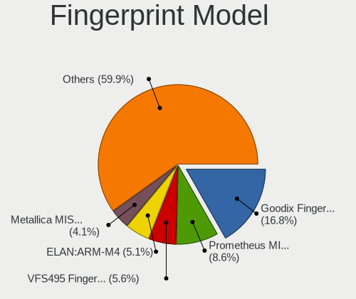

| Model                                                                      | Computers | Percent |
|----------------------------------------------------------------------------|-----------|---------|
| Shenzhen Goodix  FingerPrint Device                                        | 27        | 18.37%  |
| Synaptics Prometheus MIS Touch Fingerprint Reader                          | 12        | 8.16%   |
| Validity Sensors VFS495 Fingerprint Reader                                 | 7         | 4.76%   |
| Validity Sensors VFS 5011 fingerprint sensor                               | 7         | 4.76%   |
| Shenzhen Goodix Fingerprint Reader                                         | 7         | 4.76%   |
| Elan ELAN:ARM-M4                                                           | 7         | 4.76%   |
| Synaptics Metallica MIS Touch Fingerprint Reader                           | 6         | 4.08%   |
| Validity Sensors VFS491                                                    | 5         | 3.4%    |
| Synaptics WBDI                                                             | 5         | 3.4%    |
| Synaptics UWP WBDI                                                         | 5         | 3.4%    |
| Elan ELAN:Fingerprint                                                      | 5         | 3.4%    |
| Validity Sensors Synaptics WBDI                                            | 4         | 2.72%   |
| Upek Biometric Touchchip/Touchstrip Fingerprint Sensor                     | 4         | 2.72%   |
| Synaptics  FS7604 Touch Fingerprint Sensor with PurePrint                  | 4         | 2.72%   |
| Synaptics UWP WBDI Device                                                  | 3         | 2.04%   |
| Synaptics FS7604 Touch Fingerprint Sensor with PurePrint                   | 3         | 2.04%   |
| Validity Sensors VFS7552 Touch Fingerprint Sensor                          | 2         | 1.36%   |
| Validity Sensors VFS7500 Touch Fingerprint Sensor                          | 2         | 1.36%   |
| Validity Sensors VFS471 Fingerprint Reader                                 | 2         | 1.36%   |
| Validity Sensors Synaptics VFS7552 Touch Fingerprint Sensor with PurePrint | 2         | 1.36%   |
| Validity Sensors Swipe Fingerprint Sensor                                  | 2         | 1.36%   |
| Synaptics WBDI Fingerprint Reader USB 086                                  | 2         | 1.36%   |
| Synaptics  WBDI Fingerprint Reader - USB 052                               | 2         | 1.36%   |
| Synaptics  WBDI                                                            | 2         | 1.36%   |
| Shenzhen Goodix FingerPrint                                                | 2         | 1.36%   |
| AuthenTec Fingerprint Sensor                                               | 2         | 1.36%   |
| Validity Sensors VFS5011 Fingerprint Reader                                | 1         | 0.68%   |
| Validity Sensors VFS300 Fingerprint Reader                                 | 1         | 0.68%   |
| Validity Sensors Synaptics VFS7552 Touch Fingerprint Sensor                | 1         | 0.68%   |
| Validity Sensors Fingerprint scanner                                       | 1         | 0.68%   |
| Synaptics TouchPad                                                         | 1         | 0.68%   |
| Synaptics Metallica MOH Touch Fingerprint Reader                           | 1         | 0.68%   |
| Synaptics Fingerprint reader [HP G6]                                       | 1         | 0.68%   |
| STMicroelectronics Fingerprint Reader                                      | 1         | 0.68%   |
| Realtek USB2.0 Finger Print Bridge FocalTech Fingerprint Device            | 1         | 0.68%   |
| LighTuning Fingerprint Sensor                                              | 1         | 0.68%   |
| LighTuning Fingerprint Reader                                              | 1         | 0.68%   |
| LighTuning ES603 Swipe Fingerprint Sensor                                  | 1         | 0.68%   |
| LighTuning EgisTec Touch Fingerprint Sensor                                | 1         | 0.68%   |
| Focal-systems.Corp FT9201Fingerprint.                                      | 1         | 0.68%   |

Chipcard Vendor
---------------

Chipcard module vendors

| Vendor                | Computers | Percent |
|-----------------------|-----------|---------|
| Broadcom              | 26        | 40%     |
| Alcor Micro           | 25        | 38.46%  |
| Upek                  | 4         | 6.15%   |
| OmniKey               | 2         | 3.08%   |
| Bit4id                | 2         | 3.08%   |
| SCM Microsystems      | 1         | 1.54%   |
| O2 Micro              | 1         | 1.54%   |
| Lenovo                | 1         | 1.54%   |
| Gemalto (was Gemplus) | 1         | 1.54%   |
| Clay Logic            | 1         | 1.54%   |
| Advanced Card Systems | 1         | 1.54%   |

Chipcard Model
--------------

Chipcard module models

| Model                                                                        | Computers | Percent |
|------------------------------------------------------------------------------|-----------|---------|
| Alcor Micro AU9540 Smartcard Reader                                          | 25        | 38.46%  |
| Broadcom 5880                                                                | 9         | 13.85%  |
| Broadcom 58200                                                               | 9         | 13.85%  |
| Broadcom BCM5880 Secure Applications Processor                               | 5         | 7.69%   |
| Upek TouchChip Fingerprint Coprocessor (WBF advanced mode)                   | 4         | 6.15%   |
| Broadcom BCM5880 Secure Applications Processor with fingerprint swipe sensor | 3         | 4.62%   |
| Bit4id miniLector EVO                                                        | 2         | 3.08%   |
| SCM Microsystems SCR331 SmartCard Reader                                     | 1         | 1.54%   |
| OmniKey CardMan 3021 / 3121                                                  | 1         | 1.54%   |
| OmniKey CardMan 1021                                                         | 1         | 1.54%   |
| O2 Micro OZ776 CCID Smartcard Reader                                         | 1         | 1.54%   |
| Lenovo Integrated Smart Card Reader                                          | 1         | 1.54%   |
| Gemalto (was Gemplus) GemPC Twin SmartCard Reader                            | 1         | 1.54%   |
| Clay Logic Nitrokey Pro                                                      | 1         | 1.54%   |
| Advanced Card Systems ACR39U                                                 | 1         | 1.54%   |

Unsupported
-----------

Unsupported Devices
-------------------

Total unsupported devices on board

| Total | Computers | Percent |
|-------|-----------|---------|
| 0     | 774       | 67.72%  |
| 1     | 290       | 25.37%  |
| 2     | 68        | 5.95%   |
| 3     | 8         | 0.7%    |
| 9     | 1         | 0.09%   |
| 7     | 1         | 0.09%   |
| 4     | 1         | 0.09%   |

Unsupported Device Types
------------------------

Types of unsupported devices

| Type                     | Computers | Percent |
|--------------------------|-----------|---------|
| Fingerprint reader       | 146       | 33.26%  |
| Graphics card            | 65        | 14.81%  |
| Chipcard                 | 57        | 12.98%  |
| Net/wireless             | 51        | 11.62%  |
| Camera                   | 28        | 6.38%   |
| Multimedia controller    | 24        | 5.47%   |
| Unassigned class         | 17        | 3.87%   |
| Bluetooth                | 14        | 3.19%   |
| Communication controller | 11        | 2.51%   |
| Sound                    | 9         | 2.05%   |
| Storage                  | 4         | 0.91%   |
| Network                  | 3         | 0.68%   |
| Net/ethernet             | 3         | 0.68%   |
| Card reader              | 3         | 0.68%   |
| Modem                    | 2         | 0.46%   |
| Storage/ide              | 1         | 0.23%   |
| Dvb card                 | 1         | 0.23%   |

