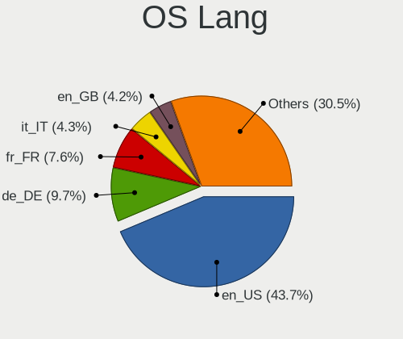
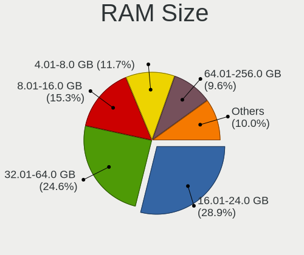
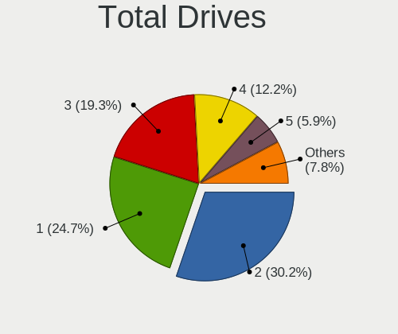
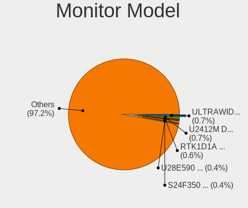
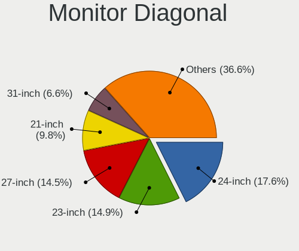
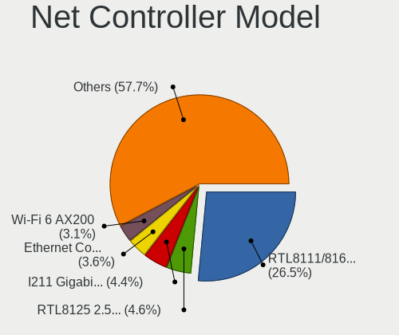
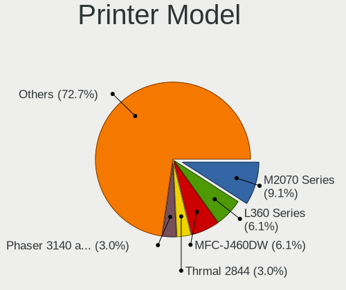
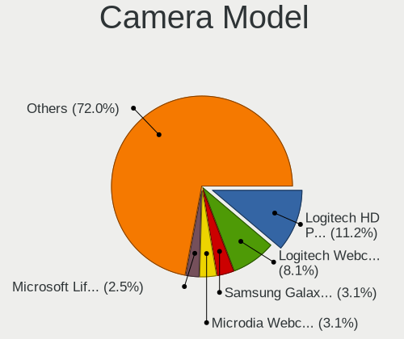
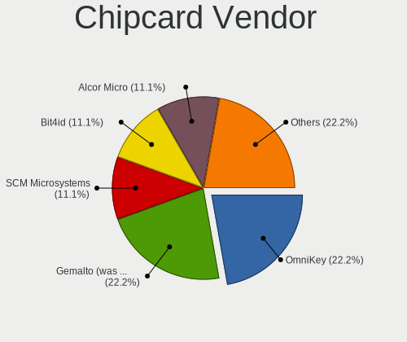

Kubuntu 22.04 - Tested Hardware & Statistics (Desktops)
-------------------------------------------------------

A project to collect tested hardware configurations for Kubuntu 22.04.

Anyone can contribute to this report by the [hw-probe](https://github.com/linuxhw/hw-probe) tool:

    sudo -E hw-probe -all -upload

Please contribute! Especially if your hardware is rare.

Contents
--------

* [ Test Cases ](#test-cases)

* [ System ](#system)
  - [ Kernel                   ](#kernel)
  - [ Kernel Family            ](#kernel-family)
  - [ Kernel Major Ver.        ](#kernel-major-ver)
  - [ Arch                     ](#arch)
  - [ DE                       ](#de)
  - [ Display Server           ](#display-server)
  - [ Display Manager          ](#display-manager)
  - [ OS Lang                  ](#os-lang)
  - [ Boot Mode                ](#boot-mode)
  - [ Filesystem               ](#filesystem)
  - [ Part. scheme             ](#part-scheme)
  - [ Dual Boot with Linux/BSD ](#dual-boot-with-linuxbsd)
  - [ Dual Boot (Win)          ](#dual-boot-win)

* [ Board ](#board)
  - [ Vendor                   ](#vendor)
  - [ Model                    ](#model)
  - [ Model Family             ](#model-family)
  - [ MFG Year                 ](#mfg-year)
  - [ Form Factor              ](#form-factor)
  - [ Secure Boot              ](#secure-boot)
  - [ Coreboot                 ](#coreboot)
  - [ RAM Size                 ](#ram-size)
  - [ RAM Used                 ](#ram-used)
  - [ Total Drives             ](#total-drives)
  - [ Has CD-ROM               ](#has-cd-rom)
  - [ Has Ethernet             ](#has-ethernet)
  - [ Has WiFi                 ](#has-wifi)
  - [ Has Bluetooth            ](#has-bluetooth)

* [ Location ](#location)
  - [ Country                  ](#country)
  - [ City                     ](#city)

* [ Drives ](#drives)
  - [ Drive Vendor             ](#drive-vendor)
  - [ Drive Model              ](#drive-model)
  - [ HDD Vendor               ](#hdd-vendor)
  - [ SSD Vendor               ](#ssd-vendor)
  - [ Drive Kind               ](#drive-kind)
  - [ Drive Connector          ](#drive-connector)
  - [ Drive Size               ](#drive-size)
  - [ Space Total              ](#space-total)
  - [ Space Used               ](#space-used)
  - [ Malfunc. Drives          ](#malfunc-drives)
  - [ Malfunc. Drive Vendor    ](#malfunc-drive-vendor)
  - [ Malfunc. HDD Vendor      ](#malfunc-hdd-vendor)
  - [ Malfunc. Drive Kind      ](#malfunc-drive-kind)
  - [ Failed Drives            ](#failed-drives)
  - [ Failed Drive Vendor      ](#failed-drive-vendor)
  - [ Drive Status             ](#drive-status)

* [ Storage controller ](#storage-controller)
  - [ Storage Vendor           ](#storage-vendor)
  - [ Storage Model            ](#storage-model)
  - [ Storage Kind             ](#storage-kind)

* [ Processor ](#processor)
  - [ CPU Vendor               ](#cpu-vendor)
  - [ CPU Model                ](#cpu-model)
  - [ CPU Model Family         ](#cpu-model-family)
  - [ CPU Cores                ](#cpu-cores)
  - [ CPU Sockets              ](#cpu-sockets)
  - [ CPU Threads              ](#cpu-threads)
  - [ CPU Op-Modes             ](#cpu-op-modes)
  - [ CPU Microcode            ](#cpu-microcode)
  - [ CPU Microarch            ](#cpu-microarch)

* [ Graphics ](#graphics)
  - [ GPU Vendor               ](#gpu-vendor)
  - [ GPU Model                ](#gpu-model)
  - [ GPU Combo                ](#gpu-combo)
  - [ GPU Driver               ](#gpu-driver)
  - [ GPU Memory               ](#gpu-memory)

* [ Monitor ](#monitor)
  - [ Monitor Vendor           ](#monitor-vendor)
  - [ Monitor Model            ](#monitor-model)
  - [ Monitor Resolution       ](#monitor-resolution)
  - [ Monitor Diagonal         ](#monitor-diagonal)
  - [ Monitor Width            ](#monitor-width)
  - [ Aspect Ratio             ](#aspect-ratio)
  - [ Monitor Area             ](#monitor-area)
  - [ Pixel Density            ](#pixel-density)
  - [ Multiple Monitors        ](#multiple-monitors)

* [ Network ](#network)
  - [ Net Controller Vendor    ](#net-controller-vendor)
  - [ Net Controller Model     ](#net-controller-model)
  - [ Wireless Vendor          ](#wireless-vendor)
  - [ Wireless Model           ](#wireless-model)
  - [ Ethernet Vendor          ](#ethernet-vendor)
  - [ Ethernet Model           ](#ethernet-model)
  - [ Net Controller Kind      ](#net-controller-kind)
  - [ Used Controller          ](#used-controller)
  - [ NICs                     ](#nics)
  - [ IPv6                     ](#ipv6)

* [ Bluetooth ](#bluetooth)
  - [ Bluetooth Vendor         ](#bluetooth-vendor)
  - [ Bluetooth Model          ](#bluetooth-model)

* [ Sound ](#sound)
  - [ Sound Vendor             ](#sound-vendor)
  - [ Sound Model              ](#sound-model)

* [ Memory ](#memory)
  - [ Memory Vendor            ](#memory-vendor)
  - [ Memory Model             ](#memory-model)
  - [ Memory Kind              ](#memory-kind)
  - [ Memory Form Factor       ](#memory-form-factor)
  - [ Memory Size              ](#memory-size)
  - [ Memory Speed             ](#memory-speed)

* [ Printers & scanners ](#printers--scanners)
  - [ Printer Vendor           ](#printer-vendor)
  - [ Printer Model            ](#printer-model)
  - [ Scanner Vendor           ](#scanner-vendor)
  - [ Scanner Model            ](#scanner-model)

* [ Camera ](#camera)
  - [ Camera Vendor            ](#camera-vendor)
  - [ Camera Model             ](#camera-model)

* [ Security ](#security)
  - [ Fingerprint Vendor       ](#fingerprint-vendor)
  - [ Fingerprint Model        ](#fingerprint-model)
  - [ Chipcard Vendor          ](#chipcard-vendor)
  - [ Chipcard Model           ](#chipcard-model)

* [ Unsupported ](#unsupported)
  - [ Unsupported Devices      ](#unsupported-devices)
  - [ Unsupported Device Types ](#unsupported-device-types)

Test Cases
----------

Total: 613

| Vendor        | Model                       | Probe                                                      | Date         |
|---------------|-----------------------------|------------------------------------------------------------|--------------|
| Gigabyte      | AX370-Gaming K7             | [435dc251c1](https://linux-hardware.org/?probe=435dc251c1) | Jan 02, 2024 |
| MSI           | 2AE0                        | [00b5d15112](https://linux-hardware.org/?probe=00b5d15112) | Jan 01, 2024 |
| MSI           | X470 GAMING PRO CARBON      | [8a1771af4b](https://linux-hardware.org/?probe=8a1771af4b) | Jan 01, 2024 |
| Toshiba       | STI 013442                  | [c8488906f2](https://linux-hardware.org/?probe=c8488906f2) | Dec 31, 2023 |
| Toshiba       | STI 013442                  | [ed56d2dcb5](https://linux-hardware.org/?probe=ed56d2dcb5) | Dec 31, 2023 |
| MSI           | X470 GAMING PRO CARBON      | [3700165122](https://linux-hardware.org/?probe=3700165122) | Dec 28, 2023 |
| ASUSTek       | ROG STRIX B350-F GAMING     | [c68ea76b65](https://linux-hardware.org/?probe=c68ea76b65) | Dec 28, 2023 |
| ASUSTek       | ROG STRIX B350-F GAMING     | [48d04b219b](https://linux-hardware.org/?probe=48d04b219b) | Dec 28, 2023 |
| Foxconn       | 2AB7                        | [2d0962bbfa](https://linux-hardware.org/?probe=2d0962bbfa) | Dec 27, 2023 |
| Foxconn       | 2AB7                        | [b1b00dd0b5](https://linux-hardware.org/?probe=b1b00dd0b5) | Dec 27, 2023 |
| Dell          | 0F6X5P A00                  | [8b6cbdd646](https://linux-hardware.org/?probe=8b6cbdd646) | Dec 24, 2023 |
| Dell          | 0F6X5P A00                  | [fb2877e727](https://linux-hardware.org/?probe=fb2877e727) | Dec 21, 2023 |
| MSI           | H97M-P35                    | [759943cd15](https://linux-hardware.org/?probe=759943cd15) | Dec 19, 2023 |
| HP            | 81B3                        | [86d9fc12a5](https://linux-hardware.org/?probe=86d9fc12a5) | Dec 19, 2023 |
| MSI           | MPG Z390 GAMING PLUS        | [d56dcc35b9](https://linux-hardware.org/?probe=d56dcc35b9) | Dec 18, 2023 |
| MSI           | X470 GAMING PRO CARBON      | [6115b25184](https://linux-hardware.org/?probe=6115b25184) | Dec 18, 2023 |
| Gigabyte      | 970-GAMING                  | [f1f6a55f9c](https://linux-hardware.org/?probe=f1f6a55f9c) | Dec 16, 2023 |
| Gigabyte      | 970-GAMING                  | [8b6e7627f9](https://linux-hardware.org/?probe=8b6e7627f9) | Dec 16, 2023 |
| MSI           | Z370 GAMING PLUS            | [57cc6cbccf](https://linux-hardware.org/?probe=57cc6cbccf) | Dec 14, 2023 |
| Gigabyte      | B550 AORUS ELITE V2         | [22dfb202b4](https://linux-hardware.org/?probe=22dfb202b4) | Dec 12, 2023 |
| MSI           | X470 GAMING PRO CARBON      | [281cfa9ff7](https://linux-hardware.org/?probe=281cfa9ff7) | Dec 11, 2023 |
| Gigabyte      | P55-UD3                     | [4c20f6a826](https://linux-hardware.org/?probe=4c20f6a826) | Dec 10, 2023 |
| Gigabyte      | X670E AORUS MASTER          | [3a6b7f5ae4](https://linux-hardware.org/?probe=3a6b7f5ae4) | Dec 09, 2023 |
| ASUSTek       | PRIME A320M-K               | [e90c011500](https://linux-hardware.org/?probe=e90c011500) | Dec 05, 2023 |
| Gigabyte      | F2A68HM-H                   | [57a63775b2](https://linux-hardware.org/?probe=57a63775b2) | Dec 05, 2023 |
| ASUSTek       | H81M-K                      | [8fd5e3b166](https://linux-hardware.org/?probe=8fd5e3b166) | Dec 04, 2023 |
| Gigabyte      | B550M AORUS PRO-P           | [abb3c226ed](https://linux-hardware.org/?probe=abb3c226ed) | Dec 02, 2023 |
| Gigabyte      | AX370-Gaming K7             | [ff37eb859a](https://linux-hardware.org/?probe=ff37eb859a) | Dec 02, 2023 |
| ASUSTek       | M4A88TD-M EVO               | [7f6b5fd810](https://linux-hardware.org/?probe=7f6b5fd810) | Dec 01, 2023 |
| MSI           | X470 GAMING PRO CARBON      | [88bd7270db](https://linux-hardware.org/?probe=88bd7270db) | Dec 01, 2023 |
| Lenovo        | SHARKBAY NOK                | [be4ecb6dfa](https://linux-hardware.org/?probe=be4ecb6dfa) | Nov 29, 2023 |
| ASUSTek       | P7P55D-E PRO                | [6fe23dd80e](https://linux-hardware.org/?probe=6fe23dd80e) | Nov 28, 2023 |
| ASUSTek       | Z170-A                      | [e38428746a](https://linux-hardware.org/?probe=e38428746a) | Nov 27, 2023 |
| ASUSTek       | M5A97 R2.0                  | [4b4737d484](https://linux-hardware.org/?probe=4b4737d484) | Nov 27, 2023 |
| ASUSTek       | ROG Maximus X HERO          | [c166853e23](https://linux-hardware.org/?probe=c166853e23) | Nov 26, 2023 |
| ASUSTek       | ROG STRIX B460-I GAMING     | [7a0adaf9f3](https://linux-hardware.org/?probe=7a0adaf9f3) | Nov 25, 2023 |
| ASUSTek       | ROG STRIX B460-I GAMING     | [b96e460a4f](https://linux-hardware.org/?probe=b96e460a4f) | Nov 25, 2023 |
| ASUSTek       | ROG STRIX X670E-E GAMING... | [48112cbfe0](https://linux-hardware.org/?probe=48112cbfe0) | Nov 24, 2023 |
| BESSTAR Te... | TH50                        | [39c4acf035](https://linux-hardware.org/?probe=39c4acf035) | Nov 22, 2023 |
| Lenovo        | ThinkCentre M91p 4518A31    | [9031421465](https://linux-hardware.org/?probe=9031421465) | Nov 22, 2023 |
| ASUSTek       | ROG STRIX X670E-E GAMING... | [195e3a2ce6](https://linux-hardware.org/?probe=195e3a2ce6) | Nov 22, 2023 |
| ASUSTek       | PRIME X299-DELUXE           | [cd86a8c45b](https://linux-hardware.org/?probe=cd86a8c45b) | Nov 22, 2023 |
| HP            | 2AA7 H                      | [c98041f477](https://linux-hardware.org/?probe=c98041f477) | Nov 21, 2023 |
| Gigabyte      | X570 AORUS MASTER           | [6066ce2199](https://linux-hardware.org/?probe=6066ce2199) | Nov 20, 2023 |
| Dell          | 0YJPT1 A00                  | [7728c1ff4c](https://linux-hardware.org/?probe=7728c1ff4c) | Nov 20, 2023 |
| Dell          | 02M8NY A00                  | [dd2bdfb403](https://linux-hardware.org/?probe=dd2bdfb403) | Nov 20, 2023 |
| ASUSTek       | P8Z77-V LK                  | [883da32584](https://linux-hardware.org/?probe=883da32584) | Nov 18, 2023 |
| Gigabyte      | X570 UD                     | [2902bc3e9f](https://linux-hardware.org/?probe=2902bc3e9f) | Nov 15, 2023 |
| Lenovo        | 312A SDK0J40697 WIN 3305... | [0874caf8a9](https://linux-hardware.org/?probe=0874caf8a9) | Nov 13, 2023 |
| ASRock        | B760M Steel Legend WiFi     | [8fd2ed0ba7](https://linux-hardware.org/?probe=8fd2ed0ba7) | Nov 13, 2023 |
| Dell          | 0WN7Y6 A01                  | [85e2b37a15](https://linux-hardware.org/?probe=85e2b37a15) | Nov 10, 2023 |
| Dell          | 0D881F A05                  | [9b3ffcb3d5](https://linux-hardware.org/?probe=9b3ffcb3d5) | Nov 07, 2023 |
| Dell          | 08WKV3 A00                  | [e16dbbaf8b](https://linux-hardware.org/?probe=e16dbbaf8b) | Nov 05, 2023 |
| ASUSTek       | ROG STRIX X570-E GAMING     | [4f690a4297](https://linux-hardware.org/?probe=4f690a4297) | Nov 05, 2023 |
| Unknown       | Unknown                     | [85733c0ec0](https://linux-hardware.org/?probe=85733c0ec0) | Nov 05, 2023 |
| ASUSTek       | M5A97 R2.0                  | [8a4147b40a](https://linux-hardware.org/?probe=8a4147b40a) | Nov 05, 2023 |
| Gigabyte      | H81M-DS2                    | [5ac9818b1f](https://linux-hardware.org/?probe=5ac9818b1f) | Nov 03, 2023 |
| ASUSTek       | TUF Gaming Z490-PLUS        | [c9e7b12e63](https://linux-hardware.org/?probe=c9e7b12e63) | Nov 03, 2023 |
| Gigabyte      | P35-DS3L                    | [c2df6f267b](https://linux-hardware.org/?probe=c2df6f267b) | Nov 03, 2023 |
| ASRock        | H61M-VS                     | [677490b7c2](https://linux-hardware.org/?probe=677490b7c2) | Nov 02, 2023 |
| Gigabyte      | AX370-Gaming K7             | [0f4435d620](https://linux-hardware.org/?probe=0f4435d620) | Nov 02, 2023 |
| MSI           | B450-A PRO                  | [f0b1ef4bc8](https://linux-hardware.org/?probe=f0b1ef4bc8) | Nov 01, 2023 |
| ASUSTek       | Z170-A                      | [50a30d4ebd](https://linux-hardware.org/?probe=50a30d4ebd) | Nov 01, 2023 |
| MSI           | X470 GAMING PRO CARBON      | [7271f0fc8c](https://linux-hardware.org/?probe=7271f0fc8c) | Nov 01, 2023 |
| HP            | 2AF7                        | [0a2c239b75](https://linux-hardware.org/?probe=0a2c239b75) | Nov 01, 2023 |
| ASRock        | H110 Pro BTC+               | [c889a29b7f](https://linux-hardware.org/?probe=c889a29b7f) | Oct 31, 2023 |
| Lenovo        | MAHOBAY NOK                 | [77d9982cf2](https://linux-hardware.org/?probe=77d9982cf2) | Oct 31, 2023 |
| Unknown       | Unknown                     | [986edacf9a](https://linux-hardware.org/?probe=986edacf9a) | Oct 30, 2023 |
| ASUSTek       | PRIME B550-PLUS             | [40769bf0a3](https://linux-hardware.org/?probe=40769bf0a3) | Oct 27, 2023 |
| MSI           | B250M PRO-VDH               | [c3d5a72f41](https://linux-hardware.org/?probe=c3d5a72f41) | Oct 27, 2023 |
| Gigabyte      | Z490 AORUS ELITE AC         | [3831a70240](https://linux-hardware.org/?probe=3831a70240) | Oct 27, 2023 |
| SYWZ          | S210H Series                | [9239922f80](https://linux-hardware.org/?probe=9239922f80) | Oct 26, 2023 |
| ASUSTek       | ROG STRIX B550-F GAMING     | [c74b24edc0](https://linux-hardware.org/?probe=c74b24edc0) | Oct 23, 2023 |
| ASRockRack    | ROMED8-2T                   | [d71e04d478](https://linux-hardware.org/?probe=d71e04d478) | Oct 23, 2023 |
| Gigabyte      | Z77X-UP7                    | [806cdb2bef](https://linux-hardware.org/?probe=806cdb2bef) | Oct 23, 2023 |
| Gigabyte      | GA-890FXA-UD5               | [bd8cdfe190](https://linux-hardware.org/?probe=bd8cdfe190) | Oct 22, 2023 |
| ECS           | CHICAGO2                    | [e33ec52f5a](https://linux-hardware.org/?probe=e33ec52f5a) | Oct 21, 2023 |
| Unknown       | Unknown                     | [f23d0ff7da](https://linux-hardware.org/?probe=f23d0ff7da) | Oct 20, 2023 |
| Unknown       | Unknown                     | [09b04f5fd5](https://linux-hardware.org/?probe=09b04f5fd5) | Oct 20, 2023 |
| MSI           | X470 GAMING PRO CARBON      | [a0cdc0c3e1](https://linux-hardware.org/?probe=a0cdc0c3e1) | Oct 19, 2023 |
| Fujitsu       | D2990-A3 S26361-D2990-A3    | [c2215ccabb](https://linux-hardware.org/?probe=c2215ccabb) | Oct 19, 2023 |
| MSI           | X470 GAMING PLUS MAX        | [aad7482915](https://linux-hardware.org/?probe=aad7482915) | Oct 19, 2023 |
| MSI           | B560M PRO                   | [1dba250310](https://linux-hardware.org/?probe=1dba250310) | Oct 14, 2023 |
| Shenzhen M... | F6BFC                       | [007ce9ca02](https://linux-hardware.org/?probe=007ce9ca02) | Oct 14, 2023 |
| ASUSTek       | P8Z77-V LX                  | [09a90189ec](https://linux-hardware.org/?probe=09a90189ec) | Oct 14, 2023 |
| MSI           | B85-G43                     | [8684995c92](https://linux-hardware.org/?probe=8684995c92) | Oct 13, 2023 |
| MSI           | X470 GAMING PRO CARBON      | [f6dac1e5f6](https://linux-hardware.org/?probe=f6dac1e5f6) | Oct 09, 2023 |
| ASRock        | 970 Pro3 R2.0               | [84ff0a9a08](https://linux-hardware.org/?probe=84ff0a9a08) | Oct 07, 2023 |
| ASRock        | 970 Pro3 R2.0               | [1505f63948](https://linux-hardware.org/?probe=1505f63948) | Oct 07, 2023 |
| MSI           | Z370 GAMING PLUS            | [7e01bc1824](https://linux-hardware.org/?probe=7e01bc1824) | Oct 06, 2023 |
| ASUSTek       | Z87-PRO                     | [31248aa2bf](https://linux-hardware.org/?probe=31248aa2bf) | Oct 06, 2023 |
| MSI           | Z370 GAMING PLUS            | [57b1771805](https://linux-hardware.org/?probe=57b1771805) | Oct 04, 2023 |
| ASUSTek       | E2KM1I-DELUXE               | [bb9493309a](https://linux-hardware.org/?probe=bb9493309a) | Oct 04, 2023 |
| Gigabyte      | AX370-Gaming K7             | [f8ee109cbd](https://linux-hardware.org/?probe=f8ee109cbd) | Oct 01, 2023 |
| MSI           | X470 GAMING PRO CARBON      | [1448f32279](https://linux-hardware.org/?probe=1448f32279) | Oct 01, 2023 |
| ASUSTek       | EB1501P                     | [df48fa7e96](https://linux-hardware.org/?probe=df48fa7e96) | Sep 29, 2023 |
| Unknown       | Unknown                     | [a329c5630e](https://linux-hardware.org/?probe=a329c5630e) | Sep 28, 2023 |
| ASUSTek       | TUF X470-PLUS GAMING        | [e54490e96a](https://linux-hardware.org/?probe=e54490e96a) | Sep 27, 2023 |
| ASUSTek       | TUF X470-PLUS GAMING        | [2f574aa287](https://linux-hardware.org/?probe=2f574aa287) | Sep 27, 2023 |
| Acer          | FX58M                       | [e24f36e0bd](https://linux-hardware.org/?probe=e24f36e0bd) | Sep 26, 2023 |
| ASUSTek       | PRIME Z390-P                | [37840dad1c](https://linux-hardware.org/?probe=37840dad1c) | Sep 26, 2023 |
| Unknown       | Unknown                     | [56cd5e0bfd](https://linux-hardware.org/?probe=56cd5e0bfd) | Sep 25, 2023 |
| ASRock        | ALiveXFire-eSATA2           | [7e69c8e2e1](https://linux-hardware.org/?probe=7e69c8e2e1) | Sep 23, 2023 |
| Dell          | 0D881F A05                  | [583c577b02](https://linux-hardware.org/?probe=583c577b02) | Sep 22, 2023 |
| ASUSTek       | TUF Z390-PRO GAMING         | [16fe0e3ba6](https://linux-hardware.org/?probe=16fe0e3ba6) | Sep 22, 2023 |
| ASUSTek       | TUF Z390-PRO GAMING         | [aab34fa582](https://linux-hardware.org/?probe=aab34fa582) | Sep 22, 2023 |
| HP            | 18E7                        | [ba0cb8996d](https://linux-hardware.org/?probe=ba0cb8996d) | Sep 21, 2023 |
| Gigabyte      | H310M H                     | [389282109e](https://linux-hardware.org/?probe=389282109e) | Sep 21, 2023 |
| ASUSTek       | Rampage V EDITION 10        | [e753271d63](https://linux-hardware.org/?probe=e753271d63) | Sep 19, 2023 |
| ASRock        | Z68 Pro3                    | [4ffee8598b](https://linux-hardware.org/?probe=4ffee8598b) | Sep 19, 2023 |
| Gigabyte      | B550M AORUS ELITE           | [c8a7f18e5d](https://linux-hardware.org/?probe=c8a7f18e5d) | Sep 19, 2023 |
| ASUSTek       | ROG STRIX X670E-A GAMING... | [144dcee0ae](https://linux-hardware.org/?probe=144dcee0ae) | Sep 18, 2023 |
| Gigabyte      | H310M H                     | [5a9f4e8791](https://linux-hardware.org/?probe=5a9f4e8791) | Sep 17, 2023 |
| ASUSTek       | PRIME X670-P WIFI           | [e6db76aa66](https://linux-hardware.org/?probe=e6db76aa66) | Sep 17, 2023 |
| ASUSTek       | Z97-PRO                     | [37d6d12772](https://linux-hardware.org/?probe=37d6d12772) | Sep 15, 2023 |
| HP            | 0A9Ch                       | [4894ac01b8](https://linux-hardware.org/?probe=4894ac01b8) | Sep 14, 2023 |
| ASUSTek       | PRIME X370-PRO              | [15256fdeb2](https://linux-hardware.org/?probe=15256fdeb2) | Sep 14, 2023 |
| HP            | 1998                        | [c3451afea8](https://linux-hardware.org/?probe=c3451afea8) | Sep 11, 2023 |
| Alienware     | 0H869M A00                  | [64132daa63](https://linux-hardware.org/?probe=64132daa63) | Sep 06, 2023 |
| ASUSTek       | TUF Gaming Z590-PLUS WIF... | [d2ae9b900d](https://linux-hardware.org/?probe=d2ae9b900d) | Sep 06, 2023 |
| Gigabyte      | H510M H                     | [1aeb1ffd17](https://linux-hardware.org/?probe=1aeb1ffd17) | Sep 02, 2023 |
| Gigabyte      | AX370-Gaming K7             | [7dabe0d117](https://linux-hardware.org/?probe=7dabe0d117) | Sep 01, 2023 |
| MSI           | X470 GAMING PRO CARBON      | [d80ee341d8](https://linux-hardware.org/?probe=d80ee341d8) | Sep 01, 2023 |
| Gigabyte      | X570 AORUS MASTER           | [17e971c3fb](https://linux-hardware.org/?probe=17e971c3fb) | Aug 31, 2023 |
| ASUSTek       | PRIME X299-DELUXE           | [d9a8673516](https://linux-hardware.org/?probe=d9a8673516) | Aug 31, 2023 |
| AZW           | MINI S                      | [fb828c24eb](https://linux-hardware.org/?probe=fb828c24eb) | Aug 31, 2023 |
| Gigabyte      | H310M H                     | [ca4ddb2663](https://linux-hardware.org/?probe=ca4ddb2663) | Aug 29, 2023 |
| HP            | 212B                        | [80b2496334](https://linux-hardware.org/?probe=80b2496334) | Aug 29, 2023 |
| ASUSTek       | Pro WS 565-ACE              | [ae73127da5](https://linux-hardware.org/?probe=ae73127da5) | Aug 28, 2023 |
| HP            | 18E7                        | [0b94065a0f](https://linux-hardware.org/?probe=0b94065a0f) | Aug 27, 2023 |
| ASUSTek       | PRIME Z690-P WIFI D4        | [cf2cba5c59](https://linux-hardware.org/?probe=cf2cba5c59) | Aug 26, 2023 |
| MSI           | 990FXA GAMING               | [813d9c9c10](https://linux-hardware.org/?probe=813d9c9c10) | Aug 26, 2023 |
| MSI           | X470 GAMING PRO CARBON      | [5004de7897](https://linux-hardware.org/?probe=5004de7897) | Aug 26, 2023 |
| ASUSTek       | M5A97 R2.0                  | [0161911081](https://linux-hardware.org/?probe=0161911081) | Aug 24, 2023 |
| Dell          | 0D881F A05                  | [8c6f4a2e1c](https://linux-hardware.org/?probe=8c6f4a2e1c) | Aug 21, 2023 |
| Fujitsu       | D3602-A1 S26361-D3602-A1    | [8144c6d466](https://linux-hardware.org/?probe=8144c6d466) | Aug 21, 2023 |
| MSI           | B250M MORTAR                | [fc97ccab18](https://linux-hardware.org/?probe=fc97ccab18) | Aug 17, 2023 |
| ASUSTek       | TUF Gaming A520M-PLUS WI... | [1962f7a581](https://linux-hardware.org/?probe=1962f7a581) | Aug 17, 2023 |
| Intel         | D53427RKE G87971-402        | [433dcaffa6](https://linux-hardware.org/?probe=433dcaffa6) | Aug 17, 2023 |
| ASRock        | Z77 Extreme4                | [e9f564475b](https://linux-hardware.org/?probe=e9f564475b) | Aug 16, 2023 |
| Dell          | 0D881F A05                  | [83dd0f7fe7](https://linux-hardware.org/?probe=83dd0f7fe7) | Aug 14, 2023 |
| MSI           | H310M PRO-VDH PLUS          | [e2fe66aca4](https://linux-hardware.org/?probe=e2fe66aca4) | Aug 13, 2023 |
| Gigabyte      | Z690 AORUS MASTER           | [760a5d6077](https://linux-hardware.org/?probe=760a5d6077) | Aug 13, 2023 |
| Dell          | 0GNVHC A00                  | [27e3be4942](https://linux-hardware.org/?probe=27e3be4942) | Aug 12, 2023 |
| ASUSTek       | CM1630                      | [dfd52e2852](https://linux-hardware.org/?probe=dfd52e2852) | Aug 12, 2023 |
| MSI           | X470 GAMING PRO CARBON      | [b4b9fa2d17](https://linux-hardware.org/?probe=b4b9fa2d17) | Aug 12, 2023 |
| ASUSTek       | CM1630                      | [d8f56bcdaf](https://linux-hardware.org/?probe=d8f56bcdaf) | Aug 12, 2023 |
| MSI           | X470 GAMING PRO CARBON      | [181db8cf87](https://linux-hardware.org/?probe=181db8cf87) | Aug 11, 2023 |
| Gigabyte      | Z690 AORUS MASTER           | [be6c815f39](https://linux-hardware.org/?probe=be6c815f39) | Aug 10, 2023 |
| ASUSTek       | Q87M-E                      | [0dee84c129](https://linux-hardware.org/?probe=0dee84c129) | Aug 10, 2023 |
| ASRock        | N68C-S UCC                  | [ebe7ed3f69](https://linux-hardware.org/?probe=ebe7ed3f69) | Aug 07, 2023 |
| MSI           | B450M-A PRO MAX             | [ec1bd43523](https://linux-hardware.org/?probe=ec1bd43523) | Aug 05, 2023 |
| HP            | 2AF7                        | [655c896815](https://linux-hardware.org/?probe=655c896815) | Aug 04, 2023 |
| Unknown       | Unknown                     | [3bb1942723](https://linux-hardware.org/?probe=3bb1942723) | Aug 02, 2023 |
| Gigabyte      | AX370-Gaming K7             | [7748df9ae9](https://linux-hardware.org/?probe=7748df9ae9) | Aug 01, 2023 |
| MSI           | X470 GAMING PRO CARBON      | [48c7912f46](https://linux-hardware.org/?probe=48c7912f46) | Aug 01, 2023 |
| MSI           | PRO Z690-A                  | [19f4cb0c69](https://linux-hardware.org/?probe=19f4cb0c69) | Jul 31, 2023 |
| MSI           | X99S SLI PLUS               | [edf7fd3a91](https://linux-hardware.org/?probe=edf7fd3a91) | Jul 28, 2023 |
| Gigabyte      | EP45T-UD3LR                 | [c2928283bd](https://linux-hardware.org/?probe=c2928283bd) | Jul 28, 2023 |
| MSI           | PRO Z690-A                  | [f1a5d69727](https://linux-hardware.org/?probe=f1a5d69727) | Jul 28, 2023 |
| Supermicro    | C7H61                       | [57c9a4eeff](https://linux-hardware.org/?probe=57c9a4eeff) | Jul 27, 2023 |
| MSI           | X470 GAMING PRO CARBON      | [810ff8bbd6](https://linux-hardware.org/?probe=810ff8bbd6) | Jul 26, 2023 |
| ASRock        | B450 Gaming-ITX/ac          | [3548050f99](https://linux-hardware.org/?probe=3548050f99) | Jul 26, 2023 |
| ASRock        | FM2A88X Extreme6+           | [4a1a31cb65](https://linux-hardware.org/?probe=4a1a31cb65) | Jul 25, 2023 |
| Gigabyte      | P67A-UD3-B3                 | [26e7657871](https://linux-hardware.org/?probe=26e7657871) | Jul 23, 2023 |
| MSI           | Z87 MPOWER                  | [dcbda0f556](https://linux-hardware.org/?probe=dcbda0f556) | Jul 23, 2023 |
| Medion        | H110H4-EM2                  | [443b61cb44](https://linux-hardware.org/?probe=443b61cb44) | Jul 22, 2023 |
| ASUSTek       | PRIME B550M-A AC            | [1a39665e1c](https://linux-hardware.org/?probe=1a39665e1c) | Jul 22, 2023 |
| Intel         | DQ57TM AAE70931-402         | [01621f8578](https://linux-hardware.org/?probe=01621f8578) | Jul 21, 2023 |
| MSI           | MPG Z390 GAMING PLUS        | [620c7f4aec](https://linux-hardware.org/?probe=620c7f4aec) | Jul 21, 2023 |
| Dell          | 0D881F A05                  | [26695664a7](https://linux-hardware.org/?probe=26695664a7) | Jul 18, 2023 |
| MSI           | X470 GAMING PRO CARBON      | [164e93a53b](https://linux-hardware.org/?probe=164e93a53b) | Jul 16, 2023 |
| Lenovo        | MAHOBAY                     | [ded2ed05d8](https://linux-hardware.org/?probe=ded2ed05d8) | Jul 15, 2023 |
| Unknown       | Unknown                     | [3caf271d7c](https://linux-hardware.org/?probe=3caf271d7c) | Jul 15, 2023 |
| Unknown       | Unknown                     | [689d391a1d](https://linux-hardware.org/?probe=689d391a1d) | Jul 15, 2023 |
| ASRock        | B85M Pro4                   | [8e53be597f](https://linux-hardware.org/?probe=8e53be597f) | Jul 13, 2023 |
| ASRock        | B85M Pro4                   | [dcb1a242c5](https://linux-hardware.org/?probe=dcb1a242c5) | Jul 13, 2023 |
| Seeed Stud... | ODYSSEY-X86J4105 SD-BS-C... | [b5374c8055](https://linux-hardware.org/?probe=b5374c8055) | Jul 12, 2023 |
| ASUSTek       | Q87M-E                      | [0d59e226ae](https://linux-hardware.org/?probe=0d59e226ae) | Jul 10, 2023 |
| MSI           | X470 GAMING PRO CARBON      | [17c907528f](https://linux-hardware.org/?probe=17c907528f) | Jul 09, 2023 |
| ASUSTek       | M5A97 R2.0                  | [7c39787112](https://linux-hardware.org/?probe=7c39787112) | Jul 08, 2023 |
| MSI           | MAG Z790 TOMAHAWK WIFI      | [b1f7c9aea2](https://linux-hardware.org/?probe=b1f7c9aea2) | Jul 06, 2023 |
| MSI           | X470 GAMING PRO CARBON      | [6b250aabab](https://linux-hardware.org/?probe=6b250aabab) | Jul 05, 2023 |
| Lenovo        | ThinkCentre A70 7844H9G     | [46bfb7c0ff](https://linux-hardware.org/?probe=46bfb7c0ff) | Jul 05, 2023 |
| Gigabyte      | Z87-D3HP-CF                 | [7502eb638e](https://linux-hardware.org/?probe=7502eb638e) | Jul 04, 2023 |
| Dell          | 0D881F A05                  | [947d2ff164](https://linux-hardware.org/?probe=947d2ff164) | Jul 03, 2023 |
| MSI           | X470 GAMING PRO CARBON      | [b5a7ef8997](https://linux-hardware.org/?probe=b5a7ef8997) | Jul 02, 2023 |
| Gigabyte      | AX370-Gaming K7             | [1c976fee39](https://linux-hardware.org/?probe=1c976fee39) | Jul 01, 2023 |
| ASUSTek       | P8Z77-V LE                  | [802b3686d4](https://linux-hardware.org/?probe=802b3686d4) | Jun 28, 2023 |
| MSI           | H81M-P33                    | [1726bb80ec](https://linux-hardware.org/?probe=1726bb80ec) | Jun 27, 2023 |
| Positivo      | POS-PIH81DI                 | [42e304c777](https://linux-hardware.org/?probe=42e304c777) | Jun 26, 2023 |
| Positivo      | POS-PIH81DI                 | [77d2d3d01b](https://linux-hardware.org/?probe=77d2d3d01b) | Jun 26, 2023 |
| MSI           | X470 GAMING PRO CARBON      | [3dffeb35fa](https://linux-hardware.org/?probe=3dffeb35fa) | Jun 20, 2023 |
| Gigabyte      | Z490 AORUS ELITE AC         | [260297ab72](https://linux-hardware.org/?probe=260297ab72) | Jun 19, 2023 |
| MSI           | X470 GAMING PRO CARBON      | [587c48c954](https://linux-hardware.org/?probe=587c48c954) | Jun 17, 2023 |
| Gigabyte      | C246-WU4-CF                 | [8babb9b5f1](https://linux-hardware.org/?probe=8babb9b5f1) | Jun 13, 2023 |
| ASUSTek       | TUF Gaming Z690-PLUS WIF... | [7f974cd282](https://linux-hardware.org/?probe=7f974cd282) | Jun 12, 2023 |
| Lenovo        | 312A SDK0R32862 WIN 3258... | [1e8ab337a5](https://linux-hardware.org/?probe=1e8ab337a5) | Jun 11, 2023 |
| Supermicro    | C7H61                       | [7eef5b7873](https://linux-hardware.org/?probe=7eef5b7873) | Jun 08, 2023 |
| Gigabyte      | F2A88XM-D3H                 | [610c9c318f](https://linux-hardware.org/?probe=610c9c318f) | Jun 08, 2023 |
| MSI           | 2AE0                        | [15b3c478d3](https://linux-hardware.org/?probe=15b3c478d3) | Jun 06, 2023 |
| ASRock        | A320M-HDV R4.0              | [5e9fd3f392](https://linux-hardware.org/?probe=5e9fd3f392) | Jun 05, 2023 |
| Biostar       | B350GT3                     | [b425f8d45a](https://linux-hardware.org/?probe=b425f8d45a) | Jun 05, 2023 |
| Biostar       | A10N-8800E                  | [906dbab25c](https://linux-hardware.org/?probe=906dbab25c) | Jun 01, 2023 |
| Gigabyte      | AX370-Gaming K7             | [7baed02e0e](https://linux-hardware.org/?probe=7baed02e0e) | Jun 01, 2023 |
| ASRock        | H170M Pro4                  | [d936c663d3](https://linux-hardware.org/?probe=d936c663d3) | Jun 01, 2023 |
| Lenovo        | MAHOBAY Win8 Pro DPK TPG    | [0586d2c0e2](https://linux-hardware.org/?probe=0586d2c0e2) | Jun 01, 2023 |
| ASUSTek       | PRIME A320M-K               | [ebd7782079](https://linux-hardware.org/?probe=ebd7782079) | May 31, 2023 |
| ASUSTek       | P5Q                         | [e936e44332](https://linux-hardware.org/?probe=e936e44332) | May 31, 2023 |
| ASUSTek       | Z97-DELUXE                  | [2723d218b7](https://linux-hardware.org/?probe=2723d218b7) | May 31, 2023 |
| ASUSTek       | P9X79                       | [c677ff5b2d](https://linux-hardware.org/?probe=c677ff5b2d) | May 31, 2023 |
| AZW           | GTR V02                     | [bd1740c7b2](https://linux-hardware.org/?probe=bd1740c7b2) | May 31, 2023 |
| AZW           | GTR V02                     | [cab90f1838](https://linux-hardware.org/?probe=cab90f1838) | May 31, 2023 |
| ASRock        | AB350M Pro4                 | [4f23de2827](https://linux-hardware.org/?probe=4f23de2827) | May 30, 2023 |
| ASUSTek       | P7P55-M                     | [a8fd95ce79](https://linux-hardware.org/?probe=a8fd95ce79) | May 25, 2023 |
| ASUSTek       | ROG CROSSHAIR VII HERO      | [1c62418caf](https://linux-hardware.org/?probe=1c62418caf) | May 25, 2023 |
| Acer          | Aspire M3920                | [5e61c22a26](https://linux-hardware.org/?probe=5e61c22a26) | May 24, 2023 |
| ASUSTek       | PRIME B350M-A               | [174a3139c4](https://linux-hardware.org/?probe=174a3139c4) | May 24, 2023 |
| ASUSTek       | ROG STRIX Z390-E GAMING     | [9568d26302](https://linux-hardware.org/?probe=9568d26302) | May 24, 2023 |
| ASUSTek       | Z170-PRO                    | [27819563b9](https://linux-hardware.org/?probe=27819563b9) | May 23, 2023 |
| Gigabyte      | Z490 AORUS ELITE AC         | [7f3dae82d3](https://linux-hardware.org/?probe=7f3dae82d3) | May 23, 2023 |
| Gigabyte      | GA-78LMT-USB3 R2 sex        | [434372d228](https://linux-hardware.org/?probe=434372d228) | May 21, 2023 |
| Gigabyte      | A320M-H-CF                  | [1c178d1658](https://linux-hardware.org/?probe=1c178d1658) | May 21, 2023 |
| MSI           | X370 GAMING PLUS            | [610c8c1a42](https://linux-hardware.org/?probe=610c8c1a42) | May 19, 2023 |
| Fujitsu       | D3430-U1 S26361-D3430-U1    | [1e7af790ed](https://linux-hardware.org/?probe=1e7af790ed) | May 19, 2023 |
| Gigabyte      | B365M DS3H                  | [28b96d7d6a](https://linux-hardware.org/?probe=28b96d7d6a) | May 17, 2023 |
| Gigabyte      | A320M-H-CF                  | [c8250719d9](https://linux-hardware.org/?probe=c8250719d9) | May 16, 2023 |
| ASUSTek       | F1A75-V PRO                 | [9ee8a0ca50](https://linux-hardware.org/?probe=9ee8a0ca50) | May 14, 2023 |
| ASUSTek       | PRIME X570-PRO              | [0701f94970](https://linux-hardware.org/?probe=0701f94970) | May 13, 2023 |
| Dell          | 0WR7PY A02                  | [9448d89bb6](https://linux-hardware.org/?probe=9448d89bb6) | May 12, 2023 |
| Gigabyte      | B75M-D3H                    | [e360693145](https://linux-hardware.org/?probe=e360693145) | May 11, 2023 |
| Acer          | Aspire M3920                | [aed14c1e20](https://linux-hardware.org/?probe=aed14c1e20) | May 07, 2023 |
| ASUSTek       | M5A97 PLUS                  | [a062cb2ab6](https://linux-hardware.org/?probe=a062cb2ab6) | May 07, 2023 |
| ASRock        | FM2A88X Extreme6+           | [00a1158a86](https://linux-hardware.org/?probe=00a1158a86) | May 04, 2023 |
| ASUSTek       | P8H61-M LX R2.0             | [ae1618c708](https://linux-hardware.org/?probe=ae1618c708) | May 03, 2023 |
| ASUSTek       | M5A99X EVO                  | [63015eecb0](https://linux-hardware.org/?probe=63015eecb0) | May 03, 2023 |
| MSI           | B450I GAMING PLUS AC        | [36574d4502](https://linux-hardware.org/?probe=36574d4502) | May 03, 2023 |
| ASUSTek       | Z97-PRO GAMER               | [2da8ff7129](https://linux-hardware.org/?probe=2da8ff7129) | May 03, 2023 |
| Gigabyte      | AX370-Gaming K7             | [ee8e81add2](https://linux-hardware.org/?probe=ee8e81add2) | May 01, 2023 |
| Intel         | H81                         | [c70b10516b](https://linux-hardware.org/?probe=c70b10516b) | Apr 30, 2023 |
| Gigabyte      | B365M DS3H                  | [7feb43607e](https://linux-hardware.org/?probe=7feb43607e) | Apr 27, 2023 |
| MSI           | 970 GAMING                  | [44c5943019](https://linux-hardware.org/?probe=44c5943019) | Apr 27, 2023 |
| ASUSTek       | TUF Gaming B550M-PLUS       | [812906148b](https://linux-hardware.org/?probe=812906148b) | Apr 27, 2023 |
| Alienware     | Aurora R15 AMD              | [f2e22848d1](https://linux-hardware.org/?probe=f2e22848d1) | Apr 25, 2023 |
| MSI           | FM2-A75MA-E35               | [011f691ce1](https://linux-hardware.org/?probe=011f691ce1) | Apr 25, 2023 |
| Gigabyte      | EX58-UD5                    | [3d8d7c49f8](https://linux-hardware.org/?probe=3d8d7c49f8) | Apr 24, 2023 |
| Gigabyte      | EX58-UD5                    | [e9a3b8f1d1](https://linux-hardware.org/?probe=e9a3b8f1d1) | Apr 24, 2023 |
| ASUSTek       | TUF Gaming B550M-PLUS       | [c4a5aad8a1](https://linux-hardware.org/?probe=c4a5aad8a1) | Apr 22, 2023 |
| HP            | 82F2 A01                    | [fbcf679bae](https://linux-hardware.org/?probe=fbcf679bae) | Apr 21, 2023 |
| Supermicro    | C7H61                       | [f5e17f37d4](https://linux-hardware.org/?probe=f5e17f37d4) | Apr 21, 2023 |
| ASUSTek       | Z170-PRO                    | [970c4dfa6f](https://linux-hardware.org/?probe=970c4dfa6f) | Apr 20, 2023 |
| Supermicro    | C7H61                       | [d975325f4b](https://linux-hardware.org/?probe=d975325f4b) | Apr 20, 2023 |
| Dell          | 0D881F A05                  | [7aef52516b](https://linux-hardware.org/?probe=7aef52516b) | Apr 16, 2023 |
| ASRock        | Z170 Extreme4               | [d21971f30f](https://linux-hardware.org/?probe=d21971f30f) | Apr 13, 2023 |
| ASUSTek       | Z97-A                       | [139f5f3aca](https://linux-hardware.org/?probe=139f5f3aca) | Apr 12, 2023 |
| Dell          | 0RW199                      | [8c41f4ff91](https://linux-hardware.org/?probe=8c41f4ff91) | Apr 11, 2023 |
| Dell          | 0F373D A00                  | [e42bdc9769](https://linux-hardware.org/?probe=e42bdc9769) | Apr 09, 2023 |
| MSI           | MPG Z690 CARBON WIFI        | [8187fc54a3](https://linux-hardware.org/?probe=8187fc54a3) | Apr 07, 2023 |
| Gigabyte      | M61SME-S2                   | [25d436d2cb](https://linux-hardware.org/?probe=25d436d2cb) | Apr 06, 2023 |
| HP            | 0A9Ch                       | [178046626f](https://linux-hardware.org/?probe=178046626f) | Apr 05, 2023 |
| Gigabyte      | 970-GAMING                  | [6ec3c125d5](https://linux-hardware.org/?probe=6ec3c125d5) | Apr 05, 2023 |
| ASUSTek       | Z97-K                       | [32f708c916](https://linux-hardware.org/?probe=32f708c916) | Apr 05, 2023 |
| ASUSTek       | TUF Gaming X570-PRO         | [7eeea6ba29](https://linux-hardware.org/?probe=7eeea6ba29) | Apr 04, 2023 |
| ASUSTek       | Z97-K                       | [6e750dfaa5](https://linux-hardware.org/?probe=6e750dfaa5) | Apr 04, 2023 |
| Alienware     | 0VDT73 A00                  | [ed92305da6](https://linux-hardware.org/?probe=ed92305da6) | Apr 04, 2023 |
| Gigabyte      | B460M AORUS PRO             | [72dc18dacb](https://linux-hardware.org/?probe=72dc18dacb) | Apr 03, 2023 |
| ASUSTek       | PRIME H310M-A R2.0          | [f8e61fd850](https://linux-hardware.org/?probe=f8e61fd850) | Apr 03, 2023 |
| Gigabyte      | X570 AORUS XTREME           | [35c3ae13c5](https://linux-hardware.org/?probe=35c3ae13c5) | Apr 02, 2023 |
| Gigabyte      | B460M AORUS PRO             | [12647b9601](https://linux-hardware.org/?probe=12647b9601) | Apr 02, 2023 |
| Gigabyte      | EX58-UD5                    | [0fbed59931](https://linux-hardware.org/?probe=0fbed59931) | Apr 02, 2023 |
| Gigabyte      | AX370-Gaming K7             | [bc77efa103](https://linux-hardware.org/?probe=bc77efa103) | Apr 01, 2023 |
| MSI           | MAG A520M VECTOR WIFI       | [3c08cf9aba](https://linux-hardware.org/?probe=3c08cf9aba) | Apr 01, 2023 |
| ASUSTek       | EB1036                      | [955d389e06](https://linux-hardware.org/?probe=955d389e06) | Mar 30, 2023 |
| Dell          | 0200DY A01                  | [722b28547b](https://linux-hardware.org/?probe=722b28547b) | Mar 28, 2023 |
| MSI           | B85-G43                     | [3dac8c76c2](https://linux-hardware.org/?probe=3dac8c76c2) | Mar 28, 2023 |
| Lenovo        | SHARKBAY SDK0J40709 WIN ... | [22e3e1831c](https://linux-hardware.org/?probe=22e3e1831c) | Mar 28, 2023 |
| Gigabyte      | B550 AORUS ELITE V2         | [6553d2c85a](https://linux-hardware.org/?probe=6553d2c85a) | Mar 26, 2023 |
| ASUSTek       | PRIME Z590-A                | [9a8b9b917f](https://linux-hardware.org/?probe=9a8b9b917f) | Mar 24, 2023 |
| ASUSTek       | P8Z77-V LE                  | [c50deee021](https://linux-hardware.org/?probe=c50deee021) | Mar 24, 2023 |
| Lenovo        | SHARKBAY NOK                | [84f93bfcf1](https://linux-hardware.org/?probe=84f93bfcf1) | Mar 23, 2023 |
| ASUSTek       | ROG STRIX Z390-E GAMING     | [d9c0447b0d](https://linux-hardware.org/?probe=d9c0447b0d) | Mar 21, 2023 |
| HP            | 21F5                        | [865a85e5bc](https://linux-hardware.org/?probe=865a85e5bc) | Mar 20, 2023 |
| Intel         | DH67BL AAG10189-208         | [420f476f82](https://linux-hardware.org/?probe=420f476f82) | Mar 19, 2023 |
| Gigabyte      | B450 AORUS M                | [efaf7d4a30](https://linux-hardware.org/?probe=efaf7d4a30) | Mar 18, 2023 |
| Acer          | Aspire XC600 v1.0           | [ef3e267972](https://linux-hardware.org/?probe=ef3e267972) | Mar 18, 2023 |
| HP            | 8266                        | [8bac7f79e8](https://linux-hardware.org/?probe=8bac7f79e8) | Mar 17, 2023 |
| ASUSTek       | H81M-K                      | [9ca1015389](https://linux-hardware.org/?probe=9ca1015389) | Mar 16, 2023 |
| ASUSTek       | PRIME H510M-D               | [d1edfbc4b3](https://linux-hardware.org/?probe=d1edfbc4b3) | Mar 16, 2023 |
| Acer          | Aspire M3920                | [bb2e9ec8a1](https://linux-hardware.org/?probe=bb2e9ec8a1) | Mar 16, 2023 |
| Supermicro    | X9DRD-C/iT+                 | [57c78aa4db](https://linux-hardware.org/?probe=57c78aa4db) | Mar 15, 2023 |
| ASUSTek       | PRIME Z590-P                | [f424a1dc42](https://linux-hardware.org/?probe=f424a1dc42) | Mar 14, 2023 |
| ASUSTek       | H61M-K                      | [783ff991d4](https://linux-hardware.org/?probe=783ff991d4) | Mar 14, 2023 |
| MSI           | B85-G43                     | [7e9ce07cb8](https://linux-hardware.org/?probe=7e9ce07cb8) | Mar 13, 2023 |
| MSI           | B85-G43                     | [9a9a70ade3](https://linux-hardware.org/?probe=9a9a70ade3) | Mar 13, 2023 |
| Gigabyte      | B560M DS3H V2               | [77b7a9348b](https://linux-hardware.org/?probe=77b7a9348b) | Mar 12, 2023 |
| MSI           | MAG B660M BAZOOKA DDR4      | [cb1be19cd3](https://linux-hardware.org/?probe=cb1be19cd3) | Mar 11, 2023 |
| MSI           | B85-G43                     | [47ac638c2e](https://linux-hardware.org/?probe=47ac638c2e) | Mar 11, 2023 |
| Gigabyte      | B550 AORUS ELITE AX V2      | [d039d459d7](https://linux-hardware.org/?probe=d039d459d7) | Mar 10, 2023 |
| Lenovo        | 36F7 SDK0J40700 WIN 3258... | [fdc9f52c81](https://linux-hardware.org/?probe=fdc9f52c81) | Mar 08, 2023 |
| Lenovo        | 36F7 SDK0J40700 WIN 3258... | [7bd6e95116](https://linux-hardware.org/?probe=7bd6e95116) | Mar 08, 2023 |
| Gigabyte      | B365M DS3H                  | [22569ee1f4](https://linux-hardware.org/?probe=22569ee1f4) | Mar 07, 2023 |
| Gigabyte      | EX58-UD5                    | [8805f0bce5](https://linux-hardware.org/?probe=8805f0bce5) | Mar 05, 2023 |
| Gigabyte      | B365M DS3H                  | [7d43df02db](https://linux-hardware.org/?probe=7d43df02db) | Mar 04, 2023 |
| ASUSTek       | P9X79                       | [9a3c215b30](https://linux-hardware.org/?probe=9a3c215b30) | Mar 03, 2023 |
| Gigabyte      | H410M H V3                  | [fdee05953f](https://linux-hardware.org/?probe=fdee05953f) | Mar 03, 2023 |
| ASRock        | B550M Steel Legend          | [8fd450db03](https://linux-hardware.org/?probe=8fd450db03) | Feb 28, 2023 |
| ASUSTek       | PRIME B450M-K               | [575e6a8c55](https://linux-hardware.org/?probe=575e6a8c55) | Feb 26, 2023 |
| ASRock        | H97 Pro4                    | [f703af2e6b](https://linux-hardware.org/?probe=f703af2e6b) | Feb 25, 2023 |
| ASRock        | M3A770DE                    | [b025c7a092](https://linux-hardware.org/?probe=b025c7a092) | Feb 24, 2023 |
| Gigabyte      | B365M DS3H                  | [463265c999](https://linux-hardware.org/?probe=463265c999) | Feb 24, 2023 |
| Gigabyte      | B365M DS3H                  | [4aec81f692](https://linux-hardware.org/?probe=4aec81f692) | Feb 24, 2023 |
| MSI           | B85-G43                     | [62273631b2](https://linux-hardware.org/?probe=62273631b2) | Feb 21, 2023 |
| ASRock        | 960GC-GS FX                 | [39718b8983](https://linux-hardware.org/?probe=39718b8983) | Feb 20, 2023 |
| Gigabyte      | X99-Ultra Gaming-CF         | [031c13ea35](https://linux-hardware.org/?probe=031c13ea35) | Feb 19, 2023 |
| ASUSTek       | H97-PLUS                    | [6824ee9944](https://linux-hardware.org/?probe=6824ee9944) | Feb 19, 2023 |
| Gigabyte      | X670 AORUS ELITE AX         | [25c9923614](https://linux-hardware.org/?probe=25c9923614) | Feb 18, 2023 |
| ASRock        | B550M Steel Legend          | [b3c5c043ea](https://linux-hardware.org/?probe=b3c5c043ea) | Feb 18, 2023 |
| ASRock        | B550M Steel Legend          | [1c1470c8a2](https://linux-hardware.org/?probe=1c1470c8a2) | Feb 18, 2023 |
| MSI           | MAG B560 TOMAHAWK WIFI      | [6538791548](https://linux-hardware.org/?probe=6538791548) | Feb 17, 2023 |
| MSI           | MAG B560 TOMAHAWK WIFI      | [2da59271fe](https://linux-hardware.org/?probe=2da59271fe) | Feb 17, 2023 |
| Dell          | 0DF42J A00                  | [e192547cd3](https://linux-hardware.org/?probe=e192547cd3) | Feb 17, 2023 |
| Gigabyte      | Z390 AORUS PRO WIFI-CF      | [695abe8c65](https://linux-hardware.org/?probe=695abe8c65) | Feb 14, 2023 |
| ASUSTek       | Z10PE-D16 WS                | [d517411fc5](https://linux-hardware.org/?probe=d517411fc5) | Feb 13, 2023 |
| Gigabyte      | B560 HD3                    | [067646f7f8](https://linux-hardware.org/?probe=067646f7f8) | Feb 12, 2023 |
| HP            | 3397                        | [cc5cdaf09b](https://linux-hardware.org/?probe=cc5cdaf09b) | Feb 12, 2023 |
| ASUSTek       | Z10PE-D16 WS                | [b2c120d8d7](https://linux-hardware.org/?probe=b2c120d8d7) | Feb 11, 2023 |
| ASUSTek       | Z10PE-D16 WS                | [a19717f948](https://linux-hardware.org/?probe=a19717f948) | Feb 10, 2023 |
| Gigabyte      | B560 HD3                    | [b4fa86401f](https://linux-hardware.org/?probe=b4fa86401f) | Feb 09, 2023 |
| MSI           | MAG B650 TOMAHAWK WIFI      | [ee5a11ee81](https://linux-hardware.org/?probe=ee5a11ee81) | Feb 08, 2023 |
| MSI           | MAG B650 TOMAHAWK WIFI      | [5df3b5ad7e](https://linux-hardware.org/?probe=5df3b5ad7e) | Feb 08, 2023 |
| ASUSTek       | PRIME Z490-P                | [be25e0c930](https://linux-hardware.org/?probe=be25e0c930) | Feb 07, 2023 |
| ASUSTek       | PRIME Z490-P                | [d139473252](https://linux-hardware.org/?probe=d139473252) | Feb 07, 2023 |
| Dell          | 0WR7PY A02                  | [7dcb345b45](https://linux-hardware.org/?probe=7dcb345b45) | Feb 06, 2023 |
| Dell          | 0WR7PY A02                  | [8c3dd4055e](https://linux-hardware.org/?probe=8c3dd4055e) | Feb 06, 2023 |
| ASRock        | X300M-STX                   | [c614e44344](https://linux-hardware.org/?probe=c614e44344) | Feb 05, 2023 |
| ASRock        | X300M-STX                   | [ad59fdb4e4](https://linux-hardware.org/?probe=ad59fdb4e4) | Feb 05, 2023 |
| Lenovo        | NO DPK                      | [0abc762f30](https://linux-hardware.org/?probe=0abc762f30) | Jan 28, 2023 |
| Gigabyte      | GA-78LMT-USB3 SEx           | [1a9e67408e](https://linux-hardware.org/?probe=1a9e67408e) | Jan 28, 2023 |
| ASUSTek       | PRIME H510M-E               | [fa464af5fb](https://linux-hardware.org/?probe=fa464af5fb) | Jan 27, 2023 |
| HP            | 3397                        | [764f737fcf](https://linux-hardware.org/?probe=764f737fcf) | Jan 27, 2023 |
| Lenovo        | 36F7 SDK0J40700 WIN 3258... | [b7dea81a92](https://linux-hardware.org/?probe=b7dea81a92) | Jan 25, 2023 |
| ASRock        | B450M Pro4                  | [6462d71b74](https://linux-hardware.org/?probe=6462d71b74) | Jan 25, 2023 |
| Gigabyte      | X570S AORUS MASTER          | [a6f80e64b2](https://linux-hardware.org/?probe=a6f80e64b2) | Jan 21, 2023 |
| Gigabyte      | B365M DS3H                  | [29d770594e](https://linux-hardware.org/?probe=29d770594e) | Jan 21, 2023 |
| Dell          | 0WR7PY A02                  | [0072a47bce](https://linux-hardware.org/?probe=0072a47bce) | Jan 20, 2023 |
| ASUSTek       | P8Z68-V LX                  | [49f0bb23ea](https://linux-hardware.org/?probe=49f0bb23ea) | Jan 20, 2023 |
| ASUSTek       | ROG STRIX Z370-F GAMING     | [2b7ce5b726](https://linux-hardware.org/?probe=2b7ce5b726) | Jan 20, 2023 |
| MSI           | B550M PRO-VDH WIFI          | [3dfd98d007](https://linux-hardware.org/?probe=3dfd98d007) | Jan 17, 2023 |
| Dell          | 0D881F A05                  | [0426ee9130](https://linux-hardware.org/?probe=0426ee9130) | Jan 17, 2023 |
| ASUSTek       | H110M-K                     | [dcbf101b59](https://linux-hardware.org/?probe=dcbf101b59) | Jan 17, 2023 |
| ASUSTek       | H110M-K                     | [3964c82d71](https://linux-hardware.org/?probe=3964c82d71) | Jan 17, 2023 |
| ASUSTek       | ROG STRIX B550-F GAMING     | [86039b3063](https://linux-hardware.org/?probe=86039b3063) | Jan 15, 2023 |
| ASRock        | A320M-HDV R4.0              | [aa35c556bc](https://linux-hardware.org/?probe=aa35c556bc) | Jan 13, 2023 |
| ASUSTek       | Z97-P                       | [709045636c](https://linux-hardware.org/?probe=709045636c) | Jan 13, 2023 |
| ASUSTek       | G10AJ                       | [e300c19806](https://linux-hardware.org/?probe=e300c19806) | Jan 13, 2023 |
| ASUSTek       | STRIX Z270H GAMING          | [1a619ff898](https://linux-hardware.org/?probe=1a619ff898) | Jan 10, 2023 |
| ASUSTek       | PRIME B450M-A II            | [c7a6fdbf55](https://linux-hardware.org/?probe=c7a6fdbf55) | Jan 06, 2023 |
| MSI           | MEG Z490 UNIFY              | [cb25b352e0](https://linux-hardware.org/?probe=cb25b352e0) | Jan 06, 2023 |
| Gigabyte      | Z490 AORUS ELITE AC         | [e4f0b0506b](https://linux-hardware.org/?probe=e4f0b0506b) | Jan 06, 2023 |
| ASRock        | A320M-HDV R4.0              | [78ab02a131](https://linux-hardware.org/?probe=78ab02a131) | Jan 05, 2023 |
| Dell          | 0WPMFG A00                  | [02a8ab8bdc](https://linux-hardware.org/?probe=02a8ab8bdc) | Jan 05, 2023 |
| Gigabyte      | Z490 AORUS ELITE AC         | [efb1372825](https://linux-hardware.org/?probe=efb1372825) | Jan 05, 2023 |
| Dell          | 096JG8 A01                  | [1c58ea8841](https://linux-hardware.org/?probe=1c58ea8841) | Jan 05, 2023 |
| Dell          | 096JG8 A01                  | [90cbbe6b1d](https://linux-hardware.org/?probe=90cbbe6b1d) | Jan 04, 2023 |
| Dell          | 096JG8 A01                  | [2e047c3ad5](https://linux-hardware.org/?probe=2e047c3ad5) | Jan 04, 2023 |
| MSI           | X370 GAMING PRO CARBON      | [54403a8bbf](https://linux-hardware.org/?probe=54403a8bbf) | Jan 02, 2023 |
| ASUSTek       | G10DK                       | [e75694d9a6](https://linux-hardware.org/?probe=e75694d9a6) | Jan 02, 2023 |
| Gigabyte      | Z590 UD AC                  | [9346b2e1bc](https://linux-hardware.org/?probe=9346b2e1bc) | Jan 01, 2023 |
| Dell          | 0PTTT9 A00                  | [7f2851fcf5](https://linux-hardware.org/?probe=7f2851fcf5) | Dec 31, 2022 |
| HP            | 8399                        | [204c8c0a3f](https://linux-hardware.org/?probe=204c8c0a3f) | Dec 29, 2022 |
| Acer          | Aspire X3960                | [f045d61192](https://linux-hardware.org/?probe=f045d61192) | Dec 29, 2022 |
| Acer          | Aspire X3960                | [75e053c90f](https://linux-hardware.org/?probe=75e053c90f) | Dec 29, 2022 |
| Dell          | 0KWVT8 A03                  | [9d2542cf36](https://linux-hardware.org/?probe=9d2542cf36) | Dec 27, 2022 |
| Dell          | 0KWVT8 A03                  | [f2998cdede](https://linux-hardware.org/?probe=f2998cdede) | Dec 27, 2022 |
| Gigabyte      | 970-GAMING                  | [4a2d0b56d6](https://linux-hardware.org/?probe=4a2d0b56d6) | Dec 27, 2022 |
| Gigabyte      | 970-GAMING                  | [9df04c213d](https://linux-hardware.org/?probe=9df04c213d) | Dec 26, 2022 |
| Gigabyte      | X570 I AORUS PRO WIFI       | [8d9b11c617](https://linux-hardware.org/?probe=8d9b11c617) | Dec 25, 2022 |
| Gigabyte      | B450 AORUS ELITE            | [d66772a936](https://linux-hardware.org/?probe=d66772a936) | Dec 25, 2022 |
| Gigabyte      | 970-GAMING                  | [ef0c06d132](https://linux-hardware.org/?probe=ef0c06d132) | Dec 25, 2022 |
| Gigabyte      | 970-GAMING                  | [9de3d146ff](https://linux-hardware.org/?probe=9de3d146ff) | Dec 25, 2022 |
| ASUSTek       | X99-DELUXE                  | [3d538213fc](https://linux-hardware.org/?probe=3d538213fc) | Dec 25, 2022 |
| BESSTAR Te... | HM90                        | [3672c73d5a](https://linux-hardware.org/?probe=3672c73d5a) | Dec 24, 2022 |
| ASRock        | X570 Steel Legend           | [7b79249b18](https://linux-hardware.org/?probe=7b79249b18) | Dec 23, 2022 |
| MSI           | MPG Z390 GAMING PRO CARB... | [841b610817](https://linux-hardware.org/?probe=841b610817) | Dec 23, 2022 |
| Gigabyte      | Z97M-DS3H                   | [dca79c9d6d](https://linux-hardware.org/?probe=dca79c9d6d) | Dec 21, 2022 |
| MSI           | X470 GAMING PLUS            | [44cdfa03bf](https://linux-hardware.org/?probe=44cdfa03bf) | Dec 19, 2022 |
| MSI           | B450M PRO-VDH MAX           | [d5d8eaf2b9](https://linux-hardware.org/?probe=d5d8eaf2b9) | Dec 19, 2022 |
| Dell          | 084J0R A00                  | [dabf78159d](https://linux-hardware.org/?probe=dabf78159d) | Dec 15, 2022 |
| Lenovo        | NOK                         | [01d1b7fdb7](https://linux-hardware.org/?probe=01d1b7fdb7) | Dec 15, 2022 |
| MSI           | A320M PRO-VD/S              | [9e9573c0c5](https://linux-hardware.org/?probe=9e9573c0c5) | Dec 14, 2022 |
| Lenovo        | ThinkCentre A70 7844H9G     | [aad5a91184](https://linux-hardware.org/?probe=aad5a91184) | Dec 14, 2022 |
| MSI           | A320M PRO-VD/S              | [c428800285](https://linux-hardware.org/?probe=c428800285) | Dec 14, 2022 |
| ASUSTek       | H170-PRO                    | [0a28fbd557](https://linux-hardware.org/?probe=0a28fbd557) | Dec 12, 2022 |
| Gigabyte      | B550M DS3H                  | [13434876df](https://linux-hardware.org/?probe=13434876df) | Dec 11, 2022 |
| ASRock        | B450M Pro4                  | [36ef5b0deb](https://linux-hardware.org/?probe=36ef5b0deb) | Dec 04, 2022 |
| Gigabyte      | X470 AORUS ULTRA GAMING-... | [23f903a61d](https://linux-hardware.org/?probe=23f903a61d) | Dec 03, 2022 |
| Dell          | 084J0R A00                  | [57b5a73c5d](https://linux-hardware.org/?probe=57b5a73c5d) | Dec 01, 2022 |
| System76      | Thelio thelio-r1            | [76343aa234](https://linux-hardware.org/?probe=76343aa234) | Dec 01, 2022 |
| ASRock        | B75M-DGS                    | [ca277bb16c](https://linux-hardware.org/?probe=ca277bb16c) | Nov 30, 2022 |
| MSI           | Z370 GAMING PLUS            | [bd1c91dba9](https://linux-hardware.org/?probe=bd1c91dba9) | Nov 30, 2022 |
| ASRock        | A320M-HDV R4.0              | [3a64631617](https://linux-hardware.org/?probe=3a64631617) | Nov 30, 2022 |
| ASRock        | A320M-HDV R4.0              | [12492cb99a](https://linux-hardware.org/?probe=12492cb99a) | Nov 29, 2022 |
| Gigabyte      | H97-HD3                     | [7c2db201dc](https://linux-hardware.org/?probe=7c2db201dc) | Nov 24, 2022 |
| MSI           | B350 PC MATE                | [601fd47da1](https://linux-hardware.org/?probe=601fd47da1) | Nov 24, 2022 |
| Gigabyte      | H110M-S2H-CF                | [87c95f019e](https://linux-hardware.org/?probe=87c95f019e) | Nov 20, 2022 |
| Unknown       | Unknown                     | [554da2ef73](https://linux-hardware.org/?probe=554da2ef73) | Nov 18, 2022 |
| ASUSTek       | PRIME H510M-D               | [3491c5eef1](https://linux-hardware.org/?probe=3491c5eef1) | Nov 17, 2022 |
| ASRock        | B560M-ITX/ac                | [c8f725f9cd](https://linux-hardware.org/?probe=c8f725f9cd) | Nov 17, 2022 |
| ASUSTek       | STRIX Z270E GAMING          | [8e4ab9c969](https://linux-hardware.org/?probe=8e4ab9c969) | Nov 16, 2022 |
| Gigabyte      | H97-HD3                     | [b99ae215e4](https://linux-hardware.org/?probe=b99ae215e4) | Nov 14, 2022 |
| Gigabyte      | BOLD E3032                  | [9d013ae9aa](https://linux-hardware.org/?probe=9d013ae9aa) | Nov 14, 2022 |
| Gigabyte      | B660M GAMING DDR4           | [d22c86a486](https://linux-hardware.org/?probe=d22c86a486) | Nov 14, 2022 |
| Gigabyte      | GA-MA790FX-DS5              | [63bba2efec](https://linux-hardware.org/?probe=63bba2efec) | Nov 14, 2022 |
| Supermicro    | X9DAL                       | [56d4bd9f26](https://linux-hardware.org/?probe=56d4bd9f26) | Nov 13, 2022 |
| Foxconn       | 2ADA                        | [4ddae3c3a0](https://linux-hardware.org/?probe=4ddae3c3a0) | Nov 13, 2022 |
| ASUSTek       | ROG STRIX X570-E GAMING     | [733739e049](https://linux-hardware.org/?probe=733739e049) | Nov 12, 2022 |
| Dell          | 0HY9JP A00                  | [fed46e3161](https://linux-hardware.org/?probe=fed46e3161) | Nov 12, 2022 |
| ASRock        | B75M                        | [7da4910326](https://linux-hardware.org/?probe=7da4910326) | Nov 12, 2022 |
| ASRock        | X99 Extreme4                | [00da120cde](https://linux-hardware.org/?probe=00da120cde) | Nov 11, 2022 |
| Dell          | 0773VG A00                  | [2ffe6c18f7](https://linux-hardware.org/?probe=2ffe6c18f7) | Nov 10, 2022 |
| Gigabyte      | B660M D3H DDR4              | [64aed4564c](https://linux-hardware.org/?probe=64aed4564c) | Nov 07, 2022 |
| ASUSTek       | ROG STRIX X570-I GAMING     | [8ef47e1adb](https://linux-hardware.org/?probe=8ef47e1adb) | Nov 06, 2022 |
| ASUSTek       | ROG STRIX B550-F GAMING     | [40a3de202d](https://linux-hardware.org/?probe=40a3de202d) | Nov 03, 2022 |
| MSI           | X470 GAMING PLUS MAX        | [db852ba394](https://linux-hardware.org/?probe=db852ba394) | Nov 03, 2022 |
| ASUSTek       | M5A78L-M LX V2              | [50bd7a7436](https://linux-hardware.org/?probe=50bd7a7436) | Nov 01, 2022 |
| Shuttle       | FH61R                       | [26f86947ef](https://linux-hardware.org/?probe=26f86947ef) | Oct 30, 2022 |
| ASRock        | H61M-VS                     | [9a48b2a679](https://linux-hardware.org/?probe=9a48b2a679) | Oct 28, 2022 |
| ASUSTek       | ROG CROSSHAIR VII HERO      | [ac3b0eaf36](https://linux-hardware.org/?probe=ac3b0eaf36) | Oct 28, 2022 |
| HP            | 844C                        | [7e994c50c9](https://linux-hardware.org/?probe=7e994c50c9) | Oct 27, 2022 |
| ASUSTek       | M5A78L-M LE                 | [6954f669c5](https://linux-hardware.org/?probe=6954f669c5) | Oct 27, 2022 |
| ASUSTek       | PRIME X570-P                | [7910e04e13](https://linux-hardware.org/?probe=7910e04e13) | Oct 25, 2022 |
| Lenovo        | SHARKBAY 31900058 STD       | [bd3a8063b3](https://linux-hardware.org/?probe=bd3a8063b3) | Oct 25, 2022 |
| ASUSTek       | P8H61-M LX3 PLUS R2.0       | [285e8cd1a5](https://linux-hardware.org/?probe=285e8cd1a5) | Oct 25, 2022 |
| Gigabyte      | B365M D2V                   | [c852b8f3f7](https://linux-hardware.org/?probe=c852b8f3f7) | Oct 24, 2022 |
| ASUSTek       | ROG STRIX B550-I GAMING     | [638c72b105](https://linux-hardware.org/?probe=638c72b105) | Oct 24, 2022 |
| ASUSTek       | STRIX Z270E GAMING          | [ca0e86eb6b](https://linux-hardware.org/?probe=ca0e86eb6b) | Oct 22, 2022 |
| MSI           | A320M PRO-M2 V2             | [7524f39579](https://linux-hardware.org/?probe=7524f39579) | Oct 19, 2022 |
| MSI           | H110M PRO-D                 | [d0580b46f2](https://linux-hardware.org/?probe=d0580b46f2) | Oct 18, 2022 |
| Lenovo        | ThinkCentre A70 7844H9G     | [1b0e52eddb](https://linux-hardware.org/?probe=1b0e52eddb) | Oct 18, 2022 |
| JWIPC         | A320I S1                    | [44689a88d8](https://linux-hardware.org/?probe=44689a88d8) | Oct 16, 2022 |
| Gigabyte      | Z68XP-UD3                   | [b36220c65b](https://linux-hardware.org/?probe=b36220c65b) | Oct 13, 2022 |
| ASRock        | A320M-HDV R4.0              | [20eebb7b05](https://linux-hardware.org/?probe=20eebb7b05) | Oct 12, 2022 |
| Gigabyte      | P55-US3L                    | [59843156e8](https://linux-hardware.org/?probe=59843156e8) | Oct 11, 2022 |
| ASRock        | Z170 Extreme4               | [b88e8a8b49](https://linux-hardware.org/?probe=b88e8a8b49) | Oct 11, 2022 |
| Gigabyte      | Z370P D3-CF                 | [71c916389e](https://linux-hardware.org/?probe=71c916389e) | Oct 09, 2022 |
| Acer          | Aspire G7750                | [bd21d9c12b](https://linux-hardware.org/?probe=bd21d9c12b) | Oct 09, 2022 |
| ASUSTek       | TUF X470-PLUS GAMING        | [691aa10e89](https://linux-hardware.org/?probe=691aa10e89) | Oct 09, 2022 |
| Apple         | Mac-F221BEC8                | [51442982cd](https://linux-hardware.org/?probe=51442982cd) | Oct 07, 2022 |
| ASUSTek       | PRIME B450M-K II            | [1bf20fe68c](https://linux-hardware.org/?probe=1bf20fe68c) | Oct 05, 2022 |
| ASUSTek       | TUF Gaming B550-PLUS        | [99ed468a82](https://linux-hardware.org/?probe=99ed468a82) | Oct 05, 2022 |
| ASUSTek       | TUF Gaming B550-PLUS        | [e8b8141f03](https://linux-hardware.org/?probe=e8b8141f03) | Oct 05, 2022 |
| Dell          | 042P49 A02                  | [1ba8422c66](https://linux-hardware.org/?probe=1ba8422c66) | Oct 04, 2022 |
| MSI           | B450I GAMING PLUS AC        | [e857a28ed2](https://linux-hardware.org/?probe=e857a28ed2) | Oct 04, 2022 |
| ASUSTek       | ROG STRIX B550-F GAMING     | [bc03e42377](https://linux-hardware.org/?probe=bc03e42377) | Oct 03, 2022 |
| Lenovo        | ThinkCentre M90p 5498A2U    | [61d1e2102b](https://linux-hardware.org/?probe=61d1e2102b) | Oct 03, 2022 |
| Lenovo        | ThinkCentre M90p 5498A2U    | [f05b832b90](https://linux-hardware.org/?probe=f05b832b90) | Oct 01, 2022 |
| Lenovo        | ThinkCentre M90p 5498A2U    | [d638b38369](https://linux-hardware.org/?probe=d638b38369) | Sep 30, 2022 |
| Dell          | 0GY6Y8 A02                  | [dad71b5547](https://linux-hardware.org/?probe=dad71b5547) | Sep 28, 2022 |
| Gigabyte      | B450 I AORUS PRO WIFI-CF    | [19fe9ebfb6](https://linux-hardware.org/?probe=19fe9ebfb6) | Sep 27, 2022 |
| ASRock        | 990FX Extreme9              | [c7522b70ba](https://linux-hardware.org/?probe=c7522b70ba) | Sep 27, 2022 |
| ASUSTek       | ROG ZENITH EXTREME          | [3e14df6c26](https://linux-hardware.org/?probe=3e14df6c26) | Sep 27, 2022 |
| Gigabyte      | X399 AORUS XTREME-CF        | [762ad6e460](https://linux-hardware.org/?probe=762ad6e460) | Sep 26, 2022 |
| MSI           | Z590-A PRO                  | [72bd6750e5](https://linux-hardware.org/?probe=72bd6750e5) | Sep 25, 2022 |
| ASUSTek       | ROG ZENITH EXTREME          | [60635ca9bc](https://linux-hardware.org/?probe=60635ca9bc) | Sep 24, 2022 |
| ASUSTek       | PRIME B450M-GAMING/BR       | [2a7c09d404](https://linux-hardware.org/?probe=2a7c09d404) | Sep 24, 2022 |
| Gigabyte      | X570 GAMING X               | [07f9a5063e](https://linux-hardware.org/?probe=07f9a5063e) | Sep 23, 2022 |
| Biostar       | TA75MH2                     | [e76fb13311](https://linux-hardware.org/?probe=e76fb13311) | Sep 23, 2022 |
| ASUSTek       | ROG ZENITH EXTREME          | [384ab44e0a](https://linux-hardware.org/?probe=384ab44e0a) | Sep 23, 2022 |
| ASUSTek       | ROG ZENITH EXTREME          | [24c7d626c8](https://linux-hardware.org/?probe=24c7d626c8) | Sep 23, 2022 |
| ASUSTek       | Z97-PRO GAMER               | [f6e7ad269e](https://linux-hardware.org/?probe=f6e7ad269e) | Sep 22, 2022 |
| ASUSTek       | ROG STRIX B550-F GAMING     | [256ff04106](https://linux-hardware.org/?probe=256ff04106) | Sep 20, 2022 |
| MSI           | Z390-A PRO                  | [9b0dd73d61](https://linux-hardware.org/?probe=9b0dd73d61) | Sep 20, 2022 |
| Supermicro    | SKAGIT09                    | [b7dcf8a06c](https://linux-hardware.org/?probe=b7dcf8a06c) | Sep 20, 2022 |
| Acer          | Aspire G7750                | [c54e28dc84](https://linux-hardware.org/?probe=c54e28dc84) | Sep 18, 2022 |
| Gigabyte      | B560M D3H                   | [515d75e6b7](https://linux-hardware.org/?probe=515d75e6b7) | Sep 17, 2022 |
| ASUSTek       | Z97-K                       | [3f362093da](https://linux-hardware.org/?probe=3f362093da) | Sep 16, 2022 |
| Gigabyte      | B450M DS3H-CF               | [ea2264656c](https://linux-hardware.org/?probe=ea2264656c) | Sep 15, 2022 |
| ASUSTek       | TUF Gaming B550M-PLUS       | [d79d03b7ef](https://linux-hardware.org/?probe=d79d03b7ef) | Sep 11, 2022 |
| ASRock        | H470M-HVS                   | [17e4855f90](https://linux-hardware.org/?probe=17e4855f90) | Sep 09, 2022 |
| Supermicro    | SKAGIT09                    | [d3f42d0c24](https://linux-hardware.org/?probe=d3f42d0c24) | Sep 08, 2022 |
| Gigabyte      | B450M DS3H-CF               | [557860ffbd](https://linux-hardware.org/?probe=557860ffbd) | Sep 07, 2022 |
| MSI           | B350 PC MATE                | [1f4f30c013](https://linux-hardware.org/?probe=1f4f30c013) | Sep 06, 2022 |
| MSI           | B450-A PRO MAX              | [0c89daf254](https://linux-hardware.org/?probe=0c89daf254) | Sep 03, 2022 |
| ASRock        | A320M-HDV                   | [5a9342d8e9](https://linux-hardware.org/?probe=5a9342d8e9) | Sep 03, 2022 |
| Dell          | 02YYK5 A00                  | [742579c33d](https://linux-hardware.org/?probe=742579c33d) | Sep 03, 2022 |
| OEM           | G41 775 ICH7 8712           | [4c9041cf15](https://linux-hardware.org/?probe=4c9041cf15) | Sep 03, 2022 |
| MSI           | 970 GAMING                  | [296c04b276](https://linux-hardware.org/?probe=296c04b276) | Sep 02, 2022 |
| MSI           | MAG B550M BAZOOKA           | [a1b5555512](https://linux-hardware.org/?probe=a1b5555512) | Sep 02, 2022 |
| Gigabyte      | B85M-HD3                    | [dcb5e7a20c](https://linux-hardware.org/?probe=dcb5e7a20c) | Aug 29, 2022 |
| Supermicro    | SKAGIT09                    | [3f4c6a4d48](https://linux-hardware.org/?probe=3f4c6a4d48) | Aug 29, 2022 |
| Pegatron      | 2AB6                        | [93af020634](https://linux-hardware.org/?probe=93af020634) | Aug 27, 2022 |
| ASRock        | B450M/ac R2.0               | [ede2f61f08](https://linux-hardware.org/?probe=ede2f61f08) | Aug 26, 2022 |
| MSI           | B450-A PRO                  | [36f10ad555](https://linux-hardware.org/?probe=36f10ad555) | Aug 24, 2022 |
| ASUSTek       | B85-PLUS                    | [1eba4b558d](https://linux-hardware.org/?probe=1eba4b558d) | Aug 23, 2022 |
| Gigabyte      | BOLD E3032                  | [4b70fe47a2](https://linux-hardware.org/?probe=4b70fe47a2) | Aug 23, 2022 |
| Gigabyte      | H410M S2 V2                 | [cb43b7a4cf](https://linux-hardware.org/?probe=cb43b7a4cf) | Aug 22, 2022 |
| Gigabyte      | H97-Gaming 3                | [c084ff3123](https://linux-hardware.org/?probe=c084ff3123) | Aug 22, 2022 |
| Supermicro    | SKAGIT09                    | [1ae2767db3](https://linux-hardware.org/?probe=1ae2767db3) | Aug 22, 2022 |
| MSI           | B350 PC MATE                | [e058dec94d](https://linux-hardware.org/?probe=e058dec94d) | Aug 19, 2022 |
| ASUSTek       | TUF Gaming B450-PLUS II     | [dd98185972](https://linux-hardware.org/?probe=dd98185972) | Aug 16, 2022 |
| ASUSTek       | H170M-PLUS/BR               | [feb4e50ec5](https://linux-hardware.org/?probe=feb4e50ec5) | Aug 16, 2022 |
| Lenovo        | Bantry CRB SDK0J40700 WI... | [792eb4143f](https://linux-hardware.org/?probe=792eb4143f) | Aug 16, 2022 |
| MSI           | B350 PC MATE                | [646d091037](https://linux-hardware.org/?probe=646d091037) | Aug 15, 2022 |
| HP            | 805D                        | [54f4e0fdb0](https://linux-hardware.org/?probe=54f4e0fdb0) | Aug 14, 2022 |
| Dell          | 0C2XKD A01                  | [cfad241ca0](https://linux-hardware.org/?probe=cfad241ca0) | Aug 12, 2022 |
| Positivo      | POS-PARS760GCD POSITIVO     | [dc6e65929f](https://linux-hardware.org/?probe=dc6e65929f) | Aug 12, 2022 |
| HP            | 8459                        | [677ca01f4f](https://linux-hardware.org/?probe=677ca01f4f) | Aug 11, 2022 |
| Gigabyte      | H370 AORUS GAMING 3 WIFI... | [d2f7a86fd8](https://linux-hardware.org/?probe=d2f7a86fd8) | Aug 11, 2022 |
| Gigabyte      | H370 AORUS GAMING 3 WIFI... | [6eac3041ec](https://linux-hardware.org/?probe=6eac3041ec) | Aug 07, 2022 |
| MSI           | B550-A PRO                  | [fb01882d07](https://linux-hardware.org/?probe=fb01882d07) | Aug 06, 2022 |
| MSI           | Z97 GAMING 7                | [01cf6a0897](https://linux-hardware.org/?probe=01cf6a0897) | Aug 06, 2022 |
| MSI           | MAG Z490 TOMAHAWK           | [1340311493](https://linux-hardware.org/?probe=1340311493) | Aug 06, 2022 |
| Gigabyte      | B450 I AORUS PRO WIFI-CF    | [6fa2b142e4](https://linux-hardware.org/?probe=6fa2b142e4) | Aug 06, 2022 |
| Gigabyte      | B450 I AORUS PRO WIFI-CF    | [e5e72c1264](https://linux-hardware.org/?probe=e5e72c1264) | Aug 05, 2022 |
| ASUSTek       | ROG Maximus XI HERO         | [d725206bff](https://linux-hardware.org/?probe=d725206bff) | Aug 04, 2022 |
| Lenovo        | SHARKBAY SDK0E50510 WIN     | [42469385bc](https://linux-hardware.org/?probe=42469385bc) | Aug 04, 2022 |
| ASUSTek       | P8H67                       | [b1b842e547](https://linux-hardware.org/?probe=b1b842e547) | Jul 29, 2022 |
| ASUSTek       | GRYPHON Z87                 | [73b9d340d2](https://linux-hardware.org/?probe=73b9d340d2) | Jul 28, 2022 |
| ASUSTek       | PRIME X370-PRO              | [ee8688ecdb](https://linux-hardware.org/?probe=ee8688ecdb) | Jul 26, 2022 |
| ASRock        | Z270 Gaming K4              | [63612e20b4](https://linux-hardware.org/?probe=63612e20b4) | Jul 26, 2022 |
| ASUSTek       | PRIME B350-PLUS             | [5658129aa4](https://linux-hardware.org/?probe=5658129aa4) | Jul 24, 2022 |
| Fujitsu       | D3500-A1 S26361-D3500-A1    | [ba1841221c](https://linux-hardware.org/?probe=ba1841221c) | Jul 24, 2022 |
| MSI           | MPG X570 GAMING PLUS        | [021e469888](https://linux-hardware.org/?probe=021e469888) | Jul 23, 2022 |
| MSI           | MPG X570 GAMING PLUS        | [ea90d78c53](https://linux-hardware.org/?probe=ea90d78c53) | Jul 23, 2022 |
| ASUSTek       | TUF Gaming Z590-PLUS WIF... | [6e6e65c711](https://linux-hardware.org/?probe=6e6e65c711) | Jul 23, 2022 |
| Gigabyte      | P35-DS3L                    | [4ae76fafc9](https://linux-hardware.org/?probe=4ae76fafc9) | Jul 22, 2022 |
| Shuttle       | NC01U V1.0                  | [827d6c81ae](https://linux-hardware.org/?probe=827d6c81ae) | Jul 22, 2022 |
| Shuttle       | NC01U V1.0                  | [fecfaf6008](https://linux-hardware.org/?probe=fecfaf6008) | Jul 21, 2022 |
| HP            | 18E9                        | [f15b2671b0](https://linux-hardware.org/?probe=f15b2671b0) | Jul 21, 2022 |
| ASRock        | B550 Extreme4               | [226924706f](https://linux-hardware.org/?probe=226924706f) | Jul 20, 2022 |
| Gigabyte      | P35-DS3L                    | [cabd591648](https://linux-hardware.org/?probe=cabd591648) | Jul 20, 2022 |
| Gigabyte      | Z390 GAMING X-CF            | [0e3950303c](https://linux-hardware.org/?probe=0e3950303c) | Jul 18, 2022 |
| ASRock        | Z170 Extreme4               | [4f4b63a026](https://linux-hardware.org/?probe=4f4b63a026) | Jul 18, 2022 |
| Acer          | Predator PO3-620            | [f3e22c0e6d](https://linux-hardware.org/?probe=f3e22c0e6d) | Jul 18, 2022 |
| Gigabyte      | X570 AORUS MASTER           | [01d595926f](https://linux-hardware.org/?probe=01d595926f) | Jul 15, 2022 |
| MSI           | X99A XPOWER GAMING TITAN... | [e764729eeb](https://linux-hardware.org/?probe=e764729eeb) | Jul 13, 2022 |
| ASRock        | Z170 Extreme4               | [7ecf3ad1b7](https://linux-hardware.org/?probe=7ecf3ad1b7) | Jul 13, 2022 |
| ASRock        | B550 Extreme4               | [6106db3d9a](https://linux-hardware.org/?probe=6106db3d9a) | Jul 12, 2022 |
| MSI           | MPG X570S EDGE MAX WIFI     | [fafb6deae6](https://linux-hardware.org/?probe=fafb6deae6) | Jul 12, 2022 |
| ASUSTek       | ROG Maximus Z690 EXTREME    | [d6531258d0](https://linux-hardware.org/?probe=d6531258d0) | Jul 11, 2022 |
| ASRock        | B550 Taichi                 | [61fe809791](https://linux-hardware.org/?probe=61fe809791) | Jul 10, 2022 |
| Gigabyte      | Z77-D3H                     | [f9e15346d3](https://linux-hardware.org/?probe=f9e15346d3) | Jul 10, 2022 |
| ASUSTek       | P9X79 PRO                   | [d7e1136386](https://linux-hardware.org/?probe=d7e1136386) | Jul 07, 2022 |
| MSI           | MPG X570S EDGE MAX WIFI     | [7d5d5c1a7e](https://linux-hardware.org/?probe=7d5d5c1a7e) | Jul 02, 2022 |
| HP            | 8459                        | [f43fdff127](https://linux-hardware.org/?probe=f43fdff127) | Jul 01, 2022 |
| ASUSTek       | ET2400A                     | [8801791f80](https://linux-hardware.org/?probe=8801791f80) | Jul 01, 2022 |
| ASUSTek       | ROG ZENITH EXTREME          | [33c8a42a4d](https://linux-hardware.org/?probe=33c8a42a4d) | Jun 29, 2022 |
| Gigabyte      | X570 AORUS PRO              | [757741fe0d](https://linux-hardware.org/?probe=757741fe0d) | Jun 29, 2022 |
| ASUSTek       | ROG ZENITH EXTREME          | [efb8cff806](https://linux-hardware.org/?probe=efb8cff806) | Jun 28, 2022 |
| MSI           | MAG X570S TOMAHAWK MAX W... | [a6555d107c](https://linux-hardware.org/?probe=a6555d107c) | Jun 27, 2022 |
| ASRock        | A320M Pro4                  | [e1918d8aab](https://linux-hardware.org/?probe=e1918d8aab) | Jun 25, 2022 |
| Huanan        | X99-F8 GAMING V5.0          | [2688876fc9](https://linux-hardware.org/?probe=2688876fc9) | Jun 25, 2022 |
| ASRock        | A320M Pro4                  | [f4f2e68e79](https://linux-hardware.org/?probe=f4f2e68e79) | Jun 24, 2022 |
| Apple         | Mac-F60DEB81FF30ACF6 Mac... | [04e6f0ee4a](https://linux-hardware.org/?probe=04e6f0ee4a) | Jun 24, 2022 |
| ABIT          | IP35 Pro                    | [a5f262c233](https://linux-hardware.org/?probe=a5f262c233) | Jun 23, 2022 |
| ASUSTek       | P8P67 LE                    | [8e1bc37281](https://linux-hardware.org/?probe=8e1bc37281) | Jun 19, 2022 |
| ASRock        | X570M Pro4                  | [bbb784f2df](https://linux-hardware.org/?probe=bbb784f2df) | Jun 18, 2022 |
| Dell          | 0YNVJG A01                  | [b75bebfda2](https://linux-hardware.org/?probe=b75bebfda2) | Jun 18, 2022 |
| ASUSTek       | X99-A/USB                   | [3ad17f6d78](https://linux-hardware.org/?probe=3ad17f6d78) | Jun 16, 2022 |
| ASUSTek       | P5QC                        | [b9a53514e1](https://linux-hardware.org/?probe=b9a53514e1) | Jun 16, 2022 |
| MSI           | Z270 GAMING M5              | [d5f742022e](https://linux-hardware.org/?probe=d5f742022e) | Jun 16, 2022 |
| MSI           | Z270 GAMING M5              | [6c352cf792](https://linux-hardware.org/?probe=6c352cf792) | Jun 16, 2022 |
| Gigabyte      | B450M DS3H-CF               | [2b307211cd](https://linux-hardware.org/?probe=2b307211cd) | Jun 14, 2022 |
| Dell          | 0KC9NP A01                  | [c573376df6](https://linux-hardware.org/?probe=c573376df6) | Jun 11, 2022 |
| Gigabyte      | Z270-HD3P-CF                | [317ae1383a](https://linux-hardware.org/?probe=317ae1383a) | Jun 10, 2022 |
| ASRock        | X570M Pro4                  | [4f6d06171b](https://linux-hardware.org/?probe=4f6d06171b) | Jun 10, 2022 |
| AZW           | Gemini J45                  | [f4d7238f95](https://linux-hardware.org/?probe=f4d7238f95) | Jun 08, 2022 |
| ASUSTek       | ROG STRIX X570-E GAMING     | [15f48b1e64](https://linux-hardware.org/?probe=15f48b1e64) | Jun 08, 2022 |
| MSI           | X470 GAMING PLUS MAX        | [9bc79127f3](https://linux-hardware.org/?probe=9bc79127f3) | Jun 06, 2022 |
| Dell          | 0Y2MRG A00                  | [11bba01e79](https://linux-hardware.org/?probe=11bba01e79) | Jun 06, 2022 |
| ASUSTek       | ROG Maximus Z690 HERO       | [70f49afd95](https://linux-hardware.org/?probe=70f49afd95) | Jun 04, 2022 |
| ASUSTek       | M5A78L-M LE/USB3            | [95173b9d90](https://linux-hardware.org/?probe=95173b9d90) | Jun 04, 2022 |
| ASUSTek       | M5A78L LE                   | [8eda28a8d4](https://linux-hardware.org/?probe=8eda28a8d4) | May 30, 2022 |
| ASUSTek       | P7H55-M LE                  | [4f55b87c44](https://linux-hardware.org/?probe=4f55b87c44) | May 28, 2022 |
| Gigabyte      | B85M-D2V                    | [2bc6293c6a](https://linux-hardware.org/?probe=2bc6293c6a) | May 19, 2022 |
| Fujitsu       | D3161-A1 S26361-D3161-A1    | [93b08c2d75](https://linux-hardware.org/?probe=93b08c2d75) | May 19, 2022 |
| ASRock        | B560M Pro4                  | [ba3b29db98](https://linux-hardware.org/?probe=ba3b29db98) | May 18, 2022 |
| Gigabyte      | B85M-D2V                    | [da9da96cda](https://linux-hardware.org/?probe=da9da96cda) | May 17, 2022 |
| ASUSTek       | M5A78L LE                   | [697a89162e](https://linux-hardware.org/?probe=697a89162e) | May 16, 2022 |
| Dell          | 0KJCC5 A00                  | [bb68e24835](https://linux-hardware.org/?probe=bb68e24835) | May 15, 2022 |
| ASUSTek       | ROG STRIX B550-I GAMING     | [0ec606b729](https://linux-hardware.org/?probe=0ec606b729) | May 14, 2022 |
| ASUSTek       | ROG STRIX B550-I GAMING     | [6fdf1cd28c](https://linux-hardware.org/?probe=6fdf1cd28c) | May 14, 2022 |
| MSI           | B450M PRO-M2                | [0bb720a248](https://linux-hardware.org/?probe=0bb720a248) | May 14, 2022 |
| ASUSTek       | TUF B450M-PLUS GAMING       | [fb2a9c9ddf](https://linux-hardware.org/?probe=fb2a9c9ddf) | May 13, 2022 |
| MSI           | B450M MORTAR TITANIUM       | [b03899e10b](https://linux-hardware.org/?probe=b03899e10b) | May 13, 2022 |
| Lenovo        | SHARKBAY NOK                | [7923c29010](https://linux-hardware.org/?probe=7923c29010) | May 11, 2022 |
| ASUSTek       | ROG Maximus Z690 EXTREME    | [76cc09b228](https://linux-hardware.org/?probe=76cc09b228) | May 10, 2022 |
| ASUSTek       | ROG Maximus Z690 EXTREME    | [6500cb78c3](https://linux-hardware.org/?probe=6500cb78c3) | May 10, 2022 |
| HP            | 1998                        | [7f82a04d73](https://linux-hardware.org/?probe=7f82a04d73) | May 10, 2022 |
| ASUSTek       | ROG ZENITH EXTREME          | [5f90cb38d2](https://linux-hardware.org/?probe=5f90cb38d2) | May 07, 2022 |
| MSI           | X470 GAMING PLUS MAX        | [0b27354c9c](https://linux-hardware.org/?probe=0b27354c9c) | May 05, 2022 |
| Gigabyte      | Z370P D3-CF                 | [8a561e2442](https://linux-hardware.org/?probe=8a561e2442) | May 05, 2022 |
| Gigabyte      | X570 GAMING X               | [53a75b2d5c](https://linux-hardware.org/?probe=53a75b2d5c) | May 04, 2022 |
| MSI           | MPG B550 GAMING PLUS        | [62f9f79f7c](https://linux-hardware.org/?probe=62f9f79f7c) | May 03, 2022 |
| MSI           | MPG B550 GAMING PLUS        | [afce1937fe](https://linux-hardware.org/?probe=afce1937fe) | May 03, 2022 |
| ASUSTek       | P8B75-M                     | [dadde1bbc0](https://linux-hardware.org/?probe=dadde1bbc0) | May 02, 2022 |
| Supermicro    | X8ST3                       | [a94462f4b5](https://linux-hardware.org/?probe=a94462f4b5) | May 02, 2022 |
| ASUSTek       | PRIME B550M-K               | [92c09fc927](https://linux-hardware.org/?probe=92c09fc927) | Apr 30, 2022 |
| ASRock        | B550 Extreme4               | [7a90a198f5](https://linux-hardware.org/?probe=7a90a198f5) | Apr 30, 2022 |
| ASUSTek       | M5A78L LE                   | [9328531b5a](https://linux-hardware.org/?probe=9328531b5a) | Apr 30, 2022 |
| Lenovo        | 36C5 SDK0J40700 WIN 3258... | [d9ac32b17d](https://linux-hardware.org/?probe=d9ac32b17d) | Apr 30, 2022 |
| Biostar       | A68N-2100K                  | [db9760ae3a](https://linux-hardware.org/?probe=db9760ae3a) | Apr 27, 2022 |
| Biostar       | A68N-2100K                  | [87d629883f](https://linux-hardware.org/?probe=87d629883f) | Apr 27, 2022 |
| HP            | 0AACh                       | [f9e511945d](https://linux-hardware.org/?probe=f9e511945d) | Apr 25, 2022 |
| Gigabyte      | A320M-S2H V2-CF             | [4b41ff5fb9](https://linux-hardware.org/?probe=4b41ff5fb9) | Apr 24, 2022 |
| Gigabyte      | A320M-S2H V2-CF             | [3d513e3c6c](https://linux-hardware.org/?probe=3d513e3c6c) | Mar 24, 2022 |
| Dell          | 0K240Y A02                  | [b5783c7fa0](https://linux-hardware.org/?probe=b5783c7fa0) | Mar 03, 2022 |
| Gigabyte      | H410M S2H V3                | [e5da146c8e](https://linux-hardware.org/?probe=e5da146c8e) | Feb 27, 2022 |
| Gigabyte      | B550M DS3H                  | [21a8a676d1](https://linux-hardware.org/?probe=21a8a676d1) | Dec 28, 2021 |
| Gigabyte      | B550M DS3H                  | [61561f50ba](https://linux-hardware.org/?probe=61561f50ba) | Dec 28, 2021 |
| Gigabyte      | P35-DS3L                    | [e13fea24e4](https://linux-hardware.org/?probe=e13fea24e4) | Dec 27, 2021 |
| ASUSTek       | ROG STRIX B550-F GAMING     | [1c12810a81](https://linux-hardware.org/?probe=1c12810a81) | Dec 06, 2021 |
| ASUSTek       | ROG STRIX B550-F GAMING     | [acadafa3aa](https://linux-hardware.org/?probe=acadafa3aa) | Nov 30, 2021 |

...

See full list of test cases in the file [Test_Cases.md](</Dist/Kubuntu_22.04/Desktop/Test_Cases.md>).

System
------

Kernel
------

Version of the Linux kernel

| Version              | Desktops | Percent |
|----------------------|----------|---------|
| 5.15.0-56-generic    | 22       | 4.51%   |
| 5.15.0-52-generic    | 19       | 3.89%   |
| 5.15.0-43-generic    | 19       | 3.89%   |
| 5.15.0-48-generic    | 14       | 2.87%   |
| 5.15.0-67-generic    | 13       | 2.66%   |
| 5.15.0-46-generic    | 13       | 2.66%   |
| 5.19.0-35-generic    | 12       | 2.46%   |
| 5.15.0-47-generic    | 12       | 2.46%   |
| 5.15.0-27-generic    | 12       | 2.46%   |
| 5.15.0-58-generic    | 11       | 2.25%   |
| 5.15.0-40-generic    | 11       | 2.25%   |
| 5.15.0-75-generic    | 10       | 2.05%   |
| 5.15.0-41-generic    | 10       | 2.05%   |
| 6.2.0-26-generic     | 9        | 1.84%   |
| 5.19.0-38-generic    | 9        | 1.84%   |
| 5.15.0-69-generic    | 9        | 1.84%   |
| 5.15.0-53-generic    | 9        | 1.84%   |
| 5.15.0-25-generic    | 9        | 1.84%   |
| 6.2.0-37-generic     | 8        | 1.64%   |
| 5.15.0-78-generic    | 8        | 1.64%   |
| 5.15.0-73-generic    | 8        | 1.64%   |
| 5.15.0-60-generic    | 8        | 1.64%   |
| 5.15.0-50-generic    | 8        | 1.64%   |
| 5.19.0-46-generic    | 7        | 1.43%   |
| 5.19.0-41-generic    | 7        | 1.43%   |
| 5.15.0-88-generic    | 7        | 1.43%   |
| 5.15.0-79-generic    | 7        | 1.43%   |
| 6.2.0-35-generic     | 6        | 1.23%   |
| 5.15.0-91-generic    | 6        | 1.23%   |
| 5.15.0-86-generic    | 6        | 1.23%   |
| 5.15.0-72-generic    | 6        | 1.23%   |
| 5.15.0-71-generic    | 6        | 1.23%   |
| 5.15.0-30-generic    | 6        | 1.23%   |
| 6.2.0-36-generic     | 5        | 1.02%   |
| 6.2.0-32-generic     | 5        | 1.02%   |
| 5.19.0-42-generic    | 5        | 1.02%   |
| 5.15.0-48-lowlatency | 5        | 1.02%   |
| 5.19.0-43-generic    | 4        | 0.82%   |
| 5.15.0-87-generic    | 4        | 0.82%   |
| 5.15.0-84-generic    | 4        | 0.82%   |

Kernel Family
-------------

Linux kernel without a distro release

| Version | Desktops | Percent |
|---------|----------|---------|
| 5.15.0  | 313      | 70.65%  |
| 5.19.0  | 53       | 11.96%  |
| 6.2.0   | 46       | 10.38%  |
| 5.17.0  | 4        | 0.9%    |
| 6.1.5   | 2        | 0.45%   |
| 5.18.4  | 2        | 0.45%   |
| 5.13.0  | 2        | 0.45%   |
| 6.5.5   | 1        | 0.23%   |
| 6.5.3   | 1        | 0.23%   |
| 6.5.10  | 1        | 0.23%   |
| 6.5.0   | 1        | 0.23%   |
| 6.4.10  | 1        | 0.23%   |
| 6.4.0   | 1        | 0.23%   |
| 6.3.8   | 1        | 0.23%   |
| 6.3.6   | 1        | 0.23%   |
| 6.1.58  | 1        | 0.23%   |
| 6.1.1   | 1        | 0.23%   |
| 6.0.1   | 1        | 0.23%   |
| 6.0.0   | 1        | 0.23%   |
| 5.4.0   | 1        | 0.23%   |
| 5.19.12 | 1        | 0.23%   |
| 5.18.19 | 1        | 0.23%   |
| 5.18.12 | 1        | 0.23%   |
| 5.18.10 | 1        | 0.23%   |
| 5.17.6  | 1        | 0.23%   |
| 5.17.14 | 1        | 0.23%   |
| 5.16.0  | 1        | 0.23%   |
| 5.15.13 | 1        | 0.23%   |

Kernel Major Ver.
-----------------

Linux kernel major version

| Version | Desktops | Percent |
|---------|----------|---------|
| 5.15    | 314      | 70.88%  |
| 5.19    | 54       | 12.19%  |
| 6.2     | 46       | 10.38%  |
| 5.17    | 6        | 1.35%   |
| 5.18    | 5        | 1.13%   |
| 6.5     | 4        | 0.9%    |
| 6.1     | 4        | 0.9%    |
| 6.4     | 2        | 0.45%   |
| 6.3     | 2        | 0.45%   |
| 6.0     | 2        | 0.45%   |
| 5.13    | 2        | 0.45%   |
| 5.4     | 1        | 0.23%   |
| 5.16    | 1        | 0.23%   |

Arch
----

OS architecture (x86_64, i586, etc.)

| Name    | Desktops | Percent |
|---------|----------|---------|
| x86_64  | 430      | 99.77%  |
| riscv64 | 1        | 0.23%   |

DE
--

Desktop Environment

| Name   | Desktops | Percent |
|--------|----------|---------|
| KDE5   | 425      | 98.61%  |
| GNOME  | 3        | 0.7%    |
| KDE    | 2        | 0.46%   |
| Budgie | 1        | 0.23%   |

Display Server
--------------

X11 or Wayland

| Name    | Desktops | Percent |
|---------|----------|---------|
| X11     | 410      | 95.13%  |
| Wayland | 10       | 2.32%   |
| Tty     | 10       | 2.32%   |
| Web     | 1        | 0.23%   |

Display Manager
---------------

SDDM, LightDM, etc.

| Name    | Desktops | Percent |
|---------|----------|---------|
| SDDM    | 291      | 66.9%   |
| Unknown | 105      | 24.14%  |
| GDM3    | 27       | 6.21%   |
| LightDM | 11       | 2.53%   |
| GDM     | 1        | 0.23%   |

OS Lang
-------

Language

| Lang                 | Desktops | Percent |
|----------------------|----------|---------|
| en_US                | 191      | 44.32%  |
| de_DE                | 41       | 9.51%   |
| fr_FR                | 30       | 6.96%   |
| it_IT                | 24       | 5.57%   |
| en_GB                | 21       | 4.87%   |
| ru_RU                | 20       | 4.64%   |
| pt_BR                | 14       | 3.25%   |
| en_AU                | 13       | 3.02%   |
| pl_PL                | 8        | 1.86%   |
| es_ES                | 8        | 1.86%   |
| nl_NL                | 7        | 1.62%   |
| en_CA                | 5        | 1.16%   |
| es_AR                | 4        | 0.93%   |
| en_PH                | 3        | 0.7%    |
| de_CH                | 3        | 0.7%    |
| C                    | 3        | 0.7%    |
| fi_FI                | 2        | 0.46%   |
| es_CO                | 2        | 0.46%   |
| en_ZA                | 2        | 0.46%   |
| en_NZ                | 2        | 0.46%   |
| en_IN                | 2        | 0.46%   |
| en_AG                | 2        | 0.46%   |
| el_GR                | 2        | 0.46%   |
| cs_CZ                | 2        | 0.46%   |
|  | 1        | 0.23%   |
| zh_CN                | 1        | 0.23%   |
| sl_SI                | 1        | 0.23%   |
| pt_PT                | 1        | 0.23%   |
| osa_US               | 1        | 0.23%   |
| nl_BE                | 1        | 0.23%   |
| fr_CA                | 1        | 0.23%   |
| fr_BE                | 1        | 0.23%   |
| es_VE                | 1        | 0.23%   |
| es_PE                | 1        | 0.23%   |
| es_PA                | 1        | 0.23%   |
| en_US.ISO8859-1      | 1        | 0.23%   |
| en_IL                | 1        | 0.23%   |
| en_FI                | 1        | 0.23%   |
| en_DE                | 1        | 0.23%   |
| en_CH                | 1        | 0.23%   |

Boot Mode
---------

EFI or BIOS

| Mode | Desktops | Percent |
|------|----------|---------|
| BIOS | 251      | 57.83%  |
| EFI  | 183      | 42.17%  |

Filesystem
----------

Type of filesystem

| Type    | Desktops | Percent |
|---------|----------|---------|
| Ext4    | 364      | 83.3%   |
| Tmpfs   | 35       | 8.01%   |
| Btrfs   | 20       | 4.58%   |
| Overlay | 12       | 2.75%   |
| Xfs     | 5        | 1.14%   |
| Ext3    | 1        | 0.23%   |

Part. scheme
------------

Scheme of partitioning

| Type    | Desktops | Percent |
|---------|----------|---------|
| GPT     | 260      | 59.5%   |
| Unknown | 134      | 30.66%  |
| MBR     | 43       | 9.84%   |

Dual Boot with Linux/BSD
------------------------

Hosting more than one Linux/BSD

| Dual boot | Desktops | Percent |
|-----------|----------|---------|
| No        | 358      | 81.92%  |
| Yes       | 79       | 18.08%  |

Dual Boot (Win)
---------------

Hosting Linux and Windows

| Dual boot | Desktops | Percent |
|-----------|----------|---------|
| No        | 273      | 63.05%  |
| Yes       | 160      | 36.95%  |

Board
-----

Vendor
------

Motherboard manufacturer

| Name                                 | Desktops | Percent |
|--------------------------------------|----------|---------|
| ASUSTek Computer                     | 127      | 29.47%  |
| Gigabyte Technology                  | 80       | 18.56%  |
| MSI                                  | 59       | 13.69%  |
| ASRock                               | 39       | 9.05%   |
| Dell                                 | 27       | 6.26%   |
| Hewlett-Packard                      | 21       | 4.87%   |
| Lenovo                               | 20       | 4.64%   |
| Supermicro                           | 6        | 1.39%   |
| Acer                                 | 6        | 1.39%   |
| Fujitsu                              | 5        | 1.16%   |
| Unknown                              | 5        | 1.16%   |
| Intel                                | 4        | 0.93%   |
| Biostar                              | 4        | 0.93%   |
| AZW                                  | 3        | 0.7%    |
| Alienware                            | 3        | 0.7%    |
| Shuttle                              | 2        | 0.46%   |
| Positivo                             | 2        | 0.46%   |
| Foxconn                              | 2        | 0.46%   |
| BESSTAR Tech                         | 2        | 0.46%   |
| Apple                                | 2        | 0.46%   |
| SYWZ                                 | 1        | 0.23%   |
| Shenzhen Meigao Electronic Equipment | 1        | 0.23%   |
| Semp Toshiba                         | 1        | 0.23%   |
| Seeed Studio                         | 1        | 0.23%   |
| Pegatron                             | 1        | 0.23%   |
| OEM                                  | 1        | 0.23%   |
| Medion                               | 1        | 0.23%   |
| JWIPC                                | 1        | 0.23%   |
| Huanan                               | 1        | 0.23%   |
| ECS                                  | 1        | 0.23%   |
| ASRockRack                           | 1        | 0.23%   |
| ABIT                                 | 1        | 0.23%   |

Model
-----

Motherboard model

| Name                           | Desktops | Percent |
|--------------------------------|----------|---------|
| ASUS All Series                | 18       | 4.18%   |
| ASUS ROG STRIX B550-F GAMING   | 6        | 1.39%   |
| MSI MS-7B79                    | 5        | 1.16%   |
| Unknown                        | 5        | 1.16%   |
| MSI MS-7B86                    | 3        | 0.7%    |
| Gigabyte B450M DS3H            | 3        | 0.7%    |
| Dell OptiPlex 7010             | 3        | 0.7%    |
| ASUS ROG STRIX X570-E GAMING   | 3        | 0.7%    |
| Supermicro SKAGIT09            | 2        | 0.46%   |
| MSI MS-7C95                    | 2        | 0.46%   |
| MSI MS-7C56                    | 2        | 0.46%   |
| MSI MS-7B84                    | 2        | 0.46%   |
| MSI MS-7B61                    | 2        | 0.46%   |
| MSI MS-7B51                    | 2        | 0.46%   |
| MSI MS-7A40                    | 2        | 0.46%   |
| MSI MS-7817                    | 2        | 0.46%   |
| HP ProDesk 600 G1 SFF          | 2        | 0.46%   |
| HP EliteDesk 800 G1 SFF        | 2        | 0.46%   |
| HP Compaq Elite 8300 SFF       | 2        | 0.46%   |
| Gigabyte X570 GAMING X         | 2        | 0.46%   |
| Gigabyte X570 AORUS MASTER     | 2        | 0.46%   |
| Gigabyte B450 I AORUS PRO WIFI | 2        | 0.46%   |
| Gigabyte 970-GAMING            | 2        | 0.46%   |
| Dell OptiPlex 7040             | 2        | 0.46%   |
| ASUS Z170-A                    | 2        | 0.46%   |
| ASUS TUF X470-PLUS GAMING      | 2        | 0.46%   |
| ASUS TUF Gaming Z590-PLUS WIFI | 2        | 0.46%   |
| ASUS TUF Gaming B550M-PLUS     | 2        | 0.46%   |
| ASUS STRIX Z270E GAMING        | 2        | 0.46%   |
| ASUS ROG ZENITH EXTREME        | 2        | 0.46%   |
| ASUS ROG STRIX Z390-E GAMING   | 2        | 0.46%   |
| ASUS ROG STRIX B550-I GAMING   | 2        | 0.46%   |
| ASUS ROG CROSSHAIR VII HERO    | 2        | 0.46%   |
| ASUS PRIME X370-PRO            | 2        | 0.46%   |
| ASUS PRIME X299-DELUXE         | 2        | 0.46%   |
| ASUS P9X79                     | 2        | 0.46%   |
| ASUS P8Z77-V LE                | 2        | 0.46%   |
| ASRock H61M-VS                 | 2        | 0.46%   |
| ASRock B450M Pro4              | 2        | 0.46%   |
| ASRock A320M-HDV R4.0          | 2        | 0.46%   |

Model Family
------------

Motherboard model prefix

| Name                   | Desktops | Percent |
|------------------------|----------|---------|
| ASUS ROG               | 26       | 6.03%   |
| ASUS PRIME             | 24       | 5.57%   |
| ASUS All               | 18       | 4.18%   |
| Lenovo ThinkCentre     | 15       | 3.48%   |
| Dell OptiPlex          | 14       | 3.25%   |
| ASUS TUF               | 14       | 3.25%   |
| Gigabyte X570          | 8        | 1.86%   |
| Dell Precision         | 6        | 1.39%   |
| MSI MS-7B79            | 5        | 1.16%   |
| HP ProDesk             | 5        | 1.16%   |
| Fujitsu ESPRIMO        | 5        | 1.16%   |
| Acer Aspire            | 5        | 1.16%   |
| Unknown                | 5        | 1.16%   |
| Lenovo IdeaCentre      | 4        | 0.93%   |
| Gigabyte B450          | 4        | 0.93%   |
| Dell XPS               | 4        | 0.93%   |
| ASUS P8Z77-V           | 4        | 0.93%   |
| MSI MS-7B86            | 3        | 0.7%    |
| HP EliteDesk           | 3        | 0.7%    |
| HP Compaq              | 3        | 0.7%    |
| Gigabyte H410M         | 3        | 0.7%    |
| Gigabyte B550M         | 3        | 0.7%    |
| Gigabyte B450M         | 3        | 0.7%    |
| ASUS STRIX             | 3        | 0.7%    |
| ASUS P9X79             | 3        | 0.7%    |
| ASUS M5A78L-M          | 3        | 0.7%    |
| ASRock B450M           | 3        | 0.7%    |
| ASRock A320M-HDV       | 3        | 0.7%    |
| Alienware Aurora       | 3        | 0.7%    |
| Supermicro SKAGIT09    | 2        | 0.46%   |
| MSI MS-7C95            | 2        | 0.46%   |
| MSI MS-7C56            | 2        | 0.46%   |
| MSI MS-7B84            | 2        | 0.46%   |
| MSI MS-7B61            | 2        | 0.46%   |
| MSI MS-7B51            | 2        | 0.46%   |
| MSI MS-7A40            | 2        | 0.46%   |
| MSI MS-7817            | 2        | 0.46%   |
| HP Pavilion            | 2        | 0.46%   |
| Gigabyte Z390          | 2        | 0.46%   |
| Gigabyte GA-78LMT-USB3 | 2        | 0.46%   |

MFG Year
--------

Motherboard manufacture year

| Year | Desktops | Percent |
|------|----------|---------|
| 2018 | 57       | 13.23%  |
| 2020 | 46       | 10.67%  |
| 2021 | 39       | 9.05%   |
| 2019 | 39       | 9.05%   |
| 2014 | 34       | 7.89%   |
| 2013 | 32       | 7.42%   |
| 2012 | 32       | 7.42%   |
| 2017 | 29       | 6.73%   |
| 2015 | 23       | 5.34%   |
| 2016 | 22       | 5.1%    |
| 2011 | 21       | 4.87%   |
| 2022 | 17       | 3.94%   |
| 2010 | 13       | 3.02%   |
| 2009 | 10       | 2.32%   |
| 2008 | 8        | 1.86%   |
| 2007 | 5        | 1.16%   |
| 2023 | 4        | 0.93%   |

Form Factor
-----------

Physical design of the computer

| Name    | Desktops | Percent |
|---------|----------|---------|
| Desktop | 431      | 100%    |

Secure Boot
-----------

Enabled or disabled

| State    | Desktops | Percent |
|----------|----------|---------|
| Disabled | 420      | 97.45%  |
| Enabled  | 11       | 2.55%   |

Coreboot
--------

Have coreboot on board

| Used | Desktops | Percent |
|------|----------|---------|
| No   | 431      | 100%    |

RAM Size
--------

Total RAM memory

| Size in GB      | Desktops | Percent |
|-----------------|----------|---------|
| 16.01-24.0      | 133      | 30.65%  |
| 32.01-64.0      | 104      | 23.96%  |
| 8.01-16.0       | 68       | 15.67%  |
| 4.01-8.0        | 46       | 10.6%   |
| 64.01-256.0     | 42       | 9.68%   |
| 3.01-4.0        | 24       | 5.53%   |
| 24.01-32.0      | 15       | 3.46%   |
| More than 256.0 | 2        | 0.46%   |

RAM Used
--------

Used RAM memory

| Used GB    | Desktops | Percent |
|------------|----------|---------|
| 4.01-8.0   | 122      | 26.75%  |
| 2.01-3.0   | 117      | 25.66%  |
| 3.01-4.0   | 78       | 17.11%  |
| 1.01-2.0   | 78       | 17.11%  |
| 8.01-16.0  | 36       | 7.89%   |
| 16.01-24.0 | 12       | 2.63%   |
| 0.51-1.0   | 5        | 1.1%    |
| 24.01-32.0 | 4        | 0.88%   |
| 32.01-64.0 | 3        | 0.66%   |
| 0.01-0.5   | 1        | 0.22%   |

Total Drives
------------

Number of drives on board

| Drives | Desktops | Percent |
|--------|----------|---------|
| 2      | 134      | 30.52%  |
| 1      | 103      | 23.46%  |
| 3      | 90       | 20.5%   |
| 4      | 53       | 12.07%  |
| 5      | 28       | 6.38%   |
| 6      | 16       | 3.64%   |
| 7      | 10       | 2.28%   |
| 9      | 2        | 0.46%   |
| 8      | 2        | 0.46%   |
| 11     | 1        | 0.23%   |

Has CD-ROM
----------

Has CD-ROM on board

| Presented | Desktops | Percent |
|-----------|----------|---------|
| No        | 252      | 58.33%  |
| Yes       | 180      | 41.67%  |

Has Ethernet
------------

Has Ethernet on board

| Presented | Desktops | Percent |
|-----------|----------|---------|
| Yes       | 427      | 99.07%  |
| No        | 4        | 0.93%   |

Has WiFi
--------

Has WiFi module

| Presented | Desktops | Percent |
|-----------|----------|---------|
| Yes       | 226      | 52.19%  |
| No        | 207      | 47.81%  |

Has Bluetooth
-------------

Has Bluetooth module

| Presented | Desktops | Percent |
|-----------|----------|---------|
| No        | 245      | 56.71%  |
| Yes       | 187      | 43.29%  |

Location
--------

Country
-------

Geographic location (country)

| Country      | Desktops | Percent |
|--------------|----------|---------|
| USA          | 99       | 22.97%  |
| Germany      | 51       | 11.83%  |
| France       | 31       | 7.19%   |
| Italy        | 30       | 6.96%   |
| UK           | 24       | 5.57%   |
| Russia       | 22       | 5.1%    |
| Brazil       | 20       | 4.64%   |
| Netherlands  | 16       | 3.71%   |
| Poland       | 13       | 3.02%   |
| Australia    | 12       | 2.78%   |
| Spain        | 11       | 2.55%   |
| Canada       | 9        | 2.09%   |
| Finland      | 7        | 1.62%   |
| Switzerland  | 6        | 1.39%   |
| Bulgaria     | 5        | 1.16%   |
| Argentina    | 5        | 1.16%   |
| Slovenia     | 4        | 0.93%   |
| Portugal     | 4        | 0.93%   |
| Belgium      | 4        | 0.93%   |
| Philippines  | 3        | 0.7%    |
| New Zealand  | 3        | 0.7%    |
| India        | 3        | 0.7%    |
| Czechia      | 3        | 0.7%    |
| Austria      | 3        | 0.7%    |
| Thailand     | 2        | 0.46%   |
| Sweden       | 2        | 0.46%   |
| South Africa | 2        | 0.46%   |
| Serbia       | 2        | 0.46%   |
| Romania      | 2        | 0.46%   |
| Peru         | 2        | 0.46%   |
| Norway       | 2        | 0.46%   |
| Mexico       | 2        | 0.46%   |
| Iran         | 2        | 0.46%   |
| Greece       | 2        | 0.46%   |
| Denmark      | 2        | 0.46%   |
| Vietnam      | 1        | 0.23%   |
| Venezuela    | 1        | 0.23%   |
| Ukraine      | 1        | 0.23%   |
| Turkey       | 1        | 0.23%   |
| Panama       | 1        | 0.23%   |

City
----

Geographic location (city)

| City              | Desktops | Percent |
|-------------------|----------|---------|
| Moscow            | 6        | 1.35%   |
| Milan             | 6        | 1.35%   |
| Berlin            | 6        | 1.35%   |
| Munich            | 5        | 1.13%   |
| Rio de Janeiro    | 4        | 0.9%    |
| Montreal          | 4        | 0.9%    |
| Melbourne         | 4        | 0.9%    |
| London            | 4        | 0.9%    |
| Vladivostok       | 3        | 0.68%   |
| Sydney            | 3        | 0.68%   |
| Sao Paulo         | 3        | 0.68%   |
| Paris             | 3        | 0.68%   |
| Hamburg           | 3        | 0.68%   |
| Dallas            | 3        | 0.68%   |
| Wroclaw           | 2        | 0.45%   |
| Washington        | 2        | 0.45%   |
| Vienna            | 2        | 0.45%   |
| Varna             | 2        | 0.45%   |
| Turku             | 2        | 0.45%   |
| Strasbourg        | 2        | 0.45%   |
| Rome              | 2        | 0.45%   |
| Roche-la-Moliere  | 2        | 0.45%   |
| Prague            | 2        | 0.45%   |
| Pittsburgh        | 2        | 0.45%   |
| Palermo           | 2        | 0.45%   |
| New York          | 2        | 0.45%   |
| Nashville         | 2        | 0.45%   |
| Ljubljana         | 2        | 0.45%   |
| Lima              | 2        | 0.45%   |
| Krakow            | 2        | 0.45%   |
| Indianapolis      | 2        | 0.45%   |
| Helsinki          | 2        | 0.45%   |
| Grenoble          | 2        | 0.45%   |
| Green Valley      | 2        | 0.45%   |
| Fremont           | 2        | 0.45%   |
| Frankfurt am Main | 2        | 0.45%   |
| Curitiba          | 2        | 0.45%   |
| Columbus          | 2        | 0.45%   |
| Caruaru           | 2        | 0.45%   |
| Canberra          | 2        | 0.45%   |

Drives
------

Drive Vendor
------------

Hard drive vendors

| Vendor                      | Desktops | Drives | Percent |
|-----------------------------|----------|--------|---------|
| Samsung Electronics         | 151      | 281    | 16.7%   |
| WDC                         | 147      | 228    | 16.26%  |
| Seagate                     | 144      | 261    | 15.93%  |
| Kingston                    | 57       | 72     | 6.31%   |
| Toshiba                     | 51       | 66     | 5.64%   |
| Sandisk                     | 47       | 66     | 5.2%    |
| Crucial                     | 47       | 54     | 5.2%    |
| Hitachi                     | 28       | 36     | 3.1%    |
| A-DATA Technology           | 22       | 27     | 2.43%   |
| Intel                       | 12       | 15     | 1.33%   |
| Phison                      | 11       | 11     | 1.22%   |
| Unknown                     | 10       | 15     | 1.11%   |
| PNY                         | 10       | 22     | 1.11%   |
| China                       | 10       | 11     | 1.11%   |
| Patriot                     | 9        | 12     | 1%      |
| HGST                        | 9        | 13     | 1%      |
| Phison Electronics          | 8        | 8      | 0.88%   |
| Maxtor                      | 7        | 9      | 0.77%   |
| SPCC                        | 6        | 7      | 0.66%   |
| OCZ                         | 6        | 6      | 0.66%   |
| Corsair                     | 6        | 8      | 0.66%   |
| Micron/Crucial Technology   | 5        | 6      | 0.55%   |
| Transcend                   | 4        | 5      | 0.44%   |
| Micron Technology           | 4        | 4      | 0.44%   |
| Lexar                       | 4        | 4      | 0.44%   |
| KIOXIA                      | 4        | 4      | 0.44%   |
| Kingston Technology Company | 4        | 7      | 0.44%   |
| Intenso                     | 4        | 6      | 0.44%   |
| T-FORCE                     | 3        | 3      | 0.33%   |
| SABRENT                     | 3        | 3      | 0.33%   |
| Realtek Semiconductor       | 3        | 3      | 0.33%   |
| Mushkin                     | 3        | 4      | 0.33%   |
| GOODRAM                     | 3        | 3      | 0.33%   |
| Apple                       | 3        | 3      | 0.33%   |
| XPG                         | 2        | 2      | 0.22%   |
| Verbatim                    | 2        | 2      | 0.22%   |
| Team                        | 2        | 2      | 0.22%   |
| Smartbuy                    | 2        | 2      | 0.22%   |
| SK hynix                    | 2        | 4      | 0.22%   |
| Silicon Motion              | 2        | 4      | 0.22%   |

Drive Model
-----------

Hard drive models

| Model                                               | Desktops | Percent |
|-----------------------------------------------------|----------|---------|
| Kingston SA400S37240G 240GB SSD                     | 14       | 1.3%    |
| Samsung NVMe SSD Controller SM981/PM981/PM983 512GB | 13       | 1.21%   |
| Samsung SSD 850 EVO 500GB                           | 11       | 1.03%   |
| Seagate ST4000DM004-2CV104 4TB                      | 10       | 0.93%   |
| Seagate ST2000DM008-2FR102 2TB                      | 10       | 0.93%   |
| Samsung SSD 860 EVO 1TB                             | 10       | 0.93%   |
| Toshiba DT01ACA100 1TB                              | 9        | 0.84%   |
| Samsung SSD 860 EVO 500GB                           | 9        | 0.84%   |
| WDC WD10EZEX-08WN4A0 1TB                            | 7        | 0.65%   |
| Kingston SA400S37480G 480GB SSD                     | 7        | 0.65%   |
| Seagate ST31000524AS 1TB                            | 6        | 0.56%   |
| Samsung SSD 870 QVO 1TB                             | 6        | 0.56%   |
| Samsung SSD 850 EVO 250GB                           | 6        | 0.56%   |
| Crucial CT500MX500SSD1 500GB                        | 6        | 0.56%   |
| Crucial CT240BX500SSD1 240GB                        | 6        | 0.56%   |
| Crucial CT1000MX500SSD1 1TB                         | 6        | 0.56%   |
| Toshiba HDWD110 1TB                                 | 5        | 0.47%   |
| Toshiba DT01ACA200 2TB                              | 5        | 0.47%   |
| Seagate ST500DM002-1BD142 500GB                     | 5        | 0.47%   |
| Seagate ST3500418AS 500GB                           | 5        | 0.47%   |
| Seagate ST2000DM001-1ER164 2TB                      | 5        | 0.47%   |
| Seagate ST1000DM003-1ER162 1TB                      | 5        | 0.47%   |
| SanDisk NVMe SSD Drive 500GB                        | 5        | 0.47%   |
| Samsung SSD 980 PRO 2TB                             | 5        | 0.47%   |
| Samsung SSD 870 EVO 500GB                           | 5        | 0.47%   |
| Samsung SSD 860 EVO 250GB                           | 5        | 0.47%   |
| Samsung HD103SI 1TB                                 | 5        | 0.47%   |
| Crucial CT1000BX500SSD1 1TB                         | 5        | 0.47%   |
| WDC WD40EZRZ-00GXCB0 4TB                            | 4        | 0.37%   |
| WDC WD10EZEX-22MFCA0 1TB                            | 4        | 0.37%   |
| Seagate ST4000VN008-2DR166 4TB                      | 4        | 0.37%   |
| Seagate ST1000DM003-1SB102 1TB                      | 4        | 0.37%   |
| Seagate ST1000DM003-1CH162 1TB                      | 4        | 0.37%   |
| Seagate Expansion 2TB                               | 4        | 0.37%   |
| SanDisk SSD PLUS 480GB                              | 4        | 0.37%   |
| Samsung SSD 980 1TB                                 | 4        | 0.37%   |
| Samsung SSD 970 EVO Plus 1TB                        | 4        | 0.37%   |
| Samsung SSD 870 EVO 1TB                             | 4        | 0.37%   |
| Samsung SSD 840 EVO 250GB                           | 4        | 0.37%   |
| Samsung NVMe SSD Drive 500GB                        | 4        | 0.37%   |

HDD Vendor
----------

Hard disk drive vendors

| Vendor              | Desktops | Drives | Percent |
|---------------------|----------|--------|---------|
| Seagate             | 136      | 248    | 35.23%  |
| WDC                 | 128      | 184    | 33.16%  |
| Toshiba             | 46       | 59     | 11.92%  |
| Hitachi             | 28       | 36     | 7.25%   |
| Samsung Electronics | 23       | 36     | 5.96%   |
| HGST                | 9        | 13     | 2.33%   |
| Maxtor              | 6        | 8      | 1.55%   |
| SABRENT             | 3        | 3      | 0.78%   |
| Unknown             | 2        | 2      | 0.52%   |
| Apple               | 2        | 2      | 0.52%   |
| USB3.0              | 1        | 1      | 0.26%   |
| JMicron Technology  | 1        | 1      | 0.26%   |
| IET                 | 1        | 1      | 0.26%   |

SSD Vendor
----------

Solid state drive vendors

| Vendor              | Desktops | Drives | Percent |
|---------------------|----------|--------|---------|
| Samsung Electronics | 97       | 155    | 27.25%  |
| Kingston            | 46       | 54     | 12.92%  |
| Crucial             | 40       | 45     | 11.24%  |
| SanDisk             | 30       | 37     | 8.43%   |
| WDC                 | 22       | 35     | 6.18%   |
| A-DATA Technology   | 18       | 22     | 5.06%   |
| PNY                 | 10       | 22     | 2.81%   |
| China               | 10       | 11     | 2.81%   |
| Patriot             | 9        | 12     | 2.53%   |
| OCZ                 | 6        | 6      | 1.69%   |
| SPCC                | 5        | 5      | 1.4%    |
| Intel               | 5        | 8      | 1.4%    |
| Micron Technology   | 4        | 4      | 1.12%   |
| Lexar               | 4        | 4      | 1.12%   |
| Transcend           | 3        | 3      | 0.84%   |
| Toshiba             | 3        | 3      | 0.84%   |
| Mushkin             | 3        | 4      | 0.84%   |
| Intenso             | 3        | 3      | 0.84%   |
| GOODRAM             | 3        | 3      | 0.84%   |
| Verbatim            | 2        | 2      | 0.56%   |
| Plextor             | 2        | 2      | 0.56%   |
| KODAK               | 2        | 2      | 0.56%   |
| KIOXIA-EXCERIA      | 2        | 4      | 0.56%   |
| Hewlett-Packard     | 2        | 2      | 0.56%   |
| ValueTech           | 1        | 1      | 0.28%   |
| Teutons             | 1        | 1      | 0.28%   |
| Team                | 1        | 1      | 0.28%   |
| T-FORCE             | 1        | 1      | 0.28%   |
| SSSTC               | 1        | 1      | 0.28%   |
| Smartbuy            | 1        | 1      | 0.28%   |
| Seagate             | 1        | 1      | 0.28%   |
| OCZ-VERTEX3         | 1        | 1      | 0.28%   |
| Maxtor              | 1        | 1      | 0.28%   |
| LITEONIT            | 1        | 1      | 0.28%   |
| KingFast            | 1        | 1      | 0.28%   |
| JMicron Technology  | 1        | 1      | 0.28%   |
| Integral            | 1        | 1      | 0.28%   |
| INNOVATION IT       | 1        | 1      | 0.28%   |
| INDMEM              | 1        | 1      | 0.28%   |
| Emtec               | 1        | 1      | 0.28%   |

Drive Kind
----------

HDD or SSD

| Kind    | Desktops | Drives | Percent |
|---------|----------|--------|---------|
| HDD     | 294      | 594    | 38.58%  |
| SSD     | 286      | 473    | 37.53%  |
| NVMe    | 161      | 252    | 21.13%  |
| Unknown | 18       | 27     | 2.36%   |
| MMC     | 3        | 3      | 0.39%   |

Drive Connector
---------------

SATA, SAS, NVMe, etc.

| Type | Desktops | Drives | Percent |
|------|----------|--------|---------|
| SATA | 396      | 1026   | 65.89%  |
| NVMe | 159      | 249    | 26.46%  |
| SAS  | 43       | 71     | 7.15%   |
| MMC  | 3        | 3      | 0.5%    |

Drive Size
----------

Size of hard drive

| Size in TB | Desktops | Drives | Percent |
|------------|----------|--------|---------|
| 0.01-0.5   | 274      | 481    | 41.77%  |
| 0.51-1.0   | 185      | 273    | 28.2%   |
| 1.01-2.0   | 92       | 144    | 14.02%  |
| 3.01-4.0   | 52       | 93     | 7.93%   |
| 4.01-10.0  | 28       | 43     | 4.27%   |
| 2.01-3.0   | 20       | 24     | 3.05%   |
| 10.01-20.0 | 5        | 9      | 0.76%   |

Space Total
-----------

Amount of disk space available on the file system

| Size in GB     | Desktops | Percent |
|----------------|----------|---------|
| More than 3000 | 88       | 19.86%  |
| 1001-2000      | 79       | 17.83%  |
| 501-1000       | 79       | 17.83%  |
| 251-500        | 67       | 15.12%  |
| 101-250        | 57       | 12.87%  |
| 2001-3000      | 54       | 12.19%  |
| 1-20           | 11       | 2.48%   |
| 51-100         | 6        | 1.35%   |
| Unknown        | 2        | 0.45%   |

Space Used
----------

Amount of used disk space

| Used GB        | Desktops | Percent |
|----------------|----------|---------|
| 501-1000       | 70       | 15.52%  |
| 251-500        | 64       | 14.19%  |
| 101-250        | 64       | 14.19%  |
| 1001-2000      | 51       | 11.31%  |
| 1-20           | 49       | 10.86%  |
| 51-100         | 49       | 10.86%  |
| More than 3000 | 42       | 9.31%   |
| 21-50          | 39       | 8.65%   |
| 2001-3000      | 21       | 4.66%   |
| Unknown        | 2        | 0.44%   |

Malfunc. Drives
---------------

Drive models with a malfunction

| Model                                 | Desktops | Drives | Percent |
|---------------------------------------|----------|--------|---------|
| Seagate ST500DM002-1BD142 500GB       | 3        | 3      | 4.29%   |
| Samsung Electronics SSD 870 EVO 500GB | 3        | 3      | 4.29%   |
| Samsung Electronics HD103SI 1TB       | 2        | 2      | 2.86%   |
| Hitachi HDS721010CLA630 1TB           | 2        | 2      | 2.86%   |
| WDC WD7502ABYS-02A6B0 752GB           | 1        | 1      | 1.43%   |
| WDC WD5000AZRX-00A3KB0 500GB          | 1        | 1      | 1.43%   |
| WDC WD5000AVVS-63M8B0 500GB           | 1        | 1      | 1.43%   |
| WDC WD5000AAKS-00V1A0 500GB           | 1        | 1      | 1.43%   |
| WDC WD40EURX-63BMCY0 4TB              | 1        | 1      | 1.43%   |
| WDC WD30EZRX-00MMMB0 3TB              | 1        | 1      | 1.43%   |
| WDC WD30EFRX-68EUZN0 3TB              | 1        | 1      | 1.43%   |
| WDC WD20EFRX-68EUZN0 2TB              | 1        | 2      | 1.43%   |
| WDC WD20EADS-14R6B0 2TB               | 1        | 1      | 1.43%   |
| WDC WD10EZRX-00L4HB0 1TB              | 1        | 1      | 1.43%   |
| WDC WD10EZEX-22MFCA0 1TB              | 1        | 1      | 1.43%   |
| WDC WD10EZEX-08M2NA0 1TB              | 1        | 1      | 1.43%   |
| WDC WD10EURX-73C57Y0 1TB              | 1        | 1      | 1.43%   |
| WDC WD10EARS-00MVWB0 1TB              | 1        | 1      | 1.43%   |
| WDC WD10EADS-00L5B1 1TB               | 1        | 1      | 1.43%   |
| WDC WD10EACS-65D6B0 1TB               | 1        | 1      | 1.43%   |
| Toshiba MQ01ABF032 320GB              | 1        | 1      | 1.43%   |
| Toshiba MK6475GSX 640GB               | 1        | 1      | 1.43%   |
| T-FORCE SSD 512GB                     | 1        | 1      | 1.43%   |
| SSSTC CVB-8D128-HP 128GB SSD          | 1        | 1      | 1.43%   |
| Seagate ST500LT012-9WS142 500GB       | 1        | 1      | 1.43%   |
| Seagate ST500LM012 HN-M500MBB 500GB   | 1        | 1      | 1.43%   |
| Seagate ST4000VN008-2DR166 4TB        | 1        | 2      | 1.43%   |
| Seagate ST3500630AS 500GB             | 1        | 1      | 1.43%   |
| Seagate ST3500418AS 500GB             | 1        | 1      | 1.43%   |
| Seagate ST3250310AS 250GB             | 1        | 1      | 1.43%   |
| Seagate ST3160827AS 160GB             | 1        | 1      | 1.43%   |
| Seagate ST3160023A 160GB              | 1        | 1      | 1.43%   |
| Seagate ST31500341AS 1TB              | 1        | 1      | 1.43%   |
| Seagate ST31000524AS 1TB              | 1        | 2      | 1.43%   |
| Seagate ST2000DX001-1NS164 2TB        | 1        | 1      | 1.43%   |
| Seagate ST1000NM0011 1TB              | 1        | 1      | 1.43%   |
| Seagate ST1000DM003-1SB102 1TB        | 1        | 1      | 1.43%   |
| Seagate ST1000DM003-1CH162 1TB        | 1        | 1      | 1.43%   |
| SanDisk SSD PLUS 1000GB               | 1        | 1      | 1.43%   |
| SanDisk SDSSDX240GG25 240GB           | 1        | 1      | 1.43%   |

Malfunc. Drive Vendor
---------------------

Vendors of faulty drives

| Vendor              | Desktops | Drives | Percent |
|---------------------|----------|--------|---------|
| WDC                 | 15       | 17     | 22.39%  |
| Seagate             | 15       | 19     | 22.39%  |
| Samsung Electronics | 10       | 19     | 14.93%  |
| Hitachi             | 6        | 6      | 8.96%   |
| Crucial             | 3        | 3      | 4.48%   |
| Toshiba             | 2        | 2      | 2.99%   |
| SanDisk             | 2        | 2      | 2.99%   |
| Maxtor              | 2        | 2      | 2.99%   |
| T-FORCE             | 1        | 1      | 1.49%   |
| SSSTC               | 1        | 1      | 1.49%   |
| Phison Electronics  | 1        | 1      | 1.49%   |
| OCZ                 | 1        | 1      | 1.49%   |
| Micron Technology   | 1        | 1      | 1.49%   |
| LITEONIT            | 1        | 1      | 1.49%   |
| Kingston            | 1        | 1      | 1.49%   |
| Intenso             | 1        | 1      | 1.49%   |
| Intel               | 1        | 4      | 1.49%   |
| HGST                | 1        | 1      | 1.49%   |
| Corsair             | 1        | 1      | 1.49%   |
| A-DATA Technology   | 1        | 1      | 1.49%   |

Malfunc. HDD Vendor
-------------------

Vendors of faulty HDD drives

| Vendor              | Desktops | Drives | Percent |
|---------------------|----------|--------|---------|
| WDC                 | 15       | 17     | 33.33%  |
| Seagate             | 15       | 19     | 33.33%  |
| Hitachi             | 6        | 6      | 13.33%  |
| Samsung Electronics | 4        | 13     | 8.89%   |
| Toshiba             | 2        | 2      | 4.44%   |
| Maxtor              | 2        | 2      | 4.44%   |
| HGST                | 1        | 1      | 2.22%   |

Malfunc. Drive Kind
-------------------

Kinds of faulty drives

| Kind | Desktops | Drives | Percent |
|------|----------|--------|---------|
| HDD  | 42       | 60     | 66.67%  |
| SSD  | 20       | 24     | 31.75%  |
| NVMe | 1        | 1      | 1.59%   |

Failed Drives
-------------

Failed drive models

| Model                             | Desktops | Drives | Percent |
|-----------------------------------|----------|--------|---------|
| Samsung Electronics HD502IJ 500GB | 1        | 1      | 50%     |
| Hitachi HTS547550A9E384 500GB     | 1        | 1      | 50%     |

Failed Drive Vendor
-------------------

Failed drive vendors

| Vendor              | Desktops | Drives | Percent |
|---------------------|----------|--------|---------|
| Samsung Electronics | 1        | 1      | 50%     |
| Hitachi             | 1        | 1      | 50%     |

Drive Status
------------

Number of failed and malfunc. drives

| Status   | Desktops | Drives | Percent |
|----------|----------|--------|---------|
| Detected | 231      | 650    | 44.59%  |
| Works    | 225      | 612    | 43.44%  |
| Malfunc  | 61       | 85     | 11.78%  |
| Failed   | 1        | 2      | 0.19%   |

Storage controller
------------------

Storage Vendor
--------------

Storage controller vendors

| Vendor                       | Desktops | Percent |
|------------------------------|----------|---------|
| Intel                        | 263      | 39.49%  |
| AMD                          | 164      | 24.62%  |
| Samsung Electronics          | 60       | 9.01%   |
| ASMedia Technology           | 29       | 4.35%   |
| SanDisk                      | 27       | 4.05%   |
| Phison Electronics           | 24       | 3.6%    |
| Kingston Technology Company  | 17       | 2.55%   |
| Micron/Crucial Technology    | 12       | 1.8%    |
| JMicron Technology           | 12       | 1.8%    |
| Marvell Technology Group     | 9        | 1.35%   |
| Realtek Semiconductor        | 6        | 0.9%    |
| LSI Logic / Symbios Logic    | 6        | 0.9%    |
| ADATA Technology             | 6        | 0.9%    |
| KIOXIA                       | 5        | 0.75%   |
| Silicon Motion               | 4        | 0.6%    |
| Seagate Technology           | 4        | 0.6%    |
| Toshiba America Info Systems | 2        | 0.3%    |
| SK hynix                     | 2        | 0.3%    |
| Silicon Image                | 2        | 0.3%    |
| Nvidia                       | 2        | 0.3%    |
| MAXIO Technology (Hangzhou)  | 2        | 0.3%    |
| Broadcom / LSI               | 2        | 0.3%    |
| VIA Technologies             | 1        | 0.15%   |
| Shenzhen Longsys Electronics | 1        | 0.15%   |
| OCZ Technology Group         | 1        | 0.15%   |
| O2 Micro                     | 1        | 0.15%   |
| Netac Technology             | 1        | 0.15%   |
| INNOGRIT                     | 1        | 0.15%   |

Storage Model
-------------

Storage controller models

| Model                                                                                   | Desktops | Percent |
|-----------------------------------------------------------------------------------------|----------|---------|
| AMD FCH SATA Controller [AHCI mode]                                                     | 99       | 12.3%   |
| AMD 400 Series Chipset SATA Controller                                                  | 37       | 4.6%    |
| Intel 8 Series/C220 Series Chipset Family 6-port SATA Controller 1 [AHCI mode]          | 32       | 3.98%   |
| Samsung NVMe SSD Controller SM981/PM981/PM983                                           | 30       | 3.73%   |
| AMD 500 Series Chipset SATA Controller                                                  | 30       | 3.73%   |
| ASMedia ASM1062 Serial ATA Controller                                                   | 27       | 3.35%   |
| Intel 200 Series PCH SATA controller [AHCI mode]                                        | 23       | 2.86%   |
| Intel 7 Series/C210 Series Chipset Family 6-port SATA Controller [AHCI mode]            | 20       | 2.48%   |
| Intel 6 Series/C200 Series Chipset Family 6 port Desktop SATA AHCI Controller           | 20       | 2.48%   |
| Intel 500 Series Chipset Family SATA AHCI Controller                                    | 18       | 2.24%   |
| Intel Cannon Lake PCH SATA AHCI Controller                                              | 17       | 2.11%   |
| AMD SB7x0/SB8x0/SB9x0 SATA Controller [AHCI mode]                                       | 17       | 2.11%   |
| Samsung NVMe SSD Controller PM9A1/PM9A3/980PRO                                          | 16       | 1.99%   |
| Intel 9 Series Chipset Family SATA Controller [AHCI Mode]                               | 16       | 1.99%   |
| Intel Q170/Q150/B150/H170/H110/Z170/CM236 Chipset SATA Controller [AHCI Mode]           | 15       | 1.86%   |
| AMD SB7x0/SB8x0/SB9x0 IDE Controller                                                    | 15       | 1.86%   |
| Intel SATA Controller [RAID mode]                                                       | 12       | 1.49%   |
| Intel C610/X99 series chipset 6-Port SATA Controller [AHCI mode]                        | 10       | 1.24%   |
| Intel Alder Lake-S PCH SATA Controller [AHCI Mode]                                      | 10       | 1.24%   |
| Intel C610/X99 series chipset sSATA Controller [AHCI mode]                              | 9        | 1.12%   |
| AMD FCH SATA Controller D                                                               | 9        | 1.12%   |
| Samsung NVMe SSD Controller 980 (DRAM-less)                                             | 8        | 0.99%   |
| Phison E12 NVMe Controller                                                              | 8        | 0.99%   |
| Micron/Crucial P2 [Nick P2] / P3 / P3 Plus NVMe PCIe SSD (DRAM-less)                    | 8        | 0.99%   |
| JMicron JMB363 SATA/IDE Controller                                                      | 8        | 0.99%   |
| AMD SB7x0/SB8x0/SB9x0 SATA Controller [IDE mode]                                        | 8        | 0.99%   |
| AMD 300 Series Chipset SATA Controller                                                  | 8        | 0.99%   |
| Kingston Company A2000 NVMe SSD SM2263EN                                                | 7        | 0.87%   |
| Intel SSD 660P Series                                                                   | 7        | 0.87%   |
| Intel Comet Lake SATA AHCI Controller                                                   | 7        | 0.87%   |
| Intel C600/X79 series chipset 6-Port SATA AHCI Controller                               | 7        | 0.87%   |
| Intel 82801JI (ICH10 Family) SATA AHCI Controller                                       | 7        | 0.87%   |
| Intel 6 Series/C200 Series Chipset Family Desktop SATA Controller (IDE mode, ports 4-5) | 7        | 0.87%   |
| Intel 6 Series/C200 Series Chipset Family Desktop SATA Controller (IDE mode, ports 0-3) | 7        | 0.87%   |
| Phison PS5013-E13 PCIe3 NVMe Controller (DRAM-less)                                     | 6        | 0.75%   |
| Intel Volume Management Device NVMe RAID Controller                                     | 5        | 0.62%   |
| Intel 5 Series/3400 Series Chipset 6 port SATA AHCI Controller                          | 5        | 0.62%   |
| AMD X370 Series Chipset SATA Controller                                                 | 5        | 0.62%   |
| ADATA XPG SX8200 Pro PCIe Gen3x4 M.2 2280 Solid State Drive                             | 5        | 0.62%   |
| SanDisk WD PC SN810 / Black SN850 NVMe SSD                                              | 4        | 0.5%    |

Storage Kind
------------

Kind of storage controller (IDE, SATA, NVMe, SAS, ...)

| Kind | Desktops | Percent |
|------|----------|---------|
| SATA | 392      | 61.73%  |
| NVMe | 158      | 24.88%  |
| IDE  | 54       | 8.5%    |
| RAID | 26       | 4.09%   |
| SAS  | 3        | 0.47%   |
| SCSI | 2        | 0.31%   |

Processor
---------

CPU Vendor
----------

Processor vendors

| Vendor        | Desktops | Percent |
|---------------|----------|---------|
| Intel         | 262      | 60.79%  |
| AMD           | 168      | 38.98%  |
| sifive,u74-mc | 1        | 0.23%   |

CPU Model
---------

Processor models

| Model                                      | Desktops | Percent |
|--------------------------------------------|----------|---------|
| Intel Core i7-3770 CPU @ 3.40GHz           | 10       | 2.32%   |
| AMD Ryzen 5 5600X 6-Core Processor         | 10       | 2.32%   |
| Intel Core i7-4790 CPU @ 3.60GHz           | 8        | 1.86%   |
| Intel Core i5-4590 CPU @ 3.30GHz           | 8        | 1.86%   |
| Intel Core i7-4790K CPU @ 4.00GHz          | 7        | 1.62%   |
| Intel Core i5-9600K CPU @ 3.70GHz          | 7        | 1.62%   |
| Intel Core i7-6700 CPU @ 3.40GHz           | 6        | 1.39%   |
| Intel Core i5-10400F CPU @ 2.90GHz         | 6        | 1.39%   |
| AMD Ryzen 9 5900X 12-Core Processor        | 6        | 1.39%   |
| AMD Ryzen 7 3700X 8-Core Processor         | 6        | 1.39%   |
| AMD Ryzen 5 3600 6-Core Processor          | 6        | 1.39%   |
| AMD Ryzen 5 2600X Six-Core Processor       | 6        | 1.39%   |
| AMD Ryzen 7 2700X Eight-Core Processor     | 5        | 1.16%   |
| AMD Ryzen 5 5600G with Radeon Graphics     | 5        | 1.16%   |
| Intel Core i9-9900K CPU @ 3.60GHz          | 4        | 0.93%   |
| Intel Core i7-8700 CPU @ 3.20GHz           | 4        | 0.93%   |
| Intel Core i7-7700K CPU @ 4.20GHz          | 4        | 0.93%   |
| Intel Core i7-3770K CPU @ 3.50GHz          | 4        | 0.93%   |
| Intel Core i7 CPU 920 @ 2.67GHz            | 4        | 0.93%   |
| Intel Core i5-2400 CPU @ 3.10GHz           | 4        | 0.93%   |
| Intel Core i3-10100F CPU @ 3.60GHz         | 4        | 0.93%   |
| AMD Ryzen 9 7950X 16-Core Processor        | 4        | 0.93%   |
| AMD Ryzen 9 5950X 16-Core Processor        | 4        | 0.93%   |
| AMD Ryzen 9 3900X 12-Core Processor        | 4        | 0.93%   |
| AMD Ryzen 7 5700G with Radeon Graphics     | 4        | 0.93%   |
| AMD Ryzen 7 1700 Eight-Core Processor      | 4        | 0.93%   |
| Intel Core i7-5820K CPU @ 3.30GHz          | 3        | 0.7%    |
| Intel Core i7-4770 CPU @ 3.40GHz           | 3        | 0.7%    |
| Intel Core i7-10700F CPU @ 2.90GHz         | 3        | 0.7%    |
| Intel Core i5-9400 CPU @ 2.90GHz           | 3        | 0.7%    |
| Intel Core i5-8400 CPU @ 2.80GHz           | 3        | 0.7%    |
| Intel Core i5-7400 CPU @ 3.00GHz           | 3        | 0.7%    |
| Intel Core i5-3570K CPU @ 3.40GHz          | 3        | 0.7%    |
| Intel Core i5-3570 CPU @ 3.40GHz           | 3        | 0.7%    |
| Intel Core i5-2300 CPU @ 2.80GHz           | 3        | 0.7%    |
| Intel Core i3-4130 CPU @ 3.40GHz           | 3        | 0.7%    |
| Intel 12th Gen Core i9-12900K              | 3        | 0.7%    |
| Intel 12th Gen Core i7-12700K              | 3        | 0.7%    |
| Intel 11th Gen Core i7-11700K @ 3.60GHz    | 3        | 0.7%    |
| AMD Ryzen 7 PRO 4750G with Radeon Graphics | 3        | 0.7%    |

CPU Model Family
----------------

Processor model prefix

| Model                   | Desktops | Percent |
|-------------------------|----------|---------|
| Intel Core i5           | 79       | 18.33%  |
| Intel Core i7           | 78       | 18.1%   |
| AMD Ryzen 5             | 48       | 11.14%  |
| AMD Ryzen 7             | 32       | 7.42%   |
| AMD Ryzen 9             | 26       | 6.03%   |
| Other                   | 25       | 5.8%    |
| Intel Core i3           | 23       | 5.34%   |
| Intel Xeon              | 18       | 4.18%   |
| AMD FX                  | 12       | 2.78%   |
| Intel Pentium           | 10       | 2.32%   |
| AMD Ryzen 3             | 10       | 2.32%   |
| Intel Core i9           | 9        | 2.09%   |
| Intel Celeron           | 8        | 1.86%   |
| Intel Core 2 Duo        | 6        | 1.39%   |
| AMD Phenom II X4        | 5        | 1.16%   |
| AMD A6                  | 5        | 1.16%   |
| Intel Core 2 Quad       | 4        | 0.93%   |
| AMD A8                  | 4        | 0.93%   |
| AMD Ryzen Threadripper  | 3        | 0.7%    |
| AMD Ryzen 7 PRO         | 3        | 0.7%    |
| AMD Athlon 64 X2        | 3        | 0.7%    |
| Intel Pentium Gold      | 2        | 0.46%   |
| AMD Phenom II X2        | 2        | 0.46%   |
| AMD Opteron             | 2        | 0.46%   |
| AMD Athlon II X2        | 2        | 0.46%   |
| AMD A10                 | 2        | 0.46%   |
| Intel Pentium Dual-Core | 1        | 0.23%   |
| Intel Atom              | 1        | 0.23%   |
| AMD PRO A10             | 1        | 0.23%   |
| AMD Phenom II X6        | 1        | 0.23%   |
| AMD Phenom              | 1        | 0.23%   |
| AMD EPYC                | 1        | 0.23%   |
| AMD E2                  | 1        | 0.23%   |
| AMD E1                  | 1        | 0.23%   |
| AMD C-60                | 1        | 0.23%   |
| AMD A4                  | 1        | 0.23%   |

CPU Cores
---------

Number of processor cores

| Number  | Desktops | Percent |
|---------|----------|---------|
| 4       | 164      | 38.05%  |
| 6       | 88       | 20.42%  |
| 2       | 68       | 15.78%  |
| 8       | 58       | 13.46%  |
| 16      | 18       | 4.18%   |
| 12      | 16       | 3.71%   |
| 10      | 6        | 1.39%   |
| 1       | 4        | 0.93%   |
| 24      | 3        | 0.7%    |
| 14      | 2        | 0.46%   |
| 3       | 2        | 0.46%   |
| 36      | 1        | 0.23%   |
| Unknown | 1        | 0.23%   |

CPU Sockets
-----------

Number of sockets

| Number  | Desktops | Percent |
|---------|----------|---------|
| 1       | 426      | 98.84%  |
| 2       | 4        | 0.93%   |
| Unknown | 1        | 0.23%   |

CPU Threads
-----------

Threads per core (Hyper-Threading)

| Number  | Desktops | Percent |
|---------|----------|---------|
| 2       | 291      | 67.36%  |
| 1       | 140      | 32.41%  |
| Unknown | 1        | 0.23%   |

CPU Op-Modes
------------

CPU Operation Modes (32-bit, 64-bit)

| Op mode        | Desktops | Percent |
|----------------|----------|---------|
| 32-bit, 64-bit | 430      | 99.77%  |
| Unknown        | 1        | 0.23%   |

CPU Microcode
-------------

Microcode number

| Number     | Desktops | Percent |
|------------|----------|---------|
| Unknown    | 215      | 49.09%  |
| 0x306c3    | 21       | 4.79%   |
| 0x08701021 | 15       | 3.42%   |
| 0x506e3    | 10       | 2.28%   |
| 0x306a9    | 10       | 2.28%   |
| 0x0800820d | 9        | 2.05%   |
| 0x906e9    | 8        | 1.83%   |
| 0xa0653    | 7        | 1.6%    |
| 0x906ea    | 7        | 1.6%    |
| 0xa0655    | 6        | 1.37%   |
| 0x906ed    | 6        | 1.37%   |
| 0x90672    | 6        | 1.37%   |
| 0x206a7    | 6        | 1.37%   |
| 0x0a50000c | 6        | 1.37%   |
| 0x010000c8 | 6        | 1.37%   |
| 0x1067a    | 5        | 1.14%   |
| 0x0a601203 | 5        | 1.14%   |
| 0x0a201205 | 5        | 1.14%   |
| 0x0a201016 | 5        | 1.14%   |
| 0x406f1    | 4        | 0.91%   |
| 0x306e4    | 4        | 0.91%   |
| 0x08001138 | 4        | 0.91%   |
| 0xa0671    | 3        | 0.68%   |
| 0x306f2    | 3        | 0.68%   |
| 0x206d7    | 3        | 0.68%   |
| 0x106e5    | 3        | 0.68%   |
| 0x0a50000d | 3        | 0.68%   |
| 0x0a20120a | 3        | 0.68%   |
| 0x08001137 | 3        | 0.68%   |
| 0x0600611a | 3        | 0.68%   |
| 0x06000852 | 3        | 0.68%   |
| 0xb0671    | 2        | 0.46%   |
| 0x106a5    | 2        | 0.46%   |
| 0x0a201204 | 2        | 0.46%   |
| 0x0a201009 | 2        | 0.46%   |
| 0x08600106 | 2        | 0.46%   |
| 0x08001126 | 2        | 0.46%   |
| 0x06001119 | 2        | 0.46%   |
| 0x06000822 | 2        | 0.46%   |
| 0x05000119 | 2        | 0.46%   |

CPU Microarch
-------------

Microarchitecture

| Name             | Desktops | Percent |
|------------------|----------|---------|
| Haswell          | 58       | 13.43%  |
| KabyLake         | 47       | 10.88%  |
| Zen 3            | 42       | 9.72%   |
| IvyBridge        | 39       | 9.03%   |
| Zen 2            | 31       | 7.18%   |
| Zen              | 22       | 5.09%   |
| Unknown          | 22       | 5.09%   |
| Zen+             | 20       | 4.63%   |
| CometLake        | 20       | 4.63%   |
| Skylake          | 18       | 4.17%   |
| SandyBridge      | 18       | 4.17%   |
| Piledriver       | 16       | 3.7%    |
| K10              | 12       | 2.78%   |
| Nehalem          | 11       | 2.55%   |
| Penryn           | 10       | 2.31%   |
| Excavator        | 6        | 1.39%   |
| Broadwell        | 6        | 1.39%   |
| Alderlake Hybrid | 6        | 1.39%   |
| Icelake          | 5        | 1.16%   |
| Westmere         | 4        | 0.93%   |
| K8 Hammer        | 3        | 0.69%   |
| Core             | 3        | 0.69%   |
| Steamroller      | 2        | 0.46%   |
| Puma             | 2        | 0.46%   |
| Bobcat           | 2        | 0.46%   |
| TigerLake        | 1        | 0.23%   |
| Silvermont       | 1        | 0.23%   |
| K10 Llano        | 1        | 0.23%   |
| Goldmont plus    | 1        | 0.23%   |
| Goldmont         | 1        | 0.23%   |
| Bulldozer        | 1        | 0.23%   |
| Bonnell          | 1        | 0.23%   |

Graphics
--------

GPU Vendor
----------

Vendors of graphics cards

| Vendor                     | Desktops | Percent |
|----------------------------|----------|---------|
| Nvidia                     | 212      | 45.11%  |
| AMD                        | 144      | 30.64%  |
| Intel                      | 109      | 23.19%  |
| Matrox Electronics Systems | 3        | 0.64%   |
| ASPEED Technology          | 2        | 0.43%   |

GPU Model
---------

Graphics card models

| Model                                                                       | Desktops | Percent |
|-----------------------------------------------------------------------------|----------|---------|
| Intel Xeon E3-1200 v3/4th Gen Core Processor Integrated Graphics Controller | 24       | 4.99%   |
| Nvidia GP107 [GeForce GTX 1050 Ti]                                          | 19       | 3.95%   |
| AMD Ellesmere [Radeon RX 470/480/570/570X/580/580X/590]                     | 19       | 3.95%   |
| Nvidia GK208B [GeForce GT 710]                                              | 13       | 2.7%    |
| Nvidia GP108 [GeForce GT 1030]                                              | 10       | 2.08%   |
| Intel IvyBridge GT2 [HD Graphics 4000]                                      | 10       | 2.08%   |
| Nvidia TU117 [GeForce GTX 1650]                                             | 9        | 1.87%   |
| Intel CoffeeLake-S GT2 [UHD Graphics 630]                                   | 9        | 1.87%   |
| Intel 2nd Generation Core Processor Family Integrated Graphics Controller   | 9        | 1.87%   |
| AMD Navi 23 [Radeon RX 6600/6600 XT/6600M]                                  | 9        | 1.87%   |
| Nvidia GP104 [GeForce GTX 1070]                                             | 8        | 1.66%   |
| Intel HD Graphics 530                                                       | 8        | 1.66%   |
| Nvidia GP106 [GeForce GTX 1060 6GB]                                         | 7        | 1.46%   |
| Nvidia GK208B [GeForce GT 730]                                              | 7        | 1.46%   |
| Intel HD Graphics 630                                                       | 7        | 1.46%   |
| Intel Xeon E3-1200 v2/3rd Gen Core processor Graphics Controller            | 6        | 1.25%   |
| Intel 4th Generation Core Processor Family Integrated Graphics Controller   | 6        | 1.25%   |
| AMD Renoir [Radeon RX Vega 6 (Ryzen 4000/5000 Mobile Series)]               | 6        | 1.25%   |
| AMD Raphael                                                                 | 6        | 1.25%   |
| AMD Cezanne [Radeon Vega Series / Radeon Vega Mobile Series]                | 6        | 1.25%   |
| Nvidia TU116 [GeForce GTX 1660 SUPER]                                       | 5        | 1.04%   |
| Nvidia GM204 [GeForce GTX 970]                                              | 5        | 1.04%   |
| Nvidia GM107 [GeForce GTX 750 Ti]                                           | 5        | 1.04%   |
| AMD Raven Ridge [Radeon Vega Series / Radeon Vega Mobile Series]            | 5        | 1.04%   |
| Nvidia TU106 [GeForce RTX 2060 Rev. A]                                      | 4        | 0.83%   |
| Nvidia GT218 [GeForce 210]                                                  | 4        | 0.83%   |
| Nvidia GP107 [GeForce GTX 1050]                                             | 4        | 0.83%   |
| Nvidia GA106 [GeForce RTX 3060 Lite Hash Rate]                              | 4        | 0.83%   |
| Nvidia GA102 [GeForce RTX 3090]                                             | 4        | 0.83%   |
| AMD Navi 10 [Radeon RX 5600 OEM/5600 XT / 5700/5700 XT]                     | 4        | 0.83%   |
| AMD Lexa PRO [Radeon 540/540X/550/550X / RX 540X/550/550X]                  | 4        | 0.83%   |
| AMD Cedar [Radeon HD 5000/6000/7350/8350 Series]                            | 4        | 0.83%   |
| AMD Cape Verde XT [Radeon HD 7770/8760 / R7 250X]                           | 4        | 0.83%   |
| AMD Baffin [Radeon RX 460/560D / Pro 450/455/460/555/555X/560/560X]         | 4        | 0.83%   |
| Nvidia TU116 [GeForce GTX 1660]                                             | 3        | 0.62%   |
| Nvidia TU116 [GeForce GTX 1650]                                             | 3        | 0.62%   |
| Nvidia TU104 [GeForce RTX 2070 SUPER]                                       | 3        | 0.62%   |
| Nvidia TU102 [GeForce RTX 2080 Ti Rev. A]                                   | 3        | 0.62%   |
| Nvidia GM206 [GeForce GTX 960]                                              | 3        | 0.62%   |
| Nvidia GM107 [GeForce GTX 745]                                              | 3        | 0.62%   |

GPU Combo
---------

Combinations of graphics cards

| Name                     | Desktops | Percent |
|--------------------------|----------|---------|
| 1 x Nvidia               | 200      | 46.3%   |
| 1 x AMD                  | 127      | 29.4%   |
| 1 x Intel                | 77       | 17.82%  |
| 2 x AMD                  | 7        | 1.62%   |
| Intel + Nvidia           | 4        | 0.93%   |
| Intel + AMD              | 4        | 0.93%   |
| 2 x Nvidia               | 3        | 0.69%   |
| AMD + Nvidia             | 2        | 0.46%   |
| AMD + Matrox             | 2        | 0.46%   |
| Other                    | 1        | 0.23%   |
| 3 x Nvidia               | 1        | 0.23%   |
| Nvidia + Matrox          | 1        | 0.23%   |
| Nvidia + ASPEED          | 1        | 0.23%   |
| Intel + AMD + 1 x Nvidia | 1        | 0.23%   |
| 1 x ASPEED               | 1        | 0.23%   |

GPU Driver
----------

Free vs proprietary

| Driver      | Desktops | Percent |
|-------------|----------|---------|
| Free        | 258      | 59.45%  |
| Proprietary | 159      | 36.64%  |
| Unknown     | 17       | 3.92%   |

GPU Memory
----------

Total video memory

| Size in GB | Desktops | Percent |
|------------|----------|---------|
| Unknown    | 199      | 45.23%  |
| 1.01-2.0   | 54       | 12.27%  |
| 7.01-8.0   | 44       | 10%     |
| 3.01-4.0   | 44       | 10%     |
| 0.51-1.0   | 32       | 7.27%   |
| 5.01-6.0   | 23       | 5.23%   |
| 0.01-0.5   | 21       | 4.77%   |
| 8.01-16.0  | 17       | 3.86%   |
| 16.01-24.0 | 4        | 0.91%   |
| 4.01-5.0   | 1        | 0.23%   |
| 2.01-3.0   | 1        | 0.23%   |

Monitor
-------

Monitor Vendor
--------------

Monitor vendors

| Vendor               | Desktops | Percent |
|----------------------|----------|---------|
| Samsung Electronics  | 92       | 18.44%  |
| Dell                 | 59       | 11.82%  |
| Goldstar             | 54       | 10.82%  |
| Hewlett-Packard      | 40       | 8.02%   |
| Philips              | 29       | 5.81%   |
| Acer                 | 27       | 5.41%   |
| AOC                  | 23       | 4.61%   |
| BenQ                 | 22       | 4.41%   |
| Iiyama               | 20       | 4.01%   |
| Ancor Communications | 16       | 3.21%   |
| ASUSTek Computer     | 13       | 2.61%   |
| Sony                 | 8        | 1.6%    |
| ViewSonic            | 7        | 1.4%    |
| Eizo                 | 5        | 1%      |
| NEC Computers        | 4        | 0.8%    |
| Vizio                | 3        | 0.6%    |
| RTK                  | 3        | 0.6%    |
| LG Electronics       | 3        | 0.6%    |
| Lenovo               | 3        | 0.6%    |
| Idek Iiyama          | 3        | 0.6%    |
| Xiaomi               | 2        | 0.4%    |
| Vestel Elektronik    | 2        | 0.4%    |
| Unknown              | 2        | 0.4%    |
| Planar               | 2        | 0.4%    |
| Panasonic            | 2        | 0.4%    |
| MiTAC                | 2        | 0.4%    |
| Mi                   | 2        | 0.4%    |
| Insignia             | 2        | 0.4%    |
| Hitachi              | 2        | 0.4%    |
| Gigabyte Technology  | 2        | 0.4%    |
| Fujitsu Siemens      | 2        | 0.4%    |
| DTV                  | 2        | 0.4%    |
| Denver               | 2        | 0.4%    |
| CHD                  | 2        | 0.4%    |
| Unknown              | 2        | 0.4%    |
| Xerox                | 1        | 0.2%    |
| Westinghouse         | 1        | 0.2%    |
| Vita                 | 1        | 0.2%    |
| Unknown (XXX)        | 1        | 0.2%    |
| TXD                  | 1        | 0.2%    |

Monitor Model
-------------

Monitor models

| Model                                                                   | Desktops | Percent |
|-------------------------------------------------------------------------|----------|---------|
| Goldstar ULTRAWIDE GSM59F1 2560x1080 673x284mm 28.8-inch                | 5        | 0.94%   |
| Dell U2412M DELA07A 1920x1200 520x320mm 24.0-inch                       | 5        | 0.94%   |
| Samsung Electronics U28E590 SAM0C4D 3840x2160 610x350mm 27.7-inch       | 3        | 0.56%   |
| Samsung Electronics C27F390 SAM0D32 1920x1080 598x336mm 27.0-inch       | 3        | 0.56%   |
| Samsung Electronics C24F390 SAM0D2C 1920x1080 521x293mm 23.5-inch       | 3        | 0.56%   |
| RTK LCD Monitor RTK1D1A 1920x1080 1020x570mm 46.0-inch                  | 3        | 0.56%   |
| Iiyama PLE2207WS IVM5609 1680x1050 474x296mm 22.0-inch                  | 3        | 0.56%   |
| Goldstar TV SSCR2 GSMC0C8 3840x2160                                     | 3        | 0.56%   |
| Goldstar LG IPS FULLHD GSM5AB8 1920x1080 480x270mm 21.7-inch            | 3        | 0.56%   |
| Goldstar FULL HD GSM5B55 1920x1080 480x270mm 21.7-inch                  | 3        | 0.56%   |
| Dell 2408WFP DELA02B 1920x1200 519x320mm 24.0-inch                      | 3        | 0.56%   |
| AOC 27G2G4 AOC2702 1920x1080 598x336mm 27.0-inch                        | 3        | 0.56%   |
| ViewSonic VX3276-QHD VSCE635 2560x1440 698x393mm 31.5-inch              | 2        | 0.38%   |
| Samsung Electronics SyncMaster SAM0587 1920x1200 518x324mm 24.1-inch    | 2        | 0.38%   |
| Samsung Electronics SMS24A450 SAM083A 1920x1200 518x324mm 24.1-inch     | 2        | 0.38%   |
| Samsung Electronics S24F350 SAM0D20 1920x1080 521x293mm 23.5-inch       | 2        | 0.38%   |
| Samsung Electronics LCD Monitor SAM0D42 3840x2160 1872x1053mm 84.6-inch | 2        | 0.38%   |
| Samsung Electronics LCD Monitor SAM07C0 1920x1080 480x270mm 21.7-inch   | 2        | 0.38%   |
| Samsung Electronics LC27G5xT SAM7079 2560x1440 597x336mm 27.0-inch      | 2        | 0.38%   |
| Planar PLL2710W PLN2710 1920x1080 597x336mm 27.0-inch                   | 2        | 0.38%   |
| Philips PHL 247E6 PHLC0E7 1920x1080 521x293mm 23.5-inch                 | 2        | 0.38%   |
| Philips PHL 245E1 PHLC20B 2560x1440 527x296mm 23.8-inch                 | 2        | 0.38%   |
| Philips PHL 241V8 PHLC212 1920x1080 527x296mm 23.8-inch                 | 2        | 0.38%   |
| Philips FTV PHL01EA 1920x1080 1440x810mm 65.0-inch                      | 2        | 0.38%   |
| Mi Redmi Monitor XMI23C3 1920x1080 527x293mm 23.7-inch                  | 2        | 0.38%   |
| Iiyama PLG2888UH IVM710B 3840x2160                                      | 2        | 0.38%   |
| Hewlett-Packard w2216 HWP280B 1680x1050 465x291mm 21.6-inch             | 2        | 0.38%   |
| Hewlett-Packard 27yh HPN351C 1920x1080 598x336mm 27.0-inch              | 2        | 0.38%   |
| Hewlett-Packard 24w HPN3431 1920x1080 527x296mm 23.8-inch               | 2        | 0.38%   |
| Hewlett-Packard 2311 HWP2939 1920x1080 509x286mm 23.0-inch              | 2        | 0.38%   |
| Goldstar LG IPS FULLHD GSM5AB7 1920x1080 480x270mm 21.7-inch            | 2        | 0.38%   |
| Goldstar HDR 4K GSM7706 3840x2160 600x340mm 27.2-inch                   | 2        | 0.38%   |
| Goldstar 2D HD TV GSM59CA 1366x768 509x286mm 23.0-inch                  | 2        | 0.38%   |
| Goldstar 22EA53 GSM59A5 1920x1080 477x268mm 21.5-inch                   | 2        | 0.38%   |
| Dell U2412M DELA07B 1920x1200 518x324mm 24.1-inch                       | 2        | 0.38%   |
| Dell S3422DW DELD102 3440x1440 797x334mm 34.0-inch                      | 2        | 0.38%   |
| Dell P2719H DEL4184 1920x1080 598x336mm 27.0-inch                       | 2        | 0.38%   |
| Dell P2415Q DELA0BE 3840x2160 527x296mm 23.8-inch                       | 2        | 0.38%   |
| Dell P2314H DEL4099 1920x1080 509x286mm 23.0-inch                       | 2        | 0.38%   |
| Dell P2214H DELA098 1920x1080 477x268mm 21.5-inch                       | 2        | 0.38%   |

Monitor Resolution
------------------

Monitor screen resolution

| Resolution         | Desktops | Percent |
|--------------------|----------|---------|
| 1920x1080 (FHD)    | 230      | 48.52%  |
| 3840x2160 (4K)     | 57       | 12.03%  |
| 2560x1440 (QHD)    | 33       | 6.96%   |
| 1680x1050 (WSXGA+) | 25       | 5.27%   |
| 1920x1200 (WUXGA)  | 24       | 5.06%   |
| 1280x1024 (SXGA)   | 18       | 3.8%    |
| 1366x768 (WXGA)    | 15       | 3.16%   |
| 3440x1440          | 13       | 2.74%   |
| 1600x900 (HD+)     | 10       | 2.11%   |
| 2560x1080          | 8        | 1.69%   |
| 1360x768           | 7        | 1.48%   |
| 1440x900 (WXGA+)   | 6        | 1.27%   |
| Unknown            | 5        | 1.05%   |
| 3840x1080          | 4        | 0.84%   |
| 1280x720 (HD)      | 3        | 0.63%   |
| 3840x1600          | 2        | 0.42%   |
| 1920x540           | 2        | 0.42%   |
| 6160x1440          | 1        | 0.21%   |
| 5760x2160          | 1        | 0.21%   |
| 5760x1080          | 1        | 0.21%   |
| 480x1920           | 1        | 0.21%   |
| 4800x1080          | 1        | 0.21%   |
| 3840x1200          | 1        | 0.21%   |
| 3600x1200          | 1        | 0.21%   |
| 2560x1600          | 1        | 0.21%   |
| 2288x1287          | 1        | 0.21%   |
| 1600x1200          | 1        | 0.21%   |
| 1280x768           | 1        | 0.21%   |
| 1024x768 (XGA)     | 1        | 0.21%   |

Monitor Diagonal
----------------

Diagonal size in inches

| Inches  | Desktops | Percent |
|---------|----------|---------|
| 24      | 89       | 17.91%  |
| 23      | 73       | 14.69%  |
| 27      | 70       | 14.08%  |
| 21      | 53       | 10.66%  |
| 31      | 33       | 6.64%   |
| Unknown | 24       | 4.83%   |
| 34      | 19       | 3.82%   |
| 19      | 18       | 3.62%   |
| 22      | 16       | 3.22%   |
| 72      | 11       | 2.21%   |
| 20      | 10       | 2.01%   |
| 18      | 10       | 2.01%   |
| 32      | 9        | 1.81%   |
| 46      | 7        | 1.41%   |
| 84      | 5        | 1.01%   |
| 54      | 5        | 1.01%   |
| 40      | 5        | 1.01%   |
| 17      | 5        | 1.01%   |
| 25      | 4        | 0.8%    |
| 65      | 3        | 0.6%    |
| 48      | 3        | 0.6%    |
| 36      | 3        | 0.6%    |
| 28      | 3        | 0.6%    |
| 52      | 2        | 0.4%    |
| 37      | 2        | 0.4%    |
| 15      | 2        | 0.4%    |
| 142     | 1        | 0.2%    |
| 69      | 1        | 0.2%    |
| 64      | 1        | 0.2%    |
| 60      | 1        | 0.2%    |
| 55      | 1        | 0.2%    |
| 49      | 1        | 0.2%    |
| 43      | 1        | 0.2%    |
| 42      | 1        | 0.2%    |
| 38      | 1        | 0.2%    |
| 35      | 1        | 0.2%    |
| 33      | 1        | 0.2%    |
| 29      | 1        | 0.2%    |
| 26      | 1        | 0.2%    |

Monitor Width
-------------

Physical width

| Width in mm    | Desktops | Percent |
|----------------|----------|---------|
| 501-600        | 200      | 42.19%  |
| 401-500        | 97       | 20.46%  |
| 601-700        | 51       | 10.76%  |
| 701-800        | 32       | 6.75%   |
| 1001-1500      | 24       | 5.06%   |
| Unknown        | 24       | 5.06%   |
| 1501-2000      | 17       | 3.59%   |
| 351-400        | 10       | 2.11%   |
| 801-900        | 9        | 1.9%    |
| 301-350        | 7        | 1.48%   |
| 901-1000       | 2        | 0.42%   |
| More than 2000 | 1        | 0.21%   |

Aspect Ratio
------------

Proportional relationship between the width and the height

| Ratio   | Desktops | Percent |
|---------|----------|---------|
| 16/9    | 314      | 72.69%  |
| 16/10   | 53       | 12.27%  |
| 21/9    | 22       | 5.09%   |
| Unknown | 18       | 4.17%   |
| 5/4     | 14       | 3.24%   |
| 32/9    | 3        | 0.69%   |
| 3/2     | 3        | 0.69%   |
| 6/5     | 1        | 0.23%   |
| 4/3     | 1        | 0.23%   |
| 1.96    | 1        | 0.23%   |
| 1.00    | 1        | 0.23%   |
| 0.25    | 1        | 0.23%   |

Monitor Area
------------

Area in inch

| Area in inch | Desktops | Percent |
|----------------|----------|---------|
| 201-250        | 169      | 35.28%  |
| 301-350        | 71       | 14.82%  |
| 351-500        | 66       | 13.78%  |
| 151-200        | 44       | 9.19%   |
| 251-300        | 34       | 7.1%    |
| More than 1000 | 31       | 6.47%   |
| 501-1000       | 24       | 5.01%   |
| Unknown        | 24       | 5.01%   |
| 141-150        | 14       | 2.92%   |
| 101-110        | 2        | 0.42%   |

Pixel Density
-------------

Pixels per inch

| Density | Desktops | Percent |
|---------|----------|---------|
| 51-100  | 270      | 60.54%  |
| 101-120 | 78       | 17.49%  |
| 1-50    | 39       | 8.74%   |
| 121-160 | 28       | 6.28%   |
| Unknown | 24       | 5.38%   |
| 161-240 | 7        | 1.57%   |

Multiple Monitors
-----------------

Total monitors connected

| Total | Desktops | Percent |
|-------|----------|---------|
| 1     | 295      | 67.35%  |
| 2     | 112      | 25.57%  |
| 0     | 18       | 4.11%   |
| 3     | 9        | 2.05%   |
| 4     | 4        | 0.91%   |

Network
-------

Net Controller Vendor
---------------------

Controller vendors

| Vendor                          | Desktops | Percent |
|---------------------------------|----------|---------|
| Realtek Semiconductor           | 261      | 40.65%  |
| Intel                           | 213      | 33.18%  |
| Qualcomm Atheros                | 38       | 5.92%   |
| Broadcom                        | 20       | 3.12%   |
| Ralink Technology               | 16       | 2.49%   |
| TP-Link                         | 10       | 1.56%   |
| Aquantia                        | 10       | 1.56%   |
| MediaTek                        | 9        | 1.4%    |
| Ralink                          | 6        | 0.93%   |
| Huawei Technologies             | 6        | 0.93%   |
| Qualcomm Atheros Communications | 5        | 0.78%   |
| Samsung Electronics             | 4        | 0.62%   |
| NetGear                         | 4        | 0.62%   |
| Edimax Technology               | 3        | 0.47%   |
| D-Link                          | 3        | 0.47%   |
| Belkin Components               | 3        | 0.47%   |
| ASIX Electronics                | 3        | 0.47%   |
| Xiaomi                          | 2        | 0.31%   |
| Wilocity                        | 2        | 0.31%   |
| VIA Technologies                | 2        | 0.31%   |
| Solarflare Communications       | 2        | 0.31%   |
| Nvidia                          | 2        | 0.31%   |
| DisplayLink                     | 2        | 0.31%   |
| ASUSTek Computer                | 2        | 0.31%   |
| ZyXEL Communications            | 1        | 0.16%   |
| U-Blox                          | 1        | 0.16%   |
| Seeed Technology                | 1        | 0.16%   |
| QinHeng Electronics             | 1        | 0.16%   |
| Microsoft                       | 1        | 0.16%   |
| Mercucys                        | 1        | 0.16%   |
| Mellanox Technologies           | 1        | 0.16%   |
| LSI                             | 1        | 0.16%   |
| Linksys                         | 1        | 0.16%   |
| LG Electronics                  | 1        | 0.16%   |
| D-Link System                   | 1        | 0.16%   |
| Bose                            | 1        | 0.16%   |
| Arduino SA                      | 1        | 0.16%   |
| American Megatrends             | 1        | 0.16%   |

Net Controller Model
--------------------

Controller models

| Model                                                             | Desktops | Percent |
|-------------------------------------------------------------------|----------|---------|
| Realtek RTL8111/8168/8411 PCI Express Gigabit Ethernet Controller | 193      | 25.77%  |
| Intel I211 Gigabit Network Connection                             | 32       | 4.27%   |
| Realtek RTL8125 2.5GbE Controller                                 | 31       | 4.14%   |
| Intel Ethernet Controller I225-V                                  | 29       | 3.87%   |
| Intel Wi-Fi 6 AX200                                               | 26       | 3.47%   |
| Intel Ethernet Connection (2) I219-V                              | 18       | 2.4%    |
| Intel Ethernet Connection (7) I219-V                              | 15       | 2%      |
| Intel Ethernet Connection I217-LM                                 | 14       | 1.87%   |
| Intel 82579LM Gigabit Network Connection (Lewisville)             | 14       | 1.87%   |
| Intel Ethernet Connection (2) I218-V                              | 12       | 1.6%    |
| Realtek RTL8153 Gigabit Ethernet Adapter                          | 10       | 1.34%   |
| Realtek RTL8188EUS 802.11n Wireless Network Adapter               | 9        | 1.2%    |
| Realtek 802.11ac NIC                                              | 9        | 1.2%    |
| Intel 82579V Gigabit Network Connection                           | 9        | 1.2%    |
| Intel Wi-Fi 6 AX210/AX211/AX411 160MHz                            | 8        | 1.07%   |
| Intel Dual Band Wireless-AC 3168NGW [Stone Peak]                  | 8        | 1.07%   |
| Realtek RTL8821CE 802.11ac PCIe Wireless Network Adapter          | 7        | 0.93%   |
| Intel 82574L Gigabit Network Connection                           | 7        | 0.93%   |
| Broadcom BCM4360 802.11ac Dual Band Wireless Network Adapter      | 7        | 0.93%   |
| Aquantia AQC107 NBase-T/IEEE 802.3bz Ethernet Controller [AQtion] | 7        | 0.93%   |
| Realtek RTL88x2bu [AC1200 Techkey]                                | 6        | 0.8%    |
| Ralink RT5370 Wireless Adapter                                    | 6        | 0.8%    |
| Qualcomm Atheros Killer E220x Gigabit Ethernet Controller         | 6        | 0.8%    |
| MediaTek MT7921K (RZ608) Wi-Fi 6E 80MHz                           | 6        | 0.8%    |
| Intel Ethernet Connection (14) I219-V                             | 6        | 0.8%    |
| Realtek RTL810xE PCI Express Fast Ethernet controller             | 5        | 0.67%   |
| Qualcomm Atheros AR9271 802.11n                                   | 5        | 0.67%   |
| Qualcomm Atheros AR9485 Wireless Network Adapter                  | 5        | 0.67%   |
| Intel I210 Gigabit Network Connection                             | 5        | 0.67%   |
| Intel Cannon Lake PCH CNVi WiFi                                   | 5        | 0.67%   |
| Huawei MAR-LX1M                                                   | 5        | 0.67%   |
| Realtek RTL8192EE PCIe Wireless Network Adapter                   | 4        | 0.53%   |
| Qualcomm Atheros QCA6174 802.11ac Wireless Network Adapter        | 4        | 0.53%   |
| Qualcomm Atheros AR93xx Wireless Network Adapter                  | 4        | 0.53%   |
| Intel Wireless-AC 9260                                            | 4        | 0.53%   |
| Intel Wireless 7260                                               | 4        | 0.53%   |
| Intel Ethernet Connection I217-V                                  | 4        | 0.53%   |
| Intel Comet Lake PCH CNVi WiFi                                    | 4        | 0.53%   |
| Intel Alder Lake-S PCH CNVi WiFi                                  | 4        | 0.53%   |
| TP-Link 802.11ac NIC                                              | 3        | 0.4%    |

Wireless Vendor
---------------

Wireless vendors

| Vendor                          | Desktops | Percent |
|---------------------------------|----------|---------|
| Intel                           | 79       | 32.78%  |
| Realtek Semiconductor           | 59       | 24.48%  |
| Qualcomm Atheros                | 21       | 8.71%   |
| Ralink Technology               | 16       | 6.64%   |
| Broadcom                        | 15       | 6.22%   |
| TP-Link                         | 10       | 4.15%   |
| MediaTek                        | 8        | 3.32%   |
| Ralink                          | 6        | 2.49%   |
| Qualcomm Atheros Communications | 5        | 2.07%   |
| NetGear                         | 4        | 1.66%   |
| D-Link                          | 3        | 1.24%   |
| Belkin Components               | 3        | 1.24%   |
| Wilocity                        | 2        | 0.83%   |
| Edimax Technology               | 2        | 0.83%   |
| ASUSTek Computer                | 2        | 0.83%   |
| ZyXEL Communications            | 1        | 0.41%   |
| Microsoft                       | 1        | 0.41%   |
| Mercucys                        | 1        | 0.41%   |
| Linksys                         | 1        | 0.41%   |
| LG Electronics                  | 1        | 0.41%   |
| D-Link System                   | 1        | 0.41%   |

Wireless Model
--------------

Wireless models

| Model                                                          | Desktops | Percent |
|----------------------------------------------------------------|----------|---------|
| Intel Wi-Fi 6 AX200                                            | 26       | 10.48%  |
| Realtek RTL8188EUS 802.11n Wireless Network Adapter            | 9        | 3.63%   |
| Realtek 802.11ac NIC                                           | 9        | 3.63%   |
| Intel Wi-Fi 6 AX210/AX211/AX411 160MHz                         | 8        | 3.23%   |
| Intel Dual Band Wireless-AC 3168NGW [Stone Peak]               | 8        | 3.23%   |
| Realtek RTL8821CE 802.11ac PCIe Wireless Network Adapter       | 7        | 2.82%   |
| Broadcom BCM4360 802.11ac Dual Band Wireless Network Adapter   | 7        | 2.82%   |
| Realtek RTL88x2bu [AC1200 Techkey]                             | 6        | 2.42%   |
| Ralink RT5370 Wireless Adapter                                 | 6        | 2.42%   |
| MediaTek MT7921K (RZ608) Wi-Fi 6E 80MHz                        | 6        | 2.42%   |
| Qualcomm Atheros AR9271 802.11n                                | 5        | 2.02%   |
| Qualcomm Atheros AR9485 Wireless Network Adapter               | 5        | 2.02%   |
| Intel Cannon Lake PCH CNVi WiFi                                | 5        | 2.02%   |
| Realtek RTL8192EE PCIe Wireless Network Adapter                | 4        | 1.61%   |
| Qualcomm Atheros QCA6174 802.11ac Wireless Network Adapter     | 4        | 1.61%   |
| Qualcomm Atheros AR93xx Wireless Network Adapter               | 4        | 1.61%   |
| Intel Wireless-AC 9260                                         | 4        | 1.61%   |
| Intel Wireless 7260                                            | 4        | 1.61%   |
| Intel Comet Lake PCH CNVi WiFi                                 | 4        | 1.61%   |
| Intel Alder Lake-S PCH CNVi WiFi                               | 4        | 1.61%   |
| TP-Link 802.11ac NIC                                           | 3        | 1.21%   |
| Realtek RTL8821AE 802.11ac PCIe Wireless Network Adapter       | 3        | 1.21%   |
| Realtek RTL8192EU 802.11b/g/n WLAN Adapter                     | 3        | 1.21%   |
| Realtek 802.11ac WLAN Adapter                                  | 3        | 1.21%   |
| Ralink MT7601U Wireless Adapter                                | 3        | 1.21%   |
| Intel Wireless 7265                                            | 3        | 1.21%   |
| Intel Wireless 3165                                            | 3        | 1.21%   |
| Wilocity Wil6200 802.11ad Wireless Network Adapter             | 2        | 0.81%   |
| TP-Link Archer T3U [Realtek RTL8812BU]                         | 2        | 0.81%   |
| Realtek RTL8852BE PCIe 802.11ax Wireless Network Controller    | 2        | 0.81%   |
| Realtek RTL8192CE PCIe Wireless Network Adapter                | 2        | 0.81%   |
| Realtek RTL8188CUS 802.11n WLAN Adapter                        | 2        | 0.81%   |
| Realtek RTL8188CE 802.11b/g/n WiFi Adapter                     | 2        | 0.81%   |
| Ralink RT2870/RT3070 Wireless Adapter                          | 2        | 0.81%   |
| Ralink RT2790 Wireless 802.11n 1T/2R PCIe                      | 2        | 0.81%   |
| Qualcomm Atheros QCA9377 802.11ac Wireless Network Adapter     | 2        | 0.81%   |
| Qualcomm Atheros AR9287 Wireless Network Adapter (PCI-Express) | 2        | 0.81%   |
| NetGear A6210                                                  | 2        | 0.81%   |
| MediaTek MT7922 802.11ax PCI Express Wireless Network Adapter  | 2        | 0.81%   |
| Intel Wireless 8265 / 8275                                     | 2        | 0.81%   |

Ethernet Vendor
---------------

Ethernet vendors

| Vendor                    | Desktops | Percent |
|---------------------------|----------|---------|
| Realtek Semiconductor     | 237      | 49.38%  |
| Intel                     | 182      | 37.92%  |
| Qualcomm Atheros          | 18       | 3.75%   |
| Aquantia                  | 10       | 2.08%   |
| Broadcom                  | 7        | 1.46%   |
| Huawei Technologies       | 6        | 1.25%   |
| Samsung Electronics       | 3        | 0.63%   |
| ASIX Electronics          | 3        | 0.63%   |
| Xiaomi                    | 2        | 0.42%   |
| VIA Technologies          | 2        | 0.42%   |
| Solarflare Communications | 2        | 0.42%   |
| Nvidia                    | 2        | 0.42%   |
| DisplayLink               | 2        | 0.42%   |
| Mellanox Technologies     | 1        | 0.21%   |
| MediaTek                  | 1        | 0.21%   |
| Edimax Technology         | 1        | 0.21%   |
| American Megatrends       | 1        | 0.21%   |

Ethernet Model
--------------

Ethernet models

| Model                                                             | Desktops | Percent |
|-------------------------------------------------------------------|----------|---------|
| Realtek RTL8111/8168/8411 PCI Express Gigabit Ethernet Controller | 193      | 39.07%  |
| Intel I211 Gigabit Network Connection                             | 32       | 6.48%   |
| Realtek RTL8125 2.5GbE Controller                                 | 31       | 6.28%   |
| Intel Ethernet Controller I225-V                                  | 29       | 5.87%   |
| Intel Ethernet Connection (2) I219-V                              | 18       | 3.64%   |
| Intel Ethernet Connection (7) I219-V                              | 15       | 3.04%   |
| Intel Ethernet Connection I217-LM                                 | 14       | 2.83%   |
| Intel 82579LM Gigabit Network Connection (Lewisville)             | 14       | 2.83%   |
| Intel Ethernet Connection (2) I218-V                              | 12       | 2.43%   |
| Realtek RTL8153 Gigabit Ethernet Adapter                          | 10       | 2.02%   |
| Intel 82579V Gigabit Network Connection                           | 9        | 1.82%   |
| Intel 82574L Gigabit Network Connection                           | 7        | 1.42%   |
| Aquantia AQC107 NBase-T/IEEE 802.3bz Ethernet Controller [AQtion] | 7        | 1.42%   |
| Qualcomm Atheros Killer E220x Gigabit Ethernet Controller         | 6        | 1.21%   |
| Intel Ethernet Connection (14) I219-V                             | 6        | 1.21%   |
| Realtek RTL810xE PCI Express Fast Ethernet controller             | 5        | 1.01%   |
| Intel I210 Gigabit Network Connection                             | 5        | 1.01%   |
| Huawei MAR-LX1M                                                   | 5        | 1.01%   |
| Intel Ethernet Connection I217-V                                  | 4        | 0.81%   |
| Samsung Galaxy series, misc. (tethering mode)                     | 3        | 0.61%   |
| Qualcomm Atheros Killer E2500 Gigabit Ethernet Controller         | 3        | 0.61%   |
| Qualcomm Atheros AR8161 Gigabit Ethernet                          | 3        | 0.61%   |
| Intel Ethernet Connection (7) I219-LM                             | 3        | 0.61%   |
| Intel Ethernet Connection (11) I219-V                             | 3        | 0.61%   |
| Xiaomi Mi/Redmi series (RNDIS)                                    | 2        | 0.4%    |
| VIA VT6105/VT6106S [Rhine-III]                                    | 2        | 0.4%    |
| Solarflare SFC9020 10G Ethernet Controller                        | 2        | 0.4%    |
| Qualcomm Atheros QCA8171 Gigabit Ethernet                         | 2        | 0.4%    |
| Qualcomm Atheros Killer E2400 Gigabit Ethernet Controller         | 2        | 0.4%    |
| Nvidia MCP61 Ethernet                                             | 2        | 0.4%    |
| Intel Ethernet Connection (2) I219-LM                             | 2        | 0.4%    |
| Intel Ethernet Connection (12) I219-V                             | 2        | 0.4%    |
| Intel 82583V Gigabit Network Connection                           | 2        | 0.4%    |
| Intel 82578DM Gigabit Network Connection                          | 2        | 0.4%    |
| Intel 82567LM-3 Gigabit Network Connection                        | 2        | 0.4%    |
| ASIX AX88179 Gigabit Ethernet                                     | 2        | 0.4%    |
| Realtek RTL8169 PCI Gigabit Ethernet Controller                   | 1        | 0.2%    |
| Realtek RTL-8110SC/8169SC Gigabit Ethernet                        | 1        | 0.2%    |
| Realtek Killer E2600 Gigabit Ethernet Controller                  | 1        | 0.2%    |
| Qualcomm Atheros AR8152 v2.0 Fast Ethernet                        | 1        | 0.2%    |

Net Controller Kind
-------------------

Ethernet, WiFi or modem

| Kind     | Desktops | Percent |
|----------|----------|---------|
| Ethernet | 427      | 64.8%   |
| WiFi     | 226      | 34.29%  |
| Modem    | 6        | 0.91%   |

Used Controller
---------------

Currently used network controller

| Kind     | Desktops | Percent |
|----------|----------|---------|
| Ethernet | 324      | 72.16%  |
| WiFi     | 125      | 27.84%  |

NICs
----

Total network controllers on board

| Total | Desktops | Percent |
|-------|----------|---------|
| 1     | 256      | 59.4%   |
| 2     | 140      | 32.48%  |
| 3     | 28       | 6.5%    |
| 4     | 3        | 0.7%    |
| 6     | 2        | 0.46%   |
| 0     | 2        | 0.46%   |

IPv6
----

IPv6 vs IPv4

| Used | Desktops | Percent |
|------|----------|---------|
| No   | 305      | 70.28%  |
| Yes  | 129      | 29.72%  |

Bluetooth
---------

Bluetooth Vendor
----------------

Controller vendors

| Vendor                          | Desktops | Percent |
|---------------------------------|----------|---------|
| Intel                           | 74       | 38.14%  |
| Cambridge Silicon Radio         | 46       | 23.71%  |
| ASUSTek Computer                | 17       | 8.76%   |
| Realtek Semiconductor           | 16       | 8.25%   |
| Broadcom                        | 11       | 5.67%   |
| MediaTek                        | 8        | 4.12%   |
| IMC Networks                    | 5        | 2.58%   |
| TP-Link                         | 4        | 2.06%   |
| Qualcomm Atheros Communications | 4        | 2.06%   |
| Edimax Technology               | 3        | 1.55%   |
| Ralink                          | 1        | 0.52%   |
| Foxconn / Hon Hai               | 1        | 0.52%   |
| Dynex                           | 1        | 0.52%   |
| D-Link                          | 1        | 0.52%   |
| Conwise Technology              | 1        | 0.52%   |
| Apple                           | 1        | 0.52%   |

Bluetooth Model
---------------

Controller models

| Model                                                    | Desktops | Percent |
|----------------------------------------------------------|----------|---------|
| Cambridge Silicon Radio Bluetooth Dongle (HCI mode)      | 46       | 23.47%  |
| Intel AX200 Bluetooth                                    | 26       | 13.27%  |
| Realtek Bluetooth Radio                                  | 13       | 6.63%   |
| Intel Bluetooth wireless interface                       | 11       | 5.61%   |
| Intel Bluetooth Device                                   | 10       | 5.1%    |
| ASUS Bluetooth Device                                    | 9        | 4.59%   |
| MediaTek Wireless_Device                                 | 8        | 4.08%   |
| Intel Bluetooth 9460/9560 Jefferson Peak (JfP)           | 8        | 4.08%   |
| Intel AX210 Bluetooth                                    | 8        | 4.08%   |
| Intel Wireless-AC 3168 Bluetooth                         | 7        | 3.57%   |
| Broadcom BCM20702A0 Bluetooth 4.0                        | 6        | 3.06%   |
| Intel Wireless-AC 9260 Bluetooth Adapter                 | 5        | 2.55%   |
| IMC Networks Bluetooth Radio                             | 5        | 2.55%   |
| TP-Link UB500 Adapter                                    | 4        | 2.04%   |
| Realtek  Bluetooth 4.2 Adapter                           | 3        | 1.53%   |
| Qualcomm Atheros  Bluetooth Device                       | 3        | 1.53%   |
| ASUS Qualcomm Bluetooth 4.1                              | 2        | 1.02%   |
| ASUS Broadcom BCM20702 Single-Chip Bluetooth 4.0 + LE    | 2        | 1.02%   |
| Ralink RT3290 Bluetooth                                  | 1        | 0.51%   |
| Qualcomm Atheros Bluetooth USB Host Controller           | 1        | 0.51%   |
| Intel Centrino Bluetooth Wireless Transceiver            | 1        | 0.51%   |
| Foxconn / Hon Hai Wireless_Device                        | 1        | 0.51%   |
| Edimax Wi-Fi AC600 Bluetooth4.0 USB Adapter              | 1        | 0.51%   |
| Edimax EW-7611ULB 802.11b/g/n and Bluetooth 4.0 Adapter  | 1        | 0.51%   |
| Edimax Edimax Bluetooth Adapter                          | 1        | 0.51%   |
| Dynex Bluetooth 4.0 Adapter [Broadcom, 1.12, BCM20702A0] | 1        | 0.51%   |
| D-Link DBT-122 Bluetooth adapter                         | 1        | 0.51%   |
| Conwise CW6622                                           | 1        | 0.51%   |
| Broadcom HP Bluethunder                                  | 1        | 0.51%   |
| Broadcom Bluetooth Controller                            | 1        | 0.51%   |
| Broadcom BCM92046DG-CL1ROM Bluetooth 2.1 UHE Dongle      | 1        | 0.51%   |
| Broadcom BCM43142 Bluetooth 4.0                          | 1        | 0.51%   |
| Broadcom BCM20702A0                                      | 1        | 0.51%   |
| ASUS Broadcom BCM20702A0 Bluetooth                       | 1        | 0.51%   |
| ASUS Bluetooth Radio                                     | 1        | 0.51%   |
| ASUS Bluetooth Adapter                                   | 1        | 0.51%   |
| ASUS BCM20702A0                                          | 1        | 0.51%   |
| Apple Bluetooth USB Host Controller                      | 1        | 0.51%   |

Sound
-----

Sound Vendor
------------

Sound card vendors

| Vendor                     | Desktops | Percent |
|----------------------------|----------|---------|
| Intel                      | 253      | 31.51%  |
| AMD                        | 210      | 26.15%  |
| Nvidia                     | 207      | 25.78%  |
| C-Media Electronics        | 21       | 2.62%   |
| GN Netcom                  | 9        | 1.12%   |
| JMTek                      | 7        | 0.87%   |
| Generalplus Technology     | 6        | 0.75%   |
| Creative Labs              | 6        | 0.75%   |
| Texas Instruments          | 5        | 0.62%   |
| Logitech                   | 5        | 0.62%   |
| VIA Technologies           | 4        | 0.5%    |
| Micro Star International   | 4        | 0.5%    |
| Kingston Technology        | 4        | 0.5%    |
| ASUSTek Computer           | 4        | 0.5%    |
| Tenx Technology            | 3        | 0.37%   |
| Razer USA                  | 3        | 0.37%   |
| Focusrite-Novation         | 3        | 0.37%   |
| Corsair                    | 3        | 0.37%   |
| Blue Microphones           | 3        | 0.37%   |
| SteelSeries ApS            | 2        | 0.25%   |
| Nordic Semiconductor ASA   | 2        | 0.25%   |
| M-Audio                    | 2        | 0.25%   |
| KORG                       | 2        | 0.25%   |
| ZOOM                       | 1        | 0.12%   |
| Yamaha                     | 1        | 0.12%   |
| Veho                       | 1        | 0.12%   |
| Unknown                    | 1        | 0.12%   |
| TerraTec Electronic        | 1        | 0.12%   |
| Samson Technologies        | 1        | 0.12%   |
| Roland                     | 1        | 0.12%   |
| RME                        | 1        | 0.12%   |
| Realtek Semiconductor      | 1        | 0.12%   |
| QinHeng Electronics        | 1        | 0.12%   |
| PreSonus Audio Electronics | 1        | 0.12%   |
| Plantronics                | 1        | 0.12%   |
| Philips (or NXP)           | 1        | 0.12%   |
| Microsoft                  | 1        | 0.12%   |
| Microdia                   | 1        | 0.12%   |
| Medeli Electronics         | 1        | 0.12%   |
| Mark of the Unicorn        | 1        | 0.12%   |

Sound Model
-----------

Sound card models

| Model                                                                      | Desktops | Percent |
|----------------------------------------------------------------------------|----------|---------|
| AMD Starship/Matisse HD Audio Controller                                   | 52       | 5.57%   |
| AMD Family 17h/19h HD Audio Controller                                     | 35       | 3.75%   |
| Intel 8 Series/C220 Series Chipset High Definition Audio Controller        | 34       | 3.64%   |
| AMD Family 17h (Models 00h-0fh) HD Audio Controller                        | 31       | 3.32%   |
| Intel Xeon E3-1200 v3/4th Gen Core Processor HD Audio Controller           | 26       | 2.78%   |
| Intel 6 Series/C200 Series Chipset Family High Definition Audio Controller | 26       | 2.78%   |
| AMD SBx00 Azalia (Intel HDA)                                               | 25       | 2.68%   |
| Nvidia GP107GL High Definition Audio Controller                            | 24       | 2.57%   |
| Nvidia GK208 HDMI/DP Audio Controller                                      | 23       | 2.46%   |
| Intel 7 Series/C216 Chipset Family High Definition Audio Controller        | 22       | 2.36%   |
| Intel 200 Series PCH HD Audio                                              | 22       | 2.36%   |
| Intel Cannon Lake PCH cAVS                                                 | 20       | 2.14%   |
| Intel 100 Series/C230 Series Chipset Family HD Audio Controller            | 20       | 2.14%   |
| AMD Renoir Radeon High Definition Audio Controller                         | 19       | 2.03%   |
| AMD Ellesmere HDMI Audio [Radeon RX 470/480 / 570/580/590]                 | 19       | 2.03%   |
| AMD Navi 21/23 HDMI/DP Audio Controller                                    | 18       | 1.93%   |
| Intel 9 Series Chipset Family HD Audio Controller                          | 16       | 1.71%   |
| Nvidia TU116 High Definition Audio Controller                              | 14       | 1.5%    |
| AMD Oland/Hainan/Cape Verde/Pitcairn HDMI Audio [Radeon HD 7000 Series]    | 13       | 1.39%   |
| Nvidia GP104 High Definition Audio Controller                              | 12       | 1.28%   |
| Intel C610/X99 series chipset HD Audio Controller                          | 12       | 1.28%   |
| AMD Baffin HDMI/DP Audio [Radeon RX 550 640SP / RX 560/560X]               | 12       | 1.28%   |
| Nvidia GP108 High Definition Audio Controller                              | 10       | 1.07%   |
| Intel Smart Sound Technology (SST) Audio Controller                        | 10       | 1.07%   |
| Intel Alder Lake-S HD Audio Controller                                     | 10       | 1.07%   |
| AMD FCH Azalia Controller                                                  | 10       | 1.07%   |
| Nvidia TU107 GeForce GTX 1650 High Definition Audio Controller             | 9        | 0.96%   |
| Nvidia TU104 HD Audio Controller                                           | 9        | 0.96%   |
| Nvidia GP106 High Definition Audio Controller                              | 9        | 0.96%   |
| Nvidia GM107 High Definition Audio Controller [GeForce 940MX]              | 9        | 0.96%   |
| Intel Tiger Lake-H HD Audio Controller                                     | 9        | 0.96%   |
| Nvidia TU106 High Definition Audio Controller                              | 8        | 0.86%   |
| Nvidia High Definition Audio Controller                                    | 8        | 0.86%   |
| Intel 82801JI (ICH10 Family) HD Audio Controller                           | 8        | 0.86%   |
| Intel 5 Series/3400 Series Chipset High Definition Audio                   | 8        | 0.86%   |
| AMD Raven/Raven2/Fenghuang HDMI/DP Audio Controller                        | 8        | 0.86%   |
| Nvidia GM204 High Definition Audio Controller                              | 7        | 0.75%   |
| Nvidia GK107 HDMI Audio Controller                                         | 7        | 0.75%   |
| Nvidia GF119 HDMI Audio Controller                                         | 7        | 0.75%   |
| Intel Comet Lake PCH cAVS                                                  | 7        | 0.75%   |

Memory
------

Memory Vendor
-------------

Memory module vendors

| Vendor              | Desktops | Percent |
|---------------------|----------|---------|
| Kingston            | 66       | 23.08%  |
| Corsair             | 50       | 17.48%  |
| G.Skill             | 33       | 11.54%  |
| Unknown             | 25       | 8.74%   |
| Samsung Electronics | 22       | 7.69%   |
| Crucial             | 20       | 6.99%   |
| SK hynix            | 14       | 4.9%    |
| Micron Technology   | 14       | 4.9%    |
| Team                | 6        | 2.1%    |
| Patriot             | 5        | 1.75%   |
| Ramaxel Technology  | 4        | 1.4%    |
| Unknown             | 4        | 1.4%    |
| PNY                 | 3        | 1.05%   |
| AMD                 | 3        | 1.05%   |
| Transcend           | 2        | 0.7%    |
| Silicon Power       | 2        | 0.7%    |
| Nanya Technology    | 2        | 0.7%    |
| Unknown (ABCD)      | 1        | 0.35%   |
| Unifosa             | 1        | 0.35%   |
| Teikon              | 1        | 0.35%   |
| Smart               | 1        | 0.35%   |
| Qumo                | 1        | 0.35%   |
| Neo Forza           | 1        | 0.35%   |
| Lexar               | 1        | 0.35%   |
| Kingmax             | 1        | 0.35%   |
| Avant               | 1        | 0.35%   |
| Atermiter           | 1        | 0.35%   |
| A-DATA Technology   | 1        | 0.35%   |

Memory Model
------------

Memory module models

| Model                                                    | Desktops | Percent |
|----------------------------------------------------------|----------|---------|
| Corsair RAM CMK16GX4M2B3200C16 8GB DIMM DDR4 3600MT/s    | 7        | 2.2%    |
| Unknown RAM Module 4GB DIMM 1333MT/s                     | 5        | 1.57%   |
| Unknown                                                  | 4        | 1.26%   |
| Unknown RAM Module 2GB DIMM 1333MT/s                     | 3        | 0.94%   |
| Kingston RAM KHX3200C16D4/16GX 16GB DIMM DDR4 3600MT/s   | 3        | 0.94%   |
| Kingston RAM KF3200C16D4/16GX 16GB DIMM DDR4 3200MT/s    | 3        | 0.94%   |
| G.Skill RAM F4-3200C16-8GVKB 8GB DIMM DDR4 3866MT/s      | 3        | 0.94%   |
| G.Skill RAM F4-3200C16-16GIS 16GB DIMM DDR4 3600MT/s     | 3        | 0.94%   |
| Corsair RAM CMK32GX4M2Z3600C18 16GB DIMM DDR4 3800MT/s   | 3        | 0.94%   |
| Corsair RAM CMK16GX4M2B3000C15 8GB DIMM DDR4 3533MT/s    | 3        | 0.94%   |
| Unknown RAM Module 2GB DIMM 400MT/s                      | 2        | 0.63%   |
| Unknown RAM 3600 C20 Series 32GB DIMM DDR4 3666MT/s      | 2        | 0.63%   |
| Unknown RAM 1866 CL10 Series 8192MB DIMM DDR3 933MT/s    | 2        | 0.63%   |
| Team RAM TEAMGROUP-UD4-3600 8GB DIMM DDR4 3600MT/s       | 2        | 0.63%   |
| SK hynix RAM HMT451U6BFR8A-PB 4GB DIMM DDR3 1600MT/s     | 2        | 0.63%   |
| Samsung RAM M471A1G43DB0-CPB 2GB SODIMM 3200MT/s         | 2        | 0.63%   |
| Samsung RAM M378B5773CH0-CH9 2GB DIMM DDR3 1867MT/s      | 2        | 0.63%   |
| Samsung RAM M378B5173DB0-CK0 4GB DIMM DDR3 1600MT/s      | 2        | 0.63%   |
| Samsung RAM M378A5244CB0-CRC 4GB DIMM DDR4 3066MT/s      | 2        | 0.63%   |
| Ramaxel RAM RMR5040ED58E9W1600 4GB DIMM DDR3 1600MT/s    | 2        | 0.63%   |
| PNY RAM 8GBF1X08QFHH38-135-K 8GB DIMM DDR4 3600MT/s      | 2        | 0.63%   |
| Patriot RAM PSD38G16002 8GB DIMM DDR3 1600MT/s           | 2        | 0.63%   |
| Micron RAM 8ATF1G64AZ-2G6E1 8GB DIMM DDR4 2667MT/s       | 2        | 0.63%   |
| Kingston RAM KHX2400C11D3/4GX 4GB DIMM DDR3 2400MT/s     | 2        | 0.63%   |
| Kingston RAM KF556C40-32 32GB DIMM DDR5 5808MT/s         | 2        | 0.63%   |
| Kingston RAM 99U5471-054.A00LF 8GB DIMM DDR3 1600MT/s    | 2        | 0.63%   |
| Kingston RAM 99U5471-002.A01LF 2GB DIMM DDR3 1334MT/s    | 2        | 0.63%   |
| Kingston RAM 9905471-079.A00LF 8192MB DIMM DDR3 1600MT/s | 2        | 0.63%   |
| G.Skill RAM F4-3600C16-16GTZNC 16GB DIMM DDR4 3600MT/s   | 2        | 0.63%   |
| G.Skill RAM F4-3200C16-8GIS 8GB DIMM DDR4 3200MT/s       | 2        | 0.63%   |
| G.Skill RAM F4-3000C16-8GISB 8192MB DIMM DDR4 3200MT/s   | 2        | 0.63%   |
| G.Skill RAM F4-2133C15-8GVR 8GB DIMM DDR4 2133MT/s       | 2        | 0.63%   |
| G.Skill RAM F3-1600C9-8GXM 8GB DIMM DDR3 1867MT/s        | 2        | 0.63%   |
| Crucial RAM CT8G4DFRA266.C8FE 8GB DIMM DDR4 2933MT/s     | 2        | 0.63%   |
| Crucial RAM CT102464BA160B.C16 8GB DIMM DDR3 1600MT/s    | 2        | 0.63%   |
| Corsair RAM CMK32GX4M2D3600C18 16GB DIMM DDR4 3800MT/s   | 2        | 0.63%   |
| Corsair RAM CMK16GX4M2D3600C18 8GB DIMM DDR4 3600MT/s    | 2        | 0.63%   |
| Corsair RAM CMK16GX4M2D3000C16 8GB DIMM DDR4 3200MT/s    | 2        | 0.63%   |
| AMD RAM R9S48G3206U2S 8GB DIMM DDR4 3333MT/s             | 2        | 0.63%   |
| Unknown RAM Module 8GB DIMM DDR3 800MT/s                 | 1        | 0.31%   |

Memory Kind
-----------

Memory module kinds

| Kind    | Desktops | Percent |
|---------|----------|---------|
| DDR4    | 149      | 57.53%  |
| DDR3    | 70       | 27.03%  |
| Unknown | 13       | 5.02%   |
| DDR5    | 12       | 4.63%   |
| SDRAM   | 6        | 2.32%   |
| DDR2    | 6        | 2.32%   |
| LPDDR4  | 2        | 0.77%   |
| DDR     | 1        | 0.39%   |

Memory Form Factor
------------------

Physical design of the memory module

| Name         | Desktops | Percent |
|--------------|----------|---------|
| DIMM         | 246      | 96.09%  |
| SODIMM       | 8        | 3.13%   |
| Row Of Chips | 1        | 0.39%   |
| RIMM         | 1        | 0.39%   |

Memory Size
-----------

Memory module size

| Size  | Desktops | Percent |
|-------|----------|---------|
| 8192  | 112      | 39.44%  |
| 16384 | 66       | 23.24%  |
| 4096  | 52       | 18.31%  |
| 2048  | 27       | 9.51%   |
| 32768 | 26       | 9.15%   |
| 1024  | 1        | 0.35%   |

Memory Speed
------------

Memory module speed

| Speed | Desktops | Percent |
|-------|----------|---------|
| 1600  | 42       | 14.43%  |
| 3200  | 31       | 10.65%  |
| 3600  | 28       | 9.62%   |
| 1333  | 27       | 9.28%   |
| 2400  | 20       | 6.87%   |
| 2667  | 18       | 6.19%   |
| 2133  | 14       | 4.81%   |
| 2666  | 9        | 3.09%   |
| 3800  | 7        | 2.41%   |
| 3000  | 7        | 2.41%   |
| 4800  | 6        | 2.06%   |
| 1867  | 6        | 2.06%   |
| 3666  | 5        | 1.72%   |
| 1066  | 5        | 1.72%   |
| 3066  | 4        | 1.37%   |
| 2933  | 4        | 1.37%   |
| 2800  | 4        | 1.37%   |
| 1866  | 4        | 1.37%   |
| 800   | 4        | 1.37%   |
| 3866  | 3        | 1.03%   |
| 3533  | 3        | 1.03%   |
| 3333  | 3        | 1.03%   |
| 1648  | 3        | 1.03%   |
| 400   | 3        | 1.03%   |
| 6000  | 2        | 0.69%   |
| 5808  | 2        | 0.69%   |
| 4000  | 2        | 0.69%   |
| 3733  | 2        | 0.69%   |
| 3400  | 2        | 0.69%   |
| 3266  | 2        | 0.69%   |
| 1334  | 2        | 0.69%   |
| 52217 | 1        | 0.34%   |
| 5800  | 1        | 0.34%   |
| 5200  | 1        | 0.34%   |
| 4133  | 1        | 0.34%   |
| 3933  | 1        | 0.34%   |
| 3534  | 1        | 0.34%   |
| 3500  | 1        | 0.34%   |
| 3467  | 1        | 0.34%   |
| 3466  | 1        | 0.34%   |

Printers & scanners
-------------------

Printer Vendor
--------------

Printer device vendors

| Vendor              | Desktops | Percent |
|---------------------|----------|---------|
| Hewlett-Packard     | 8        | 30.77%  |
| Seiko Epson         | 4        | 15.38%  |
| Canon               | 3        | 11.54%  |
| Brother Industries  | 3        | 11.54%  |
| Samsung Electronics | 2        | 7.69%   |
| Zebra               | 1        | 3.85%   |
| Xerox               | 1        | 3.85%   |
| Prolific Technology | 1        | 3.85%   |
| Kyocera             | 1        | 3.85%   |
| Dymo-CoStar         | 1        | 3.85%   |
| Datamax-O'Neil      | 1        | 3.85%   |

Printer Model
-------------

Printer device models

| Model                                 | Desktops | Percent |
|---------------------------------------|----------|---------|
| Seiko Epson L360 Series               | 2        | 7.69%   |
| Samsung M2070 Series                  | 2        | 7.69%   |
| Brother MFC-J460DW                    | 2        | 7.69%   |
| Zebra Thrmal 2844                     | 1        | 3.85%   |
| Xerox Phaser 3140 and 3155            | 1        | 3.85%   |
| Seiko Epson XP-3100 Series            | 1        | 3.85%   |
| Seiko Epson L3110 Series              | 1        | 3.85%   |
| Prolific PL2305 Parallel Port         | 1        | 3.85%   |
| Kyocera Mita FS-820                   | 1        | 3.85%   |
| HP OfficeJet 5500 series              | 1        | 3.85%   |
| HP LaserJet P2015 series              | 1        | 3.85%   |
| HP LaserJet 1022                      | 1        | 3.85%   |
| HP LaserJet 1012                      | 1        | 3.85%   |
| HP ENVY 4500 series                   | 1        | 3.85%   |
| HP DeskJet D2300                      | 1        | 3.85%   |
| HP DeskJet 3630 series                | 1        | 3.85%   |
| HP ColorLaserJet M253-M254            | 1        | 3.85%   |
| Dymo-CoStar LabelWriter 450           | 1        | 3.85%   |
| Datamax-O'Neil Datamax E-4304         | 1        | 3.85%   |
| Canon PIXMA MX470 Series              | 1        | 3.85%   |
| Canon PIXMA MG5500 Series             | 1        | 3.85%   |
| Canon LaserShot LBP-1120 Printer      | 1        | 3.85%   |
| Brother PT-P700 P-touch Label Printer | 1        | 3.85%   |

Scanner Vendor
--------------

Scanner device vendors

| Vendor         | Desktops | Percent |
|----------------|----------|---------|
| Canon          | 5        | 71.43%  |
| Seiko Epson    | 1        | 14.29%  |
| Mustek Systems | 1        | 14.29%  |

Scanner Model
-------------

Scanner device models

| Model                                       | Desktops | Percent |
|---------------------------------------------|----------|---------|
| Canon CanoScan LiDE 50/LiDE 35/LiDE 40      | 2        | 28.57%  |
| Seiko Epson GT-X820 [Perfection V600 Photo] | 1        | 14.29%  |
| Mustek Systems ScanExpress A3 USB 1200 PRO  | 1        | 14.29%  |
| Canon CanoScan N670U/N676U/LiDE 20          | 1        | 14.29%  |
| Canon CanoScan LiDE 220                     | 1        | 14.29%  |
| Canon CanoScan LiDE 210                     | 1        | 14.29%  |

Camera
------

Camera Vendor
-------------

Camera device vendors

| Vendor                        | Desktops | Percent |
|-------------------------------|----------|---------|
| Logitech                      | 51       | 43.97%  |
| Microdia                      | 8        | 6.9%    |
| Microsoft                     | 6        | 5.17%   |
| Sunplus Innovation Technology | 5        | 4.31%   |
| Generalplus Technology        | 5        | 4.31%   |
| Samsung Electronics           | 4        | 3.45%   |
| Realtek Semiconductor         | 3        | 2.59%   |
| KYE Systems (Mouse Systems)   | 3        | 2.59%   |
| Cubeternet                    | 3        | 2.59%   |
| Chicony Electronics           | 3        | 2.59%   |
| Unknown                       | 2        | 1.72%   |
| Trust                         | 2        | 1.72%   |
| MacroSilicon                  | 2        | 1.72%   |
| Jieli Technology              | 2        | 1.72%   |
| ARC International             | 2        | 1.72%   |
| Alcor Micro                   | 2        | 1.72%   |
| YT-221117-J                   | 1        | 0.86%   |
| YGTek                         | 1        | 0.86%   |
| SunplusIT                     | 1        | 0.86%   |
| Sonix Technology              | 1        | 0.86%   |
| Silicon Motion                | 1        | 0.86%   |
| Razer USA                     | 1        | 0.86%   |
| LG Electronics                | 1        | 0.86%   |
| IMC Networks                  | 1        | 0.86%   |
| Hewlett-Packard               | 1        | 0.86%   |
| Google                        | 1        | 0.86%   |
| GEMBIRD                       | 1        | 0.86%   |
| Creative Technology           | 1        | 0.86%   |
| Asuscom Network               | 1        | 0.86%   |

Camera Model
------------

Camera device models

| Model                                     | Desktops | Percent |
|-------------------------------------------|----------|---------|
| Logitech HD Pro Webcam C920               | 13       | 11.02%  |
| Logitech Webcam C270                      | 10       | 8.47%   |
| Samsung Galaxy series, misc. (MTP mode)   | 4        | 3.39%   |
| Logitech C920 PRO HD Webcam               | 4        | 3.39%   |
| Microsoft LifeCam HD-3000                 | 3        | 2.54%   |
| Microdia Integrated Camera                | 3        | 2.54%   |
| Logitech HD Webcam C910                   | 3        | 2.54%   |
| Logitech HD Webcam C525                   | 3        | 2.54%   |
| Logitech C922 Pro Stream Webcam           | 3        | 2.54%   |
| Unknown HD camera                         | 2        | 1.69%   |
| Sunplus UC40M Audio                       | 2        | 1.69%   |
| Microdia Webcam Vitade AF                 | 2        | 1.69%   |
| MacroSilicon USB3. 0 capture              | 2        | 1.69%   |
| Logitech Webcam C170                      | 2        | 1.69%   |
| Logitech QuickCam Pro 9000                | 2        | 1.69%   |
| Logitech HD Webcam C615                   | 2        | 1.69%   |
| KYE Systems (Mouse Systems) Genius Webcam | 2        | 1.69%   |
| Jieli USB PHY 2.0                         | 2        | 1.69%   |
| Generalplus WEB CAM                       | 2        | 1.69%   |
| Generalplus GENERAL WEBCAM                | 2        | 1.69%   |
| Cubeternet USB2.0 Camera                  | 2        | 1.69%   |
| ARC International Camera                  | 2        | 1.69%   |
| Alcor Micro USB 2.0 PC Camera             | 2        | 1.69%   |
| YT-221117-J USB2.0 Camera                 | 1        | 0.85%   |
| YGTek Webcam                              | 1        | 0.85%   |
| Trust Full HD Webcam                      | 1        | 0.85%   |
| Trust 17676 Webcam                        | 1        | 0.85%   |
| SunplusIT USB 2.0 Camera                  | 1        | 0.85%   |
| Sunplus USB Camera                        | 1        | 0.85%   |
| Sunplus SPCA2281 Web Camera               | 1        | 0.85%   |
| Sunplus ezcap U3 capture-04               | 1        | 0.85%   |
| Sonix USB 2.0 Camera                      | 1        | 0.85%   |
| Silicon Motion 300k Pixel Camera          | 1        | 0.85%   |
| Realtek USB Camera                        | 1        | 0.85%   |
| Realtek Thronmax Webcam Mic               | 1        | 0.85%   |
| Realtek NexiGo N960E FHD Webcam           | 1        | 0.85%   |
| Realtek HK 2M CAM                         | 1        | 0.85%   |
| Razer USA Razer Kiyo Pro                  | 1        | 0.85%   |
| Microsoft Microsoft LifeCam Studio      | 1        | 0.85%   |
| Microsoft LifeCam Studio                  | 1        | 0.85%   |

Security
--------

Fingerprint Vendor
------------------

Fingerprint sensor vendors

| Vendor                | Desktops | Percent |
|-----------------------|----------|---------|
| Synaptics             | 2        | 66.67%  |
| LighTuning Technology | 1        | 33.33%  |

Fingerprint Model
-----------------

Fingerprint sensor models

| Model                                        | Desktops | Percent |
|----------------------------------------------|----------|---------|
| Synaptics  WBDI Fingerprint Reader - USB 052 | 2        | 66.67%  |
| LighTuning Fingerprint Sensor                | 1        | 33.33%  |

Chipcard Vendor
---------------

Chipcard module vendors

| Vendor                | Desktops | Percent |
|-----------------------|----------|---------|
| OmniKey               | 2        | 33.33%  |
| SCM Microsystems      | 1        | 16.67%  |
| Gemalto (was Gemplus) | 1        | 16.67%  |
| Bit4id                | 1        | 16.67%  |
| Alcor Micro           | 1        | 16.67%  |

Chipcard Model
--------------

Chipcard module models

| Model                                             | Desktops | Percent |
|---------------------------------------------------|----------|---------|
| SCM Microsystems SCR331 SmartCard Reader          | 1        | 16.67%  |
| OmniKey CardMan 3021 / 3121                       | 1        | 16.67%  |
| OmniKey CardMan 1021                              | 1        | 16.67%  |
| Gemalto (was Gemplus) GemPC Twin SmartCard Reader | 1        | 16.67%  |
| Bit4id miniLector EVO                             | 1        | 16.67%  |
| Alcor Micro AU9540 Smartcard Reader               | 1        | 16.67%  |

Unsupported
-----------

Unsupported Devices
-------------------

Total unsupported devices on board

| Total | Desktops | Percent |
|-------|----------|---------|
| 0     | 354      | 80.27%  |
| 1     | 72       | 16.33%  |
| 2     | 12       | 2.72%   |
| 3     | 3        | 0.68%   |

Unsupported Device Types
------------------------

Types of unsupported devices

| Type                     | Desktops | Percent |
|--------------------------|----------|---------|
| Graphics card            | 29       | 29.9%   |
| Net/wireless             | 27       | 27.84%  |
| Unassigned class         | 13       | 13.4%   |
| Multimedia controller    | 4        | 4.12%   |
| Communication controller | 4        | 4.12%   |
| Chipcard                 | 4        | 4.12%   |
| Camera                   | 4        | 4.12%   |
| Bluetooth                | 4        | 4.12%   |
| Fingerprint reader       | 3        | 3.09%   |
| Sound                    | 2        | 2.06%   |
| Storage/ide              | 1        | 1.03%   |
| Net/ethernet             | 1        | 1.03%   |
| Modem                    | 1        | 1.03%   |

