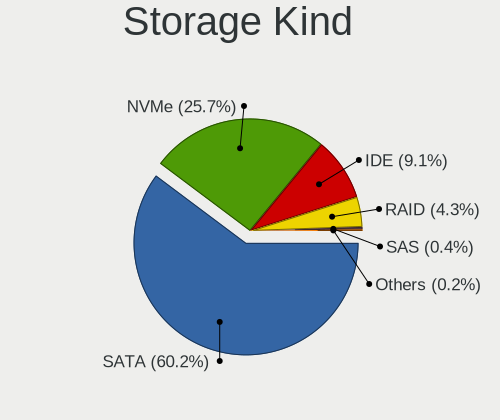
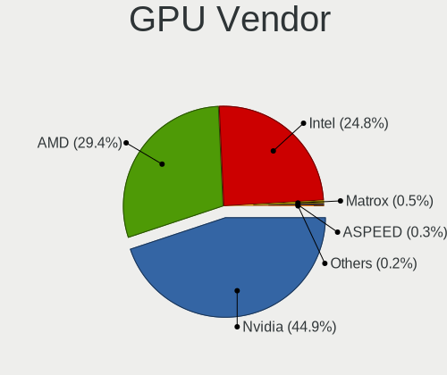
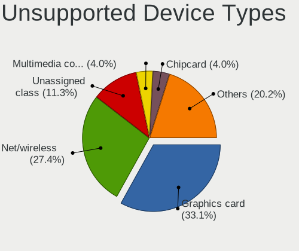

Kubuntu 22.04 - Tested Hardware & Statistics (Desktops)
-------------------------------------------------------

A project to collect tested hardware configurations for Kubuntu 22.04.

Anyone can contribute to this report by the [hw-probe](https://github.com/linuxhw/hw-probe) tool:

    sudo -E hw-probe -all -upload

Please contribute! Especially if your hardware is rare.

Contents
--------

* [ Test Cases ](#test-cases)

* [ System ](#system)
  - [ Kernel                   ](#kernel)
  - [ Kernel Family            ](#kernel-family)
  - [ Kernel Major Ver.        ](#kernel-major-ver)
  - [ Arch                     ](#arch)
  - [ DE                       ](#de)
  - [ Display Server           ](#display-server)
  - [ Display Manager          ](#display-manager)
  - [ OS Lang                  ](#os-lang)
  - [ Boot Mode                ](#boot-mode)
  - [ Filesystem               ](#filesystem)
  - [ Part. scheme             ](#part-scheme)
  - [ Dual Boot with Linux/BSD ](#dual-boot-with-linuxbsd)
  - [ Dual Boot (Win)          ](#dual-boot-win)

* [ Board ](#board)
  - [ Vendor                   ](#vendor)
  - [ Model                    ](#model)
  - [ Model Family             ](#model-family)
  - [ MFG Year                 ](#mfg-year)
  - [ Form Factor              ](#form-factor)
  - [ Secure Boot              ](#secure-boot)
  - [ Coreboot                 ](#coreboot)
  - [ RAM Size                 ](#ram-size)
  - [ RAM Used                 ](#ram-used)
  - [ Total Drives             ](#total-drives)
  - [ Has CD-ROM               ](#has-cd-rom)
  - [ Has Ethernet             ](#has-ethernet)
  - [ Has WiFi                 ](#has-wifi)
  - [ Has Bluetooth            ](#has-bluetooth)

* [ Location ](#location)
  - [ Country                  ](#country)
  - [ City                     ](#city)

* [ Drives ](#drives)
  - [ Drive Vendor             ](#drive-vendor)
  - [ Drive Model              ](#drive-model)
  - [ HDD Vendor               ](#hdd-vendor)
  - [ SSD Vendor               ](#ssd-vendor)
  - [ Drive Kind               ](#drive-kind)
  - [ Drive Connector          ](#drive-connector)
  - [ Drive Size               ](#drive-size)
  - [ Space Total              ](#space-total)
  - [ Space Used               ](#space-used)
  - [ Malfunc. Drives          ](#malfunc-drives)
  - [ Malfunc. Drive Vendor    ](#malfunc-drive-vendor)
  - [ Malfunc. HDD Vendor      ](#malfunc-hdd-vendor)
  - [ Malfunc. Drive Kind      ](#malfunc-drive-kind)
  - [ Failed Drives            ](#failed-drives)
  - [ Failed Drive Vendor      ](#failed-drive-vendor)
  - [ Drive Status             ](#drive-status)

* [ Storage controller ](#storage-controller)
  - [ Storage Vendor           ](#storage-vendor)
  - [ Storage Model            ](#storage-model)
  - [ Storage Kind             ](#storage-kind)

* [ Processor ](#processor)
  - [ CPU Vendor               ](#cpu-vendor)
  - [ CPU Model                ](#cpu-model)
  - [ CPU Model Family         ](#cpu-model-family)
  - [ CPU Cores                ](#cpu-cores)
  - [ CPU Sockets              ](#cpu-sockets)
  - [ CPU Threads              ](#cpu-threads)
  - [ CPU Op-Modes             ](#cpu-op-modes)
  - [ CPU Microcode            ](#cpu-microcode)
  - [ CPU Microarch            ](#cpu-microarch)

* [ Graphics ](#graphics)
  - [ GPU Vendor               ](#gpu-vendor)
  - [ GPU Model                ](#gpu-model)
  - [ GPU Combo                ](#gpu-combo)
  - [ GPU Driver               ](#gpu-driver)
  - [ GPU Memory               ](#gpu-memory)

* [ Monitor ](#monitor)
  - [ Monitor Vendor           ](#monitor-vendor)
  - [ Monitor Model            ](#monitor-model)
  - [ Monitor Resolution       ](#monitor-resolution)
  - [ Monitor Diagonal         ](#monitor-diagonal)
  - [ Monitor Width            ](#monitor-width)
  - [ Aspect Ratio             ](#aspect-ratio)
  - [ Monitor Area             ](#monitor-area)
  - [ Pixel Density            ](#pixel-density)
  - [ Multiple Monitors        ](#multiple-monitors)

* [ Network ](#network)
  - [ Net Controller Vendor    ](#net-controller-vendor)
  - [ Net Controller Model     ](#net-controller-model)
  - [ Wireless Vendor          ](#wireless-vendor)
  - [ Wireless Model           ](#wireless-model)
  - [ Ethernet Vendor          ](#ethernet-vendor)
  - [ Ethernet Model           ](#ethernet-model)
  - [ Net Controller Kind      ](#net-controller-kind)
  - [ Used Controller          ](#used-controller)
  - [ NICs                     ](#nics)
  - [ IPv6                     ](#ipv6)

* [ Bluetooth ](#bluetooth)
  - [ Bluetooth Vendor         ](#bluetooth-vendor)
  - [ Bluetooth Model          ](#bluetooth-model)

* [ Sound ](#sound)
  - [ Sound Vendor             ](#sound-vendor)
  - [ Sound Model              ](#sound-model)

* [ Memory ](#memory)
  - [ Memory Vendor            ](#memory-vendor)
  - [ Memory Model             ](#memory-model)
  - [ Memory Kind              ](#memory-kind)
  - [ Memory Form Factor       ](#memory-form-factor)
  - [ Memory Size              ](#memory-size)
  - [ Memory Speed             ](#memory-speed)

* [ Printers & scanners ](#printers--scanners)
  - [ Printer Vendor           ](#printer-vendor)
  - [ Printer Model            ](#printer-model)
  - [ Scanner Vendor           ](#scanner-vendor)
  - [ Scanner Model            ](#scanner-model)

* [ Camera ](#camera)
  - [ Camera Vendor            ](#camera-vendor)
  - [ Camera Model             ](#camera-model)

* [ Security ](#security)
  - [ Fingerprint Vendor       ](#fingerprint-vendor)
  - [ Fingerprint Model        ](#fingerprint-model)
  - [ Chipcard Vendor          ](#chipcard-vendor)
  - [ Chipcard Model           ](#chipcard-model)

* [ Unsupported ](#unsupported)
  - [ Unsupported Devices      ](#unsupported-devices)
  - [ Unsupported Device Types ](#unsupported-device-types)

Test Cases
----------

Total: 374

| Vendor        | Model                       | Probe                                                      | Date         |
|---------------|-----------------------------|------------------------------------------------------------|--------------|
| Intel         | H81                         | [c70b10516b](https://linux-hardware.org/?probe=c70b10516b) | Apr 30, 2023 |
| Gigabyte      | B365M DS3H                  | [7feb43607e](https://linux-hardware.org/?probe=7feb43607e) | Apr 27, 2023 |
| MSI           | 970 GAMING                  | [44c5943019](https://linux-hardware.org/?probe=44c5943019) | Apr 27, 2023 |
| ASUSTek       | TUF Gaming B550M-PLUS       | [812906148b](https://linux-hardware.org/?probe=812906148b) | Apr 27, 2023 |
| Alienware     | Aurora R15 AMD              | [f2e22848d1](https://linux-hardware.org/?probe=f2e22848d1) | Apr 25, 2023 |
| MSI           | FM2-A75MA-E35               | [011f691ce1](https://linux-hardware.org/?probe=011f691ce1) | Apr 25, 2023 |
| Gigabyte      | EX58-UD5                    | [3d8d7c49f8](https://linux-hardware.org/?probe=3d8d7c49f8) | Apr 24, 2023 |
| Gigabyte      | EX58-UD5                    | [e9a3b8f1d1](https://linux-hardware.org/?probe=e9a3b8f1d1) | Apr 24, 2023 |
| ASUSTek       | TUF Gaming B550M-PLUS       | [c4a5aad8a1](https://linux-hardware.org/?probe=c4a5aad8a1) | Apr 22, 2023 |
| HP            | 82F2 A01                    | [fbcf679bae](https://linux-hardware.org/?probe=fbcf679bae) | Apr 21, 2023 |
| Supermicro    | C7H61                       | [f5e17f37d4](https://linux-hardware.org/?probe=f5e17f37d4) | Apr 21, 2023 |
| ASUSTek       | Z170-PRO                    | [970c4dfa6f](https://linux-hardware.org/?probe=970c4dfa6f) | Apr 20, 2023 |
| Supermicro    | C7H61                       | [d975325f4b](https://linux-hardware.org/?probe=d975325f4b) | Apr 20, 2023 |
| Dell          | 0D881F A05                  | [7aef52516b](https://linux-hardware.org/?probe=7aef52516b) | Apr 16, 2023 |
| ASRock        | Z170 Extreme4               | [d21971f30f](https://linux-hardware.org/?probe=d21971f30f) | Apr 13, 2023 |
| ASUSTek       | Z97-A                       | [139f5f3aca](https://linux-hardware.org/?probe=139f5f3aca) | Apr 12, 2023 |
| Dell          | 0RW199                      | [8c41f4ff91](https://linux-hardware.org/?probe=8c41f4ff91) | Apr 11, 2023 |
| Dell          | 0F373D A00                  | [e42bdc9769](https://linux-hardware.org/?probe=e42bdc9769) | Apr 09, 2023 |
| MSI           | MPG Z690 CARBON WIFI        | [8187fc54a3](https://linux-hardware.org/?probe=8187fc54a3) | Apr 07, 2023 |
| Gigabyte      | M61SME-S2                   | [25d436d2cb](https://linux-hardware.org/?probe=25d436d2cb) | Apr 06, 2023 |
| HP            | 0A9Ch                       | [178046626f](https://linux-hardware.org/?probe=178046626f) | Apr 05, 2023 |
| Gigabyte      | 970-GAMING                  | [6ec3c125d5](https://linux-hardware.org/?probe=6ec3c125d5) | Apr 05, 2023 |
| ASUSTek       | Z97-K                       | [32f708c916](https://linux-hardware.org/?probe=32f708c916) | Apr 05, 2023 |
| ASUSTek       | TUF Gaming X570-PRO         | [7eeea6ba29](https://linux-hardware.org/?probe=7eeea6ba29) | Apr 04, 2023 |
| ASUSTek       | Z97-K                       | [6e750dfaa5](https://linux-hardware.org/?probe=6e750dfaa5) | Apr 04, 2023 |
| Alienware     | 0VDT73 A00                  | [ed92305da6](https://linux-hardware.org/?probe=ed92305da6) | Apr 04, 2023 |
| Gigabyte      | B460M AORUS PRO             | [72dc18dacb](https://linux-hardware.org/?probe=72dc18dacb) | Apr 03, 2023 |
| ASUSTek       | PRIME H310M-A R2.0          | [f8e61fd850](https://linux-hardware.org/?probe=f8e61fd850) | Apr 03, 2023 |
| Gigabyte      | X570 AORUS XTREME           | [35c3ae13c5](https://linux-hardware.org/?probe=35c3ae13c5) | Apr 02, 2023 |
| Gigabyte      | B460M AORUS PRO             | [12647b9601](https://linux-hardware.org/?probe=12647b9601) | Apr 02, 2023 |
| Gigabyte      | EX58-UD5                    | [0fbed59931](https://linux-hardware.org/?probe=0fbed59931) | Apr 02, 2023 |
| Gigabyte      | AX370-Gaming K7             | [bc77efa103](https://linux-hardware.org/?probe=bc77efa103) | Apr 01, 2023 |
| MSI           | MAG A520M VECTOR WIFI       | [3c08cf9aba](https://linux-hardware.org/?probe=3c08cf9aba) | Apr 01, 2023 |
| ASUSTek       | EB1036                      | [955d389e06](https://linux-hardware.org/?probe=955d389e06) | Mar 30, 2023 |
| Dell          | 0200DY A01                  | [722b28547b](https://linux-hardware.org/?probe=722b28547b) | Mar 28, 2023 |
| MSI           | B85-G43                     | [3dac8c76c2](https://linux-hardware.org/?probe=3dac8c76c2) | Mar 28, 2023 |
| Lenovo        | SHARKBAY SDK0J40709 WIN ... | [22e3e1831c](https://linux-hardware.org/?probe=22e3e1831c) | Mar 28, 2023 |
| Gigabyte      | B550 AORUS ELITE V2         | [6553d2c85a](https://linux-hardware.org/?probe=6553d2c85a) | Mar 26, 2023 |
| ASUSTek       | PRIME Z590-A                | [9a8b9b917f](https://linux-hardware.org/?probe=9a8b9b917f) | Mar 24, 2023 |
| ASUSTek       | P8Z77-V LE                  | [c50deee021](https://linux-hardware.org/?probe=c50deee021) | Mar 24, 2023 |
| Lenovo        | SHARKBAY NOK                | [84f93bfcf1](https://linux-hardware.org/?probe=84f93bfcf1) | Mar 23, 2023 |
| ASUSTek       | ROG STRIX Z390-E GAMING     | [d9c0447b0d](https://linux-hardware.org/?probe=d9c0447b0d) | Mar 21, 2023 |
| HP            | 21F5                        | [865a85e5bc](https://linux-hardware.org/?probe=865a85e5bc) | Mar 20, 2023 |
| Intel         | DH67BL AAG10189-208         | [420f476f82](https://linux-hardware.org/?probe=420f476f82) | Mar 19, 2023 |
| Gigabyte      | B450 AORUS M                | [efaf7d4a30](https://linux-hardware.org/?probe=efaf7d4a30) | Mar 18, 2023 |
| Acer          | Aspire XC600 v1.0           | [ef3e267972](https://linux-hardware.org/?probe=ef3e267972) | Mar 18, 2023 |
| HP            | 8266                        | [8bac7f79e8](https://linux-hardware.org/?probe=8bac7f79e8) | Mar 17, 2023 |
| ASUSTek       | H81M-K                      | [9ca1015389](https://linux-hardware.org/?probe=9ca1015389) | Mar 16, 2023 |
| ASUSTek       | PRIME H510M-D               | [d1edfbc4b3](https://linux-hardware.org/?probe=d1edfbc4b3) | Mar 16, 2023 |
| Acer          | Aspire M3920                | [bb2e9ec8a1](https://linux-hardware.org/?probe=bb2e9ec8a1) | Mar 16, 2023 |
| Supermicro    | X9DRD-C/iT+                 | [57c78aa4db](https://linux-hardware.org/?probe=57c78aa4db) | Mar 15, 2023 |
| ASUSTek       | PRIME Z590-P                | [f424a1dc42](https://linux-hardware.org/?probe=f424a1dc42) | Mar 14, 2023 |
| ASUSTek       | H61M-K                      | [783ff991d4](https://linux-hardware.org/?probe=783ff991d4) | Mar 14, 2023 |
| MSI           | B85-G43                     | [7e9ce07cb8](https://linux-hardware.org/?probe=7e9ce07cb8) | Mar 13, 2023 |
| MSI           | B85-G43                     | [9a9a70ade3](https://linux-hardware.org/?probe=9a9a70ade3) | Mar 13, 2023 |
| Gigabyte      | B560M DS3H V2               | [77b7a9348b](https://linux-hardware.org/?probe=77b7a9348b) | Mar 12, 2023 |
| MSI           | MAG B660M BAZOOKA DDR4      | [cb1be19cd3](https://linux-hardware.org/?probe=cb1be19cd3) | Mar 11, 2023 |
| MSI           | B85-G43                     | [47ac638c2e](https://linux-hardware.org/?probe=47ac638c2e) | Mar 11, 2023 |
| Gigabyte      | B550 AORUS ELITE AX V2      | [d039d459d7](https://linux-hardware.org/?probe=d039d459d7) | Mar 10, 2023 |
| Lenovo        | 36F7 SDK0J40700 WIN 3258... | [fdc9f52c81](https://linux-hardware.org/?probe=fdc9f52c81) | Mar 08, 2023 |
| Lenovo        | 36F7 SDK0J40700 WIN 3258... | [7bd6e95116](https://linux-hardware.org/?probe=7bd6e95116) | Mar 08, 2023 |
| Gigabyte      | B365M DS3H                  | [22569ee1f4](https://linux-hardware.org/?probe=22569ee1f4) | Mar 07, 2023 |
| Gigabyte      | EX58-UD5                    | [8805f0bce5](https://linux-hardware.org/?probe=8805f0bce5) | Mar 05, 2023 |
| Gigabyte      | B365M DS3H                  | [7d43df02db](https://linux-hardware.org/?probe=7d43df02db) | Mar 04, 2023 |
| ASUSTek       | P9X79                       | [9a3c215b30](https://linux-hardware.org/?probe=9a3c215b30) | Mar 03, 2023 |
| Gigabyte      | H410M H V3                  | [fdee05953f](https://linux-hardware.org/?probe=fdee05953f) | Mar 03, 2023 |
| ASRock        | B550M Steel Legend          | [8fd450db03](https://linux-hardware.org/?probe=8fd450db03) | Feb 28, 2023 |
| ASUSTek       | PRIME B450M-K               | [575e6a8c55](https://linux-hardware.org/?probe=575e6a8c55) | Feb 26, 2023 |
| ASRock        | H97 Pro4                    | [f703af2e6b](https://linux-hardware.org/?probe=f703af2e6b) | Feb 25, 2023 |
| ASRock        | M3A770DE                    | [b025c7a092](https://linux-hardware.org/?probe=b025c7a092) | Feb 24, 2023 |
| Gigabyte      | B365M DS3H                  | [463265c999](https://linux-hardware.org/?probe=463265c999) | Feb 24, 2023 |
| Gigabyte      | B365M DS3H                  | [4aec81f692](https://linux-hardware.org/?probe=4aec81f692) | Feb 24, 2023 |
| MSI           | B85-G43                     | [62273631b2](https://linux-hardware.org/?probe=62273631b2) | Feb 21, 2023 |
| ASRock        | 960GC-GS FX                 | [39718b8983](https://linux-hardware.org/?probe=39718b8983) | Feb 20, 2023 |
| Gigabyte      | X99-Ultra Gaming-CF         | [031c13ea35](https://linux-hardware.org/?probe=031c13ea35) | Feb 19, 2023 |
| ASUSTek       | H97-PLUS                    | [6824ee9944](https://linux-hardware.org/?probe=6824ee9944) | Feb 19, 2023 |
| Gigabyte      | X670 AORUS ELITE AX         | [25c9923614](https://linux-hardware.org/?probe=25c9923614) | Feb 18, 2023 |
| ASRock        | B550M Steel Legend          | [b3c5c043ea](https://linux-hardware.org/?probe=b3c5c043ea) | Feb 18, 2023 |
| ASRock        | B550M Steel Legend          | [1c1470c8a2](https://linux-hardware.org/?probe=1c1470c8a2) | Feb 18, 2023 |
| MSI           | MAG B560 TOMAHAWK WIFI      | [6538791548](https://linux-hardware.org/?probe=6538791548) | Feb 17, 2023 |
| MSI           | MAG B560 TOMAHAWK WIFI      | [2da59271fe](https://linux-hardware.org/?probe=2da59271fe) | Feb 17, 2023 |
| Dell          | 0DF42J A00                  | [e192547cd3](https://linux-hardware.org/?probe=e192547cd3) | Feb 17, 2023 |
| Gigabyte      | Z390 AORUS PRO WIFI-CF      | [695abe8c65](https://linux-hardware.org/?probe=695abe8c65) | Feb 14, 2023 |
| ASUSTek       | Z10PE-D16 WS                | [d517411fc5](https://linux-hardware.org/?probe=d517411fc5) | Feb 13, 2023 |
| Gigabyte      | B560 HD3                    | [067646f7f8](https://linux-hardware.org/?probe=067646f7f8) | Feb 12, 2023 |
| HP            | 3397                        | [cc5cdaf09b](https://linux-hardware.org/?probe=cc5cdaf09b) | Feb 12, 2023 |
| ASUSTek       | Z10PE-D16 WS                | [b2c120d8d7](https://linux-hardware.org/?probe=b2c120d8d7) | Feb 11, 2023 |
| ASUSTek       | Z10PE-D16 WS                | [a19717f948](https://linux-hardware.org/?probe=a19717f948) | Feb 10, 2023 |
| Gigabyte      | B560 HD3                    | [b4fa86401f](https://linux-hardware.org/?probe=b4fa86401f) | Feb 09, 2023 |
| MSI           | MAG B650 TOMAHAWK WIFI      | [ee5a11ee81](https://linux-hardware.org/?probe=ee5a11ee81) | Feb 08, 2023 |
| MSI           | MAG B650 TOMAHAWK WIFI      | [5df3b5ad7e](https://linux-hardware.org/?probe=5df3b5ad7e) | Feb 08, 2023 |
| ASUSTek       | PRIME Z490-P                | [be25e0c930](https://linux-hardware.org/?probe=be25e0c930) | Feb 07, 2023 |
| ASUSTek       | PRIME Z490-P                | [d139473252](https://linux-hardware.org/?probe=d139473252) | Feb 07, 2023 |
| Dell          | 0WR7PY A02                  | [7dcb345b45](https://linux-hardware.org/?probe=7dcb345b45) | Feb 06, 2023 |
| Dell          | 0WR7PY A02                  | [8c3dd4055e](https://linux-hardware.org/?probe=8c3dd4055e) | Feb 06, 2023 |
| ASRock        | X300M-STX                   | [c614e44344](https://linux-hardware.org/?probe=c614e44344) | Feb 05, 2023 |
| ASRock        | X300M-STX                   | [ad59fdb4e4](https://linux-hardware.org/?probe=ad59fdb4e4) | Feb 05, 2023 |
| Lenovo        | NO DPK                      | [0abc762f30](https://linux-hardware.org/?probe=0abc762f30) | Jan 28, 2023 |
| Gigabyte      | GA-78LMT-USB3 SEx           | [1a9e67408e](https://linux-hardware.org/?probe=1a9e67408e) | Jan 28, 2023 |
| ASUSTek       | PRIME H510M-E               | [fa464af5fb](https://linux-hardware.org/?probe=fa464af5fb) | Jan 27, 2023 |
| HP            | 3397                        | [764f737fcf](https://linux-hardware.org/?probe=764f737fcf) | Jan 27, 2023 |
| Lenovo        | 36F7 SDK0J40700 WIN 3258... | [b7dea81a92](https://linux-hardware.org/?probe=b7dea81a92) | Jan 25, 2023 |
| ASRock        | B450M Pro4                  | [6462d71b74](https://linux-hardware.org/?probe=6462d71b74) | Jan 25, 2023 |
| Gigabyte      | X570S AORUS MASTER          | [a6f80e64b2](https://linux-hardware.org/?probe=a6f80e64b2) | Jan 21, 2023 |
| Gigabyte      | B365M DS3H                  | [29d770594e](https://linux-hardware.org/?probe=29d770594e) | Jan 21, 2023 |
| Dell          | 0WR7PY A02                  | [0072a47bce](https://linux-hardware.org/?probe=0072a47bce) | Jan 20, 2023 |
| ASUSTek       | P8Z68-V LX                  | [49f0bb23ea](https://linux-hardware.org/?probe=49f0bb23ea) | Jan 20, 2023 |
| ASUSTek       | ROG STRIX Z370-F GAMING     | [2b7ce5b726](https://linux-hardware.org/?probe=2b7ce5b726) | Jan 20, 2023 |
| MSI           | B550M PRO-VDH WIFI          | [3dfd98d007](https://linux-hardware.org/?probe=3dfd98d007) | Jan 17, 2023 |
| Dell          | 0D881F A05                  | [0426ee9130](https://linux-hardware.org/?probe=0426ee9130) | Jan 17, 2023 |
| ASUSTek       | H110M-K                     | [dcbf101b59](https://linux-hardware.org/?probe=dcbf101b59) | Jan 17, 2023 |
| ASUSTek       | H110M-K                     | [3964c82d71](https://linux-hardware.org/?probe=3964c82d71) | Jan 17, 2023 |
| ASUSTek       | ROG STRIX B550-F GAMING     | [86039b3063](https://linux-hardware.org/?probe=86039b3063) | Jan 15, 2023 |
| ASRock        | A320M-HDV R4.0              | [aa35c556bc](https://linux-hardware.org/?probe=aa35c556bc) | Jan 13, 2023 |
| ASUSTek       | Z97-P                       | [709045636c](https://linux-hardware.org/?probe=709045636c) | Jan 13, 2023 |
| ASUSTek       | G10AJ                       | [e300c19806](https://linux-hardware.org/?probe=e300c19806) | Jan 13, 2023 |
| ASUSTek       | STRIX Z270H GAMING          | [1a619ff898](https://linux-hardware.org/?probe=1a619ff898) | Jan 10, 2023 |
| ASUSTek       | PRIME B450M-A II            | [c7a6fdbf55](https://linux-hardware.org/?probe=c7a6fdbf55) | Jan 06, 2023 |
| MSI           | MEG Z490 UNIFY              | [cb25b352e0](https://linux-hardware.org/?probe=cb25b352e0) | Jan 06, 2023 |
| Gigabyte      | Z490 AORUS ELITE AC         | [e4f0b0506b](https://linux-hardware.org/?probe=e4f0b0506b) | Jan 06, 2023 |
| ASRock        | A320M-HDV R4.0              | [78ab02a131](https://linux-hardware.org/?probe=78ab02a131) | Jan 05, 2023 |
| Dell          | 0WPMFG A00                  | [02a8ab8bdc](https://linux-hardware.org/?probe=02a8ab8bdc) | Jan 05, 2023 |
| Gigabyte      | Z490 AORUS ELITE AC         | [efb1372825](https://linux-hardware.org/?probe=efb1372825) | Jan 05, 2023 |
| Dell          | 096JG8 A01                  | [1c58ea8841](https://linux-hardware.org/?probe=1c58ea8841) | Jan 05, 2023 |
| Dell          | 096JG8 A01                  | [90cbbe6b1d](https://linux-hardware.org/?probe=90cbbe6b1d) | Jan 04, 2023 |
| Dell          | 096JG8 A01                  | [2e047c3ad5](https://linux-hardware.org/?probe=2e047c3ad5) | Jan 04, 2023 |
| MSI           | X370 GAMING PRO CARBON      | [54403a8bbf](https://linux-hardware.org/?probe=54403a8bbf) | Jan 02, 2023 |
| ASUSTek       | G10DK                       | [e75694d9a6](https://linux-hardware.org/?probe=e75694d9a6) | Jan 02, 2023 |
| Gigabyte      | Z590 UD AC                  | [9346b2e1bc](https://linux-hardware.org/?probe=9346b2e1bc) | Jan 01, 2023 |
| Dell          | 0PTTT9 A00                  | [7f2851fcf5](https://linux-hardware.org/?probe=7f2851fcf5) | Dec 31, 2022 |
| HP            | 8399                        | [204c8c0a3f](https://linux-hardware.org/?probe=204c8c0a3f) | Dec 29, 2022 |
| Acer          | Aspire X3960                | [f045d61192](https://linux-hardware.org/?probe=f045d61192) | Dec 29, 2022 |
| Acer          | Aspire X3960                | [75e053c90f](https://linux-hardware.org/?probe=75e053c90f) | Dec 29, 2022 |
| Dell          | 0KWVT8 A03                  | [9d2542cf36](https://linux-hardware.org/?probe=9d2542cf36) | Dec 27, 2022 |
| Dell          | 0KWVT8 A03                  | [f2998cdede](https://linux-hardware.org/?probe=f2998cdede) | Dec 27, 2022 |
| Gigabyte      | 970-GAMING                  | [4a2d0b56d6](https://linux-hardware.org/?probe=4a2d0b56d6) | Dec 27, 2022 |
| Gigabyte      | 970-GAMING                  | [9df04c213d](https://linux-hardware.org/?probe=9df04c213d) | Dec 26, 2022 |
| Gigabyte      | X570 I AORUS PRO WIFI       | [8d9b11c617](https://linux-hardware.org/?probe=8d9b11c617) | Dec 25, 2022 |
| Gigabyte      | B450 AORUS ELITE            | [d66772a936](https://linux-hardware.org/?probe=d66772a936) | Dec 25, 2022 |
| Gigabyte      | 970-GAMING                  | [ef0c06d132](https://linux-hardware.org/?probe=ef0c06d132) | Dec 25, 2022 |
| Gigabyte      | 970-GAMING                  | [9de3d146ff](https://linux-hardware.org/?probe=9de3d146ff) | Dec 25, 2022 |
| ASUSTek       | X99-DELUXE                  | [3d538213fc](https://linux-hardware.org/?probe=3d538213fc) | Dec 25, 2022 |
| BESSTAR Te... | HM90                        | [3672c73d5a](https://linux-hardware.org/?probe=3672c73d5a) | Dec 24, 2022 |
| ASRock        | X570 Steel Legend           | [7b79249b18](https://linux-hardware.org/?probe=7b79249b18) | Dec 23, 2022 |
| MSI           | MPG Z390 GAMING PRO CARB... | [841b610817](https://linux-hardware.org/?probe=841b610817) | Dec 23, 2022 |
| Gigabyte      | Z97M-DS3H                   | [dca79c9d6d](https://linux-hardware.org/?probe=dca79c9d6d) | Dec 21, 2022 |
| MSI           | X470 GAMING PLUS            | [44cdfa03bf](https://linux-hardware.org/?probe=44cdfa03bf) | Dec 19, 2022 |
| MSI           | B450M PRO-VDH MAX           | [d5d8eaf2b9](https://linux-hardware.org/?probe=d5d8eaf2b9) | Dec 19, 2022 |
| Dell          | 084J0R A00                  | [dabf78159d](https://linux-hardware.org/?probe=dabf78159d) | Dec 15, 2022 |
| Lenovo        | NOK                         | [01d1b7fdb7](https://linux-hardware.org/?probe=01d1b7fdb7) | Dec 15, 2022 |
| MSI           | A320M PRO-VD/S              | [9e9573c0c5](https://linux-hardware.org/?probe=9e9573c0c5) | Dec 14, 2022 |
| Lenovo        | ThinkCentre A70 7844H9G     | [aad5a91184](https://linux-hardware.org/?probe=aad5a91184) | Dec 14, 2022 |
| MSI           | A320M PRO-VD/S              | [c428800285](https://linux-hardware.org/?probe=c428800285) | Dec 14, 2022 |
| ASUSTek       | H170-PRO                    | [0a28fbd557](https://linux-hardware.org/?probe=0a28fbd557) | Dec 12, 2022 |
| Gigabyte      | B550M DS3H                  | [13434876df](https://linux-hardware.org/?probe=13434876df) | Dec 11, 2022 |
| ASRock        | B450M Pro4                  | [36ef5b0deb](https://linux-hardware.org/?probe=36ef5b0deb) | Dec 04, 2022 |
| Gigabyte      | X470 AORUS ULTRA GAMING-... | [23f903a61d](https://linux-hardware.org/?probe=23f903a61d) | Dec 03, 2022 |
| Dell          | 084J0R A00                  | [57b5a73c5d](https://linux-hardware.org/?probe=57b5a73c5d) | Dec 01, 2022 |
| System76      | Thelio thelio-r1            | [76343aa234](https://linux-hardware.org/?probe=76343aa234) | Dec 01, 2022 |
| ASRock        | B75M-DGS                    | [ca277bb16c](https://linux-hardware.org/?probe=ca277bb16c) | Nov 30, 2022 |
| MSI           | Z370 GAMING PLUS            | [bd1c91dba9](https://linux-hardware.org/?probe=bd1c91dba9) | Nov 30, 2022 |
| ASRock        | A320M-HDV R4.0              | [3a64631617](https://linux-hardware.org/?probe=3a64631617) | Nov 30, 2022 |
| ASRock        | A320M-HDV R4.0              | [12492cb99a](https://linux-hardware.org/?probe=12492cb99a) | Nov 29, 2022 |
| Gigabyte      | H97-HD3                     | [7c2db201dc](https://linux-hardware.org/?probe=7c2db201dc) | Nov 24, 2022 |
| MSI           | B350 PC MATE                | [601fd47da1](https://linux-hardware.org/?probe=601fd47da1) | Nov 24, 2022 |
| Gigabyte      | H110M-S2H-CF                | [87c95f019e](https://linux-hardware.org/?probe=87c95f019e) | Nov 20, 2022 |
| Unknown       | Unknown                     | [554da2ef73](https://linux-hardware.org/?probe=554da2ef73) | Nov 18, 2022 |
| ASUSTek       | PRIME H510M-D               | [3491c5eef1](https://linux-hardware.org/?probe=3491c5eef1) | Nov 17, 2022 |
| ASRock        | B560M-ITX/ac                | [c8f725f9cd](https://linux-hardware.org/?probe=c8f725f9cd) | Nov 17, 2022 |
| ASUSTek       | STRIX Z270E GAMING          | [8e4ab9c969](https://linux-hardware.org/?probe=8e4ab9c969) | Nov 16, 2022 |
| Gigabyte      | H97-HD3                     | [b99ae215e4](https://linux-hardware.org/?probe=b99ae215e4) | Nov 14, 2022 |
| Gigabyte      | BOLD E3032                  | [9d013ae9aa](https://linux-hardware.org/?probe=9d013ae9aa) | Nov 14, 2022 |
| Gigabyte      | B660M GAMING DDR4           | [d22c86a486](https://linux-hardware.org/?probe=d22c86a486) | Nov 14, 2022 |
| Gigabyte      | GA-MA790FX-DS5              | [63bba2efec](https://linux-hardware.org/?probe=63bba2efec) | Nov 14, 2022 |
| Supermicro    | X9DAL                       | [56d4bd9f26](https://linux-hardware.org/?probe=56d4bd9f26) | Nov 13, 2022 |
| Foxconn       | 2ADA                        | [4ddae3c3a0](https://linux-hardware.org/?probe=4ddae3c3a0) | Nov 13, 2022 |
| ASUSTek       | ROG STRIX X570-E GAMING     | [733739e049](https://linux-hardware.org/?probe=733739e049) | Nov 12, 2022 |
| Dell          | 0HY9JP A00                  | [fed46e3161](https://linux-hardware.org/?probe=fed46e3161) | Nov 12, 2022 |
| ASRock        | B75M                        | [7da4910326](https://linux-hardware.org/?probe=7da4910326) | Nov 12, 2022 |
| ASRock        | X99 Extreme4                | [00da120cde](https://linux-hardware.org/?probe=00da120cde) | Nov 11, 2022 |
| Dell          | 0773VG A00                  | [2ffe6c18f7](https://linux-hardware.org/?probe=2ffe6c18f7) | Nov 10, 2022 |
| Gigabyte      | B660M D3H DDR4              | [64aed4564c](https://linux-hardware.org/?probe=64aed4564c) | Nov 07, 2022 |
| ASUSTek       | ROG STRIX X570-I GAMING     | [8ef47e1adb](https://linux-hardware.org/?probe=8ef47e1adb) | Nov 06, 2022 |
| ASUSTek       | ROG STRIX B550-F GAMING     | [40a3de202d](https://linux-hardware.org/?probe=40a3de202d) | Nov 03, 2022 |
| MSI           | X470 GAMING PLUS MAX        | [db852ba394](https://linux-hardware.org/?probe=db852ba394) | Nov 03, 2022 |
| ASUSTek       | M5A78L-M LX V2              | [50bd7a7436](https://linux-hardware.org/?probe=50bd7a7436) | Nov 01, 2022 |
| Shuttle       | FH61R                       | [26f86947ef](https://linux-hardware.org/?probe=26f86947ef) | Oct 30, 2022 |
| ASRock        | H61M-VS                     | [9a48b2a679](https://linux-hardware.org/?probe=9a48b2a679) | Oct 28, 2022 |
| ASUSTek       | ROG CROSSHAIR VII HERO      | [ac3b0eaf36](https://linux-hardware.org/?probe=ac3b0eaf36) | Oct 28, 2022 |
| HP            | 844C                        | [7e994c50c9](https://linux-hardware.org/?probe=7e994c50c9) | Oct 27, 2022 |
| ASUSTek       | M5A78L-M LE                 | [6954f669c5](https://linux-hardware.org/?probe=6954f669c5) | Oct 27, 2022 |
| ASUSTek       | PRIME X570-P                | [7910e04e13](https://linux-hardware.org/?probe=7910e04e13) | Oct 25, 2022 |
| Lenovo        | SHARKBAY 31900058 STD       | [bd3a8063b3](https://linux-hardware.org/?probe=bd3a8063b3) | Oct 25, 2022 |
| ASUSTek       | P8H61-M LX3 PLUS R2.0       | [285e8cd1a5](https://linux-hardware.org/?probe=285e8cd1a5) | Oct 25, 2022 |
| Gigabyte      | B365M D2V                   | [c852b8f3f7](https://linux-hardware.org/?probe=c852b8f3f7) | Oct 24, 2022 |
| ASUSTek       | ROG STRIX B550-I GAMING     | [638c72b105](https://linux-hardware.org/?probe=638c72b105) | Oct 24, 2022 |
| ASUSTek       | STRIX Z270E GAMING          | [ca0e86eb6b](https://linux-hardware.org/?probe=ca0e86eb6b) | Oct 22, 2022 |
| MSI           | A320M PRO-M2 V2             | [7524f39579](https://linux-hardware.org/?probe=7524f39579) | Oct 19, 2022 |
| MSI           | H110M PRO-D                 | [d0580b46f2](https://linux-hardware.org/?probe=d0580b46f2) | Oct 18, 2022 |
| Lenovo        | ThinkCentre A70 7844H9G     | [1b0e52eddb](https://linux-hardware.org/?probe=1b0e52eddb) | Oct 18, 2022 |
| JWIPC         | A320I S1                    | [44689a88d8](https://linux-hardware.org/?probe=44689a88d8) | Oct 16, 2022 |
| Gigabyte      | Z68XP-UD3                   | [b36220c65b](https://linux-hardware.org/?probe=b36220c65b) | Oct 13, 2022 |
| ASRock        | A320M-HDV R4.0              | [20eebb7b05](https://linux-hardware.org/?probe=20eebb7b05) | Oct 12, 2022 |
| Gigabyte      | P55-US3L                    | [59843156e8](https://linux-hardware.org/?probe=59843156e8) | Oct 11, 2022 |
| ASRock        | Z170 Extreme4               | [b88e8a8b49](https://linux-hardware.org/?probe=b88e8a8b49) | Oct 11, 2022 |
| Gigabyte      | Z370P D3-CF                 | [71c916389e](https://linux-hardware.org/?probe=71c916389e) | Oct 09, 2022 |
| Acer          | Aspire G7750                | [bd21d9c12b](https://linux-hardware.org/?probe=bd21d9c12b) | Oct 09, 2022 |
| ASUSTek       | TUF X470-PLUS GAMING        | [691aa10e89](https://linux-hardware.org/?probe=691aa10e89) | Oct 09, 2022 |
| Apple         | Mac-F221BEC8                | [51442982cd](https://linux-hardware.org/?probe=51442982cd) | Oct 07, 2022 |
| ASUSTek       | PRIME B450M-K II            | [1bf20fe68c](https://linux-hardware.org/?probe=1bf20fe68c) | Oct 05, 2022 |
| ASUSTek       | TUF Gaming B550-PLUS        | [99ed468a82](https://linux-hardware.org/?probe=99ed468a82) | Oct 05, 2022 |
| ASUSTek       | TUF Gaming B550-PLUS        | [e8b8141f03](https://linux-hardware.org/?probe=e8b8141f03) | Oct 05, 2022 |
| Dell          | 042P49 A02                  | [1ba8422c66](https://linux-hardware.org/?probe=1ba8422c66) | Oct 04, 2022 |
| MSI           | B450I GAMING PLUS AC        | [e857a28ed2](https://linux-hardware.org/?probe=e857a28ed2) | Oct 04, 2022 |
| ASUSTek       | ROG STRIX B550-F GAMING     | [bc03e42377](https://linux-hardware.org/?probe=bc03e42377) | Oct 03, 2022 |
| Lenovo        | ThinkCentre M90p 5498A2U    | [61d1e2102b](https://linux-hardware.org/?probe=61d1e2102b) | Oct 03, 2022 |
| Lenovo        | ThinkCentre M90p 5498A2U    | [f05b832b90](https://linux-hardware.org/?probe=f05b832b90) | Oct 01, 2022 |
| Lenovo        | ThinkCentre M90p 5498A2U    | [d638b38369](https://linux-hardware.org/?probe=d638b38369) | Sep 30, 2022 |
| Dell          | 0GY6Y8 A02                  | [dad71b5547](https://linux-hardware.org/?probe=dad71b5547) | Sep 28, 2022 |
| Gigabyte      | B450 I AORUS PRO WIFI-CF    | [19fe9ebfb6](https://linux-hardware.org/?probe=19fe9ebfb6) | Sep 27, 2022 |
| ASRock        | 990FX Extreme9              | [c7522b70ba](https://linux-hardware.org/?probe=c7522b70ba) | Sep 27, 2022 |
| ASUSTek       | ROG ZENITH EXTREME          | [3e14df6c26](https://linux-hardware.org/?probe=3e14df6c26) | Sep 27, 2022 |
| Gigabyte      | X399 AORUS XTREME-CF        | [762ad6e460](https://linux-hardware.org/?probe=762ad6e460) | Sep 26, 2022 |
| MSI           | Z590-A PRO                  | [72bd6750e5](https://linux-hardware.org/?probe=72bd6750e5) | Sep 25, 2022 |
| ASUSTek       | ROG ZENITH EXTREME          | [60635ca9bc](https://linux-hardware.org/?probe=60635ca9bc) | Sep 24, 2022 |
| ASUSTek       | PRIME B450M-GAMING/BR       | [2a7c09d404](https://linux-hardware.org/?probe=2a7c09d404) | Sep 24, 2022 |
| Gigabyte      | X570 GAMING X               | [07f9a5063e](https://linux-hardware.org/?probe=07f9a5063e) | Sep 23, 2022 |
| Biostar       | TA75MH2                     | [e76fb13311](https://linux-hardware.org/?probe=e76fb13311) | Sep 23, 2022 |
| ASUSTek       | ROG ZENITH EXTREME          | [384ab44e0a](https://linux-hardware.org/?probe=384ab44e0a) | Sep 23, 2022 |
| ASUSTek       | ROG ZENITH EXTREME          | [24c7d626c8](https://linux-hardware.org/?probe=24c7d626c8) | Sep 23, 2022 |
| ASUSTek       | Z97-PRO GAMER               | [f6e7ad269e](https://linux-hardware.org/?probe=f6e7ad269e) | Sep 22, 2022 |
| ASUSTek       | ROG STRIX B550-F GAMING     | [256ff04106](https://linux-hardware.org/?probe=256ff04106) | Sep 20, 2022 |
| MSI           | Z390-A PRO                  | [9b0dd73d61](https://linux-hardware.org/?probe=9b0dd73d61) | Sep 20, 2022 |
| Supermicro    | SKAGIT09                    | [b7dcf8a06c](https://linux-hardware.org/?probe=b7dcf8a06c) | Sep 20, 2022 |
| Acer          | Aspire G7750                | [c54e28dc84](https://linux-hardware.org/?probe=c54e28dc84) | Sep 18, 2022 |
| Gigabyte      | B560M D3H                   | [515d75e6b7](https://linux-hardware.org/?probe=515d75e6b7) | Sep 17, 2022 |
| ASUSTek       | Z97-K                       | [3f362093da](https://linux-hardware.org/?probe=3f362093da) | Sep 16, 2022 |
| Gigabyte      | B450M DS3H-CF               | [ea2264656c](https://linux-hardware.org/?probe=ea2264656c) | Sep 15, 2022 |
| ASUSTek       | TUF Gaming B550M-PLUS       | [d79d03b7ef](https://linux-hardware.org/?probe=d79d03b7ef) | Sep 11, 2022 |
| ASRock        | H470M-HVS                   | [17e4855f90](https://linux-hardware.org/?probe=17e4855f90) | Sep 09, 2022 |
| Supermicro    | SKAGIT09                    | [d3f42d0c24](https://linux-hardware.org/?probe=d3f42d0c24) | Sep 08, 2022 |
| Gigabyte      | B450M DS3H-CF               | [557860ffbd](https://linux-hardware.org/?probe=557860ffbd) | Sep 07, 2022 |
| MSI           | B350 PC MATE                | [1f4f30c013](https://linux-hardware.org/?probe=1f4f30c013) | Sep 06, 2022 |
| MSI           | B450-A PRO MAX              | [0c89daf254](https://linux-hardware.org/?probe=0c89daf254) | Sep 03, 2022 |
| ASRock        | A320M-HDV                   | [5a9342d8e9](https://linux-hardware.org/?probe=5a9342d8e9) | Sep 03, 2022 |
| Dell          | 02YYK5 A00                  | [742579c33d](https://linux-hardware.org/?probe=742579c33d) | Sep 03, 2022 |
| OEM           | G41 775 ICH7 8712           | [4c9041cf15](https://linux-hardware.org/?probe=4c9041cf15) | Sep 03, 2022 |
| MSI           | 970 GAMING                  | [296c04b276](https://linux-hardware.org/?probe=296c04b276) | Sep 02, 2022 |
| MSI           | MAG B550M BAZOOKA           | [a1b5555512](https://linux-hardware.org/?probe=a1b5555512) | Sep 02, 2022 |
| Gigabyte      | B85M-HD3                    | [dcb5e7a20c](https://linux-hardware.org/?probe=dcb5e7a20c) | Aug 29, 2022 |
| Supermicro    | SKAGIT09                    | [3f4c6a4d48](https://linux-hardware.org/?probe=3f4c6a4d48) | Aug 29, 2022 |
| Pegatron      | 2AB6                        | [93af020634](https://linux-hardware.org/?probe=93af020634) | Aug 27, 2022 |
| ASRock        | B450M/ac R2.0               | [ede2f61f08](https://linux-hardware.org/?probe=ede2f61f08) | Aug 26, 2022 |
| MSI           | B450-A PRO                  | [36f10ad555](https://linux-hardware.org/?probe=36f10ad555) | Aug 24, 2022 |
| ASUSTek       | B85-PLUS                    | [1eba4b558d](https://linux-hardware.org/?probe=1eba4b558d) | Aug 23, 2022 |
| Gigabyte      | BOLD E3032                  | [4b70fe47a2](https://linux-hardware.org/?probe=4b70fe47a2) | Aug 23, 2022 |
| Gigabyte      | H410M S2 V2                 | [cb43b7a4cf](https://linux-hardware.org/?probe=cb43b7a4cf) | Aug 22, 2022 |
| Gigabyte      | H97-Gaming 3                | [c084ff3123](https://linux-hardware.org/?probe=c084ff3123) | Aug 22, 2022 |
| Supermicro    | SKAGIT09                    | [1ae2767db3](https://linux-hardware.org/?probe=1ae2767db3) | Aug 22, 2022 |
| MSI           | B350 PC MATE                | [e058dec94d](https://linux-hardware.org/?probe=e058dec94d) | Aug 19, 2022 |
| ASUSTek       | TUF Gaming B450-PLUS II     | [dd98185972](https://linux-hardware.org/?probe=dd98185972) | Aug 16, 2022 |
| ASUSTek       | H170M-PLUS/BR               | [feb4e50ec5](https://linux-hardware.org/?probe=feb4e50ec5) | Aug 16, 2022 |
| Lenovo        | Bantry CRB SDK0J40700 WI... | [792eb4143f](https://linux-hardware.org/?probe=792eb4143f) | Aug 16, 2022 |
| MSI           | B350 PC MATE                | [646d091037](https://linux-hardware.org/?probe=646d091037) | Aug 15, 2022 |
| HP            | 805D                        | [54f4e0fdb0](https://linux-hardware.org/?probe=54f4e0fdb0) | Aug 14, 2022 |
| Dell          | 0C2XKD A01                  | [cfad241ca0](https://linux-hardware.org/?probe=cfad241ca0) | Aug 12, 2022 |
| Positivo      | POS-PARS760GCD POSITIVO     | [dc6e65929f](https://linux-hardware.org/?probe=dc6e65929f) | Aug 12, 2022 |
| HP            | 8459                        | [677ca01f4f](https://linux-hardware.org/?probe=677ca01f4f) | Aug 11, 2022 |
| Gigabyte      | H370 AORUS GAMING 3 WIFI... | [d2f7a86fd8](https://linux-hardware.org/?probe=d2f7a86fd8) | Aug 11, 2022 |
| Gigabyte      | H370 AORUS GAMING 3 WIFI... | [6eac3041ec](https://linux-hardware.org/?probe=6eac3041ec) | Aug 07, 2022 |
| MSI           | B550-A PRO                  | [fb01882d07](https://linux-hardware.org/?probe=fb01882d07) | Aug 06, 2022 |
| MSI           | Z97 GAMING 7                | [01cf6a0897](https://linux-hardware.org/?probe=01cf6a0897) | Aug 06, 2022 |
| MSI           | MAG Z490 TOMAHAWK           | [1340311493](https://linux-hardware.org/?probe=1340311493) | Aug 06, 2022 |
| Gigabyte      | B450 I AORUS PRO WIFI-CF    | [6fa2b142e4](https://linux-hardware.org/?probe=6fa2b142e4) | Aug 06, 2022 |
| Gigabyte      | B450 I AORUS PRO WIFI-CF    | [e5e72c1264](https://linux-hardware.org/?probe=e5e72c1264) | Aug 05, 2022 |
| ASUSTek       | ROG Maximus XI HERO         | [d725206bff](https://linux-hardware.org/?probe=d725206bff) | Aug 04, 2022 |
| Lenovo        | SHARKBAY SDK0E50510 WIN     | [42469385bc](https://linux-hardware.org/?probe=42469385bc) | Aug 04, 2022 |
| ASUSTek       | P8H67                       | [b1b842e547](https://linux-hardware.org/?probe=b1b842e547) | Jul 29, 2022 |
| ASUSTek       | GRYPHON Z87                 | [73b9d340d2](https://linux-hardware.org/?probe=73b9d340d2) | Jul 28, 2022 |
| ASUSTek       | PRIME X370-PRO              | [ee8688ecdb](https://linux-hardware.org/?probe=ee8688ecdb) | Jul 26, 2022 |
| ASRock        | Z270 Gaming K4              | [63612e20b4](https://linux-hardware.org/?probe=63612e20b4) | Jul 26, 2022 |
| ASUSTek       | PRIME B350-PLUS             | [5658129aa4](https://linux-hardware.org/?probe=5658129aa4) | Jul 24, 2022 |
| Fujitsu       | D3500-A1 S26361-D3500-A1    | [ba1841221c](https://linux-hardware.org/?probe=ba1841221c) | Jul 24, 2022 |
| MSI           | MPG X570 GAMING PLUS        | [021e469888](https://linux-hardware.org/?probe=021e469888) | Jul 23, 2022 |
| MSI           | MPG X570 GAMING PLUS        | [ea90d78c53](https://linux-hardware.org/?probe=ea90d78c53) | Jul 23, 2022 |
| ASUSTek       | TUF Gaming Z590-PLUS WIF... | [6e6e65c711](https://linux-hardware.org/?probe=6e6e65c711) | Jul 23, 2022 |
| Gigabyte      | P35-DS3L                    | [4ae76fafc9](https://linux-hardware.org/?probe=4ae76fafc9) | Jul 22, 2022 |
| Shuttle       | NC01U V1.0                  | [827d6c81ae](https://linux-hardware.org/?probe=827d6c81ae) | Jul 22, 2022 |
| Shuttle       | NC01U V1.0                  | [fecfaf6008](https://linux-hardware.org/?probe=fecfaf6008) | Jul 21, 2022 |
| HP            | 18E9                        | [f15b2671b0](https://linux-hardware.org/?probe=f15b2671b0) | Jul 21, 2022 |
| ASRock        | B550 Extreme4               | [226924706f](https://linux-hardware.org/?probe=226924706f) | Jul 20, 2022 |
| Gigabyte      | P35-DS3L                    | [cabd591648](https://linux-hardware.org/?probe=cabd591648) | Jul 20, 2022 |
| Gigabyte      | Z390 GAMING X-CF            | [0e3950303c](https://linux-hardware.org/?probe=0e3950303c) | Jul 18, 2022 |
| ASRock        | Z170 Extreme4               | [4f4b63a026](https://linux-hardware.org/?probe=4f4b63a026) | Jul 18, 2022 |
| Acer          | Predator PO3-620            | [f3e22c0e6d](https://linux-hardware.org/?probe=f3e22c0e6d) | Jul 18, 2022 |
| Gigabyte      | X570 AORUS MASTER           | [01d595926f](https://linux-hardware.org/?probe=01d595926f) | Jul 15, 2022 |
| MSI           | X99A XPOWER GAMING TITAN... | [e764729eeb](https://linux-hardware.org/?probe=e764729eeb) | Jul 13, 2022 |
| ASRock        | Z170 Extreme4               | [7ecf3ad1b7](https://linux-hardware.org/?probe=7ecf3ad1b7) | Jul 13, 2022 |
| ASRock        | B550 Extreme4               | [6106db3d9a](https://linux-hardware.org/?probe=6106db3d9a) | Jul 12, 2022 |
| MSI           | MPG X570S EDGE MAX WIFI     | [fafb6deae6](https://linux-hardware.org/?probe=fafb6deae6) | Jul 12, 2022 |
| ASUSTek       | ROG Maximus Z690 EXTREME    | [d6531258d0](https://linux-hardware.org/?probe=d6531258d0) | Jul 11, 2022 |
| ASRock        | B550 Taichi                 | [61fe809791](https://linux-hardware.org/?probe=61fe809791) | Jul 10, 2022 |
| Gigabyte      | Z77-D3H                     | [f9e15346d3](https://linux-hardware.org/?probe=f9e15346d3) | Jul 10, 2022 |
| ASUSTek       | P9X79 PRO                   | [d7e1136386](https://linux-hardware.org/?probe=d7e1136386) | Jul 07, 2022 |
| MSI           | MPG X570S EDGE MAX WIFI     | [7d5d5c1a7e](https://linux-hardware.org/?probe=7d5d5c1a7e) | Jul 02, 2022 |
| HP            | 8459                        | [f43fdff127](https://linux-hardware.org/?probe=f43fdff127) | Jul 01, 2022 |
| ASUSTek       | ET2400A                     | [8801791f80](https://linux-hardware.org/?probe=8801791f80) | Jul 01, 2022 |
| ASUSTek       | ROG ZENITH EXTREME          | [33c8a42a4d](https://linux-hardware.org/?probe=33c8a42a4d) | Jun 29, 2022 |
| Gigabyte      | X570 AORUS PRO              | [757741fe0d](https://linux-hardware.org/?probe=757741fe0d) | Jun 29, 2022 |
| ASUSTek       | ROG ZENITH EXTREME          | [efb8cff806](https://linux-hardware.org/?probe=efb8cff806) | Jun 28, 2022 |
| MSI           | MAG X570S TOMAHAWK MAX W... | [a6555d107c](https://linux-hardware.org/?probe=a6555d107c) | Jun 27, 2022 |
| ASRock        | A320M Pro4                  | [e1918d8aab](https://linux-hardware.org/?probe=e1918d8aab) | Jun 25, 2022 |
| Huanan        | X99-F8 GAMING V5.0          | [2688876fc9](https://linux-hardware.org/?probe=2688876fc9) | Jun 25, 2022 |
| ASRock        | A320M Pro4                  | [f4f2e68e79](https://linux-hardware.org/?probe=f4f2e68e79) | Jun 24, 2022 |
| Apple         | Mac-F60DEB81FF30ACF6 Mac... | [04e6f0ee4a](https://linux-hardware.org/?probe=04e6f0ee4a) | Jun 24, 2022 |
| ABIT          | IP35 Pro                    | [a5f262c233](https://linux-hardware.org/?probe=a5f262c233) | Jun 23, 2022 |
| ASUSTek       | P8P67 LE                    | [8e1bc37281](https://linux-hardware.org/?probe=8e1bc37281) | Jun 19, 2022 |
| ASRock        | X570M Pro4                  | [bbb784f2df](https://linux-hardware.org/?probe=bbb784f2df) | Jun 18, 2022 |
| Dell          | 0YNVJG A01                  | [b75bebfda2](https://linux-hardware.org/?probe=b75bebfda2) | Jun 18, 2022 |
| ASUSTek       | X99-A/USB                   | [3ad17f6d78](https://linux-hardware.org/?probe=3ad17f6d78) | Jun 16, 2022 |
| ASUSTek       | P5QC                        | [b9a53514e1](https://linux-hardware.org/?probe=b9a53514e1) | Jun 16, 2022 |
| MSI           | Z270 GAMING M5              | [d5f742022e](https://linux-hardware.org/?probe=d5f742022e) | Jun 16, 2022 |
| MSI           | Z270 GAMING M5              | [6c352cf792](https://linux-hardware.org/?probe=6c352cf792) | Jun 16, 2022 |
| Gigabyte      | B450M DS3H-CF               | [2b307211cd](https://linux-hardware.org/?probe=2b307211cd) | Jun 14, 2022 |
| Dell          | 0KC9NP A01                  | [c573376df6](https://linux-hardware.org/?probe=c573376df6) | Jun 11, 2022 |
| Gigabyte      | Z270-HD3P-CF                | [317ae1383a](https://linux-hardware.org/?probe=317ae1383a) | Jun 10, 2022 |
| ASRock        | X570M Pro4                  | [4f6d06171b](https://linux-hardware.org/?probe=4f6d06171b) | Jun 10, 2022 |
| AZW           | Gemini J45                  | [f4d7238f95](https://linux-hardware.org/?probe=f4d7238f95) | Jun 08, 2022 |
| ASUSTek       | ROG STRIX X570-E GAMING     | [15f48b1e64](https://linux-hardware.org/?probe=15f48b1e64) | Jun 08, 2022 |
| MSI           | X470 GAMING PLUS MAX        | [9bc79127f3](https://linux-hardware.org/?probe=9bc79127f3) | Jun 06, 2022 |
| Dell          | 0Y2MRG A00                  | [11bba01e79](https://linux-hardware.org/?probe=11bba01e79) | Jun 06, 2022 |
| ASUSTek       | ROG Maximus Z690 HERO       | [70f49afd95](https://linux-hardware.org/?probe=70f49afd95) | Jun 04, 2022 |
| ASUSTek       | M5A78L-M LE/USB3            | [95173b9d90](https://linux-hardware.org/?probe=95173b9d90) | Jun 04, 2022 |
| ASUSTek       | M5A78L LE                   | [8eda28a8d4](https://linux-hardware.org/?probe=8eda28a8d4) | May 30, 2022 |
| ASUSTek       | P7H55-M LE                  | [4f55b87c44](https://linux-hardware.org/?probe=4f55b87c44) | May 28, 2022 |
| Gigabyte      | B85M-D2V                    | [2bc6293c6a](https://linux-hardware.org/?probe=2bc6293c6a) | May 19, 2022 |
| Fujitsu       | D3161-A1 S26361-D3161-A1    | [93b08c2d75](https://linux-hardware.org/?probe=93b08c2d75) | May 19, 2022 |
| ASRock        | B560M Pro4                  | [ba3b29db98](https://linux-hardware.org/?probe=ba3b29db98) | May 18, 2022 |
| Gigabyte      | B85M-D2V                    | [da9da96cda](https://linux-hardware.org/?probe=da9da96cda) | May 17, 2022 |
| ASUSTek       | M5A78L LE                   | [697a89162e](https://linux-hardware.org/?probe=697a89162e) | May 16, 2022 |
| Dell          | 0KJCC5 A00                  | [bb68e24835](https://linux-hardware.org/?probe=bb68e24835) | May 15, 2022 |
| ASUSTek       | ROG STRIX B550-I GAMING     | [0ec606b729](https://linux-hardware.org/?probe=0ec606b729) | May 14, 2022 |
| ASUSTek       | ROG STRIX B550-I GAMING     | [6fdf1cd28c](https://linux-hardware.org/?probe=6fdf1cd28c) | May 14, 2022 |
| MSI           | B450M PRO-M2                | [0bb720a248](https://linux-hardware.org/?probe=0bb720a248) | May 14, 2022 |
| ASUSTek       | TUF B450M-PLUS GAMING       | [fb2a9c9ddf](https://linux-hardware.org/?probe=fb2a9c9ddf) | May 13, 2022 |
| MSI           | B450M MORTAR TITANIUM       | [b03899e10b](https://linux-hardware.org/?probe=b03899e10b) | May 13, 2022 |
| Lenovo        | SHARKBAY NOK                | [7923c29010](https://linux-hardware.org/?probe=7923c29010) | May 11, 2022 |
| ASUSTek       | ROG Maximus Z690 EXTREME    | [76cc09b228](https://linux-hardware.org/?probe=76cc09b228) | May 10, 2022 |
| ASUSTek       | ROG Maximus Z690 EXTREME    | [6500cb78c3](https://linux-hardware.org/?probe=6500cb78c3) | May 10, 2022 |
| HP            | 1998                        | [7f82a04d73](https://linux-hardware.org/?probe=7f82a04d73) | May 10, 2022 |
| ASUSTek       | ROG ZENITH EXTREME          | [5f90cb38d2](https://linux-hardware.org/?probe=5f90cb38d2) | May 07, 2022 |
| MSI           | X470 GAMING PLUS MAX        | [0b27354c9c](https://linux-hardware.org/?probe=0b27354c9c) | May 05, 2022 |
| Gigabyte      | Z370P D3-CF                 | [8a561e2442](https://linux-hardware.org/?probe=8a561e2442) | May 05, 2022 |
| Gigabyte      | X570 GAMING X               | [53a75b2d5c](https://linux-hardware.org/?probe=53a75b2d5c) | May 04, 2022 |
| MSI           | MPG B550 GAMING PLUS        | [62f9f79f7c](https://linux-hardware.org/?probe=62f9f79f7c) | May 03, 2022 |
| MSI           | MPG B550 GAMING PLUS        | [afce1937fe](https://linux-hardware.org/?probe=afce1937fe) | May 03, 2022 |
| ASUSTek       | P8B75-M                     | [dadde1bbc0](https://linux-hardware.org/?probe=dadde1bbc0) | May 02, 2022 |
| Supermicro    | X8ST3                       | [a94462f4b5](https://linux-hardware.org/?probe=a94462f4b5) | May 02, 2022 |
| ASUSTek       | PRIME B550M-K               | [92c09fc927](https://linux-hardware.org/?probe=92c09fc927) | Apr 30, 2022 |
| ASRock        | B550 Extreme4               | [7a90a198f5](https://linux-hardware.org/?probe=7a90a198f5) | Apr 30, 2022 |
| ASUSTek       | M5A78L LE                   | [9328531b5a](https://linux-hardware.org/?probe=9328531b5a) | Apr 30, 2022 |
| Lenovo        | 36C5 SDK0J40700 WIN 3258... | [d9ac32b17d](https://linux-hardware.org/?probe=d9ac32b17d) | Apr 30, 2022 |
| Biostar       | A68N-2100K                  | [db9760ae3a](https://linux-hardware.org/?probe=db9760ae3a) | Apr 27, 2022 |
| Biostar       | A68N-2100K                  | [87d629883f](https://linux-hardware.org/?probe=87d629883f) | Apr 27, 2022 |
| HP            | 0AACh                       | [f9e511945d](https://linux-hardware.org/?probe=f9e511945d) | Apr 25, 2022 |
| Gigabyte      | A320M-S2H V2-CF             | [4b41ff5fb9](https://linux-hardware.org/?probe=4b41ff5fb9) | Apr 24, 2022 |
| Gigabyte      | A320M-S2H V2-CF             | [3d513e3c6c](https://linux-hardware.org/?probe=3d513e3c6c) | Mar 24, 2022 |
| Dell          | 0K240Y A02                  | [b5783c7fa0](https://linux-hardware.org/?probe=b5783c7fa0) | Mar 03, 2022 |
| Gigabyte      | H410M S2H V3                | [e5da146c8e](https://linux-hardware.org/?probe=e5da146c8e) | Feb 27, 2022 |
| Gigabyte      | B550M DS3H                  | [21a8a676d1](https://linux-hardware.org/?probe=21a8a676d1) | Dec 28, 2021 |
| Gigabyte      | B550M DS3H                  | [61561f50ba](https://linux-hardware.org/?probe=61561f50ba) | Dec 28, 2021 |
| Gigabyte      | P35-DS3L                    | [e13fea24e4](https://linux-hardware.org/?probe=e13fea24e4) | Dec 27, 2021 |
| ASUSTek       | ROG STRIX B550-F GAMING     | [1c12810a81](https://linux-hardware.org/?probe=1c12810a81) | Dec 06, 2021 |
| ASUSTek       | ROG STRIX B550-F GAMING     | [acadafa3aa](https://linux-hardware.org/?probe=acadafa3aa) | Nov 30, 2021 |

System
------

Kernel
------

Version of the Linux kernel

| Version              | Desktops | Percent |
|----------------------|----------|---------|
| 5.15.0-56-generic    | 22       | 7.33%   |
| 5.15.0-52-generic    | 19       | 6.33%   |
| 5.15.0-43-generic    | 19       | 6.33%   |
| 5.15.0-48-generic    | 14       | 4.67%   |
| 5.15.0-67-generic    | 13       | 4.33%   |
| 5.15.0-46-generic    | 13       | 4.33%   |
| 5.19.0-35-generic    | 12       | 4%      |
| 5.15.0-47-generic    | 12       | 4%      |
| 5.15.0-27-generic    | 12       | 4%      |
| 5.15.0-40-generic    | 11       | 3.67%   |
| 5.15.0-58-generic    | 10       | 3.33%   |
| 5.15.0-41-generic    | 10       | 3.33%   |
| 5.15.0-53-generic    | 9        | 3%      |
| 5.15.0-25-generic    | 9        | 3%      |
| 5.19.0-38-generic    | 8        | 2.67%   |
| 5.15.0-69-generic    | 8        | 2.67%   |
| 5.15.0-60-generic    | 8        | 2.67%   |
| 5.15.0-50-generic    | 7        | 2.33%   |
| 5.15.0-30-generic    | 6        | 2%      |
| 5.15.0-48-lowlatency | 5        | 1.67%   |
| 5.15.0-56-lowlatency | 4        | 1.33%   |
| 5.15.0-37-generic    | 4        | 1.33%   |
| 5.15.0-33-generic    | 4        | 1.33%   |
| 5.19.0-40-generic    | 3        | 1%      |
| 5.19.0-32-generic    | 3        | 1%      |
| 5.15.0-57-generic    | 3        | 1%      |
| 5.15.0-27-lowlatency | 3        | 1%      |
| 5.15.0-69-lowlatency | 2        | 0.67%   |
| 5.15.0-58-lowlatency | 2        | 0.67%   |
| 5.15.0-52-lowlatency | 2        | 0.67%   |
| 5.15.0-47-lowlatency | 2        | 0.67%   |
| 5.15.0-43-lowlatency | 2        | 0.67%   |
| 5.15.0-39-generic    | 2        | 0.67%   |
| 6.1.5-x64v3-xanmod1  | 1        | 0.33%   |
| 6.1.5-060105-generic | 1        | 0.33%   |
| 6.0.1-060001-generic | 1        | 0.33%   |
| 6.0.0                | 1        | 0.33%   |
| 5.4.0-122-generic    | 1        | 0.33%   |
| 5.19.12-xanmod1      | 1        | 0.33%   |
| 5.19.0-41-generic    | 1        | 0.33%   |

Kernel Family
-------------

Linux kernel without a distro release

| Version | Desktops | Percent |
|---------|----------|---------|
| 5.15.0  | 236      | 83.39%  |
| 5.19.0  | 26       | 9.19%   |
| 5.17.0  | 4        | 1.41%   |
| 6.1.5   | 2        | 0.71%   |
| 5.18.4  | 2        | 0.71%   |
| 5.13.0  | 2        | 0.71%   |
| 6.0.1   | 1        | 0.35%   |
| 6.0.0   | 1        | 0.35%   |
| 5.4.0   | 1        | 0.35%   |
| 5.19.12 | 1        | 0.35%   |
| 5.18.19 | 1        | 0.35%   |
| 5.18.12 | 1        | 0.35%   |
| 5.18.10 | 1        | 0.35%   |
| 5.17.6  | 1        | 0.35%   |
| 5.17.14 | 1        | 0.35%   |
| 5.16.0  | 1        | 0.35%   |
| 5.15.13 | 1        | 0.35%   |

Kernel Major Ver.
-----------------

Linux kernel major version

| Version | Desktops | Percent |
|---------|----------|---------|
| 5.15    | 237      | 83.75%  |
| 5.19    | 27       | 9.54%   |
| 5.17    | 6        | 2.12%   |
| 5.18    | 5        | 1.77%   |
| 6.1     | 2        | 0.71%   |
| 6.0     | 2        | 0.71%   |
| 5.13    | 2        | 0.71%   |
| 5.4     | 1        | 0.35%   |
| 5.16    | 1        | 0.35%   |

Arch
----

OS architecture (x86_64, i586, etc.)

| Name   | Desktops | Percent |
|--------|----------|---------|
| x86_64 | 279      | 100%    |

DE
--

Desktop Environment

| Name   | Desktops | Percent |
|--------|----------|---------|
| KDE5   | 275      | 98.57%  |
| GNOME  | 2        | 0.72%   |
| KDE    | 1        | 0.36%   |
| Budgie | 1        | 0.36%   |

Display Server
--------------

X11 or Wayland

| Name    | Desktops | Percent |
|---------|----------|---------|
| X11     | 268      | 96.06%  |
| Wayland | 6        | 2.15%   |
| Tty     | 4        | 1.43%   |
| Web     | 1        | 0.36%   |

Display Manager
---------------

SDDM, LightDM, etc.

| Name    | Desktops | Percent |
|---------|----------|---------|
| SDDM    | 193      | 68.44%  |
| Unknown | 59       | 20.92%  |
| GDM3    | 22       | 7.8%    |
| LightDM | 7        | 2.48%   |
| GDM     | 1        | 0.35%   |

OS Lang
-------

Language

| Lang   | Desktops | Percent |
|--------|----------|---------|
| en_US  | 126      | 45.16%  |
| fr_FR  | 25       | 8.96%   |
| de_DE  | 25       | 8.96%   |
| ru_RU  | 15       | 5.38%   |
| it_IT  | 14       | 5.02%   |
| en_GB  | 11       | 3.94%   |
| pt_BR  | 10       | 3.58%   |
| en_AU  | 8        | 2.87%   |
| pl_PL  | 6        | 2.15%   |
| es_ES  | 4        | 1.43%   |
| en_CA  | 4        | 1.43%   |
| nl_NL  | 3        | 1.08%   |
| es_AR  | 2        | 0.72%   |
| en_ZA  | 2        | 0.72%   |
| en_PH  | 2        | 0.72%   |
| en_NZ  | 2        | 0.72%   |
| en_IN  | 2        | 0.72%   |
| de_CH  | 2        | 0.72%   |
| cs_CZ  | 2        | 0.72%   |
| C      | 2        | 0.72%   |
| sl_SI  | 1        | 0.36%   |
| osa_US | 1        | 0.36%   |
| fr_BE  | 1        | 0.36%   |
| fi_FI  | 1        | 0.36%   |
| es_VE  | 1        | 0.36%   |
| es_CO  | 1        | 0.36%   |
| en_IL  | 1        | 0.36%   |
| en_AG  | 1        | 0.36%   |
| el_GR  | 1        | 0.36%   |
| de_LU  | 1        | 0.36%   |
| de_AT  | 1        | 0.36%   |
| bg_BG  | 1        | 0.36%   |

Boot Mode
---------

EFI or BIOS

| Mode | Desktops | Percent |
|------|----------|---------|
| BIOS | 160      | 57.14%  |
| EFI  | 120      | 42.86%  |

Filesystem
----------

Type of filesystem

| Type    | Desktops | Percent |
|---------|----------|---------|
| Ext4    | 250      | 89.61%  |
| Btrfs   | 14       | 5.02%   |
| Overlay | 12       | 4.3%    |
| Xfs     | 1        | 0.36%   |
| Tmpfs   | 1        | 0.36%   |
| Ext3    | 1        | 0.36%   |

Part. scheme
------------

Scheme of partitioning

| Type    | Desktops | Percent |
|---------|----------|---------|
| GPT     | 166      | 58.66%  |
| Unknown | 89       | 31.45%  |
| MBR     | 28       | 9.89%   |

Dual Boot with Linux/BSD
------------------------

Hosting more than one Linux/BSD

| Dual boot | Desktops | Percent |
|-----------|----------|---------|
| No        | 236      | 83.39%  |
| Yes       | 47       | 16.61%  |

Dual Boot (Win)
---------------

Hosting Linux and Windows

| Dual boot | Desktops | Percent |
|-----------|----------|---------|
| No        | 167      | 59.86%  |
| Yes       | 112      | 40.14%  |

Board
-----

Vendor
------

Motherboard manufacturer

| Name                | Desktops | Percent |
|---------------------|----------|---------|
| ASUSTek Computer    | 76       | 27.24%  |
| Gigabyte Technology | 57       | 20.43%  |
| MSI                 | 38       | 13.62%  |
| ASRock              | 26       | 9.32%   |
| Dell                | 23       | 8.24%   |
| Lenovo              | 13       | 4.66%   |
| Hewlett-Packard     | 13       | 4.66%   |
| Supermicro          | 6        | 2.15%   |
| Acer                | 5        | 1.79%   |
| Shuttle             | 2        | 0.72%   |
| Intel               | 2        | 0.72%   |
| Fujitsu             | 2        | 0.72%   |
| Biostar             | 2        | 0.72%   |
| Apple               | 2        | 0.72%   |
| Alienware           | 2        | 0.72%   |
| Positivo            | 1        | 0.36%   |
| Pegatron            | 1        | 0.36%   |
| OEM                 | 1        | 0.36%   |
| JWIPC               | 1        | 0.36%   |
| Huanan              | 1        | 0.36%   |
| Foxconn             | 1        | 0.36%   |
| BESSTAR Tech        | 1        | 0.36%   |
| AZW                 | 1        | 0.36%   |
| ABIT                | 1        | 0.36%   |
| Unknown             | 1        | 0.36%   |

Model
-----

Motherboard model

| Name                           | Desktops | Percent |
|--------------------------------|----------|---------|
| ASUS All Series                | 11       | 3.94%   |
| ASUS ROG STRIX B550-F GAMING   | 5        | 1.79%   |
| MSI MS-7B79                    | 4        | 1.43%   |
| Gigabyte B450M DS3H            | 3        | 1.08%   |
| Dell OptiPlex 7010             | 3        | 1.08%   |
| Supermicro SKAGIT09            | 2        | 0.72%   |
| MSI MS-7C95                    | 2        | 0.72%   |
| MSI MS-7C56                    | 2        | 0.72%   |
| MSI MS-7B86                    | 2        | 0.72%   |
| MSI MS-7B84                    | 2        | 0.72%   |
| HP Compaq Elite 8300 SFF       | 2        | 0.72%   |
| Gigabyte X570 GAMING X         | 2        | 0.72%   |
| Gigabyte B450 I AORUS PRO WIFI | 2        | 0.72%   |
| Gigabyte 970-GAMING            | 2        | 0.72%   |
| Dell OptiPlex 7040             | 2        | 0.72%   |
| ASUS TUF Gaming B550M-PLUS     | 2        | 0.72%   |
| ASUS STRIX Z270E GAMING        | 2        | 0.72%   |
| ASUS ROG ZENITH EXTREME        | 2        | 0.72%   |
| ASUS ROG STRIX X570-E GAMING   | 2        | 0.72%   |
| ASUS ROG STRIX B550-I GAMING   | 2        | 0.72%   |
| ASRock B450M Pro4              | 2        | 0.72%   |
| ASRock A320M-HDV R4.0          | 2        | 0.72%   |
| Supermicro X9DAL               | 1        | 0.36%   |
| Supermicro X8ST3               | 1        | 0.36%   |
| Supermicro PIO-1UDP10-01-AI036 | 1        | 0.36%   |
| Supermicro C7H61               | 1        | 0.36%   |
| Shuttle SH61R                  | 1        | 0.36%   |
| Shuttle NC01U                  | 1        | 0.36%   |
| Positivo POS-PARS760GCD        | 1        | 0.36%   |
| Pegatron p6740la               | 1        | 0.36%   |
| OEM G41 775 ICH7 8712          | 1        | 0.36%   |
| MSI MS-7D75                    | 1        | 0.36%   |
| MSI MS-7D54                    | 1        | 0.36%   |
| MSI MS-7D43                    | 1        | 0.36%   |
| MSI MS-7D30                    | 1        | 0.36%   |
| MSI MS-7D15                    | 1        | 0.36%   |
| MSI MS-7D14                    | 1        | 0.36%   |
| MSI MS-7D09                    | 1        | 0.36%   |
| MSI MS-7C80                    | 1        | 0.36%   |
| MSI MS-7C71                    | 1        | 0.36%   |

Model Family
------------

Motherboard model prefix

| Name                | Desktops | Percent |
|---------------------|----------|---------|
| ASUS ROG            | 18       | 6.45%   |
| ASUS PRIME          | 13       | 4.66%   |
| Dell OptiPlex       | 12       | 4.3%    |
| ASUS All            | 11       | 3.94%   |
| Lenovo ThinkCentre  | 8        | 2.87%   |
| ASUS TUF            | 8        | 2.87%   |
| Gigabyte X570       | 5        | 1.79%   |
| Dell Precision      | 5        | 1.79%   |
| MSI MS-7B79         | 4        | 1.43%   |
| Lenovo IdeaCentre   | 4        | 1.43%   |
| Gigabyte B450       | 4        | 1.43%   |
| Dell XPS            | 4        | 1.43%   |
| Acer Aspire         | 4        | 1.43%   |
| HP ProDesk          | 3        | 1.08%   |
| HP Compaq           | 3        | 1.08%   |
| Gigabyte H410M      | 3        | 1.08%   |
| Gigabyte B450M      | 3        | 1.08%   |
| ASUS STRIX          | 3        | 1.08%   |
| ASUS M5A78L-M       | 3        | 1.08%   |
| ASRock B450M        | 3        | 1.08%   |
| ASRock A320M-HDV    | 3        | 1.08%   |
| Supermicro SKAGIT09 | 2        | 0.72%   |
| MSI MS-7C95         | 2        | 0.72%   |
| MSI MS-7C56         | 2        | 0.72%   |
| MSI MS-7B86         | 2        | 0.72%   |
| MSI MS-7B84         | 2        | 0.72%   |
| HP Pavilion         | 2        | 0.72%   |
| HP EliteDesk        | 2        | 0.72%   |
| Gigabyte Z390       | 2        | 0.72%   |
| Gigabyte B660M      | 2        | 0.72%   |
| Gigabyte B560M      | 2        | 0.72%   |
| Gigabyte B365M      | 2        | 0.72%   |
| Gigabyte 970-GAMING | 2        | 0.72%   |
| Fujitsu ESPRIMO     | 2        | 0.72%   |
| Dell Inspiron       | 2        | 0.72%   |
| ASUS P9X79          | 2        | 0.72%   |
| ASRock B550         | 2        | 0.72%   |
| Alienware Aurora    | 2        | 0.72%   |
| Supermicro X9DAL    | 1        | 0.36%   |
| Supermicro X8ST3    | 1        | 0.36%   |

MFG Year
--------

Motherboard manufacture year

| Year | Desktops | Percent |
|------|----------|---------|
| 2018 | 40       | 14.34%  |
| 2020 | 35       | 12.54%  |
| 2019 | 29       | 10.39%  |
| 2021 | 28       | 10.04%  |
| 2014 | 21       | 7.53%   |
| 2012 | 18       | 6.45%   |
| 2017 | 17       | 6.09%   |
| 2015 | 17       | 6.09%   |
| 2013 | 17       | 6.09%   |
| 2016 | 16       | 5.73%   |
| 2011 | 11       | 3.94%   |
| 2010 | 8        | 2.87%   |
| 2022 | 6        | 2.15%   |
| 2008 | 6        | 2.15%   |
| 2009 | 5        | 1.79%   |
| 2007 | 4        | 1.43%   |
| 2023 | 1        | 0.36%   |

Form Factor
-----------

Physical design of the computer

| Name    | Desktops | Percent |
|---------|----------|---------|
| Desktop | 279      | 100%    |

Secure Boot
-----------

Enabled or disabled

| State    | Desktops | Percent |
|----------|----------|---------|
| Disabled | 273      | 97.85%  |
| Enabled  | 6        | 2.15%   |

Coreboot
--------

Have coreboot on board

| Used | Desktops | Percent |
|------|----------|---------|
| No   | 279      | 100%    |

RAM Size
--------

Total RAM memory

| Size in GB      | Desktops | Percent |
|-----------------|----------|---------|
| 16.01-24.0      | 87       | 31.07%  |
| 32.01-64.0      | 74       | 26.43%  |
| 8.01-16.0       | 43       | 15.36%  |
| 64.01-256.0     | 25       | 8.93%   |
| 4.01-8.0        | 24       | 8.57%   |
| 3.01-4.0        | 16       | 5.71%   |
| 24.01-32.0      | 10       | 3.57%   |
| More than 256.0 | 1        | 0.36%   |

RAM Used
--------

Used RAM memory

| Used GB    | Desktops | Percent |
|------------|----------|---------|
| 2.01-3.0   | 79       | 27.15%  |
| 4.01-8.0   | 74       | 25.43%  |
| 1.01-2.0   | 50       | 17.18%  |
| 3.01-4.0   | 49       | 16.84%  |
| 8.01-16.0  | 25       | 8.59%   |
| 16.01-24.0 | 7        | 2.41%   |
| 0.51-1.0   | 4        | 1.37%   |
| 32.01-64.0 | 2        | 0.69%   |
| 24.01-32.0 | 1        | 0.34%   |

Total Drives
------------

Number of drives on board

| Drives | Desktops | Percent |
|--------|----------|---------|
| 2      | 86       | 30.5%   |
| 1      | 74       | 26.24%  |
| 3      | 59       | 20.92%  |
| 4      | 28       | 9.93%   |
| 5      | 15       | 5.32%   |
| 6      | 10       | 3.55%   |
| 7      | 6        | 2.13%   |
| 9      | 2        | 0.71%   |
| 11     | 1        | 0.35%   |
| 8      | 1        | 0.35%   |

Has CD-ROM
----------

Has CD-ROM on board

| Presented | Desktops | Percent |
|-----------|----------|---------|
| No        | 161      | 57.5%   |
| Yes       | 119      | 42.5%   |

Has Ethernet
------------

Has Ethernet on board

| Presented | Desktops | Percent |
|-----------|----------|---------|
| Yes       | 277      | 99.28%  |
| No        | 2        | 0.72%   |

Has WiFi
--------

Has WiFi module

| Presented | Desktops | Percent |
|-----------|----------|---------|
| Yes       | 150      | 53.57%  |
| No        | 130      | 46.43%  |

Has Bluetooth
-------------

Has Bluetooth module

| Presented | Desktops | Percent |
|-----------|----------|---------|
| No        | 156      | 55.91%  |
| Yes       | 123      | 44.09%  |

Location
--------

Country
-------

Geographic location (country)

| Country      | Desktops | Percent |
|--------------|----------|---------|
| USA          | 64       | 22.94%  |
| Germany      | 32       | 11.47%  |
| France       | 23       | 8.24%   |
| Italy        | 17       | 6.09%   |
| Russia       | 15       | 5.38%   |
| Brazil       | 15       | 5.38%   |
| UK           | 14       | 5.02%   |
| Poland       | 10       | 3.58%   |
| Netherlands  | 8        | 2.87%   |
| Australia    | 7        | 2.51%   |
| Spain        | 6        | 2.15%   |
| Canada       | 6        | 2.15%   |
| Switzerland  | 4        | 1.43%   |
| Finland      | 4        | 1.43%   |
| Bulgaria     | 4        | 1.43%   |
| Slovenia     | 3        | 1.08%   |
| Portugal     | 3        | 1.08%   |
| New Zealand  | 3        | 1.08%   |
| India        | 3        | 1.08%   |
| Belgium      | 3        | 1.08%   |
| Argentina    | 3        | 1.08%   |
| Thailand     | 2        | 0.72%   |
| South Africa | 2        | 0.72%   |
| Serbia       | 2        | 0.72%   |
| Philippines  | 2        | 0.72%   |
| Iran         | 2        | 0.72%   |
| Czechia      | 2        | 0.72%   |
| Austria      | 2        | 0.72%   |
| Vietnam      | 1        | 0.36%   |
| Venezuela    | 1        | 0.36%   |
| Ukraine      | 1        | 0.36%   |
| Turkey       | 1        | 0.36%   |
| Sweden       | 1        | 0.36%   |
| Romania      | 1        | 0.36%   |
| Mexico       | 1        | 0.36%   |
| Malta        | 1        | 0.36%   |
| Malaysia     | 1        | 0.36%   |
| Luxembourg   | 1        | 0.36%   |
| Kazakhstan   | 1        | 0.36%   |
| Israel       | 1        | 0.36%   |

City
----

Geographic location (city)

| City                   | Desktops | Percent |
|------------------------|----------|---------|
| London                 | 5        | 1.75%   |
| Berlin                 | 5        | 1.75%   |
| Munich                 | 4        | 1.4%    |
| Moscow                 | 4        | 1.4%    |
| Rio de Janeiro         | 3        | 1.05%   |
| Montreal               | 3        | 1.05%   |
| Milan                  | 3        | 1.05%   |
| Dallas                 | 3        | 1.05%   |
| Wroclaw                | 2        | 0.7%    |
| Washington             | 2        | 0.7%    |
| Vladivostok            | 2        | 0.7%    |
| Vienna                 | 2        | 0.7%    |
| Turku                  | 2        | 0.7%    |
| Sydney                 | 2        | 0.7%    |
| Sofia                  | 2        | 0.7%    |
| Sao Paulo              | 2        | 0.7%    |
| Prague                 | 2        | 0.7%    |
| Pittsburgh             | 2        | 0.7%    |
| New York               | 2        | 0.7%    |
| Melbourne              | 2        | 0.7%    |
| Katowice               | 2        | 0.7%    |
| Columbus               | 2        | 0.7%    |
| Caruaru                | 2        | 0.7%    |
| Canberra               | 2        | 0.7%    |
| Braslia              | 2        | 0.7%    |
| Bougival               | 2        | 0.7%    |
| Belgrade               | 2        | 0.7%    |
| Auckland               | 2        | 0.7%    |
| Amsterdam              | 2        | 0.7%    |
| Zaandam                | 1        | 0.35%   |
| Yerevan                | 1        | 0.35%   |
| Wheaton                | 1        | 0.35%   |
| Whangarei              | 1        | 0.35%   |
| Wembley                | 1        | 0.35%   |
| Waukee                 | 1        | 0.35%   |
| Vrhnika                | 1        | 0.35%   |
| Voronezh               | 1        | 0.35%   |
| Volgograd              | 1        | 0.35%   |
| Vitebsk                | 1        | 0.35%   |
| Villingen-Schwenningen | 1        | 0.35%   |

Drives
------

Drive Vendor
------------

Hard drive vendors

| Vendor                      | Desktops | Drives | Percent |
|-----------------------------|----------|--------|---------|
| WDC                         | 100      | 143    | 17.27%  |
| Samsung Electronics         | 96       | 147    | 16.58%  |
| Seagate                     | 93       | 159    | 16.06%  |
| Kingston                    | 38       | 46     | 6.56%   |
| Toshiba                     | 34       | 41     | 5.87%   |
| Sandisk                     | 27       | 32     | 4.66%   |
| Crucial                     | 26       | 32     | 4.49%   |
| Hitachi                     | 20       | 20     | 3.45%   |
| A-DATA Technology           | 11       | 12     | 1.9%    |
| Intel                       | 9        | 12     | 1.55%   |
| Phison                      | 8        | 8      | 1.38%   |
| Unknown                     | 7        | 10     | 1.21%   |
| PNY                         | 6        | 7      | 1.04%   |
| Phison Electronics          | 6        | 6      | 1.04%   |
| Patriot                     | 6        | 9      | 1.04%   |
| HGST                        | 6        | 10     | 1.04%   |
| Maxtor                      | 5        | 6      | 0.86%   |
| China                       | 5        | 6      | 0.86%   |
| Micron/Crucial Technology   | 4        | 4      | 0.69%   |
| Lexar                       | 4        | 4      | 0.69%   |
| Transcend                   | 3        | 4      | 0.52%   |
| SPCC                        | 3        | 3      | 0.52%   |
| OCZ                         | 3        | 3      | 0.52%   |
| Micron Technology           | 3        | 3      | 0.52%   |
| Intenso                     | 3        | 4      | 0.52%   |
| Corsair                     | 3        | 4      | 0.52%   |
| Verbatim                    | 2        | 2      | 0.35%   |
| T-FORCE                     | 2        | 2      | 0.35%   |
| Smartbuy                    | 2        | 2      | 0.35%   |
| SK hynix                    | 2        | 4      | 0.35%   |
| SABRENT                     | 2        | 2      | 0.35%   |
| Realtek Semiconductor       | 2        | 2      | 0.35%   |
| Mushkin                     | 2        | 3      | 0.35%   |
| KODAK                       | 2        | 2      | 0.35%   |
| Kingston Technology Company | 2        | 3      | 0.35%   |
| GOODRAM                     | 2        | 2      | 0.35%   |
| Emtec                       | 2        | 2      | 0.35%   |
| Apple                       | 2        | 2      | 0.35%   |
| XPG                         | 1        | 1      | 0.17%   |
| ValueTech                   | 1        | 1      | 0.17%   |

Drive Model
-----------

Hard drive models

| Model                                             | Desktops | Percent |
|---------------------------------------------------|----------|---------|
| Kingston SA400S37240G 240GB SSD                   | 11       | 1.63%   |
| Seagate ST4000DM004-2CV104 4TB                    | 8        | 1.19%   |
| Samsung SSD 850 EVO 500GB                         | 7        | 1.04%   |
| Samsung NVMe SSD Controller SM981/PM981/PM983 1TB | 7        | 1.04%   |
| Toshiba DT01ACA100 1TB                            | 6        | 0.89%   |
| Samsung SSD 860 EVO 1TB                           | 6        | 0.89%   |
| Crucial CT240BX500SSD1 240GB                      | 6        | 0.89%   |
| WDC WD10EZEX-08WN4A0 1TB                          | 5        | 0.74%   |
| Seagate ST2000DM008-2FR102 2TB                    | 5        | 0.74%   |
| SanDisk NVMe SSD Drive 500GB                      | 5        | 0.74%   |
| Samsung SSD 860 EVO 500GB                         | 5        | 0.74%   |
| Kingston SA400S37480G 480GB SSD                   | 5        | 0.74%   |
| Toshiba HDWD110 1TB                               | 4        | 0.59%   |
| Seagate ST1000DM003-1CH162 1TB                    | 4        | 0.59%   |
| Samsung SSD 970 EVO Plus 1TB                      | 4        | 0.59%   |
| Samsung SSD 870 EVO 1TB                           | 4        | 0.59%   |
| Samsung NVMe SSD Drive 500GB                      | 4        | 0.59%   |
| Kingston SA2000M81000G 1TB                        | 4        | 0.59%   |
| WDC WD40EZRZ-00GXCB0 4TB                          | 3        | 0.45%   |
| WDC WD20EZRX-00D8PB0 2TB                          | 3        | 0.45%   |
| WDC WD20EARX-00PASB0 2TB                          | 3        | 0.45%   |
| WDC WD10EZEX-22MFCA0 1TB                          | 3        | 0.45%   |
| Seagate ST500DM002-1BD142 500GB                   | 3        | 0.45%   |
| Seagate ST4000VN008-2DR166 4TB                    | 3        | 0.45%   |
| Seagate ST2000DX001-1CM164 2TB                    | 3        | 0.45%   |
| Seagate ST2000DM008-2UB102 2TB                    | 3        | 0.45%   |
| Seagate ST2000DM001-1ER164 2TB                    | 3        | 0.45%   |
| Seagate Expansion 4TB                             | 3        | 0.45%   |
| SanDisk NVMe SSD Drive 1TB                        | 3        | 0.45%   |
| Samsung SSD 980 PRO 2TB                           | 3        | 0.45%   |
| Samsung SSD 980 500GB                             | 3        | 0.45%   |
| Samsung SSD 980 1TB                               | 3        | 0.45%   |
| Samsung SSD 970 EVO Plus 2TB                      | 3        | 0.45%   |
| Samsung SSD 860 EVO 250GB                         | 3        | 0.45%   |
| Samsung SSD 850 EVO 120GB                         | 3        | 0.45%   |
| Samsung SSD 840 PRO Series 128GB                  | 3        | 0.45%   |
| Samsung HD103SI 1TB                               | 3        | 0.45%   |
| Phison PCIe SSD 8TB                               | 3        | 0.45%   |
| Micron/Crucial P2 NVMe PCIe SSD 1TB               | 3        | 0.45%   |
| Kingston SA400S37120G 120GB SSD                   | 3        | 0.45%   |

HDD Vendor
----------

Hard disk drive vendors

| Vendor              | Desktops | Drives | Percent |
|---------------------|----------|--------|---------|
| WDC                 | 89       | 120    | 34.5%   |
| Seagate             | 88       | 149    | 34.11%  |
| Toshiba             | 29       | 34     | 11.24%  |
| Hitachi             | 20       | 20     | 7.75%   |
| Samsung Electronics | 16       | 17     | 6.2%    |
| HGST                | 6        | 10     | 2.33%   |
| Maxtor              | 4        | 5      | 1.55%   |
| Unknown             | 2        | 2      | 0.78%   |
| USB3.0              | 1        | 1      | 0.39%   |
| JMicron Technology  | 1        | 1      | 0.39%   |
| IET                 | 1        | 1      | 0.39%   |
| Apple               | 1        | 1      | 0.39%   |

SSD Vendor
----------

Solid state drive vendors

| Vendor              | Desktops | Drives | Percent |
|---------------------|----------|--------|---------|
| Samsung Electronics | 56       | 80     | 26.17%  |
| Kingston            | 31       | 33     | 14.49%  |
| Crucial             | 22       | 26     | 10.28%  |
| SanDisk             | 15       | 15     | 7.01%   |
| WDC                 | 13       | 16     | 6.07%   |
| A-DATA Technology   | 9        | 10     | 4.21%   |
| PNY                 | 6        | 7      | 2.8%    |
| Patriot             | 6        | 9      | 2.8%    |
| Intel               | 5        | 8      | 2.34%   |
| China               | 5        | 6      | 2.34%   |
| Lexar               | 4        | 4      | 1.87%   |
| Toshiba             | 3        | 3      | 1.4%    |
| OCZ                 | 3        | 3      | 1.4%    |
| Micron Technology   | 3        | 3      | 1.4%    |
| Verbatim            | 2        | 2      | 0.93%   |
| Transcend           | 2        | 2      | 0.93%   |
| SPCC                | 2        | 2      | 0.93%   |
| Mushkin             | 2        | 3      | 0.93%   |
| KODAK               | 2        | 2      | 0.93%   |
| Intenso             | 2        | 2      | 0.93%   |
| GOODRAM             | 2        | 2      | 0.93%   |
| ValueTech           | 1        | 1      | 0.47%   |
| Team                | 1        | 1      | 0.47%   |
| T-FORCE             | 1        | 1      | 0.47%   |
| Smartbuy            | 1        | 1      | 0.47%   |
| Seagate             | 1        | 1      | 0.47%   |
| Plextor             | 1        | 1      | 0.47%   |
| OCZ-VERTEX3         | 1        | 1      | 0.47%   |
| Maxtor              | 1        | 1      | 0.47%   |
| LITEONIT            | 1        | 1      | 0.47%   |
| KIOXIA-EXCERIA      | 1        | 2      | 0.47%   |
| KingFast            | 1        | 1      | 0.47%   |
| INNOVATION IT       | 1        | 1      | 0.47%   |
| INDMEM              | 1        | 1      | 0.47%   |
| Hewlett-Packard     | 1        | 1      | 0.47%   |
| Drevo               | 1        | 1      | 0.47%   |
| Apple               | 1        | 1      | 0.47%   |
| Apacer              | 1        | 1      | 0.47%   |
| Aireye              | 1        | 1      | 0.47%   |
| ADATA SU            | 1        | 1      | 0.47%   |

Drive Kind
----------

HDD or SSD

| Kind    | Desktops | Drives | Percent |
|---------|----------|--------|---------|
| HDD     | 193      | 361    | 39.63%  |
| SSD     | 175      | 258    | 35.93%  |
| NVMe    | 106      | 154    | 21.77%  |
| Unknown | 12       | 16     | 2.46%   |
| MMC     | 1        | 1      | 0.21%   |

Drive Connector
---------------

SATA, SAS, NVMe, etc.

| Type | Desktops | Drives | Percent |
|------|----------|--------|---------|
| SATA | 255      | 593    | 65.38%  |
| NVMe | 104      | 151    | 26.67%  |
| SAS  | 30       | 45     | 7.69%   |
| MMC  | 1        | 1      | 0.26%   |

Drive Size
----------

Size of hard drive

| Size in TB | Desktops | Drives | Percent |
|------------|----------|--------|---------|
| 0.01-0.5   | 179      | 283    | 44.09%  |
| 0.51-1.0   | 105      | 153    | 25.86%  |
| 1.01-2.0   | 52       | 68     | 12.81%  |
| 3.01-4.0   | 38       | 68     | 9.36%   |
| 4.01-10.0  | 17       | 24     | 4.19%   |
| 2.01-3.0   | 11       | 13     | 2.71%   |
| 10.01-20.0 | 4        | 10     | 0.99%   |

Space Total
-----------

Amount of disk space available on the file system

| Size in GB     | Desktops | Percent |
|----------------|----------|---------|
| More than 3000 | 53       | 18.53%  |
| 501-1000       | 51       | 17.83%  |
| 1001-2000      | 47       | 16.43%  |
| 251-500        | 43       | 15.03%  |
| 2001-3000      | 39       | 13.64%  |
| 101-250        | 36       | 12.59%  |
| 1-20           | 11       | 3.85%   |
| 51-100         | 5        | 1.75%   |
| Unknown        | 1        | 0.35%   |

Space Used
----------

Amount of used disk space

| Used GB        | Desktops | Percent |
|----------------|----------|---------|
| 251-500        | 44       | 15.22%  |
| 501-1000       | 42       | 14.53%  |
| 101-250        | 41       | 14.19%  |
| 1-20           | 36       | 12.46%  |
| 51-100         | 32       | 11.07%  |
| 1001-2000      | 29       | 10.03%  |
| More than 3000 | 27       | 9.34%   |
| 21-50          | 24       | 8.3%    |
| 2001-3000      | 13       | 4.5%    |
| Unknown        | 1        | 0.35%   |

Malfunc. Drives
---------------

Drive models with a malfunction

| Model                                          | Desktops | Drives | Percent |
|------------------------------------------------|----------|--------|---------|
| Seagate ST500DM002-1BD142 500GB                | 2        | 2      | 4.08%   |
| Crucial CT525MX300SSD1 528GB                   | 2        | 2      | 4.08%   |
| WDC WD5000AZRX-00A3KB0 500GB                   | 1        | 1      | 2.04%   |
| WDC WD5000AVVS-63M8B0 500GB                    | 1        | 1      | 2.04%   |
| WDC WD5000AAKS-00V1A0 500GB                    | 1        | 1      | 2.04%   |
| WDC WD10EZRX-00L4HB0 1TB                       | 1        | 1      | 2.04%   |
| WDC WD10EZEX-22MFCA0 1TB                       | 1        | 1      | 2.04%   |
| WDC WD10EZEX-08M2NA0 1TB                       | 1        | 1      | 2.04%   |
| WDC WD10EURX-73C57Y0 1TB                       | 1        | 1      | 2.04%   |
| WDC WD10EARS-00MVWB0 1TB                       | 1        | 1      | 2.04%   |
| WDC WD10EADS-00L5B1 1TB                        | 1        | 1      | 2.04%   |
| WDC WD10EACS-65D6B0 1TB                        | 1        | 1      | 2.04%   |
| Toshiba MQ01ABF032 320GB                       | 1        | 1      | 2.04%   |
| T-FORCE SSD 512GB                              | 1        | 1      | 2.04%   |
| Seagate ST500LT012-9WS142 500GB                | 1        | 1      | 2.04%   |
| Seagate ST500LM012 HN-M500MBB 500GB            | 1        | 1      | 2.04%   |
| Seagate ST4000VN008-2DR166 4TB                 | 1        | 2      | 2.04%   |
| Seagate ST3500630AS 500GB                      | 1        | 1      | 2.04%   |
| Seagate ST3250310AS 250GB                      | 1        | 1      | 2.04%   |
| Seagate ST3160827AS 160GB                      | 1        | 1      | 2.04%   |
| Seagate ST3160023A 160GB                       | 1        | 1      | 2.04%   |
| Seagate ST31500341AS 1TB                       | 1        | 1      | 2.04%   |
| Seagate ST31000524AS 1TB                       | 1        | 2      | 2.04%   |
| Seagate ST2000DX001-1NS164 2TB                 | 1        | 1      | 2.04%   |
| Seagate ST1000NM0011 1TB                       | 1        | 1      | 2.04%   |
| Seagate ST1000DM003-1SB102 1TB                 | 1        | 1      | 2.04%   |
| Seagate ST1000DM003-1CH162 1TB                 | 1        | 1      | 2.04%   |
| SanDisk SDSSDX240GG25 240GB                    | 1        | 1      | 2.04%   |
| Samsung Electronics SSD 870 EVO 1TB            | 1        | 1      | 2.04%   |
| Samsung Electronics SSD 840 Series 250GB       | 1        | 1      | 2.04%   |
| Samsung Electronics SSD 840 Series 120GB       | 1        | 1      | 2.04%   |
| Samsung Electronics HM321HI 320GB              | 1        | 1      | 2.04%   |
| Samsung Electronics HD501LJ 500GB              | 1        | 1      | 2.04%   |
| Samsung Electronics HD103SI 1TB                | 1        | 1      | 2.04%   |
| Phison Electronics PCIe SSD 8TB                | 1        | 1      | 2.04%   |
| Micron Technology 5100_MTFDDAV960TCB 960GB SSD | 1        | 1      | 2.04%   |
| Maxtor 6V160E0 160GB                           | 1        | 1      | 2.04%   |
| LITEONIT LMT-128M3M 128GB SSD                  | 1        | 1      | 2.04%   |
| Kingston SA400S37480G 480GB SSD                | 1        | 1      | 2.04%   |
| Intel SSDSC2KW010X6 1TB                        | 1        | 4      | 2.04%   |

Malfunc. Drive Vendor
---------------------

Vendors of faulty drives

| Vendor              | Desktops | Drives | Percent |
|---------------------|----------|--------|---------|
| Seagate             | 13       | 17     | 28.26%  |
| WDC                 | 9        | 10     | 19.57%  |
| Samsung Electronics | 6        | 6      | 13.04%  |
| Hitachi             | 4        | 4      | 8.7%    |
| Crucial             | 4        | 4      | 8.7%    |
| Toshiba             | 1        | 1      | 2.17%   |
| T-FORCE             | 1        | 1      | 2.17%   |
| SanDisk             | 1        | 1      | 2.17%   |
| Phison Electronics  | 1        | 1      | 2.17%   |
| Micron Technology   | 1        | 1      | 2.17%   |
| Maxtor              | 1        | 1      | 2.17%   |
| LITEONIT            | 1        | 1      | 2.17%   |
| Kingston            | 1        | 1      | 2.17%   |
| Intel               | 1        | 4      | 2.17%   |
| HGST                | 1        | 1      | 2.17%   |

Malfunc. HDD Vendor
-------------------

Vendors of faulty HDD drives

| Vendor              | Desktops | Drives | Percent |
|---------------------|----------|--------|---------|
| Seagate             | 13       | 17     | 40.63%  |
| WDC                 | 9        | 10     | 28.13%  |
| Hitachi             | 4        | 4      | 12.5%   |
| Samsung Electronics | 3        | 3      | 9.38%   |
| Toshiba             | 1        | 1      | 3.13%   |
| Maxtor              | 1        | 1      | 3.13%   |
| HGST                | 1        | 1      | 3.13%   |

Malfunc. Drive Kind
-------------------

Kinds of faulty drives

| Kind | Desktops | Drives | Percent |
|------|----------|--------|---------|
| HDD  | 29       | 37     | 67.44%  |
| SSD  | 13       | 16     | 30.23%  |
| NVMe | 1        | 1      | 2.33%   |

Failed Drives
-------------

Failed drive models

| Model                             | Desktops | Drives | Percent |
|-----------------------------------|----------|--------|---------|
| Samsung Electronics HD502IJ 500GB | 1        | 1      | 50%     |
| Hitachi HTS547550A9E384 500GB     | 1        | 1      | 50%     |

Failed Drive Vendor
-------------------

Failed drive vendors

| Vendor              | Desktops | Drives | Percent |
|---------------------|----------|--------|---------|
| Samsung Electronics | 1        | 1      | 50%     |
| Hitachi             | 1        | 1      | 50%     |

Drive Status
------------

Number of failed and malfunc. drives

| Status   | Desktops | Drives | Percent |
|----------|----------|--------|---------|
| Works    | 146      | 362    | 43.71%  |
| Detected | 145      | 372    | 43.41%  |
| Malfunc  | 42       | 54     | 12.57%  |
| Failed   | 1        | 2      | 0.3%    |

Storage controller
------------------

Storage Vendor
--------------

Storage controller vendors

| Vendor                       | Desktops | Percent |
|------------------------------|----------|---------|
| Intel                        | 166      | 38.69%  |
| AMD                          | 111      | 25.87%  |
| Samsung Electronics          | 40       | 9.32%   |
| SanDisk                      | 18       | 4.2%    |
| ASMedia Technology           | 18       | 4.2%    |
| Phison Electronics           | 17       | 3.96%   |
| Kingston Technology Company  | 11       | 2.56%   |
| Micron/Crucial Technology    | 9        | 2.1%    |
| JMicron Technology           | 7        | 1.63%   |
| Marvell Technology Group     | 4        | 0.93%   |
| LSI Logic / Symbios Logic    | 4        | 0.93%   |
| ADATA Technology             | 4        | 0.93%   |
| Seagate Technology           | 3        | 0.7%    |
| Toshiba America Info Systems | 2        | 0.47%   |
| SK hynix                     | 2        | 0.47%   |
| Realtek Semiconductor        | 2        | 0.47%   |
| KIOXIA                       | 2        | 0.47%   |
| VIA Technologies             | 1        | 0.23%   |
| Silicon Motion               | 1        | 0.23%   |
| Silicon Image                | 1        | 0.23%   |
| OCZ Technology Group         | 1        | 0.23%   |
| O2 Micro                     | 1        | 0.23%   |
| Nvidia                       | 1        | 0.23%   |
| Netac Technology             | 1        | 0.23%   |
| INNOGRIT                     | 1        | 0.23%   |
| Broadcom / LSI               | 1        | 0.23%   |

Storage Model
-------------

Storage controller models

| Model                                                                          | Desktops | Percent |
|--------------------------------------------------------------------------------|----------|---------|
| AMD FCH SATA Controller [AHCI mode]                                            | 68       | 13.05%  |
| AMD 400 Series Chipset SATA Controller                                         | 29       | 5.57%   |
| Samsung NVMe SSD Controller SM981/PM981/PM983                                  | 23       | 4.41%   |
| AMD 500 Series Chipset SATA Controller                                         | 22       | 4.22%   |
| Intel 8 Series/C220 Series Chipset Family 6-port SATA Controller 1 [AHCI mode] | 17       | 3.26%   |
| Intel 200 Series PCH SATA controller [AHCI mode]                               | 16       | 3.07%   |
| ASMedia ASM1062 Serial ATA Controller                                          | 16       | 3.07%   |
| Intel 6 Series/C200 Series Chipset Family 6 port Desktop SATA AHCI Controller  | 15       | 2.88%   |
| Intel 500 Series Chipset Family SATA AHCI Controller                           | 14       | 2.69%   |
| Intel 9 Series Chipset Family SATA Controller [AHCI Mode]                      | 12       | 2.3%    |
| Intel 7 Series/C210 Series Chipset Family 6-port SATA Controller [AHCI mode]   | 11       | 2.11%   |
| AMD SB7x0/SB8x0/SB9x0 IDE Controller                                           | 11       | 2.11%   |
| Intel SATA Controller [RAID mode]                                              | 10       | 1.92%   |
| Samsung NVMe SSD Controller PM9A1/PM9A3/980PRO                                 | 9        | 1.73%   |
| Intel Q170/Q150/B150/H170/H110/Z170/CM236 Chipset SATA Controller [AHCI Mode]  | 9        | 1.73%   |
| AMD SB7x0/SB8x0/SB9x0 SATA Controller [AHCI mode]                              | 9        | 1.73%   |
| Phison E12 NVMe Controller                                                     | 7        | 1.34%   |
| Micron/Crucial P2 NVMe PCIe SSD                                                | 7        | 1.34%   |
| Intel Cannon Lake PCH SATA AHCI Controller                                     | 7        | 1.34%   |
| Intel C610/X99 series chipset sSATA Controller [AHCI mode]                     | 7        | 1.34%   |
| Intel C610/X99 series chipset 6-Port SATA Controller [AHCI mode]               | 7        | 1.34%   |
| AMD FCH SATA Controller D                                                      | 7        | 1.34%   |
| Samsung NVMe SSD Controller 980                                                | 6        | 1.15%   |
| Kingston Company A2000 NVMe SSD                                                | 6        | 1.15%   |
| Intel Comet Lake SATA AHCI Controller                                          | 6        | 1.15%   |
| Intel Alder Lake-S PCH SATA Controller [AHCI Mode]                             | 6        | 1.15%   |
| AMD SB7x0/SB8x0/SB9x0 SATA Controller [IDE mode]                               | 6        | 1.15%   |
| SanDisk Non-Volatile memory controller                                         | 5        | 0.96%   |
| JMicron JMB363 SATA/IDE Controller                                             | 5        | 0.96%   |
| Intel C600/X79 series chipset 6-Port SATA AHCI Controller                      | 5        | 0.96%   |
| Intel 82801JI (ICH10 Family) SATA AHCI Controller                              | 5        | 0.96%   |
| Phison E16 PCIe4 NVMe Controller                                               | 4        | 0.77%   |
| Intel SSD 660P Series                                                          | 4        | 0.77%   |
| AMD 300 Series Chipset SATA Controller                                         | 4        | 0.77%   |
| SanDisk WD Blue SN550 NVMe SSD                                                 | 3        | 0.58%   |
| SanDisk WD Black 2018/SN750 / PC SN720 NVMe SSD                                | 3        | 0.58%   |
| Samsung NVMe SSD Controller SM961/PM961/SM963                                  | 3        | 0.58%   |
| Phison PS5013 E13 NVMe Controller                                              | 3        | 0.58%   |
| LSI Logic / Symbios Logic MegaRAID SAS 1078                                    | 3        | 0.58%   |
| Kingston Company NVMe Controller                                               | 3        | 0.58%   |

Storage Kind
------------

Kind of storage controller (IDE, SATA, NVMe, SAS, ...)

| Kind | Desktops | Percent |
|------|----------|---------|
| SATA | 253      | 61.41%  |
| NVMe | 103      | 25%     |
| IDE  | 33       | 8.01%   |
| RAID | 19       | 4.61%   |
| SAS  | 2        | 0.49%   |
| SCSI | 2        | 0.49%   |

Processor
---------

CPU Vendor
----------

Processor vendors

| Vendor | Desktops | Percent |
|--------|----------|---------|
| Intel  | 166      | 59.5%   |
| AMD    | 113      | 40.5%   |

CPU Model
---------

Processor models

| Model                                      | Desktops | Percent |
|--------------------------------------------|----------|---------|
| AMD Ryzen 5 5600X 6-Core Processor         | 8        | 2.87%   |
| Intel Core i7-4790 CPU @ 3.60GHz           | 6        | 2.15%   |
| Intel Core i5-10400F CPU @ 2.90GHz         | 6        | 2.15%   |
| Intel Core i7-3770 CPU @ 3.40GHz           | 5        | 1.79%   |
| AMD Ryzen 9 5900X 12-Core Processor        | 5        | 1.79%   |
| AMD Ryzen 5 3600 6-Core Processor          | 5        | 1.79%   |
| AMD Ryzen 5 2600X Six-Core Processor       | 5        | 1.79%   |
| Intel Core i7-6700 CPU @ 3.40GHz           | 4        | 1.43%   |
| Intel Core i7-4790K CPU @ 4.00GHz          | 4        | 1.43%   |
| Intel Core i5-9600K CPU @ 3.70GHz          | 4        | 1.43%   |
| Intel Core i5-4590 CPU @ 3.30GHz           | 4        | 1.43%   |
| Intel Core i3-10100F CPU @ 3.60GHz         | 4        | 1.43%   |
| AMD Ryzen 9 5950X 16-Core Processor        | 4        | 1.43%   |
| AMD Ryzen 7 5700G with Radeon Graphics     | 4        | 1.43%   |
| AMD Ryzen 7 3700X 8-Core Processor         | 4        | 1.43%   |
| AMD Ryzen 7 2700X Eight-Core Processor     | 4        | 1.43%   |
| AMD Ryzen 5 5600G with Radeon Graphics     | 4        | 1.43%   |
| Intel Core i7-8700 CPU @ 3.20GHz           | 3        | 1.08%   |
| Intel Core i7-7700K CPU @ 4.20GHz          | 3        | 1.08%   |
| Intel Core i7-3770K CPU @ 3.50GHz          | 3        | 1.08%   |
| Intel Core i5-8400 CPU @ 2.80GHz           | 3        | 1.08%   |
| Intel Core i3-4130 CPU @ 3.40GHz           | 3        | 1.08%   |
| AMD Ryzen 7 PRO 4750G with Radeon Graphics | 3        | 1.08%   |
| AMD Ryzen 7 5700X 8-Core Processor         | 3        | 1.08%   |
| AMD Ryzen 7 2700 Eight-Core Processor      | 3        | 1.08%   |
| AMD FX-8350 Eight-Core Processor           | 3        | 1.08%   |
| Intel Pentium CPU G2020 @ 2.90GHz          | 2        | 0.72%   |
| Intel Core i7-8700K CPU @ 3.70GHz          | 2        | 0.72%   |
| Intel Core i7-6700K CPU @ 4.00GHz          | 2        | 0.72%   |
| Intel Core i7-5820K CPU @ 3.30GHz          | 2        | 0.72%   |
| Intel Core i7 CPU 920 @ 2.67GHz            | 2        | 0.72%   |
| Intel Core i5-7500 CPU @ 3.40GHz           | 2        | 0.72%   |
| Intel Core i5-7400 CPU @ 3.00GHz           | 2        | 0.72%   |
| Intel Core i5-3470 CPU @ 3.20GHz           | 2        | 0.72%   |
| Intel Core i5-3350P CPU @ 3.10GHz          | 2        | 0.72%   |
| Intel Core i5-2400 CPU @ 3.10GHz           | 2        | 0.72%   |
| Intel Core i5-2300 CPU @ 2.80GHz           | 2        | 0.72%   |
| Intel Core i3-6100T CPU @ 3.20GHz          | 2        | 0.72%   |
| Intel Core 2 Duo CPU E8400 @ 3.00GHz       | 2        | 0.72%   |
| Intel Core 2 Duo CPU E6550 @ 2.33GHz       | 2        | 0.72%   |

CPU Model Family
----------------

Processor model prefix

| Model                  | Desktops | Percent |
|------------------------|----------|---------|
| Intel Core i7          | 51       | 18.28%  |
| Intel Core i5          | 45       | 16.13%  |
| AMD Ryzen 5            | 35       | 12.54%  |
| AMD Ryzen 7            | 23       | 8.24%   |
| Intel Core i3          | 18       | 6.45%   |
| AMD Ryzen 9            | 18       | 6.45%   |
| Intel Xeon             | 16       | 5.73%   |
| Other                  | 13       | 4.66%   |
| Intel Pentium          | 8        | 2.87%   |
| Intel Core 2 Duo       | 6        | 2.15%   |
| AMD FX                 | 6        | 2.15%   |
| AMD Ryzen 3            | 5        | 1.79%   |
| Intel Celeron          | 4        | 1.43%   |
| Intel Core i9          | 3        | 1.08%   |
| AMD Ryzen Threadripper | 3        | 1.08%   |
| AMD Ryzen 7 PRO        | 3        | 1.08%   |
| AMD A6                 | 3        | 1.08%   |
| Intel Core 2 Quad      | 2        | 0.72%   |
| AMD Phenom II X4       | 2        | 0.72%   |
| AMD Phenom II X2       | 2        | 0.72%   |
| AMD Opteron            | 2        | 0.72%   |
| AMD Athlon 64 X2       | 2        | 0.72%   |
| Intel Pentium Gold     | 1        | 0.36%   |
| AMD PRO A10            | 1        | 0.36%   |
| AMD Phenom II X6       | 1        | 0.36%   |
| AMD Phenom             | 1        | 0.36%   |
| AMD E1                 | 1        | 0.36%   |
| AMD Athlon II X2       | 1        | 0.36%   |
| AMD A8                 | 1        | 0.36%   |
| AMD A4                 | 1        | 0.36%   |
| AMD A10                | 1        | 0.36%   |

CPU Cores
---------

Number of processor cores

| Number | Desktops | Percent |
|--------|----------|---------|
| 4      | 99       | 35.48%  |
| 6      | 66       | 23.66%  |
| 2      | 43       | 15.41%  |
| 8      | 39       | 13.98%  |
| 16     | 13       | 4.66%   |
| 12     | 9        | 3.23%   |
| 10     | 3        | 1.08%   |
| 1      | 3        | 1.08%   |
| 36     | 1        | 0.36%   |
| 24     | 1        | 0.36%   |
| 14     | 1        | 0.36%   |
| 3      | 1        | 0.36%   |

CPU Sockets
-----------

Number of sockets

| Number | Desktops | Percent |
|--------|----------|---------|
| 1      | 276      | 98.92%  |
| 2      | 3        | 1.08%   |

CPU Threads
-----------

Threads per core (Hyper-Threading)

| Number | Desktops | Percent |
|--------|----------|---------|
| 2      | 196      | 70%     |
| 1      | 84       | 30%     |

CPU Op-Modes
------------

CPU Operation Modes (32-bit, 64-bit)

| Op mode        | Desktops | Percent |
|----------------|----------|---------|
| 32-bit, 64-bit | 279      | 100%    |

CPU Microcode
-------------

Microcode number

| Number     | Desktops | Percent |
|------------|----------|---------|
| Unknown    | 122      | 43.11%  |
| 0x306c3    | 14       | 4.95%   |
| 0x08701021 | 11       | 3.89%   |
| 0xa0653    | 7        | 2.47%   |
| 0x506e3    | 7        | 2.47%   |
| 0x0800820d | 7        | 2.47%   |
| 0x906e9    | 6        | 2.12%   |
| 0x306a9    | 6        | 2.12%   |
| 0x0a50000c | 6        | 2.12%   |
| 0xa0655    | 5        | 1.77%   |
| 0x906ea    | 5        | 1.77%   |
| 0x206a7    | 5        | 1.77%   |
| 0x0a201205 | 5        | 1.77%   |
| 0x010000c8 | 5        | 1.77%   |
| 0x906ed    | 4        | 1.41%   |
| 0x406f1    | 4        | 1.41%   |
| 0x1067a    | 4        | 1.41%   |
| 0x90672    | 3        | 1.06%   |
| 0x306e4    | 3        | 1.06%   |
| 0x0a601203 | 3        | 1.06%   |
| 0x0a201016 | 3        | 1.06%   |
| 0x08001138 | 3        | 1.06%   |
| 0xb0671    | 2        | 0.71%   |
| 0xa0671    | 2        | 0.71%   |
| 0x306f2    | 2        | 0.71%   |
| 0x206d7    | 2        | 0.71%   |
| 0x106a5    | 2        | 0.71%   |
| 0x0a50000d | 2        | 0.71%   |
| 0x0a20120a | 2        | 0.71%   |
| 0x0a201204 | 2        | 0.71%   |
| 0x0a201009 | 2        | 0.71%   |
| 0x08600106 | 2        | 0.71%   |
| 0x0600611a | 2        | 0.71%   |
| 0x06000852 | 2        | 0.71%   |
| 0x06000822 | 2        | 0.71%   |
| 0x906ec    | 1        | 0.35%   |
| 0x806ea    | 1        | 0.35%   |
| 0x6fb      | 1        | 0.35%   |
| 0x30673    | 1        | 0.35%   |
| 0x206d6    | 1        | 0.35%   |

CPU Microarch
-------------

Microarchitecture

| Name             | Desktops | Percent |
|------------------|----------|---------|
| Haswell          | 36       | 12.86%  |
| Zen 3            | 33       | 11.79%  |
| KabyLake         | 28       | 10%     |
| IvyBridge        | 24       | 8.57%   |
| Zen 2            | 22       | 7.86%   |
| Zen+             | 17       | 6.07%   |
| CometLake        | 17       | 6.07%   |
| Zen              | 12       | 4.29%   |
| Skylake          | 12       | 4.29%   |
| SandyBridge      | 12       | 4.29%   |
| Unknown          | 11       | 3.93%   |
| Piledriver       | 10       | 3.57%   |
| Penryn           | 8        | 2.86%   |
| K10              | 8        | 2.86%   |
| Nehalem          | 6        | 2.14%   |
| Excavator        | 5        | 1.79%   |
| Broadwell        | 5        | 1.79%   |
| Alderlake Hybrid | 3        | 1.07%   |
| Westmere         | 2        | 0.71%   |
| K8 Hammer        | 2        | 0.71%   |
| Icelake          | 2        | 0.71%   |
| Core             | 2        | 0.71%   |
| Silvermont       | 1        | 0.36%   |
| Puma             | 1        | 0.36%   |
| Goldmont         | 1        | 0.36%   |

Graphics
--------

GPU Vendor
----------

Vendors of graphics cards

| Vendor                     | Desktops | Percent |
|----------------------------|----------|---------|
| Nvidia                     | 145      | 47.23%  |
| AMD                        | 94       | 30.62%  |
| Intel                      | 64       | 20.85%  |
| Matrox Electronics Systems | 3        | 0.98%   |
| ASPEED Technology          | 1        | 0.33%   |

GPU Model
---------

Graphics card models

| Model                                                                       | Desktops | Percent |
|-----------------------------------------------------------------------------|----------|---------|
| Nvidia GP107 [GeForce GTX 1050 Ti]                                          | 14       | 4.52%   |
| Intel Xeon E3-1200 v3/4th Gen Core Processor Integrated Graphics Controller | 14       | 4.52%   |
| AMD Ellesmere [Radeon RX 470/480/570/570X/580/580X/590]                     | 12       | 3.87%   |
| Nvidia GK208B [GeForce GT 710]                                              | 7        | 2.26%   |
| Intel IvyBridge GT2 [HD Graphics 4000]                                      | 7        | 2.26%   |
| Nvidia TU117 [GeForce GTX 1650]                                             | 6        | 1.94%   |
| Nvidia GP108 [GeForce GT 1030]                                              | 6        | 1.94%   |
| Intel HD Graphics 530                                                       | 6        | 1.94%   |
| Intel CoffeeLake-S GT2 [UHD Graphics 630]                                   | 6        | 1.94%   |
| AMD Cezanne [Radeon Vega Series / Radeon Vega Mobile Series]                | 6        | 1.94%   |
| Nvidia TU116 [GeForce GTX 1660 SUPER]                                       | 5        | 1.61%   |
| Nvidia GP106 [GeForce GTX 1060 6GB]                                         | 5        | 1.61%   |
| Nvidia GP104 [GeForce GTX 1070]                                             | 5        | 1.61%   |
| Nvidia GK208B [GeForce GT 730]                                              | 5        | 1.61%   |
| Intel 4th Generation Core Processor Family Integrated Graphics Controller   | 5        | 1.61%   |
| AMD Navi 23 [Radeon RX 6600/6600 XT/6600M]                                  | 5        | 1.61%   |
| Nvidia GM107 [GeForce GTX 750 Ti]                                           | 4        | 1.29%   |
| Intel HD Graphics 630                                                       | 4        | 1.29%   |
| Intel 2nd Generation Core Processor Family Integrated Graphics Controller   | 4        | 1.29%   |
| AMD Renoir                                                                  | 4        | 1.29%   |
| AMD Lexa PRO [Radeon 540/540X/550/550X / RX 540X/550/550X]                  | 4        | 1.29%   |
| AMD Cedar [Radeon HD 5000/6000/7350/8350 Series]                            | 4        | 1.29%   |
| AMD Baffin [Radeon RX 460/560D / Pro 450/455/460/555/555X/560/560X]         | 4        | 1.29%   |
| Nvidia TU102 [GeForce RTX 2080 Ti Rev. A]                                   | 3        | 0.97%   |
| Nvidia GT218 [GeForce 210]                                                  | 3        | 0.97%   |
| Nvidia GM204 [GeForce GTX 970]                                              | 3        | 0.97%   |
| Nvidia GA106 [GeForce RTX 3060 Lite Hash Rate]                              | 3        | 0.97%   |
| Nvidia GA102 [GeForce RTX 3090]                                             | 3        | 0.97%   |
| Matrox Electronics Systems MGA G200eW WPCM450                               | 3        | 0.97%   |
| Intel Xeon E3-1200 v2/3rd Gen Core processor Graphics Controller            | 3        | 0.97%   |
| AMD Stoney [Radeon R2/R3/R4/R5 Graphics]                                    | 3        | 0.97%   |
| AMD RS780L [Radeon 3000]                                                    | 3        | 0.97%   |
| AMD Navi 10 [Radeon RX 5600 OEM/5600 XT / 5700/5700 XT]                     | 3        | 0.97%   |
| AMD Cape Verde XT [Radeon HD 7770/8760 / R7 250X]                           | 3        | 0.97%   |
| Nvidia TU116 [GeForce GTX 1660]                                             | 2        | 0.65%   |
| Nvidia TU116 [GeForce GTX 1660 Ti]                                          | 2        | 0.65%   |
| Nvidia TU116 [GeForce GTX 1650]                                             | 2        | 0.65%   |
| Nvidia TU106 [GeForce RTX 2060 Rev. A]                                      | 2        | 0.65%   |
| Nvidia TU104 [GeForce RTX 2080 SUPER]                                       | 2        | 0.65%   |
| Nvidia TU104 [GeForce RTX 2070 SUPER]                                       | 2        | 0.65%   |

GPU Combo
---------

Combinations of graphics cards

| Name                     | Desktops | Percent |
|--------------------------|----------|---------|
| 1 x Nvidia               | 137      | 48.93%  |
| 1 x AMD                  | 84       | 30%     |
| 1 x Intel                | 43       | 15.36%  |
| Intel + Nvidia           | 3        | 1.07%   |
| Intel + AMD              | 3        | 1.07%   |
| 2 x Nvidia               | 2        | 0.71%   |
| 2 x AMD                  | 2        | 0.71%   |
| AMD + Matrox             | 2        | 0.71%   |
| Nvidia + Matrox          | 1        | 0.36%   |
| Nvidia + ASPEED          | 1        | 0.36%   |
| Intel + AMD + 1 x Nvidia | 1        | 0.36%   |
| AMD + Nvidia             | 1        | 0.36%   |

GPU Driver
----------

Free vs proprietary

| Driver      | Desktops | Percent |
|-------------|----------|---------|
| Free        | 162      | 57.86%  |
| Proprietary | 109      | 38.93%  |
| Unknown     | 9        | 3.21%   |

GPU Memory
----------

Total video memory

| Size in GB | Desktops | Percent |
|------------|----------|---------|
| Unknown    | 122      | 42.96%  |
| 1.01-2.0   | 36       | 12.68%  |
| 7.01-8.0   | 30       | 10.56%  |
| 3.01-4.0   | 28       | 9.86%   |
| 0.51-1.0   | 22       | 7.75%   |
| 5.01-6.0   | 16       | 5.63%   |
| 0.01-0.5   | 14       | 4.93%   |
| 8.01-16.0  | 11       | 3.87%   |
| 16.01-24.0 | 3        | 1.06%   |
| 4.01-5.0   | 1        | 0.35%   |
| 2.01-3.0   | 1        | 0.35%   |

Monitor
-------

Monitor Vendor
--------------

Monitor vendors

| Vendor               | Desktops | Percent |
|----------------------|----------|---------|
| Samsung Electronics  | 60       | 18.35%  |
| Dell                 | 41       | 12.54%  |
| Goldstar             | 34       | 10.4%   |
| Hewlett-Packard      | 25       | 7.65%   |
| Acer                 | 20       | 6.12%   |
| Philips              | 17       | 5.2%    |
| BenQ                 | 16       | 4.89%   |
| AOC                  | 16       | 4.89%   |
| Ancor Communications | 13       | 3.98%   |
| Iiyama               | 11       | 3.36%   |
| ASUSTek Computer     | 10       | 3.06%   |
| Sony                 | 6        | 1.83%   |
| ViewSonic            | 5        | 1.53%   |
| Vizio                | 3        | 0.92%   |
| NEC Computers        | 3        | 0.92%   |
| LG Electronics       | 3        | 0.92%   |
| Idek Iiyama          | 3        | 0.92%   |
| Xiaomi               | 2        | 0.61%   |
| Planar               | 2        | 0.61%   |
| Gigabyte Technology  | 2        | 0.61%   |
| Fujitsu Siemens      | 2        | 0.61%   |
| Eizo                 | 2        | 0.61%   |
| Denver               | 2        | 0.61%   |
| Unknown              | 2        | 0.61%   |
| Vita                 | 1        | 0.31%   |
| Vestel Elektronik    | 1        | 0.31%   |
| Unknown              | 1        | 0.31%   |
| TXD                  | 1        | 0.31%   |
| Sunplus              | 1        | 0.31%   |
| STD                  | 1        | 0.31%   |
| Sceptre Tech         | 1        | 0.31%   |
| RTK                  | 1        | 0.31%   |
| QUS                  | 1        | 0.31%   |
| Pixio                | 1        | 0.31%   |
| PAR                  | 1        | 0.31%   |
| Panasonic            | 1        | 0.31%   |
| ONKYO                | 1        | 0.31%   |
| MVD                  | 1        | 0.31%   |
| MSI                  | 1        | 0.31%   |
| Mi                   | 1        | 0.31%   |

Monitor Model
-------------

Monitor models

| Model                                                                  | Desktops | Percent |
|------------------------------------------------------------------------|----------|---------|
| Samsung Electronics C27F390 SAM0D32 1920x1080 598x336mm 27.0-inch      | 3        | 0.86%   |
| Samsung Electronics C24F390 SAM0D2C 1920x1080 521x293mm 23.5-inch      | 3        | 0.86%   |
| Goldstar ULTRAWIDE GSM59F1 2560x1080 673x284mm 28.8-inch               | 3        | 0.86%   |
| Dell U2412M DELA07A 1920x1200 518x324mm 24.1-inch                      | 3        | 0.86%   |
| AOC 27G2G4 AOC2702 1920x1080 598x336mm 27.0-inch                       | 3        | 0.86%   |
| Samsung Electronics SyncMaster SAM0587 1920x1200 518x324mm 24.1-inch   | 2        | 0.58%   |
| Samsung Electronics SMS24A450 SAM083A 1920x1200 518x324mm 24.1-inch    | 2        | 0.58%   |
| Samsung Electronics S24F350 SAM0D20 1920x1080 521x293mm 23.5-inch      | 2        | 0.58%   |
| Samsung Electronics LC27G5xT SAM7079 2560x1440 597x336mm 27.0-inch     | 2        | 0.58%   |
| Planar PLL2710W PLN2710 1920x1080 597x336mm 27.0-inch                  | 2        | 0.58%   |
| Iiyama PLE2207WS IVM5609 1680x1050 474x296mm 22.0-inch                 | 2        | 0.58%   |
| Hewlett-Packard 24w HPN3431 1920x1080 527x296mm 23.8-inch              | 2        | 0.58%   |
| Hewlett-Packard 2311x HWP2939 1920x1080 510x287mm 23.0-inch            | 2        | 0.58%   |
| Goldstar IPS FULLHD GSM5AB8 1920x1080 480x270mm 21.7-inch              | 2        | 0.58%   |
| Goldstar IPS FULLHD GSM5AB7 1920x1080 480x270mm 21.7-inch              | 2        | 0.58%   |
| Goldstar 22EA53 GSM59A5 1920x1080 477x268mm 21.5-inch                  | 2        | 0.58%   |
| Dell S3422DW DELD102 3440x1440 797x334mm 34.0-inch                     | 2        | 0.58%   |
| Dell P2719H DEL4184 1920x1080 598x336mm 27.0-inch                      | 2        | 0.58%   |
| Dell P2214H DELA098 1920x1080 477x268mm 21.5-inch                      | 2        | 0.58%   |
| Dell 2408WFP DELA02B 1920x1200 519x320mm 24.0-inch                     | 2        | 0.58%   |
| BenQ GW2480 BNQ78E7 1920x1080 527x296mm 23.8-inch                      | 2        | 0.58%   |
| AOC U3277WB AOC3277 3840x2160 698x393mm 31.5-inch                      | 2        | 0.58%   |
| Acer VG240Y ACR06BF 1920x1080 527x296mm 23.8-inch                      | 2        | 0.58%   |
| Unknown                                                                | 2        | 0.58%   |
| Xiaomi Mi TV XMD00E2 3840x2160 800x450mm 36.1-inch                     | 1        | 0.29%   |
| Xiaomi Mi TV XMD009A 3440x1440 480x270mm 21.7-inch                     | 1        | 0.29%   |
| Vizio VX32L HDTV10A VIZ0021 1366x768 700x390mm 31.5-inch               | 1        | 0.29%   |
| Vizio V405-H9 VIZ1039 3840x2160 878x485mm 39.5-inch                    | 1        | 0.29%   |
| Vizio D32hn-D0 VIZ1007 1366x768 697x392mm 31.5-inch                    | 1        | 0.29%   |
| Vita VT988 VIT03DC 1280x1024 376x301mm 19.0-inch                       | 1        | 0.29%   |
| ViewSonic VX3276-QHD VSCE635 2560x1440 698x393mm 31.5-inch             | 1        | 0.29%   |
| ViewSonic VX2439wm VSC3D24 1920x1080 520x290mm 23.4-inch               | 1        | 0.29%   |
| ViewSonic VA2261 Series VSC0F30 1920x1080 477x268mm 21.5-inch          | 1        | 0.29%   |
| ViewSonic LCD Monitor VX2270 SERIES 3840x1080                          | 1        | 0.29%   |
| ViewSonic LCD Monitor VX2270 SERIES                                    | 1        | 0.29%   |
| ViewSonic LCD Monitor VSCD62F 1920x1080 620x340mm 27.8-inch            | 1        | 0.29%   |
| Vestel Elektronik 55UHD_LCD_TV VES3700 3840x2160 1872x1053mm 84.6-inch | 1        | 0.29%   |
| Unknown LCD Monitor FFFF 2288x1287 2550x2550mm 142.0-inch              | 1        | 0.29%   |
| TXD HDMI TXD7825 1440x900 408x255mm 18.9-inch                          | 1        | 0.29%   |
| Sunplus Monitor TV SPVFFFF 1360x768 708x398mm 32.0-inch                | 1        | 0.29%   |

Monitor Resolution
------------------

Monitor screen resolution

| Resolution         | Desktops | Percent |
|--------------------|----------|---------|
| 1920x1080 (FHD)    | 151      | 48.87%  |
| 3840x2160 (4K)     | 35       | 11.33%  |
| 2560x1440 (QHD)    | 20       | 6.47%   |
| 1920x1200 (WUXGA)  | 17       | 5.5%    |
| 1680x1050 (WSXGA+) | 15       | 4.85%   |
| 1280x1024 (SXGA)   | 14       | 4.53%   |
| 1366x768 (WXGA)    | 11       | 3.56%   |
| 3440x1440          | 9        | 2.91%   |
| 2560x1080          | 5        | 1.62%   |
| 1600x900 (HD+)     | 5        | 1.62%   |
| Unknown            | 5        | 1.62%   |
| 3840x1080          | 4        | 1.29%   |
| 1440x900 (WXGA+)   | 4        | 1.29%   |
| 1360x768           | 3        | 0.97%   |
| 1280x720 (HD)      | 2        | 0.65%   |
| 6160x1440          | 1        | 0.32%   |
| 5760x2160          | 1        | 0.32%   |
| 5760x1080          | 1        | 0.32%   |
| 3840x1600          | 1        | 0.32%   |
| 3840x1200          | 1        | 0.32%   |
| 3600x1200          | 1        | 0.32%   |
| 2288x1287          | 1        | 0.32%   |
| 1920x540           | 1        | 0.32%   |
| 1600x1200          | 1        | 0.32%   |

Monitor Diagonal
----------------

Diagonal size in inches

| Inches  | Desktops | Percent |
|---------|----------|---------|
| 24      | 59       | 18.32%  |
| 27      | 45       | 13.98%  |
| 23      | 44       | 13.66%  |
| 21      | 38       | 11.8%   |
| 31      | 21       | 6.52%   |
| Unknown | 17       | 5.28%   |
| 19      | 14       | 4.35%   |
| 34      | 13       | 4.04%   |
| 22      | 11       | 3.42%   |
| 18      | 8        | 2.48%   |
| 32      | 7        | 2.17%   |
| 72      | 5        | 1.55%   |
| 40      | 4        | 1.24%   |
| 17      | 4        | 1.24%   |
| 46      | 3        | 0.93%   |
| 36      | 3        | 0.93%   |
| 25      | 3        | 0.93%   |
| 20      | 3        | 0.93%   |
| 84      | 2        | 0.62%   |
| 54      | 2        | 0.62%   |
| 48      | 2        | 0.62%   |
| 142     | 1        | 0.31%   |
| 69      | 1        | 0.31%   |
| 65      | 1        | 0.31%   |
| 60      | 1        | 0.31%   |
| 55      | 1        | 0.31%   |
| 49      | 1        | 0.31%   |
| 43      | 1        | 0.31%   |
| 42      | 1        | 0.31%   |
| 38      | 1        | 0.31%   |
| 37      | 1        | 0.31%   |
| 33      | 1        | 0.31%   |
| 28      | 1        | 0.31%   |
| 26      | 1        | 0.31%   |
| 15      | 1        | 0.31%   |

Monitor Width
-------------

Physical width

| Width in mm    | Desktops | Percent |
|----------------|----------|---------|
| 501-600        | 128      | 41.69%  |
| 401-500        | 66       | 21.5%   |
| 601-700        | 31       | 10.1%   |
| 701-800        | 24       | 7.82%   |
| Unknown        | 17       | 5.54%   |
| 1001-1500      | 11       | 3.58%   |
| 351-400        | 8        | 2.61%   |
| 1501-2000      | 8        | 2.61%   |
| 801-900        | 6        | 1.95%   |
| 301-350        | 5        | 1.63%   |
| 901-1000       | 2        | 0.65%   |
| More than 2000 | 1        | 0.33%   |

Aspect Ratio
------------

Proportional relationship between the width and the height

| Ratio   | Desktops | Percent |
|---------|----------|---------|
| 16/9    | 201      | 71.53%  |
| 16/10   | 35       | 12.46%  |
| 21/9    | 14       | 4.98%   |
| Unknown | 14       | 4.98%   |
| 5/4     | 12       | 4.27%   |
| 32/9    | 3        | 1.07%   |
| 3/2     | 1        | 0.36%   |
| 1.00    | 1        | 0.36%   |

Monitor Area
------------

Area in inch

| Area in inch | Desktops | Percent |
|----------------|----------|---------|
| 201-250        | 108      | 34.84%  |
| 301-350        | 46       | 14.84%  |
| 351-500        | 42       | 13.55%  |
| 151-200        | 31       | 10%     |
| 251-300        | 23       | 7.42%   |
| 501-1000       | 17       | 5.48%   |
| Unknown        | 17       | 5.48%   |
| More than 1000 | 14       | 4.52%   |
| 141-150        | 11       | 3.55%   |
| 101-110        | 1        | 0.32%   |

Pixel Density
-------------

Pixels per inch

| Density | Desktops | Percent |
|---------|----------|---------|
| 51-100  | 174      | 61.05%  |
| 101-120 | 53       | 18.6%   |
| 121-160 | 19       | 6.67%   |
| 1-50    | 18       | 6.32%   |
| Unknown | 17       | 5.96%   |
| 161-240 | 4        | 1.4%    |

Multiple Monitors
-----------------

Total monitors connected

| Total | Desktops | Percent |
|-------|----------|---------|
| 1     | 187      | 66.31%  |
| 2     | 75       | 26.6%   |
| 0     | 12       | 4.26%   |
| 3     | 7        | 2.48%   |
| 4     | 1        | 0.35%   |

Network
-------

Net Controller Vendor
---------------------

Controller vendors

| Vendor                          | Desktops | Percent |
|---------------------------------|----------|---------|
| Realtek Semiconductor           | 174      | 40.94%  |
| Intel                           | 133      | 31.29%  |
| Qualcomm Atheros                | 25       | 5.88%   |
| Broadcom                        | 16       | 3.76%   |
| Ralink Technology               | 13       | 3.06%   |
| Aquantia                        | 9        | 2.12%   |
| TP-Link                         | 8        | 1.88%   |
| MediaTek                        | 5        | 1.18%   |
| Ralink                          | 4        | 0.94%   |
| Huawei Technologies             | 4        | 0.94%   |
| Samsung Electronics             | 3        | 0.71%   |
| Qualcomm Atheros Communications | 3        | 0.71%   |
| ASIX Electronics                | 3        | 0.71%   |
| Xiaomi                          | 2        | 0.47%   |
| VIA Technologies                | 2        | 0.47%   |
| D-Link                          | 2        | 0.47%   |
| Belkin Components               | 2        | 0.47%   |
| ASUSTek Computer                | 2        | 0.47%   |
| ZyXEL Communications            | 1        | 0.24%   |
| Wilocity                        | 1        | 0.24%   |
| U-Blox                          | 1        | 0.24%   |
| Nvidia                          | 1        | 0.24%   |
| NetGear                         | 1        | 0.24%   |
| Microsoft                       | 1        | 0.24%   |
| Mercucys                        | 1        | 0.24%   |
| LSI                             | 1        | 0.24%   |
| Linksys                         | 1        | 0.24%   |
| LG Electronics                  | 1        | 0.24%   |
| Edimax Technology               | 1        | 0.24%   |
| DisplayLink                     | 1        | 0.24%   |
| D-Link System                   | 1        | 0.24%   |
| Bose                            | 1        | 0.24%   |
| Arduino SA                      | 1        | 0.24%   |

Net Controller Model
--------------------

Controller models

| Model                                                             | Desktops | Percent |
|-------------------------------------------------------------------|----------|---------|
| Realtek RTL8111/8168/8411 PCI Express Gigabit Ethernet Controller | 127      | 25.97%  |
| Realtek RTL8125 2.5GbE Controller                                 | 21       | 4.29%   |
| Intel I211 Gigabit Network Connection                             | 18       | 3.68%   |
| Intel Ethernet Controller I225-V                                  | 18       | 3.68%   |
| Intel Wi-Fi 6 AX200                                               | 17       | 3.48%   |
| Intel Ethernet Connection (2) I219-V                              | 10       | 2.04%   |
| Realtek 802.11ac NIC                                              | 8        | 1.64%   |
| Intel Ethernet Connection I217-LM                                 | 8        | 1.64%   |
| Intel Ethernet Connection (7) I219-V                              | 8        | 1.64%   |
| Intel Ethernet Connection (2) I218-V                              | 7        | 1.43%   |
| Intel 82579V Gigabit Network Connection                           | 7        | 1.43%   |
| Intel 82579LM Gigabit Network Connection (Lewisville)             | 7        | 1.43%   |
| Intel 82574L Gigabit Network Connection                           | 7        | 1.43%   |
| Aquantia AQC107 NBase-T/IEEE 802.3bz Ethernet Controller [AQtion] | 7        | 1.43%   |
| Realtek RTL8153 Gigabit Ethernet Adapter                          | 6        | 1.23%   |
| Intel Ethernet Connection (14) I219-V                             | 6        | 1.23%   |
| Intel Dual Band Wireless-AC 3168NGW [Stone Peak]                  | 6        | 1.23%   |
| Broadcom BCM4360 802.11ac Wireless Network Adapter                | 6        | 1.23%   |
| Realtek RTL8821CE 802.11ac PCIe Wireless Network Adapter          | 5        | 1.02%   |
| Realtek RTL8188EUS 802.11n Wireless Network Adapter               | 5        | 1.02%   |
| Qualcomm Atheros Killer E220x Gigabit Ethernet Controller         | 5        | 1.02%   |
| Realtek RTL810xE PCI Express Fast Ethernet controller             | 4        | 0.82%   |
| Ralink RT5370 Wireless Adapter                                    | 4        | 0.82%   |
| Intel Wireless-AC 9260                                            | 4        | 0.82%   |
| Intel Cannon Lake PCH CNVi WiFi                                   | 4        | 0.82%   |
| Realtek RTL8821AE 802.11ac PCIe Wireless Network Adapter          | 3        | 0.61%   |
| Realtek RTL8192EU 802.11b/g/n WLAN Adapter                        | 3        | 0.61%   |
| Realtek RTL8192EE PCIe Wireless Network Adapter                   | 3        | 0.61%   |
| Qualcomm Atheros QCA6174 802.11ac Wireless Network Adapter        | 3        | 0.61%   |
| Qualcomm Atheros Killer E2500 Gigabit Ethernet Controller         | 3        | 0.61%   |
| Qualcomm Atheros AR9271 802.11n                                   | 3        | 0.61%   |
| Qualcomm Atheros AR93xx Wireless Network Adapter                  | 3        | 0.61%   |
| MediaTek MT7921K (RZ608) Wi-Fi 6E 80MHz                           | 3        | 0.61%   |
| Intel Wireless 7260                                               | 3        | 0.61%   |
| Intel Wi-Fi 6 AX210/AX211/AX411 160MHz                            | 3        | 0.61%   |
| Intel I210 Gigabit Network Connection                             | 3        | 0.61%   |
| Intel Comet Lake PCH CNVi WiFi                                    | 3        | 0.61%   |
| Huawei ATU-L21                                                    | 3        | 0.61%   |
| Xiaomi Mi/Redmi series (RNDIS)                                    | 2        | 0.41%   |
| VIA VT6105/VT6106S [Rhine-III]                                    | 2        | 0.41%   |

Wireless Vendor
---------------

Wireless vendors

| Vendor                          | Desktops | Percent |
|---------------------------------|----------|---------|
| Intel                           | 51       | 31.68%  |
| Realtek Semiconductor           | 38       | 23.6%   |
| Ralink Technology               | 13       | 8.07%   |
| Qualcomm Atheros                | 13       | 8.07%   |
| Broadcom                        | 12       | 7.45%   |
| TP-Link                         | 8        | 4.97%   |
| Ralink                          | 4        | 2.48%   |
| MediaTek                        | 4        | 2.48%   |
| Qualcomm Atheros Communications | 3        | 1.86%   |
| D-Link                          | 2        | 1.24%   |
| Belkin Components               | 2        | 1.24%   |
| ASUSTek Computer                | 2        | 1.24%   |
| ZyXEL Communications            | 1        | 0.62%   |
| Wilocity                        | 1        | 0.62%   |
| NetGear                         | 1        | 0.62%   |
| Microsoft                       | 1        | 0.62%   |
| Mercucys                        | 1        | 0.62%   |
| Linksys                         | 1        | 0.62%   |
| LG Electronics                  | 1        | 0.62%   |
| Edimax Technology               | 1        | 0.62%   |
| D-Link System                   | 1        | 0.62%   |

Wireless Model
--------------

Wireless models

| Model                                                       | Desktops | Percent |
|-------------------------------------------------------------|----------|---------|
| Intel Wi-Fi 6 AX200                                         | 17       | 10.3%   |
| Realtek 802.11ac NIC                                        | 8        | 4.85%   |
| Intel Dual Band Wireless-AC 3168NGW [Stone Peak]            | 6        | 3.64%   |
| Broadcom BCM4360 802.11ac Wireless Network Adapter          | 6        | 3.64%   |
| Realtek RTL8821CE 802.11ac PCIe Wireless Network Adapter    | 5        | 3.03%   |
| Realtek RTL8188EUS 802.11n Wireless Network Adapter         | 5        | 3.03%   |
| Ralink RT5370 Wireless Adapter                              | 4        | 2.42%   |
| Intel Wireless-AC 9260                                      | 4        | 2.42%   |
| Intel Cannon Lake PCH CNVi WiFi                             | 4        | 2.42%   |
| Realtek RTL8821AE 802.11ac PCIe Wireless Network Adapter    | 3        | 1.82%   |
| Realtek RTL8192EU 802.11b/g/n WLAN Adapter                  | 3        | 1.82%   |
| Realtek RTL8192EE PCIe Wireless Network Adapter             | 3        | 1.82%   |
| Qualcomm Atheros QCA6174 802.11ac Wireless Network Adapter  | 3        | 1.82%   |
| Qualcomm Atheros AR9271 802.11n                             | 3        | 1.82%   |
| Qualcomm Atheros AR93xx Wireless Network Adapter            | 3        | 1.82%   |
| MediaTek MT7921K (RZ608) Wi-Fi 6E 80MHz                     | 3        | 1.82%   |
| Intel Wireless 7260                                         | 3        | 1.82%   |
| Intel Wi-Fi 6 AX210/AX211/AX411 160MHz                      | 3        | 1.82%   |
| Intel Comet Lake PCH CNVi WiFi                              | 3        | 1.82%   |
| TP-Link Archer T3U [Realtek RTL8812BU]                      | 2        | 1.21%   |
| TP-Link 802.11ac NIC                                        | 2        | 1.21%   |
| Realtek RTL88x2bu [AC1200 Techkey]                          | 2        | 1.21%   |
| Ralink RT2870/RT3070 Wireless Adapter                       | 2        | 1.21%   |
| Ralink MT7601U Wireless Adapter                             | 2        | 1.21%   |
| Ralink RT2790 Wireless 802.11n 1T/2R PCIe                   | 2        | 1.21%   |
| Qualcomm Atheros QCA9377 802.11ac Wireless Network Adapter  | 2        | 1.21%   |
| Qualcomm Atheros AR9485 Wireless Network Adapter            | 2        | 1.21%   |
| Intel Wireless 8260                                         | 2        | 1.21%   |
| Intel Wireless 3165                                         | 2        | 1.21%   |
| Intel Tiger Lake PCH CNVi WiFi                              | 2        | 1.21%   |
| Intel Alder Lake-S PCH CNVi WiFi                            | 2        | 1.21%   |
| Broadcom Network controller                                 | 2        | 1.21%   |
| ZyXEL ZyAIR G-202 802.11bg                                  | 1        | 0.61%   |
| Wilocity Wil6200 802.11ad Wireless Network Adapter          | 1        | 0.61%   |
| TP-Link TL-WN823N v2/v3 [Realtek RTL8192EU]                 | 1        | 0.61%   |
| TP-Link TL-WN821N v5/v6 [RTL8192EU]                         | 1        | 0.61%   |
| TP-Link Archer T9UH v1 [Realtek RTL8814AU]                  | 1        | 0.61%   |
| TP-Link 802.11ac WLAN Adapter                               | 1        | 0.61%   |
| Realtek RTL8852BE PCIe 802.11ax Wireless Network Controller | 1        | 0.61%   |
| Realtek RTL8822BE 802.11a/b/g/n/ac WiFi adapter             | 1        | 0.61%   |

Ethernet Vendor
---------------

Ethernet vendors

| Vendor                | Desktops | Percent |
|-----------------------|----------|---------|
| Realtek Semiconductor | 157      | 50.32%  |
| Intel                 | 111      | 35.58%  |
| Qualcomm Atheros      | 13       | 4.17%   |
| Aquantia              | 9        | 2.88%   |
| Broadcom              | 6        | 1.92%   |
| Huawei Technologies   | 4        | 1.28%   |
| ASIX Electronics      | 3        | 0.96%   |
| Xiaomi                | 2        | 0.64%   |
| VIA Technologies      | 2        | 0.64%   |
| Samsung Electronics   | 2        | 0.64%   |
| Nvidia                | 1        | 0.32%   |
| MediaTek              | 1        | 0.32%   |
| DisplayLink           | 1        | 0.32%   |

Ethernet Model
--------------

Ethernet models

| Model                                                             | Desktops | Percent |
|-------------------------------------------------------------------|----------|---------|
| Realtek RTL8111/8168/8411 PCI Express Gigabit Ethernet Controller | 127      | 39.81%  |
| Realtek RTL8125 2.5GbE Controller                                 | 21       | 6.58%   |
| Intel I211 Gigabit Network Connection                             | 18       | 5.64%   |
| Intel Ethernet Controller I225-V                                  | 18       | 5.64%   |
| Intel Ethernet Connection (2) I219-V                              | 10       | 3.13%   |
| Intel Ethernet Connection I217-LM                                 | 8        | 2.51%   |
| Intel Ethernet Connection (7) I219-V                              | 8        | 2.51%   |
| Intel Ethernet Connection (2) I218-V                              | 7        | 2.19%   |
| Intel 82579V Gigabit Network Connection                           | 7        | 2.19%   |
| Intel 82579LM Gigabit Network Connection (Lewisville)             | 7        | 2.19%   |
| Intel 82574L Gigabit Network Connection                           | 7        | 2.19%   |
| Aquantia AQC107 NBase-T/IEEE 802.3bz Ethernet Controller [AQtion] | 7        | 2.19%   |
| Realtek RTL8153 Gigabit Ethernet Adapter                          | 6        | 1.88%   |
| Intel Ethernet Connection (14) I219-V                             | 6        | 1.88%   |
| Qualcomm Atheros Killer E220x Gigabit Ethernet Controller         | 5        | 1.57%   |
| Realtek RTL810xE PCI Express Fast Ethernet controller             | 4        | 1.25%   |
| Qualcomm Atheros Killer E2500 Gigabit Ethernet Controller         | 3        | 0.94%   |
| Intel I210 Gigabit Network Connection                             | 3        | 0.94%   |
| Huawei ATU-L21                                                    | 3        | 0.94%   |
| Xiaomi Mi/Redmi series (RNDIS)                                    | 2        | 0.63%   |
| VIA VT6105/VT6106S [Rhine-III]                                    | 2        | 0.63%   |
| Samsung Galaxy series, misc. (tethering mode)                     | 2        | 0.63%   |
| Qualcomm Atheros Killer E2400 Gigabit Ethernet Controller         | 2        | 0.63%   |
| Intel Ethernet Connection (2) I219-LM                             | 2        | 0.63%   |
| Intel Ethernet Connection (11) I219-V                             | 2        | 0.63%   |
| Intel 82567LM-3 Gigabit Network Connection                        | 2        | 0.63%   |
| ASIX AX88179 Gigabit Ethernet                                     | 2        | 0.63%   |
| Realtek RTL8169 PCI Gigabit Ethernet Controller                   | 1        | 0.31%   |
| Realtek RTL-8110SC/8169SC Gigabit Ethernet                        | 1        | 0.31%   |
| Realtek Killer E2600 Gigabit Ethernet Controller                  | 1        | 0.31%   |
| Qualcomm Atheros QCA8171 Gigabit Ethernet                         | 1        | 0.31%   |
| Qualcomm Atheros AR8161 Gigabit Ethernet                          | 1        | 0.31%   |
| Qualcomm Atheros AR8121/AR8113/AR8114 Gigabit or Fast Ethernet    | 1        | 0.31%   |
| Nvidia MCP61 Ethernet                                             | 1        | 0.31%   |
| MediaTek PRESIDENT_GOLD_10                                        | 1        | 0.31%   |
| Intel I350 Gigabit Network Connection                             | 1        | 0.31%   |
| Intel Ethernet Controller 10-Gigabit X540-AT2                     | 1        | 0.31%   |
| Intel Ethernet Connection I218-LM                                 | 1        | 0.31%   |
| Intel Ethernet Connection I217-V                                  | 1        | 0.31%   |
| Intel Ethernet Connection (7) I219-LM                             | 1        | 0.31%   |

Net Controller Kind
-------------------

Ethernet, WiFi or modem

| Kind     | Desktops | Percent |
|----------|----------|---------|
| Ethernet | 277      | 64.27%  |
| WiFi     | 150      | 34.8%   |
| Modem    | 4        | 0.93%   |

Used Controller
---------------

Currently used network controller

| Kind     | Desktops | Percent |
|----------|----------|---------|
| Ethernet | 208      | 72.73%  |
| WiFi     | 78       | 27.27%  |

NICs
----

Total network controllers on board

| Total | Desktops | Percent |
|-------|----------|---------|
| 1     | 164      | 58.78%  |
| 2     | 97       | 34.77%  |
| 3     | 15       | 5.38%   |
| 4     | 2        | 0.72%   |
| 6     | 1        | 0.36%   |

IPv6
----

IPv6 vs IPv4

| Used | Desktops | Percent |
|------|----------|---------|
| No   | 193      | 68.68%  |
| Yes  | 88       | 31.32%  |

Bluetooth
---------

Bluetooth Vendor
----------------

Controller vendors

| Vendor                          | Desktops | Percent |
|---------------------------------|----------|---------|
| Intel                           | 47       | 36.15%  |
| Cambridge Silicon Radio         | 35       | 26.92%  |
| Realtek Semiconductor           | 14       | 10.77%  |
| ASUSTek Computer                | 10       | 7.69%   |
| Broadcom                        | 6        | 4.62%   |
| MediaTek                        | 5        | 3.85%   |
| Qualcomm Atheros Communications | 3        | 2.31%   |
| IMC Networks                    | 3        | 2.31%   |
| Edimax Technology               | 3        | 2.31%   |
| TP-Link                         | 2        | 1.54%   |
| Conwise Technology              | 1        | 0.77%   |
| Apple                           | 1        | 0.77%   |

Bluetooth Model
---------------

Controller models

| Model                                                   | Desktops | Percent |
|---------------------------------------------------------|----------|---------|
| Cambridge Silicon Radio Bluetooth Dongle (HCI mode)     | 35       | 26.72%  |
| Intel AX200 Bluetooth                                   | 17       | 12.98%  |
| Realtek Bluetooth Radio                                 | 11       | 8.4%    |
| Intel Bluetooth wireless interface                      | 7        | 5.34%   |
| Intel Wireless-AC 3168 Bluetooth                        | 6        | 4.58%   |
| Intel Bluetooth 9460/9560 Jefferson Peak (JfP)          | 6        | 4.58%   |
| MediaTek Wireless_Device                                | 5        | 3.82%   |
| Broadcom BCM20702A0 Bluetooth 4.0                       | 5        | 3.82%   |
| Intel Wireless-AC 9260 Bluetooth Adapter                | 4        | 3.05%   |
| ASUS ASUS USB-BT500                                     | 4        | 3.05%   |
| Realtek  Bluetooth 4.2 Adapter                          | 3        | 2.29%   |
| Qualcomm Atheros  Bluetooth Device                      | 3        | 2.29%   |
| Intel AX210 Bluetooth                                   | 3        | 2.29%   |
| Intel AX201 Bluetooth                                   | 3        | 2.29%   |
| IMC Networks Bluetooth Radio                            | 3        | 2.29%   |
| TP-Link UB500 Adapter                                   | 2        | 1.53%   |
| Intel Bluetooth Device                                  | 2        | 1.53%   |
| ASUS Qualcomm Bluetooth 4.1                             | 2        | 1.53%   |
| Edimax Wi-Fi AC600 Bluetooth4.0 USB Adapter             | 1        | 0.76%   |
| Edimax EW-7611ULB 802.11b/g/n and Bluetooth 4.0 Adapter | 1        | 0.76%   |
| Edimax Bluetooth Adapter                                | 1        | 0.76%   |
| Conwise CW6622                                          | 1        | 0.76%   |
| Broadcom BCM43142 Bluetooth 4.0                         | 1        | 0.76%   |
| ASUS Broadcom BCM20702A0 Bluetooth                      | 1        | 0.76%   |
| ASUS Broadcom BCM20702 Single-Chip Bluetooth 4.0 + LE   | 1        | 0.76%   |
| ASUS Bluetooth Device                                   | 1        | 0.76%   |
| ASUS Bluetooth Adapter                                  | 1        | 0.76%   |
| Apple Bluetooth Host Controller                         | 1        | 0.76%   |

Sound
-----

Sound Vendor
------------

Sound card vendors

| Vendor                    | Desktops | Percent |
|---------------------------|----------|---------|
| Intel                     | 159      | 29.23%  |
| AMD                       | 145      | 26.65%  |
| Nvidia                    | 142      | 26.1%   |
| C-Media Electronics       | 14       | 2.57%   |
| GN Netcom                 | 7        | 1.29%   |
| JMTek                     | 6        | 1.1%    |
| VIA Technologies          | 4        | 0.74%   |
| Generalplus Technology    | 4        | 0.74%   |
| Creative Labs             | 4        | 0.74%   |
| Texas Instruments         | 3        | 0.55%   |
| Tenx Technology           | 3        | 0.55%   |
| Razer USA                 | 3        | 0.55%   |
| Micro Star International  | 3        | 0.55%   |
| Kingston Technology       | 3        | 0.55%   |
| Blue Microphones          | 3        | 0.55%   |
| SteelSeries ApS           | 2        | 0.37%   |
| M-Audio                   | 2        | 0.37%   |
| KORG                      | 2        | 0.37%   |
| HECATE G30 GAMING HEADSET | 2        | 0.37%   |
| Focusrite-Novation        | 2        | 0.37%   |
| ASUSTek Computer          | 2        | 0.37%   |
| ZOOM                      | 1        | 0.18%   |
| Yamaha                    | 1        | 0.18%   |
| Veho                      | 1        | 0.18%   |
| Unknown                   | 1        | 0.18%   |
| TerraTec Electronic       | 1        | 0.18%   |
| Samson Technologies       | 1        | 0.18%   |
| Roland                    | 1        | 0.18%   |
| RME                       | 1        | 0.18%   |
| QinHeng Electronics       | 1        | 0.18%   |
| Philips (or NXP)          | 1        | 0.18%   |
| Nordic Semiconductor ASA  | 1        | 0.18%   |
| Microsoft                 | 1        | 0.18%   |
| Microdia                  | 1        | 0.18%   |
| Mark of the Unicorn       | 1        | 0.18%   |
| Logitech                  | 1        | 0.18%   |
| Lenovo                    | 1        | 0.18%   |
| Hewlett-Packard           | 1        | 0.18%   |
| Hangzhou Worlde           | 1        | 0.18%   |
| FIFINE Microphones        | 1        | 0.18%   |

Sound Model
-----------

Sound card models

| Model                                                                      | Desktops | Percent |
|----------------------------------------------------------------------------|----------|---------|
| AMD Starship/Matisse HD Audio Controller                                   | 40       | 6.4%    |
| AMD Family 17h (Models 00h-0fh) HD Audio Controller                        | 24       | 3.84%   |
| AMD Family 17h/19h HD Audio Controller                                     | 22       | 3.52%   |
| Intel 8 Series/C220 Series Chipset High Definition Audio Controller        | 18       | 2.88%   |
| Intel 6 Series/C200 Series Chipset Family High Definition Audio Controller | 18       | 2.88%   |
| Nvidia GP107GL High Definition Audio Controller                            | 16       | 2.56%   |
| Intel Xeon E3-1200 v3/4th Gen Core Processor HD Audio Controller           | 16       | 2.56%   |
| Intel 200 Series PCH HD Audio                                              | 16       | 2.56%   |
| AMD Renoir Radeon High Definition Audio Controller                         | 15       | 2.4%    |
| Nvidia GK208 HDMI/DP Audio Controller                                      | 14       | 2.24%   |
| Intel 100 Series/C230 Series Chipset Family HD Audio Controller            | 14       | 2.24%   |
| AMD SBx00 Azalia (Intel HDA)                                               | 14       | 2.24%   |
| Nvidia TU116 High Definition Audio Controller                              | 12       | 1.92%   |
| Intel 9 Series Chipset Family HD Audio Controller                          | 12       | 1.92%   |
| AMD Ellesmere HDMI Audio [Radeon RX 470/480 / 570/580/590]                 | 12       | 1.92%   |
| Intel 7 Series/C216 Chipset Family High Definition Audio Controller        | 11       | 1.76%   |
| AMD Navi 21/23 HDMI/DP Audio Controller                                    | 10       | 1.6%    |
| AMD Baffin HDMI/DP Audio [Radeon RX 550 640SP / RX 560/560X]               | 10       | 1.6%    |
| Intel Smart Sound Technology (SST) Audio Controller                        | 9        | 1.44%   |
| Intel Cannon Lake PCH cAVS                                                 | 9        | 1.44%   |
| Intel C610/X99 series chipset HD Audio Controller                          | 9        | 1.44%   |
| AMD Oland/Hainan/Cape Verde/Pitcairn HDMI Audio [Radeon HD 7000 Series]    | 8        | 1.28%   |
| Nvidia GP106 High Definition Audio Controller                              | 7        | 1.12%   |
| Nvidia GP104 High Definition Audio Controller                              | 7        | 1.12%   |
| Nvidia GM107 High Definition Audio Controller [GeForce 940MX]              | 7        | 1.12%   |
| Nvidia TU107 GeForce GTX 1650 High Definition Audio Controller             | 6        | 0.96%   |
| Nvidia TU104 HD Audio Controller                                           | 6        | 0.96%   |
| Nvidia High Definition Audio Controller                                    | 6        | 0.96%   |
| Nvidia GP108 High Definition Audio Controller                              | 6        | 0.96%   |
| Nvidia GA104 High Definition Audio Controller                              | 6        | 0.96%   |
| Intel Tiger Lake-H HD Audio Controller                                     | 6        | 0.96%   |
| Intel Comet Lake PCH cAVS                                                  | 6        | 0.96%   |
| Intel Alder Lake-S HD Audio Controller                                     | 6        | 0.96%   |
| Nvidia TU106 High Definition Audio Controller                              | 5        | 0.8%    |
| Nvidia GF119 HDMI Audio Controller                                         | 5        | 0.8%    |
| Nvidia GA106 High Definition Audio Controller                              | 5        | 0.8%    |
| Intel C600/X79 series chipset High Definition Audio Controller             | 5        | 0.8%    |
| Intel 82801JI (ICH10 Family) HD Audio Controller                           | 5        | 0.8%    |
| AMD Family 15h (Models 60h-6fh) Audio Controller                           | 5        | 0.8%    |
| Nvidia TU102 High Definition Audio Controller                              | 4        | 0.64%   |

Memory
------

Memory Vendor
-------------

Memory module vendors

| Vendor              | Desktops | Percent |
|---------------------|----------|---------|
| Kingston            | 41       | 21.69%  |
| Corsair             | 31       | 16.4%   |
| G.Skill             | 25       | 13.23%  |
| Crucial             | 15       | 7.94%   |
| Unknown             | 13       | 6.88%   |
| Samsung Electronics | 12       | 6.35%   |
| Micron Technology   | 10       | 5.29%   |
| SK hynix            | 9        | 4.76%   |
| Team                | 5        | 2.65%   |
| Ramaxel Technology  | 4        | 2.12%   |
| Patriot             | 4        | 2.12%   |
| PNY                 | 3        | 1.59%   |
| AMD                 | 3        | 1.59%   |
| Unknown             | 3        | 1.59%   |
| Unifosa             | 1        | 0.53%   |
| Smart               | 1        | 0.53%   |
| Silicon Power       | 1        | 0.53%   |
| Qumo                | 1        | 0.53%   |
| Neo Forza           | 1        | 0.53%   |
| Nanya Technology    | 1        | 0.53%   |
| Lexar               | 1        | 0.53%   |
| Kingmax             | 1        | 0.53%   |
| Avant               | 1        | 0.53%   |
| Atermiter           | 1        | 0.53%   |
| A-DATA Technology   | 1        | 0.53%   |

Memory Model
------------

Memory module models

| Model                                                  | Desktops | Percent |
|--------------------------------------------------------|----------|---------|
| Corsair RAM CMK16GX4M2B3200C16 8GB DIMM DDR4 3600MT/s  | 4        | 1.91%   |
| Unknown RAM Module 4GB DIMM 1333MT/s                   | 3        | 1.44%   |
| Kingston RAM KHX3200C16D4/16GX 16GB DIMM DDR4 3600MT/s | 3        | 1.44%   |
| Unknown                                                | 3        | 1.44%   |
| Team RAM TEAMGROUP-UD4-3600 8GB DIMM DDR4 3600MT/s     | 2        | 0.96%   |
| Samsung RAM M471A1G43DB0-CPB 8GB SODIMM DDR4 2400MT/s  | 2        | 0.96%   |
| Samsung RAM M378B5773CH0-CH9 2GB DIMM DDR3 1867MT/s    | 2        | 0.96%   |
| Ramaxel RAM RMR5040ED58E9W1600 4GB DIMM 1600MT/s       | 2        | 0.96%   |
| PNY RAM 8GBF1X08QFHH38-135-K 8GB DIMM DDR4 3600MT/s    | 2        | 0.96%   |
| Patriot RAM PSD38G16002 8GB DIMM DDR3 1600MT/s         | 2        | 0.96%   |
| Micron RAM 8ATF1G64AZ-2G6E1 8GB DIMM DDR4 2667MT/s     | 2        | 0.96%   |
| Kingston RAM KF3200C16D4/16GX 16GB DIMM DDR4 3200MT/s  | 2        | 0.96%   |
| Kingston RAM 9905471-079.A00LF 8GB DIMM DDR3 1600MT/s  | 2        | 0.96%   |
| G.Skill RAM F4-3200C16-8GVKB 8GB DIMM DDR4 3866MT/s    | 2        | 0.96%   |
| G.Skill RAM F4-3200C16-8GIS 8GB DIMM DDR4 3200MT/s     | 2        | 0.96%   |
| G.Skill RAM F4-3200C16-16GIS 16GB DIMM DDR4 3600MT/s   | 2        | 0.96%   |
| G.Skill RAM F4-3000C16-8GISB 8192MB DIMM DDR4 3200MT/s | 2        | 0.96%   |
| G.Skill RAM F4-2133C15-8GVR 8GB DIMM DDR4 2133MT/s     | 2        | 0.96%   |
| Crucial RAM CT8G4DFRA266.C8FE 8GB DIMM DDR4 2933MT/s   | 2        | 0.96%   |
| Crucial RAM CT102464BA160B.C16 8GB DIMM DDR3 1600MT/s  | 2        | 0.96%   |
| Corsair RAM CMK32GX4M2Z3600C18 16GB DIMM DDR4 3800MT/s | 2        | 0.96%   |
| Corsair RAM CMK16GX4M2D3000C16 8GB DIMM DDR4 3200MT/s  | 2        | 0.96%   |
| AMD RAM R9S48G3206U2S 8GB DIMM DDR4 3333MT/s           | 2        | 0.96%   |
| Unknown RAM Module 8GB DIMM DDR3 1600MT/s              | 1        | 0.48%   |
| Unknown RAM Module 8GB DIMM DDR3 1333MT/s              | 1        | 0.48%   |
| Unknown RAM Module 8GB DIMM 400MT/s                    | 1        | 0.48%   |
| Unknown RAM Module 4GB DIMM 667MT/s                    | 1        | 0.48%   |
| Unknown RAM Module 2GB DIMM SDRAM 1066MT/s             | 1        | 0.48%   |
| Unknown RAM Module 2GB DIMM 400MT/s                    | 1        | 0.48%   |
| Unknown RAM Module 2GB DIMM 1333MT/s                   | 1        | 0.48%   |
| Unknown RAM Module 1GB DIMM DDR2 800MT/s               | 1        | 0.48%   |
| Unknown RAM Module 16GB DIMM DDR4 2667MT/s             | 1        | 0.48%   |
| Unknown RAM 3600 C20 Series 32GB DIMM DDR4 3666MT/s    | 1        | 0.48%   |
| Unknown RAM 1866 CL10 Series 8192MB DIMM DDR3 933MT/s  | 1        | 0.48%   |
| Unifosa RAM Module 2GB DIMM DDR3 1333MT/s              | 1        | 0.48%   |
| Team RAM TEAMGROUP-UD4-3200 8GB DIMM DDR4 3800MT/s     | 1        | 0.48%   |
| Team RAM TEAMGROUP-UD4-3200 8GB DIMM DDR4 3733MT/s     | 1        | 0.48%   |
| Team RAM TEAMGROUP-UD4-3000 8GB DIMM DDR4 3000MT/s     | 1        | 0.48%   |
| Smart RAM Module 8GB SODIMM DDR4 2133MT/s              | 1        | 0.48%   |
| SK hynix RAM Module 8GB DIMM DDR4 2133MT/s             | 1        | 0.48%   |

Memory Kind
-----------

Memory module kinds

| Kind    | Desktops | Percent |
|---------|----------|---------|
| DDR4    | 110      | 62.86%  |
| DDR3    | 43       | 24.57%  |
| Unknown | 7        | 4%      |
| DDR5    | 6        | 3.43%   |
| SDRAM   | 5        | 2.86%   |
| DDR2    | 4        | 2.29%   |

Memory Form Factor
------------------

Physical design of the memory module

| Name   | Desktops | Percent |
|--------|----------|---------|
| DIMM   | 164      | 95.35%  |
| SODIMM | 7        | 4.07%   |
| RIMM   | 1        | 0.58%   |

Memory Size
-----------

Memory module size

| Size  | Desktops | Percent |
|-------|----------|---------|
| 8192  | 82       | 43.85%  |
| 16384 | 47       | 25.13%  |
| 4096  | 29       | 15.51%  |
| 32768 | 14       | 7.49%   |
| 2048  | 14       | 7.49%   |
| 1024  | 1        | 0.53%   |

Memory Speed
------------

Memory module speed

| Speed | Desktops | Percent |
|-------|----------|---------|
| 1600  | 29       | 15.18%  |
| 3600  | 22       | 11.52%  |
| 3200  | 21       | 10.99%  |
| 2667  | 15       | 7.85%   |
| 1333  | 15       | 7.85%   |
| 2400  | 12       | 6.28%   |
| 2133  | 11       | 5.76%   |
| 3800  | 5        | 2.62%   |
| 3000  | 5        | 2.62%   |
| 2666  | 5        | 2.62%   |
| 1867  | 4        | 2.09%   |
| 3333  | 3        | 1.57%   |
| 3066  | 3        | 1.57%   |
| 2933  | 3        | 1.57%   |
| 1066  | 3        | 1.57%   |
| 6000  | 2        | 1.05%   |
| 4800  | 2        | 1.05%   |
| 3866  | 2        | 1.05%   |
| 3666  | 2        | 1.05%   |
| 3466  | 2        | 1.05%   |
| 3266  | 2        | 1.05%   |
| 1866  | 2        | 1.05%   |
| 800   | 2        | 1.05%   |
| 400   | 2        | 1.05%   |
| 52217 | 1        | 0.52%   |
| 5800  | 1        | 0.52%   |
| 5200  | 1        | 0.52%   |
| 4133  | 1        | 0.52%   |
| 4000  | 1        | 0.52%   |
| 3933  | 1        | 0.52%   |
| 3733  | 1        | 0.52%   |
| 3500  | 1        | 0.52%   |
| 3467  | 1        | 0.52%   |
| 3400  | 1        | 0.52%   |
| 3334  | 1        | 0.52%   |
| 2800  | 1        | 0.52%   |
| 2448  | 1        | 0.52%   |
| 2176  | 1        | 0.52%   |
| 2134  | 1        | 0.52%   |
| 1648  | 1        | 0.52%   |

Printers & scanners
-------------------

Printer Vendor
--------------

Printer device vendors

| Vendor              | Desktops | Percent |
|---------------------|----------|---------|
| Hewlett-Packard     | 7        | 31.82%  |
| Seiko Epson         | 4        | 18.18%  |
| Brother Industries  | 3        | 13.64%  |
| Samsung Electronics | 2        | 9.09%   |
| Canon               | 2        | 9.09%   |
| Xerox               | 1        | 4.55%   |
| Kyocera             | 1        | 4.55%   |
| Dymo-CoStar         | 1        | 4.55%   |
| Datamax-O'Neil      | 1        | 4.55%   |

Printer Model
-------------

Printer device models

| Model                                 | Desktops | Percent |
|---------------------------------------|----------|---------|
| Seiko Epson L222 Series               | 2        | 9.09%   |
| Samsung M2070 Series                  | 2        | 9.09%   |
| Brother MFC-J460DW                    | 2        | 9.09%   |
| Xerox Phaser 3140 and 3155            | 1        | 4.55%   |
| Seiko Epson XP-3100 Series            | 1        | 4.55%   |
| Seiko Epson L3110 Series              | 1        | 4.55%   |
| Kyocera Mita FS-820                   | 1        | 4.55%   |
| HP OfficeJet 5500 series              | 1        | 4.55%   |
| HP LaserJet P2015 series              | 1        | 4.55%   |
| HP LaserJet 1022                      | 1        | 4.55%   |
| HP ENVY 4500 series                   | 1        | 4.55%   |
| HP DeskJet D2300                      | 1        | 4.55%   |
| HP DeskJet 3630 series                | 1        | 4.55%   |
| HP ColorLaserJet M253-M254            | 1        | 4.55%   |
| Dymo-CoStar LabelWriter 450           | 1        | 4.55%   |
| Datamax-O'Neil Datamax E-4304         | 1        | 4.55%   |
| Canon PIXMA MX470 Series              | 1        | 4.55%   |
| Canon LaserShot LBP-1120 Printer      | 1        | 4.55%   |
| Brother PT-P700 P-touch Label Printer | 1        | 4.55%   |

Scanner Vendor
--------------

Scanner device vendors

| Vendor         | Desktops | Percent |
|----------------|----------|---------|
| Canon          | 5        | 71.43%  |
| Seiko Epson    | 1        | 14.29%  |
| Mustek Systems | 1        | 14.29%  |

Scanner Model
-------------

Scanner device models

| Model                                       | Desktops | Percent |
|---------------------------------------------|----------|---------|
| Canon CanoScan LiDE 50/LiDE 35/LiDE 40      | 2        | 28.57%  |
| Seiko Epson GT-X820 [Perfection V600 Photo] | 1        | 14.29%  |
| Mustek Systems ScanExpress A3 USB 1200 PRO  | 1        | 14.29%  |
| Canon CanoScan N670U/N676U/LiDE 20          | 1        | 14.29%  |
| Canon CanoScan LiDE 220                     | 1        | 14.29%  |
| Canon CanoScan LiDE 210                     | 1        | 14.29%  |

Camera
------

Camera Vendor
-------------

Camera device vendors

| Vendor                        | Desktops | Percent |
|-------------------------------|----------|---------|
| Logitech                      | 29       | 41.43%  |
| Microdia                      | 8        | 11.43%  |
| Sunplus Innovation Technology | 3        | 4.29%   |
| Microsoft                     | 3        | 4.29%   |
| KYE Systems (Mouse Systems)   | 3        | 4.29%   |
| Generalplus Technology        | 3        | 4.29%   |
| Unknown                       | 2        | 2.86%   |
| Samsung Electronics           | 2        | 2.86%   |
| Realtek Semiconductor         | 2        | 2.86%   |
| Jieli Technology              | 2        | 2.86%   |
| Alcor Micro                   | 2        | 2.86%   |
| YGTek                         | 1        | 1.43%   |
| Sunplus IT                    | 1        | 1.43%   |
| Silicon Motion                | 1        | 1.43%   |
| Razer USA                     | 1        | 1.43%   |
| IMC Networks                  | 1        | 1.43%   |
| Hewlett-Packard               | 1        | 1.43%   |
| Google                        | 1        | 1.43%   |
| Cubeternet                    | 1        | 1.43%   |
| Creative Technology           | 1        | 1.43%   |
| Asuscom Network               | 1        | 1.43%   |
| ARC International             | 1        | 1.43%   |

Camera Model
------------

Camera device models

| Model                                      | Desktops | Percent |
|--------------------------------------------|----------|---------|
| Logitech HD Pro Webcam C920                | 7        | 9.86%   |
| Logitech Webcam C270                       | 6        | 8.45%   |
| Microdia Integrated Camera                 | 3        | 4.23%   |
| Logitech C920 PRO HD Webcam                | 3        | 4.23%   |
| Unknown HD camera                          | 2        | 2.82%   |
| Samsung Galaxy series, misc. (MTP mode)    | 2        | 2.82%   |
| Microdia Webcam Vitade AF                  | 2        | 2.82%   |
| Logitech Webcam C170                       | 2        | 2.82%   |
| Logitech HD Webcam C910                    | 2        | 2.82%   |
| Logitech HD Webcam C525                    | 2        | 2.82%   |
| KYE Systems (Mouse Systems) PC-LM1E Camera | 2        | 2.82%   |
| Jieli USB PHY 2.0                          | 2        | 2.82%   |
| Generalplus WEB CAM                        | 2        | 2.82%   |
| Alcor Micro USB 2.0 PC Camera              | 2        | 2.82%   |
| YGTek Webcam                               | 1        | 1.41%   |
| Sunplus IT 1080P Webcam                    | 1        | 1.41%   |
| Sunplus UC40M Audio                        | 1        | 1.41%   |
| Sunplus SPCA2281 Web Camera                | 1        | 1.41%   |
| Sunplus ezcap U3 capture-04                | 1        | 1.41%   |
| Silicon Motion 300k Pixel Camera           | 1        | 1.41%   |
| Realtek USB Camera                         | 1        | 1.41%   |
| Realtek Realtek USB MIC                    | 1        | 1.41%   |
| Realtek HK 2M CAM                          | 1        | 1.41%   |
| Razer USA Razer Kiyo Pro                   | 1        | 1.41%   |
| Microsoft Microsoft LifeCam Studio       | 1        | 1.41%   |
| Microsoft LifeCam HD-3000                  | 1        | 1.41%   |
| Microsoft LifeCam Cinema                   | 1        | 1.41%   |
| Microdia USB 2.0 Camera                    | 1        | 1.41%   |
| Microdia PC Microscope camera              | 1        | 1.41%   |
| Microdia Camera                            | 1        | 1.41%   |
| Logitech Webcam C310                       | 1        | 1.41%   |
| Logitech Webcam C300                       | 1        | 1.41%   |
| Logitech QuickCam Pro for Notebooks        | 1        | 1.41%   |
| Logitech QuickCam Pro 9000                 | 1        | 1.41%   |
| Logitech HD Webcam C615                    | 1        | 1.41%   |
| Logitech C922 Pro Stream Webcam            | 1        | 1.41%   |
| Logitech BRIO Ultra HD Webcam              | 1        | 1.41%   |
| KYE Systems (Mouse Systems) eFace 2025     | 1        | 1.41%   |
| IMC Networks UVC VGA Webcam                | 1        | 1.41%   |
| HP Webcam 1300                             | 1        | 1.41%   |

Security
--------

Fingerprint Vendor
------------------

Fingerprint sensor vendors

| Vendor    | Desktops | Percent |
|-----------|----------|---------|
| Synaptics | 2        | 100%    |

Fingerprint Model
-----------------

Fingerprint sensor models

| Model                                        | Desktops | Percent |
|----------------------------------------------|----------|---------|
| Synaptics  WBDI Fingerprint Reader - USB 052 | 2        | 100%    |

Chipcard Vendor
---------------

Chipcard module vendors

| Vendor                | Desktops | Percent |
|-----------------------|----------|---------|
| SCM Microsystems      | 1        | 25%     |
| OmniKey               | 1        | 25%     |
| Gemalto (was Gemplus) | 1        | 25%     |
| Bit4id                | 1        | 25%     |

Chipcard Model
--------------

Chipcard module models

| Model                                             | Desktops | Percent |
|---------------------------------------------------|----------|---------|
| SCM Microsystems SCR331 SmartCard Reader          | 1        | 25%     |
| OmniKey CardMan 1021                              | 1        | 25%     |
| Gemalto (was Gemplus) GemPC Twin SmartCard Reader | 1        | 25%     |
| Bit4id miniLector EVO                             | 1        | 25%     |

Unsupported
-----------

Unsupported Devices
-------------------

Total unsupported devices on board

| Total | Desktops | Percent |
|-------|----------|---------|
| 0     | 227      | 79.93%  |
| 1     | 47       | 16.55%  |
| 2     | 7        | 2.46%   |
| 3     | 3        | 1.06%   |

Unsupported Device Types
------------------------

Types of unsupported devices

| Type                     | Desktops | Percent |
|--------------------------|----------|---------|
| Net/wireless             | 19       | 28.79%  |
| Graphics card            | 17       | 25.76%  |
| Unassigned class         | 9        | 13.64%  |
| Multimedia controller    | 3        | 4.55%   |
| Communication controller | 3        | 4.55%   |
| Chipcard                 | 3        | 4.55%   |
| Camera                   | 3        | 4.55%   |
| Bluetooth                | 3        | 4.55%   |
| Sound                    | 2        | 3.03%   |
| Fingerprint reader       | 2        | 3.03%   |
| Net/ethernet             | 1        | 1.52%   |
| Modem                    | 1        | 1.52%   |

