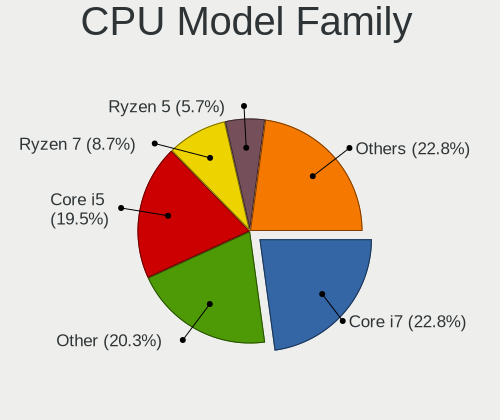
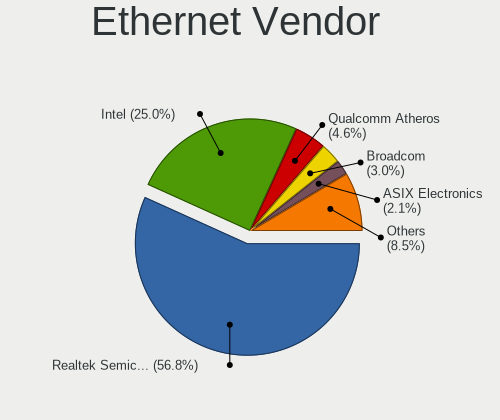
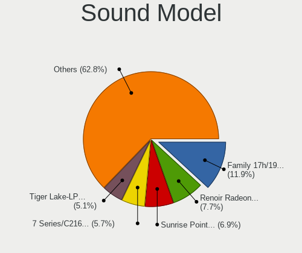

Kubuntu 22.04 - Tested Hardware & Statistics (Notebooks)
--------------------------------------------------------

A project to collect tested hardware configurations for Kubuntu 22.04.

Anyone can contribute to this report by the [hw-probe](https://github.com/linuxhw/hw-probe) tool:

    sudo -E hw-probe -all -upload

Please contribute! Especially if your hardware is rare.

Contents
--------

* [ Test Cases ](#test-cases)

* [ System ](#system)
  - [ Kernel                   ](#kernel)
  - [ Kernel Family            ](#kernel-family)
  - [ Kernel Major Ver.        ](#kernel-major-ver)
  - [ Arch                     ](#arch)
  - [ DE                       ](#de)
  - [ Display Server           ](#display-server)
  - [ Display Manager          ](#display-manager)
  - [ OS Lang                  ](#os-lang)
  - [ Boot Mode                ](#boot-mode)
  - [ Filesystem               ](#filesystem)
  - [ Part. scheme             ](#part-scheme)
  - [ Dual Boot with Linux/BSD ](#dual-boot-with-linuxbsd)
  - [ Dual Boot (Win)          ](#dual-boot-win)

* [ Board ](#board)
  - [ Vendor                   ](#vendor)
  - [ Model                    ](#model)
  - [ Model Family             ](#model-family)
  - [ MFG Year                 ](#mfg-year)
  - [ Form Factor              ](#form-factor)
  - [ Secure Boot              ](#secure-boot)
  - [ Coreboot                 ](#coreboot)
  - [ RAM Size                 ](#ram-size)
  - [ RAM Used                 ](#ram-used)
  - [ Total Drives             ](#total-drives)
  - [ Has CD-ROM               ](#has-cd-rom)
  - [ Has Ethernet             ](#has-ethernet)
  - [ Has WiFi                 ](#has-wifi)
  - [ Has Bluetooth            ](#has-bluetooth)

* [ Location ](#location)
  - [ Country                  ](#country)
  - [ City                     ](#city)

* [ Drives ](#drives)
  - [ Drive Vendor             ](#drive-vendor)
  - [ Drive Model              ](#drive-model)
  - [ HDD Vendor               ](#hdd-vendor)
  - [ SSD Vendor               ](#ssd-vendor)
  - [ Drive Kind               ](#drive-kind)
  - [ Drive Connector          ](#drive-connector)
  - [ Drive Size               ](#drive-size)
  - [ Space Total              ](#space-total)
  - [ Space Used               ](#space-used)
  - [ Malfunc. Drives          ](#malfunc-drives)
  - [ Malfunc. Drive Vendor    ](#malfunc-drive-vendor)
  - [ Malfunc. HDD Vendor      ](#malfunc-hdd-vendor)
  - [ Malfunc. Drive Kind      ](#malfunc-drive-kind)
  - [ Failed Drives            ](#failed-drives)
  - [ Failed Drive Vendor      ](#failed-drive-vendor)
  - [ Drive Status             ](#drive-status)

* [ Storage controller ](#storage-controller)
  - [ Storage Vendor           ](#storage-vendor)
  - [ Storage Model            ](#storage-model)
  - [ Storage Kind             ](#storage-kind)

* [ Processor ](#processor)
  - [ CPU Vendor               ](#cpu-vendor)
  - [ CPU Model                ](#cpu-model)
  - [ CPU Model Family         ](#cpu-model-family)
  - [ CPU Cores                ](#cpu-cores)
  - [ CPU Sockets              ](#cpu-sockets)
  - [ CPU Threads              ](#cpu-threads)
  - [ CPU Op-Modes             ](#cpu-op-modes)
  - [ CPU Microcode            ](#cpu-microcode)
  - [ CPU Microarch            ](#cpu-microarch)

* [ Graphics ](#graphics)
  - [ GPU Vendor               ](#gpu-vendor)
  - [ GPU Model                ](#gpu-model)
  - [ GPU Combo                ](#gpu-combo)
  - [ GPU Driver               ](#gpu-driver)
  - [ GPU Memory               ](#gpu-memory)

* [ Monitor ](#monitor)
  - [ Monitor Vendor           ](#monitor-vendor)
  - [ Monitor Model            ](#monitor-model)
  - [ Monitor Resolution       ](#monitor-resolution)
  - [ Monitor Diagonal         ](#monitor-diagonal)
  - [ Monitor Width            ](#monitor-width)
  - [ Aspect Ratio             ](#aspect-ratio)
  - [ Monitor Area             ](#monitor-area)
  - [ Pixel Density            ](#pixel-density)
  - [ Multiple Monitors        ](#multiple-monitors)

* [ Network ](#network)
  - [ Net Controller Vendor    ](#net-controller-vendor)
  - [ Net Controller Model     ](#net-controller-model)
  - [ Wireless Vendor          ](#wireless-vendor)
  - [ Wireless Model           ](#wireless-model)
  - [ Ethernet Vendor          ](#ethernet-vendor)
  - [ Ethernet Model           ](#ethernet-model)
  - [ Net Controller Kind      ](#net-controller-kind)
  - [ Used Controller          ](#used-controller)
  - [ NICs                     ](#nics)
  - [ IPv6                     ](#ipv6)

* [ Bluetooth ](#bluetooth)
  - [ Bluetooth Vendor         ](#bluetooth-vendor)
  - [ Bluetooth Model          ](#bluetooth-model)

* [ Sound ](#sound)
  - [ Sound Vendor             ](#sound-vendor)
  - [ Sound Model              ](#sound-model)

* [ Memory ](#memory)
  - [ Memory Vendor            ](#memory-vendor)
  - [ Memory Model             ](#memory-model)
  - [ Memory Kind              ](#memory-kind)
  - [ Memory Form Factor       ](#memory-form-factor)
  - [ Memory Size              ](#memory-size)
  - [ Memory Speed             ](#memory-speed)

* [ Printers & scanners ](#printers--scanners)
  - [ Printer Vendor           ](#printer-vendor)
  - [ Printer Model            ](#printer-model)
  - [ Scanner Vendor           ](#scanner-vendor)
  - [ Scanner Model            ](#scanner-model)

* [ Camera ](#camera)
  - [ Camera Vendor            ](#camera-vendor)
  - [ Camera Model             ](#camera-model)

* [ Security ](#security)
  - [ Fingerprint Vendor       ](#fingerprint-vendor)
  - [ Fingerprint Model        ](#fingerprint-model)
  - [ Chipcard Vendor          ](#chipcard-vendor)
  - [ Chipcard Model           ](#chipcard-model)

* [ Unsupported ](#unsupported)
  - [ Unsupported Devices      ](#unsupported-devices)
  - [ Unsupported Device Types ](#unsupported-device-types)

Test Cases
----------

Total: 228

| Vendor        | Model                       | Probe                                                      | Date         |
|---------------|-----------------------------|------------------------------------------------------------|--------------|
| Lenovo        | ThinkPad X230 23256N6       | [ec44263cbd](https://linux-hardware.org/?probe=ec44263cbd) | Oct 01, 2022 |
| HP            | EliteBook 840 G3            | [24a248630f](https://linux-hardware.org/?probe=24a248630f) | Sep 30, 2022 |
| Lenovo        | ThinkPad X230 23256N6       | [8e77417877](https://linux-hardware.org/?probe=8e77417877) | Sep 28, 2022 |
| HP            | ZBook 15 G6                 | [476623a6a1](https://linux-hardware.org/?probe=476623a6a1) | Sep 26, 2022 |
| Lenovo        | ThinkPad E15 Gen 3 20YG0... | [923985941d](https://linux-hardware.org/?probe=923985941d) | Sep 25, 2022 |
| HONOR         | BMH-WCX9                    | [867da0c4b8](https://linux-hardware.org/?probe=867da0c4b8) | Sep 25, 2022 |
| Lenovo        | ThinkPad X230 23256N6       | [f061f902ff](https://linux-hardware.org/?probe=f061f902ff) | Sep 25, 2022 |
| Lenovo        | ThinkPad T430 2349NZ8       | [8f61a903c5](https://linux-hardware.org/?probe=8f61a903c5) | Sep 25, 2022 |
| Acer          | Aspire R3-131T              | [0d44032bc0](https://linux-hardware.org/?probe=0d44032bc0) | Sep 25, 2022 |
| HUAWEI        | BOHB-WAX9                   | [18a4d2bb72](https://linux-hardware.org/?probe=18a4d2bb72) | Sep 23, 2022 |
| Lenovo        | ThinkPad L14 Gen 2 20X1S... | [6e943a4d35](https://linux-hardware.org/?probe=6e943a4d35) | Sep 23, 2022 |
| HP            | 255 G8 Notebook PC          | [20691b389b](https://linux-hardware.org/?probe=20691b389b) | Sep 21, 2022 |
| Dell          | Latitude E5530 non-vPro     | [6352f6fb82](https://linux-hardware.org/?probe=6352f6fb82) | Sep 21, 2022 |
| Acer          | Aspire A515-45              | [41b1b790fd](https://linux-hardware.org/?probe=41b1b790fd) | Sep 19, 2022 |
| HP            | EliteBook 8560p             | [4a9e29fab2](https://linux-hardware.org/?probe=4a9e29fab2) | Sep 18, 2022 |
| Google        | Blooglet                    | [971a174a56](https://linux-hardware.org/?probe=971a174a56) | Sep 18, 2022 |
| Acer          | Aspire S3-391               | [5aadfd37c5](https://linux-hardware.org/?probe=5aadfd37c5) | Sep 17, 2022 |
| Acer          | Aspire S3-391               | [82a1f45915](https://linux-hardware.org/?probe=82a1f45915) | Sep 17, 2022 |
| MSI           | Delta 15 A5EFK              | [382e0f70a3](https://linux-hardware.org/?probe=382e0f70a3) | Sep 17, 2022 |
| Dell          | XPS 15 9560                 | [4a903b438f](https://linux-hardware.org/?probe=4a903b438f) | Sep 17, 2022 |
| Lenovo        | IdeaPad 3 15ARE05 81W4      | [4ee2b37edf](https://linux-hardware.org/?probe=4ee2b37edf) | Sep 16, 2022 |
| ASUSTek       | G501VW                      | [cf04ceb420](https://linux-hardware.org/?probe=cf04ceb420) | Sep 15, 2022 |
| Google        | Treeya                      | [a2723e9afa](https://linux-hardware.org/?probe=a2723e9afa) | Sep 15, 2022 |
| Dell          | Inspiron 5567               | [3af5d11f3f](https://linux-hardware.org/?probe=3af5d11f3f) | Sep 14, 2022 |
| Dell          | Inspiron 5567               | [1ca8786a47](https://linux-hardware.org/?probe=1ca8786a47) | Sep 13, 2022 |
| Dell          | Inspiron 5567               | [22e62266a2](https://linux-hardware.org/?probe=22e62266a2) | Sep 13, 2022 |
| Lenovo        | ThinkPad T14 Gen 1 20S1S... | [d4fb6aa0ae](https://linux-hardware.org/?probe=d4fb6aa0ae) | Sep 13, 2022 |
| Lenovo        | ThinkPad T430 2347AT2       | [703c55185d](https://linux-hardware.org/?probe=703c55185d) | Sep 12, 2022 |
| Sony          | SVE1512J6EW                 | [69e2400606](https://linux-hardware.org/?probe=69e2400606) | Sep 11, 2022 |
| HP            | EliteBook 8470p             | [52f6655891](https://linux-hardware.org/?probe=52f6655891) | Sep 11, 2022 |
| HP            | EliteBook 8470p             | [a27d14af07](https://linux-hardware.org/?probe=a27d14af07) | Sep 11, 2022 |
| Dell          | G15 5511                    | [b971c27fae](https://linux-hardware.org/?probe=b971c27fae) | Sep 10, 2022 |
| Lenovo        | ThinkPad T430 2347AT2       | [50f39d7738](https://linux-hardware.org/?probe=50f39d7738) | Sep 09, 2022 |
| Dell          | Latitude 7430               | [b1cdbef6b2](https://linux-hardware.org/?probe=b1cdbef6b2) | Sep 09, 2022 |
| Acer          | Predator G3-571             | [553cf2f33f](https://linux-hardware.org/?probe=553cf2f33f) | Sep 08, 2022 |
| Dell          | Vostro 3700                 | [40e150eb3b](https://linux-hardware.org/?probe=40e150eb3b) | Sep 08, 2022 |
| Samsung       | 270E5G/270E5U               | [0300dd1a2d](https://linux-hardware.org/?probe=0300dd1a2d) | Sep 05, 2022 |
| Lenovo        | Legion 5 Pro 16ITH6H 82J... | [85798fb011](https://linux-hardware.org/?probe=85798fb011) | Sep 05, 2022 |
| ASUSTek       | UX51VZA                     | [46aa1dbafa](https://linux-hardware.org/?probe=46aa1dbafa) | Sep 04, 2022 |
| HP            | Pavilion Gaming Laptop 1... | [8eec266b41](https://linux-hardware.org/?probe=8eec266b41) | Sep 03, 2022 |
| HP            | Laptop 15-da0xxx            | [5c11f5477e](https://linux-hardware.org/?probe=5c11f5477e) | Sep 03, 2022 |
| HP            | Notebook                    | [a3b180cbb5](https://linux-hardware.org/?probe=a3b180cbb5) | Sep 03, 2022 |
| Lenovo        | G780 20138                  | [4a452f0874](https://linux-hardware.org/?probe=4a452f0874) | Sep 03, 2022 |
| Lenovo        | ThinkPad E14 20RBS25S00     | [a4290c0678](https://linux-hardware.org/?probe=a4290c0678) | Sep 03, 2022 |
| Lenovo        | ThinkBook 14 G2 ITL 20VD    | [a15c233224](https://linux-hardware.org/?probe=a15c233224) | Sep 02, 2022 |
| Lenovo        | ThinkPad X1 Extreme Gen ... | [d34c9cb705](https://linux-hardware.org/?probe=d34c9cb705) | Sep 01, 2022 |
| Lenovo        | ThinkPad T460 20FMS08U00    | [d7457fd32a](https://linux-hardware.org/?probe=d7457fd32a) | Sep 01, 2022 |
| HP            | Pavilion Gaming Laptop      | [8382b4123e](https://linux-hardware.org/?probe=8382b4123e) | Aug 31, 2022 |
| Samsung       | 870Z5E/880Z5E/680Z5E        | [0166c06969](https://linux-hardware.org/?probe=0166c06969) | Aug 30, 2022 |
| Dell          | Latitude 9420               | [0b8d883170](https://linux-hardware.org/?probe=0b8d883170) | Aug 29, 2022 |
| Toshiba       | Satellite L850              | [fe1480794c](https://linux-hardware.org/?probe=fe1480794c) | Aug 29, 2022 |
| Google        | Eldrid                      | [ae53120bac](https://linux-hardware.org/?probe=ae53120bac) | Aug 28, 2022 |
| HP            | Pavilion Gaming Laptop 1... | [20bea980d2](https://linux-hardware.org/?probe=20bea980d2) | Aug 28, 2022 |
| Lenovo        | ThinkPad E15 Gen 3 20YG0... | [208be390fa](https://linux-hardware.org/?probe=208be390fa) | Aug 26, 2022 |
| Sony          | VGN-NR11Z_T                 | [54c1e7c198](https://linux-hardware.org/?probe=54c1e7c198) | Aug 26, 2022 |
| Apple         | MacBookPro11,1              | [5097845796](https://linux-hardware.org/?probe=5097845796) | Aug 24, 2022 |
| HP            | ENVY Laptop 17-ce1xxx       | [4c201d43d0](https://linux-hardware.org/?probe=4c201d43d0) | Aug 22, 2022 |
| Toshiba       | Satellite P70-B             | [4e04d56e06](https://linux-hardware.org/?probe=4e04d56e06) | Aug 21, 2022 |
| Toshiba       | Satellite P70-B             | [402017a7ea](https://linux-hardware.org/?probe=402017a7ea) | Aug 21, 2022 |
| Dell          | G3 3500                     | [1e8edd3350](https://linux-hardware.org/?probe=1e8edd3350) | Aug 21, 2022 |
| Dell          | Inspiron 15-5578            | [a0ff8934e5](https://linux-hardware.org/?probe=a0ff8934e5) | Aug 21, 2022 |
| HP            | Pavilion g6                 | [8d5375bd39](https://linux-hardware.org/?probe=8d5375bd39) | Aug 20, 2022 |
| ASUSTek       | VivoBook_ASUSLaptop X340... | [45bac2f9d1](https://linux-hardware.org/?probe=45bac2f9d1) | Aug 20, 2022 |
| MSI           | GF75 Thin 10SCXR            | [b75c38c8a5](https://linux-hardware.org/?probe=b75c38c8a5) | Aug 19, 2022 |
| Dell          | Latitude 7280               | [63e00d0c9d](https://linux-hardware.org/?probe=63e00d0c9d) | Aug 18, 2022 |
| Acer          | Nitro AN517-41              | [73649d898c](https://linux-hardware.org/?probe=73649d898c) | Aug 18, 2022 |
| Lenovo        | ThinkPad T440p 20AWS1AY0... | [fcda79b03d](https://linux-hardware.org/?probe=fcda79b03d) | Aug 17, 2022 |
| Apple         | MacBookPro11,1              | [4d6f6d6a23](https://linux-hardware.org/?probe=4d6f6d6a23) | Aug 15, 2022 |
| Dell          | Precision 3571              | [48c3133a7f](https://linux-hardware.org/?probe=48c3133a7f) | Aug 15, 2022 |
| Lenovo        | IdeaPad 330-15IKB 81DC      | [ca96da9d08](https://linux-hardware.org/?probe=ca96da9d08) | Aug 12, 2022 |
| Panasonic     | CF-53JSWZGFF                | [88c83a7e28](https://linux-hardware.org/?probe=88c83a7e28) | Aug 11, 2022 |
| Dell          | Latitude 5590               | [a00272df56](https://linux-hardware.org/?probe=a00272df56) | Aug 11, 2022 |
| Lenovo        | Yoga Slim 7 15ITL05 82AC    | [477ce53969](https://linux-hardware.org/?probe=477ce53969) | Aug 10, 2022 |
| HP            | EliteBook 8470p             | [14aebc0034](https://linux-hardware.org/?probe=14aebc0034) | Aug 09, 2022 |
| HP            | G62                         | [430fe133db](https://linux-hardware.org/?probe=430fe133db) | Aug 09, 2022 |
| Lenovo        | ThinkPad T430 2347AT2       | [4b74670050](https://linux-hardware.org/?probe=4b74670050) | Aug 08, 2022 |
| Dell          | Latitude 5420               | [824404ee24](https://linux-hardware.org/?probe=824404ee24) | Aug 08, 2022 |
| Dell          | XPS 15 9520                 | [7311161548](https://linux-hardware.org/?probe=7311161548) | Aug 07, 2022 |
| HP            | ProBook 440 G8 Notebook ... | [9c77d1a0d5](https://linux-hardware.org/?probe=9c77d1a0d5) | Aug 06, 2022 |
| HP            | ProBook 440 G8 Notebook ... | [ea189dab70](https://linux-hardware.org/?probe=ea189dab70) | Aug 06, 2022 |
| HP            | EliteBook 8470p             | [22e9ee373f](https://linux-hardware.org/?probe=22e9ee373f) | Aug 06, 2022 |
| HP            | EliteBook 8470p             | [df685682b3](https://linux-hardware.org/?probe=df685682b3) | Aug 05, 2022 |
| Dell          | Latitude 5590               | [52f059849a](https://linux-hardware.org/?probe=52f059849a) | Aug 04, 2022 |
| Dell          | Latitude 5590               | [47292ecf57](https://linux-hardware.org/?probe=47292ecf57) | Aug 04, 2022 |
| ASUSTek       | VivoBook_ASUSLaptop X509... | [f79a1d3402](https://linux-hardware.org/?probe=f79a1d3402) | Aug 03, 2022 |
| ASUSTek       | VivoBook_ASUSLaptop X509... | [b2e4380743](https://linux-hardware.org/?probe=b2e4380743) | Aug 03, 2022 |
| Intel         | Unknown                     | [9fce3597b9](https://linux-hardware.org/?probe=9fce3597b9) | Aug 01, 2022 |
| ASUSTek       | ROG Flow X13 GV301QH_GV3... | [09c15c1ed8](https://linux-hardware.org/?probe=09c15c1ed8) | Jul 31, 2022 |
| Dell          | Latitude 5590               | [7fa93449bd](https://linux-hardware.org/?probe=7fa93449bd) | Jul 28, 2022 |
| Lenovo        | ThinkPad T450 20BV0001US    | [9c0b784d1d](https://linux-hardware.org/?probe=9c0b784d1d) | Jul 27, 2022 |
| Lenovo        | ThinkPad E14 Gen 2 20TA0... | [5ed19c54a9](https://linux-hardware.org/?probe=5ed19c54a9) | Jul 27, 2022 |
| Dell          | G5 5590                     | [20f75f2334](https://linux-hardware.org/?probe=20f75f2334) | Jul 27, 2022 |
| Unknown       | Unknown                     | [03fa847263](https://linux-hardware.org/?probe=03fa847263) | Jul 26, 2022 |
| Lenovo        | G570 20079                  | [50bab54f21](https://linux-hardware.org/?probe=50bab54f21) | Jul 26, 2022 |
| HP            | Laptop 15-da0xxx            | [6967eac391](https://linux-hardware.org/?probe=6967eac391) | Jul 26, 2022 |
| Lenovo        | IdeaPad 5 15ALC05 82LN      | [2c515ee09a](https://linux-hardware.org/?probe=2c515ee09a) | Jul 24, 2022 |
| Lenovo        | IdeaPad 5 15ALC05 82LN      | [e24e72037a](https://linux-hardware.org/?probe=e24e72037a) | Jul 24, 2022 |
| Acer          | Aspire E5-575G              | [d404840b57](https://linux-hardware.org/?probe=d404840b57) | Jul 24, 2022 |
| HP            | EliteBook 8470p             | [ec23b6375e](https://linux-hardware.org/?probe=ec23b6375e) | Jul 24, 2022 |
| Lenovo        | Legion 5 Pro 16ACH6H 82J... | [e71169659f](https://linux-hardware.org/?probe=e71169659f) | Jul 22, 2022 |
| HP            | G62                         | [418c1c572e](https://linux-hardware.org/?probe=418c1c572e) | Jul 21, 2022 |
| Lenovo        | ThinkBook 16p Gen 2 20YM    | [447161e791](https://linux-hardware.org/?probe=447161e791) | Jul 21, 2022 |
| ASUSTek       | ROG Zephyrus G14 GA402RK... | [23f16d1cac](https://linux-hardware.org/?probe=23f16d1cac) | Jul 18, 2022 |
| ASUSTek       | ROG Zephyrus G14 GA402RK... | [d83a4d5121](https://linux-hardware.org/?probe=d83a4d5121) | Jul 18, 2022 |
| HONOR         | HYM-WXX                     | [654a2a5950](https://linux-hardware.org/?probe=654a2a5950) | Jul 17, 2022 |
| ASUSTek       | K53U                        | [20120e258a](https://linux-hardware.org/?probe=20120e258a) | Jul 16, 2022 |
| Standard      | Unknown                     | [3b4805163d](https://linux-hardware.org/?probe=3b4805163d) | Jul 15, 2022 |
| HP            | Laptop 15s-eq1xxx           | [57ef4db755](https://linux-hardware.org/?probe=57ef4db755) | Jul 14, 2022 |
| Schenker      | XMG APEX (Mid 2021)         | [41136553b2](https://linux-hardware.org/?probe=41136553b2) | Jul 13, 2022 |
| TUXEDO        | Stellaris AMD Gen3 (CZN)    | [33bea96de9](https://linux-hardware.org/?probe=33bea96de9) | Jul 12, 2022 |
| Lenovo        | ThinkPad X1 Nano Gen 1 2... | [21ef2a8d9a](https://linux-hardware.org/?probe=21ef2a8d9a) | Jul 12, 2022 |
| Lenovo        | ThinkPad E14 Gen 3 20Y70... | [1bbf224b5c](https://linux-hardware.org/?probe=1bbf224b5c) | Jul 11, 2022 |
| System76      | Lemur Ultra                 | [10e8deaf3b](https://linux-hardware.org/?probe=10e8deaf3b) | Jul 11, 2022 |
| Toshiba       | TECRA S11                   | [c33fa181ba](https://linux-hardware.org/?probe=c33fa181ba) | Jul 08, 2022 |
| Lenovo        | IdeaPad 5 15ARE05 81YQ      | [6b007e333a](https://linux-hardware.org/?probe=6b007e333a) | Jul 06, 2022 |
| Lenovo        | IdeaPad 5 15ARE05 81YQ      | [f09a1deecc](https://linux-hardware.org/?probe=f09a1deecc) | Jul 06, 2022 |
| HUAWEI        | CREM-WXX9                   | [e7e175955d](https://linux-hardware.org/?probe=e7e175955d) | Jul 05, 2022 |
| Chuwi         | CoreBook X                  | [a23d0fe53d](https://linux-hardware.org/?probe=a23d0fe53d) | Jul 04, 2022 |
| Chuwi         | CoreBook X                  | [a8d8dfc814](https://linux-hardware.org/?probe=a8d8dfc814) | Jul 03, 2022 |
| Dell          | Latitude 7530               | [a66aca8921](https://linux-hardware.org/?probe=a66aca8921) | Jul 01, 2022 |
| HONOR         | BOHK-WAX9X                  | [1647402099](https://linux-hardware.org/?probe=1647402099) | Jun 30, 2022 |
| Jumper        | EZpad                       | [5d5f3980e1](https://linux-hardware.org/?probe=5d5f3980e1) | Jun 30, 2022 |
| Jumper        | EZpad                       | [66b40738ff](https://linux-hardware.org/?probe=66b40738ff) | Jun 30, 2022 |
| Dell          | Latitude 3420               | [5fef19c107](https://linux-hardware.org/?probe=5fef19c107) | Jun 29, 2022 |
| Jumper        | EZpad                       | [3ea5b3080d](https://linux-hardware.org/?probe=3ea5b3080d) | Jun 29, 2022 |
| HP            | Pavilion Gaming Laptop 1... | [6dc02ab574](https://linux-hardware.org/?probe=6dc02ab574) | Jun 29, 2022 |
| HP            | Stream Laptop 11-ak0xxx     | [d2f3d5aefd](https://linux-hardware.org/?probe=d2f3d5aefd) | Jun 28, 2022 |
| ASUSTek       | ROG Zephyrus G14 GA402RK... | [0c1cbe6fd7](https://linux-hardware.org/?probe=0c1cbe6fd7) | Jun 28, 2022 |
| Haier         | A1420EM                     | [3690a94424](https://linux-hardware.org/?probe=3690a94424) | Jun 28, 2022 |
| HP            | Stream Laptop 11-ak0xxx     | [f39c4bd8a0](https://linux-hardware.org/?probe=f39c4bd8a0) | Jun 27, 2022 |
| HP            | 15                          | [3d3ad576a2](https://linux-hardware.org/?probe=3d3ad576a2) | Jun 26, 2022 |
| ASUSTek       | K46CB                       | [3af9df185f](https://linux-hardware.org/?probe=3af9df185f) | Jun 26, 2022 |
| Lenovo        | ThinkBook 14-IML 20RV       | [6afa74e5b6](https://linux-hardware.org/?probe=6afa74e5b6) | Jun 25, 2022 |
| ASUSTek       | ZenBook UX325EA_UX325EA     | [0647ff3774](https://linux-hardware.org/?probe=0647ff3774) | Jun 24, 2022 |
| Dell          | Latitude 5590               | [aa45d97e0b](https://linux-hardware.org/?probe=aa45d97e0b) | Jun 23, 2022 |
| Dell          | Latitude 5590               | [3745dfcae3](https://linux-hardware.org/?probe=3745dfcae3) | Jun 23, 2022 |
| Lenovo        | V130-15IGM 81HL             | [62f47da7d2](https://linux-hardware.org/?probe=62f47da7d2) | Jun 22, 2022 |
| Apple         | MacBookPro15,2              | [c931d0e7bf](https://linux-hardware.org/?probe=c931d0e7bf) | Jun 20, 2022 |
| Dell          | XPS 17 9720                 | [2a36b8d90d](https://linux-hardware.org/?probe=2a36b8d90d) | Jun 20, 2022 |
| Toshiba       | Satellite L655              | [2e67542246](https://linux-hardware.org/?probe=2e67542246) | Jun 19, 2022 |
| ASUSTek       | X550JF                      | [be77e811e2](https://linux-hardware.org/?probe=be77e811e2) | Jun 18, 2022 |
| TUXEDO        | InfinityBook S 15 Gen6      | [1dbf6320bc](https://linux-hardware.org/?probe=1dbf6320bc) | Jun 18, 2022 |
| SLIMBOOK      | PROX15-AMD                  | [e281d05a2a](https://linux-hardware.org/?probe=e281d05a2a) | Jun 18, 2022 |
| Apple         | MacBookPro5,3               | [aace637cfc](https://linux-hardware.org/?probe=aace637cfc) | Jun 17, 2022 |
| MSI           | Raider GE66 12UGS           | [d69dc59622](https://linux-hardware.org/?probe=d69dc59622) | Jun 16, 2022 |
| Jumper        | EZpad                       | [b1a0e53c08](https://linux-hardware.org/?probe=b1a0e53c08) | Jun 16, 2022 |
| Apple         | MacBookPro5,3               | [06bef31587](https://linux-hardware.org/?probe=06bef31587) | Jun 16, 2022 |
| Dell          | XPS 15 9560                 | [8faa0f9e6a](https://linux-hardware.org/?probe=8faa0f9e6a) | Jun 14, 2022 |
| ASUSTek       | UX51VZ                      | [d58122ba72](https://linux-hardware.org/?probe=d58122ba72) | Jun 13, 2022 |
| Jumper        | EZpad                       | [3a5e6bc998](https://linux-hardware.org/?probe=3a5e6bc998) | Jun 13, 2022 |
| Dell          | Inspiron 15-3567            | [013de61252](https://linux-hardware.org/?probe=013de61252) | Jun 12, 2022 |
| TUXEDO        | Pulse 15 Gen1               | [2c789d1a84](https://linux-hardware.org/?probe=2c789d1a84) | Jun 10, 2022 |
| HP            | Pavilion dv6                | [88a92966a3](https://linux-hardware.org/?probe=88a92966a3) | Jun 09, 2022 |
| Dell          | Latitude 5590               | [befc14c3db](https://linux-hardware.org/?probe=befc14c3db) | Jun 09, 2022 |
| Dell          | Latitude 5590               | [0c8e1f9f23](https://linux-hardware.org/?probe=0c8e1f9f23) | Jun 09, 2022 |
| MSI           | GP76 Leopard 11UH           | [8a3c021b8a](https://linux-hardware.org/?probe=8a3c021b8a) | Jun 08, 2022 |
| System76      | Kudu Professional           | [4ffc6fc358](https://linux-hardware.org/?probe=4ffc6fc358) | Jun 08, 2022 |
| System76      | Kudu Professional           | [0c0e2ed5b2](https://linux-hardware.org/?probe=0c0e2ed5b2) | Jun 08, 2022 |
| Lenovo        | ThinkPad X1 Extreme 20MG... | [f4c82e1fb6](https://linux-hardware.org/?probe=f4c82e1fb6) | Jun 07, 2022 |
| HP            | OMEN by Laptop 17-cb0xxx    | [1dea88e6b2](https://linux-hardware.org/?probe=1dea88e6b2) | Jun 07, 2022 |
| Lenovo        | ThinkPad X61 Tablet 7762... | [9ccaec00d8](https://linux-hardware.org/?probe=9ccaec00d8) | Jun 06, 2022 |
| Dell          | Latitude 5590               | [be30c04869](https://linux-hardware.org/?probe=be30c04869) | Jun 05, 2022 |
| Lenovo        | IdeaPad 5 15ARE05 81YQ      | [065dee2160](https://linux-hardware.org/?probe=065dee2160) | Jun 04, 2022 |
| HP            | EliteBook 845 G7 Noteboo... | [de4976b9dd](https://linux-hardware.org/?probe=de4976b9dd) | Jun 04, 2022 |
| Dell          | Latitude 5590               | [cc94c06259](https://linux-hardware.org/?probe=cc94c06259) | Jun 04, 2022 |
| Lenovo        | ThinkBook 15 G2 ITL 20VE    | [5e57fb2871](https://linux-hardware.org/?probe=5e57fb2871) | Jun 04, 2022 |
| HP            | Pavilion Laptop 15-eh1xx... | [11ec221a7e](https://linux-hardware.org/?probe=11ec221a7e) | Jun 04, 2022 |
| MSI           | CX61 2PC                    | [d3decdad4c](https://linux-hardware.org/?probe=d3decdad4c) | Jun 03, 2022 |
| Dell          | Latitude 7420               | [b2ba370a59](https://linux-hardware.org/?probe=b2ba370a59) | Jun 02, 2022 |
| Samsung       | 300E4C/300E5C/300E7C        | [66e01e7706](https://linux-hardware.org/?probe=66e01e7706) | Jun 02, 2022 |
| SK hynix      | Onnyx III                   | [a04d3f7fd9](https://linux-hardware.org/?probe=a04d3f7fd9) | Jun 01, 2022 |
| Lenovo        | IdeaPad Gaming 3 15IHU6 ... | [6378f52a92](https://linux-hardware.org/?probe=6378f52a92) | May 31, 2022 |
| Acer          | Aspire AV15-51              | [a9183103ee](https://linux-hardware.org/?probe=a9183103ee) | May 31, 2022 |
| ASUSTek       | VivoBook_ASUSLaptop X421... | [177e92d46b](https://linux-hardware.org/?probe=177e92d46b) | May 28, 2022 |
| TUXEDO        | Polaris 15 AMD Gen1         | [f592de92c2](https://linux-hardware.org/?probe=f592de92c2) | May 27, 2022 |
| ASUSTek       | ROG Strix G513QY_G513QY     | [5718bd4854](https://linux-hardware.org/?probe=5718bd4854) | May 27, 2022 |
| Gigabyte      | AORUS 15 XE4                | [f56ba4f49d](https://linux-hardware.org/?probe=f56ba4f49d) | May 27, 2022 |
| HUAWEI        | CREM-WXX9                   | [5410acf8ab](https://linux-hardware.org/?probe=5410acf8ab) | May 25, 2022 |
| Dell          | Vostro 5625                 | [2ae97190b6](https://linux-hardware.org/?probe=2ae97190b6) | May 24, 2022 |
| Dell          | Inspiron 15 7000 Gaming     | [887985e68a](https://linux-hardware.org/?probe=887985e68a) | May 24, 2022 |
| Acer          | Swift SFX14-41G             | [da40fdda29](https://linux-hardware.org/?probe=da40fdda29) | May 22, 2022 |
| Dell          | Inspiron 7572               | [b7747e3ea4](https://linux-hardware.org/?probe=b7747e3ea4) | May 19, 2022 |
| Razer         | Blade 15 Mid 2019-Base      | [0d4945774e](https://linux-hardware.org/?probe=0d4945774e) | May 18, 2022 |
| Razer         | Blade 15 Mid 2019-Base      | [e771dc589b](https://linux-hardware.org/?probe=e771dc589b) | May 18, 2022 |
| Lenovo        | IdeaPad L340-15IRH Gamin... | [0571b7cb83](https://linux-hardware.org/?probe=0571b7cb83) | May 18, 2022 |
| HP            | ProBook 6470b               | [0581bb1005](https://linux-hardware.org/?probe=0581bb1005) | May 17, 2022 |
| HP            | Unknown                     | [796c00a0cd](https://linux-hardware.org/?probe=796c00a0cd) | May 15, 2022 |
| HP            | ProBook 6570b               | [e8c38d4e97](https://linux-hardware.org/?probe=e8c38d4e97) | May 15, 2022 |
| Apple         | MacBookPro13,2              | [68e687c794](https://linux-hardware.org/?probe=68e687c794) | May 14, 2022 |
| Lenovo        | ThinkPad E14 20RBS25S00     | [beaf18770e](https://linux-hardware.org/?probe=beaf18770e) | May 12, 2022 |
| HUAWEI        | CREM-WXX9                   | [dba988f81d](https://linux-hardware.org/?probe=dba988f81d) | May 10, 2022 |
| Dell          | XPS 13 9370                 | [f90e5f669e](https://linux-hardware.org/?probe=f90e5f669e) | May 09, 2022 |
| Toshiba       | Satellite C650D             | [8aefcd7551](https://linux-hardware.org/?probe=8aefcd7551) | May 08, 2022 |
| HP            | ProBook 6470b               | [7849fd57dc](https://linux-hardware.org/?probe=7849fd57dc) | May 06, 2022 |
| HUAWEI        | HVY-WXX9                    | [8eb673ec29](https://linux-hardware.org/?probe=8eb673ec29) | May 06, 2022 |
| Apple         | MacBookPro11,2              | [0af35aa835](https://linux-hardware.org/?probe=0af35aa835) | May 06, 2022 |
| ASUSTek       | X550JX                      | [b420f9214c](https://linux-hardware.org/?probe=b420f9214c) | May 06, 2022 |
| HP            | 2000                        | [1616d82d8e](https://linux-hardware.org/?probe=1616d82d8e) | May 05, 2022 |
| HP            | 2000                        | [f6f20fd25e](https://linux-hardware.org/?probe=f6f20fd25e) | May 05, 2022 |
| Lenovo        | IdeaPad 3 15ITL6 82H8       | [df622f284f](https://linux-hardware.org/?probe=df622f284f) | May 05, 2022 |
| Lenovo        | IdeaPad 3 15ARE05 81W4      | [d861de9453](https://linux-hardware.org/?probe=d861de9453) | May 04, 2022 |
| Toshiba       | Satellite C650D             | [ce16326df2](https://linux-hardware.org/?probe=ce16326df2) | May 03, 2022 |
| Lenovo        | IdeaPad 500-15ISK 80NT      | [d5b6bc1a67](https://linux-hardware.org/?probe=d5b6bc1a67) | May 01, 2022 |
| HP            | Pavilion Laptop 13-bb0xx... | [ae7d5dbb0c](https://linux-hardware.org/?probe=ae7d5dbb0c) | May 01, 2022 |
| Lenovo        | ThinkPad T530 2394CTO       | [73ee1262a6](https://linux-hardware.org/?probe=73ee1262a6) | Apr 30, 2022 |
| Lenovo        | Z50-75 80EC                 | [f301c52b41](https://linux-hardware.org/?probe=f301c52b41) | Apr 29, 2022 |
| Lenovo        | IdeaPad 5 15ARE05 81YQ      | [57271a5f8b](https://linux-hardware.org/?probe=57271a5f8b) | Apr 28, 2022 |
| ASUSTek       | VivoBook_ASUSLaptop M340... | [382d77c2b0](https://linux-hardware.org/?probe=382d77c2b0) | Apr 28, 2022 |
| Lenovo        | ThinkPad T530 2394CTO       | [9fffc0babc](https://linux-hardware.org/?probe=9fffc0babc) | Apr 26, 2022 |
| Lenovo        | ThinkPad T530 2394CTO       | [b5f175a650](https://linux-hardware.org/?probe=b5f175a650) | Apr 26, 2022 |
| ASUSTek       | G750JS                      | [24dab87910](https://linux-hardware.org/?probe=24dab87910) | Apr 26, 2022 |
| Lenovo        | ThinkPad X201 Tablet 083... | [8e7b2c79a0](https://linux-hardware.org/?probe=8e7b2c79a0) | Apr 25, 2022 |
| Lenovo        | IdeaPad 5 Pro 14ITL6 82L... | [a260bf9ce6](https://linux-hardware.org/?probe=a260bf9ce6) | Apr 24, 2022 |
| Acer          | Swift SF314-43              | [9ba9e35d88](https://linux-hardware.org/?probe=9ba9e35d88) | Apr 23, 2022 |
| ASUSTek       | G550JK                      | [566770a325](https://linux-hardware.org/?probe=566770a325) | Apr 21, 2022 |
| Shanghai Z... | ZXE CRB                     | [fe284f4173](https://linux-hardware.org/?probe=fe284f4173) | Apr 17, 2022 |
| HP            | OMEN Laptop 15-en0xxx       | [de2cf28654](https://linux-hardware.org/?probe=de2cf28654) | Apr 13, 2022 |
| Lenovo        | ThinkPad X260 20F5S0W22B    | [765eaec64d](https://linux-hardware.org/?probe=765eaec64d) | Apr 04, 2022 |
| Dell          | Latitude E6540              | [e087a37f5f](https://linux-hardware.org/?probe=e087a37f5f) | Apr 02, 2022 |
| Timi          | Mi Laptop Air 12.5          | [7aa852e941](https://linux-hardware.org/?probe=7aa852e941) | Feb 25, 2022 |
| Timi          | Mi Laptop Air 12.5          | [67297aad2c](https://linux-hardware.org/?probe=67297aad2c) | Feb 25, 2022 |
| Dell          | Latitude E6320              | [ae7b660be1](https://linux-hardware.org/?probe=ae7b660be1) | Feb 16, 2022 |
| Apple         | MacBookPro8,1               | [b99a5f9b59](https://linux-hardware.org/?probe=b99a5f9b59) | Feb 14, 2022 |
| Lenovo        | IdeaPad S145-15API 81UT     | [aba110f180](https://linux-hardware.org/?probe=aba110f180) | Feb 10, 2022 |
| LG Electro... | 16Z90P-G.AA78C              | [30ddfbc611](https://linux-hardware.org/?probe=30ddfbc611) | Feb 03, 2022 |
| LG Electro... | 16Z90P-G.AA78C              | [992ee00a94](https://linux-hardware.org/?probe=992ee00a94) | Feb 02, 2022 |
| Unknown       | Unknown                     | [d88cb8b5ae](https://linux-hardware.org/?probe=d88cb8b5ae) | Dec 27, 2021 |
| HP            | Laptop 15s-eq0xxx           | [5bb4e443f9](https://linux-hardware.org/?probe=5bb4e443f9) | Oct 26, 2021 |

System
------

Kernel
------

Version of the Linux kernel

| Version                  | Notebooks | Percent |
|--------------------------|-----------|---------|
| 5.15.0-47-generic        | 20        | 11.05%  |
| 5.15.0-41-generic        | 17        | 9.39%   |
| 5.15.0-46-generic        | 16        | 8.84%   |
| 5.15.0-40-generic        | 15        | 8.29%   |
| 5.15.0-25-generic        | 13        | 7.18%   |
| 5.15.0-27-generic        | 12        | 6.63%   |
| 5.15.0-33-generic        | 10        | 5.52%   |
| 5.15.0-48-generic        | 9         | 4.97%   |
| 5.15.0-43-generic        | 7         | 3.87%   |
| 5.15.0-39-generic        | 6         | 3.31%   |
| 5.15.0-37-generic        | 5         | 2.76%   |
| 5.15.0-35-generic        | 4         | 2.21%   |
| 5.15.0-30-generic        | 4         | 2.21%   |
| 5.15.0-18-generic        | 4         | 2.21%   |
| 5.15.0-46-lowlatency     | 3         | 1.66%   |
| 5.15.0-43-lowlatency     | 3         | 1.66%   |
| 5.19.5-051905-generic    | 2         | 1.1%    |
| 5.15.0-32-generic        | 2         | 1.1%    |
| 5.15.0-30-lowlatency     | 2         | 1.1%    |
| 5.15.0-23-generic        | 2         | 1.1%    |
| 5.15.0-10033-tuxedo      | 2         | 1.1%    |
| 5.13.0-19-generic        | 2         | 1.1%    |
| 6.0.0-060000rc3-generic  | 1         | 0.55%   |
| 5.19.2-051902-generic    | 1         | 0.55%   |
| 5.18.6-051806-generic    | 1         | 0.55%   |
| 5.18.15-051815-generic   | 1         | 0.55%   |
| 5.18.10-051810-generic   | 1         | 0.55%   |
| 5.17.5-051705-generic    | 1         | 0.55%   |
| 5.17.4-051704-generic    | 1         | 0.55%   |
| 5.17.2-051702-generic    | 1         | 0.55%   |
| 5.17.0-1016-oem          | 1         | 0.55%   |
| 5.17.0-051700rc4-generic | 1         | 0.55%   |
| 5.16.2-051602-generic    | 1         | 0.55%   |
| 5.15.65-xanmod1          | 1         | 0.55%   |
| 5.15.34-051534-generic   | 1         | 0.55%   |
| 5.15.0-48-lowlatency     | 1         | 0.55%   |
| 5.15.0-45-lowlatency     | 1         | 0.55%   |
| 5.15.0-41-lowlatency     | 1         | 0.55%   |
| 5.15.0-29-generic        | 1         | 0.55%   |
| 5.15.0-24-lowlatency     | 1         | 0.55%   |

Kernel Family
-------------

Linux kernel without a distro release

| Version | Notebooks | Percent |
|---------|-----------|---------|
| 5.15.0  | 158       | 89.77%  |
| 5.13.0  | 3         | 1.7%    |
| 5.19.5  | 2         | 1.14%   |
| 5.17.0  | 2         | 1.14%   |
| 6.0.0   | 1         | 0.57%   |
| 5.19.2  | 1         | 0.57%   |
| 5.18.6  | 1         | 0.57%   |
| 5.18.15 | 1         | 0.57%   |
| 5.18.10 | 1         | 0.57%   |
| 5.17.5  | 1         | 0.57%   |
| 5.17.4  | 1         | 0.57%   |
| 5.17.2  | 1         | 0.57%   |
| 5.16.2  | 1         | 0.57%   |
| 5.15.65 | 1         | 0.57%   |
| 5.15.34 | 1         | 0.57%   |

Kernel Major Ver.
-----------------

Linux kernel major version

| Version | Notebooks | Percent |
|---------|-----------|---------|
| 5.15    | 159       | 90.86%  |
| 5.17    | 5         | 2.86%   |
| 5.19    | 3         | 1.71%   |
| 5.18    | 3         | 1.71%   |
| 5.13    | 3         | 1.71%   |
| 6.0     | 1         | 0.57%   |
| 5.16    | 1         | 0.57%   |

Arch
----

OS architecture (x86_64, i586, etc.)

| Name   | Notebooks | Percent |
|--------|-----------|---------|
| x86_64 | 173       | 100%    |

DE
--

Desktop Environment

| Name    | Notebooks | Percent |
|---------|-----------|---------|
| KDE5    | 171       | 98.84%  |
| MATE    | 1         | 0.58%   |
| GNUstep | 1         | 0.58%   |

Display Server
--------------

X11 or Wayland

| Name    | Notebooks | Percent |
|---------|-----------|---------|
| X11     | 160       | 92.49%  |
| Wayland | 11        | 6.36%   |
| Tty     | 2         | 1.16%   |

Display Manager
---------------

SDDM, LightDM, etc.

| Name    | Notebooks | Percent |
|---------|-----------|---------|
| SDDM    | 129       | 74.57%  |
| Unknown | 32        | 18.5%   |
| GDM3    | 10        | 5.78%   |
| LXDM    | 1         | 0.58%   |
| LightDM | 1         | 0.58%   |

OS Lang
-------

Language

| Lang    | Notebooks | Percent |
|---------|-----------|---------|
| en_US   | 92        | 52.87%  |
| de_DE   | 11        | 6.32%   |
| ru_RU   | 10        | 5.75%   |
| it_IT   | 10        | 5.75%   |
| en_GB   | 8         | 4.6%    |
| fr_FR   | 5         | 2.87%   |
| es_ES   | 4         | 2.3%    |
| en_IN   | 4         | 2.3%    |
| en_CA   | 4         | 2.3%    |
| en_AU   | 4         | 2.3%    |
| pl_PL   | 3         | 1.72%   |
| en_PH   | 3         | 1.72%   |
| en_SG   | 2         | 1.15%   |
| en_NZ   | 2         | 1.15%   |
| tr_TR   | 1         | 0.57%   |
| sl_SI   | 1         | 0.57%   |
| ru_UA   | 1         | 0.57%   |
| pt_BR   | 1         | 0.57%   |
| nl_BE   | 1         | 0.57%   |
| hu_HU   | 1         | 0.57%   |
| et_EE   | 1         | 0.57%   |
| es_MX   | 1         | 0.57%   |
| es_EC   | 1         | 0.57%   |
| es_CR   | 1         | 0.57%   |
| en_ZA   | 1         | 0.57%   |
| Default | 1         | 0.57%   |

Boot Mode
---------

EFI or BIOS

| Mode | Notebooks | Percent |
|------|-----------|---------|
| EFI  | 95        | 53.98%  |
| BIOS | 81        | 46.02%  |

Filesystem
----------

Type of filesystem

| Type    | Notebooks | Percent |
|---------|-----------|---------|
| Ext4    | 158       | 91.33%  |
| Overlay | 7         | 4.05%   |
| Btrfs   | 6         | 3.47%   |
| Xfs     | 2         | 1.16%   |

Part. scheme
------------

Scheme of partitioning

| Type    | Notebooks | Percent |
|---------|-----------|---------|
| GPT     | 97        | 56.07%  |
| Unknown | 69        | 39.88%  |
| MBR     | 7         | 4.05%   |

Dual Boot with Linux/BSD
------------------------

Hosting more than one Linux/BSD

| Dual boot | Notebooks | Percent |
|-----------|-----------|---------|
| No        | 161       | 93.06%  |
| Yes       | 12        | 6.94%   |

Dual Boot (Win)
---------------

Hosting Linux and Windows

| Dual boot | Notebooks | Percent |
|-----------|-----------|---------|
| No        | 111       | 63.79%  |
| Yes       | 63        | 36.21%  |

Board
-----

Vendor
------

Motherboard manufacturer

| Name                           | Notebooks | Percent |
|--------------------------------|-----------|---------|
| Lenovo                         | 40        | 23.12%  |
| Hewlett-Packard                | 30        | 17.34%  |
| Dell                           | 26        | 15.03%  |
| ASUSTek Computer               | 17        | 9.83%   |
| Acer                           | 9         | 5.2%    |
| Apple                          | 6         | 3.47%   |
| Toshiba                        | 5         | 2.89%   |
| MSI                            | 5         | 2.89%   |
| HUAWEI                         | 4         | 2.31%   |
| TUXEDO                         | 3         | 1.73%   |
| Samsung Electronics            | 3         | 1.73%   |
| Google                         | 3         | 1.73%   |
| System76                       | 2         | 1.16%   |
| Sony                           | 2         | 1.16%   |
| HONOR                          | 2         | 1.16%   |
| Unknown                        | 2         | 1.16%   |
| Timi                           | 1         | 0.58%   |
| Standard                       | 1         | 0.58%   |
| SLIMBOOK                       | 1         | 0.58%   |
| SK hynix                       | 1         | 0.58%   |
| Shanghai Zhaoxin Semiconductor | 1         | 0.58%   |
| Schenker                       | 1         | 0.58%   |
| Razer                          | 1         | 0.58%   |
| Panasonic                      | 1         | 0.58%   |
| LG Electronics                 | 1         | 0.58%   |
| Jumper                         | 1         | 0.58%   |
| Intel                          | 1         | 0.58%   |
| Haier                          | 1         | 0.58%   |
| Gigabyte Technology            | 1         | 0.58%   |
| Chuwi                          | 1         | 0.58%   |

Model
-----

Motherboard model

| Name                                     | Notebooks | Percent |
|------------------------------------------|-----------|---------|
| Unknown                                  | 5         | 2.89%   |
| Lenovo IdeaPad 5 15ARE05 81YQ            | 2         | 1.16%   |
| HUAWEI CREM-WXX9                         | 2         | 1.16%   |
| HP ProBook 6470b                         | 2         | 1.16%   |
| Dell XPS 15 9560                         | 2         | 1.16%   |
| TUXEDO Stellaris AMD Gen3 (CZN)          | 1         | 0.58%   |
| TUXEDO Polaris 15 AMD Gen1               | 1         | 0.58%   |
| TUXEDO InfinityBook S 15 Gen6            | 1         | 0.58%   |
| Toshiba TECRA S11                        | 1         | 0.58%   |
| Toshiba Satellite P70-B                  | 1         | 0.58%   |
| Toshiba Satellite L850                   | 1         | 0.58%   |
| Toshiba Satellite L655                   | 1         | 0.58%   |
| Toshiba Satellite C650D                  | 1         | 0.58%   |
| Timi Mi Laptop Air 12.5                  | 1         | 0.58%   |
| System76 Lemur Ultra                     | 1         | 0.58%   |
| System76 Kudu Professional               | 1         | 0.58%   |
| Sony VGN-NR11Z_T                         | 1         | 0.58%   |
| Sony SVE1512J6EW                         | 1         | 0.58%   |
| SLIMBOOK PROX15-AMD                      | 1         | 0.58%   |
| SK hynix Onnyx III                       | 1         | 0.58%   |
| Shanghai Zhaoxin ZXE CRB                 | 1         | 0.58%   |
| Schenker XMG APEX (Mid 2021)             | 1         | 0.58%   |
| Samsung 870Z5E/880Z5E/680Z5E             | 1         | 0.58%   |
| Samsung 300E4C/300E5C/300E7C             | 1         | 0.58%   |
| Samsung 270E5G/270E5U                    | 1         | 0.58%   |
| Razer Blade 15 Mid 2019-Base             | 1         | 0.58%   |
| Panasonic CF-53JSWZGFF                   | 1         | 0.58%   |
| MSI Raider GE66 12UGS                    | 1         | 0.58%   |
| MSI GP76 Leopard 11UH                    | 1         | 0.58%   |
| MSI GF75 Thin 10SCXR                     | 1         | 0.58%   |
| MSI Delta 15 A5EFK                       | 1         | 0.58%   |
| MSI CX61 2PC                             | 1         | 0.58%   |
| LG 16Z90P-G.AA78C                        | 1         | 0.58%   |
| Lenovo Z50-75 80EC                       | 1         | 0.58%   |
| Lenovo Yoga Slim 7 15ITL05 82AC          | 1         | 0.58%   |
| Lenovo V130-15IGM 81HL                   | 1         | 0.58%   |
| Lenovo ThinkPad X61 Tablet 7762H7U       | 1         | 0.58%   |
| Lenovo ThinkPad X260 20F5S0W22B          | 1         | 0.58%   |
| Lenovo ThinkPad X230 23256N6             | 1         | 0.58%   |
| Lenovo ThinkPad X1 Nano Gen 1 20UN002VUK | 1         | 0.58%   |

Model Family
------------

Motherboard model prefix

| Name                   | Notebooks | Percent |
|------------------------|-----------|---------|
| Lenovo ThinkPad        | 18        | 10.4%   |
| Lenovo IdeaPad         | 11        | 6.36%   |
| Dell Latitude          | 11        | 6.36%   |
| HP Pavilion            | 8         | 4.62%   |
| Dell XPS               | 5         | 2.89%   |
| Dell Inspiron          | 5         | 2.89%   |
| Acer Aspire            | 5         | 2.89%   |
| Unknown                | 5         | 2.89%   |
| Toshiba Satellite      | 4         | 2.31%   |
| Lenovo ThinkBook       | 4         | 2.31%   |
| HP ProBook             | 4         | 2.31%   |
| HP EliteBook           | 4         | 2.31%   |
| ASUS VivoBook          | 4         | 2.31%   |
| HP Laptop              | 3         | 1.73%   |
| ASUS ROG               | 3         | 1.73%   |
| Lenovo Legion          | 2         | 1.16%   |
| HUAWEI CREM-WXX9       | 2         | 1.16%   |
| HP OMEN                | 2         | 1.16%   |
| Dell Vostro            | 2         | 1.16%   |
| Apple MacBookPro11     | 2         | 1.16%   |
| Acer Swift             | 2         | 1.16%   |
| TUXEDO Stellaris       | 1         | 0.58%   |
| TUXEDO Polaris         | 1         | 0.58%   |
| TUXEDO InfinityBook    | 1         | 0.58%   |
| Toshiba TECRA          | 1         | 0.58%   |
| Timi Mi                | 1         | 0.58%   |
| System76 Lemur         | 1         | 0.58%   |
| System76 Kudu          | 1         | 0.58%   |
| Sony VGN-NR11Z         | 1         | 0.58%   |
| Sony SVE1512J6EW       | 1         | 0.58%   |
| SLIMBOOK PROX15-AMD    | 1         | 0.58%   |
| SK hynix Onnyx         | 1         | 0.58%   |
| Shanghai Zhaoxin ZXE   | 1         | 0.58%   |
| Schenker XMG           | 1         | 0.58%   |
| Samsung 870Z5E         | 1         | 0.58%   |
| Samsung 300E4C         | 1         | 0.58%   |
| Samsung 270E5G         | 1         | 0.58%   |
| Razer Blade            | 1         | 0.58%   |
| Panasonic CF-53JSWZGFF | 1         | 0.58%   |
| MSI Raider             | 1         | 0.58%   |

MFG Year
--------

Motherboard manufacture year

| Year | Notebooks | Percent |
|------|-----------|---------|
| 2021 | 39        | 22.54%  |
| 2020 | 32        | 18.5%   |
| 2012 | 16        | 9.25%   |
| 2022 | 13        | 7.51%   |
| 2019 | 13        | 7.51%   |
| 2016 | 9         | 5.2%    |
| 2011 | 9         | 5.2%    |
| 2018 | 7         | 4.05%   |
| 2014 | 7         | 4.05%   |
| 2017 | 6         | 3.47%   |
| 2015 | 6         | 3.47%   |
| 2013 | 6         | 3.47%   |
| 2010 | 5         | 2.89%   |
| 2008 | 2         | 1.16%   |
| 2007 | 2         | 1.16%   |
| 2009 | 1         | 0.58%   |

Form Factor
-----------

Physical design of the computer

| Name     | Notebooks | Percent |
|----------|-----------|---------|
| Notebook | 173       | 100%    |

Secure Boot
-----------

Enabled or disabled

| State    | Notebooks | Percent |
|----------|-----------|---------|
| Disabled | 151       | 86.78%  |
| Enabled  | 23        | 13.22%  |

Coreboot
--------

Have coreboot on board

| Used | Notebooks | Percent |
|------|-----------|---------|
| No   | 170       | 98.27%  |
| Yes  | 3         | 1.73%   |

RAM Size
--------

Total RAM memory

| Size in GB  | Notebooks | Percent |
|-------------|-----------|---------|
| 16.01-24.0  | 55        | 31.43%  |
| 4.01-8.0    | 47        | 26.86%  |
| 8.01-16.0   | 37        | 21.14%  |
| 3.01-4.0    | 18        | 10.29%  |
| 32.01-64.0  | 9         | 5.14%   |
| 64.01-256.0 | 5         | 2.86%   |
| 2.01-3.0    | 3         | 1.71%   |
| 24.01-32.0  | 1         | 0.57%   |

RAM Used
--------

Used RAM memory

| Used GB   | Notebooks | Percent |
|-----------|-----------|---------|
| 2.01-3.0  | 52        | 28.89%  |
| 4.01-8.0  | 40        | 22.22%  |
| 3.01-4.0  | 40        | 22.22%  |
| 1.01-2.0  | 38        | 21.11%  |
| 8.01-16.0 | 10        | 5.56%   |

Total Drives
------------

Number of drives on board

| Drives | Notebooks | Percent |
|--------|-----------|---------|
| 1      | 115       | 65.34%  |
| 2      | 54        | 30.68%  |
| 3      | 6         | 3.41%   |
| 4      | 1         | 0.57%   |

Has CD-ROM
----------

Has CD-ROM on board

| Presented | Notebooks | Percent |
|-----------|-----------|---------|
| No        | 140       | 80.92%  |
| Yes       | 33        | 19.08%  |

Has Ethernet
------------

Has Ethernet on board

| Presented | Notebooks | Percent |
|-----------|-----------|---------|
| Yes       | 123       | 71.1%   |
| No        | 50        | 28.9%   |

Has WiFi
--------

Has WiFi module

| Presented | Notebooks | Percent |
|-----------|-----------|---------|
| Yes       | 173       | 100%    |

Has Bluetooth
-------------

Has Bluetooth module

| Presented | Notebooks | Percent |
|-----------|-----------|---------|
| Yes       | 154       | 88%     |
| No        | 21        | 12%     |

Location
--------

Country
-------

Geographic location (country)

| Country      | Notebooks | Percent |
|--------------|-----------|---------|
| USA          | 25        | 14.45%  |
| Russia       | 18        | 10.4%   |
| Italy        | 15        | 8.67%   |
| Germany      | 14        | 8.09%   |
| France       | 9         | 5.2%    |
| UK           | 7         | 4.05%   |
| Spain        | 7         | 4.05%   |
| Poland       | 5         | 2.89%   |
| Canada       | 5         | 2.89%   |
| Philippines  | 4         | 2.31%   |
| Indonesia    | 4         | 2.31%   |
| India        | 4         | 2.31%   |
| Brazil       | 4         | 2.31%   |
| Switzerland  | 3         | 1.73%   |
| Mexico       | 3         | 1.73%   |
| Australia    | 3         | 1.73%   |
| Sweden       | 2         | 1.16%   |
| Slovenia     | 2         | 1.16%   |
| Singapore    | 2         | 1.16%   |
| New Zealand  | 2         | 1.16%   |
| Netherlands  | 2         | 1.16%   |
| Hungary      | 2         | 1.16%   |
| Greece       | 2         | 1.16%   |
| Estonia      | 2         | 1.16%   |
| Denmark      | 2         | 1.16%   |
| Czechia      | 2         | 1.16%   |
| China        | 2         | 1.16%   |
| Ukraine      | 1         | 0.58%   |
| UAE          | 1         | 0.58%   |
| Turkey       | 1         | 0.58%   |
| Thailand     | 1         | 0.58%   |
| Taiwan       | 1         | 0.58%   |
| South Africa | 1         | 0.58%   |
| Serbia       | 1         | 0.58%   |
| Portugal     | 1         | 0.58%   |
| Paraguay     | 1         | 0.58%   |
| Myanmar      | 1         | 0.58%   |
| Malaysia     | 1         | 0.58%   |
| Ireland      | 1         | 0.58%   |
| Georgia      | 1         | 0.58%   |

City
----

Geographic location (city)

| City            | Notebooks | Percent |
|-----------------|-----------|---------|
| St Petersburg   | 4         | 2.3%    |
| Moscow          | 4         | 2.3%    |
| Milan           | 3         | 1.72%   |
| Bengaluru       | 3         | 1.72%   |
| Vladivostok     | 2         | 1.15%   |
| Tallinn         | 2         | 1.15%   |
| Singapore       | 2         | 1.15%   |
| Sao Paulo       | 2         | 1.15%   |
| Parma           | 2         | 1.15%   |
| Marseille       | 2         | 1.15%   |
| Madrid          | 2         | 1.15%   |
| Katerini        | 2         | 1.15%   |
| Jakarta         | 2         | 1.15%   |
| Brooklyn        | 2         | 1.15%   |
| Berlin          | 2         | 1.15%   |
| Zurich          | 1         | 0.57%   |
| Zagreb          | 1         | 0.57%   |
| Ypsilanti       | 1         | 0.57%   |
| Yekaterinburg   | 1         | 0.57%   |
| Yangon          | 1         | 0.57%   |
| Wroclaw         | 1         | 0.57%   |
| Woodbine        | 1         | 0.57%   |
| Washington      | 1         | 0.57%   |
| Warsaw          | 1         | 0.57%   |
| Vitoria-Gasteiz | 1         | 0.57%   |
| Vermilion       | 1         | 0.57%   |
| Ufa             | 1         | 0.57%   |
| Twickenham      | 1         | 0.57%   |
| Turin           | 1         | 0.57%   |
| Timoteo         | 1         | 0.57%   |
| Thrissur        | 1         | 0.57%   |
| Terneuzen       | 1         | 0.57%   |
| Tasikmalaya     | 1         | 0.57%   |
| Taipei          | 1         | 0.57%   |
| Sydney          | 1         | 0.57%   |
| Suzano          | 1         | 0.57%   |
| Sundsvall       | 1         | 0.57%   |
| Stavropol       | 1         | 0.57%   |
| Staten Island   | 1         | 0.57%   |
| St. Petersburg  | 1         | 0.57%   |

Drives
------

Drive Vendor
------------

Hard drive vendors

| Vendor                         | Notebooks | Drives | Percent |
|--------------------------------|-----------|--------|---------|
| Samsung Electronics            | 36        | 37     | 15.86%  |
| WDC                            | 23        | 27     | 10.13%  |
| SK hynix                       | 17        | 18     | 7.49%   |
| Kingston                       | 17        | 17     | 7.49%   |
| Toshiba                        | 15        | 18     | 6.61%   |
| SanDisk                        | 14        | 15     | 6.17%   |
| Unknown                        | 13        | 18     | 5.73%   |
| Seagate                        | 10        | 13     | 4.41%   |
| Intel                          | 9         | 11     | 3.96%   |
| Hitachi                        | 6         | 6      | 2.64%   |
| Micron Technology              | 5         | 5      | 2.2%    |
| KIOXIA                         | 5         | 5      | 2.2%    |
| Crucial                        | 5         | 6      | 2.2%    |
| HGST                           | 4         | 4      | 1.76%   |
| China                          | 4         | 4      | 1.76%   |
| Apple                          | 4         | 5      | 1.76%   |
| A-DATA Technology              | 4         | 4      | 1.76%   |
| SSSTC                          | 3         | 3      | 1.32%   |
| LITEON                         | 3         | 3      | 1.32%   |
| Silicon Motion                 | 2         | 2      | 0.88%   |
| PNY                            | 2         | 2      | 0.88%   |
| Patriot                        | 2         | 2      | 0.88%   |
| Micron/Crucial Technology      | 2         | 3      | 0.88%   |
| Unknown                        | 2         | 2      | 0.88%   |
| Verbatim                       | 1         | 1      | 0.44%   |
| USB3.0                         | 1         | 1      | 0.44%   |
| UMIS                           | 1         | 1      | 0.44%   |
| Team                           | 1         | 1      | 0.44%   |
| Solid State Storage Technology | 1         | 2      | 0.44%   |
| Smart                          | 1         | 1      | 0.44%   |
| Realtek Semiconductor          | 1         | 1      | 0.44%   |
| Phison Electronics             | 1         | 1      | 0.44%   |
| Phison                         | 1         | 1      | 0.44%   |
| Netac                          | 1         | 1      | 0.44%   |
| Lexar                          | 1         | 1      | 0.44%   |
| KingSpec                       | 1         | 1      | 0.44%   |
| JMicron Technology             | 1         | 1      | 0.44%   |
| Inateck                        | 1         | 1      | 0.44%   |
| HGST HTS                       | 1         | 1      | 0.44%   |
| Gigabyte Technology            | 1         | 1      | 0.44%   |

Drive Model
-----------

Hard drive models

| Model                                  | Notebooks | Percent |
|----------------------------------------|-----------|---------|
| SK hynix NVMe SSD Drive 512GB          | 3         | 1.26%   |
| Samsung SSD 860 QVO 1TB                | 3         | 1.26%   |
| Samsung NVMe SSD Drive 512GB           | 3         | 1.26%   |
| Kingston SA400S37240G 240GB SSD        | 3         | 1.26%   |
| WDC WDS240G2G0A-00JH30 240GB SSD       | 2         | 0.84%   |
| WDC WD10SPZX-24Z10 1TB                 | 2         | 0.84%   |
| WDC PC SN730 SDBPNTY-512G              | 2         | 0.84%   |
| Toshiba MQ01ABD100 1TB                 | 2         | 0.84%   |
| SK hynix SKHynix_HFM512GD3HX015N 512GB | 2         | 0.84%   |
| SK hynix PC801 NVMe 1TB                | 2         | 0.84%   |
| SK hynix BC711 HFM512GD3JX013N 512GB   | 2         | 0.84%   |
| Seagate ST1000LM035-1RK172 1TB         | 2         | 0.84%   |
| Seagate ST1000LM024 HN-M101MBB 1TB     | 2         | 0.84%   |
| Samsung SSD 980 PRO 1TB                | 2         | 0.84%   |
| Samsung SSD 970 EVO Plus 500GB         | 2         | 0.84%   |
| Samsung SSD 860 EVO 500GB              | 2         | 0.84%   |
| Samsung SSD 850 EVO 250GB              | 2         | 0.84%   |
| Samsung NVMe SSD Drive 256GB           | 2         | 0.84%   |
| Samsung MZVLB512HBJQ-000L2 512GB       | 2         | 0.84%   |
| Patriot Burst 240GB SSD                | 2         | 0.84%   |
| Kingston SA2000M81000G 1TB             | 2         | 0.84%   |
| Kingston OM8PDP3512B-AA1 512GB         | 2         | 0.84%   |
| HGST HTS545050A7E680 500GB             | 2         | 0.84%   |
| Crucial CT500MX500SSD1 500GB           | 2         | 0.84%   |
| Unknown                                | 2         | 0.84%   |
| WDC WDS480G2G0C-00AJM0 480GB           | 1         | 0.42%   |
| WDC WDS250G2B0C-00PXH0 250GB           | 1         | 0.42%   |
| WDC WDS200T1X0E-00AFY0 2TB             | 1         | 0.42%   |
| WDC WDBNCE0010PNC 1TB SSD              | 1         | 0.42%   |
| WDC WD7500BPVX-60JC3T0 752GB           | 1         | 0.42%   |
| WDC WD7500BPVX-22JC3T0 752GB           | 1         | 0.42%   |
| WDC WD6400BPVT-55HXZT3 640GB           | 1         | 0.42%   |
| WDC WD5000LPLX-00ZNTT0 500GB           | 1         | 0.42%   |
| WDC WD3200BEVT-22A23T0 320GB           | 1         | 0.42%   |
| WDC WD10SPZX-60Z10T1 1TB               | 1         | 0.42%   |
| WDC WD10JPCX-24UE4T0 1TB               | 1         | 0.42%   |
| WDC PC SN730 SDBPNTY-512G-1027 512GB   | 1         | 0.42%   |
| WDC PC SN730 NVMe 256GB                | 1         | 0.42%   |
| WDC PC SN720 SDAQNTW-512G-1001 512GB   | 1         | 0.42%   |
| WDC PC SN530 SDBPTPZ-1T00-1002 1TB     | 1         | 0.42%   |

HDD Vendor
----------

Hard disk drive vendors

| Vendor   | Notebooks | Drives | Percent |
|----------|-----------|--------|---------|
| Seagate  | 10        | 13     | 26.32%  |
| WDC      | 9         | 9      | 23.68%  |
| Toshiba  | 6         | 7      | 15.79%  |
| Hitachi  | 6         | 6      | 15.79%  |
| HGST     | 4         | 4      | 10.53%  |
| USB3.0   | 1         | 1      | 2.63%   |
| Unknown  | 1         | 1      | 2.63%   |
| HGST HTS | 1         | 1      | 2.63%   |

SSD Vendor
----------

Solid state drive vendors

| Vendor              | Notebooks | Drives | Percent |
|---------------------|-----------|--------|---------|
| Samsung Electronics | 18        | 19     | 24.32%  |
| Kingston            | 10        | 10     | 13.51%  |
| SanDisk             | 9         | 10     | 12.16%  |
| Crucial             | 5         | 6      | 6.76%   |
| WDC                 | 3         | 5      | 4.05%   |
| LITEON              | 3         | 3      | 4.05%   |
| China               | 3         | 3      | 4.05%   |
| A-DATA Technology   | 3         | 3      | 4.05%   |
| Patriot             | 2         | 2      | 2.7%    |
| Intel               | 2         | 2      | 2.7%    |
| Apple               | 2         | 2      | 2.7%    |
| Verbatim            | 1         | 1      | 1.35%   |
| Toshiba             | 1         | 3      | 1.35%   |
| Team                | 1         | 1      | 1.35%   |
| Smart               | 1         | 1      | 1.35%   |
| SK hynix            | 1         | 1      | 1.35%   |
| PNY                 | 1         | 1      | 1.35%   |
| Netac               | 1         | 1      | 1.35%   |
| Micron Technology   | 1         | 1      | 1.35%   |
| KingSpec            | 1         | 1      | 1.35%   |
| Emtec               | 1         | 1      | 1.35%   |
| Dogfish             | 1         | 1      | 1.35%   |
| Corsair             | 1         | 1      | 1.35%   |
| BAITITON            | 1         | 1      | 1.35%   |
| Unknown             | 1         | 1      | 1.35%   |

Drive Kind
----------

HDD or SSD

| Kind    | Notebooks | Drives | Percent |
|---------|-----------|--------|---------|
| NVMe    | 92        | 108    | 44.02%  |
| SSD     | 63        | 81     | 30.14%  |
| HDD     | 38        | 42     | 18.18%  |
| MMC     | 14        | 18     | 6.7%    |
| Unknown | 2         | 2      | 0.96%   |

Drive Connector
---------------

SATA, SAS, NVMe, etc.

| Type | Notebooks | Drives | Percent |
|------|-----------|--------|---------|
| NVMe | 91        | 107    | 45.5%   |
| SATA | 86        | 114    | 43%     |
| MMC  | 14        | 18     | 7%      |
| SAS  | 9         | 12     | 4.5%    |

Drive Size
----------

Size of hard drive

| Size in TB | Notebooks | Drives | Percent |
|------------|-----------|--------|---------|
| 0.01-0.5   | 65        | 80     | 65%     |
| 0.51-1.0   | 30        | 36     | 30%     |
| 1.01-2.0   | 4         | 4      | 4%      |
| 4.01-10.0  | 1         | 3      | 1%      |

Space Total
-----------

Amount of disk space available on the file system

| Size in GB     | Notebooks | Percent |
|----------------|-----------|---------|
| 251-500        | 49        | 28%     |
| 101-250        | 47        | 26.86%  |
| 501-1000       | 32        | 18.29%  |
| 1001-2000      | 18        | 10.29%  |
| 51-100         | 13        | 7.43%   |
| 1-20           | 7         | 4%      |
| 21-50          | 4         | 2.29%   |
| 2001-3000      | 3         | 1.71%   |
| More than 3000 | 2         | 1.14%   |

Space Used
----------

Amount of used disk space

| Used GB        | Notebooks | Percent |
|----------------|-----------|---------|
| 1-20           | 51        | 28.98%  |
| 21-50          | 33        | 18.75%  |
| 101-250        | 31        | 17.61%  |
| 251-500        | 25        | 14.2%   |
| 51-100         | 18        | 10.23%  |
| 501-1000       | 13        | 7.39%   |
| 1001-2000      | 4         | 2.27%   |
| More than 3000 | 1         | 0.57%   |

Malfunc. Drives
---------------

Drive models with a malfunction

| Model                                               | Notebooks | Drives | Percent |
|-----------------------------------------------------|-----------|--------|---------|
| Toshiba MQ01ABD075 752GB                            | 1         | 1      | 8.33%   |
| SK hynix BC711 HFM512GD3JX013N 512GB                | 1         | 1      | 8.33%   |
| SK hynix BC711 HFM256GD3JX013N 256GB                | 1         | 1      | 8.33%   |
| Seagate ST2000LM007-1R8174 2TB                      | 1         | 1      | 8.33%   |
| SanDisk SSD PLUS 240GB                              | 1         | 1      | 8.33%   |
| Micron Technology MTFDDAV256TDL-1AW1ZABHA 256GB SSD | 1         | 1      | 8.33%   |
| Hitachi HTS723232A7A364 320GB                       | 1         | 1      | 8.33%   |
| Hitachi HTS545050B9A300 500GB                       | 1         | 1      | 8.33%   |
| HGST HTS545050A7E680 500GB                          | 1         | 1      | 8.33%   |
| Crucial CT128M550SSD1 128GB                         | 1         | 1      | 8.33%   |
| BAITITON BT58SSD09S 240GB                           | 1         | 1      | 8.33%   |
| A-DATA Technology XM11 256GB-V2 SSD                 | 1         | 1      | 8.33%   |

Malfunc. Drive Vendor
---------------------

Vendors of faulty drives

| Vendor            | Notebooks | Drives | Percent |
|-------------------|-----------|--------|---------|
| SK hynix          | 2         | 2      | 16.67%  |
| Hitachi           | 2         | 2      | 16.67%  |
| Toshiba           | 1         | 1      | 8.33%   |
| Seagate           | 1         | 1      | 8.33%   |
| SanDisk           | 1         | 1      | 8.33%   |
| Micron Technology | 1         | 1      | 8.33%   |
| HGST              | 1         | 1      | 8.33%   |
| Crucial           | 1         | 1      | 8.33%   |
| BAITITON          | 1         | 1      | 8.33%   |
| A-DATA Technology | 1         | 1      | 8.33%   |

Malfunc. HDD Vendor
-------------------

Vendors of faulty HDD drives

| Vendor  | Notebooks | Drives | Percent |
|---------|-----------|--------|---------|
| Hitachi | 2         | 2      | 40%     |
| Toshiba | 1         | 1      | 20%     |
| Seagate | 1         | 1      | 20%     |
| HGST    | 1         | 1      | 20%     |

Malfunc. Drive Kind
-------------------

Kinds of faulty drives

| Kind | Notebooks | Drives | Percent |
|------|-----------|--------|---------|
| HDD  | 5         | 5      | 45.45%  |
| SSD  | 4         | 5      | 36.36%  |
| NVMe | 2         | 2      | 18.18%  |

Failed Drives
-------------

Failed drive models

Zero info for selected period =(

Failed Drive Vendor
-------------------

Failed drive vendors

Zero info for selected period =(

Drive Status
------------

Number of failed and malfunc. drives

| Status   | Notebooks | Drives | Percent |
|----------|-----------|--------|---------|
| Works    | 98        | 118    | 51.85%  |
| Detected | 80        | 121    | 42.33%  |
| Malfunc  | 11        | 12     | 5.82%   |

Storage controller
------------------

Storage Vendor
--------------

Storage controller vendors

| Vendor                         | Notebooks | Percent |
|--------------------------------|-----------|---------|
| Intel                          | 102       | 45.33%  |
| AMD                            | 26        | 11.56%  |
| Samsung Electronics            | 19        | 8.44%   |
| SanDisk                        | 17        | 7.56%   |
| SK hynix                       | 16        | 7.11%   |
| Toshiba America Info Systems   | 10        | 4.44%   |
| Kingston Technology Company    | 7         | 3.11%   |
| Solid State Storage Technology | 4         | 1.78%   |
| Phison Electronics             | 4         | 1.78%   |
| Micron Technology              | 4         | 1.78%   |
| KIOXIA                         | 3         | 1.33%   |
| Silicon Motion                 | 2         | 0.89%   |
| Micron/Crucial Technology      | 2         | 0.89%   |
| Apple                          | 2         | 0.89%   |
| Zhaoxin                        | 1         | 0.44%   |
| Union Memory (Shenzhen)        | 1         | 0.44%   |
| Shenzhen Longsys Electronics   | 1         | 0.44%   |
| Realtek Semiconductor          | 1         | 0.44%   |
| Nvidia                         | 1         | 0.44%   |
| Marvell Technology Group       | 1         | 0.44%   |
| ADATA Technology               | 1         | 0.44%   |

Storage Model
-------------

Storage controller models

| Model                                                                          | Notebooks | Percent |
|--------------------------------------------------------------------------------|-----------|---------|
| AMD FCH SATA Controller [AHCI mode]                                            | 24        | 9.96%   |
| Intel 7 Series Chipset Family 6-port SATA Controller [AHCI mode]               | 19        | 7.88%   |
| Intel Sunrise Point-LP SATA Controller [AHCI mode]                             | 13        | 5.39%   |
| Intel Volume Management Device NVMe RAID Controller                            | 11        | 4.56%   |
| SK hynix Gold P31 SSD                                                          | 9         | 3.73%   |
| Intel 8 Series/C220 Series Chipset Family 6-port SATA Controller 1 [AHCI mode] | 9         | 3.73%   |
| Intel 82801 Mobile SATA Controller [RAID mode]                                 | 8         | 3.32%   |
| Samsung NVMe SSD Controller 980                                                | 7         | 2.9%    |
| Intel Tiger Lake-LP SATA Controller                                            | 7         | 2.9%    |
| SanDisk Non-Volatile memory controller                                         | 6         | 2.49%   |
| Samsung NVMe SSD Controller SM981/PM981/PM983                                  | 6         | 2.49%   |
| Toshiba America Info Systems XG6 NVMe SSD Controller                           | 5         | 2.07%   |
| SanDisk WD Black SN750 / PC SN730 NVMe SSD                                     | 5         | 2.07%   |
| Intel HM170/QM170 Chipset SATA Controller [AHCI Mode]                          | 5         | 2.07%   |
| Intel 6 Series/C200 Series Chipset Family 6 port Mobile SATA AHCI Controller   | 5         | 2.07%   |
| Solid State Storage Non-Volatile memory controller                             | 4         | 1.66%   |
| SK hynix Non-Volatile memory controller                                        | 4         | 1.66%   |
| Samsung NVMe SSD Controller PM9A1/PM9A3/980PRO                                 | 4         | 1.66%   |
| Micron Non-Volatile memory controller                                          | 4         | 1.66%   |
| Kingston Company OM3PDP3 NVMe SSD                                              | 4         | 1.66%   |
| Intel SSD 660P Series                                                          | 4         | 1.66%   |
| Intel Cannon Lake Mobile PCH SATA AHCI Controller                              | 4         | 1.66%   |
| Toshiba America Info Systems BG3 NVMe SSD Controller                           | 3         | 1.24%   |
| Intel Comet Lake SATA AHCI Controller                                          | 3         | 1.24%   |
| Intel Celeron N3350/Pentium N4200/Atom E3900 Series SATA AHCI Controller       | 3         | 1.24%   |
| SK hynix BC511                                                                 | 2         | 0.83%   |
| SanDisk WD Blue SN550 NVMe SSD                                                 | 2         | 0.83%   |
| KIOXIA NVMe SSD Controller BG4                                                 | 2         | 0.83%   |
| Kingston Company A2000 NVMe SSD                                                | 2         | 0.83%   |
| Intel Non-Volatile memory controller                                           | 2         | 0.83%   |
| Intel Celeron/Pentium Silver Processor SATA Controller                         | 2         | 0.83%   |
| Intel 82801HM/HEM (ICH8M/ICH8M-E) SATA Controller [AHCI mode]                  | 2         | 0.83%   |
| Intel 82801HM/HEM (ICH8M/ICH8M-E) IDE Controller                               | 2         | 0.83%   |
| Intel 500 Series Chipset Family SATA AHCI Controller                           | 2         | 0.83%   |
| Intel 5 Series/3400 Series Chipset 6 port SATA AHCI Controller                 | 2         | 0.83%   |
| Intel 5 Series/3400 Series Chipset 4 port SATA AHCI Controller                 | 2         | 0.83%   |
| Intel 400 Series Chipset Family SATA AHCI Controller                           | 2         | 0.83%   |
| AMD SB7x0/SB8x0/SB9x0 SATA Controller [AHCI mode]                              | 2         | 0.83%   |
| Zhaoxin ZX-100/ZX-200/ZX-E StorX AHCI Controller                               | 1         | 0.41%   |
| Union Memory (Shenzhen) Non-Volatile memory controller                         | 1         | 0.41%   |

Storage Kind
------------

Kind of storage controller (IDE, SATA, NVMe, SAS, ...)

| Kind | Notebooks | Percent |
|------|-----------|---------|
| SATA | 115       | 50%     |
| NVMe | 91        | 39.57%  |
| RAID | 19        | 8.26%   |
| IDE  | 5         | 2.17%   |

Processor
---------

CPU Vendor
----------

Processor vendors

| Vendor       | Notebooks | Percent |
|--------------|-----------|---------|
| Intel        | 130       | 75.14%  |
| AMD          | 42        | 24.28%  |
| CentaurHauls | 1         | 0.58%   |

CPU Model
---------

Processor models

| Model                                    | Notebooks | Percent |
|------------------------------------------|-----------|---------|
| Intel 11th Gen Core i7-1165G7 @ 2.80GHz  | 7         | 4.05%   |
| Intel 11th Gen Core i5-1135G7 @ 2.40GHz  | 7         | 4.05%   |
| Intel Core i5-3320M CPU @ 2.60GHz        | 6         | 3.47%   |
| Intel 12th Gen Core i7-12700H            | 6         | 3.47%   |
| Intel Core i7-9750H CPU @ 2.60GHz        | 5         | 2.89%   |
| AMD Ryzen 7 5800H with Radeon Graphics   | 5         | 2.89%   |
| Intel Core i7-7700HQ CPU @ 2.80GHz       | 4         | 2.31%   |
| Intel Core i5-7200U CPU @ 2.50GHz        | 4         | 2.31%   |
| AMD Ryzen 9 5900HX with Radeon Graphics  | 4         | 2.31%   |
| Intel Core i7-8550U CPU @ 1.80GHz        | 3         | 1.73%   |
| Intel Core i7-4710HQ CPU @ 2.50GHz       | 3         | 1.73%   |
| Intel Core i5-10210U CPU @ 1.60GHz       | 3         | 1.73%   |
| Intel 11th Gen Core i7-11800H @ 2.30GHz  | 3         | 1.73%   |
| AMD Ryzen 5 5500U with Radeon Graphics   | 3         | 1.73%   |
| AMD Ryzen 5 4600H with Radeon Graphics   | 3         | 1.73%   |
| Intel Core i7-6600U CPU @ 2.60GHz        | 2         | 1.16%   |
| Intel Core i7-4710MQ CPU @ 2.50GHz       | 2         | 1.16%   |
| Intel Core i7-3612QM CPU @ 2.10GHz       | 2         | 1.16%   |
| Intel Core i7-2670QM CPU @ 2.20GHz       | 2         | 1.16%   |
| Intel Core i7-10510U CPU @ 1.80GHz       | 2         | 1.16%   |
| Intel Core i5-6300U CPU @ 2.40GHz        | 2         | 1.16%   |
| Intel Core i5-3210M CPU @ 2.50GHz        | 2         | 1.16%   |
| Intel Core i5-10300H CPU @ 2.50GHz       | 2         | 1.16%   |
| Intel Celeron N4020 CPU @ 1.10GHz        | 2         | 1.16%   |
| Intel Celeron CPU N3450 @ 1.10GHz        | 2         | 1.16%   |
| Intel 11th Gen Core i5-1155G7 @ 2.50GHz  | 2         | 1.16%   |
| Intel 11th Gen Core i5-11300H @ 3.10GHz  | 2         | 1.16%   |
| AMD Ryzen 7 5700U with Radeon Graphics   | 2         | 1.16%   |
| AMD Ryzen 7 4800H with Radeon Graphics   | 2         | 1.16%   |
| AMD Ryzen 5 5600H with Radeon Graphics   | 2         | 1.16%   |
| AMD Ryzen 5 4500U with Radeon Graphics   | 2         | 1.16%   |
| AMD Ryzen 3 5300U with Radeon Graphics   | 2         | 1.16%   |
| Intel Pentium Silver N5000 CPU @ 1.10GHz | 1         | 0.58%   |
| Intel Pentium CPU B940 @ 2.00GHz         | 1         | 0.58%   |
| Intel Core m3-8100Y CPU @ 1.10GHz        | 1         | 0.58%   |
| Intel Core i7-8750H CPU @ 2.20GHz        | 1         | 0.58%   |
| Intel Core i7-8559U CPU @ 2.70GHz        | 1         | 0.58%   |
| Intel Core i7-7500U CPU @ 2.70GHz        | 1         | 0.58%   |
| Intel Core i7-6700HQ CPU @ 2.60GHz       | 1         | 0.58%   |
| Intel Core i7-4810MQ CPU @ 2.80GHz       | 1         | 0.58%   |

CPU Model Family
----------------

Processor model prefix

| Model                   | Notebooks | Percent |
|-------------------------|-----------|---------|
| Intel Core i7           | 40        | 23.12%  |
| Intel Core i5           | 36        | 20.81%  |
| Other                   | 35        | 20.23%  |
| AMD Ryzen 5             | 14        | 8.09%   |
| AMD Ryzen 7             | 12        | 6.94%   |
| Intel Celeron           | 8         | 4.62%   |
| AMD Ryzen 9             | 6         | 3.47%   |
| Intel Core i3           | 4         | 2.31%   |
| AMD Ryzen 3             | 4         | 2.31%   |
| Intel Core 2 Duo        | 3         | 1.73%   |
| AMD E                   | 2         | 1.16%   |
| Intel Pentium Silver    | 1         | 0.58%   |
| Intel Pentium           | 1         | 0.58%   |
| Intel Core m3           | 1         | 0.58%   |
| Intel Core 2            | 1         | 0.58%   |
| Intel Celeron Dual-Core | 1         | 0.58%   |
| AMD Ryzen 7 PRO         | 1         | 0.58%   |
| AMD FX                  | 1         | 0.58%   |
| AMD A4                  | 1         | 0.58%   |
| AMD A10                 | 1         | 0.58%   |

CPU Cores
---------

Number of processor cores

| Number | Notebooks | Percent |
|--------|-----------|---------|
| 4      | 67        | 38.73%  |
| 2      | 58        | 33.53%  |
| 8      | 21        | 12.14%  |
| 6      | 19        | 10.98%  |
| 14     | 6         | 3.47%   |
| 12     | 1         | 0.58%   |
| 10     | 1         | 0.58%   |

CPU Sockets
-----------

Number of sockets

| Number | Notebooks | Percent |
|--------|-----------|---------|
| 1      | 173       | 100%    |

CPU Threads
-----------

Threads per core (Hyper-Threading)

| Number | Notebooks | Percent |
|--------|-----------|---------|
| 2      | 151       | 87.28%  |
| 1      | 22        | 12.72%  |

CPU Op-Modes
------------

CPU Operation Modes (32-bit, 64-bit)

| Op mode        | Notebooks | Percent |
|----------------|-----------|---------|
| 32-bit, 64-bit | 173       | 100%    |

CPU Microcode
-------------

Microcode number

| Number     | Notebooks | Percent |
|------------|-----------|---------|
| Unknown    | 73        | 41.48%  |
| 0x806c1    | 13        | 7.39%   |
| 0x306a9    | 10        | 5.68%   |
| 0x0a50000c | 9         | 5.11%   |
| 0x08600106 | 6         | 3.41%   |
| 0x806ec    | 5         | 2.84%   |
| 0x806e9    | 5         | 2.84%   |
| 0x906ea    | 4         | 2.27%   |
| 0x906a3    | 4         | 2.27%   |
| 0x406e3    | 4         | 2.27%   |
| 0x306c3    | 4         | 2.27%   |
| 0x206a7    | 4         | 2.27%   |
| 0x08608103 | 4         | 2.27%   |
| 0x806ea    | 3         | 1.7%    |
| 0x08608102 | 3         | 1.7%    |
| 0x08108109 | 3         | 1.7%    |
| 0xa0652    | 2         | 1.14%   |
| 0x806d1    | 2         | 1.14%   |
| 0x806c2    | 2         | 1.14%   |
| 0x506c9    | 2         | 1.14%   |
| 0x40661    | 2         | 1.14%   |
| 0x20652    | 2         | 1.14%   |
| 0x08600103 | 2         | 1.14%   |
| 0x906a4    | 1         | 0.57%   |
| 0x6fb      | 1         | 0.57%   |
| 0x6f6      | 1         | 0.57%   |
| 0x1067a    | 1         | 0.57%   |
| 0x08108102 | 1         | 0.57%   |
| 0x06006705 | 1         | 0.57%   |
| 0x06001119 | 1         | 0.57%   |
| 0x05000119 | 1         | 0.57%   |

CPU Microarch
-------------

Microarchitecture

| Name             | Notebooks | Percent |
|------------------|-----------|---------|
| KabyLake         | 29        | 16.76%  |
| TigerLake        | 23        | 13.29%  |
| IvyBridge        | 18        | 10.4%   |
| Zen 3            | 14        | 8.09%   |
| Unknown          | 13        | 7.51%   |
| Haswell          | 12        | 6.94%   |
| Zen 2            | 10        | 5.78%   |
| Skylake          | 8         | 4.62%   |
| SandyBridge      | 8         | 4.62%   |
| Zen+             | 5         | 2.89%   |
| Alderlake Hybrid | 5         | 2.89%   |
| Westmere         | 4         | 2.31%   |
| Goldmont plus    | 4         | 2.31%   |
| Goldmont         | 3         | 1.73%   |
| Core             | 3         | 1.73%   |
| CometLake        | 3         | 1.73%   |
| Penryn           | 2         | 1.16%   |
| Icelake          | 2         | 1.16%   |
| Bobcat           | 2         | 1.16%   |
| Steamroller      | 1         | 0.58%   |
| Silvermont       | 1         | 0.58%   |
| Piledriver       | 1         | 0.58%   |
| Excavator        | 1         | 0.58%   |
| Broadwell        | 1         | 0.58%   |

Graphics
--------

GPU Vendor
----------

Vendors of graphics cards

| Vendor  | Notebooks | Percent |
|---------|-----------|---------|
| Intel   | 121       | 52.84%  |
| AMD     | 54        | 23.58%  |
| Nvidia  | 53        | 23.14%  |
| Zhaoxin | 1         | 0.44%   |

GPU Model
---------

Graphics card models

| Model                                                                                 | Notebooks | Percent |
|---------------------------------------------------------------------------------------|-----------|---------|
| Intel TigerLake-LP GT2 [Iris Xe Graphics]                                             | 21        | 8.9%    |
| Intel 3rd Gen Core processor Graphics Controller                                      | 17        | 7.2%    |
| AMD Cezanne                                                                           | 12        | 5.08%   |
| AMD Renoir                                                                            | 10        | 4.24%   |
| Intel 4th Gen Core Processor Integrated Graphics Controller                           | 8         | 3.39%   |
| Intel 2nd Generation Core Processor Family Integrated Graphics Controller             | 7         | 2.97%   |
| AMD Lucienne                                                                          | 7         | 2.97%   |
| Intel Skylake GT2 [HD Graphics 520]                                                   | 6         | 2.54%   |
| Intel HD Graphics 620                                                                 | 6         | 2.54%   |
| Intel Alder Lake-P Integrated Graphics Controller                                     | 6         | 2.54%   |
| Nvidia GA106M [GeForce RTX 3060 Mobile / Max-Q]                                       | 5         | 2.12%   |
| Intel CometLake-U GT2 [UHD Graphics]                                                  | 5         | 2.12%   |
| Intel CoffeeLake-H GT2 [UHD Graphics 630]                                             | 5         | 2.12%   |
| AMD Picasso/Raven 2 [Radeon Vega Series / Radeon Vega Mobile Series]                  | 5         | 2.12%   |
| Nvidia GA107M [GeForce RTX 3050 Mobile]                                               | 4         | 1.69%   |
| Intel UHD Graphics 620                                                                | 4         | 1.69%   |
| Intel HD Graphics 630                                                                 | 4         | 1.69%   |
| Nvidia TU116M [GeForce GTX 1660 Ti Mobile]                                            | 3         | 1.27%   |
| Nvidia TU106M [GeForce RTX 2060 Mobile]                                               | 3         | 1.27%   |
| Intel TigerLake-H GT1 [UHD Graphics]                                                  | 3         | 1.27%   |
| Intel HD Graphics 500                                                                 | 3         | 1.27%   |
| Intel GeminiLake [UHD Graphics 600]                                                   | 3         | 1.27%   |
| Intel CometLake-H GT2 [UHD Graphics]                                                  | 3         | 1.27%   |
| AMD Topaz XT [Radeon R7 M260/M265 / M340/M360 / M440/M445 / 530/535 / 620/625 Mobile] | 3         | 1.27%   |
| Nvidia TU117M [GeForce GTX 1650 Ti Mobile]                                            | 2         | 0.85%   |
| Nvidia TU117M [GeForce GTX 1650 Mobile / Max-Q]                                       | 2         | 0.85%   |
| Nvidia GP107M [GeForce GTX 1050 Ti Mobile]                                            | 2         | 0.85%   |
| Nvidia GP107M [GeForce GTX 1050 Mobile]                                               | 2         | 0.85%   |
| Nvidia GP107M [GeForce GTX 1050 3 GB Max-Q]                                           | 2         | 0.85%   |
| Nvidia GK107M [GeForce GT 650M]                                                       | 2         | 0.85%   |
| Nvidia GF117M [GeForce 610M/710M/810M/820M / GT 620M/625M/630M/720M]                  | 2         | 0.85%   |
| Nvidia GA107M [GeForce RTX 3050 Ti Mobile]                                            | 2         | 0.85%   |
| Nvidia GA104M [GeForce RTX 3080 Mobile / Max-Q 8GB/16GB]                              | 2         | 0.85%   |
| Nvidia GA104 [Geforce RTX 3070 Ti Laptop GPU]                                         | 2         | 0.85%   |
| Intel Mobile GM965/GL960 Integrated Graphics Controller (secondary)                   | 2         | 0.85%   |
| Intel Mobile GM965/GL960 Integrated Graphics Controller (primary)                     | 2         | 0.85%   |
| Intel Haswell-ULT Integrated Graphics Controller                                      | 2         | 0.85%   |
| Intel Crystal Well Integrated Graphics Controller                                     | 2         | 0.85%   |
| Intel CoffeeLake-U GT3e [Iris Plus Graphics 655]                                      | 2         | 0.85%   |
| AMD Sun XT [Radeon HD 8670A/8670M/8690M / R5 M330 / M430 / Radeon 520 Mobile]         | 2         | 0.85%   |

GPU Combo
---------

Combinations of graphics cards

| Name           | Notebooks | Percent |
|----------------|-----------|---------|
| 1 x Intel      | 75        | 43.35%  |
| Intel + Nvidia | 35        | 20.23%  |
| 1 x AMD        | 30        | 17.34%  |
| AMD + Nvidia   | 11        | 6.36%   |
| Intel + AMD    | 10        | 5.78%   |
| 1 x Nvidia     | 6         | 3.47%   |
| 2 x AMD        | 3         | 1.73%   |
| Other          | 1         | 0.58%   |
| 2 x Nvidia     | 1         | 0.58%   |
| 1 x Zhaoxin    | 1         | 0.58%   |

GPU Driver
----------

Free vs proprietary

| Driver      | Notebooks | Percent |
|-------------|-----------|---------|
| Free        | 130       | 75.14%  |
| Proprietary | 38        | 21.97%  |
| Unknown     | 5         | 2.89%   |

GPU Memory
----------

Total video memory

| Size in GB | Notebooks | Percent |
|------------|-----------|---------|
| Unknown    | 127       | 72.99%  |
| 0.01-0.5   | 22        | 12.64%  |
| 1.01-2.0   | 13        | 7.47%   |
| 0.51-1.0   | 4         | 2.3%    |
| 5.01-6.0   | 3         | 1.72%   |
| 3.01-4.0   | 3         | 1.72%   |
| 7.01-8.0   | 1         | 0.57%   |
| 8.01-16.0  | 1         | 0.57%   |

Monitor
-------

Monitor Vendor
--------------

Monitor vendors

| Vendor                  | Notebooks | Percent |
|-------------------------|-----------|---------|
| AU Optronics            | 33        | 16.58%  |
| BOE                     | 31        | 15.58%  |
| Chimei Innolux          | 30        | 15.08%  |
| LG Display              | 26        | 13.07%  |
| Samsung Electronics     | 14        | 7.04%   |
| Sharp                   | 10        | 5.03%   |
| Goldstar                | 8         | 4.02%   |
| Hewlett-Packard         | 6         | 3.02%   |
| Apple                   | 6         | 3.02%   |
| Dell                    | 5         | 2.51%   |
| CSO                     | 5         | 2.51%   |
| Chi Mei Optoelectronics | 4         | 2.01%   |
| Philips                 | 3         | 1.51%   |
| InfoVision              | 3         | 1.51%   |
| BenQ                    | 3         | 1.51%   |
| Acer                    | 3         | 1.51%   |
| Lenovo                  | 2         | 1.01%   |
| Vizio                   | 1         | 0.5%    |
| SLD                     | 1         | 0.5%    |
| Panasonic               | 1         | 0.5%    |
| Gigabyte Technology     | 1         | 0.5%    |
| CVT                     | 1         | 0.5%    |
| ASUSTek Computer        | 1         | 0.5%    |
| AOC                     | 1         | 0.5%    |

Monitor Model
-------------

Monitor models

| Model                                                                    | Notebooks | Percent |
|--------------------------------------------------------------------------|-----------|---------|
| AU Optronics LCD Monitor AUO38ED 1920x1080 344x193mm 15.5-inch           | 4         | 1.98%   |
| Chimei Innolux LCD Monitor CMN15F5 1920x1080 344x193mm 15.5-inch         | 3         | 1.49%   |
| Chimei Innolux LCD Monitor CMN14D4 1920x1080 309x173mm 13.9-inch         | 3         | 1.49%   |
| Sharp LCD Monitor SHP1453 1920x1080 346x194mm 15.6-inch                  | 2         | 0.99%   |
| Samsung Electronics LCD Monitor SEC5441 1366x768 353x198mm 15.9-inch     | 2         | 0.99%   |
| Samsung Electronics LCD Monitor SDC4171 2880x1800 302x189mm 14.0-inch    | 2         | 0.99%   |
| Samsung Electronics LCD Monitor SDC324C 1920x1080 344x194mm 15.5-inch    | 2         | 0.99%   |
| LG Display LCD Monitor LGD068D 1920x1080 309x174mm 14.0-inch             | 2         | 0.99%   |
| LG Display LCD Monitor LGD0395 1366x768 344x194mm 15.5-inch              | 2         | 0.99%   |
| LG Display LCD Monitor LGD0323 1920x1080 345x194mm 15.6-inch             | 2         | 0.99%   |
| LG Display LCD Monitor LGD02F2 1366x768 344x194mm 15.5-inch              | 2         | 0.99%   |
| Chimei Innolux LCD Monitor CMN176C 1920x1080 381x214mm 17.2-inch         | 2         | 0.99%   |
| Chi Mei Optoelectronics LCD Monitor CMO15A3 1366x768 344x193mm 15.5-inch | 2         | 0.99%   |
| BOE LCD Monitor BOE092F 2520x1680 338x226mm 16.0-inch                    | 2         | 0.99%   |
| BOE LCD Monitor BOE08B9 1920x1080 344x194mm 15.5-inch                    | 2         | 0.99%   |
| BOE LCD Monitor BOE0872 1920x1080 344x194mm 15.5-inch                    | 2         | 0.99%   |
| AU Optronics LCD Monitor AUO403D 1920x1080 309x174mm 14.0-inch           | 2         | 0.99%   |
| Vizio E241-A1 VIZ0098 1920x1080 521x293mm 23.5-inch                      | 1         | 0.5%    |
| SLD LCD Monitor SLD003C 1366x768 309x173mm 13.9-inch                     | 1         | 0.5%    |
| Sharp LQ156T1JW04 SHP153C 2560x1440 344x194mm 15.5-inch                  | 1         | 0.5%    |
| Sharp LQ156M1JW03 SHP155D 1920x1080 344x194mm 15.5-inch                  | 1         | 0.5%    |
| Sharp LQ156M1JW01 SHP14C3 1920x1080 344x194mm 15.5-inch                  | 1         | 0.5%    |
| Sharp LQ134N1JW52 SHP151E 1920x1200 290x180mm 13.4-inch                  | 1         | 0.5%    |
| Sharp LCD Monitor SHP1542 1920x1080 309x174mm 14.0-inch                  | 1         | 0.5%    |
| Sharp LCD Monitor SHP148B 3840x2160 294x165mm 13.3-inch                  | 1         | 0.5%    |
| Sharp LCD Monitor SHP1450 3840x2160 350x190mm 15.7-inch                  | 1         | 0.5%    |
| Sharp HDMI SHP113E 1920x1080 1330x748mm 60.1-inch                        | 1         | 0.5%    |
| Samsung Electronics S24F350 SAM0D20 1920x1080 521x293mm 23.5-inch        | 1         | 0.5%    |
| Samsung Electronics LCD Monitor SEC4256 1600x900 382x215mm 17.3-inch     | 1         | 0.5%    |
| Samsung Electronics LCD Monitor SEC4142 1280x800 303x190mm 14.1-inch     | 1         | 0.5%    |
| Samsung Electronics LCD Monitor SEC324C 1600x900 310x174mm 14.0-inch     | 1         | 0.5%    |
| Samsung Electronics LCD Monitor SEC3150 1366x768 344x193mm 15.5-inch     | 1         | 0.5%    |
| Samsung Electronics LCD Monitor SEC3047 1366x768 277x156mm 12.5-inch     | 1         | 0.5%    |
| Samsung Electronics LCD Monitor SDC4158 1920x1080 294x165mm 13.3-inch    | 1         | 0.5%    |
| Samsung Electronics C24F390 SAM0D2C 1920x1080 521x293mm 23.5-inch        | 1         | 0.5%    |
| Philips PHL 193V5 PHLC0CD 1366x768 410x230mm 18.5-inch                   | 1         | 0.5%    |
| Philips FTV PHL01EA 1920x1080 1440x810mm 65.0-inch                       | 1         | 0.5%    |
| Philips 221EL PHLC056 1920x1080 477x268mm 21.5-inch                      | 1         | 0.5%    |
| Panasonic TV MEIC13A 1920x540                                            | 1         | 0.5%    |
| LG Display LCD Monitor LGD06C3 1920x1080 309x174mm 14.0-inch             | 1         | 0.5%    |

Monitor Resolution
------------------

Monitor screen resolution

| Resolution         | Notebooks | Percent |
|--------------------|-----------|---------|
| 1920x1080 (FHD)    | 94        | 51.65%  |
| 1366x768 (WXGA)    | 36        | 19.78%  |
| 2560x1440 (QHD)    | 9         | 4.95%   |
| 2560x1600          | 8         | 4.4%    |
| 1600x900 (HD+)     | 6         | 3.3%    |
| 3840x2160 (4K)     | 5         | 2.75%   |
| 2880x1800          | 5         | 2.75%   |
| 1920x1200 (WUXGA)  | 4         | 2.2%    |
| 2560x1080          | 3         | 1.65%   |
| 2520x1680          | 2         | 1.1%    |
| 1280x800 (WXGA)    | 2         | 1.1%    |
| 3440x1440          | 1         | 0.55%   |
| 2240x1400          | 1         | 0.55%   |
| 2160x1440          | 1         | 0.55%   |
| 2160x1350          | 1         | 0.55%   |
| 1920x540           | 1         | 0.55%   |
| 1680x1050 (WSXGA+) | 1         | 0.55%   |
| 1440x900 (WXGA+)   | 1         | 0.55%   |
| 1024x768 (XGA)     | 1         | 0.55%   |

Monitor Diagonal
----------------

Diagonal size in inches

| Inches | Notebooks | Percent |
|--------|-----------|---------|
| 15     | 84        | 42%     |
| 14     | 26        | 13%     |
| 13     | 21        | 10.5%   |
| 17     | 12        | 6%      |
| 16     | 11        | 5.5%    |
| 24     | 8         | 4%      |
| 21     | 8         | 4%      |
| 23     | 6         | 3%      |
| 12     | 5         | 2.5%    |
| 34     | 4         | 2%      |
| 27     | 4         | 2%      |
| 11     | 4         | 2%      |
| 31     | 2         | 1%      |
| 65     | 1         | 0.5%    |
| 60     | 1         | 0.5%    |
| 42     | 1         | 0.5%    |
| 22     | 1         | 0.5%    |
| 18     | 1         | 0.5%    |

Monitor Width
-------------

Physical width

| Width in mm | Notebooks | Percent |
|-------------|-----------|---------|
| 301-350     | 125       | 63.45%  |
| 201-300     | 20        | 10.15%  |
| 351-400     | 18        | 9.14%   |
| 501-600     | 15        | 7.61%   |
| 401-500     | 10        | 5.08%   |
| 701-800     | 4         | 2.03%   |
| 601-700     | 2         | 1.02%   |
| 1001-1500   | 2         | 1.02%   |
| 901-1000    | 1         | 0.51%   |

Aspect Ratio
------------

Proportional relationship between the width and the height

| Ratio | Notebooks | Percent |
|-------|-----------|---------|
| 16/9  | 139       | 81.29%  |
| 16/10 | 24        | 14.04%  |
| 21/9  | 4         | 2.34%   |
| 3/2   | 3         | 1.75%   |
| 4/3   | 1         | 0.58%   |

Monitor Area
------------

Area in inch

| Area in inch | Notebooks | Percent |
|----------------|-----------|---------|
| 101-110        | 86        | 43.43%  |
| 81-90          | 39        | 19.7%   |
| 201-250        | 16        | 8.08%   |
| 121-130        | 12        | 6.06%   |
| 71-80          | 9         | 4.55%   |
| 111-120        | 8         | 4.04%   |
| 351-500        | 6         | 3.03%   |
| 61-70          | 4         | 2.02%   |
| 51-60          | 4         | 2.02%   |
| 301-350        | 4         | 2.02%   |
| 151-200        | 3         | 1.52%   |
| More than 1000 | 2         | 1.01%   |
| 251-300        | 2         | 1.01%   |
| 141-150        | 1         | 0.51%   |
| 501-1000       | 1         | 0.51%   |
| 91-100         | 1         | 0.51%   |

Pixel Density
-------------

Pixels per inch

| Density       | Notebooks | Percent |
|---------------|-----------|---------|
| 121-160       | 94        | 48.45%  |
| 101-120       | 44        | 22.68%  |
| 161-240       | 25        | 12.89%  |
| 51-100        | 23        | 11.86%  |
| More than 240 | 6         | 3.09%   |
| 1-50          | 2         | 1.03%   |

Multiple Monitors
-----------------

Total monitors connected

| Total | Notebooks | Percent |
|-------|-----------|---------|
| 1     | 135       | 77.14%  |
| 2     | 28        | 16%     |
| 0     | 6         | 3.43%   |
| 3     | 5         | 2.86%   |
| 4     | 1         | 0.57%   |

Network
-------

Net Controller Vendor
---------------------

Controller vendors

| Vendor                   | Notebooks | Percent |
|--------------------------|-----------|---------|
| Realtek Semiconductor    | 101       | 37.13%  |
| Intel                    | 97        | 35.66%  |
| Qualcomm Atheros         | 30        | 11.03%  |
| Broadcom                 | 16        | 5.88%   |
| MediaTek                 | 11        | 4.04%   |
| ASIX Electronics         | 3         | 1.1%    |
| Samsung Electronics      | 2         | 0.74%   |
| TP-Link                  | 1         | 0.37%   |
| Sierra Wireless          | 1         | 0.37%   |
| Ralink Technology        | 1         | 0.37%   |
| Qualcomm                 | 1         | 0.37%   |
| Nvidia                   | 1         | 0.37%   |
| Motorola PCS             | 1         | 0.37%   |
| Marvell Technology Group | 1         | 0.37%   |
| Huawei Technologies      | 1         | 0.37%   |
| Google                   | 1         | 0.37%   |
| Dell                     | 1         | 0.37%   |
| Broadcom Limited         | 1         | 0.37%   |
| Belkin Components        | 1         | 0.37%   |

Net Controller Model
--------------------

Controller models

| Model                                                             | Notebooks | Percent |
|-------------------------------------------------------------------|-----------|---------|
| Realtek RTL8111/8168/8411 PCI Express Gigabit Ethernet Controller | 57        | 18.1%   |
| Intel Wi-Fi 6 AX201                                               | 19        | 6.03%   |
| Intel Wi-Fi 6 AX200                                               | 14        | 4.44%   |
| Realtek RTL8822CE 802.11ac PCIe Wireless Network Adapter          | 12        | 3.81%   |
| Realtek RTL8153 Gigabit Ethernet Adapter                          | 10        | 3.17%   |
| MediaTek MT7921 802.11ax PCI Express Wireless Network Adapter     | 10        | 3.17%   |
| Realtek RTL810xE PCI Express Fast Ethernet controller             | 8         | 2.54%   |
| Qualcomm Atheros AR9485 Wireless Network Adapter                  | 8         | 2.54%   |
| Intel Centrino Advanced-N 6205 [Taylor Peak]                      | 8         | 2.54%   |
| Intel 82579LM Gigabit Network Connection (Lewisville)             | 8         | 2.54%   |
| Qualcomm Atheros QCA6174 802.11ac Wireless Network Adapter        | 7         | 2.22%   |
| Intel Alder Lake-P PCH CNVi WiFi                                  | 7         | 2.22%   |
| Intel Wireless 7260                                               | 6         | 1.9%    |
| Intel Comet Lake PCH-LP CNVi WiFi                                 | 5         | 1.59%   |
| Intel Cannon Lake PCH CNVi WiFi                                   | 5         | 1.59%   |
| Broadcom BCM4313 802.11bgn Wireless Network Adapter               | 5         | 1.59%   |
| Realtek RTL8125 2.5GbE Controller                                 | 4         | 1.27%   |
| Realtek 802.11ac NIC                                              | 4         | 1.27%   |
| Qualcomm Atheros QCA9377 802.11ac Wireless Network Adapter        | 4         | 1.27%   |
| Intel Wi-Fi 6 AX210/AX211/AX411 160MHz                            | 4         | 1.27%   |
| Realtek RTL8821CE 802.11ac PCIe Wireless Network Adapter          | 3         | 0.95%   |
| Intel Wireless 8265 / 8275                                        | 3         | 0.95%   |
| Intel Wireless 8260                                               | 3         | 0.95%   |
| Intel Wireless 7265                                               | 3         | 0.95%   |
| Intel Wireless 3165                                               | 3         | 0.95%   |
| Intel PRO/Wireless 3945ABG [Golan] Network Connection             | 3         | 0.95%   |
| Intel Ethernet Connection I219-LM                                 | 3         | 0.95%   |
| Intel Centrino Advanced-N 6235                                    | 3         | 0.95%   |
| Intel 82579V Gigabit Network Connection                           | 3         | 0.95%   |
| ASIX AX88179 Gigabit Ethernet                                     | 3         | 0.95%   |
| Samsung Galaxy series, misc. (tethering mode)                     | 2         | 0.63%   |
| Realtek RTL8852AE 802.11ax PCIe Wireless Network Adapter          | 2         | 0.63%   |
| Realtek RTL8188CE 802.11b/g/n WiFi Adapter                        | 2         | 0.63%   |
| Realtek RTL8152 Fast Ethernet Adapter                             | 2         | 0.63%   |
| Realtek Killer E2600 Gigabit Ethernet Controller                  | 2         | 0.63%   |
| Realtek 802.11n WLAN Adapter                                      | 2         | 0.63%   |
| Qualcomm Atheros QCA9565 / AR9565 Wireless Network Adapter        | 2         | 0.63%   |
| Qualcomm Atheros AR9462 Wireless Network Adapter                  | 2         | 0.63%   |
| Qualcomm Atheros AR8152 v2.0 Fast Ethernet                        | 2         | 0.63%   |
| Qualcomm Atheros AR8151 v2.0 Gigabit Ethernet                     | 2         | 0.63%   |

Wireless Vendor
---------------

Wireless vendors

| Vendor                | Notebooks | Percent |
|-----------------------|-----------|---------|
| Intel                 | 94        | 52.22%  |
| Realtek Semiconductor | 30        | 16.67%  |
| Qualcomm Atheros      | 24        | 13.33%  |
| Broadcom              | 15        | 8.33%   |
| MediaTek              | 11        | 6.11%   |
| Sierra Wireless       | 1         | 0.56%   |
| Ralink Technology     | 1         | 0.56%   |
| Qualcomm              | 1         | 0.56%   |
| Dell                  | 1         | 0.56%   |
| Broadcom Limited      | 1         | 0.56%   |
| Belkin Components     | 1         | 0.56%   |

Wireless Model
--------------

Wireless models

| Model                                                         | Notebooks | Percent |
|---------------------------------------------------------------|-----------|---------|
| Intel Wi-Fi 6 AX201                                           | 19        | 10.5%   |
| Intel Wi-Fi 6 AX200                                           | 14        | 7.73%   |
| Realtek RTL8822CE 802.11ac PCIe Wireless Network Adapter      | 12        | 6.63%   |
| MediaTek MT7921 802.11ax PCI Express Wireless Network Adapter | 10        | 5.52%   |
| Qualcomm Atheros AR9485 Wireless Network Adapter              | 8         | 4.42%   |
| Intel Centrino Advanced-N 6205 [Taylor Peak]                  | 8         | 4.42%   |
| Qualcomm Atheros QCA6174 802.11ac Wireless Network Adapter    | 7         | 3.87%   |
| Intel Alder Lake-P PCH CNVi WiFi                              | 7         | 3.87%   |
| Intel Wireless 7260                                           | 6         | 3.31%   |
| Intel Comet Lake PCH-LP CNVi WiFi                             | 5         | 2.76%   |
| Intel Cannon Lake PCH CNVi WiFi                               | 5         | 2.76%   |
| Broadcom BCM4313 802.11bgn Wireless Network Adapter           | 5         | 2.76%   |
| Realtek 802.11ac NIC                                          | 4         | 2.21%   |
| Qualcomm Atheros QCA9377 802.11ac Wireless Network Adapter    | 4         | 2.21%   |
| Intel Wi-Fi 6 AX210/AX211/AX411 160MHz                        | 4         | 2.21%   |
| Realtek RTL8821CE 802.11ac PCIe Wireless Network Adapter      | 3         | 1.66%   |
| Intel Wireless 8265 / 8275                                    | 3         | 1.66%   |
| Intel Wireless 8260                                           | 3         | 1.66%   |
| Intel Wireless 7265                                           | 3         | 1.66%   |
| Intel Wireless 3165                                           | 3         | 1.66%   |
| Intel PRO/Wireless 3945ABG [Golan] Network Connection         | 3         | 1.66%   |
| Intel Centrino Advanced-N 6235                                | 3         | 1.66%   |
| Realtek RTL8852AE 802.11ax PCIe Wireless Network Adapter      | 2         | 1.1%    |
| Realtek RTL8188CE 802.11b/g/n WiFi Adapter                    | 2         | 1.1%    |
| Realtek 802.11n WLAN Adapter                                  | 2         | 1.1%    |
| Qualcomm Atheros QCA9565 / AR9565 Wireless Network Adapter    | 2         | 1.1%    |
| Qualcomm Atheros AR9462 Wireless Network Adapter              | 2         | 1.1%    |
| Intel Tiger Lake PCH CNVi WiFi                                | 2         | 1.1%    |
| Intel Dual Band Wireless-AC 3165 Plus Bluetooth               | 2         | 1.1%    |
| Intel Comet Lake PCH CNVi WiFi                                | 2         | 1.1%    |
| Broadcom BCM43142 802.11b/g/n                                 | 2         | 1.1%    |
| Sierra Wireless MC7750                                        | 1         | 0.55%   |
| Realtek RTL8821AE 802.11ac PCIe Wireless Network Adapter      | 1         | 0.55%   |
| Realtek RTL8814AU 802.11a/b/g/n/ac Wireless Adapter           | 1         | 0.55%   |
| Realtek RTL8723BU 802.11b/g/n WLAN Adapter                    | 1         | 0.55%   |
| Realtek RTL8723BE PCIe Wireless Network Adapter               | 1         | 0.55%   |
| Realtek RTL8723AE PCIe Wireless Network Adapter               | 1         | 0.55%   |
| Realtek RTL8188EE Wireless Network Adapter                    | 1         | 0.55%   |
| Ralink MT7601U Wireless Adapter                               | 1         | 0.55%   |
| Qualcomm QCNFA765 Wireless Network Adapter                    | 1         | 0.55%   |

Ethernet Vendor
---------------

Ethernet vendors

| Vendor                   | Notebooks | Percent |
|--------------------------|-----------|---------|
| Realtek Semiconductor    | 82        | 64.06%  |
| Intel                    | 26        | 20.31%  |
| Qualcomm Atheros         | 7         | 5.47%   |
| Broadcom                 | 3         | 2.34%   |
| ASIX Electronics         | 3         | 2.34%   |
| Samsung Electronics      | 2         | 1.56%   |
| TP-Link                  | 1         | 0.78%   |
| Nvidia                   | 1         | 0.78%   |
| Marvell Technology Group | 1         | 0.78%   |
| Huawei Technologies      | 1         | 0.78%   |
| Google                   | 1         | 0.78%   |

Ethernet Model
--------------

Ethernet models

| Model                                                             | Notebooks | Percent |
|-------------------------------------------------------------------|-----------|---------|
| Realtek RTL8111/8168/8411 PCI Express Gigabit Ethernet Controller | 57        | 42.86%  |
| Realtek RTL8153 Gigabit Ethernet Adapter                          | 10        | 7.52%   |
| Realtek RTL810xE PCI Express Fast Ethernet controller             | 8         | 6.02%   |
| Intel 82579LM Gigabit Network Connection (Lewisville)             | 8         | 6.02%   |
| Realtek RTL8125 2.5GbE Controller                                 | 4         | 3.01%   |
| Intel Ethernet Connection I219-LM                                 | 3         | 2.26%   |
| Intel 82579V Gigabit Network Connection                           | 3         | 2.26%   |
| ASIX AX88179 Gigabit Ethernet                                     | 3         | 2.26%   |
| Samsung Galaxy series, misc. (tethering mode)                     | 2         | 1.5%    |
| Realtek RTL8152 Fast Ethernet Adapter                             | 2         | 1.5%    |
| Realtek Killer E2600 Gigabit Ethernet Controller                  | 2         | 1.5%    |
| Qualcomm Atheros AR8152 v2.0 Fast Ethernet                        | 2         | 1.5%    |
| Qualcomm Atheros AR8151 v2.0 Gigabit Ethernet                     | 2         | 1.5%    |
| Intel Ethernet Connection I217-LM                                 | 2         | 1.5%    |
| Intel Ethernet Connection (4) I219-LM                             | 2         | 1.5%    |
| Intel Ethernet Connection (13) I219-V                             | 2         | 1.5%    |
| TP-Link UE300 10/100/1000 LAN (ethernet mode) [Realtek RTL8153]   | 1         | 0.75%   |
| Realtek USB 10/100/1G/2.5G LAN                                    | 1         | 0.75%   |
| Realtek Killer E3000 2.5GbE Controller                            | 1         | 0.75%   |
| Realtek Killer E2500 Gigabit Ethernet Controller                  | 1         | 0.75%   |
| Qualcomm Atheros QCA8171 Gigabit Ethernet                         | 1         | 0.75%   |
| Qualcomm Atheros AR8162 Fast Ethernet                             | 1         | 0.75%   |
| Qualcomm Atheros AR8161 Gigabit Ethernet                          | 1         | 0.75%   |
| Nvidia MCP79 Ethernet                                             | 1         | 0.75%   |
| Marvell Group 88E8039 PCI-E Fast Ethernet Controller              | 1         | 0.75%   |
| Intel Ethernet Connection (7) I219-V                              | 1         | 0.75%   |
| Intel Ethernet Connection (7) I219-LM                             | 1         | 0.75%   |
| Intel Ethernet Connection (3) I218-LM                             | 1         | 0.75%   |
| Intel Ethernet Connection (10) I219-V                             | 1         | 0.75%   |
| Intel 82577LM Gigabit Network Connection                          | 1         | 0.75%   |
| Intel 82566MM Gigabit Network Connection                          | 1         | 0.75%   |
| Huawei YAL-L21                                                    | 1         | 0.75%   |
| Google Nexus/Pixel Device (tether)                                | 1         | 0.75%   |
| Broadcom NetXtreme BCM57765 Gigabit Ethernet PCIe                 | 1         | 0.75%   |
| Broadcom NetXtreme BCM57762 Gigabit Ethernet PCIe                 | 1         | 0.75%   |
| Broadcom NetXtreme BCM5761 Gigabit Ethernet PCIe                  | 1         | 0.75%   |
| Broadcom NetXtreme BCM5753M Gigabit Ethernet PCI Express          | 1         | 0.75%   |

Net Controller Kind
-------------------

Ethernet, WiFi or modem

| Kind     | Notebooks | Percent |
|----------|-----------|---------|
| WiFi     | 173       | 58.25%  |
| Ethernet | 123       | 41.41%  |
| Unknown  | 1         | 0.34%   |

Used Controller
---------------

Currently used network controller

| Kind     | Notebooks | Percent |
|----------|-----------|---------|
| WiFi     | 152       | 80.42%  |
| Ethernet | 37        | 19.58%  |

NICs
----

Total network controllers on board

| Total | Notebooks | Percent |
|-------|-----------|---------|
| 2     | 110       | 63.58%  |
| 1     | 58        | 33.53%  |
| 0     | 4         | 2.31%   |
| 3     | 1         | 0.58%   |

IPv6
----

IPv6 vs IPv4

| Used | Notebooks | Percent |
|------|-----------|---------|
| No   | 133       | 76.44%  |
| Yes  | 41        | 23.56%  |

Bluetooth
---------

Bluetooth Vendor
----------------

Controller vendors

| Vendor                          | Notebooks | Percent |
|---------------------------------|-----------|---------|
| Intel                           | 78        | 49.68%  |
| Realtek Semiconductor           | 13        | 8.28%   |
| Qualcomm Atheros Communications | 12        | 7.64%   |
| IMC Networks                    | 10        | 6.37%   |
| Broadcom                        | 9         | 5.73%   |
| Lite-On Technology              | 8         | 5.1%    |
| Foxconn / Hon Hai               | 7         | 4.46%   |
| Apple                           | 4         | 2.55%   |
| Toshiba                         | 3         | 1.91%   |
| Cambridge Silicon Radio         | 3         | 1.91%   |
| Realtek                         | 2         | 1.27%   |
| Dell                            | 2         | 1.27%   |
| TP-Link                         | 1         | 0.64%   |
| Hewlett-Packard                 | 1         | 0.64%   |
| Foxconn International           | 1         | 0.64%   |
| Edimax Technology               | 1         | 0.64%   |
| ASUSTek Computer                | 1         | 0.64%   |
| Alps Electric                   | 1         | 0.64%   |

Bluetooth Model
---------------

Controller models

| Model                                               | Notebooks | Percent |
|-----------------------------------------------------|-----------|---------|
| Intel AX201 Bluetooth                               | 23        | 14.65%  |
| Intel Bluetooth wireless interface                  | 17        | 10.83%  |
| Intel AX200 Bluetooth                               | 14        | 8.92%   |
| Realtek Bluetooth Radio                             | 11        | 7.01%   |
| Intel Bluetooth 9460/9560 Jefferson Peak (JfP)      | 11        | 7.01%   |
| Intel Bluetooth Device                              | 6         | 3.82%   |
| Qualcomm Atheros  Bluetooth Device                  | 4         | 2.55%   |
| Qualcomm Atheros QCA61x4 Bluetooth 4.0              | 4         | 2.55%   |
| Lite-On Wireless_Device                             | 4         | 2.55%   |
| Intel AX210 Bluetooth                               | 4         | 2.55%   |
| IMC Networks Wireless_Device                        | 4         | 2.55%   |
| Qualcomm Atheros AR3012 Bluetooth 4.0               | 3         | 1.91%   |
| Intel Centrino Bluetooth Wireless Transceiver       | 3         | 1.91%   |
| Foxconn / Hon Hai Wireless_Device                   | 3         | 1.91%   |
| Foxconn / Hon Hai Bluetooth Device                  | 3         | 1.91%   |
| Cambridge Silicon Radio Bluetooth Dongle (HCI mode) | 3         | 1.91%   |
| Broadcom HP Portable SoftSailing                    | 3         | 1.91%   |
| Broadcom BCM20702 Bluetooth 4.0 [ThinkPad]          | 3         | 1.91%   |
| Apple Bluetooth Host Controller                     | 3         | 1.91%   |
| Realtek  Bluetooth 4.2 Adapter                      | 2         | 1.27%   |
| Realtek Bluetooth Radio                             | 2         | 1.27%   |
| IMC Networks Bluetooth Radio                        | 2         | 1.27%   |
| TP-Link UB500 Adapter                               | 1         | 0.64%   |
| Toshiba Integrated Bluetooth HCI                    | 1         | 0.64%   |
| Toshiba Bluetooth USB Host Controller               | 1         | 0.64%   |
| Toshiba Askey Bluetooth Module                      | 1         | 0.64%   |
| Qualcomm Atheros Bluetooth                          | 1         | 0.64%   |
| Lite-On Qualcomm Atheros QCA9377 Bluetooth          | 1         | 0.64%   |
| Lite-On Broadcom BCM43142A0 Bluetooth Device        | 1         | 0.64%   |
| Lite-On Bluetooth Device                            | 1         | 0.64%   |
| Lite-On Atheros Bluetooth                           | 1         | 0.64%   |
| IMC Networks Bluetooth USB Host Controller          | 1         | 0.64%   |
| IMC Networks Bluetooth Device                       | 1         | 0.64%   |
| IMC Networks Bluetooth                              | 1         | 0.64%   |
| IMC Networks BCM20702A0                             | 1         | 0.64%   |
| HP Bluetooth 2.0 Interface [Broadcom BCM2045]       | 1         | 0.64%   |
| Foxconn International BCM43142A0 Bluetooth module   | 1         | 0.64%   |
| Foxconn / Hon Hai Bluetooth USB Host Controller     | 1         | 0.64%   |
| Edimax Bluetooth Adapter                            | 1         | 0.64%   |
| Dell Wireless 365 Bluetooth                         | 1         | 0.64%   |

Sound
-----

Sound Vendor
------------

Sound card vendors

| Vendor              | Notebooks | Percent |
|---------------------|-----------|---------|
| Intel               | 129       | 57.85%  |
| AMD                 | 45        | 20.18%  |
| Nvidia              | 33        | 14.8%   |
| C-Media Electronics | 3         | 1.35%   |
| ZOOM                | 1         | 0.45%   |
| Zhaoxin             | 1         | 0.45%   |
| Sony                | 1         | 0.45%   |
| Razer USA           | 1         | 0.45%   |
| Logitech            | 1         | 0.45%   |
| JMTek               | 1         | 0.45%   |
| GN Netcom           | 1         | 0.45%   |
| Focusrite-Novation  | 1         | 0.45%   |
| DisplayLink         | 1         | 0.45%   |
| Cyber Acoustics     | 1         | 0.45%   |
| Creative Technology | 1         | 0.45%   |
| Arturia             | 1         | 0.45%   |
| Apple               | 1         | 0.45%   |

Sound Model
-----------

Sound card models

| Model                                                                      | Notebooks | Percent |
|----------------------------------------------------------------------------|-----------|---------|
| AMD Family 17h/19h HD Audio Controller                                     | 36        | 13.28%  |
| AMD Renoir Radeon High Definition Audio Controller                         | 24        | 8.86%   |
| Intel Tiger Lake-LP Smart Sound Technology Audio Controller                | 23        | 8.49%   |
| Intel 7 Series/C216 Chipset Family High Definition Audio Controller        | 21        | 7.75%   |
| Intel Sunrise Point-LP HD Audio                                            | 18        | 6.64%   |
| Intel 8 Series/C220 Series Chipset High Definition Audio Controller        | 10        | 3.69%   |
| Intel Xeon E3-1200 v3/4th Gen Core Processor HD Audio Controller           | 8         | 2.95%   |
| Intel Alder Lake PCH-P High Definition Audio Controller                    | 8         | 2.95%   |
| Intel Cannon Lake PCH cAVS                                                 | 7         | 2.58%   |
| Nvidia GA106 High Definition Audio Controller                              | 5         | 1.85%   |
| Nvidia GA104 High Definition Audio Controller                              | 5         | 1.85%   |
| Intel Comet Lake PCH-LP cAVS                                               | 5         | 1.85%   |
| Intel 6 Series/C200 Series Chipset Family High Definition Audio Controller | 5         | 1.85%   |
| Nvidia GP107GL High Definition Audio Controller                            | 4         | 1.48%   |
| Intel CM238 HD Audio Controller                                            | 4         | 1.48%   |
| Intel Celeron/Pentium Silver Processor High Definition Audio               | 4         | 1.48%   |
| Intel 5 Series/3400 Series Chipset High Definition Audio                   | 4         | 1.48%   |
| AMD Raven/Raven2/Fenghuang HDMI/DP Audio Controller                        | 4         | 1.48%   |
| Nvidia TU116 High Definition Audio Controller                              | 3         | 1.11%   |
| Nvidia TU107 GeForce GTX 1650 High Definition Audio Controller             | 3         | 1.11%   |
| Nvidia TU106 High Definition Audio Controller                              | 3         | 1.11%   |
| Nvidia GK107 HDMI Audio Controller                                         | 3         | 1.11%   |
| Intel Tiger Lake-H HD Audio Controller                                     | 3         | 1.11%   |
| Intel Comet Lake PCH cAVS                                                  | 3         | 1.11%   |
| Intel Celeron N3350/Pentium N4200/Atom E3900 Series Audio Cluster          | 3         | 1.11%   |
| AMD Navi 21/23 HDMI/DP Audio Controller                                    | 3         | 1.11%   |
| Intel Haswell-ULT HD Audio Controller                                      | 2         | 0.74%   |
| Intel Crystal Well HD Audio Controller                                     | 2         | 0.74%   |
| Intel Cannon Point-LP High Definition Audio Controller                     | 2         | 0.74%   |
| Intel 82801H (ICH8 Family) HD Audio Controller                             | 2         | 0.74%   |
| Intel 8 Series HD Audio Controller                                         | 2         | 0.74%   |
| AMD SBx00 Azalia (Intel HDA)                                               | 2         | 0.74%   |
| AMD FCH Azalia Controller                                                  | 2         | 0.74%   |
| ZOOM U-24                                                                  | 1         | 0.37%   |
| Zhaoxin ZX-E High Definition Audio Controller                              | 1         | 0.37%   |
| Zhaoxin ZX-100/ZX-D/ZX-E High Definition Audio Controller                  | 1         | 0.37%   |
| Sony Wireless Headset                                                      | 1         | 0.37%   |
| Razer USA Kraken Tournament Edition                                        | 1         | 0.37%   |
| Nvidia MCP79 High Definition Audio                                         | 1         | 0.37%   |
| Nvidia High Definition Audio Controller                                    | 1         | 0.37%   |

Memory
------

Memory Vendor
-------------

Memory module vendors

| Vendor              | Notebooks | Percent |
|---------------------|-----------|---------|
| Samsung Electronics | 54        | 38.57%  |
| SK hynix            | 26        | 18.57%  |
| Micron Technology   | 15        | 10.71%  |
| Kingston            | 12        | 8.57%   |
| Crucial             | 9         | 6.43%   |
| A-DATA Technology   | 4         | 2.86%   |
| Unknown             | 3         | 2.14%   |
| Elpida              | 3         | 2.14%   |
| Unknown (ABCD)      | 2         | 1.43%   |
| Unknown             | 2         | 1.43%   |
| Wilk                | 1         | 0.71%   |
| Unknown (8A02)      | 1         | 0.71%   |
| Silicon Power       | 1         | 0.71%   |
| Shenzhen Zhongteng  | 1         | 0.71%   |
| Shenzhen WODPOSIT   | 1         | 0.71%   |
| Ramaxel Technology  | 1         | 0.71%   |
| Qimonda             | 1         | 0.71%   |
| Nanya Technology    | 1         | 0.71%   |
| Corsair             | 1         | 0.71%   |
| AMD                 | 1         | 0.71%   |

Memory Model
------------

Memory module models

| Model                                                            | Notebooks | Percent |
|------------------------------------------------------------------|-----------|---------|
| Samsung RAM M471B1G73DB0-YK0 8GB SODIMM DDR3 1600MT/s            | 4         | 2.67%   |
| Samsung RAM M471A5244CB0-CWE 4GB SODIMM DDR4 3200MT/s            | 4         | 2.67%   |
| Samsung RAM M471A1G44AB0-CWE 8GB Row Of Chips DDR4 3200MT/s      | 4         | 2.67%   |
| SK hynix RAM HMA81GS6AFR8N-UH 8192MB SODIMM DDR4 2667MT/s        | 3         | 2%      |
| Samsung RAM M471A1K43EB1-CWE 8GB SODIMM DDR4 3200MT/s            | 3         | 2%      |
| Samsung RAM M471A1K43CB1-CTD 8GB SODIMM DDR4 2667MT/s            | 3         | 2%      |
| Micron RAM 4ATF1G64HZ-3G2E1 8GB Row Of Chips DDR4 3200MT/s       | 3         | 2%      |
| SK hynix RAM HMT351S6CFR8C-PB 4GB SODIMM DDR3 1600MT/s           | 2         | 1.33%   |
| SK hynix RAM HMAA1GS6CJR6N-XN 8GB SODIMM DDR4 3200MT/s           | 2         | 1.33%   |
| SK hynix RAM HMAA1GS6CJR6N-XN 8GB Row Of Chips DDR4 3200MT/s     | 2         | 1.33%   |
| Samsung RAM UBE3D4AA-MGCR 2GB Row Of Chips LPDDR4 4267MT/s       | 2         | 1.33%   |
| Samsung RAM M471B5273CH0-CH9 4GB SODIMM DDR3 1334MT/s            | 2         | 1.33%   |
| Samsung RAM M471B5173EB0-YK0 4GB SODIMM DDR3 1600MT/s            | 2         | 1.33%   |
| Samsung RAM M471A4G43AB1-CWE 32GB SODIMM DDR4 3200MT/s           | 2         | 1.33%   |
| Samsung RAM M471A2K43DB1-CTD 16GB SODIMM DDR4 2667MT/s           | 2         | 1.33%   |
| Samsung RAM M471A1K43DB1-CWE 8192MB SODIMM DDR4 3200MT/s         | 2         | 1.33%   |
| Samsung RAM M471A1K43DB1-CTD 8GB SODIMM DDR4 2667MT/s            | 2         | 1.33%   |
| Samsung RAM M471A1K43BB0-CPB 8GB SODIMM DDR4 2133MT/s            | 2         | 1.33%   |
| Samsung RAM M471A1G44AB0-CWE 8GB SODIMM DDR4 3200MT/s            | 2         | 1.33%   |
| Elpida RAM EBJ40UG8BBU0-GN-F 4GB SODIMM DDR3 1600MT/s            | 2         | 1.33%   |
| Unknown                                                          | 2         | 1.33%   |
| Wilk RAM GR3200S464L22S/8G 8GB SODIMM DDR4 3200MT/s              | 1         | 0.67%   |
| Unknown RAM Module 8GB SODIMM DDR3 1600MT/s                      | 1         | 0.67%   |
| Unknown RAM Module 4GB SODIMM DDR3                               | 1         | 0.67%   |
| Unknown RAM Module 2GB SODIMM DDR2 667MT/s                       | 1         | 0.67%   |
| Unknown (ABCD) RAM 123456789012345678 2048MB DIMM DDR3 2133MT/s  | 1         | 0.67%   |
| Unknown (ABCD) RAM 123456789012345678 1GB SODIMM LPDDR4 2400MT/s | 1         | 0.67%   |
| Unknown (8A02) RAM DDR3 1600 4G 4GB SODIMM DDR3 1600MT/s         | 1         | 0.67%   |
| Unknown (8A02) RAM DDR3 1600 4G 4GB Chip DDR3 1600MT/s           | 1         | 0.67%   |
| SK hynix RAM Module 8GB SODIMM DDR3 1600MT/s                     | 1         | 0.67%   |
| SK hynix RAM Module 32GB SODIMM DDR4 2667MT/s                    | 1         | 0.67%   |
| SK hynix RAM HMT451S6AFR8A-PB 4GB SODIMM DDR3 1600MT/s           | 1         | 0.67%   |
| SK hynix RAM HMT325S6CFR8C-PB 2GB SODIMM DDR3 1600MT/s           | 1         | 0.67%   |
| SK hynix RAM HMT112S6TFR8C-H9 1GB SODIMM DDR3 1333MT/s           | 1         | 0.67%   |
| SK hynix RAM HMAB2GS6AMR6N-XN 16GB SODIMM DDR4 3200MT/s          | 1         | 0.67%   |
| SK hynix RAM HMAA1GS6CMR6N-VK 8GB SODIMM DDR4 2667MT/s           | 1         | 0.67%   |
| SK hynix RAM HMAA1GS6CMR6N-VK 8GB Row Of Chips DDR4 2667MT/s     | 1         | 0.67%   |
| SK hynix RAM HMA851S6DJR6N-XN 4GB Row Of Chips DDR4 3200MT/s     | 1         | 0.67%   |
| SK hynix RAM HMA851S6CJR6N-XN 4GB SODIMM DDR4 3200MT/s           | 1         | 0.67%   |
| SK hynix RAM HMA851S6AFR6N-UH 4GB SODIMM DDR4 2667MT/s           | 1         | 0.67%   |

Memory Kind
-----------

Memory module kinds

| Kind    | Notebooks | Percent |
|---------|-----------|---------|
| DDR4    | 68        | 58.62%  |
| DDR3    | 29        | 25%     |
| LPDDR4  | 9         | 7.76%   |
| DDR5    | 3         | 2.59%   |
| LPDDR3  | 2         | 1.72%   |
| DDR2    | 2         | 1.72%   |
| SDRAM   | 1         | 0.86%   |
| LPDDR5  | 1         | 0.86%   |
| Unknown | 1         | 0.86%   |

Memory Form Factor
------------------

Physical design of the memory module

| Name         | Notebooks | Percent |
|--------------|-----------|---------|
| SODIMM       | 96        | 80.67%  |
| Row Of Chips | 21        | 17.65%  |
| DIMM         | 1         | 0.84%   |
| Chip         | 1         | 0.84%   |

Memory Size
-----------

Memory module size

| Size  | Notebooks | Percent |
|-------|-----------|---------|
| 8192  | 63        | 50.81%  |
| 4096  | 32        | 25.81%  |
| 16384 | 11        | 8.87%   |
| 2048  | 8         | 6.45%   |
| 32768 | 7         | 5.65%   |
| 1024  | 3         | 2.42%   |

Memory Speed
------------

Memory module speed

| Speed   | Notebooks | Percent |
|---------|-----------|---------|
| 3200    | 40        | 32.26%  |
| 2667    | 23        | 18.55%  |
| 1600    | 19        | 15.32%  |
| 2400    | 8         | 6.45%   |
| 1334    | 5         | 4.03%   |
| 1333    | 5         | 4.03%   |
| 4800    | 4         | 3.23%   |
| 4267    | 4         | 3.23%   |
| 2133    | 3         | 2.42%   |
| 1867    | 3         | 2.42%   |
| 4266    | 2         | 1.61%   |
| 667     | 2         | 1.61%   |
| 6400    | 1         | 0.81%   |
| 3266    | 1         | 0.81%   |
| 2666    | 1         | 0.81%   |
| 2048    | 1         | 0.81%   |
| 1067    | 1         | 0.81%   |
| Unknown | 1         | 0.81%   |

Printers & scanners
-------------------

Printer Vendor
--------------

Printer device vendors

| Vendor      | Notebooks | Percent |
|-------------|-----------|---------|
| Seiko Epson | 1         | 100%    |

Printer Model
-------------

Printer device models

| Model                    | Notebooks | Percent |
|--------------------------|-----------|---------|
| Seiko Epson L3110 Series | 1         | 100%    |

Scanner Vendor
--------------

Scanner device vendors

Zero info for selected period =(

Scanner Model
-------------

Scanner device models

Zero info for selected period =(

Camera
------

Camera Vendor
-------------

Camera device vendors

| Vendor                                 | Notebooks | Percent |
|----------------------------------------|-----------|---------|
| Chicony Electronics                    | 35        | 21.88%  |
| Microdia                               | 19        | 11.88%  |
| IMC Networks                           | 19        | 11.88%  |
| Acer                                   | 18        | 11.25%  |
| Quanta                                 | 13        | 8.13%   |
| Realtek Semiconductor                  | 11        | 6.88%   |
| Luxvisions Innotech Limited            | 7         | 4.38%   |
| Sunplus Innovation Technology          | 6         | 3.75%   |
| Logitech                               | 6         | 3.75%   |
| Lite-On Technology                     | 4         | 2.5%    |
| Silicon Motion                         | 3         | 1.88%   |
| Cheng Uei Precision Industry (Foxlink) | 3         | 1.88%   |
| Apple                                  | 3         | 1.88%   |
| Y Media                                | 2         | 1.25%   |
| Syntek                                 | 2         | 1.25%   |
| SunplusIT                              | 1         | 0.63%   |
| ShineTech                              | 1         | 0.63%   |
| Samsung Electronics                    | 1         | 0.63%   |
| Novatek Microelectronics               | 1         | 0.63%   |
| Importek                               | 1         | 0.63%   |
| icSpring                               | 1         | 0.63%   |
| Goodong                                | 1         | 0.63%   |
| eMPIA Technology                       | 1         | 0.63%   |
| Alcor Micro                            | 1         | 0.63%   |

Camera Model
------------

Camera device models

| Model                                                           | Notebooks | Percent |
|-----------------------------------------------------------------|-----------|---------|
| Chicony Integrated Camera                                       | 10        | 6.21%   |
| Microdia Integrated_Webcam_HD                                   | 9         | 5.59%   |
| Acer Integrated Camera                                          | 9         | 5.59%   |
| IMC Networks USB2.0 HD UVC WebCam                               | 6         | 3.73%   |
| IMC Networks Integrated Camera                                  | 6         | 3.73%   |
| Chicony HD WebCam                                               | 5         | 3.11%   |
| Quanta HP TrueVision HD Camera                                  | 4         | 2.48%   |
| Sunplus Integrated_Webcam_HD                                    | 3         | 1.86%   |
| Realtek USB Camera                                              | 3         | 1.86%   |
| Realtek Integrated_Webcam_HD                                    | 3         | 1.86%   |
| Quanta HP Wide Vision HD Camera                                 | 3         | 1.86%   |
| Quanta HD User Facing                                           | 3         | 1.86%   |
| Microdia Integrated_Webcam_FHD                                  | 3         | 1.86%   |
| Chicony USB2.0 Camera                                           | 3         | 1.86%   |
| Y Media USB Camera                                              | 2         | 1.24%   |
| Microdia Webcam Vitade AF                                       | 2         | 1.24%   |
| Luxvisions Innotech Limited HP TrueVision HD Camera             | 2         | 1.24%   |
| Luxvisions Innotech Limited HP HD Camera                        | 2         | 1.24%   |
| Logitech Webcam C310                                            | 2         | 1.24%   |
| Lite-On Integrated Camera                                       | 2         | 1.24%   |
| IMC Networks USB2.0 UVC HD Webcam                               | 2         | 1.24%   |
| IMC Networks USB Camera                                         | 2         | 1.24%   |
| IMC Networks HD Camera                                          | 2         | 1.24%   |
| Chicony USB2.0 HD UVC WebCam                                    | 2         | 1.24%   |
| Chicony HP TrueVision HD                                        | 2         | 1.24%   |
| Chicony HD User Facing                                          | 2         | 1.24%   |
| Cheng Uei Precision Industry (Foxlink) HP Wide Vision HD Camera | 2         | 1.24%   |
| Acer ThinkPad P50 Integrated Camera                             | 2         | 1.24%   |
| Syntek Integrated Camera                                        | 1         | 0.62%   |
| Syntek EasyCamera                                               | 1         | 0.62%   |
| SunplusIT HD Camera                                             | 1         | 0.62%   |
| Sunplus XiaoMi USB 2.0 Webcam                                   | 1         | 0.62%   |
| Sunplus Integrated Webcam                                       | 1         | 0.62%   |
| Sunplus HD 720P webcam                                          | 1         | 0.62%   |
| Silicon Motion WebCam SC-13HDL11939N                            | 1         | 0.62%   |
| Silicon Motion WebCam SC-10HDP12631N                            | 1         | 0.62%   |
| Silicon Motion WebCam SC-10HDD12636N                            | 1         | 0.62%   |
| ShineTech HD Camera                                             | 1         | 0.62%   |
| Samsung Galaxy A5 (MTP)                                         | 1         | 0.62%   |
| Realtek LG Camera                                               | 1         | 0.62%   |

Security
--------

Fingerprint Vendor
------------------

Fingerprint sensor vendors

| Vendor                     | Notebooks | Percent |
|----------------------------|-----------|---------|
| Shenzhen Goodix Technology | 16        | 43.24%  |
| Validity Sensors           | 8         | 21.62%  |
| Synaptics                  | 7         | 18.92%  |
| Elan Microelectronics      | 3         | 8.11%   |
| AuthenTec                  | 2         | 5.41%   |
| STMicroelectronics         | 1         | 2.7%    |

Fingerprint Model
-----------------

Fingerprint sensor models

| Model                                                      | Notebooks | Percent |
|------------------------------------------------------------|-----------|---------|
| Shenzhen Goodix  FingerPrint Device                        | 15        | 40.54%  |
| Synaptics Prometheus MIS Touch Fingerprint Reader          | 3         | 8.11%   |
| Elan ELAN:ARM-M4                                           | 3         | 8.11%   |
| Validity Sensors VFS 5011 fingerprint sensor               | 2         | 5.41%   |
| Validity Sensors VFS7552 Touch Fingerprint Sensor          | 1         | 2.7%    |
| Validity Sensors VFS495 Fingerprint Reader                 | 1         | 2.7%    |
| Validity Sensors VFS491                                    | 1         | 2.7%    |
| Validity Sensors VFS471 Fingerprint Reader                 | 1         | 2.7%    |
| Validity Sensors VFS300 Fingerprint Reader                 | 1         | 2.7%    |
| Validity Sensors Fingerprint scanner                       | 1         | 2.7%    |
| Synaptics  VFS7552 Touch Fingerprint Sensor with PurePrint | 1         | 2.7%    |
| Synaptics  FS7604 Touch Fingerprint Sensor with PurePrint  | 1         | 2.7%    |
| Synaptics Metallica MIS Touch Fingerprint Reader           | 1         | 2.7%    |
| STMicroelectronics Fingerprint Reader                      | 1         | 2.7%    |
| Shenzhen Goodix Fingerprint Reader                         | 1         | 2.7%    |
| AuthenTec Fingerprint Sensor                               | 1         | 2.7%    |
| AuthenTec AES2501 Fingerprint Sensor                       | 1         | 2.7%    |
| Unknown                                                    | 1         | 2.7%    |

Chipcard Vendor
---------------

Chipcard module vendors

| Vendor      | Notebooks | Percent |
|-------------|-----------|---------|
| Broadcom    | 6         | 50%     |
| Alcor Micro | 3         | 25%     |
| Upek        | 1         | 8.33%   |
| O2 Micro    | 1         | 8.33%   |
| Bit4id      | 1         | 8.33%   |

Chipcard Model
--------------

Chipcard module models

| Model                                                                        | Notebooks | Percent |
|------------------------------------------------------------------------------|-----------|---------|
| Alcor Micro AU9540 Smartcard Reader                                          | 3         | 25%     |
| Broadcom 5880                                                                | 2         | 16.67%  |
| Broadcom 58200                                                               | 2         | 16.67%  |
| Upek TouchChip Fingerprint Coprocessor (WBF advanced mode)                   | 1         | 8.33%   |
| O2 Micro OZ776 CCID Smartcard Reader                                         | 1         | 8.33%   |
| Broadcom BCM5880 Secure Applications Processor with fingerprint swipe sensor | 1         | 8.33%   |
| Broadcom BCM5880 Secure Applications Processor                               | 1         | 8.33%   |
| Bit4id miniLector EVO                                                        | 1         | 8.33%   |

Unsupported
-----------

Unsupported Devices
-------------------

Total unsupported devices on board

| Total | Notebooks | Percent |
|-------|-----------|---------|
| 0     | 103       | 59.2%   |
| 1     | 55        | 31.61%  |
| 2     | 14        | 8.05%   |
| 9     | 1         | 0.57%   |
| 3     | 1         | 0.57%   |

Unsupported Device Types
------------------------

Types of unsupported devices

| Type                     | Notebooks | Percent |
|--------------------------|-----------|---------|
| Fingerprint reader       | 37        | 42.05%  |
| Chipcard                 | 12        | 13.64%  |
| Graphics card            | 10        | 11.36%  |
| Multimedia controller    | 7         | 7.95%   |
| Camera                   | 7         | 7.95%   |
| Net/wireless             | 5         | 5.68%   |
| Bluetooth                | 4         | 4.55%   |
| Sound                    | 3         | 3.41%   |
| Communication controller | 2         | 2.27%   |
| Network                  | 1         | 1.14%   |

