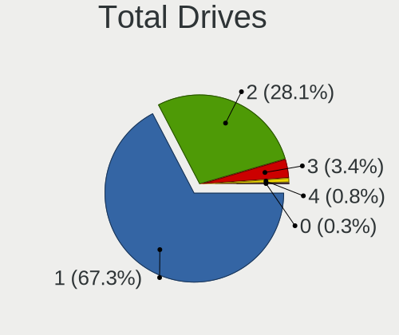
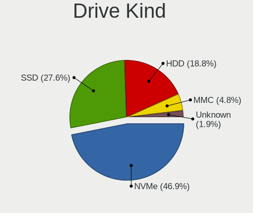
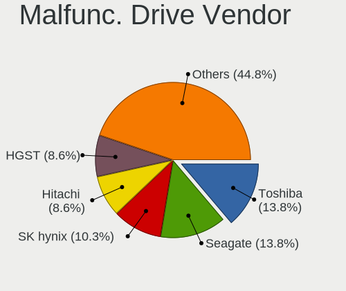
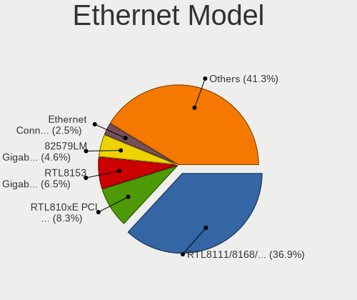
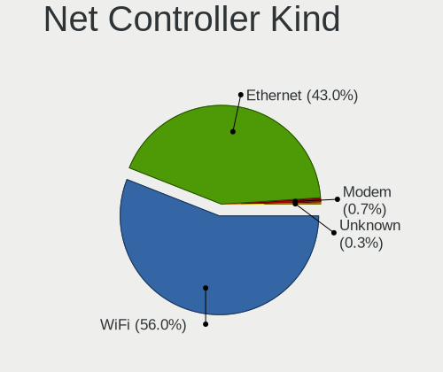
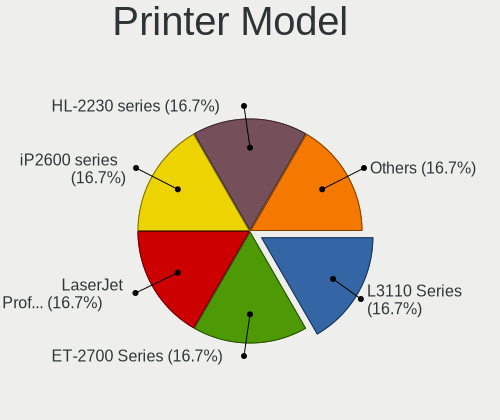
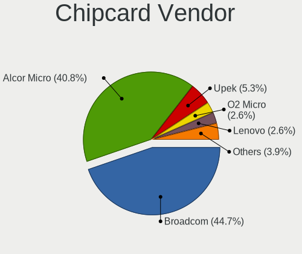

Kubuntu 22.04 - Tested Hardware & Statistics (Notebooks)
--------------------------------------------------------

A project to collect tested hardware configurations for Kubuntu 22.04.

Anyone can contribute to this report by the [hw-probe](https://github.com/linuxhw/hw-probe) tool:

    sudo -E hw-probe -all -upload

Please contribute! Especially if your hardware is rare.

Contents
--------

* [ Test Cases ](#test-cases)

* [ System ](#system)
  - [ Kernel                   ](#kernel)
  - [ Kernel Family            ](#kernel-family)
  - [ Kernel Major Ver.        ](#kernel-major-ver)
  - [ Arch                     ](#arch)
  - [ DE                       ](#de)
  - [ Display Server           ](#display-server)
  - [ Display Manager          ](#display-manager)
  - [ OS Lang                  ](#os-lang)
  - [ Boot Mode                ](#boot-mode)
  - [ Filesystem               ](#filesystem)
  - [ Part. scheme             ](#part-scheme)
  - [ Dual Boot with Linux/BSD ](#dual-boot-with-linuxbsd)
  - [ Dual Boot (Win)          ](#dual-boot-win)

* [ Board ](#board)
  - [ Vendor                   ](#vendor)
  - [ Model                    ](#model)
  - [ Model Family             ](#model-family)
  - [ MFG Year                 ](#mfg-year)
  - [ Form Factor              ](#form-factor)
  - [ Secure Boot              ](#secure-boot)
  - [ Coreboot                 ](#coreboot)
  - [ RAM Size                 ](#ram-size)
  - [ RAM Used                 ](#ram-used)
  - [ Total Drives             ](#total-drives)
  - [ Has CD-ROM               ](#has-cd-rom)
  - [ Has Ethernet             ](#has-ethernet)
  - [ Has WiFi                 ](#has-wifi)
  - [ Has Bluetooth            ](#has-bluetooth)

* [ Location ](#location)
  - [ Country                  ](#country)
  - [ City                     ](#city)

* [ Drives ](#drives)
  - [ Drive Vendor             ](#drive-vendor)
  - [ Drive Model              ](#drive-model)
  - [ HDD Vendor               ](#hdd-vendor)
  - [ SSD Vendor               ](#ssd-vendor)
  - [ Drive Kind               ](#drive-kind)
  - [ Drive Connector          ](#drive-connector)
  - [ Drive Size               ](#drive-size)
  - [ Space Total              ](#space-total)
  - [ Space Used               ](#space-used)
  - [ Malfunc. Drives          ](#malfunc-drives)
  - [ Malfunc. Drive Vendor    ](#malfunc-drive-vendor)
  - [ Malfunc. HDD Vendor      ](#malfunc-hdd-vendor)
  - [ Malfunc. Drive Kind      ](#malfunc-drive-kind)
  - [ Failed Drives            ](#failed-drives)
  - [ Failed Drive Vendor      ](#failed-drive-vendor)
  - [ Drive Status             ](#drive-status)

* [ Storage controller ](#storage-controller)
  - [ Storage Vendor           ](#storage-vendor)
  - [ Storage Model            ](#storage-model)
  - [ Storage Kind             ](#storage-kind)

* [ Processor ](#processor)
  - [ CPU Vendor               ](#cpu-vendor)
  - [ CPU Model                ](#cpu-model)
  - [ CPU Model Family         ](#cpu-model-family)
  - [ CPU Cores                ](#cpu-cores)
  - [ CPU Sockets              ](#cpu-sockets)
  - [ CPU Threads              ](#cpu-threads)
  - [ CPU Op-Modes             ](#cpu-op-modes)
  - [ CPU Microcode            ](#cpu-microcode)
  - [ CPU Microarch            ](#cpu-microarch)

* [ Graphics ](#graphics)
  - [ GPU Vendor               ](#gpu-vendor)
  - [ GPU Model                ](#gpu-model)
  - [ GPU Combo                ](#gpu-combo)
  - [ GPU Driver               ](#gpu-driver)
  - [ GPU Memory               ](#gpu-memory)

* [ Monitor ](#monitor)
  - [ Monitor Vendor           ](#monitor-vendor)
  - [ Monitor Model            ](#monitor-model)
  - [ Monitor Resolution       ](#monitor-resolution)
  - [ Monitor Diagonal         ](#monitor-diagonal)
  - [ Monitor Width            ](#monitor-width)
  - [ Aspect Ratio             ](#aspect-ratio)
  - [ Monitor Area             ](#monitor-area)
  - [ Pixel Density            ](#pixel-density)
  - [ Multiple Monitors        ](#multiple-monitors)

* [ Network ](#network)
  - [ Net Controller Vendor    ](#net-controller-vendor)
  - [ Net Controller Model     ](#net-controller-model)
  - [ Wireless Vendor          ](#wireless-vendor)
  - [ Wireless Model           ](#wireless-model)
  - [ Ethernet Vendor          ](#ethernet-vendor)
  - [ Ethernet Model           ](#ethernet-model)
  - [ Net Controller Kind      ](#net-controller-kind)
  - [ Used Controller          ](#used-controller)
  - [ NICs                     ](#nics)
  - [ IPv6                     ](#ipv6)

* [ Bluetooth ](#bluetooth)
  - [ Bluetooth Vendor         ](#bluetooth-vendor)
  - [ Bluetooth Model          ](#bluetooth-model)

* [ Sound ](#sound)
  - [ Sound Vendor             ](#sound-vendor)
  - [ Sound Model              ](#sound-model)

* [ Memory ](#memory)
  - [ Memory Vendor            ](#memory-vendor)
  - [ Memory Model             ](#memory-model)
  - [ Memory Kind              ](#memory-kind)
  - [ Memory Form Factor       ](#memory-form-factor)
  - [ Memory Size              ](#memory-size)
  - [ Memory Speed             ](#memory-speed)

* [ Printers & scanners ](#printers--scanners)
  - [ Printer Vendor           ](#printer-vendor)
  - [ Printer Model            ](#printer-model)
  - [ Scanner Vendor           ](#scanner-vendor)
  - [ Scanner Model            ](#scanner-model)

* [ Camera ](#camera)
  - [ Camera Vendor            ](#camera-vendor)
  - [ Camera Model             ](#camera-model)

* [ Security ](#security)
  - [ Fingerprint Vendor       ](#fingerprint-vendor)
  - [ Fingerprint Model        ](#fingerprint-model)
  - [ Chipcard Vendor          ](#chipcard-vendor)
  - [ Chipcard Model           ](#chipcard-model)

* [ Unsupported ](#unsupported)
  - [ Unsupported Devices      ](#unsupported-devices)
  - [ Unsupported Device Types ](#unsupported-device-types)

Test Cases
----------

Total: 1093

| Vendor        | Model                       | Probe                                                      | Date         |
|---------------|-----------------------------|------------------------------------------------------------|--------------|
| HP            | Dev One Notebook PC         | [095bc08ae2](https://linux-hardware.org/?probe=095bc08ae2) | May 09, 2024 |
| ASUSTek       | N61Vn                       | [07f83fc6c0](https://linux-hardware.org/?probe=07f83fc6c0) | May 08, 2024 |
| HP            | Laptop 15-bs0xx             | [f0bc418296](https://linux-hardware.org/?probe=f0bc418296) | May 08, 2024 |
| ASUSTek       | VivoBook_ASUSLaptop X712... | [d7c1c96567](https://linux-hardware.org/?probe=d7c1c96567) | May 07, 2024 |
| Dell          | Latitude E6540              | [634735e1da](https://linux-hardware.org/?probe=634735e1da) | May 06, 2024 |
| Dell          | Vostro 15 3510              | [cd07d15de0](https://linux-hardware.org/?probe=cd07d15de0) | May 06, 2024 |
| HP            | OMEN Laptop 15-en0xxx       | [9c6cf56bbb](https://linux-hardware.org/?probe=9c6cf56bbb) | May 05, 2024 |
| ASUSTek       | N61Vn                       | [5aaf9f4609](https://linux-hardware.org/?probe=5aaf9f4609) | May 05, 2024 |
| ASUSTek       | VivoBook_ASUSLaptop K650... | [40f4c2e910](https://linux-hardware.org/?probe=40f4c2e910) | May 03, 2024 |
| ASUSTek       | VivoBook_ASUSLaptop X712... | [750eaa16c3](https://linux-hardware.org/?probe=750eaa16c3) | May 02, 2024 |
| Dell          | Inspiron 3543               | [13549c3c7b](https://linux-hardware.org/?probe=13549c3c7b) | May 01, 2024 |
| Lenovo        | ThinkPad T570 20H9CTO1WW    | [433a701205](https://linux-hardware.org/?probe=433a701205) | Apr 30, 2024 |
| Lenovo        | Z70-80 80FG                 | [4a07e72bf5](https://linux-hardware.org/?probe=4a07e72bf5) | Apr 30, 2024 |
| MSI           | MS-7D46                     | [135fa9337a](https://linux-hardware.org/?probe=135fa9337a) | Apr 28, 2024 |
| Timi          | RedmiBook Pro 14S           | [a330c6b15e](https://linux-hardware.org/?probe=a330c6b15e) | Apr 28, 2024 |
| Acer          | Nitro AN715-51              | [0056e3f773](https://linux-hardware.org/?probe=0056e3f773) | Apr 27, 2024 |
| ASUSTek       | ASUS TUF Gaming F15 FX50... | [86089f64dc](https://linux-hardware.org/?probe=86089f64dc) | Apr 26, 2024 |
| Dell          | Inspiron 1525               | [c609a3560c](https://linux-hardware.org/?probe=c609a3560c) | Apr 26, 2024 |
| HP            | EliteBook 8730w             | [da4db94e97](https://linux-hardware.org/?probe=da4db94e97) | Apr 26, 2024 |
| Gigabyte      | G5 MD                       | [09c723ce43](https://linux-hardware.org/?probe=09c723ce43) | Apr 25, 2024 |
| Gigabyte      | G5 MD                       | [4529b157ae](https://linux-hardware.org/?probe=4529b157ae) | Apr 25, 2024 |
| Carbon Sys... | Iridium 16 Pro              | [b35260710f](https://linux-hardware.org/?probe=b35260710f) | Apr 24, 2024 |
| HP            | Pavilion g7                 | [b700499e3c](https://linux-hardware.org/?probe=b700499e3c) | Apr 21, 2024 |
| Lenovo        | ThinkPad T14 Gen 3 21AH0... | [96c7946b39](https://linux-hardware.org/?probe=96c7946b39) | Apr 20, 2024 |
| Lenovo        | ThinkBook 16 G4+ IAP 21C... | [06f11dee2c](https://linux-hardware.org/?probe=06f11dee2c) | Apr 19, 2024 |
| ASUSTek       | X756UXK                     | [c529e5199d](https://linux-hardware.org/?probe=c529e5199d) | Apr 18, 2024 |
| Apple         | MacBookPro11,5              | [52efce758f](https://linux-hardware.org/?probe=52efce758f) | Apr 18, 2024 |
| Maibenben     | MaiBook M                   | [9bf28eb5b5](https://linux-hardware.org/?probe=9bf28eb5b5) | Apr 15, 2024 |
| Lenovo        | ThinkPad W540 20BHS0KY08    | [2628bdee23](https://linux-hardware.org/?probe=2628bdee23) | Apr 15, 2024 |
| HP            | Laptop 15-bs1xx             | [f51e425901](https://linux-hardware.org/?probe=f51e425901) | Apr 15, 2024 |
| HP            | Laptop 15-fd0xxx            | [7674249513](https://linux-hardware.org/?probe=7674249513) | Apr 15, 2024 |
| Samsung       | 550XDA                      | [2679015030](https://linux-hardware.org/?probe=2679015030) | Apr 12, 2024 |
| Samsung       | 550XDA                      | [ac02b37e1d](https://linux-hardware.org/?probe=ac02b37e1d) | Apr 12, 2024 |
| Acer          | Nitro AN515-43              | [36bf325205](https://linux-hardware.org/?probe=36bf325205) | Apr 12, 2024 |
| Dell          | Inspiron 14 5425            | [65702761a8](https://linux-hardware.org/?probe=65702761a8) | Apr 10, 2024 |
| Acer          | Aspire A515-45              | [d62d670bd4](https://linux-hardware.org/?probe=d62d670bd4) | Apr 09, 2024 |
| MSI           | Katana GF76 11SC            | [937a23fec5](https://linux-hardware.org/?probe=937a23fec5) | Apr 08, 2024 |
| HP            | 15                          | [8e4dc27da3](https://linux-hardware.org/?probe=8e4dc27da3) | Apr 08, 2024 |
| Lenovo        | ThinkPad T530 2359CTO       | [3fb9602631](https://linux-hardware.org/?probe=3fb9602631) | Apr 08, 2024 |
| Dell          | Inspiron N5110              | [e6d6bf8f56](https://linux-hardware.org/?probe=e6d6bf8f56) | Apr 06, 2024 |
| ASUSTek       | N551JX                      | [e7f0a7b86d](https://linux-hardware.org/?probe=e7f0a7b86d) | Apr 06, 2024 |
| Acer          | Aspire A315-59              | [f436469297](https://linux-hardware.org/?probe=f436469297) | Apr 06, 2024 |
| Avell High... | B.ON                        | [9070104d8b](https://linux-hardware.org/?probe=9070104d8b) | Apr 05, 2024 |
| MSI           | Prestige 14Evo A11M         | [62fb7b6781](https://linux-hardware.org/?probe=62fb7b6781) | Apr 05, 2024 |
| Acer          | Nitro AN715-51              | [8f37d9426f](https://linux-hardware.org/?probe=8f37d9426f) | Apr 05, 2024 |
| HP            | Laptop 15q-ds0xxx           | [64e20f99d6](https://linux-hardware.org/?probe=64e20f99d6) | Apr 05, 2024 |
| Lenovo        | ThinkPad E520 1143R77       | [5aa9f4eb4b](https://linux-hardware.org/?probe=5aa9f4eb4b) | Apr 01, 2024 |
| HP            | Pavilion Gaming Laptop 1... | [8b7a171522](https://linux-hardware.org/?probe=8b7a171522) | Mar 31, 2024 |
| Wortmann      | 1220571_1470066             | [702441f1cb](https://linux-hardware.org/?probe=702441f1cb) | Mar 30, 2024 |
| Avell High... | B.ON                        | [577f3c12bf](https://linux-hardware.org/?probe=577f3c12bf) | Mar 30, 2024 |
| Dell          | G3 3590                     | [5d1da882a1](https://linux-hardware.org/?probe=5d1da882a1) | Mar 30, 2024 |
| Dell          | Latitude 5580               | [db427c180d](https://linux-hardware.org/?probe=db427c180d) | Mar 28, 2024 |
| Lenovo        | ThinkBook 14 G3 ACL 21A2    | [75c0051304](https://linux-hardware.org/?probe=75c0051304) | Mar 28, 2024 |
| HUAWEI        | YTF-XXX                     | [fe3bb27b46](https://linux-hardware.org/?probe=fe3bb27b46) | Mar 28, 2024 |
| HP            | Laptop 15-fd0xxx            | [ff78c23f0b](https://linux-hardware.org/?probe=ff78c23f0b) | Mar 28, 2024 |
| Dell          | Inspiron 3543               | [d73ccce6fc](https://linux-hardware.org/?probe=d73ccce6fc) | Mar 27, 2024 |
| Dell          | XPS 15 7590                 | [44a28c885e](https://linux-hardware.org/?probe=44a28c885e) | Mar 27, 2024 |
| HP            | Notebook                    | [1b9763e964](https://linux-hardware.org/?probe=1b9763e964) | Mar 26, 2024 |
| Dell          | Inspiron 3543               | [f4df9e06b2](https://linux-hardware.org/?probe=f4df9e06b2) | Mar 26, 2024 |
| Lenovo        | ThinkPad T430 2342A19       | [d71f48c168](https://linux-hardware.org/?probe=d71f48c168) | Mar 25, 2024 |
| ASUSTek       | VivoBook_ASUSLaptop X150... | [97a323caf9](https://linux-hardware.org/?probe=97a323caf9) | Mar 25, 2024 |
| Unknown       | Cherry Trail CR             | [efb2513f33](https://linux-hardware.org/?probe=efb2513f33) | Mar 22, 2024 |
| Acer          | Aspire E5-575G              | [cfac3d0451](https://linux-hardware.org/?probe=cfac3d0451) | Mar 21, 2024 |
| HP            | Pavilion 15                 | [6901a5764b](https://linux-hardware.org/?probe=6901a5764b) | Mar 20, 2024 |
| HP            | EliteBook 8570p             | [04c8384abd](https://linux-hardware.org/?probe=04c8384abd) | Mar 19, 2024 |
| HP            | EliteBook 8570p             | [3dd98d315b](https://linux-hardware.org/?probe=3dd98d315b) | Mar 19, 2024 |
| ASUSTek       | ASUS TUF Gaming A17 FA70... | [a98bd8065a](https://linux-hardware.org/?probe=a98bd8065a) | Mar 16, 2024 |
| ASUSTek       | ASUS TUF Gaming A17 FA70... | [dff6166e47](https://linux-hardware.org/?probe=dff6166e47) | Mar 16, 2024 |
| Lenovo        | IdeaPad 3 14IIL05 81WD      | [c63d09f5fa](https://linux-hardware.org/?probe=c63d09f5fa) | Mar 15, 2024 |
| Lenovo        | IdeaPad 3 14IIL05 81WD      | [3f7ac15be0](https://linux-hardware.org/?probe=3f7ac15be0) | Mar 15, 2024 |
| Dell          | Unidentified System         | [bab85b187d](https://linux-hardware.org/?probe=bab85b187d) | Mar 14, 2024 |
| Dell          | Inspiron 3505               | [f3a4539b51](https://linux-hardware.org/?probe=f3a4539b51) | Mar 12, 2024 |
| HP            | Laptop 15-ef2xxx            | [ea8dd3c585](https://linux-hardware.org/?probe=ea8dd3c585) | Mar 11, 2024 |
| Lenovo        | ThinkPad E480 20KN007XAD    | [44866c275d](https://linux-hardware.org/?probe=44866c275d) | Mar 10, 2024 |
| ASUSTek       | ROG Strix G513RC_G513RC     | [4832f2d4f3](https://linux-hardware.org/?probe=4832f2d4f3) | Mar 09, 2024 |
| Lenovo        | Legion Y540-15IRH 81SX      | [afa0de9aa3](https://linux-hardware.org/?probe=afa0de9aa3) | Mar 09, 2024 |
| ASUSTek       | ROG Strix G513RC_G513RC     | [3908a94356](https://linux-hardware.org/?probe=3908a94356) | Mar 08, 2024 |
| HP            | ProBook 450 G5              | [7e89a95523](https://linux-hardware.org/?probe=7e89a95523) | Mar 06, 2024 |
| Lenovo        | ThinkBook 15 G3 ACL 21A4    | [e3503e808b](https://linux-hardware.org/?probe=e3503e808b) | Mar 05, 2024 |
| Lenovo        | ThinkPad T14s Gen 3 21CQ... | [f46cf35368](https://linux-hardware.org/?probe=f46cf35368) | Mar 05, 2024 |
| Lenovo        | ThinkPad T470 20HD000EHV    | [b2d96be2dd](https://linux-hardware.org/?probe=b2d96be2dd) | Mar 04, 2024 |
| ASUSTek       | VivoBook_ASUSLaptop X515... | [1d8f8e4d0f](https://linux-hardware.org/?probe=1d8f8e4d0f) | Mar 04, 2024 |
| Dell          | Inspiron 5567               | [0304104a60](https://linux-hardware.org/?probe=0304104a60) | Mar 03, 2024 |
| Apple         | MacBookPro9,2               | [336cabac77](https://linux-hardware.org/?probe=336cabac77) | Mar 02, 2024 |
| Fujitsu       | LIFEBOOK T725               | [4f3102fa7d](https://linux-hardware.org/?probe=4f3102fa7d) | Feb 29, 2024 |
| ASUSTek       | K53SV                       | [1043b72dee](https://linux-hardware.org/?probe=1043b72dee) | Feb 29, 2024 |
| Acer          | Swift SF114-34              | [75d2193098](https://linux-hardware.org/?probe=75d2193098) | Feb 28, 2024 |
| MSI           | Pulse GL66 12UEK            | [49640f04ca](https://linux-hardware.org/?probe=49640f04ca) | Feb 28, 2024 |
| Lenovo        | ThinkBook 16p Gen 4 21J8    | [e947cc88f8](https://linux-hardware.org/?probe=e947cc88f8) | Feb 28, 2024 |
| HP            | EliteBook 840 G5            | [2c00c513d3](https://linux-hardware.org/?probe=2c00c513d3) | Feb 26, 2024 |
| HP            | EliteBook 840 G5            | [60b6b91372](https://linux-hardware.org/?probe=60b6b91372) | Feb 26, 2024 |
| MSI           | GF63 8RD                    | [b933a88005](https://linux-hardware.org/?probe=b933a88005) | Feb 26, 2024 |
| ASUSTek       | ASUS TUF Gaming F15 FX50... | [e4c07576f6](https://linux-hardware.org/?probe=e4c07576f6) | Feb 26, 2024 |
| Apple         | MacBookPro16,3              | [4921eebd7d](https://linux-hardware.org/?probe=4921eebd7d) | Feb 23, 2024 |
| Apple         | MacBookPro8,1               | [682708c8fc](https://linux-hardware.org/?probe=682708c8fc) | Feb 22, 2024 |
| Apple         | MacBookPro8,1               | [7b6aebf503](https://linux-hardware.org/?probe=7b6aebf503) | Feb 22, 2024 |
| ASUSTek       | ASUS TUF Gaming F15 FX50... | [dbfe2d4d52](https://linux-hardware.org/?probe=dbfe2d4d52) | Feb 22, 2024 |
| Lenovo        | Legion Pro 7 16IRX8H 82W... | [1e64feccdb](https://linux-hardware.org/?probe=1e64feccdb) | Feb 21, 2024 |
| Lenovo        | ThinkPad E595 20NFCTO1WW    | [034c817132](https://linux-hardware.org/?probe=034c817132) | Feb 20, 2024 |
| Dell          | Latitude E6530              | [cd8cb1807f](https://linux-hardware.org/?probe=cd8cb1807f) | Feb 19, 2024 |
| ASUSTek       | ASUS TUF Gaming F15 FX50... | [129f9eb367](https://linux-hardware.org/?probe=129f9eb367) | Feb 17, 2024 |
| ASUSTek       | ASUS TUF Gaming F15 FX50... | [81acc04317](https://linux-hardware.org/?probe=81acc04317) | Feb 17, 2024 |
| Acer          | Nitro AN515-52              | [ecfbf20c60](https://linux-hardware.org/?probe=ecfbf20c60) | Feb 16, 2024 |
| HP            | EliteBook 650 15.6 inch ... | [c82778e496](https://linux-hardware.org/?probe=c82778e496) | Feb 13, 2024 |
| HP            | G62                         | [b6daa4e6b1](https://linux-hardware.org/?probe=b6daa4e6b1) | Feb 12, 2024 |
| Lenovo        | ThinkPad X230 23256N6       | [6f6d39cf77](https://linux-hardware.org/?probe=6f6d39cf77) | Feb 12, 2024 |
| Lenovo        | ThinkPad P51 20HJS3Q700     | [2de6ff345e](https://linux-hardware.org/?probe=2de6ff345e) | Feb 12, 2024 |
| Apple         | MacBookPro11,1              | [bc1e6e90c1](https://linux-hardware.org/?probe=bc1e6e90c1) | Feb 10, 2024 |
| Apple         | MacBookPro11,1              | [0c1b63b275](https://linux-hardware.org/?probe=0c1b63b275) | Feb 10, 2024 |
| Acer          | Aspire A515-57              | [5e72988c18](https://linux-hardware.org/?probe=5e72988c18) | Feb 08, 2024 |
| Toshiba       | QOSMIO X505                 | [109be22d5f](https://linux-hardware.org/?probe=109be22d5f) | Feb 05, 2024 |
| HP            | Pavilion 15                 | [066b0cf774](https://linux-hardware.org/?probe=066b0cf774) | Feb 05, 2024 |
| Lenovo        | IdeaPad Y560                | [24bf3674dc](https://linux-hardware.org/?probe=24bf3674dc) | Feb 04, 2024 |
| Lenovo        | IdeaPad Y560                | [7d98e0f393](https://linux-hardware.org/?probe=7d98e0f393) | Feb 04, 2024 |
| Lenovo        | ThinkPad E520 1143R77       | [b36ea31ed6](https://linux-hardware.org/?probe=b36ea31ed6) | Feb 04, 2024 |
| Dell          | Inspiron 5593               | [99994880b0](https://linux-hardware.org/?probe=99994880b0) | Feb 03, 2024 |
| Unknown       | Unknown                     | [8c03bd946c](https://linux-hardware.org/?probe=8c03bd946c) | Feb 02, 2024 |
| Notebook      | V15x_V17xRNx                | [901e71289e](https://linux-hardware.org/?probe=901e71289e) | Feb 02, 2024 |
| Dell          | Inspiron 5547               | [507fad3c00](https://linux-hardware.org/?probe=507fad3c00) | Feb 02, 2024 |
| Lenovo        | ThinkPad X1 Carbon Gen 1... | [f1b0b8716f](https://linux-hardware.org/?probe=f1b0b8716f) | Feb 01, 2024 |
| Lenovo        | IdeaPad Slim 5 16IRL8 82... | [8f630da527](https://linux-hardware.org/?probe=8f630da527) | Jan 31, 2024 |
| ASUSTek       | ROG Zephyrus G14 GA401QC... | [02d7b129fc](https://linux-hardware.org/?probe=02d7b129fc) | Jan 31, 2024 |
| ASUSTek       | G75VX                       | [5c270f1082](https://linux-hardware.org/?probe=5c270f1082) | Jan 30, 2024 |
| Toshiba       | Satellite P300              | [14da91750f](https://linux-hardware.org/?probe=14da91750f) | Jan 29, 2024 |
| Acer          | TravelMate P215-41-G2       | [0500733b2d](https://linux-hardware.org/?probe=0500733b2d) | Jan 28, 2024 |
| HP            | EliteBook 8470w             | [a92904a970](https://linux-hardware.org/?probe=a92904a970) | Jan 28, 2024 |
| Acer          | Aspire A715-42G             | [6e3e887615](https://linux-hardware.org/?probe=6e3e887615) | Jan 27, 2024 |
| Lenovo        | ThinkPad T14 Gen 3 21AHA... | [f2ed690a39](https://linux-hardware.org/?probe=f2ed690a39) | Jan 27, 2024 |
| Lenovo        | ThinkPad T14 Gen 3 21AHA... | [4644130b45](https://linux-hardware.org/?probe=4644130b45) | Jan 27, 2024 |
| Lenovo        | ThinkPad Twist 334729G      | [0a17051b66](https://linux-hardware.org/?probe=0a17051b66) | Jan 25, 2024 |
| Medion        | S14409                      | [8e8339905a](https://linux-hardware.org/?probe=8e8339905a) | Jan 25, 2024 |
| ASUSTek       | VivoBook_ASUSLaptop X170... | [f9da9c2d2e](https://linux-hardware.org/?probe=f9da9c2d2e) | Jan 23, 2024 |
| HP            | ProBook 4540s               | [84367073dd](https://linux-hardware.org/?probe=84367073dd) | Jan 22, 2024 |
| HP            | ProBook 4540s               | [f72cd2d1a0](https://linux-hardware.org/?probe=f72cd2d1a0) | Jan 22, 2024 |
| Packard Be... | EasyNote TS11HR             | [31a4f6e57f](https://linux-hardware.org/?probe=31a4f6e57f) | Jan 22, 2024 |
| ASUSTek       | UX410UAK                    | [1155ca8c5c](https://linux-hardware.org/?probe=1155ca8c5c) | Jan 22, 2024 |
| Lenovo        | ThinkPad L14 Gen 2 20X10... | [aaf1d1d0de](https://linux-hardware.org/?probe=aaf1d1d0de) | Jan 21, 2024 |
| HP            | Notebook                    | [71136f647b](https://linux-hardware.org/?probe=71136f647b) | Jan 20, 2024 |
| Dell          | Latitude 7330               | [d8b532bbee](https://linux-hardware.org/?probe=d8b532bbee) | Jan 19, 2024 |
| HP            | OMEN Laptop 15-ek1xxx       | [5c18e1a4bc](https://linux-hardware.org/?probe=5c18e1a4bc) | Jan 18, 2024 |
| Dell          | Latitude 5530               | [df5d5becd7](https://linux-hardware.org/?probe=df5d5becd7) | Jan 17, 2024 |
| HP            | Laptop 15-ef2xxx            | [ca627d3c3e](https://linux-hardware.org/?probe=ca627d3c3e) | Jan 15, 2024 |
| MSI           | Summit E16Flip A12UCT       | [efb852e7fb](https://linux-hardware.org/?probe=efb852e7fb) | Jan 15, 2024 |
| Google        | Fleex                       | [46f5b6af86](https://linux-hardware.org/?probe=46f5b6af86) | Jan 14, 2024 |
| VALE          | Notebook Slim S132          | [32021c35d3](https://linux-hardware.org/?probe=32021c35d3) | Jan 14, 2024 |
| VALE          | Notebook Slim S132          | [0d2db2e184](https://linux-hardware.org/?probe=0d2db2e184) | Jan 14, 2024 |
| ASUSTek       | VivoBook_ASUSLaptop X712... | [bda32c8468](https://linux-hardware.org/?probe=bda32c8468) | Jan 14, 2024 |
| Lenovo        | ThinkPad T495 20NJ000XIX    | [700470a7f6](https://linux-hardware.org/?probe=700470a7f6) | Jan 12, 2024 |
| Lenovo        | ThinkPad E450 20DC003WUS    | [817c17d60e](https://linux-hardware.org/?probe=817c17d60e) | Jan 12, 2024 |
| HP            | ProBook 6450b               | [ddae4148a2](https://linux-hardware.org/?probe=ddae4148a2) | Jan 12, 2024 |
| Dell          | Inspiron 3793               | [60ded5e8e7](https://linux-hardware.org/?probe=60ded5e8e7) | Jan 11, 2024 |
| Sony          | VGN-CS190N                  | [2ac26516a6](https://linux-hardware.org/?probe=2ac26516a6) | Jan 09, 2024 |
| ASUSTek       | Zephyrus S GX502GW_GX502... | [8101d22b4a](https://linux-hardware.org/?probe=8101d22b4a) | Jan 09, 2024 |
| Dell          | Latitude E7450              | [a60667c993](https://linux-hardware.org/?probe=a60667c993) | Jan 08, 2024 |
| Apple         | MacBookAir9,1               | [6af0a29be6](https://linux-hardware.org/?probe=6af0a29be6) | Jan 07, 2024 |
| HP            | ENVY m6                     | [d63a06fb89](https://linux-hardware.org/?probe=d63a06fb89) | Jan 04, 2024 |
| Lenovo        | ThinkPad E15 Gen 4 21E60... | [cf1f935e69](https://linux-hardware.org/?probe=cf1f935e69) | Jan 03, 2024 |
| HUAWEI        | BOM-WXX9                    | [4c7efd21fe](https://linux-hardware.org/?probe=4c7efd21fe) | Jan 02, 2024 |
| Lenovo        | IdeaPad 5 15ARE05 81YQ      | [fb59929b28](https://linux-hardware.org/?probe=fb59929b28) | Jan 02, 2024 |
| Notebook      | NL5xNU                      | [915031852a](https://linux-hardware.org/?probe=915031852a) | Dec 31, 2023 |
| Apple         | MacBookAir9,1               | [71c755966f](https://linux-hardware.org/?probe=71c755966f) | Dec 31, 2023 |
| Apple         | MacBookAir9,1               | [b13ec8c4fe](https://linux-hardware.org/?probe=b13ec8c4fe) | Dec 31, 2023 |
| ASUSTek       | PRIME B360M-A               | [42b25d8ac5](https://linux-hardware.org/?probe=42b25d8ac5) | Dec 30, 2023 |
| HP            | ENVY m4                     | [6416f24210](https://linux-hardware.org/?probe=6416f24210) | Dec 30, 2023 |
| HP            | ENVY m4                     | [f0cd285399](https://linux-hardware.org/?probe=f0cd285399) | Dec 30, 2023 |
| Notebook      | NL5xNU                      | [ad5a093909](https://linux-hardware.org/?probe=ad5a093909) | Dec 26, 2023 |
| Lenovo        | ThinkPad T520 4243ED3       | [6fd4832f12](https://linux-hardware.org/?probe=6fd4832f12) | Dec 26, 2023 |
| Apple         | MacBookAir9,1               | [22b65c12f2](https://linux-hardware.org/?probe=22b65c12f2) | Dec 26, 2023 |
| Apple         | MacBookPro12,1              | [0714d5920a](https://linux-hardware.org/?probe=0714d5920a) | Dec 26, 2023 |
| PC Special... | 14 Fusion Pro               | [76bf311c34](https://linux-hardware.org/?probe=76bf311c34) | Dec 25, 2023 |
| HP            | 340S G7 Notebook PC         | [097603b65a](https://linux-hardware.org/?probe=097603b65a) | Dec 23, 2023 |
| Lenovo        | ThinkPad T500 20564RG       | [e17f4b51d6](https://linux-hardware.org/?probe=e17f4b51d6) | Dec 22, 2023 |
| Lenovo        | M30-70 80H8                 | [8ec7db7a8a](https://linux-hardware.org/?probe=8ec7db7a8a) | Dec 22, 2023 |
| Eluktronic... | MECH-17                     | [0a69b2e084](https://linux-hardware.org/?probe=0a69b2e084) | Dec 22, 2023 |
| HP            | Pavilion Laptop 15-eg2xx... | [db6db43604](https://linux-hardware.org/?probe=db6db43604) | Dec 22, 2023 |
| HUAWEI        | RLEF-XX                     | [cdcc0b8368](https://linux-hardware.org/?probe=cdcc0b8368) | Dec 22, 2023 |
| HP            | Laptop 15-dw3xxx            | [1b860f6465](https://linux-hardware.org/?probe=1b860f6465) | Dec 21, 2023 |
| Google        | Cave                        | [ec9d49335f](https://linux-hardware.org/?probe=ec9d49335f) | Dec 20, 2023 |
| HP            | Pavilion 17                 | [449c36ff1c](https://linux-hardware.org/?probe=449c36ff1c) | Dec 19, 2023 |
| TUXEDO        | Pulse 14 Gen1               | [031f8b45bd](https://linux-hardware.org/?probe=031f8b45bd) | Dec 19, 2023 |
| HP            | EliteBook 840 G6            | [42706222be](https://linux-hardware.org/?probe=42706222be) | Dec 19, 2023 |
| Gateway       | NV54 Series                 | [1bd87c77d2](https://linux-hardware.org/?probe=1bd87c77d2) | Dec 18, 2023 |
| Lenovo        | Yoga Slim 7 13ACN5 82CY     | [8507460974](https://linux-hardware.org/?probe=8507460974) | Dec 18, 2023 |
| MSI           | GF63 Thin 9RCX              | [fe9179b1fb](https://linux-hardware.org/?probe=fe9179b1fb) | Dec 16, 2023 |
| HP            | G62                         | [fd110d99fd](https://linux-hardware.org/?probe=fd110d99fd) | Dec 15, 2023 |
| Lenovo        | IdeaPad Pro 5 16APH8 83A... | [d438fe20ff](https://linux-hardware.org/?probe=d438fe20ff) | Dec 15, 2023 |
| ASUSTek       | VivoBook_ASUSLaptop X170... | [42b02a9d8e](https://linux-hardware.org/?probe=42b02a9d8e) | Dec 14, 2023 |
| HP            | Laptop                      | [8bdb6d048e](https://linux-hardware.org/?probe=8bdb6d048e) | Dec 11, 2023 |
| HP            | Laptop                      | [b5d2cf7074](https://linux-hardware.org/?probe=b5d2cf7074) | Dec 10, 2023 |
| Acer          | Nitro AN517-41              | [6e5abc0ea5](https://linux-hardware.org/?probe=6e5abc0ea5) | Dec 10, 2023 |
| Notebook      | N24_25JU                    | [170b205714](https://linux-hardware.org/?probe=170b205714) | Dec 09, 2023 |
| HUAWEI        | HVY-WXX9                    | [6f35ce12bd](https://linux-hardware.org/?probe=6f35ce12bd) | Dec 07, 2023 |
| ASUSTek       | K52JB                       | [2edc689735](https://linux-hardware.org/?probe=2edc689735) | Dec 06, 2023 |
| Lenovo        | ThinkPad E595 20NFCTO1WW    | [1f68b6b7c7](https://linux-hardware.org/?probe=1f68b6b7c7) | Dec 06, 2023 |
| eMachines     | eME732G                     | [d94dd62bf1](https://linux-hardware.org/?probe=d94dd62bf1) | Dec 05, 2023 |
| Acer          | Aspire A314-22              | [daa41db960](https://linux-hardware.org/?probe=daa41db960) | Dec 05, 2023 |
| HUAWEI        | BOD-WXX9                    | [e6e58d5148](https://linux-hardware.org/?probe=e6e58d5148) | Dec 05, 2023 |
| eMachines     | eME732G                     | [931569e396](https://linux-hardware.org/?probe=931569e396) | Dec 03, 2023 |
| Lenovo        | K14 G2 IRU 21G1             | [b52ce46b0d](https://linux-hardware.org/?probe=b52ce46b0d) | Dec 01, 2023 |
| Lenovo        | IdeaPad 3 15IIL05 81WE      | [1f830eb37e](https://linux-hardware.org/?probe=1f830eb37e) | Nov 27, 2023 |
| HP            | EliteBook 840 G2            | [12e26441e1](https://linux-hardware.org/?probe=12e26441e1) | Nov 27, 2023 |
| Lenovo        | IdeaPad 3 15IIL05 81WE      | [8474959120](https://linux-hardware.org/?probe=8474959120) | Nov 26, 2023 |
| Dell          | Inspiron 5537               | [7c92224aed](https://linux-hardware.org/?probe=7c92224aed) | Nov 25, 2023 |
| Dell          | Inspiron 5537               | [57a3d9064a](https://linux-hardware.org/?probe=57a3d9064a) | Nov 25, 2023 |
| Dell          | Inspiron 5537               | [a4c63ff9b4](https://linux-hardware.org/?probe=a4c63ff9b4) | Nov 25, 2023 |
| Lenovo        | IdeaPad Pro 5 16APH8 83A... | [2b5e71ca1e](https://linux-hardware.org/?probe=2b5e71ca1e) | Nov 24, 2023 |
| Acer          | Aspire E5-575               | [1ad50e2862](https://linux-hardware.org/?probe=1ad50e2862) | Nov 23, 2023 |
| Acer          | Aspire E1-570               | [8c6fd80245](https://linux-hardware.org/?probe=8c6fd80245) | Nov 22, 2023 |
| PC Special... | Lafite Pro II 15            | [b7b85ab8ce](https://linux-hardware.org/?probe=b7b85ab8ce) | Nov 20, 2023 |
| HP            | ProBook 430 G6              | [6175f06df9](https://linux-hardware.org/?probe=6175f06df9) | Nov 20, 2023 |
| HP            | Pavilion 17                 | [00c2d45d1d](https://linux-hardware.org/?probe=00c2d45d1d) | Nov 19, 2023 |
| Dell          | Latitude 5521               | [2cd2e72764](https://linux-hardware.org/?probe=2cd2e72764) | Nov 15, 2023 |
| Dell          | Latitude E7450              | [500f23ef78](https://linux-hardware.org/?probe=500f23ef78) | Nov 14, 2023 |
| HP            | ProBook 6570b               | [edf0d74b51](https://linux-hardware.org/?probe=edf0d74b51) | Nov 14, 2023 |
| Lenovo        | G550 2958                   | [b158de590e](https://linux-hardware.org/?probe=b158de590e) | Nov 14, 2023 |
| Lenovo        | G550 2958                   | [25455f055b](https://linux-hardware.org/?probe=25455f055b) | Nov 14, 2023 |
| ASUSTek       | ROG Strix G531GT_G531GT     | [2166a882d2](https://linux-hardware.org/?probe=2166a882d2) | Nov 13, 2023 |
| HP            | ProBook 450 G2              | [872e6f2ca5](https://linux-hardware.org/?probe=872e6f2ca5) | Nov 12, 2023 |
| HP            | Pavilion g6                 | [1215d8475b](https://linux-hardware.org/?probe=1215d8475b) | Nov 11, 2023 |
| Lenovo        | ThinkPad T480s 20L7001MH... | [f5c3846dce](https://linux-hardware.org/?probe=f5c3846dce) | Nov 10, 2023 |
| HP            | EliteBook 840 G8 Noteboo... | [ecb49b0454](https://linux-hardware.org/?probe=ecb49b0454) | Nov 09, 2023 |
| HP            | EliteBook 840 G8 Noteboo... | [5b67ed0642](https://linux-hardware.org/?probe=5b67ed0642) | Nov 09, 2023 |
| Lenovo        | ThinkPad E595 20NFCTO1WW    | [34c0a2ec4c](https://linux-hardware.org/?probe=34c0a2ec4c) | Nov 07, 2023 |
| Lenovo        | ThinkPad X1 Carbon Gen 1... | [8ef23bbac8](https://linux-hardware.org/?probe=8ef23bbac8) | Nov 07, 2023 |
| Lenovo        | ThinkPad X1 Carbon Gen 1... | [003be2f197](https://linux-hardware.org/?probe=003be2f197) | Nov 07, 2023 |
| HP            | Pavilion Laptop 14-bf0xx    | [01884ea8de](https://linux-hardware.org/?probe=01884ea8de) | Nov 07, 2023 |
| Dell          | Precision 3561              | [8fd1f7d515](https://linux-hardware.org/?probe=8fd1f7d515) | Nov 06, 2023 |
| ASUSTek       | VivoBook 14_ASUS Laptop ... | [b5e4afb8e9](https://linux-hardware.org/?probe=b5e4afb8e9) | Nov 06, 2023 |
| Lenovo        | ThinkPad T480 20L6S5VP3U    | [ea70f0e597](https://linux-hardware.org/?probe=ea70f0e597) | Nov 05, 2023 |
| HP            | EliteBook 8470p             | [f154c5979f](https://linux-hardware.org/?probe=f154c5979f) | Nov 05, 2023 |
| Dell          | Latitude E7470              | [343fdc858a](https://linux-hardware.org/?probe=343fdc858a) | Nov 03, 2023 |
| Acer          | Aspire A515-43              | [6aa1f3a294](https://linux-hardware.org/?probe=6aa1f3a294) | Nov 02, 2023 |
| Acer          | Aspire A515-43              | [3e65346dfd](https://linux-hardware.org/?probe=3e65346dfd) | Nov 02, 2023 |
| Lenovo        | ThinkBook 14p Gen 3 21EJ    | [cde7923bf2](https://linux-hardware.org/?probe=cde7923bf2) | Nov 01, 2023 |
| Acer          | Aspire A517-52G             | [f65225d50a](https://linux-hardware.org/?probe=f65225d50a) | Nov 01, 2023 |
| Lenovo        | ThinkPad T14 Gen 1 20S00... | [5acc8f68a0](https://linux-hardware.org/?probe=5acc8f68a0) | Nov 01, 2023 |
| Acer          | Aspire A517-52G             | [69f7a5ebed](https://linux-hardware.org/?probe=69f7a5ebed) | Nov 01, 2023 |
| ASUSTek       | VivoBook_ASUSLaptop X415... | [8a2a3561ab](https://linux-hardware.org/?probe=8a2a3561ab) | Nov 01, 2023 |
| Dell          | Latitude 7290               | [b7170343fb](https://linux-hardware.org/?probe=b7170343fb) | Oct 31, 2023 |
| ASUSTek       | ROG Strix G531GT_G531GT     | [98d01105c7](https://linux-hardware.org/?probe=98d01105c7) | Oct 31, 2023 |
| Acer          | Aspire AV15-51              | [84064baf19](https://linux-hardware.org/?probe=84064baf19) | Oct 31, 2023 |
| Dell          | Latitude 5530               | [1731342e23](https://linux-hardware.org/?probe=1731342e23) | Oct 30, 2023 |
| HP            | Laptop 17-cp0xxx            | [9b3c09e73a](https://linux-hardware.org/?probe=9b3c09e73a) | Oct 27, 2023 |
| EXTRA Comp... | MS-1758                     | [eced546e79](https://linux-hardware.org/?probe=eced546e79) | Oct 26, 2023 |
| HP            | Pavilion 17                 | [9eb519ce8c](https://linux-hardware.org/?probe=9eb519ce8c) | Oct 26, 2023 |
| HP            | Pavilion 17                 | [9b004ab742](https://linux-hardware.org/?probe=9b004ab742) | Oct 26, 2023 |
| Acer          | Nitro AN515-58              | [f956ab0313](https://linux-hardware.org/?probe=f956ab0313) | Oct 26, 2023 |
| HP            | Pavilion g7                 | [3bd963fd9e](https://linux-hardware.org/?probe=3bd963fd9e) | Oct 24, 2023 |
| ASUSTek       | K56CM                       | [a5437fcab8](https://linux-hardware.org/?probe=a5437fcab8) | Oct 24, 2023 |
| HP            | Pavilion Notebook           | [4f269eeaa7](https://linux-hardware.org/?probe=4f269eeaa7) | Oct 23, 2023 |
| Lenovo        | IdeaPad 3 14ARE05 81W3      | [55c5bbce9f](https://linux-hardware.org/?probe=55c5bbce9f) | Oct 23, 2023 |
| AZW           | SEi                         | [94602bd41b](https://linux-hardware.org/?probe=94602bd41b) | Oct 22, 2023 |
| HP            | ProBook 4340s               | [8746af78f7](https://linux-hardware.org/?probe=8746af78f7) | Oct 22, 2023 |
| ASUSTek       | VivoBook_ASUSLaptop X515... | [130d199934](https://linux-hardware.org/?probe=130d199934) | Oct 21, 2023 |
| Dell          | Latitude E7470              | [4870f90403](https://linux-hardware.org/?probe=4870f90403) | Oct 20, 2023 |
| MACHENIKE     | MACHCREATOR-16              | [91f29a5a63](https://linux-hardware.org/?probe=91f29a5a63) | Oct 20, 2023 |
| Lenovo        | ThinkBook 14p Gen 3 21EJ    | [4bfe18fe76](https://linux-hardware.org/?probe=4bfe18fe76) | Oct 20, 2023 |
| Lenovo        | ThinkBook 14p Gen 3 21EJ    | [e83ad29e5e](https://linux-hardware.org/?probe=e83ad29e5e) | Oct 20, 2023 |
| HP            | G60                         | [3c3f75c072](https://linux-hardware.org/?probe=3c3f75c072) | Oct 19, 2023 |
| Lenovo        | IdeaPad Gaming 3 15IMH05... | [495a705c9e](https://linux-hardware.org/?probe=495a705c9e) | Oct 18, 2023 |
| Dell          | Precision 7520              | [bd78f68578](https://linux-hardware.org/?probe=bd78f68578) | Oct 18, 2023 |
| Lenovo        | ThinkPad X1 Carbon 5th 2... | [6fe57753a4](https://linux-hardware.org/?probe=6fe57753a4) | Oct 17, 2023 |
| HP            | ZBook 15 G3                 | [02bc0ccf6d](https://linux-hardware.org/?probe=02bc0ccf6d) | Oct 16, 2023 |
| Dell          | Latitude E7470              | [59258fc186](https://linux-hardware.org/?probe=59258fc186) | Oct 15, 2023 |
| HP            | Pavilion Laptop 15-eg2xx... | [88c47cfb66](https://linux-hardware.org/?probe=88c47cfb66) | Oct 15, 2023 |
| HP            | ZBook 17 G3                 | [92049beb26](https://linux-hardware.org/?probe=92049beb26) | Oct 15, 2023 |
| HP            | ZBook 17 G3                 | [3eff97b04d](https://linux-hardware.org/?probe=3eff97b04d) | Oct 15, 2023 |
| Lenovo        | ThinkBook 15-IIL 20SM       | [a03109d57a](https://linux-hardware.org/?probe=a03109d57a) | Oct 14, 2023 |
| Lenovo        | ThinkPad E15 Gen 2 20TD0... | [f18ac93db8](https://linux-hardware.org/?probe=f18ac93db8) | Oct 13, 2023 |
| Dell          | Latitude 7490               | [b5e38fe27e](https://linux-hardware.org/?probe=b5e38fe27e) | Oct 13, 2023 |
| Acer          | Aspire 5250                 | [bef1086dfe](https://linux-hardware.org/?probe=bef1086dfe) | Oct 12, 2023 |
| HP            | EliteBook 8770w             | [bf26581f5d](https://linux-hardware.org/?probe=bf26581f5d) | Oct 12, 2023 |
| HP            | Pavilion Laptop 15-eg2xx... | [f48331f12b](https://linux-hardware.org/?probe=f48331f12b) | Oct 12, 2023 |
| Dell          | Vostro 5490                 | [616aecbfbd](https://linux-hardware.org/?probe=616aecbfbd) | Oct 11, 2023 |
| Alienware     | m16 R1                      | [6ea5ba513f](https://linux-hardware.org/?probe=6ea5ba513f) | Oct 11, 2023 |
| Alienware     | m16 R1                      | [f9c4374e7c](https://linux-hardware.org/?probe=f9c4374e7c) | Oct 11, 2023 |
| Dell          | Latitude 5511               | [164cc57420](https://linux-hardware.org/?probe=164cc57420) | Oct 10, 2023 |
| Dell          | Latitude 5511               | [9827df8ea8](https://linux-hardware.org/?probe=9827df8ea8) | Oct 10, 2023 |
| Dell          | Latitude 5530               | [95ec4384f9](https://linux-hardware.org/?probe=95ec4384f9) | Oct 10, 2023 |
| Dell          | Latitude 5530               | [4d218edfa4](https://linux-hardware.org/?probe=4d218edfa4) | Oct 10, 2023 |
| Lenovo        | Yoga 2 Pro 20266            | [3ba4207fd0](https://linux-hardware.org/?probe=3ba4207fd0) | Oct 09, 2023 |
| Lenovo        | IdeaPad Slim 5 16IRL8 82... | [1996d5a1ff](https://linux-hardware.org/?probe=1996d5a1ff) | Oct 08, 2023 |
| Medion        | E15302                      | [d26c76cedf](https://linux-hardware.org/?probe=d26c76cedf) | Oct 07, 2023 |
| TUXEDO        | Book XP15 / XP17 Gen12      | [5ff0e17804](https://linux-hardware.org/?probe=5ff0e17804) | Oct 07, 2023 |
| Lenovo        | ThinkPad X1 Carbon Gen 1... | [5b84610e15](https://linux-hardware.org/?probe=5b84610e15) | Oct 06, 2023 |
| Lenovo        | Yoga Creator 7 15IMH05 8... | [e796c2f9ba](https://linux-hardware.org/?probe=e796c2f9ba) | Oct 05, 2023 |
| Dell          | Latitude 7490               | [ff1fcbaff6](https://linux-hardware.org/?probe=ff1fcbaff6) | Oct 04, 2023 |
| Dell          | Latitude 7490               | [7eca4901d4](https://linux-hardware.org/?probe=7eca4901d4) | Oct 04, 2023 |
| Lenovo        | IdeaPad S540-13IML 81XA     | [2fdd309c6a](https://linux-hardware.org/?probe=2fdd309c6a) | Oct 04, 2023 |
| HP            | Laptop 15s-eq2xxx           | [3f7231bda4](https://linux-hardware.org/?probe=3f7231bda4) | Oct 03, 2023 |
| ASUSTek       | ROG Strix G513IM_G513IM     | [f349819e0a](https://linux-hardware.org/?probe=f349819e0a) | Oct 02, 2023 |
| Google        | Blorb                       | [04e37bafe3](https://linux-hardware.org/?probe=04e37bafe3) | Oct 02, 2023 |
| ASUSTek       | ROG Strix G513IM_G513IM     | [122f1d4ca8](https://linux-hardware.org/?probe=122f1d4ca8) | Oct 02, 2023 |
| Schenker      | VIA 15 Pro (M22)            | [1919690674](https://linux-hardware.org/?probe=1919690674) | Oct 01, 2023 |
| Lenovo        | IdeaPad Slim 5 16IRL8 82... | [ffd2e0d99d](https://linux-hardware.org/?probe=ffd2e0d99d) | Oct 01, 2023 |
| Lenovo        | Legion 5 15ACH6H 82JU       | [48ff113276](https://linux-hardware.org/?probe=48ff113276) | Sep 30, 2023 |
| Lenovo        | Legion 5 Pro 16ACH6H 82J... | [3421ba07f9](https://linux-hardware.org/?probe=3421ba07f9) | Sep 30, 2023 |
| Lenovo        | Legion 5 Pro 16ACH6H 82J... | [480316a0da](https://linux-hardware.org/?probe=480316a0da) | Sep 30, 2023 |
| Lenovo        | IdeaPad 3 15ALC6 82KU       | [cd9628c344](https://linux-hardware.org/?probe=cd9628c344) | Sep 29, 2023 |
| Alienware     | x15 R1                      | [a34b343fce](https://linux-hardware.org/?probe=a34b343fce) | Sep 29, 2023 |
| ASUSTek       | K72Jr                       | [9167494336](https://linux-hardware.org/?probe=9167494336) | Sep 28, 2023 |
| HP            | EliteBook 8770w             | [3286090099](https://linux-hardware.org/?probe=3286090099) | Sep 27, 2023 |
| Lenovo        | B480 20140                  | [960fe0be2b](https://linux-hardware.org/?probe=960fe0be2b) | Sep 25, 2023 |
| Apple         | MacBookPro9,2               | [2691aa5f87](https://linux-hardware.org/?probe=2691aa5f87) | Sep 24, 2023 |
| Lenovo        | IdeaPad 3 15ALC6 82KU       | [a834cee874](https://linux-hardware.org/?probe=a834cee874) | Sep 24, 2023 |
| Lenovo        | ThinkPad P17 Gen 1 20SQS... | [05bf70d208](https://linux-hardware.org/?probe=05bf70d208) | Sep 22, 2023 |
| ASUSTek       | VivoBook_ASUSLaptop X515... | [ad1f9f63c0](https://linux-hardware.org/?probe=ad1f9f63c0) | Sep 22, 2023 |
| Lenovo        | ThinkPad T14s Gen 1 20UJ... | [28c84c64c1](https://linux-hardware.org/?probe=28c84c64c1) | Sep 21, 2023 |
| Lenovo        | ThinkPad T16 Gen 1 21BVC... | [c7142a0d96](https://linux-hardware.org/?probe=c7142a0d96) | Sep 20, 2023 |
| Toshiba       | Satellite Pro C70-B         | [a24c6808ba](https://linux-hardware.org/?probe=a24c6808ba) | Sep 20, 2023 |
| Dell          | Precision 7520              | [99e70bdd81](https://linux-hardware.org/?probe=99e70bdd81) | Sep 19, 2023 |
| Dell          | Precision 7520              | [89f1a6a0a5](https://linux-hardware.org/?probe=89f1a6a0a5) | Sep 18, 2023 |
| ASUSTek       | VivoBook_ASUSLaptop X415... | [cbfe8b032d](https://linux-hardware.org/?probe=cbfe8b032d) | Sep 18, 2023 |
| Dell          | Inspiron 5520               | [91404ec81d](https://linux-hardware.org/?probe=91404ec81d) | Sep 17, 2023 |
| HP            | Compaq 6820s                | [99a625283d](https://linux-hardware.org/?probe=99a625283d) | Sep 16, 2023 |
| HP            | Compaq 6820s                | [2ae8b9ac9d](https://linux-hardware.org/?probe=2ae8b9ac9d) | Sep 16, 2023 |
| Lenovo        | ThinkPad X230 23256N6       | [a32457e14d](https://linux-hardware.org/?probe=a32457e14d) | Sep 15, 2023 |
| Notebook      | P65_P67SA                   | [4d11ae0ff7](https://linux-hardware.org/?probe=4d11ae0ff7) | Sep 13, 2023 |
| Lenovo        | IdeaPad 3 15ARE05 81W4      | [8f3c4bff98](https://linux-hardware.org/?probe=8f3c4bff98) | Sep 13, 2023 |
| Lenovo        | IdeaPad 3 15ARE05 81W4      | [53139247c9](https://linux-hardware.org/?probe=53139247c9) | Sep 10, 2023 |
| Lenovo        | ThinkPad X230 23256N6       | [938cec3228](https://linux-hardware.org/?probe=938cec3228) | Sep 09, 2023 |
| ASUSTek       | VivoBook_ASUSLaptop M350... | [4e30077177](https://linux-hardware.org/?probe=4e30077177) | Sep 08, 2023 |
| Lenovo        | ThinkPad X230 23256N6       | [7ce5ebe4bc](https://linux-hardware.org/?probe=7ce5ebe4bc) | Sep 07, 2023 |
| MSI           | Modern 15 A5M               | [eb92b04384](https://linux-hardware.org/?probe=eb92b04384) | Sep 06, 2023 |
| ASUSTek       | X580VD                      | [989134a7c5](https://linux-hardware.org/?probe=989134a7c5) | Sep 06, 2023 |
| ASUSTek       | ASUS TUF Gaming F15 FX50... | [cf9c65c6f4](https://linux-hardware.org/?probe=cf9c65c6f4) | Sep 06, 2023 |
| Dell          | Latitude 7490               | [2a945e76de](https://linux-hardware.org/?probe=2a945e76de) | Sep 05, 2023 |
| Dell          | Inspiron 3480               | [3d639d27ba](https://linux-hardware.org/?probe=3d639d27ba) | Sep 05, 2023 |
| Apple         | MacBookPro11,4              | [1cd7fc15b1](https://linux-hardware.org/?probe=1cd7fc15b1) | Sep 05, 2023 |
| ASUSTek       | S400CA                      | [453335f199](https://linux-hardware.org/?probe=453335f199) | Sep 04, 2023 |
| ASUSTek       | K52JB                       | [7944dc4ca2](https://linux-hardware.org/?probe=7944dc4ca2) | Sep 04, 2023 |
| Lenovo        | ThinkPad T495s 20QKS0SD0... | [2dff249b45](https://linux-hardware.org/?probe=2dff249b45) | Sep 04, 2023 |
| Dell          | Latitude E6500              | [6199709334](https://linux-hardware.org/?probe=6199709334) | Sep 04, 2023 |
| Lenovo        | ThinkPad T495s 20QKS0SD0... | [515a81a0d1](https://linux-hardware.org/?probe=515a81a0d1) | Sep 03, 2023 |
| Dell          | Latitude E6500              | [308d8d0f19](https://linux-hardware.org/?probe=308d8d0f19) | Sep 03, 2023 |
| Fujitsu Si... | LIFEBOOK E8410              | [31618d06c6](https://linux-hardware.org/?probe=31618d06c6) | Sep 02, 2023 |
| Lenovo        | ThinkPad T14s Gen 4 21F6... | [2fc5b41456](https://linux-hardware.org/?probe=2fc5b41456) | Sep 02, 2023 |
| HP            | ProBook 440 G8 Notebook ... | [b132ff749e](https://linux-hardware.org/?probe=b132ff749e) | Sep 01, 2023 |
| Dell          | XPS 9315                    | [5676f0c210](https://linux-hardware.org/?probe=5676f0c210) | Aug 31, 2023 |
| Lenovo        | ThinkPad T14s Gen 4 21F6... | [3384884acc](https://linux-hardware.org/?probe=3384884acc) | Aug 31, 2023 |
| Sony          | VPCEC390X                   | [ddad567e2a](https://linux-hardware.org/?probe=ddad567e2a) | Aug 31, 2023 |
| ASUSTek       | VivoBook_ASUSLaptop X515... | [2906fc34f6](https://linux-hardware.org/?probe=2906fc34f6) | Aug 30, 2023 |
| Fujitsu       | LIFEBOOK U9312              | [891b276812](https://linux-hardware.org/?probe=891b276812) | Aug 28, 2023 |
| Dell          | Vostro 3501                 | [0211379a67](https://linux-hardware.org/?probe=0211379a67) | Aug 27, 2023 |
| Lenovo        | ThinkPad T495s 20QJCTO1W... | [69a4a078cd](https://linux-hardware.org/?probe=69a4a078cd) | Aug 27, 2023 |
| mPTech        | ARC 11.6 128GB HD           | [4167149587](https://linux-hardware.org/?probe=4167149587) | Aug 26, 2023 |
| Lenovo        | ThinkPad X230 23256N6       | [efa1e38911](https://linux-hardware.org/?probe=efa1e38911) | Aug 26, 2023 |
| ASUSTek       | VivoBook_ASUSLaptop X340... | [d0de544ecd](https://linux-hardware.org/?probe=d0de544ecd) | Aug 25, 2023 |
| Lenovo        | IdeaPad Z580                | [b84eb0a6fa](https://linux-hardware.org/?probe=b84eb0a6fa) | Aug 24, 2023 |
| MSI           | GL65 9SE                    | [aa162e5634](https://linux-hardware.org/?probe=aa162e5634) | Aug 22, 2023 |
| HP            | Pavilion Laptop 14-bf0xx    | [aee37b4a93](https://linux-hardware.org/?probe=aee37b4a93) | Aug 21, 2023 |
| Lenovo        | ThinkPad X230 23256N6       | [4d631eed0e](https://linux-hardware.org/?probe=4d631eed0e) | Aug 21, 2023 |
| Lenovo        | Z70-80 80FG                 | [bb5a7dc0d8](https://linux-hardware.org/?probe=bb5a7dc0d8) | Aug 21, 2023 |
| HP            | ElitePad 1000 G2            | [bb21bd2dbc](https://linux-hardware.org/?probe=bb21bd2dbc) | Aug 21, 2023 |
| Dell          | Latitude E6520              | [923d01a34f](https://linux-hardware.org/?probe=923d01a34f) | Aug 21, 2023 |
| Schenker      | XMG PRO (E23)               | [9b1639077c](https://linux-hardware.org/?probe=9b1639077c) | Aug 20, 2023 |
| HP            | ProBook 450 15.6 inch G9... | [df48f3ca66](https://linux-hardware.org/?probe=df48f3ca66) | Aug 19, 2023 |
| HP            | Pavilion Notebook           | [ed75b0702f](https://linux-hardware.org/?probe=ed75b0702f) | Aug 19, 2023 |
| Dell          | XPS 15 9530                 | [ace741b68a](https://linux-hardware.org/?probe=ace741b68a) | Aug 17, 2023 |
| Lenovo        | ThinkPad Edge E540 20C60... | [41b9b0bfc9](https://linux-hardware.org/?probe=41b9b0bfc9) | Aug 14, 2023 |
| ASUSTek       | N53SV                       | [8643d609f2](https://linux-hardware.org/?probe=8643d609f2) | Aug 14, 2023 |
| HUAWEI        | KLVL-WXXW                   | [29aa72820d](https://linux-hardware.org/?probe=29aa72820d) | Aug 14, 2023 |
| LG Electro... | 17Z90N-V.AA72A8             | [28e815418c](https://linux-hardware.org/?probe=28e815418c) | Aug 13, 2023 |
| Lenovo        | IdeaPad 5 14ITL05 82FE      | [7ad086cf8b](https://linux-hardware.org/?probe=7ad086cf8b) | Aug 13, 2023 |
| Lenovo        | ThinkPad X1 Carbon 2nd 2... | [307eb30c27](https://linux-hardware.org/?probe=307eb30c27) | Aug 13, 2023 |
| Medion        | P651x series                | [46505da47d](https://linux-hardware.org/?probe=46505da47d) | Aug 11, 2023 |
| HP            | Pavilion Laptop 14-bf0xx    | [ba03034ac5](https://linux-hardware.org/?probe=ba03034ac5) | Aug 10, 2023 |
| Lenovo        | Legion Pro 5 16IRX8 82WK    | [d97ae334a3](https://linux-hardware.org/?probe=d97ae334a3) | Aug 09, 2023 |
| Lenovo        | ThinkPad X1 Carbon 2nd 2... | [f28e4b71d6](https://linux-hardware.org/?probe=f28e4b71d6) | Aug 09, 2023 |
| HP            | ZBook 15 G3                 | [068b8c5a6f](https://linux-hardware.org/?probe=068b8c5a6f) | Aug 07, 2023 |
| Timi          | RedmiBook 14-APCS           | [a0a289f4ee](https://linux-hardware.org/?probe=a0a289f4ee) | Aug 06, 2023 |
| Dell          | Inspiron 3520               | [00b2c0458a](https://linux-hardware.org/?probe=00b2c0458a) | Aug 05, 2023 |
| Lenovo        | ThinkPad T480 20L50000MC    | [341698801e](https://linux-hardware.org/?probe=341698801e) | Aug 04, 2023 |
| Dell          | Inspiron 3520               | [6bef2ead01](https://linux-hardware.org/?probe=6bef2ead01) | Aug 04, 2023 |
| Dell          | Latitude 5530               | [dd85033508](https://linux-hardware.org/?probe=dd85033508) | Aug 03, 2023 |
| System76      | Galago Pro                  | [2677fc9a99](https://linux-hardware.org/?probe=2677fc9a99) | Aug 03, 2023 |
| Lenovo        | ThinkPad T16 Gen 1 21BVC... | [be7baf7741](https://linux-hardware.org/?probe=be7baf7741) | Jul 31, 2023 |
| Lenovo        | ThinkPad T16 Gen 1 21BVC... | [3b0862f434](https://linux-hardware.org/?probe=3b0862f434) | Jul 31, 2023 |
| Dell          | Precision 3571              | [83a85ddae5](https://linux-hardware.org/?probe=83a85ddae5) | Jul 31, 2023 |
| Dell          | Inspiron 16 7610            | [e7befe5a64](https://linux-hardware.org/?probe=e7befe5a64) | Jul 29, 2023 |
| Lenovo        | V145-15AST 81MT             | [0ed7dfdf32](https://linux-hardware.org/?probe=0ed7dfdf32) | Jul 29, 2023 |
| Lenovo        | ThinkPad E580 20KS003LLM    | [9bc92a8ef2](https://linux-hardware.org/?probe=9bc92a8ef2) | Jul 26, 2023 |
| Dell          | Inspiron 15-3567            | [7b7287762f](https://linux-hardware.org/?probe=7b7287762f) | Jul 26, 2023 |
| HP            | G60                         | [4d64158286](https://linux-hardware.org/?probe=4d64158286) | Jul 26, 2023 |
| Acer          | Aspire A515-45              | [914560761d](https://linux-hardware.org/?probe=914560761d) | Jul 25, 2023 |
| HP            | Presario CQ62               | [b736890f88](https://linux-hardware.org/?probe=b736890f88) | Jul 23, 2023 |
| Acer          | Aspire A517-52              | [25fd4c6993](https://linux-hardware.org/?probe=25fd4c6993) | Jul 22, 2023 |
| Acer          | Aspire A517-52              | [e07c3205da](https://linux-hardware.org/?probe=e07c3205da) | Jul 22, 2023 |
| ASUSTek       | VivoBook_ASUSLaptop M160... | [e948334857](https://linux-hardware.org/?probe=e948334857) | Jul 22, 2023 |
| Lenovo        | Z50-75 80EC                 | [38a01d299e](https://linux-hardware.org/?probe=38a01d299e) | Jul 21, 2023 |
| Acer          | ConceptD CN715-71           | [ae4de8c5b2](https://linux-hardware.org/?probe=ae4de8c5b2) | Jul 21, 2023 |
| HP            | EliteBook 840 G5            | [df9e2bd667](https://linux-hardware.org/?probe=df9e2bd667) | Jul 20, 2023 |
| Acer          | Nitro AN515-55              | [4f438fcc8b](https://linux-hardware.org/?probe=4f438fcc8b) | Jul 20, 2023 |
| HP            | EliteBook 845 G8 Noteboo... | [d4a4fec7c0](https://linux-hardware.org/?probe=d4a4fec7c0) | Jul 17, 2023 |
| ASUSTek       | VivoBook_ASUS Laptop E41... | [975668f4f1](https://linux-hardware.org/?probe=975668f4f1) | Jul 10, 2023 |
| ASUSTek       | VivoBook_ASUS Laptop E41... | [7bc8c956fd](https://linux-hardware.org/?probe=7bc8c956fd) | Jul 10, 2023 |
| Dell          | Latitude E5420              | [6dba8e523b](https://linux-hardware.org/?probe=6dba8e523b) | Jul 09, 2023 |
| Lenovo        | B560 43308UG                | [20ea6219d4](https://linux-hardware.org/?probe=20ea6219d4) | Jul 09, 2023 |
| Dell          | Latitude E5430 non-vPro     | [978a7ef06f](https://linux-hardware.org/?probe=978a7ef06f) | Jul 08, 2023 |
| ASUSTek       | ASUS TUF Gaming F15 FX50... | [46132f9b9c](https://linux-hardware.org/?probe=46132f9b9c) | Jul 07, 2023 |
| ASUSTek       | ASUS EXPERTBOOK B2502CBA... | [397adc6b70](https://linux-hardware.org/?probe=397adc6b70) | Jul 06, 2023 |
| Dell          | Latitude E6530              | [16581ade55](https://linux-hardware.org/?probe=16581ade55) | Jul 06, 2023 |
| Dell          | Latitude 7530               | [0d03a052d8](https://linux-hardware.org/?probe=0d03a052d8) | Jul 03, 2023 |
| Dell          | G3 3779                     | [bcae1c7195](https://linux-hardware.org/?probe=bcae1c7195) | Jul 02, 2023 |
| Fujitsu       | LIFEBOOK U757               | [f7bac40ab1](https://linux-hardware.org/?probe=f7bac40ab1) | Jul 01, 2023 |
| Lenovo        | IdeaPad 5 Pro 14ACN6 82L... | [9beb3b7196](https://linux-hardware.org/?probe=9beb3b7196) | Jul 01, 2023 |
| Dell          | Latitude E5450              | [e0826ab83a](https://linux-hardware.org/?probe=e0826ab83a) | Jun 30, 2023 |
| Schenker      | XMG PRO (E23)               | [c70da63bd9](https://linux-hardware.org/?probe=c70da63bd9) | Jun 30, 2023 |
| Lenovo        | Legion 5 Pro 16ARH7H 82R... | [b52c0ac96a](https://linux-hardware.org/?probe=b52c0ac96a) | Jun 29, 2023 |
| Lenovo        | ThinkPad T14 Gen 2i 20W1... | [bbd13c14eb](https://linux-hardware.org/?probe=bbd13c14eb) | Jun 29, 2023 |
| ASUSTek       | VivoBook_ASUSLaptop M760... | [abf9b9909f](https://linux-hardware.org/?probe=abf9b9909f) | Jun 27, 2023 |
| HP            | Pavilion Laptop 14-bf0xx    | [589dd91af9](https://linux-hardware.org/?probe=589dd91af9) | Jun 25, 2023 |
| HP            | 255 15.6 inch G9 Noteboo... | [aa50925a16](https://linux-hardware.org/?probe=aa50925a16) | Jun 23, 2023 |
| Dell          | G3 3590                     | [14ab83043b](https://linux-hardware.org/?probe=14ab83043b) | Jun 21, 2023 |
| HUAWEI        | NBLB-WAX9N                  | [014c851c43](https://linux-hardware.org/?probe=014c851c43) | Jun 21, 2023 |
| HP            | ENVY Laptop 14-eb0xxx       | [233b6c3412](https://linux-hardware.org/?probe=233b6c3412) | Jun 20, 2023 |
| Lenovo        | ThinkPad L15 Gen 1 20U30... | [7d00ddf4fc](https://linux-hardware.org/?probe=7d00ddf4fc) | Jun 20, 2023 |
| Lenovo        | IdeaPad 3 15ABA7 82RN       | [5daecd88f5](https://linux-hardware.org/?probe=5daecd88f5) | Jun 19, 2023 |
| Lenovo        | IdeaPad 1 15ADA7 82R1       | [83d17fd3bd](https://linux-hardware.org/?probe=83d17fd3bd) | Jun 17, 2023 |
| Lenovo        | IdeaPad 1 15ADA7 82R1       | [739c466bf0](https://linux-hardware.org/?probe=739c466bf0) | Jun 17, 2023 |
| HUAWEI        | KLVD-WXX9                   | [75eeeb7917](https://linux-hardware.org/?probe=75eeeb7917) | Jun 16, 2023 |
| Apple         | MacBookPro12,1              | [b8d24f1cc8](https://linux-hardware.org/?probe=b8d24f1cc8) | Jun 15, 2023 |
| HP            | Notebook                    | [e0a00a71de](https://linux-hardware.org/?probe=e0a00a71de) | Jun 15, 2023 |
| HP            | Notebook                    | [76433ab03f](https://linux-hardware.org/?probe=76433ab03f) | Jun 15, 2023 |
| Dell          | Latitude 3310               | [40aa328d98](https://linux-hardware.org/?probe=40aa328d98) | Jun 15, 2023 |
| Proline       | V1165C4                     | [89f6135da3](https://linux-hardware.org/?probe=89f6135da3) | Jun 14, 2023 |
| Lenovo        | ThinkPad T440p 20AN009CU... | [54fd87b596](https://linux-hardware.org/?probe=54fd87b596) | Jun 14, 2023 |
| HUAWEI        | NBLB-WAX9N                  | [f616cb77b5](https://linux-hardware.org/?probe=f616cb77b5) | Jun 13, 2023 |
| Samsung       | 550XCJ/550XCR               | [679fb4f6ab](https://linux-hardware.org/?probe=679fb4f6ab) | Jun 11, 2023 |
| Acer          | Aspire A317-53              | [36f0bbcb6d](https://linux-hardware.org/?probe=36f0bbcb6d) | Jun 11, 2023 |
| Lenovo        | ThinkPad T570 20H9000UUS    | [606989ab70](https://linux-hardware.org/?probe=606989ab70) | Jun 10, 2023 |
| PC Special... | Initia Ii 15                | [36a16c2890](https://linux-hardware.org/?probe=36a16c2890) | Jun 08, 2023 |
| Acer          | Aspire A317-53              | [62418abec4](https://linux-hardware.org/?probe=62418abec4) | Jun 08, 2023 |
| Acer          | Nitro AN515-56              | [f02195de51](https://linux-hardware.org/?probe=f02195de51) | Jun 07, 2023 |
| Acer          | Aspire E1-571               | [f4e4a4b982](https://linux-hardware.org/?probe=f4e4a4b982) | Jun 07, 2023 |
| Acer          | Aspire E1-571               | [7948f267c2](https://linux-hardware.org/?probe=7948f267c2) | Jun 07, 2023 |
| Acer          | Aspire E1-571               | [1139c69312](https://linux-hardware.org/?probe=1139c69312) | Jun 06, 2023 |
| Acer          | Aspire A317-53              | [693fdb51d3](https://linux-hardware.org/?probe=693fdb51d3) | Jun 05, 2023 |
| Lenovo        | Yoga Creator 7 15IMH05 8... | [3bcc239452](https://linux-hardware.org/?probe=3bcc239452) | Jun 04, 2023 |
| Dell          | Latitude E6500              | [4053ff5676](https://linux-hardware.org/?probe=4053ff5676) | Jun 03, 2023 |
| Lenovo        | IdeaPad 320-15IKB 80YE      | [767241151a](https://linux-hardware.org/?probe=767241151a) | Jun 03, 2023 |
| Lenovo        | ThinkPad T460 20FN004BMN    | [dafbbaeb0f](https://linux-hardware.org/?probe=dafbbaeb0f) | Jun 02, 2023 |
| ASUSTek       | VivoBook_ASUS Laptop X50... | [6ae18b11ab](https://linux-hardware.org/?probe=6ae18b11ab) | Jun 02, 2023 |
| ASUSTek       | VivoBook_ASUS Laptop X50... | [963b30ca7f](https://linux-hardware.org/?probe=963b30ca7f) | Jun 02, 2023 |
| Lenovo        | ThinkPad P14s Gen 2a 21A... | [8720e6163e](https://linux-hardware.org/?probe=8720e6163e) | Jun 01, 2023 |
| MSI           | GF63 Thin 11SC              | [8f8afcc010](https://linux-hardware.org/?probe=8f8afcc010) | Jun 01, 2023 |
| Lenovo        | ThinkPad T15 Gen 2i 20W4... | [2667cb67a3](https://linux-hardware.org/?probe=2667cb67a3) | May 30, 2023 |
| Dell          | G15 5525                    | [f7e5d0ae57](https://linux-hardware.org/?probe=f7e5d0ae57) | May 30, 2023 |
| Lenovo        | ThinkPad T15 Gen 2i 20W4... | [0568aa067a](https://linux-hardware.org/?probe=0568aa067a) | May 30, 2023 |
| Acer          | Aspire A317-53              | [bca463af6d](https://linux-hardware.org/?probe=bca463af6d) | May 28, 2023 |
| Acer          | Aspire A515-45              | [e429db5b0b](https://linux-hardware.org/?probe=e429db5b0b) | May 27, 2023 |
| Dell          | Precision 5530              | [cb116bdfd2](https://linux-hardware.org/?probe=cb116bdfd2) | May 26, 2023 |
| Lenovo        | ThinkPad T16 Gen 1 21BVC... | [3e1fb6f93b](https://linux-hardware.org/?probe=3e1fb6f93b) | May 25, 2023 |
| Acer          | Aspire V3-772               | [2ef3c0b337](https://linux-hardware.org/?probe=2ef3c0b337) | May 24, 2023 |
| Dell          | Inspiron 14 5401            | [16d8b1c945](https://linux-hardware.org/?probe=16d8b1c945) | May 24, 2023 |
| Acer          | Aspire V3-772               | [3eb016e8c7](https://linux-hardware.org/?probe=3eb016e8c7) | May 23, 2023 |
| HP            | Pavilion Gaming Laptop 1... | [3d4cdd163c](https://linux-hardware.org/?probe=3d4cdd163c) | May 23, 2023 |
| HP            | Pavilion Gaming Laptop 1... | [c3251b8c63](https://linux-hardware.org/?probe=c3251b8c63) | May 23, 2023 |
| Acer          | Aspire A317-53              | [185b65bf34](https://linux-hardware.org/?probe=185b65bf34) | May 22, 2023 |
| COM1          | NBINF-X5-9G5                | [8d8c13c10c](https://linux-hardware.org/?probe=8d8c13c10c) | May 22, 2023 |
| Fujitsu       | LIFEBOOK U748               | [a8d8e219a2](https://linux-hardware.org/?probe=a8d8e219a2) | May 21, 2023 |
| Notebook      | NLx0MU                      | [e0300907f0](https://linux-hardware.org/?probe=e0300907f0) | May 18, 2023 |
| HP            | Laptop 14-fq0xxx            | [7da21ce089](https://linux-hardware.org/?probe=7da21ce089) | May 18, 2023 |
| Dell          | Latitude E5530 non-vPro     | [7c05862259](https://linux-hardware.org/?probe=7c05862259) | May 16, 2023 |
| Lenovo        | ThinkBook 15 G4 IAP 21DJ    | [8cb1f28963](https://linux-hardware.org/?probe=8cb1f28963) | May 16, 2023 |
| Dell          | XPS 15 7590                 | [e81d6a8a69](https://linux-hardware.org/?probe=e81d6a8a69) | May 14, 2023 |
| Dell          | Latitude E6500              | [b223b17c87](https://linux-hardware.org/?probe=b223b17c87) | May 14, 2023 |
| Dell          | G3 3590                     | [696d2d38df](https://linux-hardware.org/?probe=696d2d38df) | May 13, 2023 |
| Samsung       | R425/R525                   | [a7719ea5d3](https://linux-hardware.org/?probe=a7719ea5d3) | May 13, 2023 |
| HUAWEI        | HVY-WXX9                    | [9ca71ebd01](https://linux-hardware.org/?probe=9ca71ebd01) | May 12, 2023 |
| Dell          | Latitude 7490               | [a187ae7b7e](https://linux-hardware.org/?probe=a187ae7b7e) | May 12, 2023 |
| Dell          | Latitude 5420               | [a3c2a7c9bf](https://linux-hardware.org/?probe=a3c2a7c9bf) | May 11, 2023 |
| Lenovo        | IdeaPad 3 15ADA05 81W1      | [d567c1f954](https://linux-hardware.org/?probe=d567c1f954) | May 10, 2023 |
| HP            | EliteBook 8470p             | [c941da38cd](https://linux-hardware.org/?probe=c941da38cd) | May 08, 2023 |
| Lenovo        | IdeaPad 3 15ADA05 81W1      | [cbafd29abc](https://linux-hardware.org/?probe=cbafd29abc) | May 08, 2023 |
| Dell          | Latitude 3570               | [8209fc06f4](https://linux-hardware.org/?probe=8209fc06f4) | May 08, 2023 |
| TerraQue      | W65_W67RB                   | [842f203ec5](https://linux-hardware.org/?probe=842f203ec5) | May 07, 2023 |
| Lenovo        | ThinkPad T460s 20F9CTO1W... | [4229be0afa](https://linux-hardware.org/?probe=4229be0afa) | May 07, 2023 |
| Dell          | XPS 13 9300                 | [7bbdc5e568](https://linux-hardware.org/?probe=7bbdc5e568) | May 07, 2023 |
| Razer         | Blade Pro 17 (2019)         | [4b2265c354](https://linux-hardware.org/?probe=4b2265c354) | May 05, 2023 |
| ASUSTek       | X750JB                      | [02a5481254](https://linux-hardware.org/?probe=02a5481254) | May 03, 2023 |
| Dell          | Inspiron 3593               | [263099c212](https://linux-hardware.org/?probe=263099c212) | May 02, 2023 |
| ASUSTek       | VivoBook_ASUSLaptop X340... | [e8ce8c11c0](https://linux-hardware.org/?probe=e8ce8c11c0) | May 01, 2023 |
| Acer          | Aspire M5-481T              | [d215d36b64](https://linux-hardware.org/?probe=d215d36b64) | Apr 30, 2023 |
| HP            | ZBook Fury 15 G7 Mobile ... | [a31fa8f985](https://linux-hardware.org/?probe=a31fa8f985) | Apr 28, 2023 |
| HP            | EliteBook 2570p             | [dd76e10243](https://linux-hardware.org/?probe=dd76e10243) | Apr 28, 2023 |
| Dell          | Inspiron 3793               | [f9d337a0a1](https://linux-hardware.org/?probe=f9d337a0a1) | Apr 26, 2023 |
| Lenovo        | ThinkPad T430s 23539MU      | [83a1144be6](https://linux-hardware.org/?probe=83a1144be6) | Apr 26, 2023 |
| Lenovo        | IdeaPad 5 Pro 16ARH7 82S... | [6d49fc2276](https://linux-hardware.org/?probe=6d49fc2276) | Apr 24, 2023 |
| HP            | EliteBook 2570p             | [2a8a92135b](https://linux-hardware.org/?probe=2a8a92135b) | Apr 24, 2023 |
| Carbon Sys... | Iridium 14                  | [10cd21aba6](https://linux-hardware.org/?probe=10cd21aba6) | Apr 23, 2023 |
| Dell          | Precision 7550              | [31830a82c6](https://linux-hardware.org/?probe=31830a82c6) | Apr 22, 2023 |
| HP            | 255 G8 Notebook PC          | [0dcc2eaa50](https://linux-hardware.org/?probe=0dcc2eaa50) | Apr 22, 2023 |
| Carbon Sys... | Iridium 14                  | [af5e3d750a](https://linux-hardware.org/?probe=af5e3d750a) | Apr 20, 2023 |
| Lenovo        | ThinkPad X1 Carbon 4th 2... | [cd58803d5c](https://linux-hardware.org/?probe=cd58803d5c) | Apr 19, 2023 |
| Lenovo        | ThinkPad X1 Carbon 4th 2... | [7adb4b2000](https://linux-hardware.org/?probe=7adb4b2000) | Apr 19, 2023 |
| ASUSTek       | TUF Gaming FX505GE_FX505... | [cccb2ff44c](https://linux-hardware.org/?probe=cccb2ff44c) | Apr 18, 2023 |
| Lenovo        | ThinkPad E15 Gen 3 20YG0... | [cc18450a32](https://linux-hardware.org/?probe=cc18450a32) | Apr 17, 2023 |
| HP            | OMEN Laptop 15-en0xxx       | [7ed9078ed9](https://linux-hardware.org/?probe=7ed9078ed9) | Apr 17, 2023 |
| MSI           | Modern 14 B11MOU            | [d76555e7e6](https://linux-hardware.org/?probe=d76555e7e6) | Apr 16, 2023 |
| Lenovo        | ThinkPad T14s Gen 3 21CQ... | [073b59d558](https://linux-hardware.org/?probe=073b59d558) | Apr 16, 2023 |
| AXIOO         | SlimBook 11                 | [b0c639ab77](https://linux-hardware.org/?probe=b0c639ab77) | Apr 15, 2023 |
| HP            | ProBook 650 G3              | [00526690c9](https://linux-hardware.org/?probe=00526690c9) | Apr 15, 2023 |
| Casper        | NIRVANA NOTEBOOK            | [624fa75f43](https://linux-hardware.org/?probe=624fa75f43) | Apr 12, 2023 |
| Dell          | Latitude E5450              | [f98cdf4da0](https://linux-hardware.org/?probe=f98cdf4da0) | Apr 11, 2023 |
| Dell          | Latitude E5450              | [7bf04cdb7d](https://linux-hardware.org/?probe=7bf04cdb7d) | Apr 11, 2023 |
| HUAWEI        | HVY-WXX9                    | [5875837a8d](https://linux-hardware.org/?probe=5875837a8d) | Apr 10, 2023 |
| HUAWEI        | HVY-WXX9                    | [6b6b2a8633](https://linux-hardware.org/?probe=6b6b2a8633) | Apr 09, 2023 |
| HUAWEI        | HVY-WXX9                    | [00489240d2](https://linux-hardware.org/?probe=00489240d2) | Apr 09, 2023 |
| Unknown       | Unknown                     | [0bf91f3219](https://linux-hardware.org/?probe=0bf91f3219) | Apr 06, 2023 |
| Lenovo        | ThinkPad T420 4177RVU       | [994fccf5d0](https://linux-hardware.org/?probe=994fccf5d0) | Apr 06, 2023 |
| Unknown       | Unknown                     | [ec673ad1c1](https://linux-hardware.org/?probe=ec673ad1c1) | Apr 06, 2023 |
| Lenovo        | IdeaPad 330-15AST 81D6      | [edd397551c](https://linux-hardware.org/?probe=edd397551c) | Apr 05, 2023 |
| Lenovo        | ThinkPad X230 23256N6       | [0779903086](https://linux-hardware.org/?probe=0779903086) | Apr 05, 2023 |
| Notebook      | PD5x_7xSNC_SND_SNE          | [1c9d684eba](https://linux-hardware.org/?probe=1c9d684eba) | Apr 04, 2023 |
| Lenovo        | ThinkPad T14 Gen 3 21CFS... | [0cff652e48](https://linux-hardware.org/?probe=0cff652e48) | Apr 03, 2023 |
| ASUSTek       | ASUS ExpertBook P2451FA_... | [05261a9b98](https://linux-hardware.org/?probe=05261a9b98) | Apr 03, 2023 |
| Thomson       | SPNEOX13-4RD64              | [bf3eb39804](https://linux-hardware.org/?probe=bf3eb39804) | Apr 02, 2023 |
| Lenovo        | IdeaPad 100-15IBY 80MJ      | [e800b0ff2e](https://linux-hardware.org/?probe=e800b0ff2e) | Apr 02, 2023 |
| Lenovo        | IdeaPad 100-15IBY 80MJ      | [a0dddcbb95](https://linux-hardware.org/?probe=a0dddcbb95) | Apr 02, 2023 |
| Notebook      | PD5x_7xSNC_SND_SNE          | [4809c76aba](https://linux-hardware.org/?probe=4809c76aba) | Apr 02, 2023 |
| Lenovo        | ThinkPad X280 20KF001UUS    | [49e740bc77](https://linux-hardware.org/?probe=49e740bc77) | Apr 02, 2023 |
| HP            | Laptop 15-ef2xxx            | [278ed0e013](https://linux-hardware.org/?probe=278ed0e013) | Mar 30, 2023 |
| MSI           | Modern 15 A5M               | [84092aca44](https://linux-hardware.org/?probe=84092aca44) | Mar 27, 2023 |
| Lenovo        | ThinkPad SL 2743NSC         | [48d6301eaa](https://linux-hardware.org/?probe=48d6301eaa) | Mar 26, 2023 |
| HUAWEI        | KLVDZ-WXX9                  | [369363c3a9](https://linux-hardware.org/?probe=369363c3a9) | Mar 26, 2023 |
| HP            | Laptop 15-ef2xxx            | [2246abad85](https://linux-hardware.org/?probe=2246abad85) | Mar 25, 2023 |
| Digibras      | NH4CU03                     | [4262f0e159](https://linux-hardware.org/?probe=4262f0e159) | Mar 25, 2023 |
| Carbon Sys... | Iridium 14                  | [e7f9195a1d](https://linux-hardware.org/?probe=e7f9195a1d) | Mar 25, 2023 |
| Lenovo        | IdeaPad Gaming 3 15ACH6 ... | [c114580013](https://linux-hardware.org/?probe=c114580013) | Mar 24, 2023 |
| Lenovo        | ThinkPad X230 23256N6       | [c7ec617422](https://linux-hardware.org/?probe=c7ec617422) | Mar 24, 2023 |
| ASUSTek       | VivoBook_ASUSLaptop M560... | [16b93bfe5d](https://linux-hardware.org/?probe=16b93bfe5d) | Mar 24, 2023 |
| Dell          | Latitude 5420               | [42d5b573c4](https://linux-hardware.org/?probe=42d5b573c4) | Mar 24, 2023 |
| HP            | Laptop 15-ef2xxx            | [9b048b064d](https://linux-hardware.org/?probe=9b048b064d) | Mar 24, 2023 |
| Notebook      | NV4xPZ                      | [74d70a3568](https://linux-hardware.org/?probe=74d70a3568) | Mar 23, 2023 |
| HP            | ZBook 15 G6                 | [61dcde6523](https://linux-hardware.org/?probe=61dcde6523) | Mar 22, 2023 |
| MSI           | GE70 2PE                    | [5e68fcc30d](https://linux-hardware.org/?probe=5e68fcc30d) | Mar 22, 2023 |
| Lenovo        | ThinkPad X13 Gen 2a 20XH... | [ae63ffa582](https://linux-hardware.org/?probe=ae63ffa582) | Mar 21, 2023 |
| HP            | ProBook 640 G4              | [2787c4bf42](https://linux-hardware.org/?probe=2787c4bf42) | Mar 20, 2023 |
| ASUSTek       | T300CHI                     | [371961ad53](https://linux-hardware.org/?probe=371961ad53) | Mar 19, 2023 |
| Acer          | Nitro AN517-41              | [5e5fd3788e](https://linux-hardware.org/?probe=5e5fd3788e) | Mar 19, 2023 |
| Carbon Sys... | Iridium 14                  | [c70e1d7e98](https://linux-hardware.org/?probe=c70e1d7e98) | Mar 18, 2023 |
| Clevo         | W340EU                      | [b90ad98b0a](https://linux-hardware.org/?probe=b90ad98b0a) | Mar 18, 2023 |
| Clevo         | W340EU                      | [240779648a](https://linux-hardware.org/?probe=240779648a) | Mar 17, 2023 |
| Lenovo        | ThinkPad E15 Gen 4 21E60... | [1ed7ccd033](https://linux-hardware.org/?probe=1ed7ccd033) | Mar 16, 2023 |
| Dell          | Inspiron 13 5310            | [697914b165](https://linux-hardware.org/?probe=697914b165) | Mar 16, 2023 |
| Lenovo        | ThinkPad X390 20Q0000SMX    | [69f39892c4](https://linux-hardware.org/?probe=69f39892c4) | Mar 15, 2023 |
| Dell          | Inspiron 5575               | [0ace5375f4](https://linux-hardware.org/?probe=0ace5375f4) | Mar 15, 2023 |
| Lenovo        | ThinkPad X390 20Q0000SMX    | [8fff8ca97d](https://linux-hardware.org/?probe=8fff8ca97d) | Mar 15, 2023 |
| HP            | ZBook 15                    | [ebc4b1e01e](https://linux-hardware.org/?probe=ebc4b1e01e) | Mar 14, 2023 |
| HUAWEI        | HVY-WXX9                    | [b5ef4ae548](https://linux-hardware.org/?probe=b5ef4ae548) | Mar 14, 2023 |
| HUAWEI        | HVY-WXX9                    | [e79cdeaf10](https://linux-hardware.org/?probe=e79cdeaf10) | Mar 13, 2023 |
| Acer          | Aspire A715-74G             | [57000f8a86](https://linux-hardware.org/?probe=57000f8a86) | Mar 13, 2023 |
| Dell          | Latitude E6420              | [6fe2914b41](https://linux-hardware.org/?probe=6fe2914b41) | Mar 12, 2023 |
| Acer          | Nitro AN515-55              | [60bc8c1ef5](https://linux-hardware.org/?probe=60bc8c1ef5) | Mar 12, 2023 |
| Lenovo        | IdeaPad 3 15ALC6 82KU       | [4ee87a1213](https://linux-hardware.org/?probe=4ee87a1213) | Mar 12, 2023 |
| Fujitsu       | LIFEBOOK E734               | [9f02108ada](https://linux-hardware.org/?probe=9f02108ada) | Mar 09, 2023 |
| Fujitsu       | LIFEBOOK E734               | [5a0eb5bfed](https://linux-hardware.org/?probe=5a0eb5bfed) | Mar 09, 2023 |
| Dell          | Inspiron 15-3565            | [a71845e346](https://linux-hardware.org/?probe=a71845e346) | Mar 09, 2023 |
| Lenovo        | Legion Y540-15IRH 81SX      | [d3cd7ae3e8](https://linux-hardware.org/?probe=d3cd7ae3e8) | Mar 07, 2023 |
| Lenovo        | Legion Y540-15IRH 81SX      | [b48c76be97](https://linux-hardware.org/?probe=b48c76be97) | Mar 07, 2023 |
| HP            | ENVY TS 17                  | [c915d51f5e](https://linux-hardware.org/?probe=c915d51f5e) | Mar 07, 2023 |
| ASUSTek       | K52JT                       | [802fe86b5c](https://linux-hardware.org/?probe=802fe86b5c) | Mar 06, 2023 |
| Alienware     | x14                         | [a1665c85ab](https://linux-hardware.org/?probe=a1665c85ab) | Mar 06, 2023 |
| Alienware     | x14                         | [8f12fe3ee5](https://linux-hardware.org/?probe=8f12fe3ee5) | Mar 06, 2023 |
| Lenovo        | Legion 5 17ACH6 82K0        | [6db57d4d9f](https://linux-hardware.org/?probe=6db57d4d9f) | Mar 05, 2023 |
| HUAWEI        | HVY-WXX9                    | [28dbdcfbb7](https://linux-hardware.org/?probe=28dbdcfbb7) | Mar 05, 2023 |
| Dell          | Latitude E6420              | [569d016799](https://linux-hardware.org/?probe=569d016799) | Mar 05, 2023 |
| HP            | EliteBook 840 G8 Noteboo... | [63e9a399f8](https://linux-hardware.org/?probe=63e9a399f8) | Mar 04, 2023 |
| Dell          | XPS 13 9310                 | [c654c1809d](https://linux-hardware.org/?probe=c654c1809d) | Mar 04, 2023 |
| Digibras      | NH4CU03                     | [a5939aa47c](https://linux-hardware.org/?probe=a5939aa47c) | Mar 03, 2023 |
| Lenovo        | Legion 5 Pro 16IAH7H 82R... | [cc8c299b5d](https://linux-hardware.org/?probe=cc8c299b5d) | Mar 01, 2023 |
| Dell          | XPS 15 9520                 | [ecfa5f6c27](https://linux-hardware.org/?probe=ecfa5f6c27) | Mar 01, 2023 |
| Dell          | Latitude 5530               | [f892221e4c](https://linux-hardware.org/?probe=f892221e4c) | Feb 27, 2023 |
| HP            | EliteBook 835 G8 Noteboo... | [aa26becbb1](https://linux-hardware.org/?probe=aa26becbb1) | Feb 27, 2023 |
| Lenovo        | IdeaPad 5 Pro 14ACN6 82L... | [a2af33e0e3](https://linux-hardware.org/?probe=a2af33e0e3) | Feb 27, 2023 |
| ASUSTek       | TUF Gaming FX705DT_FX705... | [a5f5bdc903](https://linux-hardware.org/?probe=a5f5bdc903) | Feb 26, 2023 |
| Digibras      | NH4CU03                     | [8bfe7e434d](https://linux-hardware.org/?probe=8bfe7e434d) | Feb 26, 2023 |
| HP            | G62                         | [871207750c](https://linux-hardware.org/?probe=871207750c) | Feb 25, 2023 |
| Alienware     | m15 R7 AMD                  | [0a44dcc29e](https://linux-hardware.org/?probe=0a44dcc29e) | Feb 24, 2023 |
| Dell          | Latitude 5530               | [8ad26dd8a0](https://linux-hardware.org/?probe=8ad26dd8a0) | Feb 24, 2023 |
| Alienware     | m15 R7 AMD                  | [3ba05d49d8](https://linux-hardware.org/?probe=3ba05d49d8) | Feb 24, 2023 |
| Dell          | System Inspiron N7110       | [4a3b8e0755](https://linux-hardware.org/?probe=4a3b8e0755) | Feb 22, 2023 |
| Acer          | Nitro AN515-55              | [acb8644ede](https://linux-hardware.org/?probe=acb8644ede) | Feb 21, 2023 |
| Lenovo        | ThinkPad T440p 20AWS3E20... | [012b54b31c](https://linux-hardware.org/?probe=012b54b31c) | Feb 21, 2023 |
| Lenovo        | ThinkBook 15 G3 ACL 21A4    | [6033e6cb63](https://linux-hardware.org/?probe=6033e6cb63) | Feb 20, 2023 |
| Framework     | Laptop (12th Gen Intel C... | [63de5bef96](https://linux-hardware.org/?probe=63de5bef96) | Feb 20, 2023 |
| Lenovo        | ThinkBook 15 G2 ITL 20VE    | [82db23bd7f](https://linux-hardware.org/?probe=82db23bd7f) | Feb 19, 2023 |
| ASUSTek       | X555LJ                      | [93f3ae1f77](https://linux-hardware.org/?probe=93f3ae1f77) | Feb 19, 2023 |
| Dell          | System Inspiron N7110       | [542553dd55](https://linux-hardware.org/?probe=542553dd55) | Feb 18, 2023 |
| Lenovo        | ThinkPad T14 Gen 1 20S00... | [4baabf8013](https://linux-hardware.org/?probe=4baabf8013) | Feb 18, 2023 |
| Dell          | Precision 7540              | [2a511e3e78](https://linux-hardware.org/?probe=2a511e3e78) | Feb 17, 2023 |
| Alienware     | 17 R2                       | [a70da6118b](https://linux-hardware.org/?probe=a70da6118b) | Feb 16, 2023 |
| Dell          | System Inspiron N7110       | [a59b4a2c12](https://linux-hardware.org/?probe=a59b4a2c12) | Feb 16, 2023 |
| ASUSTek       | X75VD                       | [81c64d5916](https://linux-hardware.org/?probe=81c64d5916) | Feb 16, 2023 |
| Lenovo        | ThinkPad Yoga 11e 20DAS0... | [6f0ca25023](https://linux-hardware.org/?probe=6f0ca25023) | Feb 16, 2023 |
| Lenovo        | ThinkPad L13 20R30006PB     | [aad1f06bb9](https://linux-hardware.org/?probe=aad1f06bb9) | Feb 16, 2023 |
| Dell          | G15 5515                    | [17ff15f50e](https://linux-hardware.org/?probe=17ff15f50e) | Feb 16, 2023 |
| Samsung       | 305E4A/305E5A/305E7A        | [832920f31b](https://linux-hardware.org/?probe=832920f31b) | Feb 14, 2023 |
| Samsung       | 305E4A/305E5A/305E7A        | [e6f972234b](https://linux-hardware.org/?probe=e6f972234b) | Feb 14, 2023 |
| Acer          | Swift SF314-512             | [08a9c049a1](https://linux-hardware.org/?probe=08a9c049a1) | Feb 13, 2023 |
| HP            | ProBook 6470b               | [e747086309](https://linux-hardware.org/?probe=e747086309) | Feb 13, 2023 |
| Lenovo        | IdeaPad S340-15API 81NC     | [23eec2d2bc](https://linux-hardware.org/?probe=23eec2d2bc) | Feb 13, 2023 |
| MSI           | GE62VR 6RF                  | [89c148a5f9](https://linux-hardware.org/?probe=89c148a5f9) | Feb 12, 2023 |
| Lenovo        | ThinkPad T450 20BV0001US    | [d149fd1ed6](https://linux-hardware.org/?probe=d149fd1ed6) | Feb 12, 2023 |
| Google        | Blooguard                   | [b4cdae3965](https://linux-hardware.org/?probe=b4cdae3965) | Feb 11, 2023 |
| Gigabyte      | GB-BKi5(H)A-7200            | [57ff1b0fe3](https://linux-hardware.org/?probe=57ff1b0fe3) | Feb 11, 2023 |
| Lenovo        | ZHAOYANG K4e-ITL 82Q1       | [4ab5181634](https://linux-hardware.org/?probe=4ab5181634) | Feb 11, 2023 |
| Lenovo        | IdeaPad 320-15ISK 80XH      | [3af9191e4f](https://linux-hardware.org/?probe=3af9191e4f) | Feb 11, 2023 |
| Lenovo        | ThinkPad E14 Gen 4 21EB0... | [e3ea6ad8da](https://linux-hardware.org/?probe=e3ea6ad8da) | Feb 10, 2023 |
| MSI           | GS73 Stealth 8RF            | [ccbec1376d](https://linux-hardware.org/?probe=ccbec1376d) | Feb 09, 2023 |
| MSI           | GS73 Stealth 8RF            | [0d5a38a089](https://linux-hardware.org/?probe=0d5a38a089) | Feb 09, 2023 |
| Acer          | Swift SF314-512             | [556b064487](https://linux-hardware.org/?probe=556b064487) | Feb 07, 2023 |
| Lenovo        | ThinkPad X230 23256N6       | [c454139724](https://linux-hardware.org/?probe=c454139724) | Feb 06, 2023 |
| Lenovo        | ThinkPad T470 20HES3X300    | [6a77ec4c4f](https://linux-hardware.org/?probe=6a77ec4c4f) | Feb 06, 2023 |
| Acer          | Swift SFX14-41G             | [5f59acbf0d](https://linux-hardware.org/?probe=5f59acbf0d) | Feb 05, 2023 |
| HP            | G60                         | [518195af9f](https://linux-hardware.org/?probe=518195af9f) | Feb 04, 2023 |
| Acer          | Nitro AN515-55              | [27d852788e](https://linux-hardware.org/?probe=27d852788e) | Feb 03, 2023 |
| Acer          | Nitro AN515-55              | [2ed6b9969d](https://linux-hardware.org/?probe=2ed6b9969d) | Feb 03, 2023 |
| ASUSTek       | X550JK                      | [c42e4eb249](https://linux-hardware.org/?probe=c42e4eb249) | Feb 03, 2023 |
| Lenovo        | ThinkPad T460 20FMS66R00    | [293690383a](https://linux-hardware.org/?probe=293690383a) | Feb 02, 2023 |
| Dell          | Vostro 15-3568              | [caf63a9d0f](https://linux-hardware.org/?probe=caf63a9d0f) | Feb 02, 2023 |
| Lenovo        | ThinkPad W530 2463A49       | [374c21a672](https://linux-hardware.org/?probe=374c21a672) | Feb 02, 2023 |
| Dell          | Inspiron 5570               | [d186290a3f](https://linux-hardware.org/?probe=d186290a3f) | Feb 01, 2023 |
| Dell          | Precision 7540              | [1d0d197808](https://linux-hardware.org/?probe=1d0d197808) | Feb 01, 2023 |
| Google        | Lillipup                    | [45f9b8c3cf](https://linux-hardware.org/?probe=45f9b8c3cf) | Jan 31, 2023 |
| Acer          | Aspire AV14-51              | [fa801eea4b](https://linux-hardware.org/?probe=fa801eea4b) | Jan 31, 2023 |
| Framework     | Laptop (12th Gen Intel C... | [96671141f9](https://linux-hardware.org/?probe=96671141f9) | Jan 30, 2023 |
| MSI           | Bravo 15 B5DD               | [b3c357b53b](https://linux-hardware.org/?probe=b3c357b53b) | Jan 30, 2023 |
| Lenovo        | ThinkPad T580 20LA0025MX    | [c5e4274143](https://linux-hardware.org/?probe=c5e4274143) | Jan 29, 2023 |
| Lenovo        | IdeaPad 720S-14IKB 81BD     | [50eb066d41](https://linux-hardware.org/?probe=50eb066d41) | Jan 29, 2023 |
| Lenovo        | Legion 5 15ACH6 82JW        | [175211d52c](https://linux-hardware.org/?probe=175211d52c) | Jan 29, 2023 |
| Lenovo        | IdeaPad 3 15ADA05 81W1      | [a011ba3b9e](https://linux-hardware.org/?probe=a011ba3b9e) | Jan 28, 2023 |
| Dell          | Precision 7730              | [058f16ac84](https://linux-hardware.org/?probe=058f16ac84) | Jan 28, 2023 |
| HP            | Laptop 15-da0xxx            | [32a666b611](https://linux-hardware.org/?probe=32a666b611) | Jan 27, 2023 |
| Acer          | Nitro AN517-55              | [7273b8320c](https://linux-hardware.org/?probe=7273b8320c) | Jan 26, 2023 |
| Acer          | Nitro AN517-55              | [2de4e60fef](https://linux-hardware.org/?probe=2de4e60fef) | Jan 26, 2023 |
| Lenovo        | IdeaPad 3 15ADA05 81W1      | [7403ca2f73](https://linux-hardware.org/?probe=7403ca2f73) | Jan 25, 2023 |
| Lenovo        | ThinkPad L380 20M6S2YE00    | [e6c626133e](https://linux-hardware.org/?probe=e6c626133e) | Jan 25, 2023 |
| TrekStor      | Surfbook A13B               | [4306d9ba1c](https://linux-hardware.org/?probe=4306d9ba1c) | Jan 25, 2023 |
| Lenovo        | IdeaPad 3 15ADA05 81W1      | [18d42efe40](https://linux-hardware.org/?probe=18d42efe40) | Jan 24, 2023 |
| HP            | ProBook 6470b               | [3319221b9c](https://linux-hardware.org/?probe=3319221b9c) | Jan 23, 2023 |
| HP            | ProBook 6570b               | [3bc0488b6d](https://linux-hardware.org/?probe=3bc0488b6d) | Jan 22, 2023 |
| Dell          | Latitude E6430s             | [8f9185a327](https://linux-hardware.org/?probe=8f9185a327) | Jan 22, 2023 |
| Carbon Sys... | Iridium 14                  | [7fcc79f37c](https://linux-hardware.org/?probe=7fcc79f37c) | Jan 22, 2023 |
| Acer          | TravelMate B118-M           | [029850a46e](https://linux-hardware.org/?probe=029850a46e) | Jan 21, 2023 |
| MSI           | Prestige 15 A12SC           | [b368e80a36](https://linux-hardware.org/?probe=b368e80a36) | Jan 21, 2023 |
| HP            | Laptop 15-ef2xxx            | [732a1b992a](https://linux-hardware.org/?probe=732a1b992a) | Jan 20, 2023 |
| Apple         | MacBookPro11,3              | [28b4d041ad](https://linux-hardware.org/?probe=28b4d041ad) | Jan 20, 2023 |
| Dell          | Latitude 5320               | [aaf625ee63](https://linux-hardware.org/?probe=aaf625ee63) | Jan 20, 2023 |
| HP            | Laptop 15-ef2xxx            | [d9e9f47ad4](https://linux-hardware.org/?probe=d9e9f47ad4) | Jan 19, 2023 |
| HP            | Laptop 17-by3xxx            | [542c3d1ef4](https://linux-hardware.org/?probe=542c3d1ef4) | Jan 16, 2023 |
| Acer          | Aspire A515-56              | [3f24b17bd8](https://linux-hardware.org/?probe=3f24b17bd8) | Jan 16, 2023 |
| Acer          | Aspire V3-571G              | [3715650f46](https://linux-hardware.org/?probe=3715650f46) | Jan 16, 2023 |
| Dynabook      | Satellite Pro C50-J         | [ba8e771128](https://linux-hardware.org/?probe=ba8e771128) | Jan 15, 2023 |
| HP            | 255 G8 Notebook PC          | [1b1fee733e](https://linux-hardware.org/?probe=1b1fee733e) | Jan 12, 2023 |
| Dell          | Latitude 3420               | [53b3f46e20](https://linux-hardware.org/?probe=53b3f46e20) | Jan 12, 2023 |
| Lenovo        | ThinkPad L430 24663D1       | [1987221c12](https://linux-hardware.org/?probe=1987221c12) | Jan 12, 2023 |
| Lenovo        | IdeaPad 5 15ARE05 81YQ      | [c5e0e8163f](https://linux-hardware.org/?probe=c5e0e8163f) | Jan 10, 2023 |
| Google        | Rammus                      | [489d09eaa7](https://linux-hardware.org/?probe=489d09eaa7) | Jan 10, 2023 |
| HP            | ProBook 6570b               | [e5c0ea26d1](https://linux-hardware.org/?probe=e5c0ea26d1) | Jan 09, 2023 |
| Dell          | Inspiron 5575               | [5bc41d3659](https://linux-hardware.org/?probe=5bc41d3659) | Jan 09, 2023 |
| Acer          | Aspire A515-56              | [fc7a1958c4](https://linux-hardware.org/?probe=fc7a1958c4) | Jan 07, 2023 |
| HP            | EliteBook 845 14 inch G9... | [929ff5acbb](https://linux-hardware.org/?probe=929ff5acbb) | Jan 07, 2023 |
| Lenovo        | Legion 5 17ACH6 82K0        | [9a108faf93](https://linux-hardware.org/?probe=9a108faf93) | Jan 06, 2023 |
| HP            | 250 G4 Notebook PC          | [a6d6683371](https://linux-hardware.org/?probe=a6d6683371) | Jan 04, 2023 |
| HP            | 250 G4 Notebook PC          | [08526a890a](https://linux-hardware.org/?probe=08526a890a) | Jan 04, 2023 |
| Notebook      | NP5x_NP6x_NP7xPNK_PNH_PN... | [ace1cd7d4d](https://linux-hardware.org/?probe=ace1cd7d4d) | Jan 04, 2023 |
| MSI           | Raider GE76 12UGS           | [8552e25872](https://linux-hardware.org/?probe=8552e25872) | Jan 03, 2023 |
| Acer          | Aspire M5-481T              | [2e2e7afb8a](https://linux-hardware.org/?probe=2e2e7afb8a) | Jan 03, 2023 |
| Acer          | Aspire M5-481T              | [54bd1d5aae](https://linux-hardware.org/?probe=54bd1d5aae) | Jan 03, 2023 |
| MSI           | Prestige 14 A10RAS          | [fc119df9bc](https://linux-hardware.org/?probe=fc119df9bc) | Jan 02, 2023 |
| Lenovo        | ThinkPad L430 24663D1       | [8eada9744e](https://linux-hardware.org/?probe=8eada9744e) | Jan 01, 2023 |
| Lenovo        | ThinkPad X230 23256N6       | [09d6510700](https://linux-hardware.org/?probe=09d6510700) | Jan 01, 2023 |
| Acer          | Aspire A315-41              | [9cddb65ac1](https://linux-hardware.org/?probe=9cddb65ac1) | Dec 30, 2022 |
| ASUSTek       | UX31E                       | [5e6dc18098](https://linux-hardware.org/?probe=5e6dc18098) | Dec 30, 2022 |
| HP            | Victus by Laptop 16-e1xx... | [25183d70e2](https://linux-hardware.org/?probe=25183d70e2) | Dec 29, 2022 |
| Carbon Sys... | Iridium 14                  | [d2275f6785](https://linux-hardware.org/?probe=d2275f6785) | Dec 29, 2022 |
| HP            | EliteBook 745 G3            | [1ca2f43148](https://linux-hardware.org/?probe=1ca2f43148) | Dec 27, 2022 |
| MSI           | GP62 7QF                    | [3db82bd91e](https://linux-hardware.org/?probe=3db82bd91e) | Dec 27, 2022 |
| ASUSTek       | X550VXK                     | [301db79821](https://linux-hardware.org/?probe=301db79821) | Dec 27, 2022 |
| HP            | Beats 15                    | [d000f23d61](https://linux-hardware.org/?probe=d000f23d61) | Dec 27, 2022 |
| Notebook      | NP5x_NP6x_NP7xPNK_PNH_PN... | [792a203576](https://linux-hardware.org/?probe=792a203576) | Dec 26, 2022 |
| Acer          | Aspire A517-53              | [e440a77fa7](https://linux-hardware.org/?probe=e440a77fa7) | Dec 25, 2022 |
| HP            | EliteBook Folio 1040 G3     | [7b8e9fe353](https://linux-hardware.org/?probe=7b8e9fe353) | Dec 24, 2022 |
| Dell          | Latitude 5590               | [f7011844b5](https://linux-hardware.org/?probe=f7011844b5) | Dec 24, 2022 |
| Dell          | Latitude 5590               | [3f1acac04f](https://linux-hardware.org/?probe=3f1acac04f) | Dec 24, 2022 |
| Lenovo        | ThinkPad R61 8918DMG        | [d40595761e](https://linux-hardware.org/?probe=d40595761e) | Dec 24, 2022 |
| Dell          | Latitude 5590               | [e439eb94d4](https://linux-hardware.org/?probe=e439eb94d4) | Dec 24, 2022 |
| Dell          | Latitude 5590               | [816056e28e](https://linux-hardware.org/?probe=816056e28e) | Dec 24, 2022 |
| Lenovo        | ThinkPad T510 4313CTO       | [a3db191efa](https://linux-hardware.org/?probe=a3db191efa) | Dec 24, 2022 |
| Samsung       | 550P5C/550P7C               | [780cc47e7f](https://linux-hardware.org/?probe=780cc47e7f) | Dec 23, 2022 |
| Lenovo        | ThinkPad X230 23256N6       | [6b09c2afcf](https://linux-hardware.org/?probe=6b09c2afcf) | Dec 23, 2022 |
| Lenovo        | ThinkPad X230 23256N6       | [efc1b154fb](https://linux-hardware.org/?probe=efc1b154fb) | Dec 23, 2022 |
| HP            | EliteBook 845 G7 Noteboo... | [f2197bb9ec](https://linux-hardware.org/?probe=f2197bb9ec) | Dec 23, 2022 |
| SGIN          | laptop                      | [33b93cc75b](https://linux-hardware.org/?probe=33b93cc75b) | Dec 22, 2022 |
| Acer          | Aspire A515-47              | [0ec462e927](https://linux-hardware.org/?probe=0ec462e927) | Dec 21, 2022 |
| HP            | Sona                        | [85c88dea70](https://linux-hardware.org/?probe=85c88dea70) | Dec 20, 2022 |
| Timi          | TM1701                      | [49f0865503](https://linux-hardware.org/?probe=49f0865503) | Dec 20, 2022 |
| HP            | Laptop 17-by3xxx            | [5bce63e8cb](https://linux-hardware.org/?probe=5bce63e8cb) | Dec 19, 2022 |
| Dell          | Precision 5540              | [0e2ce6eb28](https://linux-hardware.org/?probe=0e2ce6eb28) | Dec 17, 2022 |
| Lenovo        | G50-70 20351                | [4d39c63e0a](https://linux-hardware.org/?probe=4d39c63e0a) | Dec 17, 2022 |
| Lenovo        | ThinkPad E15 20RD0011MZ     | [86627d739c](https://linux-hardware.org/?probe=86627d739c) | Dec 16, 2022 |
| Lenovo        | ThinkPad E15 20RD0011MZ     | [ee758acf19](https://linux-hardware.org/?probe=ee758acf19) | Dec 16, 2022 |
| HUAWEI        | BOM-WXX9                    | [a1a11b56d0](https://linux-hardware.org/?probe=a1a11b56d0) | Dec 15, 2022 |
| Lenovo        | ThinkPad T530 24295XU       | [0ebd945403](https://linux-hardware.org/?probe=0ebd945403) | Dec 15, 2022 |
| ASUSTek       | VivoBook_ASUS Laptop E40... | [76c76bdd82](https://linux-hardware.org/?probe=76c76bdd82) | Dec 14, 2022 |
| ASUSTek       | VivoBook_ASUS Laptop E40... | [1db7d2fa59](https://linux-hardware.org/?probe=1db7d2fa59) | Dec 14, 2022 |
| Fujitsu       | LIFEBOOK E734               | [5ac5b0aaa8](https://linux-hardware.org/?probe=5ac5b0aaa8) | Dec 14, 2022 |
| Acer          | Nitro AN517-54              | [3896296ad1](https://linux-hardware.org/?probe=3896296ad1) | Dec 12, 2022 |
| Dell          | Precision 5510              | [77b7f6dd95](https://linux-hardware.org/?probe=77b7f6dd95) | Dec 12, 2022 |
| Framework     | Laptop (12th Gen Intel C... | [dfa4685ecc](https://linux-hardware.org/?probe=dfa4685ecc) | Dec 12, 2022 |
| Acer          | Predator PH317-52           | [e3236b49d3](https://linux-hardware.org/?probe=e3236b49d3) | Dec 10, 2022 |
| TUXEDO        | InfinityBook Pro Gen7 (M... | [474cde3412](https://linux-hardware.org/?probe=474cde3412) | Dec 08, 2022 |
| Lenovo        | ThinkPad P1 Gen 3 20THCT... | [c66f0c0c8d](https://linux-hardware.org/?probe=c66f0c0c8d) | Dec 08, 2022 |
| ASUSTek       | ASUS TUF Gaming F17 FX70... | [3a9774bdac](https://linux-hardware.org/?probe=3a9774bdac) | Dec 07, 2022 |
| HP            | Beats 15                    | [5a09b2cb1d](https://linux-hardware.org/?probe=5a09b2cb1d) | Dec 06, 2022 |
| Dell          | Inspiron 7577               | [cb376e265d](https://linux-hardware.org/?probe=cb376e265d) | Dec 05, 2022 |
| Dell          | Vostro 5471                 | [0bad01b327](https://linux-hardware.org/?probe=0bad01b327) | Dec 04, 2022 |
| Acer          | Aspire VN7-572G             | [2147d11bad](https://linux-hardware.org/?probe=2147d11bad) | Dec 04, 2022 |
| Acer          | Aspire VN7-572G             | [5a456d1825](https://linux-hardware.org/?probe=5a456d1825) | Dec 04, 2022 |
| HP            | ProBook 430 G2              | [a66be8f003](https://linux-hardware.org/?probe=a66be8f003) | Dec 03, 2022 |
| Dell          | Vostro 5481                 | [6c58c07e64](https://linux-hardware.org/?probe=6c58c07e64) | Dec 03, 2022 |
| Dell          | Latitude E6220              | [8c99ad2bde](https://linux-hardware.org/?probe=8c99ad2bde) | Dec 02, 2022 |
| MSI           | Prestige 14 A12UC           | [7d88c55edb](https://linux-hardware.org/?probe=7d88c55edb) | Dec 02, 2022 |
| Dell          | XPS 15 9570                 | [867e3d70f0](https://linux-hardware.org/?probe=867e3d70f0) | Dec 02, 2022 |
| HP            | ProBook 450 G2              | [552ac907a0](https://linux-hardware.org/?probe=552ac907a0) | Dec 01, 2022 |
| Haier         | A1420EM                     | [6f18b3c1ce](https://linux-hardware.org/?probe=6f18b3c1ce) | Nov 30, 2022 |
| HUAWEI        | BOD-WXX9                    | [a2b8deb4e3](https://linux-hardware.org/?probe=a2b8deb4e3) | Nov 29, 2022 |
| Dell          | Inspiron 3521               | [2ecbfd5e39](https://linux-hardware.org/?probe=2ecbfd5e39) | Nov 29, 2022 |
| Acer          | Nitro AN517-51              | [c20385f7bd](https://linux-hardware.org/?probe=c20385f7bd) | Nov 29, 2022 |
| MSI           | Prestige 15 A12SC           | [af2a404105](https://linux-hardware.org/?probe=af2a404105) | Nov 28, 2022 |
| Gigabyte      | RC14UD                      | [37c4b79c24](https://linux-hardware.org/?probe=37c4b79c24) | Nov 27, 2022 |
| Lenovo        | ThinkPad T430 2349DS5       | [f52677ec2e](https://linux-hardware.org/?probe=f52677ec2e) | Nov 27, 2022 |
| Monster       | TULPAR T7                   | [6634421091](https://linux-hardware.org/?probe=6634421091) | Nov 26, 2022 |
| Dell          | Vostro 5471                 | [7a6ec88b73](https://linux-hardware.org/?probe=7a6ec88b73) | Nov 26, 2022 |
| Dell          | Vostro 5471                 | [b9bbfd7551](https://linux-hardware.org/?probe=b9bbfd7551) | Nov 26, 2022 |
| GPU Compan... | GWNR71517                   | [15173435f0](https://linux-hardware.org/?probe=15173435f0) | Nov 26, 2022 |
| Lenovo        | IdeaPad 320-15IKB 80YE      | [fa21163ace](https://linux-hardware.org/?probe=fa21163ace) | Nov 26, 2022 |
| Lenovo        | ThinkPad X230 23256N6       | [a462983d82](https://linux-hardware.org/?probe=a462983d82) | Nov 25, 2022 |
| Acer          | Nitro AN515-45              | [10186425ec](https://linux-hardware.org/?probe=10186425ec) | Nov 25, 2022 |
| Acer          | Nitro AN515-45              | [5a7b57dae6](https://linux-hardware.org/?probe=5a7b57dae6) | Nov 25, 2022 |
| Lenovo        | IdeaPad 5 Pro 14ACN6 82L... | [57c8d65b2e](https://linux-hardware.org/?probe=57c8d65b2e) | Nov 25, 2022 |
| ASUSTek       | X510UQ                      | [5972ededc2](https://linux-hardware.org/?probe=5972ededc2) | Nov 24, 2022 |
| Dell          | XPS 15 9510                 | [26fb968043](https://linux-hardware.org/?probe=26fb968043) | Nov 23, 2022 |
| Lenovo        | G40-45 80E1                 | [c50111eb6d](https://linux-hardware.org/?probe=c50111eb6d) | Nov 22, 2022 |
| Lenovo        | ThinkPad T440s 20AQ007SM... | [326b5bad4c](https://linux-hardware.org/?probe=326b5bad4c) | Nov 21, 2022 |
| Acer          | Nitro AN517-51              | [de8506cc0b](https://linux-hardware.org/?probe=de8506cc0b) | Nov 19, 2022 |
| MSI           | Vector GP66 12UGS           | [9aab7e297a](https://linux-hardware.org/?probe=9aab7e297a) | Nov 19, 2022 |
| MSI           | Vector GP66 12UGS           | [e10c2abc9b](https://linux-hardware.org/?probe=e10c2abc9b) | Nov 19, 2022 |
| HP            | Laptop 17-cp0xxx            | [a3fde1deaa](https://linux-hardware.org/?probe=a3fde1deaa) | Nov 19, 2022 |
| Lenovo        | Legion 5 15IMH05H 81Y6      | [53a2707274](https://linux-hardware.org/?probe=53a2707274) | Nov 18, 2022 |
| Dell          | Inspiron 7348               | [6a46a84480](https://linux-hardware.org/?probe=6a46a84480) | Nov 18, 2022 |
| HP            | Laptop 17-cp0xxx            | [f4c6260289](https://linux-hardware.org/?probe=f4c6260289) | Nov 18, 2022 |
| Dell          | Inspiron 5759               | [8cdba26964](https://linux-hardware.org/?probe=8cdba26964) | Nov 18, 2022 |
| Digma         | EVE 15 C423 ES5069EW        | [57cd27008a](https://linux-hardware.org/?probe=57cd27008a) | Nov 18, 2022 |
| HP            | Pavilion 15                 | [fbef42d1dc](https://linux-hardware.org/?probe=fbef42d1dc) | Nov 16, 2022 |
| Lenovo        | ThinkPad X230 23256N6       | [facd5aa317](https://linux-hardware.org/?probe=facd5aa317) | Nov 16, 2022 |
| Acer          | TravelMate P633-M           | [2277ff1866](https://linux-hardware.org/?probe=2277ff1866) | Nov 15, 2022 |
| Dell          | Inspiron 3480               | [699e532a38](https://linux-hardware.org/?probe=699e532a38) | Nov 14, 2022 |
| Dell          | Inspiron 3480               | [3fca000783](https://linux-hardware.org/?probe=3fca000783) | Nov 14, 2022 |
| HP            | Laptop 17-cp0xxx            | [fa8dcc3eed](https://linux-hardware.org/?probe=fa8dcc3eed) | Nov 13, 2022 |
| ASUSTek       | K53Z                        | [7eb8b08a75](https://linux-hardware.org/?probe=7eb8b08a75) | Nov 13, 2022 |
| Lenovo        | ThinkPad X260 20F5S28R00    | [ac107ff6e8](https://linux-hardware.org/?probe=ac107ff6e8) | Nov 12, 2022 |
| Timi          | TM1703                      | [b59fbfd729](https://linux-hardware.org/?probe=b59fbfd729) | Nov 11, 2022 |
| Lenovo        | ThinkPad P15v Gen 1 20TQ... | [d8adeb01a9](https://linux-hardware.org/?probe=d8adeb01a9) | Nov 10, 2022 |
| HP            | EliteBook 8470p             | [45f26463b7](https://linux-hardware.org/?probe=45f26463b7) | Nov 10, 2022 |
| Acer          | Predator PT516-52s          | [b8ebbe76e8](https://linux-hardware.org/?probe=b8ebbe76e8) | Nov 10, 2022 |
| HP            | Pavilion g6                 | [e2a0a47587](https://linux-hardware.org/?probe=e2a0a47587) | Nov 10, 2022 |
| VALE          | Notebook Slim S132          | [fc8cf254ad](https://linux-hardware.org/?probe=fc8cf254ad) | Nov 10, 2022 |
| VALE          | Notebook Slim S132          | [720ddf5d0f](https://linux-hardware.org/?probe=720ddf5d0f) | Nov 10, 2022 |
| Dell          | XPS 15 9560                 | [d7a20bdac6](https://linux-hardware.org/?probe=d7a20bdac6) | Nov 09, 2022 |
| Timi          | TM1701                      | [917ec43bd1](https://linux-hardware.org/?probe=917ec43bd1) | Nov 09, 2022 |
| HP            | EliteBook 855 G7 Noteboo... | [de85ac10f6](https://linux-hardware.org/?probe=de85ac10f6) | Nov 09, 2022 |
| HP            | Laptop 17-cp0xxx            | [1c51983a67](https://linux-hardware.org/?probe=1c51983a67) | Nov 09, 2022 |
| Lenovo        | ThinkBook 14 G4 ABA 21DK    | [5d479ec43f](https://linux-hardware.org/?probe=5d479ec43f) | Nov 08, 2022 |
| MSI           | Unknown                     | [76090d77bf](https://linux-hardware.org/?probe=76090d77bf) | Nov 08, 2022 |
| HP            | Laptop 17-cp0xxx            | [91355e2bd7](https://linux-hardware.org/?probe=91355e2bd7) | Nov 08, 2022 |
| HP            | OMEN by Laptop 16-c0xxx     | [5584c6e2d1](https://linux-hardware.org/?probe=5584c6e2d1) | Nov 08, 2022 |
| Lenovo        | ThinkPad L15 Gen 1 20U8S... | [1a4822b860](https://linux-hardware.org/?probe=1a4822b860) | Nov 08, 2022 |
| Lenovo        | B590 20206                  | [d454a9a1e7](https://linux-hardware.org/?probe=d454a9a1e7) | Nov 07, 2022 |
| HP            | ProBook 5330m               | [7ddff41cb6](https://linux-hardware.org/?probe=7ddff41cb6) | Nov 07, 2022 |
| Lenovo        | G500 20236                  | [76d6e74fad](https://linux-hardware.org/?probe=76d6e74fad) | Nov 07, 2022 |
| Lenovo        | IdeaPad 3 15ADA6 82KR       | [8090894691](https://linux-hardware.org/?probe=8090894691) | Nov 06, 2022 |
| HP            | Laptop 15-dw0xxx            | [46c9baf82c](https://linux-hardware.org/?probe=46c9baf82c) | Nov 05, 2022 |
| HP            | Laptop 15-dw0xxx            | [5783283bd4](https://linux-hardware.org/?probe=5783283bd4) | Nov 05, 2022 |
| Dell          | Latitude 3420               | [f30c035ae6](https://linux-hardware.org/?probe=f30c035ae6) | Nov 05, 2022 |
| Lenovo        | IdeaPad 3 15ALC6 82MF       | [118a1f505b](https://linux-hardware.org/?probe=118a1f505b) | Nov 04, 2022 |
| AXIOO         | SlimBook 11                 | [ffc6980bf3](https://linux-hardware.org/?probe=ffc6980bf3) | Nov 03, 2022 |
| AXIOO         | SlimBook 11                 | [a16eac12d2](https://linux-hardware.org/?probe=a16eac12d2) | Nov 03, 2022 |
| Lenovo        | ThinkPad T440p 20AW000GU... | [b4ff1758e9](https://linux-hardware.org/?probe=b4ff1758e9) | Nov 02, 2022 |
| Panasonic     | CF-31WBLEHLM                | [623af75bb3](https://linux-hardware.org/?probe=623af75bb3) | Nov 02, 2022 |
| Panasonic     | CF-31WBLEHLM                | [52e7c62bae](https://linux-hardware.org/?probe=52e7c62bae) | Nov 02, 2022 |
| Lenovo        | IdeaPad 720S-13ARR 81BR     | [fefe8e5d04](https://linux-hardware.org/?probe=fefe8e5d04) | Nov 01, 2022 |
| Lenovo        | IdeaPad 720S-13ARR 81BR     | [df949b6e10](https://linux-hardware.org/?probe=df949b6e10) | Nov 01, 2022 |
| Lenovo        | ThinkPad L15 Gen 1 20U8S... | [4b778e52ee](https://linux-hardware.org/?probe=4b778e52ee) | Oct 30, 2022 |
| ASUSTek       | Zephyrus S GX502GW_GX502... | [c3f344809a](https://linux-hardware.org/?probe=c3f344809a) | Oct 30, 2022 |
| Lenovo        | ThinkPad L15 Gen 2 20X30... | [418b143f46](https://linux-hardware.org/?probe=418b143f46) | Oct 30, 2022 |
| ASUSTek       | ASUS TUF Gaming F15 FX50... | [293877c614](https://linux-hardware.org/?probe=293877c614) | Oct 29, 2022 |
| Lenovo        | V15 G2 ALC 82KD             | [aea626acae](https://linux-hardware.org/?probe=aea626acae) | Oct 29, 2022 |
| Lenovo        | V15-IGL 82C3                | [5bd4292187](https://linux-hardware.org/?probe=5bd4292187) | Oct 29, 2022 |
| Dell          | Inspiron 7520               | [91f0c87afa](https://linux-hardware.org/?probe=91f0c87afa) | Oct 29, 2022 |
| ASUSTek       | ASUS TUF Gaming F15 FX50... | [d7491bf8e7](https://linux-hardware.org/?probe=d7491bf8e7) | Oct 29, 2022 |
| ASUSTek       | ASUS TUF Gaming F15 FX50... | [6bdf703faf](https://linux-hardware.org/?probe=6bdf703faf) | Oct 29, 2022 |
| Dell          | Latitude 5521               | [460057b367](https://linux-hardware.org/?probe=460057b367) | Oct 28, 2022 |
| Lenovo        | ThinkPad X230 23256N6       | [a2d71fd3ca](https://linux-hardware.org/?probe=a2d71fd3ca) | Oct 28, 2022 |
| HP            | 255 G8 Notebook PC          | [ba5aec702a](https://linux-hardware.org/?probe=ba5aec702a) | Oct 27, 2022 |
| Acer          | Predator PT516-52s          | [c0cebe4cfe](https://linux-hardware.org/?probe=c0cebe4cfe) | Oct 27, 2022 |
| Dell          | Latitude E5530 non-vPro     | [a5c5f0ec1e](https://linux-hardware.org/?probe=a5c5f0ec1e) | Oct 27, 2022 |
| HP            | Pavilion dv6                | [ed392a140d](https://linux-hardware.org/?probe=ed392a140d) | Oct 27, 2022 |
| HP            | G62                         | [c9ba156401](https://linux-hardware.org/?probe=c9ba156401) | Oct 27, 2022 |
| Lenovo        | IdeaPad 3 15ADA05 81W1      | [a308f68bce](https://linux-hardware.org/?probe=a308f68bce) | Oct 27, 2022 |
| TUXEDO        | Stellaris AMD Gen3 (CZN)    | [0763832411](https://linux-hardware.org/?probe=0763832411) | Oct 27, 2022 |
| Notebook      | PD5x_7xPNP_PNR_PNN_PNT      | [93229f0fab](https://linux-hardware.org/?probe=93229f0fab) | Oct 26, 2022 |
| Acer          | Aspire E5-571               | [2920658e38](https://linux-hardware.org/?probe=2920658e38) | Oct 25, 2022 |
| Samsung       | 767XCL                      | [17bd1b4506](https://linux-hardware.org/?probe=17bd1b4506) | Oct 25, 2022 |
| HP            | Pavilion g6                 | [448d52b32f](https://linux-hardware.org/?probe=448d52b32f) | Oct 25, 2022 |
| HP            | ProBook 640 G1              | [cfb2e32cea](https://linux-hardware.org/?probe=cfb2e32cea) | Oct 25, 2022 |
| HUAWEI        | BOHB-WAX9                   | [fe222419ec](https://linux-hardware.org/?probe=fe222419ec) | Oct 25, 2022 |
| Acer          | Nitro AN517-51              | [7fed0ea2a9](https://linux-hardware.org/?probe=7fed0ea2a9) | Oct 24, 2022 |
| Dell          | XPS 15 9560                 | [37fc32cacd](https://linux-hardware.org/?probe=37fc32cacd) | Oct 24, 2022 |
| Lenovo        | ThinkPad P73 20QRS00100     | [532b112928](https://linux-hardware.org/?probe=532b112928) | Oct 24, 2022 |
| HP            | EliteBook 8470p             | [918b0ef1ab](https://linux-hardware.org/?probe=918b0ef1ab) | Oct 24, 2022 |
| HP            | Laptop 17-by0xxx            | [faedd5a008](https://linux-hardware.org/?probe=faedd5a008) | Oct 24, 2022 |
| Lenovo        | IdeaPad Gaming 3 15ACH6 ... | [13c917aa38](https://linux-hardware.org/?probe=13c917aa38) | Oct 23, 2022 |
| Dell          | Latitude 7390               | [71f8a9e59b](https://linux-hardware.org/?probe=71f8a9e59b) | Oct 22, 2022 |
| Acer          | Predator PT516-52s          | [ec8dac6fd3](https://linux-hardware.org/?probe=ec8dac6fd3) | Oct 22, 2022 |
| Dell          | Vostro 3560                 | [b438a2ba8f](https://linux-hardware.org/?probe=b438a2ba8f) | Oct 22, 2022 |
| Lenovo        | ThinkBook 15 G3 ACL 21A4    | [a8c892608e](https://linux-hardware.org/?probe=a8c892608e) | Oct 21, 2022 |
| Dell          | Latitude E5530 non-vPro     | [20f991643f](https://linux-hardware.org/?probe=20f991643f) | Oct 21, 2022 |
| HP            | Laptop 17-by4xxx            | [6090ec7241](https://linux-hardware.org/?probe=6090ec7241) | Oct 21, 2022 |
| HP            | EliteBook 845 G7 Noteboo... | [0cf70c348b](https://linux-hardware.org/?probe=0cf70c348b) | Oct 21, 2022 |
| Lenovo        | IdeaPad 320-15IKB 80XL      | [c8e47b28fe](https://linux-hardware.org/?probe=c8e47b28fe) | Oct 20, 2022 |
| Lenovo        | ThinkBook 14 G4 ABA 21DK    | [46cb50f2f6](https://linux-hardware.org/?probe=46cb50f2f6) | Oct 19, 2022 |
| Tactus        | GeoBook 140                 | [6d01f5c57b](https://linux-hardware.org/?probe=6d01f5c57b) | Oct 19, 2022 |
| Dell          | XPS 9320                    | [8dd41b53b6](https://linux-hardware.org/?probe=8dd41b53b6) | Oct 19, 2022 |
| Samsung       | R430/P430/R480              | [a2db8aeade](https://linux-hardware.org/?probe=a2db8aeade) | Oct 19, 2022 |
| Samsung       | R430/P430/R480              | [92957e0afc](https://linux-hardware.org/?probe=92957e0afc) | Oct 19, 2022 |
| Lenovo        | Legion 5 17ACH6 82K0        | [431a84fc31](https://linux-hardware.org/?probe=431a84fc31) | Oct 18, 2022 |
| Dell          | Precision 3570              | [90711415f5](https://linux-hardware.org/?probe=90711415f5) | Oct 18, 2022 |
| HP            | ProBook 450 G5              | [a7ebb4b3c4](https://linux-hardware.org/?probe=a7ebb4b3c4) | Oct 16, 2022 |
| Lenovo        | Yoga 2 13 20344             | [f779ba08c9](https://linux-hardware.org/?probe=f779ba08c9) | Oct 16, 2022 |
| ASUSTek       | ROG Strix G512LV_G512LV     | [53a9eb1420](https://linux-hardware.org/?probe=53a9eb1420) | Oct 16, 2022 |
| HP            | OMEN Laptop 15-en0xxx       | [dad786ca06](https://linux-hardware.org/?probe=dad786ca06) | Oct 15, 2022 |
| Lenovo        | ThinkPad T430 2342A19       | [7c6c3783e6](https://linux-hardware.org/?probe=7c6c3783e6) | Oct 14, 2022 |
| Dell          | Precision M6700             | [e198a003b6](https://linux-hardware.org/?probe=e198a003b6) | Oct 13, 2022 |
| Lenovo        | ThinkBook 14 G4 ABA 21DK    | [1258429041](https://linux-hardware.org/?probe=1258429041) | Oct 13, 2022 |
| GPU Compan... | GWTC116-2                   | [93ee54a067](https://linux-hardware.org/?probe=93ee54a067) | Oct 11, 2022 |
| HP            | ProBook 440 G8 Notebook ... | [125ad4881a](https://linux-hardware.org/?probe=125ad4881a) | Oct 11, 2022 |
| Lenovo        | Legion 5 15ACH6H 82JU       | [d67f89127f](https://linux-hardware.org/?probe=d67f89127f) | Oct 11, 2022 |
| HP            | EliteBook 845 G7 Noteboo... | [5268977f64](https://linux-hardware.org/?probe=5268977f64) | Oct 09, 2022 |
| Gigabyte      | AERO 15-X9                  | [aad99b4421](https://linux-hardware.org/?probe=aad99b4421) | Oct 09, 2022 |
| ASUSTek       | X555UA                      | [9cf559ac01](https://linux-hardware.org/?probe=9cf559ac01) | Oct 08, 2022 |
| Gigabyte      | AERO 15-X9                  | [1f634e5071](https://linux-hardware.org/?probe=1f634e5071) | Oct 08, 2022 |
| ASUSTek       | VivoBook_ASUSLaptop M740... | [1b90e3cfa5](https://linux-hardware.org/?probe=1b90e3cfa5) | Oct 08, 2022 |
| Lenovo        | IdeaPad Y510P 20217         | [fddd82ba56](https://linux-hardware.org/?probe=fddd82ba56) | Oct 08, 2022 |
| Lenovo        | IdeaPad Y510P 20217         | [9a16ca15b3](https://linux-hardware.org/?probe=9a16ca15b3) | Oct 08, 2022 |
| ASUSTek       | VivoBook_ASUSLaptop M740... | [9bb8f8e33b](https://linux-hardware.org/?probe=9bb8f8e33b) | Oct 07, 2022 |
| Lenovo        | ThinkPad X230 23256N6       | [e59c8f50b4](https://linux-hardware.org/?probe=e59c8f50b4) | Oct 07, 2022 |
| Apple         | MacBookPro16,1              | [865d1f0e6f](https://linux-hardware.org/?probe=865d1f0e6f) | Oct 07, 2022 |
| Lenovo        | ZHAOYANG E53-80 81CM        | [985ca1961c](https://linux-hardware.org/?probe=985ca1961c) | Oct 06, 2022 |
| Toshiba       | Satellite NB10t-A-102       | [0bf17a1e92](https://linux-hardware.org/?probe=0bf17a1e92) | Oct 06, 2022 |
| HP            | Pavilion Laptop 15-eh1xx... | [3b023a0363](https://linux-hardware.org/?probe=3b023a0363) | Oct 06, 2022 |
| Lenovo        | IdeaPad 320-15IKB 80XL      | [e4df51e64f](https://linux-hardware.org/?probe=e4df51e64f) | Oct 05, 2022 |
| HUAWEI        | NBD-WXX9                    | [2513dfd51e](https://linux-hardware.org/?probe=2513dfd51e) | Oct 05, 2022 |
| Lenovo        | ThinkPad X230 23256N6       | [082814c248](https://linux-hardware.org/?probe=082814c248) | Oct 04, 2022 |
| Apple         | MacBookPro10,1              | [3bc5547f39](https://linux-hardware.org/?probe=3bc5547f39) | Oct 04, 2022 |
| HP            | ProBook 640 G2              | [2dc13504cf](https://linux-hardware.org/?probe=2dc13504cf) | Oct 03, 2022 |
| Acer          | Aspire A315-58              | [2969d635b3](https://linux-hardware.org/?probe=2969d635b3) | Oct 03, 2022 |
| Acer          | Aspire A315-58              | [28b873114a](https://linux-hardware.org/?probe=28b873114a) | Oct 03, 2022 |
| Acer          | Aspire E5-575G              | [330f866cf3](https://linux-hardware.org/?probe=330f866cf3) | Oct 03, 2022 |
| Lenovo        | IdeaPad 1 14IGL05 81VU      | [c555fbbf75](https://linux-hardware.org/?probe=c555fbbf75) | Oct 01, 2022 |
| Lenovo        | ThinkPad X230 23256N6       | [ec44263cbd](https://linux-hardware.org/?probe=ec44263cbd) | Oct 01, 2022 |
| HP            | EliteBook 840 G3            | [24a248630f](https://linux-hardware.org/?probe=24a248630f) | Sep 30, 2022 |
| HP            | ZBook 15 G6                 | [476623a6a1](https://linux-hardware.org/?probe=476623a6a1) | Sep 26, 2022 |
| Lenovo        | ThinkPad E15 Gen 3 20YG0... | [923985941d](https://linux-hardware.org/?probe=923985941d) | Sep 25, 2022 |
| HONOR         | BMH-WCX9                    | [867da0c4b8](https://linux-hardware.org/?probe=867da0c4b8) | Sep 25, 2022 |
| Lenovo        | ThinkPad X230 23256N6       | [f061f902ff](https://linux-hardware.org/?probe=f061f902ff) | Sep 25, 2022 |
| Lenovo        | ThinkPad T430 2349NZ8       | [8f61a903c5](https://linux-hardware.org/?probe=8f61a903c5) | Sep 25, 2022 |
| Acer          | Aspire R3-131T              | [0d44032bc0](https://linux-hardware.org/?probe=0d44032bc0) | Sep 25, 2022 |
| HUAWEI        | BOHB-WAX9                   | [18a4d2bb72](https://linux-hardware.org/?probe=18a4d2bb72) | Sep 23, 2022 |
| Lenovo        | ThinkPad L14 Gen 2 20X1S... | [6e943a4d35](https://linux-hardware.org/?probe=6e943a4d35) | Sep 23, 2022 |
| HP            | 255 G8 Notebook PC          | [20691b389b](https://linux-hardware.org/?probe=20691b389b) | Sep 21, 2022 |
| Dell          | Latitude E5530 non-vPro     | [6352f6fb82](https://linux-hardware.org/?probe=6352f6fb82) | Sep 21, 2022 |
| Acer          | Aspire A515-45              | [41b1b790fd](https://linux-hardware.org/?probe=41b1b790fd) | Sep 19, 2022 |
| HP            | EliteBook 8560p             | [4a9e29fab2](https://linux-hardware.org/?probe=4a9e29fab2) | Sep 18, 2022 |
| Google        | Blooglet                    | [971a174a56](https://linux-hardware.org/?probe=971a174a56) | Sep 18, 2022 |
| Acer          | Aspire S3-391               | [5aadfd37c5](https://linux-hardware.org/?probe=5aadfd37c5) | Sep 17, 2022 |
| Acer          | Aspire S3-391               | [82a1f45915](https://linux-hardware.org/?probe=82a1f45915) | Sep 17, 2022 |
| MSI           | Delta 15 A5EFK              | [382e0f70a3](https://linux-hardware.org/?probe=382e0f70a3) | Sep 17, 2022 |
| Dell          | XPS 15 9560                 | [4a903b438f](https://linux-hardware.org/?probe=4a903b438f) | Sep 17, 2022 |
| Lenovo        | IdeaPad 3 15ARE05 81W4      | [4ee2b37edf](https://linux-hardware.org/?probe=4ee2b37edf) | Sep 16, 2022 |
| ASUSTek       | G501VW                      | [cf04ceb420](https://linux-hardware.org/?probe=cf04ceb420) | Sep 15, 2022 |
| Google        | Treeya                      | [a2723e9afa](https://linux-hardware.org/?probe=a2723e9afa) | Sep 15, 2022 |
| Dell          | Inspiron 5567               | [3af5d11f3f](https://linux-hardware.org/?probe=3af5d11f3f) | Sep 14, 2022 |
| Dell          | Inspiron 5567               | [22e62266a2](https://linux-hardware.org/?probe=22e62266a2) | Sep 13, 2022 |
| Lenovo        | ThinkPad T14 Gen 1 20S1S... | [d4fb6aa0ae](https://linux-hardware.org/?probe=d4fb6aa0ae) | Sep 13, 2022 |
| Lenovo        | ThinkPad T430 2347AT2       | [703c55185d](https://linux-hardware.org/?probe=703c55185d) | Sep 12, 2022 |
| Sony          | SVE1512J6EW                 | [69e2400606](https://linux-hardware.org/?probe=69e2400606) | Sep 11, 2022 |
| HP            | EliteBook 8470p             | [52f6655891](https://linux-hardware.org/?probe=52f6655891) | Sep 11, 2022 |
| Dell          | G15 5511                    | [b971c27fae](https://linux-hardware.org/?probe=b971c27fae) | Sep 10, 2022 |
| Lenovo        | ThinkPad T430 2347AT2       | [50f39d7738](https://linux-hardware.org/?probe=50f39d7738) | Sep 09, 2022 |
| Dell          | Latitude 7430               | [b1cdbef6b2](https://linux-hardware.org/?probe=b1cdbef6b2) | Sep 09, 2022 |
| Acer          | Predator G3-571             | [553cf2f33f](https://linux-hardware.org/?probe=553cf2f33f) | Sep 08, 2022 |
| Dell          | Vostro 3700                 | [40e150eb3b](https://linux-hardware.org/?probe=40e150eb3b) | Sep 08, 2022 |
| Samsung       | 270E5G/270E5U               | [0300dd1a2d](https://linux-hardware.org/?probe=0300dd1a2d) | Sep 05, 2022 |
| Lenovo        | Legion 5 Pro 16ITH6H 82J... | [85798fb011](https://linux-hardware.org/?probe=85798fb011) | Sep 05, 2022 |
| ASUSTek       | UX51VZA                     | [46aa1dbafa](https://linux-hardware.org/?probe=46aa1dbafa) | Sep 04, 2022 |
| HP            | Pavilion Gaming Laptop 1... | [8eec266b41](https://linux-hardware.org/?probe=8eec266b41) | Sep 03, 2022 |
| HP            | Laptop 15-da0xxx            | [5c11f5477e](https://linux-hardware.org/?probe=5c11f5477e) | Sep 03, 2022 |
| HP            | Notebook                    | [a3b180cbb5](https://linux-hardware.org/?probe=a3b180cbb5) | Sep 03, 2022 |
| Lenovo        | G780 20138                  | [4a452f0874](https://linux-hardware.org/?probe=4a452f0874) | Sep 03, 2022 |
| Lenovo        | ThinkPad E14 20RBS25S00     | [a4290c0678](https://linux-hardware.org/?probe=a4290c0678) | Sep 03, 2022 |
| Lenovo        | ThinkBook 14 G2 ITL 20VD    | [a15c233224](https://linux-hardware.org/?probe=a15c233224) | Sep 02, 2022 |
| Lenovo        | ThinkPad X1 Extreme Gen ... | [d34c9cb705](https://linux-hardware.org/?probe=d34c9cb705) | Sep 01, 2022 |
| Lenovo        | ThinkPad T460 20FMS08U00    | [d7457fd32a](https://linux-hardware.org/?probe=d7457fd32a) | Sep 01, 2022 |
| HP            | Pavilion Gaming Laptop      | [8382b4123e](https://linux-hardware.org/?probe=8382b4123e) | Aug 31, 2022 |
| Samsung       | 870Z5E/880Z5E/680Z5E        | [0166c06969](https://linux-hardware.org/?probe=0166c06969) | Aug 30, 2022 |
| Dell          | Latitude 9420               | [0b8d883170](https://linux-hardware.org/?probe=0b8d883170) | Aug 29, 2022 |
| Toshiba       | Satellite L850              | [fe1480794c](https://linux-hardware.org/?probe=fe1480794c) | Aug 29, 2022 |
| Google        | Eldrid                      | [ae53120bac](https://linux-hardware.org/?probe=ae53120bac) | Aug 28, 2022 |
| HP            | Pavilion Gaming Laptop 1... | [20bea980d2](https://linux-hardware.org/?probe=20bea980d2) | Aug 28, 2022 |
| Lenovo        | ThinkPad E15 Gen 3 20YG0... | [208be390fa](https://linux-hardware.org/?probe=208be390fa) | Aug 26, 2022 |
| Sony          | VGN-NR11Z_T                 | [54c1e7c198](https://linux-hardware.org/?probe=54c1e7c198) | Aug 26, 2022 |
| Apple         | MacBookPro11,1              | [5097845796](https://linux-hardware.org/?probe=5097845796) | Aug 24, 2022 |
| HP            | ENVY Laptop 17-ce1xxx       | [4c201d43d0](https://linux-hardware.org/?probe=4c201d43d0) | Aug 22, 2022 |
| Toshiba       | Satellite P70-B             | [4e04d56e06](https://linux-hardware.org/?probe=4e04d56e06) | Aug 21, 2022 |
| Toshiba       | Satellite P70-B             | [402017a7ea](https://linux-hardware.org/?probe=402017a7ea) | Aug 21, 2022 |
| Dell          | G3 3500                     | [1e8edd3350](https://linux-hardware.org/?probe=1e8edd3350) | Aug 21, 2022 |
| Dell          | Inspiron 15-5578            | [a0ff8934e5](https://linux-hardware.org/?probe=a0ff8934e5) | Aug 21, 2022 |
| HP            | Pavilion g6                 | [8d5375bd39](https://linux-hardware.org/?probe=8d5375bd39) | Aug 20, 2022 |
| ASUSTek       | VivoBook_ASUSLaptop X340... | [45bac2f9d1](https://linux-hardware.org/?probe=45bac2f9d1) | Aug 20, 2022 |
| MSI           | GF75 Thin 10SCXR            | [b75c38c8a5](https://linux-hardware.org/?probe=b75c38c8a5) | Aug 19, 2022 |
| Dell          | Latitude 7280               | [63e00d0c9d](https://linux-hardware.org/?probe=63e00d0c9d) | Aug 18, 2022 |
| Acer          | Nitro AN517-41              | [73649d898c](https://linux-hardware.org/?probe=73649d898c) | Aug 18, 2022 |
| Lenovo        | ThinkPad T440p 20AWS1AY0... | [fcda79b03d](https://linux-hardware.org/?probe=fcda79b03d) | Aug 17, 2022 |
| Apple         | MacBookPro11,1              | [4d6f6d6a23](https://linux-hardware.org/?probe=4d6f6d6a23) | Aug 15, 2022 |
| Dell          | Precision 3571              | [48c3133a7f](https://linux-hardware.org/?probe=48c3133a7f) | Aug 15, 2022 |
| Lenovo        | IdeaPad 330-15IKB 81DC      | [ca96da9d08](https://linux-hardware.org/?probe=ca96da9d08) | Aug 12, 2022 |
| Panasonic     | CF-53JSWZGFF                | [88c83a7e28](https://linux-hardware.org/?probe=88c83a7e28) | Aug 11, 2022 |
| Dell          | Latitude 5590               | [a00272df56](https://linux-hardware.org/?probe=a00272df56) | Aug 11, 2022 |
| Lenovo        | Yoga Slim 7 15ITL05 82AC    | [477ce53969](https://linux-hardware.org/?probe=477ce53969) | Aug 10, 2022 |
| HP            | EliteBook 8470p             | [14aebc0034](https://linux-hardware.org/?probe=14aebc0034) | Aug 09, 2022 |
| HP            | G62                         | [430fe133db](https://linux-hardware.org/?probe=430fe133db) | Aug 09, 2022 |
| Lenovo        | ThinkPad T430 2347AT2       | [4b74670050](https://linux-hardware.org/?probe=4b74670050) | Aug 08, 2022 |
| Dell          | Latitude 5420               | [824404ee24](https://linux-hardware.org/?probe=824404ee24) | Aug 08, 2022 |
| Dell          | XPS 15 9520                 | [7311161548](https://linux-hardware.org/?probe=7311161548) | Aug 07, 2022 |
| HP            | ProBook 440 G8 Notebook ... | [9c77d1a0d5](https://linux-hardware.org/?probe=9c77d1a0d5) | Aug 06, 2022 |
| HP            | ProBook 440 G8 Notebook ... | [ea189dab70](https://linux-hardware.org/?probe=ea189dab70) | Aug 06, 2022 |
| HP            | EliteBook 8470p             | [22e9ee373f](https://linux-hardware.org/?probe=22e9ee373f) | Aug 06, 2022 |
| HP            | EliteBook 8470p             | [df685682b3](https://linux-hardware.org/?probe=df685682b3) | Aug 05, 2022 |
| Dell          | Latitude 5590               | [52f059849a](https://linux-hardware.org/?probe=52f059849a) | Aug 04, 2022 |
| Dell          | Latitude 5590               | [47292ecf57](https://linux-hardware.org/?probe=47292ecf57) | Aug 04, 2022 |
| ASUSTek       | VivoBook_ASUSLaptop X509... | [f79a1d3402](https://linux-hardware.org/?probe=f79a1d3402) | Aug 03, 2022 |
| ASUSTek       | VivoBook_ASUSLaptop X509... | [b2e4380743](https://linux-hardware.org/?probe=b2e4380743) | Aug 03, 2022 |
| Intel         | Unknown                     | [9fce3597b9](https://linux-hardware.org/?probe=9fce3597b9) | Aug 01, 2022 |
| ASUSTek       | ROG Flow X13 GV301QH_GV3... | [09c15c1ed8](https://linux-hardware.org/?probe=09c15c1ed8) | Jul 31, 2022 |
| Dell          | Latitude 5590               | [7fa93449bd](https://linux-hardware.org/?probe=7fa93449bd) | Jul 28, 2022 |
| Lenovo        | ThinkPad T450 20BV0001US    | [9c0b784d1d](https://linux-hardware.org/?probe=9c0b784d1d) | Jul 27, 2022 |
| Lenovo        | ThinkPad E14 Gen 2 20TA0... | [5ed19c54a9](https://linux-hardware.org/?probe=5ed19c54a9) | Jul 27, 2022 |
| Dell          | G5 5590                     | [20f75f2334](https://linux-hardware.org/?probe=20f75f2334) | Jul 27, 2022 |
| Unknown       | Unknown                     | [03fa847263](https://linux-hardware.org/?probe=03fa847263) | Jul 26, 2022 |
| Lenovo        | G570 20079                  | [50bab54f21](https://linux-hardware.org/?probe=50bab54f21) | Jul 26, 2022 |
| HP            | Laptop 15-da0xxx            | [6967eac391](https://linux-hardware.org/?probe=6967eac391) | Jul 26, 2022 |
| Lenovo        | IdeaPad 5 15ALC05 82LN      | [2c515ee09a](https://linux-hardware.org/?probe=2c515ee09a) | Jul 24, 2022 |
| Lenovo        | IdeaPad 5 15ALC05 82LN      | [e24e72037a](https://linux-hardware.org/?probe=e24e72037a) | Jul 24, 2022 |
| Acer          | Aspire E5-575G              | [d404840b57](https://linux-hardware.org/?probe=d404840b57) | Jul 24, 2022 |
| HP            | EliteBook 8470p             | [ec23b6375e](https://linux-hardware.org/?probe=ec23b6375e) | Jul 24, 2022 |
| Lenovo        | Legion 5 Pro 16ACH6H 82J... | [e71169659f](https://linux-hardware.org/?probe=e71169659f) | Jul 22, 2022 |
| HP            | G62                         | [418c1c572e](https://linux-hardware.org/?probe=418c1c572e) | Jul 21, 2022 |
| Lenovo        | ThinkBook 16p Gen 2 20YM    | [447161e791](https://linux-hardware.org/?probe=447161e791) | Jul 21, 2022 |
| ASUSTek       | ROG Zephyrus G14 GA402RK... | [23f16d1cac](https://linux-hardware.org/?probe=23f16d1cac) | Jul 18, 2022 |
| ASUSTek       | ROG Zephyrus G14 GA402RK... | [d83a4d5121](https://linux-hardware.org/?probe=d83a4d5121) | Jul 18, 2022 |
| HONOR         | HYM-WXX                     | [654a2a5950](https://linux-hardware.org/?probe=654a2a5950) | Jul 17, 2022 |
| ASUSTek       | K53U                        | [20120e258a](https://linux-hardware.org/?probe=20120e258a) | Jul 16, 2022 |
| Standard      | Unknown                     | [3b4805163d](https://linux-hardware.org/?probe=3b4805163d) | Jul 15, 2022 |
| HP            | Laptop 15s-eq1xxx           | [57ef4db755](https://linux-hardware.org/?probe=57ef4db755) | Jul 14, 2022 |
| Schenker      | XMG APEX (Mid 2021)         | [41136553b2](https://linux-hardware.org/?probe=41136553b2) | Jul 13, 2022 |
| TUXEDO        | Stellaris AMD Gen3 (CZN)    | [33bea96de9](https://linux-hardware.org/?probe=33bea96de9) | Jul 12, 2022 |
| Lenovo        | ThinkPad X1 Nano Gen 1 2... | [21ef2a8d9a](https://linux-hardware.org/?probe=21ef2a8d9a) | Jul 12, 2022 |
| Lenovo        | ThinkPad E14 Gen 3 20Y70... | [1bbf224b5c](https://linux-hardware.org/?probe=1bbf224b5c) | Jul 11, 2022 |
| System76      | Lemur Ultra                 | [10e8deaf3b](https://linux-hardware.org/?probe=10e8deaf3b) | Jul 11, 2022 |
| Toshiba       | TECRA S11                   | [c33fa181ba](https://linux-hardware.org/?probe=c33fa181ba) | Jul 08, 2022 |
| Lenovo        | IdeaPad 5 15ARE05 81YQ      | [6b007e333a](https://linux-hardware.org/?probe=6b007e333a) | Jul 06, 2022 |
| Lenovo        | IdeaPad 5 15ARE05 81YQ      | [f09a1deecc](https://linux-hardware.org/?probe=f09a1deecc) | Jul 06, 2022 |
| HUAWEI        | CREM-WXX9                   | [e7e175955d](https://linux-hardware.org/?probe=e7e175955d) | Jul 05, 2022 |
| Chuwi         | CoreBook X                  | [a23d0fe53d](https://linux-hardware.org/?probe=a23d0fe53d) | Jul 04, 2022 |
| Chuwi         | CoreBook X                  | [a8d8dfc814](https://linux-hardware.org/?probe=a8d8dfc814) | Jul 03, 2022 |
| Dell          | Latitude 7530               | [a66aca8921](https://linux-hardware.org/?probe=a66aca8921) | Jul 01, 2022 |
| HONOR         | BOHK-WAX9X                  | [1647402099](https://linux-hardware.org/?probe=1647402099) | Jun 30, 2022 |
| Jumper        | EZpad                       | [5d5f3980e1](https://linux-hardware.org/?probe=5d5f3980e1) | Jun 30, 2022 |
| Dell          | Latitude 3420               | [5fef19c107](https://linux-hardware.org/?probe=5fef19c107) | Jun 29, 2022 |
| HP            | Pavilion Gaming Laptop 1... | [6dc02ab574](https://linux-hardware.org/?probe=6dc02ab574) | Jun 29, 2022 |
| HP            | Stream Laptop 11-ak0xxx     | [d2f3d5aefd](https://linux-hardware.org/?probe=d2f3d5aefd) | Jun 28, 2022 |
| ASUSTek       | ROG Zephyrus G14 GA402RK... | [0c1cbe6fd7](https://linux-hardware.org/?probe=0c1cbe6fd7) | Jun 28, 2022 |
| Haier         | A1420EM                     | [3690a94424](https://linux-hardware.org/?probe=3690a94424) | Jun 28, 2022 |
| HP            | Stream Laptop 11-ak0xxx     | [f39c4bd8a0](https://linux-hardware.org/?probe=f39c4bd8a0) | Jun 27, 2022 |
| HP            | 15                          | [3d3ad576a2](https://linux-hardware.org/?probe=3d3ad576a2) | Jun 26, 2022 |
| ASUSTek       | K46CB                       | [3af9df185f](https://linux-hardware.org/?probe=3af9df185f) | Jun 26, 2022 |
| Lenovo        | ThinkBook 14-IML 20RV       | [6afa74e5b6](https://linux-hardware.org/?probe=6afa74e5b6) | Jun 25, 2022 |
| ASUSTek       | ZenBook UX325EA_UX325EA     | [0647ff3774](https://linux-hardware.org/?probe=0647ff3774) | Jun 24, 2022 |

...

See full list of test cases in the file [Test_Cases.md](</Dist/Kubuntu_22.04/Notebook/Test_Cases.md>).

System
------

Kernel
------

Version of the Linux kernel

| Version           | Notebooks | Percent |
|-------------------|-----------|---------|
| 5.15.0-52-generic | 42        | 4.78%   |
| 5.15.0-56-generic | 39        | 4.44%   |
| 5.15.0-58-generic | 27        | 3.08%   |
| 6.2.0-26-generic  | 23        | 2.62%   |
| 5.15.0-53-generic | 22        | 2.51%   |
| 5.15.0-48-generic | 22        | 2.51%   |
| 5.15.0-60-generic | 21        | 2.39%   |
| 5.15.0-47-generic | 21        | 2.39%   |
| 6.2.0-34-generic  | 20        | 2.28%   |
| 5.15.0-91-generic | 19        | 2.16%   |
| 5.15.0-43-generic | 19        | 2.16%   |
| 5.15.0-46-generic | 17        | 1.94%   |
| 5.15.0-41-generic | 17        | 1.94%   |
| 5.15.0-25-generic | 17        | 1.94%   |
| 6.5.0-15-generic  | 15        | 1.71%   |
| 5.19.0-32-generic | 15        | 1.71%   |
| 5.15.0-40-generic | 15        | 1.71%   |
| 5.19.0-46-generic | 14        | 1.59%   |
| 5.19.0-35-generic | 14        | 1.59%   |
| 6.5.0-28-generic  | 13        | 1.48%   |
| 6.2.0-39-generic  | 13        | 1.48%   |
| 6.2.0-36-generic  | 13        | 1.48%   |
| 6.2.0-33-generic  | 13        | 1.48%   |
| 6.5.0-26-generic  | 12        | 1.37%   |
| 5.15.0-50-generic | 12        | 1.37%   |
| 5.15.0-27-generic | 12        | 1.37%   |
| 5.19.0-41-generic | 11        | 1.25%   |
| 5.15.0-67-generic | 11        | 1.25%   |
| 6.2.0-37-generic  | 10        | 1.14%   |
| 5.19.0-38-generic | 10        | 1.14%   |
| 5.15.0-33-generic | 10        | 1.14%   |
| 6.5.0-27-generic  | 9         | 1.03%   |
| 6.5.0-21-generic  | 9         | 1.03%   |
| 6.5.0-14-generic  | 9         | 1.03%   |
| 6.2.0-32-generic  | 9         | 1.03%   |
| 5.19.0-43-generic | 9         | 1.03%   |
| 5.15.0-57-generic | 9         | 1.03%   |
| 5.19.0-42-generic | 8         | 0.91%   |
| 5.15.0-71-generic | 8         | 0.91%   |
| 5.19.0-50-generic | 7         | 0.8%    |

Kernel Family
-------------

Linux kernel without a distro release

| Version | Notebooks | Percent |
|---------|-----------|---------|
| 5.15.0  | 472       | 56.94%  |
| 6.2.0   | 108       | 13.03%  |
| 5.19.0  | 102       | 12.3%   |
| 6.5.0   | 87        | 10.49%  |
| 5.17.0  | 8         | 0.97%   |
| 6.1.0   | 4         | 0.48%   |
| 6.0.0   | 4         | 0.48%   |
| 5.13.0  | 3         | 0.36%   |
| 6.4.8   | 2         | 0.24%   |
| 6.2.2   | 2         | 0.24%   |
| 6.2.16  | 2         | 0.24%   |
| 6.0.7   | 2         | 0.24%   |
| 5.19.5  | 2         | 0.24%   |
| 6.8.6   | 1         | 0.12%   |
| 6.7.1   | 1         | 0.12%   |
| 6.6.2   | 1         | 0.12%   |
| 6.5.7   | 1         | 0.12%   |
| 6.4.10  | 1         | 0.12%   |
| 6.3.9   | 1         | 0.12%   |
| 6.3.8   | 1         | 0.12%   |
| 6.3.4   | 1         | 0.12%   |
| 6.3.0   | 1         | 0.12%   |
| 6.2.8   | 1         | 0.12%   |
| 6.2.10  | 1         | 0.12%   |
| 6.1.9   | 1         | 0.12%   |
| 6.1.69  | 1         | 0.12%   |
| 6.1.55  | 1         | 0.12%   |
| 6.1.12  | 1         | 0.12%   |
| 6.0.9   | 1         | 0.12%   |
| 6.0.6   | 1         | 0.12%   |
| 6.0.1   | 1         | 0.12%   |
| 5.19.2  | 1         | 0.12%   |
| 5.19.11 | 1         | 0.12%   |
| 5.18.6  | 1         | 0.12%   |
| 5.18.15 | 1         | 0.12%   |
| 5.18.10 | 1         | 0.12%   |
| 5.17.5  | 1         | 0.12%   |
| 5.17.4  | 1         | 0.12%   |
| 5.17.2  | 1         | 0.12%   |
| 5.16.2  | 1         | 0.12%   |

Kernel Major Ver.
-----------------

Linux kernel major version

| Version | Notebooks | Percent |
|---------|-----------|---------|
| 5.15    | 473       | 57.19%  |
| 6.2     | 114       | 13.78%  |
| 5.19    | 106       | 12.82%  |
| 6.5     | 88        | 10.64%  |
| 5.17    | 11        | 1.33%   |
| 6.1     | 8         | 0.97%   |
| 6.0     | 8         | 0.97%   |
| 6.3     | 4         | 0.48%   |
| 6.4     | 3         | 0.36%   |
| 5.18    | 3         | 0.36%   |
| 5.13    | 3         | 0.36%   |
| 5.16    | 2         | 0.24%   |
| 6.8     | 1         | 0.12%   |
| 6.7     | 1         | 0.12%   |
| 6.6     | 1         | 0.12%   |
| 5.14    | 1         | 0.12%   |

Arch
----

OS architecture (x86_64, i586, etc.)

| Name   | Notebooks | Percent |
|--------|-----------|---------|
| x86_64 | 795       | 100%    |

DE
--

Desktop Environment

| Name       | Notebooks | Percent |
|------------|-----------|---------|
| KDE5       | 777       | 97.37%  |
| KDE        | 7         | 0.88%   |
| GNOME      | 6         | 0.75%   |
| XFCE       | 1         | 0.13%   |
| X-Cinnamon | 1         | 0.13%   |
| Unity      | 1         | 0.13%   |
| MATE       | 1         | 0.13%   |
| KDE6       | 1         | 0.13%   |
| i3         | 1         | 0.13%   |
| GNUstep    | 1         | 0.13%   |
| Cinnamon   | 1         | 0.13%   |

Display Server
--------------

X11 or Wayland

| Name    | Notebooks | Percent |
|---------|-----------|---------|
| X11     | 759       | 94.76%  |
| Wayland | 32        | 4%      |
| Tty     | 10        | 1.25%   |

Display Manager
---------------

SDDM, LightDM, etc.

| Name    | Notebooks | Percent |
|---------|-----------|---------|
| SDDM    | 600       | 74.81%  |
| Unknown | 152       | 18.95%  |
| GDM3    | 32        | 3.99%   |
| LightDM | 16        | 2%      |
| SLiM    | 1         | 0.12%   |
| LXDM    | 1         | 0.12%   |

OS Lang
-------

Language

| Lang    | Notebooks | Percent |
|---------|-----------|---------|
| en_US   | 388       | 48.62%  |
| de_DE   | 68        | 8.52%   |
| ru_RU   | 42        | 5.26%   |
| it_IT   | 38        | 4.76%   |
| en_GB   | 36        | 4.51%   |
| fr_FR   | 27        | 3.38%   |
| es_ES   | 21        | 2.63%   |
| en_IN   | 21        | 2.63%   |
| pt_BR   | 17        | 2.13%   |
| pl_PL   | 15        | 1.88%   |
| en_CA   | 14        | 1.75%   |
| en_AU   | 11        | 1.38%   |
| hu_HU   | 7         | 0.88%   |
| cs_CZ   | 7         | 0.88%   |
| C       | 6         | 0.75%   |
| tr_TR   | 5         | 0.63%   |
| es_MX   | 5         | 0.63%   |
| en_NZ   | 5         | 0.63%   |
| Default | 5         | 0.63%   |
| zh_CN   | 4         | 0.5%    |
| es_AR   | 4         | 0.5%    |
| en_ZA   | 4         | 0.5%    |
| en_PH   | 4         | 0.5%    |
| lt_LT   | 3         | 0.38%   |
| fr_CH   | 3         | 0.38%   |
| es_CO   | 3         | 0.38%   |
| en_SG   | 3         | 0.38%   |
| pt_PT   | 2         | 0.25%   |
| nl_BE   | 2         | 0.25%   |
| fr_BE   | 2         | 0.25%   |
| fi_FI   | 2         | 0.25%   |
| es_CL   | 2         | 0.25%   |
| en_AG   | 2         | 0.25%   |
| de_AT   | 2         | 0.25%   |
| zh_TW   | 1         | 0.13%   |
| uk_UA   | 1         | 0.13%   |
| sv_SE   | 1         | 0.13%   |
| sl_SI   | 1         | 0.13%   |
| nb_NO   | 1         | 0.13%   |
| ko_KR   | 1         | 0.13%   |

Boot Mode
---------

EFI or BIOS

| Mode | Notebooks | Percent |
|------|-----------|---------|
| EFI  | 472       | 58.56%  |
| BIOS | 334       | 41.44%  |

Filesystem
----------

Type of filesystem

| Type    | Notebooks | Percent |
|---------|-----------|---------|
| Ext4    | 657       | 81.72%  |
| Tmpfs   | 90        | 11.19%  |
| Overlay | 26        | 3.23%   |
| Btrfs   | 25        | 3.11%   |
| Xfs     | 3         | 0.37%   |
| Zfs     | 2         | 0.25%   |
| Ext2    | 1         | 0.12%   |

Part. scheme
------------

Scheme of partitioning

| Type    | Notebooks | Percent |
|---------|-----------|---------|
| GPT     | 568       | 70.82%  |
| Unknown | 187       | 23.32%  |
| MBR     | 47        | 5.86%   |

Dual Boot with Linux/BSD
------------------------

Hosting more than one Linux/BSD

| Dual boot | Notebooks | Percent |
|-----------|-----------|---------|
| No        | 739       | 92.61%  |
| Yes       | 59        | 7.39%   |

Dual Boot (Win)
---------------

Hosting Linux and Windows

| Dual boot | Notebooks | Percent |
|-----------|-----------|---------|
| No        | 501       | 62.63%  |
| Yes       | 299       | 37.38%  |

Board
-----

Vendor
------

Motherboard manufacturer

| Name                | Notebooks | Percent |
|---------------------|-----------|---------|
| Lenovo              | 194       | 24.4%   |
| Hewlett-Packard     | 139       | 17.48%  |
| Dell                | 126       | 15.85%  |
| ASUSTek Computer    | 77        | 9.69%   |
| Acer                | 60        | 7.55%   |
| MSI                 | 27        | 3.4%    |
| Apple               | 20        | 2.52%   |
| HUAWEI              | 19        | 2.39%   |
| Samsung Electronics | 10        | 1.26%   |
| Toshiba             | 9         | 1.13%   |
| Google              | 9         | 1.13%   |
| Notebook            | 8         | 1.01%   |
| TUXEDO              | 6         | 0.75%   |
| Timi                | 5         | 0.63%   |
| Gigabyte Technology | 5         | 0.63%   |
| Fujitsu             | 5         | 0.63%   |
| Alienware           | 5         | 0.63%   |
| Sony                | 4         | 0.5%    |
| Unknown             | 4         | 0.5%    |
| System76            | 3         | 0.38%   |
| Schenker            | 3         | 0.38%   |
| PC Specialist       | 3         | 0.38%   |
| Medion              | 3         | 0.38%   |
| Framework           | 3         | 0.38%   |
| Carbon Systems      | 3         | 0.38%   |
| VALE                | 2         | 0.25%   |
| Razer               | 2         | 0.25%   |
| Panasonic           | 2         | 0.25%   |
| LG Electronics      | 2         | 0.25%   |
| HONOR               | 2         | 0.25%   |
| Haier               | 2         | 0.25%   |
| GPU Company         | 2         | 0.25%   |
| Wortmann AG         | 1         | 0.13%   |
| TrekStor            | 1         | 0.13%   |
| Thomson             | 1         | 0.13%   |
| TerraQue            | 1         | 0.13%   |
| Tactus              | 1         | 0.13%   |
| Standard            | 1         | 0.13%   |
| SLIMBOOK            | 1         | 0.13%   |
| SK hynix            | 1         | 0.13%   |

Model
-----

Motherboard model

| Name                                   | Notebooks | Percent |
|----------------------------------------|-----------|---------|
| Unknown                                | 8         | 1.01%   |
| HUAWEI HVY-WXX9                        | 5         | 0.63%   |
| Lenovo IdeaPad 5 15ARE05 81YQ          | 4         | 0.5%    |
| HP Pavilion g6                         | 4         | 0.5%    |
| HP OMEN Laptop 15-en0xxx               | 4         | 0.5%    |
| HP Notebook                            | 4         | 0.5%    |
| HP 255 G8 Notebook PC                  | 4         | 0.5%    |
| Acer Aspire A515-45                    | 4         | 0.5%    |
| Lenovo IdeaPad 5 Pro 14ACN6 82L7       | 3         | 0.38%   |
| Lenovo IdeaPad 3 15ALC6 82KU           | 3         | 0.38%   |
| HP ProBook 6570b                       | 3         | 0.38%   |
| HP ProBook 6470b                       | 3         | 0.38%   |
| HP ProBook 440 G8 Notebook PC          | 3         | 0.38%   |
| HP Pavilion Gaming Laptop 15-ec0xxx    | 3         | 0.38%   |
| HP Laptop 15-ef2xxx                    | 3         | 0.38%   |
| HP G62                                 | 3         | 0.38%   |
| HP EliteBook 845 G7 Notebook PC        | 3         | 0.38%   |
| Framework Laptop (12th Gen Intel Core) | 3         | 0.38%   |
| Dell XPS 15 9560                       | 3         | 0.38%   |
| Dell Latitude 7490                     | 3         | 0.38%   |
| Dell Latitude 5420                     | 3         | 0.38%   |
| Dell Latitude 3420                     | 3         | 0.38%   |
| Dell G3 3590                           | 3         | 0.38%   |
| Acer Aspire E5-575G                    | 3         | 0.38%   |
| VALE Notebook Slim S132                | 2         | 0.25%   |
| Timi TM1701                            | 2         | 0.25%   |
| MSI Modern 15 A5M                      | 2         | 0.25%   |
| Lenovo Z50-75 80EC                     | 2         | 0.25%   |
| Lenovo ThinkBook 15 G3 ACL 21A4        | 2         | 0.25%   |
| Lenovo ThinkBook 15 G2 ITL 20VE        | 2         | 0.25%   |
| Lenovo Legion Y540-15IRH 81SX          | 2         | 0.25%   |
| Lenovo Legion 5 Pro 16ACH6H 82JQ       | 2         | 0.25%   |
| Lenovo Legion 5 15ACH6H 82JU           | 2         | 0.25%   |
| Lenovo IdeaPad Slim 5 16IRL8 82XF      | 2         | 0.25%   |
| Lenovo IdeaPad Gaming 3 15ACH6 82K2    | 2         | 0.25%   |
| Lenovo IdeaPad 3 15ARE05 81W4          | 2         | 0.25%   |
| Lenovo IdeaPad 3 15ADA05 81W1          | 2         | 0.25%   |
| HUAWEI CREM-WXX9                       | 2         | 0.25%   |
| HUAWEI BOM-WXX9                        | 2         | 0.25%   |
| HUAWEI BOD-WXX9                        | 2         | 0.25%   |

Model Family
------------

Motherboard model prefix

| Name                   | Notebooks | Percent |
|------------------------|-----------|---------|
| Lenovo ThinkPad        | 93        | 11.7%   |
| Lenovo IdeaPad         | 48        | 6.04%   |
| Dell Latitude          | 47        | 5.91%   |
| Acer Aspire            | 35        | 4.4%    |
| Dell Inspiron          | 31        | 3.9%    |
| HP Pavilion            | 25        | 3.14%   |
| HP ProBook             | 24        | 3.02%   |
| ASUS VivoBook          | 24        | 3.02%   |
| HP EliteBook           | 23        | 2.89%   |
| HP Laptop              | 21        | 2.64%   |
| Dell XPS               | 16        | 2.01%   |
| Lenovo ThinkBook       | 14        | 1.76%   |
| Lenovo Legion          | 14        | 1.76%   |
| Dell Precision         | 13        | 1.64%   |
| Acer Nitro             | 13        | 1.64%   |
| ASUS ROG               | 9         | 1.13%   |
| Dell Vostro            | 8         | 1.01%   |
| Unknown                | 8         | 1.01%   |
| Toshiba Satellite      | 7         | 0.88%   |
| HP ZBook               | 7         | 0.88%   |
| HP OMEN                | 7         | 0.88%   |
| ASUS ASUS              | 7         | 0.88%   |
| Apple MacBookPro11     | 6         | 0.75%   |
| Lenovo Yoga            | 5         | 0.63%   |
| HUAWEI HVY-WXX9        | 5         | 0.63%   |
| HP ENVY                | 5         | 0.63%   |
| HP 255                 | 5         | 0.63%   |
| Fujitsu LIFEBOOK       | 5         | 0.63%   |
| Dell G3                | 5         | 0.63%   |
| Acer Swift             | 5         | 0.63%   |
| HP Notebook            | 4         | 0.5%    |
| MSI Prestige           | 3         | 0.38%   |
| MSI Modern             | 3         | 0.38%   |
| MSI GF63               | 3         | 0.38%   |
| HP G62                 | 3         | 0.38%   |
| Framework Laptop       | 3         | 0.38%   |
| Dell G15               | 3         | 0.38%   |
| Carbon Systems Iridium | 3         | 0.38%   |
| Acer TravelMate        | 3         | 0.38%   |
| Acer Predator          | 3         | 0.38%   |

MFG Year
--------

Motherboard manufacture year

| Year    | Notebooks | Percent |
|---------|-----------|---------|
| 2021    | 153       | 19.25%  |
| 2020    | 110       | 13.84%  |
| 2022    | 87        | 10.94%  |
| 2019    | 67        | 8.43%   |
| 2012    | 63        | 7.92%   |
| 2017    | 40        | 5.03%   |
| 2018    | 39        | 4.91%   |
| 2014    | 38        | 4.78%   |
| 2013    | 35        | 4.4%    |
| 2016    | 33        | 4.15%   |
| 2011    | 32        | 4.03%   |
| 2023    | 28        | 3.52%   |
| 2015    | 23        | 2.89%   |
| 2010    | 20        | 2.52%   |
| 2008    | 11        | 1.38%   |
| 2007    | 8         | 1.01%   |
| 2009    | 7         | 0.88%   |
| Unknown | 1         | 0.13%   |

Form Factor
-----------

Physical design of the computer

| Name     | Notebooks | Percent |
|----------|-----------|---------|
| Notebook | 795       | 100%    |

Secure Boot
-----------

Enabled or disabled

| State    | Notebooks | Percent |
|----------|-----------|---------|
| Disabled | 689       | 85.91%  |
| Enabled  | 113       | 14.09%  |

Coreboot
--------

Have coreboot on board

| Used | Notebooks | Percent |
|------|-----------|---------|
| No   | 784       | 98.62%  |
| Yes  | 11        | 1.38%   |

RAM Size
--------

Total RAM memory

| Size in GB  | Notebooks | Percent |
|-------------|-----------|---------|
| 4.01-8.0    | 207       | 25.81%  |
| 16.01-24.0  | 197       | 24.56%  |
| 8.01-16.0   | 147       | 18.33%  |
| 32.01-64.0  | 112       | 13.97%  |
| 3.01-4.0    | 81        | 10.1%   |
| 24.01-32.0  | 27        | 3.37%   |
| 64.01-256.0 | 19        | 2.37%   |
| 1.01-2.0    | 6         | 0.75%   |
| 2.01-3.0    | 5         | 0.62%   |
| 0.51-1.0    | 1         | 0.12%   |

RAM Used
--------

Used RAM memory

| Used GB    | Notebooks | Percent |
|------------|-----------|---------|
| 2.01-3.0   | 214       | 25.24%  |
| 4.01-8.0   | 213       | 25.12%  |
| 3.01-4.0   | 186       | 21.93%  |
| 1.01-2.0   | 172       | 20.28%  |
| 8.01-16.0  | 50        | 5.9%    |
| 16.01-24.0 | 8         | 0.94%   |
| 0.51-1.0   | 4         | 0.47%   |
| 24.01-32.0 | 1         | 0.12%   |

Total Drives
------------

Number of drives on board

| Drives | Notebooks | Percent |
|--------|-----------|---------|
| 1      | 538       | 66.83%  |
| 2      | 230       | 28.57%  |
| 3      | 27        | 3.35%   |
| 4      | 7         | 0.87%   |
| 0      | 3         | 0.37%   |

Has CD-ROM
----------

Has CD-ROM on board

| Presented | Notebooks | Percent |
|-----------|-----------|---------|
| No        | 636       | 79.8%   |
| Yes       | 161       | 20.2%   |

Has Ethernet
------------

Has Ethernet on board

| Presented | Notebooks | Percent |
|-----------|-----------|---------|
| Yes       | 596       | 74.78%  |
| No        | 201       | 25.22%  |

Has WiFi
--------

Has WiFi module

| Presented | Notebooks | Percent |
|-----------|-----------|---------|
| Yes       | 788       | 99.12%  |
| No        | 7         | 0.88%   |

Has Bluetooth
-------------

Has Bluetooth module

| Presented | Notebooks | Percent |
|-----------|-----------|---------|
| Yes       | 693       | 86.19%  |
| No        | 111       | 13.81%  |

Location
--------

Country
-------

Geographic location (country)

| Country      | Notebooks | Percent |
|--------------|-----------|---------|
| USA          | 146       | 18.3%   |
| Germany      | 93        | 11.65%  |
| Italy        | 57        | 7.14%   |
| Russia       | 52        | 6.52%   |
| France       | 40        | 5.01%   |
| UK           | 29        | 3.63%   |
| Poland       | 28        | 3.51%   |
| Spain        | 25        | 3.13%   |
| Brazil       | 25        | 3.13%   |
| India        | 23        | 2.88%   |
| Hungary      | 17        | 2.13%   |
| Canada       | 17        | 2.13%   |
| Czechia      | 13        | 1.63%   |
| Indonesia    | 11        | 1.38%   |
| Australia    | 11        | 1.38%   |
| Switzerland  | 10        | 1.25%   |
| Argentina    | 9         | 1.13%   |
| Turkey       | 8         | 1%      |
| Belgium      | 8         | 1%      |
| Netherlands  | 7         | 0.88%   |
| Mexico       | 7         | 0.88%   |
| Sweden       | 6         | 0.75%   |
| Serbia       | 6         | 0.75%   |
| Romania      | 6         | 0.75%   |
| Finland      | 6         | 0.75%   |
| China        | 6         | 0.75%   |
| South Africa | 5         | 0.63%   |
| Slovenia     | 5         | 0.63%   |
| Portugal     | 5         | 0.63%   |
| Philippines  | 5         | 0.63%   |
| New Zealand  | 5         | 0.63%   |
| Lithuania    | 5         | 0.63%   |
| Greece       | 5         | 0.63%   |
| Denmark      | 5         | 0.63%   |
| Colombia     | 5         | 0.63%   |
| Bulgaria     | 5         | 0.63%   |
| Austria      | 5         | 0.63%   |
| Norway       | 4         | 0.5%    |
| Estonia      | 4         | 0.5%    |
| Vietnam      | 3         | 0.38%   |

City
----

Geographic location (city)

| City              | Notebooks | Percent |
|-------------------|-----------|---------|
| Moscow            | 15        | 1.81%   |
| Milan             | 12        | 1.45%   |
| Berlin            | 12        | 1.45%   |
| Warsaw            | 9         | 1.09%   |
| Paris             | 9         | 1.09%   |
| Budapest          | 9         | 1.09%   |
| Madrid            | 7         | 0.85%   |
| St Petersburg     | 6         | 0.73%   |
| Prague            | 6         | 0.73%   |
| Hamburg           | 6         | 0.73%   |
| Frankfurt am Main | 6         | 0.73%   |
| Cologne           | 5         | 0.6%    |
| Castro Valley     | 5         | 0.6%    |
| Bengaluru         | 5         | 0.6%    |
| Belgrade          | 5         | 0.6%    |
| Sao Paulo         | 4         | 0.48%   |
| Munich            | 4         | 0.48%   |
| Houston           | 4         | 0.48%   |
| Adelaide          | 4         | 0.48%   |
| Wroclaw           | 3         | 0.36%   |
| Vladivostok       | 3         | 0.36%   |
| Vilnius           | 3         | 0.36%   |
| Vancouver         | 3         | 0.36%   |
| Ufa               | 3         | 0.36%   |
| Turin             | 3         | 0.36%   |
| Tallinn           | 3         | 0.36%   |
| Sydney            | 3         | 0.36%   |
| Singapore         | 3         | 0.36%   |
| Seattle           | 3         | 0.36%   |
| Rome              | 3         | 0.36%   |
| Poznan            | 3         | 0.36%   |
| Porto             | 3         | 0.36%   |
| Milano            | 3         | 0.36%   |
| Krakow            | 3         | 0.36%   |
| Johannesburg      | 3         | 0.36%   |
| Jakarta           | 3         | 0.36%   |
| Istanbul          | 3         | 0.36%   |
| Dublin            | 3         | 0.36%   |
| Dallas            | 3         | 0.36%   |
| Bucharest         | 3         | 0.36%   |

Drives
------

Drive Vendor
------------

Hard drive vendors

| Vendor                      | Notebooks | Drives | Percent |
|-----------------------------|-----------|--------|---------|
| Samsung Electronics         | 200       | 262    | 19.27%  |
| WDC                         | 95        | 112    | 9.15%   |
| Seagate                     | 72        | 97     | 6.94%   |
| Kingston                    | 70        | 79     | 6.74%   |
| Sandisk                     | 64        | 87     | 6.17%   |
| SK hynix                    | 62        | 72     | 5.97%   |
| Unknown                     | 47        | 59     | 4.53%   |
| Toshiba                     | 47        | 59     | 4.53%   |
| Intel                       | 43        | 48     | 4.14%   |
| Micron Technology           | 39        | 43     | 3.76%   |
| Crucial                     | 32        | 38     | 3.08%   |
| KIOXIA                      | 25        | 28     | 2.41%   |
| HGST                        | 21        | 24     | 2.02%   |
| Hitachi                     | 19        | 19     | 1.83%   |
| China                       | 14        | 18     | 1.35%   |
| Apple                       | 13        | 16     | 1.25%   |
| SPCC                        | 10        | 13     | 0.96%   |
| Unknown                     | 10        | 10     | 0.96%   |
| Silicon Motion              | 9         | 9      | 0.87%   |
| A-DATA Technology           | 9         | 10     | 0.87%   |
| SSSTC                       | 7         | 7      | 0.67%   |
| Micron/Crucial Technology   | 7         | 9      | 0.67%   |
| Phison Electronics          | 6         | 6      | 0.58%   |
| Phison                      | 6         | 6      | 0.58%   |
| Patriot                     | 6         | 6      | 0.58%   |
| LITEON                      | 6         | 6      | 0.58%   |
| JMicron Technology          | 6         | 6      | 0.58%   |
| Kingston Technology Company | 5         | 5      | 0.48%   |
| UMIS                        | 4         | 4      | 0.39%   |
| ADATA Technology            | 4         | 5      | 0.39%   |
| Team                        | 3         | 3      | 0.29%   |
| SABRENT                     | 3         | 5      | 0.29%   |
| Realtek Semiconductor       | 3         | 3      | 0.29%   |
| PNY                         | 3         | 3      | 0.29%   |
| Netac                       | 3         | 3      | 0.29%   |
| Corsair                     | 3         | 3      | 0.29%   |
| Union Memory                | 2         | 2      | 0.19%   |
| Smart                       | 2         | 2      | 0.19%   |
| LITEONIT                    | 2         | 2      | 0.19%   |
| Lexar                       | 2         | 2      | 0.19%   |

Drive Model
-----------

Hard drive models

| Model                                              | Notebooks | Percent |
|----------------------------------------------------|-----------|---------|
| Kingston SA400S37480G 480GB SSD                    | 14        | 1.28%   |
| Samsung NVMe SSD Controller SM981/PM981/PM983 1TB  | 13        | 1.18%   |
| Samsung NVMe SSD Controller PM9A1/PM9A3/980PRO 1TB | 11        | 1%      |
| Unknown                                            | 10        | 0.91%   |
| Toshiba MQ01ABD100 1TB                             | 9         | 0.82%   |
| Samsung SSD 860 EVO 500GB                          | 9         | 0.82%   |
| Kingston SA400S37240G 240GB SSD                    | 9         | 0.82%   |
| Unknown MMC Card  32GB                             | 8         | 0.73%   |
| Seagate ST1000LM035-1RK172 1TB                     | 8         | 0.73%   |
| Sandisk WD Blue SN550 NVMe SSD 2TB                 | 8         | 0.73%   |
| Samsung SSD 980 PRO 1TB                            | 8         | 0.73%   |
| Unknown MMC Card  64GB                             | 7         | 0.64%   |
| Unknown MMC Card  128GB                            | 7         | 0.64%   |
| Toshiba MQ04ABF100 1TB                             | 7         | 0.64%   |
| Samsung SSD 970 EVO Plus 500GB                     | 7         | 0.64%   |
| Seagate ST1000LM024 HN-M101MBB 1TB                 | 6         | 0.55%   |
| SanDisk NVMe SSD Drive 1TB                         | 6         | 0.55%   |
| Samsung SSD 980 1TB                                | 6         | 0.55%   |
| Samsung SSD 970 EVO Plus 250GB                     | 6         | 0.55%   |
| Micron 2210_MTFDHBA1T0QFD 1024GB                   | 6         | 0.55%   |
| Silicon Motion PCIe-8 SSD 512GB                    | 5         | 0.46%   |
| Seagate ST2000LM007-1R8174 2TB                     | 5         | 0.46%   |
| Sandisk WD Black SN750 / PC SN730 NVMe SSD 512GB   | 5         | 0.46%   |
| Samsung SSD 870 EVO 1TB                            | 5         | 0.46%   |
| Samsung SSD 850 EVO 250GB                          | 5         | 0.46%   |
| Samsung MZALQ512HBLU-00BL2 512GB                   | 5         | 0.46%   |
| Intel SSDPEKNU512GZ 512GB                          | 5         | 0.46%   |
| HGST HTS545050A7E680 500GB                         | 5         | 0.46%   |
| SK hynix SKHynix_HFM512GD3HX015N 512GB             | 4         | 0.36%   |
| SK hynix PC801 NVMe 1TB                            | 4         | 0.36%   |
| SK hynix BC711 HFM512GD3JX013N 512GB               | 4         | 0.36%   |
| Seagate ST500LM021-1KJ152 500GB                    | 4         | 0.36%   |
| Seagate ST2000LM015-2E8174 2TB                     | 4         | 0.36%   |
| SanDisk NVMe SSD Drive 512GB                       | 4         | 0.36%   |
| Samsung SSD 970 EVO Plus 1TB                       | 4         | 0.36%   |
| Samsung SSD 860 QVO 1TB                            | 4         | 0.36%   |
| Samsung SSD 850 EVO 500GB                          | 4         | 0.36%   |
| Samsung MZVLQ512HALU-00000 512GB                   | 4         | 0.36%   |
| Samsung MZVL2512HCJQ-00B00 512GB                   | 4         | 0.36%   |
| Phison PS5013 E13 NVMe Controller 512GB            | 4         | 0.36%   |

HDD Vendor
----------

Hard disk drive vendors

| Vendor              | Notebooks | Drives | Percent |
|---------------------|-----------|--------|---------|
| Seagate             | 69        | 93     | 36.9%   |
| WDC                 | 43        | 45     | 22.99%  |
| Toshiba             | 23        | 30     | 12.3%   |
| HGST                | 21        | 24     | 11.23%  |
| Hitachi             | 19        | 19     | 10.16%  |
| SABRENT             | 3         | 5      | 1.6%    |
| JMicron Technology  | 3         | 3      | 1.6%    |
| Unknown             | 2         | 2      | 1.07%   |
| Samsung Electronics | 1         | 1      | 0.53%   |
| KESU                | 1         | 1      | 0.53%   |
| HGST HTS            | 1         | 1      | 0.53%   |
| Fujitsu             | 1         | 1      | 0.53%   |

SSD Vendor
----------

Solid state drive vendors

| Vendor              | Notebooks | Drives | Percent |
|---------------------|-----------|--------|---------|
| Samsung Electronics | 71        | 88     | 23.91%  |
| Kingston            | 42        | 46     | 14.14%  |
| SanDisk             | 27        | 38     | 9.09%   |
| Crucial             | 21        | 26     | 7.07%   |
| WDC                 | 15        | 25     | 5.05%   |
| China               | 13        | 17     | 4.38%   |
| SK hynix            | 9         | 9      | 3.03%   |
| SPCC                | 8         | 9      | 2.69%   |
| Intel               | 7         | 9      | 2.36%   |
| Apple               | 7         | 7      | 2.36%   |
| Patriot             | 6         | 6      | 2.02%   |
| LITEON              | 6         | 6      | 2.02%   |
| A-DATA Technology   | 6         | 6      | 2.02%   |
| Micron Technology   | 5         | 5      | 1.68%   |
| Toshiba             | 4         | 7      | 1.35%   |
| Team                | 3         | 3      | 1.01%   |
| Unknown             | 3         | 3      | 1.01%   |
| Smart               | 2         | 2      | 0.67%   |
| Netac               | 2         | 2      | 0.67%   |
| LITEONIT            | 2         | 2      | 0.67%   |
| Hewlett-Packard     | 2         | 2      | 0.67%   |
| GOODRAM             | 2         | 2      | 0.67%   |
| Emtec               | 2         | 2      | 0.67%   |
| Corsair             | 2         | 2      | 0.67%   |
| XUM                 | 1         | 1      | 0.34%   |
| VISIPRO             | 1         | 2      | 0.34%   |
| Verbatim            | 1         | 1      | 0.34%   |
| USB3.0              | 1         | 1      | 0.34%   |
| Transcend           | 1         | 1      | 0.34%   |
| ShiJi               | 1         | 1      | 0.34%   |
| Seagate             | 1         | 2      | 0.34%   |
| Ramos Technology    | 1         | 1      | 0.34%   |
| R580                | 1         | 1      | 0.34%   |
| PNY                 | 1         | 1      | 0.34%   |
| OWC                 | 1         | 1      | 0.34%   |
| NGFF                | 1         | 1      | 0.34%   |
| LT                  | 1         | 2      | 0.34%   |
| Lexar               | 1         | 1      | 0.34%   |
| KIOXIA-EXCERIA      | 1         | 1      | 0.34%   |
| KingSpec            | 1         | 1      | 0.34%   |

Drive Kind
----------

HDD or SSD

| Kind    | Notebooks | Drives | Percent |
|---------|-----------|--------|---------|
| NVMe    | 455       | 585    | 46.81%  |
| SSD     | 272       | 359    | 27.98%  |
| HDD     | 178       | 225    | 18.31%  |
| MMC     | 49        | 60     | 5.04%   |
| Unknown | 18        | 21     | 1.85%   |

Drive Connector
---------------

SATA, SAS, NVMe, etc.

| Type | Notebooks | Drives | Percent |
|------|-----------|--------|---------|
| NVMe | 455       | 582    | 49.3%   |
| SATA | 374       | 540    | 40.52%  |
| MMC  | 49        | 60     | 5.31%   |
| SAS  | 45        | 68     | 4.88%   |

Drive Size
----------

Size of hard drive

| Size in TB | Notebooks | Drives | Percent |
|------------|-----------|--------|---------|
| 0.01-0.5   | 268       | 361    | 60.36%  |
| 0.51-1.0   | 139       | 174    | 31.31%  |
| 1.01-2.0   | 32        | 40     | 7.21%   |
| 3.01-4.0   | 2         | 6      | 0.45%   |
| 10.01-20.0 | 2         | 2      | 0.45%   |
| 4.01-10.0  | 1         | 1      | 0.23%   |

Space Total
-----------

Amount of disk space available on the file system

| Size in GB     | Notebooks | Percent |
|----------------|-----------|---------|
| 251-500        | 235       | 29.08%  |
| 101-250        | 179       | 22.15%  |
| 501-1000       | 173       | 21.41%  |
| 1001-2000      | 97        | 12%     |
| 51-100         | 37        | 4.58%   |
| 1-20           | 32        | 3.96%   |
| 2001-3000      | 22        | 2.72%   |
| More than 3000 | 21        | 2.6%    |
| 21-50          | 11        | 1.36%   |
| Unknown        | 1         | 0.12%   |

Space Used
----------

Amount of used disk space

| Used GB        | Notebooks | Percent |
|----------------|-----------|---------|
| 1-20           | 192       | 23.27%  |
| 101-250        | 177       | 21.45%  |
| 21-50          | 124       | 15.03%  |
| 51-100         | 110       | 13.33%  |
| 251-500        | 104       | 12.61%  |
| 501-1000       | 74        | 8.97%   |
| 1001-2000      | 33        | 4%      |
| More than 3000 | 8         | 0.97%   |
| 2001-3000      | 2         | 0.24%   |
| Unknown        | 1         | 0.12%   |

Malfunc. Drives
---------------

Drive models with a malfunction

| Model                                               | Notebooks | Drives | Percent |
|-----------------------------------------------------|-----------|--------|---------|
| HGST HTS545050A7E680 500GB                          | 3         | 3      | 5.88%   |
| WDC WD10JPVX-60JC3T0 1TB                            | 2         | 2      | 3.92%   |
| Toshiba MQ04ABF100 1TB                              | 2         | 2      | 3.92%   |
| SK hynix BC711 HFM512GD3JX013N 512GB                | 2         | 2      | 3.92%   |
| SK hynix BC711 HFM256GD3JX013N 256GB                | 2         | 2      | 3.92%   |
| Seagate ST2000LM007-1R8174 2TB                      | 2         | 2      | 3.92%   |
| SanDisk SSD PLUS 240GB                              | 2         | 2      | 3.92%   |
| WDC WDS240G2G0B-00EPW0 240GB SSD                    | 1         | 1      | 1.96%   |
| VISIPRO SSD 256GB                                   | 1         | 2      | 1.96%   |
| Toshiba THNSNK256GCS8 SATA 256GB SSD                | 1         | 1      | 1.96%   |
| Toshiba MQ01ABD100 1TB                              | 1         | 1      | 1.96%   |
| Toshiba MQ01ABD075 752GB                            | 1         | 1      | 1.96%   |
| Toshiba MK5061GSY 500GB                             | 1         | 1      | 1.96%   |
| SSSTC CL1-3D512-Q11 NVMe 512GB                      | 1         | 1      | 1.96%   |
| SK hynix SC210 mSATA 256GB SSD                      | 1         | 1      | 1.96%   |
| SK hynix HFS256G39TND-N210A 256GB SSD               | 1         | 1      | 1.96%   |
| Seagate ST9750420AS 752GB                           | 1         | 1      | 1.96%   |
| Seagate ST9320421AS 320GB                           | 1         | 1      | 1.96%   |
| Seagate ST750LM022 HN-M750MBB 752GB                 | 1         | 1      | 1.96%   |
| Seagate ST320LT020-9YG142 320GB                     | 1         | 2      | 1.96%   |
| Seagate ST2000LM015-2E8174 2TB                      | 1         | 1      | 1.96%   |
| SanDisk SSD U100 128GB                              | 1         | 1      | 1.96%   |
| Samsung Electronics SSD 870 EVO 250GB               | 1         | 1      | 1.96%   |
| Samsung Electronics SSD 870 EVO 1TB                 | 1         | 1      | 1.96%   |
| Samsung Electronics MZVLQ512HBLU-00B00 512GB        | 1         | 1      | 1.96%   |
| Samsung Electronics HM321HI 320GB                   | 1         | 1      | 1.96%   |
| R580 SSD 60GB                                       | 1         | 1      | 1.96%   |
| Micron Technology MTFDDAV256TDL-1AW1ZABHA 256GB SSD | 1         | 1      | 1.96%   |
| LITEON CV8-8E128-HP 128GB SSD                       | 1         | 1      | 1.96%   |
| Kingston SUV400S37240G 240GB SSD                    | 1         | 1      | 1.96%   |
| Kingston SA400S37480G 480GB SSD                     | 1         | 1      | 1.96%   |
| Hitachi HTS725050A7E630 500GB                       | 1         | 1      | 1.96%   |
| Hitachi HTS723232A7A364 320GB                       | 1         | 1      | 1.96%   |
| Hitachi HTS547550A9E384 500GB                       | 1         | 1      | 1.96%   |
| Hitachi HTS545050B9A300 500GB                       | 1         | 1      | 1.96%   |
| Hitachi HTS545050A7E380 500GB                       | 1         | 1      | 1.96%   |
| HGST HTS721010A9E630 1TB                            | 1         | 1      | 1.96%   |
| Crucial CT128M550SSD1 128GB                         | 1         | 1      | 1.96%   |
| Crucial CT1050MX300SSD1 1050GB                      | 1         | 1      | 1.96%   |
| Crucial CT1000P1SSD8 1TB                            | 1         | 1      | 1.96%   |

Malfunc. Drive Vendor
---------------------

Vendors of faulty drives

| Vendor              | Notebooks | Drives | Percent |
|---------------------|-----------|--------|---------|
| Seagate             | 7         | 8      | 13.73%  |
| Toshiba             | 6         | 6      | 11.76%  |
| SK hynix            | 6         | 6      | 11.76%  |
| Hitachi             | 5         | 5      | 9.8%    |
| Samsung Electronics | 4         | 4      | 7.84%   |
| HGST                | 4         | 4      | 7.84%   |
| WDC                 | 3         | 3      | 5.88%   |
| SanDisk             | 3         | 3      | 5.88%   |
| Crucial             | 3         | 3      | 5.88%   |
| Kingston            | 2         | 2      | 3.92%   |
| A-DATA Technology   | 2         | 2      | 3.92%   |
| VISIPRO             | 1         | 2      | 1.96%   |
| SSSTC               | 1         | 1      | 1.96%   |
| R580                | 1         | 1      | 1.96%   |
| Micron Technology   | 1         | 1      | 1.96%   |
| LITEON              | 1         | 1      | 1.96%   |
| BAITITON            | 1         | 1      | 1.96%   |

Malfunc. HDD Vendor
-------------------

Vendors of faulty HDD drives

| Vendor              | Notebooks | Drives | Percent |
|---------------------|-----------|--------|---------|
| Seagate             | 7         | 8      | 29.17%  |
| Toshiba             | 5         | 5      | 20.83%  |
| Hitachi             | 5         | 5      | 20.83%  |
| HGST                | 4         | 4      | 16.67%  |
| WDC                 | 2         | 2      | 8.33%   |
| Samsung Electronics | 1         | 1      | 4.17%   |

Malfunc. Drive Kind
-------------------

Kinds of faulty drives

| Kind | Notebooks | Drives | Percent |
|------|-----------|--------|---------|
| HDD  | 23        | 25     | 46.94%  |
| SSD  | 18        | 20     | 36.73%  |
| NVMe | 8         | 8      | 16.33%  |

Failed Drives
-------------

Failed drive models

Zero info for selected period =(

Failed Drive Vendor
-------------------

Failed drive vendors

Zero info for selected period =(

Drive Status
------------

Number of failed and malfunc. drives

| Status   | Notebooks | Drives | Percent |
|----------|-----------|--------|---------|
| Works    | 447       | 598    | 51.56%  |
| Detected | 371       | 599    | 42.79%  |
| Malfunc  | 49        | 53     | 5.65%   |

Storage controller
------------------

Storage Vendor
--------------

Storage controller vendors

| Vendor                         | Notebooks | Percent |
|--------------------------------|-----------|---------|
| Intel                          | 471       | 45.2%   |
| Samsung Electronics            | 134       | 12.86%  |
| AMD                            | 105       | 10.08%  |
| SanDisk                        | 74        | 7.1%    |
| SK hynix                       | 53        | 5.09%   |
| Micron Technology              | 34        | 3.26%   |
| Kingston Technology Company    | 34        | 3.26%   |
| Toshiba America Info Systems   | 24        | 2.3%    |
| KIOXIA                         | 21        | 2.02%   |
| Micron/Crucial Technology      | 18        | 1.73%   |
| Phison Electronics             | 16        | 1.54%   |
| Silicon Motion                 | 10        | 0.96%   |
| Solid State Storage Technology | 9         | 0.86%   |
| Union Memory (Shenzhen)        | 6         | 0.58%   |
| Realtek Semiconductor          | 6         | 0.58%   |
| Apple                          | 6         | 0.58%   |
| ADATA Technology               | 6         | 0.58%   |
| Shenzhen Longsys Electronics   | 2         | 0.19%   |
| Nvidia                         | 2         | 0.19%   |
| Marvell Technology Group       | 2         | 0.19%   |
| Zhaoxin                        | 1         | 0.1%    |
| Yangtze Memory Technologies    | 1         | 0.1%    |
| Solidigm                       | 1         | 0.1%    |
| Seagate Technology             | 1         | 0.1%    |
| Netac Technology               | 1         | 0.1%    |
| MAXIO Technology (Hangzhou)    | 1         | 0.1%    |
| Lenovo                         | 1         | 0.1%    |
| JMicron Technology             | 1         | 0.1%    |
| Unknown                        | 1         | 0.1%    |

Storage Model
-------------

Storage controller models

| Model                                                                          | Notebooks | Percent |
|--------------------------------------------------------------------------------|-----------|---------|
| AMD FCH SATA Controller [AHCI mode]                                            | 98        | 8.73%   |
| Intel 7 Series Chipset Family 6-port SATA Controller [AHCI mode]               | 62        | 5.52%   |
| Intel Volume Management Device NVMe RAID Controller                            | 56        | 4.99%   |
| Intel Sunrise Point-LP SATA Controller [AHCI mode]                             | 55        | 4.9%    |
| Samsung NVMe SSD Controller SM981/PM981/PM983                                  | 50        | 4.45%   |
| Intel 82801 Mobile SATA Controller [RAID mode]                                 | 42        | 3.74%   |
| Samsung NVMe SSD Controller PM9A1/PM9A3/980PRO                                 | 38        | 3.38%   |
| Samsung NVMe SSD Controller 980 (DRAM-less)                                    | 37        | 3.29%   |
| Intel Cannon Lake Mobile PCH SATA AHCI Controller                              | 30        | 2.67%   |
| Intel Tiger Lake-LP SATA Controller                                            | 26        | 2.32%   |
| Intel 8 Series/C220 Series Chipset Family 6-port SATA Controller 1 [AHCI mode] | 26        | 2.32%   |
| SK hynix Gold P31/BC711/PC711 NVMe Solid State Drive                           | 22        | 1.96%   |
| SanDisk Ultra 3D / WD Blue SN550 NVMe SSD                                      | 20        | 1.78%   |
| Intel 6 Series/C200 Series Chipset Family 6 port Mobile SATA AHCI Controller   | 18        | 1.6%    |
| KIOXIA NVMe SSD Controller BG4 (DRAM-less)                                     | 17        | 1.51%   |
| Intel Celeron/Pentium Silver Processor SATA Controller                         | 17        | 1.51%   |
| Intel SSD 670p Series [Keystone Harbor]                                        | 15        | 1.34%   |
| Toshiba America Info Systems XG6 NVMe SSD Controller                           | 13        | 1.16%   |
| Intel Wildcat Point-LP SATA Controller [AHCI Mode]                             | 13        | 1.16%   |
| Intel 8 Series SATA Controller 1 [AHCI mode]                                   | 13        | 1.16%   |
| SanDisk Extreme Pro / WD Black SN750 / PC SN730 / Red SN700 NVMe SSD           | 12        | 1.07%   |
| Intel SSD 660P Series                                                          | 12        | 1.07%   |
| Intel Alder Lake-P SATA AHCI Controller                                        | 12        | 1.07%   |
| Intel 5 Series/3400 Series Chipset 4 port SATA AHCI Controller                 | 12        | 1.07%   |
| Kingston Company OM3PDP3 NVMe SSD                                              | 11        | 0.98%   |
| Intel 82801IBM/IEM (ICH9M/ICH9M-E) 4 port SATA Controller [AHCI mode]          | 11        | 0.98%   |
| SK hynix Platinum P41/PC801 NVMe Solid State Drive                             | 10        | 0.89%   |
| Micron 2210 NVMe SSD [Cobain]                                                  | 10        | 0.89%   |
| Intel HM170/QM170 Chipset SATA Controller [AHCI Mode]                          | 10        | 0.89%   |
| Intel 400 Series Chipset Family SATA AHCI Controller                           | 10        | 0.89%   |
| Micron/Crucial P2 [Nick P2] / P3 / P3 Plus NVMe PCIe SSD (DRAM-less)           | 9         | 0.8%    |
| Intel Tiger Lake SATA AHCI Controller                                          | 9         | 0.8%    |
| Intel Comet Lake SATA AHCI Controller                                          | 8         | 0.71%   |
| Samsung NVMe SSD Controller SM961/PM961/SM963                                  | 7         | 0.62%   |
| Intel Q170/Q150/B150/H170/H110/Z170/CM236 Chipset SATA Controller [AHCI Mode]  | 7         | 0.62%   |
| Intel Ice Lake-LP SATA Controller [AHCI mode]                                  | 7         | 0.62%   |
| Solid State Storage CL1-3D256-Q11 NVMe SSD M.2                                 | 6         | 0.53%   |
| SanDisk WD PC SN810 / Black SN850 NVMe SSD                                     | 6         | 0.53%   |
| Micron/Crucial P5 Plus NVMe PCIe SSD                                           | 6         | 0.53%   |
| Micron 3400 NVMe SSD [Hendrix]                                                 | 6         | 0.53%   |

Storage Kind
------------

Kind of storage controller (IDE, SATA, NVMe, SAS, ...)

| Kind | Notebooks | Percent |
|------|-----------|---------|
| SATA | 489       | 45.96%  |
| NVMe | 452       | 42.48%  |
| RAID | 105       | 9.87%   |
| IDE  | 18        | 1.69%   |

Processor
---------

CPU Vendor
----------

Processor vendors

| Vendor       | Notebooks | Percent |
|--------------|-----------|---------|
| Intel        | 609       | 76.6%   |
| AMD          | 185       | 23.27%  |
| CentaurHauls | 1         | 0.13%   |

CPU Model
---------

Processor models

| Model                                      | Notebooks | Percent |
|--------------------------------------------|-----------|---------|
| Intel 11th Gen Core i5-1135G7 @ 2.40GHz    | 26        | 3.27%   |
| Intel Core i7-9750H CPU @ 2.60GHz          | 24        | 3.02%   |
| AMD Ryzen 7 5800H with Radeon Graphics     | 19        | 2.39%   |
| Intel 11th Gen Core i7-1165G7 @ 2.80GHz    | 17        | 2.14%   |
| Intel 12th Gen Core i7-12700H              | 16        | 2.01%   |
| AMD Ryzen 5 5500U with Radeon Graphics     | 16        | 2.01%   |
| AMD Ryzen 7 5700U with Radeon Graphics     | 15        | 1.89%   |
| Intel Core i5-7200U CPU @ 2.50GHz          | 13        | 1.64%   |
| Intel Core i7-8550U CPU @ 1.80GHz          | 12        | 1.51%   |
| Intel Core i5-3320M CPU @ 2.60GHz          | 12        | 1.51%   |
| Intel Celeron N4020 CPU @ 1.10GHz          | 12        | 1.51%   |
| Intel Core i5-8250U CPU @ 1.60GHz          | 11        | 1.38%   |
| Intel Core i5-6200U CPU @ 2.30GHz          | 10        | 1.26%   |
| Intel 12th Gen Core i7-1255U               | 9         | 1.13%   |
| Intel 11th Gen Core i3-1115G4 @ 3.00GHz    | 9         | 1.13%   |
| AMD Ryzen 7 4800H with Radeon Graphics     | 9         | 1.13%   |
| Intel Core i7-7500U CPU @ 2.70GHz          | 8         | 1.01%   |
| Intel Core i7-1065G7 CPU @ 1.30GHz         | 8         | 1.01%   |
| Intel Core i7-10510U CPU @ 1.80GHz         | 8         | 1.01%   |
| Intel Core i5-3210M CPU @ 2.50GHz          | 8         | 1.01%   |
| Intel Core i5-10210U CPU @ 1.60GHz         | 8         | 1.01%   |
| Intel Core i7-7700HQ CPU @ 2.80GHz         | 7         | 0.88%   |
| AMD Ryzen 5 4600H with Radeon Graphics     | 7         | 0.88%   |
| Intel Core i7-8750H CPU @ 2.20GHz          | 6         | 0.75%   |
| Intel Core i7-4700MQ CPU @ 2.40GHz         | 6         | 0.75%   |
| Intel Core i7-10750H CPU @ 2.60GHz         | 6         | 0.75%   |
| Intel Core i5-8350U CPU @ 1.70GHz          | 6         | 0.75%   |
| Intel Core i5-2520M CPU @ 2.50GHz          | 6         | 0.75%   |
| Intel Core i5-10300H CPU @ 2.50GHz         | 6         | 0.75%   |
| Intel 12th Gen Core i7-1260P               | 6         | 0.75%   |
| Intel Core i7-6700HQ CPU @ 2.60GHz         | 5         | 0.63%   |
| Intel Core i7-4710HQ CPU @ 2.50GHz         | 5         | 0.63%   |
| Intel Core i7-3520M CPU @ 2.90GHz          | 5         | 0.63%   |
| Intel Core i5-7300U CPU @ 2.60GHz          | 5         | 0.63%   |
| Intel 12th Gen Core i5-1240P               | 5         | 0.63%   |
| Intel 11th Gen Core i7-11800H @ 2.30GHz    | 5         | 0.63%   |
| Intel 11th Gen Core i5-11400H @ 2.70GHz    | 5         | 0.63%   |
| AMD Ryzen 9 5900HX with Radeon Graphics    | 5         | 0.63%   |
| AMD Ryzen 7 PRO 5850U with Radeon Graphics | 5         | 0.63%   |
| AMD Ryzen 7 5825U with Radeon Graphics     | 5         | 0.63%   |

CPU Model Family
----------------

Processor model prefix

| Model                   | Notebooks | Percent |
|-------------------------|-----------|---------|
| Intel Core i7           | 182       | 22.89%  |
| Other                   | 166       | 20.88%  |
| Intel Core i5           | 156       | 19.62%  |
| AMD Ryzen 7             | 69        | 8.68%   |
| AMD Ryzen 5             | 46        | 5.79%   |
| Intel Core i3           | 30        | 3.77%   |
| Intel Celeron           | 28        | 3.52%   |
| Intel Core 2 Duo        | 15        | 1.89%   |
| AMD Ryzen 7 PRO         | 11        | 1.38%   |
| AMD Ryzen 3             | 11        | 1.38%   |
| Intel Pentium           | 10        | 1.26%   |
| AMD Ryzen 9             | 10        | 1.26%   |
| AMD A6                  | 7         | 0.88%   |
| Intel Pentium Silver    | 6         | 0.75%   |
| Intel Core i9           | 5         | 0.63%   |
| AMD Ryzen 5 PRO         | 5         | 0.63%   |
| AMD Athlon              | 5         | 0.63%   |
| AMD A8                  | 5         | 0.63%   |
| AMD A10                 | 4         | 0.5%    |
| Intel Core m3           | 3         | 0.38%   |
| Intel Atom              | 3         | 0.38%   |
| AMD E                   | 3         | 0.38%   |
| Intel Xeon              | 2         | 0.25%   |
| Intel Pentium Dual-Core | 2         | 0.25%   |
| AMD FX                  | 2         | 0.25%   |
| AMD Athlon II           | 2         | 0.25%   |
| Intel Core M            | 1         | 0.13%   |
| Intel Core 2            | 1         | 0.13%   |
| Intel Celeron Dual-Core | 1         | 0.13%   |
| AMD Sempron             | 1         | 0.13%   |
| AMD PRO A10             | 1         | 0.13%   |
| AMD Athlon II Dual-Core | 1         | 0.13%   |
| AMD A4                  | 1         | 0.13%   |

CPU Cores
---------

Number of processor cores

| Number | Notebooks | Percent |
|--------|-----------|---------|
| 2      | 263       | 33.08%  |
| 4      | 262       | 32.96%  |
| 8      | 100       | 12.58%  |
| 6      | 92        | 11.57%  |
| 14     | 28        | 3.52%   |
| 10     | 23        | 2.89%   |
| 12     | 18        | 2.26%   |
| 24     | 3         | 0.38%   |
| 1      | 3         | 0.38%   |
| 16     | 2         | 0.25%   |
| 5      | 1         | 0.13%   |

CPU Sockets
-----------

Number of sockets

| Number | Notebooks | Percent |
|--------|-----------|---------|
| 1      | 795       | 100%    |

CPU Threads
-----------

Threads per core (Hyper-Threading)

| Number | Notebooks | Percent |
|--------|-----------|---------|
| 2      | 682       | 85.36%  |
| 1      | 117       | 14.64%  |

CPU Op-Modes
------------

CPU Operation Modes (32-bit, 64-bit)

| Op mode        | Notebooks | Percent |
|----------------|-----------|---------|
| 32-bit, 64-bit | 794       | 99.87%  |
| Unknown        | 1         | 0.13%   |

CPU Microcode
-------------

Microcode number

| Number     | Notebooks | Percent |
|------------|-----------|---------|
| Unknown    | 401       | 49.38%  |
| 0x806c1    | 34        | 4.19%   |
| 0x306a9    | 30        | 3.69%   |
| 0x0a50000c | 30        | 3.69%   |
| 0x906a3    | 28        | 3.45%   |
| 0x806ea    | 25        | 3.08%   |
| 0x08608103 | 19        | 2.34%   |
| 0x906ea    | 17        | 2.09%   |
| 0x806ec    | 14        | 1.72%   |
| 0x08600106 | 14        | 1.72%   |
| 0x406e3    | 11        | 1.35%   |
| 0x306c3    | 11        | 1.35%   |
| 0x206a7    | 10        | 1.23%   |
| 0x08108109 | 10        | 1.23%   |
| 0x906a4    | 9         | 1.11%   |
| 0xa0652    | 8         | 0.99%   |
| 0x806e9    | 8         | 0.99%   |
| 0x706a8    | 8         | 0.99%   |
| 0x08608102 | 7         | 0.86%   |
| 0x806d1    | 6         | 0.74%   |
| 0x806c2    | 6         | 0.74%   |
| 0x40651    | 6         | 0.74%   |
| 0x0a50000d | 6         | 0.74%   |
| 0x0a404102 | 6         | 0.74%   |
| 0x906e9    | 5         | 0.62%   |
| 0x706e5    | 5         | 0.62%   |
| 0x706a1    | 5         | 0.62%   |
| 0x906ed    | 4         | 0.49%   |
| 0x506e3    | 4         | 0.49%   |
| 0x506c9    | 4         | 0.49%   |
| 0x40661    | 4         | 0.49%   |
| 0x306d4    | 4         | 0.49%   |
| 0x08600103 | 4         | 0.49%   |
| 0x08108102 | 4         | 0.49%   |
| 0x06006705 | 4         | 0.49%   |
| 0x20655    | 3         | 0.37%   |
| 0x20652    | 3         | 0.37%   |
| 0x1067a    | 3         | 0.37%   |
| 0x0a404101 | 3         | 0.37%   |
| 0x03000027 | 3         | 0.37%   |

CPU Microarch
-------------

Microarchitecture

| Name             | Notebooks | Percent |
|------------------|-----------|---------|
| KabyLake         | 146       | 18.3%   |
| Unknown          | 79        | 9.9%    |
| TigerLake        | 71        | 8.9%    |
| IvyBridge        | 65        | 8.15%   |
| Alderlake Hybrid | 59        | 7.39%   |
| Zen 3            | 50        | 6.27%   |
| Haswell          | 48        | 6.02%   |
| Skylake          | 31        | 3.88%   |
| Zen 2            | 30        | 3.76%   |
| SandyBridge      | 27        | 3.38%   |
| Zen+             | 26        | 3.26%   |
| IceLake          | 25        | 3.13%   |
| Goldmont plus    | 23        | 2.88%   |
| CometLake        | 18        | 2.26%   |
| Westmere         | 17        | 2.13%   |
| Broadwell        | 16        | 2.01%   |
| Penryn           | 13        | 1.63%   |
| Silvermont       | 9         | 1.13%   |
| Excavator        | 7         | 0.88%   |
| Core             | 7         | 0.88%   |
| Piledriver       | 5         | 0.63%   |
| Goldmont         | 5         | 0.63%   |
| Puma             | 3         | 0.38%   |
| K10 Llano        | 3         | 0.38%   |
| K10              | 3         | 0.38%   |
| Bobcat           | 3         | 0.38%   |
| Zen              | 2         | 0.25%   |
| Steamroller      | 2         | 0.25%   |
| Tremont          | 1         | 0.13%   |
| Nehalem          | 1         | 0.13%   |
| K8 & K10 hybrid  | 1         | 0.13%   |
| Jaguar           | 1         | 0.13%   |
| Bonnell          | 1         | 0.13%   |

Graphics
--------

GPU Vendor
----------

Vendors of graphics cards

| Vendor  | Notebooks | Percent |
|---------|-----------|---------|
| Intel   | 571       | 54.07%  |
| Nvidia  | 254       | 24.05%  |
| AMD     | 230       | 21.78%  |
| Zhaoxin | 1         | 0.09%   |

GPU Model
---------

Graphics card models

| Model                                                                                 | Notebooks | Percent |
|---------------------------------------------------------------------------------------|-----------|---------|
| Intel TigerLake-LP GT2 [Iris Xe Graphics]                                             | 61        | 5.68%   |
| Intel 3rd Gen Core processor Graphics Controller                                      | 60        | 5.59%   |
| AMD Cezanne [Radeon Vega Series / Radeon Vega Mobile Series]                          | 39        | 3.63%   |
| AMD Lucienne                                                                          | 36        | 3.35%   |
| Intel CoffeeLake-H GT2 [UHD Graphics 630]                                             | 35        | 3.26%   |
| Intel UHD Graphics 620                                                                | 33        | 3.07%   |
| Intel Alder Lake-P GT2 [Iris Xe Graphics]                                             | 33        | 3.07%   |
| AMD Renoir [Radeon RX Vega 6 (Ryzen 4000/5000 Mobile Series)]                         | 30        | 2.79%   |
| Intel HD Graphics 620                                                                 | 29        | 2.7%    |
| Intel 4th Gen Core Processor Integrated Graphics Controller                           | 26        | 2.42%   |
| Intel 2nd Generation Core Processor Family Integrated Graphics Controller             | 26        | 2.42%   |
| AMD Picasso/Raven 2 [Radeon Vega Series / Radeon Vega Mobile Series]                  | 26        | 2.42%   |
| Nvidia TU117M [GeForce GTX 1650 Mobile / Max-Q]                                       | 22        | 2.05%   |
| Intel Skylake GT2 [HD Graphics 520]                                                   | 20        | 1.86%   |
| Intel GeminiLake [UHD Graphics 600]                                                   | 18        | 1.68%   |
| Nvidia GA106M [GeForce RTX 3060 Mobile / Max-Q]                                       | 17        | 1.58%   |
| Intel CometLake-H GT2 [UHD Graphics]                                                  | 17        | 1.58%   |
| Intel CometLake-U GT2 [UHD Graphics]                                                  | 16        | 1.49%   |
| Intel Alder Lake-UP3 GT2 [Iris Xe Graphics]                                           | 16        | 1.49%   |
| Intel Haswell-ULT Integrated Graphics Controller                                      | 15        | 1.4%    |
| Intel TigerLake-H GT1 [UHD Graphics]                                                  | 14        | 1.3%    |
| Nvidia TU116M [GeForce GTX 1660 Ti Mobile]                                            | 13        | 1.21%   |
| Intel HD Graphics 5500                                                                | 13        | 1.21%   |
| AMD Rembrandt [Radeon 680M]                                                           | 12        | 1.12%   |
| Nvidia GA107M [GeForce RTX 3050 Mobile]                                               | 11        | 1.02%   |
| Intel Raptor Lake-P [Iris Xe Graphics]                                                | 11        | 1.02%   |
| Intel HD Graphics 630                                                                 | 11        | 1.02%   |
| AMD Topaz XT [Radeon R7 M260/M265 / M340/M360 / M440/M445 / 530/535 / 620/625 Mobile] | 11        | 1.02%   |
| Nvidia GA107M [GeForce RTX 3050 Ti Mobile]                                            | 10        | 0.93%   |
| Nvidia TU106M [GeForce RTX 2060 Mobile]                                               | 9         | 0.84%   |
| Intel Tiger Lake-LP GT2 [UHD Graphics G4]                                             | 9         | 0.84%   |
| AMD Sun XT [Radeon HD 8670A/8670M/8690M / R5 M330 / M430 / Radeon 520 Mobile]         | 9         | 0.84%   |
| Intel Iris Plus Graphics G7                                                           | 8         | 0.74%   |
| Intel HD Graphics 530                                                                 | 8         | 0.74%   |
| Intel Core Processor Integrated Graphics Controller                                   | 8         | 0.74%   |
| AMD Barcelo                                                                           | 8         | 0.74%   |
| Nvidia TU117M [GeForce MX450]                                                         | 7         | 0.65%   |
| Intel WhiskeyLake-U GT2 [UHD Graphics 620]                                            | 7         | 0.65%   |
| Intel Mobile 4 Series Chipset Integrated Graphics Controller                          | 7         | 0.65%   |
| Nvidia GP107M [GeForce GTX 1050 Ti Mobile]                                            | 6         | 0.56%   |

GPU Combo
---------

Combinations of graphics cards

| Name           | Notebooks | Percent |
|----------------|-----------|---------|
| 1 x Intel      | 347       | 43.59%  |
| Intel + Nvidia | 183       | 22.99%  |
| 1 x AMD        | 141       | 17.71%  |
| AMD + Nvidia   | 41        | 5.15%   |
| Intel + AMD    | 37        | 4.65%   |
| 1 x Nvidia     | 30        | 3.77%   |
| 2 x AMD        | 11        | 1.38%   |
| Other          | 4         | 0.5%    |
| 2 x Nvidia     | 1         | 0.13%   |
| 1 x Zhaoxin    | 1         | 0.13%   |

GPU Driver
----------

Free vs proprietary

| Driver      | Notebooks | Percent |
|-------------|-----------|---------|
| Free        | 609       | 76.03%  |
| Proprietary | 177       | 22.1%   |
| Unknown     | 15        | 1.87%   |

GPU Memory
----------

Total video memory

| Size in GB | Notebooks | Percent |
|------------|-----------|---------|
| Unknown    | 588       | 73.13%  |
| 0.01-0.5   | 86        | 10.7%   |
| 1.01-2.0   | 52        | 6.47%   |
| 3.01-4.0   | 30        | 3.73%   |
| 0.51-1.0   | 23        | 2.86%   |
| 5.01-6.0   | 13        | 1.62%   |
| 7.01-8.0   | 9         | 1.12%   |
| 8.01-16.0  | 2         | 0.25%   |
| 2.01-3.0   | 1         | 0.12%   |

Monitor
-------

Monitor Vendor
--------------

Monitor vendors

| Vendor                  | Notebooks | Percent |
|-------------------------|-----------|---------|
| BOE                     | 160       | 16.58%  |
| AU Optronics            | 155       | 16.06%  |
| Chimei Innolux          | 150       | 15.54%  |
| LG Display              | 128       | 13.26%  |
| Samsung Electronics     | 84        | 8.7%    |
| Goldstar                | 34        | 3.52%   |
| Dell                    | 32        | 3.32%   |
| Sharp                   | 25        | 2.59%   |
| Apple                   | 21        | 2.18%   |
| Hewlett-Packard         | 19        | 1.97%   |
| Lenovo                  | 13        | 1.35%   |
| CSO                     | 13        | 1.35%   |
| ASUSTek Computer        | 12        | 1.24%   |
| Philips                 | 11        | 1.14%   |
| InfoVision              | 11        | 1.14%   |
| Chi Mei Optoelectronics | 11        | 1.14%   |
| Acer                    | 11        | 1.14%   |
| PANDA                   | 10        | 1.04%   |
| BenQ                    | 7         | 0.73%   |
| AOC                     | 6         | 0.62%   |
| Iiyama                  | 5         | 0.52%   |
| Ancor Communications    | 5         | 0.52%   |
| Sony                    | 3         | 0.31%   |
| Sceptre Tech            | 3         | 0.31%   |
| HUAWEI                  | 3         | 0.31%   |
| ViewSonic               | 2         | 0.21%   |
| SLD                     | 2         | 0.21%   |
| Panasonic               | 2         | 0.21%   |
| MSI                     | 2         | 0.21%   |
| LG Philips              | 2         | 0.21%   |
| IBM                     | 2         | 0.21%   |
| HKC                     | 2         | 0.21%   |
| Fujitsu Siemens         | 2         | 0.21%   |
| Vizio                   | 1         | 0.1%    |
| TXD                     | 1         | 0.1%    |
| TMX                     | 1         | 0.1%    |
| NEC Computers           | 1         | 0.1%    |
| Medion                  | 1         | 0.1%    |
| KIG                     | 1         | 0.1%    |
| Insignia                | 1         | 0.1%    |

Monitor Model
-------------

Monitor models

| Model                                                                     | Notebooks | Percent |
|---------------------------------------------------------------------------|-----------|---------|
| Chimei Innolux LCD Monitor CMN15F5 1920x1080 344x193mm 15.5-inch          | 11        | 1.12%   |
| Chimei Innolux LCD Monitor CMN15E7 1920x1080 344x193mm 15.5-inch          | 10        | 1.02%   |
| Chimei Innolux LCD Monitor CMN14D4 1920x1080 309x173mm 13.9-inch          | 10        | 1.02%   |
| AU Optronics LCD Monitor AUO38ED 1920x1080 344x193mm 15.5-inch            | 10        | 1.02%   |
| Chimei Innolux LCD Monitor CMN1521 1920x1080 344x193mm 15.5-inch          | 9         | 0.92%   |
| BOE LCD Monitor BOE084E 1920x1080 382x215mm 17.3-inch                     | 8         | 0.82%   |
| Samsung Electronics LCD Monitor SEC5441 1366x768 344x194mm 15.5-inch      | 7         | 0.71%   |
| LG Display LCD Monitor LGD0563 1920x1080 344x194mm 15.5-inch              | 5         | 0.51%   |
| LG Display LCD Monitor LGD046F 1920x1080 340x190mm 15.3-inch              | 5         | 0.51%   |
| Chimei Innolux LCD Monitor CMN151E 1920x1080 344x193mm 15.5-inch          | 5         | 0.51%   |
| Chi Mei Optoelectronics LCD Monitor CMO1720 1920x1080 382x215mm 17.3-inch | 5         | 0.51%   |
| BOE LCD Monitor BOE0872 1920x1080 344x194mm 15.5-inch                     | 5         | 0.51%   |
| AU Optronics LCD Monitor AUO22EC 1366x768 344x193mm 15.5-inch             | 5         | 0.51%   |
| AU Optronics LCD Monitor AUO21ED 1920x1080 344x193mm 15.5-inch            | 5         | 0.51%   |
| Samsung Electronics LCD Monitor SDC4171 2880x1800 302x189mm 14.0-inch     | 4         | 0.41%   |
| LG Display LCD Monitor LGD05E5 1920x1080 344x194mm 15.5-inch              | 4         | 0.41%   |
| Goldstar HDR 4K GSM7706 3840x2160 600x340mm 27.2-inch                     | 4         | 0.41%   |
| Goldstar FULL HD GSM5B55 1920x1080 480x270mm 21.7-inch                    | 4         | 0.41%   |
| BOE LCD Monitor BOE0893 2160x1440 296x197mm 14.0-inch                     | 4         | 0.41%   |
| BOE LCD Monitor BOE0878 1920x1080 355x200mm 16.0-inch                     | 4         | 0.41%   |
| AU Optronics LCD Monitor AUO403D 1920x1080 309x174mm 14.0-inch            | 4         | 0.41%   |
| AU Optronics LCD Monitor AUO2E8D 1920x1080 344x194mm 15.5-inch            | 4         | 0.41%   |
| Sharp LCD Monitor SHP1453 1920x1080 346x194mm 15.6-inch                   | 3         | 0.31%   |
| LG Display LCD Monitor LGD068D 1920x1080 309x174mm 14.0-inch              | 3         | 0.31%   |
| LG Display LCD Monitor LGD0395 1366x768 344x194mm 15.5-inch               | 3         | 0.31%   |
| LG Display LCD Monitor LGD0354 1366x768 293x165mm 13.2-inch               | 3         | 0.31%   |
| LG Display LCD Monitor LGD033A 1366x768 344x194mm 15.5-inch               | 3         | 0.31%   |
| LG Display LCD Monitor LGD02DC 1366x768 344x194mm 15.5-inch               | 3         | 0.31%   |
| Hewlett-Packard E232 HWP3279 1920x1080 509x286mm 23.0-inch                | 3         | 0.31%   |
| CSO LCD Monitor CSO1402 2880x1800 302x188mm 14.0-inch                     | 3         | 0.31%   |
| Chimei Innolux LCD Monitor CMN176C 1920x1080 381x214mm 17.2-inch          | 3         | 0.31%   |
| Chimei Innolux LCD Monitor CMN15DB 1366x768 344x193mm 15.5-inch           | 3         | 0.31%   |
| Chimei Innolux LCD Monitor CMN15D5 1920x1080 344x193mm 15.5-inch          | 3         | 0.31%   |
| Chimei Innolux LCD Monitor CMN15D2 1920x1080 344x193mm 15.5-inch          | 3         | 0.31%   |
| Chimei Innolux LCD Monitor CMN153B 1920x1080 344x193mm 15.5-inch          | 3         | 0.31%   |
| Chimei Innolux LCD Monitor CMN152A 2560x1440 344x193mm 15.5-inch          | 3         | 0.31%   |
| Chimei Innolux LCD Monitor CMN14D5 1920x1080 309x173mm 13.9-inch          | 3         | 0.31%   |
| Chimei Innolux LCD Monitor CMN14C9 1920x1080 309x173mm 13.9-inch          | 3         | 0.31%   |
| Chimei Innolux LCD Monitor CMN140A 1920x1080 309x173mm 13.9-inch          | 3         | 0.31%   |
| Chi Mei Optoelectronics LCD Monitor CMO15A7 1366x768 344x193mm 15.5-inch  | 3         | 0.31%   |

Monitor Resolution
------------------

Monitor screen resolution

| Resolution         | Notebooks | Percent |
|--------------------|-----------|---------|
| 1920x1080 (FHD)    | 453       | 51.07%  |
| 1366x768 (WXGA)    | 170       | 19.17%  |
| 2560x1440 (QHD)    | 46        | 5.19%   |
| 1920x1200 (WUXGA)  | 38        | 4.28%   |
| 3840x2160 (4K)     | 32        | 3.61%   |
| 2560x1600          | 32        | 3.61%   |
| 1600x900 (HD+)     | 32        | 3.61%   |
| 2880x1800          | 15        | 1.69%   |
| 3440x1440          | 9         | 1.01%   |
| 1680x1050 (WSXGA+) | 8         | 0.9%    |
| 2560x1080          | 7         | 0.79%   |
| 1440x900 (WXGA+)   | 7         | 0.79%   |
| 1280x800 (WXGA)    | 7         | 0.79%   |
| 2240x1400          | 5         | 0.56%   |
| 2160x1440          | 4         | 0.45%   |
| 2256x1504          | 3         | 0.34%   |
| 1280x1024 (SXGA)   | 3         | 0.34%   |
| 3840x2400          | 2         | 0.23%   |
| 3840x1080          | 2         | 0.23%   |
| 3072x1920          | 2         | 0.23%   |
| 2520x1680          | 2         | 0.23%   |
| 1024x768 (XGA)     | 2         | 0.23%   |
| 3200x1800 (QHD+)   | 1         | 0.11%   |
| 2880x1620          | 1         | 0.11%   |
| 2160x1350          | 1         | 0.11%   |
| 1920x540           | 1         | 0.11%   |
| 1680x945           | 1         | 0.11%   |
| 1600x1200          | 1         | 0.11%   |

Monitor Diagonal
----------------

Diagonal size in inches

| Inches  | Notebooks | Percent |
|---------|-----------|---------|
| 15      | 383       | 39.81%  |
| 14      | 123       | 12.79%  |
| 13      | 108       | 11.23%  |
| 17      | 79        | 8.21%   |
| 27      | 44        | 4.57%   |
| 24      | 41        | 4.26%   |
| 16      | 40        | 4.16%   |
| 23      | 32        | 3.33%   |
| 21      | 20        | 2.08%   |
| 34      | 15        | 1.56%   |
| 12      | 12        | 1.25%   |
| 31      | 10        | 1.04%   |
| 11      | 10        | 1.04%   |
| 22      | 5         | 0.52%   |
| 19      | 5         | 0.52%   |
| 54      | 4         | 0.42%   |
| 20      | 4         | 0.42%   |
| 18      | 4         | 0.42%   |
| 72      | 2         | 0.21%   |
| 49      | 2         | 0.21%   |
| 40      | 2         | 0.21%   |
| 28      | 2         | 0.21%   |
| 25      | 2         | 0.21%   |
| Unknown | 2         | 0.21%   |
| 84      | 1         | 0.1%    |
| 78      | 1         | 0.1%    |
| 65      | 1         | 0.1%    |
| 63      | 1         | 0.1%    |
| 60      | 1         | 0.1%    |
| 55      | 1         | 0.1%    |
| 48      | 1         | 0.1%    |
| 42      | 1         | 0.1%    |
| 32      | 1         | 0.1%    |
| 26      | 1         | 0.1%    |
| 10      | 1         | 0.1%    |

Monitor Width
-------------

Physical width

| Width in mm | Notebooks | Percent |
|-------------|-----------|---------|
| 301-350     | 577       | 60.74%  |
| 501-600     | 108       | 11.37%  |
| 351-400     | 100       | 10.53%  |
| 201-300     | 79        | 8.32%   |
| 401-500     | 36        | 3.79%   |
| 701-800     | 15        | 1.58%   |
| 601-700     | 15        | 1.58%   |
| 1001-1500   | 11        | 1.16%   |
| 1501-2000   | 4         | 0.42%   |
| 801-900     | 2         | 0.21%   |
| Unknown     | 2         | 0.21%   |
| 901-1000    | 1         | 0.11%   |

Aspect Ratio
------------

Proportional relationship between the width and the height

| Ratio   | Notebooks | Percent |
|---------|-----------|---------|
| 16/9    | 668       | 80.87%  |
| 16/10   | 122       | 14.77%  |
| 21/9    | 17        | 2.06%   |
| 3/2     | 9         | 1.09%   |
| 5/4     | 3         | 0.36%   |
| 4/3     | 3         | 0.36%   |
| 32/9    | 2         | 0.24%   |
| 6/5     | 1         | 0.12%   |
| Unknown | 1         | 0.12%   |

Monitor Area
------------

Area in inch

| Area in inch | Notebooks | Percent |
|----------------|-----------|---------|
| 101-110        | 390       | 40.79%  |
| 81-90          | 192       | 20.08%  |
| 201-250        | 80        | 8.37%   |
| 121-130        | 73        | 7.64%   |
| 301-350        | 45        | 4.71%   |
| 71-80          | 40        | 4.18%   |
| 111-120        | 32        | 3.35%   |
| 351-500        | 24        | 2.51%   |
| More than 1000 | 13        | 1.36%   |
| 251-300        | 12        | 1.26%   |
| 151-200        | 12        | 1.26%   |
| 61-70          | 11        | 1.15%   |
| 51-60          | 10        | 1.05%   |
| 131-140        | 6         | 0.63%   |
| 141-150        | 5         | 0.52%   |
| 501-1000       | 5         | 0.52%   |
| 91-100         | 3         | 0.31%   |
| Unknown        | 2         | 0.21%   |
| 41-50          | 1         | 0.1%    |

Pixel Density
-------------

Pixels per inch

| Density       | Notebooks | Percent |
|---------------|-----------|---------|
| 121-160       | 435       | 46.52%  |
| 101-120       | 207       | 22.14%  |
| 51-100        | 139       | 14.87%  |
| 161-240       | 117       | 12.51%  |
| More than 240 | 24        | 2.57%   |
| 1-50          | 11        | 1.18%   |
| Unknown       | 2         | 0.21%   |

Multiple Monitors
-----------------

Total monitors connected

| Total | Notebooks | Percent |
|-------|-----------|---------|
| 1     | 609       | 75.19%  |
| 2     | 147       | 18.15%  |
| 3     | 32        | 3.95%   |
| 0     | 15        | 1.85%   |
| 4     | 7         | 0.86%   |

Network
-------

Net Controller Vendor
---------------------

Controller vendors

| Vendor                            | Notebooks | Percent |
|-----------------------------------|-----------|---------|
| Intel                             | 456       | 36.05%  |
| Realtek Semiconductor             | 439       | 34.7%   |
| Qualcomm Atheros                  | 123       | 9.72%   |
| MediaTek                          | 61        | 4.82%   |
| Broadcom                          | 60        | 4.74%   |
| ASIX Electronics                  | 13        | 1.03%   |
| TP-Link                           | 12        | 0.95%   |
| Broadcom Limited                  | 11        | 0.87%   |
| Samsung Electronics               | 8         | 0.63%   |
| Sierra Wireless                   | 7         | 0.55%   |
| Marvell Technology Group          | 7         | 0.55%   |
| Ralink Technology                 | 6         | 0.47%   |
| Ralink                            | 6         | 0.47%   |
| Lenovo                            | 6         | 0.47%   |
| Dell                              | 6         | 0.47%   |
| Xiaomi                            | 4         | 0.32%   |
| Qualcomm                          | 4         | 0.32%   |
| DisplayLink                       | 4         | 0.32%   |
| Apple                             | 4         | 0.32%   |
| Hewlett-Packard                   | 3         | 0.24%   |
| Ericsson Business Mobile Networks | 3         | 0.24%   |
| Nvidia                            | 2         | 0.16%   |
| JMicron Technology                | 2         | 0.16%   |
| Huawei Technologies               | 2         | 0.16%   |
| Google                            | 2         | 0.16%   |
| ZTE WCDMA Technologies MSM        | 1         | 0.08%   |
| U-Blox                            | 1         | 0.08%   |
| Spreadtrum Communications         | 1         | 0.08%   |
| Shenzhen Goodix Technology        | 1         | 0.08%   |
| Quectel Wireless Solutions        | 1         | 0.08%   |
| OPPO Electronics                  | 1         | 0.08%   |
| OnePlus Technology (Shenzhen)     | 1         | 0.08%   |
| NIIMBOT                           | 1         | 0.08%   |
| Motorola PCS                      | 1         | 0.08%   |
| FIBOCOM                           | 1         | 0.08%   |
| Edimax Technology                 | 1         | 0.08%   |
| D-Link System                     | 1         | 0.08%   |
| Belkin Components                 | 1         | 0.08%   |
| ASUSTek Computer                  | 1         | 0.08%   |

Net Controller Model
--------------------

Controller models

| Model                                                                  | Notebooks | Percent |
|------------------------------------------------------------------------|-----------|---------|
| Realtek RTL8111/8168/8211/8411 PCI Express Gigabit Ethernet Controller | 250       | 16.58%  |
| Intel Wi-Fi 6 AX200                                                    | 53        | 3.51%   |
| Realtek RTL810xE PCI Express Fast Ethernet controller                  | 52        | 3.45%   |
| Intel Wi-Fi 6 AX201                                                    | 52        | 3.45%   |
| Intel Alder Lake-P PCH CNVi WiFi                                       | 49        | 3.25%   |
| MediaTek MT7921 802.11ax PCI Express Wireless Network Adapter          | 46        | 3.05%   |
| Realtek RTL8153 Gigabit Ethernet Adapter                               | 44        | 2.92%   |
| Realtek RTL8822CE 802.11ac PCIe Wireless Network Adapter               | 37        | 2.45%   |
| Intel Wireless 8265 / 8275                                             | 36        | 2.39%   |
| Intel 82579LM Gigabit Network Connection (Lewisville)                  | 31        | 2.06%   |
| Realtek RTL8821CE 802.11ac PCIe Wireless Network Adapter               | 27        | 1.79%   |
| Qualcomm Atheros QCA9377 802.11ac Wireless Network Adapter             | 23        | 1.53%   |
| Intel Wireless 7260                                                    | 22        | 1.46%   |
| Qualcomm Atheros AR9485 Wireless Network Adapter                       | 21        | 1.39%   |
| Intel Centrino Advanced-N 6205 [Taylor Peak]                           | 21        | 1.39%   |
| Intel Cannon Lake PCH CNVi WiFi                                        | 21        | 1.39%   |
| Qualcomm Atheros QCA6174 802.11ac Wireless Network Adapter             | 20        | 1.33%   |
| Intel Wireless 7265                                                    | 20        | 1.33%   |
| Intel Wireless 8260                                                    | 17        | 1.13%   |
| Intel Ethernet Connection (4) I219-LM                                  | 16        | 1.06%   |
| Intel Wi-Fi 6E(802.11ax) AX210/AX1675* 2x2 [Typhoon Peak]              | 15        | 0.99%   |
| Intel Comet Lake PCH-LP CNVi WiFi                                      | 15        | 0.99%   |
| Qualcomm Atheros QCA9565 / AR9565 Wireless Network Adapter             | 14        | 0.93%   |
| Intel Comet Lake PCH CNVi WiFi                                         | 14        | 0.93%   |
| Realtek RTL8723BE PCIe Wireless Network Adapter                        | 13        | 0.86%   |
| Realtek RTL8125 2.5GbE Controller                                      | 12        | 0.8%    |
| ASIX AX88179 Gigabit Ethernet                                          | 12        | 0.8%    |
| Realtek RTL8852AE 802.11ax PCIe Wireless Network Adapter               | 11        | 0.73%   |
| Intel Wireless 3165                                                    | 11        | 0.73%   |
| Broadcom BCM4313 802.11bgn Wireless Network Adapter                    | 11        | 0.73%   |
| Qualcomm Atheros AR9285 Wireless Network Adapter (PCI-Express)         | 10        | 0.66%   |
| Realtek Killer E2600 GbE Controller                                    | 9         | 0.6%    |
| Intel Tiger Lake PCH CNVi WiFi                                         | 9         | 0.6%    |
| Intel Ethernet Connection I219-LM                                      | 9         | 0.6%    |
| Realtek 802.11n WLAN Adapter                                           | 8         | 0.53%   |
| Intel Raptor Lake PCH CNVi WiFi                                        | 8         | 0.53%   |
| Intel Ethernet Connection (16) I219-LM                                 | 8         | 0.53%   |
| Realtek RTL88x2bu [AC1200 Techkey]                                     | 7         | 0.46%   |
| Qualcomm Atheros AR9462 Wireless Network Adapter                       | 7         | 0.46%   |
| Intel Wireless 3160                                                    | 7         | 0.46%   |

Wireless Vendor
---------------

Wireless vendors

| Vendor                     | Notebooks | Percent |
|----------------------------|-----------|---------|
| Intel                      | 436       | 52.47%  |
| Realtek Semiconductor      | 139       | 16.73%  |
| Qualcomm Atheros           | 99        | 11.91%  |
| MediaTek                   | 61        | 7.34%   |
| Broadcom                   | 48        | 5.78%   |
| TP-Link                    | 7         | 0.84%   |
| Sierra Wireless            | 7         | 0.84%   |
| Broadcom Limited           | 7         | 0.84%   |
| Ralink Technology          | 6         | 0.72%   |
| Ralink                     | 6         | 0.72%   |
| Dell                       | 5         | 0.6%    |
| Qualcomm                   | 4         | 0.48%   |
| Quectel Wireless Solutions | 1         | 0.12%   |
| FIBOCOM                    | 1         | 0.12%   |
| Edimax Technology          | 1         | 0.12%   |
| D-Link System              | 1         | 0.12%   |
| Belkin Components          | 1         | 0.12%   |
| ASUSTek Computer           | 1         | 0.12%   |

Wireless Model
--------------

Wireless models

| Model                                                          | Notebooks | Percent |
|----------------------------------------------------------------|-----------|---------|
| Intel Wi-Fi 6 AX200                                            | 53        | 6.3%    |
| Intel Wi-Fi 6 AX201                                            | 52        | 6.18%   |
| Intel Alder Lake-P PCH CNVi WiFi                               | 49        | 5.83%   |
| MediaTek MT7921 802.11ax PCI Express Wireless Network Adapter  | 46        | 5.47%   |
| Realtek RTL8822CE 802.11ac PCIe Wireless Network Adapter       | 37        | 4.4%    |
| Intel Wireless 8265 / 8275                                     | 36        | 4.28%   |
| Realtek RTL8821CE 802.11ac PCIe Wireless Network Adapter       | 27        | 3.21%   |
| Qualcomm Atheros QCA9377 802.11ac Wireless Network Adapter     | 23        | 2.73%   |
| Intel Wireless 7260                                            | 22        | 2.62%   |
| Qualcomm Atheros AR9485 Wireless Network Adapter               | 21        | 2.5%    |
| Intel Centrino Advanced-N 6205 [Taylor Peak]                   | 21        | 2.5%    |
| Intel Cannon Lake PCH CNVi WiFi                                | 21        | 2.5%    |
| Qualcomm Atheros QCA6174 802.11ac Wireless Network Adapter     | 20        | 2.38%   |
| Intel Wireless 7265                                            | 20        | 2.38%   |
| Intel Wireless 8260                                            | 17        | 2.02%   |
| Intel Wi-Fi 6E(802.11ax) AX210/AX1675* 2x2 [Typhoon Peak]      | 15        | 1.78%   |
| Intel Comet Lake PCH-LP CNVi WiFi                              | 15        | 1.78%   |
| Qualcomm Atheros QCA9565 / AR9565 Wireless Network Adapter     | 14        | 1.66%   |
| Intel Comet Lake PCH CNVi WiFi                                 | 14        | 1.66%   |
| Realtek RTL8723BE PCIe Wireless Network Adapter                | 13        | 1.55%   |
| Realtek RTL8852AE 802.11ax PCIe Wireless Network Adapter       | 11        | 1.31%   |
| Intel Wireless 3165                                            | 11        | 1.31%   |
| Broadcom BCM4313 802.11bgn Wireless Network Adapter            | 11        | 1.31%   |
| Qualcomm Atheros AR9285 Wireless Network Adapter (PCI-Express) | 10        | 1.19%   |
| Intel Tiger Lake PCH CNVi WiFi                                 | 9         | 1.07%   |
| Realtek 802.11n WLAN Adapter                                   | 8         | 0.95%   |
| Intel Raptor Lake PCH CNVi WiFi                                | 8         | 0.95%   |
| Realtek RTL88x2bu [AC1200 Techkey]                             | 7         | 0.83%   |
| Qualcomm Atheros AR9462 Wireless Network Adapter               | 7         | 0.83%   |
| Intel Wireless 3160                                            | 7         | 0.83%   |
| Intel Centrino Advanced-N 6235                                 | 7         | 0.83%   |
| Broadcom BCM43142 802.11b/g/n                                  | 7         | 0.83%   |
| Realtek RTL8852BE PCIe 802.11ax Wireless Network Controller    | 6         | 0.71%   |
| Realtek RTL8188EUS 802.11n Wireless Network Adapter            | 6         | 0.71%   |
| Intel Ice Lake-LP PCH CNVi WiFi                                | 6         | 0.71%   |
| Intel Gemini Lake PCH CNVi WiFi                                | 6         | 0.71%   |
| Intel Centrino Ultimate-N 6300                                 | 6         | 0.71%   |
| Broadcom BCM43228 802.11a/b/g/n                                | 6         | 0.71%   |
| Realtek RTL8821AE 802.11ac PCIe Wireless Network Adapter       | 5         | 0.59%   |
| Realtek RTL8188CE 802.11b/g/n WiFi Adapter                     | 5         | 0.59%   |

Ethernet Vendor
---------------

Ethernet vendors

| Vendor                     | Notebooks | Percent |
|----------------------------|-----------|---------|
| Realtek Semiconductor      | 365       | 57.57%  |
| Intel                      | 155       | 24.45%  |
| Qualcomm Atheros           | 28        | 4.42%   |
| Broadcom                   | 19        | 3%      |
| ASIX Electronics           | 13        | 2.05%   |
| Samsung Electronics        | 8         | 1.26%   |
| Marvell Technology Group   | 7         | 1.1%    |
| Lenovo                     | 6         | 0.95%   |
| TP-Link                    | 5         | 0.79%   |
| Xiaomi                     | 4         | 0.63%   |
| DisplayLink                | 4         | 0.63%   |
| Broadcom Limited           | 4         | 0.63%   |
| Apple                      | 4         | 0.63%   |
| Nvidia                     | 2         | 0.32%   |
| JMicron Technology         | 2         | 0.32%   |
| Huawei Technologies        | 2         | 0.32%   |
| Google                     | 2         | 0.32%   |
| ZTE WCDMA Technologies MSM | 1         | 0.16%   |
| Spreadtrum Communications  | 1         | 0.16%   |
| OPPO Electronics           | 1         | 0.16%   |
| Hewlett-Packard            | 1         | 0.16%   |

Ethernet Model
--------------

Ethernet models

| Model                                                                  | Notebooks | Percent |
|------------------------------------------------------------------------|-----------|---------|
| Realtek RTL8111/8168/8211/8411 PCI Express Gigabit Ethernet Controller | 250       | 38.28%  |
| Realtek RTL810xE PCI Express Fast Ethernet controller                  | 52        | 7.96%   |
| Realtek RTL8153 Gigabit Ethernet Adapter                               | 44        | 6.74%   |
| Intel 82579LM Gigabit Network Connection (Lewisville)                  | 31        | 4.75%   |
| Intel Ethernet Connection (4) I219-LM                                  | 16        | 2.45%   |
| Realtek RTL8125 2.5GbE Controller                                      | 12        | 1.84%   |
| ASIX AX88179 Gigabit Ethernet                                          | 12        | 1.84%   |
| Realtek Killer E2600 GbE Controller                                    | 9         | 1.38%   |
| Intel Ethernet Connection I219-LM                                      | 9         | 1.38%   |
| Intel Ethernet Connection (16) I219-LM                                 | 8         | 1.23%   |
| Intel Ethernet Connection I217-LM                                      | 7         | 1.07%   |
| Intel Ethernet Connection (4) I219-V                                   | 7         | 1.07%   |
| Intel Ethernet Connection (10) I219-V                                  | 7         | 1.07%   |
| Samsung Galaxy series, misc. (tethering mode)                          | 6         | 0.92%   |
| Realtek RTL8152 Fast Ethernet Adapter                                  | 6         | 0.92%   |
| Intel Ethernet Connection (3) I218-LM                                  | 6         | 0.92%   |
| Intel Ethernet Connection (13) I219-V                                  | 6         | 0.92%   |
| TP-Link UE300 10/100/1000 LAN (ethernet mode) [Realtek RTL8153]        | 5         | 0.77%   |
| Realtek Killer E3000 2.5GbE Controller                                 | 5         | 0.77%   |
| Qualcomm Atheros Killer E2500 Gigabit Ethernet Controller              | 5         | 0.77%   |
| Intel Ethernet Connection (7) I219-LM                                  | 5         | 0.77%   |
| Intel Ethernet Connection (16) I219-V                                  | 5         | 0.77%   |
| Intel 82579V Gigabit Network Connection                                | 5         | 0.77%   |
| Qualcomm Atheros AR8161 Gigabit Ethernet                               | 4         | 0.61%   |
| Qualcomm Atheros AR8131 Gigabit Ethernet                               | 4         | 0.61%   |
| Marvell Group 88E8040 PCI-E Fast Ethernet Controller                   | 4         | 0.61%   |
| Intel Ethernet Connection (5) I219-LM                                  | 4         | 0.61%   |
| Intel 82567LM Gigabit Network Connection                               | 4         | 0.61%   |
| DisplayLink LAPDOCK                                                    | 4         | 0.61%   |
| Broadcom NetXtreme BCM57765 Gigabit Ethernet PCIe                      | 4         | 0.61%   |
| Xiaomi Mi/Redmi series (RNDIS)                                         | 3         | 0.46%   |
| Qualcomm Atheros QCA8171 Gigabit Ethernet                              | 3         | 0.46%   |
| Qualcomm Atheros Killer E220x Gigabit Ethernet Controller              | 3         | 0.46%   |
| Qualcomm Atheros AR8152 v2.0 Fast Ethernet                             | 3         | 0.46%   |
| Qualcomm Atheros AR8151 v2.0 Gigabit Ethernet                          | 3         | 0.46%   |
| Intel Ethernet Connection I219-V                                       | 3         | 0.46%   |
| Intel Ethernet Connection I218-LM                                      | 3         | 0.46%   |
| Intel Ethernet Connection (2) I219-LM                                  | 3         | 0.46%   |
| Intel Ethernet Connection (14) I219-LM                                 | 3         | 0.46%   |
| Broadcom NetXtreme BCM57762 Gigabit Ethernet PCIe                      | 3         | 0.46%   |

Net Controller Kind
-------------------

Ethernet, WiFi or modem

| Kind     | Notebooks | Percent |
|----------|-----------|---------|
| WiFi     | 788       | 56.41%  |
| Ethernet | 595       | 42.59%  |
| Modem    | 8         | 0.57%   |
| Unknown  | 6         | 0.43%   |

Used Controller
---------------

Currently used network controller

| Kind     | Notebooks | Percent |
|----------|-----------|---------|
| WiFi     | 675       | 80.55%  |
| Ethernet | 163       | 19.45%  |

NICs
----

Total network controllers on board

| Total | Notebooks | Percent |
|-------|-----------|---------|
| 2     | 534       | 67.17%  |
| 1     | 236       | 29.69%  |
| 0     | 17        | 2.14%   |
| 3     | 7         | 0.88%   |
| 4     | 1         | 0.13%   |

IPv6
----

IPv6 vs IPv4

| Used | Notebooks | Percent |
|------|-----------|---------|
| No   | 569       | 71.04%  |
| Yes  | 232       | 28.96%  |

Bluetooth
---------

Bluetooth Vendor
----------------

Controller vendors

| Vendor                          | Notebooks | Percent |
|---------------------------------|-----------|---------|
| Intel                           | 375       | 53.42%  |
| Realtek Semiconductor           | 82        | 11.68%  |
| Qualcomm Atheros Communications | 49        | 6.98%   |
| IMC Networks                    | 40        | 5.7%    |
| Broadcom                        | 33        | 4.7%    |
| Lite-On Technology              | 31        | 4.42%   |
| Foxconn / Hon Hai               | 31        | 4.42%   |
| Apple                           | 14        | 1.99%   |
| Realtek                         | 7         | 1%      |
| Dell                            | 7         | 1%      |
| Cambridge Silicon Radio         | 7         | 1%      |
| Toshiba                         | 5         | 0.71%   |
| Ralink                          | 5         | 0.71%   |
| Hewlett-Packard                 | 3         | 0.43%   |
| ASUSTek Computer                | 3         | 0.43%   |
| TP-Link                         | 2         | 0.28%   |
| Alps Electric                   | 2         | 0.28%   |
| USI                             | 1         | 0.14%   |
| SINO WEALTH                     | 1         | 0.14%   |
| MediaTek                        | 1         | 0.14%   |
| Foxconn International           | 1         | 0.14%   |
| Edimax Technology               | 1         | 0.14%   |
| Chicony Electronics             | 1         | 0.14%   |

Bluetooth Model
---------------

Controller models

| Model                                               | Notebooks | Percent |
|-----------------------------------------------------|-----------|---------|
| Intel AX201 Bluetooth                               | 94        | 13.39%  |
| Intel Bluetooth wireless interface                  | 58        | 8.26%   |
| Intel AX200 Bluetooth                               | 51        | 7.26%   |
| Realtek Bluetooth Radio                             | 50        | 7.12%   |
| Intel Bluetooth Device                              | 48        | 6.84%   |
| Intel Bluetooth 9460/9560 Jefferson Peak (JfP)      | 48        | 6.84%   |
| Intel AX211 Bluetooth                               | 44        | 6.27%   |
| Qualcomm Atheros  Bluetooth Device                  | 24        | 3.42%   |
| IMC Networks Wireless_Device                        | 20        | 2.85%   |
| Realtek 802.11ac WLAN Adapter                       | 18        | 2.56%   |
| Lite-On Wireless_Device                             | 17        | 2.42%   |
| Intel AX210 Bluetooth                               | 14        | 1.99%   |
| Foxconn / Hon Hai MediaTek Bluetooth Adapter        | 12        | 1.71%   |
| Qualcomm Atheros QCA61x4 Bluetooth 4.0              | 11        | 1.57%   |
| Apple Bluetooth Host Controller                     | 11        | 1.57%   |
| Realtek  Bluetooth 4.2 Adapter                      | 10        | 1.42%   |
| IMC Networks Bluetooth Radio                        | 10        | 1.42%   |
| Broadcom HP Portable SoftSailing                    | 10        | 1.42%   |
| Qualcomm Atheros AR3012 Bluetooth 4.0               | 9         | 1.28%   |
| Intel Centrino Bluetooth Wireless Transceiver       | 9         | 1.28%   |
| Broadcom BCM20702 Bluetooth 4.0 [ThinkPad]          | 8         | 1.14%   |
| Realtek Bluetooth Radio                             | 7         | 1%      |
| Foxconn / Hon Hai Bluetooth Device                  | 7         | 1%      |
| Cambridge Silicon Radio Bluetooth Dongle (HCI mode) | 7         | 1%      |
| Ralink RT3290 Bluetooth                             | 5         | 0.71%   |
| Lite-On Qualcomm Atheros QCA9377 Bluetooth          | 5         | 0.71%   |
| Intel Wireless-AC 3168 Bluetooth                    | 4         | 0.57%   |
| Foxconn / Hon Hai Wireless_Device                   | 4         | 0.57%   |
| Foxconn / Hon Hai MediaTek MT7921 Bluetooth         | 4         | 0.57%   |
| Dell DW375 Bluetooth Module                         | 4         | 0.57%   |
| Broadcom BCM2045B (BDC-2.1)                         | 4         | 0.57%   |
| Lite-On Bluetooth Device                            | 3         | 0.43%   |
| Intel Wireless-AC 9260 Bluetooth Adapter            | 3         | 0.43%   |
| IMC Networks Bluetooth Device                       | 3         | 0.43%   |
| Apple Bluetooth USB Host Controller                 | 3         | 0.43%   |
| TP-Link UB500 Adapter                               | 2         | 0.28%   |
| Realtek RTL8822BE Bluetooth 4.2 Adapter             | 2         | 0.28%   |
| Qualcomm Atheros Bluetooth USB Host Controller      | 2         | 0.28%   |
| Intel Centrino Advanced-N 6230 Bluetooth adapter    | 2         | 0.28%   |
| IMC Networks Bluetooth USB Host Controller          | 2         | 0.28%   |

Sound
-----

Sound Vendor
------------

Sound card vendors

| Vendor                     | Notebooks | Percent |
|----------------------------|-----------|---------|
| Intel                      | 604       | 57.63%  |
| AMD                        | 198       | 18.89%  |
| Nvidia                     | 152       | 14.5%   |
| C-Media Electronics        | 12        | 1.15%   |
| Hewlett-Packard            | 8         | 0.76%   |
| GN Netcom                  | 8         | 0.76%   |
| Lenovo                     | 7         | 0.67%   |
| Realtek Semiconductor      | 6         | 0.57%   |
| JMTek                      | 6         | 0.57%   |
| Apple                      | 5         | 0.48%   |
| Logitech                   | 4         | 0.38%   |
| Razer USA                  | 3         | 0.29%   |
| Texas Instruments          | 2         | 0.19%   |
| Sony                       | 2         | 0.19%   |
| Focusrite-Novation         | 2         | 0.19%   |
| Creative Technology        | 2         | 0.19%   |
| Corsair                    | 2         | 0.19%   |
| Arturia                    | 2         | 0.19%   |
| ZOOM                       | 1         | 0.1%    |
| Zhaoxin                    | 1         | 0.1%    |
| XMOS                       | 1         | 0.1%    |
| TerraTec Electronic        | 1         | 0.1%    |
| Stadium USB microphone     | 1         | 0.1%    |
| Spreadtrum Communications  | 1         | 0.1%    |
| Silicon Motion             | 1         | 0.1%    |
| Sennheiser Communications  | 1         | 0.1%    |
| Princeton Technology       | 1         | 0.1%    |
| PreSonus Audio Electronics | 1         | 0.1%    |
| Plantronics                | 1         | 0.1%    |
| Micro Star International   | 1         | 0.1%    |
| KORG                       | 1         | 0.1%    |
| Generalplus Technology     | 1         | 0.1%    |
| Fujitsu                    | 1         | 0.1%    |
| DSEA A/S                   | 1         | 0.1%    |
| DisplayLink                | 1         | 0.1%    |
| Cyber Acoustics            | 1         | 0.1%    |
| Conexant Systems           | 1         | 0.1%    |
| Blue Microphones           | 1         | 0.1%    |
| ASUSTek Computer           | 1         | 0.1%    |
| Alesis                     | 1         | 0.1%    |

Sound Model
-----------

Sound card models

| Model                                                                      | Notebooks | Percent |
|----------------------------------------------------------------------------|-----------|---------|
| AMD Family 17h/19h HD Audio Controller                                     | 150       | 11.85%  |
| AMD Renoir Radeon High Definition Audio Controller                         | 99        | 7.82%   |
| Intel Sunrise Point-LP HD Audio                                            | 88        | 6.95%   |
| Intel 7 Series/C216 Chipset Family High Definition Audio Controller        | 72        | 5.69%   |
| Intel Tiger Lake-LP Smart Sound Technology Audio Controller                | 71        | 5.61%   |
| Intel Alder Lake PCH-P High Definition Audio Controller                    | 59        | 4.66%   |
| Intel Cannon Lake PCH cAVS                                                 | 41        | 3.24%   |
| Intel 8 Series/C220 Series Chipset High Definition Audio Controller        | 33        | 2.61%   |
| Intel Xeon E3-1200 v3/4th Gen Core Processor HD Audio Controller           | 25        | 1.97%   |
| AMD Raven/Raven2/Fenghuang HDMI/DP Audio Controller                        | 24        | 1.9%    |
| Intel Celeron/Pentium Silver Processor High Definition Audio               | 22        | 1.74%   |
| Intel 6 Series/C200 Series Chipset Family High Definition Audio Controller | 20        | 1.58%   |
| Nvidia TU107 GeForce GTX 1650 High Definition Audio Controller             | 19        | 1.5%    |
| Intel Comet Lake PCH cAVS                                                  | 18        | 1.42%   |
| Intel 5 Series/3400 Series Chipset High Definition Audio                   | 18        | 1.42%   |
| Nvidia GA106 High Definition Audio Controller                              | 17        | 1.34%   |
| Nvidia Audio device                                                        | 17        | 1.34%   |
| Intel Wildcat Point-LP High Definition Audio Controller                    | 16        | 1.26%   |
| Intel Comet Lake PCH-LP cAVS                                               | 16        | 1.26%   |
| Intel Broadwell-U Audio Controller                                         | 16        | 1.26%   |
| Nvidia GA104 High Definition Audio Controller                              | 15        | 1.18%   |
| Intel Haswell-ULT HD Audio Controller                                      | 15        | 1.18%   |
| Intel 8 Series HD Audio Controller                                         | 15        | 1.18%   |
| Intel Tiger Lake-H HD Audio Controller                                     | 14        | 1.11%   |
| Intel Ice Lake-LP Smart Sound Technology Audio Controller                  | 14        | 1.11%   |
| AMD FCH Azalia Controller                                                  | 14        | 1.11%   |
| Nvidia TU116 High Definition Audio Controller                              | 13        | 1.03%   |
| Nvidia TU106 High Definition Audio Controller                              | 13        | 1.03%   |
| Intel CM238 HD Audio Controller                                            | 13        | 1.03%   |
| Intel Raptor Lake-P/U/H cAVS                                               | 12        | 0.95%   |
| Intel 82801I (ICH9 Family) HD Audio Controller                             | 12        | 0.95%   |
| Intel Cannon Point-LP High Definition Audio Controller                     | 11        | 0.87%   |
| AMD Rembrandt Radeon High Definition Audio Controller                      | 11        | 0.87%   |
| Nvidia GP107GL High Definition Audio Controller                            | 10        | 0.79%   |
| Nvidia GF108 High Definition Audio Controller                              | 10        | 0.79%   |
| Nvidia GK107 HDMI Audio Controller                                         | 9         | 0.71%   |
| Nvidia GM107 High Definition Audio Controller [GeForce 940MX]              | 8         | 0.63%   |
| Intel 100 Series/C230 Series Chipset Family HD Audio Controller            | 7         | 0.55%   |
| AMD Kabini HDMI/DP Audio                                                   | 7         | 0.55%   |
| Intel 82801H (ICH8 Family) HD Audio Controller                             | 6         | 0.47%   |

Memory
------

Memory Vendor
-------------

Memory module vendors

| Vendor                             | Notebooks | Percent |
|------------------------------------|-----------|---------|
| Samsung Electronics                | 201       | 30%     |
| SK hynix                           | 129       | 19.25%  |
| Micron Technology                  | 93        | 13.88%  |
| Crucial                            | 56        | 8.36%   |
| Kingston                           | 51        | 7.61%   |
| A-DATA Technology                  | 18        | 2.69%   |
| Unknown                            | 17        | 2.54%   |
| Unknown (ABCD)                     | 15        | 2.24%   |
| Elpida                             | 10        | 1.49%   |
| Unknown                            | 10        | 1.49%   |
| Corsair                            | 8         | 1.19%   |
| Ramaxel Technology                 | 7         | 1.04%   |
| Nanya Technology                   | 6         | 0.9%    |
| Smart                              | 5         | 0.75%   |
| Transcend                          | 4         | 0.6%    |
| Wilk                               | 3         | 0.45%   |
| ff                                 | 3         | 0.45%   |
| 4ea5                               | 3         | 0.45%   |
| Team                               | 2         | 0.3%    |
| Silicon Power                      | 2         | 0.3%    |
| Patriot                            | 2         | 0.3%    |
| Lexar                              | 2         | 0.3%    |
| GOODRAM                            | 2         | 0.3%    |
| G.Skill                            | 2         | 0.3%    |
| Unknown (8A02)                     | 1         | 0.15%   |
| Unknown (08C8)                     | 1         | 0.15%   |
| Teikon                             | 1         | 0.15%   |
| Super Talent                       | 1         | 0.15%   |
| Shenzhen Zhongteng                 | 1         | 0.15%   |
| Shenzhen WODPOSIT                  | 1         | 0.15%   |
| SHARETRONIC                        | 1         | 0.15%   |
| Sesame                             | 1         | 0.15%   |
| Qimonda                            | 1         | 0.15%   |
| MLLSE                              | 1         | 0.15%   |
| Kimtigo Semiconductor (HK) Limited | 1         | 0.15%   |
| Imation                            | 1         | 0.15%   |
| Goldkey                            | 1         | 0.15%   |
| Gold Key                           | 1         | 0.15%   |
| Essencore Limited                  | 1         | 0.15%   |
| Atermiter                          | 1         | 0.15%   |

Memory Model
------------

Memory module models

| Model                                                            | Notebooks | Percent |
|------------------------------------------------------------------|-----------|---------|
| Unknown (ABCD) RAM 123456789012345678 2GB SODIMM LPDDR4 2400MT/s | 13        | 1.88%   |
| Samsung RAM M471A1G44AB0-CWE 8192MB SODIMM DDR4 3200MT/s         | 12        | 1.74%   |
| Micron RAM 4ATF1G64HZ-3G2E1 8GB Row Of Chips DDR4 3200MT/s       | 10        | 1.45%   |
| Unknown                                                          | 10        | 1.45%   |
| SK hynix RAM HMAA1GS6CJR6N-XN 8GB SODIMM DDR4 3200MT/s           | 9         | 1.3%    |
| Samsung RAM M471A1K43EB1-CWE 8GB SODIMM DDR4 3200MT/s            | 9         | 1.3%    |
| Samsung RAM M471A1K43CB1-CTD 8GB SODIMM DDR4 2667MT/s            | 9         | 1.3%    |
| SK hynix RAM HMT351S6CFR8C-PB 4GB SODIMM DDR3 1600MT/s           | 8         | 1.16%   |
| SK hynix RAM HMA81GS6AFR8N-UH 8GB SODIMM DDR4 2667MT/s           | 7         | 1.01%   |
| Samsung RAM M471A5244CB0-CWE 4GB SODIMM DDR4 3200MT/s            | 7         | 1.01%   |
| Samsung RAM M471A2K43DB1-CTD 16GB SODIMM DDR4 2667MT/s           | 7         | 1.01%   |
| Samsung RAM M471B1G73DB0-YK0 8GB SODIMM DDR3 1600MT/s            | 6         | 0.87%   |
| Samsung RAM M471A1K43DB1-CWE 8GB SODIMM DDR4 3200MT/s            | 6         | 0.87%   |
| Samsung RAM M471A1G44AB0-CWE 8GB Row Of Chips DDR4 3200MT/s      | 6         | 0.87%   |
| Micron RAM 4ATF1G64HZ-3G2F1 8GB SODIMM DDR4 3200MT/s             | 6         | 0.87%   |
| Micron RAM 4ATF1G64HZ-3G2E1 8GB SODIMM DDR4 3200MT/s             | 6         | 0.87%   |
| SK hynix RAM HMAA1GS6CJR6N-XN 8GB Row Of Chips DDR4 3200MT/s     | 5         | 0.72%   |
| SK hynix RAM HMA81GS6DJR8N-XN 8GB SODIMM DDR4 3200MT/s           | 5         | 0.72%   |
| Samsung RAM M471B5173EB0-YK0 4GB SODIMM DDR3 1600MT/s            | 5         | 0.72%   |
| Samsung RAM M471B5173DB0-YK0 4GB SODIMM DDR3 1600MT/s            | 5         | 0.72%   |
| Samsung RAM M471A5244CB0-CRC 4GB SODIMM DDR4 2667MT/s            | 5         | 0.72%   |
| Samsung RAM M471A1G44BB0-CWE 8GB SODIMM DDR4 3200MT/s            | 5         | 0.72%   |
| Micron RAM MTC4C10163S1SC48BA1 8GB SODIMM DDR5 4800MT/s          | 5         | 0.72%   |
| Micron RAM 8ATF1G64HZ-3G2R1 8GB SODIMM DDR4 3200MT/s             | 5         | 0.72%   |
| SK hynix RAM HMA81GS6DJR8N-XN 8192MB SODIMM DDR4 3200MT/s        | 4         | 0.58%   |
| SK hynix RAM HMA81GS6CJR8N-XN 8192MB SODIMM DDR4 3200MT/s        | 4         | 0.58%   |
| Samsung RAM M471B5273CH0-CH9 4GB SODIMM DDR3 1334MT/s            | 4         | 0.58%   |
| Samsung RAM M471A5244CB0-CTD 4GB SODIMM DDR4 3266MT/s            | 4         | 0.58%   |
| Samsung RAM M471A4G43AB1-CWE 32GB SODIMM DDR4 3200MT/s           | 4         | 0.58%   |
| Samsung RAM M471A1K43BB1-CRC 8192MB SODIMM DDR4 2667MT/s         | 4         | 0.58%   |
| Micron RAM Module 8GB SODIMM DDR4 3200MT/s                       | 4         | 0.58%   |
| Micron RAM 8ATF1G64HZ-3G2J1 8GB SODIMM DDR4 3200MT/s             | 4         | 0.58%   |
| Kingston RAM KF3200C20S4/16G 16GB SODIMM DDR4 3200MT/s           | 4         | 0.58%   |
| Elpida RAM EBJ40UG8BBU0-GN-F 4GB SODIMM DDR3 1600MT/s            | 4         | 0.58%   |
| Unknown RAM Module 2GB SODIMM DDR2 667MT/s                       | 3         | 0.43%   |
| SK hynix RAM Module 8GB SODIMM DDR3 1600MT/s                     | 3         | 0.43%   |
| SK hynix RAM HMT451S6BFR8A-PB 4GB SODIMM DDR3 1600MT/s           | 3         | 0.43%   |
| SK hynix RAM HMT325S6CFR8C-PB 2GB SODIMM DDR3 1600MT/s           | 3         | 0.43%   |
| SK hynix RAM HMAA2GS6CJR8N-XN 16GB SODIMM DDR4 3200MT/s          | 3         | 0.43%   |
| SK hynix RAM HMA851S6DJR6N-XN 4GB Row Of Chips DDR4 3200MT/s     | 3         | 0.43%   |

Memory Kind
-----------

Memory module kinds

| Kind    | Notebooks | Percent |
|---------|-----------|---------|
| DDR4    | 328       | 60.29%  |
| DDR3    | 114       | 20.96%  |
| LPDDR4  | 44        | 8.09%   |
| DDR5    | 26        | 4.78%   |
| LPDDR5  | 13        | 2.39%   |
| DDR2    | 7         | 1.29%   |
| LPDDR3  | 6         | 1.1%    |
| SDRAM   | 5         | 0.92%   |
| Unknown | 1         | 0.18%   |

Memory Form Factor
------------------

Physical design of the memory module

| Name         | Notebooks | Percent |
|--------------|-----------|---------|
| SODIMM       | 467       | 84.14%  |
| Row Of Chips | 75        | 13.51%  |
| Chip         | 5         | 0.9%    |
| Unknown      | 5         | 0.9%    |
| DIMM         | 3         | 0.54%   |

Memory Size
-----------

Memory module size

| Size  | Notebooks | Percent |
|-------|-----------|---------|
| 8192  | 268       | 45.12%  |
| 16384 | 136       | 22.9%   |
| 4096  | 127       | 21.38%  |
| 2048  | 29        | 4.88%   |
| 32768 | 27        | 4.55%   |
| 1024  | 7         | 1.18%   |

Memory Speed
------------

Memory module speed

| Speed   | Notebooks | Percent |
|---------|-----------|---------|
| 3200    | 200       | 34.97%  |
| 2667    | 102       | 17.83%  |
| 1600    | 83        | 14.51%  |
| 2400    | 49        | 8.57%   |
| 4800    | 21        | 3.67%   |
| 4267    | 18        | 3.15%   |
| 1333    | 18        | 3.15%   |
| 6400    | 12        | 2.1%    |
| 2133    | 12        | 2.1%    |
| 1334    | 11        | 1.92%   |
| 1867    | 8         | 1.4%    |
| 5600    | 5         | 0.87%   |
| 4266    | 5         | 0.87%   |
| 667     | 5         | 0.87%   |
| 3266    | 4         | 0.7%    |
| Unknown | 4         | 0.7%    |
| 2048    | 3         | 0.52%   |
| 8400    | 2         | 0.35%   |
| 4199    | 2         | 0.35%   |
| 2933    | 2         | 0.35%   |
| 1067    | 2         | 0.35%   |
| 7500    | 1         | 0.17%   |
| 3733    | 1         | 0.17%   |
| 2666    | 1         | 0.17%   |
| 800     | 1         | 0.17%   |

Printers & scanners
-------------------

Printer Vendor
--------------

Printer device vendors

| Vendor             | Notebooks | Percent |
|--------------------|-----------|---------|
| Seiko Epson        | 2         | 33.33%  |
| Brother Industries | 2         | 33.33%  |
| Hewlett-Packard    | 1         | 16.67%  |
| Canon              | 1         | 16.67%  |

Printer Model
-------------

Printer device models

| Model                            | Notebooks | Percent |
|----------------------------------|-----------|---------|
| Seiko Epson L3110 Series         | 1         | 16.67%  |
| Seiko Epson ET-2700 Series       | 1         | 16.67%  |
| HP LaserJet Professional P 1102w | 1         | 16.67%  |
| Canon iP2600 series              | 1         | 16.67%  |
| Brother HL-2230 series           | 1         | 16.67%  |
| Brother DCP-L2500D               | 1         | 16.67%  |

Scanner Vendor
--------------

Scanner device vendors

Zero info for selected period =(

Scanner Model
-------------

Scanner device models

Zero info for selected period =(

Camera
------

Camera Vendor
-------------

Camera device vendors

| Vendor                                 | Notebooks | Percent |
|----------------------------------------|-----------|---------|
| Chicony Electronics                    | 162       | 21.69%  |
| IMC Networks                           | 83        | 11.11%  |
| Microdia                               | 75        | 10.04%  |
| Quanta                                 | 58        | 7.76%   |
| Bison Electronics                      | 55        | 7.36%   |
| Realtek Semiconductor                  | 52        | 6.96%   |
| Sunplus Innovation Technology          | 39        | 5.22%   |
| Cheng Uei Precision Industry (Foxlink) | 31        | 4.15%   |
| Acer                                   | 28        | 3.75%   |
| Luxvisions Innotech Limited            | 22        | 2.95%   |
| Logitech                               | 18        | 2.41%   |
| Syntek                                 | 16        | 2.14%   |
| Lite-On Technology                     | 14        | 1.87%   |
| Suyin                                  | 12        | 1.61%   |
| Apple                                  | 12        | 1.61%   |
| Sonix Technology                       | 7         | 0.94%   |
| Silicon Motion                         | 6         | 0.8%    |
| Y Media                                | 5         | 0.67%   |
| icSpring                               | 5         | 0.67%   |
| Samsung Electronics                    | 4         | 0.54%   |
| Alcor Micro                            | 4         | 0.54%   |
| SunplusIT                              | 3         | 0.4%    |
| ShineTech                              | 3         | 0.4%    |
| Z-Star Microelectronics                | 2         | 0.27%   |
| Primax Electronics                     | 2         | 0.27%   |
| Lenovo                                 | 2         | 0.27%   |
| Importek                               | 2         | 0.27%   |
| GEMBIRD                                | 2         | 0.27%   |
| YGTek                                  | 1         | 0.13%   |
| Xiaomi                                 | 1         | 0.13%   |
| USB Camera CS                          | 1         | 0.13%   |
| STEREOLABS                             | 1         | 0.13%   |
| Ricoh                                  | 1         | 0.13%   |
| Pixart Imaging                         | 1         | 0.13%   |
| OPPO Electronics                       | 1         | 0.13%   |
| OmniVision Technologies                | 1         | 0.13%   |
| Novatek Microelectronics               | 1         | 0.13%   |
| Microsoft                              | 1         | 0.13%   |
| Linux Foundation                       | 1         | 0.13%   |
| LG Electronics                         | 1         | 0.13%   |

Camera Model
------------

Camera device models

| Model                                                           | Notebooks | Percent |
|-----------------------------------------------------------------|-----------|---------|
| Chicony Integrated Camera                                       | 43        | 5.75%   |
| Microdia Integrated_Webcam_HD                                   | 39        | 5.21%   |
| IMC Networks Integrated Camera                                  | 32        | 4.28%   |
| IMC Networks USB2.0 HD UVC WebCam                               | 21        | 2.81%   |
| Bison Integrated Camera                                         | 20        | 2.67%   |
| Chicony HD User Facing                                          | 19        | 2.54%   |
| Realtek Integrated_Webcam_HD                                    | 18        | 2.41%   |
| Sunplus Integrated_Webcam_HD                                    | 14        | 1.87%   |
| Quanta HP TrueVision HD Camera                                  | 13        | 1.74%   |
| Acer Integrated Camera                                          | 13        | 1.74%   |
| Quanta HD User Facing                                           | 11        | 1.47%   |
| Microdia Integrated_Webcam_FHD                                  | 11        | 1.47%   |
| Chicony HD Webcam                                               | 11        | 1.47%   |
| Bison HD Webcam                                                 | 11        | 1.47%   |
| Syntek Integrated Camera                                        | 10        | 1.34%   |
| Bison BisonCam,NB Pro                                           | 9         | 1.2%    |
| Chicony USB2.0 Camera                                           | 8         | 1.07%   |
| Chicony Integrated Camera (1280x720@30)                         | 8         | 1.07%   |
| Chicony HP HD Camera                                            | 8         | 1.07%   |
| Realtek USB Camera                                              | 7         | 0.94%   |
| Quanta HP HD Camera                                             | 7         | 0.94%   |
| Quanta ACER HD User Facing                                      | 7         | 0.94%   |
| Luxvisions Innotech Limited HP TrueVision HD Camera             | 7         | 0.94%   |
| IMC Networks HD Camera                                          | 7         | 0.94%   |
| Chicony HP TrueVision HD                                        | 6         | 0.8%    |
| Cheng Uei Precision Industry (Foxlink) HP Wide Vision HD Camera | 6         | 0.8%    |
| Y Media USB Camera                                              | 5         | 0.67%   |
| Sonix USB2.0 HD UVC WebCam                                      | 5         | 0.67%   |
| Quanta HP Wide Vision HD Camera                                 | 5         | 0.67%   |
| Luxvisions Innotech Limited Integrated Camera                   | 5         | 0.67%   |
| Lite-On Integrated Camera                                       | 5         | 0.67%   |
| Lite-On HP HD Camera                                            | 5         | 0.67%   |
| icSpring camera                                                 | 5         | 0.67%   |
| Chicony HP Wide Vision HD Camera                                | 5         | 0.67%   |
| Chicony HP TrueVision HD Camera                                 | 5         | 0.67%   |
| Chicony FJ Camera                                               | 5         | 0.67%   |
| Syntek Lenovo EasyCamera                                        | 4         | 0.53%   |
| Sunplus PC Camera                                               | 4         | 0.53%   |
| Samsung Galaxy series, misc. (MTP mode)                         | 4         | 0.53%   |
| Realtek Integrated Webcam                                       | 4         | 0.53%   |

Security
--------

Fingerprint Vendor
------------------

Fingerprint sensor vendors

| Vendor                             | Notebooks | Percent |
|------------------------------------|-----------|---------|
| Validity Sensors                   | 43        | 28.48%  |
| Synaptics                          | 42        | 27.81%  |
| Shenzhen Goodix Technology         | 38        | 25.17%  |
| Elan Microelectronics              | 12        | 7.95%   |
| Upek                               | 5         | 3.31%   |
| AuthenTec                          | 5         | 3.31%   |
| LighTuning Technology              | 3         | 1.99%   |
| STMicroelectronics                 | 1         | 0.66%   |
| Realtek USB2.0 Finger Print Bridge | 1         | 0.66%   |
| Focal-systems.Corp                 | 1         | 0.66%   |

Fingerprint Model
-----------------

Fingerprint sensor models

| Model                                                                      | Notebooks | Percent |
|----------------------------------------------------------------------------|-----------|---------|
| Shenzhen Goodix  Fingerprint Device                                        | 31        | 20.53%  |
| Synaptics Prometheus MIS Touch Fingerprint Reader                          | 14        | 9.27%   |
| Validity Sensors VFS495 Fingerprint Reader                                 | 10        | 6.62%   |
| Elan ELAN:ARM-M4                                                           | 8         | 5.3%    |
| Validity Sensors VFS491                                                    | 7         | 4.64%   |
| Validity Sensors VFS 5011 fingerprint sensor                               | 7         | 4.64%   |
| Synaptics Metallica MIS Touch Fingerprint Reader                           | 7         | 4.64%   |
| Upek Biometric Touchchip/Touchstrip Fingerprint Sensor                     | 5         | 3.31%   |
| Shenzhen Goodix Fingerprint Reader                                         | 5         | 3.31%   |
| Validity Sensors Synaptics WBDI                                            | 4         | 2.65%   |
| Synaptics  FS7604 Touch Fingerprint Sensor with PurePrint                  | 4         | 2.65%   |
| Elan ELAN:Fingerprint                                                      | 4         | 2.65%   |
| Validity Sensors Synaptics VFS7552 Touch Fingerprint Sensor with PurePrint | 3         | 1.99%   |
| Synaptics WBDI Fingerprint Reader USB 086                                  | 3         | 1.99%   |
| Synaptics UWP WBDI Device                                                  | 3         | 1.99%   |
| Synaptics FS7604 Touch Fingerprint Sensor with PurePrint                   | 3         | 1.99%   |
| Validity Sensors VFS7552 Touch Fingerprint Sensor                          | 2         | 1.32%   |
| Validity Sensors VFS7500 Touch Fingerprint Sensor                          | 2         | 1.32%   |
| Validity Sensors VFS5011 Fingerprint Reader                                | 2         | 1.32%   |
| Validity Sensors VFS471 Fingerprint Reader                                 | 2         | 1.32%   |
| Validity Sensors Swipe Fingerprint Sensor                                  | 2         | 1.32%   |
| Synaptics Metallica MOH Touch Fingerprint Reader                           | 2         | 1.32%   |
| Synaptics Fingerprint reader [HP G6]                                       | 2         | 1.32%   |
| Shenzhen Goodix FingerPrint                                                | 2         | 1.32%   |
| AuthenTec Fingerprint Sensor                                               | 2         | 1.32%   |
| AuthenTec AES2810                                                          | 2         | 1.32%   |
| Validity Sensors VFS300 Fingerprint Reader                                 | 1         | 0.66%   |
| Validity Sensors Fingerprint scanner                                       | 1         | 0.66%   |
| Synaptics WBDI                                                             | 1         | 0.66%   |
| Synaptics UWP WBDI                                                         | 1         | 0.66%   |
| Synaptics TouchPad                                                         | 1         | 0.66%   |
| Synaptics  WBDI                                                            | 1         | 0.66%   |
| STMicroelectronics Fingerprint Reader                                      | 1         | 0.66%   |
| Realtek USB2.0 Finger Print Bridge FocalTech Fingerprint Device            | 1         | 0.66%   |
| LighTuning Fingerprint Reader                                              | 1         | 0.66%   |
| LighTuning ES603 Swipe Fingerprint Sensor                                  | 1         | 0.66%   |
| LighTuning EgisTec Touch Fingerprint Sensor                                | 1         | 0.66%   |
| Focal-systems.Corp FT9201Fingerprint.                                      | 1         | 0.66%   |
| AuthenTec AES2501 Fingerprint Sensor                                       | 1         | 0.66%   |

Chipcard Vendor
---------------

Chipcard module vendors

| Vendor                | Notebooks | Percent |
|-----------------------|-----------|---------|
| Alcor Micro           | 31        | 43.06%  |
| Broadcom              | 30        | 41.67%  |
| Upek                  | 4         | 5.56%   |
| O2 Micro              | 2         | 2.78%   |
| Lenovo                | 2         | 2.78%   |
| Clay Logic            | 1         | 1.39%   |
| Bit4id                | 1         | 1.39%   |
| Advanced Card Systems | 1         | 1.39%   |

Chipcard Model
--------------

Chipcard module models

| Model                                                                        | Notebooks | Percent |
|------------------------------------------------------------------------------|-----------|---------|
| Alcor Micro AU9540 Smartcard Reader                                          | 31        | 43.06%  |
| Broadcom 58200                                                               | 12        | 16.67%  |
| Broadcom 5880                                                                | 9         | 12.5%   |
| Broadcom BCM5880 Secure Applications Processor                               | 5         | 6.94%   |
| Upek TouchChip Fingerprint Coprocessor (WBF advanced mode)                   | 4         | 5.56%   |
| Broadcom BCM5880 Secure Applications Processor with fingerprint swipe sensor | 4         | 5.56%   |
| O2 Micro OZ776 CCID Smartcard Reader                                         | 2         | 2.78%   |
| Lenovo Integrated Smart Card Reader                                          | 2         | 2.78%   |
| Clay Logic Nitrokey Pro                                                      | 1         | 1.39%   |
| Bit4id miniLector EVO                                                        | 1         | 1.39%   |
| Advanced Card Systems ACR39U                                                 | 1         | 1.39%   |

Unsupported
-----------

Unsupported Devices
-------------------

Total unsupported devices on board

| Total | Notebooks | Percent |
|-------|-----------|---------|
| 0     | 497       | 61.28%  |
| 1     | 241       | 29.72%  |
| 2     | 66        | 8.14%   |
| 3     | 4         | 0.49%   |
| 4     | 2         | 0.25%   |
| 9     | 1         | 0.12%   |

Unsupported Device Types
------------------------

Types of unsupported devices

| Type                     | Notebooks | Percent |
|--------------------------|-----------|---------|
| Fingerprint reader       | 148       | 38.64%  |
| Chipcard                 | 66        | 17.23%  |
| Graphics card            | 46        | 12.01%  |
| Net/wireless             | 28        | 7.31%   |
| Multimedia controller    | 26        | 6.79%   |
| Camera                   | 26        | 6.79%   |
| Bluetooth                | 14        | 3.66%   |
| Sound                    | 9         | 2.35%   |
| Storage                  | 6         | 1.57%   |
| Network                  | 4         | 1.04%   |
| Communication controller | 4         | 1.04%   |
| Net/ethernet             | 2         | 0.52%   |
| Card reader              | 2         | 0.52%   |
| Storage/ide              | 1         | 0.26%   |
| Modem                    | 1         | 0.26%   |

