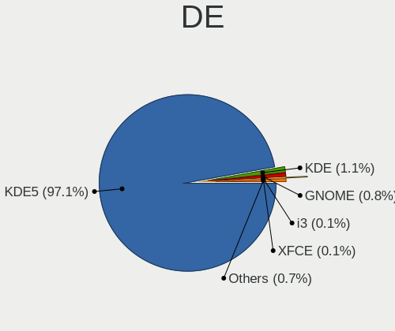
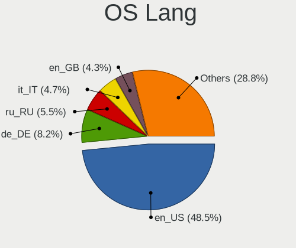
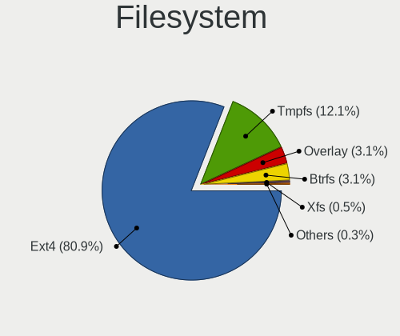
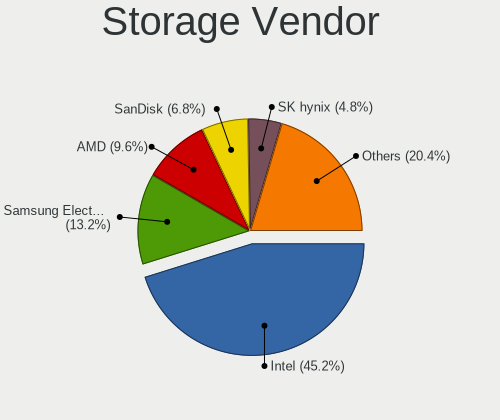
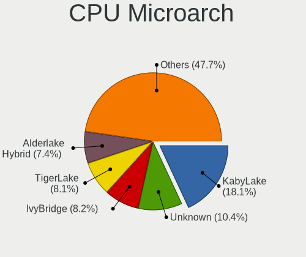

Kubuntu 22.04 - Tested Hardware & Statistics (Notebooks)
--------------------------------------------------------

A project to collect tested hardware configurations for Kubuntu 22.04.

Anyone can contribute to this report by the [hw-probe](https://github.com/linuxhw/hw-probe) tool:

    sudo -E hw-probe -all -upload

Please contribute! Especially if your hardware is rare.

Contents
--------

* [ Test Cases ](#test-cases)

* [ System ](#system)
  - [ Kernel                   ](#kernel)
  - [ Kernel Family            ](#kernel-family)
  - [ Kernel Major Ver.        ](#kernel-major-ver)
  - [ Arch                     ](#arch)
  - [ DE                       ](#de)
  - [ Display Server           ](#display-server)
  - [ Display Manager          ](#display-manager)
  - [ OS Lang                  ](#os-lang)
  - [ Boot Mode                ](#boot-mode)
  - [ Filesystem               ](#filesystem)
  - [ Part. scheme             ](#part-scheme)
  - [ Dual Boot with Linux/BSD ](#dual-boot-with-linuxbsd)
  - [ Dual Boot (Win)          ](#dual-boot-win)

* [ Board ](#board)
  - [ Vendor                   ](#vendor)
  - [ Model                    ](#model)
  - [ Model Family             ](#model-family)
  - [ MFG Year                 ](#mfg-year)
  - [ Form Factor              ](#form-factor)
  - [ Secure Boot              ](#secure-boot)
  - [ Coreboot                 ](#coreboot)
  - [ RAM Size                 ](#ram-size)
  - [ RAM Used                 ](#ram-used)
  - [ Total Drives             ](#total-drives)
  - [ Has CD-ROM               ](#has-cd-rom)
  - [ Has Ethernet             ](#has-ethernet)
  - [ Has WiFi                 ](#has-wifi)
  - [ Has Bluetooth            ](#has-bluetooth)

* [ Location ](#location)
  - [ Country                  ](#country)
  - [ City                     ](#city)

* [ Drives ](#drives)
  - [ Drive Vendor             ](#drive-vendor)
  - [ Drive Model              ](#drive-model)
  - [ HDD Vendor               ](#hdd-vendor)
  - [ SSD Vendor               ](#ssd-vendor)
  - [ Drive Kind               ](#drive-kind)
  - [ Drive Connector          ](#drive-connector)
  - [ Drive Size               ](#drive-size)
  - [ Space Total              ](#space-total)
  - [ Space Used               ](#space-used)
  - [ Malfunc. Drives          ](#malfunc-drives)
  - [ Malfunc. Drive Vendor    ](#malfunc-drive-vendor)
  - [ Malfunc. HDD Vendor      ](#malfunc-hdd-vendor)
  - [ Malfunc. Drive Kind      ](#malfunc-drive-kind)
  - [ Failed Drives            ](#failed-drives)
  - [ Failed Drive Vendor      ](#failed-drive-vendor)
  - [ Drive Status             ](#drive-status)

* [ Storage controller ](#storage-controller)
  - [ Storage Vendor           ](#storage-vendor)
  - [ Storage Model            ](#storage-model)
  - [ Storage Kind             ](#storage-kind)

* [ Processor ](#processor)
  - [ CPU Vendor               ](#cpu-vendor)
  - [ CPU Model                ](#cpu-model)
  - [ CPU Model Family         ](#cpu-model-family)
  - [ CPU Cores                ](#cpu-cores)
  - [ CPU Sockets              ](#cpu-sockets)
  - [ CPU Threads              ](#cpu-threads)
  - [ CPU Op-Modes             ](#cpu-op-modes)
  - [ CPU Microcode            ](#cpu-microcode)
  - [ CPU Microarch            ](#cpu-microarch)

* [ Graphics ](#graphics)
  - [ GPU Vendor               ](#gpu-vendor)
  - [ GPU Model                ](#gpu-model)
  - [ GPU Combo                ](#gpu-combo)
  - [ GPU Driver               ](#gpu-driver)
  - [ GPU Memory               ](#gpu-memory)

* [ Monitor ](#monitor)
  - [ Monitor Vendor           ](#monitor-vendor)
  - [ Monitor Model            ](#monitor-model)
  - [ Monitor Resolution       ](#monitor-resolution)
  - [ Monitor Diagonal         ](#monitor-diagonal)
  - [ Monitor Width            ](#monitor-width)
  - [ Aspect Ratio             ](#aspect-ratio)
  - [ Monitor Area             ](#monitor-area)
  - [ Pixel Density            ](#pixel-density)
  - [ Multiple Monitors        ](#multiple-monitors)

* [ Network ](#network)
  - [ Net Controller Vendor    ](#net-controller-vendor)
  - [ Net Controller Model     ](#net-controller-model)
  - [ Wireless Vendor          ](#wireless-vendor)
  - [ Wireless Model           ](#wireless-model)
  - [ Ethernet Vendor          ](#ethernet-vendor)
  - [ Ethernet Model           ](#ethernet-model)
  - [ Net Controller Kind      ](#net-controller-kind)
  - [ Used Controller          ](#used-controller)
  - [ NICs                     ](#nics)
  - [ IPv6                     ](#ipv6)

* [ Bluetooth ](#bluetooth)
  - [ Bluetooth Vendor         ](#bluetooth-vendor)
  - [ Bluetooth Model          ](#bluetooth-model)

* [ Sound ](#sound)
  - [ Sound Vendor             ](#sound-vendor)
  - [ Sound Model              ](#sound-model)

* [ Memory ](#memory)
  - [ Memory Vendor            ](#memory-vendor)
  - [ Memory Model             ](#memory-model)
  - [ Memory Kind              ](#memory-kind)
  - [ Memory Form Factor       ](#memory-form-factor)
  - [ Memory Size              ](#memory-size)
  - [ Memory Speed             ](#memory-speed)

* [ Printers & scanners ](#printers--scanners)
  - [ Printer Vendor           ](#printer-vendor)
  - [ Printer Model            ](#printer-model)
  - [ Scanner Vendor           ](#scanner-vendor)
  - [ Scanner Model            ](#scanner-model)

* [ Camera ](#camera)
  - [ Camera Vendor            ](#camera-vendor)
  - [ Camera Model             ](#camera-model)

* [ Security ](#security)
  - [ Fingerprint Vendor       ](#fingerprint-vendor)
  - [ Fingerprint Model        ](#fingerprint-model)
  - [ Chipcard Vendor          ](#chipcard-vendor)
  - [ Chipcard Model           ](#chipcard-model)

* [ Unsupported ](#unsupported)
  - [ Unsupported Devices      ](#unsupported-devices)
  - [ Unsupported Device Types ](#unsupported-device-types)

Test Cases
----------

Total: 522

| Vendor        | Model                       | Probe                                                      | Date         |
|---------------|-----------------------------|------------------------------------------------------------|--------------|
| Dell          | XPS 15 9520                 | [ecfa5f6c27](https://linux-hardware.org/?probe=ecfa5f6c27) | Mar 01, 2023 |
| Dell          | Latitude 5530               | [f892221e4c](https://linux-hardware.org/?probe=f892221e4c) | Feb 27, 2023 |
| HP            | EliteBook 835 G8 Noteboo... | [aa26becbb1](https://linux-hardware.org/?probe=aa26becbb1) | Feb 27, 2023 |
| Lenovo        | IdeaPad 5 Pro 14ACN6 82L... | [a2af33e0e3](https://linux-hardware.org/?probe=a2af33e0e3) | Feb 27, 2023 |
| ASUSTek       | TUF Gaming FX705DT_FX705... | [a5f5bdc903](https://linux-hardware.org/?probe=a5f5bdc903) | Feb 26, 2023 |
| Digibras      | NH4CU03                     | [8bfe7e434d](https://linux-hardware.org/?probe=8bfe7e434d) | Feb 26, 2023 |
| HP            | G62                         | [871207750c](https://linux-hardware.org/?probe=871207750c) | Feb 25, 2023 |
| Alienware     | m15 R7 AMD                  | [0a44dcc29e](https://linux-hardware.org/?probe=0a44dcc29e) | Feb 24, 2023 |
| Dell          | Latitude 5530               | [8ad26dd8a0](https://linux-hardware.org/?probe=8ad26dd8a0) | Feb 24, 2023 |
| Alienware     | m15 R7 AMD                  | [3ba05d49d8](https://linux-hardware.org/?probe=3ba05d49d8) | Feb 24, 2023 |
| Dell          | System Inspiron N7110       | [4a3b8e0755](https://linux-hardware.org/?probe=4a3b8e0755) | Feb 22, 2023 |
| Acer          | Nitro AN515-55              | [acb8644ede](https://linux-hardware.org/?probe=acb8644ede) | Feb 21, 2023 |
| Lenovo        | ThinkPad T440p 20AWS3E20... | [012b54b31c](https://linux-hardware.org/?probe=012b54b31c) | Feb 21, 2023 |
| Lenovo        | ThinkBook 15 G3 ACL 21A4    | [6033e6cb63](https://linux-hardware.org/?probe=6033e6cb63) | Feb 20, 2023 |
| Framework     | Laptop (12th Gen Intel C... | [63de5bef96](https://linux-hardware.org/?probe=63de5bef96) | Feb 20, 2023 |
| Lenovo        | ThinkBook 15 G2 ITL 20VE    | [82db23bd7f](https://linux-hardware.org/?probe=82db23bd7f) | Feb 19, 2023 |
| ASUSTek       | X555LJ                      | [93f3ae1f77](https://linux-hardware.org/?probe=93f3ae1f77) | Feb 19, 2023 |
| Dell          | System Inspiron N7110       | [542553dd55](https://linux-hardware.org/?probe=542553dd55) | Feb 18, 2023 |
| Lenovo        | ThinkPad T14 Gen 1 20S00... | [4baabf8013](https://linux-hardware.org/?probe=4baabf8013) | Feb 18, 2023 |
| Dell          | Precision 7540              | [2a511e3e78](https://linux-hardware.org/?probe=2a511e3e78) | Feb 17, 2023 |
| Alienware     | 17 R2                       | [a70da6118b](https://linux-hardware.org/?probe=a70da6118b) | Feb 16, 2023 |
| Dell          | System Inspiron N7110       | [a59b4a2c12](https://linux-hardware.org/?probe=a59b4a2c12) | Feb 16, 2023 |
| ASUSTek       | X75VD                       | [81c64d5916](https://linux-hardware.org/?probe=81c64d5916) | Feb 16, 2023 |
| Lenovo        | ThinkPad Yoga 11e 20DAS0... | [6f0ca25023](https://linux-hardware.org/?probe=6f0ca25023) | Feb 16, 2023 |
| Lenovo        | ThinkPad L13 20R30006PB     | [aad1f06bb9](https://linux-hardware.org/?probe=aad1f06bb9) | Feb 16, 2023 |
| Dell          | G15 5515                    | [17ff15f50e](https://linux-hardware.org/?probe=17ff15f50e) | Feb 16, 2023 |
| Samsung       | 305E4A/305E5A/305E7A        | [832920f31b](https://linux-hardware.org/?probe=832920f31b) | Feb 14, 2023 |
| Samsung       | 305E4A/305E5A/305E7A        | [e6f972234b](https://linux-hardware.org/?probe=e6f972234b) | Feb 14, 2023 |
| Acer          | Swift SF314-512             | [08a9c049a1](https://linux-hardware.org/?probe=08a9c049a1) | Feb 13, 2023 |
| HP            | ProBook 6470b               | [e747086309](https://linux-hardware.org/?probe=e747086309) | Feb 13, 2023 |
| Lenovo        | IdeaPad S340-15API 81NC     | [23eec2d2bc](https://linux-hardware.org/?probe=23eec2d2bc) | Feb 13, 2023 |
| MSI           | GE62VR 6RF                  | [89c148a5f9](https://linux-hardware.org/?probe=89c148a5f9) | Feb 12, 2023 |
| Lenovo        | ThinkPad T450 20BV0001US    | [d149fd1ed6](https://linux-hardware.org/?probe=d149fd1ed6) | Feb 12, 2023 |
| Google        | Blooguard                   | [b4cdae3965](https://linux-hardware.org/?probe=b4cdae3965) | Feb 11, 2023 |
| Gigabyte      | GB-BKi5(H)A-7200            | [57ff1b0fe3](https://linux-hardware.org/?probe=57ff1b0fe3) | Feb 11, 2023 |
| Lenovo        | ZHAOYANG K4e-ITL 82Q1       | [4ab5181634](https://linux-hardware.org/?probe=4ab5181634) | Feb 11, 2023 |
| Lenovo        | IdeaPad 320-15ISK 80XH      | [3af9191e4f](https://linux-hardware.org/?probe=3af9191e4f) | Feb 11, 2023 |
| Lenovo        | ThinkPad E14 Gen 4 21EB0... | [e3ea6ad8da](https://linux-hardware.org/?probe=e3ea6ad8da) | Feb 10, 2023 |
| MSI           | GS73 Stealth 8RF            | [ccbec1376d](https://linux-hardware.org/?probe=ccbec1376d) | Feb 09, 2023 |
| MSI           | GS73 Stealth 8RF            | [0d5a38a089](https://linux-hardware.org/?probe=0d5a38a089) | Feb 09, 2023 |
| Acer          | Swift SF314-512             | [556b064487](https://linux-hardware.org/?probe=556b064487) | Feb 07, 2023 |
| Lenovo        | ThinkPad X230 23256N6       | [c454139724](https://linux-hardware.org/?probe=c454139724) | Feb 06, 2023 |
| Lenovo        | ThinkPad T470 20HES3X300    | [6a77ec4c4f](https://linux-hardware.org/?probe=6a77ec4c4f) | Feb 06, 2023 |
| Acer          | Swift SFX14-41G             | [5f59acbf0d](https://linux-hardware.org/?probe=5f59acbf0d) | Feb 05, 2023 |
| HP            | G60                         | [518195af9f](https://linux-hardware.org/?probe=518195af9f) | Feb 04, 2023 |
| Acer          | Nitro AN515-55              | [27d852788e](https://linux-hardware.org/?probe=27d852788e) | Feb 03, 2023 |
| Acer          | Nitro AN515-55              | [2ed6b9969d](https://linux-hardware.org/?probe=2ed6b9969d) | Feb 03, 2023 |
| ASUSTek       | X550JK                      | [c42e4eb249](https://linux-hardware.org/?probe=c42e4eb249) | Feb 03, 2023 |
| Lenovo        | ThinkPad T460 20FMS66R00    | [293690383a](https://linux-hardware.org/?probe=293690383a) | Feb 02, 2023 |
| Dell          | Vostro 15-3568              | [caf63a9d0f](https://linux-hardware.org/?probe=caf63a9d0f) | Feb 02, 2023 |
| Lenovo        | ThinkPad W530 2463A49       | [374c21a672](https://linux-hardware.org/?probe=374c21a672) | Feb 02, 2023 |
| Dell          | Inspiron 5570               | [d186290a3f](https://linux-hardware.org/?probe=d186290a3f) | Feb 01, 2023 |
| Dell          | Precision 7540              | [1d0d197808](https://linux-hardware.org/?probe=1d0d197808) | Feb 01, 2023 |
| Google        | Lillipup                    | [45f9b8c3cf](https://linux-hardware.org/?probe=45f9b8c3cf) | Jan 31, 2023 |
| Acer          | Aspire AV14-51              | [fa801eea4b](https://linux-hardware.org/?probe=fa801eea4b) | Jan 31, 2023 |
| Framework     | Laptop (12th Gen Intel C... | [96671141f9](https://linux-hardware.org/?probe=96671141f9) | Jan 30, 2023 |
| MSI           | Bravo 15 B5DD               | [b3c357b53b](https://linux-hardware.org/?probe=b3c357b53b) | Jan 30, 2023 |
| Lenovo        | ThinkPad T580 20LA0025MX    | [c5e4274143](https://linux-hardware.org/?probe=c5e4274143) | Jan 29, 2023 |
| Lenovo        | IdeaPad 720S-14IKB 81BD     | [50eb066d41](https://linux-hardware.org/?probe=50eb066d41) | Jan 29, 2023 |
| Lenovo        | Legion 5 15ACH6 82JW        | [175211d52c](https://linux-hardware.org/?probe=175211d52c) | Jan 29, 2023 |
| Lenovo        | IdeaPad 3 15ADA05 81W1      | [a011ba3b9e](https://linux-hardware.org/?probe=a011ba3b9e) | Jan 28, 2023 |
| Dell          | Precision 7730              | [058f16ac84](https://linux-hardware.org/?probe=058f16ac84) | Jan 28, 2023 |
| HP            | Laptop 15-da0xxx            | [32a666b611](https://linux-hardware.org/?probe=32a666b611) | Jan 27, 2023 |
| Acer          | Nitro AN517-55              | [7273b8320c](https://linux-hardware.org/?probe=7273b8320c) | Jan 26, 2023 |
| Acer          | Nitro AN517-55              | [2de4e60fef](https://linux-hardware.org/?probe=2de4e60fef) | Jan 26, 2023 |
| Lenovo        | IdeaPad 3 15ADA05 81W1      | [7403ca2f73](https://linux-hardware.org/?probe=7403ca2f73) | Jan 25, 2023 |
| Lenovo        | ThinkPad L380 20M6S2YE00    | [e6c626133e](https://linux-hardware.org/?probe=e6c626133e) | Jan 25, 2023 |
| TrekStor      | Surfbook A13B               | [4306d9ba1c](https://linux-hardware.org/?probe=4306d9ba1c) | Jan 25, 2023 |
| Lenovo        | IdeaPad 3 15ADA05 81W1      | [18d42efe40](https://linux-hardware.org/?probe=18d42efe40) | Jan 24, 2023 |
| HP            | ProBook 6470b               | [3319221b9c](https://linux-hardware.org/?probe=3319221b9c) | Jan 23, 2023 |
| HP            | ProBook 6570b               | [3bc0488b6d](https://linux-hardware.org/?probe=3bc0488b6d) | Jan 22, 2023 |
| Dell          | Latitude E6430s             | [8f9185a327](https://linux-hardware.org/?probe=8f9185a327) | Jan 22, 2023 |
| Carbon Sys... | Iridium 14                  | [7fcc79f37c](https://linux-hardware.org/?probe=7fcc79f37c) | Jan 22, 2023 |
| Acer          | TravelMate B118-M           | [029850a46e](https://linux-hardware.org/?probe=029850a46e) | Jan 21, 2023 |
| MSI           | Prestige 15 A12SC           | [b368e80a36](https://linux-hardware.org/?probe=b368e80a36) | Jan 21, 2023 |
| HP            | Laptop 15-ef2xxx            | [732a1b992a](https://linux-hardware.org/?probe=732a1b992a) | Jan 20, 2023 |
| Apple         | MacBookPro11,3              | [28b4d041ad](https://linux-hardware.org/?probe=28b4d041ad) | Jan 20, 2023 |
| Dell          | Latitude 5320               | [aaf625ee63](https://linux-hardware.org/?probe=aaf625ee63) | Jan 20, 2023 |
| HP            | Laptop 15-ef2xxx            | [d9e9f47ad4](https://linux-hardware.org/?probe=d9e9f47ad4) | Jan 19, 2023 |
| HP            | Laptop 17-by3xxx            | [542c3d1ef4](https://linux-hardware.org/?probe=542c3d1ef4) | Jan 16, 2023 |
| Acer          | Aspire A515-56              | [3f24b17bd8](https://linux-hardware.org/?probe=3f24b17bd8) | Jan 16, 2023 |
| Acer          | Aspire V3-571G              | [3715650f46](https://linux-hardware.org/?probe=3715650f46) | Jan 16, 2023 |
| Dynabook      | Satellite Pro C50-J         | [ba8e771128](https://linux-hardware.org/?probe=ba8e771128) | Jan 15, 2023 |
| HP            | 255 G8 Notebook PC          | [1b1fee733e](https://linux-hardware.org/?probe=1b1fee733e) | Jan 12, 2023 |
| Dell          | Latitude 3420               | [53b3f46e20](https://linux-hardware.org/?probe=53b3f46e20) | Jan 12, 2023 |
| Lenovo        | ThinkPad L430 24663D1       | [1987221c12](https://linux-hardware.org/?probe=1987221c12) | Jan 12, 2023 |
| Lenovo        | IdeaPad 5 15ARE05 81YQ      | [c5e0e8163f](https://linux-hardware.org/?probe=c5e0e8163f) | Jan 10, 2023 |
| Google        | Rammus                      | [489d09eaa7](https://linux-hardware.org/?probe=489d09eaa7) | Jan 10, 2023 |
| HP            | ProBook 6570b               | [e5c0ea26d1](https://linux-hardware.org/?probe=e5c0ea26d1) | Jan 09, 2023 |
| Dell          | Inspiron 5575               | [5bc41d3659](https://linux-hardware.org/?probe=5bc41d3659) | Jan 09, 2023 |
| Acer          | Aspire A515-56              | [fc7a1958c4](https://linux-hardware.org/?probe=fc7a1958c4) | Jan 07, 2023 |
| HP            | EliteBook 845 14 inch G9... | [929ff5acbb](https://linux-hardware.org/?probe=929ff5acbb) | Jan 07, 2023 |
| Lenovo        | Legion 5 17ACH6 82K0        | [9a108faf93](https://linux-hardware.org/?probe=9a108faf93) | Jan 06, 2023 |
| HP            | 250 G4 Notebook PC          | [a6d6683371](https://linux-hardware.org/?probe=a6d6683371) | Jan 04, 2023 |
| HP            | 250 G4 Notebook PC          | [08526a890a](https://linux-hardware.org/?probe=08526a890a) | Jan 04, 2023 |
| Notebook      | NP5x_NP6x_NP7xPNK_PNH_PN... | [ace1cd7d4d](https://linux-hardware.org/?probe=ace1cd7d4d) | Jan 04, 2023 |
| MSI           | Raider GE76 12UGS           | [8552e25872](https://linux-hardware.org/?probe=8552e25872) | Jan 03, 2023 |
| Acer          | Aspire M5-481T              | [2e2e7afb8a](https://linux-hardware.org/?probe=2e2e7afb8a) | Jan 03, 2023 |
| Acer          | Aspire M5-481T              | [54bd1d5aae](https://linux-hardware.org/?probe=54bd1d5aae) | Jan 03, 2023 |
| MSI           | Prestige 14 A10RAS          | [fc119df9bc](https://linux-hardware.org/?probe=fc119df9bc) | Jan 02, 2023 |
| Lenovo        | ThinkPad L430 24663D1       | [8eada9744e](https://linux-hardware.org/?probe=8eada9744e) | Jan 01, 2023 |
| Lenovo        | ThinkPad X230 23256N6       | [09d6510700](https://linux-hardware.org/?probe=09d6510700) | Jan 01, 2023 |
| Acer          | Aspire A315-41              | [9cddb65ac1](https://linux-hardware.org/?probe=9cddb65ac1) | Dec 30, 2022 |
| ASUSTek       | UX31E                       | [5e6dc18098](https://linux-hardware.org/?probe=5e6dc18098) | Dec 30, 2022 |
| HP            | Victus by Laptop 16-e1xx... | [25183d70e2](https://linux-hardware.org/?probe=25183d70e2) | Dec 29, 2022 |
| Carbon Sys... | Iridium 14                  | [d2275f6785](https://linux-hardware.org/?probe=d2275f6785) | Dec 29, 2022 |
| HP            | EliteBook 745 G3            | [1ca2f43148](https://linux-hardware.org/?probe=1ca2f43148) | Dec 27, 2022 |
| MSI           | GP62 7QF                    | [3db82bd91e](https://linux-hardware.org/?probe=3db82bd91e) | Dec 27, 2022 |
| ASUSTek       | X550VXK                     | [301db79821](https://linux-hardware.org/?probe=301db79821) | Dec 27, 2022 |
| HP            | Beats 15                    | [d000f23d61](https://linux-hardware.org/?probe=d000f23d61) | Dec 27, 2022 |
| Notebook      | NP5x_NP6x_NP7xPNK_PNH_PN... | [792a203576](https://linux-hardware.org/?probe=792a203576) | Dec 26, 2022 |
| Acer          | Aspire A517-53              | [e440a77fa7](https://linux-hardware.org/?probe=e440a77fa7) | Dec 25, 2022 |
| HP            | EliteBook Folio 1040 G3     | [7b8e9fe353](https://linux-hardware.org/?probe=7b8e9fe353) | Dec 24, 2022 |
| Dell          | Latitude 5590               | [f7011844b5](https://linux-hardware.org/?probe=f7011844b5) | Dec 24, 2022 |
| Dell          | Latitude 5590               | [3f1acac04f](https://linux-hardware.org/?probe=3f1acac04f) | Dec 24, 2022 |
| Lenovo        | ThinkPad R61 8918DMG        | [d40595761e](https://linux-hardware.org/?probe=d40595761e) | Dec 24, 2022 |
| Dell          | Latitude 5590               | [e439eb94d4](https://linux-hardware.org/?probe=e439eb94d4) | Dec 24, 2022 |
| Dell          | Latitude 5590               | [816056e28e](https://linux-hardware.org/?probe=816056e28e) | Dec 24, 2022 |
| Lenovo        | ThinkPad T510 4313CTO       | [a3db191efa](https://linux-hardware.org/?probe=a3db191efa) | Dec 24, 2022 |
| Samsung       | 550P5C/550P7C               | [780cc47e7f](https://linux-hardware.org/?probe=780cc47e7f) | Dec 23, 2022 |
| Lenovo        | ThinkPad X230 23256N6       | [6b09c2afcf](https://linux-hardware.org/?probe=6b09c2afcf) | Dec 23, 2022 |
| Lenovo        | ThinkPad X230 23256N6       | [efc1b154fb](https://linux-hardware.org/?probe=efc1b154fb) | Dec 23, 2022 |
| HP            | EliteBook 845 G7 Noteboo... | [f2197bb9ec](https://linux-hardware.org/?probe=f2197bb9ec) | Dec 23, 2022 |
| SGIN          | laptop                      | [33b93cc75b](https://linux-hardware.org/?probe=33b93cc75b) | Dec 22, 2022 |
| Acer          | Aspire A515-47              | [0ec462e927](https://linux-hardware.org/?probe=0ec462e927) | Dec 21, 2022 |
| HP            | Sona                        | [85c88dea70](https://linux-hardware.org/?probe=85c88dea70) | Dec 20, 2022 |
| Timi          | TM1701                      | [49f0865503](https://linux-hardware.org/?probe=49f0865503) | Dec 20, 2022 |
| HP            | Laptop 17-by3xxx            | [5bce63e8cb](https://linux-hardware.org/?probe=5bce63e8cb) | Dec 19, 2022 |
| Dell          | Precision 5540              | [0e2ce6eb28](https://linux-hardware.org/?probe=0e2ce6eb28) | Dec 17, 2022 |
| Lenovo        | G50-70 20351                | [4d39c63e0a](https://linux-hardware.org/?probe=4d39c63e0a) | Dec 17, 2022 |
| Lenovo        | ThinkPad E15 20RD0011MZ     | [86627d739c](https://linux-hardware.org/?probe=86627d739c) | Dec 16, 2022 |
| Lenovo        | ThinkPad E15 20RD0011MZ     | [ee758acf19](https://linux-hardware.org/?probe=ee758acf19) | Dec 16, 2022 |
| HUAWEI        | BOM-WXX9                    | [a1a11b56d0](https://linux-hardware.org/?probe=a1a11b56d0) | Dec 15, 2022 |
| Lenovo        | ThinkPad T530 24295XU       | [0ebd945403](https://linux-hardware.org/?probe=0ebd945403) | Dec 15, 2022 |
| ASUSTek       | VivoBook_ASUS Laptop E40... | [76c76bdd82](https://linux-hardware.org/?probe=76c76bdd82) | Dec 14, 2022 |
| ASUSTek       | VivoBook_ASUS Laptop E40... | [1db7d2fa59](https://linux-hardware.org/?probe=1db7d2fa59) | Dec 14, 2022 |
| Fujitsu       | LIFEBOOK E734               | [5ac5b0aaa8](https://linux-hardware.org/?probe=5ac5b0aaa8) | Dec 14, 2022 |
| Acer          | Nitro AN517-54              | [3896296ad1](https://linux-hardware.org/?probe=3896296ad1) | Dec 12, 2022 |
| Dell          | Precision 5510              | [77b7f6dd95](https://linux-hardware.org/?probe=77b7f6dd95) | Dec 12, 2022 |
| Framework     | Laptop (12th Gen Intel C... | [dfa4685ecc](https://linux-hardware.org/?probe=dfa4685ecc) | Dec 12, 2022 |
| Acer          | Predator PH317-52           | [e3236b49d3](https://linux-hardware.org/?probe=e3236b49d3) | Dec 10, 2022 |
| TUXEDO        | InfinityBook Pro Gen7 (M... | [474cde3412](https://linux-hardware.org/?probe=474cde3412) | Dec 08, 2022 |
| Lenovo        | ThinkPad P1 Gen 3 20THCT... | [c66f0c0c8d](https://linux-hardware.org/?probe=c66f0c0c8d) | Dec 08, 2022 |
| ASUSTek       | ASUS TUF Gaming F17 FX70... | [3a9774bdac](https://linux-hardware.org/?probe=3a9774bdac) | Dec 07, 2022 |
| HP            | Beats 15                    | [5a09b2cb1d](https://linux-hardware.org/?probe=5a09b2cb1d) | Dec 06, 2022 |
| Dell          | Inspiron 7577               | [cb376e265d](https://linux-hardware.org/?probe=cb376e265d) | Dec 05, 2022 |
| Dell          | Vostro 5471                 | [0bad01b327](https://linux-hardware.org/?probe=0bad01b327) | Dec 04, 2022 |
| Acer          | Aspire VN7-572G             | [2147d11bad](https://linux-hardware.org/?probe=2147d11bad) | Dec 04, 2022 |
| Acer          | Aspire VN7-572G             | [5a456d1825](https://linux-hardware.org/?probe=5a456d1825) | Dec 04, 2022 |
| HP            | ProBook 430 G2              | [a66be8f003](https://linux-hardware.org/?probe=a66be8f003) | Dec 03, 2022 |
| Dell          | Vostro 5481                 | [6c58c07e64](https://linux-hardware.org/?probe=6c58c07e64) | Dec 03, 2022 |
| Dell          | Latitude E6220              | [8c99ad2bde](https://linux-hardware.org/?probe=8c99ad2bde) | Dec 02, 2022 |
| MSI           | Prestige 14 A12UC           | [7d88c55edb](https://linux-hardware.org/?probe=7d88c55edb) | Dec 02, 2022 |
| Dell          | XPS 15 9570                 | [867e3d70f0](https://linux-hardware.org/?probe=867e3d70f0) | Dec 02, 2022 |
| HP            | ProBook 450 G2              | [552ac907a0](https://linux-hardware.org/?probe=552ac907a0) | Dec 01, 2022 |
| Haier         | A1420EM                     | [6f18b3c1ce](https://linux-hardware.org/?probe=6f18b3c1ce) | Nov 30, 2022 |
| HUAWEI        | BOD-WXX9                    | [a2b8deb4e3](https://linux-hardware.org/?probe=a2b8deb4e3) | Nov 29, 2022 |
| Dell          | Inspiron 3521               | [2ecbfd5e39](https://linux-hardware.org/?probe=2ecbfd5e39) | Nov 29, 2022 |
| Acer          | Nitro AN517-51              | [c20385f7bd](https://linux-hardware.org/?probe=c20385f7bd) | Nov 29, 2022 |
| MSI           | Prestige 15 A12SC           | [af2a404105](https://linux-hardware.org/?probe=af2a404105) | Nov 28, 2022 |
| Gigabyte      | RC14UD                      | [37c4b79c24](https://linux-hardware.org/?probe=37c4b79c24) | Nov 27, 2022 |
| Lenovo        | ThinkPad T430 2349DS5       | [f52677ec2e](https://linux-hardware.org/?probe=f52677ec2e) | Nov 27, 2022 |
| Monster       | TULPAR T7                   | [6634421091](https://linux-hardware.org/?probe=6634421091) | Nov 26, 2022 |
| Dell          | Vostro 5471                 | [7a6ec88b73](https://linux-hardware.org/?probe=7a6ec88b73) | Nov 26, 2022 |
| Dell          | Vostro 5471                 | [b9bbfd7551](https://linux-hardware.org/?probe=b9bbfd7551) | Nov 26, 2022 |
| GPU Compan... | GWNR71517                   | [15173435f0](https://linux-hardware.org/?probe=15173435f0) | Nov 26, 2022 |
| Lenovo        | IdeaPad 320-15IKB 80YE      | [fa21163ace](https://linux-hardware.org/?probe=fa21163ace) | Nov 26, 2022 |
| Lenovo        | ThinkPad X230 23256N6       | [a462983d82](https://linux-hardware.org/?probe=a462983d82) | Nov 25, 2022 |
| Acer          | Nitro AN515-45              | [10186425ec](https://linux-hardware.org/?probe=10186425ec) | Nov 25, 2022 |
| Acer          | Nitro AN515-45              | [5a7b57dae6](https://linux-hardware.org/?probe=5a7b57dae6) | Nov 25, 2022 |
| Lenovo        | IdeaPad 5 Pro 14ACN6 82L... | [57c8d65b2e](https://linux-hardware.org/?probe=57c8d65b2e) | Nov 25, 2022 |
| ASUSTek       | X510UQ                      | [5972ededc2](https://linux-hardware.org/?probe=5972ededc2) | Nov 24, 2022 |
| Dell          | XPS 15 9510                 | [26fb968043](https://linux-hardware.org/?probe=26fb968043) | Nov 23, 2022 |
| Lenovo        | G40-45 80E1                 | [c50111eb6d](https://linux-hardware.org/?probe=c50111eb6d) | Nov 22, 2022 |
| Lenovo        | ThinkPad T440s 20AQ007SM... | [326b5bad4c](https://linux-hardware.org/?probe=326b5bad4c) | Nov 21, 2022 |
| Acer          | Nitro AN517-51              | [de8506cc0b](https://linux-hardware.org/?probe=de8506cc0b) | Nov 19, 2022 |
| MSI           | Vector GP66 12UGS           | [9aab7e297a](https://linux-hardware.org/?probe=9aab7e297a) | Nov 19, 2022 |
| MSI           | Vector GP66 12UGS           | [e10c2abc9b](https://linux-hardware.org/?probe=e10c2abc9b) | Nov 19, 2022 |
| HP            | Laptop 17-cp0xxx            | [a3fde1deaa](https://linux-hardware.org/?probe=a3fde1deaa) | Nov 19, 2022 |
| Lenovo        | Legion 5 15IMH05H 81Y6      | [53a2707274](https://linux-hardware.org/?probe=53a2707274) | Nov 18, 2022 |
| Dell          | Inspiron 7348               | [6a46a84480](https://linux-hardware.org/?probe=6a46a84480) | Nov 18, 2022 |
| HP            | Laptop 17-cp0xxx            | [f4c6260289](https://linux-hardware.org/?probe=f4c6260289) | Nov 18, 2022 |
| Dell          | Inspiron 5759               | [8cdba26964](https://linux-hardware.org/?probe=8cdba26964) | Nov 18, 2022 |
| Digma         | EVE 15 C423 ES5069EW        | [57cd27008a](https://linux-hardware.org/?probe=57cd27008a) | Nov 18, 2022 |
| HP            | Pavilion 15                 | [fbef42d1dc](https://linux-hardware.org/?probe=fbef42d1dc) | Nov 16, 2022 |
| Lenovo        | ThinkPad X230 23256N6       | [facd5aa317](https://linux-hardware.org/?probe=facd5aa317) | Nov 16, 2022 |
| Acer          | TravelMate P633-M           | [2277ff1866](https://linux-hardware.org/?probe=2277ff1866) | Nov 15, 2022 |
| Dell          | Inspiron 3480               | [699e532a38](https://linux-hardware.org/?probe=699e532a38) | Nov 14, 2022 |
| Dell          | Inspiron 3480               | [3fca000783](https://linux-hardware.org/?probe=3fca000783) | Nov 14, 2022 |
| HP            | Laptop 17-cp0xxx            | [fa8dcc3eed](https://linux-hardware.org/?probe=fa8dcc3eed) | Nov 13, 2022 |
| ASUSTek       | K53Z                        | [7eb8b08a75](https://linux-hardware.org/?probe=7eb8b08a75) | Nov 13, 2022 |
| Lenovo        | ThinkPad X260 20F5S28R00    | [ac107ff6e8](https://linux-hardware.org/?probe=ac107ff6e8) | Nov 12, 2022 |
| Timi          | TM1703                      | [b59fbfd729](https://linux-hardware.org/?probe=b59fbfd729) | Nov 11, 2022 |
| Lenovo        | ThinkPad P15v Gen 1 20TQ... | [d8adeb01a9](https://linux-hardware.org/?probe=d8adeb01a9) | Nov 10, 2022 |
| HP            | EliteBook 8470p             | [45f26463b7](https://linux-hardware.org/?probe=45f26463b7) | Nov 10, 2022 |
| Acer          | Predator PT516-52s          | [b8ebbe76e8](https://linux-hardware.org/?probe=b8ebbe76e8) | Nov 10, 2022 |
| HP            | Pavilion g6                 | [e2a0a47587](https://linux-hardware.org/?probe=e2a0a47587) | Nov 10, 2022 |
| VALE          | Notebook Slim S132          | [fc8cf254ad](https://linux-hardware.org/?probe=fc8cf254ad) | Nov 10, 2022 |
| VALE          | Notebook Slim S132          | [720ddf5d0f](https://linux-hardware.org/?probe=720ddf5d0f) | Nov 10, 2022 |
| Dell          | XPS 15 9560                 | [d7a20bdac6](https://linux-hardware.org/?probe=d7a20bdac6) | Nov 09, 2022 |
| Timi          | TM1701                      | [917ec43bd1](https://linux-hardware.org/?probe=917ec43bd1) | Nov 09, 2022 |
| HP            | EliteBook 855 G7 Noteboo... | [de85ac10f6](https://linux-hardware.org/?probe=de85ac10f6) | Nov 09, 2022 |
| HP            | Laptop 17-cp0xxx            | [1c51983a67](https://linux-hardware.org/?probe=1c51983a67) | Nov 09, 2022 |
| Lenovo        | ThinkBook 14 G4 ABA 21DK    | [5d479ec43f](https://linux-hardware.org/?probe=5d479ec43f) | Nov 08, 2022 |
| MSI           | Unknown                     | [76090d77bf](https://linux-hardware.org/?probe=76090d77bf) | Nov 08, 2022 |
| HP            | Laptop 17-cp0xxx            | [91355e2bd7](https://linux-hardware.org/?probe=91355e2bd7) | Nov 08, 2022 |
| HP            | OMEN by Laptop 16-c0xxx     | [5584c6e2d1](https://linux-hardware.org/?probe=5584c6e2d1) | Nov 08, 2022 |
| Lenovo        | ThinkPad L15 Gen 1 20U8S... | [1a4822b860](https://linux-hardware.org/?probe=1a4822b860) | Nov 08, 2022 |
| Lenovo        | B590 20206                  | [d454a9a1e7](https://linux-hardware.org/?probe=d454a9a1e7) | Nov 07, 2022 |
| HP            | ProBook 5330m               | [7ddff41cb6](https://linux-hardware.org/?probe=7ddff41cb6) | Nov 07, 2022 |
| Lenovo        | G500 20236                  | [76d6e74fad](https://linux-hardware.org/?probe=76d6e74fad) | Nov 07, 2022 |
| Lenovo        | IdeaPad 3 15ADA6 82KR       | [8090894691](https://linux-hardware.org/?probe=8090894691) | Nov 06, 2022 |
| HP            | Laptop 15-dw0xxx            | [46c9baf82c](https://linux-hardware.org/?probe=46c9baf82c) | Nov 05, 2022 |
| HP            | Laptop 15-dw0xxx            | [5783283bd4](https://linux-hardware.org/?probe=5783283bd4) | Nov 05, 2022 |
| Dell          | Latitude 3420               | [f30c035ae6](https://linux-hardware.org/?probe=f30c035ae6) | Nov 05, 2022 |
| Lenovo        | IdeaPad 3 15ALC6 82MF       | [118a1f505b](https://linux-hardware.org/?probe=118a1f505b) | Nov 04, 2022 |
| AXIOO         | SlimBook 11                 | [ffc6980bf3](https://linux-hardware.org/?probe=ffc6980bf3) | Nov 03, 2022 |
| AXIOO         | SlimBook 11                 | [a16eac12d2](https://linux-hardware.org/?probe=a16eac12d2) | Nov 03, 2022 |
| Lenovo        | ThinkPad T440p 20AW000GU... | [b4ff1758e9](https://linux-hardware.org/?probe=b4ff1758e9) | Nov 02, 2022 |
| Panasonic     | CF-31WBLEHLM                | [623af75bb3](https://linux-hardware.org/?probe=623af75bb3) | Nov 02, 2022 |
| Panasonic     | CF-31WBLEHLM                | [52e7c62bae](https://linux-hardware.org/?probe=52e7c62bae) | Nov 02, 2022 |
| Lenovo        | IdeaPad 720S-13ARR 81BR     | [fefe8e5d04](https://linux-hardware.org/?probe=fefe8e5d04) | Nov 01, 2022 |
| Lenovo        | IdeaPad 720S-13ARR 81BR     | [df949b6e10](https://linux-hardware.org/?probe=df949b6e10) | Nov 01, 2022 |
| Lenovo        | ThinkPad L15 Gen 1 20U8S... | [4b778e52ee](https://linux-hardware.org/?probe=4b778e52ee) | Oct 30, 2022 |
| ASUSTek       | Zephyrus S GX502GW_GX502... | [c3f344809a](https://linux-hardware.org/?probe=c3f344809a) | Oct 30, 2022 |
| Lenovo        | ThinkPad L15 Gen 2 20X30... | [418b143f46](https://linux-hardware.org/?probe=418b143f46) | Oct 30, 2022 |
| ASUSTek       | ASUS TUF Gaming F15 FX50... | [293877c614](https://linux-hardware.org/?probe=293877c614) | Oct 29, 2022 |
| Lenovo        | V15 G2 ALC 82KD             | [aea626acae](https://linux-hardware.org/?probe=aea626acae) | Oct 29, 2022 |
| Lenovo        | V15-IGL 82C3                | [5bd4292187](https://linux-hardware.org/?probe=5bd4292187) | Oct 29, 2022 |
| Dell          | Inspiron 7520               | [91f0c87afa](https://linux-hardware.org/?probe=91f0c87afa) | Oct 29, 2022 |
| ASUSTek       | ASUS TUF Gaming F15 FX50... | [d7491bf8e7](https://linux-hardware.org/?probe=d7491bf8e7) | Oct 29, 2022 |
| ASUSTek       | ASUS TUF Gaming F15 FX50... | [6bdf703faf](https://linux-hardware.org/?probe=6bdf703faf) | Oct 29, 2022 |
| Dell          | Latitude 5521               | [460057b367](https://linux-hardware.org/?probe=460057b367) | Oct 28, 2022 |
| Lenovo        | ThinkPad X230 23256N6       | [a2d71fd3ca](https://linux-hardware.org/?probe=a2d71fd3ca) | Oct 28, 2022 |
| HP            | 255 G8 Notebook PC          | [ba5aec702a](https://linux-hardware.org/?probe=ba5aec702a) | Oct 27, 2022 |
| Acer          | Predator PT516-52s          | [c0cebe4cfe](https://linux-hardware.org/?probe=c0cebe4cfe) | Oct 27, 2022 |
| Dell          | Latitude E5530 non-vPro     | [a5c5f0ec1e](https://linux-hardware.org/?probe=a5c5f0ec1e) | Oct 27, 2022 |
| HP            | Pavilion dv6                | [ed392a140d](https://linux-hardware.org/?probe=ed392a140d) | Oct 27, 2022 |
| HP            | G62                         | [c9ba156401](https://linux-hardware.org/?probe=c9ba156401) | Oct 27, 2022 |
| Lenovo        | IdeaPad 3 15ADA05 81W1      | [a308f68bce](https://linux-hardware.org/?probe=a308f68bce) | Oct 27, 2022 |
| TUXEDO        | Stellaris AMD Gen3 (CZN)    | [0763832411](https://linux-hardware.org/?probe=0763832411) | Oct 27, 2022 |
| Notebook      | PD5x_7xPNP_PNR_PNN_PNT      | [93229f0fab](https://linux-hardware.org/?probe=93229f0fab) | Oct 26, 2022 |
| Acer          | Aspire E5-571               | [2920658e38](https://linux-hardware.org/?probe=2920658e38) | Oct 25, 2022 |
| Samsung       | 767XCL                      | [17bd1b4506](https://linux-hardware.org/?probe=17bd1b4506) | Oct 25, 2022 |
| HP            | Pavilion g6                 | [448d52b32f](https://linux-hardware.org/?probe=448d52b32f) | Oct 25, 2022 |
| HP            | ProBook 640 G1              | [cfb2e32cea](https://linux-hardware.org/?probe=cfb2e32cea) | Oct 25, 2022 |
| HUAWEI        | BOHB-WAX9                   | [fe222419ec](https://linux-hardware.org/?probe=fe222419ec) | Oct 25, 2022 |
| Acer          | Nitro AN517-51              | [7fed0ea2a9](https://linux-hardware.org/?probe=7fed0ea2a9) | Oct 24, 2022 |
| Dell          | XPS 15 9560                 | [37fc32cacd](https://linux-hardware.org/?probe=37fc32cacd) | Oct 24, 2022 |
| Lenovo        | ThinkPad P73 20QRS00100     | [532b112928](https://linux-hardware.org/?probe=532b112928) | Oct 24, 2022 |
| HP            | EliteBook 8470p             | [918b0ef1ab](https://linux-hardware.org/?probe=918b0ef1ab) | Oct 24, 2022 |
| HP            | Laptop 17-by0xxx            | [faedd5a008](https://linux-hardware.org/?probe=faedd5a008) | Oct 24, 2022 |
| Lenovo        | IdeaPad Gaming 3 15ACH6 ... | [13c917aa38](https://linux-hardware.org/?probe=13c917aa38) | Oct 23, 2022 |
| Dell          | Latitude 7390               | [71f8a9e59b](https://linux-hardware.org/?probe=71f8a9e59b) | Oct 22, 2022 |
| Acer          | Predator PT516-52s          | [ec8dac6fd3](https://linux-hardware.org/?probe=ec8dac6fd3) | Oct 22, 2022 |
| Dell          | Vostro 3560                 | [b438a2ba8f](https://linux-hardware.org/?probe=b438a2ba8f) | Oct 22, 2022 |
| Lenovo        | ThinkBook 15 G3 ACL 21A4    | [a8c892608e](https://linux-hardware.org/?probe=a8c892608e) | Oct 21, 2022 |
| Dell          | Latitude E5530 non-vPro     | [20f991643f](https://linux-hardware.org/?probe=20f991643f) | Oct 21, 2022 |
| HP            | Laptop 17-by4xxx            | [6090ec7241](https://linux-hardware.org/?probe=6090ec7241) | Oct 21, 2022 |
| HP            | EliteBook 845 G7 Noteboo... | [0cf70c348b](https://linux-hardware.org/?probe=0cf70c348b) | Oct 21, 2022 |
| Lenovo        | IdeaPad 320-15IKB 80XL      | [c8e47b28fe](https://linux-hardware.org/?probe=c8e47b28fe) | Oct 20, 2022 |
| Lenovo        | ThinkBook 14 G4 ABA 21DK    | [46cb50f2f6](https://linux-hardware.org/?probe=46cb50f2f6) | Oct 19, 2022 |
| Tactus        | GeoBook 140                 | [6d01f5c57b](https://linux-hardware.org/?probe=6d01f5c57b) | Oct 19, 2022 |
| Dell          | XPS 9320                    | [8dd41b53b6](https://linux-hardware.org/?probe=8dd41b53b6) | Oct 19, 2022 |
| Samsung       | R430/P430/R480              | [a2db8aeade](https://linux-hardware.org/?probe=a2db8aeade) | Oct 19, 2022 |
| Samsung       | R430/P430/R480              | [92957e0afc](https://linux-hardware.org/?probe=92957e0afc) | Oct 19, 2022 |
| Lenovo        | Legion 5 17ACH6 82K0        | [431a84fc31](https://linux-hardware.org/?probe=431a84fc31) | Oct 18, 2022 |
| Dell          | Precision 3570              | [90711415f5](https://linux-hardware.org/?probe=90711415f5) | Oct 18, 2022 |
| HP            | ProBook 450 G5              | [a7ebb4b3c4](https://linux-hardware.org/?probe=a7ebb4b3c4) | Oct 16, 2022 |
| Lenovo        | Yoga 2 13 20344             | [f779ba08c9](https://linux-hardware.org/?probe=f779ba08c9) | Oct 16, 2022 |
| ASUSTek       | ROG Strix G512LV_G512LV     | [53a9eb1420](https://linux-hardware.org/?probe=53a9eb1420) | Oct 16, 2022 |
| HP            | OMEN Laptop 15-en0xxx       | [dad786ca06](https://linux-hardware.org/?probe=dad786ca06) | Oct 15, 2022 |
| Lenovo        | ThinkPad T430 2342A19       | [7c6c3783e6](https://linux-hardware.org/?probe=7c6c3783e6) | Oct 14, 2022 |
| Dell          | Precision M6700             | [e198a003b6](https://linux-hardware.org/?probe=e198a003b6) | Oct 13, 2022 |
| Lenovo        | ThinkBook 14 G4 ABA 21DK    | [1258429041](https://linux-hardware.org/?probe=1258429041) | Oct 13, 2022 |
| GPU Compan... | GWTC116-2                   | [93ee54a067](https://linux-hardware.org/?probe=93ee54a067) | Oct 11, 2022 |
| HP            | ProBook 440 G8 Notebook ... | [125ad4881a](https://linux-hardware.org/?probe=125ad4881a) | Oct 11, 2022 |
| Lenovo        | Legion 5 15ACH6H 82JU       | [d67f89127f](https://linux-hardware.org/?probe=d67f89127f) | Oct 11, 2022 |
| HP            | EliteBook 845 G7 Noteboo... | [5268977f64](https://linux-hardware.org/?probe=5268977f64) | Oct 09, 2022 |
| Gigabyte      | AERO 15-X9                  | [aad99b4421](https://linux-hardware.org/?probe=aad99b4421) | Oct 09, 2022 |
| ASUSTek       | X555UA                      | [9cf559ac01](https://linux-hardware.org/?probe=9cf559ac01) | Oct 08, 2022 |
| Gigabyte      | AERO 15-X9                  | [1f634e5071](https://linux-hardware.org/?probe=1f634e5071) | Oct 08, 2022 |
| ASUSTek       | VivoBook_ASUSLaptop M740... | [1b90e3cfa5](https://linux-hardware.org/?probe=1b90e3cfa5) | Oct 08, 2022 |
| Lenovo        | IdeaPad Y510P 20217         | [fddd82ba56](https://linux-hardware.org/?probe=fddd82ba56) | Oct 08, 2022 |
| Lenovo        | IdeaPad Y510P 20217         | [9a16ca15b3](https://linux-hardware.org/?probe=9a16ca15b3) | Oct 08, 2022 |
| ASUSTek       | VivoBook_ASUSLaptop M740... | [9bb8f8e33b](https://linux-hardware.org/?probe=9bb8f8e33b) | Oct 07, 2022 |
| Lenovo        | ThinkPad X230 23256N6       | [e59c8f50b4](https://linux-hardware.org/?probe=e59c8f50b4) | Oct 07, 2022 |
| Apple         | MacBookPro16,1              | [865d1f0e6f](https://linux-hardware.org/?probe=865d1f0e6f) | Oct 07, 2022 |
| Lenovo        | ZHAOYANG E53-80 81CM        | [985ca1961c](https://linux-hardware.org/?probe=985ca1961c) | Oct 06, 2022 |
| Toshiba       | Satellite NB10t-A-102       | [0bf17a1e92](https://linux-hardware.org/?probe=0bf17a1e92) | Oct 06, 2022 |
| HP            | Pavilion Laptop 15-eh1xx... | [3b023a0363](https://linux-hardware.org/?probe=3b023a0363) | Oct 06, 2022 |
| Lenovo        | IdeaPad 320-15IKB 80XL      | [e4df51e64f](https://linux-hardware.org/?probe=e4df51e64f) | Oct 05, 2022 |
| HUAWEI        | NBD-WXX9                    | [2513dfd51e](https://linux-hardware.org/?probe=2513dfd51e) | Oct 05, 2022 |
| Lenovo        | ThinkPad X230 23256N6       | [082814c248](https://linux-hardware.org/?probe=082814c248) | Oct 04, 2022 |
| Apple         | MacBookPro10,1              | [3bc5547f39](https://linux-hardware.org/?probe=3bc5547f39) | Oct 04, 2022 |
| HP            | ProBook 640 G2              | [2dc13504cf](https://linux-hardware.org/?probe=2dc13504cf) | Oct 03, 2022 |
| Acer          | Aspire A315-58              | [2969d635b3](https://linux-hardware.org/?probe=2969d635b3) | Oct 03, 2022 |
| Acer          | Aspire A315-58              | [28b873114a](https://linux-hardware.org/?probe=28b873114a) | Oct 03, 2022 |
| Acer          | Aspire E5-575G              | [330f866cf3](https://linux-hardware.org/?probe=330f866cf3) | Oct 03, 2022 |
| Lenovo        | IdeaPad 1 14IGL05 81VU      | [c555fbbf75](https://linux-hardware.org/?probe=c555fbbf75) | Oct 01, 2022 |
| Lenovo        | ThinkPad X230 23256N6       | [ec44263cbd](https://linux-hardware.org/?probe=ec44263cbd) | Oct 01, 2022 |
| HP            | EliteBook 840 G3            | [24a248630f](https://linux-hardware.org/?probe=24a248630f) | Sep 30, 2022 |
| HP            | ZBook 15 G6                 | [476623a6a1](https://linux-hardware.org/?probe=476623a6a1) | Sep 26, 2022 |
| Lenovo        | ThinkPad E15 Gen 3 20YG0... | [923985941d](https://linux-hardware.org/?probe=923985941d) | Sep 25, 2022 |
| HONOR         | BMH-WCX9                    | [867da0c4b8](https://linux-hardware.org/?probe=867da0c4b8) | Sep 25, 2022 |
| Lenovo        | ThinkPad X230 23256N6       | [f061f902ff](https://linux-hardware.org/?probe=f061f902ff) | Sep 25, 2022 |
| Lenovo        | ThinkPad T430 2349NZ8       | [8f61a903c5](https://linux-hardware.org/?probe=8f61a903c5) | Sep 25, 2022 |
| Acer          | Aspire R3-131T              | [0d44032bc0](https://linux-hardware.org/?probe=0d44032bc0) | Sep 25, 2022 |
| HUAWEI        | BOHB-WAX9                   | [18a4d2bb72](https://linux-hardware.org/?probe=18a4d2bb72) | Sep 23, 2022 |
| Lenovo        | ThinkPad L14 Gen 2 20X1S... | [6e943a4d35](https://linux-hardware.org/?probe=6e943a4d35) | Sep 23, 2022 |
| HP            | 255 G8 Notebook PC          | [20691b389b](https://linux-hardware.org/?probe=20691b389b) | Sep 21, 2022 |
| Dell          | Latitude E5530 non-vPro     | [6352f6fb82](https://linux-hardware.org/?probe=6352f6fb82) | Sep 21, 2022 |
| Acer          | Aspire A515-45              | [41b1b790fd](https://linux-hardware.org/?probe=41b1b790fd) | Sep 19, 2022 |
| HP            | EliteBook 8560p             | [4a9e29fab2](https://linux-hardware.org/?probe=4a9e29fab2) | Sep 18, 2022 |
| Google        | Blooglet                    | [971a174a56](https://linux-hardware.org/?probe=971a174a56) | Sep 18, 2022 |
| Acer          | Aspire S3-391               | [5aadfd37c5](https://linux-hardware.org/?probe=5aadfd37c5) | Sep 17, 2022 |
| Acer          | Aspire S3-391               | [82a1f45915](https://linux-hardware.org/?probe=82a1f45915) | Sep 17, 2022 |
| MSI           | Delta 15 A5EFK              | [382e0f70a3](https://linux-hardware.org/?probe=382e0f70a3) | Sep 17, 2022 |
| Dell          | XPS 15 9560                 | [4a903b438f](https://linux-hardware.org/?probe=4a903b438f) | Sep 17, 2022 |
| Lenovo        | IdeaPad 3 15ARE05 81W4      | [4ee2b37edf](https://linux-hardware.org/?probe=4ee2b37edf) | Sep 16, 2022 |
| ASUSTek       | G501VW                      | [cf04ceb420](https://linux-hardware.org/?probe=cf04ceb420) | Sep 15, 2022 |
| Google        | Treeya                      | [a2723e9afa](https://linux-hardware.org/?probe=a2723e9afa) | Sep 15, 2022 |
| Dell          | Inspiron 5567               | [3af5d11f3f](https://linux-hardware.org/?probe=3af5d11f3f) | Sep 14, 2022 |
| Dell          | Inspiron 5567               | [22e62266a2](https://linux-hardware.org/?probe=22e62266a2) | Sep 13, 2022 |
| Lenovo        | ThinkPad T14 Gen 1 20S1S... | [d4fb6aa0ae](https://linux-hardware.org/?probe=d4fb6aa0ae) | Sep 13, 2022 |
| Lenovo        | ThinkPad T430 2347AT2       | [703c55185d](https://linux-hardware.org/?probe=703c55185d) | Sep 12, 2022 |
| Sony          | SVE1512J6EW                 | [69e2400606](https://linux-hardware.org/?probe=69e2400606) | Sep 11, 2022 |
| HP            | EliteBook 8470p             | [52f6655891](https://linux-hardware.org/?probe=52f6655891) | Sep 11, 2022 |
| Dell          | G15 5511                    | [b971c27fae](https://linux-hardware.org/?probe=b971c27fae) | Sep 10, 2022 |
| Lenovo        | ThinkPad T430 2347AT2       | [50f39d7738](https://linux-hardware.org/?probe=50f39d7738) | Sep 09, 2022 |
| Dell          | Latitude 7430               | [b1cdbef6b2](https://linux-hardware.org/?probe=b1cdbef6b2) | Sep 09, 2022 |
| Acer          | Predator G3-571             | [553cf2f33f](https://linux-hardware.org/?probe=553cf2f33f) | Sep 08, 2022 |
| Dell          | Vostro 3700                 | [40e150eb3b](https://linux-hardware.org/?probe=40e150eb3b) | Sep 08, 2022 |
| Samsung       | 270E5G/270E5U               | [0300dd1a2d](https://linux-hardware.org/?probe=0300dd1a2d) | Sep 05, 2022 |
| Lenovo        | Legion 5 Pro 16ITH6H 82J... | [85798fb011](https://linux-hardware.org/?probe=85798fb011) | Sep 05, 2022 |
| ASUSTek       | UX51VZA                     | [46aa1dbafa](https://linux-hardware.org/?probe=46aa1dbafa) | Sep 04, 2022 |
| HP            | Pavilion Gaming Laptop 1... | [8eec266b41](https://linux-hardware.org/?probe=8eec266b41) | Sep 03, 2022 |
| HP            | Laptop 15-da0xxx            | [5c11f5477e](https://linux-hardware.org/?probe=5c11f5477e) | Sep 03, 2022 |
| HP            | Notebook                    | [a3b180cbb5](https://linux-hardware.org/?probe=a3b180cbb5) | Sep 03, 2022 |
| Lenovo        | G780 20138                  | [4a452f0874](https://linux-hardware.org/?probe=4a452f0874) | Sep 03, 2022 |
| Lenovo        | ThinkPad E14 20RBS25S00     | [a4290c0678](https://linux-hardware.org/?probe=a4290c0678) | Sep 03, 2022 |
| Lenovo        | ThinkBook 14 G2 ITL 20VD    | [a15c233224](https://linux-hardware.org/?probe=a15c233224) | Sep 02, 2022 |
| Lenovo        | ThinkPad X1 Extreme Gen ... | [d34c9cb705](https://linux-hardware.org/?probe=d34c9cb705) | Sep 01, 2022 |
| Lenovo        | ThinkPad T460 20FMS08U00    | [d7457fd32a](https://linux-hardware.org/?probe=d7457fd32a) | Sep 01, 2022 |
| HP            | Pavilion Gaming Laptop      | [8382b4123e](https://linux-hardware.org/?probe=8382b4123e) | Aug 31, 2022 |
| Samsung       | 870Z5E/880Z5E/680Z5E        | [0166c06969](https://linux-hardware.org/?probe=0166c06969) | Aug 30, 2022 |
| Dell          | Latitude 9420               | [0b8d883170](https://linux-hardware.org/?probe=0b8d883170) | Aug 29, 2022 |
| Toshiba       | Satellite L850              | [fe1480794c](https://linux-hardware.org/?probe=fe1480794c) | Aug 29, 2022 |
| Google        | Eldrid                      | [ae53120bac](https://linux-hardware.org/?probe=ae53120bac) | Aug 28, 2022 |
| HP            | Pavilion Gaming Laptop 1... | [20bea980d2](https://linux-hardware.org/?probe=20bea980d2) | Aug 28, 2022 |
| Lenovo        | ThinkPad E15 Gen 3 20YG0... | [208be390fa](https://linux-hardware.org/?probe=208be390fa) | Aug 26, 2022 |
| Sony          | VGN-NR11Z_T                 | [54c1e7c198](https://linux-hardware.org/?probe=54c1e7c198) | Aug 26, 2022 |
| Apple         | MacBookPro11,1              | [5097845796](https://linux-hardware.org/?probe=5097845796) | Aug 24, 2022 |
| HP            | ENVY Laptop 17-ce1xxx       | [4c201d43d0](https://linux-hardware.org/?probe=4c201d43d0) | Aug 22, 2022 |
| Toshiba       | Satellite P70-B             | [4e04d56e06](https://linux-hardware.org/?probe=4e04d56e06) | Aug 21, 2022 |
| Toshiba       | Satellite P70-B             | [402017a7ea](https://linux-hardware.org/?probe=402017a7ea) | Aug 21, 2022 |
| Dell          | G3 3500                     | [1e8edd3350](https://linux-hardware.org/?probe=1e8edd3350) | Aug 21, 2022 |
| Dell          | Inspiron 15-5578            | [a0ff8934e5](https://linux-hardware.org/?probe=a0ff8934e5) | Aug 21, 2022 |
| HP            | Pavilion g6                 | [8d5375bd39](https://linux-hardware.org/?probe=8d5375bd39) | Aug 20, 2022 |
| ASUSTek       | VivoBook_ASUSLaptop X340... | [45bac2f9d1](https://linux-hardware.org/?probe=45bac2f9d1) | Aug 20, 2022 |
| MSI           | GF75 Thin 10SCXR            | [b75c38c8a5](https://linux-hardware.org/?probe=b75c38c8a5) | Aug 19, 2022 |
| Dell          | Latitude 7280               | [63e00d0c9d](https://linux-hardware.org/?probe=63e00d0c9d) | Aug 18, 2022 |
| Acer          | Nitro AN517-41              | [73649d898c](https://linux-hardware.org/?probe=73649d898c) | Aug 18, 2022 |
| Lenovo        | ThinkPad T440p 20AWS1AY0... | [fcda79b03d](https://linux-hardware.org/?probe=fcda79b03d) | Aug 17, 2022 |
| Apple         | MacBookPro11,1              | [4d6f6d6a23](https://linux-hardware.org/?probe=4d6f6d6a23) | Aug 15, 2022 |
| Dell          | Precision 3571              | [48c3133a7f](https://linux-hardware.org/?probe=48c3133a7f) | Aug 15, 2022 |
| Lenovo        | IdeaPad 330-15IKB 81DC      | [ca96da9d08](https://linux-hardware.org/?probe=ca96da9d08) | Aug 12, 2022 |
| Panasonic     | CF-53JSWZGFF                | [88c83a7e28](https://linux-hardware.org/?probe=88c83a7e28) | Aug 11, 2022 |
| Dell          | Latitude 5590               | [a00272df56](https://linux-hardware.org/?probe=a00272df56) | Aug 11, 2022 |
| Lenovo        | Yoga Slim 7 15ITL05 82AC    | [477ce53969](https://linux-hardware.org/?probe=477ce53969) | Aug 10, 2022 |
| HP            | EliteBook 8470p             | [14aebc0034](https://linux-hardware.org/?probe=14aebc0034) | Aug 09, 2022 |
| HP            | G62                         | [430fe133db](https://linux-hardware.org/?probe=430fe133db) | Aug 09, 2022 |
| Lenovo        | ThinkPad T430 2347AT2       | [4b74670050](https://linux-hardware.org/?probe=4b74670050) | Aug 08, 2022 |
| Dell          | Latitude 5420               | [824404ee24](https://linux-hardware.org/?probe=824404ee24) | Aug 08, 2022 |
| Dell          | XPS 15 9520                 | [7311161548](https://linux-hardware.org/?probe=7311161548) | Aug 07, 2022 |
| HP            | ProBook 440 G8 Notebook ... | [9c77d1a0d5](https://linux-hardware.org/?probe=9c77d1a0d5) | Aug 06, 2022 |
| HP            | ProBook 440 G8 Notebook ... | [ea189dab70](https://linux-hardware.org/?probe=ea189dab70) | Aug 06, 2022 |
| HP            | EliteBook 8470p             | [22e9ee373f](https://linux-hardware.org/?probe=22e9ee373f) | Aug 06, 2022 |
| HP            | EliteBook 8470p             | [df685682b3](https://linux-hardware.org/?probe=df685682b3) | Aug 05, 2022 |
| Dell          | Latitude 5590               | [52f059849a](https://linux-hardware.org/?probe=52f059849a) | Aug 04, 2022 |
| Dell          | Latitude 5590               | [47292ecf57](https://linux-hardware.org/?probe=47292ecf57) | Aug 04, 2022 |
| ASUSTek       | VivoBook_ASUSLaptop X509... | [f79a1d3402](https://linux-hardware.org/?probe=f79a1d3402) | Aug 03, 2022 |
| ASUSTek       | VivoBook_ASUSLaptop X509... | [b2e4380743](https://linux-hardware.org/?probe=b2e4380743) | Aug 03, 2022 |
| Intel         | Unknown                     | [9fce3597b9](https://linux-hardware.org/?probe=9fce3597b9) | Aug 01, 2022 |
| ASUSTek       | ROG Flow X13 GV301QH_GV3... | [09c15c1ed8](https://linux-hardware.org/?probe=09c15c1ed8) | Jul 31, 2022 |
| Dell          | Latitude 5590               | [7fa93449bd](https://linux-hardware.org/?probe=7fa93449bd) | Jul 28, 2022 |
| Lenovo        | ThinkPad T450 20BV0001US    | [9c0b784d1d](https://linux-hardware.org/?probe=9c0b784d1d) | Jul 27, 2022 |
| Lenovo        | ThinkPad E14 Gen 2 20TA0... | [5ed19c54a9](https://linux-hardware.org/?probe=5ed19c54a9) | Jul 27, 2022 |
| Dell          | G5 5590                     | [20f75f2334](https://linux-hardware.org/?probe=20f75f2334) | Jul 27, 2022 |
| Unknown       | Unknown                     | [03fa847263](https://linux-hardware.org/?probe=03fa847263) | Jul 26, 2022 |
| Lenovo        | G570 20079                  | [50bab54f21](https://linux-hardware.org/?probe=50bab54f21) | Jul 26, 2022 |
| HP            | Laptop 15-da0xxx            | [6967eac391](https://linux-hardware.org/?probe=6967eac391) | Jul 26, 2022 |
| Lenovo        | IdeaPad 5 15ALC05 82LN      | [2c515ee09a](https://linux-hardware.org/?probe=2c515ee09a) | Jul 24, 2022 |
| Lenovo        | IdeaPad 5 15ALC05 82LN      | [e24e72037a](https://linux-hardware.org/?probe=e24e72037a) | Jul 24, 2022 |
| Acer          | Aspire E5-575G              | [d404840b57](https://linux-hardware.org/?probe=d404840b57) | Jul 24, 2022 |
| HP            | EliteBook 8470p             | [ec23b6375e](https://linux-hardware.org/?probe=ec23b6375e) | Jul 24, 2022 |
| Lenovo        | Legion 5 Pro 16ACH6H 82J... | [e71169659f](https://linux-hardware.org/?probe=e71169659f) | Jul 22, 2022 |
| HP            | G62                         | [418c1c572e](https://linux-hardware.org/?probe=418c1c572e) | Jul 21, 2022 |
| Lenovo        | ThinkBook 16p Gen 2 20YM    | [447161e791](https://linux-hardware.org/?probe=447161e791) | Jul 21, 2022 |
| ASUSTek       | ROG Zephyrus G14 GA402RK... | [23f16d1cac](https://linux-hardware.org/?probe=23f16d1cac) | Jul 18, 2022 |
| ASUSTek       | ROG Zephyrus G14 GA402RK... | [d83a4d5121](https://linux-hardware.org/?probe=d83a4d5121) | Jul 18, 2022 |
| HONOR         | HYM-WXX                     | [654a2a5950](https://linux-hardware.org/?probe=654a2a5950) | Jul 17, 2022 |
| ASUSTek       | K53U                        | [20120e258a](https://linux-hardware.org/?probe=20120e258a) | Jul 16, 2022 |
| Standard      | Unknown                     | [3b4805163d](https://linux-hardware.org/?probe=3b4805163d) | Jul 15, 2022 |
| HP            | Laptop 15s-eq1xxx           | [57ef4db755](https://linux-hardware.org/?probe=57ef4db755) | Jul 14, 2022 |
| Schenker      | XMG APEX (Mid 2021)         | [41136553b2](https://linux-hardware.org/?probe=41136553b2) | Jul 13, 2022 |
| TUXEDO        | Stellaris AMD Gen3 (CZN)    | [33bea96de9](https://linux-hardware.org/?probe=33bea96de9) | Jul 12, 2022 |
| Lenovo        | ThinkPad X1 Nano Gen 1 2... | [21ef2a8d9a](https://linux-hardware.org/?probe=21ef2a8d9a) | Jul 12, 2022 |
| Lenovo        | ThinkPad E14 Gen 3 20Y70... | [1bbf224b5c](https://linux-hardware.org/?probe=1bbf224b5c) | Jul 11, 2022 |
| System76      | Lemur Ultra                 | [10e8deaf3b](https://linux-hardware.org/?probe=10e8deaf3b) | Jul 11, 2022 |
| Toshiba       | TECRA S11                   | [c33fa181ba](https://linux-hardware.org/?probe=c33fa181ba) | Jul 08, 2022 |
| Lenovo        | IdeaPad 5 15ARE05 81YQ      | [6b007e333a](https://linux-hardware.org/?probe=6b007e333a) | Jul 06, 2022 |
| Lenovo        | IdeaPad 5 15ARE05 81YQ      | [f09a1deecc](https://linux-hardware.org/?probe=f09a1deecc) | Jul 06, 2022 |
| HUAWEI        | CREM-WXX9                   | [e7e175955d](https://linux-hardware.org/?probe=e7e175955d) | Jul 05, 2022 |
| Chuwi         | CoreBook X                  | [a23d0fe53d](https://linux-hardware.org/?probe=a23d0fe53d) | Jul 04, 2022 |
| Chuwi         | CoreBook X                  | [a8d8dfc814](https://linux-hardware.org/?probe=a8d8dfc814) | Jul 03, 2022 |
| Dell          | Latitude 7530               | [a66aca8921](https://linux-hardware.org/?probe=a66aca8921) | Jul 01, 2022 |
| HONOR         | BOHK-WAX9X                  | [1647402099](https://linux-hardware.org/?probe=1647402099) | Jun 30, 2022 |
| Jumper        | EZpad                       | [5d5f3980e1](https://linux-hardware.org/?probe=5d5f3980e1) | Jun 30, 2022 |
| Dell          | Latitude 3420               | [5fef19c107](https://linux-hardware.org/?probe=5fef19c107) | Jun 29, 2022 |
| HP            | Pavilion Gaming Laptop 1... | [6dc02ab574](https://linux-hardware.org/?probe=6dc02ab574) | Jun 29, 2022 |
| HP            | Stream Laptop 11-ak0xxx     | [d2f3d5aefd](https://linux-hardware.org/?probe=d2f3d5aefd) | Jun 28, 2022 |
| ASUSTek       | ROG Zephyrus G14 GA402RK... | [0c1cbe6fd7](https://linux-hardware.org/?probe=0c1cbe6fd7) | Jun 28, 2022 |
| Haier         | A1420EM                     | [3690a94424](https://linux-hardware.org/?probe=3690a94424) | Jun 28, 2022 |
| HP            | Stream Laptop 11-ak0xxx     | [f39c4bd8a0](https://linux-hardware.org/?probe=f39c4bd8a0) | Jun 27, 2022 |
| HP            | 15                          | [3d3ad576a2](https://linux-hardware.org/?probe=3d3ad576a2) | Jun 26, 2022 |
| ASUSTek       | K46CB                       | [3af9df185f](https://linux-hardware.org/?probe=3af9df185f) | Jun 26, 2022 |
| Lenovo        | ThinkBook 14-IML 20RV       | [6afa74e5b6](https://linux-hardware.org/?probe=6afa74e5b6) | Jun 25, 2022 |
| ASUSTek       | ZenBook UX325EA_UX325EA     | [0647ff3774](https://linux-hardware.org/?probe=0647ff3774) | Jun 24, 2022 |
| Dell          | Latitude 5590               | [aa45d97e0b](https://linux-hardware.org/?probe=aa45d97e0b) | Jun 23, 2022 |
| Dell          | Latitude 5590               | [3745dfcae3](https://linux-hardware.org/?probe=3745dfcae3) | Jun 23, 2022 |
| Lenovo        | V130-15IGM 81HL             | [62f47da7d2](https://linux-hardware.org/?probe=62f47da7d2) | Jun 22, 2022 |
| Apple         | MacBookPro15,2              | [c931d0e7bf](https://linux-hardware.org/?probe=c931d0e7bf) | Jun 20, 2022 |
| Dell          | XPS 17 9720                 | [2a36b8d90d](https://linux-hardware.org/?probe=2a36b8d90d) | Jun 20, 2022 |
| Toshiba       | Satellite L655              | [2e67542246](https://linux-hardware.org/?probe=2e67542246) | Jun 19, 2022 |
| ASUSTek       | X550JF                      | [be77e811e2](https://linux-hardware.org/?probe=be77e811e2) | Jun 18, 2022 |
| TUXEDO        | InfinityBook S 15 Gen6      | [1dbf6320bc](https://linux-hardware.org/?probe=1dbf6320bc) | Jun 18, 2022 |
| SLIMBOOK      | PROX15-AMD                  | [e281d05a2a](https://linux-hardware.org/?probe=e281d05a2a) | Jun 18, 2022 |
| Apple         | MacBookPro5,3               | [aace637cfc](https://linux-hardware.org/?probe=aace637cfc) | Jun 17, 2022 |
| MSI           | Raider GE66 12UGS           | [d69dc59622](https://linux-hardware.org/?probe=d69dc59622) | Jun 16, 2022 |
| Apple         | MacBookPro5,3               | [06bef31587](https://linux-hardware.org/?probe=06bef31587) | Jun 16, 2022 |
| Dell          | XPS 15 9560                 | [8faa0f9e6a](https://linux-hardware.org/?probe=8faa0f9e6a) | Jun 14, 2022 |
| ASUSTek       | UX51VZ                      | [d58122ba72](https://linux-hardware.org/?probe=d58122ba72) | Jun 13, 2022 |
| Jumper        | EZpad                       | [3a5e6bc998](https://linux-hardware.org/?probe=3a5e6bc998) | Jun 13, 2022 |
| Dell          | Inspiron 15-3567            | [013de61252](https://linux-hardware.org/?probe=013de61252) | Jun 12, 2022 |
| TUXEDO        | Pulse 15 Gen1               | [2c789d1a84](https://linux-hardware.org/?probe=2c789d1a84) | Jun 10, 2022 |
| HP            | Pavilion dv6                | [88a92966a3](https://linux-hardware.org/?probe=88a92966a3) | Jun 09, 2022 |
| Dell          | Latitude 5590               | [befc14c3db](https://linux-hardware.org/?probe=befc14c3db) | Jun 09, 2022 |
| Dell          | Latitude 5590               | [0c8e1f9f23](https://linux-hardware.org/?probe=0c8e1f9f23) | Jun 09, 2022 |
| MSI           | GP76 Leopard 11UH           | [8a3c021b8a](https://linux-hardware.org/?probe=8a3c021b8a) | Jun 08, 2022 |
| System76      | Kudu Professional           | [4ffc6fc358](https://linux-hardware.org/?probe=4ffc6fc358) | Jun 08, 2022 |
| System76      | Kudu Professional           | [0c0e2ed5b2](https://linux-hardware.org/?probe=0c0e2ed5b2) | Jun 08, 2022 |
| Lenovo        | ThinkPad X1 Extreme 20MG... | [f4c82e1fb6](https://linux-hardware.org/?probe=f4c82e1fb6) | Jun 07, 2022 |
| HP            | OMEN by Laptop 17-cb0xxx    | [1dea88e6b2](https://linux-hardware.org/?probe=1dea88e6b2) | Jun 07, 2022 |
| Lenovo        | ThinkPad X61 Tablet 7762... | [9ccaec00d8](https://linux-hardware.org/?probe=9ccaec00d8) | Jun 06, 2022 |
| Dell          | Latitude 5590               | [be30c04869](https://linux-hardware.org/?probe=be30c04869) | Jun 05, 2022 |
| Lenovo        | IdeaPad 5 15ARE05 81YQ      | [065dee2160](https://linux-hardware.org/?probe=065dee2160) | Jun 04, 2022 |
| HP            | EliteBook 845 G7 Noteboo... | [de4976b9dd](https://linux-hardware.org/?probe=de4976b9dd) | Jun 04, 2022 |
| Dell          | Latitude 5590               | [cc94c06259](https://linux-hardware.org/?probe=cc94c06259) | Jun 04, 2022 |
| Lenovo        | ThinkBook 15 G2 ITL 20VE    | [5e57fb2871](https://linux-hardware.org/?probe=5e57fb2871) | Jun 04, 2022 |
| HP            | Pavilion Laptop 15-eh1xx... | [11ec221a7e](https://linux-hardware.org/?probe=11ec221a7e) | Jun 04, 2022 |
| MSI           | CX61 2PC                    | [d3decdad4c](https://linux-hardware.org/?probe=d3decdad4c) | Jun 03, 2022 |
| Dell          | Latitude 7420               | [b2ba370a59](https://linux-hardware.org/?probe=b2ba370a59) | Jun 02, 2022 |
| Samsung       | 300E4C/300E5C/300E7C        | [66e01e7706](https://linux-hardware.org/?probe=66e01e7706) | Jun 02, 2022 |
| SK hynix      | Onnyx III                   | [a04d3f7fd9](https://linux-hardware.org/?probe=a04d3f7fd9) | Jun 01, 2022 |
| Lenovo        | IdeaPad Gaming 3 15IHU6 ... | [6378f52a92](https://linux-hardware.org/?probe=6378f52a92) | May 31, 2022 |
| Acer          | Aspire AV15-51              | [a9183103ee](https://linux-hardware.org/?probe=a9183103ee) | May 31, 2022 |
| ASUSTek       | VivoBook_ASUSLaptop X421... | [177e92d46b](https://linux-hardware.org/?probe=177e92d46b) | May 28, 2022 |
| TUXEDO        | Polaris 15 AMD Gen1         | [f592de92c2](https://linux-hardware.org/?probe=f592de92c2) | May 27, 2022 |
| ASUSTek       | ROG Strix G513QY_G513QY     | [5718bd4854](https://linux-hardware.org/?probe=5718bd4854) | May 27, 2022 |
| Gigabyte      | AORUS 15 XE4                | [f56ba4f49d](https://linux-hardware.org/?probe=f56ba4f49d) | May 27, 2022 |
| HUAWEI        | CREM-WXX9                   | [5410acf8ab](https://linux-hardware.org/?probe=5410acf8ab) | May 25, 2022 |
| Dell          | Vostro 5625                 | [2ae97190b6](https://linux-hardware.org/?probe=2ae97190b6) | May 24, 2022 |
| Dell          | Inspiron 15 7000 Gaming     | [887985e68a](https://linux-hardware.org/?probe=887985e68a) | May 24, 2022 |
| Acer          | Swift SFX14-41G             | [da40fdda29](https://linux-hardware.org/?probe=da40fdda29) | May 22, 2022 |
| Dell          | Inspiron 7572               | [b7747e3ea4](https://linux-hardware.org/?probe=b7747e3ea4) | May 19, 2022 |
| Razer         | Blade 15 Mid 2019-Base      | [0d4945774e](https://linux-hardware.org/?probe=0d4945774e) | May 18, 2022 |
| Razer         | Blade 15 Mid 2019-Base      | [e771dc589b](https://linux-hardware.org/?probe=e771dc589b) | May 18, 2022 |
| Lenovo        | IdeaPad L340-15IRH Gamin... | [0571b7cb83](https://linux-hardware.org/?probe=0571b7cb83) | May 18, 2022 |
| HP            | ProBook 6470b               | [0581bb1005](https://linux-hardware.org/?probe=0581bb1005) | May 17, 2022 |
| HP            | Unknown                     | [796c00a0cd](https://linux-hardware.org/?probe=796c00a0cd) | May 15, 2022 |
| HP            | ProBook 6570b               | [e8c38d4e97](https://linux-hardware.org/?probe=e8c38d4e97) | May 15, 2022 |
| Apple         | MacBookPro13,2              | [68e687c794](https://linux-hardware.org/?probe=68e687c794) | May 14, 2022 |
| Lenovo        | ThinkPad E14 20RBS25S00     | [beaf18770e](https://linux-hardware.org/?probe=beaf18770e) | May 12, 2022 |
| HUAWEI        | CREM-WXX9                   | [dba988f81d](https://linux-hardware.org/?probe=dba988f81d) | May 10, 2022 |
| Dell          | XPS 13 9370                 | [f90e5f669e](https://linux-hardware.org/?probe=f90e5f669e) | May 09, 2022 |
| Toshiba       | Satellite C650D             | [8aefcd7551](https://linux-hardware.org/?probe=8aefcd7551) | May 08, 2022 |
| HP            | ProBook 6470b               | [7849fd57dc](https://linux-hardware.org/?probe=7849fd57dc) | May 06, 2022 |
| HUAWEI        | HVY-WXX9                    | [8eb673ec29](https://linux-hardware.org/?probe=8eb673ec29) | May 06, 2022 |
| Apple         | MacBookPro11,2              | [0af35aa835](https://linux-hardware.org/?probe=0af35aa835) | May 06, 2022 |
| ASUSTek       | X550JX                      | [b420f9214c](https://linux-hardware.org/?probe=b420f9214c) | May 06, 2022 |
| HP            | 2000                        | [1616d82d8e](https://linux-hardware.org/?probe=1616d82d8e) | May 05, 2022 |
| HP            | 2000                        | [f6f20fd25e](https://linux-hardware.org/?probe=f6f20fd25e) | May 05, 2022 |
| Lenovo        | IdeaPad 3 15ITL6 82H8       | [df622f284f](https://linux-hardware.org/?probe=df622f284f) | May 05, 2022 |
| Lenovo        | IdeaPad 3 15ARE05 81W4      | [d861de9453](https://linux-hardware.org/?probe=d861de9453) | May 04, 2022 |
| Toshiba       | Satellite C650D             | [ce16326df2](https://linux-hardware.org/?probe=ce16326df2) | May 03, 2022 |
| Lenovo        | IdeaPad 500-15ISK 80NT      | [d5b6bc1a67](https://linux-hardware.org/?probe=d5b6bc1a67) | May 01, 2022 |
| HP            | Pavilion Laptop 13-bb0xx... | [ae7d5dbb0c](https://linux-hardware.org/?probe=ae7d5dbb0c) | May 01, 2022 |
| Lenovo        | ThinkPad T530 2394CTO       | [73ee1262a6](https://linux-hardware.org/?probe=73ee1262a6) | Apr 30, 2022 |
| Lenovo        | Z50-75 80EC                 | [f301c52b41](https://linux-hardware.org/?probe=f301c52b41) | Apr 29, 2022 |
| Lenovo        | IdeaPad 5 15ARE05 81YQ      | [57271a5f8b](https://linux-hardware.org/?probe=57271a5f8b) | Apr 28, 2022 |
| ASUSTek       | VivoBook_ASUSLaptop M340... | [382d77c2b0](https://linux-hardware.org/?probe=382d77c2b0) | Apr 28, 2022 |
| Lenovo        | ThinkPad T530 2394CTO       | [9fffc0babc](https://linux-hardware.org/?probe=9fffc0babc) | Apr 26, 2022 |
| Lenovo        | ThinkPad T530 2394CTO       | [b5f175a650](https://linux-hardware.org/?probe=b5f175a650) | Apr 26, 2022 |
| ASUSTek       | G750JS                      | [24dab87910](https://linux-hardware.org/?probe=24dab87910) | Apr 26, 2022 |
| Lenovo        | ThinkPad X201 Tablet 083... | [8e7b2c79a0](https://linux-hardware.org/?probe=8e7b2c79a0) | Apr 25, 2022 |
| Lenovo        | IdeaPad 5 Pro 14ITL6 82L... | [a260bf9ce6](https://linux-hardware.org/?probe=a260bf9ce6) | Apr 24, 2022 |
| Acer          | Swift SF314-43              | [9ba9e35d88](https://linux-hardware.org/?probe=9ba9e35d88) | Apr 23, 2022 |
| ASUSTek       | G550JK                      | [566770a325](https://linux-hardware.org/?probe=566770a325) | Apr 21, 2022 |
| Shanghai Z... | ZXE CRB                     | [fe284f4173](https://linux-hardware.org/?probe=fe284f4173) | Apr 17, 2022 |
| HP            | OMEN Laptop 15-en0xxx       | [de2cf28654](https://linux-hardware.org/?probe=de2cf28654) | Apr 13, 2022 |
| Lenovo        | ThinkPad X260 20F5S0W22B    | [765eaec64d](https://linux-hardware.org/?probe=765eaec64d) | Apr 04, 2022 |
| Dell          | Latitude E6540              | [e087a37f5f](https://linux-hardware.org/?probe=e087a37f5f) | Apr 02, 2022 |
| Timi          | Mi Laptop Air 12.5          | [7aa852e941](https://linux-hardware.org/?probe=7aa852e941) | Feb 25, 2022 |
| Timi          | Mi Laptop Air 12.5          | [67297aad2c](https://linux-hardware.org/?probe=67297aad2c) | Feb 25, 2022 |
| Dell          | Latitude E6320              | [ae7b660be1](https://linux-hardware.org/?probe=ae7b660be1) | Feb 16, 2022 |
| Apple         | MacBookPro8,1               | [b99a5f9b59](https://linux-hardware.org/?probe=b99a5f9b59) | Feb 14, 2022 |
| Lenovo        | IdeaPad S145-15API 81UT     | [aba110f180](https://linux-hardware.org/?probe=aba110f180) | Feb 10, 2022 |
| LG Electro... | 16Z90P-G.AA78C              | [30ddfbc611](https://linux-hardware.org/?probe=30ddfbc611) | Feb 03, 2022 |
| LG Electro... | 16Z90P-G.AA78C              | [992ee00a94](https://linux-hardware.org/?probe=992ee00a94) | Feb 02, 2022 |
| Unknown       | Unknown                     | [d88cb8b5ae](https://linux-hardware.org/?probe=d88cb8b5ae) | Dec 27, 2021 |
| HP            | Laptop 15s-eq0xxx           | [5bb4e443f9](https://linux-hardware.org/?probe=5bb4e443f9) | Oct 26, 2021 |

...

See full list of test cases in the file [Test_Cases.md](</Dist/Kubuntu_22.04/Notebook/Test_Cases.md>).

System
------

Kernel
------

Version of the Linux kernel

| Version               | Notebooks | Percent |
|-----------------------|-----------|---------|
| 5.15.0-52-generic     | 42        | 10.1%   |
| 5.15.0-56-generic     | 38        | 9.13%   |
| 5.15.0-58-generic     | 27        | 6.49%   |
| 5.15.0-48-generic     | 22        | 5.29%   |
| 5.15.0-53-generic     | 21        | 5.05%   |
| 5.15.0-47-generic     | 21        | 5.05%   |
| 5.15.0-60-generic     | 20        | 4.81%   |
| 5.15.0-46-generic     | 17        | 4.09%   |
| 5.15.0-43-generic     | 17        | 4.09%   |
| 5.15.0-41-generic     | 17        | 4.09%   |
| 5.15.0-40-generic     | 15        | 3.61%   |
| 5.15.0-25-generic     | 14        | 3.37%   |
| 5.15.0-50-generic     | 12        | 2.88%   |
| 5.15.0-27-generic     | 12        | 2.88%   |
| 5.15.0-33-generic     | 10        | 2.4%    |
| 5.15.0-57-generic     | 9         | 2.16%   |
| 5.15.0-39-generic     | 7         | 1.68%   |
| 5.15.0-43-lowlatency  | 5         | 1.2%    |
| 5.15.0-37-generic     | 5         | 1.2%    |
| 5.19.0-32-generic     | 4         | 0.96%   |
| 5.15.0-35-generic     | 4         | 0.96%   |
| 5.15.0-30-generic     | 4         | 0.96%   |
| 5.15.0-18-generic     | 4         | 0.96%   |
| 5.17.0-1020-oem       | 3         | 0.72%   |
| 5.15.0-46-lowlatency  | 3         | 0.72%   |
| 6.1.0-1006-oem        | 2         | 0.48%   |
| 6.0.7-060007-generic  | 2         | 0.48%   |
| 5.19.5-051905-generic | 2         | 0.48%   |
| 5.17.0-1026-oem       | 2         | 0.48%   |
| 5.15.0-53-lowlatency  | 2         | 0.48%   |
| 5.15.0-52-lowlatency  | 2         | 0.48%   |
| 5.15.0-48-lowlatency  | 2         | 0.48%   |
| 5.15.0-32-generic     | 2         | 0.48%   |
| 5.15.0-30-lowlatency  | 2         | 0.48%   |
| 5.15.0-23-generic     | 2         | 0.48%   |
| 5.15.0-10033-tuxedo   | 2         | 0.48%   |
| 5.13.0-19-generic     | 2         | 0.48%   |
| 6.1.9-060109-generic  | 1         | 0.24%   |
| 6.1.12-060112-generic | 1         | 0.24%   |
| 6.0.9-060009-generic  | 1         | 0.24%   |

Kernel Family
-------------

Linux kernel without a distro release

| Version | Notebooks | Percent |
|---------|-----------|---------|
| 5.15.0  | 352       | 89.34%  |
| 5.17.0  | 7         | 1.78%   |
| 6.0.0   | 4         | 1.02%   |
| 5.19.0  | 4         | 1.02%   |
| 5.13.0  | 4         | 1.02%   |
| 6.1.0   | 2         | 0.51%   |
| 6.0.7   | 2         | 0.51%   |
| 5.19.5  | 2         | 0.51%   |
| 6.1.9   | 1         | 0.25%   |
| 6.1.12  | 1         | 0.25%   |
| 6.0.9   | 1         | 0.25%   |
| 6.0.6   | 1         | 0.25%   |
| 6.0.1   | 1         | 0.25%   |
| 5.19.2  | 1         | 0.25%   |
| 5.19.11 | 1         | 0.25%   |
| 5.18.6  | 1         | 0.25%   |
| 5.18.15 | 1         | 0.25%   |
| 5.18.10 | 1         | 0.25%   |
| 5.17.5  | 1         | 0.25%   |
| 5.17.4  | 1         | 0.25%   |
| 5.17.2  | 1         | 0.25%   |
| 5.16.2  | 1         | 0.25%   |
| 5.16.11 | 1         | 0.25%   |
| 5.15.65 | 1         | 0.25%   |
| 5.15.34 | 1         | 0.25%   |

Kernel Major Ver.
-----------------

Linux kernel major version

| Version | Notebooks | Percent |
|---------|-----------|---------|
| 5.15    | 353       | 90.05%  |
| 5.17    | 10        | 2.55%   |
| 6.0     | 8         | 2.04%   |
| 5.19    | 8         | 2.04%   |
| 6.1     | 4         | 1.02%   |
| 5.13    | 4         | 1.02%   |
| 5.18    | 3         | 0.77%   |
| 5.16    | 2         | 0.51%   |

Arch
----

OS architecture (x86_64, i586, etc.)

| Name   | Notebooks | Percent |
|--------|-----------|---------|
| x86_64 | 387       | 100%    |

DE
--

Desktop Environment

| Name       | Notebooks | Percent |
|------------|-----------|---------|
| KDE5       | 380       | 97.69%  |
| GNOME      | 3         | 0.77%   |
| KDE        | 2         | 0.51%   |
| X-Cinnamon | 1         | 0.26%   |
| MATE       | 1         | 0.26%   |
| i3         | 1         | 0.26%   |
| GNUstep    | 1         | 0.26%   |

Display Server
--------------

X11 or Wayland

| Name    | Notebooks | Percent |
|---------|-----------|---------|
| X11     | 368       | 94.36%  |
| Wayland | 18        | 4.62%   |
| Tty     | 4         | 1.03%   |

Display Manager
---------------

SDDM, LightDM, etc.

| Name    | Notebooks | Percent |
|---------|-----------|---------|
| SDDM    | 292       | 75.06%  |
| Unknown | 70        | 17.99%  |
| GDM3    | 18        | 4.63%   |
| LightDM | 7         | 1.8%    |
| SLiM    | 1         | 0.26%   |
| LXDM    | 1         | 0.26%   |

OS Lang
-------

Language

| Lang    | Notebooks | Percent |
|---------|-----------|---------|
| en_US   | 194       | 49.87%  |
| de_DE   | 29        | 7.46%   |
| it_IT   | 25        | 6.43%   |
| ru_RU   | 20        | 5.14%   |
| fr_FR   | 14        | 3.6%    |
| en_GB   | 14        | 3.6%    |
| pl_PL   | 10        | 2.57%   |
| es_ES   | 9         | 2.31%   |
| pt_BR   | 8         | 2.06%   |
| en_IN   | 8         | 2.06%   |
| en_AU   | 7         | 1.8%    |
| en_CA   | 6         | 1.54%   |
| hu_HU   | 5         | 1.29%   |
| tr_TR   | 4         | 1.03%   |
| en_NZ   | 4         | 1.03%   |
| en_SG   | 3         | 0.77%   |
| en_PH   | 3         | 0.77%   |
| es_MX   | 2         | 0.51%   |
| es_CL   | 2         | 0.51%   |
| Default | 2         | 0.51%   |
| cs_CZ   | 2         | 0.51%   |
| zh_TW   | 1         | 0.26%   |
| zh_CN   | 1         | 0.26%   |
| sl_SI   | 1         | 0.26%   |
| ru_UA   | 1         | 0.26%   |
| pt_PT   | 1         | 0.26%   |
| nl_BE   | 1         | 0.26%   |
| lt_LT   | 1         | 0.26%   |
| ko_KR   | 1         | 0.26%   |
| fr_CH   | 1         | 0.26%   |
| fr_BE   | 1         | 0.26%   |
| et_EE   | 1         | 0.26%   |
| es_EC   | 1         | 0.26%   |
| es_CR   | 1         | 0.26%   |
| es_AR   | 1         | 0.26%   |
| en_ZA   | 1         | 0.26%   |
| en_DE   | 1         | 0.26%   |
| el_GR   | 1         | 0.26%   |
| da_DK   | 1         | 0.26%   |

Boot Mode
---------

EFI or BIOS

| Mode | Notebooks | Percent |
|------|-----------|---------|
| EFI  | 233       | 59.74%  |
| BIOS | 157       | 40.26%  |

Filesystem
----------

Type of filesystem

| Type    | Notebooks | Percent |
|---------|-----------|---------|
| Ext4    | 354       | 91%     |
| Btrfs   | 17        | 4.37%   |
| Overlay | 14        | 3.6%    |
| Xfs     | 3         | 0.77%   |
| Ext2    | 1         | 0.26%   |

Part. scheme
------------

Scheme of partitioning

| Type    | Notebooks | Percent |
|---------|-----------|---------|
| GPT     | 262       | 67.35%  |
| Unknown | 107       | 27.51%  |
| MBR     | 20        | 5.14%   |

Dual Boot with Linux/BSD
------------------------

Hosting more than one Linux/BSD

| Dual boot | Notebooks | Percent |
|-----------|-----------|---------|
| No        | 361       | 93.28%  |
| Yes       | 26        | 6.72%   |

Dual Boot (Win)
---------------

Hosting Linux and Windows

| Dual boot | Notebooks | Percent |
|-----------|-----------|---------|
| No        | 237       | 61.08%  |
| Yes       | 151       | 38.92%  |

Board
-----

Vendor
------

Motherboard manufacturer

| Name                           | Notebooks | Percent |
|--------------------------------|-----------|---------|
| Lenovo                         | 94        | 24.29%  |
| Hewlett-Packard                | 66        | 17.05%  |
| Dell                           | 60        | 15.5%   |
| ASUSTek Computer               | 32        | 8.27%   |
| Acer                           | 32        | 8.27%   |
| MSI                            | 14        | 3.62%   |
| Apple                          | 9         | 2.33%   |
| Samsung Electronics            | 7         | 1.81%   |
| HUAWEI                         | 7         | 1.81%   |
| Toshiba                        | 6         | 1.55%   |
| Google                         | 6         | 1.55%   |
| TUXEDO                         | 4         | 1.03%   |
| Timi                           | 4         | 1.03%   |
| Gigabyte Technology            | 4         | 1.03%   |
| Framework                      | 3         | 0.78%   |
| System76                       | 2         | 0.52%   |
| Sony                           | 2         | 0.52%   |
| Panasonic                      | 2         | 0.52%   |
| Notebook                       | 2         | 0.52%   |
| HONOR                          | 2         | 0.52%   |
| Haier                          | 2         | 0.52%   |
| GPU Company                    | 2         | 0.52%   |
| Alienware                      | 2         | 0.52%   |
| Unknown                        | 2         | 0.52%   |
| VALE                           | 1         | 0.26%   |
| TrekStor                       | 1         | 0.26%   |
| Tactus                         | 1         | 0.26%   |
| Standard                       | 1         | 0.26%   |
| SLIMBOOK                       | 1         | 0.26%   |
| SK hynix                       | 1         | 0.26%   |
| Shanghai Zhaoxin Semiconductor | 1         | 0.26%   |
| SGIN                           | 1         | 0.26%   |
| Schenker                       | 1         | 0.26%   |
| Razer                          | 1         | 0.26%   |
| Monster                        | 1         | 0.26%   |
| LG Electronics                 | 1         | 0.26%   |
| Jumper                         | 1         | 0.26%   |
| Intel                          | 1         | 0.26%   |
| Fujitsu                        | 1         | 0.26%   |
| Dynabook                       | 1         | 0.26%   |

Model
-----

Motherboard model

| Name                                   | Notebooks | Percent |
|----------------------------------------|-----------|---------|
| Unknown                                | 6         | 1.55%   |
| Lenovo IdeaPad 5 15ARE05 81YQ          | 3         | 0.78%   |
| HP ProBook 6470b                       | 3         | 0.78%   |
| HP Pavilion g6                         | 3         | 0.78%   |
| HP EliteBook 845 G7 Notebook PC        | 3         | 0.78%   |
| HP 255 G8 Notebook PC                  | 3         | 0.78%   |
| Framework Laptop (12th Gen Intel Core) | 3         | 0.78%   |
| Dell XPS 15 9560                       | 3         | 0.78%   |
| Dell Latitude 3420                     | 3         | 0.78%   |
| Timi TM1701                            | 2         | 0.52%   |
| Lenovo ThinkBook 15 G2 ITL 20VE        | 2         | 0.52%   |
| Lenovo IdeaPad 5 Pro 14ACN6 82L7       | 2         | 0.52%   |
| Lenovo IdeaPad 3 15ADA05 81W1          | 2         | 0.52%   |
| HUAWEI CREM-WXX9                       | 2         | 0.52%   |
| HP ProBook 6570b                       | 2         | 0.52%   |
| HP ProBook 440 G8 Notebook PC          | 2         | 0.52%   |
| HP Pavilion Laptop 15-eh1xxx           | 2         | 0.52%   |
| HP Pavilion dv6                        | 2         | 0.52%   |
| HP OMEN Laptop 15-en0xxx               | 2         | 0.52%   |
| HP Laptop 17-by3xxx                    | 2         | 0.52%   |
| HP Laptop 15-da0xxx                    | 2         | 0.52%   |
| Haier A1420EM                          | 2         | 0.52%   |
| Dell XPS 15 9520                       | 2         | 0.52%   |
| Dell Precision 7540                    | 2         | 0.52%   |
| Acer Swift SFX14-41G                   | 2         | 0.52%   |
| Acer Nitro AN517-51                    | 2         | 0.52%   |
| Acer Aspire E5-575G                    | 2         | 0.52%   |
| VALE Notebook Slim S132                | 1         | 0.26%   |
| TUXEDO Stellaris AMD Gen3 (CZN)        | 1         | 0.26%   |
| TUXEDO Polaris 15 AMD Gen1             | 1         | 0.26%   |
| TUXEDO InfinityBook S 15 Gen6          | 1         | 0.26%   |
| TUXEDO InfinityBook Pro Gen7 (MK1)     | 1         | 0.26%   |
| TrekStor Surfbook A13B                 | 1         | 0.26%   |
| Toshiba TECRA S11                      | 1         | 0.26%   |
| Toshiba Satellite P70-B                | 1         | 0.26%   |
| Toshiba Satellite NB10t-A-102          | 1         | 0.26%   |
| Toshiba Satellite L850                 | 1         | 0.26%   |
| Toshiba Satellite L655                 | 1         | 0.26%   |
| Toshiba Satellite C650D                | 1         | 0.26%   |
| Timi TM1703                            | 1         | 0.26%   |

Model Family
------------

Motherboard model prefix

| Name                | Notebooks | Percent |
|---------------------|-----------|---------|
| Lenovo ThinkPad     | 42        | 10.85%  |
| Lenovo IdeaPad      | 25        | 6.46%   |
| Dell Latitude       | 19        | 4.91%   |
| Acer Aspire         | 16        | 4.13%   |
| HP ProBook          | 13        | 3.36%   |
| HP Pavilion         | 13        | 3.36%   |
| Dell Inspiron       | 13        | 3.36%   |
| HP Laptop           | 11        | 2.84%   |
| Dell XPS            | 10        | 2.58%   |
| HP EliteBook        | 9         | 2.33%   |
| Lenovo ThinkBook    | 7         | 1.81%   |
| Dell Precision      | 7         | 1.81%   |
| Acer Nitro          | 7         | 1.81%   |
| Lenovo Legion       | 6         | 1.55%   |
| Dell Vostro         | 6         | 1.55%   |
| ASUS VivoBook       | 6         | 1.55%   |
| Unknown             | 6         | 1.55%   |
| Toshiba Satellite   | 5         | 1.29%   |
| HP OMEN             | 4         | 1.03%   |
| ASUS ROG            | 4         | 1.03%   |
| Acer Swift          | 4         | 1.03%   |
| HP 255              | 3         | 0.78%   |
| Framework Laptop    | 3         | 0.78%   |
| Apple MacBookPro11  | 3         | 0.78%   |
| Acer Predator       | 3         | 0.78%   |
| TUXEDO InfinityBook | 2         | 0.52%   |
| Timi TM1701         | 2         | 0.52%   |
| MSI Raider          | 2         | 0.52%   |
| MSI Prestige        | 2         | 0.52%   |
| Lenovo ZHAOYANG     | 2         | 0.52%   |
| Lenovo Yoga         | 2         | 0.52%   |
| HUAWEI CREM-WXX9    | 2         | 0.52%   |
| Haier A1420EM       | 2         | 0.52%   |
| Dell G15            | 2         | 0.52%   |
| ASUS ASUS           | 2         | 0.52%   |
| Acer TravelMate     | 2         | 0.52%   |
| VALE Notebook       | 1         | 0.26%   |
| TUXEDO Stellaris    | 1         | 0.26%   |
| TUXEDO Polaris      | 1         | 0.26%   |
| TrekStor Surfbook   | 1         | 0.26%   |

MFG Year
--------

Motherboard manufacture year

| Year | Notebooks | Percent |
|------|-----------|---------|
| 2021 | 81        | 20.93%  |
| 2020 | 57        | 14.73%  |
| 2022 | 43        | 11.11%  |
| 2012 | 35        | 9.04%   |
| 2019 | 33        | 8.53%   |
| 2018 | 19        | 4.91%   |
| 2017 | 19        | 4.91%   |
| 2016 | 18        | 4.65%   |
| 2014 | 18        | 4.65%   |
| 2013 | 17        | 4.39%   |
| 2011 | 17        | 4.39%   |
| 2015 | 13        | 3.36%   |
| 2010 | 6         | 1.55%   |
| 2008 | 4         | 1.03%   |
| 2007 | 3         | 0.78%   |
| 2023 | 2         | 0.52%   |
| 2009 | 2         | 0.52%   |

Form Factor
-----------

Physical design of the computer

| Name     | Notebooks | Percent |
|----------|-----------|---------|
| Notebook | 387       | 100%    |

Secure Boot
-----------

Enabled or disabled

| State    | Notebooks | Percent |
|----------|-----------|---------|
| Disabled | 338       | 86.89%  |
| Enabled  | 51        | 13.11%  |

Coreboot
--------

Have coreboot on board

| Used | Notebooks | Percent |
|------|-----------|---------|
| No   | 380       | 98.19%  |
| Yes  | 7         | 1.81%   |

RAM Size
--------

Total RAM memory

| Size in GB  | Notebooks | Percent |
|-------------|-----------|---------|
| 4.01-8.0    | 119       | 30.43%  |
| 16.01-24.0  | 100       | 25.58%  |
| 8.01-16.0   | 71        | 18.16%  |
| 32.01-64.0  | 39        | 9.97%   |
| 3.01-4.0    | 37        | 9.46%   |
| 64.01-256.0 | 14        | 3.58%   |
| 24.01-32.0  | 7         | 1.79%   |
| 2.01-3.0    | 3         | 0.77%   |
| 1.01-2.0    | 1         | 0.26%   |

RAM Used
--------

Used RAM memory

| Used GB    | Notebooks | Percent |
|------------|-----------|---------|
| 2.01-3.0   | 108       | 26.41%  |
| 4.01-8.0   | 96        | 23.47%  |
| 3.01-4.0   | 91        | 22.25%  |
| 1.01-2.0   | 87        | 21.27%  |
| 8.01-16.0  | 24        | 5.87%   |
| 0.51-1.0   | 2         | 0.49%   |
| 16.01-24.0 | 1         | 0.24%   |

Total Drives
------------

Number of drives on board

| Drives | Notebooks | Percent |
|--------|-----------|---------|
| 1      | 254       | 64.96%  |
| 2      | 115       | 29.41%  |
| 3      | 15        | 3.84%   |
| 4      | 6         | 1.53%   |
| 0      | 1         | 0.26%   |

Has CD-ROM
----------

Has CD-ROM on board

| Presented | Notebooks | Percent |
|-----------|-----------|---------|
| No        | 312       | 80.41%  |
| Yes       | 76        | 19.59%  |

Has Ethernet
------------

Has Ethernet on board

| Presented | Notebooks | Percent |
|-----------|-----------|---------|
| Yes       | 282       | 72.87%  |
| No        | 105       | 27.13%  |

Has WiFi
--------

Has WiFi module

| Presented | Notebooks | Percent |
|-----------|-----------|---------|
| Yes       | 378       | 97.67%  |
| No        | 9         | 2.33%   |

Has Bluetooth
-------------

Has Bluetooth module

| Presented | Notebooks | Percent |
|-----------|-----------|---------|
| Yes       | 334       | 85.64%  |
| No        | 56        | 14.36%  |

Location
--------

Country
-------

Geographic location (country)

| Country     | Notebooks | Percent |
|-------------|-----------|---------|
| USA         | 69        | 17.83%  |
| Italy       | 36        | 9.3%    |
| Germany     | 35        | 9.04%   |
| Russia      | 29        | 7.49%   |
| France      | 22        | 5.68%   |
| Poland      | 16        | 4.13%   |
| Spain       | 12        | 3.1%    |
| UK          | 11        | 2.84%   |
| Brazil      | 11        | 2.84%   |
| Hungary     | 9         | 2.33%   |
| Indonesia   | 8         | 2.07%   |
| India       | 8         | 2.07%   |
| Canada      | 8         | 2.07%   |
| Switzerland | 6         | 1.55%   |
| Australia   | 6         | 1.55%   |
| Turkey      | 5         | 1.29%   |
| Mexico      | 5         | 1.29%   |
| Philippines | 4         | 1.03%   |
| New Zealand | 4         | 1.03%   |
| Estonia     | 4         | 1.03%   |
| Czechia     | 4         | 1.03%   |
| Sweden      | 3         | 0.78%   |
| South Korea | 3         | 0.78%   |
| Slovenia    | 3         | 0.78%   |
| Singapore   | 3         | 0.78%   |
| Portugal    | 3         | 0.78%   |
| Netherlands | 3         | 0.78%   |
| Lithuania   | 3         | 0.78%   |
| Denmark     | 3         | 0.78%   |
| China       | 3         | 0.78%   |
| Bulgaria    | 3         | 0.78%   |
| Belgium     | 3         | 0.78%   |
| Argentina   | 3         | 0.78%   |
| Ukraine     | 2         | 0.52%   |
| Thailand    | 2         | 0.52%   |
| Taiwan      | 2         | 0.52%   |
| Slovakia    | 2         | 0.52%   |
| Serbia      | 2         | 0.52%   |
| Romania     | 2         | 0.52%   |
| Paraguay    | 2         | 0.52%   |

City
----

Geographic location (city)

| City          | Notebooks | Percent |
|---------------|-----------|---------|
| Moscow        | 11        | 2.76%   |
| Milan         | 10        | 2.51%   |
| Paris         | 6         | 1.51%   |
| Berlin        | 5         | 1.26%   |
| Warsaw        | 4         | 1.01%   |
| St Petersburg | 4         | 1.01%   |
| Wroclaw       | 3         | 0.75%   |
| Vilnius       | 3         | 0.75%   |
| Turin         | 3         | 0.75%   |
| Tallinn       | 3         | 0.75%   |
| Sofia         | 3         | 0.75%   |
| Singapore     | 3         | 0.75%   |
| Madrid        | 3         | 0.75%   |
| Jakarta       | 3         | 0.75%   |
| Budapest      | 3         | 0.75%   |
| Bengaluru     | 3         | 0.75%   |
| Auckland      | 3         | 0.75%   |
| Adelaide      | 3         | 0.75%   |
| Zurich        | 2         | 0.5%    |
| Vladivostok   | 2         | 0.5%    |
| Taipei        | 2         | 0.5%    |
| Seattle       | 2         | 0.5%    |
| Sao Paulo     | 2         | 0.5%    |
| Samara        | 2         | 0.5%    |
| Rome          | 2         | 0.5%    |
| Quito         | 2         | 0.5%    |
| Prague        | 2         | 0.5%    |
| Poznan        | 2         | 0.5%    |
| Porto         | 2         | 0.5%    |
| Parma         | 2         | 0.5%    |
| Nuremberg     | 2         | 0.5%    |
| Murska Sobota | 2         | 0.5%    |
| Munich        | 2         | 0.5%    |
| Montreal      | 2         | 0.5%    |
| Minsk         | 2         | 0.5%    |
| Minneapolis   | 2         | 0.5%    |
| Miami         | 2         | 0.5%    |
| Mexico City   | 2         | 0.5%    |
| Marseille     | 2         | 0.5%    |
| Krakow        | 2         | 0.5%    |

Drives
------

Drive Vendor
------------

Hard drive vendors

| Vendor                    | Notebooks | Drives | Percent |
|---------------------------|-----------|--------|---------|
| Samsung Electronics       | 89        | 112    | 17.32%  |
| WDC                       | 54        | 62     | 10.51%  |
| Seagate                   | 36        | 45     | 7%      |
| Kingston                  | 35        | 38     | 6.81%   |
| SK hynix                  | 31        | 35     | 6.03%   |
| SanDisk                   | 30        | 40     | 5.84%   |
| Toshiba                   | 29        | 39     | 5.64%   |
| Unknown                   | 26        | 33     | 5.06%   |
| Micron Technology         | 18        | 20     | 3.5%    |
| Intel                     | 17        | 19     | 3.31%   |
| Crucial                   | 16        | 17     | 3.11%   |
| KIOXIA                    | 13        | 13     | 2.53%   |
| HGST                      | 13        | 13     | 2.53%   |
| China                     | 8         | 10     | 1.56%   |
| Hitachi                   | 7         | 7      | 1.36%   |
| Apple                     | 6         | 7      | 1.17%   |
| Phison                    | 5         | 5      | 0.97%   |
| Unknown                   | 5         | 5      | 0.97%   |
| SSSTC                     | 4         | 4      | 0.78%   |
| SPCC                      | 4         | 4      | 0.78%   |
| LITEON                    | 4         | 4      | 0.78%   |
| A-DATA Technology         | 4         | 4      | 0.78%   |
| Silicon Motion            | 3         | 3      | 0.58%   |
| PNY                       | 3         | 3      | 0.58%   |
| Patriot                   | 3         | 3      | 0.58%   |
| Micron/Crucial Technology | 3         | 4      | 0.58%   |
| JMicron Technology        | 3         | 3      | 0.58%   |
| Union Memory              | 2         | 2      | 0.39%   |
| UMIS                      | 2         | 2      | 0.39%   |
| Smart                     | 2         | 2      | 0.39%   |
| SABRENT                   | 2         | 4      | 0.39%   |
| Realtek Semiconductor     | 2         | 2      | 0.39%   |
| Phison Electronics        | 2         | 2      | 0.39%   |
| Netac                     | 2         | 2      | 0.39%   |
| LITEONIT                  | 2         | 2      | 0.39%   |
| Emtec                     | 2         | 2      | 0.39%   |
| VISIPRO                   | 1         | 1      | 0.19%   |
| Verbatim                  | 1         | 1      | 0.19%   |
| USB3.0                    | 1         | 1      | 0.19%   |
| Team                      | 1         | 1      | 0.19%   |

Drive Model
-----------

Hard drive models

| Model                                               | Notebooks | Percent |
|-----------------------------------------------------|-----------|---------|
| Samsung SSD 860 EVO 500GB                           | 7         | 1.3%    |
| Kingston SA400S37480G 480GB SSD                     | 7         | 1.3%    |
| Toshiba MQ01ABD100 1TB                              | 6         | 1.11%   |
| Samsung SSD 980 PRO 1TB                             | 5         | 0.93%   |
| Unknown                                             | 5         | 0.93%   |
| Toshiba MQ04ABF100 1TB                              | 4         | 0.74%   |
| Seagate ST500LM021-1KJ152 500GB                     | 4         | 0.74%   |
| Seagate ST2000LM015-2E8174 2TB                      | 4         | 0.74%   |
| Seagate ST1000LM035-1RK172 1TB                      | 4         | 0.74%   |
| Seagate ST1000LM024 HN-M101MBB 1TB                  | 4         | 0.74%   |
| Samsung SSD 970 EVO Plus 500GB                      | 4         | 0.74%   |
| Samsung NVMe SSD Controller SM981/PM981/PM983 250GB | 4         | 0.74%   |
| Kingston SA400S37240G 240GB SSD                     | 4         | 0.74%   |
| HGST HTS721010A9E630 1TB                            | 4         | 0.74%   |
| Unknown MMC Card  64GB                              | 3         | 0.56%   |
| Unknown MMC Card  128GB                             | 3         | 0.56%   |
| SK hynix NVMe SSD Drive 512GB                       | 3         | 0.56%   |
| SK hynix BC711 HFM512GD3JX013N 512GB                | 3         | 0.56%   |
| Seagate ST2000LM007-1R8174 2TB                      | 3         | 0.56%   |
| Samsung SSD 860 QVO 1TB                             | 3         | 0.56%   |
| Samsung SSD 850 EVO 250GB                           | 3         | 0.56%   |
| Samsung PM9A1 NVMe 512GB                            | 3         | 0.56%   |
| Samsung NVMe SSD Drive 512GB                        | 3         | 0.56%   |
| Micron 3400_MTFDKBA1T0TFH 1TB                       | 3         | 0.56%   |
| Kingston SA2000M81000G 1TB                          | 3         | 0.56%   |
| HGST HTS545050A7E680 500GB                          | 3         | 0.56%   |
| Crucial CT500MX500SSD1 500GB                        | 3         | 0.56%   |
| China SSD 128GB                                     | 3         | 0.56%   |
| WDC WDS240G2G0A-00JH30 240GB SSD                    | 2         | 0.37%   |
| WDC WD5000LPCX-24C6HT0 500GB                        | 2         | 0.37%   |
| WDC WD10SPZX-24Z10 1TB                              | 2         | 0.37%   |
| WDC PC SN730 SDBPNTY-512G                           | 2         | 0.37%   |
| WDC PC SN530 SDBPNPZ-512G-1006 512GB                | 2         | 0.37%   |
| Unknown MMC64G  64GB                                | 2         | 0.37%   |
| Unknown MMC Card  7GB                               | 2         | 0.37%   |
| Unknown MMC Card  32GB                              | 2         | 0.37%   |
| Unknown MMC Card  256GB                             | 2         | 0.37%   |
| SPCC Solid State Disk 512GB                         | 2         | 0.37%   |
| SK hynix SKHynix_HFM512GD3HX015N 512GB              | 2         | 0.37%   |
| SK hynix PC801 NVMe 1TB                             | 2         | 0.37%   |

HDD Vendor
----------

Hard disk drive vendors

| Vendor             | Notebooks | Drives | Percent |
|--------------------|-----------|--------|---------|
| Seagate            | 35        | 44     | 35.71%  |
| WDC                | 22        | 22     | 22.45%  |
| Toshiba            | 14        | 20     | 14.29%  |
| HGST               | 13        | 13     | 13.27%  |
| Hitachi            | 7         | 7      | 7.14%   |
| SABRENT            | 2         | 4      | 2.04%   |
| USB3.0             | 1         | 1      | 1.02%   |
| Unknown            | 1         | 1      | 1.02%   |
| KESU               | 1         | 1      | 1.02%   |
| JMicron Technology | 1         | 1      | 1.02%   |
| HGST HTS           | 1         | 1      | 1.02%   |

SSD Vendor
----------

Solid state drive vendors

| Vendor              | Notebooks | Drives | Percent |
|---------------------|-----------|--------|---------|
| Samsung Electronics | 37        | 47     | 23.72%  |
| Kingston            | 24        | 26     | 15.38%  |
| SanDisk             | 16        | 22     | 10.26%  |
| WDC                 | 9         | 13     | 5.77%   |
| Crucial             | 9         | 10     | 5.77%   |
| China               | 7         | 9      | 4.49%   |
| Intel               | 5         | 5      | 3.21%   |
| LITEON              | 4         | 4      | 2.56%   |
| SPCC                | 3         | 3      | 1.92%   |
| SK hynix            | 3         | 3      | 1.92%   |
| Patriot             | 3         | 3      | 1.92%   |
| Apple               | 3         | 3      | 1.92%   |
| A-DATA Technology   | 3         | 3      | 1.92%   |
| Toshiba             | 2         | 5      | 1.28%   |
| Smart               | 2         | 2      | 1.28%   |
| Netac               | 2         | 2      | 1.28%   |
| Micron Technology   | 2         | 2      | 1.28%   |
| LITEONIT            | 2         | 2      | 1.28%   |
| Emtec               | 2         | 2      | 1.28%   |
| VISIPRO             | 1         | 1      | 0.64%   |
| Verbatim            | 1         | 1      | 0.64%   |
| Team                | 1         | 1      | 0.64%   |
| Ramos Technology    | 1         | 1      | 0.64%   |
| R580                | 1         | 1      | 0.64%   |
| PNY                 | 1         | 1      | 0.64%   |
| NGFF                | 1         | 1      | 0.64%   |
| KingSpec            | 1         | 1      | 0.64%   |
| HUSKY               | 1         | 1      | 0.64%   |
| HS-SSD-C100         | 1         | 1      | 0.64%   |
| HIKSEMI             | 1         | 1      | 0.64%   |
| GOODRAM             | 1         | 1      | 0.64%   |
| Dogfish             | 1         | 1      | 0.64%   |
| CT1000P2            | 1         | 1      | 0.64%   |
| Corsair             | 1         | 1      | 0.64%   |
| BAITITON            | 1         | 1      | 0.64%   |
| Apacer              | 1         | 1      | 0.64%   |
| Unknown             | 1         | 1      | 0.64%   |

Drive Kind
----------

HDD or SSD

| Kind    | Notebooks | Drives | Percent |
|---------|-----------|--------|---------|
| NVMe    | 207       | 257    | 43.49%  |
| SSD     | 139       | 184    | 29.2%   |
| HDD     | 93        | 115    | 19.54%  |
| MMC     | 29        | 35     | 6.09%   |
| Unknown | 8         | 9      | 1.68%   |

Drive Connector
---------------

SATA, SAS, NVMe, etc.

| Type | Notebooks | Drives | Percent |
|------|-----------|--------|---------|
| NVMe | 207       | 256    | 46.21%  |
| SATA | 189       | 272    | 42.19%  |
| MMC  | 29        | 35     | 6.47%   |
| SAS  | 23        | 37     | 5.13%   |

Drive Size
----------

Size of hard drive

| Size in TB | Notebooks | Drives | Percent |
|------------|-----------|--------|---------|
| 0.01-0.5   | 138       | 186    | 60%     |
| 0.51-1.0   | 72        | 86     | 31.3%   |
| 1.01-2.0   | 17        | 20     | 7.39%   |
| 4.01-10.0  | 3         | 7      | 1.3%    |

Space Total
-----------

Amount of disk space available on the file system

| Size in GB     | Notebooks | Percent |
|----------------|-----------|---------|
| 251-500        | 111       | 28.24%  |
| 101-250        | 88        | 22.39%  |
| 501-1000       | 77        | 19.59%  |
| 1001-2000      | 52        | 13.23%  |
| 51-100         | 26        | 6.62%   |
| More than 3000 | 12        | 3.05%   |
| 1-20           | 12        | 3.05%   |
| 2001-3000      | 10        | 2.54%   |
| 21-50          | 5         | 1.27%   |

Space Used
----------

Amount of used disk space

| Used GB        | Notebooks | Percent |
|----------------|-----------|---------|
| 1-20           | 92        | 23.23%  |
| 101-250        | 85        | 21.46%  |
| 21-50          | 62        | 15.66%  |
| 251-500        | 56        | 14.14%  |
| 51-100         | 50        | 12.63%  |
| 501-1000       | 27        | 6.82%   |
| 1001-2000      | 17        | 4.29%   |
| More than 3000 | 5         | 1.26%   |
| 2001-3000      | 2         | 0.51%   |

Malfunc. Drives
---------------

Drive models with a malfunction

| Model                                               | Notebooks | Drives | Percent |
|-----------------------------------------------------|-----------|--------|---------|
| SK hynix BC711 HFM512GD3JX013N 512GB                | 2         | 2      | 7.41%   |
| Seagate ST2000LM007-1R8174 2TB                      | 2         | 2      | 7.41%   |
| WDC WDS240G2G0B-00EPW0 240GB SSD                    | 1         | 1      | 3.7%    |
| VISIPRO SSD 256GB                                   | 1         | 1      | 3.7%    |
| Toshiba MQ04ABF100 1TB                              | 1         | 1      | 3.7%    |
| Toshiba MQ01ABD075 752GB                            | 1         | 1      | 3.7%    |
| SK hynix BC711 HFM256GD3JX013N 256GB                | 1         | 1      | 3.7%    |
| Seagate ST9750420AS 752GB                           | 1         | 1      | 3.7%    |
| Seagate ST320LT020-9YG142 320GB                     | 1         | 1      | 3.7%    |
| Seagate ST2000LM015-2E8174 2TB                      | 1         | 1      | 3.7%    |
| SanDisk SSD U100 128GB                              | 1         | 1      | 3.7%    |
| SanDisk SSD PLUS 240GB                              | 1         | 1      | 3.7%    |
| Samsung Electronics SSD 870 EVO 1TB                 | 1         | 1      | 3.7%    |
| R580 SSD 60GB                                       | 1         | 1      | 3.7%    |
| Micron Technology MTFDDAV256TDL-1AW1ZABHA 256GB SSD | 1         | 1      | 3.7%    |
| Kingston SUV400S37240G 240GB SSD                    | 1         | 1      | 3.7%    |
| Hitachi HTS725050A7E630 500GB                       | 1         | 1      | 3.7%    |
| Hitachi HTS723232A7A364 320GB                       | 1         | 1      | 3.7%    |
| Hitachi HTS545050B9A300 500GB                       | 1         | 1      | 3.7%    |
| HGST HTS721010A9E630 1TB                            | 1         | 1      | 3.7%    |
| HGST HTS545050A7E680 500GB                          | 1         | 1      | 3.7%    |
| Crucial CT128M550SSD1 128GB                         | 1         | 1      | 3.7%    |
| Crucial CT1000P1SSD8 1TB                            | 1         | 1      | 3.7%    |
| BAITITON BT58SSD09S 240GB                           | 1         | 1      | 3.7%    |
| A-DATA Technology XM11 256GB-V2 SSD                 | 1         | 1      | 3.7%    |

Malfunc. Drive Vendor
---------------------

Vendors of faulty drives

| Vendor              | Notebooks | Drives | Percent |
|---------------------|-----------|--------|---------|
| Seagate             | 5         | 5      | 18.52%  |
| SK hynix            | 3         | 3      | 11.11%  |
| Hitachi             | 3         | 3      | 11.11%  |
| Toshiba             | 2         | 2      | 7.41%   |
| SanDisk             | 2         | 2      | 7.41%   |
| HGST                | 2         | 2      | 7.41%   |
| Crucial             | 2         | 2      | 7.41%   |
| WDC                 | 1         | 1      | 3.7%    |
| VISIPRO             | 1         | 1      | 3.7%    |
| Samsung Electronics | 1         | 1      | 3.7%    |
| R580                | 1         | 1      | 3.7%    |
| Micron Technology   | 1         | 1      | 3.7%    |
| Kingston            | 1         | 1      | 3.7%    |
| BAITITON            | 1         | 1      | 3.7%    |
| A-DATA Technology   | 1         | 1      | 3.7%    |

Malfunc. HDD Vendor
-------------------

Vendors of faulty HDD drives

| Vendor  | Notebooks | Drives | Percent |
|---------|-----------|--------|---------|
| Seagate | 5         | 5      | 41.67%  |
| Hitachi | 3         | 3      | 25%     |
| Toshiba | 2         | 2      | 16.67%  |
| HGST    | 2         | 2      | 16.67%  |

Malfunc. Drive Kind
-------------------

Kinds of faulty drives

| Kind | Notebooks | Drives | Percent |
|------|-----------|--------|---------|
| HDD  | 12        | 12     | 46.15%  |
| SSD  | 10        | 11     | 38.46%  |
| NVMe | 4         | 4      | 15.38%  |

Failed Drives
-------------

Failed drive models

Zero info for selected period =(

Failed Drive Vendor
-------------------

Failed drive vendors

Zero info for selected period =(

Drive Status
------------

Number of failed and malfunc. drives

| Status   | Notebooks | Drives | Percent |
|----------|-----------|--------|---------|
| Works    | 229       | 313    | 54.14%  |
| Detected | 168       | 260    | 39.72%  |
| Malfunc  | 26        | 27     | 6.15%   |

Storage controller
------------------

Storage Vendor
--------------

Storage controller vendors

| Vendor                         | Notebooks | Percent |
|--------------------------------|-----------|---------|
| Intel                          | 230       | 45.45%  |
| Samsung Electronics            | 55        | 10.87%  |
| AMD                            | 54        | 10.67%  |
| SanDisk                        | 39        | 7.71%   |
| SK hynix                       | 28        | 5.53%   |
| Micron Technology              | 16        | 3.16%   |
| Toshiba America Info Systems   | 15        | 2.96%   |
| KIOXIA                         | 11        | 2.17%   |
| Kingston Technology Company    | 11        | 2.17%   |
| Phison Electronics             | 10        | 1.98%   |
| Micron/Crucial Technology      | 10        | 1.98%   |
| Solid State Storage Technology | 6         | 1.19%   |
| Union Memory (Shenzhen)        | 4         | 0.79%   |
| Silicon Motion                 | 4         | 0.79%   |
| Realtek Semiconductor          | 3         | 0.59%   |
| Apple                          | 3         | 0.59%   |
| Nvidia                         | 2         | 0.4%    |
| ADATA Technology               | 2         | 0.4%    |
| Zhaoxin                        | 1         | 0.2%    |
| Shenzhen Longsys Electronics   | 1         | 0.2%    |
| Marvell Technology Group       | 1         | 0.2%    |

Storage Model
-------------

Storage controller models

| Model                                                                          | Notebooks | Percent |
|--------------------------------------------------------------------------------|-----------|---------|
| AMD FCH SATA Controller [AHCI mode]                                            | 51        | 9.46%   |
| Intel 7 Series Chipset Family 6-port SATA Controller [AHCI mode]               | 39        | 7.24%   |
| Intel Sunrise Point-LP SATA Controller [AHCI mode]                             | 29        | 5.38%   |
| Intel Volume Management Device NVMe RAID Controller                            | 27        | 5.01%   |
| Samsung NVMe SSD Controller SM981/PM981/PM983                                  | 23        | 4.27%   |
| Intel 82801 Mobile SATA Controller [RAID mode]                                 | 21        | 3.9%    |
| Micron Non-Volatile memory controller                                          | 16        | 2.97%   |
| Intel 8 Series/C220 Series Chipset Family 6-port SATA Controller 1 [AHCI mode] | 15        | 2.78%   |
| SK hynix Gold P31/PC711 NVMe Solid State Drive                                 | 14        | 2.6%    |
| Samsung NVMe SSD Controller PM9A1/PM9A3/980PRO                                 | 14        | 2.6%    |
| Samsung NVMe SSD Controller 980                                                | 14        | 2.6%    |
| Intel Tiger Lake-LP SATA Controller                                            | 14        | 2.6%    |
| Intel Celeron/Pentium Silver Processor SATA Controller                         | 12        | 2.23%   |
| Intel Cannon Lake Mobile PCH SATA AHCI Controller                              | 12        | 2.23%   |
| SanDisk WD Blue SN550 NVMe SSD                                                 | 10        | 1.86%   |
| SanDisk Non-Volatile memory controller                                         | 10        | 1.86%   |
| KIOXIA NVMe SSD Controller BG4                                                 | 9         | 1.67%   |
| Intel HM170/QM170 Chipset SATA Controller [AHCI Mode]                          | 9         | 1.67%   |
| Intel 6 Series/C200 Series Chipset Family 6 port Mobile SATA AHCI Controller   | 9         | 1.67%   |
| SanDisk WD Black SN750 / PC SN730 NVMe SSD                                     | 8         | 1.48%   |
| Toshiba America Info Systems XG6 NVMe SSD Controller                           | 7         | 1.3%    |
| Solid State Storage Non-Volatile memory controller                             | 6         | 1.11%   |
| Micron/Crucial P2 NVMe PCIe SSD                                                | 6         | 1.11%   |
| Intel SSD 660P Series                                                          | 6         | 1.11%   |
| Intel 8 Series SATA Controller 1 [AHCI mode]                                   | 6         | 1.11%   |
| Kingston Company OM3PDP3 NVMe SSD                                              | 5         | 0.93%   |
| Intel 400 Series Chipset Family SATA AHCI Controller                           | 5         | 0.93%   |
| Union Memory (Shenzhen) Non-Volatile memory controller                         | 4         | 0.74%   |
| Toshiba America Info Systems BG3 NVMe SSD Controller                           | 4         | 0.74%   |
| SK hynix Platinum P41 NVMe Solid State Drive 2TB                               | 4         | 0.74%   |
| Phison E12 NVMe Controller                                                     | 4         | 0.74%   |
| Intel Wildcat Point-LP SATA Controller [AHCI Mode]                             | 4         | 0.74%   |
| Intel Comet Lake SATA AHCI Controller                                          | 4         | 0.74%   |
| Intel Celeron N3350/Pentium N4200/Atom E3900 Series SATA AHCI Controller       | 4         | 0.74%   |
| Intel Alder Lake-P SATA AHCI Controller                                        | 4         | 0.74%   |
| Intel 500 Series Chipset Family SATA AHCI Controller                           | 4         | 0.74%   |
| Intel 5 Series/3400 Series Chipset 6 port SATA AHCI Controller                 | 4         | 0.74%   |
| SK hynix Non-Volatile memory controller                                        | 3         | 0.56%   |
| SK hynix BC511                                                                 | 3         | 0.56%   |
| SanDisk WD PC SN810 / Black SN850 NVMe SSD                                     | 3         | 0.56%   |

Storage Kind
------------

Kind of storage controller (IDE, SATA, NVMe, SAS, ...)

| Kind | Notebooks | Percent |
|------|-----------|---------|
| SATA | 245       | 47.95%  |
| NVMe | 207       | 40.51%  |
| RAID | 49        | 9.59%   |
| IDE  | 10        | 1.96%   |

Processor
---------

CPU Vendor
----------

Processor vendors

| Vendor       | Notebooks | Percent |
|--------------|-----------|---------|
| Intel        | 295       | 76.23%  |
| AMD          | 91        | 23.51%  |
| CentaurHauls | 1         | 0.26%   |

CPU Model
---------

Processor models

| Model                                         | Notebooks | Percent |
|-----------------------------------------------|-----------|---------|
| AMD Ryzen 7 5800H with Radeon Graphics        | 15        | 3.88%   |
| Intel 11th Gen Core i5-1135G7 @ 2.40GHz       | 14        | 3.62%   |
| Intel 12th Gen Core i7-12700H                 | 12        | 3.1%    |
| Intel Core i7-9750H CPU @ 2.60GHz             | 11        | 2.84%   |
| Intel Core i5-3320M CPU @ 2.60GHz             | 10        | 2.58%   |
| Intel 11th Gen Core i7-1165G7 @ 2.80GHz       | 9         | 2.33%   |
| AMD Ryzen 5 5500U with Radeon Graphics        | 9         | 2.33%   |
| Intel Core i7-8550U CPU @ 1.80GHz             | 8         | 2.07%   |
| Intel Core i5-7200U CPU @ 2.50GHz             | 7         | 1.81%   |
| Intel Celeron N4020 CPU @ 1.10GHz             | 7         | 1.81%   |
| Intel Core i7-7700HQ CPU @ 2.80GHz            | 6         | 1.55%   |
| Intel Core i5-8250U CPU @ 1.60GHz             | 6         | 1.55%   |
| Intel Core i5-6200U CPU @ 2.30GHz             | 5         | 1.29%   |
| Intel Core i5-10210U CPU @ 1.60GHz            | 5         | 1.29%   |
| Intel 11th Gen Core i3-1115G4 @ 3.00GHz       | 5         | 1.29%   |
| AMD Ryzen 7 5700U with Radeon Graphics        | 5         | 1.29%   |
| Intel Core i7-8750H CPU @ 2.20GHz             | 4         | 1.03%   |
| Intel Core i7-4710HQ CPU @ 2.50GHz            | 4         | 1.03%   |
| Intel Core i7-10510U CPU @ 1.80GHz            | 4         | 1.03%   |
| Intel Core i5-3210M CPU @ 2.50GHz             | 4         | 1.03%   |
| Intel Core i5-10300H CPU @ 2.50GHz            | 4         | 1.03%   |
| Intel 12th Gen Core i7-1260P                  | 4         | 1.03%   |
| Intel 11th Gen Core i7-11800H @ 2.30GHz       | 4         | 1.03%   |
| AMD Ryzen 9 5900HX with Radeon Graphics       | 4         | 1.03%   |
| Intel Pentium Silver N5000 CPU @ 1.10GHz      | 3         | 0.78%   |
| Intel Core i7-7500U CPU @ 2.70GHz             | 3         | 0.78%   |
| Intel Core i7-6600U CPU @ 2.60GHz             | 3         | 0.78%   |
| Intel Core i7-4700MQ CPU @ 2.40GHz            | 3         | 0.78%   |
| Intel Core i7-3632QM CPU @ 2.20GHz            | 3         | 0.78%   |
| Intel Core i5-6300U CPU @ 2.40GHz             | 3         | 0.78%   |
| Intel Core i5-2520M CPU @ 2.50GHz             | 3         | 0.78%   |
| Intel Celeron N4000 CPU @ 1.10GHz             | 3         | 0.78%   |
| Intel 12th Gen Core i7-1255U                  | 3         | 0.78%   |
| Intel 11th Gen Core i5-1155G7 @ 2.50GHz       | 3         | 0.78%   |
| AMD Ryzen 7 5825U with Radeon Graphics        | 3         | 0.78%   |
| AMD Ryzen 7 4800H with Radeon Graphics        | 3         | 0.78%   |
| AMD Ryzen 7 3700U with Radeon Vega Mobile Gfx | 3         | 0.78%   |
| AMD Ryzen 5 5600U with Radeon Graphics        | 3         | 0.78%   |
| AMD Ryzen 5 4600H with Radeon Graphics        | 3         | 0.78%   |
| AMD A6-3420M APU with Radeon HD Graphics      | 3         | 0.78%   |

CPU Model Family
----------------

Processor model prefix

| Model                   | Notebooks | Percent |
|-------------------------|-----------|---------|
| Intel Core i7           | 89        | 23%     |
| Intel Core i5           | 80        | 20.67%  |
| Other                   | 73        | 18.86%  |
| AMD Ryzen 7             | 35        | 9.04%   |
| AMD Ryzen 5             | 25        | 6.46%   |
| Intel Celeron           | 18        | 4.65%   |
| Intel Core i3           | 14        | 3.62%   |
| AMD Ryzen 9             | 7         | 1.81%   |
| Intel Pentium Silver    | 5         | 1.29%   |
| Intel Core 2 Duo        | 5         | 1.29%   |
| AMD Ryzen 3             | 5         | 1.29%   |
| Intel Pentium           | 4         | 1.03%   |
| Intel Core i9           | 4         | 1.03%   |
| AMD Ryzen 7 PRO         | 3         | 0.78%   |
| AMD Ryzen 5 PRO         | 3         | 0.78%   |
| AMD A8                  | 3         | 0.78%   |
| AMD A6                  | 3         | 0.78%   |
| Intel Core m3           | 2         | 0.52%   |
| AMD E                   | 2         | 0.52%   |
| Intel Core 2            | 1         | 0.26%   |
| Intel Celeron Dual-Core | 1         | 0.26%   |
| AMD Sempron             | 1         | 0.26%   |
| AMD PRO A10             | 1         | 0.26%   |
| AMD FX                  | 1         | 0.26%   |
| AMD A4                  | 1         | 0.26%   |
| AMD A10                 | 1         | 0.26%   |

CPU Cores
---------

Number of processor cores

| Number | Notebooks | Percent |
|--------|-----------|---------|
| 4      | 139       | 35.92%  |
| 2      | 125       | 32.3%   |
| 8      | 49        | 12.66%  |
| 6      | 46        | 11.89%  |
| 14     | 15        | 3.88%   |
| 12     | 6         | 1.55%   |
| 10     | 5         | 1.29%   |
| 5      | 1         | 0.26%   |
| 1      | 1         | 0.26%   |

CPU Sockets
-----------

Number of sockets

| Number | Notebooks | Percent |
|--------|-----------|---------|
| 1      | 387       | 100%    |

CPU Threads
-----------

Threads per core (Hyper-Threading)

| Number | Notebooks | Percent |
|--------|-----------|---------|
| 2      | 334       | 86.08%  |
| 1      | 54        | 13.92%  |

CPU Op-Modes
------------

CPU Operation Modes (32-bit, 64-bit)

| Op mode        | Notebooks | Percent |
|----------------|-----------|---------|
| 32-bit, 64-bit | 387       | 100%    |

CPU Microcode
-------------

Microcode number

| Number     | Notebooks | Percent |
|------------|-----------|---------|
| Unknown    | 137       | 34.86%  |
| 0x806c1    | 22        | 5.6%    |
| 0x306a9    | 22        | 5.6%    |
| 0x906a3    | 19        | 4.83%   |
| 0x0a50000c | 17        | 4.33%   |
| 0x806ea    | 15        | 3.82%   |
| 0x08608103 | 11        | 2.8%    |
| 0x906ea    | 10        | 2.54%   |
| 0x08600106 | 10        | 2.54%   |
| 0x806ec    | 9         | 2.29%   |
| 0x406e3    | 9         | 2.29%   |
| 0x806e9    | 8         | 2.04%   |
| 0x306c3    | 8         | 2.04%   |
| 0x206a7    | 7         | 1.78%   |
| 0xa0652    | 6         | 1.53%   |
| 0x706a8    | 6         | 1.53%   |
| 0x806d1    | 5         | 1.27%   |
| 0x40651    | 5         | 1.27%   |
| 0x906e9    | 4         | 1.02%   |
| 0x906a4    | 4         | 1.02%   |
| 0x806c2    | 4         | 1.02%   |
| 0x706a1    | 4         | 1.02%   |
| 0x40661    | 4         | 1.02%   |
| 0x0a50000d | 4         | 1.02%   |
| 0x08608102 | 4         | 1.02%   |
| 0x08108109 | 4         | 1.02%   |
| 0x506c9    | 3         | 0.76%   |
| 0x20652    | 3         | 0.76%   |
| 0x08108102 | 3         | 0.76%   |
| 0x03000027 | 3         | 0.76%   |
| 0x506e3    | 2         | 0.51%   |
| 0x306d4    | 2         | 0.51%   |
| 0x0a404101 | 2         | 0.51%   |
| 0x08600103 | 2         | 0.51%   |
| 0x0810100b | 2         | 0.51%   |
| 0x906ed    | 1         | 0.25%   |
| 0x806eb    | 1         | 0.25%   |
| 0x806a1    | 1         | 0.25%   |
| 0x706e5    | 1         | 0.25%   |
| 0x6fd      | 1         | 0.25%   |

CPU Microarch
-------------

Microarchitecture

| Name             | Notebooks | Percent |
|------------------|-----------|---------|
| KabyLake         | 75        | 19.33%  |
| IvyBridge        | 39        | 10.05%  |
| TigerLake        | 38        | 9.79%   |
| Zen 3            | 31        | 7.99%   |
| Unknown          | 30        | 7.73%   |
| Haswell          | 26        | 6.7%    |
| Alderlake Hybrid | 22        | 5.67%   |
| Skylake          | 18        | 4.64%   |
| Goldmont plus    | 16        | 4.12%   |
| Zen 2            | 15        | 3.87%   |
| SandyBridge      | 14        | 3.61%   |
| Zen+             | 10        | 2.58%   |
| CometLake        | 8         | 2.06%   |
| Icelake          | 7         | 1.8%    |
| Westmere         | 5         | 1.29%   |
| Goldmont         | 4         | 1.03%   |
| Core             | 4         | 1.03%   |
| Broadwell        | 4         | 1.03%   |
| Silvermont       | 3         | 0.77%   |
| Penryn           | 3         | 0.77%   |
| K10 Llano        | 3         | 0.77%   |
| Zen              | 2         | 0.52%   |
| Puma             | 2         | 0.52%   |
| Piledriver       | 2         | 0.52%   |
| Excavator        | 2         | 0.52%   |
| Bobcat           | 2         | 0.52%   |
| Steamroller      | 1         | 0.26%   |
| Nehalem          | 1         | 0.26%   |
| K8 & K10 hybrid  | 1         | 0.26%   |

Graphics
--------

GPU Vendor
----------

Vendors of graphics cards

| Vendor  | Notebooks | Percent |
|---------|-----------|---------|
| Intel   | 278       | 52.75%  |
| Nvidia  | 133       | 25.24%  |
| AMD     | 115       | 21.82%  |
| Zhaoxin | 1         | 0.19%   |

GPU Model
---------

Graphics card models

| Model                                                                                 | Notebooks | Percent |
|---------------------------------------------------------------------------------------|-----------|---------|
| Intel 3rd Gen Core processor Graphics Controller                                      | 37        | 6.86%   |
| Intel TigerLake-LP GT2 [Iris Xe Graphics]                                             | 32        | 5.94%   |
| AMD Cezanne [Radeon Vega Series / Radeon Vega Mobile Series]                          | 24        | 4.45%   |
| Intel Alder Lake-P Integrated Graphics Controller                                     | 20        | 3.71%   |
| Intel UHD Graphics 620                                                                | 17        | 3.15%   |
| Intel CoffeeLake-H GT2 [UHD Graphics 630]                                             | 16        | 2.97%   |
| AMD Lucienne                                                                          | 16        | 2.97%   |
| Intel 4th Gen Core Processor Integrated Graphics Controller                           | 15        | 2.78%   |
| AMD Renoir                                                                            | 15        | 2.78%   |
| Intel HD Graphics 620                                                                 | 14        | 2.6%    |
| Intel Skylake GT2 [HD Graphics 520]                                                   | 13        | 2.41%   |
| Intel 2nd Generation Core Processor Family Integrated Graphics Controller             | 13        | 2.41%   |
| Intel GeminiLake [UHD Graphics 600]                                                   | 11        | 2.04%   |
| AMD Picasso/Raven 2 [Radeon Vega Series / Radeon Vega Mobile Series]                  | 10        | 1.86%   |
| Nvidia GA106M [GeForce RTX 3060 Mobile / Max-Q]                                       | 9         | 1.67%   |
| Intel CometLake-U GT2 [UHD Graphics]                                                  | 9         | 1.67%   |
| Nvidia GA107M [GeForce RTX 3050 Ti Mobile]                                            | 8         | 1.48%   |
| Nvidia GA107M [GeForce RTX 3050 Mobile]                                               | 8         | 1.48%   |
| Intel HD Graphics 630                                                                 | 8         | 1.48%   |
| Intel CometLake-H GT2 [UHD Graphics]                                                  | 8         | 1.48%   |
| AMD Topaz XT [Radeon R7 M260/M265 / M340/M360 / M440/M445 / 530/535 / 620/625 Mobile] | 8         | 1.48%   |
| Intel TigerLake-H GT1 [UHD Graphics]                                                  | 7         | 1.3%    |
| Intel Haswell-ULT Integrated Graphics Controller                                      | 7         | 1.3%    |
| Nvidia TU106M [GeForce RTX 2060 Mobile]                                               | 6         | 1.11%   |
| Nvidia GA104 [Geforce RTX 3070 Ti Laptop GPU]                                         | 5         | 0.93%   |
| Intel Tiger Lake-LP GT2 [UHD Graphics G4]                                             | 5         | 0.93%   |
| Intel GeminiLake [UHD Graphics 605]                                                   | 5         | 0.93%   |
| Intel Alder Lake-UP3 GT2 [Iris Xe Graphics]                                           | 5         | 0.93%   |
| Nvidia TU117M [GeForce GTX 1650 Mobile / Max-Q]                                       | 4         | 0.74%   |
| Nvidia TU116M [GeForce GTX 1660 Ti Mobile]                                            | 4         | 0.74%   |
| Nvidia GP108M [GeForce MX150]                                                         | 4         | 0.74%   |
| Nvidia GP107M [GeForce GTX 1050 Ti Mobile]                                            | 4         | 0.74%   |
| Intel HD Graphics 5500                                                                | 4         | 0.74%   |
| Intel HD Graphics 500                                                                 | 4         | 0.74%   |
| AMD Sun XT [Radeon HD 8670A/8670M/8690M / R5 M330 / M430 / Radeon 520 Mobile]         | 4         | 0.74%   |
| AMD Rembrandt [Radeon 680M]                                                           | 4         | 0.74%   |
| AMD Barcelo                                                                           | 4         | 0.74%   |
| Nvidia TU117M [GeForce MX450]                                                         | 3         | 0.56%   |
| Nvidia TU117M [GeForce GTX 1650 Ti Mobile]                                            | 3         | 0.56%   |
| Nvidia GP107M [GeForce GTX 1050 Mobile]                                               | 3         | 0.56%   |

GPU Combo
---------

Combinations of graphics cards

| Name           | Notebooks | Percent |
|----------------|-----------|---------|
| 1 x Intel      | 158       | 40.72%  |
| Intel + Nvidia | 93        | 23.97%  |
| 1 x AMD        | 60        | 15.46%  |
| Intel + AMD    | 25        | 6.44%   |
| AMD + Nvidia   | 22        | 5.67%   |
| 1 x Nvidia     | 18        | 4.64%   |
| 2 x AMD        | 8         | 2.06%   |
| Other          | 2         | 0.52%   |
| 2 x Nvidia     | 1         | 0.26%   |
| 1 x Zhaoxin    | 1         | 0.26%   |

GPU Driver
----------

Free vs proprietary

| Driver      | Notebooks | Percent |
|-------------|-----------|---------|
| Free        | 289       | 74.1%   |
| Proprietary | 95        | 24.36%  |
| Unknown     | 6         | 1.54%   |

GPU Memory
----------

Total video memory

| Size in GB | Notebooks | Percent |
|------------|-----------|---------|
| Unknown    | 279       | 71.36%  |
| 0.01-0.5   | 45        | 11.51%  |
| 1.01-2.0   | 29        | 7.42%   |
| 3.01-4.0   | 14        | 3.58%   |
| 0.51-1.0   | 12        | 3.07%   |
| 7.01-8.0   | 5         | 1.28%   |
| 5.01-6.0   | 5         | 1.28%   |
| 8.01-16.0  | 2         | 0.51%   |

Monitor
-------

Monitor Vendor
--------------

Monitor vendors

| Vendor                  | Notebooks | Percent |
|-------------------------|-----------|---------|
| AU Optronics            | 75        | 16.13%  |
| Chimei Innolux          | 74        | 15.91%  |
| BOE                     | 72        | 15.48%  |
| LG Display              | 60        | 12.9%   |
| Samsung Electronics     | 44        | 9.46%   |
| Sharp                   | 16        | 3.44%   |
| Goldstar                | 16        | 3.44%   |
| Dell                    | 14        | 3.01%   |
| Apple                   | 10        | 2.15%   |
| Hewlett-Packard         | 9         | 1.94%   |
| Lenovo                  | 7         | 1.51%   |
| CSO                     | 7         | 1.51%   |
| Chi Mei Optoelectronics | 7         | 1.51%   |
| InfoVision              | 6         | 1.29%   |
| BenQ                    | 6         | 1.29%   |
| Acer                    | 6         | 1.29%   |
| Philips                 | 5         | 1.08%   |
| PANDA                   | 3         | 0.65%   |
| ASUSTek Computer        | 3         | 0.65%   |
| Ancor Communications    | 3         | 0.65%   |
| SLD                     | 2         | 0.43%   |
| Sceptre Tech            | 2         | 0.43%   |
| IBM                     | 2         | 0.43%   |
| HKC                     | 2         | 0.43%   |
| Vizio                   | 1         | 0.22%   |
| Panasonic               | 1         | 0.22%   |
| NEC Computers           | 1         | 0.22%   |
| MSI                     | 1         | 0.22%   |
| Insignia                | 1         | 0.22%   |
| Iiyama                  | 1         | 0.22%   |
| HUAWEI                  | 1         | 0.22%   |
| Grundig                 | 1         | 0.22%   |
| Gigabyte Technology     | 1         | 0.22%   |
| Gateway                 | 1         | 0.22%   |
| CVT                     | 1         | 0.22%   |
| CPT                     | 1         | 0.22%   |
| Belinea                 | 1         | 0.22%   |
| AOC                     | 1         | 0.22%   |

Monitor Model
-------------

Monitor models

| Model                                                                 | Notebooks | Percent |
|-----------------------------------------------------------------------|-----------|---------|
| Chimei Innolux LCD Monitor CMN15F5 1920x1080 344x193mm 15.5-inch      | 7         | 1.48%   |
| AU Optronics LCD Monitor AUO38ED 1920x1080 344x193mm 15.5-inch        | 6         | 1.27%   |
| Chimei Innolux LCD Monitor CMN1521 1920x1080 344x193mm 15.5-inch      | 5         | 1.05%   |
| Chimei Innolux LCD Monitor CMN14D4 1920x1080 309x173mm 13.9-inch      | 5         | 1.05%   |
| Chimei Innolux LCD Monitor CMN15E7 1920x1080 344x193mm 15.5-inch      | 4         | 0.84%   |
| Sharp LCD Monitor SHP1453 1920x1080 346x194mm 15.6-inch               | 3         | 0.63%   |
| Samsung Electronics LCD Monitor SEC5441 1366x768 293x165mm 13.2-inch  | 3         | 0.63%   |
| LG Display LCD Monitor LGD068D 1920x1080 309x174mm 14.0-inch          | 3         | 0.63%   |
| LG Display LCD Monitor LGD0395 1366x768 344x194mm 15.5-inch           | 3         | 0.63%   |
| CSO LCD Monitor CSO1402 2880x1800 302x188mm 14.0-inch                 | 3         | 0.63%   |
| Chimei Innolux LCD Monitor CMN176C 1920x1080 381x214mm 17.2-inch      | 3         | 0.63%   |
| BOE LCD Monitor BOE095F 2256x1504 285x190mm 13.5-inch                 | 3         | 0.63%   |
| BOE LCD Monitor BOE0872 1920x1080 344x194mm 15.5-inch                 | 3         | 0.63%   |
| BOE LCD Monitor BOE0747 1920x1080 344x194mm 15.5-inch                 | 3         | 0.63%   |
| AU Optronics LCD Monitor AUO123D 1920x1080 309x173mm 13.9-inch        | 3         | 0.63%   |
| SLD LCD Monitor SLD003C 1366x768 309x173mm 13.9-inch                  | 2         | 0.42%   |
| Samsung Electronics LCD Monitor SDC4171 2880x1800 302x189mm 14.0-inch | 2         | 0.42%   |
| Samsung Electronics LCD Monitor SDC324C 1920x1080 344x194mm 15.5-inch | 2         | 0.42%   |
| Samsung Electronics C24F390 SAM0D2C 1920x1080 521x293mm 23.5-inch     | 2         | 0.42%   |
| PANDA LCD Monitor NCP0040 1920x1080 344x194mm 15.5-inch               | 2         | 0.42%   |
| LG Display LCD Monitor LGD06B3 1920x1200 336x210mm 15.6-inch          | 2         | 0.42%   |
| LG Display LCD Monitor LGD069A 1920x1080 344x194mm 15.5-inch          | 2         | 0.42%   |
| LG Display LCD Monitor LGD05E5 1920x1080 344x194mm 15.5-inch          | 2         | 0.42%   |
| LG Display LCD Monitor LGD046F 1920x1080 344x194mm 15.5-inch          | 2         | 0.42%   |
| LG Display LCD Monitor LGD040A 1920x1080 309x175mm 14.0-inch          | 2         | 0.42%   |
| LG Display LCD Monitor LGD033A 1366x768 344x194mm 15.5-inch           | 2         | 0.42%   |
| LG Display LCD Monitor LGD0335 1366x768 310x174mm 14.0-inch           | 2         | 0.42%   |
| LG Display LCD Monitor LGD0323 1920x1080 345x194mm 15.6-inch          | 2         | 0.42%   |
| LG Display LCD Monitor LGD02F2 1366x768 344x194mm 15.5-inch           | 2         | 0.42%   |
| InfoVision LCD Monitor IVO0536 1920x1080 294x165mm 13.3-inch          | 2         | 0.42%   |
| Chimei Innolux LCD Monitor CMN175C 1920x1080 381x214mm 17.2-inch      | 2         | 0.42%   |
| Chimei Innolux LCD Monitor CMN15E6 1366x768 344x193mm 15.5-inch       | 2         | 0.42%   |
| Chimei Innolux LCD Monitor CMN15DB 1366x768 344x193mm 15.5-inch       | 2         | 0.42%   |
| Chimei Innolux LCD Monitor CMN15D5 1920x1080 344x193mm 15.5-inch      | 2         | 0.42%   |
| Chimei Innolux LCD Monitor CMN15D2 1920x1080 344x193mm 15.5-inch      | 2         | 0.42%   |
| Chimei Innolux LCD Monitor CMN152A 2560x1440 344x193mm 15.5-inch      | 2         | 0.42%   |
| Chimei Innolux LCD Monitor CMN151E 1920x1080 344x193mm 15.5-inch      | 2         | 0.42%   |
| Chimei Innolux LCD Monitor CMN1515 1920x1080 344x193mm 15.5-inch      | 2         | 0.42%   |
| Chimei Innolux LCD Monitor CMN14D5 1920x1080 309x173mm 13.9-inch      | 2         | 0.42%   |
| Chimei Innolux LCD Monitor CMN14C9 1920x1080 309x173mm 13.9-inch      | 2         | 0.42%   |

Monitor Resolution
------------------

Monitor screen resolution

| Resolution         | Notebooks | Percent |
|--------------------|-----------|---------|
| 1920x1080 (FHD)    | 227       | 53.04%  |
| 1366x768 (WXGA)    | 84        | 19.63%  |
| 2560x1440 (QHD)    | 22        | 5.14%   |
| 3840x2160 (4K)     | 17        | 3.97%   |
| 1600x900 (HD+)     | 15        | 3.5%    |
| 1920x1200 (WUXGA)  | 13        | 3.04%   |
| 2880x1800          | 10        | 2.34%   |
| 2560x1600          | 10        | 2.34%   |
| 2560x1080          | 5         | 1.17%   |
| 1680x1050 (WSXGA+) | 4         | 0.93%   |
| 3440x1440          | 3         | 0.7%    |
| 2256x1504          | 3         | 0.7%    |
| 2520x1680          | 2         | 0.47%   |
| 2240x1400          | 2         | 0.47%   |
| 1280x800 (WXGA)    | 2         | 0.47%   |
| 1024x768 (XGA)     | 2         | 0.47%   |
| 3840x1080          | 1         | 0.23%   |
| 3072x1920          | 1         | 0.23%   |
| 2160x1440          | 1         | 0.23%   |
| 2160x1350          | 1         | 0.23%   |
| 1920x540           | 1         | 0.23%   |
| 1440x900 (WXGA+)   | 1         | 0.23%   |
| 1280x1024 (SXGA)   | 1         | 0.23%   |

Monitor Diagonal
----------------

Diagonal size in inches

| Inches | Notebooks | Percent |
|--------|-----------|---------|
| 15     | 192       | 41.03%  |
| 14     | 60        | 12.82%  |
| 13     | 51        | 10.9%   |
| 17     | 38        | 8.12%   |
| 27     | 19        | 4.06%   |
| 24     | 18        | 3.85%   |
| 23     | 16        | 3.42%   |
| 16     | 16        | 3.42%   |
| 21     | 12        | 2.56%   |
| 34     | 7         | 1.5%    |
| 12     | 7         | 1.5%    |
| 11     | 7         | 1.5%    |
| 31     | 5         | 1.07%   |
| 54     | 4         | 0.85%   |
| 49     | 2         | 0.43%   |
| 25     | 2         | 0.43%   |
| 22     | 2         | 0.43%   |
| 84     | 1         | 0.21%   |
| 78     | 1         | 0.21%   |
| 65     | 1         | 0.21%   |
| 60     | 1         | 0.21%   |
| 42     | 1         | 0.21%   |
| 32     | 1         | 0.21%   |
| 28     | 1         | 0.21%   |
| 26     | 1         | 0.21%   |
| 20     | 1         | 0.21%   |
| 18     | 1         | 0.21%   |

Monitor Width
-------------

Physical width

| Width in mm | Notebooks | Percent |
|-------------|-----------|---------|
| 301-350     | 281       | 60.95%  |
| 501-600     | 49        | 10.63%  |
| 351-400     | 48        | 10.41%  |
| 201-300     | 41        | 8.89%   |
| 401-500     | 17        | 3.69%   |
| 1001-1500   | 8         | 1.74%   |
| 701-800     | 7         | 1.52%   |
| 601-700     | 7         | 1.52%   |
| 1501-2000   | 2         | 0.43%   |
| 901-1000    | 1         | 0.22%   |

Aspect Ratio
------------

Proportional relationship between the width and the height

| Ratio | Notebooks | Percent |
|-------|-----------|---------|
| 16/9  | 333       | 83.88%  |
| 16/10 | 46        | 11.59%  |
| 21/9  | 8         | 2.02%   |
| 3/2   | 6         | 1.51%   |
| 4/3   | 2         | 0.5%    |
| 5/4   | 1         | 0.25%   |
| 32/9  | 1         | 0.25%   |

Monitor Area
------------

Area in inch

| Area in inch | Notebooks | Percent |
|----------------|-----------|---------|
| 101-110        | 196       | 42.52%  |
| 81-90          | 90        | 19.52%  |
| 201-250        | 36        | 7.81%   |
| 121-130        | 36        | 7.81%   |
| 71-80          | 22        | 4.77%   |
| 301-350        | 20        | 4.34%   |
| 351-500        | 11        | 2.39%   |
| 111-120        | 11        | 2.39%   |
| More than 1000 | 9         | 1.95%   |
| 51-60          | 7         | 1.52%   |
| 251-300        | 7         | 1.52%   |
| 61-70          | 6         | 1.3%    |
| 151-200        | 4         | 0.87%   |
| 141-150        | 2         | 0.43%   |
| 501-1000       | 2         | 0.43%   |
| 131-140        | 1         | 0.22%   |
| 91-100         | 1         | 0.22%   |

Pixel Density
-------------

Pixels per inch

| Density       | Notebooks | Percent |
|---------------|-----------|---------|
| 121-160       | 220       | 48.46%  |
| 101-120       | 96        | 21.15%  |
| 51-100        | 64        | 14.1%   |
| 161-240       | 52        | 11.45%  |
| More than 240 | 14        | 3.08%   |
| 1-50          | 8         | 1.76%   |

Multiple Monitors
-----------------

Total monitors connected

| Total | Notebooks | Percent |
|-------|-----------|---------|
| 1     | 300       | 76.53%  |
| 2     | 69        | 17.6%   |
| 3     | 12        | 3.06%   |
| 0     | 7         | 1.79%   |
| 4     | 4         | 1.02%   |

Network
-------

Net Controller Vendor
---------------------

Controller vendors

| Vendor                            | Notebooks | Percent |
|-----------------------------------|-----------|---------|
| Realtek Semiconductor             | 222       | 36.63%  |
| Intel                             | 210       | 34.65%  |
| Qualcomm Atheros                  | 65        | 10.73%  |
| Broadcom                          | 31        | 5.12%   |
| MediaTek                          | 29        | 4.79%   |
| ASIX Electronics                  | 6         | 0.99%   |
| TP-Link                           | 4         | 0.66%   |
| Sierra Wireless                   | 4         | 0.66%   |
| Samsung Electronics               | 4         | 0.66%   |
| Ralink Technology                 | 3         | 0.5%    |
| Broadcom Limited                  | 3         | 0.5%    |
| Qualcomm                          | 2         | 0.33%   |
| Nvidia                            | 2         | 0.33%   |
| Marvell Technology Group          | 2         | 0.33%   |
| Huawei Technologies               | 2         | 0.33%   |
| Google                            | 2         | 0.33%   |
| Ericsson Business Mobile Networks | 2         | 0.33%   |
| DisplayLink                       | 2         | 0.33%   |
| Apple                             | 2         | 0.33%   |
| Xiaomi                            | 1         | 0.17%   |
| Ralink                            | 1         | 0.17%   |
| NIIMBOT                           | 1         | 0.17%   |
| Motorola PCS                      | 1         | 0.17%   |
| Lenovo                            | 1         | 0.17%   |
| Hewlett-Packard                   | 1         | 0.17%   |
| Dell                              | 1         | 0.17%   |
| D-Link System                     | 1         | 0.17%   |
| Belkin Components                 | 1         | 0.17%   |

Net Controller Model
--------------------

Controller models

| Model                                                             | Notebooks | Percent |
|-------------------------------------------------------------------|-----------|---------|
| Realtek RTL8111/8168/8411 PCI Express Gigabit Ethernet Controller | 130       | 18.16%  |
| Intel Wi-Fi 6 AX201                                               | 27        | 3.77%   |
| Intel Wi-Fi 6 AX200                                               | 26        | 3.63%   |
| MediaTek MT7921 802.11ax PCI Express Wireless Network Adapter     | 25        | 3.49%   |
| Realtek RTL8822CE 802.11ac PCIe Wireless Network Adapter          | 21        | 2.93%   |
| Intel Alder Lake-P PCH CNVi WiFi                                  | 21        | 2.93%   |
| Realtek RTL8153 Gigabit Ethernet Adapter                          | 20        | 2.79%   |
| Realtek RTL810xE PCI Express Fast Ethernet controller             | 18        | 2.51%   |
| Realtek RTL8821CE 802.11ac PCIe Wireless Network Adapter          | 17        | 2.37%   |
| Intel 82579LM Gigabit Network Connection (Lewisville)             | 17        | 2.37%   |
| Intel Wireless 7260                                               | 15        | 2.09%   |
| Qualcomm Atheros QCA6174 802.11ac Wireless Network Adapter        | 14        | 1.96%   |
| Intel Centrino Advanced-N 6205 [Taylor Peak]                      | 14        | 1.96%   |
| Qualcomm Atheros QCA9377 802.11ac Wireless Network Adapter        | 12        | 1.68%   |
| Intel Wireless 8265 / 8275                                        | 12        | 1.68%   |
| Qualcomm Atheros AR9485 Wireless Network Adapter                  | 11        | 1.54%   |
| Intel Cannon Lake PCH CNVi WiFi                                   | 10        | 1.4%    |
| Intel Wireless 7265                                               | 9         | 1.26%   |
| Intel Wi-Fi 6 AX210/AX211/AX411 160MHz                            | 9         | 1.26%   |
| Intel Comet Lake PCH-LP CNVi WiFi                                 | 9         | 1.26%   |
| Broadcom BCM4313 802.11bgn Wireless Network Adapter               | 8         | 1.12%   |
| Realtek RTL8852AE 802.11ax PCIe Wireless Network Adapter          | 7         | 0.98%   |
| Realtek RTL8125 2.5GbE Controller                                 | 7         | 0.98%   |
| Realtek 802.11n WLAN Adapter                                      | 7         | 0.98%   |
| Intel Wireless 8260                                               | 7         | 0.98%   |
| Realtek Killer E2600 Gigabit Ethernet Controller                  | 6         | 0.84%   |
| Intel Wireless 3165                                               | 6         | 0.84%   |
| Intel Ethernet Connection I219-LM                                 | 6         | 0.84%   |
| Intel Comet Lake PCH CNVi WiFi                                    | 6         | 0.84%   |
| ASIX AX88179 Gigabit Ethernet                                     | 6         | 0.84%   |
| Realtek RTL8821AE 802.11ac PCIe Wireless Network Adapter          | 5         | 0.7%    |
| Realtek RTL8723BE PCIe Wireless Network Adapter                   | 5         | 0.7%    |
| Qualcomm Atheros QCA9565 / AR9565 Wireless Network Adapter        | 5         | 0.7%    |
| Qualcomm Atheros AR9462 Wireless Network Adapter                  | 5         | 0.7%    |
| Intel Centrino Advanced-N 6235                                    | 5         | 0.7%    |
| Intel 82579V Gigabit Network Connection                           | 5         | 0.7%    |
| Realtek RTL88x2bu [AC1200 Techkey]                                | 4         | 0.56%   |
| Realtek RTL8188CE 802.11b/g/n WiFi Adapter                        | 4         | 0.56%   |
| Qualcomm Atheros Killer E2500 Gigabit Ethernet Controller         | 4         | 0.56%   |
| Intel Tiger Lake PCH CNVi WiFi                                    | 4         | 0.56%   |

Wireless Vendor
---------------

Wireless vendors

| Vendor                            | Notebooks | Percent |
|-----------------------------------|-----------|---------|
| Intel                             | 200       | 50.63%  |
| Realtek Semiconductor             | 79        | 20%     |
| Qualcomm Atheros                  | 50        | 12.66%  |
| Broadcom                          | 25        | 6.33%   |
| MediaTek                          | 21        | 5.32%   |
| Sierra Wireless                   | 4         | 1.01%   |
| Ralink Technology                 | 3         | 0.76%   |
| Broadcom Limited                  | 3         | 0.76%   |
| TP-Link                           | 2         | 0.51%   |
| Qualcomm                          | 2         | 0.51%   |
| Ericsson Business Mobile Networks | 2         | 0.51%   |
| Ralink                            | 1         | 0.25%   |
| Dell                              | 1         | 0.25%   |
| D-Link System                     | 1         | 0.25%   |
| Belkin Components                 | 1         | 0.25%   |

Wireless Model
--------------

Wireless models

| Model                                                         | Notebooks | Percent |
|---------------------------------------------------------------|-----------|---------|
| Intel Wi-Fi 6 AX201                                           | 27        | 6.78%   |
| Intel Wi-Fi 6 AX200                                           | 26        | 6.53%   |
| Realtek RTL8822CE 802.11ac PCIe Wireless Network Adapter      | 21        | 5.28%   |
| Intel Alder Lake-P PCH CNVi WiFi                              | 21        | 5.28%   |
| Realtek RTL8821CE 802.11ac PCIe Wireless Network Adapter      | 17        | 4.27%   |
| MediaTek MT7921 802.11ax PCI Express Wireless Network Adapter | 17        | 4.27%   |
| Intel Wireless 7260                                           | 15        | 3.77%   |
| Qualcomm Atheros QCA6174 802.11ac Wireless Network Adapter    | 14        | 3.52%   |
| Intel Centrino Advanced-N 6205 [Taylor Peak]                  | 14        | 3.52%   |
| Qualcomm Atheros QCA9377 802.11ac Wireless Network Adapter    | 12        | 3.02%   |
| Intel Wireless 8265 / 8275                                    | 12        | 3.02%   |
| Qualcomm Atheros AR9485 Wireless Network Adapter              | 11        | 2.76%   |
| Intel Cannon Lake PCH CNVi WiFi                               | 10        | 2.51%   |
| Intel Wireless 7265                                           | 9         | 2.26%   |
| Intel Wi-Fi 6 AX210/AX211/AX411 160MHz                        | 9         | 2.26%   |
| Intel Comet Lake PCH-LP CNVi WiFi                             | 9         | 2.26%   |
| Broadcom BCM4313 802.11bgn Wireless Network Adapter           | 8         | 2.01%   |
| Realtek RTL8852AE 802.11ax PCIe Wireless Network Adapter      | 7         | 1.76%   |
| Realtek 802.11n WLAN Adapter                                  | 7         | 1.76%   |
| Intel Wireless 8260                                           | 7         | 1.76%   |
| Intel Wireless 3165                                           | 6         | 1.51%   |
| Intel Comet Lake PCH CNVi WiFi                                | 6         | 1.51%   |
| Realtek RTL8821AE 802.11ac PCIe Wireless Network Adapter      | 5         | 1.26%   |
| Realtek RTL8723BE PCIe Wireless Network Adapter               | 5         | 1.26%   |
| Qualcomm Atheros QCA9565 / AR9565 Wireless Network Adapter    | 5         | 1.26%   |
| Qualcomm Atheros AR9462 Wireless Network Adapter              | 5         | 1.26%   |
| Intel Centrino Advanced-N 6235                                | 5         | 1.26%   |
| Realtek RTL88x2bu [AC1200 Techkey]                            | 4         | 1.01%   |
| Realtek RTL8188CE 802.11b/g/n WiFi Adapter                    | 4         | 1.01%   |
| Intel Tiger Lake PCH CNVi WiFi                                | 4         | 1.01%   |
| Intel Dual Band Wireless-AC 3165 Plus Bluetooth               | 4         | 1.01%   |
| Broadcom BCM43228 802.11a/b/g/n                               | 4         | 1.01%   |
| Broadcom BCM43142 802.11b/g/n                                 | 4         | 1.01%   |
| Realtek 802.11ac NIC                                          | 3         | 0.75%   |
| Intel PRO/Wireless 3945ABG [Golan] Network Connection         | 3         | 0.75%   |
| Intel Gemini Lake PCH CNVi WiFi                               | 3         | 0.75%   |
| Sierra Wireless EM7305 Modem                                  | 2         | 0.5%    |
| Realtek RTL8188EUS 802.11n Wireless Network Adapter           | 2         | 0.5%    |
| Realtek RTL8188EE Wireless Network Adapter                    | 2         | 0.5%    |
| Realtek Realtek Network controller                            | 2         | 0.5%    |

Ethernet Vendor
---------------

Ethernet vendors

| Vendor                   | Notebooks | Percent |
|--------------------------|-----------|---------|
| Realtek Semiconductor    | 182       | 59.48%  |
| Intel                    | 64        | 20.92%  |
| Qualcomm Atheros         | 17        | 5.56%   |
| Broadcom                 | 9         | 2.94%   |
| MediaTek                 | 8         | 2.61%   |
| ASIX Electronics         | 6         | 1.96%   |
| Samsung Electronics      | 4         | 1.31%   |
| TP-Link                  | 2         | 0.65%   |
| Nvidia                   | 2         | 0.65%   |
| Marvell Technology Group | 2         | 0.65%   |
| Huawei Technologies      | 2         | 0.65%   |
| Google                   | 2         | 0.65%   |
| DisplayLink              | 2         | 0.65%   |
| Apple                    | 2         | 0.65%   |
| Xiaomi                   | 1         | 0.33%   |
| Lenovo                   | 1         | 0.33%   |

Ethernet Model
--------------

Ethernet models

| Model                                                             | Notebooks | Percent |
|-------------------------------------------------------------------|-----------|---------|
| Realtek RTL8111/8168/8411 PCI Express Gigabit Ethernet Controller | 130       | 41.27%  |
| Realtek RTL8153 Gigabit Ethernet Adapter                          | 20        | 6.35%   |
| Realtek RTL810xE PCI Express Fast Ethernet controller             | 18        | 5.71%   |
| Intel 82579LM Gigabit Network Connection (Lewisville)             | 17        | 5.4%    |
| MediaTek MT7921 802.11ax PCI Express Wireless Network Adapter     | 8         | 2.54%   |
| Realtek RTL8125 2.5GbE Controller                                 | 7         | 2.22%   |
| Realtek Killer E2600 Gigabit Ethernet Controller                  | 6         | 1.9%    |
| Intel Ethernet Connection I219-LM                                 | 6         | 1.9%    |
| ASIX AX88179 Gigabit Ethernet                                     | 6         | 1.9%    |
| Intel 82579V Gigabit Network Connection                           | 5         | 1.59%   |
| Qualcomm Atheros Killer E2500 Gigabit Ethernet Controller         | 4         | 1.27%   |
| Intel Ethernet Connection I217-LM                                 | 4         | 1.27%   |
| Intel Ethernet Connection (7) I219-LM                             | 4         | 1.27%   |
| Intel Ethernet Connection (4) I219-LM                             | 4         | 1.27%   |
| Intel Ethernet Connection (13) I219-V                             | 4         | 1.27%   |
| Realtek RTL8152 Fast Ethernet Adapter                             | 3         | 0.95%   |
| Realtek Killer E3000 2.5GbE Controller                            | 3         | 0.95%   |
| Intel Ethernet Connection (10) I219-V                             | 3         | 0.95%   |
| TP-Link UE300 10/100/1000 LAN (ethernet mode) [Realtek RTL8153]   | 2         | 0.63%   |
| Samsung GT-I9070 (network tethering, USB debugging enabled)       | 2         | 0.63%   |
| Samsung Galaxy series, misc. (tethering mode)                     | 2         | 0.63%   |
| Qualcomm Atheros QCA8171 Gigabit Ethernet                         | 2         | 0.63%   |
| Qualcomm Atheros Killer E220x Gigabit Ethernet Controller         | 2         | 0.63%   |
| Qualcomm Atheros AR8161 Gigabit Ethernet                          | 2         | 0.63%   |
| Qualcomm Atheros AR8152 v2.0 Fast Ethernet                        | 2         | 0.63%   |
| Qualcomm Atheros AR8151 v2.0 Gigabit Ethernet                     | 2         | 0.63%   |
| Intel Ethernet Connection I217-V                                  | 2         | 0.63%   |
| Intel Ethernet Connection (7) I219-V                              | 2         | 0.63%   |
| Intel Ethernet Connection (4) I219-V                              | 2         | 0.63%   |
| Intel Ethernet Connection (16) I219-LM                            | 2         | 0.63%   |
| Intel 82577LM Gigabit Network Connection                          | 2         | 0.63%   |
| DisplayLink Quad Video Dock                                       | 2         | 0.63%   |
| Broadcom NetXtreme BCM57762 Gigabit Ethernet PCIe                 | 2         | 0.63%   |
| Xiaomi Mi/Redmi series (RNDIS)                                    | 1         | 0.32%   |
| Realtek USB 10/100/1G/2.5G LAN                                    | 1         | 0.32%   |
| Realtek Realtek Ethernet controller                               | 1         | 0.32%   |
| Realtek Killer E2500 Gigabit Ethernet Controller                  | 1         | 0.32%   |
| Qualcomm Atheros QCA8172 Fast Ethernet                            | 1         | 0.32%   |
| Qualcomm Atheros Killer E2400 Gigabit Ethernet Controller         | 1         | 0.32%   |
| Qualcomm Atheros AR8162 Fast Ethernet                             | 1         | 0.32%   |

Net Controller Kind
-------------------

Ethernet, WiFi or modem

| Kind     | Notebooks | Percent |
|----------|-----------|---------|
| WiFi     | 378       | 57.01%  |
| Ethernet | 282       | 42.53%  |
| Modem    | 2         | 0.3%    |
| Unknown  | 1         | 0.15%   |

Used Controller
---------------

Currently used network controller

| Kind     | Notebooks | Percent |
|----------|-----------|---------|
| WiFi     | 329       | 79.28%  |
| Ethernet | 86        | 20.72%  |

NICs
----

Total network controllers on board

| Total | Notebooks | Percent |
|-------|-----------|---------|
| 2     | 257       | 66.41%  |
| 1     | 118       | 30.49%  |
| 0     | 11        | 2.84%   |
| 3     | 1         | 0.26%   |

IPv6
----

IPv6 vs IPv4

| Used | Notebooks | Percent |
|------|-----------|---------|
| No   | 288       | 74.23%  |
| Yes  | 100       | 25.77%  |

Bluetooth
---------

Bluetooth Vendor
----------------

Controller vendors

| Vendor                          | Notebooks | Percent |
|---------------------------------|-----------|---------|
| Intel                           | 167       | 49.55%  |
| Realtek Semiconductor           | 46        | 13.65%  |
| Qualcomm Atheros Communications | 27        | 8.01%   |
| Foxconn / Hon Hai               | 19        | 5.64%   |
| IMC Networks                    | 18        | 5.34%   |
| Broadcom                        | 17        | 5.04%   |
| Lite-On Technology              | 16        | 4.75%   |
| Apple                           | 6         | 1.78%   |
| Toshiba                         | 4         | 1.19%   |
| Realtek                         | 4         | 1.19%   |
| Dell                            | 3         | 0.89%   |
| Cambridge Silicon Radio         | 3         | 0.89%   |
| Hewlett-Packard                 | 2         | 0.59%   |
| TP-Link                         | 1         | 0.3%    |
| Foxconn International           | 1         | 0.3%    |
| Edimax Technology               | 1         | 0.3%    |
| ASUSTek Computer                | 1         | 0.3%    |
| Alps Electric                   | 1         | 0.3%    |

Bluetooth Model
---------------

Controller models

| Model                                               | Notebooks | Percent |
|-----------------------------------------------------|-----------|---------|
| Intel Bluetooth wireless interface                  | 47        | 13.95%  |
| Intel AX201 Bluetooth                               | 42        | 12.46%  |
| Realtek Bluetooth Radio                             | 36        | 10.68%  |
| Intel AX200 Bluetooth                               | 24        | 7.12%   |
| Intel Bluetooth 9460/9560 Jefferson Peak (JfP)      | 22        | 6.53%   |
| Intel Bluetooth Device                              | 16        | 4.75%   |
| Foxconn / Hon Hai Wireless_Device                   | 11        | 3.26%   |
| Qualcomm Atheros  Bluetooth Device                  | 10        | 2.97%   |
| Lite-On Wireless_Device                             | 9         | 2.67%   |
| Realtek  Bluetooth 4.2 Adapter                      | 8         | 2.37%   |
| Qualcomm Atheros QCA61x4 Bluetooth 4.0              | 8         | 2.37%   |
| Intel AX210 Bluetooth                               | 8         | 2.37%   |
| IMC Networks Wireless_Device                        | 8         | 2.37%   |
| Qualcomm Atheros AR3012 Bluetooth 4.0               | 6         | 1.78%   |
| Foxconn / Hon Hai Bluetooth Device                  | 6         | 1.78%   |
| Broadcom BCM20702 Bluetooth 4.0 [ThinkPad]          | 6         | 1.78%   |
| Intel Centrino Bluetooth Wireless Transceiver       | 5         | 1.48%   |
| IMC Networks Bluetooth Radio                        | 5         | 1.48%   |
| Apple Bluetooth Host Controller                     | 5         | 1.48%   |
| Broadcom HP Portable SoftSailing                    | 4         | 1.19%   |
| Realtek 802.11ac WLAN Adapter                       | 3         | 0.89%   |
| Lite-On Qualcomm Atheros QCA9377 Bluetooth          | 3         | 0.89%   |
| Cambridge Silicon Radio Bluetooth Dongle (HCI mode) | 3         | 0.89%   |
| Intel Wireless-AC 3168 Bluetooth                    | 2         | 0.59%   |
| IMC Networks Bluetooth Device                       | 2         | 0.59%   |
| Dell DW375 Bluetooth Module                         | 2         | 0.59%   |
| Broadcom BCM2045B (BDC-2) [Bluetooth Controller]    | 2         | 0.59%   |
| TP-Link TPuLink UB500 Adapter                       | 1         | 0.3%    |
| Toshiba Integrated Bluetooth HCI                    | 1         | 0.3%    |
| Toshiba Bluetooth USB Host Controller               | 1         | 0.3%    |
| Toshiba Bluetooth Device                            | 1         | 0.3%    |
| Toshiba Askey Bluetooth Module                      | 1         | 0.3%    |
| Realtek RTL8821A Bluetooth                          | 1         | 0.3%    |
| Realtek RTL8723B Bluetooth                          | 1         | 0.3%    |
| Realtek Bluetooth Radio                             | 1         | 0.3%    |
| Qualcomm Atheros Bluetooth USB Host Controller      | 1         | 0.3%    |
| Qualcomm Atheros Bluetooth                          | 1         | 0.3%    |
| Qualcomm Atheros AR9462 Bluetooth                   | 1         | 0.3%    |
| Lite-On Broadcom BCM43142A0 Bluetooth Device        | 1         | 0.3%    |
| Lite-On Bluetooth Device                            | 1         | 0.3%    |

Sound
-----

Sound Vendor
------------

Sound card vendors

| Vendor                | Notebooks | Percent |
|-----------------------|-----------|---------|
| Intel                 | 293       | 58.48%  |
| AMD                   | 96        | 19.16%  |
| Nvidia                | 76        | 15.17%  |
| C-Media Electronics   | 7         | 1.4%    |
| JMTek                 | 3         | 0.6%    |
| Realtek Semiconductor | 2         | 0.4%    |
| Razer USA             | 2         | 0.4%    |
| Lenovo                | 2         | 0.4%    |
| Apple                 | 2         | 0.4%    |
| ZOOM                  | 1         | 0.2%    |
| Zhaoxin               | 1         | 0.2%    |
| Texas Instruments     | 1         | 0.2%    |
| TerraTec Electronic   | 1         | 0.2%    |
| Sony                  | 1         | 0.2%    |
| Silicon Motion        | 1         | 0.2%    |
| Princeton Technology  | 1         | 0.2%    |
| Plantronics           | 1         | 0.2%    |
| Logitech              | 1         | 0.2%    |
| Hewlett-Packard       | 1         | 0.2%    |
| GN Netcom             | 1         | 0.2%    |
| Focusrite-Novation    | 1         | 0.2%    |
| DisplayLink           | 1         | 0.2%    |
| Cyber Acoustics       | 1         | 0.2%    |
| Creative Technology   | 1         | 0.2%    |
| Corsair               | 1         | 0.2%    |
| Blue Microphones      | 1         | 0.2%    |
| Arturia               | 1         | 0.2%    |

Sound Model
-----------

Sound card models

| Model                                                                      | Notebooks | Percent |
|----------------------------------------------------------------------------|-----------|---------|
| AMD Family 17h/19h HD Audio Controller                                     | 76        | 12.5%   |
| AMD Renoir Radeon High Definition Audio Controller                         | 50        | 8.22%   |
| Intel Sunrise Point-LP HD Audio                                            | 48        | 7.89%   |
| Intel 7 Series/C216 Chipset Family High Definition Audio Controller        | 44        | 7.24%   |
| Intel Tiger Lake-LP Smart Sound Technology Audio Controller                | 38        | 6.25%   |
| Intel Alder Lake PCH-P High Definition Audio Controller                    | 27        | 4.44%   |
| Intel Cannon Lake PCH cAVS                                                 | 19        | 3.13%   |
| Intel 8 Series/C220 Series Chipset High Definition Audio Controller        | 19        | 3.13%   |
| Intel Celeron/Pentium Silver Processor High Definition Audio               | 16        | 2.63%   |
| Intel Xeon E3-1200 v3/4th Gen Core Processor HD Audio Controller           | 14        | 2.3%    |
| AMD Raven/Raven2/Fenghuang HDMI/DP Audio Controller                        | 10        | 1.64%   |
| Nvidia GA104 High Definition Audio Controller                              | 9         | 1.48%   |
| Intel Comet Lake PCH-LP cAVS                                               | 9         | 1.48%   |
| Intel 6 Series/C200 Series Chipset Family High Definition Audio Controller | 9         | 1.48%   |
| Nvidia TU107 GeForce GTX 1650 High Definition Audio Controller             | 8         | 1.32%   |
| Nvidia TU106 High Definition Audio Controller                              | 8         | 1.32%   |
| Nvidia GA106 High Definition Audio Controller                              | 8         | 1.32%   |
| Intel Comet Lake PCH cAVS                                                  | 8         | 1.32%   |
| Intel CM238 HD Audio Controller                                            | 8         | 1.32%   |
| AMD FCH Azalia Controller                                                  | 8         | 1.32%   |
| Nvidia GK107 HDMI Audio Controller                                         | 7         | 1.15%   |
| Nvidia Audio device                                                        | 7         | 1.15%   |
| Intel Tiger Lake-H HD Audio Controller                                     | 7         | 1.15%   |
| Intel Haswell-ULT HD Audio Controller                                      | 7         | 1.15%   |
| Intel 8 Series HD Audio Controller                                         | 7         | 1.15%   |
| Intel 5 Series/3400 Series Chipset High Definition Audio                   | 6         | 0.99%   |
| Nvidia GP107GL High Definition Audio Controller                            | 5         | 0.82%   |
| Intel Cannon Point-LP High Definition Audio Controller                     | 5         | 0.82%   |
| Nvidia TU116 High Definition Audio Controller                              | 4         | 0.66%   |
| Intel Wildcat Point-LP High Definition Audio Controller                    | 4         | 0.66%   |
| Intel Celeron N3350/Pentium N4200/Atom E3900 Series Audio Cluster          | 4         | 0.66%   |
| Intel Broadwell-U Audio Controller                                         | 4         | 0.66%   |
| AMD Rembrandt Radeon High Definition Audio Controller                      | 4         | 0.66%   |
| AMD Navi 21/23 HDMI/DP Audio Controller                                    | 4         | 0.66%   |
| Nvidia High Definition Audio Controller                                    | 3         | 0.49%   |
| Nvidia GP106 High Definition Audio Controller                              | 3         | 0.49%   |
| Nvidia GF108 High Definition Audio Controller                              | 3         | 0.49%   |
| JMTek USB PnP Audio Device                                                 | 3         | 0.49%   |
| Intel Crystal Well HD Audio Controller                                     | 3         | 0.49%   |
| Intel 82801H (ICH8 Family) HD Audio Controller                             | 3         | 0.49%   |

Memory
------

Memory Vendor
-------------

Memory module vendors

| Vendor              | Notebooks | Percent |
|---------------------|-----------|---------|
| Samsung Electronics | 110       | 32.84%  |
| SK hynix            | 69        | 20.6%   |
| Micron Technology   | 38        | 11.34%  |
| Crucial             | 28        | 8.36%   |
| Kingston            | 23        | 6.87%   |
| Unknown (ABCD)      | 10        | 2.99%   |
| A-DATA Technology   | 7         | 2.09%   |
| Elpida              | 6         | 1.79%   |
| Unknown             | 5         | 1.49%   |
| Unknown             | 5         | 1.49%   |
| Wilk                | 3         | 0.9%    |
| Nanya Technology    | 3         | 0.9%    |
| Corsair             | 3         | 0.9%    |
| Transcend           | 2         | 0.6%    |
| Ramaxel Technology  | 2         | 0.6%    |
| GOODRAM             | 2         | 0.6%    |
| Unknown (8A02)      | 1         | 0.3%    |
| Teikon              | 1         | 0.3%    |
| Team                | 1         | 0.3%    |
| Super Talent        | 1         | 0.3%    |
| Smart               | 1         | 0.3%    |
| Silicon Power       | 1         | 0.3%    |
| Shenzhen Zhongteng  | 1         | 0.3%    |
| Shenzhen WODPOSIT   | 1         | 0.3%    |
| SHARETRONIC         | 1         | 0.3%    |
| Qimonda             | 1         | 0.3%    |
| Patriot             | 1         | 0.3%    |
| Imation             | 1         | 0.3%    |
| Goldkey             | 1         | 0.3%    |
| G.Skill             | 1         | 0.3%    |
| ff                  | 1         | 0.3%    |
| Essencore Limited   | 1         | 0.3%    |
| Atermiter           | 1         | 0.3%    |
| AMD                 | 1         | 0.3%    |
| 4ea5                | 1         | 0.3%    |

Memory Model
------------

Memory module models

| Model                                                            | Notebooks | Percent |
|------------------------------------------------------------------|-----------|---------|
| Unknown (ABCD) RAM 123456789012345678 2GB SODIMM LPDDR4 2400MT/s | 8         | 2.3%    |
| Samsung RAM M471A1K43CB1-CTD 8GB SODIMM DDR4 2667MT/s            | 6         | 1.72%   |
| Samsung RAM M471A1G44AB0-CWE 8GB SODIMM DDR4 3200MT/s            | 6         | 1.72%   |
| Samsung RAM M471A1K43EB1-CWE 8GB SODIMM DDR4 3200MT/s            | 5         | 1.44%   |
| Unknown                                                          | 5         | 1.44%   |
| SK hynix RAM HMT351S6CFR8C-PB 4GB SODIMM DDR3 1600MT/s           | 4         | 1.15%   |
| SK hynix RAM HMA81GS6DJR8N-XN 8GB SODIMM DDR4 3200MT/s           | 4         | 1.15%   |
| SK hynix RAM HMA81GS6AFR8N-UH 8GB SODIMM DDR4 2667MT/s           | 4         | 1.15%   |
| Samsung RAM M471B5173EB0-YK0 4GB SODIMM DDR3 1600MT/s            | 4         | 1.15%   |
| Samsung RAM M471B1G73DB0-YK0 8192MB SODIMM DDR3 1600MT/s         | 4         | 1.15%   |
| Samsung RAM M471A5244CB0-CWE 4GB SODIMM DDR4 3200MT/s            | 4         | 1.15%   |
| Samsung RAM M471A1K43DB1-CWE 8GB SODIMM DDR4 3200MT/s            | 4         | 1.15%   |
| Samsung RAM M471A1G44AB0-CWE 8GB Row Of Chips DDR4 3200MT/s      | 4         | 1.15%   |
| Micron RAM 4ATF1G64HZ-3G2E1 8GB SODIMM DDR4 3200MT/s             | 4         | 1.15%   |
| Micron RAM 4ATF1G64HZ-3G2E1 8GB Row Of Chips DDR4 3200MT/s       | 4         | 1.15%   |
| SK hynix RAM HMT451S6BFR8A-PB 4GB SODIMM DDR3 1600MT/s           | 3         | 0.86%   |
| SK hynix RAM HMAA1GS6CJR6N-XN 8GB SODIMM DDR4 3200MT/s           | 3         | 0.86%   |
| SK hynix RAM HMAA1GS6CJR6N-XN 8GB Row Of Chips DDR4 3200MT/s     | 3         | 0.86%   |
| SK hynix RAM HMAA1GS6CJR6N-XN 8192MB SODIMM DDR4 3200MT/s        | 3         | 0.86%   |
| Samsung RAM M471B5273CH0-CH9 4GB SODIMM DDR3 1334MT/s            | 3         | 0.86%   |
| Samsung RAM M471B5173QH0-YK0 4GB SODIMM DDR3 1600MT/s            | 3         | 0.86%   |
| Samsung RAM M471B5173DB0-YK0 4GB SODIMM DDR3 1600MT/s            | 3         | 0.86%   |
| Samsung RAM M471A5244CB0-CTD 4GB SODIMM DDR4 3266MT/s            | 3         | 0.86%   |
| Samsung RAM M471A5244CB0-CRC 4GB SODIMM DDR4 2667MT/s            | 3         | 0.86%   |
| Samsung RAM M471A4G43AB1-CWE 32GB SODIMM DDR4 3200MT/s           | 3         | 0.86%   |
| Elpida RAM EBJ40UG8BBU0-GN-F 4GB SODIMM DDR3 1600MT/s            | 3         | 0.86%   |
| Wilk RAM GR3200S464L22/16G 16GB SODIMM DDR4 3200MT/s             | 2         | 0.57%   |
| Unknown RAM Module 2GB SODIMM DDR2 667MT/s                       | 2         | 0.57%   |
| Unknown (ABCD) RAM 123456789012345678 2GB DIMM LPDDR4 2400MT/s   | 2         | 0.57%   |
| SK hynix RAM Module 8GB SODIMM DDR3 1600MT/s                     | 2         | 0.57%   |
| SK hynix RAM HMT351S6CFR8C-H9 4GB SODIMM DDR3 1333MT/s           | 2         | 0.57%   |
| SK hynix RAM HMT325S6CFR8C-PB 2GB SODIMM DDR3 1600MT/s           | 2         | 0.57%   |
| SK hynix RAM HMA851S6DJR6N-XN 4GB Row Of Chips DDR4 3200MT/s     | 2         | 0.57%   |
| SK hynix RAM HMA851S6AFR6N-UH 4GB SODIMM DDR4 2667MT/s           | 2         | 0.57%   |
| SK hynix RAM HMA82GS6JJR8N-VK 16GB SODIMM DDR4 2667MT/s          | 2         | 0.57%   |
| SK hynix RAM HMA82GS6AFR8N-UH 16GB SODIMM DDR4 2667MT/s          | 2         | 0.57%   |
| SK hynix RAM HMA81GS6JJR8N-VK 8GB SODIMM DDR4 2667MT/s           | 2         | 0.57%   |
| SK hynix RAM HMA81GS6CJR8N-VK 8GB SODIMM DDR4 2667MT/s           | 2         | 0.57%   |
| SK hynix RAM HMA41GS6AFR8N-TF 8GB SODIMM DDR4 2667MT/s           | 2         | 0.57%   |
| Samsung RAM UBE3D4AA-MGCR 2GB Row Of Chips LPDDR4 4267MT/s       | 2         | 0.57%   |

Memory Kind
-----------

Memory module kinds

| Kind   | Notebooks | Percent |
|--------|-----------|---------|
| DDR4   | 164       | 60.07%  |
| DDR3   | 64        | 23.44%  |
| LPDDR4 | 25        | 9.16%   |
| DDR5   | 10        | 3.66%   |
| LPDDR5 | 3         | 1.1%    |
| LPDDR3 | 3         | 1.1%    |
| DDR2   | 3         | 1.1%    |
| SDRAM  | 1         | 0.37%   |

Memory Form Factor
------------------

Physical design of the memory module

| Name         | Notebooks | Percent |
|--------------|-----------|---------|
| SODIMM       | 240       | 85.41%  |
| Row Of Chips | 35        | 12.46%  |
| DIMM         | 2         | 0.71%   |
| Chip         | 2         | 0.71%   |
| Unknown      | 2         | 0.71%   |

Memory Size
-----------

Memory module size

| Size  | Notebooks | Percent |
|-------|-----------|---------|
| 8192  | 136       | 45.79%  |
| 4096  | 74        | 24.92%  |
| 16384 | 54        | 18.18%  |
| 32768 | 16        | 5.39%   |
| 2048  | 13        | 4.38%   |
| 1024  | 4         | 1.35%   |

Memory Speed
------------

Memory module speed

| Speed   | Notebooks | Percent |
|---------|-----------|---------|
| 3200    | 97        | 33.92%  |
| 2667    | 51        | 17.83%  |
| 1600    | 50        | 17.48%  |
| 2400    | 26        | 9.09%   |
| 4800    | 10        | 3.5%    |
| 4267    | 9         | 3.15%   |
| 1333    | 9         | 3.15%   |
| 2133    | 6         | 2.1%    |
| 1334    | 6         | 2.1%    |
| 1867    | 4         | 1.4%    |
| 6400    | 3         | 1.05%   |
| 4266    | 3         | 1.05%   |
| 3266    | 3         | 1.05%   |
| 667     | 3         | 1.05%   |
| 8400    | 1         | 0.35%   |
| 2933    | 1         | 0.35%   |
| 2666    | 1         | 0.35%   |
| 2048    | 1         | 0.35%   |
| 1067    | 1         | 0.35%   |
| Unknown | 1         | 0.35%   |

Printers & scanners
-------------------

Printer Vendor
--------------

Printer device vendors

| Vendor             | Notebooks | Percent |
|--------------------|-----------|---------|
| Seiko Epson        | 2         | 40%     |
| Hewlett-Packard    | 1         | 20%     |
| Canon              | 1         | 20%     |
| Brother Industries | 1         | 20%     |

Printer Model
-------------

Printer device models

| Model                            | Notebooks | Percent |
|----------------------------------|-----------|---------|
| Seiko Epson L3110 Series         | 1         | 20%     |
| Seiko Epson ET-2700 Series       | 1         | 20%     |
| HP LaserJet Professional P 1102w | 1         | 20%     |
| Canon iP2600 series              | 1         | 20%     |
| Brother HL-2230 series           | 1         | 20%     |

Scanner Vendor
--------------

Scanner device vendors

Zero info for selected period =(

Scanner Model
-------------

Scanner device models

Zero info for selected period =(

Camera
------

Camera Vendor
-------------

Camera device vendors

| Vendor                                 | Notebooks | Percent |
|----------------------------------------|-----------|---------|
| Chicony Electronics                    | 78        | 21.67%  |
| Microdia                               | 39        | 10.83%  |
| Acer                                   | 39        | 10.83%  |
| Quanta                                 | 34        | 9.44%   |
| IMC Networks                           | 33        | 9.17%   |
| Realtek Semiconductor                  | 27        | 7.5%    |
| Sunplus Innovation Technology          | 14        | 3.89%   |
| Cheng Uei Precision Industry (Foxlink) | 14        | 3.89%   |
| Logitech                               | 10        | 2.78%   |
| Luxvisions Innotech Limited            | 9         | 2.5%    |
| Lite-On Technology                     | 8         | 2.22%   |
| Syntek                                 | 7         | 1.94%   |
| Silicon Motion                         | 5         | 1.39%   |
| Apple                                  | 5         | 1.39%   |
| Y Media                                | 4         | 1.11%   |
| Suyin                                  | 3         | 0.83%   |
| Samsung Electronics                    | 3         | 0.83%   |
| Alcor Micro                            | 3         | 0.83%   |
| SunplusIT                              | 2         | 0.56%   |
| icSpring                               | 2         | 0.56%   |
| DLEQNA19IFK6G2                         | 2         | 0.56%   |
| Z-Star Microelectronics                | 1         | 0.28%   |
| Xiaomi                                 | 1         | 0.28%   |
| USB Camera CS                          | 1         | 0.28%   |
| STEREOLABS                             | 1         | 0.28%   |
| Sonix Technology                       | 1         | 0.28%   |
| SN0002                                 | 1         | 0.28%   |
| ShineTech                              | 1         | 0.28%   |
| Pixart Imaging                         | 1         | 0.28%   |
| Novatek Microelectronics               | 1         | 0.28%   |
| Lenovo                                 | 1         | 0.28%   |
| Importek                               | 1         | 0.28%   |
| Huawei Technologies                    | 1         | 0.28%   |
| HRY                                    | 1         | 0.28%   |
| HD WEBCAM                              | 1         | 0.28%   |
| Goodong Industry                       | 1         | 0.28%   |
| Goodong                                | 1         | 0.28%   |
| GEMBIRD                                | 1         | 0.28%   |
| eMPIA Technology                       | 1         | 0.28%   |
| ARC International                      | 1         | 0.28%   |

Camera Model
------------

Camera device models

| Model                                                           | Notebooks | Percent |
|-----------------------------------------------------------------|-----------|---------|
| Chicony Integrated Camera                                       | 23        | 6.35%   |
| Microdia Integrated_Webcam_HD                                   | 20        | 5.52%   |
| Acer Integrated Camera                                          | 17        | 4.7%    |
| IMC Networks Integrated Camera                                  | 13        | 3.59%   |
| Quanta HP TrueVision HD Camera                                  | 8         | 2.21%   |
| IMC Networks USB2.0 HD UVC WebCam                               | 8         | 2.21%   |
| Chicony HD Webcam                                               | 8         | 2.21%   |
| Sunplus Integrated_Webcam_HD                                    | 7         | 1.93%   |
| Realtek Integrated_Webcam_HD                                    | 7         | 1.93%   |
| Chicony HD User Facing                                          | 7         | 1.93%   |
| Quanta HD User Facing                                           | 6         | 1.66%   |
| Syntek Integrated Camera                                        | 5         | 1.38%   |
| Microdia Integrated_Webcam_FHD                                  | 5         | 1.38%   |
| Cheng Uei Precision Industry (Foxlink) HP Wide Vision HD Camera | 5         | 1.38%   |
| Y Media USB Camera                                              | 4         | 1.1%    |
| Quanta HP Wide Vision HD Camera                                 | 4         | 1.1%    |
| Quanta ACER HD User Facing                                      | 4         | 1.1%    |
| Chicony USB2.0 Camera                                           | 4         | 1.1%    |
| Chicony Integrated Camera (1280x720@30)                         | 4         | 1.1%    |
| Samsung Galaxy A5 (MTP)                                         | 3         | 0.83%   |
| Realtek USB Camera                                              | 3         | 0.83%   |
| Quanta HD Webcam                                                | 3         | 0.83%   |
| Microdia Webcam Vitade AF                                       | 3         | 0.83%   |
| Chicony HP Wide Vision HD Camera                                | 3         | 0.83%   |
| Chicony HP Truevision HD                                        | 3         | 0.83%   |
| Chicony HP HD Camera                                            | 3         | 0.83%   |
| Cheng Uei Precision Industry (Foxlink) HP TrueVision HD Camera  | 3         | 0.83%   |
| Acer ThinkPad Integrated Camera                                 | 3         | 0.83%   |
| Acer HD Webcam                                                  | 3         | 0.83%   |
| Silicon Motion WebCam SC-13HDL11939N                            | 2         | 0.55%   |
| Realtek USB2.0 VGA UVC WebCam                                   | 2         | 0.55%   |
| Realtek Laptop Camera                                           | 2         | 0.55%   |
| Realtek Integrated Webcam HD                                    | 2         | 0.55%   |
| Realtek Integrated Webcam                                       | 2         | 0.55%   |
| Realtek HD Webcam - Realtek                                     | 2         | 0.55%   |
| Quanta USB2.0 HD UVC WebCam                                     | 2         | 0.55%   |
| Quanta ov9734_techfront_camera                                  | 2         | 0.55%   |
| Quanta HP HD Camera                                             | 2         | 0.55%   |
| Quanta HD Camera                                                | 2         | 0.55%   |
| Microdia Integrated Webcam                                      | 2         | 0.55%   |

Security
--------

Fingerprint Vendor
------------------

Fingerprint sensor vendors

| Vendor                     | Notebooks | Percent |
|----------------------------|-----------|---------|
| Shenzhen Goodix Technology | 23        | 31.08%  |
| Synaptics                  | 19        | 25.68%  |
| Validity Sensors           | 17        | 22.97%  |
| Elan Microelectronics      | 8         | 10.81%  |
| Upek                       | 3         | 4.05%   |
| AuthenTec                  | 2         | 2.7%    |
| STMicroelectronics         | 1         | 1.35%   |
| Focal-systems.Corp         | 1         | 1.35%   |

Fingerprint Model
-----------------

Fingerprint sensor models

| Model                                                      | Notebooks | Percent |
|------------------------------------------------------------|-----------|---------|
| Shenzhen Goodix  FingerPrint Device                        | 19        | 25.68%  |
| Unknown                                                    | 6         | 8.11%   |
| Validity Sensors VFS 5011 fingerprint sensor               | 5         | 6.76%   |
| Synaptics Prometheus MIS Touch Fingerprint Reader          | 5         | 6.76%   |
| Elan ELAN:ARM-M4                                           | 5         | 6.76%   |
| Validity Sensors VFS495 Fingerprint Reader                 | 4         | 5.41%   |
| Shenzhen Goodix Fingerprint Reader                         | 4         | 5.41%   |
| Upek Biometric Touchchip/Touchstrip Fingerprint Sensor     | 3         | 4.05%   |
| Synaptics  FS7604 Touch Fingerprint Sensor with PurePrint  | 3         | 4.05%   |
| Synaptics Metallica MIS Touch Fingerprint Reader           | 3         | 4.05%   |
| Elan ELAN:Fingerprint                                      | 3         | 4.05%   |
| Validity Sensors VFS7552 Touch Fingerprint Sensor          | 2         | 2.7%    |
| Validity Sensors VFS471 Fingerprint Reader                 | 2         | 2.7%    |
| Validity Sensors VFS491                                    | 1         | 1.35%   |
| Validity Sensors VFS300 Fingerprint Reader                 | 1         | 1.35%   |
| Validity Sensors Swipe Fingerprint Sensor                  | 1         | 1.35%   |
| Validity Sensors Fingerprint scanner                       | 1         | 1.35%   |
| Synaptics  WBDI                                            | 1         | 1.35%   |
| Synaptics  VFS7552 Touch Fingerprint Sensor with PurePrint | 1         | 1.35%   |
| STMicroelectronics Fingerprint Reader                      | 1         | 1.35%   |
| Focal-systems.Corp FT9201Fingerprint.                      | 1         | 1.35%   |
| AuthenTec Fingerprint Sensor                               | 1         | 1.35%   |
| AuthenTec AES2501 Fingerprint Sensor                       | 1         | 1.35%   |

Chipcard Vendor
---------------

Chipcard module vendors

| Vendor                | Notebooks | Percent |
|-----------------------|-----------|---------|
| Broadcom              | 13        | 43.33%  |
| Alcor Micro           | 10        | 33.33%  |
| Upek                  | 3         | 10%     |
| O2 Micro              | 1         | 3.33%   |
| Lenovo                | 1         | 3.33%   |
| BIT4ID                | 1         | 3.33%   |
| Advanced Card Systems | 1         | 3.33%   |

Chipcard Model
--------------

Chipcard module models

| Model                                                                        | Notebooks | Percent |
|------------------------------------------------------------------------------|-----------|---------|
| Alcor Micro AU9540 Smartcard Reader                                          | 10        | 33.33%  |
| Broadcom 58200                                                               | 6         | 20%     |
| Broadcom 5880                                                                | 4         | 13.33%  |
| Upek TouchChip Fingerprint Coprocessor (WBF advanced mode)                   | 3         | 10%     |
| Broadcom BCM5880 Secure Applications Processor with fingerprint swipe sensor | 2         | 6.67%   |
| O2 Micro OZ776 CCID Smartcard Reader                                         | 1         | 3.33%   |
| Lenovo Integrated Smart Card Reader                                          | 1         | 3.33%   |
| Broadcom BCM5880 Secure Applications Processor                               | 1         | 3.33%   |
| BIT4ID miniLector EVO                                                        | 1         | 3.33%   |
| Advanced Card Systems ACR39U                                                 | 1         | 3.33%   |

Unsupported
-----------

Unsupported Devices
-------------------

Total unsupported devices on board

| Total | Notebooks | Percent |
|-------|-----------|---------|
| 0     | 253       | 64.21%  |
| 1     | 109       | 27.66%  |
| 2     | 29        | 7.36%   |
| 9     | 1         | 0.25%   |
| 4     | 1         | 0.25%   |
| 3     | 1         | 0.25%   |

Unsupported Device Types
------------------------

Types of unsupported devices

| Type                     | Notebooks | Percent |
|--------------------------|-----------|---------|
| Fingerprint reader       | 73        | 42.44%  |
| Chipcard                 | 28        | 16.28%  |
| Graphics card            | 21        | 12.21%  |
| Multimedia controller    | 12        | 6.98%   |
| Camera                   | 11        | 6.4%    |
| Net/wireless             | 10        | 5.81%   |
| Bluetooth                | 5         | 2.91%   |
| Sound                    | 4         | 2.33%   |
| Communication controller | 3         | 1.74%   |
| Network                  | 2         | 1.16%   |
| Net/ethernet             | 2         | 1.16%   |
| Modem                    | 1         | 0.58%   |

