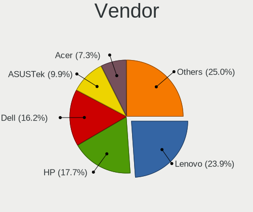
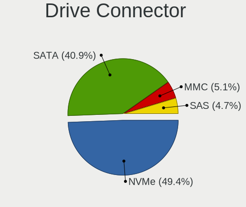
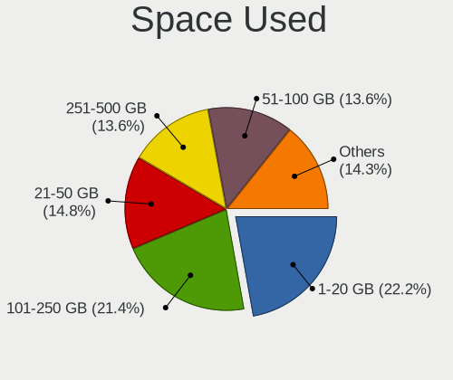
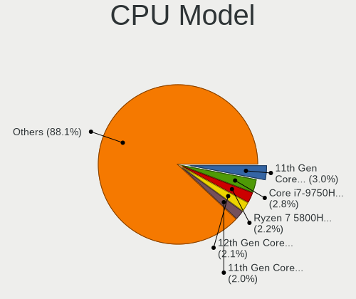
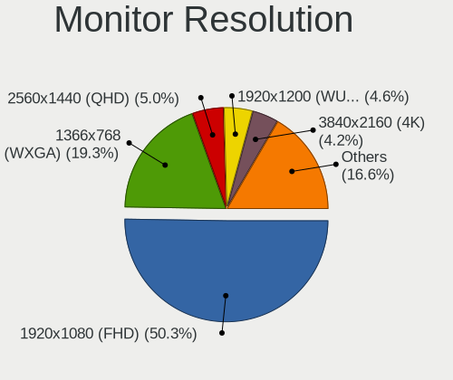
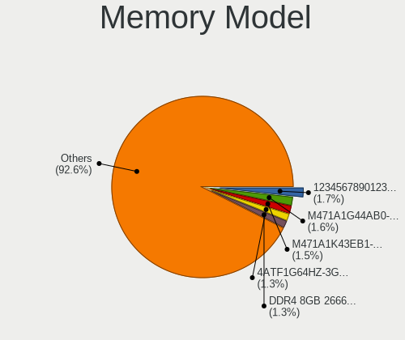
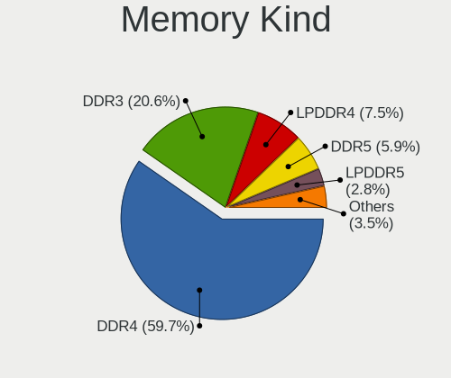
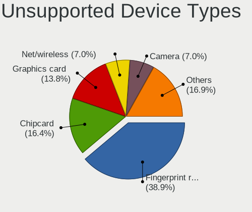

Kubuntu 22.04 - Tested Hardware & Statistics (Notebooks)
--------------------------------------------------------

A project to collect tested hardware configurations for Kubuntu 22.04.

Anyone can contribute to this report by the [hw-probe](https://github.com/linuxhw/hw-probe) tool:

    sudo -E hw-probe -all -upload

Please contribute! Especially if your hardware is rare.

Contents
--------

* [ Test Cases ](#test-cases)

* [ System ](#system)
  - [ Kernel                   ](#kernel)
  - [ Kernel Family            ](#kernel-family)
  - [ Kernel Major Ver.        ](#kernel-major-ver)
  - [ Arch                     ](#arch)
  - [ DE                       ](#de)
  - [ Display Server           ](#display-server)
  - [ Display Manager          ](#display-manager)
  - [ OS Lang                  ](#os-lang)
  - [ Boot Mode                ](#boot-mode)
  - [ Filesystem               ](#filesystem)
  - [ Part. scheme             ](#part-scheme)
  - [ Dual Boot with Linux/BSD ](#dual-boot-with-linuxbsd)
  - [ Dual Boot (Win)          ](#dual-boot-win)

* [ Board ](#board)
  - [ Vendor                   ](#vendor)
  - [ Model                    ](#model)
  - [ Model Family             ](#model-family)
  - [ MFG Year                 ](#mfg-year)
  - [ Form Factor              ](#form-factor)
  - [ Secure Boot              ](#secure-boot)
  - [ Coreboot                 ](#coreboot)
  - [ RAM Size                 ](#ram-size)
  - [ RAM Used                 ](#ram-used)
  - [ Total Drives             ](#total-drives)
  - [ Has CD-ROM               ](#has-cd-rom)
  - [ Has Ethernet             ](#has-ethernet)
  - [ Has WiFi                 ](#has-wifi)
  - [ Has Bluetooth            ](#has-bluetooth)

* [ Location ](#location)
  - [ Country                  ](#country)
  - [ City                     ](#city)

* [ Drives ](#drives)
  - [ Drive Vendor             ](#drive-vendor)
  - [ Drive Model              ](#drive-model)
  - [ HDD Vendor               ](#hdd-vendor)
  - [ SSD Vendor               ](#ssd-vendor)
  - [ Drive Kind               ](#drive-kind)
  - [ Drive Connector          ](#drive-connector)
  - [ Drive Size               ](#drive-size)
  - [ Space Total              ](#space-total)
  - [ Space Used               ](#space-used)
  - [ Malfunc. Drives          ](#malfunc-drives)
  - [ Malfunc. Drive Vendor    ](#malfunc-drive-vendor)
  - [ Malfunc. HDD Vendor      ](#malfunc-hdd-vendor)
  - [ Malfunc. Drive Kind      ](#malfunc-drive-kind)
  - [ Failed Drives            ](#failed-drives)
  - [ Failed Drive Vendor      ](#failed-drive-vendor)
  - [ Drive Status             ](#drive-status)

* [ Storage controller ](#storage-controller)
  - [ Storage Vendor           ](#storage-vendor)
  - [ Storage Model            ](#storage-model)
  - [ Storage Kind             ](#storage-kind)

* [ Processor ](#processor)
  - [ CPU Vendor               ](#cpu-vendor)
  - [ CPU Model                ](#cpu-model)
  - [ CPU Model Family         ](#cpu-model-family)
  - [ CPU Cores                ](#cpu-cores)
  - [ CPU Sockets              ](#cpu-sockets)
  - [ CPU Threads              ](#cpu-threads)
  - [ CPU Op-Modes             ](#cpu-op-modes)
  - [ CPU Microcode            ](#cpu-microcode)
  - [ CPU Microarch            ](#cpu-microarch)

* [ Graphics ](#graphics)
  - [ GPU Vendor               ](#gpu-vendor)
  - [ GPU Model                ](#gpu-model)
  - [ GPU Combo                ](#gpu-combo)
  - [ GPU Driver               ](#gpu-driver)
  - [ GPU Memory               ](#gpu-memory)

* [ Monitor ](#monitor)
  - [ Monitor Vendor           ](#monitor-vendor)
  - [ Monitor Model            ](#monitor-model)
  - [ Monitor Resolution       ](#monitor-resolution)
  - [ Monitor Diagonal         ](#monitor-diagonal)
  - [ Monitor Width            ](#monitor-width)
  - [ Aspect Ratio             ](#aspect-ratio)
  - [ Monitor Area             ](#monitor-area)
  - [ Pixel Density            ](#pixel-density)
  - [ Multiple Monitors        ](#multiple-monitors)

* [ Network ](#network)
  - [ Net Controller Vendor    ](#net-controller-vendor)
  - [ Net Controller Model     ](#net-controller-model)
  - [ Wireless Vendor          ](#wireless-vendor)
  - [ Wireless Model           ](#wireless-model)
  - [ Ethernet Vendor          ](#ethernet-vendor)
  - [ Ethernet Model           ](#ethernet-model)
  - [ Net Controller Kind      ](#net-controller-kind)
  - [ Used Controller          ](#used-controller)
  - [ NICs                     ](#nics)
  - [ IPv6                     ](#ipv6)

* [ Bluetooth ](#bluetooth)
  - [ Bluetooth Vendor         ](#bluetooth-vendor)
  - [ Bluetooth Model          ](#bluetooth-model)

* [ Sound ](#sound)
  - [ Sound Vendor             ](#sound-vendor)
  - [ Sound Model              ](#sound-model)

* [ Memory ](#memory)
  - [ Memory Vendor            ](#memory-vendor)
  - [ Memory Model             ](#memory-model)
  - [ Memory Kind              ](#memory-kind)
  - [ Memory Form Factor       ](#memory-form-factor)
  - [ Memory Size              ](#memory-size)
  - [ Memory Speed             ](#memory-speed)

* [ Printers & scanners ](#printers--scanners)
  - [ Printer Vendor           ](#printer-vendor)
  - [ Printer Model            ](#printer-model)
  - [ Scanner Vendor           ](#scanner-vendor)
  - [ Scanner Model            ](#scanner-model)

* [ Camera ](#camera)
  - [ Camera Vendor            ](#camera-vendor)
  - [ Camera Model             ](#camera-model)

* [ Security ](#security)
  - [ Fingerprint Vendor       ](#fingerprint-vendor)
  - [ Fingerprint Model        ](#fingerprint-model)
  - [ Chipcard Vendor          ](#chipcard-vendor)
  - [ Chipcard Model           ](#chipcard-model)

* [ Unsupported ](#unsupported)
  - [ Unsupported Devices      ](#unsupported-devices)
  - [ Unsupported Device Types ](#unsupported-device-types)

Test Cases
----------

Total: 368

| Vendor        | Model                       | Probe                                                      | Date         |
|---------------|-----------------------------|------------------------------------------------------------|--------------|
| HP            | ProBook 450 G2              | [552ac907a0](https://linux-hardware.org/?probe=552ac907a0) | Dec 01, 2022 |
| Haier         | A1420EM                     | [6f18b3c1ce](https://linux-hardware.org/?probe=6f18b3c1ce) | Nov 30, 2022 |
| HUAWEI        | BOD-WXX9                    | [a2b8deb4e3](https://linux-hardware.org/?probe=a2b8deb4e3) | Nov 29, 2022 |
| Dell          | Inspiron 3521               | [2ecbfd5e39](https://linux-hardware.org/?probe=2ecbfd5e39) | Nov 29, 2022 |
| Acer          | Nitro AN517-51              | [c20385f7bd](https://linux-hardware.org/?probe=c20385f7bd) | Nov 29, 2022 |
| MSI           | Prestige 15 A12SC           | [af2a404105](https://linux-hardware.org/?probe=af2a404105) | Nov 28, 2022 |
| Gigabyte      | RC14UD                      | [37c4b79c24](https://linux-hardware.org/?probe=37c4b79c24) | Nov 27, 2022 |
| Lenovo        | ThinkPad T430 2349DS5       | [f52677ec2e](https://linux-hardware.org/?probe=f52677ec2e) | Nov 27, 2022 |
| Monster       | TULPAR T7                   | [6634421091](https://linux-hardware.org/?probe=6634421091) | Nov 26, 2022 |
| Dell          | Vostro 5471                 | [7a6ec88b73](https://linux-hardware.org/?probe=7a6ec88b73) | Nov 26, 2022 |
| Dell          | Vostro 5471                 | [b9bbfd7551](https://linux-hardware.org/?probe=b9bbfd7551) | Nov 26, 2022 |
| GPU Compan... | GWNR71517                   | [15173435f0](https://linux-hardware.org/?probe=15173435f0) | Nov 26, 2022 |
| Lenovo        | IdeaPad 320-15IKB 80YE      | [fa21163ace](https://linux-hardware.org/?probe=fa21163ace) | Nov 26, 2022 |
| Lenovo        | ThinkPad X230 23256N6       | [a462983d82](https://linux-hardware.org/?probe=a462983d82) | Nov 25, 2022 |
| Acer          | Nitro AN515-45              | [10186425ec](https://linux-hardware.org/?probe=10186425ec) | Nov 25, 2022 |
| Acer          | Nitro AN515-45              | [5a7b57dae6](https://linux-hardware.org/?probe=5a7b57dae6) | Nov 25, 2022 |
| Lenovo        | IdeaPad 5 Pro 14ACN6 82L... | [57c8d65b2e](https://linux-hardware.org/?probe=57c8d65b2e) | Nov 25, 2022 |
| ASUSTek       | X510UQ                      | [5972ededc2](https://linux-hardware.org/?probe=5972ededc2) | Nov 24, 2022 |
| Dell          | XPS 15 9510                 | [26fb968043](https://linux-hardware.org/?probe=26fb968043) | Nov 23, 2022 |
| Lenovo        | G40-45 80E1                 | [c50111eb6d](https://linux-hardware.org/?probe=c50111eb6d) | Nov 22, 2022 |
| Lenovo        | ThinkPad T440s 20AQ007SM... | [326b5bad4c](https://linux-hardware.org/?probe=326b5bad4c) | Nov 21, 2022 |
| Acer          | Nitro AN517-51              | [de8506cc0b](https://linux-hardware.org/?probe=de8506cc0b) | Nov 19, 2022 |
| MSI           | Vector GP66 12UGS           | [9aab7e297a](https://linux-hardware.org/?probe=9aab7e297a) | Nov 19, 2022 |
| MSI           | Vector GP66 12UGS           | [e10c2abc9b](https://linux-hardware.org/?probe=e10c2abc9b) | Nov 19, 2022 |
| HP            | Laptop 17-cp0xxx            | [a3fde1deaa](https://linux-hardware.org/?probe=a3fde1deaa) | Nov 19, 2022 |
| Lenovo        | Legion 5 15IMH05H 81Y6      | [53a2707274](https://linux-hardware.org/?probe=53a2707274) | Nov 18, 2022 |
| Dell          | Inspiron 7348               | [6a46a84480](https://linux-hardware.org/?probe=6a46a84480) | Nov 18, 2022 |
| HP            | Laptop 17-cp0xxx            | [f4c6260289](https://linux-hardware.org/?probe=f4c6260289) | Nov 18, 2022 |
| Dell          | Inspiron 5759               | [8cdba26964](https://linux-hardware.org/?probe=8cdba26964) | Nov 18, 2022 |
| Digma         | EVE 15 C423 ES5069EW        | [57cd27008a](https://linux-hardware.org/?probe=57cd27008a) | Nov 18, 2022 |
| HP            | Pavilion 15                 | [fbef42d1dc](https://linux-hardware.org/?probe=fbef42d1dc) | Nov 16, 2022 |
| Lenovo        | ThinkPad X230 23256N6       | [facd5aa317](https://linux-hardware.org/?probe=facd5aa317) | Nov 16, 2022 |
| Acer          | TravelMate P633-M           | [2277ff1866](https://linux-hardware.org/?probe=2277ff1866) | Nov 15, 2022 |
| Dell          | Inspiron 3480               | [699e532a38](https://linux-hardware.org/?probe=699e532a38) | Nov 14, 2022 |
| Dell          | Inspiron 3480               | [3fca000783](https://linux-hardware.org/?probe=3fca000783) | Nov 14, 2022 |
| HP            | Laptop 17-cp0xxx            | [fa8dcc3eed](https://linux-hardware.org/?probe=fa8dcc3eed) | Nov 13, 2022 |
| ASUSTek       | K53Z                        | [7eb8b08a75](https://linux-hardware.org/?probe=7eb8b08a75) | Nov 13, 2022 |
| Lenovo        | ThinkPad X260 20F5S28R00    | [ac107ff6e8](https://linux-hardware.org/?probe=ac107ff6e8) | Nov 12, 2022 |
| Timi          | TM1703                      | [b59fbfd729](https://linux-hardware.org/?probe=b59fbfd729) | Nov 11, 2022 |
| Lenovo        | ThinkPad P15v Gen 1 20TQ... | [d8adeb01a9](https://linux-hardware.org/?probe=d8adeb01a9) | Nov 10, 2022 |
| HP            | EliteBook 8470p             | [45f26463b7](https://linux-hardware.org/?probe=45f26463b7) | Nov 10, 2022 |
| Acer          | Predator PT516-52s          | [b8ebbe76e8](https://linux-hardware.org/?probe=b8ebbe76e8) | Nov 10, 2022 |
| HP            | Pavilion g6                 | [e2a0a47587](https://linux-hardware.org/?probe=e2a0a47587) | Nov 10, 2022 |
| VALE          | Notebook Slim S132          | [fc8cf254ad](https://linux-hardware.org/?probe=fc8cf254ad) | Nov 10, 2022 |
| VALE          | Notebook Slim S132          | [720ddf5d0f](https://linux-hardware.org/?probe=720ddf5d0f) | Nov 10, 2022 |
| Dell          | XPS 15 9560                 | [d7a20bdac6](https://linux-hardware.org/?probe=d7a20bdac6) | Nov 09, 2022 |
| Timi          | TM1701                      | [917ec43bd1](https://linux-hardware.org/?probe=917ec43bd1) | Nov 09, 2022 |
| HP            | EliteBook 855 G7 Noteboo... | [de85ac10f6](https://linux-hardware.org/?probe=de85ac10f6) | Nov 09, 2022 |
| HP            | Laptop 17-cp0xxx            | [1c51983a67](https://linux-hardware.org/?probe=1c51983a67) | Nov 09, 2022 |
| Lenovo        | ThinkBook 14 G4 ABA 21DK    | [5d479ec43f](https://linux-hardware.org/?probe=5d479ec43f) | Nov 08, 2022 |
| MSI           | Unknown                     | [76090d77bf](https://linux-hardware.org/?probe=76090d77bf) | Nov 08, 2022 |
| HP            | Laptop 17-cp0xxx            | [91355e2bd7](https://linux-hardware.org/?probe=91355e2bd7) | Nov 08, 2022 |
| HP            | OMEN by Laptop 16-c0xxx     | [5584c6e2d1](https://linux-hardware.org/?probe=5584c6e2d1) | Nov 08, 2022 |
| Lenovo        | ThinkPad L15 Gen 1 20U8S... | [1a4822b860](https://linux-hardware.org/?probe=1a4822b860) | Nov 08, 2022 |
| Lenovo        | B590 20206                  | [d454a9a1e7](https://linux-hardware.org/?probe=d454a9a1e7) | Nov 07, 2022 |
| HP            | ProBook 5330m               | [7ddff41cb6](https://linux-hardware.org/?probe=7ddff41cb6) | Nov 07, 2022 |
| Lenovo        | G500 20236                  | [76d6e74fad](https://linux-hardware.org/?probe=76d6e74fad) | Nov 07, 2022 |
| Lenovo        | IdeaPad 3 15ADA6 82KR       | [8090894691](https://linux-hardware.org/?probe=8090894691) | Nov 06, 2022 |
| HP            | Laptop 15-dw0xxx            | [46c9baf82c](https://linux-hardware.org/?probe=46c9baf82c) | Nov 05, 2022 |
| HP            | Laptop 15-dw0xxx            | [5783283bd4](https://linux-hardware.org/?probe=5783283bd4) | Nov 05, 2022 |
| Dell          | Latitude 3420               | [f30c035ae6](https://linux-hardware.org/?probe=f30c035ae6) | Nov 05, 2022 |
| Lenovo        | IdeaPad 3 15ALC6 82MF       | [118a1f505b](https://linux-hardware.org/?probe=118a1f505b) | Nov 04, 2022 |
| AXIOO         | SlimBook 11                 | [ffc6980bf3](https://linux-hardware.org/?probe=ffc6980bf3) | Nov 03, 2022 |
| AXIOO         | SlimBook 11                 | [a16eac12d2](https://linux-hardware.org/?probe=a16eac12d2) | Nov 03, 2022 |
| Lenovo        | ThinkPad T440p 20AW000GU... | [b4ff1758e9](https://linux-hardware.org/?probe=b4ff1758e9) | Nov 02, 2022 |
| Panasonic     | CF-31WBLEHLM                | [623af75bb3](https://linux-hardware.org/?probe=623af75bb3) | Nov 02, 2022 |
| Panasonic     | CF-31WBLEHLM                | [52e7c62bae](https://linux-hardware.org/?probe=52e7c62bae) | Nov 02, 2022 |
| Lenovo        | IdeaPad 720S-13ARR 81BR     | [fefe8e5d04](https://linux-hardware.org/?probe=fefe8e5d04) | Nov 01, 2022 |
| Lenovo        | IdeaPad 720S-13ARR 81BR     | [df949b6e10](https://linux-hardware.org/?probe=df949b6e10) | Nov 01, 2022 |
| Lenovo        | ThinkPad L15 Gen 1 20U8S... | [4b778e52ee](https://linux-hardware.org/?probe=4b778e52ee) | Oct 30, 2022 |
| ASUSTek       | Zephyrus S GX502GW_GX502... | [c3f344809a](https://linux-hardware.org/?probe=c3f344809a) | Oct 30, 2022 |
| Lenovo        | ThinkPad L15 Gen 2 20X30... | [418b143f46](https://linux-hardware.org/?probe=418b143f46) | Oct 30, 2022 |
| ASUSTek       | ASUS TUF Gaming F15 FX50... | [293877c614](https://linux-hardware.org/?probe=293877c614) | Oct 29, 2022 |
| Lenovo        | V15 G2 ALC 82KD             | [aea626acae](https://linux-hardware.org/?probe=aea626acae) | Oct 29, 2022 |
| Lenovo        | V15-IGL 82C3                | [5bd4292187](https://linux-hardware.org/?probe=5bd4292187) | Oct 29, 2022 |
| Dell          | Inspiron 7520               | [91f0c87afa](https://linux-hardware.org/?probe=91f0c87afa) | Oct 29, 2022 |
| ASUSTek       | ASUS TUF Gaming F15 FX50... | [d7491bf8e7](https://linux-hardware.org/?probe=d7491bf8e7) | Oct 29, 2022 |
| ASUSTek       | ASUS TUF Gaming F15 FX50... | [6bdf703faf](https://linux-hardware.org/?probe=6bdf703faf) | Oct 29, 2022 |
| Dell          | Latitude 5521               | [460057b367](https://linux-hardware.org/?probe=460057b367) | Oct 28, 2022 |
| Lenovo        | ThinkPad X230 23256N6       | [a2d71fd3ca](https://linux-hardware.org/?probe=a2d71fd3ca) | Oct 28, 2022 |
| HP            | 255 G8 Notebook PC          | [ba5aec702a](https://linux-hardware.org/?probe=ba5aec702a) | Oct 27, 2022 |
| Acer          | Predator PT516-52s          | [c0cebe4cfe](https://linux-hardware.org/?probe=c0cebe4cfe) | Oct 27, 2022 |
| Dell          | Latitude E5530 non-vPro     | [a5c5f0ec1e](https://linux-hardware.org/?probe=a5c5f0ec1e) | Oct 27, 2022 |
| HP            | Pavilion dv6                | [ed392a140d](https://linux-hardware.org/?probe=ed392a140d) | Oct 27, 2022 |
| HP            | G62                         | [c9ba156401](https://linux-hardware.org/?probe=c9ba156401) | Oct 27, 2022 |
| Lenovo        | IdeaPad 3 15ADA05 81W1      | [a308f68bce](https://linux-hardware.org/?probe=a308f68bce) | Oct 27, 2022 |
| TUXEDO        | Stellaris AMD Gen3 (CZN)    | [0763832411](https://linux-hardware.org/?probe=0763832411) | Oct 27, 2022 |
| Notebook      | PD5x_7xPNP_PNR_PNN_PNT      | [93229f0fab](https://linux-hardware.org/?probe=93229f0fab) | Oct 26, 2022 |
| Acer          | Aspire E5-571               | [2920658e38](https://linux-hardware.org/?probe=2920658e38) | Oct 25, 2022 |
| Samsung       | 767XCL                      | [17bd1b4506](https://linux-hardware.org/?probe=17bd1b4506) | Oct 25, 2022 |
| HP            | Pavilion g6                 | [448d52b32f](https://linux-hardware.org/?probe=448d52b32f) | Oct 25, 2022 |
| HP            | ProBook 640 G1              | [cfb2e32cea](https://linux-hardware.org/?probe=cfb2e32cea) | Oct 25, 2022 |
| HUAWEI        | BOHB-WAX9                   | [fe222419ec](https://linux-hardware.org/?probe=fe222419ec) | Oct 25, 2022 |
| Acer          | Nitro AN517-51              | [7fed0ea2a9](https://linux-hardware.org/?probe=7fed0ea2a9) | Oct 24, 2022 |
| Dell          | XPS 15 9560                 | [37fc32cacd](https://linux-hardware.org/?probe=37fc32cacd) | Oct 24, 2022 |
| Lenovo        | ThinkPad P73 20QRS00100     | [532b112928](https://linux-hardware.org/?probe=532b112928) | Oct 24, 2022 |
| HP            | EliteBook 8470p             | [918b0ef1ab](https://linux-hardware.org/?probe=918b0ef1ab) | Oct 24, 2022 |
| HP            | Laptop 17-by0xxx            | [faedd5a008](https://linux-hardware.org/?probe=faedd5a008) | Oct 24, 2022 |
| Lenovo        | IdeaPad Gaming 3 15ACH6 ... | [13c917aa38](https://linux-hardware.org/?probe=13c917aa38) | Oct 23, 2022 |
| Dell          | Latitude 7390               | [71f8a9e59b](https://linux-hardware.org/?probe=71f8a9e59b) | Oct 22, 2022 |
| Acer          | Predator PT516-52s          | [ec8dac6fd3](https://linux-hardware.org/?probe=ec8dac6fd3) | Oct 22, 2022 |
| Dell          | Vostro 3560                 | [b438a2ba8f](https://linux-hardware.org/?probe=b438a2ba8f) | Oct 22, 2022 |
| Lenovo        | ThinkBook 15 G3 ACL 21A4    | [a8c892608e](https://linux-hardware.org/?probe=a8c892608e) | Oct 21, 2022 |
| Dell          | Latitude E5530 non-vPro     | [20f991643f](https://linux-hardware.org/?probe=20f991643f) | Oct 21, 2022 |
| HP            | Laptop 17-by4xxx            | [6090ec7241](https://linux-hardware.org/?probe=6090ec7241) | Oct 21, 2022 |
| HP            | EliteBook 845 G7 Noteboo... | [0cf70c348b](https://linux-hardware.org/?probe=0cf70c348b) | Oct 21, 2022 |
| Lenovo        | IdeaPad 320-15IKB 80XL      | [c8e47b28fe](https://linux-hardware.org/?probe=c8e47b28fe) | Oct 20, 2022 |
| Lenovo        | ThinkBook 14 G4 ABA 21DK    | [46cb50f2f6](https://linux-hardware.org/?probe=46cb50f2f6) | Oct 19, 2022 |
| Tactus        | GeoBook 140                 | [6d01f5c57b](https://linux-hardware.org/?probe=6d01f5c57b) | Oct 19, 2022 |
| Dell          | XPS 9320                    | [8dd41b53b6](https://linux-hardware.org/?probe=8dd41b53b6) | Oct 19, 2022 |
| Samsung       | R430/P430/R480              | [a2db8aeade](https://linux-hardware.org/?probe=a2db8aeade) | Oct 19, 2022 |
| Samsung       | R430/P430/R480              | [92957e0afc](https://linux-hardware.org/?probe=92957e0afc) | Oct 19, 2022 |
| Lenovo        | Legion 5 17ACH6 82K0        | [431a84fc31](https://linux-hardware.org/?probe=431a84fc31) | Oct 18, 2022 |
| Dell          | Precision 3570              | [90711415f5](https://linux-hardware.org/?probe=90711415f5) | Oct 18, 2022 |
| HP            | ProBook 450 G5              | [a7ebb4b3c4](https://linux-hardware.org/?probe=a7ebb4b3c4) | Oct 16, 2022 |
| Lenovo        | Yoga 2 13 20344             | [f779ba08c9](https://linux-hardware.org/?probe=f779ba08c9) | Oct 16, 2022 |
| ASUSTek       | ROG Strix G512LV_G512LV     | [53a9eb1420](https://linux-hardware.org/?probe=53a9eb1420) | Oct 16, 2022 |
| HP            | OMEN Laptop 15-en0xxx       | [dad786ca06](https://linux-hardware.org/?probe=dad786ca06) | Oct 15, 2022 |
| Lenovo        | ThinkPad T430 2342A19       | [7c6c3783e6](https://linux-hardware.org/?probe=7c6c3783e6) | Oct 14, 2022 |
| Dell          | Precision M6700             | [e198a003b6](https://linux-hardware.org/?probe=e198a003b6) | Oct 13, 2022 |
| Lenovo        | ThinkBook 14 G4 ABA 21DK    | [1258429041](https://linux-hardware.org/?probe=1258429041) | Oct 13, 2022 |
| GPU Compan... | GWTC116-2                   | [93ee54a067](https://linux-hardware.org/?probe=93ee54a067) | Oct 11, 2022 |
| HP            | ProBook 440 G8 Notebook ... | [125ad4881a](https://linux-hardware.org/?probe=125ad4881a) | Oct 11, 2022 |
| Lenovo        | Legion 5 15ACH6H 82JU       | [d67f89127f](https://linux-hardware.org/?probe=d67f89127f) | Oct 11, 2022 |
| HP            | EliteBook 845 G7 Noteboo... | [5268977f64](https://linux-hardware.org/?probe=5268977f64) | Oct 09, 2022 |
| Gigabyte      | AERO 15-X9                  | [aad99b4421](https://linux-hardware.org/?probe=aad99b4421) | Oct 09, 2022 |
| ASUSTek       | X555UA                      | [9cf559ac01](https://linux-hardware.org/?probe=9cf559ac01) | Oct 08, 2022 |
| Gigabyte      | AERO 15-X9                  | [1f634e5071](https://linux-hardware.org/?probe=1f634e5071) | Oct 08, 2022 |
| ASUSTek       | VivoBook_ASUSLaptop M740... | [1b90e3cfa5](https://linux-hardware.org/?probe=1b90e3cfa5) | Oct 08, 2022 |
| Lenovo        | IdeaPad Y510P 20217         | [fddd82ba56](https://linux-hardware.org/?probe=fddd82ba56) | Oct 08, 2022 |
| Lenovo        | IdeaPad Y510P 20217         | [9a16ca15b3](https://linux-hardware.org/?probe=9a16ca15b3) | Oct 08, 2022 |
| ASUSTek       | VivoBook_ASUSLaptop M740... | [9bb8f8e33b](https://linux-hardware.org/?probe=9bb8f8e33b) | Oct 07, 2022 |
| Lenovo        | ThinkPad X230 23256N6       | [e59c8f50b4](https://linux-hardware.org/?probe=e59c8f50b4) | Oct 07, 2022 |
| Apple         | MacBookPro16,1              | [865d1f0e6f](https://linux-hardware.org/?probe=865d1f0e6f) | Oct 07, 2022 |
| Lenovo        | ZHAOYANG E53-80 81CM        | [985ca1961c](https://linux-hardware.org/?probe=985ca1961c) | Oct 06, 2022 |
| Toshiba       | Satellite NB10t-A-102       | [0bf17a1e92](https://linux-hardware.org/?probe=0bf17a1e92) | Oct 06, 2022 |
| HP            | Pavilion Laptop 15-eh1xx... | [3b023a0363](https://linux-hardware.org/?probe=3b023a0363) | Oct 06, 2022 |
| Lenovo        | IdeaPad 320-15IKB 80XL      | [e4df51e64f](https://linux-hardware.org/?probe=e4df51e64f) | Oct 05, 2022 |
| HUAWEI        | NBD-WXX9                    | [2513dfd51e](https://linux-hardware.org/?probe=2513dfd51e) | Oct 05, 2022 |
| Lenovo        | ThinkPad X230 23256N6       | [082814c248](https://linux-hardware.org/?probe=082814c248) | Oct 04, 2022 |
| Apple         | MacBookPro10,1              | [3bc5547f39](https://linux-hardware.org/?probe=3bc5547f39) | Oct 04, 2022 |
| HP            | ProBook 640 G2              | [2dc13504cf](https://linux-hardware.org/?probe=2dc13504cf) | Oct 03, 2022 |
| Acer          | Aspire A315-58              | [2969d635b3](https://linux-hardware.org/?probe=2969d635b3) | Oct 03, 2022 |
| Acer          | Aspire A315-58              | [28b873114a](https://linux-hardware.org/?probe=28b873114a) | Oct 03, 2022 |
| Acer          | Aspire E5-575G              | [330f866cf3](https://linux-hardware.org/?probe=330f866cf3) | Oct 03, 2022 |
| Lenovo        | IdeaPad 1 14IGL05 81VU      | [c555fbbf75](https://linux-hardware.org/?probe=c555fbbf75) | Oct 01, 2022 |
| Lenovo        | ThinkPad X230 23256N6       | [ec44263cbd](https://linux-hardware.org/?probe=ec44263cbd) | Oct 01, 2022 |
| HP            | EliteBook 840 G3            | [24a248630f](https://linux-hardware.org/?probe=24a248630f) | Sep 30, 2022 |
| HP            | ZBook 15 G6                 | [476623a6a1](https://linux-hardware.org/?probe=476623a6a1) | Sep 26, 2022 |
| Lenovo        | ThinkPad E15 Gen 3 20YG0... | [923985941d](https://linux-hardware.org/?probe=923985941d) | Sep 25, 2022 |
| HONOR         | BMH-WCX9                    | [867da0c4b8](https://linux-hardware.org/?probe=867da0c4b8) | Sep 25, 2022 |
| Lenovo        | ThinkPad X230 23256N6       | [f061f902ff](https://linux-hardware.org/?probe=f061f902ff) | Sep 25, 2022 |
| Lenovo        | ThinkPad T430 2349NZ8       | [8f61a903c5](https://linux-hardware.org/?probe=8f61a903c5) | Sep 25, 2022 |
| Acer          | Aspire R3-131T              | [0d44032bc0](https://linux-hardware.org/?probe=0d44032bc0) | Sep 25, 2022 |
| HUAWEI        | BOHB-WAX9                   | [18a4d2bb72](https://linux-hardware.org/?probe=18a4d2bb72) | Sep 23, 2022 |
| Lenovo        | ThinkPad L14 Gen 2 20X1S... | [6e943a4d35](https://linux-hardware.org/?probe=6e943a4d35) | Sep 23, 2022 |
| HP            | 255 G8 Notebook PC          | [20691b389b](https://linux-hardware.org/?probe=20691b389b) | Sep 21, 2022 |
| Dell          | Latitude E5530 non-vPro     | [6352f6fb82](https://linux-hardware.org/?probe=6352f6fb82) | Sep 21, 2022 |
| Acer          | Aspire A515-45              | [41b1b790fd](https://linux-hardware.org/?probe=41b1b790fd) | Sep 19, 2022 |
| HP            | EliteBook 8560p             | [4a9e29fab2](https://linux-hardware.org/?probe=4a9e29fab2) | Sep 18, 2022 |
| Google        | Blooglet                    | [971a174a56](https://linux-hardware.org/?probe=971a174a56) | Sep 18, 2022 |
| Acer          | Aspire S3-391               | [5aadfd37c5](https://linux-hardware.org/?probe=5aadfd37c5) | Sep 17, 2022 |
| Acer          | Aspire S3-391               | [82a1f45915](https://linux-hardware.org/?probe=82a1f45915) | Sep 17, 2022 |
| MSI           | Delta 15 A5EFK              | [382e0f70a3](https://linux-hardware.org/?probe=382e0f70a3) | Sep 17, 2022 |
| Dell          | XPS 15 9560                 | [4a903b438f](https://linux-hardware.org/?probe=4a903b438f) | Sep 17, 2022 |
| Lenovo        | IdeaPad 3 15ARE05 81W4      | [4ee2b37edf](https://linux-hardware.org/?probe=4ee2b37edf) | Sep 16, 2022 |
| ASUSTek       | G501VW                      | [cf04ceb420](https://linux-hardware.org/?probe=cf04ceb420) | Sep 15, 2022 |
| Google        | Treeya                      | [a2723e9afa](https://linux-hardware.org/?probe=a2723e9afa) | Sep 15, 2022 |
| Dell          | Inspiron 5567               | [3af5d11f3f](https://linux-hardware.org/?probe=3af5d11f3f) | Sep 14, 2022 |
| Dell          | Inspiron 5567               | [22e62266a2](https://linux-hardware.org/?probe=22e62266a2) | Sep 13, 2022 |
| Lenovo        | ThinkPad T14 Gen 1 20S1S... | [d4fb6aa0ae](https://linux-hardware.org/?probe=d4fb6aa0ae) | Sep 13, 2022 |
| Lenovo        | ThinkPad T430 2347AT2       | [703c55185d](https://linux-hardware.org/?probe=703c55185d) | Sep 12, 2022 |
| Sony          | SVE1512J6EW                 | [69e2400606](https://linux-hardware.org/?probe=69e2400606) | Sep 11, 2022 |
| HP            | EliteBook 8470p             | [52f6655891](https://linux-hardware.org/?probe=52f6655891) | Sep 11, 2022 |
| Dell          | G15 5511                    | [b971c27fae](https://linux-hardware.org/?probe=b971c27fae) | Sep 10, 2022 |
| Lenovo        | ThinkPad T430 2347AT2       | [50f39d7738](https://linux-hardware.org/?probe=50f39d7738) | Sep 09, 2022 |
| Dell          | Latitude 7430               | [b1cdbef6b2](https://linux-hardware.org/?probe=b1cdbef6b2) | Sep 09, 2022 |
| Acer          | Predator G3-571             | [553cf2f33f](https://linux-hardware.org/?probe=553cf2f33f) | Sep 08, 2022 |
| Dell          | Vostro 3700                 | [40e150eb3b](https://linux-hardware.org/?probe=40e150eb3b) | Sep 08, 2022 |
| Samsung       | 270E5G/270E5U               | [0300dd1a2d](https://linux-hardware.org/?probe=0300dd1a2d) | Sep 05, 2022 |
| Lenovo        | Legion 5 Pro 16ITH6H 82J... | [85798fb011](https://linux-hardware.org/?probe=85798fb011) | Sep 05, 2022 |
| ASUSTek       | UX51VZA                     | [46aa1dbafa](https://linux-hardware.org/?probe=46aa1dbafa) | Sep 04, 2022 |
| HP            | Pavilion Gaming Laptop 1... | [8eec266b41](https://linux-hardware.org/?probe=8eec266b41) | Sep 03, 2022 |
| HP            | Laptop 15-da0xxx            | [5c11f5477e](https://linux-hardware.org/?probe=5c11f5477e) | Sep 03, 2022 |
| HP            | Notebook                    | [a3b180cbb5](https://linux-hardware.org/?probe=a3b180cbb5) | Sep 03, 2022 |
| Lenovo        | G780 20138                  | [4a452f0874](https://linux-hardware.org/?probe=4a452f0874) | Sep 03, 2022 |
| Lenovo        | ThinkPad E14 20RBS25S00     | [a4290c0678](https://linux-hardware.org/?probe=a4290c0678) | Sep 03, 2022 |
| Lenovo        | ThinkBook 14 G2 ITL 20VD    | [a15c233224](https://linux-hardware.org/?probe=a15c233224) | Sep 02, 2022 |
| Lenovo        | ThinkPad X1 Extreme Gen ... | [d34c9cb705](https://linux-hardware.org/?probe=d34c9cb705) | Sep 01, 2022 |
| Lenovo        | ThinkPad T460 20FMS08U00    | [d7457fd32a](https://linux-hardware.org/?probe=d7457fd32a) | Sep 01, 2022 |
| HP            | Pavilion Gaming Laptop      | [8382b4123e](https://linux-hardware.org/?probe=8382b4123e) | Aug 31, 2022 |
| Samsung       | 870Z5E/880Z5E/680Z5E        | [0166c06969](https://linux-hardware.org/?probe=0166c06969) | Aug 30, 2022 |
| Dell          | Latitude 9420               | [0b8d883170](https://linux-hardware.org/?probe=0b8d883170) | Aug 29, 2022 |
| Toshiba       | Satellite L850              | [fe1480794c](https://linux-hardware.org/?probe=fe1480794c) | Aug 29, 2022 |
| Google        | Eldrid                      | [ae53120bac](https://linux-hardware.org/?probe=ae53120bac) | Aug 28, 2022 |
| HP            | Pavilion Gaming Laptop 1... | [20bea980d2](https://linux-hardware.org/?probe=20bea980d2) | Aug 28, 2022 |
| Lenovo        | ThinkPad E15 Gen 3 20YG0... | [208be390fa](https://linux-hardware.org/?probe=208be390fa) | Aug 26, 2022 |
| Sony          | VGN-NR11Z_T                 | [54c1e7c198](https://linux-hardware.org/?probe=54c1e7c198) | Aug 26, 2022 |
| Apple         | MacBookPro11,1              | [5097845796](https://linux-hardware.org/?probe=5097845796) | Aug 24, 2022 |
| HP            | ENVY Laptop 17-ce1xxx       | [4c201d43d0](https://linux-hardware.org/?probe=4c201d43d0) | Aug 22, 2022 |
| Toshiba       | Satellite P70-B             | [4e04d56e06](https://linux-hardware.org/?probe=4e04d56e06) | Aug 21, 2022 |
| Toshiba       | Satellite P70-B             | [402017a7ea](https://linux-hardware.org/?probe=402017a7ea) | Aug 21, 2022 |
| Dell          | G3 3500                     | [1e8edd3350](https://linux-hardware.org/?probe=1e8edd3350) | Aug 21, 2022 |
| Dell          | Inspiron 15-5578            | [a0ff8934e5](https://linux-hardware.org/?probe=a0ff8934e5) | Aug 21, 2022 |
| HP            | Pavilion g6                 | [8d5375bd39](https://linux-hardware.org/?probe=8d5375bd39) | Aug 20, 2022 |
| ASUSTek       | VivoBook_ASUSLaptop X340... | [45bac2f9d1](https://linux-hardware.org/?probe=45bac2f9d1) | Aug 20, 2022 |
| MSI           | GF75 Thin 10SCXR            | [b75c38c8a5](https://linux-hardware.org/?probe=b75c38c8a5) | Aug 19, 2022 |
| Dell          | Latitude 7280               | [63e00d0c9d](https://linux-hardware.org/?probe=63e00d0c9d) | Aug 18, 2022 |
| Acer          | Nitro AN517-41              | [73649d898c](https://linux-hardware.org/?probe=73649d898c) | Aug 18, 2022 |
| Lenovo        | ThinkPad T440p 20AWS1AY0... | [fcda79b03d](https://linux-hardware.org/?probe=fcda79b03d) | Aug 17, 2022 |
| Apple         | MacBookPro11,1              | [4d6f6d6a23](https://linux-hardware.org/?probe=4d6f6d6a23) | Aug 15, 2022 |
| Dell          | Precision 3571              | [48c3133a7f](https://linux-hardware.org/?probe=48c3133a7f) | Aug 15, 2022 |
| Lenovo        | IdeaPad 330-15IKB 81DC      | [ca96da9d08](https://linux-hardware.org/?probe=ca96da9d08) | Aug 12, 2022 |
| Panasonic     | CF-53JSWZGFF                | [88c83a7e28](https://linux-hardware.org/?probe=88c83a7e28) | Aug 11, 2022 |
| Dell          | Latitude 5590               | [a00272df56](https://linux-hardware.org/?probe=a00272df56) | Aug 11, 2022 |
| Lenovo        | Yoga Slim 7 15ITL05 82AC    | [477ce53969](https://linux-hardware.org/?probe=477ce53969) | Aug 10, 2022 |
| HP            | EliteBook 8470p             | [14aebc0034](https://linux-hardware.org/?probe=14aebc0034) | Aug 09, 2022 |
| HP            | G62                         | [430fe133db](https://linux-hardware.org/?probe=430fe133db) | Aug 09, 2022 |
| Lenovo        | ThinkPad T430 2347AT2       | [4b74670050](https://linux-hardware.org/?probe=4b74670050) | Aug 08, 2022 |
| Dell          | Latitude 5420               | [824404ee24](https://linux-hardware.org/?probe=824404ee24) | Aug 08, 2022 |
| Dell          | XPS 15 9520                 | [7311161548](https://linux-hardware.org/?probe=7311161548) | Aug 07, 2022 |
| HP            | ProBook 440 G8 Notebook ... | [9c77d1a0d5](https://linux-hardware.org/?probe=9c77d1a0d5) | Aug 06, 2022 |
| HP            | ProBook 440 G8 Notebook ... | [ea189dab70](https://linux-hardware.org/?probe=ea189dab70) | Aug 06, 2022 |
| HP            | EliteBook 8470p             | [22e9ee373f](https://linux-hardware.org/?probe=22e9ee373f) | Aug 06, 2022 |
| HP            | EliteBook 8470p             | [df685682b3](https://linux-hardware.org/?probe=df685682b3) | Aug 05, 2022 |
| Dell          | Latitude 5590               | [52f059849a](https://linux-hardware.org/?probe=52f059849a) | Aug 04, 2022 |
| Dell          | Latitude 5590               | [47292ecf57](https://linux-hardware.org/?probe=47292ecf57) | Aug 04, 2022 |
| ASUSTek       | VivoBook_ASUSLaptop X509... | [f79a1d3402](https://linux-hardware.org/?probe=f79a1d3402) | Aug 03, 2022 |
| ASUSTek       | VivoBook_ASUSLaptop X509... | [b2e4380743](https://linux-hardware.org/?probe=b2e4380743) | Aug 03, 2022 |
| Intel         | Unknown                     | [9fce3597b9](https://linux-hardware.org/?probe=9fce3597b9) | Aug 01, 2022 |
| ASUSTek       | ROG Flow X13 GV301QH_GV3... | [09c15c1ed8](https://linux-hardware.org/?probe=09c15c1ed8) | Jul 31, 2022 |
| Dell          | Latitude 5590               | [7fa93449bd](https://linux-hardware.org/?probe=7fa93449bd) | Jul 28, 2022 |
| Lenovo        | ThinkPad T450 20BV0001US    | [9c0b784d1d](https://linux-hardware.org/?probe=9c0b784d1d) | Jul 27, 2022 |
| Lenovo        | ThinkPad E14 Gen 2 20TA0... | [5ed19c54a9](https://linux-hardware.org/?probe=5ed19c54a9) | Jul 27, 2022 |
| Dell          | G5 5590                     | [20f75f2334](https://linux-hardware.org/?probe=20f75f2334) | Jul 27, 2022 |
| Unknown       | Unknown                     | [03fa847263](https://linux-hardware.org/?probe=03fa847263) | Jul 26, 2022 |
| Lenovo        | G570 20079                  | [50bab54f21](https://linux-hardware.org/?probe=50bab54f21) | Jul 26, 2022 |
| HP            | Laptop 15-da0xxx            | [6967eac391](https://linux-hardware.org/?probe=6967eac391) | Jul 26, 2022 |
| Lenovo        | IdeaPad 5 15ALC05 82LN      | [2c515ee09a](https://linux-hardware.org/?probe=2c515ee09a) | Jul 24, 2022 |
| Lenovo        | IdeaPad 5 15ALC05 82LN      | [e24e72037a](https://linux-hardware.org/?probe=e24e72037a) | Jul 24, 2022 |
| Acer          | Aspire E5-575G              | [d404840b57](https://linux-hardware.org/?probe=d404840b57) | Jul 24, 2022 |
| HP            | EliteBook 8470p             | [ec23b6375e](https://linux-hardware.org/?probe=ec23b6375e) | Jul 24, 2022 |
| Lenovo        | Legion 5 Pro 16ACH6H 82J... | [e71169659f](https://linux-hardware.org/?probe=e71169659f) | Jul 22, 2022 |
| HP            | G62                         | [418c1c572e](https://linux-hardware.org/?probe=418c1c572e) | Jul 21, 2022 |
| Lenovo        | ThinkBook 16p Gen 2 20YM    | [447161e791](https://linux-hardware.org/?probe=447161e791) | Jul 21, 2022 |
| ASUSTek       | ROG Zephyrus G14 GA402RK... | [23f16d1cac](https://linux-hardware.org/?probe=23f16d1cac) | Jul 18, 2022 |
| ASUSTek       | ROG Zephyrus G14 GA402RK... | [d83a4d5121](https://linux-hardware.org/?probe=d83a4d5121) | Jul 18, 2022 |
| HONOR         | HYM-WXX                     | [654a2a5950](https://linux-hardware.org/?probe=654a2a5950) | Jul 17, 2022 |
| ASUSTek       | K53U                        | [20120e258a](https://linux-hardware.org/?probe=20120e258a) | Jul 16, 2022 |
| Standard      | Unknown                     | [3b4805163d](https://linux-hardware.org/?probe=3b4805163d) | Jul 15, 2022 |
| HP            | Laptop 15s-eq1xxx           | [57ef4db755](https://linux-hardware.org/?probe=57ef4db755) | Jul 14, 2022 |
| Schenker      | XMG APEX (Mid 2021)         | [41136553b2](https://linux-hardware.org/?probe=41136553b2) | Jul 13, 2022 |
| TUXEDO        | Stellaris AMD Gen3 (CZN)    | [33bea96de9](https://linux-hardware.org/?probe=33bea96de9) | Jul 12, 2022 |
| Lenovo        | ThinkPad X1 Nano Gen 1 2... | [21ef2a8d9a](https://linux-hardware.org/?probe=21ef2a8d9a) | Jul 12, 2022 |
| Lenovo        | ThinkPad E14 Gen 3 20Y70... | [1bbf224b5c](https://linux-hardware.org/?probe=1bbf224b5c) | Jul 11, 2022 |
| System76      | Lemur Ultra                 | [10e8deaf3b](https://linux-hardware.org/?probe=10e8deaf3b) | Jul 11, 2022 |
| Toshiba       | TECRA S11                   | [c33fa181ba](https://linux-hardware.org/?probe=c33fa181ba) | Jul 08, 2022 |
| Lenovo        | IdeaPad 5 15ARE05 81YQ      | [6b007e333a](https://linux-hardware.org/?probe=6b007e333a) | Jul 06, 2022 |
| Lenovo        | IdeaPad 5 15ARE05 81YQ      | [f09a1deecc](https://linux-hardware.org/?probe=f09a1deecc) | Jul 06, 2022 |
| HUAWEI        | CREM-WXX9                   | [e7e175955d](https://linux-hardware.org/?probe=e7e175955d) | Jul 05, 2022 |
| Chuwi         | CoreBook X                  | [a23d0fe53d](https://linux-hardware.org/?probe=a23d0fe53d) | Jul 04, 2022 |
| Chuwi         | CoreBook X                  | [a8d8dfc814](https://linux-hardware.org/?probe=a8d8dfc814) | Jul 03, 2022 |
| Dell          | Latitude 7530               | [a66aca8921](https://linux-hardware.org/?probe=a66aca8921) | Jul 01, 2022 |
| HONOR         | BOHK-WAX9X                  | [1647402099](https://linux-hardware.org/?probe=1647402099) | Jun 30, 2022 |
| Jumper        | EZpad                       | [5d5f3980e1](https://linux-hardware.org/?probe=5d5f3980e1) | Jun 30, 2022 |
| Dell          | Latitude 3420               | [5fef19c107](https://linux-hardware.org/?probe=5fef19c107) | Jun 29, 2022 |
| HP            | Pavilion Gaming Laptop 1... | [6dc02ab574](https://linux-hardware.org/?probe=6dc02ab574) | Jun 29, 2022 |
| HP            | Stream Laptop 11-ak0xxx     | [d2f3d5aefd](https://linux-hardware.org/?probe=d2f3d5aefd) | Jun 28, 2022 |
| ASUSTek       | ROG Zephyrus G14 GA402RK... | [0c1cbe6fd7](https://linux-hardware.org/?probe=0c1cbe6fd7) | Jun 28, 2022 |
| Haier         | A1420EM                     | [3690a94424](https://linux-hardware.org/?probe=3690a94424) | Jun 28, 2022 |
| HP            | Stream Laptop 11-ak0xxx     | [f39c4bd8a0](https://linux-hardware.org/?probe=f39c4bd8a0) | Jun 27, 2022 |
| HP            | 15                          | [3d3ad576a2](https://linux-hardware.org/?probe=3d3ad576a2) | Jun 26, 2022 |
| ASUSTek       | K46CB                       | [3af9df185f](https://linux-hardware.org/?probe=3af9df185f) | Jun 26, 2022 |
| Lenovo        | ThinkBook 14-IML 20RV       | [6afa74e5b6](https://linux-hardware.org/?probe=6afa74e5b6) | Jun 25, 2022 |
| ASUSTek       | ZenBook UX325EA_UX325EA     | [0647ff3774](https://linux-hardware.org/?probe=0647ff3774) | Jun 24, 2022 |
| Dell          | Latitude 5590               | [aa45d97e0b](https://linux-hardware.org/?probe=aa45d97e0b) | Jun 23, 2022 |
| Dell          | Latitude 5590               | [3745dfcae3](https://linux-hardware.org/?probe=3745dfcae3) | Jun 23, 2022 |
| Lenovo        | V130-15IGM 81HL             | [62f47da7d2](https://linux-hardware.org/?probe=62f47da7d2) | Jun 22, 2022 |
| Apple         | MacBookPro15,2              | [c931d0e7bf](https://linux-hardware.org/?probe=c931d0e7bf) | Jun 20, 2022 |
| Dell          | XPS 17 9720                 | [2a36b8d90d](https://linux-hardware.org/?probe=2a36b8d90d) | Jun 20, 2022 |
| Toshiba       | Satellite L655              | [2e67542246](https://linux-hardware.org/?probe=2e67542246) | Jun 19, 2022 |
| ASUSTek       | X550JF                      | [be77e811e2](https://linux-hardware.org/?probe=be77e811e2) | Jun 18, 2022 |
| TUXEDO        | InfinityBook S 15 Gen6      | [1dbf6320bc](https://linux-hardware.org/?probe=1dbf6320bc) | Jun 18, 2022 |
| SLIMBOOK      | PROX15-AMD                  | [e281d05a2a](https://linux-hardware.org/?probe=e281d05a2a) | Jun 18, 2022 |
| Apple         | MacBookPro5,3               | [aace637cfc](https://linux-hardware.org/?probe=aace637cfc) | Jun 17, 2022 |
| MSI           | Raider GE66 12UGS           | [d69dc59622](https://linux-hardware.org/?probe=d69dc59622) | Jun 16, 2022 |
| Apple         | MacBookPro5,3               | [06bef31587](https://linux-hardware.org/?probe=06bef31587) | Jun 16, 2022 |
| Dell          | XPS 15 9560                 | [8faa0f9e6a](https://linux-hardware.org/?probe=8faa0f9e6a) | Jun 14, 2022 |
| ASUSTek       | UX51VZ                      | [d58122ba72](https://linux-hardware.org/?probe=d58122ba72) | Jun 13, 2022 |
| Jumper        | EZpad                       | [3a5e6bc998](https://linux-hardware.org/?probe=3a5e6bc998) | Jun 13, 2022 |
| Dell          | Inspiron 15-3567            | [013de61252](https://linux-hardware.org/?probe=013de61252) | Jun 12, 2022 |
| TUXEDO        | Pulse 15 Gen1               | [2c789d1a84](https://linux-hardware.org/?probe=2c789d1a84) | Jun 10, 2022 |
| HP            | Pavilion dv6                | [88a92966a3](https://linux-hardware.org/?probe=88a92966a3) | Jun 09, 2022 |
| Dell          | Latitude 5590               | [befc14c3db](https://linux-hardware.org/?probe=befc14c3db) | Jun 09, 2022 |
| Dell          | Latitude 5590               | [0c8e1f9f23](https://linux-hardware.org/?probe=0c8e1f9f23) | Jun 09, 2022 |
| MSI           | GP76 Leopard 11UH           | [8a3c021b8a](https://linux-hardware.org/?probe=8a3c021b8a) | Jun 08, 2022 |
| System76      | Kudu Professional           | [4ffc6fc358](https://linux-hardware.org/?probe=4ffc6fc358) | Jun 08, 2022 |
| System76      | Kudu Professional           | [0c0e2ed5b2](https://linux-hardware.org/?probe=0c0e2ed5b2) | Jun 08, 2022 |
| Lenovo        | ThinkPad X1 Extreme 20MG... | [f4c82e1fb6](https://linux-hardware.org/?probe=f4c82e1fb6) | Jun 07, 2022 |
| HP            | OMEN by Laptop 17-cb0xxx    | [1dea88e6b2](https://linux-hardware.org/?probe=1dea88e6b2) | Jun 07, 2022 |
| Lenovo        | ThinkPad X61 Tablet 7762... | [9ccaec00d8](https://linux-hardware.org/?probe=9ccaec00d8) | Jun 06, 2022 |
| Dell          | Latitude 5590               | [be30c04869](https://linux-hardware.org/?probe=be30c04869) | Jun 05, 2022 |
| Lenovo        | IdeaPad 5 15ARE05 81YQ      | [065dee2160](https://linux-hardware.org/?probe=065dee2160) | Jun 04, 2022 |
| HP            | EliteBook 845 G7 Noteboo... | [de4976b9dd](https://linux-hardware.org/?probe=de4976b9dd) | Jun 04, 2022 |
| Dell          | Latitude 5590               | [cc94c06259](https://linux-hardware.org/?probe=cc94c06259) | Jun 04, 2022 |
| Lenovo        | ThinkBook 15 G2 ITL 20VE    | [5e57fb2871](https://linux-hardware.org/?probe=5e57fb2871) | Jun 04, 2022 |
| HP            | Pavilion Laptop 15-eh1xx... | [11ec221a7e](https://linux-hardware.org/?probe=11ec221a7e) | Jun 04, 2022 |
| MSI           | CX61 2PC                    | [d3decdad4c](https://linux-hardware.org/?probe=d3decdad4c) | Jun 03, 2022 |
| Dell          | Latitude 7420               | [b2ba370a59](https://linux-hardware.org/?probe=b2ba370a59) | Jun 02, 2022 |
| Samsung       | 300E4C/300E5C/300E7C        | [66e01e7706](https://linux-hardware.org/?probe=66e01e7706) | Jun 02, 2022 |
| SK hynix      | Onnyx III                   | [a04d3f7fd9](https://linux-hardware.org/?probe=a04d3f7fd9) | Jun 01, 2022 |
| Lenovo        | IdeaPad Gaming 3 15IHU6 ... | [6378f52a92](https://linux-hardware.org/?probe=6378f52a92) | May 31, 2022 |
| Acer          | Aspire AV15-51              | [a9183103ee](https://linux-hardware.org/?probe=a9183103ee) | May 31, 2022 |
| ASUSTek       | VivoBook_ASUSLaptop X421... | [177e92d46b](https://linux-hardware.org/?probe=177e92d46b) | May 28, 2022 |
| TUXEDO        | Polaris 15 AMD Gen1         | [f592de92c2](https://linux-hardware.org/?probe=f592de92c2) | May 27, 2022 |
| ASUSTek       | ROG Strix G513QY_G513QY     | [5718bd4854](https://linux-hardware.org/?probe=5718bd4854) | May 27, 2022 |
| Gigabyte      | AORUS 15 XE4                | [f56ba4f49d](https://linux-hardware.org/?probe=f56ba4f49d) | May 27, 2022 |
| HUAWEI        | CREM-WXX9                   | [5410acf8ab](https://linux-hardware.org/?probe=5410acf8ab) | May 25, 2022 |
| Dell          | Vostro 5625                 | [2ae97190b6](https://linux-hardware.org/?probe=2ae97190b6) | May 24, 2022 |
| Dell          | Inspiron 15 7000 Gaming     | [887985e68a](https://linux-hardware.org/?probe=887985e68a) | May 24, 2022 |
| Acer          | Swift SFX14-41G             | [da40fdda29](https://linux-hardware.org/?probe=da40fdda29) | May 22, 2022 |
| Dell          | Inspiron 7572               | [b7747e3ea4](https://linux-hardware.org/?probe=b7747e3ea4) | May 19, 2022 |
| Razer         | Blade 15 Mid 2019-Base      | [0d4945774e](https://linux-hardware.org/?probe=0d4945774e) | May 18, 2022 |
| Razer         | Blade 15 Mid 2019-Base      | [e771dc589b](https://linux-hardware.org/?probe=e771dc589b) | May 18, 2022 |
| Lenovo        | IdeaPad L340-15IRH Gamin... | [0571b7cb83](https://linux-hardware.org/?probe=0571b7cb83) | May 18, 2022 |
| HP            | ProBook 6470b               | [0581bb1005](https://linux-hardware.org/?probe=0581bb1005) | May 17, 2022 |
| HP            | Unknown                     | [796c00a0cd](https://linux-hardware.org/?probe=796c00a0cd) | May 15, 2022 |
| HP            | ProBook 6570b               | [e8c38d4e97](https://linux-hardware.org/?probe=e8c38d4e97) | May 15, 2022 |
| Apple         | MacBookPro13,2              | [68e687c794](https://linux-hardware.org/?probe=68e687c794) | May 14, 2022 |
| Lenovo        | ThinkPad E14 20RBS25S00     | [beaf18770e](https://linux-hardware.org/?probe=beaf18770e) | May 12, 2022 |
| HUAWEI        | CREM-WXX9                   | [dba988f81d](https://linux-hardware.org/?probe=dba988f81d) | May 10, 2022 |
| Dell          | XPS 13 9370                 | [f90e5f669e](https://linux-hardware.org/?probe=f90e5f669e) | May 09, 2022 |
| Toshiba       | Satellite C650D             | [8aefcd7551](https://linux-hardware.org/?probe=8aefcd7551) | May 08, 2022 |
| HP            | ProBook 6470b               | [7849fd57dc](https://linux-hardware.org/?probe=7849fd57dc) | May 06, 2022 |
| HUAWEI        | HVY-WXX9                    | [8eb673ec29](https://linux-hardware.org/?probe=8eb673ec29) | May 06, 2022 |
| Apple         | MacBookPro11,2              | [0af35aa835](https://linux-hardware.org/?probe=0af35aa835) | May 06, 2022 |
| ASUSTek       | X550JX                      | [b420f9214c](https://linux-hardware.org/?probe=b420f9214c) | May 06, 2022 |
| HP            | 2000                        | [1616d82d8e](https://linux-hardware.org/?probe=1616d82d8e) | May 05, 2022 |
| HP            | 2000                        | [f6f20fd25e](https://linux-hardware.org/?probe=f6f20fd25e) | May 05, 2022 |
| Lenovo        | IdeaPad 3 15ITL6 82H8       | [df622f284f](https://linux-hardware.org/?probe=df622f284f) | May 05, 2022 |
| Lenovo        | IdeaPad 3 15ARE05 81W4      | [d861de9453](https://linux-hardware.org/?probe=d861de9453) | May 04, 2022 |
| Toshiba       | Satellite C650D             | [ce16326df2](https://linux-hardware.org/?probe=ce16326df2) | May 03, 2022 |
| Lenovo        | IdeaPad 500-15ISK 80NT      | [d5b6bc1a67](https://linux-hardware.org/?probe=d5b6bc1a67) | May 01, 2022 |
| HP            | Pavilion Laptop 13-bb0xx... | [ae7d5dbb0c](https://linux-hardware.org/?probe=ae7d5dbb0c) | May 01, 2022 |
| Lenovo        | ThinkPad T530 2394CTO       | [73ee1262a6](https://linux-hardware.org/?probe=73ee1262a6) | Apr 30, 2022 |
| Lenovo        | Z50-75 80EC                 | [f301c52b41](https://linux-hardware.org/?probe=f301c52b41) | Apr 29, 2022 |
| Lenovo        | IdeaPad 5 15ARE05 81YQ      | [57271a5f8b](https://linux-hardware.org/?probe=57271a5f8b) | Apr 28, 2022 |
| ASUSTek       | VivoBook_ASUSLaptop M340... | [382d77c2b0](https://linux-hardware.org/?probe=382d77c2b0) | Apr 28, 2022 |
| Lenovo        | ThinkPad T530 2394CTO       | [9fffc0babc](https://linux-hardware.org/?probe=9fffc0babc) | Apr 26, 2022 |
| Lenovo        | ThinkPad T530 2394CTO       | [b5f175a650](https://linux-hardware.org/?probe=b5f175a650) | Apr 26, 2022 |
| ASUSTek       | G750JS                      | [24dab87910](https://linux-hardware.org/?probe=24dab87910) | Apr 26, 2022 |
| Lenovo        | ThinkPad X201 Tablet 083... | [8e7b2c79a0](https://linux-hardware.org/?probe=8e7b2c79a0) | Apr 25, 2022 |
| Lenovo        | IdeaPad 5 Pro 14ITL6 82L... | [a260bf9ce6](https://linux-hardware.org/?probe=a260bf9ce6) | Apr 24, 2022 |
| Acer          | Swift SF314-43              | [9ba9e35d88](https://linux-hardware.org/?probe=9ba9e35d88) | Apr 23, 2022 |
| ASUSTek       | G550JK                      | [566770a325](https://linux-hardware.org/?probe=566770a325) | Apr 21, 2022 |
| Shanghai Z... | ZXE CRB                     | [fe284f4173](https://linux-hardware.org/?probe=fe284f4173) | Apr 17, 2022 |
| HP            | OMEN Laptop 15-en0xxx       | [de2cf28654](https://linux-hardware.org/?probe=de2cf28654) | Apr 13, 2022 |
| Lenovo        | ThinkPad X260 20F5S0W22B    | [765eaec64d](https://linux-hardware.org/?probe=765eaec64d) | Apr 04, 2022 |
| Dell          | Latitude E6540              | [e087a37f5f](https://linux-hardware.org/?probe=e087a37f5f) | Apr 02, 2022 |
| Timi          | Mi Laptop Air 12.5          | [7aa852e941](https://linux-hardware.org/?probe=7aa852e941) | Feb 25, 2022 |
| Timi          | Mi Laptop Air 12.5          | [67297aad2c](https://linux-hardware.org/?probe=67297aad2c) | Feb 25, 2022 |
| Dell          | Latitude E6320              | [ae7b660be1](https://linux-hardware.org/?probe=ae7b660be1) | Feb 16, 2022 |
| Apple         | MacBookPro8,1               | [b99a5f9b59](https://linux-hardware.org/?probe=b99a5f9b59) | Feb 14, 2022 |
| Lenovo        | IdeaPad S145-15API 81UT     | [aba110f180](https://linux-hardware.org/?probe=aba110f180) | Feb 10, 2022 |
| LG Electro... | 16Z90P-G.AA78C              | [30ddfbc611](https://linux-hardware.org/?probe=30ddfbc611) | Feb 03, 2022 |
| LG Electro... | 16Z90P-G.AA78C              | [992ee00a94](https://linux-hardware.org/?probe=992ee00a94) | Feb 02, 2022 |
| Unknown       | Unknown                     | [d88cb8b5ae](https://linux-hardware.org/?probe=d88cb8b5ae) | Dec 27, 2021 |
| HP            | Laptop 15s-eq0xxx           | [5bb4e443f9](https://linux-hardware.org/?probe=5bb4e443f9) | Oct 26, 2021 |

System
------

Kernel
------

Version of the Linux kernel

| Version                 | Notebooks | Percent |
|-------------------------|-----------|---------|
| 5.15.0-52-generic       | 40        | 13.65%  |
| 5.15.0-48-generic       | 22        | 7.51%   |
| 5.15.0-47-generic       | 21        | 7.17%   |
| 5.15.0-53-generic       | 19        | 6.48%   |
| 5.15.0-46-generic       | 17        | 5.8%    |
| 5.15.0-41-generic       | 17        | 5.8%    |
| 5.15.0-43-generic       | 15        | 5.12%   |
| 5.15.0-40-generic       | 15        | 5.12%   |
| 5.15.0-25-generic       | 13        | 4.44%   |
| 5.15.0-50-generic       | 12        | 4.1%    |
| 5.15.0-27-generic       | 12        | 4.1%    |
| 5.15.0-33-generic       | 10        | 3.41%   |
| 5.15.0-39-generic       | 6         | 2.05%   |
| 5.15.0-37-generic       | 5         | 1.71%   |
| 5.15.0-43-lowlatency    | 4         | 1.37%   |
| 5.15.0-35-generic       | 4         | 1.37%   |
| 5.15.0-30-generic       | 4         | 1.37%   |
| 5.15.0-18-generic       | 4         | 1.37%   |
| 5.15.0-46-lowlatency    | 3         | 1.02%   |
| 6.0.7-060007-generic    | 2         | 0.68%   |
| 5.19.5-051905-generic   | 2         | 0.68%   |
| 5.15.0-53-lowlatency    | 2         | 0.68%   |
| 5.15.0-48-lowlatency    | 2         | 0.68%   |
| 5.15.0-32-generic       | 2         | 0.68%   |
| 5.15.0-30-lowlatency    | 2         | 0.68%   |
| 5.15.0-23-generic       | 2         | 0.68%   |
| 5.15.0-10033-tuxedo     | 2         | 0.68%   |
| 5.13.0-19-generic       | 2         | 0.68%   |
| 6.0.1-060001-generic    | 1         | 0.34%   |
| 6.0.0-t2                | 1         | 0.34%   |
| 6.0.0-060000rc3-generic | 1         | 0.34%   |
| 5.19.2-051902-generic   | 1         | 0.34%   |
| 5.19.11-051911-generic  | 1         | 0.34%   |
| 5.18.6-051806-generic   | 1         | 0.34%   |
| 5.18.15-051815-generic  | 1         | 0.34%   |
| 5.18.10-051810-generic  | 1         | 0.34%   |
| 5.17.5-051705-generic   | 1         | 0.34%   |
| 5.17.4-051704-generic   | 1         | 0.34%   |
| 5.17.2-051702-generic   | 1         | 0.34%   |
| 5.17.0-1020-oem         | 1         | 0.34%   |

Kernel Family
-------------

Linux kernel without a distro release

| Version | Notebooks | Percent |
|---------|-----------|---------|
| 5.15.0  | 254       | 90.71%  |
| 5.17.0  | 4         | 1.43%   |
| 5.13.0  | 3         | 1.07%   |
| 6.0.7   | 2         | 0.71%   |
| 6.0.0   | 2         | 0.71%   |
| 5.19.5  | 2         | 0.71%   |
| 6.0.1   | 1         | 0.36%   |
| 5.19.2  | 1         | 0.36%   |
| 5.19.11 | 1         | 0.36%   |
| 5.18.6  | 1         | 0.36%   |
| 5.18.15 | 1         | 0.36%   |
| 5.18.10 | 1         | 0.36%   |
| 5.17.5  | 1         | 0.36%   |
| 5.17.4  | 1         | 0.36%   |
| 5.17.2  | 1         | 0.36%   |
| 5.16.2  | 1         | 0.36%   |
| 5.16.11 | 1         | 0.36%   |
| 5.15.65 | 1         | 0.36%   |
| 5.15.34 | 1         | 0.36%   |

Kernel Major Ver.
-----------------

Linux kernel major version

| Version | Notebooks | Percent |
|---------|-----------|---------|
| 5.15    | 255       | 91.4%   |
| 5.17    | 7         | 2.51%   |
| 6.0     | 5         | 1.79%   |
| 5.19    | 4         | 1.43%   |
| 5.18    | 3         | 1.08%   |
| 5.13    | 3         | 1.08%   |
| 5.16    | 2         | 0.72%   |

Arch
----

OS architecture (x86_64, i586, etc.)

| Name   | Notebooks | Percent |
|--------|-----------|---------|
| x86_64 | 275       | 100%    |

DE
--

Desktop Environment

| Name       | Notebooks | Percent |
|------------|-----------|---------|
| KDE5       | 269       | 97.46%  |
| GNOME      | 2         | 0.72%   |
| X-Cinnamon | 1         | 0.36%   |
| MATE       | 1         | 0.36%   |
| KDE        | 1         | 0.36%   |
| i3         | 1         | 0.36%   |
| GNUstep    | 1         | 0.36%   |

Display Server
--------------

X11 or Wayland

| Name    | Notebooks | Percent |
|---------|-----------|---------|
| X11     | 258       | 93.48%  |
| Wayland | 15        | 5.43%   |
| Tty     | 3         | 1.09%   |

Display Manager
---------------

SDDM, LightDM, etc.

| Name    | Notebooks | Percent |
|---------|-----------|---------|
| SDDM    | 204       | 74.18%  |
| Unknown | 50        | 18.18%  |
| GDM3    | 13        | 4.73%   |
| LightDM | 6         | 2.18%   |
| SLiM    | 1         | 0.36%   |
| LXDM    | 1         | 0.36%   |

OS Lang
-------

Language

| Lang    | Notebooks | Percent |
|---------|-----------|---------|
| en_US   | 144       | 52.17%  |
| it_IT   | 19        | 6.88%   |
| ru_RU   | 15        | 5.43%   |
| de_DE   | 15        | 5.43%   |
| en_GB   | 10        | 3.62%   |
| pl_PL   | 8         | 2.9%    |
| fr_FR   | 8         | 2.9%    |
| es_ES   | 6         | 2.17%   |
| en_IN   | 6         | 2.17%   |
| en_AU   | 5         | 1.81%   |
| pt_BR   | 4         | 1.45%   |
| hu_HU   | 4         | 1.45%   |
| en_NZ   | 4         | 1.45%   |
| en_CA   | 4         | 1.45%   |
| en_PH   | 3         | 1.09%   |
| tr_TR   | 2         | 0.72%   |
| es_CL   | 2         | 0.72%   |
| en_SG   | 2         | 0.72%   |
| Default | 2         | 0.72%   |
| sl_SI   | 1         | 0.36%   |
| ru_UA   | 1         | 0.36%   |
| pt_PT   | 1         | 0.36%   |
| nl_BE   | 1         | 0.36%   |
| ko_KR   | 1         | 0.36%   |
| et_EE   | 1         | 0.36%   |
| es_MX   | 1         | 0.36%   |
| es_EC   | 1         | 0.36%   |
| es_CR   | 1         | 0.36%   |
| es_AR   | 1         | 0.36%   |
| en_ZA   | 1         | 0.36%   |
| en_DE   | 1         | 0.36%   |
| da_DK   | 1         | 0.36%   |

Boot Mode
---------

EFI or BIOS

| Mode | Notebooks | Percent |
|------|-----------|---------|
| EFI  | 163       | 58.63%  |
| BIOS | 115       | 41.37%  |

Filesystem
----------

Type of filesystem

| Type    | Notebooks | Percent |
|---------|-----------|---------|
| Ext4    | 253       | 91.67%  |
| Overlay | 12        | 4.35%   |
| Btrfs   | 8         | 2.9%    |
| Xfs     | 2         | 0.72%   |
| Ext2    | 1         | 0.36%   |

Part. scheme
------------

Scheme of partitioning

| Type    | Notebooks | Percent |
|---------|-----------|---------|
| GPT     | 179       | 64.62%  |
| Unknown | 87        | 31.41%  |
| MBR     | 11        | 3.97%   |

Dual Boot with Linux/BSD
------------------------

Hosting more than one Linux/BSD

| Dual boot | Notebooks | Percent |
|-----------|-----------|---------|
| No        | 256       | 93.09%  |
| Yes       | 19        | 6.91%   |

Dual Boot (Win)
---------------

Hosting Linux and Windows

| Dual boot | Notebooks | Percent |
|-----------|-----------|---------|
| No        | 169       | 61.23%  |
| Yes       | 107       | 38.77%  |

Board
-----

Vendor
------

Motherboard manufacturer

| Name                           | Notebooks | Percent |
|--------------------------------|-----------|---------|
| Lenovo                         | 69        | 25.09%  |
| Hewlett-Packard                | 49        | 17.82%  |
| Dell                           | 41        | 14.91%  |
| ASUSTek Computer               | 24        | 8.73%   |
| Acer                           | 17        | 6.18%   |
| MSI                            | 8         | 2.91%   |
| Apple                          | 8         | 2.91%   |
| Toshiba                        | 6         | 2.18%   |
| HUAWEI                         | 6         | 2.18%   |
| Samsung Electronics            | 5         | 1.82%   |
| TUXEDO                         | 3         | 1.09%   |
| Timi                           | 3         | 1.09%   |
| Google                         | 3         | 1.09%   |
| Gigabyte Technology            | 3         | 1.09%   |
| System76                       | 2         | 0.73%   |
| Sony                           | 2         | 0.73%   |
| Panasonic                      | 2         | 0.73%   |
| HONOR                          | 2         | 0.73%   |
| Haier                          | 2         | 0.73%   |
| GPU Company                    | 2         | 0.73%   |
| Unknown                        | 2         | 0.73%   |
| VALE                           | 1         | 0.36%   |
| Tactus                         | 1         | 0.36%   |
| Standard                       | 1         | 0.36%   |
| SLIMBOOK                       | 1         | 0.36%   |
| SK hynix                       | 1         | 0.36%   |
| Shanghai Zhaoxin Semiconductor | 1         | 0.36%   |
| Schenker                       | 1         | 0.36%   |
| Razer                          | 1         | 0.36%   |
| Notebook                       | 1         | 0.36%   |
| Monster                        | 1         | 0.36%   |
| LG Electronics                 | 1         | 0.36%   |
| Jumper                         | 1         | 0.36%   |
| Intel                          | 1         | 0.36%   |
| Digma                          | 1         | 0.36%   |
| Chuwi                          | 1         | 0.36%   |
| AXIOO                          | 1         | 0.36%   |

Model
-----

Motherboard model

| Name                            | Notebooks | Percent |
|---------------------------------|-----------|---------|
| Unknown                         | 6         | 2.18%   |
| HP Pavilion g6                  | 3         | 1.09%   |
| Dell XPS 15 9560                | 3         | 1.09%   |
| Lenovo IdeaPad 5 15ARE05 81YQ   | 2         | 0.73%   |
| HUAWEI CREM-WXX9                | 2         | 0.73%   |
| HP ProBook 6470b                | 2         | 0.73%   |
| HP ProBook 440 G8 Notebook PC   | 2         | 0.73%   |
| HP Pavilion Laptop 15-eh1xxx    | 2         | 0.73%   |
| HP Pavilion dv6                 | 2         | 0.73%   |
| HP OMEN Laptop 15-en0xxx        | 2         | 0.73%   |
| HP EliteBook 845 G7 Notebook PC | 2         | 0.73%   |
| HP 255 G8 Notebook PC           | 2         | 0.73%   |
| Haier A1420EM                   | 2         | 0.73%   |
| Dell Latitude 3420              | 2         | 0.73%   |
| Acer Nitro AN517-51             | 2         | 0.73%   |
| Acer Aspire E5-575G             | 2         | 0.73%   |
| VALE Notebook Slim S132         | 1         | 0.36%   |
| TUXEDO Stellaris AMD Gen3 (CZN) | 1         | 0.36%   |
| TUXEDO Polaris 15 AMD Gen1      | 1         | 0.36%   |
| TUXEDO InfinityBook S 15 Gen6   | 1         | 0.36%   |
| Toshiba TECRA S11               | 1         | 0.36%   |
| Toshiba Satellite P70-B         | 1         | 0.36%   |
| Toshiba Satellite NB10t-A-102   | 1         | 0.36%   |
| Toshiba Satellite L850          | 1         | 0.36%   |
| Toshiba Satellite L655          | 1         | 0.36%   |
| Toshiba Satellite C650D         | 1         | 0.36%   |
| Timi TM1703                     | 1         | 0.36%   |
| Timi TM1701                     | 1         | 0.36%   |
| Timi Mi Laptop Air 12.5         | 1         | 0.36%   |
| Tactus GeoBook 140              | 1         | 0.36%   |
| System76 Lemur Ultra            | 1         | 0.36%   |
| System76 Kudu Professional      | 1         | 0.36%   |
| Sony VGN-NR11Z_T                | 1         | 0.36%   |
| Sony SVE1512J6EW                | 1         | 0.36%   |
| SLIMBOOK PROX15-AMD             | 1         | 0.36%   |
| SK hynix Onnyx III              | 1         | 0.36%   |
| Shanghai Zhaoxin ZXE CRB        | 1         | 0.36%   |
| Schenker XMG APEX (Mid 2021)    | 1         | 0.36%   |
| Samsung R430/P430/R480          | 1         | 0.36%   |
| Samsung 870Z5E/880Z5E/680Z5E    | 1         | 0.36%   |

Model Family
------------

Motherboard model prefix

| Name                | Notebooks | Percent |
|---------------------|-----------|---------|
| Lenovo ThinkPad     | 27        | 9.82%   |
| Lenovo IdeaPad      | 19        | 6.91%   |
| Dell Latitude       | 14        | 5.09%   |
| HP Pavilion         | 13        | 4.73%   |
| HP ProBook          | 10        | 3.64%   |
| Dell Inspiron       | 10        | 3.64%   |
| Dell XPS            | 8         | 2.91%   |
| Acer Aspire         | 8         | 2.91%   |
| HP Laptop           | 7         | 2.55%   |
| Lenovo ThinkBook    | 6         | 2.18%   |
| Unknown             | 6         | 2.18%   |
| Toshiba Satellite   | 5         | 1.82%   |
| Lenovo Legion       | 5         | 1.82%   |
| HP EliteBook        | 5         | 1.82%   |
| ASUS VivoBook       | 5         | 1.82%   |
| HP OMEN             | 4         | 1.45%   |
| Dell Vostro         | 4         | 1.45%   |
| ASUS ROG            | 4         | 1.45%   |
| Acer Nitro          | 4         | 1.45%   |
| Lenovo Yoga         | 2         | 0.73%   |
| HUAWEI CREM-WXX9    | 2         | 0.73%   |
| HP 255              | 2         | 0.73%   |
| Haier A1420EM       | 2         | 0.73%   |
| Dell Precision      | 2         | 0.73%   |
| Apple MacBookPro11  | 2         | 0.73%   |
| Acer Swift          | 2         | 0.73%   |
| Acer Predator       | 2         | 0.73%   |
| VALE Notebook       | 1         | 0.36%   |
| TUXEDO Stellaris    | 1         | 0.36%   |
| TUXEDO Polaris      | 1         | 0.36%   |
| TUXEDO InfinityBook | 1         | 0.36%   |
| Toshiba TECRA       | 1         | 0.36%   |
| Timi TM1703         | 1         | 0.36%   |
| Timi TM1701         | 1         | 0.36%   |
| Timi Mi             | 1         | 0.36%   |
| Tactus GeoBook      | 1         | 0.36%   |
| System76 Lemur      | 1         | 0.36%   |
| System76 Kudu       | 1         | 0.36%   |
| Sony VGN-NR11Z      | 1         | 0.36%   |
| Sony SVE1512J6EW    | 1         | 0.36%   |

MFG Year
--------

Motherboard manufacture year

| Year | Notebooks | Percent |
|------|-----------|---------|
| 2021 | 66        | 24%     |
| 2020 | 46        | 16.73%  |
| 2012 | 24        | 8.73%   |
| 2022 | 23        | 8.36%   |
| 2019 | 21        | 7.64%   |
| 2016 | 13        | 4.73%   |
| 2014 | 13        | 4.73%   |
| 2013 | 13        | 4.73%   |
| 2011 | 13        | 4.73%   |
| 2017 | 12        | 4.36%   |
| 2018 | 10        | 3.64%   |
| 2015 | 9         | 3.27%   |
| 2010 | 6         | 2.18%   |
| 2008 | 3         | 1.09%   |
| 2007 | 2         | 0.73%   |
| 2009 | 1         | 0.36%   |

Form Factor
-----------

Physical design of the computer

| Name     | Notebooks | Percent |
|----------|-----------|---------|
| Notebook | 275       | 100%    |

Secure Boot
-----------

Enabled or disabled

| State    | Notebooks | Percent |
|----------|-----------|---------|
| Disabled | 240       | 86.96%  |
| Enabled  | 36        | 13.04%  |

Coreboot
--------

Have coreboot on board

| Used | Notebooks | Percent |
|------|-----------|---------|
| No   | 272       | 98.91%  |
| Yes  | 3         | 1.09%   |

RAM Size
--------

Total RAM memory

| Size in GB  | Notebooks | Percent |
|-------------|-----------|---------|
| 4.01-8.0    | 83        | 29.86%  |
| 16.01-24.0  | 72        | 25.9%   |
| 8.01-16.0   | 58        | 20.86%  |
| 3.01-4.0    | 28        | 10.07%  |
| 32.01-64.0  | 22        | 7.91%   |
| 64.01-256.0 | 8         | 2.88%   |
| 24.01-32.0  | 4         | 1.44%   |
| 2.01-3.0    | 3         | 1.08%   |

RAM Used
--------

Used RAM memory

| Used GB   | Notebooks | Percent |
|-----------|-----------|---------|
| 2.01-3.0  | 77        | 26.55%  |
| 1.01-2.0  | 69        | 23.79%  |
| 3.01-4.0  | 68        | 23.45%  |
| 4.01-8.0  | 59        | 20.34%  |
| 8.01-16.0 | 16        | 5.52%   |
| 0.51-1.0  | 1         | 0.34%   |

Total Drives
------------

Number of drives on board

| Drives | Notebooks | Percent |
|--------|-----------|---------|
| 1      | 185       | 66.55%  |
| 2      | 81        | 29.14%  |
| 3      | 7         | 2.52%   |
| 4      | 5         | 1.8%    |

Has CD-ROM
----------

Has CD-ROM on board

| Presented | Notebooks | Percent |
|-----------|-----------|---------|
| No        | 225       | 81.52%  |
| Yes       | 51        | 18.48%  |

Has Ethernet
------------

Has Ethernet on board

| Presented | Notebooks | Percent |
|-----------|-----------|---------|
| Yes       | 197       | 71.64%  |
| No        | 78        | 28.36%  |

Has WiFi
--------

Has WiFi module

| Presented | Notebooks | Percent |
|-----------|-----------|---------|
| Yes       | 274       | 99.64%  |
| No        | 1         | 0.36%   |

Has Bluetooth
-------------

Has Bluetooth module

| Presented | Notebooks | Percent |
|-----------|-----------|---------|
| Yes       | 235       | 84.84%  |
| No        | 42        | 15.16%  |

Location
--------

Country
-------

Geographic location (country)

| Country     | Notebooks | Percent |
|-------------|-----------|---------|
| USA         | 48        | 17.45%  |
| Italy       | 29        | 10.55%  |
| Russia      | 23        | 8.36%   |
| Germany     | 22        | 8%      |
| France      | 13        | 4.73%   |
| Poland      | 10        | 3.64%   |
| Spain       | 9         | 3.27%   |
| UK          | 8         | 2.91%   |
| Indonesia   | 7         | 2.55%   |
| Brazil      | 7         | 2.55%   |
| India       | 6         | 2.18%   |
| Hungary     | 6         | 2.18%   |
| Canada      | 5         | 1.82%   |
| Switzerland | 4         | 1.45%   |
| Philippines | 4         | 1.45%   |
| New Zealand | 4         | 1.45%   |
| Mexico      | 4         | 1.45%   |
| Estonia     | 4         | 1.45%   |
| Australia   | 4         | 1.45%   |
| Turkey      | 3         | 1.09%   |
| Slovenia    | 3         | 1.09%   |
| Denmark     | 3         | 1.09%   |
| Argentina   | 3         | 1.09%   |
| Sweden      | 2         | 0.73%   |
| South Korea | 2         | 0.73%   |
| Singapore   | 2         | 0.73%   |
| Romania     | 2         | 0.73%   |
| Portugal    | 2         | 0.73%   |
| Netherlands | 2         | 0.73%   |
| Ireland     | 2         | 0.73%   |
| Greece      | 2         | 0.73%   |
| Ecuador     | 2         | 0.73%   |
| Czechia     | 2         | 0.73%   |
| China       | 2         | 0.73%   |
| Chile       | 2         | 0.73%   |
| Bulgaria    | 2         | 0.73%   |
| Vietnam     | 1         | 0.36%   |
| Ukraine     | 1         | 0.36%   |
| UAE         | 1         | 0.36%   |
| Thailand    | 1         | 0.36%   |

City
----

Geographic location (city)

| City                    | Notebooks | Percent |
|-------------------------|-----------|---------|
| Milan                   | 8         | 2.85%   |
| Moscow                  | 7         | 2.49%   |
| Berlin                  | 5         | 1.78%   |
| St Petersburg           | 4         | 1.42%   |
| Wroclaw                 | 3         | 1.07%   |
| Turin                   | 3         | 1.07%   |
| Tallinn                 | 3         | 1.07%   |
| Paris                   | 3         | 1.07%   |
| Budapest                | 3         | 1.07%   |
| Bengaluru               | 3         | 1.07%   |
| Auckland                | 3         | 1.07%   |
| Zurich                  | 2         | 0.71%   |
| Warsaw                  | 2         | 0.71%   |
| Vladivostok             | 2         | 0.71%   |
| Sofia                   | 2         | 0.71%   |
| Singapore               | 2         | 0.71%   |
| Sao Paulo               | 2         | 0.71%   |
| Samara                  | 2         | 0.71%   |
| Quito                   | 2         | 0.71%   |
| Parma                   | 2         | 0.71%   |
| Murska Sobota           | 2         | 0.71%   |
| Minneapolis             | 2         | 0.71%   |
| Marseille               | 2         | 0.71%   |
| Madrid                  | 2         | 0.71%   |
| Katerini                | 2         | 0.71%   |
| Jakarta                 | 2         | 0.71%   |
| Jacksonville            | 2         | 0.71%   |
| Granozzo con Monticello | 2         | 0.71%   |
| Dublin                  | 2         | 0.71%   |
| Bucharest               | 2         | 0.71%   |
| Brooklyn                | 2         | 0.71%   |
| Bologna                 | 2         | 0.71%   |
| Zagreb                  | 1         | 0.36%   |
| Yuma                    | 1         | 0.36%   |
| Ypsilanti               | 1         | 0.36%   |
| Yekaterinburg           | 1         | 0.36%   |
| Yaroslavl               | 1         | 0.36%   |
| Yangon                  | 1         | 0.36%   |
| Woodbine                | 1         | 0.36%   |
| Wiesbaden               | 1         | 0.36%   |

Drives
------

Drive Vendor
------------

Hard drive vendors

| Vendor                         | Notebooks | Drives | Percent |
|--------------------------------|-----------|--------|---------|
| Samsung Electronics            | 61        | 73     | 16.8%   |
| WDC                            | 37        | 43     | 10.19%  |
| Kingston                       | 26        | 28     | 7.16%   |
| Toshiba                        | 24        | 29     | 6.61%   |
| SK hynix                       | 23        | 24     | 6.34%   |
| SanDisk                        | 22        | 26     | 6.06%   |
| Seagate                        | 21        | 28     | 5.79%   |
| Unknown                        | 18        | 23     | 4.96%   |
| Intel                          | 14        | 16     | 3.86%   |
| Crucial                        | 11        | 12     | 3.03%   |
| Micron Technology              | 10        | 11     | 2.75%   |
| KIOXIA                         | 8         | 8      | 2.2%    |
| Hitachi                        | 7         | 7      | 1.93%   |
| HGST                           | 7         | 7      | 1.93%   |
| Apple                          | 6         | 7      | 1.65%   |
| China                          | 5         | 5      | 1.38%   |
| SSSTC                          | 4         | 4      | 1.1%    |
| A-DATA Technology              | 4         | 4      | 1.1%    |
| Unknown                        | 4         | 4      | 1.1%    |
| PNY                            | 3         | 3      | 0.83%   |
| Phison                         | 3         | 3      | 0.83%   |
| Patriot                        | 3         | 3      | 0.83%   |
| LITEON                         | 3         | 3      | 0.83%   |
| Smart                          | 2         | 2      | 0.55%   |
| Silicon Motion                 | 2         | 2      | 0.55%   |
| SABRENT                        | 2         | 4      | 0.55%   |
| Phison Electronics             | 2         | 2      | 0.55%   |
| Netac                          | 2         | 2      | 0.55%   |
| Micron/Crucial Technology      | 2         | 3      | 0.55%   |
| LITEONIT                       | 2         | 2      | 0.55%   |
| Emtec                          | 2         | 2      | 0.55%   |
| VISIPRO                        | 1         | 1      | 0.28%   |
| Verbatim                       | 1         | 1      | 0.28%   |
| USB3.0                         | 1         | 1      | 0.28%   |
| Union Memory                   | 1         | 1      | 0.28%   |
| UMIS                           | 1         | 1      | 0.28%   |
| Team                           | 1         | 1      | 0.28%   |
| Solid State Storage Technology | 1         | 2      | 0.28%   |
| Solid State Storage            | 1         | 1      | 0.28%   |
| Realtek Semiconductor          | 1         | 1      | 0.28%   |

Drive Model
-----------

Hard drive models

| Model                                             | Notebooks | Percent |
|---------------------------------------------------|-----------|---------|
| Samsung SSD 860 EVO 500GB                         | 6         | 1.58%   |
| Toshiba MQ01ABD100 1TB                            | 5         | 1.32%   |
| Seagate ST1000LM035-1RK172 1TB                    | 4         | 1.05%   |
| Samsung SSD 970 EVO Plus 500GB                    | 4         | 1.05%   |
| Kingston SA400S37480G 480GB SSD                   | 4         | 1.05%   |
| Kingston SA400S37240G 240GB SSD                   | 4         | 1.05%   |
| Unknown                                           | 4         | 1.05%   |
| Toshiba MQ04ABF100 1TB                            | 3         | 0.79%   |
| SK hynix NVMe SSD Drive 512GB                     | 3         | 0.79%   |
| SK hynix BC711 HFM512GD3JX013N 512GB              | 3         | 0.79%   |
| Seagate ST1000LM024 HN-M101MBB 1TB                | 3         | 0.79%   |
| Samsung SSD 980 PRO 1TB                           | 3         | 0.79%   |
| Samsung SSD 860 QVO 1TB                           | 3         | 0.79%   |
| Samsung SSD 850 EVO 250GB                         | 3         | 0.79%   |
| Samsung PM9A1 NVMe 512GB                          | 3         | 0.79%   |
| Samsung NVMe SSD Drive 512GB                      | 3         | 0.79%   |
| Micron 3400_MTFDKBA1T0TFH 1TB                     | 3         | 0.79%   |
| Crucial CT500MX500SSD1 500GB                      | 3         | 0.79%   |
| WDC WDS240G2G0A-00JH30 240GB SSD                  | 2         | 0.53%   |
| WDC WD10SPZX-24Z10 1TB                            | 2         | 0.53%   |
| WDC PC SN730 SDBPNTY-512G                         | 2         | 0.53%   |
| Unknown MMC64G  64GB                              | 2         | 0.53%   |
| Unknown MMC Card  64GB                            | 2         | 0.53%   |
| Unknown MMC Card  128GB                           | 2         | 0.53%   |
| SK hynix SKHynix_HFM512GD3HX015N 512GB            | 2         | 0.53%   |
| SK hynix PC801 NVMe 1TB                           | 2         | 0.53%   |
| SK hynix HFS256G39TND-N210A 256GB SSD             | 2         | 0.53%   |
| Seagate ST9750420AS 752GB                         | 2         | 0.53%   |
| Seagate ST500LM021-1KJ152 500GB                   | 2         | 0.53%   |
| Seagate ST2000LM007-1R8174 2TB                    | 2         | 0.53%   |
| Sandisk WD Blue SN550 NVMe SSD 1TB                | 2         | 0.53%   |
| Sandisk WD Blue SN500 / PC SN520 NVMe SSD 512GB   | 2         | 0.53%   |
| Samsung SSD 970 EVO Plus 250GB                    | 2         | 0.53%   |
| Samsung SM963 2.5" NVMe PCIe SSD 256GB            | 2         | 0.53%   |
| Samsung NVMe SSD Controller SM981/PM981/PM983 1TB | 2         | 0.53%   |
| Samsung MZVLB512HBJQ-000L2 512GB                  | 2         | 0.53%   |
| Samsung MZVLB512HBJQ-000H1 512GB                  | 2         | 0.53%   |
| SABRENT Disk 500GB                                | 2         | 0.53%   |
| Phison PS5013 E13 NVMe Controller 256GB           | 2         | 0.53%   |
| Patriot Burst 240GB SSD                           | 2         | 0.53%   |

HDD Vendor
----------

Hard disk drive vendors

| Vendor   | Notebooks | Drives | Percent |
|----------|-----------|--------|---------|
| Seagate  | 20        | 27     | 31.25%  |
| WDC      | 15        | 15     | 23.44%  |
| Toshiba  | 12        | 14     | 18.75%  |
| Hitachi  | 7         | 7      | 10.94%  |
| HGST     | 7         | 7      | 10.94%  |
| Unknown  | 1         | 1      | 1.56%   |
| KESU     | 1         | 1      | 1.56%   |
| HGST HTS | 1         | 1      | 1.56%   |

SSD Vendor
----------

Solid state drive vendors

| Vendor              | Notebooks | Drives | Percent |
|---------------------|-----------|--------|---------|
| Samsung Electronics | 27        | 33     | 22.88%  |
| Kingston            | 18        | 20     | 15.25%  |
| SanDisk             | 12        | 14     | 10.17%  |
| Crucial             | 8         | 9      | 6.78%   |
| WDC                 | 5         | 9      | 4.24%   |
| Intel               | 4         | 4      | 3.39%   |
| China               | 4         | 4      | 3.39%   |
| Patriot             | 3         | 3      | 2.54%   |
| LITEON              | 3         | 3      | 2.54%   |
| Apple               | 3         | 3      | 2.54%   |
| A-DATA Technology   | 3         | 3      | 2.54%   |
| Toshiba             | 2         | 4      | 1.69%   |
| Smart               | 2         | 2      | 1.69%   |
| SK hynix            | 2         | 2      | 1.69%   |
| Netac               | 2         | 2      | 1.69%   |
| LITEONIT            | 2         | 2      | 1.69%   |
| Emtec               | 2         | 2      | 1.69%   |
| Unknown             | 2         | 2      | 1.69%   |
| VISIPRO             | 1         | 1      | 0.85%   |
| Verbatim            | 1         | 1      | 0.85%   |
| USB3.0              | 1         | 1      | 0.85%   |
| Team                | 1         | 1      | 0.85%   |
| Ramos Technology    | 1         | 1      | 0.85%   |
| PNY                 | 1         | 1      | 0.85%   |
| Micron Technology   | 1         | 1      | 0.85%   |
| KingSpec            | 1         | 1      | 0.85%   |
| JMicron Technology  | 1         | 1      | 0.85%   |
| HS-SSD-C100         | 1         | 1      | 0.85%   |
| GOODRAM             | 1         | 1      | 0.85%   |
| Dogfish             | 1         | 1      | 0.85%   |
| Corsair             | 1         | 1      | 0.85%   |
| BAITITON            | 1         | 1      | 0.85%   |

Drive Kind
----------

HDD or SSD

| Kind    | Notebooks | Drives | Percent |
|---------|-----------|--------|---------|
| NVMe    | 143       | 177    | 43.2%   |
| SSD     | 104       | 135    | 31.42%  |
| HDD     | 60        | 73     | 18.13%  |
| MMC     | 20        | 24     | 6.04%   |
| Unknown | 4         | 5      | 1.21%   |

Drive Connector
---------------

SATA, SAS, NVMe, etc.

| Type | Notebooks | Drives | Percent |
|------|-----------|--------|---------|
| NVMe | 141       | 172    | 45.05%  |
| SATA | 137       | 191    | 43.77%  |
| MMC  | 20        | 24     | 6.39%   |
| SAS  | 15        | 27     | 4.79%   |

Drive Size
----------

Size of hard drive

| Size in TB | Notebooks | Drives | Percent |
|------------|-----------|--------|---------|
| 0.01-0.5   | 104       | 132    | 63.8%   |
| 0.51-1.0   | 51        | 64     | 31.29%  |
| 1.01-2.0   | 5         | 5      | 3.07%   |
| 4.01-10.0  | 2         | 2      | 1.23%   |
| 3.01-4.0   | 1         | 5      | 0.61%   |

Space Total
-----------

Amount of disk space available on the file system

| Size in GB     | Notebooks | Percent |
|----------------|-----------|---------|
| 251-500        | 77        | 27.6%   |
| 101-250        | 70        | 25.09%  |
| 501-1000       | 52        | 18.64%  |
| 1001-2000      | 32        | 11.47%  |
| 51-100         | 23        | 8.24%   |
| 1-20           | 12        | 4.3%    |
| 21-50          | 5         | 1.79%   |
| More than 3000 | 4         | 1.43%   |
| 2001-3000      | 4         | 1.43%   |

Space Used
----------

Amount of used disk space

| Used GB        | Notebooks | Percent |
|----------------|-----------|---------|
| 1-20           | 76        | 27.24%  |
| 101-250        | 53        | 19%     |
| 21-50          | 52        | 18.64%  |
| 251-500        | 38        | 13.62%  |
| 51-100         | 31        | 11.11%  |
| 501-1000       | 22        | 7.89%   |
| 1001-2000      | 5         | 1.79%   |
| More than 3000 | 2         | 0.72%   |

Malfunc. Drives
---------------

Drive models with a malfunction

| Model                                               | Notebooks | Drives | Percent |
|-----------------------------------------------------|-----------|--------|---------|
| SK hynix BC711 HFM512GD3JX013N 512GB                | 2         | 2      | 9.52%   |
| WDC WDS240G2G0B-00EPW0 240GB SSD                    | 1         | 1      | 4.76%   |
| VISIPRO SSD 256GB                                   | 1         | 1      | 4.76%   |
| Toshiba MQ04ABF100 1TB                              | 1         | 1      | 4.76%   |
| Toshiba MQ01ABD075 752GB                            | 1         | 1      | 4.76%   |
| SK hynix BC711 HFM256GD3JX013N 256GB                | 1         | 1      | 4.76%   |
| Seagate ST9750420AS 752GB                           | 1         | 1      | 4.76%   |
| Seagate ST320LT020-9YG142 320GB                     | 1         | 1      | 4.76%   |
| Seagate ST2000LM007-1R8174 2TB                      | 1         | 1      | 4.76%   |
| SanDisk SSD PLUS 240GB                              | 1         | 1      | 4.76%   |
| Micron Technology MTFDDAV256TDL-1AW1ZABHA 256GB SSD | 1         | 1      | 4.76%   |
| Kingston SUV400S37240G 240GB SSD                    | 1         | 1      | 4.76%   |
| Hitachi HTS725050A7E630 500GB                       | 1         | 1      | 4.76%   |
| Hitachi HTS723232A7A364 320GB                       | 1         | 1      | 4.76%   |
| Hitachi HTS545050B9A300 500GB                       | 1         | 1      | 4.76%   |
| HGST HTS721010A9E630 1TB                            | 1         | 1      | 4.76%   |
| HGST HTS545050A7E680 500GB                          | 1         | 1      | 4.76%   |
| Crucial CT128M550SSD1 128GB                         | 1         | 1      | 4.76%   |
| BAITITON BT58SSD09S 240GB                           | 1         | 1      | 4.76%   |
| A-DATA Technology XM11 256GB-V2 SSD                 | 1         | 1      | 4.76%   |

Malfunc. Drive Vendor
---------------------

Vendors of faulty drives

| Vendor            | Notebooks | Drives | Percent |
|-------------------|-----------|--------|---------|
| SK hynix          | 3         | 3      | 14.29%  |
| Seagate           | 3         | 3      | 14.29%  |
| Hitachi           | 3         | 3      | 14.29%  |
| Toshiba           | 2         | 2      | 9.52%   |
| HGST              | 2         | 2      | 9.52%   |
| WDC               | 1         | 1      | 4.76%   |
| VISIPRO           | 1         | 1      | 4.76%   |
| SanDisk           | 1         | 1      | 4.76%   |
| Micron Technology | 1         | 1      | 4.76%   |
| Kingston          | 1         | 1      | 4.76%   |
| Crucial           | 1         | 1      | 4.76%   |
| BAITITON          | 1         | 1      | 4.76%   |
| A-DATA Technology | 1         | 1      | 4.76%   |

Malfunc. HDD Vendor
-------------------

Vendors of faulty HDD drives

| Vendor  | Notebooks | Drives | Percent |
|---------|-----------|--------|---------|
| Seagate | 3         | 3      | 30%     |
| Hitachi | 3         | 3      | 30%     |
| Toshiba | 2         | 2      | 20%     |
| HGST    | 2         | 2      | 20%     |

Malfunc. Drive Kind
-------------------

Kinds of faulty drives

| Kind | Notebooks | Drives | Percent |
|------|-----------|--------|---------|
| HDD  | 10        | 10     | 50%     |
| SSD  | 7         | 8      | 35%     |
| NVMe | 3         | 3      | 15%     |

Failed Drives
-------------

Failed drive models

Zero info for selected period =(

Failed Drive Vendor
-------------------

Failed drive vendors

Zero info for selected period =(

Drive Status
------------

Number of failed and malfunc. drives

| Status   | Notebooks | Drives | Percent |
|----------|-----------|--------|---------|
| Works    | 160       | 206    | 53.33%  |
| Detected | 120       | 187    | 40%     |
| Malfunc  | 20        | 21     | 6.67%   |

Storage controller
------------------

Storage Vendor
--------------

Storage controller vendors

| Vendor                         | Notebooks | Percent |
|--------------------------------|-----------|---------|
| Intel                          | 164       | 46.07%  |
| AMD                            | 41        | 11.52%  |
| Samsung Electronics            | 35        | 9.83%   |
| SanDisk                        | 28        | 7.87%   |
| SK hynix                       | 21        | 5.9%    |
| Toshiba America Info Systems   | 13        | 3.65%   |
| Micron Technology              | 9         | 2.53%   |
| Phison Electronics             | 8         | 2.25%   |
| Kingston Technology Company    | 8         | 2.25%   |
| Solid State Storage Technology | 6         | 1.69%   |
| Micron/Crucial Technology      | 5         | 1.4%    |
| KIOXIA                         | 5         | 1.4%    |
| Apple                          | 3         | 0.84%   |
| Union Memory (Shenzhen)        | 2         | 0.56%   |
| Silicon Motion                 | 2         | 0.56%   |
| Zhaoxin                        | 1         | 0.28%   |
| Shenzhen Longsys Electronics   | 1         | 0.28%   |
| Realtek Semiconductor          | 1         | 0.28%   |
| Nvidia                         | 1         | 0.28%   |
| Marvell Technology Group       | 1         | 0.28%   |
| ADATA Technology               | 1         | 0.28%   |

Storage Model
-------------

Storage controller models

| Model                                                                          | Notebooks | Percent |
|--------------------------------------------------------------------------------|-----------|---------|
| AMD FCH SATA Controller [AHCI mode]                                            | 38        | 10.08%  |
| Intel 7 Series Chipset Family 6-port SATA Controller [AHCI mode]               | 29        | 7.69%   |
| Intel Sunrise Point-LP SATA Controller [AHCI mode]                             | 24        | 6.37%   |
| Intel Volume Management Device NVMe RAID Controller                            | 16        | 4.24%   |
| Samsung NVMe SSD Controller SM981/PM981/PM983                                  | 14        | 3.71%   |
| Intel 82801 Mobile SATA Controller [RAID mode]                                 | 14        | 3.71%   |
| SK hynix Gold P31/PC711 NVMe Solid State Drive                                 | 12        | 3.18%   |
| Intel 8 Series/C220 Series Chipset Family 6-port SATA Controller 1 [AHCI mode] | 12        | 3.18%   |
| Intel Tiger Lake-LP SATA Controller                                            | 10        | 2.65%   |
| Samsung NVMe SSD Controller 980                                                | 9         | 2.39%   |
| Micron Non-Volatile memory controller                                          | 9         | 2.39%   |
| SanDisk Non-Volatile memory controller                                         | 8         | 2.12%   |
| Samsung NVMe SSD Controller PM9A1/PM9A3/980PRO                                 | 8         | 2.12%   |
| Intel Celeron/Pentium Silver Processor SATA Controller                         | 8         | 2.12%   |
| Toshiba America Info Systems XG6 NVMe SSD Controller                           | 7         | 1.86%   |
| SanDisk WD Blue SN550 NVMe SSD                                                 | 7         | 1.86%   |
| Solid State Storage Non-Volatile memory controller                             | 6         | 1.59%   |
| SanDisk WD Black SN750 / PC SN730 NVMe SSD                                     | 6         | 1.59%   |
| Intel SSD 660P Series                                                          | 6         | 1.59%   |
| Intel HM170/QM170 Chipset SATA Controller [AHCI Mode]                          | 6         | 1.59%   |
| Intel Cannon Lake Mobile PCH SATA AHCI Controller                              | 6         | 1.59%   |
| Intel 6 Series/C200 Series Chipset Family 6 port Mobile SATA AHCI Controller   | 6         | 1.59%   |
| SK hynix Non-Volatile memory controller                                        | 5         | 1.33%   |
| Micron/Crucial P2 NVMe PCIe SSD                                                | 4         | 1.06%   |
| KIOXIA NVMe SSD Controller BG4                                                 | 4         | 1.06%   |
| Kingston Company OM3PDP3 NVMe SSD                                              | 4         | 1.06%   |
| Intel Celeron N3350/Pentium N4200/Atom E3900 Series SATA AHCI Controller       | 4         | 1.06%   |
| Intel 8 Series SATA Controller 1 [AHCI mode]                                   | 4         | 1.06%   |
| Intel 400 Series Chipset Family SATA AHCI Controller                           | 4         | 1.06%   |
| Toshiba America Info Systems BG3 NVMe SSD Controller                           | 3         | 0.8%    |
| Phison E12 NVMe Controller                                                     | 3         | 0.8%    |
| Intel Wildcat Point-LP SATA Controller [AHCI Mode]                             | 3         | 0.8%    |
| Intel Comet Lake SATA AHCI Controller                                          | 3         | 0.8%    |
| Intel 500 Series Chipset Family SATA AHCI Controller                           | 3         | 0.8%    |
| Intel 5 Series/3400 Series Chipset 6 port SATA AHCI Controller                 | 3         | 0.8%    |
| Union Memory (Shenzhen) Non-Volatile memory controller                         | 2         | 0.53%   |
| Toshiba America Info Systems XG4 NVMe SSD Controller                           | 2         | 0.53%   |
| SK hynix BC511                                                                 | 2         | 0.53%   |
| SanDisk WD PC SN810 / Black SN850 NVMe SSD                                     | 2         | 0.53%   |
| SanDisk WD Blue SN500 / PC SN520 NVMe SSD                                      | 2         | 0.53%   |

Storage Kind
------------

Kind of storage controller (IDE, SATA, NVMe, SAS, ...)

| Kind | Notebooks | Percent |
|------|-----------|---------|
| SATA | 181       | 50.56%  |
| NVMe | 141       | 39.39%  |
| RAID | 30        | 8.38%   |
| IDE  | 6         | 1.68%   |

Processor
---------

CPU Vendor
----------

Processor vendors

| Vendor       | Notebooks | Percent |
|--------------|-----------|---------|
| Intel        | 208       | 75.64%  |
| AMD          | 66        | 24%     |
| CentaurHauls | 1         | 0.36%   |

CPU Model
---------

Processor models

| Model                                         | Notebooks | Percent |
|-----------------------------------------------|-----------|---------|
| AMD Ryzen 7 5800H with Radeon Graphics        | 12        | 4.36%   |
| Intel 11th Gen Core i5-1135G7 @ 2.40GHz       | 10        | 3.64%   |
| Intel Core i7-9750H CPU @ 2.60GHz             | 9         | 3.27%   |
| Intel Core i5-3320M CPU @ 2.60GHz             | 8         | 2.91%   |
| Intel 12th Gen Core i7-12700H                 | 8         | 2.91%   |
| Intel 11th Gen Core i7-1165G7 @ 2.80GHz       | 8         | 2.91%   |
| Intel Celeron N4020 CPU @ 1.10GHz             | 7         | 2.55%   |
| Intel Core i7-8550U CPU @ 1.80GHz             | 6         | 2.18%   |
| Intel Core i5-7200U CPU @ 2.50GHz             | 6         | 2.18%   |
| AMD Ryzen 5 5500U with Radeon Graphics        | 6         | 2.18%   |
| Intel Core i7-7700HQ CPU @ 2.80GHz            | 5         | 1.82%   |
| AMD Ryzen 7 5700U with Radeon Graphics        | 5         | 1.82%   |
| Intel Core i5-8250U CPU @ 1.60GHz             | 4         | 1.45%   |
| Intel 11th Gen Core i7-11800H @ 2.30GHz       | 4         | 1.45%   |
| Intel 11th Gen Core i3-1115G4 @ 3.00GHz       | 4         | 1.45%   |
| AMD Ryzen 9 5900HX with Radeon Graphics       | 4         | 1.45%   |
| Intel Core i7-4710HQ CPU @ 2.50GHz            | 3         | 1.09%   |
| Intel Core i7-3632QM CPU @ 2.20GHz            | 3         | 1.09%   |
| Intel Core i5-6300U CPU @ 2.40GHz             | 3         | 1.09%   |
| Intel Core i5-6200U CPU @ 2.30GHz             | 3         | 1.09%   |
| Intel Core i5-3210M CPU @ 2.50GHz             | 3         | 1.09%   |
| Intel Core i5-10300H CPU @ 2.50GHz            | 3         | 1.09%   |
| Intel Core i5-10210U CPU @ 1.60GHz            | 3         | 1.09%   |
| Intel 11th Gen Core i5-1155G7 @ 2.50GHz       | 3         | 1.09%   |
| AMD Ryzen 7 4800H with Radeon Graphics        | 3         | 1.09%   |
| AMD Ryzen 7 3700U with Radeon Vega Mobile Gfx | 3         | 1.09%   |
| AMD Ryzen 5 4600H with Radeon Graphics        | 3         | 1.09%   |
| Intel Pentium CPU 2020M @ 2.40GHz             | 2         | 0.73%   |
| Intel Core i7-8750H CPU @ 2.20GHz             | 2         | 0.73%   |
| Intel Core i7-7500U CPU @ 2.70GHz             | 2         | 0.73%   |
| Intel Core i7-6600U CPU @ 2.60GHz             | 2         | 0.73%   |
| Intel Core i7-4710MQ CPU @ 2.50GHz            | 2         | 0.73%   |
| Intel Core i7-4700MQ CPU @ 2.40GHz            | 2         | 0.73%   |
| Intel Core i7-3612QM CPU @ 2.10GHz            | 2         | 0.73%   |
| Intel Core i7-2670QM CPU @ 2.20GHz            | 2         | 0.73%   |
| Intel Core i7-10750H CPU @ 2.60GHz            | 2         | 0.73%   |
| Intel Core i7-10510U CPU @ 1.80GHz            | 2         | 0.73%   |
| Intel Core i5-2520M CPU @ 2.50GHz             | 2         | 0.73%   |
| Intel Core 2 Duo CPU T9600 @ 2.80GHz          | 2         | 0.73%   |
| Intel Celeron N4000 CPU @ 1.10GHz             | 2         | 0.73%   |

CPU Model Family
----------------

Processor model prefix

| Model                   | Notebooks | Percent |
|-------------------------|-----------|---------|
| Intel Core i7           | 66        | 24%     |
| Intel Core i5           | 55        | 20%     |
| Other                   | 51        | 18.55%  |
| AMD Ryzen 7             | 27        | 9.82%   |
| AMD Ryzen 5             | 17        | 6.18%   |
| Intel Celeron           | 15        | 5.45%   |
| Intel Core i3           | 8         | 2.91%   |
| AMD Ryzen 9             | 6         | 2.18%   |
| Intel Pentium           | 4         | 1.45%   |
| Intel Core 2 Duo        | 4         | 1.45%   |
| AMD Ryzen 3             | 4         | 1.45%   |
| Intel Pentium Silver    | 2         | 0.73%   |
| AMD Ryzen 7 PRO         | 2         | 0.73%   |
| AMD E                   | 2         | 0.73%   |
| AMD A8                  | 2         | 0.73%   |
| AMD A6                  | 2         | 0.73%   |
| Intel Core m3           | 1         | 0.36%   |
| Intel Core i9           | 1         | 0.36%   |
| Intel Core 2            | 1         | 0.36%   |
| Intel Celeron Dual-Core | 1         | 0.36%   |
| AMD Ryzen 5 PRO         | 1         | 0.36%   |
| AMD FX                  | 1         | 0.36%   |
| AMD A4                  | 1         | 0.36%   |
| AMD A10                 | 1         | 0.36%   |

CPU Cores
---------

Number of processor cores

| Number | Notebooks | Percent |
|--------|-----------|---------|
| 4      | 100       | 36.36%  |
| 2      | 91        | 33.09%  |
| 8      | 39        | 14.18%  |
| 6      | 30        | 10.91%  |
| 14     | 10        | 3.64%   |
| 12     | 2         | 0.73%   |
| 10     | 2         | 0.73%   |
| 5      | 1         | 0.36%   |

CPU Sockets
-----------

Number of sockets

| Number | Notebooks | Percent |
|--------|-----------|---------|
| 1      | 275       | 100%    |

CPU Threads
-----------

Threads per core (Hyper-Threading)

| Number | Notebooks | Percent |
|--------|-----------|---------|
| 2      | 236       | 85.51%  |
| 1      | 40        | 14.49%  |

CPU Op-Modes
------------

CPU Operation Modes (32-bit, 64-bit)

| Op mode        | Notebooks | Percent |
|----------------|-----------|---------|
| 32-bit, 64-bit | 275       | 100%    |

CPU Microcode
-------------

Microcode number

| Number     | Notebooks | Percent |
|------------|-----------|---------|
| Unknown    | 104       | 37.14%  |
| 0x806c1    | 18        | 6.43%   |
| 0x306a9    | 17        | 6.07%   |
| 0x0a50000c | 13        | 4.64%   |
| 0x906a3    | 9         | 3.21%   |
| 0x806ea    | 9         | 3.21%   |
| 0x08600106 | 9         | 3.21%   |
| 0x906ea    | 8         | 2.86%   |
| 0x08608103 | 8         | 2.86%   |
| 0x306c3    | 7         | 2.5%    |
| 0x806ec    | 6         | 2.14%   |
| 0x806e9    | 6         | 2.14%   |
| 0x406e3    | 6         | 2.14%   |
| 0xa0652    | 5         | 1.79%   |
| 0x206a7    | 5         | 1.79%   |
| 0x806d1    | 4         | 1.43%   |
| 0x706a8    | 4         | 1.43%   |
| 0x08608102 | 4         | 1.43%   |
| 0x08108109 | 4         | 1.43%   |
| 0x806c2    | 3         | 1.07%   |
| 0x506c9    | 3         | 1.07%   |
| 0x40651    | 3         | 1.07%   |
| 0x906e9    | 2         | 0.71%   |
| 0x906a4    | 2         | 0.71%   |
| 0x40661    | 2         | 0.71%   |
| 0x20652    | 2         | 0.71%   |
| 0x08600103 | 2         | 0.71%   |
| 0x03000027 | 2         | 0.71%   |
| 0x806a1    | 1         | 0.36%   |
| 0x706a1    | 1         | 0.36%   |
| 0x6fb      | 1         | 0.36%   |
| 0x6f6      | 1         | 0.36%   |
| 0x306d4    | 1         | 0.36%   |
| 0x30673    | 1         | 0.36%   |
| 0x1067a    | 1         | 0.36%   |
| 0x0a50000d | 1         | 0.36%   |
| 0x08108102 | 1         | 0.36%   |
| 0x07030104 | 1         | 0.36%   |
| 0x06006705 | 1         | 0.36%   |
| 0x06001119 | 1         | 0.36%   |

CPU Microarch
-------------

Microarchitecture

| Name             | Notebooks | Percent |
|------------------|-----------|---------|
| KabyLake         | 49        | 17.75%  |
| TigerLake        | 31        | 11.23%  |
| IvyBridge        | 29        | 10.51%  |
| Zen 3            | 23        | 8.33%   |
| Unknown          | 22        | 7.97%   |
| Haswell          | 19        | 6.88%   |
| Zen 2            | 13        | 4.71%   |
| Skylake          | 12        | 4.35%   |
| Goldmont plus    | 11        | 3.99%   |
| SandyBridge      | 10        | 3.62%   |
| Alderlake Hybrid | 10        | 3.62%   |
| Zen+             | 7         | 2.54%   |
| CometLake        | 7         | 2.54%   |
| Westmere         | 4         | 1.45%   |
| Icelake          | 4         | 1.45%   |
| Goldmont         | 4         | 1.45%   |
| Penryn           | 3         | 1.09%   |
| Core             | 3         | 1.09%   |
| Broadwell        | 3         | 1.09%   |
| Silvermont       | 2         | 0.72%   |
| Puma             | 2         | 0.72%   |
| K10 Llano        | 2         | 0.72%   |
| Bobcat           | 2         | 0.72%   |
| Steamroller      | 1         | 0.36%   |
| Piledriver       | 1         | 0.36%   |
| Nehalem          | 1         | 0.36%   |
| Excavator        | 1         | 0.36%   |

Graphics
--------

GPU Vendor
----------

Vendors of graphics cards

| Vendor  | Notebooks | Percent |
|---------|-----------|---------|
| Intel   | 195       | 52.56%  |
| Nvidia  | 90        | 24.26%  |
| AMD     | 85        | 22.91%  |
| Zhaoxin | 1         | 0.27%   |

GPU Model
---------

Graphics card models

| Model                                                                                 | Notebooks | Percent |
|---------------------------------------------------------------------------------------|-----------|---------|
| Intel 3rd Gen Core processor Graphics Controller                                      | 27        | 7.07%   |
| Intel TigerLake-LP GT2 [Iris Xe Graphics]                                             | 26        | 6.81%   |
| AMD Cezanne [Radeon Vega Series / Radeon Vega Mobile Series]                          | 19        | 4.97%   |
| AMD Renoir                                                                            | 13        | 3.4%    |
| AMD Lucienne                                                                          | 13        | 3.4%    |
| Intel 4th Gen Core Processor Integrated Graphics Controller                           | 12        | 3.14%   |
| Intel UHD Graphics 620                                                                | 11        | 2.88%   |
| Intel Alder Lake-P Integrated Graphics Controller                                     | 11        | 2.88%   |
| Intel Skylake GT2 [HD Graphics 520]                                                   | 10        | 2.62%   |
| Intel HD Graphics 620                                                                 | 10        | 2.62%   |
| Intel CoffeeLake-H GT2 [UHD Graphics 630]                                             | 10        | 2.62%   |
| Intel GeminiLake [UHD Graphics 600]                                                   | 9         | 2.36%   |
| Intel 2nd Generation Core Processor Family Integrated Graphics Controller             | 9         | 2.36%   |
| Nvidia GA106M [GeForce RTX 3060 Mobile / Max-Q]                                       | 8         | 2.09%   |
| Intel CometLake-H GT2 [UHD Graphics]                                                  | 7         | 1.83%   |
| AMD Topaz XT [Radeon R7 M260/M265 / M340/M360 / M440/M445 / 530/535 / 620/625 Mobile] | 7         | 1.83%   |
| AMD Picasso/Raven 2 [Radeon Vega Series / Radeon Vega Mobile Series]                  | 7         | 1.83%   |
| Nvidia TU106M [GeForce RTX 2060 Mobile]                                               | 6         | 1.57%   |
| Nvidia GA107M [GeForce RTX 3050 Mobile]                                               | 5         | 1.31%   |
| Intel TigerLake-H GT1 [UHD Graphics]                                                  | 5         | 1.31%   |
| Intel HD Graphics 630                                                                 | 5         | 1.31%   |
| Intel Haswell-ULT Integrated Graphics Controller                                      | 5         | 1.31%   |
| Intel CometLake-U GT2 [UHD Graphics]                                                  | 5         | 1.31%   |
| Nvidia TU116M [GeForce GTX 1660 Ti Mobile]                                            | 4         | 1.05%   |
| Nvidia GA104 [Geforce RTX 3070 Ti Laptop GPU]                                         | 4         | 1.05%   |
| Intel Tiger Lake-LP GT2 [UHD Graphics G4]                                             | 4         | 1.05%   |
| Intel HD Graphics 500                                                                 | 4         | 1.05%   |
| Nvidia TU117M [GeForce GTX 1650 Mobile / Max-Q]                                       | 3         | 0.79%   |
| Nvidia GP108M [GeForce MX150]                                                         | 3         | 0.79%   |
| Nvidia GP107M [GeForce GTX 1050 Mobile]                                               | 3         | 0.79%   |
| Nvidia GP107M [GeForce GTX 1050 3 GB Max-Q]                                           | 3         | 0.79%   |
| Nvidia GA107M [GeForce RTX 3050 Ti Mobile]                                            | 3         | 0.79%   |
| Intel HD Graphics 5500                                                                | 3         | 0.79%   |
| AMD Thames [Radeon HD 7500M/7600M Series]                                             | 3         | 0.79%   |
| AMD Sun XT [Radeon HD 8670A/8670M/8690M / R5 M330 / M430 / Radeon 520 Mobile]         | 3         | 0.79%   |
| Nvidia TU117M [GeForce GTX 1650 Ti Mobile]                                            | 2         | 0.52%   |
| Nvidia TU117M                                                                         | 2         | 0.52%   |
| Nvidia GP107M [GeForce GTX 1050 Ti Mobile]                                            | 2         | 0.52%   |
| Nvidia GM108M [GeForce MX130]                                                         | 2         | 0.52%   |
| Nvidia GM107 [GeForce 940MX]                                                          | 2         | 0.52%   |

GPU Combo
---------

Combinations of graphics cards

| Name           | Notebooks | Percent |
|----------------|-----------|---------|
| 1 x Intel      | 115       | 41.82%  |
| Intel + Nvidia | 61        | 22.18%  |
| 1 x AMD        | 43        | 15.64%  |
| Intel + AMD    | 18        | 6.55%   |
| AMD + Nvidia   | 17        | 6.18%   |
| 1 x Nvidia     | 11        | 4%      |
| 2 x AMD        | 7         | 2.55%   |
| Other          | 1         | 0.36%   |
| 2 x Nvidia     | 1         | 0.36%   |
| 1 x Zhaoxin    | 1         | 0.36%   |

GPU Driver
----------

Free vs proprietary

| Driver      | Notebooks | Percent |
|-------------|-----------|---------|
| Free        | 202       | 73.45%  |
| Proprietary | 67        | 24.36%  |
| Unknown     | 6         | 2.18%   |

GPU Memory
----------

Total video memory

| Size in GB | Notebooks | Percent |
|------------|-----------|---------|
| Unknown    | 199       | 71.58%  |
| 0.01-0.5   | 30        | 10.79%  |
| 1.01-2.0   | 20        | 7.19%   |
| 3.01-4.0   | 10        | 3.6%    |
| 0.51-1.0   | 8         | 2.88%   |
| 5.01-6.0   | 5         | 1.8%    |
| 7.01-8.0   | 4         | 1.44%   |
| 8.01-16.0  | 2         | 0.72%   |

Monitor
-------

Monitor Vendor
--------------

Monitor vendors

| Vendor                  | Notebooks | Percent |
|-------------------------|-----------|---------|
| Chimei Innolux          | 55        | 17.13%  |
| AU Optronics            | 53        | 16.51%  |
| BOE                     | 48        | 14.95%  |
| LG Display              | 41        | 12.77%  |
| Samsung Electronics     | 29        | 9.03%   |
| Sharp                   | 12        | 3.74%   |
| Goldstar                | 10        | 3.12%   |
| Hewlett-Packard         | 8         | 2.49%   |
| Apple                   | 8         | 2.49%   |
| Chi Mei Optoelectronics | 7         | 2.18%   |
| Dell                    | 6         | 1.87%   |
| CSO                     | 5         | 1.56%   |
| BenQ                    | 5         | 1.56%   |
| Lenovo                  | 4         | 1.25%   |
| InfoVision              | 4         | 1.25%   |
| Acer                    | 4         | 1.25%   |
| Philips                 | 3         | 0.93%   |
| SLD                     | 2         | 0.62%   |
| Sceptre Tech            | 2         | 0.62%   |
| PANDA                   | 2         | 0.62%   |
| HKC                     | 2         | 0.62%   |
| ASUSTek Computer        | 2         | 0.62%   |
| Vizio                   | 1         | 0.31%   |
| Panasonic               | 1         | 0.31%   |
| MSI                     | 1         | 0.31%   |
| IBM                     | 1         | 0.31%   |
| HUAWEI                  | 1         | 0.31%   |
| Gigabyte Technology     | 1         | 0.31%   |
| CVT                     | 1         | 0.31%   |
| AOC                     | 1         | 0.31%   |
| Ancor Communications    | 1         | 0.31%   |

Monitor Model
-------------

Monitor models

| Model                                                                     | Notebooks | Percent |
|---------------------------------------------------------------------------|-----------|---------|
| Chimei Innolux LCD Monitor CMN15F5 1920x1080 344x193mm 15.5-inch          | 6         | 1.84%   |
| AU Optronics LCD Monitor AUO38ED 1920x1080 344x193mm 15.5-inch            | 5         | 1.53%   |
| Chimei Innolux LCD Monitor CMN1521 1920x1080 344x193mm 15.5-inch          | 4         | 1.23%   |
| LG Display LCD Monitor LGD068D 1920x1080 309x174mm 14.0-inch              | 3         | 0.92%   |
| Chimei Innolux LCD Monitor CMN176C 1920x1080 381x214mm 17.2-inch          | 3         | 0.92%   |
| Chimei Innolux LCD Monitor CMN14D4 1920x1080 309x173mm 13.9-inch          | 3         | 0.92%   |
| BOE LCD Monitor BOE0872 1920x1080 344x194mm 15.5-inch                     | 3         | 0.92%   |
| SLD LCD Monitor SLD003C 1366x768 309x173mm 13.9-inch                      | 2         | 0.61%   |
| Sharp LCD Monitor SHP1453 1920x1080 346x194mm 15.6-inch                   | 2         | 0.61%   |
| Samsung Electronics LCD Monitor SEC5441 1366x768 344x194mm 15.5-inch      | 2         | 0.61%   |
| Samsung Electronics LCD Monitor SDC4171 2880x1800 302x189mm 14.0-inch     | 2         | 0.61%   |
| Samsung Electronics LCD Monitor SDC324C 1920x1080 344x194mm 15.5-inch     | 2         | 0.61%   |
| PANDA LCD Monitor NCP0040 1920x1080 344x194mm 15.5-inch                   | 2         | 0.61%   |
| LG Display LCD Monitor LGD069A 1920x1080 344x194mm 15.5-inch              | 2         | 0.61%   |
| LG Display LCD Monitor LGD040A 1920x1080 309x175mm 14.0-inch              | 2         | 0.61%   |
| LG Display LCD Monitor LGD0395 1366x768 344x194mm 15.5-inch               | 2         | 0.61%   |
| LG Display LCD Monitor LGD033A 1366x768 344x194mm 15.5-inch               | 2         | 0.61%   |
| LG Display LCD Monitor LGD0323 1920x1080 345x194mm 15.6-inch              | 2         | 0.61%   |
| LG Display LCD Monitor LGD02F2 1366x768 344x194mm 15.5-inch               | 2         | 0.61%   |
| Chimei Innolux LCD Monitor CMN15E6 1366x768 344x193mm 15.5-inch           | 2         | 0.61%   |
| Chimei Innolux LCD Monitor CMN15DB 1366x768 344x193mm 15.5-inch           | 2         | 0.61%   |
| Chimei Innolux LCD Monitor CMN152A 2560x1440 344x193mm 15.5-inch          | 2         | 0.61%   |
| Chimei Innolux LCD Monitor CMN151E 1920x1080 344x193mm 15.5-inch          | 2         | 0.61%   |
| Chimei Innolux LCD Monitor CMN1515 1920x1080 344x193mm 15.5-inch          | 2         | 0.61%   |
| Chi Mei Optoelectronics LCD Monitor CMO1720 1920x1080 382x215mm 17.3-inch | 2         | 0.61%   |
| Chi Mei Optoelectronics LCD Monitor CMO15A7 1366x768 344x193mm 15.5-inch  | 2         | 0.61%   |
| Chi Mei Optoelectronics LCD Monitor CMO15A3 1366x768 344x193mm 15.5-inch  | 2         | 0.61%   |
| BOE LCD Monitor BOE0931 2240x1400 302x189mm 14.0-inch                     | 2         | 0.61%   |
| BOE LCD Monitor BOE092F 2520x1680 338x226mm 16.0-inch                     | 2         | 0.61%   |
| BOE LCD Monitor BOE08B9 1920x1080 344x194mm 15.5-inch                     | 2         | 0.61%   |
| BOE LCD Monitor BOE0747 1920x1080 344x194mm 15.5-inch                     | 2         | 0.61%   |
| BOE LCD Monitor BOE069B 1600x900 382x215mm 17.3-inch                      | 2         | 0.61%   |
| AU Optronics LCD Monitor AUO82ED 1920x1080 344x194mm 15.5-inch            | 2         | 0.61%   |
| AU Optronics LCD Monitor AUO71EC 1366x768 344x193mm 15.5-inch             | 2         | 0.61%   |
| AU Optronics LCD Monitor AUO45EC 1366x768 344x193mm 15.5-inch             | 2         | 0.61%   |
| AU Optronics LCD Monitor AUO403D 1920x1080 309x173mm 13.9-inch            | 2         | 0.61%   |
| AU Optronics LCD Monitor AUO2E3C 1366x768 309x173mm 13.9-inch             | 2         | 0.61%   |
| AU Optronics LCD Monitor AUO123D 1920x1080 309x173mm 13.9-inch            | 2         | 0.61%   |
| Vizio E390-A1 VIZ0098 1920x1080 850x480mm 38.4-inch                       | 1         | 0.31%   |
| Sharp LQ156T1JW04 SHP153C 2560x1440 344x194mm 15.5-inch                   | 1         | 0.31%   |

Monitor Resolution
------------------

Monitor screen resolution

| Resolution         | Notebooks | Percent |
|--------------------|-----------|---------|
| 1920x1080 (FHD)    | 155       | 52.01%  |
| 1366x768 (WXGA)    | 63        | 21.14%  |
| 2560x1440 (QHD)    | 16        | 5.37%   |
| 3840x2160 (4K)     | 10        | 3.36%   |
| 2560x1600          | 9         | 3.02%   |
| 1600x900 (HD+)     | 9         | 3.02%   |
| 1920x1200 (WUXGA)  | 8         | 2.68%   |
| 2880x1800          | 7         | 2.35%   |
| 2560x1080          | 4         | 1.34%   |
| 3440x1440          | 2         | 0.67%   |
| 2520x1680          | 2         | 0.67%   |
| 2240x1400          | 2         | 0.67%   |
| 1280x800 (WXGA)    | 2         | 0.67%   |
| 1024x768 (XGA)     | 2         | 0.67%   |
| 3072x1920          | 1         | 0.34%   |
| 2160x1440          | 1         | 0.34%   |
| 2160x1350          | 1         | 0.34%   |
| 1920x540           | 1         | 0.34%   |
| 1680x1050 (WSXGA+) | 1         | 0.34%   |
| 1440x900 (WXGA+)   | 1         | 0.34%   |
| 1280x1024 (SXGA)   | 1         | 0.34%   |

Monitor Diagonal
----------------

Diagonal size in inches

| Inches | Notebooks | Percent |
|--------|-----------|---------|
| 15     | 140       | 43.48%  |
| 14     | 39        | 12.11%  |
| 13     | 34        | 10.56%  |
| 17     | 24        | 7.45%   |
| 16     | 14        | 4.35%   |
| 24     | 12        | 3.73%   |
| 27     | 10        | 3.11%   |
| 21     | 9         | 2.8%    |
| 23     | 8         | 2.48%   |
| 12     | 6         | 1.86%   |
| 11     | 6         | 1.86%   |
| 34     | 5         | 1.55%   |
| 31     | 3         | 0.93%   |
| 54     | 2         | 0.62%   |
| 84     | 1         | 0.31%   |
| 78     | 1         | 0.31%   |
| 65     | 1         | 0.31%   |
| 60     | 1         | 0.31%   |
| 42     | 1         | 0.31%   |
| 32     | 1         | 0.31%   |
| 28     | 1         | 0.31%   |
| 26     | 1         | 0.31%   |
| 22     | 1         | 0.31%   |
| 18     | 1         | 0.31%   |

Monitor Width
-------------

Physical width

| Width in mm | Notebooks | Percent |
|-------------|-----------|---------|
| 301-350     | 202       | 63.72%  |
| 351-400     | 31        | 9.78%   |
| 201-300     | 29        | 9.15%   |
| 501-600     | 28        | 8.83%   |
| 401-500     | 11        | 3.47%   |
| 701-800     | 5         | 1.58%   |
| 601-700     | 4         | 1.26%   |
| 1001-1500   | 4         | 1.26%   |
| 1501-2000   | 2         | 0.63%   |
| 901-1000    | 1         | 0.32%   |

Aspect Ratio
------------

Proportional relationship between the width and the height

| Ratio | Notebooks | Percent |
|-------|-----------|---------|
| 16/9  | 232       | 83.45%  |
| 16/10 | 34        | 12.23%  |
| 21/9  | 6         | 2.16%   |
| 3/2   | 3         | 1.08%   |
| 4/3   | 2         | 0.72%   |
| 5/4   | 1         | 0.36%   |

Monitor Area
------------

Area in inch

| Area in inch | Notebooks | Percent |
|----------------|-----------|---------|
| 101-110        | 143       | 44.83%  |
| 81-90          | 59        | 18.5%   |
| 201-250        | 22        | 6.9%    |
| 121-130        | 22        | 6.9%    |
| 71-80          | 15        | 4.7%    |
| 301-350        | 11        | 3.45%   |
| 111-120        | 10        | 3.13%   |
| 351-500        | 8         | 2.51%   |
| More than 1000 | 6         | 1.88%   |
| 51-60          | 6         | 1.88%   |
| 61-70          | 5         | 1.57%   |
| 251-300        | 4         | 1.25%   |
| 151-200        | 3         | 0.94%   |
| 141-150        | 2         | 0.63%   |
| 131-140        | 1         | 0.31%   |
| 501-1000       | 1         | 0.31%   |
| 91-100         | 1         | 0.31%   |

Pixel Density
-------------

Pixels per inch

| Density       | Notebooks | Percent |
|---------------|-----------|---------|
| 121-160       | 153       | 48.88%  |
| 101-120       | 72        | 23%     |
| 51-100        | 39        | 12.46%  |
| 161-240       | 35        | 11.18%  |
| More than 240 | 9         | 2.88%   |
| 1-50          | 5         | 1.6%    |

Multiple Monitors
-----------------

Total monitors connected

| Total | Notebooks | Percent |
|-------|-----------|---------|
| 1     | 218       | 78.14%  |
| 2     | 46        | 16.49%  |
| 0     | 7         | 2.51%   |
| 3     | 6         | 2.15%   |
| 4     | 2         | 0.72%   |

Network
-------

Net Controller Vendor
---------------------

Controller vendors

| Vendor                            | Notebooks | Percent |
|-----------------------------------|-----------|---------|
| Realtek Semiconductor             | 161       | 37.01%  |
| Intel                             | 146       | 33.56%  |
| Qualcomm Atheros                  | 47        | 10.8%   |
| Broadcom                          | 25        | 5.75%   |
| MediaTek                          | 19        | 4.37%   |
| ASIX Electronics                  | 5         | 1.15%   |
| Samsung Electronics               | 4         | 0.92%   |
| TP-Link                           | 3         | 0.69%   |
| Sierra Wireless                   | 3         | 0.69%   |
| Ralink Technology                 | 3         | 0.69%   |
| Broadcom Limited                  | 3         | 0.69%   |
| Marvell Technology Group          | 2         | 0.46%   |
| Apple                             | 2         | 0.46%   |
| Qualcomm                          | 1         | 0.23%   |
| Nvidia                            | 1         | 0.23%   |
| Motorola PCS                      | 1         | 0.23%   |
| Lenovo                            | 1         | 0.23%   |
| Huawei Technologies               | 1         | 0.23%   |
| Hewlett-Packard                   | 1         | 0.23%   |
| Google                            | 1         | 0.23%   |
| Ericsson Business Mobile Networks | 1         | 0.23%   |
| DisplayLink                       | 1         | 0.23%   |
| Dell                              | 1         | 0.23%   |
| D-Link System                     | 1         | 0.23%   |
| Belkin Components                 | 1         | 0.23%   |

Net Controller Model
--------------------

Controller models

| Model                                                             | Notebooks | Percent |
|-------------------------------------------------------------------|-----------|---------|
| Realtek RTL8111/8168/8411 PCI Express Gigabit Ethernet Controller | 93        | 18.42%  |
| Intel Wi-Fi 6 AX201                                               | 23        | 4.55%   |
| Intel Wi-Fi 6 AX200                                               | 19        | 3.76%   |
| Realtek RTL8822CE 802.11ac PCIe Wireless Network Adapter          | 17        | 3.37%   |
| MediaTek MT7921 802.11ax PCI Express Wireless Network Adapter     | 17        | 3.37%   |
| Realtek RTL810xE PCI Express Fast Ethernet controller             | 14        | 2.77%   |
| Intel Alder Lake-P PCH CNVi WiFi                                  | 13        | 2.57%   |
| Intel 82579LM Gigabit Network Connection (Lewisville)             | 13        | 2.57%   |
| Realtek RTL8153 Gigabit Ethernet Adapter                          | 12        | 2.38%   |
| Intel Wireless 7260                                               | 12        | 2.38%   |
| Realtek RTL8821CE 802.11ac PCIe Wireless Network Adapter          | 11        | 2.18%   |
| Intel Centrino Advanced-N 6205 [Taylor Peak]                      | 10        | 1.98%   |
| Qualcomm Atheros QCA6174 802.11ac Wireless Network Adapter        | 9         | 1.78%   |
| Qualcomm Atheros AR9485 Wireless Network Adapter                  | 9         | 1.78%   |
| Qualcomm Atheros QCA9377 802.11ac Wireless Network Adapter        | 8         | 1.58%   |
| Intel Cannon Lake PCH CNVi WiFi                                   | 8         | 1.58%   |
| Broadcom BCM4313 802.11bgn Wireless Network Adapter               | 8         | 1.58%   |
| Intel Wireless 8265 / 8275                                        | 7         | 1.39%   |
| Realtek RTL8852AE 802.11ax PCIe Wireless Network Adapter          | 6         | 1.19%   |
| Realtek 802.11n WLAN Adapter                                      | 6         | 1.19%   |
| Realtek RTL8125 2.5GbE Controller                                 | 5         | 0.99%   |
| Qualcomm Atheros QCA9565 / AR9565 Wireless Network Adapter        | 5         | 0.99%   |
| Intel Wireless 8260                                               | 5         | 0.99%   |
| Intel Wi-Fi 6 AX210/AX211/AX411 160MHz                            | 5         | 0.99%   |
| Intel Comet Lake PCH-LP CNVi WiFi                                 | 5         | 0.99%   |
| Intel Comet Lake PCH CNVi WiFi                                    | 5         | 0.99%   |
| ASIX AX88179 Gigabit Ethernet                                     | 5         | 0.99%   |
| Intel Wireless 7265                                               | 4         | 0.79%   |
| Intel Wireless 3165                                               | 4         | 0.79%   |
| Intel Ethernet Connection I219-LM                                 | 4         | 0.79%   |
| Intel Ethernet Connection (13) I219-V                             | 4         | 0.79%   |
| Intel Centrino Advanced-N 6235                                    | 4         | 0.79%   |
| Broadcom BCM43142 802.11b/g/n                                     | 4         | 0.79%   |
| Realtek RTL88x2bu [AC1200 Techkey]                                | 3         | 0.59%   |
| Realtek RTL8723BE PCIe Wireless Network Adapter                   | 3         | 0.59%   |
| Realtek RTL8152 Fast Ethernet Adapter                             | 3         | 0.59%   |
| Realtek Killer E2600 Gigabit Ethernet Controller                  | 3         | 0.59%   |
| Qualcomm Atheros AR9462 Wireless Network Adapter                  | 3         | 0.59%   |
| Intel Tiger Lake PCH CNVi WiFi                                    | 3         | 0.59%   |
| Intel PRO/Wireless 3945ABG [Golan] Network Connection             | 3         | 0.59%   |

Wireless Vendor
---------------

Wireless vendors

| Vendor                | Notebooks | Percent |
|-----------------------|-----------|---------|
| Intel                 | 139       | 48.6%   |
| Realtek Semiconductor | 56        | 19.58%  |
| Qualcomm Atheros      | 36        | 12.59%  |
| Broadcom              | 22        | 7.69%   |
| MediaTek              | 19        | 6.64%   |
| Sierra Wireless       | 3         | 1.05%   |
| Ralink Technology     | 3         | 1.05%   |
| Broadcom Limited      | 3         | 1.05%   |
| TP-Link               | 1         | 0.35%   |
| Qualcomm              | 1         | 0.35%   |
| Dell                  | 1         | 0.35%   |
| D-Link System         | 1         | 0.35%   |
| Belkin Components     | 1         | 0.35%   |

Wireless Model
--------------

Wireless models

| Model                                                          | Notebooks | Percent |
|----------------------------------------------------------------|-----------|---------|
| Intel Wi-Fi 6 AX201                                            | 23        | 8.01%   |
| Intel Wi-Fi 6 AX200                                            | 19        | 6.62%   |
| Realtek RTL8822CE 802.11ac PCIe Wireless Network Adapter       | 17        | 5.92%   |
| MediaTek MT7921 802.11ax PCI Express Wireless Network Adapter  | 17        | 5.92%   |
| Intel Alder Lake-P PCH CNVi WiFi                               | 13        | 4.53%   |
| Intel Wireless 7260                                            | 12        | 4.18%   |
| Realtek RTL8821CE 802.11ac PCIe Wireless Network Adapter       | 11        | 3.83%   |
| Intel Centrino Advanced-N 6205 [Taylor Peak]                   | 10        | 3.48%   |
| Qualcomm Atheros QCA6174 802.11ac Wireless Network Adapter     | 9         | 3.14%   |
| Qualcomm Atheros AR9485 Wireless Network Adapter               | 9         | 3.14%   |
| Qualcomm Atheros QCA9377 802.11ac Wireless Network Adapter     | 8         | 2.79%   |
| Intel Cannon Lake PCH CNVi WiFi                                | 8         | 2.79%   |
| Broadcom BCM4313 802.11bgn Wireless Network Adapter            | 8         | 2.79%   |
| Intel Wireless 8265 / 8275                                     | 7         | 2.44%   |
| Realtek RTL8852AE 802.11ax PCIe Wireless Network Adapter       | 6         | 2.09%   |
| Realtek 802.11n WLAN Adapter                                   | 6         | 2.09%   |
| Qualcomm Atheros QCA9565 / AR9565 Wireless Network Adapter     | 5         | 1.74%   |
| Intel Wireless 8260                                            | 5         | 1.74%   |
| Intel Wi-Fi 6 AX210/AX211/AX411 160MHz                         | 5         | 1.74%   |
| Intel Comet Lake PCH-LP CNVi WiFi                              | 5         | 1.74%   |
| Intel Comet Lake PCH CNVi WiFi                                 | 5         | 1.74%   |
| Intel Wireless 7265                                            | 4         | 1.39%   |
| Intel Wireless 3165                                            | 4         | 1.39%   |
| Intel Centrino Advanced-N 6235                                 | 4         | 1.39%   |
| Broadcom BCM43142 802.11b/g/n                                  | 4         | 1.39%   |
| Realtek RTL88x2bu [AC1200 Techkey]                             | 3         | 1.05%   |
| Realtek RTL8723BE PCIe Wireless Network Adapter                | 3         | 1.05%   |
| Qualcomm Atheros AR9462 Wireless Network Adapter               | 3         | 1.05%   |
| Intel Tiger Lake PCH CNVi WiFi                                 | 3         | 1.05%   |
| Intel PRO/Wireless 3945ABG [Golan] Network Connection          | 3         | 1.05%   |
| Intel Dual Band Wireless-AC 3165 Plus Bluetooth                | 3         | 1.05%   |
| Realtek RTL8821AE 802.11ac PCIe Wireless Network Adapter       | 2         | 0.7%    |
| Realtek RTL8188CE 802.11b/g/n WiFi Adapter                     | 2         | 0.7%    |
| Realtek 802.11ac NIC                                           | 2         | 0.7%    |
| Ralink MT7601U Wireless Adapter                                | 2         | 0.7%    |
| Qualcomm Atheros AR9285 Wireless Network Adapter (PCI-Express) | 2         | 0.7%    |
| MediaTek WLAN controller                                       | 2         | 0.7%    |
| Intel Wireless 3160                                            | 2         | 0.7%    |
| Intel Gemini Lake PCH CNVi WiFi                                | 2         | 0.7%    |
| Broadcom BCM4364 802.11ac Wireless Network Adapter             | 2         | 0.7%    |

Ethernet Vendor
---------------

Ethernet vendors

| Vendor                   | Notebooks | Percent |
|--------------------------|-----------|---------|
| Realtek Semiconductor    | 129       | 61.72%  |
| Intel                    | 43        | 20.57%  |
| Qualcomm Atheros         | 12        | 5.74%   |
| Broadcom                 | 5         | 2.39%   |
| ASIX Electronics         | 5         | 2.39%   |
| Samsung Electronics      | 4         | 1.91%   |
| TP-Link                  | 2         | 0.96%   |
| Marvell Technology Group | 2         | 0.96%   |
| Apple                    | 2         | 0.96%   |
| Nvidia                   | 1         | 0.48%   |
| Lenovo                   | 1         | 0.48%   |
| Huawei Technologies      | 1         | 0.48%   |
| Google                   | 1         | 0.48%   |
| DisplayLink              | 1         | 0.48%   |

Ethernet Model
--------------

Ethernet models

| Model                                                             | Notebooks | Percent |
|-------------------------------------------------------------------|-----------|---------|
| Realtek RTL8111/8168/8411 PCI Express Gigabit Ethernet Controller | 93        | 43.26%  |
| Realtek RTL810xE PCI Express Fast Ethernet controller             | 14        | 6.51%   |
| Intel 82579LM Gigabit Network Connection (Lewisville)             | 13        | 6.05%   |
| Realtek RTL8153 Gigabit Ethernet Adapter                          | 12        | 5.58%   |
| Realtek RTL8125 2.5GbE Controller                                 | 5         | 2.33%   |
| ASIX AX88179 Gigabit Ethernet                                     | 5         | 2.33%   |
| Intel Ethernet Connection I219-LM                                 | 4         | 1.86%   |
| Intel Ethernet Connection (13) I219-V                             | 4         | 1.86%   |
| Realtek RTL8152 Fast Ethernet Adapter                             | 3         | 1.4%    |
| Realtek Killer E2600 Gigabit Ethernet Controller                  | 3         | 1.4%    |
| Intel Ethernet Connection I217-LM                                 | 3         | 1.4%    |
| Intel Ethernet Connection (4) I219-LM                             | 3         | 1.4%    |
| Intel 82579V Gigabit Network Connection                           | 3         | 1.4%    |
| TP-Link UE300 10/100/1000 LAN (ethernet mode) [Realtek RTL8153]   | 2         | 0.93%   |
| Samsung GT-I9070 (network tethering, USB debugging enabled)       | 2         | 0.93%   |
| Samsung Galaxy series, misc. (tethering mode)                     | 2         | 0.93%   |
| Realtek Killer E3000 2.5GbE Controller                            | 2         | 0.93%   |
| Qualcomm Atheros QCA8171 Gigabit Ethernet                         | 2         | 0.93%   |
| Qualcomm Atheros Killer E2500 Gigabit Ethernet Controller         | 2         | 0.93%   |
| Qualcomm Atheros AR8152 v2.0 Fast Ethernet                        | 2         | 0.93%   |
| Qualcomm Atheros AR8151 v2.0 Gigabit Ethernet                     | 2         | 0.93%   |
| Intel Ethernet Connection (7) I219-V                              | 2         | 0.93%   |
| Realtek USB 10/100/1G/2.5G LAN                                    | 1         | 0.47%   |
| Realtek Killer E2500 Gigabit Ethernet Controller                  | 1         | 0.47%   |
| Qualcomm Atheros QCA8172 Fast Ethernet                            | 1         | 0.47%   |
| Qualcomm Atheros Killer E220x Gigabit Ethernet Controller         | 1         | 0.47%   |
| Qualcomm Atheros AR8162 Fast Ethernet                             | 1         | 0.47%   |
| Qualcomm Atheros AR8161 Gigabit Ethernet                          | 1         | 0.47%   |
| Nvidia MCP79 Ethernet                                             | 1         | 0.47%   |
| Marvell Group 88E8040 PCI-E Fast Ethernet Controller              | 1         | 0.47%   |
| Marvell Group 88E8039 PCI-E Fast Ethernet Controller              | 1         | 0.47%   |
| Lenovo Android                                                    | 1         | 0.47%   |
| Intel Ethernet Connection I219-V                                  | 1         | 0.47%   |
| Intel Ethernet Connection I218-LM                                 | 1         | 0.47%   |
| Intel Ethernet Connection I217-V                                  | 1         | 0.47%   |
| Intel Ethernet Connection (7) I219-LM                             | 1         | 0.47%   |
| Intel Ethernet Connection (3) I218-LM                             | 1         | 0.47%   |
| Intel Ethernet Connection (16) I219-LM                            | 1         | 0.47%   |
| Intel Ethernet Connection (14) I219-LM                            | 1         | 0.47%   |
| Intel Ethernet Connection (11) I219-V                             | 1         | 0.47%   |

Net Controller Kind
-------------------

Ethernet, WiFi or modem

| Kind     | Notebooks | Percent |
|----------|-----------|---------|
| WiFi     | 274       | 57.81%  |
| Ethernet | 197       | 41.56%  |
| Modem    | 2         | 0.42%   |
| Unknown  | 1         | 0.21%   |

Used Controller
---------------

Currently used network controller

| Kind     | Notebooks | Percent |
|----------|-----------|---------|
| WiFi     | 238       | 80.95%  |
| Ethernet | 56        | 19.05%  |

NICs
----

Total network controllers on board

| Total | Notebooks | Percent |
|-------|-----------|---------|
| 2     | 178       | 64.73%  |
| 1     | 87        | 31.64%  |
| 0     | 9         | 3.27%   |
| 3     | 1         | 0.36%   |

IPv6
----

IPv6 vs IPv4

| Used | Notebooks | Percent |
|------|-----------|---------|
| No   | 210       | 76.09%  |
| Yes  | 66        | 23.91%  |

Bluetooth
---------

Bluetooth Vendor
----------------

Controller vendors

| Vendor                          | Notebooks | Percent |
|---------------------------------|-----------|---------|
| Intel                           | 114       | 47.9%   |
| Realtek Semiconductor           | 32        | 13.45%  |
| Qualcomm Atheros Communications | 21        | 8.82%   |
| Lite-On Technology              | 12        | 5.04%   |
| IMC Networks                    | 12        | 5.04%   |
| Broadcom                        | 12        | 5.04%   |
| Foxconn / Hon Hai               | 11        | 4.62%   |
| Apple                           | 5         | 2.1%    |
| Toshiba                         | 4         | 1.68%   |
| Realtek                         | 3         | 1.26%   |
| Cambridge Silicon Radio         | 3         | 1.26%   |
| Hewlett-Packard                 | 2         | 0.84%   |
| Dell                            | 2         | 0.84%   |
| TP-Link                         | 1         | 0.42%   |
| Foxconn International           | 1         | 0.42%   |
| Edimax Technology               | 1         | 0.42%   |
| ASUSTek Computer                | 1         | 0.42%   |
| Alps Electric                   | 1         | 0.42%   |

Bluetooth Model
---------------

Controller models

| Model                                               | Notebooks | Percent |
|-----------------------------------------------------|-----------|---------|
| Intel AX201 Bluetooth                               | 31        | 13.03%  |
| Intel Bluetooth wireless interface                  | 29        | 12.18%  |
| Realtek Bluetooth Radio                             | 28        | 11.76%  |
| Intel AX200 Bluetooth                               | 18        | 7.56%   |
| Intel Bluetooth 9460/9560 Jefferson Peak (JfP)      | 16        | 6.72%   |
| Intel Bluetooth Device                              | 12        | 5.04%   |
| Qualcomm Atheros  Bluetooth Device                  | 7         | 2.94%   |
| Foxconn / Hon Hai Wireless_Device                   | 7         | 2.94%   |
| Qualcomm Atheros QCA61x4 Bluetooth 4.0              | 6         | 2.52%   |
| Lite-On Wireless_Device                             | 6         | 2.52%   |
| IMC Networks Wireless_Device                        | 6         | 2.52%   |
| Qualcomm Atheros AR3012 Bluetooth 4.0               | 5         | 2.1%    |
| Realtek  Bluetooth 4.2 Adapter                      | 4         | 1.68%   |
| Intel Centrino Bluetooth Wireless Transceiver       | 4         | 1.68%   |
| Intel AX210 Bluetooth                               | 4         | 1.68%   |
| Broadcom BCM20702 Bluetooth 4.0 [ThinkPad]          | 4         | 1.68%   |
| Apple Bluetooth Host Controller                     | 4         | 1.68%   |
| Realtek Bluetooth Radio                             | 3         | 1.26%   |
| Foxconn / Hon Hai Bluetooth Device                  | 3         | 1.26%   |
| Cambridge Silicon Radio Bluetooth Dongle (HCI mode) | 3         | 1.26%   |
| Broadcom HP Portable SoftSailing                    | 3         | 1.26%   |
| Lite-On Qualcomm Atheros QCA9377 Bluetooth          | 2         | 0.84%   |
| IMC Networks Bluetooth Radio                        | 2         | 0.84%   |
| TP-Link UB500 Adapter                               | 1         | 0.42%   |
| Toshiba Integrated Bluetooth HCI                    | 1         | 0.42%   |
| Toshiba Bluetooth USB Host Controller               | 1         | 0.42%   |
| Toshiba Bluetooth Device                            | 1         | 0.42%   |
| Toshiba Askey Bluetooth Module                      | 1         | 0.42%   |
| Qualcomm Atheros Bluetooth USB Host Controller      | 1         | 0.42%   |
| Qualcomm Atheros Bluetooth                          | 1         | 0.42%   |
| Qualcomm Atheros AR9462 Bluetooth                   | 1         | 0.42%   |
| Lite-On Broadcom BCM43142A0 Bluetooth Device        | 1         | 0.42%   |
| Lite-On Bluetooth Device                            | 1         | 0.42%   |
| Lite-On BCM43142A0                                  | 1         | 0.42%   |
| Lite-On Atheros Bluetooth                           | 1         | 0.42%   |
| IMC Networks Bluetooth USB Host Controller          | 1         | 0.42%   |
| IMC Networks Bluetooth Device                       | 1         | 0.42%   |
| IMC Networks Bluetooth                              | 1         | 0.42%   |
| IMC Networks BCM20702A0                             | 1         | 0.42%   |
| HP Broadcom 2070 Bluetooth Combo                    | 1         | 0.42%   |

Sound
-----

Sound Vendor
------------

Sound card vendors

| Vendor              | Notebooks | Percent |
|---------------------|-----------|---------|
| Intel               | 206       | 57.7%   |
| AMD                 | 70        | 19.61%  |
| Nvidia              | 55        | 15.41%  |
| C-Media Electronics | 4         | 1.12%   |
| Razer USA           | 2         | 0.56%   |
| JMTek               | 2         | 0.56%   |
| Apple               | 2         | 0.56%   |
| ZOOM                | 1         | 0.28%   |
| Zhaoxin             | 1         | 0.28%   |
| TerraTec Electronic | 1         | 0.28%   |
| Sony                | 1         | 0.28%   |
| Silicon Motion      | 1         | 0.28%   |
| Logitech            | 1         | 0.28%   |
| Lenovo              | 1         | 0.28%   |
| Hewlett-Packard     | 1         | 0.28%   |
| GN Netcom           | 1         | 0.28%   |
| Focusrite-Novation  | 1         | 0.28%   |
| DisplayLink         | 1         | 0.28%   |
| Cyber Acoustics     | 1         | 0.28%   |
| Creative Technology | 1         | 0.28%   |
| Corsair             | 1         | 0.28%   |
| Blue Microphones    | 1         | 0.28%   |
| Arturia             | 1         | 0.28%   |

Sound Model
-----------

Sound card models

| Model                                                                      | Notebooks | Percent |
|----------------------------------------------------------------------------|-----------|---------|
| AMD Family 17h/19h HD Audio Controller                                     | 56        | 12.87%  |
| AMD Renoir Radeon High Definition Audio Controller                         | 38        | 8.74%   |
| Intel Sunrise Point-LP HD Audio                                            | 33        | 7.59%   |
| Intel 7 Series/C216 Chipset Family High Definition Audio Controller        | 33        | 7.59%   |
| Intel Tiger Lake-LP Smart Sound Technology Audio Controller                | 31        | 7.13%   |
| Intel Alder Lake PCH-P High Definition Audio Controller                    | 14        | 3.22%   |
| Intel 8 Series/C220 Series Chipset High Definition Audio Controller        | 14        | 3.22%   |
| Intel Cannon Lake PCH cAVS                                                 | 12        | 2.76%   |
| Intel Xeon E3-1200 v3/4th Gen Core Processor HD Audio Controller           | 11        | 2.53%   |
| Intel Celeron/Pentium Silver Processor High Definition Audio               | 11        | 2.53%   |
| Nvidia TU106 High Definition Audio Controller                              | 8         | 1.84%   |
| Nvidia GA106 High Definition Audio Controller                              | 7         | 1.61%   |
| Nvidia GA104 High Definition Audio Controller                              | 7         | 1.61%   |
| Intel Comet Lake PCH cAVS                                                  | 7         | 1.61%   |
| Nvidia TU107 GeForce GTX 1650 High Definition Audio Controller             | 6         | 1.38%   |
| Intel 6 Series/C200 Series Chipset Family High Definition Audio Controller | 6         | 1.38%   |
| AMD Raven/Raven2/Fenghuang HDMI/DP Audio Controller                        | 6         | 1.38%   |
| AMD FCH Azalia Controller                                                  | 6         | 1.38%   |
| Nvidia GP107GL High Definition Audio Controller                            | 5         | 1.15%   |
| Nvidia GK107 HDMI Audio Controller                                         | 5         | 1.15%   |
| Intel Tiger Lake-H HD Audio Controller                                     | 5         | 1.15%   |
| Intel Haswell-ULT HD Audio Controller                                      | 5         | 1.15%   |
| Intel Comet Lake PCH-LP cAVS                                               | 5         | 1.15%   |
| Intel CM238 HD Audio Controller                                            | 5         | 1.15%   |
| Intel 8 Series HD Audio Controller                                         | 5         | 1.15%   |
| Intel 5 Series/3400 Series Chipset High Definition Audio                   | 5         | 1.15%   |
| Nvidia TU116 High Definition Audio Controller                              | 4         | 0.92%   |
| Intel Celeron N3350/Pentium N4200/Atom E3900 Series Audio Cluster          | 4         | 0.92%   |
| Intel Cannon Point-LP High Definition Audio Controller                     | 4         | 0.92%   |
| AMD Navi 21/23 HDMI/DP Audio Controller                                    | 4         | 0.92%   |
| Intel Wildcat Point-LP High Definition Audio Controller                    | 3         | 0.69%   |
| Intel Broadwell-U Audio Controller                                         | 3         | 0.69%   |
| Razer USA Kraken Tournament Edition                                        | 2         | 0.46%   |
| Nvidia High Definition Audio Controller                                    | 2         | 0.46%   |
| Nvidia GT216 HDMI Audio Controller                                         | 2         | 0.46%   |
| Nvidia GM107 High Definition Audio Controller [GeForce 940MX]              | 2         | 0.46%   |
| Nvidia GK104 HDMI Audio Controller                                         | 2         | 0.46%   |
| Nvidia Audio device                                                        | 2         | 0.46%   |
| Intel Crystal Well HD Audio Controller                                     | 2         | 0.46%   |
| Intel 82801I (ICH9 Family) HD Audio Controller                             | 2         | 0.46%   |

Memory
------

Memory Vendor
-------------

Memory module vendors

| Vendor              | Notebooks | Percent |
|---------------------|-----------|---------|
| Samsung Electronics | 77        | 33.62%  |
| SK hynix            | 48        | 20.96%  |
| Micron Technology   | 26        | 11.35%  |
| Kingston            | 16        | 6.99%   |
| Crucial             | 14        | 6.11%   |
| Unknown (ABCD)      | 8         | 3.49%   |
| A-DATA Technology   | 6         | 2.62%   |
| Elpida              | 4         | 1.75%   |
| Unknown             | 4         | 1.75%   |
| Unknown             | 3         | 1.31%   |
| Ramaxel Technology  | 2         | 0.87%   |
| Nanya Technology    | 2         | 0.87%   |
| GOODRAM             | 2         | 0.87%   |
| Wilk                | 1         | 0.44%   |
| Unknown (8A02)      | 1         | 0.44%   |
| Teikon              | 1         | 0.44%   |
| Team                | 1         | 0.44%   |
| Super Talent        | 1         | 0.44%   |
| Smart               | 1         | 0.44%   |
| Silicon Power       | 1         | 0.44%   |
| Shenzhen Zhongteng  | 1         | 0.44%   |
| Shenzhen WODPOSIT   | 1         | 0.44%   |
| SHARETRONIC         | 1         | 0.44%   |
| Qimonda             | 1         | 0.44%   |
| Patriot             | 1         | 0.44%   |
| Imation             | 1         | 0.44%   |
| Goldkey             | 1         | 0.44%   |
| Corsair             | 1         | 0.44%   |
| Atermiter           | 1         | 0.44%   |
| AMD                 | 1         | 0.44%   |

Memory Model
------------

Memory module models

| Model                                                            | Notebooks | Percent |
|------------------------------------------------------------------|-----------|---------|
| Unknown (ABCD) RAM 123456789012345678 2GB SODIMM LPDDR4 2400MT/s | 7         | 2.9%    |
| SK hynix RAM HMT351S6CFR8C-PB 4GB SODIMM DDR3 1600MT/s           | 4         | 1.66%   |
| SK hynix RAM HMAA1GS6CJR6N-XN 8GB SODIMM DDR4 3200MT/s           | 4         | 1.66%   |
| SK hynix RAM HMA81GS6DJR8N-XN 8GB SODIMM DDR4 3200MT/s           | 4         | 1.66%   |
| Samsung RAM M471B1G73DB0-YK0 8GB SODIMM DDR3 1600MT/s            | 4         | 1.66%   |
| Samsung RAM M471A5244CB0-CWE 4096MB SODIMM DDR4 3200MT/s         | 4         | 1.66%   |
| Samsung RAM M471A1K43DB1-CWE 8192MB SODIMM DDR4 3200MT/s         | 4         | 1.66%   |
| Samsung RAM M471A1K43CB1-CTD 8GB SODIMM DDR4 2667MT/s            | 4         | 1.66%   |
| Samsung RAM M471A1G44AB0-CWE 8GB SODIMM DDR4 3200MT/s            | 4         | 1.66%   |
| Samsung RAM M471A1G44AB0-CWE 8GB Row Of Chips DDR4 3200MT/s      | 4         | 1.66%   |
| Micron RAM 4ATF1G64HZ-3G2E1 8GB Row Of Chips DDR4 3200MT/s       | 4         | 1.66%   |
| Unknown                                                          | 4         | 1.66%   |
| SK hynix RAM HMAA1GS6CJR6N-XN 8GB Row Of Chips DDR4 3200MT/s     | 3         | 1.24%   |
| SK hynix RAM HMA81GS6AFR8N-UH 8GB SODIMM DDR4 2667MT/s           | 3         | 1.24%   |
| Samsung RAM M471A1K43EB1-CWE 8GB SODIMM DDR4 3200MT/s            | 3         | 1.24%   |
| Micron RAM 4ATF1G64HZ-3G2E1 8GB SODIMM DDR4 3200MT/s             | 3         | 1.24%   |
| SK hynix RAM HMT451S6BFR8A-PB 4GB SODIMM DDR3 1600MT/s           | 2         | 0.83%   |
| SK hynix RAM HMT351S6CFR8C-H9 4GB SODIMM DDR3 1333MT/s           | 2         | 0.83%   |
| SK hynix RAM HMT325S6CFR8C-PB 2GB SODIMM DDR3 1600MT/s           | 2         | 0.83%   |
| SK hynix RAM HMA82GS6AFR8N-UH 16384MB SODIMM DDR4 2667MT/s       | 2         | 0.83%   |
| SK hynix RAM HMA81GS6JJR8N-VK 8GB SODIMM DDR4 2667MT/s           | 2         | 0.83%   |
| Samsung RAM UBE3D4AA-MGCR 2GB Row Of Chips LPDDR4 4267MT/s       | 2         | 0.83%   |
| Samsung RAM Module 8GB SODIMM DDR4 2133MT/s                      | 2         | 0.83%   |
| Samsung RAM M471B5273CH0-CH9 4GB SODIMM DDR3 1334MT/s            | 2         | 0.83%   |
| Samsung RAM M471B5173QH0-YK0 4GB SODIMM DDR3 1600MT/s            | 2         | 0.83%   |
| Samsung RAM M471B5173EB0-YK0 4GB SODIMM DDR3 1600MT/s            | 2         | 0.83%   |
| Samsung RAM M471B5173DB0-YK0 4096MB SODIMM DDR3 1600MT/s         | 2         | 0.83%   |
| Samsung RAM M471A5244BB0-CRC 4096MB SODIMM DDR4 2667MT/s         | 2         | 0.83%   |
| Samsung RAM M471A4G43AB1-CWE 32GB SODIMM DDR4 3200MT/s           | 2         | 0.83%   |
| Samsung RAM M471A2K43DB1-CTD 16GB SODIMM DDR4 2667MT/s           | 2         | 0.83%   |
| Samsung RAM M471A2G43AB2-CWE 16GB SODIMM DDR4 3200MT/s           | 2         | 0.83%   |
| Samsung RAM M471A1K43DB1-CTD 8GB SODIMM DDR4 2667MT/s            | 2         | 0.83%   |
| Samsung RAM M471A1K43BB0-CPB 8GB SODIMM DDR4 2133MT/s            | 2         | 0.83%   |
| Micron RAM 4ATF51264HZ-2G6E1 4GB SODIMM DDR4 2667MT/s            | 2         | 0.83%   |
| Micron RAM 16KTF51264HZ-1G6M1 4GB SODIMM DDR3 1600MT/s           | 2         | 0.83%   |
| Micron RAM 16KTF1G64HZ-1G6E1 8GB SODIMM DDR3 1600MT/s            | 2         | 0.83%   |
| GOODRAM RAM GR3200S464L22/16G 16GB SODIMM DDR4 3200MT/s          | 2         | 0.83%   |
| Elpida RAM EBJ40UG8BBU0-GN-F 4GB SODIMM DDR3 1600MT/s            | 2         | 0.83%   |
| A-DATA RAM Module 8GB SODIMM DDR4 3200MT/s                       | 2         | 0.83%   |
| Wilk RAM GR3200S464L22S/8G 8GB SODIMM DDR4 3200MT/s              | 1         | 0.41%   |

Memory Kind
-----------

Memory module kinds

| Kind    | Notebooks | Percent |
|---------|-----------|---------|
| DDR4    | 110       | 57.89%  |
| DDR3    | 49        | 25.79%  |
| LPDDR4  | 18        | 9.47%   |
| DDR5    | 4         | 2.11%   |
| LPDDR5  | 3         | 1.58%   |
| LPDDR3  | 2         | 1.05%   |
| DDR2    | 2         | 1.05%   |
| SDRAM   | 1         | 0.53%   |
| Unknown | 1         | 0.53%   |

Memory Form Factor
------------------

Physical design of the memory module

| Name         | Notebooks | Percent |
|--------------|-----------|---------|
| SODIMM       | 164       | 83.25%  |
| Row Of Chips | 30        | 15.23%  |
| Chip         | 2         | 1.02%   |
| DIMM         | 1         | 0.51%   |

Memory Size
-----------

Memory module size

| Size  | Notebooks | Percent |
|-------|-----------|---------|
| 8192  | 100       | 48.54%  |
| 4096  | 53        | 25.73%  |
| 16384 | 30        | 14.56%  |
| 2048  | 11        | 5.34%   |
| 32768 | 9         | 4.37%   |
| 1024  | 3         | 1.46%   |

Memory Speed
------------

Memory module speed

| Speed   | Notebooks | Percent |
|---------|-----------|---------|
| 3200    | 69        | 34.67%  |
| 1600    | 36        | 18.09%  |
| 2667    | 31        | 15.58%  |
| 2400    | 17        | 8.54%   |
| 1333    | 8         | 4.02%   |
| 4267    | 7         | 3.52%   |
| 4800    | 5         | 2.51%   |
| 1334    | 5         | 2.51%   |
| 2133    | 4         | 2.01%   |
| 6400    | 3         | 1.51%   |
| 1867    | 3         | 1.51%   |
| 4266    | 2         | 1.01%   |
| 667     | 2         | 1.01%   |
| 8400    | 1         | 0.5%    |
| 3266    | 1         | 0.5%    |
| 2933    | 1         | 0.5%    |
| 2666    | 1         | 0.5%    |
| 2048    | 1         | 0.5%    |
| 1067    | 1         | 0.5%    |
| Unknown | 1         | 0.5%    |

Printers & scanners
-------------------

Printer Vendor
--------------

Printer device vendors

| Vendor             | Notebooks | Percent |
|--------------------|-----------|---------|
| Seiko Epson        | 1         | 33.33%  |
| Canon              | 1         | 33.33%  |
| Brother Industries | 1         | 33.33%  |

Printer Model
-------------

Printer device models

| Model                    | Notebooks | Percent |
|--------------------------|-----------|---------|
| Seiko Epson L3110 Series | 1         | 33.33%  |
| Canon iP2600 series      | 1         | 33.33%  |
| Brother HL-2230 series   | 1         | 33.33%  |

Scanner Vendor
--------------

Scanner device vendors

Zero info for selected period =(

Scanner Model
-------------

Scanner device models

Zero info for selected period =(

Camera
------

Camera Vendor
-------------

Camera device vendors

| Vendor                                 | Notebooks | Percent |
|----------------------------------------|-----------|---------|
| Chicony Electronics                    | 57        | 22.44%  |
| Acer                                   | 29        | 11.42%  |
| Microdia                               | 28        | 11.02%  |
| IMC Networks                           | 28        | 11.02%  |
| Quanta                                 | 19        | 7.48%   |
| Realtek Semiconductor                  | 16        | 6.3%    |
| Sunplus Innovation Technology          | 9         | 3.54%   |
| Luxvisions Innotech Limited            | 8         | 3.15%   |
| Cheng Uei Precision Industry (Foxlink) | 8         | 3.15%   |
| Logitech                               | 7         | 2.76%   |
| Lite-On Technology                     | 7         | 2.76%   |
| Syntek                                 | 6         | 2.36%   |
| Apple                                  | 5         | 1.97%   |
| Y Media                                | 4         | 1.57%   |
| Silicon Motion                         | 3         | 1.18%   |
| USB Camera                             | 2         | 0.79%   |
| SunplusIT                              | 2         | 0.79%   |
| Alcor Micro                            | 2         | 0.79%   |
| Z-Star Microelectronics                | 1         | 0.39%   |
| Xiaomi                                 | 1         | 0.39%   |
| Suyin                                  | 1         | 0.39%   |
| SN0002                                 | 1         | 0.39%   |
| ShineTech                              | 1         | 0.39%   |
| Samsung Electronics                    | 1         | 0.39%   |
| Novatek Microelectronics               | 1         | 0.39%   |
| Importek                               | 1         | 0.39%   |
| Huawei Technologies                    | 1         | 0.39%   |
| HRY                                    | 1         | 0.39%   |
| Goodong Industry                       | 1         | 0.39%   |
| Goodong                                | 1         | 0.39%   |
| eMPIA Technology                       | 1         | 0.39%   |
| DJKANA19IDX53W                         | 1         | 0.39%   |

Camera Model
------------

Camera device models

| Model                                                           | Notebooks | Percent |
|-----------------------------------------------------------------|-----------|---------|
| Chicony Integrated Camera                                       | 15        | 5.88%   |
| Acer Integrated Camera                                          | 13        | 5.1%    |
| Microdia Integrated_Webcam_HD                                   | 12        | 4.71%   |
| IMC Networks Integrated Camera                                  | 11        | 4.31%   |
| IMC Networks USB2.0 HD UVC WebCam                               | 7         | 2.75%   |
| Sunplus Integrated_Webcam_HD                                    | 6         | 2.35%   |
| Quanta HP TrueVision HD Camera                                  | 6         | 2.35%   |
| Chicony HD WebCam                                               | 6         | 2.35%   |
| Chicony HD User Facing                                          | 6         | 2.35%   |
| Y Media USB Camera                                              | 4         | 1.57%   |
| Syntek Integrated Camera                                        | 4         | 1.57%   |
| Realtek USB Camera                                              | 4         | 1.57%   |
| Microdia Integrated_Webcam_FHD                                  | 4         | 1.57%   |
| Chicony USB2.0 Camera                                           | 4         | 1.57%   |
| Cheng Uei Precision Industry (Foxlink) HP Wide Vision HD Camera | 4         | 1.57%   |
| Realtek Integrated_Webcam_HD                                    | 3         | 1.18%   |
| Quanta HP Wide Vision HD Camera                                 | 3         | 1.18%   |
| Quanta HD User Facing                                           | 3         | 1.18%   |
| Luxvisions Innotech Limited HP TrueVision HD Camera             | 3         | 1.18%   |
| Chicony HP Truevision HD                                        | 3         | 1.18%   |
| Chicony HP HD Camera                                            | 3         | 1.18%   |
| Acer HD Webcam                                                  | 3         | 1.18%   |
| USB Camera USB Camera                                           | 2         | 0.78%   |
| Realtek Integrated Webcam HD                                    | 2         | 0.78%   |
| Quanta ov9734_techfront_camera                                  | 2         | 0.78%   |
| Microdia Webcam Vitade AF                                       | 2         | 0.78%   |
| Microdia Integrated Webcam                                      | 2         | 0.78%   |
| Microdia Hy-HD-Camera                                           | 2         | 0.78%   |
| Luxvisions Innotech Limited Integrated Camera                   | 2         | 0.78%   |
| Luxvisions Innotech Limited HP HD Camera                        | 2         | 0.78%   |
| Logitech Webcam C310                                            | 2         | 0.78%   |
| Lite-On Integrated Camera                                       | 2         | 0.78%   |
| Lite-On HP HD Webcam                                            | 2         | 0.78%   |
| IMC Networks USB2.0 UVC HD Webcam                               | 2         | 0.78%   |
| IMC Networks USB Camera                                         | 2         | 0.78%   |
| IMC Networks HD Camera                                          | 2         | 0.78%   |
| IMC Networks EasyCamera                                         | 2         | 0.78%   |
| Chicony USB2.0 HD UVC WebCam                                    | 2         | 0.78%   |
| Chicony Lenovo EasyCamera                                       | 2         | 0.78%   |
| Chicony Integrated HP HD Webcam                                 | 2         | 0.78%   |

Security
--------

Fingerprint Vendor
------------------

Fingerprint sensor vendors

| Vendor                     | Notebooks | Percent |
|----------------------------|-----------|---------|
| Shenzhen Goodix Technology | 19        | 34.55%  |
| Validity Sensors           | 14        | 25.45%  |
| Synaptics                  | 11        | 20%     |
| Elan Microelectronics      | 7         | 12.73%  |
| AuthenTec                  | 2         | 3.64%   |
| STMicroelectronics         | 1         | 1.82%   |
| Focal-systems.Corp         | 1         | 1.82%   |

Fingerprint Model
-----------------

Fingerprint sensor models

| Model                                                      | Notebooks | Percent |
|------------------------------------------------------------|-----------|---------|
| Shenzhen Goodix  FingerPrint Device                        | 17        | 30.91%  |
| Elan ELAN:ARM-M4                                           | 5         | 9.09%   |
| Validity Sensors VFS 5011 fingerprint sensor               | 4         | 7.27%   |
| Synaptics Prometheus MIS Touch Fingerprint Reader          | 4         | 7.27%   |
| Validity Sensors VFS495 Fingerprint Reader                 | 3         | 5.45%   |
| Validity Sensors VFS7552 Touch Fingerprint Sensor          | 2         | 3.64%   |
| Validity Sensors VFS471 Fingerprint Reader                 | 2         | 3.64%   |
| Synaptics  FS7604 Touch Fingerprint Sensor with PurePrint  | 2         | 3.64%   |
| Synaptics Metallica MIS Touch Fingerprint Reader           | 2         | 3.64%   |
| Shenzhen Goodix Fingerprint Reader                         | 2         | 3.64%   |
| Elan ELAN:Fingerprint                                      | 2         | 3.64%   |
| Unknown                                                    | 2         | 3.64%   |
| Validity Sensors VFS491                                    | 1         | 1.82%   |
| Validity Sensors VFS300 Fingerprint Reader                 | 1         | 1.82%   |
| Validity Sensors Fingerprint scanner                       | 1         | 1.82%   |
| Synaptics  VFS7552 Touch Fingerprint Sensor with PurePrint | 1         | 1.82%   |
| STMicroelectronics Fingerprint Reader                      | 1         | 1.82%   |
| Focal-systems.Corp FT9201Fingerprint.                      | 1         | 1.82%   |
| AuthenTec Fingerprint Sensor                               | 1         | 1.82%   |
| AuthenTec AES2501 Fingerprint Sensor                       | 1         | 1.82%   |

Chipcard Vendor
---------------

Chipcard module vendors

| Vendor      | Notebooks | Percent |
|-------------|-----------|---------|
| Broadcom    | 8         | 44.44%  |
| Alcor Micro | 6         | 33.33%  |
| Upek        | 2         | 11.11%  |
| O2 Micro    | 1         | 5.56%   |
| BIT4ID      | 1         | 5.56%   |

Chipcard Model
--------------

Chipcard module models

| Model                                                                        | Notebooks | Percent |
|------------------------------------------------------------------------------|-----------|---------|
| Alcor Micro AU9540 Smartcard Reader                                          | 6         | 33.33%  |
| Broadcom 5880                                                                | 3         | 16.67%  |
| Broadcom 58200                                                               | 3         | 16.67%  |
| Upek TouchChip Fingerprint Coprocessor (WBF advanced mode)                   | 2         | 11.11%  |
| O2 Micro OZ776 CCID Smartcard Reader                                         | 1         | 5.56%   |
| Broadcom BCM5880 Secure Applications Processor with fingerprint swipe sensor | 1         | 5.56%   |
| Broadcom BCM5880 Secure Applications Processor                               | 1         | 5.56%   |
| BIT4ID miniLector EVO                                                        | 1         | 5.56%   |

Unsupported
-----------

Unsupported Devices
-------------------

Total unsupported devices on board

| Total | Notebooks | Percent |
|-------|-----------|---------|
| 0     | 178       | 64.03%  |
| 1     | 75        | 26.98%  |
| 2     | 22        | 7.91%   |
| 9     | 1         | 0.36%   |
| 4     | 1         | 0.36%   |
| 3     | 1         | 0.36%   |

Unsupported Device Types
------------------------

Types of unsupported devices

| Type                     | Notebooks | Percent |
|--------------------------|-----------|---------|
| Fingerprint reader       | 55        | 43.31%  |
| Chipcard                 | 17        | 13.39%  |
| Graphics card            | 16        | 12.6%   |
| Multimedia controller    | 10        | 7.87%   |
| Camera                   | 9         | 7.09%   |
| Net/wireless             | 6         | 4.72%   |
| Sound                    | 4         | 3.15%   |
| Bluetooth                | 4         | 3.15%   |
| Communication controller | 3         | 2.36%   |
| Network                  | 2         | 1.57%   |
| Net/ethernet             | 1         | 0.79%   |

