Kubuntu 22.04 - Tested Hardware & Statistics
--------------------------------------------

A project to collect tested hardware configurations for Kubuntu 22.04.

Anyone can contribute to this report by the [hw-probe](https://github.com/linuxhw/hw-probe) tool:

    sudo -E hw-probe -all -upload

Please contribute! Especially if your hardware is rare.

This is a report for all computer types. See also reports for [desktops](/Dist/Kubuntu_22.04/Desktop/README.md) and [notebooks](/Dist/Kubuntu_22.04/Notebook/README.md).

Contents
--------

* [ Test Cases ](#test-cases)

* [ System ](#system)
  - [ Kernel                   ](#kernel)
  - [ Kernel Family            ](#kernel-family)
  - [ Kernel Major Ver.        ](#kernel-major-ver)
  - [ Arch                     ](#arch)
  - [ DE                       ](#de)
  - [ Display Server           ](#display-server)
  - [ Display Manager          ](#display-manager)
  - [ OS Lang                  ](#os-lang)
  - [ Boot Mode                ](#boot-mode)
  - [ Filesystem               ](#filesystem)
  - [ Part. scheme             ](#part-scheme)
  - [ Dual Boot with Linux/BSD ](#dual-boot-with-linuxbsd)
  - [ Dual Boot (Win)          ](#dual-boot-win)

* [ Board ](#board)
  - [ Vendor                   ](#vendor)
  - [ Model                    ](#model)
  - [ Model Family             ](#model-family)
  - [ MFG Year                 ](#mfg-year)
  - [ Form Factor              ](#form-factor)
  - [ Secure Boot              ](#secure-boot)
  - [ Coreboot                 ](#coreboot)
  - [ RAM Size                 ](#ram-size)
  - [ RAM Used                 ](#ram-used)
  - [ Total Drives             ](#total-drives)
  - [ Has CD-ROM               ](#has-cd-rom)
  - [ Has Ethernet             ](#has-ethernet)
  - [ Has WiFi                 ](#has-wifi)
  - [ Has Bluetooth            ](#has-bluetooth)

* [ Location ](#location)
  - [ Country                  ](#country)
  - [ City                     ](#city)

* [ Drives ](#drives)
  - [ Drive Vendor             ](#drive-vendor)
  - [ Drive Model              ](#drive-model)
  - [ HDD Vendor               ](#hdd-vendor)
  - [ SSD Vendor               ](#ssd-vendor)
  - [ Drive Kind               ](#drive-kind)
  - [ Drive Connector          ](#drive-connector)
  - [ Drive Size               ](#drive-size)
  - [ Space Total              ](#space-total)
  - [ Space Used               ](#space-used)
  - [ Malfunc. Drives          ](#malfunc-drives)
  - [ Malfunc. Drive Vendor    ](#malfunc-drive-vendor)
  - [ Malfunc. HDD Vendor      ](#malfunc-hdd-vendor)
  - [ Malfunc. Drive Kind      ](#malfunc-drive-kind)
  - [ Failed Drives            ](#failed-drives)
  - [ Failed Drive Vendor      ](#failed-drive-vendor)
  - [ Drive Status             ](#drive-status)

* [ Storage controller ](#storage-controller)
  - [ Storage Vendor           ](#storage-vendor)
  - [ Storage Model            ](#storage-model)
  - [ Storage Kind             ](#storage-kind)

* [ Processor ](#processor)
  - [ CPU Vendor               ](#cpu-vendor)
  - [ CPU Model                ](#cpu-model)
  - [ CPU Model Family         ](#cpu-model-family)
  - [ CPU Cores                ](#cpu-cores)
  - [ CPU Sockets              ](#cpu-sockets)
  - [ CPU Threads              ](#cpu-threads)
  - [ CPU Op-Modes             ](#cpu-op-modes)
  - [ CPU Microcode            ](#cpu-microcode)
  - [ CPU Microarch            ](#cpu-microarch)

* [ Graphics ](#graphics)
  - [ GPU Vendor               ](#gpu-vendor)
  - [ GPU Model                ](#gpu-model)
  - [ GPU Combo                ](#gpu-combo)
  - [ GPU Driver               ](#gpu-driver)
  - [ GPU Memory               ](#gpu-memory)

* [ Monitor ](#monitor)
  - [ Monitor Vendor           ](#monitor-vendor)
  - [ Monitor Model            ](#monitor-model)
  - [ Monitor Resolution       ](#monitor-resolution)
  - [ Monitor Diagonal         ](#monitor-diagonal)
  - [ Monitor Width            ](#monitor-width)
  - [ Aspect Ratio             ](#aspect-ratio)
  - [ Monitor Area             ](#monitor-area)
  - [ Pixel Density            ](#pixel-density)
  - [ Multiple Monitors        ](#multiple-monitors)

* [ Network ](#network)
  - [ Net Controller Vendor    ](#net-controller-vendor)
  - [ Net Controller Model     ](#net-controller-model)
  - [ Wireless Vendor          ](#wireless-vendor)
  - [ Wireless Model           ](#wireless-model)
  - [ Ethernet Vendor          ](#ethernet-vendor)
  - [ Ethernet Model           ](#ethernet-model)
  - [ Net Controller Kind      ](#net-controller-kind)
  - [ Used Controller          ](#used-controller)
  - [ NICs                     ](#nics)
  - [ IPv6                     ](#ipv6)

* [ Bluetooth ](#bluetooth)
  - [ Bluetooth Vendor         ](#bluetooth-vendor)
  - [ Bluetooth Model          ](#bluetooth-model)

* [ Sound ](#sound)
  - [ Sound Vendor             ](#sound-vendor)
  - [ Sound Model              ](#sound-model)

* [ Memory ](#memory)
  - [ Memory Vendor            ](#memory-vendor)
  - [ Memory Model             ](#memory-model)
  - [ Memory Kind              ](#memory-kind)
  - [ Memory Form Factor       ](#memory-form-factor)
  - [ Memory Size              ](#memory-size)
  - [ Memory Speed             ](#memory-speed)

* [ Printers & scanners ](#printers--scanners)
  - [ Printer Vendor           ](#printer-vendor)
  - [ Printer Model            ](#printer-model)
  - [ Scanner Vendor           ](#scanner-vendor)
  - [ Scanner Model            ](#scanner-model)

* [ Camera ](#camera)
  - [ Camera Vendor            ](#camera-vendor)
  - [ Camera Model             ](#camera-model)

* [ Security ](#security)
  - [ Fingerprint Vendor       ](#fingerprint-vendor)
  - [ Fingerprint Model        ](#fingerprint-model)
  - [ Chipcard Vendor          ](#chipcard-vendor)
  - [ Chipcard Model           ](#chipcard-model)

* [ Unsupported ](#unsupported)
  - [ Unsupported Devices      ](#unsupported-devices)
  - [ Unsupported Device Types ](#unsupported-device-types)

Test Cases
----------

Total: 632

| Vendor        | Model                       | Form-Factor | Probe                                                      | Date         |
|---------------|-----------------------------|-------------|------------------------------------------------------------|--------------|
| HP            | ProBook 450 G2              | Notebook    | [552ac907a0](https://linux-hardware.org/?probe=552ac907a0) | Dec 01, 2022 |
| System76      | Thelio thelio-r1            | Desktop     | [76343aa234](https://linux-hardware.org/?probe=76343aa234) | Dec 01, 2022 |
| ASRock        | B75M-DGS                    | Desktop     | [ca277bb16c](https://linux-hardware.org/?probe=ca277bb16c) | Nov 30, 2022 |
| Haier         | A1420EM                     | Notebook    | [6f18b3c1ce](https://linux-hardware.org/?probe=6f18b3c1ce) | Nov 30, 2022 |
| MSI           | Z370 GAMING PLUS            | Desktop     | [bd1c91dba9](https://linux-hardware.org/?probe=bd1c91dba9) | Nov 30, 2022 |
| ASRock        | A320M-HDV R4.0              | Desktop     | [3a64631617](https://linux-hardware.org/?probe=3a64631617) | Nov 30, 2022 |
| HP            | ENVY x360 Convertible 15... | Convertible | [fc681f2f42](https://linux-hardware.org/?probe=fc681f2f42) | Nov 30, 2022 |
| ASRock        | A320M-HDV R4.0              | Desktop     | [12492cb99a](https://linux-hardware.org/?probe=12492cb99a) | Nov 29, 2022 |
| HUAWEI        | BOD-WXX9                    | Notebook    | [a2b8deb4e3](https://linux-hardware.org/?probe=a2b8deb4e3) | Nov 29, 2022 |
| Dell          | Inspiron 3521               | Notebook    | [2ecbfd5e39](https://linux-hardware.org/?probe=2ecbfd5e39) | Nov 29, 2022 |
| Acer          | Nitro AN517-51              | Notebook    | [c20385f7bd](https://linux-hardware.org/?probe=c20385f7bd) | Nov 29, 2022 |
| MSI           | Prestige 15 A12SC           | Notebook    | [af2a404105](https://linux-hardware.org/?probe=af2a404105) | Nov 28, 2022 |
| Gigabyte      | RC14UD                      | Notebook    | [37c4b79c24](https://linux-hardware.org/?probe=37c4b79c24) | Nov 27, 2022 |
| Lenovo        | ThinkPad T430 2349DS5       | Notebook    | [f52677ec2e](https://linux-hardware.org/?probe=f52677ec2e) | Nov 27, 2022 |
| ASUSTek       | ASUS EXPERTBOOK B3402FEA... | Convertible | [e3c2051d8f](https://linux-hardware.org/?probe=e3c2051d8f) | Nov 26, 2022 |
| Monster       | TULPAR T7                   | Notebook    | [6634421091](https://linux-hardware.org/?probe=6634421091) | Nov 26, 2022 |
| Dell          | Vostro 5471                 | Notebook    | [7a6ec88b73](https://linux-hardware.org/?probe=7a6ec88b73) | Nov 26, 2022 |
| Dell          | Vostro 5471                 | Notebook    | [b9bbfd7551](https://linux-hardware.org/?probe=b9bbfd7551) | Nov 26, 2022 |
| GPU Compan... | GWNR71517                   | Notebook    | [15173435f0](https://linux-hardware.org/?probe=15173435f0) | Nov 26, 2022 |
| Lenovo        | IdeaPad 320-15IKB 80YE      | Notebook    | [fa21163ace](https://linux-hardware.org/?probe=fa21163ace) | Nov 26, 2022 |
| Lenovo        | ThinkPad X230 23256N6       | Notebook    | [a462983d82](https://linux-hardware.org/?probe=a462983d82) | Nov 25, 2022 |
| Acer          | Nitro AN515-45              | Notebook    | [10186425ec](https://linux-hardware.org/?probe=10186425ec) | Nov 25, 2022 |
| Acer          | Nitro AN515-45              | Notebook    | [5a7b57dae6](https://linux-hardware.org/?probe=5a7b57dae6) | Nov 25, 2022 |
| Lenovo        | IdeaPad 5 Pro 14ACN6 82L... | Notebook    | [57c8d65b2e](https://linux-hardware.org/?probe=57c8d65b2e) | Nov 25, 2022 |
| ASUSTek       | X510UQ                      | Notebook    | [5972ededc2](https://linux-hardware.org/?probe=5972ededc2) | Nov 24, 2022 |
| Gigabyte      | H97-HD3                     | Desktop     | [7c2db201dc](https://linux-hardware.org/?probe=7c2db201dc) | Nov 24, 2022 |
| MSI           | B350 PC MATE                | Desktop     | [601fd47da1](https://linux-hardware.org/?probe=601fd47da1) | Nov 24, 2022 |
| Dell          | XPS 15 9510                 | Notebook    | [26fb968043](https://linux-hardware.org/?probe=26fb968043) | Nov 23, 2022 |
| Lenovo        | IdeaPadFlex 5 14ALC05 82... | Convertible | [f396cc27ff](https://linux-hardware.org/?probe=f396cc27ff) | Nov 23, 2022 |
| Lenovo        | G40-45 80E1                 | Notebook    | [c50111eb6d](https://linux-hardware.org/?probe=c50111eb6d) | Nov 22, 2022 |
| Intel         | NUC12WSBi7 M46422-302       | Mini pc     | [d876db7f78](https://linux-hardware.org/?probe=d876db7f78) | Nov 22, 2022 |
| Lenovo        | ThinkPad T440s 20AQ007SM... | Notebook    | [326b5bad4c](https://linux-hardware.org/?probe=326b5bad4c) | Nov 21, 2022 |
| Gigabyte      | H110M-S2H-CF                | Desktop     | [87c95f019e](https://linux-hardware.org/?probe=87c95f019e) | Nov 20, 2022 |
| Acer          | Nitro AN517-51              | Notebook    | [de8506cc0b](https://linux-hardware.org/?probe=de8506cc0b) | Nov 19, 2022 |
| MSI           | Vector GP66 12UGS           | Notebook    | [9aab7e297a](https://linux-hardware.org/?probe=9aab7e297a) | Nov 19, 2022 |
| MSI           | Vector GP66 12UGS           | Notebook    | [e10c2abc9b](https://linux-hardware.org/?probe=e10c2abc9b) | Nov 19, 2022 |
| HP            | Laptop 17-cp0xxx            | Notebook    | [a3fde1deaa](https://linux-hardware.org/?probe=a3fde1deaa) | Nov 19, 2022 |
| AMI           | Aptio CRB                   | Mini pc     | [0734f58b03](https://linux-hardware.org/?probe=0734f58b03) | Nov 18, 2022 |
| Lenovo        | Legion 5 15IMH05H 81Y6      | Notebook    | [53a2707274](https://linux-hardware.org/?probe=53a2707274) | Nov 18, 2022 |
| Dell          | Inspiron 7348               | Notebook    | [6a46a84480](https://linux-hardware.org/?probe=6a46a84480) | Nov 18, 2022 |
| HP            | Laptop 17-cp0xxx            | Notebook    | [f4c6260289](https://linux-hardware.org/?probe=f4c6260289) | Nov 18, 2022 |
| Unknown       | Unknown                     | Desktop     | [554da2ef73](https://linux-hardware.org/?probe=554da2ef73) | Nov 18, 2022 |
| Dell          | Inspiron 5759               | Notebook    | [8cdba26964](https://linux-hardware.org/?probe=8cdba26964) | Nov 18, 2022 |
| Digma         | EVE 15 C423 ES5069EW        | Notebook    | [57cd27008a](https://linux-hardware.org/?probe=57cd27008a) | Nov 18, 2022 |
| ASUSTek       | PRIME H510M-D               | Desktop     | [3491c5eef1](https://linux-hardware.org/?probe=3491c5eef1) | Nov 17, 2022 |
| ASRock        | B560M-ITX/ac                | Desktop     | [c8f725f9cd](https://linux-hardware.org/?probe=c8f725f9cd) | Nov 17, 2022 |
| HP            | Pavilion 15                 | Notebook    | [fbef42d1dc](https://linux-hardware.org/?probe=fbef42d1dc) | Nov 16, 2022 |
| Lenovo        | ThinkPad X230 23256N6       | Notebook    | [facd5aa317](https://linux-hardware.org/?probe=facd5aa317) | Nov 16, 2022 |
| ASUSTek       | STRIX Z270E GAMING          | Desktop     | [8e4ab9c969](https://linux-hardware.org/?probe=8e4ab9c969) | Nov 16, 2022 |
| HP            | Spectre x360 Convertible... | Convertible | [12fe5843d1](https://linux-hardware.org/?probe=12fe5843d1) | Nov 15, 2022 |
| HP            | Spectre x360 Convertible... | Convertible | [22b0ad0cb0](https://linux-hardware.org/?probe=22b0ad0cb0) | Nov 15, 2022 |
| Acer          | TravelMate P633-M           | Notebook    | [2277ff1866](https://linux-hardware.org/?probe=2277ff1866) | Nov 15, 2022 |
| Gigabyte      | H97-HD3                     | Desktop     | [b99ae215e4](https://linux-hardware.org/?probe=b99ae215e4) | Nov 14, 2022 |
| Gigabyte      | BOLD E3032                  | Desktop     | [9d013ae9aa](https://linux-hardware.org/?probe=9d013ae9aa) | Nov 14, 2022 |
| Dell          | Inspiron 3480               | Notebook    | [699e532a38](https://linux-hardware.org/?probe=699e532a38) | Nov 14, 2022 |
| Dell          | Inspiron 3480               | Notebook    | [3fca000783](https://linux-hardware.org/?probe=3fca000783) | Nov 14, 2022 |
| Gigabyte      | B660M GAMING DDR4           | Desktop     | [d22c86a486](https://linux-hardware.org/?probe=d22c86a486) | Nov 14, 2022 |
| Gigabyte      | GA-MA790FX-DS5              | Desktop     | [63bba2efec](https://linux-hardware.org/?probe=63bba2efec) | Nov 14, 2022 |
| HP            | Laptop 17-cp0xxx            | Notebook    | [fa8dcc3eed](https://linux-hardware.org/?probe=fa8dcc3eed) | Nov 13, 2022 |
| ASUSTek       | K53Z                        | Notebook    | [7eb8b08a75](https://linux-hardware.org/?probe=7eb8b08a75) | Nov 13, 2022 |
| Supermicro    | X9DAL                       | Desktop     | [56d4bd9f26](https://linux-hardware.org/?probe=56d4bd9f26) | Nov 13, 2022 |
| Foxconn       | 2ADA                        | Desktop     | [4ddae3c3a0](https://linux-hardware.org/?probe=4ddae3c3a0) | Nov 13, 2022 |
| ASUSTek       | ROG STRIX X570-E GAMING     | Desktop     | [733739e049](https://linux-hardware.org/?probe=733739e049) | Nov 12, 2022 |
| Lenovo        | ThinkPad X260 20F5S28R00    | Notebook    | [ac107ff6e8](https://linux-hardware.org/?probe=ac107ff6e8) | Nov 12, 2022 |
| Dell          | 0HY9JP A00                  | Desktop     | [fed46e3161](https://linux-hardware.org/?probe=fed46e3161) | Nov 12, 2022 |
| ASRock        | B75M                        | Desktop     | [7da4910326](https://linux-hardware.org/?probe=7da4910326) | Nov 12, 2022 |
| Timi          | TM1703                      | Notebook    | [b59fbfd729](https://linux-hardware.org/?probe=b59fbfd729) | Nov 11, 2022 |
| ASRock        | X99 Extreme4                | Desktop     | [00da120cde](https://linux-hardware.org/?probe=00da120cde) | Nov 11, 2022 |
| Lenovo        | ThinkPad P15v Gen 1 20TQ... | Notebook    | [d8adeb01a9](https://linux-hardware.org/?probe=d8adeb01a9) | Nov 10, 2022 |
| Dell          | 0773VG A00                  | Desktop     | [2ffe6c18f7](https://linux-hardware.org/?probe=2ffe6c18f7) | Nov 10, 2022 |
| HP            | EliteBook 8470p             | Notebook    | [45f26463b7](https://linux-hardware.org/?probe=45f26463b7) | Nov 10, 2022 |
| Acer          | Predator PT516-52s          | Notebook    | [b8ebbe76e8](https://linux-hardware.org/?probe=b8ebbe76e8) | Nov 10, 2022 |
| HP            | Pavilion g6                 | Notebook    | [e2a0a47587](https://linux-hardware.org/?probe=e2a0a47587) | Nov 10, 2022 |
| Samsung       | 950QED                      | Convertible | [c68fd01b4c](https://linux-hardware.org/?probe=c68fd01b4c) | Nov 10, 2022 |
| VALE          | Notebook Slim S132          | Notebook    | [fc8cf254ad](https://linux-hardware.org/?probe=fc8cf254ad) | Nov 10, 2022 |
| VALE          | Notebook Slim S132          | Notebook    | [720ddf5d0f](https://linux-hardware.org/?probe=720ddf5d0f) | Nov 10, 2022 |
| Dell          | XPS 15 9560                 | Notebook    | [d7a20bdac6](https://linux-hardware.org/?probe=d7a20bdac6) | Nov 09, 2022 |
| Timi          | TM1701                      | Notebook    | [917ec43bd1](https://linux-hardware.org/?probe=917ec43bd1) | Nov 09, 2022 |
| HP            | EliteBook 855 G7 Noteboo... | Notebook    | [de85ac10f6](https://linux-hardware.org/?probe=de85ac10f6) | Nov 09, 2022 |
| HP            | Laptop 17-cp0xxx            | Notebook    | [1c51983a67](https://linux-hardware.org/?probe=1c51983a67) | Nov 09, 2022 |
| Lenovo        | ThinkBook 14 G4 ABA 21DK    | Notebook    | [5d479ec43f](https://linux-hardware.org/?probe=5d479ec43f) | Nov 08, 2022 |
| MSI           | Unknown                     | Notebook    | [76090d77bf](https://linux-hardware.org/?probe=76090d77bf) | Nov 08, 2022 |
| HP            | Laptop 17-cp0xxx            | Notebook    | [91355e2bd7](https://linux-hardware.org/?probe=91355e2bd7) | Nov 08, 2022 |
| HP            | OMEN by Laptop 16-c0xxx     | Notebook    | [5584c6e2d1](https://linux-hardware.org/?probe=5584c6e2d1) | Nov 08, 2022 |
| Lenovo        | ThinkPad L15 Gen 1 20U8S... | Notebook    | [1a4822b860](https://linux-hardware.org/?probe=1a4822b860) | Nov 08, 2022 |
| Lenovo        | B590 20206                  | Notebook    | [d454a9a1e7](https://linux-hardware.org/?probe=d454a9a1e7) | Nov 07, 2022 |
| HP            | ProBook 5330m               | Notebook    | [7ddff41cb6](https://linux-hardware.org/?probe=7ddff41cb6) | Nov 07, 2022 |
| Lenovo        | Yoga 7 14ITL5 82BH          | Convertible | [16b7880c43](https://linux-hardware.org/?probe=16b7880c43) | Nov 07, 2022 |
| Lenovo        | G500 20236                  | Notebook    | [76d6e74fad](https://linux-hardware.org/?probe=76d6e74fad) | Nov 07, 2022 |
| Gigabyte      | B660M D3H DDR4              | Desktop     | [64aed4564c](https://linux-hardware.org/?probe=64aed4564c) | Nov 07, 2022 |
| ASUSTek       | ROG STRIX X570-I GAMING     | Desktop     | [8ef47e1adb](https://linux-hardware.org/?probe=8ef47e1adb) | Nov 06, 2022 |
| HP            | Pavilion x360 Convertibl... | Convertible | [317efeba98](https://linux-hardware.org/?probe=317efeba98) | Nov 06, 2022 |
| Lenovo        | IdeaPad 3 15ADA6 82KR       | Notebook    | [8090894691](https://linux-hardware.org/?probe=8090894691) | Nov 06, 2022 |
| HP            | Laptop 15-dw0xxx            | Notebook    | [46c9baf82c](https://linux-hardware.org/?probe=46c9baf82c) | Nov 05, 2022 |
| HP            | Laptop 15-dw0xxx            | Notebook    | [5783283bd4](https://linux-hardware.org/?probe=5783283bd4) | Nov 05, 2022 |
| Dell          | Latitude 3420               | Notebook    | [f30c035ae6](https://linux-hardware.org/?probe=f30c035ae6) | Nov 05, 2022 |
| Lenovo        | IdeaPad 3 15ALC6 82MF       | Notebook    | [118a1f505b](https://linux-hardware.org/?probe=118a1f505b) | Nov 04, 2022 |
| AXIOO         | SlimBook 11                 | Notebook    | [ffc6980bf3](https://linux-hardware.org/?probe=ffc6980bf3) | Nov 03, 2022 |
| AXIOO         | SlimBook 11                 | Notebook    | [a16eac12d2](https://linux-hardware.org/?probe=a16eac12d2) | Nov 03, 2022 |
| ASUSTek       | ROG STRIX B550-F GAMING     | Desktop     | [40a3de202d](https://linux-hardware.org/?probe=40a3de202d) | Nov 03, 2022 |
| MSI           | X470 GAMING PLUS MAX        | Desktop     | [db852ba394](https://linux-hardware.org/?probe=db852ba394) | Nov 03, 2022 |
| Lenovo        | ThinkPad T440p 20AW000GU... | Notebook    | [b4ff1758e9](https://linux-hardware.org/?probe=b4ff1758e9) | Nov 02, 2022 |
| Panasonic     | CF-31WBLEHLM                | Notebook    | [623af75bb3](https://linux-hardware.org/?probe=623af75bb3) | Nov 02, 2022 |
| Panasonic     | CF-31WBLEHLM                | Notebook    | [52e7c62bae](https://linux-hardware.org/?probe=52e7c62bae) | Nov 02, 2022 |
| ASUSTek       | M5A78L-M LX V2              | Desktop     | [50bd7a7436](https://linux-hardware.org/?probe=50bd7a7436) | Nov 01, 2022 |
| Lenovo        | IdeaPad 720S-13ARR 81BR     | Notebook    | [fefe8e5d04](https://linux-hardware.org/?probe=fefe8e5d04) | Nov 01, 2022 |
| Lenovo        | IdeaPad 720S-13ARR 81BR     | Notebook    | [df949b6e10](https://linux-hardware.org/?probe=df949b6e10) | Nov 01, 2022 |
| Shuttle       | FH61R                       | Desktop     | [26f86947ef](https://linux-hardware.org/?probe=26f86947ef) | Oct 30, 2022 |
| Lenovo        | ThinkPad L15 Gen 1 20U8S... | Notebook    | [4b778e52ee](https://linux-hardware.org/?probe=4b778e52ee) | Oct 30, 2022 |
| ASUSTek       | Zephyrus S GX502GW_GX502... | Notebook    | [c3f344809a](https://linux-hardware.org/?probe=c3f344809a) | Oct 30, 2022 |
| Lenovo        | ThinkPad L15 Gen 2 20X30... | Notebook    | [418b143f46](https://linux-hardware.org/?probe=418b143f46) | Oct 30, 2022 |
| ASUSTek       | ASUS TUF Gaming F15 FX50... | Notebook    | [293877c614](https://linux-hardware.org/?probe=293877c614) | Oct 29, 2022 |
| Lenovo        | V15 G2 ALC 82KD             | Notebook    | [aea626acae](https://linux-hardware.org/?probe=aea626acae) | Oct 29, 2022 |
| Lenovo        | V15-IGL 82C3                | Notebook    | [5bd4292187](https://linux-hardware.org/?probe=5bd4292187) | Oct 29, 2022 |
| Dell          | Inspiron 7520               | Notebook    | [91f0c87afa](https://linux-hardware.org/?probe=91f0c87afa) | Oct 29, 2022 |
| ASUSTek       | ASUS TUF Gaming F15 FX50... | Notebook    | [d7491bf8e7](https://linux-hardware.org/?probe=d7491bf8e7) | Oct 29, 2022 |
| ASUSTek       | ASUS TUF Gaming F15 FX50... | Notebook    | [6bdf703faf](https://linux-hardware.org/?probe=6bdf703faf) | Oct 29, 2022 |
| ASRock        | H61M-VS                     | Desktop     | [9a48b2a679](https://linux-hardware.org/?probe=9a48b2a679) | Oct 28, 2022 |
| Dell          | Latitude 5521               | Notebook    | [460057b367](https://linux-hardware.org/?probe=460057b367) | Oct 28, 2022 |
| Lenovo        | ThinkPad X230 23256N6       | Notebook    | [a2d71fd3ca](https://linux-hardware.org/?probe=a2d71fd3ca) | Oct 28, 2022 |
| ASUSTek       | ROG CROSSHAIR VII HERO      | Desktop     | [ac3b0eaf36](https://linux-hardware.org/?probe=ac3b0eaf36) | Oct 28, 2022 |
| HP            | 255 G8 Notebook PC          | Notebook    | [ba5aec702a](https://linux-hardware.org/?probe=ba5aec702a) | Oct 27, 2022 |
| Acer          | Predator PT516-52s          | Notebook    | [c0cebe4cfe](https://linux-hardware.org/?probe=c0cebe4cfe) | Oct 27, 2022 |
| Dell          | Latitude E5530 non-vPro     | Notebook    | [a5c5f0ec1e](https://linux-hardware.org/?probe=a5c5f0ec1e) | Oct 27, 2022 |
| HP            | Pavilion dv6                | Notebook    | [ed392a140d](https://linux-hardware.org/?probe=ed392a140d) | Oct 27, 2022 |
| HP            | G62                         | Notebook    | [c9ba156401](https://linux-hardware.org/?probe=c9ba156401) | Oct 27, 2022 |
| HP            | 844C                        | Desktop     | [7e994c50c9](https://linux-hardware.org/?probe=7e994c50c9) | Oct 27, 2022 |
| Lenovo        | IdeaPad 3 15ADA05 81W1      | Notebook    | [a308f68bce](https://linux-hardware.org/?probe=a308f68bce) | Oct 27, 2022 |
| TUXEDO        | Stellaris AMD Gen3 (CZN)    | Notebook    | [0763832411](https://linux-hardware.org/?probe=0763832411) | Oct 27, 2022 |
| ASUSTek       | M5A78L-M LE                 | Desktop     | [6954f669c5](https://linux-hardware.org/?probe=6954f669c5) | Oct 27, 2022 |
| Notebook      | PD5x_7xPNP_PNR_PNN_PNT      | Notebook    | [93229f0fab](https://linux-hardware.org/?probe=93229f0fab) | Oct 26, 2022 |
| ASUSTek       | PRIME X570-P                | Desktop     | [7910e04e13](https://linux-hardware.org/?probe=7910e04e13) | Oct 25, 2022 |
| Acer          | Aspire E5-571               | Notebook    | [2920658e38](https://linux-hardware.org/?probe=2920658e38) | Oct 25, 2022 |
| Samsung       | 767XCL                      | Notebook    | [17bd1b4506](https://linux-hardware.org/?probe=17bd1b4506) | Oct 25, 2022 |
| HP            | Pavilion g6                 | Notebook    | [448d52b32f](https://linux-hardware.org/?probe=448d52b32f) | Oct 25, 2022 |
| Lenovo        | SHARKBAY 31900058 STD       | Desktop     | [bd3a8063b3](https://linux-hardware.org/?probe=bd3a8063b3) | Oct 25, 2022 |
| Sony          | VAIO                        | All in one  | [27e76b1c76](https://linux-hardware.org/?probe=27e76b1c76) | Oct 25, 2022 |
| ASUSTek       | P8H61-M LX3 PLUS R2.0       | Desktop     | [285e8cd1a5](https://linux-hardware.org/?probe=285e8cd1a5) | Oct 25, 2022 |
| HP            | ProBook 640 G1              | Notebook    | [cfb2e32cea](https://linux-hardware.org/?probe=cfb2e32cea) | Oct 25, 2022 |
| HUAWEI        | BOHB-WAX9                   | Notebook    | [fe222419ec](https://linux-hardware.org/?probe=fe222419ec) | Oct 25, 2022 |
| Acer          | Nitro AN517-51              | Notebook    | [7fed0ea2a9](https://linux-hardware.org/?probe=7fed0ea2a9) | Oct 24, 2022 |
| Dell          | XPS 15 9560                 | Notebook    | [37fc32cacd](https://linux-hardware.org/?probe=37fc32cacd) | Oct 24, 2022 |
| Gigabyte      | B365M D2V                   | Desktop     | [c852b8f3f7](https://linux-hardware.org/?probe=c852b8f3f7) | Oct 24, 2022 |
| ASUSTek       | ROG STRIX B550-I GAMING     | Desktop     | [638c72b105](https://linux-hardware.org/?probe=638c72b105) | Oct 24, 2022 |
| Lenovo        | ThinkPad P73 20QRS00100     | Notebook    | [532b112928](https://linux-hardware.org/?probe=532b112928) | Oct 24, 2022 |
| HP            | EliteBook 8470p             | Notebook    | [918b0ef1ab](https://linux-hardware.org/?probe=918b0ef1ab) | Oct 24, 2022 |
| HP            | Laptop 17-by0xxx            | Notebook    | [faedd5a008](https://linux-hardware.org/?probe=faedd5a008) | Oct 24, 2022 |
| Lenovo        | IdeaPad Gaming 3 15ACH6 ... | Notebook    | [13c917aa38](https://linux-hardware.org/?probe=13c917aa38) | Oct 23, 2022 |
| ASUSTek       | STRIX Z270E GAMING          | Desktop     | [ca0e86eb6b](https://linux-hardware.org/?probe=ca0e86eb6b) | Oct 22, 2022 |
| Dell          | Latitude 7390               | Notebook    | [71f8a9e59b](https://linux-hardware.org/?probe=71f8a9e59b) | Oct 22, 2022 |
| Acer          | Predator PT516-52s          | Notebook    | [ec8dac6fd3](https://linux-hardware.org/?probe=ec8dac6fd3) | Oct 22, 2022 |
| Dell          | Vostro 3560                 | Notebook    | [b438a2ba8f](https://linux-hardware.org/?probe=b438a2ba8f) | Oct 22, 2022 |
| Lenovo        | ThinkBook 15 G3 ACL 21A4    | Notebook    | [a8c892608e](https://linux-hardware.org/?probe=a8c892608e) | Oct 21, 2022 |
| Dell          | Latitude E5530 non-vPro     | Notebook    | [20f991643f](https://linux-hardware.org/?probe=20f991643f) | Oct 21, 2022 |
| HP            | Laptop 17-by4xxx            | Notebook    | [6090ec7241](https://linux-hardware.org/?probe=6090ec7241) | Oct 21, 2022 |
| HP            | EliteBook 845 G7 Noteboo... | Notebook    | [0cf70c348b](https://linux-hardware.org/?probe=0cf70c348b) | Oct 21, 2022 |
| Lenovo        | IdeaPad 320-15IKB 80XL      | Notebook    | [c8e47b28fe](https://linux-hardware.org/?probe=c8e47b28fe) | Oct 20, 2022 |
| MSI           | A320M PRO-M2 V2             | Desktop     | [7524f39579](https://linux-hardware.org/?probe=7524f39579) | Oct 19, 2022 |
| Lenovo        | ThinkBook 14 G4 ABA 21DK    | Notebook    | [46cb50f2f6](https://linux-hardware.org/?probe=46cb50f2f6) | Oct 19, 2022 |
| Tactus        | GeoBook 140                 | Notebook    | [6d01f5c57b](https://linux-hardware.org/?probe=6d01f5c57b) | Oct 19, 2022 |
| Dell          | XPS 9320                    | Notebook    | [8dd41b53b6](https://linux-hardware.org/?probe=8dd41b53b6) | Oct 19, 2022 |
| Samsung       | R430/P430/R480              | Notebook    | [a2db8aeade](https://linux-hardware.org/?probe=a2db8aeade) | Oct 19, 2022 |
| Samsung       | R430/P430/R480              | Notebook    | [92957e0afc](https://linux-hardware.org/?probe=92957e0afc) | Oct 19, 2022 |
| Gigabyte      | MX33-BS0-00 00010001        | Server      | [abfee9c5f7](https://linux-hardware.org/?probe=abfee9c5f7) | Oct 18, 2022 |
| Lenovo        | Legion 5 17ACH6 82K0        | Notebook    | [431a84fc31](https://linux-hardware.org/?probe=431a84fc31) | Oct 18, 2022 |
| AZW           | SER V01                     | Mini pc     | [b106ebaef6](https://linux-hardware.org/?probe=b106ebaef6) | Oct 18, 2022 |
| MSI           | H110M PRO-D                 | Desktop     | [d0580b46f2](https://linux-hardware.org/?probe=d0580b46f2) | Oct 18, 2022 |
| Lenovo        | ThinkCentre A70 7844H9G     | Desktop     | [1b0e52eddb](https://linux-hardware.org/?probe=1b0e52eddb) | Oct 18, 2022 |
| Dell          | Precision 3570              | Notebook    | [90711415f5](https://linux-hardware.org/?probe=90711415f5) | Oct 18, 2022 |
| Lenovo        | IdeaPadFlex 5 14ALC7 82R... | Convertible | [159150cc56](https://linux-hardware.org/?probe=159150cc56) | Oct 17, 2022 |
| HP            | ProBook 450 G5              | Notebook    | [a7ebb4b3c4](https://linux-hardware.org/?probe=a7ebb4b3c4) | Oct 16, 2022 |
| Lenovo        | Yoga 2 13 20344             | Notebook    | [f779ba08c9](https://linux-hardware.org/?probe=f779ba08c9) | Oct 16, 2022 |
| JWIPC         | A320I S1                    | Desktop     | [44689a88d8](https://linux-hardware.org/?probe=44689a88d8) | Oct 16, 2022 |
| ASUSTek       | ROG Strix G512LV_G512LV     | Notebook    | [53a9eb1420](https://linux-hardware.org/?probe=53a9eb1420) | Oct 16, 2022 |
| ASUSTek       | PN41                        | Mini pc     | [3498692f6e](https://linux-hardware.org/?probe=3498692f6e) | Oct 15, 2022 |
| HP            | OMEN Laptop 15-en0xxx       | Notebook    | [dad786ca06](https://linux-hardware.org/?probe=dad786ca06) | Oct 15, 2022 |
| Lenovo        | ThinkPad T430 2342A19       | Notebook    | [7c6c3783e6](https://linux-hardware.org/?probe=7c6c3783e6) | Oct 14, 2022 |
| Dell          | Precision M6700             | Notebook    | [e198a003b6](https://linux-hardware.org/?probe=e198a003b6) | Oct 13, 2022 |
| Gigabyte      | Z68XP-UD3                   | Desktop     | [b36220c65b](https://linux-hardware.org/?probe=b36220c65b) | Oct 13, 2022 |
| Lenovo        | ThinkBook 14 G4 ABA 21DK    | Notebook    | [1258429041](https://linux-hardware.org/?probe=1258429041) | Oct 13, 2022 |
| ASRock        | A320M-HDV R4.0              | Desktop     | [20eebb7b05](https://linux-hardware.org/?probe=20eebb7b05) | Oct 12, 2022 |
| GPU Compan... | GWTC116-2                   | Notebook    | [93ee54a067](https://linux-hardware.org/?probe=93ee54a067) | Oct 11, 2022 |
| Gigabyte      | P55-US3L                    | Desktop     | [59843156e8](https://linux-hardware.org/?probe=59843156e8) | Oct 11, 2022 |
| HP            | ProBook 440 G8 Notebook ... | Notebook    | [125ad4881a](https://linux-hardware.org/?probe=125ad4881a) | Oct 11, 2022 |
| AMI           | Aptio CRB                   | Mini pc     | [77d21da9a2](https://linux-hardware.org/?probe=77d21da9a2) | Oct 11, 2022 |
| Lenovo        | Legion 5 15ACH6H 82JU       | Notebook    | [d67f89127f](https://linux-hardware.org/?probe=d67f89127f) | Oct 11, 2022 |
| ASRock        | Z170 Extreme4               | Desktop     | [b88e8a8b49](https://linux-hardware.org/?probe=b88e8a8b49) | Oct 11, 2022 |
| Gigabyte      | Z370P D3-CF                 | Desktop     | [71c916389e](https://linux-hardware.org/?probe=71c916389e) | Oct 09, 2022 |
| HP            | EliteBook 845 G7 Noteboo... | Notebook    | [5268977f64](https://linux-hardware.org/?probe=5268977f64) | Oct 09, 2022 |
| Acer          | Aspire G7750                | Desktop     | [bd21d9c12b](https://linux-hardware.org/?probe=bd21d9c12b) | Oct 09, 2022 |
| Gigabyte      | AERO 15-X9                  | Notebook    | [aad99b4421](https://linux-hardware.org/?probe=aad99b4421) | Oct 09, 2022 |
| ASUSTek       | TUF X470-PLUS GAMING        | Desktop     | [691aa10e89](https://linux-hardware.org/?probe=691aa10e89) | Oct 09, 2022 |
| ASUSTek       | X555UA                      | Notebook    | [9cf559ac01](https://linux-hardware.org/?probe=9cf559ac01) | Oct 08, 2022 |
| Gigabyte      | AERO 15-X9                  | Notebook    | [1f634e5071](https://linux-hardware.org/?probe=1f634e5071) | Oct 08, 2022 |
| ASUSTek       | VivoBook_ASUSLaptop M740... | Notebook    | [1b90e3cfa5](https://linux-hardware.org/?probe=1b90e3cfa5) | Oct 08, 2022 |
| Lenovo        | IdeaPad Y510P 20217         | Notebook    | [fddd82ba56](https://linux-hardware.org/?probe=fddd82ba56) | Oct 08, 2022 |
| Lenovo        | IdeaPad Y510P 20217         | Notebook    | [9a16ca15b3](https://linux-hardware.org/?probe=9a16ca15b3) | Oct 08, 2022 |
| ASUSTek       | VivoBook_ASUSLaptop M740... | Notebook    | [9bb8f8e33b](https://linux-hardware.org/?probe=9bb8f8e33b) | Oct 07, 2022 |
| HP            | x2 Detachable 10-p0XX       | Tablet      | [c621294169](https://linux-hardware.org/?probe=c621294169) | Oct 07, 2022 |
| Lenovo        | ThinkPad X230 23256N6       | Notebook    | [e59c8f50b4](https://linux-hardware.org/?probe=e59c8f50b4) | Oct 07, 2022 |
| Apple         | Mac-F221BEC8                | Desktop     | [51442982cd](https://linux-hardware.org/?probe=51442982cd) | Oct 07, 2022 |
| Apple         | MacBookPro16,1              | Notebook    | [865d1f0e6f](https://linux-hardware.org/?probe=865d1f0e6f) | Oct 07, 2022 |
| Lenovo        | ZHAOYANG E53-80 81CM        | Notebook    | [985ca1961c](https://linux-hardware.org/?probe=985ca1961c) | Oct 06, 2022 |
| Toshiba       | Satellite NB10t-A-102       | Notebook    | [0bf17a1e92](https://linux-hardware.org/?probe=0bf17a1e92) | Oct 06, 2022 |
| HP            | Pavilion Laptop 15-eh1xx... | Notebook    | [3b023a0363](https://linux-hardware.org/?probe=3b023a0363) | Oct 06, 2022 |
| ASUSTek       | PRIME B450M-K II            | Desktop     | [1bf20fe68c](https://linux-hardware.org/?probe=1bf20fe68c) | Oct 05, 2022 |
| ASUSTek       | TUF Gaming B550-PLUS        | Desktop     | [99ed468a82](https://linux-hardware.org/?probe=99ed468a82) | Oct 05, 2022 |
| ASUSTek       | TUF Gaming B550-PLUS        | Desktop     | [e8b8141f03](https://linux-hardware.org/?probe=e8b8141f03) | Oct 05, 2022 |
| Lenovo        | IdeaPad 320-15IKB 80XL      | Notebook    | [e4df51e64f](https://linux-hardware.org/?probe=e4df51e64f) | Oct 05, 2022 |
| HUAWEI        | NBD-WXX9                    | Notebook    | [2513dfd51e](https://linux-hardware.org/?probe=2513dfd51e) | Oct 05, 2022 |
| Dell          | 042P49 A02                  | Desktop     | [1ba8422c66](https://linux-hardware.org/?probe=1ba8422c66) | Oct 04, 2022 |
| Lenovo        | ThinkPad X230 23256N6       | Notebook    | [082814c248](https://linux-hardware.org/?probe=082814c248) | Oct 04, 2022 |
| Apple         | MacBookPro10,1              | Notebook    | [3bc5547f39](https://linux-hardware.org/?probe=3bc5547f39) | Oct 04, 2022 |
| HP            | ProLiant DL360 Gen9         | Server      | [eb5e8725ae](https://linux-hardware.org/?probe=eb5e8725ae) | Oct 04, 2022 |
| MSI           | B450I GAMING PLUS AC        | Desktop     | [e857a28ed2](https://linux-hardware.org/?probe=e857a28ed2) | Oct 04, 2022 |
| ASUSTek       | ROG STRIX B550-F GAMING     | Desktop     | [bc03e42377](https://linux-hardware.org/?probe=bc03e42377) | Oct 03, 2022 |
| HP            | ProBook 640 G2              | Notebook    | [2dc13504cf](https://linux-hardware.org/?probe=2dc13504cf) | Oct 03, 2022 |
| Lenovo        | ThinkCentre M90p 5498A2U    | Desktop     | [61d1e2102b](https://linux-hardware.org/?probe=61d1e2102b) | Oct 03, 2022 |
| Acer          | Aspire A315-58              | Notebook    | [2969d635b3](https://linux-hardware.org/?probe=2969d635b3) | Oct 03, 2022 |
| Acer          | Aspire A315-58              | Notebook    | [28b873114a](https://linux-hardware.org/?probe=28b873114a) | Oct 03, 2022 |
| Acer          | Aspire E5-575G              | Notebook    | [330f866cf3](https://linux-hardware.org/?probe=330f866cf3) | Oct 03, 2022 |
| ASUSTek       | ZenBook UX562FD_UX562FD     | Convertible | [b9f2861719](https://linux-hardware.org/?probe=b9f2861719) | Oct 02, 2022 |
| Lenovo        | IdeaPad 1 14IGL05 81VU      | Notebook    | [c555fbbf75](https://linux-hardware.org/?probe=c555fbbf75) | Oct 01, 2022 |
| Lenovo        | ThinkPad X230 23256N6       | Notebook    | [ec44263cbd](https://linux-hardware.org/?probe=ec44263cbd) | Oct 01, 2022 |
| Lenovo        | ThinkCentre M90p 5498A2U    | Desktop     | [f05b832b90](https://linux-hardware.org/?probe=f05b832b90) | Oct 01, 2022 |
| Lenovo        | ThinkCentre M90p 5498A2U    | Desktop     | [d638b38369](https://linux-hardware.org/?probe=d638b38369) | Sep 30, 2022 |
| HP            | EliteBook 840 G3            | Notebook    | [24a248630f](https://linux-hardware.org/?probe=24a248630f) | Sep 30, 2022 |
| Dell          | 0GY6Y8 A02                  | Desktop     | [dad71b5547](https://linux-hardware.org/?probe=dad71b5547) | Sep 28, 2022 |
| Gigabyte      | B450 I AORUS PRO WIFI-CF    | Desktop     | [19fe9ebfb6](https://linux-hardware.org/?probe=19fe9ebfb6) | Sep 27, 2022 |
| ASRock        | 990FX Extreme9              | Desktop     | [c7522b70ba](https://linux-hardware.org/?probe=c7522b70ba) | Sep 27, 2022 |
| ASUSTek       | ROG ZENITH EXTREME          | Desktop     | [3e14df6c26](https://linux-hardware.org/?probe=3e14df6c26) | Sep 27, 2022 |
| HP            | ZBook 15 G6                 | Notebook    | [476623a6a1](https://linux-hardware.org/?probe=476623a6a1) | Sep 26, 2022 |
| Gigabyte      | X399 AORUS XTREME-CF        | Desktop     | [762ad6e460](https://linux-hardware.org/?probe=762ad6e460) | Sep 26, 2022 |
| MSI           | Z590-A PRO                  | Desktop     | [72bd6750e5](https://linux-hardware.org/?probe=72bd6750e5) | Sep 25, 2022 |
| Lenovo        | ThinkPad E15 Gen 3 20YG0... | Notebook    | [923985941d](https://linux-hardware.org/?probe=923985941d) | Sep 25, 2022 |
| HONOR         | BMH-WCX9                    | Notebook    | [867da0c4b8](https://linux-hardware.org/?probe=867da0c4b8) | Sep 25, 2022 |
| Lenovo        | ThinkPad X230 23256N6       | Notebook    | [f061f902ff](https://linux-hardware.org/?probe=f061f902ff) | Sep 25, 2022 |
| Lenovo        | ThinkPad T430 2349NZ8       | Notebook    | [8f61a903c5](https://linux-hardware.org/?probe=8f61a903c5) | Sep 25, 2022 |
| Acer          | Aspire R3-131T              | Notebook    | [0d44032bc0](https://linux-hardware.org/?probe=0d44032bc0) | Sep 25, 2022 |
| ASUSTek       | ROG ZENITH EXTREME          | Desktop     | [60635ca9bc](https://linux-hardware.org/?probe=60635ca9bc) | Sep 24, 2022 |
| ASUSTek       | PRIME B450M-GAMING/BR       | Desktop     | [2a7c09d404](https://linux-hardware.org/?probe=2a7c09d404) | Sep 24, 2022 |
| Gigabyte      | X570 GAMING X               | Desktop     | [07f9a5063e](https://linux-hardware.org/?probe=07f9a5063e) | Sep 23, 2022 |
| HUAWEI        | BOHB-WAX9                   | Notebook    | [18a4d2bb72](https://linux-hardware.org/?probe=18a4d2bb72) | Sep 23, 2022 |
| Biostar       | TA75MH2                     | Desktop     | [e76fb13311](https://linux-hardware.org/?probe=e76fb13311) | Sep 23, 2022 |
| Lenovo        | ThinkPad L14 Gen 2 20X1S... | Notebook    | [6e943a4d35](https://linux-hardware.org/?probe=6e943a4d35) | Sep 23, 2022 |
| ASUSTek       | ROG ZENITH EXTREME          | Desktop     | [384ab44e0a](https://linux-hardware.org/?probe=384ab44e0a) | Sep 23, 2022 |
| ASUSTek       | ROG ZENITH EXTREME          | Desktop     | [24c7d626c8](https://linux-hardware.org/?probe=24c7d626c8) | Sep 23, 2022 |
| ASUSTek       | Z97-PRO GAMER               | Desktop     | [f6e7ad269e](https://linux-hardware.org/?probe=f6e7ad269e) | Sep 22, 2022 |
| HP            | 255 G8 Notebook PC          | Notebook    | [20691b389b](https://linux-hardware.org/?probe=20691b389b) | Sep 21, 2022 |
| AZW           | SER                         | Mini pc     | [9e9ee5be74](https://linux-hardware.org/?probe=9e9ee5be74) | Sep 21, 2022 |
| Dell          | Latitude E5530 non-vPro     | Notebook    | [6352f6fb82](https://linux-hardware.org/?probe=6352f6fb82) | Sep 21, 2022 |
| HP            | Spectre x360 Convertible... | Convertible | [2a27e3cb58](https://linux-hardware.org/?probe=2a27e3cb58) | Sep 21, 2022 |
| ASUSTek       | ROG STRIX B550-F GAMING     | Desktop     | [256ff04106](https://linux-hardware.org/?probe=256ff04106) | Sep 20, 2022 |
| MSI           | Z390-A PRO                  | Desktop     | [9b0dd73d61](https://linux-hardware.org/?probe=9b0dd73d61) | Sep 20, 2022 |
| Supermicro    | SKAGIT09                    | Desktop     | [b7dcf8a06c](https://linux-hardware.org/?probe=b7dcf8a06c) | Sep 20, 2022 |
| Dell          | OptiPlex 9020 AIO           | All in one  | [f52114ac39](https://linux-hardware.org/?probe=f52114ac39) | Sep 19, 2022 |
| Acer          | Aspire A515-45              | Notebook    | [41b1b790fd](https://linux-hardware.org/?probe=41b1b790fd) | Sep 19, 2022 |
| HP            | EliteBook 8560p             | Notebook    | [4a9e29fab2](https://linux-hardware.org/?probe=4a9e29fab2) | Sep 18, 2022 |
| Acer          | Aspire G7750                | Desktop     | [c54e28dc84](https://linux-hardware.org/?probe=c54e28dc84) | Sep 18, 2022 |
| Google        | Blooglet                    | Notebook    | [971a174a56](https://linux-hardware.org/?probe=971a174a56) | Sep 18, 2022 |
| Gigabyte      | B560M D3H                   | Desktop     | [515d75e6b7](https://linux-hardware.org/?probe=515d75e6b7) | Sep 17, 2022 |
| Acer          | Aspire S3-391               | Notebook    | [5aadfd37c5](https://linux-hardware.org/?probe=5aadfd37c5) | Sep 17, 2022 |
| Acer          | Aspire S3-391               | Notebook    | [82a1f45915](https://linux-hardware.org/?probe=82a1f45915) | Sep 17, 2022 |
| MSI           | Delta 15 A5EFK              | Notebook    | [382e0f70a3](https://linux-hardware.org/?probe=382e0f70a3) | Sep 17, 2022 |
| Dell          | XPS 15 9560                 | Notebook    | [4a903b438f](https://linux-hardware.org/?probe=4a903b438f) | Sep 17, 2022 |
| Lenovo        | IdeaPad 3 15ARE05 81W4      | Notebook    | [4ee2b37edf](https://linux-hardware.org/?probe=4ee2b37edf) | Sep 16, 2022 |
| ASUSTek       | Z97-K                       | Desktop     | [3f362093da](https://linux-hardware.org/?probe=3f362093da) | Sep 16, 2022 |
| ASUSTek       | G501VW                      | Notebook    | [cf04ceb420](https://linux-hardware.org/?probe=cf04ceb420) | Sep 15, 2022 |
| Gigabyte      | B450M DS3H-CF               | Desktop     | [ea2264656c](https://linux-hardware.org/?probe=ea2264656c) | Sep 15, 2022 |
| Google        | Treeya                      | Notebook    | [a2723e9afa](https://linux-hardware.org/?probe=a2723e9afa) | Sep 15, 2022 |
| Dell          | Inspiron 5567               | Notebook    | [3af5d11f3f](https://linux-hardware.org/?probe=3af5d11f3f) | Sep 14, 2022 |
| Lenovo        | Yoga C640-13IML 81UE        | Convertible | [356956ad10](https://linux-hardware.org/?probe=356956ad10) | Sep 14, 2022 |
| Dell          | Inspiron 5567               | Notebook    | [22e62266a2](https://linux-hardware.org/?probe=22e62266a2) | Sep 13, 2022 |
| Lenovo        | ThinkPad T14 Gen 1 20S1S... | Notebook    | [d4fb6aa0ae](https://linux-hardware.org/?probe=d4fb6aa0ae) | Sep 13, 2022 |
| Microsoft     | Surface Pro 4               | Tablet      | [8aac6d779b](https://linux-hardware.org/?probe=8aac6d779b) | Sep 13, 2022 |
| Lenovo        | ThinkPad T430 2347AT2       | Notebook    | [703c55185d](https://linux-hardware.org/?probe=703c55185d) | Sep 12, 2022 |
| Sony          | SVE1512J6EW                 | Notebook    | [69e2400606](https://linux-hardware.org/?probe=69e2400606) | Sep 11, 2022 |
| HP            | EliteBook 8470p             | Notebook    | [52f6655891](https://linux-hardware.org/?probe=52f6655891) | Sep 11, 2022 |
| ASUSTek       | TUF Gaming B550M-PLUS       | Desktop     | [d79d03b7ef](https://linux-hardware.org/?probe=d79d03b7ef) | Sep 11, 2022 |
| Dell          | G15 5511                    | Notebook    | [b971c27fae](https://linux-hardware.org/?probe=b971c27fae) | Sep 10, 2022 |
| Lenovo        | ThinkPad T430 2347AT2       | Notebook    | [50f39d7738](https://linux-hardware.org/?probe=50f39d7738) | Sep 09, 2022 |
| ASRock        | H470M-HVS                   | Desktop     | [17e4855f90](https://linux-hardware.org/?probe=17e4855f90) | Sep 09, 2022 |
| Dell          | Latitude 7430               | Notebook    | [b1cdbef6b2](https://linux-hardware.org/?probe=b1cdbef6b2) | Sep 09, 2022 |
| Lenovo        | Yoga C640-13IML 81UE        | Convertible | [b50a1bc29b](https://linux-hardware.org/?probe=b50a1bc29b) | Sep 09, 2022 |
| Supermicro    | SKAGIT09                    | Desktop     | [d3f42d0c24](https://linux-hardware.org/?probe=d3f42d0c24) | Sep 08, 2022 |
| Acer          | Predator G3-571             | Notebook    | [553cf2f33f](https://linux-hardware.org/?probe=553cf2f33f) | Sep 08, 2022 |
| Dell          | Vostro 3700                 | Notebook    | [40e150eb3b](https://linux-hardware.org/?probe=40e150eb3b) | Sep 08, 2022 |
| Gigabyte      | B450M DS3H-CF               | Desktop     | [557860ffbd](https://linux-hardware.org/?probe=557860ffbd) | Sep 07, 2022 |
| MSI           | B350 PC MATE                | Desktop     | [1f4f30c013](https://linux-hardware.org/?probe=1f4f30c013) | Sep 06, 2022 |
| HP            | 2B3E                        | All in one  | [4ccdce6df9](https://linux-hardware.org/?probe=4ccdce6df9) | Sep 06, 2022 |
| Samsung       | 270E5G/270E5U               | Notebook    | [0300dd1a2d](https://linux-hardware.org/?probe=0300dd1a2d) | Sep 05, 2022 |
| Lenovo        | Legion 5 Pro 16ITH6H 82J... | Notebook    | [85798fb011](https://linux-hardware.org/?probe=85798fb011) | Sep 05, 2022 |
| ASUSTek       | UX51VZA                     | Notebook    | [46aa1dbafa](https://linux-hardware.org/?probe=46aa1dbafa) | Sep 04, 2022 |
| MSI           | B450-A PRO MAX              | Desktop     | [0c89daf254](https://linux-hardware.org/?probe=0c89daf254) | Sep 03, 2022 |
| HP            | Pavilion Gaming Laptop 1... | Notebook    | [8eec266b41](https://linux-hardware.org/?probe=8eec266b41) | Sep 03, 2022 |
| HP            | Laptop 15-da0xxx            | Notebook    | [5c11f5477e](https://linux-hardware.org/?probe=5c11f5477e) | Sep 03, 2022 |
| ASRock        | A320M-HDV                   | Desktop     | [5a9342d8e9](https://linux-hardware.org/?probe=5a9342d8e9) | Sep 03, 2022 |
| Dell          | 02YYK5 A00                  | Desktop     | [742579c33d](https://linux-hardware.org/?probe=742579c33d) | Sep 03, 2022 |
| HP            | Notebook                    | Notebook    | [a3b180cbb5](https://linux-hardware.org/?probe=a3b180cbb5) | Sep 03, 2022 |
| OEM           | G41 775 ICH7 8712           | Desktop     | [4c9041cf15](https://linux-hardware.org/?probe=4c9041cf15) | Sep 03, 2022 |
| Lenovo        | G780 20138                  | Notebook    | [4a452f0874](https://linux-hardware.org/?probe=4a452f0874) | Sep 03, 2022 |
| Lenovo        | ThinkPad E14 20RBS25S00     | Notebook    | [a4290c0678](https://linux-hardware.org/?probe=a4290c0678) | Sep 03, 2022 |
| MSI           | 970 GAMING                  | Desktop     | [296c04b276](https://linux-hardware.org/?probe=296c04b276) | Sep 02, 2022 |
| Acer          | Spin SP313-51N              | Convertible | [33784347f5](https://linux-hardware.org/?probe=33784347f5) | Sep 02, 2022 |
| MSI           | MAG B550M BAZOOKA           | Desktop     | [a1b5555512](https://linux-hardware.org/?probe=a1b5555512) | Sep 02, 2022 |
| Lenovo        | ThinkBook 14 G2 ITL 20VD    | Notebook    | [a15c233224](https://linux-hardware.org/?probe=a15c233224) | Sep 02, 2022 |
| Lenovo        | ThinkPad X1 Extreme Gen ... | Notebook    | [d34c9cb705](https://linux-hardware.org/?probe=d34c9cb705) | Sep 01, 2022 |
| Lenovo        | ThinkPad T460 20FMS08U00    | Notebook    | [d7457fd32a](https://linux-hardware.org/?probe=d7457fd32a) | Sep 01, 2022 |
| HP            | Pavilion Gaming Laptop      | Notebook    | [8382b4123e](https://linux-hardware.org/?probe=8382b4123e) | Aug 31, 2022 |
| Samsung       | 870Z5E/880Z5E/680Z5E        | Notebook    | [0166c06969](https://linux-hardware.org/?probe=0166c06969) | Aug 30, 2022 |
| AMI           | Aptio CRB                   | Mini pc     | [505eb9a97c](https://linux-hardware.org/?probe=505eb9a97c) | Aug 29, 2022 |
| Lenovo        | 32E4 SDK0J40697 WIN 3305... | Mini pc     | [3825d0ce9c](https://linux-hardware.org/?probe=3825d0ce9c) | Aug 29, 2022 |
| Gigabyte      | B85M-HD3                    | Desktop     | [dcb5e7a20c](https://linux-hardware.org/?probe=dcb5e7a20c) | Aug 29, 2022 |
| Dell          | Latitude 9420               | Notebook    | [0b8d883170](https://linux-hardware.org/?probe=0b8d883170) | Aug 29, 2022 |
| Supermicro    | SKAGIT09                    | Desktop     | [3f4c6a4d48](https://linux-hardware.org/?probe=3f4c6a4d48) | Aug 29, 2022 |
| Toshiba       | Satellite L850              | Notebook    | [fe1480794c](https://linux-hardware.org/?probe=fe1480794c) | Aug 29, 2022 |
| Google        | Eldrid                      | Notebook    | [ae53120bac](https://linux-hardware.org/?probe=ae53120bac) | Aug 28, 2022 |
| HP            | Pavilion Gaming Laptop 1... | Notebook    | [20bea980d2](https://linux-hardware.org/?probe=20bea980d2) | Aug 28, 2022 |
| Pegatron      | 2AB6                        | Desktop     | [93af020634](https://linux-hardware.org/?probe=93af020634) | Aug 27, 2022 |
| AMI           | Aptio CRB                   | Mini pc     | [11cd220cfd](https://linux-hardware.org/?probe=11cd220cfd) | Aug 27, 2022 |
| Lenovo        | ThinkPad E15 Gen 3 20YG0... | Notebook    | [208be390fa](https://linux-hardware.org/?probe=208be390fa) | Aug 26, 2022 |
| ASRock        | B450M/ac R2.0               | Desktop     | [ede2f61f08](https://linux-hardware.org/?probe=ede2f61f08) | Aug 26, 2022 |
| Sony          | VGN-NR11Z_T                 | Notebook    | [54c1e7c198](https://linux-hardware.org/?probe=54c1e7c198) | Aug 26, 2022 |
| MSI           | B450-A PRO                  | Desktop     | [36f10ad555](https://linux-hardware.org/?probe=36f10ad555) | Aug 24, 2022 |
| Apple         | MacBookPro11,1              | Notebook    | [5097845796](https://linux-hardware.org/?probe=5097845796) | Aug 24, 2022 |
| ASUSTek       | B85-PLUS                    | Desktop     | [1eba4b558d](https://linux-hardware.org/?probe=1eba4b558d) | Aug 23, 2022 |
| Gigabyte      | BOLD E3032                  | Desktop     | [4b70fe47a2](https://linux-hardware.org/?probe=4b70fe47a2) | Aug 23, 2022 |
| Gigabyte      | H410M S2 V2                 | Desktop     | [cb43b7a4cf](https://linux-hardware.org/?probe=cb43b7a4cf) | Aug 22, 2022 |
| Gigabyte      | H97-Gaming 3                | Desktop     | [c084ff3123](https://linux-hardware.org/?probe=c084ff3123) | Aug 22, 2022 |
| HP            | ENVY Laptop 17-ce1xxx       | Notebook    | [4c201d43d0](https://linux-hardware.org/?probe=4c201d43d0) | Aug 22, 2022 |
| Supermicro    | SKAGIT09                    | Desktop     | [1ae2767db3](https://linux-hardware.org/?probe=1ae2767db3) | Aug 22, 2022 |
| Toshiba       | Satellite P70-B             | Notebook    | [4e04d56e06](https://linux-hardware.org/?probe=4e04d56e06) | Aug 21, 2022 |
| Toshiba       | Satellite P70-B             | Notebook    | [402017a7ea](https://linux-hardware.org/?probe=402017a7ea) | Aug 21, 2022 |
| Dell          | G3 3500                     | Notebook    | [1e8edd3350](https://linux-hardware.org/?probe=1e8edd3350) | Aug 21, 2022 |
| Dell          | Inspiron 15-5578            | Notebook    | [a0ff8934e5](https://linux-hardware.org/?probe=a0ff8934e5) | Aug 21, 2022 |
| HP            | Pavilion g6                 | Notebook    | [8d5375bd39](https://linux-hardware.org/?probe=8d5375bd39) | Aug 20, 2022 |
| ASUSTek       | VivoBook_ASUSLaptop X340... | Notebook    | [45bac2f9d1](https://linux-hardware.org/?probe=45bac2f9d1) | Aug 20, 2022 |
| MSI           | B350 PC MATE                | Desktop     | [e058dec94d](https://linux-hardware.org/?probe=e058dec94d) | Aug 19, 2022 |
| MSI           | GF75 Thin 10SCXR            | Notebook    | [b75c38c8a5](https://linux-hardware.org/?probe=b75c38c8a5) | Aug 19, 2022 |
| Dell          | Latitude 7280               | Notebook    | [63e00d0c9d](https://linux-hardware.org/?probe=63e00d0c9d) | Aug 18, 2022 |
| Acer          | Nitro AN517-41              | Notebook    | [73649d898c](https://linux-hardware.org/?probe=73649d898c) | Aug 18, 2022 |
| Lenovo        | ThinkPad T440p 20AWS1AY0... | Notebook    | [fcda79b03d](https://linux-hardware.org/?probe=fcda79b03d) | Aug 17, 2022 |
| ASUSTek       | TUF Gaming B450-PLUS II     | Desktop     | [dd98185972](https://linux-hardware.org/?probe=dd98185972) | Aug 16, 2022 |
| ASUSTek       | H170M-PLUS/BR               | Desktop     | [feb4e50ec5](https://linux-hardware.org/?probe=feb4e50ec5) | Aug 16, 2022 |
| Lenovo        | Bantry CRB SDK0J40700 WI... | Desktop     | [792eb4143f](https://linux-hardware.org/?probe=792eb4143f) | Aug 16, 2022 |
| Apple         | MacBookPro11,1              | Notebook    | [4d6f6d6a23](https://linux-hardware.org/?probe=4d6f6d6a23) | Aug 15, 2022 |
| ZOTAC         | ZBOXNANO-CI520NANO/CI540... | Mini pc     | [96b090be6a](https://linux-hardware.org/?probe=96b090be6a) | Aug 15, 2022 |
| Dell          | Precision 3571              | Notebook    | [48c3133a7f](https://linux-hardware.org/?probe=48c3133a7f) | Aug 15, 2022 |
| MSI           | B350 PC MATE                | Desktop     | [646d091037](https://linux-hardware.org/?probe=646d091037) | Aug 15, 2022 |
| HP            | 805D                        | Desktop     | [54f4e0fdb0](https://linux-hardware.org/?probe=54f4e0fdb0) | Aug 14, 2022 |
| Lenovo        | IdeaPad 330-15IKB 81DC      | Notebook    | [ca96da9d08](https://linux-hardware.org/?probe=ca96da9d08) | Aug 12, 2022 |
| Dell          | 0C2XKD A01                  | Desktop     | [cfad241ca0](https://linux-hardware.org/?probe=cfad241ca0) | Aug 12, 2022 |
| Positivo      | POS-PARS760GCD POSITIVO     | Desktop     | [dc6e65929f](https://linux-hardware.org/?probe=dc6e65929f) | Aug 12, 2022 |
| Panasonic     | CF-53JSWZGFF                | Notebook    | [88c83a7e28](https://linux-hardware.org/?probe=88c83a7e28) | Aug 11, 2022 |
| HP            | 8459                        | Desktop     | [677ca01f4f](https://linux-hardware.org/?probe=677ca01f4f) | Aug 11, 2022 |
| Gigabyte      | H370 AORUS GAMING 3 WIFI... | Desktop     | [d2f7a86fd8](https://linux-hardware.org/?probe=d2f7a86fd8) | Aug 11, 2022 |
| Dell          | Latitude 5590               | Notebook    | [a00272df56](https://linux-hardware.org/?probe=a00272df56) | Aug 11, 2022 |
| Lenovo        | Yoga Slim 7 15ITL05 82AC    | Notebook    | [477ce53969](https://linux-hardware.org/?probe=477ce53969) | Aug 10, 2022 |
| HP            | EliteBook 8470p             | Notebook    | [14aebc0034](https://linux-hardware.org/?probe=14aebc0034) | Aug 09, 2022 |
| HP            | G62                         | Notebook    | [430fe133db](https://linux-hardware.org/?probe=430fe133db) | Aug 09, 2022 |
| Lenovo        | ThinkPad T430 2347AT2       | Notebook    | [4b74670050](https://linux-hardware.org/?probe=4b74670050) | Aug 08, 2022 |
| Dell          | Latitude 5420               | Notebook    | [824404ee24](https://linux-hardware.org/?probe=824404ee24) | Aug 08, 2022 |
| Dell          | XPS 15 9520                 | Notebook    | [7311161548](https://linux-hardware.org/?probe=7311161548) | Aug 07, 2022 |
| Gigabyte      | H370 AORUS GAMING 3 WIFI... | Desktop     | [6eac3041ec](https://linux-hardware.org/?probe=6eac3041ec) | Aug 07, 2022 |
| MSI           | B550-A PRO                  | Desktop     | [fb01882d07](https://linux-hardware.org/?probe=fb01882d07) | Aug 06, 2022 |
| MSI           | Z97 GAMING 7                | Desktop     | [01cf6a0897](https://linux-hardware.org/?probe=01cf6a0897) | Aug 06, 2022 |
| MSI           | MAG Z490 TOMAHAWK           | Desktop     | [1340311493](https://linux-hardware.org/?probe=1340311493) | Aug 06, 2022 |
| HP            | ProBook 440 G8 Notebook ... | Notebook    | [9c77d1a0d5](https://linux-hardware.org/?probe=9c77d1a0d5) | Aug 06, 2022 |
| HP            | ProBook 440 G8 Notebook ... | Notebook    | [ea189dab70](https://linux-hardware.org/?probe=ea189dab70) | Aug 06, 2022 |
| Lenovo        | Yoga C640-13IML 81UE        | Convertible | [9893d12c54](https://linux-hardware.org/?probe=9893d12c54) | Aug 06, 2022 |
| Gigabyte      | B450 I AORUS PRO WIFI-CF    | Desktop     | [6fa2b142e4](https://linux-hardware.org/?probe=6fa2b142e4) | Aug 06, 2022 |
| HP            | EliteBook 8470p             | Notebook    | [22e9ee373f](https://linux-hardware.org/?probe=22e9ee373f) | Aug 06, 2022 |
| HP            | EliteBook 8470p             | Notebook    | [df685682b3](https://linux-hardware.org/?probe=df685682b3) | Aug 05, 2022 |
| Gigabyte      | B450 I AORUS PRO WIFI-CF    | Desktop     | [e5e72c1264](https://linux-hardware.org/?probe=e5e72c1264) | Aug 05, 2022 |
| ASUSTek       | ROG Maximus XI HERO         | Desktop     | [d725206bff](https://linux-hardware.org/?probe=d725206bff) | Aug 04, 2022 |
| Dell          | Latitude 5590               | Notebook    | [52f059849a](https://linux-hardware.org/?probe=52f059849a) | Aug 04, 2022 |
| Dell          | Latitude 5590               | Notebook    | [47292ecf57](https://linux-hardware.org/?probe=47292ecf57) | Aug 04, 2022 |
| Lenovo        | SHARKBAY SDK0E50510 WIN     | Desktop     | [42469385bc](https://linux-hardware.org/?probe=42469385bc) | Aug 04, 2022 |
| ASUSTek       | VivoBook_ASUSLaptop X509... | Notebook    | [f79a1d3402](https://linux-hardware.org/?probe=f79a1d3402) | Aug 03, 2022 |
| ASUSTek       | VivoBook_ASUSLaptop X509... | Notebook    | [b2e4380743](https://linux-hardware.org/?probe=b2e4380743) | Aug 03, 2022 |
| Hardkernel    | ODROID-C4                   | Soc         | [85ed0f33f0](https://linux-hardware.org/?probe=85ed0f33f0) | Aug 02, 2022 |
| Intel         | Unknown                     | Notebook    | [9fce3597b9](https://linux-hardware.org/?probe=9fce3597b9) | Aug 01, 2022 |
| ASUSTek       | ROG Flow X13 GV301QH_GV3... | Notebook    | [09c15c1ed8](https://linux-hardware.org/?probe=09c15c1ed8) | Jul 31, 2022 |
| ASUSTek       | P8H67                       | Desktop     | [b1b842e547](https://linux-hardware.org/?probe=b1b842e547) | Jul 29, 2022 |
| ASUSTek       | GRYPHON Z87                 | Desktop     | [73b9d340d2](https://linux-hardware.org/?probe=73b9d340d2) | Jul 28, 2022 |
| Dell          | Latitude 5590               | Notebook    | [7fa93449bd](https://linux-hardware.org/?probe=7fa93449bd) | Jul 28, 2022 |
| Dell          | Inspiron 7791 2n1           | Convertible | [8b027b07d9](https://linux-hardware.org/?probe=8b027b07d9) | Jul 27, 2022 |
| Lenovo        | ThinkPad T450 20BV0001US    | Notebook    | [9c0b784d1d](https://linux-hardware.org/?probe=9c0b784d1d) | Jul 27, 2022 |
| Lenovo        | ThinkPad E14 Gen 2 20TA0... | Notebook    | [5ed19c54a9](https://linux-hardware.org/?probe=5ed19c54a9) | Jul 27, 2022 |
| Dell          | G5 5590                     | Notebook    | [20f75f2334](https://linux-hardware.org/?probe=20f75f2334) | Jul 27, 2022 |
| ASUSTek       | PRIME X370-PRO              | Desktop     | [ee8688ecdb](https://linux-hardware.org/?probe=ee8688ecdb) | Jul 26, 2022 |
| Unknown       | Unknown                     | Notebook    | [03fa847263](https://linux-hardware.org/?probe=03fa847263) | Jul 26, 2022 |
| Lenovo        | G570 20079                  | Notebook    | [50bab54f21](https://linux-hardware.org/?probe=50bab54f21) | Jul 26, 2022 |
| HP            | Laptop 15-da0xxx            | Notebook    | [6967eac391](https://linux-hardware.org/?probe=6967eac391) | Jul 26, 2022 |
| ASRock        | Z270 Gaming K4              | Desktop     | [63612e20b4](https://linux-hardware.org/?probe=63612e20b4) | Jul 26, 2022 |
| Lenovo        | IdeaPad 5 15ALC05 82LN      | Notebook    | [2c515ee09a](https://linux-hardware.org/?probe=2c515ee09a) | Jul 24, 2022 |
| Lenovo        | IdeaPad 5 15ALC05 82LN      | Notebook    | [e24e72037a](https://linux-hardware.org/?probe=e24e72037a) | Jul 24, 2022 |
| Acer          | Aspire E5-575G              | Notebook    | [d404840b57](https://linux-hardware.org/?probe=d404840b57) | Jul 24, 2022 |
| ASUSTek       | PRIME B350-PLUS             | Desktop     | [5658129aa4](https://linux-hardware.org/?probe=5658129aa4) | Jul 24, 2022 |
| HP            | EliteBook 8470p             | Notebook    | [ec23b6375e](https://linux-hardware.org/?probe=ec23b6375e) | Jul 24, 2022 |
| Fujitsu       | D3500-A1 S26361-D3500-A1    | Desktop     | [ba1841221c](https://linux-hardware.org/?probe=ba1841221c) | Jul 24, 2022 |
| MSI           | MPG X570 GAMING PLUS        | Desktop     | [021e469888](https://linux-hardware.org/?probe=021e469888) | Jul 23, 2022 |
| MSI           | MPG X570 GAMING PLUS        | Desktop     | [ea90d78c53](https://linux-hardware.org/?probe=ea90d78c53) | Jul 23, 2022 |
| ASUSTek       | TUF Gaming Z590-PLUS WIF... | Desktop     | [6e6e65c711](https://linux-hardware.org/?probe=6e6e65c711) | Jul 23, 2022 |
| Gigabyte      | P35-DS3L                    | Desktop     | [4ae76fafc9](https://linux-hardware.org/?probe=4ae76fafc9) | Jul 22, 2022 |
| Shuttle       | NC01U V1.0                  | Desktop     | [827d6c81ae](https://linux-hardware.org/?probe=827d6c81ae) | Jul 22, 2022 |
| Lenovo        | Legion 5 Pro 16ACH6H 82J... | Notebook    | [e71169659f](https://linux-hardware.org/?probe=e71169659f) | Jul 22, 2022 |
| HP            | G62                         | Notebook    | [418c1c572e](https://linux-hardware.org/?probe=418c1c572e) | Jul 21, 2022 |
| Lenovo        | ThinkBook 16p Gen 2 20YM    | Notebook    | [447161e791](https://linux-hardware.org/?probe=447161e791) | Jul 21, 2022 |
| Shuttle       | NC01U V1.0                  | Desktop     | [fecfaf6008](https://linux-hardware.org/?probe=fecfaf6008) | Jul 21, 2022 |
| HP            | 18E9                        | Desktop     | [f15b2671b0](https://linux-hardware.org/?probe=f15b2671b0) | Jul 21, 2022 |
| ASRock        | B550 Extreme4               | Desktop     | [226924706f](https://linux-hardware.org/?probe=226924706f) | Jul 20, 2022 |
| Gigabyte      | P35-DS3L                    | Desktop     | [cabd591648](https://linux-hardware.org/?probe=cabd591648) | Jul 20, 2022 |
| Gigabyte      | Z390 GAMING X-CF            | Desktop     | [0e3950303c](https://linux-hardware.org/?probe=0e3950303c) | Jul 18, 2022 |
| ASUSTek       | ROG Zephyrus G14 GA402RK... | Notebook    | [23f16d1cac](https://linux-hardware.org/?probe=23f16d1cac) | Jul 18, 2022 |
| ASRock        | Z170 Extreme4               | Desktop     | [4f4b63a026](https://linux-hardware.org/?probe=4f4b63a026) | Jul 18, 2022 |
| Acer          | Predator PO3-620            | Desktop     | [f3e22c0e6d](https://linux-hardware.org/?probe=f3e22c0e6d) | Jul 18, 2022 |
| ASUSTek       | ROG Zephyrus G14 GA402RK... | Notebook    | [d83a4d5121](https://linux-hardware.org/?probe=d83a4d5121) | Jul 18, 2022 |
| HONOR         | HYM-WXX                     | Notebook    | [654a2a5950](https://linux-hardware.org/?probe=654a2a5950) | Jul 17, 2022 |
| ASUSTek       | K53U                        | Notebook    | [20120e258a](https://linux-hardware.org/?probe=20120e258a) | Jul 16, 2022 |
| Lenovo        | Yoga C640-13IML 81UE        | Convertible | [f6670624ed](https://linux-hardware.org/?probe=f6670624ed) | Jul 16, 2022 |
| Standard      | Unknown                     | Notebook    | [3b4805163d](https://linux-hardware.org/?probe=3b4805163d) | Jul 15, 2022 |
| Gigabyte      | X570 AORUS MASTER           | Desktop     | [01d595926f](https://linux-hardware.org/?probe=01d595926f) | Jul 15, 2022 |
| HP            | EliteBook x360 1030 G2      | Convertible | [789f614370](https://linux-hardware.org/?probe=789f614370) | Jul 14, 2022 |
| HP            | Laptop 15s-eq1xxx           | Notebook    | [57ef4db755](https://linux-hardware.org/?probe=57ef4db755) | Jul 14, 2022 |
| Schenker      | XMG APEX (Mid 2021)         | Notebook    | [41136553b2](https://linux-hardware.org/?probe=41136553b2) | Jul 13, 2022 |
| MSI           | X99A XPOWER GAMING TITAN... | Desktop     | [e764729eeb](https://linux-hardware.org/?probe=e764729eeb) | Jul 13, 2022 |
| ASRock        | Z170 Extreme4               | Desktop     | [7ecf3ad1b7](https://linux-hardware.org/?probe=7ecf3ad1b7) | Jul 13, 2022 |
| ASRock        | B550 Extreme4               | Desktop     | [6106db3d9a](https://linux-hardware.org/?probe=6106db3d9a) | Jul 12, 2022 |
| MSI           | MPG X570S EDGE MAX WIFI     | Desktop     | [fafb6deae6](https://linux-hardware.org/?probe=fafb6deae6) | Jul 12, 2022 |
| TUXEDO        | Stellaris AMD Gen3 (CZN)    | Notebook    | [33bea96de9](https://linux-hardware.org/?probe=33bea96de9) | Jul 12, 2022 |
| Lenovo        | ThinkPad X1 Nano Gen 1 2... | Notebook    | [21ef2a8d9a](https://linux-hardware.org/?probe=21ef2a8d9a) | Jul 12, 2022 |
| Lenovo        | ThinkPad E14 Gen 3 20Y70... | Notebook    | [1bbf224b5c](https://linux-hardware.org/?probe=1bbf224b5c) | Jul 11, 2022 |
| ASUSTek       | ROG Maximus Z690 EXTREME    | Desktop     | [d6531258d0](https://linux-hardware.org/?probe=d6531258d0) | Jul 11, 2022 |
| System76      | Lemur Ultra                 | Notebook    | [10e8deaf3b](https://linux-hardware.org/?probe=10e8deaf3b) | Jul 11, 2022 |
| ASRock        | B550 Taichi                 | Desktop     | [61fe809791](https://linux-hardware.org/?probe=61fe809791) | Jul 10, 2022 |
| Gigabyte      | Z77-D3H                     | Desktop     | [f9e15346d3](https://linux-hardware.org/?probe=f9e15346d3) | Jul 10, 2022 |
| Toshiba       | TECRA S11                   | Notebook    | [c33fa181ba](https://linux-hardware.org/?probe=c33fa181ba) | Jul 08, 2022 |
| ASUSTek       | P9X79 PRO                   | Desktop     | [d7e1136386](https://linux-hardware.org/?probe=d7e1136386) | Jul 07, 2022 |
| Lenovo        | IdeaPad 5 15ARE05 81YQ      | Notebook    | [6b007e333a](https://linux-hardware.org/?probe=6b007e333a) | Jul 06, 2022 |
| Lenovo        | IdeaPad 5 15ARE05 81YQ      | Notebook    | [f09a1deecc](https://linux-hardware.org/?probe=f09a1deecc) | Jul 06, 2022 |
| HUAWEI        | CREM-WXX9                   | Notebook    | [e7e175955d](https://linux-hardware.org/?probe=e7e175955d) | Jul 05, 2022 |
| Chuwi         | CoreBook X                  | Notebook    | [a23d0fe53d](https://linux-hardware.org/?probe=a23d0fe53d) | Jul 04, 2022 |
| Chuwi         | CoreBook X                  | Notebook    | [a8d8dfc814](https://linux-hardware.org/?probe=a8d8dfc814) | Jul 03, 2022 |
| MSI           | MPG X570S EDGE MAX WIFI     | Desktop     | [7d5d5c1a7e](https://linux-hardware.org/?probe=7d5d5c1a7e) | Jul 02, 2022 |
| Dell          | Latitude 7530               | Notebook    | [a66aca8921](https://linux-hardware.org/?probe=a66aca8921) | Jul 01, 2022 |
| HP            | 8459                        | Desktop     | [f43fdff127](https://linux-hardware.org/?probe=f43fdff127) | Jul 01, 2022 |
| ASUSTek       | ET2400A                     | Desktop     | [8801791f80](https://linux-hardware.org/?probe=8801791f80) | Jul 01, 2022 |
| HONOR         | BOHK-WAX9X                  | Notebook    | [1647402099](https://linux-hardware.org/?probe=1647402099) | Jun 30, 2022 |
| Jumper        | EZpad                       | Notebook    | [5d5f3980e1](https://linux-hardware.org/?probe=5d5f3980e1) | Jun 30, 2022 |
| Dell          | Latitude 3420               | Notebook    | [5fef19c107](https://linux-hardware.org/?probe=5fef19c107) | Jun 29, 2022 |
| HP            | Pavilion Gaming Laptop 1... | Notebook    | [6dc02ab574](https://linux-hardware.org/?probe=6dc02ab574) | Jun 29, 2022 |
| ASUSTek       | ROG ZENITH EXTREME          | Desktop     | [33c8a42a4d](https://linux-hardware.org/?probe=33c8a42a4d) | Jun 29, 2022 |
| Gigabyte      | X570 AORUS PRO              | Desktop     | [757741fe0d](https://linux-hardware.org/?probe=757741fe0d) | Jun 29, 2022 |
| HP            | Stream Laptop 11-ak0xxx     | Notebook    | [d2f3d5aefd](https://linux-hardware.org/?probe=d2f3d5aefd) | Jun 28, 2022 |
| ASUSTek       | ROG Zephyrus G14 GA402RK... | Notebook    | [0c1cbe6fd7](https://linux-hardware.org/?probe=0c1cbe6fd7) | Jun 28, 2022 |
| ASUSTek       | ROG ZENITH EXTREME          | Desktop     | [efb8cff806](https://linux-hardware.org/?probe=efb8cff806) | Jun 28, 2022 |
| Haier         | A1420EM                     | Notebook    | [3690a94424](https://linux-hardware.org/?probe=3690a94424) | Jun 28, 2022 |
| HP            | Stream Laptop 11-ak0xxx     | Notebook    | [f39c4bd8a0](https://linux-hardware.org/?probe=f39c4bd8a0) | Jun 27, 2022 |
| MSI           | MAG X570S TOMAHAWK MAX W... | Desktop     | [a6555d107c](https://linux-hardware.org/?probe=a6555d107c) | Jun 27, 2022 |
| HP            | 15                          | Notebook    | [3d3ad576a2](https://linux-hardware.org/?probe=3d3ad576a2) | Jun 26, 2022 |
| ASUSTek       | K46CB                       | Notebook    | [3af9df185f](https://linux-hardware.org/?probe=3af9df185f) | Jun 26, 2022 |
| ASRock        | A320M Pro4                  | Desktop     | [e1918d8aab](https://linux-hardware.org/?probe=e1918d8aab) | Jun 25, 2022 |
| Lenovo        | ThinkBook 14-IML 20RV       | Notebook    | [6afa74e5b6](https://linux-hardware.org/?probe=6afa74e5b6) | Jun 25, 2022 |
| Huanan        | X99-F8 GAMING V5.0          | Desktop     | [2688876fc9](https://linux-hardware.org/?probe=2688876fc9) | Jun 25, 2022 |
| ASRock        | A320M Pro4                  | Desktop     | [f4f2e68e79](https://linux-hardware.org/?probe=f4f2e68e79) | Jun 24, 2022 |
| ASUSTek       | ZenBook UX325EA_UX325EA     | Notebook    | [0647ff3774](https://linux-hardware.org/?probe=0647ff3774) | Jun 24, 2022 |
| Apple         | Mac-F60DEB81FF30ACF6 Mac... | Desktop     | [04e6f0ee4a](https://linux-hardware.org/?probe=04e6f0ee4a) | Jun 24, 2022 |
| ABIT          | IP35 Pro                    | Desktop     | [a5f262c233](https://linux-hardware.org/?probe=a5f262c233) | Jun 23, 2022 |
| Dell          | Latitude 5590               | Notebook    | [aa45d97e0b](https://linux-hardware.org/?probe=aa45d97e0b) | Jun 23, 2022 |
| Dell          | Latitude 5590               | Notebook    | [3745dfcae3](https://linux-hardware.org/?probe=3745dfcae3) | Jun 23, 2022 |
| Lenovo        | V130-15IGM 81HL             | Notebook    | [62f47da7d2](https://linux-hardware.org/?probe=62f47da7d2) | Jun 22, 2022 |
| Apple         | MacBookPro15,2              | Notebook    | [c931d0e7bf](https://linux-hardware.org/?probe=c931d0e7bf) | Jun 20, 2022 |
| Dell          | XPS 17 9720                 | Notebook    | [2a36b8d90d](https://linux-hardware.org/?probe=2a36b8d90d) | Jun 20, 2022 |
| ASUSTek       | P8P67 LE                    | Desktop     | [8e1bc37281](https://linux-hardware.org/?probe=8e1bc37281) | Jun 19, 2022 |
| Toshiba       | Satellite L655              | Notebook    | [2e67542246](https://linux-hardware.org/?probe=2e67542246) | Jun 19, 2022 |
| ASUSTek       | X550JF                      | Notebook    | [be77e811e2](https://linux-hardware.org/?probe=be77e811e2) | Jun 18, 2022 |
| TUXEDO        | InfinityBook S 15 Gen6      | Notebook    | [1dbf6320bc](https://linux-hardware.org/?probe=1dbf6320bc) | Jun 18, 2022 |
| SLIMBOOK      | PROX15-AMD                  | Notebook    | [e281d05a2a](https://linux-hardware.org/?probe=e281d05a2a) | Jun 18, 2022 |
| ASRock        | X570M Pro4                  | Desktop     | [bbb784f2df](https://linux-hardware.org/?probe=bbb784f2df) | Jun 18, 2022 |
| Dell          | 0YNVJG A01                  | Desktop     | [b75bebfda2](https://linux-hardware.org/?probe=b75bebfda2) | Jun 18, 2022 |
| Apple         | MacBookPro5,3               | Notebook    | [aace637cfc](https://linux-hardware.org/?probe=aace637cfc) | Jun 17, 2022 |
| MSI           | Raider GE66 12UGS           | Notebook    | [d69dc59622](https://linux-hardware.org/?probe=d69dc59622) | Jun 16, 2022 |
| ASUSTek       | X99-A/USB                   | Desktop     | [3ad17f6d78](https://linux-hardware.org/?probe=3ad17f6d78) | Jun 16, 2022 |
| ASUSTek       | P5QC                        | Desktop     | [b9a53514e1](https://linux-hardware.org/?probe=b9a53514e1) | Jun 16, 2022 |
| Apple         | MacBookPro5,3               | Notebook    | [06bef31587](https://linux-hardware.org/?probe=06bef31587) | Jun 16, 2022 |
| MSI           | Z270 GAMING M5              | Desktop     | [d5f742022e](https://linux-hardware.org/?probe=d5f742022e) | Jun 16, 2022 |
| MSI           | Z270 GAMING M5              | Desktop     | [6c352cf792](https://linux-hardware.org/?probe=6c352cf792) | Jun 16, 2022 |
| HP            | ENVY x360 Convertible 13... | Convertible | [7adac78ac0](https://linux-hardware.org/?probe=7adac78ac0) | Jun 15, 2022 |
| Acer          | Spin SP313-51N              | Convertible | [91316a0904](https://linux-hardware.org/?probe=91316a0904) | Jun 15, 2022 |
| Gigabyte      | B450M DS3H-CF               | Desktop     | [2b307211cd](https://linux-hardware.org/?probe=2b307211cd) | Jun 14, 2022 |
| Dell          | XPS 15 9560                 | Notebook    | [8faa0f9e6a](https://linux-hardware.org/?probe=8faa0f9e6a) | Jun 14, 2022 |
| ASUSTek       | UX51VZ                      | Notebook    | [d58122ba72](https://linux-hardware.org/?probe=d58122ba72) | Jun 13, 2022 |
| Jumper        | EZpad                       | Notebook    | [3a5e6bc998](https://linux-hardware.org/?probe=3a5e6bc998) | Jun 13, 2022 |
| Dell          | Inspiron 15-3567            | Notebook    | [013de61252](https://linux-hardware.org/?probe=013de61252) | Jun 12, 2022 |
| Dell          | 0KC9NP A01                  | Desktop     | [c573376df6](https://linux-hardware.org/?probe=c573376df6) | Jun 11, 2022 |
| Gigabyte      | Z270-HD3P-CF                | Desktop     | [317ae1383a](https://linux-hardware.org/?probe=317ae1383a) | Jun 10, 2022 |
| ASRock        | X570M Pro4                  | Desktop     | [4f6d06171b](https://linux-hardware.org/?probe=4f6d06171b) | Jun 10, 2022 |
| TUXEDO        | Pulse 15 Gen1               | Notebook    | [2c789d1a84](https://linux-hardware.org/?probe=2c789d1a84) | Jun 10, 2022 |
| HP            | Pavilion dv6                | Notebook    | [88a92966a3](https://linux-hardware.org/?probe=88a92966a3) | Jun 09, 2022 |
| Dell          | Latitude 5590               | Notebook    | [befc14c3db](https://linux-hardware.org/?probe=befc14c3db) | Jun 09, 2022 |
| Dell          | Latitude 5590               | Notebook    | [0c8e1f9f23](https://linux-hardware.org/?probe=0c8e1f9f23) | Jun 09, 2022 |
| MSI           | GP76 Leopard 11UH           | Notebook    | [8a3c021b8a](https://linux-hardware.org/?probe=8a3c021b8a) | Jun 08, 2022 |
| AZW           | Gemini J45                  | Desktop     | [f4d7238f95](https://linux-hardware.org/?probe=f4d7238f95) | Jun 08, 2022 |
| ASUSTek       | ROG STRIX X570-E GAMING     | Desktop     | [15f48b1e64](https://linux-hardware.org/?probe=15f48b1e64) | Jun 08, 2022 |
| System76      | Kudu Professional           | Notebook    | [4ffc6fc358](https://linux-hardware.org/?probe=4ffc6fc358) | Jun 08, 2022 |
| System76      | Kudu Professional           | Notebook    | [0c0e2ed5b2](https://linux-hardware.org/?probe=0c0e2ed5b2) | Jun 08, 2022 |
| ASUSTek       | Zenbook UX3402ZA_UX3402Z... | Convertible | [3a58a9889b](https://linux-hardware.org/?probe=3a58a9889b) | Jun 08, 2022 |
| Lenovo        | ThinkPad X1 Extreme 20MG... | Notebook    | [f4c82e1fb6](https://linux-hardware.org/?probe=f4c82e1fb6) | Jun 07, 2022 |
| HP            | OMEN by Laptop 17-cb0xxx    | Notebook    | [1dea88e6b2](https://linux-hardware.org/?probe=1dea88e6b2) | Jun 07, 2022 |
| Dell          | Inspiron 7391 2n1           | Convertible | [acf0372bdc](https://linux-hardware.org/?probe=acf0372bdc) | Jun 06, 2022 |
| Lenovo        | ThinkPad X61 Tablet 7762... | Notebook    | [9ccaec00d8](https://linux-hardware.org/?probe=9ccaec00d8) | Jun 06, 2022 |
| MSI           | X470 GAMING PLUS MAX        | Desktop     | [9bc79127f3](https://linux-hardware.org/?probe=9bc79127f3) | Jun 06, 2022 |
| Dell          | 0Y2MRG A00                  | Desktop     | [11bba01e79](https://linux-hardware.org/?probe=11bba01e79) | Jun 06, 2022 |
| Dell          | Latitude 5590               | Notebook    | [be30c04869](https://linux-hardware.org/?probe=be30c04869) | Jun 05, 2022 |
| Lenovo        | IdeaPad 5 15ARE05 81YQ      | Notebook    | [065dee2160](https://linux-hardware.org/?probe=065dee2160) | Jun 04, 2022 |
| HP            | EliteBook 845 G7 Noteboo... | Notebook    | [de4976b9dd](https://linux-hardware.org/?probe=de4976b9dd) | Jun 04, 2022 |
| Dell          | Latitude 5590               | Notebook    | [cc94c06259](https://linux-hardware.org/?probe=cc94c06259) | Jun 04, 2022 |
| Lenovo        | ThinkBook 15 G2 ITL 20VE    | Notebook    | [5e57fb2871](https://linux-hardware.org/?probe=5e57fb2871) | Jun 04, 2022 |
| ASUSTek       | ROG Maximus Z690 HERO       | Desktop     | [70f49afd95](https://linux-hardware.org/?probe=70f49afd95) | Jun 04, 2022 |
| HP            | Pavilion Laptop 15-eh1xx... | Notebook    | [11ec221a7e](https://linux-hardware.org/?probe=11ec221a7e) | Jun 04, 2022 |
| ASUSTek       | M5A78L-M LE/USB3            | Desktop     | [95173b9d90](https://linux-hardware.org/?probe=95173b9d90) | Jun 04, 2022 |
| MSI           | CX61 2PC                    | Notebook    | [d3decdad4c](https://linux-hardware.org/?probe=d3decdad4c) | Jun 03, 2022 |
| Dell          | OptiPlex 9020 AIO           | All in one  | [c8e2700624](https://linux-hardware.org/?probe=c8e2700624) | Jun 02, 2022 |
| Dell          | Latitude 7420               | Notebook    | [b2ba370a59](https://linux-hardware.org/?probe=b2ba370a59) | Jun 02, 2022 |
| Samsung       | 300E4C/300E5C/300E7C        | Notebook    | [66e01e7706](https://linux-hardware.org/?probe=66e01e7706) | Jun 02, 2022 |
| SK hynix      | Onnyx III                   | Notebook    | [a04d3f7fd9](https://linux-hardware.org/?probe=a04d3f7fd9) | Jun 01, 2022 |
| Lenovo        | IdeaPad Gaming 3 15IHU6 ... | Notebook    | [6378f52a92](https://linux-hardware.org/?probe=6378f52a92) | May 31, 2022 |
| Acer          | Aspire AV15-51              | Notebook    | [a9183103ee](https://linux-hardware.org/?probe=a9183103ee) | May 31, 2022 |
| ASUSTek       | M5A78L LE                   | Desktop     | [8eda28a8d4](https://linux-hardware.org/?probe=8eda28a8d4) | May 30, 2022 |
| ASUSTek       | P7H55-M LE                  | Desktop     | [4f55b87c44](https://linux-hardware.org/?probe=4f55b87c44) | May 28, 2022 |
| ASUSTek       | VivoBook_ASUSLaptop X421... | Notebook    | [177e92d46b](https://linux-hardware.org/?probe=177e92d46b) | May 28, 2022 |
| HP            | Pavilion x360 Convertibl... | Convertible | [8bcdd771fa](https://linux-hardware.org/?probe=8bcdd771fa) | May 27, 2022 |
| TUXEDO        | Polaris 15 AMD Gen1         | Notebook    | [f592de92c2](https://linux-hardware.org/?probe=f592de92c2) | May 27, 2022 |
| ASUSTek       | ROG Strix G513QY_G513QY     | Notebook    | [5718bd4854](https://linux-hardware.org/?probe=5718bd4854) | May 27, 2022 |
| Gigabyte      | AORUS 15 XE4                | Notebook    | [f56ba4f49d](https://linux-hardware.org/?probe=f56ba4f49d) | May 27, 2022 |
| HUAWEI        | CREM-WXX9                   | Notebook    | [5410acf8ab](https://linux-hardware.org/?probe=5410acf8ab) | May 25, 2022 |
| Dell          | Vostro 5625                 | Notebook    | [2ae97190b6](https://linux-hardware.org/?probe=2ae97190b6) | May 24, 2022 |
| ASUSTek       | VivoBook_ASUSLaptop TP40... | Convertible | [540416deba](https://linux-hardware.org/?probe=540416deba) | May 24, 2022 |
| Dell          | Inspiron 15 7000 Gaming     | Notebook    | [887985e68a](https://linux-hardware.org/?probe=887985e68a) | May 24, 2022 |
| Lenovo        | Yoga C930-13IKB 81C4        | Convertible | [63a10ce1e0](https://linux-hardware.org/?probe=63a10ce1e0) | May 23, 2022 |
| Acer          | Swift SFX14-41G             | Notebook    | [da40fdda29](https://linux-hardware.org/?probe=da40fdda29) | May 22, 2022 |
| Gigabyte      | B85M-D2V                    | Desktop     | [2bc6293c6a](https://linux-hardware.org/?probe=2bc6293c6a) | May 19, 2022 |
| Fujitsu       | D3161-A1 S26361-D3161-A1    | Desktop     | [93b08c2d75](https://linux-hardware.org/?probe=93b08c2d75) | May 19, 2022 |
| Dell          | Inspiron 7572               | Notebook    | [b7747e3ea4](https://linux-hardware.org/?probe=b7747e3ea4) | May 19, 2022 |
| ASRock        | B560M Pro4                  | Desktop     | [ba3b29db98](https://linux-hardware.org/?probe=ba3b29db98) | May 18, 2022 |
| Razer         | Blade 15 Mid 2019-Base      | Notebook    | [0d4945774e](https://linux-hardware.org/?probe=0d4945774e) | May 18, 2022 |
| Razer         | Blade 15 Mid 2019-Base      | Notebook    | [e771dc589b](https://linux-hardware.org/?probe=e771dc589b) | May 18, 2022 |
| Lenovo        | IdeaPad L340-15IRH Gamin... | Notebook    | [0571b7cb83](https://linux-hardware.org/?probe=0571b7cb83) | May 18, 2022 |
| Gigabyte      | B85M-D2V                    | Desktop     | [da9da96cda](https://linux-hardware.org/?probe=da9da96cda) | May 17, 2022 |
| HP            | ProBook 6470b               | Notebook    | [0581bb1005](https://linux-hardware.org/?probe=0581bb1005) | May 17, 2022 |
| ASUSTek       | M5A78L LE                   | Desktop     | [697a89162e](https://linux-hardware.org/?probe=697a89162e) | May 16, 2022 |
| HP            | Unknown                     | Notebook    | [796c00a0cd](https://linux-hardware.org/?probe=796c00a0cd) | May 15, 2022 |
| Dell          | 0KJCC5 A00                  | Desktop     | [bb68e24835](https://linux-hardware.org/?probe=bb68e24835) | May 15, 2022 |
| HP            | ProBook 6570b               | Notebook    | [e8c38d4e97](https://linux-hardware.org/?probe=e8c38d4e97) | May 15, 2022 |
| Apple         | MacBookPro13,2              | Notebook    | [68e687c794](https://linux-hardware.org/?probe=68e687c794) | May 14, 2022 |
| ASUSTek       | ROG STRIX B550-I GAMING     | Desktop     | [0ec606b729](https://linux-hardware.org/?probe=0ec606b729) | May 14, 2022 |
| ASUSTek       | ROG STRIX B550-I GAMING     | Desktop     | [6fdf1cd28c](https://linux-hardware.org/?probe=6fdf1cd28c) | May 14, 2022 |
| MSI           | B450M PRO-M2                | Desktop     | [0bb720a248](https://linux-hardware.org/?probe=0bb720a248) | May 14, 2022 |
| ASUSTek       | TUF B450M-PLUS GAMING       | Desktop     | [fb2a9c9ddf](https://linux-hardware.org/?probe=fb2a9c9ddf) | May 13, 2022 |
| MSI           | B450M MORTAR TITANIUM       | Desktop     | [b03899e10b](https://linux-hardware.org/?probe=b03899e10b) | May 13, 2022 |
| Lenovo        | ThinkPad E14 20RBS25S00     | Notebook    | [beaf18770e](https://linux-hardware.org/?probe=beaf18770e) | May 12, 2022 |
| Lenovo        | SHARKBAY NOK                | Desktop     | [7923c29010](https://linux-hardware.org/?probe=7923c29010) | May 11, 2022 |
| HUAWEI        | CREM-WXX9                   | Notebook    | [dba988f81d](https://linux-hardware.org/?probe=dba988f81d) | May 10, 2022 |
| ASUSTek       | ROG Maximus Z690 EXTREME    | Desktop     | [76cc09b228](https://linux-hardware.org/?probe=76cc09b228) | May 10, 2022 |
| ASUSTek       | ROG Maximus Z690 EXTREME    | Desktop     | [6500cb78c3](https://linux-hardware.org/?probe=6500cb78c3) | May 10, 2022 |
| HP            | 1998                        | Desktop     | [7f82a04d73](https://linux-hardware.org/?probe=7f82a04d73) | May 10, 2022 |
| Dell          | XPS 13 9370                 | Notebook    | [f90e5f669e](https://linux-hardware.org/?probe=f90e5f669e) | May 09, 2022 |
| Toshiba       | Satellite C650D             | Notebook    | [8aefcd7551](https://linux-hardware.org/?probe=8aefcd7551) | May 08, 2022 |
| ASUSTek       | ROG ZENITH EXTREME          | Desktop     | [5f90cb38d2](https://linux-hardware.org/?probe=5f90cb38d2) | May 07, 2022 |
| HP            | ProBook 6470b               | Notebook    | [7849fd57dc](https://linux-hardware.org/?probe=7849fd57dc) | May 06, 2022 |
| HUAWEI        | HVY-WXX9                    | Notebook    | [8eb673ec29](https://linux-hardware.org/?probe=8eb673ec29) | May 06, 2022 |
| Apple         | MacBookPro11,2              | Notebook    | [0af35aa835](https://linux-hardware.org/?probe=0af35aa835) | May 06, 2022 |
| ASUSTek       | X550JX                      | Notebook    | [b420f9214c](https://linux-hardware.org/?probe=b420f9214c) | May 06, 2022 |
| HP            | 2000                        | Notebook    | [1616d82d8e](https://linux-hardware.org/?probe=1616d82d8e) | May 05, 2022 |
| HP            | 2000                        | Notebook    | [f6f20fd25e](https://linux-hardware.org/?probe=f6f20fd25e) | May 05, 2022 |
| MSI           | X470 GAMING PLUS MAX        | Desktop     | [0b27354c9c](https://linux-hardware.org/?probe=0b27354c9c) | May 05, 2022 |
| Gigabyte      | Z370P D3-CF                 | Desktop     | [8a561e2442](https://linux-hardware.org/?probe=8a561e2442) | May 05, 2022 |
| Lenovo        | IdeaPad 3 15ITL6 82H8       | Notebook    | [df622f284f](https://linux-hardware.org/?probe=df622f284f) | May 05, 2022 |
| Lenovo        | IdeaPad 3 15ARE05 81W4      | Notebook    | [d861de9453](https://linux-hardware.org/?probe=d861de9453) | May 04, 2022 |
| Gigabyte      | X570 GAMING X               | Desktop     | [53a75b2d5c](https://linux-hardware.org/?probe=53a75b2d5c) | May 04, 2022 |
| Toshiba       | Satellite C650D             | Notebook    | [ce16326df2](https://linux-hardware.org/?probe=ce16326df2) | May 03, 2022 |
| MSI           | MPG B550 GAMING PLUS        | Desktop     | [62f9f79f7c](https://linux-hardware.org/?probe=62f9f79f7c) | May 03, 2022 |
| MSI           | MPG B550 GAMING PLUS        | Desktop     | [afce1937fe](https://linux-hardware.org/?probe=afce1937fe) | May 03, 2022 |
| ASUSTek       | P8B75-M                     | Desktop     | [dadde1bbc0](https://linux-hardware.org/?probe=dadde1bbc0) | May 02, 2022 |
| Supermicro    | X8ST3                       | Desktop     | [a94462f4b5](https://linux-hardware.org/?probe=a94462f4b5) | May 02, 2022 |
| Lenovo        | IdeaPad 500-15ISK 80NT      | Notebook    | [d5b6bc1a67](https://linux-hardware.org/?probe=d5b6bc1a67) | May 01, 2022 |
| HP            | Pavilion Laptop 13-bb0xx... | Notebook    | [ae7d5dbb0c](https://linux-hardware.org/?probe=ae7d5dbb0c) | May 01, 2022 |
| ASUSTek       | PRIME B550M-K               | Desktop     | [92c09fc927](https://linux-hardware.org/?probe=92c09fc927) | Apr 30, 2022 |
| ASRock        | B550 Extreme4               | Desktop     | [7a90a198f5](https://linux-hardware.org/?probe=7a90a198f5) | Apr 30, 2022 |
| ASUSTek       | M5A78L LE                   | Desktop     | [9328531b5a](https://linux-hardware.org/?probe=9328531b5a) | Apr 30, 2022 |
| Lenovo        | ThinkPad T530 2394CTO       | Notebook    | [73ee1262a6](https://linux-hardware.org/?probe=73ee1262a6) | Apr 30, 2022 |
| Lenovo        | 36C5 SDK0J40700 WIN 3258... | Desktop     | [d9ac32b17d](https://linux-hardware.org/?probe=d9ac32b17d) | Apr 30, 2022 |
| Lenovo        | Z50-75 80EC                 | Notebook    | [f301c52b41](https://linux-hardware.org/?probe=f301c52b41) | Apr 29, 2022 |
| Lenovo        | IdeaPad 5 15ARE05 81YQ      | Notebook    | [57271a5f8b](https://linux-hardware.org/?probe=57271a5f8b) | Apr 28, 2022 |
| ASUSTek       | VivoBook_ASUSLaptop M340... | Notebook    | [382d77c2b0](https://linux-hardware.org/?probe=382d77c2b0) | Apr 28, 2022 |
| Biostar       | A68N-2100K                  | Desktop     | [db9760ae3a](https://linux-hardware.org/?probe=db9760ae3a) | Apr 27, 2022 |
| Biostar       | A68N-2100K                  | Desktop     | [87d629883f](https://linux-hardware.org/?probe=87d629883f) | Apr 27, 2022 |
| Lenovo        | ThinkPad T530 2394CTO       | Notebook    | [9fffc0babc](https://linux-hardware.org/?probe=9fffc0babc) | Apr 26, 2022 |
| Lenovo        | ThinkPad T530 2394CTO       | Notebook    | [b5f175a650](https://linux-hardware.org/?probe=b5f175a650) | Apr 26, 2022 |
| ASUSTek       | G750JS                      | Notebook    | [24dab87910](https://linux-hardware.org/?probe=24dab87910) | Apr 26, 2022 |
| Lenovo        | ThinkPad X201 Tablet 083... | Notebook    | [8e7b2c79a0](https://linux-hardware.org/?probe=8e7b2c79a0) | Apr 25, 2022 |
| HP            | 0AACh                       | Desktop     | [f9e511945d](https://linux-hardware.org/?probe=f9e511945d) | Apr 25, 2022 |
| Gigabyte      | A320M-S2H V2-CF             | Desktop     | [4b41ff5fb9](https://linux-hardware.org/?probe=4b41ff5fb9) | Apr 24, 2022 |
| HP            | ProBook x360 11 G5 EE       | Convertible | [ef1e814871](https://linux-hardware.org/?probe=ef1e814871) | Apr 24, 2022 |
| HP            | ProBook x360 11 G5 EE       | Convertible | [3ea846ae2a](https://linux-hardware.org/?probe=3ea846ae2a) | Apr 24, 2022 |
| Lenovo        | IdeaPad 5 Pro 14ITL6 82L... | Notebook    | [a260bf9ce6](https://linux-hardware.org/?probe=a260bf9ce6) | Apr 24, 2022 |
| Acer          | Swift SF314-43              | Notebook    | [9ba9e35d88](https://linux-hardware.org/?probe=9ba9e35d88) | Apr 23, 2022 |
| ASUSTek       | G550JK                      | Notebook    | [566770a325](https://linux-hardware.org/?probe=566770a325) | Apr 21, 2022 |
| Shanghai Z... | ZXE CRB                     | Notebook    | [fe284f4173](https://linux-hardware.org/?probe=fe284f4173) | Apr 17, 2022 |
| HP            | OMEN Laptop 15-en0xxx       | Notebook    | [de2cf28654](https://linux-hardware.org/?probe=de2cf28654) | Apr 13, 2022 |
| Lenovo        | ThinkPad X260 20F5S0W22B    | Notebook    | [765eaec64d](https://linux-hardware.org/?probe=765eaec64d) | Apr 04, 2022 |
| Dell          | Latitude E6540              | Notebook    | [e087a37f5f](https://linux-hardware.org/?probe=e087a37f5f) | Apr 02, 2022 |
| Gigabyte      | A320M-S2H V2-CF             | Desktop     | [3d513e3c6c](https://linux-hardware.org/?probe=3d513e3c6c) | Mar 24, 2022 |
| Dell          | 0K240Y A02                  | Desktop     | [b5783c7fa0](https://linux-hardware.org/?probe=b5783c7fa0) | Mar 03, 2022 |
| Gigabyte      | H410M S2H V3                | Desktop     | [e5da146c8e](https://linux-hardware.org/?probe=e5da146c8e) | Feb 27, 2022 |
| Timi          | Mi Laptop Air 12.5          | Notebook    | [7aa852e941](https://linux-hardware.org/?probe=7aa852e941) | Feb 25, 2022 |
| Timi          | Mi Laptop Air 12.5          | Notebook    | [67297aad2c](https://linux-hardware.org/?probe=67297aad2c) | Feb 25, 2022 |
| Dell          | Latitude E6320              | Notebook    | [ae7b660be1](https://linux-hardware.org/?probe=ae7b660be1) | Feb 16, 2022 |
| Apple         | MacBookPro8,1               | Notebook    | [b99a5f9b59](https://linux-hardware.org/?probe=b99a5f9b59) | Feb 14, 2022 |
| Lenovo        | IdeaPad S145-15API 81UT     | Notebook    | [aba110f180](https://linux-hardware.org/?probe=aba110f180) | Feb 10, 2022 |
| LG Electro... | 16Z90P-G.AA78C              | Notebook    | [30ddfbc611](https://linux-hardware.org/?probe=30ddfbc611) | Feb 03, 2022 |
| LG Electro... | 16Z90P-G.AA78C              | Notebook    | [992ee00a94](https://linux-hardware.org/?probe=992ee00a94) | Feb 02, 2022 |
| Gigabyte      | B550M DS3H                  | Desktop     | [21a8a676d1](https://linux-hardware.org/?probe=21a8a676d1) | Dec 28, 2021 |
| Gigabyte      | B550M DS3H                  | Desktop     | [61561f50ba](https://linux-hardware.org/?probe=61561f50ba) | Dec 28, 2021 |
| Gigabyte      | P35-DS3L                    | Desktop     | [e13fea24e4](https://linux-hardware.org/?probe=e13fea24e4) | Dec 27, 2021 |
| Unknown       | Unknown                     | Notebook    | [d88cb8b5ae](https://linux-hardware.org/?probe=d88cb8b5ae) | Dec 27, 2021 |
| Dell          | 0MX4YF A01                  | Server      | [2015948e6d](https://linux-hardware.org/?probe=2015948e6d) | Dec 15, 2021 |
| ASUSTek       | ROG STRIX B550-F GAMING     | Desktop     | [1c12810a81](https://linux-hardware.org/?probe=1c12810a81) | Dec 06, 2021 |
| Dell          | 0MX4YF A01                  | Server      | [2c7c189ffa](https://linux-hardware.org/?probe=2c7c189ffa) | Dec 04, 2021 |
| ASUSTek       | ROG STRIX B550-F GAMING     | Desktop     | [acadafa3aa](https://linux-hardware.org/?probe=acadafa3aa) | Nov 30, 2021 |
| HP            | Laptop 15s-eq0xxx           | Notebook    | [5bb4e443f9](https://linux-hardware.org/?probe=5bb4e443f9) | Oct 26, 2021 |

...

See full list of test cases in the file [Test_Cases.md](</Dist/Kubuntu_22.04/All/Test_Cases.md>).

System
------

Kernel
------

Version of the Linux kernel

| Version                 | Computers | Percent |
|-------------------------|-----------|---------|
| 5.15.0-52-generic       | 64        | 12.5%   |
| 5.15.0-48-generic       | 40        | 7.81%   |
| 5.15.0-47-generic       | 36        | 7.03%   |
| 5.15.0-46-generic       | 32        | 6.25%   |
| 5.15.0-43-generic       | 31        | 6.05%   |
| 5.15.0-53-generic       | 30        | 5.86%   |
| 5.15.0-41-generic       | 29        | 5.66%   |
| 5.15.0-40-generic       | 26        | 5.08%   |
| 5.15.0-27-generic       | 24        | 4.69%   |
| 5.15.0-50-generic       | 22        | 4.3%    |
| 5.15.0-25-generic       | 21        | 4.1%    |
| 5.15.0-33-generic       | 18        | 3.52%   |
| 5.15.0-37-generic       | 10        | 1.95%   |
| 5.15.0-30-generic       | 10        | 1.95%   |
| 5.15.0-39-generic       | 8         | 1.56%   |
| 5.15.0-48-lowlatency    | 7         | 1.37%   |
| 5.15.0-35-generic       | 6         | 1.17%   |
| 5.15.0-43-lowlatency    | 5         | 0.98%   |
| 5.15.0-18-generic       | 5         | 0.98%   |
| 5.15.0-52-lowlatency    | 4         | 0.78%   |
| 5.15.0-46-lowlatency    | 4         | 0.78%   |
| 5.17.0-1017-oem         | 3         | 0.59%   |
| 5.15.0-47-lowlatency    | 3         | 0.59%   |
| 5.15.0-30-lowlatency    | 3         | 0.59%   |
| 5.15.0-27-lowlatency    | 3         | 0.59%   |
| 5.13.0-19-generic       | 3         | 0.59%   |
| 6.0.7-060007-generic    | 2         | 0.39%   |
| 6.0.1-060001-generic    | 2         | 0.39%   |
| 5.19.5-051905-generic   | 2         | 0.39%   |
| 5.18.10-051810-generic  | 2         | 0.39%   |
| 5.17.0-1020-oem         | 2         | 0.39%   |
| 5.15.0-53-lowlatency    | 2         | 0.39%   |
| 5.15.0-32-generic       | 2         | 0.39%   |
| 5.15.0-23-generic       | 2         | 0.39%   |
| 5.15.0-10033-tuxedo     | 2         | 0.39%   |
| 6.0.8-060008-generic    | 1         | 0.2%    |
| 6.0.0-t2                | 1         | 0.2%    |
| 6.0.0-060000rc3-generic | 1         | 0.2%    |
| 6.0.0-060000-generic    | 1         | 0.2%    |
| 5.4.0-122-generic       | 1         | 0.2%    |

Kernel Family
-------------

Linux kernel without a distro release

| Version  | Computers | Percent |
|----------|-----------|---------|
| 5.15.0   | 440       | 90.35%  |
| 5.17.0   | 9         | 1.85%   |
| 5.13.0   | 4         | 0.82%   |
| 6.0.0    | 3         | 0.62%   |
| 6.0.7    | 2         | 0.41%   |
| 6.0.1    | 2         | 0.41%   |
| 5.19.5   | 2         | 0.41%   |
| 5.18.4   | 2         | 0.41%   |
| 5.18.10  | 2         | 0.41%   |
| 6.0.8    | 1         | 0.21%   |
| 5.4.0    | 1         | 0.21%   |
| 5.19.2   | 1         | 0.21%   |
| 5.19.12  | 1         | 0.21%   |
| 5.19.11  | 1         | 0.21%   |
| 5.18.6   | 1         | 0.21%   |
| 5.18.15  | 1         | 0.21%   |
| 5.18.12  | 1         | 0.21%   |
| 5.17.6   | 1         | 0.21%   |
| 5.17.5   | 1         | 0.21%   |
| 5.17.4   | 1         | 0.21%   |
| 5.17.2   | 1         | 0.21%   |
| 5.17.14  | 1         | 0.21%   |
| 5.16.2   | 1         | 0.21%   |
| 5.16.11  | 1         | 0.21%   |
| 5.16.0   | 1         | 0.21%   |
| 5.15.65  | 1         | 0.21%   |
| 5.15.34  | 1         | 0.21%   |
| 5.15.13  | 1         | 0.21%   |
| 5.11.0   | 1         | 0.21%   |
| 5.10.123 | 1         | 0.21%   |

Kernel Major Ver.
-----------------

Linux kernel major version

| Version | Computers | Percent |
|---------|-----------|---------|
| 5.15    | 442       | 90.95%  |
| 5.17    | 14        | 2.88%   |
| 6.0     | 8         | 1.65%   |
| 5.18    | 7         | 1.44%   |
| 5.19    | 5         | 1.03%   |
| 5.13    | 4         | 0.82%   |
| 5.16    | 3         | 0.62%   |
| 5.4     | 1         | 0.21%   |
| 5.11    | 1         | 0.21%   |
| 5.10    | 1         | 0.21%   |

Arch
----

OS architecture (x86_64, i586, etc.)

| Name    | Computers | Percent |
|---------|-----------|---------|
| x86_64  | 478       | 99.79%  |
| aarch64 | 1         | 0.21%   |

DE
--

Desktop Environment

| Name       | Computers | Percent |
|------------|-----------|---------|
| KDE5       | 472       | 98.33%  |
| GNOME      | 3         | 0.63%   |
| X-Cinnamon | 1         | 0.21%   |
| MATE       | 1         | 0.21%   |
| KDE        | 1         | 0.21%   |
| i3         | 1         | 0.21%   |
| GNUstep    | 1         | 0.21%   |

Display Server
--------------

X11 or Wayland

| Name    | Computers | Percent |
|---------|-----------|---------|
| X11     | 456       | 94.8%   |
| Wayland | 20        | 4.16%   |
| Tty     | 5         | 1.04%   |

Display Manager
---------------

SDDM, LightDM, etc.

| Name    | Computers | Percent |
|---------|-----------|---------|
| SDDM    | 348       | 72.35%  |
| Unknown | 95        | 19.75%  |
| GDM3    | 25        | 5.2%    |
| LightDM | 11        | 2.29%   |
| SLiM    | 1         | 0.21%   |
| LXDM    | 1         | 0.21%   |

OS Lang
-------

Language

| Lang    | Computers | Percent |
|---------|-----------|---------|
| en_US   | 240       | 50%     |
| it_IT   | 33        | 6.88%   |
| de_DE   | 26        | 5.42%   |
| ru_RU   | 23        | 4.79%   |
| fr_FR   | 21        | 4.38%   |
| en_GB   | 19        | 3.96%   |
| en_AU   | 15        | 3.13%   |
| pl_PL   | 11        | 2.29%   |
| pt_BR   | 10        | 2.08%   |
| es_ES   | 9         | 1.88%   |
| en_IN   | 9         | 1.88%   |
| en_CA   | 7         | 1.46%   |
| es_AR   | 5         | 1.04%   |
| en_PH   | 5         | 1.04%   |
| en_NZ   | 5         | 1.04%   |
| hu_HU   | 4         | 0.83%   |
| en_ZA   | 4         | 0.83%   |
| en_SG   | 3         | 0.63%   |
| tr_TR   | 2         | 0.42%   |
| sl_SI   | 2         | 0.42%   |
| nl_NL   | 2         | 0.42%   |
| es_CL   | 2         | 0.42%   |
| Default | 2         | 0.42%   |
| cs_CZ   | 2         | 0.42%   |
| ru_UA   | 1         | 0.21%   |
| pt_PT   | 1         | 0.21%   |
| nl_BE   | 1         | 0.21%   |
| ko_KR   | 1         | 0.21%   |
| fr_BE   | 1         | 0.21%   |
| et_EE   | 1         | 0.21%   |
| es_MX   | 1         | 0.21%   |
| es_EC   | 1         | 0.21%   |
| es_CR   | 1         | 0.21%   |
| es_CO   | 1         | 0.21%   |
| en_IL   | 1         | 0.21%   |
| en_DE   | 1         | 0.21%   |
| en_AG   | 1         | 0.21%   |
| el_GR   | 1         | 0.21%   |
| de_LU   | 1         | 0.21%   |
| de_CH   | 1         | 0.21%   |

Boot Mode
---------

EFI or BIOS

| Mode | Computers | Percent |
|------|-----------|---------|
| EFI  | 252       | 52.17%  |
| BIOS | 231       | 47.83%  |

Filesystem
----------

Type of filesystem

| Type    | Computers | Percent |
|---------|-----------|---------|
| Ext4    | 434       | 90.42%  |
| Overlay | 22        | 4.58%   |
| Btrfs   | 18        | 3.75%   |
| Xfs     | 3         | 0.63%   |
| Zfs     | 1         | 0.21%   |
| Ext3    | 1         | 0.21%   |
| Ext2    | 1         | 0.21%   |

Part. scheme
------------

Scheme of partitioning

| Type    | Computers | Percent |
|---------|-----------|---------|
| GPT     | 293       | 60.41%  |
| Unknown | 168       | 34.64%  |
| MBR     | 24        | 4.95%   |

Dual Boot with Linux/BSD
------------------------

Hosting more than one Linux/BSD

| Dual boot | Computers | Percent |
|-----------|-----------|---------|
| No        | 437       | 90.66%  |
| Yes       | 45        | 9.34%   |

Dual Boot (Win)
---------------

Hosting Linux and Windows

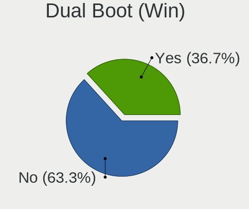

| Dual boot | Computers | Percent |
|-----------|-----------|---------|
| No        | 290       | 60.42%  |
| Yes       | 190       | 39.58%  |

Board
-----

Vendor
------

Motherboard manufacturer

| Name                           | Computers | Percent |
|--------------------------------|-----------|---------|
| Lenovo                         | 82        | 17.12%  |
| ASUSTek Computer               | 76        | 15.87%  |
| Hewlett-Packard                | 67        | 13.99%  |
| Dell                           | 55        | 11.48%  |
| Gigabyte Technology            | 36        | 7.52%   |
| MSI                            | 32        | 6.68%   |
| Acer                           | 20        | 4.18%   |
| ASRock                         | 17        | 3.55%   |
| Apple                          | 10        | 2.09%   |
| Toshiba                        | 6         | 1.25%   |
| Samsung Electronics            | 6         | 1.25%   |
| HUAWEI                         | 6         | 1.25%   |
| Supermicro                     | 4         | 0.84%   |
| TUXEDO                         | 3         | 0.63%   |
| Timi                           | 3         | 0.63%   |
| Sony                           | 3         | 0.63%   |
| Google                         | 3         | 0.63%   |
| AZW                            | 3         | 0.63%   |
| Unknown                        | 3         | 0.63%   |
| System76                       | 2         | 0.42%   |
| Shuttle                        | 2         | 0.42%   |
| Panasonic                      | 2         | 0.42%   |
| Intel                          | 2         | 0.42%   |
| HONOR                          | 2         | 0.42%   |
| Haier                          | 2         | 0.42%   |
| GPU Company                    | 2         | 0.42%   |
| Fujitsu                        | 2         | 0.42%   |
| Biostar                        | 2         | 0.42%   |
| ZOTAC                          | 1         | 0.21%   |
| VALE                           | 1         | 0.21%   |
| Tactus                         | 1         | 0.21%   |
| Standard                       | 1         | 0.21%   |
| SLIMBOOK                       | 1         | 0.21%   |
| SK hynix                       | 1         | 0.21%   |
| Shanghai Zhaoxin Semiconductor | 1         | 0.21%   |
| Schenker                       | 1         | 0.21%   |
| Razer                          | 1         | 0.21%   |
| Positivo                       | 1         | 0.21%   |
| Pegatron                       | 1         | 0.21%   |
| OEM                            | 1         | 0.21%   |

Model
-----

Motherboard model

| Name                               | Computers | Percent |
|------------------------------------|-----------|---------|
| Unknown                            | 7         | 1.46%   |
| ASUS All Series                    | 5         | 1.04%   |
| ASUS ROG STRIX B550-F GAMING       | 4         | 0.84%   |
| MSI MS-7B79                        | 3         | 0.63%   |
| HP Pavilion g6                     | 3         | 0.63%   |
| Gigabyte B450M DS3H                | 3         | 0.63%   |
| Dell XPS 15 9560                   | 3         | 0.63%   |
| Supermicro SKAGIT09                | 2         | 0.42%   |
| MSI MS-7C56                        | 2         | 0.42%   |
| MSI MS-7B86                        | 2         | 0.42%   |
| MSI MS-7B84                        | 2         | 0.42%   |
| Lenovo IdeaPad 5 15ARE05 81YQ      | 2         | 0.42%   |
| HUAWEI CREM-WXX9                   | 2         | 0.42%   |
| HP ProBook 6470b                   | 2         | 0.42%   |
| HP ProBook 440 G8 Notebook PC      | 2         | 0.42%   |
| HP Pavilion Laptop 15-eh1xxx       | 2         | 0.42%   |
| HP Pavilion dv6                    | 2         | 0.42%   |
| HP OMEN Laptop 15-en0xxx           | 2         | 0.42%   |
| HP EliteBook 845 G7 Notebook PC    | 2         | 0.42%   |
| HP 255 G8 Notebook PC              | 2         | 0.42%   |
| Haier A1420EM                      | 2         | 0.42%   |
| Gigabyte X570 GAMING X             | 2         | 0.42%   |
| Gigabyte B450 I AORUS PRO WIFI     | 2         | 0.42%   |
| Dell OptiPlex 7010                 | 2         | 0.42%   |
| Dell Latitude 3420                 | 2         | 0.42%   |
| AZW SER                            | 2         | 0.42%   |
| ASUS STRIX Z270E GAMING            | 2         | 0.42%   |
| ASUS ROG ZENITH EXTREME            | 2         | 0.42%   |
| ASUS ROG STRIX X570-E GAMING       | 2         | 0.42%   |
| ASUS ROG STRIX B550-I GAMING       | 2         | 0.42%   |
| Acer Nitro AN517-51                | 2         | 0.42%   |
| Acer Aspire E5-575G                | 2         | 0.42%   |
| ZOTAC ZBOXNANO-CI520NANO/CI540NANO | 1         | 0.21%   |
| VALE Notebook Slim S132            | 1         | 0.21%   |
| TUXEDO Stellaris AMD Gen3 (CZN)    | 1         | 0.21%   |
| TUXEDO Polaris 15 AMD Gen1         | 1         | 0.21%   |
| TUXEDO InfinityBook S 15 Gen6      | 1         | 0.21%   |
| Toshiba TECRA S11                  | 1         | 0.21%   |
| Toshiba Satellite P70-B            | 1         | 0.21%   |
| Toshiba Satellite NB10t-A-102      | 1         | 0.21%   |

Model Family
------------

Motherboard model prefix

| Name                | Computers | Percent |
|---------------------|-----------|---------|
| Lenovo ThinkPad     | 27        | 5.64%   |
| Lenovo IdeaPad      | 19        | 3.97%   |
| ASUS ROG            | 19        | 3.97%   |
| HP Pavilion         | 15        | 3.13%   |
| Dell Latitude       | 14        | 2.92%   |
| Dell Inspiron       | 12        | 2.51%   |
| HP ProBook          | 11        | 2.3%    |
| Dell XPS            | 9         | 1.88%   |
| Acer Aspire         | 9         | 1.88%   |
| Dell OptiPlex       | 8         | 1.67%   |
| HP Laptop           | 7         | 1.46%   |
| ASUS PRIME          | 7         | 1.46%   |
| Unknown             | 7         | 1.46%   |
| Lenovo ThinkCentre  | 6         | 1.25%   |
| Lenovo ThinkBook    | 6         | 1.25%   |
| HP EliteBook        | 6         | 1.25%   |
| ASUS VivoBook       | 6         | 1.25%   |
| ASUS TUF            | 6         | 1.25%   |
| Toshiba Satellite   | 5         | 1.04%   |
| Lenovo Yoga         | 5         | 1.04%   |
| Lenovo Legion       | 5         | 1.04%   |
| ASUS All            | 5         | 1.04%   |
| HP OMEN             | 4         | 0.84%   |
| HP ENVY             | 4         | 0.84%   |
| Dell Vostro         | 4         | 0.84%   |
| Dell Precision      | 4         | 0.84%   |
| Acer Nitro          | 4         | 0.84%   |
| MSI MS-7B79         | 3         | 0.63%   |
| HP Spectre          | 3         | 0.63%   |
| Gigabyte X570       | 3         | 0.63%   |
| Gigabyte B450M      | 3         | 0.63%   |
| ASUS ZenBook        | 3         | 0.63%   |
| ASUS M5A78L-M       | 3         | 0.63%   |
| Acer Predator       | 3         | 0.63%   |
| Supermicro SKAGIT09 | 2         | 0.42%   |
| MSI MS-7C56         | 2         | 0.42%   |
| MSI MS-7B86         | 2         | 0.42%   |
| MSI MS-7B84         | 2         | 0.42%   |
| Lenovo IdeaPadFlex  | 2         | 0.42%   |
| HUAWEI CREM-WXX9    | 2         | 0.42%   |

MFG Year
--------

Motherboard manufacture year

| Year    | Computers | Percent |
|---------|-----------|---------|
| 2021    | 85        | 17.75%  |
| 2020    | 77        | 16.08%  |
| 2019    | 47        | 9.81%   |
| 2012    | 38        | 7.93%   |
| 2018    | 36        | 7.52%   |
| 2022    | 32        | 6.68%   |
| 2016    | 25        | 5.22%   |
| 2014    | 25        | 5.22%   |
| 2017    | 24        | 5.01%   |
| 2013    | 23        | 4.8%    |
| 2011    | 22        | 4.59%   |
| 2015    | 18        | 3.76%   |
| 2010    | 12        | 2.51%   |
| 2008    | 5         | 1.04%   |
| 2007    | 5         | 1.04%   |
| 2009    | 4         | 0.84%   |
| Unknown | 1         | 0.21%   |

Form Factor
-----------

Physical design of the computer

| Name           | Computers | Percent |
|----------------|-----------|---------|
| Notebook       | 275       | 57.41%  |
| Desktop        | 167       | 34.86%  |
| Convertible    | 21        | 4.38%   |
| Mini pc        | 7         | 1.46%   |
| All in one     | 3         | 0.63%   |
| Server         | 3         | 0.63%   |
| Tablet         | 2         | 0.42%   |
| System on chip | 1         | 0.21%   |

Secure Boot
-----------

Enabled or disabled

| State    | Computers | Percent |
|----------|-----------|---------|
| Disabled | 433       | 90.21%  |
| Enabled  | 47        | 9.79%   |

Coreboot
--------

Have coreboot on board

| Used | Computers | Percent |
|------|-----------|---------|
| No   | 476       | 99.37%  |
| Yes  | 3         | 0.63%   |

RAM Size
--------

Total RAM memory

| Size in GB  | Computers | Percent |
|-------------|-----------|---------|
| 16.01-24.0  | 131       | 27.12%  |
| 4.01-8.0    | 101       | 20.91%  |
| 8.01-16.0   | 101       | 20.91%  |
| 32.01-64.0  | 72        | 14.91%  |
| 3.01-4.0    | 43        | 8.9%    |
| 64.01-256.0 | 23        | 4.76%   |
| 24.01-32.0  | 8         | 1.66%   |
| 2.01-3.0    | 3         | 0.62%   |
| 1.01-2.0    | 1         | 0.21%   |

RAM Used
--------

Used RAM memory

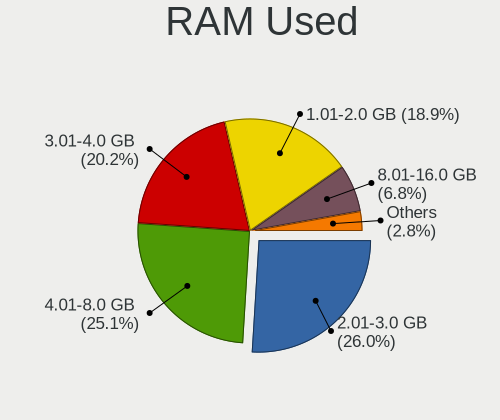

| Used GB    | Computers | Percent |
|------------|-----------|---------|
| 2.01-3.0   | 140       | 27.78%  |
| 3.01-4.0   | 111       | 22.02%  |
| 1.01-2.0   | 106       | 21.03%  |
| 4.01-8.0   | 105       | 20.83%  |
| 8.01-16.0  | 35        | 6.94%   |
| 0.51-1.0   | 4         | 0.79%   |
| 16.01-24.0 | 2         | 0.4%    |
| 32.01-64.0 | 1         | 0.2%    |

Total Drives
------------

Number of drives on board

| Drives | Computers | Percent |
|--------|-----------|---------|
| 1      | 256       | 52.89%  |
| 2      | 143       | 29.55%  |
| 3      | 42        | 8.68%   |
| 4      | 20        | 4.13%   |
| 5      | 11        | 2.27%   |
| 6      | 6         | 1.24%   |
| 7      | 3         | 0.62%   |
| 11     | 1         | 0.21%   |
| 9      | 1         | 0.21%   |
| 8      | 1         | 0.21%   |

Has CD-ROM
----------

Has CD-ROM on board

| Presented | Computers | Percent |
|-----------|-----------|---------|
| No        | 359       | 74.64%  |
| Yes       | 122       | 25.36%  |

Has Ethernet
------------

Has Ethernet on board

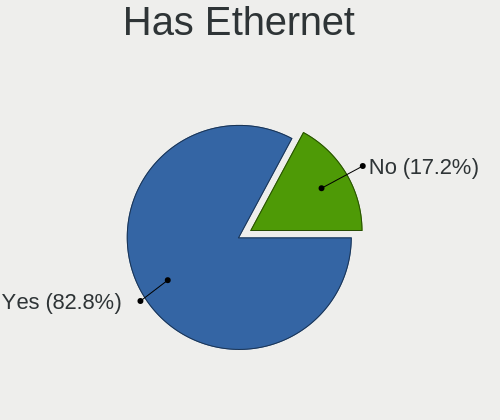

| Presented | Computers | Percent |
|-----------|-----------|---------|
| Yes       | 383       | 79.96%  |
| No        | 96        | 20.04%  |

Has WiFi
--------

Has WiFi module

| Presented | Computers | Percent |
|-----------|-----------|---------|
| Yes       | 404       | 84.17%  |
| No        | 76        | 15.83%  |

Has Bluetooth
-------------

Has Bluetooth module

| Presented | Computers | Percent |
|-----------|-----------|---------|
| Yes       | 341       | 70.75%  |
| No        | 141       | 29.25%  |

Location
--------

Country
-------

Geographic location (country)

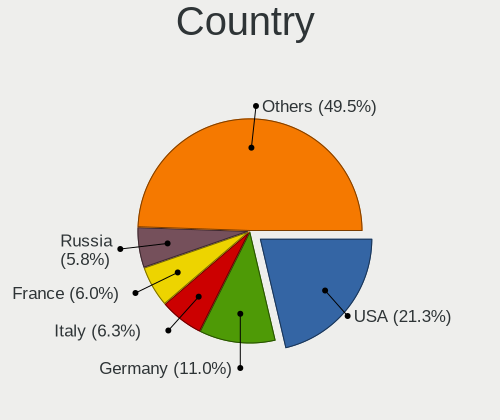

| Country      | Computers | Percent |
|--------------|-----------|---------|
| USA          | 94        | 19.62%  |
| Italy        | 45        | 9.39%   |
| Germany      | 38        | 7.93%   |
| Russia       | 31        | 6.47%   |
| France       | 29        | 6.05%   |
| UK           | 17        | 3.55%   |
| Poland       | 17        | 3.55%   |
| Brazil       | 17        | 3.55%   |
| Australia    | 13        | 2.71%   |
| Spain        | 12        | 2.51%   |
| India        | 10        | 2.09%   |
| Switzerland  | 9         | 1.88%   |
| Netherlands  | 8         | 1.67%   |
| Argentina    | 8         | 1.67%   |
| Indonesia    | 7         | 1.46%   |
| Canada       | 7         | 1.46%   |
| Philippines  | 6         | 1.25%   |
| New Zealand  | 6         | 1.25%   |
| Hungary      | 6         | 1.25%   |
| Slovenia     | 5         | 1.04%   |
| Turkey       | 4         | 0.84%   |
| South Africa | 4         | 0.84%   |
| Mexico       | 4         | 0.84%   |
| Estonia      | 4         | 0.84%   |
| Czechia      | 4         | 0.84%   |
| Bulgaria     | 4         | 0.84%   |
| Thailand     | 3         | 0.63%   |
| Sweden       | 3         | 0.63%   |
| Singapore    | 3         | 0.63%   |
| Serbia       | 3         | 0.63%   |
| Romania      | 3         | 0.63%   |
| Portugal     | 3         | 0.63%   |
| Greece       | 3         | 0.63%   |
| Ecuador      | 3         | 0.63%   |
| Denmark      | 3         | 0.63%   |
| Chile        | 3         | 0.63%   |
| Belgium      | 3         | 0.63%   |
| Vietnam      | 2         | 0.42%   |
| Ukraine      | 2         | 0.42%   |
| South Korea  | 2         | 0.42%   |

City
----

Geographic location (city)

| City           | Computers | Percent |
|----------------|-----------|---------|
| Milan          | 11        | 2.25%   |
| Moscow         | 10        | 2.04%   |
| Berlin         | 8         | 1.64%   |
| Wroclaw        | 5         | 1.02%   |
| St Petersburg  | 5         | 1.02%   |
| Turin          | 4         | 0.82%   |
| Rio de Janeiro | 4         | 0.82%   |
| Jacksonville   | 4         | 0.82%   |
| Dallas         | 4         | 0.82%   |
| Bengaluru      | 4         | 0.82%   |
| Auckland       | 4         | 0.82%   |
| Zurich         | 3         | 0.61%   |
| Washington     | 3         | 0.61%   |
| Vladivostok    | 3         | 0.61%   |
| Tallinn        | 3         | 0.61%   |
| Sydney         | 3         | 0.61%   |
| Sofia          | 3         | 0.61%   |
| Singapore      | 3         | 0.61%   |
| Sao Paulo      | 3         | 0.61%   |
| Prague         | 3         | 0.61%   |
| Paris          | 3         | 0.61%   |
| Johannesburg   | 3         | 0.61%   |
| Budapest       | 3         | 0.61%   |
| Bougival       | 3         | 0.61%   |
| Belgrade       | 3         | 0.61%   |
| Warsaw         | 2         | 0.41%   |
| Vienna         | 2         | 0.41%   |
| Varna          | 2         | 0.41%   |
| Samara         | 2         | 0.41%   |
| Quito          | 2         | 0.41%   |
| Porto          | 2         | 0.41%   |
| Parma          | 2         | 0.41%   |
| Ocala          | 2         | 0.41%   |
| Nmes         | 2         | 0.41%   |
| New York       | 2         | 0.41%   |
| Murska Sobota  | 2         | 0.41%   |
| Munich         | 2         | 0.41%   |
| Minneapolis    | 2         | 0.41%   |
| Melbourne      | 2         | 0.41%   |
| Marseille      | 2         | 0.41%   |

Drives
------

Drive Vendor
------------

Hard drive vendors

| Vendor                      | Computers | Drives | Percent |
|-----------------------------|-----------|--------|---------|
| Samsung Electronics         | 122       | 167    | 16.38%  |
| WDC                         | 94        | 127    | 12.62%  |
| Seagate                     | 79        | 133    | 10.6%   |
| Kingston                    | 54        | 62     | 7.25%   |
| Toshiba                     | 48        | 57     | 6.44%   |
| SanDisk                     | 40        | 45     | 5.37%   |
| Crucial                     | 27        | 32     | 3.62%   |
| SK hynix                    | 26        | 29     | 3.49%   |
| Intel                       | 23        | 28     | 3.09%   |
| Unknown                     | 22        | 27     | 2.95%   |
| Hitachi                     | 22        | 22     | 2.95%   |
| Micron Technology           | 17        | 18     | 2.28%   |
| HGST                        | 12        | 16     | 1.61%   |
| KIOXIA                      | 10        | 10     | 1.34%   |
| China                       | 9         | 10     | 1.21%   |
| Patriot                     | 8         | 10     | 1.07%   |
| A-DATA Technology           | 8         | 9      | 1.07%   |
| PNY                         | 7         | 8      | 0.94%   |
| Apple                       | 7         | 8      | 0.94%   |
| Phison                      | 6         | 6      | 0.81%   |
| Unknown                     | 5         | 5      | 0.67%   |
| SSSTC                       | 4         | 4      | 0.54%   |
| Phison Electronics          | 4         | 4      | 0.54%   |
| Micron/Crucial Technology   | 4         | 5      | 0.54%   |
| Lexar                       | 4         | 4      | 0.54%   |
| Emtec                       | 4         | 4      | 0.54%   |
| Verbatim                    | 3         | 3      | 0.4%    |
| Transcend                   | 3         | 4      | 0.4%    |
| LITEON                      | 3         | 3      | 0.4%    |
| Kingston Technology Company | 3         | 3      | 0.4%    |
| USB3.0                      | 2         | 2      | 0.27%   |
| Smart                       | 2         | 2      | 0.27%   |
| Silicon Motion              | 2         | 2      | 0.27%   |
| SABRENT                     | 2         | 4      | 0.27%   |
| Realtek Semiconductor       | 2         | 2      | 0.27%   |
| Plextor                     | 2         | 2      | 0.27%   |
| Netac                       | 2         | 2      | 0.27%   |
| Maxtor                      | 2         | 2      | 0.27%   |
| LITEONIT                    | 2         | 2      | 0.27%   |
| KODAK                       | 2         | 2      | 0.27%   |

Drive Model
-----------

Hard drive models

| Model                                             | Computers | Percent |
|---------------------------------------------------|-----------|---------|
| Kingston SA400S37240G 240GB SSD                   | 11        | 1.33%   |
| Samsung SSD 860 EVO 500GB                         | 8         | 0.97%   |
| Seagate ST4000DM004-2CV104 4TB                    | 7         | 0.85%   |
| Toshiba MQ01ABD100 1TB                            | 6         | 0.73%   |
| Crucial CT500MX500SSD1 500GB                      | 6         | 0.73%   |
| Samsung SSD 970 EVO Plus 500GB                    | 5         | 0.6%    |
| Samsung SSD 850 EVO 500GB                         | 5         | 0.6%    |
| Samsung NVMe SSD Controller SM981/PM981/PM983 1TB | 5         | 0.6%    |
| Kingston SA400S37480G 480GB SSD                   | 5         | 0.6%    |
| Kingston SA2000M81000G 1TB                        | 5         | 0.6%    |
| Unknown                                           | 5         | 0.6%    |
| WDC WDS240G2G0A-00JH30 240GB SSD                  | 4         | 0.48%   |
| Toshiba DT01ACA100 1TB                            | 4         | 0.48%   |
| Seagate ST1000LM035-1RK172 1TB                    | 4         | 0.48%   |
| Seagate ST1000LM024 HN-M101MBB 1TB                | 4         | 0.48%   |
| SanDisk NVMe SSD Drive 500GB                      | 4         | 0.48%   |
| Samsung SSD 980 PRO 1TB                           | 4         | 0.48%   |
| Samsung SSD 980 500GB                             | 4         | 0.48%   |
| Samsung SSD 980 1TB                               | 4         | 0.48%   |
| Samsung SSD 860 QVO 1TB                           | 4         | 0.48%   |
| Samsung SSD 850 EVO 250GB                         | 4         | 0.48%   |
| Samsung NVMe SSD Drive 500GB                      | 4         | 0.48%   |
| Kingston SV300S37A120G 120GB SSD                  | 4         | 0.48%   |
| Hitachi HTS547550A9E384 500GB                     | 4         | 0.48%   |
| Crucial CT500P2SSD8 500GB                         | 4         | 0.48%   |
| Crucial CT240BX500SSD1 240GB                      | 4         | 0.48%   |
| WDC WD10EZEX-22MFCA0 1TB                          | 3         | 0.36%   |
| Toshiba MQ04ABF100 1TB                            | 3         | 0.36%   |
| Toshiba HDWD110 1TB                               | 3         | 0.36%   |
| SK hynix NVMe SSD Drive 512GB                     | 3         | 0.36%   |
| SK hynix BC711 HFM512GD3JX013N 512GB              | 3         | 0.36%   |
| Seagate ST2000LM007-1R8174 2TB                    | 3         | 0.36%   |
| Seagate Expansion 1TB                             | 3         | 0.36%   |
| Sandisk WD Blue SN550 NVMe SSD 1TB                | 3         | 0.36%   |
| Samsung SSD 970 EVO Plus 250GB                    | 3         | 0.36%   |
| Samsung SSD 970 EVO Plus 1TB                      | 3         | 0.36%   |
| Samsung SSD 870 EVO 1TB                           | 3         | 0.36%   |
| Samsung SSD 860 EVO 1TB                           | 3         | 0.36%   |
| Samsung SSD 840 PRO Series 128GB                  | 3         | 0.36%   |
| Samsung PM9A1 NVMe 512GB                          | 3         | 0.36%   |

HDD Vendor
----------

Hard disk drive vendors

| Vendor              | Computers | Drives | Percent |
|---------------------|-----------|--------|---------|
| Seagate             | 75        | 124    | 33.63%  |
| WDC                 | 65        | 82     | 29.15%  |
| Toshiba             | 29        | 33     | 13%     |
| Hitachi             | 22        | 22     | 9.87%   |
| Samsung Electronics | 12        | 13     | 5.38%   |
| HGST                | 12        | 16     | 5.38%   |
| Unknown             | 1         | 1      | 0.45%   |
| SAGE                | 1         | 1      | 0.45%   |
| Maxtor              | 1         | 1      | 0.45%   |
| KESU                | 1         | 1      | 0.45%   |
| JMicron Technology  | 1         | 1      | 0.45%   |
| IET                 | 1         | 1      | 0.45%   |
| HPE                 | 1         | 6      | 0.45%   |
| HGST HTS            | 1         | 1      | 0.45%   |

SSD Vendor
----------

Solid state drive vendors

| Vendor              | Computers | Drives | Percent |
|---------------------|-----------|--------|---------|
| Samsung Electronics | 57        | 78     | 22.62%  |
| Kingston            | 38        | 42     | 15.08%  |
| Crucial             | 21        | 24     | 8.33%   |
| SanDisk             | 20        | 22     | 7.94%   |
| WDC                 | 13        | 19     | 5.16%   |
| Patriot             | 8         | 10     | 3.17%   |
| Intel               | 8         | 8      | 3.17%   |
| China               | 8         | 9      | 3.17%   |
| Toshiba             | 5         | 7      | 1.98%   |
| PNY                 | 5         | 6      | 1.98%   |
| Micron Technology   | 5         | 5      | 1.98%   |
| A-DATA Technology   | 5         | 6      | 1.98%   |
| Apple               | 4         | 4      | 1.59%   |
| Verbatim            | 3         | 3      | 1.19%   |
| LITEON              | 3         | 3      | 1.19%   |
| Lexar               | 3         | 3      | 1.19%   |
| USB3.0              | 2         | 2      | 0.79%   |
| Transcend           | 2         | 2      | 0.79%   |
| Smart               | 2         | 2      | 0.79%   |
| SK hynix            | 2         | 2      | 0.79%   |
| Plextor             | 2         | 2      | 0.79%   |
| Netac               | 2         | 2      | 0.79%   |
| LITEONIT            | 2         | 2      | 0.79%   |
| KODAK               | 2         | 2      | 0.79%   |
| GOODRAM             | 2         | 2      | 0.79%   |
| Emtec               | 2         | 2      | 0.79%   |
| Unknown             | 2         | 2      | 0.79%   |
| VISIPRO             | 1         | 1      | 0.4%    |
| tecmiyo             | 1         | 3      | 0.4%    |
| Team                | 1         | 1      | 0.4%    |
| Smartbuy            | 1         | 1      | 0.4%    |
| Ramos Technology    | 1         | 1      | 0.4%    |
| OCZ                 | 1         | 1      | 0.4%    |
| Mushkin             | 1         | 2      | 0.4%    |
| Maxtor              | 1         | 1      | 0.4%    |
| KIOXIA-EXCERIA      | 1         | 2      | 0.4%    |
| KingSpec            | 1         | 1      | 0.4%    |
| KingFast            | 1         | 1      | 0.4%    |
| JMicron Technology  | 1         | 1      | 0.4%    |
| Intenso             | 1         | 1      | 0.4%    |

Drive Kind
----------

HDD or SSD

| Kind    | Computers | Drives | Percent |
|---------|-----------|--------|---------|
| NVMe    | 228       | 301    | 34.6%   |
| SSD     | 216       | 299    | 32.78%  |
| HDD     | 180       | 303    | 27.31%  |
| MMC     | 25        | 29     | 3.79%   |
| Unknown | 10        | 11     | 1.52%   |

Drive Connector
---------------

SATA, SAS, NVMe, etc.

| Type | Computers | Drives | Percent |
|------|-----------|--------|---------|
| SATA | 301       | 566    | 51.63%  |
| NVMe | 224       | 293    | 38.42%  |
| SAS  | 33        | 55     | 5.66%   |
| MMC  | 25        | 29     | 4.29%   |

Drive Size
----------

Size of hard drive

| Size in TB | Computers | Drives | Percent |
|------------|-----------|--------|---------|
| 0.01-0.5   | 224       | 324    | 53.08%  |
| 0.51-1.0   | 118       | 160    | 27.96%  |
| 1.01-2.0   | 34        | 41     | 8.06%   |
| 3.01-4.0   | 23        | 45     | 5.45%   |
| 4.01-10.0  | 12        | 19     | 2.84%   |
| 2.01-3.0   | 9         | 11     | 2.13%   |
| 10.01-20.0 | 2         | 2      | 0.47%   |

Space Total
-----------

Amount of disk space available on the file system

| Size in GB     | Computers | Percent |
|----------------|-----------|---------|
| 101-250        | 108       | 22.09%  |
| 251-500        | 106       | 21.68%  |
| 501-1000       | 90        | 18.4%   |
| 1001-2000      | 67        | 13.7%   |
| More than 3000 | 32        | 6.54%   |
| 2001-3000      | 30        | 6.13%   |
| 51-100         | 27        | 5.52%   |
| 1-20           | 20        | 4.09%   |
| 21-50          | 8         | 1.64%   |
| Unknown        | 1         | 0.2%    |

Space Used
----------

Amount of used disk space

| Used GB        | Computers | Percent |
|----------------|-----------|---------|
| 1-20           | 115       | 23.52%  |
| 101-250        | 85        | 17.38%  |
| 21-50          | 72        | 14.72%  |
| 251-500        | 65        | 13.29%  |
| 51-100         | 53        | 10.84%  |
| 501-1000       | 51        | 10.43%  |
| 1001-2000      | 22        | 4.5%    |
| More than 3000 | 17        | 3.48%   |
| 2001-3000      | 8         | 1.64%   |
| Unknown        | 1         | 0.2%    |

Malfunc. Drives
---------------

Drive models with a malfunction

| Model                                               | Computers | Drives | Percent |
|-----------------------------------------------------|-----------|--------|---------|
| SK hynix BC711 HFM512GD3JX013N 512GB                | 2         | 2      | 4.26%   |
| HGST HTS721010A9E630 1TB                            | 2         | 2      | 4.26%   |
| WDC WDS240G2G0B-00EPW0 240GB SSD                    | 1         | 1      | 2.13%   |
| WDC WD5000AVVS-63M8B0 500GB                         | 1         | 1      | 2.13%   |
| WDC WD10EZEX-22MFCA0 1TB                            | 1         | 1      | 2.13%   |
| WDC WD10EZEX-08M2NA0 1TB                            | 1         | 1      | 2.13%   |
| VISIPRO SSD 256GB                                   | 1         | 1      | 2.13%   |
| Toshiba MQ04ABF100 1TB                              | 1         | 1      | 2.13%   |
| Toshiba MQ01ABD075 752GB                            | 1         | 1      | 2.13%   |
| tecmiyo SATA SSD 128GB                              | 1         | 3      | 2.13%   |
| SK hynix BC711 HFM256GD3JX013N 256GB                | 1         | 1      | 2.13%   |
| Seagate ST9750420AS 752GB                           | 1         | 1      | 2.13%   |
| Seagate ST500LT012-9WS142 500GB                     | 1         | 1      | 2.13%   |
| Seagate ST500LM012 HN-M500MBB 500GB                 | 1         | 1      | 2.13%   |
| Seagate ST500DM002-1BD142 500GB                     | 1         | 1      | 2.13%   |
| Seagate ST320LT020-9YG142 320GB                     | 1         | 1      | 2.13%   |
| Seagate ST3160827AS 160GB                           | 1         | 1      | 2.13%   |
| Seagate ST31500341AS 1TB                            | 1         | 1      | 2.13%   |
| Seagate ST31000524AS 1TB                            | 1         | 2      | 2.13%   |
| Seagate ST2000LM007-1R8174 2TB                      | 1         | 1      | 2.13%   |
| Seagate ST1000DM003-1SB102 1TB                      | 1         | 1      | 2.13%   |
| Seagate ST1000DM003-1CH162 1TB                      | 1         | 1      | 2.13%   |
| SanDisk SSD PLUS 240GB                              | 1         | 1      | 2.13%   |
| Samsung Electronics SSD 870 EVO 1TB                 | 1         | 1      | 2.13%   |
| Samsung Electronics SSD 840 Series 250GB            | 1         | 1      | 2.13%   |
| Samsung Electronics HM321HI 320GB                   | 1         | 1      | 2.13%   |
| Samsung Electronics HD103SI 1TB                     | 1         | 1      | 2.13%   |
| Micron Technology MTFDDAV256TDL-1AW1ZABHA 256GB SSD | 1         | 1      | 2.13%   |
| Micron Technology 5100_MTFDDAV960TCB 960GB SSD      | 1         | 1      | 2.13%   |
| Kingston SUV400S37240G 240GB SSD                    | 1         | 1      | 2.13%   |
| Intel SSDSCKKF256G8H 256GB                          | 1         | 1      | 2.13%   |
| Hitachi HTS725050A7E630 500GB                       | 1         | 1      | 2.13%   |
| Hitachi HTS723232A7A364 320GB                       | 1         | 1      | 2.13%   |
| Hitachi HTS547550A9E384 500GB                       | 1         | 1      | 2.13%   |
| Hitachi HTS545050B9A300 500GB                       | 1         | 1      | 2.13%   |
| Hitachi HDS721010CLA630 1TB                         | 1         | 1      | 2.13%   |
| Hitachi HDP725050GLA360 500GB                       | 1         | 1      | 2.13%   |
| Hitachi HCT721010SLA360 1TB                         | 1         | 1      | 2.13%   |
| HGST HUH728080ALE600 8TB                            | 1         | 1      | 2.13%   |
| HGST HTS545050A7E680 500GB                          | 1         | 1      | 2.13%   |

Malfunc. Drive Vendor
---------------------

Vendors of faulty drives

| Vendor              | Computers | Drives | Percent |
|---------------------|-----------|--------|---------|
| Seagate             | 10        | 12     | 21.74%  |
| Hitachi             | 7         | 7      | 15.22%  |
| WDC                 | 4         | 4      | 8.7%    |
| Samsung Electronics | 4         | 4      | 8.7%    |
| HGST                | 4         | 4      | 8.7%    |
| SK hynix            | 3         | 3      | 6.52%   |
| Crucial             | 3         | 3      | 6.52%   |
| Toshiba             | 2         | 2      | 4.35%   |
| Micron Technology   | 2         | 2      | 4.35%   |
| VISIPRO             | 1         | 1      | 2.17%   |
| tecmiyo             | 1         | 3      | 2.17%   |
| SanDisk             | 1         | 1      | 2.17%   |
| Kingston            | 1         | 1      | 2.17%   |
| Intel               | 1         | 1      | 2.17%   |
| BAITITON            | 1         | 1      | 2.17%   |
| A-DATA Technology   | 1         | 1      | 2.17%   |

Malfunc. HDD Vendor
-------------------

Vendors of faulty HDD drives

| Vendor              | Computers | Drives | Percent |
|---------------------|-----------|--------|---------|
| Seagate             | 10        | 12     | 35.71%  |
| Hitachi             | 7         | 7      | 25%     |
| HGST                | 4         | 4      | 14.29%  |
| WDC                 | 3         | 3      | 10.71%  |
| Toshiba             | 2         | 2      | 7.14%   |
| Samsung Electronics | 2         | 2      | 7.14%   |

Malfunc. Drive Kind
-------------------

Kinds of faulty drives

| Kind | Computers | Drives | Percent |
|------|-----------|--------|---------|
| HDD  | 27        | 30     | 61.36%  |
| SSD  | 14        | 17     | 31.82%  |
| NVMe | 3         | 3      | 6.82%   |

Failed Drives
-------------

Failed drive models

| Model                             | Computers | Drives | Percent |
|-----------------------------------|-----------|--------|---------|
| Samsung Electronics HD502IJ 500GB | 1         | 1      | 50%     |
| Hitachi HTS547550A9E384 500GB     | 1         | 1      | 50%     |

Failed Drive Vendor
-------------------

Failed drive vendors

| Vendor              | Computers | Drives | Percent |
|---------------------|-----------|--------|---------|
| Samsung Electronics | 1         | 1      | 50%     |
| Hitachi             | 1         | 1      | 50%     |

Drive Status
------------

Number of failed and malfunc. drives

| Status   | Computers | Drives | Percent |
|----------|-----------|--------|---------|
| Works    | 261       | 443    | 48.88%  |
| Detected | 229       | 448    | 42.88%  |
| Malfunc  | 43        | 50     | 8.05%   |
| Failed   | 1         | 2      | 0.19%   |

Storage controller
------------------

Storage Vendor
--------------

Storage controller vendors

| Vendor                         | Computers | Percent |
|--------------------------------|-----------|---------|
| Intel                          | 281       | 42.45%  |
| AMD                            | 115       | 17.37%  |
| Samsung Electronics            | 61        | 9.21%   |
| SanDisk                        | 43        | 6.5%    |
| SK hynix                       | 24        | 3.63%   |
| Kingston Technology Company    | 21        | 3.17%   |
| Toshiba America Info Systems   | 16        | 2.42%   |
| Phison Electronics             | 14        | 2.11%   |
| Micron Technology              | 12        | 1.81%   |
| Micron/Crucial Technology      | 11        | 1.66%   |
| ASMedia Technology             | 11        | 1.66%   |
| KIOXIA                         | 9         | 1.36%   |
| Solid State Storage Technology | 6         | 0.91%   |
| JMicron Technology             | 6         | 0.91%   |
| ADATA Technology               | 5         | 0.76%   |
| Silicon Motion                 | 3         | 0.45%   |
| Seagate Technology             | 3         | 0.45%   |
| Marvell Technology Group       | 3         | 0.45%   |
| Apple                          | 3         | 0.45%   |
| Union Memory (Shenzhen)        | 2         | 0.3%    |
| Realtek Semiconductor          | 2         | 0.3%    |
| LSI Logic / Symbios Logic      | 2         | 0.3%    |
| Zhaoxin                        | 1         | 0.15%   |
| VIA Technologies               | 1         | 0.15%   |
| Silicon Image                  | 1         | 0.15%   |
| Shenzhen Longsys Electronics   | 1         | 0.15%   |
| O2 Micro                       | 1         | 0.15%   |
| Nvidia                         | 1         | 0.15%   |
| INNOGRIT                       | 1         | 0.15%   |
| Hewlett-Packard                | 1         | 0.15%   |
| Broadcom / LSI                 | 1         | 0.15%   |

Storage Model
-------------

Storage controller models

| Model                                                                          | Computers | Percent |
|--------------------------------------------------------------------------------|-----------|---------|
| AMD FCH SATA Controller [AHCI mode]                                            | 82        | 10.99%  |
| Intel 7 Series Chipset Family 6-port SATA Controller [AHCI mode]               | 29        | 3.89%   |
| Samsung NVMe SSD Controller SM981/PM981/PM983                                  | 28        | 3.75%   |
| Intel Sunrise Point-LP SATA Controller [AHCI mode]                             | 26        | 3.49%   |
| Intel Volume Management Device NVMe RAID Controller                            | 25        | 3.35%   |
| Intel 8 Series/C220 Series Chipset Family 6-port SATA Controller 1 [AHCI mode] | 22        | 2.95%   |
| AMD 400 Series Chipset SATA Controller                                         | 20        | 2.68%   |
| Samsung NVMe SSD Controller 980                                                | 15        | 2.01%   |
| Intel 82801 Mobile SATA Controller [RAID mode]                                 | 15        | 2.01%   |
| AMD 500 Series Chipset SATA Controller                                         | 15        | 2.01%   |
| SK hynix Gold P31/PC711 NVMe Solid State Drive                                 | 14        | 1.88%   |
| Samsung NVMe SSD Controller PM9A1/PM9A3/980PRO                                 | 13        | 1.74%   |
| Micron Non-Volatile memory controller                                          | 12        | 1.61%   |
| SanDisk WD Blue SN550 NVMe SSD                                                 | 11        | 1.47%   |
| SanDisk Non-Volatile memory controller                                         | 11        | 1.47%   |
| Intel 500 Series Chipset Family SATA AHCI Controller                           | 11        | 1.47%   |
| Intel Tiger Lake-LP SATA Controller                                            | 10        | 1.34%   |
| Intel Celeron/Pentium Silver Processor SATA Controller                         | 10        | 1.34%   |
| ASMedia ASM1062 Serial ATA Controller                                          | 10        | 1.34%   |
| SanDisk WD Black SN750 / PC SN730 NVMe SSD                                     | 9         | 1.21%   |
| Micron/Crucial P2 NVMe PCIe SSD                                                | 9         | 1.21%   |
| Intel 200 Series PCH SATA controller [AHCI mode]                               | 9         | 1.21%   |
| AMD SB7x0/SB8x0/SB9x0 IDE Controller                                           | 9         | 1.21%   |
| Kingston Company Company Non-Volatile memory controller                        | 8         | 1.07%   |
| Intel SSD 660P Series                                                          | 8         | 1.07%   |
| Intel Q170/Q150/B150/H170/H110/Z170/CM236 Chipset SATA Controller [AHCI Mode]  | 8         | 1.07%   |
| Intel 6 Series/C200 Series Chipset Family 6 port Desktop SATA AHCI Controller  | 8         | 1.07%   |
| AMD SB7x0/SB8x0/SB9x0 SATA Controller [AHCI mode]                              | 8         | 1.07%   |
| Toshiba America Info Systems XG6 NVMe SSD Controller                           | 7         | 0.94%   |
| Phison E12 NVMe Controller                                                     | 7         | 0.94%   |
| KIOXIA NVMe SSD Controller BG4                                                 | 7         | 0.94%   |
| Kingston Company A2000 NVMe SSD                                                | 7         | 0.94%   |
| Intel Comet Lake SATA AHCI Controller                                          | 7         | 0.94%   |
| Solid State Storage Non-Volatile memory controller                             | 6         | 0.8%    |
| Intel HM170/QM170 Chipset SATA Controller [AHCI Mode]                          | 6         | 0.8%    |
| Intel Cannon Lake Mobile PCH SATA AHCI Controller                              | 6         | 0.8%    |
| Intel 7 Series/C210 Series Chipset Family 6-port SATA Controller [AHCI mode]   | 6         | 0.8%    |
| Intel 6 Series/C200 Series Chipset Family 6 port Mobile SATA AHCI Controller   | 6         | 0.8%    |
| SK hynix Non-Volatile memory controller                                        | 5         | 0.67%   |
| Kingston Company OM3PDP3 NVMe SSD                                              | 5         | 0.67%   |

Storage Kind
------------

Kind of storage controller (IDE, SATA, NVMe, SAS, ...)

| Kind | Computers | Percent |
|------|-----------|---------|
| SATA | 348       | 53.29%  |
| NVMe | 223       | 34.15%  |
| RAID | 51        | 7.81%   |
| IDE  | 30        | 4.59%   |
| SAS  | 1         | 0.15%   |

Processor
---------

CPU Vendor
----------

Processor vendors

| Vendor       | Computers | Percent |
|--------------|-----------|---------|
| Intel        | 333       | 69.52%  |
| AMD          | 144       | 30.06%  |
| CentaurHauls | 1         | 0.21%   |
| ARM          | 1         | 0.21%   |

CPU Model
---------

Processor models

| Model                                         | Computers | Percent |
|-----------------------------------------------|-----------|---------|
| Intel 11th Gen Core i7-1165G7 @ 2.80GHz       | 12        | 2.51%   |
| AMD Ryzen 7 5800H with Radeon Graphics        | 12        | 2.51%   |
| Intel 11th Gen Core i5-1135G7 @ 2.40GHz       | 11        | 2.3%    |
| Intel Core i7-9750H CPU @ 2.60GHz             | 9         | 1.88%   |
| Intel Core i7-8550U CPU @ 1.80GHz             | 8         | 1.67%   |
| Intel Core i5-3320M CPU @ 2.60GHz             | 8         | 1.67%   |
| Intel 12th Gen Core i7-12700H                 | 8         | 1.67%   |
| Intel Celeron N4020 CPU @ 1.10GHz             | 7         | 1.46%   |
| AMD Ryzen 7 5700U with Radeon Graphics        | 7         | 1.46%   |
| AMD Ryzen 5 5600X 6-Core Processor            | 7         | 1.46%   |
| Intel Core i5-7200U CPU @ 2.50GHz             | 6         | 1.25%   |
| AMD Ryzen 5 5500U with Radeon Graphics        | 6         | 1.25%   |
| Intel Core i7-7700HQ CPU @ 2.80GHz            | 5         | 1.04%   |
| Intel Core i7-10510U CPU @ 1.80GHz            | 4         | 0.84%   |
| Intel Core i5-8250U CPU @ 1.60GHz             | 4         | 0.84%   |
| Intel Core i5-6300U CPU @ 2.40GHz             | 4         | 0.84%   |
| Intel Core i5-10400F CPU @ 2.90GHz            | 4         | 0.84%   |
| Intel 11th Gen Core i7-11800H @ 2.30GHz       | 4         | 0.84%   |
| Intel 11th Gen Core i3-1115G4 @ 3.00GHz       | 4         | 0.84%   |
| AMD Ryzen 9 5900HX with Radeon Graphics       | 4         | 0.84%   |
| AMD Ryzen 5 2600X Six-Core Processor          | 4         | 0.84%   |
| Intel Core i7-4790K CPU @ 4.00GHz             | 3         | 0.63%   |
| Intel Core i7-4790 CPU @ 3.60GHz              | 3         | 0.63%   |
| Intel Core i7-4710HQ CPU @ 2.50GHz            | 3         | 0.63%   |
| Intel Core i7-3632QM CPU @ 2.20GHz            | 3         | 0.63%   |
| Intel Core i5-6200U CPU @ 2.30GHz             | 3         | 0.63%   |
| Intel Core i5-3210M CPU @ 2.50GHz             | 3         | 0.63%   |
| Intel Core i5-10300H CPU @ 2.50GHz            | 3         | 0.63%   |
| Intel Core i5-10210U CPU @ 1.60GHz            | 3         | 0.63%   |
| Intel Celeron N4000 CPU @ 1.10GHz             | 3         | 0.63%   |
| Intel 11th Gen Core i5-1155G7 @ 2.50GHz       | 3         | 0.63%   |
| AMD Ryzen 9 5950X 16-Core Processor           | 3         | 0.63%   |
| AMD Ryzen 9 5900X 12-Core Processor           | 3         | 0.63%   |
| AMD Ryzen 7 5700G with Radeon Graphics        | 3         | 0.63%   |
| AMD Ryzen 7 4800H with Radeon Graphics        | 3         | 0.63%   |
| AMD Ryzen 7 3700X 8-Core Processor            | 3         | 0.63%   |
| AMD Ryzen 7 3700U with Radeon Vega Mobile Gfx | 3         | 0.63%   |
| AMD Ryzen 5 4600H with Radeon Graphics        | 3         | 0.63%   |
| AMD Ryzen 5 3600 6-Core Processor             | 3         | 0.63%   |
| Intel Pentium CPU G2020 @ 2.90GHz             | 2         | 0.42%   |

CPU Model Family
----------------

Processor model prefix

| Model                   | Computers | Percent |
|-------------------------|-----------|---------|
| Intel Core i7           | 103       | 21.5%   |
| Intel Core i5           | 82        | 17.12%  |
| Other                   | 68        | 14.2%   |
| AMD Ryzen 7             | 45        | 9.39%   |
| AMD Ryzen 5             | 42        | 8.77%   |
| Intel Celeron           | 20        | 4.18%   |
| Intel Core i3           | 18        | 3.76%   |
| AMD Ryzen 9             | 16        | 3.34%   |
| Intel Xeon              | 12        | 2.51%   |
| Intel Pentium           | 11        | 2.3%    |
| Intel Core 2 Duo        | 9         | 1.88%   |
| AMD Ryzen 3             | 8         | 1.67%   |
| AMD Ryzen 7 PRO         | 5         | 1.04%   |
| AMD FX                  | 4         | 0.84%   |
| Intel Core i9           | 3         | 0.63%   |
| AMD Ryzen Threadripper  | 3         | 0.63%   |
| AMD A8                  | 3         | 0.63%   |
| AMD A6                  | 3         | 0.63%   |
| Intel Pentium Silver    | 2         | 0.42%   |
| Intel Core 2 Quad       | 2         | 0.42%   |
| AMD Phenom II X2        | 2         | 0.42%   |
| AMD Opteron             | 2         | 0.42%   |
| AMD E                   | 2         | 0.42%   |
| AMD A4                  | 2         | 0.42%   |
| Intel Pentium Gold      | 1         | 0.21%   |
| Intel Core m3           | 1         | 0.21%   |
| Intel Core 2            | 1         | 0.21%   |
| Intel Celeron Dual-Core | 1         | 0.21%   |
| Intel Atom              | 1         | 0.21%   |
| AMD Ryzen 5 PRO         | 1         | 0.21%   |
| AMD Phenom II X6        | 1         | 0.21%   |
| AMD Phenom II X4        | 1         | 0.21%   |
| AMD E1                  | 1         | 0.21%   |
| AMD Athlon II X2        | 1         | 0.21%   |
| AMD Athlon 64 X2        | 1         | 0.21%   |
| AMD A10                 | 1         | 0.21%   |

CPU Cores
---------

Number of processor cores

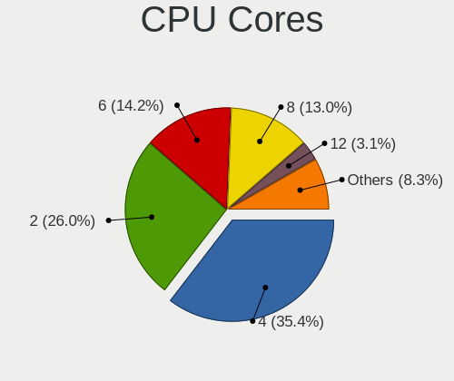

| Number  | Computers | Percent |
|---------|-----------|---------|
| 4       | 182       | 38%     |
| 2       | 121       | 25.26%  |
| 6       | 71        | 14.82%  |
| 8       | 67        | 13.99%  |
| 12      | 12        | 2.51%   |
| 14      | 10        | 2.09%   |
| 16      | 8         | 1.67%   |
| 10      | 5         | 1.04%   |
| 5       | 1         | 0.21%   |
| 1       | 1         | 0.21%   |
| Unknown | 1         | 0.21%   |

CPU Sockets
-----------

Number of sockets

| Number  | Computers | Percent |
|---------|-----------|---------|
| 1       | 477       | 99.58%  |
| 2       | 1         | 0.21%   |
| Unknown | 1         | 0.21%   |

CPU Threads
-----------

Threads per core (Hyper-Threading)

| Number  | Computers | Percent |
|---------|-----------|---------|
| 2       | 379       | 78.96%  |
| 1       | 100       | 20.83%  |
| Unknown | 1         | 0.21%   |

CPU Op-Modes
------------

CPU Operation Modes (32-bit, 64-bit)

| Op mode        | Computers | Percent |
|----------------|-----------|---------|
| 32-bit, 64-bit | 479       | 100%    |

CPU Microcode
-------------

Microcode number

| Number     | Computers | Percent |
|------------|-----------|---------|
| Unknown    | 198       | 40.74%  |
| 0x306a9    | 21        | 4.32%   |
| 0x806c1    | 20        | 4.12%   |
| 0x0a50000c | 18        | 3.7%    |
| 0x306c3    | 14        | 2.88%   |
| 0x906a3    | 12        | 2.47%   |
| 0x806ea    | 12        | 2.47%   |
| 0x08600106 | 11        | 2.26%   |
| 0x906ea    | 10        | 2.06%   |
| 0x08608103 | 10        | 2.06%   |
| 0x806ec    | 8         | 1.65%   |
| 0x08701021 | 8         | 1.65%   |
| 0x906e9    | 7         | 1.44%   |
| 0x806e9    | 7         | 1.44%   |
| 0x206a7    | 7         | 1.44%   |
| 0x406e3    | 6         | 1.23%   |
| 0xa0652    | 5         | 1.03%   |
| 0x0800820d | 5         | 1.03%   |
| 0xa0653    | 4         | 0.82%   |
| 0x806d1    | 4         | 0.82%   |
| 0x806c2    | 4         | 0.82%   |
| 0x706a8    | 4         | 0.82%   |
| 0x40651    | 4         | 0.82%   |
| 0x08608102 | 4         | 0.82%   |
| 0x08108109 | 4         | 0.82%   |
| 0x010000c8 | 4         | 0.82%   |
| 0x906ed    | 3         | 0.62%   |
| 0x90672    | 3         | 0.62%   |
| 0x506e3    | 3         | 0.62%   |
| 0x506c9    | 3         | 0.62%   |
| 0x406f1    | 3         | 0.62%   |
| 0x1067a    | 3         | 0.62%   |
| 0x0a201205 | 3         | 0.62%   |
| 0x0a201016 | 3         | 0.62%   |
| 0x08600103 | 3         | 0.62%   |
| 0xa0655    | 2         | 0.41%   |
| 0x906a4    | 2         | 0.41%   |
| 0x706a1    | 2         | 0.41%   |
| 0x6fb      | 2         | 0.41%   |
| 0x40661    | 2         | 0.41%   |

CPU Microarch
-------------

Microarchitecture

| Name             | Computers | Percent |
|------------------|-----------|---------|
| KabyLake         | 74        | 15.38%  |
| Zen 3            | 48        | 9.98%   |
| IvyBridge        | 42        | 8.73%   |
| Haswell          | 41        | 8.52%   |
| TigerLake        | 37        | 7.69%   |
| Unknown          | 31        | 6.44%   |
| Zen 2            | 29        | 6.03%   |
| Zen+             | 20        | 4.16%   |
| Skylake          | 20        | 4.16%   |
| SandyBridge      | 18        | 3.74%   |
| Alderlake Hybrid | 16        | 3.33%   |
| CometLake        | 15        | 3.12%   |
| Goldmont plus    | 13        | 2.7%    |
| Penryn           | 8         | 1.66%   |
| Zen              | 7         | 1.46%   |
| Piledriver       | 7         | 1.46%   |
| Broadwell        | 7         | 1.46%   |
| Westmere         | 6         | 1.25%   |
| K10              | 6         | 1.25%   |
| Icelake          | 6         | 1.25%   |
| Nehalem          | 5         | 1.04%   |
| Goldmont         | 5         | 1.04%   |
| Core             | 5         | 1.04%   |
| Silvermont       | 4         | 0.83%   |
| Puma             | 3         | 0.62%   |
| K10 Llano        | 2         | 0.42%   |
| Excavator        | 2         | 0.42%   |
| Bobcat           | 2         | 0.42%   |
| Steamroller      | 1         | 0.21%   |
| K8 Hammer        | 1         | 0.21%   |

Graphics
--------

GPU Vendor
----------

Vendors of graphics cards

| Vendor                     | Computers | Percent |
|----------------------------|-----------|---------|
| Intel                      | 250       | 42.52%  |
| Nvidia                     | 186       | 31.63%  |
| AMD                        | 147       | 25%     |
| Matrox Electronics Systems | 3         | 0.51%   |
| Zhaoxin                    | 1         | 0.17%   |
| ASPEED Technology          | 1         | 0.17%   |

GPU Model
---------

Graphics card models

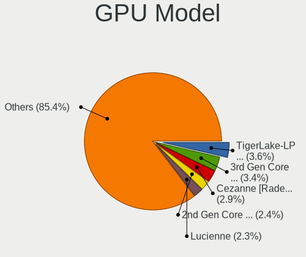

| Model                                                                                 | Computers | Percent |
|---------------------------------------------------------------------------------------|-----------|---------|
| Intel TigerLake-LP GT2 [Iris Xe Graphics]                                             | 32        | 5.34%   |
| Intel 3rd Gen Core processor Graphics Controller                                      | 27        | 4.51%   |
| AMD Cezanne [Radeon Vega Series / Radeon Vega Mobile Series]                          | 23        | 3.84%   |
| AMD Renoir                                                                            | 16        | 2.67%   |
| AMD Lucienne                                                                          | 15        | 2.5%    |
| Intel Alder Lake-P Integrated Graphics Controller                                     | 14        | 2.34%   |
| Intel UHD Graphics 620                                                                | 13        | 2.17%   |
| Intel HD Graphics 620                                                                 | 12        | 2%      |
| Intel 4th Gen Core Processor Integrated Graphics Controller                           | 12        | 2%      |
| Nvidia GP107 [GeForce GTX 1050 Ti]                                                    | 11        | 1.84%   |
| Intel Skylake GT2 [HD Graphics 520]                                                   | 11        | 1.84%   |
| Intel GeminiLake [UHD Graphics 600]                                                   | 11        | 1.84%   |
| Intel 2nd Generation Core Processor Family Integrated Graphics Controller             | 11        | 1.84%   |
| Intel CoffeeLake-H GT2 [UHD Graphics 630]                                             | 10        | 1.67%   |
| AMD Picasso/Raven 2 [Radeon Vega Series / Radeon Vega Mobile Series]                  | 10        | 1.67%   |
| Intel Xeon E3-1200 v3/4th Gen Core Processor Integrated Graphics Controller           | 9         | 1.5%    |
| Intel HD Graphics 630                                                                 | 9         | 1.5%    |
| Nvidia GA106M [GeForce RTX 3060 Mobile / Max-Q]                                       | 8         | 1.34%   |
| Intel CometLake-U GT2 [UHD Graphics]                                                  | 7         | 1.17%   |
| Intel CometLake-H GT2 [UHD Graphics]                                                  | 7         | 1.17%   |
| AMD Topaz XT [Radeon R7 M260/M265 / M340/M360 / M440/M445 / 530/535 / 620/625 Mobile] | 7         | 1.17%   |
| AMD Ellesmere [Radeon RX 470/480/570/570X/580/580X/590]                               | 7         | 1.17%   |
| Nvidia TU106M [GeForce RTX 2060 Mobile]                                               | 6         | 1%      |
| Nvidia TU116 [GeForce GTX 1660 SUPER]                                                 | 5         | 0.83%   |
| Nvidia GA107M [GeForce RTX 3050 Mobile]                                               | 5         | 0.83%   |
| Intel TigerLake-H GT1 [UHD Graphics]                                                  | 5         | 0.83%   |
| Intel Haswell-ULT Integrated Graphics Controller                                      | 5         | 0.83%   |
| Nvidia TU116M [GeForce GTX 1660 Ti Mobile]                                            | 4         | 0.67%   |
| Nvidia GP107M [GeForce GTX 1050 Mobile]                                               | 4         | 0.67%   |
| Nvidia GP106 [GeForce GTX 1060 6GB]                                                   | 4         | 0.67%   |
| Nvidia GP104 [GeForce GTX 1070]                                                       | 4         | 0.67%   |
| Nvidia GK208B [GeForce GT 710]                                                        | 4         | 0.67%   |
| Nvidia GA104 [Geforce RTX 3070 Ti Laptop GPU]                                         | 4         | 0.67%   |
| Intel Tiger Lake-LP GT2 [UHD Graphics G4]                                             | 4         | 0.67%   |
| Intel HD Graphics 530                                                                 | 4         | 0.67%   |
| Intel HD Graphics 500                                                                 | 4         | 0.67%   |
| AMD Navi 23 [Radeon RX 6600/6600 XT/6600M]                                            | 4         | 0.67%   |
| Nvidia TU117M [GeForce GTX 1650 Mobile / Max-Q]                                       | 3         | 0.5%    |
| Nvidia GT218 [GeForce 210]                                                            | 3         | 0.5%    |
| Nvidia GP108M [GeForce MX150]                                                         | 3         | 0.5%    |

GPU Combo
---------

Combinations of graphics cards

| Name                     | Computers | Percent |
|--------------------------|-----------|---------|
| 1 x Intel                | 161       | 33.61%  |
| 1 x Nvidia               | 101       | 21.09%  |
| 1 x AMD                  | 100       | 20.88%  |
| Intel + Nvidia           | 63        | 13.15%  |
| Intel + AMD              | 19        | 3.97%   |
| AMD + Nvidia             | 17        | 3.55%   |
| 2 x AMD                  | 8         | 1.67%   |
| Other                    | 2         | 0.42%   |
| 2 x Nvidia               | 2         | 0.42%   |
| 1 x Zhaoxin              | 1         | 0.21%   |
| Nvidia + Matrox          | 1         | 0.21%   |
| Nvidia + ASPEED          | 1         | 0.21%   |
| 1 x Matrox               | 1         | 0.21%   |
| Intel + AMD + 1 x Nvidia | 1         | 0.21%   |
| AMD + Matrox             | 1         | 0.21%   |

GPU Driver
----------

Free vs proprietary

| Driver      | Computers | Percent |
|-------------|-----------|---------|
| Free        | 327       | 68.27%  |
| Proprietary | 139       | 29.02%  |
| Unknown     | 13        | 2.71%   |

GPU Memory
----------

Total video memory

| Size in GB | Computers | Percent |
|------------|-----------|---------|
| Unknown    | 303       | 62.35%  |
| 0.01-0.5   | 41        | 8.44%   |
| 1.01-2.0   | 39        | 8.02%   |
| 3.01-4.0   | 27        | 5.56%   |
| 7.01-8.0   | 24        | 4.94%   |
| 0.51-1.0   | 22        | 4.53%   |
| 5.01-6.0   | 17        | 3.5%    |
| 8.01-16.0  | 9         | 1.85%   |
| 16.01-24.0 | 2         | 0.41%   |
| 4.01-5.0   | 1         | 0.21%   |
| 2.01-3.0   | 1         | 0.21%   |

Monitor
-------

Monitor Vendor
--------------

Monitor vendors

| Vendor                  | Computers | Percent |
|-------------------------|-----------|---------|
| Samsung Electronics     | 78        | 13.81%  |
| AU Optronics            | 58        | 10.27%  |
| Chimei Innolux          | 57        | 10.09%  |
| BOE                     | 55        | 9.73%   |
| LG Display              | 44        | 7.79%   |
| Dell                    | 31        | 5.49%   |
| Goldstar                | 28        | 4.96%   |
| Hewlett-Packard         | 27        | 4.78%   |
| Acer                    | 19        | 3.36%   |
| Philips                 | 17        | 3.01%   |
| BenQ                    | 15        | 2.65%   |
| AOC                     | 13        | 2.3%    |
| Sharp                   | 12        | 2.12%   |
| Apple                   | 8         | 1.42%   |
| Ancor Communications    | 8         | 1.42%   |
| InfoVision              | 7         | 1.24%   |
| Chi Mei Optoelectronics | 7         | 1.24%   |
| Lenovo                  | 6         | 1.06%   |
| Iiyama                  | 6         | 1.06%   |
| Sony                    | 5         | 0.88%   |
| CSO                     | 5         | 0.88%   |
| ASUSTek Computer        | 5         | 0.88%   |
| Vizio                   | 3         | 0.53%   |
| ViewSonic               | 3         | 0.53%   |
| Sceptre Tech            | 3         | 0.53%   |
| NEC Computers           | 3         | 0.53%   |
| HKC                     | 3         | 0.53%   |
| SLD                     | 2         | 0.35%   |
| PANDA                   | 2         | 0.35%   |
| Panasonic               | 2         | 0.35%   |
| MSI                     | 2         | 0.35%   |
| LG Electronics          | 2         | 0.35%   |
| Idek Iiyama             | 2         | 0.35%   |
| Gigabyte Technology     | 2         | 0.35%   |
| Eizo                    | 2         | 0.35%   |
| Denver                  | 2         | 0.35%   |
| Xiaomi                  | 1         | 0.18%   |
| Vita                    | 1         | 0.18%   |
| Vestel Elektronik       | 1         | 0.18%   |
| Unknown                 | 1         | 0.18%   |

Monitor Model
-------------

Monitor models

| Model                                                                     | Computers | Percent |
|---------------------------------------------------------------------------|-----------|---------|
| Chimei Innolux LCD Monitor CMN15F5 1920x1080 344x193mm 15.5-inch          | 6         | 1.03%   |
| AU Optronics LCD Monitor AUO38ED 1920x1080 344x193mm 15.5-inch            | 5         | 0.86%   |
| Chimei Innolux LCD Monitor CMN1521 1920x1080 344x193mm 15.5-inch          | 4         | 0.69%   |
| Samsung Electronics S24F350 SAM0D20 1920x1080 521x293mm 23.5-inch         | 3         | 0.52%   |
| Samsung Electronics LCD Monitor SDC4171 2880x1800 302x189mm 14.0-inch     | 3         | 0.52%   |
| Samsung Electronics C27F390 SAM0D32 1920x1080 598x336mm 27.0-inch         | 3         | 0.52%   |
| Samsung Electronics C24F390 SAM0D2C 1920x1080 520x290mm 23.4-inch         | 3         | 0.52%   |
| LG Display LCD Monitor LGD068D 1920x1080 309x174mm 14.0-inch              | 3         | 0.52%   |
| Goldstar IPS FULLHD GSM5AB8 1920x1080 480x270mm 21.7-inch                 | 3         | 0.52%   |
| Chimei Innolux LCD Monitor CMN176C 1920x1080 381x214mm 17.2-inch          | 3         | 0.52%   |
| Chimei Innolux LCD Monitor CMN14D4 1920x1080 309x173mm 13.9-inch          | 3         | 0.52%   |
| BOE LCD Monitor BOE0872 1920x1080 344x194mm 15.5-inch                     | 3         | 0.52%   |
| AU Optronics LCD Monitor AUO403D 1920x1080 309x173mm 13.9-inch            | 3         | 0.52%   |
| AOC Q27G2G4 AOC2702 2560x1440 597x336mm 27.0-inch                         | 3         | 0.52%   |
| SLD LCD Monitor SLD003C 1366x768 309x173mm 13.9-inch                      | 2         | 0.34%   |
| Sharp LCD Monitor SHP1453 1920x1080 346x194mm 15.6-inch                   | 2         | 0.34%   |
| Samsung Electronics SMS24A450 SAM083A 1920x1200 518x324mm 24.1-inch       | 2         | 0.34%   |
| Samsung Electronics LCD Monitor SEC5441 1366x768 344x194mm 15.5-inch      | 2         | 0.34%   |
| Samsung Electronics LCD Monitor SDC324C 1920x1080 344x194mm 15.5-inch     | 2         | 0.34%   |
| Samsung Electronics LC27G5xT SAM7079 2560x1440 597x336mm 27.0-inch        | 2         | 0.34%   |
| Philips FTV PHL01EA 1920x1080 1440x810mm 65.0-inch                        | 2         | 0.34%   |
| PANDA LCD Monitor NCP0040 1920x1080 344x194mm 15.5-inch                   | 2         | 0.34%   |
| LG Display LCD Monitor LGD069A 1920x1080 344x194mm 15.5-inch              | 2         | 0.34%   |
| LG Display LCD Monitor LGD040A 1920x1080 309x175mm 14.0-inch              | 2         | 0.34%   |
| LG Display LCD Monitor LGD0395 1366x768 344x194mm 15.5-inch               | 2         | 0.34%   |
| LG Display LCD Monitor LGD033A 1366x768 344x194mm 15.5-inch               | 2         | 0.34%   |
| LG Display LCD Monitor LGD0323 1920x1080 345x194mm 15.6-inch              | 2         | 0.34%   |
| LG Display LCD Monitor LGD02F2 1366x768 344x194mm 15.5-inch               | 2         | 0.34%   |
| Hewlett-Packard 24w HPN3431 1920x1080 527x296mm 23.8-inch                 | 2         | 0.34%   |
| Hewlett-Packard 24f HPN3545 1920x1080 527x296mm 23.8-inch                 | 2         | 0.34%   |
| Hewlett-Packard 2311 HWP2939 1920x1080 509x286mm 23.0-inch                | 2         | 0.34%   |
| Goldstar LG ULTRAWIDE GSM59F1 2560x1080 670x280mm 28.6-inch               | 2         | 0.34%   |
| Goldstar 22EA53 GSM59A5 1920x1080 477x268mm 21.5-inch                     | 2         | 0.34%   |
| Dell P2719H DEL4184 1920x1080 598x336mm 27.0-inch                         | 2         | 0.34%   |
| Chimei Innolux LCD Monitor CMN15E6 1366x768 344x193mm 15.5-inch           | 2         | 0.34%   |
| Chimei Innolux LCD Monitor CMN15DB 1366x768 344x193mm 15.5-inch           | 2         | 0.34%   |
| Chimei Innolux LCD Monitor CMN152A 2560x1440 344x193mm 15.5-inch          | 2         | 0.34%   |
| Chimei Innolux LCD Monitor CMN151E 1920x1080 344x193mm 15.5-inch          | 2         | 0.34%   |
| Chimei Innolux LCD Monitor CMN1515 1920x1080 344x193mm 15.5-inch          | 2         | 0.34%   |
| Chi Mei Optoelectronics LCD Monitor CMO1720 1920x1080 382x215mm 17.3-inch | 2         | 0.34%   |

Monitor Resolution
------------------

Monitor screen resolution

| Resolution         | Computers | Percent |
|--------------------|-----------|---------|
| 1920x1080 (FHD)    | 272       | 51.61%  |
| 1366x768 (WXGA)    | 69        | 13.09%  |
| 3840x2160 (4K)     | 39        | 7.4%    |
| 2560x1440 (QHD)    | 32        | 6.07%   |
| 1920x1200 (WUXGA)  | 20        | 3.8%    |
| 1600x900 (HD+)     | 13        | 2.47%   |
| 2560x1600          | 10        | 1.9%    |
| 1680x1050 (WSXGA+) | 10        | 1.9%    |
| 1280x1024 (SXGA)   | 10        | 1.9%    |
| 2880x1800          | 8         | 1.52%   |
| 2560x1080          | 8         | 1.52%   |
| 3440x1440          | 6         | 1.14%   |
| 1440x900 (WXGA+)   | 4         | 0.76%   |
| 2240x1400          | 3         | 0.57%   |
| 1280x800 (WXGA)    | 3         | 0.57%   |
| 3840x1080          | 2         | 0.38%   |
| 2520x1680          | 2         | 0.38%   |
| 1280x720 (HD)      | 2         | 0.38%   |
| 1024x768 (XGA)     | 2         | 0.38%   |
| 3840x1200          | 1         | 0.19%   |
| 3600x1200          | 1         | 0.19%   |
| 3072x1920          | 1         | 0.19%   |
| 3000x2000          | 1         | 0.19%   |
| 2736x1824          | 1         | 0.19%   |
| 2288x1287          | 1         | 0.19%   |
| 2160x1440          | 1         | 0.19%   |
| 2160x1350          | 1         | 0.19%   |
| 1920x540           | 1         | 0.19%   |
| 1920x1280          | 1         | 0.19%   |
| 1360x768           | 1         | 0.19%   |
| Unknown            | 1         | 0.19%   |

Monitor Diagonal
----------------

Diagonal size in inches

| Inches  | Computers | Percent |
|---------|-----------|---------|
| 15      | 143       | 25.4%   |
| 24      | 56        | 9.95%   |
| 27      | 50        | 8.88%   |
| 14      | 47        | 8.35%   |
| 13      | 44        | 7.82%   |
| 23      | 34        | 6.04%   |
| 21      | 30        | 5.33%   |
| 17      | 26        | 4.62%   |
| 31      | 17        | 3.02%   |
| 16      | 14        | 2.49%   |
| 34      | 13        | 2.31%   |
| 19      | 12        | 2.13%   |
| 22      | 9         | 1.6%    |
| 12      | 7         | 1.24%   |
| 11      | 7         | 1.24%   |
| Unknown | 7         | 1.24%   |
| 32      | 5         | 0.89%   |
| 18      | 5         | 0.89%   |
| 54      | 3         | 0.53%   |
| 46      | 3         | 0.53%   |
| 26      | 3         | 0.53%   |
| 25      | 3         | 0.53%   |
| 20      | 3         | 0.53%   |
| 84      | 2         | 0.36%   |
| 72      | 2         | 0.36%   |
| 65      | 2         | 0.36%   |
| 60      | 2         | 0.36%   |
| 40      | 2         | 0.36%   |
| 36      | 2         | 0.36%   |
| 142     | 1         | 0.18%   |
| 78      | 1         | 0.18%   |
| 69      | 1         | 0.18%   |
| 55      | 1         | 0.18%   |
| 49      | 1         | 0.18%   |
| 48      | 1         | 0.18%   |
| 43      | 1         | 0.18%   |
| 42      | 1         | 0.18%   |
| 28      | 1         | 0.18%   |
| 10      | 1         | 0.18%   |

Monitor Width
-------------

Physical width

| Width in mm    | Computers | Percent |
|----------------|-----------|---------|
| 301-350        | 217       | 39.89%  |
| 501-600        | 122       | 22.43%  |
| 401-500        | 51        | 9.38%   |
| 201-300        | 40        | 7.35%   |
| 351-400        | 38        | 6.99%   |
| 601-700        | 26        | 4.78%   |
| 701-800        | 19        | 3.49%   |
| 1001-1500      | 13        | 2.39%   |
| Unknown        | 7         | 1.29%   |
| 1501-2000      | 6         | 1.1%    |
| 801-900        | 2         | 0.37%   |
| 901-1000       | 2         | 0.37%   |
| More than 2000 | 1         | 0.18%   |

Aspect Ratio
------------

Proportional relationship between the width and the height

| Ratio   | Computers | Percent |
|---------|-----------|---------|
| 16/9    | 387       | 78.82%  |
| 16/10   | 63        | 12.83%  |
| 21/9    | 14        | 2.85%   |
| 5/4     | 10        | 2.04%   |
| 3/2     | 6         | 1.22%   |
| Unknown | 5         | 1.02%   |
| 4/3     | 2         | 0.41%   |
| 32/9    | 2         | 0.41%   |
| 1.98    | 1         | 0.2%    |
| 1.00    | 1         | 0.2%    |

Monitor Area
------------

Area in inch

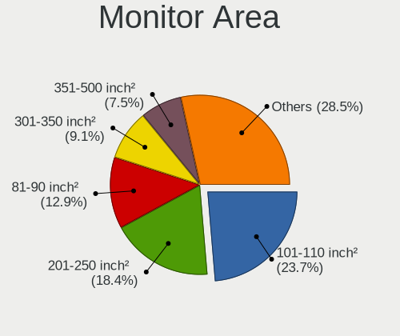

| Area in inch | Computers | Percent |
|----------------|-----------|---------|
| 101-110        | 146       | 26.5%   |
| 201-250        | 96        | 17.42%  |
| 81-90          | 71        | 12.89%  |
| 301-350        | 51        | 9.26%   |
| 351-500        | 34        | 6.17%   |
| 151-200        | 24        | 4.36%   |
| 121-130        | 22        | 3.99%   |
| 71-80          | 21        | 3.81%   |
| 251-300        | 20        | 3.63%   |
| More than 1000 | 15        | 2.72%   |
| 501-1000       | 11        | 2%      |
| 111-120        | 10        | 1.81%   |
| 51-60          | 7         | 1.27%   |
| 141-150        | 7         | 1.27%   |
| Unknown        | 7         | 1.27%   |
| 61-70          | 6         | 1.09%   |
| 41-50          | 1         | 0.18%   |
| 131-140        | 1         | 0.18%   |
| 91-100         | 1         | 0.18%   |

Pixel Density
-------------

Pixels per inch

| Density       | Computers | Percent |
|---------------|-----------|---------|
| 121-160       | 175       | 33.08%  |
| 51-100        | 161       | 30.43%  |
| 101-120       | 106       | 20.04%  |
| 161-240       | 48        | 9.07%   |
| 1-50          | 17        | 3.21%   |
| More than 240 | 15        | 2.84%   |
| Unknown       | 7         | 1.32%   |

Multiple Monitors
-----------------

Total monitors connected

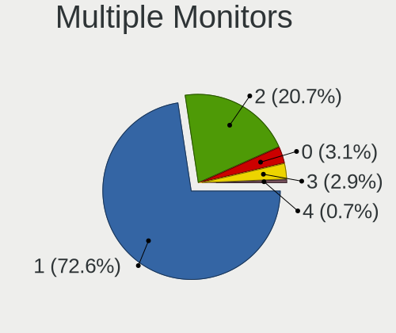

| Total | Computers | Percent |
|-------|-----------|---------|
| 1     | 354       | 73.14%  |
| 2     | 106       | 21.9%   |
| 0     | 13        | 2.69%   |
| 3     | 8         | 1.65%   |
| 4     | 3         | 0.62%   |

Network
-------

Net Controller Vendor
---------------------

Controller vendors

| Vendor                            | Computers | Percent |
|-----------------------------------|-----------|---------|
| Realtek Semiconductor             | 281       | 37.67%  |
| Intel                             | 251       | 33.65%  |
| Qualcomm Atheros                  | 62        | 8.31%   |
| Broadcom                          | 34        | 4.56%   |
| MediaTek                          | 23        | 3.08%   |
| Ralink Technology                 | 12        | 1.61%   |
| TP-Link                           | 10        | 1.34%   |
| Samsung Electronics               | 7         | 0.94%   |
| ASIX Electronics                  | 7         | 0.94%   |
| Huawei Technologies               | 5         | 0.67%   |
| Aquantia                          | 5         | 0.67%   |
| Ralink                            | 4         | 0.54%   |
| Sierra Wireless                   | 3         | 0.4%    |
| Marvell Technology Group          | 3         | 0.4%    |
| Lenovo                            | 3         | 0.4%    |
| Broadcom Limited                  | 3         | 0.4%    |
| Xiaomi                            | 2         | 0.27%   |
| NetGear                           | 2         | 0.27%   |
| DisplayLink                       | 2         | 0.27%   |
| D-Link System                     | 2         | 0.27%   |
| ASUSTek Computer                  | 2         | 0.27%   |
| Apple                             | 2         | 0.27%   |
| ZyXEL Communications              | 1         | 0.13%   |
| Wilocity                          | 1         | 0.13%   |
| VIA Technologies                  | 1         | 0.13%   |
| U-Blox                            | 1         | 0.13%   |
| Qualcomm Atheros Communications   | 1         | 0.13%   |
| Qualcomm                          | 1         | 0.13%   |
| Nvidia                            | 1         | 0.13%   |
| Motorola PCS                      | 1         | 0.13%   |
| Microsoft                         | 1         | 0.13%   |
| Mercucys                          | 1         | 0.13%   |
| Linksys                           | 1         | 0.13%   |
| LG Electronics                    | 1         | 0.13%   |
| ICS Advent                        | 1         | 0.13%   |
| Hewlett-Packard                   | 1         | 0.13%   |
| Google                            | 1         | 0.13%   |
| Ericsson Business Mobile Networks | 1         | 0.13%   |
| Edimax Technology                 | 1         | 0.13%   |
| Dell                              | 1         | 0.13%   |

Net Controller Model
--------------------

Controller models

| Model                                                             | Computers | Percent |
|-------------------------------------------------------------------|-----------|---------|
| Realtek RTL8111/8168/8411 PCI Express Gigabit Ethernet Controller | 180       | 20.95%  |
| Intel Wi-Fi 6 AX200                                               | 31        | 3.61%   |
| Intel Wi-Fi 6 AX201                                               | 27        | 3.14%   |
| Realtek RTL8822CE 802.11ac PCIe Wireless Network Adapter          | 21        | 2.44%   |
| MediaTek MT7921 802.11ax PCI Express Wireless Network Adapter     | 19        | 2.21%   |
| Realtek RTL8153 Gigabit Ethernet Adapter                          | 17        | 1.98%   |
| Realtek RTL810xE PCI Express Fast Ethernet controller             | 17        | 1.98%   |
| Intel Alder Lake-P PCH CNVi WiFi                                  | 16        | 1.86%   |
| Intel 82579LM Gigabit Network Connection (Lewisville)             | 16        | 1.86%   |
| Realtek RTL8125 2.5GbE Controller                                 | 14        | 1.63%   |
| Intel Wireless 7260                                               | 14        | 1.63%   |
| Realtek RTL8821CE 802.11ac PCIe Wireless Network Adapter          | 13        | 1.51%   |
| Intel Ethernet Controller I225-V                                  | 13        | 1.51%   |
| Qualcomm Atheros QCA6174 802.11ac Wireless Network Adapter        | 12        | 1.4%    |
| Intel I211 Gigabit Network Connection                             | 11        | 1.28%   |
| Intel Ethernet Connection I217-LM                                 | 11        | 1.28%   |
| Intel Centrino Advanced-N 6205 [Taylor Peak]                      | 10        | 1.16%   |
| Qualcomm Atheros QCA9377 802.11ac Wireless Network Adapter        | 9         | 1.05%   |
| Qualcomm Atheros AR9485 Wireless Network Adapter                  | 9         | 1.05%   |
| Intel Wireless 8265 / 8275                                        | 9         | 1.05%   |
| Intel Cannon Lake PCH CNVi WiFi                                   | 9         | 1.05%   |
| Broadcom BCM4313 802.11bgn Wireless Network Adapter               | 9         | 1.05%   |
| Intel Wireless 7265                                               | 8         | 0.93%   |
| Realtek 802.11ac NIC                                              | 7         | 0.81%   |
| Intel Wireless 8260                                               | 7         | 0.81%   |
| Intel Ethernet Connection (7) I219-V                              | 7         | 0.81%   |
| Intel Ethernet Connection (2) I219-V                              | 7         | 0.81%   |
| Intel Comet Lake PCH-LP CNVi WiFi                                 | 7         | 0.81%   |
| ASIX AX88179 Gigabit Ethernet                                     | 7         | 0.81%   |
| Realtek RTL8852AE 802.11ax PCIe Wireless Network Adapter          | 6         | 0.7%    |
| Realtek 802.11n WLAN Adapter                                      | 6         | 0.7%    |
| Qualcomm Atheros QCA9565 / AR9565 Wireless Network Adapter        | 6         | 0.7%    |
| Intel Wireless 3165                                               | 6         | 0.7%    |
| Intel Wi-Fi 6 AX210/AX211/AX411 160MHz                            | 6         | 0.7%    |
| Intel Comet Lake PCH CNVi WiFi                                    | 6         | 0.7%    |
| Samsung Galaxy series, misc. (tethering mode)                     | 5         | 0.58%   |
| Realtek RTL8723BE PCIe Wireless Network Adapter                   | 5         | 0.58%   |
| Intel Ethernet Connection (13) I219-V                             | 5         | 0.58%   |
| Intel 82579V Gigabit Network Connection                           | 5         | 0.58%   |
| Intel 82574L Gigabit Network Connection                           | 5         | 0.58%   |

Wireless Vendor
---------------

Wireless vendors

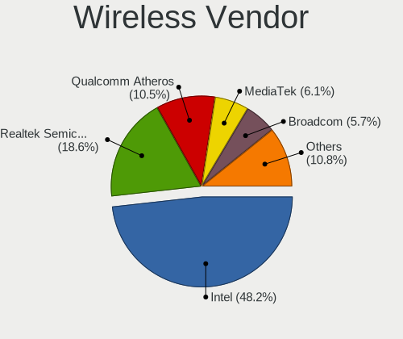

| Vendor                          | Computers | Percent |
|---------------------------------|-----------|---------|
| Intel                           | 190       | 44.92%  |
| Realtek Semiconductor           | 87        | 20.57%  |
| Qualcomm Atheros                | 45        | 10.64%  |
| Broadcom                        | 30        | 7.09%   |
| MediaTek                        | 22        | 5.2%    |
| Ralink Technology               | 12        | 2.84%   |
| TP-Link                         | 8         | 1.89%   |
| Ralink                          | 4         | 0.95%   |
| Sierra Wireless                 | 3         | 0.71%   |
| Broadcom Limited                | 3         | 0.71%   |
| NetGear                         | 2         | 0.47%   |
| D-Link System                   | 2         | 0.47%   |
| ASUSTek Computer                | 2         | 0.47%   |
| ZyXEL Communications            | 1         | 0.24%   |
| Wilocity                        | 1         | 0.24%   |
| Qualcomm Atheros Communications | 1         | 0.24%   |
| Qualcomm                        | 1         | 0.24%   |
| Microsoft                       | 1         | 0.24%   |
| Mercucys                        | 1         | 0.24%   |
| Marvell Technology Group        | 1         | 0.24%   |
| Linksys                         | 1         | 0.24%   |
| LG Electronics                  | 1         | 0.24%   |
| Edimax Technology               | 1         | 0.24%   |
| Dell                            | 1         | 0.24%   |
| D-Link                          | 1         | 0.24%   |
| Belkin Components               | 1         | 0.24%   |

Wireless Model
--------------

Wireless models

| Model                                                         | Computers | Percent |
|---------------------------------------------------------------|-----------|---------|
| Intel Wi-Fi 6 AX200                                           | 31        | 7.28%   |
| Intel Wi-Fi 6 AX201                                           | 27        | 6.34%   |
| Realtek RTL8822CE 802.11ac PCIe Wireless Network Adapter      | 21        | 4.93%   |
| MediaTek MT7921 802.11ax PCI Express Wireless Network Adapter | 19        | 4.46%   |
| Intel Alder Lake-P PCH CNVi WiFi                              | 16        | 3.76%   |
| Intel Wireless 7260                                           | 14        | 3.29%   |
| Realtek RTL8821CE 802.11ac PCIe Wireless Network Adapter      | 13        | 3.05%   |
| Qualcomm Atheros QCA6174 802.11ac Wireless Network Adapter    | 12        | 2.82%   |
| Intel Centrino Advanced-N 6205 [Taylor Peak]                  | 10        | 2.35%   |
| Qualcomm Atheros QCA9377 802.11ac Wireless Network Adapter    | 9         | 2.11%   |
| Qualcomm Atheros AR9485 Wireless Network Adapter              | 9         | 2.11%   |
| Intel Wireless 8265 / 8275                                    | 9         | 2.11%   |
| Intel Cannon Lake PCH CNVi WiFi                               | 9         | 2.11%   |
| Broadcom BCM4313 802.11bgn Wireless Network Adapter           | 9         | 2.11%   |
| Intel Wireless 7265                                           | 8         | 1.88%   |
| Realtek 802.11ac NIC                                          | 7         | 1.64%   |
| Intel Wireless 8260                                           | 7         | 1.64%   |
| Intel Comet Lake PCH-LP CNVi WiFi                             | 7         | 1.64%   |
| Realtek RTL8852AE 802.11ax PCIe Wireless Network Adapter      | 6         | 1.41%   |
| Realtek 802.11n WLAN Adapter                                  | 6         | 1.41%   |
| Qualcomm Atheros QCA9565 / AR9565 Wireless Network Adapter    | 6         | 1.41%   |
| Intel Wireless 3165                                           | 6         | 1.41%   |
| Intel Wi-Fi 6 AX210/AX211/AX411 160MHz                        | 6         | 1.41%   |
| Intel Comet Lake PCH CNVi WiFi                                | 6         | 1.41%   |
| Realtek RTL8723BE PCIe Wireless Network Adapter               | 5         | 1.17%   |
| Broadcom BCM4360 802.11ac Wireless Network Adapter            | 5         | 1.17%   |
| Realtek RTL88x2bu [AC1200 Techkey]                            | 4         | 0.94%   |
| Realtek RTL8821AE 802.11ac PCIe Wireless Network Adapter      | 4         | 0.94%   |
| Realtek RTL8188EUS 802.11n Wireless Network Adapter           | 4         | 0.94%   |
| Ralink MT7601U Wireless Adapter                               | 4         | 0.94%   |
| Intel Wireless-AC 9260                                        | 4         | 0.94%   |
| Intel Tiger Lake PCH CNVi WiFi                                | 4         | 0.94%   |
| Intel Dual Band Wireless-AC 3168NGW [Stone Peak]              | 4         | 0.94%   |
| Intel Dual Band Wireless-AC 3165 Plus Bluetooth               | 4         | 0.94%   |
| Intel Centrino Advanced-N 6235                                | 4         | 0.94%   |
| Broadcom BCM43142 802.11b/g/n                                 | 4         | 0.94%   |
| Realtek RTL8192EE PCIe Wireless Network Adapter               | 3         | 0.7%    |
| Realtek RTL8188CE 802.11b/g/n WiFi Adapter                    | 3         | 0.7%    |
| Ralink RT5370 Wireless Adapter                                | 3         | 0.7%    |
| Qualcomm Atheros AR9462 Wireless Network Adapter              | 3         | 0.7%    |

Ethernet Vendor
---------------

Ethernet vendors

| Vendor                   | Computers | Percent |
|--------------------------|-----------|---------|
| Realtek Semiconductor    | 232       | 55.5%   |
| Intel                    | 118       | 28.23%  |
| Qualcomm Atheros         | 18        | 4.31%   |
| Broadcom                 | 8         | 1.91%   |
| Samsung Electronics      | 7         | 1.67%   |
| ASIX Electronics         | 7         | 1.67%   |
| Huawei Technologies      | 5         | 1.2%    |
| Aquantia                 | 5         | 1.2%    |
| Lenovo                   | 3         | 0.72%   |
| Xiaomi                   | 2         | 0.48%   |
| TP-Link                  | 2         | 0.48%   |
| Marvell Technology Group | 2         | 0.48%   |
| DisplayLink              | 2         | 0.48%   |
| Apple                    | 2         | 0.48%   |
| VIA Technologies         | 1         | 0.24%   |
| Nvidia                   | 1         | 0.24%   |
| MediaTek                 | 1         | 0.24%   |
| ICS Advent               | 1         | 0.24%   |
| Google                   | 1         | 0.24%   |

Ethernet Model
--------------

Ethernet models

| Model                                                             | Computers | Percent |
|-------------------------------------------------------------------|-----------|---------|
| Realtek RTL8111/8168/8411 PCI Express Gigabit Ethernet Controller | 180       | 42.06%  |
| Realtek RTL8153 Gigabit Ethernet Adapter                          | 17        | 3.97%   |
| Realtek RTL810xE PCI Express Fast Ethernet controller             | 17        | 3.97%   |
| Intel 82579LM Gigabit Network Connection (Lewisville)             | 16        | 3.74%   |
| Realtek RTL8125 2.5GbE Controller                                 | 14        | 3.27%   |
| Intel Ethernet Controller I225-V                                  | 13        | 3.04%   |
| Intel I211 Gigabit Network Connection                             | 11        | 2.57%   |
| Intel Ethernet Connection I217-LM                                 | 11        | 2.57%   |
| Intel Ethernet Connection (7) I219-V                              | 7         | 1.64%   |
| Intel Ethernet Connection (2) I219-V                              | 7         | 1.64%   |
| ASIX AX88179 Gigabit Ethernet                                     | 7         | 1.64%   |
| Samsung Galaxy series, misc. (tethering mode)                     | 5         | 1.17%   |
| Intel Ethernet Connection (13) I219-V                             | 5         | 1.17%   |
| Intel 82579V Gigabit Network Connection                           | 5         | 1.17%   |
| Intel 82574L Gigabit Network Connection                           | 5         | 1.17%   |
| Realtek Killer E2600 Gigabit Ethernet Controller                  | 4         | 0.93%   |
| Qualcomm Atheros Killer E220x Gigabit Ethernet Controller         | 4         | 0.93%   |
| Intel Ethernet Connection I219-LM                                 | 4         | 0.93%   |
| Intel Ethernet Connection (14) I219-V                             | 4         | 0.93%   |
| Huawei SNE-LX1                                                    | 4         | 0.93%   |
| Aquantia AQC107 NBase-T/IEEE 802.3bz Ethernet Controller [AQtion] | 4         | 0.93%   |
| Realtek RTL8152 Fast Ethernet Adapter                             | 3         | 0.7%    |
| Qualcomm Atheros Killer E2500 Gigabit Ethernet Controller         | 3         | 0.7%    |
| Intel Ethernet Connection (4) I219-LM                             | 3         | 0.7%    |
| Intel Ethernet Connection (2) I218-V                              | 3         | 0.7%    |
| Intel Ethernet Connection (11) I219-V                             | 3         | 0.7%    |
| Xiaomi Mi/Redmi series (RNDIS)                                    | 2         | 0.47%   |
| TP-Link UE300 10/100/1000 LAN (ethernet mode) [Realtek RTL8153]   | 2         | 0.47%   |
| Samsung GT-I9070 (network tethering, USB debugging enabled)       | 2         | 0.47%   |
| Realtek Killer E3000 2.5GbE Controller                            | 2         | 0.47%   |
| Qualcomm Atheros QCA8171 Gigabit Ethernet                         | 2         | 0.47%   |
| Qualcomm Atheros AR8161 Gigabit Ethernet                          | 2         | 0.47%   |
| Qualcomm Atheros AR8152 v2.0 Fast Ethernet                        | 2         | 0.47%   |
| Qualcomm Atheros AR8151 v2.0 Gigabit Ethernet                     | 2         | 0.47%   |
| Intel I350 Gigabit Network Connection                             | 2         | 0.47%   |
| Intel I210 Gigabit Network Connection                             | 2         | 0.47%   |
| Intel Ethernet Connection I218-LM                                 | 2         | 0.47%   |
| Intel Ethernet Connection I217-V                                  | 2         | 0.47%   |
| Intel Ethernet Connection (7) I219-LM                             | 2         | 0.47%   |
| Broadcom NetXtreme BCM57762 Gigabit Ethernet PCIe                 | 2         | 0.47%   |

Net Controller Kind
-------------------

Ethernet, WiFi or modem

| Kind     | Computers | Percent |
|----------|-----------|---------|
| WiFi     | 404       | 51.07%  |
| Ethernet | 382       | 48.29%  |
| Modem    | 4         | 0.51%   |
| Unknown  | 1         | 0.13%   |

Used Controller
---------------

Currently used network controller

| Kind     | Computers | Percent |
|----------|-----------|---------|
| WiFi     | 316       | 62.95%  |
| Ethernet | 186       | 37.05%  |

NICs
----

Total network controllers on board

| Total | Computers | Percent |
|-------|-----------|---------|
| 2     | 251       | 52.4%   |
| 1     | 206       | 43.01%  |
| 0     | 11        | 2.3%    |
| 3     | 8         | 1.67%   |
| 4     | 2         | 0.42%   |
| 6     | 1         | 0.21%   |

IPv6
----

IPv6 vs IPv4

| Used | Computers | Percent |
|------|-----------|---------|
| No   | 349       | 72.41%  |
| Yes  | 133       | 27.59%  |

Bluetooth
---------

Bluetooth Vendor
----------------

Controller vendors

| Vendor                          | Computers | Percent |
|---------------------------------|-----------|---------|
| Intel                           | 161       | 46.26%  |
| Realtek Semiconductor           | 46        | 13.22%  |
| Cambridge Silicon Radio         | 28        | 8.05%   |
| Qualcomm Atheros Communications | 22        | 6.32%   |
| IMC Networks                    | 16        | 4.6%    |
| Broadcom                        | 15        | 4.31%   |
| Foxconn / Hon Hai               | 13        | 3.74%   |
| Lite-On Technology              | 12        | 3.45%   |
| ASUSTek Computer                | 9         | 2.59%   |
| Apple                           | 6         | 1.72%   |
| Toshiba                         | 4         | 1.15%   |
| Realtek                         | 3         | 0.86%   |
| Edimax Technology               | 3         | 0.86%   |
| TP-Link                         | 2         | 0.57%   |
| Hewlett-Packard                 | 2         | 0.57%   |
| Dell                            | 2         | 0.57%   |
| MediaTek                        | 1         | 0.29%   |
| Marvell Semiconductor           | 1         | 0.29%   |
| Foxconn International           | 1         | 0.29%   |
| Alps Electric                   | 1         | 0.29%   |

Bluetooth Model
---------------

Controller models

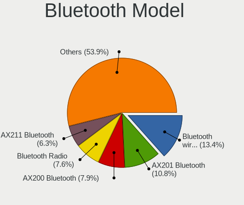

| Model                                               | Computers | Percent |
|-----------------------------------------------------|-----------|---------|
| Intel Bluetooth wireless interface                  | 40        | 11.49%  |
| Realtek Bluetooth Radio                             | 39        | 11.21%  |
| Intel AX201 Bluetooth                               | 39        | 11.21%  |
| Intel AX200 Bluetooth                               | 30        | 8.62%   |
| Cambridge Silicon Radio Bluetooth Dongle (HCI mode) | 28        | 8.05%   |
| Intel Bluetooth 9460/9560 Jefferson Peak (JfP)      | 19        | 5.46%   |
| Intel Bluetooth Device                              | 16        | 4.6%    |
| Qualcomm Atheros  Bluetooth Device                  | 8         | 2.3%    |
| Foxconn / Hon Hai Wireless_Device                   | 8         | 2.3%    |
| IMC Networks Wireless_Device                        | 7         | 2.01%   |
| Realtek  Bluetooth 4.2 Adapter                      | 6         | 1.72%   |
| Qualcomm Atheros QCA61x4 Bluetooth 4.0              | 6         | 1.72%   |
| Lite-On Wireless_Device                             | 6         | 1.72%   |
| Qualcomm Atheros AR3012 Bluetooth 4.0               | 5         | 1.44%   |
| Intel AX210 Bluetooth                               | 5         | 1.44%   |
| Intel Wireless-AC 9260 Bluetooth Adapter            | 4         | 1.15%   |
| Intel Wireless-AC 3168 Bluetooth                    | 4         | 1.15%   |
| Intel Centrino Bluetooth Wireless Transceiver       | 4         | 1.15%   |
| IMC Networks Bluetooth Radio                        | 4         | 1.15%   |
| Broadcom BCM20702A0 Bluetooth 4.0                   | 4         | 1.15%   |
| Broadcom BCM20702 Bluetooth 4.0 [ThinkPad]          | 4         | 1.15%   |
| ASUS ASUS USB-BT500                                 | 4         | 1.15%   |
| Apple Bluetooth Host Controller                     | 4         | 1.15%   |
| Realtek Bluetooth Radio                             | 3         | 0.86%   |
| Foxconn / Hon Hai Bluetooth Device                  | 3         | 0.86%   |
| Broadcom HP Portable SoftSailing                    | 3         | 0.86%   |
| TP-Link UB500 Adapter                               | 2         | 0.57%   |
| Lite-On Qualcomm Atheros QCA9377 Bluetooth          | 2         | 0.57%   |
| IMC Networks Bluetooth Device                       | 2         | 0.57%   |
| ASUS Qualcomm Bluetooth 4.1                         | 2         | 0.57%   |
| Apple Bluetooth USB Host Controller                 | 2         | 0.57%   |
| Toshiba Integrated Bluetooth HCI                    | 1         | 0.29%   |
| Toshiba Bluetooth USB Host Controller               | 1         | 0.29%   |
| Toshiba Bluetooth Device                            | 1         | 0.29%   |
| Toshiba Askey Bluetooth Module                      | 1         | 0.29%   |
| Realtek RTL8723B Bluetooth                          | 1         | 0.29%   |
| Qualcomm Atheros Bluetooth USB Host Controller      | 1         | 0.29%   |
| Qualcomm Atheros Bluetooth                          | 1         | 0.29%   |
| Qualcomm Atheros AR9462 Bluetooth                   | 1         | 0.29%   |
| MediaTek Wireless_Device                            | 1         | 0.29%   |

Sound
-----

Sound Vendor
------------

Sound card vendors

| Vendor                   | Computers | Percent |
|--------------------------|-----------|---------|
| Intel                    | 323       | 44.13%  |
| AMD                      | 171       | 23.36%  |
| Nvidia                   | 147       | 20.08%  |
| C-Media Electronics      | 11        | 1.5%    |
| JMTek                    | 6         | 0.82%   |
| GN Netcom                | 6         | 0.82%   |
| Razer USA                | 4         | 0.55%   |
| Creative Labs            | 4         | 0.55%   |
| Lenovo                   | 3         | 0.41%   |
| Kingston Technology      | 3         | 0.41%   |
| Generalplus Technology   | 3         | 0.41%   |
| Blue Microphones         | 3         | 0.41%   |
| ZOOM                     | 2         | 0.27%   |
| VIA Technologies         | 2         | 0.27%   |
| Texas Instruments        | 2         | 0.27%   |
| TerraTec Electronic      | 2         | 0.27%   |
| M-Audio                  | 2         | 0.27%   |
| Logitech                 | 2         | 0.27%   |
| KORG                     | 2         | 0.27%   |
| Corsair                  | 2         | 0.27%   |
| BY EDIFIER               | 2         | 0.27%   |
| ASUSTek Computer         | 2         | 0.27%   |
| Arturia                  | 2         | 0.27%   |
| Apple                    | 2         | 0.27%   |
| Zhaoxin                  | 1         | 0.14%   |
| Yamaha                   | 1         | 0.14%   |
| Unknown                  | 1         | 0.14%   |
| Tenx Technology          | 1         | 0.14%   |
| SteelSeries ApS          | 1         | 0.14%   |
| Sony                     | 1         | 0.14%   |
| Silicon Motion           | 1         | 0.14%   |
| Samson Technologies      | 1         | 0.14%   |
| QinHeng Electronics      | 1         | 0.14%   |
| Philips (or NXP)         | 1         | 0.14%   |
| Nordic Semiconductor ASA | 1         | 0.14%   |
| Microdia                 | 1         | 0.14%   |
| Micro Star International | 1         | 0.14%   |
| Hewlett-Packard          | 1         | 0.14%   |
| Hangzhou Worlde          | 1         | 0.14%   |
| Focusrite-Novation       | 1         | 0.14%   |

Sound Model
-----------

Sound card models

| Model                                                                      | Computers | Percent |
|----------------------------------------------------------------------------|-----------|---------|
| AMD Family 17h/19h HD Audio Controller                                     | 73        | 8.51%   |
| AMD Renoir Radeon High Definition Audio Controller                         | 51        | 5.94%   |
| Intel 7 Series/C216 Chipset Family High Definition Audio Controller        | 39        | 4.55%   |
| Intel Sunrise Point-LP HD Audio                                            | 38        | 4.43%   |
| Intel Tiger Lake-LP Smart Sound Technology Audio Controller                | 37        | 4.31%   |
| AMD Starship/Matisse HD Audio Controller                                   | 29        | 3.38%   |
| Intel 8 Series/C220 Series Chipset High Definition Audio Controller        | 26        | 3.03%   |
| Intel Xeon E3-1200 v3/4th Gen Core Processor HD Audio Controller           | 19        | 2.21%   |
| Nvidia GP107GL High Definition Audio Controller                            | 18        | 2.1%    |
| Intel Cannon Lake PCH cAVS                                                 | 18        | 2.1%    |
| Intel Alder Lake PCH-P High Definition Audio Controller                    | 17        | 1.98%   |
| Intel 6 Series/C200 Series Chipset Family High Definition Audio Controller | 16        | 1.86%   |
| AMD Family 17h (Models 00h-0fh) HD Audio Controller                        | 15        | 1.75%   |
| Nvidia TU116 High Definition Audio Controller                              | 13        | 1.52%   |
| Nvidia GA104 High Definition Audio Controller                              | 13        | 1.52%   |
| Intel Celeron/Pentium Silver Processor High Definition Audio               | 13        | 1.52%   |
| Intel Comet Lake PCH cAVS                                                  | 11        | 1.28%   |
| AMD SBx00 Azalia (Intel HDA)                                               | 11        | 1.28%   |
| Nvidia TU106 High Definition Audio Controller                              | 10        | 1.17%   |
| Nvidia GA106 High Definition Audio Controller                              | 10        | 1.17%   |
| Intel 100 Series/C230 Series Chipset Family HD Audio Controller            | 10        | 1.17%   |
| Intel 200 Series PCH HD Audio                                              | 9         | 1.05%   |
| AMD Raven/Raven2/Fenghuang HDMI/DP Audio Controller                        | 9         | 1.05%   |
| AMD Navi 21/23 HDMI/DP Audio Controller                                    | 9         | 1.05%   |
| AMD FCH Azalia Controller                                                  | 9         | 1.05%   |
| Nvidia TU107 GeForce GTX 1650 High Definition Audio Controller             | 8         | 0.93%   |
| Intel Tiger Lake-H HD Audio Controller                                     | 8         | 0.93%   |
| Intel 5 Series/3400 Series Chipset High Definition Audio                   | 8         | 0.93%   |
| Nvidia High Definition Audio Controller                                    | 7         | 0.82%   |
| Nvidia GP106 High Definition Audio Controller                              | 7         | 0.82%   |
| Nvidia GK208 HDMI/DP Audio Controller                                      | 7         | 0.82%   |
| Intel Comet Lake PCH-LP cAVS                                               | 7         | 0.82%   |
| AMD Oland/Hainan/Cape Verde/Pitcairn HDMI Audio [Radeon HD 7000 Series]    | 7         | 0.82%   |
| AMD Ellesmere HDMI Audio [Radeon RX 470/480 / 570/580/590]                 | 7         | 0.82%   |
| AMD Baffin HDMI/DP Audio [Radeon RX 550 640SP / RX 560/560X]               | 7         | 0.82%   |
| Nvidia GP104 High Definition Audio Controller                              | 6         | 0.7%    |
| Nvidia GM107 High Definition Audio Controller [GeForce 940MX]              | 6         | 0.7%    |
| Nvidia GK107 HDMI Audio Controller                                         | 6         | 0.7%    |
| Intel Haswell-ULT HD Audio Controller                                      | 6         | 0.7%    |
| Intel Cannon Point-LP High Definition Audio Controller                     | 6         | 0.7%    |

Memory
------

Memory Vendor
-------------

Memory module vendors

| Vendor              | Computers | Percent |
|---------------------|-----------|---------|
| Samsung Electronics | 93        | 25.91%  |
| SK hynix            | 58        | 16.16%  |
| Kingston            | 40        | 11.14%  |
| Micron Technology   | 35        | 9.75%   |
| Crucial             | 26        | 7.24%   |
| Corsair             | 21        | 5.85%   |
| G.Skill             | 14        | 3.9%    |
| Unknown             | 11        | 3.06%   |
| Unknown (ABCD)      | 8         | 2.23%   |
| A-DATA Technology   | 7         | 1.95%   |
| Unknown             | 6         | 1.67%   |
| Team                | 4         | 1.11%   |
| Ramaxel Technology  | 4         | 1.11%   |
| Elpida              | 4         | 1.11%   |
| Patriot             | 3         | 0.84%   |
| PNY                 | 2         | 0.56%   |
| Nanya Technology    | 2         | 0.56%   |
| GOODRAM             | 2         | 0.56%   |
| Atermiter           | 2         | 0.56%   |
| AMD                 | 2         | 0.56%   |
| Wilk                | 1         | 0.28%   |
| Unknown (8A02)      | 1         | 0.28%   |
| Teikon              | 1         | 0.28%   |
| Super Talent        | 1         | 0.28%   |
| Smart               | 1         | 0.28%   |
| Silicon Power       | 1         | 0.28%   |
| Shenzhen Zhongteng  | 1         | 0.28%   |
| Shenzhen WODPOSIT   | 1         | 0.28%   |
| SHARETRONIC         | 1         | 0.28%   |
| Qimonda             | 1         | 0.28%   |
| Lexar               | 1         | 0.28%   |
| Kingmax             | 1         | 0.28%   |
| Imation             | 1         | 0.28%   |
| Hewlett-Packard     | 1         | 0.28%   |
| Goldkey             | 1         | 0.28%   |

Memory Model
------------

Memory module models

| Model                                                            | Computers | Percent |
|------------------------------------------------------------------|-----------|---------|
| Unknown (ABCD) RAM 123456789012345678 2GB SODIMM LPDDR4 2400MT/s | 7         | 1.83%   |
| Unknown                                                          | 6         | 1.57%   |
| SK hynix RAM HMA81GS6AFR8N-UH 8GB SODIMM DDR4 2667MT/s           | 5         | 1.31%   |
| Samsung RAM M471A1G44AB0-CWE 8GB Row Of Chips DDR4 3200MT/s      | 5         | 1.31%   |
| SK hynix RAM HMT351S6CFR8C-PB 4GB SODIMM DDR3 1600MT/s           | 4         | 1.05%   |
| SK hynix RAM HMAA1GS6CJR6N-XN 8GB SODIMM DDR4 3200MT/s           | 4         | 1.05%   |
| SK hynix RAM HMA81GS6DJR8N-XN 8GB SODIMM DDR4 3200MT/s           | 4         | 1.05%   |
| Samsung RAM M471B1G73DB0-YK0 8GB SODIMM DDR3 1600MT/s            | 4         | 1.05%   |
| Samsung RAM M471A5244CB0-CWE 4096MB SODIMM DDR4 3200MT/s         | 4         | 1.05%   |
| Samsung RAM M471A1K43DB1-CWE 8192MB SODIMM DDR4 3200MT/s         | 4         | 1.05%   |
| Samsung RAM M471A1K43CB1-CTD 8GB SODIMM DDR4 2667MT/s            | 4         | 1.05%   |
| Samsung RAM M471A1G44AB0-CWE 8GB SODIMM DDR4 3200MT/s            | 4         | 1.05%   |
| Micron RAM 4ATF1G64HZ-3G2E1 8GB Row Of Chips DDR4 3200MT/s       | 4         | 1.05%   |
| SK hynix RAM HMT451S6BFR8A-PB 4GB SODIMM DDR3 1600MT/s           | 3         | 0.79%   |
| SK hynix RAM HMAA1GS6CJR6N-XN 8GB Row Of Chips DDR4 3200MT/s     | 3         | 0.79%   |
| Samsung RAM M471A5244BB0-CRC 4096MB SODIMM DDR4 2667MT/s         | 3         | 0.79%   |
| Samsung RAM M471A1K43EB1-CWE 8GB SODIMM DDR4 3200MT/s            | 3         | 0.79%   |
| Micron RAM 4ATF1G64HZ-3G2E1 8GB SODIMM DDR4 3200MT/s             | 3         | 0.79%   |
| Unknown RAM Module 4GB DIMM 1333MT/s                             | 2         | 0.52%   |
| SK hynix RAM HMT351S6CFR8C-H9 4GB SODIMM DDR3 1333MT/s           | 2         | 0.52%   |
| SK hynix RAM HMT325S6CFR8C-PB 2GB SODIMM DDR3 1600MT/s           | 2         | 0.52%   |
| SK hynix RAM HMA82GS6AFR8N-UH 16384MB SODIMM DDR4 2667MT/s       | 2         | 0.52%   |
| SK hynix RAM HMA81GS6JJR8N-VK 8GB SODIMM DDR4 2667MT/s           | 2         | 0.52%   |
| SK hynix RAM H9HCNNNCPMMLXR-NEE 2GB Row Of Chips LPDDR4 4267MT/s | 2         | 0.52%   |
| Samsung RAM UBE3D4AA-MGCR 2GB Row Of Chips LPDDR4 4267MT/s       | 2         | 0.52%   |
| Samsung RAM Module 8GB SODIMM DDR4 2133MT/s                      | 2         | 0.52%   |
| Samsung RAM M471B5273CH0-CH9 4GB SODIMM DDR3 1334MT/s            | 2         | 0.52%   |
| Samsung RAM M471B5173QH0-YK0 4GB SODIMM DDR3 1600MT/s            | 2         | 0.52%   |
| Samsung RAM M471B5173EB0-YK0 4GB SODIMM DDR3 1600MT/s            | 2         | 0.52%   |
| Samsung RAM M471B5173DB0-YK0 4096MB SODIMM DDR3 1600MT/s         | 2         | 0.52%   |
| Samsung RAM M471B1G73EB0-YK0 8GB SODIMM DDR3 1600MT/s            | 2         | 0.52%   |
| Samsung RAM M471A4G43AB1-CWE 32GB SODIMM DDR4 3200MT/s           | 2         | 0.52%   |
| Samsung RAM M471A2K43DB1-CTD 16GB SODIMM DDR4 2667MT/s           | 2         | 0.52%   |
| Samsung RAM M471A2G43AB2-CWE 16GB SODIMM DDR4 3200MT/s           | 2         | 0.52%   |
| Samsung RAM M471A1K43DB1-CTD 8GB SODIMM DDR4 2667MT/s            | 2         | 0.52%   |
| Samsung RAM M471A1K43BB0-CPB 8GB SODIMM DDR4 2133MT/s            | 2         | 0.52%   |
| Samsung RAM K3LKBKB@BM-MGCP 2GB Row Of Chips LPDDR5 6400MT/s     | 2         | 0.52%   |
| Ramaxel RAM RMR5040ED58E9W1600 4GB DIMM DDR3 1600MT/s            | 2         | 0.52%   |
| Micron RAM 8ATF1G64HZ-3G2J1 8GB SODIMM DDR4 3200MT/s             | 2         | 0.52%   |
| Micron RAM 8ATF1G64AZ-2G6E1 8GB DIMM DDR4 2667MT/s               | 2         | 0.52%   |

Memory Kind
-----------

Memory module kinds

| Kind    | Computers | Percent |
|---------|-----------|---------|
| DDR4    | 189       | 60.77%  |
| DDR3    | 75        | 24.12%  |
| LPDDR4  | 21        | 6.75%   |
| DDR5    | 6         | 1.93%   |
| LPDDR5  | 5         | 1.61%   |
| DDR2    | 5         | 1.61%   |
| SDRAM   | 4         | 1.29%   |
| LPDDR3  | 3         | 0.96%   |
| Unknown | 3         | 0.96%   |

Memory Form Factor
------------------

Physical design of the memory module

| Name         | Computers | Percent |
|--------------|-----------|---------|
| SODIMM       | 184       | 58.04%  |
| DIMM         | 93        | 29.34%  |
| Row Of Chips | 37        | 11.67%  |
| Chip         | 2         | 0.63%   |
| RIMM         | 1         | 0.32%   |

Memory Size
-----------

Memory module size

| Size  | Computers | Percent |
|-------|-----------|---------|
| 8192  | 158       | 47.16%  |
| 4096  | 75        | 22.39%  |
| 16384 | 61        | 18.21%  |
| 2048  | 21        | 6.27%   |
| 32768 | 16        | 4.78%   |
| 1024  | 4         | 1.19%   |

Memory Speed
------------

Memory module speed

| Speed   | Computers | Percent |
|---------|-----------|---------|
| 3200    | 92        | 27.96%  |
| 1600    | 53        | 16.11%  |
| 2667    | 45        | 13.68%  |
| 2400    | 27        | 8.21%   |
| 1333    | 18        | 5.47%   |
| 2133    | 12        | 3.65%   |
| 4267    | 9         | 2.74%   |
| 3600    | 9         | 2.74%   |
| 6400    | 5         | 1.52%   |
| 4800    | 5         | 1.52%   |
| 1867    | 5         | 1.52%   |
| 1334    | 5         | 1.52%   |
| 3000    | 4         | 1.22%   |
| 2666    | 4         | 1.22%   |
| 3800    | 3         | 0.91%   |
| 3066    | 3         | 0.91%   |
| 4266    | 2         | 0.61%   |
| 3266    | 2         | 0.61%   |
| 1066    | 2         | 0.61%   |
| 667     | 2         | 0.61%   |
| Unknown | 2         | 0.61%   |
| 8400    | 1         | 0.3%    |
| 6000    | 1         | 0.3%    |
| 5800    | 1         | 0.3%    |
| 4000    | 1         | 0.3%    |
| 3866    | 1         | 0.3%    |
| 3666    | 1         | 0.3%    |
| 3467    | 1         | 0.3%    |
| 3466    | 1         | 0.3%    |
| 3400    | 1         | 0.3%    |
| 3334    | 1         | 0.3%    |
| 3333    | 1         | 0.3%    |
| 2933    | 1         | 0.3%    |
| 2800    | 1         | 0.3%    |
| 2448    | 1         | 0.3%    |
| 2134    | 1         | 0.3%    |
| 2048    | 1         | 0.3%    |
| 1866    | 1         | 0.3%    |
| 1648    | 1         | 0.3%    |
| 1067    | 1         | 0.3%    |

Printers & scanners
-------------------

Printer Vendor
--------------

Printer device vendors

| Vendor              | Computers | Percent |
|---------------------|-----------|---------|
| Hewlett-Packard     | 6         | 33.33%  |
| Seiko Epson         | 3         | 16.67%  |
| Canon               | 3         | 16.67%  |
| Brother Industries  | 2         | 11.11%  |
| Xerox               | 1         | 5.56%   |
| Samsung Electronics | 1         | 5.56%   |
| Kyocera             | 1         | 5.56%   |
| Datamax-O'Neil      | 1         | 5.56%   |

Printer Model
-------------

Printer device models

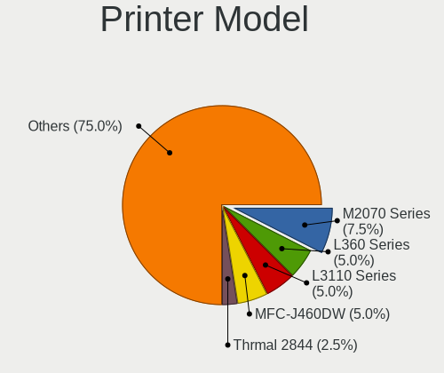

| Model                            | Computers | Percent |
|----------------------------------|-----------|---------|
| Seiko Epson L3110 Series         | 2         | 11.11%  |
| Xerox Phaser 3140 and 3155       | 1         | 5.56%   |
| Seiko Epson L222 Series          | 1         | 5.56%   |
| Samsung M2070 Series             | 1         | 5.56%   |
| Kyocera Mita FS-820              | 1         | 5.56%   |
| HP OfficeJet 5500 series         | 1         | 5.56%   |
| HP LaserJet 1022                 | 1         | 5.56%   |
| HP ENVY 4500 series              | 1         | 5.56%   |
| HP DeskJet D2300                 | 1         | 5.56%   |
| HP DeskJet 3700 series           | 1         | 5.56%   |
| HP DeskJet 3630 series           | 1         | 5.56%   |
| Datamax-O'Neil Datamax E-4304    | 1         | 5.56%   |
| Canon PIXMA MX470 Series         | 1         | 5.56%   |
| Canon LaserShot LBP-1120 Printer | 1         | 5.56%   |
| Canon iP2600 series              | 1         | 5.56%   |
| Brother MFC-J460DW               | 1         | 5.56%   |
| Brother HL-2230 series           | 1         | 5.56%   |

Scanner Vendor
--------------

Scanner device vendors

| Vendor         | Computers | Percent |
|----------------|-----------|---------|
| Canon          | 4         | 66.67%  |
| Seiko Epson    | 1         | 16.67%  |
| Mustek Systems | 1         | 16.67%  |

Scanner Model
-------------

Scanner device models

| Model                                       | Computers | Percent |
|---------------------------------------------|-----------|---------|
| Seiko Epson GT-X820 [Perfection V600 Photo] | 1         | 16.67%  |
| Mustek Systems ScanExpress A3 USB 1200 PRO  | 1         | 16.67%  |
| Canon CanoScan N670U/N676U/LiDE 20          | 1         | 16.67%  |
| Canon CanoScan LiDE 50/LiDE 35/LiDE 40      | 1         | 16.67%  |
| Canon CanoScan LiDE 220                     | 1         | 16.67%  |
| Canon CanoScan LiDE 210                     | 1         | 16.67%  |

Camera
------

Camera Vendor
-------------

Camera device vendors

| Vendor                                 | Computers | Percent |
|----------------------------------------|-----------|---------|
| Chicony Electronics                    | 63        | 19.33%  |
| Microdia                               | 32        | 9.82%   |
| IMC Networks                           | 32        | 9.82%   |
| Acer                                   | 30        | 9.2%    |
| Logitech                               | 26        | 7.98%   |
| Quanta                                 | 21        | 6.44%   |
| Realtek Semiconductor                  | 19        | 5.83%   |
| Sunplus Innovation Technology          | 12        | 3.68%   |
| Cheng Uei Precision Industry (Foxlink) | 11        | 3.37%   |
| Luxvisions Innotech Limited            | 9         | 2.76%   |
| Syntek                                 | 7         | 2.15%   |
| Lite-On Technology                     | 7         | 2.15%   |
| Apple                                  | 6         | 1.84%   |
| Silicon Motion                         | 5         | 1.53%   |
| Y Media                                | 4         | 1.23%   |
| Microsoft                              | 4         | 1.23%   |
| Alcor Micro                            | 4         | 1.23%   |
| Z-Star Microelectronics                | 2         | 0.61%   |
| USB Camera                             | 2         | 0.61%   |
| SunplusIT                              | 2         | 0.61%   |
| Samsung Electronics                    | 2         | 0.61%   |
| KYE Systems (Mouse Systems)            | 2         | 0.61%   |
| Jieli Technology                       | 2         | 0.61%   |
| Generalplus Technology                 | 2         | 0.61%   |
| DJKANA19IDX53W                         | 2         | 0.61%   |
| YGTek                                  | 1         | 0.31%   |
| Xiaomi                                 | 1         | 0.31%   |
| Unknown                                | 1         | 0.31%   |
| Suyin                                  | 1         | 0.31%   |
| SN0002                                 | 1         | 0.31%   |
| ShineTech                              | 1         | 0.31%   |
| Ricoh                                  | 1         | 0.31%   |
| Novatek Microelectronics               | 1         | 0.31%   |
| Importek                               | 1         | 0.31%   |
| Huawei Technologies                    | 1         | 0.31%   |
| HRY                                    | 1         | 0.31%   |
| Hewlett-Packard                        | 1         | 0.31%   |
| Goodong Industry                       | 1         | 0.31%   |
| Goodong                                | 1         | 0.31%   |
| eMPIA Technology                       | 1         | 0.31%   |

Camera Model
------------

Camera device models

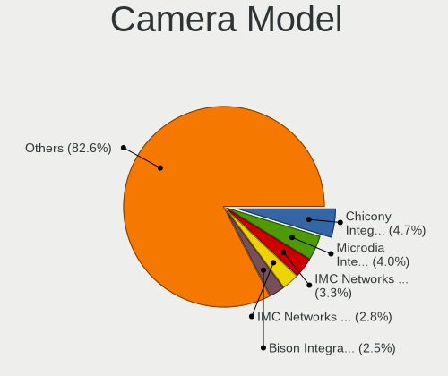

| Model                                                           | Computers | Percent |
|-----------------------------------------------------------------|-----------|---------|
| Chicony Integrated Camera                                       | 16        | 4.88%   |
| Acer Integrated Camera                                          | 14        | 4.27%   |
| Microdia Integrated_Webcam_HD                                   | 12        | 3.66%   |
| IMC Networks Integrated Camera                                  | 11        | 3.35%   |
| IMC Networks USB2.0 HD UVC WebCam                               | 9         | 2.74%   |
| Chicony HD WebCam                                               | 7         | 2.13%   |
| Sunplus Integrated_Webcam_HD                                    | 6         | 1.83%   |
| Quanta HP TrueVision HD Camera                                  | 6         | 1.83%   |
| Chicony HD User Facing                                          | 6         | 1.83%   |
| Syntek Integrated Camera                                        | 5         | 1.52%   |
| Logitech Webcam C270                                            | 5         | 1.52%   |
| Y Media USB Camera                                              | 4         | 1.22%   |
| Realtek USB Camera                                              | 4         | 1.22%   |
| Realtek Integrated_Webcam_HD                                    | 4         | 1.22%   |
| Microdia Webcam Vitade AF                                       | 4         | 1.22%   |
| Microdia Integrated_Webcam_FHD                                  | 4         | 1.22%   |
| Chicony USB2.0 Camera                                           | 4         | 1.22%   |
| Chicony HP HD Camera                                            | 4         | 1.22%   |
| Cheng Uei Precision Industry (Foxlink) HP Wide Vision HD Camera | 4         | 1.22%   |
| Quanta HP Wide Vision HD Camera                                 | 3         | 0.91%   |
| Quanta HD User Facing                                           | 3         | 0.91%   |
| Luxvisions Innotech Limited Integrated Camera                   | 3         | 0.91%   |
| Luxvisions Innotech Limited HP TrueVision HD Camera             | 3         | 0.91%   |
| Logitech Webcam C310                                            | 3         | 0.91%   |
| Logitech HD Pro Webcam C920                                     | 3         | 0.91%   |
| Logitech C920 PRO HD Webcam                                     | 3         | 0.91%   |
| Chicony HP Wide Vision HD Camera                                | 3         | 0.91%   |
| Chicony HP Truevision HD                                        | 3         | 0.91%   |
| Acer HD Webcam                                                  | 3         | 0.91%   |
| USB Camera USB Camera                                           | 2         | 0.61%   |
| Silicon Motion 300k Pixel Camera                                | 2         | 0.61%   |
| Samsung Galaxy series, misc. (MTP mode)                         | 2         | 0.61%   |
| Realtek Integrated Webcam HD                                    | 2         | 0.61%   |
| Quanta ov9734_techfront_camera                                  | 2         | 0.61%   |
| Quanta HP True Vision HD Camera                                 | 2         | 0.61%   |
| Microdia Integrated Webcam                                      | 2         | 0.61%   |
| Microdia Integrated Camera                                      | 2         | 0.61%   |
| Microdia Hy-HD-Camera                                           | 2         | 0.61%   |
| Luxvisions Innotech Limited HP HD Camera                        | 2         | 0.61%   |
| Logitech StreamCam                                              | 2         | 0.61%   |

Security
--------

Fingerprint Vendor
------------------

Fingerprint sensor vendors

| Vendor                     | Computers | Percent |
|----------------------------|-----------|---------|
| Synaptics                  | 19        | 28.79%  |
| Shenzhen Goodix Technology | 19        | 28.79%  |
| Validity Sensors           | 15        | 22.73%  |
| Elan Microelectronics      | 8         | 12.12%  |
| AuthenTec                  | 3         | 4.55%   |
| STMicroelectronics         | 1         | 1.52%   |
| Focal-systems.Corp         | 1         | 1.52%   |

Fingerprint Model
-----------------

Fingerprint sensor models

| Model                                                       | Computers | Percent |
|-------------------------------------------------------------|-----------|---------|
| Shenzhen Goodix  FingerPrint Device                         | 17        | 25.76%  |
| Unknown                                                     | 7         | 10.61%  |
| Elan ELAN:ARM-M4                                            | 6         | 9.09%   |
| Validity Sensors VFS 5011 fingerprint sensor                | 4         | 6.06%   |
| Synaptics Prometheus MIS Touch Fingerprint Reader           | 4         | 6.06%   |
| Validity Sensors VFS495 Fingerprint Reader                  | 3         | 4.55%   |
| Validity Sensors VFS7552 Touch Fingerprint Sensor           | 2         | 3.03%   |
| Validity Sensors VFS471 Fingerprint Reader                  | 2         | 3.03%   |
| Synaptics  WBDI Fingerprint Reader - USB 052                | 2         | 3.03%   |
| Synaptics  FS7604 Touch Fingerprint Sensor with PurePrint   | 2         | 3.03%   |
| Synaptics Metallica MIS Touch Fingerprint Reader            | 2         | 3.03%   |
| Shenzhen Goodix Fingerprint Reader                          | 2         | 3.03%   |
| Elan ELAN:Fingerprint                                       | 2         | 3.03%   |
| AuthenTec Fingerprint Sensor                                | 2         | 3.03%   |
| Validity Sensors VFS491                                     | 1         | 1.52%   |
| Validity Sensors VFS300 Fingerprint Reader                  | 1         | 1.52%   |
| Validity Sensors Synaptics VFS7552 Touch Fingerprint Sensor | 1         | 1.52%   |
| Validity Sensors Fingerprint scanner                        | 1         | 1.52%   |
| Synaptics  WBDI                                             | 1         | 1.52%   |
| Synaptics  VFS7552 Touch Fingerprint Sensor with PurePrint  | 1         | 1.52%   |
| STMicroelectronics Fingerprint Reader                       | 1         | 1.52%   |
| Focal-systems.Corp FT9201Fingerprint.                       | 1         | 1.52%   |
| AuthenTec AES2501 Fingerprint Sensor                        | 1         | 1.52%   |

Chipcard Vendor
---------------

Chipcard module vendors

| Vendor                | Computers | Percent |
|-----------------------|-----------|---------|
| Broadcom              | 8         | 36.36%  |
| Alcor Micro           | 6         | 27.27%  |
| Upek                  | 2         | 9.09%   |
| BIT4ID                | 2         | 9.09%   |
| SCM Microsystems      | 1         | 4.55%   |
| OmniKey               | 1         | 4.55%   |
| O2 Micro              | 1         | 4.55%   |
| Gemalto (was Gemplus) | 1         | 4.55%   |

Chipcard Model
--------------

Chipcard module models

| Model                                                                        | Computers | Percent |
|------------------------------------------------------------------------------|-----------|---------|
| Alcor Micro AU9540 Smartcard Reader                                          | 6         | 27.27%  |
| Broadcom 5880                                                                | 3         | 13.64%  |
| Broadcom 58200                                                               | 3         | 13.64%  |
| Upek TouchChip Fingerprint Coprocessor (WBF advanced mode)                   | 2         | 9.09%   |
| BIT4ID miniLector EVO                                                        | 2         | 9.09%   |
| SCM Microsystems SCR331 SmartCard Reader                                     | 1         | 4.55%   |
| OmniKey CardMan 1021                                                         | 1         | 4.55%   |
| O2 Micro OZ776 CCID Smartcard Reader                                         | 1         | 4.55%   |
| Gemalto (was Gemplus) GemPC Twin SmartCard Reader                            | 1         | 4.55%   |
| Broadcom BCM5880 Secure Applications Processor with fingerprint swipe sensor | 1         | 4.55%   |
| Broadcom BCM5880 Secure Applications Processor                               | 1         | 4.55%   |

Unsupported
-----------

Unsupported Devices
-------------------

Total unsupported devices on board

| Total | Computers | Percent |
|-------|-----------|---------|
| 0     | 333       | 68.94%  |
| 1     | 117       | 24.22%  |
| 2     | 29        | 6%      |
| 3     | 2         | 0.41%   |
| 9     | 1         | 0.21%   |
| 4     | 1         | 0.21%   |

Unsupported Device Types
------------------------

Types of unsupported devices

| Type                     | Computers | Percent |
|--------------------------|-----------|---------|
| Fingerprint reader       | 66        | 36.07%  |
| Graphics card            | 25        | 13.66%  |
| Net/wireless             | 20        | 10.93%  |
| Chipcard                 | 20        | 10.93%  |
| Multimedia controller    | 13        | 7.1%    |
| Camera                   | 10        | 5.46%   |
| Unassigned class         | 8         | 4.37%   |
| Communication controller | 6         | 3.28%   |
| Sound                    | 5         | 2.73%   |
| Bluetooth                | 5         | 2.73%   |
| Network                  | 2         | 1.09%   |
| Net/ethernet             | 2         | 1.09%   |
| Card reader              | 1         | 0.55%   |

