Kubuntu 23.04 - Tested Hardware & Statistics
--------------------------------------------

A project to collect tested hardware configurations for Kubuntu 23.04.

Anyone can contribute to this report by the [hw-probe](https://github.com/linuxhw/hw-probe) tool:

    sudo -E hw-probe -all -upload

Please contribute! Especially if your hardware is rare.

This is a report for all computer types. See also reports for [desktops](/Dist/Kubuntu_23.04/Desktop/README.md) and [notebooks](/Dist/Kubuntu_23.04/Notebook/README.md).

Contents
--------

* [ Test Cases ](#test-cases)

* [ System ](#system)
  - [ Kernel                   ](#kernel)
  - [ Kernel Family            ](#kernel-family)
  - [ Kernel Major Ver.        ](#kernel-major-ver)
  - [ Arch                     ](#arch)
  - [ DE                       ](#de)
  - [ Display Server           ](#display-server)
  - [ Display Manager          ](#display-manager)
  - [ OS Lang                  ](#os-lang)
  - [ Boot Mode                ](#boot-mode)
  - [ Filesystem               ](#filesystem)
  - [ Part. scheme             ](#part-scheme)
  - [ Dual Boot with Linux/BSD ](#dual-boot-with-linuxbsd)
  - [ Dual Boot (Win)          ](#dual-boot-win)

* [ Board ](#board)
  - [ Vendor                   ](#vendor)
  - [ Model                    ](#model)
  - [ Model Family             ](#model-family)
  - [ MFG Year                 ](#mfg-year)
  - [ Form Factor              ](#form-factor)
  - [ Secure Boot              ](#secure-boot)
  - [ Coreboot                 ](#coreboot)
  - [ RAM Size                 ](#ram-size)
  - [ RAM Used                 ](#ram-used)
  - [ Total Drives             ](#total-drives)
  - [ Has CD-ROM               ](#has-cd-rom)
  - [ Has Ethernet             ](#has-ethernet)
  - [ Has WiFi                 ](#has-wifi)
  - [ Has Bluetooth            ](#has-bluetooth)

* [ Location ](#location)
  - [ Country                  ](#country)
  - [ City                     ](#city)

* [ Drives ](#drives)
  - [ Drive Vendor             ](#drive-vendor)
  - [ Drive Model              ](#drive-model)
  - [ HDD Vendor               ](#hdd-vendor)
  - [ SSD Vendor               ](#ssd-vendor)
  - [ Drive Kind               ](#drive-kind)
  - [ Drive Connector          ](#drive-connector)
  - [ Drive Size               ](#drive-size)
  - [ Space Total              ](#space-total)
  - [ Space Used               ](#space-used)
  - [ Malfunc. Drives          ](#malfunc-drives)
  - [ Malfunc. Drive Vendor    ](#malfunc-drive-vendor)
  - [ Malfunc. HDD Vendor      ](#malfunc-hdd-vendor)
  - [ Malfunc. Drive Kind      ](#malfunc-drive-kind)
  - [ Failed Drives            ](#failed-drives)
  - [ Failed Drive Vendor      ](#failed-drive-vendor)
  - [ Drive Status             ](#drive-status)

* [ Storage controller ](#storage-controller)
  - [ Storage Vendor           ](#storage-vendor)
  - [ Storage Model            ](#storage-model)
  - [ Storage Kind             ](#storage-kind)

* [ Processor ](#processor)
  - [ CPU Vendor               ](#cpu-vendor)
  - [ CPU Model                ](#cpu-model)
  - [ CPU Model Family         ](#cpu-model-family)
  - [ CPU Cores                ](#cpu-cores)
  - [ CPU Sockets              ](#cpu-sockets)
  - [ CPU Threads              ](#cpu-threads)
  - [ CPU Op-Modes             ](#cpu-op-modes)
  - [ CPU Microcode            ](#cpu-microcode)
  - [ CPU Microarch            ](#cpu-microarch)

* [ Graphics ](#graphics)
  - [ GPU Vendor               ](#gpu-vendor)
  - [ GPU Model                ](#gpu-model)
  - [ GPU Combo                ](#gpu-combo)
  - [ GPU Driver               ](#gpu-driver)
  - [ GPU Memory               ](#gpu-memory)

* [ Monitor ](#monitor)
  - [ Monitor Vendor           ](#monitor-vendor)
  - [ Monitor Model            ](#monitor-model)
  - [ Monitor Resolution       ](#monitor-resolution)
  - [ Monitor Diagonal         ](#monitor-diagonal)
  - [ Monitor Width            ](#monitor-width)
  - [ Aspect Ratio             ](#aspect-ratio)
  - [ Monitor Area             ](#monitor-area)
  - [ Pixel Density            ](#pixel-density)
  - [ Multiple Monitors        ](#multiple-monitors)

* [ Network ](#network)
  - [ Net Controller Vendor    ](#net-controller-vendor)
  - [ Net Controller Model     ](#net-controller-model)
  - [ Wireless Vendor          ](#wireless-vendor)
  - [ Wireless Model           ](#wireless-model)
  - [ Ethernet Vendor          ](#ethernet-vendor)
  - [ Ethernet Model           ](#ethernet-model)
  - [ Net Controller Kind      ](#net-controller-kind)
  - [ Used Controller          ](#used-controller)
  - [ NICs                     ](#nics)
  - [ IPv6                     ](#ipv6)

* [ Bluetooth ](#bluetooth)
  - [ Bluetooth Vendor         ](#bluetooth-vendor)
  - [ Bluetooth Model          ](#bluetooth-model)

* [ Sound ](#sound)
  - [ Sound Vendor             ](#sound-vendor)
  - [ Sound Model              ](#sound-model)

* [ Memory ](#memory)
  - [ Memory Vendor            ](#memory-vendor)
  - [ Memory Model             ](#memory-model)
  - [ Memory Kind              ](#memory-kind)
  - [ Memory Form Factor       ](#memory-form-factor)
  - [ Memory Size              ](#memory-size)
  - [ Memory Speed             ](#memory-speed)

* [ Printers & scanners ](#printers--scanners)
  - [ Printer Vendor           ](#printer-vendor)
  - [ Printer Model            ](#printer-model)
  - [ Scanner Vendor           ](#scanner-vendor)
  - [ Scanner Model            ](#scanner-model)

* [ Camera ](#camera)
  - [ Camera Vendor            ](#camera-vendor)
  - [ Camera Model             ](#camera-model)

* [ Security ](#security)
  - [ Fingerprint Vendor       ](#fingerprint-vendor)
  - [ Fingerprint Model        ](#fingerprint-model)
  - [ Chipcard Vendor          ](#chipcard-vendor)
  - [ Chipcard Model           ](#chipcard-model)

* [ Unsupported ](#unsupported)
  - [ Unsupported Devices      ](#unsupported-devices)
  - [ Unsupported Device Types ](#unsupported-device-types)

Test Cases
----------

Total: 110

| Vendor    | Model                       | Form-Factor | Probe                                                      | Date         |
|-----------|-----------------------------|-------------|------------------------------------------------------------|--------------|
| Dell      | G3 3779                     | Notebook    | [0190c87b35](https://linux-hardware.org/?probe=0190c87b35) | Jun 10, 2023 |
| Seco      | C40 C                       | Desktop     | [4d990c8a0c](https://linux-hardware.org/?probe=4d990c8a0c) | Jun 10, 2023 |
| Apple     | MacBookAir5,1               | Notebook    | [53ba4689ae](https://linux-hardware.org/?probe=53ba4689ae) | Jun 10, 2023 |
| Apple     | MacBookAir5,1               | Notebook    | [58f4272bee](https://linux-hardware.org/?probe=58f4272bee) | Jun 10, 2023 |
| Apple     | MacBookPro8,1               | Notebook    | [cbf7ed91a7](https://linux-hardware.org/?probe=cbf7ed91a7) | Jun 08, 2023 |
| Lenovo    | Slim 7 ProX 14ARH7 82V2     | Notebook    | [e8b6d763e4](https://linux-hardware.org/?probe=e8b6d763e4) | Jun 08, 2023 |
| Lenovo    | ThinkPad P14s Gen 1 20S5... | Notebook    | [0372aa0747](https://linux-hardware.org/?probe=0372aa0747) | Jun 08, 2023 |
| AZW       | SER V01                     | Mini pc     | [6b694e4b4a](https://linux-hardware.org/?probe=6b694e4b4a) | Jun 08, 2023 |
| AZW       | SER V01                     | Mini pc     | [0b7fb76a0b](https://linux-hardware.org/?probe=0b7fb76a0b) | Jun 08, 2023 |
| Lenovo    | Slim 7 ProX 14ARH7 82V2     | Notebook    | [810e331444](https://linux-hardware.org/?probe=810e331444) | Jun 07, 2023 |
| Gigabyte  | GA-MA770-US3                | Desktop     | [c22850601d](https://linux-hardware.org/?probe=c22850601d) | Jun 07, 2023 |
| AZW       | SER V1.0                    | Mini pc     | [cb8797fce5](https://linux-hardware.org/?probe=cb8797fce5) | Jun 07, 2023 |
| Lenovo    | ThinkPad P15s Gen 2i 20W... | Notebook    | [53341e2d0d](https://linux-hardware.org/?probe=53341e2d0d) | Jun 07, 2023 |
| ASUSTek   | K50IJ                       | Notebook    | [b06a0c9b89](https://linux-hardware.org/?probe=b06a0c9b89) | Jun 06, 2023 |
| Gigabyte  | G5 GE                       | Notebook    | [1b78246ef7](https://linux-hardware.org/?probe=1b78246ef7) | Jun 06, 2023 |
| HP        | ProBook 650 G1              | Notebook    | [776a9fb064](https://linux-hardware.org/?probe=776a9fb064) | Jun 05, 2023 |
| HP        | Pavilion Laptop 15-eh1xx... | Notebook    | [b9cd465d98](https://linux-hardware.org/?probe=b9cd465d98) | Jun 05, 2023 |
| ASUSTek   | H81M-A                      | Desktop     | [9636642e65](https://linux-hardware.org/?probe=9636642e65) | Jun 04, 2023 |
| Gigabyte  | G5 GE                       | Notebook    | [8ef447b2f3](https://linux-hardware.org/?probe=8ef447b2f3) | Jun 03, 2023 |
| MSI       | B450M PRO-M2 V2             | Desktop     | [fc8a306ca0](https://linux-hardware.org/?probe=fc8a306ca0) | Jun 03, 2023 |
| Gigabyte  | B365M H                     | Desktop     | [b7a585d1f1](https://linux-hardware.org/?probe=b7a585d1f1) | Jun 03, 2023 |
| ASUSTek   | ASUS TUF Gaming F17 FX70... | Notebook    | [23e94c534e](https://linux-hardware.org/?probe=23e94c534e) | Jun 01, 2023 |
| AZW       | SER V1.0                    | Mini pc     | [16c536cda1](https://linux-hardware.org/?probe=16c536cda1) | Jun 01, 2023 |
| ASUSTek   | M5A78L-M LX PLUS            | Desktop     | [fc4e2630c0](https://linux-hardware.org/?probe=fc4e2630c0) | Jun 01, 2023 |
| ASUSTek   | M5A78L-M LX PLUS            | Desktop     | [f02c7845e5](https://linux-hardware.org/?probe=f02c7845e5) | Jun 01, 2023 |
| MSI       | Titan GT77HX 13VH           | Notebook    | [7c3b8ed81d](https://linux-hardware.org/?probe=7c3b8ed81d) | May 29, 2023 |
| Acer      | Aspire E5-575               | Notebook    | [cdc924595c](https://linux-hardware.org/?probe=cdc924595c) | May 28, 2023 |
| Lenovo    | ThinkPad E15 Gen 4 21EDC... | Notebook    | [8fd2003b01](https://linux-hardware.org/?probe=8fd2003b01) | May 28, 2023 |
| ASUSTek   | H81M-A                      | Desktop     | [70714d71f5](https://linux-hardware.org/?probe=70714d71f5) | May 28, 2023 |
| Lenovo    | IdeaPad 3 15ALC6 82MF       | Notebook    | [2b9c4431c2](https://linux-hardware.org/?probe=2b9c4431c2) | May 26, 2023 |
| Lenovo    | IdeaPad 3 15ALC6 82MF       | Notebook    | [f5b571be32](https://linux-hardware.org/?probe=f5b571be32) | May 26, 2023 |
| Alienware | 04VWF2 A00                  | Desktop     | [0d6c86d757](https://linux-hardware.org/?probe=0d6c86d757) | May 25, 2023 |
| Google    | Bluebird                    | Notebook    | [5b41bdf767](https://linux-hardware.org/?probe=5b41bdf767) | May 25, 2023 |
| Apple     | MacBookPro9,1               | Notebook    | [b880d4f8c1](https://linux-hardware.org/?probe=b880d4f8c1) | May 23, 2023 |
| ASRock    | X99 Extreme6/ac             | Desktop     | [8e255dc13b](https://linux-hardware.org/?probe=8e255dc13b) | May 22, 2023 |
| Alienware | 04VWF2 A00                  | Desktop     | [7c09c55150](https://linux-hardware.org/?probe=7c09c55150) | May 21, 2023 |
| Lenovo    | ThinkPad E15 Gen 4 21EES... | Notebook    | [71ac41efb8](https://linux-hardware.org/?probe=71ac41efb8) | May 20, 2023 |
| BOSGAME   | B95                         | Notebook    | [3d1805a2eb](https://linux-hardware.org/?probe=3d1805a2eb) | May 19, 2023 |
| ASUSTek   | ROG Strix G513RW_G513RW     | Notebook    | [26e8deafbf](https://linux-hardware.org/?probe=26e8deafbf) | May 19, 2023 |
| Acer      | Aspire E5-521               | Notebook    | [05227be8bc](https://linux-hardware.org/?probe=05227be8bc) | May 18, 2023 |
| Lenovo    | IdeaPad 700-17ISK 80RV      | Notebook    | [61b0585530](https://linux-hardware.org/?probe=61b0585530) | May 18, 2023 |
| Lenovo    | 36C8 SDK0J40700 WIN 3258... | Desktop     | [166ec29ce0](https://linux-hardware.org/?probe=166ec29ce0) | May 18, 2023 |
| Unknown   | V00                         | Mini pc     | [79cb590ea8](https://linux-hardware.org/?probe=79cb590ea8) | May 17, 2023 |
| Dell      | Inspiron 16 7620 2-in-1     | Convertible | [0906223758](https://linux-hardware.org/?probe=0906223758) | May 17, 2023 |
| Acer      | Swift SFX14-41G             | Notebook    | [0331ab9725](https://linux-hardware.org/?probe=0331ab9725) | May 16, 2023 |
| HP        | EliteBook 865 16 inch G9... | Notebook    | [14edb35e71](https://linux-hardware.org/?probe=14edb35e71) | May 15, 2023 |
| HUAWEI    | BOHB-WAX9                   | Notebook    | [98ebdcd589](https://linux-hardware.org/?probe=98ebdcd589) | May 15, 2023 |
| HP        | 3397                        | Desktop     | [17d9dcc121](https://linux-hardware.org/?probe=17d9dcc121) | May 15, 2023 |
| HP        | ENVY TS 15                  | Notebook    | [f90de81324](https://linux-hardware.org/?probe=f90de81324) | May 15, 2023 |
| Lenovo    | IdeaPad Y700-15ISK 80NV     | Notebook    | [5f508efff4](https://linux-hardware.org/?probe=5f508efff4) | May 14, 2023 |
| HP        | Compaq CQ58                 | Notebook    | [0df5818390](https://linux-hardware.org/?probe=0df5818390) | May 14, 2023 |
| Lenovo    | ThinkPad X1 Carbon Gen 1... | Notebook    | [58557ae6a2](https://linux-hardware.org/?probe=58557ae6a2) | May 12, 2023 |
| HUAWEI    | NBD-WXX9                    | Notebook    | [d8c0bd3bff](https://linux-hardware.org/?probe=d8c0bd3bff) | May 12, 2023 |
| Gigabyte  | X570S AORUS ELITE AX        | Desktop     | [094fd8b39a](https://linux-hardware.org/?probe=094fd8b39a) | May 12, 2023 |
| Lenovo    | Yoga 6 13ALC7 82UD          | Convertible | [c071e02f0d](https://linux-hardware.org/?probe=c071e02f0d) | May 12, 2023 |
| Dell      | Latitude E5470              | Notebook    | [59c95182ec](https://linux-hardware.org/?probe=59c95182ec) | May 11, 2023 |
| Intel     | H61                         | Desktop     | [57ef0f0f97](https://linux-hardware.org/?probe=57ef0f0f97) | May 11, 2023 |
| ASUSTek   | TUF Gaming X570-PLUS        | Desktop     | [c80f41d509](https://linux-hardware.org/?probe=c80f41d509) | May 09, 2023 |
| Lenovo    | ThinkPad E14 Gen 3 20YDS... | Notebook    | [8d1f016621](https://linux-hardware.org/?probe=8d1f016621) | May 08, 2023 |
| HP        | Laptop 15-da2xxx            | Notebook    | [8f08aa189f](https://linux-hardware.org/?probe=8f08aa189f) | May 08, 2023 |
| HP        | Pavilion Laptop 15-eg0xx... | Notebook    | [c075073dd8](https://linux-hardware.org/?probe=c075073dd8) | May 07, 2023 |
| Biostar   | AM1MHP                      | Desktop     | [1f21e13fcd](https://linux-hardware.org/?probe=1f21e13fcd) | May 07, 2023 |
| ASUSTek   | Zenbook UM6702RC_RM6702R... | Notebook    | [3cf83f50f0](https://linux-hardware.org/?probe=3cf83f50f0) | May 07, 2023 |
| Google    | Lars                        | Notebook    | [db3ba59095](https://linux-hardware.org/?probe=db3ba59095) | May 06, 2023 |
| Intel     | NUC12WSBi7 M46422-303       | Mini pc     | [68b1e1e6cb](https://linux-hardware.org/?probe=68b1e1e6cb) | May 05, 2023 |
| HP        | ProBook 440 G5              | Notebook    | [f6251eeeb1](https://linux-hardware.org/?probe=f6251eeeb1) | May 05, 2023 |
| Medion    | E11201                      | Notebook    | [f0bfd835f8](https://linux-hardware.org/?probe=f0bfd835f8) | May 04, 2023 |
| Lenovo    | ThinkPad E14 Gen 4 21ECS... | Notebook    | [1f2d88bfae](https://linux-hardware.org/?probe=1f2d88bfae) | May 04, 2023 |
| Gigabyte  | H87-HD3                     | Desktop     | [f0e4057e5f](https://linux-hardware.org/?probe=f0e4057e5f) | May 03, 2023 |
| Lenovo    | IdeaPad 3 15IAU7 82RK       | Notebook    | [861ca2dca3](https://linux-hardware.org/?probe=861ca2dca3) | May 03, 2023 |
| HP        | ZBook Studio 15.6 inch G... | Notebook    | [1846ea93e7](https://linux-hardware.org/?probe=1846ea93e7) | May 01, 2023 |
| HP        | 828A                        | Desktop     | [f1590b355f](https://linux-hardware.org/?probe=f1590b355f) | Apr 30, 2023 |
| Lenovo    | IdeaPad 5 Pro 16ARH7 82S... | Notebook    | [9a36e5ebaf](https://linux-hardware.org/?probe=9a36e5ebaf) | Apr 28, 2023 |
| Lenovo    | ThinkBook 14 G4 ABA 21DK    | Notebook    | [1ccae7d268](https://linux-hardware.org/?probe=1ccae7d268) | Apr 28, 2023 |
| ASUSTek   | X51RL                       | Notebook    | [0d18de9922](https://linux-hardware.org/?probe=0d18de9922) | Apr 28, 2023 |
| Lenovo    | ThinkPad E14 Gen 4 21ECS... | Notebook    | [442a827555](https://linux-hardware.org/?probe=442a827555) | Apr 27, 2023 |
| HP        | ENVY x360 Convertible 13... | Convertible | [fee636a549](https://linux-hardware.org/?probe=fee636a549) | Apr 26, 2023 |
| Samsung   | 950XED                      | Notebook    | [02586ee1ba](https://linux-hardware.org/?probe=02586ee1ba) | Apr 26, 2023 |
| Lenovo    | ThinkPad P1 Gen 2 20QT00... | Notebook    | [4285b1a3d9](https://linux-hardware.org/?probe=4285b1a3d9) | Apr 25, 2023 |
| HP        | Pavilion Notebook           | Notebook    | [b03c4808b0](https://linux-hardware.org/?probe=b03c4808b0) | Apr 25, 2023 |
| Lenovo    | Legion 5 Pro 16ACH6H 82J... | Notebook    | [38806ed70c](https://linux-hardware.org/?probe=38806ed70c) | Apr 24, 2023 |
| HP        | Pavilion Notebook           | Notebook    | [0fde788ea5](https://linux-hardware.org/?probe=0fde788ea5) | Apr 24, 2023 |
| Foxconn   | H67M-S/H67M-V/H67           | Desktop     | [92fa61186f](https://linux-hardware.org/?probe=92fa61186f) | Apr 23, 2023 |
| Dell      | Inspiron 5521               | Notebook    | [8de2e801a3](https://linux-hardware.org/?probe=8de2e801a3) | Apr 23, 2023 |
| Dell      | Latitude E5530 non-vPro     | Notebook    | [fa5d5b4733](https://linux-hardware.org/?probe=fa5d5b4733) | Apr 23, 2023 |
| Gigabyte  | G5 KD                       | Notebook    | [d7648edaab](https://linux-hardware.org/?probe=d7648edaab) | Apr 23, 2023 |
| Dell      | Precision 5520              | Notebook    | [4d1dd8b673](https://linux-hardware.org/?probe=4d1dd8b673) | Apr 23, 2023 |
| Gigabyte  | AORUS 15P XD                | Notebook    | [22925aa0c9](https://linux-hardware.org/?probe=22925aa0c9) | Apr 22, 2023 |
| Fujitsu   | D3500-A1 S26361-D3500-A1    | Desktop     | [475a4d151d](https://linux-hardware.org/?probe=475a4d151d) | Apr 22, 2023 |
| Dell      | Latitude E5530 non-vPro     | Notebook    | [f7528e9759](https://linux-hardware.org/?probe=f7528e9759) | Apr 22, 2023 |
| Apple     | Mac-F2268CC8                | All in one  | [3165ab3194](https://linux-hardware.org/?probe=3165ab3194) | Apr 22, 2023 |
| ASUSTek   | ASUS TUF Gaming F17 FX70... | Notebook    | [918115dc84](https://linux-hardware.org/?probe=918115dc84) | Apr 21, 2023 |
| ASUSTek   | VivoBook_ASUSLaptop M760... | Notebook    | [a02462f614](https://linux-hardware.org/?probe=a02462f614) | Apr 21, 2023 |
| ASUSTek   | M5A78L LE                   | Desktop     | [3d241113f4](https://linux-hardware.org/?probe=3d241113f4) | Apr 21, 2023 |
| MSI       | 970 GAMING                  | Desktop     | [cb295448b6](https://linux-hardware.org/?probe=cb295448b6) | Apr 21, 2023 |
| Acer      | Aspire A515-45              | Notebook    | [93f1374055](https://linux-hardware.org/?probe=93f1374055) | Apr 01, 2023 |
| Samsung   | 950QDB                      | Convertible | [09717388fb](https://linux-hardware.org/?probe=09717388fb) | Mar 31, 2023 |
| Apple     | MacBookPro8,1               | Notebook    | [b72701d99c](https://linux-hardware.org/?probe=b72701d99c) | Mar 29, 2023 |
| HUAWEI    | HN-WX9X                     | Notebook    | [cdc4b03fe2](https://linux-hardware.org/?probe=cdc4b03fe2) | Mar 26, 2023 |
| Gigabyte  | B550 AORUS ELITE V2         | Desktop     | [a71c5a4629](https://linux-hardware.org/?probe=a71c5a4629) | Mar 19, 2023 |
| Unknown   | Unknown                     | Desktop     | [b20f8089c3](https://linux-hardware.org/?probe=b20f8089c3) | Mar 15, 2023 |
| ASUSTek   | VivoBook_ASUSLaptop M760... | Notebook    | [fbbcc2d2c5](https://linux-hardware.org/?probe=fbbcc2d2c5) | Mar 15, 2023 |
| ASUSTek   | VivoBook_ASUSLaptop M760... | Notebook    | [003aa3d3e9](https://linux-hardware.org/?probe=003aa3d3e9) | Feb 27, 2023 |
| Gigabyte  | B360M HD3                   | Desktop     | [d3821bdbab](https://linux-hardware.org/?probe=d3821bdbab) | Feb 26, 2023 |
| Samsung   | 950QDB                      | Convertible | [2545626207](https://linux-hardware.org/?probe=2545626207) | Feb 23, 2023 |
| Intel     | NUC12WSBi7 M46422-303       | Mini pc     | [1942c9f528](https://linux-hardware.org/?probe=1942c9f528) | Feb 11, 2023 |
| ASUSTek   | ROG Zephyrus G15 GA503QR... | Notebook    | [a84d546f50](https://linux-hardware.org/?probe=a84d546f50) | Feb 02, 2023 |
| Dell      | G3 3779                     | Notebook    | [c4c13ca86b](https://linux-hardware.org/?probe=c4c13ca86b) | Jan 19, 2023 |
| MSI       | Bravo 17 A4DDK              | Notebook    | [ca27b9dd46](https://linux-hardware.org/?probe=ca27b9dd46) | Jan 10, 2023 |
| MSI       | Raider GE67HX 12UGS         | Notebook    | [be85c7b42a](https://linux-hardware.org/?probe=be85c7b42a) | Jan 01, 2023 |

System
------

Kernel
------

Version of the Linux kernel

| Version                 | Computers | Percent |
|-------------------------|-----------|---------|
| 6.2.0-20-generic        | 65        | 69.89%  |
| 6.2.0-18-generic        | 4         | 4.3%    |
| 6.2.0-1003-lowlatency   | 3         | 3.23%   |
| 5.19.0-28-generic       | 2         | 2.15%   |
| 6.3.6-custom            | 1         | 1.08%   |
| 6.3.5-060305-generic    | 1         | 1.08%   |
| 6.3.4-060304-generic    | 1         | 1.08%   |
| 6.3.3-060303-generic    | 1         | 1.08%   |
| 6.3.1-custom            | 1         | 1.08%   |
| 6.3.1-060301-generic    | 1         | 1.08%   |
| 6.2.5-060205-generic    | 1         | 1.08%   |
| 6.2.10-060210-generic   | 1         | 1.08%   |
| 6.2.0-21-generic        | 1         | 1.08%   |
| 6.2.0-060200-generic    | 1         | 1.08%   |
| 6.1.12-060112-generic   | 1         | 1.08%   |
| 6.1.11-custom           | 1         | 1.08%   |
| 6.1.0-16-generic        | 1         | 1.08%   |
| 6.1.0-14-generic        | 1         | 1.08%   |
| 6.1.0-060100rc4-generic | 1         | 1.08%   |
| 5.19.0-42-generic       | 1         | 1.08%   |
| 5.19.0-40-generic       | 1         | 1.08%   |
| 5.19.0-21-generic       | 1         | 1.08%   |
| 5.19.0-1023-lowlatency  | 1         | 1.08%   |

Kernel Family
-------------

Linux kernel without a distro release

| Version | Computers | Percent |
|---------|-----------|---------|
| 6.2.0   | 73        | 79.35%  |
| 5.19.0  | 6         | 6.52%   |
| 6.1.0   | 3         | 3.26%   |
| 6.3.1   | 2         | 2.17%   |
| 6.3.6   | 1         | 1.09%   |
| 6.3.5   | 1         | 1.09%   |
| 6.3.4   | 1         | 1.09%   |
| 6.3.3   | 1         | 1.09%   |
| 6.2.5   | 1         | 1.09%   |
| 6.2.10  | 1         | 1.09%   |
| 6.1.12  | 1         | 1.09%   |
| 6.1.11  | 1         | 1.09%   |

Kernel Major Ver.
-----------------

Linux kernel major version

| Version | Computers | Percent |
|---------|-----------|---------|
| 6.2     | 75        | 81.52%  |
| 6.3     | 6         | 6.52%   |
| 5.19    | 6         | 6.52%   |
| 6.1     | 5         | 5.43%   |

Arch
----

OS architecture (x86_64, i586, etc.)

| Name   | Computers | Percent |
|--------|-----------|---------|
| x86_64 | 90        | 100%    |

DE
--

Desktop Environment

| Name  | Computers | Percent |
|-------|-----------|---------|
| KDE5  | 86        | 95.56%  |
| KDE   | 2         | 2.22%   |
| LXQt  | 1         | 1.11%   |
| GNOME | 1         | 1.11%   |

Display Server
--------------

X11 or Wayland

| Name    | Computers | Percent |
|---------|-----------|---------|
| X11     | 77        | 84.62%  |
| Wayland | 13        | 14.29%  |
| Tty     | 1         | 1.1%    |

Display Manager
---------------

SDDM, LightDM, etc.

| Name    | Computers | Percent |
|---------|-----------|---------|
| SDDM    | 51        | 56.67%  |
| Unknown | 35        | 38.89%  |
| GDM3    | 3         | 3.33%   |
| LightDM | 1         | 1.11%   |

OS Lang
-------

Language

| Lang   | Computers | Percent |
|--------|-----------|---------|
| en_US  | 39        | 43.33%  |
| de_DE  | 11        | 12.22%  |
| en_GB  | 5         | 5.56%   |
| ru_RU  | 4         | 4.44%   |
| pl_PL  | 3         | 3.33%   |
| it_IT  | 3         | 3.33%   |
| fr_FR  | 3         | 3.33%   |
| pt_BR  | 2         | 2.22%   |
| es_CR  | 2         | 2.22%   |
| en_NZ  | 2         | 2.22%   |
| en_IN  | 2         | 2.22%   |
| zh_TW  | 1         | 1.11%   |
| tr_TR  | 1         | 1.11%   |
| pt_PT  | 1         | 1.11%   |
| nl_NL  | 1         | 1.11%   |
| hu_HU  | 1         | 1.11%   |
| fr_BE  | 1         | 1.11%   |
| es_MX  | 1         | 1.11%   |
| es_ES  | 1         | 1.11%   |
| es_CL  | 1         | 1.11%   |
| es_419 | 1         | 1.11%   |
| en_IL  | 1         | 1.11%   |
| en_CA  | 1         | 1.11%   |
| en_AU  | 1         | 1.11%   |
| C      | 1         | 1.11%   |

Boot Mode
---------

EFI or BIOS

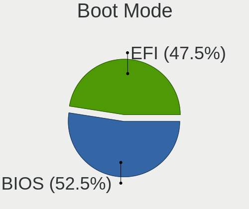

| Mode | Computers | Percent |
|------|-----------|---------|
| BIOS | 50        | 54.95%  |
| EFI  | 41        | 45.05%  |

Filesystem
----------

Type of filesystem

| Type    | Computers | Percent |
|---------|-----------|---------|
| Ext4    | 65        | 71.43%  |
| Tmpfs   | 15        | 16.48%  |
| Btrfs   | 6         | 6.59%   |
| Overlay | 3         | 3.3%    |
| Zfs     | 2         | 2.2%    |

Part. scheme
------------

Scheme of partitioning

| Type    | Computers | Percent |
|---------|-----------|---------|
| GPT     | 52        | 57.78%  |
| Unknown | 35        | 38.89%  |
| MBR     | 3         | 3.33%   |

Dual Boot with Linux/BSD
------------------------

Hosting more than one Linux/BSD

| Dual boot | Computers | Percent |
|-----------|-----------|---------|
| No        | 86        | 93.48%  |
| Yes       | 6         | 6.52%   |

Dual Boot (Win)
---------------

Hosting Linux and Windows

| Dual boot | Computers | Percent |
|-----------|-----------|---------|
| No        | 68        | 75.56%  |
| Yes       | 22        | 24.44%  |

Board
-----

Vendor
------

Motherboard manufacturer

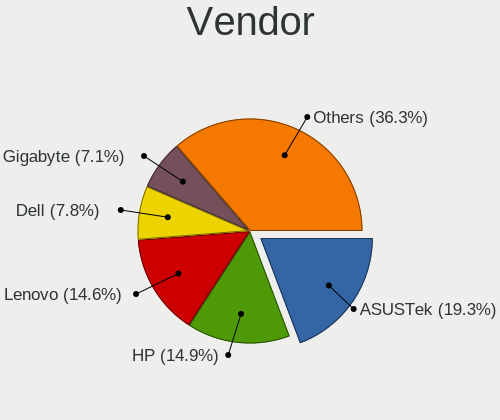

| Name                | Computers | Percent |
|---------------------|-----------|---------|
| Lenovo              | 17        | 18.89%  |
| Hewlett-Packard     | 13        | 14.44%  |
| ASUSTek Computer    | 11        | 12.22%  |
| Gigabyte Technology | 9         | 10%     |
| Dell                | 7         | 7.78%   |
| MSI                 | 5         | 5.56%   |
| Apple               | 4         | 4.44%   |
| Acer                | 4         | 4.44%   |
| HUAWEI              | 3         | 3.33%   |
| Samsung Electronics | 2         | 2.22%   |
| Intel               | 2         | 2.22%   |
| Google              | 2         | 2.22%   |
| AZW                 | 2         | 2.22%   |
| Unknown             | 2         | 2.22%   |
| Seco                | 1         | 1.11%   |
| Medion              | 1         | 1.11%   |
| Foxconn             | 1         | 1.11%   |
| BOSGAME             | 1         | 1.11%   |
| Biostar             | 1         | 1.11%   |
| ASRock              | 1         | 1.11%   |
| Alienware           | 1         | 1.11%   |

Model
-----

Motherboard model

| Name                                               | Computers | Percent |
|----------------------------------------------------|-----------|---------|
| Dell G3 3779                                       | 2         | 2.22%   |
| AZW SER                                            | 2         | 2.22%   |
| ASUS ASUS TUF Gaming F17 FX706LI_FX706LI           | 2         | 2.22%   |
| Unknown                                            | 2         | 2.22%   |
| Seco C40                                           | 1         | 1.11%   |
| Samsung 950XED                                     | 1         | 1.11%   |
| Samsung 950QDB                                     | 1         | 1.11%   |
| MSI Titan GT77HX 13VH                              | 1         | 1.11%   |
| MSI Raider GE67HX 12UGS                            | 1         | 1.11%   |
| MSI MS-7B84                                        | 1         | 1.11%   |
| MSI MS-7693                                        | 1         | 1.11%   |
| MSI Bravo 17 A4DDK                                 | 1         | 1.11%   |
| Medion E11201                                      | 1         | 1.11%   |
| Lenovo Yoga 6 13ALC7 82UD                          | 1         | 1.11%   |
| Lenovo ThinkPad X1 Carbon Gen 11 21HMCTO1WW        | 1         | 1.11%   |
| Lenovo ThinkPad P15s Gen 2i 20W7S0SM01             | 1         | 1.11%   |
| Lenovo ThinkPad P14s Gen 1 20S5S01V00              | 1         | 1.11%   |
| Lenovo ThinkPad P1 Gen 2 20QT000LGE                | 1         | 1.11%   |
| Lenovo ThinkPad E15 Gen 4 21EES00100               | 1         | 1.11%   |
| Lenovo ThinkPad E15 Gen 4 21EDCTO1WW               | 1         | 1.11%   |
| Lenovo ThinkPad E14 Gen 4 21ECS00000               | 1         | 1.11%   |
| Lenovo ThinkPad E14 Gen 3 20YDS02D00               | 1         | 1.11%   |
| Lenovo ThinkBook 14 G4 ABA 21DK                    | 1         | 1.11%   |
| Lenovo Slim 7 ProX 14ARH7 82V2                     | 1         | 1.11%   |
| Lenovo Legion 5 Pro 16ACH6H 82JQ                   | 1         | 1.11%   |
| Lenovo IdeaPad Y700-15ISK 80NV                     | 1         | 1.11%   |
| Lenovo IdeaPad 700-17ISK 80RV                      | 1         | 1.11%   |
| Lenovo IdeaPad 5 Pro 16ARH7 82SN                   | 1         | 1.11%   |
| Lenovo IdeaPad 3 15IAU7 82RK                       | 1         | 1.11%   |
| Lenovo IdeaPad 3 15ALC6 82MF                       | 1         | 1.11%   |
| Intel NUC12WSHi7                                   | 1         | 1.11%   |
| Intel H61                                          | 1         | 1.11%   |
| HUAWEI NBD-WXX9                                    | 1         | 1.11%   |
| HUAWEI HN-WX9X                                     | 1         | 1.11%   |
| HUAWEI BOHB-WAX9                                   | 1         | 1.11%   |
| HP ZBook Studio 15.6 inch G8 Mobile Workstation PC | 1         | 1.11%   |
| HP ProBook 650 G1                                  | 1         | 1.11%   |
| HP ProBook 440 G5                                  | 1         | 1.11%   |
| HP Pavilion Notebook                               | 1         | 1.11%   |
| HP Pavilion Laptop 15-eh1xxx                       | 1         | 1.11%   |

Model Family
------------

Motherboard model prefix

| Name             | Computers | Percent |
|------------------|-----------|---------|
| Lenovo ThinkPad  | 8         | 8.89%   |
| Lenovo IdeaPad   | 5         | 5.56%   |
| HP Pavilion      | 3         | 3.33%   |
| Acer Aspire      | 3         | 3.33%   |
| HP ProBook       | 2         | 2.22%   |
| HP ENVY          | 2         | 2.22%   |
| HP Compaq        | 2         | 2.22%   |
| Gigabyte G5      | 2         | 2.22%   |
| Dell Latitude    | 2         | 2.22%   |
| Dell Inspiron    | 2         | 2.22%   |
| Dell G3          | 2         | 2.22%   |
| AZW SER          | 2         | 2.22%   |
| ASUS ROG         | 2         | 2.22%   |
| ASUS ASUS        | 2         | 2.22%   |
| Unknown          | 2         | 2.22%   |
| Seco C40         | 1         | 1.11%   |
| Samsung 950XED   | 1         | 1.11%   |
| Samsung 950QDB   | 1         | 1.11%   |
| MSI Titan        | 1         | 1.11%   |
| MSI Raider       | 1         | 1.11%   |
| MSI MS-7B84      | 1         | 1.11%   |
| MSI MS-7693      | 1         | 1.11%   |
| MSI Bravo        | 1         | 1.11%   |
| Medion E11201    | 1         | 1.11%   |
| Lenovo Yoga      | 1         | 1.11%   |
| Lenovo ThinkBook | 1         | 1.11%   |
| Lenovo Slim      | 1         | 1.11%   |
| Lenovo Legion    | 1         | 1.11%   |
| Intel NUC12WSHi7 | 1         | 1.11%   |
| Intel H61        | 1         | 1.11%   |
| HUAWEI NBD-WXX9  | 1         | 1.11%   |
| HUAWEI HN-WX9X   | 1         | 1.11%   |
| HUAWEI BOHB-WAX9 | 1         | 1.11%   |
| HP ZBook         | 1         | 1.11%   |
| HP Laptop        | 1         | 1.11%   |
| HP EliteBook     | 1         | 1.11%   |
| HP 870-119       | 1         | 1.11%   |
| Google Lars      | 1         | 1.11%   |
| Google Bluebird  | 1         | 1.11%   |
| Gigabyte X570S   | 1         | 1.11%   |

MFG Year
--------

Motherboard manufacture year

| Year | Computers | Percent |
|------|-----------|---------|
| 2022 | 22        | 24.44%  |
| 2021 | 17        | 18.89%  |
| 2020 | 6         | 6.67%   |
| 2019 | 6         | 6.67%   |
| 2012 | 6         | 6.67%   |
| 2023 | 5         | 5.56%   |
| 2018 | 5         | 5.56%   |
| 2016 | 4         | 4.44%   |
| 2013 | 4         | 4.44%   |
| 2017 | 3         | 3.33%   |
| 2014 | 3         | 3.33%   |
| 2011 | 3         | 3.33%   |
| 2009 | 3         | 3.33%   |
| 2015 | 1         | 1.11%   |
| 2010 | 1         | 1.11%   |
| 2007 | 1         | 1.11%   |

Form Factor
-----------

Physical design of the computer

| Name        | Computers | Percent |
|-------------|-----------|---------|
| Notebook    | 61        | 67.78%  |
| Desktop     | 20        | 22.22%  |
| Convertible | 4         | 4.44%   |
| Mini pc     | 4         | 4.44%   |
| All in one  | 1         | 1.11%   |

Secure Boot
-----------

Enabled or disabled

| State    | Computers | Percent |
|----------|-----------|---------|
| Disabled | 84        | 93.33%  |
| Enabled  | 6         | 6.67%   |

Coreboot
--------

Have coreboot on board

| Used | Computers | Percent |
|------|-----------|---------|
| No   | 88        | 97.78%  |
| Yes  | 2         | 2.22%   |

RAM Size
--------

Total RAM memory

| Size in GB  | Computers | Percent |
|-------------|-----------|---------|
| 8.01-16.0   | 25        | 27.78%  |
| 16.01-24.0  | 20        | 22.22%  |
| 4.01-8.0    | 16        | 17.78%  |
| 32.01-64.0  | 12        | 13.33%  |
| 3.01-4.0    | 9         | 10%     |
| 64.01-256.0 | 5         | 5.56%   |
| 24.01-32.0  | 2         | 2.22%   |
| 2.01-3.0    | 1         | 1.11%   |

RAM Used
--------

Used RAM memory

| Used GB   | Computers | Percent |
|-----------|-----------|---------|
| 4.01-8.0  | 28        | 30.43%  |
| 2.01-3.0  | 23        | 25%     |
| 1.01-2.0  | 18        | 19.57%  |
| 3.01-4.0  | 17        | 18.48%  |
| 8.01-16.0 | 6         | 6.52%   |

Total Drives
------------

Number of drives on board

| Drives | Computers | Percent |
|--------|-----------|---------|
| 1      | 58        | 63.04%  |
| 2      | 24        | 26.09%  |
| 3      | 8         | 8.7%    |
| 4      | 2         | 2.17%   |

Has CD-ROM
----------

Has CD-ROM on board

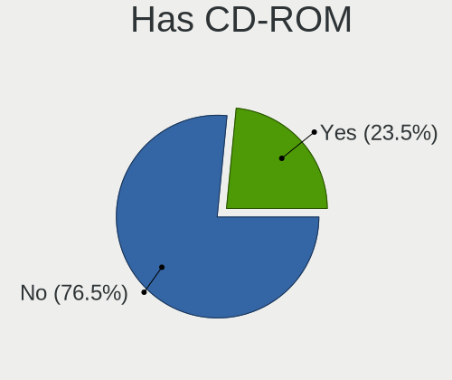

| Presented | Computers | Percent |
|-----------|-----------|---------|
| No        | 74        | 81.32%  |
| Yes       | 17        | 18.68%  |

Has Ethernet
------------

Has Ethernet on board

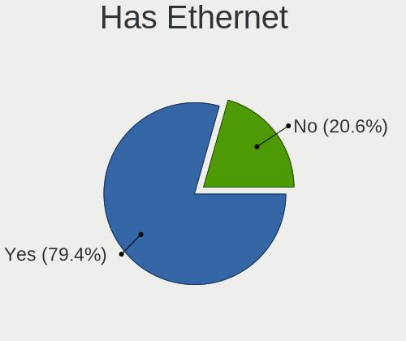

| Presented | Computers | Percent |
|-----------|-----------|---------|
| Yes       | 69        | 75.82%  |
| No        | 22        | 24.18%  |

Has WiFi
--------

Has WiFi module

| Presented | Computers | Percent |
|-----------|-----------|---------|
| Yes       | 80        | 88.89%  |
| No        | 10        | 11.11%  |

Has Bluetooth
-------------

Has Bluetooth module

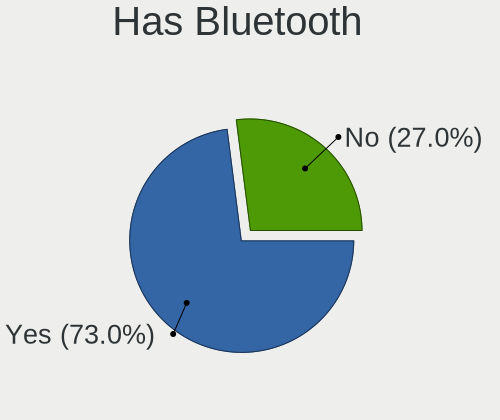

| Presented | Computers | Percent |
|-----------|-----------|---------|
| Yes       | 68        | 75.56%  |
| No        | 22        | 24.44%  |

Location
--------

Country
-------

Geographic location (country)

| Country      | Computers | Percent |
|--------------|-----------|---------|
| USA          | 18        | 20%     |
| Germany      | 15        | 16.67%  |
| UK           | 5         | 5.56%   |
| Poland       | 5         | 5.56%   |
| Belgium      | 4         | 4.44%   |
| Russia       | 3         | 3.33%   |
| Italy        | 3         | 3.33%   |
| India        | 3         | 3.33%   |
| France       | 3         | 3.33%   |
| Turkey       | 2         | 2.22%   |
| Spain        | 2         | 2.22%   |
| Portugal     | 2         | 2.22%   |
| New Zealand  | 2         | 2.22%   |
| Netherlands  | 2         | 2.22%   |
| Mexico       | 2         | 2.22%   |
| Costa Rica   | 2         | 2.22%   |
| Canada       | 2         | 2.22%   |
| Brazil       | 2         | 2.22%   |
| Taiwan       | 1         | 1.11%   |
| Sweden       | 1         | 1.11%   |
| Serbia       | 1         | 1.11%   |
| Saudi Arabia | 1         | 1.11%   |
| Lithuania    | 1         | 1.11%   |
| Israel       | 1         | 1.11%   |
| Indonesia    | 1         | 1.11%   |
| Hungary      | 1         | 1.11%   |
| Colombia     | 1         | 1.11%   |
| Chile        | 1         | 1.11%   |
| Australia    | 1         | 1.11%   |
| Armenia      | 1         | 1.11%   |
| Argentina    | 1         | 1.11%   |

City
----

Geographic location (city)

| City                    | Computers | Percent |
|-------------------------|-----------|---------|
| Munich                  | 2         | 2.22%   |
| London                  | 2         | 2.22%   |
| Hamburg                 | 2         | 2.22%   |
| Grecia                  | 2         | 2.22%   |
| Brussels                | 2         | 2.22%   |
| Berlin                  | 2         | 2.22%   |
| Yerevan                 | 1         | 1.11%   |
| West Des Moines         | 1         | 1.11%   |
| Weilmuenster            | 1         | 1.11%   |
| Warsaw                  | 1         | 1.11%   |
| Waldorf                 | 1         | 1.11%   |
| Waianae                 | 1         | 1.11%   |
| Vsevolozhsk             | 1         | 1.11%   |
| Viña del Mar           | 1         | 1.11%   |
| Vilnius                 | 1         | 1.11%   |
| Villa Dominico          | 1         | 1.11%   |
| Theydon Bois            | 1         | 1.11%   |
| Taichung                | 1         | 1.11%   |
| Szczecin                | 1         | 1.11%   |
| Sydney                  | 1         | 1.11%   |
| Sumter                  | 1         | 1.11%   |
| Stavropol               | 1         | 1.11%   |
| Sherbrooke              | 1         | 1.11%   |
| Salt Lake City          | 1         | 1.11%   |
| Saint-Georges-sur-Meuse | 1         | 1.11%   |
| Saarbrücken            | 1         | 1.11%   |
| Rzeszów                | 1         | 1.11%   |
| Roubaix                 | 1         | 1.11%   |
| Rewal                   | 1         | 1.11%   |
| Remeteszolos            | 1         | 1.11%   |
| Raleigh                 | 1         | 1.11%   |
| Poznan                  | 1         | 1.11%   |
| Porto Alegre            | 1         | 1.11%   |
| Portimao                | 1         | 1.11%   |
| Phoenix                 | 1         | 1.11%   |
| Philadelphia            | 1         | 1.11%   |
| Paris                   | 1         | 1.11%   |
| Oldenburg               | 1         | 1.11%   |
| Olathe                  | 1         | 1.11%   |
| Oberursel               | 1         | 1.11%   |

Drives
------

Drive Vendor
------------

Hard drive vendors

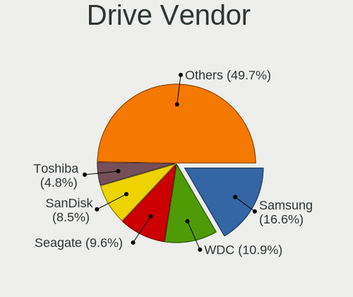

| Vendor                    | Computers | Drives | Percent |
|---------------------------|-----------|--------|---------|
| Samsung Electronics       | 21        | 30     | 16.94%  |
| WDC                       | 13        | 17     | 10.48%  |
| Seagate                   | 11        | 15     | 8.87%   |
| SanDisk                   | 9         | 9      | 7.26%   |
| Micron Technology         | 8         | 8      | 6.45%   |
| SK hynix                  | 7         | 7      | 5.65%   |
| Kingston                  | 7         | 9      | 5.65%   |
| Intel                     | 5         | 6      | 4.03%   |
| Crucial                   | 5         | 5      | 4.03%   |
| Unknown                   | 4         | 4      | 3.23%   |
| Toshiba                   | 4         | 4      | 3.23%   |
| Phison Electronics        | 4         | 4      | 3.23%   |
| UMIS                      | 2         | 3      | 1.61%   |
| Silicon Motion            | 2         | 2      | 1.61%   |
| Patriot                   | 2         | 2      | 1.61%   |
| Micron/Crucial Technology | 2         | 2      | 1.61%   |
| Hitachi                   | 2         | 2      | 1.61%   |
| A-DATA Technology         | 2         | 2      | 1.61%   |
| WALRAM                    | 1         | 1      | 0.81%   |
| Union Memory (Shenzhen)   | 1         | 1      | 0.81%   |
| SSSTC                     | 1         | 1      | 0.81%   |
| SSDPR-CX                  | 1         | 1      | 0.81%   |
| Solid State Storage       | 1         | 1      | 0.81%   |
| PNY                       | 1         | 1      | 0.81%   |
| Phison                    | 1         | 1      | 0.81%   |
| Lexar                     | 1         | 1      | 0.81%   |
| Lenovo                    | 1         | 1      | 0.81%   |
| JMicron Technology        | 1         | 1      | 0.81%   |
| Hoodisk                   | 1         | 1      | 0.81%   |
| CT2000BX                  | 1         | 1      | 0.81%   |
| China                     | 1         | 1      | 0.81%   |
| Unknown                   | 1         | 1      | 0.81%   |

Drive Model
-----------

Hard drive models

| Model                                              | Computers | Percent |
|----------------------------------------------------|-----------|---------|
| Samsung NVMe SSD Controller PM9A1/PM9A3/980PRO 1TB | 3         | 2.22%   |
| Phison E16 PCIe4 NVMe Controller 1TB               | 3         | 2.22%   |
| WDC WD5000AAKX-60U6AA0 500GB                       | 2         | 1.48%   |
| Unknown MMC Card  32GB                             | 2         | 1.48%   |
| UMIS RPJTJ512MGE1QDQ 512GB                         | 2         | 1.48%   |
| Seagate ST4000DM004-2CV104 4TB                     | 2         | 1.48%   |
| Seagate ST2000DM001-1ER164 2TB                     | 2         | 1.48%   |
| SanDisk NVMe SSD Drive 2TB                         | 2         | 1.48%   |
| Samsung SSD 980 PRO 2TB                            | 2         | 1.48%   |
| Samsung MZVL21T0HCLR-00B00 1TB                     | 2         | 1.48%   |
| Kingston SA400S37480G 480GB SSD                    | 2         | 1.48%   |
| Kingston SA400S37120G 120GB SSD                    | 2         | 1.48%   |
| Intel SSD 660P Series 512GB                        | 2         | 1.48%   |
| WDC WDS200T2B0B-00YS70 2TB SSD                     | 1         | 0.74%   |
| WDC WDS200T2B0A-00SM50 2TB SSD                     | 1         | 0.74%   |
| WDC WDBNCE5000PNC 500GB SSD                        | 1         | 0.74%   |
| WDC WD5000AAKS-40V2B0 500GB                        | 1         | 0.74%   |
| WDC WD20EARX-00PASB0 2TB                           | 1         | 0.74%   |
| WDC WD16 00AVBB-63SYA0 160GB                       | 1         | 0.74%   |
| WDC WD10SPZX-24Z10 1TB                             | 1         | 0.74%   |
| WDC WD10EZEX-08M2NA0 1TB                           | 1         | 0.74%   |
| WDC WD10EFRX-68JCSN0 1TB                           | 1         | 0.74%   |
| WDC WD10EAVS-32D7B1 1TB                            | 1         | 0.74%   |
| WDC WD10 JPVX-00JC3T0 1TB                          | 1         | 0.74%   |
| WDC WD Green 2.5 1000GB SSD                        | 1         | 0.74%   |
| WDC PC SN530 SDBPNPZ-512G-1006 512GB               | 1         | 0.74%   |
| WALRAM 240G                                        | 1         | 0.74%   |
| Unknown SD/MMC/MS PRO 64GB                         | 1         | 0.74%   |
| Unknown Biwin  64GB                                | 1         | 0.74%   |
| Union Memory (Shenzhen) RPFTJ256PDD2MWX 256GB      | 1         | 0.74%   |
| Toshiba XG6 NVMe SSD Controller 256GB              | 1         | 0.74%   |
| Toshiba MQ02ABF100 1TB                             | 1         | 0.74%   |
| Toshiba MQ01ACF050 500GB                           | 1         | 0.74%   |
| Toshiba KXG60ZNV512G 512GB                         | 1         | 0.74%   |
| SSSTC CL4-4D512-Q79 512GB                          | 1         | 0.74%   |
| SSDPR-CX 400-256-G2 256GB                          | 1         | 0.74%   |
| Solid State Storage SSSTC CL1-4D256 256GB          | 1         | 0.74%   |
| SK hynix SKHynix_HFS512GDE9X081N 512GB             | 1         | 0.74%   |
| SK hynix SKHynix_HFS001TDE9X084N 1024GB            | 1         | 0.74%   |
| SK hynix SKHynix_HFM256GD3HX015N 256GB             | 1         | 0.74%   |

HDD Vendor
----------

Hard disk drive vendors

| Vendor  | Computers | Drives | Percent |
|---------|-----------|--------|---------|
| Seagate | 11        | 15     | 44%     |
| WDC     | 9         | 11     | 36%     |
| Toshiba | 2         | 2      | 8%      |
| Hitachi | 2         | 2      | 8%      |
| Unknown | 1         | 1      | 4%      |

SSD Vendor
----------

Solid state drive vendors

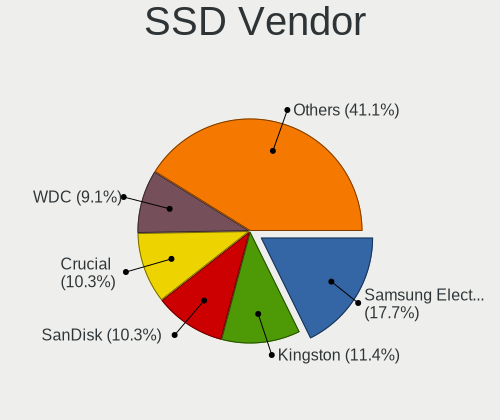

| Vendor              | Computers | Drives | Percent |
|---------------------|-----------|--------|---------|
| Kingston            | 5         | 7      | 14.71%  |
| WDC                 | 4         | 5      | 11.76%  |
| Crucial             | 4         | 4      | 11.76%  |
| SanDisk             | 3         | 3      | 8.82%   |
| Samsung Electronics | 3         | 5      | 8.82%   |
| Micron Technology   | 3         | 3      | 8.82%   |
| Patriot             | 2         | 2      | 5.88%   |
| Intel               | 2         | 3      | 5.88%   |
| SK hynix            | 1         | 1      | 2.94%   |
| PNY                 | 1         | 1      | 2.94%   |
| Lenovo              | 1         | 1      | 2.94%   |
| JMicron Technology  | 1         | 1      | 2.94%   |
| Hoodisk             | 1         | 1      | 2.94%   |
| CT2000BX            | 1         | 1      | 2.94%   |
| China               | 1         | 1      | 2.94%   |
| A-DATA Technology   | 1         | 1      | 2.94%   |

Drive Kind
----------

HDD or SSD

| Kind    | Computers | Drives | Percent |
|---------|-----------|--------|---------|
| NVMe    | 54        | 68     | 47.79%  |
| SSD     | 31        | 40     | 27.43%  |
| HDD     | 22        | 31     | 19.47%  |
| MMC     | 3         | 3      | 2.65%   |
| Unknown | 3         | 3      | 2.65%   |

Drive Connector
---------------

SATA, SAS, NVMe, etc.

| Type | Computers | Drives | Percent |
|------|-----------|--------|---------|
| NVMe | 54        | 68     | 50.47%  |
| SATA | 44        | 68     | 41.12%  |
| SAS  | 6         | 6      | 5.61%   |
| MMC  | 3         | 3      | 2.8%    |

Drive Size
----------

Size of hard drive

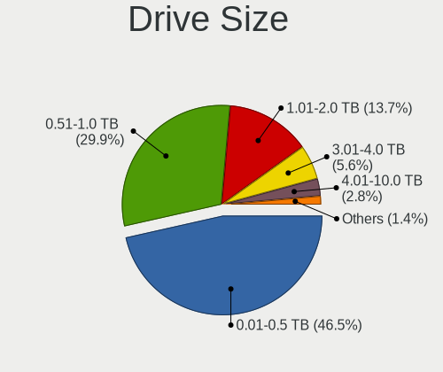

| Size in TB | Computers | Drives | Percent |
|------------|-----------|--------|---------|
| 0.01-0.5   | 30        | 39     | 53.57%  |
| 0.51-1.0   | 14        | 18     | 25%     |
| 1.01-2.0   | 10        | 12     | 17.86%  |
| 3.01-4.0   | 2         | 2      | 3.57%   |

Space Total
-----------

Amount of disk space available on the file system

| Size in GB     | Computers | Percent |
|----------------|-----------|---------|
| 101-250        | 23        | 25.27%  |
| 501-1000       | 18        | 19.78%  |
| 251-500        | 16        | 17.58%  |
| 1001-2000      | 12        | 13.19%  |
| More than 3000 | 8         | 8.79%   |
| 2001-3000      | 4         | 4.4%    |
| 1-20           | 4         | 4.4%    |
| 21-50          | 3         | 3.3%    |
| 51-100         | 3         | 3.3%    |

Space Used
----------

Amount of used disk space

| Used GB        | Computers | Percent |
|----------------|-----------|---------|
| 21-50          | 21        | 22.58%  |
| 1-20           | 19        | 20.43%  |
| 101-250        | 13        | 13.98%  |
| 251-500        | 12        | 12.9%   |
| 51-100         | 12        | 12.9%   |
| 1001-2000      | 8         | 8.6%    |
| 501-1000       | 5         | 5.38%   |
| More than 3000 | 3         | 3.23%   |

Malfunc. Drives
---------------

Drive models with a malfunction

| Model                                 | Computers | Drives | Percent |
|---------------------------------------|-----------|--------|---------|
| SK hynix HFS256G32MND-2900A 256GB SSD | 1         | 1      | 100%    |

Malfunc. Drive Vendor
---------------------

Vendors of faulty drives

| Vendor   | Computers | Drives | Percent |
|----------|-----------|--------|---------|
| SK hynix | 1         | 1      | 100%    |

Malfunc. HDD Vendor
-------------------

Vendors of faulty HDD drives

Zero info for selected period =(

Malfunc. Drive Kind
-------------------

Kinds of faulty drives

| Kind | Computers | Drives | Percent |
|------|-----------|--------|---------|
| SSD  | 1         | 1      | 100%    |

Failed Drives
-------------

Failed drive models

Zero info for selected period =(

Failed Drive Vendor
-------------------

Failed drive vendors

Zero info for selected period =(

Drive Status
------------

Number of failed and malfunc. drives

| Status   | Computers | Drives | Percent |
|----------|-----------|--------|---------|
| Detected | 58        | 98     | 62.37%  |
| Works    | 34        | 46     | 36.56%  |
| Malfunc  | 1         | 1      | 1.08%   |

Storage controller
------------------

Storage Vendor
--------------

Storage controller vendors

| Vendor                         | Computers | Percent |
|--------------------------------|-----------|---------|
| Intel                          | 42        | 34.43%  |
| AMD                            | 20        | 16.39%  |
| Samsung Electronics            | 19        | 15.57%  |
| SanDisk                        | 7         | 5.74%   |
| SK hynix                       | 6         | 4.92%   |
| Phison Electronics             | 5         | 4.1%    |
| Micron Technology              | 5         | 4.1%    |
| Union Memory (Shenzhen)        | 3         | 2.46%   |
| Micron/Crucial Technology      | 3         | 2.46%   |
| Toshiba America Info Systems   | 2         | 1.64%   |
| Solid State Storage Technology | 2         | 1.64%   |
| Silicon Motion                 | 2         | 1.64%   |
| Kingston Technology Company    | 2         | 1.64%   |
| Silicon Image                  | 1         | 0.82%   |
| Shenzhen Longsys Electronics   | 1         | 0.82%   |
| Nvidia                         | 1         | 0.82%   |
| ADATA Technology               | 1         | 0.82%   |

Storage Model
-------------

Storage controller models

| Model                                                                          | Computers | Percent |
|--------------------------------------------------------------------------------|-----------|---------|
| AMD FCH SATA Controller [AHCI mode]                                            | 15        | 11.54%  |
| Samsung NVMe SSD Controller PM9A1/PM9A3/980PRO                                 | 8         | 6.15%   |
| Samsung NVMe SSD Controller 980                                                | 6         | 4.62%   |
| SK hynix Gold P31/PC711 NVMe Solid State Drive                                 | 5         | 3.85%   |
| Micron NVMe Storage Controller                                                 | 5         | 3.85%   |
| Intel 7 Series Chipset Family 6-port SATA Controller [AHCI mode]               | 5         | 3.85%   |
| Samsung NVMe SSD Controller SM981/PM981/PM983                                  | 4         | 3.08%   |
| Intel 8 Series/C220 Series Chipset Family 6-port SATA Controller 1 [AHCI mode] | 4         | 3.08%   |
| Phison E16 PCIe4 NVMe Controller                                               | 3         | 2.31%   |
| Intel Sunrise Point-LP SATA Controller [AHCI mode]                             | 3         | 2.31%   |
| Intel Alder Lake-P SATA AHCI Controller                                        | 3         | 2.31%   |
| Union Memory (Shenzhen) AM630 PCIe 4.0 x4 NVMe SSD Controller                  | 2         | 1.54%   |
| Toshiba America Info Systems XG6 NVMe SSD Controller                           | 2         | 1.54%   |
| Solid State Storage Non-Volatile memory controller                             | 2         | 1.54%   |
| SanDisk WD Blue SN570 NVMe SSD 1TB                                             | 2         | 1.54%   |
| SanDisk Non-Volatile memory controller                                         | 2         | 1.54%   |
| Micron/Crucial P2 NVMe PCIe SSD                                                | 2         | 1.54%   |
| Intel Volume Management Device NVMe RAID Controller                            | 2         | 1.54%   |
| Intel SSD 660P Series                                                          | 2         | 1.54%   |
| Intel SATA Controller [RAID mode]                                              | 2         | 1.54%   |
| Intel Q170/Q150/B150/H170/H110/Z170/CM236 Chipset SATA Controller [AHCI Mode]  | 2         | 1.54%   |
| Intel HM170/QM170 Chipset SATA Controller [AHCI Mode]                          | 2         | 1.54%   |
| Intel Comet Lake SATA AHCI Controller                                          | 2         | 1.54%   |
| Intel Cannon Lake Mobile PCH SATA AHCI Controller                              | 2         | 1.54%   |
| Intel 6 Series/C200 Series Chipset Family 6 port Desktop SATA AHCI Controller  | 2         | 1.54%   |
| Intel 400 Series Chipset Family SATA AHCI Controller                           | 2         | 1.54%   |
| AMD SB7x0/SB8x0/SB9x0 SATA Controller [AHCI mode]                              | 2         | 1.54%   |
| AMD SB7x0/SB8x0/SB9x0 IDE Controller                                           | 2         | 1.54%   |
| Union Memory (Shenzhen) Non-Volatile memory controller                         | 1         | 0.77%   |
| SK hynix BC501 NVMe Solid State Drive                                          | 1         | 0.77%   |
| Silicon Motion SM2262/SM2262EN SSD Controller                                  | 1         | 0.77%   |
| Silicon Motion Non-Volatile memory controller                                  | 1         | 0.77%   |
| Silicon Image SiI 3132 Serial ATA Raid II Controller                           | 1         | 0.77%   |
| Shenzhen Longsys Non-Volatile memory controller                                | 1         | 0.77%   |
| SanDisk WD PC SN810 / Black SN850 NVMe SSD                                     | 1         | 0.77%   |
| SanDisk WD Blue SN550 NVMe SSD                                                 | 1         | 0.77%   |
| SanDisk WD Black SN750 / PC SN730 NVMe SSD                                     | 1         | 0.77%   |
| Samsung NVMe SSD Controller SM961/PM961/SM963                                  | 1         | 0.77%   |
| Samsung NVMe SSD Controller PM9B1                                              | 1         | 0.77%   |
| Phison PS5013 E13 NVMe Controller                                              | 1         | 0.77%   |

Storage Kind
------------

Kind of storage controller (IDE, SATA, NVMe, SAS, ...)

| Kind | Computers | Percent |
|------|-----------|---------|
| SATA | 58        | 48.33%  |
| NVMe | 54        | 45%     |
| RAID | 5         | 4.17%   |
| IDE  | 3         | 2.5%    |

Processor
---------

CPU Vendor
----------

Processor vendors

| Vendor | Computers | Percent |
|--------|-----------|---------|
| Intel  | 56        | 62.22%  |
| AMD    | 34        | 37.78%  |

CPU Model
---------

Processor models

| Model                                       | Computers | Percent |
|---------------------------------------------|-----------|---------|
| AMD Ryzen 5 5500U with Radeon Graphics      | 6         | 6.67%   |
| Intel 12th Gen Core i7-1260P                | 3         | 3.33%   |
| AMD Ryzen 7 5825U with Radeon Graphics      | 3         | 3.33%   |
| Intel Core i7-6700HQ CPU @ 2.60GHz          | 2         | 2.22%   |
| Intel Core i5-10300H CPU @ 2.50GHz          | 2         | 2.22%   |
| Intel 11th Gen Core i7-1165G7 @ 2.80GHz     | 2         | 2.22%   |
| AMD Ryzen 7 6800H with Radeon Graphics      | 2         | 2.22%   |
| AMD Ryzen 7 4700U with Radeon Graphics      | 2         | 2.22%   |
| AMD Ryzen 5 5600U with Radeon Graphics      | 2         | 2.22%   |
| Intel Xeon CPU E3-1240 v3 @ 3.40GHz         | 1         | 1.11%   |
| Intel Pentium Dual-Core CPU T4400 @ 2.20GHz | 1         | 1.11%   |
| Intel Pentium CPU G3220 @ 3.00GHz           | 1         | 1.11%   |
| Intel Pentium CPU 6405U @ 2.40GHz           | 1         | 1.11%   |
| Intel N95                                   | 1         | 1.11%   |
| Intel Core i7-9750H CPU @ 2.60GHz           | 1         | 1.11%   |
| Intel Core i7-8750H CPU @ 2.20GHz           | 1         | 1.11%   |
| Intel Core i7-8700 CPU @ 3.20GHz            | 1         | 1.11%   |
| Intel Core i7-7820HQ CPU @ 2.90GHz          | 1         | 1.11%   |
| Intel Core i7-6700 CPU @ 3.40GHz            | 1         | 1.11%   |
| Intel Core i7-5820K CPU @ 3.30GHz           | 1         | 1.11%   |
| Intel Core i7-4702MQ CPU @ 2.20GHz          | 1         | 1.11%   |
| Intel Core i7-3770 CPU @ 3.40GHz            | 1         | 1.11%   |
| Intel Core i7-3615QM CPU @ 2.30GHz          | 1         | 1.11%   |
| Intel Core i7-3537U CPU @ 2.00GHz           | 1         | 1.11%   |
| Intel Core i7-2640M CPU @ 2.80GHz           | 1         | 1.11%   |
| Intel Core i7-10610U CPU @ 1.80GHz          | 1         | 1.11%   |
| Intel Core i7 CPU 920 @ 2.67GHz             | 1         | 1.11%   |
| Intel Core i5-9600KF CPU @ 3.70GHz          | 1         | 1.11%   |
| Intel Core i5-8300H CPU @ 2.30GHz           | 1         | 1.11%   |
| Intel Core i5-7200U CPU @ 2.50GHz           | 1         | 1.11%   |
| Intel Core i5-6300HQ CPU @ 2.30GHz          | 1         | 1.11%   |
| Intel Core i5-6200U CPU @ 2.30GHz           | 1         | 1.11%   |
| Intel Core i5-4310M CPU @ 2.70GHz           | 1         | 1.11%   |
| Intel Core i5-3340M CPU @ 2.70GHz           | 1         | 1.11%   |
| Intel Core i5-3317U CPU @ 1.70GHz           | 1         | 1.11%   |
| Intel Core i5-2500K CPU @ 3.30GHz           | 1         | 1.11%   |
| Intel Core i5-2400 CPU @ 3.10GHz            | 1         | 1.11%   |
| Intel Core i5-10210U CPU @ 1.60GHz          | 1         | 1.11%   |
| Intel Core i3-6157U CPU @ 2.40GHz           | 1         | 1.11%   |
| Intel Core 2 Duo CPU T7700 @ 2.40GHz        | 1         | 1.11%   |

CPU Model Family
----------------

Processor model prefix

| Model                   | Computers | Percent |
|-------------------------|-----------|---------|
| Other                   | 16        | 17.78%  |
| Intel Core i7           | 15        | 16.67%  |
| Intel Core i5           | 13        | 14.44%  |
| AMD Ryzen 7             | 12        | 13.33%  |
| AMD Ryzen 5             | 12        | 13.33%  |
| Intel Celeron           | 5         | 5.56%   |
| AMD Ryzen 9             | 4         | 4.44%   |
| Intel Pentium           | 2         | 2.22%   |
| Intel Core 2 Duo        | 2         | 2.22%   |
| AMD FX                  | 2         | 2.22%   |
| Intel Xeon              | 1         | 1.11%   |
| Intel Pentium Dual-Core | 1         | 1.11%   |
| Intel Core i3           | 1         | 1.11%   |
| AMD Ryzen Embedded      | 1         | 1.11%   |
| AMD Athlon II X3        | 1         | 1.11%   |
| AMD Athlon              | 1         | 1.11%   |
| AMD A4                  | 1         | 1.11%   |

CPU Cores
---------

Number of processor cores

| Number | Computers | Percent |
|--------|-----------|---------|
| 4      | 28        | 31.11%  |
| 8      | 17        | 18.89%  |
| 6      | 17        | 18.89%  |
| 2      | 17        | 18.89%  |
| 12     | 5         | 5.56%   |
| 10     | 2         | 2.22%   |
| 3      | 2         | 2.22%   |
| 24     | 1         | 1.11%   |
| 16     | 1         | 1.11%   |

CPU Sockets
-----------

Number of sockets

| Number | Computers | Percent |
|--------|-----------|---------|
| 1      | 90        | 100%    |

CPU Threads
-----------

Threads per core (Hyper-Threading)

| Number | Computers | Percent |
|--------|-----------|---------|
| 2      | 69        | 76.67%  |
| 1      | 21        | 23.33%  |

CPU Op-Modes
------------

CPU Operation Modes (32-bit, 64-bit)

| Op mode        | Computers | Percent |
|----------------|-----------|---------|
| 32-bit, 64-bit | 90        | 100%    |

CPU Microcode
-------------

Microcode number

| Number     | Computers | Percent |
|------------|-----------|---------|
| Unknown    | 69        | 75%     |
| 0x0a50000c | 5         | 5.43%   |
| 0x0a404102 | 4         | 4.35%   |
| 0x0a20120a | 2         | 2.17%   |
| 0x08608103 | 2         | 2.17%   |
| 0x08600104 | 2         | 2.17%   |
| 0x906a3    | 1         | 1.09%   |
| 0x90672    | 1         | 1.09%   |
| 0x0a404101 | 1         | 1.09%   |
| 0x08108109 | 1         | 1.09%   |
| 0x0810100b | 1         | 1.09%   |
| 0x0800820d | 1         | 1.09%   |
| 0x0700010f | 1         | 1.09%   |
| 0x06000852 | 1         | 1.09%   |

CPU Microarch
-------------

Microarchitecture

| Name             | Computers | Percent |
|------------------|-----------|---------|
| Unknown          | 19        | 21.11%  |
| Zen 3            | 11        | 12.22%  |
| KabyLake         | 10        | 11.11%  |
| Skylake          | 7         | 7.78%   |
| IvyBridge        | 5         | 5.56%   |
| Haswell          | 5         | 5.56%   |
| Alderlake Hybrid | 5         | 5.56%   |
| TigerLake        | 4         | 4.44%   |
| SandyBridge      | 4         | 4.44%   |
| Zen 2            | 3         | 3.33%   |
| Zen+             | 2         | 2.22%   |
| Piledriver       | 2         | 2.22%   |
| Penryn           | 2         | 2.22%   |
| CometLake        | 2         | 2.22%   |
| Zen              | 1         | 1.11%   |
| Tremont          | 1         | 1.11%   |
| Puma             | 1         | 1.11%   |
| Nehalem          | 1         | 1.11%   |
| K10              | 1         | 1.11%   |
| Jaguar           | 1         | 1.11%   |
| Goldmont plus    | 1         | 1.11%   |
| Goldmont         | 1         | 1.11%   |
| Core             | 1         | 1.11%   |

Graphics
--------

GPU Vendor
----------

Vendors of graphics cards

| Vendor | Computers | Percent |
|--------|-----------|---------|
| Intel  | 49        | 41.88%  |
| Nvidia | 34        | 29.06%  |
| AMD    | 34        | 29.06%  |

GPU Model
---------

Graphics card models

| Model                                                                     | Computers | Percent |
|---------------------------------------------------------------------------|-----------|---------|
| AMD Rembrandt [Radeon 680M]                                               | 6         | 5.08%   |
| AMD Lucienne                                                              | 6         | 5.08%   |
| Intel Alder Lake-P Integrated Graphics Controller                         | 4         | 3.39%   |
| Intel 3rd Gen Core processor Graphics Controller                          | 4         | 3.39%   |
| Intel 2nd Generation Core Processor Family Integrated Graphics Controller | 4         | 3.39%   |
| AMD Cezanne [Radeon Vega Series / Radeon Vega Mobile Series]              | 4         | 3.39%   |
| AMD Barcelo                                                               | 4         | 3.39%   |
| Nvidia GA107M [GeForce RTX 3050 Mobile]                                   | 3         | 2.54%   |
| Intel TigerLake-LP GT2 [Iris Xe Graphics]                                 | 3         | 2.54%   |
| Intel TigerLake-H GT1 [UHD Graphics]                                      | 3         | 2.54%   |
| Intel HD Graphics 530                                                     | 3         | 2.54%   |
| Intel CoffeeLake-H GT2 [UHD Graphics 630]                                 | 3         | 2.54%   |
| AMD Renoir                                                                | 3         | 2.54%   |
| Nvidia TU117M [GeForce GTX 1650 Ti Mobile]                                | 2         | 1.69%   |
| Nvidia GP106 [GeForce GTX 1060 6GB]                                       | 2         | 1.69%   |
| Nvidia GA104M [GeForce RTX 3070 Mobile / Max-Q]                           | 2         | 1.69%   |
| Nvidia GA104 [Geforce RTX 3070 Ti Laptop GPU]                             | 2         | 1.69%   |
| Intel CometLake-U GT2 [UHD Graphics]                                      | 2         | 1.69%   |
| Intel CometLake-H GT2 [UHD Graphics]                                      | 2         | 1.69%   |
| Intel 4th Gen Core Processor Integrated Graphics Controller               | 2         | 1.69%   |
| AMD Navi 22 [Radeon RX 6700/6700 XT/6750 XT / 6800M/6850M XT]             | 2         | 1.69%   |
| Nvidia TU117GLM [Quadro T500 Mobile]                                      | 1         | 0.85%   |
| Nvidia TU117GLM [Quadro T1000 Mobile]                                     | 1         | 0.85%   |
| Nvidia TU106 [GeForce RTX 2070]                                           | 1         | 0.85%   |
| Nvidia TU104 [GeForce RTX 2070 SUPER]                                     | 1         | 0.85%   |
| Nvidia MCP7A [GeForce 9400]                                               | 1         | 0.85%   |
| Nvidia GT218 [GeForce G210]                                               | 1         | 0.85%   |
| Nvidia GP108GLM [Quadro P520]                                             | 1         | 0.85%   |
| Nvidia GP108 [GeForce GT 1030]                                            | 1         | 0.85%   |
| Nvidia GP107M [GeForce GTX 1050 Ti Mobile]                                | 1         | 0.85%   |
| Nvidia GP107M [GeForce GTX 1050 Mobile]                                   | 1         | 0.85%   |
| Nvidia GM206 [GeForce GTX 960]                                            | 1         | 0.85%   |
| Nvidia GM107M [GeForce GTX 960M]                                          | 1         | 0.85%   |
| Nvidia GM107M [GeForce GTX 950M]                                          | 1         | 0.85%   |
| Nvidia GM107GLM [Quadro M1200 Mobile]                                     | 1         | 0.85%   |
| Nvidia GK107M [GeForce GT 750M]                                           | 1         | 0.85%   |
| Nvidia GK107M [GeForce GT 650M Mac Edition]                               | 1         | 0.85%   |
| Nvidia GF116 [GeForce GTX 550 Ti]                                         | 1         | 0.85%   |
| Nvidia GA107M [GeForce RTX 3050 Ti Mobile]                                | 1         | 0.85%   |
| Nvidia GA107GLM [RTX A2000 Mobile]                                        | 1         | 0.85%   |

GPU Combo
---------

Combinations of graphics cards

| Name           | Computers | Percent |
|----------------|-----------|---------|
| 1 x Intel      | 28        | 31.11%  |
| 1 x AMD        | 26        | 28.89%  |
| Intel + Nvidia | 18        | 20%     |
| 1 x Nvidia     | 9         | 10%     |
| AMD + Nvidia   | 6         | 6.67%   |
| Other          | 1         | 1.11%   |
| 2 x AMD        | 1         | 1.11%   |
| Intel + AMD    | 1         | 1.11%   |

GPU Driver
----------

Free vs proprietary

| Driver      | Computers | Percent |
|-------------|-----------|---------|
| Free        | 63        | 69.23%  |
| Proprietary | 27        | 29.67%  |
| Unknown     | 1         | 1.1%    |

GPU Memory
----------

Total video memory

| Size in GB | Computers | Percent |
|------------|-----------|---------|
| Unknown    | 57        | 62.64%  |
| 3.01-4.0   | 9         | 9.89%   |
| 1.01-2.0   | 8         | 8.79%   |
| 0.01-0.5   | 5         | 5.49%   |
| 0.51-1.0   | 4         | 4.4%    |
| 7.01-8.0   | 3         | 3.3%    |
| 5.01-6.0   | 2         | 2.2%    |
| 8.01-16.0  | 2         | 2.2%    |
| 2.01-3.0   | 1         | 1.1%    |

Monitor
-------

Monitor Vendor
--------------

Monitor vendors

| Vendor                  | Computers | Percent |
|-------------------------|-----------|---------|
| BOE                     | 15        | 15%     |
| AU Optronics            | 15        | 15%     |
| Samsung Electronics     | 14        | 14%     |
| Chimei Innolux          | 9         | 9%      |
| Goldstar                | 5         | 5%      |
| LG Display              | 4         | 4%      |
| Dell                    | 4         | 4%      |
| Apple                   | 4         | 4%      |
| Philips                 | 3         | 3%      |
| Sharp                   | 2         | 2%      |
| PANDA                   | 2         | 2%      |
| Lenovo                  | 2         | 2%      |
| InfoVision              | 2         | 2%      |
| Iiyama                  | 2         | 2%      |
| VIZ                     | 1         | 1%      |
| UGD                     | 1         | 1%      |
| Sceptre Tech            | 1         | 1%      |
| Panasonic               | 1         | 1%      |
| ONN                     | 1         | 1%      |
| Medion Akoya            | 1         | 1%      |
| LOE                     | 1         | 1%      |
| KDC                     | 1         | 1%      |
| KDB                     | 1         | 1%      |
| INS                     | 1         | 1%      |
| Denver                  | 1         | 1%      |
| CSO                     | 1         | 1%      |
| Chi Mei Optoelectronics | 1         | 1%      |
| BenQ                    | 1         | 1%      |
| ASUSTek Computer        | 1         | 1%      |
| Ancor Communications    | 1         | 1%      |
| Acer                    | 1         | 1%      |

Monitor Model
-------------

Monitor models

| Model                                                                 | Computers | Percent |
|-----------------------------------------------------------------------|-----------|---------|
| AU Optronics LCD Monitor AUOE48D 1920x1080 344x194mm 15.5-inch        | 3         | 2.88%   |
| Samsung Electronics LCD Monitor SDC4159 1920x1080 344x194mm 15.5-inch | 2         | 1.92%   |
| AU Optronics LCD Monitor AUO139D 1920x1080 381x214mm 17.2-inch        | 2         | 1.92%   |
| VIZ LCD Monitor D32h-J04 1920x1080                                    | 1         | 0.96%   |
| UGD CD220F (H) UGD2210 1920x1080 527x296mm 23.8-inch                  | 1         | 0.96%   |
| Sharp LQ156M1JW03 SHP155D 1920x1080 344x194mm 15.5-inch               | 1         | 0.96%   |
| Sharp LCD Monitor SHP1453 1920x1080 346x194mm 15.6-inch               | 1         | 0.96%   |
| Sceptre Tech Sceptre F27 SPT0AD7 1920x1080 600x330mm 27.0-inch        | 1         | 0.96%   |
| Samsung Electronics SyncMaster SAM05E8 1920x1080                      | 1         | 0.96%   |
| Samsung Electronics SyncMaster SAM04D3 1920x1080 531x298mm 24.0-inch  | 1         | 0.96%   |
| Samsung Electronics SyncMaster SAM0498 1600x900 443x249mm 20.0-inch   | 1         | 0.96%   |
| Samsung Electronics SMBX2250 SAM071B 1920x1080 480x270mm 21.7-inch    | 1         | 0.96%   |
| Samsung Electronics S24R35x SAM100E 1920x1080 527x296mm 23.8-inch     | 1         | 0.96%   |
| Samsung Electronics S24D300 SAM0B43 1920x1080 531x299mm 24.0-inch     | 1         | 0.96%   |
| Samsung Electronics LF24T35 SAM707E 1920x1080 528x297mm 23.9-inch     | 1         | 0.96%   |
| Samsung Electronics LCD Monitor SEC5441 1280x800 331x207mm 15.4-inch  | 1         | 0.96%   |
| Samsung Electronics LCD Monitor SDC4193 2880x1800 302x189mm 14.0-inch | 1         | 0.96%   |
| Samsung Electronics LCD Monitor SDC4179 2560x1440 344x194mm 15.5-inch | 1         | 0.96%   |
| Samsung Electronics LCD Monitor SDC415D 3840x2400 344x215mm 16.0-inch | 1         | 0.96%   |
| Samsung Electronics C27F591 SAM0D37 1920x1080 598x336mm 27.0-inch     | 1         | 0.96%   |
| Samsung Electronics C27F398 SAM0D44 1920x1080 598x336mm 27.0-inch     | 1         | 0.96%   |
| Philips PHL 241B8Q PHL0929 1920x1080 527x296mm 23.8-inch              | 1         | 0.96%   |
| Philips PHL 223V5 PHLC0CF 1920x1080 477x268mm 21.5-inch               | 1         | 0.96%   |
| Philips 196E PHLC078 1440x900 408x255mm 18.9-inch                     | 1         | 0.96%   |
| PANDA LCD Monitor NCP0063 1920x1080 344x194mm 15.5-inch               | 1         | 0.96%   |
| PANDA LCD Monitor NCP003F 1920x1080 344x194mm 15.5-inch               | 1         | 0.96%   |
| Panasonic TV MEIA081 1280x720 698x392mm 31.5-inch                     | 1         | 0.96%   |
| ONN ONA18HO015 ONN0101 1920x1080 698x393mm 31.5-inch                  | 1         | 0.96%   |
| Medion Akoya MD20491 MEC5201 1920x1080 521x293mm 23.5-inch            | 1         | 0.96%   |
| LOE LOEWE HDMI TV LOE0610 1280x720 700x394mm 31.6-inch                | 1         | 0.96%   |
| LG Display LCD Monitor LGD04B3 1920x1080 345x194mm 15.6-inch          | 1         | 0.96%   |
| LG Display LCD Monitor LGD04A7 1920x1080 344x194mm 15.5-inch          | 1         | 0.96%   |
| LG Display LCD Monitor LGD0469 1920x1080 382x215mm 17.3-inch          | 1         | 0.96%   |
| LG Display LCD Monitor LGD034D 1366x768 344x194mm 15.5-inch           | 1         | 0.96%   |
| Lenovo P24h-2L LEN62B2 2560x1440 527x296mm 23.8-inch                  | 1         | 0.96%   |
| Lenovo L197 Wide LEN1152 1440x900 410x257mm 19.1-inch                 | 1         | 0.96%   |
| KDC LCD Monitor KDC0109 1366x768 256x144mm 11.6-inch                  | 1         | 0.96%   |
| KDB LCD Monitor KDB0101 1366x768 256x144mm 11.6-inch                  | 1         | 0.96%   |
| INS WT70CA612 INS3694 3840x2160 1538x865mm 69.5-inch                  | 1         | 0.96%   |
| InfoVision LCD Monitor IVO8584 1920x1080 294x165mm 13.3-inch          | 1         | 0.96%   |

Monitor Resolution
------------------

Monitor screen resolution

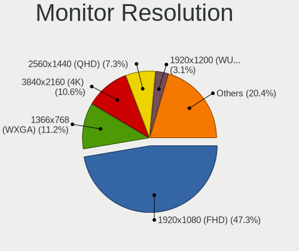

| Resolution        | Computers | Percent |
|-------------------|-----------|---------|
| 1920x1080 (FHD)   | 50        | 52.63%  |
| 1366x768 (WXGA)   | 13        | 13.68%  |
| 2560x1440 (QHD)   | 6         | 6.32%   |
| 3840x2160 (4K)    | 4         | 4.21%   |
| 1920x1200 (WUXGA) | 4         | 4.21%   |
| 1440x900 (WXGA+)  | 3         | 3.16%   |
| 3440x1440         | 2         | 2.11%   |
| 2560x1600         | 2         | 2.11%   |
| 2560x1080         | 2         | 2.11%   |
| 1600x900 (HD+)    | 2         | 2.11%   |
| 3840x2400         | 1         | 1.05%   |
| 3072x1920         | 1         | 1.05%   |
| 2880x1800         | 1         | 1.05%   |
| 2160x1440         | 1         | 1.05%   |
| 1920x540          | 1         | 1.05%   |
| 1280x800 (WXGA)   | 1         | 1.05%   |
| 1280x720 (HD)     | 1         | 1.05%   |

Monitor Diagonal
----------------

Diagonal size in inches

| Inches  | Computers | Percent |
|---------|-----------|---------|
| 15      | 31        | 31%     |
| 13      | 10        | 10%     |
| 24      | 8         | 8%      |
| 17      | 8         | 8%      |
| 23      | 6         | 6%      |
| 27      | 5         | 5%      |
| 16      | 5         | 5%      |
| 14      | 5         | 5%      |
| 31      | 4         | 4%      |
| 34      | 3         | 3%      |
| 21      | 3         | 3%      |
| 11      | 3         | 3%      |
| 18      | 2         | 2%      |
| Unknown | 2         | 2%      |
| 72      | 1         | 1%      |
| 69      | 1         | 1%      |
| 40      | 1         | 1%      |
| 20      | 1         | 1%      |
| 19      | 1         | 1%      |

Monitor Width
-------------

Physical width

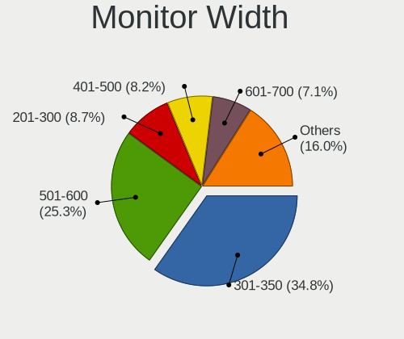

| Width in mm | Computers | Percent |
|-------------|-----------|---------|
| 301-350     | 46        | 45.54%  |
| 501-600     | 19        | 18.81%  |
| 351-400     | 9         | 8.91%   |
| 401-500     | 7         | 6.93%   |
| 201-300     | 7         | 6.93%   |
| 601-700     | 5         | 4.95%   |
| 701-800     | 3         | 2.97%   |
| 1501-2000   | 2         | 1.98%   |
| Unknown     | 2         | 1.98%   |
| 801-900     | 1         | 0.99%   |

Aspect Ratio
------------

Proportional relationship between the width and the height

| Ratio   | Computers | Percent |
|---------|-----------|---------|
| 16/9    | 73        | 80.22%  |
| 16/10   | 13        | 14.29%  |
| 21/9    | 3         | 3.3%    |
| 3/2     | 1         | 1.1%    |
| Unknown | 1         | 1.1%    |

Monitor Area
------------

Area in inch²

| Area in inch² | Computers | Percent |
|----------------|-----------|---------|
| 101-110        | 31        | 31%     |
| 201-250        | 15        | 15%     |
| 81-90          | 11        | 11%     |
| 121-130        | 8         | 8%      |
| 351-500        | 7         | 7%      |
| 301-350        | 5         | 5%      |
| 111-120        | 5         | 5%      |
| 71-80          | 3         | 3%      |
| 51-60          | 3         | 3%      |
| 151-200        | 3         | 3%      |
| More than 1000 | 2         | 2%      |
| 251-300        | 2         | 2%      |
| Unknown        | 2         | 2%      |
| 141-150        | 1         | 1%      |
| 501-1000       | 1         | 1%      |
| 91-100         | 1         | 1%      |

Pixel Density
-------------

Pixels per inch

| Density       | Computers | Percent |
|---------------|-----------|---------|
| 121-160       | 39        | 39.39%  |
| 51-100        | 29        | 29.29%  |
| 101-120       | 14        | 14.14%  |
| 161-240       | 10        | 10.1%   |
| More than 240 | 4         | 4.04%   |
| Unknown       | 2         | 2.02%   |
| 1-50          | 1         | 1.01%   |

Multiple Monitors
-----------------

Total monitors connected

| Total | Computers | Percent |
|-------|-----------|---------|
| 1     | 73        | 81.11%  |
| 2     | 15        | 16.67%  |
| 3     | 1         | 1.11%   |
| 0     | 1         | 1.11%   |

Network
-------

Net Controller Vendor
---------------------

Controller vendors

| Vendor                | Computers | Percent |
|-----------------------|-----------|---------|
| Realtek Semiconductor | 59        | 43.7%   |
| Intel                 | 38        | 28.15%  |
| MediaTek              | 12        | 8.89%   |
| Qualcomm Atheros      | 8         | 5.93%   |
| Broadcom              | 6         | 4.44%   |
| ASUSTek Computer      | 3         | 2.22%   |
| TP-Link               | 2         | 1.48%   |
| Samsung Electronics   | 1         | 0.74%   |
| Ralink                | 1         | 0.74%   |
| Nvidia                | 1         | 0.74%   |
| Lenovo                | 1         | 0.74%   |
| Hewlett-Packard       | 1         | 0.74%   |
| Broadcom Limited      | 1         | 0.74%   |
| Aquantia              | 1         | 0.74%   |

Net Controller Model
--------------------

Controller models

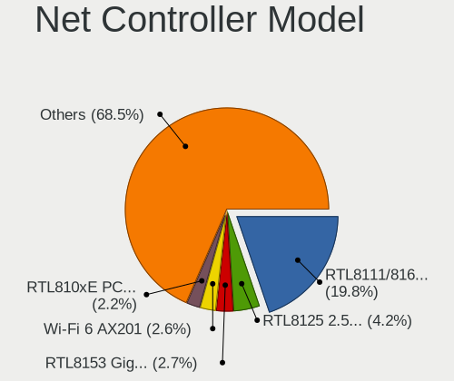

| Model                                                                   | Computers | Percent |
|-------------------------------------------------------------------------|-----------|---------|
| Realtek RTL8111/8168/8411 PCI Express Gigabit Ethernet Controller       | 37        | 23.42%  |
| MediaTek MT7921 802.11ax PCI Express Wireless Network Adapter           | 7         | 4.43%   |
| Realtek RTL8852BE PCIe 802.11ax Wireless Network Controller             | 6         | 3.8%    |
| Realtek RTL8153 Gigabit Ethernet Adapter                                | 6         | 3.8%    |
| Realtek RTL8822CE 802.11ac PCIe Wireless Network Adapter                | 5         | 3.16%   |
| Intel Alder Lake-P PCH CNVi WiFi                                        | 5         | 3.16%   |
| Realtek RTL8125 2.5GbE Controller                                       | 4         | 2.53%   |
| Realtek RTL810xE PCI Express Fast Ethernet controller                   | 4         | 2.53%   |
| Intel Wi-Fi 6 AX200                                                     | 4         | 2.53%   |
| MediaTek MT7922 802.11ax PCI Express Wireless Network Adapter           | 3         | 1.9%    |
| Intel Wireless 8260                                                     | 3         | 1.9%    |
| Intel Wi-Fi 6 AX210/AX211/AX411 160MHz                                  | 3         | 1.9%    |
| Realtek RTL8852AE 802.11ax PCIe Wireless Network Adapter                | 2         | 1.27%   |
| Realtek RTL8821CE 802.11ac PCIe Wireless Network Adapter                | 2         | 1.27%   |
| Realtek Killer E3000 2.5GbE Controller                                  | 2         | 1.27%   |
| MediaTek MT7921K (RZ608) Wi-Fi 6E 80MHz                                 | 2         | 1.27%   |
| Intel Wireless 8265 / 8275                                              | 2         | 1.27%   |
| Intel Wireless 7265                                                     | 2         | 1.27%   |
| Intel Wireless 7260                                                     | 2         | 1.27%   |
| Intel Tiger Lake PCH CNVi WiFi                                          | 2         | 1.27%   |
| Intel Ethernet Controller I225-V                                        | 2         | 1.27%   |
| Intel Comet Lake PCH-LP CNVi WiFi                                       | 2         | 1.27%   |
| Intel Cannon Lake PCH CNVi WiFi                                         | 2         | 1.27%   |
| Broadcom NetXtreme BCM57765 Gigabit Ethernet PCIe                       | 2         | 1.27%   |
| Broadcom BCM4331 802.11a/b/g/n                                          | 2         | 1.27%   |
| TP-Link Archer T2U PLUS [RTL8821AU]                                     | 1         | 0.63%   |
| TP-Link 802.11n NIC                                                     | 1         | 0.63%   |
| Samsung Galaxy series, misc. (tethering mode)                           | 1         | 0.63%   |
| Realtek RTL8188FTV 802.11b/g/n 1T1R 2.4G WLAN Adapter                   | 1         | 0.63%   |
| Realtek RTL-8100/8101L/8139 PCI Fast Ethernet Adapter                   | 1         | 0.63%   |
| Ralink RT5390R 802.11bgn PCIe Wireless Network Adapter                  | 1         | 0.63%   |
| Qualcomm Atheros QCA9377 802.11ac Wireless Network Adapter              | 1         | 0.63%   |
| Qualcomm Atheros QCA8171 Gigabit Ethernet                               | 1         | 0.63%   |
| Qualcomm Atheros Killer E220x Gigabit Ethernet Controller               | 1         | 0.63%   |
| Qualcomm Atheros AR93xx Wireless Network Adapter                        | 1         | 0.63%   |
| Qualcomm Atheros AR928X Wireless Network Adapter (PCI-Express)          | 1         | 0.63%   |
| Qualcomm Atheros AR9287 Wireless Network Adapter (PCI-Express)          | 1         | 0.63%   |
| Qualcomm Atheros AR9285 Wireless Network Adapter (PCI-Express)          | 1         | 0.63%   |
| Qualcomm Atheros AR8121/AR8113/AR8114 Gigabit or Fast Ethernet          | 1         | 0.63%   |
| Qualcomm Atheros AR242x / AR542x Wireless Network Adapter (PCI-Express) | 1         | 0.63%   |

Wireless Vendor
---------------

Wireless vendors

| Vendor                | Computers | Percent |
|-----------------------|-----------|---------|
| Intel                 | 36        | 43.9%   |
| Realtek Semiconductor | 16        | 19.51%  |
| MediaTek              | 12        | 14.63%  |
| Qualcomm Atheros      | 7         | 8.54%   |
| Broadcom              | 4         | 4.88%   |
| ASUSTek Computer      | 3         | 3.66%   |
| TP-Link               | 1         | 1.22%   |
| Ralink                | 1         | 1.22%   |
| Hewlett-Packard       | 1         | 1.22%   |
| Broadcom Limited      | 1         | 1.22%   |

Wireless Model
--------------

Wireless models

| Model                                                                         | Computers | Percent |
|-------------------------------------------------------------------------------|-----------|---------|
| MediaTek MT7921 802.11ax PCI Express Wireless Network Adapter                 | 7         | 8.54%   |
| Realtek RTL8852BE PCIe 802.11ax Wireless Network Controller                   | 6         | 7.32%   |
| Realtek RTL8822CE 802.11ac PCIe Wireless Network Adapter                      | 5         | 6.1%    |
| Intel Alder Lake-P PCH CNVi WiFi                                              | 5         | 6.1%    |
| Intel Wi-Fi 6 AX200                                                           | 4         | 4.88%   |
| MediaTek MT7922 802.11ax PCI Express Wireless Network Adapter                 | 3         | 3.66%   |
| Intel Wireless 8260                                                           | 3         | 3.66%   |
| Intel Wi-Fi 6 AX210/AX211/AX411 160MHz                                        | 3         | 3.66%   |
| Realtek RTL8852AE 802.11ax PCIe Wireless Network Adapter                      | 2         | 2.44%   |
| Realtek RTL8821CE 802.11ac PCIe Wireless Network Adapter                      | 2         | 2.44%   |
| MediaTek MT7921K (RZ608) Wi-Fi 6E 80MHz                                       | 2         | 2.44%   |
| Intel Wireless 8265 / 8275                                                    | 2         | 2.44%   |
| Intel Wireless 7265                                                           | 2         | 2.44%   |
| Intel Wireless 7260                                                           | 2         | 2.44%   |
| Intel Tiger Lake PCH CNVi WiFi                                                | 2         | 2.44%   |
| Intel Comet Lake PCH-LP CNVi WiFi                                             | 2         | 2.44%   |
| Intel Cannon Lake PCH CNVi WiFi                                               | 2         | 2.44%   |
| Broadcom BCM4331 802.11a/b/g/n                                                | 2         | 2.44%   |
| TP-Link 802.11n NIC                                                           | 1         | 1.22%   |
| Realtek RTL8188FTV 802.11b/g/n 1T1R 2.4G WLAN Adapter                         | 1         | 1.22%   |
| Ralink RT5390R 802.11bgn PCIe Wireless Network Adapter                        | 1         | 1.22%   |
| Qualcomm Atheros QCA9377 802.11ac Wireless Network Adapter                    | 1         | 1.22%   |
| Qualcomm Atheros AR93xx Wireless Network Adapter                              | 1         | 1.22%   |
| Qualcomm Atheros AR928X Wireless Network Adapter (PCI-Express)                | 1         | 1.22%   |
| Qualcomm Atheros AR9287 Wireless Network Adapter (PCI-Express)                | 1         | 1.22%   |
| Qualcomm Atheros AR9285 Wireless Network Adapter (PCI-Express)                | 1         | 1.22%   |
| Qualcomm Atheros AR242x / AR542x Wireless Network Adapter (PCI-Express)       | 1         | 1.22%   |
| Qualcomm Atheros AR2413/AR2414 Wireless Network Adapter [AR5005G(S) 802.11bg] | 1         | 1.22%   |
| Intel Wireless 3165                                                           | 1         | 1.22%   |
| Intel Wi-Fi 6 AX201                                                           | 1         | 1.22%   |
| Intel Gemini Lake PCH CNVi WiFi                                               | 1         | 1.22%   |
| Intel Dual Band Wireless-AC 3165 Plus Bluetooth                               | 1         | 1.22%   |
| Intel Centrino Wireless-N 2230                                                | 1         | 1.22%   |
| Intel Centrino Advanced-N 6205 [Taylor Peak]                                  | 1         | 1.22%   |
| Intel Alder Lake-U CNVi: Wireless-AC                                          | 1         | 1.22%   |
| Intel Alder Lake-S PCH CNVi WiFi                                              | 1         | 1.22%   |
| Intel 700 Series Chipset Family Wi-Fi                                         | 1         | 1.22%   |
| HP lt4112 Gobi 4G Module Network Device                                       | 1         | 1.22%   |
| Broadcom Limited BCM4352 802.11ac Wireless Network Adapter                    | 1         | 1.22%   |
| Broadcom BCM4352 802.11ac Wireless Network Adapter                            | 1         | 1.22%   |

Ethernet Vendor
---------------

Ethernet vendors

| Vendor                | Computers | Percent |
|-----------------------|-----------|---------|
| Realtek Semiconductor | 52        | 70.27%  |
| Intel                 | 10        | 13.51%  |
| Broadcom              | 4         | 5.41%   |
| Qualcomm Atheros      | 3         | 4.05%   |
| TP-Link               | 1         | 1.35%   |
| Samsung Electronics   | 1         | 1.35%   |
| Nvidia                | 1         | 1.35%   |
| Lenovo                | 1         | 1.35%   |
| Aquantia              | 1         | 1.35%   |

Ethernet Model
--------------

Ethernet models

| Model                                                             | Computers | Percent |
|-------------------------------------------------------------------|-----------|---------|
| Realtek RTL8111/8168/8411 PCI Express Gigabit Ethernet Controller | 37        | 48.68%  |
| Realtek RTL8153 Gigabit Ethernet Adapter                          | 6         | 7.89%   |
| Realtek RTL8125 2.5GbE Controller                                 | 4         | 5.26%   |
| Realtek RTL810xE PCI Express Fast Ethernet controller             | 4         | 5.26%   |
| Realtek Killer E3000 2.5GbE Controller                            | 2         | 2.63%   |
| Intel Ethernet Controller I225-V                                  | 2         | 2.63%   |
| Broadcom NetXtreme BCM57765 Gigabit Ethernet PCIe                 | 2         | 2.63%   |
| TP-Link Archer T2U PLUS [RTL8821AU]                               | 1         | 1.32%   |
| Samsung Galaxy series, misc. (tethering mode)                     | 1         | 1.32%   |
| Realtek RTL-8100/8101L/8139 PCI Fast Ethernet Adapter             | 1         | 1.32%   |
| Qualcomm Atheros QCA8171 Gigabit Ethernet                         | 1         | 1.32%   |
| Qualcomm Atheros Killer E220x Gigabit Ethernet Controller         | 1         | 1.32%   |
| Qualcomm Atheros AR8121/AR8113/AR8114 Gigabit or Fast Ethernet    | 1         | 1.32%   |
| Nvidia MCP79 Ethernet                                             | 1         | 1.32%   |
| Lenovo USB-C Dock Ethernet                                        | 1         | 1.32%   |
| Intel Ethernet Connection I217-LM                                 | 1         | 1.32%   |
| Intel Ethernet Connection (7) I219-V                              | 1         | 1.32%   |
| Intel Ethernet Connection (2) I219-LM                             | 1         | 1.32%   |
| Intel Ethernet Connection (2) I218-V                              | 1         | 1.32%   |
| Intel Ethernet Connection (14) I219-V                             | 1         | 1.32%   |
| Intel Ethernet Connection (13) I219-LM                            | 1         | 1.32%   |
| Intel Ethernet Connection (10) I219-LM                            | 1         | 1.32%   |
| Intel 82579LM Gigabit Network Connection (Lewisville)             | 1         | 1.32%   |
| Broadcom NetXtreme BCM5761 Gigabit Ethernet PCIe                  | 1         | 1.32%   |
| Broadcom NetLink BCM5784M Gigabit Ethernet PCIe                   | 1         | 1.32%   |
| Aquantia AQC107 NBase-T/IEEE 802.3bz Ethernet Controller [AQtion] | 1         | 1.32%   |

Net Controller Kind
-------------------

Ethernet, WiFi or modem

| Kind     | Computers | Percent |
|----------|-----------|---------|
| WiFi     | 80        | 54.05%  |
| Ethernet | 68        | 45.95%  |

Used Controller
---------------

Currently used network controller

| Kind     | Computers | Percent |
|----------|-----------|---------|
| WiFi     | 65        | 69.15%  |
| Ethernet | 29        | 30.85%  |

NICs
----

Total network controllers on board

| Total | Computers | Percent |
|-------|-----------|---------|
| 2     | 49        | 54.44%  |
| 1     | 40        | 44.44%  |
| 5     | 1         | 1.11%   |

IPv6
----

IPv6 vs IPv4

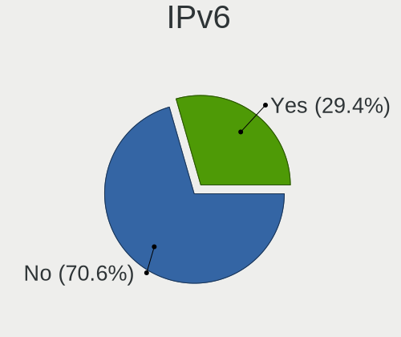

| Used | Computers | Percent |
|------|-----------|---------|
| No   | 64        | 71.11%  |
| Yes  | 26        | 28.89%  |

Bluetooth
---------

Bluetooth Vendor
----------------

Controller vendors

| Vendor                  | Computers | Percent |
|-------------------------|-----------|---------|
| Intel                   | 35        | 50%     |
| Realtek Semiconductor   | 14        | 20%     |
| IMC Networks            | 5         | 7.14%   |
| Apple                   | 4         | 5.71%   |
| Lite-On Technology      | 3         | 4.29%   |
| Foxconn / Hon Hai       | 3         | 4.29%   |
| MediaTek                | 2         | 2.86%   |
| TP-Link                 | 1         | 1.43%   |
| Realtek                 | 1         | 1.43%   |
| Cambridge Silicon Radio | 1         | 1.43%   |
| Broadcom                | 1         | 1.43%   |

Bluetooth Model
---------------

Controller models

| Model                                               | Computers | Percent |
|-----------------------------------------------------|-----------|---------|
| Realtek Bluetooth Radio                             | 14        | 20%     |
| Intel Bluetooth wireless interface                  | 11        | 15.71%  |
| Intel Bluetooth Device                              | 7         | 10%     |
| Intel AX201 Bluetooth                               | 5         | 7.14%   |
| Intel Bluetooth 9460/9560 Jefferson Peak (JfP)      | 4         | 5.71%   |
| Intel AX200 Bluetooth                               | 4         | 5.71%   |
| IMC Networks Wireless_Device                        | 4         | 5.71%   |
| Intel AX210 Bluetooth                               | 3         | 4.29%   |
| MediaTek Wireless_Device                            | 2         | 2.86%   |
| Lite-On Wireless_Device                             | 2         | 2.86%   |
| Foxconn / Hon Hai MediaTek Bluetooth Adapter        | 2         | 2.86%   |
| Apple Built-in Bluetooth 2.0+EDR HCI                | 2         | 2.86%   |
| TP-Link UB500 Adapter                               | 1         | 1.43%   |
| Realtek Bluetooth Radio                             | 1         | 1.43%   |
| Lite-On Qualcomm Atheros QCA9377 Bluetooth          | 1         | 1.43%   |
| Intel Centrino Bluetooth Wireless Transceiver       | 1         | 1.43%   |
| IMC Networks BCM20702A0                             | 1         | 1.43%   |
| Foxconn / Hon Hai Wireless_Device                   | 1         | 1.43%   |
| Cambridge Silicon Radio Bluetooth Dongle (HCI mode) | 1         | 1.43%   |
| Broadcom BCM20702A0                                 | 1         | 1.43%   |
| Apple Bluetooth USB Host Controller                 | 1         | 1.43%   |
| Apple Bluetooth Host Controller                     | 1         | 1.43%   |

Sound
-----

Sound Vendor
------------

Sound card vendors

| Vendor                | Computers | Percent |
|-----------------------|-----------|---------|
| Intel                 | 55        | 43.65%  |
| AMD                   | 37        | 29.37%  |
| Nvidia                | 23        | 18.25%  |
| Hewlett-Packard       | 2         | 1.59%   |
| Texas Instruments     | 1         | 0.79%   |
| Sony                  | 1         | 0.79%   |
| Realtek Semiconductor | 1         | 0.79%   |
| Mackie Designs        | 1         | 0.79%   |
| M-Audio               | 1         | 0.79%   |
| Lenovo                | 1         | 0.79%   |
| Dell                  | 1         | 0.79%   |
| AudioQuest            | 1         | 0.79%   |
| 2.4G Composite Device | 1         | 0.79%   |

Sound Model
-----------

Sound card models

| Model                                                                      | Computers | Percent |
|----------------------------------------------------------------------------|-----------|---------|
| AMD Family 17h/19h HD Audio Controller                                     | 25        | 15.92%  |
| AMD Renoir Radeon High Definition Audio Controller                         | 15        | 9.55%   |
| Intel 7 Series/C216 Chipset Family High Definition Audio Controller        | 6         | 3.82%   |
| Intel Alder Lake PCH-P High Definition Audio Controller                    | 5         | 3.18%   |
| AMD Rembrandt Radeon High Definition Audio Controller                      | 5         | 3.18%   |
| Nvidia GA104 High Definition Audio Controller                              | 4         | 2.55%   |
| Intel Tiger Lake-LP Smart Sound Technology Audio Controller                | 4         | 2.55%   |
| Intel Sunrise Point-LP HD Audio                                            | 4         | 2.55%   |
| Intel Cannon Lake PCH cAVS                                                 | 4         | 2.55%   |
| Intel 8 Series/C220 Series Chipset High Definition Audio Controller        | 4         | 2.55%   |
| Intel 100 Series/C230 Series Chipset Family HD Audio Controller            | 4         | 2.55%   |
| AMD SBx00 Azalia (Intel HDA)                                               | 4         | 2.55%   |
| Nvidia TU107 GeForce GTX 1650 High Definition Audio Controller             | 3         | 1.91%   |
| Nvidia Audio device                                                        | 3         | 1.91%   |
| Intel Xeon E3-1200 v3/4th Gen Core Processor HD Audio Controller           | 3         | 1.91%   |
| Intel Tiger Lake-H HD Audio Controller                                     | 3         | 1.91%   |
| Intel Comet Lake PCH-LP cAVS                                               | 3         | 1.91%   |
| Intel 6 Series/C200 Series Chipset Family High Definition Audio Controller | 3         | 1.91%   |
| AMD Starship/Matisse HD Audio Controller                                   | 3         | 1.91%   |
| Nvidia GP107GL High Definition Audio Controller                            | 2         | 1.27%   |
| Nvidia GP106 High Definition Audio Controller                              | 2         | 1.27%   |
| Intel Comet Lake PCH cAVS                                                  | 2         | 1.27%   |
| AMD Raven/Raven2/Fenghuang HDMI/DP Audio Controller                        | 2         | 1.27%   |
| AMD Navi 21/23 HDMI/DP Audio Controller                                    | 2         | 1.27%   |
| AMD FCH Azalia Controller                                                  | 2         | 1.27%   |
| Texas Instruments PCM2704 16-bit stereo audio DAC                          | 1         | 0.64%   |
| Sony DualShock 4 [CUH-ZCT2x]                                               | 1         | 0.64%   |
| Realtek Semiconductor USB Audio                                            | 1         | 0.64%   |
| Nvidia TU106 High Definition Audio Controller                              | 1         | 0.64%   |
| Nvidia TU104 HD Audio Controller                                           | 1         | 0.64%   |
| Nvidia MCP79 High Definition Audio                                         | 1         | 0.64%   |
| Nvidia High Definition Audio Controller                                    | 1         | 0.64%   |
| Nvidia GP108 High Definition Audio Controller                              | 1         | 0.64%   |
| Nvidia GM206 High Definition Audio Controller                              | 1         | 0.64%   |
| Nvidia GK107 HDMI Audio Controller                                         | 1         | 0.64%   |
| Nvidia GF116 High Definition Audio Controller                              | 1         | 0.64%   |
| Nvidia GA106 High Definition Audio Controller                              | 1         | 0.64%   |
| Mackie Designs CHROMIUM Microphone                                         | 1         | 0.64%   |
| M-Audio M-Track 2X2                                                        | 1         | 0.64%   |
| Lenovo ThinkPad USB-C Dock Gen2 USB Audio                                  | 1         | 0.64%   |

Memory
------

Memory Vendor
-------------

Memory module vendors

| Vendor              | Computers | Percent |
|---------------------|-----------|---------|
| Samsung Electronics | 16        | 32%     |
| SK hynix            | 8         | 16%     |
| Micron Technology   | 8         | 16%     |
| Kingston            | 4         | 8%      |
| Ramaxel Technology  | 3         | 6%      |
| Corsair             | 3         | 6%      |
| G.Skill             | 2         | 4%      |
| Crucial             | 2         | 4%      |
| Unknown (ABCD)      | 1         | 2%      |
| Unknown             | 1         | 2%      |
| Team                | 1         | 2%      |
| 4ea5                | 1         | 2%      |

Memory Model
------------

Memory module models

| Model                                                            | Computers | Percent |
|------------------------------------------------------------------|-----------|---------|
| SK hynix RAM HMAA1GS6CJR6N-XN 8GB SODIMM DDR4 3200MT/s           | 3         | 5.77%   |
| Samsung RAM M471A1G44BB0-CWE 8GB SODIMM DDR4 3200MT/s            | 3         | 5.77%   |
| Unknown RAM Module 8GB DIMM 667MT/s                              | 1         | 1.92%   |
| Unknown (ABCD) RAM 123456789012345678 2GB SODIMM LPDDR4 2400MT/s | 1         | 1.92%   |
| Team RAM TEAMGROUP-UD3-1600 4GB DIMM DDR3 1600MT/s               | 1         | 1.92%   |
| SK hynix RAM Module 8GB SODIMM DDR4 2133MT/s                     | 1         | 1.92%   |
| SK hynix RAM HMT351S6EFR8A-PB 4GB SODIMM DDR3 1600MT/s           | 1         | 1.92%   |
| SK hynix RAM HMAA1GS6CMR6N-VK 8GB SODIMM DDR4 2667MT/s           | 1         | 1.92%   |
| SK hynix RAM HMAA1GS6CJR6N-XN 8192MB Row Of Chips DDR4 3200MT/s  | 1         | 1.92%   |
| SK hynix RAM H9JCNNNFA5MLYR-N6E 8GB SODIMM LPDDR5 6400MT/s       | 1         | 1.92%   |
| SK hynix RAM H58G66AK6BX070 4GB Row Of Chips LPDDR5 6400MT/s     | 1         | 1.92%   |
| Samsung RAM UBE3D4AA-MGCR 2GB Row Of Chips LPDDR4 4267MT/s       | 1         | 1.92%   |
| Samsung RAM U6E3S4AA-MGCR 1GB Row Of Chips LPDDR4 4267MT/s       | 1         | 1.92%   |
| Samsung RAM Module 8GB SODIMM DDR5 4800MT/s                      | 1         | 1.92%   |
| Samsung RAM M471B1G73DB0-YK0 8GB SODIMM DDR3 1600MT/s            | 1         | 1.92%   |
| Samsung RAM M471A2K43BB1-CRC 16GB SODIMM DDR4 2400MT/s           | 1         | 1.92%   |
| Samsung RAM M471A1K43DB1-CWE 8GB SODIMM DDR4 3200MT/s            | 1         | 1.92%   |
| Samsung RAM M471A1G44BB0-CWE 8GB Row Of Chips DDR4 3200MT/s      | 1         | 1.92%   |
| Samsung RAM M471A1G44AB0-CWE 8GB SODIMM DDR4 3200MT/s            | 1         | 1.92%   |
| Samsung RAM M425R4GA3BB0-CQKOL 32GB SODIMM DDR5 4800MT/s         | 1         | 1.92%   |
| Samsung RAM M425R1GB4BB0-CQKOL 8GB SODIMM DDR5 4800MT/s          | 1         | 1.92%   |
| Samsung RAM K4F6E3S4HM-MGCJ 2GB LPDDR4 2400MT/s                  | 1         | 1.92%   |
| Samsung RAM K4A8G165WC-BCTD 4GB SODIMM DDR4 2667MT/s             | 1         | 1.92%   |
| Samsung RAM 53D512M64D4RQ-046 8GB Row Of Chips LPDDR4 3733MT/s   | 1         | 1.92%   |
| Ramaxel RAM RMSA3320ME88HBF-3200 16GB SODIMM DDR4 3200MT/s       | 1         | 1.92%   |
| Ramaxel RAM RMSA3310MF96HAF-3200 8GB SODIMM DDR4 3200MT/s        | 1         | 1.92%   |
| Ramaxel RAM RMSA3260MB78HAF2400 8GB SODIMM DDR4 2400MT/s         | 1         | 1.92%   |
| Micron RAM MT62F2G32D8DR-031 WT 8GB Row Of Chips LPDDR5 6400MT/s | 1         | 1.92%   |
| Micron RAM MT62F1G32D4DR-031 WT 4GB SODIMM LPDDR5 6400MT/s       | 1         | 1.92%   |
| Micron RAM MT62F1G32D4DR-031 WT 4GB Row Of Chips LPDDR5 6400MT/s | 1         | 1.92%   |
| Micron RAM MT53E512M32D2NP-046 4GB Row Of Chips LPDDR4 4267MT/s  | 1         | 1.92%   |
| Micron RAM MT40A1G16RC-062E:B 8GB Row Of Chips DDR4 3200MT/s     | 1         | 1.92%   |
| Micron RAM 8ATF1G64HZ-3G2R1 8GB SODIMM DDR4 3200MT/s             | 1         | 1.92%   |
| Micron RAM 4ATS2G64HZ-3G2B1 16GB SODIMM DDR4 3200MT/s            | 1         | 1.92%   |
| Micron RAM 4ATF1G64HZ-3G2E2 8GB SODIMM DDR4 3200MT/s             | 1         | 1.92%   |
| Kingston RAM KF3600C16D4/16GX 16384MB DIMM DDR4 3600MT/s         | 1         | 1.92%   |
| Kingston RAM KF3200C20S4/16G 16GB SODIMM DDR4 3200MT/s           | 1         | 1.92%   |
| Kingston RAM 9965646-035.B00G 8GB SODIMM DDR4 2933MT/s           | 1         | 1.92%   |
| Kingston RAM 9905703-002.A00G 16GB SODIMM DDR4 2400MT/s          | 1         | 1.92%   |
| G.Skill RAM F4-3600C18-16GVK 16384MB DIMM DDR4 3733MT/s          | 1         | 1.92%   |

Memory Kind
-----------

Memory module kinds

| Kind    | Computers | Percent |
|---------|-----------|---------|
| DDR4    | 22        | 52.38%  |
| LPDDR4  | 6         | 14.29%  |
| LPDDR5  | 5         | 11.9%   |
| DDR3    | 5         | 11.9%   |
| DDR5    | 3         | 7.14%   |
| Unknown | 1         | 2.38%   |

Memory Form Factor
------------------

Physical design of the memory module

| Name         | Computers | Percent |
|--------------|-----------|---------|
| SODIMM       | 26        | 60.47%  |
| Row Of Chips | 10        | 23.26%  |
| DIMM         | 6         | 13.95%  |
| Unknown      | 1         | 2.33%   |

Memory Size
-----------

Memory module size

| Size  | Computers | Percent |
|-------|-----------|---------|
| 8192  | 27        | 61.36%  |
| 4096  | 9         | 20.45%  |
| 16384 | 5         | 11.36%  |
| 32768 | 2         | 4.55%   |
| 2048  | 1         | 2.27%   |

Memory Speed
------------

Memory module speed

| Speed | Computers | Percent |
|-------|-----------|---------|
| 3200  | 13        | 30.23%  |
| 6400  | 5         | 11.63%  |
| 2400  | 5         | 11.63%  |
| 4800  | 3         | 6.98%   |
| 4267  | 3         | 6.98%   |
| 1600  | 3         | 6.98%   |
| 3733  | 2         | 4.65%   |
| 2933  | 2         | 4.65%   |
| 2667  | 2         | 4.65%   |
| 3600  | 1         | 2.33%   |
| 2133  | 1         | 2.33%   |
| 1800  | 1         | 2.33%   |
| 1333  | 1         | 2.33%   |
| 667   | 1         | 2.33%   |

Printers & scanners
-------------------

Printer Vendor
--------------

Printer device vendors

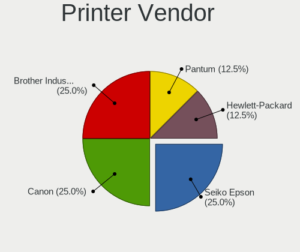

| Vendor             | Computers | Percent |
|--------------------|-----------|---------|
| Brother Industries | 2         | 66.67%  |
| Canon              | 1         | 33.33%  |

Printer Model
-------------

Printer device models

| Model                    | Computers | Percent |
|--------------------------|-----------|---------|
| Canon PIXMA MX490 Series | 1         | 33.33%  |
| Brother HL-L2310D series | 1         | 33.33%  |
| Brother HL-3142CW series | 1         | 33.33%  |

Scanner Vendor
--------------

Scanner device vendors

Zero info for selected period =(

Scanner Model
-------------

Scanner device models

Zero info for selected period =(

Camera
------

Camera Vendor
-------------

Camera device vendors

| Vendor                                 | Computers | Percent |
|----------------------------------------|-----------|---------|
| Chicony Electronics                    | 10        | 17.86%  |
| Quanta                                 | 8         | 14.29%  |
| Acer                                   | 5         | 8.93%   |
| Microdia                               | 4         | 7.14%   |
| Cheng Uei Precision Industry (Foxlink) | 4         | 7.14%   |
| Apple                                  | 4         | 7.14%   |
| Syntek                                 | 3         | 5.36%   |
| Realtek Semiconductor                  | 3         | 5.36%   |
| Luxvisions Innotech Limited            | 3         | 5.36%   |
| Bison Electronics                      | 3         | 5.36%   |
| Sunplus Innovation Technology          | 2         | 3.57%   |
| IMC Networks                           | 2         | 3.57%   |
| SunplusIT                              | 1         | 1.79%   |
| Shenzhen Kingcome Optoelectronic       | 1         | 1.79%   |
| Samsung Electronics                    | 1         | 1.79%   |
| OYT Tech                               | 1         | 1.79%   |
| Logitech                               | 1         | 1.79%   |

Camera Model
------------

Camera device models

| Model                                                           | Computers | Percent |
|-----------------------------------------------------------------|-----------|---------|
| Chicony Integrated Camera                                       | 4         | 7.14%   |
| Syntek Integrated Camera                                        | 2         | 3.57%   |
| Sunplus Integrated_Webcam_HD                                    | 2         | 3.57%   |
| Realtek HP Truevision HD                                        | 2         | 3.57%   |
| Quanta USB2.0 HD UVC WebCam                                     | 2         | 3.57%   |
| Luxvisions Innotech Limited Integrated RGB Camera               | 2         | 3.57%   |
| IMC Networks USB2.0 HD UVC WebCam                               | 2         | 3.57%   |
| Chicony HD WebCam                                               | 2         | 3.57%   |
| Bison Integrated Camera                                         | 2         | 3.57%   |
| Apple FaceTime HD Camera                                        | 2         | 3.57%   |
| Acer Integrated RGB Camera                                      | 2         | 3.57%   |
| Syntek Lenovo EasyCamera                                        | 1         | 1.79%   |
| SunplusIT 1080p FHD Camera                                      | 1         | 1.79%   |
| Shenzhen Kingcome Optoelectronic 720p HD Camera                 | 1         | 1.79%   |
| Samsung Galaxy series, misc. (MTP mode)                         | 1         | 1.79%   |
| Realtek Integrated Webcam                                       | 1         | 1.79%   |
| Quanta ov9734_techfront_camera                                  | 1         | 1.79%   |
| Quanta HP Wide Vision HD Camera                                 | 1         | 1.79%   |
| Quanta HP HD Camera                                             | 1         | 1.79%   |
| Quanta HP 5MP Camera                                            | 1         | 1.79%   |
| Quanta HD User Facing                                           | 1         | 1.79%   |
| Quanta HD Camera                                                | 1         | 1.79%   |
| OYT Tech OYV1RDFF1                                              | 1         | 1.79%   |
| Microdia Webcam Vitade AF                                       | 1         | 1.79%   |
| Microdia Integrated_Webcam_HD                                   | 1         | 1.79%   |
| Microdia Integrated_Webcam_FHD                                  | 1         | 1.79%   |
| Microdia Dell Laptop Integrated Webcam HD                       | 1         | 1.79%   |
| Luxvisions Innotech Limited Integrated Camera                   | 1         | 1.79%   |
| Logitech Webcam C925e                                           | 1         | 1.79%   |
| Chicony USB2.0 Camera                                           | 1         | 1.79%   |
| Chicony HP Truevision HD                                        | 1         | 1.79%   |
| Chicony HD User Facing                                          | 1         | 1.79%   |
| Chicony 720p HD Camera                                          | 1         | 1.79%   |
| Cheng Uei Precision Industry (Foxlink) Webcam                   | 1         | 1.79%   |
| Cheng Uei Precision Industry (Foxlink) HP Wide Vision HD Camera | 1         | 1.79%   |
| Cheng Uei Precision Industry (Foxlink) HP TrueVision HD Camera  | 1         | 1.79%   |
| Cheng Uei Precision Industry (Foxlink) HP HD Webcam             | 1         | 1.79%   |
| Bison HD Camera                                                 | 1         | 1.79%   |
| Apple FaceTime HD Camera (Built-in)                             | 1         | 1.79%   |
| Apple Built-in iSight                                           | 1         | 1.79%   |

Security
--------

Fingerprint Vendor
------------------

Fingerprint sensor vendors

| Vendor                             | Computers | Percent |
|------------------------------------|-----------|---------|
| Synaptics                          | 5         | 38.46%  |
| Shenzhen Goodix Technology         | 4         | 30.77%  |
| Validity Sensors                   | 2         | 15.38%  |
| Realtek USB2.0 Finger Print Bridge | 1         | 7.69%   |
| Elan Microelectronics              | 1         | 7.69%   |

Fingerprint Model
-----------------

Fingerprint sensor models

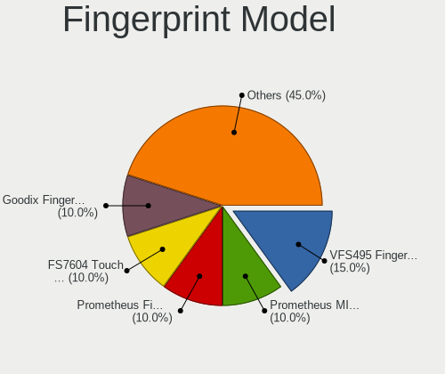

| Model                                                           | Computers | Percent |
|-----------------------------------------------------------------|-----------|---------|
| Synaptics Prometheus MIS Touch Fingerprint Reader               | 2         | 15.38%  |
| Synaptics FS7604 Touch Fingerprint Sensor with PurePrint        | 2         | 15.38%  |
| Shenzhen Goodix  Fingerprint Device                             | 2         | 15.38%  |
| Shenzhen Goodix Fingerprint Reader                              | 2         | 15.38%  |
| Validity Sensors VFS495 Fingerprint Reader                      | 1         | 7.69%   |
| Validity Sensors Swipe Fingerprint Sensor                       | 1         | 7.69%   |
| Synaptics UWP WBDI                                              | 1         | 7.69%   |
| Realtek USB2.0 Finger Print Bridge FocalTech Fingerprint Device | 1         | 7.69%   |
| Elan ELAN:ARM-M4                                                | 1         | 7.69%   |

Chipcard Vendor
---------------

Chipcard module vendors

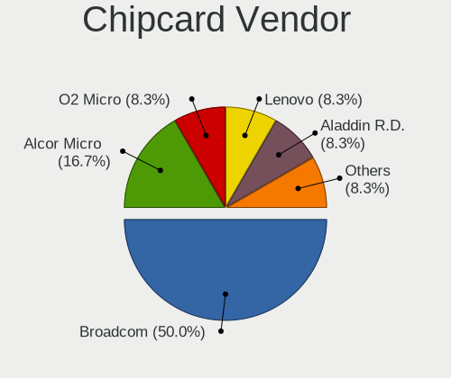

| Vendor      | Computers | Percent |
|-------------|-----------|---------|
| Alcor Micro | 2         | 50%     |
| O2 Micro    | 1         | 25%     |
| Broadcom    | 1         | 25%     |

Chipcard Model
--------------

Chipcard module models

| Model                                | Computers | Percent |
|--------------------------------------|-----------|---------|
| Alcor Micro AU9540 Smartcard Reader  | 2         | 50%     |
| O2 Micro OZ776 CCID Smartcard Reader | 1         | 25%     |
| Broadcom 5880                        | 1         | 25%     |

Unsupported
-----------

Unsupported Devices
-------------------

Total unsupported devices on board

| Total | Computers | Percent |
|-------|-----------|---------|
| 0     | 61        | 67.78%  |
| 1     | 24        | 26.67%  |
| 2     | 5         | 5.56%   |

Unsupported Device Types
------------------------

Types of unsupported devices

| Type                     | Computers | Percent |
|--------------------------|-----------|---------|
| Fingerprint reader       | 13        | 39.39%  |
| Net/wireless             | 4         | 12.12%  |
| Multimedia controller    | 4         | 12.12%  |
| Chipcard                 | 4         | 12.12%  |
| Camera                   | 4         | 12.12%  |
| Unassigned class         | 1         | 3.03%   |
| Graphics card            | 1         | 3.03%   |
| Communication controller | 1         | 3.03%   |
| Card reader              | 1         | 3.03%   |

