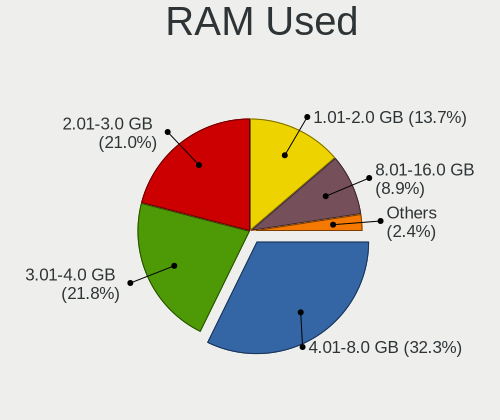
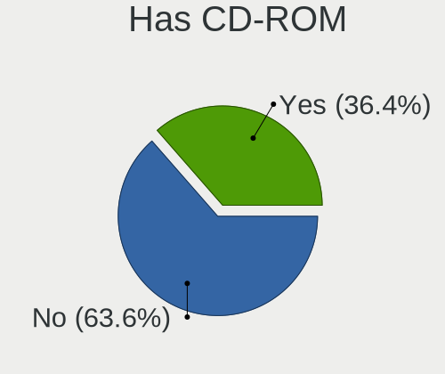
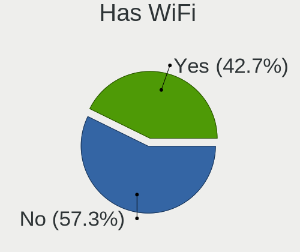
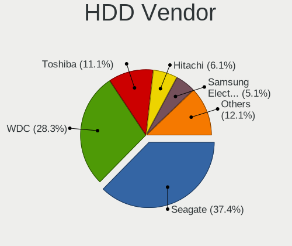
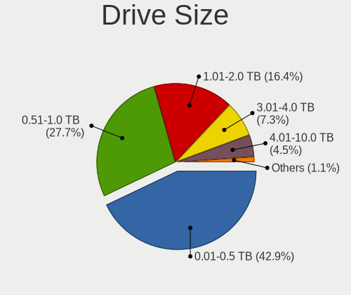
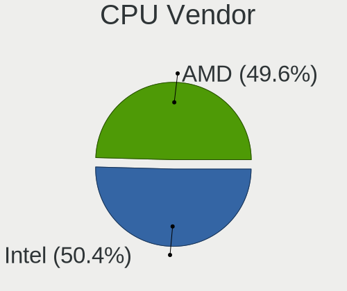
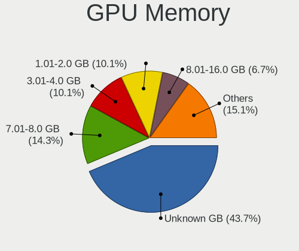
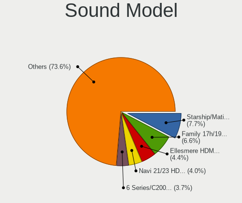

Kubuntu 23.04 - Tested Hardware & Statistics (Desktops)
-------------------------------------------------------

A project to collect tested hardware configurations for Kubuntu 23.04.

Anyone can contribute to this report by the [hw-probe](https://github.com/linuxhw/hw-probe) tool:

    sudo -E hw-probe -all -upload

Please contribute! Especially if your hardware is rare.

Contents
--------

* [ Test Cases ](#test-cases)

* [ System ](#system)
  - [ Kernel                   ](#kernel)
  - [ Kernel Family            ](#kernel-family)
  - [ Kernel Major Ver.        ](#kernel-major-ver)
  - [ Arch                     ](#arch)
  - [ DE                       ](#de)
  - [ Display Server           ](#display-server)
  - [ Display Manager          ](#display-manager)
  - [ OS Lang                  ](#os-lang)
  - [ Boot Mode                ](#boot-mode)
  - [ Filesystem               ](#filesystem)
  - [ Part. scheme             ](#part-scheme)
  - [ Dual Boot with Linux/BSD ](#dual-boot-with-linuxbsd)
  - [ Dual Boot (Win)          ](#dual-boot-win)

* [ Board ](#board)
  - [ Vendor                   ](#vendor)
  - [ Model                    ](#model)
  - [ Model Family             ](#model-family)
  - [ MFG Year                 ](#mfg-year)
  - [ Form Factor              ](#form-factor)
  - [ Secure Boot              ](#secure-boot)
  - [ Coreboot                 ](#coreboot)
  - [ RAM Size                 ](#ram-size)
  - [ RAM Used                 ](#ram-used)
  - [ Total Drives             ](#total-drives)
  - [ Has CD-ROM               ](#has-cd-rom)
  - [ Has Ethernet             ](#has-ethernet)
  - [ Has WiFi                 ](#has-wifi)
  - [ Has Bluetooth            ](#has-bluetooth)

* [ Location ](#location)
  - [ Country                  ](#country)
  - [ City                     ](#city)

* [ Drives ](#drives)
  - [ Drive Vendor             ](#drive-vendor)
  - [ Drive Model              ](#drive-model)
  - [ HDD Vendor               ](#hdd-vendor)
  - [ SSD Vendor               ](#ssd-vendor)
  - [ Drive Kind               ](#drive-kind)
  - [ Drive Connector          ](#drive-connector)
  - [ Drive Size               ](#drive-size)
  - [ Space Total              ](#space-total)
  - [ Space Used               ](#space-used)
  - [ Malfunc. Drives          ](#malfunc-drives)
  - [ Malfunc. Drive Vendor    ](#malfunc-drive-vendor)
  - [ Malfunc. HDD Vendor      ](#malfunc-hdd-vendor)
  - [ Malfunc. Drive Kind      ](#malfunc-drive-kind)
  - [ Failed Drives            ](#failed-drives)
  - [ Failed Drive Vendor      ](#failed-drive-vendor)
  - [ Drive Status             ](#drive-status)

* [ Storage controller ](#storage-controller)
  - [ Storage Vendor           ](#storage-vendor)
  - [ Storage Model            ](#storage-model)
  - [ Storage Kind             ](#storage-kind)

* [ Processor ](#processor)
  - [ CPU Vendor               ](#cpu-vendor)
  - [ CPU Model                ](#cpu-model)
  - [ CPU Model Family         ](#cpu-model-family)
  - [ CPU Cores                ](#cpu-cores)
  - [ CPU Sockets              ](#cpu-sockets)
  - [ CPU Threads              ](#cpu-threads)
  - [ CPU Op-Modes             ](#cpu-op-modes)
  - [ CPU Microcode            ](#cpu-microcode)
  - [ CPU Microarch            ](#cpu-microarch)

* [ Graphics ](#graphics)
  - [ GPU Vendor               ](#gpu-vendor)
  - [ GPU Model                ](#gpu-model)
  - [ GPU Combo                ](#gpu-combo)
  - [ GPU Driver               ](#gpu-driver)
  - [ GPU Memory               ](#gpu-memory)

* [ Monitor ](#monitor)
  - [ Monitor Vendor           ](#monitor-vendor)
  - [ Monitor Model            ](#monitor-model)
  - [ Monitor Resolution       ](#monitor-resolution)
  - [ Monitor Diagonal         ](#monitor-diagonal)
  - [ Monitor Width            ](#monitor-width)
  - [ Aspect Ratio             ](#aspect-ratio)
  - [ Monitor Area             ](#monitor-area)
  - [ Pixel Density            ](#pixel-density)
  - [ Multiple Monitors        ](#multiple-monitors)

* [ Network ](#network)
  - [ Net Controller Vendor    ](#net-controller-vendor)
  - [ Net Controller Model     ](#net-controller-model)
  - [ Wireless Vendor          ](#wireless-vendor)
  - [ Wireless Model           ](#wireless-model)
  - [ Ethernet Vendor          ](#ethernet-vendor)
  - [ Ethernet Model           ](#ethernet-model)
  - [ Net Controller Kind      ](#net-controller-kind)
  - [ Used Controller          ](#used-controller)
  - [ NICs                     ](#nics)
  - [ IPv6                     ](#ipv6)

* [ Bluetooth ](#bluetooth)
  - [ Bluetooth Vendor         ](#bluetooth-vendor)
  - [ Bluetooth Model          ](#bluetooth-model)

* [ Sound ](#sound)
  - [ Sound Vendor             ](#sound-vendor)
  - [ Sound Model              ](#sound-model)

* [ Memory ](#memory)
  - [ Memory Vendor            ](#memory-vendor)
  - [ Memory Model             ](#memory-model)
  - [ Memory Kind              ](#memory-kind)
  - [ Memory Form Factor       ](#memory-form-factor)
  - [ Memory Size              ](#memory-size)
  - [ Memory Speed             ](#memory-speed)

* [ Printers & scanners ](#printers--scanners)
  - [ Printer Vendor           ](#printer-vendor)
  - [ Printer Model            ](#printer-model)
  - [ Scanner Vendor           ](#scanner-vendor)
  - [ Scanner Model            ](#scanner-model)

* [ Camera ](#camera)
  - [ Camera Vendor            ](#camera-vendor)
  - [ Camera Model             ](#camera-model)

* [ Security ](#security)
  - [ Fingerprint Vendor       ](#fingerprint-vendor)
  - [ Fingerprint Model        ](#fingerprint-model)
  - [ Chipcard Vendor          ](#chipcard-vendor)
  - [ Chipcard Model           ](#chipcard-model)

* [ Unsupported ](#unsupported)
  - [ Unsupported Devices      ](#unsupported-devices)
  - [ Unsupported Device Types ](#unsupported-device-types)

Test Cases
----------

Total: 8

| Vendor   | Model                    | Probe                                                      | Date         |
|----------|--------------------------|------------------------------------------------------------|--------------|
| HP       | 828A                     | [f1590b355f](https://linux-hardware.org/?probe=f1590b355f) | Apr 30, 2023 |
| Foxconn  | H67M-S/H67M-V/H67        | [92fa61186f](https://linux-hardware.org/?probe=92fa61186f) | Apr 23, 2023 |
| Fujitsu  | D3500-A1 S26361-D3500-A1 | [475a4d151d](https://linux-hardware.org/?probe=475a4d151d) | Apr 22, 2023 |
| ASUSTek  | M5A78L LE                | [3d241113f4](https://linux-hardware.org/?probe=3d241113f4) | Apr 21, 2023 |
| MSI      | 970 GAMING               | [cb295448b6](https://linux-hardware.org/?probe=cb295448b6) | Apr 21, 2023 |
| Gigabyte | B550 AORUS ELITE V2      | [a71c5a4629](https://linux-hardware.org/?probe=a71c5a4629) | Mar 19, 2023 |
| Unknown  | Unknown                  | [b20f8089c3](https://linux-hardware.org/?probe=b20f8089c3) | Mar 15, 2023 |
| Gigabyte | B360M HD3                | [d3821bdbab](https://linux-hardware.org/?probe=d3821bdbab) | Feb 26, 2023 |

System
------

Kernel
------

Version of the Linux kernel

| Version               | Desktops | Percent |
|-----------------------|----------|---------|
| 6.2.0-20-generic      | 2        | 33.33%  |
| 6.2.5-060205-generic  | 1        | 16.67%  |
| 6.2.0-1003-lowlatency | 1        | 16.67%  |
| 6.1.0-16-generic      | 1        | 16.67%  |
| 5.19.0-28-generic     | 1        | 16.67%  |

Kernel Family
-------------

Linux kernel without a distro release

| Version | Desktops | Percent |
|---------|----------|---------|
| 6.2.0   | 3        | 50%     |
| 6.2.5   | 1        | 16.67%  |
| 6.1.0   | 1        | 16.67%  |
| 5.19.0  | 1        | 16.67%  |

Kernel Major Ver.
-----------------

Linux kernel major version

| Version | Desktops | Percent |
|---------|----------|---------|
| 6.2     | 4        | 66.67%  |
| 6.1     | 1        | 16.67%  |
| 5.19    | 1        | 16.67%  |

Arch
----

OS architecture (x86_64, i586, etc.)

| Name   | Desktops | Percent |
|--------|----------|---------|
| x86_64 | 6        | 100%    |

DE
--

Desktop Environment

| Name | Desktops | Percent |
|------|----------|---------|
| KDE5 | 6        | 100%    |

Display Server
--------------

X11 or Wayland

| Name    | Desktops | Percent |
|---------|----------|---------|
| X11     | 5        | 83.33%  |
| Wayland | 1        | 16.67%  |

Display Manager
---------------

SDDM, LightDM, etc.

| Name    | Desktops | Percent |
|---------|----------|---------|
| SDDM    | 3        | 50%     |
| Unknown | 3        | 50%     |

OS Lang
-------

Language

| Lang  | Desktops | Percent |
|-------|----------|---------|
| de_DE | 2        | 33.33%  |
| pt_BR | 1        | 16.67%  |
| en_US | 1        | 16.67%  |
| en_IL | 1        | 16.67%  |
| en_CA | 1        | 16.67%  |

Boot Mode
---------

EFI or BIOS

| Mode | Desktops | Percent |
|------|----------|---------|
| BIOS | 4        | 66.67%  |
| EFI  | 2        | 33.33%  |

Filesystem
----------

Type of filesystem

| Type | Desktops | Percent |
|------|----------|---------|
| Ext4 | 6        | 100%    |

Part. scheme
------------

Scheme of partitioning

| Type    | Desktops | Percent |
|---------|----------|---------|
| GPT     | 3        | 50%     |
| Unknown | 3        | 50%     |

Dual Boot with Linux/BSD
------------------------

Hosting more than one Linux/BSD

| Dual boot | Desktops | Percent |
|-----------|----------|---------|
| No        | 6        | 100%    |

Dual Boot (Win)
---------------

Hosting Linux and Windows

| Dual boot | Desktops | Percent |
|-----------|----------|---------|
| No        | 5        | 83.33%  |
| Yes       | 1        | 16.67%  |

Board
-----

Vendor
------

Motherboard manufacturer

| Name                | Desktops | Percent |
|---------------------|----------|---------|
| Gigabyte Technology | 2        | 33.33%  |
| MSI                 | 1        | 16.67%  |
| Hewlett-Packard     | 1        | 16.67%  |
| Foxconn             | 1        | 16.67%  |
| Unknown             | 1        | 16.67%  |

Model
-----

Motherboard model

| Name                         | Desktops | Percent |
|------------------------------|----------|---------|
| MSI MS-7693                  | 1        | 16.67%  |
| HP 870-119                   | 1        | 16.67%  |
| Gigabyte B550 AORUS ELITE V2 | 1        | 16.67%  |
| Gigabyte B360M-HD3           | 1        | 16.67%  |
| Foxconn H67M-S/H67M-V/H67    | 1        | 16.67%  |
| Unknown                      | 1        | 16.67%  |

Model Family
------------

Motherboard model prefix

| Name               | Desktops | Percent |
|--------------------|----------|---------|
| MSI MS-7693        | 1        | 16.67%  |
| HP 870-119         | 1        | 16.67%  |
| Gigabyte B550      | 1        | 16.67%  |
| Gigabyte B360M-HD3 | 1        | 16.67%  |
| Foxconn H67M-S     | 1        | 16.67%  |
| Unknown            | 1        | 16.67%  |

MFG Year
--------

Motherboard manufacture year

| Year | Desktops | Percent |
|------|----------|---------|
| 2022 | 1        | 16.67%  |
| 2020 | 1        | 16.67%  |
| 2018 | 1        | 16.67%  |
| 2016 | 1        | 16.67%  |
| 2014 | 1        | 16.67%  |
| 2011 | 1        | 16.67%  |

Form Factor
-----------

Physical design of the computer

| Name    | Desktops | Percent |
|---------|----------|---------|
| Desktop | 6        | 100%    |

Secure Boot
-----------

Enabled or disabled

| State    | Desktops | Percent |
|----------|----------|---------|
| Disabled | 6        | 100%    |

Coreboot
--------

Have coreboot on board

| Used | Desktops | Percent |
|------|----------|---------|
| No   | 6        | 100%    |

RAM Size
--------

Total RAM memory

| Size in GB  | Desktops | Percent |
|-------------|----------|---------|
| 4.01-8.0    | 2        | 33.33%  |
| 16.01-24.0  | 2        | 33.33%  |
| 32.01-64.0  | 1        | 16.67%  |
| 64.01-256.0 | 1        | 16.67%  |

RAM Used
--------

Used RAM memory

| Used GB  | Desktops | Percent |
|----------|----------|---------|
| 4.01-8.0 | 3        | 50%     |
| 1.01-2.0 | 2        | 33.33%  |
| 3.01-4.0 | 1        | 16.67%  |

Total Drives
------------

Number of drives on board

| Drives | Desktops | Percent |
|--------|----------|---------|
| 1      | 3        | 50%     |
| 2      | 2        | 33.33%  |
| 4      | 1        | 16.67%  |

Has CD-ROM
----------

Has CD-ROM on board

| Presented | Desktops | Percent |
|-----------|----------|---------|
| No        | 5        | 83.33%  |
| Yes       | 1        | 16.67%  |

Has Ethernet
------------

Has Ethernet on board

| Presented | Desktops | Percent |
|-----------|----------|---------|
| Yes       | 6        | 100%    |

Has WiFi
--------

Has WiFi module

| Presented | Desktops | Percent |
|-----------|----------|---------|
| Yes       | 4        | 66.67%  |
| No        | 2        | 33.33%  |

Has Bluetooth
-------------

Has Bluetooth module

| Presented | Desktops | Percent |
|-----------|----------|---------|
| Yes       | 3        | 50%     |
| No        | 3        | 50%     |

Location
--------

Country
-------

Geographic location (country)

| Country | Desktops | Percent |
|---------|----------|---------|
| Germany | 2        | 33.33%  |
| Poland  | 1        | 16.67%  |
| Israel  | 1        | 16.67%  |
| Canada  | 1        | 16.67%  |
| Brazil  | 1        | 16.67%  |

City
----

Geographic location (city)

| City         | Desktops | Percent |
|--------------|----------|---------|
| Rzeszów     | 1        | 16.67%  |
| Porto Alegre | 1        | 16.67%  |
| Holon        | 1        | 16.67%  |
| Hamburg      | 1        | 16.67%  |
| Brantford    | 1        | 16.67%  |
| Beckingen    | 1        | 16.67%  |

Drives
------

Drive Vendor
------------

Hard drive vendors

| Vendor   | Desktops | Drives | Percent |
|----------|----------|--------|---------|
| Seagate  | 3        | 5      | 30%     |
| SanDisk  | 2        | 2      | 20%     |
| Unknown  | 1        | 1      | 10%     |
| Patriot  | 1        | 1      | 10%     |
| Lexar    | 1        | 1      | 10%     |
| Kingston | 1        | 1      | 10%     |
| Hoodisk  | 1        | 1      | 10%     |

Drive Model
-----------

Hard drive models

| Model                               | Desktops | Percent |
|-------------------------------------|----------|---------|
| Seagate ST4000DM004-2CV104 4TB      | 2        | 16.67%  |
| Unknown SD/MMC/MS PRO 249GB         | 1        | 8.33%   |
| Seagate ST9500420AS 500GB           | 1        | 8.33%   |
| Seagate ST3250823AS 250GB           | 1        | 8.33%   |
| Seagate ST2000DM001-1ER164 2TB      | 1        | 8.33%   |
| SanDisk SSD PLUS 240GB              | 1        | 8.33%   |
| SanDisk SD8SB8U-256G-1006 256GB SSD | 1        | 8.33%   |
| Patriot Burst 480GB SSD             | 1        | 8.33%   |
| Lexar SSD NM760 1TB                 | 1        | 8.33%   |
| Kingston SA400S37960G 960GB SSD     | 1        | 8.33%   |
| Hoodisk SSD 256GB                   | 1        | 8.33%   |

HDD Vendor
----------

Hard disk drive vendors

| Vendor  | Desktops | Drives | Percent |
|---------|----------|--------|---------|
| Seagate | 3        | 5      | 75%     |
| Unknown | 1        | 1      | 25%     |

SSD Vendor
----------

Solid state drive vendors

| Vendor   | Desktops | Drives | Percent |
|----------|----------|--------|---------|
| SanDisk  | 2        | 2      | 40%     |
| Patriot  | 1        | 1      | 20%     |
| Kingston | 1        | 1      | 20%     |
| Hoodisk  | 1        | 1      | 20%     |

Drive Kind
----------

HDD or SSD

| Kind | Desktops | Drives | Percent |
|------|----------|--------|---------|
| SSD  | 5        | 5      | 55.56%  |
| HDD  | 3        | 6      | 33.33%  |
| NVMe | 1        | 1      | 11.11%  |

Drive Connector
---------------

SATA, SAS, NVMe, etc.

| Type | Desktops | Drives | Percent |
|------|----------|--------|---------|
| SATA | 6        | 10     | 75%     |
| SAS  | 1        | 1      | 12.5%   |
| NVMe | 1        | 1      | 12.5%   |

Drive Size
----------

Size of hard drive

| Size in TB | Desktops | Drives | Percent |
|------------|----------|--------|---------|
| 0.01-0.5   | 5        | 7      | 55.56%  |
| 3.01-4.0   | 2        | 2      | 22.22%  |
| 1.01-2.0   | 1        | 1      | 11.11%  |
| 0.51-1.0   | 1        | 1      | 11.11%  |

Space Total
-----------

Amount of disk space available on the file system

| Size in GB     | Desktops | Percent |
|----------------|----------|---------|
| More than 3000 | 2        | 33.33%  |
| 501-1000       | 2        | 33.33%  |
| 251-500        | 1        | 16.67%  |
| 101-250        | 1        | 16.67%  |

Space Used
----------

Amount of used disk space

| Used GB        | Desktops | Percent |
|----------------|----------|---------|
| More than 3000 | 2        | 33.33%  |
| 251-500        | 2        | 33.33%  |
| 101-250        | 1        | 16.67%  |
| 1-20           | 1        | 16.67%  |

Malfunc. Drives
---------------

Drive models with a malfunction

Zero info for selected period =(

Malfunc. Drive Vendor
---------------------

Vendors of faulty drives

Zero info for selected period =(

Malfunc. HDD Vendor
-------------------

Vendors of faulty HDD drives

Zero info for selected period =(

Malfunc. Drive Kind
-------------------

Kinds of faulty drives

Zero info for selected period =(

Failed Drives
-------------

Failed drive models

Zero info for selected period =(

Failed Drive Vendor
-------------------

Failed drive vendors

Zero info for selected period =(

Drive Status
------------

Number of failed and malfunc. drives

| Status   | Desktops | Drives | Percent |
|----------|----------|--------|---------|
| Detected | 5        | 10     | 71.43%  |
| Works    | 2        | 2      | 28.57%  |

Storage controller
------------------

Storage Vendor
--------------

Storage controller vendors

| Vendor                       | Desktops | Percent |
|------------------------------|----------|---------|
| Intel                        | 4        | 57.14%  |
| AMD                          | 2        | 28.57%  |
| Shenzhen Longsys Electronics | 1        | 14.29%  |

Storage Model
-------------

Storage controller models

| Model                                                                         | Desktops | Percent |
|-------------------------------------------------------------------------------|----------|---------|
| Shenzhen Longsys Non-Volatile memory controller                               | 1        | 14.29%  |
| Intel SATA Controller [RAID mode]                                             | 1        | 14.29%  |
| Intel Q170/Q150/B150/H170/H110/Z170/CM236 Chipset SATA Controller [AHCI Mode] | 1        | 14.29%  |
| Intel Jasper Lake SATA AHCI Controller                                        | 1        | 14.29%  |
| Intel 6 Series/C200 Series Chipset Family 6 port Desktop SATA AHCI Controller | 1        | 14.29%  |
| AMD SB7x0/SB8x0/SB9x0 SATA Controller [AHCI mode]                             | 1        | 14.29%  |
| AMD 500 Series Chipset SATA Controller                                        | 1        | 14.29%  |

Storage Kind
------------

Kind of storage controller (IDE, SATA, NVMe, SAS, ...)

| Kind | Desktops | Percent |
|------|----------|---------|
| SATA | 5        | 71.43%  |
| RAID | 1        | 14.29%  |
| NVMe | 1        | 14.29%  |

Processor
---------

CPU Vendor
----------

Processor vendors

| Vendor | Desktops | Percent |
|--------|----------|---------|
| Intel  | 4        | 66.67%  |
| AMD    | 2        | 33.33%  |

CPU Model
---------

Processor models

| Model                              | Desktops | Percent |
|------------------------------------|----------|---------|
| Intel Core i7-8700 CPU @ 3.20GHz   | 1        | 16.67%  |
| Intel Core i7-6700 CPU @ 3.40GHz   | 1        | 16.67%  |
| Intel Core i5-2500K CPU @ 3.30GHz  | 1        | 16.67%  |
| Intel Celeron N5105 @ 2.00GHz      | 1        | 16.67%  |
| AMD Ryzen 7 5700X 8-Core Processor | 1        | 16.67%  |
| AMD FX-6300 Six-Core Processor     | 1        | 16.67%  |

CPU Model Family
----------------

Processor model prefix

| Model         | Desktops | Percent |
|---------------|----------|---------|
| Intel Core i7 | 2        | 33.33%  |
| Intel Core i5 | 1        | 16.67%  |
| Intel Celeron | 1        | 16.67%  |
| AMD Ryzen 7   | 1        | 16.67%  |
| AMD FX        | 1        | 16.67%  |

CPU Cores
---------

Number of processor cores

| Number | Desktops | Percent |
|--------|----------|---------|
| 4      | 3        | 50%     |
| 8      | 1        | 16.67%  |
| 6      | 1        | 16.67%  |
| 3      | 1        | 16.67%  |

CPU Sockets
-----------

Number of sockets

| Number | Desktops | Percent |
|--------|----------|---------|
| 1      | 6        | 100%    |

CPU Threads
-----------

Threads per core (Hyper-Threading)

| Number | Desktops | Percent |
|--------|----------|---------|
| 2      | 3        | 50%     |
| 1      | 3        | 50%     |

CPU Op-Modes
------------

CPU Operation Modes (32-bit, 64-bit)

| Op mode        | Desktops | Percent |
|----------------|----------|---------|
| 32-bit, 64-bit | 6        | 100%    |

CPU Microcode
-------------

Microcode number

| Number     | Desktops | Percent |
|------------|----------|---------|
| Unknown    | 5        | 83.33%  |
| 0x0a20120a | 1        | 16.67%  |

CPU Microarch
-------------

Microarchitecture

| Name        | Desktops | Percent |
|-------------|----------|---------|
| Zen 3       | 1        | 16.67%  |
| Tremont     | 1        | 16.67%  |
| Skylake     | 1        | 16.67%  |
| SandyBridge | 1        | 16.67%  |
| Piledriver  | 1        | 16.67%  |
| KabyLake    | 1        | 16.67%  |

Graphics
--------

GPU Vendor
----------

Vendors of graphics cards

| Vendor | Desktops | Percent |
|--------|----------|---------|
| Nvidia | 3        | 42.86%  |
| Intel  | 2        | 28.57%  |
| AMD    | 2        | 28.57%  |

GPU Model
---------

Graphics card models

| Model                                                                     | Desktops | Percent |
|---------------------------------------------------------------------------|----------|---------|
| Nvidia TU106 [GeForce RTX 2070]                                           | 1        | 14.29%  |
| Nvidia GT218 [GeForce G210]                                               | 1        | 14.29%  |
| Nvidia GP106 [GeForce GTX 1060 6GB]                                       | 1        | 14.29%  |
| Intel JasperLake [UHD Graphics]                                           | 1        | 14.29%  |
| Intel 2nd Generation Core Processor Family Integrated Graphics Controller | 1        | 14.29%  |
| AMD Turks XT [Radeon HD 6670/7670]                                        | 1        | 14.29%  |
| AMD Navi 22 [Radeon RX 6700/6700 XT/6750 XT / 6800M/6850M XT]             | 1        | 14.29%  |

GPU Combo
---------

Combinations of graphics cards

| Name       | Desktops | Percent |
|------------|----------|---------|
| 1 x Nvidia | 3        | 50%     |
| 1 x AMD    | 2        | 33.33%  |
| 1 x Intel  | 1        | 16.67%  |

GPU Driver
----------

Free vs proprietary

| Driver      | Desktops | Percent |
|-------------|----------|---------|
| Free        | 4        | 66.67%  |
| Proprietary | 2        | 33.33%  |

GPU Memory
----------

Total video memory

| Size in GB | Desktops | Percent |
|------------|----------|---------|
| Unknown    | 3        | 50%     |
| 7.01-8.0   | 1        | 16.67%  |
| 5.01-6.0   | 1        | 16.67%  |
| 8.01-16.0  | 1        | 16.67%  |

Monitor
-------

Monitor Vendor
--------------

Monitor vendors

| Vendor               | Desktops | Percent |
|----------------------|----------|---------|
| Samsung Electronics  | 2        | 33.33%  |
| Iiyama               | 2        | 33.33%  |
| Ancor Communications | 1        | 16.67%  |
| Acer                 | 1        | 16.67%  |

Monitor Model
-------------

Monitor models

| Model                                                                | Desktops | Percent |
|----------------------------------------------------------------------|----------|---------|
| Samsung Electronics SyncMaster SAM04D3 1920x1080 531x298mm 24.0-inch | 1        | 14.29%  |
| Samsung Electronics SMBX2250 SAM071B 1920x1080 477x268mm 21.5-inch   | 1        | 14.29%  |
| Iiyama PL3461WQ IVM7615 3440x1440 800x335mm 34.1-inch                | 1        | 14.29%  |
| Iiyama PL2451 IVM610A 1920x1080 521x293mm 23.5-inch                  | 1        | 14.29%  |
| Ancor Communications VE248 ACI2494 1920x1080 531x299mm 24.0-inch     | 1        | 14.29%  |
| Acer GF276 ACR0560 1920x1080 598x336mm 27.0-inch                     | 1        | 14.29%  |
| Acer ED320QR S ACR0805 1920x1080 609x348mm 27.6-inch                 | 1        | 14.29%  |

Monitor Resolution
------------------

Monitor screen resolution

| Resolution      | Desktops | Percent |
|-----------------|----------|---------|
| 1920x1080 (FHD) | 5        | 83.33%  |
| 3440x1440       | 1        | 16.67%  |

Monitor Diagonal
----------------

Diagonal size in inches

| Inches | Desktops | Percent |
|--------|----------|---------|
| 24     | 2        | 28.57%  |
| 34     | 1        | 14.29%  |
| 31     | 1        | 14.29%  |
| 27     | 1        | 14.29%  |
| 23     | 1        | 14.29%  |
| 21     | 1        | 14.29%  |

Monitor Width
-------------

Physical width

| Width in mm | Desktops | Percent |
|-------------|----------|---------|
| 501-600     | 4        | 57.14%  |
| 701-800     | 1        | 14.29%  |
| 601-700     | 1        | 14.29%  |
| 401-500     | 1        | 14.29%  |

Aspect Ratio
------------

Proportional relationship between the width and the height

| Ratio | Desktops | Percent |
|-------|----------|---------|
| 16/9  | 5        | 83.33%  |
| 21/9  | 1        | 16.67%  |

Monitor Area
------------

Area in inch²

| Area in inch² | Desktops | Percent |
|----------------|----------|---------|
| 201-250        | 4        | 57.14%  |
| 351-500        | 2        | 28.57%  |
| 301-350        | 1        | 14.29%  |

Pixel Density
-------------

Pixels per inch

| Density | Desktops | Percent |
|---------|----------|---------|
| 51-100  | 4        | 66.67%  |
| 101-120 | 2        | 33.33%  |

Multiple Monitors
-----------------

Total monitors connected

| Total | Desktops | Percent |
|-------|----------|---------|
| 1     | 5        | 83.33%  |
| 2     | 1        | 16.67%  |

Network
-------

Net Controller Vendor
---------------------

Controller vendors

| Vendor                | Desktops | Percent |
|-----------------------|----------|---------|
| Realtek Semiconductor | 5        | 55.56%  |
| TP-Link               | 1        | 11.11%  |
| Qualcomm Atheros      | 1        | 11.11%  |
| Intel                 | 1        | 11.11%  |
| ASUSTek Computer      | 1        | 11.11%  |

Net Controller Model
--------------------

Controller models

| Model                                                             | Desktops | Percent |
|-------------------------------------------------------------------|----------|---------|
| Realtek RTL8111/8168/8411 PCI Express Gigabit Ethernet Controller | 4        | 40%     |
| TP-Link Archer T2U PLUS [RTL8821AU]                               | 1        | 10%     |
| Realtek RTL8852BE PCIe 802.11ax Wireless Network Controller       | 1        | 10%     |
| Realtek RTL8125 2.5GbE Controller                                 | 1        | 10%     |
| Qualcomm Atheros Killer E220x Gigabit Ethernet Controller         | 1        | 10%     |
| Intel Wireless 7265                                               | 1        | 10%     |
| ASUS USB-N13 802.11n Network Adapter (rev. A1) [Ralink RT3072]    | 1        | 10%     |

Wireless Vendor
---------------

Wireless vendors

| Vendor                | Desktops | Percent |
|-----------------------|----------|---------|
| TP-Link               | 1        | 25%     |
| Realtek Semiconductor | 1        | 25%     |
| Intel                 | 1        | 25%     |
| ASUSTek Computer      | 1        | 25%     |

Wireless Model
--------------

Wireless models

| Model                                                          | Desktops | Percent |
|----------------------------------------------------------------|----------|---------|
| TP-Link Archer T2U PLUS [RTL8821AU]                            | 1        | 25%     |
| Realtek RTL8852BE PCIe 802.11ax Wireless Network Controller    | 1        | 25%     |
| Intel Wireless 7265                                            | 1        | 25%     |
| ASUS USB-N13 802.11n Network Adapter (rev. A1) [Ralink RT3072] | 1        | 25%     |

Ethernet Vendor
---------------

Ethernet vendors

| Vendor                | Desktops | Percent |
|-----------------------|----------|---------|
| Realtek Semiconductor | 5        | 83.33%  |
| Qualcomm Atheros      | 1        | 16.67%  |

Ethernet Model
--------------

Ethernet models

| Model                                                             | Desktops | Percent |
|-------------------------------------------------------------------|----------|---------|
| Realtek RTL8111/8168/8411 PCI Express Gigabit Ethernet Controller | 4        | 66.67%  |
| Realtek RTL8125 2.5GbE Controller                                 | 1        | 16.67%  |
| Qualcomm Atheros Killer E220x Gigabit Ethernet Controller         | 1        | 16.67%  |

Net Controller Kind
-------------------

Ethernet, WiFi or modem

| Kind     | Desktops | Percent |
|----------|----------|---------|
| Ethernet | 6        | 60%     |
| WiFi     | 4        | 40%     |

Used Controller
---------------

Currently used network controller

| Kind     | Desktops | Percent |
|----------|----------|---------|
| Ethernet | 4        | 66.67%  |
| WiFi     | 2        | 33.33%  |

NICs
----

Total network controllers on board

| Total | Desktops | Percent |
|-------|----------|---------|
| 1     | 4        | 66.67%  |
| 2     | 2        | 33.33%  |

IPv6
----

IPv6 vs IPv4

| Used | Desktops | Percent |
|------|----------|---------|
| No   | 4        | 66.67%  |
| Yes  | 2        | 33.33%  |

Bluetooth
---------

Bluetooth Vendor
----------------

Controller vendors

| Vendor                  | Desktops | Percent |
|-------------------------|----------|---------|
| Realtek Semiconductor   | 1        | 33.33%  |
| Intel                   | 1        | 33.33%  |
| Cambridge Silicon Radio | 1        | 33.33%  |

Bluetooth Model
---------------

Controller models

| Model                                               | Desktops | Percent |
|-----------------------------------------------------|----------|---------|
| Realtek Bluetooth Radio                             | 1        | 33.33%  |
| Intel Bluetooth wireless interface                  | 1        | 33.33%  |
| Cambridge Silicon Radio Bluetooth Dongle (HCI mode) | 1        | 33.33%  |

Sound
-----

Sound Vendor
------------

Sound card vendors

| Vendor | Desktops | Percent |
|--------|----------|---------|
| Intel  | 4        | 40%     |
| Nvidia | 3        | 30%     |
| AMD    | 3        | 30%     |

Sound Model
-----------

Sound card models

| Model                                                                      | Desktops | Percent |
|----------------------------------------------------------------------------|----------|---------|
| Nvidia TU106 High Definition Audio Controller                              | 1        | 9.09%   |
| Nvidia High Definition Audio Controller                                    | 1        | 9.09%   |
| Nvidia GP106 High Definition Audio Controller                              | 1        | 9.09%   |
| Intel Jasper Lake HD Audio                                                 | 1        | 9.09%   |
| Intel Cannon Lake PCH cAVS                                                 | 1        | 9.09%   |
| Intel 6 Series/C200 Series Chipset Family High Definition Audio Controller | 1        | 9.09%   |
| Intel 100 Series/C230 Series Chipset Family HD Audio Controller            | 1        | 9.09%   |
| AMD Turks HDMI Audio [Radeon HD 6500/6600 / 6700M Series]                  | 1        | 9.09%   |
| AMD Starship/Matisse HD Audio Controller                                   | 1        | 9.09%   |
| AMD SBx00 Azalia (Intel HDA)                                               | 1        | 9.09%   |
| AMD Navi 21/23 HDMI/DP Audio Controller                                    | 1        | 9.09%   |

Memory
------

Memory Vendor
-------------

Memory module vendors

| Vendor              | Desktops | Percent |
|---------------------|----------|---------|
| Samsung Electronics | 1        | 50%     |
| Kingston            | 1        | 50%     |

Memory Model
------------

Memory module models

| Model                                                          | Desktops | Percent |
|----------------------------------------------------------------|----------|---------|
| Samsung RAM 53D512M64D4RQ-046 8GB Row Of Chips LPDDR4 3733MT/s | 1        | 50%     |
| Kingston RAM KF3600C16D4/16GX 16GB DIMM DDR4 3600MT/s          | 1        | 50%     |

Memory Kind
-----------

Memory module kinds

| Kind   | Desktops | Percent |
|--------|----------|---------|
| LPDDR4 | 1        | 50%     |
| DDR4   | 1        | 50%     |

Memory Form Factor
------------------

Physical design of the memory module

| Name         | Desktops | Percent |
|--------------|----------|---------|
| Row Of Chips | 1        | 50%     |
| DIMM         | 1        | 50%     |

Memory Size
-----------

Memory module size

| Size  | Desktops | Percent |
|-------|----------|---------|
| 16384 | 1        | 50%     |
| 8192  | 1        | 50%     |

Memory Speed
------------

Memory module speed

| Speed | Desktops | Percent |
|-------|----------|---------|
| 3733  | 1        | 50%     |
| 3600  | 1        | 50%     |

Printers & scanners
-------------------

Printer Vendor
--------------

Printer device vendors

Zero info for selected period =(

Printer Model
-------------

Printer device models

Zero info for selected period =(

Scanner Vendor
--------------

Scanner device vendors

Zero info for selected period =(

Scanner Model
-------------

Scanner device models

Zero info for selected period =(

Camera
------

Camera Vendor
-------------

Camera device vendors

Zero info for selected period =(

Camera Model
------------

Camera device models

Zero info for selected period =(

Security
--------

Fingerprint Vendor
------------------

Fingerprint sensor vendors

Zero info for selected period =(

Fingerprint Model
-----------------

Fingerprint sensor models

Zero info for selected period =(

Chipcard Vendor
---------------

Chipcard module vendors

Zero info for selected period =(

Chipcard Model
--------------

Chipcard module models

Zero info for selected period =(

Unsupported
-----------

Unsupported Devices
-------------------

Total unsupported devices on board

| Total | Desktops | Percent |
|-------|----------|---------|
| 0     | 4        | 66.67%  |
| 1     | 2        | 33.33%  |

Unsupported Device Types
------------------------

Types of unsupported devices

| Type         | Desktops | Percent |
|--------------|----------|---------|
| Net/wireless | 1        | 100%    |

