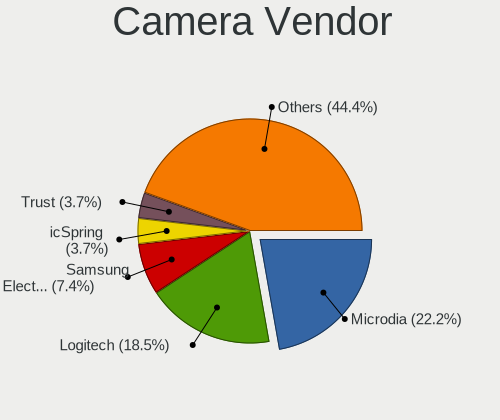
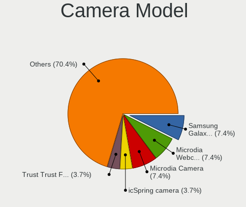

Kubuntu 23.04 - Tested Hardware & Statistics (Desktops)
-------------------------------------------------------

A project to collect tested hardware configurations for Kubuntu 23.04.

Anyone can contribute to this report by the [hw-probe](https://github.com/linuxhw/hw-probe) tool:

    sudo -E hw-probe -all -upload

Please contribute! Especially if your hardware is rare.

Contents
--------

* [ Test Cases ](#test-cases)

* [ System ](#system)
  - [ Kernel                   ](#kernel)
  - [ Kernel Family            ](#kernel-family)
  - [ Kernel Major Ver.        ](#kernel-major-ver)
  - [ Arch                     ](#arch)
  - [ DE                       ](#de)
  - [ Display Server           ](#display-server)
  - [ Display Manager          ](#display-manager)
  - [ OS Lang                  ](#os-lang)
  - [ Boot Mode                ](#boot-mode)
  - [ Filesystem               ](#filesystem)
  - [ Part. scheme             ](#part-scheme)
  - [ Dual Boot with Linux/BSD ](#dual-boot-with-linuxbsd)
  - [ Dual Boot (Win)          ](#dual-boot-win)

* [ Board ](#board)
  - [ Vendor                   ](#vendor)
  - [ Model                    ](#model)
  - [ Model Family             ](#model-family)
  - [ MFG Year                 ](#mfg-year)
  - [ Form Factor              ](#form-factor)
  - [ Secure Boot              ](#secure-boot)
  - [ Coreboot                 ](#coreboot)
  - [ RAM Size                 ](#ram-size)
  - [ RAM Used                 ](#ram-used)
  - [ Total Drives             ](#total-drives)
  - [ Has CD-ROM               ](#has-cd-rom)
  - [ Has Ethernet             ](#has-ethernet)
  - [ Has WiFi                 ](#has-wifi)
  - [ Has Bluetooth            ](#has-bluetooth)

* [ Location ](#location)
  - [ Country                  ](#country)
  - [ City                     ](#city)

* [ Drives ](#drives)
  - [ Drive Vendor             ](#drive-vendor)
  - [ Drive Model              ](#drive-model)
  - [ HDD Vendor               ](#hdd-vendor)
  - [ SSD Vendor               ](#ssd-vendor)
  - [ Drive Kind               ](#drive-kind)
  - [ Drive Connector          ](#drive-connector)
  - [ Drive Size               ](#drive-size)
  - [ Space Total              ](#space-total)
  - [ Space Used               ](#space-used)
  - [ Malfunc. Drives          ](#malfunc-drives)
  - [ Malfunc. Drive Vendor    ](#malfunc-drive-vendor)
  - [ Malfunc. HDD Vendor      ](#malfunc-hdd-vendor)
  - [ Malfunc. Drive Kind      ](#malfunc-drive-kind)
  - [ Failed Drives            ](#failed-drives)
  - [ Failed Drive Vendor      ](#failed-drive-vendor)
  - [ Drive Status             ](#drive-status)

* [ Storage controller ](#storage-controller)
  - [ Storage Vendor           ](#storage-vendor)
  - [ Storage Model            ](#storage-model)
  - [ Storage Kind             ](#storage-kind)

* [ Processor ](#processor)
  - [ CPU Vendor               ](#cpu-vendor)
  - [ CPU Model                ](#cpu-model)
  - [ CPU Model Family         ](#cpu-model-family)
  - [ CPU Cores                ](#cpu-cores)
  - [ CPU Sockets              ](#cpu-sockets)
  - [ CPU Threads              ](#cpu-threads)
  - [ CPU Op-Modes             ](#cpu-op-modes)
  - [ CPU Microcode            ](#cpu-microcode)
  - [ CPU Microarch            ](#cpu-microarch)

* [ Graphics ](#graphics)
  - [ GPU Vendor               ](#gpu-vendor)
  - [ GPU Model                ](#gpu-model)
  - [ GPU Combo                ](#gpu-combo)
  - [ GPU Driver               ](#gpu-driver)
  - [ GPU Memory               ](#gpu-memory)

* [ Monitor ](#monitor)
  - [ Monitor Vendor           ](#monitor-vendor)
  - [ Monitor Model            ](#monitor-model)
  - [ Monitor Resolution       ](#monitor-resolution)
  - [ Monitor Diagonal         ](#monitor-diagonal)
  - [ Monitor Width            ](#monitor-width)
  - [ Aspect Ratio             ](#aspect-ratio)
  - [ Monitor Area             ](#monitor-area)
  - [ Pixel Density            ](#pixel-density)
  - [ Multiple Monitors        ](#multiple-monitors)

* [ Network ](#network)
  - [ Net Controller Vendor    ](#net-controller-vendor)
  - [ Net Controller Model     ](#net-controller-model)
  - [ Wireless Vendor          ](#wireless-vendor)
  - [ Wireless Model           ](#wireless-model)
  - [ Ethernet Vendor          ](#ethernet-vendor)
  - [ Ethernet Model           ](#ethernet-model)
  - [ Net Controller Kind      ](#net-controller-kind)
  - [ Used Controller          ](#used-controller)
  - [ NICs                     ](#nics)
  - [ IPv6                     ](#ipv6)

* [ Bluetooth ](#bluetooth)
  - [ Bluetooth Vendor         ](#bluetooth-vendor)
  - [ Bluetooth Model          ](#bluetooth-model)

* [ Sound ](#sound)
  - [ Sound Vendor             ](#sound-vendor)
  - [ Sound Model              ](#sound-model)

* [ Memory ](#memory)
  - [ Memory Vendor            ](#memory-vendor)
  - [ Memory Model             ](#memory-model)
  - [ Memory Kind              ](#memory-kind)
  - [ Memory Form Factor       ](#memory-form-factor)
  - [ Memory Size              ](#memory-size)
  - [ Memory Speed             ](#memory-speed)

* [ Printers & scanners ](#printers--scanners)
  - [ Printer Vendor           ](#printer-vendor)
  - [ Printer Model            ](#printer-model)
  - [ Scanner Vendor           ](#scanner-vendor)
  - [ Scanner Model            ](#scanner-model)

* [ Camera ](#camera)
  - [ Camera Vendor            ](#camera-vendor)
  - [ Camera Model             ](#camera-model)

* [ Security ](#security)
  - [ Fingerprint Vendor       ](#fingerprint-vendor)
  - [ Fingerprint Model        ](#fingerprint-model)
  - [ Chipcard Vendor          ](#chipcard-vendor)
  - [ Chipcard Model           ](#chipcard-model)

* [ Unsupported ](#unsupported)
  - [ Unsupported Devices      ](#unsupported-devices)
  - [ Unsupported Device Types ](#unsupported-device-types)

Test Cases
----------

Total: 122

| Vendor        | Model                       | Probe                                                      | Date         |
|---------------|-----------------------------|------------------------------------------------------------|--------------|
| Dell          | 0X8DXD A00                  | [a44e0088f6](https://linux-hardware.org/?probe=a44e0088f6) | Oct 01, 2023 |
| HP            | 1790                        | [b87e9dd9ad](https://linux-hardware.org/?probe=b87e9dd9ad) | Sep 29, 2023 |
| HP            | 1790                        | [89791e7bf0](https://linux-hardware.org/?probe=89791e7bf0) | Sep 29, 2023 |
| MSI           | H97M-G43                    | [b74346acb3](https://linux-hardware.org/?probe=b74346acb3) | Sep 28, 2023 |
| ASUSTek       | PRIME B365M-A               | [76937ddbce](https://linux-hardware.org/?probe=76937ddbce) | Sep 28, 2023 |
| Unknown       | Unknown                     | [128658b9f0](https://linux-hardware.org/?probe=128658b9f0) | Sep 26, 2023 |
| Lenovo        | 3741 SDK0T76463 WIN 3422... | [e8397f6d0a](https://linux-hardware.org/?probe=e8397f6d0a) | Sep 26, 2023 |
| ASUSTek       | ROG STRIX B450-I GAMING     | [7f88191a7b](https://linux-hardware.org/?probe=7f88191a7b) | Sep 23, 2023 |
| ASRock        | H87 Pro4                    | [dc831a82cd](https://linux-hardware.org/?probe=dc831a82cd) | Sep 22, 2023 |
| Gigabyte      | GA-970A-DS3                 | [54a894ffd7](https://linux-hardware.org/?probe=54a894ffd7) | Sep 21, 2023 |
| ASUSTek       | Maximus IX FORMULA          | [e76f3de142](https://linux-hardware.org/?probe=e76f3de142) | Sep 19, 2023 |
| ASUSTek       | PRIME B450M-A               | [17e0d2ab92](https://linux-hardware.org/?probe=17e0d2ab92) | Sep 17, 2023 |
| ASUSTek       | PRIME X670-P                | [76d6f570a8](https://linux-hardware.org/?probe=76d6f570a8) | Sep 16, 2023 |
| ASRock        | B650M PG Riptide            | [3a1c100a69](https://linux-hardware.org/?probe=3a1c100a69) | Sep 14, 2023 |
| MSI           | MAG B650 TOMAHAWK WIFI      | [959fc9f783](https://linux-hardware.org/?probe=959fc9f783) | Sep 13, 2023 |
| MSI           | MAG B650 TOMAHAWK WIFI      | [641089b224](https://linux-hardware.org/?probe=641089b224) | Sep 13, 2023 |
| AZW           | MINI S 10                   | [5cd0efea8b](https://linux-hardware.org/?probe=5cd0efea8b) | Sep 12, 2023 |
| ASUSTek       | ROG STRIX B560-A GAMING ... | [b12897892a](https://linux-hardware.org/?probe=b12897892a) | Sep 09, 2023 |
| MSI           | B360M BAZOOKA               | [33cc2ca68e](https://linux-hardware.org/?probe=33cc2ca68e) | Sep 09, 2023 |
| ASUSTek       | PRIME A320M-K               | [1275709f08](https://linux-hardware.org/?probe=1275709f08) | Sep 09, 2023 |
| MSI           | MPG B550 GAMING PLUS        | [48cc912b75](https://linux-hardware.org/?probe=48cc912b75) | Sep 06, 2023 |
| Lenovo        | 3708 NOK                    | [153f0dfa9d](https://linux-hardware.org/?probe=153f0dfa9d) | Sep 06, 2023 |
| ASUSTek       | PRIME X470-PRO              | [f081f44bda](https://linux-hardware.org/?probe=f081f44bda) | Sep 05, 2023 |
| MSI           | MAG B560M MORTAR            | [07429e910f](https://linux-hardware.org/?probe=07429e910f) | Sep 05, 2023 |
| Gigabyte      | B650M AORUS ELITE AX        | [71da9ea288](https://linux-hardware.org/?probe=71da9ea288) | Sep 04, 2023 |
| Gigabyte      | B650M AORUS ELITE AX        | [31cb6a887e](https://linux-hardware.org/?probe=31cb6a887e) | Sep 04, 2023 |
| MSI           | MAG B560M MORTAR            | [c8978cf811](https://linux-hardware.org/?probe=c8978cf811) | Sep 03, 2023 |
| MSI           | MAG B560M MORTAR            | [62ac121b13](https://linux-hardware.org/?probe=62ac121b13) | Sep 03, 2023 |
| Dell          | 0XPDFK A01                  | [ac52854722](https://linux-hardware.org/?probe=ac52854722) | Aug 31, 2023 |
| Gigabyte      | B550 AORUS ELITE V2         | [27e226b6d4](https://linux-hardware.org/?probe=27e226b6d4) | Aug 30, 2023 |
| ASUSTek       | P8Z68-V PRO GEN3            | [a9d960e012](https://linux-hardware.org/?probe=a9d960e012) | Aug 29, 2023 |
| ASRock        | Z68 Extreme3 Gen3           | [a2f18f43e4](https://linux-hardware.org/?probe=a2f18f43e4) | Aug 29, 2023 |
| MSI           | B550-A PRO                  | [a4bd03aafc](https://linux-hardware.org/?probe=a4bd03aafc) | Aug 29, 2023 |
| MSI           | MAG B550M BAZOOKA           | [5b0183001d](https://linux-hardware.org/?probe=5b0183001d) | Aug 28, 2023 |
| MSI           | B550-A PRO                  | [19f07f081f](https://linux-hardware.org/?probe=19f07f081f) | Aug 27, 2023 |
| Gigabyte      | B550 GAMING X V2            | [fa48902a10](https://linux-hardware.org/?probe=fa48902a10) | Aug 27, 2023 |
| ASRock        | X570 Steel Legend           | [65b6b29fc7](https://linux-hardware.org/?probe=65b6b29fc7) | Aug 26, 2023 |
| ASUSTek       | PRIME X370-PRO              | [e4200e4c9a](https://linux-hardware.org/?probe=e4200e4c9a) | Aug 25, 2023 |
| ASUSTek       | M5A99X EVO R2.0             | [bc15f84b8c](https://linux-hardware.org/?probe=bc15f84b8c) | Aug 24, 2023 |
| ASRock        | X570 Steel Legend           | [7bd62bca50](https://linux-hardware.org/?probe=7bd62bca50) | Aug 23, 2023 |
| Intel         | H55                         | [8320e0c758](https://linux-hardware.org/?probe=8320e0c758) | Aug 22, 2023 |
| Gigabyte      | X470 AORUS ULTRA GAMING-... | [c78c246642](https://linux-hardware.org/?probe=c78c246642) | Aug 20, 2023 |
| Gigabyte      | B365M D3H-CF                | [3911bdd51d](https://linux-hardware.org/?probe=3911bdd51d) | Aug 20, 2023 |
| Gigabyte      | B365M D3H-CF                | [1979db3345](https://linux-hardware.org/?probe=1979db3345) | Aug 20, 2023 |
| ASRock        | X370 Taichi                 | [9a7f33c81b](https://linux-hardware.org/?probe=9a7f33c81b) | Aug 20, 2023 |
| Gigabyte      | Z390 M GAMING-CF            | [b5973b3c67](https://linux-hardware.org/?probe=b5973b3c67) | Aug 18, 2023 |
| MSI           | B450 GAMING PLUS MAX        | [aaec4c4fe1](https://linux-hardware.org/?probe=aaec4c4fe1) | Aug 16, 2023 |
| ASRock        | X370 Taichi                 | [e338ac8876](https://linux-hardware.org/?probe=e338ac8876) | Aug 14, 2023 |
| MSI           | MPG B650 CARBON WIFI        | [37086c4564](https://linux-hardware.org/?probe=37086c4564) | Aug 14, 2023 |
| ASUSTek       | TUF Gaming B550-PLUS        | [ed6e0727b2](https://linux-hardware.org/?probe=ed6e0727b2) | Aug 14, 2023 |
| ASUSTek       | ROG STRIX X670E-A GAMING... | [0c8514df53](https://linux-hardware.org/?probe=0c8514df53) | Aug 13, 2023 |
| Dell          | 0HY9JP A00                  | [f28a198267](https://linux-hardware.org/?probe=f28a198267) | Aug 10, 2023 |
| ASUSTek       | PRIME Z270-K                | [838f543301](https://linux-hardware.org/?probe=838f543301) | Aug 04, 2023 |
| ASUSTek       | PRIME Z270-K                | [1b9b10c938](https://linux-hardware.org/?probe=1b9b10c938) | Aug 04, 2023 |
| HP            | 158A                        | [ae8ecc3ee7](https://linux-hardware.org/?probe=ae8ecc3ee7) | Aug 04, 2023 |
| HP            | 158A                        | [bac95226bd](https://linux-hardware.org/?probe=bac95226bd) | Aug 02, 2023 |
| ASUSTek       | ROG STRIX B450-F GAMING ... | [6519784d61](https://linux-hardware.org/?probe=6519784d61) | Aug 01, 2023 |
| Google        | Zako                        | [66946b6b49](https://linux-hardware.org/?probe=66946b6b49) | Jul 30, 2023 |
| ASUSTek       | PRIME B450M-A II            | [22b080cd6b](https://linux-hardware.org/?probe=22b080cd6b) | Jul 29, 2023 |
| ASUSTek       | PRIME Z390-A                | [8102a251ad](https://linux-hardware.org/?probe=8102a251ad) | Jul 29, 2023 |
| ASUSTek       | ROG STRIX B550-F GAMING     | [4a34b9da9b](https://linux-hardware.org/?probe=4a34b9da9b) | Jul 27, 2023 |
| ASUSTek       | ROG STRIX B550-F GAMING     | [a26bbadd26](https://linux-hardware.org/?probe=a26bbadd26) | Jul 27, 2023 |
| Acer          | Aspire X3990                | [7b6b27241f](https://linux-hardware.org/?probe=7b6b27241f) | Jul 24, 2023 |
| ASRock        | B560M Pro4                  | [881853b4dc](https://linux-hardware.org/?probe=881853b4dc) | Jul 23, 2023 |
| MSI           | B550M PRO-VDH WIFI          | [751e776113](https://linux-hardware.org/?probe=751e776113) | Jul 23, 2023 |
| HP            | 83E9                        | [35c7f631ac](https://linux-hardware.org/?probe=35c7f631ac) | Jul 18, 2023 |
| MSI           | MAG B650 TOMAHAWK WIFI      | [b29b313957](https://linux-hardware.org/?probe=b29b313957) | Jul 17, 2023 |
| Gigabyte      | X570S UD                    | [8fb3c405c0](https://linux-hardware.org/?probe=8fb3c405c0) | Jul 16, 2023 |
| ASUSTek       | PRIME A320M-K               | [d64ea4b9cd](https://linux-hardware.org/?probe=d64ea4b9cd) | Jul 15, 2023 |
| MSI           | X370 GAMING PRO CARBON      | [87a3354fc2](https://linux-hardware.org/?probe=87a3354fc2) | Jul 13, 2023 |
| MSI           | B360M MORTAR TITANIUM       | [31b2aa5991](https://linux-hardware.org/?probe=31b2aa5991) | Jul 08, 2023 |
| Pegatron      | 2AC3                        | [a2981d590e](https://linux-hardware.org/?probe=a2981d590e) | Jul 08, 2023 |
| Huanan        | X99-F8 GAMING V5.0          | [2f16685519](https://linux-hardware.org/?probe=2f16685519) | Jul 08, 2023 |
| ASUSTek       | PRIME H510M-K               | [c0b828ddc4](https://linux-hardware.org/?probe=c0b828ddc4) | Jul 07, 2023 |
| ASUSTek       | PRIME B450M-K II            | [43cb92095e](https://linux-hardware.org/?probe=43cb92095e) | Jul 07, 2023 |
| ASUSTek       | M5A78L-M LX PLUS            | [e5d4d7b4a7](https://linux-hardware.org/?probe=e5d4d7b4a7) | Jul 06, 2023 |
| Gigabyte      | B550 AORUS PRO              | [61c278235a](https://linux-hardware.org/?probe=61c278235a) | Jul 03, 2023 |
| Gigabyte      | B550 AORUS PRO              | [48f79dc803](https://linux-hardware.org/?probe=48f79dc803) | Jul 03, 2023 |
| Gigabyte      | B550 AORUS PRO              | [9d47ca40b8](https://linux-hardware.org/?probe=9d47ca40b8) | Jul 03, 2023 |
| Gigabyte      | X570S UD                    | [22ca0e18f4](https://linux-hardware.org/?probe=22ca0e18f4) | Jul 02, 2023 |
| ASUSTek       | TUF Gaming B550-PLUS        | [07c8a86c16](https://linux-hardware.org/?probe=07c8a86c16) | Jul 02, 2023 |
| Gateway       | IPISB-VR                    | [73ab7736ca](https://linux-hardware.org/?probe=73ab7736ca) | Jul 02, 2023 |
| ASUSTek       | ROG STRIX B560-A GAMING ... | [51d5b7d342](https://linux-hardware.org/?probe=51d5b7d342) | Jul 01, 2023 |
| ASUSTek       | ROG STRIX B560-A GAMING ... | [0571943e1f](https://linux-hardware.org/?probe=0571943e1f) | Jul 01, 2023 |
| Gigabyte      | B85-HD3                     | [ed2ea8b876](https://linux-hardware.org/?probe=ed2ea8b876) | Jul 01, 2023 |
| Gigabyte      | A320M-S2H-CF                | [7e7099c099](https://linux-hardware.org/?probe=7e7099c099) | Jul 01, 2023 |
| Intel         | SHARKBAY                    | [581282a150](https://linux-hardware.org/?probe=581282a150) | Jun 29, 2023 |
| MSI           | H81M-P32                    | [c0c2f3ba48](https://linux-hardware.org/?probe=c0c2f3ba48) | Jun 28, 2023 |
| MSI           | H81M-P32                    | [75cbcde6b8](https://linux-hardware.org/?probe=75cbcde6b8) | Jun 28, 2023 |
| ASUSTek       | Maximus IX HERO             | [bd98bbb8c0](https://linux-hardware.org/?probe=bd98bbb8c0) | Jun 25, 2023 |
| ASUSTek       | PRIME H310M-A R2.0          | [aab1616d0e](https://linux-hardware.org/?probe=aab1616d0e) | Jun 25, 2023 |
| Fujitsu       | D3600-A1 S26361-D3600-A1    | [29e7fc8e13](https://linux-hardware.org/?probe=29e7fc8e13) | Jun 20, 2023 |
| BESSTAR Te... | UM700                       | [37292d4c84](https://linux-hardware.org/?probe=37292d4c84) | Jun 20, 2023 |
| ASRock        | A320M-HDV R4.0              | [e2e55f5267](https://linux-hardware.org/?probe=e2e55f5267) | Jun 16, 2023 |
| ASUSTek       | PRIME H610M-E D4            | [39d273ec86](https://linux-hardware.org/?probe=39d273ec86) | Jun 15, 2023 |
| Fujitsu       | D3222-B1 S26361-D3222-B1    | [01f33d2c9b](https://linux-hardware.org/?probe=01f33d2c9b) | Jun 14, 2023 |
| Seco          | C40 C                       | [4d990c8a0c](https://linux-hardware.org/?probe=4d990c8a0c) | Jun 10, 2023 |
| Gigabyte      | GA-MA770-US3                | [c22850601d](https://linux-hardware.org/?probe=c22850601d) | Jun 07, 2023 |
| ASUSTek       | H81M-A                      | [9636642e65](https://linux-hardware.org/?probe=9636642e65) | Jun 04, 2023 |
| MSI           | B450M PRO-M2 V2             | [fc8a306ca0](https://linux-hardware.org/?probe=fc8a306ca0) | Jun 03, 2023 |
| Gigabyte      | B365M H                     | [b7a585d1f1](https://linux-hardware.org/?probe=b7a585d1f1) | Jun 03, 2023 |
| ASUSTek       | M5A78L-M LX PLUS            | [fc4e2630c0](https://linux-hardware.org/?probe=fc4e2630c0) | Jun 01, 2023 |
| ASUSTek       | M5A78L-M LX PLUS            | [f02c7845e5](https://linux-hardware.org/?probe=f02c7845e5) | Jun 01, 2023 |
| ASUSTek       | H81M-A                      | [70714d71f5](https://linux-hardware.org/?probe=70714d71f5) | May 28, 2023 |
| Alienware     | 04VWF2 A00                  | [0d6c86d757](https://linux-hardware.org/?probe=0d6c86d757) | May 25, 2023 |
| ASRock        | X99 Extreme6/ac             | [8e255dc13b](https://linux-hardware.org/?probe=8e255dc13b) | May 22, 2023 |
| Alienware     | 04VWF2 A00                  | [7c09c55150](https://linux-hardware.org/?probe=7c09c55150) | May 21, 2023 |
| Lenovo        | 36C8 SDK0J40700 WIN 3258... | [166ec29ce0](https://linux-hardware.org/?probe=166ec29ce0) | May 18, 2023 |
| HP            | 3397                        | [17d9dcc121](https://linux-hardware.org/?probe=17d9dcc121) | May 15, 2023 |
| Gigabyte      | X570S AORUS ELITE AX        | [094fd8b39a](https://linux-hardware.org/?probe=094fd8b39a) | May 12, 2023 |
| Intel         | H61                         | [57ef0f0f97](https://linux-hardware.org/?probe=57ef0f0f97) | May 11, 2023 |
| ASUSTek       | TUF Gaming X570-PLUS        | [c80f41d509](https://linux-hardware.org/?probe=c80f41d509) | May 09, 2023 |
| Biostar       | AM1MHP                      | [1f21e13fcd](https://linux-hardware.org/?probe=1f21e13fcd) | May 07, 2023 |
| Gigabyte      | H87-HD3                     | [f0e4057e5f](https://linux-hardware.org/?probe=f0e4057e5f) | May 03, 2023 |
| HP            | 828A                        | [f1590b355f](https://linux-hardware.org/?probe=f1590b355f) | Apr 30, 2023 |
| Foxconn       | H67M-S/H67M-V/H67           | [92fa61186f](https://linux-hardware.org/?probe=92fa61186f) | Apr 23, 2023 |
| Fujitsu       | D3500-A1 S26361-D3500-A1    | [475a4d151d](https://linux-hardware.org/?probe=475a4d151d) | Apr 22, 2023 |
| ASUSTek       | M5A78L LE                   | [3d241113f4](https://linux-hardware.org/?probe=3d241113f4) | Apr 21, 2023 |
| MSI           | 970 GAMING                  | [cb295448b6](https://linux-hardware.org/?probe=cb295448b6) | Apr 21, 2023 |
| Gigabyte      | B550 AORUS ELITE V2         | [a71c5a4629](https://linux-hardware.org/?probe=a71c5a4629) | Mar 19, 2023 |
| Unknown       | Unknown                     | [b20f8089c3](https://linux-hardware.org/?probe=b20f8089c3) | Mar 15, 2023 |
| Gigabyte      | B360M HD3                   | [d3821bdbab](https://linux-hardware.org/?probe=d3821bdbab) | Feb 26, 2023 |

System
------

Kernel
------

Version of the Linux kernel

| Version                | Desktops | Percent |
|------------------------|----------|---------|
| 6.2.0-20-generic       | 17       | 17.53%  |
| 6.2.0-27-generic       | 14       | 14.43%  |
| 6.2.0-32-generic       | 9        | 9.28%   |
| 6.2.0-33-generic       | 8        | 8.25%   |
| 6.2.0-24-generic       | 8        | 8.25%   |
| 6.2.0-26-generic       | 6        | 6.19%   |
| 6.2.0-23-generic       | 6        | 6.19%   |
| 6.2.0-25-generic       | 5        | 5.15%   |
| 6.2.0-31-generic       | 4        | 4.12%   |
| 6.2.0-1003-lowlatency  | 3        | 3.09%   |
| 6.2.0-1013-lowlatency  | 2        | 2.06%   |
| 6.5.1-060501-generic   | 1        | 1.03%   |
| 6.4.6-060406-generic   | 1        | 1.03%   |
| 6.4.3-1-liquorix-amd64 | 1        | 1.03%   |
| 6.4.1-2-liquorix-amd64 | 1        | 1.03%   |
| 6.4.0-060400-generic   | 1        | 1.03%   |
| 6.3.5-060305-generic   | 1        | 1.03%   |
| 6.3.10                 | 1        | 1.03%   |
| 6.2.5-060205-generic   | 1        | 1.03%   |
| 6.2.0-1009-lowlatency  | 1        | 1.03%   |
| 6.2.0-1008-lowlatency  | 1        | 1.03%   |
| 6.2.0-1007-lowlatency  | 1        | 1.03%   |
| 6.1.0-16-generic       | 1        | 1.03%   |
| 5.19.0-42-generic      | 1        | 1.03%   |
| 5.19.0-28-generic      | 1        | 1.03%   |
| 5.19.0-1023-lowlatency | 1        | 1.03%   |

Kernel Family
-------------

Linux kernel without a distro release

| Version | Desktops | Percent |
|---------|----------|---------|
| 6.2.0   | 84       | 87.5%   |
| 5.19.0  | 3        | 3.13%   |
| 6.5.1   | 1        | 1.04%   |
| 6.4.6   | 1        | 1.04%   |
| 6.4.3   | 1        | 1.04%   |
| 6.4.1   | 1        | 1.04%   |
| 6.4.0   | 1        | 1.04%   |
| 6.3.5   | 1        | 1.04%   |
| 6.3.10  | 1        | 1.04%   |
| 6.2.5   | 1        | 1.04%   |
| 6.1.0   | 1        | 1.04%   |

Kernel Major Ver.
-----------------

Linux kernel major version

| Version | Desktops | Percent |
|---------|----------|---------|
| 6.2     | 85       | 88.54%  |
| 6.4     | 4        | 4.17%   |
| 5.19    | 3        | 3.13%   |
| 6.3     | 2        | 2.08%   |
| 6.5     | 1        | 1.04%   |
| 6.1     | 1        | 1.04%   |

Arch
----

OS architecture (x86_64, i586, etc.)

| Name   | Desktops | Percent |
|--------|----------|---------|
| x86_64 | 94       | 100%    |

DE
--

Desktop Environment

| Name | Desktops | Percent |
|------|----------|---------|
| KDE5 | 91       | 96.81%  |
| KDE  | 3        | 3.19%   |

Display Server
--------------

X11 or Wayland

| Name    | Desktops | Percent |
|---------|----------|---------|
| X11     | 79       | 83.16%  |
| Wayland | 15       | 15.79%  |
| Tty     | 1        | 1.05%   |

Display Manager
---------------

SDDM, LightDM, etc.

| Name    | Desktops | Percent |
|---------|----------|---------|
| SDDM    | 59       | 62.11%  |
| Unknown | 33       | 34.74%  |
| GDM3    | 2        | 2.11%   |
| LightDM | 1        | 1.05%   |

OS Lang
-------

Language

| Lang  | Desktops | Percent |
|-------|----------|---------|
| en_US | 39       | 41.49%  |
| de_DE | 13       | 13.83%  |
| fr_FR | 8        | 8.51%   |
| en_GB | 8        | 8.51%   |
| ru_RU | 5        | 5.32%   |
| pt_BR | 3        | 3.19%   |
| it_IT | 3        | 3.19%   |
| pl_PL | 2        | 2.13%   |
| C     | 2        | 2.13%   |
| zh_TW | 1        | 1.06%   |
| sv_SE | 1        | 1.06%   |
| fr_BE | 1        | 1.06%   |
| es_MX | 1        | 1.06%   |
| es_CO | 1        | 1.06%   |
| es_CL | 1        | 1.06%   |
| en_IN | 1        | 1.06%   |
| en_IL | 1        | 1.06%   |
| en_CA | 1        | 1.06%   |
| de_CH | 1        | 1.06%   |
| da_DK | 1        | 1.06%   |

Boot Mode
---------

EFI or BIOS

| Mode | Desktops | Percent |
|------|----------|---------|
| BIOS | 53       | 55.79%  |
| EFI  | 42       | 44.21%  |

Filesystem
----------

Type of filesystem

| Type    | Desktops | Percent |
|---------|----------|---------|
| Ext4    | 66       | 70.21%  |
| Tmpfs   | 18       | 19.15%  |
| Btrfs   | 8        | 8.51%   |
| Overlay | 1        | 1.06%   |
| F2fs    | 1        | 1.06%   |

Part. scheme
------------

Scheme of partitioning

| Type    | Desktops | Percent |
|---------|----------|---------|
| GPT     | 57       | 60%     |
| Unknown | 32       | 33.68%  |
| MBR     | 6        | 6.32%   |

Dual Boot with Linux/BSD
------------------------

Hosting more than one Linux/BSD

| Dual boot | Desktops | Percent |
|-----------|----------|---------|
| No        | 71       | 75.53%  |
| Yes       | 23       | 24.47%  |

Dual Boot (Win)
---------------

Hosting Linux and Windows

| Dual boot | Desktops | Percent |
|-----------|----------|---------|
| No        | 62       | 65.96%  |
| Yes       | 32       | 34.04%  |

Board
-----

Vendor
------

Motherboard manufacturer

| Name                | Desktops | Percent |
|---------------------|----------|---------|
| ASUSTek Computer    | 27       | 28.72%  |
| Gigabyte Technology | 17       | 18.09%  |
| MSI                 | 15       | 15.96%  |
| ASRock              | 8        | 8.51%   |
| Hewlett-Packard     | 4        | 4.26%   |
| Intel               | 3        | 3.19%   |
| Dell                | 3        | 3.19%   |
| Lenovo              | 2        | 2.13%   |
| Fujitsu             | 2        | 2.13%   |
| Unknown             | 2        | 2.13%   |
| Seco                | 1        | 1.06%   |
| Pegatron            | 1        | 1.06%   |
| Huanan              | 1        | 1.06%   |
| Google              | 1        | 1.06%   |
| Gateway             | 1        | 1.06%   |
| Foxconn             | 1        | 1.06%   |
| Biostar             | 1        | 1.06%   |
| BESSTAR Tech        | 1        | 1.06%   |
| AZW                 | 1        | 1.06%   |
| Alienware           | 1        | 1.06%   |
| Acer                | 1        | 1.06%   |

Model
-----

Motherboard model

| Name                                        | Desktops | Percent |
|---------------------------------------------|----------|---------|
| MSI MS-7D75                                 | 2        | 2.13%   |
| MSI MS-7C95                                 | 2        | 2.13%   |
| MSI MS-7C56                                 | 2        | 2.13%   |
| Gigabyte B550 AORUS ELITE V2                | 2        | 2.13%   |
| ASUS TUF Gaming B550-PLUS                   | 2        | 2.13%   |
| Unknown                                     | 2        | 2.13%   |
| Seco C40                                    | 1        | 1.06%   |
| Pegatron 520-1000nl                         | 1        | 1.06%   |
| MSI MS-7D74                                 | 1        | 1.06%   |
| MSI MS-7D17                                 | 1        | 1.06%   |
| MSI MS-7B86                                 | 1        | 1.06%   |
| MSI MS-7B24                                 | 1        | 1.06%   |
| MSI MS-7B23                                 | 1        | 1.06%   |
| MSI MS-7A32                                 | 1        | 1.06%   |
| MSI MS-7924                                 | 1        | 1.06%   |
| MSI MS-7846                                 | 1        | 1.06%   |
| MSI MS-7693                                 | 1        | 1.06%   |
| Lenovo IdeaCentre Gaming5 17IAB7 90T100BHMZ | 1        | 1.06%   |
| Lenovo IdeaCentre 3 07ADA05 90MV0059RS      | 1        | 1.06%   |
| Intel SHARKBAY                              | 1        | 1.06%   |
| Intel H61                                   | 1        | 1.06%   |
| Intel H55                                   | 1        | 1.06%   |
| Huanan X99-F8 GAMING V5.0                   | 1        | 1.06%   |
| HP Z220 CMT Workstation                     | 1        | 1.06%   |
| HP EliteDesk 705 G4 DM 35W (TAA)            | 1        | 1.06%   |
| HP Compaq Elite 8300 SFF                    | 1        | 1.06%   |
| HP 870-119                                  | 1        | 1.06%   |
| Google Zako                                 | 1        | 1.06%   |
| Gigabyte Z390 M GAMING                      | 1        | 1.06%   |
| Gigabyte X570S UD                           | 1        | 1.06%   |
| Gigabyte X570S AORUS ELITE AX               | 1        | 1.06%   |
| Gigabyte X470 AORUS ULTRA GAMING            | 1        | 1.06%   |
| Gigabyte H87-HD3                            | 1        | 1.06%   |
| Gigabyte GA-MA770-US3                       | 1        | 1.06%   |
| Gigabyte GA-970A-DS3                        | 1        | 1.06%   |
| Gigabyte B650M AORUS ELITE AX               | 1        | 1.06%   |
| Gigabyte B550 GAMING X V2                   | 1        | 1.06%   |
| Gigabyte B550 AORUS PRO                     | 1        | 1.06%   |
| Gigabyte B365M H                            | 1        | 1.06%   |
| Gigabyte B365M D3H                          | 1        | 1.06%   |

Model Family
------------

Motherboard model prefix

| Name                  | Desktops | Percent |
|-----------------------|----------|---------|
| ASUS PRIME            | 12       | 12.77%  |
| ASUS ROG              | 5        | 5.32%   |
| Gigabyte B550         | 4        | 4.26%   |
| ASUS TUF              | 3        | 3.19%   |
| MSI MS-7D75           | 2        | 2.13%   |
| MSI MS-7C95           | 2        | 2.13%   |
| MSI MS-7C56           | 2        | 2.13%   |
| Lenovo IdeaCentre     | 2        | 2.13%   |
| Gigabyte X570S        | 2        | 2.13%   |
| Gigabyte B365M        | 2        | 2.13%   |
| Dell Precision        | 2        | 2.13%   |
| ASUS Maximus          | 2        | 2.13%   |
| Unknown               | 2        | 2.13%   |
| Seco C40              | 1        | 1.06%   |
| Pegatron 520-1000nl   | 1        | 1.06%   |
| MSI MS-7D74           | 1        | 1.06%   |
| MSI MS-7D17           | 1        | 1.06%   |
| MSI MS-7B86           | 1        | 1.06%   |
| MSI MS-7B24           | 1        | 1.06%   |
| MSI MS-7B23           | 1        | 1.06%   |
| MSI MS-7A32           | 1        | 1.06%   |
| MSI MS-7924           | 1        | 1.06%   |
| MSI MS-7846           | 1        | 1.06%   |
| MSI MS-7693           | 1        | 1.06%   |
| Intel SHARKBAY        | 1        | 1.06%   |
| Intel H61             | 1        | 1.06%   |
| Intel H55             | 1        | 1.06%   |
| Huanan X99-F8         | 1        | 1.06%   |
| HP Z220               | 1        | 1.06%   |
| HP EliteDesk          | 1        | 1.06%   |
| HP Compaq             | 1        | 1.06%   |
| HP 870-119            | 1        | 1.06%   |
| Google Zako           | 1        | 1.06%   |
| Gigabyte Z390         | 1        | 1.06%   |
| Gigabyte X470         | 1        | 1.06%   |
| Gigabyte H87-HD3      | 1        | 1.06%   |
| Gigabyte GA-MA770-US3 | 1        | 1.06%   |
| Gigabyte GA-970A-DS3  | 1        | 1.06%   |
| Gigabyte B650M        | 1        | 1.06%   |
| Gigabyte B360M-HD3    | 1        | 1.06%   |

MFG Year
--------

Motherboard manufacture year

| Year | Desktops | Percent |
|------|----------|---------|
| 2020 | 15       | 15.96%  |
| 2019 | 15       | 15.96%  |
| 2022 | 11       | 11.7%   |
| 2018 | 11       | 11.7%   |
| 2021 | 8        | 8.51%   |
| 2011 | 7        | 7.45%   |
| 2017 | 6        | 6.38%   |
| 2012 | 5        | 5.32%   |
| 2014 | 4        | 4.26%   |
| 2013 | 4        | 4.26%   |
| 2023 | 2        | 2.13%   |
| 2016 | 2        | 2.13%   |
| 2009 | 2        | 2.13%   |
| 2015 | 1        | 1.06%   |
| 2010 | 1        | 1.06%   |

Form Factor
-----------

Physical design of the computer

| Name    | Desktops | Percent |
|---------|----------|---------|
| Desktop | 94       | 100%    |

Secure Boot
-----------

Enabled or disabled

| State    | Desktops | Percent |
|----------|----------|---------|
| Disabled | 92       | 97.87%  |
| Enabled  | 2        | 2.13%   |

Coreboot
--------

Have coreboot on board

| Used | Desktops | Percent |
|------|----------|---------|
| No   | 93       | 98.94%  |
| Yes  | 1        | 1.06%   |

RAM Size
--------

Total RAM memory

| Size in GB  | Desktops | Percent |
|-------------|----------|---------|
| 32.01-64.0  | 25       | 26.6%   |
| 16.01-24.0  | 25       | 26.6%   |
| 8.01-16.0   | 13       | 13.83%  |
| 4.01-8.0    | 12       | 12.77%  |
| 24.01-32.0  | 8        | 8.51%   |
| 64.01-256.0 | 7        | 7.45%   |
| 3.01-4.0    | 4        | 4.26%   |

RAM Used
--------

Used RAM memory

| Used GB    | Desktops | Percent |
|------------|----------|---------|
| 4.01-8.0   | 32       | 32.99%  |
| 2.01-3.0   | 20       | 20.62%  |
| 3.01-4.0   | 18       | 18.56%  |
| 1.01-2.0   | 15       | 15.46%  |
| 8.01-16.0  | 11       | 11.34%  |
| 16.01-24.0 | 1        | 1.03%   |

Total Drives
------------

Number of drives on board

| Drives | Desktops | Percent |
|--------|----------|---------|
| 2      | 24       | 25.26%  |
| 3      | 22       | 23.16%  |
| 1      | 21       | 22.11%  |
| 4      | 17       | 17.89%  |
| 5      | 5        | 5.26%   |
| 6      | 3        | 3.16%   |
| 7      | 2        | 2.11%   |
| 8      | 1        | 1.05%   |

Has CD-ROM
----------

Has CD-ROM on board

| Presented | Desktops | Percent |
|-----------|----------|---------|
| No        | 62       | 65.96%  |
| Yes       | 32       | 34.04%  |

Has Ethernet
------------

Has Ethernet on board

| Presented | Desktops | Percent |
|-----------|----------|---------|
| Yes       | 94       | 100%    |

Has WiFi
--------

Has WiFi module

| Presented | Desktops | Percent |
|-----------|----------|---------|
| No        | 52       | 55.32%  |
| Yes       | 42       | 44.68%  |

Has Bluetooth
-------------

Has Bluetooth module

| Presented | Desktops | Percent |
|-----------|----------|---------|
| No        | 56       | 59.57%  |
| Yes       | 38       | 40.43%  |

Location
--------

Country
-------

Geographic location (country)

| Country      | Desktops | Percent |
|--------------|----------|---------|
| USA          | 19       | 20.21%  |
| Germany      | 15       | 15.96%  |
| UK           | 9        | 9.57%   |
| France       | 9        | 9.57%   |
| Russia       | 5        | 5.32%   |
| Switzerland  | 3        | 3.19%   |
| Sweden       | 3        | 3.19%   |
| Poland       | 3        | 3.19%   |
| Canada       | 3        | 3.19%   |
| Brazil       | 3        | 3.19%   |
| Serbia       | 2        | 2.13%   |
| Netherlands  | 2        | 2.13%   |
| Italy        | 2        | 2.13%   |
| Turkey       | 1        | 1.06%   |
| Taiwan       | 1        | 1.06%   |
| Spain        | 1        | 1.06%   |
| Saudi Arabia | 1        | 1.06%   |
| Romania      | 1        | 1.06%   |
| Portugal     | 1        | 1.06%   |
| Mexico       | 1        | 1.06%   |
| Kazakhstan   | 1        | 1.06%   |
| Israel       | 1        | 1.06%   |
| Indonesia    | 1        | 1.06%   |
| India        | 1        | 1.06%   |
| Denmark      | 1        | 1.06%   |
| Colombia     | 1        | 1.06%   |
| Chile        | 1        | 1.06%   |
| Belgium      | 1        | 1.06%   |
| Bangladesh   | 1        | 1.06%   |

City
----

Geographic location (city)

| City           | Desktops | Percent |
|----------------|----------|---------|
| London         | 3        | 3.19%   |
| Virginia Beach | 2        | 2.13%   |
| Oberburg       | 2        | 2.13%   |
| Hamburg        | 2        | 2.13%   |
| Arzamas        | 2        | 2.13%   |
| Zuchwil        | 1        | 1.06%   |
| Wiesmoor       | 1        | 1.06%   |
| West Valley    | 1        | 1.06%   |
| Weilmuenster   | 1        | 1.06%   |
| Warsaw         | 1        | 1.06%   |
| Victoria       | 1        | 1.06%   |
| Vaggeryd       | 1        | 1.06%   |
| Ufa            | 1        | 1.06%   |
| Uelversheim    | 1        | 1.06%   |
| Tilburg        | 1        | 1.06%   |
| The Hague      | 1        | 1.06%   |
| Taichung       | 1        | 1.06%   |
| Sutton         | 1        | 1.06%   |
| Sundsvall      | 1        | 1.06%   |
| Strasbourg     | 1        | 1.06%   |
| Stone Mountain | 1        | 1.06%   |
| Simpsonville   | 1        | 1.06%   |
| Sibiu          | 1        | 1.06%   |
| Sherbrooke     | 1        | 1.06%   |
| Sao Paulo      | 1        | 1.06%   |
| Santiago       | 1        | 1.06%   |
| San Jose       | 1        | 1.06%   |
| San Francisco  | 1        | 1.06%   |
| Rzeszów       | 1        | 1.06%   |
| Rho            | 1        | 1.06%   |
| Porto Alegre   | 1        | 1.06%   |
| Portimao       | 1        | 1.06%   |
| Pontarlier     | 1        | 1.06%   |
| Pasco          | 1        | 1.06%   |
| Paris          | 1        | 1.06%   |
| Pančevo       | 1        | 1.06%   |
| Orbassano      | 1        | 1.06%   |
| Oldenburg      | 1        | 1.06%   |
| Oberursel      | 1        | 1.06%   |
| Novato         | 1        | 1.06%   |

Drives
------

Drive Vendor
------------

Hard drive vendors

| Vendor                      | Desktops | Drives | Percent |
|-----------------------------|----------|--------|---------|
| Seagate                     | 32       | 52     | 15.17%  |
| Samsung Electronics         | 31       | 51     | 14.69%  |
| WDC                         | 29       | 35     | 13.74%  |
| Sandisk                     | 18       | 22     | 8.53%   |
| Kingston                    | 11       | 14     | 5.21%   |
| Toshiba                     | 10       | 11     | 4.74%   |
| Crucial                     | 10       | 13     | 4.74%   |
| Kingston Technology Company | 5        | 6      | 2.37%   |
| Phison Electronics          | 4        | 4      | 1.9%    |
| Hitachi                     | 4        | 4      | 1.9%    |
| HGST                        | 4        | 4      | 1.9%    |
| A-DATA Technology           | 4        | 5      | 1.9%    |
| Silicon Motion              | 3        | 4      | 1.42%   |
| PNY                         | 3        | 3      | 1.42%   |
| Intel                       | 3        | 4      | 1.42%   |
| SPCC                        | 2        | 6      | 0.95%   |
| Micron/Crucial Technology   | 2        | 4      | 0.95%   |
| Maxtor                      | 2        | 2      | 0.95%   |
| Hewlett-Packard             | 2        | 3      | 0.95%   |
| Corsair                     | 2        | 2      | 0.95%   |
| China                       | 2        | 2      | 0.95%   |
| ADATA Technology            | 2        | 2      | 0.95%   |
| Unknown                     | 2        | 2      | 0.95%   |
| Vaseky                      | 1        | 1      | 0.47%   |
| Unknown                     | 1        | 1      | 0.47%   |
| Transcend                   | 1        | 1      | 0.47%   |
| Team                        | 1        | 1      | 0.47%   |
| Smartbuy                    | 1        | 1      | 0.47%   |
| S3+                         | 1        | 1      | 0.47%   |
| Realtek Semiconductor       | 1        | 1      | 0.47%   |
| PHD 3.0                     | 1        | 1      | 0.47%   |
| Patriot                     | 1        | 1      | 0.47%   |
| Neo                         | 1        | 1      | 0.47%   |
| Micron Technology           | 1        | 1      | 0.47%   |
| MAXIO Technology (Hangzhou) | 1        | 1      | 0.47%   |
| Lexar                       | 1        | 1      | 0.47%   |
| JMicron Technology          | 1        | 1      | 0.47%   |
| Intenso                     | 1        | 1      | 0.47%   |
| INNOVATION IT               | 1        | 1      | 0.47%   |
| HS-SSD-E100                 | 1        | 1      | 0.47%   |

Drive Model
-----------

Hard drive models

| Model                                                             | Desktops | Percent |
|-------------------------------------------------------------------|----------|---------|
| Seagate ST4000DM004-2CV104 4TB                                    | 4        | 1.58%   |
| Seagate ST2000DM008-2FR102 2TB                                    | 4        | 1.58%   |
| Samsung SSD 860 EVO 500GB                                         | 4        | 1.58%   |
| Seagate ST2000DM001-1ER164 2TB                                    | 3        | 1.19%   |
| Seagate ST1000DM003-1CH162 1TB                                    | 3        | 1.19%   |
| Samsung SSD 980 1TB                                               | 3        | 1.19%   |
| Samsung SSD 850 EVO 250GB                                         | 3        | 1.19%   |
| Phison PS5013 E13 NVMe Controller 512GB                           | 3        | 1.19%   |
| Kingston SA400S37480G 480GB SSD                                   | 3        | 1.19%   |
| WDC WD5000AAKX-60U6AA0 500GB                                      | 2        | 0.79%   |
| WDC WD10EZEX-60WN4A0 1TB                                          | 2        | 0.79%   |
| Toshiba DT01ACA100 1TB                                            | 2        | 0.79%   |
| Seagate ST1000DM003-1ER162 1TB                                    | 2        | 0.79%   |
| Sandisk WD_BLACK SN850X 4000GB                                    | 2        | 0.79%   |
| Sandisk WD Black SN850 1TB                                        | 2        | 0.79%   |
| SanDisk SSD PLUS 1000GB                                           | 2        | 0.79%   |
| SanDisk NVMe SSD Drive 1TB                                        | 2        | 0.79%   |
| Samsung SSD 980 PRO 2TB                                           | 2        | 0.79%   |
| Samsung SSD 980 PRO 1TB                                           | 2        | 0.79%   |
| Samsung SSD 970 EVO Plus 500GB                                    | 2        | 0.79%   |
| Samsung SSD 870 QVO 2TB                                           | 2        | 0.79%   |
| Samsung NVMe SSD Controller SM981/PM981/PM983 256GB               | 2        | 0.79%   |
| Samsung NVMe SSD Controller PM9A1/PM9A3/980PRO 1TB                | 2        | 0.79%   |
| Samsung HD103SI 1TB                                               | 2        | 0.79%   |
| Micron/Crucial P2 NVMe PCIe SSD 1TB                               | 2        | 0.79%   |
| Kingston Company SNV2S1000G 1TB                                   | 2        | 0.79%   |
| Kingston Company A2000 NVMe SSD 1TB                               | 2        | 0.79%   |
| Kingston SA400S37240G 240GB SSD                                   | 2        | 0.79%   |
| Kingston SA400S37120G 120GB SSD                                   | 2        | 0.79%   |
| Kingston SA400M8240G 240GB SSD                                    | 2        | 0.79%   |
| Hitachi HDP725050GLA360 500GB                                     | 2        | 0.79%   |
| ADATA XPG SX8200 Pro PCIe Gen3x4 M.2 2280 Solid State Drive 256GB | 2        | 0.79%   |
| Unknown                                                           | 2        | 0.79%   |
| WDC WUH721818ALE6L4 18TB                                          | 1        | 0.4%    |
| WDC WDS500G2B0A 500GB SSD                                         | 1        | 0.4%    |
| WDC WDS400T2B0A-00SM50 4TB SSD                                    | 1        | 0.4%    |
| WDC WDS200T2B0A-00SM50 2TB SSD                                    | 1        | 0.4%    |
| WDC WD6003FZBX-00K5WB0 6TB                                        | 1        | 0.4%    |
| WDC WD6003FZBX-00GXAB0 6TB                                        | 1        | 0.4%    |
| WDC WD40EZAZ-00SF3B0 4TB                                          | 1        | 0.4%    |

HDD Vendor
----------

Hard disk drive vendors

| Vendor              | Desktops | Drives | Percent |
|---------------------|----------|--------|---------|
| Seagate             | 30       | 49     | 38.96%  |
| WDC                 | 22       | 27     | 28.57%  |
| Toshiba             | 10       | 10     | 12.99%  |
| Hitachi             | 4        | 4      | 5.19%   |
| HGST                | 4        | 4      | 5.19%   |
| Samsung Electronics | 3        | 3      | 3.9%    |
| Maxtor              | 2        | 2      | 2.6%    |
| Unknown             | 1        | 1      | 1.3%    |
| Apple               | 1        | 1      | 1.3%    |

SSD Vendor
----------

Solid state drive vendors

| Vendor              | Desktops | Drives | Percent |
|---------------------|----------|--------|---------|
| Samsung Electronics | 17       | 28     | 21.25%  |
| Kingston            | 10       | 13     | 12.5%   |
| SanDisk             | 8        | 11     | 10%     |
| WDC                 | 6        | 6      | 7.5%    |
| Crucial             | 6        | 8      | 7.5%    |
| PNY                 | 3        | 3      | 3.75%   |
| A-DATA Technology   | 3        | 4      | 3.75%   |
| Seagate             | 2        | 2      | 2.5%    |
| Intel               | 2        | 2      | 2.5%    |
| Hewlett-Packard     | 2        | 2      | 2.5%    |
| China               | 2        | 2      | 2.5%    |
| Vaseky              | 1        | 1      | 1.25%   |
| Transcend           | 1        | 1      | 1.25%   |
| Toshiba             | 1        | 1      | 1.25%   |
| Team                | 1        | 1      | 1.25%   |
| SPCC                | 1        | 5      | 1.25%   |
| Smartbuy            | 1        | 1      | 1.25%   |
| S3+                 | 1        | 1      | 1.25%   |
| PHD 3.0             | 1        | 1      | 1.25%   |
| Patriot             | 1        | 1      | 1.25%   |
| Neo                 | 1        | 1      | 1.25%   |
| Micron Technology   | 1        | 1      | 1.25%   |
| JMicron Technology  | 1        | 1      | 1.25%   |
| INNOVATION IT       | 1        | 1      | 1.25%   |
| Hoodisk             | 1        | 1      | 1.25%   |
| Gigabyte Technology | 1        | 1      | 1.25%   |
| Emtec               | 1        | 2      | 1.25%   |
| CT1000MX            | 1        | 1      | 1.25%   |
| Corsair             | 1        | 1      | 1.25%   |
| AMD                 | 1        | 1      | 1.25%   |

Drive Kind
----------

HDD or SSD

| Kind    | Desktops | Drives | Percent |
|---------|----------|--------|---------|
| SSD     | 67       | 105    | 38.73%  |
| HDD     | 52       | 101    | 30.06%  |
| NVMe    | 48       | 68     | 27.75%  |
| Unknown | 6        | 6      | 3.47%   |

Drive Connector
---------------

SATA, SAS, NVMe, etc.

| Type | Desktops | Drives | Percent |
|------|----------|--------|---------|
| SATA | 82       | 199    | 58.57%  |
| NVMe | 48       | 68     | 34.29%  |
| SAS  | 10       | 13     | 7.14%   |

Drive Size
----------

Size of hard drive

| Size in TB | Desktops | Drives | Percent |
|------------|----------|--------|---------|
| 0.01-0.5   | 60       | 89     | 42.86%  |
| 0.51-1.0   | 41       | 63     | 29.29%  |
| 1.01-2.0   | 20       | 29     | 14.29%  |
| 3.01-4.0   | 10       | 12     | 7.14%   |
| 4.01-10.0  | 7        | 11     | 5%      |
| 2.01-3.0   | 1        | 1      | 0.71%   |
| 10.01-20.0 | 1        | 1      | 0.71%   |

Space Total
-----------

Amount of disk space available on the file system

| Size in GB     | Desktops | Percent |
|----------------|----------|---------|
| 501-1000       | 21       | 21.88%  |
| 101-250        | 20       | 20.83%  |
| More than 3000 | 19       | 19.79%  |
| 251-500        | 14       | 14.58%  |
| 1001-2000      | 10       | 10.42%  |
| 2001-3000      | 6        | 6.25%   |
| 21-50          | 2        | 2.08%   |
| 1-20           | 2        | 2.08%   |
| 51-100         | 2        | 2.08%   |

Space Used
----------

Amount of used disk space

| Used GB        | Desktops | Percent |
|----------------|----------|---------|
| 21-50          | 17       | 17.71%  |
| 101-250        | 17       | 17.71%  |
| 501-1000       | 15       | 15.63%  |
| 251-500        | 13       | 13.54%  |
| 1-20           | 12       | 12.5%   |
| More than 3000 | 7        | 7.29%   |
| 51-100         | 7        | 7.29%   |
| 1001-2000      | 6        | 6.25%   |
| 2001-3000      | 2        | 2.08%   |

Malfunc. Drives
---------------

Drive models with a malfunction

| Model                                        | Desktops | Drives | Percent |
|----------------------------------------------|----------|--------|---------|
| WDC WD40EFRX-68N32N0 4TB                     | 1        | 2      | 5.56%   |
| WDC WD3200AAJS-65M0A0 320GB                  | 1        | 1      | 5.56%   |
| WDC WD10EZEX-22MFCA0 1TB                     | 1        | 1      | 5.56%   |
| WDC WD10EURX-63UY4Y0 1TB                     | 1        | 1      | 5.56%   |
| WDC WD10EAVS-00D7B1 1TB                      | 1        | 1      | 5.56%   |
| WDC WD10EADS-65L5B1 1TB                      | 1        | 1      | 5.56%   |
| WDC WD Blue SA510 2.5 1000GB                 | 1        | 1      | 5.56%   |
| Seagate ST3500320AS 500GB                    | 1        | 1      | 5.56%   |
| Seagate ST1000VX000-1CU162 1TB               | 1        | 1      | 5.56%   |
| Seagate ST1000DM003-1CH162 1TB               | 1        | 1      | 5.56%   |
| Samsung Electronics SSD 850 EVO 250GB        | 1        | 1      | 5.56%   |
| Samsung Electronics SSD 840 PRO Series 256GB | 1        | 2      | 5.56%   |
| Samsung Electronics HD103SI 1TB              | 1        | 1      | 5.56%   |
| Neo Forza NFS121SA312-6007000 120GB SSD      | 1        | 1      | 5.56%   |
| Maxtor STM3160215AS 160GB                    | 1        | 1      | 5.56%   |
| Intel SSDSCKKW240H6 240GB                    | 1        | 1      | 5.56%   |
| Intel SSDPEKNW512G8 512GB                    | 1        | 2      | 5.56%   |
| Apple HDD HTS541010A9E662 1TB                | 1        | 1      | 5.56%   |

Malfunc. Drive Vendor
---------------------

Vendors of faulty drives

| Vendor              | Desktops | Drives | Percent |
|---------------------|----------|--------|---------|
| WDC                 | 7        | 8      | 38.89%  |
| Seagate             | 3        | 3      | 16.67%  |
| Samsung Electronics | 3        | 4      | 16.67%  |
| Intel               | 2        | 3      | 11.11%  |
| Neo                 | 1        | 1      | 5.56%   |
| Maxtor              | 1        | 1      | 5.56%   |
| Apple               | 1        | 1      | 5.56%   |

Malfunc. HDD Vendor
-------------------

Vendors of faulty HDD drives

| Vendor              | Desktops | Drives | Percent |
|---------------------|----------|--------|---------|
| WDC                 | 6        | 7      | 50%     |
| Seagate             | 3        | 3      | 25%     |
| Samsung Electronics | 1        | 1      | 8.33%   |
| Maxtor              | 1        | 1      | 8.33%   |
| Apple               | 1        | 1      | 8.33%   |

Malfunc. Drive Kind
-------------------

Kinds of faulty drives

| Kind | Desktops | Drives | Percent |
|------|----------|--------|---------|
| HDD  | 8        | 13     | 61.54%  |
| SSD  | 4        | 6      | 30.77%  |
| NVMe | 1        | 2      | 7.69%   |

Failed Drives
-------------

Failed drive models

| Model                                 | Desktops | Drives | Percent |
|---------------------------------------|----------|--------|---------|
| Samsung Electronics SSD 960 EVO 250GB | 1        | 2      | 100%    |

Failed Drive Vendor
-------------------

Failed drive vendors

| Vendor              | Desktops | Drives | Percent |
|---------------------|----------|--------|---------|
| Samsung Electronics | 1        | 2      | 100%    |

Drive Status
------------

Number of failed and malfunc. drives

| Status   | Desktops | Drives | Percent |
|----------|----------|--------|---------|
| Detected | 59       | 161    | 52.21%  |
| Works    | 41       | 96     | 36.28%  |
| Malfunc  | 12       | 21     | 10.62%  |
| Failed   | 1        | 2      | 0.88%   |

Storage controller
------------------

Storage Vendor
--------------

Storage controller vendors

| Vendor                       | Desktops | Percent |
|------------------------------|----------|---------|
| Intel                        | 48       | 30.19%  |
| AMD                          | 46       | 28.93%  |
| Samsung Electronics          | 16       | 10.06%  |
| SanDisk                      | 12       | 7.55%   |
| Micron/Crucial Technology    | 6        | 3.77%   |
| ASMedia Technology           | 6        | 3.77%   |
| Phison Electronics           | 5        | 3.14%   |
| Kingston Technology Company  | 5        | 3.14%   |
| Silicon Motion               | 4        | 2.52%   |
| ADATA Technology             | 3        | 1.89%   |
| Realtek Semiconductor        | 2        | 1.26%   |
| JMicron Technology           | 2        | 1.26%   |
| Silicon Image                | 1        | 0.63%   |
| Shenzhen Longsys Electronics | 1        | 0.63%   |
| MAXIO Technology (Hangzhou)  | 1        | 0.63%   |
| Marvell Technology Group     | 1        | 0.63%   |

Storage Model
-------------

Storage controller models

| Model                                                                                   | Desktops | Percent |
|-----------------------------------------------------------------------------------------|----------|---------|
| AMD FCH SATA Controller [AHCI mode]                                                     | 28       | 15.05%  |
| AMD 500 Series Chipset SATA Controller                                                  | 11       | 5.91%   |
| Intel 200 Series PCH SATA controller [AHCI mode]                                        | 8        | 4.3%    |
| Samsung NVMe SSD Controller PM9A1/PM9A3/980PRO                                          | 7        | 3.76%   |
| Intel 8 Series/C220 Series Chipset Family 6-port SATA Controller 1 [AHCI mode]          | 7        | 3.76%   |
| Intel 6 Series/C200 Series Chipset Family 6 port Desktop SATA AHCI Controller           | 7        | 3.76%   |
| AMD 400 Series Chipset SATA Controller                                                  | 7        | 3.76%   |
| ASMedia ASM1062 Serial ATA Controller                                                   | 6        | 3.23%   |
| Samsung NVMe SSD Controller SM981/PM981/PM983                                           | 5        | 2.69%   |
| Micron/Crucial P2 [Nick P2] / P3 / P3 Plus NVMe PCIe SSD (DRAM-less)                    | 5        | 2.69%   |
| Intel Cannon Lake PCH SATA AHCI Controller                                              | 5        | 2.69%   |
| Silicon Motion SM2263EN/SM2263XT (DRAM-less) NVMe SSD Controllers                       | 4        | 2.15%   |
| SanDisk WD Black SN770 / PC SN740 256GB / PC SN560 (DRAM-less) NVMe SSD                 | 4        | 2.15%   |
| Intel SATA Controller [RAID mode]                                                       | 4        | 2.15%   |
| Intel 500 Series Chipset Family SATA AHCI Controller                                    | 4        | 2.15%   |
| AMD SB7x0/SB8x0/SB9x0 SATA Controller [AHCI mode]                                       | 4        | 2.15%   |
| Sandisk Western Digital WD Black SN850X NVMe SSD                                        | 3        | 1.61%   |
| Samsung NVMe SSD Controller 980                                                         | 3        | 1.61%   |
| Phison PS5013 E13 NVMe Controller                                                       | 3        | 1.61%   |
| Kingston Company Company Non-Volatile memory controller                                 | 3        | 1.61%   |
| AMD X370 Series Chipset SATA Controller                                                 | 3        | 1.61%   |
| AMD FCH SATA Controller D                                                               | 3        | 1.61%   |
| SanDisk WD PC SN810 / Black SN850 NVMe SSD                                              | 2        | 1.08%   |
| Kingston Company A2000 NVMe SSD                                                         | 2        | 1.08%   |
| Intel Volume Management Device NVMe RAID Controller                                     | 2        | 1.08%   |
| Intel Alder Lake-S PCH SATA Controller [AHCI Mode]                                      | 2        | 1.08%   |
| Intel 6 Series/C200 Series Chipset Family Desktop SATA Controller (IDE mode, ports 4-5) | 2        | 1.08%   |
| Intel 6 Series/C200 Series Chipset Family Desktop SATA Controller (IDE mode, ports 0-3) | 2        | 1.08%   |
| AMD SB7x0/SB8x0/SB9x0 IDE Controller                                                    | 2        | 1.08%   |
| ADATA XPG SX8200 Pro PCIe Gen3x4 M.2 2280 Solid State Drive                             | 2        | 1.08%   |
| Silicon Image SiI 3132 Serial ATA Raid II Controller                                    | 1        | 0.54%   |
| Shenzhen Longsys Lexar NM760 NVME SSD (DRAM-less)                                       | 1        | 0.54%   |
| SanDisk WD Blue SN570 NVMe SSD 2TB                                                      | 1        | 0.54%   |
| SanDisk WD Black 2018/SN750 / PC SN720 NVMe SSD                                         | 1        | 0.54%   |
| SanDisk PC SN530 NVMe SSD (DRAM-less)                                                   | 1        | 0.54%   |
| SanDisk PC SN520 NVMe SSD                                                               | 1        | 0.54%   |
| Samsung NVMe SSD Controller SM961/PM961/SM963                                           | 1        | 0.54%   |
| Realtek RTS5765DL NVMe SSD Controller (DRAM-less)                                       | 1        | 0.54%   |
| Realtek RTS5763DL NVMe SSD Controller                                                   | 1        | 0.54%   |
| Phison E18 PCIe4 NVMe Controller                                                        | 1        | 0.54%   |

Storage Kind
------------

Kind of storage controller (IDE, SATA, NVMe, SAS, ...)

| Kind | Desktops | Percent |
|------|----------|---------|
| SATA | 85       | 58.22%  |
| NVMe | 48       | 32.88%  |
| RAID | 7        | 4.79%   |
| IDE  | 6        | 4.11%   |

Processor
---------

CPU Vendor
----------

Processor vendors

| Vendor | Desktops | Percent |
|--------|----------|---------|
| Intel  | 48       | 51.06%  |
| AMD    | 46       | 48.94%  |

CPU Model
---------

Processor models

| Model                                  | Desktops | Percent |
|----------------------------------------|----------|---------|
| AMD Ryzen 5 3600 6-Core Processor      | 6        | 6.38%   |
| Intel Core i5-2400 CPU @ 3.10GHz       | 4        | 4.26%   |
| Intel Core i7-4790 CPU @ 3.60GHz       | 3        | 3.19%   |
| AMD Ryzen 7 5800X 8-Core Processor     | 3        | 3.19%   |
| AMD Ryzen 5 5600X 6-Core Processor     | 3        | 3.19%   |
| Intel Core i7-8700 CPU @ 3.20GHz       | 2        | 2.13%   |
| Intel Core i7-7700K CPU @ 4.20GHz      | 2        | 2.13%   |
| Intel Core i7-3770 CPU @ 3.40GHz       | 2        | 2.13%   |
| Intel Core i5-4690 CPU @ 3.50GHz       | 2        | 2.13%   |
| AMD Ryzen 9 5900X 12-Core Processor    | 2        | 2.13%   |
| AMD Ryzen 7 5700X 8-Core Processor     | 2        | 2.13%   |
| AMD Ryzen 7 5700G with Radeon Graphics | 2        | 2.13%   |
| AMD Ryzen 5 7600X 6-Core Processor     | 2        | 2.13%   |
| AMD Ryzen 5 2600 Six-Core Processor    | 2        | 2.13%   |
| AMD FX-6300 Six-Core Processor         | 2        | 2.13%   |
| Intel Xeon W-2104 CPU @ 3.20GHz        | 1        | 1.06%   |
| Intel Xeon CPU W3580 @ 3.33GHz         | 1        | 1.06%   |
| Intel Xeon CPU E5-4627 v4 @ 2.60GHz    | 1        | 1.06%   |
| Intel Xeon CPU E3-1240 v3 @ 3.40GHz    | 1        | 1.06%   |
| Intel Pentium Gold G5420 CPU @ 3.80GHz | 1        | 1.06%   |
| Intel Pentium CPU G3220 @ 3.00GHz      | 1        | 1.06%   |
| Intel N100                             | 1        | 1.06%   |
| Intel Core i9-9900K CPU @ 3.60GHz      | 1        | 1.06%   |
| Intel Core i7-8700K CPU @ 3.70GHz      | 1        | 1.06%   |
| Intel Core i7-6700K CPU @ 4.00GHz      | 1        | 1.06%   |
| Intel Core i7-6700 CPU @ 3.40GHz       | 1        | 1.06%   |
| Intel Core i7-5820K CPU @ 3.30GHz      | 1        | 1.06%   |
| Intel Core i7-4770 CPU @ 3.40GHz       | 1        | 1.06%   |
| Intel Core i7-4600U CPU @ 2.10GHz      | 1        | 1.06%   |
| Intel Core i7-2600K CPU @ 3.40GHz      | 1        | 1.06%   |
| Intel Core i7 CPU 920 @ 2.67GHz        | 1        | 1.06%   |
| Intel Core i5-9600KF CPU @ 3.70GHz     | 1        | 1.06%   |
| Intel Core i5-9600K CPU @ 3.70GHz      | 1        | 1.06%   |
| Intel Core i5-8500 CPU @ 3.00GHz       | 1        | 1.06%   |
| Intel Core i5-8400 CPU @ 2.80GHz       | 1        | 1.06%   |
| Intel Core i5-3330 CPU @ 3.00GHz       | 1        | 1.06%   |
| Intel Core i5-2500K CPU @ 3.30GHz      | 1        | 1.06%   |
| Intel Core i5-2320 CPU @ 3.00GHz       | 1        | 1.06%   |
| Intel Core i5-10400F CPU @ 2.90GHz     | 1        | 1.06%   |
| Intel Core i5 CPU 660 @ 3.33GHz        | 1        | 1.06%   |

CPU Model Family
----------------

Processor model prefix

| Model              | Desktops | Percent |
|--------------------|----------|---------|
| Intel Core i7      | 17       | 18.09%  |
| AMD Ryzen 5        | 17       | 18.09%  |
| Intel Core i5      | 15       | 15.96%  |
| AMD Ryzen 7        | 13       | 13.83%  |
| Other              | 6        | 6.38%   |
| AMD Ryzen 9        | 6        | 6.38%   |
| Intel Xeon         | 4        | 4.26%   |
| AMD FX             | 3        | 3.19%   |
| Intel Celeron      | 2        | 2.13%   |
| AMD Ryzen 5 PRO    | 2        | 2.13%   |
| Intel Pentium Gold | 1        | 1.06%   |
| Intel Pentium      | 1        | 1.06%   |
| Intel Core i9      | 1        | 1.06%   |
| Intel Core i3      | 1        | 1.06%   |
| AMD Ryzen Embedded | 1        | 1.06%   |
| AMD Ryzen 3 PRO    | 1        | 1.06%   |
| AMD Phenom II X4   | 1        | 1.06%   |
| AMD Athlon II X3   | 1        | 1.06%   |
| AMD Athlon         | 1        | 1.06%   |

CPU Cores
---------

Number of processor cores

| Number | Desktops | Percent |
|--------|----------|---------|
| 4      | 36       | 38.3%   |
| 6      | 27       | 28.72%  |
| 8      | 15       | 15.96%  |
| 2      | 6        | 6.38%   |
| 16     | 3        | 3.19%   |
| 12     | 3        | 3.19%   |
| 3      | 3        | 3.19%   |
| 10     | 1        | 1.06%   |

CPU Sockets
-----------

Number of sockets

| Number | Desktops | Percent |
|--------|----------|---------|
| 1      | 94       | 100%    |

CPU Threads
-----------

Threads per core (Hyper-Threading)

| Number | Desktops | Percent |
|--------|----------|---------|
| 2      | 69       | 73.4%   |
| 1      | 25       | 26.6%   |

CPU Op-Modes
------------

CPU Operation Modes (32-bit, 64-bit)

| Op mode        | Desktops | Percent |
|----------------|----------|---------|
| 32-bit, 64-bit | 94       | 100%    |

CPU Microcode
-------------

Microcode number

| Number     | Desktops | Percent |
|------------|----------|---------|
| Unknown    | 73       | 76.04%  |
| 0x0a601203 | 6        | 6.25%   |
| 0x0a20120a | 3        | 3.13%   |
| 0x08701021 | 3        | 3.13%   |
| 0x306c3    | 1        | 1.04%   |
| 0x0a50000d | 1        | 1.04%   |
| 0x0a201025 | 1        | 1.04%   |
| 0x08701030 | 1        | 1.04%   |
| 0x08701013 | 1        | 1.04%   |
| 0x08108109 | 1        | 1.04%   |
| 0x0810100b | 1        | 1.04%   |
| 0x0800820d | 1        | 1.04%   |
| 0x08001138 | 1        | 1.04%   |
| 0x0700010f | 1        | 1.04%   |
| 0x06000852 | 1        | 1.04%   |

CPU Microarch
-------------

Microarchitecture

| Name             | Desktops | Percent |
|------------------|----------|---------|
| Zen 3            | 14       | 14.74%  |
| KabyLake         | 12       | 12.63%  |
| Unknown          | 11       | 11.58%  |
| Haswell          | 10       | 10.53%  |
| Zen 2            | 8        | 8.42%   |
| SandyBridge      | 8        | 8.42%   |
| Zen+             | 7        | 7.37%   |
| Zen              | 4        | 4.21%   |
| Skylake          | 3        | 3.16%   |
| Piledriver       | 3        | 3.16%   |
| IvyBridge        | 3        | 3.16%   |
| Nehalem          | 2        | 2.11%   |
| K10              | 2        | 2.11%   |
| Icelake          | 2        | 2.11%   |
| Westmere         | 1        | 1.05%   |
| Tremont          | 1        | 1.05%   |
| Jaguar           | 1        | 1.05%   |
| CometLake        | 1        | 1.05%   |
| Broadwell        | 1        | 1.05%   |
| Alderlake Hybrid | 1        | 1.05%   |

Graphics
--------

GPU Vendor
----------

Vendors of graphics cards

| Vendor | Desktops | Percent |
|--------|----------|---------|
| AMD    | 43       | 41.35%  |
| Nvidia | 36       | 34.62%  |
| Intel  | 25       | 24.04%  |

GPU Model
---------

Graphics card models

| Model                                                                       | Desktops | Percent |
|-----------------------------------------------------------------------------|----------|---------|
| AMD Ellesmere [Radeon RX 470/480/570/570X/580/580X/590]                     | 9        | 8.41%   |
| AMD Navi 22 [Radeon RX 6700/6700 XT/6750 XT / 6800M/6850M XT]               | 7        | 6.54%   |
| Intel 2nd Generation Core Processor Family Integrated Graphics Controller   | 6        | 5.61%   |
| AMD Raphael                                                                 | 6        | 5.61%   |
| Intel Xeon E3-1200 v3/4th Gen Core Processor Integrated Graphics Controller | 4        | 3.74%   |
| AMD Picasso/Raven 2 [Radeon Vega Series / Radeon Vega Mobile Series]        | 4        | 3.74%   |
| Nvidia GP108 [GeForce GT 1030]                                              | 3        | 2.8%    |
| Nvidia GP107 [GeForce GTX 1050 Ti]                                          | 3        | 2.8%    |
| Nvidia GP106 [GeForce GTX 1060 6GB]                                         | 3        | 2.8%    |
| Nvidia GA106 [GeForce RTX 3060 Lite Hash Rate]                              | 3        | 2.8%    |
| Nvidia GP104 [GeForce GTX 1070]                                             | 2        | 1.87%   |
| Intel IvyBridge GT2 [HD Graphics 4000]                                      | 2        | 1.87%   |
| Intel DG2 [Arc A380]                                                        | 2        | 1.87%   |
| Intel CoffeeLake-S GT2 [UHD Graphics 630]                                   | 2        | 1.87%   |
| Intel CoffeeLake-S GT1 [UHD Graphics 610]                                   | 2        | 1.87%   |
| AMD Raven Ridge [Radeon Vega Series / Radeon Vega Mobile Series]            | 2        | 1.87%   |
| AMD Navi 24 [Radeon RX 6400/6500 XT/6500M]                                  | 2        | 1.87%   |
| AMD Lexa PRO [Radeon 540/540X/550/550X / RX 540X/550/550X]                  | 2        | 1.87%   |
| Nvidia TU117 [GeForce GTX 1650]                                             | 1        | 0.93%   |
| Nvidia TU116 [GeForce GTX 1660]                                             | 1        | 0.93%   |
| Nvidia TU116 [GeForce GTX 1660 SUPER]                                       | 1        | 0.93%   |
| Nvidia TU106 [GeForce RTX 2070]                                             | 1        | 0.93%   |
| Nvidia TU106 [GeForce GTX 1650]                                             | 1        | 0.93%   |
| Nvidia TU104 [GeForce RTX 2070 SUPER]                                       | 1        | 0.93%   |
| Nvidia GT218 [GeForce G210]                                                 | 1        | 0.93%   |
| Nvidia GT218 [GeForce 210]                                                  | 1        | 0.93%   |
| Nvidia GP106GL [Quadro P2000]                                               | 1        | 0.93%   |
| Nvidia GP106 [GeForce GTX 1060 3GB]                                         | 1        | 0.93%   |
| Nvidia GP104 [GeForce GTX 1070 Ti]                                          | 1        | 0.93%   |
| Nvidia GM206 [GeForce GTX 960]                                              | 1        | 0.93%   |
| Nvidia GM204 [GeForce GTX 970]                                              | 1        | 0.93%   |
| Nvidia GK208B [GeForce GT 710]                                              | 1        | 0.93%   |
| Nvidia GF116 [GeForce GTX 550 Ti]                                           | 1        | 0.93%   |
| Nvidia GF108 [GeForce GT 530]                                               | 1        | 0.93%   |
| Nvidia GA106 [Geforce RTX 3050]                                             | 1        | 0.93%   |
| Nvidia GA104 [GeForce RTX 3070]                                             | 1        | 0.93%   |
| Nvidia GA102 [GeForce RTX 3090]                                             | 1        | 0.93%   |
| Nvidia GA102 [GeForce RTX 3080 Lite Hash Rate]                              | 1        | 0.93%   |
| Nvidia G94 [GeForce 9600 GT]                                                | 1        | 0.93%   |
| Nvidia AD102 [GeForce RTX 4090]                                             | 1        | 0.93%   |

GPU Combo
---------

Combinations of graphics cards

| Name            | Desktops | Percent |
|-----------------|----------|---------|
| 1 x AMD         | 35       | 37.23%  |
| 1 x Nvidia      | 32       | 34.04%  |
| 1 x Intel       | 17       | 18.09%  |
| 2 x AMD         | 3        | 3.19%   |
| Intel + AMD     | 3        | 3.19%   |
| Intel + Nvidia  | 2        | 2.13%   |
| Intel + 2 x AMD | 1        | 1.06%   |
| AMD + Nvidia    | 1        | 1.06%   |

GPU Driver
----------

Free vs proprietary

| Driver      | Desktops | Percent |
|-------------|----------|---------|
| Free        | 65       | 68.42%  |
| Proprietary | 30       | 31.58%  |

GPU Memory
----------

Total video memory

| Size in GB | Desktops | Percent |
|------------|----------|---------|
| Unknown    | 42       | 43.75%  |
| 7.01-8.0   | 13       | 13.54%  |
| 3.01-4.0   | 10       | 10.42%  |
| 1.01-2.0   | 10       | 10.42%  |
| 8.01-16.0  | 8        | 8.33%   |
| 5.01-6.0   | 5        | 5.21%   |
| 16.01-24.0 | 3        | 3.13%   |
| 0.01-0.5   | 3        | 3.13%   |
| 4.01-5.0   | 1        | 1.04%   |
| 2.01-3.0   | 1        | 1.04%   |

Monitor
-------

Monitor Vendor
--------------

Monitor vendors

| Vendor               | Desktops | Percent |
|----------------------|----------|---------|
| Samsung Electronics  | 12       | 11.01%  |
| Dell                 | 12       | 11.01%  |
| Iiyama               | 10       | 9.17%   |
| Hewlett-Packard      | 9        | 8.26%   |
| Acer                 | 8        | 7.34%   |
| Goldstar             | 7        | 6.42%   |
| Ancor Communications | 7        | 6.42%   |
| Philips              | 6        | 5.5%    |
| ASUSTek Computer     | 6        | 5.5%    |
| AOC                  | 5        | 4.59%   |
| Lenovo               | 3        | 2.75%   |
| Gigabyte Technology  | 3        | 2.75%   |
| BenQ                 | 3        | 2.75%   |
| Eizo                 | 2        | 1.83%   |
| Wacom                | 1        | 0.92%   |
| VIZ                  | 1        | 0.92%   |
| ViewSonic            | 1        | 0.92%   |
| RTK                  | 1        | 0.92%   |
| ONN                  | 1        | 0.92%   |
| NEC Computers        | 1        | 0.92%   |
| MSI                  | 1        | 0.92%   |
| Mi                   | 1        | 0.92%   |
| Medion Akoya         | 1        | 0.92%   |
| INS                  | 1        | 0.92%   |
| HYU                  | 1        | 0.92%   |
| HKC                  | 1        | 0.92%   |
| Haier                | 1        | 0.92%   |
| GDH                  | 1        | 0.92%   |
| DENON                | 1        | 0.92%   |
| CVT                  | 1        | 0.92%   |

Monitor Model
-------------

Monitor models

| Model                                                                 | Desktops | Percent |
|-----------------------------------------------------------------------|----------|---------|
| Iiyama PL3288UH IVM1176 3840x2160 698x393mm 31.5-inch                 | 2        | 1.64%   |
| Iiyama PL2783Q IVM661E 2560x1440 597x336mm 27.0-inch                  | 2        | 1.64%   |
| Dell U2718Q DELA0EC 3840x2160 609x349mm 27.6-inch                     | 2        | 1.64%   |
| Ancor Communications MX259 ACI25C2 1920x1080 553x309mm 24.9-inch      | 2        | 1.64%   |
| Wacom CintiqPro24P WAC1063 3840x2160 522x293mm 23.6-inch              | 1        | 0.82%   |
| VIZ LCD Monitor D32h-J04 1920x1080                                    | 1        | 0.82%   |
| ViewSonic VX2457 VSCB931 1920x1080 521x293mm 23.5-inch                | 1        | 0.82%   |
| Samsung Electronics U32H85x SAM0E3C 3840x2160 697x392mm 31.5-inch     | 1        | 0.82%   |
| Samsung Electronics U28E590 SAM0C4D 3840x2160 610x350mm 27.7-inch     | 1        | 0.82%   |
| Samsung Electronics U28E570 SAM0D6F 3840x2160 610x350mm 27.7-inch     | 1        | 0.82%   |
| Samsung Electronics SyncMaster SAM04D3 1920x1080 531x298mm 24.0-inch  | 1        | 0.82%   |
| Samsung Electronics SyncMaster SAM0192 1280x1024 338x270mm 17.0-inch  | 1        | 0.82%   |
| Samsung Electronics SMBX2331 SAM076F 1920x1080 509x286mm 23.0-inch    | 1        | 0.82%   |
| Samsung Electronics SMBX2250 SAM071B 1920x1080 477x268mm 21.5-inch    | 1        | 0.82%   |
| Samsung Electronics S24D300 SAM0B43 1920x1080 531x299mm 24.0-inch     | 1        | 0.82%   |
| Samsung Electronics S24B150 SAM0983 1920x1080 521x293mm 23.5-inch     | 1        | 0.82%   |
| Samsung Electronics S22F350 SAM0D1A 1920x1080 477x268mm 21.5-inch     | 1        | 0.82%   |
| Samsung Electronics S22E450 SAM0C7C 1680x1050 473x291mm 21.9-inch     | 1        | 0.82%   |
| Samsung Electronics S22C450 SAM09C7 1680x1050 473x291mm 21.9-inch     | 1        | 0.82%   |
| Samsung Electronics LCD Monitor SAM7103 3840x2160 700x390mm 31.5-inch | 1        | 0.82%   |
| Samsung Electronics LCD Monitor SAM0992 1920x1080 890x500mm 40.2-inch | 1        | 0.82%   |
| Samsung Electronics LCD Monitor SAM07BA 1920x1080 890x500mm 40.2-inch | 1        | 0.82%   |
| Samsung Electronics LCD Monitor SAM0679 1360x768 410x256mm 19.0-inch  | 1        | 0.82%   |
| Samsung Electronics LC24RG50 SAM0F90 1920x1080 532x304mm 24.1-inch    | 1        | 0.82%   |
| RTK FHD HDR RTKBC32 1920x1080 597x336mm 27.0-inch                     | 1        | 0.82%   |
| Philips PHL 242E1GZ PHLC24C 1920x1080 527x296mm 23.8-inch             | 1        | 0.82%   |
| Philips PHL 241B8Q PHL0929 1920x1080 527x296mm 23.8-inch              | 1        | 0.82%   |
| Philips PHL 240V5A PHLC10C 1920x1080 527x296mm 23.8-inch              | 1        | 0.82%   |
| Philips PHL 223V5 PHLC0CF 1920x1080 477x268mm 21.5-inch               | 1        | 0.82%   |
| Philips 27M1N3200V PHLC279 1920x1080 598x336mm 27.0-inch              | 1        | 0.82%   |
| Philips 191V PHL0887 1366x768 409x230mm 18.5-inch                     | 1        | 0.82%   |
| ONN 100002480 ONN0101 1920x1080 474x296mm 22.0-inch                   | 1        | 0.82%   |
| NEC Computers E233WM NEC2BE4 1920x1080 509x286mm 23.0-inch            | 1        | 0.82%   |
| MSI MAG321CURV MSI3DA2 3840x2160 700x390mm 31.5-inch                  | 1        | 0.82%   |
| Mi Monitor XMI3444 3440x1440 797x334mm 34.0-inch                      | 1        | 0.82%   |
| Medion Akoya MD20491 MEC5201 1920x1080 521x293mm 23.5-inch            | 1        | 0.82%   |
| Lenovo LEN L24e-20 LEN65DF 1920x1080 527x296mm 23.8-inch              | 1        | 0.82%   |
| Lenovo L197 Wide LEN1152 1440x900 410x257mm 19.1-inch                 | 1        | 0.82%   |
| Lenovo L1940p Wide LEN1148 1440x900 410x257mm 19.1-inch               | 1        | 0.82%   |
| INS WT70CA612 INS3694 3840x2160 1538x865mm 69.5-inch                  | 1        | 0.82%   |

Monitor Resolution
------------------

Monitor screen resolution

| Resolution         | Desktops | Percent |
|--------------------|----------|---------|
| 1920x1080 (FHD)    | 51       | 47.66%  |
| 3840x2160 (4K)     | 18       | 16.82%  |
| 2560x1440 (QHD)    | 11       | 10.28%  |
| 1440x900 (WXGA+)   | 5        | 4.67%   |
| 1920x1200 (WUXGA)  | 4        | 3.74%   |
| 1600x900 (HD+)     | 4        | 3.74%   |
| 3440x1440          | 3        | 2.8%    |
| 2560x1080          | 3        | 2.8%    |
| 1366x768 (WXGA)    | 3        | 2.8%    |
| 1680x1050 (WSXGA+) | 2        | 1.87%   |
| 2560x1600          | 1        | 0.93%   |
| 1360x768           | 1        | 0.93%   |
| 1280x1024 (SXGA)   | 1        | 0.93%   |

Monitor Diagonal
----------------

Diagonal size in inches

| Inches  | Desktops | Percent |
|---------|----------|---------|
| 24      | 26       | 23.21%  |
| 27      | 23       | 20.54%  |
| 31      | 11       | 9.82%   |
| 21      | 11       | 9.82%   |
| 23      | 10       | 8.93%   |
| 19      | 9        | 8.04%   |
| 34      | 6        | 5.36%   |
| 18      | 3        | 2.68%   |
| 46      | 2        | 1.79%   |
| 69      | 1        | 0.89%   |
| 52      | 1        | 0.89%   |
| 43      | 1        | 0.89%   |
| 33      | 1        | 0.89%   |
| 28      | 1        | 0.89%   |
| 26      | 1        | 0.89%   |
| 25      | 1        | 0.89%   |
| 22      | 1        | 0.89%   |
| 20      | 1        | 0.89%   |
| 17      | 1        | 0.89%   |
| Unknown | 1        | 0.89%   |

Monitor Width
-------------

Physical width

| Width in mm | Desktops | Percent |
|-------------|----------|---------|
| 501-600     | 54       | 50.94%  |
| 401-500     | 23       | 21.7%   |
| 601-700     | 15       | 14.15%  |
| 701-800     | 7        | 6.6%    |
| 1001-1500   | 3        | 2.83%   |
| 301-350     | 1        | 0.94%   |
| 1501-2000   | 1        | 0.94%   |
| 901-1000    | 1        | 0.94%   |
| Unknown     | 1        | 0.94%   |

Aspect Ratio
------------

Proportional relationship between the width and the height

| Ratio   | Desktops | Percent |
|---------|----------|---------|
| 16/9    | 75       | 78.13%  |
| 16/10   | 13       | 13.54%  |
| 21/9    | 6        | 6.25%   |
| 5/4     | 1        | 1.04%   |
| Unknown | 1        | 1.04%   |

Monitor Area
------------

Area in inch²

| Area in inch² | Desktops | Percent |
|----------------|----------|---------|
| 201-250        | 33       | 30%     |
| 301-350        | 23       | 20.91%  |
| 351-500        | 19       | 17.27%  |
| 251-300        | 13       | 11.82%  |
| 151-200        | 12       | 10.91%  |
| 141-150        | 4        | 3.64%   |
| 501-1000       | 3        | 2.73%   |
| More than 1000 | 2        | 1.82%   |
| Unknown        | 1        | 0.91%   |

Pixel Density
-------------

Pixels per inch

| Density | Desktops | Percent |
|---------|----------|---------|
| 51-100  | 61       | 61%     |
| 101-120 | 22       | 22%     |
| 121-160 | 10       | 10%     |
| 1-50    | 3        | 3%      |
| 161-240 | 3        | 3%      |
| Unknown | 1        | 1%      |

Multiple Monitors
-----------------

Total monitors connected

| Total | Desktops | Percent |
|-------|----------|---------|
| 1     | 68       | 72.34%  |
| 2     | 19       | 20.21%  |
| 3     | 6        | 6.38%   |
| 4     | 1        | 1.06%   |

Network
-------

Net Controller Vendor
---------------------

Controller vendors

| Vendor                | Desktops | Percent |
|-----------------------|----------|---------|
| Realtek Semiconductor | 67       | 48.55%  |
| Intel                 | 33       | 23.91%  |
| MediaTek              | 9        | 6.52%   |
| TP-Link               | 6        | 4.35%   |
| Qualcomm Atheros      | 4        | 2.9%    |
| Broadcom              | 4        | 2.9%    |
| Ralink                | 3        | 2.17%   |
| ASUSTek Computer      | 3        | 2.17%   |
| Texas Instruments     | 1        | 0.72%   |
| QinHeng Electronics   | 1        | 0.72%   |
| NetGear               | 1        | 0.72%   |
| Microsoft             | 1        | 0.72%   |
| Linksys               | 1        | 0.72%   |
| Huawei Technologies   | 1        | 0.72%   |
| Google                | 1        | 0.72%   |
| Arduino SA            | 1        | 0.72%   |
| Aquantia              | 1        | 0.72%   |

Net Controller Model
--------------------

Controller models

| Model                                                                         | Desktops | Percent |
|-------------------------------------------------------------------------------|----------|---------|
| Realtek RTL8111/8168/8411 PCI Express Gigabit Ethernet Controller             | 42       | 28%     |
| Realtek RTL8125 2.5GbE Controller                                             | 17       | 11.33%  |
| Intel I211 Gigabit Network Connection                                         | 8        | 5.33%   |
| MediaTek MT7922 802.11ax PCI Express Wireless Network Adapter                 | 5        | 3.33%   |
| Realtek RTL810xE PCI Express Fast Ethernet controller                         | 4        | 2.67%   |
| Intel Ethernet Connection (2) I219-V                                          | 4        | 2.67%   |
| Realtek RTL8153 Gigabit Ethernet Adapter                                      | 3        | 2%      |
| Intel Ethernet Controller I225-V                                              | 3        | 2%      |
| Intel Ethernet Connection (7) I219-V                                          | 3        | 2%      |
| Intel 82579LM Gigabit Network Connection (Lewisville)                         | 3        | 2%      |
| TP-Link TL-WN823N v2/v3 [Realtek RTL8192EU]                                   | 2        | 1.33%   |
| TP-Link Archer T2U PLUS [RTL8821AU]                                           | 2        | 1.33%   |
| TP-Link 802.11ac WLAN Adapter                                                 | 2        | 1.33%   |
| Realtek RTL8852BE PCIe 802.11ax Wireless Network Controller                   | 2        | 1.33%   |
| Realtek RTL8822BE 802.11a/b/g/n/ac WiFi adapter                               | 2        | 1.33%   |
| Ralink RT5392 PCIe Wireless Network Adapter                                   | 2        | 1.33%   |
| MediaTek MT7921K (RZ608) Wi-Fi 6E 80MHz                                       | 2        | 1.33%   |
| Intel Wireless 7265                                                           | 2        | 1.33%   |
| Intel 82579V Gigabit Network Connection                                       | 2        | 1.33%   |
| TP-Link 802.11n NIC                                                           | 1        | 0.67%   |
| Texas Instruments TI CC2540 USB CDC                                           | 1        | 0.67%   |
| Realtek RTL8812AE 802.11ac PCIe Wireless Network Adapter                      | 1        | 0.67%   |
| Realtek RTL8192CE PCIe Wireless Network Adapter                               | 1        | 0.67%   |
| Realtek RTL8188EUS 802.11n Wireless Network Adapter                           | 1        | 0.67%   |
| Realtek 802.11n WLAN Adapter                                                  | 1        | 0.67%   |
| Ralink RT5390 Wireless 802.11n 1T/1R PCIe                                     | 1        | 0.67%   |
| Qualcomm Atheros QCA8171 Gigabit Ethernet                                     | 1        | 0.67%   |
| Qualcomm Atheros Killer E220x Gigabit Ethernet Controller                     | 1        | 0.67%   |
| Qualcomm Atheros AR9462 Wireless Network Adapter                              | 1        | 0.67%   |
| Qualcomm Atheros AR93xx Wireless Network Adapter                              | 1        | 0.67%   |
| Qualcomm Atheros AR2413/AR2414 Wireless Network Adapter [AR5005G(S) 802.11bg] | 1        | 0.67%   |
| QinHeng USB Single Serial                                                     | 1        | 0.67%   |
| NetGear WNA1100 Wireless-N 150 [Atheros AR9271]                               | 1        | 0.67%   |
| Microsoft Xbox Wireless Adapter for Windows                                   | 1        | 0.67%   |
| MediaTek WiFi                                                                 | 1        | 0.67%   |
| MediaTek Infinix SMART 6 HD                                                   | 1        | 0.67%   |
| Linksys AE1000 v1 802.11n [Ralink RT3572]                                     | 1        | 0.67%   |
| Intel Wireless-AC 9260                                                        | 1        | 0.67%   |
| Intel Wireless 8260                                                           | 1        | 0.67%   |
| Intel Wi-Fi 6 AX210/AX211/AX411 160MHz                                        | 1        | 0.67%   |

Wireless Vendor
---------------

Wireless vendors

| Vendor                | Desktops | Percent |
|-----------------------|----------|---------|
| Realtek Semiconductor | 8        | 18.18%  |
| MediaTek              | 8        | 18.18%  |
| Intel                 | 8        | 18.18%  |
| TP-Link               | 6        | 13.64%  |
| Ralink                | 3        | 6.82%   |
| Qualcomm Atheros      | 3        | 6.82%   |
| ASUSTek Computer      | 3        | 6.82%   |
| Broadcom              | 2        | 4.55%   |
| NetGear               | 1        | 2.27%   |
| Microsoft             | 1        | 2.27%   |
| Linksys               | 1        | 2.27%   |

Wireless Model
--------------

Wireless models

| Model                                                                         | Desktops | Percent |
|-------------------------------------------------------------------------------|----------|---------|
| MediaTek MT7922 802.11ax PCI Express Wireless Network Adapter                 | 5        | 11.11%  |
| TP-Link TL-WN823N v2/v3 [Realtek RTL8192EU]                                   | 2        | 4.44%   |
| TP-Link Archer T2U PLUS [RTL8821AU]                                           | 2        | 4.44%   |
| TP-Link 802.11ac WLAN Adapter                                                 | 2        | 4.44%   |
| Realtek RTL8852BE PCIe 802.11ax Wireless Network Controller                   | 2        | 4.44%   |
| Realtek RTL8822BE 802.11a/b/g/n/ac WiFi adapter                               | 2        | 4.44%   |
| Ralink RT5392 PCIe Wireless Network Adapter                                   | 2        | 4.44%   |
| MediaTek MT7921K (RZ608) Wi-Fi 6E 80MHz                                       | 2        | 4.44%   |
| Intel Wireless 7265                                                           | 2        | 4.44%   |
| TP-Link 802.11n NIC                                                           | 1        | 2.22%   |
| Realtek RTL8812AE 802.11ac PCIe Wireless Network Adapter                      | 1        | 2.22%   |
| Realtek RTL8192CE PCIe Wireless Network Adapter                               | 1        | 2.22%   |
| Realtek RTL8188EUS 802.11n Wireless Network Adapter                           | 1        | 2.22%   |
| Realtek 802.11n WLAN Adapter                                                  | 1        | 2.22%   |
| Ralink RT5390 Wireless 802.11n 1T/1R PCIe                                     | 1        | 2.22%   |
| Qualcomm Atheros AR9462 Wireless Network Adapter                              | 1        | 2.22%   |
| Qualcomm Atheros AR93xx Wireless Network Adapter                              | 1        | 2.22%   |
| Qualcomm Atheros AR2413/AR2414 Wireless Network Adapter [AR5005G(S) 802.11bg] | 1        | 2.22%   |
| NetGear WNA1100 Wireless-N 150 [Atheros AR9271]                               | 1        | 2.22%   |
| Microsoft Xbox Wireless Adapter for Windows                                   | 1        | 2.22%   |
| MediaTek WiFi                                                                 | 1        | 2.22%   |
| Linksys AE1000 v1 802.11n [Ralink RT3572]                                     | 1        | 2.22%   |
| Intel Wireless-AC 9260                                                        | 1        | 2.22%   |
| Intel Wireless 8260                                                           | 1        | 2.22%   |
| Intel Wi-Fi 6 AX210/AX211/AX411 160MHz                                        | 1        | 2.22%   |
| Intel Tiger Lake PCH CNVi WiFi                                                | 1        | 2.22%   |
| Intel Dual Band Wireless-AC 3168NGW [Stone Peak]                              | 1        | 2.22%   |
| Intel CNVi: Wi-Fi                                                             | 1        | 2.22%   |
| Broadcom BCM4360 802.11ac Wireless Network Adapter                            | 1        | 2.22%   |
| Broadcom BCM4352 802.11ac Wireless Network Adapter                            | 1        | 2.22%   |
| ASUS USB-N13 802.11n Network Adapter (rev. A1) [Ralink RT3072]                | 1        | 2.22%   |
| ASUS AC51 802.11a/b/g/n/ac Wireless Adapter [Mediatek MT7610U]                | 1        | 2.22%   |
| ASUS 802.11ac NIC                                                             | 1        | 2.22%   |

Ethernet Vendor
---------------

Ethernet vendors

| Vendor                | Desktops | Percent |
|-----------------------|----------|---------|
| Realtek Semiconductor | 65       | 64.36%  |
| Intel                 | 28       | 27.72%  |
| Qualcomm Atheros      | 2        | 1.98%   |
| Broadcom              | 2        | 1.98%   |
| MediaTek              | 1        | 0.99%   |
| Huawei Technologies   | 1        | 0.99%   |
| Google                | 1        | 0.99%   |
| Aquantia              | 1        | 0.99%   |

Ethernet Model
--------------

Ethernet models

| Model                                                             | Desktops | Percent |
|-------------------------------------------------------------------|----------|---------|
| Realtek RTL8111/8168/8411 PCI Express Gigabit Ethernet Controller | 42       | 41.18%  |
| Realtek RTL8125 2.5GbE Controller                                 | 17       | 16.67%  |
| Intel I211 Gigabit Network Connection                             | 8        | 7.84%   |
| Realtek RTL810xE PCI Express Fast Ethernet controller             | 4        | 3.92%   |
| Intel Ethernet Connection (2) I219-V                              | 4        | 3.92%   |
| Realtek RTL8153 Gigabit Ethernet Adapter                          | 3        | 2.94%   |
| Intel Ethernet Controller I225-V                                  | 3        | 2.94%   |
| Intel Ethernet Connection (7) I219-V                              | 3        | 2.94%   |
| Intel 82579LM Gigabit Network Connection (Lewisville)             | 3        | 2.94%   |
| Intel 82579V Gigabit Network Connection                           | 2        | 1.96%   |
| Qualcomm Atheros QCA8171 Gigabit Ethernet                         | 1        | 0.98%   |
| Qualcomm Atheros Killer E220x Gigabit Ethernet Controller         | 1        | 0.98%   |
| MediaTek Infinix SMART 6 HD                                       | 1        | 0.98%   |
| Intel Ethernet Connection I217-LM                                 | 1        | 0.98%   |
| Intel Ethernet Connection (5) I219-LM                             | 1        | 0.98%   |
| Intel Ethernet Connection (2) I218-V                              | 1        | 0.98%   |
| Intel Ethernet Connection (14) I219-V                             | 1        | 0.98%   |
| Intel Ethernet Connection (11) I219-V                             | 1        | 0.98%   |
| Huawei JKM-LX1                                                    | 1        | 0.98%   |
| Google Pixel 7 Pro                                                | 1        | 0.98%   |
| Broadcom NetXtreme BCM5721 Gigabit Ethernet PCI Express           | 1        | 0.98%   |
| Broadcom NetLink BCM5784M Gigabit Ethernet PCIe                   | 1        | 0.98%   |
| Aquantia AQC107 NBase-T/IEEE 802.3bz Ethernet Controller [AQtion] | 1        | 0.98%   |

Net Controller Kind
-------------------

Ethernet, WiFi or modem

| Kind     | Desktops | Percent |
|----------|----------|---------|
| Ethernet | 94       | 67.63%  |
| WiFi     | 42       | 30.22%  |
| Modem    | 3        | 2.16%   |

Used Controller
---------------

Currently used network controller

| Kind     | Desktops | Percent |
|----------|----------|---------|
| Ethernet | 80       | 78.43%  |
| WiFi     | 22       | 21.57%  |

NICs
----

Total network controllers on board

| Total | Desktops | Percent |
|-------|----------|---------|
| 1     | 65       | 69.15%  |
| 2     | 26       | 27.66%  |
| 5     | 1        | 1.06%   |
| 3     | 1        | 1.06%   |
| 0     | 1        | 1.06%   |

IPv6
----

IPv6 vs IPv4

| Used | Desktops | Percent |
|------|----------|---------|
| No   | 60       | 63.16%  |
| Yes  | 35       | 36.84%  |

Bluetooth
---------

Bluetooth Vendor
----------------

Controller vendors

| Vendor                          | Desktops | Percent |
|---------------------------------|----------|---------|
| Cambridge Silicon Radio         | 12       | 29.27%  |
| Intel                           | 9        | 21.95%  |
| Realtek Semiconductor           | 5        | 12.2%   |
| MediaTek                        | 5        | 12.2%   |
| ASUSTek Computer                | 3        | 7.32%   |
| TP-Link                         | 2        | 4.88%   |
| Qualcomm Atheros Communications | 2        | 4.88%   |
| Realtek                         | 1        | 2.44%   |
| IMC Networks                    | 1        | 2.44%   |
| Foxconn / Hon Hai               | 1        | 2.44%   |

Bluetooth Model
---------------

Controller models

| Model                                               | Desktops | Percent |
|-----------------------------------------------------|----------|---------|
| Cambridge Silicon Radio Bluetooth Dongle (HCI mode) | 12       | 29.27%  |
| Realtek Bluetooth Radio                             | 5        | 12.2%   |
| MediaTek Wireless_Device                            | 5        | 12.2%   |
| Intel Bluetooth wireless interface                  | 3        | 7.32%   |
| TP-Link UB5A Adapter                                | 2        | 4.88%   |
| Intel AX210 Bluetooth                               | 2        | 4.88%   |
| Intel AX201 Bluetooth                               | 2        | 4.88%   |
| Realtek Bluetooth Radio                             | 1        | 2.44%   |
| Qualcomm Atheros  Bluetooth Device                  | 1        | 2.44%   |
| Qualcomm Atheros AR3011 Bluetooth                   | 1        | 2.44%   |
| Intel Wireless-AC 9260 Bluetooth Adapter            | 1        | 2.44%   |
| Intel Wireless-AC 3168 Bluetooth                    | 1        | 2.44%   |
| IMC Networks BCM20702A0                             | 1        | 2.44%   |
| Foxconn / Hon Hai Wireless_Device                   | 1        | 2.44%   |
| ASUS Qualcomm Bluetooth 4.1                         | 1        | 2.44%   |
| ASUS Bluetooth Radio                                | 1        | 2.44%   |
| ASUS ASUS USB-BT500                                 | 1        | 2.44%   |

Sound
-----

Sound Vendor
------------

Sound card vendors

| Vendor                    | Desktops | Percent |
|---------------------------|----------|---------|
| AMD                       | 58       | 31.52%  |
| Intel                     | 50       | 27.17%  |
| Nvidia                    | 35       | 19.02%  |
| C-Media Electronics       | 8        | 4.35%   |
| Logitech                  | 4        | 2.17%   |
| Focusrite-Novation        | 4        | 2.17%   |
| VIA Technologies          | 2        | 1.09%   |
| Texas Instruments         | 2        | 1.09%   |
| SteelSeries ApS           | 2        | 1.09%   |
| SAVITECH                  | 2        | 1.09%   |
| Micro Star International  | 2        | 1.09%   |
| Trust                     | 1        | 0.54%   |
| TEAC                      | 1        | 0.54%   |
| Sennheiser Communications | 1        | 0.54%   |
| Realtek Semiconductor     | 1        | 0.54%   |
| Mackie Designs            | 1        | 0.54%   |
| JMTek                     | 1        | 0.54%   |
| Generalplus Technology    | 1        | 0.54%   |
| Dell                      | 1        | 0.54%   |
| Creative Technology       | 1        | 0.54%   |
| Creative Labs             | 1        | 0.54%   |
| Corsair                   | 1        | 0.54%   |
| AudioQuest                | 1        | 0.54%   |
| ASUSTek Computer          | 1        | 0.54%   |
| Asahi Kasei Microsystems  | 1        | 0.54%   |
| 2.4G Composite Device     | 1        | 0.54%   |

Sound Model
-----------

Sound card models

| Model                                                                      | Desktops | Percent |
|----------------------------------------------------------------------------|----------|---------|
| AMD Starship/Matisse HD Audio Controller                                   | 18       | 8.11%   |
| AMD Family 17h/19h HD Audio Controller                                     | 15       | 6.76%   |
| AMD Navi 21/23 HDMI/DP Audio Controller                                    | 11       | 4.95%   |
| Intel 6 Series/C200 Series Chipset Family High Definition Audio Controller | 9        | 4.05%   |
| AMD Ellesmere HDMI Audio [Radeon RX 470/480 / 570/580/590]                 | 9        | 4.05%   |
| Intel 200 Series PCH HD Audio                                              | 8        | 3.6%    |
| Intel 8 Series/C220 Series Chipset High Definition Audio Controller        | 7        | 3.15%   |
| Intel Cannon Lake PCH cAVS                                                 | 6        | 2.7%    |
| AMD Rembrandt Radeon High Definition Audio Controller                      | 6        | 2.7%    |
| AMD Raven/Raven2/Fenghuang HDMI/DP Audio Controller                        | 6        | 2.7%    |
| Nvidia GP106 High Definition Audio Controller                              | 5        | 2.25%   |
| AMD Family 17h (Models 00h-0fh) HD Audio Controller                        | 5        | 2.25%   |
| Nvidia GA106 High Definition Audio Controller                              | 4        | 1.8%    |
| Intel Xeon E3-1200 v3/4th Gen Core Processor HD Audio Controller           | 4        | 1.8%    |
| C-Media Electronics Audio Adapter (Unitek Y-247A)                          | 4        | 1.8%    |
| AMD SBx00 Azalia (Intel HDA)                                               | 4        | 1.8%    |
| Nvidia GP108 High Definition Audio Controller                              | 3        | 1.35%   |
| Nvidia GP107GL High Definition Audio Controller                            | 3        | 1.35%   |
| Nvidia GP104 High Definition Audio Controller                              | 3        | 1.35%   |
| Intel Tiger Lake-H HD Audio Controller                                     | 3        | 1.35%   |
| AMD Renoir Radeon High Definition Audio Controller                         | 3        | 1.35%   |
| AMD Baffin HDMI/DP Audio [Radeon RX 550 640SP / RX 560/560X]               | 3        | 1.35%   |
| VIA Technologies ICE1712 [Envy24] PCI Multi-Channel I/O Controller         | 2        | 0.9%    |
| Nvidia TU116 High Definition Audio Controller                              | 2        | 0.9%    |
| Nvidia TU106 High Definition Audio Controller                              | 2        | 0.9%    |
| Nvidia High Definition Audio Controller                                    | 2        | 0.9%    |
| Nvidia GA102 High Definition Audio Controller                              | 2        | 0.9%    |
| Micro Star International USB Audio                                         | 2        | 0.9%    |
| Intel DG2 Audio Controller                                                 | 2        | 0.9%    |
| Intel C610/X99 series chipset HD Audio Controller                          | 2        | 0.9%    |
| Intel Alder Lake-S HD Audio Controller                                     | 2        | 0.9%    |
| Intel 82801JI (ICH10 Family) HD Audio Controller                           | 2        | 0.9%    |
| Intel 7 Series/C216 Chipset Family High Definition Audio Controller        | 2        | 0.9%    |
| Focusrite-Novation Scarlett Solo (3rd Gen.)                                | 2        | 0.9%    |
| C-Media Electronics CMI8738/CMI8768 PCI Audio                              | 2        | 0.9%    |
| AMD Oland/Hainan/Cape Verde/Pitcairn HDMI Audio [Radeon HD 7000 Series]    | 2        | 0.9%    |
| AMD Navi 31 HDMI/DP Audio                                                  | 2        | 0.9%    |
| Trust Microphone                                                           | 1        | 0.45%   |
| Texas Instruments PCM2902 Audio Codec                                      | 1        | 0.45%   |
| Texas Instruments PCM2704 16-bit stereo audio DAC                          | 1        | 0.45%   |

Memory
------

Memory Vendor
-------------

Memory module vendors

| Vendor              | Desktops | Percent |
|---------------------|----------|---------|
| Kingston            | 12       | 21.43%  |
| G.Skill             | 9        | 16.07%  |
| Samsung Electronics | 7        | 12.5%   |
| Corsair             | 7        | 12.5%   |
| Crucial             | 4        | 7.14%   |
| SK hynix            | 3        | 5.36%   |
| A-DATA Technology   | 3        | 5.36%   |
| Unknown             | 2        | 3.57%   |
| Team                | 2        | 3.57%   |
| Patriot             | 2        | 3.57%   |
| Micron Technology   | 2        | 3.57%   |
| Nanya Technology    | 1        | 1.79%   |
| Atermiter           | 1        | 1.79%   |
| Unknown             | 1        | 1.79%   |

Memory Model
------------

Memory module models

| Model                                                          | Desktops | Percent |
|----------------------------------------------------------------|----------|---------|
| Kingston RAM KHX1600C9D3/4GX 4GB DIMM DDR3 1600MT/s            | 2        | 3.39%   |
| Crucial RAM BLS8G3D1609DS1S00. 8GB DIMM DDR3 1800MT/s          | 2        | 3.39%   |
| A-DATA RAM DDR4 3200 8GB DIMM DDR4 3600MT/s                    | 2        | 3.39%   |
| Unknown RAM Module 8GB DIMM 667MT/s                            | 1        | 1.69%   |
| Unknown RAM Module 16GB DIMM DDR4 2667MT/s                     | 1        | 1.69%   |
| Team RAM TEAMGROUP-UD4-3000 8GB DIMM DDR4 3200MT/s             | 1        | 1.69%   |
| Team RAM TEAMGROUP-UD3-1600 8192MB DIMM DDR3 1600MT/s          | 1        | 1.69%   |
| SK hynix RAM HMT351S6BFR8C-H9 4GB DIMM DDR3 1333MT/s           | 1        | 1.69%   |
| SK hynix RAM HMA81GU6DJR8N-XN 8GB DIMM DDR4 3200MT/s           | 1        | 1.69%   |
| SK hynix RAM HMA81GR7AFR8N-VK 8GB DIMM DDR4 2666MT/s           | 1        | 1.69%   |
| Samsung RAM M471B5773DH0-CH9 2GB DIMM DDR3 1333MT/s            | 1        | 1.69%   |
| Samsung RAM M471A5244CB0-CWE 4GB SODIMM DDR4 3200MT/s          | 1        | 1.69%   |
| Samsung RAM M391B5773CH0-YH9 2GB DIMM DDR3 1333MT/s            | 1        | 1.69%   |
| Samsung RAM M378A5244CB0-CTD 4GB DIMM DDR4 3334MT/s            | 1        | 1.69%   |
| Samsung RAM M378A5244CB0-CRC 4GB DIMM DDR4 3066MT/s            | 1        | 1.69%   |
| Samsung RAM M378A2G43AB3-CWE 16GB DIMM DDR4 3200MT/s           | 1        | 1.69%   |
| Samsung RAM 53D512M64D4RQ-046 4GB Row Of Chips LPDDR4 3733MT/s | 1        | 1.69%   |
| Patriot RAM PSD44G240041 4GB DIMM DDR4 2400MT/s                | 1        | 1.69%   |
| Patriot RAM 3200 C16 Series 16GB DIMM DDR4 3266MT/s            | 1        | 1.69%   |
| Nanya RAM Module 4GB DIMM DDR3 1333MT/s                        | 1        | 1.69%   |
| Micron RAM 8KTF51264AZ-1G6E1 4GB DIMM DDR3 1600MT/s            | 1        | 1.69%   |
| Micron RAM 16KTF51264AZ-1G6M1 4GB DIMM DDR3 1600MT/s           | 1        | 1.69%   |
| Micron RAM 16ATF2G64AZ-2G6J1 16GB DIMM DDR4 2667MT/s           | 1        | 1.69%   |
| Kingston RAM KHX1600C10D3/4G 4GB DIMM DDR3 1600MT/s            | 1        | 1.69%   |
| Kingston RAM KF560C36-32 32GB DIMM 4800MT/s                    | 1        | 1.69%   |
| Kingston RAM KF560C36-16 16GB DIMM DDR5 6000MT/s               | 1        | 1.69%   |
| Kingston RAM KF556C36-16 16GB DIMM DDR5 6400MT/s               | 1        | 1.69%   |
| Kingston RAM KF3600C16D4/16GX 16GB DIMM DDR4 3600MT/s          | 1        | 1.69%   |
| Kingston RAM KF3200C16D4/8GX 8GB DIMM DDR4 3600MT/s            | 1        | 1.69%   |
| Kingston RAM KF3200C16D4/16GX 16GB DIMM DDR4 3200MT/s          | 1        | 1.69%   |
| Kingston RAM KF2666C16D4/8G 8GB DIMM DDR4 2667MT/s             | 1        | 1.69%   |
| Kingston RAM 99U5471-037.A00LF 8GB DIMM DDR3 1600MT/s          | 1        | 1.69%   |
| Kingston RAM 9965646-035.B00G 8GB SODIMM DDR4 2933MT/s         | 1        | 1.69%   |
| G.Skill RAM F5-6000J3636F16G 16GB DIMM DDR5 6400MT/s           | 1        | 1.69%   |
| G.Skill RAM F5-6000J3038F16G 16GB DIMM DDR5 6000MT/s           | 1        | 1.69%   |
| G.Skill RAM F4-3600C18-16GVK 16GB DIMM DDR4 3733MT/s           | 1        | 1.69%   |
| G.Skill RAM F4-3200C16-8GIS 8GB DIMM DDR4 3200MT/s             | 1        | 1.69%   |
| G.Skill RAM F4-3200C16-8GFX 8GB DIMM DDR4 3200MT/s             | 1        | 1.69%   |
| G.Skill RAM F4-3200C16-16GFX 16GB DIMM DDR4 3266MT/s           | 1        | 1.69%   |
| G.Skill RAM F4-3200C14-8GFX 8GB DIMM DDR4 3733MT/s             | 1        | 1.69%   |

Memory Kind
-----------

Memory module kinds

| Kind    | Desktops | Percent |
|---------|----------|---------|
| DDR4    | 30       | 60%     |
| DDR3    | 12       | 24%     |
| DDR5    | 6        | 12%     |
| LPDDR4  | 1        | 2%      |
| Unknown | 1        | 2%      |

Memory Form Factor
------------------

Physical design of the memory module

| Name         | Desktops | Percent |
|--------------|----------|---------|
| DIMM         | 46       | 92%     |
| SODIMM       | 3        | 6%      |
| Row Of Chips | 1        | 2%      |

Memory Size
-----------

Memory module size

| Size  | Desktops | Percent |
|-------|----------|---------|
| 8192  | 20       | 36.36%  |
| 16384 | 18       | 32.73%  |
| 4096  | 11       | 20%     |
| 32768 | 4        | 7.27%   |
| 2048  | 2        | 3.64%   |

Memory Speed
------------

Memory module speed

| Speed | Desktops | Percent |
|-------|----------|---------|
| 3200  | 10       | 17.54%  |
| 3600  | 7        | 12.28%  |
| 2400  | 6        | 10.53%  |
| 1800  | 4        | 7.02%   |
| 3733  | 3        | 5.26%   |
| 2667  | 3        | 5.26%   |
| 1333  | 3        | 5.26%   |
| 6400  | 2        | 3.51%   |
| 6000  | 2        | 3.51%   |
| 4800  | 2        | 3.51%   |
| 3266  | 2        | 3.51%   |
| 2933  | 2        | 3.51%   |
| 2666  | 2        | 3.51%   |
| 1600  | 2        | 3.51%   |
| 3666  | 1        | 1.75%   |
| 3334  | 1        | 1.75%   |
| 3066  | 1        | 1.75%   |
| 2473  | 1        | 1.75%   |
| 2133  | 1        | 1.75%   |
| 1866  | 1        | 1.75%   |
| 667   | 1        | 1.75%   |

Printers & scanners
-------------------

Printer Vendor
--------------

Printer device vendors

| Vendor             | Desktops | Percent |
|--------------------|----------|---------|
| Seiko Epson        | 2        | 50%     |
| Pantum             | 1        | 25%     |
| Brother Industries | 1        | 25%     |

Printer Model
-------------

Printer device models

| Model                      | Desktops | Percent |
|----------------------------|----------|---------|
| Seiko Epson XP-7100 Series | 1        | 25%     |
| Seiko Epson XP-2200 Series | 1        | 25%     |
| Pantum P2200W series       | 1        | 25%     |
| Brother HL-L2310D series   | 1        | 25%     |

Scanner Vendor
--------------

Scanner device vendors

Zero info for selected period =(

Scanner Model
-------------

Scanner device models

Zero info for selected period =(

Camera
------

Camera Vendor
-------------

Camera device vendors

| Vendor                        | Desktops | Percent |
|-------------------------------|----------|---------|
| Microdia                      | 5        | 21.74%  |
| Logitech                      | 5        | 21.74%  |
| Samsung Electronics           | 2        | 8.7%    |
| Sunplus Innovation Technology | 1        | 4.35%   |
| SN0002                        | 1        | 4.35%   |
| Realtek Semiconductor         | 1        | 4.35%   |
| OPPO Electronics              | 1        | 4.35%   |
| MacroSilicon                  | 1        | 4.35%   |
| Jieli Technology              | 1        | 4.35%   |
| Generalplus Technology        | 1        | 4.35%   |
| GEMBIRD                       | 1        | 4.35%   |
| Chicony Electronics           | 1        | 4.35%   |
| AVerMedia Technologies        | 1        | 4.35%   |
| A4Tech                        | 1        | 4.35%   |

Camera Model
------------

Camera device models

| Model                                             | Desktops | Percent |
|---------------------------------------------------|----------|---------|
| Samsung Galaxy series, misc. (MTP mode)           | 2        | 8.7%    |
| Microdia Webcam Vitade AF                         | 2        | 8.7%    |
| Microdia USB 2.0 Camera                           | 2        | 8.7%    |
| Sunplus Integrated_Webcam_HD                      | 1        | 4.35%   |
| SN0002 1080P Web Camera                           | 1        | 4.35%   |
| Realtek Full HD webcam                            | 1        | 4.35%   |
| OPPO Oppo N1                                      | 1        | 4.35%   |
| Microdia Camera                                   | 1        | 4.35%   |
| MacroSilicon USB3. 0 capture                      | 1        | 4.35%   |
| Logitech Webcam C270                              | 1        | 4.35%   |
| Logitech HD Webcam C615                           | 1        | 4.35%   |
| Logitech HD Pro Webcam C920                       | 1        | 4.35%   |
| Logitech C922 Pro Stream Webcam                   | 1        | 4.35%   |
| Logitech BRIO                                     | 1        | 4.35%   |
| Jieli USB PHY 2.0                                 | 1        | 4.35%   |
| Generalplus 808 Camera                            | 1        | 4.35%   |
| GEMBIRD Generic UVC 1.00 camera [AppoTech AX2311] | 1        | 4.35%   |
| Chicony HP High Definition 1MP Webcam             | 1        | 4.35%   |
| AVerMedia PW310O Webcam                           | 1        | 4.35%   |
| A4Tech FHD 1080P PC Camera                        | 1        | 4.35%   |

Security
--------

Fingerprint Vendor
------------------

Fingerprint sensor vendors

Zero info for selected period =(

Fingerprint Model
-----------------

Fingerprint sensor models

Zero info for selected period =(

Chipcard Vendor
---------------

Chipcard module vendors

Zero info for selected period =(

Chipcard Model
--------------

Chipcard module models

Zero info for selected period =(

Unsupported
-----------

Unsupported Devices
-------------------

Total unsupported devices on board

| Total | Desktops | Percent |
|-------|----------|---------|
| 0     | 82       | 86.32%  |
| 1     | 11       | 11.58%  |
| 3     | 1        | 1.05%   |
| 2     | 1        | 1.05%   |

Unsupported Device Types
------------------------

Types of unsupported devices

| Type                     | Desktops | Percent |
|--------------------------|----------|---------|
| Net/wireless             | 5        | 38.46%  |
| Unassigned class         | 2        | 15.38%  |
| Communication controller | 2        | 15.38%  |
| Storage/raid             | 1        | 7.69%   |
| Sound                    | 1        | 7.69%   |
| Graphics card            | 1        | 7.69%   |
| Camera                   | 1        | 7.69%   |

