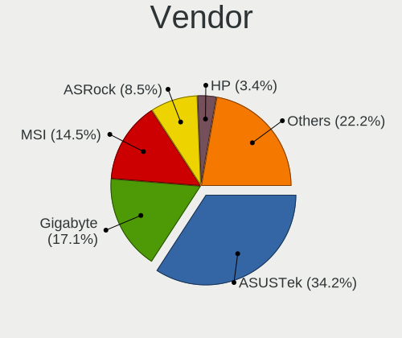
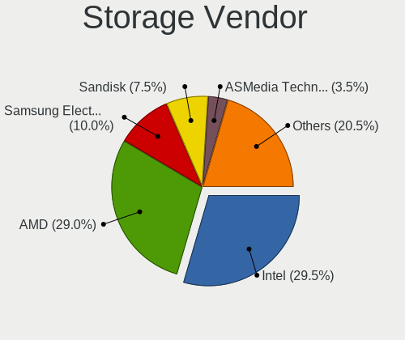
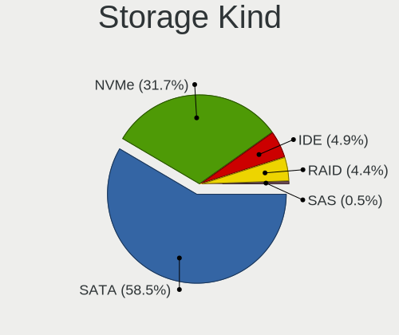
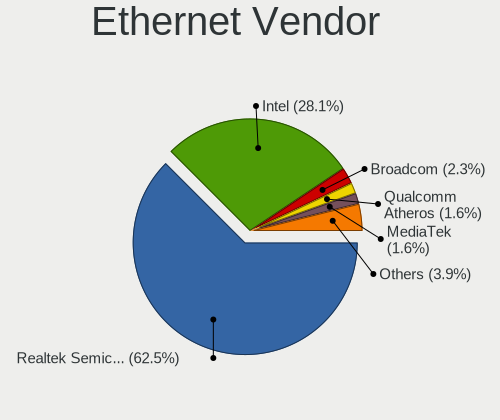
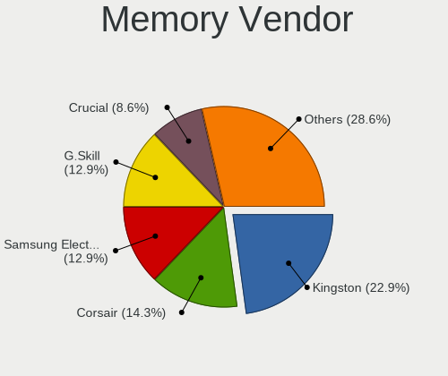
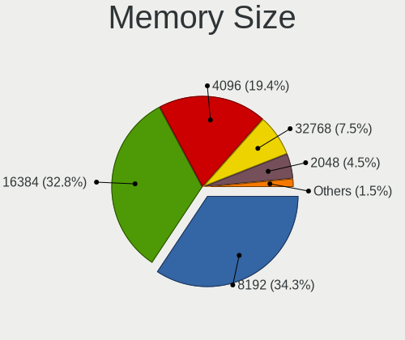

Kubuntu 23.04 - Tested Hardware & Statistics (Desktops)
-------------------------------------------------------

A project to collect tested hardware configurations for Kubuntu 23.04.

Anyone can contribute to this report by the [hw-probe](https://github.com/linuxhw/hw-probe) tool:

    sudo -E hw-probe -all -upload

Please contribute! Especially if your hardware is rare.

Contents
--------

* [ Test Cases ](#test-cases)

* [ System ](#system)
  - [ Kernel                   ](#kernel)
  - [ Kernel Family            ](#kernel-family)
  - [ Kernel Major Ver.        ](#kernel-major-ver)
  - [ Arch                     ](#arch)
  - [ DE                       ](#de)
  - [ Display Server           ](#display-server)
  - [ Display Manager          ](#display-manager)
  - [ OS Lang                  ](#os-lang)
  - [ Boot Mode                ](#boot-mode)
  - [ Filesystem               ](#filesystem)
  - [ Part. scheme             ](#part-scheme)
  - [ Dual Boot with Linux/BSD ](#dual-boot-with-linuxbsd)
  - [ Dual Boot (Win)          ](#dual-boot-win)

* [ Board ](#board)
  - [ Vendor                   ](#vendor)
  - [ Model                    ](#model)
  - [ Model Family             ](#model-family)
  - [ MFG Year                 ](#mfg-year)
  - [ Form Factor              ](#form-factor)
  - [ Secure Boot              ](#secure-boot)
  - [ Coreboot                 ](#coreboot)
  - [ RAM Size                 ](#ram-size)
  - [ RAM Used                 ](#ram-used)
  - [ Total Drives             ](#total-drives)
  - [ Has CD-ROM               ](#has-cd-rom)
  - [ Has Ethernet             ](#has-ethernet)
  - [ Has WiFi                 ](#has-wifi)
  - [ Has Bluetooth            ](#has-bluetooth)

* [ Location ](#location)
  - [ Country                  ](#country)
  - [ City                     ](#city)

* [ Drives ](#drives)
  - [ Drive Vendor             ](#drive-vendor)
  - [ Drive Model              ](#drive-model)
  - [ HDD Vendor               ](#hdd-vendor)
  - [ SSD Vendor               ](#ssd-vendor)
  - [ Drive Kind               ](#drive-kind)
  - [ Drive Connector          ](#drive-connector)
  - [ Drive Size               ](#drive-size)
  - [ Space Total              ](#space-total)
  - [ Space Used               ](#space-used)
  - [ Malfunc. Drives          ](#malfunc-drives)
  - [ Malfunc. Drive Vendor    ](#malfunc-drive-vendor)
  - [ Malfunc. HDD Vendor      ](#malfunc-hdd-vendor)
  - [ Malfunc. Drive Kind      ](#malfunc-drive-kind)
  - [ Failed Drives            ](#failed-drives)
  - [ Failed Drive Vendor      ](#failed-drive-vendor)
  - [ Drive Status             ](#drive-status)

* [ Storage controller ](#storage-controller)
  - [ Storage Vendor           ](#storage-vendor)
  - [ Storage Model            ](#storage-model)
  - [ Storage Kind             ](#storage-kind)

* [ Processor ](#processor)
  - [ CPU Vendor               ](#cpu-vendor)
  - [ CPU Model                ](#cpu-model)
  - [ CPU Model Family         ](#cpu-model-family)
  - [ CPU Cores                ](#cpu-cores)
  - [ CPU Sockets              ](#cpu-sockets)
  - [ CPU Threads              ](#cpu-threads)
  - [ CPU Op-Modes             ](#cpu-op-modes)
  - [ CPU Microcode            ](#cpu-microcode)
  - [ CPU Microarch            ](#cpu-microarch)

* [ Graphics ](#graphics)
  - [ GPU Vendor               ](#gpu-vendor)
  - [ GPU Model                ](#gpu-model)
  - [ GPU Combo                ](#gpu-combo)
  - [ GPU Driver               ](#gpu-driver)
  - [ GPU Memory               ](#gpu-memory)

* [ Monitor ](#monitor)
  - [ Monitor Vendor           ](#monitor-vendor)
  - [ Monitor Model            ](#monitor-model)
  - [ Monitor Resolution       ](#monitor-resolution)
  - [ Monitor Diagonal         ](#monitor-diagonal)
  - [ Monitor Width            ](#monitor-width)
  - [ Aspect Ratio             ](#aspect-ratio)
  - [ Monitor Area             ](#monitor-area)
  - [ Pixel Density            ](#pixel-density)
  - [ Multiple Monitors        ](#multiple-monitors)

* [ Network ](#network)
  - [ Net Controller Vendor    ](#net-controller-vendor)
  - [ Net Controller Model     ](#net-controller-model)
  - [ Wireless Vendor          ](#wireless-vendor)
  - [ Wireless Model           ](#wireless-model)
  - [ Ethernet Vendor          ](#ethernet-vendor)
  - [ Ethernet Model           ](#ethernet-model)
  - [ Net Controller Kind      ](#net-controller-kind)
  - [ Used Controller          ](#used-controller)
  - [ NICs                     ](#nics)
  - [ IPv6                     ](#ipv6)

* [ Bluetooth ](#bluetooth)
  - [ Bluetooth Vendor         ](#bluetooth-vendor)
  - [ Bluetooth Model          ](#bluetooth-model)

* [ Sound ](#sound)
  - [ Sound Vendor             ](#sound-vendor)
  - [ Sound Model              ](#sound-model)

* [ Memory ](#memory)
  - [ Memory Vendor            ](#memory-vendor)
  - [ Memory Model             ](#memory-model)
  - [ Memory Kind              ](#memory-kind)
  - [ Memory Form Factor       ](#memory-form-factor)
  - [ Memory Size              ](#memory-size)
  - [ Memory Speed             ](#memory-speed)

* [ Printers & scanners ](#printers--scanners)
  - [ Printer Vendor           ](#printer-vendor)
  - [ Printer Model            ](#printer-model)
  - [ Scanner Vendor           ](#scanner-vendor)
  - [ Scanner Model            ](#scanner-model)

* [ Camera ](#camera)
  - [ Camera Vendor            ](#camera-vendor)
  - [ Camera Model             ](#camera-model)

* [ Security ](#security)
  - [ Fingerprint Vendor       ](#fingerprint-vendor)
  - [ Fingerprint Model        ](#fingerprint-model)
  - [ Chipcard Vendor          ](#chipcard-vendor)
  - [ Chipcard Model           ](#chipcard-model)

* [ Unsupported ](#unsupported)
  - [ Unsupported Devices      ](#unsupported-devices)
  - [ Unsupported Device Types ](#unsupported-device-types)

Test Cases
----------

Total: 26

| Vendor    | Model                       | Probe                                                      | Date         |
|-----------|-----------------------------|------------------------------------------------------------|--------------|
| Seco      | C40 C                       | [4d990c8a0c](https://linux-hardware.org/?probe=4d990c8a0c) | Jun 10, 2023 |
| Gigabyte  | GA-MA770-US3                | [c22850601d](https://linux-hardware.org/?probe=c22850601d) | Jun 07, 2023 |
| ASUSTek   | H81M-A                      | [9636642e65](https://linux-hardware.org/?probe=9636642e65) | Jun 04, 2023 |
| MSI       | B450M PRO-M2 V2             | [fc8a306ca0](https://linux-hardware.org/?probe=fc8a306ca0) | Jun 03, 2023 |
| Gigabyte  | B365M H                     | [b7a585d1f1](https://linux-hardware.org/?probe=b7a585d1f1) | Jun 03, 2023 |
| ASUSTek   | M5A78L-M LX PLUS            | [fc4e2630c0](https://linux-hardware.org/?probe=fc4e2630c0) | Jun 01, 2023 |
| ASUSTek   | M5A78L-M LX PLUS            | [f02c7845e5](https://linux-hardware.org/?probe=f02c7845e5) | Jun 01, 2023 |
| ASUSTek   | H81M-A                      | [70714d71f5](https://linux-hardware.org/?probe=70714d71f5) | May 28, 2023 |
| Alienware | 04VWF2 A00                  | [0d6c86d757](https://linux-hardware.org/?probe=0d6c86d757) | May 25, 2023 |
| ASRock    | X99 Extreme6/ac             | [8e255dc13b](https://linux-hardware.org/?probe=8e255dc13b) | May 22, 2023 |
| Alienware | 04VWF2 A00                  | [7c09c55150](https://linux-hardware.org/?probe=7c09c55150) | May 21, 2023 |
| Lenovo    | 36C8 SDK0J40700 WIN 3258... | [166ec29ce0](https://linux-hardware.org/?probe=166ec29ce0) | May 18, 2023 |
| HP        | 3397                        | [17d9dcc121](https://linux-hardware.org/?probe=17d9dcc121) | May 15, 2023 |
| Gigabyte  | X570S AORUS ELITE AX        | [094fd8b39a](https://linux-hardware.org/?probe=094fd8b39a) | May 12, 2023 |
| Intel     | H61                         | [57ef0f0f97](https://linux-hardware.org/?probe=57ef0f0f97) | May 11, 2023 |
| ASUSTek   | TUF Gaming X570-PLUS        | [c80f41d509](https://linux-hardware.org/?probe=c80f41d509) | May 09, 2023 |
| Biostar   | AM1MHP                      | [1f21e13fcd](https://linux-hardware.org/?probe=1f21e13fcd) | May 07, 2023 |
| Gigabyte  | H87-HD3                     | [f0e4057e5f](https://linux-hardware.org/?probe=f0e4057e5f) | May 03, 2023 |
| HP        | 828A                        | [f1590b355f](https://linux-hardware.org/?probe=f1590b355f) | Apr 30, 2023 |
| Foxconn   | H67M-S/H67M-V/H67           | [92fa61186f](https://linux-hardware.org/?probe=92fa61186f) | Apr 23, 2023 |
| Fujitsu   | D3500-A1 S26361-D3500-A1    | [475a4d151d](https://linux-hardware.org/?probe=475a4d151d) | Apr 22, 2023 |
| ASUSTek   | M5A78L LE                   | [3d241113f4](https://linux-hardware.org/?probe=3d241113f4) | Apr 21, 2023 |
| MSI       | 970 GAMING                  | [cb295448b6](https://linux-hardware.org/?probe=cb295448b6) | Apr 21, 2023 |
| Gigabyte  | B550 AORUS ELITE V2         | [a71c5a4629](https://linux-hardware.org/?probe=a71c5a4629) | Mar 19, 2023 |
| Unknown   | Unknown                     | [b20f8089c3](https://linux-hardware.org/?probe=b20f8089c3) | Mar 15, 2023 |
| Gigabyte  | B360M HD3                   | [d3821bdbab](https://linux-hardware.org/?probe=d3821bdbab) | Feb 26, 2023 |

System
------

Kernel
------

Version of the Linux kernel

| Version                | Desktops | Percent |
|------------------------|----------|---------|
| 6.2.0-20-generic       | 13       | 65%     |
| 6.2.0-1003-lowlatency  | 2        | 10%     |
| 6.3.5-060305-generic   | 1        | 5%      |
| 6.2.5-060205-generic   | 1        | 5%      |
| 6.1.0-16-generic       | 1        | 5%      |
| 5.19.0-28-generic      | 1        | 5%      |
| 5.19.0-1023-lowlatency | 1        | 5%      |

Kernel Family
-------------

Linux kernel without a distro release

| Version | Desktops | Percent |
|---------|----------|---------|
| 6.2.0   | 15       | 75%     |
| 5.19.0  | 2        | 10%     |
| 6.3.5   | 1        | 5%      |
| 6.2.5   | 1        | 5%      |
| 6.1.0   | 1        | 5%      |

Kernel Major Ver.
-----------------

Linux kernel major version

| Version | Desktops | Percent |
|---------|----------|---------|
| 6.2     | 16       | 80%     |
| 5.19    | 2        | 10%     |
| 6.3     | 1        | 5%      |
| 6.1     | 1        | 5%      |

Arch
----

OS architecture (x86_64, i586, etc.)

| Name   | Desktops | Percent |
|--------|----------|---------|
| x86_64 | 20       | 100%    |

DE
--

Desktop Environment

| Name | Desktops | Percent |
|------|----------|---------|
| KDE5 | 20       | 100%    |

Display Server
--------------

X11 or Wayland

| Name    | Desktops | Percent |
|---------|----------|---------|
| X11     | 16       | 80%     |
| Wayland | 3        | 15%     |
| Tty     | 1        | 5%      |

Display Manager
---------------

SDDM, LightDM, etc.

| Name    | Desktops | Percent |
|---------|----------|---------|
| SDDM    | 11       | 55%     |
| Unknown | 9        | 45%     |

OS Lang
-------

Language

| Lang  | Desktops | Percent |
|-------|----------|---------|
| en_US | 7        | 35%     |
| de_DE | 4        | 20%     |
| en_GB | 2        | 10%     |
| zh_TW | 1        | 5%      |
| tr_TR | 1        | 5%      |
| pt_BR | 1        | 5%      |
| es_MX | 1        | 5%      |
| en_IN | 1        | 5%      |
| en_IL | 1        | 5%      |
| en_CA | 1        | 5%      |

Boot Mode
---------

EFI or BIOS

| Mode | Desktops | Percent |
|------|----------|---------|
| BIOS | 13       | 65%     |
| EFI  | 7        | 35%     |

Filesystem
----------

Type of filesystem

| Type  | Desktops | Percent |
|-------|----------|---------|
| Ext4  | 17       | 85%     |
| Tmpfs | 3        | 15%     |

Part. scheme
------------

Scheme of partitioning

| Type    | Desktops | Percent |
|---------|----------|---------|
| Unknown | 9        | 45%     |
| GPT     | 8        | 40%     |
| MBR     | 3        | 15%     |

Dual Boot with Linux/BSD
------------------------

Hosting more than one Linux/BSD

| Dual boot | Desktops | Percent |
|-----------|----------|---------|
| No        | 17       | 85%     |
| Yes       | 3        | 15%     |

Dual Boot (Win)
---------------

Hosting Linux and Windows

| Dual boot | Desktops | Percent |
|-----------|----------|---------|
| No        | 14       | 70%     |
| Yes       | 6        | 30%     |

Board
-----

Vendor
------

Motherboard manufacturer

| Name                | Desktops | Percent |
|---------------------|----------|---------|
| Gigabyte Technology | 6        | 30%     |
| ASUSTek Computer    | 3        | 15%     |
| MSI                 | 2        | 10%     |
| Hewlett-Packard     | 2        | 10%     |
| Seco                | 1        | 5%      |
| Intel               | 1        | 5%      |
| Foxconn             | 1        | 5%      |
| Biostar             | 1        | 5%      |
| ASRock              | 1        | 5%      |
| Alienware           | 1        | 5%      |
| Unknown             | 1        | 5%      |

Model
-----

Motherboard model

| Name                          | Desktops | Percent |
|-------------------------------|----------|---------|
| Seco C40                      | 1        | 5%      |
| MSI MS-7B84                   | 1        | 5%      |
| MSI MS-7693                   | 1        | 5%      |
| Intel H61                     | 1        | 5%      |
| HP Compaq Elite 8300 SFF      | 1        | 5%      |
| HP 870-119                    | 1        | 5%      |
| Gigabyte X570S AORUS ELITE AX | 1        | 5%      |
| Gigabyte H87-HD3              | 1        | 5%      |
| Gigabyte GA-MA770-US3         | 1        | 5%      |
| Gigabyte B550 AORUS ELITE V2  | 1        | 5%      |
| Gigabyte B365M H              | 1        | 5%      |
| Gigabyte B360M-HD3            | 1        | 5%      |
| Foxconn H67M-S/H67M-V/H67     | 1        | 5%      |
| Biostar AM1MHP                | 1        | 5%      |
| ASUS TUF Gaming X570-PLUS     | 1        | 5%      |
| ASUS M5A78L-M LX PLUS         | 1        | 5%      |
| ASUS All Series               | 1        | 5%      |
| ASRock X99 Extreme6/ac        | 1        | 5%      |
| Alienware Aurora              | 1        | 5%      |
| Unknown                       | 1        | 5%      |

Model Family
------------

Motherboard model prefix

| Name                  | Desktops | Percent |
|-----------------------|----------|---------|
| Seco C40              | 1        | 5%      |
| MSI MS-7B84           | 1        | 5%      |
| MSI MS-7693           | 1        | 5%      |
| Intel H61             | 1        | 5%      |
| HP Compaq             | 1        | 5%      |
| HP 870-119            | 1        | 5%      |
| Gigabyte X570S        | 1        | 5%      |
| Gigabyte H87-HD3      | 1        | 5%      |
| Gigabyte GA-MA770-US3 | 1        | 5%      |
| Gigabyte B550         | 1        | 5%      |
| Gigabyte B365M        | 1        | 5%      |
| Gigabyte B360M-HD3    | 1        | 5%      |
| Foxconn H67M-S        | 1        | 5%      |
| Biostar AM1MHP        | 1        | 5%      |
| ASUS TUF              | 1        | 5%      |
| ASUS M5A78L-M         | 1        | 5%      |
| ASUS All              | 1        | 5%      |
| ASRock X99            | 1        | 5%      |
| Alienware Aurora      | 1        | 5%      |
| Unknown               | 1        | 5%      |

MFG Year
--------

Motherboard manufacture year

| Year | Desktops | Percent |
|------|----------|---------|
| 2018 | 3        | 15%     |
| 2020 | 2        | 10%     |
| 2019 | 2        | 10%     |
| 2014 | 2        | 10%     |
| 2013 | 2        | 10%     |
| 2011 | 2        | 10%     |
| 2022 | 1        | 5%      |
| 2021 | 1        | 5%      |
| 2017 | 1        | 5%      |
| 2016 | 1        | 5%      |
| 2012 | 1        | 5%      |
| 2010 | 1        | 5%      |
| 2009 | 1        | 5%      |

Form Factor
-----------

Physical design of the computer

| Name    | Desktops | Percent |
|---------|----------|---------|
| Desktop | 20       | 100%    |

Secure Boot
-----------

Enabled or disabled

| State    | Desktops | Percent |
|----------|----------|---------|
| Disabled | 20       | 100%    |

Coreboot
--------

Have coreboot on board

| Used | Desktops | Percent |
|------|----------|---------|
| No   | 20       | 100%    |

RAM Size
--------

Total RAM memory

| Size in GB  | Desktops | Percent |
|-------------|----------|---------|
| 16.01-24.0  | 8        | 40%     |
| 32.01-64.0  | 4        | 20%     |
| 8.01-16.0   | 3        | 15%     |
| 4.01-8.0    | 2        | 10%     |
| 3.01-4.0    | 2        | 10%     |
| 64.01-256.0 | 1        | 5%      |

RAM Used
--------

Used RAM memory

| Used GB   | Desktops | Percent |
|-----------|----------|---------|
| 4.01-8.0  | 7        | 33.33%  |
| 1.01-2.0  | 6        | 28.57%  |
| 3.01-4.0  | 4        | 19.05%  |
| 2.01-3.0  | 3        | 14.29%  |
| 8.01-16.0 | 1        | 4.76%   |

Total Drives
------------

Number of drives on board

| Drives | Desktops | Percent |
|--------|----------|---------|
| 2      | 8        | 40%     |
| 1      | 6        | 30%     |
| 3      | 4        | 20%     |
| 4      | 2        | 10%     |

Has CD-ROM
----------

Has CD-ROM on board

| Presented | Desktops | Percent |
|-----------|----------|---------|
| No        | 14       | 70%     |
| Yes       | 6        | 30%     |

Has Ethernet
------------

Has Ethernet on board

| Presented | Desktops | Percent |
|-----------|----------|---------|
| Yes       | 20       | 100%    |

Has WiFi
--------

Has WiFi module

| Presented | Desktops | Percent |
|-----------|----------|---------|
| Yes       | 11       | 55%     |
| No        | 9        | 45%     |

Has Bluetooth
-------------

Has Bluetooth module

| Presented | Desktops | Percent |
|-----------|----------|---------|
| No        | 14       | 70%     |
| Yes       | 6        | 30%     |

Location
--------

Country
-------

Geographic location (country)

| Country   | Desktops | Percent |
|-----------|----------|---------|
| Germany   | 5        | 25%     |
| USA       | 3        | 15%     |
| UK        | 1        | 5%      |
| Turkey    | 1        | 5%      |
| Taiwan    | 1        | 5%      |
| Spain     | 1        | 5%      |
| Serbia    | 1        | 5%      |
| Poland    | 1        | 5%      |
| Mexico    | 1        | 5%      |
| Israel    | 1        | 5%      |
| Indonesia | 1        | 5%      |
| India     | 1        | 5%      |
| Canada    | 1        | 5%      |
| Brazil    | 1        | 5%      |

City
----

Geographic location (city)

| City         | Desktops | Percent |
|--------------|----------|---------|
| Weilmuenster | 1        | 5%      |
| Taichung     | 1        | 5%      |
| Rzeszów     | 1        | 5%      |
| Porto Alegre | 1        | 5%      |
| Oberursel    | 1        | 5%      |
| Niebla       | 1        | 5%      |
| Metepec      | 1        | 5%      |
| Lucknow      | 1        | 5%      |
| London       | 1        | 5%      |
| Leipzig      | 1        | 5%      |
| Lazarevac    | 1        | 5%      |
| La Mesa      | 1        | 5%      |
| Hamburg      | 1        | 5%      |
| Ensdorf      | 1        | 5%      |
| Dudley       | 1        | 5%      |
| Brantford    | 1        | 5%      |
| Boise        | 1        | 5%      |
| Bat Yam      | 1        | 5%      |
| Banyuwangi   | 1        | 5%      |
| Antalya      | 1        | 5%      |

Drives
------

Drive Vendor
------------

Hard drive vendors

| Vendor              | Desktops | Drives | Percent |
|---------------------|----------|--------|---------|
| Seagate             | 8        | 12     | 23.53%  |
| WDC                 | 6        | 9      | 17.65%  |
| Samsung Electronics | 4        | 7      | 11.76%  |
| SanDisk             | 3        | 3      | 8.82%   |
| Kingston            | 3        | 5      | 8.82%   |
| Unknown             | 1        | 1      | 2.94%   |
| PNY                 | 1        | 1      | 2.94%   |
| Patriot             | 1        | 1      | 2.94%   |
| Micron Technology   | 1        | 1      | 2.94%   |
| Lexar               | 1        | 1      | 2.94%   |
| Hoodisk             | 1        | 1      | 2.94%   |
| Hitachi             | 1        | 1      | 2.94%   |
| Crucial             | 1        | 1      | 2.94%   |
| A-DATA Technology   | 1        | 1      | 2.94%   |
| Unknown             | 1        | 1      | 2.94%   |

Drive Model
-----------

Hard drive models

| Model                                              | Desktops | Percent |
|----------------------------------------------------|----------|---------|
| WDC WD5000AAKX-60U6AA0 500GB                       | 2        | 4.55%   |
| Seagate ST4000DM004-2CV104 4TB                     | 2        | 4.55%   |
| Seagate ST2000DM001-1ER164 2TB                     | 2        | 4.55%   |
| Kingston SA400S37120G 120GB SSD                    | 2        | 4.55%   |
| WDC WDS200T2B0A-00SM50 2TB SSD                     | 1        | 2.27%   |
| WDC WD20EARX-00PASB0 2TB                           | 1        | 2.27%   |
| WDC WD10EZEX-08M2NA0 1TB                           | 1        | 2.27%   |
| WDC WD10EFRX-68JCSN0 1TB                           | 1        | 2.27%   |
| WDC WD10EAVS-32D7B1 1TB                            | 1        | 2.27%   |
| WDC WD Green 2.5 1000GB SSD                        | 1        | 2.27%   |
| Unknown SD/MMC/MS PRO 64GB                         | 1        | 2.27%   |
| Seagate ST9500420AS 500GB                          | 1        | 2.27%   |
| Seagate ST500DM002-1BD142 500GB                    | 1        | 2.27%   |
| Seagate ST3500312CS 500GB                          | 1        | 2.27%   |
| Seagate ST3250823AS 250GB                          | 1        | 2.27%   |
| Seagate ST2000DM008-2FR102 2TB                     | 1        | 2.27%   |
| Seagate ST1000DX001-1CM162 1TB                     | 1        | 2.27%   |
| Seagate ST1000DM003-1ER162 1TB                     | 1        | 2.27%   |
| SanDisk SSD PLUS 240GB                             | 1        | 2.27%   |
| SanDisk SD8SB8U-256G-1006 256GB SSD                | 1        | 2.27%   |
| SanDisk NVMe SSD Drive 500GB                       | 1        | 2.27%   |
| Samsung SSD 980 PRO 2TB                            | 1        | 2.27%   |
| Samsung SSD 970 EVO Plus 1TB                       | 1        | 2.27%   |
| Samsung SSD 870 QVO 2TB                            | 1        | 2.27%   |
| Samsung SSD 850 PRO 512GB                          | 1        | 2.27%   |
| Samsung SSD 850 PRO 256GB                          | 1        | 2.27%   |
| Samsung SSD 840 Series 120GB                       | 1        | 2.27%   |
| Samsung NVMe SSD Controller PM9A1/PM9A3/980PRO 1TB | 1        | 2.27%   |
| PNY CS900 500GB SSD                                | 1        | 2.27%   |
| Patriot Burst 480GB SSD                            | 1        | 2.27%   |
| Micron M600_MTFDDAK512MBF 512GB SSD                | 1        | 2.27%   |
| Lexar SSD NM760 1TB                                | 1        | 2.27%   |
| Kingston SV300S37A240G 240GB SSD                   | 1        | 2.27%   |
| Kingston SA400S37960G 960GB SSD                    | 1        | 2.27%   |
| Kingston SA400S37480G 480GB SSD                    | 1        | 2.27%   |
| Hoodisk SSD 256GB                                  | 1        | 2.27%   |
| Hitachi HDP725050GLA360 500GB                      | 1        | 2.27%   |
| Crucial CT4000P3PSSD8 4TB                          | 1        | 2.27%   |
| A-DATA SP900 256GB SSD                             | 1        | 2.27%   |
| Unknown                                            | 1        | 2.27%   |

HDD Vendor
----------

Hard disk drive vendors

| Vendor  | Desktops | Drives | Percent |
|---------|----------|--------|---------|
| Seagate | 8        | 12     | 53.33%  |
| WDC     | 5        | 7      | 33.33%  |
| Unknown | 1        | 1      | 6.67%   |
| Hitachi | 1        | 1      | 6.67%   |

SSD Vendor
----------

Solid state drive vendors

| Vendor              | Desktops | Drives | Percent |
|---------------------|----------|--------|---------|
| Kingston            | 3        | 5      | 21.43%  |
| WDC                 | 2        | 2      | 14.29%  |
| SanDisk             | 2        | 2      | 14.29%  |
| Samsung Electronics | 2        | 4      | 14.29%  |
| PNY                 | 1        | 1      | 7.14%   |
| Patriot             | 1        | 1      | 7.14%   |
| Micron Technology   | 1        | 1      | 7.14%   |
| Hoodisk             | 1        | 1      | 7.14%   |
| A-DATA Technology   | 1        | 1      | 7.14%   |

Drive Kind
----------

HDD or SSD

| Kind    | Desktops | Drives | Percent |
|---------|----------|--------|---------|
| SSD     | 13       | 18     | 41.94%  |
| HDD     | 12       | 21     | 38.71%  |
| NVMe    | 5        | 6      | 16.13%  |
| Unknown | 1        | 1      | 3.23%   |

Drive Connector
---------------

SATA, SAS, NVMe, etc.

| Type | Desktops | Drives | Percent |
|------|----------|--------|---------|
| SATA | 19       | 39     | 76%     |
| NVMe | 5        | 6      | 20%     |
| SAS  | 1        | 1      | 4%      |

Drive Size
----------

Size of hard drive

| Size in TB | Desktops | Drives | Percent |
|------------|----------|--------|---------|
| 0.01-0.5   | 14       | 20     | 46.67%  |
| 0.51-1.0   | 8        | 10     | 26.67%  |
| 1.01-2.0   | 6        | 7      | 20%     |
| 3.01-4.0   | 2        | 2      | 6.67%   |

Space Total
-----------

Amount of disk space available on the file system

| Size in GB     | Desktops | Percent |
|----------------|----------|---------|
| 501-1000       | 5        | 25%     |
| 251-500        | 4        | 20%     |
| 101-250        | 4        | 20%     |
| More than 3000 | 3        | 15%     |
| 1001-2000      | 2        | 10%     |
| 21-50          | 1        | 5%      |
| 2001-3000      | 1        | 5%      |

Space Used
----------

Amount of used disk space

| Used GB        | Desktops | Percent |
|----------------|----------|---------|
| 251-500        | 6        | 30%     |
| 21-50          | 3        | 15%     |
| 51-100         | 3        | 15%     |
| More than 3000 | 2        | 10%     |
| 101-250        | 2        | 10%     |
| 1-20           | 2        | 10%     |
| 501-1000       | 2        | 10%     |

Malfunc. Drives
---------------

Drive models with a malfunction

Zero info for selected period =(

Malfunc. Drive Vendor
---------------------

Vendors of faulty drives

Zero info for selected period =(

Malfunc. HDD Vendor
-------------------

Vendors of faulty HDD drives

Zero info for selected period =(

Malfunc. Drive Kind
-------------------

Kinds of faulty drives

Zero info for selected period =(

Failed Drives
-------------

Failed drive models

Zero info for selected period =(

Failed Drive Vendor
-------------------

Failed drive vendors

Zero info for selected period =(

Drive Status
------------

Number of failed and malfunc. drives

| Status   | Desktops | Drives | Percent |
|----------|----------|--------|---------|
| Detected | 15       | 35     | 68.18%  |
| Works    | 7        | 11     | 31.82%  |

Storage controller
------------------

Storage Vendor
--------------

Storage controller vendors

| Vendor                       | Desktops | Percent |
|------------------------------|----------|---------|
| Intel                        | 11       | 40.74%  |
| AMD                          | 9        | 33.33%  |
| Samsung Electronics          | 3        | 11.11%  |
| Silicon Image                | 1        | 3.7%    |
| Shenzhen Longsys Electronics | 1        | 3.7%    |
| SanDisk                      | 1        | 3.7%    |
| Micron/Crucial Technology    | 1        | 3.7%    |

Storage Model
-------------

Storage controller models

| Model                                                                          | Desktops | Percent |
|--------------------------------------------------------------------------------|----------|---------|
| AMD FCH SATA Controller [AHCI mode]                                            | 5        | 16.67%  |
| Samsung NVMe SSD Controller PM9A1/PM9A3/980PRO                                 | 2        | 6.67%   |
| Intel 8 Series/C220 Series Chipset Family 6-port SATA Controller 1 [AHCI mode] | 2        | 6.67%   |
| Intel 6 Series/C200 Series Chipset Family 6 port Desktop SATA AHCI Controller  | 2        | 6.67%   |
| AMD SB7x0/SB8x0/SB9x0 SATA Controller [AHCI mode]                              | 2        | 6.67%   |
| AMD SB7x0/SB8x0/SB9x0 IDE Controller                                           | 2        | 6.67%   |
| Silicon Image SiI 3132 Serial ATA Raid II Controller                           | 1        | 3.33%   |
| Shenzhen Longsys Non-Volatile memory controller                                | 1        | 3.33%   |
| SanDisk WD Blue SN570 NVMe SSD 1TB                                             | 1        | 3.33%   |
| Samsung NVMe SSD Controller SM981/PM981/PM983                                  | 1        | 3.33%   |
| Micron/Crucial P2 NVMe PCIe SSD                                                | 1        | 3.33%   |
| Intel SATA Controller [RAID mode]                                              | 1        | 3.33%   |
| Intel Q170/Q150/B150/H170/H110/Z170/CM236 Chipset SATA Controller [AHCI Mode]  | 1        | 3.33%   |
| Intel Jasper Lake SATA AHCI Controller                                         | 1        | 3.33%   |
| Intel C610/X99 series chipset 6-Port SATA Controller [AHCI mode]               | 1        | 3.33%   |
| Intel 82801JI (ICH10 Family) SATA AHCI Controller                              | 1        | 3.33%   |
| Intel 7 Series/C210 Series Chipset Family 6-port SATA Controller [AHCI mode]   | 1        | 3.33%   |
| Intel 200 Series PCH SATA controller [AHCI mode]                               | 1        | 3.33%   |
| AMD SB7x0/SB8x0/SB9x0 SATA Controller [IDE mode]                               | 1        | 3.33%   |
| AMD 500 Series Chipset SATA Controller                                         | 1        | 3.33%   |
| AMD 400 Series Chipset SATA Controller                                         | 1        | 3.33%   |

Storage Kind
------------

Kind of storage controller (IDE, SATA, NVMe, SAS, ...)

| Kind | Desktops | Percent |
|------|----------|---------|
| SATA | 19       | 70.37%  |
| NVMe | 5        | 18.52%  |
| IDE  | 2        | 7.41%   |
| RAID | 1        | 3.7%    |

Processor
---------

CPU Vendor
----------

Processor vendors

| Vendor | Desktops | Percent |
|--------|----------|---------|
| Intel  | 11       | 55%     |
| AMD    | 9        | 45%     |

CPU Model
---------

Processor models

| Model                                          | Desktops | Percent |
|------------------------------------------------|----------|---------|
| Intel Xeon CPU E3-1240 v3 @ 3.40GHz            | 1        | 5%      |
| Intel Pentium CPU G3220 @ 3.00GHz              | 1        | 5%      |
| Intel Core i7-8700 CPU @ 3.20GHz               | 1        | 5%      |
| Intel Core i7-6700 CPU @ 3.40GHz               | 1        | 5%      |
| Intel Core i7-5820K CPU @ 3.30GHz              | 1        | 5%      |
| Intel Core i7-3770 CPU @ 3.40GHz               | 1        | 5%      |
| Intel Core i7 CPU 920 @ 2.67GHz                | 1        | 5%      |
| Intel Core i5-9600KF CPU @ 3.70GHz             | 1        | 5%      |
| Intel Core i5-2500K CPU @ 3.30GHz              | 1        | 5%      |
| Intel Core i5-2400 CPU @ 3.10GHz               | 1        | 5%      |
| Intel Celeron N5105 @ 2.00GHz                  | 1        | 5%      |
| AMD Ryzen Embedded V1605B with Radeon Vega Gfx | 1        | 5%      |
| AMD Ryzen 9 5900X 12-Core Processor            | 1        | 5%      |
| AMD Ryzen 7 5800X 8-Core Processor             | 1        | 5%      |
| AMD Ryzen 7 5700X 8-Core Processor             | 1        | 5%      |
| AMD Ryzen 5 2600 Six-Core Processor            | 1        | 5%      |
| AMD FX-8320E Eight-Core Processor              | 1        | 5%      |
| AMD FX-6300 Six-Core Processor                 | 1        | 5%      |
| AMD Athlon II X3 425 Processor                 | 1        | 5%      |
| AMD Athlon 5350 APU with Radeon R3             | 1        | 5%      |

CPU Model Family
----------------

Processor model prefix

| Model              | Desktops | Percent |
|--------------------|----------|---------|
| Intel Core i7      | 5        | 25%     |
| Intel Core i5      | 3        | 15%     |
| AMD Ryzen 7        | 2        | 10%     |
| AMD FX             | 2        | 10%     |
| Intel Xeon         | 1        | 5%      |
| Intel Pentium      | 1        | 5%      |
| Intel Celeron      | 1        | 5%      |
| AMD Ryzen Embedded | 1        | 5%      |
| AMD Ryzen 9        | 1        | 5%      |
| AMD Ryzen 5        | 1        | 5%      |
| AMD Athlon II X3   | 1        | 5%      |
| AMD Athlon         | 1        | 5%      |

CPU Cores
---------

Number of processor cores

| Number | Desktops | Percent |
|--------|----------|---------|
| 4      | 10       | 50%     |
| 6      | 4        | 20%     |
| 8      | 2        | 10%     |
| 3      | 2        | 10%     |
| 12     | 1        | 5%      |
| 2      | 1        | 5%      |

CPU Sockets
-----------

Number of sockets

| Number | Desktops | Percent |
|--------|----------|---------|
| 1      | 20       | 100%    |

CPU Threads
-----------

Threads per core (Hyper-Threading)

| Number | Desktops | Percent |
|--------|----------|---------|
| 2      | 12       | 60%     |
| 1      | 8        | 40%     |

CPU Op-Modes
------------

CPU Operation Modes (32-bit, 64-bit)

| Op mode        | Desktops | Percent |
|----------------|----------|---------|
| 32-bit, 64-bit | 20       | 100%    |

CPU Microcode
-------------

Microcode number

| Number     | Desktops | Percent |
|------------|----------|---------|
| Unknown    | 14       | 70%     |
| 0x0a20120a | 2        | 10%     |
| 0x0810100b | 1        | 5%      |
| 0x0800820d | 1        | 5%      |
| 0x0700010f | 1        | 5%      |
| 0x06000852 | 1        | 5%      |

CPU Microarch
-------------

Microarchitecture

| Name        | Desktops | Percent |
|-------------|----------|---------|
| Zen 3       | 3        | 15%     |
| Haswell     | 3        | 15%     |
| SandyBridge | 2        | 10%     |
| Piledriver  | 2        | 10%     |
| KabyLake    | 2        | 10%     |
| Zen+        | 1        | 5%      |
| Zen         | 1        | 5%      |
| Tremont     | 1        | 5%      |
| Skylake     | 1        | 5%      |
| Nehalem     | 1        | 5%      |
| K10         | 1        | 5%      |
| Jaguar      | 1        | 5%      |
| IvyBridge   | 1        | 5%      |

Graphics
--------

GPU Vendor
----------

Vendors of graphics cards

| Vendor | Desktops | Percent |
|--------|----------|---------|
| Nvidia | 9        | 40.91%  |
| AMD    | 7        | 31.82%  |
| Intel  | 6        | 27.27%  |

GPU Model
---------

Graphics card models

| Model                                                                       | Desktops | Percent |
|-----------------------------------------------------------------------------|----------|---------|
| Nvidia GP106 [GeForce GTX 1060 6GB]                                         | 2        | 9.09%   |
| Intel 2nd Generation Core Processor Family Integrated Graphics Controller   | 2        | 9.09%   |
| AMD Navi 22 [Radeon RX 6700/6700 XT/6750 XT / 6800M/6850M XT]               | 2        | 9.09%   |
| Nvidia TU106 [GeForce RTX 2070]                                             | 1        | 4.55%   |
| Nvidia TU104 [GeForce RTX 2070 SUPER]                                       | 1        | 4.55%   |
| Nvidia GT218 [GeForce G210]                                                 | 1        | 4.55%   |
| Nvidia GP108 [GeForce GT 1030]                                              | 1        | 4.55%   |
| Nvidia GM206 [GeForce GTX 960]                                              | 1        | 4.55%   |
| Nvidia GF116 [GeForce GTX 550 Ti]                                           | 1        | 4.55%   |
| Nvidia G94 [GeForce 9600 GT]                                                | 1        | 4.55%   |
| Intel Xeon E3-1200 v3/4th Gen Core Processor Integrated Graphics Controller | 1        | 4.55%   |
| Intel JasperLake [UHD Graphics]                                             | 1        | 4.55%   |
| Intel IvyBridge GT2 [HD Graphics 4000]                                      | 1        | 4.55%   |
| Intel DG2 [Arc A380]                                                        | 1        | 4.55%   |
| AMD Turks XT [Radeon HD 6670/7670]                                          | 1        | 4.55%   |
| AMD Raven Ridge [Radeon Vega Series / Radeon Vega Mobile Series]            | 1        | 4.55%   |
| AMD Lexa PRO [Radeon 540/540X/550/550X / RX 540X/550/550X]                  | 1        | 4.55%   |
| AMD Cypress PRO [Radeon HD 5850]                                            | 1        | 4.55%   |
| AMD Curacao PRO [Radeon R7 370 / R9 270/370 OEM]                            | 1        | 4.55%   |

GPU Combo
---------

Combinations of graphics cards

| Name       | Desktops | Percent |
|------------|----------|---------|
| 1 x Nvidia | 8        | 40%     |
| 1 x AMD    | 7        | 35%     |
| 1 x Intel  | 5        | 25%     |

GPU Driver
----------

Free vs proprietary

| Driver      | Desktops | Percent |
|-------------|----------|---------|
| Free        | 14       | 70%     |
| Proprietary | 6        | 30%     |

GPU Memory
----------

Total video memory

| Size in GB | Desktops | Percent |
|------------|----------|---------|
| Unknown    | 10       | 50%     |
| 1.01-2.0   | 4        | 20%     |
| 5.01-6.0   | 2        | 10%     |
| 8.01-16.0  | 2        | 10%     |
| 7.01-8.0   | 1        | 5%      |
| 3.01-4.0   | 1        | 5%      |

Monitor
-------

Monitor Vendor
--------------

Monitor vendors

| Vendor               | Desktops | Percent |
|----------------------|----------|---------|
| Philips              | 3        | 15.79%  |
| Samsung Electronics  | 2        | 10.53%  |
| Iiyama               | 2        | 10.53%  |
| Dell                 | 2        | 10.53%  |
| VIZ                  | 1        | 5.26%   |
| ONN                  | 1        | 5.26%   |
| Medion Akoya         | 1        | 5.26%   |
| Lenovo               | 1        | 5.26%   |
| INS                  | 1        | 5.26%   |
| Goldstar             | 1        | 5.26%   |
| BenQ                 | 1        | 5.26%   |
| ASUSTek Computer     | 1        | 5.26%   |
| Ancor Communications | 1        | 5.26%   |
| Acer                 | 1        | 5.26%   |

Monitor Model
-------------

Monitor models

| Model                                                                | Desktops | Percent |
|----------------------------------------------------------------------|----------|---------|
| VIZ LCD Monitor D32h-J04 1920x1080                                   | 1        | 4.55%   |
| Samsung Electronics SyncMaster SAM04D3 1920x1080 531x298mm 24.0-inch | 1        | 4.55%   |
| Samsung Electronics SMBX2250 SAM071B 1920x1080 480x270mm 21.7-inch   | 1        | 4.55%   |
| Philips PHL 241B8Q PHL0929 1920x1080 527x296mm 23.8-inch             | 1        | 4.55%   |
| Philips PHL 223V5 PHLC0CF 1920x1080 477x268mm 21.5-inch              | 1        | 4.55%   |
| Philips 196E PHLC078 1440x900 408x255mm 18.9-inch                    | 1        | 4.55%   |
| ONN ONA18HO015 ONN0101 1920x1080 698x393mm 31.5-inch                 | 1        | 4.55%   |
| Medion Akoya MD20491 MEC5201 1920x1080 521x293mm 23.5-inch           | 1        | 4.55%   |
| Lenovo L197 Wide LEN1152 1440x900 410x257mm 19.1-inch                | 1        | 4.55%   |
| INS WT70CA612 INS3694 3840x2160 1538x865mm 69.5-inch                 | 1        | 4.55%   |
| Iiyama PL3461WQ IVM7615 3440x1440 800x335mm 34.1-inch                | 1        | 4.55%   |
| Iiyama PL2451 IVM610A 1920x1080 521x293mm 23.5-inch                  | 1        | 4.55%   |
| Goldstar HD GSM5ACD 1366x768 410x230mm 18.5-inch                     | 1        | 4.55%   |
| Dell U2718Q DELA0EC 3840x2160 609x349mm 27.6-inch                    | 1        | 4.55%   |
| Dell U2715H DELD067 2560x1440 597x336mm 27.0-inch                    | 1        | 4.55%   |
| Dell U2715H DELD065 2560x1440 597x336mm 27.0-inch                    | 1        | 4.55%   |
| Dell S2721QS DELA198 3840x2160 597x336mm 27.0-inch                   | 1        | 4.55%   |
| BenQ G2450H BNQ78AB 1920x1080 531x298mm 24.0-inch                    | 1        | 4.55%   |
| ASUSTek Computer PA24A AUS2462 1920x1200 518x324mm 24.1-inch         | 1        | 4.55%   |
| Ancor Communications VE248 ACI2494 1920x1080 530x300mm 24.0-inch     | 1        | 4.55%   |
| Acer GF276 ACR0560 1920x1080 598x336mm 27.0-inch                     | 1        | 4.55%   |
| Acer ED320QR S ACR0805 1920x1080 609x348mm 27.6-inch                 | 1        | 4.55%   |

Monitor Resolution
------------------

Monitor screen resolution

| Resolution        | Desktops | Percent |
|-------------------|----------|---------|
| 1920x1080 (FHD)   | 11       | 57.89%  |
| 3840x2160 (4K)    | 2        | 10.53%  |
| 1440x900 (WXGA+)  | 2        | 10.53%  |
| 3440x1440         | 1        | 5.26%   |
| 2560x1440 (QHD)   | 1        | 5.26%   |
| 1920x1200 (WUXGA) | 1        | 5.26%   |
| 1366x768 (WXGA)   | 1        | 5.26%   |

Monitor Diagonal
----------------

Diagonal size in inches

| Inches  | Desktops | Percent |
|---------|----------|---------|
| 24      | 5        | 25%     |
| 27      | 3        | 15%     |
| 31      | 2        | 10%     |
| 23      | 2        | 10%     |
| 21      | 2        | 10%     |
| 18      | 2        | 10%     |
| 69      | 1        | 5%      |
| 34      | 1        | 5%      |
| 19      | 1        | 5%      |
| Unknown | 1        | 5%      |

Monitor Width
-------------

Physical width

| Width in mm | Desktops | Percent |
|-------------|----------|---------|
| 501-600     | 10       | 47.62%  |
| 401-500     | 5        | 23.81%  |
| 601-700     | 3        | 14.29%  |
| 701-800     | 1        | 4.76%   |
| 1501-2000   | 1        | 4.76%   |
| Unknown     | 1        | 4.76%   |

Aspect Ratio
------------

Proportional relationship between the width and the height

| Ratio   | Desktops | Percent |
|---------|----------|---------|
| 16/9    | 14       | 73.68%  |
| 16/10   | 3        | 15.79%  |
| 21/9    | 1        | 5.26%   |
| Unknown | 1        | 5.26%   |

Monitor Area
------------

Area in inch²

| Area in inch² | Desktops | Percent |
|----------------|----------|---------|
| 201-250        | 8        | 40%     |
| 351-500        | 3        | 15%     |
| 301-350        | 3        | 15%     |
| 151-200        | 2        | 10%     |
| More than 1000 | 1        | 5%      |
| 251-300        | 1        | 5%      |
| 141-150        | 1        | 5%      |
| Unknown        | 1        | 5%      |

Pixel Density
-------------

Pixels per inch

| Density | Desktops | Percent |
|---------|----------|---------|
| 51-100  | 13       | 65%     |
| 101-120 | 4        | 20%     |
| 161-240 | 1        | 5%      |
| 121-160 | 1        | 5%      |
| Unknown | 1        | 5%      |

Multiple Monitors
-----------------

Total monitors connected

| Total | Desktops | Percent |
|-------|----------|---------|
| 1     | 17       | 85%     |
| 2     | 3        | 15%     |

Network
-------

Net Controller Vendor
---------------------

Controller vendors

| Vendor                | Desktops | Percent |
|-----------------------|----------|---------|
| Realtek Semiconductor | 16       | 50%     |
| Intel                 | 4        | 12.5%   |
| Qualcomm Atheros      | 3        | 9.38%   |
| ASUSTek Computer      | 3        | 9.38%   |
| TP-Link               | 2        | 6.25%   |
| Broadcom              | 2        | 6.25%   |
| MediaTek              | 1        | 3.13%   |
| Aquantia              | 1        | 3.13%   |

Net Controller Model
--------------------

Controller models

| Model                                                                         | Desktops | Percent |
|-------------------------------------------------------------------------------|----------|---------|
| Realtek RTL8111/8168/8411 PCI Express Gigabit Ethernet Controller             | 13       | 36.11%  |
| Realtek RTL8125 2.5GbE Controller                                             | 2        | 5.56%   |
| TP-Link Archer T2U PLUS [RTL8821AU]                                           | 1        | 2.78%   |
| TP-Link 802.11n NIC                                                           | 1        | 2.78%   |
| Realtek RTL8852BE PCIe 802.11ax Wireless Network Controller                   | 1        | 2.78%   |
| Realtek RTL8188FTV 802.11b/g/n 1T1R 2.4G WLAN Adapter                         | 1        | 2.78%   |
| Realtek RTL8153 Gigabit Ethernet Adapter                                      | 1        | 2.78%   |
| Realtek RTL810xE PCI Express Fast Ethernet controller                         | 1        | 2.78%   |
| Qualcomm Atheros QCA8171 Gigabit Ethernet                                     | 1        | 2.78%   |
| Qualcomm Atheros Killer E220x Gigabit Ethernet Controller                     | 1        | 2.78%   |
| Qualcomm Atheros AR93xx Wireless Network Adapter                              | 1        | 2.78%   |
| Qualcomm Atheros AR2413/AR2414 Wireless Network Adapter [AR5005G(S) 802.11bg] | 1        | 2.78%   |
| MediaTek MT7921K (RZ608) Wi-Fi 6E 80MHz                                       | 1        | 2.78%   |
| Intel Wireless 8260                                                           | 1        | 2.78%   |
| Intel Wireless 7265                                                           | 1        | 2.78%   |
| Intel Ethernet Connection (2) I218-V                                          | 1        | 2.78%   |
| Intel 82579LM Gigabit Network Connection (Lewisville)                         | 1        | 2.78%   |
| Broadcom NetLink BCM5784M Gigabit Ethernet PCIe                               | 1        | 2.78%   |
| Broadcom BCM4352 802.11ac Wireless Network Adapter                            | 1        | 2.78%   |
| ASUS USB-N13 802.11n Network Adapter (rev. A1) [Ralink RT3072]                | 1        | 2.78%   |
| ASUS AC51 802.11a/b/g/n/ac Wireless Adapter [Mediatek MT7610U]                | 1        | 2.78%   |
| ASUS 802.11ac NIC                                                             | 1        | 2.78%   |
| Aquantia AQC107 NBase-T/IEEE 802.3bz Ethernet Controller [AQtion]             | 1        | 2.78%   |

Wireless Vendor
---------------

Wireless vendors

| Vendor                | Desktops | Percent |
|-----------------------|----------|---------|
| ASUSTek Computer      | 3        | 25%     |
| Realtek Semiconductor | 2        | 16.67%  |
| Qualcomm Atheros      | 2        | 16.67%  |
| Intel                 | 2        | 16.67%  |
| TP-Link               | 1        | 8.33%   |
| MediaTek              | 1        | 8.33%   |
| Broadcom              | 1        | 8.33%   |

Wireless Model
--------------

Wireless models

| Model                                                                         | Desktops | Percent |
|-------------------------------------------------------------------------------|----------|---------|
| TP-Link 802.11n NIC                                                           | 1        | 8.33%   |
| Realtek RTL8852BE PCIe 802.11ax Wireless Network Controller                   | 1        | 8.33%   |
| Realtek RTL8188FTV 802.11b/g/n 1T1R 2.4G WLAN Adapter                         | 1        | 8.33%   |
| Qualcomm Atheros AR93xx Wireless Network Adapter                              | 1        | 8.33%   |
| Qualcomm Atheros AR2413/AR2414 Wireless Network Adapter [AR5005G(S) 802.11bg] | 1        | 8.33%   |
| MediaTek MT7921K (RZ608) Wi-Fi 6E 80MHz                                       | 1        | 8.33%   |
| Intel Wireless 8260                                                           | 1        | 8.33%   |
| Intel Wireless 7265                                                           | 1        | 8.33%   |
| Broadcom BCM4352 802.11ac Wireless Network Adapter                            | 1        | 8.33%   |
| ASUS USB-N13 802.11n Network Adapter (rev. A1) [Ralink RT3072]                | 1        | 8.33%   |
| ASUS AC51 802.11a/b/g/n/ac Wireless Adapter [Mediatek MT7610U]                | 1        | 8.33%   |
| ASUS 802.11ac NIC                                                             | 1        | 8.33%   |

Ethernet Vendor
---------------

Ethernet vendors

| Vendor                | Desktops | Percent |
|-----------------------|----------|---------|
| Realtek Semiconductor | 16       | 69.57%  |
| Qualcomm Atheros      | 2        | 8.7%    |
| Intel                 | 2        | 8.7%    |
| TP-Link               | 1        | 4.35%   |
| Broadcom              | 1        | 4.35%   |
| Aquantia              | 1        | 4.35%   |

Ethernet Model
--------------

Ethernet models

| Model                                                             | Desktops | Percent |
|-------------------------------------------------------------------|----------|---------|
| Realtek RTL8111/8168/8411 PCI Express Gigabit Ethernet Controller | 13       | 54.17%  |
| Realtek RTL8125 2.5GbE Controller                                 | 2        | 8.33%   |
| TP-Link Archer T2U PLUS [RTL8821AU]                               | 1        | 4.17%   |
| Realtek RTL8153 Gigabit Ethernet Adapter                          | 1        | 4.17%   |
| Realtek RTL810xE PCI Express Fast Ethernet controller             | 1        | 4.17%   |
| Qualcomm Atheros QCA8171 Gigabit Ethernet                         | 1        | 4.17%   |
| Qualcomm Atheros Killer E220x Gigabit Ethernet Controller         | 1        | 4.17%   |
| Intel Ethernet Connection (2) I218-V                              | 1        | 4.17%   |
| Intel 82579LM Gigabit Network Connection (Lewisville)             | 1        | 4.17%   |
| Broadcom NetLink BCM5784M Gigabit Ethernet PCIe                   | 1        | 4.17%   |
| Aquantia AQC107 NBase-T/IEEE 802.3bz Ethernet Controller [AQtion] | 1        | 4.17%   |

Net Controller Kind
-------------------

Ethernet, WiFi or modem

| Kind     | Desktops | Percent |
|----------|----------|---------|
| Ethernet | 20       | 64.52%  |
| WiFi     | 11       | 35.48%  |

Used Controller
---------------

Currently used network controller

| Kind     | Desktops | Percent |
|----------|----------|---------|
| Ethernet | 15       | 68.18%  |
| WiFi     | 7        | 31.82%  |

NICs
----

Total network controllers on board

| Total | Desktops | Percent |
|-------|----------|---------|
| 1     | 14       | 70%     |
| 2     | 5        | 25%     |
| 5     | 1        | 5%      |

IPv6
----

IPv6 vs IPv4

| Used | Desktops | Percent |
|------|----------|---------|
| No   | 13       | 65%     |
| Yes  | 7        | 35%     |

Bluetooth
---------

Bluetooth Vendor
----------------

Controller vendors

| Vendor                  | Desktops | Percent |
|-------------------------|----------|---------|
| Realtek Semiconductor   | 2        | 25%     |
| Intel                   | 2        | 25%     |
| TP-Link                 | 1        | 12.5%   |
| MediaTek                | 1        | 12.5%   |
| IMC Networks            | 1        | 12.5%   |
| Cambridge Silicon Radio | 1        | 12.5%   |

Bluetooth Model
---------------

Controller models

| Model                                               | Desktops | Percent |
|-----------------------------------------------------|----------|---------|
| Realtek Bluetooth Radio                             | 2        | 25%     |
| Intel Bluetooth wireless interface                  | 2        | 25%     |
| TP-Link UB500 Adapter                               | 1        | 12.5%   |
| MediaTek Wireless_Device                            | 1        | 12.5%   |
| IMC Networks BCM20702A0                             | 1        | 12.5%   |
| Cambridge Silicon Radio Bluetooth Dongle (HCI mode) | 1        | 12.5%   |

Sound
-----

Sound Vendor
------------

Sound card vendors

| Vendor                | Desktops | Percent |
|-----------------------|----------|---------|
| Intel                 | 12       | 32.43%  |
| AMD                   | 11       | 29.73%  |
| Nvidia                | 8        | 21.62%  |
| Texas Instruments     | 1        | 2.7%    |
| Sony                  | 1        | 2.7%    |
| Mackie Designs        | 1        | 2.7%    |
| Dell                  | 1        | 2.7%    |
| AudioQuest            | 1        | 2.7%    |
| 2.4G Composite Device | 1        | 2.7%    |

Sound Model
-----------

Sound card models

| Model                                                                      | Desktops | Percent |
|----------------------------------------------------------------------------|----------|---------|
| AMD Starship/Matisse HD Audio Controller                                   | 3        | 6.98%   |
| AMD SBx00 Azalia (Intel HDA)                                               | 3        | 6.98%   |
| Nvidia GP106 High Definition Audio Controller                              | 2        | 4.65%   |
| Intel 8 Series/C220 Series Chipset High Definition Audio Controller        | 2        | 4.65%   |
| Intel 6 Series/C200 Series Chipset Family High Definition Audio Controller | 2        | 4.65%   |
| AMD Navi 21/23 HDMI/DP Audio Controller                                    | 2        | 4.65%   |
| Texas Instruments PCM2704 16-bit stereo audio DAC                          | 1        | 2.33%   |
| Sony DualShock 4 [CUH-ZCT2x]                                               | 1        | 2.33%   |
| Nvidia TU106 High Definition Audio Controller                              | 1        | 2.33%   |
| Nvidia TU104 HD Audio Controller                                           | 1        | 2.33%   |
| Nvidia High Definition Audio Controller                                    | 1        | 2.33%   |
| Nvidia GP108 High Definition Audio Controller                              | 1        | 2.33%   |
| Nvidia GM206 High Definition Audio Controller                              | 1        | 2.33%   |
| Nvidia GF116 High Definition Audio Controller                              | 1        | 2.33%   |
| Mackie Designs CHROMIUM Microphone                                         | 1        | 2.33%   |
| Intel Xeon E3-1200 v3/4th Gen Core Processor HD Audio Controller           | 1        | 2.33%   |
| Intel Jasper Lake HD Audio                                                 | 1        | 2.33%   |
| Intel DG2 Audio Controller                                                 | 1        | 2.33%   |
| Intel Cannon Lake PCH cAVS                                                 | 1        | 2.33%   |
| Intel C610/X99 series chipset HD Audio Controller                          | 1        | 2.33%   |
| Intel 82801JI (ICH10 Family) HD Audio Controller                           | 1        | 2.33%   |
| Intel 7 Series/C216 Chipset Family High Definition Audio Controller        | 1        | 2.33%   |
| Intel 200 Series PCH HD Audio                                              | 1        | 2.33%   |
| Intel 100 Series/C230 Series Chipset Family HD Audio Controller            | 1        | 2.33%   |
| Dell AC511 Sound Bar                                                       | 1        | 2.33%   |
| AudioQuest DragonFly Black v1.5                                            | 1        | 2.33%   |
| AMD Turks HDMI Audio [Radeon HD 6500/6600 / 6700M Series]                  | 1        | 2.33%   |
| AMD Raven/Raven2/Fenghuang HDMI/DP Audio Controller                        | 1        | 2.33%   |
| AMD Oland/Hainan/Cape Verde/Pitcairn HDMI Audio [Radeon HD 7000 Series]    | 1        | 2.33%   |
| AMD FCH Azalia Controller                                                  | 1        | 2.33%   |
| AMD Family 17h/19h HD Audio Controller                                     | 1        | 2.33%   |
| AMD Family 17h (Models 00h-0fh) HD Audio Controller                        | 1        | 2.33%   |
| AMD Cypress HDMI Audio [Radeon HD 5830/5850/5870 / 6850/6870 Rebrand]      | 1        | 2.33%   |
| AMD Baffin HDMI/DP Audio [Radeon RX 550 640SP / RX 560/560X]               | 1        | 2.33%   |
| 2.4G Composite Device MIC-Wireless Device                                  | 1        | 2.33%   |

Memory
------

Memory Vendor
-------------

Memory module vendors

| Vendor              | Desktops | Percent |
|---------------------|----------|---------|
| Kingston            | 2        | 22.22%  |
| G.Skill             | 2        | 22.22%  |
| Corsair             | 2        | 22.22%  |
| Unknown             | 1        | 11.11%  |
| Team                | 1        | 11.11%  |
| Samsung Electronics | 1        | 11.11%  |

Memory Model
------------

Memory module models

| Model                                                          | Desktops | Percent |
|----------------------------------------------------------------|----------|---------|
| Unknown RAM Module 8GB DIMM 667MT/s                            | 1        | 11.11%  |
| Team RAM TEAMGROUP-UD3-1600 4GB DIMM DDR3 1600MT/s             | 1        | 11.11%  |
| Samsung RAM 53D512M64D4RQ-046 8GB Row Of Chips LPDDR4 3733MT/s | 1        | 11.11%  |
| Kingston RAM KF3600C16D4/16GX 16384MB DIMM DDR4 3600MT/s       | 1        | 11.11%  |
| Kingston RAM 9965646-035.B00G 8GB SODIMM DDR4 2933MT/s         | 1        | 11.11%  |
| G.Skill RAM F4-3600C18-16GVK 16384MB DIMM DDR4 3733MT/s        | 1        | 11.11%  |
| G.Skill RAM F4-2400C15-4GRK 4GB DIMM DDR4 2400MT/s             | 1        | 11.11%  |
| Corsair RAM CMK8GX4M1D3000C16 8GB DIMM DDR4 3200MT/s           | 1        | 11.11%  |
| Corsair RAM CMK16GX4M2A2400C16 8GB DIMM DDR4 2933MT/s          | 1        | 11.11%  |

Memory Kind
-----------

Memory module kinds

| Kind    | Desktops | Percent |
|---------|----------|---------|
| DDR4    | 5        | 62.5%   |
| LPDDR4  | 1        | 12.5%   |
| DDR3    | 1        | 12.5%   |
| Unknown | 1        | 12.5%   |

Memory Form Factor
------------------

Physical design of the memory module

| Name         | Desktops | Percent |
|--------------|----------|---------|
| DIMM         | 6        | 75%     |
| SODIMM       | 1        | 12.5%   |
| Row Of Chips | 1        | 12.5%   |

Memory Size
-----------

Memory module size

| Size  | Desktops | Percent |
|-------|----------|---------|
| 8192  | 6        | 66.67%  |
| 16384 | 2        | 22.22%  |
| 4096  | 1        | 11.11%  |

Memory Speed
------------

Memory module speed

| Speed | Desktops | Percent |
|-------|----------|---------|
| 3733  | 2        | 22.22%  |
| 2933  | 2        | 22.22%  |
| 3600  | 1        | 11.11%  |
| 3200  | 1        | 11.11%  |
| 2400  | 1        | 11.11%  |
| 1800  | 1        | 11.11%  |
| 667   | 1        | 11.11%  |

Printers & scanners
-------------------

Printer Vendor
--------------

Printer device vendors

| Vendor             | Desktops | Percent |
|--------------------|----------|---------|
| Brother Industries | 1        | 100%    |

Printer Model
-------------

Printer device models

| Model                    | Desktops | Percent |
|--------------------------|----------|---------|
| Brother HL-L2310D series | 1        | 100%    |

Scanner Vendor
--------------

Scanner device vendors

Zero info for selected period =(

Scanner Model
-------------

Scanner device models

Zero info for selected period =(

Camera
------

Camera Vendor
-------------

Camera device vendors

| Vendor              | Desktops | Percent |
|---------------------|----------|---------|
| Samsung Electronics | 1        | 50%     |
| Microdia            | 1        | 50%     |

Camera Model
------------

Camera device models

| Model                                   | Desktops | Percent |
|-----------------------------------------|----------|---------|
| Samsung Galaxy series, misc. (MTP mode) | 1        | 50%     |
| Microdia Webcam Vitade AF               | 1        | 50%     |

Security
--------

Fingerprint Vendor
------------------

Fingerprint sensor vendors

Zero info for selected period =(

Fingerprint Model
-----------------

Fingerprint sensor models

Zero info for selected period =(

Chipcard Vendor
---------------

Chipcard module vendors

Zero info for selected period =(

Chipcard Model
--------------

Chipcard module models

Zero info for selected period =(

Unsupported
-----------

Unsupported Devices
-------------------

Total unsupported devices on board

| Total | Desktops | Percent |
|-------|----------|---------|
| 0     | 15       | 75%     |
| 1     | 5        | 25%     |

Unsupported Device Types
------------------------

Types of unsupported devices

| Type                     | Desktops | Percent |
|--------------------------|----------|---------|
| Net/wireless             | 2        | 50%     |
| Unassigned class         | 1        | 25%     |
| Communication controller | 1        | 25%     |

