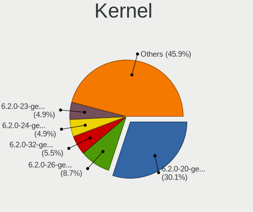
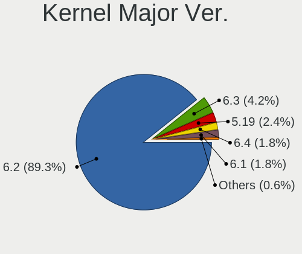
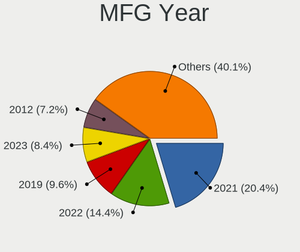
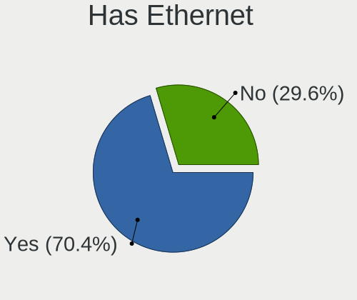
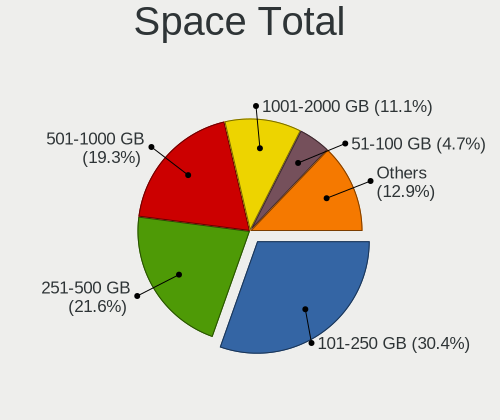
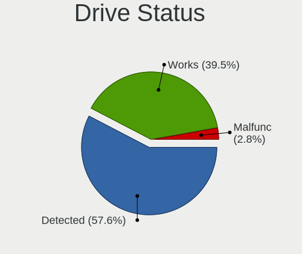
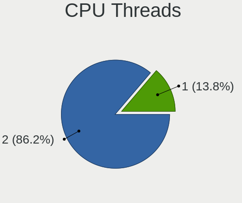
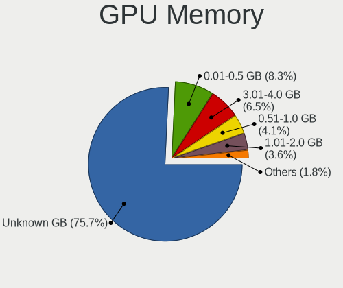
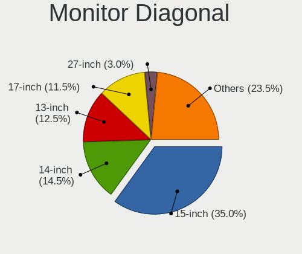
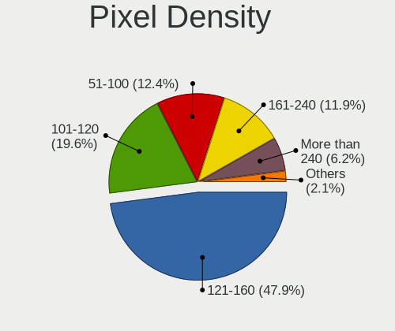

Kubuntu 23.04 - Tested Hardware & Statistics (Notebooks)
--------------------------------------------------------

A project to collect tested hardware configurations for Kubuntu 23.04.

Anyone can contribute to this report by the [hw-probe](https://github.com/linuxhw/hw-probe) tool:

    sudo -E hw-probe -all -upload

Please contribute! Especially if your hardware is rare.

Contents
--------

* [ Test Cases ](#test-cases)

* [ System ](#system)
  - [ Kernel                   ](#kernel)
  - [ Kernel Family            ](#kernel-family)
  - [ Kernel Major Ver.        ](#kernel-major-ver)
  - [ Arch                     ](#arch)
  - [ DE                       ](#de)
  - [ Display Server           ](#display-server)
  - [ Display Manager          ](#display-manager)
  - [ OS Lang                  ](#os-lang)
  - [ Boot Mode                ](#boot-mode)
  - [ Filesystem               ](#filesystem)
  - [ Part. scheme             ](#part-scheme)
  - [ Dual Boot with Linux/BSD ](#dual-boot-with-linuxbsd)
  - [ Dual Boot (Win)          ](#dual-boot-win)

* [ Board ](#board)
  - [ Vendor                   ](#vendor)
  - [ Model                    ](#model)
  - [ Model Family             ](#model-family)
  - [ MFG Year                 ](#mfg-year)
  - [ Form Factor              ](#form-factor)
  - [ Secure Boot              ](#secure-boot)
  - [ Coreboot                 ](#coreboot)
  - [ RAM Size                 ](#ram-size)
  - [ RAM Used                 ](#ram-used)
  - [ Total Drives             ](#total-drives)
  - [ Has CD-ROM               ](#has-cd-rom)
  - [ Has Ethernet             ](#has-ethernet)
  - [ Has WiFi                 ](#has-wifi)
  - [ Has Bluetooth            ](#has-bluetooth)

* [ Location ](#location)
  - [ Country                  ](#country)
  - [ City                     ](#city)

* [ Drives ](#drives)
  - [ Drive Vendor             ](#drive-vendor)
  - [ Drive Model              ](#drive-model)
  - [ HDD Vendor               ](#hdd-vendor)
  - [ SSD Vendor               ](#ssd-vendor)
  - [ Drive Kind               ](#drive-kind)
  - [ Drive Connector          ](#drive-connector)
  - [ Drive Size               ](#drive-size)
  - [ Space Total              ](#space-total)
  - [ Space Used               ](#space-used)
  - [ Malfunc. Drives          ](#malfunc-drives)
  - [ Malfunc. Drive Vendor    ](#malfunc-drive-vendor)
  - [ Malfunc. HDD Vendor      ](#malfunc-hdd-vendor)
  - [ Malfunc. Drive Kind      ](#malfunc-drive-kind)
  - [ Failed Drives            ](#failed-drives)
  - [ Failed Drive Vendor      ](#failed-drive-vendor)
  - [ Drive Status             ](#drive-status)

* [ Storage controller ](#storage-controller)
  - [ Storage Vendor           ](#storage-vendor)
  - [ Storage Model            ](#storage-model)
  - [ Storage Kind             ](#storage-kind)

* [ Processor ](#processor)
  - [ CPU Vendor               ](#cpu-vendor)
  - [ CPU Model                ](#cpu-model)
  - [ CPU Model Family         ](#cpu-model-family)
  - [ CPU Cores                ](#cpu-cores)
  - [ CPU Sockets              ](#cpu-sockets)
  - [ CPU Threads              ](#cpu-threads)
  - [ CPU Op-Modes             ](#cpu-op-modes)
  - [ CPU Microcode            ](#cpu-microcode)
  - [ CPU Microarch            ](#cpu-microarch)

* [ Graphics ](#graphics)
  - [ GPU Vendor               ](#gpu-vendor)
  - [ GPU Model                ](#gpu-model)
  - [ GPU Combo                ](#gpu-combo)
  - [ GPU Driver               ](#gpu-driver)
  - [ GPU Memory               ](#gpu-memory)

* [ Monitor ](#monitor)
  - [ Monitor Vendor           ](#monitor-vendor)
  - [ Monitor Model            ](#monitor-model)
  - [ Monitor Resolution       ](#monitor-resolution)
  - [ Monitor Diagonal         ](#monitor-diagonal)
  - [ Monitor Width            ](#monitor-width)
  - [ Aspect Ratio             ](#aspect-ratio)
  - [ Monitor Area             ](#monitor-area)
  - [ Pixel Density            ](#pixel-density)
  - [ Multiple Monitors        ](#multiple-monitors)

* [ Network ](#network)
  - [ Net Controller Vendor    ](#net-controller-vendor)
  - [ Net Controller Model     ](#net-controller-model)
  - [ Wireless Vendor          ](#wireless-vendor)
  - [ Wireless Model           ](#wireless-model)
  - [ Ethernet Vendor          ](#ethernet-vendor)
  - [ Ethernet Model           ](#ethernet-model)
  - [ Net Controller Kind      ](#net-controller-kind)
  - [ Used Controller          ](#used-controller)
  - [ NICs                     ](#nics)
  - [ IPv6                     ](#ipv6)

* [ Bluetooth ](#bluetooth)
  - [ Bluetooth Vendor         ](#bluetooth-vendor)
  - [ Bluetooth Model          ](#bluetooth-model)

* [ Sound ](#sound)
  - [ Sound Vendor             ](#sound-vendor)
  - [ Sound Model              ](#sound-model)

* [ Memory ](#memory)
  - [ Memory Vendor            ](#memory-vendor)
  - [ Memory Model             ](#memory-model)
  - [ Memory Kind              ](#memory-kind)
  - [ Memory Form Factor       ](#memory-form-factor)
  - [ Memory Size              ](#memory-size)
  - [ Memory Speed             ](#memory-speed)

* [ Printers & scanners ](#printers--scanners)
  - [ Printer Vendor           ](#printer-vendor)
  - [ Printer Model            ](#printer-model)
  - [ Scanner Vendor           ](#scanner-vendor)
  - [ Scanner Model            ](#scanner-model)

* [ Camera ](#camera)
  - [ Camera Vendor            ](#camera-vendor)
  - [ Camera Model             ](#camera-model)

* [ Security ](#security)
  - [ Fingerprint Vendor       ](#fingerprint-vendor)
  - [ Fingerprint Model        ](#fingerprint-model)
  - [ Chipcard Vendor          ](#chipcard-vendor)
  - [ Chipcard Model           ](#chipcard-model)

* [ Unsupported ](#unsupported)
  - [ Unsupported Devices      ](#unsupported-devices)
  - [ Unsupported Device Types ](#unsupported-device-types)

Test Cases
----------

Total: 27

| Vendor   | Model                       | Probe                                                      | Date         |
|----------|-----------------------------|------------------------------------------------------------|--------------|
| HP       | ZBook Studio 15.6 inch G... | [1846ea93e7](https://linux-hardware.org/?probe=1846ea93e7) | May 01, 2023 |
| Lenovo   | IdeaPad 5 Pro 16ARH7 82S... | [9a36e5ebaf](https://linux-hardware.org/?probe=9a36e5ebaf) | Apr 28, 2023 |
| Lenovo   | ThinkBook 14 G4 ABA 21DK    | [1ccae7d268](https://linux-hardware.org/?probe=1ccae7d268) | Apr 28, 2023 |
| ASUSTek  | X51RL                       | [0d18de9922](https://linux-hardware.org/?probe=0d18de9922) | Apr 28, 2023 |
| Lenovo   | ThinkPad E14 Gen 4 21ECS... | [442a827555](https://linux-hardware.org/?probe=442a827555) | Apr 27, 2023 |
| Samsung  | 950XED                      | [02586ee1ba](https://linux-hardware.org/?probe=02586ee1ba) | Apr 26, 2023 |
| Lenovo   | ThinkPad P1 Gen 2 20QT00... | [4285b1a3d9](https://linux-hardware.org/?probe=4285b1a3d9) | Apr 25, 2023 |
| HP       | Pavilion Notebook           | [b03c4808b0](https://linux-hardware.org/?probe=b03c4808b0) | Apr 25, 2023 |
| Lenovo   | Legion 5 Pro 16ACH6H 82J... | [38806ed70c](https://linux-hardware.org/?probe=38806ed70c) | Apr 24, 2023 |
| HP       | Pavilion Notebook           | [0fde788ea5](https://linux-hardware.org/?probe=0fde788ea5) | Apr 24, 2023 |
| Dell     | Inspiron 5521               | [8de2e801a3](https://linux-hardware.org/?probe=8de2e801a3) | Apr 23, 2023 |
| Dell     | Latitude E5530 non-vPro     | [fa5d5b4733](https://linux-hardware.org/?probe=fa5d5b4733) | Apr 23, 2023 |
| Gigabyte | G5 KD                       | [d7648edaab](https://linux-hardware.org/?probe=d7648edaab) | Apr 23, 2023 |
| Dell     | Precision 5520              | [4d1dd8b673](https://linux-hardware.org/?probe=4d1dd8b673) | Apr 23, 2023 |
| Gigabyte | AORUS 15P XD                | [22925aa0c9](https://linux-hardware.org/?probe=22925aa0c9) | Apr 22, 2023 |
| Dell     | Latitude E5530 non-vPro     | [f7528e9759](https://linux-hardware.org/?probe=f7528e9759) | Apr 22, 2023 |
| ASUSTek  | ASUS TUF Gaming F17 FX70... | [918115dc84](https://linux-hardware.org/?probe=918115dc84) | Apr 21, 2023 |
| ASUSTek  | VivoBook_ASUSLaptop M760... | [a02462f614](https://linux-hardware.org/?probe=a02462f614) | Apr 21, 2023 |
| Acer     | Aspire A515-45              | [93f1374055](https://linux-hardware.org/?probe=93f1374055) | Apr 01, 2023 |
| Apple    | MacBookPro8,1               | [b72701d99c](https://linux-hardware.org/?probe=b72701d99c) | Mar 29, 2023 |
| HUAWEI   | HN-WX9X                     | [cdc4b03fe2](https://linux-hardware.org/?probe=cdc4b03fe2) | Mar 26, 2023 |
| ASUSTek  | VivoBook_ASUSLaptop M760... | [fbbcc2d2c5](https://linux-hardware.org/?probe=fbbcc2d2c5) | Mar 15, 2023 |
| ASUSTek  | VivoBook_ASUSLaptop M760... | [003aa3d3e9](https://linux-hardware.org/?probe=003aa3d3e9) | Feb 27, 2023 |
| ASUSTek  | ROG Zephyrus G15 GA503QR... | [a84d546f50](https://linux-hardware.org/?probe=a84d546f50) | Feb 02, 2023 |
| Dell     | G3 3779                     | [c4c13ca86b](https://linux-hardware.org/?probe=c4c13ca86b) | Jan 19, 2023 |
| MSI      | Bravo 17 A4DDK              | [ca27b9dd46](https://linux-hardware.org/?probe=ca27b9dd46) | Jan 10, 2023 |
| MSI      | Raider GE67HX 12UGS         | [be85c7b42a](https://linux-hardware.org/?probe=be85c7b42a) | Jan 01, 2023 |

System
------

Kernel
------

Version of the Linux kernel

| Version                 | Notebooks | Percent |
|-------------------------|-----------|---------|
| 6.2.0-20-generic        | 12        | 52.17%  |
| 6.2.0-18-generic        | 3         | 13.04%  |
| 6.2.10-060210-generic   | 1         | 4.35%   |
| 6.2.0-21-generic        | 1         | 4.35%   |
| 6.1.12-060112-generic   | 1         | 4.35%   |
| 6.1.0-14-generic        | 1         | 4.35%   |
| 6.1.0-060100rc4-generic | 1         | 4.35%   |
| 5.19.0-40-generic       | 1         | 4.35%   |
| 5.19.0-28-generic       | 1         | 4.35%   |
| 5.19.0-21-generic       | 1         | 4.35%   |

Kernel Family
-------------

Linux kernel without a distro release

| Version | Notebooks | Percent |
|---------|-----------|---------|
| 6.2.0   | 16        | 69.57%  |
| 5.19.0  | 3         | 13.04%  |
| 6.1.0   | 2         | 8.7%    |
| 6.2.10  | 1         | 4.35%   |
| 6.1.12  | 1         | 4.35%   |

Kernel Major Ver.
-----------------

Linux kernel major version

| Version | Notebooks | Percent |
|---------|-----------|---------|
| 6.2     | 17        | 73.91%  |
| 6.1     | 3         | 13.04%  |
| 5.19    | 3         | 13.04%  |

Arch
----

OS architecture (x86_64, i586, etc.)

| Name   | Notebooks | Percent |
|--------|-----------|---------|
| x86_64 | 23        | 100%    |

DE
--

Desktop Environment

| Name | Notebooks | Percent |
|------|-----------|---------|
| KDE5 | 23        | 100%    |

Display Server
--------------

X11 or Wayland

| Name    | Notebooks | Percent |
|---------|-----------|---------|
| X11     | 18        | 78.26%  |
| Wayland | 5         | 21.74%  |

Display Manager
---------------

SDDM, LightDM, etc.

| Name    | Notebooks | Percent |
|---------|-----------|---------|
| SDDM    | 13        | 56.52%  |
| Unknown | 8         | 34.78%  |
| GDM3    | 2         | 8.7%    |

OS Lang
-------

Language

| Lang  | Notebooks | Percent |
|-------|-----------|---------|
| en_US | 12        | 52.17%  |
| ru_RU | 2         | 8.7%    |
| de_DE | 2         | 8.7%    |
| it_IT | 1         | 4.35%   |
| hu_HU | 1         | 4.35%   |
| fr_FR | 1         | 4.35%   |
| es_ES | 1         | 4.35%   |
| es_CR | 1         | 4.35%   |
| en_GB | 1         | 4.35%   |
| en_AU | 1         | 4.35%   |

Boot Mode
---------

EFI or BIOS

| Mode | Notebooks | Percent |
|------|-----------|---------|
| BIOS | 13        | 54.17%  |
| EFI  | 11        | 45.83%  |

Filesystem
----------

Type of filesystem

| Type  | Notebooks | Percent |
|-------|-----------|---------|
| Ext4  | 16        | 66.67%  |
| Tmpfs | 4         | 16.67%  |
| Btrfs | 3         | 12.5%   |
| Zfs   | 1         | 4.17%   |

Part. scheme
------------

Scheme of partitioning

| Type    | Notebooks | Percent |
|---------|-----------|---------|
| GPT     | 15        | 65.22%  |
| Unknown | 8         | 34.78%  |

Dual Boot with Linux/BSD
------------------------

Hosting more than one Linux/BSD

| Dual boot | Notebooks | Percent |
|-----------|-----------|---------|
| No        | 23        | 100%    |

Dual Boot (Win)
---------------

Hosting Linux and Windows

| Dual boot | Notebooks | Percent |
|-----------|-----------|---------|
| No        | 20        | 86.96%  |
| Yes       | 3         | 13.04%  |

Board
-----

Vendor
------

Motherboard manufacturer

| Name                | Notebooks | Percent |
|---------------------|-----------|---------|
| Lenovo              | 5         | 21.74%  |
| Dell                | 4         | 17.39%  |
| ASUSTek Computer    | 4         | 17.39%  |
| MSI                 | 2         | 8.7%    |
| Hewlett-Packard     | 2         | 8.7%    |
| Gigabyte Technology | 2         | 8.7%    |
| Samsung Electronics | 1         | 4.35%   |
| HUAWEI              | 1         | 4.35%   |
| Apple               | 1         | 4.35%   |
| Acer                | 1         | 4.35%   |

Model
-----

Motherboard model

| Name                                               | Notebooks | Percent |
|----------------------------------------------------|-----------|---------|
| Samsung 950XED                                     | 1         | 4.35%   |
| MSI Raider GE67HX 12UGS                            | 1         | 4.35%   |
| MSI Bravo 17 A4DDK                                 | 1         | 4.35%   |
| Lenovo ThinkPad P1 Gen 2 20QT000LGE                | 1         | 4.35%   |
| Lenovo ThinkPad E14 Gen 4 21ECS00000               | 1         | 4.35%   |
| Lenovo ThinkBook 14 G4 ABA 21DK                    | 1         | 4.35%   |
| Lenovo Legion 5 Pro 16ACH6H 82JQ                   | 1         | 4.35%   |
| Lenovo IdeaPad 5 Pro 16ARH7 82SN                   | 1         | 4.35%   |
| HUAWEI HN-WX9X                                     | 1         | 4.35%   |
| HP ZBook Studio 15.6 inch G8 Mobile Workstation PC | 1         | 4.35%   |
| HP Pavilion Notebook                               | 1         | 4.35%   |
| Gigabyte G5 KD                                     | 1         | 4.35%   |
| Gigabyte AORUS 15P XD                              | 1         | 4.35%   |
| Dell Precision 5520                                | 1         | 4.35%   |
| Dell Latitude E5530 non-vPro                       | 1         | 4.35%   |
| Dell Inspiron 5521                                 | 1         | 4.35%   |
| Dell G3 3779                                       | 1         | 4.35%   |
| ASUS X51RL                                         | 1         | 4.35%   |
| ASUS VivoBook_ASUSLaptop M7600RE_M7600RE           | 1         | 4.35%   |
| ASUS ROG Zephyrus G15 GA503QR_GA503QR              | 1         | 4.35%   |
| ASUS ASUS TUF Gaming F17 FX706LI_FX706LI           | 1         | 4.35%   |
| Apple MacBookPro8,1                                | 1         | 4.35%   |
| Acer Aspire A515-45                                | 1         | 4.35%   |

Model Family
------------

Motherboard model prefix

| Name              | Notebooks | Percent |
|-------------------|-----------|---------|
| Lenovo ThinkPad   | 2         | 8.7%    |
| Samsung 950XED    | 1         | 4.35%   |
| MSI Raider        | 1         | 4.35%   |
| MSI Bravo         | 1         | 4.35%   |
| Lenovo ThinkBook  | 1         | 4.35%   |
| Lenovo Legion     | 1         | 4.35%   |
| Lenovo IdeaPad    | 1         | 4.35%   |
| HUAWEI HN-WX9X    | 1         | 4.35%   |
| HP ZBook          | 1         | 4.35%   |
| HP Pavilion       | 1         | 4.35%   |
| Gigabyte G5       | 1         | 4.35%   |
| Gigabyte AORUS    | 1         | 4.35%   |
| Dell Precision    | 1         | 4.35%   |
| Dell Latitude     | 1         | 4.35%   |
| Dell Inspiron     | 1         | 4.35%   |
| Dell G3           | 1         | 4.35%   |
| ASUS X51RL        | 1         | 4.35%   |
| ASUS VivoBook     | 1         | 4.35%   |
| ASUS ROG          | 1         | 4.35%   |
| ASUS ASUS         | 1         | 4.35%   |
| Apple MacBookPro8 | 1         | 4.35%   |
| Acer Aspire       | 1         | 4.35%   |

MFG Year
--------

Motherboard manufacture year

| Year | Notebooks | Percent |
|------|-----------|---------|
| 2022 | 7         | 30.43%  |
| 2021 | 5         | 21.74%  |
| 2019 | 3         | 13.04%  |
| 2012 | 2         | 8.7%    |
| 2023 | 1         | 4.35%   |
| 2020 | 1         | 4.35%   |
| 2018 | 1         | 4.35%   |
| 2017 | 1         | 4.35%   |
| 2011 | 1         | 4.35%   |
| 2007 | 1         | 4.35%   |

Form Factor
-----------

Physical design of the computer

| Name     | Notebooks | Percent |
|----------|-----------|---------|
| Notebook | 23        | 100%    |

Secure Boot
-----------

Enabled or disabled

| State    | Notebooks | Percent |
|----------|-----------|---------|
| Disabled | 23        | 100%    |

Coreboot
--------

Have coreboot on board

| Used | Notebooks | Percent |
|------|-----------|---------|
| No   | 23        | 100%    |

RAM Size
--------

Total RAM memory

| Size in GB  | Notebooks | Percent |
|-------------|-----------|---------|
| 8.01-16.0   | 11        | 47.83%  |
| 16.01-24.0  | 4         | 17.39%  |
| 32.01-64.0  | 3         | 13.04%  |
| 4.01-8.0    | 1         | 4.35%   |
| 3.01-4.0    | 1         | 4.35%   |
| 24.01-32.0  | 1         | 4.35%   |
| 2.01-3.0    | 1         | 4.35%   |
| 64.01-256.0 | 1         | 4.35%   |

RAM Used
--------

Used RAM memory

| Used GB   | Notebooks | Percent |
|-----------|-----------|---------|
| 2.01-3.0  | 8         | 33.33%  |
| 4.01-8.0  | 7         | 29.17%  |
| 3.01-4.0  | 4         | 16.67%  |
| 1.01-2.0  | 4         | 16.67%  |
| 8.01-16.0 | 1         | 4.17%   |

Total Drives
------------

Number of drives on board

| Drives | Notebooks | Percent |
|--------|-----------|---------|
| 1      | 18        | 78.26%  |
| 2      | 3         | 13.04%  |
| 3      | 2         | 8.7%    |

Has CD-ROM
----------

Has CD-ROM on board

| Presented | Notebooks | Percent |
|-----------|-----------|---------|
| No        | 19        | 82.61%  |
| Yes       | 4         | 17.39%  |

Has Ethernet
------------

Has Ethernet on board

| Presented | Notebooks | Percent |
|-----------|-----------|---------|
| Yes       | 19        | 82.61%  |
| No        | 4         | 17.39%  |

Has WiFi
--------

Has WiFi module

| Presented | Notebooks | Percent |
|-----------|-----------|---------|
| Yes       | 23        | 100%    |

Has Bluetooth
-------------

Has Bluetooth module

| Presented | Notebooks | Percent |
|-----------|-----------|---------|
| Yes       | 20        | 86.96%  |
| No        | 3         | 13.04%  |

Location
--------

Country
-------

Geographic location (country)

| Country      | Notebooks | Percent |
|--------------|-----------|---------|
| USA          | 4         | 17.39%  |
| Germany      | 3         | 13.04%  |
| Russia       | 2         | 8.7%    |
| UK           | 1         | 4.35%   |
| Turkey       | 1         | 4.35%   |
| Sweden       | 1         | 4.35%   |
| Spain        | 1         | 4.35%   |
| Saudi Arabia | 1         | 4.35%   |
| Portugal     | 1         | 4.35%   |
| Poland       | 1         | 4.35%   |
| Lithuania    | 1         | 4.35%   |
| Italy        | 1         | 4.35%   |
| Hungary      | 1         | 4.35%   |
| France       | 1         | 4.35%   |
| Costa Rica   | 1         | 4.35%   |
| Belgium      | 1         | 4.35%   |
| Australia    | 1         | 4.35%   |

City
----

Geographic location (city)

| City            | Notebooks | Percent |
|-----------------|-----------|---------|
| Warsaw          | 1         | 4.35%   |
| Vsevolozhsk     | 1         | 4.35%   |
| Vilnius         | 1         | 4.35%   |
| Sydney          | 1         | 4.35%   |
| Salt Lake City  | 1         | 4.35%   |
| Roubaix         | 1         | 4.35%   |
| Rio Segundo     | 1         | 4.35%   |
| Pilisvoeroesvar | 1         | 4.35%   |
| Phoenix         | 1         | 4.35%   |
| Philadelphia    | 1         | 4.35%   |
| Munich          | 1         | 4.35%   |
| Moseley         | 1         | 4.35%   |
| Milan           | 1         | 4.35%   |
| Madrid          | 1         | 4.35%   |
| Lisbon          | 1         | 4.35%   |
| Krasnoyarsk     | 1         | 4.35%   |
| Jeddah          | 1         | 4.35%   |
| Istanbul        | 1         | 4.35%   |
| Hereford        | 1         | 4.35%   |
| Gothenburg      | 1         | 4.35%   |
| Falkensee       | 1         | 4.35%   |
| Brussels        | 1         | 4.35%   |
| Berlin          | 1         | 4.35%   |

Drives
------

Drive Vendor
------------

Hard drive vendors

| Vendor              | Notebooks | Drives | Percent |
|---------------------|-----------|--------|---------|
| Samsung Electronics | 8         | 11     | 27.59%  |
| SK hynix            | 4         | 4      | 13.79%  |
| WDC                 | 3         | 3      | 10.34%  |
| Toshiba             | 2         | 2      | 6.9%    |
| Phison Electronics  | 2         | 2      | 6.9%    |
| Micron Technology   | 2         | 2      | 6.9%    |
| Intel               | 2         | 2      | 6.9%    |
| Crucial             | 2         | 2      | 6.9%    |
| UMIS                | 1         | 1      | 3.45%   |
| Seagate             | 1         | 1      | 3.45%   |
| Sandisk             | 1         | 1      | 3.45%   |
| A-DATA Technology   | 1         | 1      | 3.45%   |

Drive Model
-----------

Hard drive models

| Model                                              | Notebooks | Percent |
|----------------------------------------------------|-----------|---------|
| Samsung NVMe SSD Controller PM9A1/PM9A3/980PRO 2TB | 2         | 6.9%    |
| WDC WDBNCE5000PNC 500GB SSD                        | 1         | 3.45%   |
| WDC WD10SPZX-24Z10 1TB                             | 1         | 3.45%   |
| WDC WD10 JPVX-00JC3T0 1TB                          | 1         | 3.45%   |
| UMIS RPJTJ512MGE1QDQ 512GB                         | 1         | 3.45%   |
| Toshiba XG6 NVMe SSD Controller 1024GB             | 1         | 3.45%   |
| Toshiba KXG60ZNV512G 512GB                         | 1         | 3.45%   |
| SK hynix SKHynix_HFS001TDE9X084N 1024GB            | 1         | 3.45%   |
| SK hynix HFS256G32MND-2900A 256GB SSD              | 1         | 3.45%   |
| SK hynix HFM001TD3JX013N 1024GB                    | 1         | 3.45%   |
| SK hynix BC501 NVMe Solid State Drive 512GB        | 1         | 3.45%   |
| Seagate ST1000LM048-2E7172 1TB                     | 1         | 3.45%   |
| Sandisk WD Blue SN570 1TB                          | 1         | 3.45%   |
| Samsung SSD 870 QVO 1TB                            | 1         | 3.45%   |
| Samsung MZVLQ512HBLU-00B 512GB                     | 1         | 3.45%   |
| Samsung MZVLQ256HAJD-000H1 256GB                   | 1         | 3.45%   |
| Samsung MZVLQ1T0HALB-00000 1TB                     | 1         | 3.45%   |
| Samsung MZVLB1T0HBLR-00000 1TB                     | 1         | 3.45%   |
| Samsung MZAL4256HBJD-00BL2 256GB                   | 1         | 3.45%   |
| Phison ESR01TBMFCT-E8GBTOEM4 1024GB                | 1         | 3.45%   |
| Phison E16 PCIe4 NVMe Controller 500GB             | 1         | 3.45%   |
| Micron 2210_MTFDHBA512QFD 512GB                    | 1         | 3.45%   |
| Micron 1100 SATA 256GB SSD                         | 1         | 3.45%   |
| Intel SSDSA2CW300G3 304GB                          | 1         | 3.45%   |
| Intel SSD 660P Series 512GB                        | 1         | 3.45%   |
| Crucial CT120BX500SSD1 120GB                       | 1         | 3.45%   |
| Crucial CT1000BX500SSD1 1TB                        | 1         | 3.45%   |
| A-DATA SX8200PNP 2TB                               | 1         | 3.45%   |

HDD Vendor
----------

Hard disk drive vendors

| Vendor  | Notebooks | Drives | Percent |
|---------|-----------|--------|---------|
| WDC     | 2         | 2      | 66.67%  |
| Seagate | 1         | 1      | 33.33%  |

SSD Vendor
----------

Solid state drive vendors

| Vendor              | Notebooks | Drives | Percent |
|---------------------|-----------|--------|---------|
| Crucial             | 2         | 2      | 28.57%  |
| WDC                 | 1         | 1      | 14.29%  |
| SK hynix            | 1         | 1      | 14.29%  |
| Samsung Electronics | 1         | 1      | 14.29%  |
| Micron Technology   | 1         | 1      | 14.29%  |
| Intel               | 1         | 1      | 14.29%  |

Drive Kind
----------

HDD or SSD

| Kind | Notebooks | Drives | Percent |
|------|-----------|--------|---------|
| NVMe | 17        | 22     | 62.96%  |
| SSD  | 7         | 7      | 25.93%  |
| HDD  | 3         | 3      | 11.11%  |

Drive Connector
---------------

SATA, SAS, NVMe, etc.

| Type | Notebooks | Drives | Percent |
|------|-----------|--------|---------|
| NVMe | 17        | 22     | 65.38%  |
| SATA | 8         | 9      | 30.77%  |
| SAS  | 1         | 1      | 3.85%   |

Drive Size
----------

Size of hard drive

| Size in TB | Notebooks | Drives | Percent |
|------------|-----------|--------|---------|
| 0.01-0.5   | 5         | 5      | 62.5%   |
| 0.51-1.0   | 3         | 5      | 37.5%   |

Space Total
-----------

Amount of disk space available on the file system

| Size in GB     | Notebooks | Percent |
|----------------|-----------|---------|
| 101-250        | 7         | 30.43%  |
| 501-1000       | 7         | 30.43%  |
| 251-500        | 3         | 13.04%  |
| More than 3000 | 2         | 8.7%    |
| 1001-2000      | 2         | 8.7%    |
| 2001-3000      | 1         | 4.35%   |
| 1-20           | 1         | 4.35%   |

Space Used
----------

Amount of used disk space

| Used GB        | Notebooks | Percent |
|----------------|-----------|---------|
| 1-20           | 7         | 29.17%  |
| 21-50          | 6         | 25%     |
| 101-250        | 3         | 12.5%   |
| 1001-2000      | 3         | 12.5%   |
| 51-100         | 2         | 8.33%   |
| More than 3000 | 1         | 4.17%   |
| 251-500        | 1         | 4.17%   |
| 501-1000       | 1         | 4.17%   |

Malfunc. Drives
---------------

Drive models with a malfunction

| Model                                 | Notebooks | Drives | Percent |
|---------------------------------------|-----------|--------|---------|
| SK hynix HFS256G32MND-2900A 256GB SSD | 1         | 1      | 100%    |

Malfunc. Drive Vendor
---------------------

Vendors of faulty drives

| Vendor   | Notebooks | Drives | Percent |
|----------|-----------|--------|---------|
| SK hynix | 1         | 1      | 100%    |

Malfunc. HDD Vendor
-------------------

Vendors of faulty HDD drives

Zero info for selected period =(

Malfunc. Drive Kind
-------------------

Kinds of faulty drives

| Kind | Notebooks | Drives | Percent |
|------|-----------|--------|---------|
| SSD  | 1         | 1      | 100%    |

Failed Drives
-------------

Failed drive models

Zero info for selected period =(

Failed Drive Vendor
-------------------

Failed drive vendors

Zero info for selected period =(

Drive Status
------------

Number of failed and malfunc. drives

| Status   | Notebooks | Drives | Percent |
|----------|-----------|--------|---------|
| Detected | 14        | 23     | 60.87%  |
| Works    | 8         | 8      | 34.78%  |
| Malfunc  | 1         | 1      | 4.35%   |

Storage controller
------------------

Storage Vendor
--------------

Storage controller vendors

| Vendor                       | Notebooks | Percent |
|------------------------------|-----------|---------|
| Intel                        | 9         | 29.03%  |
| Samsung Electronics          | 7         | 22.58%  |
| AMD                          | 4         | 12.9%   |
| SK hynix                     | 3         | 9.68%   |
| Toshiba America Info Systems | 2         | 6.45%   |
| Phison Electronics           | 2         | 6.45%   |
| Union Memory (Shenzhen)      | 1         | 3.23%   |
| SanDisk                      | 1         | 3.23%   |
| Micron Technology            | 1         | 3.23%   |
| ADATA Technology             | 1         | 3.23%   |

Storage Model
-------------

Storage controller models

| Model                                                                         | Notebooks | Percent |
|-------------------------------------------------------------------------------|-----------|---------|
| Samsung NVMe SSD Controller 980                                               | 3         | 9.09%   |
| AMD FCH SATA Controller [AHCI mode]                                           | 3         | 9.09%   |
| Toshiba America Info Systems XG6 NVMe SSD Controller                          | 2         | 6.06%   |
| SK hynix Gold P31/PC711 NVMe Solid State Drive                                | 2         | 6.06%   |
| Samsung NVMe SSD Controller PM9A1/PM9A3/980PRO                                | 2         | 6.06%   |
| Intel Cannon Lake Mobile PCH SATA AHCI Controller                             | 2         | 6.06%   |
| Intel 7 Series Chipset Family 6-port SATA Controller [AHCI mode]              | 2         | 6.06%   |
| Union Memory (Shenzhen) AM630 PCIe 4.0 x4 NVMe SSD Controller                 | 1         | 3.03%   |
| SK hynix BC501 NVMe Solid State Drive                                         | 1         | 3.03%   |
| SanDisk WD Blue SN570 NVMe SSD 1TB                                            | 1         | 3.03%   |
| Samsung NVMe SSD Controller SM981/PM981/PM983                                 | 1         | 3.03%   |
| Samsung NVMe SSD Controller PM9B1                                             | 1         | 3.03%   |
| Phison E18 PCIe4 NVMe Controller                                              | 1         | 3.03%   |
| Phison E16 PCIe4 NVMe Controller                                              | 1         | 3.03%   |
| Micron NVMe Storage Controller                                                | 1         | 3.03%   |
| Intel Sunrise Point-LP SATA Controller [AHCI mode]                            | 1         | 3.03%   |
| Intel SSD 660P Series                                                         | 1         | 3.03%   |
| Intel Q170/Q150/B150/H170/H110/Z170/CM236 Chipset SATA Controller [AHCI Mode] | 1         | 3.03%   |
| Intel 6 Series/C200 Series Chipset Family 6 port Mobile SATA AHCI Controller  | 1         | 3.03%   |
| Intel 500 Series Chipset Family SATA AHCI Controller                          | 1         | 3.03%   |
| Intel 400 Series Chipset Family SATA AHCI Controller                          | 1         | 3.03%   |
| AMD SB600 Non-Raid-5 SATA                                                     | 1         | 3.03%   |
| AMD SB600 IDE                                                                 | 1         | 3.03%   |
| ADATA XPG SX8200 Pro PCIe Gen3x4 M.2 2280 Solid State Drive                   | 1         | 3.03%   |

Storage Kind
------------

Kind of storage controller (IDE, SATA, NVMe, SAS, ...)

| Kind | Notebooks | Percent |
|------|-----------|---------|
| NVMe | 17        | 54.84%  |
| SATA | 13        | 41.94%  |
| IDE  | 1         | 3.23%   |

Processor
---------

CPU Vendor
----------

Processor vendors

| Vendor | Notebooks | Percent |
|--------|-----------|---------|
| Intel  | 14        | 60.87%  |
| AMD    | 9         | 39.13%  |

CPU Model
---------

Processor models

| Model                                         | Notebooks | Percent |
|-----------------------------------------------|-----------|---------|
| Intel Core i7-9750H CPU @ 2.60GHz             | 1         | 4.35%   |
| Intel Core i7-8750H CPU @ 2.20GHz             | 1         | 4.35%   |
| Intel Core i7-7820HQ CPU @ 2.90GHz            | 1         | 4.35%   |
| Intel Core i7-3537U CPU @ 2.00GHz             | 1         | 4.35%   |
| Intel Core i7-2640M CPU @ 2.80GHz             | 1         | 4.35%   |
| Intel Core i5-6200U CPU @ 2.30GHz             | 1         | 4.35%   |
| Intel Core i5-3340M CPU @ 2.70GHz             | 1         | 4.35%   |
| Intel Core i5-10300H CPU @ 2.50GHz            | 1         | 4.35%   |
| Intel Core 2 Duo CPU T7700 @ 2.40GHz          | 1         | 4.35%   |
| Intel 12th Gen Core i7-12800HX                | 1         | 4.35%   |
| Intel 12th Gen Core i7-1260P                  | 1         | 4.35%   |
| Intel 11th Gen Core i7-11850H @ 2.50GHz       | 1         | 4.35%   |
| Intel 11th Gen Core i7-11800H @ 2.30GHz       | 1         | 4.35%   |
| Intel 11th Gen Core i5-11400H @ 2.70GHz       | 1         | 4.35%   |
| AMD Ryzen 9 6900HX with Radeon Graphics       | 1         | 4.35%   |
| AMD Ryzen 9 5900HS with Radeon Graphics       | 1         | 4.35%   |
| AMD Ryzen 7 6800HS Creator Edition            | 1         | 4.35%   |
| AMD Ryzen 7 5825U with Radeon Graphics        | 1         | 4.35%   |
| AMD Ryzen 7 5800H with Radeon Graphics        | 1         | 4.35%   |
| AMD Ryzen 7 4800H with Radeon Graphics        | 1         | 4.35%   |
| AMD Ryzen 5 5625U with Radeon Graphics        | 1         | 4.35%   |
| AMD Ryzen 5 5500U with Radeon Graphics        | 1         | 4.35%   |
| AMD Ryzen 5 3500U with Radeon Vega Mobile Gfx | 1         | 4.35%   |

CPU Model Family
----------------

Processor model prefix

| Model            | Notebooks | Percent |
|------------------|-----------|---------|
| Other            | 5         | 21.74%  |
| Intel Core i7    | 5         | 21.74%  |
| AMD Ryzen 7      | 4         | 17.39%  |
| Intel Core i5    | 3         | 13.04%  |
| AMD Ryzen 5      | 3         | 13.04%  |
| AMD Ryzen 9      | 2         | 8.7%    |
| Intel Core 2 Duo | 1         | 4.35%   |

CPU Cores
---------

Number of processor cores

| Number | Notebooks | Percent |
|--------|-----------|---------|
| 8      | 8         | 34.78%  |
| 6      | 5         | 21.74%  |
| 2      | 5         | 21.74%  |
| 4      | 3         | 13.04%  |
| 16     | 1         | 4.35%   |
| 12     | 1         | 4.35%   |

CPU Sockets
-----------

Number of sockets

| Number | Notebooks | Percent |
|--------|-----------|---------|
| 1      | 23        | 100%    |

CPU Threads
-----------

Threads per core (Hyper-Threading)

| Number | Notebooks | Percent |
|--------|-----------|---------|
| 2      | 21        | 91.3%   |
| 1      | 2         | 8.7%    |

CPU Op-Modes
------------

CPU Operation Modes (32-bit, 64-bit)

| Op mode        | Notebooks | Percent |
|----------------|-----------|---------|
| 32-bit, 64-bit | 23        | 100%    |

CPU Microcode
-------------

Microcode number

| Number     | Notebooks | Percent |
|------------|-----------|---------|
| Unknown    | 16        | 66.67%  |
| 0x0a50000c | 3         | 12.5%   |
| 0x90672    | 1         | 4.17%   |
| 0x0a404102 | 1         | 4.17%   |
| 0x0a404101 | 1         | 4.17%   |
| 0x08600104 | 1         | 4.17%   |
| 0x08108109 | 1         | 4.17%   |

CPU Microarch
-------------

Microarchitecture

| Name             | Notebooks | Percent |
|------------------|-----------|---------|
| Unknown          | 7         | 30.43%  |
| Zen 3            | 4         | 17.39%  |
| KabyLake         | 3         | 13.04%  |
| IvyBridge        | 2         | 8.7%    |
| Zen+             | 1         | 4.35%   |
| Zen 2            | 1         | 4.35%   |
| Skylake          | 1         | 4.35%   |
| SandyBridge      | 1         | 4.35%   |
| Core             | 1         | 4.35%   |
| CometLake        | 1         | 4.35%   |
| Alderlake Hybrid | 1         | 4.35%   |

Graphics
--------

GPU Vendor
----------

Vendors of graphics cards

| Vendor | Notebooks | Percent |
|--------|-----------|---------|
| Intel  | 13        | 38.24%  |
| AMD    | 11        | 32.35%  |
| Nvidia | 10        | 29.41%  |

GPU Model
---------

Graphics card models

| Model                                                                     | Notebooks | Percent |
|---------------------------------------------------------------------------|-----------|---------|
| Intel TigerLake-H GT1 [UHD Graphics]                                      | 3         | 8.57%   |
| Nvidia GA104M [GeForce RTX 3070 Mobile / Max-Q]                           | 2         | 5.71%   |
| Intel CoffeeLake-H GT2 [UHD Graphics 630]                                 | 2         | 5.71%   |
| Intel 3rd Gen Core processor Graphics Controller                          | 2         | 5.71%   |
| AMD Rembrandt [Radeon 680M]                                               | 2         | 5.71%   |
| AMD Cezanne [Radeon Vega Series / Radeon Vega Mobile Series]              | 2         | 5.71%   |
| AMD Barcelo                                                               | 2         | 5.71%   |
| Nvidia TU117M [GeForce GTX 1650 Ti Mobile]                                | 1         | 2.86%   |
| Nvidia TU117GLM [Quadro T1000 Mobile]                                     | 1         | 2.86%   |
| Nvidia GP107M [GeForce GTX 1050 Ti Mobile]                                | 1         | 2.86%   |
| Nvidia GM107GLM [Quadro M1200 Mobile]                                     | 1         | 2.86%   |
| Nvidia GA107M [GeForce RTX 3050 Ti Mobile]                                | 1         | 2.86%   |
| Nvidia GA107GLM [RTX A2000 Mobile]                                        | 1         | 2.86%   |
| Nvidia GA106M [GeForce RTX 3060 Mobile / Max-Q]                           | 1         | 2.86%   |
| Nvidia GA104 [Geforce RTX 3070 Ti Laptop GPU]                             | 1         | 2.86%   |
| Intel Skylake GT2 [HD Graphics 520]                                       | 1         | 2.86%   |
| Intel HD Graphics 630                                                     | 1         | 2.86%   |
| Intel CometLake-H GT2 [UHD Graphics]                                      | 1         | 2.86%   |
| Intel Alder Lake-P Integrated Graphics Controller                         | 1         | 2.86%   |
| Intel Alder Lake-HX GT1 [UHD Graphics 770]                                | 1         | 2.86%   |
| Intel 2nd Generation Core Processor Family Integrated Graphics Controller | 1         | 2.86%   |
| AMD Renoir                                                                | 1         | 2.86%   |
| AMD RC410M [Mobility Radeon Xpress 200M]                                  | 1         | 2.86%   |
| AMD Picasso/Raven 2 [Radeon Vega Series / Radeon Vega Mobile Series]      | 1         | 2.86%   |
| AMD Navi 14 [Radeon RX 5500/5500M / Pro 5500M]                            | 1         | 2.86%   |
| AMD Mars [Radeon HD 8730M]                                                | 1         | 2.86%   |
| AMD Lucienne                                                              | 1         | 2.86%   |

GPU Combo
---------

Combinations of graphics cards

| Name           | Notebooks | Percent |
|----------------|-----------|---------|
| Intel + Nvidia | 8         | 34.78%  |
| 1 x AMD        | 7         | 30.43%  |
| 1 x Intel      | 4         | 17.39%  |
| AMD + Nvidia   | 2         | 8.7%    |
| 2 x AMD        | 1         | 4.35%   |
| Intel + AMD    | 1         | 4.35%   |

GPU Driver
----------

Free vs proprietary

| Driver      | Notebooks | Percent |
|-------------|-----------|---------|
| Free        | 15        | 62.5%   |
| Proprietary | 9         | 37.5%   |

GPU Memory
----------

Total video memory

| Size in GB | Notebooks | Percent |
|------------|-----------|---------|
| Unknown    | 12        | 50%     |
| 3.01-4.0   | 4         | 16.67%  |
| 1.01-2.0   | 3         | 12.5%   |
| 7.01-8.0   | 2         | 8.33%   |
| 0.51-1.0   | 2         | 8.33%   |
| 0.01-0.5   | 1         | 4.17%   |

Monitor
-------

Monitor Vendor
--------------

Monitor vendors

| Vendor              | Notebooks | Percent |
|---------------------|-----------|---------|
| Samsung Electronics | 6         | 22.22%  |
| BOE                 | 5         | 18.52%  |
| Chimei Innolux      | 4         | 14.81%  |
| AU Optronics        | 4         | 14.81%  |
| Sharp               | 2         | 7.41%   |
| PANDA               | 1         | 3.7%    |
| LG Display          | 1         | 3.7%    |
| Lenovo              | 1         | 3.7%    |
| Goldstar            | 1         | 3.7%    |
| Denver              | 1         | 3.7%    |
| Apple               | 1         | 3.7%    |

Monitor Model
-------------

Monitor models

| Model                                                                 | Notebooks | Percent |
|-----------------------------------------------------------------------|-----------|---------|
| Sharp LQ156M1JW03 SHP155D 1920x1080 344x194mm 15.5-inch               | 1         | 3.7%    |
| Sharp LCD Monitor SHP1453 1920x1080 346x194mm 15.6-inch               | 1         | 3.7%    |
| Samsung Electronics S24R35x SAM100E 1920x1080 527x296mm 23.8-inch     | 1         | 3.7%    |
| Samsung Electronics LF24T35 SAM707E 1920x1080 528x297mm 23.9-inch     | 1         | 3.7%    |
| Samsung Electronics LCD Monitor SEC5441 1366x768 344x194mm 15.5-inch  | 1         | 3.7%    |
| Samsung Electronics LCD Monitor SDC4179 2560x1440 344x194mm 15.5-inch | 1         | 3.7%    |
| Samsung Electronics LCD Monitor SDC415D 3840x2400 344x215mm 16.0-inch | 1         | 3.7%    |
| Samsung Electronics LCD Monitor SDC4159 1920x1080 344x194mm 15.5-inch | 1         | 3.7%    |
| PANDA LCD Monitor NCP0063 1920x1080 344x194mm 15.5-inch               | 1         | 3.7%    |
| LG Display LCD Monitor LGD04B3 1920x1080 345x194mm 15.6-inch          | 1         | 3.7%    |
| Lenovo P24h-2L LEN62B2 2560x1440 527x296mm 23.8-inch                  | 1         | 3.7%    |
| Goldstar TV SSCR2 GSM8080 3840x2160                                   | 1         | 3.7%    |
| Denver M24-FHD-165 LHC2400 1920x1080 527x296mm 23.8-inch              | 1         | 3.7%    |
| Chimei Innolux LCD Monitor CMN15B6 1366x768 344x193mm 15.5-inch       | 1         | 3.7%    |
| Chimei Innolux LCD Monitor CMN153E 1920x1080 344x193mm 15.5-inch      | 1         | 3.7%    |
| Chimei Innolux LCD Monitor CMN152A 2560x1440 344x193mm 15.5-inch      | 1         | 3.7%    |
| Chimei Innolux LCD Monitor CMN140A 1920x1080 309x173mm 13.9-inch      | 1         | 3.7%    |
| BOE LCD Monitor BOE0AC1 2560x1600 344x215mm 16.0-inch                 | 1         | 3.7%    |
| BOE LCD Monitor BOE0A40 2560x1600 344x215mm 16.0-inch                 | 1         | 3.7%    |
| BOE LCD Monitor BOE08D7 1920x1080 309x174mm 14.0-inch                 | 1         | 3.7%    |
| BOE LCD Monitor BOE0892 2160x1440 275x183mm 13.0-inch                 | 1         | 3.7%    |
| BOE LCD Monitor BOE0853 1920x1080 344x194mm 15.5-inch                 | 1         | 3.7%    |
| AU Optronics LCD Monitor AUOAF90 1920x1080 344x193mm 15.5-inch        | 1         | 3.7%    |
| AU Optronics LCD Monitor AUO978F 1920x1080 382x215mm 17.3-inch        | 1         | 3.7%    |
| AU Optronics LCD Monitor AUO8294 1920x1080 382x215mm 17.3-inch        | 1         | 3.7%    |
| AU Optronics LCD Monitor AUO139D 1920x1080 381x214mm 17.2-inch        | 1         | 3.7%    |
| Apple LCD Monitor APP9CC5 1280x800 286x179mm 13.3-inch                | 1         | 3.7%    |

Monitor Resolution
------------------

Monitor screen resolution

| Resolution      | Notebooks | Percent |
|-----------------|-----------|---------|
| 1920x1080 (FHD) | 13        | 54.17%  |
| 2560x1440 (QHD) | 3         | 12.5%   |
| 2560x1600       | 2         | 8.33%   |
| 1366x768 (WXGA) | 2         | 8.33%   |
| 3840x2400       | 1         | 4.17%   |
| 3840x2160 (4K)  | 1         | 4.17%   |
| 2160x1440       | 1         | 4.17%   |
| 1280x800 (WXGA) | 1         | 4.17%   |

Monitor Diagonal
----------------

Diagonal size in inches

| Inches | Notebooks | Percent |
|--------|-----------|---------|
| 15     | 12        | 46.15%  |
| 17     | 3         | 11.54%  |
| 16     | 3         | 11.54%  |
| 13     | 3         | 11.54%  |
| 23     | 2         | 7.69%   |
| 72     | 1         | 3.85%   |
| 24     | 1         | 3.85%   |
| 14     | 1         | 3.85%   |

Monitor Width
-------------

Physical width

| Width in mm | Notebooks | Percent |
|-------------|-----------|---------|
| 301-350     | 16        | 61.54%  |
| 351-400     | 4         | 15.38%  |
| 501-600     | 3         | 11.54%  |
| 201-300     | 2         | 7.69%   |
| 1501-2000   | 1         | 3.85%   |

Aspect Ratio
------------

Proportional relationship between the width and the height

| Ratio | Notebooks | Percent |
|-------|-----------|---------|
| 16/9  | 17        | 77.27%  |
| 16/10 | 4         | 18.18%  |
| 3/2   | 1         | 4.55%   |

Monitor Area
------------

Area in inch²

| Area in inch² | Notebooks | Percent |
|----------------|-----------|---------|
| 101-110        | 12        | 46.15%  |
| 81-90          | 3         | 11.54%  |
| 201-250        | 3         | 11.54%  |
| 121-130        | 3         | 11.54%  |
| 111-120        | 3         | 11.54%  |
| More than 1000 | 1         | 3.85%   |
| 71-80          | 1         | 3.85%   |

Pixel Density
-------------

Pixels per inch

| Density       | Notebooks | Percent |
|---------------|-----------|---------|
| 121-160       | 13        | 52%     |
| 161-240       | 5         | 20%     |
| 51-100        | 4         | 16%     |
| 101-120       | 2         | 8%      |
| More than 240 | 1         | 4%      |

Multiple Monitors
-----------------

Total monitors connected

| Total | Notebooks | Percent |
|-------|-----------|---------|
| 1     | 19        | 82.61%  |
| 2     | 3         | 13.04%  |
| 3     | 1         | 4.35%   |

Network
-------

Net Controller Vendor
---------------------

Controller vendors

| Vendor                | Notebooks | Percent |
|-----------------------|-----------|---------|
| Realtek Semiconductor | 16        | 42.11%  |
| Intel                 | 13        | 34.21%  |
| MediaTek              | 4         | 10.53%  |
| Broadcom              | 2         | 5.26%   |
| Samsung Electronics   | 1         | 2.63%   |
| Qualcomm Atheros      | 1         | 2.63%   |
| Lenovo                | 1         | 2.63%   |

Net Controller Model
--------------------

Controller models

| Model                                                                   | Notebooks | Percent |
|-------------------------------------------------------------------------|-----------|---------|
| Realtek RTL8111/8168/8411 PCI Express Gigabit Ethernet Controller       | 8         | 17.78%  |
| Realtek RTL8153 Gigabit Ethernet Adapter                                | 3         | 6.67%   |
| MediaTek MT7921 802.11ax PCI Express Wireless Network Adapter           | 3         | 6.67%   |
| Intel Wi-Fi 6 AX200                                                     | 3         | 6.67%   |
| Realtek RTL8852BE PCIe 802.11ax Wireless Network Controller             | 2         | 4.44%   |
| Realtek RTL810xE PCI Express Fast Ethernet controller                   | 2         | 4.44%   |
| Intel Tiger Lake PCH CNVi WiFi                                          | 2         | 4.44%   |
| Samsung Galaxy series, misc. (tethering mode)                           | 1         | 2.22%   |
| Realtek RTL8852AE 802.11ax PCIe Wireless Network Adapter                | 1         | 2.22%   |
| Realtek RTL8822CE 802.11ac PCIe Wireless Network Adapter                | 1         | 2.22%   |
| Realtek RTL8125 2.5GbE Controller                                       | 1         | 2.22%   |
| Realtek RTL-8100/8101L/8139 PCI Fast Ethernet Adapter                   | 1         | 2.22%   |
| Realtek Killer E3000 2.5GbE Controller                                  | 1         | 2.22%   |
| Qualcomm Atheros AR242x / AR542x Wireless Network Adapter (PCI-Express) | 1         | 2.22%   |
| MediaTek MT7922 802.11ax PCI Express Wireless Network Adapter           | 1         | 2.22%   |
| Lenovo USB-C Dock Ethernet                                              | 1         | 2.22%   |
| Intel Wireless 7260                                                     | 1         | 2.22%   |
| Intel Wireless 3165                                                     | 1         | 2.22%   |
| Intel Wi-Fi 6 AX210/AX211/AX411 160MHz                                  | 1         | 2.22%   |
| Intel Ethernet Connection (7) I219-V                                    | 1         | 2.22%   |
| Intel Ethernet Connection (14) I219-V                                   | 1         | 2.22%   |
| Intel Centrino Wireless-N 2230                                          | 1         | 2.22%   |
| Intel Centrino Advanced-N 6205 [Taylor Peak]                            | 1         | 2.22%   |
| Intel Cannon Lake PCH CNVi WiFi                                         | 1         | 2.22%   |
| Intel Alder Lake-S PCH CNVi WiFi                                        | 1         | 2.22%   |
| Intel Alder Lake-P PCH CNVi WiFi                                        | 1         | 2.22%   |
| Broadcom NetXtreme BCM57765 Gigabit Ethernet PCIe                       | 1         | 2.22%   |
| Broadcom NetXtreme BCM5761 Gigabit Ethernet PCIe                        | 1         | 2.22%   |
| Broadcom BCM4331 802.11a/b/g/n                                          | 1         | 2.22%   |

Wireless Vendor
---------------

Wireless vendors

| Vendor                | Notebooks | Percent |
|-----------------------|-----------|---------|
| Intel                 | 13        | 56.52%  |
| Realtek Semiconductor | 4         | 17.39%  |
| MediaTek              | 4         | 17.39%  |
| Qualcomm Atheros      | 1         | 4.35%   |
| Broadcom              | 1         | 4.35%   |

Wireless Model
--------------

Wireless models

| Model                                                                   | Notebooks | Percent |
|-------------------------------------------------------------------------|-----------|---------|
| MediaTek MT7921 802.11ax PCI Express Wireless Network Adapter           | 3         | 13.04%  |
| Intel Wi-Fi 6 AX200                                                     | 3         | 13.04%  |
| Realtek RTL8852BE PCIe 802.11ax Wireless Network Controller             | 2         | 8.7%    |
| Intel Tiger Lake PCH CNVi WiFi                                          | 2         | 8.7%    |
| Realtek RTL8852AE 802.11ax PCIe Wireless Network Adapter                | 1         | 4.35%   |
| Realtek RTL8822CE 802.11ac PCIe Wireless Network Adapter                | 1         | 4.35%   |
| Qualcomm Atheros AR242x / AR542x Wireless Network Adapter (PCI-Express) | 1         | 4.35%   |
| MediaTek MT7922 802.11ax PCI Express Wireless Network Adapter           | 1         | 4.35%   |
| Intel Wireless 7260                                                     | 1         | 4.35%   |
| Intel Wireless 3165                                                     | 1         | 4.35%   |
| Intel Wi-Fi 6 AX210/AX211/AX411 160MHz                                  | 1         | 4.35%   |
| Intel Centrino Wireless-N 2230                                          | 1         | 4.35%   |
| Intel Centrino Advanced-N 6205 [Taylor Peak]                            | 1         | 4.35%   |
| Intel Cannon Lake PCH CNVi WiFi                                         | 1         | 4.35%   |
| Intel Alder Lake-S PCH CNVi WiFi                                        | 1         | 4.35%   |
| Intel Alder Lake-P PCH CNVi WiFi                                        | 1         | 4.35%   |
| Broadcom BCM4331 802.11a/b/g/n                                          | 1         | 4.35%   |

Ethernet Vendor
---------------

Ethernet vendors

| Vendor                | Notebooks | Percent |
|-----------------------|-----------|---------|
| Realtek Semiconductor | 15        | 71.43%  |
| Intel                 | 2         | 9.52%   |
| Broadcom              | 2         | 9.52%   |
| Samsung Electronics   | 1         | 4.76%   |
| Lenovo                | 1         | 4.76%   |

Ethernet Model
--------------

Ethernet models

| Model                                                             | Notebooks | Percent |
|-------------------------------------------------------------------|-----------|---------|
| Realtek RTL8111/8168/8411 PCI Express Gigabit Ethernet Controller | 8         | 36.36%  |
| Realtek RTL8153 Gigabit Ethernet Adapter                          | 3         | 13.64%  |
| Realtek RTL810xE PCI Express Fast Ethernet controller             | 2         | 9.09%   |
| Samsung Galaxy series, misc. (tethering mode)                     | 1         | 4.55%   |
| Realtek RTL8125 2.5GbE Controller                                 | 1         | 4.55%   |
| Realtek RTL-8100/8101L/8139 PCI Fast Ethernet Adapter             | 1         | 4.55%   |
| Realtek Killer E3000 2.5GbE Controller                            | 1         | 4.55%   |
| Lenovo USB-C Dock Ethernet                                        | 1         | 4.55%   |
| Intel Ethernet Connection (7) I219-V                              | 1         | 4.55%   |
| Intel Ethernet Connection (14) I219-V                             | 1         | 4.55%   |
| Broadcom NetXtreme BCM57765 Gigabit Ethernet PCIe                 | 1         | 4.55%   |
| Broadcom NetXtreme BCM5761 Gigabit Ethernet PCIe                  | 1         | 4.55%   |

Net Controller Kind
-------------------

Ethernet, WiFi or modem

| Kind     | Notebooks | Percent |
|----------|-----------|---------|
| WiFi     | 23        | 56.1%   |
| Ethernet | 18        | 43.9%   |

Used Controller
---------------

Currently used network controller

| Kind     | Notebooks | Percent |
|----------|-----------|---------|
| WiFi     | 20        | 86.96%  |
| Ethernet | 3         | 13.04%  |

NICs
----

Total network controllers on board

| Total | Notebooks | Percent |
|-------|-----------|---------|
| 2     | 17        | 73.91%  |
| 1     | 6         | 26.09%  |

IPv6
----

IPv6 vs IPv4

| Used | Notebooks | Percent |
|------|-----------|---------|
| No   | 15        | 65.22%  |
| Yes  | 8         | 34.78%  |

Bluetooth
---------

Bluetooth Vendor
----------------

Controller vendors

| Vendor                | Notebooks | Percent |
|-----------------------|-----------|---------|
| Intel                 | 11        | 55%     |
| Realtek Semiconductor | 3         | 15%     |
| IMC Networks          | 2         | 10%     |
| Realtek               | 1         | 5%      |
| Lite-On Technology    | 1         | 5%      |
| Foxconn / Hon Hai     | 1         | 5%      |
| Apple                 | 1         | 5%      |

Bluetooth Model
---------------

Controller models

| Model                                          | Notebooks | Percent |
|------------------------------------------------|-----------|---------|
| Realtek Bluetooth Radio                        | 3         | 15%     |
| Intel AX200 Bluetooth                          | 3         | 15%     |
| Intel Bluetooth Device                         | 2         | 10%     |
| Intel AX201 Bluetooth                          | 2         | 10%     |
| IMC Networks Wireless_Device                   | 2         | 10%     |
| Realtek 802.11ac WLAN Adapter                  | 1         | 5%      |
| Lite-On Wireless_Device                        | 1         | 5%      |
| Intel Centrino Bluetooth Wireless Transceiver  | 1         | 5%      |
| Intel Bluetooth wireless interface             | 1         | 5%      |
| Intel Bluetooth 9460/9560 Jefferson Peak (JfP) | 1         | 5%      |
| Intel AX210 Bluetooth                          | 1         | 5%      |
| Foxconn / Hon Hai Wireless_Device              | 1         | 5%      |
| Apple Bluetooth Host Controller                | 1         | 5%      |

Sound
-----

Sound Vendor
------------

Sound card vendors

| Vendor          | Notebooks | Percent |
|-----------------|-----------|---------|
| Intel           | 13        | 38.24%  |
| AMD             | 10        | 29.41%  |
| Nvidia          | 9         | 26.47%  |
| Lenovo          | 1         | 2.94%   |
| Hewlett-Packard | 1         | 2.94%   |

Sound Model
-----------

Sound card models

| Model                                                                      | Notebooks | Percent |
|----------------------------------------------------------------------------|-----------|---------|
| AMD Family 17h/19h HD Audio Controller                                     | 9         | 21.43%  |
| AMD Renoir Radeon High Definition Audio Controller                         | 4         | 9.52%   |
| Nvidia GA104 High Definition Audio Controller                              | 3         | 7.14%   |
| Intel Tiger Lake-H HD Audio Controller                                     | 3         | 7.14%   |
| Nvidia TU107 GeForce GTX 1650 High Definition Audio Controller             | 2         | 4.76%   |
| Nvidia Audio device                                                        | 2         | 4.76%   |
| Intel Cannon Lake PCH cAVS                                                 | 2         | 4.76%   |
| Intel 7 Series/C216 Chipset Family High Definition Audio Controller        | 2         | 4.76%   |
| AMD Rembrandt Radeon High Definition Audio Controller                      | 2         | 4.76%   |
| Nvidia GP107GL High Definition Audio Controller                            | 1         | 2.38%   |
| Nvidia GA106 High Definition Audio Controller                              | 1         | 2.38%   |
| Lenovo ThinkPad USB-C Dock Gen2 USB Audio                                  | 1         | 2.38%   |
| Intel Sunrise Point-LP HD Audio                                            | 1         | 2.38%   |
| Intel Comet Lake PCH cAVS                                                  | 1         | 2.38%   |
| Intel CM238 HD Audio Controller                                            | 1         | 2.38%   |
| Intel Alder Lake-S HD Audio Controller                                     | 1         | 2.38%   |
| Intel Alder Lake PCH-P High Definition Audio Controller                    | 1         | 2.38%   |
| Intel 6 Series/C200 Series Chipset Family High Definition Audio Controller | 1         | 2.38%   |
| Hewlett-Packard HyperX Cloud Alpha Wireless                                | 1         | 2.38%   |
| AMD SBx00 Azalia (Intel HDA)                                               | 1         | 2.38%   |
| AMD Raven/Raven2/Fenghuang HDMI/DP Audio Controller                        | 1         | 2.38%   |
| AMD Navi 10 HDMI Audio                                                     | 1         | 2.38%   |

Memory
------

Memory Vendor
-------------

Memory module vendors

| Vendor              | Notebooks | Percent |
|---------------------|-----------|---------|
| SK hynix            | 5         | 35.71%  |
| Samsung Electronics | 5         | 35.71%  |
| Micron Technology   | 2         | 14.29%  |
| Kingston            | 1         | 7.14%   |
| Corsair             | 1         | 7.14%   |

Memory Model
------------

Memory module models

| Model                                                            | Notebooks | Percent |
|------------------------------------------------------------------|-----------|---------|
| SK hynix RAM HMAA1GS6CJR6N-XN 8GB SODIMM DDR4 3200MT/s           | 2         | 12.5%   |
| SK hynix RAM HMT351S6EFR8A-PB 4GB SODIMM DDR3 1600MT/s           | 1         | 6.25%   |
| SK hynix RAM HMAA1GS6CMR6N-VK 8GB SODIMM DDR4 2667MT/s           | 1         | 6.25%   |
| SK hynix RAM HMAA1GS6CJR6N-XN 8GB Row Of Chips DDR4 3200MT/s     | 1         | 6.25%   |
| SK hynix RAM H9JCNNNFA5MLYR-N6E 8GB SODIMM LPDDR5 6400MT/s       | 1         | 6.25%   |
| Samsung RAM M471A2K43BB1-CRC 16GB SODIMM DDR4 2400MT/s           | 1         | 6.25%   |
| Samsung RAM M471A1K43DB1-CWE 8GB SODIMM DDR4 3200MT/s            | 1         | 6.25%   |
| Samsung RAM M471A1G44BB0-CWE 8GB SODIMM DDR4 3200MT/s            | 1         | 6.25%   |
| Samsung RAM M471A1G44AB0-CWE 8GB SODIMM DDR4 3200MT/s            | 1         | 6.25%   |
| Samsung RAM M425R1GB4BB0-CQKOL 8GB SODIMM DDR5 4800MT/s          | 1         | 6.25%   |
| Micron RAM MT62F1G32D4DR-031 WT 4GB Row Of Chips LPDDR5 6400MT/s | 1         | 6.25%   |
| Micron RAM 4ATF1G64HZ-3G2E2 8GB SODIMM DDR4 3200MT/s             | 1         | 6.25%   |
| Kingston RAM 9905703-002.A00G 16GB SODIMM DDR4 2400MT/s          | 1         | 6.25%   |
| Corsair RAM Module 8GB SODIMM DDR3 1333MT/s                      | 1         | 6.25%   |
| Corsair RAM Module 4GB SODIMM DDR3 1333MT/s                      | 1         | 6.25%   |

Memory Kind
-----------

Memory module kinds

| Kind   | Notebooks | Percent |
|--------|-----------|---------|
| DDR4   | 6         | 54.55%  |
| LPDDR5 | 2         | 18.18%  |
| DDR3   | 2         | 18.18%  |
| DDR5   | 1         | 9.09%   |

Memory Form Factor
------------------

Physical design of the memory module

| Name         | Notebooks | Percent |
|--------------|-----------|---------|
| SODIMM       | 10        | 83.33%  |
| Row Of Chips | 2         | 16.67%  |

Memory Size
-----------

Memory module size

| Size  | Notebooks | Percent |
|-------|-----------|---------|
| 8192  | 8         | 66.67%  |
| 4096  | 3         | 25%     |
| 16384 | 1         | 8.33%   |

Memory Speed
------------

Memory module speed

| Speed | Notebooks | Percent |
|-------|-----------|---------|
| 3200  | 4         | 36.36%  |
| 6400  | 2         | 18.18%  |
| 4800  | 1         | 9.09%   |
| 2667  | 1         | 9.09%   |
| 2400  | 1         | 9.09%   |
| 1600  | 1         | 9.09%   |
| 1333  | 1         | 9.09%   |

Printers & scanners
-------------------

Printer Vendor
--------------

Printer device vendors

Zero info for selected period =(

Printer Model
-------------

Printer device models

Zero info for selected period =(

Scanner Vendor
--------------

Scanner device vendors

Zero info for selected period =(

Scanner Model
-------------

Scanner device models

Zero info for selected period =(

Camera
------

Camera Vendor
-------------

Camera device vendors

| Vendor                      | Notebooks | Percent |
|-----------------------------|-----------|---------|
| Quanta                      | 3         | 17.65%  |
| Realtek Semiconductor       | 2         | 11.76%  |
| Microdia                    | 2         | 11.76%  |
| Chicony Electronics         | 2         | 11.76%  |
| Bison Electronics           | 2         | 11.76%  |
| Syntek                      | 1         | 5.88%   |
| SunplusIT                   | 1         | 5.88%   |
| Luxvisions Innotech Limited | 1         | 5.88%   |
| IMC Networks                | 1         | 5.88%   |
| Apple                       | 1         | 5.88%   |
| Acer                        | 1         | 5.88%   |

Camera Model
------------

Camera device models

| Model                                         | Notebooks | Percent |
|-----------------------------------------------|-----------|---------|
| Syntek Integrated Camera                      | 1         | 5.88%   |
| SunplusIT 1080p FHD Camera                    | 1         | 5.88%   |
| Realtek Integrated Webcam                     | 1         | 5.88%   |
| Realtek HP Truevision HD                      | 1         | 5.88%   |
| Quanta USB2.0 HD UVC WebCam                   | 1         | 5.88%   |
| Quanta HP HD Camera                           | 1         | 5.88%   |
| Quanta HD User Facing                         | 1         | 5.88%   |
| Microdia Integrated_Webcam_HD                 | 1         | 5.88%   |
| Microdia Dell Laptop Integrated Webcam HD     | 1         | 5.88%   |
| Luxvisions Innotech Limited Integrated Camera | 1         | 5.88%   |
| IMC Networks USB2.0 HD UVC WebCam             | 1         | 5.88%   |
| Chicony USB2.0 Camera                         | 1         | 5.88%   |
| Chicony Integrated Camera                     | 1         | 5.88%   |
| Bison Integrated RGB Camera                   | 1         | 5.88%   |
| Bison HD Webcam                               | 1         | 5.88%   |
| Apple FaceTime HD Camera                      | 1         | 5.88%   |
| Acer Integrated Camera                        | 1         | 5.88%   |

Security
--------

Fingerprint Vendor
------------------

Fingerprint sensor vendors

| Vendor                             | Notebooks | Percent |
|------------------------------------|-----------|---------|
| Synaptics                          | 2         | 50%     |
| Shenzhen Goodix Technology         | 1         | 25%     |
| Realtek USB2.0 Finger Print Bridge | 1         | 25%     |

Fingerprint Model
-----------------

Fingerprint sensor models

| Model                                                           | Notebooks | Percent |
|-----------------------------------------------------------------|-----------|---------|
| Synaptics Prometheus MIS Touch Fingerprint Reader               | 1         | 25%     |
| Synaptics FS7604 Touch Fingerprint Sensor with PurePrint        | 1         | 25%     |
| Shenzhen Goodix Fingerprint Reader                              | 1         | 25%     |
| Realtek USB2.0 Finger Print Bridge FocalTech Fingerprint Device | 1         | 25%     |

Chipcard Vendor
---------------

Chipcard module vendors

| Vendor      | Notebooks | Percent |
|-------------|-----------|---------|
| O2 Micro    | 1         | 50%     |
| Alcor Micro | 1         | 50%     |

Chipcard Model
--------------

Chipcard module models

| Model                                | Notebooks | Percent |
|--------------------------------------|-----------|---------|
| O2 Micro OZ776 CCID Smartcard Reader | 1         | 50%     |
| Alcor Micro AU9540 Smartcard Reader  | 1         | 50%     |

Unsupported
-----------

Unsupported Devices
-------------------

Total unsupported devices on board

| Total | Notebooks | Percent |
|-------|-----------|---------|
| 0     | 15        | 65.22%  |
| 1     | 6         | 26.09%  |
| 2     | 2         | 8.7%    |

Unsupported Device Types
------------------------

Types of unsupported devices

| Type                  | Notebooks | Percent |
|-----------------------|-----------|---------|
| Fingerprint reader    | 4         | 40%     |
| Chipcard              | 2         | 20%     |
| Net/wireless          | 1         | 10%     |
| Multimedia controller | 1         | 10%     |
| Card reader           | 1         | 10%     |
| Camera                | 1         | 10%     |

