Kubuntu 23.04 - Tested Hardware & Statistics (Notebooks)
--------------------------------------------------------

A project to collect tested hardware configurations for Kubuntu 23.04.

Anyone can contribute to this report by the [hw-probe](https://github.com/linuxhw/hw-probe) tool:

    sudo -E hw-probe -all -upload

Please contribute! Especially if your hardware is rare.

Contents
--------

* [ Test Cases ](#test-cases)

* [ System ](#system)
  - [ Kernel                   ](#kernel)
  - [ Kernel Family            ](#kernel-family)
  - [ Kernel Major Ver.        ](#kernel-major-ver)
  - [ Arch                     ](#arch)
  - [ DE                       ](#de)
  - [ Display Server           ](#display-server)
  - [ Display Manager          ](#display-manager)
  - [ OS Lang                  ](#os-lang)
  - [ Boot Mode                ](#boot-mode)
  - [ Filesystem               ](#filesystem)
  - [ Part. scheme             ](#part-scheme)
  - [ Dual Boot with Linux/BSD ](#dual-boot-with-linuxbsd)
  - [ Dual Boot (Win)          ](#dual-boot-win)

* [ Board ](#board)
  - [ Vendor                   ](#vendor)
  - [ Model                    ](#model)
  - [ Model Family             ](#model-family)
  - [ MFG Year                 ](#mfg-year)
  - [ Form Factor              ](#form-factor)
  - [ Secure Boot              ](#secure-boot)
  - [ Coreboot                 ](#coreboot)
  - [ RAM Size                 ](#ram-size)
  - [ RAM Used                 ](#ram-used)
  - [ Total Drives             ](#total-drives)
  - [ Has CD-ROM               ](#has-cd-rom)
  - [ Has Ethernet             ](#has-ethernet)
  - [ Has WiFi                 ](#has-wifi)
  - [ Has Bluetooth            ](#has-bluetooth)

* [ Location ](#location)
  - [ Country                  ](#country)
  - [ City                     ](#city)

* [ Drives ](#drives)
  - [ Drive Vendor             ](#drive-vendor)
  - [ Drive Model              ](#drive-model)
  - [ HDD Vendor               ](#hdd-vendor)
  - [ SSD Vendor               ](#ssd-vendor)
  - [ Drive Kind               ](#drive-kind)
  - [ Drive Connector          ](#drive-connector)
  - [ Drive Size               ](#drive-size)
  - [ Space Total              ](#space-total)
  - [ Space Used               ](#space-used)
  - [ Malfunc. Drives          ](#malfunc-drives)
  - [ Malfunc. Drive Vendor    ](#malfunc-drive-vendor)
  - [ Malfunc. HDD Vendor      ](#malfunc-hdd-vendor)
  - [ Malfunc. Drive Kind      ](#malfunc-drive-kind)
  - [ Failed Drives            ](#failed-drives)
  - [ Failed Drive Vendor      ](#failed-drive-vendor)
  - [ Drive Status             ](#drive-status)

* [ Storage controller ](#storage-controller)
  - [ Storage Vendor           ](#storage-vendor)
  - [ Storage Model            ](#storage-model)
  - [ Storage Kind             ](#storage-kind)

* [ Processor ](#processor)
  - [ CPU Vendor               ](#cpu-vendor)
  - [ CPU Model                ](#cpu-model)
  - [ CPU Model Family         ](#cpu-model-family)
  - [ CPU Cores                ](#cpu-cores)
  - [ CPU Sockets              ](#cpu-sockets)
  - [ CPU Threads              ](#cpu-threads)
  - [ CPU Op-Modes             ](#cpu-op-modes)
  - [ CPU Microcode            ](#cpu-microcode)
  - [ CPU Microarch            ](#cpu-microarch)

* [ Graphics ](#graphics)
  - [ GPU Vendor               ](#gpu-vendor)
  - [ GPU Model                ](#gpu-model)
  - [ GPU Combo                ](#gpu-combo)
  - [ GPU Driver               ](#gpu-driver)
  - [ GPU Memory               ](#gpu-memory)

* [ Monitor ](#monitor)
  - [ Monitor Vendor           ](#monitor-vendor)
  - [ Monitor Model            ](#monitor-model)
  - [ Monitor Resolution       ](#monitor-resolution)
  - [ Monitor Diagonal         ](#monitor-diagonal)
  - [ Monitor Width            ](#monitor-width)
  - [ Aspect Ratio             ](#aspect-ratio)
  - [ Monitor Area             ](#monitor-area)
  - [ Pixel Density            ](#pixel-density)
  - [ Multiple Monitors        ](#multiple-monitors)

* [ Network ](#network)
  - [ Net Controller Vendor    ](#net-controller-vendor)
  - [ Net Controller Model     ](#net-controller-model)
  - [ Wireless Vendor          ](#wireless-vendor)
  - [ Wireless Model           ](#wireless-model)
  - [ Ethernet Vendor          ](#ethernet-vendor)
  - [ Ethernet Model           ](#ethernet-model)
  - [ Net Controller Kind      ](#net-controller-kind)
  - [ Used Controller          ](#used-controller)
  - [ NICs                     ](#nics)
  - [ IPv6                     ](#ipv6)

* [ Bluetooth ](#bluetooth)
  - [ Bluetooth Vendor         ](#bluetooth-vendor)
  - [ Bluetooth Model          ](#bluetooth-model)

* [ Sound ](#sound)
  - [ Sound Vendor             ](#sound-vendor)
  - [ Sound Model              ](#sound-model)

* [ Memory ](#memory)
  - [ Memory Vendor            ](#memory-vendor)
  - [ Memory Model             ](#memory-model)
  - [ Memory Kind              ](#memory-kind)
  - [ Memory Form Factor       ](#memory-form-factor)
  - [ Memory Size              ](#memory-size)
  - [ Memory Speed             ](#memory-speed)

* [ Printers & scanners ](#printers--scanners)
  - [ Printer Vendor           ](#printer-vendor)
  - [ Printer Model            ](#printer-model)
  - [ Scanner Vendor           ](#scanner-vendor)
  - [ Scanner Model            ](#scanner-model)

* [ Camera ](#camera)
  - [ Camera Vendor            ](#camera-vendor)
  - [ Camera Model             ](#camera-model)

* [ Security ](#security)
  - [ Fingerprint Vendor       ](#fingerprint-vendor)
  - [ Fingerprint Model        ](#fingerprint-model)
  - [ Chipcard Vendor          ](#chipcard-vendor)
  - [ Chipcard Model           ](#chipcard-model)

* [ Unsupported ](#unsupported)
  - [ Unsupported Devices      ](#unsupported-devices)
  - [ Unsupported Device Types ](#unsupported-device-types)

Test Cases
----------

Total: 176

| Vendor        | Model                       | Probe                                                      | Date         |
|---------------|-----------------------------|------------------------------------------------------------|--------------|
| ASUSTek       | VivoBook_ASUSLaptop M150... | [1330485afc](https://linux-hardware.org/?probe=1330485afc) | Oct 01, 2023 |
| HP            | EliteBook 745 G3            | [5cae9ddf98](https://linux-hardware.org/?probe=5cae9ddf98) | Sep 30, 2023 |
| HP            | ProBook 650 G1              | [c9aca83f04](https://linux-hardware.org/?probe=c9aca83f04) | Sep 30, 2023 |
| Apple         | MacBookAir7,2               | [d8c3afba9b](https://linux-hardware.org/?probe=d8c3afba9b) | Sep 26, 2023 |
| CHIPHD        | NT125D                      | [7e966b32de](https://linux-hardware.org/?probe=7e966b32de) | Sep 26, 2023 |
| Dell          | Latitude E5470              | [64c20e3e21](https://linux-hardware.org/?probe=64c20e3e21) | Sep 25, 2023 |
| Lenovo        | IdeaPad 700-15ISK 80RU      | [a616b7f5d0](https://linux-hardware.org/?probe=a616b7f5d0) | Sep 23, 2023 |
| Lenovo        | IdeaPad S145-15API 81UT     | [d4060b585a](https://linux-hardware.org/?probe=d4060b585a) | Sep 20, 2023 |
| HP            | ENVY TS 15                  | [98aa98d974](https://linux-hardware.org/?probe=98aa98d974) | Sep 20, 2023 |
| Lenovo        | ThinkPad X230 2325FG0       | [e60aae9a1b](https://linux-hardware.org/?probe=e60aae9a1b) | Sep 17, 2023 |
| Apple         | MacBookPro11,1              | [82879c821a](https://linux-hardware.org/?probe=82879c821a) | Sep 17, 2023 |
| Acer          | Aspire A515-57              | [a73abd96f1](https://linux-hardware.org/?probe=a73abd96f1) | Sep 15, 2023 |
| Lenovo        | ThinkPad X270 W10DG 20K5... | [20ad52b9a4](https://linux-hardware.org/?probe=20ad52b9a4) | Sep 13, 2023 |
| Lenovo        | ThinkPad X1 Carbon Gen 1... | [3831230caa](https://linux-hardware.org/?probe=3831230caa) | Sep 11, 2023 |
| Valve         | Jupiter                     | [23da68a72c](https://linux-hardware.org/?probe=23da68a72c) | Sep 09, 2023 |
| MSI           | GE75 Raider 9SE             | [5180b1e51e](https://linux-hardware.org/?probe=5180b1e51e) | Sep 09, 2023 |
| MSI           | GE75 Raider 9SE             | [6f3051262d](https://linux-hardware.org/?probe=6f3051262d) | Sep 09, 2023 |
| Google        | Robo360                     | [86308cca01](https://linux-hardware.org/?probe=86308cca01) | Sep 07, 2023 |
| Lenovo        | ThinkPad X1 Carbon Gen 1... | [81a5f77f1c](https://linux-hardware.org/?probe=81a5f77f1c) | Sep 07, 2023 |
| Dell          | Latitude 7420               | [77df1805f6](https://linux-hardware.org/?probe=77df1805f6) | Sep 07, 2023 |
| ASUSTek       | G551JM                      | [784e1f216e](https://linux-hardware.org/?probe=784e1f216e) | Sep 06, 2023 |
| HP            | Notebook                    | [9be8a6b0e7](https://linux-hardware.org/?probe=9be8a6b0e7) | Sep 03, 2023 |
| HP            | Notebook                    | [d038b7106e](https://linux-hardware.org/?probe=d038b7106e) | Sep 03, 2023 |
| HP            | EliteBook 845 G8 Noteboo... | [d646fdb00d](https://linux-hardware.org/?probe=d646fdb00d) | Sep 01, 2023 |
| Avell High... | C62 MOB                     | [04e247a3d3](https://linux-hardware.org/?probe=04e247a3d3) | Aug 30, 2023 |
| Lenovo        | IdeaPad 3 14ALC6 82KT       | [c437fa21b3](https://linux-hardware.org/?probe=c437fa21b3) | Aug 27, 2023 |
| Dell          | Precision 7780              | [a0627634fc](https://linux-hardware.org/?probe=a0627634fc) | Aug 23, 2023 |
| HP            | Laptop 17-ca1xxx            | [7463f81c62](https://linux-hardware.org/?probe=7463f81c62) | Aug 20, 2023 |
| Dell          | XPS 15 9550                 | [3b3ae781c6](https://linux-hardware.org/?probe=3b3ae781c6) | Aug 19, 2023 |
| Dell          | XPS 15 9530                 | [93530d7cb1](https://linux-hardware.org/?probe=93530d7cb1) | Aug 18, 2023 |
| Dell          | XPS 17 9730                 | [e9ddab2ebc](https://linux-hardware.org/?probe=e9ddab2ebc) | Aug 18, 2023 |
| Acer          | Nitro AN517-41              | [a925a31ef1](https://linux-hardware.org/?probe=a925a31ef1) | Aug 17, 2023 |
| Lenovo        | Legion 5 15ARH05H 82B1      | [ef53482168](https://linux-hardware.org/?probe=ef53482168) | Aug 16, 2023 |
| Lenovo        | IdeaPad 300-14ISK 80Q6      | [a94c8dc31f](https://linux-hardware.org/?probe=a94c8dc31f) | Aug 16, 2023 |
| Acer          | Aspire A515-51              | [7dd490a028](https://linux-hardware.org/?probe=7dd490a028) | Aug 13, 2023 |
| HP            | EliteBook 840 G6            | [767792bf33](https://linux-hardware.org/?probe=767792bf33) | Aug 09, 2023 |
| HUAWEI        | BOM-WXX9                    | [d255d00dc8](https://linux-hardware.org/?probe=d255d00dc8) | Aug 09, 2023 |
| ASUSTek       | ROG Strix G713IH_G713IH     | [352fd5fea3](https://linux-hardware.org/?probe=352fd5fea3) | Aug 09, 2023 |
| ASUSTek       | ROG Strix G713IH_G713IH     | [76bbb6695d](https://linux-hardware.org/?probe=76bbb6695d) | Aug 09, 2023 |
| Google        | Dragonair                   | [45d7954a65](https://linux-hardware.org/?probe=45d7954a65) | Aug 08, 2023 |
| Google        | Dragonair                   | [d78af70cf3](https://linux-hardware.org/?probe=d78af70cf3) | Aug 08, 2023 |
| Acer          | Nitro AN515-55              | [1d117f6031](https://linux-hardware.org/?probe=1d117f6031) | Aug 07, 2023 |
| Lenovo        | ThinkPad W510 4391EC4       | [5e9baa223d](https://linux-hardware.org/?probe=5e9baa223d) | Aug 07, 2023 |
| GPU Compan... | GWTN141-10                  | [e03fdd9f60](https://linux-hardware.org/?probe=e03fdd9f60) | Aug 07, 2023 |
| HP            | Laptop 14s-dq2xxx           | [6d2ab6eef6](https://linux-hardware.org/?probe=6d2ab6eef6) | Aug 07, 2023 |
| TECNO         | MEGABOOK T1                 | [ced0647d42](https://linux-hardware.org/?probe=ced0647d42) | Aug 06, 2023 |
| Lenovo        | Yoga Slim 7 Pro 16ACH6 8... | [8c56195933](https://linux-hardware.org/?probe=8c56195933) | Aug 05, 2023 |
| GPD           | G1621-02                    | [7e37b7bbee](https://linux-hardware.org/?probe=7e37b7bbee) | Aug 04, 2023 |
| ASUSTek       | ROG Strix G713PV_G713PV     | [848ed7bc51](https://linux-hardware.org/?probe=848ed7bc51) | Aug 04, 2023 |
| Dell          | Precision 7670              | [09797bd60c](https://linux-hardware.org/?probe=09797bd60c) | Aug 04, 2023 |
| Dell          | Latitude E6420              | [178bed5f56](https://linux-hardware.org/?probe=178bed5f56) | Aug 03, 2023 |
| Acer          | Aspire 5736Z                | [de1addc70b](https://linux-hardware.org/?probe=de1addc70b) | Aug 03, 2023 |
| Alienware     | 14                          | [90512d5e80](https://linux-hardware.org/?probe=90512d5e80) | Aug 02, 2023 |
| HP            | ProBook 440 G5              | [c0de5c7032](https://linux-hardware.org/?probe=c0de5c7032) | Aug 02, 2023 |
| Lenovo        | IdeaPad S145-15API 81V7     | [9371aa866b](https://linux-hardware.org/?probe=9371aa866b) | Jul 30, 2023 |
| Lenovo        | IdeaPad 5 Pro 14ACN6 82L... | [6e4e0bebde](https://linux-hardware.org/?probe=6e4e0bebde) | Jul 28, 2023 |
| Lenovo        | IdeaPad 5 Pro 14ACN6 82L... | [63c601695f](https://linux-hardware.org/?probe=63c601695f) | Jul 28, 2023 |
| Acer          | Aspire 5560                 | [86868232f0](https://linux-hardware.org/?probe=86868232f0) | Jul 27, 2023 |
| Lenovo        | IdeaPad C340-14API 81N6     | [3b05aaff82](https://linux-hardware.org/?probe=3b05aaff82) | Jul 25, 2023 |
| HP            | EliteBook 8470p             | [834378c125](https://linux-hardware.org/?probe=834378c125) | Jul 25, 2023 |
| Dell          | Latitude 5290 2-in-1        | [26f325a346](https://linux-hardware.org/?probe=26f325a346) | Jul 23, 2023 |
| HP            | G62                         | [003a68db8b](https://linux-hardware.org/?probe=003a68db8b) | Jul 23, 2023 |
| HP            | ENVY Notebook               | [0055da01e2](https://linux-hardware.org/?probe=0055da01e2) | Jul 19, 2023 |
| Dell          | Latitude 5511               | [9dcb3c30b2](https://linux-hardware.org/?probe=9dcb3c30b2) | Jul 19, 2023 |
| Apple         | MacBookPro9,2               | [fd59d670e2](https://linux-hardware.org/?probe=fd59d670e2) | Jul 18, 2023 |
| Apple         | MacBookPro9,2               | [6a903d2c2f](https://linux-hardware.org/?probe=6a903d2c2f) | Jul 18, 2023 |
| Lenovo        | Legion Y540-15IRH 81SX      | [15ef7f9ce4](https://linux-hardware.org/?probe=15ef7f9ce4) | Jul 16, 2023 |
| HP            | ZBook 17 G2                 | [bf8b4001a4](https://linux-hardware.org/?probe=bf8b4001a4) | Jul 15, 2023 |
| Lenovo        | IdeaPad 5 Pro 14ACN6 82L... | [8ea38146c1](https://linux-hardware.org/?probe=8ea38146c1) | Jul 14, 2023 |
| HP            | Pavilion 15                 | [81ca680697](https://linux-hardware.org/?probe=81ca680697) | Jul 13, 2023 |
| Dell          | G3 3779                     | [2cdd1427c9](https://linux-hardware.org/?probe=2cdd1427c9) | Jul 10, 2023 |
| Unknown       | Unknown                     | [95b195418f](https://linux-hardware.org/?probe=95b195418f) | Jul 09, 2023 |
| HP            | Notebook                    | [40226d935a](https://linux-hardware.org/?probe=40226d935a) | Jul 09, 2023 |
| Acer          | Predator G3-572             | [fe7753845c](https://linux-hardware.org/?probe=fe7753845c) | Jul 09, 2023 |
| Dell          | G3 3779                     | [9274552475](https://linux-hardware.org/?probe=9274552475) | Jul 08, 2023 |
| HP            | 240 G7 Notebook PC          | [e7d87f5a64](https://linux-hardware.org/?probe=e7d87f5a64) | Jul 07, 2023 |
| HP            | Laptop 14s-dq2xxx           | [e566cda2af](https://linux-hardware.org/?probe=e566cda2af) | Jul 06, 2023 |
| Lenovo        | ThinkPad T550 20CK000GCA    | [889e120cd5](https://linux-hardware.org/?probe=889e120cd5) | Jul 06, 2023 |
| HP            | ENVY TS 15                  | [5800dc6fbf](https://linux-hardware.org/?probe=5800dc6fbf) | Jul 06, 2023 |
| ASUSTek       | VivoBook_ASUSLaptop X515... | [335f69285d](https://linux-hardware.org/?probe=335f69285d) | Jul 05, 2023 |
| Lenovo        | ThinkPad X1 Carbon Gen 1... | [d55667dbf0](https://linux-hardware.org/?probe=d55667dbf0) | Jul 05, 2023 |
| HP            | ProBook 650 G1              | [8805bd2666](https://linux-hardware.org/?probe=8805bd2666) | Jul 03, 2023 |
| ASUSTek       | Strix GL704GW_GL704GW       | [cb42a3f59d](https://linux-hardware.org/?probe=cb42a3f59d) | Jul 01, 2023 |
| Dell          | G3 3779                     | [a6c5553133](https://linux-hardware.org/?probe=a6c5553133) | Jun 30, 2023 |
| ASUSTek       | Zenbook Pro Duo UX582ZW_... | [791bfd25bf](https://linux-hardware.org/?probe=791bfd25bf) | Jun 29, 2023 |
| HP            | Laptop 14s-dq2xxx           | [7dd7d8e8ea](https://linux-hardware.org/?probe=7dd7d8e8ea) | Jun 28, 2023 |
| ASUSTek       | VivoBook_ASUSLaptop M540... | [9619e6fb09](https://linux-hardware.org/?probe=9619e6fb09) | Jun 27, 2023 |
| HP            | ZBook Studio 15.6 inch G... | [f043aedf3c](https://linux-hardware.org/?probe=f043aedf3c) | Jun 24, 2023 |
| ASUSTek       | G551JM                      | [04f17cc1d0](https://linux-hardware.org/?probe=04f17cc1d0) | Jun 24, 2023 |
| Google        | Kohaku                      | [f9c3a3efb6](https://linux-hardware.org/?probe=f9c3a3efb6) | Jun 23, 2023 |
| Apple         | MacBookPro9,2               | [852dad5b6a](https://linux-hardware.org/?probe=852dad5b6a) | Jun 23, 2023 |
| Apple         | MacBookPro9,2               | [bf18f8c7dc](https://linux-hardware.org/?probe=bf18f8c7dc) | Jun 23, 2023 |
| Lenovo        | ThinkPad L15 Gen 2a 20X7... | [ed127d8c21](https://linux-hardware.org/?probe=ed127d8c21) | Jun 23, 2023 |
| Lenovo        | ThinkPad L15 Gen 2a 20X7... | [e4f7f39784](https://linux-hardware.org/?probe=e4f7f39784) | Jun 23, 2023 |
| HP            | Laptop 14s-dq2xxx           | [f224dfda17](https://linux-hardware.org/?probe=f224dfda17) | Jun 22, 2023 |
| HP            | Pavilion Laptop 14-ce2xx... | [419687b31f](https://linux-hardware.org/?probe=419687b31f) | Jun 22, 2023 |
| ASUSTek       | ASUS EXPERTBOOK B9400CBA... | [c5f46a6955](https://linux-hardware.org/?probe=c5f46a6955) | Jun 21, 2023 |
| Framework     | Laptop (12th Gen Intel C... | [bfa769b311](https://linux-hardware.org/?probe=bfa769b311) | Jun 20, 2023 |
| HP            | EliteBook 8760w             | [ac41230354](https://linux-hardware.org/?probe=ac41230354) | Jun 18, 2023 |
| ASUSTek       | ROG Zephyrus G14 GA401IV... | [ce819ae3d3](https://linux-hardware.org/?probe=ce819ae3d3) | Jun 18, 2023 |
| Lenovo        | IdeaPad S340-14IIL 81VV     | [945376fe33](https://linux-hardware.org/?probe=945376fe33) | Jun 17, 2023 |
| Lenovo        | ThinkPad E15 Gen 2 20TD0... | [a1c36c44b1](https://linux-hardware.org/?probe=a1c36c44b1) | Jun 15, 2023 |
| Lenovo        | ThinkPad E15 Gen 2 20TD0... | [8d88084588](https://linux-hardware.org/?probe=8d88084588) | Jun 15, 2023 |
| Dell          | Latitude E6420              | [f05e0e10e5](https://linux-hardware.org/?probe=f05e0e10e5) | Jun 14, 2023 |
| ASUSTek       | VivoBook_ASUSLaptop M760... | [b1eabf98f6](https://linux-hardware.org/?probe=b1eabf98f6) | Jun 14, 2023 |
| Dell          | G3 3779                     | [0190c87b35](https://linux-hardware.org/?probe=0190c87b35) | Jun 10, 2023 |
| Apple         | MacBookAir5,1               | [53ba4689ae](https://linux-hardware.org/?probe=53ba4689ae) | Jun 10, 2023 |
| Apple         | MacBookAir5,1               | [58f4272bee](https://linux-hardware.org/?probe=58f4272bee) | Jun 10, 2023 |
| Apple         | MacBookPro8,1               | [cbf7ed91a7](https://linux-hardware.org/?probe=cbf7ed91a7) | Jun 08, 2023 |
| Lenovo        | Slim 7 ProX 14ARH7 82V2     | [e8b6d763e4](https://linux-hardware.org/?probe=e8b6d763e4) | Jun 08, 2023 |
| Lenovo        | ThinkPad P14s Gen 1 20S5... | [0372aa0747](https://linux-hardware.org/?probe=0372aa0747) | Jun 08, 2023 |
| Lenovo        | Slim 7 ProX 14ARH7 82V2     | [810e331444](https://linux-hardware.org/?probe=810e331444) | Jun 07, 2023 |
| Lenovo        | ThinkPad P15s Gen 2i 20W... | [53341e2d0d](https://linux-hardware.org/?probe=53341e2d0d) | Jun 07, 2023 |
| ASUSTek       | K50IJ                       | [b06a0c9b89](https://linux-hardware.org/?probe=b06a0c9b89) | Jun 06, 2023 |
| Gigabyte      | G5 GE                       | [1b78246ef7](https://linux-hardware.org/?probe=1b78246ef7) | Jun 06, 2023 |
| HP            | ProBook 650 G1              | [776a9fb064](https://linux-hardware.org/?probe=776a9fb064) | Jun 05, 2023 |
| HP            | Pavilion Laptop 15-eh1xx... | [b9cd465d98](https://linux-hardware.org/?probe=b9cd465d98) | Jun 05, 2023 |
| Gigabyte      | G5 GE                       | [8ef447b2f3](https://linux-hardware.org/?probe=8ef447b2f3) | Jun 03, 2023 |
| ASUSTek       | ASUS TUF Gaming F17 FX70... | [23e94c534e](https://linux-hardware.org/?probe=23e94c534e) | Jun 01, 2023 |
| MSI           | Titan GT77HX 13VH           | [7c3b8ed81d](https://linux-hardware.org/?probe=7c3b8ed81d) | May 29, 2023 |
| Acer          | Aspire E5-575               | [cdc924595c](https://linux-hardware.org/?probe=cdc924595c) | May 28, 2023 |
| Lenovo        | ThinkPad E15 Gen 4 21EDC... | [8fd2003b01](https://linux-hardware.org/?probe=8fd2003b01) | May 28, 2023 |
| Lenovo        | IdeaPad 3 15ALC6 82MF       | [2b9c4431c2](https://linux-hardware.org/?probe=2b9c4431c2) | May 26, 2023 |
| Lenovo        | IdeaPad 3 15ALC6 82MF       | [f5b571be32](https://linux-hardware.org/?probe=f5b571be32) | May 26, 2023 |
| Google        | Bluebird                    | [5b41bdf767](https://linux-hardware.org/?probe=5b41bdf767) | May 25, 2023 |
| Apple         | MacBookPro9,1               | [b880d4f8c1](https://linux-hardware.org/?probe=b880d4f8c1) | May 23, 2023 |
| Lenovo        | ThinkPad E15 Gen 4 21EES... | [71ac41efb8](https://linux-hardware.org/?probe=71ac41efb8) | May 20, 2023 |
| BOSGAME       | B95                         | [3d1805a2eb](https://linux-hardware.org/?probe=3d1805a2eb) | May 19, 2023 |
| ASUSTek       | ROG Strix G513RW_G513RW     | [26e8deafbf](https://linux-hardware.org/?probe=26e8deafbf) | May 19, 2023 |
| Acer          | Aspire E5-521               | [05227be8bc](https://linux-hardware.org/?probe=05227be8bc) | May 18, 2023 |
| Lenovo        | IdeaPad 700-17ISK 80RV      | [61b0585530](https://linux-hardware.org/?probe=61b0585530) | May 18, 2023 |
| Acer          | Swift SFX14-41G             | [0331ab9725](https://linux-hardware.org/?probe=0331ab9725) | May 16, 2023 |
| HP            | EliteBook 865 16 inch G9... | [14edb35e71](https://linux-hardware.org/?probe=14edb35e71) | May 15, 2023 |
| HUAWEI        | BOHB-WAX9                   | [98ebdcd589](https://linux-hardware.org/?probe=98ebdcd589) | May 15, 2023 |
| HP            | ENVY TS 15                  | [f90de81324](https://linux-hardware.org/?probe=f90de81324) | May 15, 2023 |
| Lenovo        | IdeaPad Y700-15ISK 80NV     | [5f508efff4](https://linux-hardware.org/?probe=5f508efff4) | May 14, 2023 |
| HP            | Compaq CQ58                 | [0df5818390](https://linux-hardware.org/?probe=0df5818390) | May 14, 2023 |
| Lenovo        | ThinkPad X1 Carbon Gen 1... | [58557ae6a2](https://linux-hardware.org/?probe=58557ae6a2) | May 12, 2023 |
| HUAWEI        | NBD-WXX9                    | [d8c0bd3bff](https://linux-hardware.org/?probe=d8c0bd3bff) | May 12, 2023 |
| Dell          | Latitude E5470              | [59c95182ec](https://linux-hardware.org/?probe=59c95182ec) | May 11, 2023 |
| Lenovo        | ThinkPad E14 Gen 3 20YDS... | [8d1f016621](https://linux-hardware.org/?probe=8d1f016621) | May 08, 2023 |
| HP            | Laptop 15-da2xxx            | [8f08aa189f](https://linux-hardware.org/?probe=8f08aa189f) | May 08, 2023 |
| HP            | Pavilion Laptop 15-eg0xx... | [c075073dd8](https://linux-hardware.org/?probe=c075073dd8) | May 07, 2023 |
| ASUSTek       | Zenbook UM6702RC_RM6702R... | [3cf83f50f0](https://linux-hardware.org/?probe=3cf83f50f0) | May 07, 2023 |
| Google        | Lars                        | [db3ba59095](https://linux-hardware.org/?probe=db3ba59095) | May 06, 2023 |
| HP            | ProBook 440 G5              | [f6251eeeb1](https://linux-hardware.org/?probe=f6251eeeb1) | May 05, 2023 |
| Medion        | E11201                      | [f0bfd835f8](https://linux-hardware.org/?probe=f0bfd835f8) | May 04, 2023 |
| Lenovo        | ThinkPad E14 Gen 4 21ECS... | [1f2d88bfae](https://linux-hardware.org/?probe=1f2d88bfae) | May 04, 2023 |
| Lenovo        | IdeaPad 3 15IAU7 82RK       | [861ca2dca3](https://linux-hardware.org/?probe=861ca2dca3) | May 03, 2023 |
| HP            | ZBook Studio 15.6 inch G... | [1846ea93e7](https://linux-hardware.org/?probe=1846ea93e7) | May 01, 2023 |
| Lenovo        | IdeaPad 5 Pro 16ARH7 82S... | [9a36e5ebaf](https://linux-hardware.org/?probe=9a36e5ebaf) | Apr 28, 2023 |
| Lenovo        | ThinkBook 14 G4 ABA 21DK    | [1ccae7d268](https://linux-hardware.org/?probe=1ccae7d268) | Apr 28, 2023 |
| ASUSTek       | X51RL                       | [0d18de9922](https://linux-hardware.org/?probe=0d18de9922) | Apr 28, 2023 |
| Lenovo        | ThinkPad E14 Gen 4 21ECS... | [442a827555](https://linux-hardware.org/?probe=442a827555) | Apr 27, 2023 |
| Samsung       | 950XED                      | [02586ee1ba](https://linux-hardware.org/?probe=02586ee1ba) | Apr 26, 2023 |
| Lenovo        | ThinkPad P1 Gen 2 20QT00... | [4285b1a3d9](https://linux-hardware.org/?probe=4285b1a3d9) | Apr 25, 2023 |
| HP            | Pavilion Notebook           | [b03c4808b0](https://linux-hardware.org/?probe=b03c4808b0) | Apr 25, 2023 |
| Lenovo        | Legion 5 Pro 16ACH6H 82J... | [38806ed70c](https://linux-hardware.org/?probe=38806ed70c) | Apr 24, 2023 |
| HP            | Pavilion Notebook           | [0fde788ea5](https://linux-hardware.org/?probe=0fde788ea5) | Apr 24, 2023 |
| Dell          | Inspiron 5521               | [8de2e801a3](https://linux-hardware.org/?probe=8de2e801a3) | Apr 23, 2023 |
| Dell          | Latitude E5530 non-vPro     | [fa5d5b4733](https://linux-hardware.org/?probe=fa5d5b4733) | Apr 23, 2023 |
| Gigabyte      | G5 KD                       | [d7648edaab](https://linux-hardware.org/?probe=d7648edaab) | Apr 23, 2023 |
| Dell          | Precision 5520              | [4d1dd8b673](https://linux-hardware.org/?probe=4d1dd8b673) | Apr 23, 2023 |
| Gigabyte      | AORUS 15P XD                | [22925aa0c9](https://linux-hardware.org/?probe=22925aa0c9) | Apr 22, 2023 |
| Dell          | Latitude E5530 non-vPro     | [f7528e9759](https://linux-hardware.org/?probe=f7528e9759) | Apr 22, 2023 |
| ASUSTek       | ASUS TUF Gaming F17 FX70... | [918115dc84](https://linux-hardware.org/?probe=918115dc84) | Apr 21, 2023 |
| ASUSTek       | VivoBook_ASUSLaptop M760... | [a02462f614](https://linux-hardware.org/?probe=a02462f614) | Apr 21, 2023 |
| Acer          | Aspire A515-45              | [93f1374055](https://linux-hardware.org/?probe=93f1374055) | Apr 01, 2023 |
| Apple         | MacBookPro8,1               | [b72701d99c](https://linux-hardware.org/?probe=b72701d99c) | Mar 29, 2023 |
| HUAWEI        | HN-WX9X                     | [cdc4b03fe2](https://linux-hardware.org/?probe=cdc4b03fe2) | Mar 26, 2023 |
| ASUSTek       | VivoBook_ASUSLaptop M760... | [fbbcc2d2c5](https://linux-hardware.org/?probe=fbbcc2d2c5) | Mar 15, 2023 |
| ASUSTek       | VivoBook_ASUSLaptop M760... | [003aa3d3e9](https://linux-hardware.org/?probe=003aa3d3e9) | Feb 27, 2023 |
| ASUSTek       | ROG Zephyrus G15 GA503QR... | [a84d546f50](https://linux-hardware.org/?probe=a84d546f50) | Feb 02, 2023 |
| Dell          | G3 3779                     | [c4c13ca86b](https://linux-hardware.org/?probe=c4c13ca86b) | Jan 19, 2023 |
| MSI           | Bravo 17 A4DDK              | [ca27b9dd46](https://linux-hardware.org/?probe=ca27b9dd46) | Jan 10, 2023 |
| MSI           | Raider GE67HX 12UGS         | [be85c7b42a](https://linux-hardware.org/?probe=be85c7b42a) | Jan 01, 2023 |

System
------

Kernel
------

Version of the Linux kernel

| Version                 | Notebooks | Percent |
|-------------------------|-----------|---------|
| 6.2.0-20-generic        | 54        | 36%     |
| 6.2.0-26-generic        | 16        | 10.67%  |
| 6.2.0-32-generic        | 10        | 6.67%   |
| 6.2.0-24-generic        | 9         | 6%      |
| 6.2.0-23-generic        | 9         | 6%      |
| 6.2.0-27-generic        | 8         | 5.33%   |
| 6.2.0-33-generic        | 6         | 4%      |
| 6.2.0-25-generic        | 4         | 2.67%   |
| 6.2.0-18-generic        | 3         | 2%      |
| 6.4.8-060408-generic    | 2         | 1.33%   |
| 6.2.0-31-generic        | 2         | 1.33%   |
| 6.2.0-1009-lowlatency   | 2         | 1.33%   |
| 6.2.0-1007-lowlatency   | 2         | 1.33%   |
| 6.2.0-1005-lowlatency   | 2         | 1.33%   |
| 6.5.2                   | 1         | 0.67%   |
| 6.4.0-060400-generic    | 1         | 0.67%   |
| 6.3.8-x64v3-xanmod1     | 1         | 0.67%   |
| 6.3.8                   | 1         | 0.67%   |
| 6.3.7-060307-generic    | 1         | 0.67%   |
| 6.3.6-custom            | 1         | 0.67%   |
| 6.3.4-060304-generic    | 1         | 0.67%   |
| 6.3.3-060303-generic    | 1         | 0.67%   |
| 6.3.1-060301-generic    | 1         | 0.67%   |
| 6.2.10-060210-generic   | 1         | 0.67%   |
| 6.2.0-9032-generic      | 1         | 0.67%   |
| 6.2.0-21-generic        | 1         | 0.67%   |
| 6.2.0-1011-lowlatency   | 1         | 0.67%   |
| 6.2.0-1008-lowlatency   | 1         | 0.67%   |
| 6.1.12-060112-generic   | 1         | 0.67%   |
| 6.1.0-14-generic        | 1         | 0.67%   |
| 6.1.0-060100rc4-generic | 1         | 0.67%   |
| 5.19.0-42-generic       | 1         | 0.67%   |
| 5.19.0-40-generic       | 1         | 0.67%   |
| 5.19.0-28-generic       | 1         | 0.67%   |
| 5.19.0-21-generic       | 1         | 0.67%   |

Kernel Family
-------------

Linux kernel without a distro release

| Version | Notebooks | Percent |
|---------|-----------|---------|
| 6.2.0   | 121       | 86.43%  |
| 5.19.0  | 4         | 2.86%   |
| 6.4.8   | 2         | 1.43%   |
| 6.3.8   | 2         | 1.43%   |
| 6.1.0   | 2         | 1.43%   |
| 6.5.2   | 1         | 0.71%   |
| 6.4.0   | 1         | 0.71%   |
| 6.3.7   | 1         | 0.71%   |
| 6.3.6   | 1         | 0.71%   |
| 6.3.4   | 1         | 0.71%   |
| 6.3.3   | 1         | 0.71%   |
| 6.3.1   | 1         | 0.71%   |
| 6.2.10  | 1         | 0.71%   |
| 6.1.12  | 1         | 0.71%   |

Kernel Major Ver.
-----------------

Linux kernel major version

| Version | Notebooks | Percent |
|---------|-----------|---------|
| 6.2     | 122       | 87.14%  |
| 6.3     | 7         | 5%      |
| 5.19    | 4         | 2.86%   |
| 6.4     | 3         | 2.14%   |
| 6.1     | 3         | 2.14%   |
| 6.5     | 1         | 0.71%   |

Arch
----

OS architecture (x86_64, i586, etc.)

| Name   | Notebooks | Percent |
|--------|-----------|---------|
| x86_64 | 139       | 100%    |

DE
--

Desktop Environment

| Name  | Notebooks | Percent |
|-------|-----------|---------|
| KDE5  | 135       | 97.12%  |
| KDE   | 3         | 2.16%   |
| GNOME | 1         | 0.72%   |

Display Server
--------------

X11 or Wayland

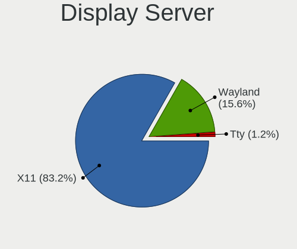

| Name    | Notebooks | Percent |
|---------|-----------|---------|
| X11     | 114       | 82.01%  |
| Wayland | 24        | 17.27%  |
| Tty     | 1         | 0.72%   |

Display Manager
---------------

SDDM, LightDM, etc.

| Name    | Notebooks | Percent |
|---------|-----------|---------|
| SDDM    | 82        | 58.99%  |
| Unknown | 51        | 36.69%  |
| GDM3    | 4         | 2.88%   |
| LightDM | 2         | 1.44%   |

OS Lang
-------

Language

| Lang   | Notebooks | Percent |
|--------|-----------|---------|
| en_US  | 70        | 50.36%  |
| de_DE  | 14        | 10.07%  |
| en_GB  | 10        | 7.19%   |
| pl_PL  | 6         | 4.32%   |
| ru_RU  | 5         | 3.6%    |
| pt_BR  | 4         | 2.88%   |
| it_IT  | 4         | 2.88%   |
| fr_FR  | 3         | 2.16%   |
| en_NZ  | 2         | 1.44%   |
| en_CA  | 2         | 1.44%   |
| en_AU  | 2         | 1.44%   |
| zh_TW  | 1         | 0.72%   |
| zh_HK  | 1         | 0.72%   |
| pt_PT  | 1         | 0.72%   |
| nl_NL  | 1         | 0.72%   |
| nb_NO  | 1         | 0.72%   |
| hu_HU  | 1         | 0.72%   |
| fr_BE  | 1         | 0.72%   |
| es_PE  | 1         | 0.72%   |
| es_MX  | 1         | 0.72%   |
| es_ES  | 1         | 0.72%   |
| es_CR  | 1         | 0.72%   |
| es_CL  | 1         | 0.72%   |
| es_419 | 1         | 0.72%   |
| en_PH  | 1         | 0.72%   |
| en_IN  | 1         | 0.72%   |
| en_DK  | 1         | 0.72%   |
| C      | 1         | 0.72%   |

Boot Mode
---------

EFI or BIOS

| Mode | Notebooks | Percent |
|------|-----------|---------|
| BIOS | 75        | 53.57%  |
| EFI  | 65        | 46.43%  |

Filesystem
----------

Type of filesystem

| Type    | Notebooks | Percent |
|---------|-----------|---------|
| Ext4    | 99        | 70.21%  |
| Tmpfs   | 27        | 19.15%  |
| Btrfs   | 7         | 4.96%   |
| Overlay | 5         | 3.55%   |
| Zfs     | 2         | 1.42%   |
| Xfs     | 1         | 0.71%   |

Part. scheme
------------

Scheme of partitioning

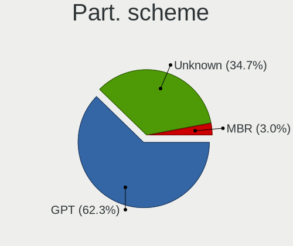

| Type    | Notebooks | Percent |
|---------|-----------|---------|
| GPT     | 85        | 61.15%  |
| Unknown | 51        | 36.69%  |
| MBR     | 3         | 2.16%   |

Dual Boot with Linux/BSD
------------------------

Hosting more than one Linux/BSD

| Dual boot | Notebooks | Percent |
|-----------|-----------|---------|
| No        | 136       | 97.84%  |
| Yes       | 3         | 2.16%   |

Dual Boot (Win)
---------------

Hosting Linux and Windows

| Dual boot | Notebooks | Percent |
|-----------|-----------|---------|
| No        | 106       | 76.26%  |
| Yes       | 33        | 23.74%  |

Board
-----

Vendor
------

Motherboard manufacturer

| Name                   | Notebooks | Percent |
|------------------------|-----------|---------|
| Lenovo                 | 35        | 25.18%  |
| Hewlett-Packard        | 25        | 17.99%  |
| ASUSTek Computer       | 18        | 12.95%  |
| Dell                   | 16        | 11.51%  |
| Acer                   | 11        | 7.91%   |
| Apple                  | 6         | 4.32%   |
| Google                 | 5         | 3.6%    |
| MSI                    | 4         | 2.88%   |
| HUAWEI                 | 4         | 2.88%   |
| Gigabyte Technology    | 3         | 2.16%   |
| Valve                  | 1         | 0.72%   |
| TECNO                  | 1         | 0.72%   |
| Samsung Electronics    | 1         | 0.72%   |
| Medion                 | 1         | 0.72%   |
| GPU Company            | 1         | 0.72%   |
| GPD                    | 1         | 0.72%   |
| Framework              | 1         | 0.72%   |
| CHIPHD                 | 1         | 0.72%   |
| BOSGAME                | 1         | 0.72%   |
| Avell High Performance | 1         | 0.72%   |
| Alienware              | 1         | 0.72%   |
| Unknown                | 1         | 0.72%   |

Model
-----

Motherboard model

| Name                                        | Notebooks | Percent |
|---------------------------------------------|-----------|---------|
| Lenovo ThinkPad X1 Carbon Gen 11 21HMCTO1WW | 2         | 1.44%   |
| HP ProBook 650 G1                           | 2         | 1.44%   |
| Dell Latitude E5470                         | 2         | 1.44%   |
| Dell G3 3779                                | 2         | 1.44%   |
| ASUS ASUS TUF Gaming F17 FX706LI_FX706LI    | 2         | 1.44%   |
| Valve Jupiter                               | 1         | 0.72%   |
| TECNO MEGABOOK T1                           | 1         | 0.72%   |
| Samsung 950XED                              | 1         | 0.72%   |
| MSI Titan GT77HX 13VH                       | 1         | 0.72%   |
| MSI Raider GE67HX 12UGS                     | 1         | 0.72%   |
| MSI GE75 Raider 9SE                         | 1         | 0.72%   |
| MSI Bravo 17 A4DDK                          | 1         | 0.72%   |
| Medion E11201                               | 1         | 0.72%   |
| Lenovo Yoga Slim 7 Pro 16ACH6 82QQ          | 1         | 0.72%   |
| Lenovo ThinkPad X270 W10DG 20K5S4K200       | 1         | 0.72%   |
| Lenovo ThinkPad X230 2325FG0                | 1         | 0.72%   |
| Lenovo ThinkPad X1 Carbon Gen 10 21CB0088RT | 1         | 0.72%   |
| Lenovo ThinkPad X1 Carbon Gen 10 21CB007ART | 1         | 0.72%   |
| Lenovo ThinkPad W510 4391EC4                | 1         | 0.72%   |
| Lenovo ThinkPad P15s Gen 2i 20W7S0SM01      | 1         | 0.72%   |
| Lenovo ThinkPad P14s Gen 1 20S5S01V00       | 1         | 0.72%   |
| Lenovo ThinkPad P1 Gen 2 20QT000LGE         | 1         | 0.72%   |
| Lenovo ThinkPad L15 Gen 2a 20X7S05600       | 1         | 0.72%   |
| Lenovo ThinkPad E15 Gen 4 21EES00100        | 1         | 0.72%   |
| Lenovo ThinkPad E15 Gen 4 21EDCTO1WW        | 1         | 0.72%   |
| Lenovo ThinkPad E15 Gen 2 20TD00GSPB        | 1         | 0.72%   |
| Lenovo ThinkPad E14 Gen 4 21ECS00000        | 1         | 0.72%   |
| Lenovo ThinkPad E14 Gen 3 20YDS02D00        | 1         | 0.72%   |
| Lenovo ThinkBook 14 G4 ABA 21DK             | 1         | 0.72%   |
| Lenovo Slim 7 ProX 14ARH7 82V2              | 1         | 0.72%   |
| Lenovo Legion Y540-15IRH 81SX               | 1         | 0.72%   |
| Lenovo Legion 5 Pro 16ACH6H 82JQ            | 1         | 0.72%   |
| Lenovo Legion 5 15ARH05H 82B1               | 1         | 0.72%   |
| Lenovo IdeaPad Y700-15ISK 80NV              | 1         | 0.72%   |
| Lenovo IdeaPad S340-14IIL 81VV              | 1         | 0.72%   |
| Lenovo IdeaPad S145-15API 81V7              | 1         | 0.72%   |
| Lenovo IdeaPad S145-15API 81UT              | 1         | 0.72%   |
| Lenovo IdeaPad C340-14API 81N6              | 1         | 0.72%   |
| Lenovo IdeaPad 700-17ISK 80RV               | 1         | 0.72%   |
| Lenovo IdeaPad 700-15ISK 80RU               | 1         | 0.72%   |

Model Family
------------

Motherboard model prefix

| Name              | Notebooks | Percent |
|-------------------|-----------|---------|
| Lenovo ThinkPad   | 16        | 11.51%  |
| Lenovo IdeaPad    | 13        | 9.35%   |
| Dell Latitude     | 7         | 5.04%   |
| Acer Aspire       | 7         | 5.04%   |
| HP EliteBook      | 6         | 4.32%   |
| HP Pavilion       | 5         | 3.6%    |
| ASUS ROG          | 5         | 3.6%    |
| ASUS VivoBook     | 4         | 2.88%   |
| Lenovo Legion     | 3         | 2.16%   |
| HP ProBook        | 3         | 2.16%   |
| HP Laptop         | 3         | 2.16%   |
| Dell XPS          | 3         | 2.16%   |
| Dell Precision    | 3         | 2.16%   |
| ASUS ASUS         | 3         | 2.16%   |
| HP ZBook          | 2         | 1.44%   |
| HP ENVY           | 2         | 1.44%   |
| Gigabyte G5       | 2         | 1.44%   |
| Dell G3           | 2         | 1.44%   |
| ASUS Zenbook      | 2         | 1.44%   |
| Apple MacBookPro9 | 2         | 1.44%   |
| Acer Nitro        | 2         | 1.44%   |
| Valve Jupiter     | 1         | 0.72%   |
| TECNO MEGABOOK    | 1         | 0.72%   |
| Samsung 950XED    | 1         | 0.72%   |
| MSI Titan         | 1         | 0.72%   |
| MSI Raider        | 1         | 0.72%   |
| MSI GE75          | 1         | 0.72%   |
| MSI Bravo         | 1         | 0.72%   |
| Medion E11201     | 1         | 0.72%   |
| Lenovo Yoga       | 1         | 0.72%   |
| Lenovo ThinkBook  | 1         | 0.72%   |
| Lenovo Slim       | 1         | 0.72%   |
| HUAWEI NBD-WXX9   | 1         | 0.72%   |
| HUAWEI HN-WX9X    | 1         | 0.72%   |
| HUAWEI BOM-WXX9   | 1         | 0.72%   |
| HUAWEI BOHB-WAX9  | 1         | 0.72%   |
| HP Notebook       | 1         | 0.72%   |
| HP G62            | 1         | 0.72%   |
| HP Compaq         | 1         | 0.72%   |
| HP 240            | 1         | 0.72%   |

MFG Year
--------

Motherboard manufacture year

| Year | Notebooks | Percent |
|------|-----------|---------|
| 2021 | 28        | 20.14%  |
| 2022 | 25        | 17.99%  |
| 2019 | 14        | 10.07%  |
| 2023 | 11        | 7.91%   |
| 2020 | 10        | 7.19%   |
| 2015 | 7         | 5.04%   |
| 2014 | 7         | 5.04%   |
| 2017 | 6         | 4.32%   |
| 2012 | 6         | 4.32%   |
| 2018 | 5         | 3.6%    |
| 2016 | 5         | 3.6%    |
| 2013 | 5         | 3.6%    |
| 2011 | 5         | 3.6%    |
| 2010 | 3         | 2.16%   |
| 2009 | 1         | 0.72%   |
| 2007 | 1         | 0.72%   |

Form Factor
-----------

Physical design of the computer

| Name     | Notebooks | Percent |
|----------|-----------|---------|
| Notebook | 139       | 100%    |

Secure Boot
-----------

Enabled or disabled

| State    | Notebooks | Percent |
|----------|-----------|---------|
| Disabled | 129       | 92.81%  |
| Enabled  | 10        | 7.19%   |

Coreboot
--------

Have coreboot on board

| Used | Notebooks | Percent |
|------|-----------|---------|
| No   | 134       | 96.4%   |
| Yes  | 5         | 3.6%    |

RAM Size
--------

Total RAM memory

| Size in GB  | Notebooks | Percent |
|-------------|-----------|---------|
| 8.01-16.0   | 36        | 25.71%  |
| 16.01-24.0  | 31        | 22.14%  |
| 4.01-8.0    | 30        | 21.43%  |
| 32.01-64.0  | 19        | 13.57%  |
| 3.01-4.0    | 16        | 11.43%  |
| 64.01-256.0 | 5         | 3.57%   |
| 24.01-32.0  | 2         | 1.43%   |
| 2.01-3.0    | 1         | 0.71%   |

RAM Used
--------

Used RAM memory

| Used GB    | Notebooks | Percent |
|------------|-----------|---------|
| 4.01-8.0   | 46        | 31.29%  |
| 2.01-3.0   | 41        | 27.89%  |
| 1.01-2.0   | 25        | 17.01%  |
| 3.01-4.0   | 21        | 14.29%  |
| 8.01-16.0  | 10        | 6.8%    |
| 16.01-24.0 | 2         | 1.36%   |
| 32.01-64.0 | 1         | 0.68%   |
| 24.01-32.0 | 1         | 0.68%   |

Total Drives
------------

Number of drives on board

| Drives | Notebooks | Percent |
|--------|-----------|---------|
| 1      | 93        | 65.96%  |
| 2      | 41        | 29.08%  |
| 3      | 7         | 4.96%   |

Has CD-ROM
----------

Has CD-ROM on board

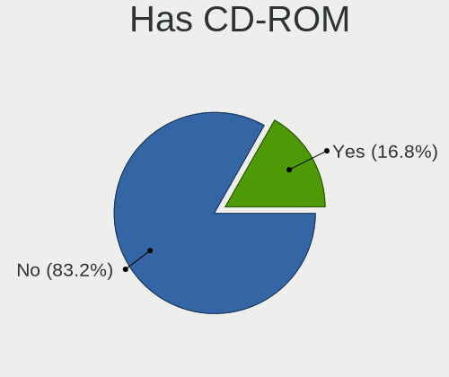

| Presented | Notebooks | Percent |
|-----------|-----------|---------|
| No        | 121       | 87.05%  |
| Yes       | 18        | 12.95%  |

Has Ethernet
------------

Has Ethernet on board

| Presented | Notebooks | Percent |
|-----------|-----------|---------|
| Yes       | 98        | 70.5%   |
| No        | 41        | 29.5%   |

Has WiFi
--------

Has WiFi module

| Presented | Notebooks | Percent |
|-----------|-----------|---------|
| Yes       | 138       | 99.28%  |
| No        | 1         | 0.72%   |

Has Bluetooth
-------------

Has Bluetooth module

| Presented | Notebooks | Percent |
|-----------|-----------|---------|
| Yes       | 124       | 89.21%  |
| No        | 15        | 10.79%  |

Location
--------

Country
-------

Geographic location (country)

| Country      | Notebooks | Percent |
|--------------|-----------|---------|
| USA          | 24        | 17.27%  |
| Germany      | 19        | 13.67%  |
| UK           | 10        | 7.19%   |
| Russia       | 8         | 5.76%   |
| Poland       | 6         | 4.32%   |
| France       | 5         | 3.6%    |
| Brazil       | 5         | 3.6%    |
| Turkey       | 4         | 2.88%   |
| Italy        | 4         | 2.88%   |
| Canada       | 4         | 2.88%   |
| Belgium      | 4         | 2.88%   |
| Netherlands  | 3         | 2.16%   |
| Mexico       | 3         | 2.16%   |
| India        | 3         | 2.16%   |
| Hungary      | 3         | 2.16%   |
| Taiwan       | 2         | 1.44%   |
| Sweden       | 2         | 1.44%   |
| Portugal     | 2         | 1.44%   |
| Peru         | 2         | 1.44%   |
| New Zealand  | 2         | 1.44%   |
| Australia    | 2         | 1.44%   |
| Spain        | 1         | 0.72%   |
| Slovakia     | 1         | 0.72%   |
| Saudi Arabia | 1         | 0.72%   |
| Philippines  | 1         | 0.72%   |
| Norway       | 1         | 0.72%   |
| Luxembourg   | 1         | 0.72%   |
| Lithuania    | 1         | 0.72%   |
| Libya        | 1         | 0.72%   |
| Latvia       | 1         | 0.72%   |
| Kazakhstan   | 1         | 0.72%   |
| Ivory Coast  | 1         | 0.72%   |
| Israel       | 1         | 0.72%   |
| Georgia      | 1         | 0.72%   |
| Finland      | 1         | 0.72%   |
| Egypt        | 1         | 0.72%   |
| Croatia      | 1         | 0.72%   |
| Costa Rica   | 1         | 0.72%   |
| Colombia     | 1         | 0.72%   |
| Chile        | 1         | 0.72%   |

City
----

Geographic location (city)

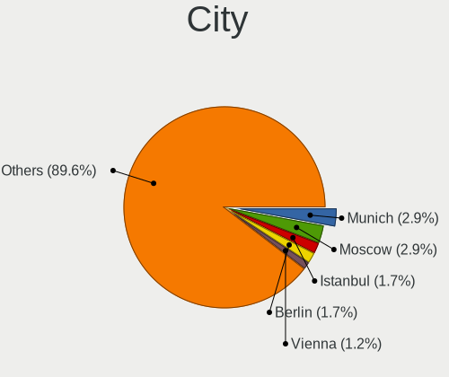

| City                    | Notebooks | Percent |
|-------------------------|-----------|---------|
| Munich                  | 5         | 3.52%   |
| Moscow                  | 3         | 2.11%   |
| Istanbul                | 3         | 2.11%   |
| Berlin                  | 3         | 2.11%   |
| Vienna                  | 2         | 1.41%   |
| Münster                | 2         | 1.41%   |
| Brussels                | 2         | 1.41%   |
| Zhubei                  | 1         | 0.7%    |
| Wooster                 | 1         | 0.7%    |
| West Des Moines         | 1         | 0.7%    |
| Warsaw                  | 1         | 0.7%    |
| Ware                    | 1         | 0.7%    |
| Waianae                 | 1         | 0.7%    |
| Vsevolozhsk             | 1         | 0.7%    |
| Vol'ginskiy             | 1         | 0.7%    |
| Viña del Mar           | 1         | 0.7%    |
| Vilnius                 | 1         | 0.7%    |
| Villa Dominico          | 1         | 0.7%    |
| Valley Center           | 1         | 0.7%    |
| Ulm                     | 1         | 0.7%    |
| Trujillo                | 1         | 0.7%    |
| Tripoli                 | 1         | 0.7%    |
| Thunder Bay             | 1         | 0.7%    |
| Theydon Bois            | 1         | 0.7%    |
| Tel Aviv                | 1         | 0.7%    |
| Tbilisi                 | 1         | 0.7%    |
| Tatabánya              | 1         | 0.7%    |
| Szigetszentmiklos       | 1         | 0.7%    |
| Szczecin                | 1         | 0.7%    |
| Sydney                  | 1         | 0.7%    |
| Surrey                  | 1         | 0.7%    |
| Sumter                  | 1         | 0.7%    |
| Stavropol               | 1         | 0.7%    |
| St Petersburg           | 1         | 0.7%    |
| Sisak                   | 1         | 0.7%    |
| Shumen                  | 1         | 0.7%    |
| Sherbrooke              | 1         | 0.7%    |
| Santa Maria di Sala     | 1         | 0.7%    |
| Salt Lake City          | 1         | 0.7%    |
| Saint-Georges-sur-Meuse | 1         | 0.7%    |

Drives
------

Drive Vendor
------------

Hard drive vendors

| Vendor                      | Notebooks | Drives | Percent |
|-----------------------------|-----------|--------|---------|
| Samsung Electronics         | 34        | 39     | 18.09%  |
| SanDisk                     | 18        | 20     | 9.57%   |
| Micron Technology           | 14        | 15     | 7.45%   |
| WDC                         | 11        | 12     | 5.85%   |
| Intel                       | 11        | 12     | 5.85%   |
| Toshiba                     | 10        | 14     | 5.32%   |
| SK hynix                    | 10        | 10     | 5.32%   |
| Kingston                    | 10        | 10     | 5.32%   |
| Seagate                     | 8         | 9      | 4.26%   |
| Crucial                     | 8         | 11     | 4.26%   |
| Unknown                     | 6         | 7      | 3.19%   |
| Phison Electronics          | 5         | 5      | 2.66%   |
| Silicon Motion              | 4         | 4      | 2.13%   |
| Hitachi                     | 4         | 4      | 2.13%   |
| UMIS                        | 2         | 3      | 1.06%   |
| Solid State Storage         | 2         | 2      | 1.06%   |
| Patriot                     | 2         | 2      | 1.06%   |
| KIOXIA                      | 2         | 2      | 1.06%   |
| HGST                        | 2         | 3      | 1.06%   |
| A-DATA Technology           | 2         | 2      | 1.06%   |
| Wibtek                      | 1         | 1      | 0.53%   |
| WALRAM                      | 1         | 1      | 0.53%   |
| Union Memory (Shenzhen)     | 1         | 1      | 0.53%   |
| Union Memory                | 1         | 1      | 0.53%   |
| TXRUI                       | 1         | 1      | 0.53%   |
| Transcend                   | 1         | 1      | 0.53%   |
| Team                        | 1         | 1      | 0.53%   |
| SSSTC                       | 1         | 1      | 0.53%   |
| SSDPR-CX                    | 1         | 1      | 0.53%   |
| SADAYU                      | 1         | 1      | 0.53%   |
| Phison                      | 1         | 1      | 0.53%   |
| Netac                       | 1         | 1      | 0.53%   |
| Micron/Crucial Technology   | 1         | 1      | 0.53%   |
| Lexar                       | 1         | 1      | 0.53%   |
| Lenovo                      | 1         | 1      | 0.53%   |
| Kingston Technology Company | 1         | 1      | 0.53%   |
| KingFast                    | 1         | 1      | 0.53%   |
| JMicron Technology          | 1         | 1      | 0.53%   |
| FURY                        | 1         | 4      | 0.53%   |
| China                       | 1         | 1      | 0.53%   |

Drive Model
-----------

Hard drive models

| Model                                               | Notebooks | Percent |
|-----------------------------------------------------|-----------|---------|
| Intel SSD 660P Series 1024GB                        | 5         | 2.59%   |
| Samsung NVMe SSD Controller PM9A1/PM9A3/980PRO 1TB  | 4         | 2.07%   |
| Phison E16 PCIe4 NVMe Controller 500GB              | 3         | 1.55%   |
| Unknown MMC Card  32GB                              | 2         | 1.04%   |
| UMIS RPJTJ512MGE1QDQ 512GB                          | 2         | 1.04%   |
| Toshiba MQ04ABF100 1TB                              | 2         | 1.04%   |
| Silicon Motion SM2262/SM2262EN SSD Controller 500GB | 2         | 1.04%   |
| Seagate ST1000LM048-2E7172 1TB                      | 2         | 1.04%   |
| Sandisk WD Blue SN550 NVMe SSD 512GB                | 2         | 1.04%   |
| Sandisk WD Black SN850 1TB                          | 2         | 1.04%   |
| SanDisk NVMe SSD Drive 2TB                          | 2         | 1.04%   |
| SanDisk NVMe SSD Drive 1TB                          | 2         | 1.04%   |
| Samsung NVMe SSD Controller SM981/PM981/PM983 256GB | 2         | 1.04%   |
| Samsung MZVLW256HEHP-000L2 256GB                    | 2         | 1.04%   |
| Samsung MZVLQ256HAJD-000H1 256GB                    | 2         | 1.04%   |
| Samsung MZVL21T0HCLR-00B00 1TB                      | 2         | 1.04%   |
| Intel SSDPEKNU512GZ 512GB                           | 2         | 1.04%   |
| Crucial CT1000MX500SSD1 1TB                         | 2         | 1.04%   |
| Crucial CT1000BX500SSD1 1TB                         | 2         | 1.04%   |
| Wibtek W800S 512GB                                  | 1         | 0.52%   |
| WDC WDS240G2G0B-00EPW0 240GB SSD                    | 1         | 0.52%   |
| WDC WDS240G2G0A-00JH30 240GB SSD                    | 1         | 0.52%   |
| WDC WDS100T2B0A-00SM50 1TB SSD                      | 1         | 0.52%   |
| WDC WDS100T2B0A 1TB SSD                             | 1         | 0.52%   |
| WDC WDBNCE5000PNC 500GB SSD                         | 1         | 0.52%   |
| WDC WD16 00AVBB-63SYA0 160GB                        | 1         | 0.52%   |
| WDC WD10SPZX-24Z10 1TB                              | 1         | 0.52%   |
| WDC WD10 JPVX-00JC3T0 1TB                           | 1         | 0.52%   |
| WDC WD Blue SA510 2.5 1000GB                        | 1         | 0.52%   |
| WDC PC SN730 SDBPNTY-512G-1101 512GB                | 1         | 0.52%   |
| WDC PC SN530 SDBPTPZ-1T00 1TB                       | 1         | 0.52%   |
| WDC PC SN530 SDBPNPZ-512G-1006 512GB                | 1         | 0.52%   |
| WALRAM 240G                                         | 1         | 0.52%   |
| Unknown SL64G  64GB                                 | 1         | 0.52%   |
| Unknown MMC Card  64GB                              | 1         | 0.52%   |
| Unknown HBG4a2  32GB                                | 1         | 0.52%   |
| Unknown Biwin  64GB                                 | 1         | 0.52%   |
| Unknown 064G30  64GB                                | 1         | 0.52%   |
| Union Memory UMIS RPJTJ256MEE1OWX 256GB             | 1         | 0.52%   |
| Union Memory (Shenzhen) RPFTJ256PDD2MWX 256GB       | 1         | 0.52%   |

HDD Vendor
----------

Hard disk drive vendors

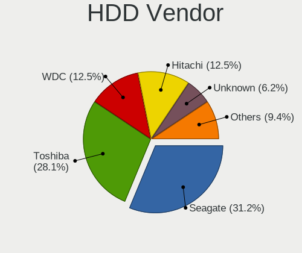

| Vendor  | Notebooks | Drives | Percent |
|---------|-----------|--------|---------|
| Seagate | 8         | 9      | 34.78%  |
| Toshiba | 6         | 9      | 26.09%  |
| Hitachi | 4         | 4      | 17.39%  |
| WDC     | 3         | 3      | 13.04%  |
| HGST    | 2         | 3      | 8.7%    |

SSD Vendor
----------

Solid state drive vendors

| Vendor              | Notebooks | Drives | Percent |
|---------------------|-----------|--------|---------|
| Kingston            | 7         | 7      | 14.29%  |
| Crucial             | 7         | 9      | 14.29%  |
| WDC                 | 5         | 6      | 10.2%   |
| SanDisk             | 5         | 6      | 10.2%   |
| Micron Technology   | 5         | 6      | 10.2%   |
| Samsung Electronics | 4         | 4      | 8.16%   |
| SK hynix            | 2         | 2      | 4.08%   |
| Patriot             | 2         | 2      | 4.08%   |
| Intel               | 2         | 3      | 4.08%   |
| Transcend           | 1         | 1      | 2.04%   |
| Team                | 1         | 1      | 2.04%   |
| SADAYU              | 1         | 1      | 2.04%   |
| Lexar               | 1         | 1      | 2.04%   |
| Lenovo              | 1         | 1      | 2.04%   |
| JMicron Technology  | 1         | 1      | 2.04%   |
| FURY                | 1         | 2      | 2.04%   |
| China               | 1         | 1      | 2.04%   |
| BAITITON            | 1         | 2      | 2.04%   |
| Apple               | 1         | 1      | 2.04%   |

Drive Kind
----------

HDD or SSD

| Kind    | Notebooks | Drives | Percent |
|---------|-----------|--------|---------|
| NVMe    | 92        | 113    | 52.87%  |
| SSD     | 46        | 57     | 26.44%  |
| HDD     | 23        | 28     | 13.22%  |
| Unknown | 7         | 8      | 4.02%   |
| MMC     | 6         | 7      | 3.45%   |

Drive Connector
---------------

SATA, SAS, NVMe, etc.

| Type | Notebooks | Drives | Percent |
|------|-----------|--------|---------|
| NVMe | 92        | 113    | 54.76%  |
| SATA | 61        | 84     | 36.31%  |
| SAS  | 9         | 9      | 5.36%   |
| MMC  | 6         | 7      | 3.57%   |

Drive Size
----------

Size of hard drive

| Size in TB | Notebooks | Drives | Percent |
|------------|-----------|--------|---------|
| 0.01-0.5   | 37        | 47     | 56.06%  |
| 0.51-1.0   | 25        | 33     | 37.88%  |
| 1.01-2.0   | 3         | 4      | 4.55%   |
| 4.01-10.0  | 1         | 1      | 1.52%   |

Space Total
-----------

Amount of disk space available on the file system

| Size in GB     | Notebooks | Percent |
|----------------|-----------|---------|
| 101-250        | 39        | 27.46%  |
| 501-1000       | 30        | 21.13%  |
| 251-500        | 28        | 19.72%  |
| 1001-2000      | 17        | 11.97%  |
| 51-100         | 7         | 4.93%   |
| More than 3000 | 6         | 4.23%   |
| 1-20           | 6         | 4.23%   |
| 21-50          | 5         | 3.52%   |
| 2001-3000      | 4         | 2.82%   |

Space Used
----------

Amount of used disk space

| Used GB        | Notebooks | Percent |
|----------------|-----------|---------|
| 1-20           | 38        | 25.68%  |
| 21-50          | 35        | 23.65%  |
| 101-250        | 27        | 18.24%  |
| 51-100         | 16        | 10.81%  |
| 501-1000       | 11        | 7.43%   |
| 251-500        | 10        | 6.76%   |
| 1001-2000      | 6         | 4.05%   |
| 2001-3000      | 4         | 2.7%    |
| More than 3000 | 1         | 0.68%   |

Malfunc. Drives
---------------

Drive models with a malfunction

| Model                                 | Notebooks | Drives | Percent |
|---------------------------------------|-----------|--------|---------|
| Toshiba MQ01ABD075 752GB              | 1         | 2      | 20%     |
| Team L3 EVO SSD 120GB                 | 1         | 1      | 20%     |
| SK hynix HFS256G32MND-2900A 256GB SSD | 1         | 1      | 20%     |
| SanDisk SDSSDXPS480G 480GB            | 1         | 1      | 20%     |
| Intel SSDPEKNU512GZ 512GB             | 1         | 1      | 20%     |

Malfunc. Drive Vendor
---------------------

Vendors of faulty drives

| Vendor   | Notebooks | Drives | Percent |
|----------|-----------|--------|---------|
| Toshiba  | 1         | 2      | 20%     |
| Team     | 1         | 1      | 20%     |
| SK hynix | 1         | 1      | 20%     |
| SanDisk  | 1         | 1      | 20%     |
| Intel    | 1         | 1      | 20%     |

Malfunc. HDD Vendor
-------------------

Vendors of faulty HDD drives

| Vendor  | Notebooks | Drives | Percent |
|---------|-----------|--------|---------|
| Toshiba | 1         | 2      | 100%    |

Malfunc. Drive Kind
-------------------

Kinds of faulty drives

| Kind | Notebooks | Drives | Percent |
|------|-----------|--------|---------|
| SSD  | 3         | 3      | 60%     |
| NVMe | 1         | 1      | 20%     |
| HDD  | 1         | 2      | 20%     |

Failed Drives
-------------

Failed drive models

Zero info for selected period =(

Failed Drive Vendor
-------------------

Failed drive vendors

Zero info for selected period =(

Drive Status
------------

Number of failed and malfunc. drives

| Status   | Notebooks | Drives | Percent |
|----------|-----------|--------|---------|
| Detected | 88        | 139    | 60.27%  |
| Works    | 53        | 68     | 36.3%   |
| Malfunc  | 5         | 6      | 3.42%   |

Storage controller
------------------

Storage Vendor
--------------

Storage controller vendors

| Vendor                         | Notebooks | Percent |
|--------------------------------|-----------|---------|
| Intel                          | 75        | 39.68%  |
| Samsung Electronics            | 31        | 16.4%   |
| AMD                            | 18        | 9.52%   |
| SanDisk                        | 16        | 8.47%   |
| Micron Technology              | 9         | 4.76%   |
| SK hynix                       | 8         | 4.23%   |
| Phison Electronics             | 6         | 3.17%   |
| Union Memory (Shenzhen)        | 4         | 2.12%   |
| Toshiba America Info Systems   | 4         | 2.12%   |
| Silicon Motion                 | 4         | 2.12%   |
| Kingston Technology Company    | 4         | 2.12%   |
| Solid State Storage Technology | 3         | 1.59%   |
| Micron/Crucial Technology      | 2         | 1.06%   |
| KIOXIA                         | 2         | 1.06%   |
| ADATA Technology               | 2         | 1.06%   |
| Biwin Storage Technology       | 1         | 0.53%   |

Storage Model
-------------

Storage controller models

| Model                                                                          | Notebooks | Percent |
|--------------------------------------------------------------------------------|-----------|---------|
| AMD FCH SATA Controller [AHCI mode]                                            | 17        | 8.63%   |
| Samsung NVMe SSD Controller PM9A1/PM9A3/980PRO                                 | 11        | 5.58%   |
| Intel 7 Series Chipset Family 6-port SATA Controller [AHCI mode]               | 9         | 4.57%   |
| Samsung NVMe SSD Controller 980                                                | 7         | 3.55%   |
| Intel Sunrise Point-LP SATA Controller [AHCI mode]                             | 7         | 3.55%   |
| Samsung NVMe SSD Controller SM981/PM981/PM983                                  | 6         | 3.05%   |
| Intel SSD 660P Series                                                          | 6         | 3.05%   |
| SK hynix Gold P31/BC711/PC711 NVMe Solid State Drive                           | 5         | 2.54%   |
| Intel Volume Management Device NVMe RAID Controller                            | 5         | 2.54%   |
| Intel HM170/QM170 Chipset SATA Controller [AHCI Mode]                          | 5         | 2.54%   |
| Intel Cannon Lake Mobile PCH SATA AHCI Controller                              | 5         | 2.54%   |
| Intel 82801 Mobile SATA Controller [RAID mode]                                 | 5         | 2.54%   |
| Intel 8 Series/C220 Series Chipset Family 6-port SATA Controller 1 [AHCI mode] | 5         | 2.54%   |
| Intel Comet Lake SATA AHCI Controller                                          | 4         | 2.03%   |
| Intel 400 Series Chipset Family SATA AHCI Controller                           | 4         | 2.03%   |
| Toshiba America Info Systems XG6 NVMe SSD Controller                           | 3         | 1.52%   |
| SanDisk WD PC SN810 / Black SN850 NVMe SSD                                     | 3         | 1.52%   |
| SanDisk WD Blue SN550 NVMe SSD                                                 | 3         | 1.52%   |
| Samsung NVMe SSD Controller SM961/PM961/SM963                                  | 3         | 1.52%   |
| Phison E16 PCIe4 NVMe Controller                                               | 3         | 1.52%   |
| Micron 3400 NVMe SSD [Hendrix]                                                 | 3         | 1.52%   |
| Intel SSD 670p Series [Keystone Harbor]                                        | 3         | 1.52%   |
| Intel Alder Lake-P SATA AHCI Controller                                        | 3         | 1.52%   |
| Union Memory (Shenzhen) AM630 PCIe 4.0 x4 NVMe SSD Controller                  | 2         | 1.02%   |
| Solid State Storage CL1-3D256-Q11 NVMe SSD M.2                                 | 2         | 1.02%   |
| Silicon Motion SM2262/SM2262EN SSD Controller                                  | 2         | 1.02%   |
| SanDisk WD Blue SN570 NVMe SSD 1TB                                             | 2         | 1.02%   |
| SanDisk WD Black SN750 / PC SN730 NVMe SSD                                     | 2         | 1.02%   |
| SanDisk PC SN735 NVMe SSD (DRAM-less)                                          | 2         | 1.02%   |
| Samsung NVMe SSD Controller PM9B1                                              | 2         | 1.02%   |
| Phison PS5013 E13 NVMe Controller                                              | 2         | 1.02%   |
| Micron/Crucial P2 [Nick P2] / P3 / P3 Plus NVMe PCIe SSD (DRAM-less)           | 2         | 1.02%   |
| Micron 2450 NVMe SSD [HendrixV] (DRAM-less)                                    | 2         | 1.02%   |
| Micron 2400 NVMe SSD (DRAM-less)                                               | 2         | 1.02%   |
| Micron 2210 NVMe SSD [Cobain]                                                  | 2         | 1.02%   |
| Intel Wildcat Point-LP SATA Controller [AHCI Mode]                             | 2         | 1.02%   |
| Intel Volume Management Device NVMe RAID Controller Intel Corporation          | 2         | 1.02%   |
| Intel Tiger Lake-LP SATA Controller                                            | 2         | 1.02%   |
| Intel Tiger Lake SATA AHCI Controller                                          | 2         | 1.02%   |
| Intel SATA Controller [RAID mode]                                              | 2         | 1.02%   |

Storage Kind
------------

Kind of storage controller (IDE, SATA, NVMe, SAS, ...)

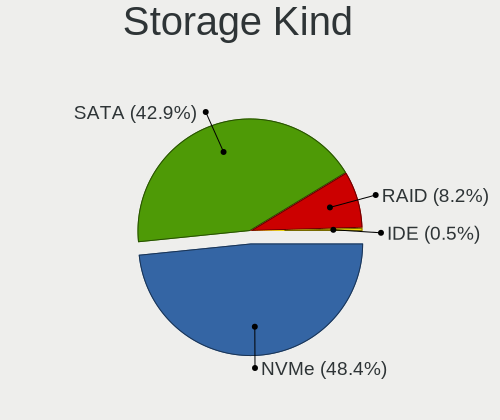

| Kind | Notebooks | Percent |
|------|-----------|---------|
| NVMe | 92        | 49.73%  |
| SATA | 78        | 42.16%  |
| RAID | 14        | 7.57%   |
| IDE  | 1         | 0.54%   |

Processor
---------

CPU Vendor
----------

Processor vendors

| Vendor | Notebooks | Percent |
|--------|-----------|---------|
| Intel  | 99        | 71.22%  |
| AMD    | 40        | 28.78%  |

CPU Model
---------

Processor models

| Model                                         | Notebooks | Percent |
|-----------------------------------------------|-----------|---------|
| AMD Ryzen 5 5500U with Radeon Graphics        | 6         | 4.32%   |
| Intel Core i7-6700HQ CPU @ 2.60GHz            | 3         | 2.16%   |
| Intel Core i5-7200U CPU @ 2.50GHz             | 3         | 2.16%   |
| Intel Core i5-10300H CPU @ 2.50GHz            | 3         | 2.16%   |
| Intel Celeron CPU N3450 @ 1.10GHz             | 3         | 2.16%   |
| Intel 12th Gen Core i7-1260P                  | 3         | 2.16%   |
| Intel 11th Gen Core i5-1135G7 @ 2.40GHz       | 3         | 2.16%   |
| AMD Ryzen 7 6800H with Radeon Graphics        | 3         | 2.16%   |
| AMD Ryzen 7 5825U with Radeon Graphics        | 3         | 2.16%   |
| AMD Ryzen 7 5800H with Radeon Graphics        | 3         | 2.16%   |
| AMD Ryzen 7 4800H with Radeon Graphics        | 3         | 2.16%   |
| AMD Ryzen 5 3500U with Radeon Vega Mobile Gfx | 3         | 2.16%   |
| Intel Core i7-9750H CPU @ 2.60GHz             | 2         | 1.44%   |
| Intel Core i7-8750H CPU @ 2.20GHz             | 2         | 1.44%   |
| Intel Core i5-8265U CPU @ 1.60GHz             | 2         | 1.44%   |
| Intel Core i5-6300HQ CPU @ 2.30GHz            | 2         | 1.44%   |
| Intel Core i5-6200U CPU @ 2.30GHz             | 2         | 1.44%   |
| Intel Core i5-3210M CPU @ 2.50GHz             | 2         | 1.44%   |
| Intel Core i5-1035G1 CPU @ 1.00GHz            | 2         | 1.44%   |
| Intel Core i5-10210U CPU @ 1.60GHz            | 2         | 1.44%   |
| Intel 12th Gen Core i5-1235U                  | 2         | 1.44%   |
| Intel 11th Gen Core i7-1185G7 @ 3.00GHz       | 2         | 1.44%   |
| Intel 11th Gen Core i7-11800H @ 2.30GHz       | 2         | 1.44%   |
| Intel 11th Gen Core i3-1115G4 @ 3.00GHz       | 2         | 1.44%   |
| AMD Ryzen 5 5600U with Radeon Graphics        | 2         | 1.44%   |
| Intel Pentium Silver N6000 @ 1.10GHz          | 1         | 0.72%   |
| Intel Pentium Dual-Core CPU T4500 @ 2.30GHz   | 1         | 0.72%   |
| Intel Pentium Dual-Core CPU T4400 @ 2.20GHz   | 1         | 0.72%   |
| Intel Pentium CPU 6405U @ 2.40GHz             | 1         | 0.72%   |
| Intel N95                                     | 1         | 0.72%   |
| Intel Core i7-8665U CPU @ 1.90GHz             | 1         | 0.72%   |
| Intel Core i7-7820HQ CPU @ 2.90GHz            | 1         | 0.72%   |
| Intel Core i7-7700HQ CPU @ 2.80GHz            | 1         | 0.72%   |
| Intel Core i7-4800MQ CPU @ 2.70GHz            | 1         | 0.72%   |
| Intel Core i7-4710HQ CPU @ 2.50GHz            | 1         | 0.72%   |
| Intel Core i7-4702MQ CPU @ 2.20GHz            | 1         | 0.72%   |
| Intel Core i7-4700MQ CPU @ 2.40GHz            | 1         | 0.72%   |
| Intel Core i7-3632QM CPU @ 2.20GHz            | 1         | 0.72%   |
| Intel Core i7-3615QM CPU @ 2.30GHz            | 1         | 0.72%   |
| Intel Core i7-3537U CPU @ 2.00GHz             | 1         | 0.72%   |

CPU Model Family
----------------

Processor model prefix

| Model                   | Notebooks | Percent |
|-------------------------|-----------|---------|
| Other                   | 31        | 22.3%   |
| Intel Core i5           | 31        | 22.3%   |
| Intel Core i7           | 22        | 15.83%  |
| AMD Ryzen 7             | 15        | 10.79%  |
| AMD Ryzen 5             | 14        | 10.07%  |
| Intel Celeron           | 7         | 5.04%   |
| Intel Core i3           | 4         | 2.88%   |
| AMD Ryzen 9             | 4         | 2.88%   |
| Intel Pentium Dual-Core | 2         | 1.44%   |
| Intel Pentium Silver    | 1         | 0.72%   |
| Intel Pentium           | 1         | 0.72%   |
| Intel Core 2 Duo        | 1         | 0.72%   |
| AMD Ryzen 7 PRO         | 1         | 0.72%   |
| AMD Ryzen 5 PRO         | 1         | 0.72%   |
| AMD Ryzen 3             | 1         | 0.72%   |
| AMD PRO A10             | 1         | 0.72%   |
| AMD A6                  | 1         | 0.72%   |
| AMD A4                  | 1         | 0.72%   |

CPU Cores
---------

Number of processor cores

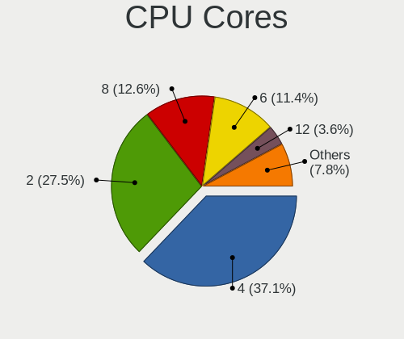

| Number | Notebooks | Percent |
|--------|-----------|---------|
| 4      | 48        | 34.53%  |
| 2      | 34        | 24.46%  |
| 8      | 21        | 15.11%  |
| 6      | 18        | 12.95%  |
| 12     | 5         | 3.6%    |
| 10     | 5         | 3.6%    |
| 14     | 4         | 2.88%   |
| 24     | 2         | 1.44%   |
| 16     | 2         | 1.44%   |

CPU Sockets
-----------

Number of sockets

| Number | Notebooks | Percent |
|--------|-----------|---------|
| 1      | 139       | 100%    |

CPU Threads
-----------

Threads per core (Hyper-Threading)

| Number | Notebooks | Percent |
|--------|-----------|---------|
| 2      | 120       | 86.33%  |
| 1      | 19        | 13.67%  |

CPU Op-Modes
------------

CPU Operation Modes (32-bit, 64-bit)

| Op mode        | Notebooks | Percent |
|----------------|-----------|---------|
| 32-bit, 64-bit | 139       | 100%    |

CPU Microcode
-------------

Microcode number

| Number     | Notebooks | Percent |
|------------|-----------|---------|
| Unknown    | 116       | 82.86%  |
| 0x0a50000c | 9         | 6.43%   |
| 0x0a404102 | 4         | 2.86%   |
| 0x0a404101 | 2         | 1.43%   |
| 0x90672    | 1         | 0.71%   |
| 0x0a601203 | 1         | 0.71%   |
| 0x0a50000d | 1         | 0.71%   |
| 0x08900201 | 1         | 0.71%   |
| 0x08608103 | 1         | 0.71%   |
| 0x08600104 | 1         | 0.71%   |
| 0x08108109 | 1         | 0.71%   |
| 0x08108102 | 1         | 0.71%   |
| 0x03000027 | 1         | 0.71%   |

CPU Microarch
-------------

Microarchitecture

| Name             | Notebooks | Percent |
|------------------|-----------|---------|
| Unknown          | 27        | 19.42%  |
| KabyLake         | 20        | 14.39%  |
| Zen 3            | 13        | 9.35%   |
| Skylake          | 11        | 7.91%   |
| Alderlake Hybrid | 11        | 7.91%   |
| TigerLake        | 8         | 5.76%   |
| IvyBridge        | 8         | 5.76%   |
| Haswell          | 7         | 5.04%   |
| Zen+             | 5         | 3.6%    |
| Zen 2            | 4         | 2.88%   |
| SandyBridge      | 4         | 2.88%   |
| CometLake        | 4         | 2.88%   |
| Goldmont         | 3         | 2.16%   |
| Broadwell        | 3         | 2.16%   |
| Penryn           | 2         | 1.44%   |
| IceLake          | 2         | 1.44%   |
| Westmere         | 1         | 0.72%   |
| Puma             | 1         | 0.72%   |
| Nehalem          | 1         | 0.72%   |
| K10 Llano        | 1         | 0.72%   |
| Goldmont plus    | 1         | 0.72%   |
| Excavator        | 1         | 0.72%   |
| Core             | 1         | 0.72%   |

Graphics
--------

GPU Vendor
----------

Vendors of graphics cards

| Vendor | Notebooks | Percent |
|--------|-----------|---------|
| Intel  | 96        | 50.79%  |
| Nvidia | 47        | 24.87%  |
| AMD    | 46        | 24.34%  |

GPU Model
---------

Graphics card models

| Model                                                                         | Notebooks | Percent |
|-------------------------------------------------------------------------------|-----------|---------|
| AMD Cezanne [Radeon Vega Series / Radeon Vega Mobile Series]                  | 9         | 4.74%   |
| Intel 3rd Gen Core processor Graphics Controller                              | 8         | 4.21%   |
| AMD Rembrandt [Radeon 680M]                                                   | 7         | 3.68%   |
| Intel TigerLake-LP GT2 [Iris Xe Graphics]                                     | 6         | 3.16%   |
| Intel HD Graphics 530                                                         | 6         | 3.16%   |
| Intel CoffeeLake-H GT2 [UHD Graphics 630]                                     | 6         | 3.16%   |
| Intel Alder Lake-P Integrated Graphics Controller                             | 6         | 3.16%   |
| Intel 4th Gen Core Processor Integrated Graphics Controller                   | 6         | 3.16%   |
| AMD Lucienne                                                                  | 6         | 3.16%   |
| Nvidia GA107M [GeForce RTX 3050 Mobile]                                       | 5         | 2.63%   |
| AMD Picasso/Raven 2 [Radeon Vega Series / Radeon Vega Mobile Series]          | 5         | 2.63%   |
| Intel TigerLake-H GT1 [UHD Graphics]                                          | 4         | 2.11%   |
| Intel Raptor Lake-P [Iris Xe Graphics]                                        | 4         | 2.11%   |
| Intel CometLake-U GT2 [UHD Graphics]                                          | 4         | 2.11%   |
| Intel CometLake-H GT2 [UHD Graphics]                                          | 4         | 2.11%   |
| AMD Renoir                                                                    | 4         | 2.11%   |
| AMD Barcelo                                                                   | 4         | 2.11%   |
| Nvidia GA106M [GeForce RTX 3060 Mobile / Max-Q]                               | 3         | 1.58%   |
| Nvidia GA104 [Geforce RTX 3070 Ti Laptop GPU]                                 | 3         | 1.58%   |
| Intel WhiskeyLake-U GT2 [UHD Graphics 620]                                    | 3         | 1.58%   |
| Intel Skylake GT2 [HD Graphics 520]                                           | 3         | 1.58%   |
| Intel HD Graphics 620                                                         | 3         | 1.58%   |
| Intel HD Graphics 500                                                         | 3         | 1.58%   |
| Intel 2nd Generation Core Processor Family Integrated Graphics Controller     | 3         | 1.58%   |
| AMD Sun XT [Radeon HD 8670A/8670M/8690M / R5 M330 / M430 / Radeon 520 Mobile] | 3         | 1.58%   |
| Nvidia TU117M [GeForce GTX 1650 Ti Mobile]                                    | 2         | 1.05%   |
| Nvidia TU116M [GeForce GTX 1660 Ti Mobile]                                    | 2         | 1.05%   |
| Nvidia GM107M [GeForce GTX 960M]                                              | 2         | 1.05%   |
| Nvidia GM107M [GeForce GTX 950M]                                              | 2         | 1.05%   |
| Nvidia GA104M [GeForce RTX 3070 Mobile / Max-Q]                               | 2         | 1.05%   |
| Intel Tiger Lake-LP GT2 [UHD Graphics G4]                                     | 2         | 1.05%   |
| Intel Raptor Lake-S UHD Graphics                                              | 2         | 1.05%   |
| Intel Mobile 4 Series Chipset Integrated Graphics Controller                  | 2         | 1.05%   |
| Intel Iris Plus Graphics G1 (Ice Lake)                                        | 2         | 1.05%   |
| Intel HD Graphics 630                                                         | 2         | 1.05%   |
| Intel Alder Lake-UP3 GT2 [Iris Xe Graphics]                                   | 2         | 1.05%   |
| Intel Alder Lake-HX GT1 [UHD Graphics 770]                                    | 2         | 1.05%   |
| Nvidia TU117M [GeForce GTX 1650 Mobile / Max-Q]                               | 1         | 0.53%   |
| Nvidia TU117GLM [Quadro T500 Mobile]                                          | 1         | 0.53%   |
| Nvidia TU117GLM [Quadro T1000 Mobile]                                         | 1         | 0.53%   |

GPU Combo
---------

Combinations of graphics cards

| Name           | Notebooks | Percent |
|----------------|-----------|---------|
| 1 x Intel      | 56        | 40.29%  |
| Intel + Nvidia | 34        | 24.46%  |
| 1 x AMD        | 29        | 20.86%  |
| AMD + Nvidia   | 12        | 8.63%   |
| Intel + AMD    | 4         | 2.88%   |
| Other          | 1         | 0.72%   |
| 2 x Intel      | 1         | 0.72%   |
| 2 x AMD        | 1         | 0.72%   |
| 1 x Nvidia     | 1         | 0.72%   |

GPU Driver
----------

Free vs proprietary

| Driver      | Notebooks | Percent |
|-------------|-----------|---------|
| Free        | 104       | 73.76%  |
| Proprietary | 36        | 25.53%  |
| Unknown     | 1         | 0.71%   |

GPU Memory
----------

Total video memory

| Size in GB | Notebooks | Percent |
|------------|-----------|---------|
| Unknown    | 106       | 75.18%  |
| 3.01-4.0   | 11        | 7.8%    |
| 0.01-0.5   | 11        | 7.8%    |
| 1.01-2.0   | 6         | 4.26%   |
| 0.51-1.0   | 4         | 2.84%   |
| 7.01-8.0   | 2         | 1.42%   |
| 5.01-6.0   | 1         | 0.71%   |

Monitor
-------

Monitor Vendor
--------------

Monitor vendors

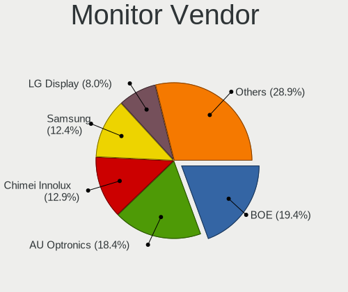

| Vendor                  | Notebooks | Percent |
|-------------------------|-----------|---------|
| BOE                     | 33        | 19.3%   |
| AU Optronics            | 30        | 17.54%  |
| Samsung Electronics     | 23        | 13.45%  |
| Chimei Innolux          | 20        | 11.7%   |
| LG Display              | 13        | 7.6%    |
| Goldstar                | 6         | 3.51%   |
| Apple                   | 6         | 3.51%   |
| Sharp                   | 5         | 2.92%   |
| Dell                    | 5         | 2.92%   |
| PANDA                   | 4         | 2.34%   |
| Philips                 | 3         | 1.75%   |
| InfoVision              | 3         | 1.75%   |
| SAC                     | 2         | 1.17%   |
| Lenovo                  | 2         | 1.17%   |
| Chi Mei Optoelectronics | 2         | 1.17%   |
| AOC                     | 2         | 1.17%   |
| ViewSonic               | 1         | 0.58%   |
| Valve                   | 1         | 0.58%   |
| UGD                     | 1         | 0.58%   |
| STA                     | 1         | 0.58%   |
| Panasonic               | 1         | 0.58%   |
| MSI                     | 1         | 0.58%   |
| LOE                     | 1         | 0.58%   |
| KDC                     | 1         | 0.58%   |
| KDB                     | 1         | 0.58%   |
| Denver                  | 1         | 0.58%   |
| CSO                     | 1         | 0.58%   |
| Acer                    | 1         | 0.58%   |

Monitor Model
-------------

Monitor models

| Model                                                                  | Notebooks | Percent |
|------------------------------------------------------------------------|-----------|---------|
| AU Optronics LCD Monitor AUOE48D 1920x1080 344x194mm 15.5-inch         | 3         | 1.75%   |
| Sharp LCD Monitor SHP1453 1920x1080 346x194mm 15.6-inch                | 2         | 1.17%   |
| Samsung Electronics LCD Monitor SDC4193 2880x1800 302x189mm 14.0-inch  | 2         | 1.17%   |
| Chimei Innolux LCD Monitor CMN15F5 1920x1080 344x193mm 15.5-inch       | 2         | 1.17%   |
| Chimei Innolux LCD Monitor CMN1521 1920x1080 344x193mm 15.5-inch       | 2         | 1.17%   |
| BOE LCD Monitor BOE08BE 1920x1080 382x215mm 17.3-inch                  | 2         | 1.17%   |
| AU Optronics LCD Monitor AUO61ED 1920x1080 340x190mm 15.3-inch         | 2         | 1.17%   |
| AU Optronics LCD Monitor AUO41EC 1366x768 344x193mm 15.5-inch          | 2         | 1.17%   |
| AU Optronics LCD Monitor AUO2E3C 1366x768 309x173mm 13.9-inch          | 2         | 1.17%   |
| AU Optronics LCD Monitor AUO139D 1920x1080 381x214mm 17.2-inch         | 2         | 1.17%   |
| ViewSonic XG2703-GS VSCBA32 2560x1440 598x336mm 27.0-inch              | 1         | 0.58%   |
| Valve ANX7530 U VLV3001 800x1280 100x150mm 7.1-inch                    | 1         | 0.58%   |
| UGD CD220F (H) UGD2210 1920x1080 527x296mm 23.8-inch                   | 1         | 0.58%   |
| STA SEMP LEDTV STA0030 1920x1080 708x398mm 32.0-inch                   | 1         | 0.58%   |
| Sharp LQ156M1JW03 SHP155D 1920x1080 344x194mm 15.5-inch                | 1         | 0.58%   |
| Sharp LCD Monitor SHP1517 3840x2400 366x229mm 17.0-inch                | 1         | 0.58%   |
| Sharp LCD Monitor SHP1479 1920x1280 259x173mm 12.3-inch                | 1         | 0.58%   |
| Samsung Electronics U32J59x SAM0F52 3840x2160 697x392mm 31.5-inch      | 1         | 0.58%   |
| Samsung Electronics SyncMaster SAM05E8 1920x1080                       | 1         | 0.58%   |
| Samsung Electronics SyncMaster SAM0498 1600x900 443x249mm 20.0-inch    | 1         | 0.58%   |
| Samsung Electronics S24R35x SAM100E 1920x1080 527x296mm 23.8-inch      | 1         | 0.58%   |
| Samsung Electronics Odyssey G8 SAM7231 3440x1440 809x354mm 34.8-inch   | 1         | 0.58%   |
| Samsung Electronics LF24T35 SAM707E 1920x1080 528x297mm 23.9-inch      | 1         | 0.58%   |
| Samsung Electronics LF24T35 SAM707D 1920x1080 528x297mm 23.9-inch      | 1         | 0.58%   |
| Samsung Electronics LCD Monitor SEC544B 1600x900 382x215mm 17.3-inch   | 1         | 0.58%   |
| Samsung Electronics LCD Monitor SEC5441 1366x768 344x194mm 15.5-inch   | 1         | 0.58%   |
| Samsung Electronics LCD Monitor SEC3651 1366x768 340x190mm 15.3-inch   | 1         | 0.58%   |
| Samsung Electronics LCD Monitor SDC4752 1366x768 344x194mm 15.5-inch   | 1         | 0.58%   |
| Samsung Electronics LCD Monitor SDC4179 2560x1440 344x194mm 15.5-inch  | 1         | 0.58%   |
| Samsung Electronics LCD Monitor SDC416D 2880x1800 312x195mm 14.5-inch  | 1         | 0.58%   |
| Samsung Electronics LCD Monitor SDC415F 3840x2160 344x194mm 15.5-inch  | 1         | 0.58%   |
| Samsung Electronics LCD Monitor SDC415D 3840x2400 344x215mm 16.0-inch  | 1         | 0.58%   |
| Samsung Electronics LCD Monitor SDC4159 1920x1080 344x194mm 15.5-inch  | 1         | 0.58%   |
| Samsung Electronics LCD Monitor SDC4152 2880x1800 302x189mm 14.0-inch  | 1         | 0.58%   |
| Samsung Electronics LCD Monitor SDC414D 3456x2160 336x210mm 15.6-inch  | 1         | 0.58%   |
| Samsung Electronics LCD Monitor SDC4142 3840x2160 294x165mm 13.3-inch  | 1         | 0.58%   |
| Samsung Electronics LCD Monitor SDC324C 1920x1080 344x194mm 15.5-inch  | 1         | 0.58%   |
| Samsung Electronics LCD Monitor SAM094D 1920x1080 1210x680mm 54.6-inch | 1         | 0.58%   |
| SAC DP1 SAC3236 2560x1440 697x393mm 31.5-inch                          | 1         | 0.58%   |
| SAC DM-MONB2205 SAC952D 1920x1080 450x270mm 20.7-inch                  | 1         | 0.58%   |

Monitor Resolution
------------------

Monitor screen resolution

| Resolution        | Notebooks | Percent |
|-------------------|-----------|---------|
| 1920x1080 (FHD)   | 74        | 46.54%  |
| 1366x768 (WXGA)   | 28        | 17.61%  |
| 2560x1440 (QHD)   | 11        | 6.92%   |
| 3840x2160 (4K)    | 9         | 5.66%   |
| 2880x1800         | 4         | 2.52%   |
| 2560x1600         | 4         | 2.52%   |
| 2560x1080         | 3         | 1.89%   |
| 1600x900 (HD+)    | 3         | 1.89%   |
| 3840x2400         | 2         | 1.26%   |
| 3440x1440         | 2         | 1.26%   |
| 2240x1400         | 2         | 1.26%   |
| 1920x540          | 2         | 1.26%   |
| 1920x1200 (WUXGA) | 2         | 1.26%   |
| 1440x900 (WXGA+)  | 2         | 1.26%   |
| 1280x800 (WXGA)   | 2         | 1.26%   |
| 800x1280          | 1         | 0.63%   |
| 3840x1100         | 1         | 0.63%   |
| 3456x2160         | 1         | 0.63%   |
| 3072x1920         | 1         | 0.63%   |
| 2256x1504         | 1         | 0.63%   |
| 2160x1440         | 1         | 0.63%   |
| 1920x1280         | 1         | 0.63%   |
| 1280x720 (HD)     | 1         | 0.63%   |
| 1280x1024 (SXGA)  | 1         | 0.63%   |

Monitor Diagonal
----------------

Diagonal size in inches

| Inches  | Notebooks | Percent |
|---------|-----------|---------|
| 15      | 57        | 33.53%  |
| 14      | 26        | 15.29%  |
| 17      | 20        | 11.76%  |
| 13      | 18        | 10.59%  |
| 27      | 6         | 3.53%   |
| 16      | 6         | 3.53%   |
| 24      | 5         | 2.94%   |
| 34      | 4         | 2.35%   |
| 31      | 4         | 2.35%   |
| 23      | 4         | 2.35%   |
| 12      | 4         | 2.35%   |
| 11      | 4         | 2.35%   |
| 21      | 3         | 1.76%   |
| 72      | 1         | 0.59%   |
| 65      | 1         | 0.59%   |
| 54      | 1         | 0.59%   |
| 40      | 1         | 0.59%   |
| 37      | 1         | 0.59%   |
| 20      | 1         | 0.59%   |
| 19      | 1         | 0.59%   |
| 7       | 1         | 0.59%   |
| Unknown | 1         | 0.59%   |

Monitor Width
-------------

Physical width

| Width in mm | Notebooks | Percent |
|-------------|-----------|---------|
| 301-350     | 97        | 57.74%  |
| 351-400     | 22        | 13.1%   |
| 501-600     | 15        | 8.93%   |
| 201-300     | 15        | 8.93%   |
| 601-700     | 4         | 2.38%   |
| 401-500     | 4         | 2.38%   |
| 801-900     | 3         | 1.79%   |
| 701-800     | 3         | 1.79%   |
| 1001-1500   | 2         | 1.19%   |
| 1501-2000   | 1         | 0.6%    |
| 1-100       | 1         | 0.6%    |
| Unknown     | 1         | 0.6%    |

Aspect Ratio
------------

Proportional relationship between the width and the height

| Ratio | Notebooks | Percent |
|-------|-----------|---------|
| 16/9  | 117       | 78.52%  |
| 16/10 | 22        | 14.77%  |
| 21/9  | 4         | 2.68%   |
| 3/2   | 3         | 2.01%   |
| 5/4   | 1         | 0.67%   |
| 3.40  | 1         | 0.67%   |
| 0.67  | 1         | 0.67%   |

Monitor Area
------------

Area in inch²

| Area in inch² | Notebooks | Percent |
|----------------|-----------|---------|
| 101-110        | 57        | 33.53%  |
| 81-90          | 38        | 22.35%  |
| 121-130        | 20        | 11.76%  |
| 201-250        | 10        | 5.88%   |
| 351-500        | 8         | 4.71%   |
| 301-350        | 6         | 3.53%   |
| 111-120        | 6         | 3.53%   |
| 51-60          | 5         | 2.94%   |
| 71-80          | 4         | 2.35%   |
| More than 1000 | 3         | 1.76%   |
| 61-70          | 3         | 1.76%   |
| 251-300        | 2         | 1.18%   |
| 151-200        | 2         | 1.18%   |
| 501-1000       | 2         | 1.18%   |
| 91-100         | 2         | 1.18%   |
| 1-40           | 1         | 0.59%   |
| Unknown        | 1         | 0.59%   |

Pixel Density
-------------

Pixels per inch

| Density       | Notebooks | Percent |
|---------------|-----------|---------|
| 121-160       | 79        | 47.88%  |
| 101-120       | 29        | 17.58%  |
| 51-100        | 24        | 14.55%  |
| 161-240       | 18        | 10.91%  |
| More than 240 | 11        | 6.67%   |
| 1-50          | 3         | 1.82%   |
| Unknown       | 1         | 0.61%   |

Multiple Monitors
-----------------

Total monitors connected

| Total | Notebooks | Percent |
|-------|-----------|---------|
| 1     | 104       | 74.29%  |
| 2     | 34        | 24.29%  |
| 3     | 1         | 0.71%   |
| 0     | 1         | 0.71%   |

Network
-------

Net Controller Vendor
---------------------

Controller vendors

| Vendor                | Notebooks | Percent |
|-----------------------|-----------|---------|
| Intel                 | 74        | 35.24%  |
| Realtek Semiconductor | 72        | 34.29%  |
| MediaTek              | 16        | 7.62%   |
| Qualcomm Atheros      | 12        | 5.71%   |
| Broadcom              | 10        | 4.76%   |
| Broadcom Limited      | 5         | 2.38%   |
| ASIX Electronics      | 4         | 1.9%    |
| Ralink                | 3         | 1.43%   |
| Hewlett-Packard       | 3         | 1.43%   |
| Samsung Electronics   | 2         | 0.95%   |
| ZyXEL Communications  | 1         | 0.48%   |
| Xiaomi                | 1         | 0.48%   |
| Qualcomm              | 1         | 0.48%   |
| Microsoft             | 1         | 0.48%   |
| Lenovo                | 1         | 0.48%   |
| ICS Advent            | 1         | 0.48%   |
| Google                | 1         | 0.48%   |
| DisplayLink           | 1         | 0.48%   |
| Dell                  | 1         | 0.48%   |

Net Controller Model
--------------------

Controller models

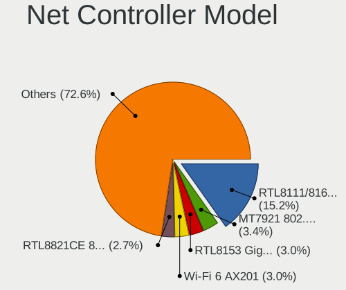

| Model                                                             | Notebooks | Percent |
|-------------------------------------------------------------------|-----------|---------|
| Realtek RTL8111/8168/8411 PCI Express Gigabit Ethernet Controller | 39        | 15.73%  |
| MediaTek MT7921 802.11ax PCI Express Wireless Network Adapter     | 10        | 4.03%   |
| Realtek RTL8153 Gigabit Ethernet Adapter                          | 7         | 2.82%   |
| Intel Alder Lake-P PCH CNVi WiFi                                  | 7         | 2.82%   |
| Realtek RTL8852BE PCIe 802.11ax Wireless Network Controller       | 6         | 2.42%   |
| Realtek RTL8822CE 802.11ac PCIe Wireless Network Adapter          | 6         | 2.42%   |
| Realtek RTL8821CE 802.11ac PCIe Wireless Network Adapter          | 6         | 2.42%   |
| Realtek RTL810xE PCI Express Fast Ethernet controller             | 6         | 2.42%   |
| Intel Wi-Fi 6 AX200                                               | 6         | 2.42%   |
| Qualcomm Atheros QCA9377 802.11ac Wireless Network Adapter        | 5         | 2.02%   |
| MediaTek MT7922 802.11ax PCI Express Wireless Network Adapter     | 5         | 2.02%   |
| Intel Wi-Fi 6 AX210/AX211/AX411 160MHz                            | 5         | 2.02%   |
| Intel Centrino Advanced-N 6205 [Taylor Peak]                      | 5         | 2.02%   |
| Intel Cannon Lake PCH CNVi WiFi                                   | 5         | 2.02%   |
| Realtek RTL8125 2.5GbE Controller                                 | 4         | 1.61%   |
| Intel Wireless 8260                                               | 4         | 1.61%   |
| Intel Wireless 7265                                               | 4         | 1.61%   |
| Intel Wi-Fi 6 AX201                                               | 4         | 1.61%   |
| Intel Raptor Lake PCH CNVi WiFi                                   | 4         | 1.61%   |
| Intel Comet Lake PCH-LP CNVi WiFi                                 | 4         | 1.61%   |
| Intel 82579LM Gigabit Network Connection (Lewisville)             | 4         | 1.61%   |
| Realtek RTL8852AE 802.11ax PCIe Wireless Network Adapter          | 3         | 1.21%   |
| Intel Wireless 8265 / 8275                                        | 3         | 1.21%   |
| Intel Wireless 7260                                               | 3         | 1.21%   |
| Intel Tiger Lake PCH CNVi WiFi                                    | 3         | 1.21%   |
| Intel Dual Band Wireless-AC 3165 Plus Bluetooth                   | 3         | 1.21%   |
| Broadcom NetXtreme BCM57765 Gigabit Ethernet PCIe                 | 3         | 1.21%   |
| Broadcom BCM4331 802.11a/b/g/n                                    | 3         | 1.21%   |
| ASIX AX88179 Gigabit Ethernet                                     | 3         | 1.21%   |
| Samsung Galaxy series, misc. (tethering mode)                     | 2         | 0.81%   |
| Realtek Killer E3000 2.5GbE Controller                            | 2         | 0.81%   |
| Realtek Killer E2600 Gigabit Ethernet Controller                  | 2         | 0.81%   |
| Qualcomm Atheros QCA6174 802.11ac Wireless Network Adapter        | 2         | 0.81%   |
| Intel Wireless 3165                                               | 2         | 0.81%   |
| Intel Ethernet Connection I217-LM                                 | 2         | 0.81%   |
| Intel Ethernet Connection (2) I219-LM                             | 2         | 0.81%   |
| Intel Comet Lake PCH CNVi WiFi                                    | 2         | 0.81%   |
| Intel Alder Lake-S PCH CNVi WiFi                                  | 2         | 0.81%   |
| Intel 700 Series Chipset Family Wi-Fi                             | 2         | 0.81%   |
| Broadcom Limited BCM4360 802.11ac Wireless Network Adapter        | 2         | 0.81%   |

Wireless Vendor
---------------

Wireless vendors

| Vendor                | Notebooks | Percent |
|-----------------------|-----------|---------|
| Intel                 | 73        | 51.05%  |
| Realtek Semiconductor | 24        | 16.78%  |
| MediaTek              | 16        | 11.19%  |
| Qualcomm Atheros      | 11        | 7.69%   |
| Broadcom              | 8         | 5.59%   |
| Ralink                | 3         | 2.1%    |
| Broadcom Limited      | 3         | 2.1%    |
| ZyXEL Communications  | 1         | 0.7%    |
| Qualcomm              | 1         | 0.7%    |
| Microsoft             | 1         | 0.7%    |
| Hewlett-Packard       | 1         | 0.7%    |
| Dell                  | 1         | 0.7%    |

Wireless Model
--------------

Wireless models

| Model                                                                   | Notebooks | Percent |
|-------------------------------------------------------------------------|-----------|---------|
| MediaTek MT7921 802.11ax PCI Express Wireless Network Adapter           | 10        | 6.99%   |
| Intel Alder Lake-P PCH CNVi WiFi                                        | 7         | 4.9%    |
| Realtek RTL8852BE PCIe 802.11ax Wireless Network Controller             | 6         | 4.2%    |
| Realtek RTL8822CE 802.11ac PCIe Wireless Network Adapter                | 6         | 4.2%    |
| Realtek RTL8821CE 802.11ac PCIe Wireless Network Adapter                | 6         | 4.2%    |
| Intel Wi-Fi 6 AX200                                                     | 6         | 4.2%    |
| Qualcomm Atheros QCA9377 802.11ac Wireless Network Adapter              | 5         | 3.5%    |
| MediaTek MT7922 802.11ax PCI Express Wireless Network Adapter           | 5         | 3.5%    |
| Intel Wi-Fi 6 AX210/AX211/AX411 160MHz                                  | 5         | 3.5%    |
| Intel Centrino Advanced-N 6205 [Taylor Peak]                            | 5         | 3.5%    |
| Intel Cannon Lake PCH CNVi WiFi                                         | 5         | 3.5%    |
| Intel Wireless 8260                                                     | 4         | 2.8%    |
| Intel Wireless 7265                                                     | 4         | 2.8%    |
| Intel Wi-Fi 6 AX201                                                     | 4         | 2.8%    |
| Intel Raptor Lake PCH CNVi WiFi                                         | 4         | 2.8%    |
| Intel Comet Lake PCH-LP CNVi WiFi                                       | 4         | 2.8%    |
| Realtek RTL8852AE 802.11ax PCIe Wireless Network Adapter                | 3         | 2.1%    |
| Intel Wireless 8265 / 8275                                              | 3         | 2.1%    |
| Intel Wireless 7260                                                     | 3         | 2.1%    |
| Intel Tiger Lake PCH CNVi WiFi                                          | 3         | 2.1%    |
| Intel Dual Band Wireless-AC 3165 Plus Bluetooth                         | 3         | 2.1%    |
| Broadcom BCM4331 802.11a/b/g/n                                          | 3         | 2.1%    |
| Qualcomm Atheros QCA6174 802.11ac Wireless Network Adapter              | 2         | 1.4%    |
| Intel Wireless 3165                                                     | 2         | 1.4%    |
| Intel Comet Lake PCH CNVi WiFi                                          | 2         | 1.4%    |
| Intel Alder Lake-S PCH CNVi WiFi                                        | 2         | 1.4%    |
| Intel 700 Series Chipset Family Wi-Fi                                   | 2         | 1.4%    |
| Broadcom Limited BCM4360 802.11ac Wireless Network Adapter              | 2         | 1.4%    |
| ZyXEL ZyXEL Dual-Band Wireless AC USB Adapter                           | 1         | 0.7%    |
| Realtek RTL8723DE Wireless Network Adapter                              | 1         | 0.7%    |
| Realtek RTL8723BE PCIe Wireless Network Adapter                         | 1         | 0.7%    |
| Realtek RTL8723AE PCIe Wireless Network Adapter                         | 1         | 0.7%    |
| Ralink RT5390R 802.11bgn PCIe Wireless Network Adapter                  | 1         | 0.7%    |
| Ralink RT5390 Wireless 802.11n 1T/1R PCIe                               | 1         | 0.7%    |
| Ralink RT3290 Wireless 802.11n 1T/1R PCIe                               | 1         | 0.7%    |
| Qualcomm QCNFA765 Wireless Network Adapter                              | 1         | 0.7%    |
| Qualcomm Atheros AR9462 Wireless Network Adapter                        | 1         | 0.7%    |
| Qualcomm Atheros AR9287 Wireless Network Adapter (PCI-Express)          | 1         | 0.7%    |
| Qualcomm Atheros AR9285 Wireless Network Adapter (PCI-Express)          | 1         | 0.7%    |
| Qualcomm Atheros AR242x / AR542x Wireless Network Adapter (PCI-Express) | 1         | 0.7%    |

Ethernet Vendor
---------------

Ethernet vendors

| Vendor                | Notebooks | Percent |
|-----------------------|-----------|---------|
| Realtek Semiconductor | 60        | 58.82%  |
| Intel                 | 21        | 20.59%  |
| Broadcom              | 5         | 4.9%    |
| ASIX Electronics      | 4         | 3.92%   |
| Qualcomm Atheros      | 3         | 2.94%   |
| Samsung Electronics   | 2         | 1.96%   |
| Broadcom Limited      | 2         | 1.96%   |
| Xiaomi                | 1         | 0.98%   |
| Lenovo                | 1         | 0.98%   |
| ICS Advent            | 1         | 0.98%   |
| Google                | 1         | 0.98%   |
| DisplayLink           | 1         | 0.98%   |

Ethernet Model
--------------

Ethernet models

| Model                                                             | Notebooks | Percent |
|-------------------------------------------------------------------|-----------|---------|
| Realtek RTL8111/8168/8411 PCI Express Gigabit Ethernet Controller | 39        | 37.86%  |
| Realtek RTL8153 Gigabit Ethernet Adapter                          | 7         | 6.8%    |
| Realtek RTL810xE PCI Express Fast Ethernet controller             | 6         | 5.83%   |
| Realtek RTL8125 2.5GbE Controller                                 | 4         | 3.88%   |
| Intel 82579LM Gigabit Network Connection (Lewisville)             | 4         | 3.88%   |
| Broadcom NetXtreme BCM57765 Gigabit Ethernet PCIe                 | 3         | 2.91%   |
| ASIX AX88179 Gigabit Ethernet                                     | 3         | 2.91%   |
| Samsung Galaxy series, misc. (tethering mode)                     | 2         | 1.94%   |
| Realtek Killer E3000 2.5GbE Controller                            | 2         | 1.94%   |
| Realtek Killer E2600 Gigabit Ethernet Controller                  | 2         | 1.94%   |
| Intel Ethernet Connection I217-LM                                 | 2         | 1.94%   |
| Intel Ethernet Connection (2) I219-LM                             | 2         | 1.94%   |
| Xiaomi Mi/Redmi series (RNDIS)                                    | 1         | 0.97%   |
| Realtek RTL-8100/8101L/8139 PCI Fast Ethernet Adapter             | 1         | 0.97%   |
| Qualcomm Atheros Killer E2500 Gigabit Ethernet Controller         | 1         | 0.97%   |
| Qualcomm Atheros Killer E220x Gigabit Ethernet Controller         | 1         | 0.97%   |
| Qualcomm Atheros AR8121/AR8113/AR8114 Gigabit or Fast Ethernet    | 1         | 0.97%   |
| Lenovo USB-C Dock Ethernet                                        | 1         | 0.97%   |
| Intel Ethernet Controller I225-V                                  | 1         | 0.97%   |
| Intel Ethernet Controller I219-LM                                 | 1         | 0.97%   |
| Intel Ethernet Connection I219-LM                                 | 1         | 0.97%   |
| Intel Ethernet Connection I217-V                                  | 1         | 0.97%   |
| Intel Ethernet Connection (7) I219-V                              | 1         | 0.97%   |
| Intel Ethernet Connection (6) I219-LM                             | 1         | 0.97%   |
| Intel Ethernet Connection (17) I219-LM                            | 1         | 0.97%   |
| Intel Ethernet Connection (16) I219-V                             | 1         | 0.97%   |
| Intel Ethernet Connection (14) I219-V                             | 1         | 0.97%   |
| Intel Ethernet Connection (13) I219-LM                            | 1         | 0.97%   |
| Intel Ethernet Connection (11) I219-LM                            | 1         | 0.97%   |
| Intel Ethernet Connection (10) I219-LM                            | 1         | 0.97%   |
| Intel 82577LM Gigabit Network Connection                          | 1         | 0.97%   |
| ICS Advent DM9601 Fast Ethernet Adapter                           | 1         | 0.97%   |
| Google Pixel 6                                                    | 1         | 0.97%   |
| DisplayLink Dell Universal Dock D6000                             | 1         | 0.97%   |
| Broadcom NetXtreme BCM5762 Gigabit Ethernet PCIe                  | 1         | 0.97%   |
| Broadcom NetXtreme BCM5761 Gigabit Ethernet PCIe                  | 1         | 0.97%   |
| Broadcom Limited NetLink BCM57785 Gigabit Ethernet PCIe           | 1         | 0.97%   |
| Broadcom Limited NetLink BCM57780 Gigabit Ethernet PCIe           | 1         | 0.97%   |
| ASIX AX88772                                                      | 1         | 0.97%   |

Net Controller Kind
-------------------

Ethernet, WiFi or modem

| Kind     | Notebooks | Percent |
|----------|-----------|---------|
| WiFi     | 138       | 58.47%  |
| Ethernet | 96        | 40.68%  |
| Modem    | 2         | 0.85%   |

Used Controller
---------------

Currently used network controller

| Kind     | Notebooks | Percent |
|----------|-----------|---------|
| WiFi     | 119       | 83.8%   |
| Ethernet | 23        | 16.2%   |

NICs
----

Total network controllers on board

| Total | Notebooks | Percent |
|-------|-----------|---------|
| 2     | 85        | 61.15%  |
| 1     | 54        | 38.85%  |

IPv6
----

IPv6 vs IPv4

| Used | Notebooks | Percent |
|------|-----------|---------|
| No   | 99        | 70.21%  |
| Yes  | 42        | 29.79%  |

Bluetooth
---------

Bluetooth Vendor
----------------

Controller vendors

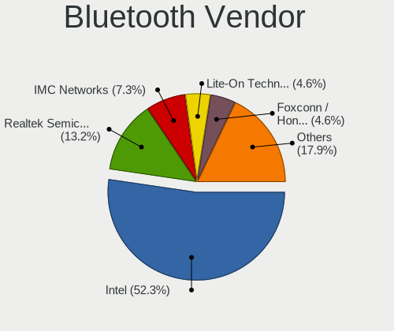

| Vendor                          | Notebooks | Percent |
|---------------------------------|-----------|---------|
| Intel                           | 65        | 52.42%  |
| Realtek Semiconductor           | 17        | 13.71%  |
| IMC Networks                    | 8         | 6.45%   |
| Lite-On Technology              | 6         | 4.84%   |
| Foxconn / Hon Hai               | 6         | 4.84%   |
| Apple                           | 6         | 4.84%   |
| Qualcomm Atheros Communications | 5         | 4.03%   |
| Broadcom                        | 5         | 4.03%   |
| Realtek                         | 2         | 1.61%   |
| Toshiba                         | 1         | 0.81%   |
| Ralink                          | 1         | 0.81%   |
| Dell                            | 1         | 0.81%   |
| Cambridge Silicon Radio         | 1         | 0.81%   |

Bluetooth Model
---------------

Controller models

| Model                                               | Notebooks | Percent |
|-----------------------------------------------------|-----------|---------|
| Intel Bluetooth wireless interface                  | 17        | 13.71%  |
| Realtek Bluetooth Radio                             | 14        | 11.29%  |
| Intel Bluetooth Device                              | 14        | 11.29%  |
| Intel AX201 Bluetooth                               | 13        | 10.48%  |
| Intel Bluetooth 9460/9560 Jefferson Peak (JfP)      | 9         | 7.26%   |
| Intel AX200 Bluetooth                               | 6         | 4.84%   |
| Intel AX210 Bluetooth                               | 5         | 4.03%   |
| IMC Networks Wireless_Device                        | 5         | 4.03%   |
| Lite-On Wireless_Device                             | 4         | 3.23%   |
| Realtek  Bluetooth 4.2 Adapter                      | 3         | 2.42%   |
| Qualcomm Atheros  Bluetooth Device                  | 3         | 2.42%   |
| IMC Networks Bluetooth Radio                        | 3         | 2.42%   |
| Foxconn / Hon Hai Wireless_Device                   | 3         | 2.42%   |
| Apple Bluetooth USB Host Controller                 | 3         | 2.42%   |
| Realtek Bluetooth Radio                             | 2         | 1.61%   |
| Qualcomm Atheros QCA61x4 Bluetooth 4.0              | 2         | 1.61%   |
| Lite-On Qualcomm Atheros QCA9377 Bluetooth          | 2         | 1.61%   |
| Foxconn / Hon Hai MediaTek Bluetooth Adapter        | 2         | 1.61%   |
| Apple Bluetooth Host Controller                     | 2         | 1.61%   |
| Toshiba RT Bluetooth Radio                          | 1         | 0.81%   |
| Ralink RT3290 Bluetooth                             | 1         | 0.81%   |
| Intel Centrino Bluetooth Wireless Transceiver       | 1         | 0.81%   |
| Foxconn / Hon Hai Bluetooth Device                  | 1         | 0.81%   |
| Dell DW375 Bluetooth Module                         | 1         | 0.81%   |
| Cambridge Silicon Radio Bluetooth Dongle (HCI mode) | 1         | 0.81%   |
| Broadcom HP Portable SoftSailing                    | 1         | 0.81%   |
| Broadcom HP Portable Bumble Bee                     | 1         | 0.81%   |
| Broadcom BCM43142A0 Bluetooth 4.0                   | 1         | 0.81%   |
| Broadcom BCM20702A0                                 | 1         | 0.81%   |
| Broadcom BCM20702 Bluetooth 4.0 [ThinkPad]          | 1         | 0.81%   |
| Apple Built-in Bluetooth 2.0+EDR HCI                | 1         | 0.81%   |

Sound
-----

Sound Vendor
------------

Sound card vendors

| Vendor                   | Notebooks | Percent |
|--------------------------|-----------|---------|
| Intel                    | 98        | 54.75%  |
| AMD                      | 42        | 23.46%  |
| Nvidia                   | 30        | 16.76%  |
| Realtek Semiconductor    | 2         | 1.12%   |
| Hewlett-Packard          | 2         | 1.12%   |
| C-Media Electronics      | 2         | 1.12%   |
| Nordic Semiconductor ASA | 1         | 0.56%   |
| Lenovo                   | 1         | 0.56%   |
| GN Netcom                | 1         | 0.56%   |

Sound Model
-----------

Sound card models

| Model                                                                      | Notebooks | Percent |
|----------------------------------------------------------------------------|-----------|---------|
| AMD Family 17h/19h HD Audio Controller                                     | 35        | 15.84%  |
| AMD Renoir Radeon High Definition Audio Controller                         | 19        | 8.6%    |
| Intel Sunrise Point-LP HD Audio                                            | 9         | 4.07%   |
| Intel Alder Lake PCH-P High Definition Audio Controller                    | 9         | 4.07%   |
| Intel 7 Series/C216 Chipset Family High Definition Audio Controller        | 9         | 4.07%   |
| Intel Tiger Lake-LP Smart Sound Technology Audio Controller                | 8         | 3.62%   |
| AMD Rembrandt Radeon High Definition Audio Controller                      | 7         | 3.17%   |
| Nvidia Audio device                                                        | 6         | 2.71%   |
| Intel Cannon Lake PCH cAVS                                                 | 6         | 2.71%   |
| Intel 8 Series/C220 Series Chipset High Definition Audio Controller        | 6         | 2.71%   |
| Intel 100 Series/C230 Series Chipset Family HD Audio Controller            | 6         | 2.71%   |
| Nvidia GA104 High Definition Audio Controller                              | 5         | 2.26%   |
| Intel Xeon E3-1200 v3/4th Gen Core Processor HD Audio Controller           | 5         | 2.26%   |
| Intel Comet Lake PCH-LP cAVS                                               | 5         | 2.26%   |
| AMD Raven/Raven2/Fenghuang HDMI/DP Audio Controller                        | 5         | 2.26%   |
| Nvidia TU107 GeForce GTX 1650 High Definition Audio Controller             | 4         | 1.81%   |
| Intel Tiger Lake-H HD Audio Controller                                     | 4         | 1.81%   |
| Intel Raptor Lake-P/U/H cAVS                                               | 4         | 1.81%   |
| Intel Comet Lake PCH cAVS                                                  | 4         | 1.81%   |
| Nvidia TU106 High Definition Audio Controller                              | 3         | 1.36%   |
| Nvidia GA106 High Definition Audio Controller                              | 3         | 1.36%   |
| Intel Wildcat Point-LP High Definition Audio Controller                    | 3         | 1.36%   |
| Intel Celeron N3350/Pentium N4200/Atom E3900 Series Audio Cluster          | 3         | 1.36%   |
| Intel Cannon Point-LP High Definition Audio Controller                     | 3         | 1.36%   |
| Intel Broadwell-U Audio Controller                                         | 3         | 1.36%   |
| Intel 6 Series/C200 Series Chipset Family High Definition Audio Controller | 3         | 1.36%   |
| Realtek Semiconductor USB Audio                                            | 2         | 0.9%    |
| Nvidia TU116 High Definition Audio Controller                              | 2         | 0.9%    |
| Nvidia GP107GL High Definition Audio Controller                            | 2         | 0.9%    |
| Intel Ice Lake-LP Smart Sound Technology Audio Controller                  | 2         | 0.9%    |
| Intel CM238 HD Audio Controller                                            | 2         | 0.9%    |
| Intel Alder Lake-S HD Audio Controller                                     | 2         | 0.9%    |
| Intel 82801I (ICH9 Family) HD Audio Controller                             | 2         | 0.9%    |
| Intel 700 Series Chipset Family Precise Touch and Stylus Port #1           | 2         | 0.9%    |
| Intel 5 Series/3400 Series Chipset High Definition Audio                   | 2         | 0.9%    |
| AMD Kabini HDMI/DP Audio                                                   | 2         | 0.9%    |
| AMD FCH Azalia Controller                                                  | 2         | 0.9%    |
| Nvidia GT216 HDMI Audio Controller                                         | 1         | 0.45%   |
| Nvidia GP106 High Definition Audio Controller                              | 1         | 0.45%   |
| Nvidia GK107 HDMI Audio Controller                                         | 1         | 0.45%   |

Memory
------

Memory Vendor
-------------

Memory module vendors

| Vendor              | Notebooks | Percent |
|---------------------|-----------|---------|
| Samsung Electronics | 25        | 29.76%  |
| SK hynix            | 18        | 21.43%  |
| Micron Technology   | 17        | 20.24%  |
| Ramaxel Technology  | 4         | 4.76%   |
| Kingston            | 4         | 4.76%   |
| Crucial             | 3         | 3.57%   |
| Unknown (ABCD)      | 2         | 2.38%   |
| Unknown             | 2         | 2.38%   |
| Transcend           | 1         | 1.19%   |
| Timetec             | 1         | 1.19%   |
| GOODRAM             | 1         | 1.19%   |
| G.Skill             | 1         | 1.19%   |
| fef5                | 1         | 1.19%   |
| Corsair             | 1         | 1.19%   |
| A-DATA Technology   | 1         | 1.19%   |
| 4ea5                | 1         | 1.19%   |
| Unknown             | 1         | 1.19%   |

Memory Model
------------

Memory module models

| Model                                                            | Notebooks | Percent |
|------------------------------------------------------------------|-----------|---------|
| SK hynix RAM HMAA1GS6CJR6N-XN 8GB SODIMM DDR4 3200MT/s           | 3         | 3.45%   |
| Samsung RAM M471A1G44BB0-CWE 8GB SODIMM DDR4 3200MT/s            | 3         | 3.45%   |
| SK hynix RAM Module 4GB SODIMM DDR3 1600MT/s                     | 2         | 2.3%    |
| Unknown RAM Module 4GB SODIMM 800MT/s                            | 1         | 1.15%   |
| Unknown RAM Module 4GB Row Of Chips LPDDR3 1867MT/s              | 1         | 1.15%   |
| Unknown (ABCD) RAM 123456789012345678 4GB DIMM LPDDR4 2400MT/s   | 1         | 1.15%   |
| Unknown (ABCD) RAM 123456789012345678 1GB SODIMM LPDDR4 2400MT/s | 1         | 1.15%   |
| Transcend RAM JM2666HSE-16G 16GB SODIMM DDR4 2667MT/s            | 1         | 1.15%   |
| Timetec RAM S16G-3200 16GB SODIMM DDR4 2133MT/s                  | 1         | 1.15%   |
| SK hynix RAM Module 8GB SODIMM DDR4 2133MT/s                     | 1         | 1.15%   |
| SK hynix RAM HMT451S6BFR8A-PB 4GB SODIMM DDR3 1600MT/s           | 1         | 1.15%   |
| SK hynix RAM HMT351S6EFR8A-PB 4GB SODIMM DDR3 1600MT/s           | 1         | 1.15%   |
| SK hynix RAM HMCG88MEBSA092N 32GB SODIMM DDR5 4800MT/s           | 1         | 1.15%   |
| SK hynix RAM HMCG66AGBSA092N 8GB SODIMM DDR5 5600MT/s            | 1         | 1.15%   |
| SK hynix RAM HMAG68EXNSA051N 8GB SODIMM DDR4 3200MT/s            | 1         | 1.15%   |
| SK hynix RAM HMAA1GS6CMR6N-VK 8GB SODIMM DDR4 2667MT/s           | 1         | 1.15%   |
| SK hynix RAM HMAA1GS6CJR6N-XN 8GB Row Of Chips DDR4 3200MT/s     | 1         | 1.15%   |
| SK hynix RAM HMA851S6DJR6N-XN 4GB SODIMM DDR4 3200MT/s           | 1         | 1.15%   |
| SK hynix RAM HMA81GS6AFR8N-UH 8GB SODIMM DDR4 2667MT/s           | 1         | 1.15%   |
| SK hynix RAM HCNNNCPMMLXR-NEE 2GB Row Of Chips LPDDR4 4267MT/s   | 1         | 1.15%   |
| SK hynix RAM H9JCNNNFA5MLYR-N6E 8GB SODIMM LPDDR5 6400MT/s       | 1         | 1.15%   |
| SK hynix RAM H9JCNNNFA5MLYR-N6E 4GB Row Of Chips LPDDR5 6400MT/s | 1         | 1.15%   |
| SK hynix RAM H58G66AK6BX070 4GB Row Of Chips LPDDR5 6400MT/s     | 1         | 1.15%   |
| Samsung RAM U6E3S4AA-MGCR 1GB Row Of Chips LPDDR4 4267MT/s       | 1         | 1.15%   |
| Samsung RAM Module 8GB SODIMM DDR5 4800MT/s                      | 1         | 1.15%   |
| Samsung RAM Module 4GB Row Of Chips LPDDR3 2133MT/s              | 1         | 1.15%   |
| Samsung RAM Module 16GB SODIMM DDR4 3200MT/s                     | 1         | 1.15%   |
| Samsung RAM M471B5273DH0-CH9 4GB SODIMM DDR3 1334MT/s            | 1         | 1.15%   |
| Samsung RAM M471B5173QH0-YK0 4GB SODIMM DDR3 1600MT/s            | 1         | 1.15%   |
| Samsung RAM M471B1G73DB0-YK0 8GB SODIMM DDR3 1600MT/s            | 1         | 1.15%   |
| Samsung RAM M471A5244CB0-CTD 4GB SODIMM DDR4 3266MT/s            | 1         | 1.15%   |
| Samsung RAM M471A2K43BB1-CRC 16GB SODIMM DDR4 2400MT/s           | 1         | 1.15%   |
| Samsung RAM M471A1K43DB1-CWE 8GB SODIMM DDR4 3200MT/s            | 1         | 1.15%   |
| Samsung RAM M471A1G44BB0-CWE 8GB Row Of Chips DDR4 3200MT/s      | 1         | 1.15%   |
| Samsung RAM M471A1G44AB0-CWE 8GB SODIMM DDR4 3200MT/s            | 1         | 1.15%   |
| Samsung RAM M471A1G44AB0-CWE 8GB Row Of Chips DDR4 3200MT/s      | 1         | 1.15%   |
| Samsung RAM M425R4GA3BB0-CQKOL 32GB SODIMM DDR5 4800MT/s         | 1         | 1.15%   |
| Samsung RAM M425R1GB4BB0-CQKOL 8GB SODIMM DDR5 4800MT/s          | 1         | 1.15%   |
| Samsung RAM K4F8E304HB-MGCJ 1GB LPDDR4 2400MT/s                  | 1         | 1.15%   |
| Samsung RAM K4F6E3S4HM-MGCJ 2GB LPDDR4 2400MT/s                  | 1         | 1.15%   |

Memory Kind
-----------

Memory module kinds

| Kind    | Notebooks | Percent |
|---------|-----------|---------|
| DDR4    | 30        | 41.67%  |
| DDR3    | 12        | 16.67%  |
| LPDDR5  | 11        | 15.28%  |
| LPDDR4  | 8         | 11.11%  |
| DDR5    | 7         | 9.72%   |
| LPDDR3  | 2         | 2.78%   |
| Unknown | 2         | 2.78%   |

Memory Form Factor
------------------

Physical design of the memory module

| Name         | Notebooks | Percent |
|--------------|-----------|---------|
| SODIMM       | 51        | 69.86%  |
| Row Of Chips | 19        | 26.03%  |
| Unknown      | 2         | 2.74%   |
| DIMM         | 1         | 1.37%   |

Memory Size
-----------

Memory module size

| Size  | Notebooks | Percent |
|-------|-----------|---------|
| 8192  | 33        | 44%     |
| 4096  | 22        | 29.33%  |
| 16384 | 11        | 14.67%  |
| 2048  | 4         | 5.33%   |
| 32768 | 3         | 4%      |
| 12288 | 1         | 1.33%   |
| 1024  | 1         | 1.33%   |

Memory Speed
------------

Memory module speed

| Speed | Notebooks | Percent |
|-------|-----------|---------|
| 3200  | 19        | 26.39%  |
| 6400  | 10        | 13.89%  |
| 1600  | 9         | 12.5%   |
| 2667  | 8         | 11.11%  |
| 4800  | 6         | 8.33%   |
| 2400  | 6         | 8.33%   |
| 2133  | 3         | 4.17%   |
| 4267  | 2         | 2.78%   |
| 1333  | 2         | 2.78%   |
| 5600  | 1         | 1.39%   |
| 4266  | 1         | 1.39%   |
| 3733  | 1         | 1.39%   |
| 3266  | 1         | 1.39%   |
| 1867  | 1         | 1.39%   |
| 1334  | 1         | 1.39%   |
| 800   | 1         | 1.39%   |

Printers & scanners
-------------------

Printer Vendor
--------------

Printer device vendors

| Vendor | Notebooks | Percent |
|--------|-----------|---------|
| Canon  | 2         | 100%    |

Printer Model
-------------

Printer device models

| Model                    | Notebooks | Percent |
|--------------------------|-----------|---------|
| Canon PIXMA MX490 Series | 1         | 50%     |
| Canon LBP6020            | 1         | 50%     |

Scanner Vendor
--------------

Scanner device vendors

Zero info for selected period =(

Scanner Model
-------------

Scanner device models

Zero info for selected period =(

Camera
------

Camera Vendor
-------------

Camera device vendors

| Vendor                                 | Notebooks | Percent |
|----------------------------------------|-----------|---------|
| Chicony Electronics                    | 24        | 20.34%  |
| IMC Networks                           | 12        | 10.17%  |
| Quanta                                 | 11        | 9.32%   |
| Bison Electronics                      | 9         | 7.63%   |
| Realtek Semiconductor                  | 8         | 6.78%   |
| Syntek                                 | 7         | 5.93%   |
| Sunplus Innovation Technology          | 7         | 5.93%   |
| Microdia                               | 7         | 5.93%   |
| Cheng Uei Precision Industry (Foxlink) | 7         | 5.93%   |
| Apple                                  | 5         | 4.24%   |
| Luxvisions Innotech Limited            | 4         | 3.39%   |
| Acer                                   | 4         | 3.39%   |
| Lite-On Technology                     | 3         | 2.54%   |
| SunplusIT                              | 2         | 1.69%   |
| Suyin                                  | 1         | 0.85%   |
| Sonix Technology                       | 1         | 0.85%   |
| Silicon Motion                         | 1         | 0.85%   |
| Primax Electronics                     | 1         | 0.85%   |
| OYT Tech                               | 1         | 0.85%   |
| Logitech                               | 1         | 0.85%   |
| Lenovo                                 | 1         | 0.85%   |
| Alcor Micro                            | 1         | 0.85%   |

Camera Model
------------

Camera device models

| Model                                                           | Notebooks | Percent |
|-----------------------------------------------------------------|-----------|---------|
| IMC Networks USB2.0 HD UVC WebCam                               | 8         | 6.67%   |
| Chicony Integrated Camera                                       | 8         | 6.67%   |
| Syntek Integrated Camera                                        | 6         | 5%      |
| Sunplus Integrated_Webcam_HD                                    | 4         | 3.33%   |
| Realtek HP Truevision HD                                        | 4         | 3.33%   |
| Bison Integrated Camera                                         | 4         | 3.33%   |
| Quanta HD User Facing                                           | 3         | 2.5%    |
| Microdia Integrated_Webcam_HD                                   | 3         | 2.5%    |
| Bison HD Webcam                                                 | 3         | 2.5%    |
| Apple FaceTime HD Camera                                        | 3         | 2.5%    |
| Quanta USB2.0 HD UVC WebCam                                     | 2         | 1.67%   |
| Microdia Integrated_Webcam_FHD                                  | 2         | 1.67%   |
| Chicony HP Truevision HD                                        | 2         | 1.67%   |
| Chicony HD WebCam                                               | 2         | 1.67%   |
| Chicony 720p HD Camera                                          | 2         | 1.67%   |
| Cheng Uei Precision Industry (Foxlink) HP Wide Vision HD Camera | 2         | 1.67%   |
| Cheng Uei Precision Industry (Foxlink) HP TrueVision HD Camera  | 2         | 1.67%   |
| Bison Integrated RGB Camera                                     | 2         | 1.67%   |
| Apple iPhone 5/5C/5S/6/SE/7/8/X/XR                              | 2         | 1.67%   |
| Syntek Lenovo EasyCamera                                        | 1         | 0.83%   |
| Suyin 1.3M HD WebCam                                            | 1         | 0.83%   |
| SunplusIT USB Camera                                            | 1         | 0.83%   |
| SunplusIT 1080p FHD Camera                                      | 1         | 0.83%   |
| Sunplus Laptop_Integrated_Webcam_FHD                            | 1         | 0.83%   |
| Sunplus Integrated_Webcam_FHD                                   | 1         | 0.83%   |
| Sunplus 1.3M HD WebCam                                          | 1         | 0.83%   |
| Sonix USB2.0 HD UVC WebCam                                      | 1         | 0.83%   |
| Silicon Motion HP Webcam-101                                    | 1         | 0.83%   |
| Realtek USB2.0 camera                                           | 1         | 0.83%   |
| Realtek Laptop Camera                                           | 1         | 0.83%   |
| Realtek Integrated_Webcam_HD                                    | 1         | 0.83%   |
| Realtek Integrated Webcam                                       | 1         | 0.83%   |
| Quanta ov9734_techfront_camera                                  | 1         | 0.83%   |
| Quanta HP Wide Vision HD Camera                                 | 1         | 0.83%   |
| Quanta HP HD Camera                                             | 1         | 0.83%   |
| Quanta HP 5MP Camera                                            | 1         | 0.83%   |
| Quanta HD Webcam                                                | 1         | 0.83%   |
| Quanta HD Camera                                                | 1         | 0.83%   |
| Primax HP HD Webcam [Fixed]                                     | 1         | 0.83%   |
| OYT Tech OYV1RDFF1                                              | 1         | 0.83%   |

Security
--------

Fingerprint Vendor
------------------

Fingerprint sensor vendors

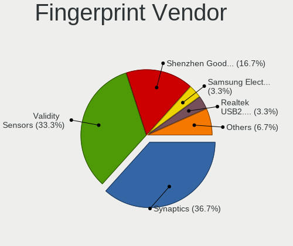

| Vendor                             | Notebooks | Percent |
|------------------------------------|-----------|---------|
| Validity Sensors                   | 7         | 36.84%  |
| Synaptics                          | 5         | 26.32%  |
| Shenzhen Goodix Technology         | 5         | 26.32%  |
| Realtek USB2.0 Finger Print Bridge | 1         | 5.26%   |
| Elan Microelectronics              | 1         | 5.26%   |

Fingerprint Model
-----------------

Fingerprint sensor models

| Model                                                           | Notebooks | Percent |
|-----------------------------------------------------------------|-----------|---------|
| Validity Sensors VFS495 Fingerprint Reader                      | 4         | 21.05%  |
| Shenzhen Goodix  Fingerprint Device                             | 4         | 21.05%  |
| Validity Sensors Swipe Fingerprint Sensor                       | 2         | 10.53%  |
| Synaptics Prometheus MIS Touch Fingerprint Reader               | 2         | 10.53%  |
| Synaptics FS7604 Touch Fingerprint Sensor with PurePrint        | 2         | 10.53%  |
| Validity Sensors VFS471 Fingerprint Reader                      | 1         | 5.26%   |
| Synaptics  FS7604 Touch Fingerprint Sensor with PurePrint       | 1         | 5.26%   |
| Shenzhen Goodix Fingerprint Reader                              | 1         | 5.26%   |
| Realtek USB2.0 Finger Print Bridge FocalTech Fingerprint Device | 1         | 5.26%   |
| Elan ELAN:ARM-M4                                                | 1         | 5.26%   |

Chipcard Vendor
---------------

Chipcard module vendors

| Vendor       | Notebooks | Percent |
|--------------|-----------|---------|
| Broadcom     | 5         | 50%     |
| Alcor Micro  | 2         | 20%     |
| O2 Micro     | 1         | 10%     |
| Lenovo       | 1         | 10%     |
| Aladdin R.D. | 1         | 10%     |

Chipcard Model
--------------

Chipcard module models

| Model                                          | Notebooks | Percent |
|------------------------------------------------|-----------|---------|
| Broadcom 5880                                  | 2         | 20%     |
| Broadcom 58200                                 | 2         | 20%     |
| Alcor Micro AU9540 Smartcard Reader            | 2         | 20%     |
| O2 Micro OZ776 CCID Smartcard Reader           | 1         | 10%     |
| Lenovo Integrated Smart Card Reader            | 1         | 10%     |
| Broadcom BCM5880 Secure Applications Processor | 1         | 10%     |
| Aladdin R.D. JaCarta                           | 1         | 10%     |

Unsupported
-----------

Unsupported Devices
-------------------

Total unsupported devices on board

| Total | Notebooks | Percent |
|-------|-----------|---------|
| 0     | 88        | 63.31%  |
| 1     | 43        | 30.94%  |
| 2     | 8         | 5.76%   |

Unsupported Device Types
------------------------

Types of unsupported devices

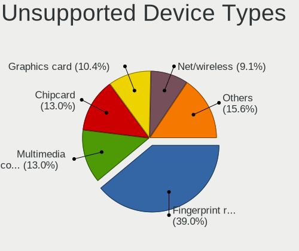

| Type                  | Notebooks | Percent |
|-----------------------|-----------|---------|
| Fingerprint reader    | 19        | 32.76%  |
| Multimedia controller | 9         | 15.52%  |
| Chipcard              | 9         | 15.52%  |
| Graphics card         | 6         | 10.34%  |
| Camera                | 6         | 10.34%  |
| Net/wireless          | 4         | 6.9%    |
| Sound                 | 2         | 3.45%   |
| Storage               | 1         | 1.72%   |
| Card reader           | 1         | 1.72%   |
| Bluetooth             | 1         | 1.72%   |

