Kubuntu 23.04 - Tested Hardware & Statistics
--------------------------------------------

A project to collect tested hardware configurations for Kubuntu 23.04.

Anyone can contribute to this report by the [hw-probe](https://github.com/linuxhw/hw-probe) tool:

    sudo -E hw-probe -all -upload

Please contribute! Especially if your hardware is rare.

This is a report for all computer types. See also reports for [desktops](/Dist/Kubuntu_23.04/Desktop/README.md) and [notebooks](/Dist/Kubuntu_23.04/Notebook/README.md).

Contents
--------

* [ Test Cases ](#test-cases)

* [ System ](#system)
  - [ Kernel                   ](#kernel)
  - [ Kernel Family            ](#kernel-family)
  - [ Kernel Major Ver.        ](#kernel-major-ver)
  - [ Arch                     ](#arch)
  - [ DE                       ](#de)
  - [ Display Server           ](#display-server)
  - [ Display Manager          ](#display-manager)
  - [ OS Lang                  ](#os-lang)
  - [ Boot Mode                ](#boot-mode)
  - [ Filesystem               ](#filesystem)
  - [ Part. scheme             ](#part-scheme)
  - [ Dual Boot with Linux/BSD ](#dual-boot-with-linuxbsd)
  - [ Dual Boot (Win)          ](#dual-boot-win)

* [ Board ](#board)
  - [ Vendor                   ](#vendor)
  - [ Model                    ](#model)
  - [ Model Family             ](#model-family)
  - [ MFG Year                 ](#mfg-year)
  - [ Form Factor              ](#form-factor)
  - [ Secure Boot              ](#secure-boot)
  - [ Coreboot                 ](#coreboot)
  - [ RAM Size                 ](#ram-size)
  - [ RAM Used                 ](#ram-used)
  - [ Total Drives             ](#total-drives)
  - [ Has CD-ROM               ](#has-cd-rom)
  - [ Has Ethernet             ](#has-ethernet)
  - [ Has WiFi                 ](#has-wifi)
  - [ Has Bluetooth            ](#has-bluetooth)

* [ Location ](#location)
  - [ Country                  ](#country)
  - [ City                     ](#city)

* [ Drives ](#drives)
  - [ Drive Vendor             ](#drive-vendor)
  - [ Drive Model              ](#drive-model)
  - [ HDD Vendor               ](#hdd-vendor)
  - [ SSD Vendor               ](#ssd-vendor)
  - [ Drive Kind               ](#drive-kind)
  - [ Drive Connector          ](#drive-connector)
  - [ Drive Size               ](#drive-size)
  - [ Space Total              ](#space-total)
  - [ Space Used               ](#space-used)
  - [ Malfunc. Drives          ](#malfunc-drives)
  - [ Malfunc. Drive Vendor    ](#malfunc-drive-vendor)
  - [ Malfunc. HDD Vendor      ](#malfunc-hdd-vendor)
  - [ Malfunc. Drive Kind      ](#malfunc-drive-kind)
  - [ Failed Drives            ](#failed-drives)
  - [ Failed Drive Vendor      ](#failed-drive-vendor)
  - [ Drive Status             ](#drive-status)

* [ Storage controller ](#storage-controller)
  - [ Storage Vendor           ](#storage-vendor)
  - [ Storage Model            ](#storage-model)
  - [ Storage Kind             ](#storage-kind)

* [ Processor ](#processor)
  - [ CPU Vendor               ](#cpu-vendor)
  - [ CPU Model                ](#cpu-model)
  - [ CPU Model Family         ](#cpu-model-family)
  - [ CPU Cores                ](#cpu-cores)
  - [ CPU Sockets              ](#cpu-sockets)
  - [ CPU Threads              ](#cpu-threads)
  - [ CPU Op-Modes             ](#cpu-op-modes)
  - [ CPU Microcode            ](#cpu-microcode)
  - [ CPU Microarch            ](#cpu-microarch)

* [ Graphics ](#graphics)
  - [ GPU Vendor               ](#gpu-vendor)
  - [ GPU Model                ](#gpu-model)
  - [ GPU Combo                ](#gpu-combo)
  - [ GPU Driver               ](#gpu-driver)
  - [ GPU Memory               ](#gpu-memory)

* [ Monitor ](#monitor)
  - [ Monitor Vendor           ](#monitor-vendor)
  - [ Monitor Model            ](#monitor-model)
  - [ Monitor Resolution       ](#monitor-resolution)
  - [ Monitor Diagonal         ](#monitor-diagonal)
  - [ Monitor Width            ](#monitor-width)
  - [ Aspect Ratio             ](#aspect-ratio)
  - [ Monitor Area             ](#monitor-area)
  - [ Pixel Density            ](#pixel-density)
  - [ Multiple Monitors        ](#multiple-monitors)

* [ Network ](#network)
  - [ Net Controller Vendor    ](#net-controller-vendor)
  - [ Net Controller Model     ](#net-controller-model)
  - [ Wireless Vendor          ](#wireless-vendor)
  - [ Wireless Model           ](#wireless-model)
  - [ Ethernet Vendor          ](#ethernet-vendor)
  - [ Ethernet Model           ](#ethernet-model)
  - [ Net Controller Kind      ](#net-controller-kind)
  - [ Used Controller          ](#used-controller)
  - [ NICs                     ](#nics)
  - [ IPv6                     ](#ipv6)

* [ Bluetooth ](#bluetooth)
  - [ Bluetooth Vendor         ](#bluetooth-vendor)
  - [ Bluetooth Model          ](#bluetooth-model)

* [ Sound ](#sound)
  - [ Sound Vendor             ](#sound-vendor)
  - [ Sound Model              ](#sound-model)

* [ Memory ](#memory)
  - [ Memory Vendor            ](#memory-vendor)
  - [ Memory Model             ](#memory-model)
  - [ Memory Kind              ](#memory-kind)
  - [ Memory Form Factor       ](#memory-form-factor)
  - [ Memory Size              ](#memory-size)
  - [ Memory Speed             ](#memory-speed)

* [ Printers & scanners ](#printers--scanners)
  - [ Printer Vendor           ](#printer-vendor)
  - [ Printer Model            ](#printer-model)
  - [ Scanner Vendor           ](#scanner-vendor)
  - [ Scanner Model            ](#scanner-model)

* [ Camera ](#camera)
  - [ Camera Vendor            ](#camera-vendor)
  - [ Camera Model             ](#camera-model)

* [ Security ](#security)
  - [ Fingerprint Vendor       ](#fingerprint-vendor)
  - [ Fingerprint Model        ](#fingerprint-model)
  - [ Chipcard Vendor          ](#chipcard-vendor)
  - [ Chipcard Model           ](#chipcard-model)

* [ Unsupported ](#unsupported)
  - [ Unsupported Devices      ](#unsupported-devices)
  - [ Unsupported Device Types ](#unsupported-device-types)

Test Cases
----------

Total: 40

| Vendor   | Model                       | Form-Factor | Probe                                                      | Date         |
|----------|-----------------------------|-------------|------------------------------------------------------------|--------------|
| HP       | ZBook Studio 15.6 inch G... | Notebook    | [1846ea93e7](https://linux-hardware.org/?probe=1846ea93e7) | May 01, 2023 |
| HP       | 828A                        | Desktop     | [f1590b355f](https://linux-hardware.org/?probe=f1590b355f) | Apr 30, 2023 |
| Lenovo   | IdeaPad 5 Pro 16ARH7 82S... | Notebook    | [9a36e5ebaf](https://linux-hardware.org/?probe=9a36e5ebaf) | Apr 28, 2023 |
| Lenovo   | ThinkBook 14 G4 ABA 21DK    | Notebook    | [1ccae7d268](https://linux-hardware.org/?probe=1ccae7d268) | Apr 28, 2023 |
| ASUSTek  | X51RL                       | Notebook    | [0d18de9922](https://linux-hardware.org/?probe=0d18de9922) | Apr 28, 2023 |
| Lenovo   | ThinkPad E14 Gen 4 21ECS... | Notebook    | [442a827555](https://linux-hardware.org/?probe=442a827555) | Apr 27, 2023 |
| HP       | ENVY x360 Convertible 13... | Convertible | [fee636a549](https://linux-hardware.org/?probe=fee636a549) | Apr 26, 2023 |
| Samsung  | 950XED                      | Notebook    | [02586ee1ba](https://linux-hardware.org/?probe=02586ee1ba) | Apr 26, 2023 |
| Lenovo   | ThinkPad P1 Gen 2 20QT00... | Notebook    | [4285b1a3d9](https://linux-hardware.org/?probe=4285b1a3d9) | Apr 25, 2023 |
| HP       | Pavilion Notebook           | Notebook    | [b03c4808b0](https://linux-hardware.org/?probe=b03c4808b0) | Apr 25, 2023 |
| Lenovo   | Legion 5 Pro 16ACH6H 82J... | Notebook    | [38806ed70c](https://linux-hardware.org/?probe=38806ed70c) | Apr 24, 2023 |
| HP       | Pavilion Notebook           | Notebook    | [0fde788ea5](https://linux-hardware.org/?probe=0fde788ea5) | Apr 24, 2023 |
| Foxconn  | H67M-S/H67M-V/H67           | Desktop     | [92fa61186f](https://linux-hardware.org/?probe=92fa61186f) | Apr 23, 2023 |
| Dell     | Inspiron 5521               | Notebook    | [8de2e801a3](https://linux-hardware.org/?probe=8de2e801a3) | Apr 23, 2023 |
| Dell     | Latitude E5530 non-vPro     | Notebook    | [fa5d5b4733](https://linux-hardware.org/?probe=fa5d5b4733) | Apr 23, 2023 |
| Gigabyte | G5 KD                       | Notebook    | [d7648edaab](https://linux-hardware.org/?probe=d7648edaab) | Apr 23, 2023 |
| Dell     | Precision 5520              | Notebook    | [4d1dd8b673](https://linux-hardware.org/?probe=4d1dd8b673) | Apr 23, 2023 |
| Gigabyte | AORUS 15P XD                | Notebook    | [22925aa0c9](https://linux-hardware.org/?probe=22925aa0c9) | Apr 22, 2023 |
| Fujitsu  | D3500-A1 S26361-D3500-A1    | Desktop     | [475a4d151d](https://linux-hardware.org/?probe=475a4d151d) | Apr 22, 2023 |
| Dell     | Latitude E5530 non-vPro     | Notebook    | [f7528e9759](https://linux-hardware.org/?probe=f7528e9759) | Apr 22, 2023 |
| Apple    | Mac-F2268CC8                | All in one  | [3165ab3194](https://linux-hardware.org/?probe=3165ab3194) | Apr 22, 2023 |
| ASUSTek  | ASUS TUF Gaming F17 FX70... | Notebook    | [918115dc84](https://linux-hardware.org/?probe=918115dc84) | Apr 21, 2023 |
| ASUSTek  | VivoBook_ASUSLaptop M760... | Notebook    | [a02462f614](https://linux-hardware.org/?probe=a02462f614) | Apr 21, 2023 |
| ASUSTek  | M5A78L LE                   | Desktop     | [3d241113f4](https://linux-hardware.org/?probe=3d241113f4) | Apr 21, 2023 |
| MSI      | 970 GAMING                  | Desktop     | [cb295448b6](https://linux-hardware.org/?probe=cb295448b6) | Apr 21, 2023 |
| Acer     | Aspire A515-45              | Notebook    | [93f1374055](https://linux-hardware.org/?probe=93f1374055) | Apr 01, 2023 |
| Samsung  | 950QDB                      | Convertible | [09717388fb](https://linux-hardware.org/?probe=09717388fb) | Mar 31, 2023 |
| Apple    | MacBookPro8,1               | Notebook    | [b72701d99c](https://linux-hardware.org/?probe=b72701d99c) | Mar 29, 2023 |
| HUAWEI   | HN-WX9X                     | Notebook    | [cdc4b03fe2](https://linux-hardware.org/?probe=cdc4b03fe2) | Mar 26, 2023 |
| Gigabyte | B550 AORUS ELITE V2         | Desktop     | [a71c5a4629](https://linux-hardware.org/?probe=a71c5a4629) | Mar 19, 2023 |
| Unknown  | Unknown                     | Desktop     | [b20f8089c3](https://linux-hardware.org/?probe=b20f8089c3) | Mar 15, 2023 |
| ASUSTek  | VivoBook_ASUSLaptop M760... | Notebook    | [fbbcc2d2c5](https://linux-hardware.org/?probe=fbbcc2d2c5) | Mar 15, 2023 |
| ASUSTek  | VivoBook_ASUSLaptop M760... | Notebook    | [003aa3d3e9](https://linux-hardware.org/?probe=003aa3d3e9) | Feb 27, 2023 |
| Gigabyte | B360M HD3                   | Desktop     | [d3821bdbab](https://linux-hardware.org/?probe=d3821bdbab) | Feb 26, 2023 |
| Samsung  | 950QDB                      | Convertible | [2545626207](https://linux-hardware.org/?probe=2545626207) | Feb 23, 2023 |
| Intel    | NUC12WSBi7 M46422-303       | Mini pc     | [1942c9f528](https://linux-hardware.org/?probe=1942c9f528) | Feb 11, 2023 |
| ASUSTek  | ROG Zephyrus G15 GA503QR... | Notebook    | [a84d546f50](https://linux-hardware.org/?probe=a84d546f50) | Feb 02, 2023 |
| Dell     | G3 3779                     | Notebook    | [c4c13ca86b](https://linux-hardware.org/?probe=c4c13ca86b) | Jan 19, 2023 |
| MSI      | Bravo 17 A4DDK              | Notebook    | [ca27b9dd46](https://linux-hardware.org/?probe=ca27b9dd46) | Jan 10, 2023 |
| MSI      | Raider GE67HX 12UGS         | Notebook    | [be85c7b42a](https://linux-hardware.org/?probe=be85c7b42a) | Jan 01, 2023 |

System
------

Kernel
------

Version of the Linux kernel

| Version                 | Computers | Percent |
|-------------------------|-----------|---------|
| 6.2.0-20-generic        | 15        | 44.12%  |
| 6.2.0-18-generic        | 4         | 11.76%  |
| 6.2.0-1003-lowlatency   | 2         | 5.88%   |
| 5.19.0-28-generic       | 2         | 5.88%   |
| 6.2.5-060205-generic    | 1         | 2.94%   |
| 6.2.10-060210-generic   | 1         | 2.94%   |
| 6.2.0-21-generic        | 1         | 2.94%   |
| 6.2.0-060200-generic    | 1         | 2.94%   |
| 6.1.12-060112-generic   | 1         | 2.94%   |
| 6.1.11-custom           | 1         | 2.94%   |
| 6.1.0-16-generic        | 1         | 2.94%   |
| 6.1.0-14-generic        | 1         | 2.94%   |
| 6.1.0-060100rc4-generic | 1         | 2.94%   |
| 5.19.0-40-generic       | 1         | 2.94%   |
| 5.19.0-21-generic       | 1         | 2.94%   |

Kernel Family
-------------

Linux kernel without a distro release

| Version | Computers | Percent |
|---------|-----------|---------|
| 6.2.0   | 22        | 66.67%  |
| 5.19.0  | 4         | 12.12%  |
| 6.1.0   | 3         | 9.09%   |
| 6.2.5   | 1         | 3.03%   |
| 6.2.10  | 1         | 3.03%   |
| 6.1.12  | 1         | 3.03%   |
| 6.1.11  | 1         | 3.03%   |

Kernel Major Ver.
-----------------

Linux kernel major version

| Version | Computers | Percent |
|---------|-----------|---------|
| 6.2     | 24        | 72.73%  |
| 6.1     | 5         | 15.15%  |
| 5.19    | 4         | 12.12%  |

Arch
----

OS architecture (x86_64, i586, etc.)

| Name   | Computers | Percent |
|--------|-----------|---------|
| x86_64 | 33        | 100%    |

DE
--

Desktop Environment

| Name | Computers | Percent |
|------|-----------|---------|
| KDE5 | 32        | 96.97%  |
| LXQt | 1         | 3.03%   |

Display Server
--------------

X11 or Wayland

| Name    | Computers | Percent |
|---------|-----------|---------|
| X11     | 26        | 76.47%  |
| Wayland | 8         | 23.53%  |

Display Manager
---------------

SDDM, LightDM, etc.

| Name    | Computers | Percent |
|---------|-----------|---------|
| SDDM    | 20        | 60.61%  |
| Unknown | 11        | 33.33%  |
| GDM3    | 2         | 6.06%   |

OS Lang
-------

Language

| Lang  | Computers | Percent |
|-------|-----------|---------|
| en_US | 14        | 42.42%  |
| de_DE | 4         | 12.12%  |
| ru_RU | 3         | 9.09%   |
| it_IT | 2         | 6.06%   |
| es_CR | 2         | 6.06%   |
| pt_BR | 1         | 3.03%   |
| hu_HU | 1         | 3.03%   |
| fr_FR | 1         | 3.03%   |
| es_ES | 1         | 3.03%   |
| en_IL | 1         | 3.03%   |
| en_GB | 1         | 3.03%   |
| en_CA | 1         | 3.03%   |
| en_AU | 1         | 3.03%   |

Boot Mode
---------

EFI or BIOS

| Mode | Computers | Percent |
|------|-----------|---------|
| BIOS | 18        | 52.94%  |
| EFI  | 16        | 47.06%  |

Filesystem
----------

Type of filesystem

| Type  | Computers | Percent |
|-------|-----------|---------|
| Ext4  | 24        | 70.59%  |
| Tmpfs | 5         | 14.71%  |
| Btrfs | 4         | 11.76%  |
| Zfs   | 1         | 2.94%   |

Part. scheme
------------

Scheme of partitioning

| Type    | Computers | Percent |
|---------|-----------|---------|
| GPT     | 22        | 66.67%  |
| Unknown | 11        | 33.33%  |

Dual Boot with Linux/BSD
------------------------

Hosting more than one Linux/BSD

| Dual boot | Computers | Percent |
|-----------|-----------|---------|
| No        | 33        | 97.06%  |
| Yes       | 1         | 2.94%   |

Dual Boot (Win)
---------------

Hosting Linux and Windows

| Dual boot | Computers | Percent |
|-----------|-----------|---------|
| No        | 27        | 81.82%  |
| Yes       | 6         | 18.18%  |

Board
-----

Vendor
------

Motherboard manufacturer

| Name                | Computers | Percent |
|---------------------|-----------|---------|
| Lenovo              | 5         | 15.15%  |
| Hewlett-Packard     | 4         | 12.12%  |
| Gigabyte Technology | 4         | 12.12%  |
| Dell                | 4         | 12.12%  |
| ASUSTek Computer    | 4         | 12.12%  |
| MSI                 | 3         | 9.09%   |
| Samsung Electronics | 2         | 6.06%   |
| Apple               | 2         | 6.06%   |
| Intel               | 1         | 3.03%   |
| HUAWEI              | 1         | 3.03%   |
| Foxconn             | 1         | 3.03%   |
| Acer                | 1         | 3.03%   |
| Unknown             | 1         | 3.03%   |

Model
-----

Motherboard model

| Name                                               | Computers | Percent |
|----------------------------------------------------|-----------|---------|
| Samsung 950XED                                     | 1         | 3.03%   |
| Samsung 950QDB                                     | 1         | 3.03%   |
| MSI Raider GE67HX 12UGS                            | 1         | 3.03%   |
| MSI MS-7693                                        | 1         | 3.03%   |
| MSI Bravo 17 A4DDK                                 | 1         | 3.03%   |
| Lenovo ThinkPad P1 Gen 2 20QT000LGE                | 1         | 3.03%   |
| Lenovo ThinkPad E14 Gen 4 21ECS00000               | 1         | 3.03%   |
| Lenovo ThinkBook 14 G4 ABA 21DK                    | 1         | 3.03%   |
| Lenovo Legion 5 Pro 16ACH6H 82JQ                   | 1         | 3.03%   |
| Lenovo IdeaPad 5 Pro 16ARH7 82SN                   | 1         | 3.03%   |
| Intel NUC12WSHi7                                   | 1         | 3.03%   |
| HUAWEI HN-WX9X                                     | 1         | 3.03%   |
| HP ZBook Studio 15.6 inch G8 Mobile Workstation PC | 1         | 3.03%   |
| HP Pavilion Notebook                               | 1         | 3.03%   |
| HP ENVY x360 Convertible 13-ay0xxx                 | 1         | 3.03%   |
| HP 870-119                                         | 1         | 3.03%   |
| Gigabyte G5 KD                                     | 1         | 3.03%   |
| Gigabyte B550 AORUS ELITE V2                       | 1         | 3.03%   |
| Gigabyte B360M-HD3                                 | 1         | 3.03%   |
| Gigabyte AORUS 15P XD                              | 1         | 3.03%   |
| Foxconn H67M-S/H67M-V/H67                          | 1         | 3.03%   |
| Dell Precision 5520                                | 1         | 3.03%   |
| Dell Latitude E5530 non-vPro                       | 1         | 3.03%   |
| Dell Inspiron 5521                                 | 1         | 3.03%   |
| Dell G3 3779                                       | 1         | 3.03%   |
| ASUS X51RL                                         | 1         | 3.03%   |
| ASUS VivoBook_ASUSLaptop M7600RE_M7600RE           | 1         | 3.03%   |
| ASUS ROG Zephyrus G15 GA503QR_GA503QR              | 1         | 3.03%   |
| ASUS ASUS TUF Gaming F17 FX706LI_FX706LI           | 1         | 3.03%   |
| Apple MacBookPro8,1                                | 1         | 3.03%   |
| Apple iMac10,1                                     | 1         | 3.03%   |
| Acer Aspire A515-45                                | 1         | 3.03%   |
| Unknown                                            | 1         | 3.03%   |

Model Family
------------

Motherboard model prefix

| Name               | Computers | Percent |
|--------------------|-----------|---------|
| Lenovo ThinkPad    | 2         | 6.06%   |
| Samsung 950XED     | 1         | 3.03%   |
| Samsung 950QDB     | 1         | 3.03%   |
| MSI Raider         | 1         | 3.03%   |
| MSI MS-7693        | 1         | 3.03%   |
| MSI Bravo          | 1         | 3.03%   |
| Lenovo ThinkBook   | 1         | 3.03%   |
| Lenovo Legion      | 1         | 3.03%   |
| Lenovo IdeaPad     | 1         | 3.03%   |
| Intel NUC12WSHi7   | 1         | 3.03%   |
| HUAWEI HN-WX9X     | 1         | 3.03%   |
| HP ZBook           | 1         | 3.03%   |
| HP Pavilion        | 1         | 3.03%   |
| HP ENVY            | 1         | 3.03%   |
| HP 870-119         | 1         | 3.03%   |
| Gigabyte G5        | 1         | 3.03%   |
| Gigabyte B550      | 1         | 3.03%   |
| Gigabyte B360M-HD3 | 1         | 3.03%   |
| Gigabyte AORUS     | 1         | 3.03%   |
| Foxconn H67M-S     | 1         | 3.03%   |
| Dell Precision     | 1         | 3.03%   |
| Dell Latitude      | 1         | 3.03%   |
| Dell Inspiron      | 1         | 3.03%   |
| Dell G3            | 1         | 3.03%   |
| ASUS X51RL         | 1         | 3.03%   |
| ASUS VivoBook      | 1         | 3.03%   |
| ASUS ROG           | 1         | 3.03%   |
| ASUS ASUS          | 1         | 3.03%   |
| Apple MacBookPro8  | 1         | 3.03%   |
| Apple iMac10       | 1         | 3.03%   |
| Acer Aspire        | 1         | 3.03%   |
| Unknown            | 1         | 3.03%   |

MFG Year
--------

Motherboard manufacture year

| Year | Computers | Percent |
|------|-----------|---------|
| 2022 | 9         | 27.27%  |
| 2021 | 6         | 18.18%  |
| 2020 | 3         | 9.09%   |
| 2019 | 3         | 9.09%   |
| 2018 | 2         | 6.06%   |
| 2012 | 2         | 6.06%   |
| 2011 | 2         | 6.06%   |
| 2023 | 1         | 3.03%   |
| 2017 | 1         | 3.03%   |
| 2016 | 1         | 3.03%   |
| 2014 | 1         | 3.03%   |
| 2009 | 1         | 3.03%   |
| 2007 | 1         | 3.03%   |

Form Factor
-----------

Physical design of the computer

| Name        | Computers | Percent |
|-------------|-----------|---------|
| Notebook    | 23        | 69.7%   |
| Desktop     | 6         | 18.18%  |
| Convertible | 2         | 6.06%   |
| Mini pc     | 1         | 3.03%   |
| All in one  | 1         | 3.03%   |

Secure Boot
-----------

Enabled or disabled

| State    | Computers | Percent |
|----------|-----------|---------|
| Disabled | 32        | 96.97%  |
| Enabled  | 1         | 3.03%   |

Coreboot
--------

Have coreboot on board

| Used | Computers | Percent |
|------|-----------|---------|
| No   | 33        | 100%    |

RAM Size
--------

Total RAM memory

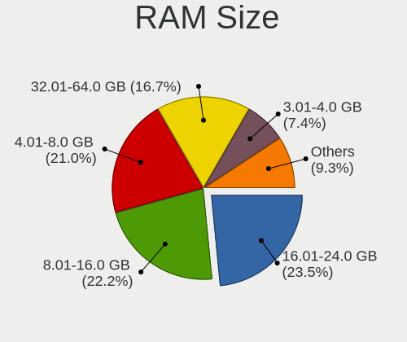

| Size in GB  | Computers | Percent |
|-------------|-----------|---------|
| 8.01-16.0   | 13        | 39.39%  |
| 16.01-24.0  | 6         | 18.18%  |
| 4.01-8.0    | 4         | 12.12%  |
| 32.01-64.0  | 4         | 12.12%  |
| 64.01-256.0 | 3         | 9.09%   |
| 3.01-4.0    | 1         | 3.03%   |
| 24.01-32.0  | 1         | 3.03%   |
| 2.01-3.0    | 1         | 3.03%   |

RAM Used
--------

Used RAM memory

| Used GB   | Computers | Percent |
|-----------|-----------|---------|
| 4.01-8.0  | 12        | 35.29%  |
| 2.01-3.0  | 9         | 26.47%  |
| 3.01-4.0  | 6         | 17.65%  |
| 1.01-2.0  | 6         | 17.65%  |
| 8.01-16.0 | 1         | 2.94%   |

Total Drives
------------

Number of drives on board

| Drives | Computers | Percent |
|--------|-----------|---------|
| 1      | 24        | 70.59%  |
| 2      | 6         | 17.65%  |
| 3      | 3         | 8.82%   |
| 4      | 1         | 2.94%   |

Has CD-ROM
----------

Has CD-ROM on board

| Presented | Computers | Percent |
|-----------|-----------|---------|
| No        | 26        | 78.79%  |
| Yes       | 7         | 21.21%  |

Has Ethernet
------------

Has Ethernet on board

| Presented | Computers | Percent |
|-----------|-----------|---------|
| Yes       | 28        | 82.35%  |
| No        | 6         | 17.65%  |

Has WiFi
--------

Has WiFi module

| Presented | Computers | Percent |
|-----------|-----------|---------|
| Yes       | 31        | 93.94%  |
| No        | 2         | 6.06%   |

Has Bluetooth
-------------

Has Bluetooth module

| Presented | Computers | Percent |
|-----------|-----------|---------|
| Yes       | 27        | 81.82%  |
| No        | 6         | 18.18%  |

Location
--------

Country
-------

Geographic location (country)

| Country      | Computers | Percent |
|--------------|-----------|---------|
| USA          | 5         | 15.15%  |
| Germany      | 5         | 15.15%  |
| Russia       | 2         | 6.06%   |
| Poland       | 2         | 6.06%   |
| Italy        | 2         | 6.06%   |
| Costa Rica   | 2         | 6.06%   |
| UK           | 1         | 3.03%   |
| Turkey       | 1         | 3.03%   |
| Sweden       | 1         | 3.03%   |
| Spain        | 1         | 3.03%   |
| Saudi Arabia | 1         | 3.03%   |
| Portugal     | 1         | 3.03%   |
| Lithuania    | 1         | 3.03%   |
| Israel       | 1         | 3.03%   |
| Hungary      | 1         | 3.03%   |
| France       | 1         | 3.03%   |
| Canada       | 1         | 3.03%   |
| Brazil       | 1         | 3.03%   |
| Belgium      | 1         | 3.03%   |
| Australia    | 1         | 3.03%   |
| Armenia      | 1         | 3.03%   |

City
----

Geographic location (city)

| City            | Computers | Percent |
|-----------------|-----------|---------|
| Rio Segundo     | 2         | 6.06%   |
| Yerevan         | 1         | 3.03%   |
| Warsaw          | 1         | 3.03%   |
| Vsevolozhsk     | 1         | 3.03%   |
| Vilnius         | 1         | 3.03%   |
| Sydney          | 1         | 3.03%   |
| Salt Lake City  | 1         | 3.03%   |
| Rzeszów        | 1         | 3.03%   |
| Roubaix         | 1         | 3.03%   |
| Porto Alegre    | 1         | 3.03%   |
| Pilisvoeroesvar | 1         | 3.03%   |
| Phoenix         | 1         | 3.03%   |
| Philadelphia    | 1         | 3.03%   |
| Munich          | 1         | 3.03%   |
| Moseley         | 1         | 3.03%   |
| Milan           | 1         | 3.03%   |
| Madrid          | 1         | 3.03%   |
| Lisbon          | 1         | 3.03%   |
| Krasnoyarsk     | 1         | 3.03%   |
| Jeddah          | 1         | 3.03%   |
| Istanbul        | 1         | 3.03%   |
| Holon           | 1         | 3.03%   |
| Hereford        | 1         | 3.03%   |
| Hamburg         | 1         | 3.03%   |
| Gothenburg      | 1         | 3.03%   |
| Fort Lauderdale | 1         | 3.03%   |
| Falkensee       | 1         | 3.03%   |
| Brussels        | 1         | 3.03%   |
| Bronte          | 1         | 3.03%   |
| Brantford       | 1         | 3.03%   |
| Berlin          | 1         | 3.03%   |
| Beckingen       | 1         | 3.03%   |

Drives
------

Drive Vendor
------------

Hard drive vendors

| Vendor              | Computers | Drives | Percent |
|---------------------|-----------|--------|---------|
| Samsung Electronics | 9         | 15     | 20.93%  |
| WDC                 | 6         | 6      | 13.95%  |
| SK hynix            | 4         | 4      | 9.3%    |
| Seagate             | 4         | 6      | 9.3%    |
| SanDisk             | 3         | 3      | 6.98%   |
| Toshiba             | 2         | 2      | 4.65%   |
| Phison Electronics  | 2         | 2      | 4.65%   |
| Micron Technology   | 2         | 2      | 4.65%   |
| Intel               | 2         | 2      | 4.65%   |
| Crucial             | 2         | 2      | 4.65%   |
| Unknown             | 1         | 1      | 2.33%   |
| UMIS                | 1         | 1      | 2.33%   |
| Patriot             | 1         | 1      | 2.33%   |
| Lexar               | 1         | 1      | 2.33%   |
| Kingston            | 1         | 1      | 2.33%   |
| Hoodisk             | 1         | 1      | 2.33%   |
| A-DATA Technology   | 1         | 1      | 2.33%   |

Drive Model
-----------

Hard drive models

| Model                                              | Computers | Percent |
|----------------------------------------------------|-----------|---------|
| Seagate ST4000DM004-2CV104 4TB                     | 2         | 4.35%   |
| Samsung NVMe SSD Controller PM9A1/PM9A3/980PRO 2TB | 2         | 4.35%   |
| WDC WDS200T2B0B-00YS70 2TB SSD                     | 1         | 2.17%   |
| WDC WDBNCE5000PNC 500GB SSD                        | 1         | 2.17%   |
| WDC WD5000AAKS-40V2B0 500GB                        | 1         | 2.17%   |
| WDC WD10SPZX-24Z10 1TB                             | 1         | 2.17%   |
| WDC WD10 JPVX-00JC3T0 1TB                          | 1         | 2.17%   |
| WDC PC SN530 SDBPNPZ-512G-1006 512GB               | 1         | 2.17%   |
| Unknown SD/MMC/MS PRO 249GB                        | 1         | 2.17%   |
| UMIS RPJTJ512MGE1QDQ 512GB                         | 1         | 2.17%   |
| Toshiba XG6 NVMe SSD Controller 1024GB             | 1         | 2.17%   |
| Toshiba KXG60ZNV512G 512GB                         | 1         | 2.17%   |
| SK hynix SKHynix_HFS001TDE9X084N 1024GB            | 1         | 2.17%   |
| SK hynix HFS256G32MND-2900A 256GB SSD              | 1         | 2.17%   |
| SK hynix HFM001TD3JX013N 1024GB                    | 1         | 2.17%   |
| SK hynix BC501 NVMe Solid State Drive 512GB        | 1         | 2.17%   |
| Seagate ST9500420AS 500GB                          | 1         | 2.17%   |
| Seagate ST3250823AS 250GB                          | 1         | 2.17%   |
| Seagate ST2000DM001-1ER164 2TB                     | 1         | 2.17%   |
| Seagate ST1000LM048-2E7172 1TB                     | 1         | 2.17%   |
| Sandisk WD Blue SN570 1TB                          | 1         | 2.17%   |
| SanDisk SSD PLUS 240GB                             | 1         | 2.17%   |
| SanDisk SD8SB8U-256G-1006 256GB SSD                | 1         | 2.17%   |
| Samsung SSD 970 EVO Plus 2TB                       | 1         | 2.17%   |
| Samsung SSD 870 QVO 1TB                            | 1         | 2.17%   |
| Samsung MZVLQ512HBLU-00B 512GB                     | 1         | 2.17%   |
| Samsung MZVLQ256HAJD-000H1 256GB                   | 1         | 2.17%   |
| Samsung MZVLQ1T0HBLB-00B 1TB                       | 1         | 2.17%   |
| Samsung MZVLQ1T0HALB-00000 1TB                     | 1         | 2.17%   |
| Samsung MZVLB1T0HBLR-00000 1TB                     | 1         | 2.17%   |
| Samsung MZAL4256HBJD-00BL2 256GB                   | 1         | 2.17%   |
| Phison ESR01TBMFCT-E8GBTOEM4 1024GB                | 1         | 2.17%   |
| Phison E16 PCIe4 NVMe Controller 500GB             | 1         | 2.17%   |
| Patriot Burst 480GB SSD                            | 1         | 2.17%   |
| Micron 2210_MTFDHBA512QFD 512GB                    | 1         | 2.17%   |
| Micron 1100 SATA 256GB SSD                         | 1         | 2.17%   |
| Lexar SSD NM760 1TB                                | 1         | 2.17%   |
| Kingston SA400S37960G 960GB SSD                    | 1         | 2.17%   |
| Intel SSDSA2CW300G3 304GB                          | 1         | 2.17%   |
| Intel SSD 660P Series 512GB                        | 1         | 2.17%   |

HDD Vendor
----------

Hard disk drive vendors

| Vendor  | Computers | Drives | Percent |
|---------|-----------|--------|---------|
| Seagate | 4         | 6      | 50%     |
| WDC     | 3         | 3      | 37.5%   |
| Unknown | 1         | 1      | 12.5%   |

SSD Vendor
----------

Solid state drive vendors

| Vendor              | Computers | Drives | Percent |
|---------------------|-----------|--------|---------|
| WDC                 | 2         | 2      | 15.38%  |
| SanDisk             | 2         | 2      | 15.38%  |
| Crucial             | 2         | 2      | 15.38%  |
| SK hynix            | 1         | 1      | 7.69%   |
| Samsung Electronics | 1         | 1      | 7.69%   |
| Patriot             | 1         | 1      | 7.69%   |
| Micron Technology   | 1         | 1      | 7.69%   |
| Kingston            | 1         | 1      | 7.69%   |
| Intel               | 1         | 1      | 7.69%   |
| Hoodisk             | 1         | 1      | 7.69%   |

Drive Kind
----------

HDD or SSD

| Kind | Computers | Drives | Percent |
|------|-----------|--------|---------|
| NVMe | 20        | 28     | 50%     |
| SSD  | 13        | 13     | 32.5%   |
| HDD  | 7         | 10     | 17.5%   |

Drive Connector
---------------

SATA, SAS, NVMe, etc.

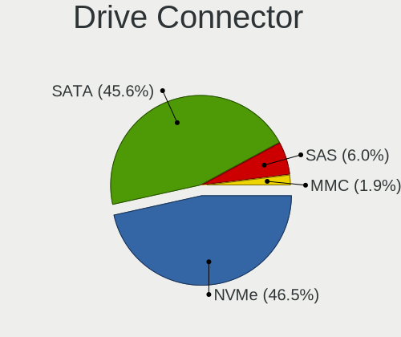

| Type | Computers | Drives | Percent |
|------|-----------|--------|---------|
| NVMe | 20        | 28     | 52.63%  |
| SATA | 16        | 21     | 42.11%  |
| SAS  | 2         | 2      | 5.26%   |

Drive Size
----------

Size of hard drive

| Size in TB | Computers | Drives | Percent |
|------------|-----------|--------|---------|
| 0.01-0.5   | 11        | 13     | 57.89%  |
| 0.51-1.0   | 4         | 6      | 21.05%  |
| 3.01-4.0   | 2         | 2      | 10.53%  |
| 1.01-2.0   | 2         | 2      | 10.53%  |

Space Total
-----------

Amount of disk space available on the file system

| Size in GB     | Computers | Percent |
|----------------|-----------|---------|
| 101-250        | 9         | 26.47%  |
| 501-1000       | 9         | 26.47%  |
| More than 3000 | 5         | 14.71%  |
| 251-500        | 5         | 14.71%  |
| 1001-2000      | 4         | 11.76%  |
| 2001-3000      | 1         | 2.94%   |
| 1-20           | 1         | 2.94%   |

Space Used
----------

Amount of used disk space

| Used GB        | Computers | Percent |
|----------------|-----------|---------|
| 21-50          | 9         | 26.47%  |
| 1-20           | 8         | 23.53%  |
| 101-250        | 4         | 11.76%  |
| More than 3000 | 3         | 8.82%   |
| 251-500        | 3         | 8.82%   |
| 1001-2000      | 3         | 8.82%   |
| 51-100         | 3         | 8.82%   |
| 501-1000       | 1         | 2.94%   |

Malfunc. Drives
---------------

Drive models with a malfunction

| Model                                 | Computers | Drives | Percent |
|---------------------------------------|-----------|--------|---------|
| SK hynix HFS256G32MND-2900A 256GB SSD | 1         | 1      | 100%    |

Malfunc. Drive Vendor
---------------------

Vendors of faulty drives

| Vendor   | Computers | Drives | Percent |
|----------|-----------|--------|---------|
| SK hynix | 1         | 1      | 100%    |

Malfunc. HDD Vendor
-------------------

Vendors of faulty HDD drives

Zero info for selected period =(

Malfunc. Drive Kind
-------------------

Kinds of faulty drives

| Kind | Computers | Drives | Percent |
|------|-----------|--------|---------|
| SSD  | 1         | 1      | 100%    |

Failed Drives
-------------

Failed drive models

Zero info for selected period =(

Failed Drive Vendor
-------------------

Failed drive vendors

Zero info for selected period =(

Drive Status
------------

Number of failed and malfunc. drives

| Status   | Computers | Drives | Percent |
|----------|-----------|--------|---------|
| Detected | 20        | 34     | 58.82%  |
| Works    | 13        | 16     | 38.24%  |
| Malfunc  | 1         | 1      | 2.94%   |

Storage controller
------------------

Storage Vendor
--------------

Storage controller vendors

| Vendor                       | Computers | Percent |
|------------------------------|-----------|---------|
| Intel                        | 14        | 33.33%  |
| Samsung Electronics          | 8         | 19.05%  |
| AMD                          | 6         | 14.29%  |
| SK hynix                     | 3         | 7.14%   |
| Toshiba America Info Systems | 2         | 4.76%   |
| SanDisk                      | 2         | 4.76%   |
| Phison Electronics           | 2         | 4.76%   |
| Union Memory (Shenzhen)      | 1         | 2.38%   |
| Shenzhen Longsys Electronics | 1         | 2.38%   |
| Nvidia                       | 1         | 2.38%   |
| Micron Technology            | 1         | 2.38%   |
| ADATA Technology             | 1         | 2.38%   |

Storage Model
-------------

Storage controller models

| Model                                                                         | Computers | Percent |
|-------------------------------------------------------------------------------|-----------|---------|
| Samsung NVMe SSD Controller 980                                               | 4         | 8.89%   |
| AMD FCH SATA Controller [AHCI mode]                                           | 3         | 6.67%   |
| Toshiba America Info Systems XG6 NVMe SSD Controller                          | 2         | 4.44%   |
| SK hynix Gold P31/PC711 NVMe Solid State Drive                                | 2         | 4.44%   |
| Samsung NVMe SSD Controller SM981/PM981/PM983                                 | 2         | 4.44%   |
| Samsung NVMe SSD Controller PM9A1/PM9A3/980PRO                                | 2         | 4.44%   |
| Intel Q170/Q150/B150/H170/H110/Z170/CM236 Chipset SATA Controller [AHCI Mode] | 2         | 4.44%   |
| Intel Cannon Lake Mobile PCH SATA AHCI Controller                             | 2         | 4.44%   |
| Intel 7 Series Chipset Family 6-port SATA Controller [AHCI mode]              | 2         | 4.44%   |
| Union Memory (Shenzhen) AM630 PCIe 4.0 x4 NVMe SSD Controller                 | 1         | 2.22%   |
| SK hynix BC501 NVMe Solid State Drive                                         | 1         | 2.22%   |
| Shenzhen Longsys Non-Volatile memory controller                               | 1         | 2.22%   |
| SanDisk WD Blue SN570 NVMe SSD 1TB                                            | 1         | 2.22%   |
| SanDisk WD Blue SN550 NVMe SSD                                                | 1         | 2.22%   |
| Samsung NVMe SSD Controller PM9B1                                             | 1         | 2.22%   |
| Phison E18 PCIe4 NVMe Controller                                              | 1         | 2.22%   |
| Phison E16 PCIe4 NVMe Controller                                              | 1         | 2.22%   |
| Nvidia MCP79 AHCI Controller                                                  | 1         | 2.22%   |
| Micron NVMe Storage Controller                                                | 1         | 2.22%   |
| Intel Sunrise Point-LP SATA Controller [AHCI mode]                            | 1         | 2.22%   |
| Intel SSD 660P Series                                                         | 1         | 2.22%   |
| Intel SATA Controller [RAID mode]                                             | 1         | 2.22%   |
| Intel Jasper Lake SATA AHCI Controller                                        | 1         | 2.22%   |
| Intel Alder Lake-P SATA AHCI Controller                                       | 1         | 2.22%   |
| Intel 6 Series/C200 Series Chipset Family 6 port Mobile SATA AHCI Controller  | 1         | 2.22%   |
| Intel 6 Series/C200 Series Chipset Family 6 port Desktop SATA AHCI Controller | 1         | 2.22%   |
| Intel 500 Series Chipset Family SATA AHCI Controller                          | 1         | 2.22%   |
| Intel 400 Series Chipset Family SATA AHCI Controller                          | 1         | 2.22%   |
| AMD SB7x0/SB8x0/SB9x0 SATA Controller [AHCI mode]                             | 1         | 2.22%   |
| AMD SB600 Non-Raid-5 SATA                                                     | 1         | 2.22%   |
| AMD SB600 IDE                                                                 | 1         | 2.22%   |
| AMD 500 Series Chipset SATA Controller                                        | 1         | 2.22%   |
| ADATA XPG SX8200 Pro PCIe Gen3x4 M.2 2280 Solid State Drive                   | 1         | 2.22%   |

Storage Kind
------------

Kind of storage controller (IDE, SATA, NVMe, SAS, ...)

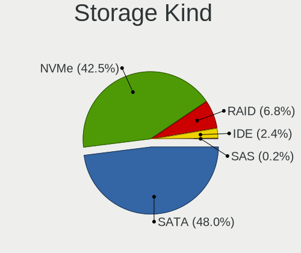

| Kind | Computers | Percent |
|------|-----------|---------|
| NVMe | 20        | 47.62%  |
| SATA | 20        | 47.62%  |
| RAID | 1         | 2.38%   |
| IDE  | 1         | 2.38%   |

Processor
---------

CPU Vendor
----------

Processor vendors

| Vendor | Computers | Percent |
|--------|-----------|---------|
| Intel  | 21        | 63.64%  |
| AMD    | 12        | 36.36%  |

CPU Model
---------

Processor models

| Model                                         | Computers | Percent |
|-----------------------------------------------|-----------|---------|
| Intel 12th Gen Core i7-1260P                  | 2         | 6.06%   |
| Intel Core i7-9750H CPU @ 2.60GHz             | 1         | 3.03%   |
| Intel Core i7-8750H CPU @ 2.20GHz             | 1         | 3.03%   |
| Intel Core i7-8700 CPU @ 3.20GHz              | 1         | 3.03%   |
| Intel Core i7-7820HQ CPU @ 2.90GHz            | 1         | 3.03%   |
| Intel Core i7-6700 CPU @ 3.40GHz              | 1         | 3.03%   |
| Intel Core i7-3537U CPU @ 2.00GHz             | 1         | 3.03%   |
| Intel Core i7-2640M CPU @ 2.80GHz             | 1         | 3.03%   |
| Intel Core i5-6200U CPU @ 2.30GHz             | 1         | 3.03%   |
| Intel Core i5-3340M CPU @ 2.70GHz             | 1         | 3.03%   |
| Intel Core i5-2500K CPU @ 3.30GHz             | 1         | 3.03%   |
| Intel Core i5-10300H CPU @ 2.50GHz            | 1         | 3.03%   |
| Intel Core 2 Duo CPU T7700 @ 2.40GHz          | 1         | 3.03%   |
| Intel Core 2 Duo CPU E7600 @ 3.06GHz          | 1         | 3.03%   |
| Intel Celeron N5105 @ 2.00GHz                 | 1         | 3.03%   |
| Intel 12th Gen Core i7-12800HX                | 1         | 3.03%   |
| Intel 11th Gen Core i7-11850H @ 2.50GHz       | 1         | 3.03%   |
| Intel 11th Gen Core i7-11800H @ 2.30GHz       | 1         | 3.03%   |
| Intel 11th Gen Core i7-1165G7 @ 2.80GHz       | 1         | 3.03%   |
| Intel 11th Gen Core i5-11400H @ 2.70GHz       | 1         | 3.03%   |
| AMD Ryzen 9 6900HX with Radeon Graphics       | 1         | 3.03%   |
| AMD Ryzen 9 5900HS with Radeon Graphics       | 1         | 3.03%   |
| AMD Ryzen 7 6800HS Creator Edition            | 1         | 3.03%   |
| AMD Ryzen 7 5825U with Radeon Graphics        | 1         | 3.03%   |
| AMD Ryzen 7 5800H with Radeon Graphics        | 1         | 3.03%   |
| AMD Ryzen 7 5700X 8-Core Processor            | 1         | 3.03%   |
| AMD Ryzen 7 4800H with Radeon Graphics        | 1         | 3.03%   |
| AMD Ryzen 7 4700U with Radeon Graphics        | 1         | 3.03%   |
| AMD Ryzen 5 5625U with Radeon Graphics        | 1         | 3.03%   |
| AMD Ryzen 5 5500U with Radeon Graphics        | 1         | 3.03%   |
| AMD Ryzen 5 3500U with Radeon Vega Mobile Gfx | 1         | 3.03%   |
| AMD FX-6300 Six-Core Processor                | 1         | 3.03%   |

CPU Model Family
----------------

Processor model prefix

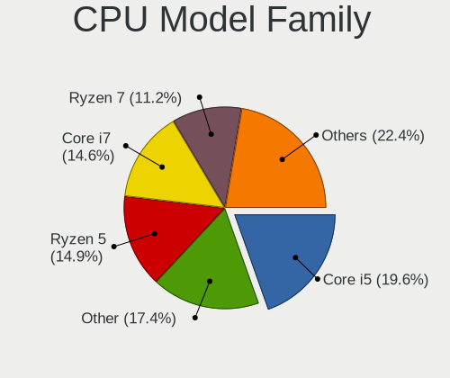

| Model            | Computers | Percent |
|------------------|-----------|---------|
| Other            | 7         | 21.21%  |
| Intel Core i7    | 7         | 21.21%  |
| AMD Ryzen 7      | 6         | 18.18%  |
| Intel Core i5    | 4         | 12.12%  |
| AMD Ryzen 5      | 3         | 9.09%   |
| Intel Core 2 Duo | 2         | 6.06%   |
| AMD Ryzen 9      | 2         | 6.06%   |
| Intel Celeron    | 1         | 3.03%   |
| AMD FX           | 1         | 3.03%   |

CPU Cores
---------

Number of processor cores

| Number | Computers | Percent |
|--------|-----------|---------|
| 8      | 10        | 30.3%   |
| 4      | 7         | 21.21%  |
| 6      | 6         | 18.18%  |
| 2      | 6         | 18.18%  |
| 12     | 2         | 6.06%   |
| 16     | 1         | 3.03%   |
| 3      | 1         | 3.03%   |

CPU Sockets
-----------

Number of sockets

| Number | Computers | Percent |
|--------|-----------|---------|
| 1      | 33        | 100%    |

CPU Threads
-----------

Threads per core (Hyper-Threading)

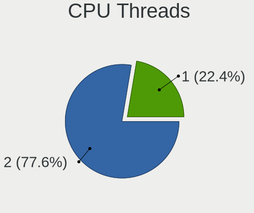

| Number | Computers | Percent |
|--------|-----------|---------|
| 2      | 26        | 78.79%  |
| 1      | 7         | 21.21%  |

CPU Op-Modes
------------

CPU Operation Modes (32-bit, 64-bit)

| Op mode        | Computers | Percent |
|----------------|-----------|---------|
| 32-bit, 64-bit | 33        | 100%    |

CPU Microcode
-------------

Microcode number

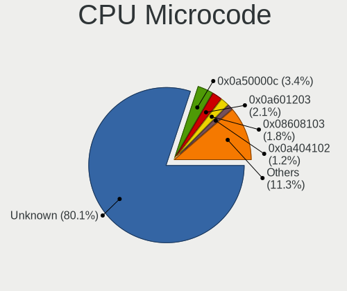

| Number     | Computers | Percent |
|------------|-----------|---------|
| Unknown    | 23        | 67.65%  |
| 0x0a50000c | 3         | 8.82%   |
| 0x08600104 | 2         | 5.88%   |
| 0x906a3    | 1         | 2.94%   |
| 0x90672    | 1         | 2.94%   |
| 0x0a404102 | 1         | 2.94%   |
| 0x0a404101 | 1         | 2.94%   |
| 0x0a20120a | 1         | 2.94%   |
| 0x08108109 | 1         | 2.94%   |

CPU Microarch
-------------

Microarchitecture

| Name             | Computers | Percent |
|------------------|-----------|---------|
| Unknown          | 7         | 21.21%  |
| Zen 3            | 5         | 15.15%  |
| KabyLake         | 4         | 12.12%  |
| Zen 2            | 2         | 6.06%   |
| Skylake          | 2         | 6.06%   |
| SandyBridge      | 2         | 6.06%   |
| IvyBridge        | 2         | 6.06%   |
| Alderlake Hybrid | 2         | 6.06%   |
| Zen+             | 1         | 3.03%   |
| Tremont          | 1         | 3.03%   |
| TigerLake        | 1         | 3.03%   |
| Piledriver       | 1         | 3.03%   |
| Penryn           | 1         | 3.03%   |
| Core             | 1         | 3.03%   |
| CometLake        | 1         | 3.03%   |

Graphics
--------

GPU Vendor
----------

Vendors of graphics cards

| Vendor | Computers | Percent |
|--------|-----------|---------|
| Intel  | 17        | 37.78%  |
| Nvidia | 14        | 31.11%  |
| AMD    | 14        | 31.11%  |

GPU Model
---------

Graphics card models

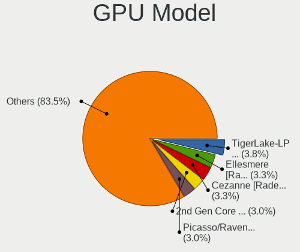

| Model                                                                     | Computers | Percent |
|---------------------------------------------------------------------------|-----------|---------|
| Intel TigerLake-H GT1 [UHD Graphics]                                      | 3         | 6.52%   |
| Nvidia GA104M [GeForce RTX 3070 Mobile / Max-Q]                           | 2         | 4.35%   |
| Intel CoffeeLake-H GT2 [UHD Graphics 630]                                 | 2         | 4.35%   |
| Intel Alder Lake-P Integrated Graphics Controller                         | 2         | 4.35%   |
| Intel 3rd Gen Core processor Graphics Controller                          | 2         | 4.35%   |
| Intel 2nd Generation Core Processor Family Integrated Graphics Controller | 2         | 4.35%   |
| AMD Renoir                                                                | 2         | 4.35%   |
| AMD Rembrandt [Radeon 680M]                                               | 2         | 4.35%   |
| AMD Cezanne [Radeon Vega Series / Radeon Vega Mobile Series]              | 2         | 4.35%   |
| AMD Barcelo                                                               | 2         | 4.35%   |
| Nvidia TU117M [GeForce GTX 1650 Ti Mobile]                                | 1         | 2.17%   |
| Nvidia TU117GLM [Quadro T1000 Mobile]                                     | 1         | 2.17%   |
| Nvidia TU106 [GeForce RTX 2070]                                           | 1         | 2.17%   |
| Nvidia MCP7A [GeForce 9400]                                               | 1         | 2.17%   |
| Nvidia GT218 [GeForce G210]                                               | 1         | 2.17%   |
| Nvidia GP107M [GeForce GTX 1050 Ti Mobile]                                | 1         | 2.17%   |
| Nvidia GP106 [GeForce GTX 1060 6GB]                                       | 1         | 2.17%   |
| Nvidia GM107GLM [Quadro M1200 Mobile]                                     | 1         | 2.17%   |
| Nvidia GA107M [GeForce RTX 3050 Ti Mobile]                                | 1         | 2.17%   |
| Nvidia GA107GLM [RTX A2000 Mobile]                                        | 1         | 2.17%   |
| Nvidia GA106M [GeForce RTX 3060 Mobile / Max-Q]                           | 1         | 2.17%   |
| Nvidia GA104 [Geforce RTX 3070 Ti Laptop GPU]                             | 1         | 2.17%   |
| Intel TigerLake-LP GT2 [Iris Xe Graphics]                                 | 1         | 2.17%   |
| Intel Skylake GT2 [HD Graphics 520]                                       | 1         | 2.17%   |
| Intel JasperLake [UHD Graphics]                                           | 1         | 2.17%   |
| Intel HD Graphics 630                                                     | 1         | 2.17%   |
| Intel CometLake-H GT2 [UHD Graphics]                                      | 1         | 2.17%   |
| Intel Alder Lake-HX GT1 [UHD Graphics 770]                                | 1         | 2.17%   |
| AMD Turks XT [Radeon HD 6670/7670]                                        | 1         | 2.17%   |
| AMD RC410M [Mobility Radeon Xpress 200M]                                  | 1         | 2.17%   |
| AMD Picasso/Raven 2 [Radeon Vega Series / Radeon Vega Mobile Series]      | 1         | 2.17%   |
| AMD Navi 22 [Radeon RX 6700/6700 XT/6750 XT / 6800M/6850M XT]             | 1         | 2.17%   |
| AMD Navi 14 [Radeon RX 5500/5500M / Pro 5500M]                            | 1         | 2.17%   |
| AMD Mars [Radeon HD 8730M]                                                | 1         | 2.17%   |
| AMD Lucienne                                                              | 1         | 2.17%   |

GPU Combo
---------

Combinations of graphics cards

| Name           | Computers | Percent |
|----------------|-----------|---------|
| 1 x AMD        | 10        | 30.3%   |
| Intel + Nvidia | 8         | 24.24%  |
| 1 x Intel      | 7         | 21.21%  |
| 1 x Nvidia     | 4         | 12.12%  |
| AMD + Nvidia   | 2         | 6.06%   |
| 2 x AMD        | 1         | 3.03%   |
| Intel + AMD    | 1         | 3.03%   |

GPU Driver
----------

Free vs proprietary

| Driver      | Computers | Percent |
|-------------|-----------|---------|
| Free        | 23        | 67.65%  |
| Proprietary | 11        | 32.35%  |

GPU Memory
----------

Total video memory

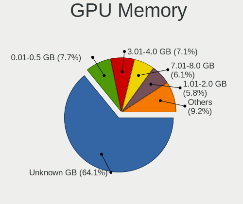

| Size in GB | Computers | Percent |
|------------|-----------|---------|
| Unknown    | 18        | 52.94%  |
| 3.01-4.0   | 4         | 11.76%  |
| 7.01-8.0   | 3         | 8.82%   |
| 1.01-2.0   | 3         | 8.82%   |
| 0.51-1.0   | 2         | 5.88%   |
| 0.01-0.5   | 2         | 5.88%   |
| 5.01-6.0   | 1         | 2.94%   |
| 8.01-16.0  | 1         | 2.94%   |

Monitor
-------

Monitor Vendor
--------------

Monitor vendors

| Vendor               | Computers | Percent |
|----------------------|-----------|---------|
| Samsung Electronics  | 9         | 24.32%  |
| BOE                  | 5         | 13.51%  |
| Chimei Innolux       | 4         | 10.81%  |
| AU Optronics         | 4         | 10.81%  |
| Sharp                | 2         | 5.41%   |
| Iiyama               | 2         | 5.41%   |
| Apple                | 2         | 5.41%   |
| PANDA                | 1         | 2.7%    |
| LG Display           | 1         | 2.7%    |
| Lenovo               | 1         | 2.7%    |
| InfoVision           | 1         | 2.7%    |
| Goldstar             | 1         | 2.7%    |
| Denver               | 1         | 2.7%    |
| Dell                 | 1         | 2.7%    |
| Ancor Communications | 1         | 2.7%    |
| Acer                 | 1         | 2.7%    |

Monitor Model
-------------

Monitor models

| Model                                                                 | Computers | Percent |
|-----------------------------------------------------------------------|-----------|---------|
| Samsung Electronics LCD Monitor SDC4159 1920x1080 344x194mm 15.5-inch | 2         | 5.26%   |
| Sharp LQ156M1JW03 SHP155D 1920x1080 344x194mm 15.5-inch               | 1         | 2.63%   |
| Sharp LCD Monitor SHP1453 1920x1080 346x194mm 15.6-inch               | 1         | 2.63%   |
| Samsung Electronics SyncMaster SAM04D3 1920x1080 531x298mm 24.0-inch  | 1         | 2.63%   |
| Samsung Electronics SMBX2250 SAM071B 1920x1080 477x268mm 21.5-inch    | 1         | 2.63%   |
| Samsung Electronics S24R35x SAM100E 1920x1080 527x296mm 23.8-inch     | 1         | 2.63%   |
| Samsung Electronics LF24T35 SAM707E 1920x1080 528x297mm 23.9-inch     | 1         | 2.63%   |
| Samsung Electronics LCD Monitor SEC5441 1366x768 344x194mm 15.5-inch  | 1         | 2.63%   |
| Samsung Electronics LCD Monitor SDC4179 2560x1440 344x194mm 15.5-inch | 1         | 2.63%   |
| Samsung Electronics LCD Monitor SDC415D 3840x2400 344x215mm 16.0-inch | 1         | 2.63%   |
| PANDA LCD Monitor NCP0063 1920x1080 344x194mm 15.5-inch               | 1         | 2.63%   |
| LG Display LCD Monitor LGD04B3 1920x1080 345x194mm 15.6-inch          | 1         | 2.63%   |
| Lenovo P24h-2L LEN62B2 2560x1440 527x296mm 23.8-inch                  | 1         | 2.63%   |
| InfoVision LCD Monitor IVO8584 1920x1080 294x165mm 13.3-inch          | 1         | 2.63%   |
| Iiyama PL3461WQ IVM7615 3440x1440 800x335mm 34.1-inch                 | 1         | 2.63%   |
| Iiyama PL2451 IVM610A 1920x1080 521x293mm 23.5-inch                   | 1         | 2.63%   |
| Goldstar TV SSCR2 GSM8080 3840x2160                                   | 1         | 2.63%   |
| Denver M24-FHD-165 LHC2400 1920x1080 527x296mm 23.8-inch              | 1         | 2.63%   |
| Dell AW2518HF DELA102 1920x1080 544x303mm 24.5-inch                   | 1         | 2.63%   |
| Chimei Innolux LCD Monitor CMN15B6 1366x768 344x193mm 15.5-inch       | 1         | 2.63%   |
| Chimei Innolux LCD Monitor CMN153E 1920x1080 344x193mm 15.5-inch      | 1         | 2.63%   |
| Chimei Innolux LCD Monitor CMN152A 2560x1440 344x193mm 15.5-inch      | 1         | 2.63%   |
| Chimei Innolux LCD Monitor CMN140A 1920x1080 309x173mm 13.9-inch      | 1         | 2.63%   |
| BOE LCD Monitor BOE0AC1 2560x1600 344x215mm 16.0-inch                 | 1         | 2.63%   |
| BOE LCD Monitor BOE0A40 2560x1600 344x215mm 16.0-inch                 | 1         | 2.63%   |
| BOE LCD Monitor BOE08D7 1920x1080 309x174mm 14.0-inch                 | 1         | 2.63%   |
| BOE LCD Monitor BOE0892 2160x1440 275x183mm 13.0-inch                 | 1         | 2.63%   |
| BOE LCD Monitor BOE0853 1920x1080 344x194mm 15.5-inch                 | 1         | 2.63%   |
| AU Optronics LCD Monitor AUOAF90 1920x1080 344x193mm 15.5-inch        | 1         | 2.63%   |
| AU Optronics LCD Monitor AUO978F 1920x1080 382x215mm 17.3-inch        | 1         | 2.63%   |
| AU Optronics LCD Monitor AUO8294 1920x1080 382x215mm 17.3-inch        | 1         | 2.63%   |
| AU Optronics LCD Monitor AUO139D 1920x1080 381x214mm 17.2-inch        | 1         | 2.63%   |
| Apple LCD Monitor APP9CC5 1280x800 286x179mm 13.3-inch                | 1         | 2.63%   |
| Apple Color LCD APP9CBC 1920x1080 475x267mm 21.5-inch                 | 1         | 2.63%   |
| Ancor Communications VE248 ACI2494 1920x1080 531x299mm 24.0-inch      | 1         | 2.63%   |
| Acer GF276 ACR0560 1920x1080 598x336mm 27.0-inch                      | 1         | 2.63%   |
| Acer ED320QR S ACR0805 1920x1080 609x348mm 27.6-inch                  | 1         | 2.63%   |

Monitor Resolution
------------------

Monitor screen resolution

| Resolution      | Computers | Percent |
|-----------------|-----------|---------|
| 1920x1080 (FHD) | 22        | 64.71%  |
| 2560x1440 (QHD) | 3         | 8.82%   |
| 2560x1600       | 2         | 5.88%   |
| 1366x768 (WXGA) | 2         | 5.88%   |
| 3840x2400       | 1         | 2.94%   |
| 3840x2160 (4K)  | 1         | 2.94%   |
| 3440x1440       | 1         | 2.94%   |
| 2160x1440       | 1         | 2.94%   |
| 1280x800 (WXGA) | 1         | 2.94%   |

Monitor Diagonal
----------------

Diagonal size in inches

| Inches | Computers | Percent |
|--------|-----------|---------|
| 15     | 13        | 35.14%  |
| 24     | 4         | 10.81%  |
| 13     | 4         | 10.81%  |
| 23     | 3         | 8.11%   |
| 17     | 3         | 8.11%   |
| 16     | 3         | 8.11%   |
| 21     | 2         | 5.41%   |
| 72     | 1         | 2.7%    |
| 34     | 1         | 2.7%    |
| 31     | 1         | 2.7%    |
| 27     | 1         | 2.7%    |
| 14     | 1         | 2.7%    |

Monitor Width
-------------

Physical width

| Width in mm | Computers | Percent |
|-------------|-----------|---------|
| 301-350     | 17        | 45.95%  |
| 501-600     | 8         | 21.62%  |
| 351-400     | 4         | 10.81%  |
| 201-300     | 3         | 8.11%   |
| 401-500     | 2         | 5.41%   |
| 701-800     | 1         | 2.7%    |
| 601-700     | 1         | 2.7%    |
| 1501-2000   | 1         | 2.7%    |

Aspect Ratio
------------

Proportional relationship between the width and the height

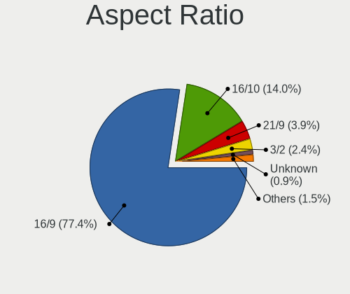

| Ratio | Computers | Percent |
|-------|-----------|---------|
| 16/9  | 26        | 81.25%  |
| 16/10 | 4         | 12.5%   |
| 3/2   | 1         | 3.13%   |
| 21/9  | 1         | 3.13%   |

Monitor Area
------------

Area in inch²

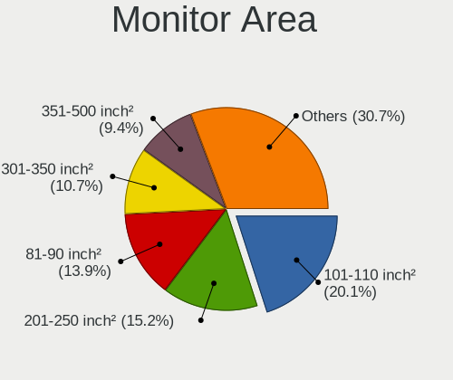

| Area in inch² | Computers | Percent |
|----------------|-----------|---------|
| 101-110        | 13        | 35.14%  |
| 201-250        | 8         | 21.62%  |
| 81-90          | 3         | 8.11%   |
| 121-130        | 3         | 8.11%   |
| 111-120        | 3         | 8.11%   |
| 71-80          | 2         | 5.41%   |
| 351-500        | 2         | 5.41%   |
| More than 1000 | 1         | 2.7%    |
| 301-350        | 1         | 2.7%    |
| 251-300        | 1         | 2.7%    |

Pixel Density
-------------

Pixels per inch

| Density       | Computers | Percent |
|---------------|-----------|---------|
| 121-160       | 14        | 40%     |
| 51-100        | 9         | 25.71%  |
| 161-240       | 6         | 17.14%  |
| 101-120       | 5         | 14.29%  |
| More than 240 | 1         | 2.86%   |

Multiple Monitors
-----------------

Total monitors connected

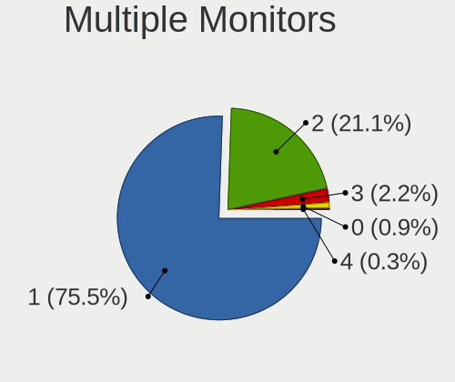

| Total | Computers | Percent |
|-------|-----------|---------|
| 1     | 28        | 84.85%  |
| 2     | 4         | 12.12%  |
| 3     | 1         | 3.03%   |

Network
-------

Net Controller Vendor
---------------------

Controller vendors

| Vendor                | Computers | Percent |
|-----------------------|-----------|---------|
| Realtek Semiconductor | 23        | 43.4%   |
| Intel                 | 16        | 30.19%  |
| MediaTek              | 4         | 7.55%   |
| Qualcomm Atheros      | 3         | 5.66%   |
| Broadcom              | 2         | 3.77%   |
| TP-Link               | 1         | 1.89%   |
| Samsung Electronics   | 1         | 1.89%   |
| Nvidia                | 1         | 1.89%   |
| Lenovo                | 1         | 1.89%   |
| ASUSTek Computer      | 1         | 1.89%   |

Net Controller Model
--------------------

Controller models

| Model                                                                   | Computers | Percent |
|-------------------------------------------------------------------------|-----------|---------|
| Realtek RTL8111/8168/8411 PCI Express Gigabit Ethernet Controller       | 12        | 19.35%  |
| Realtek RTL8153 Gigabit Ethernet Adapter                                | 4         | 6.45%   |
| Realtek RTL8852BE PCIe 802.11ax Wireless Network Controller             | 3         | 4.84%   |
| MediaTek MT7921 802.11ax PCI Express Wireless Network Adapter           | 3         | 4.84%   |
| Intel Wi-Fi 6 AX200                                                     | 3         | 4.84%   |
| Realtek RTL8822CE 802.11ac PCIe Wireless Network Adapter                | 2         | 3.23%   |
| Realtek RTL8125 2.5GbE Controller                                       | 2         | 3.23%   |
| Realtek RTL810xE PCI Express Fast Ethernet controller                   | 2         | 3.23%   |
| Intel Wi-Fi 6 AX210/AX211/AX411 160MHz                                  | 2         | 3.23%   |
| Intel Tiger Lake PCH CNVi WiFi                                          | 2         | 3.23%   |
| Intel Alder Lake-P PCH CNVi WiFi                                        | 2         | 3.23%   |
| TP-Link Archer T2U PLUS [RTL8821AU]                                     | 1         | 1.61%   |
| Samsung Galaxy series, misc. (tethering mode)                           | 1         | 1.61%   |
| Realtek RTL8852AE 802.11ax PCIe Wireless Network Adapter                | 1         | 1.61%   |
| Realtek RTL-8100/8101L/8139 PCI Fast Ethernet Adapter                   | 1         | 1.61%   |
| Realtek Killer E3000 2.5GbE Controller                                  | 1         | 1.61%   |
| Qualcomm Atheros Killer E220x Gigabit Ethernet Controller               | 1         | 1.61%   |
| Qualcomm Atheros AR928X Wireless Network Adapter (PCI-Express)          | 1         | 1.61%   |
| Qualcomm Atheros AR242x / AR542x Wireless Network Adapter (PCI-Express) | 1         | 1.61%   |
| Nvidia MCP79 Ethernet                                                   | 1         | 1.61%   |
| MediaTek MT7922 802.11ax PCI Express Wireless Network Adapter           | 1         | 1.61%   |
| Lenovo USB-C Dock Ethernet                                              | 1         | 1.61%   |
| Intel Wireless 7265                                                     | 1         | 1.61%   |
| Intel Wireless 7260                                                     | 1         | 1.61%   |
| Intel Wireless 3165                                                     | 1         | 1.61%   |
| Intel Ethernet Controller I225-V                                        | 1         | 1.61%   |
| Intel Ethernet Connection (7) I219-V                                    | 1         | 1.61%   |
| Intel Ethernet Connection (14) I219-V                                   | 1         | 1.61%   |
| Intel Centrino Wireless-N 2230                                          | 1         | 1.61%   |
| Intel Centrino Advanced-N 6205 [Taylor Peak]                            | 1         | 1.61%   |
| Intel Cannon Lake PCH CNVi WiFi                                         | 1         | 1.61%   |
| Intel Alder Lake-S PCH CNVi WiFi                                        | 1         | 1.61%   |
| Broadcom NetXtreme BCM57765 Gigabit Ethernet PCIe                       | 1         | 1.61%   |
| Broadcom NetXtreme BCM5761 Gigabit Ethernet PCIe                        | 1         | 1.61%   |
| Broadcom BCM4331 802.11a/b/g/n                                          | 1         | 1.61%   |
| ASUS USB-N13 802.11n Network Adapter (rev. A1) [Ralink RT3072]          | 1         | 1.61%   |

Wireless Vendor
---------------

Wireless vendors

| Vendor                | Computers | Percent |
|-----------------------|-----------|---------|
| Intel                 | 16        | 51.61%  |
| Realtek Semiconductor | 6         | 19.35%  |
| MediaTek              | 4         | 12.9%   |
| Qualcomm Atheros      | 2         | 6.45%   |
| TP-Link               | 1         | 3.23%   |
| Broadcom              | 1         | 3.23%   |
| ASUSTek Computer      | 1         | 3.23%   |

Wireless Model
--------------

Wireless models

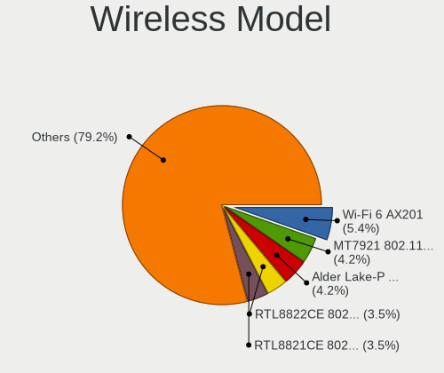

| Model                                                                   | Computers | Percent |
|-------------------------------------------------------------------------|-----------|---------|
| Realtek RTL8852BE PCIe 802.11ax Wireless Network Controller             | 3         | 9.68%   |
| MediaTek MT7921 802.11ax PCI Express Wireless Network Adapter           | 3         | 9.68%   |
| Intel Wi-Fi 6 AX200                                                     | 3         | 9.68%   |
| Realtek RTL8822CE 802.11ac PCIe Wireless Network Adapter                | 2         | 6.45%   |
| Intel Wi-Fi 6 AX210/AX211/AX411 160MHz                                  | 2         | 6.45%   |
| Intel Tiger Lake PCH CNVi WiFi                                          | 2         | 6.45%   |
| Intel Alder Lake-P PCH CNVi WiFi                                        | 2         | 6.45%   |
| TP-Link Archer T2U PLUS [RTL8821AU]                                     | 1         | 3.23%   |
| Realtek RTL8852AE 802.11ax PCIe Wireless Network Adapter                | 1         | 3.23%   |
| Qualcomm Atheros AR928X Wireless Network Adapter (PCI-Express)          | 1         | 3.23%   |
| Qualcomm Atheros AR242x / AR542x Wireless Network Adapter (PCI-Express) | 1         | 3.23%   |
| MediaTek MT7922 802.11ax PCI Express Wireless Network Adapter           | 1         | 3.23%   |
| Intel Wireless 7265                                                     | 1         | 3.23%   |
| Intel Wireless 7260                                                     | 1         | 3.23%   |
| Intel Wireless 3165                                                     | 1         | 3.23%   |
| Intel Centrino Wireless-N 2230                                          | 1         | 3.23%   |
| Intel Centrino Advanced-N 6205 [Taylor Peak]                            | 1         | 3.23%   |
| Intel Cannon Lake PCH CNVi WiFi                                         | 1         | 3.23%   |
| Intel Alder Lake-S PCH CNVi WiFi                                        | 1         | 3.23%   |
| Broadcom BCM4331 802.11a/b/g/n                                          | 1         | 3.23%   |
| ASUS USB-N13 802.11n Network Adapter (rev. A1) [Ralink RT3072]          | 1         | 3.23%   |

Ethernet Vendor
---------------

Ethernet vendors

| Vendor                | Computers | Percent |
|-----------------------|-----------|---------|
| Realtek Semiconductor | 21        | 70%     |
| Intel                 | 3         | 10%     |
| Broadcom              | 2         | 6.67%   |
| Samsung Electronics   | 1         | 3.33%   |
| Qualcomm Atheros      | 1         | 3.33%   |
| Nvidia                | 1         | 3.33%   |
| Lenovo                | 1         | 3.33%   |

Ethernet Model
--------------

Ethernet models

| Model                                                             | Computers | Percent |
|-------------------------------------------------------------------|-----------|---------|
| Realtek RTL8111/8168/8411 PCI Express Gigabit Ethernet Controller | 12        | 38.71%  |
| Realtek RTL8153 Gigabit Ethernet Adapter                          | 4         | 12.9%   |
| Realtek RTL8125 2.5GbE Controller                                 | 2         | 6.45%   |
| Realtek RTL810xE PCI Express Fast Ethernet controller             | 2         | 6.45%   |
| Samsung Galaxy series, misc. (tethering mode)                     | 1         | 3.23%   |
| Realtek RTL-8100/8101L/8139 PCI Fast Ethernet Adapter             | 1         | 3.23%   |
| Realtek Killer E3000 2.5GbE Controller                            | 1         | 3.23%   |
| Qualcomm Atheros Killer E220x Gigabit Ethernet Controller         | 1         | 3.23%   |
| Nvidia MCP79 Ethernet                                             | 1         | 3.23%   |
| Lenovo USB-C Dock Ethernet                                        | 1         | 3.23%   |
| Intel Ethernet Controller I225-V                                  | 1         | 3.23%   |
| Intel Ethernet Connection (7) I219-V                              | 1         | 3.23%   |
| Intel Ethernet Connection (14) I219-V                             | 1         | 3.23%   |
| Broadcom NetXtreme BCM57765 Gigabit Ethernet PCIe                 | 1         | 3.23%   |
| Broadcom NetXtreme BCM5761 Gigabit Ethernet PCIe                  | 1         | 3.23%   |

Net Controller Kind
-------------------

Ethernet, WiFi or modem

| Kind     | Computers | Percent |
|----------|-----------|---------|
| WiFi     | 31        | 53.45%  |
| Ethernet | 27        | 46.55%  |

Used Controller
---------------

Currently used network controller

| Kind     | Computers | Percent |
|----------|-----------|---------|
| WiFi     | 25        | 73.53%  |
| Ethernet | 9         | 26.47%  |

NICs
----

Total network controllers on board

| Total | Computers | Percent |
|-------|-----------|---------|
| 2     | 21        | 63.64%  |
| 1     | 12        | 36.36%  |

IPv6
----

IPv6 vs IPv4

| Used | Computers | Percent |
|------|-----------|---------|
| No   | 23        | 69.7%   |
| Yes  | 10        | 30.3%   |

Bluetooth
---------

Bluetooth Vendor
----------------

Controller vendors

| Vendor                  | Computers | Percent |
|-------------------------|-----------|---------|
| Intel                   | 14        | 51.85%  |
| Realtek Semiconductor   | 5         | 18.52%  |
| IMC Networks            | 2         | 7.41%   |
| Apple                   | 2         | 7.41%   |
| Realtek                 | 1         | 3.7%    |
| Lite-On Technology      | 1         | 3.7%    |
| Foxconn / Hon Hai       | 1         | 3.7%    |
| Cambridge Silicon Radio | 1         | 3.7%    |

Bluetooth Model
---------------

Controller models

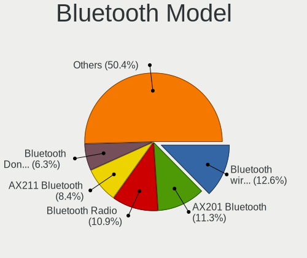

| Model                                               | Computers | Percent |
|-----------------------------------------------------|-----------|---------|
| Realtek Bluetooth Radio                             | 5         | 18.52%  |
| Intel Bluetooth Device                              | 3         | 11.11%  |
| Intel AX200 Bluetooth                               | 3         | 11.11%  |
| Intel Bluetooth wireless interface                  | 2         | 7.41%   |
| Intel AX210 Bluetooth                               | 2         | 7.41%   |
| Intel AX201 Bluetooth                               | 2         | 7.41%   |
| IMC Networks Wireless_Device                        | 2         | 7.41%   |
| Realtek 802.11ac WLAN Adapter                       | 1         | 3.7%    |
| Lite-On Wireless_Device                             | 1         | 3.7%    |
| Intel Centrino Bluetooth Wireless Transceiver       | 1         | 3.7%    |
| Intel Bluetooth 9460/9560 Jefferson Peak (JfP)      | 1         | 3.7%    |
| Foxconn / Hon Hai Wireless_Device                   | 1         | 3.7%    |
| Cambridge Silicon Radio Bluetooth Dongle (HCI mode) | 1         | 3.7%    |
| Apple Built-in Bluetooth 2.0+EDR HCI                | 1         | 3.7%    |
| Apple Bluetooth Host Controller                     | 1         | 3.7%    |

Sound
-----

Sound Vendor
------------

Sound card vendors

| Vendor          | Computers | Percent |
|-----------------|-----------|---------|
| Intel           | 19        | 38.78%  |
| AMD             | 14        | 28.57%  |
| Nvidia          | 13        | 26.53%  |
| M-Audio         | 1         | 2.04%   |
| Lenovo          | 1         | 2.04%   |
| Hewlett-Packard | 1         | 2.04%   |

Sound Model
-----------

Sound card models

| Model                                                                      | Computers | Percent |
|----------------------------------------------------------------------------|-----------|---------|
| AMD Family 17h/19h HD Audio Controller                                     | 10        | 16.95%  |
| AMD Renoir Radeon High Definition Audio Controller                         | 5         | 8.47%   |
| Nvidia GA104 High Definition Audio Controller                              | 3         | 5.08%   |
| Intel Tiger Lake-H HD Audio Controller                                     | 3         | 5.08%   |
| Intel Cannon Lake PCH cAVS                                                 | 3         | 5.08%   |
| Nvidia TU107 GeForce GTX 1650 High Definition Audio Controller             | 2         | 3.39%   |
| Nvidia Audio device                                                        | 2         | 3.39%   |
| Intel Alder Lake PCH-P High Definition Audio Controller                    | 2         | 3.39%   |
| Intel 7 Series/C216 Chipset Family High Definition Audio Controller        | 2         | 3.39%   |
| Intel 6 Series/C200 Series Chipset Family High Definition Audio Controller | 2         | 3.39%   |
| AMD SBx00 Azalia (Intel HDA)                                               | 2         | 3.39%   |
| AMD Rembrandt Radeon High Definition Audio Controller                      | 2         | 3.39%   |
| Nvidia TU106 High Definition Audio Controller                              | 1         | 1.69%   |
| Nvidia MCP79 High Definition Audio                                         | 1         | 1.69%   |
| Nvidia High Definition Audio Controller                                    | 1         | 1.69%   |
| Nvidia GP107GL High Definition Audio Controller                            | 1         | 1.69%   |
| Nvidia GP106 High Definition Audio Controller                              | 1         | 1.69%   |
| Nvidia GA106 High Definition Audio Controller                              | 1         | 1.69%   |
| M-Audio M-Track 2X2                                                        | 1         | 1.69%   |
| Lenovo ThinkPad USB-C Dock Gen2 USB Audio                                  | 1         | 1.69%   |
| Intel Tiger Lake-LP Smart Sound Technology Audio Controller                | 1         | 1.69%   |
| Intel Sunrise Point-LP HD Audio                                            | 1         | 1.69%   |
| Intel Jasper Lake HD Audio                                                 | 1         | 1.69%   |
| Intel Comet Lake PCH cAVS                                                  | 1         | 1.69%   |
| Intel CM238 HD Audio Controller                                            | 1         | 1.69%   |
| Intel Alder Lake-S HD Audio Controller                                     | 1         | 1.69%   |
| Intel 100 Series/C230 Series Chipset Family HD Audio Controller            | 1         | 1.69%   |
| Hewlett-Packard HyperX Cloud Alpha Wireless                                | 1         | 1.69%   |
| AMD Turks HDMI Audio [Radeon HD 6500/6600 / 6700M Series]                  | 1         | 1.69%   |
| AMD Starship/Matisse HD Audio Controller                                   | 1         | 1.69%   |
| AMD Raven/Raven2/Fenghuang HDMI/DP Audio Controller                        | 1         | 1.69%   |
| AMD Navi 21/23 HDMI/DP Audio Controller                                    | 1         | 1.69%   |
| AMD Navi 10 HDMI Audio                                                     | 1         | 1.69%   |

Memory
------

Memory Vendor
-------------

Memory module vendors

| Vendor              | Computers | Percent |
|---------------------|-----------|---------|
| Samsung Electronics | 7         | 36.84%  |
| SK hynix            | 5         | 26.32%  |
| Micron Technology   | 3         | 15.79%  |
| Kingston            | 2         | 10.53%  |
| Crucial             | 1         | 5.26%   |
| Corsair             | 1         | 5.26%   |

Memory Model
------------

Memory module models

| Model                                                            | Computers | Percent |
|------------------------------------------------------------------|-----------|---------|
| SK hynix RAM HMAA1GS6CJR6N-XN 8GB SODIMM DDR4 3200MT/s           | 2         | 9.52%   |
| SK hynix RAM HMT351S6EFR8A-PB 4GB SODIMM DDR3 1600MT/s           | 1         | 4.76%   |
| SK hynix RAM HMAA1GS6CMR6N-VK 8GB SODIMM DDR4 2667MT/s           | 1         | 4.76%   |
| SK hynix RAM HMAA1GS6CJR6N-XN 8GB Row Of Chips DDR4 3200MT/s     | 1         | 4.76%   |
| SK hynix RAM H9JCNNNFA5MLYR-N6E 8GB SODIMM LPDDR5 6400MT/s       | 1         | 4.76%   |
| Samsung RAM UBE3D4AA-MGCR 2GB Row Of Chips LPDDR4 4267MT/s       | 1         | 4.76%   |
| Samsung RAM M471A2K43BB1-CRC 16GB SODIMM DDR4 2400MT/s           | 1         | 4.76%   |
| Samsung RAM M471A1K43DB1-CWE 8GB SODIMM DDR4 3200MT/s            | 1         | 4.76%   |
| Samsung RAM M471A1G44BB0-CWE 8GB SODIMM DDR4 3200MT/s            | 1         | 4.76%   |
| Samsung RAM M471A1G44AB0-CWE 8GB SODIMM DDR4 3200MT/s            | 1         | 4.76%   |
| Samsung RAM M425R1GB4BB0-CQKOL 8GB SODIMM DDR5 4800MT/s          | 1         | 4.76%   |
| Samsung RAM 53D512M64D4RQ-046 8GB Row Of Chips LPDDR4 3733MT/s   | 1         | 4.76%   |
| Micron RAM MT62F1G32D4DR-031 WT 4GB Row Of Chips LPDDR5 6400MT/s | 1         | 4.76%   |
| Micron RAM MT40A1G16RC-062E:B 8GB Row Of Chips DDR4 3200MT/s     | 1         | 4.76%   |
| Micron RAM 4ATF1G64HZ-3G2E2 8GB SODIMM DDR4 3200MT/s             | 1         | 4.76%   |
| Kingston RAM KF3600C16D4/16GX 16GB DIMM DDR4 3600MT/s            | 1         | 4.76%   |
| Kingston RAM 9905703-002.A00G 16GB SODIMM DDR4 2400MT/s          | 1         | 4.76%   |
| Crucial RAM CT32G4SFD832A.M16FF 32GB SODIMM DDR4 3200MT/s        | 1         | 4.76%   |
| Corsair RAM Module 8GB SODIMM DDR3 1333MT/s                      | 1         | 4.76%   |
| Corsair RAM Module 4GB SODIMM DDR3 1333MT/s                      | 1         | 4.76%   |

Memory Kind
-----------

Memory module kinds

| Kind   | Computers | Percent |
|--------|-----------|---------|
| DDR4   | 9         | 56.25%  |
| LPDDR5 | 2         | 12.5%   |
| LPDDR4 | 2         | 12.5%   |
| DDR3   | 2         | 12.5%   |
| DDR5   | 1         | 6.25%   |

Memory Form Factor
------------------

Physical design of the memory module

| Name         | Computers | Percent |
|--------------|-----------|---------|
| SODIMM       | 11        | 64.71%  |
| Row Of Chips | 5         | 29.41%  |
| DIMM         | 1         | 5.88%   |

Memory Size
-----------

Memory module size

| Size  | Computers | Percent |
|-------|-----------|---------|
| 8192  | 11        | 64.71%  |
| 4096  | 3         | 17.65%  |
| 16384 | 2         | 11.76%  |
| 32768 | 1         | 5.88%   |

Memory Speed
------------

Memory module speed

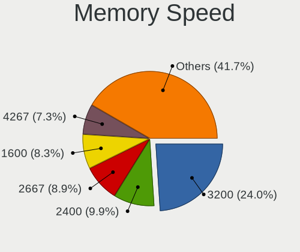

| Speed | Computers | Percent |
|-------|-----------|---------|
| 3200  | 6         | 37.5%   |
| 6400  | 2         | 12.5%   |
| 4800  | 1         | 6.25%   |
| 4267  | 1         | 6.25%   |
| 3733  | 1         | 6.25%   |
| 3600  | 1         | 6.25%   |
| 2667  | 1         | 6.25%   |
| 2400  | 1         | 6.25%   |
| 1600  | 1         | 6.25%   |
| 1333  | 1         | 6.25%   |

Printers & scanners
-------------------

Printer Vendor
--------------

Printer device vendors

Zero info for selected period =(

Printer Model
-------------

Printer device models

Zero info for selected period =(

Scanner Vendor
--------------

Scanner device vendors

Zero info for selected period =(

Scanner Model
-------------

Scanner device models

Zero info for selected period =(

Camera
------

Camera Vendor
-------------

Camera device vendors

| Vendor                           | Computers | Percent |
|----------------------------------|-----------|---------|
| Quanta                           | 3         | 15.79%  |
| Realtek Semiconductor            | 2         | 10.53%  |
| Microdia                         | 2         | 10.53%  |
| Chicony Electronics              | 2         | 10.53%  |
| Bison Electronics                | 2         | 10.53%  |
| Apple                            | 2         | 10.53%  |
| Syntek                           | 1         | 5.26%   |
| SunplusIT                        | 1         | 5.26%   |
| Shenzhen Kingcome Optoelectronic | 1         | 5.26%   |
| Luxvisions Innotech Limited      | 1         | 5.26%   |
| IMC Networks                     | 1         | 5.26%   |
| Acer                             | 1         | 5.26%   |

Camera Model
------------

Camera device models

| Model                                           | Computers | Percent |
|-------------------------------------------------|-----------|---------|
| Syntek Integrated Camera                        | 1         | 5.26%   |
| SunplusIT 1080p FHD Camera                      | 1         | 5.26%   |
| Shenzhen Kingcome Optoelectronic 720p HD Camera | 1         | 5.26%   |
| Realtek Integrated Webcam                       | 1         | 5.26%   |
| Realtek HP Truevision HD                        | 1         | 5.26%   |
| Quanta USB2.0 HD UVC WebCam                     | 1         | 5.26%   |
| Quanta HP HD Camera                             | 1         | 5.26%   |
| Quanta HD User Facing                           | 1         | 5.26%   |
| Microdia Integrated_Webcam_HD                   | 1         | 5.26%   |
| Microdia Dell Laptop Integrated Webcam HD       | 1         | 5.26%   |
| Luxvisions Innotech Limited Integrated Camera   | 1         | 5.26%   |
| IMC Networks USB2.0 HD UVC WebCam               | 1         | 5.26%   |
| Chicony USB2.0 Camera                           | 1         | 5.26%   |
| Chicony Integrated Camera                       | 1         | 5.26%   |
| Bison Integrated RGB Camera                     | 1         | 5.26%   |
| Bison HD Webcam                                 | 1         | 5.26%   |
| Apple FaceTime HD Camera                        | 1         | 5.26%   |
| Apple Built-in iSight                           | 1         | 5.26%   |
| Acer Integrated Camera                          | 1         | 5.26%   |

Security
--------

Fingerprint Vendor
------------------

Fingerprint sensor vendors

| Vendor                             | Computers | Percent |
|------------------------------------|-----------|---------|
| Synaptics                          | 3         | 60%     |
| Shenzhen Goodix Technology         | 1         | 20%     |
| Realtek USB2.0 Finger Print Bridge | 1         | 20%     |

Fingerprint Model
-----------------

Fingerprint sensor models

| Model                                                           | Computers | Percent |
|-----------------------------------------------------------------|-----------|---------|
| Synaptics UWP WBDI                                              | 1         | 20%     |
| Synaptics Prometheus MIS Touch Fingerprint Reader               | 1         | 20%     |
| Synaptics FS7604 Touch Fingerprint Sensor with PurePrint        | 1         | 20%     |
| Shenzhen Goodix Fingerprint Reader                              | 1         | 20%     |
| Realtek USB2.0 Finger Print Bridge FocalTech Fingerprint Device | 1         | 20%     |

Chipcard Vendor
---------------

Chipcard module vendors

| Vendor      | Computers | Percent |
|-------------|-----------|---------|
| O2 Micro    | 1         | 50%     |
| Alcor Micro | 1         | 50%     |

Chipcard Model
--------------

Chipcard module models

| Model                                | Computers | Percent |
|--------------------------------------|-----------|---------|
| O2 Micro OZ776 CCID Smartcard Reader | 1         | 50%     |
| Alcor Micro AU9540 Smartcard Reader  | 1         | 50%     |

Unsupported
-----------

Unsupported Devices
-------------------

Total unsupported devices on board

| Total | Computers | Percent |
|-------|-----------|---------|
| 0     | 21        | 63.64%  |
| 1     | 10        | 30.3%   |
| 2     | 2         | 6.06%   |

Unsupported Device Types
------------------------

Types of unsupported devices

| Type                  | Computers | Percent |
|-----------------------|-----------|---------|
| Fingerprint reader    | 5         | 38.46%  |
| Net/wireless          | 2         | 15.38%  |
| Chipcard              | 2         | 15.38%  |
| Camera                | 2         | 15.38%  |
| Multimedia controller | 1         | 7.69%   |
| Card reader           | 1         | 7.69%   |

