Kubuntu 23.04 - Tested Hardware & Statistics
--------------------------------------------

A project to collect tested hardware configurations for Kubuntu 23.04.

Anyone can contribute to this report by the [hw-probe](https://github.com/linuxhw/hw-probe) tool:

    sudo -E hw-probe -all -upload

Please contribute! Especially if your hardware is rare.

This is a report for all computer types. See also reports for [desktops](/Dist/Kubuntu_23.04/Desktop/README.md) and [notebooks](/Dist/Kubuntu_23.04/Notebook/README.md).

Contents
--------

* [ Test Cases ](#test-cases)

* [ System ](#system)
  - [ Kernel                   ](#kernel)
  - [ Kernel Family            ](#kernel-family)
  - [ Kernel Major Ver.        ](#kernel-major-ver)
  - [ Arch                     ](#arch)
  - [ DE                       ](#de)
  - [ Display Server           ](#display-server)
  - [ Display Manager          ](#display-manager)
  - [ OS Lang                  ](#os-lang)
  - [ Boot Mode                ](#boot-mode)
  - [ Filesystem               ](#filesystem)
  - [ Part. scheme             ](#part-scheme)
  - [ Dual Boot with Linux/BSD ](#dual-boot-with-linuxbsd)
  - [ Dual Boot (Win)          ](#dual-boot-win)

* [ Board ](#board)
  - [ Vendor                   ](#vendor)
  - [ Model                    ](#model)
  - [ Model Family             ](#model-family)
  - [ MFG Year                 ](#mfg-year)
  - [ Form Factor              ](#form-factor)
  - [ Secure Boot              ](#secure-boot)
  - [ Coreboot                 ](#coreboot)
  - [ RAM Size                 ](#ram-size)
  - [ RAM Used                 ](#ram-used)
  - [ Total Drives             ](#total-drives)
  - [ Has CD-ROM               ](#has-cd-rom)
  - [ Has Ethernet             ](#has-ethernet)
  - [ Has WiFi                 ](#has-wifi)
  - [ Has Bluetooth            ](#has-bluetooth)

* [ Location ](#location)
  - [ Country                  ](#country)
  - [ City                     ](#city)

* [ Drives ](#drives)
  - [ Drive Vendor             ](#drive-vendor)
  - [ Drive Model              ](#drive-model)
  - [ HDD Vendor               ](#hdd-vendor)
  - [ SSD Vendor               ](#ssd-vendor)
  - [ Drive Kind               ](#drive-kind)
  - [ Drive Connector          ](#drive-connector)
  - [ Drive Size               ](#drive-size)
  - [ Space Total              ](#space-total)
  - [ Space Used               ](#space-used)
  - [ Malfunc. Drives          ](#malfunc-drives)
  - [ Malfunc. Drive Vendor    ](#malfunc-drive-vendor)
  - [ Malfunc. HDD Vendor      ](#malfunc-hdd-vendor)
  - [ Malfunc. Drive Kind      ](#malfunc-drive-kind)
  - [ Failed Drives            ](#failed-drives)
  - [ Failed Drive Vendor      ](#failed-drive-vendor)
  - [ Drive Status             ](#drive-status)

* [ Storage controller ](#storage-controller)
  - [ Storage Vendor           ](#storage-vendor)
  - [ Storage Model            ](#storage-model)
  - [ Storage Kind             ](#storage-kind)

* [ Processor ](#processor)
  - [ CPU Vendor               ](#cpu-vendor)
  - [ CPU Model                ](#cpu-model)
  - [ CPU Model Family         ](#cpu-model-family)
  - [ CPU Cores                ](#cpu-cores)
  - [ CPU Sockets              ](#cpu-sockets)
  - [ CPU Threads              ](#cpu-threads)
  - [ CPU Op-Modes             ](#cpu-op-modes)
  - [ CPU Microcode            ](#cpu-microcode)
  - [ CPU Microarch            ](#cpu-microarch)

* [ Graphics ](#graphics)
  - [ GPU Vendor               ](#gpu-vendor)
  - [ GPU Model                ](#gpu-model)
  - [ GPU Combo                ](#gpu-combo)
  - [ GPU Driver               ](#gpu-driver)
  - [ GPU Memory               ](#gpu-memory)

* [ Monitor ](#monitor)
  - [ Monitor Vendor           ](#monitor-vendor)
  - [ Monitor Model            ](#monitor-model)
  - [ Monitor Resolution       ](#monitor-resolution)
  - [ Monitor Diagonal         ](#monitor-diagonal)
  - [ Monitor Width            ](#monitor-width)
  - [ Aspect Ratio             ](#aspect-ratio)
  - [ Monitor Area             ](#monitor-area)
  - [ Pixel Density            ](#pixel-density)
  - [ Multiple Monitors        ](#multiple-monitors)

* [ Network ](#network)
  - [ Net Controller Vendor    ](#net-controller-vendor)
  - [ Net Controller Model     ](#net-controller-model)
  - [ Wireless Vendor          ](#wireless-vendor)
  - [ Wireless Model           ](#wireless-model)
  - [ Ethernet Vendor          ](#ethernet-vendor)
  - [ Ethernet Model           ](#ethernet-model)
  - [ Net Controller Kind      ](#net-controller-kind)
  - [ Used Controller          ](#used-controller)
  - [ NICs                     ](#nics)
  - [ IPv6                     ](#ipv6)

* [ Bluetooth ](#bluetooth)
  - [ Bluetooth Vendor         ](#bluetooth-vendor)
  - [ Bluetooth Model          ](#bluetooth-model)

* [ Sound ](#sound)
  - [ Sound Vendor             ](#sound-vendor)
  - [ Sound Model              ](#sound-model)

* [ Memory ](#memory)
  - [ Memory Vendor            ](#memory-vendor)
  - [ Memory Model             ](#memory-model)
  - [ Memory Kind              ](#memory-kind)
  - [ Memory Form Factor       ](#memory-form-factor)
  - [ Memory Size              ](#memory-size)
  - [ Memory Speed             ](#memory-speed)

* [ Printers & scanners ](#printers--scanners)
  - [ Printer Vendor           ](#printer-vendor)
  - [ Printer Model            ](#printer-model)
  - [ Scanner Vendor           ](#scanner-vendor)
  - [ Scanner Model            ](#scanner-model)

* [ Camera ](#camera)
  - [ Camera Vendor            ](#camera-vendor)
  - [ Camera Model             ](#camera-model)

* [ Security ](#security)
  - [ Fingerprint Vendor       ](#fingerprint-vendor)
  - [ Fingerprint Model        ](#fingerprint-model)
  - [ Chipcard Vendor          ](#chipcard-vendor)
  - [ Chipcard Model           ](#chipcard-model)

* [ Unsupported ](#unsupported)
  - [ Unsupported Devices      ](#unsupported-devices)
  - [ Unsupported Device Types ](#unsupported-device-types)

Test Cases
----------

Total: 250

| Vendor        | Model                       | Form-Factor | Probe                                                      | Date         |
|---------------|-----------------------------|-------------|------------------------------------------------------------|--------------|
| Apple         | Mac-F2268DAE                | All in one  | [97c78c17bd](https://linux-hardware.org/?probe=97c78c17bd) | Aug 12, 2023 |
| AZW           | SER V01                     | Mini pc     | [542d8da36c](https://linux-hardware.org/?probe=542d8da36c) | Aug 11, 2023 |
| Dell          | 0HY9JP A00                  | Desktop     | [f28a198267](https://linux-hardware.org/?probe=f28a198267) | Aug 10, 2023 |
| HP            | EliteBook 840 G6            | Notebook    | [767792bf33](https://linux-hardware.org/?probe=767792bf33) | Aug 09, 2023 |
| HUAWEI        | BOM-WXX9                    | Notebook    | [d255d00dc8](https://linux-hardware.org/?probe=d255d00dc8) | Aug 09, 2023 |
| ASUSTek       | ROG Strix G713IH_G713IH     | Notebook    | [352fd5fea3](https://linux-hardware.org/?probe=352fd5fea3) | Aug 09, 2023 |
| ASUSTek       | ROG Strix G713IH_G713IH     | Notebook    | [76bbb6695d](https://linux-hardware.org/?probe=76bbb6695d) | Aug 09, 2023 |
| Google        | Dragonair                   | Notebook    | [45d7954a65](https://linux-hardware.org/?probe=45d7954a65) | Aug 08, 2023 |
| Google        | Dragonair                   | Notebook    | [d78af70cf3](https://linux-hardware.org/?probe=d78af70cf3) | Aug 08, 2023 |
| Acer          | Nitro AN515-55              | Notebook    | [1d117f6031](https://linux-hardware.org/?probe=1d117f6031) | Aug 07, 2023 |
| Lenovo        | ThinkPad W510 4391EC4       | Notebook    | [5e9baa223d](https://linux-hardware.org/?probe=5e9baa223d) | Aug 07, 2023 |
| GPU Compan... | GWTN141-10                  | Notebook    | [e03fdd9f60](https://linux-hardware.org/?probe=e03fdd9f60) | Aug 07, 2023 |
| HP            | Laptop 14s-dq2xxx           | Notebook    | [6d2ab6eef6](https://linux-hardware.org/?probe=6d2ab6eef6) | Aug 07, 2023 |
| TECNO         | MEGABOOK T1                 | Notebook    | [ced0647d42](https://linux-hardware.org/?probe=ced0647d42) | Aug 06, 2023 |
| Lenovo        | Yoga Slim 7 Pro 16ACH6 8... | Notebook    | [8c56195933](https://linux-hardware.org/?probe=8c56195933) | Aug 05, 2023 |
| GPD           | G1621-02                    | Notebook    | [7e37b7bbee](https://linux-hardware.org/?probe=7e37b7bbee) | Aug 04, 2023 |
| ASUSTek       | PRIME Z270-K                | Desktop     | [838f543301](https://linux-hardware.org/?probe=838f543301) | Aug 04, 2023 |
| ASUSTek       | PRIME Z270-K                | Desktop     | [1b9b10c938](https://linux-hardware.org/?probe=1b9b10c938) | Aug 04, 2023 |
| ASUSTek       | ROG Strix G713PV_G713PV     | Notebook    | [848ed7bc51](https://linux-hardware.org/?probe=848ed7bc51) | Aug 04, 2023 |
| Dell          | Precision 7670              | Notebook    | [09797bd60c](https://linux-hardware.org/?probe=09797bd60c) | Aug 04, 2023 |
| HP            | 158A                        | Desktop     | [ae8ecc3ee7](https://linux-hardware.org/?probe=ae8ecc3ee7) | Aug 04, 2023 |
| Dell          | Latitude E6420              | Notebook    | [178bed5f56](https://linux-hardware.org/?probe=178bed5f56) | Aug 03, 2023 |
| Acer          | Aspire 5736Z                | Notebook    | [de1addc70b](https://linux-hardware.org/?probe=de1addc70b) | Aug 03, 2023 |
| HPE           | ML10Gen9                    | Server      | [f5115c8a74](https://linux-hardware.org/?probe=f5115c8a74) | Aug 03, 2023 |
| AZW           | SER V01                     | Mini pc     | [5e552472e5](https://linux-hardware.org/?probe=5e552472e5) | Aug 03, 2023 |
| Intel         | NUC12WSBi7 M46422-303       | Mini pc     | [4d21c35777](https://linux-hardware.org/?probe=4d21c35777) | Aug 03, 2023 |
| Alienware     | 14                          | Notebook    | [90512d5e80](https://linux-hardware.org/?probe=90512d5e80) | Aug 02, 2023 |
| HP            | ProBook 440 G5              | Notebook    | [c0de5c7032](https://linux-hardware.org/?probe=c0de5c7032) | Aug 02, 2023 |
| HP            | 158A                        | Desktop     | [bac95226bd](https://linux-hardware.org/?probe=bac95226bd) | Aug 02, 2023 |
| Lenovo        | ThinkPad X1 Yoga 3rd 20L... | Convertible | [25dd387c2c](https://linux-hardware.org/?probe=25dd387c2c) | Aug 01, 2023 |
| Lenovo        | ThinkPad X1 Yoga 3rd 20L... | Convertible | [7f5c70c059](https://linux-hardware.org/?probe=7f5c70c059) | Aug 01, 2023 |
| ASUSTek       | ROG STRIX B450-F GAMING ... | Desktop     | [6519784d61](https://linux-hardware.org/?probe=6519784d61) | Aug 01, 2023 |
| Lenovo        | IdeaPad S145-15API 81V7     | Notebook    | [9371aa866b](https://linux-hardware.org/?probe=9371aa866b) | Jul 30, 2023 |
| Google        | Zako                        | Desktop     | [66946b6b49](https://linux-hardware.org/?probe=66946b6b49) | Jul 30, 2023 |
| ASUSTek       | ASUS BR1100FKA BR1100FKA... | Convertible | [65a741810c](https://linux-hardware.org/?probe=65a741810c) | Jul 30, 2023 |
| ASUSTek       | ASUS BR1100FKA BR1100FKA... | Convertible | [e5ad011556](https://linux-hardware.org/?probe=e5ad011556) | Jul 30, 2023 |
| ASUSTek       | PRIME B450M-A II            | Desktop     | [22b080cd6b](https://linux-hardware.org/?probe=22b080cd6b) | Jul 29, 2023 |
| ASUSTek       | PRIME Z390-A                | Desktop     | [8102a251ad](https://linux-hardware.org/?probe=8102a251ad) | Jul 29, 2023 |
| Lenovo        | IdeaPad 5 Pro 14ACN6 82L... | Notebook    | [6e4e0bebde](https://linux-hardware.org/?probe=6e4e0bebde) | Jul 28, 2023 |
| Lenovo        | IdeaPad 5 Pro 14ACN6 82L... | Notebook    | [63c601695f](https://linux-hardware.org/?probe=63c601695f) | Jul 28, 2023 |
| Acer          | Aspire 5560                 | Notebook    | [86868232f0](https://linux-hardware.org/?probe=86868232f0) | Jul 27, 2023 |
| ASUSTek       | ROG STRIX B550-F GAMING     | Desktop     | [4a34b9da9b](https://linux-hardware.org/?probe=4a34b9da9b) | Jul 27, 2023 |
| ASUSTek       | ROG STRIX B550-F GAMING     | Desktop     | [a26bbadd26](https://linux-hardware.org/?probe=a26bbadd26) | Jul 27, 2023 |
| Lenovo        | IdeaPad C340-14API 81N6     | Notebook    | [3b05aaff82](https://linux-hardware.org/?probe=3b05aaff82) | Jul 25, 2023 |
| HP            | EliteBook 8470p             | Notebook    | [834378c125](https://linux-hardware.org/?probe=834378c125) | Jul 25, 2023 |
| Acer          | Aspire X3990                | Desktop     | [7b6b27241f](https://linux-hardware.org/?probe=7b6b27241f) | Jul 24, 2023 |
| AZW           | SER V01                     | Mini pc     | [440a88b8bf](https://linux-hardware.org/?probe=440a88b8bf) | Jul 24, 2023 |
| HP            | ENVY x360 Convertible 13... | Convertible | [273533f7f8](https://linux-hardware.org/?probe=273533f7f8) | Jul 24, 2023 |
| Dell          | Latitude 5290 2-in-1        | Notebook    | [26f325a346](https://linux-hardware.org/?probe=26f325a346) | Jul 23, 2023 |
| ASRock        | B560M Pro4                  | Desktop     | [881853b4dc](https://linux-hardware.org/?probe=881853b4dc) | Jul 23, 2023 |
| HP            | G62                         | Notebook    | [003a68db8b](https://linux-hardware.org/?probe=003a68db8b) | Jul 23, 2023 |
| MSI           | B550M PRO-VDH WIFI          | Desktop     | [751e776113](https://linux-hardware.org/?probe=751e776113) | Jul 23, 2023 |
| HP            | ENVY Notebook               | Notebook    | [0055da01e2](https://linux-hardware.org/?probe=0055da01e2) | Jul 19, 2023 |
| Dell          | Latitude 5511               | Notebook    | [9dcb3c30b2](https://linux-hardware.org/?probe=9dcb3c30b2) | Jul 19, 2023 |
| HP            | 83E9                        | Desktop     | [35c7f631ac](https://linux-hardware.org/?probe=35c7f631ac) | Jul 18, 2023 |
| Apple         | MacBookPro9,2               | Notebook    | [fd59d670e2](https://linux-hardware.org/?probe=fd59d670e2) | Jul 18, 2023 |
| Apple         | MacBookPro9,2               | Notebook    | [6a903d2c2f](https://linux-hardware.org/?probe=6a903d2c2f) | Jul 18, 2023 |
| MSI           | MAG B650 TOMAHAWK WIFI      | Desktop     | [b29b313957](https://linux-hardware.org/?probe=b29b313957) | Jul 17, 2023 |
| HP            | ENVY x360 Convertible       | Convertible | [392b85a82b](https://linux-hardware.org/?probe=392b85a82b) | Jul 17, 2023 |
| Lenovo        | Legion Y540-15IRH 81SX      | Notebook    | [15ef7f9ce4](https://linux-hardware.org/?probe=15ef7f9ce4) | Jul 16, 2023 |
| Gigabyte      | X570S UD                    | Desktop     | [8fb3c405c0](https://linux-hardware.org/?probe=8fb3c405c0) | Jul 16, 2023 |
| ASUSTek       | PRIME A320M-K               | Desktop     | [d64ea4b9cd](https://linux-hardware.org/?probe=d64ea4b9cd) | Jul 15, 2023 |
| HP            | ZBook 17 G2                 | Notebook    | [bf8b4001a4](https://linux-hardware.org/?probe=bf8b4001a4) | Jul 15, 2023 |
| HP            | Spectre x360 Convertible... | Convertible | [0008f72dbf](https://linux-hardware.org/?probe=0008f72dbf) | Jul 15, 2023 |
| HP            | Spectre x360 Convertible... | Convertible | [745fa6a1b4](https://linux-hardware.org/?probe=745fa6a1b4) | Jul 15, 2023 |
| Lenovo        | IdeaPad 5 Pro 14ACN6 82L... | Notebook    | [8ea38146c1](https://linux-hardware.org/?probe=8ea38146c1) | Jul 14, 2023 |
| MSI           | X370 GAMING PRO CARBON      | Desktop     | [87a3354fc2](https://linux-hardware.org/?probe=87a3354fc2) | Jul 13, 2023 |
| HP            | Pavilion 15                 | Notebook    | [81ca680697](https://linux-hardware.org/?probe=81ca680697) | Jul 13, 2023 |
| Lenovo        | Yoga C640-13IML 81UE        | Convertible | [6f62e1063c](https://linux-hardware.org/?probe=6f62e1063c) | Jul 11, 2023 |
| Dell          | G3 3779                     | Notebook    | [2cdd1427c9](https://linux-hardware.org/?probe=2cdd1427c9) | Jul 10, 2023 |
| Unknown       | Unknown                     | Notebook    | [95b195418f](https://linux-hardware.org/?probe=95b195418f) | Jul 09, 2023 |
| HP            | Notebook                    | Notebook    | [40226d935a](https://linux-hardware.org/?probe=40226d935a) | Jul 09, 2023 |
| HP            | 2B3E                        | All in one  | [9ec58b6284](https://linux-hardware.org/?probe=9ec58b6284) | Jul 09, 2023 |
| Acer          | Predator G3-572             | Notebook    | [fe7753845c](https://linux-hardware.org/?probe=fe7753845c) | Jul 09, 2023 |
| MSI           | B360M MORTAR TITANIUM       | Desktop     | [31b2aa5991](https://linux-hardware.org/?probe=31b2aa5991) | Jul 08, 2023 |
| Dell          | G3 3779                     | Notebook    | [9274552475](https://linux-hardware.org/?probe=9274552475) | Jul 08, 2023 |
| Pegatron      | 2AC3                        | Desktop     | [a2981d590e](https://linux-hardware.org/?probe=a2981d590e) | Jul 08, 2023 |
| Huanan        | X99-F8 GAMING V5.0          | Desktop     | [2f16685519](https://linux-hardware.org/?probe=2f16685519) | Jul 08, 2023 |
| ASUSTek       | PRIME H510M-K               | Desktop     | [c0b828ddc4](https://linux-hardware.org/?probe=c0b828ddc4) | Jul 07, 2023 |
| ASUSTek       | PRIME B450M-K II            | Desktop     | [43cb92095e](https://linux-hardware.org/?probe=43cb92095e) | Jul 07, 2023 |
| HP            | 240 G7 Notebook PC          | Notebook    | [e7d87f5a64](https://linux-hardware.org/?probe=e7d87f5a64) | Jul 07, 2023 |
| AZW           | SER V01                     | Mini pc     | [49552e2240](https://linux-hardware.org/?probe=49552e2240) | Jul 07, 2023 |
| ASUSTek       | M5A78L-M LX PLUS            | Desktop     | [e5d4d7b4a7](https://linux-hardware.org/?probe=e5d4d7b4a7) | Jul 06, 2023 |
| HP            | Laptop 14s-dq2xxx           | Notebook    | [e566cda2af](https://linux-hardware.org/?probe=e566cda2af) | Jul 06, 2023 |
| Lenovo        | ThinkPad T550 20CK000GCA    | Notebook    | [889e120cd5](https://linux-hardware.org/?probe=889e120cd5) | Jul 06, 2023 |
| HP            | ENVY TS 15                  | Notebook    | [5800dc6fbf](https://linux-hardware.org/?probe=5800dc6fbf) | Jul 06, 2023 |
| ASUSTek       | VivoBook_ASUSLaptop X515... | Notebook    | [335f69285d](https://linux-hardware.org/?probe=335f69285d) | Jul 05, 2023 |
| Lenovo        | ThinkPad X1 Carbon Gen 1... | Notebook    | [d55667dbf0](https://linux-hardware.org/?probe=d55667dbf0) | Jul 05, 2023 |
| Gigabyte      | B550 AORUS PRO              | Desktop     | [61c278235a](https://linux-hardware.org/?probe=61c278235a) | Jul 03, 2023 |
| HP            | ProBook 650 G1              | Notebook    | [8805bd2666](https://linux-hardware.org/?probe=8805bd2666) | Jul 03, 2023 |
| Gigabyte      | B550 AORUS PRO              | Desktop     | [48f79dc803](https://linux-hardware.org/?probe=48f79dc803) | Jul 03, 2023 |
| Gigabyte      | B550 AORUS PRO              | Desktop     | [9d47ca40b8](https://linux-hardware.org/?probe=9d47ca40b8) | Jul 03, 2023 |
| Gigabyte      | X570S UD                    | Desktop     | [22ca0e18f4](https://linux-hardware.org/?probe=22ca0e18f4) | Jul 02, 2023 |
| ASUSTek       | TUF Gaming B550-PLUS        | Desktop     | [07c8a86c16](https://linux-hardware.org/?probe=07c8a86c16) | Jul 02, 2023 |
| Gateway       | IPISB-VR                    | Desktop     | [73ab7736ca](https://linux-hardware.org/?probe=73ab7736ca) | Jul 02, 2023 |
| ASUSTek       | ROG STRIX B560-A GAMING ... | Desktop     | [51d5b7d342](https://linux-hardware.org/?probe=51d5b7d342) | Jul 01, 2023 |
| ASUSTek       | ROG STRIX B560-A GAMING ... | Desktop     | [0571943e1f](https://linux-hardware.org/?probe=0571943e1f) | Jul 01, 2023 |
| ASUSTek       | Strix GL704GW_GL704GW       | Notebook    | [cb42a3f59d](https://linux-hardware.org/?probe=cb42a3f59d) | Jul 01, 2023 |
| Gigabyte      | B85-HD3                     | Desktop     | [ed2ea8b876](https://linux-hardware.org/?probe=ed2ea8b876) | Jul 01, 2023 |
| Gigabyte      | A320M-S2H-CF                | Desktop     | [7e7099c099](https://linux-hardware.org/?probe=7e7099c099) | Jul 01, 2023 |
| Dell          | G3 3779                     | Notebook    | [a6c5553133](https://linux-hardware.org/?probe=a6c5553133) | Jun 30, 2023 |
| Intel         | SHARKBAY                    | Desktop     | [581282a150](https://linux-hardware.org/?probe=581282a150) | Jun 29, 2023 |
| ASUSTek       | Zenbook Pro Duo UX582ZW_... | Notebook    | [791bfd25bf](https://linux-hardware.org/?probe=791bfd25bf) | Jun 29, 2023 |
| HP            | ENVY x360 Convertible 15... | Convertible | [0081fa215e](https://linux-hardware.org/?probe=0081fa215e) | Jun 28, 2023 |
| HP            | Laptop 14s-dq2xxx           | Notebook    | [7dd7d8e8ea](https://linux-hardware.org/?probe=7dd7d8e8ea) | Jun 28, 2023 |
| MSI           | H81M-P32                    | Desktop     | [c0c2f3ba48](https://linux-hardware.org/?probe=c0c2f3ba48) | Jun 28, 2023 |
| MSI           | H81M-P32                    | Desktop     | [75cbcde6b8](https://linux-hardware.org/?probe=75cbcde6b8) | Jun 28, 2023 |
| ASUSTek       | VivoBook_ASUSLaptop M540... | Notebook    | [9619e6fb09](https://linux-hardware.org/?probe=9619e6fb09) | Jun 27, 2023 |
| Apple         | Mac-F2268DAE                | All in one  | [7a5a27ddd7](https://linux-hardware.org/?probe=7a5a27ddd7) | Jun 27, 2023 |
| Apple         | Mac-F2268DAE                | All in one  | [16c312b7be](https://linux-hardware.org/?probe=16c312b7be) | Jun 26, 2023 |
| ASUSTek       | Maximus IX HERO             | Desktop     | [bd98bbb8c0](https://linux-hardware.org/?probe=bd98bbb8c0) | Jun 25, 2023 |
| ASUSTek       | PRIME H310M-A R2.0          | Desktop     | [aab1616d0e](https://linux-hardware.org/?probe=aab1616d0e) | Jun 25, 2023 |
| HP            | ZBook Studio 15.6 inch G... | Notebook    | [f043aedf3c](https://linux-hardware.org/?probe=f043aedf3c) | Jun 24, 2023 |
| ASUSTek       | G551JM                      | Notebook    | [04f17cc1d0](https://linux-hardware.org/?probe=04f17cc1d0) | Jun 24, 2023 |
| Google        | Kohaku                      | Notebook    | [f9c3a3efb6](https://linux-hardware.org/?probe=f9c3a3efb6) | Jun 23, 2023 |
| Apple         | MacBookPro9,2               | Notebook    | [852dad5b6a](https://linux-hardware.org/?probe=852dad5b6a) | Jun 23, 2023 |
| Apple         | MacBookPro9,2               | Notebook    | [bf18f8c7dc](https://linux-hardware.org/?probe=bf18f8c7dc) | Jun 23, 2023 |
| Lenovo        | ThinkPad L15 Gen 2a 20X7... | Notebook    | [ed127d8c21](https://linux-hardware.org/?probe=ed127d8c21) | Jun 23, 2023 |
| Lenovo        | ThinkPad L15 Gen 2a 20X7... | Notebook    | [e4f7f39784](https://linux-hardware.org/?probe=e4f7f39784) | Jun 23, 2023 |
| Apple         | Mac-F2268DAE                | All in one  | [e5efed1ac5](https://linux-hardware.org/?probe=e5efed1ac5) | Jun 23, 2023 |
| HP            | Laptop 14s-dq2xxx           | Notebook    | [f224dfda17](https://linux-hardware.org/?probe=f224dfda17) | Jun 22, 2023 |
| HP            | Pavilion Laptop 14-ce2xx... | Notebook    | [419687b31f](https://linux-hardware.org/?probe=419687b31f) | Jun 22, 2023 |
| ASUSTek       | ASUS EXPERTBOOK B9400CBA... | Notebook    | [c5f46a6955](https://linux-hardware.org/?probe=c5f46a6955) | Jun 21, 2023 |
| Fujitsu       | D3600-A1 S26361-D3600-A1    | Desktop     | [29e7fc8e13](https://linux-hardware.org/?probe=29e7fc8e13) | Jun 20, 2023 |
| BESSTAR Te... | UM700                       | Desktop     | [37292d4c84](https://linux-hardware.org/?probe=37292d4c84) | Jun 20, 2023 |
| Framework     | Laptop (12th Gen Intel C... | Notebook    | [bfa769b311](https://linux-hardware.org/?probe=bfa769b311) | Jun 20, 2023 |
| Apple         | Mac-F2268DAE                | All in one  | [7cb19a32ac](https://linux-hardware.org/?probe=7cb19a32ac) | Jun 20, 2023 |
| HP            | EliteBook 8760w             | Notebook    | [ac41230354](https://linux-hardware.org/?probe=ac41230354) | Jun 18, 2023 |
| ASUSTek       | ROG Zephyrus G14 GA401IV... | Notebook    | [ce819ae3d3](https://linux-hardware.org/?probe=ce819ae3d3) | Jun 18, 2023 |
| Lenovo        | IdeaPad S340-14IIL 81VV     | Notebook    | [945376fe33](https://linux-hardware.org/?probe=945376fe33) | Jun 17, 2023 |
| Apple         | Mac-DB15BD556843C820 iMa... | All in one  | [6ecfbb88a0](https://linux-hardware.org/?probe=6ecfbb88a0) | Jun 16, 2023 |
| ASRock        | A320M-HDV R4.0              | Desktop     | [e2e55f5267](https://linux-hardware.org/?probe=e2e55f5267) | Jun 16, 2023 |
| Lenovo        | ThinkPad E15 Gen 2 20TD0... | Notebook    | [a1c36c44b1](https://linux-hardware.org/?probe=a1c36c44b1) | Jun 15, 2023 |
| Lenovo        | ThinkPad E15 Gen 2 20TD0... | Notebook    | [8d88084588](https://linux-hardware.org/?probe=8d88084588) | Jun 15, 2023 |
| ASUSTek       | PRIME H610M-E D4            | Desktop     | [39d273ec86](https://linux-hardware.org/?probe=39d273ec86) | Jun 15, 2023 |
| Dell          | Latitude E6420              | Notebook    | [f05e0e10e5](https://linux-hardware.org/?probe=f05e0e10e5) | Jun 14, 2023 |
| Fujitsu       | D3222-B1 S26361-D3222-B1    | Desktop     | [01f33d2c9b](https://linux-hardware.org/?probe=01f33d2c9b) | Jun 14, 2023 |
| ASUSTek       | VivoBook_ASUSLaptop M760... | Notebook    | [b1eabf98f6](https://linux-hardware.org/?probe=b1eabf98f6) | Jun 14, 2023 |
| HP            | Elite x2 1012 G2            | Tablet      | [0ec1b06d0c](https://linux-hardware.org/?probe=0ec1b06d0c) | Jun 13, 2023 |
| Apple         | Mac-DB15BD556843C820 iMa... | All in one  | [787fa3215e](https://linux-hardware.org/?probe=787fa3215e) | Jun 12, 2023 |
| Dell          | G3 3779                     | Notebook    | [0190c87b35](https://linux-hardware.org/?probe=0190c87b35) | Jun 10, 2023 |
| Seco          | C40 C                       | Desktop     | [4d990c8a0c](https://linux-hardware.org/?probe=4d990c8a0c) | Jun 10, 2023 |
| Apple         | MacBookAir5,1               | Notebook    | [53ba4689ae](https://linux-hardware.org/?probe=53ba4689ae) | Jun 10, 2023 |
| Apple         | MacBookAir5,1               | Notebook    | [58f4272bee](https://linux-hardware.org/?probe=58f4272bee) | Jun 10, 2023 |
| Apple         | MacBookPro8,1               | Notebook    | [cbf7ed91a7](https://linux-hardware.org/?probe=cbf7ed91a7) | Jun 08, 2023 |
| Lenovo        | Slim 7 ProX 14ARH7 82V2     | Notebook    | [e8b6d763e4](https://linux-hardware.org/?probe=e8b6d763e4) | Jun 08, 2023 |
| Lenovo        | ThinkPad P14s Gen 1 20S5... | Notebook    | [0372aa0747](https://linux-hardware.org/?probe=0372aa0747) | Jun 08, 2023 |
| AZW           | SER V01                     | Mini pc     | [6b694e4b4a](https://linux-hardware.org/?probe=6b694e4b4a) | Jun 08, 2023 |
| AZW           | SER V01                     | Mini pc     | [0b7fb76a0b](https://linux-hardware.org/?probe=0b7fb76a0b) | Jun 08, 2023 |
| Lenovo        | Slim 7 ProX 14ARH7 82V2     | Notebook    | [810e331444](https://linux-hardware.org/?probe=810e331444) | Jun 07, 2023 |
| Gigabyte      | GA-MA770-US3                | Desktop     | [c22850601d](https://linux-hardware.org/?probe=c22850601d) | Jun 07, 2023 |
| AZW           | SER V1.0                    | Mini pc     | [cb8797fce5](https://linux-hardware.org/?probe=cb8797fce5) | Jun 07, 2023 |
| Lenovo        | ThinkPad P15s Gen 2i 20W... | Notebook    | [53341e2d0d](https://linux-hardware.org/?probe=53341e2d0d) | Jun 07, 2023 |
| ASUSTek       | K50IJ                       | Notebook    | [b06a0c9b89](https://linux-hardware.org/?probe=b06a0c9b89) | Jun 06, 2023 |
| Gigabyte      | G5 GE                       | Notebook    | [1b78246ef7](https://linux-hardware.org/?probe=1b78246ef7) | Jun 06, 2023 |
| HP            | ProBook 650 G1              | Notebook    | [776a9fb064](https://linux-hardware.org/?probe=776a9fb064) | Jun 05, 2023 |
| HP            | Pavilion Laptop 15-eh1xx... | Notebook    | [b9cd465d98](https://linux-hardware.org/?probe=b9cd465d98) | Jun 05, 2023 |
| ASUSTek       | H81M-A                      | Desktop     | [9636642e65](https://linux-hardware.org/?probe=9636642e65) | Jun 04, 2023 |
| Gigabyte      | G5 GE                       | Notebook    | [8ef447b2f3](https://linux-hardware.org/?probe=8ef447b2f3) | Jun 03, 2023 |
| MSI           | B450M PRO-M2 V2             | Desktop     | [fc8a306ca0](https://linux-hardware.org/?probe=fc8a306ca0) | Jun 03, 2023 |
| Gigabyte      | B365M H                     | Desktop     | [b7a585d1f1](https://linux-hardware.org/?probe=b7a585d1f1) | Jun 03, 2023 |
| ASUSTek       | ASUS TUF Gaming F17 FX70... | Notebook    | [23e94c534e](https://linux-hardware.org/?probe=23e94c534e) | Jun 01, 2023 |
| AZW           | SER V1.0                    | Mini pc     | [16c536cda1](https://linux-hardware.org/?probe=16c536cda1) | Jun 01, 2023 |
| ASUSTek       | M5A78L-M LX PLUS            | Desktop     | [fc4e2630c0](https://linux-hardware.org/?probe=fc4e2630c0) | Jun 01, 2023 |
| ASUSTek       | M5A78L-M LX PLUS            | Desktop     | [f02c7845e5](https://linux-hardware.org/?probe=f02c7845e5) | Jun 01, 2023 |
| MSI           | Titan GT77HX 13VH           | Notebook    | [7c3b8ed81d](https://linux-hardware.org/?probe=7c3b8ed81d) | May 29, 2023 |
| Acer          | Aspire E5-575               | Notebook    | [cdc924595c](https://linux-hardware.org/?probe=cdc924595c) | May 28, 2023 |
| Lenovo        | ThinkPad E15 Gen 4 21EDC... | Notebook    | [8fd2003b01](https://linux-hardware.org/?probe=8fd2003b01) | May 28, 2023 |
| ASUSTek       | H81M-A                      | Desktop     | [70714d71f5](https://linux-hardware.org/?probe=70714d71f5) | May 28, 2023 |
| Lenovo        | IdeaPad 3 15ALC6 82MF       | Notebook    | [2b9c4431c2](https://linux-hardware.org/?probe=2b9c4431c2) | May 26, 2023 |
| Lenovo        | IdeaPad 3 15ALC6 82MF       | Notebook    | [f5b571be32](https://linux-hardware.org/?probe=f5b571be32) | May 26, 2023 |
| Alienware     | 04VWF2 A00                  | Desktop     | [0d6c86d757](https://linux-hardware.org/?probe=0d6c86d757) | May 25, 2023 |
| Google        | Bluebird                    | Notebook    | [5b41bdf767](https://linux-hardware.org/?probe=5b41bdf767) | May 25, 2023 |
| Apple         | MacBookPro9,1               | Notebook    | [b880d4f8c1](https://linux-hardware.org/?probe=b880d4f8c1) | May 23, 2023 |
| ASRock        | X99 Extreme6/ac             | Desktop     | [8e255dc13b](https://linux-hardware.org/?probe=8e255dc13b) | May 22, 2023 |
| Alienware     | 04VWF2 A00                  | Desktop     | [7c09c55150](https://linux-hardware.org/?probe=7c09c55150) | May 21, 2023 |
| Lenovo        | ThinkPad E15 Gen 4 21EES... | Notebook    | [71ac41efb8](https://linux-hardware.org/?probe=71ac41efb8) | May 20, 2023 |
| BOSGAME       | B95                         | Notebook    | [3d1805a2eb](https://linux-hardware.org/?probe=3d1805a2eb) | May 19, 2023 |
| ASUSTek       | ROG Strix G513RW_G513RW     | Notebook    | [26e8deafbf](https://linux-hardware.org/?probe=26e8deafbf) | May 19, 2023 |
| Acer          | Aspire E5-521               | Notebook    | [05227be8bc](https://linux-hardware.org/?probe=05227be8bc) | May 18, 2023 |
| Lenovo        | IdeaPad 700-17ISK 80RV      | Notebook    | [61b0585530](https://linux-hardware.org/?probe=61b0585530) | May 18, 2023 |
| Lenovo        | 36C8 SDK0J40700 WIN 3258... | Desktop     | [166ec29ce0](https://linux-hardware.org/?probe=166ec29ce0) | May 18, 2023 |
| Unknown       | V00                         | Mini pc     | [79cb590ea8](https://linux-hardware.org/?probe=79cb590ea8) | May 17, 2023 |
| Dell          | Inspiron 16 7620 2-in-1     | Convertible | [0906223758](https://linux-hardware.org/?probe=0906223758) | May 17, 2023 |
| Acer          | Swift SFX14-41G             | Notebook    | [0331ab9725](https://linux-hardware.org/?probe=0331ab9725) | May 16, 2023 |
| HP            | EliteBook 865 16 inch G9... | Notebook    | [14edb35e71](https://linux-hardware.org/?probe=14edb35e71) | May 15, 2023 |
| HUAWEI        | BOHB-WAX9                   | Notebook    | [98ebdcd589](https://linux-hardware.org/?probe=98ebdcd589) | May 15, 2023 |
| HP            | 3397                        | Desktop     | [17d9dcc121](https://linux-hardware.org/?probe=17d9dcc121) | May 15, 2023 |
| HP            | ENVY TS 15                  | Notebook    | [f90de81324](https://linux-hardware.org/?probe=f90de81324) | May 15, 2023 |
| Lenovo        | IdeaPad Y700-15ISK 80NV     | Notebook    | [5f508efff4](https://linux-hardware.org/?probe=5f508efff4) | May 14, 2023 |
| HP            | Compaq CQ58                 | Notebook    | [0df5818390](https://linux-hardware.org/?probe=0df5818390) | May 14, 2023 |
| Lenovo        | ThinkPad X1 Carbon Gen 1... | Notebook    | [58557ae6a2](https://linux-hardware.org/?probe=58557ae6a2) | May 12, 2023 |
| HUAWEI        | NBD-WXX9                    | Notebook    | [d8c0bd3bff](https://linux-hardware.org/?probe=d8c0bd3bff) | May 12, 2023 |
| Gigabyte      | X570S AORUS ELITE AX        | Desktop     | [094fd8b39a](https://linux-hardware.org/?probe=094fd8b39a) | May 12, 2023 |
| Lenovo        | Yoga 6 13ALC7 82UD          | Convertible | [c071e02f0d](https://linux-hardware.org/?probe=c071e02f0d) | May 12, 2023 |
| Dell          | Latitude E5470              | Notebook    | [59c95182ec](https://linux-hardware.org/?probe=59c95182ec) | May 11, 2023 |
| Intel         | H61                         | Desktop     | [57ef0f0f97](https://linux-hardware.org/?probe=57ef0f0f97) | May 11, 2023 |
| ASUSTek       | TUF Gaming X570-PLUS        | Desktop     | [c80f41d509](https://linux-hardware.org/?probe=c80f41d509) | May 09, 2023 |
| Lenovo        | ThinkPad E14 Gen 3 20YDS... | Notebook    | [8d1f016621](https://linux-hardware.org/?probe=8d1f016621) | May 08, 2023 |
| HP            | Laptop 15-da2xxx            | Notebook    | [8f08aa189f](https://linux-hardware.org/?probe=8f08aa189f) | May 08, 2023 |
| HP            | Pavilion Laptop 15-eg0xx... | Notebook    | [c075073dd8](https://linux-hardware.org/?probe=c075073dd8) | May 07, 2023 |
| Biostar       | AM1MHP                      | Desktop     | [1f21e13fcd](https://linux-hardware.org/?probe=1f21e13fcd) | May 07, 2023 |
| ASUSTek       | Zenbook UM6702RC_RM6702R... | Notebook    | [3cf83f50f0](https://linux-hardware.org/?probe=3cf83f50f0) | May 07, 2023 |
| Google        | Lars                        | Notebook    | [db3ba59095](https://linux-hardware.org/?probe=db3ba59095) | May 06, 2023 |
| Intel         | NUC12WSBi7 M46422-303       | Mini pc     | [68b1e1e6cb](https://linux-hardware.org/?probe=68b1e1e6cb) | May 05, 2023 |
| HP            | ProBook 440 G5              | Notebook    | [f6251eeeb1](https://linux-hardware.org/?probe=f6251eeeb1) | May 05, 2023 |
| Medion        | E11201                      | Notebook    | [f0bfd835f8](https://linux-hardware.org/?probe=f0bfd835f8) | May 04, 2023 |
| Lenovo        | ThinkPad E14 Gen 4 21ECS... | Notebook    | [1f2d88bfae](https://linux-hardware.org/?probe=1f2d88bfae) | May 04, 2023 |
| Gigabyte      | H87-HD3                     | Desktop     | [f0e4057e5f](https://linux-hardware.org/?probe=f0e4057e5f) | May 03, 2023 |
| Lenovo        | IdeaPad 3 15IAU7 82RK       | Notebook    | [861ca2dca3](https://linux-hardware.org/?probe=861ca2dca3) | May 03, 2023 |
| HP            | ZBook Studio 15.6 inch G... | Notebook    | [1846ea93e7](https://linux-hardware.org/?probe=1846ea93e7) | May 01, 2023 |
| HP            | 828A                        | Desktop     | [f1590b355f](https://linux-hardware.org/?probe=f1590b355f) | Apr 30, 2023 |
| Lenovo        | IdeaPad 5 Pro 16ARH7 82S... | Notebook    | [9a36e5ebaf](https://linux-hardware.org/?probe=9a36e5ebaf) | Apr 28, 2023 |
| Lenovo        | ThinkBook 14 G4 ABA 21DK    | Notebook    | [1ccae7d268](https://linux-hardware.org/?probe=1ccae7d268) | Apr 28, 2023 |
| ASUSTek       | X51RL                       | Notebook    | [0d18de9922](https://linux-hardware.org/?probe=0d18de9922) | Apr 28, 2023 |
| Lenovo        | ThinkPad E14 Gen 4 21ECS... | Notebook    | [442a827555](https://linux-hardware.org/?probe=442a827555) | Apr 27, 2023 |
| HP            | ENVY x360 Convertible 13... | Convertible | [fee636a549](https://linux-hardware.org/?probe=fee636a549) | Apr 26, 2023 |
| Samsung       | 950XED                      | Notebook    | [02586ee1ba](https://linux-hardware.org/?probe=02586ee1ba) | Apr 26, 2023 |
| Lenovo        | ThinkPad P1 Gen 2 20QT00... | Notebook    | [4285b1a3d9](https://linux-hardware.org/?probe=4285b1a3d9) | Apr 25, 2023 |
| HP            | Pavilion Notebook           | Notebook    | [b03c4808b0](https://linux-hardware.org/?probe=b03c4808b0) | Apr 25, 2023 |
| Lenovo        | Legion 5 Pro 16ACH6H 82J... | Notebook    | [38806ed70c](https://linux-hardware.org/?probe=38806ed70c) | Apr 24, 2023 |
| HP            | Pavilion Notebook           | Notebook    | [0fde788ea5](https://linux-hardware.org/?probe=0fde788ea5) | Apr 24, 2023 |
| Foxconn       | H67M-S/H67M-V/H67           | Desktop     | [92fa61186f](https://linux-hardware.org/?probe=92fa61186f) | Apr 23, 2023 |
| Dell          | Inspiron 5521               | Notebook    | [8de2e801a3](https://linux-hardware.org/?probe=8de2e801a3) | Apr 23, 2023 |
| Dell          | Latitude E5530 non-vPro     | Notebook    | [fa5d5b4733](https://linux-hardware.org/?probe=fa5d5b4733) | Apr 23, 2023 |
| Gigabyte      | G5 KD                       | Notebook    | [d7648edaab](https://linux-hardware.org/?probe=d7648edaab) | Apr 23, 2023 |
| Dell          | Precision 5520              | Notebook    | [4d1dd8b673](https://linux-hardware.org/?probe=4d1dd8b673) | Apr 23, 2023 |
| Gigabyte      | AORUS 15P XD                | Notebook    | [22925aa0c9](https://linux-hardware.org/?probe=22925aa0c9) | Apr 22, 2023 |
| Fujitsu       | D3500-A1 S26361-D3500-A1    | Desktop     | [475a4d151d](https://linux-hardware.org/?probe=475a4d151d) | Apr 22, 2023 |
| Dell          | Latitude E5530 non-vPro     | Notebook    | [f7528e9759](https://linux-hardware.org/?probe=f7528e9759) | Apr 22, 2023 |
| Apple         | Mac-F2268CC8                | All in one  | [3165ab3194](https://linux-hardware.org/?probe=3165ab3194) | Apr 22, 2023 |
| ASUSTek       | ASUS TUF Gaming F17 FX70... | Notebook    | [918115dc84](https://linux-hardware.org/?probe=918115dc84) | Apr 21, 2023 |
| ASUSTek       | VivoBook_ASUSLaptop M760... | Notebook    | [a02462f614](https://linux-hardware.org/?probe=a02462f614) | Apr 21, 2023 |
| ASUSTek       | M5A78L LE                   | Desktop     | [3d241113f4](https://linux-hardware.org/?probe=3d241113f4) | Apr 21, 2023 |
| MSI           | 970 GAMING                  | Desktop     | [cb295448b6](https://linux-hardware.org/?probe=cb295448b6) | Apr 21, 2023 |
| Acer          | Aspire A515-45              | Notebook    | [93f1374055](https://linux-hardware.org/?probe=93f1374055) | Apr 01, 2023 |
| Samsung       | 950QDB                      | Convertible | [09717388fb](https://linux-hardware.org/?probe=09717388fb) | Mar 31, 2023 |
| Apple         | MacBookPro8,1               | Notebook    | [b72701d99c](https://linux-hardware.org/?probe=b72701d99c) | Mar 29, 2023 |
| HUAWEI        | HN-WX9X                     | Notebook    | [cdc4b03fe2](https://linux-hardware.org/?probe=cdc4b03fe2) | Mar 26, 2023 |
| Gigabyte      | B550 AORUS ELITE V2         | Desktop     | [a71c5a4629](https://linux-hardware.org/?probe=a71c5a4629) | Mar 19, 2023 |
| Unknown       | Unknown                     | Desktop     | [b20f8089c3](https://linux-hardware.org/?probe=b20f8089c3) | Mar 15, 2023 |
| ASUSTek       | VivoBook_ASUSLaptop M760... | Notebook    | [fbbcc2d2c5](https://linux-hardware.org/?probe=fbbcc2d2c5) | Mar 15, 2023 |
| ASUSTek       | VivoBook_ASUSLaptop M760... | Notebook    | [003aa3d3e9](https://linux-hardware.org/?probe=003aa3d3e9) | Feb 27, 2023 |
| Gigabyte      | B360M HD3                   | Desktop     | [d3821bdbab](https://linux-hardware.org/?probe=d3821bdbab) | Feb 26, 2023 |
| Samsung       | 950QDB                      | Convertible | [2545626207](https://linux-hardware.org/?probe=2545626207) | Feb 23, 2023 |
| Intel         | NUC12WSBi7 M46422-303       | Mini pc     | [1942c9f528](https://linux-hardware.org/?probe=1942c9f528) | Feb 11, 2023 |
| ASUSTek       | ROG Zephyrus G15 GA503QR... | Notebook    | [a84d546f50](https://linux-hardware.org/?probe=a84d546f50) | Feb 02, 2023 |
| Dell          | G3 3779                     | Notebook    | [c4c13ca86b](https://linux-hardware.org/?probe=c4c13ca86b) | Jan 19, 2023 |
| MSI           | Bravo 17 A4DDK              | Notebook    | [ca27b9dd46](https://linux-hardware.org/?probe=ca27b9dd46) | Jan 10, 2023 |
| MSI           | Raider GE67HX 12UGS         | Notebook    | [be85c7b42a](https://linux-hardware.org/?probe=be85c7b42a) | Jan 01, 2023 |

System
------

Kernel
------

Version of the Linux kernel

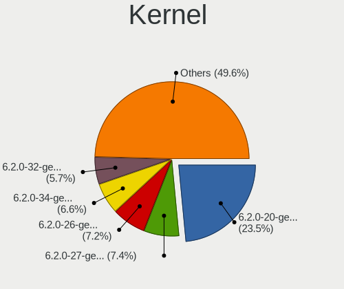

| Version                 | Computers | Percent |
|-------------------------|-----------|---------|
| 6.2.0-20-generic        | 77        | 38.89%  |
| 6.2.0-26-generic        | 23        | 11.62%  |
| 6.2.0-24-generic        | 20        | 10.1%   |
| 6.2.0-23-generic        | 17        | 8.59%   |
| 6.2.0-25-generic        | 13        | 6.57%   |
| 6.2.0-18-generic        | 4         | 2.02%   |
| 6.2.0-1003-lowlatency   | 4         | 2.02%   |
| 6.2.0-1007-lowlatency   | 3         | 1.52%   |
| 6.4.8-060408-generic    | 2         | 1.01%   |
| 6.4.0-060400-generic    | 2         | 1.01%   |
| 6.2.0-1009-lowlatency   | 2         | 1.01%   |
| 6.2.0-1008-lowlatency   | 2         | 1.01%   |
| 6.2.0-1005-lowlatency   | 2         | 1.01%   |
| 5.19.0-28-generic       | 2         | 1.01%   |
| 6.4.3-1-liquorix-amd64  | 1         | 0.51%   |
| 6.4.1-2-liquorix-amd64  | 1         | 0.51%   |
| 6.3.8-x64v3-xanmod1     | 1         | 0.51%   |
| 6.3.8                   | 1         | 0.51%   |
| 6.3.7-060307-generic    | 1         | 0.51%   |
| 6.3.6-custom            | 1         | 0.51%   |
| 6.3.5-060305-generic    | 1         | 0.51%   |
| 6.3.4-060304-generic    | 1         | 0.51%   |
| 6.3.3-060303-generic    | 1         | 0.51%   |
| 6.3.10                  | 1         | 0.51%   |
| 6.3.1-custom            | 1         | 0.51%   |
| 6.3.1-060301-generic    | 1         | 0.51%   |
| 6.2.5-060205-generic    | 1         | 0.51%   |
| 6.2.10-060210-generic   | 1         | 0.51%   |
| 6.2.0-21-generic        | 1         | 0.51%   |
| 6.2.0-060200-generic    | 1         | 0.51%   |
| 6.1.12-060112-generic   | 1         | 0.51%   |
| 6.1.11-custom           | 1         | 0.51%   |
| 6.1.0-16-generic        | 1         | 0.51%   |
| 6.1.0-14-generic        | 1         | 0.51%   |
| 6.1.0-060100rc4-generic | 1         | 0.51%   |
| 5.19.0-42-generic       | 1         | 0.51%   |
| 5.19.0-40-generic       | 1         | 0.51%   |
| 5.19.0-21-generic       | 1         | 0.51%   |
| 5.19.0-1023-lowlatency  | 1         | 0.51%   |

Kernel Family
-------------

Linux kernel without a distro release

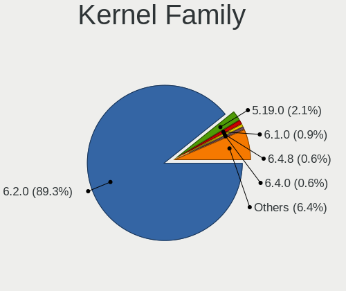

| Version | Computers | Percent |
|---------|-----------|---------|
| 6.2.0   | 160       | 84.66%  |
| 5.19.0  | 6         | 3.17%   |
| 6.1.0   | 3         | 1.59%   |
| 6.4.8   | 2         | 1.06%   |
| 6.4.0   | 2         | 1.06%   |
| 6.3.8   | 2         | 1.06%   |
| 6.3.1   | 2         | 1.06%   |
| 6.4.3   | 1         | 0.53%   |
| 6.4.1   | 1         | 0.53%   |
| 6.3.7   | 1         | 0.53%   |
| 6.3.6   | 1         | 0.53%   |
| 6.3.5   | 1         | 0.53%   |
| 6.3.4   | 1         | 0.53%   |
| 6.3.3   | 1         | 0.53%   |
| 6.3.10  | 1         | 0.53%   |
| 6.2.5   | 1         | 0.53%   |
| 6.2.10  | 1         | 0.53%   |
| 6.1.12  | 1         | 0.53%   |
| 6.1.11  | 1         | 0.53%   |

Kernel Major Ver.
-----------------

Linux kernel major version

| Version | Computers | Percent |
|---------|-----------|---------|
| 6.2     | 162       | 85.71%  |
| 6.3     | 10        | 5.29%   |
| 6.4     | 6         | 3.17%   |
| 5.19    | 6         | 3.17%   |
| 6.1     | 5         | 2.65%   |

Arch
----

OS architecture (x86_64, i586, etc.)

| Name   | Computers | Percent |
|--------|-----------|---------|
| x86_64 | 186       | 100%    |

DE
--

Desktop Environment

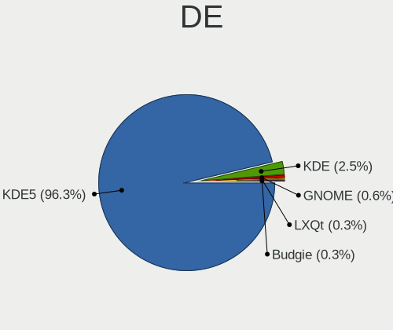

| Name  | Computers | Percent |
|-------|-----------|---------|
| KDE5  | 176       | 94.62%  |
| KDE   | 7         | 3.76%   |
| GNOME | 2         | 1.08%   |
| LXQt  | 1         | 0.54%   |

Display Server
--------------

X11 or Wayland

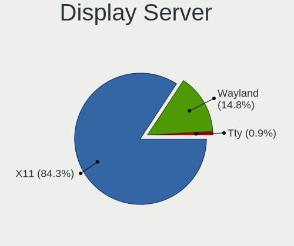

| Name    | Computers | Percent |
|---------|-----------|---------|
| X11     | 152       | 81.28%  |
| Wayland | 34        | 18.18%  |
| Tty     | 1         | 0.53%   |

Display Manager
---------------

SDDM, LightDM, etc.

| Name    | Computers | Percent |
|---------|-----------|---------|
| SDDM    | 115       | 61.5%   |
| Unknown | 63        | 33.69%  |
| GDM3    | 6         | 3.21%   |
| LightDM | 3         | 1.6%    |

OS Lang
-------

Language

| Lang   | Computers | Percent |
|--------|-----------|---------|
| en_US  | 93        | 50%     |
| de_DE  | 19        | 10.22%  |
| en_GB  | 15        | 8.06%   |
| ru_RU  | 7         | 3.76%   |
| pl_PL  | 7         | 3.76%   |
| fr_FR  | 7         | 3.76%   |
| it_IT  | 6         | 3.23%   |
| pt_BR  | 4         | 2.15%   |
| es_CR  | 2         | 1.08%   |
| es_CL  | 2         | 1.08%   |
| en_NZ  | 2         | 1.08%   |
| en_IN  | 2         | 1.08%   |
| en_CA  | 2         | 1.08%   |
| en_AU  | 2         | 1.08%   |
| C      | 2         | 1.08%   |
| zh_TW  | 1         | 0.54%   |
| sv_SE  | 1         | 0.54%   |
| pt_PT  | 1         | 0.54%   |
| nl_NL  | 1         | 0.54%   |
| nb_NO  | 1         | 0.54%   |
| hu_HU  | 1         | 0.54%   |
| fr_BE  | 1         | 0.54%   |
| es_PE  | 1         | 0.54%   |
| es_MX  | 1         | 0.54%   |
| es_ES  | 1         | 0.54%   |
| es_CO  | 1         | 0.54%   |
| es_419 | 1         | 0.54%   |
| en_IL  | 1         | 0.54%   |
| da_DK  | 1         | 0.54%   |

Boot Mode
---------

EFI or BIOS

| Mode | Computers | Percent |
|------|-----------|---------|
| BIOS | 96        | 51.34%  |
| EFI  | 91        | 48.66%  |

Filesystem
----------

Type of filesystem

| Type    | Computers | Percent |
|---------|-----------|---------|
| Ext4    | 127       | 67.55%  |
| Tmpfs   | 40        | 21.28%  |
| Btrfs   | 13        | 6.91%   |
| Overlay | 4         | 2.13%   |
| Zfs     | 2         | 1.06%   |
| Xfs     | 1         | 0.53%   |
| F2fs    | 1         | 0.53%   |

Part. scheme
------------

Scheme of partitioning

| Type    | Computers | Percent |
|---------|-----------|---------|
| GPT     | 118       | 63.1%   |
| Unknown | 63        | 33.69%  |
| MBR     | 6         | 3.21%   |

Dual Boot with Linux/BSD
------------------------

Hosting more than one Linux/BSD

| Dual boot | Computers | Percent |
|-----------|-----------|---------|
| No        | 172       | 91.49%  |
| Yes       | 16        | 8.51%   |

Dual Boot (Win)
---------------

Hosting Linux and Windows

| Dual boot | Computers | Percent |
|-----------|-----------|---------|
| No        | 133       | 71.51%  |
| Yes       | 53        | 28.49%  |

Board
-----

Vendor
------

Motherboard manufacturer

| Name                | Computers | Percent |
|---------------------|-----------|---------|
| ASUSTek Computer    | 34        | 18.28%  |
| Hewlett-Packard     | 32        | 17.2%   |
| Lenovo              | 29        | 15.59%  |
| Gigabyte Technology | 13        | 6.99%   |
| Dell                | 12        | 6.45%   |
| MSI                 | 9         | 4.84%   |
| Acer                | 9         | 4.84%   |
| Apple               | 7         | 3.76%   |
| Google              | 5         | 2.69%   |
| Intel               | 4         | 2.15%   |
| HUAWEI              | 4         | 2.15%   |
| ASRock              | 3         | 1.61%   |
| Unknown             | 3         | 1.61%   |
| Samsung Electronics | 2         | 1.08%   |
| Fujitsu             | 2         | 1.08%   |
| AZW                 | 2         | 1.08%   |
| Alienware           | 2         | 1.08%   |
| TECNO               | 1         | 0.54%   |
| Seco                | 1         | 0.54%   |
| Pegatron            | 1         | 0.54%   |
| Medion              | 1         | 0.54%   |
| Huanan              | 1         | 0.54%   |
| HPE                 | 1         | 0.54%   |
| GPU Company         | 1         | 0.54%   |
| GPD                 | 1         | 0.54%   |
| Gateway             | 1         | 0.54%   |
| Framework           | 1         | 0.54%   |
| Foxconn             | 1         | 0.54%   |
| BOSGAME             | 1         | 0.54%   |
| Biostar             | 1         | 0.54%   |
| BESSTAR Tech        | 1         | 0.54%   |

Model
-----

Motherboard model

| Name                                        | Computers | Percent |
|---------------------------------------------|-----------|---------|
| Unknown                                     | 3         | 1.61%   |
| Intel NUC12WSHi7                            | 2         | 1.08%   |
| HP ProBook 650 G1                           | 2         | 1.08%   |
| HP ENVY x360 Convertible 13-ay0xxx          | 2         | 1.08%   |
| Dell G3 3779                                | 2         | 1.08%   |
| AZW SER                                     | 2         | 1.08%   |
| ASUS ASUS TUF Gaming F17 FX706LI_FX706LI    | 2         | 1.08%   |
| TECNO MEGABOOK T1                           | 1         | 0.54%   |
| Seco C40                                    | 1         | 0.54%   |
| Samsung 950XED                              | 1         | 0.54%   |
| Samsung 950QDB                              | 1         | 0.54%   |
| Pegatron 520-1000nl                         | 1         | 0.54%   |
| MSI Titan GT77HX 13VH                       | 1         | 0.54%   |
| MSI Raider GE67HX 12UGS                     | 1         | 0.54%   |
| MSI MS-7D75                                 | 1         | 0.54%   |
| MSI MS-7C95                                 | 1         | 0.54%   |
| MSI MS-7B23                                 | 1         | 0.54%   |
| MSI MS-7A32                                 | 1         | 0.54%   |
| MSI MS-7846                                 | 1         | 0.54%   |
| MSI MS-7693                                 | 1         | 0.54%   |
| MSI Bravo 17 A4DDK                          | 1         | 0.54%   |
| Medion E11201                               | 1         | 0.54%   |
| Lenovo Yoga Slim 7 Pro 16ACH6 82QQ          | 1         | 0.54%   |
| Lenovo Yoga C640-13IML 81UE                 | 1         | 0.54%   |
| Lenovo Yoga 6 13ALC7 82UD                   | 1         | 0.54%   |
| Lenovo ThinkPad X1 Yoga 3rd 20LES3485R      | 1         | 0.54%   |
| Lenovo ThinkPad X1 Carbon Gen 11 21HMCTO1WW | 1         | 0.54%   |
| Lenovo ThinkPad X1 Carbon Gen 10 21CB0088RT | 1         | 0.54%   |
| Lenovo ThinkPad W510 4391EC4                | 1         | 0.54%   |
| Lenovo ThinkPad P15s Gen 2i 20W7S0SM01      | 1         | 0.54%   |
| Lenovo ThinkPad P14s Gen 1 20S5S01V00       | 1         | 0.54%   |
| Lenovo ThinkPad P1 Gen 2 20QT000LGE         | 1         | 0.54%   |
| Lenovo ThinkPad L15 Gen 2a 20X7S05600       | 1         | 0.54%   |
| Lenovo ThinkPad E15 Gen 4 21EES00100        | 1         | 0.54%   |
| Lenovo ThinkPad E15 Gen 4 21EDCTO1WW        | 1         | 0.54%   |
| Lenovo ThinkPad E15 Gen 2 20TD00GSPB        | 1         | 0.54%   |
| Lenovo ThinkPad E14 Gen 4 21ECS00000        | 1         | 0.54%   |
| Lenovo ThinkPad E14 Gen 3 20YDS02D00        | 1         | 0.54%   |
| Lenovo ThinkBook 14 G4 ABA 21DK             | 1         | 0.54%   |
| Lenovo Slim 7 ProX 14ARH7 82V2              | 1         | 0.54%   |

Model Family
------------

Motherboard model prefix

| Name                | Computers | Percent |
|---------------------|-----------|---------|
| Lenovo ThinkPad     | 13        | 6.99%   |
| Lenovo IdeaPad      | 9         | 4.84%   |
| ASUS ROG            | 8         | 4.3%    |
| ASUS PRIME          | 8         | 4.3%    |
| HP ENVY             | 6         | 3.23%   |
| Acer Aspire         | 6         | 3.23%   |
| HP Pavilion         | 5         | 2.69%   |
| Dell Latitude       | 5         | 2.69%   |
| HP EliteBook        | 4         | 2.15%   |
| ASUS ASUS           | 4         | 2.15%   |
| Lenovo Yoga         | 3         | 1.61%   |
| HP ProBook          | 3         | 1.61%   |
| ASUS VivoBook       | 3         | 1.61%   |
| Unknown             | 3         | 1.61%   |
| Lenovo Legion       | 2         | 1.08%   |
| Intel NUC12WSHi7    | 2         | 1.08%   |
| HP ZBook            | 2         | 1.08%   |
| HP Laptop           | 2         | 1.08%   |
| HP Compaq           | 2         | 1.08%   |
| Gigabyte X570S      | 2         | 1.08%   |
| Gigabyte G5         | 2         | 1.08%   |
| Gigabyte B550       | 2         | 1.08%   |
| Dell Precision      | 2         | 1.08%   |
| Dell Inspiron       | 2         | 1.08%   |
| Dell G3             | 2         | 1.08%   |
| AZW SER             | 2         | 1.08%   |
| ASUS Zenbook        | 2         | 1.08%   |
| ASUS TUF            | 2         | 1.08%   |
| Apple MacBookPro9   | 2         | 1.08%   |
| TECNO MEGABOOK      | 1         | 0.54%   |
| Seco C40            | 1         | 0.54%   |
| Samsung 950XED      | 1         | 0.54%   |
| Samsung 950QDB      | 1         | 0.54%   |
| Pegatron 520-1000nl | 1         | 0.54%   |
| MSI Titan           | 1         | 0.54%   |
| MSI Raider          | 1         | 0.54%   |
| MSI MS-7D75         | 1         | 0.54%   |
| MSI MS-7C95         | 1         | 0.54%   |
| MSI MS-7B23         | 1         | 0.54%   |
| MSI MS-7A32         | 1         | 0.54%   |

MFG Year
--------

Motherboard manufacture year

| Year | Computers | Percent |
|------|-----------|---------|
| 2021 | 35        | 18.82%  |
| 2022 | 32        | 17.2%   |
| 2019 | 22        | 11.83%  |
| 2020 | 18        | 9.68%   |
| 2018 | 12        | 6.45%   |
| 2011 | 10        | 5.38%   |
| 2013 | 8         | 4.3%    |
| 2012 | 8         | 4.3%    |
| 2023 | 7         | 3.76%   |
| 2017 | 7         | 3.76%   |
| 2016 | 6         | 3.23%   |
| 2015 | 6         | 3.23%   |
| 2014 | 6         | 3.23%   |
| 2010 | 5         | 2.69%   |
| 2009 | 3         | 1.61%   |
| 2007 | 1         | 0.54%   |

Form Factor
-----------

Physical design of the computer

| Name        | Computers | Percent |
|-------------|-----------|---------|
| Notebook    | 110       | 59.14%  |
| Desktop     | 54        | 29.03%  |
| Convertible | 11        | 5.91%   |
| Mini pc     | 5         | 2.69%   |
| All in one  | 4         | 2.15%   |
| Tablet      | 1         | 0.54%   |
| Server      | 1         | 0.54%   |

Secure Boot
-----------

Enabled or disabled

| State    | Computers | Percent |
|----------|-----------|---------|
| Disabled | 175       | 94.09%  |
| Enabled  | 11        | 5.91%   |

Coreboot
--------

Have coreboot on board

| Used | Computers | Percent |
|------|-----------|---------|
| No   | 181       | 97.31%  |
| Yes  | 5         | 2.69%   |

RAM Size
--------

Total RAM memory

| Size in GB  | Computers | Percent |
|-------------|-----------|---------|
| 8.01-16.0   | 44        | 23.66%  |
| 16.01-24.0  | 39        | 20.97%  |
| 4.01-8.0    | 37        | 19.89%  |
| 32.01-64.0  | 33        | 17.74%  |
| 3.01-4.0    | 17        | 9.14%   |
| 64.01-256.0 | 11        | 5.91%   |
| 24.01-32.0  | 4         | 2.15%   |
| 2.01-3.0    | 1         | 0.54%   |

RAM Used
--------

Used RAM memory

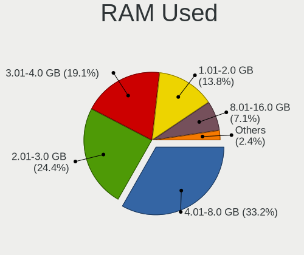

| Used GB    | Computers | Percent |
|------------|-----------|---------|
| 4.01-8.0   | 64        | 32.82%  |
| 2.01-3.0   | 50        | 25.64%  |
| 3.01-4.0   | 31        | 15.9%   |
| 1.01-2.0   | 31        | 15.9%   |
| 8.01-16.0  | 16        | 8.21%   |
| 32.01-64.0 | 1         | 0.51%   |
| 24.01-32.0 | 1         | 0.51%   |
| 16.01-24.0 | 1         | 0.51%   |

Total Drives
------------

Number of drives on board

| Drives | Computers | Percent |
|--------|-----------|---------|
| 1      | 105       | 55.56%  |
| 2      | 53        | 28.04%  |
| 3      | 18        | 9.52%   |
| 4      | 8         | 4.23%   |
| 7      | 2         | 1.06%   |
| 5      | 2         | 1.06%   |
| 6      | 1         | 0.53%   |

Has CD-ROM
----------

Has CD-ROM on board

| Presented | Computers | Percent |
|-----------|-----------|---------|
| No        | 146       | 78.07%  |
| Yes       | 41        | 21.93%  |

Has Ethernet
------------

Has Ethernet on board

| Presented | Computers | Percent |
|-----------|-----------|---------|
| Yes       | 147       | 78.61%  |
| No        | 40        | 21.39%  |

Has WiFi
--------

Has WiFi module

| Presented | Computers | Percent |
|-----------|-----------|---------|
| Yes       | 156       | 83.87%  |
| No        | 30        | 16.13%  |

Has Bluetooth
-------------

Has Bluetooth module

| Presented | Computers | Percent |
|-----------|-----------|---------|
| Yes       | 134       | 72.04%  |
| No        | 52        | 27.96%  |

Location
--------

Country
-------

Geographic location (country)

| Country      | Computers | Percent |
|--------------|-----------|---------|
| USA          | 37        | 19.89%  |
| Germany      | 27        | 14.52%  |
| UK           | 17        | 9.14%   |
| Russia       | 9         | 4.84%   |
| France       | 9         | 4.84%   |
| Poland       | 6         | 3.23%   |
| Italy        | 6         | 3.23%   |
| Canada       | 5         | 2.69%   |
| Brazil       | 5         | 2.69%   |
| Sweden       | 4         | 2.15%   |
| Netherlands  | 4         | 2.15%   |
| India        | 4         | 2.15%   |
| Hungary      | 4         | 2.15%   |
| Belgium      | 4         | 2.15%   |
| Mexico       | 3         | 1.61%   |
| Turkey       | 2         | 1.08%   |
| Spain        | 2         | 1.08%   |
| Serbia       | 2         | 1.08%   |
| Saudi Arabia | 2         | 1.08%   |
| Portugal     | 2         | 1.08%   |
| Peru         | 2         | 1.08%   |
| New Zealand  | 2         | 1.08%   |
| Israel       | 2         | 1.08%   |
| Costa Rica   | 2         | 1.08%   |
| Colombia     | 2         | 1.08%   |
| Chile        | 2         | 1.08%   |
| Australia    | 2         | 1.08%   |
| Taiwan       | 1         | 0.54%   |
| Switzerland  | 1         | 0.54%   |
| Slovakia     | 1         | 0.54%   |
| Romania      | 1         | 0.54%   |
| Norway       | 1         | 0.54%   |
| Luxembourg   | 1         | 0.54%   |
| Lithuania    | 1         | 0.54%   |
| Libya        | 1         | 0.54%   |
| Latvia       | 1         | 0.54%   |
| Kazakhstan   | 1         | 0.54%   |
| Ivory Coast  | 1         | 0.54%   |
| Indonesia    | 1         | 0.54%   |
| Finland      | 1         | 0.54%   |

City
----

Geographic location (city)

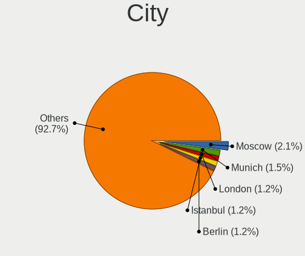

| City              | Computers | Percent |
|-------------------|-----------|---------|
| London            | 4         | 2.13%   |
| Munich            | 3         | 1.6%    |
| Hamburg           | 3         | 1.6%    |
| Berlin            | 3         | 1.6%    |
| Valley Center     | 2         | 1.06%   |
| Sherbrooke        | 2         | 1.06%   |
| Mnster          | 2         | 1.06%   |
| Moscow            | 2         | 1.06%   |
| Minneapolis       | 2         | 1.06%   |
| Istanbul          | 2         | 1.06%   |
| Grecia            | 2         | 1.06%   |
| Brussels          | 2         | 1.06%   |
| Yerevan           | 1         | 0.53%   |
| Wiesmoor          | 1         | 0.53%   |
| West Valley       | 1         | 0.53%   |
| West Des Moines   | 1         | 0.53%   |
| Weilmuenster      | 1         | 0.53%   |
| Warwick           | 1         | 0.53%   |
| Warsaw            | 1         | 0.53%   |
| Ware              | 1         | 0.53%   |
| Waldorf           | 1         | 0.53%   |
| Waianae           | 1         | 0.53%   |
| Vsevolozhsk       | 1         | 0.53%   |
| Vol'ginskiy       | 1         | 0.53%   |
| Virginia Beach    | 1         | 0.53%   |
| Via del Mar     | 1         | 0.53%   |
| Vilnius           | 1         | 0.53%   |
| Villa Dominico    | 1         | 0.53%   |
| Vienna            | 1         | 0.53%   |
| Vancouver         | 1         | 0.53%   |
| Ulm               | 1         | 0.53%   |
| Trujillo          | 1         | 0.53%   |
| Tripoli           | 1         | 0.53%   |
| Thunder Bay       | 1         | 0.53%   |
| Theydon Bois      | 1         | 0.53%   |
| The Hague         | 1         | 0.53%   |
| Tel Aviv          | 1         | 0.53%   |
| Tatabnya        | 1         | 0.53%   |
| Taichung          | 1         | 0.53%   |
| Szigetszentmiklos | 1         | 0.53%   |

Drives
------

Drive Vendor
------------

Hard drive vendors

| Vendor                       | Computers | Drives | Percent |
|------------------------------|-----------|--------|---------|
| Samsung Electronics          | 48        | 68     | 16.72%  |
| WDC                          | 30        | 36     | 10.45%  |
| Seagate                      | 25        | 38     | 8.71%   |
| SanDisk                      | 21        | 21     | 7.32%   |
| Kingston                     | 14        | 18     | 4.88%   |
| Intel                        | 14        | 15     | 4.88%   |
| Micron Technology            | 13        | 13     | 4.53%   |
| Crucial                      | 13        | 17     | 4.53%   |
| Toshiba                      | 12        | 15     | 4.18%   |
| SK hynix                     | 11        | 11     | 3.83%   |
| Phison Electronics           | 7         | 7      | 2.44%   |
| Unknown                      | 5         | 5      | 1.74%   |
| Hitachi                      | 5         | 5      | 1.74%   |
| Silicon Motion               | 4         | 4      | 1.39%   |
| HGST                         | 4         | 4      | 1.39%   |
| China                        | 4         | 4      | 1.39%   |
| A-DATA Technology            | 4         | 4      | 1.39%   |
| Patriot                      | 3         | 3      | 1.05%   |
| Micron/Crucial Technology    | 3         | 4      | 1.05%   |
| Kingston Technology Company  | 3         | 3      | 1.05%   |
| UMIS                         | 2         | 3      | 0.7%    |
| Team                         | 2         | 2      | 0.7%    |
| Solid State Storage          | 2         | 2      | 0.7%    |
| PNY                          | 2         | 2      | 0.7%    |
| Maxtor                       | 2         | 2      | 0.7%    |
| Lexar                        | 2         | 2      | 0.7%    |
| ADATA Technology             | 2         | 2      | 0.7%    |
| Wibtek                       | 1         | 1      | 0.35%   |
| WALRAM                       | 1         | 1      | 0.35%   |
| Vaseky                       | 1         | 1      | 0.35%   |
| Union Memory (Shenzhen)      | 1         | 1      | 0.35%   |
| Transcend                    | 1         | 1      | 0.35%   |
| SSSTC                        | 1         | 1      | 0.35%   |
| SSDPR-CX                     | 1         | 1      | 0.35%   |
| SPCC                         | 1         | 5      | 0.35%   |
| Shenzhen Longsys Electronics | 1         | 1      | 0.35%   |
| Realtek Semiconductor        | 1         | 1      | 0.35%   |
| Phison                       | 1         | 1      | 0.35%   |
| PHD 3.0                      | 1         | 1      | 0.35%   |
| Netac                        | 1         | 1      | 0.35%   |

Drive Model
-----------

Hard drive models

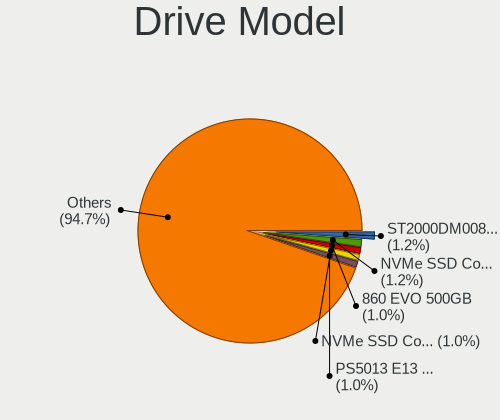

| Model                                               | Computers | Percent |
|-----------------------------------------------------|-----------|---------|
| Intel SSD 660P Series 1024GB                        | 5         | 1.58%   |
| Seagate ST4000DM004-2CV104 4TB                      | 3         | 0.95%   |
| Seagate ST1000DM003-1CH162 1TB                      | 3         | 0.95%   |
| SanDisk NVMe SSD Drive 2TB                          | 3         | 0.95%   |
| Samsung SSD 980 PRO 2TB                             | 3         | 0.95%   |
| Samsung NVMe SSD Controller PM9A1/PM9A3/980PRO 1TB  | 3         | 0.95%   |
| Phison PS5013 E13 NVMe Controller 256GB             | 3         | 0.95%   |
| Phison E16 PCIe4 NVMe Controller 1TB                | 3         | 0.95%   |
| WDC WD5000AAKX-60U6AA0 500GB                        | 2         | 0.63%   |
| WDC WD Blue SA510 2.5 1000GB SSD                    | 2         | 0.63%   |
| Unknown MMC Card  32GB                              | 2         | 0.63%   |
| UMIS RPJTJ512MGE1QDQ 512GB                          | 2         | 0.63%   |
| Toshiba MQ04ABF100 1TB                              | 2         | 0.63%   |
| Seagate ST2000DM008-2FR102 2TB                      | 2         | 0.63%   |
| Seagate ST1000DM003-1ER162 1TB                      | 2         | 0.63%   |
| Seagate Backup+ Hub BK 8TB                          | 2         | 0.63%   |
| Sandisk WD_BLACK SN850X 4000GB                      | 2         | 0.63%   |
| SanDisk NVMe SSD Drive 1TB                          | 2         | 0.63%   |
| Samsung SSD 980 PRO 1TB                             | 2         | 0.63%   |
| Samsung SSD 980 1TB                                 | 2         | 0.63%   |
| Samsung SSD 970 EVO Plus 500GB                      | 2         | 0.63%   |
| Samsung SSD 970 EVO Plus 1TB                        | 2         | 0.63%   |
| Samsung SSD 870 QVO 2TB                             | 2         | 0.63%   |
| Samsung SSD 870 QVO 1TB                             | 2         | 0.63%   |
| Samsung SSD 850 PRO 512GB                           | 2         | 0.63%   |
| Samsung SSD 850 EVO 250GB                           | 2         | 0.63%   |
| Samsung NVMe SSD Controller SM981/PM981/PM983 500GB | 2         | 0.63%   |
| Samsung MZVLQ256HAJD-000H1 256GB                    | 2         | 0.63%   |
| Samsung MZVL21T0HCLR-00B00 1TB                      | 2         | 0.63%   |
| Micron/Crucial P2 NVMe PCIe SSD 1TB                 | 2         | 0.63%   |
| Kingston Company SNV2S1000G 1TB                     | 2         | 0.63%   |
| Kingston SNVS500G 500GB                             | 2         | 0.63%   |
| Kingston SA400S37480G 480GB SSD                     | 2         | 0.63%   |
| Kingston SA400S37240G 240GB SSD                     | 2         | 0.63%   |
| Kingston SA400S37120G 120GB SSD                     | 2         | 0.63%   |
| Intel SSDPEKNW512G8 512GB                           | 2         | 0.63%   |
| Intel SSDPEKNU512GZ 512GB                           | 2         | 0.63%   |
| Hitachi HDP725050GLA360 500GB                       | 2         | 0.63%   |
| Crucial CT120BX500SSD1 120GB                        | 2         | 0.63%   |
| Crucial CT1000MX500SSD1 1TB                         | 2         | 0.63%   |

HDD Vendor
----------

Hard disk drive vendors

| Vendor              | Computers | Drives | Percent |
|---------------------|-----------|--------|---------|
| Seagate             | 25        | 37     | 37.31%  |
| WDC                 | 17        | 20     | 25.37%  |
| Toshiba             | 9         | 11     | 13.43%  |
| Hitachi             | 5         | 5      | 7.46%   |
| HGST                | 4         | 4      | 5.97%   |
| Samsung Electronics | 2         | 2      | 2.99%   |
| Maxtor              | 2         | 2      | 2.99%   |
| Unknown             | 1         | 1      | 1.49%   |
| PHD 3.0             | 1         | 1      | 1.49%   |
| JMicron Technology  | 1         | 1      | 1.49%   |

SSD Vendor
----------

Solid state drive vendors

| Vendor              | Computers | Drives | Percent |
|---------------------|-----------|--------|---------|
| Samsung Electronics | 13        | 21     | 14.77%  |
| WDC                 | 10        | 12     | 11.36%  |
| Kingston            | 10        | 12     | 11.36%  |
| Crucial             | 8         | 11     | 9.09%   |
| SanDisk             | 7         | 7      | 7.95%   |
| Micron Technology   | 5         | 5      | 5.68%   |
| Intel               | 4         | 5      | 4.55%   |
| China               | 4         | 4      | 4.55%   |
| Patriot             | 3         | 3      | 3.41%   |
| A-DATA Technology   | 3         | 3      | 3.41%   |
| Team                | 2         | 2      | 2.27%   |
| SK hynix            | 2         | 2      | 2.27%   |
| PNY                 | 2         | 2      | 2.27%   |
| Vaseky              | 1         | 1      | 1.14%   |
| Transcend           | 1         | 1      | 1.14%   |
| SPCC                | 1         | 5      | 1.14%   |
| Seagate             | 1         | 1      | 1.14%   |
| LITEON              | 1         | 1      | 1.14%   |
| Lexar               | 1         | 1      | 1.14%   |
| Lenovo              | 1         | 1      | 1.14%   |
| INNOVATION IT       | 1         | 1      | 1.14%   |
| Hoodisk             | 1         | 1      | 1.14%   |
| Hewlett-Packard     | 1         | 1      | 1.14%   |
| Gigabyte Technology | 1         | 1      | 1.14%   |
| FURY                | 1         | 2      | 1.14%   |
| CT2000BX            | 1         | 1      | 1.14%   |
| CT1000MX            | 1         | 1      | 1.14%   |
| BAITITON            | 1         | 1      | 1.14%   |

Drive Kind
----------

HDD or SSD

| Kind    | Computers | Drives | Percent |
|---------|-----------|--------|---------|
| NVMe    | 111       | 142    | 43.02%  |
| SSD     | 82        | 109    | 31.78%  |
| HDD     | 54        | 84     | 20.93%  |
| Unknown | 7         | 8      | 2.71%   |
| MMC     | 4         | 4      | 1.55%   |

Drive Connector
---------------

SATA, SAS, NVMe, etc.

| Type | Computers | Drives | Percent |
|------|-----------|--------|---------|
| NVMe | 111       | 142    | 46.84%  |
| SATA | 106       | 185    | 44.73%  |
| SAS  | 16        | 16     | 6.75%   |
| MMC  | 4         | 4      | 1.69%   |

Drive Size
----------

Size of hard drive

| Size in TB | Computers | Drives | Percent |
|------------|-----------|--------|---------|
| 0.01-0.5   | 70        | 91     | 47.95%  |
| 0.51-1.0   | 48        | 65     | 32.88%  |
| 1.01-2.0   | 19        | 27     | 13.01%  |
| 3.01-4.0   | 5         | 6      | 3.42%   |
| 4.01-10.0  | 3         | 3      | 2.05%   |
| 10.01-20.0 | 1         | 1      | 0.68%   |

Space Total
-----------

Amount of disk space available on the file system

| Size in GB     | Computers | Percent |
|----------------|-----------|---------|
| 101-250        | 50        | 26.18%  |
| 501-1000       | 37        | 19.37%  |
| 251-500        | 36        | 18.85%  |
| 1001-2000      | 23        | 12.04%  |
| More than 3000 | 17        | 8.9%    |
| 2001-3000      | 9         | 4.71%   |
| 51-100         | 9         | 4.71%   |
| 1-20           | 7         | 3.66%   |
| 21-50          | 3         | 1.57%   |

Space Used
----------

Amount of used disk space

| Used GB        | Computers | Percent |
|----------------|-----------|---------|
| 21-50          | 44        | 22.45%  |
| 1-20           | 43        | 21.94%  |
| 101-250        | 32        | 16.33%  |
| 251-500        | 21        | 10.71%  |
| 51-100         | 19        | 9.69%   |
| 501-1000       | 16        | 8.16%   |
| 1001-2000      | 11        | 5.61%   |
| More than 3000 | 6         | 3.06%   |
| 2001-3000      | 4         | 2.04%   |

Malfunc. Drives
---------------

Drive models with a malfunction

| Model                                        | Computers | Drives | Percent |
|----------------------------------------------|-----------|--------|---------|
| WDC WD3200AAJS-65M0A0 320GB                  | 1         | 1      | 5.88%   |
| WDC WD10EURX-63UY4Y0 1TB                     | 1         | 1      | 5.88%   |
| WDC WD Blue SA510 2.5 1000GB SSD             | 1         | 1      | 5.88%   |
| Toshiba MQ01ABD075 752GB                     | 1         | 2      | 5.88%   |
| Team L3 EVO SSD 120GB                        | 1         | 1      | 5.88%   |
| SK hynix HFS256G32MND-2900A 256GB SSD        | 1         | 1      | 5.88%   |
| Seagate ST1000LM024 HN-M101MBB 1TB           | 1         | 1      | 5.88%   |
| Seagate ST1000DM003-1CH162 1TB               | 1         | 1      | 5.88%   |
| SanDisk SDSSDXPS480G 480GB                   | 1         | 1      | 5.88%   |
| Samsung Electronics SSD 970 EVO Plus 1TB     | 1         | 1      | 5.88%   |
| Samsung Electronics SSD 850 EVO 250GB        | 1         | 1      | 5.88%   |
| Samsung Electronics SSD 840 PRO Series 256GB | 1         | 2      | 5.88%   |
| Samsung Electronics HD103SI 1TB              | 1         | 1      | 5.88%   |
| Maxtor STM3160215AS 160GB                    | 1         | 1      | 5.88%   |
| Intel SSDSCKKW240H6 240GB                    | 1         | 1      | 5.88%   |
| Intel SSDPEKNW512G8 512GB                    | 1         | 1      | 5.88%   |
| Intel SSDPEKNU512GZ 512GB                    | 1         | 1      | 5.88%   |

Malfunc. Drive Vendor
---------------------

Vendors of faulty drives

| Vendor              | Computers | Drives | Percent |
|---------------------|-----------|--------|---------|
| Samsung Electronics | 4         | 5      | 23.53%  |
| WDC                 | 3         | 3      | 17.65%  |
| Intel               | 3         | 3      | 17.65%  |
| Seagate             | 2         | 2      | 11.76%  |
| Toshiba             | 1         | 2      | 5.88%   |
| Team                | 1         | 1      | 5.88%   |
| SK hynix            | 1         | 1      | 5.88%   |
| SanDisk             | 1         | 1      | 5.88%   |
| Maxtor              | 1         | 1      | 5.88%   |

Malfunc. HDD Vendor
-------------------

Vendors of faulty HDD drives

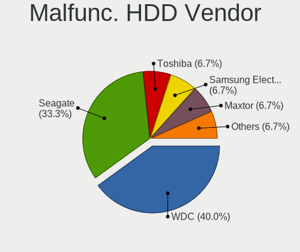

| Vendor              | Computers | Drives | Percent |
|---------------------|-----------|--------|---------|
| WDC                 | 2         | 2      | 28.57%  |
| Seagate             | 2         | 2      | 28.57%  |
| Toshiba             | 1         | 2      | 14.29%  |
| Samsung Electronics | 1         | 1      | 14.29%  |
| Maxtor              | 1         | 1      | 14.29%  |

Malfunc. Drive Kind
-------------------

Kinds of faulty drives

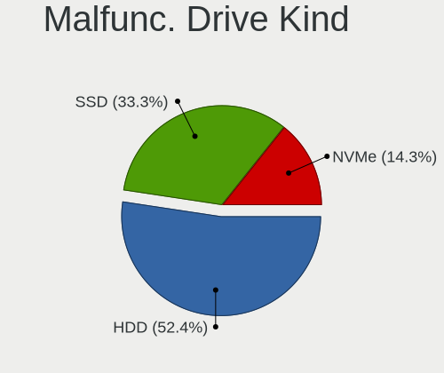

| Kind | Computers | Drives | Percent |
|------|-----------|--------|---------|
| SSD  | 6         | 8      | 42.86%  |
| HDD  | 5         | 8      | 35.71%  |
| NVMe | 3         | 3      | 21.43%  |

Failed Drives
-------------

Failed drive models

| Model                                 | Computers | Drives | Percent |
|---------------------------------------|-----------|--------|---------|
| Samsung Electronics SSD 960 EVO 250GB | 1         | 2      | 100%    |

Failed Drive Vendor
-------------------

Failed drive vendors

| Vendor              | Computers | Drives | Percent |
|---------------------|-----------|--------|---------|
| Samsung Electronics | 1         | 2      | 100%    |

Drive Status
------------

Number of failed and malfunc. drives

| Status   | Computers | Drives | Percent |
|----------|-----------|--------|---------|
| Detected | 116       | 214    | 56.86%  |
| Works    | 73        | 112    | 35.78%  |
| Malfunc  | 14        | 19     | 6.86%   |
| Failed   | 1         | 2      | 0.49%   |

Storage controller
------------------

Storage Vendor
--------------

Storage controller vendors

| Vendor                         | Computers | Percent |
|--------------------------------|-----------|---------|
| Intel                          | 103       | 39.62%  |
| AMD                            | 38        | 14.62%  |
| Samsung Electronics            | 35        | 13.46%  |
| SanDisk                        | 17        | 6.54%   |
| SK hynix                       | 9         | 3.46%   |
| Phison Electronics             | 9         | 3.46%   |
| Micron/Crucial Technology      | 8         | 3.08%   |
| Micron Technology              | 8         | 3.08%   |
| Kingston Technology Company    | 6         | 2.31%   |
| Silicon Motion                 | 4         | 1.54%   |
| Union Memory (Shenzhen)        | 3         | 1.15%   |
| Toshiba America Info Systems   | 3         | 1.15%   |
| Solid State Storage Technology | 3         | 1.15%   |
| ADATA Technology               | 3         | 1.15%   |
| Shenzhen Longsys Electronics   | 2         | 0.77%   |
| ASMedia Technology             | 2         | 0.77%   |
| Silicon Image                  | 1         | 0.38%   |
| Realtek Semiconductor          | 1         | 0.38%   |
| Nvidia                         | 1         | 0.38%   |
| KIOXIA                         | 1         | 0.38%   |
| JMicron Technology             | 1         | 0.38%   |
| Biwin Storage Technology       | 1         | 0.38%   |
| Apple                          | 1         | 0.38%   |

Storage Model
-------------

Storage controller models

| Model                                                                          | Computers | Percent |
|--------------------------------------------------------------------------------|-----------|---------|
| AMD FCH SATA Controller [AHCI mode]                                            | 28        | 9.96%   |
| Samsung NVMe SSD Controller PM9A1/PM9A3/980PRO                                 | 13        | 4.63%   |
| Intel 8 Series/C220 Series Chipset Family 6-port SATA Controller 1 [AHCI mode] | 11        | 3.91%   |
| Samsung NVMe SSD Controller SM981/PM981/PM983                                  | 10        | 3.56%   |
| Samsung NVMe SSD Controller 980                                                | 10        | 3.56%   |
| Intel 7 Series Chipset Family 6-port SATA Controller [AHCI mode]               | 8         | 2.85%   |
| SK hynix Gold P31/BC711/PC711 NVMe Solid State Drive                           | 7         | 2.49%   |
| Intel Volume Management Device NVMe RAID Controller                            | 7         | 2.49%   |
| Intel SSD 660P Series                                                          | 7         | 2.49%   |
| Intel Sunrise Point-LP SATA Controller [AHCI mode]                             | 6         | 2.14%   |
| Intel 6 Series/C200 Series Chipset Family 6 port Desktop SATA AHCI Controller  | 6         | 2.14%   |
| Micron/Crucial P2 [Nick P2] / P3 / P3 Plus NVMe PCIe SSD (DRAM-less)           | 5         | 1.78%   |
| Intel Q170/Q150/B150/H170/H110/Z170/CM236 Chipset SATA Controller [AHCI Mode]  | 5         | 1.78%   |
| Intel 82801 Mobile SATA Controller [RAID mode]                                 | 5         | 1.78%   |
| AMD 500 Series Chipset SATA Controller                                         | 5         | 1.78%   |
| Phison PS5013 E13 NVMe Controller                                              | 4         | 1.42%   |
| Phison E16 PCIe4 NVMe Controller                                               | 4         | 1.42%   |
| Intel Comet Lake SATA AHCI Controller                                          | 4         | 1.42%   |
| Intel Cannon Lake Mobile PCH SATA AHCI Controller                              | 4         | 1.42%   |
| Intel Alder Lake-P SATA AHCI Controller                                        | 4         | 1.42%   |
| Intel 400 Series Chipset Family SATA AHCI Controller                           | 4         | 1.42%   |
| Intel 200 Series PCH SATA controller [AHCI mode]                               | 4         | 1.42%   |
| Micron 3400 NVMe SSD [Hendrix]                                                 | 3         | 1.07%   |
| Kingston Company NVMe Controller                                               | 3         | 1.07%   |
| Intel SSD 670p Series [Keystone Harbor]                                        | 3         | 1.07%   |
| Intel SATA Controller [RAID mode]                                              | 3         | 1.07%   |
| Intel HM170/QM170 Chipset SATA Controller [AHCI Mode]                          | 3         | 1.07%   |
| Intel Cannon Lake PCH SATA AHCI Controller                                     | 3         | 1.07%   |
| Intel 500 Series Chipset Family SATA AHCI Controller                           | 3         | 1.07%   |
| AMD FCH SATA Controller D                                                      | 3         | 1.07%   |
| AMD 400 Series Chipset SATA Controller                                         | 3         | 1.07%   |
| ADATA XPG SX8200 Pro PCIe Gen3x4 M.2 2280 Solid State Drive                    | 3         | 1.07%   |
| Union Memory (Shenzhen) AM630 PCIe 4.0 x4 NVMe SSD Controller                  | 2         | 0.71%   |
| Toshiba America Info Systems XG6 NVMe SSD Controller                           | 2         | 0.71%   |
| Solid State Storage CL1-3D256-Q11 NVMe SSD M.2                                 | 2         | 0.71%   |
| Silicon Motion SM2263EN/SM2263XT (DRAM-less) NVMe SSD Controllers              | 2         | 0.71%   |
| Sandisk Western Digital WD Black SN850X NVMe SSD                               | 2         | 0.71%   |
| SanDisk WD PC SN810 / Black SN850 NVMe SSD                                     | 2         | 0.71%   |
| SanDisk WD Blue SN570 NVMe SSD 1TB                                             | 2         | 0.71%   |
| SanDisk WD Black SN770 / PC SN740 256GB / PC SN560 (DRAM-less) NVMe SSD        | 2         | 0.71%   |

Storage Kind
------------

Kind of storage controller (IDE, SATA, NVMe, SAS, ...)

| Kind | Computers | Percent |
|------|-----------|---------|
| SATA | 125       | 49.21%  |
| NVMe | 111       | 43.7%   |
| RAID | 15        | 5.91%   |
| IDE  | 3         | 1.18%   |

Processor
---------

CPU Vendor
----------

Processor vendors

| Vendor | Computers | Percent |
|--------|-----------|---------|
| Intel  | 125       | 67.2%   |
| AMD    | 61        | 32.8%   |

CPU Model
---------

Processor models

| Model                                         | Computers | Percent |
|-----------------------------------------------|-----------|---------|
| AMD Ryzen 5 5500U with Radeon Graphics        | 8         | 4.3%    |
| Intel 12th Gen Core i7-1260P                  | 5         | 2.69%   |
| Intel Core i5-7200U CPU @ 2.50GHz             | 4         | 2.15%   |
| Intel Core i5-10300H CPU @ 2.50GHz            | 3         | 1.61%   |
| Intel Core i5-10210U CPU @ 1.60GHz            | 3         | 1.61%   |
| Intel 11th Gen Core i7-1165G7 @ 2.80GHz       | 3         | 1.61%   |
| Intel 11th Gen Core i5-1135G7 @ 2.40GHz       | 3         | 1.61%   |
| AMD Ryzen 7 6800H with Radeon Graphics        | 3         | 1.61%   |
| AMD Ryzen 7 5825U with Radeon Graphics        | 3         | 1.61%   |
| AMD Ryzen 5 5600U with Radeon Graphics        | 3         | 1.61%   |
| Intel Core i7-8750H CPU @ 2.20GHz             | 2         | 1.08%   |
| Intel Core i7-8700 CPU @ 3.20GHz              | 2         | 1.08%   |
| Intel Core i7-7700K CPU @ 4.20GHz             | 2         | 1.08%   |
| Intel Core i7-6700HQ CPU @ 2.60GHz            | 2         | 1.08%   |
| Intel Core i7-4790 CPU @ 3.60GHz              | 2         | 1.08%   |
| Intel Core i5-8265U CPU @ 1.60GHz             | 2         | 1.08%   |
| Intel Core i5-3210M CPU @ 2.50GHz             | 2         | 1.08%   |
| Intel Core i5-2400 CPU @ 3.10GHz              | 2         | 1.08%   |
| Intel Core i5-1035G1 CPU @ 1.00GHz            | 2         | 1.08%   |
| Intel 11th Gen Core i3-1115G4 @ 3.00GHz       | 2         | 1.08%   |
| AMD Ryzen 9 5900X 12-Core Processor           | 2         | 1.08%   |
| AMD Ryzen 7 5800H with Radeon Graphics        | 2         | 1.08%   |
| AMD Ryzen 7 5700X 8-Core Processor            | 2         | 1.08%   |
| AMD Ryzen 7 4800H with Radeon Graphics        | 2         | 1.08%   |
| AMD Ryzen 7 4700U with Radeon Graphics        | 2         | 1.08%   |
| AMD Ryzen 5 3600 6-Core Processor             | 2         | 1.08%   |
| AMD Ryzen 5 3500U with Radeon Vega Mobile Gfx | 2         | 1.08%   |
| Intel Xeon CPU E5-4627 v4 @ 2.60GHz           | 1         | 0.54%   |
| Intel Xeon CPU E3-1240 v3 @ 3.40GHz           | 1         | 0.54%   |
| Intel Xeon CPU E3-1225 v5 @ 3.30GHz           | 1         | 0.54%   |
| Intel Pentium Silver N6000 @ 1.10GHz          | 1         | 0.54%   |
| Intel Pentium Gold G5420 CPU @ 3.80GHz        | 1         | 0.54%   |
| Intel Pentium Dual-Core CPU T4500 @ 2.30GHz   | 1         | 0.54%   |
| Intel Pentium Dual-Core CPU T4400 @ 2.20GHz   | 1         | 0.54%   |
| Intel Pentium CPU G3220 @ 3.00GHz             | 1         | 0.54%   |
| Intel Pentium CPU 6405U @ 2.40GHz             | 1         | 0.54%   |
| Intel N95                                     | 1         | 0.54%   |
| Intel Core i7-9750H CPU @ 2.60GHz             | 1         | 0.54%   |
| Intel Core i7-8700K CPU @ 3.70GHz             | 1         | 0.54%   |
| Intel Core i7-8665U CPU @ 1.90GHz             | 1         | 0.54%   |

CPU Model Family
----------------

Processor model prefix

| Model                   | Computers | Percent |
|-------------------------|-----------|---------|
| Intel Core i5           | 38        | 20.43%  |
| Intel Core i7           | 34        | 18.28%  |
| Other                   | 30        | 16.13%  |
| AMD Ryzen 7             | 21        | 11.29%  |
| AMD Ryzen 5             | 21        | 11.29%  |
| AMD Ryzen 9             | 8         | 4.3%    |
| Intel Celeron           | 7         | 3.76%   |
| Intel Core i3           | 5         | 2.69%   |
| Intel Xeon              | 3         | 1.61%   |
| AMD Ryzen 5 PRO         | 3         | 1.61%   |
| Intel Pentium Dual-Core | 2         | 1.08%   |
| Intel Pentium           | 2         | 1.08%   |
| Intel Core 2 Duo        | 2         | 1.08%   |
| AMD FX                  | 2         | 1.08%   |
| Intel Pentium Silver    | 1         | 0.54%   |
| Intel Pentium Gold      | 1         | 0.54%   |
| AMD Ryzen Embedded      | 1         | 0.54%   |
| AMD Ryzen 3 PRO         | 1         | 0.54%   |
| AMD Athlon II X3        | 1         | 0.54%   |
| AMD Athlon              | 1         | 0.54%   |
| AMD A6                  | 1         | 0.54%   |
| AMD A4                  | 1         | 0.54%   |

CPU Cores
---------

Number of processor cores

| Number | Computers | Percent |
|--------|-----------|---------|
| 4      | 73        | 39.25%  |
| 2      | 33        | 17.74%  |
| 6      | 32        | 17.2%   |
| 8      | 26        | 13.98%  |
| 12     | 9         | 4.84%   |
| 16     | 4         | 2.15%   |
| 10     | 4         | 2.15%   |
| 14     | 2         | 1.08%   |
| 3      | 2         | 1.08%   |
| 24     | 1         | 0.54%   |

CPU Sockets
-----------

Number of sockets

| Number | Computers | Percent |
|--------|-----------|---------|
| 1      | 186       | 100%    |

CPU Threads
-----------

Threads per core (Hyper-Threading)

| Number | Computers | Percent |
|--------|-----------|---------|
| 2      | 146       | 78.49%  |
| 1      | 40        | 21.51%  |

CPU Op-Modes
------------

CPU Operation Modes (32-bit, 64-bit)

| Op mode        | Computers | Percent |
|----------------|-----------|---------|
| 32-bit, 64-bit | 186       | 100%    |

CPU Microcode
-------------

Microcode number

| Number     | Computers | Percent |
|------------|-----------|---------|
| Unknown    | 152       | 80.42%  |
| 0x0a50000c | 7         | 3.7%    |
| 0x0a404102 | 4         | 2.12%   |
| 0x08608103 | 4         | 2.12%   |
| 0x08600104 | 3         | 1.59%   |
| 0x0a601203 | 2         | 1.06%   |
| 0x0a404101 | 2         | 1.06%   |
| 0x0a20120a | 2         | 1.06%   |
| 0x08701021 | 2         | 1.06%   |
| 0x906a3    | 1         | 0.53%   |
| 0x90672    | 1         | 0.53%   |
| 0x0a50000d | 1         | 0.53%   |
| 0x0a201025 | 1         | 0.53%   |
| 0x08108109 | 1         | 0.53%   |
| 0x08108102 | 1         | 0.53%   |
| 0x0810100b | 1         | 0.53%   |
| 0x0800820d | 1         | 0.53%   |
| 0x0700010f | 1         | 0.53%   |
| 0x06000852 | 1         | 0.53%   |
| 0x03000027 | 1         | 0.53%   |

CPU Microarch
-------------

Microarchitecture

| Name             | Computers | Percent |
|------------------|-----------|---------|
| KabyLake         | 30        | 16.13%  |
| Unknown          | 29        | 15.59%  |
| Zen 3            | 20        | 10.75%  |
| Haswell          | 14        | 7.53%   |
| Skylake          | 10        | 5.38%   |
| Alderlake Hybrid | 10        | 5.38%   |
| Zen 2            | 9         | 4.84%   |
| TigerLake        | 9         | 4.84%   |
| SandyBridge      | 9         | 4.84%   |
| IvyBridge        | 9         | 4.84%   |
| Zen+             | 7         | 3.76%   |
| CometLake        | 5         | 2.69%   |
| Penryn           | 3         | 1.61%   |
| Nehalem          | 3         | 1.61%   |
| IceLake          | 3         | 1.61%   |
| Broadwell        | 3         | 1.61%   |
| Zen              | 2         | 1.08%   |
| Piledriver       | 2         | 1.08%   |
| Westmere         | 1         | 0.54%   |
| Tremont          | 1         | 0.54%   |
| Puma             | 1         | 0.54%   |
| K10 Llano        | 1         | 0.54%   |
| K10              | 1         | 0.54%   |
| Jaguar           | 1         | 0.54%   |
| Goldmont plus    | 1         | 0.54%   |
| Goldmont         | 1         | 0.54%   |
| Core             | 1         | 0.54%   |

Graphics
--------

GPU Vendor
----------

Vendors of graphics cards

| Vendor | Computers | Percent |
|--------|-----------|---------|
| Intel  | 102       | 44.16%  |
| AMD    | 70        | 30.3%   |
| Nvidia | 59        | 25.54%  |

GPU Model
---------

Graphics card models

| Model                                                                         | Computers | Percent |
|-------------------------------------------------------------------------------|-----------|---------|
| Intel Alder Lake-P Integrated Graphics Controller                             | 8         | 3.45%   |
| AMD Lucienne                                                                  | 8         | 3.45%   |
| Intel TigerLake-LP GT2 [Iris Xe Graphics]                                     | 7         | 3.02%   |
| Intel 3rd Gen Core processor Graphics Controller                              | 7         | 3.02%   |
| AMD Rembrandt [Radeon 680M]                                                   | 7         | 3.02%   |
| AMD Cezanne [Radeon Vega Series / Radeon Vega Mobile Series]                  | 7         | 3.02%   |
| Intel 4th Gen Core Processor Integrated Graphics Controller                   | 6         | 2.59%   |
| Intel 2nd Generation Core Processor Family Integrated Graphics Controller     | 6         | 2.59%   |
| AMD Renoir                                                                    | 6         | 2.59%   |
| AMD Picasso/Raven 2 [Radeon Vega Series / Radeon Vega Mobile Series]          | 6         | 2.59%   |
| Intel CometLake-U GT2 [UHD Graphics]                                          | 5         | 2.16%   |
| Intel CoffeeLake-H GT2 [UHD Graphics 630]                                     | 5         | 2.16%   |
| AMD Ellesmere [Radeon RX 470/480/570/570X/580/580X/590]                       | 5         | 2.16%   |
| Nvidia GA107M [GeForce RTX 3050 Mobile]                                       | 4         | 1.72%   |
| Intel HD Graphics 620                                                         | 4         | 1.72%   |
| Intel HD Graphics 530                                                         | 4         | 1.72%   |
| Intel CometLake-H GT2 [UHD Graphics]                                          | 4         | 1.72%   |
| AMD Barcelo                                                                   | 4         | 1.72%   |
| Nvidia GP107 [GeForce GTX 1050 Ti]                                            | 3         | 1.29%   |
| Nvidia GA104 [Geforce RTX 3070 Ti Laptop GPU]                                 | 3         | 1.29%   |
| Intel Xeon E3-1200 v3/4th Gen Core Processor Integrated Graphics Controller   | 3         | 1.29%   |
| Intel WhiskeyLake-U GT2 [UHD Graphics 620]                                    | 3         | 1.29%   |
| Intel TigerLake-H GT1 [UHD Graphics]                                          | 3         | 1.29%   |
| Intel JasperLake [UHD Graphics]                                               | 3         | 1.29%   |
| Intel HD Graphics 630                                                         | 3         | 1.29%   |
| AMD Navi 22 [Radeon RX 6700/6700 XT/6750 XT / 6800M/6850M XT]                 | 3         | 1.29%   |
| Nvidia TU117M [GeForce GTX 1650 Ti Mobile]                                    | 2         | 0.86%   |
| Nvidia GP108 [GeForce GT 1030]                                                | 2         | 0.86%   |
| Nvidia GP106 [GeForce GTX 1060 6GB]                                           | 2         | 0.86%   |
| Nvidia GA106M [GeForce RTX 3060 Mobile / Max-Q]                               | 2         | 0.86%   |
| Nvidia GA104M [GeForce RTX 3070 Mobile / Max-Q]                               | 2         | 0.86%   |
| Intel UHD Graphics 620                                                        | 2         | 0.86%   |
| Intel Tiger Lake-LP GT2 [UHD Graphics G4]                                     | 2         | 0.86%   |
| Intel Mobile 4 Series Chipset Integrated Graphics Controller                  | 2         | 0.86%   |
| Intel Iris Plus Graphics G1 (Ice Lake)                                        | 2         | 0.86%   |
| Intel Alder Lake-HX GT1 [UHD Graphics 770]                                    | 2         | 0.86%   |
| AMD Sun XT [Radeon HD 8670A/8670M/8690M / R5 M330 / M430 / Radeon 520 Mobile] | 2         | 0.86%   |
| AMD Raven Ridge [Radeon Vega Series / Radeon Vega Mobile Series]              | 2         | 0.86%   |
| AMD Navi 24 [Radeon RX 6400/6500 XT/6500M]                                    | 2         | 0.86%   |
| AMD Navi 14 [Radeon RX 5500/5500M / Pro 5500M]                                | 2         | 0.86%   |

GPU Combo
---------

Combinations of graphics cards

| Name            | Computers | Percent |
|-----------------|-----------|---------|
| 1 x Intel       | 66        | 35.48%  |
| 1 x AMD         | 53        | 28.49%  |
| Intel + Nvidia  | 27        | 14.52%  |
| 1 x Nvidia      | 21        | 11.29%  |
| AMD + Nvidia    | 10        | 5.38%   |
| Intel + AMD     | 5         | 2.69%   |
| Other           | 1         | 0.54%   |
| 2 x Intel       | 1         | 0.54%   |
| 2 x AMD         | 1         | 0.54%   |
| Intel + 2 x AMD | 1         | 0.54%   |

GPU Driver
----------

Free vs proprietary

| Driver      | Computers | Percent |
|-------------|-----------|---------|
| Free        | 142       | 75.53%  |
| Proprietary | 44        | 23.4%   |
| Unknown     | 2         | 1.06%   |

GPU Memory
----------

Total video memory

| Size in GB | Computers | Percent |
|------------|-----------|---------|
| Unknown    | 129       | 68.62%  |
| 1.01-2.0   | 14        | 7.45%   |
| 3.01-4.0   | 13        | 6.91%   |
| 0.01-0.5   | 11        | 5.85%   |
| 7.01-8.0   | 9         | 4.79%   |
| 8.01-16.0  | 4         | 2.13%   |
| 0.51-1.0   | 4         | 2.13%   |
| 5.01-6.0   | 2         | 1.06%   |
| 2.01-3.0   | 1         | 0.53%   |
| 16.01-24.0 | 1         | 0.53%   |

Monitor
-------

Monitor Vendor
--------------

Monitor vendors

| Vendor                  | Computers | Percent |
|-------------------------|-----------|---------|
| Samsung Electronics     | 29        | 13.43%  |
| BOE                     | 29        | 13.43%  |
| AU Optronics            | 28        | 12.96%  |
| Chimei Innolux          | 14        | 6.48%   |
| LG Display              | 13        | 6.02%   |
| Dell                    | 11        | 5.09%   |
| Iiyama                  | 8         | 3.7%    |
| Goldstar                | 8         | 3.7%    |
| Hewlett-Packard         | 7         | 3.24%   |
| Philips                 | 6         | 2.78%   |
| Apple                   | 6         | 2.78%   |
| AOC                     | 6         | 2.78%   |
| ASUSTek Computer        | 5         | 2.31%   |
| Acer                    | 5         | 2.31%   |
| PANDA                   | 4         | 1.85%   |
| Lenovo                  | 4         | 1.85%   |
| Sharp                   | 3         | 1.39%   |
| InfoVision              | 3         | 1.39%   |
| Ancor Communications    | 3         | 1.39%   |
| SAC                     | 2         | 0.93%   |
| Chi Mei Optoelectronics | 2         | 0.93%   |
| BenQ                    | 2         | 0.93%   |
| VIZ                     | 1         | 0.46%   |
| UGD                     | 1         | 0.46%   |
| STA                     | 1         | 0.46%   |
| Sceptre Tech            | 1         | 0.46%   |
| RTK                     | 1         | 0.46%   |
| Panasonic               | 1         | 0.46%   |
| ONN                     | 1         | 0.46%   |
| MSI                     | 1         | 0.46%   |
| Medion Akoya            | 1         | 0.46%   |
| LOE                     | 1         | 0.46%   |
| KDC                     | 1         | 0.46%   |
| KDB                     | 1         | 0.46%   |
| INS                     | 1         | 0.46%   |
| Gigabyte Technology     | 1         | 0.46%   |
| GDH                     | 1         | 0.46%   |
| Denver                  | 1         | 0.46%   |
| DENON                   | 1         | 0.46%   |
| CSO                     | 1         | 0.46%   |

Monitor Model
-------------

Monitor models

| Model                                                                 | Computers | Percent |
|-----------------------------------------------------------------------|-----------|---------|
| AU Optronics LCD Monitor AUOE48D 1920x1080 344x194mm 15.5-inch        | 3         | 1.32%   |
| AOC Q27G2SG4 AOC2702 2560x1440 597x336mm 27.0-inch                    | 3         | 1.32%   |
| Samsung Electronics S24D300 SAM0B43 1920x1080 531x299mm 24.0-inch     | 2         | 0.88%   |
| Samsung Electronics LCD Monitor SDC4159 1920x1080 344x194mm 15.5-inch | 2         | 0.88%   |
| Iiyama PL3288UH IVM1176 3840x2160 698x393mm 31.5-inch                 | 2         | 0.88%   |
| Iiyama PL2783Q IVM661E 2560x1440 597x336mm 27.0-inch                  | 2         | 0.88%   |
| Goldstar ULTRAWIDE GSM59F2 2560x1080 798x334mm 34.1-inch              | 2         | 0.88%   |
| Goldstar ULTRAWIDE GSM59F1 2560x1080 673x284mm 28.8-inch              | 2         | 0.88%   |
| Dell U2718Q DELA0EC 3840x2160 609x349mm 27.6-inch                     | 2         | 0.88%   |
| Chimei Innolux LCD Monitor CMN1521 1920x1080 344x193mm 15.5-inch      | 2         | 0.88%   |
| AU Optronics LCD Monitor AUO61ED 1920x1080 344x193mm 15.5-inch        | 2         | 0.88%   |
| AU Optronics LCD Monitor AUO41EC 1366x768 344x193mm 15.5-inch         | 2         | 0.88%   |
| AU Optronics LCD Monitor AUO2E3C 1366x768 309x173mm 13.9-inch         | 2         | 0.88%   |
| AU Optronics LCD Monitor AUO139D 1920x1080 381x214mm 17.2-inch        | 2         | 0.88%   |
| VIZ LCD Monitor D32h-J04 1920x1080                                    | 1         | 0.44%   |
| UGD CD220F (H) UGD2210 1920x1080 527x296mm 23.8-inch                  | 1         | 0.44%   |
| STA SEMP LEDTV STA0030 1920x540                                       | 1         | 0.44%   |
| Sharp LQ156M1JW03 SHP155D 1920x1080 344x194mm 15.5-inch               | 1         | 0.44%   |
| Sharp LCD Monitor SHP1479 1920x1280 259x173mm 12.3-inch               | 1         | 0.44%   |
| Sharp LCD Monitor SHP1453 1920x1080 346x194mm 15.6-inch               | 1         | 0.44%   |
| Sceptre Tech Sceptre F27 SPT0AD7 1920x1080 600x330mm 27.0-inch        | 1         | 0.44%   |
| Samsung Electronics U32J59x SAM0F52 3840x2160 697x392mm 31.5-inch     | 1         | 0.44%   |
| Samsung Electronics U32H85x SAM0E3C 3840x2160 697x392mm 31.5-inch     | 1         | 0.44%   |
| Samsung Electronics SyncMaster SAM05E8 1920x1080                      | 1         | 0.44%   |
| Samsung Electronics SyncMaster SAM04D3 1920x1080 531x298mm 24.0-inch  | 1         | 0.44%   |
| Samsung Electronics SyncMaster SAM0498 1600x900 443x249mm 20.0-inch   | 1         | 0.44%   |
| Samsung Electronics SMBX2331 SAM076F 1920x1080 509x286mm 23.0-inch    | 1         | 0.44%   |
| Samsung Electronics SMBX2250 SAM071B 1920x1080 480x270mm 21.7-inch    | 1         | 0.44%   |
| Samsung Electronics S24R35x SAM100E 1920x1080 527x296mm 23.8-inch     | 1         | 0.44%   |
| Samsung Electronics S24B150 SAM0983 1920x1080 521x293mm 23.5-inch     | 1         | 0.44%   |
| Samsung Electronics S22F350 SAM0D1A 1920x1080 477x268mm 21.5-inch     | 1         | 0.44%   |
| Samsung Electronics Odyssey G8 SAM7231 3440x1440 809x354mm 34.8-inch  | 1         | 0.44%   |
| Samsung Electronics LF24T35 SAM707E 1920x1080 528x297mm 23.9-inch     | 1         | 0.44%   |
| Samsung Electronics LCD Monitor SEC544B 1600x900 382x214mm 17.2-inch  | 1         | 0.44%   |
| Samsung Electronics LCD Monitor SEC5441 1366x768 344x194mm 15.5-inch  | 1         | 0.44%   |
| Samsung Electronics LCD Monitor SEC3651 1366x768 344x194mm 15.5-inch  | 1         | 0.44%   |
| Samsung Electronics LCD Monitor SDC4A49 2736x1824 260x173mm 12.3-inch | 1         | 0.44%   |
| Samsung Electronics LCD Monitor SDC4752 1366x768 344x194mm 15.5-inch  | 1         | 0.44%   |
| Samsung Electronics LCD Monitor SDC4193 2880x1800 302x189mm 14.0-inch | 1         | 0.44%   |
| Samsung Electronics LCD Monitor SDC4179 2560x1440 344x194mm 15.5-inch | 1         | 0.44%   |

Monitor Resolution
------------------

Monitor screen resolution

| Resolution         | Computers | Percent |
|--------------------|-----------|---------|
| 1920x1080 (FHD)    | 99        | 47.14%  |
| 1366x768 (WXGA)    | 26        | 12.38%  |
| 3840x2160 (4K)     | 20        | 9.52%   |
| 2560x1440 (QHD)    | 17        | 8.1%    |
| 1600x900 (HD+)     | 7         | 3.33%   |
| 1920x1200 (WUXGA)  | 6         | 2.86%   |
| 3440x1440          | 5         | 2.38%   |
| 2560x1600          | 4         | 1.9%    |
| 2560x1080          | 4         | 1.9%    |
| 1440x900 (WXGA+)   | 3         | 1.43%   |
| 2880x1800          | 2         | 0.95%   |
| 2240x1400          | 2         | 0.95%   |
| 1920x540           | 2         | 0.95%   |
| 1280x800 (WXGA)    | 2         | 0.95%   |
| 3840x2400          | 1         | 0.48%   |
| 3840x1100          | 1         | 0.48%   |
| 3072x1920          | 1         | 0.48%   |
| 2736x1824          | 1         | 0.48%   |
| 2256x1504          | 1         | 0.48%   |
| 2160x1440          | 1         | 0.48%   |
| 1920x1280          | 1         | 0.48%   |
| 1680x1050 (WSXGA+) | 1         | 0.48%   |
| 1360x768           | 1         | 0.48%   |
| 1280x720 (HD)      | 1         | 0.48%   |
| 1280x1024 (SXGA)   | 1         | 0.48%   |

Monitor Diagonal
----------------

Diagonal size in inches

| Inches  | Computers | Percent |
|---------|-----------|---------|
| 15      | 52        | 23.74%  |
| 27      | 21        | 9.59%   |
| 14      | 21        | 9.59%   |
| 13      | 19        | 8.68%   |
| 24      | 17        | 7.76%   |
| 17      | 14        | 6.39%   |
| 23      | 12        | 5.48%   |
| 31      | 11        | 5.02%   |
| 34      | 8         | 3.65%   |
| 21      | 8         | 3.65%   |
| 19      | 7         | 3.2%    |
| 16      | 7         | 3.2%    |
| 11      | 4         | 1.83%   |
| 18      | 3         | 1.37%   |
| 20      | 2         | 0.91%   |
| 12      | 2         | 0.91%   |
| Unknown | 2         | 0.91%   |
| 72      | 1         | 0.46%   |
| 69      | 1         | 0.46%   |
| 65      | 1         | 0.46%   |
| 54      | 1         | 0.46%   |
| 52      | 1         | 0.46%   |
| 40      | 1         | 0.46%   |
| 37      | 1         | 0.46%   |
| 33      | 1         | 0.46%   |
| 22      | 1         | 0.46%   |

Monitor Width
-------------

Physical width

| Width in mm | Computers | Percent |
|-------------|-----------|---------|
| 301-350     | 86        | 40.19%  |
| 501-600     | 47        | 21.96%  |
| 401-500     | 18        | 8.41%   |
| 351-400     | 16        | 7.48%   |
| 201-300     | 16        | 7.48%   |
| 601-700     | 13        | 6.07%   |
| 701-800     | 8         | 3.74%   |
| 801-900     | 3         | 1.4%    |
| 1001-1500   | 3         | 1.4%    |
| 1501-2000   | 2         | 0.93%   |
| Unknown     | 2         | 0.93%   |

Aspect Ratio
------------

Proportional relationship between the width and the height

| Ratio   | Computers | Percent |
|---------|-----------|---------|
| 16/9    | 156       | 80.41%  |
| 16/10   | 23        | 11.86%  |
| 21/9    | 8         | 4.12%   |
| 3/2     | 4         | 2.06%   |
| 5/4     | 1         | 0.52%   |
| 3.40    | 1         | 0.52%   |
| Unknown | 1         | 0.52%   |

Monitor Area
------------

Area in inch

| Area in inch | Computers | Percent |
|----------------|-----------|---------|
| 101-110        | 52        | 23.85%  |
| 81-90          | 30        | 13.76%  |
| 201-250        | 30        | 13.76%  |
| 301-350        | 21        | 9.63%   |
| 351-500        | 20        | 9.17%   |
| 121-130        | 14        | 6.42%   |
| 151-200        | 10        | 4.59%   |
| 71-80          | 7         | 3.21%   |
| 111-120        | 7         | 3.21%   |
| 251-300        | 6         | 2.75%   |
| More than 1000 | 5         | 2.29%   |
| 51-60          | 5         | 2.29%   |
| 141-150        | 3         | 1.38%   |
| 61-70          | 2         | 0.92%   |
| 501-1000       | 2         | 0.92%   |
| 91-100         | 2         | 0.92%   |
| Unknown        | 2         | 0.92%   |

Pixel Density
-------------

Pixels per inch

| Density       | Computers | Percent |
|---------------|-----------|---------|
| 121-160       | 73        | 35.27%  |
| 51-100        | 61        | 29.47%  |
| 101-120       | 38        | 18.36%  |
| 161-240       | 21        | 10.14%  |
| More than 240 | 8         | 3.86%   |
| 1-50          | 4         | 1.93%   |
| Unknown       | 2         | 0.97%   |

Multiple Monitors
-----------------

Total monitors connected

| Total | Computers | Percent |
|-------|-----------|---------|
| 1     | 139       | 74.73%  |
| 2     | 41        | 22.04%  |
| 3     | 3         | 1.61%   |
| 0     | 2         | 1.08%   |
| 4     | 1         | 0.54%   |

Network
-------

Net Controller Vendor
---------------------

Controller vendors

| Vendor                | Computers | Percent |
|-----------------------|-----------|---------|
| Realtek Semiconductor | 108       | 38.16%  |
| Intel                 | 88        | 31.1%   |
| MediaTek              | 20        | 7.07%   |
| Qualcomm Atheros      | 15        | 5.3%    |
| Broadcom              | 14        | 4.95%   |
| Ralink                | 6         | 2.12%   |
| TP-Link               | 4         | 1.41%   |
| ASIX Electronics      | 4         | 1.41%   |
| Hewlett-Packard       | 3         | 1.06%   |
| Broadcom Limited      | 3         | 1.06%   |
| ASUSTek Computer      | 3         | 1.06%   |
| Samsung Electronics   | 2         | 0.71%   |
| Google                | 2         | 0.71%   |
| ZyXEL Communications  | 1         | 0.35%   |
| Xiaomi                | 1         | 0.35%   |
| U-Blox                | 1         | 0.35%   |
| Texas Instruments     | 1         | 0.35%   |
| QinHeng Electronics   | 1         | 0.35%   |
| Nvidia                | 1         | 0.35%   |
| Microsoft             | 1         | 0.35%   |
| Lenovo                | 1         | 0.35%   |
| Huawei Technologies   | 1         | 0.35%   |
| Dell                  | 1         | 0.35%   |
| Aquantia              | 1         | 0.35%   |

Net Controller Model
--------------------

Controller models

| Model                                                             | Computers | Percent |
|-------------------------------------------------------------------|-----------|---------|
| Realtek RTL8111/8168/8411 PCI Express Gigabit Ethernet Controller | 66        | 20.12%  |
| Realtek RTL8125 2.5GbE Controller                                 | 10        | 3.05%   |
| Realtek RTL8153 Gigabit Ethernet Adapter                          | 9         | 2.74%   |
| MediaTek MT7921 802.11ax PCI Express Wireless Network Adapter     | 9         | 2.74%   |
| Intel Alder Lake-P PCH CNVi WiFi                                  | 9         | 2.74%   |
| Realtek RTL810xE PCI Express Fast Ethernet controller             | 8         | 2.44%   |
| Realtek RTL8822CE 802.11ac PCIe Wireless Network Adapter          | 7         | 2.13%   |
| Intel Wi-Fi 6 AX210/AX211/AX411 160MHz                            | 7         | 2.13%   |
| Realtek RTL8852BE PCIe 802.11ax Wireless Network Controller       | 6         | 1.83%   |
| MediaTek MT7922 802.11ax PCI Express Wireless Network Adapter     | 6         | 1.83%   |
| Intel Wireless 7265                                               | 6         | 1.83%   |
| Intel Wi-Fi 6 AX200                                               | 6         | 1.83%   |
| Realtek RTL8821CE 802.11ac PCIe Wireless Network Adapter          | 5         | 1.52%   |
| Intel Wireless 8265 / 8275                                        | 5         | 1.52%   |
| Intel Ethernet Controller I225-V                                  | 5         | 1.52%   |
| Intel 82579LM Gigabit Network Connection (Lewisville)             | 5         | 1.52%   |
| Qualcomm Atheros QCA9377 802.11ac Wireless Network Adapter        | 4         | 1.22%   |
| Intel Wi-Fi 6 AX201                                               | 4         | 1.22%   |
| Intel Comet Lake PCH-LP CNVi WiFi                                 | 4         | 1.22%   |
| Intel Centrino Advanced-N 6205 [Taylor Peak]                      | 4         | 1.22%   |
| Intel Cannon Lake PCH CNVi WiFi                                   | 4         | 1.22%   |
| ASIX AX88179 Gigabit Ethernet                                     | 4         | 1.22%   |
| Realtek RTL8852AE 802.11ax PCIe Wireless Network Adapter          | 3         | 0.91%   |
| MediaTek MT7921K (RZ608) Wi-Fi 6E 80MHz                           | 3         | 0.91%   |
| Intel Wireless 8260                                               | 3         | 0.91%   |
| Intel Wireless 7260                                               | 3         | 0.91%   |
| Intel Tiger Lake PCH CNVi WiFi                                    | 3         | 0.91%   |
| Intel Ethernet Connection I217-LM                                 | 3         | 0.91%   |
| Intel Ethernet Connection (7) I219-V                              | 3         | 0.91%   |
| Broadcom NetXtreme BCM57765 Gigabit Ethernet PCIe                 | 3         | 0.91%   |
| Broadcom BCM4331 802.11a/b/g/n                                    | 3         | 0.91%   |
| TP-Link Archer T2U PLUS [RTL8821AU]                               | 2         | 0.61%   |
| Samsung Galaxy series, misc. (tethering mode)                     | 2         | 0.61%   |
| Realtek Killer E3000 2.5GbE Controller                            | 2         | 0.61%   |
| Ralink RT5392 PCIe Wireless Network Adapter                       | 2         | 0.61%   |
| Ralink RT5390 Wireless 802.11n 1T/1R PCIe                         | 2         | 0.61%   |
| Qualcomm Atheros Killer E220x Gigabit Ethernet Controller         | 2         | 0.61%   |
| Qualcomm Atheros AR9462 Wireless Network Adapter                  | 2         | 0.61%   |
| Qualcomm Atheros AR928X Wireless Network Adapter (PCI-Express)    | 2         | 0.61%   |
| Intel Wi-Fi 6 AX201 160MHz                                        | 2         | 0.61%   |

Wireless Vendor
---------------

Wireless vendors

| Vendor                | Computers | Percent |
|-----------------------|-----------|---------|
| Intel                 | 73        | 44.79%  |
| Realtek Semiconductor | 27        | 16.56%  |
| MediaTek              | 20        | 12.27%  |
| Qualcomm Atheros      | 14        | 8.59%   |
| Broadcom              | 11        | 6.75%   |
| Ralink                | 6         | 3.68%   |
| TP-Link               | 4         | 2.45%   |
| ASUSTek Computer      | 3         | 1.84%   |
| ZyXEL Communications  | 1         | 0.61%   |
| Microsoft             | 1         | 0.61%   |
| Hewlett-Packard       | 1         | 0.61%   |
| Dell                  | 1         | 0.61%   |
| Broadcom Limited      | 1         | 0.61%   |

Wireless Model
--------------

Wireless models

| Model                                                          | Computers | Percent |
|----------------------------------------------------------------|-----------|---------|
| MediaTek MT7921 802.11ax PCI Express Wireless Network Adapter  | 9         | 5.49%   |
| Intel Alder Lake-P PCH CNVi WiFi                               | 9         | 5.49%   |
| Realtek RTL8822CE 802.11ac PCIe Wireless Network Adapter       | 7         | 4.27%   |
| Intel Wi-Fi 6 AX210/AX211/AX411 160MHz                         | 7         | 4.27%   |
| Realtek RTL8852BE PCIe 802.11ax Wireless Network Controller    | 6         | 3.66%   |
| MediaTek MT7922 802.11ax PCI Express Wireless Network Adapter  | 6         | 3.66%   |
| Intel Wireless 7265                                            | 6         | 3.66%   |
| Intel Wi-Fi 6 AX200                                            | 6         | 3.66%   |
| Realtek RTL8821CE 802.11ac PCIe Wireless Network Adapter       | 5         | 3.05%   |
| Intel Wireless 8265 / 8275                                     | 5         | 3.05%   |
| Qualcomm Atheros QCA9377 802.11ac Wireless Network Adapter     | 4         | 2.44%   |
| Intel Wi-Fi 6 AX201                                            | 4         | 2.44%   |
| Intel Comet Lake PCH-LP CNVi WiFi                              | 4         | 2.44%   |
| Intel Centrino Advanced-N 6205 [Taylor Peak]                   | 4         | 2.44%   |
| Intel Cannon Lake PCH CNVi WiFi                                | 4         | 2.44%   |
| Realtek RTL8852AE 802.11ax PCIe Wireless Network Adapter       | 3         | 1.83%   |
| MediaTek MT7921K (RZ608) Wi-Fi 6E 80MHz                        | 3         | 1.83%   |
| Intel Wireless 8260                                            | 3         | 1.83%   |
| Intel Wireless 7260                                            | 3         | 1.83%   |
| Intel Tiger Lake PCH CNVi WiFi                                 | 3         | 1.83%   |
| Broadcom BCM4331 802.11a/b/g/n                                 | 3         | 1.83%   |
| TP-Link Archer T2U PLUS [RTL8821AU]                            | 2         | 1.22%   |
| Ralink RT5392 PCIe Wireless Network Adapter                    | 2         | 1.22%   |
| Ralink RT5390 Wireless 802.11n 1T/1R PCIe                      | 2         | 1.22%   |
| Qualcomm Atheros AR9462 Wireless Network Adapter               | 2         | 1.22%   |
| Qualcomm Atheros AR928X Wireless Network Adapter (PCI-Express) | 2         | 1.22%   |
| Intel Wi-Fi 6 AX201 160MHz                                     | 2         | 1.22%   |
| Intel Comet Lake PCH CNVi WiFi                                 | 2         | 1.22%   |
| Intel Alder Lake-S PCH CNVi WiFi                               | 2         | 1.22%   |
| ZyXEL ZyXEL Dual-Band Wireless AC USB Adapter                  | 1         | 0.61%   |
| TP-Link TL-WN823N v2/v3 [Realtek RTL8192EU]                    | 1         | 0.61%   |
| TP-Link 802.11n NIC                                            | 1         | 0.61%   |
| TP-Link 802.11ac WLAN Adapter                                  | 1         | 0.61%   |
| Realtek RTL8822BE 802.11a/b/g/n/ac WiFi adapter                | 1         | 0.61%   |
| Realtek RTL8723DE Wireless Network Adapter                     | 1         | 0.61%   |
| Realtek RTL8723BU 802.11b/g/n WLAN Adapter                     | 1         | 0.61%   |
| Realtek RTL8723BE PCIe Wireless Network Adapter                | 1         | 0.61%   |
| Realtek RTL8723AE PCIe Wireless Network Adapter                | 1         | 0.61%   |
| Realtek RTL8188EUS 802.11n Wireless Network Adapter            | 1         | 0.61%   |
| Ralink RT5390R 802.11bgn PCIe Wireless Network Adapter         | 1         | 0.61%   |

Ethernet Vendor
---------------

Ethernet vendors

| Vendor                | Computers | Percent |
|-----------------------|-----------|---------|
| Realtek Semiconductor | 95        | 60.51%  |
| Intel                 | 36        | 22.93%  |
| Broadcom              | 7         | 4.46%   |
| Qualcomm Atheros      | 4         | 2.55%   |
| ASIX Electronics      | 4         | 2.55%   |
| Samsung Electronics   | 2         | 1.27%   |
| Google                | 2         | 1.27%   |
| Broadcom Limited      | 2         | 1.27%   |
| Xiaomi                | 1         | 0.64%   |
| Nvidia                | 1         | 0.64%   |
| Lenovo                | 1         | 0.64%   |
| Huawei Technologies   | 1         | 0.64%   |
| Aquantia              | 1         | 0.64%   |

Ethernet Model
--------------

Ethernet models

| Model                                                             | Computers | Percent |
|-------------------------------------------------------------------|-----------|---------|
| Realtek RTL8111/8168/8411 PCI Express Gigabit Ethernet Controller | 66        | 41.51%  |
| Realtek RTL8125 2.5GbE Controller                                 | 10        | 6.29%   |
| Realtek RTL8153 Gigabit Ethernet Adapter                          | 9         | 5.66%   |
| Realtek RTL810xE PCI Express Fast Ethernet controller             | 8         | 5.03%   |
| Intel Ethernet Controller I225-V                                  | 5         | 3.14%   |
| Intel 82579LM Gigabit Network Connection (Lewisville)             | 5         | 3.14%   |
| ASIX AX88179 Gigabit Ethernet                                     | 4         | 2.52%   |
| Intel Ethernet Connection I217-LM                                 | 3         | 1.89%   |
| Intel Ethernet Connection (7) I219-V                              | 3         | 1.89%   |
| Broadcom NetXtreme BCM57765 Gigabit Ethernet PCIe                 | 3         | 1.89%   |
| Samsung Galaxy series, misc. (tethering mode)                     | 2         | 1.26%   |
| Realtek Killer E3000 2.5GbE Controller                            | 2         | 1.26%   |
| Qualcomm Atheros Killer E220x Gigabit Ethernet Controller         | 2         | 1.26%   |
| Intel I211 Gigabit Network Connection                             | 2         | 1.26%   |
| Intel Ethernet Connection (2) I219-V                              | 2         | 1.26%   |
| Intel Ethernet Connection (2) I219-LM                             | 2         | 1.26%   |
| Intel Ethernet Connection (14) I219-V                             | 2         | 1.26%   |
| Google Pixel 7                                                    | 2         | 1.26%   |
| Xiaomi Mi/Redmi series (RNDIS)                                    | 1         | 0.63%   |
| Realtek RTL-8100/8101L/8139 PCI Fast Ethernet Adapter             | 1         | 0.63%   |
| Realtek Killer E2600 Gigabit Ethernet Controller                  | 1         | 0.63%   |
| Qualcomm Atheros QCA8171 Gigabit Ethernet                         | 1         | 0.63%   |
| Qualcomm Atheros AR8121/AR8113/AR8114 Gigabit or Fast Ethernet    | 1         | 0.63%   |
| Nvidia MCP79 Ethernet                                             | 1         | 0.63%   |
| Lenovo USB-C Dock Ethernet                                        | 1         | 0.63%   |
| Intel Ethernet Connection I217-V                                  | 1         | 0.63%   |
| Intel Ethernet Connection (6) I219-LM                             | 1         | 0.63%   |
| Intel Ethernet Connection (4) I219-LM                             | 1         | 0.63%   |
| Intel Ethernet Connection (2) I218-V                              | 1         | 0.63%   |
| Intel Ethernet Connection (17) I219-LM                            | 1         | 0.63%   |
| Intel Ethernet Connection (16) I219-V                             | 1         | 0.63%   |
| Intel Ethernet Connection (13) I219-LM                            | 1         | 0.63%   |
| Intel Ethernet Connection (11) I219-V                             | 1         | 0.63%   |
| Intel Ethernet Connection (11) I219-LM                            | 1         | 0.63%   |
| Intel Ethernet Connection (10) I219-LM                            | 1         | 0.63%   |
| Intel 82579V Gigabit Network Connection                           | 1         | 0.63%   |
| Intel 82577LM Gigabit Network Connection                          | 1         | 0.63%   |
| Huawei WLZ-AN00                                                   | 1         | 0.63%   |
| Broadcom NetXtreme BCM57766 Gigabit Ethernet PCIe                 | 1         | 0.63%   |
| Broadcom NetXtreme BCM5764M Gigabit Ethernet PCIe                 | 1         | 0.63%   |

Net Controller Kind
-------------------

Ethernet, WiFi or modem

| Kind     | Computers | Percent |
|----------|-----------|---------|
| WiFi     | 156       | 50.98%  |
| Ethernet | 145       | 47.39%  |
| Modem    | 5         | 1.63%   |

Used Controller
---------------

Currently used network controller

| Kind     | Computers | Percent |
|----------|-----------|---------|
| WiFi     | 127       | 64.47%  |
| Ethernet | 70        | 35.53%  |

NICs
----

Total network controllers on board

| Total | Computers | Percent |
|-------|-----------|---------|
| 2     | 98        | 52.69%  |
| 1     | 87        | 46.77%  |
| 5     | 1         | 0.54%   |

IPv6
----

IPv6 vs IPv4

| Used | Computers | Percent |
|------|-----------|---------|
| No   | 128       | 67.72%  |
| Yes  | 61        | 32.28%  |

Bluetooth
---------

Bluetooth Vendor
----------------

Controller vendors

| Vendor                          | Computers | Percent |
|---------------------------------|-----------|---------|
| Intel                           | 69        | 50.74%  |
| Realtek Semiconductor           | 20        | 14.71%  |
| IMC Networks                    | 7         | 5.15%   |
| Apple                           | 7         | 5.15%   |
| Foxconn / Hon Hai               | 6         | 4.41%   |
| Qualcomm Atheros Communications | 5         | 3.68%   |
| Cambridge Silicon Radio         | 5         | 3.68%   |
| Broadcom                        | 4         | 2.94%   |
| MediaTek                        | 3         | 2.21%   |
| Lite-On Technology              | 3         | 2.21%   |
| Realtek                         | 2         | 1.47%   |
| TP-Link                         | 1         | 0.74%   |
| Toshiba                         | 1         | 0.74%   |
| Ralink                          | 1         | 0.74%   |
| Dell                            | 1         | 0.74%   |
| ASUSTek Computer                | 1         | 0.74%   |

Bluetooth Model
---------------

Controller models

| Model                                               | Computers | Percent |
|-----------------------------------------------------|-----------|---------|
| Intel Bluetooth wireless interface                  | 19        | 13.97%  |
| Realtek Bluetooth Radio                             | 18        | 13.24%  |
| Intel AX201 Bluetooth                               | 14        | 10.29%  |
| Intel Bluetooth Device                              | 12        | 8.82%   |
| Intel Bluetooth 9460/9560 Jefferson Peak (JfP)      | 8         | 5.88%   |
| Intel AX210 Bluetooth                               | 8         | 5.88%   |
| Intel AX200 Bluetooth                               | 6         | 4.41%   |
| IMC Networks Wireless_Device                        | 5         | 3.68%   |
| Cambridge Silicon Radio Bluetooth Dongle (HCI mode) | 5         | 3.68%   |
| Qualcomm Atheros  Bluetooth Device                  | 4         | 2.94%   |
| MediaTek Wireless_Device                            | 3         | 2.21%   |
| Foxconn / Hon Hai Wireless_Device                   | 3         | 2.21%   |
| Foxconn / Hon Hai MediaTek Bluetooth Adapter        | 3         | 2.21%   |
| Apple Built-in Bluetooth 2.0+EDR HCI                | 3         | 2.21%   |
| Apple Bluetooth USB Host Controller                 | 3         | 2.21%   |
| Realtek  Bluetooth 4.2 Adapter                      | 2         | 1.47%   |
| Realtek 802.11ac WLAN Adapter                       | 2         | 1.47%   |
| Lite-On Wireless_Device                             | 2         | 1.47%   |
| TP-Link UB500 Adapter                               | 1         | 0.74%   |
| Toshiba RT Bluetooth Radio                          | 1         | 0.74%   |
| Ralink RT3290 Bluetooth                             | 1         | 0.74%   |
| Qualcomm Atheros QCA61x4 Bluetooth 4.0              | 1         | 0.74%   |
| Lite-On Qualcomm Atheros QCA9377 Bluetooth          | 1         | 0.74%   |
| Intel Wireless-AC 9260 Bluetooth Adapter            | 1         | 0.74%   |
| Intel Centrino Bluetooth Wireless Transceiver       | 1         | 0.74%   |
| IMC Networks Bluetooth Radio                        | 1         | 0.74%   |
| IMC Networks BCM20702A0                             | 1         | 0.74%   |
| Dell DW375 Bluetooth Module                         | 1         | 0.74%   |
| Broadcom HP Portable SoftSailing                    | 1         | 0.74%   |
| Broadcom HP Portable Bumble Bee                     | 1         | 0.74%   |
| Broadcom BCM43142A0 Bluetooth 4.0                   | 1         | 0.74%   |
| Broadcom BCM20702A0                                 | 1         | 0.74%   |
| ASUS ASUS USB-BT500                                 | 1         | 0.74%   |
| Apple Bluetooth Host Controller                     | 1         | 0.74%   |

Sound
-----

Sound Vendor
------------

Sound card vendors

| Vendor                       | Computers | Percent |
|------------------------------|-----------|---------|
| Intel                        | 123       | 44.4%   |
| AMD                          | 76        | 27.44%  |
| Nvidia                       | 45        | 16.25%  |
| C-Media Electronics          | 6         | 2.17%   |
| Logitech                     | 3         | 1.08%   |
| Realtek Semiconductor        | 2         | 0.72%   |
| Hewlett-Packard              | 2         | 0.72%   |
| Corsair                      | 2         | 0.72%   |
| Trust                        | 1         | 0.36%   |
| Texas Instruments            | 1         | 0.36%   |
| SteelSeries ApS              | 1         | 0.36%   |
| SAVITECH                     | 1         | 0.36%   |
| Nordic Semiconductor ASA     | 1         | 0.36%   |
| Mackie Designs               | 1         | 0.36%   |
| M-Audio                      | 1         | 0.36%   |
| Lenovo                       | 1         | 0.36%   |
| JMTek                        | 1         | 0.36%   |
| GN Netcom                    | 1         | 0.36%   |
| Generalplus Technology       | 1         | 0.36%   |
| Focusrite-Novation           | 1         | 0.36%   |
| Dell                         | 1         | 0.36%   |
| D&M Holdings (Denon/Marantz) | 1         | 0.36%   |
| Creative Labs                | 1         | 0.36%   |
| AudioQuest                   | 1         | 0.36%   |
| Asahi Kasei Microsystems     | 1         | 0.36%   |
| 2.4G Composite Device        | 1         | 0.36%   |

Sound Model
-----------

Sound card models

| Model                                                                      | Computers | Percent |
|----------------------------------------------------------------------------|-----------|---------|
| AMD Family 17h/19h HD Audio Controller                                     | 43        | 12.76%  |
| AMD Renoir Radeon High Definition Audio Controller                         | 25        | 7.42%   |
| Intel 8 Series/C220 Series Chipset High Definition Audio Controller        | 12        | 3.56%   |
| Intel Alder Lake PCH-P High Definition Audio Controller                    | 10        | 2.97%   |
| Intel Tiger Lake-LP Smart Sound Technology Audio Controller                | 9         | 2.67%   |
| Intel Sunrise Point-LP HD Audio                                            | 9         | 2.67%   |
| Intel Cannon Lake PCH cAVS                                                 | 9         | 2.67%   |
| Intel 7 Series/C216 Chipset Family High Definition Audio Controller        | 9         | 2.67%   |
| Intel 6 Series/C200 Series Chipset Family High Definition Audio Controller | 9         | 2.67%   |
| AMD Starship/Matisse HD Audio Controller                                   | 9         | 2.67%   |
| Intel Xeon E3-1200 v3/4th Gen Core Processor HD Audio Controller           | 8         | 2.37%   |
| AMD Raven/Raven2/Fenghuang HDMI/DP Audio Controller                        | 8         | 2.37%   |
| AMD Navi 21/23 HDMI/DP Audio Controller                                    | 7         | 2.08%   |
| Intel Comet Lake PCH-LP cAVS                                               | 6         | 1.78%   |
| Intel 100 Series/C230 Series Chipset Family HD Audio Controller            | 6         | 1.78%   |
| AMD Rembrandt Radeon High Definition Audio Controller                      | 6         | 1.78%   |
| Nvidia GP107GL High Definition Audio Controller                            | 5         | 1.48%   |
| Nvidia GA104 High Definition Audio Controller                              | 5         | 1.48%   |
| Intel Tiger Lake-H HD Audio Controller                                     | 5         | 1.48%   |
| AMD Ellesmere HDMI Audio [Radeon RX 470/480 / 570/580/590]                 | 5         | 1.48%   |
| Nvidia TU107 GeForce GTX 1650 High Definition Audio Controller             | 4         | 1.19%   |
| Nvidia TU106 High Definition Audio Controller                              | 4         | 1.19%   |
| Nvidia Audio device                                                        | 4         | 1.19%   |
| Intel Comet Lake PCH cAVS                                                  | 4         | 1.19%   |
| Intel 200 Series PCH HD Audio                                              | 4         | 1.19%   |
| AMD SBx00 Azalia (Intel HDA)                                               | 4         | 1.19%   |
| Nvidia GP106 High Definition Audio Controller                              | 3         | 0.89%   |
| Nvidia GA106 High Definition Audio Controller                              | 3         | 0.89%   |
| Intel Jasper Lake HD Audio                                                 | 3         | 0.89%   |
| Intel Cannon Point-LP High Definition Audio Controller                     | 3         | 0.89%   |
| Intel Alder Lake-S HD Audio Controller                                     | 3         | 0.89%   |
| Intel 5 Series/3400 Series Chipset High Definition Audio                   | 3         | 0.89%   |
| C-Media Electronics Audio Adapter (Unitek Y-247A)                          | 3         | 0.89%   |
| AMD FCH Azalia Controller                                                  | 3         | 0.89%   |
| Realtek Semiconductor USB Audio                                            | 2         | 0.59%   |
| Nvidia GP108 High Definition Audio Controller                              | 2         | 0.59%   |
| Nvidia GP104 High Definition Audio Controller                              | 2         | 0.59%   |
| Nvidia GA102 High Definition Audio Controller                              | 2         | 0.59%   |
| Intel Wildcat Point-LP High Definition Audio Controller                    | 2         | 0.59%   |
| Intel Ice Lake-LP Smart Sound Technology Audio Controller                  | 2         | 0.59%   |

Memory
------

Memory Vendor
-------------

Memory module vendors

| Vendor              | Computers | Percent |
|---------------------|-----------|---------|
| Samsung Electronics | 27        | 23.68%  |
| Micron Technology   | 21        | 18.42%  |
| SK hynix            | 19        | 16.67%  |
| Kingston            | 10        | 8.77%   |
| Crucial             | 6         | 5.26%   |
| Corsair             | 6         | 5.26%   |
| G.Skill             | 5         | 4.39%   |
| Unknown             | 4         | 3.51%   |
| Ramaxel Technology  | 3         | 2.63%   |
| Team                | 2         | 1.75%   |
| A-DATA Technology   | 2         | 1.75%   |
| Unknown             | 2         | 1.75%   |
| Unknown (ABCD)      | 1         | 0.88%   |
| Transcend           | 1         | 0.88%   |
| Patriot             | 1         | 0.88%   |
| Nanya Technology    | 1         | 0.88%   |
| Micron/Elpida       | 1         | 0.88%   |
| Atermiter           | 1         | 0.88%   |
| 4ea5                | 1         | 0.88%   |

Memory Model
------------

Memory module models

| Model                                                            | Computers | Percent |
|------------------------------------------------------------------|-----------|---------|
| SK hynix RAM HMAA1GS6CJR6N-XN 8GB SODIMM DDR4 3200MT/s           | 3         | 2.48%   |
| Samsung RAM M471A1G44BB0-CWE 8GB SODIMM DDR4 3200MT/s            | 3         | 2.48%   |
| SK hynix RAM HMT451S6BFR8A-PB 4GB SODIMM DDR3 1600MT/s           | 2         | 1.65%   |
| Unknown                                                          | 2         | 1.65%   |
| Unknown RAM Module 8GB DIMM 667MT/s                              | 1         | 0.83%   |
| Unknown RAM Module 4GB SODIMM 800MT/s                            | 1         | 0.83%   |
| Unknown RAM Module 4GB Row Of Chips LPDDR3 1867MT/s              | 1         | 0.83%   |
| Unknown RAM Module 16GB DIMM DDR4 2667MT/s                       | 1         | 0.83%   |
| Unknown (ABCD) RAM 123456789012345678 2GB SODIMM LPDDR4 2400MT/s | 1         | 0.83%   |
| Transcend RAM JM2666HSE-16G 16GB SODIMM DDR4 2667MT/s            | 1         | 0.83%   |
| Team RAM TEAMGROUP-UD4-3000 8GB DIMM DDR4 3000MT/s               | 1         | 0.83%   |
| Team RAM TEAMGROUP-UD3-1600 8GB DIMM DDR3 1600MT/s               | 1         | 0.83%   |
| SK hynix RAM Module 8GB SODIMM DDR4 2133MT/s                     | 1         | 0.83%   |
| SK hynix RAM Module 4GB SODIMM DDR3 1600MT/s                     | 1         | 0.83%   |
| SK hynix RAM Module 2GB SODIMM DDR3 1067MT/s                     | 1         | 0.83%   |
| SK hynix RAM HMT351S6EFR8A-PB 4GB SODIMM DDR3 1600MT/s           | 1         | 0.83%   |
| SK hynix RAM HMT351S6BFR8C-H9 4GB DIMM DDR3 1333MT/s             | 1         | 0.83%   |
| SK hynix RAM HMCG88MEBSA092N 32GB SODIMM DDR5 4800MT/s           | 1         | 0.83%   |
| SK hynix RAM HMAA1GS6CMR6N-VK 8GB SODIMM DDR4 2667MT/s           | 1         | 0.83%   |
| SK hynix RAM HMAA1GS6CJR6N-XN 8GB Row Of Chips DDR4 3200MT/s     | 1         | 0.83%   |
| SK hynix RAM HMA851S6DJR6N-XN 4GB SODIMM DDR4 3200MT/s           | 1         | 0.83%   |
| SK hynix RAM HMA81GU7MFR8N-TF 8GB DIMM DDR4 2133MT/s             | 1         | 0.83%   |
| SK hynix RAM HMA81GU7CJR8N-VK 8GB DIMM DDR4 2667MT/s             | 1         | 0.83%   |
| SK hynix RAM HMA81GU6DJR8N-XN 8GB DIMM DDR4 3200MT/s             | 1         | 0.83%   |
| SK hynix RAM HMA81GS6DJR8N-XN 8GB SODIMM DDR4 3200MT/s           | 1         | 0.83%   |
| SK hynix RAM H9JCNNNFA5MLYR-N6E 8GB SODIMM LPDDR5 6400MT/s       | 1         | 0.83%   |
| SK hynix RAM H9JCNNNFA5MLYR-N6E 4GB Row Of Chips LPDDR5 6400MT/s | 1         | 0.83%   |
| SK hynix RAM H58G66AK6BX070 4GB Row Of Chips LPDDR5 6400MT/s     | 1         | 0.83%   |
| Samsung RAM UBE3D4AA-MGCR 8GB Row Of Chips LPDDR4 4267MT/s       | 1         | 0.83%   |
| Samsung RAM U6E3S4AA-MGCR 1GB Row Of Chips LPDDR4 4267MT/s       | 1         | 0.83%   |
| Samsung RAM Module 8GB SODIMM DDR5 4800MT/s                      | 1         | 0.83%   |
| Samsung RAM Module 4GB Row Of Chips LPDDR3 2133MT/s              | 1         | 0.83%   |
| Samsung RAM M471B5773DH0-CH9 2GB DIMM DDR3 1333MT/s              | 1         | 0.83%   |
| Samsung RAM M471B5273DH0-CH9 4GB SODIMM DDR3 1334MT/s            | 1         | 0.83%   |
| Samsung RAM M471B5173QH0-YK0 4096MB SODIMM DDR3 1600MT/s         | 1         | 0.83%   |
| Samsung RAM M471B1G73DB0-YK0 8GB SODIMM DDR3 1600MT/s            | 1         | 0.83%   |
| Samsung RAM M471A5244CB0-CTD 4GB SODIMM DDR4 3266MT/s            | 1         | 0.83%   |
| Samsung RAM M471A5143EB0-CPB 4GB SODIMM DDR4 2133MT/s            | 1         | 0.83%   |
| Samsung RAM M471A2K43CB1-CTD 16GB SODIMM DDR4 8400MT/s           | 1         | 0.83%   |
| Samsung RAM M471A2K43BB1-CRC 16GB SODIMM DDR4 2400MT/s           | 1         | 0.83%   |

Memory Kind
-----------

Memory module kinds

| Kind    | Computers | Percent |
|---------|-----------|---------|
| DDR4    | 49        | 49.49%  |
| DDR3    | 20        | 20.2%   |
| LPDDR4  | 9         | 9.09%   |
| LPDDR5  | 8         | 8.08%   |
| DDR5    | 7         | 7.07%   |
| LPDDR3  | 4         | 4.04%   |
| Unknown | 2         | 2.02%   |

Memory Form Factor
------------------

Physical design of the memory module

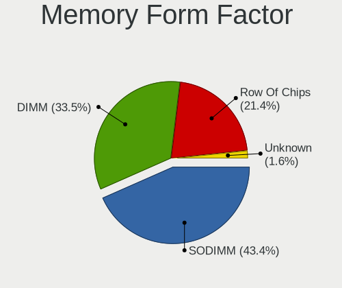

| Name         | Computers | Percent |
|--------------|-----------|---------|
| SODIMM       | 50        | 49.5%   |
| DIMM         | 26        | 25.74%  |
| Row Of Chips | 24        | 23.76%  |
| Unknown      | 1         | 0.99%   |

Memory Size
-----------

Memory module size

| Size  | Computers | Percent |
|-------|-----------|---------|
| 8192  | 45        | 41.67%  |
| 4096  | 30        | 27.78%  |
| 16384 | 18        | 16.67%  |
| 32768 | 8         | 7.41%   |
| 2048  | 6         | 5.56%   |
| 12288 | 1         | 0.93%   |

Memory Speed
------------

Memory module speed

| Speed | Computers | Percent |
|-------|-----------|---------|
| 3200  | 26        | 24.76%  |
| 2667  | 10        | 9.52%   |
| 1600  | 10        | 9.52%   |
| 6400  | 8         | 7.62%   |
| 4800  | 7         | 6.67%   |
| 2400  | 7         | 6.67%   |
| 2133  | 5         | 4.76%   |
| 4267  | 4         | 3.81%   |
| 3733  | 4         | 3.81%   |
| 1333  | 4         | 3.81%   |
| 3600  | 3         | 2.86%   |
| 3266  | 3         | 2.86%   |
| 2933  | 2         | 1.9%    |
| 1867  | 2         | 1.9%    |
| 1800  | 2         | 1.9%    |
| 8400  | 1         | 0.95%   |
| 3666  | 1         | 0.95%   |
| 3000  | 1         | 0.95%   |
| 2473  | 1         | 0.95%   |
| 1334  | 1         | 0.95%   |
| 1067  | 1         | 0.95%   |
| 800   | 1         | 0.95%   |
| 667   | 1         | 0.95%   |

Printers & scanners
-------------------

Printer Vendor
--------------

Printer device vendors

| Vendor             | Computers | Percent |
|--------------------|-----------|---------|
| Brother Industries | 2         | 50%     |
| Seiko Epson        | 1         | 25%     |
| Canon              | 1         | 25%     |

Printer Model
-------------

Printer device models

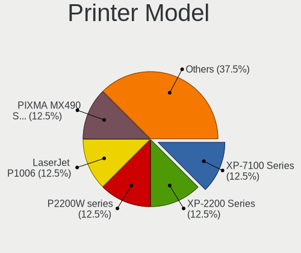

| Model                      | Computers | Percent |
|----------------------------|-----------|---------|
| Seiko Epson XP-7100 Series | 1         | 25%     |
| Canon PIXMA MX490 Series   | 1         | 25%     |
| Brother HL-L2310D series   | 1         | 25%     |
| Brother HL-3142CW series   | 1         | 25%     |

Scanner Vendor
--------------

Scanner device vendors

| Vendor | Computers | Percent |
|--------|-----------|---------|
| Canon  | 1         | 100%    |

Scanner Model
-------------

Scanner device models

| Model                              | Computers | Percent |
|------------------------------------|-----------|---------|
| Canon CanoScan N670U/N676U/LiDE 20 | 1         | 100%    |

Camera
------

Camera Vendor
-------------

Camera device vendors

| Vendor                                 | Computers | Percent |
|----------------------------------------|-----------|---------|
| Chicony Electronics                    | 23        | 18.85%  |
| IMC Networks                           | 12        | 9.84%   |
| Realtek Semiconductor                  | 10        | 8.2%    |
| Quanta                                 | 10        | 8.2%    |
| Apple                                  | 8         | 6.56%   |
| Microdia                               | 7         | 5.74%   |
| Cheng Uei Precision Industry (Foxlink) | 7         | 5.74%   |
| Bison Electronics                      | 6         | 4.92%   |
| Syntek                                 | 5         | 4.1%    |
| Sunplus Innovation Technology          | 5         | 4.1%    |
| Logitech                               | 5         | 4.1%    |
| Luxvisions Innotech Limited            | 4         | 3.28%   |
| Acer                                   | 3         | 2.46%   |
| SunplusIT                              | 2         | 1.64%   |
| Samsung Electronics                    | 2         | 1.64%   |
| Suyin                                  | 1         | 0.82%   |
| Sonix Technology                       | 1         | 0.82%   |
| SN0002                                 | 1         | 0.82%   |
| Silicon Motion                         | 1         | 0.82%   |
| Shenzhen Kingcome Optoelectronic       | 1         | 0.82%   |
| Primax Electronics                     | 1         | 0.82%   |
| OYT Tech                               | 1         | 0.82%   |
| Lite-On Technology                     | 1         | 0.82%   |
| Lenovo                                 | 1         | 0.82%   |
| Generalplus Technology                 | 1         | 0.82%   |
| GEMBIRD                                | 1         | 0.82%   |
| AVerMedia Technologies                 | 1         | 0.82%   |
| Alcor Micro                            | 1         | 0.82%   |

Camera Model
------------

Camera device models

| Model                                                                      | Computers | Percent |
|----------------------------------------------------------------------------|-----------|---------|
| IMC Networks USB2.0 HD UVC WebCam                                          | 8         | 6.4%    |
| Chicony Integrated Camera                                                  | 8         | 6.4%    |
| Syntek Integrated Camera                                                   | 4         | 3.2%    |
| Realtek HP Truevision HD                                                   | 4         | 3.2%    |
| Bison Integrated Camera                                                    | 4         | 3.2%    |
| Apple FaceTime HD Camera                                                   | 3         | 2.4%    |
| Sunplus Integrated_Webcam_HD                                               | 2         | 1.6%    |
| Samsung Galaxy series, misc. (MTP mode)                                    | 2         | 1.6%    |
| Quanta USB2.0 HD UVC WebCam                                                | 2         | 1.6%    |
| Quanta HD User Facing                                                      | 2         | 1.6%    |
| Microdia Integrated_Webcam_FHD                                             | 2         | 1.6%    |
| Luxvisions Innotech Limited Integrated RGB Camera                          | 2         | 1.6%    |
| Chicony HP TrueVision HD                                                   | 2         | 1.6%    |
| Chicony HD WebCam                                                          | 2         | 1.6%    |
| Chicony 720p HD Camera                                                     | 2         | 1.6%    |
| Cheng Uei Precision Industry (Foxlink) HP Wide Vision HD integrated webcam | 2         | 1.6%    |
| Cheng Uei Precision Industry (Foxlink) HP Wide Vision HD Camera            | 2         | 1.6%    |
| Apple iPhone 5/5C/5S/6/SE/7/8/X                                            | 2         | 1.6%    |
| Apple FaceTime HD Camera (Built-in)                                        | 2         | 1.6%    |
| Apple Built-in iSight                                                      | 2         | 1.6%    |
| Acer Integrated RGB Camera                                                 | 2         | 1.6%    |
| Syntek Lenovo EasyCamera                                                   | 1         | 0.8%    |
| Suyin 1.3M HD WebCam                                                       | 1         | 0.8%    |
| SunplusIT USB Camera                                                       | 1         | 0.8%    |
| SunplusIT 1080p FHD Camera                                                 | 1         | 0.8%    |
| Sunplus Laptop_Integrated_Webcam_FHD                                       | 1         | 0.8%    |
| Sunplus 1080P Webcam                                                       | 1         | 0.8%    |
| Sunplus 1.3M HD WebCam                                                     | 1         | 0.8%    |
| Sonix USB2.0 HD UVC WebCam                                                 | 1         | 0.8%    |
| SN0002 HIK 1080P USB CAMERA                                                | 1         | 0.8%    |
| Silicon Motion HP Webcam-101                                               | 1         | 0.8%    |
| Shenzhen Kingcome Optoelectronic 720p HD Camera                            | 1         | 0.8%    |
| Realtek USB Camera                                                         | 1         | 0.8%    |
| Realtek Laptop Camera                                                      | 1         | 0.8%    |
| Realtek Integrated_Webcam_HD                                               | 1         | 0.8%    |
| Realtek Integrated Webcam                                                  | 1         | 0.8%    |
| Realtek HP High Definition 1MP Webcam                                      | 1         | 0.8%    |
| Realtek HD Camera                                                          | 1         | 0.8%    |
| Quanta ov9734_techfront_camera                                             | 1         | 0.8%    |
| Quanta HP Wide Vision HD Camera                                            | 1         | 0.8%    |

Security
--------

Fingerprint Vendor
------------------

Fingerprint sensor vendors

| Vendor                             | Computers | Percent |
|------------------------------------|-----------|---------|
| Synaptics                          | 9         | 37.5%   |
| Validity Sensors                   | 7         | 29.17%  |
| Shenzhen Goodix Technology         | 6         | 25%     |
| Realtek USB2.0 Finger Print Bridge | 1         | 4.17%   |
| Elan Microelectronics              | 1         | 4.17%   |

Fingerprint Model
-----------------

Fingerprint sensor models

| Model                                                           | Computers | Percent |
|-----------------------------------------------------------------|-----------|---------|
| Shenzhen Goodix  Fingerprint Device                             | 4         | 16.67%  |
| Validity Sensors VFS495 Fingerprint Reader                      | 3         | 12.5%   |
| Synaptics UWP WBDI                                              | 3         | 12.5%   |
| Validity Sensors Swipe Fingerprint Sensor                       | 2         | 8.33%   |
| Synaptics Prometheus MIS Touch Fingerprint Reader               | 2         | 8.33%   |
| Synaptics FS7604 Touch Fingerprint Sensor with PurePrint        | 2         | 8.33%   |
| Shenzhen Goodix Fingerprint Reader                              | 2         | 8.33%   |
| Validity Sensors VFS471 Fingerprint Reader                      | 1         | 4.17%   |
| Validity Sensors Synaptics VFS7552 Touch Fingerprint Sensor     | 1         | 4.17%   |
| Synaptics WBDI                                                  | 1         | 4.17%   |
| Synaptics Metallica MIS Touch Fingerprint Reader                | 1         | 4.17%   |
| Realtek USB2.0 Finger Print Bridge FocalTech Fingerprint Device | 1         | 4.17%   |
| Elan ELAN:ARM-M4                                                | 1         | 4.17%   |

Chipcard Vendor
---------------

Chipcard module vendors

| Vendor       | Computers | Percent |
|--------------|-----------|---------|
| Broadcom     | 3         | 37.5%   |
| Alcor Micro  | 2         | 25%     |
| O2 Micro     | 1         | 12.5%   |
| Lenovo       | 1         | 12.5%   |
| Aladdin R.D. | 1         | 12.5%   |

Chipcard Model
--------------

Chipcard module models

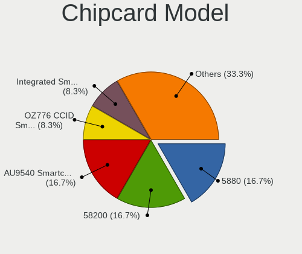

| Model                                          | Computers | Percent |
|------------------------------------------------|-----------|---------|
| Alcor Micro AU9540 Smartcard Reader            | 2         | 25%     |
| O2 Micro OZ776 CCID Smartcard Reader           | 1         | 12.5%   |
| Lenovo Integrated Smart Card Reader            | 1         | 12.5%   |
| Broadcom BCM5880 Secure Applications Processor | 1         | 12.5%   |
| Broadcom 5880                                  | 1         | 12.5%   |
| Broadcom 58200                                 | 1         | 12.5%   |
| Aladdin R.D. JaCarta                           | 1         | 12.5%   |

Unsupported
-----------

Unsupported Devices
-------------------

Total unsupported devices on board

| Total | Computers | Percent |
|-------|-----------|---------|
| 0     | 126       | 67.74%  |
| 1     | 50        | 26.88%  |
| 2     | 9         | 4.84%   |
| 3     | 1         | 0.54%   |

Unsupported Device Types
------------------------

Types of unsupported devices

| Type                     | Computers | Percent |
|--------------------------|-----------|---------|
| Fingerprint reader       | 24        | 35.82%  |
| Graphics card            | 8         | 11.94%  |
| Net/wireless             | 7         | 10.45%  |
| Chipcard                 | 7         | 10.45%  |
| Camera                   | 7         | 10.45%  |
| Multimedia controller    | 6         | 8.96%   |
| Unassigned class         | 2         | 2.99%   |
| Communication controller | 2         | 2.99%   |
| Storage                  | 1         | 1.49%   |
| Sound                    | 1         | 1.49%   |
| Card reader              | 1         | 1.49%   |
| Bluetooth                | 1         | 1.49%   |

