Kubuntu 24.04 - Tested Hardware & Statistics
--------------------------------------------

A project to collect tested hardware configurations for Kubuntu 24.04.

Anyone can contribute to this report by the [hw-probe](https://github.com/linuxhw/hw-probe) tool:

    sudo -E hw-probe -all -upload

Please contribute! Especially if your hardware is rare.

This is a report for all computer types. See also reports for [desktops](/Dist/Kubuntu_24.04/Desktop/README.md) and [notebooks](/Dist/Kubuntu_24.04/Notebook/README.md).

Contents
--------

* [ Test Cases ](#test-cases)

* [ System ](#system)
  - [ Kernel                   ](#kernel)
  - [ Kernel Family            ](#kernel-family)
  - [ Kernel Major Ver.        ](#kernel-major-ver)
  - [ Arch                     ](#arch)
  - [ DE                       ](#de)
  - [ Display Server           ](#display-server)
  - [ Display Manager          ](#display-manager)
  - [ OS Lang                  ](#os-lang)
  - [ Boot Mode                ](#boot-mode)
  - [ Filesystem               ](#filesystem)
  - [ Part. scheme             ](#part-scheme)
  - [ Dual Boot with Linux/BSD ](#dual-boot-with-linuxbsd)
  - [ Dual Boot (Win)          ](#dual-boot-win)

* [ Board ](#board)
  - [ Vendor                   ](#vendor)
  - [ Model                    ](#model)
  - [ Model Family             ](#model-family)
  - [ MFG Year                 ](#mfg-year)
  - [ Form Factor              ](#form-factor)
  - [ Secure Boot              ](#secure-boot)
  - [ Coreboot                 ](#coreboot)
  - [ RAM Size                 ](#ram-size)
  - [ RAM Used                 ](#ram-used)
  - [ Total Drives             ](#total-drives)
  - [ Has CD-ROM               ](#has-cd-rom)
  - [ Has Ethernet             ](#has-ethernet)
  - [ Has WiFi                 ](#has-wifi)
  - [ Has Bluetooth            ](#has-bluetooth)

* [ Location ](#location)
  - [ Country                  ](#country)
  - [ City                     ](#city)

* [ Drives ](#drives)
  - [ Drive Vendor             ](#drive-vendor)
  - [ Drive Model              ](#drive-model)
  - [ HDD Vendor               ](#hdd-vendor)
  - [ SSD Vendor               ](#ssd-vendor)
  - [ Drive Kind               ](#drive-kind)
  - [ Drive Connector          ](#drive-connector)
  - [ Drive Size               ](#drive-size)
  - [ Space Total              ](#space-total)
  - [ Space Used               ](#space-used)
  - [ Malfunc. Drives          ](#malfunc-drives)
  - [ Malfunc. Drive Vendor    ](#malfunc-drive-vendor)
  - [ Malfunc. HDD Vendor      ](#malfunc-hdd-vendor)
  - [ Malfunc. Drive Kind      ](#malfunc-drive-kind)
  - [ Failed Drives            ](#failed-drives)
  - [ Failed Drive Vendor      ](#failed-drive-vendor)
  - [ Drive Status             ](#drive-status)

* [ Storage controller ](#storage-controller)
  - [ Storage Vendor           ](#storage-vendor)
  - [ Storage Model            ](#storage-model)
  - [ Storage Kind             ](#storage-kind)

* [ Processor ](#processor)
  - [ CPU Vendor               ](#cpu-vendor)
  - [ CPU Model                ](#cpu-model)
  - [ CPU Model Family         ](#cpu-model-family)
  - [ CPU Cores                ](#cpu-cores)
  - [ CPU Sockets              ](#cpu-sockets)
  - [ CPU Threads              ](#cpu-threads)
  - [ CPU Op-Modes             ](#cpu-op-modes)
  - [ CPU Microcode            ](#cpu-microcode)
  - [ CPU Microarch            ](#cpu-microarch)

* [ Graphics ](#graphics)
  - [ GPU Vendor               ](#gpu-vendor)
  - [ GPU Model                ](#gpu-model)
  - [ GPU Combo                ](#gpu-combo)
  - [ GPU Driver               ](#gpu-driver)
  - [ GPU Memory               ](#gpu-memory)

* [ Monitor ](#monitor)
  - [ Monitor Vendor           ](#monitor-vendor)
  - [ Monitor Model            ](#monitor-model)
  - [ Monitor Resolution       ](#monitor-resolution)
  - [ Monitor Diagonal         ](#monitor-diagonal)
  - [ Monitor Width            ](#monitor-width)
  - [ Aspect Ratio             ](#aspect-ratio)
  - [ Monitor Area             ](#monitor-area)
  - [ Pixel Density            ](#pixel-density)
  - [ Multiple Monitors        ](#multiple-monitors)

* [ Network ](#network)
  - [ Net Controller Vendor    ](#net-controller-vendor)
  - [ Net Controller Model     ](#net-controller-model)
  - [ Wireless Vendor          ](#wireless-vendor)
  - [ Wireless Model           ](#wireless-model)
  - [ Ethernet Vendor          ](#ethernet-vendor)
  - [ Ethernet Model           ](#ethernet-model)
  - [ Net Controller Kind      ](#net-controller-kind)
  - [ Used Controller          ](#used-controller)
  - [ NICs                     ](#nics)
  - [ IPv6                     ](#ipv6)

* [ Bluetooth ](#bluetooth)
  - [ Bluetooth Vendor         ](#bluetooth-vendor)
  - [ Bluetooth Model          ](#bluetooth-model)

* [ Sound ](#sound)
  - [ Sound Vendor             ](#sound-vendor)
  - [ Sound Model              ](#sound-model)

* [ Memory ](#memory)
  - [ Memory Vendor            ](#memory-vendor)
  - [ Memory Model             ](#memory-model)
  - [ Memory Kind              ](#memory-kind)
  - [ Memory Form Factor       ](#memory-form-factor)
  - [ Memory Size              ](#memory-size)
  - [ Memory Speed             ](#memory-speed)

* [ Printers & scanners ](#printers--scanners)
  - [ Printer Vendor           ](#printer-vendor)
  - [ Printer Model            ](#printer-model)
  - [ Scanner Vendor           ](#scanner-vendor)
  - [ Scanner Model            ](#scanner-model)

* [ Camera ](#camera)
  - [ Camera Vendor            ](#camera-vendor)
  - [ Camera Model             ](#camera-model)

* [ Security ](#security)
  - [ Fingerprint Vendor       ](#fingerprint-vendor)
  - [ Fingerprint Model        ](#fingerprint-model)
  - [ Chipcard Vendor          ](#chipcard-vendor)
  - [ Chipcard Model           ](#chipcard-model)

* [ Unsupported ](#unsupported)
  - [ Unsupported Devices      ](#unsupported-devices)
  - [ Unsupported Device Types ](#unsupported-device-types)

Test Cases
----------

Total: 1633

| Vendor        | Model                       | Form-Factor | Probe                                                      | Date         |
|---------------|-----------------------------|-------------|------------------------------------------------------------|--------------|
| Dell          | 0R230R A00                  | Desktop     | [608b6c552c](https://linux-hardware.org/?probe=608b6c552c) | Jan 03, 2026 |
| Dell          | XPS 15 7590                 | Notebook    | [45baf5cfda](https://linux-hardware.org/?probe=45baf5cfda) | Jan 03, 2026 |
| Dell          | 0R230R A00                  | Desktop     | [b78a6a2aaf](https://linux-hardware.org/?probe=b78a6a2aaf) | Jan 03, 2026 |
| Lenovo        | ThinkPad T440p 20AWS2MV0... | Notebook    | [05e235bfba](https://linux-hardware.org/?probe=05e235bfba) | Jan 02, 2026 |
| HP            | EliteBook 840 G7 Noteboo... | Notebook    | [759aba404c](https://linux-hardware.org/?probe=759aba404c) | Jan 02, 2026 |
| ASRock        | 960GM-VGS3 FX               | Desktop     | [2b5f2cec37](https://linux-hardware.org/?probe=2b5f2cec37) | Jan 01, 2026 |
| MSI           | X470 GAMING PRO CARBON      | Desktop     | [0a215bad0e](https://linux-hardware.org/?probe=0a215bad0e) | Jan 01, 2026 |
| Samsung       | R540/SA41/E452              | Notebook    | [46b3f83b4e](https://linux-hardware.org/?probe=46b3f83b4e) | Dec 31, 2025 |
| ASUSTek       | GL752VW                     | Notebook    | [b879655d60](https://linux-hardware.org/?probe=b879655d60) | Dec 31, 2025 |
| Google        | Rull                        | Notebook    | [ca6535686c](https://linux-hardware.org/?probe=ca6535686c) | Dec 30, 2025 |
| Dell          | Latitude 7490               | Notebook    | [768e27927b](https://linux-hardware.org/?probe=768e27927b) | Dec 30, 2025 |
| Lenovo        | ThinkPad T470P 20J7S0000... | Notebook    | [f337debd8c](https://linux-hardware.org/?probe=f337debd8c) | Dec 28, 2025 |
| Gigabyte      | Z370 AORUS Ultra Gaming-... | Desktop     | [b22aaf7082](https://linux-hardware.org/?probe=b22aaf7082) | Dec 27, 2025 |
| Lenovo        | ThinkPad E16 Gen 3 21STS... | Notebook    | [54137893f9](https://linux-hardware.org/?probe=54137893f9) | Dec 27, 2025 |
| ASUSTek       | H81M-K                      | Desktop     | [12d3387460](https://linux-hardware.org/?probe=12d3387460) | Dec 23, 2025 |
| Acer          | TravelMate P215-53          | Notebook    | [9c84782bcd](https://linux-hardware.org/?probe=9c84782bcd) | Dec 22, 2025 |
| ASUSTek       | Maximus VII RANGER          | Desktop     | [ff20b7add1](https://linux-hardware.org/?probe=ff20b7add1) | Dec 21, 2025 |
| Gigabyte      | Z890 AORUS ELITE WIFI7      | Desktop     | [4b7526574f](https://linux-hardware.org/?probe=4b7526574f) | Dec 19, 2025 |
| Gigabyte      | X670 AORUS ELITE AX         | Desktop     | [b38150588f](https://linux-hardware.org/?probe=b38150588f) | Dec 19, 2025 |
| HP            | Pavilion Gaming Laptop 1... | Notebook    | [c414c3fa45](https://linux-hardware.org/?probe=c414c3fa45) | Dec 18, 2025 |
| MSI           | X470 GAMING PRO CARBON      | Desktop     | [8031e195fc](https://linux-hardware.org/?probe=8031e195fc) | Dec 18, 2025 |
| ASUSTek       | SABERTOOTH 990FX R2.0       | Desktop     | [c1f999dbb6](https://linux-hardware.org/?probe=c1f999dbb6) | Dec 18, 2025 |
| ASRock        | Z77 Extreme4                | Desktop     | [4076802605](https://linux-hardware.org/?probe=4076802605) | Dec 18, 2025 |
| MSI           | GS76 Stealth 11UG           | Notebook    | [176c86cacd](https://linux-hardware.org/?probe=176c86cacd) | Dec 18, 2025 |
| ASRock        | Z77 Extreme4                | Desktop     | [921365caba](https://linux-hardware.org/?probe=921365caba) | Dec 16, 2025 |
| ASRock        | 960GM-VGS3 FX               | Desktop     | [5d2d95c2ad](https://linux-hardware.org/?probe=5d2d95c2ad) | Dec 15, 2025 |
| Dell          | Inspiron M5110              | Notebook    | [3ca66be100](https://linux-hardware.org/?probe=3ca66be100) | Dec 14, 2025 |
| Lenovo        | ThinkPad T480 20L6SC5502    | Notebook    | [9dc1ce5344](https://linux-hardware.org/?probe=9dc1ce5344) | Dec 14, 2025 |
| Dell          | Inspiron 3537               | Notebook    | [6193fe62d1](https://linux-hardware.org/?probe=6193fe62d1) | Dec 13, 2025 |
| ASUSTek       | M5A78L-M/USB3               | Desktop     | [008646f27e](https://linux-hardware.org/?probe=008646f27e) | Dec 12, 2025 |
| ASRock        | FM2A85X Extreme6            | Desktop     | [b7e796973f](https://linux-hardware.org/?probe=b7e796973f) | Dec 11, 2025 |
| MACHINIST     | E5-V2.82H V1.1              | Desktop     | [b256500f89](https://linux-hardware.org/?probe=b256500f89) | Dec 11, 2025 |
| MSI           | MPG B650I EDGE WIFI         | Desktop     | [c6c68f5d47](https://linux-hardware.org/?probe=c6c68f5d47) | Dec 11, 2025 |
| Lenovo        | H415                        | Desktop     | [13941a5acc](https://linux-hardware.org/?probe=13941a5acc) | Dec 11, 2025 |
| MSI           | PRO Z790-A MAX WIFI         | Desktop     | [e72f9e0312](https://linux-hardware.org/?probe=e72f9e0312) | Dec 09, 2025 |
| Gigabyte      | P55-UD3                     | Desktop     | [f89fa17517](https://linux-hardware.org/?probe=f89fa17517) | Dec 09, 2025 |
| Apple         | MacBookAir7,2               | Notebook    | [ba99dcb9d1](https://linux-hardware.org/?probe=ba99dcb9d1) | Dec 09, 2025 |
| MSI           | MPG B550 GAMING PLUS        | Desktop     | [85c9295bd5](https://linux-hardware.org/?probe=85c9295bd5) | Dec 08, 2025 |
| Gigabyte      | Z890 AORUS ELITE WIFI7      | Desktop     | [791dd48baf](https://linux-hardware.org/?probe=791dd48baf) | Dec 08, 2025 |
| Samsung       | RC512                       | Notebook    | [ff28c9963e](https://linux-hardware.org/?probe=ff28c9963e) | Dec 08, 2025 |
| ASRock        | B550M Pro4                  | Desktop     | [81551c54bd](https://linux-hardware.org/?probe=81551c54bd) | Dec 08, 2025 |
| HP            | Notebook                    | Notebook    | [b43b11d458](https://linux-hardware.org/?probe=b43b11d458) | Dec 07, 2025 |
| Lenovo        | ThinkPad P16v Gen 1 21FE... | Notebook    | [85f00fb41b](https://linux-hardware.org/?probe=85f00fb41b) | Dec 06, 2025 |
| Dell          | Inspiron 16 7610            | Notebook    | [0faac2f6e3](https://linux-hardware.org/?probe=0faac2f6e3) | Dec 06, 2025 |
| Gigabyte      | Z370P D3-CF                 | Desktop     | [14b8be4995](https://linux-hardware.org/?probe=14b8be4995) | Dec 06, 2025 |
| Apple         | Mac-031AEE4D24BFF0B1 Mac... | Mini pc     | [c7adaedacd](https://linux-hardware.org/?probe=c7adaedacd) | Dec 06, 2025 |
| ASUSTek       | G10AJ                       | Desktop     | [679f5f24a8](https://linux-hardware.org/?probe=679f5f24a8) | Dec 06, 2025 |
| Razer         | Blade Stealth 13 (Early ... | Notebook    | [b61da47e2c](https://linux-hardware.org/?probe=b61da47e2c) | Dec 05, 2025 |
| Carbon Sys... | Iridium 14                  | Notebook    | [0b2241c241](https://linux-hardware.org/?probe=0b2241c241) | Dec 03, 2025 |
| HP            | 3396                        | Desktop     | [77dd14d836](https://linux-hardware.org/?probe=77dd14d836) | Dec 03, 2025 |
| Dell          | Inspiron M5110              | Notebook    | [9d62fd9ee4](https://linux-hardware.org/?probe=9d62fd9ee4) | Dec 01, 2025 |
| MSI           | X470 GAMING PRO CARBON      | Desktop     | [76242f0f5c](https://linux-hardware.org/?probe=76242f0f5c) | Dec 01, 2025 |
| HP            | OMEN by Gaming Laptop 16... | Notebook    | [3c04c57e59](https://linux-hardware.org/?probe=3c04c57e59) | Nov 29, 2025 |
| Gigabyte      | P67A-UD3-B3                 | Desktop     | [8b40f96128](https://linux-hardware.org/?probe=8b40f96128) | Nov 29, 2025 |
| MSI           | X470 GAMING PRO CARBON      | Desktop     | [538e57b770](https://linux-hardware.org/?probe=538e57b770) | Nov 28, 2025 |
| ASUSTek       | Z97-A                       | Desktop     | [fa18321411](https://linux-hardware.org/?probe=fa18321411) | Nov 28, 2025 |
| HP            | Pavilion Gaming Laptop 1... | Notebook    | [34b2266667](https://linux-hardware.org/?probe=34b2266667) | Nov 28, 2025 |
| ASRock        | X570S PG Riptide            | Desktop     | [dbda02e3a8](https://linux-hardware.org/?probe=dbda02e3a8) | Nov 26, 2025 |
| Lenovo        | ThinkPad P50 20EQS27Q06     | Notebook    | [1756a7f373](https://linux-hardware.org/?probe=1756a7f373) | Nov 26, 2025 |
| MSI           | B560M PRO-VDH               | Desktop     | [1ba7902c43](https://linux-hardware.org/?probe=1ba7902c43) | Nov 25, 2025 |
| Framework     | Laptop 16 (AMD Ryzen 704... | Notebook    | [c4d3b78c1b](https://linux-hardware.org/?probe=c4d3b78c1b) | Nov 25, 2025 |
| Unknown       | Unknown                     | Desktop     | [49057c278a](https://linux-hardware.org/?probe=49057c278a) | Nov 24, 2025 |
| MSI           | Cyborg 14 A13VF             | Notebook    | [c1e58de1e9](https://linux-hardware.org/?probe=c1e58de1e9) | Nov 24, 2025 |
| Dell          | Latitude 5400               | Notebook    | [f9b59b73e9](https://linux-hardware.org/?probe=f9b59b73e9) | Nov 24, 2025 |
| Gigabyte      | GA-970A-DS3                 | Desktop     | [9b73d35fd7](https://linux-hardware.org/?probe=9b73d35fd7) | Nov 24, 2025 |
| MSI           | PRO Z890-P WIFI             | Desktop     | [d3148d8b04](https://linux-hardware.org/?probe=d3148d8b04) | Nov 24, 2025 |
| ASUSTek       | ROG STRIX B760-I GAMING ... | Desktop     | [2284902152](https://linux-hardware.org/?probe=2284902152) | Nov 23, 2025 |
| Schenker      | XMG CORE 17(M20, RTX 206... | Notebook    | [f84a60e63d](https://linux-hardware.org/?probe=f84a60e63d) | Nov 23, 2025 |
| ASRock        | 960GM-VGS3 FX               | Desktop     | [968e3e448a](https://linux-hardware.org/?probe=968e3e448a) | Nov 22, 2025 |
| Intel         | X79 V1.x                    | Desktop     | [eeef4fe12f](https://linux-hardware.org/?probe=eeef4fe12f) | Nov 21, 2025 |
| Intel         | X79 V1.x                    | Desktop     | [f89a14ad2e](https://linux-hardware.org/?probe=f89a14ad2e) | Nov 21, 2025 |
| Dell          | 088DT1 A01                  | Desktop     | [44d64f5b68](https://linux-hardware.org/?probe=44d64f5b68) | Nov 21, 2025 |
| ASUSTek       | TUF Gaming Z790-PRO WIFI    | Desktop     | [a9377fb2c0](https://linux-hardware.org/?probe=a9377fb2c0) | Nov 20, 2025 |
| ASUSTek       | TUF Gaming Z790-PRO WIFI    | Desktop     | [64d351156c](https://linux-hardware.org/?probe=64d351156c) | Nov 20, 2025 |
| Dell          | 0F5C5X A00                  | Desktop     | [cfadf3fffd](https://linux-hardware.org/?probe=cfadf3fffd) | Nov 19, 2025 |
| Dell          | XPS 17 9700                 | Notebook    | [548eaf6754](https://linux-hardware.org/?probe=548eaf6754) | Nov 18, 2025 |
| Dell          | 0WR7PY A02                  | Desktop     | [1ee8f00fe4](https://linux-hardware.org/?probe=1ee8f00fe4) | Nov 17, 2025 |
| GMKtec        | NucBox K10                  | Mini pc     | [17f8240a06](https://linux-hardware.org/?probe=17f8240a06) | Nov 17, 2025 |
| Intel         | VALLEYVIEW C0 PLATFORM      | Tablet      | [944f8b506d](https://linux-hardware.org/?probe=944f8b506d) | Nov 16, 2025 |
| ASUSTek       | ASUS TUF Gaming A15 FA50... | Notebook    | [b1297246eb](https://linux-hardware.org/?probe=b1297246eb) | Nov 16, 2025 |
| Intel         | NUC7i5BNB J31144-309        | Mini pc     | [e0a727ceda](https://linux-hardware.org/?probe=e0a727ceda) | Nov 15, 2025 |
| MSI           | X470 GAMING PRO CARBON      | Desktop     | [81831d47ca](https://linux-hardware.org/?probe=81831d47ca) | Nov 14, 2025 |
| ASUSTek       | TUF Gaming B450M-PRO II     | Desktop     | [f5916b5ac1](https://linux-hardware.org/?probe=f5916b5ac1) | Nov 14, 2025 |
| Dell          | Latitude 5400               | Notebook    | [1f5603aa35](https://linux-hardware.org/?probe=1f5603aa35) | Nov 14, 2025 |
| Dell          | XPS 15 9520                 | Notebook    | [c88a1544e1](https://linux-hardware.org/?probe=c88a1544e1) | Nov 12, 2025 |
| MSI           | A320M-A PRO MAX             | Desktop     | [69dd30a433](https://linux-hardware.org/?probe=69dd30a433) | Nov 11, 2025 |
| ASUSTek       | G10AJ                       | Desktop     | [792688da40](https://linux-hardware.org/?probe=792688da40) | Nov 11, 2025 |
| Dell          | Latitude E7450              | Notebook    | [8b89d824a8](https://linux-hardware.org/?probe=8b89d824a8) | Nov 11, 2025 |
| Dell          | Inspiron 5515               | Notebook    | [183eda914a](https://linux-hardware.org/?probe=183eda914a) | Nov 09, 2025 |
| MSI           | A320M-A PRO MAX             | Desktop     | [571d98b135](https://linux-hardware.org/?probe=571d98b135) | Nov 09, 2025 |
| HP            | Laptop 15-fd0xxx            | Notebook    | [609fa22dfb](https://linux-hardware.org/?probe=609fa22dfb) | Nov 08, 2025 |
| ASRock        | 960GM-VGS3 FX               | Desktop     | [0de7b0e501](https://linux-hardware.org/?probe=0de7b0e501) | Nov 05, 2025 |
| Lenovo        | Legion Go 8APU1 83E1        | Tablet      | [8bf38fe2f5](https://linux-hardware.org/?probe=8bf38fe2f5) | Nov 04, 2025 |
| SZQFTX        | Unknown                     | Desktop     | [29a7664a9b](https://linux-hardware.org/?probe=29a7664a9b) | Nov 04, 2025 |
| TUXEDO        | Aura 15 Gen1                | Notebook    | [943e2acada](https://linux-hardware.org/?probe=943e2acada) | Nov 04, 2025 |
| Gigabyte      | B550 GAMING X V2            | Desktop     | [1fd7171659](https://linux-hardware.org/?probe=1fd7171659) | Nov 03, 2025 |
| MSI           | A520M-A PRO                 | Desktop     | [b6e8caa135](https://linux-hardware.org/?probe=b6e8caa135) | Nov 03, 2025 |
| Packard Be... | EasyNote TE11HC             | Notebook    | [04d5c3b470](https://linux-hardware.org/?probe=04d5c3b470) | Nov 03, 2025 |
| Packard Be... | EasyNote TE11HC             | Notebook    | [ddeb2e04ba](https://linux-hardware.org/?probe=ddeb2e04ba) | Nov 03, 2025 |
| MSI           | B560M PRO                   | Desktop     | [b6380fa73c](https://linux-hardware.org/?probe=b6380fa73c) | Nov 02, 2025 |
| Lenovo        | ThinkPad 25 20K70000MX      | Notebook    | [7ec18d6388](https://linux-hardware.org/?probe=7ec18d6388) | Nov 02, 2025 |
| GMKtec        | M3                          | Desktop     | [06eced0721](https://linux-hardware.org/?probe=06eced0721) | Nov 01, 2025 |
| Unknown       | V00                         | Mini pc     | [a7207675ea](https://linux-hardware.org/?probe=a7207675ea) | Nov 01, 2025 |
| MSI           | X470 GAMING PRO CARBON      | Desktop     | [f40f893a78](https://linux-hardware.org/?probe=f40f893a78) | Nov 01, 2025 |
| ASRock        | B450 Gaming-ITX/ac          | Desktop     | [abc6320472](https://linux-hardware.org/?probe=abc6320472) | Oct 31, 2025 |
| Shenzhen M... | F7BSC                       | Mini pc     | [3c94619c10](https://linux-hardware.org/?probe=3c94619c10) | Oct 30, 2025 |
| Gigabyte      | Z390 D                      | Desktop     | [7dbe2e1ba0](https://linux-hardware.org/?probe=7dbe2e1ba0) | Oct 30, 2025 |
| Acer          | Swift SF314-510G            | Notebook    | [c30b00e2a0](https://linux-hardware.org/?probe=c30b00e2a0) | Oct 29, 2025 |
| BESSTAR Te... | HM90                        | Desktop     | [5fbd1dc46b](https://linux-hardware.org/?probe=5fbd1dc46b) | Oct 29, 2025 |
| Gigabyte      | F2A88XM-HD3P                | Desktop     | [fb34657e1a](https://linux-hardware.org/?probe=fb34657e1a) | Oct 29, 2025 |
| ASUSTek       | ASUS TUF Gaming A17 FA70... | Notebook    | [a197ff5323](https://linux-hardware.org/?probe=a197ff5323) | Oct 29, 2025 |
| Lenovo        | IdeaPad Duet 3 10IGL5-LT... | Tablet      | [8233104335](https://linux-hardware.org/?probe=8233104335) | Oct 28, 2025 |
| Intel         | X79 V1.x                    | Desktop     | [b5cb021383](https://linux-hardware.org/?probe=b5cb021383) | Oct 28, 2025 |
| Acer          | Aspire V3-772G              | Notebook    | [8101df2358](https://linux-hardware.org/?probe=8101df2358) | Oct 27, 2025 |
| MECHREVO      | JIGUANG Series              | Notebook    | [d8c25ae1c1](https://linux-hardware.org/?probe=d8c25ae1c1) | Oct 27, 2025 |
| Lenovo        | ThinkPad Yoga 370 20JJS0... | Convertible | [a1befd04e4](https://linux-hardware.org/?probe=a1befd04e4) | Oct 27, 2025 |
| ASUSTek       | PRIME Z490-P                | Desktop     | [9a5921cc32](https://linux-hardware.org/?probe=9a5921cc32) | Oct 26, 2025 |
| Fujitsu       | D3220-A1 S26361-D3220-A1    | Desktop     | [cffee45c29](https://linux-hardware.org/?probe=cffee45c29) | Oct 26, 2025 |
| MSI           | 2AE0                        | Desktop     | [e56c3bd1b2](https://linux-hardware.org/?probe=e56c3bd1b2) | Oct 26, 2025 |
| Dell          | Inspiron 3537               | Notebook    | [23b95661aa](https://linux-hardware.org/?probe=23b95661aa) | Oct 25, 2025 |
| HP            | 83E1                        | Desktop     | [e14ffb539f](https://linux-hardware.org/?probe=e14ffb539f) | Oct 23, 2025 |
| ASUSTek       | G10AJ                       | Desktop     | [7a980f7e43](https://linux-hardware.org/?probe=7a980f7e43) | Oct 22, 2025 |
| ASUSTek       | N53SV                       | Notebook    | [5e13ee1135](https://linux-hardware.org/?probe=5e13ee1135) | Oct 22, 2025 |
| Lenovo        | ThinkPad P16 Gen 3 21RQC... | Notebook    | [1c16472656](https://linux-hardware.org/?probe=1c16472656) | Oct 22, 2025 |
| Dell          | Latitude XT3                | Notebook    | [553fd03858](https://linux-hardware.org/?probe=553fd03858) | Oct 21, 2025 |
| MSI           | GF75 Thin 9SD               | Notebook    | [417c7db627](https://linux-hardware.org/?probe=417c7db627) | Oct 21, 2025 |
| Lenovo        | IdeaPad 5 15IIL05 81YK      | Notebook    | [81714858a9](https://linux-hardware.org/?probe=81714858a9) | Oct 21, 2025 |
| Acer          | Veriton S2660G              | Desktop     | [bbfa110a0a](https://linux-hardware.org/?probe=bbfa110a0a) | Oct 21, 2025 |
| Dell          | Inspiron 7437               | Notebook    | [c521b7da3d](https://linux-hardware.org/?probe=c521b7da3d) | Oct 20, 2025 |
| Dell          | 0WR7PY A02                  | Desktop     | [47d5db1368](https://linux-hardware.org/?probe=47d5db1368) | Oct 20, 2025 |
| Apple         | MacBookAir6,1               | Notebook    | [fc3e779b0e](https://linux-hardware.org/?probe=fc3e779b0e) | Oct 20, 2025 |
| ASUSTek       | PRIME A520M-A II            | Desktop     | [2c4ed7fdf0](https://linux-hardware.org/?probe=2c4ed7fdf0) | Oct 19, 2025 |
| ASUSTek       | PRIME A520M-A II            | Desktop     | [b5703ffd09](https://linux-hardware.org/?probe=b5703ffd09) | Oct 19, 2025 |
| Lenovo        | Yoga Pro 9 16IAH10 83L0     | Notebook    | [e164bf2066](https://linux-hardware.org/?probe=e164bf2066) | Oct 19, 2025 |
| ASUSTek       | X556UF                      | Notebook    | [54cccee894](https://linux-hardware.org/?probe=54cccee894) | Oct 19, 2025 |
| HP            | 8055                        | Desktop     | [9545076669](https://linux-hardware.org/?probe=9545076669) | Oct 18, 2025 |
| MSI           | PRO B650-S WIFI             | Desktop     | [65e65eebfb](https://linux-hardware.org/?probe=65e65eebfb) | Oct 18, 2025 |
| MSI           | PRO B650-S WIFI             | Desktop     | [75f8f1d0ae](https://linux-hardware.org/?probe=75f8f1d0ae) | Oct 18, 2025 |
| Gigabyte      | B550 GAMING X V2            | Desktop     | [2a205694b8](https://linux-hardware.org/?probe=2a205694b8) | Oct 18, 2025 |
| ASUSTek       | G550JK                      | Notebook    | [7610da21b0](https://linux-hardware.org/?probe=7610da21b0) | Oct 16, 2025 |
| MSI           | X470 GAMING PRO CARBON      | Desktop     | [936e85f1c1](https://linux-hardware.org/?probe=936e85f1c1) | Oct 15, 2025 |
| HP            | ProBook 650 G4              | Notebook    | [f33264a68b](https://linux-hardware.org/?probe=f33264a68b) | Oct 15, 2025 |
| TUXEDO        | InfinityBook Pro Gen8 (M... | Notebook    | [05e2452a7e](https://linux-hardware.org/?probe=05e2452a7e) | Oct 15, 2025 |
| Unknown       | Unknown                     | Soc         | [b278396b49](https://linux-hardware.org/?probe=b278396b49) | Oct 14, 2025 |
| Toshiba       | Satellite C70D-B            | Notebook    | [f04ef742f1](https://linux-hardware.org/?probe=f04ef742f1) | Oct 14, 2025 |
| TUXEDO        | InfinityBook Pro Gen8 (M... | Notebook    | [1fbebf12a0](https://linux-hardware.org/?probe=1fbebf12a0) | Oct 14, 2025 |
| ASUSTek       | Z890 MAX GAMING WIFI7       | Desktop     | [afdc4c9509](https://linux-hardware.org/?probe=afdc4c9509) | Oct 13, 2025 |
| Chuwi         | LarkBox X                   | Mini pc     | [c512836670](https://linux-hardware.org/?probe=c512836670) | Oct 13, 2025 |
| Gigabyte      | X570 AORUS XTREME           | Desktop     | [e8a45007d8](https://linux-hardware.org/?probe=e8a45007d8) | Oct 12, 2025 |
| Gigabyte      | X570 AORUS XTREME           | Desktop     | [0d8d85b5cd](https://linux-hardware.org/?probe=0d8d85b5cd) | Oct 12, 2025 |
| Chuwi         | LarkBox X                   | Mini pc     | [0e6cb27c8f](https://linux-hardware.org/?probe=0e6cb27c8f) | Oct 12, 2025 |
| Dell          | Precision M4800             | Notebook    | [b30faf9878](https://linux-hardware.org/?probe=b30faf9878) | Oct 12, 2025 |
| Lenovo        | Yoga 7 2-in-1 16IML9 83D... | Convertible | [4137ca1fe9](https://linux-hardware.org/?probe=4137ca1fe9) | Oct 12, 2025 |
| Microsoft     | Surface Pro 7               | Tablet      | [57daa6f1c3](https://linux-hardware.org/?probe=57daa6f1c3) | Oct 12, 2025 |
| Microsoft     | Surface Pro 7               | Tablet      | [cecb3d08e6](https://linux-hardware.org/?probe=cecb3d08e6) | Oct 12, 2025 |
| Lenovo        | ThinkPad T16 Gen 1 21CJS... | Notebook    | [40cda73174](https://linux-hardware.org/?probe=40cda73174) | Oct 11, 2025 |
| Lenovo        | ThinkPad T16 Gen 1 21CJS... | Notebook    | [a57cfa0fa7](https://linux-hardware.org/?probe=a57cfa0fa7) | Oct 11, 2025 |
| Lenovo        | ThinkPad E590 20NB0029IX    | Notebook    | [f44464c35a](https://linux-hardware.org/?probe=f44464c35a) | Oct 10, 2025 |
| Lenovo        | IdeaPadFlex 5 14ARE05 81... | Convertible | [f42eb5489f](https://linux-hardware.org/?probe=f42eb5489f) | Oct 09, 2025 |
| Acer          | Aspire A15-41M              | Notebook    | [ad1c5689f3](https://linux-hardware.org/?probe=ad1c5689f3) | Oct 08, 2025 |
| SKIKK         | Sindri 14                   | Notebook    | [8b80adfb7b](https://linux-hardware.org/?probe=8b80adfb7b) | Oct 08, 2025 |
| ASUSTek       | ASUS TUF Gaming F17 FX70... | Notebook    | [09621dc838](https://linux-hardware.org/?probe=09621dc838) | Oct 08, 2025 |
| ASUSTek       | ASUS TUF Gaming F17 FX70... | Notebook    | [02f448b3f6](https://linux-hardware.org/?probe=02f448b3f6) | Oct 08, 2025 |
| Gigabyte      | B75M-D2V                    | Desktop     | [b3c7164cc5](https://linux-hardware.org/?probe=b3c7164cc5) | Oct 07, 2025 |
| HP            | Pavilion Laptop 15-eg2xx... | Notebook    | [9d2142ff4f](https://linux-hardware.org/?probe=9d2142ff4f) | Oct 06, 2025 |
| ASUSTek       | P7P55D-E                    | Desktop     | [90ecf6f39f](https://linux-hardware.org/?probe=90ecf6f39f) | Oct 05, 2025 |
| ASUSTek       | PRIME X670E-PRO WIFI        | Desktop     | [b103fa399b](https://linux-hardware.org/?probe=b103fa399b) | Oct 05, 2025 |
| MSI           | X470 GAMING PRO CARBON      | Desktop     | [674a11c951](https://linux-hardware.org/?probe=674a11c951) | Oct 04, 2025 |
| Apple         | Mac-65CE76090165799A iMa... | All in one  | [379b22955c](https://linux-hardware.org/?probe=379b22955c) | Oct 04, 2025 |
| Apple         | Mac-65CE76090165799A iMa... | All in one  | [0e08dc1d58](https://linux-hardware.org/?probe=0e08dc1d58) | Oct 04, 2025 |
| HP            | 8CF2                        | Desktop     | [125979ed5b](https://linux-hardware.org/?probe=125979ed5b) | Oct 04, 2025 |
| HUAWEI        | MACHD-WXX9                  | Notebook    | [15e5fecee0](https://linux-hardware.org/?probe=15e5fecee0) | Oct 03, 2025 |
| Acer          | Aspire A515-45              | Notebook    | [aa700999ce](https://linux-hardware.org/?probe=aa700999ce) | Oct 03, 2025 |
| Google        | Cave                        | Convertible | [d6db97bd5a](https://linux-hardware.org/?probe=d6db97bd5a) | Oct 03, 2025 |
| Lenovo        | IdeaPad 5 14ITL05 82FE      | Notebook    | [1cd0eea63a](https://linux-hardware.org/?probe=1cd0eea63a) | Oct 03, 2025 |
| MSI           | Z170A GAMING M5             | Desktop     | [7b9baeb73b](https://linux-hardware.org/?probe=7b9baeb73b) | Oct 02, 2025 |
| Lenovo        | ThinkPad X1 Carbon Gen 1... | Notebook    | [34764077ad](https://linux-hardware.org/?probe=34764077ad) | Oct 02, 2025 |
| ASUSTek       | K56CB                       | Notebook    | [c226567150](https://linux-hardware.org/?probe=c226567150) | Oct 01, 2025 |
| MSI           | X470 GAMING PRO CARBON      | Desktop     | [0db9ef8eee](https://linux-hardware.org/?probe=0db9ef8eee) | Oct 01, 2025 |
| Lenovo        | ThinkPad T470 W10DG 20JN... | Notebook    | [b37aa34c00](https://linux-hardware.org/?probe=b37aa34c00) | Sep 29, 2025 |
| Gigabyte      | B850 AORUS ELITE WIFI7 I... | Desktop     | [6ef18f732c](https://linux-hardware.org/?probe=6ef18f732c) | Sep 28, 2025 |
| Dell          | 0JP3NX A01                  | Desktop     | [9f8942b4b0](https://linux-hardware.org/?probe=9f8942b4b0) | Sep 28, 2025 |
| Gigabyte      | B550 GAMING X V2            | Desktop     | [9a90992d53](https://linux-hardware.org/?probe=9a90992d53) | Sep 28, 2025 |
| HP            | EliteBook 840 G6            | Notebook    | [6a93acf5d7](https://linux-hardware.org/?probe=6a93acf5d7) | Sep 28, 2025 |
| Lenovo        | ThinkPad E14 Gen 7 21SX0... | Notebook    | [c7b82f3eed](https://linux-hardware.org/?probe=c7b82f3eed) | Sep 28, 2025 |
| Lenovo        | ThinkPad P16s Gen 2 21K9... | Notebook    | [163c71f9d5](https://linux-hardware.org/?probe=163c71f9d5) | Sep 26, 2025 |
| HP            | Pavilion Laptop 15-cc0xx    | Notebook    | [b49eff65a5](https://linux-hardware.org/?probe=b49eff65a5) | Sep 25, 2025 |
| Huanan        | X99-QD4 V0.1 693H           | Desktop     | [ec53896ca8](https://linux-hardware.org/?probe=ec53896ca8) | Sep 24, 2025 |
| Lenovo        | IdeaPad 1 14ADA05 82GW      | Notebook    | [1081c0a6f6](https://linux-hardware.org/?probe=1081c0a6f6) | Sep 24, 2025 |
| Lenovo        | ThinkPad E460 20ETA00DCD    | Notebook    | [80ea7ec482](https://linux-hardware.org/?probe=80ea7ec482) | Sep 23, 2025 |
| Lenovo        | ThinkPad T470P 20J7S0000... | Notebook    | [3a9d7ff7d2](https://linux-hardware.org/?probe=3a9d7ff7d2) | Sep 22, 2025 |
| MSI           | B85M-P33                    | Desktop     | [b1ce14d0e2](https://linux-hardware.org/?probe=b1ce14d0e2) | Sep 21, 2025 |
| ASUSTek       | K56CB                       | Notebook    | [5d4e6f340b](https://linux-hardware.org/?probe=5d4e6f340b) | Sep 20, 2025 |
| Lenovo        | IdeaPad 320-15IKB 80XL      | Notebook    | [1069d5f3ca](https://linux-hardware.org/?probe=1069d5f3ca) | Sep 20, 2025 |
| Acer          | Aspire A314-22              | Notebook    | [897c4e7883](https://linux-hardware.org/?probe=897c4e7883) | Sep 20, 2025 |
| HP            | 21D0                        | Desktop     | [fbfe3348df](https://linux-hardware.org/?probe=fbfe3348df) | Sep 19, 2025 |
| Unknown       | Unknown                     | Soc         | [2ed0dcab8b](https://linux-hardware.org/?probe=2ed0dcab8b) | Sep 17, 2025 |
| Sony          | SVF13N2Y2ES                 | Notebook    | [412329d59a](https://linux-hardware.org/?probe=412329d59a) | Sep 17, 2025 |
| Google        | Yaviks                      | Notebook    | [5fed74b1ee](https://linux-hardware.org/?probe=5fed74b1ee) | Sep 17, 2025 |
| Dell          | Pro 14 Plus PB14250         | Notebook    | [a428508c95](https://linux-hardware.org/?probe=a428508c95) | Sep 17, 2025 |
| Acer          | Aspire A315-35              | Notebook    | [a83625dd78](https://linux-hardware.org/?probe=a83625dd78) | Sep 16, 2025 |
| ASUSTek       | ProArt X570-CREATOR WIFI    | Desktop     | [fecfafe38d](https://linux-hardware.org/?probe=fecfafe38d) | Sep 16, 2025 |
| HP            | 2AF8                        | Desktop     | [8f0ba098b1](https://linux-hardware.org/?probe=8f0ba098b1) | Sep 14, 2025 |
| HP            | 2AF8                        | Desktop     | [177f2ed854](https://linux-hardware.org/?probe=177f2ed854) | Sep 14, 2025 |
| Lenovo        | Yoga C940-15IRH 81TE        | Convertible | [a40a673e7e](https://linux-hardware.org/?probe=a40a673e7e) | Sep 14, 2025 |
| HP            | ZBook Studio G7 Mobile W... | Notebook    | [80f7e4bf88](https://linux-hardware.org/?probe=80f7e4bf88) | Sep 13, 2025 |
| MSI           | PRO Z790-P WIFI             | Desktop     | [848aea98f9](https://linux-hardware.org/?probe=848aea98f9) | Sep 13, 2025 |
| MSI           | PRO H610M-G DDR4            | Desktop     | [e2d2a0dea0](https://linux-hardware.org/?probe=e2d2a0dea0) | Sep 13, 2025 |
| Sony          | SVF13N2Y2ES                 | Notebook    | [669fb478f4](https://linux-hardware.org/?probe=669fb478f4) | Sep 13, 2025 |
| Sony          | SVF13N2Y2ES                 | Notebook    | [571bac7fce](https://linux-hardware.org/?probe=571bac7fce) | Sep 13, 2025 |
| Lenovo        | ThinkPad T450 20BUS0B000    | Notebook    | [963e73dbdd](https://linux-hardware.org/?probe=963e73dbdd) | Sep 13, 2025 |
| ASRock        | Z790 PG-ITX/TB4             | Desktop     | [096bb2cfbb](https://linux-hardware.org/?probe=096bb2cfbb) | Sep 12, 2025 |
| win elemen... | MoreFine S500+              | Notebook    | [f03055b6c7](https://linux-hardware.org/?probe=f03055b6c7) | Sep 12, 2025 |
| Positivo      | POS-EIQ87CY POSITIVO        | Desktop     | [057db96690](https://linux-hardware.org/?probe=057db96690) | Sep 12, 2025 |
| Unknown       | Unknown                     | Mini pc     | [3b6a207514](https://linux-hardware.org/?probe=3b6a207514) | Sep 11, 2025 |
| Unknown       | Unknown                     | Notebook    | [90f1e8b526](https://linux-hardware.org/?probe=90f1e8b526) | Sep 10, 2025 |
| Shenzhen M... | F7BSC                       | Mini pc     | [34545c218b](https://linux-hardware.org/?probe=34545c218b) | Sep 10, 2025 |
| HP            | Notebook                    | Notebook    | [f7903f129a](https://linux-hardware.org/?probe=f7903f129a) | Sep 10, 2025 |
| Dell          | Latitude E7450              | Notebook    | [3aeca6f165](https://linux-hardware.org/?probe=3aeca6f165) | Sep 09, 2025 |
| ASUSTek       | CROSSBLADE RANGER           | Desktop     | [5fce52b1a1](https://linux-hardware.org/?probe=5fce52b1a1) | Sep 09, 2025 |
| Lenovo        | ThinkPad L490 20Q6CTO1WW    | Notebook    | [5b2c155a6e](https://linux-hardware.org/?probe=5b2c155a6e) | Sep 08, 2025 |
| Lenovo        | ThinkPad T16 Gen 1 21CJS... | Notebook    | [f1a9e7c054](https://linux-hardware.org/?probe=f1a9e7c054) | Sep 07, 2025 |
| HP            | 158B                        | Desktop     | [ca916ef5b2](https://linux-hardware.org/?probe=ca916ef5b2) | Sep 07, 2025 |
| ASUSTek       | ROG STRIX X399-E GAMING     | Desktop     | [f670387a03](https://linux-hardware.org/?probe=f670387a03) | Sep 06, 2025 |
| ASUSTek       | ROG STRIX X399-E GAMING     | Desktop     | [38283089e6](https://linux-hardware.org/?probe=38283089e6) | Sep 06, 2025 |
| ASUSTek       | VivoBook_ASUSLaptop X705... | Notebook    | [79da11b093](https://linux-hardware.org/?probe=79da11b093) | Sep 05, 2025 |
| ASRock        | 960GM-VGS3 FX               | Desktop     | [45863c210d](https://linux-hardware.org/?probe=45863c210d) | Sep 04, 2025 |
| MSI           | Z370 GAMING PLUS            | Desktop     | [50a15b8930](https://linux-hardware.org/?probe=50a15b8930) | Sep 03, 2025 |
| HP            | EliteBook 840 14 inch G1... | Notebook    | [bc4e699515](https://linux-hardware.org/?probe=bc4e699515) | Sep 03, 2025 |
| ASUSTek       | ROG STRIX X399-E GAMING     | Desktop     | [36cbb05495](https://linux-hardware.org/?probe=36cbb05495) | Sep 02, 2025 |
| Toshiba       | Satellite L455              | Notebook    | [81532529d5](https://linux-hardware.org/?probe=81532529d5) | Sep 02, 2025 |
| Chuwi         | GemiBook                    | Notebook    | [0031b00ba6](https://linux-hardware.org/?probe=0031b00ba6) | Sep 02, 2025 |
| Lenovo        | IdeaPad P580 20184          | Notebook    | [d7bb5daee3](https://linux-hardware.org/?probe=d7bb5daee3) | Sep 01, 2025 |
| Unknown       | Unknown                     | Desktop     | [51f3dcd050](https://linux-hardware.org/?probe=51f3dcd050) | Sep 01, 2025 |
| MSI           | X470 GAMING PRO CARBON      | Desktop     | [1b00862ab4](https://linux-hardware.org/?probe=1b00862ab4) | Sep 01, 2025 |
| MSI           | MAG X670E TOMAHAWK WIFI     | Desktop     | [e9ffa0a2ce](https://linux-hardware.org/?probe=e9ffa0a2ce) | Aug 31, 2025 |
| MSI           | H87-G43 GAMING              | Desktop     | [d0647089f9](https://linux-hardware.org/?probe=d0647089f9) | Aug 31, 2025 |
| ASUSTek       | ROG STRIX B550-F GAMING     | Desktop     | [cdb250e567](https://linux-hardware.org/?probe=cdb250e567) | Aug 30, 2025 |
| Apple         | MacBookPro8,1               | Notebook    | [0316bf2081](https://linux-hardware.org/?probe=0316bf2081) | Aug 30, 2025 |
| Lenovo        | ThinkPad L14 Gen 1 20U6S... | Notebook    | [ad7e485eb4](https://linux-hardware.org/?probe=ad7e485eb4) | Aug 29, 2025 |
| Unknown       | Unknown                     | Soc         | [7c0d47116f](https://linux-hardware.org/?probe=7c0d47116f) | Aug 29, 2025 |
| Trigkey       | S6 V1.0                     | Desktop     | [e425f1f348](https://linux-hardware.org/?probe=e425f1f348) | Aug 28, 2025 |
| Dell          | Latitude 5400               | Notebook    | [cf68b66d8c](https://linux-hardware.org/?probe=cf68b66d8c) | Aug 27, 2025 |
| ASUSTek       | UX310UQ                     | Notebook    | [40eda0becd](https://linux-hardware.org/?probe=40eda0becd) | Aug 27, 2025 |
| Dell          | Latitude 5400               | Notebook    | [45cab8a7dd](https://linux-hardware.org/?probe=45cab8a7dd) | Aug 27, 2025 |
| Lenovo        | ThinkPad X1 Carbon Gen 1... | Notebook    | [7e511ccb66](https://linux-hardware.org/?probe=7e511ccb66) | Aug 27, 2025 |
| Dell          | Inspiron 15 3530            | Notebook    | [2676f9da49](https://linux-hardware.org/?probe=2676f9da49) | Aug 26, 2025 |
| ASUSTek       | NUC15CRBU7 60AS00K0-MBKA... | Mini pc     | [8e5702e093](https://linux-hardware.org/?probe=8e5702e093) | Aug 26, 2025 |
| Lenovo        | Legion 5 15ACH6H 82JU       | Notebook    | [95d8993955](https://linux-hardware.org/?probe=95d8993955) | Aug 25, 2025 |
| Gigabyte      | Z890 AORUS ELITE WIFI7      | Desktop     | [5fedf840b5](https://linux-hardware.org/?probe=5fedf840b5) | Aug 25, 2025 |
| MSI           | X370 GAMING PRO CARBON      | Desktop     | [84412a90c0](https://linux-hardware.org/?probe=84412a90c0) | Aug 24, 2025 |
| Monster       | ABRA A7 V11.4               | Notebook    | [848ac0dde1](https://linux-hardware.org/?probe=848ac0dde1) | Aug 22, 2025 |
| HP            | 158B                        | Desktop     | [b330c07f12](https://linux-hardware.org/?probe=b330c07f12) | Aug 21, 2025 |
| Lenovo        | ThinkPad T470P 20J7S0000... | Notebook    | [e2d6e9d259](https://linux-hardware.org/?probe=e2d6e9d259) | Aug 20, 2025 |
| MSI           | Z370 GAMING PRO CARBON A... | Desktop     | [afeab59ada](https://linux-hardware.org/?probe=afeab59ada) | Aug 19, 2025 |
| Acer          | Aspire V3-771               | Notebook    | [4f9d16ca9d](https://linux-hardware.org/?probe=4f9d16ca9d) | Aug 18, 2025 |
| Shuttle       | FS35V4                      | Desktop     | [13c482e07a](https://linux-hardware.org/?probe=13c482e07a) | Aug 17, 2025 |
| ASRock        | X399 Taichi                 | Desktop     | [c29a0d36ae](https://linux-hardware.org/?probe=c29a0d36ae) | Aug 17, 2025 |
| Acer          | Aspire V3-771               | Notebook    | [8756548dc0](https://linux-hardware.org/?probe=8756548dc0) | Aug 17, 2025 |
| MSI           | MPG Z490 GAMING PLUS        | Desktop     | [25c52e6182](https://linux-hardware.org/?probe=25c52e6182) | Aug 17, 2025 |
| Biostar       | B650MS2                     | Desktop     | [c3141194f1](https://linux-hardware.org/?probe=c3141194f1) | Aug 17, 2025 |
| HP            | Pavilion 15                 | Notebook    | [d4b3dad9b2](https://linux-hardware.org/?probe=d4b3dad9b2) | Aug 16, 2025 |
| Micro Elec... | MG-VCP17A-3070              | Notebook    | [20193a2626](https://linux-hardware.org/?probe=20193a2626) | Aug 16, 2025 |
| HP            | 1998                        | Desktop     | [13577f923d](https://linux-hardware.org/?probe=13577f923d) | Aug 15, 2025 |
| ASUSTek       | Zenbook UN5401QAB_UN5401... | Convertible | [a4ce79bf38](https://linux-hardware.org/?probe=a4ce79bf38) | Aug 15, 2025 |
| MECHREVO      | WUJIE16 Pro                 | Notebook    | [6401631b8a](https://linux-hardware.org/?probe=6401631b8a) | Aug 14, 2025 |
| MSI           | Cyborg 15 A13VE             | Notebook    | [649a1b00a6](https://linux-hardware.org/?probe=649a1b00a6) | Aug 13, 2025 |
| HP            | ENVY x360 Convertible 13... | Convertible | [fe4475da09](https://linux-hardware.org/?probe=fe4475da09) | Aug 12, 2025 |
| Toshiba       | Satellite C855              | Notebook    | [7979af9a4f](https://linux-hardware.org/?probe=7979af9a4f) | Aug 12, 2025 |
| Unknown       | Unknown                     | Soc         | [d4faa39f46](https://linux-hardware.org/?probe=d4faa39f46) | Aug 12, 2025 |
| ASRock        | B450M-HDV R4.0              | Desktop     | [e6c72c868d](https://linux-hardware.org/?probe=e6c72c868d) | Aug 10, 2025 |
| Samsung       | RV411/RV511/E3511/S3511/... | Notebook    | [3bd9282cca](https://linux-hardware.org/?probe=3bd9282cca) | Aug 10, 2025 |
| ASUSTek       | M5A97 PRO                   | Desktop     | [bc5b7f97c4](https://linux-hardware.org/?probe=bc5b7f97c4) | Aug 08, 2025 |
| MSI           | A320M-A PRO MAX             | Desktop     | [dca6c625eb](https://linux-hardware.org/?probe=dca6c625eb) | Aug 07, 2025 |
| Gigabyte      | B650M H                     | Desktop     | [85e1cf083e](https://linux-hardware.org/?probe=85e1cf083e) | Aug 07, 2025 |
| Samsung       | 960XGK                      | Notebook    | [215fd9d230](https://linux-hardware.org/?probe=215fd9d230) | Aug 06, 2025 |
| Fujitsu       | LIFEBOOK E5512              | Notebook    | [1d6eeab3ff](https://linux-hardware.org/?probe=1d6eeab3ff) | Aug 05, 2025 |
| Acer          | Swift SF314-58G             | Notebook    | [340e42afb2](https://linux-hardware.org/?probe=340e42afb2) | Aug 05, 2025 |
| Chuwi         | FreeBook                    | Notebook    | [ce88ed25dd](https://linux-hardware.org/?probe=ce88ed25dd) | Aug 04, 2025 |
| ASUSTek       | M5A97 LE R2.0               | Desktop     | [9aa141e50e](https://linux-hardware.org/?probe=9aa141e50e) | Aug 03, 2025 |
| HP            | 1825                        | Desktop     | [a144637e61](https://linux-hardware.org/?probe=a144637e61) | Aug 02, 2025 |
| ASUSTek       | VivoBook_ASUSLaptop X705... | Notebook    | [7bd0714d9b](https://linux-hardware.org/?probe=7bd0714d9b) | Aug 02, 2025 |
| ASRock        | A620M Pro RS WiFi           | Desktop     | [4a922dd1db](https://linux-hardware.org/?probe=4a922dd1db) | Aug 02, 2025 |
| ASRock        | A620M Pro RS WiFi           | Desktop     | [8a2b96f587](https://linux-hardware.org/?probe=8a2b96f587) | Aug 02, 2025 |
| ASRock        | A620M Pro RS WiFi           | Desktop     | [e4c7e7cf2f](https://linux-hardware.org/?probe=e4c7e7cf2f) | Aug 02, 2025 |
| AZW           | GK55                        | Desktop     | [f01ba6fff6](https://linux-hardware.org/?probe=f01ba6fff6) | Aug 02, 2025 |
| Apple         | MacBookPro14,1              | Notebook    | [974d8be88f](https://linux-hardware.org/?probe=974d8be88f) | Aug 02, 2025 |
| Gigabyte      | B650 EAGLE AX               | Desktop     | [53703278e8](https://linux-hardware.org/?probe=53703278e8) | Jul 31, 2025 |
| ECS           | G41T-M7                     | Desktop     | [aa7e60b87e](https://linux-hardware.org/?probe=aa7e60b87e) | Jul 31, 2025 |
| Dell          | Pro 16 Plus PB16250         | Notebook    | [d85f2aa0c8](https://linux-hardware.org/?probe=d85f2aa0c8) | Jul 31, 2025 |
| Apple         | MacBookPro8,1               | Notebook    | [eb324b5933](https://linux-hardware.org/?probe=eb324b5933) | Jul 30, 2025 |
| ASUSTek       | TUF Gaming X870-PLUS WIF... | Desktop     | [15e9016524](https://linux-hardware.org/?probe=15e9016524) | Jul 29, 2025 |
| Lenovo        | Legion S7 15ACH6 82K8       | Notebook    | [8cb6e26818](https://linux-hardware.org/?probe=8cb6e26818) | Jul 28, 2025 |
| Unknown       | Unknown                     | Soc         | [50937c501d](https://linux-hardware.org/?probe=50937c501d) | Jul 28, 2025 |
| ZOTAC         | ZBOX-ID88/ID89/ID90         | Mini pc     | [ae3ad8d401](https://linux-hardware.org/?probe=ae3ad8d401) | Jul 27, 2025 |
| System76      | Thelio thelio-r1            | Desktop     | [268ca62b8b](https://linux-hardware.org/?probe=268ca62b8b) | Jul 25, 2025 |
| Raspberry ... | Raspberry Pi 5 Model B R... | Soc         | [5ef35ecd72](https://linux-hardware.org/?probe=5ef35ecd72) | Jul 24, 2025 |
| Cisco Syst... | UCSC-C240-M4S 74-12420-0... | Server      | [015505b050](https://linux-hardware.org/?probe=015505b050) | Jul 24, 2025 |
| FriendlyEl... | CM3588                      | Soc         | [1b603d2b1f](https://linux-hardware.org/?probe=1b603d2b1f) | Jul 23, 2025 |
| ECS           | G41T-M7                     | Desktop     | [4de4593509](https://linux-hardware.org/?probe=4de4593509) | Jul 22, 2025 |
| HP            | 3048h                       | Desktop     | [d8203b8843](https://linux-hardware.org/?probe=d8203b8843) | Jul 22, 2025 |
| ASUSTek       | VivoBook_ASUSLaptop K660... | Notebook    | [f02ba32214](https://linux-hardware.org/?probe=f02ba32214) | Jul 22, 2025 |
| Dell          | Inspiron 5559               | Notebook    | [54438baeb1](https://linux-hardware.org/?probe=54438baeb1) | Jul 21, 2025 |
| Sony          | VPCSE1C9E                   | Notebook    | [c1ffa60a1d](https://linux-hardware.org/?probe=c1ffa60a1d) | Jul 21, 2025 |
| ASUSTek       | VivoBook_ASUSLaptop X150... | Notebook    | [36bf46c550](https://linux-hardware.org/?probe=36bf46c550) | Jul 21, 2025 |
| ASUSTek       | TUF Gaming A520M-PLUS WI... | Desktop     | [b4c5120197](https://linux-hardware.org/?probe=b4c5120197) | Jul 20, 2025 |
| Dell          | 0MGK50 A02                  | Desktop     | [340a07e63d](https://linux-hardware.org/?probe=340a07e63d) | Jul 20, 2025 |
| MSI           | X470 GAMING PRO CARBON      | Desktop     | [619a3a2150](https://linux-hardware.org/?probe=619a3a2150) | Jul 19, 2025 |
| ASUSTek       | X556UJ                      | Notebook    | [e7e55408d2](https://linux-hardware.org/?probe=e7e55408d2) | Jul 18, 2025 |
| Gigabyte      | F2A68HM-H                   | Desktop     | [c94d167cce](https://linux-hardware.org/?probe=c94d167cce) | Jul 18, 2025 |
| ASUSTek       | PRIME B450M-GAMING/BR       | Desktop     | [0c9a610fc4](https://linux-hardware.org/?probe=0c9a610fc4) | Jul 18, 2025 |
| Lenovo        | ThinkPad E15 Gen 3 20YG0... | Notebook    | [7eca490b49](https://linux-hardware.org/?probe=7eca490b49) | Jul 17, 2025 |
| ASUSTek       | TUF Gaming Z590-PLUS WIF... | Desktop     | [eb22b4d61f](https://linux-hardware.org/?probe=eb22b4d61f) | Jul 17, 2025 |
| Dell          | 0FDY5C A00                  | Desktop     | [932b1448fe](https://linux-hardware.org/?probe=932b1448fe) | Jul 17, 2025 |
| Notebook      | V15x_V17xRNx                | Notebook    | [bd76ca2186](https://linux-hardware.org/?probe=bd76ca2186) | Jul 17, 2025 |
| AZW           | MINI S                      | Desktop     | [949cfdc3bd](https://linux-hardware.org/?probe=949cfdc3bd) | Jul 17, 2025 |
| Lenovo        | ThinkPad R61/R61i 77321F... | Notebook    | [e40352bb26](https://linux-hardware.org/?probe=e40352bb26) | Jul 17, 2025 |
| ASUSTek       | TUF Gaming Z590-PLUS WIF... | Desktop     | [ea9a246f84](https://linux-hardware.org/?probe=ea9a246f84) | Jul 15, 2025 |
| MSI           | Z170A GAMING M5             | Desktop     | [e3d8af69df](https://linux-hardware.org/?probe=e3d8af69df) | Jul 15, 2025 |
| Lenovo        | ThinkPad T470P 20J7S0000... | Notebook    | [babc026707](https://linux-hardware.org/?probe=babc026707) | Jul 15, 2025 |
| HP            | Notebook                    | Notebook    | [3828e162a0](https://linux-hardware.org/?probe=3828e162a0) | Jul 15, 2025 |
| MSI           | B460M PRO-VDH WIFI          | Desktop     | [3bea065b63](https://linux-hardware.org/?probe=3bea065b63) | Jul 14, 2025 |
| HP            | Laptop 15-fd0xxx            | Notebook    | [9efc1cb2d0](https://linux-hardware.org/?probe=9efc1cb2d0) | Jul 14, 2025 |
| OEM           | CedarTrail Platform         | Notebook    | [15b92d76c2](https://linux-hardware.org/?probe=15b92d76c2) | Jul 13, 2025 |
| Gigabyte      | GA-970A-DS3                 | Desktop     | [c0856ca4fa](https://linux-hardware.org/?probe=c0856ca4fa) | Jul 12, 2025 |
| HP            | EliteBook 840 14 inch G1... | Notebook    | [a5b594b23a](https://linux-hardware.org/?probe=a5b594b23a) | Jul 11, 2025 |
| HP            | 8299                        | Desktop     | [96ccfd51ec](https://linux-hardware.org/?probe=96ccfd51ec) | Jul 11, 2025 |
| MSI           | X470 GAMING PRO CARBON      | Desktop     | [182938a4b6](https://linux-hardware.org/?probe=182938a4b6) | Jul 10, 2025 |
| ASUSTek       | TUF X470-PLUS GAMING        | Desktop     | [e119a3ae24](https://linux-hardware.org/?probe=e119a3ae24) | Jul 10, 2025 |
| Colorful T... | C.H61U PRO V29              | Desktop     | [dd1793ed60](https://linux-hardware.org/?probe=dd1793ed60) | Jul 10, 2025 |
| ASUSTek       | VivoBook_ASUSLaptop M350... | Notebook    | [41bedc85da](https://linux-hardware.org/?probe=41bedc85da) | Jul 09, 2025 |
| Dell          | Pro 14 Plus PB14250         | Notebook    | [c32e5697de](https://linux-hardware.org/?probe=c32e5697de) | Jul 09, 2025 |
| HP            | Victus by Laptop 16-e0xx... | Notebook    | [f5e52020a0](https://linux-hardware.org/?probe=f5e52020a0) | Jul 09, 2025 |
| HP            | 1998                        | Desktop     | [80b3ae5a5f](https://linux-hardware.org/?probe=80b3ae5a5f) | Jul 08, 2025 |
| ASRock        | X670E Steel Legend          | Desktop     | [6ae8ed6c86](https://linux-hardware.org/?probe=6ae8ed6c86) | Jul 08, 2025 |
| ASUSTek       | Z97-C                       | Desktop     | [e926a6f2da](https://linux-hardware.org/?probe=e926a6f2da) | Jul 07, 2025 |
| HP            | ZBook Ultra G1a 14 inch ... | Notebook    | [71ac559fe3](https://linux-hardware.org/?probe=71ac559fe3) | Jul 07, 2025 |
| HP            | ZBook Ultra G1a 14 inch ... | Notebook    | [e70871c0bb](https://linux-hardware.org/?probe=e70871c0bb) | Jul 07, 2025 |
| HP            | 158B                        | Desktop     | [b4e5b45e85](https://linux-hardware.org/?probe=b4e5b45e85) | Jul 07, 2025 |
| Dell          | Latitude 14 Rugged (5404... | Notebook    | [a63967fe95](https://linux-hardware.org/?probe=a63967fe95) | Jul 06, 2025 |
| Gigabyte      | F2A78M-HD2                  | Desktop     | [2624b12a33](https://linux-hardware.org/?probe=2624b12a33) | Jul 06, 2025 |
| Lenovo        | IdeaPad Gaming 3 15ACH6 ... | Notebook    | [67a2a1fa10](https://linux-hardware.org/?probe=67a2a1fa10) | Jul 06, 2025 |
| Lenovo        | IdeaPad 5 14ARE05 81YM      | Notebook    | [d39caa2e2c](https://linux-hardware.org/?probe=d39caa2e2c) | Jul 06, 2025 |
| Cisco Syst... | UCSC-C240-M4S 74-12420-0... | Server      | [18218e5a41](https://linux-hardware.org/?probe=18218e5a41) | Jul 05, 2025 |
| Acer          | Bytom215i_3                 | All in one  | [dbec2801a9](https://linux-hardware.org/?probe=dbec2801a9) | Jul 05, 2025 |
| Lenovo        | IdeaPad Flex-14API 81SS     | Notebook    | [76a96dc71e](https://linux-hardware.org/?probe=76a96dc71e) | Jul 05, 2025 |
| Lenovo        | ThinkBook 15 G2 ITL 20VE    | Notebook    | [df3fe6cde6](https://linux-hardware.org/?probe=df3fe6cde6) | Jul 04, 2025 |
| Dell          | Pro Max 14 MC14250          | Notebook    | [407152732d](https://linux-hardware.org/?probe=407152732d) | Jul 04, 2025 |
| ASUSTek       | ROG CROSSHAIR VIII DARK ... | Desktop     | [a9d373af6d](https://linux-hardware.org/?probe=a9d373af6d) | Jul 04, 2025 |
| Lenovo        | ThinkPad P1 Gen 3 20TJS4... | Notebook    | [a9b70313a9](https://linux-hardware.org/?probe=a9b70313a9) | Jul 04, 2025 |
| HP            | 2AF7                        | Desktop     | [42b67b0da1](https://linux-hardware.org/?probe=42b67b0da1) | Jul 04, 2025 |
| ASUSTek       | VivoBook_ASUSLaptop X513... | Notebook    | [317c0de589](https://linux-hardware.org/?probe=317c0de589) | Jul 02, 2025 |
| ASUSTek       | Z97-C                       | Desktop     | [b9cd4c3775](https://linux-hardware.org/?probe=b9cd4c3775) | Jul 02, 2025 |
| Panasonic     | CF-19AHN15PE                | Notebook    | [1896e9b41a](https://linux-hardware.org/?probe=1896e9b41a) | Jul 01, 2025 |
| Dell          | 0HD5W2 A01                  | Desktop     | [c868f28b57](https://linux-hardware.org/?probe=c868f28b57) | Jul 01, 2025 |
| Dell          | 0HD5W2 A01                  | Desktop     | [3c15261113](https://linux-hardware.org/?probe=3c15261113) | Jul 01, 2025 |
| Fujitsu       | FARQ1801LZ                  | Tablet      | [5f8788219c](https://linux-hardware.org/?probe=5f8788219c) | Jun 29, 2025 |
| Dell          | Inspiron 5537               | Notebook    | [1b11cc6d53](https://linux-hardware.org/?probe=1b11cc6d53) | Jun 29, 2025 |
| Dell          | Inspiron 5537               | Notebook    | [f6ecddf126](https://linux-hardware.org/?probe=f6ecddf126) | Jun 29, 2025 |
| Gigabyte      | GA-78LMT-USB3 R2 sex        | Desktop     | [c4f330cc0f](https://linux-hardware.org/?probe=c4f330cc0f) | Jun 28, 2025 |
| ASUSTek       | TUF Gaming X870-PLUS WIF... | Desktop     | [94856153b5](https://linux-hardware.org/?probe=94856153b5) | Jun 28, 2025 |
| Dell          | Latitude 7390 2-in-1        | Notebook    | [b4509d5768](https://linux-hardware.org/?probe=b4509d5768) | Jun 26, 2025 |
| MSI           | B550M PRO-VDH WIFI          | Desktop     | [2759a357c3](https://linux-hardware.org/?probe=2759a357c3) | Jun 26, 2025 |
| Lenovo        | ThinkPad T490s 20NYS4HL0... | Notebook    | [4e36e639a7](https://linux-hardware.org/?probe=4e36e639a7) | Jun 25, 2025 |
| Dell          | XPS 13 7390                 | Notebook    | [8031195c27](https://linux-hardware.org/?probe=8031195c27) | Jun 25, 2025 |
| Shenzhen M... | AHBNB OEM                   | Desktop     | [c3a53b3365](https://linux-hardware.org/?probe=c3a53b3365) | Jun 25, 2025 |
| Lenovo        | ThinkPad T14s Gen 2i 20W... | Notebook    | [730cf1677c](https://linux-hardware.org/?probe=730cf1677c) | Jun 24, 2025 |
| Lenovo        | ThinkPad P53 20QN000DGE     | Notebook    | [53f48d4ad5](https://linux-hardware.org/?probe=53f48d4ad5) | Jun 24, 2025 |
| Shenzhen M... | AHBNB OEM                   | Desktop     | [7dacdc2bcb](https://linux-hardware.org/?probe=7dacdc2bcb) | Jun 24, 2025 |
| ASUSTek       | G60J                        | Notebook    | [4b27d370d4](https://linux-hardware.org/?probe=4b27d370d4) | Jun 24, 2025 |
| Gigabyte      | X470 AORUS GAMING 7 WIFI... | Desktop     | [aa1ccb05fa](https://linux-hardware.org/?probe=aa1ccb05fa) | Jun 24, 2025 |
| ASUSTek       | VivoBook_ASUSLaptop M150... | Notebook    | [6f9f811262](https://linux-hardware.org/?probe=6f9f811262) | Jun 22, 2025 |
| ASUSTek       | G60J                        | Notebook    | [55f98f74b1](https://linux-hardware.org/?probe=55f98f74b1) | Jun 22, 2025 |
| Dell          | 096JG8 A01                  | Desktop     | [924150dc28](https://linux-hardware.org/?probe=924150dc28) | Jun 22, 2025 |
| Unknown       | Unknown                     | Soc         | [f5274fb29b](https://linux-hardware.org/?probe=f5274fb29b) | Jun 22, 2025 |
| ASUSTek       | PRIME B450-PLUS             | Desktop     | [c102d28ae9](https://linux-hardware.org/?probe=c102d28ae9) | Jun 21, 2025 |
| MSI           | Z490-A PRO                  | Desktop     | [7d2ca55e70](https://linux-hardware.org/?probe=7d2ca55e70) | Jun 21, 2025 |
| Intel         | NUC11PABi5 K90634-305       | Mini pc     | [6404fe4e3d](https://linux-hardware.org/?probe=6404fe4e3d) | Jun 19, 2025 |
| Dell          | Pro 14 Plus PB14250         | Notebook    | [f203db0a41](https://linux-hardware.org/?probe=f203db0a41) | Jun 18, 2025 |
| Dell          | Pro 14 Plus PB14250         | Notebook    | [6caa891147](https://linux-hardware.org/?probe=6caa891147) | Jun 18, 2025 |
| Gigabyte      | B550 GAMING X V2            | Desktop     | [0404d0924a](https://linux-hardware.org/?probe=0404d0924a) | Jun 18, 2025 |
| Dell          | 05WXFV A01                  | Desktop     | [4186645f5e](https://linux-hardware.org/?probe=4186645f5e) | Jun 18, 2025 |
| Dell          | 05WXFV A01                  | Desktop     | [5713b22ebc](https://linux-hardware.org/?probe=5713b22ebc) | Jun 17, 2025 |
| Cisco Syst... | UCSC-C240-M4S 74-12420-0... | Server      | [5656be7011](https://linux-hardware.org/?probe=5656be7011) | Jun 16, 2025 |
| Dell          | Inspiron 1545               | Notebook    | [4a4f5a7d3c](https://linux-hardware.org/?probe=4a4f5a7d3c) | Jun 16, 2025 |
| Dell          | Inspiron 1545               | Notebook    | [8457cc7b14](https://linux-hardware.org/?probe=8457cc7b14) | Jun 16, 2025 |
| Apple         | MacBook8,1                  | Notebook    | [a2c62e0a79](https://linux-hardware.org/?probe=a2c62e0a79) | Jun 16, 2025 |
| HP            | ZBook Power 15.6 inch G9... | Notebook    | [71fb0686e8](https://linux-hardware.org/?probe=71fb0686e8) | Jun 15, 2025 |
| ASUSTek       | P8B75-M                     | Desktop     | [9ce256defd](https://linux-hardware.org/?probe=9ce256defd) | Jun 15, 2025 |
| Unknown       | Unknown                     | Desktop     | [38a51c2049](https://linux-hardware.org/?probe=38a51c2049) | Jun 14, 2025 |
| Lenovo        | ThinkPad T470P 20J7S0000... | Notebook    | [58db86f33a](https://linux-hardware.org/?probe=58db86f33a) | Jun 14, 2025 |
| Gigabyte      | B250M-D3H-CF                | Desktop     | [1a5b2ca19f](https://linux-hardware.org/?probe=1a5b2ca19f) | Jun 13, 2025 |
| Lenovo        | ThinkPad X1 Carbon Gen 9... | Notebook    | [03d5dff7fa](https://linux-hardware.org/?probe=03d5dff7fa) | Jun 13, 2025 |
| Toshiba       | Satellite C70D-B            | Notebook    | [0e51792bb9](https://linux-hardware.org/?probe=0e51792bb9) | Jun 12, 2025 |
| Toshiba       | Satellite C70D-B            | Notebook    | [73826048d9](https://linux-hardware.org/?probe=73826048d9) | Jun 12, 2025 |
| ASUSTek       | PRIME B450M-A               | Desktop     | [9242b5a051](https://linux-hardware.org/?probe=9242b5a051) | Jun 12, 2025 |
| Dell          | Precision 5690              | Notebook    | [9e4bc4e5df](https://linux-hardware.org/?probe=9e4bc4e5df) | Jun 12, 2025 |
| ASUSTek       | VivoBook 15_ASUS Laptop ... | Notebook    | [d534ddae49](https://linux-hardware.org/?probe=d534ddae49) | Jun 12, 2025 |
| MSI           | X470 GAMING PRO CARBON      | Desktop     | [96d75296bd](https://linux-hardware.org/?probe=96d75296bd) | Jun 11, 2025 |
| HP            | ENVY x360 Convertible 15... | Convertible | [002634fe57](https://linux-hardware.org/?probe=002634fe57) | Jun 11, 2025 |
| Lenovo        | Yoga 530-14ARR 81H9         | Convertible | [658edf21df](https://linux-hardware.org/?probe=658edf21df) | Jun 09, 2025 |
| Lenovo        | ThinkPad E460 20ETA00DCD    | Notebook    | [da3505d921](https://linux-hardware.org/?probe=da3505d921) | Jun 09, 2025 |
| Dell          | Latitude 5420 Rugged        | Notebook    | [5cfb1f03cc](https://linux-hardware.org/?probe=5cfb1f03cc) | Jun 08, 2025 |
| Dell          | 096JG8 A01                  | Desktop     | [1a0dde453e](https://linux-hardware.org/?probe=1a0dde453e) | Jun 08, 2025 |
| Acer          | Aspire V5-591G              | Notebook    | [27678c94de](https://linux-hardware.org/?probe=27678c94de) | Jun 07, 2025 |
| Lenovo        | IdeaPad 330-15IKB 81DE      | Notebook    | [bfe6b5a65f](https://linux-hardware.org/?probe=bfe6b5a65f) | Jun 07, 2025 |
| Intel         | X99-DD31 V1.1               | Desktop     | [5dcd00cb57](https://linux-hardware.org/?probe=5dcd00cb57) | Jun 06, 2025 |
| Notebook      | V15x_V17xRNx                | Notebook    | [f66824254d](https://linux-hardware.org/?probe=f66824254d) | Jun 05, 2025 |
| Lenovo        | ThinkPad T14 Gen 2i 20W1... | Notebook    | [bb9e33d9e7](https://linux-hardware.org/?probe=bb9e33d9e7) | Jun 05, 2025 |
| Lenovo        | Y50-70 20378                | Notebook    | [9b4dc77781](https://linux-hardware.org/?probe=9b4dc77781) | Jun 04, 2025 |
| Pegatron      | 2AD4                        | Desktop     | [d9d9f63156](https://linux-hardware.org/?probe=d9d9f63156) | Jun 04, 2025 |
| Toshiba       | Satellite L655              | Notebook    | [247c2e45b2](https://linux-hardware.org/?probe=247c2e45b2) | Jun 03, 2025 |
| HP            | 1998                        | Desktop     | [7a5b00422b](https://linux-hardware.org/?probe=7a5b00422b) | Jun 02, 2025 |
| MSI           | X470 GAMING PRO CARBON      | Desktop     | [5b8607214d](https://linux-hardware.org/?probe=5b8607214d) | Jun 01, 2025 |
| ASUSTek       | M5A99FX PRO R2.0            | Desktop     | [20faa7e25e](https://linux-hardware.org/?probe=20faa7e25e) | Jun 01, 2025 |
| Lenovo        | ThinkPad P71 20HK001CUS     | Notebook    | [99536908da](https://linux-hardware.org/?probe=99536908da) | May 31, 2025 |
| ASUSTek       | TUF Gaming X870-PLUS WIF... | Desktop     | [d017df5f51](https://linux-hardware.org/?probe=d017df5f51) | May 31, 2025 |
| Lenovo        | ThinkPad T490 20N2005SMX    | Notebook    | [f0a067f7c1](https://linux-hardware.org/?probe=f0a067f7c1) | May 31, 2025 |
| Acer          | Extensa 215-32              | Notebook    | [f666eed12a](https://linux-hardware.org/?probe=f666eed12a) | May 31, 2025 |
| ASUSTek       | ASUS TUF Gaming A17 FA70... | Notebook    | [273af67542](https://linux-hardware.org/?probe=273af67542) | May 30, 2025 |
| ASUSTek       | ASUS TUF Gaming A17 FA70... | Notebook    | [2edd0e4d8f](https://linux-hardware.org/?probe=2edd0e4d8f) | May 30, 2025 |
| Gigabyte      | B550M DS3H                  | Desktop     | [ee8934463e](https://linux-hardware.org/?probe=ee8934463e) | May 30, 2025 |
| MSI           | MAG B550 TOMAHAWK           | Desktop     | [91058bbc80](https://linux-hardware.org/?probe=91058bbc80) | May 30, 2025 |
| Dell          | 0F5C5X A00                  | Desktop     | [14770aa4e1](https://linux-hardware.org/?probe=14770aa4e1) | May 29, 2025 |
| HP            | 158B                        | Desktop     | [2bfaadf6f1](https://linux-hardware.org/?probe=2bfaadf6f1) | May 29, 2025 |
| Lenovo        | ThinkPad T470p 20J6CT01W... | Notebook    | [8959fe4384](https://linux-hardware.org/?probe=8959fe4384) | May 29, 2025 |
| Toshiba       | Satellite L655              | Notebook    | [9fed83e603](https://linux-hardware.org/?probe=9fed83e603) | May 29, 2025 |
| Alienware     | 0TYR0X A00                  | Desktop     | [125cd38888](https://linux-hardware.org/?probe=125cd38888) | May 29, 2025 |
| Samsung       | 270E5G/270E5U               | Notebook    | [de7afb17fb](https://linux-hardware.org/?probe=de7afb17fb) | May 28, 2025 |
| Apple         | Mac-7BA5B2DFE22DDD8C Mac... | Mini pc     | [f32632dcc0](https://linux-hardware.org/?probe=f32632dcc0) | May 28, 2025 |
| Dell          | 072T6D A08                  | Server      | [fdf7b1f71b](https://linux-hardware.org/?probe=fdf7b1f71b) | May 26, 2025 |
| Lenovo        | 3102 SDK0J40697 WIN 3305... | Desktop     | [66ae172566](https://linux-hardware.org/?probe=66ae172566) | May 25, 2025 |
| Gigabyte      | MJPLNBB-00                  | Desktop     | [c5877105ee](https://linux-hardware.org/?probe=c5877105ee) | May 24, 2025 |
| Lenovo        | ThinkBook 14 G4+ IAP 21C... | Notebook    | [9b80fd08cb](https://linux-hardware.org/?probe=9b80fd08cb) | May 23, 2025 |
| Lenovo        | ThinkBook 14 G4+ IAP 21C... | Notebook    | [9c3dd89e0c](https://linux-hardware.org/?probe=9c3dd89e0c) | May 23, 2025 |
| Gigabyte      | 970A-D3P                    | Desktop     | [ee39802eab](https://linux-hardware.org/?probe=ee39802eab) | May 23, 2025 |
| HP            | ProBook 450 G7              | Notebook    | [27694a2f8a](https://linux-hardware.org/?probe=27694a2f8a) | May 22, 2025 |
| Toshiba       | Satellite L655              | Notebook    | [b6525280d9](https://linux-hardware.org/?probe=b6525280d9) | May 21, 2025 |
| Dell          | 0JJ7YG A00                  | Desktop     | [b5cbe92614](https://linux-hardware.org/?probe=b5cbe92614) | May 21, 2025 |
| MSI           | GS66 Stealth 10SE           | Notebook    | [945b4c0478](https://linux-hardware.org/?probe=945b4c0478) | May 21, 2025 |
| MSI           | MPG X570 GAMING PLUS        | Desktop     | [b19418a2f3](https://linux-hardware.org/?probe=b19418a2f3) | May 21, 2025 |
| Lenovo        | 330B NOK                    | Mini pc     | [cd2aca3152](https://linux-hardware.org/?probe=cd2aca3152) | May 20, 2025 |
| AZW           | MINI S                      | Desktop     | [868a31cd34](https://linux-hardware.org/?probe=868a31cd34) | May 20, 2025 |
| ASUSTek       | PRIME B450-PLUS             | Desktop     | [37c39bcb5f](https://linux-hardware.org/?probe=37c39bcb5f) | May 20, 2025 |
| MSI           | MPG X570 GAMING PLUS        | Desktop     | [f983debaf5](https://linux-hardware.org/?probe=f983debaf5) | May 19, 2025 |
| Dell          | Inspiron 3543               | Notebook    | [02f9e38370](https://linux-hardware.org/?probe=02f9e38370) | May 19, 2025 |
| Dell          | Latitude E6500              | Notebook    | [5df35dd199](https://linux-hardware.org/?probe=5df35dd199) | May 19, 2025 |
| Lenovo        | ThinkPad T520 424049U       | Notebook    | [467d9be042](https://linux-hardware.org/?probe=467d9be042) | May 19, 2025 |
| MSI           | GS66 Stealth 10SE           | Notebook    | [9244e162d4](https://linux-hardware.org/?probe=9244e162d4) | May 18, 2025 |
| HP            | 8B1D 11                     | Desktop     | [6344edcb1b](https://linux-hardware.org/?probe=6344edcb1b) | May 18, 2025 |
| ASUSTek       | TUF Gaming B550-PLUS        | Desktop     | [3cdec359d0](https://linux-hardware.org/?probe=3cdec359d0) | May 16, 2025 |
| Apple         | Mac-35C5E08120C7EEAF Mac... | Mini pc     | [cc0f92bf0c](https://linux-hardware.org/?probe=cc0f92bf0c) | May 16, 2025 |
| Apple         | MacBookPro11,3              | Notebook    | [e6a267f316](https://linux-hardware.org/?probe=e6a267f316) | May 15, 2025 |
| Lenovo        | IdeaPad Gaming 3 15ARH7 ... | Notebook    | [058a7f283d](https://linux-hardware.org/?probe=058a7f283d) | May 15, 2025 |
| Dell          | Inspiron 7577               | Notebook    | [bdc22737d2](https://linux-hardware.org/?probe=bdc22737d2) | May 15, 2025 |
| HP            | Laptop 15-gw0xxx            | Notebook    | [b478f5f9e9](https://linux-hardware.org/?probe=b478f5f9e9) | May 14, 2025 |
| MSI           | B560M PRO-VDH               | Desktop     | [abc3543de5](https://linux-hardware.org/?probe=abc3543de5) | May 13, 2025 |
| MSI           | B560M PRO-VDH               | Desktop     | [3d5f7c6097](https://linux-hardware.org/?probe=3d5f7c6097) | May 13, 2025 |
| GPU Compan... | GWTN141-10                  | Notebook    | [cf2757f460](https://linux-hardware.org/?probe=cf2757f460) | May 13, 2025 |
| ASUSTek       | KGPE-D16                    | Desktop     | [0bacc3972b](https://linux-hardware.org/?probe=0bacc3972b) | May 12, 2025 |
| Dell          | 0DV6DR A00                  | Desktop     | [a8a26e772a](https://linux-hardware.org/?probe=a8a26e772a) | May 11, 2025 |
| Gigabyte      | F2A88XM-HD3P                | Desktop     | [1a02f82d90](https://linux-hardware.org/?probe=1a02f82d90) | May 10, 2025 |
| ASUSTek       | TUF Gaming B650M-E WIFI     | Desktop     | [3b589074c8](https://linux-hardware.org/?probe=3b589074c8) | May 10, 2025 |
| Lenovo        | IdeaPad Gaming 3 15ARH7 ... | Notebook    | [8bc7b733dd](https://linux-hardware.org/?probe=8bc7b733dd) | May 10, 2025 |
| ASUSTek       | ROG Strix G713PV_G713PV     | Notebook    | [8b28460f37](https://linux-hardware.org/?probe=8b28460f37) | May 10, 2025 |
| Clevo         | P170HMx                     | Notebook    | [2e788d1eb3](https://linux-hardware.org/?probe=2e788d1eb3) | May 10, 2025 |
| Clevo         | P170HMx                     | Notebook    | [8a8707a8cb](https://linux-hardware.org/?probe=8a8707a8cb) | May 09, 2025 |
| HP            | 8A98                        | Desktop     | [b52e5d4d18](https://linux-hardware.org/?probe=b52e5d4d18) | May 09, 2025 |
| Dell          | Latitude 5290 2-in-1        | Notebook    | [4ccb8d2d4b](https://linux-hardware.org/?probe=4ccb8d2d4b) | May 09, 2025 |
| Gigabyte      | GA-78LMT-USB3 R2 sex        | Desktop     | [d4570138cf](https://linux-hardware.org/?probe=d4570138cf) | May 08, 2025 |
| HP            | Pavilion Laptop 15-eg2xx... | Notebook    | [1b5c49867e](https://linux-hardware.org/?probe=1b5c49867e) | May 08, 2025 |
| HP            | Pavilion Laptop 15-eg2xx... | Notebook    | [74de33863d](https://linux-hardware.org/?probe=74de33863d) | May 08, 2025 |
| HP            | EliteBook 8460p             | Notebook    | [7f86698485](https://linux-hardware.org/?probe=7f86698485) | May 07, 2025 |
| ASUSTek       | H110S1                      | Desktop     | [6f239538e3](https://linux-hardware.org/?probe=6f239538e3) | May 07, 2025 |
| ASUSTek       | TUF Gaming B550-PLUS        | Desktop     | [40272cbd5f](https://linux-hardware.org/?probe=40272cbd5f) | May 06, 2025 |
| ASRock        | B650M Pro RS WiFi           | Desktop     | [0552e7cbe6](https://linux-hardware.org/?probe=0552e7cbe6) | May 06, 2025 |
| Dell          | 0WN7Y6 A01                  | Desktop     | [76bf22d3c9](https://linux-hardware.org/?probe=76bf22d3c9) | May 06, 2025 |
| MSI           | PRO B850-P WIFI             | Desktop     | [2d1e83d0e9](https://linux-hardware.org/?probe=2d1e83d0e9) | May 03, 2025 |
| MSI           | X470 GAMING PRO CARBON      | Desktop     | [b9378a849c](https://linux-hardware.org/?probe=b9378a849c) | May 03, 2025 |
| HP            | Unknown                     | Notebook    | [d848ea4d85](https://linux-hardware.org/?probe=d848ea4d85) | May 02, 2025 |
| Notebook      | X56xWNx                     | Notebook    | [2367b2f41b](https://linux-hardware.org/?probe=2367b2f41b) | May 01, 2025 |
| MSI           | X470 GAMING PRO CARBON      | Desktop     | [6a626fcd0c](https://linux-hardware.org/?probe=6a626fcd0c) | May 01, 2025 |
| MSI           | PRO B650-S WIFI             | Desktop     | [7855e00e2a](https://linux-hardware.org/?probe=7855e00e2a) | May 01, 2025 |
| Intel         | X99-P4 V5.11                | Desktop     | [e2ed01f427](https://linux-hardware.org/?probe=e2ed01f427) | Apr 29, 2025 |
| Shenzhen M... | DRFXI                       | Desktop     | [6cb3633932](https://linux-hardware.org/?probe=6cb3633932) | Apr 29, 2025 |
| Gigabyte      | G5 KF5                      | Notebook    | [6b9925d2fa](https://linux-hardware.org/?probe=6b9925d2fa) | Apr 28, 2025 |
| Dell          | Latitude 7490               | Notebook    | [abe13c1449](https://linux-hardware.org/?probe=abe13c1449) | Apr 27, 2025 |
| ASUSTek       | Z97-E                       | Desktop     | [b0f6ee7996](https://linux-hardware.org/?probe=b0f6ee7996) | Apr 27, 2025 |
| Dell          | Latitude 5490               | Notebook    | [d935cf444c](https://linux-hardware.org/?probe=d935cf444c) | Apr 26, 2025 |
| Dell          | Latitude 5490               | Notebook    | [e4a7c0d09d](https://linux-hardware.org/?probe=e4a7c0d09d) | Apr 26, 2025 |
| Gigabyte      | EP45-UD3R                   | Desktop     | [984aaf2844](https://linux-hardware.org/?probe=984aaf2844) | Apr 26, 2025 |
| Dell          | Latitude 7490               | Notebook    | [60ce789eb0](https://linux-hardware.org/?probe=60ce789eb0) | Apr 25, 2025 |
| HP            | Unknown                     | Notebook    | [4220309a40](https://linux-hardware.org/?probe=4220309a40) | Apr 24, 2025 |
| Gigabyte      | B85M-D3H                    | Desktop     | [cd9821f42c](https://linux-hardware.org/?probe=cd9821f42c) | Apr 24, 2025 |
| Maibenben     | Perfectum Series            | Notebook    | [158f3ef538](https://linux-hardware.org/?probe=158f3ef538) | Apr 23, 2025 |
| Lenovo        | ThinkPad X1 Carbon Gen 9... | Notebook    | [75de28aeba](https://linux-hardware.org/?probe=75de28aeba) | Apr 22, 2025 |
| Lenovo        | Yoga 7 2-in-1 16IML9 83D... | Convertible | [84a4826f34](https://linux-hardware.org/?probe=84a4826f34) | Apr 22, 2025 |
| Lenovo        | ThinkPad P16 Gen 2 21FAC... | Notebook    | [f61fc014e3](https://linux-hardware.org/?probe=f61fc014e3) | Apr 21, 2025 |
| Lenovo        | ThinkPad E16 Gen 1 21JNS... | Notebook    | [aa7ba44fee](https://linux-hardware.org/?probe=aa7ba44fee) | Apr 21, 2025 |
| Unknown       | Unknown                     | Desktop     | [8e8b9215d2](https://linux-hardware.org/?probe=8e8b9215d2) | Apr 21, 2025 |
| Framework     | Laptop                      | Notebook    | [b13a5330cf](https://linux-hardware.org/?probe=b13a5330cf) | Apr 20, 2025 |
| Framework     | Laptop                      | Notebook    | [ce326c5918](https://linux-hardware.org/?probe=ce326c5918) | Apr 20, 2025 |
| HP            | EliteBook 850 G3            | Notebook    | [ca656c502c](https://linux-hardware.org/?probe=ca656c502c) | Apr 20, 2025 |
| Notebook      | X58xWNx                     | Notebook    | [e3c6af378f](https://linux-hardware.org/?probe=e3c6af378f) | Apr 19, 2025 |
| ASUSTek       | NUC14RVB 60AS0080-MB7A05    | Mini pc     | [5920dd7990](https://linux-hardware.org/?probe=5920dd7990) | Apr 18, 2025 |
| Gigabyte      | TRX40 DESIGNARE             | Desktop     | [eab92ece81](https://linux-hardware.org/?probe=eab92ece81) | Apr 18, 2025 |
| HP            | ProBook 430 G3              | Notebook    | [0366d8618d](https://linux-hardware.org/?probe=0366d8618d) | Apr 18, 2025 |
| HP            | ProBook 430 G3              | Notebook    | [675ebb9c62](https://linux-hardware.org/?probe=675ebb9c62) | Apr 18, 2025 |
| ASUSTek       | PRIME B365M-A               | Desktop     | [352dbe8089](https://linux-hardware.org/?probe=352dbe8089) | Apr 18, 2025 |
| ASUSTek       | A88X-PRO                    | Desktop     | [b94dde788e](https://linux-hardware.org/?probe=b94dde788e) | Apr 18, 2025 |
| ASUSTek       | PRIME Z790-P WIFI           | Desktop     | [69257dcc92](https://linux-hardware.org/?probe=69257dcc92) | Apr 18, 2025 |
| Gigabyte      | AORUS 17G YD                | Notebook    | [20a8ee869f](https://linux-hardware.org/?probe=20a8ee869f) | Apr 17, 2025 |
| Gigabyte      | Z790 AORUS ELITE AX         | Desktop     | [4a7af57277](https://linux-hardware.org/?probe=4a7af57277) | Apr 17, 2025 |
| ASUSTek       | A88X-PRO                    | Desktop     | [72038c7508](https://linux-hardware.org/?probe=72038c7508) | Apr 16, 2025 |
| Notebook      | NK50S5_SZ                   | Notebook    | [e2ced9f7a8](https://linux-hardware.org/?probe=e2ced9f7a8) | Apr 16, 2025 |
| MSI           | B550 GAMING GEN3            | Desktop     | [c740dd532b](https://linux-hardware.org/?probe=c740dd532b) | Apr 16, 2025 |
| ASUSTek       | ASUS EXPERTBOOK B1502CVA... | Notebook    | [fc3974eb7e](https://linux-hardware.org/?probe=fc3974eb7e) | Apr 15, 2025 |
| Gigabyte      | Z77X-UP7                    | Desktop     | [f001ae1545](https://linux-hardware.org/?probe=f001ae1545) | Apr 14, 2025 |
| ASUSTek       | ZenBook UX425UG_Q408UG      | Notebook    | [0c977bc3a3](https://linux-hardware.org/?probe=0c977bc3a3) | Apr 14, 2025 |
| Lenovo        | ThinkPad T520 4243GP5       | Notebook    | [abf36ede44](https://linux-hardware.org/?probe=abf36ede44) | Apr 14, 2025 |
| HP            | Notebook                    | Notebook    | [fa868099f9](https://linux-hardware.org/?probe=fa868099f9) | Apr 13, 2025 |
| HP            | Laptop 14-cm0xxx            | Notebook    | [67d53e9e01](https://linux-hardware.org/?probe=67d53e9e01) | Apr 12, 2025 |
| Lenovo        | ThinkPad X13 Gen 1 20UF0... | Notebook    | [3002f492a4](https://linux-hardware.org/?probe=3002f492a4) | Apr 12, 2025 |
| MSI           | MAG B850 TOMAHAWK MAX WI... | Desktop     | [19daac61d3](https://linux-hardware.org/?probe=19daac61d3) | Apr 12, 2025 |
| ASUSTek       | ZenBook UX363EA_UX363EA     | Convertible | [89ef5631cd](https://linux-hardware.org/?probe=89ef5631cd) | Apr 11, 2025 |
| ASUSTek       | VivoBook_ASUSLaptop TN34... | Convertible | [78fb1f5183](https://linux-hardware.org/?probe=78fb1f5183) | Apr 11, 2025 |
| AZW           | SER V1                      | Desktop     | [80b3df2a86](https://linux-hardware.org/?probe=80b3df2a86) | Apr 09, 2025 |
| Lenovo        | ThinkPad X1 Extreme 20MF... | Notebook    | [9369193c60](https://linux-hardware.org/?probe=9369193c60) | Apr 08, 2025 |
| ASUSTek       | PRIME Z690-P                | Desktop     | [a744837f95](https://linux-hardware.org/?probe=a744837f95) | Apr 08, 2025 |
| Gigabyte      | GA-MA790GP-UD4H             | Desktop     | [4d59acfff0](https://linux-hardware.org/?probe=4d59acfff0) | Apr 08, 2025 |
| HP            | Pavilion dm3 Notebook PC    | Notebook    | [0c491a9002](https://linux-hardware.org/?probe=0c491a9002) | Apr 08, 2025 |
| PC Special... | Elimina 15 Spark            | Notebook    | [cebc8b95e0](https://linux-hardware.org/?probe=cebc8b95e0) | Apr 08, 2025 |
| Gigabyte      | 970-GAMING                  | Desktop     | [aec0851b49](https://linux-hardware.org/?probe=aec0851b49) | Apr 07, 2025 |
| Gigabyte      | 970-GAMING                  | Desktop     | [d5c65e0927](https://linux-hardware.org/?probe=d5c65e0927) | Apr 07, 2025 |
| Lenovo        | ThinkPad T14s Gen 4 21F6... | Notebook    | [9632a60fb7](https://linux-hardware.org/?probe=9632a60fb7) | Apr 07, 2025 |
| HUAWEI        | FLMH-XX                     | Notebook    | [197993e262](https://linux-hardware.org/?probe=197993e262) | Apr 07, 2025 |
| Gigabyte      | GA-MA790GP-UD4H             | Desktop     | [6e62f7c483](https://linux-hardware.org/?probe=6e62f7c483) | Apr 07, 2025 |
| ASUSTek       | PRIME Z690-P                | Desktop     | [fd6768ac85](https://linux-hardware.org/?probe=fd6768ac85) | Apr 06, 2025 |
| Gigabyte      | B650 GAMING X AX V2         | Desktop     | [e37be9f046](https://linux-hardware.org/?probe=e37be9f046) | Apr 06, 2025 |
| Lenovo        | 330B NOK                    | Mini pc     | [35e3280642](https://linux-hardware.org/?probe=35e3280642) | Apr 06, 2025 |
| ASUSTek       | PRIME A320M-K/BR            | Desktop     | [68472573b3](https://linux-hardware.org/?probe=68472573b3) | Apr 05, 2025 |
| ASUSTek       | Z97-E                       | Desktop     | [168919f853](https://linux-hardware.org/?probe=168919f853) | Apr 05, 2025 |
| Lenovo        | IdeaPad Slim 5 16ABR8 82... | Notebook    | [66a05735f1](https://linux-hardware.org/?probe=66a05735f1) | Apr 05, 2025 |
| ASUSTek       | VivoBook_ASUSLaptop K360... | Notebook    | [ff00abab08](https://linux-hardware.org/?probe=ff00abab08) | Apr 04, 2025 |
| GMKtec        | M2                          | Other       | [22b0db4fde](https://linux-hardware.org/?probe=22b0db4fde) | Apr 04, 2025 |
| Samsung       | 300E4C/300E5C/300E7C        | Notebook    | [c59272af67](https://linux-hardware.org/?probe=c59272af67) | Apr 04, 2025 |
| Lenovo        | ThinkPad P1 Gen 5 21DDS7... | Notebook    | [36bbd166a4](https://linux-hardware.org/?probe=36bbd166a4) | Apr 04, 2025 |
| ASRock        | B450 Gaming-ITX/ac          | Desktop     | [1d6e110268](https://linux-hardware.org/?probe=1d6e110268) | Apr 03, 2025 |
| MSI           | X99A SLI PLUS               | Desktop     | [9842ed6b8f](https://linux-hardware.org/?probe=9842ed6b8f) | Apr 02, 2025 |
| ASUSTek       | ASUS Vivobook S 16 M5606... | Notebook    | [3fdde2a59f](https://linux-hardware.org/?probe=3fdde2a59f) | Apr 01, 2025 |
| Gigabyte      | Z170X-Gaming 7              | Desktop     | [9e8bb8907a](https://linux-hardware.org/?probe=9e8bb8907a) | Apr 01, 2025 |
| ASUSTek       | ZenBook UX363EA_UX363EA     | Convertible | [5135dd34d9](https://linux-hardware.org/?probe=5135dd34d9) | Apr 01, 2025 |
| MSI           | X470 GAMING PRO CARBON      | Desktop     | [7a22a958a4](https://linux-hardware.org/?probe=7a22a958a4) | Apr 01, 2025 |
| Dell          | Inspiron 7586               | Convertible | [a9cfb81f8e](https://linux-hardware.org/?probe=a9cfb81f8e) | Apr 01, 2025 |
| Apple         | Mac-942B5BF58194151B        | All in one  | [5e7ae55b0b](https://linux-hardware.org/?probe=5e7ae55b0b) | Mar 31, 2025 |
| Acer          | Aspire A515-57              | Notebook    | [402014e032](https://linux-hardware.org/?probe=402014e032) | Mar 31, 2025 |
| Lenovo        | ThinkPad P1 Gen 5 21DDS7... | Notebook    | [c3408df532](https://linux-hardware.org/?probe=c3408df532) | Mar 31, 2025 |
| ASUSTek       | TUF Gaming X570-PLUS        | Desktop     | [f9a6f55222](https://linux-hardware.org/?probe=f9a6f55222) | Mar 31, 2025 |
| AZW           | EQ                          | Mini pc     | [6e2f21c78b](https://linux-hardware.org/?probe=6e2f21c78b) | Mar 31, 2025 |
| ASUSTek       | VivoBook_ASUSLaptop X512... | Notebook    | [77711d729d](https://linux-hardware.org/?probe=77711d729d) | Mar 30, 2025 |
| Dell          | 08NPPY A00                  | Desktop     | [e92de460fe](https://linux-hardware.org/?probe=e92de460fe) | Mar 30, 2025 |
| Dell          | 08NPPY A00                  | Desktop     | [d65400eb67](https://linux-hardware.org/?probe=d65400eb67) | Mar 29, 2025 |
| Dell          | 0YWR73 A08                  | Server      | [d6831635f2](https://linux-hardware.org/?probe=d6831635f2) | Mar 29, 2025 |
| Gigabyte      | B450M DS3H V2               | Desktop     | [fc582e79fa](https://linux-hardware.org/?probe=fc582e79fa) | Mar 29, 2025 |
| ASUSTek       | ROG STRIX X570-E GAMING ... | Desktop     | [21a5f6a61b](https://linux-hardware.org/?probe=21a5f6a61b) | Mar 28, 2025 |
| ASUSTek       | VivoBook_ASUSLaptop K360... | Notebook    | [a45db34434](https://linux-hardware.org/?probe=a45db34434) | Mar 28, 2025 |
| Panasonic     | CF-195HC5MCE                | Notebook    | [a9c32109b4](https://linux-hardware.org/?probe=a9c32109b4) | Mar 28, 2025 |
| Dell          | Precision 5560              | Notebook    | [cab0f120be](https://linux-hardware.org/?probe=cab0f120be) | Mar 27, 2025 |
| Dell          | G3 3579                     | Notebook    | [efbfc3bd76](https://linux-hardware.org/?probe=efbfc3bd76) | Mar 25, 2025 |
| HP            | 250 G7 Notebook PC          | Notebook    | [bbeedec85b](https://linux-hardware.org/?probe=bbeedec85b) | Mar 24, 2025 |
| Huanan        | X99-QD4 V0.1 693H           | Desktop     | [337ed81ec1](https://linux-hardware.org/?probe=337ed81ec1) | Mar 24, 2025 |
| ASUSTek       | M5A97 LE R2.0               | Desktop     | [c55b37ac7c](https://linux-hardware.org/?probe=c55b37ac7c) | Mar 23, 2025 |
| ASUSTek       | PRIME X670-P                | Desktop     | [6c229cf1c7](https://linux-hardware.org/?probe=6c229cf1c7) | Mar 23, 2025 |
| HP            | Laptop 15-bw0xx             | Notebook    | [2fb1834684](https://linux-hardware.org/?probe=2fb1834684) | Mar 23, 2025 |
| ASUSTek       | M5A97 R2.0                  | Desktop     | [b550028f53](https://linux-hardware.org/?probe=b550028f53) | Mar 22, 2025 |
| ASUSTek       | PRIME Q370M-C               | Desktop     | [8a3a797679](https://linux-hardware.org/?probe=8a3a797679) | Mar 22, 2025 |
| ASRock        | B560 Steel Legend           | Desktop     | [23fb9edc5a](https://linux-hardware.org/?probe=23fb9edc5a) | Mar 21, 2025 |
| ASUSTek       | PRIME Q370M-C               | Desktop     | [88213d1c8c](https://linux-hardware.org/?probe=88213d1c8c) | Mar 21, 2025 |
| Lenovo        | IdeaPad Gaming 3 15ACH6 ... | Notebook    | [5235f42d23](https://linux-hardware.org/?probe=5235f42d23) | Mar 21, 2025 |
| ASRock        | Z370 Gaming-ITX/ac          | Desktop     | [5af20fc4e2](https://linux-hardware.org/?probe=5af20fc4e2) | Mar 20, 2025 |
| ASUSTek       | ZenBook UX363EA_UX363EA     | Convertible | [b0d18e7427](https://linux-hardware.org/?probe=b0d18e7427) | Mar 19, 2025 |
| ASUSTek       | ZenBook UX363EA_UX363EA     | Convertible | [1e090c396f](https://linux-hardware.org/?probe=1e090c396f) | Mar 19, 2025 |
| Lenovo        | Unknown                     | Convertible | [caad94cd1c](https://linux-hardware.org/?probe=caad94cd1c) | Mar 18, 2025 |
| Lenovo        | ThinkPad T470 W10DG 20JM... | Notebook    | [80b36f72a0](https://linux-hardware.org/?probe=80b36f72a0) | Mar 17, 2025 |
| ASUSTek       | ROG STRIX B450-F GAMING     | Desktop     | [4bff07170a](https://linux-hardware.org/?probe=4bff07170a) | Mar 16, 2025 |
| ASUSTek       | PRIME B350-PLUS             | Desktop     | [07af58692b](https://linux-hardware.org/?probe=07af58692b) | Mar 16, 2025 |
| Lenovo        | Legion Y540-15IRH 81SX      | Notebook    | [9e85b664cb](https://linux-hardware.org/?probe=9e85b664cb) | Mar 15, 2025 |
| ASUSTek       | VivoBook_ASUSLaptop K650... | Notebook    | [d662ef38de](https://linux-hardware.org/?probe=d662ef38de) | Mar 15, 2025 |
| Fujitsu       | LIFEBOOK E5512              | Notebook    | [f19ce4cca8](https://linux-hardware.org/?probe=f19ce4cca8) | Mar 15, 2025 |
| Gigabyte      | GB-BRR3H-4300               | Desktop     | [0e2b2a3e16](https://linux-hardware.org/?probe=0e2b2a3e16) | Mar 14, 2025 |
| HP            | Pavilion g7                 | Notebook    | [4ae8d0a123](https://linux-hardware.org/?probe=4ae8d0a123) | Mar 14, 2025 |
| ASUSTek       | TUF B360M-PLUS GAMING/BR    | Desktop     | [543d05aeb0](https://linux-hardware.org/?probe=543d05aeb0) | Mar 14, 2025 |
| Intel         | S5520HC E26045-454          | Server      | [a32b9397ee](https://linux-hardware.org/?probe=a32b9397ee) | Mar 12, 2025 |
| Intel         | S5520HC E26045-454          | Server      | [528f068b3a](https://linux-hardware.org/?probe=528f068b3a) | Mar 12, 2025 |
| ASUSTek       | TUF Gaming X570-PLUS        | Desktop     | [717ad1f044](https://linux-hardware.org/?probe=717ad1f044) | Mar 12, 2025 |
| MSI           | X470 GAMING PRO CARBON      | Desktop     | [44ff9085dc](https://linux-hardware.org/?probe=44ff9085dc) | Mar 11, 2025 |
| ASUSTek       | B85M-E                      | Desktop     | [6348914dbb](https://linux-hardware.org/?probe=6348914dbb) | Mar 11, 2025 |
| ASUSTek       | TUF Gaming X570-PLUS        | Desktop     | [fe8276831e](https://linux-hardware.org/?probe=fe8276831e) | Mar 11, 2025 |
| Lenovo        | ThinkPad T14 Gen 3 21AH0... | Notebook    | [c699c95bf9](https://linux-hardware.org/?probe=c699c95bf9) | Mar 11, 2025 |
| MSI           | Indio                       | Desktop     | [f453d03c4a](https://linux-hardware.org/?probe=f453d03c4a) | Mar 11, 2025 |
| MSI           | Indio                       | Desktop     | [76ba1759a5](https://linux-hardware.org/?probe=76ba1759a5) | Mar 10, 2025 |
| MSI           | Z370 GAMING PLUS            | Desktop     | [244d72d679](https://linux-hardware.org/?probe=244d72d679) | Mar 10, 2025 |
| ASUSTek       | TUF Gaming FX505GT_FX505... | Notebook    | [136deaa19a](https://linux-hardware.org/?probe=136deaa19a) | Mar 10, 2025 |
| ASRock        | H610M-HVS                   | Desktop     | [a22652c9ef](https://linux-hardware.org/?probe=a22652c9ef) | Mar 10, 2025 |
| Unknown       | Unknown                     | Soc         | [04ac284d8c](https://linux-hardware.org/?probe=04ac284d8c) | Mar 10, 2025 |
| Dell          | Latitude E6420              | Notebook    | [50044bf5cf](https://linux-hardware.org/?probe=50044bf5cf) | Mar 10, 2025 |
| MSI           | GX60 1AC/GX60 3AE           | Notebook    | [3f2c7915df](https://linux-hardware.org/?probe=3f2c7915df) | Mar 10, 2025 |
| ASUSTek       | M3A78                       | Desktop     | [64c811a18d](https://linux-hardware.org/?probe=64c811a18d) | Mar 08, 2025 |
| Dell          | Latitude E7450              | Notebook    | [a470b36cde](https://linux-hardware.org/?probe=a470b36cde) | Mar 07, 2025 |
| ASUSTek       | VivoBook_ASUSLaptop X150... | Notebook    | [bbbe2c0d57](https://linux-hardware.org/?probe=bbbe2c0d57) | Mar 06, 2025 |
| MACHINIST     | B75 PRO V2.0                | Desktop     | [2fb6811862](https://linux-hardware.org/?probe=2fb6811862) | Mar 05, 2025 |
| MACHINIST     | B75 PRO V2.0                | Desktop     | [559215c49e](https://linux-hardware.org/?probe=559215c49e) | Mar 05, 2025 |
| AZW           | MINI S                      | Desktop     | [738ed60c63](https://linux-hardware.org/?probe=738ed60c63) | Mar 05, 2025 |
| Lenovo        | IdeaPad Gaming 3 15ACH6 ... | Notebook    | [25f651a0de](https://linux-hardware.org/?probe=25f651a0de) | Mar 04, 2025 |
| HP            | ENVY Laptop 17-da0xxx       | Notebook    | [0d1dfc0f2c](https://linux-hardware.org/?probe=0d1dfc0f2c) | Mar 03, 2025 |
| Dell          | Studio 1558                 | Notebook    | [5d1ed19ae9](https://linux-hardware.org/?probe=5d1ed19ae9) | Mar 03, 2025 |
| Dell          | Inspiron 7400               | Notebook    | [ee931d9d9b](https://linux-hardware.org/?probe=ee931d9d9b) | Mar 02, 2025 |
| HP            | ENVY Laptop 17-da0xxx       | Notebook    | [2ddd4ce0e5](https://linux-hardware.org/?probe=2ddd4ce0e5) | Mar 01, 2025 |
| MSI           | X570-A PRO                  | Desktop     | [629ce09c55](https://linux-hardware.org/?probe=629ce09c55) | Feb 28, 2025 |
| ASUSTek       | ROG Maximus XI EXTREME      | Desktop     | [611564e25c](https://linux-hardware.org/?probe=611564e25c) | Feb 28, 2025 |
| Notebook      | PD5x_7xPNP_PNR_PNN_PNT      | Notebook    | [ebf6e413c8](https://linux-hardware.org/?probe=ebf6e413c8) | Feb 27, 2025 |
| Lenovo        | LOQ 15IRH8 82XV             | Notebook    | [6a8c833e9f](https://linux-hardware.org/?probe=6a8c833e9f) | Feb 27, 2025 |
| ASUSTek       | VivoBook_ASUSLaptop X150... | Notebook    | [b11e40aee0](https://linux-hardware.org/?probe=b11e40aee0) | Feb 26, 2025 |
| Lenovo        | IdeaPad 1 15AMN7 82X5       | Notebook    | [d0badb6231](https://linux-hardware.org/?probe=d0badb6231) | Feb 25, 2025 |
| Lenovo        | IdeaPad 1 15AMN7 82X5       | Notebook    | [2a2fa33211](https://linux-hardware.org/?probe=2a2fa33211) | Feb 25, 2025 |
| Dell          | Latitude 7400               | Notebook    | [40db957267](https://linux-hardware.org/?probe=40db957267) | Feb 25, 2025 |
| ASUSTek       | TUF H370-PRO GAMING         | Desktop     | [ea0b99d295](https://linux-hardware.org/?probe=ea0b99d295) | Feb 24, 2025 |
| ASUSTek       | VivoBook_ASUSLaptop M760... | Notebook    | [b3f05c7386](https://linux-hardware.org/?probe=b3f05c7386) | Feb 24, 2025 |
| GPU Compan... | GWTN141-10                  | Notebook    | [81cb4c0174](https://linux-hardware.org/?probe=81cb4c0174) | Feb 24, 2025 |
| HUAWEI        | BOHK-WAX9X                  | Notebook    | [eea9e7eabc](https://linux-hardware.org/?probe=eea9e7eabc) | Feb 24, 2025 |
| HP            | ProBook 650 G1              | Notebook    | [2cfc30ddf8](https://linux-hardware.org/?probe=2cfc30ddf8) | Feb 23, 2025 |
| HP            | EliteBook 830 G6            | Notebook    | [f2c716d20e](https://linux-hardware.org/?probe=f2c716d20e) | Feb 23, 2025 |
| Pegatron      | 2AD4                        | Desktop     | [57c9cab5b2](https://linux-hardware.org/?probe=57c9cab5b2) | Feb 23, 2025 |
| Dell          | Latitude E5450              | Notebook    | [25bc7fb940](https://linux-hardware.org/?probe=25bc7fb940) | Feb 22, 2025 |
| Gigabyte      | X570 GAMING X               | Desktop     | [8751fa30af](https://linux-hardware.org/?probe=8751fa30af) | Feb 22, 2025 |
| Intel         | NUC13SBBi7 M89885-303       | Mini pc     | [5a2054aa66](https://linux-hardware.org/?probe=5a2054aa66) | Feb 22, 2025 |
| Lenovo        | ThinkBook 16 G6 ABP 21KK    | Notebook    | [77d8fe28ab](https://linux-hardware.org/?probe=77d8fe28ab) | Feb 21, 2025 |
| ASUSTek       | N73SV                       | Notebook    | [d4b82177ec](https://linux-hardware.org/?probe=d4b82177ec) | Feb 21, 2025 |
| Alienware     | m16 R2                      | Notebook    | [edda6fce30](https://linux-hardware.org/?probe=edda6fce30) | Feb 21, 2025 |
| Google        | Treeya                      | Notebook    | [1d1741634b](https://linux-hardware.org/?probe=1d1741634b) | Feb 20, 2025 |
| Gigabyte      | H81M-DS2                    | Desktop     | [d932a8d612](https://linux-hardware.org/?probe=d932a8d612) | Feb 20, 2025 |
| Dell          | Latitude 5290 2-in-1        | Notebook    | [bb0ca52bf9](https://linux-hardware.org/?probe=bb0ca52bf9) | Feb 19, 2025 |
| Toshiba       | Satellite L70-B             | Notebook    | [bcd7b9a44f](https://linux-hardware.org/?probe=bcd7b9a44f) | Feb 19, 2025 |
| ICL Techno    | F140a                       | Notebook    | [5dca51a689](https://linux-hardware.org/?probe=5dca51a689) | Feb 18, 2025 |
| Acer          | Predator PHN14-51           | Notebook    | [47e7059d21](https://linux-hardware.org/?probe=47e7059d21) | Feb 18, 2025 |
| Lenovo        | LOQ 15IRH8 82XV             | Notebook    | [0a9e5e382c](https://linux-hardware.org/?probe=0a9e5e382c) | Feb 16, 2025 |
| Dell          | Latitude E5430 non-vPro     | Notebook    | [5072f6ae3b](https://linux-hardware.org/?probe=5072f6ae3b) | Feb 15, 2025 |
| HUAWEI        | HVY-WXX9                    | Notebook    | [b43d7d02b6](https://linux-hardware.org/?probe=b43d7d02b6) | Feb 14, 2025 |
| Lenovo        | ThinkPad T520 4243GP5       | Notebook    | [104c881e3b](https://linux-hardware.org/?probe=104c881e3b) | Feb 14, 2025 |
| Lenovo        | IdeaPad 3 15IAU7 82RK       | Notebook    | [a85355dc50](https://linux-hardware.org/?probe=a85355dc50) | Feb 14, 2025 |
| HP            | 8169                        | Desktop     | [3dfa1f4d8a](https://linux-hardware.org/?probe=3dfa1f4d8a) | Feb 14, 2025 |
| Acer          | Aspire A114-32              | Notebook    | [de3397b507](https://linux-hardware.org/?probe=de3397b507) | Feb 13, 2025 |
| Dell          | Latitude E5430 non-vPro     | Notebook    | [cfe97ceb23](https://linux-hardware.org/?probe=cfe97ceb23) | Feb 13, 2025 |
| HP            | 1998                        | Desktop     | [c5e22be89a](https://linux-hardware.org/?probe=c5e22be89a) | Feb 13, 2025 |
| HP            | 8169                        | Desktop     | [28507cda00](https://linux-hardware.org/?probe=28507cda00) | Feb 13, 2025 |
| ASUSTek       | Zenbook UX7602VI_UX7602V... | Notebook    | [3349608c7a](https://linux-hardware.org/?probe=3349608c7a) | Feb 13, 2025 |
| ASUSTek       | ASUS TUF Gaming A15 FA50... | Notebook    | [c328aee8e4](https://linux-hardware.org/?probe=c328aee8e4) | Feb 12, 2025 |
| Lenovo        | ThinkPad X230 2325V1K       | Notebook    | [07eb3aa489](https://linux-hardware.org/?probe=07eb3aa489) | Feb 11, 2025 |
| Unknown       | Unknown                     | Notebook    | [359198351c](https://linux-hardware.org/?probe=359198351c) | Feb 10, 2025 |
| Unknown       | Unknown                     | Notebook    | [fd3741719d](https://linux-hardware.org/?probe=fd3741719d) | Feb 10, 2025 |
| Dell          | Latitude E5450              | Notebook    | [0130394639](https://linux-hardware.org/?probe=0130394639) | Feb 09, 2025 |
| Dell          | 0FDY5C A00                  | Desktop     | [31ec58b92c](https://linux-hardware.org/?probe=31ec58b92c) | Feb 09, 2025 |
| Lenovo        | V15-IGL 82C3                | Notebook    | [b0aa3a07fc](https://linux-hardware.org/?probe=b0aa3a07fc) | Feb 09, 2025 |
| MSI           | MAG B550 TOMAHAWK           | Desktop     | [303a0e3e4a](https://linux-hardware.org/?probe=303a0e3e4a) | Feb 09, 2025 |
| Acer          | Aspire A715-42G             | Notebook    | [d864a42650](https://linux-hardware.org/?probe=d864a42650) | Feb 08, 2025 |
| Lenovo        | V17 G3 IAP 82U1             | Notebook    | [7972e9127d](https://linux-hardware.org/?probe=7972e9127d) | Feb 08, 2025 |
| Lenovo        | G780 2182                   | Notebook    | [104f33b05a](https://linux-hardware.org/?probe=104f33b05a) | Feb 08, 2025 |
| AZW           | SER V1                      | Desktop     | [ade3505640](https://linux-hardware.org/?probe=ade3505640) | Feb 07, 2025 |
| Lenovo        | IdeaPad 5 14ARE05 81YM      | Notebook    | [66d589661b](https://linux-hardware.org/?probe=66d589661b) | Feb 06, 2025 |
| Lenovo        | IdeaPad 5 14ARE05 81YM      | Notebook    | [227f30e626](https://linux-hardware.org/?probe=227f30e626) | Feb 06, 2025 |
| MSI           | MAG B550 TOMAHAWK MAX WI... | Desktop     | [b5314bbb8d](https://linux-hardware.org/?probe=b5314bbb8d) | Feb 06, 2025 |
| Lenovo        | ThinkPad X240 20AMS1L61K    | Notebook    | [ddc1e602e4](https://linux-hardware.org/?probe=ddc1e602e4) | Feb 06, 2025 |
| HP            | Spectre x360 2-in-1 Lapt... | Convertible | [235f33b4e7](https://linux-hardware.org/?probe=235f33b4e7) | Feb 05, 2025 |
| Lenovo        | G780 2182                   | Notebook    | [818022692d](https://linux-hardware.org/?probe=818022692d) | Feb 05, 2025 |
| MSI           | B450 TOMAHAWK MAX II        | Desktop     | [bc543443df](https://linux-hardware.org/?probe=bc543443df) | Feb 04, 2025 |
| Apple         | Mac-F60DEB81FF30ACF6 Mac... | Desktop     | [ab56fa64b0](https://linux-hardware.org/?probe=ab56fa64b0) | Feb 04, 2025 |
| Apple         | Mac-F60DEB81FF30ACF6 Mac... | Desktop     | [8ed39e04b4](https://linux-hardware.org/?probe=8ed39e04b4) | Feb 04, 2025 |
| ASUSTek       | UX301LAB                    | Notebook    | [afe09a22cf](https://linux-hardware.org/?probe=afe09a22cf) | Feb 03, 2025 |
| PC Special... | Ionico Iii 17               | Notebook    | [ad25389e4b](https://linux-hardware.org/?probe=ad25389e4b) | Feb 02, 2025 |
| Intel         | NUC12WSBi7 M46422-303       | Mini pc     | [236eb80519](https://linux-hardware.org/?probe=236eb80519) | Feb 02, 2025 |
| Lenovo        | G50-80 80E5                 | Notebook    | [f684050ea6](https://linux-hardware.org/?probe=f684050ea6) | Feb 02, 2025 |
| Lenovo        | ThinkPad T480 20L50000GE    | Notebook    | [0903f86e47](https://linux-hardware.org/?probe=0903f86e47) | Feb 02, 2025 |
| Lenovo        | ThinkPad T480 20L50000GE    | Notebook    | [bc9bd6802a](https://linux-hardware.org/?probe=bc9bd6802a) | Feb 02, 2025 |
| Acer          | Aspire E5-573G              | Notebook    | [96b934e6d5](https://linux-hardware.org/?probe=96b934e6d5) | Feb 01, 2025 |
| MSI           | X470 GAMING PRO CARBON      | Desktop     | [15442c3731](https://linux-hardware.org/?probe=15442c3731) | Feb 01, 2025 |
| Acer          | Aspire E5-573G              | Notebook    | [c646fe0c34](https://linux-hardware.org/?probe=c646fe0c34) | Jan 31, 2025 |
| Lenovo        | ThinkPad L14 Gen 2a 20X6... | Notebook    | [4f99463b83](https://linux-hardware.org/?probe=4f99463b83) | Jan 30, 2025 |
| Gigabyte      | B360M D3H-CF                | Desktop     | [f504240ba5](https://linux-hardware.org/?probe=f504240ba5) | Jan 29, 2025 |
| Apple         | Mac-942B5BF58194151B        | All in one  | [cad59d8d66](https://linux-hardware.org/?probe=cad59d8d66) | Jan 28, 2025 |
| HP            | Compaq 15                   | Notebook    | [6c6a175a76](https://linux-hardware.org/?probe=6c6a175a76) | Jan 28, 2025 |
| ASUSTek       | K72Jr                       | Notebook    | [d8b3334a61](https://linux-hardware.org/?probe=d8b3334a61) | Jan 28, 2025 |
| Lenovo        | ThinkPad T14s Gen 1 20UH... | Notebook    | [9abe6369f8](https://linux-hardware.org/?probe=9abe6369f8) | Jan 28, 2025 |
| Lenovo        | ThinkPad T14s Gen 1 20UH... | Notebook    | [3ca94bc263](https://linux-hardware.org/?probe=3ca94bc263) | Jan 28, 2025 |
| Lenovo        | ThinkPad T540p 20BF002KU... | Notebook    | [60a4015bc4](https://linux-hardware.org/?probe=60a4015bc4) | Jan 28, 2025 |
| HP            | ProBook 450 15.6 inch G9... | Notebook    | [9baeac27c5](https://linux-hardware.org/?probe=9baeac27c5) | Jan 27, 2025 |
| Gigabyte      | Z97-D3H-CF                  | Desktop     | [c0063cc8ce](https://linux-hardware.org/?probe=c0063cc8ce) | Jan 27, 2025 |
| ASUSTek       | TUF Gaming B850M-PLUS WI... | Desktop     | [c4e71ec8da](https://linux-hardware.org/?probe=c4e71ec8da) | Jan 26, 2025 |
| ASUSTek       | TUF Gaming B850M-PLUS WI... | Desktop     | [76cb79440a](https://linux-hardware.org/?probe=76cb79440a) | Jan 26, 2025 |
| Lenovo        | Legion Slim 5 16APH8 82Y... | Notebook    | [8c0967baf4](https://linux-hardware.org/?probe=8c0967baf4) | Jan 26, 2025 |
| ASUSTek       | X302LA                      | Notebook    | [6d19d0671f](https://linux-hardware.org/?probe=6d19d0671f) | Jan 25, 2025 |
| Dell          | 0KC9NP A01                  | Desktop     | [6fd3f82bab](https://linux-hardware.org/?probe=6fd3f82bab) | Jan 25, 2025 |
| Lenovo        | ThinkPad X240 20AMS1L61K    | Notebook    | [d45ec5c297](https://linux-hardware.org/?probe=d45ec5c297) | Jan 25, 2025 |
| ASUSTek       | VivoBook_ASUSLaptop TP34... | Convertible | [092cf7fc88](https://linux-hardware.org/?probe=092cf7fc88) | Jan 25, 2025 |
| ASUSTek       | STRIX Z270E GAMING          | Desktop     | [5a94d3f618](https://linux-hardware.org/?probe=5a94d3f618) | Jan 25, 2025 |
| HP            | ProBook 430 G8 Notebook ... | Notebook    | [77ba6ed316](https://linux-hardware.org/?probe=77ba6ed316) | Jan 23, 2025 |
| Dell          | 0FDY5C A00                  | Desktop     | [45cda1e773](https://linux-hardware.org/?probe=45cda1e773) | Jan 23, 2025 |
| BESSTAR Te... | T3 MRD                      | Desktop     | [d5f3bad109](https://linux-hardware.org/?probe=d5f3bad109) | Jan 23, 2025 |
| Lenovo        | IdeaPad Gaming 3 15IMH05... | Notebook    | [f724c3007a](https://linux-hardware.org/?probe=f724c3007a) | Jan 22, 2025 |
| Intel         | NUC7i7BNB J31145-309        | Mini pc     | [0e97e9c448](https://linux-hardware.org/?probe=0e97e9c448) | Jan 22, 2025 |
| Lenovo        | IdeaPad Slim 5 16ABR8 82... | Notebook    | [19daadaf0f](https://linux-hardware.org/?probe=19daadaf0f) | Jan 21, 2025 |
| ASUSTek       | VivoBook_ASUSLaptop M760... | Notebook    | [a2c75f2d32](https://linux-hardware.org/?probe=a2c75f2d32) | Jan 21, 2025 |
| ASUSTek       | X450LD                      | Notebook    | [7810f5042b](https://linux-hardware.org/?probe=7810f5042b) | Jan 21, 2025 |
| ASRock        | X670E Steel Legend          | Desktop     | [cab5113b9a](https://linux-hardware.org/?probe=cab5113b9a) | Jan 21, 2025 |
| ASUSTek       | VivoBook_ASUSLaptop X509... | Notebook    | [62f3511618](https://linux-hardware.org/?probe=62f3511618) | Jan 20, 2025 |
| ASUSTek       | VivoBook_ASUSLaptop X509... | Notebook    | [1bf239ccac](https://linux-hardware.org/?probe=1bf239ccac) | Jan 19, 2025 |
| Lenovo        | ThinkPad T470 W10DG 20JN... | Notebook    | [cfb39c34dc](https://linux-hardware.org/?probe=cfb39c34dc) | Jan 19, 2025 |
| ASRock        | X870E Taichi Lite           | Desktop     | [74b0bf549a](https://linux-hardware.org/?probe=74b0bf549a) | Jan 17, 2025 |
| Lenovo        | ThinkPad P14s Gen 5 AMD ... | Notebook    | [bf4c0d9f6c](https://linux-hardware.org/?probe=bf4c0d9f6c) | Jan 17, 2025 |
| GEEKOM        | XT12 Pro                    | Desktop     | [efe9d95f92](https://linux-hardware.org/?probe=efe9d95f92) | Jan 17, 2025 |
| HP            | 845A                        | Desktop     | [cd3bf7ae75](https://linux-hardware.org/?probe=cd3bf7ae75) | Jan 16, 2025 |
| HP            | EliteBook x360 1040 G7 N... | Convertible | [5834cf3e0f](https://linux-hardware.org/?probe=5834cf3e0f) | Jan 16, 2025 |
| HP            | Pavilion 13 x360 PC         | Notebook    | [64d34e0546](https://linux-hardware.org/?probe=64d34e0546) | Jan 16, 2025 |
| ASUSTek       | PRIME B350-PLUS             | Desktop     | [9637ceb838](https://linux-hardware.org/?probe=9637ceb838) | Jan 15, 2025 |
| Gigabyte      | Z270-HD3P-CF                | Desktop     | [521cfbb3b5](https://linux-hardware.org/?probe=521cfbb3b5) | Jan 15, 2025 |
| ASRock        | Z790 PG-ITX/TB4             | Desktop     | [4dd499cc44](https://linux-hardware.org/?probe=4dd499cc44) | Jan 15, 2025 |
| Dell          | Latitude 5501               | Notebook    | [c3bd71ef3c](https://linux-hardware.org/?probe=c3bd71ef3c) | Jan 15, 2025 |
| ASUSTek       | Maximus VII RANGER          | Desktop     | [772e25cfcd](https://linux-hardware.org/?probe=772e25cfcd) | Jan 15, 2025 |
| ASRock        | H510M-ITX/ac                | Desktop     | [0962ca75f7](https://linux-hardware.org/?probe=0962ca75f7) | Jan 14, 2025 |
| ASUSTek       | PRIME B350-PLUS             | Desktop     | [b5d87643b6](https://linux-hardware.org/?probe=b5d87643b6) | Jan 13, 2025 |
| Lenovo        | ThinkPad E15 Gen 3 20YG0... | Notebook    | [7958e6ca89](https://linux-hardware.org/?probe=7958e6ca89) | Jan 13, 2025 |
| Lenovo        | ThinkPad E15 Gen 3 20YG0... | Notebook    | [f91658cd89](https://linux-hardware.org/?probe=f91658cd89) | Jan 13, 2025 |
| Dell          | Inspiron 7573               | Convertible | [cfa8a7f22c](https://linux-hardware.org/?probe=cfa8a7f22c) | Jan 13, 2025 |
| ASUSTek       | EB1501P                     | Desktop     | [a048079235](https://linux-hardware.org/?probe=a048079235) | Jan 13, 2025 |
| MSI           | B450M-A PRO MAX             | Desktop     | [72901a53ac](https://linux-hardware.org/?probe=72901a53ac) | Jan 12, 2025 |
| Juno          | GX4HRXL                     | Notebook    | [22e1f510a2](https://linux-hardware.org/?probe=22e1f510a2) | Jan 12, 2025 |
| MSI           | X470 GAMING PRO CARBON      | Desktop     | [2bd207b0dc](https://linux-hardware.org/?probe=2bd207b0dc) | Jan 12, 2025 |
| ASUSTek       | X75A1                       | Notebook    | [e428d4cff3](https://linux-hardware.org/?probe=e428d4cff3) | Jan 11, 2025 |
| Gigabyte      | GA-890XA-UD3                | Desktop     | [81a05caa05](https://linux-hardware.org/?probe=81a05caa05) | Jan 10, 2025 |
| Toshiba       | Satellite L675D             | Notebook    | [856c6fd4c7](https://linux-hardware.org/?probe=856c6fd4c7) | Jan 10, 2025 |
| Toshiba       | Satellite L675D             | Notebook    | [de11ddfc3d](https://linux-hardware.org/?probe=de11ddfc3d) | Jan 10, 2025 |
| Lenovo        | Legion Y540-17IRH 81Q4      | Notebook    | [df0eed22e9](https://linux-hardware.org/?probe=df0eed22e9) | Jan 10, 2025 |
| Dell          | 0KC9NP A01                  | Desktop     | [13b52eb094](https://linux-hardware.org/?probe=13b52eb094) | Jan 10, 2025 |
| Dell          | Inspiron 5755               | Notebook    | [12d657c61c](https://linux-hardware.org/?probe=12d657c61c) | Jan 09, 2025 |
| Shenzhen M... | AHWSA                       | Desktop     | [1f03ddde27](https://linux-hardware.org/?probe=1f03ddde27) | Jan 09, 2025 |
| Gigabyte      | B550M AORUS ELITE           | Desktop     | [fa7f9c0326](https://linux-hardware.org/?probe=fa7f9c0326) | Jan 09, 2025 |
| ASUSTek       | STRIX Z270F GAMING          | Desktop     | [f7bce08c55](https://linux-hardware.org/?probe=f7bce08c55) | Jan 09, 2025 |
| AZW           | SER                         | Mini pc     | [bf83809343](https://linux-hardware.org/?probe=bf83809343) | Jan 09, 2025 |
| AZW           | SER V1.0                    | Mini pc     | [059338e5b8](https://linux-hardware.org/?probe=059338e5b8) | Jan 09, 2025 |
| CHIPHD        | NT125D                      | Notebook    | [04d925de4c](https://linux-hardware.org/?probe=04d925de4c) | Jan 09, 2025 |
| HP            | ZBook Studio 15.6 inch G... | Notebook    | [ebfec2cbbf](https://linux-hardware.org/?probe=ebfec2cbbf) | Jan 08, 2025 |
| Dell          | G15 5530                    | Notebook    | [80175650d8](https://linux-hardware.org/?probe=80175650d8) | Jan 08, 2025 |
| Dell          | G15 5530                    | Notebook    | [2e66bc6767](https://linux-hardware.org/?probe=2e66bc6767) | Jan 08, 2025 |
| Maibenben     | Perfectum Series            | Notebook    | [2f12bd90d3](https://linux-hardware.org/?probe=2f12bd90d3) | Jan 08, 2025 |
| HP            | 829E                        | Mini pc     | [27e97c4256](https://linux-hardware.org/?probe=27e97c4256) | Jan 07, 2025 |
| Dell          | 0JP3NX A02                  | Desktop     | [b1dba5d758](https://linux-hardware.org/?probe=b1dba5d758) | Jan 07, 2025 |
| ASUSTek       | VivoBook_ASUSLaptop M160... | Notebook    | [d48ba90fd7](https://linux-hardware.org/?probe=d48ba90fd7) | Jan 07, 2025 |
| ASUSTek       | VivoBook_ASUSLaptop M160... | Notebook    | [84c18c7903](https://linux-hardware.org/?probe=84c18c7903) | Jan 07, 2025 |
| Lenovo        | ThinkPad Edge E440 20C5A... | Notebook    | [bef55a717d](https://linux-hardware.org/?probe=bef55a717d) | Jan 07, 2025 |
| ASUSTek       | VivoBook_ASUSLaptop X512... | Notebook    | [e37b7ab9c3](https://linux-hardware.org/?probe=e37b7ab9c3) | Jan 07, 2025 |
| Lenovo        | ThinkPad X1 Carbon Gen 1... | Notebook    | [fec4ba1f41](https://linux-hardware.org/?probe=fec4ba1f41) | Jan 06, 2025 |
| HP            | Pavilion x360 Convertibl... | Convertible | [967b0e69f3](https://linux-hardware.org/?probe=967b0e69f3) | Jan 06, 2025 |
| Lenovo        | IdeaPad 5 15ALC05 82LN      | Notebook    | [003e6f2514](https://linux-hardware.org/?probe=003e6f2514) | Jan 06, 2025 |
| Dell          | 0GDG8Y A00                  | Desktop     | [417dd2665a](https://linux-hardware.org/?probe=417dd2665a) | Jan 06, 2025 |
| Lenovo        | ThinkPad E520 1143R77       | Notebook    | [3d26d596e3](https://linux-hardware.org/?probe=3d26d596e3) | Jan 05, 2025 |
| ASRock        | A520M Phantom Gaming 4      | Desktop     | [55ed055bf7](https://linux-hardware.org/?probe=55ed055bf7) | Jan 05, 2025 |
| ASRock        | A520M Phantom Gaming 4      | Desktop     | [9bd6c2311d](https://linux-hardware.org/?probe=9bd6c2311d) | Jan 05, 2025 |
| Gigabyte      | B760M DS3H DDR4             | Desktop     | [735622d487](https://linux-hardware.org/?probe=735622d487) | Jan 05, 2025 |
| Dell          | XPS 16 9640                 | Notebook    | [58d3a3677b](https://linux-hardware.org/?probe=58d3a3677b) | Jan 04, 2025 |
| Dell          | XPS 16 9640                 | Notebook    | [8f38090e9d](https://linux-hardware.org/?probe=8f38090e9d) | Jan 04, 2025 |
| ASUSTek       | M5A97 LE R2.0               | Desktop     | [badfe83ed3](https://linux-hardware.org/?probe=badfe83ed3) | Jan 04, 2025 |
| MACHINIST     | E5-MR9A V1.0                | Desktop     | [2cd6888290](https://linux-hardware.org/?probe=2cd6888290) | Jan 04, 2025 |
| HUAWEI        | CREFG-XX                    | Notebook    | [c781ee9905](https://linux-hardware.org/?probe=c781ee9905) | Jan 03, 2025 |
| Lenovo        | ThinkPad L390 Yoga 20NT0... | Convertible | [bfb0f7c906](https://linux-hardware.org/?probe=bfb0f7c906) | Jan 03, 2025 |
| ASUSTek       | VivoBook_ASUSLaptop M160... | Notebook    | [51be04fcd7](https://linux-hardware.org/?probe=51be04fcd7) | Jan 03, 2025 |
| Lenovo        | ThinkBook 14 G4+ IAP 21C... | Notebook    | [0d48464f98](https://linux-hardware.org/?probe=0d48464f98) | Jan 03, 2025 |
| HP            | EliteBook 850 G8 Noteboo... | Notebook    | [514cd1a8a0](https://linux-hardware.org/?probe=514cd1a8a0) | Jan 03, 2025 |
| BESSTAR Te... | T3 MRD                      | Desktop     | [a4aa2dfab1](https://linux-hardware.org/?probe=a4aa2dfab1) | Jan 02, 2025 |
| Lenovo        | 3717 SDK0J40700 WIN 3258... | Desktop     | [bc8aa268ef](https://linux-hardware.org/?probe=bc8aa268ef) | Jan 01, 2025 |
| AZW           | EQ                          | Mini pc     | [770d05536d](https://linux-hardware.org/?probe=770d05536d) | Jan 01, 2025 |
| MSI           | X470 GAMING PRO CARBON      | Desktop     | [0a1f200989](https://linux-hardware.org/?probe=0a1f200989) | Jan 01, 2025 |
| Dell          | Inspiron 7573               | Convertible | [57f273fb9c](https://linux-hardware.org/?probe=57f273fb9c) | Dec 31, 2024 |
| ASUSTek       | TUF Gaming B550-PLUS WIF... | Desktop     | [9f7d158933](https://linux-hardware.org/?probe=9f7d158933) | Dec 30, 2024 |
| MSI           | GF65 Thin 9SD               | Notebook    | [ed812824ea](https://linux-hardware.org/?probe=ed812824ea) | Dec 30, 2024 |
| MSI           | GF65 Thin 9SD               | Notebook    | [a53632802a](https://linux-hardware.org/?probe=a53632802a) | Dec 30, 2024 |
| Apple         | MacBookPro11,2              | Notebook    | [238bce296a](https://linux-hardware.org/?probe=238bce296a) | Dec 29, 2024 |
| MSI           | X470 GAMING PRO CARBON      | Desktop     | [6ec37ed4b3](https://linux-hardware.org/?probe=6ec37ed4b3) | Dec 29, 2024 |
| ASRock        | B550 Phantom Gaming-ITX/... | Desktop     | [a3e88e71e3](https://linux-hardware.org/?probe=a3e88e71e3) | Dec 28, 2024 |
| Dell          | Inspiron 1525               | Notebook    | [89a2a2261a](https://linux-hardware.org/?probe=89a2a2261a) | Dec 27, 2024 |
| CBR           | A320M.2-VH Challenger       | Desktop     | [1f5e2840d1](https://linux-hardware.org/?probe=1f5e2840d1) | Dec 27, 2024 |
| Dell          | Latitude 5580               | Notebook    | [61c3987fc9](https://linux-hardware.org/?probe=61c3987fc9) | Dec 27, 2024 |
| HP            | 2B29                        | Desktop     | [2bacb97467](https://linux-hardware.org/?probe=2bacb97467) | Dec 26, 2024 |
| Dell          | XPS 9315                    | Notebook    | [db4876762a](https://linux-hardware.org/?probe=db4876762a) | Dec 26, 2024 |
| ASRock        | Z390 Phantom Gaming 4S      | Notebook    | [d134a178b2](https://linux-hardware.org/?probe=d134a178b2) | Dec 26, 2024 |
| HP            | Pavilion Laptop 15-cc1xx    | Notebook    | [697cdd9200](https://linux-hardware.org/?probe=697cdd9200) | Dec 25, 2024 |
| HP            | EliteBook 820 G3            | Notebook    | [cf6ba1ead2](https://linux-hardware.org/?probe=cf6ba1ead2) | Dec 25, 2024 |
| Acer          | Aspire V5-573G              | Notebook    | [45f86a09ae](https://linux-hardware.org/?probe=45f86a09ae) | Dec 25, 2024 |
| ASUSTek       | ROG STRIX B650E-F GAMING... | Desktop     | [ad40c6b991](https://linux-hardware.org/?probe=ad40c6b991) | Dec 23, 2024 |
| Gigabyte      | B450M DS3H V2               | Desktop     | [a0bed8cb3f](https://linux-hardware.org/?probe=a0bed8cb3f) | Dec 23, 2024 |
| ASUSTek       | ASUS EXPERTBOOK B1403CVA    | Notebook    | [b51fc6a4fb](https://linux-hardware.org/?probe=b51fc6a4fb) | Dec 23, 2024 |
| Clevo         | P170HMx                     | Notebook    | [c0ec7e3011](https://linux-hardware.org/?probe=c0ec7e3011) | Dec 22, 2024 |
| Lenovo        | LOQ 15IRX9 83DV             | Notebook    | [edf55e35fa](https://linux-hardware.org/?probe=edf55e35fa) | Dec 22, 2024 |
| Acer          | Nitro AN515-57              | Notebook    | [857b365f00](https://linux-hardware.org/?probe=857b365f00) | Dec 22, 2024 |
| Unknown       | Unknown                     | Soc         | [4839a778ab](https://linux-hardware.org/?probe=4839a778ab) | Dec 22, 2024 |
| Gigabyte      | Z270-HD3P-CF                | Desktop     | [f95d24a4d3](https://linux-hardware.org/?probe=f95d24a4d3) | Dec 22, 2024 |
| HP            | Pavilion Laptop 14-dv0xx... | Notebook    | [210729b8a3](https://linux-hardware.org/?probe=210729b8a3) | Dec 20, 2024 |
| AZW           | SEi12 MAX                   | Mini pc     | [7fdbdbc1a6](https://linux-hardware.org/?probe=7fdbdbc1a6) | Dec 20, 2024 |
| Biostar       | B450MX-S                    | Desktop     | [298f913b02](https://linux-hardware.org/?probe=298f913b02) | Dec 20, 2024 |
| ASUSTek       | VivoBook_ASUSLaptop X512... | Notebook    | [7c5e051820](https://linux-hardware.org/?probe=7c5e051820) | Dec 19, 2024 |
| Gigabyte      | X570 AORUS MASTER           | Desktop     | [9e02fc3eec](https://linux-hardware.org/?probe=9e02fc3eec) | Dec 19, 2024 |
| Gigabyte      | X570 AORUS MASTER           | Desktop     | [e41eca5240](https://linux-hardware.org/?probe=e41eca5240) | Dec 19, 2024 |
| MSI           | MAG X670E TOMAHAWK WIFI     | Desktop     | [607a9aa50f](https://linux-hardware.org/?probe=607a9aa50f) | Dec 19, 2024 |
| ASUSTek       | P8Z77-V LX                  | Desktop     | [a65cf104b4](https://linux-hardware.org/?probe=a65cf104b4) | Dec 18, 2024 |
| Intel         | S1200SP H57532-260          | Server      | [172a6309df](https://linux-hardware.org/?probe=172a6309df) | Dec 18, 2024 |
| ASRock        | B760M Pro RS/D4 WiFi        | Desktop     | [34bf804bd1](https://linux-hardware.org/?probe=34bf804bd1) | Dec 17, 2024 |
| Apple         | Mac-942B59F58194171B iMa... | All in one  | [8b589149fb](https://linux-hardware.org/?probe=8b589149fb) | Dec 17, 2024 |
| ASUSTek       | ASUS TUF Gaming A16 FA61... | Notebook    | [efacc3d2bf](https://linux-hardware.org/?probe=efacc3d2bf) | Dec 16, 2024 |
| Fujitsu       | FMVU09001                   | Notebook    | [2be0996b78](https://linux-hardware.org/?probe=2be0996b78) | Dec 16, 2024 |
| ASUSTek       | ROG STRIX Z390-E GAMING     | Desktop     | [bbe170f0bc](https://linux-hardware.org/?probe=bbe170f0bc) | Dec 16, 2024 |
| ASUSTek       | ASUS EXPERTBOOK B1403CVA    | Notebook    | [dc66ca3bfc](https://linux-hardware.org/?probe=dc66ca3bfc) | Dec 16, 2024 |
| HP            | Pavilion Power Laptop 15... | Notebook    | [a785db7994](https://linux-hardware.org/?probe=a785db7994) | Dec 15, 2024 |
| Unknown       | Unknown                     | Soc         | [7798007682](https://linux-hardware.org/?probe=7798007682) | Dec 15, 2024 |
| ASUSTek       | VivoBook_ASUSLaptop K340... | Notebook    | [ed3d05274d](https://linux-hardware.org/?probe=ed3d05274d) | Dec 14, 2024 |
| Samsung       | 950XDB/951XDB/950XDY        | Notebook    | [a53cca0335](https://linux-hardware.org/?probe=a53cca0335) | Dec 14, 2024 |
| MSI           | B450 GAMING PLUS MAX        | Desktop     | [7beb5cea9f](https://linux-hardware.org/?probe=7beb5cea9f) | Dec 14, 2024 |
| MSI           | Creator Z17 A12UGST         | Notebook    | [ca137f5639](https://linux-hardware.org/?probe=ca137f5639) | Dec 14, 2024 |
| Panasonic     | CF-191DCSG1M                | Notebook    | [c607411b91](https://linux-hardware.org/?probe=c607411b91) | Dec 13, 2024 |
| Panasonic     | CF-191DCSG1M                | Notebook    | [471033b960](https://linux-hardware.org/?probe=471033b960) | Dec 13, 2024 |
| Lenovo        | 310B SDK0J40697 WIN 3305... | Mini pc     | [b53a9b97fc](https://linux-hardware.org/?probe=b53a9b97fc) | Dec 13, 2024 |
| Dell          | Inspiron 5559               | Notebook    | [34c0ea4ba1](https://linux-hardware.org/?probe=34c0ea4ba1) | Dec 12, 2024 |
| Apple         | Mac-942B59F58194171B iMa... | All in one  | [ea00b2a8c1](https://linux-hardware.org/?probe=ea00b2a8c1) | Dec 12, 2024 |
| Unknown       | V00                         | Mini pc     | [5563f43111](https://linux-hardware.org/?probe=5563f43111) | Dec 11, 2024 |
| Lenovo        | ThinkPad X13 Gen 1 20UF0... | Notebook    | [0c5a8d044d](https://linux-hardware.org/?probe=0c5a8d044d) | Dec 11, 2024 |
| Huanan        | X99-TF                      | Desktop     | [8fd5cc725c](https://linux-hardware.org/?probe=8fd5cc725c) | Dec 10, 2024 |
| Apple         | Mac-031B6874CF7F642A iMa... | All in one  | [1e678a3582](https://linux-hardware.org/?probe=1e678a3582) | Dec 10, 2024 |
| Intel         | NUC9VXQNB K47179-500        | Mini pc     | [01c529e25c](https://linux-hardware.org/?probe=01c529e25c) | Dec 10, 2024 |
| ASUSTek       | TUF B450M-PLUS GAMING       | Desktop     | [f3e2067835](https://linux-hardware.org/?probe=f3e2067835) | Dec 10, 2024 |
| ZOTAC         | ZBOX-ECM73070C/7307LH/53... | Mini pc     | [4d77eb6ed7](https://linux-hardware.org/?probe=4d77eb6ed7) | Dec 09, 2024 |
| ASUSTek       | VivoBook_ASUSLaptop M160... | Notebook    | [6b5111843a](https://linux-hardware.org/?probe=6b5111843a) | Dec 09, 2024 |
| Dell          | Latitude E6430              | Notebook    | [a80a5df9fd](https://linux-hardware.org/?probe=a80a5df9fd) | Dec 08, 2024 |
| ASUSTek       | Z97-C                       | Desktop     | [456449c9b2](https://linux-hardware.org/?probe=456449c9b2) | Dec 08, 2024 |
| Dell          | 0NC2VH A01                  | Desktop     | [d1867f2f69](https://linux-hardware.org/?probe=d1867f2f69) | Dec 08, 2024 |
| Biostar       | B450MX-S                    | Desktop     | [821e6039db](https://linux-hardware.org/?probe=821e6039db) | Dec 08, 2024 |
| ASUSTek       | X99-E WS/USB                | Desktop     | [7d160ef3b0](https://linux-hardware.org/?probe=7d160ef3b0) | Dec 07, 2024 |
| Gigabyte      | B550 GAMING X V2            | Desktop     | [b90a139240](https://linux-hardware.org/?probe=b90a139240) | Dec 07, 2024 |
| Dell          | XPS 15 7590                 | Notebook    | [fbc857c378](https://linux-hardware.org/?probe=fbc857c378) | Dec 07, 2024 |
| Dell          | XPS 15 7590                 | Notebook    | [19ee3907ad](https://linux-hardware.org/?probe=19ee3907ad) | Dec 07, 2024 |
| ASUSTek       | ASUS TUF Gaming A14 FA40... | Notebook    | [a9c5cf0de0](https://linux-hardware.org/?probe=a9c5cf0de0) | Dec 06, 2024 |
| Shenzhen M... | F7BSI                       | Mini pc     | [6fecd84428](https://linux-hardware.org/?probe=6fecd84428) | Dec 06, 2024 |
| MSI           | B650 GAMING PLUS WIFI       | Desktop     | [d025744ff8](https://linux-hardware.org/?probe=d025744ff8) | Dec 06, 2024 |
| ASUSTek       | PRIME B250M-A               | Desktop     | [9c45bca350](https://linux-hardware.org/?probe=9c45bca350) | Dec 05, 2024 |
| Gigabyte      | Q87M-D2H                    | Desktop     | [bcb77899dd](https://linux-hardware.org/?probe=bcb77899dd) | Dec 05, 2024 |
| ASUSTek       | F2A85-M PRO                 | Desktop     | [dc43147214](https://linux-hardware.org/?probe=dc43147214) | Dec 05, 2024 |
| ASUSTek       | PRIME B250M-A               | Desktop     | [0c7c4b2a6e](https://linux-hardware.org/?probe=0c7c4b2a6e) | Dec 04, 2024 |
| HP            | Laptop 15-db0xxx            | Notebook    | [3ceb5935c2](https://linux-hardware.org/?probe=3ceb5935c2) | Dec 04, 2024 |
| ASUSTek       | F2A85-M PRO                 | Desktop     | [fa47a2dbb2](https://linux-hardware.org/?probe=fa47a2dbb2) | Dec 04, 2024 |
| HP            | Laptop 15-db0xxx            | Notebook    | [cc89356041](https://linux-hardware.org/?probe=cc89356041) | Dec 04, 2024 |
| AZW           | SER                         | Mini pc     | [2fff4fb280](https://linux-hardware.org/?probe=2fff4fb280) | Dec 03, 2024 |
| ASUSTek       | V-P8H67E                    | Desktop     | [d1c21b9076](https://linux-hardware.org/?probe=d1c21b9076) | Dec 03, 2024 |
| Gigabyte      | Z370P D3-CF                 | Desktop     | [440c2f4be0](https://linux-hardware.org/?probe=440c2f4be0) | Dec 02, 2024 |
| Lenovo        | 310B SDK0J40697 WIN 3305... | Mini pc     | [0787086502](https://linux-hardware.org/?probe=0787086502) | Dec 02, 2024 |
| Dell          | 0PXWHK A00                  | Desktop     | [e732eb7855](https://linux-hardware.org/?probe=e732eb7855) | Dec 02, 2024 |
| HUAWEI        | NBLK-WAX9X                  | Notebook    | [2f6d2fe7e2](https://linux-hardware.org/?probe=2f6d2fe7e2) | Dec 01, 2024 |
| Unknown       | AX16PRO                     | Notebook    | [603937e734](https://linux-hardware.org/?probe=603937e734) | Dec 01, 2024 |
| ASUSTek       | B85-PRO GAMER               | Desktop     | [12dd784125](https://linux-hardware.org/?probe=12dd784125) | Nov 30, 2024 |
| Lenovo        | IdeaPad Gaming 3 15IHU6 ... | Notebook    | [c56cdb7a5f](https://linux-hardware.org/?probe=c56cdb7a5f) | Nov 30, 2024 |
| Lenovo        | IdeaPad Gaming 3 15IHU6 ... | Notebook    | [eaca726e51](https://linux-hardware.org/?probe=eaca726e51) | Nov 30, 2024 |
| Lenovo        | ThinkPad X1 Carbon 6th 2... | Notebook    | [4dd33ed790](https://linux-hardware.org/?probe=4dd33ed790) | Nov 30, 2024 |
| ASUSTek       | B85-PRO GAMER               | Desktop     | [fb51898c9a](https://linux-hardware.org/?probe=fb51898c9a) | Nov 29, 2024 |
| Nvidia        | M750SLI-DS4                 | Desktop     | [6e2167686c](https://linux-hardware.org/?probe=6e2167686c) | Nov 29, 2024 |
| MSI           | X470 GAMING PRO CARBON      | Desktop     | [ea4aa1f387](https://linux-hardware.org/?probe=ea4aa1f387) | Nov 29, 2024 |
| Intel         | H61                         | Desktop     | [9884456ecc](https://linux-hardware.org/?probe=9884456ecc) | Nov 29, 2024 |
| MSI           | B550M PRO-VDH WIFI          | Desktop     | [52266f066f](https://linux-hardware.org/?probe=52266f066f) | Nov 29, 2024 |
| MSI           | MEG X570 ACE                | Desktop     | [f510dcc7d0](https://linux-hardware.org/?probe=f510dcc7d0) | Nov 28, 2024 |
| Gateway       | NV75S                       | Notebook    | [c7e9f2b942](https://linux-hardware.org/?probe=c7e9f2b942) | Nov 28, 2024 |
| ASUSTek       | V-P8H67E                    | Desktop     | [89f2b30be4](https://linux-hardware.org/?probe=89f2b30be4) | Nov 28, 2024 |
| Notebook      | X370SNx                     | Notebook    | [b3c4edd504](https://linux-hardware.org/?probe=b3c4edd504) | Nov 28, 2024 |
| Gigabyte      | Z170-HD3P-CF                | Desktop     | [85900dda2b](https://linux-hardware.org/?probe=85900dda2b) | Nov 27, 2024 |
| Gigabyte      | Z170-HD3P-CF                | Desktop     | [1b415de6dd](https://linux-hardware.org/?probe=1b415de6dd) | Nov 27, 2024 |
| Dell          | XPS 13 9310                 | Notebook    | [5a464dff99](https://linux-hardware.org/?probe=5a464dff99) | Nov 27, 2024 |
| HP            | ZBook Firefly 15 G7 Mobi... | Notebook    | [8c0ecd4b30](https://linux-hardware.org/?probe=8c0ecd4b30) | Nov 26, 2024 |
| Lenovo        | ThinkPad P14s Gen 2a 21A... | Notebook    | [33235dec27](https://linux-hardware.org/?probe=33235dec27) | Nov 26, 2024 |
| ASRock        | Z390 Phantom Gaming 4S      | Notebook    | [628f4e5d70](https://linux-hardware.org/?probe=628f4e5d70) | Nov 26, 2024 |
| ASUSTek       | VivoBook_ASUSLaptop K650... | Notebook    | [d58ccbdbd5](https://linux-hardware.org/?probe=d58ccbdbd5) | Nov 25, 2024 |
| Lenovo        | ThinkPad P1 Gen 7 21KVCT... | Notebook    | [baf2e1a758](https://linux-hardware.org/?probe=baf2e1a758) | Nov 25, 2024 |
| Dell          | Latitude E6420              | Notebook    | [f1db6546f8](https://linux-hardware.org/?probe=f1db6546f8) | Nov 25, 2024 |
| HP            | EliteBook 2560p             | Notebook    | [54d07de40f](https://linux-hardware.org/?probe=54d07de40f) | Nov 25, 2024 |
| HP            | EliteBook 2560p             | Notebook    | [98af34c213](https://linux-hardware.org/?probe=98af34c213) | Nov 25, 2024 |
| Intel         | H61                         | Desktop     | [06e926278d](https://linux-hardware.org/?probe=06e926278d) | Nov 25, 2024 |
| Apple         | MacBookPro12,1              | Notebook    | [1ad2abc16d](https://linux-hardware.org/?probe=1ad2abc16d) | Nov 24, 2024 |
| Lenovo        | IdeaPad Slim 5 16ABR8 82... | Notebook    | [7204b37e87](https://linux-hardware.org/?probe=7204b37e87) | Nov 24, 2024 |
| Dell          | 06D7TR A00                  | Desktop     | [61383033d8](https://linux-hardware.org/?probe=61383033d8) | Nov 24, 2024 |
| MSI           | X470 GAMING PRO CARBON      | Desktop     | [2412cb727b](https://linux-hardware.org/?probe=2412cb727b) | Nov 23, 2024 |
| Dell          | Inspiron 7573               | Convertible | [14dfbb9ebc](https://linux-hardware.org/?probe=14dfbb9ebc) | Nov 23, 2024 |
| HP            | ZBook Studio 15.6 inch G... | Notebook    | [57b9a57ac3](https://linux-hardware.org/?probe=57b9a57ac3) | Nov 23, 2024 |
| Acer          | Nitro AN515-53              | Notebook    | [b0da0c19f6](https://linux-hardware.org/?probe=b0da0c19f6) | Nov 23, 2024 |
| Gigabyte      | B650 GAMING X AX            | Desktop     | [6375082100](https://linux-hardware.org/?probe=6375082100) | Nov 23, 2024 |
| HP            | 212B                        | Desktop     | [00b61e1475](https://linux-hardware.org/?probe=00b61e1475) | Nov 21, 2024 |
| HP            | ZBook Firefly 15 G7 Mobi... | Notebook    | [99528ec5f3](https://linux-hardware.org/?probe=99528ec5f3) | Nov 20, 2024 |
| HP            | ZBook Firefly 15 G7 Mobi... | Notebook    | [53a79bee6b](https://linux-hardware.org/?probe=53a79bee6b) | Nov 20, 2024 |
| ASUSTek       | VivoBook_ASUSLaptop M160... | Notebook    | [1ed45c318d](https://linux-hardware.org/?probe=1ed45c318d) | Nov 20, 2024 |
| Lenovo        | IdeaPad Slim 3 16ABR8 82... | Notebook    | [7134e424f3](https://linux-hardware.org/?probe=7134e424f3) | Nov 20, 2024 |
| ASUSTek       | ASUS EXPERTBOOK B9400CEA... | Notebook    | [b9edf1bd37](https://linux-hardware.org/?probe=b9edf1bd37) | Nov 20, 2024 |
| Lenovo        | 3728 NOK                    | Desktop     | [1af5098c4e](https://linux-hardware.org/?probe=1af5098c4e) | Nov 19, 2024 |
| Biostar       | B450MX-S                    | Desktop     | [867b43aac2](https://linux-hardware.org/?probe=867b43aac2) | Nov 19, 2024 |
| Gigabyte      | P35-DS3L                    | Desktop     | [beaa8307e1](https://linux-hardware.org/?probe=beaa8307e1) | Nov 18, 2024 |
| Dell          | Precision 7710              | Notebook    | [f328fe1be2](https://linux-hardware.org/?probe=f328fe1be2) | Nov 18, 2024 |
| Dell          | Precision 7710              | Notebook    | [658f311eb3](https://linux-hardware.org/?probe=658f311eb3) | Nov 18, 2024 |
| Lenovo        | IdeaPad Slim 5 16ABR8 82... | Notebook    | [da573e5f3a](https://linux-hardware.org/?probe=da573e5f3a) | Nov 17, 2024 |
| Chuwi         | GemiBook Plus               | Notebook    | [10be58e89f](https://linux-hardware.org/?probe=10be58e89f) | Nov 16, 2024 |
| Lenovo        | Yoga 500-15IBD 80N6         | Notebook    | [e157b1804e](https://linux-hardware.org/?probe=e157b1804e) | Nov 16, 2024 |
| Gigabyte      | B550 AORUS ELITE V2         | Desktop     | [67dac8ba1a](https://linux-hardware.org/?probe=67dac8ba1a) | Nov 16, 2024 |
| HP            | 255 15.6 inch G10           | Notebook    | [9c4d00b6d7](https://linux-hardware.org/?probe=9c4d00b6d7) | Nov 16, 2024 |
| MSI           | MPG B550 GAMING PLUS        | Desktop     | [2d1f399be3](https://linux-hardware.org/?probe=2d1f399be3) | Nov 16, 2024 |
| Thomson       | NEO17C-8B1TCO               | Notebook    | [b5896a8529](https://linux-hardware.org/?probe=b5896a8529) | Nov 15, 2024 |
| Dell          | Latitude 5530               | Notebook    | [260bfa0ebf](https://linux-hardware.org/?probe=260bfa0ebf) | Nov 15, 2024 |
| Lenovo        | ThinkPad T480 20L5CTO1WW    | Notebook    | [cdda7d4c72](https://linux-hardware.org/?probe=cdda7d4c72) | Nov 15, 2024 |
| GPU Compan... | GWTN156-11                  | Notebook    | [30f3f9fea6](https://linux-hardware.org/?probe=30f3f9fea6) | Nov 14, 2024 |
| ASUSTek       | H81T                        | Desktop     | [e5b4d3412b](https://linux-hardware.org/?probe=e5b4d3412b) | Nov 14, 2024 |
| ASUSTek       | ROG Zephyrus Duo 16 GX65... | Notebook    | [cd0098486b](https://linux-hardware.org/?probe=cd0098486b) | Nov 14, 2024 |
| Lenovo        | 36C8 SDK0J40700 WIN 3258... | Desktop     | [58f234c8d9](https://linux-hardware.org/?probe=58f234c8d9) | Nov 13, 2024 |
| HUAWEI        | FLMH-XX                     | Notebook    | [3472dd9d1b](https://linux-hardware.org/?probe=3472dd9d1b) | Nov 13, 2024 |
| Samsung       | 270E5G/270E5U               | Notebook    | [d4eba09088](https://linux-hardware.org/?probe=d4eba09088) | Nov 13, 2024 |
| ASUSTek       | PRIME A520M-K               | Desktop     | [4036e5d5c8](https://linux-hardware.org/?probe=4036e5d5c8) | Nov 13, 2024 |
| Dell          | Inspiron 7573               | Convertible | [f34d6238c3](https://linux-hardware.org/?probe=f34d6238c3) | Nov 13, 2024 |
| ASUSTek       | ASUS TUF Gaming F15 FX50... | Notebook    | [d78f2cd0d5](https://linux-hardware.org/?probe=d78f2cd0d5) | Nov 12, 2024 |
| MSI           | PRO Z790-P WIFI             | Desktop     | [b98699dc00](https://linux-hardware.org/?probe=b98699dc00) | Nov 12, 2024 |
| Fisusen Te... | FSX-ALU4L2S Ver:1.2         | Desktop     | [1ad6062abc](https://linux-hardware.org/?probe=1ad6062abc) | Nov 12, 2024 |
| Fisusen Te... | FSX-ALU4L2S Ver:1.2         | Desktop     | [eaa81d85da](https://linux-hardware.org/?probe=eaa81d85da) | Nov 12, 2024 |
| Fujitsu       | LIFEBOOK E780               | Notebook    | [b41da32715](https://linux-hardware.org/?probe=b41da32715) | Nov 11, 2024 |
| ASUSTek       | TUF Z270 MARK 2             | Desktop     | [de78865944](https://linux-hardware.org/?probe=de78865944) | Nov 10, 2024 |
| Unknown       | Unknown                     | Desktop     | [6fe1fc4bfb](https://linux-hardware.org/?probe=6fe1fc4bfb) | Nov 10, 2024 |
| Alurin        | ALU-BAR-R555-000-156        | Notebook    | [946a4bbb98](https://linux-hardware.org/?probe=946a4bbb98) | Nov 10, 2024 |
| Alurin        | ALU-BAR-R555-000-156        | Notebook    | [c528868479](https://linux-hardware.org/?probe=c528868479) | Nov 10, 2024 |
| Dell          | Latitude 5410               | Notebook    | [be3048dbda](https://linux-hardware.org/?probe=be3048dbda) | Nov 09, 2024 |
| ASUSTek       | E402SA                      | Notebook    | [5e4e4b42cb](https://linux-hardware.org/?probe=5e4e4b42cb) | Nov 08, 2024 |
| MSI           | B360 GAMING PRO CARBON      | Desktop     | [8622f5cac7](https://linux-hardware.org/?probe=8622f5cac7) | Nov 07, 2024 |
| ASUSTek       | PRIME X570-P                | Desktop     | [8a99b0cee1](https://linux-hardware.org/?probe=8a99b0cee1) | Nov 06, 2024 |
| Lenovo        | SHARKBAY NOK                | Desktop     | [f7909ba95e](https://linux-hardware.org/?probe=f7909ba95e) | Nov 05, 2024 |
| Nvidia        | M750SLI-DS4                 | Desktop     | [32195a3f35](https://linux-hardware.org/?probe=32195a3f35) | Nov 05, 2024 |
| Lenovo        | Yoga 920-13IKB 80Y7         | Convertible | [317fe89cc5](https://linux-hardware.org/?probe=317fe89cc5) | Nov 05, 2024 |
| Unknown       | Unknown                     | Soc         | [5aba8aabee](https://linux-hardware.org/?probe=5aba8aabee) | Nov 05, 2024 |
| TECNO Mobi... | Pocket Go                   | Notebook    | [3e1b35b41c](https://linux-hardware.org/?probe=3e1b35b41c) | Nov 04, 2024 |
| Dell          | Latitude E5450              | Notebook    | [23833c27eb](https://linux-hardware.org/?probe=23833c27eb) | Nov 04, 2024 |
| Apple         | MacBookPro12,1              | Notebook    | [8d8ff8e8b5](https://linux-hardware.org/?probe=8d8ff8e8b5) | Nov 04, 2024 |
| HP            | EliteBook 8540w             | Notebook    | [72ef3bdc40](https://linux-hardware.org/?probe=72ef3bdc40) | Nov 03, 2024 |
| Lenovo        | ThinkPad P16s Gen 1 21CK... | Notebook    | [6bfe7b8d66](https://linux-hardware.org/?probe=6bfe7b8d66) | Nov 02, 2024 |
| Lenovo        | ThinkPad X395 20NMS0YG00    | Notebook    | [fa349693cc](https://linux-hardware.org/?probe=fa349693cc) | Nov 02, 2024 |
| Lenovo        | ThinkPad X395 20NMS0YG00    | Notebook    | [0d8a4bb988](https://linux-hardware.org/?probe=0d8a4bb988) | Nov 01, 2024 |
| MSI           | X370 XPOWER GAMING TITAN... | Desktop     | [36275af64b](https://linux-hardware.org/?probe=36275af64b) | Nov 01, 2024 |
| Dell          | XPS 13 9343                 | Notebook    | [02e150f7e1](https://linux-hardware.org/?probe=02e150f7e1) | Nov 01, 2024 |
| MSI           | X470 GAMING PRO CARBON      | Desktop     | [d9043dc2d5](https://linux-hardware.org/?probe=d9043dc2d5) | Nov 01, 2024 |
| Dell          | Latitude 3490               | Notebook    | [0beb8b64e1](https://linux-hardware.org/?probe=0beb8b64e1) | Oct 31, 2024 |
| ASUSTek       | VivoBook_ASUSLaptop M650... | Notebook    | [d901f51891](https://linux-hardware.org/?probe=d901f51891) | Oct 30, 2024 |
| ASUSTek       | ASUS TUF Gaming F15 FX50... | Notebook    | [f4becfc085](https://linux-hardware.org/?probe=f4becfc085) | Oct 29, 2024 |
| HP            | ProBook 450 15.6 inch G9... | Notebook    | [9552f01581](https://linux-hardware.org/?probe=9552f01581) | Oct 29, 2024 |
| Dell          | Latitude 5290 2-in-1        | Notebook    | [dcbfa3ffe4](https://linux-hardware.org/?probe=dcbfa3ffe4) | Oct 28, 2024 |
| Dell          | 048DY8 A01                  | Desktop     | [48ed169a24](https://linux-hardware.org/?probe=48ed169a24) | Oct 28, 2024 |
| MSI           | B650 GAMING PLUS WIFI       | Desktop     | [d117ba60e9](https://linux-hardware.org/?probe=d117ba60e9) | Oct 27, 2024 |
| Lenovo        | 15ARE05 81W4                | Notebook    | [049414e1fb](https://linux-hardware.org/?probe=049414e1fb) | Oct 27, 2024 |
| Acer          | Nitro ANV15-51              | Notebook    | [f273e6c830](https://linux-hardware.org/?probe=f273e6c830) | Oct 27, 2024 |
| Acer          | Nitro ANV15-51              | Notebook    | [4d8ce01dce](https://linux-hardware.org/?probe=4d8ce01dce) | Oct 27, 2024 |
| Dell          | XPS 15 9510                 | Notebook    | [c9c27cec3b](https://linux-hardware.org/?probe=c9c27cec3b) | Oct 26, 2024 |
| HP            | EliteBook 840 G5            | Notebook    | [9c9358857e](https://linux-hardware.org/?probe=9c9358857e) | Oct 26, 2024 |
| ASUSTek       | G551JM                      | Notebook    | [d6d0bfa34e](https://linux-hardware.org/?probe=d6d0bfa34e) | Oct 26, 2024 |
| ASUSTek       | G551JM                      | Notebook    | [c411632c1c](https://linux-hardware.org/?probe=c411632c1c) | Oct 26, 2024 |
| ASRock        | Q1900M                      | Desktop     | [9724395584](https://linux-hardware.org/?probe=9724395584) | Oct 25, 2024 |
| Dell          | Latitude 5530               | Notebook    | [05ab1c8f51](https://linux-hardware.org/?probe=05ab1c8f51) | Oct 25, 2024 |
| MSI           | MPG B650 EDGE WIFI          | Desktop     | [2d03a71708](https://linux-hardware.org/?probe=2d03a71708) | Oct 24, 2024 |
| Dell          | Latitude E5570              | Notebook    | [6d86bd0c29](https://linux-hardware.org/?probe=6d86bd0c29) | Oct 24, 2024 |
| Gigabyte      | B650 AORUS ELITE AX V2      | Desktop     | [171bf9a6b1](https://linux-hardware.org/?probe=171bf9a6b1) | Oct 23, 2024 |
| ASUSTek       | B85M-E                      | Desktop     | [0750f91898](https://linux-hardware.org/?probe=0750f91898) | Oct 23, 2024 |
| Lenovo        | ThinkPad P15v Gen 3 21D9... | Notebook    | [3256d7f820](https://linux-hardware.org/?probe=3256d7f820) | Oct 23, 2024 |
| Lenovo        | ThinkPad P15v Gen 3 21D9... | Notebook    | [37b34d5541](https://linux-hardware.org/?probe=37b34d5541) | Oct 23, 2024 |
| ASUSTek       | TUF Gaming B650M-E WIFI     | Desktop     | [a31f68636f](https://linux-hardware.org/?probe=a31f68636f) | Oct 23, 2024 |
| ASRock        | X470 Taichi                 | Desktop     | [281ae4fd93](https://linux-hardware.org/?probe=281ae4fd93) | Oct 23, 2024 |
| ASUSTek       | STRIX Z270E GAMING          | Desktop     | [788a8234d6](https://linux-hardware.org/?probe=788a8234d6) | Oct 23, 2024 |
| Dell          | Vostro 3550                 | Notebook    | [e9bb2708b0](https://linux-hardware.org/?probe=e9bb2708b0) | Oct 23, 2024 |
| Dell          | Vostro 3550                 | Notebook    | [e8577f4996](https://linux-hardware.org/?probe=e8577f4996) | Oct 23, 2024 |
| MSI           | MPG X570 GAMING PRO CARB... | Desktop     | [7f42b4b8eb](https://linux-hardware.org/?probe=7f42b4b8eb) | Oct 22, 2024 |
| HP            | ProBook 4520s               | Notebook    | [352aa6f393](https://linux-hardware.org/?probe=352aa6f393) | Oct 22, 2024 |
| Dell          | 0D28YY A00                  | Desktop     | [d99284464c](https://linux-hardware.org/?probe=d99284464c) | Oct 22, 2024 |
| Lenovo        | IdeaPadFlex 6-14IKB 81EM    | Convertible | [e865c64993](https://linux-hardware.org/?probe=e865c64993) | Oct 22, 2024 |
| Lenovo        | 3148 SDK0J40697 WIN 3305... | Desktop     | [90245dec30](https://linux-hardware.org/?probe=90245dec30) | Oct 22, 2024 |
| Lenovo        | Yoga 7 16IRL8 82YN          | Convertible | [dd0993b9ed](https://linux-hardware.org/?probe=dd0993b9ed) | Oct 22, 2024 |
| Lenovo        | 3130 SDK0J40697 WIN 3305... | Mini pc     | [12195ee0cf](https://linux-hardware.org/?probe=12195ee0cf) | Oct 22, 2024 |
| Gigabyte      | B550 UD AC-Y1               | Desktop     | [63e2546922](https://linux-hardware.org/?probe=63e2546922) | Oct 22, 2024 |
| Lenovo        | IdeaPadFlex 6-14IKB 81EM    | Convertible | [5b4680f0b2](https://linux-hardware.org/?probe=5b4680f0b2) | Oct 22, 2024 |
| MSI           | MPG B650 EDGE WIFI          | Desktop     | [d86b5ef934](https://linux-hardware.org/?probe=d86b5ef934) | Oct 21, 2024 |
| Dell          | Latitude 5430               | Notebook    | [aea23cbc32](https://linux-hardware.org/?probe=aea23cbc32) | Oct 21, 2024 |
| Acer          | Swift SF514-52TP            | Notebook    | [1114c4713d](https://linux-hardware.org/?probe=1114c4713d) | Oct 20, 2024 |
| Acer          | Swift SF514-52TP            | Notebook    | [90891d2f2a](https://linux-hardware.org/?probe=90891d2f2a) | Oct 20, 2024 |
| ASUSTek       | ROG STRIX B550-XE GAMING... | Desktop     | [a615005d3d](https://linux-hardware.org/?probe=a615005d3d) | Oct 20, 2024 |
| Gigabyte      | X570 AORUS ELITE            | Desktop     | [1517e4e467](https://linux-hardware.org/?probe=1517e4e467) | Oct 19, 2024 |
| ASUSTek       | P8B75-M LX PLUS             | Desktop     | [84f8b8a516](https://linux-hardware.org/?probe=84f8b8a516) | Oct 19, 2024 |
| Lenovo        | ThinkPad X1 Carbon 7th 2... | Notebook    | [e0c1d7b9ce](https://linux-hardware.org/?probe=e0c1d7b9ce) | Oct 18, 2024 |
| Gigabyte      | B760M DS3H AX DDR4          | Desktop     | [90f6d1aeaa](https://linux-hardware.org/?probe=90f6d1aeaa) | Oct 18, 2024 |
| Dell          | 06D7TR A01                  | Desktop     | [4330cba698](https://linux-hardware.org/?probe=4330cba698) | Oct 18, 2024 |
| Lenovo        | ThinkPad X1 Yoga 1st 20F... | Convertible | [b94f17fdb3](https://linux-hardware.org/?probe=b94f17fdb3) | Oct 18, 2024 |
| HP            | ENVY x360 2-in-1 Laptop ... | Convertible | [b10034c28c](https://linux-hardware.org/?probe=b10034c28c) | Oct 18, 2024 |
| Gigabyte      | B360M GAMING HD             | Desktop     | [82d4e1568c](https://linux-hardware.org/?probe=82d4e1568c) | Oct 17, 2024 |
| HP            | EliteBook 840 G8 Noteboo... | Notebook    | [bd0906dab7](https://linux-hardware.org/?probe=bd0906dab7) | Oct 17, 2024 |

...

See full list of test cases in the file [Test_Cases.md](</Dist/Kubuntu_24.04/All/Test_Cases.md>).

System
------

Kernel
------

Version of the Linux kernel

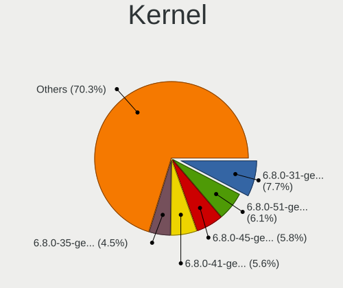

| Version           | Computers | Percent |
|-------------------|-----------|---------|
| 6.8.0-31-generic  | 103       | 7.68%   |
| 6.8.0-51-generic  | 82        | 6.11%   |
| 6.8.0-45-generic  | 78        | 5.81%   |
| 6.8.0-41-generic  | 75        | 5.59%   |
| 6.8.0-35-generic  | 61        | 4.55%   |
| 6.8.0-49-generic  | 41        | 3.06%   |
| 6.8.0-48-generic  | 40        | 2.98%   |
| 6.8.0-38-generic  | 39        | 2.91%   |
| 6.8.0-36-generic  | 36        | 2.68%   |
| 6.11.0-26-generic | 34        | 2.53%   |
| 6.8.0-47-generic  | 32        | 2.38%   |
| 6.8.0-39-generic  | 29        | 2.16%   |
| 6.8.0-60-generic  | 25        | 1.86%   |
| 6.8.0-40-generic  | 25        | 1.86%   |
| 6.14.0-27-generic | 24        | 1.79%   |
| 6.8.0-55-generic  | 23        | 1.71%   |
| 6.14.0-29-generic | 23        | 1.71%   |
| 6.8.0-53-generic  | 21        | 1.56%   |
| 6.8.0-52-generic  | 20        | 1.49%   |
| 6.8.0-44-generic  | 20        | 1.49%   |
| 6.14.0-33-generic | 20        | 1.49%   |
| 6.11.0-21-generic | 20        | 1.49%   |
| 6.8.0-57-generic  | 19        | 1.42%   |
| 6.11.0-29-generic | 19        | 1.42%   |
| 6.11.0-17-generic | 15        | 1.12%   |
| 6.14.0-37-generic | 13        | 0.97%   |
| 6.14.0-35-generic | 13        | 0.97%   |
| 6.8.0-88-generic  | 11        | 0.82%   |
| 6.8.0-86-generic  | 11        | 0.82%   |
| 6.8.0-71-generic  | 11        | 0.82%   |
| 6.8.0-63-generic  | 11        | 0.82%   |
| 6.14.0-36-generic | 11        | 0.82%   |
| 6.11.0-25-generic | 11        | 0.82%   |
| 6.8.0-85-generic  | 10        | 0.75%   |
| 6.8.0-59-generic  | 10        | 0.75%   |
| 4.9.140-l4t       | 10        | 0.75%   |
| 6.14.0-24-generic | 9         | 0.67%   |
| 6.11.0-24-generic | 9         | 0.67%   |
| 6.11.0-19-generic | 9         | 0.67%   |
| 6.8.0-90-generic  | 8         | 0.6%    |

Kernel Family
-------------

Linux kernel without a distro release

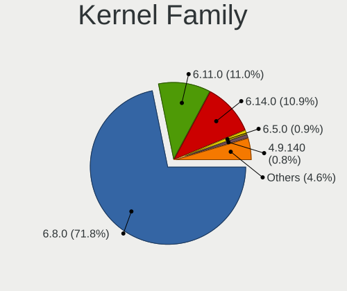

| Version | Computers | Percent |
|---------|-----------|---------|
| 6.8.0   | 877       | 71.83%  |
| 6.11.0  | 134       | 10.97%  |
| 6.14.0  | 133       | 10.89%  |
| 6.5.0   | 11        | 0.9%    |
| 4.9.140 | 10        | 0.82%   |
| 6.6.0   | 7         | 0.57%   |
| 6.8.9   | 4         | 0.33%   |
| 6.9.3   | 3         | 0.25%   |
| 6.9.7   | 2         | 0.16%   |
| 6.9.1   | 2         | 0.16%   |
| 6.9.0   | 2         | 0.16%   |
| 6.8.10  | 2         | 0.16%   |
| 6.8.1   | 2         | 0.16%   |
| 6.7.0   | 2         | 0.16%   |
| 6.14.2  | 2         | 0.16%   |
| 6.10.9  | 2         | 0.16%   |
| 6.10.2  | 2         | 0.16%   |
| 5.15.0  | 2         | 0.16%   |
| 6.9.9   | 1         | 0.08%   |
| 6.9.12  | 1         | 0.08%   |
| 6.7.5   | 1         | 0.08%   |
| 6.6.31  | 1         | 0.08%   |
| 6.6.28  | 1         | 0.08%   |
| 6.5.11  | 1         | 0.08%   |
| 6.2.0   | 1         | 0.08%   |
| 6.17.7  | 1         | 0.08%   |
| 6.17.1  | 1         | 0.08%   |
| 6.17.0  | 1         | 0.08%   |
| 6.16.0  | 1         | 0.08%   |
| 6.14.7  | 1         | 0.08%   |
| 6.14.4  | 1         | 0.08%   |
| 6.13.2  | 1         | 0.08%   |
| 6.12.3  | 1         | 0.08%   |
| 6.12.28 | 1         | 0.08%   |
| 6.12.15 | 1         | 0.08%   |
| 6.11.3  | 1         | 0.08%   |
| 6.10.4  | 1         | 0.08%   |
| 6.10.14 | 1         | 0.08%   |
| 6.10.0  | 1         | 0.08%   |
| 6.1.99  | 1         | 0.08%   |

Kernel Major Ver.
-----------------

Linux kernel major version

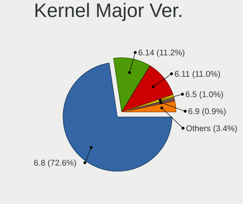

| Version | Computers | Percent |
|---------|-----------|---------|
| 6.8     | 885       | 72.6%   |
| 6.14    | 136       | 11.16%  |
| 6.11    | 134       | 10.99%  |
| 6.5     | 12        | 0.98%   |
| 6.9     | 11        | 0.9%    |
| 4.9     | 10        | 0.82%   |
| 6.6     | 9         | 0.74%   |
| 6.10    | 7         | 0.57%   |
| 6.7     | 3         | 0.25%   |
| 6.17    | 3         | 0.25%   |
| 6.12    | 3         | 0.25%   |
| 5.15    | 2         | 0.16%   |
| 6.2     | 1         | 0.08%   |
| 6.16    | 1         | 0.08%   |
| 6.13    | 1         | 0.08%   |
| 6.1     | 1         | 0.08%   |

Arch
----

OS architecture (x86_64, i586, etc.)

| Name    | Computers | Percent |
|---------|-----------|---------|
| x86_64  | 1178      | 98.74%  |
| aarch64 | 13        | 1.09%   |
| riscv64 | 2         | 0.17%   |

DE
--

Desktop Environment

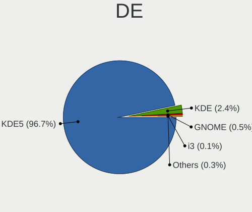

| Name                     | Computers | Percent |
|--------------------------|-----------|---------|
| KDE5                     | 1158      | 96.66%  |
| KDE                      | 29        | 2.42%   |
| GNOME                    | 6         | 0.5%    |
| XFCE                     | 1         | 0.08%   |
| kubuntu-live-environment | 1         | 0.08%   |
| KDE6                     | 1         | 0.08%   |
| i3                       | 1         | 0.08%   |
| Deepin                   | 1         | 0.08%   |

Display Server
--------------

X11 or Wayland

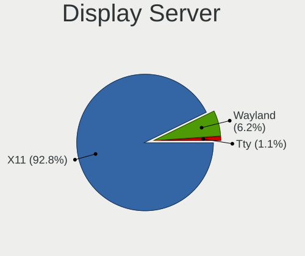

| Name    | Computers | Percent |
|---------|-----------|---------|
| X11     | 1114      | 92.76%  |
| Wayland | 74        | 6.16%   |
| Tty     | 13        | 1.08%   |

Display Manager
---------------

SDDM, LightDM, etc.

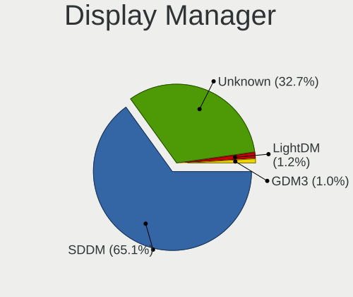

| Name    | Computers | Percent |
|---------|-----------|---------|
| SDDM    | 782       | 65.06%  |
| Unknown | 393       | 32.7%   |
| LightDM | 15        | 1.25%   |
| GDM3    | 12        | 1%      |

OS Lang
-------

Language

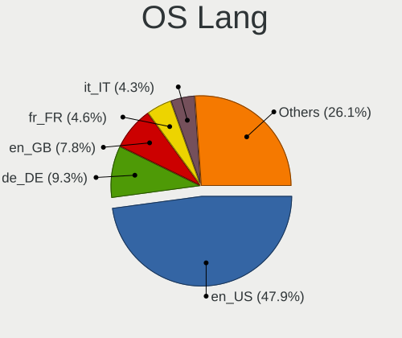

| Lang  | Computers | Percent |
|-------|-----------|---------|
| en_US | 574       | 47.87%  |
| de_DE | 112       | 9.34%   |
| en_GB | 93        | 7.76%   |
| fr_FR | 55        | 4.59%   |
| it_IT | 52        | 4.34%   |
| ru_RU | 40        | 3.34%   |
| pt_BR | 36        | 3%      |
| C     | 36        | 3%      |
| es_ES | 31        | 2.59%   |
| pl_PL | 17        | 1.42%   |
| en_CA | 14        | 1.17%   |
| en_IN | 12        | 1%      |
| en_AU | 12        | 1%      |
| es_MX | 9         | 0.75%   |
| zh_CN | 8         | 0.67%   |
| cs_CZ | 8         | 0.67%   |
| tr_TR | 7         | 0.58%   |
| es_CL | 7         | 0.58%   |
| es_CR | 5         | 0.42%   |
| nl_NL | 4         | 0.33%   |
| ja_JP | 4         | 0.33%   |
| fr_CA | 4         | 0.33%   |
| fi_FI | 4         | 0.33%   |
| el_GR | 4         | 0.33%   |
| de_AT | 4         | 0.33%   |
| sv_SE | 3         | 0.25%   |
| pt_PT | 3         | 0.25%   |
| hu_HU | 3         | 0.25%   |
| es_AR | 3         | 0.25%   |
| en_NZ | 3         | 0.25%   |
| zh_TW | 2         | 0.17%   |
| sk_SK | 2         | 0.17%   |
| lt_LT | 2         | 0.17%   |
| fr_BE | 2         | 0.17%   |
| es_PY | 2         | 0.17%   |
| es_PE | 2         | 0.17%   |
| en_ZA | 2         | 0.17%   |
| en_DK | 2         | 0.17%   |
| da_DK | 2         | 0.17%   |
| bg_BG | 2         | 0.17%   |

Boot Mode
---------

EFI or BIOS

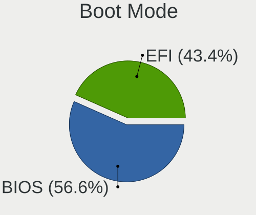

| Mode | Computers | Percent |
|------|-----------|---------|
| BIOS | 683       | 56.63%  |
| EFI  | 523       | 43.37%  |

Filesystem
----------

Type of filesystem

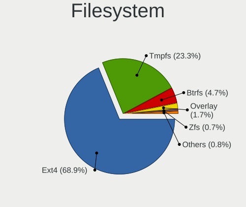

| Type    | Computers | Percent |
|---------|-----------|---------|
| Ext4    | 829       | 68.85%  |
| Tmpfs   | 281       | 23.34%  |
| Btrfs   | 56        | 4.65%   |
| Overlay | 20        | 1.66%   |
| Zfs     | 8         | 0.66%   |
| Xfs     | 8         | 0.66%   |
| Ext3    | 1         | 0.08%   |
| Ext2    | 1         | 0.08%   |

Part. scheme
------------

Scheme of partitioning

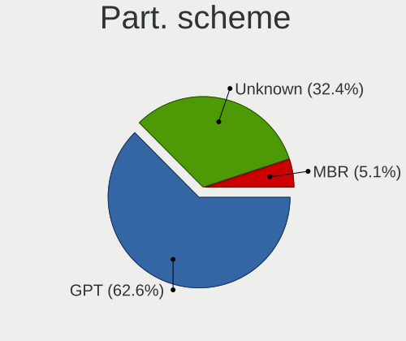

| Type    | Computers | Percent |
|---------|-----------|---------|
| GPT     | 752       | 62.56%  |
| Unknown | 389       | 32.36%  |
| MBR     | 61        | 5.07%   |

Dual Boot with Linux/BSD
------------------------

Hosting more than one Linux/BSD

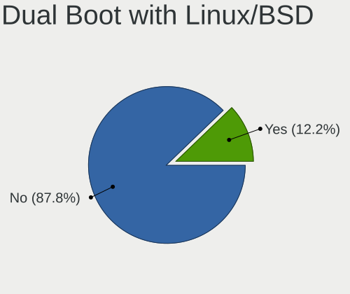

| Dual boot | Computers | Percent |
|-----------|-----------|---------|
| No        | 1059      | 87.81%  |
| Yes       | 147       | 12.19%  |

Dual Boot (Win)
---------------

Hosting Linux and Windows

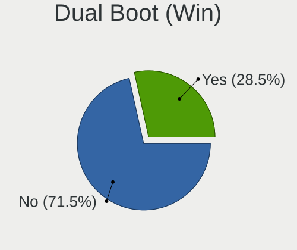

| Dual boot | Computers | Percent |
|-----------|-----------|---------|
| No        | 859       | 71.52%  |
| Yes       | 342       | 28.48%  |

Board
-----

Vendor
------

Motherboard manufacturer

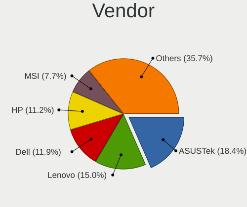

| Name                                 | Computers | Percent |
|--------------------------------------|-----------|---------|
| ASUSTek Computer                     | 220       | 18.44%  |
| Lenovo                               | 179       | 15%     |
| Dell                                 | 142       | 11.9%   |
| Hewlett-Packard                      | 134       | 11.23%  |
| MSI                                  | 92        | 7.71%   |
| Gigabyte Technology                  | 87        | 7.29%   |
| Acer                                 | 43        | 3.6%    |
| ASRock                               | 35        | 2.93%   |
| Apple                                | 26        | 2.18%   |
| Intel                                | 25        | 2.1%    |
| Unknown                              | 24        | 2.01%   |
| Samsung Electronics                  | 14        | 1.17%   |
| AZW                                  | 13        | 1.09%   |
| HUAWEI                               | 10        | 0.84%   |
| Toshiba                              | 8         | 0.67%   |
| Shenzhen Meigao Electronic Equipment | 8         | 0.67%   |
| Notebook                             | 8         | 0.67%   |
| Fujitsu                              | 8         | 0.67%   |
| Alienware                            | 7         | 0.59%   |
| Microsoft                            | 6         | 0.5%    |
| GEEKOM                               | 5         | 0.42%   |
| Chuwi                                | 5         | 0.42%   |
| Sony                                 | 4         | 0.34%   |
| Huanan                               | 4         | 0.34%   |
| Google                               | 4         | 0.34%   |
| GMKtec                               | 4         | 0.34%   |
| TUXEDO                               | 3         | 0.25%   |
| Panasonic                            | 3         | 0.25%   |
| MACHINIST                            | 3         | 0.25%   |
| Framework                            | 3         | 0.25%   |
| Biostar                              | 3         | 0.25%   |
| ZOTAC                                | 2         | 0.17%   |
| Valve                                | 2         | 0.17%   |
| Timi                                 | 2         | 0.17%   |
| Razer                                | 2         | 0.17%   |
| Raspberry Pi Foundation              | 2         | 0.17%   |
| Pegatron                             | 2         | 0.17%   |
| PC Specialist                        | 2         | 0.17%   |
| Packard Bell                         | 2         | 0.17%   |
| MECHREVO                             | 2         | 0.17%   |

Model
-----

Motherboard model

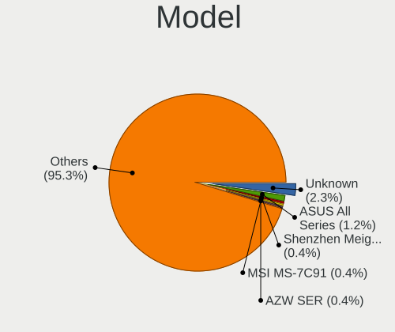

| Name                                              | Computers | Percent |
|---------------------------------------------------|-----------|---------|
| Unknown                                           | 27        | 2.26%   |
| ASUS All Series                                   | 14        | 1.17%   |
| Shenzhen Meigao Electronic Equipment Venus Series | 5         | 0.42%   |
| MSI MS-7C91                                       | 5         | 0.42%   |
| AZW SER                                           | 5         | 0.42%   |
| MSI MS-7C56                                       | 4         | 0.34%   |
| MSI MS-7C52                                       | 4         | 0.34%   |
| MSI MS-7C37                                       | 4         | 0.34%   |
| Dell OptiPlex 7010                                | 4         | 0.34%   |
| Dell OptiPlex 3050                                | 4         | 0.34%   |
| ASUS TUF Gaming X570-PLUS                         | 4         | 0.34%   |
| MSI MS-7E26                                       | 3         | 0.25%   |
| HUAWEI FLMH-XX                                    | 3         | 0.25%   |
| HP Z820 Workstation                               | 3         | 0.25%   |
| HP Pavilion Power Laptop 15-cb0xx                 | 3         | 0.25%   |
| HP Pavilion Gaming Laptop 15-dk0xxx               | 3         | 0.25%   |
| HP Notebook                                       | 3         | 0.25%   |
| HP Laptop 15-fd0xxx                               | 3         | 0.25%   |
| Gigabyte B550 GAMING X V2                         | 3         | 0.25%   |
| Dell XPS 15 9520                                  | 3         | 0.25%   |
| Dell Pro 14 Plus PB14250                          | 3         | 0.25%   |
| Dell Latitude 7490                                | 3         | 0.25%   |
| Dell G3 3579                                      | 3         | 0.25%   |
| ASUS PRIME B450-PLUS                              | 3         | 0.25%   |
| ASUS PRIME B350-PLUS                              | 3         | 0.25%   |
| Apple MacBookPro8,1                               | 3         | 0.25%   |
| Samsung 270E5G/270E5U                             | 2         | 0.17%   |
| MSI MS-7E12                                       | 2         | 0.17%   |
| MSI MS-7E06                                       | 2         | 0.17%   |
| MSI MS-7D46                                       | 2         | 0.17%   |
| MSI MS-7C95                                       | 2         | 0.17%   |
| MSI MS-7C84                                       | 2         | 0.17%   |
| MSI MS-7C83                                       | 2         | 0.17%   |
| MSI MS-7C75                                       | 2         | 0.17%   |
| MSI MS-7C02                                       | 2         | 0.17%   |
| MSI MS-7B86                                       | 2         | 0.17%   |
| MSI MS-7977                                       | 2         | 0.17%   |
| MSI MS-7693                                       | 2         | 0.17%   |
| Microsoft Surface Pro 7                           | 2         | 0.17%   |
| Lenovo LOQ 15IRH8 82XV                            | 2         | 0.17%   |

Model Family
------------

Motherboard model prefix

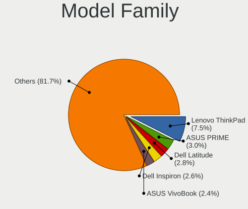

| Name                                       | Computers | Percent |
|--------------------------------------------|-----------|---------|
| Lenovo ThinkPad                            | 89        | 7.46%   |
| ASUS PRIME                                 | 36        | 3.02%   |
| Dell Latitude                              | 33        | 2.77%   |
| Dell Inspiron                              | 31        | 2.6%    |
| ASUS VivoBook                              | 29        | 2.43%   |
| Dell OptiPlex                              | 28        | 2.35%   |
| Acer Aspire                                | 27        | 2.26%   |
| Unknown                                    | 27        | 2.26%   |
| Lenovo IdeaPad                             | 25        | 2.1%    |
| ASUS ROG                                   | 25        | 2.1%    |
| ASUS TUF                                   | 24        | 2.01%   |
| HP Pavilion                                | 22        | 1.84%   |
| HP EliteBook                               | 21        | 1.76%   |
| Dell Precision                             | 19        | 1.59%   |
| Dell XPS                                   | 16        | 1.34%   |
| ASUS ASUS                                  | 15        | 1.26%   |
| HP ProBook                                 | 14        | 1.17%   |
| ASUS All                                   | 14        | 1.17%   |
| Lenovo Yoga                                | 12        | 1.01%   |
| Lenovo ThinkCentre                         | 12        | 1.01%   |
| Lenovo Legion                              | 12        | 1.01%   |
| HP Laptop                                  | 9         | 0.75%   |
| HP ZBook                                   | 8         | 0.67%   |
| ASUS Zenbook                               | 8         | 0.67%   |
| Toshiba Satellite                          | 7         | 0.59%   |
| HP OMEN                                    | 7         | 0.59%   |
| HP ENVY                                    | 7         | 0.59%   |
| HP EliteDesk                               | 7         | 0.59%   |
| Gigabyte B550                              | 7         | 0.59%   |
| Microsoft Surface                          | 6         | 0.5%    |
| Lenovo ThinkBook                           | 6         | 0.5%    |
| Lenovo IdeaPadFlex                         | 6         | 0.5%    |
| HP Compaq                                  | 6         | 0.5%    |
| Gigabyte B650                              | 6         | 0.5%    |
| Shenzhen Meigao Electronic Equipment Venus | 5         | 0.42%   |
| MSI MS-7C91                                | 5         | 0.42%   |
| Gigabyte X570                              | 5         | 0.42%   |
| Fujitsu LIFEBOOK                           | 5         | 0.42%   |
| AZW SER                                    | 5         | 0.42%   |
| Acer Swift                                 | 5         | 0.42%   |

MFG Year
--------

Motherboard manufacture year

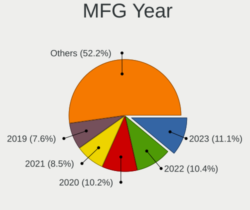

| Year    | Computers | Percent |
|---------|-----------|---------|
| 2023    | 132       | 11.06%  |
| 2022    | 124       | 10.39%  |
| 2020    | 122       | 10.23%  |
| 2021    | 101       | 8.47%   |
| 2019    | 91        | 7.63%   |
| 2018    | 86        | 7.21%   |
| 2017    | 77        | 6.45%   |
| 2024    | 69        | 5.78%   |
| 2014    | 61        | 5.11%   |
| 2013    | 57        | 4.78%   |
| 2012    | 52        | 4.36%   |
| 2011    | 52        | 4.36%   |
| 2015    | 46        | 3.86%   |
| 2016    | 33        | 2.77%   |
| 2025    | 24        | 2.01%   |
| 2010    | 24        | 2.01%   |
| 2008    | 13        | 1.09%   |
| Unknown | 13        | 1.09%   |
| 2009    | 11        | 0.92%   |
| 2007    | 4         | 0.34%   |
| 2006    | 1         | 0.08%   |

Form Factor
-----------

Physical design of the computer

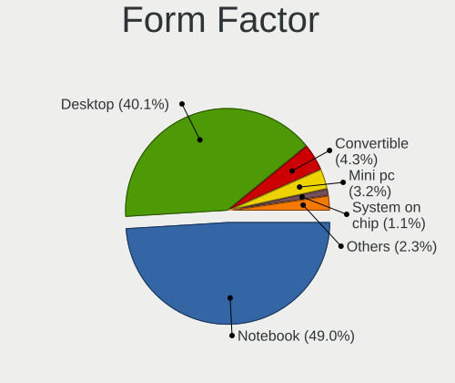

| Name           | Computers | Percent |
|----------------|-----------|---------|
| Notebook       | 585       | 49.04%  |
| Desktop        | 478       | 40.07%  |
| Convertible    | 51        | 4.27%   |
| Mini pc        | 38        | 3.19%   |
| System on chip | 13        | 1.09%   |
| Tablet         | 12        | 1.01%   |
| All in one     | 9         | 0.75%   |
| Server         | 6         | 0.5%    |
| Other          | 1         | 0.08%   |

Secure Boot
-----------

Enabled or disabled

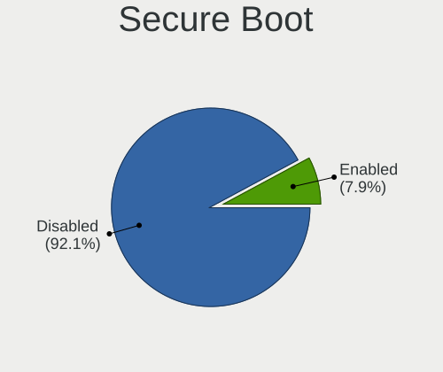

| State    | Computers | Percent |
|----------|-----------|---------|
| Disabled | 1103      | 92.15%  |
| Enabled  | 94        | 7.85%   |

Coreboot
--------

Have coreboot on board

| Used | Computers | Percent |
|------|-----------|---------|
| No   | 1187      | 99.5%   |
| Yes  | 6         | 0.5%    |

RAM Size
--------

Total RAM memory

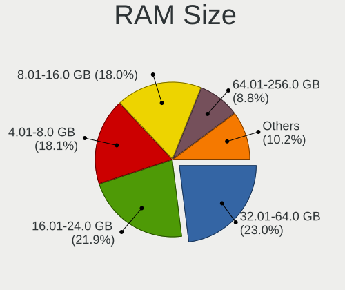

| Size in GB      | Computers | Percent |
|-----------------|-----------|---------|
| 32.01-64.0      | 276       | 23.04%  |
| 16.01-24.0      | 262       | 21.87%  |
| 4.01-8.0        | 217       | 18.11%  |
| 8.01-16.0       | 216       | 18.03%  |
| 64.01-256.0     | 105       | 8.76%   |
| 24.01-32.0      | 58        | 4.84%   |
| 3.01-4.0        | 51        | 4.26%   |
| 1.01-2.0        | 5         | 0.42%   |
| More than 256.0 | 4         | 0.33%   |
| 2.01-3.0        | 4         | 0.33%   |

RAM Used
--------

Used RAM memory

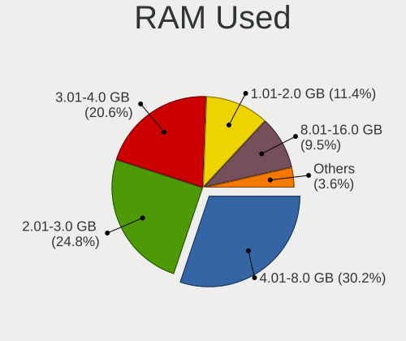

| Used GB     | Computers | Percent |
|-------------|-----------|---------|
| 4.01-8.0    | 388       | 30.17%  |
| 2.01-3.0    | 319       | 24.81%  |
| 3.01-4.0    | 265       | 20.61%  |
| 1.01-2.0    | 146       | 11.35%  |
| 8.01-16.0   | 122       | 9.49%   |
| 16.01-24.0  | 24        | 1.87%   |
| 24.01-32.0  | 11        | 0.86%   |
| 0.51-1.0    | 5         | 0.39%   |
| 32.01-64.0  | 4         | 0.31%   |
| 64.01-256.0 | 2         | 0.16%   |

Total Drives
------------

Number of drives on board

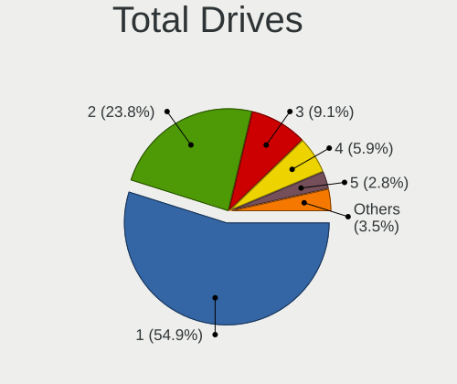

| Drives | Computers | Percent |
|--------|-----------|---------|
| 1      | 670       | 54.87%  |
| 2      | 291       | 23.83%  |
| 3      | 111       | 9.09%   |
| 4      | 72        | 5.9%    |
| 5      | 34        | 2.78%   |
| 6      | 17        | 1.39%   |
| 7      | 8         | 0.66%   |
| 8      | 7         | 0.57%   |
| 0      | 7         | 0.57%   |
| 16     | 1         | 0.08%   |
| 12     | 1         | 0.08%   |
| 10     | 1         | 0.08%   |
| 9      | 1         | 0.08%   |

Has CD-ROM
----------

Has CD-ROM on board

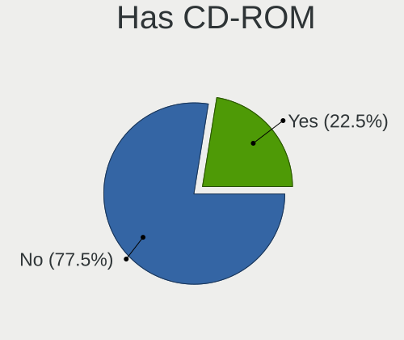

| Presented | Computers | Percent |
|-----------|-----------|---------|
| No        | 929       | 77.55%  |
| Yes       | 269       | 22.45%  |

Has Ethernet
------------

Has Ethernet on board

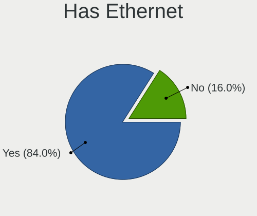

| Presented | Computers | Percent |
|-----------|-----------|---------|
| Yes       | 1006      | 84.04%  |
| No        | 191       | 15.96%  |

Has WiFi
--------

Has WiFi module

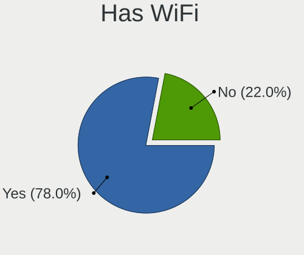

| Presented | Computers | Percent |
|-----------|-----------|---------|
| Yes       | 936       | 78%     |
| No        | 264       | 22%     |

Has Bluetooth
-------------

Has Bluetooth module

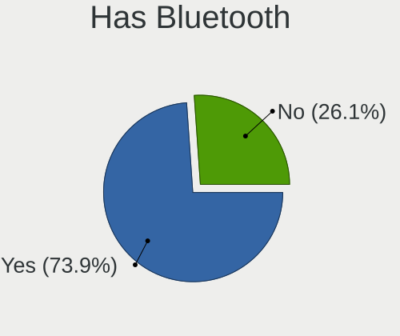

| Presented | Computers | Percent |
|-----------|-----------|---------|
| Yes       | 892       | 73.9%   |
| No        | 315       | 26.1%   |

Location
--------

Country
-------

Geographic location (country)

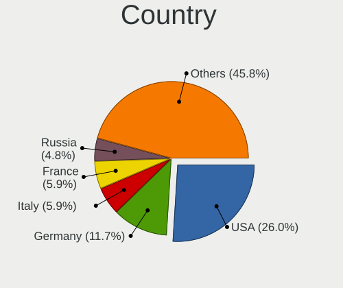

| Country      | Computers | Percent |
|--------------|-----------|---------|
| USA          | 310       | 25.98%  |
| Germany      | 140       | 11.74%  |
| Italy        | 70        | 5.87%   |
| France       | 70        | 5.87%   |
| Russia       | 57        | 4.78%   |
| UK           | 51        | 4.27%   |
| Brazil       | 43        | 3.6%    |
| Spain        | 35        | 2.93%   |
| Poland       | 29        | 2.43%   |
| Canada       | 26        | 2.18%   |
| Netherlands  | 22        | 1.84%   |
| India        | 19        | 1.59%   |
| Australia    | 18        | 1.51%   |
| Chile        | 17        | 1.42%   |
| Czechia      | 16        | 1.34%   |
| Mexico       | 14        | 1.17%   |
| Turkey       | 11        | 0.92%   |
| China        | 11        | 0.92%   |
| Sweden       | 10        | 0.84%   |
| Portugal     | 10        | 0.84%   |
| Bulgaria     | 10        | 0.84%   |
| Finland      | 9         | 0.75%   |
| Romania      | 8         | 0.67%   |
| Indonesia    | 8         | 0.67%   |
| Belgium      | 8         | 0.67%   |
| Austria      | 8         | 0.67%   |
| Argentina    | 8         | 0.67%   |
| Thailand     | 7         | 0.59%   |
| South Africa | 7         | 0.59%   |
| Slovakia     | 7         | 0.59%   |
| Saudi Arabia | 7         | 0.59%   |
| Norway       | 7         | 0.59%   |
| Greece       | 6         | 0.5%    |
| Denmark      | 6         | 0.5%    |
| Costa Rica   | 6         | 0.5%    |
| Singapore    | 5         | 0.42%   |
| Serbia       | 5         | 0.42%   |
| New Zealand  | 5         | 0.42%   |
| Colombia     | 5         | 0.42%   |
| Switzerland  | 4         | 0.34%   |

City
----

Geographic location (city)

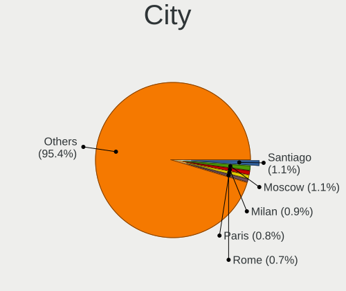

| City              | Computers | Percent |
|-------------------|-----------|---------|
| Santiago          | 14        | 1.13%   |
| Moscow            | 13        | 1.05%   |
| Milan             | 11        | 0.89%   |
| Paris             | 10        | 0.81%   |
| Rome              | 9         | 0.73%   |
| Amsterdam         | 9         | 0.73%   |
| St Petersburg     | 8         | 0.65%   |
| Hanover           | 8         | 0.65%   |
| Berlin            | 8         | 0.65%   |
| Vienna            | 7         | 0.57%   |
| Sao Paulo         | 7         | 0.57%   |
| Sydney            | 6         | 0.49%   |
| Stuttgart         | 6         | 0.49%   |
| Sofia             | 6         | 0.49%   |
| Montreal          | 6         | 0.49%   |
| Frankfurt am Main | 6         | 0.49%   |
| Dallas            | 6         | 0.49%   |
| Barcelona         | 6         | 0.49%   |
| Warsaw            | 5         | 0.41%   |
| Traverse City     | 5         | 0.41%   |
| Singapore         | 5         | 0.41%   |
| Prague            | 5         | 0.41%   |
| Naples            | 5         | 0.41%   |
| Milano            | 5         | 0.41%   |
| Hamburg           | 5         | 0.41%   |
| Grecia            | 5         | 0.41%   |
| Chennai           | 5         | 0.41%   |
| Brisbane          | 5         | 0.41%   |
| Bologna           | 5         | 0.41%   |
| Bengaluru         | 5         | 0.41%   |
| Belgrade          | 5         | 0.41%   |
| Toronto           | 4         | 0.32%   |
| Tehran            | 4         | 0.32%   |
| Portland          | 4         | 0.32%   |
| Oslo              | 4         | 0.32%   |
| Munich            | 4         | 0.32%   |
| Mexico City       | 4         | 0.32%   |
| Málaga           | 4         | 0.32%   |
| Ludwigsburg       | 4         | 0.32%   |
| Los Angeles       | 4         | 0.32%   |

Drives
------

Drive Vendor
------------

Hard drive vendors

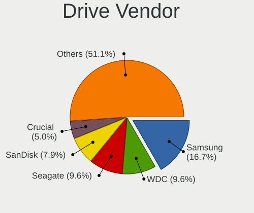

| Vendor                      | Computers | Drives | Percent |
|-----------------------------|-----------|--------|---------|
| Samsung Electronics         | 322       | 471    | 16.69%  |
| WDC                         | 186       | 286    | 9.64%   |
| Seagate                     | 185       | 276    | 9.59%   |
| SanDisk                     | 153       | 195    | 7.93%   |
| Crucial                     | 97        | 128    | 5.03%   |
| Kingston                    | 85        | 117    | 4.41%   |
| SK hynix                    | 70        | 78     | 3.63%   |
| Toshiba                     | 69        | 84     | 3.58%   |
| Unknown                     | 59        | 84     | 3.06%   |
| Micron Technology           | 57        | 71     | 2.95%   |
| Kingston Technology Company | 56        | 64     | 2.9%    |
| Intel                       | 39        | 47     | 2.02%   |
| Micron/Crucial Technology   | 29        | 41     | 1.5%    |
| Phison Electronics          | 27        | 32     | 1.4%    |
| KIOXIA                      | 27        | 35     | 1.4%    |
| Hitachi                     | 24        | 34     | 1.24%   |
| SPCC                        | 23        | 31     | 1.19%   |
| Silicon Motion              | 23        | 28     | 1.19%   |
| A-DATA Technology           | 23        | 31     | 1.19%   |
| HGST                        | 22        | 22     | 1.14%   |
| China                       | 18        | 22     | 0.93%   |
| PNY                         | 17        | 26     | 0.88%   |
| MAXIO Technology (Hangzhou) | 13        | 15     | 0.67%   |
| Apple                       | 13        | 15     | 0.67%   |
| Patriot                     | 12        | 15     | 0.62%   |
| Team                        | 11        | 14     | 0.57%   |
| Phison                      | 11        | 12     | 0.57%   |
| Lexar                       | 11        | 12     | 0.57%   |
| KingSpec                    | 11        | 15     | 0.57%   |
| JMicron Technology          | 11        | 12     | 0.57%   |
| Intenso                     | 11        | 11     | 0.57%   |
| Unknown                     | 10        | 11     | 0.52%   |
| ADATA Technology            | 9         | 10     | 0.47%   |
| Realtek Semiconductor       | 8         | 8      | 0.41%   |
| Netac                       | 7         | 8      | 0.36%   |
| Corsair                     | 7         | 9      | 0.36%   |
| Transcend                   | 6         | 8      | 0.31%   |
| Realtek                     | 6         | 6      | 0.31%   |
| Fanxiang                    | 6         | 9      | 0.31%   |
| Verbatim                    | 5         | 7      | 0.26%   |

Drive Model
-----------

Hard drive models

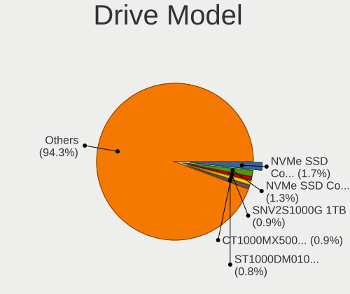

| Model                                                 | Computers | Percent |
|-------------------------------------------------------|-----------|---------|
| Samsung NVMe SSD Controller SM981/PM981/PM983 1TB     | 37        | 1.72%   |
| Samsung NVMe SSD Controller PM9A1/PM9A3/980PRO 1TB    | 29        | 1.35%   |
| Kingston Company SNV2S1000G 1TB                       | 19        | 0.88%   |
| Crucial CT1000MX500SSD1 1TB                           | 19        | 0.88%   |
| Seagate ST1000DM010-2EP102 1TB                        | 18        | 0.84%   |
| SanDisk NVMe SSD Drive 1TB                            | 15        | 0.7%    |
| Micron/Crucial P2 NVMe PCIe SSD 2TB                   | 14        | 0.65%   |
| Kingston SA400S37240G 240GB SSD                       | 14        | 0.65%   |
| Silicon Motion SM2263EN/SM2263XT SSD Controller 512GB | 13        | 0.6%    |
| Samsung SSD 860 EVO 500GB                             | 13        | 0.6%    |
| Samsung SSD 850 EVO 500GB                             | 13        | 0.6%    |
| Kingston SA400S37480G 480GB SSD                       | 13        | 0.6%    |
| Crucial CT1000BX500SSD1 1TB                           | 13        | 0.6%    |
| Seagate ST4000DM004-2CV104 4TB                        | 12        | 0.56%   |
| Samsung SSD 860 EVO 1TB                               | 11        | 0.51%   |
| Unknown MMC Card  128GB                               | 10        | 0.46%   |
| Samsung SSD 850 EVO 250GB                             | 10        | 0.46%   |
| Unknown                                               | 10        | 0.46%   |
| SanDisk NVMe SSD Drive 2TB                            | 9         | 0.42%   |
| Samsung SSD 870 EVO 500GB                             | 9         | 0.42%   |
| Kingston Company SNV2S2000G 2TB                       | 9         | 0.42%   |
| Kingston Company A2000 NVMe SSD 250GB                 | 9         | 0.42%   |
| Crucial CT500MX500SSD1 500GB                          | 9         | 0.42%   |
| WDC WD10EZEX-08WN4A0 1TB                              | 8         | 0.37%   |
| Seagate ST1000LM035-1RK172 1TB                        | 8         | 0.37%   |
| SanDisk NVMe SSD Drive 4TB                            | 8         | 0.37%   |
| Samsung SSD 870 EVO 1TB                               | 8         | 0.37%   |
| Phison E12 NVMe Controller 1TB                        | 8         | 0.37%   |
| MAXIO (Hangzhou) NVMe SSD Controller MAP1202 2TB      | 8         | 0.37%   |
| Intel SSD 660P Series 512GB                           | 8         | 0.37%   |
| Crucial CT240BX500SSD1 240GB                          | 8         | 0.37%   |
| Crucial CT2000MX500SSD1 2TB                           | 8         | 0.37%   |
| Unknown MMC Card  32GB                                | 7         | 0.33%   |
| Seagate ST1000LM024 HN-M101MBB 1TB                    | 7         | 0.33%   |
| Samsung SSD 990 PRO 1TB                               | 7         | 0.33%   |
| Kingston SA400S37960G 960GB SSD                       | 7         | 0.33%   |
| Unknown Externa 1TB                                   | 6         | 0.28%   |
| Toshiba MQ01ABD100 1TB                                | 6         | 0.28%   |
| Seagate ST500LT012-1DG142 500GB                       | 6         | 0.28%   |
| Seagate ST31000528AS 1TB                              | 6         | 0.28%   |

HDD Vendor
----------

Hard disk drive vendors

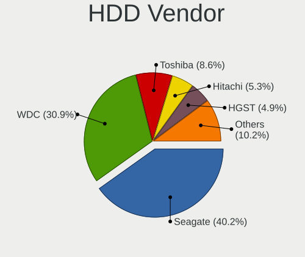

| Vendor              | Computers | Drives | Percent |
|---------------------|-----------|--------|---------|
| Seagate             | 182       | 271    | 40.18%  |
| WDC                 | 140       | 216    | 30.91%  |
| Toshiba             | 39        | 47     | 8.61%   |
| Hitachi             | 24        | 34     | 5.3%    |
| HGST                | 22        | 22     | 4.86%   |
| Samsung Electronics | 17        | 23     | 3.75%   |
| Unknown             | 6         | 8      | 1.32%   |
| JMicron Technology  | 4         | 4      | 0.88%   |
| T-FORCE             | 2         | 3      | 0.44%   |
| Fujitsu             | 2         | 2      | 0.44%   |
| External            | 2         | 2      | 0.44%   |
| TO Exter            | 1         | 1      | 0.22%   |
| TDAS                | 1         | 1      | 0.22%   |
| Space ke            | 1         | 1      | 0.22%   |
| SABRENT             | 1         | 2      | 0.22%   |
| Min Yi U            | 1         | 1      | 0.22%   |
| MARVELL             | 1         | 1      | 0.22%   |
| LaCie               | 1         | 1      | 0.22%   |
| KESU                | 1         | 1      | 0.22%   |
| Inateck             | 1         | 2      | 0.22%   |
| IB-AC703            | 1         | 1      | 0.22%   |
| Apricorn            | 1         | 1      | 0.22%   |
| Apple               | 1         | 1      | 0.22%   |
| Unknown             | 1         | 1      | 0.22%   |

SSD Vendor
----------

Solid state drive vendors

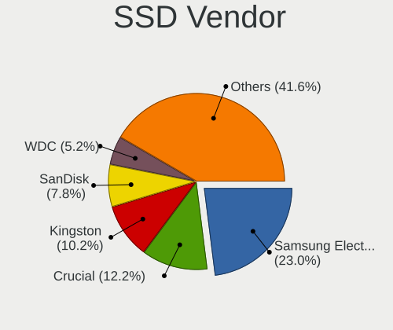

| Vendor              | Computers | Drives | Percent |
|---------------------|-----------|--------|---------|
| Samsung Electronics | 136       | 207    | 23.01%  |
| Crucial             | 72        | 95     | 12.18%  |
| Kingston            | 60        | 86     | 10.15%  |
| SanDisk             | 46        | 58     | 7.78%   |
| WDC                 | 31        | 45     | 5.25%   |
| SPCC                | 19        | 25     | 3.21%   |
| China               | 18        | 22     | 3.05%   |
| PNY                 | 17        | 26     | 2.88%   |
| A-DATA Technology   | 12        | 16     | 2.03%   |
| Patriot             | 11        | 13     | 1.86%   |
| Micron Technology   | 10        | 13     | 1.69%   |
| Toshiba             | 9         | 10     | 1.52%   |
| SK hynix            | 9         | 12     | 1.52%   |
| Intenso             | 9         | 9      | 1.52%   |
| Intel               | 9         | 12     | 1.52%   |
| Team                | 8         | 10     | 1.35%   |
| KingSpec            | 8         | 12     | 1.35%   |
| Apple               | 8         | 9      | 1.35%   |
| Transcend           | 5         | 7      | 0.85%   |
| OCZ                 | 5         | 8      | 0.85%   |
| Netac               | 5         | 5      | 0.85%   |
| LITEON              | 5         | 5      | 0.85%   |
| Emtec               | 5         | 5      | 0.85%   |
| Verbatim            | 4         | 5      | 0.68%   |
| Lexar               | 4         | 5      | 0.68%   |
| Fanxiang            | 4         | 7      | 0.68%   |
| Apacer              | 4         | 4      | 0.68%   |
| SABRENT             | 3         | 3      | 0.51%   |
| LITEONIT            | 3         | 5      | 0.51%   |
| GOODRAM             | 3         | 3      | 0.51%   |
| Unknown             | 3         | 3      | 0.51%   |
| XrayDisk            | 2         | 2      | 0.34%   |
| Timetec             | 2         | 3      | 0.34%   |
| TCSUNBOW            | 2         | 3      | 0.34%   |
| KIOXIA-EXCERIA      | 2         | 2      | 0.34%   |
| Hewlett-Packard     | 2         | 2      | 0.34%   |
| Corsair             | 2         | 4      | 0.34%   |
| Wicgtyp             | 1         | 1      | 0.17%   |
| Wibtek              | 1         | 2      | 0.17%   |
| WDC WDS2            | 1         | 1      | 0.17%   |

Drive Kind
----------

HDD or SSD

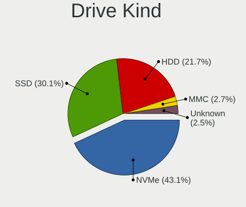

| Kind    | Computers | Drives | Percent |
|---------|-----------|--------|---------|
| NVMe    | 721       | 1010   | 43.1%   |
| SSD     | 503       | 802    | 30.07%  |
| HDD     | 363       | 647    | 21.7%   |
| MMC     | 45        | 55     | 2.69%   |
| Unknown | 41        | 60     | 2.45%   |

Drive Connector
---------------

SATA, SAS, NVMe, etc.

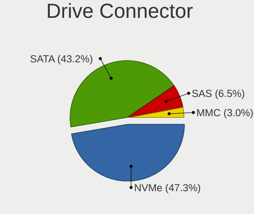

| Type | Computers | Drives | Percent |
|------|-----------|--------|---------|
| NVMe | 717       | 997    | 47.33%  |
| SATA | 654       | 1378   | 43.17%  |
| SAS  | 99        | 144    | 6.53%   |
| MMC  | 45        | 55     | 2.97%   |

Drive Size
----------

Size of hard drive

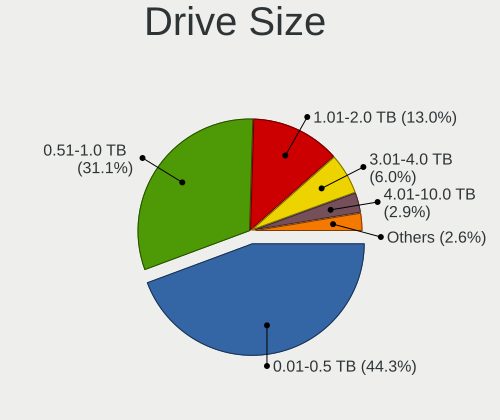

| Size in TB | Computers | Drives | Percent |
|------------|-----------|--------|---------|
| 0.01-0.5   | 423       | 664    | 44.34%  |
| 0.51-1.0   | 297       | 428    | 31.13%  |
| 1.01-2.0   | 124       | 205    | 13%     |
| 3.01-4.0   | 57        | 77     | 5.97%   |
| 4.01-10.0  | 28        | 42     | 2.94%   |
| 2.01-3.0   | 15        | 16     | 1.57%   |
| 10.01-20.0 | 10        | 17     | 1.05%   |

Space Total
-----------

Amount of disk space available on the file system

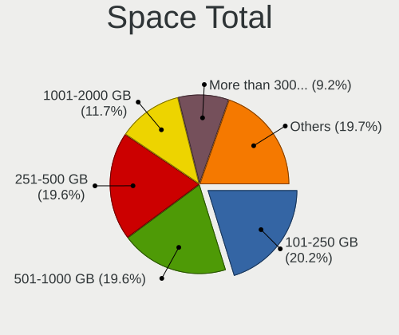

| Size in GB     | Computers | Percent |
|----------------|-----------|---------|
| 101-250        | 249       | 20.24%  |
| 251-500        | 241       | 19.59%  |
| 501-1000       | 241       | 19.59%  |
| 1001-2000      | 144       | 11.71%  |
| More than 3000 | 113       | 9.19%   |
| 1-20           | 83        | 6.75%   |
| 2001-3000      | 59        | 4.8%    |
| 51-100         | 54        | 4.39%   |
| 21-50          | 25        | 2.03%   |
| Unknown        | 21        | 1.71%   |

Space Used
----------

Amount of used disk space

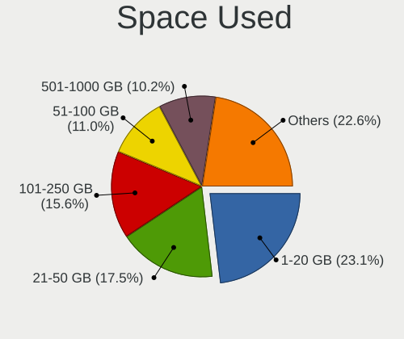

| Used GB        | Computers | Percent |
|----------------|-----------|---------|
| 1-20           | 289       | 23.14%  |
| 21-50          | 219       | 17.53%  |
| 101-250        | 195       | 15.61%  |
| 51-100         | 137       | 10.97%  |
| 251-500        | 127       | 10.17%  |
| 501-1000       | 127       | 10.17%  |
| 1001-2000      | 75        | 6%      |
| More than 3000 | 37        | 2.96%   |
| 2001-3000      | 22        | 1.76%   |
| Unknown        | 21        | 1.68%   |

Malfunc. Drives
---------------

Drive models with a malfunction

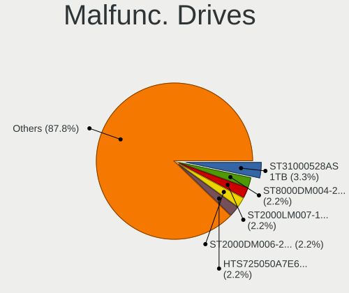

| Model                           | Computers | Drives | Percent |
|---------------------------------|-----------|--------|---------|
| Seagate ST31000528AS 1TB        | 3         | 4      | 3.33%   |
| Seagate ST8000DM004-2CX188 8TB  | 2         | 2      | 2.22%   |
| Seagate ST2000LM007-1R8174 2TB  | 2         | 2      | 2.22%   |
| Seagate ST2000DM006-2DM164 2TB  | 2         | 3      | 2.22%   |
| Hitachi HTS725050A7E630 500GB   | 2         | 2      | 2.22%   |
| HGST HTS721010A9E630 1TB        | 2         | 2      | 2.22%   |
| HGST HTS541010A9E680 1TB        | 2         | 2      | 2.22%   |
| WDC WD5000LPVX-75V0TT0 500GB    | 1         | 1      | 1.11%   |
| WDC WD5000LPCX-00VHAT0 500GB    | 1         | 1      | 1.11%   |
| WDC WD5000AAKX-003CA0 500GB     | 1         | 1      | 1.11%   |
| WDC WD5000AAKS-00UU3A0 500GB    | 1         | 1      | 1.11%   |
| WDC WD5000AADS-00S9B0 500GB     | 1         | 1      | 1.11%   |
| WDC WD3200AAKX-001CA0 320GB     | 1         | 1      | 1.11%   |
| WDC WD30EZRX-00DC0B0 3TB        | 1         | 1      | 1.11%   |
| WDC WD30EZRX-00D8PB0 3TB        | 1         | 1      | 1.11%   |
| WDC WD30EFRX-68EUZN0 3TB        | 1         | 1      | 1.11%   |
| WDC WD20EZRX-00D8PB0 2TB        | 1         | 1      | 1.11%   |
| WDC WD20EFRX-68EUZN0 2TB        | 1         | 1      | 1.11%   |
| WDC WD10JPVX-08JC3T5 1TB        | 1         | 1      | 1.11%   |
| WDC WD10EZEX-60M2NA0 1TB        | 1         | 1      | 1.11%   |
| WDC WD10EZEX-22MFCA0 1TB        | 1         | 1      | 1.11%   |
| WDC WD10EZEX-00WN4A0 1TB        | 1         | 1      | 1.11%   |
| WDC WD10EURX-63UY4Y0 1TB        | 1         | 2      | 1.11%   |
| WDC WD10EARS-00Y5B1 1TB         | 1         | 1      | 1.11%   |
| WDC WD10EARS-00MVWB0 1TB        | 1         | 1      | 1.11%   |
| WDC WD10EACS-00ZJB0 1TB         | 1         | 1      | 1.11%   |
| WDC WD1002FAEX-00Y9A0 1TB       | 1         | 1      | 1.11%   |
| WDC WD1001FALS-40U9B0 1TB       | 1         | 1      | 1.11%   |
| WDC WD1001FAES-60Z2A0 1TB       | 1         | 1      | 1.11%   |
| WDC WD Blue SA510 2.5 500GB     | 1         | 1      | 1.11%   |
| Toshiba MQ01ABF050 500GB        | 1         | 1      | 1.11%   |
| Toshiba MQ01ABD100 1TB          | 1         | 1      | 1.11%   |
| Toshiba MQ01ABD075 752GB        | 1         | 1      | 1.11%   |
| Toshiba MK3259GSXP 320GB        | 1         | 2      | 1.11%   |
| T-FORCE TM8FPL1000G 1TB         | 1         | 1      | 1.11%   |
| Seagate ST9500325AS 500GB       | 1         | 1      | 1.11%   |
| Seagate ST9160821AS 160GB       | 1         | 1      | 1.11%   |
| Seagate ST500LT012-1DG142 500GB | 1         | 1      | 1.11%   |
| Seagate ST4000VX007-2DT166 4TB  | 1         | 1      | 1.11%   |
| Seagate ST3750640NS 752GB       | 1         | 1      | 1.11%   |

Malfunc. Drive Vendor
---------------------

Vendors of faulty drives

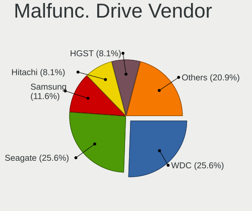

| Vendor                      | Computers | Drives | Percent |
|-----------------------------|-----------|--------|---------|
| WDC                         | 22        | 24     | 25.58%  |
| Seagate                     | 22        | 29     | 25.58%  |
| Samsung Electronics         | 10        | 11     | 11.63%  |
| Hitachi                     | 7         | 13     | 8.14%   |
| HGST                        | 7         | 7      | 8.14%   |
| Toshiba                     | 4         | 5      | 4.65%   |
| SanDisk                     | 2         | 2      | 2.33%   |
| Micron Technology           | 2         | 2      | 2.33%   |
| Crucial                     | 2         | 3      | 2.33%   |
| T-FORCE                     | 1         | 1      | 1.16%   |
| Netac                       | 1         | 1      | 1.16%   |
| Neo                         | 1         | 1      | 1.16%   |
| MAXIO Technology (Hangzhou) | 1         | 1      | 1.16%   |
| KODAK                       | 1         | 1      | 1.16%   |
| Kingston                    | 1         | 1      | 1.16%   |
| China                       | 1         | 1      | 1.16%   |
| A-DATA Technology           | 1         | 1      | 1.16%   |

Malfunc. HDD Vendor
-------------------

Vendors of faulty HDD drives

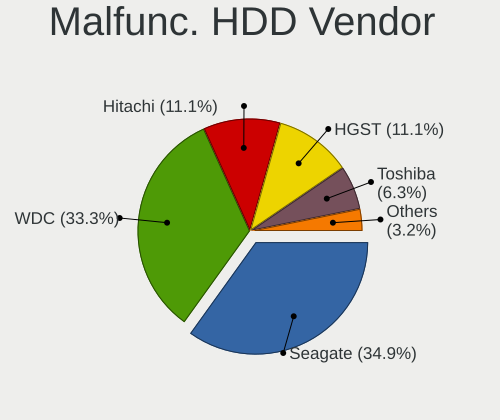

| Vendor              | Computers | Drives | Percent |
|---------------------|-----------|--------|---------|
| Seagate             | 22        | 29     | 34.92%  |
| WDC                 | 21        | 23     | 33.33%  |
| Hitachi             | 7         | 13     | 11.11%  |
| HGST                | 7         | 7      | 11.11%  |
| Toshiba             | 4         | 5      | 6.35%   |
| Samsung Electronics | 2         | 2      | 3.17%   |

Malfunc. Drive Kind
-------------------

Kinds of faulty drives

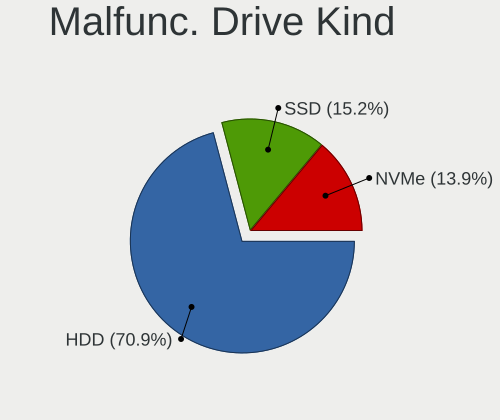

| Kind | Computers | Drives | Percent |
|------|-----------|--------|---------|
| HDD  | 56        | 79     | 70.89%  |
| SSD  | 12        | 12     | 15.19%  |
| NVMe | 11        | 13     | 13.92%  |

Failed Drives
-------------

Failed drive models

| Model                  | Computers | Drives | Percent |
|------------------------|-----------|--------|---------|
| Toshiba DT01ACA300 3TB | 1         | 1      | 100%    |

Failed Drive Vendor
-------------------

Failed drive vendors

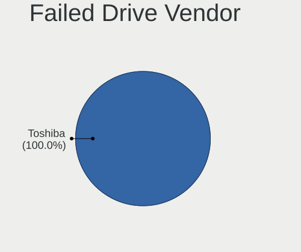

| Vendor  | Computers | Drives | Percent |
|---------|-----------|--------|---------|
| Toshiba | 1         | 1      | 100%    |

Drive Status
------------

Number of failed and malfunc. drives

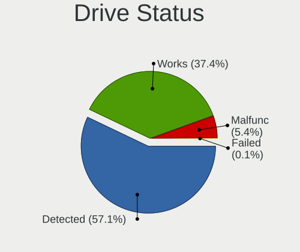

| Status   | Computers | Drives | Percent |
|----------|-----------|--------|---------|
| Detected | 745       | 1604   | 57.09%  |
| Works    | 488       | 865    | 37.39%  |
| Malfunc  | 71        | 104    | 5.44%   |
| Failed   | 1         | 1      | 0.08%   |

Storage controller
------------------

Storage Vendor
--------------

Storage controller vendors

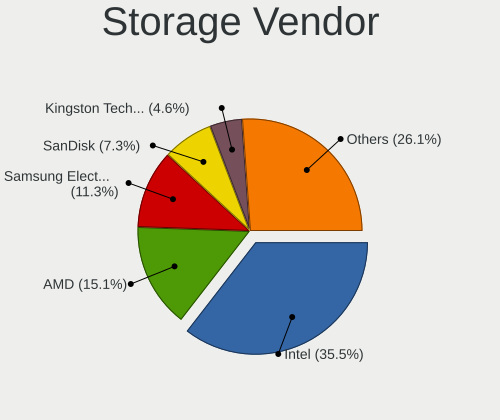

| Vendor                          | Computers | Percent |
|---------------------------------|-----------|---------|
| Intel                           | 626       | 35.49%  |
| AMD                             | 266       | 15.08%  |
| Samsung Electronics             | 200       | 11.34%  |
| SanDisk                         | 129       | 7.31%   |
| Kingston Technology Company     | 82        | 4.65%   |
| SK hynix                        | 62        | 3.51%   |
| Micron/Crucial Technology       | 53        | 3%      |
| Micron Technology               | 51        | 2.89%   |
| Phison Electronics              | 48        | 2.72%   |
| Silicon Motion                  | 28        | 1.59%   |
| KIOXIA                          | 27        | 1.53%   |
| ASMedia Technology              | 27        | 1.53%   |
| MAXIO Technology (Hangzhou)     | 24        | 1.36%   |
| Toshiba America Info Systems    | 22        | 1.25%   |
| ADATA Technology                | 19        | 1.08%   |
| JMicron Technology              | 14        | 0.79%   |
| Realtek Semiconductor           | 12        | 0.68%   |
| Marvell Technology Group        | 10        | 0.57%   |
| Broadcom / LSI                  | 9         | 0.51%   |
| Solidigm                        | 8         | 0.45%   |
| Shenzhen Longsys Electronics    | 8         | 0.45%   |
| INNOGRIT                        | 5         | 0.28%   |
| Nvidia                          | 4         | 0.23%   |
| Apple                           | 4         | 0.23%   |
| Yangtze Memory Technologies     | 3         | 0.17%   |
| Biwin Storage Technology        | 3         | 0.17%   |
| Union Memory (Shenzhen)         | 2         | 0.11%   |
| Solid State Storage Technology  | 2         | 0.11%   |
| Silicon Image                   | 2         | 0.11%   |
| Seagate Technology              | 2         | 0.11%   |
| Netac Technology                | 2         | 0.11%   |
| LSI Logic / Symbios Logic       | 2         | 0.11%   |
| Hosin Global Electronics        | 2         | 0.11%   |
| Unknown                         | 2         | 0.11%   |
| Zhaoxin                         | 1         | 0.06%   |
| Transcend                       | 1         | 0.06%   |
| Shenzhen Techwinsemi Technology | 1         | 0.06%   |
| OCZ Technology Group            | 1         | 0.06%   |

Storage Model
-------------

Storage controller models

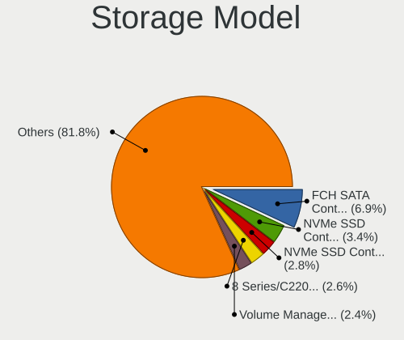

| Model                                                                          | Computers | Percent |
|--------------------------------------------------------------------------------|-----------|---------|
| AMD FCH SATA Controller [AHCI mode]                                            | 134       | 6.94%   |
| Samsung NVMe SSD Controller SM981/PM981/PM983                                  | 66        | 3.42%   |
| Samsung NVMe SSD Controller PM9A1/PM9A3/980PRO                                 | 54        | 2.8%    |
| Intel 8 Series/C220 Series Chipset Family 6-port SATA Controller 1 [AHCI mode] | 51        | 2.64%   |
| Intel Volume Management Device NVMe RAID Controller                            | 47        | 2.44%   |
| Intel Sunrise Point-LP SATA Controller [AHCI mode]                             | 45        | 2.33%   |
| AMD 600 Series Chipset SATA Controller                                         | 44        | 2.28%   |
| AMD 500 Series Chipset SATA Controller                                         | 43        | 2.23%   |
| AMD 400 Series Chipset SATA Controller                                         | 37        | 1.92%   |
| SanDisk WD SN560/SN740/SN770/SN5000 NVMe SSD                                   | 34        | 1.76%   |
| Samsung NVMe SSD Controller 980 (DRAM-less)                                    | 33        | 1.71%   |
| Intel 200 Series PCH SATA controller [AHCI mode]                               | 28        | 1.45%   |
| Intel RST Volume Management Device Controller                                  | 27        | 1.4%    |
| Intel 82801 Mobile SATA Controller [RAID mode]                                 | 27        | 1.4%    |
| Micron/Crucial P2 [Nick P2] / P3 / P3 Plus NVMe PCIe SSD (DRAM-less)           | 26        | 1.35%   |
| AMD SB7x0/SB8x0/SB9x0 SATA Controller [AHCI mode]                              | 25        | 1.3%    |
| Intel SATA Controller [RAID mode]                                              | 23        | 1.19%   |
| Intel 7 Series Chipset Family 6-port SATA Controller [AHCI mode]               | 23        | 1.19%   |
| ASMedia ASM1061/ASM1062 Serial ATA Controller                                  | 22        | 1.14%   |
| Silicon Motion SM2263EN/SM2263XT (DRAM-less) NVMe SSD Controllers              | 20        | 1.04%   |
| Samsung NVMe SSD Controller S4LV008[Pascal]                                    | 20        | 1.04%   |
| Intel Raptor Lake SATA AHCI Controller                                         | 20        | 1.04%   |
| Intel Q170/Q150/B150/H170/H110/Z170/CM236 Chipset SATA Controller [AHCI Mode]  | 20        | 1.04%   |
| Intel 6 Series/C200 Series Chipset Family 6 port Mobile SATA AHCI Controller   | 19        | 0.98%   |
| Intel 6 Series/C200 Series Chipset Family 6 port Desktop SATA AHCI Controller  | 18        | 0.93%   |
| Kingston Company NV2 NVMe SSD [SM2267XT] (DRAM-less)                           | 17        | 0.88%   |
| Intel Cannon Lake Mobile PCH SATA AHCI Controller                              | 17        | 0.88%   |
| Intel 8 Series SATA Controller 1 [AHCI mode]                                   | 17        | 0.88%   |
| Intel 7 Series/C210 Series Chipset Family 6-port SATA Controller [AHCI mode]   | 17        | 0.88%   |
| SK hynix Gold P31/BC711/PC711 NVMe Solid State Drive                           | 16        | 0.83%   |
| Intel SSD 660P Series                                                          | 16        | 0.83%   |
| Intel Alder Lake-P SATA AHCI Controller                                        | 16        | 0.83%   |
| Intel Tiger Lake-LP SATA Controller                                            | 15        | 0.78%   |
| Intel Cannon Lake PCH SATA AHCI Controller                                     | 15        | 0.78%   |
| Micron 2400 NVMe SSD (DRAM-less)                                               | 14        | 0.73%   |
| Intel Wildcat Point-LP SATA Controller [AHCI Mode]                             | 14        | 0.73%   |
| SK hynix Platinum P41/PC801 NVMe Solid State Drive                             | 13        | 0.67%   |
| Sandisk WD Black SN850X NVMe SSD                                               | 13        | 0.67%   |
| Phison E12 NVMe Controller                                                     | 13        | 0.67%   |
| Intel Alder Lake-S PCH SATA Controller [AHCI Mode]                             | 13        | 0.67%   |

Storage Kind
------------

Kind of storage controller (IDE, SATA, NVMe, SAS, ...)

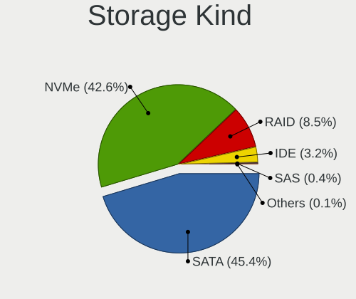

| Kind | Computers | Percent |
|------|-----------|---------|
| SATA | 761       | 45.35%  |
| NVMe | 714       | 42.55%  |
| RAID | 143       | 8.52%   |
| IDE  | 53        | 3.16%   |
| SAS  | 6         | 0.36%   |
| SCSI | 1         | 0.06%   |

Processor
---------

CPU Vendor
----------

Processor vendors

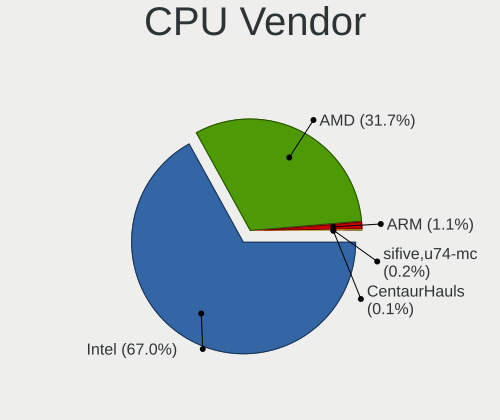

| Vendor        | Computers | Percent |
|---------------|-----------|---------|
| Intel         | 799       | 66.97%  |
| AMD           | 378       | 31.68%  |
| ARM           | 13        | 1.09%   |
| sifive,u74-mc | 2         | 0.17%   |
| CentaurHauls  | 1         | 0.08%   |

CPU Model
---------

Processor models

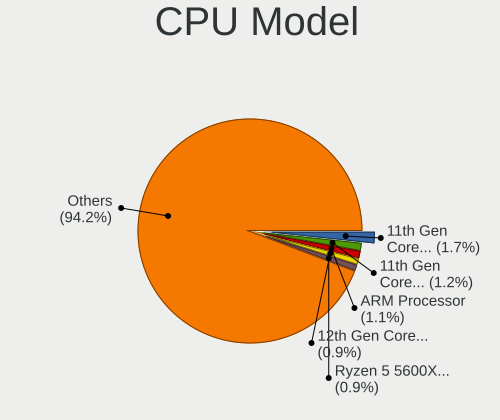

| Model                                   | Computers | Percent |
|-----------------------------------------|-----------|---------|
| Intel 11th Gen Core i7-1165G7 @ 2.80GHz | 20        | 1.67%   |
| Intel 11th Gen Core i5-1135G7 @ 2.40GHz | 14        | 1.17%   |
| ARM Processor                           | 13        | 1.09%   |
| Intel 12th Gen Core i7-12700H           | 11        | 0.92%   |
| AMD Ryzen 5 5600X 6-Core Processor      | 11        | 0.92%   |
| AMD Ryzen 5 5600G with Radeon Graphics  | 10        | 0.84%   |
| AMD Ryzen 7 3700X 8-Core Processor      | 9         | 0.75%   |
| Intel Core i7-7700HQ CPU @ 2.80GHz      | 8         | 0.67%   |
| Intel Core i7-4790K CPU @ 4.00GHz       | 8         | 0.67%   |
| Intel 13th Gen Core i9-13900H           | 8         | 0.67%   |
| Intel 12th Gen Core i7-1255U            | 8         | 0.67%   |
| AMD Ryzen 9 5950X 16-Core Processor     | 8         | 0.67%   |
| AMD Ryzen 7 5800X 8-Core Processor      | 8         | 0.67%   |
| AMD Ryzen 7 2700X Eight-Core Processor  | 8         | 0.67%   |
| AMD Ryzen 5 5500U with Radeon Graphics  | 8         | 0.67%   |
| AMD Ryzen 5 3600 6-Core Processor       | 8         | 0.67%   |
| Intel Core Ultra 7 155H                 | 7         | 0.59%   |
| Intel Core i7-9750H CPU @ 2.60GHz       | 7         | 0.59%   |
| Intel Core i7-7700K CPU @ 4.20GHz       | 7         | 0.59%   |
| Intel Core i7-1065G7 CPU @ 1.30GHz      | 7         | 0.59%   |
| Intel Core i5-8250U CPU @ 1.60GHz       | 7         | 0.59%   |
| Intel 12th Gen Core i7-1260P            | 7         | 0.59%   |
| AMD Ryzen 7 7730U with Radeon Graphics  | 7         | 0.59%   |
| AMD Ryzen 7 5800H with Radeon Graphics  | 7         | 0.59%   |
| AMD Ryzen 7 5700X 8-Core Processor      | 7         | 0.59%   |
| AMD Ryzen 7 5700U with Radeon Graphics  | 7         | 0.59%   |
| Intel Core i7-8700 CPU @ 3.20GHz        | 6         | 0.5%    |
| Intel Core i7-8565U CPU @ 1.80GHz       | 6         | 0.5%    |
| Intel Core i7-8550U CPU @ 1.80GHz       | 6         | 0.5%    |
| Intel Core i7-7500U CPU @ 2.70GHz       | 6         | 0.5%    |
| Intel Core i7-3770 CPU @ 3.40GHz        | 6         | 0.5%    |
| Intel Core i5-9300H CPU @ 2.40GHz       | 6         | 0.5%    |
| Intel Core i5-8265U CPU @ 1.60GHz       | 6         | 0.5%    |
| Intel Core i5-6300U CPU @ 2.40GHz       | 6         | 0.5%    |
| Intel Core i5-6200U CPU @ 2.30GHz       | 6         | 0.5%    |
| Intel Core i5-3470 CPU @ 3.20GHz        | 6         | 0.5%    |
| Intel Core i5-2520M CPU @ 2.50GHz       | 6         | 0.5%    |
| Intel 12th Gen Core i5-1235U            | 6         | 0.5%    |
| AMD Ryzen 5 7600X 6-Core Processor      | 6         | 0.5%    |
| Intel N150                              | 5         | 0.42%   |

CPU Model Family
----------------

Processor model prefix

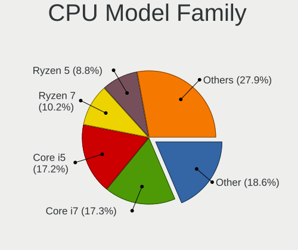

| Model                   | Computers | Percent |
|-------------------------|-----------|---------|
| Other                   | 222       | 18.59%  |
| Intel Core i7           | 207       | 17.34%  |
| Intel Core i5           | 205       | 17.17%  |
| AMD Ryzen 7             | 122       | 10.22%  |
| AMD Ryzen 5             | 105       | 8.79%   |
| AMD Ryzen 9             | 50        | 4.19%   |
| Intel Core i3           | 39        | 3.27%   |
| Intel Xeon              | 37        | 3.1%    |
| Intel Core              | 35        | 2.93%   |
| Intel Celeron           | 25        | 2.09%   |
| AMD FX                  | 17        | 1.42%   |
| Intel Core 2 Duo        | 15        | 1.26%   |
| AMD Ryzen 7 PRO         | 12        | 1.01%   |
| Intel Core i9           | 11        | 0.92%   |
| AMD Ryzen 3             | 10        | 0.84%   |
| AMD Ryzen 5 PRO         | 9         | 0.75%   |
| Intel Pentium           | 8         | 0.67%   |
| AMD A6                  | 8         | 0.67%   |
| Intel Atom              | 7         | 0.59%   |
| Intel Pentium Silver    | 5         | 0.42%   |
| AMD A8                  | 5         | 0.42%   |
| AMD A4                  | 4         | 0.34%   |
| AMD Ryzen Threadripper  | 3         | 0.25%   |
| AMD Phenom II X4        | 3         | 0.25%   |
| AMD A10                 | 3         | 0.25%   |
| Intel Pentium Gold      | 2         | 0.17%   |
| AMD Phenom II X6        | 2         | 0.17%   |
| AMD E1                  | 2         | 0.17%   |
| AMD Athlon II X2        | 2         | 0.17%   |
| AMD A12                 | 2         | 0.17%   |
| Intel Pentium Dual-Core | 1         | 0.08%   |
| Intel Genuine           | 1         | 0.08%   |
| Intel Core M            | 1         | 0.08%   |
| Intel Core 2 Quad       | 1         | 0.08%   |
| Intel Celeron Dual-Core | 1         | 0.08%   |
| AMD Turion II           | 1         | 0.08%   |
| AMD Ryzen 3 PRO         | 1         | 0.08%   |
| AMD Phenom              | 1         | 0.08%   |
| AMD Opteron             | 1         | 0.08%   |
| AMD E2                  | 1         | 0.08%   |

CPU Cores
---------

Number of processor cores

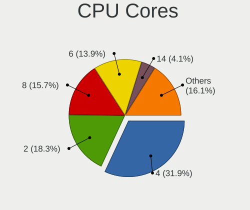

| Number  | Computers | Percent |
|---------|-----------|---------|
| 4       | 381       | 31.94%  |
| 2       | 218       | 18.27%  |
| 8       | 187       | 15.67%  |
| 6       | 166       | 13.91%  |
| 14      | 49        | 4.11%   |
| 12      | 48        | 4.02%   |
| 16      | 47        | 3.94%   |
| 10      | 40        | 3.35%   |
| 24      | 20        | 1.68%   |
| Unknown | 14        | 1.17%   |
| 20      | 8         | 0.67%   |
| 32      | 4         | 0.34%   |
| 3       | 3         | 0.25%   |
| 1       | 3         | 0.25%   |
| 28      | 2         | 0.17%   |
| 44      | 1         | 0.08%   |
| 18      | 1         | 0.08%   |
| 5       | 1         | 0.08%   |

CPU Sockets
-----------

Number of sockets

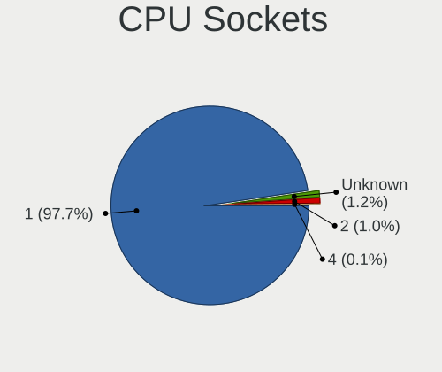

| Number  | Computers | Percent |
|---------|-----------|---------|
| 1       | 1165      | 97.65%  |
| Unknown | 14        | 1.17%   |
| 2       | 12        | 1.01%   |
| 24      | 1         | 0.08%   |
| 4       | 1         | 0.08%   |

CPU Threads
-----------

Threads per core (Hyper-Threading)

| Number  | Computers | Percent |
|---------|-----------|---------|
| 2       | 924       | 77.39%  |
| 1       | 256       | 21.44%  |
| Unknown | 14        | 1.17%   |

CPU Op-Modes
------------

CPU Operation Modes (32-bit, 64-bit)

| Op mode        | Computers | Percent |
|----------------|-----------|---------|
| 32-bit, 64-bit | 1181      | 98.99%  |
| 64-bit         | 10        | 0.84%   |
| Unknown        | 2         | 0.17%   |

CPU Microcode
-------------

Microcode number

| Number     | Computers | Percent |
|------------|-----------|---------|
| Unknown    | 1190      | 99.66%  |
| 0x0a704104 | 2         | 0.17%   |
| 0x08600106 | 1         | 0.08%   |
| 0x0800820d | 1         | 0.08%   |

CPU Microarch
-------------

Microarchitecture

| Name               | Computers | Percent |
|--------------------|-----------|---------|
| Unknown            | 234       | 19.58%  |
| KabyLake           | 172       | 14.39%  |
| Haswell            | 100       | 8.37%   |
| Zen 3              | 97        | 8.12%   |
| Alderlake Hybrid   | 73        | 6.11%   |
| SandyBridge        | 53        | 4.44%   |
| Zen 2              | 51        | 4.27%   |
| TigerLake          | 46        | 3.85%   |
| IvyBridge          | 46        | 3.85%   |
| Skylake            | 42        | 3.51%   |
| Zen+               | 35        | 2.93%   |
| CometLake          | 27        | 2.26%   |
| Broadwell          | 27        | 2.26%   |
| Piledriver         | 22        | 1.84%   |
| Icelake            | 19        | 1.59%   |
| Zen                | 16        | 1.34%   |
| Penryn             | 14        | 1.17%   |
| Meteorlake Hybrid  | 12        | 1%      |
| K10                | 12        | 1%      |
| Westmere           | 11        | 0.92%   |
| Silvermont         | 11        | 0.92%   |
| Goldmont plus      | 11        | 0.92%   |
| Nehalem            | 8         | 0.67%   |
| Gracemont          | 7         | 0.59%   |
| Lunarlake Hybrid   | 6         | 0.5%    |
| Excavator          | 6         | 0.5%    |
| Core               | 6         | 0.5%    |
| Puma               | 5         | 0.42%   |
| K10 Llano          | 5         | 0.42%   |
| Goldmont           | 4         | 0.33%   |
| Steamroller        | 3         | 0.25%   |
| Bulldozer          | 3         | 0.25%   |
| ArrowLake-H Hybrid | 3         | 0.25%   |
| Tremont            | 2         | 0.17%   |
| Jaguar             | 2         | 0.17%   |
| Bonnell            | 2         | 0.17%   |
| K8 Hammer          | 1         | 0.08%   |
| Bobcat             | 1         | 0.08%   |

Graphics
--------

GPU Vendor
----------

Vendors of graphics cards

| Vendor                     | Computers | Percent |
|----------------------------|-----------|---------|
| Intel                      | 617       | 42.64%  |
| Nvidia                     | 469       | 32.41%  |
| AMD                        | 355       | 24.53%  |
| Matrox Electronics Systems | 5         | 0.35%   |
| Zhaoxin                    | 1         | 0.07%   |

GPU Model
---------

Graphics card models

| Model                                                                       | Computers | Percent |
|-----------------------------------------------------------------------------|-----------|---------|
| Intel TigerLake-LP GT2 [Iris Xe Graphics]                                   | 41        | 2.76%   |
| Intel 2nd Generation Core Processor Family Integrated Graphics Controller   | 35        | 2.35%   |
| AMD Cezanne [Radeon Vega Series / Radeon Vega Mobile Series]                | 31        | 2.08%   |
| AMD Raphael                                                                 | 30        | 2.02%   |
| Intel Alder Lake-P GT2 [Iris Xe Graphics]                                   | 28        | 1.88%   |
| Intel Xeon E3-1200 v3/4th Gen Core Processor Integrated Graphics Controller | 25        | 1.68%   |
| Intel Kaby Lake-R GT2 [UHD Graphics 620]                                    | 25        | 1.68%   |
| AMD Renoir [Radeon Vega Series / Radeon Vega Mobile Series]                 | 25        | 1.68%   |
| Intel CoffeeLake-H GT2 [UHD Graphics 630]                                   | 24        | 1.61%   |
| Intel Raptor Lake-P [Iris Xe Graphics]                                      | 23        | 1.55%   |
| AMD Rembrandt [Radeon 680M]                                                 | 23        | 1.55%   |
| Intel Kaby Lake-U GT2 [HD Graphics 620]                                     | 22        | 1.48%   |
| Intel Haswell-ULT Integrated Graphics Controller                            | 22        | 1.48%   |
| Intel WhiskeyLake-U GT2 [UHD Graphics 620]                                  | 20        | 1.34%   |
| Intel Skylake-U GT2 [HD Graphics 520]                                       | 20        | 1.34%   |
| AMD Phoenix1                                                                | 20        | 1.34%   |
| Intel 3rd Gen Core processor Graphics Controller                            | 19        | 1.28%   |
| AMD Ellesmere [Radeon RX 470/480/570/570X/580/580X/590]                     | 18        | 1.21%   |
| Intel Broadwell-U GT2 [HD Graphics 5500]                                    | 17        | 1.14%   |
| Intel 4th Gen Core Processor Integrated Graphics Controller                 | 17        | 1.14%   |
| AMD Picasso/Raven 2 [Radeon Vega Series / Radeon Vega Mobile Series]        | 17        | 1.14%   |
| Nvidia GP107 [GeForce GTX 1050 Ti]                                          | 16        | 1.08%   |
| AMD Lucienne                                                                | 15        | 1.01%   |
| Nvidia TU117M [GeForce GTX 1650 Mobile / Max-Q]                             | 14        | 0.94%   |
| Nvidia GA106 [GeForce RTX 3060 Lite Hash Rate]                              | 14        | 0.94%   |
| Intel Meteor Lake-P [Intel Arc Graphics]                                    | 14        | 0.94%   |
| Intel TigerLake-H GT1 [UHD Graphics]                                        | 13        | 0.87%   |
| Intel CoffeeLake-S GT2 [UHD Graphics 630]                                   | 13        | 0.87%   |
| AMD Barcelo                                                                 | 13        | 0.87%   |
| Intel Alder Lake-UP3 GT2 [Iris Xe Graphics]                                 | 12        | 0.81%   |
| Nvidia GA106M [GeForce RTX 3060 Mobile / Max-Q]                             | 11        | 0.74%   |
| Nvidia AD107M [GeForce RTX 4060 Max-Q / Mobile]                             | 11        | 0.74%   |
| Intel Raptor Lake-P [UHD Graphics]                                          | 11        | 0.74%   |
| Intel Kaby Lake-S GT2 [HD Graphics 630]                                     | 11        | 0.74%   |
| Nvidia GA107M [GeForce RTX 3050 Mobile]                                     | 10        | 0.67%   |
| Nvidia AD107M [GeForce RTX 4050 Max-Q / Mobile]                             | 10        | 0.67%   |
| Intel Raptor Lake-S UHD Graphics                                            | 10        | 0.67%   |
| Intel Kaby Lake-H GT2 [HD Graphics 630]                                     | 10        | 0.67%   |
| Nvidia GP104 [GeForce GTX 1070]                                             | 9         | 0.6%    |
| Nvidia GM108M [GeForce 940MX]                                               | 9         | 0.6%    |

GPU Combo
---------

Combinations of graphics cards

| Name                 | Computers | Percent |
|----------------------|-----------|---------|
| 1 x Intel            | 408       | 34.06%  |
| 1 x AMD              | 254       | 21.2%   |
| 1 x Nvidia           | 237       | 19.78%  |
| Intel + Nvidia       | 171       | 14.27%  |
| AMD + Nvidia         | 50        | 4.17%   |
| 2 x AMD              | 28        | 2.34%   |
| Intel + AMD          | 21        | 1.75%   |
| Other                | 15        | 1.25%   |
| Nvidia + Matrox      | 3         | 0.25%   |
| 2 x Nvidia           | 2         | 0.17%   |
| 2 x Intel            | 2         | 0.17%   |
| AMD + 2 x Nvidia     | 2         | 0.17%   |
| 3 x Nvidia           | 1         | 0.08%   |
| 2 x AMD + 1 x Matrox | 1         | 0.08%   |
| 1 x Zhaoxin          | 1         | 0.08%   |
| 1 x Matrox           | 1         | 0.08%   |
| Intel + 2 x Nvidia   | 1         | 0.08%   |

GPU Driver
----------

Free vs proprietary

| Driver      | Computers | Percent |
|-------------|-----------|---------|
| Free        | 819       | 67.91%  |
| Proprietary | 241       | 19.98%  |
| Unknown     | 146       | 12.11%  |

GPU Memory
----------

Total video memory

| Size in GB | Computers | Percent |
|------------|-----------|---------|
| Unknown    | 803       | 66.09%  |
| 3.01-4.0   | 76        | 6.26%   |
| 1.01-2.0   | 65        | 5.35%   |
| 7.01-8.0   | 64        | 5.27%   |
| 8.01-16.0  | 63        | 5.19%   |
| 0.01-0.5   | 63        | 5.19%   |
| 0.51-1.0   | 34        | 2.8%    |
| 5.01-6.0   | 30        | 2.47%   |
| 16.01-24.0 | 9         | 0.74%   |
| 2.01-3.0   | 6         | 0.49%   |
| 24.01-32.0 | 2         | 0.16%   |

Monitor
-------

Monitor Vendor
--------------

Monitor vendors

| Vendor                  | Computers | Percent |
|-------------------------|-----------|---------|
| Samsung Electronics     | 184       | 12.8%   |
| AU Optronics            | 137       | 9.53%   |
| BOE                     | 128       | 8.9%    |
| Dell                    | 105       | 7.3%    |
| Chimei Innolux          | 104       | 7.23%   |
| Goldstar                | 86        | 5.98%   |
| LG Display              | 80        | 5.56%   |
| Acer                    | 56        | 3.89%   |
| Hewlett-Packard         | 48        | 3.34%   |
| Philips                 | 39        | 2.71%   |
| AOC                     | 36        | 2.5%    |
| Lenovo                  | 32        | 2.23%   |
| BenQ                    | 30        | 2.09%   |
| Apple                   | 23        | 1.6%    |
| Ancor Communications    | 22        | 1.53%   |
| Sharp                   | 20        | 1.39%   |
| Unknown                 | 17        | 1.18%   |
| Iiyama                  | 17        | 1.18%   |
| ASUSTek Computer        | 16        | 1.11%   |
| ViewSonic               | 14        | 0.97%   |
| PANDA                   | 12        | 0.83%   |
| MSI                     | 12        | 0.83%   |
| Gigabyte Technology     | 12        | 0.83%   |
| Chi Mei Optoelectronics | 10        | 0.7%    |
| InfoVision              | 9         | 0.63%   |
| Fujitsu Siemens         | 8         | 0.56%   |
| Sceptre Tech            | 7         | 0.49%   |
| CSO                     | 7         | 0.49%   |
| Vestel Elektronik       | 6         | 0.42%   |
| Sony                    | 6         | 0.42%   |
| CSOT                    | 6         | 0.42%   |
| NEC Computers           | 5         | 0.35%   |
| Mi                      | 5         | 0.35%   |
| HKC                     | 5         | 0.35%   |
| CSW                     | 5         | 0.35%   |
| Unknown                 | 5         | 0.35%   |
| ___                     | 4         | 0.28%   |
| Vizio                   | 4         | 0.28%   |
| SKG                     | 4         | 0.28%   |
| Panasonic               | 4         | 0.28%   |

Monitor Model
-------------

Monitor models

| Model                                                                    | Computers | Percent |
|--------------------------------------------------------------------------|-----------|---------|
| Unknown LCD Monitor FFFF 2288x1287 2550x2550mm 142.0-inch                | 14        | 0.94%   |
| Samsung Electronics C24F390 SAM0D2C 1920x1080 521x293mm 23.5-inch        | 9         | 0.6%    |
| Goldstar FULL HD GSM5B55 1920x1080 480x270mm 21.7-inch                   | 7         | 0.47%   |
| Vestel Elektronik 40UHD_LCD_TV VES3700 3840x2160 880x500mm 39.8-inch     | 6         | 0.4%    |
| Dell U2412M DELA07A 1920x1200 518x324mm 24.1-inch                        | 6         | 0.4%    |
| Chimei Innolux LCD Monitor CMN14D4 1920x1080 309x173mm 13.9-inch         | 6         | 0.4%    |
| AOC 27G2G4 AOC2702 1920x1080 598x336mm 27.0-inch                         | 6         | 0.4%    |
| Goldstar LG ULTRAWIDE GSM59F1 2560x1080 670x280mm 28.6-inch              | 5         | 0.33%   |
| BOE LCD Monitor BOE0B76 1920x1200 345x215mm 16.0-inch                    | 5         | 0.33%   |
| Unknown                                                                  | 5         | 0.33%   |
| Samsung Electronics C27F390 SAM0D32 1920x1080 598x336mm 27.0-inch        | 4         | 0.27%   |
| Dell P2417H DELA0DB 1920x1080 527x296mm 23.8-inch                        | 4         | 0.27%   |
| Dell AW2518HF DELA102 1920x1080 544x303mm 24.5-inch                      | 4         | 0.27%   |
| Chimei Innolux LCD Monitor CMN1618 1920x1200 344x215mm 16.0-inch         | 4         | 0.27%   |
| Chimei Innolux LCD Monitor CMN15F5 1920x1080 344x193mm 15.5-inch         | 4         | 0.27%   |
| Chimei Innolux LCD Monitor CMN15E8 1920x1080 344x193mm 15.5-inch         | 4         | 0.27%   |
| Chimei Innolux LCD Monitor CMN15E7 1920x1080 344x193mm 15.5-inch         | 4         | 0.27%   |
| Chimei Innolux LCD Monitor CMN1521 1920x1080 344x193mm 15.5-inch         | 4         | 0.27%   |
| Chimei Innolux LCD Monitor CMN1512 1920x1080 344x193mm 15.5-inch         | 4         | 0.27%   |
| Chi Mei Optoelectronics LCD Monitor CMO15A7 1366x768 344x193mm 15.5-inch | 4         | 0.27%   |
| AU Optronics LCD Monitor AUO71EC 1366x768 344x193mm 15.5-inch            | 4         | 0.27%   |
| AU Optronics LCD Monitor AUO403D 1920x1080 309x174mm 14.0-inch           | 4         | 0.27%   |
| AU Optronics LCD Monitor AUO106C 1366x768 276x155mm 12.5-inch            | 4         | 0.27%   |
| ___ LCD TV ___9000 1360x768                                              | 3         | 0.2%    |
| Sharp LCD Monitor SHP1548 1920x1200 288x180mm 13.4-inch                  | 3         | 0.2%    |
| Sceptre Tech Sceptre F24 SPT09AB 1920x1080 530x290mm 23.8-inch           | 3         | 0.2%    |
| Samsung Electronics S24D330 SAM0D92 1920x1080 531x299mm 24.0-inch        | 3         | 0.2%    |
| Samsung Electronics LU28R55 SAM1016 3840x2160 632x360mm 28.6-inch        | 3         | 0.2%    |
| Samsung Electronics LF27T35 SAM707F 1920x1080 598x337mm 27.0-inch        | 3         | 0.2%    |
| Samsung Electronics LCD Monitor SEC5441 1280x800 331x207mm 15.4-inch     | 3         | 0.2%    |
| Samsung Electronics LCD Monitor SEC4542 1366x768 309x174mm 14.0-inch     | 3         | 0.2%    |
| Samsung Electronics LCD Monitor SDC4178 3200x2000 344x215mm 16.0-inch    | 3         | 0.2%    |
| Samsung Electronics LCD Monitor SDC324C 1920x1080 344x194mm 15.5-inch    | 3         | 0.2%    |
| RTK LCD Monitor RTK1D1A 1920x1080 1020x570mm 46.0-inch                   | 3         | 0.2%    |
| Philips PHL 243V7 PHLC155 1920x1080 527x296mm 23.8-inch                  | 3         | 0.2%    |
| Philips FTV PHL01EA 1920x1080 1440x810mm 65.0-inch                       | 3         | 0.2%    |
| PANDA LCD Monitor NCP004D 1920x1080 344x194mm 15.5-inch                  | 3         | 0.2%    |
| Panasonic VVX11F009G00 MEI96A2 1920x1080 344x193mm 15.5-inch             | 3         | 0.2%    |
| MSI Optix MAG27CQ MSI1462 2560x1440 597x336mm 27.0-inch                  | 3         | 0.2%    |
| LG Display LCD Monitor LGD0555 2736x1824 260x173mm 12.3-inch             | 3         | 0.2%    |

Monitor Resolution
------------------

Monitor screen resolution

| Resolution         | Computers | Percent |
|--------------------|-----------|---------|
| 1920x1080 (FHD)    | 627       | 46.93%  |
| 3840x2160 (4K)     | 129       | 9.66%   |
| 1366x768 (WXGA)    | 111       | 8.31%   |
| 2560x1440 (QHD)    | 104       | 7.78%   |
| 1920x1200 (WUXGA)  | 87        | 6.51%   |
| 3440x1440          | 39        | 2.92%   |
| 1600x900 (HD+)     | 30        | 2.25%   |
| 2560x1600          | 25        | 1.87%   |
| 2880x1800          | 17        | 1.27%   |
| 1680x1050 (WSXGA+) | 16        | 1.2%    |
| 2288x1287          | 14        | 1.05%   |
| 1280x1024 (SXGA)   | 14        | 1.05%   |
| Unknown            | 14        | 1.05%   |
| 1440x900 (WXGA+)   | 12        | 0.9%    |
| 3840x1080          | 11        | 0.82%   |
| 2560x1080          | 11        | 0.82%   |
| 3840x2400          | 9         | 0.67%   |
| 1360x768           | 9         | 0.67%   |
| 1280x800 (WXGA)    | 8         | 0.6%    |
| 3200x2000          | 3         | 0.22%   |
| 2880x1920          | 3         | 0.22%   |
| 2880x1620          | 3         | 0.22%   |
| 2160x1440          | 3         | 0.22%   |
| 1920x540           | 3         | 0.22%   |
| 1920x1280          | 3         | 0.22%   |
| 800x1280           | 2         | 0.15%   |
| 3072x1920          | 2         | 0.15%   |
| 3000x2000          | 2         | 0.15%   |
| 2256x1504          | 2         | 0.15%   |
| 1024x768 (XGA)     | 2         | 0.15%   |
| 1024x600           | 2         | 0.15%   |
| 5760x2160          | 1         | 0.07%   |
| 5760x1080          | 1         | 0.07%   |
| 504x315            | 1         | 0.07%   |
| 480x1920           | 1         | 0.07%   |
| 3840x1600          | 1         | 0.07%   |
| 3840x1200          | 1         | 0.07%   |
| 3840x1100          | 1         | 0.07%   |
| 3600x1080          | 1         | 0.07%   |
| 3520x1080          | 1         | 0.07%   |

Monitor Diagonal
----------------

Diagonal size in inches

| Inches  | Computers | Percent |
|---------|-----------|---------|
| 15      | 269       | 18.81%  |
| 27      | 149       | 10.42%  |
| 24      | 131       | 9.16%   |
| 13      | 114       | 7.97%   |
| 23      | 109       | 7.62%   |
| 14      | 99        | 6.92%   |
| 31      | 76        | 5.31%   |
| 21      | 61        | 4.27%   |
| 16      | 61        | 4.27%   |
| 17      | 57        | 3.99%   |
| 34      | 46        | 3.22%   |
| Unknown | 38        | 2.66%   |
| 84      | 21        | 1.47%   |
| 19      | 21        | 1.47%   |
| 22      | 15        | 1.05%   |
| 142     | 14        | 0.98%   |
| 18      | 14        | 0.98%   |
| 12      | 12        | 0.84%   |
| 48      | 11        | 0.77%   |
| 32      | 11        | 0.77%   |
| 72      | 10        | 0.7%    |
| 40      | 9         | 0.63%   |
| 11      | 9         | 0.63%   |
| 20      | 7         | 0.49%   |
| 28      | 6         | 0.42%   |
| 46      | 5         | 0.35%   |
| 65      | 4         | 0.28%   |
| 52      | 4         | 0.28%   |
| 49      | 4         | 0.28%   |
| 42      | 4         | 0.28%   |
| 39      | 4         | 0.28%   |
| 25      | 4         | 0.28%   |
| 63      | 3         | 0.21%   |
| 54      | 3         | 0.21%   |
| 36      | 3         | 0.21%   |
| 7       | 3         | 0.21%   |
| 55      | 2         | 0.14%   |
| 38      | 2         | 0.14%   |
| 35      | 2         | 0.14%   |
| 26      | 2         | 0.14%   |

Monitor Width
-------------

Physical width

| Width in mm    | Computers | Percent |
|----------------|-----------|---------|
| 301-350        | 476       | 34.24%  |
| 501-600        | 351       | 25.25%  |
| 401-500        | 107       | 7.7%    |
| 601-700        | 91        | 6.55%   |
| 201-300        | 80        | 5.76%   |
| 351-400        | 72        | 5.18%   |
| 701-800        | 61        | 4.39%   |
| 1001-1500      | 42        | 3.02%   |
| Unknown        | 38        | 2.73%   |
| 1501-2000      | 32        | 2.3%    |
| 801-900        | 17        | 1.22%   |
| More than 2000 | 14        | 1.01%   |
| 901-1000       | 5         | 0.36%   |
| 101-200        | 2         | 0.14%   |
| 1-100          | 2         | 0.14%   |

Aspect Ratio
------------

Proportional relationship between the width and the height

| Ratio   | Computers | Percent |
|---------|-----------|---------|
| 16/9    | 906       | 73.18%  |
| 16/10   | 188       | 15.19%  |
| 21/9    | 50        | 4.04%   |
| Unknown | 20        | 1.62%   |
| 3/2     | 19        | 1.53%   |
| 32/9    | 16        | 1.29%   |
| 1.00    | 14        | 1.13%   |
| 5/4     | 11        | 0.89%   |
| 4/3     | 5         | 0.4%    |
| 6/5     | 2         | 0.16%   |
| 3.40    | 1         | 0.08%   |
| 3.20    | 1         | 0.08%   |
| 1.96    | 1         | 0.08%   |
| 0.67    | 1         | 0.08%   |
| 0.63    | 1         | 0.08%   |
| 0.62    | 1         | 0.08%   |
| 0.25    | 1         | 0.08%   |

Monitor Area
------------

Area in inch²

| Area in inch² | Computers | Percent |
|----------------|-----------|---------|
| 101-110        | 268       | 18.97%  |
| 201-250        | 235       | 16.63%  |
| 81-90          | 166       | 11.75%  |
| 301-350        | 149       | 10.54%  |
| 351-500        | 139       | 9.84%   |
| More than 1000 | 66        | 4.67%   |
| 111-120        | 62        | 4.39%   |
| 251-300        | 57        | 4.03%   |
| 151-200        | 48        | 3.4%    |
| 121-130        | 47        | 3.33%   |
| 71-80          | 45        | 3.18%   |
| 501-1000       | 44        | 3.11%   |
| Unknown        | 38        | 2.69%   |
| 141-150        | 14        | 0.99%   |
| 61-70          | 10        | 0.71%   |
| 51-60          | 10        | 0.71%   |
| 131-140        | 6         | 0.42%   |
| 91-100         | 5         | 0.35%   |
| 1-40           | 4         | 0.28%   |

Pixel Density
-------------

Pixels per inch

| Density       | Computers | Percent |
|---------------|-----------|---------|
| 51-100        | 440       | 32.54%  |
| 121-160       | 372       | 27.51%  |
| 101-120       | 275       | 20.34%  |
| 161-240       | 138       | 10.21%  |
| 1-50          | 54        | 3.99%   |
| Unknown       | 38        | 2.81%   |
| More than 240 | 35        | 2.59%   |

Multiple Monitors
-----------------

Total monitors connected

| Total | Computers | Percent |
|-------|-----------|---------|
| 1     | 859       | 70.64%  |
| 2     | 286       | 23.52%  |
| 3     | 45        | 3.7%    |
| 0     | 21        | 1.73%   |
| 4     | 5         | 0.41%   |

Network
-------

Net Controller Vendor
---------------------

Controller vendors

| Vendor                            | Computers | Percent |
|-----------------------------------|-----------|---------|
| Realtek Semiconductor             | 669       | 37.02%  |
| Intel                             | 659       | 36.47%  |
| Qualcomm Atheros                  | 99        | 5.48%   |
| MediaTek                          | 99        | 5.48%   |
| Broadcom                          | 61        | 3.38%   |
| TP-Link                           | 25        | 1.38%   |
| ASIX Electronics                  | 17        | 0.94%   |
| Samsung Electronics               | 13        | 0.72%   |
| Broadcom Limited                  | 12        | 0.66%   |
| Ralink Technology                 | 11        | 0.61%   |
| DisplayLink                       | 11        | 0.61%   |
| Qualcomm                          | 10        | 0.55%   |
| Microsoft                         | 10        | 0.55%   |
| Aquantia                          | 9         | 0.5%    |
| Marvell Technology Group          | 8         | 0.44%   |
| Xiaomi                            | 7         | 0.39%   |
| Ralink                            | 7         | 0.39%   |
| Shenzhen Goodix Technology        | 6         | 0.33%   |
| Sierra Wireless                   | 5         | 0.28%   |
| Dell                              | 5         | 0.28%   |
| NetGear                           | 4         | 0.22%   |
| Realtek                           | 3         | 0.17%   |
| Qualcomm Technologies             | 3         | 0.17%   |
| Qualcomm Atheros Communications   | 3         | 0.17%   |
| Linksys                           | 3         | 0.17%   |
| Lenovo                            | 3         | 0.17%   |
| Huawei Technologies               | 3         | 0.17%   |
| ASUSTek Computer                  | 3         | 0.17%   |
| Spreadtrum Communications         | 2         | 0.11%   |
| Raspberry Pi                      | 2         | 0.11%   |
| QinHeng Electronics               | 2         | 0.11%   |
| OPPO Electronics                  | 2         | 0.11%   |
| Nvidia                            | 2         | 0.11%   |
| Microchip Technology              | 2         | 0.11%   |
| Ericsson Business Mobile Networks | 2         | 0.11%   |
| D-Link                            | 2         | 0.11%   |
| AVM                               | 2         | 0.11%   |
| Apple                             | 2         | 0.11%   |
| ZyXEL Communications              | 1         | 0.06%   |
| VIA Technologies                  | 1         | 0.06%   |

Net Controller Model
--------------------

Controller models

| Model                                                                  | Computers | Percent |
|------------------------------------------------------------------------|-----------|---------|
| Realtek RTL8111/8168/8211/8411 PCI Express Gigabit Ethernet Controller | 395       | 18.03%  |
| Realtek RTL8125 2.5GbE Controller                                      | 100       | 4.56%   |
| Realtek RTL8153 Gigabit Ethernet Adapter                               | 69        | 3.15%   |
| Intel Wi-Fi 6 AX200                                                    | 67        | 3.06%   |
| MediaTek MT7922 802.11ax PCI Express Wireless Network Adapter          | 48        | 2.19%   |
| Realtek RTL810xE PCI Express Fast Ethernet controller                  | 41        | 1.87%   |
| Intel Wi-Fi 6E(802.11ax) AX210/AX1675* 2x2 [Typhoon Peak]              | 40        | 1.83%   |
| Intel Alder Lake-P PCH CNVi WiFi                                       | 38        | 1.73%   |
| Intel Wireless 8265 / 8275                                             | 36        | 1.64%   |
| Intel Wi-Fi 6 AX201                                                    | 35        | 1.6%    |
| Intel Ethernet Controller I225-V                                       | 29        | 1.32%   |
| Intel Wireless 7260                                                    | 28        | 1.28%   |
| Intel 82579LM Gigabit Network Connection (Lewisville)                  | 28        | 1.28%   |
| Realtek RTL8852BE PCIe 802.11ax Wireless Network Controller            | 27        | 1.23%   |
| Intel I211 Gigabit Network Connection                                  | 27        | 1.23%   |
| Intel Wireless 7265                                                    | 25        | 1.14%   |
| Intel 700 Series Chipset CNVi WiFi                                     | 24        | 1.1%    |
| Realtek RTL8822CE 802.11ac PCIe Wireless Network Adapter               | 23        | 1.05%   |
| MediaTek MT7921 802.11ax PCIe Wireless Network Adapter [Filogic 330]   | 23        | 1.05%   |
| Intel Ethernet Connection I217-LM                                      | 23        | 1.05%   |
| Intel Raptor Lake PCH CNVi WiFi                                        | 21        | 0.96%   |
| Realtek RTL8821CE 802.11ac PCIe Wireless Network Adapter               | 19        | 0.87%   |
| Intel Wireless 8260                                                    | 19        | 0.87%   |
| Intel Cannon Lake PCH CNVi WiFi                                        | 19        | 0.87%   |
| Intel Dual Band Wireless-AC 3168NGW [Stone Peak]                       | 17        | 0.78%   |
| ASIX AX88179 Gigabit Ethernet                                          | 17        | 0.78%   |
| Intel Ethernet Connection (2) I219-V                                   | 16        | 0.73%   |
| Qualcomm Atheros QCA9377 802.11ac Wireless Network Adapter             | 15        | 0.68%   |
| Intel Ethernet Controller I226-V                                       | 15        | 0.68%   |
| Qualcomm Atheros QCA6174 802.11ac Wireless Network Adapter             | 14        | 0.64%   |
| MediaTek MT7902 802.11ax PCIe Wireless Network Adapter [Filogic 310]   | 14        | 0.64%   |
| Intel Ethernet Connection (7) I219-V                                   | 14        | 0.64%   |
| Intel Ethernet Connection (4) I219-LM                                  | 14        | 0.64%   |
| Qualcomm Atheros AR9485 Wireless Network Adapter                       | 13        | 0.59%   |
| Intel Meteor Lake PCH CNVi WiFi                                        | 13        | 0.59%   |
| Intel Cannon Point-LP CNVi [Wireless-AC]                               | 13        | 0.59%   |
| Realtek 802.11ac NIC                                                   | 12        | 0.55%   |
| Intel Wi-Fi 7(802.11be) AX1775*/AX1790*/BE20*/BE401/BE1750* 2x2        | 12        | 0.55%   |
| Intel Wi-Fi 5(802.11ac) Wireless-AC 9x6x [Thunder Peak]                | 12        | 0.55%   |
| Intel Tiger Lake PCH CNVi WiFi                                         | 12        | 0.55%   |

Wireless Vendor
---------------

Wireless vendors

| Vendor                                | Computers | Percent |
|---------------------------------------|-----------|---------|
| Intel                                 | 506       | 51.16%  |
| Realtek Semiconductor                 | 165       | 16.68%  |
| MediaTek                              | 85        | 8.59%   |
| Qualcomm Atheros                      | 73        | 7.38%   |
| Broadcom                              | 50        | 5.06%   |
| TP-Link                               | 24        | 2.43%   |
| Ralink Technology                     | 11        | 1.11%   |
| Broadcom Limited                      | 11        | 1.11%   |
| Qualcomm                              | 9         | 0.91%   |
| Ralink                                | 7         | 0.71%   |
| Microsoft                             | 7         | 0.71%   |
| Sierra Wireless                       | 5         | 0.51%   |
| NetGear                               | 4         | 0.4%    |
| Marvell Technology Group              | 4         | 0.4%    |
| Dell                                  | 4         | 0.4%    |
| Realtek                               | 3         | 0.3%    |
| Qualcomm Atheros Communications       | 3         | 0.3%    |
| ASUSTek Computer                      | 3         | 0.3%    |
| Linksys                               | 2         | 0.2%    |
| D-Link                                | 2         | 0.2%    |
| AVM                                   | 2         | 0.2%    |
| ZyXEL Communications                  | 1         | 0.1%    |
| Senao                                 | 1         | 0.1%    |
| Qualcomm Technologies                 | 1         | 0.1%    |
| Fibocom                               | 1         | 0.1%    |
| Ericsson Business Mobile Networks     | 1         | 0.1%    |
| D-Link System                         | 1         | 0.1%    |
| Belkin Components                     | 1         | 0.1%    |
| Accton Technology                     | 1         | 0.1%    |
| 802.11g Adapter [Linksys WUSB54GC v3] | 1         | 0.1%    |

Wireless Model
--------------

Wireless models

| Model                                                                | Computers | Percent |
|----------------------------------------------------------------------|-----------|---------|
| Intel Wi-Fi 6 AX200                                                  | 67        | 6.73%   |
| Intel Wi-Fi 6E(802.11ax) AX210/AX1675* 2x2 [Typhoon Peak]            | 40        | 4.02%   |
| MediaTek MT7922 802.11ax PCI Express Wireless Network Adapter        | 37        | 3.71%   |
| Intel Wireless 8265 / 8275                                           | 36        | 3.61%   |
| Intel Wi-Fi 6 AX201                                                  | 35        | 3.51%   |
| Intel Wireless 7260                                                  | 28        | 2.81%   |
| Intel Wireless 7265                                                  | 25        | 2.51%   |
| Realtek RTL8822CE 802.11ac PCIe Wireless Network Adapter             | 23        | 2.31%   |
| MediaTek MT7921 802.11ax PCIe Wireless Network Adapter [Filogic 330] | 23        | 2.31%   |
| Intel Alder Lake-P PCH CNVi WiFi                                     | 23        | 2.31%   |
| Intel 700 Series Chipset CNVi WiFi                                   | 23        | 2.31%   |
| Realtek RTL8852BE PCIe 802.11ax Wireless Network Controller          | 22        | 2.21%   |
| Intel Raptor Lake PCH CNVi WiFi                                      | 21        | 2.11%   |
| Realtek RTL8821CE 802.11ac PCIe Wireless Network Adapter             | 19        | 1.91%   |
| Intel Wireless 8260                                                  | 19        | 1.91%   |
| Intel Cannon Lake PCH CNVi WiFi                                      | 19        | 1.91%   |
| Intel Dual Band Wireless-AC 3168NGW [Stone Peak]                     | 17        | 1.71%   |
| Qualcomm Atheros QCA9377 802.11ac Wireless Network Adapter           | 15        | 1.51%   |
| Qualcomm Atheros QCA6174 802.11ac Wireless Network Adapter           | 14        | 1.41%   |
| MediaTek MT7902 802.11ax PCIe Wireless Network Adapter [Filogic 310] | 14        | 1.41%   |
| Qualcomm Atheros AR9485 Wireless Network Adapter                     | 13        | 1.31%   |
| Intel Meteor Lake PCH CNVi WiFi                                      | 13        | 1.31%   |
| Intel Cannon Point-LP CNVi [Wireless-AC]                             | 13        | 1.31%   |
| Realtek 802.11ac NIC                                                 | 12        | 1.2%    |
| Intel Wi-Fi 5(802.11ac) Wireless-AC 9x6x [Thunder Peak]              | 12        | 1.2%    |
| Intel Tiger Lake PCH CNVi WiFi                                       | 12        | 1.2%    |
| Qualcomm Atheros QCA9565 / AR9565 Wireless Network Adapter           | 11        | 1.1%    |
| Intel Comet Lake PCH-LP CNVi WiFi                                    | 11        | 1.1%    |
| Intel Comet Lake PCH CNVi WiFi                                       | 11        | 1.1%    |
| Realtek RTL88x2bu [AC1200 Techkey]                                   | 10        | 1%      |
| Realtek RTL8822BE 802.11a/b/g/n/ac WiFi adapter                      | 10        | 1%      |
| Broadcom BCM4356 802.11ac Wireless Network Adapter                   | 10        | 1%      |
| Realtek RTL8188EUS 802.11n Wireless Network Adapter                  | 9         | 0.9%    |
| Qualcomm QCNFA765 Wireless Network Adapter                           | 9         | 0.9%    |
| Intel Wi-Fi 7(802.11be) AX1775*/AX1790*/BE20*/BE401/BE1750* 2x2      | 9         | 0.9%    |
| Intel Ice Lake-LP PCH CNVi WiFi                                      | 9         | 0.9%    |
| Intel Wireless 3165                                                  | 8         | 0.8%    |
| Broadcom BCM4360 802.11ac Dual Band Wireless Network Adapter         | 8         | 0.8%    |
| Intel Wireless 3160                                                  | 7         | 0.7%    |
| Intel Centrino Advanced-N 6205 [Taylor Peak]                         | 7         | 0.7%    |

Ethernet Vendor
---------------

Ethernet vendors

| Vendor                                 | Computers | Percent |
|----------------------------------------|-----------|---------|
| Realtek Semiconductor                  | 609       | 54.52%  |
| Intel                                  | 344       | 30.8%   |
| Qualcomm Atheros                       | 35        | 3.13%   |
| Broadcom                               | 22        | 1.97%   |
| ASIX Electronics                       | 17        | 1.52%   |
| MediaTek                               | 14        | 1.25%   |
| Samsung Electronics                    | 13        | 1.16%   |
| DisplayLink                            | 11        | 0.98%   |
| Aquantia                               | 9         | 0.81%   |
| Xiaomi                                 | 7         | 0.63%   |
| Marvell Technology Group               | 4         | 0.36%   |
| Lenovo                                 | 3         | 0.27%   |
| Huawei Technologies                    | 3         | 0.27%   |
| Spreadtrum Communications              | 2         | 0.18%   |
| Raspberry Pi                           | 2         | 0.18%   |
| Qualcomm Technologies                  | 2         | 0.18%   |
| OPPO Electronics                       | 2         | 0.18%   |
| Nvidia                                 | 2         | 0.18%   |
| Microsoft                              | 2         | 0.18%   |
| Apple                                  | 2         | 0.18%   |
| VIA Technologies                       | 1         | 0.09%   |
| TP-Link                                | 1         | 0.09%   |
| Suzhou Motorcomm Electronic Technology | 1         | 0.09%   |
| Qualcomm                               | 1         | 0.09%   |
| Motorola PCS                           | 1         | 0.09%   |
| Motorcomm Microelectronics.            | 1         | 0.09%   |
| Microchip Technology                   | 1         | 0.09%   |
| Mellanox Technologies                  | 1         | 0.09%   |
| Linksys                                | 1         | 0.09%   |
| JMicron Technology                     | 1         | 0.09%   |
| Dell                                   | 1         | 0.09%   |
| Broadcom Limited                       | 1         | 0.09%   |

Ethernet Model
--------------

Ethernet models

| Model                                                                  | Computers | Percent |
|------------------------------------------------------------------------|-----------|---------|
| Realtek RTL8111/8168/8211/8411 PCI Express Gigabit Ethernet Controller | 395       | 33.53%  |
| Realtek RTL8125 2.5GbE Controller                                      | 100       | 8.49%   |
| Realtek RTL8153 Gigabit Ethernet Adapter                               | 69        | 5.86%   |
| Realtek RTL810xE PCI Express Fast Ethernet controller                  | 41        | 3.48%   |
| Intel Ethernet Controller I225-V                                       | 29        | 2.46%   |
| Intel 82579LM Gigabit Network Connection (Lewisville)                  | 28        | 2.38%   |
| Intel I211 Gigabit Network Connection                                  | 27        | 2.29%   |
| Intel Ethernet Connection I217-LM                                      | 23        | 1.95%   |
| ASIX AX88179 Gigabit Ethernet                                          | 17        | 1.44%   |
| Intel Ethernet Connection (2) I219-V                                   | 16        | 1.36%   |
| Intel Ethernet Controller I226-V                                       | 15        | 1.27%   |
| Intel Alder Lake-P PCH CNVi WiFi                                       | 15        | 1.27%   |
| Intel Ethernet Connection (7) I219-V                                   | 14        | 1.19%   |
| Intel Ethernet Connection (4) I219-LM                                  | 14        | 1.19%   |
| MediaTek MT7922 802.11ax PCI Express Wireless Network Adapter          | 11        | 0.93%   |
| Intel Ethernet Connection (4) I219-V                                   | 11        | 0.93%   |
| Intel Ethernet Connection (2) I219-LM                                  | 11        | 0.93%   |
| Samsung Galaxy series, misc. (tethering mode)                          | 10        | 0.85%   |
| Realtek RTL8152 Fast Ethernet Adapter                                  | 8         | 0.68%   |
| Intel Ethernet Connection I219-LM                                      | 8         | 0.68%   |
| Broadcom NetXtreme BCM57765 Gigabit Ethernet PCIe                      | 8         | 0.68%   |
| Realtek Killer E3000 2.5GbE Controller                                 | 7         | 0.59%   |
| Qualcomm Atheros Killer E220x Gigabit Ethernet Controller              | 7         | 0.59%   |
| Qualcomm Atheros AR8151 v2.0 Gigabit Ethernet                          | 7         | 0.59%   |
| Intel Ethernet Connection (7) I219-LM                                  | 7         | 0.59%   |
| Intel Ethernet Connection (6) I219-LM                                  | 7         | 0.59%   |
| Intel Ethernet Connection (3) I218-LM                                  | 7         | 0.59%   |
| Intel Ethernet Connection (2) I218-V                                   | 7         | 0.59%   |
| Intel 82574L Gigabit Network Connection                                | 7         | 0.59%   |
| Xiaomi Mi/Redmi series (RNDIS)                                         | 6         | 0.51%   |
| Intel I210 Gigabit Network Connection                                  | 6         | 0.51%   |
| Intel Ethernet Connection I217-V                                       | 6         | 0.51%   |
| Intel Ethernet Connection (16) I219-LM                                 | 6         | 0.51%   |
| Intel Ethernet Connection (13) I219-V                                  | 6         | 0.51%   |
| Broadcom NetXtreme BCM57766 Gigabit Ethernet PCIe                      | 6         | 0.51%   |
| Realtek USB 10/100/1G/2.5 LAN                                          | 5         | 0.42%   |
| Realtek RTL8852BE PCIe 802.11ax Wireless Network Controller            | 5         | 0.42%   |
| Qualcomm Atheros Killer E2400 Gigabit Ethernet Controller              | 5         | 0.42%   |
| Intel Ethernet Connection (23) I219-V                                  | 5         | 0.42%   |
| Intel Ethernet Connection (16) I219-V                                  | 5         | 0.42%   |

Net Controller Kind
-------------------

Ethernet, WiFi or modem

| Kind     | Computers | Percent |
|----------|-----------|---------|
| Ethernet | 1004      | 51.33%  |
| WiFi     | 936       | 47.85%  |
| Modem    | 14        | 0.72%   |
| Unknown  | 2         | 0.1%    |

Used Controller
---------------

Currently used network controller

| Kind     | Computers | Percent |
|----------|-----------|---------|
| WiFi     | 690       | 55.07%  |
| Ethernet | 563       | 44.93%  |

NICs
----

Total network controllers on board

| Total | Computers | Percent |
|-------|-----------|---------|
| 2     | 619       | 51.67%  |
| 1     | 507       | 42.32%  |
| 3     | 52        | 4.34%   |
| 0     | 13        | 1.09%   |
| 4     | 4         | 0.33%   |
| 8     | 1         | 0.08%   |
| 6     | 1         | 0.08%   |
| 5     | 1         | 0.08%   |

IPv6
----

IPv6 vs IPv4

| Used | Computers | Percent |
|------|-----------|---------|
| No   | 797       | 66.31%  |
| Yes  | 405       | 33.69%  |

Bluetooth
---------

Bluetooth Vendor
----------------

Controller vendors

| Vendor                          | Computers | Percent |
|---------------------------------|-----------|---------|
| Intel                           | 483       | 53.37%  |
| Realtek Semiconductor           | 95        | 10.5%   |
| IMC Networks                    | 56        | 6.19%   |
| Cambridge Silicon Radio         | 49        | 5.41%   |
| Foxconn / Hon Hai               | 41        | 4.53%   |
| MediaTek                        | 34        | 3.76%   |
| Qualcomm Atheros Communications | 30        | 3.31%   |
| Apple                           | 23        | 2.54%   |
| Broadcom                        | 19        | 2.1%    |
| Lite-On Technology              | 14        | 1.55%   |
| TP-Link                         | 10        | 1.1%    |
| ASUSTek Computer                | 8         | 0.88%   |
| USI                             | 6         | 0.66%   |
| Realtek                         | 6         | 0.66%   |
| Hewlett-Packard                 | 5         | 0.55%   |
| Dell                            | 5         | 0.55%   |
| Unknown                         | 5         | 0.55%   |
| Marvell Semiconductor           | 4         | 0.44%   |
| Ralink                          | 2         | 0.22%   |
| Actions                         | 2         | 0.22%   |
| Toshiba                         | 1         | 0.11%   |
| Ralink Technology               | 1         | 0.11%   |
| HTC (High Tech Computer)        | 1         | 0.11%   |
| Dynex                           | 1         | 0.11%   |
| Conwise Technology              | 1         | 0.11%   |
| BUFFALO                         | 1         | 0.11%   |
| Askey Computer                  | 1         | 0.11%   |
| Alps Electric                   | 1         | 0.11%   |

Bluetooth Model
---------------

Controller models

| Model                                               | Computers | Percent |
|-----------------------------------------------------|-----------|---------|
| Intel Bluetooth wireless interface                  | 112       | 12.35%  |
| Intel Bluetooth Device                              | 95        | 10.47%  |
| Intel AX201 Bluetooth                               | 89        | 9.81%   |
| Realtek Bluetooth Radio                             | 73        | 8.05%   |
| Intel AX200 Bluetooth                               | 65        | 7.17%   |
| Intel Bluetooth 9460/9560 Jefferson Peak (JfP)      | 49        | 5.4%    |
| Cambridge Silicon Radio Bluetooth Dongle (HCI mode) | 49        | 5.4%    |
| Intel AX210 Bluetooth                               | 37        | 4.08%   |
| MediaTek Wireless_Device                            | 34        | 3.75%   |
| IMC Networks Wireless_Device                        | 31        | 3.42%   |
| Foxconn / Hon Hai Wireless_Device                   | 18        | 1.98%   |
| IMC Networks Bluetooth Radio                        | 17        | 1.87%   |
| Intel Wireless-AC 3168 Bluetooth                    | 16        | 1.76%   |
| Apple Bluetooth Host Controller                     | 15        | 1.65%   |
| Realtek  Bluetooth 4.2 Adapter                      | 12        | 1.32%   |
| Intel Wireless-AC 9260 Bluetooth Adapter            | 12        | 1.32%   |
| Qualcomm Atheros  Bluetooth Device                  | 11        | 1.21%   |
| TP-Link TP-T@- UB500 Adapter                        | 10        | 1.1%    |
| Foxconn / Hon Hai MediaTek Bluetooth Adapter        | 9         | 0.99%   |
| Foxconn / Hon Hai Bluetooth Device                  | 8         | 0.88%   |
| USI Bluetooth Device                                | 6         | 0.66%   |
| Realtek Bluetooth Radio                             | 6         | 0.66%   |
| Qualcomm Atheros AR3012 Bluetooth 4.0               | 6         | 0.66%   |
| Lite-On Qualcomm Atheros QCA9377 Bluetooth          | 6         | 0.66%   |
| ASUS Broadcom BCM20702A0 Bluetooth                  | 6         | 0.66%   |
| Qualcomm Atheros QCA61x4 Bluetooth 4.0              | 5         | 0.55%   |
| Intel Centrino Bluetooth Wireless Transceiver       | 5         | 0.55%   |
| IMC Networks Bluetooth Device                       | 5         | 0.55%   |
| Unknown                                             | 5         | 0.55%   |
| Qualcomm Atheros AR9462 Bluetooth                   | 4         | 0.44%   |
| Lite-On Wireless_Device                             | 4         | 0.44%   |
| Intel Centrino Advanced-N 6230 Bluetooth adapter    | 4         | 0.44%   |
| HP Broadcom 2070 Bluetooth Combo                    | 4         | 0.44%   |
| Apple Built-in Bluetooth 2.0+EDR HCI                | 4         | 0.44%   |
| Apple Bluetooth USB Host Controller                 | 4         | 0.44%   |
| Realtek RTL8822BE Bluetooth 4.2 Adapter             | 3         | 0.33%   |
| Realtek 802.11ac WLAN Adapter                       | 3         | 0.33%   |
| Qualcomm Atheros AR3011 Bluetooth                   | 3         | 0.33%   |
| Marvell Bluetooth and Wireless LAN Composite        | 3         | 0.33%   |
| IMC Networks Atheros AR3012 Bluetooth 4.0 Adapter   | 3         | 0.33%   |

Sound
-----

Sound Vendor
------------

Sound card vendors

| Vendor                                       | Computers | Percent |
|----------------------------------------------|-----------|---------|
| Intel                                        | 779       | 41.5%   |
| AMD                                          | 430       | 22.91%  |
| Nvidia                                       | 375       | 19.98%  |
| C-Media Electronics                          | 29        | 1.55%   |
| Logitech                                     | 20        | 1.07%   |
| Texas Instruments                            | 15        | 0.8%    |
| JMTek                                        | 14        | 0.75%   |
| Hewlett-Packard                              | 14        | 0.75%   |
| GN Netcom                                    | 14        | 0.75%   |
| Razer USA                                    | 11        | 0.59%   |
| Creative Labs                                | 11        | 0.59%   |
| Realtek Semiconductor                        | 10        | 0.53%   |
| Generalplus Technology                       | 9         | 0.48%   |
| Lenovo                                       | 8         | 0.43%   |
| ASUSTek Computer                             | 8         | 0.43%   |
| Creative Technology                          | 7         | 0.37%   |
| Focusrite-Novation                           | 6         | 0.32%   |
| Apple                                        | 6         | 0.32%   |
| SteelSeries ApS                              | 5         | 0.27%   |
| Dell                                         | 5         | 0.27%   |
| Zoran Co. Personal Media Division (Nogatech) | 4         | 0.21%   |
| VIA Technologies                             | 4         | 0.21%   |
| Samson Technologies                          | 4         | 0.21%   |
| Plantronics                                  | 4         | 0.21%   |
| Micro Star International                     | 4         | 0.21%   |
| Astro Gaming                                 | 4         | 0.21%   |
| Yamaha                                       | 3         | 0.16%   |
| Trust                                        | 3         | 0.16%   |
| Microsoft                                    | 3         | 0.16%   |
| KTMicro                                      | 3         | 0.16%   |
| Giga-Byte Technology                         | 3         | 0.16%   |
| FiiO Electronics Technology                  | 3         | 0.16%   |
| BEHRINGER International                      | 3         | 0.16%   |
| XMOS                                         | 2         | 0.11%   |
| Thesycon Systemsoftware & Consulting         | 2         | 0.11%   |
| Tenx Technology                              | 2         | 0.11%   |
| Nordic Semiconductor ASA                     | 2         | 0.11%   |
| Kingston Technology                          | 2         | 0.11%   |
| Huawei Technologies                          | 2         | 0.11%   |
| DSEA A/S                                     | 2         | 0.11%   |

Sound Model
-----------

Sound card models

| Model                                                                      | Computers | Percent |
|----------------------------------------------------------------------------|-----------|---------|
| AMD Ryzen HD Audio Controller                                              | 211       | 9.34%   |
| AMD Radeon High Definition Audio Controller                                | 89        | 3.94%   |
| AMD Renoir/Cezanne HDMI/DP Audio Controller                                | 87        | 3.85%   |
| Intel Sunrise Point-LP HD Audio                                            | 70        | 3.1%    |
| AMD Starship/Matisse HD Audio Controller                                   | 67        | 2.97%   |
| Intel 8 Series/C220 Series Chipset High Definition Audio Controller        | 57        | 2.52%   |
| Intel Alder Lake PCH-P High Definition Audio Controller                    | 55        | 2.44%   |
| Intel Tiger Lake-LP Smart Sound Technology Audio Controller                | 46        | 2.04%   |
| Intel Cannon Lake PCH cAVS                                                 | 46        | 2.04%   |
| Intel 6 Series/C200 Series Chipset Family High Definition Audio Controller | 46        | 2.04%   |
| Intel 7 Series/C216 Chipset Family High Definition Audio Controller        | 41        | 1.82%   |
| Intel Xeon E3-1200 v3/4th Gen Core Processor HD Audio Controller           | 39        | 1.73%   |
| Intel Raptor Lake-P/U/H cAVS                                               | 36        | 1.59%   |
| Nvidia GP107GL High Definition Audio Controller                            | 32        | 1.42%   |
| Intel Raptor Lake High Definition Audio Controller                         | 31        | 1.37%   |
| Intel 200 Series PCH HD Audio                                              | 31        | 1.37%   |
| AMD SBx00 Azalia (Intel HDA)                                               | 29        | 1.28%   |
| Nvidia GA106 High Definition Audio Controller                              | 28        | 1.24%   |
| AMD Family 17h (Models 00h-0fh) HD Audio Controller                        | 25        | 1.11%   |
| Nvidia AD107 High Definition Audio Controller                              | 24        | 1.06%   |
| AMD Raven/Raven2/Fenghuang HDMI/DP Audio Controller                        | 23        | 1.02%   |
| AMD Navi 21/23 HDMI/DP Audio Controller                                    | 23        | 1.02%   |
| Intel Wildcat Point-LP High Definition Audio Controller                    | 22        | 0.97%   |
| Intel Haswell-ULT HD Audio Controller                                      | 22        | 0.97%   |
| Intel Broadwell-U Audio Controller                                         | 22        | 0.97%   |
| Intel 8 Series HD Audio Controller                                         | 22        | 0.97%   |
| Intel 100 Series/C230 Series Chipset Family HD Audio Controller            | 22        | 0.97%   |
| AMD FCH Azalia Controller                                                  | 22        | 0.97%   |
| Intel Cannon Point-LP High Definition Audio Controller                     | 21        | 0.93%   |
| AMD Ellesmere HDMI Audio [Radeon RX 470/480 / 570/580/590]                 | 21        | 0.93%   |
| Nvidia TU107 GeForce GTX 1650 High Definition Audio Controller             | 20        | 0.89%   |
| Nvidia GA104 High Definition Audio Controller                              | 20        | 0.89%   |
| Nvidia GP104 High Definition Audio Controller                              | 19        | 0.84%   |
| Intel Tiger Lake-H HD Audio Controller                                     | 19        | 0.84%   |
| Nvidia GK208 HDMI/DP Audio Controller                                      | 18        | 0.8%    |
| Nvidia AD104 High Definition Audio Controller                              | 18        | 0.8%    |
| Intel Meteor Lake-P HD Audio Controller                                    | 18        | 0.8%    |
| Nvidia GA107 High Definition Audio Controller                              | 17        | 0.75%   |
| Intel 5 Series/3400 Series Chipset High Definition Audio                   | 17        | 0.75%   |
| Nvidia GA102 High Definition Audio Controller                              | 16        | 0.71%   |

Memory
------

Memory Vendor
-------------

Memory module vendors

| Vendor                                  | Computers | Percent |
|-----------------------------------------|-----------|---------|
| Samsung Electronics                     | 155       | 21.8%   |
| SK hynix                                | 121       | 17.02%  |
| Kingston                                | 84        | 11.81%  |
| Micron Technology                       | 80        | 11.25%  |
| Crucial                                 | 51        | 7.17%   |
| Corsair                                 | 38        | 5.34%   |
| G.Skill                                 | 37        | 5.2%    |
| Unknown                                 | 27        | 3.8%    |
| Unknown                                 | 18        | 2.53%   |
| Team                                    | 16        | 2.25%   |
| A-DATA Technology                       | 11        | 1.55%   |
| Elpida                                  | 10        | 1.41%   |
| Ramaxel Technology                      | 6         | 0.84%   |
| Patriot                                 | 6         | 0.84%   |
| Unknown (ABCD)                          | 4         | 0.56%   |
| Timetec                                 | 4         | 0.56%   |
| Nanya Technology                        | 4         | 0.56%   |
| Wodposit                                | 3         | 0.42%   |
| Transcend                               | 3         | 0.42%   |
| Unknown (0x0B45)                        | 2         | 0.28%   |
| Smart                                   | 2         | 0.28%   |
| Silicon Power                           | 2         | 0.28%   |
| Patriot Memory                          | 2         | 0.28%   |
| Juhor                                   | 2         | 0.28%   |
| Atermiter                               | 2         | 0.28%   |
| Apacer                                  | 2         | 0.28%   |
| Unknown (0x0FF4)                        | 1         | 0.14%   |
| Unknown (0x0F9B)                        | 1         | 0.14%   |
| Unknown (0DE3)                          | 1         | 0.14%   |
| TeamGroup                               | 1         | 0.14%   |
| Strontium                               | 1         | 0.14%   |
| Silicon Power Computer & Communications | 1         | 0.14%   |
| Qimonda                                 | 1         | 0.14%   |
| pqi                                     | 1         | 0.14%   |
| PNY                                     | 1         | 0.14%   |
| Lexar Co Limited                        | 1         | 0.14%   |
| Lexar                                   | 1         | 0.14%   |
| KINGBANK                                | 1         | 0.14%   |
| Hikstorage                              | 1         | 0.14%   |
| Heoriady                                | 1         | 0.14%   |

Memory Model
------------

Memory module models

| Model                                                            | Computers | Percent |
|------------------------------------------------------------------|-----------|---------|
| Unknown                                                          | 18        | 2.34%   |
| SK hynix RAM HMA81GS6AFR8N-UH 8GB SODIMM DDR4 2667MT/s           | 8         | 1.04%   |
| Samsung RAM M471A1K43EB1-CWE 8GB SODIMM DDR4 3200MT/s            | 8         | 1.04%   |
| Samsung RAM M471A1K43DB1-CWE 8GB SODIMM DDR4 3200MT/s            | 6         | 0.78%   |
| SK hynix RAM HMAA2GS6CJR8N-XN 16GB SODIMM DDR4 3200MT/s          | 5         | 0.65%   |
| Samsung RAM M425R1GB4BB0-CQKOL 8GB SODIMM DDR5 4800MT/s          | 5         | 0.65%   |
| Team RAM TEAMGROUP-UD4-3200 8GB DIMM DDR4 3800MT/s               | 4         | 0.52%   |
| Team RAM TEAMGROUP-UD4-3200 8GB DIMM DDR4 3733MT/s               | 4         | 0.52%   |
| SK hynix RAM H9JCNNNCP3MLYR-N6E 2GB Row Of Chips LPDDR5 6400MT/s | 4         | 0.52%   |
| Samsung RAM M471A5244CB0-CTD 4GB SODIMM DDR4 3266MT/s            | 4         | 0.52%   |
| Samsung RAM M471A2G44BM0-CWE 16GB SODIMM DDR4 3200MT/s           | 4         | 0.52%   |
| Samsung RAM M471A1K43CB1-CRC 8GB SODIMM DDR4 8400MT/s            | 4         | 0.52%   |
| Samsung RAM M471A1G44BB0-CWE 8GB SODIMM DDR4 3200MT/s            | 4         | 0.52%   |
| Samsung RAM M471A1G44AB0-CWE 8GiB SODIMM DDR4 3200MT/s           | 4         | 0.52%   |
| Micron RAM 4ATF51264HZ-2G6E1 4GB SODIMM DDR4 2667MT/s            | 4         | 0.52%   |
| Micron RAM 4ATF1G64HZ-3G2F1 8GB SODIMM DDR4 3200MT/s             | 4         | 0.52%   |
| Crucial RAM CT16G4SFRA32A.C8FF 16GB SODIMM DDR4 3200MT/s         | 4         | 0.52%   |
| Crucial RAM CT16G48C40S5.M8A1 16GB SODIMM DDR5 4800MT/s          | 4         | 0.52%   |
| Unknown (ABCD) RAM 123456789012345678 2GB SODIMM LPDDR4 2400MT/s | 3         | 0.39%   |
| SK hynix RAM Module 16GB SODIMM DDR4 3200MT/s                    | 3         | 0.39%   |
| SK hynix RAM HMCG78AGBSA095N 16GB SODIMM DDR5 5600MT/s           | 3         | 0.39%   |
| SK hynix RAM HMAA1GS6CJR6N-XN 8GB SODIMM DDR4 3200MT/s           | 3         | 0.39%   |
| SK hynix RAM HMAA1GS6CJR6N-XN 8GB Row Of Chips DDR4 3200MT/s     | 3         | 0.39%   |
| SK hynix RAM HMA81GS6JJR8N-VK 8GB SODIMM DDR4 2667MT/s           | 3         | 0.39%   |
| SK hynix RAM HMA81GS6CJR8N-VK 8GB SODIMM DDR4 2667MT/s           | 3         | 0.39%   |
| Samsung RAM UBE3D4AA-MGCR 2GB Row Of Chips LPDDR4 4267MT/s       | 3         | 0.39%   |
| Samsung RAM M471B5173QH0-YK0 4GB SODIMM DDR3 1600MT/s            | 3         | 0.39%   |
| Samsung RAM M471B1G73EB0-YK0 8192MB SODIMM DDR3 1600MT/s         | 3         | 0.39%   |
| Samsung RAM M471A2K43BB1-CRC 16GB SODIMM DDR4 2400MT/s           | 3         | 0.39%   |
| Samsung RAM M471A1K43DB1-CTD 8GB SODIMM DDR4 2667MT/s            | 3         | 0.39%   |
| Samsung RAM M425R2GA3BB0-CQKOL 16GB SODIMM DDR5 4800MT/s         | 3         | 0.39%   |
| Samsung RAM M378B5173DB0-CK0 4096MB DIMM DDR3 1600MT/s           | 3         | 0.39%   |
| Micron RAM 4ATS2G64HZ-3G2B1 16GB SODIMM DDR4 3200MT/s            | 3         | 0.39%   |
| Micron RAM 4ATF1G64HZ-3G2E1 8GB SODIMM DDR4 3200MT/s             | 3         | 0.39%   |
| Micron RAM 4ATF1G64HZ-3G2E1 8GB Row Of Chips DDR4 3200MT/s       | 3         | 0.39%   |
| Kingston RAM KHX1600C10D3/8G 8GB DIMM DDR3 2133MT/s              | 3         | 0.39%   |
| Kingston RAM KF3200C16D4/16GX 16GB DIMM DDR4 3733MT/s            | 3         | 0.39%   |
| G.Skill RAM F5-6000J3038F16G 16GB DIMM DDR5 6000MT/s             | 3         | 0.39%   |
| Elpida RAM Module 4GB SODIMM DDR3 1600MT/s                       | 3         | 0.39%   |
| Crucial RAM CT16G56C46S5.M8G1 16GB SODIMM DDR5 5600MT/s          | 3         | 0.39%   |

Memory Kind
-----------

Memory module kinds

| Kind    | Computers | Percent |
|---------|-----------|---------|
| DDR4    | 295       | 46.75%  |
| DDR3    | 124       | 19.65%  |
| DDR5    | 109       | 17.27%  |
| LPDDR5  | 38        | 6.02%   |
| LPDDR4  | 30        | 4.75%   |
| LPDDR3  | 12        | 1.9%    |
| DDR2    | 8         | 1.27%   |
| Unknown | 7         | 1.11%   |
| SDRAM   | 6         | 0.95%   |
| DRAM    | 1         | 0.16%   |
| DDR     | 1         | 0.16%   |

Memory Form Factor
------------------

Physical design of the memory module

| Name            | Computers | Percent |
|-----------------|-----------|---------|
| SODIMM          | 352       | 56.05%  |
| DIMM            | 201       | 32.01%  |
| Row Of Chips    | 68        | 10.83%  |
| Unknown         | 4         | 0.64%   |
| Chip            | 2         | 0.32%   |
| Proprietary Car | 1         | 0.16%   |

Memory Size
-----------

Memory module size

| Size  | Computers | Percent |
|-------|-----------|---------|
| 8192  | 255       | 37.61%  |
| 16384 | 182       | 26.84%  |
| 4096  | 119       | 17.55%  |
| 32768 | 75        | 11.06%  |
| 2048  | 31        | 4.57%   |
| 49152 | 6         | 0.88%   |
| 1024  | 5         | 0.74%   |
| 65536 | 2         | 0.29%   |
| 12288 | 1         | 0.15%   |
| 6144  | 1         | 0.15%   |
| 3072  | 1         | 0.15%   |

Memory Speed
------------

Memory module speed

| Speed   | Computers | Percent |
|---------|-----------|---------|
| 3200    | 143       | 20.97%  |
| 1600    | 91        | 13.34%  |
| 2667    | 72        | 10.56%  |
| 5600    | 52        | 7.62%   |
| 4800    | 31        | 4.55%   |
| 2400    | 31        | 4.55%   |
| 2133    | 23        | 3.37%   |
| 6400    | 22        | 3.23%   |
| 1333    | 21        | 3.08%   |
| 3600    | 20        | 2.93%   |
| 4267    | 18        | 2.64%   |
| 6000    | 17        | 2.49%   |
| 3733    | 12        | 1.76%   |
| 7500    | 11        | 1.61%   |
| 3800    | 8         | 1.17%   |
| 8400    | 7         | 1.03%   |
| 1867    | 7         | 1.03%   |
| 1334    | 7         | 1.03%   |
| 800     | 7         | 1.03%   |
| 4000    | 6         | 0.88%   |
| 667     | 6         | 0.88%   |
| 4266    | 5         | 0.73%   |
| 3000    | 5         | 0.73%   |
| 4199    | 4         | 0.59%   |
| 3266    | 4         | 0.59%   |
| 7467    | 3         | 0.44%   |
| 1866    | 3         | 0.44%   |
| 1067    | 3         | 0.44%   |
| Unknown | 3         | 0.44%   |
| 7000    | 2         | 0.29%   |
| 5200    | 2         | 0.29%   |
| 3466    | 2         | 0.29%   |
| 3400    | 2         | 0.29%   |
| 3334    | 2         | 0.29%   |
| 2800    | 2         | 0.29%   |
| 2666    | 2         | 0.29%   |
| 2000    | 2         | 0.29%   |
| 1066    | 2         | 0.29%   |
| 12800   | 1         | 0.15%   |
| 8600    | 1         | 0.15%   |

Printers & scanners
-------------------

Printer Vendor
--------------

Printer device vendors

| Vendor              | Computers | Percent |
|---------------------|-----------|---------|
| Hewlett-Packard     | 12        | 30.77%  |
| Brother Industries  | 11        | 28.21%  |
| Samsung Electronics | 6         | 15.38%  |
| Seiko Epson         | 4         | 10.26%  |
| Pantum              | 2         | 5.13%   |
| Canon               | 2         | 5.13%   |
| Zebra Technologies  | 1         | 2.56%   |
| Zebra               | 1         | 2.56%   |

Printer Model
-------------

Printer device models

| Model                                    | Computers | Percent |
|------------------------------------------|-----------|---------|
| Samsung SCX-3400 Series                  | 2         | 5%      |
| Samsung M2070 Series                     | 2         | 5%      |
| Zebra ZTC ZM400-200dpi ZPL               | 1         | 2.5%    |
| Zebra ZD410 Direct Thermal Label Printer | 1         | 2.5%    |
| Seiko Epson L6270 Series                 | 1         | 2.5%    |
| Seiko Epson ET-5170 Series               | 1         | 2.5%    |
| Seiko Epson ET-2870 Series               | 1         | 2.5%    |
| Seiko Epson ET-2710 Series               | 1         | 2.5%    |
| Samsung ML-3470 Series                   | 1         | 2.5%    |
| Samsung ML-1660 Series                   | 1         | 2.5%    |
| Pantum P2200W series                     | 1         | 2.5%    |
| Pantum M6500NW-series                    | 1         | 2.5%    |
| HP Smart Tank 7300 series                | 1         | 2.5%    |
| HP OfficeJet 4650 series                 | 1         | 2.5%    |
| HP OfficeJet 3830 series                 | 1         | 2.5%    |
| HP LaserJet P2015 series                 | 1         | 2.5%    |
| HP LaserJet P1102                        | 1         | 2.5%    |
| HP LaserJet 1320                         | 1         | 2.5%    |
| HP LaserJet 1160 series                  | 1         | 2.5%    |
| HP LaserJet 1010                         | 1         | 2.5%    |
| HP HP OfficeJet Pro 9020 series          | 1         | 2.5%    |
| HP DeskJet Plus 4100 series              | 1         | 2.5%    |
| HP DeskJet 3630 series                   | 1         | 2.5%    |
| HP Color LaserJet Pro M478f-9f           | 1         | 2.5%    |
| Canon PIXMA iP4300 Printer               | 1         | 2.5%    |
| Canon LiDE 400                           | 1         | 2.5%    |
| Brother PT-P700 P-touch Label Printer    | 1         | 2.5%    |
| Brother PT-D610BT                        | 1         | 2.5%    |
| Brother MFC-L2710DW series               | 1         | 2.5%    |
| Brother MFC-L2707DW                      | 1         | 2.5%    |
| Brother MFC-J460DW                       | 1         | 2.5%    |
| Brother HL-L3290CDW                      | 1         | 2.5%    |
| Brother HL-L2300D series                 | 1         | 2.5%    |
| Brother HL-3152CDW series                | 1         | 2.5%    |
| Brother HL-2240D series                  | 1         | 2.5%    |
| Brother DCP-L2600D                       | 1         | 2.5%    |
| Brother DCP-9020CDW                      | 1         | 2.5%    |
| Brother DCP-7055W                        | 1         | 2.5%    |

Scanner Vendor
--------------

Scanner device vendors

| Vendor      | Computers | Percent |
|-------------|-----------|---------|
| Seiko Epson | 3         | 75%     |
| Canon       | 1         | 25%     |

Scanner Model
-------------

Scanner device models

| Model                                       | Computers | Percent |
|---------------------------------------------|-----------|---------|
| Seiko Epson GT-X820 [Perfection V600 Photo] | 1         | 25%     |
| Seiko Epson GT-F600 [Perfection 4180]       | 1         | 25%     |
| Seiko Epson GT-6600U [Perfection 610]       | 1         | 25%     |
| Canon CanoScan LIDE 25                      | 1         | 25%     |

Camera
------

Camera Vendor
-------------

Camera device vendors

| Vendor                                 | Computers | Percent |
|----------------------------------------|-----------|---------|
| Chicony Electronics                    | 136       | 18.48%  |
| Microdia                               | 60        | 8.15%   |
| IMC Networks                           | 60        | 8.15%   |
| Logitech                               | 55        | 7.47%   |
| Bison Electronics                      | 52        | 7.07%   |
| Realtek Semiconductor                  | 51        | 6.93%   |
| Quanta                                 | 44        | 5.98%   |
| Sunplus Innovation Technology          | 32        | 4.35%   |
| Luxvisions Innotech Limited            | 30        | 4.08%   |
| Sonix Technology                       | 18        | 2.45%   |
| Syntek                                 | 17        | 2.31%   |
| Cheng Uei Precision Industry (Foxlink) | 16        | 2.17%   |
| Apple                                  | 16        | 2.17%   |
| Samsung Electronics                    | 14        | 1.9%    |
| ShineTech                              | 11        | 1.49%   |
| Microsoft                              | 9         | 1.22%   |
| Lite-On Technology                     | 9         | 1.22%   |
| Silicon Motion                         | 8         | 1.09%   |
| SunplusIT                              | 7         | 0.95%   |
| Trust                                  | 5         | 0.68%   |
| Suyin                                  | 5         | 0.68%   |
| kingcome                               | 4         | 0.54%   |
| Jieli Technology                       | 4         | 0.54%   |
| Alcor Micro                            | 4         | 0.54%   |
| Z-Star Microelectronics                | 3         | 0.41%   |
| Shenzhen Kingcome Optoelectronic       | 3         | 0.41%   |
| Pixart Imaging                         | 3         | 0.41%   |
| Generalplus Technology                 | 3         | 0.41%   |
| GEMBIRD                                | 3         | 0.41%   |
| AVerMedia Technologies                 | 3         | 0.41%   |
| vivo                                   | 2         | 0.27%   |
| SN0002                                 | 2         | 0.27%   |
| SenseTek                               | 2         | 0.27%   |
| Linux Foundation                       | 2         | 0.27%   |
| KYE Systems (Mouse Systems)            | 2         | 0.27%   |
| Intel                                  | 2         | 0.27%   |
| icSpring                               | 2         | 0.27%   |
| eMeet                                  | 2         | 0.27%   |
| DigiTech                               | 2         | 0.27%   |
| BillionPixels                          | 2         | 0.27%   |

Camera Model
------------

Camera device models

| Model                                             | Computers | Percent |
|---------------------------------------------------|-----------|---------|
| Chicony Integrated Camera                         | 38        | 5.1%    |
| Realtek Integrated_Webcam_HD                      | 24        | 3.22%   |
| IMC Networks USB2.0 HD UVC WebCam                 | 21        | 2.82%   |
| IMC Networks Integrated Camera                    | 19        | 2.55%   |
| Bison Integrated Camera                           | 18        | 2.42%   |
| Quanta HP HD Camera                               | 15        | 2.01%   |
| Microdia Integrated_Webcam_HD                     | 15        | 2.01%   |
| Syntek Integrated Camera                          | 14        | 1.88%   |
| Samsung Galaxy series, misc. (MTP mode)           | 14        | 1.88%   |
| Logitech Webcam C270                              | 14        | 1.88%   |
| Luxvisions Innotech Limited Integrated Camera     | 12        | 1.61%   |
| Sonix USB2.0 FHD UVC WebCam                       | 10        | 1.34%   |
| Chicony HD Webcam                                 | 10        | 1.34%   |
| Sunplus Integrated_Webcam_HD                      | 9         | 1.21%   |
| Microdia Webcam Vitade AF                         | 8         | 1.07%   |
| Logitech HD Pro Webcam C920                       | 8         | 1.07%   |
| Luxvisions Innotech Limited Integrated RGB Camera | 7         | 0.94%   |
| Logitech C920 PRO HD Webcam                       | 7         | 0.94%   |
| Bison BisonCam,NB Pro                             | 7         | 0.94%   |
| Apple FaceTime HD Camera (Built-in)               | 7         | 0.94%   |
| Sonix USB2.0 HD UVC WebCam                        | 6         | 0.81%   |
| ShineTech USB2.0 HD UVC WebCam                    | 6         | 0.81%   |
| Quanta HP Wide Vision HD Camera                   | 6         | 0.81%   |
| Microdia Integrated_Webcam_FHD                    | 6         | 0.81%   |
| Chicony HP Wide Vision HD Camera                  | 6         | 0.81%   |
| Chicony HP HD Camera                              | 6         | 0.81%   |
| Bison Integrated RGB Camera                       | 6         | 0.81%   |
| Shinetech USB2.0 FHD UVC WebCam                   | 5         | 0.67%   |
| Realtek Integrated_Webcam_FHD                     | 5         | 0.67%   |
| Quanta HD User Facing                             | 5         | 0.67%   |
| Microdia USB 2.0 Camera                           | 5         | 0.67%   |
| Microdia Laptop_Integrated_Webcam_HD              | 5         | 0.67%   |
| Logitech C922 Pro Stream Webcam                   | 5         | 0.67%   |
| Chicony USB2.0 HD UVC WebCam                      | 5         | 0.67%   |
| Chicony Integrated IR Camera                      | 5         | 0.67%   |
| Chicony FJ Camera                                 | 5         | 0.67%   |
| Quanta HD Webcam                                  | 4         | 0.54%   |
| Microdia Integrated Webcam                        | 4         | 0.54%   |
| Microdia CyberTrack H7                            | 4         | 0.54%   |
| Chicony USB2.0 Camera                             | 4         | 0.54%   |

Security
--------

Fingerprint Vendor
------------------

Fingerprint sensor vendors

| Vendor                             | Computers | Percent |
|------------------------------------|-----------|---------|
| Synaptics                          | 54        | 38.85%  |
| Validity Sensors                   | 41        | 29.5%   |
| Shenzhen Goodix Technology         | 16        | 11.51%  |
| Elan Microelectronics              | 8         | 5.76%   |
| Realtek USB2.0 Finger Print Bridge | 7         | 5.04%   |
| LighTuning Technology              | 4         | 2.88%   |
| AuthenTec                          | 3         | 2.16%   |
| Upek                               | 2         | 1.44%   |
| Focal-systems.Corp                 | 2         | 1.44%   |
| STMicroelectronics                 | 1         | 0.72%   |
| Samsung Electronics                | 1         | 0.72%   |

Fingerprint Model
-----------------

Fingerprint sensor models

| Model                                                                      | Computers | Percent |
|----------------------------------------------------------------------------|-----------|---------|
| Synaptics Prometheus MIS Touch Fingerprint Reader                          | 14        | 10.07%  |
| Validity Sensors Synaptics WBDI                                            | 11        | 7.91%   |
| Synaptics UWP WBDI Device                                                  | 10        | 7.19%   |
| Validity Sensors VFS495 Fingerprint Reader                                 | 8         | 5.76%   |
| Shenzhen Goodix  FingerPrint Device                                        | 7         | 5.04%   |
| Realtek USB2.0 Finger Print Bridge FocalTech Fingerprint Device            | 7         | 5.04%   |
| Synaptics WBDI                                                             | 6         | 4.32%   |
| Synaptics FS7604 Touch Fingerprint Sensor with PurePrint                   | 6         | 4.32%   |
| Shenzhen Goodix Fingerprint Reader                                         | 6         | 4.32%   |
| Synaptics Metallica MIS Touch Fingerprint Reader                           | 5         | 3.6%    |
| Validity Sensors VFS7500 Touch Fingerprint Sensor                          | 4         | 2.88%   |
| Validity Sensors VFS5011 Fingerprint Reader                                | 4         | 2.88%   |
| Validity Sensors VFS 5011 fingerprint sensor                               | 4         | 2.88%   |
| Synaptics  FS7604 Touch Fingerprint Sensor with PurePrint                  | 4         | 2.88%   |
| Elan ELAN:Fingerprint                                                      | 4         | 2.88%   |
| Elan ELAN:ARM-M4                                                           | 4         | 2.88%   |
| Validity Sensors VFS451 Fingerprint Reader                                 | 3         | 2.16%   |
| Synaptics Prometheus Fingerprint Reader                                    | 3         | 2.16%   |
| Shenzhen Goodix FingerPrint                                                | 3         | 2.16%   |
| LighTuning EgisTec Touch Fingerprint Sensor                                | 3         | 2.16%   |
| Validity Sensors VFS471 Fingerprint Reader                                 | 2         | 1.44%   |
| Validity Sensors Synaptics VFS7552 Touch Fingerprint Sensor with PurePrint | 2         | 1.44%   |
| Validity Sensors Swipe Fingerprint Sensor                                  | 2         | 1.44%   |
| Synaptics  WBDI                                                            | 2         | 1.44%   |
| Synaptics Metallica MOH Touch Fingerprint Reader                           | 2         | 1.44%   |
| Focal-systems.Corp FT9201Fingerprint.                                      | 2         | 1.44%   |
| Validity Sensors Synaptics VFS7552 Touch Fingerprint Sensor                | 1         | 0.72%   |
| Upek TCS5B Fingerprint sensor                                              | 1         | 0.72%   |
| Upek Biometric Touchchip/Touchstrip Fingerprint Sensor                     | 1         | 0.72%   |
| Synaptics UWP WBDI                                                         | 1         | 0.72%   |
| Synaptics Fingerprint reader [HP G6]                                       | 1         | 0.72%   |
| STMicroelectronics Fingerprint Reader                                      | 1         | 0.72%   |
| Samsung Fingerprint Sensor Device - 730B                                   | 1         | 0.72%   |
| LighTuning Fingerprint Sensor                                              | 1         | 0.72%   |
| AuthenTec AES2550 Fingerprint Sensor                                       | 1         | 0.72%   |
| AuthenTec AES2501 Fingerprint Sensor                                       | 1         | 0.72%   |
| AuthenTec AES1660 Fingerprint Sensor                                       | 1         | 0.72%   |

Chipcard Vendor
---------------

Chipcard module vendors

| Vendor                   | Computers | Percent |
|--------------------------|-----------|---------|
| Broadcom                 | 24        | 48%     |
| Alcor Micro              | 19        | 38%     |
| Gemalto (was Gemplus)    | 2         | 4%      |
| Yubico.com               | 1         | 2%      |
| Thetis                   | 1         | 2%      |
| SCM Microsystems         | 1         | 2%      |
| Reiner SCT Kartensysteme | 1         | 2%      |
| Advanced Card Systems    | 1         | 2%      |

Chipcard Model
--------------

Chipcard module models

| Model                                                                        | Computers | Percent |
|------------------------------------------------------------------------------|-----------|---------|
| Alcor Micro AU9540 Smartcard Reader                                          | 19        | 38%     |
| Broadcom 5880                                                                | 7         | 14%     |
| Broadcom BCM5880 Secure Applications Processor                               | 6         | 12%     |
| Broadcom BCM58200 ControlVault 3 (FingerPrint sensor + Contacted SmartCard)  | 6         | 12%     |
| Broadcom BCM5880 Secure Applications Processor with fingerprint swipe sensor | 5         | 10%     |
| Gemalto (was Gemplus) GemPC Twin SmartCard Reader                            | 2         | 4%      |
| Yubico.com Yubikey 4/5 U2F+CCID                                              | 1         | 2%      |
| Thetis Security Key(F825)                                                    | 1         | 2%      |
| SCM Microsystems SCR331-LC1 / SCR3310 SmartCard Reader                       | 1         | 2%      |
| Reiner SCT Kartensysteme cyberJack RFID basis contactless smartcard reader   | 1         | 2%      |
| Advanced Card Systems ACR39U                                                 | 1         | 2%      |

Unsupported
-----------

Unsupported Devices
-------------------

Total unsupported devices on board

| Total | Computers | Percent |
|-------|-----------|---------|
| 0     | 879       | 72.83%  |
| 1     | 277       | 22.95%  |
| 2     | 47        | 3.89%   |
| 3     | 3         | 0.25%   |
| 6     | 1         | 0.08%   |

Unsupported Device Types
------------------------

Types of unsupported devices

| Type                     | Computers | Percent |
|--------------------------|-----------|---------|
| Fingerprint reader       | 139       | 37.57%  |
| Graphics card            | 60        | 16.22%  |
| Chipcard                 | 45        | 12.16%  |
| Net/wireless             | 34        | 9.19%   |
| Multimedia controller    | 34        | 9.19%   |
| Unassigned class         | 14        | 3.78%   |
| Camera                   | 9         | 2.43%   |
| Sound                    | 7         | 1.89%   |
| Card reader              | 7         | 1.89%   |
| Communication controller | 5         | 1.35%   |
| Network                  | 3         | 0.81%   |
| Net/ethernet             | 3         | 0.81%   |
| Bluetooth                | 3         | 0.81%   |
| Storage                  | 2         | 0.54%   |
| Modem                    | 2         | 0.54%   |
| Storage/raid             | 1         | 0.27%   |
| Firewire controller      | 1         | 0.27%   |
| Dvb card                 | 1         | 0.27%   |

