Kubuntu 24.04 - Tested Hardware & Statistics (Desktops)
-------------------------------------------------------

A project to collect tested hardware configurations for Kubuntu 24.04.

Anyone can contribute to this report by the [hw-probe](https://github.com/linuxhw/hw-probe) tool:

    sudo -E hw-probe -all -upload

Please contribute! Especially if your hardware is rare.

Contents
--------

* [ Test Cases ](#test-cases)

* [ System ](#system)
  - [ Kernel                   ](#kernel)
  - [ Kernel Family            ](#kernel-family)
  - [ Kernel Major Ver.        ](#kernel-major-ver)
  - [ Arch                     ](#arch)
  - [ DE                       ](#de)
  - [ Display Server           ](#display-server)
  - [ Display Manager          ](#display-manager)
  - [ OS Lang                  ](#os-lang)
  - [ Boot Mode                ](#boot-mode)
  - [ Filesystem               ](#filesystem)
  - [ Part. scheme             ](#part-scheme)
  - [ Dual Boot with Linux/BSD ](#dual-boot-with-linuxbsd)
  - [ Dual Boot (Win)          ](#dual-boot-win)

* [ Board ](#board)
  - [ Vendor                   ](#vendor)
  - [ Model                    ](#model)
  - [ Model Family             ](#model-family)
  - [ MFG Year                 ](#mfg-year)
  - [ Form Factor              ](#form-factor)
  - [ Secure Boot              ](#secure-boot)
  - [ Coreboot                 ](#coreboot)
  - [ RAM Size                 ](#ram-size)
  - [ RAM Used                 ](#ram-used)
  - [ Total Drives             ](#total-drives)
  - [ Has CD-ROM               ](#has-cd-rom)
  - [ Has Ethernet             ](#has-ethernet)
  - [ Has WiFi                 ](#has-wifi)
  - [ Has Bluetooth            ](#has-bluetooth)

* [ Location ](#location)
  - [ Country                  ](#country)
  - [ City                     ](#city)

* [ Drives ](#drives)
  - [ Drive Vendor             ](#drive-vendor)
  - [ Drive Model              ](#drive-model)
  - [ HDD Vendor               ](#hdd-vendor)
  - [ SSD Vendor               ](#ssd-vendor)
  - [ Drive Kind               ](#drive-kind)
  - [ Drive Connector          ](#drive-connector)
  - [ Drive Size               ](#drive-size)
  - [ Space Total              ](#space-total)
  - [ Space Used               ](#space-used)
  - [ Malfunc. Drives          ](#malfunc-drives)
  - [ Malfunc. Drive Vendor    ](#malfunc-drive-vendor)
  - [ Malfunc. HDD Vendor      ](#malfunc-hdd-vendor)
  - [ Malfunc. Drive Kind      ](#malfunc-drive-kind)
  - [ Failed Drives            ](#failed-drives)
  - [ Failed Drive Vendor      ](#failed-drive-vendor)
  - [ Drive Status             ](#drive-status)

* [ Storage controller ](#storage-controller)
  - [ Storage Vendor           ](#storage-vendor)
  - [ Storage Model            ](#storage-model)
  - [ Storage Kind             ](#storage-kind)

* [ Processor ](#processor)
  - [ CPU Vendor               ](#cpu-vendor)
  - [ CPU Model                ](#cpu-model)
  - [ CPU Model Family         ](#cpu-model-family)
  - [ CPU Cores                ](#cpu-cores)
  - [ CPU Sockets              ](#cpu-sockets)
  - [ CPU Threads              ](#cpu-threads)
  - [ CPU Op-Modes             ](#cpu-op-modes)
  - [ CPU Microcode            ](#cpu-microcode)
  - [ CPU Microarch            ](#cpu-microarch)

* [ Graphics ](#graphics)
  - [ GPU Vendor               ](#gpu-vendor)
  - [ GPU Model                ](#gpu-model)
  - [ GPU Combo                ](#gpu-combo)
  - [ GPU Driver               ](#gpu-driver)
  - [ GPU Memory               ](#gpu-memory)

* [ Monitor ](#monitor)
  - [ Monitor Vendor           ](#monitor-vendor)
  - [ Monitor Model            ](#monitor-model)
  - [ Monitor Resolution       ](#monitor-resolution)
  - [ Monitor Diagonal         ](#monitor-diagonal)
  - [ Monitor Width            ](#monitor-width)
  - [ Aspect Ratio             ](#aspect-ratio)
  - [ Monitor Area             ](#monitor-area)
  - [ Pixel Density            ](#pixel-density)
  - [ Multiple Monitors        ](#multiple-monitors)

* [ Network ](#network)
  - [ Net Controller Vendor    ](#net-controller-vendor)
  - [ Net Controller Model     ](#net-controller-model)
  - [ Wireless Vendor          ](#wireless-vendor)
  - [ Wireless Model           ](#wireless-model)
  - [ Ethernet Vendor          ](#ethernet-vendor)
  - [ Ethernet Model           ](#ethernet-model)
  - [ Net Controller Kind      ](#net-controller-kind)
  - [ Used Controller          ](#used-controller)
  - [ NICs                     ](#nics)
  - [ IPv6                     ](#ipv6)

* [ Bluetooth ](#bluetooth)
  - [ Bluetooth Vendor         ](#bluetooth-vendor)
  - [ Bluetooth Model          ](#bluetooth-model)

* [ Sound ](#sound)
  - [ Sound Vendor             ](#sound-vendor)
  - [ Sound Model              ](#sound-model)

* [ Memory ](#memory)
  - [ Memory Vendor            ](#memory-vendor)
  - [ Memory Model             ](#memory-model)
  - [ Memory Kind              ](#memory-kind)
  - [ Memory Form Factor       ](#memory-form-factor)
  - [ Memory Size              ](#memory-size)
  - [ Memory Speed             ](#memory-speed)

* [ Printers & scanners ](#printers--scanners)
  - [ Printer Vendor           ](#printer-vendor)
  - [ Printer Model            ](#printer-model)
  - [ Scanner Vendor           ](#scanner-vendor)
  - [ Scanner Model            ](#scanner-model)

* [ Camera ](#camera)
  - [ Camera Vendor            ](#camera-vendor)
  - [ Camera Model             ](#camera-model)

* [ Security ](#security)
  - [ Fingerprint Vendor       ](#fingerprint-vendor)
  - [ Fingerprint Model        ](#fingerprint-model)
  - [ Chipcard Vendor          ](#chipcard-vendor)
  - [ Chipcard Model           ](#chipcard-model)

* [ Unsupported ](#unsupported)
  - [ Unsupported Devices      ](#unsupported-devices)
  - [ Unsupported Device Types ](#unsupported-device-types)

Test Cases
----------

Total: 673

| Vendor        | Model                       | Probe                                                      | Date         |
|---------------|-----------------------------|------------------------------------------------------------|--------------|
| Dell          | 0R230R A00                  | [608b6c552c](https://linux-hardware.org/?probe=608b6c552c) | Jan 03, 2026 |
| Dell          | 0R230R A00                  | [b78a6a2aaf](https://linux-hardware.org/?probe=b78a6a2aaf) | Jan 03, 2026 |
| ASRock        | 960GM-VGS3 FX               | [2b5f2cec37](https://linux-hardware.org/?probe=2b5f2cec37) | Jan 01, 2026 |
| MSI           | X470 GAMING PRO CARBON      | [0a215bad0e](https://linux-hardware.org/?probe=0a215bad0e) | Jan 01, 2026 |
| Gigabyte      | Z370 AORUS Ultra Gaming-... | [b22aaf7082](https://linux-hardware.org/?probe=b22aaf7082) | Dec 27, 2025 |
| ASUSTek       | H81M-K                      | [12d3387460](https://linux-hardware.org/?probe=12d3387460) | Dec 23, 2025 |
| ASUSTek       | Maximus VII RANGER          | [ff20b7add1](https://linux-hardware.org/?probe=ff20b7add1) | Dec 21, 2025 |
| Gigabyte      | Z890 AORUS ELITE WIFI7      | [4b7526574f](https://linux-hardware.org/?probe=4b7526574f) | Dec 19, 2025 |
| Gigabyte      | X670 AORUS ELITE AX         | [b38150588f](https://linux-hardware.org/?probe=b38150588f) | Dec 19, 2025 |
| MSI           | X470 GAMING PRO CARBON      | [8031e195fc](https://linux-hardware.org/?probe=8031e195fc) | Dec 18, 2025 |
| ASUSTek       | SABERTOOTH 990FX R2.0       | [c1f999dbb6](https://linux-hardware.org/?probe=c1f999dbb6) | Dec 18, 2025 |
| ASRock        | Z77 Extreme4                | [4076802605](https://linux-hardware.org/?probe=4076802605) | Dec 18, 2025 |
| ASRock        | Z77 Extreme4                | [921365caba](https://linux-hardware.org/?probe=921365caba) | Dec 16, 2025 |
| ASRock        | 960GM-VGS3 FX               | [5d2d95c2ad](https://linux-hardware.org/?probe=5d2d95c2ad) | Dec 15, 2025 |
| ASUSTek       | M5A78L-M/USB3               | [008646f27e](https://linux-hardware.org/?probe=008646f27e) | Dec 12, 2025 |
| ASRock        | FM2A85X Extreme6            | [b7e796973f](https://linux-hardware.org/?probe=b7e796973f) | Dec 11, 2025 |
| MACHINIST     | E5-V2.82H V1.1              | [b256500f89](https://linux-hardware.org/?probe=b256500f89) | Dec 11, 2025 |
| MSI           | MPG B650I EDGE WIFI         | [c6c68f5d47](https://linux-hardware.org/?probe=c6c68f5d47) | Dec 11, 2025 |
| Lenovo        | H415                        | [13941a5acc](https://linux-hardware.org/?probe=13941a5acc) | Dec 11, 2025 |
| MSI           | PRO Z790-A MAX WIFI         | [e72f9e0312](https://linux-hardware.org/?probe=e72f9e0312) | Dec 09, 2025 |
| Gigabyte      | P55-UD3                     | [f89fa17517](https://linux-hardware.org/?probe=f89fa17517) | Dec 09, 2025 |
| MSI           | MPG B550 GAMING PLUS        | [85c9295bd5](https://linux-hardware.org/?probe=85c9295bd5) | Dec 08, 2025 |
| Gigabyte      | Z890 AORUS ELITE WIFI7      | [791dd48baf](https://linux-hardware.org/?probe=791dd48baf) | Dec 08, 2025 |
| ASRock        | B550M Pro4                  | [81551c54bd](https://linux-hardware.org/?probe=81551c54bd) | Dec 08, 2025 |
| Gigabyte      | Z370P D3-CF                 | [14b8be4995](https://linux-hardware.org/?probe=14b8be4995) | Dec 06, 2025 |
| ASUSTek       | G10AJ                       | [679f5f24a8](https://linux-hardware.org/?probe=679f5f24a8) | Dec 06, 2025 |
| HP            | 3396                        | [77dd14d836](https://linux-hardware.org/?probe=77dd14d836) | Dec 03, 2025 |
| MSI           | X470 GAMING PRO CARBON      | [76242f0f5c](https://linux-hardware.org/?probe=76242f0f5c) | Dec 01, 2025 |
| Gigabyte      | P67A-UD3-B3                 | [8b40f96128](https://linux-hardware.org/?probe=8b40f96128) | Nov 29, 2025 |
| MSI           | X470 GAMING PRO CARBON      | [538e57b770](https://linux-hardware.org/?probe=538e57b770) | Nov 28, 2025 |
| ASUSTek       | Z97-A                       | [fa18321411](https://linux-hardware.org/?probe=fa18321411) | Nov 28, 2025 |
| ASRock        | X570S PG Riptide            | [dbda02e3a8](https://linux-hardware.org/?probe=dbda02e3a8) | Nov 26, 2025 |
| MSI           | B560M PRO-VDH               | [1ba7902c43](https://linux-hardware.org/?probe=1ba7902c43) | Nov 25, 2025 |
| Unknown       | Unknown                     | [49057c278a](https://linux-hardware.org/?probe=49057c278a) | Nov 24, 2025 |
| Gigabyte      | GA-970A-DS3                 | [9b73d35fd7](https://linux-hardware.org/?probe=9b73d35fd7) | Nov 24, 2025 |
| MSI           | PRO Z890-P WIFI             | [d3148d8b04](https://linux-hardware.org/?probe=d3148d8b04) | Nov 24, 2025 |
| ASUSTek       | ROG STRIX B760-I GAMING ... | [2284902152](https://linux-hardware.org/?probe=2284902152) | Nov 23, 2025 |
| ASRock        | 960GM-VGS3 FX               | [968e3e448a](https://linux-hardware.org/?probe=968e3e448a) | Nov 22, 2025 |
| Intel         | X79 V1.x                    | [eeef4fe12f](https://linux-hardware.org/?probe=eeef4fe12f) | Nov 21, 2025 |
| Intel         | X79 V1.x                    | [f89a14ad2e](https://linux-hardware.org/?probe=f89a14ad2e) | Nov 21, 2025 |
| Dell          | 088DT1 A01                  | [44d64f5b68](https://linux-hardware.org/?probe=44d64f5b68) | Nov 21, 2025 |
| ASUSTek       | TUF Gaming Z790-PRO WIFI    | [a9377fb2c0](https://linux-hardware.org/?probe=a9377fb2c0) | Nov 20, 2025 |
| ASUSTek       | TUF Gaming Z790-PRO WIFI    | [64d351156c](https://linux-hardware.org/?probe=64d351156c) | Nov 20, 2025 |
| Dell          | 0F5C5X A00                  | [cfadf3fffd](https://linux-hardware.org/?probe=cfadf3fffd) | Nov 19, 2025 |
| Dell          | 0WR7PY A02                  | [1ee8f00fe4](https://linux-hardware.org/?probe=1ee8f00fe4) | Nov 17, 2025 |
| MSI           | X470 GAMING PRO CARBON      | [81831d47ca](https://linux-hardware.org/?probe=81831d47ca) | Nov 14, 2025 |
| ASUSTek       | TUF Gaming B450M-PRO II     | [f5916b5ac1](https://linux-hardware.org/?probe=f5916b5ac1) | Nov 14, 2025 |
| MSI           | A320M-A PRO MAX             | [69dd30a433](https://linux-hardware.org/?probe=69dd30a433) | Nov 11, 2025 |
| ASUSTek       | G10AJ                       | [792688da40](https://linux-hardware.org/?probe=792688da40) | Nov 11, 2025 |
| MSI           | A320M-A PRO MAX             | [571d98b135](https://linux-hardware.org/?probe=571d98b135) | Nov 09, 2025 |
| ASRock        | 960GM-VGS3 FX               | [0de7b0e501](https://linux-hardware.org/?probe=0de7b0e501) | Nov 05, 2025 |
| SZQFTX        | Unknown                     | [29a7664a9b](https://linux-hardware.org/?probe=29a7664a9b) | Nov 04, 2025 |
| Gigabyte      | B550 GAMING X V2            | [1fd7171659](https://linux-hardware.org/?probe=1fd7171659) | Nov 03, 2025 |
| MSI           | A520M-A PRO                 | [b6e8caa135](https://linux-hardware.org/?probe=b6e8caa135) | Nov 03, 2025 |
| MSI           | B560M PRO                   | [b6380fa73c](https://linux-hardware.org/?probe=b6380fa73c) | Nov 02, 2025 |
| GMKtec        | M3                          | [06eced0721](https://linux-hardware.org/?probe=06eced0721) | Nov 01, 2025 |
| MSI           | X470 GAMING PRO CARBON      | [f40f893a78](https://linux-hardware.org/?probe=f40f893a78) | Nov 01, 2025 |
| ASRock        | B450 Gaming-ITX/ac          | [abc6320472](https://linux-hardware.org/?probe=abc6320472) | Oct 31, 2025 |
| Gigabyte      | Z390 D                      | [7dbe2e1ba0](https://linux-hardware.org/?probe=7dbe2e1ba0) | Oct 30, 2025 |
| BESSTAR Te... | HM90                        | [5fbd1dc46b](https://linux-hardware.org/?probe=5fbd1dc46b) | Oct 29, 2025 |
| Gigabyte      | F2A88XM-HD3P                | [fb34657e1a](https://linux-hardware.org/?probe=fb34657e1a) | Oct 29, 2025 |
| Intel         | X79 V1.x                    | [b5cb021383](https://linux-hardware.org/?probe=b5cb021383) | Oct 28, 2025 |
| ASUSTek       | PRIME Z490-P                | [9a5921cc32](https://linux-hardware.org/?probe=9a5921cc32) | Oct 26, 2025 |
| Fujitsu       | D3220-A1 S26361-D3220-A1    | [cffee45c29](https://linux-hardware.org/?probe=cffee45c29) | Oct 26, 2025 |
| MSI           | 2AE0                        | [e56c3bd1b2](https://linux-hardware.org/?probe=e56c3bd1b2) | Oct 26, 2025 |
| HP            | 83E1                        | [e14ffb539f](https://linux-hardware.org/?probe=e14ffb539f) | Oct 23, 2025 |
| ASUSTek       | G10AJ                       | [7a980f7e43](https://linux-hardware.org/?probe=7a980f7e43) | Oct 22, 2025 |
| Acer          | Veriton S2660G              | [bbfa110a0a](https://linux-hardware.org/?probe=bbfa110a0a) | Oct 21, 2025 |
| Dell          | 0WR7PY A02                  | [47d5db1368](https://linux-hardware.org/?probe=47d5db1368) | Oct 20, 2025 |
| ASUSTek       | PRIME A520M-A II            | [2c4ed7fdf0](https://linux-hardware.org/?probe=2c4ed7fdf0) | Oct 19, 2025 |
| ASUSTek       | PRIME A520M-A II            | [b5703ffd09](https://linux-hardware.org/?probe=b5703ffd09) | Oct 19, 2025 |
| HP            | 8055                        | [9545076669](https://linux-hardware.org/?probe=9545076669) | Oct 18, 2025 |
| MSI           | PRO B650-S WIFI             | [65e65eebfb](https://linux-hardware.org/?probe=65e65eebfb) | Oct 18, 2025 |
| MSI           | PRO B650-S WIFI             | [75f8f1d0ae](https://linux-hardware.org/?probe=75f8f1d0ae) | Oct 18, 2025 |
| Gigabyte      | B550 GAMING X V2            | [2a205694b8](https://linux-hardware.org/?probe=2a205694b8) | Oct 18, 2025 |
| MSI           | X470 GAMING PRO CARBON      | [936e85f1c1](https://linux-hardware.org/?probe=936e85f1c1) | Oct 15, 2025 |
| ASUSTek       | Z890 MAX GAMING WIFI7       | [afdc4c9509](https://linux-hardware.org/?probe=afdc4c9509) | Oct 13, 2025 |
| Gigabyte      | X570 AORUS XTREME           | [e8a45007d8](https://linux-hardware.org/?probe=e8a45007d8) | Oct 12, 2025 |
| Gigabyte      | X570 AORUS XTREME           | [0d8d85b5cd](https://linux-hardware.org/?probe=0d8d85b5cd) | Oct 12, 2025 |
| Gigabyte      | B75M-D2V                    | [b3c7164cc5](https://linux-hardware.org/?probe=b3c7164cc5) | Oct 07, 2025 |
| ASUSTek       | P7P55D-E                    | [90ecf6f39f](https://linux-hardware.org/?probe=90ecf6f39f) | Oct 05, 2025 |
| ASUSTek       | PRIME X670E-PRO WIFI        | [b103fa399b](https://linux-hardware.org/?probe=b103fa399b) | Oct 05, 2025 |
| MSI           | X470 GAMING PRO CARBON      | [674a11c951](https://linux-hardware.org/?probe=674a11c951) | Oct 04, 2025 |
| HP            | 8CF2                        | [125979ed5b](https://linux-hardware.org/?probe=125979ed5b) | Oct 04, 2025 |
| MSI           | Z170A GAMING M5             | [7b9baeb73b](https://linux-hardware.org/?probe=7b9baeb73b) | Oct 02, 2025 |
| MSI           | X470 GAMING PRO CARBON      | [0db9ef8eee](https://linux-hardware.org/?probe=0db9ef8eee) | Oct 01, 2025 |
| Gigabyte      | B850 AORUS ELITE WIFI7 I... | [6ef18f732c](https://linux-hardware.org/?probe=6ef18f732c) | Sep 28, 2025 |
| Dell          | 0JP3NX A01                  | [9f8942b4b0](https://linux-hardware.org/?probe=9f8942b4b0) | Sep 28, 2025 |
| Gigabyte      | B550 GAMING X V2            | [9a90992d53](https://linux-hardware.org/?probe=9a90992d53) | Sep 28, 2025 |
| Huanan        | X99-QD4 V0.1 693H           | [ec53896ca8](https://linux-hardware.org/?probe=ec53896ca8) | Sep 24, 2025 |
| MSI           | B85M-P33                    | [b1ce14d0e2](https://linux-hardware.org/?probe=b1ce14d0e2) | Sep 21, 2025 |
| HP            | 21D0                        | [fbfe3348df](https://linux-hardware.org/?probe=fbfe3348df) | Sep 19, 2025 |
| ASUSTek       | ProArt X570-CREATOR WIFI    | [fecfafe38d](https://linux-hardware.org/?probe=fecfafe38d) | Sep 16, 2025 |
| HP            | 2AF8                        | [8f0ba098b1](https://linux-hardware.org/?probe=8f0ba098b1) | Sep 14, 2025 |
| HP            | 2AF8                        | [177f2ed854](https://linux-hardware.org/?probe=177f2ed854) | Sep 14, 2025 |
| MSI           | PRO Z790-P WIFI             | [848aea98f9](https://linux-hardware.org/?probe=848aea98f9) | Sep 13, 2025 |
| MSI           | PRO H610M-G DDR4            | [e2d2a0dea0](https://linux-hardware.org/?probe=e2d2a0dea0) | Sep 13, 2025 |
| ASRock        | Z790 PG-ITX/TB4             | [096bb2cfbb](https://linux-hardware.org/?probe=096bb2cfbb) | Sep 12, 2025 |
| Positivo      | POS-EIQ87CY POSITIVO        | [057db96690](https://linux-hardware.org/?probe=057db96690) | Sep 12, 2025 |
| ASUSTek       | CROSSBLADE RANGER           | [5fce52b1a1](https://linux-hardware.org/?probe=5fce52b1a1) | Sep 09, 2025 |
| HP            | 158B                        | [ca916ef5b2](https://linux-hardware.org/?probe=ca916ef5b2) | Sep 07, 2025 |
| ASUSTek       | ROG STRIX X399-E GAMING     | [f670387a03](https://linux-hardware.org/?probe=f670387a03) | Sep 06, 2025 |
| ASUSTek       | ROG STRIX X399-E GAMING     | [38283089e6](https://linux-hardware.org/?probe=38283089e6) | Sep 06, 2025 |
| ASRock        | 960GM-VGS3 FX               | [45863c210d](https://linux-hardware.org/?probe=45863c210d) | Sep 04, 2025 |
| MSI           | Z370 GAMING PLUS            | [50a15b8930](https://linux-hardware.org/?probe=50a15b8930) | Sep 03, 2025 |
| ASUSTek       | ROG STRIX X399-E GAMING     | [36cbb05495](https://linux-hardware.org/?probe=36cbb05495) | Sep 02, 2025 |
| Unknown       | Unknown                     | [51f3dcd050](https://linux-hardware.org/?probe=51f3dcd050) | Sep 01, 2025 |
| MSI           | X470 GAMING PRO CARBON      | [1b00862ab4](https://linux-hardware.org/?probe=1b00862ab4) | Sep 01, 2025 |
| MSI           | MAG X670E TOMAHAWK WIFI     | [e9ffa0a2ce](https://linux-hardware.org/?probe=e9ffa0a2ce) | Aug 31, 2025 |
| MSI           | H87-G43 GAMING              | [d0647089f9](https://linux-hardware.org/?probe=d0647089f9) | Aug 31, 2025 |
| ASUSTek       | ROG STRIX B550-F GAMING     | [cdb250e567](https://linux-hardware.org/?probe=cdb250e567) | Aug 30, 2025 |
| Trigkey       | S6 V1.0                     | [e425f1f348](https://linux-hardware.org/?probe=e425f1f348) | Aug 28, 2025 |
| Gigabyte      | Z890 AORUS ELITE WIFI7      | [5fedf840b5](https://linux-hardware.org/?probe=5fedf840b5) | Aug 25, 2025 |
| MSI           | X370 GAMING PRO CARBON      | [84412a90c0](https://linux-hardware.org/?probe=84412a90c0) | Aug 24, 2025 |
| HP            | 158B                        | [b330c07f12](https://linux-hardware.org/?probe=b330c07f12) | Aug 21, 2025 |
| MSI           | Z370 GAMING PRO CARBON A... | [afeab59ada](https://linux-hardware.org/?probe=afeab59ada) | Aug 19, 2025 |
| Shuttle       | FS35V4                      | [13c482e07a](https://linux-hardware.org/?probe=13c482e07a) | Aug 17, 2025 |
| ASRock        | X399 Taichi                 | [c29a0d36ae](https://linux-hardware.org/?probe=c29a0d36ae) | Aug 17, 2025 |
| MSI           | MPG Z490 GAMING PLUS        | [25c52e6182](https://linux-hardware.org/?probe=25c52e6182) | Aug 17, 2025 |
| Biostar       | B650MS2                     | [c3141194f1](https://linux-hardware.org/?probe=c3141194f1) | Aug 17, 2025 |
| HP            | 1998                        | [13577f923d](https://linux-hardware.org/?probe=13577f923d) | Aug 15, 2025 |
| ASRock        | B450M-HDV R4.0              | [e6c72c868d](https://linux-hardware.org/?probe=e6c72c868d) | Aug 10, 2025 |
| ASUSTek       | M5A97 PRO                   | [bc5b7f97c4](https://linux-hardware.org/?probe=bc5b7f97c4) | Aug 08, 2025 |
| MSI           | A320M-A PRO MAX             | [dca6c625eb](https://linux-hardware.org/?probe=dca6c625eb) | Aug 07, 2025 |
| Gigabyte      | B650M H                     | [85e1cf083e](https://linux-hardware.org/?probe=85e1cf083e) | Aug 07, 2025 |
| ASUSTek       | M5A97 LE R2.0               | [9aa141e50e](https://linux-hardware.org/?probe=9aa141e50e) | Aug 03, 2025 |
| HP            | 1825                        | [a144637e61](https://linux-hardware.org/?probe=a144637e61) | Aug 02, 2025 |
| ASRock        | A620M Pro RS WiFi           | [4a922dd1db](https://linux-hardware.org/?probe=4a922dd1db) | Aug 02, 2025 |
| ASRock        | A620M Pro RS WiFi           | [8a2b96f587](https://linux-hardware.org/?probe=8a2b96f587) | Aug 02, 2025 |
| ASRock        | A620M Pro RS WiFi           | [e4c7e7cf2f](https://linux-hardware.org/?probe=e4c7e7cf2f) | Aug 02, 2025 |
| AZW           | GK55                        | [f01ba6fff6](https://linux-hardware.org/?probe=f01ba6fff6) | Aug 02, 2025 |
| Gigabyte      | B650 EAGLE AX               | [53703278e8](https://linux-hardware.org/?probe=53703278e8) | Jul 31, 2025 |
| ECS           | G41T-M7                     | [aa7e60b87e](https://linux-hardware.org/?probe=aa7e60b87e) | Jul 31, 2025 |
| ASUSTek       | TUF Gaming X870-PLUS WIF... | [15e9016524](https://linux-hardware.org/?probe=15e9016524) | Jul 29, 2025 |
| System76      | Thelio thelio-r1            | [268ca62b8b](https://linux-hardware.org/?probe=268ca62b8b) | Jul 25, 2025 |
| ECS           | G41T-M7                     | [4de4593509](https://linux-hardware.org/?probe=4de4593509) | Jul 22, 2025 |
| HP            | 3048h                       | [d8203b8843](https://linux-hardware.org/?probe=d8203b8843) | Jul 22, 2025 |
| ASUSTek       | TUF Gaming A520M-PLUS WI... | [b4c5120197](https://linux-hardware.org/?probe=b4c5120197) | Jul 20, 2025 |
| Dell          | 0MGK50 A02                  | [340a07e63d](https://linux-hardware.org/?probe=340a07e63d) | Jul 20, 2025 |
| MSI           | X470 GAMING PRO CARBON      | [619a3a2150](https://linux-hardware.org/?probe=619a3a2150) | Jul 19, 2025 |
| Gigabyte      | F2A68HM-H                   | [c94d167cce](https://linux-hardware.org/?probe=c94d167cce) | Jul 18, 2025 |
| ASUSTek       | PRIME B450M-GAMING/BR       | [0c9a610fc4](https://linux-hardware.org/?probe=0c9a610fc4) | Jul 18, 2025 |
| ASUSTek       | TUF Gaming Z590-PLUS WIF... | [eb22b4d61f](https://linux-hardware.org/?probe=eb22b4d61f) | Jul 17, 2025 |
| Dell          | 0FDY5C A00                  | [932b1448fe](https://linux-hardware.org/?probe=932b1448fe) | Jul 17, 2025 |
| AZW           | MINI S                      | [949cfdc3bd](https://linux-hardware.org/?probe=949cfdc3bd) | Jul 17, 2025 |
| ASUSTek       | TUF Gaming Z590-PLUS WIF... | [ea9a246f84](https://linux-hardware.org/?probe=ea9a246f84) | Jul 15, 2025 |
| MSI           | Z170A GAMING M5             | [e3d8af69df](https://linux-hardware.org/?probe=e3d8af69df) | Jul 15, 2025 |
| MSI           | B460M PRO-VDH WIFI          | [3bea065b63](https://linux-hardware.org/?probe=3bea065b63) | Jul 14, 2025 |
| Gigabyte      | GA-970A-DS3                 | [c0856ca4fa](https://linux-hardware.org/?probe=c0856ca4fa) | Jul 12, 2025 |
| HP            | 8299                        | [96ccfd51ec](https://linux-hardware.org/?probe=96ccfd51ec) | Jul 11, 2025 |
| MSI           | X470 GAMING PRO CARBON      | [182938a4b6](https://linux-hardware.org/?probe=182938a4b6) | Jul 10, 2025 |
| ASUSTek       | TUF X470-PLUS GAMING        | [e119a3ae24](https://linux-hardware.org/?probe=e119a3ae24) | Jul 10, 2025 |
| Colorful T... | C.H61U PRO V29              | [dd1793ed60](https://linux-hardware.org/?probe=dd1793ed60) | Jul 10, 2025 |
| HP            | 1998                        | [80b3ae5a5f](https://linux-hardware.org/?probe=80b3ae5a5f) | Jul 08, 2025 |
| ASRock        | X670E Steel Legend          | [6ae8ed6c86](https://linux-hardware.org/?probe=6ae8ed6c86) | Jul 08, 2025 |
| ASUSTek       | Z97-C                       | [e926a6f2da](https://linux-hardware.org/?probe=e926a6f2da) | Jul 07, 2025 |
| HP            | 158B                        | [b4e5b45e85](https://linux-hardware.org/?probe=b4e5b45e85) | Jul 07, 2025 |
| Gigabyte      | F2A78M-HD2                  | [2624b12a33](https://linux-hardware.org/?probe=2624b12a33) | Jul 06, 2025 |
| ASUSTek       | ROG CROSSHAIR VIII DARK ... | [a9d373af6d](https://linux-hardware.org/?probe=a9d373af6d) | Jul 04, 2025 |
| HP            | 2AF7                        | [42b67b0da1](https://linux-hardware.org/?probe=42b67b0da1) | Jul 04, 2025 |
| ASUSTek       | Z97-C                       | [b9cd4c3775](https://linux-hardware.org/?probe=b9cd4c3775) | Jul 02, 2025 |
| Dell          | 0HD5W2 A01                  | [c868f28b57](https://linux-hardware.org/?probe=c868f28b57) | Jul 01, 2025 |
| Dell          | 0HD5W2 A01                  | [3c15261113](https://linux-hardware.org/?probe=3c15261113) | Jul 01, 2025 |
| Gigabyte      | GA-78LMT-USB3 R2 sex        | [c4f330cc0f](https://linux-hardware.org/?probe=c4f330cc0f) | Jun 28, 2025 |
| ASUSTek       | TUF Gaming X870-PLUS WIF... | [94856153b5](https://linux-hardware.org/?probe=94856153b5) | Jun 28, 2025 |
| MSI           | B550M PRO-VDH WIFI          | [2759a357c3](https://linux-hardware.org/?probe=2759a357c3) | Jun 26, 2025 |
| Shenzhen M... | AHBNB OEM                   | [c3a53b3365](https://linux-hardware.org/?probe=c3a53b3365) | Jun 25, 2025 |
| Shenzhen M... | AHBNB OEM                   | [7dacdc2bcb](https://linux-hardware.org/?probe=7dacdc2bcb) | Jun 24, 2025 |
| Gigabyte      | X470 AORUS GAMING 7 WIFI... | [aa1ccb05fa](https://linux-hardware.org/?probe=aa1ccb05fa) | Jun 24, 2025 |
| Dell          | 096JG8 A01                  | [924150dc28](https://linux-hardware.org/?probe=924150dc28) | Jun 22, 2025 |
| ASUSTek       | PRIME B450-PLUS             | [c102d28ae9](https://linux-hardware.org/?probe=c102d28ae9) | Jun 21, 2025 |
| MSI           | Z490-A PRO                  | [7d2ca55e70](https://linux-hardware.org/?probe=7d2ca55e70) | Jun 21, 2025 |
| Gigabyte      | B550 GAMING X V2            | [0404d0924a](https://linux-hardware.org/?probe=0404d0924a) | Jun 18, 2025 |
| Dell          | 05WXFV A01                  | [4186645f5e](https://linux-hardware.org/?probe=4186645f5e) | Jun 18, 2025 |
| Dell          | 05WXFV A01                  | [5713b22ebc](https://linux-hardware.org/?probe=5713b22ebc) | Jun 17, 2025 |
| ASUSTek       | P8B75-M                     | [9ce256defd](https://linux-hardware.org/?probe=9ce256defd) | Jun 15, 2025 |
| Unknown       | Unknown                     | [38a51c2049](https://linux-hardware.org/?probe=38a51c2049) | Jun 14, 2025 |
| Gigabyte      | B250M-D3H-CF                | [1a5b2ca19f](https://linux-hardware.org/?probe=1a5b2ca19f) | Jun 13, 2025 |
| ASUSTek       | PRIME B450M-A               | [9242b5a051](https://linux-hardware.org/?probe=9242b5a051) | Jun 12, 2025 |
| MSI           | X470 GAMING PRO CARBON      | [96d75296bd](https://linux-hardware.org/?probe=96d75296bd) | Jun 11, 2025 |
| Dell          | 096JG8 A01                  | [1a0dde453e](https://linux-hardware.org/?probe=1a0dde453e) | Jun 08, 2025 |
| Intel         | X99-DD31 V1.1               | [5dcd00cb57](https://linux-hardware.org/?probe=5dcd00cb57) | Jun 06, 2025 |
| Pegatron      | 2AD4                        | [d9d9f63156](https://linux-hardware.org/?probe=d9d9f63156) | Jun 04, 2025 |
| HP            | 1998                        | [7a5b00422b](https://linux-hardware.org/?probe=7a5b00422b) | Jun 02, 2025 |
| MSI           | X470 GAMING PRO CARBON      | [5b8607214d](https://linux-hardware.org/?probe=5b8607214d) | Jun 01, 2025 |
| ASUSTek       | M5A99FX PRO R2.0            | [20faa7e25e](https://linux-hardware.org/?probe=20faa7e25e) | Jun 01, 2025 |
| ASUSTek       | TUF Gaming X870-PLUS WIF... | [d017df5f51](https://linux-hardware.org/?probe=d017df5f51) | May 31, 2025 |
| Gigabyte      | B550M DS3H                  | [ee8934463e](https://linux-hardware.org/?probe=ee8934463e) | May 30, 2025 |
| MSI           | MAG B550 TOMAHAWK           | [91058bbc80](https://linux-hardware.org/?probe=91058bbc80) | May 30, 2025 |
| Dell          | 0F5C5X A00                  | [14770aa4e1](https://linux-hardware.org/?probe=14770aa4e1) | May 29, 2025 |
| HP            | 158B                        | [2bfaadf6f1](https://linux-hardware.org/?probe=2bfaadf6f1) | May 29, 2025 |
| Alienware     | 0TYR0X A00                  | [125cd38888](https://linux-hardware.org/?probe=125cd38888) | May 29, 2025 |
| Lenovo        | 3102 SDK0J40697 WIN 3305... | [66ae172566](https://linux-hardware.org/?probe=66ae172566) | May 25, 2025 |
| Gigabyte      | MJPLNBB-00                  | [c5877105ee](https://linux-hardware.org/?probe=c5877105ee) | May 24, 2025 |
| Gigabyte      | 970A-D3P                    | [ee39802eab](https://linux-hardware.org/?probe=ee39802eab) | May 23, 2025 |
| Dell          | 0JJ7YG A00                  | [b5cbe92614](https://linux-hardware.org/?probe=b5cbe92614) | May 21, 2025 |
| MSI           | MPG X570 GAMING PLUS        | [b19418a2f3](https://linux-hardware.org/?probe=b19418a2f3) | May 21, 2025 |
| AZW           | MINI S                      | [868a31cd34](https://linux-hardware.org/?probe=868a31cd34) | May 20, 2025 |
| ASUSTek       | PRIME B450-PLUS             | [37c39bcb5f](https://linux-hardware.org/?probe=37c39bcb5f) | May 20, 2025 |
| MSI           | MPG X570 GAMING PLUS        | [f983debaf5](https://linux-hardware.org/?probe=f983debaf5) | May 19, 2025 |
| HP            | 8B1D 11                     | [6344edcb1b](https://linux-hardware.org/?probe=6344edcb1b) | May 18, 2025 |
| ASUSTek       | TUF Gaming B550-PLUS        | [3cdec359d0](https://linux-hardware.org/?probe=3cdec359d0) | May 16, 2025 |
| MSI           | B560M PRO-VDH               | [abc3543de5](https://linux-hardware.org/?probe=abc3543de5) | May 13, 2025 |
| MSI           | B560M PRO-VDH               | [3d5f7c6097](https://linux-hardware.org/?probe=3d5f7c6097) | May 13, 2025 |
| ASUSTek       | KGPE-D16                    | [0bacc3972b](https://linux-hardware.org/?probe=0bacc3972b) | May 12, 2025 |
| Dell          | 0DV6DR A00                  | [a8a26e772a](https://linux-hardware.org/?probe=a8a26e772a) | May 11, 2025 |
| Gigabyte      | F2A88XM-HD3P                | [1a02f82d90](https://linux-hardware.org/?probe=1a02f82d90) | May 10, 2025 |
| ASUSTek       | TUF Gaming B650M-E WIFI     | [3b589074c8](https://linux-hardware.org/?probe=3b589074c8) | May 10, 2025 |
| HP            | 8A98                        | [b52e5d4d18](https://linux-hardware.org/?probe=b52e5d4d18) | May 09, 2025 |
| Gigabyte      | GA-78LMT-USB3 R2 sex        | [d4570138cf](https://linux-hardware.org/?probe=d4570138cf) | May 08, 2025 |
| ASUSTek       | H110S1                      | [6f239538e3](https://linux-hardware.org/?probe=6f239538e3) | May 07, 2025 |
| ASUSTek       | TUF Gaming B550-PLUS        | [40272cbd5f](https://linux-hardware.org/?probe=40272cbd5f) | May 06, 2025 |
| ASRock        | B650M Pro RS WiFi           | [0552e7cbe6](https://linux-hardware.org/?probe=0552e7cbe6) | May 06, 2025 |
| Dell          | 0WN7Y6 A01                  | [76bf22d3c9](https://linux-hardware.org/?probe=76bf22d3c9) | May 06, 2025 |
| MSI           | PRO B850-P WIFI             | [2d1e83d0e9](https://linux-hardware.org/?probe=2d1e83d0e9) | May 03, 2025 |
| MSI           | X470 GAMING PRO CARBON      | [b9378a849c](https://linux-hardware.org/?probe=b9378a849c) | May 03, 2025 |
| MSI           | X470 GAMING PRO CARBON      | [6a626fcd0c](https://linux-hardware.org/?probe=6a626fcd0c) | May 01, 2025 |
| MSI           | PRO B650-S WIFI             | [7855e00e2a](https://linux-hardware.org/?probe=7855e00e2a) | May 01, 2025 |
| Intel         | X99-P4 V5.11                | [e2ed01f427](https://linux-hardware.org/?probe=e2ed01f427) | Apr 29, 2025 |
| Shenzhen M... | DRFXI                       | [6cb3633932](https://linux-hardware.org/?probe=6cb3633932) | Apr 29, 2025 |
| ASUSTek       | Z97-E                       | [b0f6ee7996](https://linux-hardware.org/?probe=b0f6ee7996) | Apr 27, 2025 |
| Gigabyte      | EP45-UD3R                   | [984aaf2844](https://linux-hardware.org/?probe=984aaf2844) | Apr 26, 2025 |
| Gigabyte      | B85M-D3H                    | [cd9821f42c](https://linux-hardware.org/?probe=cd9821f42c) | Apr 24, 2025 |
| Unknown       | Unknown                     | [8e8b9215d2](https://linux-hardware.org/?probe=8e8b9215d2) | Apr 21, 2025 |
| Gigabyte      | TRX40 DESIGNARE             | [eab92ece81](https://linux-hardware.org/?probe=eab92ece81) | Apr 18, 2025 |
| ASUSTek       | PRIME B365M-A               | [352dbe8089](https://linux-hardware.org/?probe=352dbe8089) | Apr 18, 2025 |
| ASUSTek       | A88X-PRO                    | [b94dde788e](https://linux-hardware.org/?probe=b94dde788e) | Apr 18, 2025 |
| ASUSTek       | PRIME Z790-P WIFI           | [69257dcc92](https://linux-hardware.org/?probe=69257dcc92) | Apr 18, 2025 |
| Gigabyte      | Z790 AORUS ELITE AX         | [4a7af57277](https://linux-hardware.org/?probe=4a7af57277) | Apr 17, 2025 |
| ASUSTek       | A88X-PRO                    | [72038c7508](https://linux-hardware.org/?probe=72038c7508) | Apr 16, 2025 |
| MSI           | B550 GAMING GEN3            | [c740dd532b](https://linux-hardware.org/?probe=c740dd532b) | Apr 16, 2025 |
| Gigabyte      | Z77X-UP7                    | [f001ae1545](https://linux-hardware.org/?probe=f001ae1545) | Apr 14, 2025 |
| MSI           | MAG B850 TOMAHAWK MAX WI... | [19daac61d3](https://linux-hardware.org/?probe=19daac61d3) | Apr 12, 2025 |
| AZW           | SER V1                      | [80b3df2a86](https://linux-hardware.org/?probe=80b3df2a86) | Apr 09, 2025 |
| ASUSTek       | PRIME Z690-P                | [a744837f95](https://linux-hardware.org/?probe=a744837f95) | Apr 08, 2025 |
| Gigabyte      | GA-MA790GP-UD4H             | [4d59acfff0](https://linux-hardware.org/?probe=4d59acfff0) | Apr 08, 2025 |
| Gigabyte      | 970-GAMING                  | [aec0851b49](https://linux-hardware.org/?probe=aec0851b49) | Apr 07, 2025 |
| Gigabyte      | 970-GAMING                  | [d5c65e0927](https://linux-hardware.org/?probe=d5c65e0927) | Apr 07, 2025 |
| Gigabyte      | GA-MA790GP-UD4H             | [6e62f7c483](https://linux-hardware.org/?probe=6e62f7c483) | Apr 07, 2025 |
| ASUSTek       | PRIME Z690-P                | [fd6768ac85](https://linux-hardware.org/?probe=fd6768ac85) | Apr 06, 2025 |
| Gigabyte      | B650 GAMING X AX V2         | [e37be9f046](https://linux-hardware.org/?probe=e37be9f046) | Apr 06, 2025 |
| ASUSTek       | PRIME A320M-K/BR            | [68472573b3](https://linux-hardware.org/?probe=68472573b3) | Apr 05, 2025 |
| ASUSTek       | Z97-E                       | [168919f853](https://linux-hardware.org/?probe=168919f853) | Apr 05, 2025 |
| ASRock        | B450 Gaming-ITX/ac          | [1d6e110268](https://linux-hardware.org/?probe=1d6e110268) | Apr 03, 2025 |
| MSI           | X99A SLI PLUS               | [9842ed6b8f](https://linux-hardware.org/?probe=9842ed6b8f) | Apr 02, 2025 |
| Gigabyte      | Z170X-Gaming 7              | [9e8bb8907a](https://linux-hardware.org/?probe=9e8bb8907a) | Apr 01, 2025 |
| MSI           | X470 GAMING PRO CARBON      | [7a22a958a4](https://linux-hardware.org/?probe=7a22a958a4) | Apr 01, 2025 |
| ASUSTek       | TUF Gaming X570-PLUS        | [f9a6f55222](https://linux-hardware.org/?probe=f9a6f55222) | Mar 31, 2025 |
| Dell          | 08NPPY A00                  | [e92de460fe](https://linux-hardware.org/?probe=e92de460fe) | Mar 30, 2025 |
| Dell          | 08NPPY A00                  | [d65400eb67](https://linux-hardware.org/?probe=d65400eb67) | Mar 29, 2025 |
| Gigabyte      | B450M DS3H V2               | [fc582e79fa](https://linux-hardware.org/?probe=fc582e79fa) | Mar 29, 2025 |
| ASUSTek       | ROG STRIX X570-E GAMING ... | [21a5f6a61b](https://linux-hardware.org/?probe=21a5f6a61b) | Mar 28, 2025 |
| Huanan        | X99-QD4 V0.1 693H           | [337ed81ec1](https://linux-hardware.org/?probe=337ed81ec1) | Mar 24, 2025 |
| ASUSTek       | M5A97 LE R2.0               | [c55b37ac7c](https://linux-hardware.org/?probe=c55b37ac7c) | Mar 23, 2025 |
| ASUSTek       | PRIME X670-P                | [6c229cf1c7](https://linux-hardware.org/?probe=6c229cf1c7) | Mar 23, 2025 |
| ASUSTek       | M5A97 R2.0                  | [b550028f53](https://linux-hardware.org/?probe=b550028f53) | Mar 22, 2025 |
| ASUSTek       | PRIME Q370M-C               | [8a3a797679](https://linux-hardware.org/?probe=8a3a797679) | Mar 22, 2025 |
| ASRock        | B560 Steel Legend           | [23fb9edc5a](https://linux-hardware.org/?probe=23fb9edc5a) | Mar 21, 2025 |
| ASUSTek       | PRIME Q370M-C               | [88213d1c8c](https://linux-hardware.org/?probe=88213d1c8c) | Mar 21, 2025 |
| ASRock        | Z370 Gaming-ITX/ac          | [5af20fc4e2](https://linux-hardware.org/?probe=5af20fc4e2) | Mar 20, 2025 |
| ASUSTek       | ROG STRIX B450-F GAMING     | [4bff07170a](https://linux-hardware.org/?probe=4bff07170a) | Mar 16, 2025 |
| ASUSTek       | PRIME B350-PLUS             | [07af58692b](https://linux-hardware.org/?probe=07af58692b) | Mar 16, 2025 |
| Gigabyte      | GB-BRR3H-4300               | [0e2b2a3e16](https://linux-hardware.org/?probe=0e2b2a3e16) | Mar 14, 2025 |
| ASUSTek       | TUF B360M-PLUS GAMING/BR    | [543d05aeb0](https://linux-hardware.org/?probe=543d05aeb0) | Mar 14, 2025 |
| ASUSTek       | TUF Gaming X570-PLUS        | [717ad1f044](https://linux-hardware.org/?probe=717ad1f044) | Mar 12, 2025 |
| MSI           | X470 GAMING PRO CARBON      | [44ff9085dc](https://linux-hardware.org/?probe=44ff9085dc) | Mar 11, 2025 |
| ASUSTek       | B85M-E                      | [6348914dbb](https://linux-hardware.org/?probe=6348914dbb) | Mar 11, 2025 |
| ASUSTek       | TUF Gaming X570-PLUS        | [fe8276831e](https://linux-hardware.org/?probe=fe8276831e) | Mar 11, 2025 |
| MSI           | Indio                       | [f453d03c4a](https://linux-hardware.org/?probe=f453d03c4a) | Mar 11, 2025 |
| MSI           | Indio                       | [76ba1759a5](https://linux-hardware.org/?probe=76ba1759a5) | Mar 10, 2025 |
| MSI           | Z370 GAMING PLUS            | [244d72d679](https://linux-hardware.org/?probe=244d72d679) | Mar 10, 2025 |
| ASRock        | H610M-HVS                   | [a22652c9ef](https://linux-hardware.org/?probe=a22652c9ef) | Mar 10, 2025 |
| ASUSTek       | M3A78                       | [64c811a18d](https://linux-hardware.org/?probe=64c811a18d) | Mar 08, 2025 |
| MACHINIST     | B75 PRO V2.0                | [2fb6811862](https://linux-hardware.org/?probe=2fb6811862) | Mar 05, 2025 |
| MACHINIST     | B75 PRO V2.0                | [559215c49e](https://linux-hardware.org/?probe=559215c49e) | Mar 05, 2025 |
| AZW           | MINI S                      | [738ed60c63](https://linux-hardware.org/?probe=738ed60c63) | Mar 05, 2025 |
| MSI           | X570-A PRO                  | [629ce09c55](https://linux-hardware.org/?probe=629ce09c55) | Feb 28, 2025 |
| ASUSTek       | ROG Maximus XI EXTREME      | [611564e25c](https://linux-hardware.org/?probe=611564e25c) | Feb 28, 2025 |
| ASUSTek       | TUF H370-PRO GAMING         | [ea0b99d295](https://linux-hardware.org/?probe=ea0b99d295) | Feb 24, 2025 |
| Pegatron      | 2AD4                        | [57c9cab5b2](https://linux-hardware.org/?probe=57c9cab5b2) | Feb 23, 2025 |
| Gigabyte      | X570 GAMING X               | [8751fa30af](https://linux-hardware.org/?probe=8751fa30af) | Feb 22, 2025 |
| Gigabyte      | H81M-DS2                    | [d932a8d612](https://linux-hardware.org/?probe=d932a8d612) | Feb 20, 2025 |
| HP            | 8169                        | [3dfa1f4d8a](https://linux-hardware.org/?probe=3dfa1f4d8a) | Feb 14, 2025 |
| HP            | 1998                        | [c5e22be89a](https://linux-hardware.org/?probe=c5e22be89a) | Feb 13, 2025 |
| HP            | 8169                        | [28507cda00](https://linux-hardware.org/?probe=28507cda00) | Feb 13, 2025 |
| Dell          | 0FDY5C A00                  | [31ec58b92c](https://linux-hardware.org/?probe=31ec58b92c) | Feb 09, 2025 |
| MSI           | MAG B550 TOMAHAWK           | [303a0e3e4a](https://linux-hardware.org/?probe=303a0e3e4a) | Feb 09, 2025 |
| AZW           | SER V1                      | [ade3505640](https://linux-hardware.org/?probe=ade3505640) | Feb 07, 2025 |
| MSI           | MAG B550 TOMAHAWK MAX WI... | [b5314bbb8d](https://linux-hardware.org/?probe=b5314bbb8d) | Feb 06, 2025 |
| MSI           | B450 TOMAHAWK MAX II        | [bc543443df](https://linux-hardware.org/?probe=bc543443df) | Feb 04, 2025 |
| Apple         | Mac-F60DEB81FF30ACF6 Mac... | [ab56fa64b0](https://linux-hardware.org/?probe=ab56fa64b0) | Feb 04, 2025 |
| Apple         | Mac-F60DEB81FF30ACF6 Mac... | [8ed39e04b4](https://linux-hardware.org/?probe=8ed39e04b4) | Feb 04, 2025 |
| MSI           | X470 GAMING PRO CARBON      | [15442c3731](https://linux-hardware.org/?probe=15442c3731) | Feb 01, 2025 |
| Gigabyte      | B360M D3H-CF                | [f504240ba5](https://linux-hardware.org/?probe=f504240ba5) | Jan 29, 2025 |
| Gigabyte      | Z97-D3H-CF                  | [c0063cc8ce](https://linux-hardware.org/?probe=c0063cc8ce) | Jan 27, 2025 |
| ASUSTek       | TUF Gaming B850M-PLUS WI... | [c4e71ec8da](https://linux-hardware.org/?probe=c4e71ec8da) | Jan 26, 2025 |
| ASUSTek       | TUF Gaming B850M-PLUS WI... | [76cb79440a](https://linux-hardware.org/?probe=76cb79440a) | Jan 26, 2025 |
| Dell          | 0KC9NP A01                  | [6fd3f82bab](https://linux-hardware.org/?probe=6fd3f82bab) | Jan 25, 2025 |
| ASUSTek       | STRIX Z270E GAMING          | [5a94d3f618](https://linux-hardware.org/?probe=5a94d3f618) | Jan 25, 2025 |
| Dell          | 0FDY5C A00                  | [45cda1e773](https://linux-hardware.org/?probe=45cda1e773) | Jan 23, 2025 |
| BESSTAR Te... | T3 MRD                      | [d5f3bad109](https://linux-hardware.org/?probe=d5f3bad109) | Jan 23, 2025 |
| ASRock        | X670E Steel Legend          | [cab5113b9a](https://linux-hardware.org/?probe=cab5113b9a) | Jan 21, 2025 |
| ASRock        | X870E Taichi Lite           | [74b0bf549a](https://linux-hardware.org/?probe=74b0bf549a) | Jan 17, 2025 |
| GEEKOM        | XT12 Pro                    | [efe9d95f92](https://linux-hardware.org/?probe=efe9d95f92) | Jan 17, 2025 |
| HP            | 845A                        | [cd3bf7ae75](https://linux-hardware.org/?probe=cd3bf7ae75) | Jan 16, 2025 |
| ASUSTek       | PRIME B350-PLUS             | [9637ceb838](https://linux-hardware.org/?probe=9637ceb838) | Jan 15, 2025 |
| Gigabyte      | Z270-HD3P-CF                | [521cfbb3b5](https://linux-hardware.org/?probe=521cfbb3b5) | Jan 15, 2025 |
| ASRock        | Z790 PG-ITX/TB4             | [4dd499cc44](https://linux-hardware.org/?probe=4dd499cc44) | Jan 15, 2025 |
| ASUSTek       | Maximus VII RANGER          | [772e25cfcd](https://linux-hardware.org/?probe=772e25cfcd) | Jan 15, 2025 |
| ASRock        | H510M-ITX/ac                | [0962ca75f7](https://linux-hardware.org/?probe=0962ca75f7) | Jan 14, 2025 |
| ASUSTek       | PRIME B350-PLUS             | [b5d87643b6](https://linux-hardware.org/?probe=b5d87643b6) | Jan 13, 2025 |
| ASUSTek       | EB1501P                     | [a048079235](https://linux-hardware.org/?probe=a048079235) | Jan 13, 2025 |
| MSI           | B450M-A PRO MAX             | [72901a53ac](https://linux-hardware.org/?probe=72901a53ac) | Jan 12, 2025 |
| MSI           | X470 GAMING PRO CARBON      | [2bd207b0dc](https://linux-hardware.org/?probe=2bd207b0dc) | Jan 12, 2025 |
| Gigabyte      | GA-890XA-UD3                | [81a05caa05](https://linux-hardware.org/?probe=81a05caa05) | Jan 10, 2025 |
| Dell          | 0KC9NP A01                  | [13b52eb094](https://linux-hardware.org/?probe=13b52eb094) | Jan 10, 2025 |
| Shenzhen M... | AHWSA                       | [1f03ddde27](https://linux-hardware.org/?probe=1f03ddde27) | Jan 09, 2025 |
| Gigabyte      | B550M AORUS ELITE           | [fa7f9c0326](https://linux-hardware.org/?probe=fa7f9c0326) | Jan 09, 2025 |
| ASUSTek       | STRIX Z270F GAMING          | [f7bce08c55](https://linux-hardware.org/?probe=f7bce08c55) | Jan 09, 2025 |
| Dell          | 0JP3NX A02                  | [b1dba5d758](https://linux-hardware.org/?probe=b1dba5d758) | Jan 07, 2025 |
| Dell          | 0GDG8Y A00                  | [417dd2665a](https://linux-hardware.org/?probe=417dd2665a) | Jan 06, 2025 |
| ASRock        | A520M Phantom Gaming 4      | [55ed055bf7](https://linux-hardware.org/?probe=55ed055bf7) | Jan 05, 2025 |
| ASRock        | A520M Phantom Gaming 4      | [9bd6c2311d](https://linux-hardware.org/?probe=9bd6c2311d) | Jan 05, 2025 |
| Gigabyte      | B760M DS3H DDR4             | [735622d487](https://linux-hardware.org/?probe=735622d487) | Jan 05, 2025 |
| ASUSTek       | M5A97 LE R2.0               | [badfe83ed3](https://linux-hardware.org/?probe=badfe83ed3) | Jan 04, 2025 |
| MACHINIST     | E5-MR9A V1.0                | [2cd6888290](https://linux-hardware.org/?probe=2cd6888290) | Jan 04, 2025 |
| BESSTAR Te... | T3 MRD                      | [a4aa2dfab1](https://linux-hardware.org/?probe=a4aa2dfab1) | Jan 02, 2025 |
| Lenovo        | 3717 SDK0J40700 WIN 3258... | [bc8aa268ef](https://linux-hardware.org/?probe=bc8aa268ef) | Jan 01, 2025 |
| MSI           | X470 GAMING PRO CARBON      | [0a1f200989](https://linux-hardware.org/?probe=0a1f200989) | Jan 01, 2025 |
| ASUSTek       | TUF Gaming B550-PLUS WIF... | [9f7d158933](https://linux-hardware.org/?probe=9f7d158933) | Dec 30, 2024 |
| MSI           | X470 GAMING PRO CARBON      | [6ec37ed4b3](https://linux-hardware.org/?probe=6ec37ed4b3) | Dec 29, 2024 |
| ASRock        | B550 Phantom Gaming-ITX/... | [a3e88e71e3](https://linux-hardware.org/?probe=a3e88e71e3) | Dec 28, 2024 |
| CBR           | A320M.2-VH Challenger       | [1f5e2840d1](https://linux-hardware.org/?probe=1f5e2840d1) | Dec 27, 2024 |
| HP            | 2B29                        | [2bacb97467](https://linux-hardware.org/?probe=2bacb97467) | Dec 26, 2024 |
| ASUSTek       | ROG STRIX B650E-F GAMING... | [ad40c6b991](https://linux-hardware.org/?probe=ad40c6b991) | Dec 23, 2024 |
| Gigabyte      | B450M DS3H V2               | [a0bed8cb3f](https://linux-hardware.org/?probe=a0bed8cb3f) | Dec 23, 2024 |
| Gigabyte      | Z270-HD3P-CF                | [f95d24a4d3](https://linux-hardware.org/?probe=f95d24a4d3) | Dec 22, 2024 |
| Biostar       | B450MX-S                    | [298f913b02](https://linux-hardware.org/?probe=298f913b02) | Dec 20, 2024 |
| Gigabyte      | X570 AORUS MASTER           | [9e02fc3eec](https://linux-hardware.org/?probe=9e02fc3eec) | Dec 19, 2024 |
| Gigabyte      | X570 AORUS MASTER           | [e41eca5240](https://linux-hardware.org/?probe=e41eca5240) | Dec 19, 2024 |
| MSI           | MAG X670E TOMAHAWK WIFI     | [607a9aa50f](https://linux-hardware.org/?probe=607a9aa50f) | Dec 19, 2024 |
| ASUSTek       | P8Z77-V LX                  | [a65cf104b4](https://linux-hardware.org/?probe=a65cf104b4) | Dec 18, 2024 |
| ASRock        | B760M Pro RS/D4 WiFi        | [34bf804bd1](https://linux-hardware.org/?probe=34bf804bd1) | Dec 17, 2024 |
| ASUSTek       | ROG STRIX Z390-E GAMING     | [bbe170f0bc](https://linux-hardware.org/?probe=bbe170f0bc) | Dec 16, 2024 |
| MSI           | B450 GAMING PLUS MAX        | [7beb5cea9f](https://linux-hardware.org/?probe=7beb5cea9f) | Dec 14, 2024 |
| Huanan        | X99-TF                      | [8fd5cc725c](https://linux-hardware.org/?probe=8fd5cc725c) | Dec 10, 2024 |
| ASUSTek       | TUF B450M-PLUS GAMING       | [f3e2067835](https://linux-hardware.org/?probe=f3e2067835) | Dec 10, 2024 |
| ASUSTek       | Z97-C                       | [456449c9b2](https://linux-hardware.org/?probe=456449c9b2) | Dec 08, 2024 |
| Dell          | 0NC2VH A01                  | [d1867f2f69](https://linux-hardware.org/?probe=d1867f2f69) | Dec 08, 2024 |
| Biostar       | B450MX-S                    | [821e6039db](https://linux-hardware.org/?probe=821e6039db) | Dec 08, 2024 |
| ASUSTek       | X99-E WS/USB                | [7d160ef3b0](https://linux-hardware.org/?probe=7d160ef3b0) | Dec 07, 2024 |
| Gigabyte      | B550 GAMING X V2            | [b90a139240](https://linux-hardware.org/?probe=b90a139240) | Dec 07, 2024 |
| MSI           | B650 GAMING PLUS WIFI       | [d025744ff8](https://linux-hardware.org/?probe=d025744ff8) | Dec 06, 2024 |
| ASUSTek       | PRIME B250M-A               | [9c45bca350](https://linux-hardware.org/?probe=9c45bca350) | Dec 05, 2024 |
| Gigabyte      | Q87M-D2H                    | [bcb77899dd](https://linux-hardware.org/?probe=bcb77899dd) | Dec 05, 2024 |
| ASUSTek       | F2A85-M PRO                 | [dc43147214](https://linux-hardware.org/?probe=dc43147214) | Dec 05, 2024 |
| ASUSTek       | PRIME B250M-A               | [0c7c4b2a6e](https://linux-hardware.org/?probe=0c7c4b2a6e) | Dec 04, 2024 |
| ASUSTek       | F2A85-M PRO                 | [fa47a2dbb2](https://linux-hardware.org/?probe=fa47a2dbb2) | Dec 04, 2024 |
| ASUSTek       | V-P8H67E                    | [d1c21b9076](https://linux-hardware.org/?probe=d1c21b9076) | Dec 03, 2024 |
| Gigabyte      | Z370P D3-CF                 | [440c2f4be0](https://linux-hardware.org/?probe=440c2f4be0) | Dec 02, 2024 |
| Dell          | 0PXWHK A00                  | [e732eb7855](https://linux-hardware.org/?probe=e732eb7855) | Dec 02, 2024 |
| ASUSTek       | B85-PRO GAMER               | [12dd784125](https://linux-hardware.org/?probe=12dd784125) | Nov 30, 2024 |
| ASUSTek       | B85-PRO GAMER               | [fb51898c9a](https://linux-hardware.org/?probe=fb51898c9a) | Nov 29, 2024 |
| Nvidia        | M750SLI-DS4                 | [6e2167686c](https://linux-hardware.org/?probe=6e2167686c) | Nov 29, 2024 |
| MSI           | X470 GAMING PRO CARBON      | [ea4aa1f387](https://linux-hardware.org/?probe=ea4aa1f387) | Nov 29, 2024 |
| Intel         | H61                         | [9884456ecc](https://linux-hardware.org/?probe=9884456ecc) | Nov 29, 2024 |
| MSI           | B550M PRO-VDH WIFI          | [52266f066f](https://linux-hardware.org/?probe=52266f066f) | Nov 29, 2024 |
| MSI           | MEG X570 ACE                | [f510dcc7d0](https://linux-hardware.org/?probe=f510dcc7d0) | Nov 28, 2024 |
| ASUSTek       | V-P8H67E                    | [89f2b30be4](https://linux-hardware.org/?probe=89f2b30be4) | Nov 28, 2024 |
| Gigabyte      | Z170-HD3P-CF                | [85900dda2b](https://linux-hardware.org/?probe=85900dda2b) | Nov 27, 2024 |
| Gigabyte      | Z170-HD3P-CF                | [1b415de6dd](https://linux-hardware.org/?probe=1b415de6dd) | Nov 27, 2024 |
| Intel         | H61                         | [06e926278d](https://linux-hardware.org/?probe=06e926278d) | Nov 25, 2024 |
| Dell          | 06D7TR A00                  | [61383033d8](https://linux-hardware.org/?probe=61383033d8) | Nov 24, 2024 |
| MSI           | X470 GAMING PRO CARBON      | [2412cb727b](https://linux-hardware.org/?probe=2412cb727b) | Nov 23, 2024 |
| Gigabyte      | B650 GAMING X AX            | [6375082100](https://linux-hardware.org/?probe=6375082100) | Nov 23, 2024 |
| HP            | 212B                        | [00b61e1475](https://linux-hardware.org/?probe=00b61e1475) | Nov 21, 2024 |
| Lenovo        | 3728 NOK                    | [1af5098c4e](https://linux-hardware.org/?probe=1af5098c4e) | Nov 19, 2024 |
| Biostar       | B450MX-S                    | [867b43aac2](https://linux-hardware.org/?probe=867b43aac2) | Nov 19, 2024 |
| Gigabyte      | P35-DS3L                    | [beaa8307e1](https://linux-hardware.org/?probe=beaa8307e1) | Nov 18, 2024 |
| Gigabyte      | B550 AORUS ELITE V2         | [67dac8ba1a](https://linux-hardware.org/?probe=67dac8ba1a) | Nov 16, 2024 |
| MSI           | MPG B550 GAMING PLUS        | [2d1f399be3](https://linux-hardware.org/?probe=2d1f399be3) | Nov 16, 2024 |
| ASUSTek       | H81T                        | [e5b4d3412b](https://linux-hardware.org/?probe=e5b4d3412b) | Nov 14, 2024 |
| Lenovo        | 36C8 SDK0J40700 WIN 3258... | [58f234c8d9](https://linux-hardware.org/?probe=58f234c8d9) | Nov 13, 2024 |
| ASUSTek       | PRIME A520M-K               | [4036e5d5c8](https://linux-hardware.org/?probe=4036e5d5c8) | Nov 13, 2024 |
| MSI           | PRO Z790-P WIFI             | [b98699dc00](https://linux-hardware.org/?probe=b98699dc00) | Nov 12, 2024 |
| Fisusen Te... | FSX-ALU4L2S Ver:1.2         | [1ad6062abc](https://linux-hardware.org/?probe=1ad6062abc) | Nov 12, 2024 |
| Fisusen Te... | FSX-ALU4L2S Ver:1.2         | [eaa81d85da](https://linux-hardware.org/?probe=eaa81d85da) | Nov 12, 2024 |
| ASUSTek       | TUF Z270 MARK 2             | [de78865944](https://linux-hardware.org/?probe=de78865944) | Nov 10, 2024 |
| Unknown       | Unknown                     | [6fe1fc4bfb](https://linux-hardware.org/?probe=6fe1fc4bfb) | Nov 10, 2024 |
| MSI           | B360 GAMING PRO CARBON      | [8622f5cac7](https://linux-hardware.org/?probe=8622f5cac7) | Nov 07, 2024 |
| ASUSTek       | PRIME X570-P                | [8a99b0cee1](https://linux-hardware.org/?probe=8a99b0cee1) | Nov 06, 2024 |
| Lenovo        | SHARKBAY NOK                | [f7909ba95e](https://linux-hardware.org/?probe=f7909ba95e) | Nov 05, 2024 |
| Nvidia        | M750SLI-DS4                 | [32195a3f35](https://linux-hardware.org/?probe=32195a3f35) | Nov 05, 2024 |
| MSI           | X370 XPOWER GAMING TITAN... | [36275af64b](https://linux-hardware.org/?probe=36275af64b) | Nov 01, 2024 |
| MSI           | X470 GAMING PRO CARBON      | [d9043dc2d5](https://linux-hardware.org/?probe=d9043dc2d5) | Nov 01, 2024 |
| Dell          | 048DY8 A01                  | [48ed169a24](https://linux-hardware.org/?probe=48ed169a24) | Oct 28, 2024 |
| MSI           | B650 GAMING PLUS WIFI       | [d117ba60e9](https://linux-hardware.org/?probe=d117ba60e9) | Oct 27, 2024 |
| ASRock        | Q1900M                      | [9724395584](https://linux-hardware.org/?probe=9724395584) | Oct 25, 2024 |
| MSI           | MPG B650 EDGE WIFI          | [2d03a71708](https://linux-hardware.org/?probe=2d03a71708) | Oct 24, 2024 |
| Gigabyte      | B650 AORUS ELITE AX V2      | [171bf9a6b1](https://linux-hardware.org/?probe=171bf9a6b1) | Oct 23, 2024 |
| ASUSTek       | B85M-E                      | [0750f91898](https://linux-hardware.org/?probe=0750f91898) | Oct 23, 2024 |
| ASUSTek       | TUF Gaming B650M-E WIFI     | [a31f68636f](https://linux-hardware.org/?probe=a31f68636f) | Oct 23, 2024 |
| ASRock        | X470 Taichi                 | [281ae4fd93](https://linux-hardware.org/?probe=281ae4fd93) | Oct 23, 2024 |
| ASUSTek       | STRIX Z270E GAMING          | [788a8234d6](https://linux-hardware.org/?probe=788a8234d6) | Oct 23, 2024 |
| MSI           | MPG X570 GAMING PRO CARB... | [7f42b4b8eb](https://linux-hardware.org/?probe=7f42b4b8eb) | Oct 22, 2024 |
| Dell          | 0D28YY A00                  | [d99284464c](https://linux-hardware.org/?probe=d99284464c) | Oct 22, 2024 |
| Lenovo        | 3148 SDK0J40697 WIN 3305... | [90245dec30](https://linux-hardware.org/?probe=90245dec30) | Oct 22, 2024 |
| Gigabyte      | B550 UD AC-Y1               | [63e2546922](https://linux-hardware.org/?probe=63e2546922) | Oct 22, 2024 |
| MSI           | MPG B650 EDGE WIFI          | [d86b5ef934](https://linux-hardware.org/?probe=d86b5ef934) | Oct 21, 2024 |
| ASUSTek       | ROG STRIX B550-XE GAMING... | [a615005d3d](https://linux-hardware.org/?probe=a615005d3d) | Oct 20, 2024 |
| Gigabyte      | X570 AORUS ELITE            | [1517e4e467](https://linux-hardware.org/?probe=1517e4e467) | Oct 19, 2024 |
| ASUSTek       | P8B75-M LX PLUS             | [84f8b8a516](https://linux-hardware.org/?probe=84f8b8a516) | Oct 19, 2024 |
| Gigabyte      | B760M DS3H AX DDR4          | [90f6d1aeaa](https://linux-hardware.org/?probe=90f6d1aeaa) | Oct 18, 2024 |
| Dell          | 06D7TR A01                  | [4330cba698](https://linux-hardware.org/?probe=4330cba698) | Oct 18, 2024 |
| Gigabyte      | B360M GAMING HD             | [82d4e1568c](https://linux-hardware.org/?probe=82d4e1568c) | Oct 17, 2024 |
| Gigabyte      | B450 AORUS PRO WIFI-CF      | [0ce8e146cf](https://linux-hardware.org/?probe=0ce8e146cf) | Oct 16, 2024 |
| Dell          | 0C3YXR A01                  | [702872562a](https://linux-hardware.org/?probe=702872562a) | Oct 15, 2024 |
| Nvidia        | M750SLI-DS4                 | [597ea8c178](https://linux-hardware.org/?probe=597ea8c178) | Oct 14, 2024 |
| ASUSTek       | Maximus IV GENE-Z/GEN3      | [4d57a6b4ae](https://linux-hardware.org/?probe=4d57a6b4ae) | Oct 12, 2024 |
| ASUSTek       | PRIME B250M-PLUS            | [8e00234742](https://linux-hardware.org/?probe=8e00234742) | Oct 12, 2024 |
| MSI           | B460M PRO-VDH WIFI          | [efedf1a09f](https://linux-hardware.org/?probe=efedf1a09f) | Oct 12, 2024 |
| AZW           | MINI S                      | [9f7e9cafb9](https://linux-hardware.org/?probe=9f7e9cafb9) | Oct 11, 2024 |
| Gigabyte      | A320M-S2H-CF                | [786357d8a3](https://linux-hardware.org/?probe=786357d8a3) | Oct 10, 2024 |
| Gigabyte      | B450M DS3H V2               | [2b9caff686](https://linux-hardware.org/?probe=2b9caff686) | Oct 09, 2024 |
| MSI           | B550M PRO                   | [1567bd14d8](https://linux-hardware.org/?probe=1567bd14d8) | Oct 09, 2024 |
| MSI           | H61M-P21                    | [1dbbce13c7](https://linux-hardware.org/?probe=1dbbce13c7) | Oct 08, 2024 |
| ASUSTek       | P7P55 LX                    | [bf4370907f](https://linux-hardware.org/?probe=bf4370907f) | Oct 07, 2024 |
| Gigabyte      | EX58-UD5                    | [5880d0b553](https://linux-hardware.org/?probe=5880d0b553) | Oct 07, 2024 |
| MSI           | X470 GAMING PRO CARBON      | [a6f1e4b465](https://linux-hardware.org/?probe=a6f1e4b465) | Oct 05, 2024 |
| Gigabyte      | B450M DS3H V2               | [d04f626162](https://linux-hardware.org/?probe=d04f626162) | Oct 05, 2024 |
| Dell          | 0WR7PY A01                  | [77b343aeba](https://linux-hardware.org/?probe=77b343aeba) | Oct 05, 2024 |
| Dell          | 0DR845                      | [0f42ddcf61](https://linux-hardware.org/?probe=0f42ddcf61) | Oct 04, 2024 |
| MSI           | Z97M-G43                    | [ae53772186](https://linux-hardware.org/?probe=ae53772186) | Oct 03, 2024 |
| MSI           | Z97M-G43                    | [4f32e59ad9](https://linux-hardware.org/?probe=4f32e59ad9) | Oct 03, 2024 |
| ASUSTek       | PRIME B550-PLUS             | [41921a1eeb](https://linux-hardware.org/?probe=41921a1eeb) | Oct 03, 2024 |
| Pegatron      | Benicia                     | [da155fec72](https://linux-hardware.org/?probe=da155fec72) | Oct 02, 2024 |
| ASUSTek       | PRIME B350M-A               | [9f9436db09](https://linux-hardware.org/?probe=9f9436db09) | Oct 02, 2024 |
| ASRock        | B650M-H/M.2+                | [40445bd99a](https://linux-hardware.org/?probe=40445bd99a) | Oct 02, 2024 |
| ASUSTek       | Z97-A                       | [f490208f34](https://linux-hardware.org/?probe=f490208f34) | Oct 01, 2024 |
| Dell          | 0CXR46 A00                  | [407b847faa](https://linux-hardware.org/?probe=407b847faa) | Sep 30, 2024 |
| Dell          | 048DY8 A01                  | [909949bed3](https://linux-hardware.org/?probe=909949bed3) | Sep 30, 2024 |
| HP            | 212B                        | [8a25cf82be](https://linux-hardware.org/?probe=8a25cf82be) | Sep 30, 2024 |
| ASRock        | Z690 PG Velocita            | [3cca718666](https://linux-hardware.org/?probe=3cca718666) | Sep 29, 2024 |
| Gigabyte      | P35-DS3L                    | [199f033892](https://linux-hardware.org/?probe=199f033892) | Sep 29, 2024 |
| Gigabyte      | P35-DS3L                    | [c3ce9fa5d8](https://linux-hardware.org/?probe=c3ce9fa5d8) | Sep 28, 2024 |
| Dell          | 0F6X5P A00                  | [fc052cba3c](https://linux-hardware.org/?probe=fc052cba3c) | Sep 28, 2024 |
| Gigabyte      | GA-A75M-D2H                 | [f62a1a679c](https://linux-hardware.org/?probe=f62a1a679c) | Sep 28, 2024 |
| Dell          | 0JGM7F A00                  | [b7edac6094](https://linux-hardware.org/?probe=b7edac6094) | Sep 28, 2024 |
| MSI           | 760GM -E51                  | [88f6fb3c64](https://linux-hardware.org/?probe=88f6fb3c64) | Sep 28, 2024 |
| Dell          | 0WR7PY A02                  | [bc0335d49f](https://linux-hardware.org/?probe=bc0335d49f) | Sep 27, 2024 |
| ASUSTek       | ROG STRIX X670E-E GAMING... | [e1ead454b9](https://linux-hardware.org/?probe=e1ead454b9) | Sep 26, 2024 |
| Gigabyte      | GA-78LMT-USB3               | [4d7ee90e04](https://linux-hardware.org/?probe=4d7ee90e04) | Sep 24, 2024 |
| Gigabyte      | A520M DS3H V2               | [7e4ec3213b](https://linux-hardware.org/?probe=7e4ec3213b) | Sep 23, 2024 |
| Dell          | 0F6X5P A00                  | [0c54dd2ad4](https://linux-hardware.org/?probe=0c54dd2ad4) | Sep 22, 2024 |
| MSI           | 990FXA-GD80                 | [4e64b3d464](https://linux-hardware.org/?probe=4e64b3d464) | Sep 21, 2024 |
| Gigabyte      | B550M DS3H                  | [eccf46ea1d](https://linux-hardware.org/?probe=eccf46ea1d) | Sep 21, 2024 |
| MSI           | MPG Z390 GAMING PLUS        | [13c4edab38](https://linux-hardware.org/?probe=13c4edab38) | Sep 20, 2024 |
| GEEKOM        | A7                          | [61bb59d773](https://linux-hardware.org/?probe=61bb59d773) | Sep 16, 2024 |
| Dell          | 0PXWHK A00                  | [64ca0b3da3](https://linux-hardware.org/?probe=64ca0b3da3) | Sep 16, 2024 |
| ASUSTek       | TUF Gaming X570-PLUS        | [4d4fad6d57](https://linux-hardware.org/?probe=4d4fad6d57) | Sep 15, 2024 |
| ASUSTek       | PRIME B450M-A               | [72c90d2d0c](https://linux-hardware.org/?probe=72c90d2d0c) | Sep 14, 2024 |
| Intel         | B75                         | [95c46ed60c](https://linux-hardware.org/?probe=95c46ed60c) | Sep 14, 2024 |
| ASUSTek       | PRIME X670-P WIFI           | [c85b492885](https://linux-hardware.org/?probe=c85b492885) | Sep 13, 2024 |
| ASUSTek       | ROG STRIX Z370-E GAMING     | [968fd5975e](https://linux-hardware.org/?probe=968fd5975e) | Sep 11, 2024 |
| Dell          | 048DY8 A01                  | [abc608fa11](https://linux-hardware.org/?probe=abc608fa11) | Sep 11, 2024 |
| Gigabyte      | 970A-DS3                    | [431476d6e8](https://linux-hardware.org/?probe=431476d6e8) | Sep 11, 2024 |
| Lenovo        | SHARKBAY SDK0E50510 WIN     | [d0c5441818](https://linux-hardware.org/?probe=d0c5441818) | Sep 10, 2024 |
| ASUSTek       | ROG STRIX B550-F GAMING     | [dd74657516](https://linux-hardware.org/?probe=dd74657516) | Sep 10, 2024 |
| MSI           | MPG Z390 GAMING PRO CARB... | [fb30c3df6a](https://linux-hardware.org/?probe=fb30c3df6a) | Sep 10, 2024 |
| MSI           | MPG Z390 GAMING PRO CARB... | [fe1552023e](https://linux-hardware.org/?probe=fe1552023e) | Sep 10, 2024 |
| ASUSTek       | ROG STRIX Z790-I GAMING ... | [892913fe0d](https://linux-hardware.org/?probe=892913fe0d) | Sep 08, 2024 |
| ASUSTek       | ROG STRIX B550-F GAMING     | [0f08c484b0](https://linux-hardware.org/?probe=0f08c484b0) | Sep 08, 2024 |
| Intel         | DZ68DB AAG27985-101         | [2bb7aed3d1](https://linux-hardware.org/?probe=2bb7aed3d1) | Sep 08, 2024 |
| ASUSTek       | TUF Gaming B450M-PRO II     | [bcd7fd5eb4](https://linux-hardware.org/?probe=bcd7fd5eb4) | Sep 08, 2024 |
| Lenovo        | MAHOBAY NOK                 | [f401d0f3d7](https://linux-hardware.org/?probe=f401d0f3d7) | Sep 07, 2024 |
| ASUSTek       | Maximus VI HERO             | [64da4e01a4](https://linux-hardware.org/?probe=64da4e01a4) | Sep 07, 2024 |
| Acer          | Aspire GX-785               | [e50410f0ed](https://linux-hardware.org/?probe=e50410f0ed) | Sep 05, 2024 |
| Acer          | Aspire GX-785               | [f11ea56e9e](https://linux-hardware.org/?probe=f11ea56e9e) | Sep 05, 2024 |
| ASUSTek       | PRIME B650M-A II            | [f6a7476614](https://linux-hardware.org/?probe=f6a7476614) | Sep 05, 2024 |
| Gigabyte      | Z77X-D3H                    | [1714ec1aaf](https://linux-hardware.org/?probe=1714ec1aaf) | Sep 04, 2024 |
| Dell          | 0DR845                      | [7385610ecd](https://linux-hardware.org/?probe=7385610ecd) | Sep 04, 2024 |
| GMKtec        | NucBox M6                   | [c0aa2b18b2](https://linux-hardware.org/?probe=c0aa2b18b2) | Sep 02, 2024 |
| GMKtec        | NucBox M6                   | [a5236d6708](https://linux-hardware.org/?probe=a5236d6708) | Sep 02, 2024 |
| ASUSTek       | H81M-CS/BR                  | [21197e94df](https://linux-hardware.org/?probe=21197e94df) | Sep 02, 2024 |
| Gigabyte      | G31M-S2C                    | [29671c0af6](https://linux-hardware.org/?probe=29671c0af6) | Sep 02, 2024 |
| Gigabyte      | H81M-DS2                    | [cb4bfa7983](https://linux-hardware.org/?probe=cb4bfa7983) | Sep 01, 2024 |
| Unknown       | Unknown                     | [35b563fbe4](https://linux-hardware.org/?probe=35b563fbe4) | Sep 01, 2024 |
| Unknown       | Unknown                     | [6f7a85fa0d](https://linux-hardware.org/?probe=6f7a85fa0d) | Sep 01, 2024 |
| MSI           | MPG X570 GAMING PLUS        | [d9466094dd](https://linux-hardware.org/?probe=d9466094dd) | Sep 01, 2024 |
| Intel         | X99                         | [ae686462f8](https://linux-hardware.org/?probe=ae686462f8) | Aug 31, 2024 |
| ASRock Ind... | 4X4-7000 Series/D5          | [b1e161911d](https://linux-hardware.org/?probe=b1e161911d) | Aug 31, 2024 |
| ASUSTek       | PRIME B650-PLUS             | [ab12851d28](https://linux-hardware.org/?probe=ab12851d28) | Aug 30, 2024 |
| ASUSTek       | H97-PLUS                    | [2ddf6a58fd](https://linux-hardware.org/?probe=2ddf6a58fd) | Aug 29, 2024 |
| MSI           | B760 GAMING PLUS WIFI       | [48e74e492a](https://linux-hardware.org/?probe=48e74e492a) | Aug 29, 2024 |
| ASUSTek       | Z170-A                      | [6c1129e7e6](https://linux-hardware.org/?probe=6c1129e7e6) | Aug 27, 2024 |
| Dell          | 0WR7PY A01                  | [eb98108706](https://linux-hardware.org/?probe=eb98108706) | Aug 26, 2024 |
| ASUSTek       | PRIME X670-P                | [84186c6be7](https://linux-hardware.org/?probe=84186c6be7) | Aug 25, 2024 |
| Dell          | 0WR7PY A01                  | [42c4b0b64e](https://linux-hardware.org/?probe=42c4b0b64e) | Aug 24, 2024 |
| Olidata       | ALICON AI2S-A21 0.41        | [07fa7b2207](https://linux-hardware.org/?probe=07fa7b2207) | Aug 23, 2024 |
| Foxconn       | H61MXL/H61MXL-K             | [d00e0f2aa0](https://linux-hardware.org/?probe=d00e0f2aa0) | Aug 22, 2024 |
| GEEKOM        | A5                          | [f6667e67e6](https://linux-hardware.org/?probe=f6667e67e6) | Aug 22, 2024 |
| HP            | 1906                        | [a08dcad0b1](https://linux-hardware.org/?probe=a08dcad0b1) | Aug 19, 2024 |
| HP            | 18E6                        | [b930cd6025](https://linux-hardware.org/?probe=b930cd6025) | Aug 19, 2024 |
| Gigabyte      | H61M-DS2 DVI                | [a9fd6f75e3](https://linux-hardware.org/?probe=a9fd6f75e3) | Aug 17, 2024 |
| MSI           | B450 TOMAHAWK MAX           | [7de01582ba](https://linux-hardware.org/?probe=7de01582ba) | Aug 16, 2024 |
| MSI           | MPG B550 GAMING EDGE WIF... | [d1d78a1afa](https://linux-hardware.org/?probe=d1d78a1afa) | Aug 15, 2024 |
| ASUSTek       | PRIME B650M-A II            | [e9650bcedb](https://linux-hardware.org/?probe=e9650bcedb) | Aug 14, 2024 |
| ASUSTek       | TUF Gaming X570-PLUS        | [5aa1d7c5fa](https://linux-hardware.org/?probe=5aa1d7c5fa) | Aug 13, 2024 |
| Unknown       | Unknown                     | [7e50390403](https://linux-hardware.org/?probe=7e50390403) | Aug 12, 2024 |
| ASUSTek       | B85-PRO GAMER               | [24346c7b11](https://linux-hardware.org/?probe=24346c7b11) | Aug 09, 2024 |
| ASUSTek       | ROG STRIX B650E-E GAMING... | [afc3b37f5f](https://linux-hardware.org/?probe=afc3b37f5f) | Aug 09, 2024 |
| ASUSTek       | M4N68T-M LE                 | [356a623cc0](https://linux-hardware.org/?probe=356a623cc0) | Aug 05, 2024 |
| Lenovo        | SHARKBAY NOK                | [6956b94b89](https://linux-hardware.org/?probe=6956b94b89) | Aug 05, 2024 |
| Dell          | 0GY6Y8 A03                  | [fcd7a86ca6](https://linux-hardware.org/?probe=fcd7a86ca6) | Aug 02, 2024 |
| Gigabyte      | B650 GAMING X AX            | [e5c47e1119](https://linux-hardware.org/?probe=e5c47e1119) | Aug 02, 2024 |
| Dell          | 0GY6Y8 A03                  | [418ebc291b](https://linux-hardware.org/?probe=418ebc291b) | Aug 02, 2024 |
| ASRock        | B450 Steel Legend           | [c30cb81663](https://linux-hardware.org/?probe=c30cb81663) | Aug 01, 2024 |
| ASRock        | B450 Steel Legend           | [54b25b7058](https://linux-hardware.org/?probe=54b25b7058) | Aug 01, 2024 |
| MSI           | MPG B550 GAMING PLUS        | [ce2d2ebef8](https://linux-hardware.org/?probe=ce2d2ebef8) | Jul 30, 2024 |
| Gigabyte      | GA-890XA-UD3                | [7fa0a90371](https://linux-hardware.org/?probe=7fa0a90371) | Jul 29, 2024 |
| ASUSTek       | PRIME B350M-A               | [b0359d6d88](https://linux-hardware.org/?probe=b0359d6d88) | Jul 28, 2024 |
| MSI           | B450M-A PRO MAX             | [456c72e5f8](https://linux-hardware.org/?probe=456c72e5f8) | Jul 27, 2024 |
| ASUSTek       | B85-PRO GAMER               | [8ba5d05428](https://linux-hardware.org/?probe=8ba5d05428) | Jul 26, 2024 |
| ASUSTek       | TUF Gaming X570-PRO         | [9012ef4428](https://linux-hardware.org/?probe=9012ef4428) | Jul 25, 2024 |
| Packard Be... | IMEDIA S3850                | [da5e573428](https://linux-hardware.org/?probe=da5e573428) | Jul 24, 2024 |
| ASUSTek       | TUF Gaming X670E-PLUS       | [ff4342e65c](https://linux-hardware.org/?probe=ff4342e65c) | Jul 24, 2024 |
| ASUSTek       | TUF Gaming X570-PLUS        | [7645946eaa](https://linux-hardware.org/?probe=7645946eaa) | Jul 24, 2024 |
| Lenovo        | MAHOBAY Win8 MM DPK IPG     | [72f48be8d0](https://linux-hardware.org/?probe=72f48be8d0) | Jul 22, 2024 |
| HP            | 158B                        | [8968fc3701](https://linux-hardware.org/?probe=8968fc3701) | Jul 22, 2024 |
| ASRock        | X470 Gaming K4              | [9483400c1a](https://linux-hardware.org/?probe=9483400c1a) | Jul 20, 2024 |
| ASRock        | Z790 PG Lightning           | [0cb6138a92](https://linux-hardware.org/?probe=0cb6138a92) | Jul 20, 2024 |
| MSI           | MAG X570 TOMAHAWK WIFI      | [f5bc2b848f](https://linux-hardware.org/?probe=f5bc2b848f) | Jul 18, 2024 |
| ASUSTek       | PRIME B450M-K               | [eb0dfe72bd](https://linux-hardware.org/?probe=eb0dfe72bd) | Jul 18, 2024 |
| ASUSTek       | ROG STRIX Z790-I GAMING ... | [048e081f26](https://linux-hardware.org/?probe=048e081f26) | Jul 16, 2024 |
| Intel         | DH55HC AAE70933-505         | [dc2ae2fa5c](https://linux-hardware.org/?probe=dc2ae2fa5c) | Jul 15, 2024 |
| ASUSTek       | ROG STRIX X570-E GAMING ... | [c97f769f84](https://linux-hardware.org/?probe=c97f769f84) | Jul 14, 2024 |
| Acer          | Revo RN96                   | [cb7d128955](https://linux-hardware.org/?probe=cb7d128955) | Jul 13, 2024 |
| HP            | 158B                        | [fd2a4a4a87](https://linux-hardware.org/?probe=fd2a4a4a87) | Jul 13, 2024 |
| Acer          | Revo RN96                   | [815e942bf4](https://linux-hardware.org/?probe=815e942bf4) | Jul 11, 2024 |
| Dell          | 048DY8 A01                  | [43d9c11fed](https://linux-hardware.org/?probe=43d9c11fed) | Jul 11, 2024 |
| Dell          | 048DY8 A01                  | [207f109f0a](https://linux-hardware.org/?probe=207f109f0a) | Jul 10, 2024 |
| MSI           | MAG X570 TOMAHAWK WIFI      | [c8b98f8a09](https://linux-hardware.org/?probe=c8b98f8a09) | Jul 09, 2024 |
| Lenovo        | MAHOBAY Win8 MM DPK IPG     | [07c5cc4b07](https://linux-hardware.org/?probe=07c5cc4b07) | Jul 09, 2024 |
| ASUSTek       | TUF Gaming X670E-PLUS       | [3e55966cd3](https://linux-hardware.org/?probe=3e55966cd3) | Jul 08, 2024 |
| Dell          | 0Y2MRG A00                  | [c88be2fac9](https://linux-hardware.org/?probe=c88be2fac9) | Jul 08, 2024 |
| Dell          | 08NPPY A00                  | [086483448f](https://linux-hardware.org/?probe=086483448f) | Jul 08, 2024 |
| Dell          | 0Y2MRG A00                  | [5ec24c65cc](https://linux-hardware.org/?probe=5ec24c65cc) | Jul 07, 2024 |
| MSI           | X570-A PRO                  | [ce09faf63d](https://linux-hardware.org/?probe=ce09faf63d) | Jul 07, 2024 |
| ASUSTek       | PRIME B550M-A               | [f0d08f6a84](https://linux-hardware.org/?probe=f0d08f6a84) | Jul 06, 2024 |
| Dell          | 048DY8 A01                  | [33f31c4a24](https://linux-hardware.org/?probe=33f31c4a24) | Jul 05, 2024 |
| Dell          | 048DY8 A01                  | [23260822b3](https://linux-hardware.org/?probe=23260822b3) | Jul 05, 2024 |
| MSI           | Z790 GAMING PLUS WIFI       | [0e9c2e373c](https://linux-hardware.org/?probe=0e9c2e373c) | Jul 05, 2024 |
| Gigabyte      | X570S AERO G                | [843ab4b92c](https://linux-hardware.org/?probe=843ab4b92c) | Jul 03, 2024 |
| Dell          | 0K240Y A01                  | [7e1d841ef5](https://linux-hardware.org/?probe=7e1d841ef5) | Jul 03, 2024 |
| Gigabyte      | A320M-S2H-CF                | [e14db79fb1](https://linux-hardware.org/?probe=e14db79fb1) | Jul 02, 2024 |
| Intel         | HM570                       | [0140ed07ec](https://linux-hardware.org/?probe=0140ed07ec) | Jul 02, 2024 |
| HP            | 2AFA                        | [0a7720ada0](https://linux-hardware.org/?probe=0a7720ada0) | Jul 01, 2024 |
| HP            | 2AFA                        | [14609f713d](https://linux-hardware.org/?probe=14609f713d) | Jul 01, 2024 |
| MSI           | PRO Z790-P WIFI             | [7fcd6c5aae](https://linux-hardware.org/?probe=7fcd6c5aae) | Jul 01, 2024 |
| HP            | 8876 11                     | [3e37ce6409](https://linux-hardware.org/?probe=3e37ce6409) | Jun 30, 2024 |
| HP            | 2129                        | [8999b4e714](https://linux-hardware.org/?probe=8999b4e714) | Jun 29, 2024 |
| Lenovo        | MAHOBAY 0B98401 PRO         | [6c7bcd021d](https://linux-hardware.org/?probe=6c7bcd021d) | Jun 29, 2024 |
| ASUSTek       | M5A78L-M PLUS/USB3          | [c58a112703](https://linux-hardware.org/?probe=c58a112703) | Jun 29, 2024 |
| Lenovo        | MAHOBAY 0B98401 PRO         | [de32ab8e14](https://linux-hardware.org/?probe=de32ab8e14) | Jun 28, 2024 |
| MSI           | MAG Z790 TOMAHAWK WIFI D... | [d50c33c9d4](https://linux-hardware.org/?probe=d50c33c9d4) | Jun 27, 2024 |
| ASUSTek       | TUF Gaming X670E-PLUS       | [0e38c9ffa2](https://linux-hardware.org/?probe=0e38c9ffa2) | Jun 27, 2024 |
| ASUSTek       | TUF Gaming X670E-PLUS       | [5bd2fbd2ba](https://linux-hardware.org/?probe=5bd2fbd2ba) | Jun 27, 2024 |
| Intel         | H81                         | [ede844f96a](https://linux-hardware.org/?probe=ede844f96a) | Jun 27, 2024 |
| ASRock        | Z270 Taichi                 | [590fbdc611](https://linux-hardware.org/?probe=590fbdc611) | Jun 26, 2024 |
| ASUSTek       | PRIME B550-PLUS             | [d3672e758d](https://linux-hardware.org/?probe=d3672e758d) | Jun 25, 2024 |
| Gigabyte      | Z590 AORUS PRO AX           | [23b1acf284](https://linux-hardware.org/?probe=23b1acf284) | Jun 25, 2024 |
| ASUSTek       | ProArt Z790-CREATOR WIFI    | [0e3b3cfc57](https://linux-hardware.org/?probe=0e3b3cfc57) | Jun 25, 2024 |
| ASUSTek       | TUF Gaming X570-PLUS        | [ceb19f4768](https://linux-hardware.org/?probe=ceb19f4768) | Jun 23, 2024 |
| ASUSTek       | PRIME B760M-A D4            | [cdb8159601](https://linux-hardware.org/?probe=cdb8159601) | Jun 23, 2024 |
| ASUSTek       | Pro WS WRX80E-SAGE SE WI... | [392cb57f53](https://linux-hardware.org/?probe=392cb57f53) | Jun 22, 2024 |
| ASUSTek       | TUF Gaming B450M-PRO S      | [164cc5266c](https://linux-hardware.org/?probe=164cc5266c) | Jun 22, 2024 |
| ASUSTek       | M5A97 EVO R2.0              | [40127dadf5](https://linux-hardware.org/?probe=40127dadf5) | Jun 21, 2024 |
| ASUSTek       | PRIME B360M-A               | [f81159ea35](https://linux-hardware.org/?probe=f81159ea35) | Jun 19, 2024 |
| MSI           | MAG X570 TOMAHAWK WIFI      | [68d634239b](https://linux-hardware.org/?probe=68d634239b) | Jun 18, 2024 |
| MSI           | 970 GAMING                  | [7071b11ba7](https://linux-hardware.org/?probe=7071b11ba7) | Jun 18, 2024 |
| ASUSTek       | PRIME B450M-A II            | [3ac1eff1c8](https://linux-hardware.org/?probe=3ac1eff1c8) | Jun 18, 2024 |
| HP            | 18E7                        | [9a6371efa9](https://linux-hardware.org/?probe=9a6371efa9) | Jun 15, 2024 |
| Gigabyte      | Z590 AORUS PRO AX           | [2bdbfd5ccd](https://linux-hardware.org/?probe=2bdbfd5ccd) | Jun 15, 2024 |
| Dell          | 0HY9JP A00                  | [3c365b04b3](https://linux-hardware.org/?probe=3c365b04b3) | Jun 15, 2024 |
| Intel         | H81                         | [f0a726fada](https://linux-hardware.org/?probe=f0a726fada) | Jun 14, 2024 |
| Dell          | 0GY6Y8 A02                  | [8d460943ce](https://linux-hardware.org/?probe=8d460943ce) | Jun 14, 2024 |
| HP            | 8595                        | [35718de056](https://linux-hardware.org/?probe=35718de056) | Jun 13, 2024 |
| ASUSTek       | ROG STRIX B360-F GAMING     | [f1be01dd26](https://linux-hardware.org/?probe=f1be01dd26) | Jun 13, 2024 |
| MSI           | PRO B650-P WIFI             | [3b2e777f18](https://linux-hardware.org/?probe=3b2e777f18) | Jun 13, 2024 |
| ASUSTek       | CROSSHAIR VI HERO           | [4fd540ab4e](https://linux-hardware.org/?probe=4fd540ab4e) | Jun 12, 2024 |
| ASRock        | B650M-H/M.2+                | [ba4d7f73e7](https://linux-hardware.org/?probe=ba4d7f73e7) | Jun 12, 2024 |
| Gigabyte      | A320M-S2H-CF                | [0daecc8e36](https://linux-hardware.org/?probe=0daecc8e36) | Jun 12, 2024 |
| Gigabyte      | X570 UD                     | [468d9bb326](https://linux-hardware.org/?probe=468d9bb326) | Jun 12, 2024 |
| HP            | 8704                        | [b81332ea6f](https://linux-hardware.org/?probe=b81332ea6f) | Jun 10, 2024 |
| ASUSTek       | PRIME B450-PLUS             | [25637fcd16](https://linux-hardware.org/?probe=25637fcd16) | Jun 10, 2024 |
| MSI           | 970 GAMING                  | [2bf231e482](https://linux-hardware.org/?probe=2bf231e482) | Jun 10, 2024 |
| MSI           | Indio                       | [e1d7cda7e1](https://linux-hardware.org/?probe=e1d7cda7e1) | Jun 09, 2024 |
| ASUSTek       | PRIME B450-PLUS             | [29676eb2af](https://linux-hardware.org/?probe=29676eb2af) | Jun 09, 2024 |
| ASUSTek       | PRIME Z690-P D4             | [02e64270cf](https://linux-hardware.org/?probe=02e64270cf) | Jun 09, 2024 |
| MSI           | B350 PC MATE                | [3506c89fc7](https://linux-hardware.org/?probe=3506c89fc7) | Jun 09, 2024 |
| MSI           | Z87-G45 GAMING              | [d65968aab9](https://linux-hardware.org/?probe=d65968aab9) | Jun 08, 2024 |
| Gigabyte      | GB-BRR5H-4500               | [a5e0188d5f](https://linux-hardware.org/?probe=a5e0188d5f) | Jun 08, 2024 |
| ASRock        | AB350 Pro4                  | [72ccfbff42](https://linux-hardware.org/?probe=72ccfbff42) | Jun 08, 2024 |
| Huanan        | X99-F8 GAMING V5.0          | [d8c9efc2f8](https://linux-hardware.org/?probe=d8c9efc2f8) | Jun 08, 2024 |
| Huanan        | X99-F8 GAMING V5.0          | [a6bdd30878](https://linux-hardware.org/?probe=a6bdd30878) | Jun 08, 2024 |
| MSI           | MPG B550 GAMING PLUS        | [ecdf65b3e2](https://linux-hardware.org/?probe=ecdf65b3e2) | Jun 08, 2024 |
| Dell          | 0YP9G7 A00                  | [30704d56a9](https://linux-hardware.org/?probe=30704d56a9) | Jun 07, 2024 |
| MSI           | 970 GAMING                  | [602c9a8e8d](https://linux-hardware.org/?probe=602c9a8e8d) | Jun 05, 2024 |
| ASUSTek       | P8B75-M LX PLUS             | [fdb14858e0](https://linux-hardware.org/?probe=fdb14858e0) | Jun 05, 2024 |
| Intel         | B75                         | [a7c5d8d818](https://linux-hardware.org/?probe=a7c5d8d818) | Jun 04, 2024 |
| Intel         | B75                         | [6999f30447](https://linux-hardware.org/?probe=6999f30447) | Jun 04, 2024 |
| GEEKOM        | Mini IT13                   | [555ca1e51b](https://linux-hardware.org/?probe=555ca1e51b) | Jun 03, 2024 |
| ASUSTek       | TUF Gaming X570-PLUS        | [502a526ae9](https://linux-hardware.org/?probe=502a526ae9) | Jun 03, 2024 |
| ASRock        | Z690 Steel Legend WiFi 6... | [e547ebb478](https://linux-hardware.org/?probe=e547ebb478) | Jun 02, 2024 |
| Acer          | Aspire XC-705               | [4465a8e0b3](https://linux-hardware.org/?probe=4465a8e0b3) | Jun 02, 2024 |
| ASRock        | X570 Steel Legend WiFi a... | [990022b7bf](https://linux-hardware.org/?probe=990022b7bf) | Jun 01, 2024 |
| MSI           | B450M GAMING PLUS           | [acf9d26a07](https://linux-hardware.org/?probe=acf9d26a07) | May 31, 2024 |
| Gigabyte      | B450 AORUS PRO WIFI-CF      | [6324375713](https://linux-hardware.org/?probe=6324375713) | May 30, 2024 |
| Gigabyte      | GB-BRR3H-4300               | [8a4710fb87](https://linux-hardware.org/?probe=8a4710fb87) | May 30, 2024 |
| Intel         | X99 V1.0                    | [9f5b9028b1](https://linux-hardware.org/?probe=9f5b9028b1) | May 30, 2024 |
| Biostar       | B550MX/E PRO                | [6e4c29aab9](https://linux-hardware.org/?probe=6e4c29aab9) | May 30, 2024 |
| MSI           | PRO H610M-G WIFI DDR4       | [78bde49c08](https://linux-hardware.org/?probe=78bde49c08) | May 27, 2024 |
| ASUSTek       | PRIME B450M-A II            | [7ea5218399](https://linux-hardware.org/?probe=7ea5218399) | May 27, 2024 |
| Dell          | 0GY6Y8 A02                  | [ff69f93bc2](https://linux-hardware.org/?probe=ff69f93bc2) | May 27, 2024 |
| Gigabyte      | B550 AORUS ELITE            | [d898d9f265](https://linux-hardware.org/?probe=d898d9f265) | May 27, 2024 |
| ASUSTek       | PRIME B660-PLUS D4          | [424f19ab64](https://linux-hardware.org/?probe=424f19ab64) | May 25, 2024 |
| ASUSTek       | PRIME X470-PRO              | [0c37db92cb](https://linux-hardware.org/?probe=0c37db92cb) | May 24, 2024 |
| ASUSTek       | ROG STRIX Z390-E GAMING     | [75a909523a](https://linux-hardware.org/?probe=75a909523a) | May 23, 2024 |
| ASUSTek       | ROG STRIX B350-F GAMING     | [aa89f90664](https://linux-hardware.org/?probe=aa89f90664) | May 23, 2024 |
| HP            | 2B47                        | [fdbde4861c](https://linux-hardware.org/?probe=fdbde4861c) | May 22, 2024 |
| HP            | 2B47                        | [077374e081](https://linux-hardware.org/?probe=077374e081) | May 22, 2024 |
| HP            | 158A                        | [89f26f3ada](https://linux-hardware.org/?probe=89f26f3ada) | May 22, 2024 |
| MSI           | B450M GAMING PLUS           | [3ee918c6dc](https://linux-hardware.org/?probe=3ee918c6dc) | May 22, 2024 |
| HP            | 3646h                       | [cf1eb9f877](https://linux-hardware.org/?probe=cf1eb9f877) | May 22, 2024 |
| MSI           | Indio                       | [eb6d32dec2](https://linux-hardware.org/?probe=eb6d32dec2) | May 21, 2024 |
| ASUSTek       | TUF Gaming B760-PLUS WIF... | [46fabc55f5](https://linux-hardware.org/?probe=46fabc55f5) | May 21, 2024 |
| Gigabyte      | B550 GAMING X               | [8f6bf46729](https://linux-hardware.org/?probe=8f6bf46729) | May 20, 2024 |
| MSI           | MAG B550 TOMAHAWK           | [34fc5bf656](https://linux-hardware.org/?probe=34fc5bf656) | May 19, 2024 |
| ASUSTek       | PRIME B350-PLUS             | [2bd08e3fb5](https://linux-hardware.org/?probe=2bd08e3fb5) | May 17, 2024 |
| Gigabyte      | B650 AORUS ELITE AX         | [0da8a042fa](https://linux-hardware.org/?probe=0da8a042fa) | May 17, 2024 |
| Gigabyte      | B450M S2H                   | [5714f5e487](https://linux-hardware.org/?probe=5714f5e487) | May 13, 2024 |
| ASUSTek       | M5A97 LE R2.0               | [c452eb9b02](https://linux-hardware.org/?probe=c452eb9b02) | May 13, 2024 |
| AZW           | GTR V11                     | [4f36eb5740](https://linux-hardware.org/?probe=4f36eb5740) | May 11, 2024 |
| Intel         | X99                         | [a02c0050f2](https://linux-hardware.org/?probe=a02c0050f2) | May 08, 2024 |
| Gigabyte      | X570S AERO G                | [051c9db94b](https://linux-hardware.org/?probe=051c9db94b) | May 07, 2024 |
| Dell          | 048DY8 A01                  | [a81f44c8b4](https://linux-hardware.org/?probe=a81f44c8b4) | May 07, 2024 |
| ASRock        | Z270 Extreme4               | [7e548f1855](https://linux-hardware.org/?probe=7e548f1855) | May 02, 2024 |
| Gigabyte      | Z790 UD AC                  | [0386514a20](https://linux-hardware.org/?probe=0386514a20) | May 01, 2024 |
| Gigabyte      | Z790 UD AC                  | [e9f80cea34](https://linux-hardware.org/?probe=e9f80cea34) | Apr 30, 2024 |
| ASUSTek       | SABERTOOTH 990FX            | [cd98023b83](https://linux-hardware.org/?probe=cd98023b83) | Apr 30, 2024 |
| MSI           | MEG Z490 UNIFY              | [616294b6b2](https://linux-hardware.org/?probe=616294b6b2) | Apr 29, 2024 |
| Gigabyte      | Z790 AORUS ELITE AX         | [c16a488664](https://linux-hardware.org/?probe=c16a488664) | Apr 29, 2024 |
| ASUSTek       | ROG CROSSHAIR X670E HERO    | [b9693bfaa8](https://linux-hardware.org/?probe=b9693bfaa8) | Apr 28, 2024 |
| Gigabyte      | B550M K                     | [cd0ed468fc](https://linux-hardware.org/?probe=cd0ed468fc) | Apr 27, 2024 |
| HP            | 8704                        | [9637e112ef](https://linux-hardware.org/?probe=9637e112ef) | Apr 27, 2024 |
| HP            | 8704                        | [bc67b63fb1](https://linux-hardware.org/?probe=bc67b63fb1) | Apr 27, 2024 |
| MSI           | MAG B550 TOMAHAWK           | [b3d6bd419d](https://linux-hardware.org/?probe=b3d6bd419d) | Apr 20, 2024 |
| Acer          | Aspire XC-705               | [da91a97808](https://linux-hardware.org/?probe=da91a97808) | Apr 20, 2024 |
| Intel         | X99                         | [45b537d1cf](https://linux-hardware.org/?probe=45b537d1cf) | Apr 10, 2024 |
| ASUSTek       | TUF Gaming X570-PLUS        | [3afa8d09c7](https://linux-hardware.org/?probe=3afa8d09c7) | Apr 02, 2024 |
| Alienware     | 07HV66 A01                  | [b94fccbefa](https://linux-hardware.org/?probe=b94fccbefa) | Mar 13, 2024 |
| Shenzhen M... | F6BFC                       | [34133ba182](https://linux-hardware.org/?probe=34133ba182) | Mar 04, 2024 |
| Shenzhen M... | F6BFC                       | [e8081f5809](https://linux-hardware.org/?probe=e8081f5809) | Mar 04, 2024 |
| AZW           | LZX TBD                     | [2036ce8e24](https://linux-hardware.org/?probe=2036ce8e24) | Feb 29, 2024 |
| ASUSTek       | TUF Gaming X570-PLUS        | [6b768aaf97](https://linux-hardware.org/?probe=6b768aaf97) | Feb 21, 2024 |
| Huanan        | X99-F8 GAMING V5.0          | [061476515d](https://linux-hardware.org/?probe=061476515d) | Feb 18, 2024 |
| Huanan        | X99-F8 GAMING V5.0          | [e7b2834297](https://linux-hardware.org/?probe=e7b2834297) | Feb 18, 2024 |
| ASUSTek       | TUF Gaming X570-PLUS        | [78267b0204](https://linux-hardware.org/?probe=78267b0204) | Feb 17, 2024 |
| Unknown       | Unknown                     | [0df8d427ea](https://linux-hardware.org/?probe=0df8d427ea) | Feb 14, 2024 |
| Unknown       | Unknown                     | [a1010c1dc5](https://linux-hardware.org/?probe=a1010c1dc5) | Feb 14, 2024 |
| Unknown       | Unknown                     | [5be4fcf8fd](https://linux-hardware.org/?probe=5be4fcf8fd) | Feb 14, 2024 |
| Unknown       | Unknown                     | [4d5af450c4](https://linux-hardware.org/?probe=4d5af450c4) | Feb 14, 2024 |
| Intel         | B75 V124                    | [4548b73c01](https://linux-hardware.org/?probe=4548b73c01) | Jan 16, 2024 |

...

See full list of test cases in the file [Test_Cases.md](</Dist/Kubuntu_24.04/Desktop/Test_Cases.md>).

System
------

Kernel
------

Version of the Linux kernel

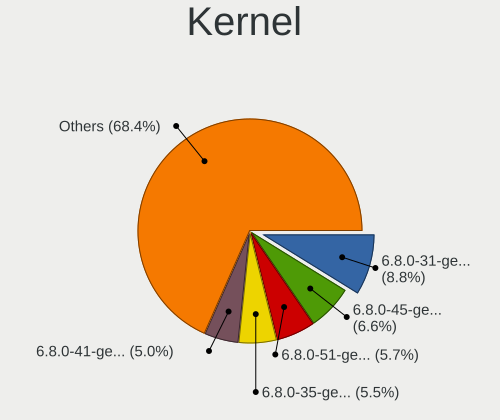

| Version             | Desktops | Percent |
|---------------------|----------|---------|
| 6.8.0-31-generic    | 48       | 8.82%   |
| 6.8.0-45-generic    | 36       | 6.62%   |
| 6.8.0-51-generic    | 31       | 5.7%    |
| 6.8.0-35-generic    | 30       | 5.51%   |
| 6.8.0-41-generic    | 27       | 4.96%   |
| 6.8.0-49-generic    | 17       | 3.13%   |
| 6.8.0-36-generic    | 17       | 3.13%   |
| 6.8.0-48-generic    | 15       | 2.76%   |
| 6.11.0-26-generic   | 14       | 2.57%   |
| 6.8.0-55-generic    | 13       | 2.39%   |
| 6.8.0-47-generic    | 12       | 2.21%   |
| 6.8.0-60-generic    | 11       | 2.02%   |
| 6.8.0-39-generic    | 11       | 2.02%   |
| 6.8.0-38-generic    | 11       | 2.02%   |
| 6.14.0-27-generic   | 9        | 1.65%   |
| 6.11.0-21-generic   | 9        | 1.65%   |
| 6.8.0-59-generic    | 8        | 1.47%   |
| 6.14.0-29-generic   | 8        | 1.47%   |
| 6.8.0-88-generic    | 7        | 1.29%   |
| 6.8.0-57-generic    | 7        | 1.29%   |
| 6.14.0-33-generic   | 7        | 1.29%   |
| 6.11.0-29-generic   | 7        | 1.29%   |
| 6.8.0-47-lowlatency | 6        | 1.1%    |
| 6.8.0-44-generic    | 6        | 1.1%    |
| 6.14.0-37-generic   | 6        | 1.1%    |
| 6.8.0-86-generic    | 5        | 0.92%   |
| 6.8.0-85-generic    | 5        | 0.92%   |
| 6.8.0-71-generic    | 5        | 0.92%   |
| 6.8.0-53-generic    | 5        | 0.92%   |
| 6.8.0-52-generic    | 5        | 0.92%   |
| 6.8.0-40-generic    | 5        | 0.92%   |
| 6.14.0-36-generic   | 5        | 0.92%   |
| 6.14.0-35-generic   | 5        | 0.92%   |
| 6.14.0-24-generic   | 5        | 0.92%   |
| 6.11.0-24-generic   | 5        | 0.92%   |
| 6.8.0-90-generic    | 4        | 0.74%   |
| 6.8.0-88-lowlatency | 4        | 0.74%   |
| 6.8.0-64-generic    | 4        | 0.74%   |
| 6.8.0-63-lowlatency | 4        | 0.74%   |
| 6.11.0-19-generic   | 4        | 0.74%   |

Kernel Family
-------------

Linux kernel without a distro release

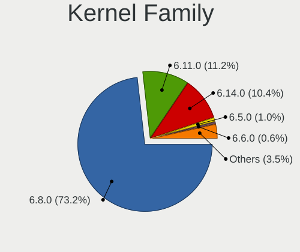

| Version | Desktops | Percent |
|---------|----------|---------|
| 6.8.0   | 358      | 73.21%  |
| 6.11.0  | 55       | 11.25%  |
| 6.14.0  | 51       | 10.43%  |
| 6.5.0   | 5        | 1.02%   |
| 6.6.0   | 3        | 0.61%   |
| 6.8.10  | 2        | 0.41%   |
| 6.8.1   | 2        | 0.41%   |
| 6.9.3   | 1        | 0.2%    |
| 6.9.12  | 1        | 0.2%    |
| 6.8.9   | 1        | 0.2%    |
| 6.7.5   | 1        | 0.2%    |
| 6.7.0   | 1        | 0.2%    |
| 6.5.11  | 1        | 0.2%    |
| 6.17.7  | 1        | 0.2%    |
| 6.17.0  | 1        | 0.2%    |
| 6.12.3  | 1        | 0.2%    |
| 6.10.9  | 1        | 0.2%    |
| 6.10.4  | 1        | 0.2%    |
| 6.10.2  | 1        | 0.2%    |
| 5.15.0  | 1        | 0.2%    |

Kernel Major Ver.
-----------------

Linux kernel major version

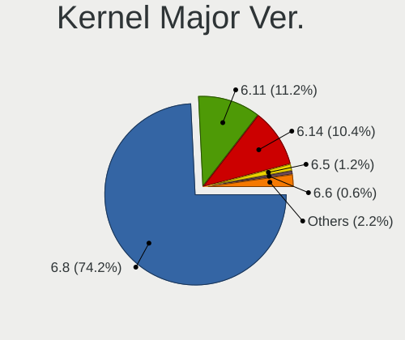

| Version | Desktops | Percent |
|---------|----------|---------|
| 6.8     | 363      | 74.23%  |
| 6.11    | 55       | 11.25%  |
| 6.14    | 51       | 10.43%  |
| 6.5     | 6        | 1.23%   |
| 6.6     | 3        | 0.61%   |
| 6.10    | 3        | 0.61%   |
| 6.9     | 2        | 0.41%   |
| 6.7     | 2        | 0.41%   |
| 6.17    | 2        | 0.41%   |
| 6.12    | 1        | 0.2%    |
| 5.15    | 1        | 0.2%    |

Arch
----

OS architecture (x86_64, i586, etc.)

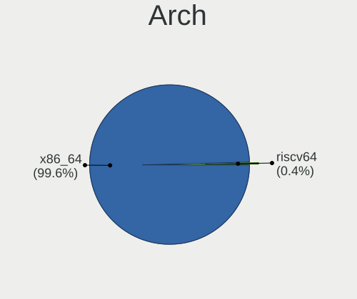

| Name    | Desktops | Percent |
|---------|----------|---------|
| x86_64  | 476      | 99.58%  |
| riscv64 | 2        | 0.42%   |

DE
--

Desktop Environment

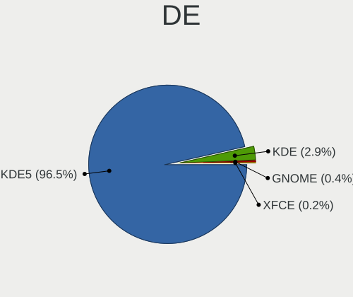

| Name  | Desktops | Percent |
|-------|----------|---------|
| KDE5  | 465      | 96.47%  |
| KDE   | 14       | 2.9%    |
| GNOME | 2        | 0.41%   |
| XFCE  | 1        | 0.21%   |

Display Server
--------------

X11 or Wayland

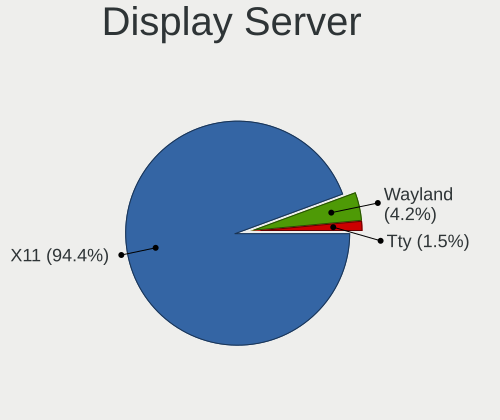

| Name    | Desktops | Percent |
|---------|----------|---------|
| X11     | 454      | 94.39%  |
| Wayland | 20       | 4.16%   |
| Tty     | 7        | 1.46%   |

Display Manager
---------------

SDDM, LightDM, etc.

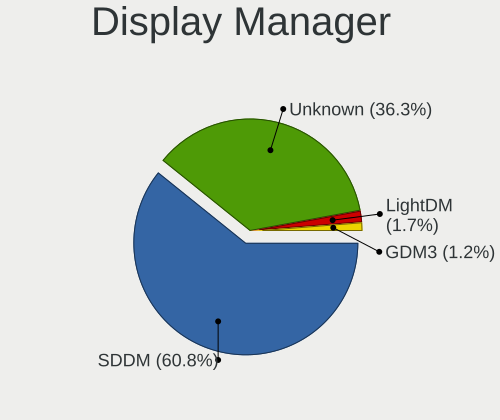

| Name    | Desktops | Percent |
|---------|----------|---------|
| SDDM    | 293      | 60.79%  |
| Unknown | 175      | 36.31%  |
| LightDM | 8        | 1.66%   |
| GDM3    | 6        | 1.24%   |

OS Lang
-------

Language

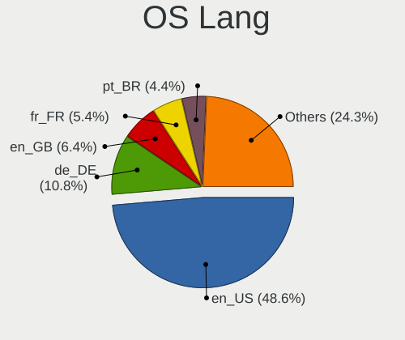

| Lang  | Desktops | Percent |
|-------|----------|---------|
| en_US | 234      | 48.65%  |
| de_DE | 52       | 10.81%  |
| en_GB | 31       | 6.44%   |
| fr_FR | 26       | 5.41%   |
| pt_BR | 21       | 4.37%   |
| ru_RU | 14       | 2.91%   |
| es_ES | 14       | 2.91%   |
| it_IT | 13       | 2.7%    |
| C     | 11       | 2.29%   |
| en_CA | 7        | 1.46%   |
| pl_PL | 6        | 1.25%   |
| es_MX | 4        | 0.83%   |
| es_CL | 4        | 0.83%   |
| en_AU | 4        | 0.83%   |
| es_AR | 3        | 0.62%   |
| en_IN | 3        | 0.62%   |
| tr_TR | 2        | 0.42%   |
| pt_PT | 2        | 0.42%   |
| nl_NL | 2        | 0.42%   |
| ja_JP | 2        | 0.42%   |
| fr_CA | 2        | 0.42%   |
| en_NZ | 2        | 0.42%   |
| en_DK | 2        | 0.42%   |
| el_GR | 2        | 0.42%   |
| de_AT | 2        | 0.42%   |
| zh_TW | 1        | 0.21%   |
| zh_CN | 1        | 0.21%   |
| sv_SE | 1        | 0.21%   |
| sk_SK | 1        | 0.21%   |
| nb_NO | 1        | 0.21%   |
| lt_LT | 1        | 0.21%   |
| hu_HU | 1        | 0.21%   |
| fr_BE | 1        | 0.21%   |
| fi_FI | 1        | 0.21%   |
| es_VE | 1        | 0.21%   |
| es_PE | 1        | 0.21%   |
| es_CR | 1        | 0.21%   |
| en_SG | 1        | 0.21%   |
| en_IE | 1        | 0.21%   |
| de_CH | 1        | 0.21%   |

Boot Mode
---------

EFI or BIOS

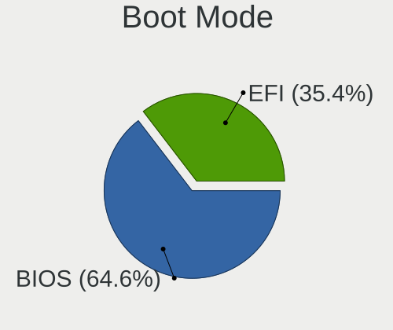

| Mode | Desktops | Percent |
|------|----------|---------|
| BIOS | 312      | 64.6%   |
| EFI  | 171      | 35.4%   |

Filesystem
----------

Type of filesystem

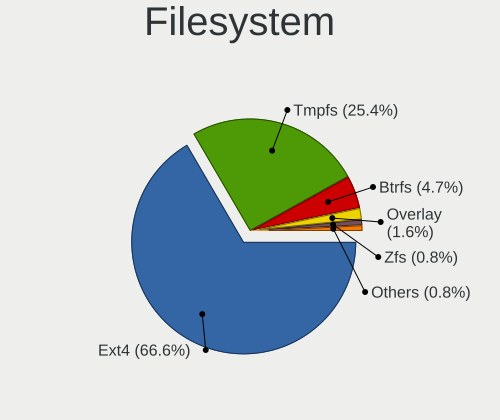

| Type    | Desktops | Percent |
|---------|----------|---------|
| Ext4    | 323      | 66.6%   |
| Tmpfs   | 123      | 25.36%  |
| Btrfs   | 23       | 4.74%   |
| Overlay | 8        | 1.65%   |
| Zfs     | 4        | 0.82%   |
| Xfs     | 3        | 0.62%   |
| Ext3    | 1        | 0.21%   |

Part. scheme
------------

Scheme of partitioning

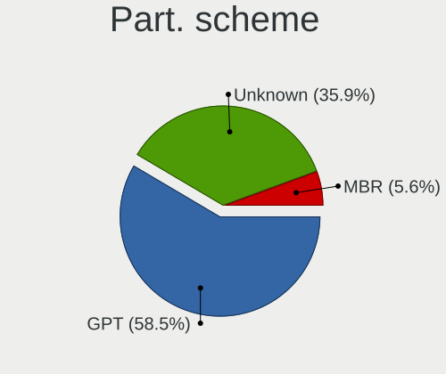

| Type    | Desktops | Percent |
|---------|----------|---------|
| GPT     | 282      | 58.51%  |
| Unknown | 173      | 35.89%  |
| MBR     | 27       | 5.6%    |

Dual Boot with Linux/BSD
------------------------

Hosting more than one Linux/BSD

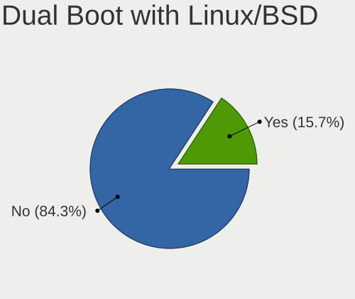

| Dual boot | Desktops | Percent |
|-----------|----------|---------|
| No        | 407      | 84.27%  |
| Yes       | 76       | 15.73%  |

Dual Boot (Win)
---------------

Hosting Linux and Windows

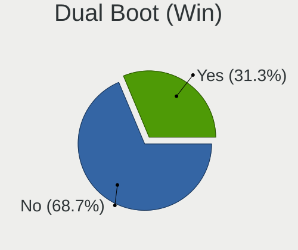

| Dual boot | Desktops | Percent |
|-----------|----------|---------|
| No        | 331      | 68.67%  |
| Yes       | 151      | 31.33%  |

Board
-----

Vendor
------

Motherboard manufacturer

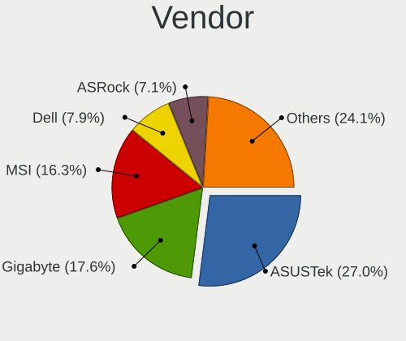

| Name                                 | Desktops | Percent |
|--------------------------------------|----------|---------|
| ASUSTek Computer                     | 129      | 26.99%  |
| Gigabyte Technology                  | 84       | 17.57%  |
| MSI                                  | 78       | 16.32%  |
| Dell                                 | 38       | 7.95%   |
| ASRock                               | 34       | 7.11%   |
| Hewlett-Packard                      | 32       | 6.69%   |
| Intel                                | 14       | 2.93%   |
| Lenovo                               | 12       | 2.51%   |
| AZW                                  | 6        | 1.26%   |
| Unknown                              | 6        | 1.26%   |
| Shenzhen Meigao Electronic Equipment | 4        | 0.84%   |
| Huanan                               | 4        | 0.84%   |
| GEEKOM                               | 4        | 0.84%   |
| Acer                                 | 4        | 0.84%   |
| MACHINIST                            | 3        | 0.63%   |
| Biostar                              | 3        | 0.63%   |
| Pegatron                             | 2        | 0.42%   |
| GMKtec                               | 2        | 0.42%   |
| BESSTAR Tech                         | 2        | 0.42%   |
| Alienware                            | 2        | 0.42%   |
| Trigkey                              | 1        | 0.21%   |
| SZQFTX                               | 1        | 0.21%   |
| System76                             | 1        | 0.21%   |
| Shuttle                              | 1        | 0.21%   |
| Positivo                             | 1        | 0.21%   |
| Packard Bell                         | 1        | 0.21%   |
| Nvidia                               | 1        | 0.21%   |
| Fujitsu                              | 1        | 0.21%   |
| Foxconn                              | 1        | 0.21%   |
| Fisusen Technology                   | 1        | 0.21%   |
| ECS                                  | 1        | 0.21%   |
| Colorful Technology                  | 1        | 0.21%   |
| CBR                                  | 1        | 0.21%   |
| ASRock Industrial                    | 1        | 0.21%   |
| Apple                                | 1        | 0.21%   |

Model
-----

Motherboard model

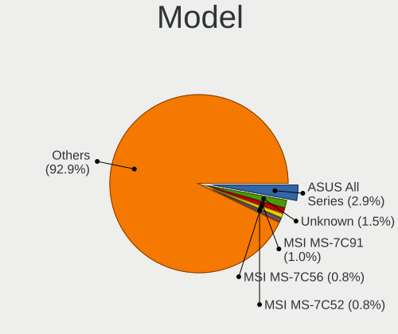

| Name                                              | Desktops | Percent |
|---------------------------------------------------|----------|---------|
| ASUS All Series                                   | 14       | 2.93%   |
| Unknown                                           | 7        | 1.46%   |
| MSI MS-7C91                                       | 5        | 1.05%   |
| MSI MS-7C56                                       | 4        | 0.84%   |
| MSI MS-7C52                                       | 4        | 0.84%   |
| MSI MS-7C37                                       | 4        | 0.84%   |
| Dell OptiPlex 7010                                | 4        | 0.84%   |
| Dell OptiPlex 3050                                | 4        | 0.84%   |
| ASUS TUF Gaming X570-PLUS                         | 4        | 0.84%   |
| MSI MS-7E26                                       | 3        | 0.63%   |
| HP Z820 Workstation                               | 3        | 0.63%   |
| Gigabyte B550 GAMING X V2                         | 3        | 0.63%   |
| ASUS PRIME B450-PLUS                              | 3        | 0.63%   |
| ASUS PRIME B350-PLUS                              | 3        | 0.63%   |
| Shenzhen Meigao Electronic Equipment Venus Series | 2        | 0.42%   |
| MSI MS-7E12                                       | 2        | 0.42%   |
| MSI MS-7E06                                       | 2        | 0.42%   |
| MSI MS-7D46                                       | 2        | 0.42%   |
| MSI MS-7C95                                       | 2        | 0.42%   |
| MSI MS-7C84                                       | 2        | 0.42%   |
| MSI MS-7C83                                       | 2        | 0.42%   |
| MSI MS-7C75                                       | 2        | 0.42%   |
| MSI MS-7C02                                       | 2        | 0.42%   |
| MSI MS-7B86                                       | 2        | 0.42%   |
| MSI MS-7977                                       | 2        | 0.42%   |
| MSI MS-7693                                       | 2        | 0.42%   |
| Intel X99                                         | 2        | 0.42%   |
| Intel B75                                         | 2        | 0.42%   |
| Huanan X99-QD4                                    | 2        | 0.42%   |
| HP Z440 Workstation                               | 2        | 0.42%   |
| HP EliteDesk 800 G1 SFF                           | 2        | 0.42%   |
| Gigabyte Z890 AORUS ELITE WIFI7                   | 2        | 0.42%   |
| Gigabyte Z790 AORUS ELITE AX                      | 2        | 0.42%   |
| Gigabyte Z590 AORUS PRO AX                        | 2        | 0.42%   |
| Gigabyte Z370P D3                                 | 2        | 0.42%   |
| Gigabyte Z270-HD3P                                | 2        | 0.42%   |
| Gigabyte GA-890XA-UD3                             | 2        | 0.42%   |
| Gigabyte B650 GAMING X AX                         | 2        | 0.42%   |
| Gigabyte B550M DS3H                               | 2        | 0.42%   |
| Gigabyte B450M DS3H V2                            | 2        | 0.42%   |

Model Family
------------

Motherboard model prefix

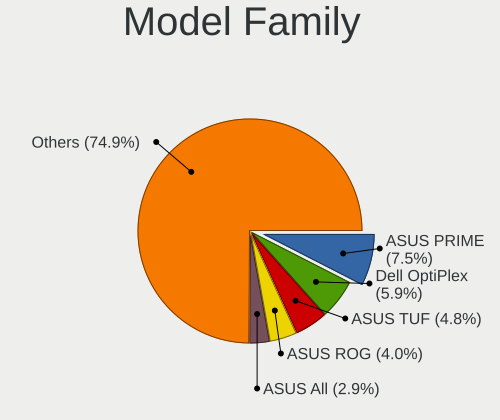

| Name                                       | Desktops | Percent |
|--------------------------------------------|----------|---------|
| ASUS PRIME                                 | 36       | 7.53%   |
| Dell OptiPlex                              | 28       | 5.86%   |
| ASUS TUF                                   | 23       | 4.81%   |
| ASUS ROG                                   | 19       | 3.97%   |
| ASUS All                                   | 14       | 2.93%   |
| Lenovo ThinkCentre                         | 7        | 1.46%   |
| HP EliteDesk                               | 7        | 1.46%   |
| Gigabyte B550                              | 7        | 1.46%   |
| Unknown                                    | 7        | 1.46%   |
| Gigabyte B650                              | 6        | 1.26%   |
| MSI MS-7C91                                | 5        | 1.05%   |
| HP OMEN                                    | 5        | 1.05%   |
| Gigabyte X570                              | 5        | 1.05%   |
| Dell Precision                             | 5        | 1.05%   |
| MSI MS-7C56                                | 4        | 0.84%   |
| MSI MS-7C52                                | 4        | 0.84%   |
| MSI MS-7C37                                | 4        | 0.84%   |
| Gigabyte B550M                             | 4        | 0.84%   |
| Dell Inspiron                              | 4        | 0.84%   |
| MSI MS-7E26                                | 3        | 0.63%   |
| Intel X99                                  | 3        | 0.63%   |
| Intel B75                                  | 3        | 0.63%   |
| HP Z820                                    | 3        | 0.63%   |
| HP ProDesk                                 | 3        | 0.63%   |
| HP Compaq                                  | 3        | 0.63%   |
| Gigabyte Z790                              | 3        | 0.63%   |
| Gigabyte B450M                             | 3        | 0.63%   |
| ASUS STRIX                                 | 3        | 0.63%   |
| ASUS M5A97                                 | 3        | 0.63%   |
| ASRock B450                                | 3        | 0.63%   |
| Shenzhen Meigao Electronic Equipment Venus | 2        | 0.42%   |
| MSI MS-7E12                                | 2        | 0.42%   |
| MSI MS-7E06                                | 2        | 0.42%   |
| MSI MS-7D46                                | 2        | 0.42%   |
| MSI MS-7C95                                | 2        | 0.42%   |
| MSI MS-7C84                                | 2        | 0.42%   |
| MSI MS-7C83                                | 2        | 0.42%   |
| MSI MS-7C75                                | 2        | 0.42%   |
| MSI MS-7C02                                | 2        | 0.42%   |
| MSI MS-7B86                                | 2        | 0.42%   |

MFG Year
--------

Motherboard manufacture year

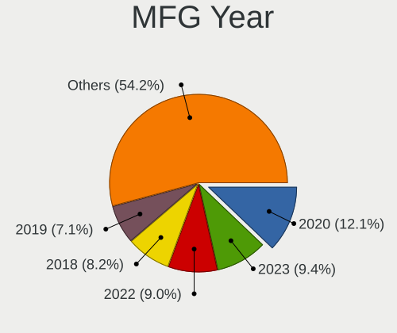

| Year | Desktops | Percent |
|------|----------|---------|
| 2020 | 58       | 12.13%  |
| 2023 | 45       | 9.41%   |
| 2022 | 43       | 9%      |
| 2018 | 39       | 8.16%   |
| 2019 | 34       | 7.11%   |
| 2014 | 33       | 6.9%    |
| 2017 | 32       | 6.69%   |
| 2021 | 30       | 6.28%   |
| 2012 | 29       | 6.07%   |
| 2013 | 27       | 5.65%   |
| 2024 | 25       | 5.23%   |
| 2011 | 19       | 3.97%   |
| 2016 | 18       | 3.77%   |
| 2015 | 16       | 3.35%   |
| 2010 | 8        | 1.67%   |
| 2009 | 8        | 1.67%   |
| 2025 | 6        | 1.26%   |
| 2008 | 6        | 1.26%   |
| 2007 | 2        | 0.42%   |

Form Factor
-----------

Physical design of the computer

| Name    | Desktops | Percent |
|---------|----------|---------|
| Desktop | 478      | 100%    |

Secure Boot
-----------

Enabled or disabled

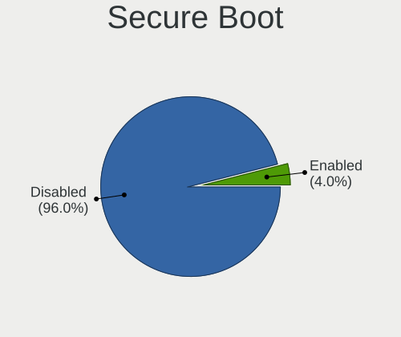

| State    | Desktops | Percent |
|----------|----------|---------|
| Disabled | 460      | 96.03%  |
| Enabled  | 19       | 3.97%   |

Coreboot
--------

Have coreboot on board

| Used | Desktops | Percent |
|------|----------|---------|
| No   | 477      | 99.79%  |
| Yes  | 1        | 0.21%   |

RAM Size
--------

Total RAM memory

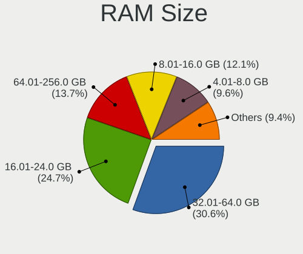

| Size in GB      | Desktops | Percent |
|-----------------|----------|---------|
| 32.01-64.0      | 147      | 30.56%  |
| 16.01-24.0      | 119      | 24.74%  |
| 64.01-256.0     | 66       | 13.72%  |
| 8.01-16.0       | 58       | 12.06%  |
| 4.01-8.0        | 46       | 9.56%   |
| 24.01-32.0      | 30       | 6.24%   |
| 3.01-4.0        | 10       | 2.08%   |
| More than 256.0 | 3        | 0.62%   |
| 2.01-3.0        | 2        | 0.42%   |

RAM Used
--------

Used RAM memory

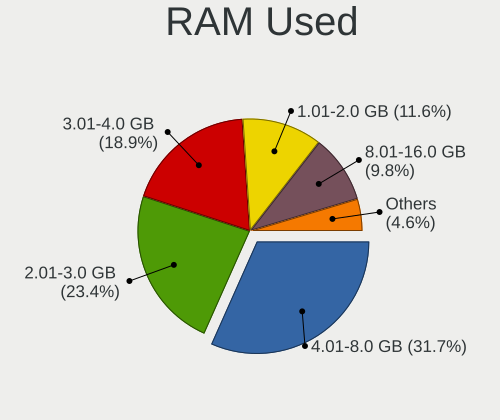

| Used GB     | Desktops | Percent |
|-------------|----------|---------|
| 4.01-8.0    | 164      | 31.66%  |
| 2.01-3.0    | 121      | 23.36%  |
| 3.01-4.0    | 98       | 18.92%  |
| 1.01-2.0    | 60       | 11.58%  |
| 8.01-16.0   | 51       | 9.85%   |
| 16.01-24.0  | 11       | 2.12%   |
| 24.01-32.0  | 5        | 0.97%   |
| 32.01-64.0  | 3        | 0.58%   |
| 0.51-1.0    | 3        | 0.58%   |
| 64.01-256.0 | 2        | 0.39%   |

Total Drives
------------

Number of drives on board

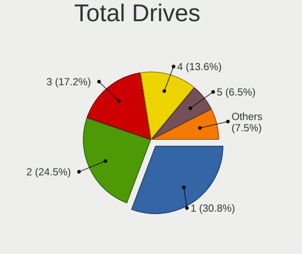

| Drives | Desktops | Percent |
|--------|----------|---------|
| 1      | 152      | 30.77%  |
| 2      | 121      | 24.49%  |
| 3      | 85       | 17.21%  |
| 4      | 67       | 13.56%  |
| 5      | 32       | 6.48%   |
| 6      | 16       | 3.24%   |
| 7      | 8        | 1.62%   |
| 8      | 7        | 1.42%   |
| 0      | 2        | 0.4%    |
| 16     | 1        | 0.2%    |
| 12     | 1        | 0.2%    |
| 10     | 1        | 0.2%    |
| 9      | 1        | 0.2%    |

Has CD-ROM
----------

Has CD-ROM on board

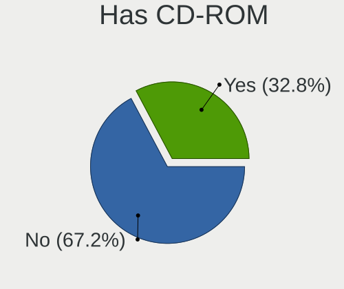

| Presented | Desktops | Percent |
|-----------|----------|---------|
| No        | 324      | 67.22%  |
| Yes       | 158      | 32.78%  |

Has Ethernet
------------

Has Ethernet on board

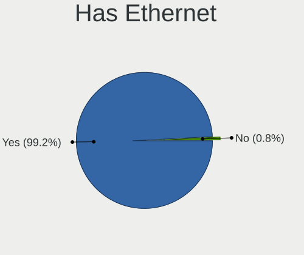

| Presented | Desktops | Percent |
|-----------|----------|---------|
| Yes       | 474      | 99.16%  |
| No        | 4        | 0.84%   |

Has WiFi
--------

Has WiFi module

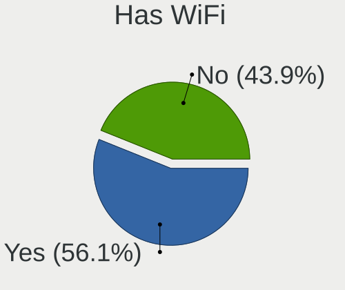

| Presented | Desktops | Percent |
|-----------|----------|---------|
| Yes       | 272      | 56.08%  |
| No        | 213      | 43.92%  |

Has Bluetooth
-------------

Has Bluetooth module

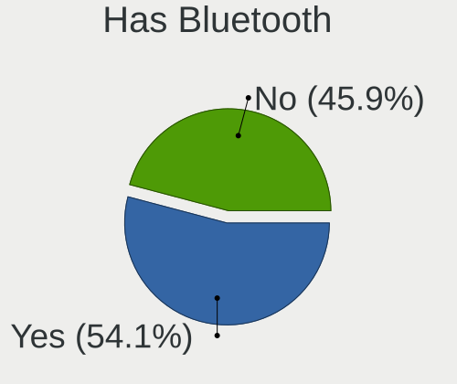

| Presented | Desktops | Percent |
|-----------|----------|---------|
| Yes       | 263      | 54.12%  |
| No        | 223      | 45.88%  |

Location
--------

Country
-------

Geographic location (country)

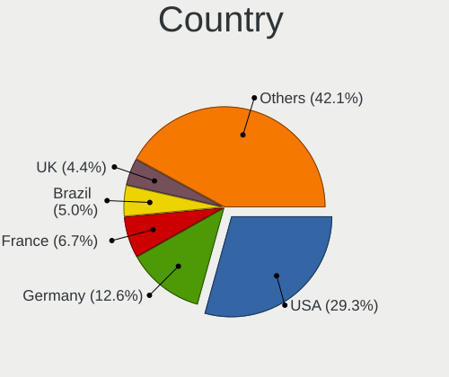

| Country      | Desktops | Percent |
|--------------|----------|---------|
| USA          | 140      | 29.29%  |
| Germany      | 60       | 12.55%  |
| France       | 32       | 6.69%   |
| Brazil       | 24       | 5.02%   |
| UK           | 21       | 4.39%   |
| Italy        | 21       | 4.39%   |
| Russia       | 17       | 3.56%   |
| Spain        | 13       | 2.72%   |
| Canada       | 10       | 2.09%   |
| Poland       | 8        | 1.67%   |
| Netherlands  | 7        | 1.46%   |
| Australia    | 7        | 1.46%   |
| Chile        | 6        | 1.26%   |
| Sweden       | 5        | 1.05%   |
| Portugal     | 5        | 1.05%   |
| Mexico       | 5        | 1.05%   |
| India        | 5        | 1.05%   |
| Austria      | 5        | 1.05%   |
| Argentina    | 5        | 1.05%   |
| Turkey       | 4        | 0.84%   |
| Thailand     | 4        | 0.84%   |
| Slovakia     | 4        | 0.84%   |
| New Zealand  | 4        | 0.84%   |
| Belgium      | 4        | 0.84%   |
| Switzerland  | 3        | 0.63%   |
| South Africa | 3        | 0.63%   |
| Norway       | 3        | 0.63%   |
| Ireland      | 3        | 0.63%   |
| Greece       | 3        | 0.63%   |
| Finland      | 3        | 0.63%   |
| Denmark      | 3        | 0.63%   |
| China        | 3        | 0.63%   |
| Singapore    | 2        | 0.42%   |
| Serbia       | 2        | 0.42%   |
| Saudi Arabia | 2        | 0.42%   |
| Romania      | 2        | 0.42%   |
| Japan        | 2        | 0.42%   |
| Indonesia    | 2        | 0.42%   |
| Egypt        | 2        | 0.42%   |
| Czechia      | 2        | 0.42%   |

City
----

Geographic location (city)

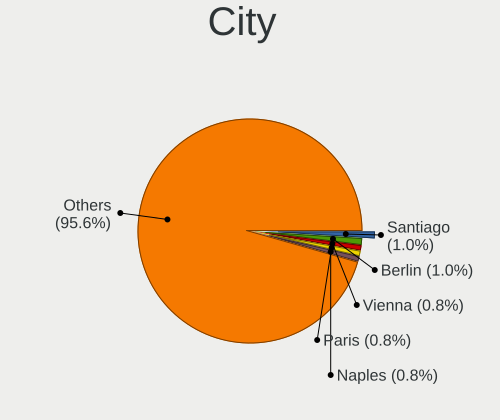

| City              | Desktops | Percent |
|-------------------|----------|---------|
| Santiago          | 5        | 1%      |
| Berlin            | 5        | 1%      |
| Vienna            | 4        | 0.8%    |
| Paris             | 4        | 0.8%    |
| Naples            | 4        | 0.8%    |
| Moscow            | 4        | 0.8%    |
| Milan             | 4        | 0.8%    |
| Frankfurt am Main | 4        | 0.8%    |
| Amsterdam         | 4        | 0.8%    |
| Rome              | 3        | 0.6%    |
| Hanover           | 3        | 0.6%    |
| Dallas            | 3        | 0.6%    |
| Camarillo         | 3        | 0.6%    |
| Brisbane          | 3        | 0.6%    |
| Barcelona         | 3        | 0.6%    |
| Albuquerque       | 3        | 0.6%    |
| Warsaw            | 2        | 0.4%    |
| Uppsala           | 2        | 0.4%    |
| Tacoma            | 2        | 0.4%    |
| Sydney            | 2        | 0.4%    |
| Stuttgart         | 2        | 0.4%    |
| Strasbourg        | 2        | 0.4%    |
| Singapore         | 2        | 0.4%    |
| Sarasota          | 2        | 0.4%    |
| Sao Paulo         | 2        | 0.4%    |
| San Diego         | 2        | 0.4%    |
| Richardson        | 2        | 0.4%    |
| Reno              | 2        | 0.4%    |
| Oslo              | 2        | 0.4%    |
| Odessa            | 2        | 0.4%    |
| Noblesville       | 2        | 0.4%    |
| Nitra             | 2        | 0.4%    |
| New York          | 2        | 0.4%    |
| Munich            | 2        | 0.4%    |
| Minneapolis       | 2        | 0.4%    |
| Mexico City       | 2        | 0.4%    |
| Malang            | 2        | 0.4%    |
| Ludwigsburg       | 2        | 0.4%    |
| Los Angeles       | 2        | 0.4%    |
| London            | 2        | 0.4%    |

Drives
------

Drive Vendor
------------

Hard drive vendors

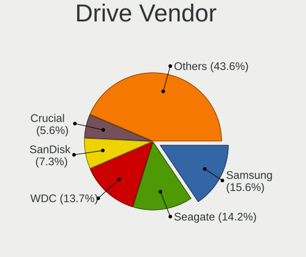

| Vendor                       | Desktops | Drives | Percent |
|------------------------------|----------|--------|---------|
| Samsung Electronics          | 158      | 272    | 15.58%  |
| Seagate                      | 144      | 229    | 14.2%   |
| WDC                          | 139      | 233    | 13.71%  |
| SanDisk                      | 74       | 101    | 7.3%    |
| Crucial                      | 57       | 79     | 5.62%   |
| Kingston                     | 41       | 58     | 4.04%   |
| Kingston Technology Company  | 34       | 40     | 3.35%   |
| Toshiba                      | 26       | 33     | 2.56%   |
| Micron/Crucial Technology    | 20       | 32     | 1.97%   |
| Hitachi                      | 18       | 26     | 1.78%   |
| Phison Electronics           | 16       | 20     | 1.58%   |
| SPCC                         | 15       | 20     | 1.48%   |
| Silicon Motion               | 15       | 20     | 1.48%   |
| SK hynix                     | 13       | 14     | 1.28%   |
| PNY                          | 13       | 19     | 1.28%   |
| A-DATA Technology            | 13       | 19     | 1.28%   |
| Unknown                      | 12       | 29     | 1.18%   |
| Patriot                      | 10       | 13     | 0.99%   |
| Micron Technology            | 10       | 13     | 0.99%   |
| Intel                        | 10       | 12     | 0.99%   |
| Team                         | 9        | 12     | 0.89%   |
| HGST                         | 8        | 8      | 0.79%   |
| China                        | 8        | 10     | 0.79%   |
| Realtek Semiconductor        | 7        | 7      | 0.69%   |
| Phison                       | 7        | 8      | 0.69%   |
| MAXIO Technology (Hangzhou)  | 7        | 9      | 0.69%   |
| Intenso                      | 7        | 7      | 0.69%   |
| ADATA Technology             | 7        | 8      | 0.69%   |
| Corsair                      | 6        | 8      | 0.59%   |
| OCZ                          | 5        | 8      | 0.49%   |
| Lexar                        | 5        | 6      | 0.49%   |
| KingSpec                     | 5        | 5      | 0.49%   |
| Transcend                    | 4        | 5      | 0.39%   |
| T-FORCE                      | 4        | 5      | 0.39%   |
| Unknown                      | 4        | 4      | 0.39%   |
| XrayDisk                     | 3        | 3      | 0.3%    |
| Shenzhen Longsys Electronics | 3        | 3      | 0.3%    |
| SABRENT                      | 3        | 3      | 0.3%    |
| JMicron Technology           | 3        | 4      | 0.3%    |
| GOODRAM                      | 3        | 3      | 0.3%    |

Drive Model
-----------

Hard drive models

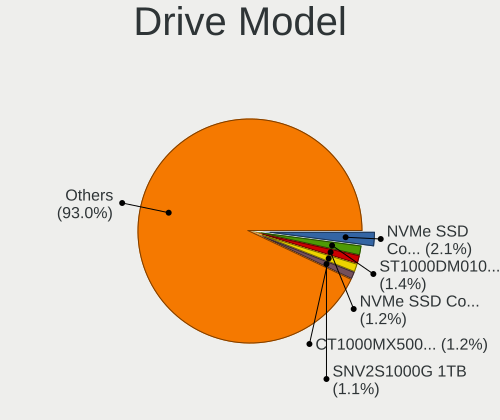

| Model                                                 | Desktops | Percent |
|-------------------------------------------------------|----------|---------|
| Samsung NVMe SSD Controller SM981/PM981/PM983 1TB     | 25       | 2.07%   |
| Seagate ST1000DM010-2EP102 1TB                        | 17       | 1.41%   |
| Samsung NVMe SSD Controller PM9A1/PM9A3/980PRO 1TB    | 15       | 1.24%   |
| Crucial CT1000MX500SSD1 1TB                           | 15       | 1.24%   |
| Kingston Company SNV2S1000G 1TB                       | 13       | 1.08%   |
| Seagate ST4000DM004-2CV104 4TB                        | 12       | 0.99%   |
| Silicon Motion SM2263EN/SM2263XT SSD Controller 512GB | 10       | 0.83%   |
| Samsung SSD 860 EVO 500GB                             | 10       | 0.83%   |
| Samsung SSD 850 EVO 250GB                             | 10       | 0.83%   |
| Micron/Crucial P2 NVMe PCIe SSD 2TB                   | 9        | 0.75%   |
| Kingston SA400S37240G 240GB SSD                       | 9        | 0.75%   |
| WDC WD10EZEX-08WN4A0 1TB                              | 8        | 0.66%   |
| Samsung SSD 850 EVO 500GB                             | 8        | 0.66%   |
| Kingston Company A2000 NVMe SSD 250GB                 | 8        | 0.66%   |
| Kingston SA400S37480G 480GB SSD                       | 7        | 0.58%   |
| Crucial CT2000MX500SSD1 2TB                           | 7        | 0.58%   |
| Seagate ST31000528AS 1TB                              | 6        | 0.5%    |
| Seagate ST2000DM008-2FR102 2TB                        | 6        | 0.5%    |
| SanDisk NVMe SSD Drive 1TB                            | 6        | 0.5%    |
| Samsung SSD 870 QVO 2TB                               | 6        | 0.5%    |
| Samsung SSD 870 EVO 500GB                             | 6        | 0.5%    |
| Samsung SSD 860 EVO 1TB                               | 6        | 0.5%    |
| Crucial CT240BX500SSD1 240GB                          | 6        | 0.5%    |
| Seagate ST8000DM004-2CX188 8TB                        | 5        | 0.41%   |
| Seagate ST2000DM006-2DM164 2TB                        | 5        | 0.41%   |
| Seagate ST1000LM035-1RK172 1TB                        | 5        | 0.41%   |
| SanDisk NVMe SSD Drive 2TB                            | 5        | 0.41%   |
| Samsung SSD 870 QVO 1TB                               | 5        | 0.41%   |
| Samsung SSD 860 EVO 250GB                             | 5        | 0.41%   |
| Kingston Company SNV2S2000G 2TB                       | 5        | 0.41%   |
| Kingston SV300S37A120G 120GB SSD                      | 5        | 0.41%   |
| WDC WDS240G2G0A-00JH30 240GB SSD                      | 4        | 0.33%   |
| WDC WD20EARX-00PASB0 2TB                              | 4        | 0.33%   |
| WDC WD1003FZEX-00K3CA0 1TB                            | 4        | 0.33%   |
| Unknown Externa 1TB                                   | 4        | 0.33%   |
| SPCC Solid State Disk 256GB                           | 4        | 0.33%   |
| Seagate ST500LT012-1DG142 500GB                       | 4        | 0.33%   |
| Seagate ST500DM002-1BD142 500GB                       | 4        | 0.33%   |
| Seagate ST31000524AS 1TB                              | 4        | 0.33%   |
| Seagate ST2000DM001-1CH164 2TB                        | 4        | 0.33%   |

HDD Vendor
----------

Hard disk drive vendors

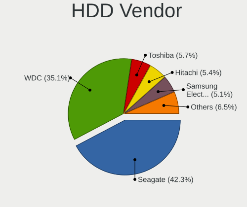

| Vendor              | Desktops | Drives | Percent |
|---------------------|----------|--------|---------|
| Seagate             | 142      | 225    | 42.26%  |
| WDC                 | 118      | 193    | 35.12%  |
| Toshiba             | 19       | 26     | 5.65%   |
| Hitachi             | 18       | 26     | 5.36%   |
| Samsung Electronics | 17       | 23     | 5.06%   |
| HGST                | 8        | 8      | 2.38%   |
| Unknown             | 4        | 6      | 1.19%   |
| T-FORCE             | 2        | 3      | 0.6%    |
| Space ke            | 1        | 1      | 0.3%    |
| Min Yi U            | 1        | 1      | 0.3%    |
| MARVELL             | 1        | 1      | 0.3%    |
| LaCie               | 1        | 1      | 0.3%    |
| KESU                | 1        | 1      | 0.3%    |
| JMicron Technology  | 1        | 1      | 0.3%    |
| Inateck             | 1        | 2      | 0.3%    |
| Unknown             | 1        | 1      | 0.3%    |

SSD Vendor
----------

Solid state drive vendors

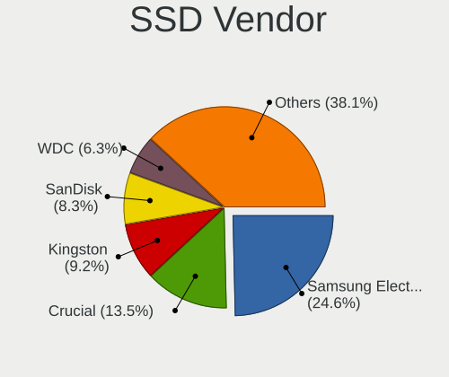

| Vendor              | Desktops | Drives | Percent |
|---------------------|----------|--------|---------|
| Samsung Electronics | 86       | 143    | 24.64%  |
| Crucial             | 47       | 63     | 13.47%  |
| Kingston            | 32       | 47     | 9.17%   |
| SanDisk             | 29       | 39     | 8.31%   |
| WDC                 | 22       | 32     | 6.3%    |
| PNY                 | 13       | 19     | 3.72%   |
| SPCC                | 12       | 15     | 3.44%   |
| Patriot             | 9        | 11     | 2.58%   |
| China               | 8        | 10     | 2.29%   |
| A-DATA Technology   | 8        | 11     | 2.29%   |
| Team                | 7        | 9      | 2.01%   |
| Intenso             | 6        | 6      | 1.72%   |
| OCZ                 | 5        | 8      | 1.43%   |
| Micron Technology   | 4        | 7      | 1.15%   |
| Transcend           | 3        | 4      | 0.86%   |
| Toshiba             | 3        | 3      | 0.86%   |
| SK hynix            | 3        | 3      | 0.86%   |
| Intel               | 3        | 3      | 0.86%   |
| GOODRAM             | 3        | 3      | 0.86%   |
| Fanxiang            | 3        | 6      | 0.86%   |
| Emtec               | 3        | 3      | 0.86%   |
| Unknown             | 3        | 3      | 0.86%   |
| Verbatim            | 2        | 3      | 0.57%   |
| Timetec             | 2        | 3      | 0.57%   |
| TCSUNBOW            | 2        | 3      | 0.57%   |
| SABRENT             | 2        | 2      | 0.57%   |
| Netac               | 2        | 2      | 0.57%   |
| Lexar               | 2        | 3      | 0.57%   |
| KingSpec            | 2        | 2      | 0.57%   |
| Hewlett-Packard     | 2        | 2      | 0.57%   |
| Corsair             | 2        | 4      | 0.57%   |
| XrayDisk            | 1        | 1      | 0.29%   |
| Wicgtyp             | 1        | 1      | 0.29%   |
| V Series            | 1        | 1      | 0.29%   |
| T-FORCE             | 1        | 1      | 0.29%   |
| Rogueware           | 1        | 3      | 0.29%   |
| OCZ-VERTEX3         | 1        | 1      | 0.29%   |
| OCPC                | 1        | 1      | 0.29%   |
| Neo                 | 1        | 1      | 0.29%   |
| LITEONIT            | 1        | 3      | 0.29%   |

Drive Kind
----------

HDD or SSD

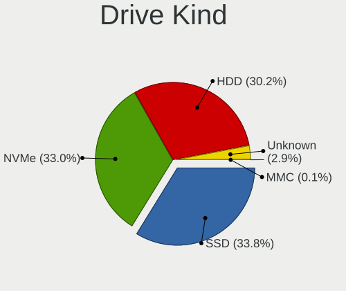

| Kind    | Desktops | Drives | Percent |
|---------|----------|--------|---------|
| SSD     | 279      | 497    | 33.82%  |
| NVMe    | 272      | 433    | 32.97%  |
| HDD     | 249      | 519    | 30.18%  |
| Unknown | 24       | 43     | 2.91%   |
| MMC     | 1        | 1      | 0.12%   |

Drive Connector
---------------

SATA, SAS, NVMe, etc.

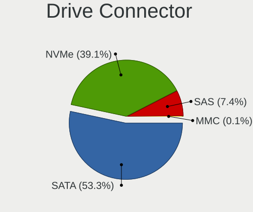

| Type | Desktops | Drives | Percent |
|------|----------|--------|---------|
| SATA | 367      | 980    | 53.34%  |
| NVMe | 269      | 425    | 39.1%   |
| SAS  | 51       | 87     | 7.41%   |
| MMC  | 1        | 1      | 0.15%   |

Drive Size
----------

Size of hard drive

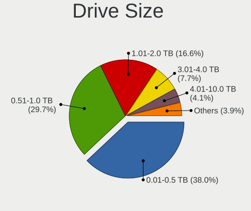

| Size in TB | Desktops | Drives | Percent |
|------------|----------|--------|---------|
| 0.01-0.5   | 233      | 410    | 38.01%  |
| 0.51-1.0   | 182      | 292    | 29.69%  |
| 1.01-2.0   | 102      | 176    | 16.64%  |
| 3.01-4.0   | 47       | 67     | 7.67%   |
| 4.01-10.0  | 25       | 39     | 4.08%   |
| 2.01-3.0   | 14       | 15     | 2.28%   |
| 10.01-20.0 | 10       | 17     | 1.63%   |

Space Total
-----------

Amount of disk space available on the file system

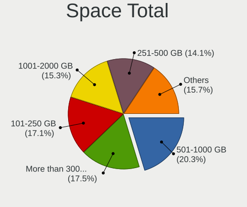

| Size in GB     | Desktops | Percent |
|----------------|----------|---------|
| 501-1000       | 101      | 20.32%  |
| More than 3000 | 87       | 17.51%  |
| 101-250        | 85       | 17.1%   |
| 1001-2000      | 76       | 15.29%  |
| 251-500        | 70       | 14.08%  |
| 2001-3000      | 35       | 7.04%   |
| 1-20           | 24       | 4.83%   |
| 51-100         | 7        | 1.41%   |
| 21-50          | 6        | 1.21%   |
| Unknown        | 6        | 1.21%   |

Space Used
----------

Amount of used disk space

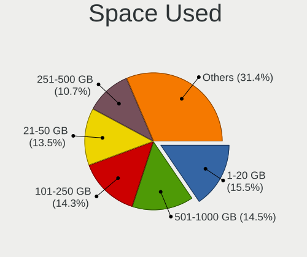

| Used GB        | Desktops | Percent |
|----------------|----------|---------|
| 1-20           | 78       | 15.51%  |
| 501-1000       | 73       | 14.51%  |
| 101-250        | 72       | 14.31%  |
| 21-50          | 68       | 13.52%  |
| 251-500        | 54       | 10.74%  |
| 51-100         | 52       | 10.34%  |
| 1001-2000      | 50       | 9.94%   |
| More than 3000 | 33       | 6.56%   |
| 2001-3000      | 17       | 3.38%   |
| Unknown        | 6        | 1.19%   |

Malfunc. Drives
---------------

Drive models with a malfunction

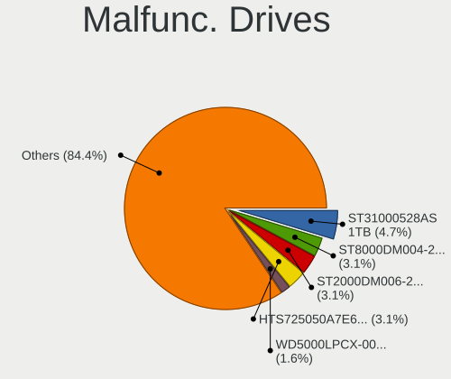

| Model                           | Desktops | Drives | Percent |
|---------------------------------|----------|--------|---------|
| Seagate ST31000528AS 1TB        | 3        | 4      | 4.69%   |
| Seagate ST8000DM004-2CX188 8TB  | 2        | 2      | 3.13%   |
| Seagate ST2000DM006-2DM164 2TB  | 2        | 3      | 3.13%   |
| Hitachi HTS725050A7E630 500GB   | 2        | 2      | 3.13%   |
| WDC WD5000LPCX-00VHAT0 500GB    | 1        | 1      | 1.56%   |
| WDC WD5000AAKX-003CA0 500GB     | 1        | 1      | 1.56%   |
| WDC WD5000AAKS-00UU3A0 500GB    | 1        | 1      | 1.56%   |
| WDC WD5000AADS-00S9B0 500GB     | 1        | 1      | 1.56%   |
| WDC WD3200AAKX-001CA0 320GB     | 1        | 1      | 1.56%   |
| WDC WD30EZRX-00DC0B0 3TB        | 1        | 1      | 1.56%   |
| WDC WD30EZRX-00D8PB0 3TB        | 1        | 1      | 1.56%   |
| WDC WD30EFRX-68EUZN0 3TB        | 1        | 1      | 1.56%   |
| WDC WD20EZRX-00D8PB0 2TB        | 1        | 1      | 1.56%   |
| WDC WD20EFRX-68EUZN0 2TB        | 1        | 1      | 1.56%   |
| WDC WD10JPVX-08JC3T5 1TB        | 1        | 1      | 1.56%   |
| WDC WD10EZEX-60M2NA0 1TB        | 1        | 1      | 1.56%   |
| WDC WD10EZEX-22MFCA0 1TB        | 1        | 1      | 1.56%   |
| WDC WD10EZEX-00WN4A0 1TB        | 1        | 1      | 1.56%   |
| WDC WD10EURX-63UY4Y0 1TB        | 1        | 2      | 1.56%   |
| WDC WD10EARS-00Y5B1 1TB         | 1        | 1      | 1.56%   |
| WDC WD10EARS-00MVWB0 1TB        | 1        | 1      | 1.56%   |
| WDC WD10EACS-00ZJB0 1TB         | 1        | 1      | 1.56%   |
| WDC WD1002FAEX-00Y9A0 1TB       | 1        | 1      | 1.56%   |
| WDC WD1001FALS-40U9B0 1TB       | 1        | 1      | 1.56%   |
| WDC WD1001FAES-60Z2A0 1TB       | 1        | 1      | 1.56%   |
| Seagate ST9500325AS 500GB       | 1        | 1      | 1.56%   |
| Seagate ST9160821AS 160GB       | 1        | 1      | 1.56%   |
| Seagate ST500LT012-1DG142 500GB | 1        | 1      | 1.56%   |
| Seagate ST4000VX007-2DT166 4TB  | 1        | 1      | 1.56%   |
| Seagate ST3750640NS 752GB       | 1        | 1      | 1.56%   |
| Seagate ST3500620AS 500GB       | 1        | 1      | 1.56%   |
| Seagate ST3500312CS 500GB       | 1        | 1      | 1.56%   |
| Seagate ST3320613AS 320GB       | 1        | 2      | 1.56%   |
| Seagate ST31000333AS 1TB        | 1        | 1      | 1.56%   |
| Seagate ST2000VM005-2MY102 2TB  | 1        | 1      | 1.56%   |
| Seagate ST2000LM007-1R8174 2TB  | 1        | 1      | 1.56%   |
| Seagate ST2000DM001-9YN164 2TB  | 1        | 1      | 1.56%   |
| Seagate ST2000DM001-1CH164 2TB  | 1        | 1      | 1.56%   |
| Seagate ST1000VX000-9YW162 1TB  | 1        | 1      | 1.56%   |
| Seagate ST1000LM014-1EJ164 1TB  | 1        | 1      | 1.56%   |

Malfunc. Drive Vendor
---------------------

Vendors of faulty drives

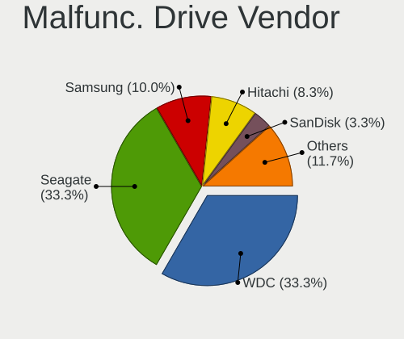

| Vendor              | Desktops | Drives | Percent |
|---------------------|----------|--------|---------|
| WDC                 | 20       | 22     | 33.33%  |
| Seagate             | 20       | 27     | 33.33%  |
| Samsung Electronics | 6        | 6      | 10%     |
| Hitachi             | 5        | 11     | 8.33%   |
| SanDisk             | 2        | 2      | 3.33%   |
| Crucial             | 2        | 3      | 3.33%   |
| Neo                 | 1        | 1      | 1.67%   |
| KODAK               | 1        | 1      | 1.67%   |
| HGST                | 1        | 1      | 1.67%   |
| China               | 1        | 1      | 1.67%   |
| A-DATA Technology   | 1        | 1      | 1.67%   |

Malfunc. HDD Vendor
-------------------

Vendors of faulty HDD drives

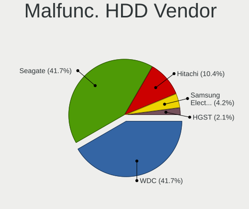

| Vendor              | Desktops | Drives | Percent |
|---------------------|----------|--------|---------|
| WDC                 | 20       | 22     | 41.67%  |
| Seagate             | 20       | 27     | 41.67%  |
| Hitachi             | 5        | 11     | 10.42%  |
| Samsung Electronics | 2        | 2      | 4.17%   |
| HGST                | 1        | 1      | 2.08%   |

Malfunc. Drive Kind
-------------------

Kinds of faulty drives

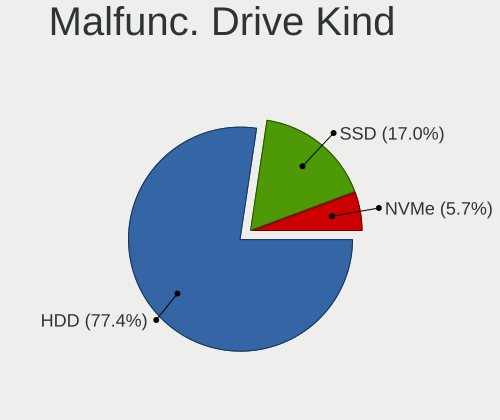

| Kind | Desktops | Drives | Percent |
|------|----------|--------|---------|
| HDD  | 41       | 63     | 77.36%  |
| SSD  | 9        | 9      | 16.98%  |
| NVMe | 3        | 4      | 5.66%   |

Failed Drives
-------------

Failed drive models

| Model                  | Desktops | Drives | Percent |
|------------------------|----------|--------|---------|
| Toshiba DT01ACA300 3TB | 1        | 1      | 100%    |

Failed Drive Vendor
-------------------

Failed drive vendors

| Vendor  | Desktops | Drives | Percent |
|---------|----------|--------|---------|
| Toshiba | 1        | 1      | 100%    |

Drive Status
------------

Number of failed and malfunc. drives

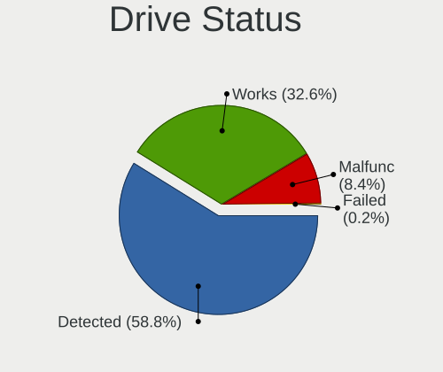

| Status   | Desktops | Drives | Percent |
|----------|----------|--------|---------|
| Detected | 323      | 965    | 58.83%  |
| Works    | 179      | 451    | 32.6%   |
| Malfunc  | 46       | 76     | 8.38%   |
| Failed   | 1        | 1      | 0.18%   |

Storage controller
------------------

Storage Vendor
--------------

Storage controller vendors

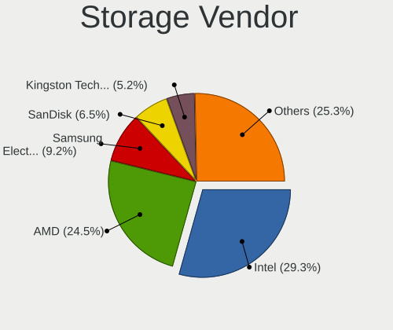

| Vendor                         | Desktops | Percent |
|--------------------------------|----------|---------|
| Intel                          | 249      | 29.33%  |
| AMD                            | 208      | 24.5%   |
| Samsung Electronics            | 78       | 9.19%   |
| SanDisk                        | 55       | 6.48%   |
| Kingston Technology Company    | 44       | 5.18%   |
| Micron/Crucial Technology      | 32       | 3.77%   |
| Phison Electronics             | 28       | 3.3%    |
| ASMedia Technology             | 26       | 3.06%   |
| Silicon Motion                 | 17       | 2%      |
| MAXIO Technology (Hangzhou)    | 16       | 1.88%   |
| JMicron Technology             | 14       | 1.65%   |
| ADATA Technology               | 12       | 1.41%   |
| SK hynix                       | 10       | 1.18%   |
| Realtek Semiconductor          | 10       | 1.18%   |
| Marvell Technology Group       | 10       | 1.18%   |
| Micron Technology              | 7        | 0.82%   |
| Broadcom / LSI                 | 5        | 0.59%   |
| Toshiba America Info Systems   | 4        | 0.47%   |
| Shenzhen Longsys Electronics   | 4        | 0.47%   |
| INNOGRIT                       | 4        | 0.47%   |
| KIOXIA                         | 3        | 0.35%   |
| Silicon Image                  | 2        | 0.24%   |
| Seagate Technology             | 2        | 0.24%   |
| Nvidia                         | 2        | 0.24%   |
| Hosin Global Electronics       | 2        | 0.24%   |
| Zhaoxin                        | 1        | 0.12%   |
| Yangtze Memory Technologies    | 1        | 0.12%   |
| Solid State Storage Technology | 1        | 0.12%   |
| OCZ Technology Group           | 1        | 0.12%   |
| LSI Logic / Symbios Logic      | 1        | 0.12%   |

Storage Model
-------------

Storage controller models

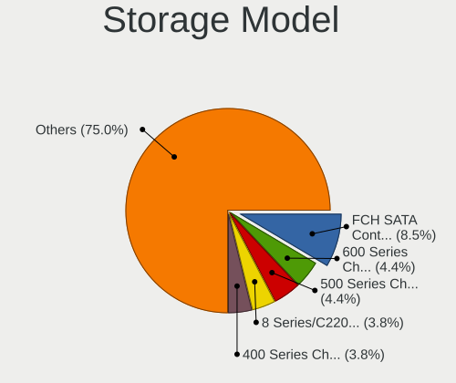

| Model                                                                          | Desktops | Percent |
|--------------------------------------------------------------------------------|----------|---------|
| AMD FCH SATA Controller [AHCI mode]                                            | 83       | 8.54%   |
| AMD 600 Series Chipset SATA Controller                                         | 43       | 4.42%   |
| AMD 500 Series Chipset SATA Controller                                         | 43       | 4.42%   |
| Intel 8 Series/C220 Series Chipset Family 6-port SATA Controller 1 [AHCI mode] | 37       | 3.81%   |
| AMD 400 Series Chipset SATA Controller                                         | 37       | 3.81%   |
| Samsung NVMe SSD Controller SM981/PM981/PM983                                  | 36       | 3.7%    |
| Intel 200 Series PCH SATA controller [AHCI mode]                               | 25       | 2.57%   |
| Samsung NVMe SSD Controller PM9A1/PM9A3/980PRO                                 | 23       | 2.37%   |
| Intel SATA Controller [RAID mode]                                              | 22       | 2.26%   |
| ASMedia ASM1061/ASM1062 Serial ATA Controller                                  | 21       | 2.16%   |
| Intel Raptor Lake SATA AHCI Controller                                         | 20       | 2.06%   |
| AMD SB7x0/SB8x0/SB9x0 SATA Controller [AHCI mode]                              | 20       | 2.06%   |
| Intel 7 Series/C210 Series Chipset Family 6-port SATA Controller [AHCI mode]   | 17       | 1.75%   |
| Silicon Motion SM2263EN/SM2263XT (DRAM-less) NVMe SSD Controllers              | 14       | 1.44%   |
| SanDisk WD SN560/SN740/SN770/SN5000 NVMe SSD                                   | 14       | 1.44%   |
| Micron/Crucial P2 [Nick P2] / P3 / P3 Plus NVMe PCIe SSD (DRAM-less)           | 14       | 1.44%   |
| Intel Cannon Lake PCH SATA AHCI Controller                                     | 14       | 1.44%   |
| Intel Q170/Q150/B150/H170/H110/Z170/CM236 Chipset SATA Controller [AHCI Mode]  | 13       | 1.34%   |
| Intel 6 Series/C200 Series Chipset Family 6 port Desktop SATA AHCI Controller  | 13       | 1.34%   |
| Kingston Company NV2 NVMe SSD [SM2267XT] (DRAM-less)                           | 12       | 1.23%   |
| Intel Alder Lake-S PCH SATA Controller [AHCI Mode]                             | 11       | 1.13%   |
| AMD SB7x0/SB8x0/SB9x0 IDE Controller                                           | 11       | 1.13%   |
| Phison E12 NVMe Controller                                                     | 9        | 0.93%   |
| MAXIO (Hangzhou) NVMe SSD Controller MAP1602 (DRAM-less)                       | 9        | 0.93%   |
| Kingston Company A2000 NVMe SSD [SM2263EN]                                     | 9        | 0.93%   |
| JMicron JMB363 SATA/IDE Controller                                             | 9        | 0.93%   |
| Sandisk WD Black SN850X NVMe SSD                                               | 8        | 0.82%   |
| Samsung NVMe SSD Controller S4LV008[Pascal]                                    | 8        | 0.82%   |
| Samsung NVMe SSD Controller 980 (DRAM-less)                                    | 8        | 0.82%   |
| Intel 9 Series Chipset Family SATA Controller [AHCI Mode]                      | 8        | 0.82%   |
| AMD 300 Series Chipset SATA Controller                                         | 8        | 0.82%   |
| Sandisk WD Blue SN580 NVMe SSD (DRAM-less)                                     | 7        | 0.72%   |
| Phison E16 PCIe4 NVMe Controller                                               | 7        | 0.72%   |
| MAXIO (Hangzhou) NVMe SSD Controller MAP1202 (DRAM-less)                       | 7        | 0.72%   |
| Intel 500 Series Chipset Family SATA AHCI Controller                           | 7        | 0.72%   |
| ADATA XPG SX8200 Pro PCIe Gen3x4 M.2 2280 Solid State Drive                    | 7        | 0.72%   |
| SanDisk Ultra 3D / WD PC SN530, IX SN530, Blue SN550 NVMe SSD (DRAM-less)      | 6        | 0.62%   |
| Realtek RTS5765DL NVMe SSD Controller (DRAM-less)                              | 6        | 0.62%   |
| Intel Volume Management Device NVMe RAID Controller                            | 6        | 0.62%   |
| Intel SSD 660P Series                                                          | 6        | 0.62%   |

Storage Kind
------------

Kind of storage controller (IDE, SATA, NVMe, SAS, ...)

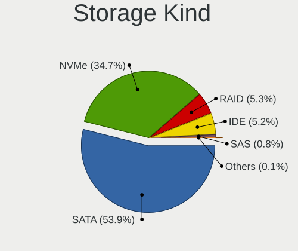

| Kind | Desktops | Percent |
|------|----------|---------|
| SATA | 418      | 53.94%  |
| NVMe | 269      | 34.71%  |
| RAID | 41       | 5.29%   |
| IDE  | 40       | 5.16%   |
| SAS  | 6        | 0.77%   |
| SCSI | 1        | 0.13%   |

Processor
---------

CPU Vendor
----------

Processor vendors

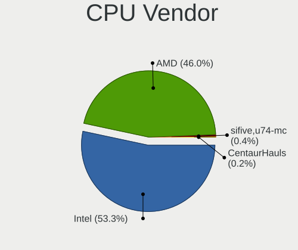

| Vendor        | Desktops | Percent |
|---------------|----------|---------|
| Intel         | 255      | 53.35%  |
| AMD           | 220      | 46.03%  |
| sifive,u74-mc | 2        | 0.42%   |
| CentaurHauls  | 1        | 0.21%   |

CPU Model
---------

Processor models

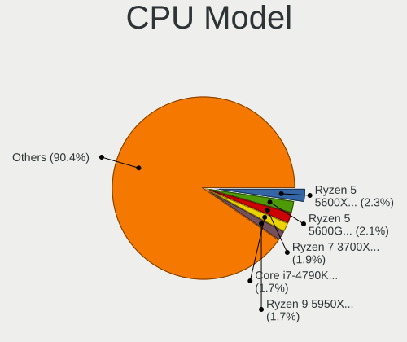

| Model                                  | Desktops | Percent |
|----------------------------------------|----------|---------|
| AMD Ryzen 5 5600X 6-Core Processor     | 11       | 2.29%   |
| AMD Ryzen 5 5600G with Radeon Graphics | 10       | 2.08%   |
| AMD Ryzen 7 3700X 8-Core Processor     | 9        | 1.88%   |
| Intel Core i7-4790K CPU @ 4.00GHz      | 8        | 1.67%   |
| AMD Ryzen 9 5950X 16-Core Processor    | 8        | 1.67%   |
| AMD Ryzen 7 5800X 8-Core Processor     | 8        | 1.67%   |
| AMD Ryzen 7 2700X Eight-Core Processor | 8        | 1.67%   |
| AMD Ryzen 5 3600 6-Core Processor      | 8        | 1.67%   |
| Intel Core i7-7700K CPU @ 4.20GHz      | 7        | 1.46%   |
| AMD Ryzen 7 5700X 8-Core Processor     | 7        | 1.46%   |
| Intel Core i7-8700 CPU @ 3.20GHz       | 6        | 1.25%   |
| Intel Core i7-3770 CPU @ 3.40GHz       | 6        | 1.25%   |
| Intel Core i5-3470 CPU @ 3.20GHz       | 6        | 1.25%   |
| AMD Ryzen 5 7600X 6-Core Processor     | 6        | 1.25%   |
| Intel Core i7-8700K CPU @ 3.70GHz      | 5        | 1.04%   |
| Intel Core i7-4790 CPU @ 3.60GHz       | 5        | 1.04%   |
| Intel Core i5-8400 CPU @ 2.80GHz       | 5        | 1.04%   |
| Intel Core i5-4460 CPU @ 3.20GHz       | 5        | 1.04%   |
| AMD Ryzen 9 5900X 12-Core Processor    | 5        | 1.04%   |
| AMD Ryzen 9 3900X 12-Core Processor    | 5        | 1.04%   |
| AMD Ryzen 5 2600 Six-Core Processor    | 5        | 1.04%   |
| AMD FX-8320 Eight-Core Processor       | 5        | 1.04%   |
| Intel Core i7-6700K CPU @ 4.00GHz      | 4        | 0.83%   |
| Intel Core i7-2600 CPU @ 3.40GHz       | 4        | 0.83%   |
| Intel Core i5-7500 CPU @ 3.40GHz       | 4        | 0.83%   |
| Intel Core i5-4590 CPU @ 3.30GHz       | 4        | 0.83%   |
| AMD Ryzen 7 7800X3D 8-Core Processor   | 4        | 0.83%   |
| AMD Ryzen 7 7700 8-Core Processor      | 4        | 0.83%   |
| AMD Ryzen 5 1600 Six-Core Processor    | 4        | 0.83%   |
| Intel Xeon CPU E5-2680 v4 @ 2.40GHz    | 3        | 0.63%   |
| Intel Xeon CPU E5-2660 v3 @ 2.60GHz    | 3        | 0.63%   |
| Intel Core Ultra 9 285K                | 3        | 0.63%   |
| Intel Core i7-7700 CPU @ 3.60GHz       | 3        | 0.63%   |
| Intel Core i7-6700 CPU @ 3.40GHz       | 3        | 0.63%   |
| Intel Core i7-14700F                   | 3        | 0.63%   |
| Intel Core i5-6500T CPU @ 2.50GHz      | 3        | 0.63%   |
| Intel Core i5-4570 CPU @ 3.20GHz       | 3        | 0.63%   |
| Intel Core i5-10400 CPU @ 2.90GHz      | 3        | 0.63%   |
| Intel Core i3-2120 CPU @ 3.30GHz       | 3        | 0.63%   |
| Intel Core 2 Duo CPU E8400 @ 3.00GHz   | 3        | 0.63%   |

CPU Model Family
----------------

Processor model prefix

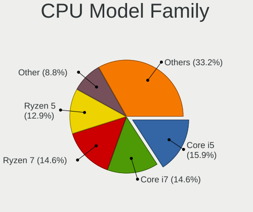

| Model                   | Desktops | Percent |
|-------------------------|----------|---------|
| Intel Core i5           | 76       | 15.87%  |
| Intel Core i7           | 70       | 14.61%  |
| AMD Ryzen 7             | 70       | 14.61%  |
| AMD Ryzen 5             | 62       | 12.94%  |
| Other                   | 42       | 8.77%   |
| AMD Ryzen 9             | 38       | 7.93%   |
| Intel Xeon              | 30       | 6.26%   |
| AMD FX                  | 17       | 3.55%   |
| Intel Core i3           | 9        | 1.88%   |
| Intel Core i9           | 6        | 1.25%   |
| Intel Core 2 Duo        | 6        | 1.25%   |
| Intel Pentium           | 5        | 1.04%   |
| Intel Core              | 5        | 1.04%   |
| Intel Celeron           | 5        | 1.04%   |
| AMD Ryzen 3             | 4        | 0.84%   |
| AMD A8                  | 4        | 0.84%   |
| AMD A6                  | 4        | 0.84%   |
| AMD Ryzen Threadripper  | 3        | 0.63%   |
| AMD Phenom II X4        | 3        | 0.63%   |
| Intel Atom              | 2        | 0.42%   |
| AMD Ryzen 5 PRO         | 2        | 0.42%   |
| AMD Phenom II X6        | 2        | 0.42%   |
| AMD Athlon II X2        | 2        | 0.42%   |
| AMD A10                 | 2        | 0.42%   |
| Intel Pentium Dual-Core | 1        | 0.21%   |
| Intel Genuine           | 1        | 0.21%   |
| Intel Core 2 Quad       | 1        | 0.21%   |
| AMD Ryzen 3 PRO         | 1        | 0.21%   |
| AMD Phenom              | 1        | 0.21%   |
| AMD Opteron             | 1        | 0.21%   |
| AMD E1                  | 1        | 0.21%   |
| AMD Athlon II X4        | 1        | 0.21%   |
| AMD Athlon 64 X2        | 1        | 0.21%   |
| AMD Athlon              | 1        | 0.21%   |

CPU Cores
---------

Number of processor cores

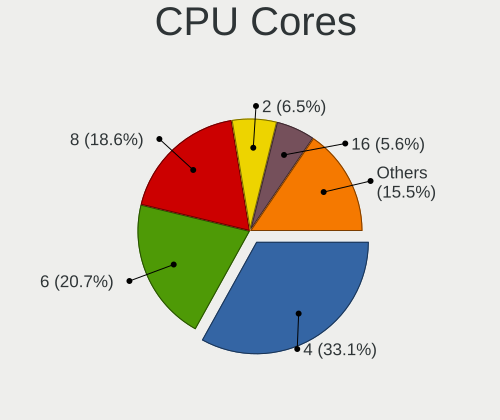

| Number  | Desktops | Percent |
|---------|----------|---------|
| 4       | 158      | 33.05%  |
| 6       | 99       | 20.71%  |
| 8       | 89       | 18.62%  |
| 2       | 31       | 6.49%   |
| 16      | 27       | 5.65%   |
| 12      | 25       | 5.23%   |
| 14      | 12       | 2.51%   |
| 24      | 10       | 2.09%   |
| 20      | 8        | 1.67%   |
| 10      | 8        | 1.67%   |
| 3       | 3        | 0.63%   |
| 32      | 2        | 0.42%   |
| Unknown | 2        | 0.42%   |
| 44      | 1        | 0.21%   |
| 28      | 1        | 0.21%   |
| 18      | 1        | 0.21%   |
| 1       | 1        | 0.21%   |

CPU Sockets
-----------

Number of sockets

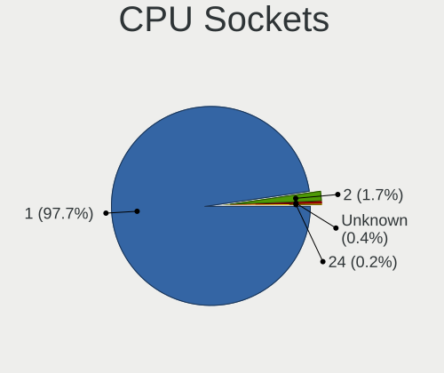

| Number  | Desktops | Percent |
|---------|----------|---------|
| 1       | 467      | 97.7%   |
| 2       | 8        | 1.67%   |
| Unknown | 2        | 0.42%   |
| 24      | 1        | 0.21%   |

CPU Threads
-----------

Threads per core (Hyper-Threading)

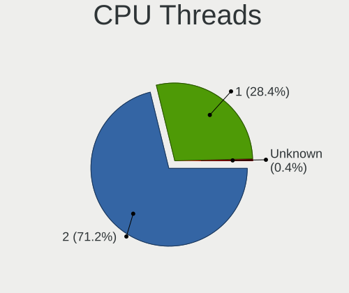

| Number  | Desktops | Percent |
|---------|----------|---------|
| 2       | 341      | 71.19%  |
| 1       | 136      | 28.39%  |
| Unknown | 2        | 0.42%   |

CPU Op-Modes
------------

CPU Operation Modes (32-bit, 64-bit)

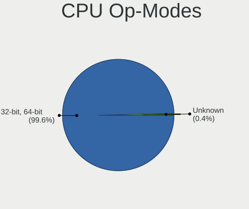

| Op mode        | Desktops | Percent |
|----------------|----------|---------|
| 32-bit, 64-bit | 476      | 99.58%  |
| Unknown        | 2        | 0.42%   |

CPU Microcode
-------------

Microcode number

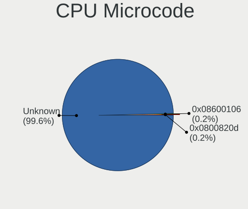

| Number     | Desktops | Percent |
|------------|----------|---------|
| Unknown    | 477      | 99.58%  |
| 0x08600106 | 1        | 0.21%   |
| 0x0800820d | 1        | 0.21%   |

CPU Microarch
-------------

Microarchitecture

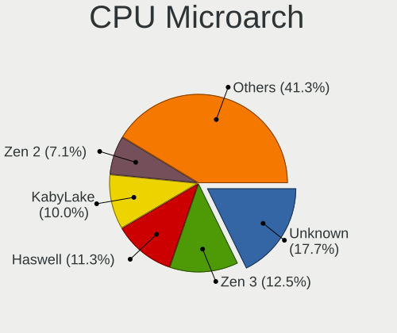

| Name             | Desktops | Percent |
|------------------|----------|---------|
| Unknown          | 85       | 17.75%  |
| Zen 3            | 60       | 12.53%  |
| Haswell          | 54       | 11.27%  |
| KabyLake         | 48       | 10.02%  |
| Zen 2            | 34       | 7.1%    |
| IvyBridge        | 25       | 5.22%   |
| Zen+             | 23       | 4.8%    |
| SandyBridge      | 22       | 4.59%   |
| Piledriver       | 21       | 4.38%   |
| Alderlake Hybrid | 17       | 3.55%   |
| Skylake          | 13       | 2.71%   |
| Zen              | 12       | 2.51%   |
| CometLake        | 11       | 2.3%    |
| K10              | 8        | 1.67%   |
| Penryn           | 7        | 1.46%   |
| Nehalem          | 5        | 1.04%   |
| Icelake          | 5        | 1.04%   |
| Broadwell        | 5        | 1.04%   |
| Steamroller      | 3        | 0.63%   |
| Silvermont       | 3        | 0.63%   |
| Bulldozer        | 3        | 0.63%   |
| TigerLake        | 2        | 0.42%   |
| Lunarlake Hybrid | 2        | 0.42%   |
| K10 Llano        | 2        | 0.42%   |
| Core             | 2        | 0.42%   |
| Westmere         | 1        | 0.21%   |
| Puma             | 1        | 0.21%   |
| K8 Hammer        | 1        | 0.21%   |
| Gracemont        | 1        | 0.21%   |
| Goldmont plus    | 1        | 0.21%   |
| Goldmont         | 1        | 0.21%   |
| Bonnell          | 1        | 0.21%   |

Graphics
--------

GPU Vendor
----------

Vendors of graphics cards

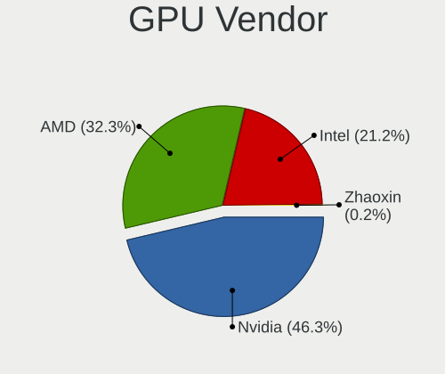

| Vendor  | Desktops | Percent |
|---------|----------|---------|
| Nvidia  | 245      | 46.31%  |
| AMD     | 171      | 32.33%  |
| Intel   | 112      | 21.17%  |
| Zhaoxin | 1        | 0.19%   |

GPU Model
---------

Graphics card models

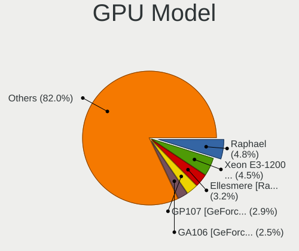

| Model                                                                       | Desktops | Percent |
|-----------------------------------------------------------------------------|----------|---------|
| AMD Raphael                                                                 | 27       | 4.85%   |
| Intel Xeon E3-1200 v3/4th Gen Core Processor Integrated Graphics Controller | 25       | 4.49%   |
| AMD Ellesmere [Radeon RX 470/480/570/570X/580/580X/590]                     | 18       | 3.23%   |
| Nvidia GP107 [GeForce GTX 1050 Ti]                                          | 16       | 2.87%   |
| Nvidia GA106 [GeForce RTX 3060 Lite Hash Rate]                              | 14       | 2.51%   |
| Intel CoffeeLake-S GT2 [UHD Graphics 630]                                   | 12       | 2.15%   |
| AMD Cezanne [Radeon Vega Series / Radeon Vega Mobile Series]                | 10       | 1.8%    |
| Nvidia GP104 [GeForce GTX 1070]                                             | 9        | 1.62%   |
| Intel Skylake-S GT2 [HD Graphics 530]                                       | 9        | 1.62%   |
| Intel Kaby Lake-S GT2 [HD Graphics 630]                                     | 9        | 1.62%   |
| Nvidia GK208B [GeForce GT 710]                                              | 8        | 1.44%   |
| Nvidia AD104 [GeForce RTX 4070]                                             | 8        | 1.44%   |
| AMD Renoir [Radeon Vega Series / Radeon Vega Mobile Series]                 | 8        | 1.44%   |
| AMD Navi 23 [Radeon RX 6600/6600 XT/6600M]                                  | 8        | 1.44%   |
| Nvidia GP108 [GeForce GT 1030]                                              | 7        | 1.26%   |
| Nvidia GP107 [GeForce GTX 1050]                                             | 7        | 1.26%   |
| Nvidia GP106 [GeForce GTX 1060 6GB]                                         | 7        | 1.26%   |
| Intel Xeon E3-1200 v2/3rd Gen Core processor Graphics Controller            | 7        | 1.26%   |
| Intel 2nd Generation Core Processor Family Integrated Graphics Controller   | 7        | 1.26%   |
| AMD Granite Ridge [Radeon Graphics]                                         | 7        | 1.26%   |
| Nvidia GP104 [GeForce GTX 1080]                                             | 6        | 1.08%   |
| Nvidia AD106 [GeForce RTX 4060 Ti]                                          | 6        | 1.08%   |
| AMD Phoenix1                                                                | 6        | 1.08%   |
| AMD Navi 31 [Radeon RX 7900 XT/7900 XTX/7900 GRE/7900M]                     | 6        | 1.08%   |
| Nvidia TU117 [GeForce GTX 1650]                                             | 5        | 0.9%    |
| Nvidia GA104 [GeForce RTX 3060 Ti Lite Hash Rate]                           | 5        | 0.9%    |
| Nvidia AD107 [GeForce RTX 4060]                                             | 5        | 0.9%    |
| Nvidia AD104 [GeForce RTX 4070 Ti]                                          | 5        | 0.9%    |
| Nvidia AD103 [GeForce RTX 4070 Ti SUPER]                                    | 5        | 0.9%    |
| Intel Alder Lake-S GT1 [UHD Graphics 770]                                   | 5        | 0.9%    |
| AMD Picasso/Raven 2 [Radeon Vega Series / Radeon Vega Mobile Series]        | 5        | 0.9%    |
| AMD Navi 32 [Radeon RX 7700 XT / 7800 XT]                                   | 5        | 0.9%    |
| Nvidia TU116 [GeForce GTX 1660 SUPER]                                       | 4        | 0.72%   |
| Nvidia TU106 [GeForce RTX 2060 SUPER]                                       | 4        | 0.72%   |
| Nvidia TU106 [GeForce RTX 2060 Rev. A]                                      | 4        | 0.72%   |
| Nvidia TU104 [GeForce RTX 2060]                                             | 4        | 0.72%   |
| Nvidia GK208B [GeForce GT 730]                                              | 4        | 0.72%   |
| Nvidia GA104 [GeForce RTX 3060]                                             | 4        | 0.72%   |
| Nvidia GA102 [GeForce RTX 3090]                                             | 4        | 0.72%   |
| AMD Rembrandt [Radeon 680M]                                                 | 4        | 0.72%   |

GPU Combo
---------

Combinations of graphics cards

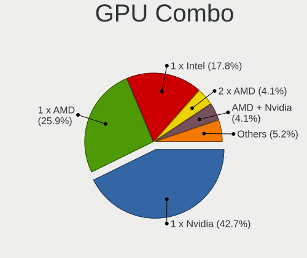

| Name               | Desktops | Percent |
|--------------------|----------|---------|
| 1 x Nvidia         | 206      | 42.74%  |
| 1 x AMD            | 125      | 25.93%  |
| 1 x Intel          | 86       | 17.84%  |
| 2 x AMD            | 20       | 4.15%   |
| AMD + Nvidia       | 20       | 4.15%   |
| Intel + Nvidia     | 11       | 2.28%   |
| Intel + AMD        | 5        | 1.04%   |
| Other              | 2        | 0.41%   |
| 2 x Nvidia         | 2        | 0.41%   |
| AMD + 2 x Nvidia   | 2        | 0.41%   |
| 3 x Nvidia         | 1        | 0.21%   |
| 1 x Zhaoxin        | 1        | 0.21%   |
| Intel + 2 x Nvidia | 1        | 0.21%   |

GPU Driver
----------

Free vs proprietary

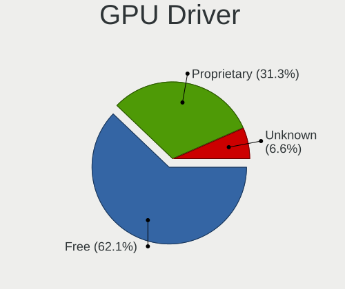

| Driver      | Desktops | Percent |
|-------------|----------|---------|
| Free        | 302      | 62.14%  |
| Proprietary | 152      | 31.28%  |
| Unknown     | 32       | 6.58%   |

GPU Memory
----------

Total video memory

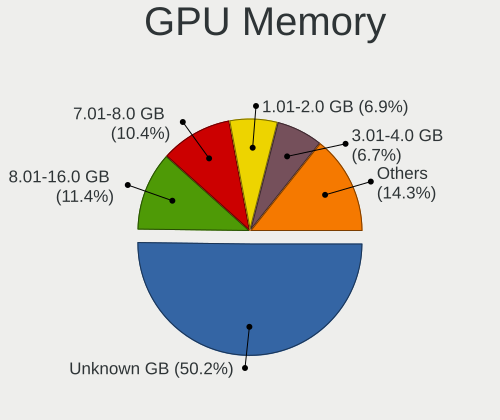

| Size in GB | Desktops | Percent |
|------------|----------|---------|
| Unknown    | 246      | 50.2%   |
| 8.01-16.0  | 56       | 11.43%  |
| 7.01-8.0   | 51       | 10.41%  |
| 1.01-2.0   | 34       | 6.94%   |
| 3.01-4.0   | 33       | 6.73%   |
| 0.01-0.5   | 20       | 4.08%   |
| 5.01-6.0   | 19       | 3.88%   |
| 0.51-1.0   | 17       | 3.47%   |
| 16.01-24.0 | 9        | 1.84%   |
| 2.01-3.0   | 4        | 0.82%   |
| 24.01-32.0 | 1        | 0.2%    |

Monitor
-------

Monitor Vendor
--------------

Monitor vendors

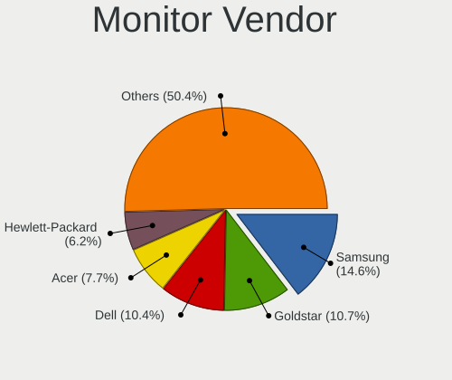

| Vendor               | Desktops | Percent |
|----------------------|----------|---------|
| Samsung Electronics  | 83       | 14.59%  |
| Goldstar             | 61       | 10.72%  |
| Dell                 | 59       | 10.37%  |
| Acer                 | 44       | 7.73%   |
| Hewlett-Packard      | 35       | 6.15%   |
| Philips              | 30       | 5.27%   |
| AOC                  | 25       | 4.39%   |
| BenQ                 | 22       | 3.87%   |
| Ancor Communications | 17       | 2.99%   |
| Unknown              | 15       | 2.64%   |
| Lenovo               | 14       | 2.46%   |
| Iiyama               | 14       | 2.46%   |
| ASUSTek Computer     | 12       | 2.11%   |
| Gigabyte Technology  | 11       | 1.93%   |
| ViewSonic            | 10       | 1.76%   |
| MSI                  | 8        | 1.41%   |
| Sceptre Tech         | 7        | 1.23%   |
| Fujitsu Siemens      | 5        | 0.88%   |
| Vestel Elektronik    | 4        | 0.7%    |
| Sony                 | 4        | 0.7%    |
| NEC Computers        | 4        | 0.7%    |
| Medion               | 4        | 0.7%    |
| Insignia             | 4        | 0.7%    |
| Eizo                 | 4        | 0.7%    |
| Unknown              | 4        | 0.7%    |
| Vizio                | 3        | 0.53%   |
| RTK                  | 3        | 0.53%   |
| Mi                   | 3        | 0.53%   |
| Hitachi              | 3        | 0.53%   |
| ___                  | 2        | 0.35%   |
| Westinghouse         | 2        | 0.35%   |
| ONN                  | 2        | 0.35%   |
| LG Electronics       | 2        | 0.35%   |
| HUAWEI               | 2        | 0.35%   |
| HKC                  | 2        | 0.35%   |
| HCS                  | 2        | 0.35%   |
| GAOMON               | 2        | 0.35%   |
| CVT                  | 2        | 0.35%   |
| AUS                  | 2        | 0.35%   |
| Yamaha               | 1        | 0.18%   |

Monitor Model
-------------

Monitor models

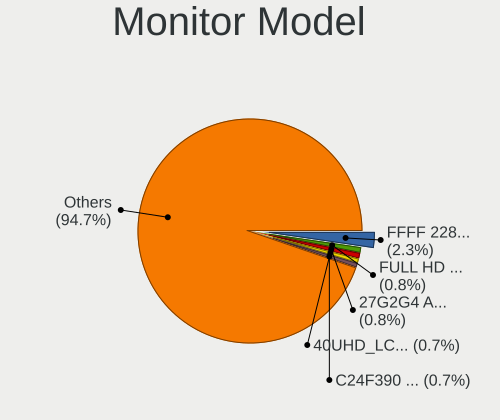

| Model                                                                | Desktops | Percent |
|----------------------------------------------------------------------|----------|---------|
| Unknown LCD Monitor FFFF 2288x1287 2550x2550mm 142.0-inch            | 14       | 2.31%   |
| Goldstar FULL HD GSM5B55 1920x1080 480x270mm 21.7-inch               | 5        | 0.82%   |
| AOC 27G2G4 AOC2702 1920x1080 598x336mm 27.0-inch                     | 5        | 0.82%   |
| Vestel Elektronik 40UHD_LCD_TV VES3700 3840x2160 880x500mm 39.8-inch | 4        | 0.66%   |
| Samsung Electronics C24F390 SAM0D2C 1920x1080 521x293mm 23.5-inch    | 4        | 0.66%   |
| Goldstar LG ULTRAWIDE GSM59F1 2560x1080 670x280mm 28.6-inch          | 4        | 0.66%   |
| Unknown                                                              | 4        | 0.66%   |
| Sceptre Tech Sceptre F24 SPT09AB 1920x1080 530x290mm 23.8-inch       | 3        | 0.49%   |
| Samsung Electronics C27F390 SAM0D32 1920x1080 598x336mm 27.0-inch    | 3        | 0.49%   |
| RTK LCD Monitor RTK1D1A 1920x1080 1020x570mm 46.0-inch               | 3        | 0.49%   |
| Philips FTV PHL01EA 1920x1080 1440x810mm 65.0-inch                   | 3        | 0.49%   |
| Goldstar HDR 4K GSM7707 3840x2160 600x340mm 27.2-inch                | 3        | 0.49%   |
| Goldstar 27GL850 GSM5B7F 2560x1440 597x336mm 27.0-inch               | 3        | 0.49%   |
| Dell U2412M DELA07A 1920x1200 518x324mm 24.1-inch                    | 3        | 0.49%   |
| Acer ED273 P ACR0914 1920x1080 597x336mm 27.0-inch                   | 3        | 0.49%   |
| Sceptre Tech Sceptre F27 SPT0AD7 1920x1080 600x330mm 27.0-inch       | 2        | 0.33%   |
| Samsung Electronics SyncMaster SAM027F 1680x1050 474x296mm 22.0-inch | 2        | 0.33%   |
| Samsung Electronics S24F350 SAM0D20 1920x1080 521x293mm 23.5-inch    | 2        | 0.33%   |
| Samsung Electronics S24D330 SAM0D92 1920x1080 531x299mm 24.0-inch    | 2        | 0.33%   |
| Samsung Electronics LU28R55 SAM1016 3840x2160 632x360mm 28.6-inch    | 2        | 0.33%   |
| Samsung Electronics LS32CG51x SAM72FE 2560x1440 697x392mm 31.5-inch  | 2        | 0.33%   |
| Samsung Electronics LS24AG30x SAM7179 1920x1080 527x296mm 23.8-inch  | 2        | 0.33%   |
| Samsung Electronics LF27T35 SAM707F 1920x1080 598x337mm 27.0-inch    | 2        | 0.33%   |
| Samsung Electronics LCD Monitor SAM03BC 1920x1080                    | 2        | 0.33%   |
| Samsung Electronics LC27G7xT SAM105C 2560x1440 597x336mm 27.0-inch   | 2        | 0.33%   |
| Samsung Electronics LC24RG50 SAM0F91 1920x1080 532x304mm 24.1-inch   | 2        | 0.33%   |
| Philips PHL 273V7 PHLC156 1920x1080 598x336mm 27.0-inch              | 2        | 0.33%   |
| Philips PHL 243V7 PHLC155 1920x1080 527x296mm 23.8-inch              | 2        | 0.33%   |
| Philips PHL 243V5 PHLC0D1 1920x1080 521x293mm 23.5-inch              | 2        | 0.33%   |
| Philips 27M1N3200V PHLC279 1920x1080 598x336mm 27.0-inch             | 2        | 0.33%   |
| MSI Optix MAG27CQ MSI1462 2560x1440 597x336mm 27.0-inch              | 2        | 0.33%   |
| Medion MD 20119 MED3910 1440x900 409x256mm 19.0-inch                 | 2        | 0.33%   |
| Insignia TV BBY3223 1920x1080 697x392mm 31.5-inch                    | 2        | 0.33%   |
| Iiyama PL2475HD IVM6108 1920x1080 521x293mm 23.5-inch                | 2        | 0.33%   |
| HUAWEI ZQE-CBA HWV6A25 3440x1440 797x334mm 34.0-inch                 | 2        | 0.33%   |
| HCS XG27QH18B HCS0270 2560x1440 600x330mm 27.0-inch                  | 2        | 0.33%   |
| Goldstar ULTRAWIDE GSM76FA 2560x1080 798x334mm 34.1-inch             | 2        | 0.33%   |
| Goldstar ULTRAGEAR GSM7765 2560x1440 697x392mm 31.5-inch             | 2        | 0.33%   |
| Goldstar ULTRAGEAR GSM5BB4 2560x1440 597x336mm 27.0-inch             | 2        | 0.33%   |
| Goldstar TV GSMC0A0 3840x2160                                        | 2        | 0.33%   |

Monitor Resolution
------------------

Monitor screen resolution

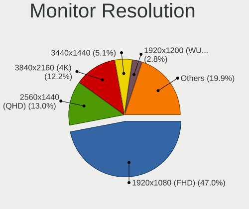

| Resolution         | Desktops | Percent |
|--------------------|----------|---------|
| 1920x1080 (FHD)    | 250      | 46.99%  |
| 2560x1440 (QHD)    | 69       | 12.97%  |
| 3840x2160 (4K)     | 65       | 12.22%  |
| 3440x1440          | 27       | 5.08%   |
| 1920x1200 (WUXGA)  | 15       | 2.82%   |
| 2288x1287          | 14       | 2.63%   |
| 1680x1050 (WSXGA+) | 13       | 2.44%   |
| 1280x1024 (SXGA)   | 13       | 2.44%   |
| 1366x768 (WXGA)    | 12       | 2.26%   |
| 1600x900 (HD+)     | 8        | 1.5%    |
| 1440x900 (WXGA+)   | 8        | 1.5%    |
| 2560x1080          | 7        | 1.32%   |
| 1360x768           | 7        | 1.32%   |
| Unknown            | 6        | 1.13%   |
| 3840x1080          | 4        | 0.75%   |
| 1920x540           | 3        | 0.56%   |
| 5760x2160          | 1        | 0.19%   |
| 5760x1080          | 1        | 0.19%   |
| 504x315            | 1        | 0.19%   |
| 480x1920           | 1        | 0.19%   |
| 3840x1600          | 1        | 0.19%   |
| 3840x1200          | 1        | 0.19%   |
| 3600x1080          | 1        | 0.19%   |
| 3520x1080          | 1        | 0.19%   |
| 3200x1080          | 1        | 0.19%   |
| 2160x1200          | 1        | 0.19%   |
| 1024x768 (XGA)     | 1        | 0.19%   |

Monitor Diagonal
----------------

Diagonal size in inches

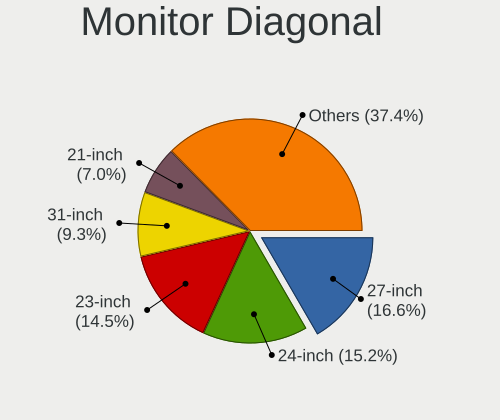

| Inches  | Desktops | Percent |
|---------|----------|---------|
| 27      | 93       | 16.64%  |
| 24      | 85       | 15.21%  |
| 23      | 81       | 14.49%  |
| 31      | 52       | 9.3%    |
| 21      | 39       | 6.98%   |
| 34      | 32       | 5.72%   |
| Unknown | 26       | 4.65%   |
| 19      | 18       | 3.22%   |
| 84      | 15       | 2.68%   |
| 142     | 14       | 2.5%    |
| 22      | 12       | 2.15%   |
| 18      | 9        | 1.61%   |
| 15      | 8        | 1.43%   |
| 32      | 7        | 1.25%   |
| 72      | 6        | 1.07%   |
| 40      | 6        | 1.07%   |
| 28      | 5        | 0.89%   |
| 20      | 5        | 0.89%   |
| 48      | 4        | 0.72%   |
| 46      | 4        | 0.72%   |
| 17      | 4        | 0.72%   |
| 65      | 3        | 0.54%   |
| 42      | 3        | 0.54%   |
| 39      | 3        | 0.54%   |
| 36      | 3        | 0.54%   |
| 63      | 2        | 0.36%   |
| 55      | 2        | 0.36%   |
| 35      | 2        | 0.36%   |
| 26      | 2        | 0.36%   |
| 25      | 2        | 0.36%   |
| 64      | 1        | 0.18%   |
| 54      | 1        | 0.18%   |
| 52      | 1        | 0.18%   |
| 50      | 1        | 0.18%   |
| 47      | 1        | 0.18%   |
| 43      | 1        | 0.18%   |
| 38      | 1        | 0.18%   |
| 37      | 1        | 0.18%   |
| 29      | 1        | 0.18%   |
| 12      | 1        | 0.18%   |

Monitor Width
-------------

Physical width

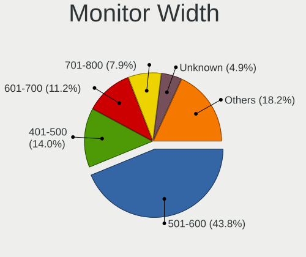

| Width in mm    | Desktops | Percent |
|----------------|----------|---------|
| 501-600        | 234      | 43.82%  |
| 401-500        | 75       | 14.04%  |
| 601-700        | 60       | 11.24%  |
| 701-800        | 42       | 7.87%   |
| Unknown        | 26       | 4.87%   |
| 1501-2000      | 21       | 3.93%   |
| 1001-1500      | 21       | 3.93%   |
| More than 2000 | 14       | 2.62%   |
| 801-900        | 13       | 2.43%   |
| 301-350        | 12       | 2.25%   |
| 351-400        | 10       | 1.87%   |
| 901-1000       | 3        | 0.56%   |
| 201-300        | 2        | 0.37%   |
| 101-200        | 1        | 0.19%   |

Aspect Ratio
------------

Proportional relationship between the width and the height

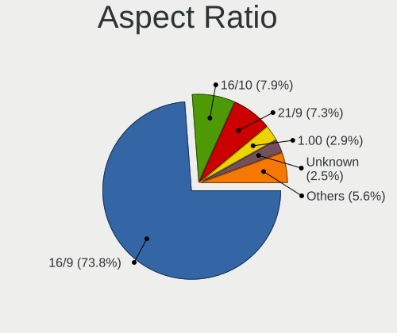

| Ratio   | Desktops | Percent |
|---------|----------|---------|
| 16/9    | 355      | 73.8%   |
| 16/10   | 38       | 7.9%    |
| 21/9    | 35       | 7.28%   |
| 1.00    | 14       | 2.91%   |
| Unknown | 12       | 2.49%   |
| 5/4     | 10       | 2.08%   |
| 32/9    | 5        | 1.04%   |
| 4/3     | 4        | 0.83%   |
| 3/2     | 3        | 0.62%   |
| 6/5     | 2        | 0.42%   |
| 3.20    | 1        | 0.21%   |
| 1.96    | 1        | 0.21%   |
| 0.25    | 1        | 0.21%   |

Monitor Area
------------

Area in inch²

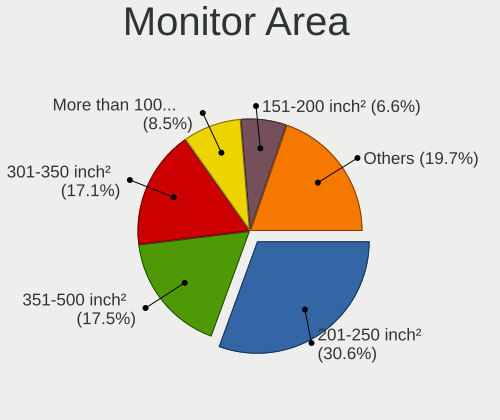

| Area in inch² | Desktops | Percent |
|----------------|----------|---------|
| 201-250        | 166      | 30.57%  |
| 351-500        | 95       | 17.5%   |
| 301-350        | 93       | 17.13%  |
| More than 1000 | 46       | 8.47%   |
| 151-200        | 36       | 6.63%   |
| 251-300        | 34       | 6.26%   |
| 501-1000       | 26       | 4.79%   |
| Unknown        | 26       | 4.79%   |
| 141-150        | 9        | 1.66%   |
| 101-110        | 8        | 1.47%   |
| 71-80          | 1        | 0.18%   |
| 51-60          | 1        | 0.18%   |
| 1-40           | 1        | 0.18%   |
| 131-140        | 1        | 0.18%   |

Pixel Density
-------------

Pixels per inch

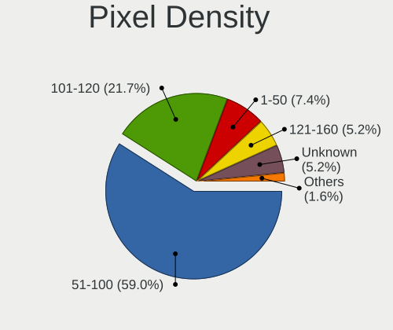

| Density | Desktops | Percent |
|---------|----------|---------|
| 51-100  | 297      | 59.05%  |
| 101-120 | 109      | 21.67%  |
| 1-50    | 37       | 7.36%   |
| 121-160 | 26       | 5.17%   |
| Unknown | 26       | 5.17%   |
| 161-240 | 8        | 1.59%   |

Multiple Monitors
-----------------

Total monitors connected

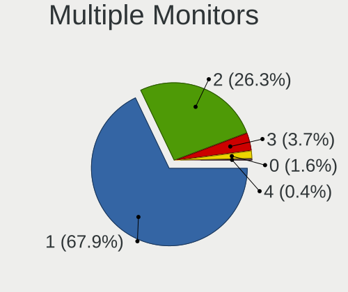

| Total | Desktops | Percent |
|-------|----------|---------|
| 1     | 330      | 67.9%   |
| 2     | 128      | 26.34%  |
| 3     | 18       | 3.7%    |
| 0     | 8        | 1.65%   |
| 4     | 2        | 0.41%   |

Network
-------

Net Controller Vendor
---------------------

Controller vendors

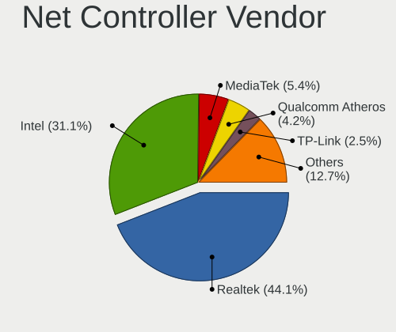

| Vendor                            | Desktops | Percent |
|-----------------------------------|----------|---------|
| Realtek Semiconductor             | 316      | 44.07%  |
| Intel                             | 223      | 31.1%   |
| MediaTek                          | 39       | 5.44%   |
| Qualcomm Atheros                  | 30       | 4.18%   |
| TP-Link                           | 18       | 2.51%   |
| Broadcom                          | 8        | 1.12%   |
| Microsoft                         | 7        | 0.98%   |
| Samsung Electronics               | 6        | 0.84%   |
| Ralink Technology                 | 6        | 0.84%   |
| ASIX Electronics                  | 6        | 0.84%   |
| Xiaomi                            | 5        | 0.7%    |
| Aquantia                          | 5        | 0.7%    |
| NetGear                           | 4        | 0.56%   |
| Ralink                            | 3        | 0.42%   |
| Qualcomm Technologies             | 3        | 0.42%   |
| Qualcomm Atheros Communications   | 3        | 0.42%   |
| DisplayLink                       | 3        | 0.42%   |
| Realtek                           | 2        | 0.28%   |
| QinHeng Electronics               | 2        | 0.28%   |
| OPPO Electronics                  | 2        | 0.28%   |
| Linksys                           | 2        | 0.28%   |
| Broadcom Limited                  | 2        | 0.28%   |
| AVM                               | 2        | 0.28%   |
| ASUSTek Computer                  | 2        | 0.28%   |
| ZyXEL Communications              | 1        | 0.14%   |
| VIA Technologies                  | 1        | 0.14%   |
| Van Ooijen Technische Informatica | 1        | 0.14%   |
| Spreadtrum Communications         | 1        | 0.14%   |
| Senao                             | 1        | 0.14%   |
| Nvidia                            | 1        | 0.14%   |
| Microchip Technology              | 1        | 0.14%   |
| Mellanox Technologies             | 1        | 0.14%   |
| InterBiometrics                   | 1        | 0.14%   |
| Espressif                         | 1        | 0.14%   |
| Dresden Elektronik                | 1        | 0.14%   |
| D-Link System                     | 1        | 0.14%   |
| D-Link                            | 1        | 0.14%   |
| Belkin Components                 | 1        | 0.14%   |
| Apple                             | 1        | 0.14%   |
| American Future Technology        | 1        | 0.14%   |

Net Controller Model
--------------------

Controller models

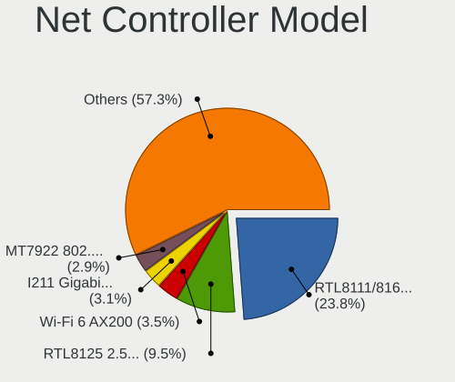

| Model                                                                           | Desktops | Percent |
|---------------------------------------------------------------------------------|----------|---------|
| Realtek RTL8111/8168/8211/8411 PCI Express Gigabit Ethernet Controller          | 206      | 23.79%  |
| Realtek RTL8125 2.5GbE Controller                                               | 82       | 9.47%   |
| Intel Wi-Fi 6 AX200                                                             | 30       | 3.46%   |
| Intel I211 Gigabit Network Connection                                           | 27       | 3.12%   |
| MediaTek MT7922 802.11ax PCI Express Wireless Network Adapter                   | 25       | 2.89%   |
| Intel Ethernet Controller I225-V                                                | 23       | 2.66%   |
| Intel Wi-Fi 6E(802.11ax) AX210/AX1675* 2x2 [Typhoon Peak]                       | 19       | 2.19%   |
| Intel 82579LM Gigabit Network Connection (Lewisville)                           | 17       | 1.96%   |
| Intel Ethernet Connection (2) I219-V                                            | 16       | 1.85%   |
| Intel 700 Series Chipset CNVi WiFi                                              | 16       | 1.85%   |
| Intel Ethernet Connection I217-LM                                               | 15       | 1.73%   |
| Intel Dual Band Wireless-AC 3168NGW [Stone Peak]                                | 12       | 1.39%   |
| Intel Ethernet Controller I226-V                                                | 10       | 1.15%   |
| Intel Ethernet Connection (7) I219-V                                            | 10       | 1.15%   |
| Realtek RTL88x2bu [AC1200 Techkey]                                              | 9        | 1.04%   |
| Realtek RTL8852BE PCIe 802.11ax Wireless Network Controller                     | 9        | 1.04%   |
| Realtek RTL8188EUS 802.11n Wireless Network Adapter                             | 8        | 0.92%   |
| Realtek RTL810xE PCI Express Fast Ethernet controller                           | 8        | 0.92%   |
| Realtek 802.11ac NIC                                                            | 8        | 0.92%   |
| Intel Wi-Fi 5(802.11ac) Wireless-AC 9x6x [Thunder Peak]                         | 8        | 0.92%   |
| Intel Ethernet Connection (2) I218-V                                            | 7        | 0.81%   |
| Intel 82574L Gigabit Network Connection                                         | 7        | 0.81%   |
| ASIX AX88179 Gigabit Ethernet                                                   | 6        | 0.69%   |
| TP-Link 802.11ac WLAN Adapter                                                   | 5        | 0.58%   |
| Samsung Galaxy series, misc. (tethering mode)                                   | 5        | 0.58%   |
| Realtek RTL8852CE PCIe 802.11ax Wireless Network Controller                     | 5        | 0.58%   |
| Realtek RTL8821CE 802.11ac PCIe Wireless Network Adapter                        | 5        | 0.58%   |
| Realtek RTL8153 Gigabit Ethernet Adapter                                        | 5        | 0.58%   |
| Qualcomm Atheros Killer E220x Gigabit Ethernet Controller                       | 5        | 0.58%   |
| Microsoft Xbox Wireless Adapter for Windows                                     | 5        | 0.58%   |
| MediaTek MT7921K (RZ608) Wi-Fi 6E 80MHz                                         | 5        | 0.58%   |
| Intel Wireless 7265                                                             | 5        | 0.58%   |
| Intel Ethernet Connection I217-V                                                | 5        | 0.58%   |
| Intel Cannon Lake PCH CNVi WiFi                                                 | 5        | 0.58%   |
| Xiaomi Mi/Redmi series (RNDIS)                                                  | 4        | 0.46%   |
| Realtek RTL8822CE 802.11ac PCIe Wireless Network Adapter                        | 4        | 0.46%   |
| Realtek RTL8192EE PCIe Wireless Network Adapter                                 | 4        | 0.46%   |
| Realtek RTL8126 5GbE Controller                                                 | 4        | 0.46%   |
| Qualcomm Atheros Killer E2400 Gigabit Ethernet Controller                       | 4        | 0.46%   |
| MediaTek MT7925 802.11be 160MHz 2x2 PCIe Wireless Network Adapter [Filogic 360] | 4        | 0.46%   |

Wireless Vendor
---------------

Wireless vendors

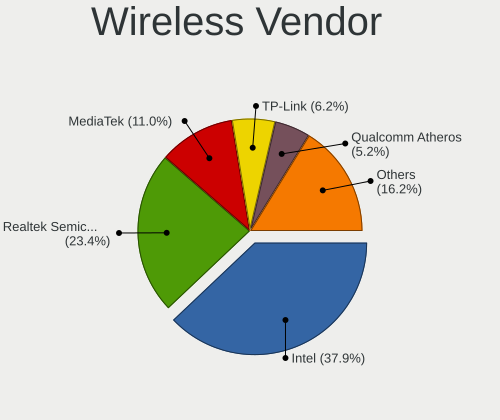

| Vendor                          | Desktops | Percent |
|---------------------------------|----------|---------|
| Intel                           | 110      | 37.93%  |
| Realtek Semiconductor           | 68       | 23.45%  |
| MediaTek                        | 32       | 11.03%  |
| TP-Link                         | 18       | 6.21%   |
| Qualcomm Atheros                | 15       | 5.17%   |
| Microsoft                       | 7        | 2.41%   |
| Broadcom                        | 7        | 2.41%   |
| Ralink Technology               | 6        | 2.07%   |
| NetGear                         | 4        | 1.38%   |
| Ralink                          | 3        | 1.03%   |
| Qualcomm Atheros Communications | 3        | 1.03%   |
| Realtek                         | 2        | 0.69%   |
| Linksys                         | 2        | 0.69%   |
| Broadcom Limited                | 2        | 0.69%   |
| AVM                             | 2        | 0.69%   |
| ASUSTek Computer                | 2        | 0.69%   |
| ZyXEL Communications            | 1        | 0.34%   |
| Senao                           | 1        | 0.34%   |
| Qualcomm Technologies           | 1        | 0.34%   |
| D-Link System                   | 1        | 0.34%   |
| D-Link                          | 1        | 0.34%   |
| Belkin Components               | 1        | 0.34%   |
| Accton Technology               | 1        | 0.34%   |

Wireless Model
--------------

Wireless models

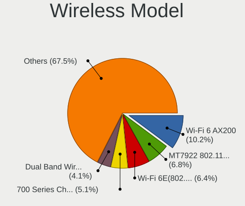

| Model                                                                | Desktops | Percent |
|----------------------------------------------------------------------|----------|---------|
| Intel Wi-Fi 6 AX200                                                  | 30       | 10.17%  |
| MediaTek MT7922 802.11ax PCI Express Wireless Network Adapter        | 20       | 6.78%   |
| Intel Wi-Fi 6E(802.11ax) AX210/AX1675* 2x2 [Typhoon Peak]            | 19       | 6.44%   |
| Intel 700 Series Chipset CNVi WiFi                                   | 15       | 5.08%   |
| Intel Dual Band Wireless-AC 3168NGW [Stone Peak]                     | 12       | 4.07%   |
| Realtek RTL88x2bu [AC1200 Techkey]                                   | 9        | 3.05%   |
| Realtek RTL8188EUS 802.11n Wireless Network Adapter                  | 8        | 2.71%   |
| Realtek 802.11ac NIC                                                 | 8        | 2.71%   |
| Intel Wi-Fi 5(802.11ac) Wireless-AC 9x6x [Thunder Peak]              | 8        | 2.71%   |
| Realtek RTL8852BE PCIe 802.11ax Wireless Network Controller          | 6        | 2.03%   |
| TP-Link 802.11ac WLAN Adapter                                        | 5        | 1.69%   |
| Realtek RTL8852CE PCIe 802.11ax Wireless Network Controller          | 5        | 1.69%   |
| Realtek RTL8821CE 802.11ac PCIe Wireless Network Adapter             | 5        | 1.69%   |
| Microsoft Xbox Wireless Adapter for Windows                          | 5        | 1.69%   |
| MediaTek MT7921K (RZ608) Wi-Fi 6E 80MHz                              | 5        | 1.69%   |
| Intel Wireless 7265                                                  | 5        | 1.69%   |
| Intel Cannon Lake PCH CNVi WiFi                                      | 5        | 1.69%   |
| Realtek RTL8822CE 802.11ac PCIe Wireless Network Adapter             | 4        | 1.36%   |
| Realtek RTL8192EE PCIe Wireless Network Adapter                      | 4        | 1.36%   |
| Broadcom BCM4360 802.11ac Dual Band Wireless Network Adapter         | 4        | 1.36%   |
| TP-Link AC600 wireless Realtek RTL8811AU [Archer T2U Nano]           | 3        | 1.02%   |
| TP-Link 802.11ac NIC                                                 | 3        | 1.02%   |
| Realtek RTL8192CE PCIe Wireless Network Adapter                      | 3        | 1.02%   |
| Realtek 802.11ax WLAN Adapter                                        | 3        | 1.02%   |
| Ralink RT5372 Wireless Adapter                                       | 3        | 1.02%   |
| Qualcomm Atheros AR9271 802.11n                                      | 3        | 1.02%   |
| MediaTek MT7902 802.11ax PCIe Wireless Network Adapter [Filogic 310] | 3        | 1.02%   |
| Intel Wireless 8260                                                  | 3        | 1.02%   |
| Intel Wireless 7260                                                  | 3        | 1.02%   |
| Intel Wireless 3165                                                  | 3        | 1.02%   |
| TP-Link TL-WN823N v2/v3 [Realtek RTL8192EU]                          | 2        | 0.68%   |
| Realtek RTL8188FTV 802.11b/g/n 1T1R 2.4G WLAN Adapter                | 2        | 0.68%   |
| Realtek RTL8188EE Wireless Network Adapter                           | 2        | 0.68%   |
| Realtek 802.11ac WLAN Adapter                                        | 2        | 0.68%   |
| Ralink MT7601U Wireless Adapter                                      | 2        | 0.68%   |
| Qualcomm Atheros QCA9565 / AR9565 Wireless Network Adapter           | 2        | 0.68%   |
| Qualcomm Atheros QCA9377 802.11ac Wireless Network Adapter           | 2        | 0.68%   |
| Qualcomm Atheros QCA6174 802.11ac Wireless Network Adapter           | 2        | 0.68%   |
| Qualcomm Atheros AR93xx Wireless Network Adapter                     | 2        | 0.68%   |
| Qualcomm Atheros AR9287 Wireless Network Adapter (PCI-Express)       | 2        | 0.68%   |

Ethernet Vendor
---------------

Ethernet vendors

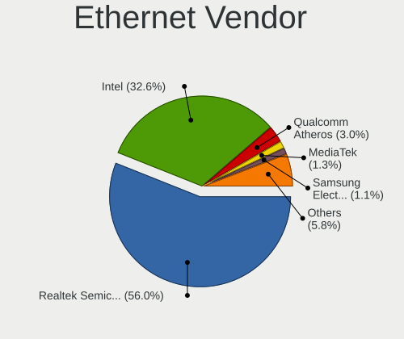

| Vendor                    | Desktops | Percent |
|---------------------------|----------|---------|
| Realtek Semiconductor     | 297      | 56.04%  |
| Intel                     | 173      | 32.64%  |
| Qualcomm Atheros          | 16       | 3.02%   |
| MediaTek                  | 7        | 1.32%   |
| Samsung Electronics       | 6        | 1.13%   |
| ASIX Electronics          | 6        | 1.13%   |
| Xiaomi                    | 5        | 0.94%   |
| Aquantia                  | 5        | 0.94%   |
| DisplayLink               | 3        | 0.57%   |
| Broadcom                  | 3        | 0.57%   |
| Qualcomm Technologies     | 2        | 0.38%   |
| OPPO Electronics          | 2        | 0.38%   |
| VIA Technologies          | 1        | 0.19%   |
| Spreadtrum Communications | 1        | 0.19%   |
| Nvidia                    | 1        | 0.19%   |
| Mellanox Technologies     | 1        | 0.19%   |
| Apple                     | 1        | 0.19%   |

Ethernet Model
--------------

Ethernet models

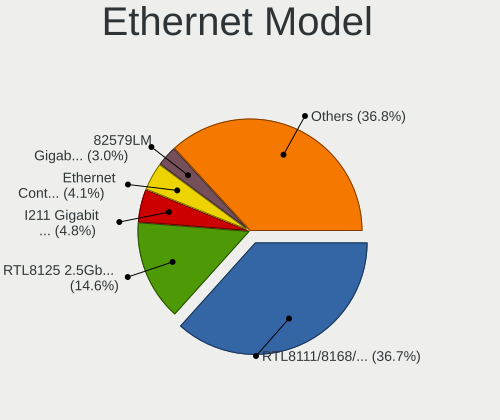

| Model                                                                           | Desktops | Percent |
|---------------------------------------------------------------------------------|----------|---------|
| Realtek RTL8111/8168/8211/8411 PCI Express Gigabit Ethernet Controller          | 206      | 36.65%  |
| Realtek RTL8125 2.5GbE Controller                                               | 82       | 14.59%  |
| Intel I211 Gigabit Network Connection                                           | 27       | 4.8%    |
| Intel Ethernet Controller I225-V                                                | 23       | 4.09%   |
| Intel 82579LM Gigabit Network Connection (Lewisville)                           | 17       | 3.02%   |
| Intel Ethernet Connection (2) I219-V                                            | 16       | 2.85%   |
| Intel Ethernet Connection I217-LM                                               | 15       | 2.67%   |
| Intel Ethernet Controller I226-V                                                | 10       | 1.78%   |
| Intel Ethernet Connection (7) I219-V                                            | 10       | 1.78%   |
| Realtek RTL810xE PCI Express Fast Ethernet controller                           | 8        | 1.42%   |
| Intel Ethernet Connection (2) I218-V                                            | 7        | 1.25%   |
| Intel 82574L Gigabit Network Connection                                         | 7        | 1.25%   |
| ASIX AX88179 Gigabit Ethernet                                                   | 6        | 1.07%   |
| Samsung Galaxy series, misc. (tethering mode)                                   | 5        | 0.89%   |
| Realtek RTL8153 Gigabit Ethernet Adapter                                        | 5        | 0.89%   |
| Qualcomm Atheros Killer E220x Gigabit Ethernet Controller                       | 5        | 0.89%   |
| MediaTek MT7922 802.11ax PCI Express Wireless Network Adapter                   | 5        | 0.89%   |
| Intel Ethernet Connection I217-V                                                | 5        | 0.89%   |
| Xiaomi Mi/Redmi series (RNDIS)                                                  | 4        | 0.71%   |
| Realtek RTL8126 5GbE Controller                                                 | 4        | 0.71%   |
| Qualcomm Atheros Killer E2400 Gigabit Ethernet Controller                       | 4        | 0.71%   |
| Intel Ethernet Connection (7) I219-LM                                           | 4        | 0.71%   |
| Intel Ethernet Connection (2) I219-LM                                           | 4        | 0.71%   |
| Intel Ethernet Connection (2) I218-LM                                           | 4        | 0.71%   |
| Intel 82579V Gigabit Network Connection                                         | 4        | 0.71%   |
| Realtek RTL8852BE PCIe 802.11ax Wireless Network Controller                     | 3        | 0.53%   |
| Realtek RTL8169 PCI Gigabit Ethernet Controller                                 | 3        | 0.53%   |
| Qualcomm Atheros AR8151 v2.0 Gigabit Ethernet                                   | 3        | 0.53%   |
| Intel I210 Gigabit Network Connection                                           | 3        | 0.53%   |
| Intel Ethernet Connection (17) I219-V                                           | 3        | 0.53%   |
| Intel Ethernet Connection (17) I219-LM                                          | 3        | 0.53%   |
| Intel 82567LM-3 Gigabit Network Connection                                      | 3        | 0.53%   |
| Realtek RTL8111/8168/8411 PCI Express Gigabit Ethernet Controller               | 2        | 0.36%   |
| Qualcomm WCN785x Wi-Fi 7(802.11be) 320MHz 2x2 [FastConnect 7800]                | 2        | 0.36%   |
| Qualcomm Atheros AR8161 Gigabit Ethernet                                        | 2        | 0.36%   |
| Qualcomm Atheros AR8152 v2.0 Fast Ethernet                                      | 2        | 0.36%   |
| MediaTek MT7925 802.11be 160MHz 2x2 PCIe Wireless Network Adapter [Filogic 360] | 2        | 0.36%   |
| Intel Ethernet Controller 10-Gigabit X540-AT2                                   | 2        | 0.36%   |
| Intel Ethernet Connection (5) I219-V                                            | 2        | 0.36%   |
| Intel Alder Lake-S PCH CNVi WiFi                                                | 2        | 0.36%   |

Net Controller Kind
-------------------

Ethernet, WiFi or modem

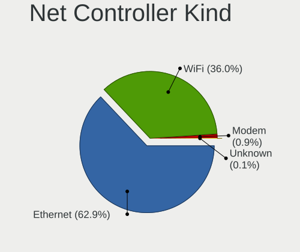

| Kind     | Desktops | Percent |
|----------|----------|---------|
| Ethernet | 474      | 62.95%  |
| WiFi     | 271      | 35.99%  |
| Modem    | 7        | 0.93%   |
| Unknown  | 1        | 0.13%   |

Used Controller
---------------

Currently used network controller

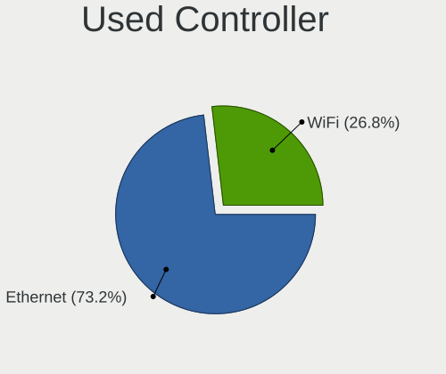

| Kind     | Desktops | Percent |
|----------|----------|---------|
| Ethernet | 368      | 73.16%  |
| WiFi     | 135      | 26.84%  |

NICs
----

Total network controllers on board

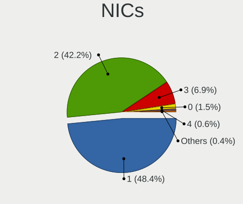

| Total | Desktops | Percent |
|-------|----------|---------|
| 1     | 233      | 48.44%  |
| 2     | 203      | 42.2%   |
| 3     | 33       | 6.86%   |
| 0     | 7        | 1.46%   |
| 4     | 3        | 0.62%   |
| 6     | 1        | 0.21%   |
| 5     | 1        | 0.21%   |

IPv6
----

IPv6 vs IPv4

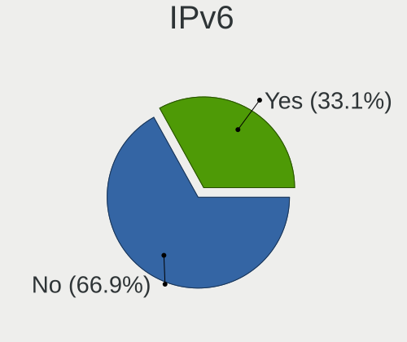

| Used | Desktops | Percent |
|------|----------|---------|
| No   | 322      | 66.94%  |
| Yes  | 159      | 33.06%  |

Bluetooth
---------

Bluetooth Vendor
----------------

Controller vendors

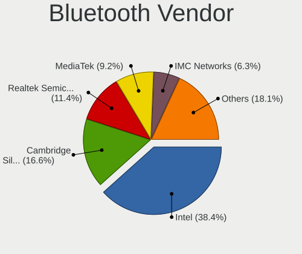

| Vendor                          | Desktops | Percent |
|---------------------------------|----------|---------|
| Intel                           | 104      | 38.38%  |
| Cambridge Silicon Radio         | 45       | 16.61%  |
| Realtek Semiconductor           | 31       | 11.44%  |
| MediaTek                        | 25       | 9.23%   |
| IMC Networks                    | 17       | 6.27%   |
| TP-Link                         | 9        | 3.32%   |
| Foxconn / Hon Hai               | 8        | 2.95%   |
| ASUSTek Computer                | 7        | 2.58%   |
| Qualcomm Atheros Communications | 5        | 1.85%   |
| Unknown                         | 5        | 1.85%   |
| Broadcom                        | 4        | 1.48%   |
| Apple                           | 2        | 0.74%   |
| Actions                         | 2        | 0.74%   |
| Realtek                         | 1        | 0.37%   |
| Ralink                          | 1        | 0.37%   |
| HTC (High Tech Computer)        | 1        | 0.37%   |
| Dynex                           | 1        | 0.37%   |
| Dell                            | 1        | 0.37%   |
| Conwise Technology              | 1        | 0.37%   |
| BUFFALO                         | 1        | 0.37%   |

Bluetooth Model
---------------

Controller models

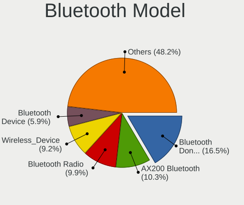

| Model                                                                | Desktops | Percent |
|----------------------------------------------------------------------|----------|---------|
| Cambridge Silicon Radio Bluetooth Dongle (HCI mode)                  | 45       | 16.54%  |
| Intel AX200 Bluetooth                                                | 28       | 10.29%  |
| Realtek Bluetooth Radio                                              | 27       | 9.93%   |
| MediaTek Wireless_Device                                             | 25       | 9.19%   |
| Intel Bluetooth Device                                               | 16       | 5.88%   |
| Intel AX210 Bluetooth                                                | 16       | 5.88%   |
| Intel Bluetooth wireless interface                                   | 14       | 5.15%   |
| Intel Wireless-AC 3168 Bluetooth                                     | 11       | 4.04%   |
| TP-Link TP-T@- UB500 Adapter                                         | 9        | 3.31%   |
| IMC Networks Wireless_Device                                         | 9        | 3.31%   |
| Intel Wireless-AC 9260 Bluetooth Adapter                             | 8        | 2.94%   |
| IMC Networks Bluetooth Radio                                         | 8        | 2.94%   |
| Intel Bluetooth 9460/9560 Jefferson Peak (JfP)                       | 6        | 2.21%   |
| Intel AX201 Bluetooth                                                | 6        | 2.21%   |
| ASUS Broadcom BCM20702A0 Bluetooth                                   | 6        | 2.21%   |
| Unknown                                                              | 5        | 1.84%   |
| Foxconn / Hon Hai Wireless_Device                                    | 4        | 1.47%   |
| Foxconn / Hon Hai Bluetooth Device                                   | 4        | 1.47%   |
| Qualcomm Atheros  Bluetooth Device                                   | 3        | 1.1%    |
| Realtek Bluetooth 5.4 Radio                                          | 2        | 0.74%   |
| Broadcom BCM20702A0 Bluetooth 4.0                                    | 2        | 0.74%   |
| Apple Bluetooth Host Controller                                      | 2        | 0.74%   |
| Actions general adapter                                              | 2        | 0.74%   |
| Realtek Bluetooth 5.3 Radio                                          | 1        | 0.37%   |
| Realtek 802.11ac WLAN Adapter                                        | 1        | 0.37%   |
| Realtek Bluetooth Radio                                              | 1        | 0.37%   |
| Ralink RT3290 Bluetooth                                              | 1        | 0.37%   |
| Qualcomm Atheros AR9462 Bluetooth                                    | 1        | 0.37%   |
| Qualcomm Atheros AR3011 Bluetooth                                    | 1        | 0.37%   |
| HTC (High Tech Computer) Vive Hub Bluetooth 4.1 (Broadcom BCM920703) | 1        | 0.37%   |
| Dynex Bluetooth 4.0 Adapter [Broadcom, 1.12, BCM20702A0]             | 1        | 0.37%   |
| Dell Wireless 365 Bluetooth                                          | 1        | 0.37%   |
| Conwise CW6622                                                       | 1        | 0.37%   |
| BUFFALO Bluetooth Radio                                              | 1        | 0.37%   |
| Broadcom Bluetooth 3.0 Device                                        | 1        | 0.37%   |
| Broadcom BCM20702A0                                                  | 1        | 0.37%   |
| ASUS Qualcomm Bluetooth 4.1                                          | 1        | 0.37%   |

Sound
-----

Sound Vendor
------------

Sound card vendors

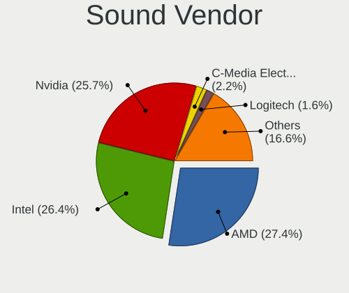

| Vendor                                       | Desktops | Percent |
|----------------------------------------------|----------|---------|
| AMD                                          | 257      | 27.4%   |
| Intel                                        | 248      | 26.44%  |
| Nvidia                                       | 241      | 25.69%  |
| C-Media Electronics                          | 21       | 2.24%   |
| Logitech                                     | 15       | 1.6%    |
| Texas Instruments                            | 12       | 1.28%   |
| JMTek                                        | 12       | 1.28%   |
| Creative Labs                                | 10       | 1.07%   |
| Hewlett-Packard                              | 7        | 0.75%   |
| Generalplus Technology                       | 7        | 0.75%   |
| Razer USA                                    | 6        | 0.64%   |
| ASUSTek Computer                             | 6        | 0.64%   |
| Creative Technology                          | 5        | 0.53%   |
| VIA Technologies                             | 4        | 0.43%   |
| SteelSeries ApS                              | 4        | 0.43%   |
| Samson Technologies                          | 4        | 0.43%   |
| Micro Star International                     | 4        | 0.43%   |
| GN Netcom                                    | 4        | 0.43%   |
| Focusrite-Novation                           | 4        | 0.43%   |
| Trust                                        | 3        | 0.32%   |
| Realtek Semiconductor                        | 3        | 0.32%   |
| Plantronics                                  | 3        | 0.32%   |
| Giga-Byte Technology                         | 3        | 0.32%   |
| FiiO Electronics Technology                  | 3        | 0.32%   |
| BEHRINGER International                      | 3        | 0.32%   |
| Zoran Co. Personal Media Division (Nogatech) | 2        | 0.21%   |
| XMOS                                         | 2        | 0.21%   |
| Tenx Technology                              | 2        | 0.21%   |
| KTMicro                                      | 2        | 0.21%   |
| Dell                                         | 2        | 0.21%   |
| Cambridge Audio                              | 2        | 0.21%   |
| Astro Gaming                                 | 2        | 0.21%   |
| ASRock                                       | 2        | 0.21%   |
| Apple                                        | 2        | 0.21%   |
| 1621_PC_R001_20240330                        | 2        | 0.21%   |
| Zhaoxin                                      | 1        | 0.11%   |
| Yamaha                                       | 1        | 0.11%   |
| USB MICROPHONE                               | 1        | 0.11%   |
| Thesycon Systemsoftware & Consulting         | 1        | 0.11%   |
| TerraTec Electronic                          | 1        | 0.11%   |

Sound Model
-----------

Sound card models

| Model                                                                      | Desktops | Percent |
|----------------------------------------------------------------------------|----------|---------|
| AMD Ryzen HD Audio Controller                                              | 80       | 7.19%   |
| AMD Starship/Matisse HD Audio Controller                                   | 67       | 6.02%   |
| AMD Radeon High Definition Audio Controller                                | 44       | 3.95%   |
| Intel 8 Series/C220 Series Chipset High Definition Audio Controller        | 35       | 3.14%   |
| Intel 200 Series PCH HD Audio                                              | 28       | 2.52%   |
| AMD Renoir/Cezanne HDMI/DP Audio Controller                                | 25       | 2.25%   |
| AMD Family 17h (Models 00h-0fh) HD Audio Controller                        | 25       | 2.25%   |
| Nvidia GP107GL High Definition Audio Controller                            | 24       | 2.16%   |
| AMD SBx00 Azalia (Intel HDA)                                               | 24       | 2.16%   |
| Intel Xeon E3-1200 v3/4th Gen Core Processor HD Audio Controller           | 22       | 1.98%   |
| AMD Navi 21/23 HDMI/DP Audio Controller                                    | 21       | 1.89%   |
| AMD Ellesmere HDMI Audio [Radeon RX 470/480 / 570/580/590]                 | 21       | 1.89%   |
| Intel Raptor Lake High Definition Audio Controller                         | 20       | 1.8%    |
| Intel 6 Series/C200 Series Chipset Family High Definition Audio Controller | 19       | 1.71%   |
| Nvidia GA106 High Definition Audio Controller                              | 18       | 1.62%   |
| Intel Cannon Lake PCH cAVS                                                 | 18       | 1.62%   |
| Nvidia GP104 High Definition Audio Controller                              | 17       | 1.53%   |
| Intel 7 Series/C216 Chipset Family High Definition Audio Controller        | 17       | 1.53%   |
| Nvidia GA104 High Definition Audio Controller                              | 16       | 1.44%   |
| Nvidia GK208 HDMI/DP Audio Controller                                      | 15       | 1.35%   |
| Nvidia GA102 High Definition Audio Controller                              | 15       | 1.35%   |
| Nvidia AD104 High Definition Audio Controller                              | 15       | 1.35%   |
| AMD Navi 31 HDMI/DP Audio                                                  | 14       | 1.26%   |
| Intel 100 Series/C230 Series Chipset Family HD Audio Controller            | 13       | 1.17%   |
| AMD FCH Azalia Controller                                                  | 12       | 1.08%   |
| Intel C610/X99 series chipset HD Audio Controller                          | 11       | 0.99%   |
| Intel Alder Lake-S HD Audio Controller                                     | 11       | 0.99%   |
| Nvidia TU116 High Definition Audio Controller                              | 9        | 0.81%   |
| Nvidia GP106 High Definition Audio Controller                              | 9        | 0.81%   |
| Nvidia TU106 High Definition Audio Controller                              | 8        | 0.72%   |
| Nvidia TU104 HD Audio Controller                                           | 8        | 0.72%   |
| Nvidia GM107 High Definition Audio Controller [GeForce 940MX]              | 8        | 0.72%   |
| Intel 9 Series Chipset Family HD Audio Controller                          | 8        | 0.72%   |
| AMD Navi 10 HDMI Audio                                                     | 8        | 0.72%   |
| AMD Baffin HDMI/DP Audio [Radeon RX 550 640SP / RX 560/560X]               | 8        | 0.72%   |
| Nvidia GP108 High Definition Audio Controller                              | 7        | 0.63%   |
| Nvidia AD106M High Definition Audio Controller                             | 7        | 0.63%   |
| Nvidia AD103 High Definition Audio Controller                              | 7        | 0.63%   |
| Intel C600/X79 series chipset High Definition Audio Controller             | 7        | 0.63%   |
| AMD Raven/Raven2/Fenghuang HDMI/DP Audio Controller                        | 7        | 0.63%   |

Memory
------

Memory Vendor
-------------

Memory module vendors

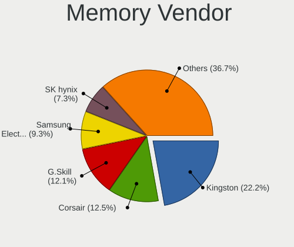

| Vendor                                  | Desktops | Percent |
|-----------------------------------------|----------|---------|
| Kingston                                | 55       | 22.18%  |
| Corsair                                 | 31       | 12.5%   |
| G.Skill                                 | 30       | 12.1%   |
| Samsung Electronics                     | 23       | 9.27%   |
| SK hynix                                | 18       | 7.26%   |
| Unknown                                 | 16       | 6.45%   |
| Team                                    | 13       | 5.24%   |
| Crucial                                 | 11       | 4.44%   |
| Micron Technology                       | 7        | 2.82%   |
| A-DATA Technology                       | 6        | 2.42%   |
| Unknown                                 | 5        | 2.02%   |
| Patriot                                 | 4        | 1.61%   |
| Ramaxel Technology                      | 3        | 1.21%   |
| Wodposit                                | 2        | 0.81%   |
| Silicon Power                           | 2        | 0.81%   |
| Patriot Memory                          | 2        | 0.81%   |
| Juhor                                   | 2        | 0.81%   |
| Atermiter                               | 2        | 0.81%   |
| Unknown (0x0FF4)                        | 1        | 0.4%    |
| Unknown (0x0F9B)                        | 1        | 0.4%    |
| Unknown (0x0B45)                        | 1        | 0.4%    |
| Unknown (0DE3)                          | 1        | 0.4%    |
| Transcend                               | 1        | 0.4%    |
| TeamGroup                               | 1        | 0.4%    |
| Silicon Power Computer & Communications | 1        | 0.4%    |
| PNY                                     | 1        | 0.4%    |
| Nanya Technology                        | 1        | 0.4%    |
| Lexar Co Limited                        | 1        | 0.4%    |
| KINGBANK                                | 1        | 0.4%    |
| Hikstorage                              | 1        | 0.4%    |
| Elpida                                  | 1        | 0.4%    |
| Avant                                   | 1        | 0.4%    |
| Apacer                                  | 1        | 0.4%    |
| A Force                                 | 1        | 0.4%    |

Memory Model
------------

Memory module models

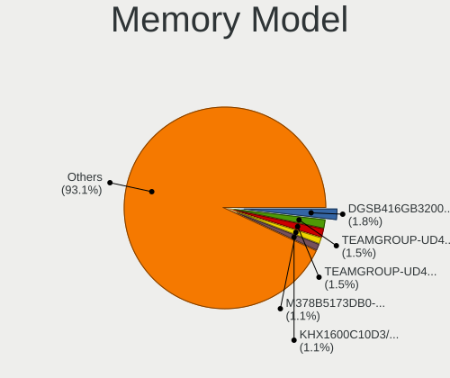

| Model                                                            | Desktops | Percent |
|------------------------------------------------------------------|----------|---------|
| Unknown                                                          | 5        | 1.82%   |
| Team RAM TEAMGROUP-UD4-3200 8GB DIMM DDR4 3800MT/s               | 4        | 1.46%   |
| Team RAM TEAMGROUP-UD4-3200 8GB DIMM DDR4 3733MT/s               | 4        | 1.46%   |
| Samsung RAM M378B5173DB0-CK0 4096MB DIMM DDR3 1600MT/s           | 3        | 1.09%   |
| Kingston RAM KHX1600C10D3/8G 8GB DIMM DDR3 2133MT/s              | 3        | 1.09%   |
| Kingston RAM KF3200C16D4/16GX 16GB DIMM DDR4 3733MT/s            | 3        | 1.09%   |
| G.Skill RAM F5-6000J3038F16G 16GB DIMM DDR5 6000MT/s             | 3        | 1.09%   |
| Wodposit RAM WPBH32D408SWM-16G 16GB SODIMM DDR4 3200MT/s         | 2        | 0.73%   |
| Unknown RAM Module 8GB DIMM DDR3 1600MT/s                        | 2        | 0.73%   |
| Unknown RAM Module 4GB DIMM DDR3 1333MT/s                        | 2        | 0.73%   |
| Unknown RAM Module 2GB DIMM 800MT/s                              | 2        | 0.73%   |
| SK hynix RAM HMT351U6EFR8A-PB 8GB DIMM DDR3 1600MT/s             | 2        | 0.73%   |
| Samsung RAM M378B1G73QH0-YKO 8GB DIMM DDR3 1600MT/s              | 2        | 0.73%   |
| Ramaxel RAM RMR5030MN68F9F1600 4GB DIMM DDR3 1600MT/s            | 2        | 0.73%   |
| Patriot RAM 3200 C16 Series 8GB DIMM DDR4 3600MT/s               | 2        | 0.73%   |
| Patriot Memory RAM 4000 C19 Series 8GB DIMM DDR4 4000MT/s        | 2        | 0.73%   |
| Kingston RAM KHX3200C16D4/8GX 8GB DIMM DDR4 3733MT/s             | 2        | 0.73%   |
| Kingston RAM KHX3200C16D4/16GX 16GB DIMM DDR4 3600MT/s           | 2        | 0.73%   |
| Kingston RAM KHX2133C14D4/8G 8GB DIMM DDR4 3000MT/s              | 2        | 0.73%   |
| Kingston RAM KF560C36-16 16GB DIMM DDR5 6000MT/s                 | 2        | 0.73%   |
| G.Skill RAM F5-6400J3239G16G 16GB DIMM DDR5 7000MT/s             | 2        | 0.73%   |
| G.Skill RAM F4-3000C16-8GISB 8GB DIMM DDR4 3200MT/s              | 2        | 0.73%   |
| G.Skill RAM F3-1333C9-4GNS 4GB DIMM DDR3 1333MT/s                | 2        | 0.73%   |
| Crucial RAM BLS8G4D240FSA.M16FAD 8GB DIMM DDR4 2800MT/s          | 2        | 0.73%   |
| Corsair RAM CMK16GX4M2B3200C16 8GB DIMM DDR4 3600MT/s            | 2        | 0.73%   |
| Unknown RAM Module 8GB DIMM DDR3 800MT/s                         | 1        | 0.36%   |
| Unknown RAM Module 8GB DIMM DDR3 1333MT/s                        | 1        | 0.36%   |
| Unknown RAM Module 8GB DIMM 400MT/s                              | 1        | 0.36%   |
| Unknown RAM Module 8GB DIMM 1600MT/s                             | 1        | 0.36%   |
| Unknown RAM Module 4GB DIMM DDR 1333MT/s                         | 1        | 0.36%   |
| Unknown RAM Module 4GB DIMM 1333MT/s                             | 1        | 0.36%   |
| Unknown RAM Module 2GB SODIMM DDR2 800MT/s                       | 1        | 0.36%   |
| Unknown RAM Module 2GB DIMM DDR2 800MT/s                         | 1        | 0.36%   |
| Unknown RAM Module 2GB DIMM DDR 1333MT/s                         | 1        | 0.36%   |
| Unknown RAM Module 1GB DIMM DDR2 800MT/s                         | 1        | 0.36%   |
| Unknown RAM DDR4 NB 8G 2400 8192MB SODIMM DDR4 2667MT/s          | 1        | 0.36%   |
| Unknown RAM 3733 C17 Series 8192MB DIMM DDR4 2133MT/s            | 1        | 0.36%   |
| Unknown RAM 1600 CL9 Series 8192MB DIMM DDR3 1066MT/s            | 1        | 0.36%   |
| Unknown (0x0FF4) RAM SS42J04NAR-16 16GB SODIMM DDR4 2667MT/s     | 1        | 0.36%   |
| Unknown (0x0F9B) RAM USV4S32C228SP-16C 16GB SODIMM DDR4 3200MT/s | 1        | 0.36%   |

Memory Kind
-----------

Memory module kinds

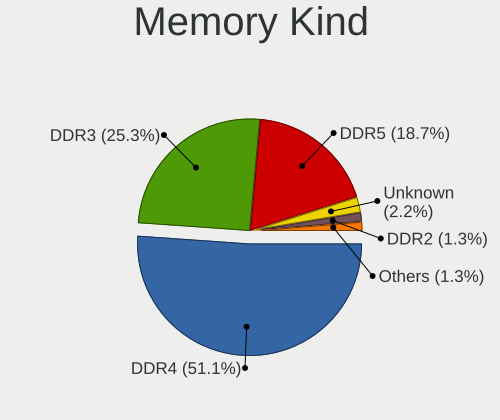

| Kind    | Desktops | Percent |
|---------|----------|---------|
| DDR4    | 115      | 51.11%  |
| DDR3    | 57       | 25.33%  |
| DDR5    | 42       | 18.67%  |
| Unknown | 5        | 2.22%   |
| DDR2    | 3        | 1.33%   |
| SDRAM   | 1        | 0.44%   |
| DRAM    | 1        | 0.44%   |
| DDR     | 1        | 0.44%   |

Memory Form Factor
------------------

Physical design of the memory module

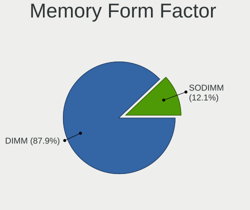

| Name   | Desktops | Percent |
|--------|----------|---------|
| DIMM   | 197      | 87.95%  |
| SODIMM | 27       | 12.05%  |

Memory Size
-----------

Memory module size

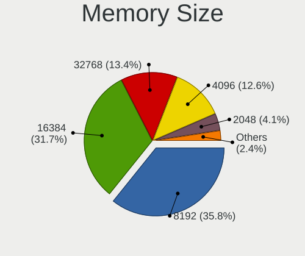

| Size  | Desktops | Percent |
|-------|----------|---------|
| 8192  | 88       | 35.77%  |
| 16384 | 78       | 31.71%  |
| 32768 | 33       | 13.41%  |
| 4096  | 31       | 12.6%   |
| 2048  | 10       | 4.07%   |
| 49152 | 3        | 1.22%   |
| 1024  | 2        | 0.81%   |
| 65536 | 1        | 0.41%   |

Memory Speed
------------

Memory module speed

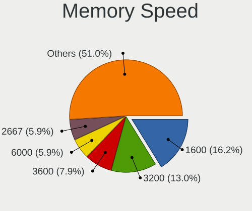

| Speed | Desktops | Percent |
|-------|----------|---------|
| 1600  | 41       | 16.21%  |
| 3200  | 33       | 13.04%  |
| 3600  | 20       | 7.91%   |
| 6000  | 15       | 5.93%   |
| 2667  | 15       | 5.93%   |
| 3733  | 12       | 4.74%   |
| 1333  | 12       | 4.74%   |
| 5600  | 9        | 3.56%   |
| 4800  | 9        | 3.56%   |
| 2400  | 9        | 3.56%   |
| 2133  | 9        | 3.56%   |
| 3800  | 8        | 3.16%   |
| 800   | 7        | 2.77%   |
| 4000  | 5        | 1.98%   |
| 3000  | 5        | 1.98%   |
| 1866  | 3        | 1.19%   |
| 7000  | 2        | 0.79%   |
| 6400  | 2        | 0.79%   |
| 5200  | 2        | 0.79%   |
| 3466  | 2        | 0.79%   |
| 3400  | 2        | 0.79%   |
| 3334  | 2        | 0.79%   |
| 2800  | 2        | 0.79%   |
| 2666  | 2        | 0.79%   |
| 2000  | 2        | 0.79%   |
| 667   | 2        | 0.79%   |
| 12800 | 1        | 0.4%    |
| 6600  | 1        | 0.4%    |
| 6200  | 1        | 0.4%    |
| 5800  | 1        | 0.4%    |
| 4400  | 1        | 0.4%    |
| 4266  | 1        | 0.4%    |
| 3933  | 1        | 0.4%    |
| 3500  | 1        | 0.4%    |
| 3467  | 1        | 0.4%    |
| 3333  | 1        | 0.4%    |
| 3066  | 1        | 0.4%    |
| 3007  | 1        | 0.4%    |
| 2934  | 1        | 0.4%    |
| 2132  | 1        | 0.4%    |

Printers & scanners
-------------------

Printer Vendor
--------------

Printer device vendors

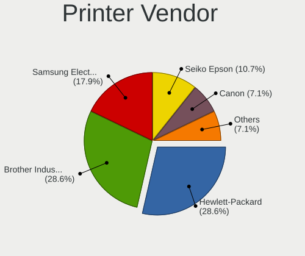

| Vendor              | Desktops | Percent |
|---------------------|----------|---------|
| Hewlett-Packard     | 8        | 28.57%  |
| Brother Industries  | 8        | 28.57%  |
| Samsung Electronics | 5        | 17.86%  |
| Seiko Epson         | 3        | 10.71%  |
| Canon               | 2        | 7.14%   |
| Zebra               | 1        | 3.57%   |
| Pantum              | 1        | 3.57%   |

Printer Model
-------------

Printer device models

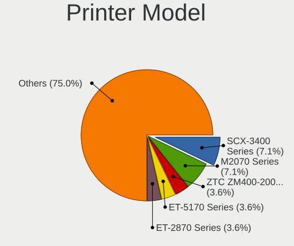

| Model                                 | Desktops | Percent |
|---------------------------------------|----------|---------|
| Samsung SCX-3400 Series               | 2        | 7.14%   |
| Samsung M2070 Series                  | 2        | 7.14%   |
| Zebra ZTC ZM400-200dpi ZPL            | 1        | 3.57%   |
| Seiko Epson ET-5170 Series            | 1        | 3.57%   |
| Seiko Epson ET-2870 Series            | 1        | 3.57%   |
| Seiko Epson ET-2710 Series            | 1        | 3.57%   |
| Samsung ML-1660 Series                | 1        | 3.57%   |
| Pantum P2200W series                  | 1        | 3.57%   |
| HP OfficeJet 4650 series              | 1        | 3.57%   |
| HP OfficeJet 3830 series              | 1        | 3.57%   |
| HP LaserJet 1320                      | 1        | 3.57%   |
| HP LaserJet 1010                      | 1        | 3.57%   |
| HP HP OfficeJet Pro 9020 series       | 1        | 3.57%   |
| HP DeskJet Plus 4100 series           | 1        | 3.57%   |
| HP DeskJet 3630 series                | 1        | 3.57%   |
| HP Color LaserJet Pro M478f-9f        | 1        | 3.57%   |
| Canon PIXMA iP4300 Printer            | 1        | 3.57%   |
| Canon LiDE 400                        | 1        | 3.57%   |
| Brother PT-P700 P-touch Label Printer | 1        | 3.57%   |
| Brother PT-D610BT                     | 1        | 3.57%   |
| Brother MFC-L2710DW series            | 1        | 3.57%   |
| Brother MFC-J460DW                    | 1        | 3.57%   |
| Brother HL-L2300D series              | 1        | 3.57%   |
| Brother HL-3152CDW series             | 1        | 3.57%   |
| Brother HL-2240D series               | 1        | 3.57%   |
| Brother DCP-9020CDW                   | 1        | 3.57%   |

Scanner Vendor
--------------

Scanner device vendors

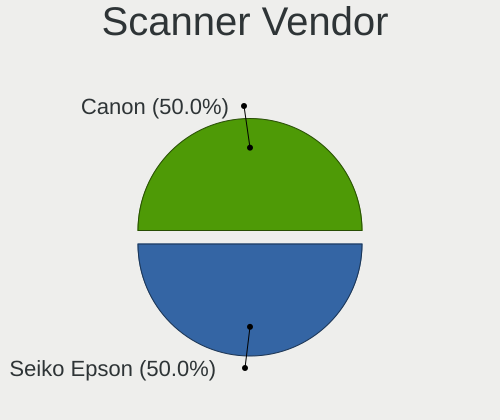

| Vendor      | Desktops | Percent |
|-------------|----------|---------|
| Seiko Epson | 1        | 50%     |
| Canon       | 1        | 50%     |

Scanner Model
-------------

Scanner device models

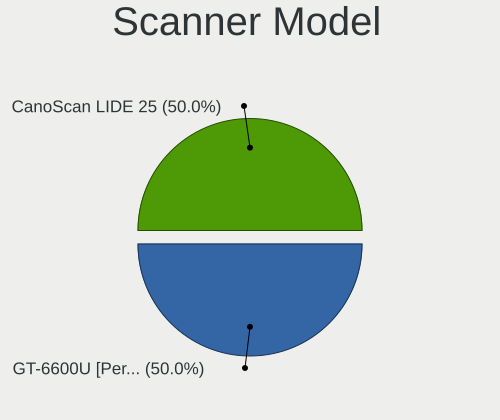

| Model                                 | Desktops | Percent |
|---------------------------------------|----------|---------|
| Seiko Epson GT-6600U [Perfection 610] | 1        | 50%     |
| Canon CanoScan LIDE 25                | 1        | 50%     |

Camera
------

Camera Vendor
-------------

Camera device vendors

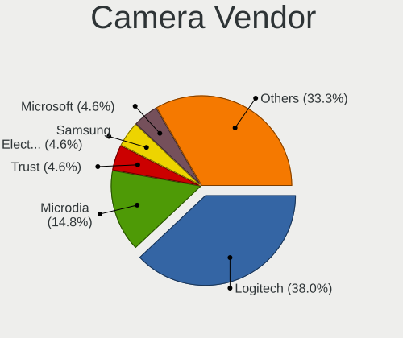

| Vendor                        | Desktops | Percent |
|-------------------------------|----------|---------|
| Logitech                      | 41       | 37.96%  |
| Microdia                      | 16       | 14.81%  |
| Trust                         | 5        | 4.63%   |
| Samsung Electronics           | 5        | 4.63%   |
| Microsoft                     | 5        | 4.63%   |
| Sunplus Innovation Technology | 3        | 2.78%   |
| Jieli Technology              | 3        | 2.78%   |
| Chicony Electronics           | 3        | 2.78%   |
| Z-Star Microelectronics       | 2        | 1.85%   |
| vivo                          | 2        | 1.85%   |
| Realtek Semiconductor         | 2        | 1.85%   |
| Pixart Imaging                | 2        | 1.85%   |
| Generalplus Technology        | 2        | 1.85%   |
| AVerMedia Technologies        | 2        | 1.85%   |
| webcam                        | 1        | 0.93%   |
| Sunplus IT                    | 1        | 0.93%   |
| Sonix Technology              | 1        | 0.93%   |
| NewEye 60                     | 1        | 0.93%   |
| MacroSilicon                  | 1        | 0.93%   |
| Linux Foundation              | 1        | 0.93%   |
| LG Electronics                | 1        | 0.93%   |
| KYE Systems (Mouse Systems)   | 1        | 0.93%   |
| Huawei Technologies           | 1        | 0.93%   |
| Hewlett-Packard               | 1        | 0.93%   |
| Guillemot                     | 1        | 0.93%   |
| GEMBIRD                       | 1        | 0.93%   |
| ezcap                         | 1        | 0.93%   |
| EVGA                          | 1        | 0.93%   |
| eMeet                         | 1        | 0.93%   |

Camera Model
------------

Camera device models

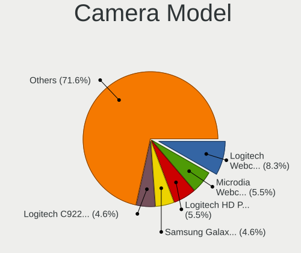

| Model                                   | Desktops | Percent |
|-----------------------------------------|----------|---------|
| Logitech Webcam C270                    | 9        | 8.26%   |
| Microdia Webcam Vitade AF               | 6        | 5.5%    |
| Logitech HD Pro Webcam C920             | 6        | 5.5%    |
| Samsung Galaxy series, misc. (MTP mode) | 5        | 4.59%   |
| Logitech C922 Pro Stream Webcam         | 5        | 4.59%   |
| Microdia USB 2.0 Camera                 | 3        | 2.75%   |
| Microdia Integrated Camera              | 3        | 2.75%   |
| Logitech HD Webcam C525                 | 3        | 2.75%   |
| Logitech C920 PRO HD Webcam             | 3        | 2.75%   |
| Trust Full HD Webcam                    | 2        | 1.83%   |
| Trust 17676 Webcam                      | 2        | 1.83%   |
| Pixart Imaging GE 1.3 MP MiniCam Pro    | 2        | 1.83%   |
| Microsoft LifeCam HD-3000               | 2        | 1.83%   |
| Microdia CyberTrack H7                  | 2        | 1.83%   |
| Logitech Webcam C310                    | 2        | 1.83%   |
| Logitech HD Webcam C615                 | 2        | 1.83%   |
| Jieli USB PHY 2.0                       | 2        | 1.83%   |
| Chicony HP High Definition 1MP Webcam   | 2        | 1.83%   |
| Z-Star Venus USB2.0 Camera              | 1        | 0.92%   |
| Z-Star A4 TECH USB 2.0 Camera J         | 1        | 0.92%   |
| webcam webcam                           | 1        | 0.92%   |
| vivo V2514                              | 1        | 0.92%   |
| vivo V2110                              | 1        | 0.92%   |
| Trust USB Camera                        | 1        | 0.92%   |
| Sunplus IT PC Camera                    | 1        | 0.92%   |
| Sunplus SPCA2281 Web Camera             | 1        | 0.92%   |
| Sunplus NexiGo N940P 2K Webcam          | 1        | 0.92%   |
| Sunplus Full HD webcam                  | 1        | 0.92%   |
| Sonix USB Camera                        | 1        | 0.92%   |
| Realtek HP 2.0MP High Definition Webcam | 1        | 0.92%   |
| Realtek FULL HD 1080P Webcam            | 1        | 0.92%   |
| NewEye 60 NewEye 60                     | 1        | 0.92%   |
| Microsoft LifeCam VX-800                | 1        | 0.92%   |
| Microsoft LifeCam Studio                | 1        | 0.92%   |
| Microsoft LifeCam Cinema                | 1        | 0.92%   |
| Microdia UGREEN Camera                  | 1        | 0.92%   |
| Microdia Sonix USB 2.0 Camera           | 1        | 0.92%   |
| MacroSilicon USB Video                  | 1        | 0.92%   |
| Logitech Webcam C300                    | 1        | 0.92%   |
| Logitech Webcam C250                    | 1        | 0.92%   |

Security
--------

Fingerprint Vendor
------------------

Fingerprint sensor vendors

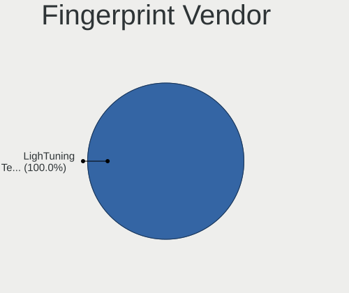

| Vendor                | Desktops | Percent |
|-----------------------|----------|---------|
| LighTuning Technology | 1        | 100%    |

Fingerprint Model
-----------------

Fingerprint sensor models

| Model                         | Desktops | Percent |
|-------------------------------|----------|---------|
| LighTuning Fingerprint Sensor | 1        | 100%    |

Chipcard Vendor
---------------

Chipcard module vendors

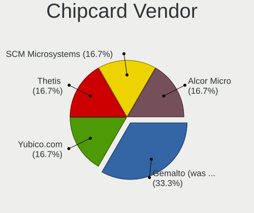

| Vendor                | Desktops | Percent |
|-----------------------|----------|---------|
| Gemalto (was Gemplus) | 2        | 33.33%  |
| Yubico.com            | 1        | 16.67%  |
| Thetis                | 1        | 16.67%  |
| SCM Microsystems      | 1        | 16.67%  |
| Alcor Micro           | 1        | 16.67%  |

Chipcard Model
--------------

Chipcard module models

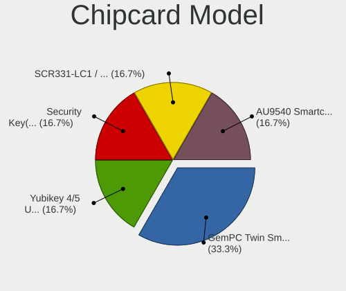

| Model                                                  | Desktops | Percent |
|--------------------------------------------------------|----------|---------|
| Gemalto (was Gemplus) GemPC Twin SmartCard Reader      | 2        | 33.33%  |
| Yubico.com Yubikey 4/5 U2F+CCID                        | 1        | 16.67%  |
| Thetis Security Key(F825)                              | 1        | 16.67%  |
| SCM Microsystems SCR331-LC1 / SCR3310 SmartCard Reader | 1        | 16.67%  |
| Alcor Micro AU9540 Smartcard Reader                    | 1        | 16.67%  |

Unsupported
-----------

Unsupported Devices
-------------------

Total unsupported devices on board

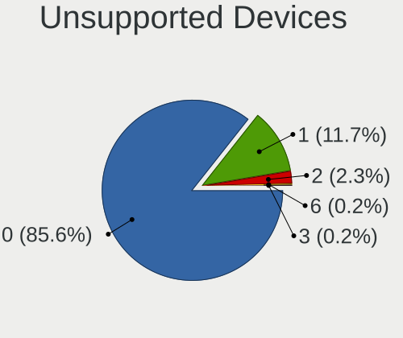

| Total | Desktops | Percent |
|-------|----------|---------|
| 0     | 417      | 85.63%  |
| 1     | 57       | 11.7%   |
| 2     | 11       | 2.26%   |
| 6     | 1        | 0.21%   |
| 3     | 1        | 0.21%   |

Unsupported Device Types
------------------------

Types of unsupported devices

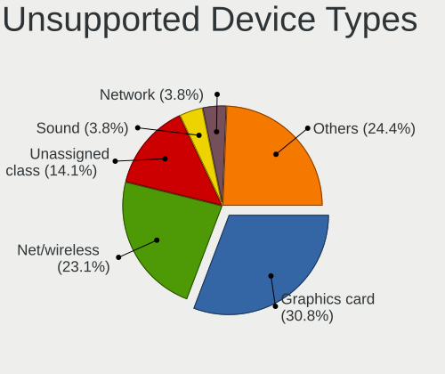

| Type                  | Desktops | Percent |
|-----------------------|----------|---------|
| Graphics card         | 24       | 30.77%  |
| Net/wireless          | 18       | 23.08%  |
| Unassigned class      | 11       | 14.1%   |
| Sound                 | 3        | 3.85%   |
| Network               | 3        | 3.85%   |
| Multimedia controller | 3        | 3.85%   |
| Chipcard              | 3        | 3.85%   |
| Camera                | 3        | 3.85%   |
| Net/ethernet          | 2        | 2.56%   |
| Bluetooth             | 2        | 2.56%   |
| Storage/raid          | 1        | 1.28%   |
| Modem                 | 1        | 1.28%   |
| Firewire controller   | 1        | 1.28%   |
| Fingerprint reader    | 1        | 1.28%   |
| Dvb card              | 1        | 1.28%   |
| Card reader           | 1        | 1.28%   |

