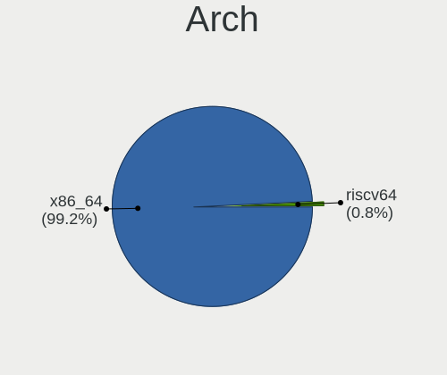
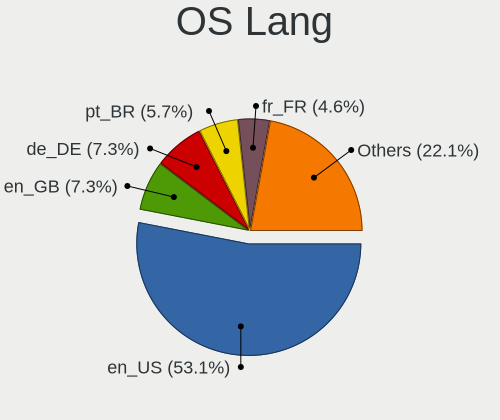
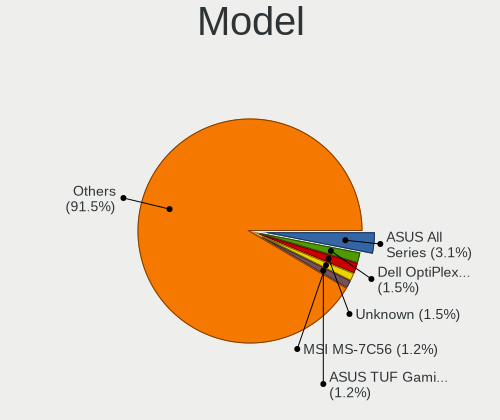
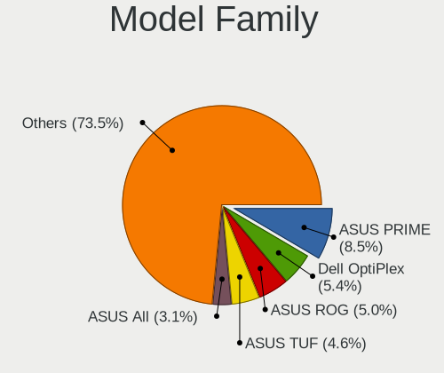
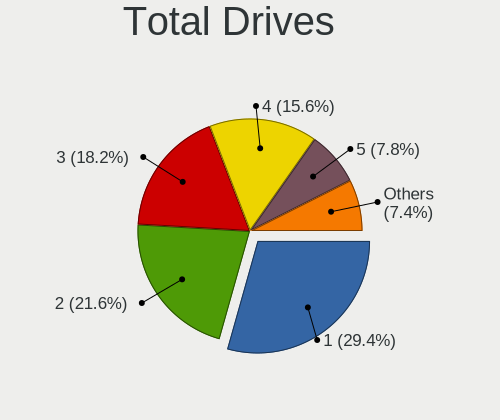
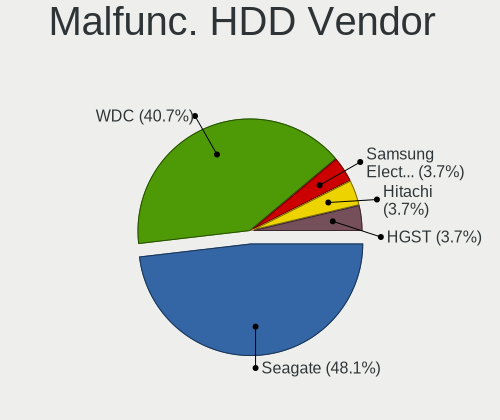
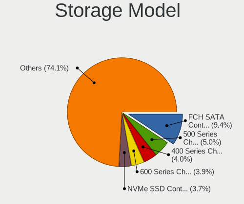
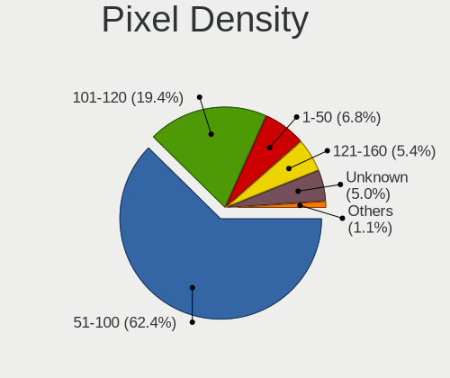
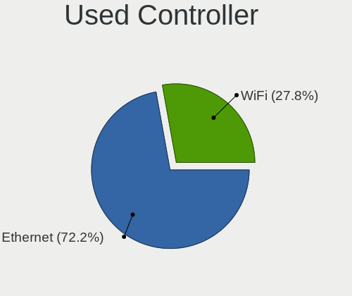
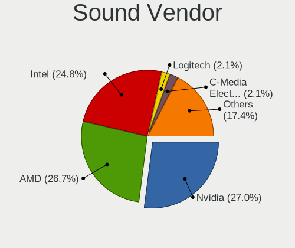

Kubuntu 24.04 - Tested Hardware & Statistics (Desktops)
-------------------------------------------------------

A project to collect tested hardware configurations for Kubuntu 24.04.

Anyone can contribute to this report by the [hw-probe](https://github.com/linuxhw/hw-probe) tool:

    sudo -E hw-probe -all -upload

Please contribute! Especially if your hardware is rare.

Contents
--------

* [ Test Cases ](#test-cases)

* [ System ](#system)
  - [ Kernel                   ](#kernel)
  - [ Kernel Family            ](#kernel-family)
  - [ Kernel Major Ver.        ](#kernel-major-ver)
  - [ Arch                     ](#arch)
  - [ DE                       ](#de)
  - [ Display Server           ](#display-server)
  - [ Display Manager          ](#display-manager)
  - [ OS Lang                  ](#os-lang)
  - [ Boot Mode                ](#boot-mode)
  - [ Filesystem               ](#filesystem)
  - [ Part. scheme             ](#part-scheme)
  - [ Dual Boot with Linux/BSD ](#dual-boot-with-linuxbsd)
  - [ Dual Boot (Win)          ](#dual-boot-win)

* [ Board ](#board)
  - [ Vendor                   ](#vendor)
  - [ Model                    ](#model)
  - [ Model Family             ](#model-family)
  - [ MFG Year                 ](#mfg-year)
  - [ Form Factor              ](#form-factor)
  - [ Secure Boot              ](#secure-boot)
  - [ Coreboot                 ](#coreboot)
  - [ RAM Size                 ](#ram-size)
  - [ RAM Used                 ](#ram-used)
  - [ Total Drives             ](#total-drives)
  - [ Has CD-ROM               ](#has-cd-rom)
  - [ Has Ethernet             ](#has-ethernet)
  - [ Has WiFi                 ](#has-wifi)
  - [ Has Bluetooth            ](#has-bluetooth)

* [ Location ](#location)
  - [ Country                  ](#country)
  - [ City                     ](#city)

* [ Drives ](#drives)
  - [ Drive Vendor             ](#drive-vendor)
  - [ Drive Model              ](#drive-model)
  - [ HDD Vendor               ](#hdd-vendor)
  - [ SSD Vendor               ](#ssd-vendor)
  - [ Drive Kind               ](#drive-kind)
  - [ Drive Connector          ](#drive-connector)
  - [ Drive Size               ](#drive-size)
  - [ Space Total              ](#space-total)
  - [ Space Used               ](#space-used)
  - [ Malfunc. Drives          ](#malfunc-drives)
  - [ Malfunc. Drive Vendor    ](#malfunc-drive-vendor)
  - [ Malfunc. HDD Vendor      ](#malfunc-hdd-vendor)
  - [ Malfunc. Drive Kind      ](#malfunc-drive-kind)
  - [ Failed Drives            ](#failed-drives)
  - [ Failed Drive Vendor      ](#failed-drive-vendor)
  - [ Drive Status             ](#drive-status)

* [ Storage controller ](#storage-controller)
  - [ Storage Vendor           ](#storage-vendor)
  - [ Storage Model            ](#storage-model)
  - [ Storage Kind             ](#storage-kind)

* [ Processor ](#processor)
  - [ CPU Vendor               ](#cpu-vendor)
  - [ CPU Model                ](#cpu-model)
  - [ CPU Model Family         ](#cpu-model-family)
  - [ CPU Cores                ](#cpu-cores)
  - [ CPU Sockets              ](#cpu-sockets)
  - [ CPU Threads              ](#cpu-threads)
  - [ CPU Op-Modes             ](#cpu-op-modes)
  - [ CPU Microcode            ](#cpu-microcode)
  - [ CPU Microarch            ](#cpu-microarch)

* [ Graphics ](#graphics)
  - [ GPU Vendor               ](#gpu-vendor)
  - [ GPU Model                ](#gpu-model)
  - [ GPU Combo                ](#gpu-combo)
  - [ GPU Driver               ](#gpu-driver)
  - [ GPU Memory               ](#gpu-memory)

* [ Monitor ](#monitor)
  - [ Monitor Vendor           ](#monitor-vendor)
  - [ Monitor Model            ](#monitor-model)
  - [ Monitor Resolution       ](#monitor-resolution)
  - [ Monitor Diagonal         ](#monitor-diagonal)
  - [ Monitor Width            ](#monitor-width)
  - [ Aspect Ratio             ](#aspect-ratio)
  - [ Monitor Area             ](#monitor-area)
  - [ Pixel Density            ](#pixel-density)
  - [ Multiple Monitors        ](#multiple-monitors)

* [ Network ](#network)
  - [ Net Controller Vendor    ](#net-controller-vendor)
  - [ Net Controller Model     ](#net-controller-model)
  - [ Wireless Vendor          ](#wireless-vendor)
  - [ Wireless Model           ](#wireless-model)
  - [ Ethernet Vendor          ](#ethernet-vendor)
  - [ Ethernet Model           ](#ethernet-model)
  - [ Net Controller Kind      ](#net-controller-kind)
  - [ Used Controller          ](#used-controller)
  - [ NICs                     ](#nics)
  - [ IPv6                     ](#ipv6)

* [ Bluetooth ](#bluetooth)
  - [ Bluetooth Vendor         ](#bluetooth-vendor)
  - [ Bluetooth Model          ](#bluetooth-model)

* [ Sound ](#sound)
  - [ Sound Vendor             ](#sound-vendor)
  - [ Sound Model              ](#sound-model)

* [ Memory ](#memory)
  - [ Memory Vendor            ](#memory-vendor)
  - [ Memory Model             ](#memory-model)
  - [ Memory Kind              ](#memory-kind)
  - [ Memory Form Factor       ](#memory-form-factor)
  - [ Memory Size              ](#memory-size)
  - [ Memory Speed             ](#memory-speed)

* [ Printers & scanners ](#printers--scanners)
  - [ Printer Vendor           ](#printer-vendor)
  - [ Printer Model            ](#printer-model)
  - [ Scanner Vendor           ](#scanner-vendor)
  - [ Scanner Model            ](#scanner-model)

* [ Camera ](#camera)
  - [ Camera Vendor            ](#camera-vendor)
  - [ Camera Model             ](#camera-model)

* [ Security ](#security)
  - [ Fingerprint Vendor       ](#fingerprint-vendor)
  - [ Fingerprint Model        ](#fingerprint-model)
  - [ Chipcard Vendor          ](#chipcard-vendor)
  - [ Chipcard Model           ](#chipcard-model)

* [ Unsupported ](#unsupported)
  - [ Unsupported Devices      ](#unsupported-devices)
  - [ Unsupported Device Types ](#unsupported-device-types)

Test Cases
----------

Total: 353

| Vendor        | Model                       | Probe                                                      | Date         |
|---------------|-----------------------------|------------------------------------------------------------|--------------|
| Dell          | 0GDG8Y A00                  | [417dd2665a](https://linux-hardware.org/?probe=417dd2665a) | Jan 06, 2025 |
| ASRock        | A520M Phantom Gaming 4      | [55ed055bf7](https://linux-hardware.org/?probe=55ed055bf7) | Jan 05, 2025 |
| ASRock        | A520M Phantom Gaming 4      | [9bd6c2311d](https://linux-hardware.org/?probe=9bd6c2311d) | Jan 05, 2025 |
| Gigabyte      | B760M DS3H DDR4             | [735622d487](https://linux-hardware.org/?probe=735622d487) | Jan 05, 2025 |
| ASUSTek       | M5A97 LE R2.0               | [badfe83ed3](https://linux-hardware.org/?probe=badfe83ed3) | Jan 04, 2025 |
| MACHINIST     | E5-MR9A V1.0                | [2cd6888290](https://linux-hardware.org/?probe=2cd6888290) | Jan 04, 2025 |
| BESSTAR Te... | T3 MRD                      | [a4aa2dfab1](https://linux-hardware.org/?probe=a4aa2dfab1) | Jan 02, 2025 |
| Lenovo        | 3717 SDK0J40700 WIN 3258... | [bc8aa268ef](https://linux-hardware.org/?probe=bc8aa268ef) | Jan 01, 2025 |
| MSI           | X470 GAMING PRO CARBON      | [0a1f200989](https://linux-hardware.org/?probe=0a1f200989) | Jan 01, 2025 |
| ASUSTek       | TUF Gaming B550-PLUS WIF... | [9f7d158933](https://linux-hardware.org/?probe=9f7d158933) | Dec 30, 2024 |
| MSI           | X470 GAMING PRO CARBON      | [6ec37ed4b3](https://linux-hardware.org/?probe=6ec37ed4b3) | Dec 29, 2024 |
| ASRock        | B550 Phantom Gaming-ITX/... | [a3e88e71e3](https://linux-hardware.org/?probe=a3e88e71e3) | Dec 28, 2024 |
| CBR           | A320M.2-VH Challenger       | [1f5e2840d1](https://linux-hardware.org/?probe=1f5e2840d1) | Dec 27, 2024 |
| HP            | 2B29                        | [2bacb97467](https://linux-hardware.org/?probe=2bacb97467) | Dec 26, 2024 |
| ASUSTek       | ROG STRIX B650E-F GAMING... | [ad40c6b991](https://linux-hardware.org/?probe=ad40c6b991) | Dec 23, 2024 |
| Gigabyte      | B450M DS3H V2               | [a0bed8cb3f](https://linux-hardware.org/?probe=a0bed8cb3f) | Dec 23, 2024 |
| Gigabyte      | Z270-HD3P-CF                | [f95d24a4d3](https://linux-hardware.org/?probe=f95d24a4d3) | Dec 22, 2024 |
| Biostar       | B450MX-S                    | [298f913b02](https://linux-hardware.org/?probe=298f913b02) | Dec 20, 2024 |
| Gigabyte      | X570 AORUS MASTER           | [9e02fc3eec](https://linux-hardware.org/?probe=9e02fc3eec) | Dec 19, 2024 |
| Gigabyte      | X570 AORUS MASTER           | [e41eca5240](https://linux-hardware.org/?probe=e41eca5240) | Dec 19, 2024 |
| MSI           | MAG X670E TOMAHAWK WIFI     | [607a9aa50f](https://linux-hardware.org/?probe=607a9aa50f) | Dec 19, 2024 |
| ASUSTek       | P8Z77-V LX                  | [a65cf104b4](https://linux-hardware.org/?probe=a65cf104b4) | Dec 18, 2024 |
| ASRock        | B760M Pro RS/D4 WiFi        | [34bf804bd1](https://linux-hardware.org/?probe=34bf804bd1) | Dec 17, 2024 |
| ASUSTek       | ROG STRIX Z390-E GAMING     | [bbe170f0bc](https://linux-hardware.org/?probe=bbe170f0bc) | Dec 16, 2024 |
| MSI           | B450 GAMING PLUS MAX        | [7beb5cea9f](https://linux-hardware.org/?probe=7beb5cea9f) | Dec 14, 2024 |
| Huanan        | X99-TF                      | [8fd5cc725c](https://linux-hardware.org/?probe=8fd5cc725c) | Dec 10, 2024 |
| ASUSTek       | TUF B450M-PLUS GAMING       | [f3e2067835](https://linux-hardware.org/?probe=f3e2067835) | Dec 10, 2024 |
| ASUSTek       | Z97-C                       | [456449c9b2](https://linux-hardware.org/?probe=456449c9b2) | Dec 08, 2024 |
| Dell          | 0NC2VH A01                  | [d1867f2f69](https://linux-hardware.org/?probe=d1867f2f69) | Dec 08, 2024 |
| Biostar       | B450MX-S                    | [821e6039db](https://linux-hardware.org/?probe=821e6039db) | Dec 08, 2024 |
| ASUSTek       | X99-E WS/USB                | [7d160ef3b0](https://linux-hardware.org/?probe=7d160ef3b0) | Dec 07, 2024 |
| Gigabyte      | B550 GAMING X V2            | [b90a139240](https://linux-hardware.org/?probe=b90a139240) | Dec 07, 2024 |
| MSI           | B650 GAMING PLUS WIFI       | [d025744ff8](https://linux-hardware.org/?probe=d025744ff8) | Dec 06, 2024 |
| ASUSTek       | PRIME B250M-A               | [9c45bca350](https://linux-hardware.org/?probe=9c45bca350) | Dec 05, 2024 |
| Gigabyte      | Q87M-D2H                    | [bcb77899dd](https://linux-hardware.org/?probe=bcb77899dd) | Dec 05, 2024 |
| ASUSTek       | F2A85-M PRO                 | [dc43147214](https://linux-hardware.org/?probe=dc43147214) | Dec 05, 2024 |
| ASUSTek       | PRIME B250M-A               | [0c7c4b2a6e](https://linux-hardware.org/?probe=0c7c4b2a6e) | Dec 04, 2024 |
| ASUSTek       | F2A85-M PRO                 | [fa47a2dbb2](https://linux-hardware.org/?probe=fa47a2dbb2) | Dec 04, 2024 |
| ASUSTek       | V-P8H67E                    | [d1c21b9076](https://linux-hardware.org/?probe=d1c21b9076) | Dec 03, 2024 |
| Gigabyte      | Z370P D3-CF                 | [440c2f4be0](https://linux-hardware.org/?probe=440c2f4be0) | Dec 02, 2024 |
| Dell          | 0PXWHK A00                  | [e732eb7855](https://linux-hardware.org/?probe=e732eb7855) | Dec 02, 2024 |
| ASUSTek       | B85-PRO GAMER               | [12dd784125](https://linux-hardware.org/?probe=12dd784125) | Nov 30, 2024 |
| ASUSTek       | B85-PRO GAMER               | [fb51898c9a](https://linux-hardware.org/?probe=fb51898c9a) | Nov 29, 2024 |
| Nvidia        | M750SLI-DS4                 | [6e2167686c](https://linux-hardware.org/?probe=6e2167686c) | Nov 29, 2024 |
| MSI           | X470 GAMING PRO CARBON      | [ea4aa1f387](https://linux-hardware.org/?probe=ea4aa1f387) | Nov 29, 2024 |
| Intel         | H61                         | [9884456ecc](https://linux-hardware.org/?probe=9884456ecc) | Nov 29, 2024 |
| MSI           | B550M PRO-VDH WIFI          | [52266f066f](https://linux-hardware.org/?probe=52266f066f) | Nov 29, 2024 |
| MSI           | MEG X570 ACE                | [f510dcc7d0](https://linux-hardware.org/?probe=f510dcc7d0) | Nov 28, 2024 |
| ASUSTek       | V-P8H67E                    | [89f2b30be4](https://linux-hardware.org/?probe=89f2b30be4) | Nov 28, 2024 |
| Gigabyte      | Z170-HD3P-CF                | [85900dda2b](https://linux-hardware.org/?probe=85900dda2b) | Nov 27, 2024 |
| Gigabyte      | Z170-HD3P-CF                | [1b415de6dd](https://linux-hardware.org/?probe=1b415de6dd) | Nov 27, 2024 |
| Intel         | H61                         | [06e926278d](https://linux-hardware.org/?probe=06e926278d) | Nov 25, 2024 |
| Dell          | 06D7TR A00                  | [61383033d8](https://linux-hardware.org/?probe=61383033d8) | Nov 24, 2024 |
| MSI           | X470 GAMING PRO CARBON      | [2412cb727b](https://linux-hardware.org/?probe=2412cb727b) | Nov 23, 2024 |
| Gigabyte      | B650 GAMING X AX            | [6375082100](https://linux-hardware.org/?probe=6375082100) | Nov 23, 2024 |
| HP            | 212B                        | [00b61e1475](https://linux-hardware.org/?probe=00b61e1475) | Nov 21, 2024 |
| Lenovo        | 3728 NOK                    | [1af5098c4e](https://linux-hardware.org/?probe=1af5098c4e) | Nov 19, 2024 |
| Biostar       | B450MX-S                    | [867b43aac2](https://linux-hardware.org/?probe=867b43aac2) | Nov 19, 2024 |
| Gigabyte      | P35-DS3L                    | [beaa8307e1](https://linux-hardware.org/?probe=beaa8307e1) | Nov 18, 2024 |
| Gigabyte      | B550 AORUS ELITE V2         | [67dac8ba1a](https://linux-hardware.org/?probe=67dac8ba1a) | Nov 16, 2024 |
| MSI           | MPG B550 GAMING PLUS        | [2d1f399be3](https://linux-hardware.org/?probe=2d1f399be3) | Nov 16, 2024 |
| ASUSTek       | H81T                        | [e5b4d3412b](https://linux-hardware.org/?probe=e5b4d3412b) | Nov 14, 2024 |
| Lenovo        | 36C8 SDK0J40700 WIN 3258... | [58f234c8d9](https://linux-hardware.org/?probe=58f234c8d9) | Nov 13, 2024 |
| ASUSTek       | PRIME A520M-K               | [4036e5d5c8](https://linux-hardware.org/?probe=4036e5d5c8) | Nov 13, 2024 |
| MSI           | PRO Z790-P WIFI             | [b98699dc00](https://linux-hardware.org/?probe=b98699dc00) | Nov 12, 2024 |
| Fisusen Te... | FSX-ALU4L2S Ver:1.2         | [1ad6062abc](https://linux-hardware.org/?probe=1ad6062abc) | Nov 12, 2024 |
| Fisusen Te... | FSX-ALU4L2S Ver:1.2         | [eaa81d85da](https://linux-hardware.org/?probe=eaa81d85da) | Nov 12, 2024 |
| ASUSTek       | TUF Z270 MARK 2             | [de78865944](https://linux-hardware.org/?probe=de78865944) | Nov 10, 2024 |
| Unknown       | Unknown                     | [6fe1fc4bfb](https://linux-hardware.org/?probe=6fe1fc4bfb) | Nov 10, 2024 |
| MSI           | B360 GAMING PRO CARBON      | [8622f5cac7](https://linux-hardware.org/?probe=8622f5cac7) | Nov 07, 2024 |
| ASUSTek       | PRIME X570-P                | [8a99b0cee1](https://linux-hardware.org/?probe=8a99b0cee1) | Nov 06, 2024 |
| Lenovo        | SHARKBAY NOK                | [f7909ba95e](https://linux-hardware.org/?probe=f7909ba95e) | Nov 05, 2024 |
| Nvidia        | M750SLI-DS4                 | [32195a3f35](https://linux-hardware.org/?probe=32195a3f35) | Nov 05, 2024 |
| MSI           | X370 XPOWER GAMING TITAN... | [36275af64b](https://linux-hardware.org/?probe=36275af64b) | Nov 01, 2024 |
| MSI           | X470 GAMING PRO CARBON      | [d9043dc2d5](https://linux-hardware.org/?probe=d9043dc2d5) | Nov 01, 2024 |
| Dell          | 048DY8 A01                  | [48ed169a24](https://linux-hardware.org/?probe=48ed169a24) | Oct 28, 2024 |
| MSI           | B650 GAMING PLUS WIFI       | [d117ba60e9](https://linux-hardware.org/?probe=d117ba60e9) | Oct 27, 2024 |
| ASRock        | Q1900M                      | [9724395584](https://linux-hardware.org/?probe=9724395584) | Oct 25, 2024 |
| MSI           | MPG B650 EDGE WIFI          | [2d03a71708](https://linux-hardware.org/?probe=2d03a71708) | Oct 24, 2024 |
| Gigabyte      | B650 AORUS ELITE AX V2      | [171bf9a6b1](https://linux-hardware.org/?probe=171bf9a6b1) | Oct 23, 2024 |
| ASUSTek       | B85M-E                      | [0750f91898](https://linux-hardware.org/?probe=0750f91898) | Oct 23, 2024 |
| ASUSTek       | TUF Gaming B650M-E WIFI     | [a31f68636f](https://linux-hardware.org/?probe=a31f68636f) | Oct 23, 2024 |
| ASRock        | X470 Taichi                 | [281ae4fd93](https://linux-hardware.org/?probe=281ae4fd93) | Oct 23, 2024 |
| ASUSTek       | STRIX Z270E GAMING          | [788a8234d6](https://linux-hardware.org/?probe=788a8234d6) | Oct 23, 2024 |
| MSI           | MPG X570 GAMING PRO CARB... | [7f42b4b8eb](https://linux-hardware.org/?probe=7f42b4b8eb) | Oct 22, 2024 |
| Dell          | 0D28YY A00                  | [d99284464c](https://linux-hardware.org/?probe=d99284464c) | Oct 22, 2024 |
| Lenovo        | 3148 SDK0J40697 WIN 3305... | [90245dec30](https://linux-hardware.org/?probe=90245dec30) | Oct 22, 2024 |
| Gigabyte      | B550 UD AC-Y1               | [63e2546922](https://linux-hardware.org/?probe=63e2546922) | Oct 22, 2024 |
| MSI           | MPG B650 EDGE WIFI          | [d86b5ef934](https://linux-hardware.org/?probe=d86b5ef934) | Oct 21, 2024 |
| ASUSTek       | ROG STRIX B550-XE GAMING... | [a615005d3d](https://linux-hardware.org/?probe=a615005d3d) | Oct 20, 2024 |
| Gigabyte      | X570 AORUS ELITE            | [1517e4e467](https://linux-hardware.org/?probe=1517e4e467) | Oct 19, 2024 |
| ASUSTek       | P8B75-M LX PLUS             | [84f8b8a516](https://linux-hardware.org/?probe=84f8b8a516) | Oct 19, 2024 |
| Gigabyte      | B760M DS3H AX DDR4          | [90f6d1aeaa](https://linux-hardware.org/?probe=90f6d1aeaa) | Oct 18, 2024 |
| Dell          | 06D7TR A01                  | [4330cba698](https://linux-hardware.org/?probe=4330cba698) | Oct 18, 2024 |
| Gigabyte      | B360M GAMING HD             | [82d4e1568c](https://linux-hardware.org/?probe=82d4e1568c) | Oct 17, 2024 |
| Gigabyte      | B450 AORUS PRO WIFI-CF      | [0ce8e146cf](https://linux-hardware.org/?probe=0ce8e146cf) | Oct 16, 2024 |
| Dell          | 0C3YXR A01                  | [702872562a](https://linux-hardware.org/?probe=702872562a) | Oct 15, 2024 |
| Nvidia        | M750SLI-DS4                 | [597ea8c178](https://linux-hardware.org/?probe=597ea8c178) | Oct 14, 2024 |
| ASUSTek       | Maximus IV GENE-Z/GEN3      | [4d57a6b4ae](https://linux-hardware.org/?probe=4d57a6b4ae) | Oct 12, 2024 |
| ASUSTek       | PRIME B250M-PLUS            | [8e00234742](https://linux-hardware.org/?probe=8e00234742) | Oct 12, 2024 |
| MSI           | B460M PRO-VDH WIFI          | [efedf1a09f](https://linux-hardware.org/?probe=efedf1a09f) | Oct 12, 2024 |
| AZW           | MINI S                      | [9f7e9cafb9](https://linux-hardware.org/?probe=9f7e9cafb9) | Oct 11, 2024 |
| Gigabyte      | A320M-S2H-CF                | [786357d8a3](https://linux-hardware.org/?probe=786357d8a3) | Oct 10, 2024 |
| Gigabyte      | B450M DS3H V2               | [2b9caff686](https://linux-hardware.org/?probe=2b9caff686) | Oct 09, 2024 |
| MSI           | B550M PRO                   | [1567bd14d8](https://linux-hardware.org/?probe=1567bd14d8) | Oct 09, 2024 |
| MSI           | H61M-P21                    | [1dbbce13c7](https://linux-hardware.org/?probe=1dbbce13c7) | Oct 08, 2024 |
| ASUSTek       | P7P55 LX                    | [bf4370907f](https://linux-hardware.org/?probe=bf4370907f) | Oct 07, 2024 |
| Gigabyte      | EX58-UD5                    | [5880d0b553](https://linux-hardware.org/?probe=5880d0b553) | Oct 07, 2024 |
| MSI           | X470 GAMING PRO CARBON      | [a6f1e4b465](https://linux-hardware.org/?probe=a6f1e4b465) | Oct 05, 2024 |
| Gigabyte      | B450M DS3H V2               | [d04f626162](https://linux-hardware.org/?probe=d04f626162) | Oct 05, 2024 |
| Dell          | 0WR7PY A01                  | [77b343aeba](https://linux-hardware.org/?probe=77b343aeba) | Oct 05, 2024 |
| Dell          | 0DR845                      | [0f42ddcf61](https://linux-hardware.org/?probe=0f42ddcf61) | Oct 04, 2024 |
| MSI           | Z97M-G43                    | [ae53772186](https://linux-hardware.org/?probe=ae53772186) | Oct 03, 2024 |
| MSI           | Z97M-G43                    | [4f32e59ad9](https://linux-hardware.org/?probe=4f32e59ad9) | Oct 03, 2024 |
| ASUSTek       | PRIME B550-PLUS             | [41921a1eeb](https://linux-hardware.org/?probe=41921a1eeb) | Oct 03, 2024 |
| Pegatron      | Benicia                     | [da155fec72](https://linux-hardware.org/?probe=da155fec72) | Oct 02, 2024 |
| ASUSTek       | PRIME B350M-A               | [9f9436db09](https://linux-hardware.org/?probe=9f9436db09) | Oct 02, 2024 |
| ASRock        | B650M-H/M.2+                | [40445bd99a](https://linux-hardware.org/?probe=40445bd99a) | Oct 02, 2024 |
| ASUSTek       | Z97-A                       | [f490208f34](https://linux-hardware.org/?probe=f490208f34) | Oct 01, 2024 |
| Dell          | 0CXR46 A00                  | [407b847faa](https://linux-hardware.org/?probe=407b847faa) | Sep 30, 2024 |
| Dell          | 048DY8 A01                  | [909949bed3](https://linux-hardware.org/?probe=909949bed3) | Sep 30, 2024 |
| HP            | 212B                        | [8a25cf82be](https://linux-hardware.org/?probe=8a25cf82be) | Sep 30, 2024 |
| ASRock        | Z690 PG Velocita            | [3cca718666](https://linux-hardware.org/?probe=3cca718666) | Sep 29, 2024 |
| Gigabyte      | P35-DS3L                    | [199f033892](https://linux-hardware.org/?probe=199f033892) | Sep 29, 2024 |
| Gigabyte      | P35-DS3L                    | [c3ce9fa5d8](https://linux-hardware.org/?probe=c3ce9fa5d8) | Sep 28, 2024 |
| Dell          | 0F6X5P A00                  | [fc052cba3c](https://linux-hardware.org/?probe=fc052cba3c) | Sep 28, 2024 |
| Gigabyte      | GA-A75M-D2H                 | [f62a1a679c](https://linux-hardware.org/?probe=f62a1a679c) | Sep 28, 2024 |
| Dell          | 0JGM7F A00                  | [b7edac6094](https://linux-hardware.org/?probe=b7edac6094) | Sep 28, 2024 |
| MSI           | 760GM -E51                  | [88f6fb3c64](https://linux-hardware.org/?probe=88f6fb3c64) | Sep 28, 2024 |
| Dell          | 0WR7PY A02                  | [bc0335d49f](https://linux-hardware.org/?probe=bc0335d49f) | Sep 27, 2024 |
| ASUSTek       | ROG STRIX X670E-E GAMING... | [e1ead454b9](https://linux-hardware.org/?probe=e1ead454b9) | Sep 26, 2024 |
| Gigabyte      | GA-78LMT-USB3               | [4d7ee90e04](https://linux-hardware.org/?probe=4d7ee90e04) | Sep 24, 2024 |
| Gigabyte      | A520M DS3H V2               | [7e4ec3213b](https://linux-hardware.org/?probe=7e4ec3213b) | Sep 23, 2024 |
| Dell          | 0F6X5P A00                  | [0c54dd2ad4](https://linux-hardware.org/?probe=0c54dd2ad4) | Sep 22, 2024 |
| MSI           | 990FXA-GD80                 | [4e64b3d464](https://linux-hardware.org/?probe=4e64b3d464) | Sep 21, 2024 |
| Gigabyte      | B550M DS3H                  | [eccf46ea1d](https://linux-hardware.org/?probe=eccf46ea1d) | Sep 21, 2024 |
| MSI           | MPG Z390 GAMING PLUS        | [13c4edab38](https://linux-hardware.org/?probe=13c4edab38) | Sep 20, 2024 |
| GEEKOM        | A7                          | [61bb59d773](https://linux-hardware.org/?probe=61bb59d773) | Sep 16, 2024 |
| Dell          | 0PXWHK A00                  | [64ca0b3da3](https://linux-hardware.org/?probe=64ca0b3da3) | Sep 16, 2024 |
| ASUSTek       | TUF Gaming X570-PLUS        | [4d4fad6d57](https://linux-hardware.org/?probe=4d4fad6d57) | Sep 15, 2024 |
| ASUSTek       | PRIME B450M-A               | [72c90d2d0c](https://linux-hardware.org/?probe=72c90d2d0c) | Sep 14, 2024 |
| Intel         | B75                         | [95c46ed60c](https://linux-hardware.org/?probe=95c46ed60c) | Sep 14, 2024 |
| ASUSTek       | PRIME X670-P WIFI           | [c85b492885](https://linux-hardware.org/?probe=c85b492885) | Sep 13, 2024 |
| ASUSTek       | ROG STRIX Z370-E GAMING     | [968fd5975e](https://linux-hardware.org/?probe=968fd5975e) | Sep 11, 2024 |
| Dell          | 048DY8 A01                  | [abc608fa11](https://linux-hardware.org/?probe=abc608fa11) | Sep 11, 2024 |
| Gigabyte      | 970A-DS3                    | [431476d6e8](https://linux-hardware.org/?probe=431476d6e8) | Sep 11, 2024 |
| Lenovo        | SHARKBAY SDK0E50510 WIN     | [d0c5441818](https://linux-hardware.org/?probe=d0c5441818) | Sep 10, 2024 |
| ASUSTek       | ROG STRIX B550-F GAMING     | [dd74657516](https://linux-hardware.org/?probe=dd74657516) | Sep 10, 2024 |
| MSI           | MPG Z390 GAMING PRO CARB... | [fb30c3df6a](https://linux-hardware.org/?probe=fb30c3df6a) | Sep 10, 2024 |
| MSI           | MPG Z390 GAMING PRO CARB... | [fe1552023e](https://linux-hardware.org/?probe=fe1552023e) | Sep 10, 2024 |
| ASUSTek       | ROG STRIX Z790-I GAMING ... | [892913fe0d](https://linux-hardware.org/?probe=892913fe0d) | Sep 08, 2024 |
| ASUSTek       | ROG STRIX B550-F GAMING     | [0f08c484b0](https://linux-hardware.org/?probe=0f08c484b0) | Sep 08, 2024 |
| Intel         | DZ68DB AAG27985-101         | [2bb7aed3d1](https://linux-hardware.org/?probe=2bb7aed3d1) | Sep 08, 2024 |
| ASUSTek       | TUF Gaming B450M-PRO II     | [bcd7fd5eb4](https://linux-hardware.org/?probe=bcd7fd5eb4) | Sep 08, 2024 |
| Lenovo        | MAHOBAY NOK                 | [f401d0f3d7](https://linux-hardware.org/?probe=f401d0f3d7) | Sep 07, 2024 |
| ASUSTek       | Maximus VI HERO             | [64da4e01a4](https://linux-hardware.org/?probe=64da4e01a4) | Sep 07, 2024 |
| Acer          | Aspire GX-785               | [e50410f0ed](https://linux-hardware.org/?probe=e50410f0ed) | Sep 05, 2024 |
| Acer          | Aspire GX-785               | [f11ea56e9e](https://linux-hardware.org/?probe=f11ea56e9e) | Sep 05, 2024 |
| ASUSTek       | PRIME B650M-A II            | [f6a7476614](https://linux-hardware.org/?probe=f6a7476614) | Sep 05, 2024 |
| Gigabyte      | Z77X-D3H                    | [1714ec1aaf](https://linux-hardware.org/?probe=1714ec1aaf) | Sep 04, 2024 |
| Dell          | 0DR845                      | [7385610ecd](https://linux-hardware.org/?probe=7385610ecd) | Sep 04, 2024 |
| GMKtec        | NucBox M6                   | [c0aa2b18b2](https://linux-hardware.org/?probe=c0aa2b18b2) | Sep 02, 2024 |
| GMKtec        | NucBox M6                   | [a5236d6708](https://linux-hardware.org/?probe=a5236d6708) | Sep 02, 2024 |
| ASUSTek       | H81M-CS/BR                  | [21197e94df](https://linux-hardware.org/?probe=21197e94df) | Sep 02, 2024 |
| Gigabyte      | G31M-S2C                    | [29671c0af6](https://linux-hardware.org/?probe=29671c0af6) | Sep 02, 2024 |
| Gigabyte      | H81M-DS2                    | [cb4bfa7983](https://linux-hardware.org/?probe=cb4bfa7983) | Sep 01, 2024 |
| Unknown       | Unknown                     | [35b563fbe4](https://linux-hardware.org/?probe=35b563fbe4) | Sep 01, 2024 |
| Unknown       | Unknown                     | [6f7a85fa0d](https://linux-hardware.org/?probe=6f7a85fa0d) | Sep 01, 2024 |
| MSI           | MPG X570 GAMING PLUS        | [d9466094dd](https://linux-hardware.org/?probe=d9466094dd) | Sep 01, 2024 |
| Intel         | X99                         | [ae686462f8](https://linux-hardware.org/?probe=ae686462f8) | Aug 31, 2024 |
| ASRock Ind... | 4X4-7000 Series/D5          | [b1e161911d](https://linux-hardware.org/?probe=b1e161911d) | Aug 31, 2024 |
| ASUSTek       | PRIME B650-PLUS             | [ab12851d28](https://linux-hardware.org/?probe=ab12851d28) | Aug 30, 2024 |
| ASUSTek       | H97-PLUS                    | [2ddf6a58fd](https://linux-hardware.org/?probe=2ddf6a58fd) | Aug 29, 2024 |
| MSI           | B760 GAMING PLUS WIFI       | [48e74e492a](https://linux-hardware.org/?probe=48e74e492a) | Aug 29, 2024 |
| ASUSTek       | Z170-A                      | [6c1129e7e6](https://linux-hardware.org/?probe=6c1129e7e6) | Aug 27, 2024 |
| Dell          | 0WR7PY A01                  | [eb98108706](https://linux-hardware.org/?probe=eb98108706) | Aug 26, 2024 |
| ASUSTek       | PRIME X670-P                | [84186c6be7](https://linux-hardware.org/?probe=84186c6be7) | Aug 25, 2024 |
| Dell          | 0WR7PY A01                  | [42c4b0b64e](https://linux-hardware.org/?probe=42c4b0b64e) | Aug 24, 2024 |
| Olidata       | ALICON AI2S-A21 0.41        | [07fa7b2207](https://linux-hardware.org/?probe=07fa7b2207) | Aug 23, 2024 |
| Foxconn       | H61MXL/H61MXL-K             | [d00e0f2aa0](https://linux-hardware.org/?probe=d00e0f2aa0) | Aug 22, 2024 |
| GEEKOM        | A5                          | [f6667e67e6](https://linux-hardware.org/?probe=f6667e67e6) | Aug 22, 2024 |
| HP            | 1906                        | [a08dcad0b1](https://linux-hardware.org/?probe=a08dcad0b1) | Aug 19, 2024 |
| HP            | 18E6                        | [b930cd6025](https://linux-hardware.org/?probe=b930cd6025) | Aug 19, 2024 |
| Gigabyte      | H61M-DS2 DVI                | [a9fd6f75e3](https://linux-hardware.org/?probe=a9fd6f75e3) | Aug 17, 2024 |
| MSI           | B450 TOMAHAWK MAX           | [7de01582ba](https://linux-hardware.org/?probe=7de01582ba) | Aug 16, 2024 |
| MSI           | MPG B550 GAMING EDGE WIF... | [d1d78a1afa](https://linux-hardware.org/?probe=d1d78a1afa) | Aug 15, 2024 |
| ASUSTek       | PRIME B650M-A II            | [e9650bcedb](https://linux-hardware.org/?probe=e9650bcedb) | Aug 14, 2024 |
| ASUSTek       | TUF Gaming X570-PLUS        | [5aa1d7c5fa](https://linux-hardware.org/?probe=5aa1d7c5fa) | Aug 13, 2024 |
| Unknown       | Unknown                     | [7e50390403](https://linux-hardware.org/?probe=7e50390403) | Aug 12, 2024 |
| ASUSTek       | B85-PRO GAMER               | [24346c7b11](https://linux-hardware.org/?probe=24346c7b11) | Aug 09, 2024 |
| ASUSTek       | ROG STRIX B650E-E GAMING... | [afc3b37f5f](https://linux-hardware.org/?probe=afc3b37f5f) | Aug 09, 2024 |
| ASUSTek       | M4N68T-M LE                 | [356a623cc0](https://linux-hardware.org/?probe=356a623cc0) | Aug 05, 2024 |
| Lenovo        | SHARKBAY NOK                | [6956b94b89](https://linux-hardware.org/?probe=6956b94b89) | Aug 05, 2024 |
| Dell          | 0GY6Y8 A03                  | [fcd7a86ca6](https://linux-hardware.org/?probe=fcd7a86ca6) | Aug 02, 2024 |
| Gigabyte      | B650 GAMING X AX            | [e5c47e1119](https://linux-hardware.org/?probe=e5c47e1119) | Aug 02, 2024 |
| Dell          | 0GY6Y8 A03                  | [418ebc291b](https://linux-hardware.org/?probe=418ebc291b) | Aug 02, 2024 |
| ASRock        | B450 Steel Legend           | [c30cb81663](https://linux-hardware.org/?probe=c30cb81663) | Aug 01, 2024 |
| ASRock        | B450 Steel Legend           | [54b25b7058](https://linux-hardware.org/?probe=54b25b7058) | Aug 01, 2024 |
| MSI           | MPG B550 GAMING PLUS        | [ce2d2ebef8](https://linux-hardware.org/?probe=ce2d2ebef8) | Jul 30, 2024 |
| Gigabyte      | GA-890XA-UD3                | [7fa0a90371](https://linux-hardware.org/?probe=7fa0a90371) | Jul 29, 2024 |
| ASUSTek       | PRIME B350M-A               | [b0359d6d88](https://linux-hardware.org/?probe=b0359d6d88) | Jul 28, 2024 |
| MSI           | B450M-A PRO MAX             | [456c72e5f8](https://linux-hardware.org/?probe=456c72e5f8) | Jul 27, 2024 |
| ASUSTek       | B85-PRO GAMER               | [8ba5d05428](https://linux-hardware.org/?probe=8ba5d05428) | Jul 26, 2024 |
| ASUSTek       | TUF Gaming X570-PRO         | [9012ef4428](https://linux-hardware.org/?probe=9012ef4428) | Jul 25, 2024 |
| Packard Be... | IMEDIA S3850                | [da5e573428](https://linux-hardware.org/?probe=da5e573428) | Jul 24, 2024 |
| ASUSTek       | TUF Gaming X670E-PLUS       | [ff4342e65c](https://linux-hardware.org/?probe=ff4342e65c) | Jul 24, 2024 |
| ASUSTek       | TUF Gaming X570-PLUS        | [7645946eaa](https://linux-hardware.org/?probe=7645946eaa) | Jul 24, 2024 |
| Lenovo        | MAHOBAY Win8 MM DPK IPG     | [72f48be8d0](https://linux-hardware.org/?probe=72f48be8d0) | Jul 22, 2024 |
| HP            | 158B                        | [8968fc3701](https://linux-hardware.org/?probe=8968fc3701) | Jul 22, 2024 |
| ASRock        | X470 Gaming K4              | [9483400c1a](https://linux-hardware.org/?probe=9483400c1a) | Jul 20, 2024 |
| ASRock        | Z790 PG Lightning           | [0cb6138a92](https://linux-hardware.org/?probe=0cb6138a92) | Jul 20, 2024 |
| MSI           | MAG X570 TOMAHAWK WIFI      | [f5bc2b848f](https://linux-hardware.org/?probe=f5bc2b848f) | Jul 18, 2024 |
| ASUSTek       | PRIME B450M-K               | [eb0dfe72bd](https://linux-hardware.org/?probe=eb0dfe72bd) | Jul 18, 2024 |
| ASUSTek       | ROG STRIX Z790-I GAMING ... | [048e081f26](https://linux-hardware.org/?probe=048e081f26) | Jul 16, 2024 |
| Intel         | DH55HC AAE70933-505         | [dc2ae2fa5c](https://linux-hardware.org/?probe=dc2ae2fa5c) | Jul 15, 2024 |
| ASUSTek       | ROG STRIX X570-E GAMING ... | [c97f769f84](https://linux-hardware.org/?probe=c97f769f84) | Jul 14, 2024 |
| Acer          | Revo RN96                   | [cb7d128955](https://linux-hardware.org/?probe=cb7d128955) | Jul 13, 2024 |
| HP            | 158B                        | [fd2a4a4a87](https://linux-hardware.org/?probe=fd2a4a4a87) | Jul 13, 2024 |
| Acer          | Revo RN96                   | [815e942bf4](https://linux-hardware.org/?probe=815e942bf4) | Jul 11, 2024 |
| Dell          | 048DY8 A01                  | [43d9c11fed](https://linux-hardware.org/?probe=43d9c11fed) | Jul 11, 2024 |
| Dell          | 048DY8 A01                  | [207f109f0a](https://linux-hardware.org/?probe=207f109f0a) | Jul 10, 2024 |
| MSI           | MAG X570 TOMAHAWK WIFI      | [c8b98f8a09](https://linux-hardware.org/?probe=c8b98f8a09) | Jul 09, 2024 |
| Lenovo        | MAHOBAY Win8 MM DPK IPG     | [07c5cc4b07](https://linux-hardware.org/?probe=07c5cc4b07) | Jul 09, 2024 |
| ASUSTek       | TUF Gaming X670E-PLUS       | [3e55966cd3](https://linux-hardware.org/?probe=3e55966cd3) | Jul 08, 2024 |
| Dell          | 0Y2MRG A00                  | [c88be2fac9](https://linux-hardware.org/?probe=c88be2fac9) | Jul 08, 2024 |
| Dell          | 08NPPY A00                  | [086483448f](https://linux-hardware.org/?probe=086483448f) | Jul 08, 2024 |
| Dell          | 0Y2MRG A00                  | [5ec24c65cc](https://linux-hardware.org/?probe=5ec24c65cc) | Jul 07, 2024 |
| MSI           | X570-A PRO                  | [ce09faf63d](https://linux-hardware.org/?probe=ce09faf63d) | Jul 07, 2024 |
| ASUSTek       | PRIME B550M-A               | [f0d08f6a84](https://linux-hardware.org/?probe=f0d08f6a84) | Jul 06, 2024 |
| Dell          | 048DY8 A01                  | [33f31c4a24](https://linux-hardware.org/?probe=33f31c4a24) | Jul 05, 2024 |
| Dell          | 048DY8 A01                  | [23260822b3](https://linux-hardware.org/?probe=23260822b3) | Jul 05, 2024 |
| MSI           | Z790 GAMING PLUS WIFI       | [0e9c2e373c](https://linux-hardware.org/?probe=0e9c2e373c) | Jul 05, 2024 |
| Gigabyte      | X570S AERO G                | [843ab4b92c](https://linux-hardware.org/?probe=843ab4b92c) | Jul 03, 2024 |
| Dell          | 0K240Y A01                  | [7e1d841ef5](https://linux-hardware.org/?probe=7e1d841ef5) | Jul 03, 2024 |
| Gigabyte      | A320M-S2H-CF                | [e14db79fb1](https://linux-hardware.org/?probe=e14db79fb1) | Jul 02, 2024 |
| Intel         | HM570                       | [0140ed07ec](https://linux-hardware.org/?probe=0140ed07ec) | Jul 02, 2024 |
| HP            | 2AFA                        | [0a7720ada0](https://linux-hardware.org/?probe=0a7720ada0) | Jul 01, 2024 |
| HP            | 2AFA                        | [14609f713d](https://linux-hardware.org/?probe=14609f713d) | Jul 01, 2024 |
| MSI           | PRO Z790-P WIFI             | [7fcd6c5aae](https://linux-hardware.org/?probe=7fcd6c5aae) | Jul 01, 2024 |
| HP            | 8876 11                     | [3e37ce6409](https://linux-hardware.org/?probe=3e37ce6409) | Jun 30, 2024 |
| HP            | 2129                        | [8999b4e714](https://linux-hardware.org/?probe=8999b4e714) | Jun 29, 2024 |
| Lenovo        | MAHOBAY 0B98401 PRO         | [6c7bcd021d](https://linux-hardware.org/?probe=6c7bcd021d) | Jun 29, 2024 |
| ASUSTek       | M5A78L-M PLUS/USB3          | [c58a112703](https://linux-hardware.org/?probe=c58a112703) | Jun 29, 2024 |
| Lenovo        | MAHOBAY 0B98401 PRO         | [de32ab8e14](https://linux-hardware.org/?probe=de32ab8e14) | Jun 28, 2024 |
| MSI           | MAG Z790 TOMAHAWK WIFI D... | [d50c33c9d4](https://linux-hardware.org/?probe=d50c33c9d4) | Jun 27, 2024 |
| ASUSTek       | TUF Gaming X670E-PLUS       | [0e38c9ffa2](https://linux-hardware.org/?probe=0e38c9ffa2) | Jun 27, 2024 |
| ASUSTek       | TUF Gaming X670E-PLUS       | [5bd2fbd2ba](https://linux-hardware.org/?probe=5bd2fbd2ba) | Jun 27, 2024 |
| Intel         | H81                         | [ede844f96a](https://linux-hardware.org/?probe=ede844f96a) | Jun 27, 2024 |
| ASRock        | Z270 Taichi                 | [590fbdc611](https://linux-hardware.org/?probe=590fbdc611) | Jun 26, 2024 |
| ASUSTek       | PRIME B550-PLUS             | [d3672e758d](https://linux-hardware.org/?probe=d3672e758d) | Jun 25, 2024 |
| Gigabyte      | Z590 AORUS PRO AX           | [23b1acf284](https://linux-hardware.org/?probe=23b1acf284) | Jun 25, 2024 |
| ASUSTek       | ProArt Z790-CREATOR WIFI    | [0e3b3cfc57](https://linux-hardware.org/?probe=0e3b3cfc57) | Jun 25, 2024 |
| ASUSTek       | TUF Gaming X570-PLUS        | [ceb19f4768](https://linux-hardware.org/?probe=ceb19f4768) | Jun 23, 2024 |
| ASUSTek       | PRIME B760M-A D4            | [cdb8159601](https://linux-hardware.org/?probe=cdb8159601) | Jun 23, 2024 |
| ASUSTek       | Pro WS WRX80E-SAGE SE WI... | [392cb57f53](https://linux-hardware.org/?probe=392cb57f53) | Jun 22, 2024 |
| ASUSTek       | TUF Gaming B450M-PRO S      | [164cc5266c](https://linux-hardware.org/?probe=164cc5266c) | Jun 22, 2024 |
| ASUSTek       | M5A97 EVO R2.0              | [40127dadf5](https://linux-hardware.org/?probe=40127dadf5) | Jun 21, 2024 |
| ASUSTek       | PRIME B360M-A               | [f81159ea35](https://linux-hardware.org/?probe=f81159ea35) | Jun 19, 2024 |
| MSI           | MAG X570 TOMAHAWK WIFI      | [68d634239b](https://linux-hardware.org/?probe=68d634239b) | Jun 18, 2024 |
| MSI           | 970 GAMING                  | [7071b11ba7](https://linux-hardware.org/?probe=7071b11ba7) | Jun 18, 2024 |
| ASUSTek       | PRIME B450M-A II            | [3ac1eff1c8](https://linux-hardware.org/?probe=3ac1eff1c8) | Jun 18, 2024 |
| HP            | 18E7                        | [9a6371efa9](https://linux-hardware.org/?probe=9a6371efa9) | Jun 15, 2024 |
| Gigabyte      | Z590 AORUS PRO AX           | [2bdbfd5ccd](https://linux-hardware.org/?probe=2bdbfd5ccd) | Jun 15, 2024 |
| Dell          | 0HY9JP A00                  | [3c365b04b3](https://linux-hardware.org/?probe=3c365b04b3) | Jun 15, 2024 |
| Intel         | H81                         | [f0a726fada](https://linux-hardware.org/?probe=f0a726fada) | Jun 14, 2024 |
| Dell          | 0GY6Y8 A02                  | [8d460943ce](https://linux-hardware.org/?probe=8d460943ce) | Jun 14, 2024 |
| HP            | 8595                        | [35718de056](https://linux-hardware.org/?probe=35718de056) | Jun 13, 2024 |
| ASUSTek       | ROG STRIX B360-F GAMING     | [f1be01dd26](https://linux-hardware.org/?probe=f1be01dd26) | Jun 13, 2024 |
| MSI           | PRO B650-P WIFI             | [3b2e777f18](https://linux-hardware.org/?probe=3b2e777f18) | Jun 13, 2024 |
| ASUSTek       | CROSSHAIR VI HERO           | [4fd540ab4e](https://linux-hardware.org/?probe=4fd540ab4e) | Jun 12, 2024 |
| ASRock        | B650M-H/M.2+                | [ba4d7f73e7](https://linux-hardware.org/?probe=ba4d7f73e7) | Jun 12, 2024 |
| Gigabyte      | A320M-S2H-CF                | [0daecc8e36](https://linux-hardware.org/?probe=0daecc8e36) | Jun 12, 2024 |
| Gigabyte      | X570 UD                     | [468d9bb326](https://linux-hardware.org/?probe=468d9bb326) | Jun 12, 2024 |
| HP            | 8704                        | [b81332ea6f](https://linux-hardware.org/?probe=b81332ea6f) | Jun 10, 2024 |
| ASUSTek       | PRIME B450-PLUS             | [25637fcd16](https://linux-hardware.org/?probe=25637fcd16) | Jun 10, 2024 |
| MSI           | 970 GAMING                  | [2bf231e482](https://linux-hardware.org/?probe=2bf231e482) | Jun 10, 2024 |
| MSI           | Indio                       | [e1d7cda7e1](https://linux-hardware.org/?probe=e1d7cda7e1) | Jun 09, 2024 |
| ASUSTek       | PRIME B450-PLUS             | [29676eb2af](https://linux-hardware.org/?probe=29676eb2af) | Jun 09, 2024 |
| ASUSTek       | PRIME Z690-P D4             | [02e64270cf](https://linux-hardware.org/?probe=02e64270cf) | Jun 09, 2024 |
| MSI           | B350 PC MATE                | [3506c89fc7](https://linux-hardware.org/?probe=3506c89fc7) | Jun 09, 2024 |
| MSI           | Z87-G45 GAMING              | [d65968aab9](https://linux-hardware.org/?probe=d65968aab9) | Jun 08, 2024 |
| Gigabyte      | GB-BRR5H-4500               | [a5e0188d5f](https://linux-hardware.org/?probe=a5e0188d5f) | Jun 08, 2024 |
| ASRock        | AB350 Pro4                  | [72ccfbff42](https://linux-hardware.org/?probe=72ccfbff42) | Jun 08, 2024 |
| Huanan        | X99-F8 GAMING V5.0          | [d8c9efc2f8](https://linux-hardware.org/?probe=d8c9efc2f8) | Jun 08, 2024 |
| Huanan        | X99-F8 GAMING V5.0          | [a6bdd30878](https://linux-hardware.org/?probe=a6bdd30878) | Jun 08, 2024 |
| MSI           | MPG B550 GAMING PLUS        | [ecdf65b3e2](https://linux-hardware.org/?probe=ecdf65b3e2) | Jun 08, 2024 |
| Dell          | 0YP9G7 A00                  | [30704d56a9](https://linux-hardware.org/?probe=30704d56a9) | Jun 07, 2024 |
| MSI           | 970 GAMING                  | [602c9a8e8d](https://linux-hardware.org/?probe=602c9a8e8d) | Jun 05, 2024 |
| ASUSTek       | P8B75-M LX PLUS             | [fdb14858e0](https://linux-hardware.org/?probe=fdb14858e0) | Jun 05, 2024 |
| Intel         | B75                         | [a7c5d8d818](https://linux-hardware.org/?probe=a7c5d8d818) | Jun 04, 2024 |
| Intel         | B75                         | [6999f30447](https://linux-hardware.org/?probe=6999f30447) | Jun 04, 2024 |
| GEEKOM        | Mini IT13                   | [555ca1e51b](https://linux-hardware.org/?probe=555ca1e51b) | Jun 03, 2024 |
| ASUSTek       | TUF Gaming X570-PLUS        | [502a526ae9](https://linux-hardware.org/?probe=502a526ae9) | Jun 03, 2024 |
| ASRock        | Z690 Steel Legend WiFi 6... | [e547ebb478](https://linux-hardware.org/?probe=e547ebb478) | Jun 02, 2024 |
| Acer          | Aspire XC-705               | [4465a8e0b3](https://linux-hardware.org/?probe=4465a8e0b3) | Jun 02, 2024 |
| ASRock        | X570 Steel Legend WiFi a... | [990022b7bf](https://linux-hardware.org/?probe=990022b7bf) | Jun 01, 2024 |
| MSI           | B450M GAMING PLUS           | [acf9d26a07](https://linux-hardware.org/?probe=acf9d26a07) | May 31, 2024 |
| Gigabyte      | B450 AORUS PRO WIFI-CF      | [6324375713](https://linux-hardware.org/?probe=6324375713) | May 30, 2024 |
| Gigabyte      | GB-BRR3H-4300               | [8a4710fb87](https://linux-hardware.org/?probe=8a4710fb87) | May 30, 2024 |
| Intel         | X99 V1.0                    | [9f5b9028b1](https://linux-hardware.org/?probe=9f5b9028b1) | May 30, 2024 |
| Biostar       | B550MX/E PRO                | [6e4c29aab9](https://linux-hardware.org/?probe=6e4c29aab9) | May 30, 2024 |
| MSI           | PRO H610M-G WIFI DDR4       | [78bde49c08](https://linux-hardware.org/?probe=78bde49c08) | May 27, 2024 |
| ASUSTek       | PRIME B450M-A II            | [7ea5218399](https://linux-hardware.org/?probe=7ea5218399) | May 27, 2024 |
| Dell          | 0GY6Y8 A02                  | [ff69f93bc2](https://linux-hardware.org/?probe=ff69f93bc2) | May 27, 2024 |
| Gigabyte      | B550 AORUS ELITE            | [d898d9f265](https://linux-hardware.org/?probe=d898d9f265) | May 27, 2024 |
| ASUSTek       | PRIME B660-PLUS D4          | [424f19ab64](https://linux-hardware.org/?probe=424f19ab64) | May 25, 2024 |
| ASUSTek       | PRIME X470-PRO              | [0c37db92cb](https://linux-hardware.org/?probe=0c37db92cb) | May 24, 2024 |
| ASUSTek       | ROG STRIX Z390-E GAMING     | [75a909523a](https://linux-hardware.org/?probe=75a909523a) | May 23, 2024 |
| ASUSTek       | ROG STRIX B350-F GAMING     | [aa89f90664](https://linux-hardware.org/?probe=aa89f90664) | May 23, 2024 |
| HP            | 2B47                        | [fdbde4861c](https://linux-hardware.org/?probe=fdbde4861c) | May 22, 2024 |
| HP            | 2B47                        | [077374e081](https://linux-hardware.org/?probe=077374e081) | May 22, 2024 |
| HP            | 158A                        | [89f26f3ada](https://linux-hardware.org/?probe=89f26f3ada) | May 22, 2024 |
| MSI           | B450M GAMING PLUS           | [3ee918c6dc](https://linux-hardware.org/?probe=3ee918c6dc) | May 22, 2024 |
| HP            | 3646h                       | [cf1eb9f877](https://linux-hardware.org/?probe=cf1eb9f877) | May 22, 2024 |
| MSI           | Indio                       | [eb6d32dec2](https://linux-hardware.org/?probe=eb6d32dec2) | May 21, 2024 |
| ASUSTek       | TUF Gaming B760-PLUS WIF... | [46fabc55f5](https://linux-hardware.org/?probe=46fabc55f5) | May 21, 2024 |
| Gigabyte      | B550 GAMING X               | [8f6bf46729](https://linux-hardware.org/?probe=8f6bf46729) | May 20, 2024 |
| MSI           | MAG B550 TOMAHAWK           | [34fc5bf656](https://linux-hardware.org/?probe=34fc5bf656) | May 19, 2024 |
| ASUSTek       | PRIME B350-PLUS             | [2bd08e3fb5](https://linux-hardware.org/?probe=2bd08e3fb5) | May 17, 2024 |
| Gigabyte      | B650 AORUS ELITE AX         | [0da8a042fa](https://linux-hardware.org/?probe=0da8a042fa) | May 17, 2024 |
| Gigabyte      | B450M S2H                   | [5714f5e487](https://linux-hardware.org/?probe=5714f5e487) | May 13, 2024 |
| ASUSTek       | M5A97 LE R2.0               | [c452eb9b02](https://linux-hardware.org/?probe=c452eb9b02) | May 13, 2024 |
| AZW           | GTR V11                     | [4f36eb5740](https://linux-hardware.org/?probe=4f36eb5740) | May 11, 2024 |
| Intel         | X99                         | [a02c0050f2](https://linux-hardware.org/?probe=a02c0050f2) | May 08, 2024 |
| Gigabyte      | X570S AERO G                | [051c9db94b](https://linux-hardware.org/?probe=051c9db94b) | May 07, 2024 |
| Dell          | 048DY8 A01                  | [a81f44c8b4](https://linux-hardware.org/?probe=a81f44c8b4) | May 07, 2024 |
| ASRock        | Z270 Extreme4               | [7e548f1855](https://linux-hardware.org/?probe=7e548f1855) | May 02, 2024 |
| Gigabyte      | Z790 UD AC                  | [0386514a20](https://linux-hardware.org/?probe=0386514a20) | May 01, 2024 |
| Gigabyte      | Z790 UD AC                  | [e9f80cea34](https://linux-hardware.org/?probe=e9f80cea34) | Apr 30, 2024 |
| ASUSTek       | SABERTOOTH 990FX            | [cd98023b83](https://linux-hardware.org/?probe=cd98023b83) | Apr 30, 2024 |
| MSI           | MEG Z490 UNIFY              | [616294b6b2](https://linux-hardware.org/?probe=616294b6b2) | Apr 29, 2024 |
| Gigabyte      | Z790 AORUS ELITE AX         | [c16a488664](https://linux-hardware.org/?probe=c16a488664) | Apr 29, 2024 |
| ASUSTek       | ROG CROSSHAIR X670E HERO    | [b9693bfaa8](https://linux-hardware.org/?probe=b9693bfaa8) | Apr 28, 2024 |
| Gigabyte      | B550M K                     | [cd0ed468fc](https://linux-hardware.org/?probe=cd0ed468fc) | Apr 27, 2024 |
| HP            | 8704                        | [9637e112ef](https://linux-hardware.org/?probe=9637e112ef) | Apr 27, 2024 |
| HP            | 8704                        | [bc67b63fb1](https://linux-hardware.org/?probe=bc67b63fb1) | Apr 27, 2024 |
| MSI           | MAG B550 TOMAHAWK           | [b3d6bd419d](https://linux-hardware.org/?probe=b3d6bd419d) | Apr 20, 2024 |
| Acer          | Aspire XC-705               | [da91a97808](https://linux-hardware.org/?probe=da91a97808) | Apr 20, 2024 |
| Intel         | X99                         | [45b537d1cf](https://linux-hardware.org/?probe=45b537d1cf) | Apr 10, 2024 |
| ASUSTek       | TUF Gaming X570-PLUS        | [3afa8d09c7](https://linux-hardware.org/?probe=3afa8d09c7) | Apr 02, 2024 |
| Alienware     | 07HV66 A01                  | [b94fccbefa](https://linux-hardware.org/?probe=b94fccbefa) | Mar 13, 2024 |
| Shenzhen M... | F6BFC                       | [34133ba182](https://linux-hardware.org/?probe=34133ba182) | Mar 04, 2024 |
| Shenzhen M... | F6BFC                       | [e8081f5809](https://linux-hardware.org/?probe=e8081f5809) | Mar 04, 2024 |
| AZW           | LZX TBD                     | [2036ce8e24](https://linux-hardware.org/?probe=2036ce8e24) | Feb 29, 2024 |
| ASUSTek       | TUF Gaming X570-PLUS        | [6b768aaf97](https://linux-hardware.org/?probe=6b768aaf97) | Feb 21, 2024 |
| Huanan        | X99-F8 GAMING V5.0          | [061476515d](https://linux-hardware.org/?probe=061476515d) | Feb 18, 2024 |
| Huanan        | X99-F8 GAMING V5.0          | [e7b2834297](https://linux-hardware.org/?probe=e7b2834297) | Feb 18, 2024 |
| ASUSTek       | TUF Gaming X570-PLUS        | [78267b0204](https://linux-hardware.org/?probe=78267b0204) | Feb 17, 2024 |
| Unknown       | Unknown                     | [0df8d427ea](https://linux-hardware.org/?probe=0df8d427ea) | Feb 14, 2024 |
| Unknown       | Unknown                     | [a1010c1dc5](https://linux-hardware.org/?probe=a1010c1dc5) | Feb 14, 2024 |
| Unknown       | Unknown                     | [5be4fcf8fd](https://linux-hardware.org/?probe=5be4fcf8fd) | Feb 14, 2024 |
| Unknown       | Unknown                     | [4d5af450c4](https://linux-hardware.org/?probe=4d5af450c4) | Feb 14, 2024 |
| Intel         | B75 V124                    | [4548b73c01](https://linux-hardware.org/?probe=4548b73c01) | Jan 16, 2024 |

System
------

Kernel
------

Version of the Linux kernel

| Version                 | Desktops | Percent |
|-------------------------|----------|---------|
| 6.8.0-31-generic        | 42       | 14.58%  |
| 6.8.0-45-generic        | 36       | 12.5%   |
| 6.8.0-35-generic        | 30       | 10.42%  |
| 6.8.0-41-generic        | 26       | 9.03%   |
| 6.8.0-49-generic        | 17       | 5.9%    |
| 6.8.0-36-generic        | 17       | 5.9%    |
| 6.8.0-51-generic        | 15       | 5.21%   |
| 6.8.0-48-generic        | 14       | 4.86%   |
| 6.8.0-47-generic        | 12       | 4.17%   |
| 6.8.0-39-generic        | 11       | 3.82%   |
| 6.8.0-38-generic        | 11       | 3.82%   |
| 6.8.0-47-lowlatency     | 6        | 2.08%   |
| 6.8.0-44-generic        | 6        | 2.08%   |
| 6.8.0-40-generic        | 5        | 1.74%   |
| 6.8.0-49-lowlatency     | 3        | 1.04%   |
| 6.6.0-14-generic        | 3        | 1.04%   |
| 6.8.0-50-generic        | 2        | 0.69%   |
| 6.8.0-45-lowlatency     | 2        | 0.69%   |
| 6.8.0-35-lowlatency     | 2        | 0.69%   |
| 6.8.0-11-generic        | 2        | 0.69%   |
| 6.5.0-17-generic        | 2        | 0.69%   |
| 6.9.3-1-liquorix-amd64  | 1        | 0.35%   |
| 6.9.12-2-liquorix-amd64 | 1        | 0.35%   |
| 6.8.9-A1-Bryan          | 1        | 0.35%   |
| 6.8.10-2-liquorix-amd64 | 1        | 0.35%   |
| 6.8.10-1-liquorix-amd64 | 1        | 0.35%   |
| 6.8.1-1010-realtime     | 1        | 0.35%   |
| 6.8.1-060801-generic    | 1        | 0.35%   |
| 6.8.0-41-lowlatency     | 1        | 0.35%   |
| 6.8.0-39-lowlatency     | 1        | 0.35%   |
| 6.8.0-38-lowlatency     | 1        | 0.35%   |
| 6.8.0-35240528-generic  | 1        | 0.35%   |
| 6.8.0-28-generic        | 1        | 0.35%   |
| 6.8.0-22-generic        | 1        | 0.35%   |
| 6.8.0-1018-nvidia       | 1        | 0.35%   |
| 6.8.0-1012-nvidia       | 1        | 0.35%   |
| 6.7.5-x64v3-xanmod1     | 1        | 0.35%   |
| 6.5.0-5-generic         | 1        | 0.35%   |
| 6.5.0-27-generic        | 1        | 0.35%   |
| 6.5.0-060500-generic    | 1        | 0.35%   |

Kernel Family
-------------

Linux kernel without a distro release

| Version | Desktops | Percent |
|---------|----------|---------|
| 6.8.0   | 244      | 92.08%  |
| 6.5.0   | 5        | 1.89%   |
| 6.6.0   | 3        | 1.13%   |
| 6.8.10  | 2        | 0.75%   |
| 6.8.1   | 2        | 0.75%   |
| 6.9.3   | 1        | 0.38%   |
| 6.9.12  | 1        | 0.38%   |
| 6.8.9   | 1        | 0.38%   |
| 6.7.5   | 1        | 0.38%   |
| 6.12.3  | 1        | 0.38%   |
| 6.11.0  | 1        | 0.38%   |
| 6.10.9  | 1        | 0.38%   |
| 6.10.4  | 1        | 0.38%   |
| 6.10.2  | 1        | 0.38%   |

Kernel Major Ver.
-----------------

Linux kernel major version

| Version | Desktops | Percent |
|---------|----------|---------|
| 6.8     | 249      | 93.96%  |
| 6.5     | 5        | 1.89%   |
| 6.6     | 3        | 1.13%   |
| 6.10    | 3        | 1.13%   |
| 6.9     | 2        | 0.75%   |
| 6.7     | 1        | 0.38%   |
| 6.12    | 1        | 0.38%   |
| 6.11    | 1        | 0.38%   |

Arch
----

OS architecture (x86_64, i586, etc.)

| Name    | Desktops | Percent |
|---------|----------|---------|
| x86_64  | 258      | 99.23%  |
| riscv64 | 2        | 0.77%   |

DE
--

Desktop Environment

| Name  | Desktops | Percent |
|-------|----------|---------|
| KDE5  | 253      | 96.56%  |
| KDE   | 8        | 3.05%   |
| GNOME | 1        | 0.38%   |

Display Server
--------------

X11 or Wayland

| Name    | Desktops | Percent |
|---------|----------|---------|
| X11     | 249      | 95.77%  |
| Wayland | 11       | 4.23%   |

Display Manager
---------------

SDDM, LightDM, etc.

| Name    | Desktops | Percent |
|---------|----------|---------|
| SDDM    | 134      | 51.15%  |
| Unknown | 117      | 44.66%  |
| GDM3    | 6        | 2.29%   |
| LightDM | 5        | 1.91%   |

OS Lang
-------

Language

| Lang  | Desktops | Percent |
|-------|----------|---------|
| en_US | 139      | 53.05%  |
| en_GB | 19       | 7.25%   |
| de_DE | 19       | 7.25%   |
| pt_BR | 15       | 5.73%   |
| fr_FR | 12       | 4.58%   |
| it_IT | 9        | 3.44%   |
| es_ES | 8        | 3.05%   |
| en_CA | 6        | 2.29%   |
| ru_RU | 5        | 1.91%   |
| pl_PL | 4        | 1.53%   |
| C     | 4        | 1.53%   |
| es_CL | 3        | 1.15%   |
| en_AU | 3        | 1.15%   |
| es_AR | 2        | 0.76%   |
| en_NZ | 2        | 0.76%   |
| en_DK | 2        | 0.76%   |
| zh_TW | 1        | 0.38%   |
| sk_SK | 1        | 0.38%   |
| pt_PT | 1        | 0.38%   |
| lt_LT | 1        | 0.38%   |
| hu_HU | 1        | 0.38%   |
| fr_BE | 1        | 0.38%   |
| en_SG | 1        | 0.38%   |
| en_IN | 1        | 0.38%   |
| el_GR | 1        | 0.38%   |
| de_AT | 1        | 0.38%   |

Boot Mode
---------

EFI or BIOS

| Mode | Desktops | Percent |
|------|----------|---------|
| BIOS | 172      | 65.4%   |
| EFI  | 91       | 34.6%   |

Filesystem
----------

Type of filesystem

| Type    | Desktops | Percent |
|---------|----------|---------|
| Ext4    | 189      | 71.86%  |
| Tmpfs   | 56       | 21.29%  |
| Btrfs   | 13       | 4.94%   |
| Overlay | 2        | 0.76%   |
| Zfs     | 1        | 0.38%   |
| Xfs     | 1        | 0.38%   |
| Ext3    | 1        | 0.38%   |

Part. scheme
------------

Scheme of partitioning

| Type    | Desktops | Percent |
|---------|----------|---------|
| GPT     | 133      | 50.76%  |
| Unknown | 116      | 44.27%  |
| MBR     | 13       | 4.96%   |

Dual Boot with Linux/BSD
------------------------

Hosting more than one Linux/BSD

| Dual boot | Desktops | Percent |
|-----------|----------|---------|
| No        | 230      | 88.12%  |
| Yes       | 31       | 11.88%  |

Dual Boot (Win)
---------------

Hosting Linux and Windows

| Dual boot | Desktops | Percent |
|-----------|----------|---------|
| No        | 187      | 71.37%  |
| Yes       | 75       | 28.63%  |

Board
-----

Vendor
------

Motherboard manufacturer

| Name                                 | Desktops | Percent |
|--------------------------------------|----------|---------|
| ASUSTek Computer                     | 73       | 28.08%  |
| MSI                                  | 43       | 16.54%  |
| Gigabyte Technology                  | 43       | 16.54%  |
| Dell                                 | 21       | 8.08%   |
| Hewlett-Packard                      | 15       | 5.77%   |
| ASRock                               | 15       | 5.77%   |
| Intel                                | 11       | 4.23%   |
| Lenovo                               | 10       | 3.85%   |
| Unknown                              | 4        | 1.54%   |
| GEEKOM                               | 3        | 1.15%   |
| AZW                                  | 3        | 1.15%   |
| Acer                                 | 3        | 1.15%   |
| Huanan                               | 2        | 0.77%   |
| Biostar                              | 2        | 0.77%   |
| Shenzhen Meigao Electronic Equipment | 1        | 0.38%   |
| Pegatron                             | 1        | 0.38%   |
| Packard Bell                         | 1        | 0.38%   |
| Nvidia                               | 1        | 0.38%   |
| MACHINIST                            | 1        | 0.38%   |
| GMKtec                               | 1        | 0.38%   |
| Foxconn                              | 1        | 0.38%   |
| Fisusen Technology                   | 1        | 0.38%   |
| CBR                                  | 1        | 0.38%   |
| BESSTAR Tech                         | 1        | 0.38%   |
| ASRock Industrial                    | 1        | 0.38%   |
| Alienware                            | 1        | 0.38%   |

Model
-----

Motherboard model

| Name                                         | Desktops | Percent |
|----------------------------------------------|----------|---------|
| ASUS All Series                              | 8        | 3.08%   |
| Dell OptiPlex 7010                           | 4        | 1.54%   |
| Unknown                                      | 4        | 1.54%   |
| MSI MS-7C56                                  | 3        | 1.15%   |
| ASUS TUF Gaming X570-PLUS                    | 3        | 1.15%   |
| MSI MS-7E26                                  | 2        | 0.77%   |
| MSI MS-7E06                                  | 2        | 0.77%   |
| MSI MS-7C91                                  | 2        | 0.77%   |
| MSI MS-7C84                                  | 2        | 0.77%   |
| MSI MS-7C37                                  | 2        | 0.77%   |
| MSI MS-7693                                  | 2        | 0.77%   |
| Intel X99                                    | 2        | 0.77%   |
| Intel B75                                    | 2        | 0.77%   |
| HP Z440 Workstation                          | 2        | 0.77%   |
| Gigabyte Z590 AORUS PRO AX                   | 2        | 0.77%   |
| Gigabyte B650 GAMING X AX                    | 2        | 0.77%   |
| Gigabyte B450 AORUS PRO WIFI                 | 2        | 0.77%   |
| Dell Precision T1700                         | 2        | 0.77%   |
| Dell OptiPlex 990                            | 2        | 0.77%   |
| Dell OptiPlex 790                            | 2        | 0.77%   |
| ASUS ROG STRIX Z390-E GAMING                 | 2        | 0.77%   |
| ASUS PRIME-B650M-A-II-10DE                   | 2        | 0.77%   |
| ASUS PRIME B550-PLUS                         | 2        | 0.77%   |
| ASUS PRIME B450M-A II                        | 2        | 0.77%   |
| ASUS PRIME B350M-A                           | 2        | 0.77%   |
| Shenzhen Meigao Electronic Equipment UM480XT | 1        | 0.38%   |
| Pegatron NP179AA-ABA a6847c                  | 1        | 0.38%   |
| Packard Bell IMEDIA S3850                    | 1        | 0.38%   |
| Nvidia M750SLI-DS4                           | 1        | 0.38%   |
| MSI Z1-7596                                  | 1        | 0.38%   |
| MSI VS201AA-ABF HPE-010fr                    | 1        | 0.38%   |
| MSI MS-7E12                                  | 1        | 0.38%   |
| MSI MS-7E10                                  | 1        | 0.38%   |
| MSI MS-7D98                                  | 1        | 0.38%   |
| MSI MS-7D78                                  | 1        | 0.38%   |
| MSI MS-7D46                                  | 1        | 0.38%   |
| MSI MS-7D14                                  | 1        | 0.38%   |
| MSI MS-7C95                                  | 1        | 0.38%   |
| MSI MS-7C83                                  | 1        | 0.38%   |
| MSI MS-7C71                                  | 1        | 0.38%   |

Model Family
------------

Motherboard model prefix

| Name                                         | Desktops | Percent |
|----------------------------------------------|----------|---------|
| ASUS PRIME                                   | 22       | 8.46%   |
| Dell OptiPlex                                | 14       | 5.38%   |
| ASUS ROG                                     | 13       | 5%      |
| ASUS TUF                                     | 12       | 4.62%   |
| ASUS All                                     | 8        | 3.08%   |
| Lenovo ThinkCentre                           | 6        | 2.31%   |
| Gigabyte B550                                | 5        | 1.92%   |
| Gigabyte B650                                | 4        | 1.54%   |
| Unknown                                      | 4        | 1.54%   |
| MSI MS-7C56                                  | 3        | 1.15%   |
| Intel X99                                    | 3        | 1.15%   |
| Intel B75                                    | 3        | 1.15%   |
| Gigabyte X570                                | 3        | 1.15%   |
| Dell Precision                               | 3        | 1.15%   |
| Dell Inspiron                                | 3        | 1.15%   |
| MSI MS-7E26                                  | 2        | 0.77%   |
| MSI MS-7E06                                  | 2        | 0.77%   |
| MSI MS-7C91                                  | 2        | 0.77%   |
| MSI MS-7C84                                  | 2        | 0.77%   |
| MSI MS-7C37                                  | 2        | 0.77%   |
| MSI MS-7693                                  | 2        | 0.77%   |
| HP Z440                                      | 2        | 0.77%   |
| HP OMEN                                      | 2        | 0.77%   |
| Gigabyte Z790                                | 2        | 0.77%   |
| Gigabyte Z590                                | 2        | 0.77%   |
| Gigabyte B760M                               | 2        | 0.77%   |
| Gigabyte B550M                               | 2        | 0.77%   |
| Gigabyte B450M                               | 2        | 0.77%   |
| Gigabyte B450                                | 2        | 0.77%   |
| ASUS PRIME-B650M-A-II-10DE                   | 2        | 0.77%   |
| ASRock Z690                                  | 2        | 0.77%   |
| ASRock Z270                                  | 2        | 0.77%   |
| ASRock X470                                  | 2        | 0.77%   |
| Acer Aspire                                  | 2        | 0.77%   |
| Shenzhen Meigao Electronic Equipment UM480XT | 1        | 0.38%   |
| Pegatron NP179AA-ABA                         | 1        | 0.38%   |
| Packard Bell IMEDIA                          | 1        | 0.38%   |
| Nvidia M750SLI-DS4                           | 1        | 0.38%   |
| MSI Z1-7596                                  | 1        | 0.38%   |
| MSI VS201AA-ABF                              | 1        | 0.38%   |

MFG Year
--------

Motherboard manufacture year

| Year | Desktops | Percent |
|------|----------|---------|
| 2020 | 37       | 14.23%  |
| 2023 | 32       | 12.31%  |
| 2022 | 27       | 10.38%  |
| 2019 | 21       | 8.08%   |
| 2018 | 21       | 8.08%   |
| 2014 | 17       | 6.54%   |
| 2017 | 16       | 6.15%   |
| 2013 | 15       | 5.77%   |
| 2021 | 13       | 5%      |
| 2011 | 13       | 5%      |
| 2012 | 12       | 4.62%   |
| 2016 | 9        | 3.46%   |
| 2015 | 7        | 2.69%   |
| 2024 | 6        | 2.31%   |
| 2010 | 5        | 1.92%   |
| 2009 | 5        | 1.92%   |
| 2008 | 2        | 0.77%   |
| 2007 | 2        | 0.77%   |

Form Factor
-----------

Physical design of the computer

| Name    | Desktops | Percent |
|---------|----------|---------|
| Desktop | 260      | 100%    |

Secure Boot
-----------

Enabled or disabled

| State    | Desktops | Percent |
|----------|----------|---------|
| Disabled | 252      | 96.55%  |
| Enabled  | 9        | 3.45%   |

Coreboot
--------

Have coreboot on board

| Used | Desktops | Percent |
|------|----------|---------|
| No   | 260      | 100%    |

RAM Size
--------

Total RAM memory

| Size in GB      | Desktops | Percent |
|-----------------|----------|---------|
| 32.01-64.0      | 83       | 31.56%  |
| 16.01-24.0      | 70       | 26.62%  |
| 64.01-256.0     | 36       | 13.69%  |
| 8.01-16.0       | 31       | 11.79%  |
| 4.01-8.0        | 19       | 7.22%   |
| 24.01-32.0      | 16       | 6.08%   |
| 3.01-4.0        | 5        | 1.9%    |
| 2.01-3.0        | 2        | 0.76%   |
| More than 256.0 | 1        | 0.38%   |

RAM Used
--------

Used RAM memory

| Used GB    | Desktops | Percent |
|------------|----------|---------|
| 4.01-8.0   | 89       | 31.34%  |
| 2.01-3.0   | 61       | 21.48%  |
| 3.01-4.0   | 54       | 19.01%  |
| 1.01-2.0   | 35       | 12.32%  |
| 8.01-16.0  | 31       | 10.92%  |
| 16.01-24.0 | 8        | 2.82%   |
| 24.01-32.0 | 3        | 1.06%   |
| 0.51-1.0   | 2        | 0.7%    |
| 32.01-64.0 | 1        | 0.35%   |

Total Drives
------------

Number of drives on board

| Drives | Desktops | Percent |
|--------|----------|---------|
| 1      | 79       | 29.37%  |
| 2      | 58       | 21.56%  |
| 3      | 49       | 18.22%  |
| 4      | 42       | 15.61%  |
| 5      | 21       | 7.81%   |
| 6      | 7        | 2.6%    |
| 8      | 5        | 1.86%   |
| 7      | 5        | 1.86%   |
| 16     | 1        | 0.37%   |
| 10     | 1        | 0.37%   |
| 0      | 1        | 0.37%   |

Has CD-ROM
----------

Has CD-ROM on board

| Presented | Desktops | Percent |
|-----------|----------|---------|
| No        | 184      | 70.23%  |
| Yes       | 78       | 29.77%  |

Has Ethernet
------------

Has Ethernet on board

| Presented | Desktops | Percent |
|-----------|----------|---------|
| Yes       | 257      | 98.85%  |
| No        | 3        | 1.15%   |

Has WiFi
--------

Has WiFi module

| Presented | Desktops | Percent |
|-----------|----------|---------|
| Yes       | 152      | 57.58%  |
| No        | 112      | 42.42%  |

Has Bluetooth
-------------

Has Bluetooth module

| Presented | Desktops | Percent |
|-----------|----------|---------|
| Yes       | 148      | 56.06%  |
| No        | 116      | 43.94%  |

Location
--------

Country
-------

Geographic location (country)

| Country      | Desktops | Percent |
|--------------|----------|---------|
| USA          | 85       | 32.69%  |
| Germany      | 23       | 8.85%   |
| Brazil       | 17       | 6.54%   |
| France       | 15       | 5.77%   |
| UK           | 14       | 5.38%   |
| Italy        | 11       | 4.23%   |
| Russia       | 8        | 3.08%   |
| Spain        | 7        | 2.69%   |
| Canada       | 6        | 2.31%   |
| Poland       | 5        | 1.92%   |
| Slovakia     | 4        | 1.54%   |
| Netherlands  | 4        | 1.54%   |
| Belgium      | 4        | 1.54%   |
| Australia    | 4        | 1.54%   |
| Sweden       | 3        | 1.15%   |
| Portugal     | 3        | 1.15%   |
| New Zealand  | 3        | 1.15%   |
| China        | 3        | 1.15%   |
| Chile        | 3        | 1.15%   |
| Thailand     | 2        | 0.77%   |
| Switzerland  | 2        | 0.77%   |
| Serbia       | 2        | 0.77%   |
| Mexico       | 2        | 0.77%   |
| Ireland      | 2        | 0.77%   |
| India        | 2        | 0.77%   |
| Finland      | 2        | 0.77%   |
| Denmark      | 2        | 0.77%   |
| Argentina    | 2        | 0.77%   |
| Uruguay      | 1        | 0.38%   |
| Turkey       | 1        | 0.38%   |
| South Africa | 1        | 0.38%   |
| Singapore    | 1        | 0.38%   |
| Saudi Arabia | 1        | 0.38%   |
| Romania      | 1        | 0.38%   |
| Pakistan     | 1        | 0.38%   |
| Norway       | 1        | 0.38%   |
| Malaysia     | 1        | 0.38%   |
| Latvia       | 1        | 0.38%   |
| Indonesia    | 1        | 0.38%   |
| Iceland      | 1        | 0.38%   |

City
----

Geographic location (city)

| City              | Desktops | Percent |
|-------------------|----------|---------|
| Naples            | 3        | 1.12%   |
| Camarillo         | 3        | 1.12%   |
| Barcelona         | 3        | 1.12%   |
| Sao Paulo         | 2        | 0.75%   |
| Santiago          | 2        | 0.75%   |
| San Diego         | 2        | 0.75%   |
| Rome              | 2        | 0.75%   |
| Paris             | 2        | 0.75%   |
| Odessa            | 2        | 0.75%   |
| Nitra             | 2        | 0.75%   |
| New York          | 2        | 0.75%   |
| Munich            | 2        | 0.75%   |
| Moscow            | 2        | 0.75%   |
| Milan             | 2        | 0.75%   |
| Kunming           | 2        | 0.75%   |
| Jamestown         | 2        | 0.75%   |
| Hanover           | 2        | 0.75%   |
| Hamburg           | 2        | 0.75%   |
| Frankfurt am Main | 2        | 0.75%   |
| Erie              | 2        | 0.75%   |
| Chihuahua City    | 2        | 0.75%   |
| Bentonville       | 2        | 0.75%   |
| Bengaluru         | 2        | 0.75%   |
| Belgrade          | 2        | 0.75%   |
| Auckland          | 2        | 0.75%   |
| Amsterdam         | 2        | 0.75%   |
| Zurich            | 1        | 0.37%   |
| Zanesville        | 1        | 0.37%   |
| Zabrze            | 1        | 0.37%   |
| Wroclaw           | 1        | 0.37%   |
| Wrestedt          | 1        | 0.37%   |
| Wooburn Green     | 1        | 0.37%   |
| Wishek            | 1        | 0.37%   |
| Willingboro       | 1        | 0.37%   |
| Wheat Ridge       | 1        | 0.37%   |
| Warsaw            | 1        | 0.37%   |
| Vincennes         | 1        | 0.37%   |
| Vienna            | 1        | 0.37%   |
| Victorville       | 1        | 0.37%   |
| Varginha          | 1        | 0.37%   |

Drives
------

Drive Vendor
------------

Hard drive vendors

| Vendor                       | Desktops | Drives | Percent |
|------------------------------|----------|--------|---------|
| Samsung Electronics          | 98       | 165    | 16.9%   |
| WDC                          | 84       | 139    | 14.48%  |
| Seagate                      | 83       | 128    | 14.31%  |
| SanDisk                      | 32       | 44     | 5.52%   |
| Crucial                      | 31       | 41     | 5.34%   |
| Kingston                     | 23       | 28     | 3.97%   |
| Kingston Technology Company  | 19       | 19     | 3.28%   |
| Toshiba                      | 14       | 19     | 2.41%   |
| Phison Electronics           | 12       | 15     | 2.07%   |
| Micron/Crucial Technology    | 12       | 20     | 2.07%   |
| Silicon Motion               | 10       | 14     | 1.72%   |
| SK hynix                     | 9        | 10     | 1.55%   |
| Unknown                      | 8        | 14     | 1.38%   |
| Micron Technology            | 7        | 8      | 1.21%   |
| Hitachi                      | 7        | 9      | 1.21%   |
| China                        | 7        | 9      | 1.21%   |
| A-DATA Technology            | 7        | 10     | 1.21%   |
| SPCC                         | 6        | 6      | 1.03%   |
| Phison                       | 6        | 6      | 1.03%   |
| Patriot                      | 6        | 7      | 1.03%   |
| MAXIO Technology (Hangzhou)  | 6        | 8      | 1.03%   |
| Team                         | 5        | 7      | 0.86%   |
| PNY                          | 5        | 7      | 0.86%   |
| HGST                         | 5        | 5      | 0.86%   |
| T-FORCE                      | 4        | 5      | 0.69%   |
| Realtek Semiconductor        | 4        | 4      | 0.69%   |
| Unknown                      | 4        | 4      | 0.69%   |
| OCZ                          | 3        | 3      | 0.52%   |
| JMicron Technology           | 3        | 4      | 0.52%   |
| Intenso                      | 3        | 3      | 0.52%   |
| Intel                        | 3        | 4      | 0.52%   |
| Emtec                        | 3        | 3      | 0.52%   |
| Transcend                    | 2        | 2      | 0.34%   |
| Shenzhen Longsys Electronics | 2        | 2      | 0.34%   |
| Lexar                        | 2        | 2      | 0.34%   |
| LaCie                        | 2        | 3      | 0.34%   |
| KingSpec                     | 2        | 2      | 0.34%   |
| GOODRAM                      | 2        | 2      | 0.34%   |
| Corsair                      | 2        | 2      | 0.34%   |
| ADATA Technology             | 2        | 2      | 0.34%   |

Drive Model
-----------

Hard drive models

| Model                                                 | Desktops | Percent |
|-------------------------------------------------------|----------|---------|
| Samsung NVMe SSD Controller SM981/PM981/PM983 512GB   | 15       | 2.18%   |
| Samsung NVMe SSD Controller PM9A1/PM9A3/980PRO 512GB  | 12       | 1.74%   |
| Crucial CT1000MX500SSD1 1TB                           | 10       | 1.45%   |
| Seagate ST1000DM010-2EP102 1TB                        | 9        | 1.31%   |
| Samsung SSD 850 EVO 250GB                             | 9        | 1.31%   |
| Seagate ST4000DM004-2CV104 4TB                        | 8        | 1.16%   |
| Micron/Crucial P2 NVMe PCIe SSD 500GB                 | 8        | 1.16%   |
| Kingston Company SNV2S1000G 1TB                       | 8        | 1.16%   |
| Samsung SSD 850 EVO 500GB                             | 7        | 1.02%   |
| WDC WD10EZEX-08WN4A0 1TB                              | 6        | 0.87%   |
| Samsung SSD 860 EVO 500GB                             | 6        | 0.87%   |
| Silicon Motion SM2263EN/SM2263XT SSD Controller 256GB | 5        | 0.73%   |
| Samsung SSD 870 EVO 500GB                             | 5        | 0.73%   |
| Kingston Company A2000 NVMe SSD 500GB                 | 5        | 0.73%   |
| Seagate ST31000528AS 1TB                              | 4        | 0.58%   |
| Seagate ST2000DM008-2FR102 2TB                        | 4        | 0.58%   |
| Seagate ST2000DM006-2DM164 2TB                        | 4        | 0.58%   |
| Seagate ST1000LM035-1RK172 1TB                        | 4        | 0.58%   |
| Samsung SSD 870 QVO 1TB                               | 4        | 0.58%   |
| Kingston Company SNV2S2000G 2TB                       | 4        | 0.58%   |
| Kingston SA400S37480G 480GB SSD                       | 4        | 0.58%   |
| Kingston SA400S37240G 240GB SSD                       | 4        | 0.58%   |
| Crucial CT240BX500SSD1 240GB                          | 4        | 0.58%   |
| Unknown                                               | 4        | 0.58%   |
| WDC WDS100T2B0A-00SM50 1TB SSD                        | 3        | 0.44%   |
| WDC WD20EZBX-00AYRA0 2TB                              | 3        | 0.44%   |
| Unknown SD/MMC/MS PRO 128GB                           | 3        | 0.44%   |
| Seagate ST500DM002-1BD142 500GB                       | 3        | 0.44%   |
| Seagate ST31000524AS 1TB                              | 3        | 0.44%   |
| Seagate ST2000LM007-1R8174 2TB                        | 3        | 0.44%   |
| Seagate ST2000DM001-1CH164 2TB                        | 3        | 0.44%   |
| Seagate ST1000DM003-1SB102 1TB                        | 3        | 0.44%   |
| Sandisk WD Blue SN550 NVMe SSD 256GB                  | 3        | 0.44%   |
| SanDisk NVMe SSD Drive 2TB                            | 3        | 0.44%   |
| Samsung SSD 980 PRO 2TB                               | 3        | 0.44%   |
| Samsung SSD 980 1TB                                   | 3        | 0.44%   |
| Samsung SSD 860 QVO 1TB                               | 3        | 0.44%   |
| Samsung NVMe SSD Controller SM961/PM961/SM963 256GB   | 3        | 0.44%   |
| Phison E16 PCIe4 NVMe Controller 1TB                  | 3        | 0.44%   |
| Phison E12 NVMe Controller 480GB                      | 3        | 0.44%   |

HDD Vendor
----------

Hard disk drive vendors

| Vendor              | Desktops | Drives | Percent |
|---------------------|----------|--------|---------|
| Seagate             | 83       | 127    | 42.13%  |
| WDC                 | 73       | 114    | 37.06%  |
| Toshiba             | 10       | 15     | 5.08%   |
| Samsung Electronics | 9        | 14     | 4.57%   |
| Hitachi             | 7        | 9      | 3.55%   |
| HGST                | 5        | 5      | 2.54%   |
| Unknown             | 4        | 6      | 2.03%   |
| JMicron Technology  | 2        | 3      | 1.02%   |
| MARVELL             | 1        | 1      | 0.51%   |
| LaCie               | 1        | 1      | 0.51%   |
| KESU                | 1        | 1      | 0.51%   |
| Inateck             | 1        | 2      | 0.51%   |

SSD Vendor
----------

Solid state drive vendors

| Vendor              | Desktops | Drives | Percent |
|---------------------|----------|--------|---------|
| Samsung Electronics | 53       | 90     | 27.32%  |
| Crucial             | 27       | 33     | 13.92%  |
| Kingston            | 17       | 21     | 8.76%   |
| WDC                 | 15       | 22     | 7.73%   |
| SanDisk             | 9        | 13     | 4.64%   |
| China               | 7        | 9      | 3.61%   |
| A-DATA Technology   | 6        | 9      | 3.09%   |
| Team                | 5        | 7      | 2.58%   |
| PNY                 | 5        | 7      | 2.58%   |
| Patriot             | 5        | 6      | 2.58%   |
| SPCC                | 4        | 4      | 2.06%   |
| OCZ                 | 3        | 3      | 1.55%   |
| Micron Technology   | 3        | 4      | 1.55%   |
| Intenso             | 3        | 3      | 1.55%   |
| Emtec               | 3        | 3      | 1.55%   |
| Unknown             | 3        | 3      | 1.55%   |
| Toshiba             | 2        | 2      | 1.03%   |
| SK hynix            | 2        | 2      | 1.03%   |
| KingSpec            | 2        | 2      | 1.03%   |
| GOODRAM             | 2        | 2      | 1.03%   |
| Verbatim            | 1        | 1      | 0.52%   |
| V Series            | 1        | 1      | 0.52%   |
| Transcend           | 1        | 1      | 0.52%   |
| Timetec             | 1        | 1      | 0.52%   |
| TCSUNBOW            | 1        | 1      | 0.52%   |
| T-FORCE             | 1        | 1      | 0.52%   |
| Netac               | 1        | 1      | 0.52%   |
| Neo                 | 1        | 1      | 0.52%   |
| Lexar               | 1        | 1      | 0.52%   |
| Lenovo              | 1        | 1      | 0.52%   |
| Integral            | 1        | 1      | 0.52%   |
| INNOVATION IT       | 1        | 2      | 0.52%   |
| Hewlett-Packard     | 1        | 1      | 0.52%   |
| GLOWAY              | 1        | 1      | 0.52%   |
| Fanxiang            | 1        | 4      | 0.52%   |
| Corsair             | 1        | 1      | 0.52%   |
| Avant               | 1        | 1      | 0.52%   |
| Apacer              | 1        | 1      | 0.52%   |

Drive Kind
----------

HDD or SSD

| Kind    | Desktops | Drives | Percent |
|---------|----------|--------|---------|
| SSD     | 154      | 267    | 32.63%  |
| NVMe    | 153      | 236    | 32.42%  |
| HDD     | 146      | 298    | 30.93%  |
| Unknown | 18       | 27     | 3.81%   |
| MMC     | 1        | 1      | 0.21%   |

Drive Connector
---------------

SATA, SAS, NVMe, etc.

| Type | Desktops | Drives | Percent |
|------|----------|--------|---------|
| SATA | 204      | 548    | 52.71%  |
| NVMe | 153      | 234    | 39.53%  |
| SAS  | 29       | 46     | 7.49%   |
| MMC  | 1        | 1      | 0.26%   |

Drive Size
----------

Size of hard drive

| Size in TB | Desktops | Drives | Percent |
|------------|----------|--------|---------|
| 0.01-0.5   | 129      | 218    | 37.07%  |
| 0.51-1.0   | 116      | 189    | 33.33%  |
| 1.01-2.0   | 53       | 90     | 15.23%  |
| 3.01-4.0   | 23       | 32     | 6.61%   |
| 4.01-10.0  | 11       | 13     | 3.16%   |
| 10.01-20.0 | 10       | 17     | 2.87%   |
| 2.01-3.0   | 6        | 6      | 1.72%   |

Space Total
-----------

Amount of disk space available on the file system

| Size in GB     | Desktops | Percent |
|----------------|----------|---------|
| 501-1000       | 64       | 23.79%  |
| 101-250        | 44       | 16.36%  |
| 1001-2000      | 43       | 15.99%  |
| More than 3000 | 42       | 15.61%  |
| 251-500        | 38       | 14.13%  |
| 2001-3000      | 21       | 7.81%   |
| 1-20           | 8        | 2.97%   |
| Unknown        | 5        | 1.86%   |
| 21-50          | 2        | 0.74%   |
| 51-100         | 2        | 0.74%   |

Space Used
----------

Amount of used disk space

| Used GB        | Desktops | Percent |
|----------------|----------|---------|
| 501-1000       | 43       | 15.75%  |
| 21-50          | 41       | 15.02%  |
| 101-250        | 38       | 13.92%  |
| 1-20           | 37       | 13.55%  |
| 251-500        | 31       | 11.36%  |
| 51-100         | 31       | 11.36%  |
| 1001-2000      | 21       | 7.69%   |
| More than 3000 | 16       | 5.86%   |
| 2001-3000      | 10       | 3.66%   |
| Unknown        | 5        | 1.83%   |

Malfunc. Drives
---------------

Drive models with a malfunction

| Model                                           | Desktops | Drives | Percent |
|-------------------------------------------------|----------|--------|---------|
| Seagate ST8000DM004-2CX188 8TB                  | 2        | 2      | 5.41%   |
| Seagate ST31000528AS 1TB                        | 2        | 3      | 5.41%   |
| WDC WD5000AAKX-003CA0 500GB                     | 1        | 1      | 2.7%    |
| WDC WD3200AAKX-001CA0 320GB                     | 1        | 1      | 2.7%    |
| WDC WD30EZRX-00D8PB0 3TB                        | 1        | 1      | 2.7%    |
| WDC WD30EFRX-68EUZN0 3TB                        | 1        | 1      | 2.7%    |
| WDC WD10JPVX-08JC3T5 1TB                        | 1        | 1      | 2.7%    |
| WDC WD10EZEX-22MFCA0 1TB                        | 1        | 1      | 2.7%    |
| WDC WD10EURX-63UY4Y0 1TB                        | 1        | 2      | 2.7%    |
| WDC WD10EARS-00Y5B1 1TB                         | 1        | 1      | 2.7%    |
| WDC WD10EACS-00ZJB0 1TB                         | 1        | 1      | 2.7%    |
| WDC WD1001FALS-40U9B0 1TB                       | 1        | 1      | 2.7%    |
| WDC WD1001FAES-60Z2A0 1TB                       | 1        | 1      | 2.7%    |
| Seagate ST9500325AS 500GB                       | 1        | 1      | 2.7%    |
| Seagate ST4000VX007-2DT166 4TB                  | 1        | 1      | 2.7%    |
| Seagate ST3500620AS 500GB                       | 1        | 1      | 2.7%    |
| Seagate ST3500312CS 500GB                       | 1        | 1      | 2.7%    |
| Seagate ST2000LM007-1R8174 2TB                  | 1        | 1      | 2.7%    |
| Seagate ST2000DM006-2DM164 2TB                  | 1        | 2      | 2.7%    |
| Seagate ST2000DM001-9YN164 2TB                  | 1        | 1      | 2.7%    |
| Seagate ST2000DM001-1CH164 2TB                  | 1        | 1      | 2.7%    |
| Seagate ST1000VX000-9YW162 1TB                  | 1        | 1      | 2.7%    |
| Seagate ST1000LM014-1EJ164 1TB                  | 1        | 1      | 2.7%    |
| Seagate ST1000DM003-1CH162 1TB                  | 1        | 2      | 2.7%    |
| SanDisk SD5SB2-128G-1006E 128GB SSD             | 1        | 1      | 2.7%    |
| Samsung Electronics SSD 980 1TB S649NJ0R307310Y | 1        | 1      | 2.7%    |
| Samsung Electronics SSD 980 1TB                 | 1        | 1      | 2.7%    |
| Samsung Electronics SSD 850 EVO 250GB           | 1        | 1      | 2.7%    |
| Samsung Electronics HD103SI 1TB                 | 1        | 1      | 2.7%    |
| Neo Forza NFS121SA312-6007000 120GB SSD         | 1        | 1      | 2.7%    |
| Hitachi HTS725032A9A364 320GB                   | 1        | 2      | 2.7%    |
| HGST HTS541010A9E680 1TB                        | 1        | 1      | 2.7%    |
| Crucial CT512M550SSD1 512GB                     | 1        | 1      | 2.7%    |
| China SSD 256GB                                 | 1        | 1      | 2.7%    |
| A-DATA Technology SP900 128GB SSD               | 1        | 1      | 2.7%    |

Malfunc. Drive Vendor
---------------------

Vendors of faulty drives

| Vendor              | Desktops | Drives | Percent |
|---------------------|----------|--------|---------|
| Seagate             | 13       | 18     | 37.14%  |
| WDC                 | 11       | 12     | 31.43%  |
| Samsung Electronics | 4        | 4      | 11.43%  |
| SanDisk             | 1        | 1      | 2.86%   |
| Neo                 | 1        | 1      | 2.86%   |
| Hitachi             | 1        | 2      | 2.86%   |
| HGST                | 1        | 1      | 2.86%   |
| Crucial             | 1        | 1      | 2.86%   |
| China               | 1        | 1      | 2.86%   |
| A-DATA Technology   | 1        | 1      | 2.86%   |

Malfunc. HDD Vendor
-------------------

Vendors of faulty HDD drives

| Vendor              | Desktops | Drives | Percent |
|---------------------|----------|--------|---------|
| Seagate             | 13       | 18     | 48.15%  |
| WDC                 | 11       | 12     | 40.74%  |
| Samsung Electronics | 1        | 1      | 3.7%    |
| Hitachi             | 1        | 2      | 3.7%    |
| HGST                | 1        | 1      | 3.7%    |

Malfunc. Drive Kind
-------------------

Kinds of faulty drives

| Kind | Desktops | Drives | Percent |
|------|----------|--------|---------|
| HDD  | 23       | 34     | 74.19%  |
| SSD  | 6        | 6      | 19.35%  |
| NVMe | 2        | 2      | 6.45%   |

Failed Drives
-------------

Failed drive models

Zero info for selected period =(

Failed Drive Vendor
-------------------

Failed drive vendors

Zero info for selected period =(

Drive Status
------------

Number of failed and malfunc. drives

| Status   | Desktops | Drives | Percent |
|----------|----------|--------|---------|
| Detected | 183      | 555    | 61.41%  |
| Works    | 90       | 232    | 30.2%   |
| Malfunc  | 25       | 42     | 8.39%   |

Storage controller
------------------

Storage Vendor
--------------

Storage controller vendors

| Vendor                       | Desktops | Percent |
|------------------------------|----------|---------|
| Intel                        | 132      | 28.03%  |
| AMD                          | 114      | 24.2%   |
| Samsung Electronics          | 50       | 10.62%  |
| SanDisk                      | 28       | 5.94%   |
| Kingston Technology Company  | 25       | 5.31%   |
| Phison Electronics           | 20       | 4.25%   |
| Micron/Crucial Technology    | 18       | 3.82%   |
| ASMedia Technology           | 17       | 3.61%   |
| Silicon Motion               | 11       | 2.34%   |
| MAXIO Technology (Hangzhou)  | 9        | 1.91%   |
| JMicron Technology           | 9        | 1.91%   |
| SK hynix                     | 7        | 1.49%   |
| Marvell Technology Group     | 6        | 1.27%   |
| Realtek Semiconductor        | 5        | 1.06%   |
| Micron Technology            | 4        | 0.85%   |
| ADATA Technology             | 3        | 0.64%   |
| Toshiba America Info Systems | 2        | 0.42%   |
| Shenzhen Longsys Electronics | 2        | 0.42%   |
| Nvidia                       | 2        | 0.42%   |
| Hosin Global Electronics     | 2        | 0.42%   |
| Broadcom / LSI               | 2        | 0.42%   |
| Zhaoxin                      | 1        | 0.21%   |
| Yangtze Memory Technologies  | 1        | 0.21%   |
| KIOXIA                       | 1        | 0.21%   |

Storage Model
-------------

Storage controller models

| Model                                                                                   | Desktops | Percent |
|-----------------------------------------------------------------------------------------|----------|---------|
| AMD FCH SATA Controller [AHCI mode]                                                     | 51       | 9.38%   |
| AMD 500 Series Chipset SATA Controller                                                  | 27       | 4.96%   |
| AMD 400 Series Chipset SATA Controller                                                  | 22       | 4.04%   |
| AMD 600 Series Chipset SATA Controller                                                  | 21       | 3.86%   |
| Samsung NVMe SSD Controller SM981/PM981/PM983                                           | 20       | 3.68%   |
| Intel 8 Series/C220 Series Chipset Family 6-port SATA Controller 1 [AHCI mode]          | 18       | 3.31%   |
| Samsung NVMe SSD Controller PM9A1/PM9A3/980PRO                                          | 16       | 2.94%   |
| ASMedia ASM1061/ASM1062 Serial ATA Controller                                           | 15       | 2.76%   |
| Intel SATA Controller [RAID mode]                                                       | 13       | 2.39%   |
| Intel Raptor Lake SATA AHCI Controller                                                  | 13       | 2.39%   |
| Intel 7 Series/C210 Series Chipset Family 6-port SATA Controller [AHCI mode]            | 12       | 2.21%   |
| Micron/Crucial P2 [Nick P2] / P3 / P3 Plus NVMe PCIe SSD (DRAM-less)                    | 10       | 1.84%   |
| Intel 6 Series/C200 Series Chipset Family 6 port Desktop SATA AHCI Controller           | 10       | 1.84%   |
| Intel 200 Series PCH SATA controller [AHCI mode]                                        | 10       | 1.84%   |
| Silicon Motion SM2263EN/SM2263XT (DRAM-less) NVMe SSD Controllers                       | 9        | 1.65%   |
| Intel Cannon Lake PCH SATA AHCI Controller                                              | 9        | 1.65%   |
| Kingston Company NV2 NVMe SSD [SM2267XT] (DRAM-less)                                    | 8        | 1.47%   |
| AMD SB7x0/SB8x0/SB9x0 SATA Controller [AHCI mode]                                       | 7        | 1.29%   |
| Samsung NVMe SSD Controller 980 (DRAM-less)                                             | 6        | 1.1%    |
| Phison E16 PCIe4 NVMe Controller                                                        | 6        | 1.1%    |
| Phison E12 NVMe Controller                                                              | 6        | 1.1%    |
| Kingston Company A2000 NVMe SSD [SM2263EN]                                              | 6        | 1.1%    |
| Intel Alder Lake-S PCH SATA Controller [AHCI Mode]                                      | 6        | 1.1%    |
| AMD 300 Series Chipset SATA Controller                                                  | 6        | 1.1%    |
| SanDisk WD Black SN770 / PC SN740 256GB / PC SN560 (DRAM-less) NVMe SSD                 | 5        | 0.92%   |
| Samsung NVMe SSD Controller S4LV008[Pascal]                                             | 5        | 0.92%   |
| MAXIO (Hangzhou) NVMe SSD Controller MAP1602 (DRAM-less)                                | 5        | 0.92%   |
| JMicron JMB363 SATA/IDE Controller                                                      | 5        | 0.92%   |
| Intel Volume Management Device NVMe RAID Controller                                     | 5        | 0.92%   |
| Sandisk WD Blue SN580 NVMe SSD (DRAM-less)                                              | 4        | 0.74%   |
| Sandisk WD Black SN850X NVMe SSD                                                        | 4        | 0.74%   |
| SanDisk Ultra 3D / WD PC SN530, IX SN530, Blue SN550 NVMe SSD (DRAM-less)               | 4        | 0.74%   |
| MAXIO (Hangzhou) NVMe SSD Controller MAP1202 (DRAM-less)                                | 4        | 0.74%   |
| Intel Q170/Q150/B150/H170/H110/Z170/CM236 Chipset SATA Controller [AHCI Mode]           | 4        | 0.74%   |
| Intel C610/X99 series chipset 6-Port SATA Controller [AHCI mode]                        | 4        | 0.74%   |
| Intel 6 Series/C200 Series Chipset Family Desktop SATA Controller (IDE mode, ports 4-5) | 4        | 0.74%   |
| Intel 6 Series/C200 Series Chipset Family Desktop SATA Controller (IDE mode, ports 0-3) | 4        | 0.74%   |
| AMD SB7x0/SB8x0/SB9x0 SATA Controller [IDE mode]                                        | 4        | 0.74%   |
| AMD SB7x0/SB8x0/SB9x0 IDE Controller                                                    | 4        | 0.74%   |
| SanDisk Ultra 3D / WD Blue SN570 NVMe SSD (DRAM-less)                                   | 3        | 0.55%   |

Storage Kind
------------

Kind of storage controller (IDE, SATA, NVMe, SAS, ...)

| Kind | Desktops | Percent |
|------|----------|---------|
| SATA | 223      | 52.35%  |
| NVMe | 153      | 35.92%  |
| RAID | 24       | 5.63%   |
| IDE  | 23       | 5.4%    |
| SAS  | 3        | 0.7%    |

Processor
---------

CPU Vendor
----------

Processor vendors

| Vendor        | Desktops | Percent |
|---------------|----------|---------|
| Intel         | 135      | 51.92%  |
| AMD           | 122      | 46.92%  |
| sifive,u74-mc | 2        | 0.77%   |
| CentaurHauls  | 1        | 0.38%   |

CPU Model
---------

Processor models

| Model                                         | Desktops | Percent |
|-----------------------------------------------|----------|---------|
| AMD Ryzen 7 2700X Eight-Core Processor        | 7        | 2.68%   |
| AMD Ryzen 5 5600X 6-Core Processor            | 7        | 2.68%   |
| AMD Ryzen 5 3600 6-Core Processor             | 7        | 2.68%   |
| AMD Ryzen 7 5800X 8-Core Processor            | 6        | 2.3%    |
| AMD Ryzen 5 5600G with Radeon Graphics        | 6        | 2.3%    |
| Intel Core i7-7700K CPU @ 4.20GHz             | 5        | 1.92%   |
| Intel Core i7-4790K CPU @ 4.00GHz             | 5        | 1.92%   |
| Intel Core i7-3770 CPU @ 3.40GHz              | 5        | 1.92%   |
| Intel Core i5-3470 CPU @ 3.20GHz              | 5        | 1.92%   |
| AMD Ryzen 9 5950X 16-Core Processor           | 5        | 1.92%   |
| AMD Ryzen 7 3700X 8-Core Processor            | 5        | 1.92%   |
| AMD Ryzen 5 7600X 6-Core Processor            | 5        | 1.92%   |
| Intel Core i7-2600 CPU @ 3.40GHz              | 4        | 1.53%   |
| AMD Ryzen 7 5700X 8-Core Processor            | 4        | 1.53%   |
| AMD Ryzen 5 2600 Six-Core Processor           | 4        | 1.53%   |
| Intel Core i7-8700K CPU @ 3.70GHz             | 3        | 1.15%   |
| Intel Core i5-4590 CPU @ 3.30GHz              | 3        | 1.15%   |
| AMD Ryzen 9 7950X3D 16-Core Processor         | 3        | 1.15%   |
| AMD Ryzen 9 5900X 12-Core Processor           | 3        | 1.15%   |
| AMD Ryzen 9 3900X 12-Core Processor           | 3        | 1.15%   |
| AMD Ryzen 5 1600 Six-Core Processor           | 3        | 1.15%   |
| sifive,u74-mc rv64imafdc_zicntr_zicsr_zifence | 2        | 0.77%   |
| Intel Xeon CPU E5-2680 v4 @ 2.40GHz           | 2        | 0.77%   |
| Intel Xeon CPU E5-2660 v3 @ 2.60GHz           | 2        | 0.77%   |
| Intel Core i7-8700 CPU @ 3.20GHz              | 2        | 0.77%   |
| Intel Core i7-7700 CPU @ 3.60GHz              | 2        | 0.77%   |
| Intel Core i7-14700F                          | 2        | 0.77%   |
| Intel Core i5-8400 CPU @ 2.80GHz              | 2        | 0.77%   |
| Intel Core i5-7500 CPU @ 3.40GHz              | 2        | 0.77%   |
| Intel Core i5-4670K CPU @ 3.40GHz             | 2        | 0.77%   |
| Intel Core i5-4460 CPU @ 3.20GHz              | 2        | 0.77%   |
| Intel Core i3-2120 CPU @ 3.30GHz              | 2        | 0.77%   |
| Intel Core 2 Duo CPU E8400 @ 3.00GHz          | 2        | 0.77%   |
| Intel 13th Gen Core i9-13900K                 | 2        | 0.77%   |
| Intel 13th Gen Core i7-13700KF                | 2        | 0.77%   |
| Intel 13th Gen Core i5-13600KF                | 2        | 0.77%   |
| Intel 12th Gen Core i7-12700K                 | 2        | 0.77%   |
| Intel 11th Gen Core i9-11900K @ 3.50GHz       | 2        | 0.77%   |
| AMD Ryzen 9 7950X 16-Core Processor           | 2        | 0.77%   |
| AMD Ryzen 9 7940HS w/ Radeon 780M Graphics    | 2        | 0.77%   |

CPU Model Family
----------------

Processor model prefix

| Model                   | Desktops | Percent |
|-------------------------|----------|---------|
| AMD Ryzen 5             | 42       | 16.09%  |
| Intel Core i7           | 41       | 15.71%  |
| AMD Ryzen 7             | 39       | 14.94%  |
| Intel Core i5           | 38       | 14.56%  |
| Other                   | 26       | 9.96%   |
| AMD Ryzen 9             | 20       | 7.66%   |
| Intel Xeon              | 17       | 6.51%   |
| AMD FX                  | 8        | 3.07%   |
| Intel Core i3           | 4        | 1.53%   |
| Intel Core 2 Duo        | 4        | 1.53%   |
| Intel Core i9           | 3        | 1.15%   |
| Intel Pentium           | 2        | 0.77%   |
| AMD Ryzen 5 PRO         | 2        | 0.77%   |
| AMD Phenom II X4        | 2        | 0.77%   |
| Intel Pentium Dual-Core | 1        | 0.38%   |
| Intel Genuine           | 1        | 0.38%   |
| Intel Celeron           | 1        | 0.38%   |
| Intel Atom              | 1        | 0.38%   |
| AMD Ryzen Threadripper  | 1        | 0.38%   |
| AMD Ryzen 3 PRO         | 1        | 0.38%   |
| AMD Ryzen 3             | 1        | 0.38%   |
| AMD Phenom II X6        | 1        | 0.38%   |
| AMD E1                  | 1        | 0.38%   |
| AMD Athlon II X4        | 1        | 0.38%   |
| AMD Athlon II X2        | 1        | 0.38%   |
| AMD Athlon 64 X2        | 1        | 0.38%   |
| AMD A8                  | 1        | 0.38%   |

CPU Cores
---------

Number of processor cores

| Number  | Desktops | Percent |
|---------|----------|---------|
| 4       | 85       | 32.69%  |
| 6       | 59       | 22.69%  |
| 8       | 49       | 18.85%  |
| 16      | 14       | 5.38%   |
| 12      | 14       | 5.38%   |
| 2       | 14       | 5.38%   |
| 10      | 7        | 2.69%   |
| 14      | 5        | 1.92%   |
| 24      | 4        | 1.54%   |
| 20      | 4        | 1.54%   |
| Unknown | 2        | 0.77%   |
| 32      | 1        | 0.38%   |
| 28      | 1        | 0.38%   |
| 3       | 1        | 0.38%   |

CPU Sockets
-----------

Number of sockets

| Number  | Desktops | Percent |
|---------|----------|---------|
| 1       | 255      | 98.08%  |
| 2       | 3        | 1.15%   |
| Unknown | 2        | 0.77%   |

CPU Threads
-----------

Threads per core (Hyper-Threading)

| Number  | Desktops | Percent |
|---------|----------|---------|
| 2       | 195      | 74.71%  |
| 1       | 64       | 24.52%  |
| Unknown | 2        | 0.77%   |

CPU Op-Modes
------------

CPU Operation Modes (32-bit, 64-bit)

| Op mode        | Desktops | Percent |
|----------------|----------|---------|
| 32-bit, 64-bit | 258      | 99.23%  |
| Unknown        | 2        | 0.77%   |

CPU Microcode
-------------

Microcode number

| Number     | Desktops | Percent |
|------------|----------|---------|
| Unknown    | 259      | 99.23%  |
| 0x08600106 | 1        | 0.38%   |
| 0x0800820d | 1        | 0.38%   |

CPU Microarch
-------------

Microarchitecture

| Name             | Desktops | Percent |
|------------------|----------|---------|
| Unknown          | 48       | 18.46%  |
| Zen 3            | 36       | 13.85%  |
| Haswell          | 28       | 10.77%  |
| KabyLake         | 25       | 9.62%   |
| Zen 2            | 23       | 8.85%   |
| SandyBridge      | 17       | 6.54%   |
| Zen+             | 15       | 5.77%   |
| IvyBridge        | 14       | 5.38%   |
| Piledriver       | 8        | 3.08%   |
| Zen              | 6        | 2.31%   |
| Alderlake Hybrid | 6        | 2.31%   |
| CometLake        | 5        | 1.92%   |
| Penryn           | 4        | 1.54%   |
| K10              | 4        | 1.54%   |
| Nehalem          | 3        | 1.15%   |
| Broadwell        | 3        | 1.15%   |
| TigerLake        | 2        | 0.77%   |
| Skylake          | 2        | 0.77%   |
| Silvermont       | 2        | 0.77%   |
| Icelake          | 2        | 0.77%   |
| Westmere         | 1        | 0.38%   |
| Puma             | 1        | 0.38%   |
| K8 Hammer        | 1        | 0.38%   |
| K10 Llano        | 1        | 0.38%   |
| Goldmont         | 1        | 0.38%   |
| Core             | 1        | 0.38%   |
| Bulldozer        | 1        | 0.38%   |

Graphics
--------

GPU Vendor
----------

Vendors of graphics cards

| Vendor  | Desktops | Percent |
|---------|----------|---------|
| Nvidia  | 145      | 50.35%  |
| AMD     | 90       | 31.25%  |
| Intel   | 52       | 18.06%  |
| Zhaoxin | 1        | 0.35%   |

GPU Model
---------

Graphics card models

| Model                                                                       | Desktops | Percent |
|-----------------------------------------------------------------------------|----------|---------|
| AMD Raphael                                                                 | 16       | 5.32%   |
| Intel Xeon E3-1200 v3/4th Gen Core Processor Integrated Graphics Controller | 12       | 3.99%   |
| AMD Ellesmere [Radeon RX 470/480/570/570X/580/580X/590]                     | 11       | 3.65%   |
| Nvidia GA106 [GeForce RTX 3060 Lite Hash Rate]                              | 9        | 2.99%   |
| Nvidia GP107 [GeForce GTX 1050 Ti]                                          | 8        | 2.66%   |
| Nvidia AD104 [GeForce RTX 4070]                                             | 7        | 2.33%   |
| AMD Renoir [Radeon Vega Series / Radeon Vega Mobile Series]                 | 7        | 2.33%   |
| Intel CoffeeLake-S GT2 [UHD Graphics 630]                                   | 6        | 1.99%   |
| AMD Cezanne [Radeon Vega Series / Radeon Vega Mobile Series]                | 6        | 1.99%   |
| Nvidia GP104 [GeForce GTX 1080]                                             | 5        | 1.66%   |
| Nvidia GP104 [GeForce GTX 1070]                                             | 5        | 1.66%   |
| Nvidia GP108 [GeForce GT 1030]                                              | 4        | 1.33%   |
| Nvidia GP107 [GeForce GTX 1050]                                             | 4        | 1.33%   |
| Nvidia GP106 [GeForce GTX 1060 6GB]                                         | 4        | 1.33%   |
| Nvidia GK208B [GeForce GT 710]                                              | 4        | 1.33%   |
| Nvidia GA104 [GeForce RTX 3060 Ti Lite Hash Rate]                           | 4        | 1.33%   |
| Nvidia AD107 [GeForce RTX 4060]                                             | 4        | 1.33%   |
| Nvidia AD106 [GeForce RTX 4060 Ti]                                          | 4        | 1.33%   |
| Nvidia AD104 [GeForce RTX 4070 Ti]                                          | 4        | 1.33%   |
| Intel Xeon E3-1200 v2/3rd Gen Core processor Graphics Controller            | 4        | 1.33%   |
| Intel HD Graphics 630                                                       | 4        | 1.33%   |
| Intel 2nd Generation Core Processor Family Integrated Graphics Controller   | 4        | 1.33%   |
| AMD Phoenix1                                                                | 4        | 1.33%   |
| AMD Navi 32 [Radeon RX 7700 XT / 7800 XT]                                   | 4        | 1.33%   |
| AMD Navi 23 [Radeon RX 6600/6600 XT/6600M]                                  | 4        | 1.33%   |
| AMD Navi 14 [Radeon RX 5500/5500M / Pro 5500M]                              | 4        | 1.33%   |
| Nvidia TU106 [GeForce RTX 2060 SUPER]                                       | 3        | 1%      |
| Nvidia GK208B [GeForce GT 730]                                              | 3        | 1%      |
| Nvidia GA102 [GeForce RTX 3090]                                             | 3        | 1%      |
| AMD Navi 24 [Radeon RX 6400/6500 XT/6500M]                                  | 3        | 1%      |
| AMD Navi 10 [Radeon RX 5600 OEM/5600 XT / 5700/5700 XT]                     | 3        | 1%      |
| AMD Lexa PRO [Radeon 540/540X/550/550X / RX 540X/550/550X]                  | 3        | 1%      |
| Nvidia TU117 [GeForce GTX 1650]                                             | 2        | 0.66%   |
| Nvidia TU116 [GeForce GTX 1660 Ti]                                          | 2        | 0.66%   |
| Nvidia TU116 [GeForce GTX 1660 SUPER]                                       | 2        | 0.66%   |
| Nvidia TU102 [GeForce RTX 2080 Ti Rev. A]                                   | 2        | 0.66%   |
| Nvidia GP104GL [Tesla P4]                                                   | 2        | 0.66%   |
| Nvidia GM204 [GeForce GTX 970]                                              | 2        | 0.66%   |
| Nvidia GM107GL [Quadro K620]                                                | 2        | 0.66%   |
| Nvidia GM107 [GeForce GTX 750]                                              | 2        | 0.66%   |

GPU Combo
---------

Combinations of graphics cards

| Name               | Desktops | Percent |
|--------------------|----------|---------|
| 1 x Nvidia         | 122      | 46.39%  |
| 1 x AMD            | 66       | 25.1%   |
| 1 x Intel          | 39       | 14.83%  |
| AMD + Nvidia       | 15       | 5.7%    |
| 2 x AMD            | 9        | 3.42%   |
| Intel + Nvidia     | 4        | 1.52%   |
| Other              | 2        | 0.76%   |
| 2 x Nvidia         | 2        | 0.76%   |
| Intel + AMD        | 2        | 0.76%   |
| 1 x Zhaoxin        | 1        | 0.38%   |
| Intel + 2 x Nvidia | 1        | 0.38%   |

GPU Driver
----------

Free vs proprietary

| Driver      | Desktops | Percent |
|-------------|----------|---------|
| Free        | 151      | 57.2%   |
| Proprietary | 96       | 36.36%  |
| Unknown     | 17       | 6.44%   |

GPU Memory
----------

Total video memory

| Size in GB | Desktops | Percent |
|------------|----------|---------|
| Unknown    | 138      | 51.11%  |
| 7.01-8.0   | 32       | 11.85%  |
| 8.01-16.0  | 30       | 11.11%  |
| 1.01-2.0   | 19       | 7.04%   |
| 3.01-4.0   | 15       | 5.56%   |
| 0.01-0.5   | 11       | 4.07%   |
| 5.01-6.0   | 8        | 2.96%   |
| 0.51-1.0   | 8        | 2.96%   |
| 16.01-24.0 | 7        | 2.59%   |
| 2.01-3.0   | 2        | 0.74%   |

Monitor
-------

Monitor Vendor
--------------

Monitor vendors

| Vendor               | Desktops | Percent |
|----------------------|----------|---------|
| Samsung Electronics  | 44       | 13.97%  |
| Goldstar             | 37       | 11.75%  |
| Dell                 | 34       | 10.79%  |
| Acer                 | 26       | 8.25%   |
| Philips              | 18       | 5.71%   |
| Hewlett-Packard      | 17       | 5.4%    |
| AOC                  | 13       | 4.13%   |
| BenQ                 | 11       | 3.49%   |
| Gigabyte Technology  | 8        | 2.54%   |
| Unknown              | 7        | 2.22%   |
| Iiyama               | 7        | 2.22%   |
| Ancor Communications | 7        | 2.22%   |
| Sceptre Tech         | 6        | 1.9%    |
| Lenovo               | 6        | 1.9%    |
| ASUSTek Computer     | 6        | 1.9%    |
| ViewSonic            | 3        | 0.95%   |
| Sony                 | 3        | 0.95%   |
| MSI                  | 3        | 0.95%   |
| Insignia             | 3        | 0.95%   |
| Hitachi              | 3        | 0.95%   |
| Fujitsu Siemens      | 3        | 0.95%   |
| ___                  | 2        | 0.63%   |
| Vizio                | 2        | 0.63%   |
| Vestel Elektronik    | 2        | 0.63%   |
| Medion               | 2        | 0.63%   |
| LG Electronics       | 2        | 0.63%   |
| HKC                  | 2        | 0.63%   |
| HCS                  | 2        | 0.63%   |
| Eizo                 | 2        | 0.63%   |
| Unknown              | 2        | 0.63%   |
| Yamaha               | 1        | 0.32%   |
| Westinghouse         | 1        | 0.32%   |
| WBT                  | 1        | 0.32%   |
| Wacom                | 1        | 0.32%   |
| Viotek               | 1        | 0.32%   |
| VIE                  | 1        | 0.32%   |
| UGD                  | 1        | 0.32%   |
| SuperFrame           | 1        | 0.32%   |
| SKG                  | 1        | 0.32%   |
| RTK                  | 1        | 0.32%   |

Monitor Model
-------------

Monitor models

| Model                                                                 | Desktops | Percent |
|-----------------------------------------------------------------------|----------|---------|
| Unknown LCD Monitor FFFF 2288x1287 2550x2550mm 142.0-inch             | 7        | 2.08%   |
| Goldstar ULTRAWIDE GSM59F1 2560x1080 677x290mm 29.0-inch              | 4        | 1.19%   |
| Sceptre Tech Sceptre F24 SPT09AB 1920x1080 526x296mm 23.8-inch        | 3        | 0.89%   |
| Goldstar FULL HD GSM5B55 1920x1080 480x270mm 21.7-inch                | 3        | 0.89%   |
| Dell U2412M DELA07A 1920x1200 518x324mm 24.1-inch                     | 3        | 0.89%   |
| Acer ED273 P ACR0914 1920x1080 597x336mm 27.0-inch                    | 3        | 0.89%   |
| Vestel Elektronik 49FHD_LCD_TV VES3700 1920x1080 1280x720mm 57.8-inch | 2        | 0.6%    |
| Sceptre Tech Sceptre F27 SPT0AD7 1920x1080 600x330mm 27.0-inch        | 2        | 0.6%    |
| Samsung Electronics S24F350 SAM0D20 1920x1080 521x293mm 23.5-inch     | 2        | 0.6%    |
| Samsung Electronics LS32CG51x SAM72FE 2560x1440 697x392mm 31.5-inch   | 2        | 0.6%    |
| Samsung Electronics LS24AG30x SAM7179 1920x1080 527x296mm 23.8-inch   | 2        | 0.6%    |
| Samsung Electronics LC27G7xT SAM105C 2560x1440 597x336mm 27.0-inch    | 2        | 0.6%    |
| Samsung Electronics LC24RG50 SAM0F91 1920x1080 532x304mm 24.1-inch    | 2        | 0.6%    |
| Samsung Electronics C24F390 SAM0D2C 1920x1080 521x293mm 23.5-inch     | 2        | 0.6%    |
| Philips PHL 273V7 PHLC156 1920x1080 598x336mm 27.0-inch               | 2        | 0.6%    |
| Philips FTV PHL01EA 1920x1080 1440x810mm 65.0-inch                    | 2        | 0.6%    |
| HCS Z32C HCS0270 1920x1080 597x336mm 27.0-inch                        | 2        | 0.6%    |
| Goldstar ULTRAGEAR GSM5B7F 2560x1440 597x336mm 27.0-inch              | 2        | 0.6%    |
| Goldstar LG TV SSCR2 GSMC0C8 3840x2160                                | 2        | 0.6%    |
| Goldstar LG TV GSMC0A0 3840x2160                                      | 2        | 0.6%    |
| Goldstar HDR 4K GSM7707 3840x2160 600x340mm 27.2-inch                 | 2        | 0.6%    |
| Gigabyte Technology G27FC A GBT2715 1920x1080 598x336mm 27.0-inch     | 2        | 0.6%    |
| Dell S2716DG DELA0D1 2560x1440 598x336mm 27.0-inch                    | 2        | 0.6%    |
| Dell P2314H DEL4099 1920x1080 509x286mm 23.0-inch                     | 2        | 0.6%    |
| BenQ GL2460 BNQ78CE 1920x1080 531x299mm 24.0-inch                     | 2        | 0.6%    |
| ASUSTek Computer VG32VQ1B AUS32E0 2560x1440 697x392mm 31.5-inch       | 2        | 0.6%    |
| AOC Q27G2WG4 AOC2702 2560x1440 597x336mm 27.0-inch                    | 2        | 0.6%    |
| Unknown                                                               | 2        | 0.6%    |
| ___ ZeroMOD ___3132 504x315 150x100mm 7.1-inch                        | 1        | 0.3%    |
| ___ LCD TV ___9000 1360x768                                           | 1        | 0.3%    |
| Yamaha RX-V375 YMH3182 1920x540                                       | 1        | 0.3%    |
| Westinghouse WD40FX1170 WET3553 1920x1080 708x398mm 32.0-inch         | 1        | 0.3%    |
| WBT GOP27QHD165I WBT2703 2560x1440 597x336mm 27.0-inch                | 1        | 0.3%    |
| Wacom Cintiq 16 WAC1064 1920x1080 344x193mm 15.5-inch                 | 1        | 0.3%    |
| Vizio E321MV VIZ0072 1920x1080 698x392mm 31.5-inch                    | 1        | 0.3%    |
| Vizio E320i-A0 VIZ1002 1366x768 698x392mm 31.5-inch                   | 1        | 0.3%    |
| Viotek GN24CB VTK0236 1920x1080 522x293mm 23.6-inch                   | 1        | 0.3%    |
| ViewSonic VG2236 SERIES VSCE726 1920x1080 480x270mm 21.7-inch         | 1        | 0.3%    |
| ViewSonic VA1655-FHD VSC313C 1920x1080 344x194mm 15.5-inch            | 1        | 0.3%    |
| ViewSonic VA1616wSERIES VSC0021 1366x768 348x197mm 15.7-inch          | 1        | 0.3%    |

Monitor Resolution
------------------

Monitor screen resolution

| Resolution         | Desktops | Percent |
|--------------------|----------|---------|
| 1920x1080 (FHD)    | 144      | 48.81%  |
| 2560x1440 (QHD)    | 38       | 12.88%  |
| 3840x2160 (4K)     | 32       | 10.85%  |
| 3440x1440          | 16       | 5.42%   |
| 1920x1200 (WUXGA)  | 8        | 2.71%   |
| 1366x768 (WXGA)    | 8        | 2.71%   |
| 2288x1287          | 7        | 2.37%   |
| 1600x900 (HD+)     | 6        | 2.03%   |
| 1280x1024 (SXGA)   | 6        | 2.03%   |
| 2560x1080          | 5        | 1.69%   |
| 1680x1050 (WSXGA+) | 5        | 1.69%   |
| 1920x540           | 3        | 1.02%   |
| 1440x900 (WXGA+)   | 3        | 1.02%   |
| 1360x768           | 3        | 1.02%   |
| Unknown            | 3        | 1.02%   |
| 504x315            | 1        | 0.34%   |
| 480x1920           | 1        | 0.34%   |
| 3840x1200          | 1        | 0.34%   |
| 3840x1080          | 1        | 0.34%   |
| 3600x1080          | 1        | 0.34%   |
| 3520x1080          | 1        | 0.34%   |
| 3200x1080          | 1        | 0.34%   |
| 1024x768 (XGA)     | 1        | 0.34%   |

Monitor Diagonal
----------------

Diagonal size in inches

| Inches  | Desktops | Percent |
|---------|----------|---------|
| 24      | 54       | 17.31%  |
| 27      | 50       | 16.03%  |
| 23      | 48       | 15.38%  |
| 31      | 24       | 7.69%   |
| 34      | 20       | 6.41%   |
| 21      | 20       | 6.41%   |
| Unknown | 14       | 4.49%   |
| 84      | 9        | 2.88%   |
| 19      | 9        | 2.88%   |
| 142     | 7        | 2.24%   |
| 72      | 6        | 1.92%   |
| 32      | 6        | 1.92%   |
| 18      | 6        | 1.92%   |
| 15      | 6        | 1.92%   |
| 42      | 3        | 0.96%   |
| 28      | 3        | 0.96%   |
| 22      | 3        | 0.96%   |
| 20      | 3        | 0.96%   |
| 65      | 2        | 0.64%   |
| 48      | 2        | 0.64%   |
| 40      | 2        | 0.64%   |
| 39      | 2        | 0.64%   |
| 55      | 1        | 0.32%   |
| 54      | 1        | 0.32%   |
| 52      | 1        | 0.32%   |
| 50      | 1        | 0.32%   |
| 46      | 1        | 0.32%   |
| 43      | 1        | 0.32%   |
| 38      | 1        | 0.32%   |
| 37      | 1        | 0.32%   |
| 25      | 1        | 0.32%   |
| 17      | 1        | 0.32%   |
| 12      | 1        | 0.32%   |
| 11      | 1        | 0.32%   |
| 7       | 1        | 0.32%   |

Monitor Width
-------------

Physical width

| Width in mm    | Desktops | Percent |
|----------------|----------|---------|
| 501-600        | 133      | 45.24%  |
| 401-500        | 36       | 12.24%  |
| 601-700        | 28       | 9.52%   |
| 701-800        | 26       | 8.84%   |
| 1501-2000      | 15       | 5.1%    |
| Unknown        | 14       | 4.76%   |
| 1001-1500      | 10       | 3.4%    |
| More than 2000 | 7        | 2.38%   |
| 301-350        | 7        | 2.38%   |
| 801-900        | 6        | 2.04%   |
| 351-400        | 6        | 2.04%   |
| 901-1000       | 3        | 1.02%   |
| 201-300        | 2        | 0.68%   |
| 101-200        | 1        | 0.34%   |

Aspect Ratio
------------

Proportional relationship between the width and the height

| Ratio   | Desktops | Percent |
|---------|----------|---------|
| 16/9    | 197      | 75.48%  |
| 21/9    | 20       | 7.66%   |
| 16/10   | 17       | 6.51%   |
| 1.00    | 7        | 2.68%   |
| 5/4     | 5        | 1.92%   |
| Unknown | 4        | 1.53%   |
| 32/9    | 3        | 1.15%   |
| 4/3     | 2        | 0.77%   |
| 3/2     | 2        | 0.77%   |
| 6/5     | 1        | 0.38%   |
| 3.20    | 1        | 0.38%   |
| 1.96    | 1        | 0.38%   |
| 0.25    | 1        | 0.38%   |

Monitor Area
------------

Area in inch

| Area in inch | Desktops | Percent |
|----------------|----------|---------|
| 201-250        | 92       | 30.77%  |
| 351-500        | 52       | 17.39%  |
| 301-350        | 50       | 16.72%  |
| More than 1000 | 28       | 9.36%   |
| 151-200        | 20       | 6.69%   |
| 251-300        | 18       | 6.02%   |
| Unknown        | 14       | 4.68%   |
| 501-1000       | 12       | 4.01%   |
| 101-110        | 6        | 2.01%   |
| 141-150        | 4        | 1.34%   |
| 71-80          | 1        | 0.33%   |
| 51-60          | 1        | 0.33%   |
| 1-40           | 1        | 0.33%   |

Pixel Density
-------------

Pixels per inch

| Density | Desktops | Percent |
|---------|----------|---------|
| 51-100  | 174      | 62.37%  |
| 101-120 | 54       | 19.35%  |
| 1-50    | 19       | 6.81%   |
| 121-160 | 15       | 5.38%   |
| Unknown | 14       | 5.02%   |
| 161-240 | 3        | 1.08%   |

Multiple Monitors
-----------------

Total monitors connected

| Total | Desktops | Percent |
|-------|----------|---------|
| 1     | 169      | 63.77%  |
| 2     | 75       | 28.3%   |
| 3     | 12       | 4.53%   |
| 0     | 7        | 2.64%   |
| 4     | 2        | 0.75%   |

Network
-------

Net Controller Vendor
---------------------

Controller vendors

| Vendor                            | Desktops | Percent |
|-----------------------------------|----------|---------|
| Realtek Semiconductor             | 172      | 44.79%  |
| Intel                             | 128      | 33.33%  |
| MediaTek                          | 16       | 4.17%   |
| Qualcomm Atheros                  | 15       | 3.91%   |
| TP-Link                           | 10       | 2.6%    |
| Microsoft                         | 4        | 1.04%   |
| Samsung Electronics               | 3        | 0.78%   |
| Broadcom                          | 3        | 0.78%   |
| Xiaomi                            | 2        | 0.52%   |
| Ralink Technology                 | 2        | 0.52%   |
| QinHeng Electronics               | 2        | 0.52%   |
| NetGear                           | 2        | 0.52%   |
| Broadcom Limited                  | 2        | 0.52%   |
| ASUSTek Computer                  | 2        | 0.52%   |
| ASIX Electronics                  | 2        | 0.52%   |
| Aquantia                          | 2        | 0.52%   |
| Van Ooijen Technische Informatica | 1        | 0.26%   |
| Spreadtrum Communications         | 1        | 0.26%   |
| Senao                             | 1        | 0.26%   |
| Ralink                            | 1        | 0.26%   |
| Qualcomm Technologies             | 1        | 0.26%   |
| Qualcomm Atheros Communications   | 1        | 0.26%   |
| Nvidia                            | 1        | 0.26%   |
| Mellanox Technologies             | 1        | 0.26%   |
| Linksys                           | 1        | 0.26%   |
| Espressif                         | 1        | 0.26%   |
| Dresden Elektronik                | 1        | 0.26%   |
| DisplayLink                       | 1        | 0.26%   |
| D-Link                            | 1        | 0.26%   |
| Belkin Components                 | 1        | 0.26%   |
| AVM                               | 1        | 0.26%   |
| Apple                             | 1        | 0.26%   |
| American Future Technology        | 1        | 0.26%   |

Net Controller Model
--------------------

Controller models

| Model                                                                  | Desktops | Percent |
|------------------------------------------------------------------------|----------|---------|
| Realtek RTL8111/8168/8211/8411 PCI Express Gigabit Ethernet Controller | 109      | 23.19%  |
| Realtek RTL8125 2.5GbE Controller                                      | 48       | 10.21%  |
| Intel Wi-Fi 6 AX200                                                    | 22       | 4.68%   |
| Intel Ethernet Controller I225-V                                       | 17       | 3.62%   |
| Intel I211 Gigabit Network Connection                                  | 16       | 3.4%    |
| Intel Wi-Fi 6E(802.11ax) AX210/AX1675* 2x2 [Typhoon Peak]              | 14       | 2.98%   |
| Intel 82579LM Gigabit Network Connection (Lewisville)                  | 13       | 2.77%   |
| MediaTek MT7922 802.11ax PCI Express Wireless Network Adapter          | 11       | 2.34%   |
| Intel Raptor Lake-S PCH CNVi WiFi                                      | 11       | 2.34%   |
| Intel Ethernet Connection I217-LM                                      | 7        | 1.49%   |
| Intel Ethernet Connection (2) I219-V                                   | 7        | 1.49%   |
| Realtek RTL8188EUS 802.11n Wireless Network Adapter                    | 6        | 1.28%   |
| Intel Ethernet Connection (7) I219-V                                   | 6        | 1.28%   |
| Intel Dual Band Wireless-AC 3168NGW [Stone Peak]                       | 6        | 1.28%   |
| Realtek RTL8852BE PCIe 802.11ax Wireless Network Controller            | 5        | 1.06%   |
| Realtek RTL8153 Gigabit Ethernet Adapter                               | 5        | 1.06%   |
| Realtek RTL810xE PCI Express Fast Ethernet controller                  | 5        | 1.06%   |
| Realtek 802.11ac NIC                                                   | 5        | 1.06%   |
| TP-Link 802.11ac WLAN Adapter                                          | 4        | 0.85%   |
| Realtek RTL88x2bu [AC1200 Techkey]                                     | 4        | 0.85%   |
| Realtek RTL8822CE 802.11ac PCIe Wireless Network Adapter               | 4        | 0.85%   |
| Intel Wireless 7265                                                    | 4        | 0.85%   |
| Intel Wi-Fi 5(802.11ac) Wireless-AC 9x6x [Thunder Peak]                | 4        | 0.85%   |
| Intel Ethernet Controller I226-V                                       | 4        | 0.85%   |
| Intel Ethernet Connection (2) I218-LM                                  | 4        | 0.85%   |
| Qualcomm Atheros Killer E220x Gigabit Ethernet Controller              | 3        | 0.64%   |
| MediaTek MT7921K (RZ608) Wi-Fi 6E 80MHz                                | 3        | 0.64%   |
| Intel Ethernet Connection I217-V                                       | 3        | 0.64%   |
| Intel Cannon Lake PCH CNVi WiFi                                        | 3        | 0.64%   |
| Intel 82579V Gigabit Network Connection                                | 3        | 0.64%   |
| Intel 82574L Gigabit Network Connection                                | 3        | 0.64%   |
| Xiaomi Mi/Redmi series (RNDIS)                                         | 2        | 0.43%   |
| TP-Link AC600 wireless Realtek RTL8811AU [Archer T2U Nano]             | 2        | 0.43%   |
| Samsung Galaxy series, misc. (tethering mode)                          | 2        | 0.43%   |
| Realtek RTL8852CE PCIe 802.11ax Wireless Network Controller            | 2        | 0.43%   |
| Realtek RTL8821CE 802.11ac PCIe Wireless Network Adapter               | 2        | 0.43%   |
| Realtek RTL8192EE PCIe Wireless Network Adapter                        | 2        | 0.43%   |
| Realtek RTL8111/8168/8411 PCI Express Gigabit Ethernet Controller      | 2        | 0.43%   |
| Qualcomm Atheros AR93xx Wireless Network Adapter                       | 2        | 0.43%   |
| Qualcomm Atheros AR8151 v2.0 Gigabit Ethernet                          | 2        | 0.43%   |

Wireless Vendor
---------------

Wireless vendors

| Vendor                          | Desktops | Percent |
|---------------------------------|----------|---------|
| Intel                           | 72       | 43.64%  |
| Realtek Semiconductor           | 36       | 21.82%  |
| MediaTek                        | 16       | 9.7%    |
| TP-Link                         | 10       | 6.06%   |
| Qualcomm Atheros                | 8        | 4.85%   |
| Microsoft                       | 4        | 2.42%   |
| Broadcom                        | 3        | 1.82%   |
| Ralink Technology               | 2        | 1.21%   |
| NetGear                         | 2        | 1.21%   |
| Broadcom Limited                | 2        | 1.21%   |
| ASUSTek Computer                | 2        | 1.21%   |
| Senao                           | 1        | 0.61%   |
| Ralink                          | 1        | 0.61%   |
| Qualcomm Technologies           | 1        | 0.61%   |
| Qualcomm Atheros Communications | 1        | 0.61%   |
| Linksys                         | 1        | 0.61%   |
| D-Link                          | 1        | 0.61%   |
| Belkin Components               | 1        | 0.61%   |
| AVM                             | 1        | 0.61%   |

Wireless Model
--------------

Wireless models

| Model                                                         | Desktops | Percent |
|---------------------------------------------------------------|----------|---------|
| Intel Wi-Fi 6 AX200                                           | 22       | 12.87%  |
| Intel Wi-Fi 6E(802.11ax) AX210/AX1675* 2x2 [Typhoon Peak]     | 14       | 8.19%   |
| MediaTek MT7922 802.11ax PCI Express Wireless Network Adapter | 11       | 6.43%   |
| Intel Raptor Lake-S PCH CNVi WiFi                             | 11       | 6.43%   |
| Realtek RTL8188EUS 802.11n Wireless Network Adapter           | 6        | 3.51%   |
| Intel Dual Band Wireless-AC 3168NGW [Stone Peak]              | 6        | 3.51%   |
| Realtek 802.11ac NIC                                          | 5        | 2.92%   |
| TP-Link 802.11ac WLAN Adapter                                 | 4        | 2.34%   |
| Realtek RTL88x2bu [AC1200 Techkey]                            | 4        | 2.34%   |
| Realtek RTL8822CE 802.11ac PCIe Wireless Network Adapter      | 4        | 2.34%   |
| Intel Wireless 7265                                           | 4        | 2.34%   |
| Intel Wi-Fi 5(802.11ac) Wireless-AC 9x6x [Thunder Peak]       | 4        | 2.34%   |
| Realtek RTL8852BE PCIe 802.11ax Wireless Network Controller   | 3        | 1.75%   |
| MediaTek MT7921K (RZ608) Wi-Fi 6E 80MHz                       | 3        | 1.75%   |
| Intel Cannon Lake PCH CNVi WiFi                               | 3        | 1.75%   |
| TP-Link AC600 wireless Realtek RTL8811AU [Archer T2U Nano]    | 2        | 1.17%   |
| Realtek RTL8852CE PCIe 802.11ax Wireless Network Controller   | 2        | 1.17%   |
| Realtek RTL8821CE 802.11ac PCIe Wireless Network Adapter      | 2        | 1.17%   |
| Realtek RTL8192EE PCIe Wireless Network Adapter               | 2        | 1.17%   |
| Qualcomm Atheros AR93xx Wireless Network Adapter              | 2        | 1.17%   |
| Microsoft Xbox Wireless Adapter for Windows                   | 2        | 1.17%   |
| Microsoft Xbox 360 Wireless Adapter                           | 2        | 1.17%   |
| Intel Wireless 7260                                           | 2        | 1.17%   |
| Intel Alder Lake-S PCH CNVi WiFi                              | 2        | 1.17%   |
| TP-Link TL-WN722N v2/v3 [Realtek RTL8188EUS]                  | 1        | 0.58%   |
| TP-Link RTL8812AU Archer T4U 802.11ac                         | 1        | 0.58%   |
| TP-Link Archer T9UH v1 [Realtek RTL8814AU]                    | 1        | 0.58%   |
| TP-Link Archer T2U PLUS [RTL8821AU]                           | 1        | 0.58%   |
| TP-Link 802.11ac NIC                                          | 1        | 0.58%   |
| Senao RTL8188S WLAN Adapter                                   | 1        | 0.58%   |
| Realtek RTL8822BE 802.11a/b/g/n/ac WiFi adapter               | 1        | 0.58%   |
| Realtek RTL8812AU 802.11a/b/g/n/ac 2T2R DB WLAN Adapter       | 1        | 0.58%   |
| Realtek RTL8812AE 802.11ac PCIe Wireless Network Adapter      | 1        | 0.58%   |
| Realtek RTL8192CE PCIe Wireless Network Adapter               | 1        | 0.58%   |
| Realtek RTL8188FTV 802.11b/g/n 1T1R 2.4G WLAN Adapter         | 1        | 0.58%   |
| Realtek RTL8188ETV Wireless LAN 802.11n Network Adapter       | 1        | 0.58%   |
| Realtek RTL8188EE Wireless Network Adapter                    | 1        | 0.58%   |
| Realtek RTL8188CE 802.11b/g/n WiFi Adapter                    | 1        | 0.58%   |
| Realtek 802.11n WLAN Adapter                                  | 1        | 0.58%   |
| Realtek 802.11ax WLAN Adapter                                 | 1        | 0.58%   |

Ethernet Vendor
---------------

Ethernet vendors

| Vendor                    | Desktops | Percent |
|---------------------------|----------|---------|
| Realtek Semiconductor     | 161      | 58.76%  |
| Intel                     | 92       | 33.58%  |
| Qualcomm Atheros          | 7        | 2.55%   |
| Xiaomi                    | 2        | 0.73%   |
| Samsung Electronics       | 2        | 0.73%   |
| ASIX Electronics          | 2        | 0.73%   |
| Aquantia                  | 2        | 0.73%   |
| Spreadtrum Communications | 1        | 0.36%   |
| Nvidia                    | 1        | 0.36%   |
| Mellanox Technologies     | 1        | 0.36%   |
| DisplayLink               | 1        | 0.36%   |
| Broadcom                  | 1        | 0.36%   |
| Apple                     | 1        | 0.36%   |

Ethernet Model
--------------

Ethernet models

| Model                                                                  | Desktops | Percent |
|------------------------------------------------------------------------|----------|---------|
| Realtek RTL8111/8168/8211/8411 PCI Express Gigabit Ethernet Controller | 109      | 37.33%  |
| Realtek RTL8125 2.5GbE Controller                                      | 48       | 16.44%  |
| Intel Ethernet Controller I225-V                                       | 17       | 5.82%   |
| Intel I211 Gigabit Network Connection                                  | 16       | 5.48%   |
| Intel 82579LM Gigabit Network Connection (Lewisville)                  | 13       | 4.45%   |
| Intel Ethernet Connection I217-LM                                      | 7        | 2.4%    |
| Intel Ethernet Connection (2) I219-V                                   | 7        | 2.4%    |
| Intel Ethernet Connection (7) I219-V                                   | 6        | 2.05%   |
| Realtek RTL8153 Gigabit Ethernet Adapter                               | 5        | 1.71%   |
| Realtek RTL810xE PCI Express Fast Ethernet controller                  | 5        | 1.71%   |
| Intel Ethernet Controller I226-V                                       | 4        | 1.37%   |
| Intel Ethernet Connection (2) I218-LM                                  | 4        | 1.37%   |
| Qualcomm Atheros Killer E220x Gigabit Ethernet Controller              | 3        | 1.03%   |
| Intel Ethernet Connection I217-V                                       | 3        | 1.03%   |
| Intel 82579V Gigabit Network Connection                                | 3        | 1.03%   |
| Intel 82574L Gigabit Network Connection                                | 3        | 1.03%   |
| Xiaomi Mi/Redmi series (RNDIS)                                         | 2        | 0.68%   |
| Samsung Galaxy series, misc. (tethering mode)                          | 2        | 0.68%   |
| Realtek RTL8852BE PCIe 802.11ax Wireless Network Controller            | 2        | 0.68%   |
| Realtek RTL8111/8168/8411 PCI Express Gigabit Ethernet Controller      | 2        | 0.68%   |
| Qualcomm Atheros AR8151 v2.0 Gigabit Ethernet                          | 2        | 0.68%   |
| Intel I210 Gigabit Network Connection                                  | 2        | 0.68%   |
| Intel Ethernet Connection (7) I219-LM                                  | 2        | 0.68%   |
| Intel Ethernet Connection (2) I218-V                                   | 2        | 0.68%   |
| Intel Ethernet Connection (17) I219-V                                  | 2        | 0.68%   |
| ASIX AX88179 Gigabit Ethernet                                          | 2        | 0.68%   |
| Spreadtrum Unisoc Phone                                                | 1        | 0.34%   |
| Realtek RTL8169 PCI Gigabit Ethernet Controller                        | 1        | 0.34%   |
| Qualcomm Atheros Killer E2400 Gigabit Ethernet Controller              | 1        | 0.34%   |
| Qualcomm Atheros AR8152 v2.0 Fast Ethernet                             | 1        | 0.34%   |
| Nvidia MCP77 Ethernet                                                  | 1        | 0.34%   |
| Mellanox MT27500 Family [ConnectX-3]                                   | 1        | 0.34%   |
| Intel Ethernet Controller X550                                         | 1        | 0.34%   |
| Intel Ethernet Connection (17) I219-LM                                 | 1        | 0.34%   |
| Intel Ethernet Connection (14) I219-LM                                 | 1        | 0.34%   |
| Intel 82599ES 10-Gigabit SFI/SFP+ Network Connection                   | 1        | 0.34%   |
| Intel 82578DC Gigabit Network Connection                               | 1        | 0.34%   |
| Intel 82572EI Gigabit Ethernet Controller (Copper)                     | 1        | 0.34%   |
| Intel 82567LM-3 Gigabit Network Connection                             | 1        | 0.34%   |
| Intel 82566DM-2 Gigabit Network Connection                             | 1        | 0.34%   |

Net Controller Kind
-------------------

Ethernet, WiFi or modem

| Kind     | Desktops | Percent |
|----------|----------|---------|
| Ethernet | 257      | 61.78%  |
| WiFi     | 153      | 36.78%  |
| Modem    | 6        | 1.44%   |

Used Controller
---------------

Currently used network controller

| Kind     | Desktops | Percent |
|----------|----------|---------|
| Ethernet | 197      | 72.16%  |
| WiFi     | 76       | 27.84%  |

NICs
----

Total network controllers on board

| Total | Desktops | Percent |
|-------|----------|---------|
| 1     | 126      | 48.28%  |
| 2     | 113      | 43.3%   |
| 3     | 16       | 6.13%   |
| 0     | 4        | 1.53%   |
| 6     | 1        | 0.38%   |
| 4     | 1        | 0.38%   |

IPv6
----

IPv6 vs IPv4

| Used | Desktops | Percent |
|------|----------|---------|
| No   | 186      | 71.54%  |
| Yes  | 74       | 28.46%  |

Bluetooth
---------

Bluetooth Vendor
----------------

Controller vendors

| Vendor                          | Desktops | Percent |
|---------------------------------|----------|---------|
| Intel                           | 67       | 44.67%  |
| Realtek Semiconductor           | 19       | 12.67%  |
| Cambridge Silicon Radio         | 18       | 12%     |
| MediaTek                        | 11       | 7.33%   |
| IMC Networks                    | 10       | 6.67%   |
| ASUSTek Computer                | 7        | 4.67%   |
| TP-Link                         | 6        | 4%      |
| Qualcomm Atheros Communications | 3        | 2%      |
| Broadcom                        | 3        | 2%      |
| Unknown                         | 2        | 1.33%   |
| Foxconn / Hon Hai               | 1        | 0.67%   |
| Dell                            | 1        | 0.67%   |
| Apple                           | 1        | 0.67%   |
| Actions                         | 1        | 0.67%   |

Bluetooth Model
---------------

Controller models

| Model                                               | Desktops | Percent |
|-----------------------------------------------------|----------|---------|
| Intel AX200 Bluetooth                               | 20       | 13.25%  |
| Cambridge Silicon Radio Bluetooth Dongle (HCI mode) | 18       | 11.92%  |
| Realtek Bluetooth Radio                             | 17       | 11.26%  |
| Intel AX210 Bluetooth                               | 12       | 7.95%   |
| MediaTek Wireless_Device                            | 11       | 7.28%   |
| Intel AX211 Bluetooth                               | 11       | 7.28%   |
| Intel Bluetooth wireless interface                  | 8        | 5.3%    |
| TP-Link TP-Link Bluetooth USB Adapter               | 6        | 3.97%   |
| Intel Wireless-AC 3168 Bluetooth                    | 6        | 3.97%   |
| ASUS Broadcom BCM20702A0 Bluetooth                  | 6        | 3.97%   |
| IMC Networks Wireless_Device                        | 5        | 3.31%   |
| IMC Networks Bluetooth Radio                        | 5        | 3.31%   |
| Intel Wireless-AC 9260 Bluetooth Adapter            | 4        | 2.65%   |
| Intel Bluetooth 9460/9560 Jefferson Peak (JfP)      | 4        | 2.65%   |
| Intel AX201 Bluetooth                               | 3        | 1.99%   |
| Qualcomm Atheros  Bluetooth Device                  | 2        | 1.32%   |
| Unknown                                             | 2        | 1.32%   |
| Realtek Bluetooth 5.4 Radio                         | 1        | 0.66%   |
| Realtek 802.11ac WLAN Adapter                       | 1        | 0.66%   |
| Qualcomm Atheros AR3011 Bluetooth                   | 1        | 0.66%   |
| Foxconn / Hon Hai Bluetooth Device                  | 1        | 0.66%   |
| Dell Wireless 365 Bluetooth                         | 1        | 0.66%   |
| Broadcom Bluetooth 3.0 Device                       | 1        | 0.66%   |
| Broadcom BCM20702A0 Bluetooth 4.0                   | 1        | 0.66%   |
| Broadcom BCM20702A0                                 | 1        | 0.66%   |
| ASUS Qualcomm Bluetooth 4.1                         | 1        | 0.66%   |
| Apple Bluetooth Host Controller                     | 1        | 0.66%   |
| Actions general adapter                             | 1        | 0.66%   |

Sound
-----

Sound Vendor
------------

Sound card vendors

| Vendor                               | Desktops | Percent |
|--------------------------------------|----------|---------|
| Nvidia                               | 143      | 27.03%  |
| AMD                                  | 141      | 26.65%  |
| Intel                                | 131      | 24.76%  |
| Logitech                             | 11       | 2.08%   |
| C-Media Electronics                  | 11       | 2.08%   |
| Hewlett-Packard                      | 7        | 1.32%   |
| Creative Labs                        | 7        | 1.32%   |
| JMTek                                | 6        | 1.13%   |
| Razer USA                            | 5        | 0.95%   |
| ASUSTek Computer                     | 5        | 0.95%   |
| Texas Instruments                    | 4        | 0.76%   |
| SteelSeries ApS                      | 4        | 0.76%   |
| Generalplus Technology               | 4        | 0.76%   |
| Focusrite-Novation                   | 4        | 0.76%   |
| Realtek Semiconductor                | 3        | 0.57%   |
| GN Netcom                            | 3        | 0.57%   |
| Trust                                | 2        | 0.38%   |
| Samson Technologies                  | 2        | 0.38%   |
| Plantronics                          | 2        | 0.38%   |
| Giga-Byte Technology                 | 2        | 0.38%   |
| FiiO Electronics Technology          | 2        | 0.38%   |
| Dell                                 | 2        | 0.38%   |
| Creative Technology                  | 2        | 0.38%   |
| BEHRINGER International              | 2        | 0.38%   |
| 1621_PC_R001_20240330                | 2        | 0.38%   |
| Zhaoxin                              | 1        | 0.19%   |
| XMOS                                 | 1        | 0.19%   |
| VIA Technologies                     | 1        | 0.19%   |
| Thesycon Systemsoftware & Consulting | 1        | 0.19%   |
| Tenx Technology                      | 1        | 0.19%   |
| ROCCAT                               | 1        | 0.19%   |
| RME                                  | 1        | 0.19%   |
| Numark                               | 1        | 0.19%   |
| Microsoft                            | 1        | 0.19%   |
| Micro Star International             | 1        | 0.19%   |
| Medeli Electronics                   | 1        | 0.19%   |
| Lenovo                               | 1        | 0.19%   |
| KTMicro                              | 1        | 0.19%   |
| Huawei Technologies                  | 1        | 0.19%   |
| Harman                               | 1        | 0.19%   |

Sound Model
-----------

Sound card models

| Model                                                                      | Desktops | Percent |
|----------------------------------------------------------------------------|----------|---------|
| AMD Starship/Matisse HD Audio Controller                                   | 44       | 7.11%   |
| AMD Family 17h/19h/1ah HD Audio Controller                                 | 40       | 6.46%   |
| AMD Rembrandt Radeon High Definition Audio Controller                      | 22       | 3.55%   |
| Intel 8 Series/C220 Series Chipset High Definition Audio Controller        | 19       | 3.07%   |
| AMD Family 17h (Models 00h-0fh) HD Audio Controller                        | 17       | 2.75%   |
| AMD Renoir Radeon High Definition Audio Controller                         | 16       | 2.58%   |
| Intel 6 Series/C200 Series Chipset Family High Definition Audio Controller | 15       | 2.42%   |
| Intel Raptor Lake High Definition Audio Controller                         | 13       | 2.1%    |
| Nvidia GP107GL High Definition Audio Controller                            | 12       | 1.94%   |
| Nvidia GA106 High Definition Audio Controller                              | 12       | 1.94%   |
| Nvidia AD104 High Definition Audio Controller                              | 12       | 1.94%   |
| AMD Navi 21/23 HDMI/DP Audio Controller                                    | 12       | 1.94%   |
| AMD Ellesmere HDMI Audio [Radeon RX 470/480 / 570/580/590]                 | 12       | 1.94%   |
| Nvidia GP104 High Definition Audio Controller                              | 11       | 1.78%   |
| Nvidia GA104 High Definition Audio Controller                              | 11       | 1.78%   |
| Intel Cannon Lake PCH cAVS                                                 | 11       | 1.78%   |
| Intel 7 Series/C216 Chipset Family High Definition Audio Controller        | 11       | 1.78%   |
| Intel 200 Series PCH HD Audio                                              | 11       | 1.78%   |
| AMD SBx00 Azalia (Intel HDA)                                               | 11       | 1.78%   |
| Intel Xeon E3-1200 v3/4th Gen Core Processor HD Audio Controller           | 10       | 1.62%   |
| Nvidia GK208 HDMI/DP Audio Controller                                      | 9        | 1.45%   |
| Nvidia GA102 High Definition Audio Controller                              | 9        | 1.45%   |
| Intel C610/X99 series chipset HD Audio Controller                          | 8        | 1.29%   |
| AMD Navi 31 HDMI/DP Audio                                                  | 8        | 1.29%   |
| AMD Navi 10 HDMI Audio                                                     | 7        | 1.13%   |
| Nvidia GP106 High Definition Audio Controller                              | 6        | 0.97%   |
| Nvidia GM107 High Definition Audio Controller [GeForce 940MX]              | 6        | 0.97%   |
| Intel Alder Lake-S HD Audio Controller                                     | 6        | 0.97%   |
| Nvidia TU116 High Definition Audio Controller                              | 5        | 0.81%   |
| Nvidia AD106M High Definition Audio Controller                             | 5        | 0.81%   |
| ASUSTek Computer USB Audio                                                 | 5        | 0.81%   |
| AMD Baffin HDMI/DP Audio [Radeon RX 550 640SP / RX 560/560X]               | 5        | 0.81%   |
| Nvidia TU106 High Definition Audio Controller                              | 4        | 0.65%   |
| Nvidia GP108 High Definition Audio Controller                              | 4        | 0.65%   |
| Nvidia Audio device                                                        | 4        | 0.65%   |
| Nvidia AD107 High Definition Audio Controller                              | 4        | 0.65%   |
| JMTek USB PnP Audio Device                                                 | 4        | 0.65%   |
| Intel 100 Series/C230 Series Chipset Family HD Audio Controller            | 4        | 0.65%   |
| C-Media Electronics Blue Snowball                                          | 4        | 0.65%   |
| Nvidia High Definition Audio Controller                                    | 3        | 0.48%   |

Memory
------

Memory Vendor
-------------

Memory module vendors

| Vendor                                  | Desktops | Percent |
|-----------------------------------------|----------|---------|
| Kingston                                | 21       | 17.36%  |
| G.Skill                                 | 14       | 11.57%  |
| Corsair                                 | 14       | 11.57%  |
| SK hynix                                | 13       | 10.74%  |
| Team                                    | 10       | 8.26%   |
| Samsung Electronics                     | 9        | 7.44%   |
| Crucial                                 | 7        | 5.79%   |
| Unknown                                 | 5        | 4.13%   |
| A-DATA Technology                       | 4        | 3.31%   |
| Ramaxel Technology                      | 3        | 2.48%   |
| Unknown                                 | 3        | 2.48%   |
| Silicon Power                           | 2        | 1.65%   |
| Patriot Memory                          | 2        | 1.65%   |
| Patriot                                 | 2        | 1.65%   |
| Micron Technology                       | 2        | 1.65%   |
| Wodposit                                | 1        | 0.83%   |
| Transcend                               | 1        | 0.83%   |
| Silicon Power Computer & Communications | 1        | 0.83%   |
| Nanya Technology                        | 1        | 0.83%   |
| KINGBANK                                | 1        | 0.83%   |
| Juhor                                   | 1        | 0.83%   |
| Elpida                                  | 1        | 0.83%   |
| Avant                                   | 1        | 0.83%   |
| Atermiter                               | 1        | 0.83%   |
| A Force                                 | 1        | 0.83%   |

Memory Model
------------

Memory module models

| Model                                                      | Desktops | Percent |
|------------------------------------------------------------|----------|---------|
| Team RAM TEAMGROUP-UD4-3200 8GB DIMM DDR4 3733MT/s         | 4        | 2.92%   |
| Team RAM TEAMGROUP-UD4-3200 8GB DIMM DDR4 3800MT/s         | 3        | 2.19%   |
| Unknown                                                    | 3        | 2.19%   |
| Unknown RAM Module 8GB DIMM DDR3 1600MT/s                  | 2        | 1.46%   |
| SK hynix RAM HMT351U6EFR8A-PB 8GB DIMM DDR3 1600MT/s       | 2        | 1.46%   |
| Ramaxel RAM RMR5030MN68F9F1600 4GB DIMM DDR3 1600MT/s      | 2        | 1.46%   |
| Patriot RAM 3200 C16 Series 4GB DIMM DDR4 3600MT/s         | 2        | 1.46%   |
| Patriot Memory RAM 4000 C19 Series 8GB DIMM DDR4 4000MT/s  | 2        | 1.46%   |
| Kingston RAM KHX2133C14D4/8G 8GB DIMM DDR4 3000MT/s        | 2        | 1.46%   |
| Kingston RAM KF560C36-16 16GB DIMM DDR5 6000MT/s           | 2        | 1.46%   |
| G.Skill RAM F4-3000C16-8GISB 8GB DIMM DDR4 3200MT/s        | 2        | 1.46%   |
| Wodposit RAM WPBH32D408SWM-16G 16GB SODIMM DDR4 3200MT/s   | 1        | 0.73%   |
| Unknown RAM Module 8GB DIMM DDR3 800MT/s                   | 1        | 0.73%   |
| Unknown RAM Module 8GB DIMM 400MT/s                        | 1        | 0.73%   |
| Unknown RAM 3733 C17 Series 8192MB DIMM DDR4 2133MT/s      | 1        | 0.73%   |
| Transcend RAM TS512MLK64V3N 4GB DIMM DDR3 1333MT/s         | 1        | 0.73%   |
| Team RAM TEAMGROUP-UD4-3600 8GB DIMM DDR4 3733MT/s         | 1        | 0.73%   |
| Team RAM TEAMGROUP-UD4-2666 16GB DIMM DDR4 3000MT/s        | 1        | 0.73%   |
| Team RAM TEAMGROUP-UD4-2400 8GB DIMM DDR4 3007MT/s         | 1        | 0.73%   |
| Team RAM TEAMGROUP-UD3-1600 8GB DIMM DDR3 1600MT/s         | 1        | 0.73%   |
| SK hynix RAM Module 4GB DIMM DDR3 1066MT/s                 | 1        | 0.73%   |
| SK hynix RAM HMT451U6BFR8A-PB 4GB DIMM DDR3 1600MT/s       | 1        | 0.73%   |
| SK hynix RAM HMT451U6AFR8A-PB 4GB DIMM DDR3 1600MT/s       | 1        | 0.73%   |
| SK hynix RAM HMT41GU6MFR8C-PB 8GB DIMM DDR3 1600MT/s       | 1        | 0.73%   |
| SK hynix RAM HMT41GS6MFR8C-PB 8GB SODIMM DDR3 1600MT/s     | 1        | 0.73%   |
| SK hynix RAM HMT351U6EFR8C-PB 4GB DIMM DDR3 1600MT/s       | 1        | 0.73%   |
| SK hynix RAM HMCG78AGBUA084N 16GB DIMM DDR5 5600MT/s       | 1        | 0.73%   |
| SK hynix RAM HMAA2GS6CJR8N-XN 16GB SODIMM DDR4 3200MT/s    | 1        | 0.73%   |
| SK hynix RAM HMA851U6JJR6N-VK 4GB DIMM DDR4 2667MT/s       | 1        | 0.73%   |
| SK hynix RAM HMA81GU6JJR8N-VK 8GB DIMM DDR4 2667MT/s       | 1        | 0.73%   |
| SK hynix RAM HMA81GU6CJR8N-XN 8GB DIMM DDR4 4266MT/s       | 1        | 0.73%   |
| SK hynix RAM HMA81GS6CJR8N-XN 8GB SODIMM DDR4 3200MT/s     | 1        | 0.73%   |
| SK hynix RAM HMA42GR7MFR4N-TF 16GB DIMM DDR4 2133MT/s      | 1        | 0.73%   |
| SK hynix RAM HMA42GR7AFR4N-TF 16GB DIMM DDR4 2133MT/s      | 1        | 0.73%   |
| Silicon Power RAM SP016GBLFU266F02 16GB DIMM DDR4 2667MT/s | 1        | 0.73%   |
| Silicon Power RAM Module 8GB DIMM DDR4 2400MT/s            | 1        | 0.73%   |
| Silicon Power & RAM Module 16GB DIMM DDR4 3200MT/s         | 1        | 0.73%   |
| Samsung RAM M471B5173QH0-YK0 4GB SODIMM DDR3 1600MT/s      | 1        | 0.73%   |
| Samsung RAM M471B1G73EB0-YK0 8GB SODIMM DDR3 1600MT/s      | 1        | 0.73%   |
| Samsung RAM M471A1K43EB1-CWE 8GB SODIMM DDR4 3200MT/s      | 1        | 0.73%   |

Memory Kind
-----------

Memory module kinds

| Kind    | Desktops | Percent |
|---------|----------|---------|
| DDR4    | 61       | 55.96%  |
| DDR3    | 29       | 26.61%  |
| DDR5    | 16       | 14.68%  |
| DRAM    | 1        | 0.92%   |
| DDR2    | 1        | 0.92%   |
| Unknown | 1        | 0.92%   |

Memory Form Factor
------------------

Physical design of the memory module

| Name   | Desktops | Percent |
|--------|----------|---------|
| DIMM   | 95       | 87.96%  |
| SODIMM | 13       | 12.04%  |

Memory Size
-----------

Memory module size

| Size  | Desktops | Percent |
|-------|----------|---------|
| 8192  | 45       | 37.5%   |
| 16384 | 35       | 29.17%  |
| 32768 | 21       | 17.5%   |
| 4096  | 14       | 11.67%  |
| 2048  | 3        | 2.5%    |
| 49152 | 1        | 0.83%   |
| 1024  | 1        | 0.83%   |

Memory Speed
------------

Memory module speed

| Speed | Desktops | Percent |
|-------|----------|---------|
| 1600  | 20       | 15.75%  |
| 3200  | 17       | 13.39%  |
| 3600  | 11       | 8.66%   |
| 3733  | 7        | 5.51%   |
| 2667  | 6        | 4.72%   |
| 2400  | 6        | 4.72%   |
| 2133  | 6        | 4.72%   |
| 6000  | 5        | 3.94%   |
| 4800  | 5        | 3.94%   |
| 4000  | 5        | 3.94%   |
| 3800  | 5        | 3.94%   |
| 5600  | 4        | 3.15%   |
| 3000  | 4        | 3.15%   |
| 1333  | 4        | 3.15%   |
| 3466  | 2        | 1.57%   |
| 1800  | 2        | 1.57%   |
| 800   | 2        | 1.57%   |
| 7000  | 1        | 0.79%   |
| 6600  | 1        | 0.79%   |
| 6400  | 1        | 0.79%   |
| 4266  | 1        | 0.79%   |
| 3334  | 1        | 0.79%   |
| 3066  | 1        | 0.79%   |
| 3007  | 1        | 0.79%   |
| 2800  | 1        | 0.79%   |
| 2666  | 1        | 0.79%   |
| 2132  | 1        | 0.79%   |
| 2000  | 1        | 0.79%   |
| 1867  | 1        | 0.79%   |
| 1648  | 1        | 0.79%   |
| 1066  | 1        | 0.79%   |
| 667   | 1        | 0.79%   |
| 400   | 1        | 0.79%   |

Printers & scanners
-------------------

Printer Vendor
--------------

Printer device vendors

| Vendor              | Desktops | Percent |
|---------------------|----------|---------|
| Hewlett-Packard     | 4        | 33.33%  |
| Brother Industries  | 4        | 33.33%  |
| Samsung Electronics | 2        | 16.67%  |
| Zebra               | 1        | 8.33%   |
| Seiko Epson         | 1        | 8.33%   |

Printer Model
-------------

Printer device models

| Model                           | Desktops | Percent |
|---------------------------------|----------|---------|
| Samsung SCX-3400 Series         | 2        | 16.67%  |
| Zebra ZTC ZM400-200dpi ZPL      | 1        | 8.33%   |
| Seiko Epson L3150 Series        | 1        | 8.33%   |
| HP LaserJet 1320                | 1        | 8.33%   |
| HP HP OfficeJet Pro 9020 series | 1        | 8.33%   |
| HP DeskJet Plus 4100 series     | 1        | 8.33%   |
| HP Color LaserJet Pro M478f-9f  | 1        | 8.33%   |
| Brother MFC-L2710DW series      | 1        | 8.33%   |
| Brother MFC-J460DW              | 1        | 8.33%   |
| Brother HL-L2300D series        | 1        | 8.33%   |
| Brother HL-2240D series         | 1        | 8.33%   |

Scanner Vendor
--------------

Scanner device vendors

Zero info for selected period =(

Scanner Model
-------------

Scanner device models

Zero info for selected period =(

Camera
------

Camera Vendor
-------------

Camera device vendors

| Vendor                        | Desktops | Percent |
|-------------------------------|----------|---------|
| Logitech                      | 21       | 35.59%  |
| Microdia                      | 7        | 11.86%  |
| Trust                         | 4        | 6.78%   |
| Samsung Electronics           | 4        | 6.78%   |
| Sunplus Innovation Technology | 3        | 5.08%   |
| Microsoft                     | 2        | 3.39%   |
| Jieli Technology              | 2        | 3.39%   |
| vivo                          | 1        | 1.69%   |
| Sunplus IT                    | 1        | 1.69%   |
| Sonix Technology              | 1        | 1.69%   |
| Realtek Semiconductor         | 1        | 1.69%   |
| Pixart Imaging                | 1        | 1.69%   |
| MacroSilicon                  | 1        | 1.69%   |
| Linux Foundation              | 1        | 1.69%   |
| Hewlett-Packard               | 1        | 1.69%   |
| Guillemot                     | 1        | 1.69%   |
| Generalplus Technology        | 1        | 1.69%   |
| ezcap                         | 1        | 1.69%   |
| EVGA                          | 1        | 1.69%   |
| eMeet                         | 1        | 1.69%   |
| Chicony Electronics           | 1        | 1.69%   |
| AVerMedia Technologies        | 1        | 1.69%   |
| 2M UVC CAMERA                 | 1        | 1.69%   |

Camera Model
------------

Camera device models

| Model                                   | Desktops | Percent |
|-----------------------------------------|----------|---------|
| Logitech HD Pro Webcam C920             | 6        | 10%     |
| Samsung Galaxy series, misc. (MTP mode) | 4        | 6.67%   |
| Logitech Webcam C270                    | 4        | 6.67%   |
| Logitech C922 Pro Stream Webcam         | 3        | 5%      |
| Trust 17676 Webcam                      | 2        | 3.33%   |
| Microdia Webcam Vitade AF               | 2        | 3.33%   |
| Microdia USB 2.0 Camera                 | 2        | 3.33%   |
| vivo 1904                               | 1        | 1.67%   |
| Trust Trust USB Camera                  | 1        | 1.67%   |
| Trust Trust Full HD Webcam              | 1        | 1.67%   |
| Sunplus IT PC Camera                    | 1        | 1.67%   |
| Sunplus SPCA2281 Web Camera             | 1        | 1.67%   |
| Sunplus NexiGo N950P 4K Webcam          | 1        | 1.67%   |
| Sunplus HD 720P webcam                  | 1        | 1.67%   |
| Sonix USB Camera                        | 1        | 1.67%   |
| Realtek HP 2.0MP High Definition Webcam | 1        | 1.67%   |
| Pixart Imaging GE 1.3 MP MiniCam Pro    | 1        | 1.67%   |
| Microsoft LifeCam HD-3000               | 1        | 1.67%   |
| Microsoft LifeCam Cinema                | 1        | 1.67%   |
| Microdia Streaming Camera W8GS          | 1        | 1.67%   |
| Microdia Sonix USB 2.0 Camera           | 1        | 1.67%   |
| Microdia Integrated Camera              | 1        | 1.67%   |
| MacroSilicon USB Video                  | 1        | 1.67%   |
| Logitech Webcam C310                    | 1        | 1.67%   |
| Logitech Webcam C300                    | 1        | 1.67%   |
| Logitech Webcam C250                    | 1        | 1.67%   |
| Logitech Webcam C170                    | 1        | 1.67%   |
| Logitech StreamCam                      | 1        | 1.67%   |
| Logitech QuickCam Communicate MP/S5500  | 1        | 1.67%   |
| Logitech HD Webcam C910                 | 1        | 1.67%   |
| Logitech HD Webcam C525                 | 1        | 1.67%   |
| Logitech BCC950 ConferenceCam           | 1        | 1.67%   |
| Linux Foundation EEM Gadget             | 1        | 1.67%   |
| Jieli USB PHY 2.0                       | 1        | 1.67%   |
| Jieli USB Composite Device              | 1        | 1.67%   |
| HP Webcam HD 3300                       | 1        | 1.67%   |
| Guillemot Deluxe Optical Glass          | 1        | 1.67%   |
| Generalplus GENERAL WEBCAM              | 1        | 1.67%   |
| ezcap LIVE GAMER RAW                    | 1        | 1.67%   |
| EVGA EVGA XR1 Lite Capture Box Video    | 1        | 1.67%   |

Security
--------

Fingerprint Vendor
------------------

Fingerprint sensor vendors

| Vendor                | Desktops | Percent |
|-----------------------|----------|---------|
| LighTuning Technology | 1        | 100%    |

Fingerprint Model
-----------------

Fingerprint sensor models

| Model                         | Desktops | Percent |
|-------------------------------|----------|---------|
| LighTuning Fingerprint Sensor | 1        | 100%    |

Chipcard Vendor
---------------

Chipcard module vendors

| Vendor                | Desktops | Percent |
|-----------------------|----------|---------|
| Gemalto (was Gemplus) | 2        | 66.67%  |
| Alcor Micro           | 1        | 33.33%  |

Chipcard Model
--------------

Chipcard module models

| Model                                             | Desktops | Percent |
|---------------------------------------------------|----------|---------|
| Gemalto (was Gemplus) GemPC Twin SmartCard Reader | 2        | 66.67%  |
| Alcor Micro AU9540 Smartcard Reader               | 1        | 33.33%  |

Unsupported
-----------

Unsupported Devices
-------------------

Total unsupported devices on board

| Total | Desktops | Percent |
|-------|----------|---------|
| 0     | 225      | 84.91%  |
| 1     | 34       | 12.83%  |
| 2     | 6        | 2.26%   |

Unsupported Device Types
------------------------

Types of unsupported devices

| Type                  | Desktops | Percent |
|-----------------------|----------|---------|
| Graphics card         | 16       | 38.1%   |
| Net/wireless          | 9        | 21.43%  |
| Unassigned class      | 8        | 19.05%  |
| Multimedia controller | 2        | 4.76%   |
| Chipcard              | 2        | 4.76%   |
| Sound                 | 1        | 2.38%   |
| Firewire controller   | 1        | 2.38%   |
| Fingerprint reader    | 1        | 2.38%   |
| Card reader           | 1        | 2.38%   |
| Camera                | 1        | 2.38%   |

