Kubuntu 24.04 - Tested Hardware & Statistics (Notebooks)
--------------------------------------------------------

A project to collect tested hardware configurations for Kubuntu 24.04.

Anyone can contribute to this report by the [hw-probe](https://github.com/linuxhw/hw-probe) tool:

    sudo -E hw-probe -all -upload

Please contribute! Especially if your hardware is rare.

Contents
--------

* [ Test Cases ](#test-cases)

* [ System ](#system)
  - [ Kernel                   ](#kernel)
  - [ Kernel Family            ](#kernel-family)
  - [ Kernel Major Ver.        ](#kernel-major-ver)
  - [ Arch                     ](#arch)
  - [ DE                       ](#de)
  - [ Display Server           ](#display-server)
  - [ Display Manager          ](#display-manager)
  - [ OS Lang                  ](#os-lang)
  - [ Boot Mode                ](#boot-mode)
  - [ Filesystem               ](#filesystem)
  - [ Part. scheme             ](#part-scheme)
  - [ Dual Boot with Linux/BSD ](#dual-boot-with-linuxbsd)
  - [ Dual Boot (Win)          ](#dual-boot-win)

* [ Board ](#board)
  - [ Vendor                   ](#vendor)
  - [ Model                    ](#model)
  - [ Model Family             ](#model-family)
  - [ MFG Year                 ](#mfg-year)
  - [ Form Factor              ](#form-factor)
  - [ Secure Boot              ](#secure-boot)
  - [ Coreboot                 ](#coreboot)
  - [ RAM Size                 ](#ram-size)
  - [ RAM Used                 ](#ram-used)
  - [ Total Drives             ](#total-drives)
  - [ Has CD-ROM               ](#has-cd-rom)
  - [ Has Ethernet             ](#has-ethernet)
  - [ Has WiFi                 ](#has-wifi)
  - [ Has Bluetooth            ](#has-bluetooth)

* [ Location ](#location)
  - [ Country                  ](#country)
  - [ City                     ](#city)

* [ Drives ](#drives)
  - [ Drive Vendor             ](#drive-vendor)
  - [ Drive Model              ](#drive-model)
  - [ HDD Vendor               ](#hdd-vendor)
  - [ SSD Vendor               ](#ssd-vendor)
  - [ Drive Kind               ](#drive-kind)
  - [ Drive Connector          ](#drive-connector)
  - [ Drive Size               ](#drive-size)
  - [ Space Total              ](#space-total)
  - [ Space Used               ](#space-used)
  - [ Malfunc. Drives          ](#malfunc-drives)
  - [ Malfunc. Drive Vendor    ](#malfunc-drive-vendor)
  - [ Malfunc. HDD Vendor      ](#malfunc-hdd-vendor)
  - [ Malfunc. Drive Kind      ](#malfunc-drive-kind)
  - [ Failed Drives            ](#failed-drives)
  - [ Failed Drive Vendor      ](#failed-drive-vendor)
  - [ Drive Status             ](#drive-status)

* [ Storage controller ](#storage-controller)
  - [ Storage Vendor           ](#storage-vendor)
  - [ Storage Model            ](#storage-model)
  - [ Storage Kind             ](#storage-kind)

* [ Processor ](#processor)
  - [ CPU Vendor               ](#cpu-vendor)
  - [ CPU Model                ](#cpu-model)
  - [ CPU Model Family         ](#cpu-model-family)
  - [ CPU Cores                ](#cpu-cores)
  - [ CPU Sockets              ](#cpu-sockets)
  - [ CPU Threads              ](#cpu-threads)
  - [ CPU Op-Modes             ](#cpu-op-modes)
  - [ CPU Microcode            ](#cpu-microcode)
  - [ CPU Microarch            ](#cpu-microarch)

* [ Graphics ](#graphics)
  - [ GPU Vendor               ](#gpu-vendor)
  - [ GPU Model                ](#gpu-model)
  - [ GPU Combo                ](#gpu-combo)
  - [ GPU Driver               ](#gpu-driver)
  - [ GPU Memory               ](#gpu-memory)

* [ Monitor ](#monitor)
  - [ Monitor Vendor           ](#monitor-vendor)
  - [ Monitor Model            ](#monitor-model)
  - [ Monitor Resolution       ](#monitor-resolution)
  - [ Monitor Diagonal         ](#monitor-diagonal)
  - [ Monitor Width            ](#monitor-width)
  - [ Aspect Ratio             ](#aspect-ratio)
  - [ Monitor Area             ](#monitor-area)
  - [ Pixel Density            ](#pixel-density)
  - [ Multiple Monitors        ](#multiple-monitors)

* [ Network ](#network)
  - [ Net Controller Vendor    ](#net-controller-vendor)
  - [ Net Controller Model     ](#net-controller-model)
  - [ Wireless Vendor          ](#wireless-vendor)
  - [ Wireless Model           ](#wireless-model)
  - [ Ethernet Vendor          ](#ethernet-vendor)
  - [ Ethernet Model           ](#ethernet-model)
  - [ Net Controller Kind      ](#net-controller-kind)
  - [ Used Controller          ](#used-controller)
  - [ NICs                     ](#nics)
  - [ IPv6                     ](#ipv6)

* [ Bluetooth ](#bluetooth)
  - [ Bluetooth Vendor         ](#bluetooth-vendor)
  - [ Bluetooth Model          ](#bluetooth-model)

* [ Sound ](#sound)
  - [ Sound Vendor             ](#sound-vendor)
  - [ Sound Model              ](#sound-model)

* [ Memory ](#memory)
  - [ Memory Vendor            ](#memory-vendor)
  - [ Memory Model             ](#memory-model)
  - [ Memory Kind              ](#memory-kind)
  - [ Memory Form Factor       ](#memory-form-factor)
  - [ Memory Size              ](#memory-size)
  - [ Memory Speed             ](#memory-speed)

* [ Printers & scanners ](#printers--scanners)
  - [ Printer Vendor           ](#printer-vendor)
  - [ Printer Model            ](#printer-model)
  - [ Scanner Vendor           ](#scanner-vendor)
  - [ Scanner Model            ](#scanner-model)

* [ Camera ](#camera)
  - [ Camera Vendor            ](#camera-vendor)
  - [ Camera Model             ](#camera-model)

* [ Security ](#security)
  - [ Fingerprint Vendor       ](#fingerprint-vendor)
  - [ Fingerprint Model        ](#fingerprint-model)
  - [ Chipcard Vendor          ](#chipcard-vendor)
  - [ Chipcard Model           ](#chipcard-model)

* [ Unsupported ](#unsupported)
  - [ Unsupported Devices      ](#unsupported-devices)
  - [ Unsupported Device Types ](#unsupported-device-types)

Test Cases
----------

Total: 792

| Vendor        | Model                       | Probe                                                      | Date         |
|---------------|-----------------------------|------------------------------------------------------------|--------------|
| Dell          | XPS 15 7590                 | [45baf5cfda](https://linux-hardware.org/?probe=45baf5cfda) | Jan 03, 2026 |
| Lenovo        | ThinkPad T440p 20AWS2MV0... | [05e235bfba](https://linux-hardware.org/?probe=05e235bfba) | Jan 02, 2026 |
| HP            | EliteBook 840 G7 Noteboo... | [759aba404c](https://linux-hardware.org/?probe=759aba404c) | Jan 02, 2026 |
| Samsung       | R540/SA41/E452              | [46b3f83b4e](https://linux-hardware.org/?probe=46b3f83b4e) | Dec 31, 2025 |
| ASUSTek       | GL752VW                     | [b879655d60](https://linux-hardware.org/?probe=b879655d60) | Dec 31, 2025 |
| Google        | Rull                        | [ca6535686c](https://linux-hardware.org/?probe=ca6535686c) | Dec 30, 2025 |
| Dell          | Latitude 7490               | [768e27927b](https://linux-hardware.org/?probe=768e27927b) | Dec 30, 2025 |
| Lenovo        | ThinkPad T470P 20J7S0000... | [f337debd8c](https://linux-hardware.org/?probe=f337debd8c) | Dec 28, 2025 |
| Lenovo        | ThinkPad E16 Gen 3 21STS... | [54137893f9](https://linux-hardware.org/?probe=54137893f9) | Dec 27, 2025 |
| Acer          | TravelMate P215-53          | [9c84782bcd](https://linux-hardware.org/?probe=9c84782bcd) | Dec 22, 2025 |
| HP            | Pavilion Gaming Laptop 1... | [c414c3fa45](https://linux-hardware.org/?probe=c414c3fa45) | Dec 18, 2025 |
| MSI           | GS76 Stealth 11UG           | [176c86cacd](https://linux-hardware.org/?probe=176c86cacd) | Dec 18, 2025 |
| Dell          | Inspiron M5110              | [3ca66be100](https://linux-hardware.org/?probe=3ca66be100) | Dec 14, 2025 |
| Lenovo        | ThinkPad T480 20L6SC5502    | [9dc1ce5344](https://linux-hardware.org/?probe=9dc1ce5344) | Dec 14, 2025 |
| Dell          | Inspiron 3537               | [6193fe62d1](https://linux-hardware.org/?probe=6193fe62d1) | Dec 13, 2025 |
| Apple         | MacBookAir7,2               | [ba99dcb9d1](https://linux-hardware.org/?probe=ba99dcb9d1) | Dec 09, 2025 |
| Samsung       | RC512                       | [ff28c9963e](https://linux-hardware.org/?probe=ff28c9963e) | Dec 08, 2025 |
| HP            | Notebook                    | [b43b11d458](https://linux-hardware.org/?probe=b43b11d458) | Dec 07, 2025 |
| Lenovo        | ThinkPad P16v Gen 1 21FE... | [85f00fb41b](https://linux-hardware.org/?probe=85f00fb41b) | Dec 06, 2025 |
| Dell          | Inspiron 16 7610            | [0faac2f6e3](https://linux-hardware.org/?probe=0faac2f6e3) | Dec 06, 2025 |
| Razer         | Blade Stealth 13 (Early ... | [b61da47e2c](https://linux-hardware.org/?probe=b61da47e2c) | Dec 05, 2025 |
| Carbon Sys... | Iridium 14                  | [0b2241c241](https://linux-hardware.org/?probe=0b2241c241) | Dec 03, 2025 |
| Dell          | Inspiron M5110              | [9d62fd9ee4](https://linux-hardware.org/?probe=9d62fd9ee4) | Dec 01, 2025 |
| HP            | OMEN by Gaming Laptop 16... | [3c04c57e59](https://linux-hardware.org/?probe=3c04c57e59) | Nov 29, 2025 |
| HP            | Pavilion Gaming Laptop 1... | [34b2266667](https://linux-hardware.org/?probe=34b2266667) | Nov 28, 2025 |
| Lenovo        | ThinkPad P50 20EQS27Q06     | [1756a7f373](https://linux-hardware.org/?probe=1756a7f373) | Nov 26, 2025 |
| Framework     | Laptop 16 (AMD Ryzen 704... | [c4d3b78c1b](https://linux-hardware.org/?probe=c4d3b78c1b) | Nov 25, 2025 |
| MSI           | Cyborg 14 A13VF             | [c1e58de1e9](https://linux-hardware.org/?probe=c1e58de1e9) | Nov 24, 2025 |
| Dell          | Latitude 5400               | [f9b59b73e9](https://linux-hardware.org/?probe=f9b59b73e9) | Nov 24, 2025 |
| Schenker      | XMG CORE 17(M20, RTX 206... | [f84a60e63d](https://linux-hardware.org/?probe=f84a60e63d) | Nov 23, 2025 |
| Dell          | XPS 17 9700                 | [548eaf6754](https://linux-hardware.org/?probe=548eaf6754) | Nov 18, 2025 |
| ASUSTek       | ASUS TUF Gaming A15 FA50... | [b1297246eb](https://linux-hardware.org/?probe=b1297246eb) | Nov 16, 2025 |
| Dell          | Latitude 5400               | [1f5603aa35](https://linux-hardware.org/?probe=1f5603aa35) | Nov 14, 2025 |
| Dell          | XPS 15 9520                 | [c88a1544e1](https://linux-hardware.org/?probe=c88a1544e1) | Nov 12, 2025 |
| Dell          | Latitude E7450              | [8b89d824a8](https://linux-hardware.org/?probe=8b89d824a8) | Nov 11, 2025 |
| Dell          | Inspiron 5515               | [183eda914a](https://linux-hardware.org/?probe=183eda914a) | Nov 09, 2025 |
| HP            | Laptop 15-fd0xxx            | [609fa22dfb](https://linux-hardware.org/?probe=609fa22dfb) | Nov 08, 2025 |
| TUXEDO        | Aura 15 Gen1                | [943e2acada](https://linux-hardware.org/?probe=943e2acada) | Nov 04, 2025 |
| Packard Be... | EasyNote TE11HC             | [04d5c3b470](https://linux-hardware.org/?probe=04d5c3b470) | Nov 03, 2025 |
| Packard Be... | EasyNote TE11HC             | [ddeb2e04ba](https://linux-hardware.org/?probe=ddeb2e04ba) | Nov 03, 2025 |
| Lenovo        | ThinkPad 25 20K70000MX      | [7ec18d6388](https://linux-hardware.org/?probe=7ec18d6388) | Nov 02, 2025 |
| Acer          | Swift SF314-510G            | [c30b00e2a0](https://linux-hardware.org/?probe=c30b00e2a0) | Oct 29, 2025 |
| ASUSTek       | ASUS TUF Gaming A17 FA70... | [a197ff5323](https://linux-hardware.org/?probe=a197ff5323) | Oct 29, 2025 |
| Acer          | Aspire V3-772G              | [8101df2358](https://linux-hardware.org/?probe=8101df2358) | Oct 27, 2025 |
| MECHREVO      | JIGUANG Series              | [d8c25ae1c1](https://linux-hardware.org/?probe=d8c25ae1c1) | Oct 27, 2025 |
| Dell          | Inspiron 3537               | [23b95661aa](https://linux-hardware.org/?probe=23b95661aa) | Oct 25, 2025 |
| ASUSTek       | N53SV                       | [5e13ee1135](https://linux-hardware.org/?probe=5e13ee1135) | Oct 22, 2025 |
| Lenovo        | ThinkPad P16 Gen 3 21RQC... | [1c16472656](https://linux-hardware.org/?probe=1c16472656) | Oct 22, 2025 |
| Dell          | Latitude XT3                | [553fd03858](https://linux-hardware.org/?probe=553fd03858) | Oct 21, 2025 |
| MSI           | GF75 Thin 9SD               | [417c7db627](https://linux-hardware.org/?probe=417c7db627) | Oct 21, 2025 |
| Lenovo        | IdeaPad 5 15IIL05 81YK      | [81714858a9](https://linux-hardware.org/?probe=81714858a9) | Oct 21, 2025 |
| Dell          | Inspiron 7437               | [c521b7da3d](https://linux-hardware.org/?probe=c521b7da3d) | Oct 20, 2025 |
| Apple         | MacBookAir6,1               | [fc3e779b0e](https://linux-hardware.org/?probe=fc3e779b0e) | Oct 20, 2025 |
| Lenovo        | Yoga Pro 9 16IAH10 83L0     | [e164bf2066](https://linux-hardware.org/?probe=e164bf2066) | Oct 19, 2025 |
| ASUSTek       | X556UF                      | [54cccee894](https://linux-hardware.org/?probe=54cccee894) | Oct 19, 2025 |
| ASUSTek       | G550JK                      | [7610da21b0](https://linux-hardware.org/?probe=7610da21b0) | Oct 16, 2025 |
| HP            | ProBook 650 G4              | [f33264a68b](https://linux-hardware.org/?probe=f33264a68b) | Oct 15, 2025 |
| TUXEDO        | InfinityBook Pro Gen8 (M... | [05e2452a7e](https://linux-hardware.org/?probe=05e2452a7e) | Oct 15, 2025 |
| Toshiba       | Satellite C70D-B            | [f04ef742f1](https://linux-hardware.org/?probe=f04ef742f1) | Oct 14, 2025 |
| TUXEDO        | InfinityBook Pro Gen8 (M... | [1fbebf12a0](https://linux-hardware.org/?probe=1fbebf12a0) | Oct 14, 2025 |
| Dell          | Precision M4800             | [b30faf9878](https://linux-hardware.org/?probe=b30faf9878) | Oct 12, 2025 |
| Lenovo        | ThinkPad T16 Gen 1 21CJS... | [40cda73174](https://linux-hardware.org/?probe=40cda73174) | Oct 11, 2025 |
| Lenovo        | ThinkPad T16 Gen 1 21CJS... | [a57cfa0fa7](https://linux-hardware.org/?probe=a57cfa0fa7) | Oct 11, 2025 |
| Lenovo        | ThinkPad E590 20NB0029IX    | [f44464c35a](https://linux-hardware.org/?probe=f44464c35a) | Oct 10, 2025 |
| Acer          | Aspire A15-41M              | [ad1c5689f3](https://linux-hardware.org/?probe=ad1c5689f3) | Oct 08, 2025 |
| SKIKK         | Sindri 14                   | [8b80adfb7b](https://linux-hardware.org/?probe=8b80adfb7b) | Oct 08, 2025 |
| ASUSTek       | ASUS TUF Gaming F17 FX70... | [09621dc838](https://linux-hardware.org/?probe=09621dc838) | Oct 08, 2025 |
| ASUSTek       | ASUS TUF Gaming F17 FX70... | [02f448b3f6](https://linux-hardware.org/?probe=02f448b3f6) | Oct 08, 2025 |
| HP            | Pavilion Laptop 15-eg2xx... | [9d2142ff4f](https://linux-hardware.org/?probe=9d2142ff4f) | Oct 06, 2025 |
| HUAWEI        | MACHD-WXX9                  | [15e5fecee0](https://linux-hardware.org/?probe=15e5fecee0) | Oct 03, 2025 |
| Acer          | Aspire A515-45              | [aa700999ce](https://linux-hardware.org/?probe=aa700999ce) | Oct 03, 2025 |
| Lenovo        | IdeaPad 5 14ITL05 82FE      | [1cd0eea63a](https://linux-hardware.org/?probe=1cd0eea63a) | Oct 03, 2025 |
| Lenovo        | ThinkPad X1 Carbon Gen 1... | [34764077ad](https://linux-hardware.org/?probe=34764077ad) | Oct 02, 2025 |
| ASUSTek       | K56CB                       | [c226567150](https://linux-hardware.org/?probe=c226567150) | Oct 01, 2025 |
| Lenovo        | ThinkPad T470 W10DG 20JN... | [b37aa34c00](https://linux-hardware.org/?probe=b37aa34c00) | Sep 29, 2025 |
| HP            | EliteBook 840 G6            | [6a93acf5d7](https://linux-hardware.org/?probe=6a93acf5d7) | Sep 28, 2025 |
| Lenovo        | ThinkPad E14 Gen 7 21SX0... | [c7b82f3eed](https://linux-hardware.org/?probe=c7b82f3eed) | Sep 28, 2025 |
| Lenovo        | ThinkPad P16s Gen 2 21K9... | [163c71f9d5](https://linux-hardware.org/?probe=163c71f9d5) | Sep 26, 2025 |
| HP            | Pavilion Laptop 15-cc0xx    | [b49eff65a5](https://linux-hardware.org/?probe=b49eff65a5) | Sep 25, 2025 |
| Lenovo        | IdeaPad 1 14ADA05 82GW      | [1081c0a6f6](https://linux-hardware.org/?probe=1081c0a6f6) | Sep 24, 2025 |
| Lenovo        | ThinkPad E460 20ETA00DCD    | [80ea7ec482](https://linux-hardware.org/?probe=80ea7ec482) | Sep 23, 2025 |
| Lenovo        | ThinkPad T470P 20J7S0000... | [3a9d7ff7d2](https://linux-hardware.org/?probe=3a9d7ff7d2) | Sep 22, 2025 |
| ASUSTek       | K56CB                       | [5d4e6f340b](https://linux-hardware.org/?probe=5d4e6f340b) | Sep 20, 2025 |
| Lenovo        | IdeaPad 320-15IKB 80XL      | [1069d5f3ca](https://linux-hardware.org/?probe=1069d5f3ca) | Sep 20, 2025 |
| Acer          | Aspire A314-22              | [897c4e7883](https://linux-hardware.org/?probe=897c4e7883) | Sep 20, 2025 |
| Sony          | SVF13N2Y2ES                 | [412329d59a](https://linux-hardware.org/?probe=412329d59a) | Sep 17, 2025 |
| Google        | Yaviks                      | [5fed74b1ee](https://linux-hardware.org/?probe=5fed74b1ee) | Sep 17, 2025 |
| Dell          | Pro 14 Plus PB14250         | [a428508c95](https://linux-hardware.org/?probe=a428508c95) | Sep 17, 2025 |
| Acer          | Aspire A315-35              | [a83625dd78](https://linux-hardware.org/?probe=a83625dd78) | Sep 16, 2025 |
| HP            | ZBook Studio G7 Mobile W... | [80f7e4bf88](https://linux-hardware.org/?probe=80f7e4bf88) | Sep 13, 2025 |
| Sony          | SVF13N2Y2ES                 | [669fb478f4](https://linux-hardware.org/?probe=669fb478f4) | Sep 13, 2025 |
| Sony          | SVF13N2Y2ES                 | [571bac7fce](https://linux-hardware.org/?probe=571bac7fce) | Sep 13, 2025 |
| Lenovo        | ThinkPad T450 20BUS0B000    | [963e73dbdd](https://linux-hardware.org/?probe=963e73dbdd) | Sep 13, 2025 |
| win elemen... | MoreFine S500+              | [f03055b6c7](https://linux-hardware.org/?probe=f03055b6c7) | Sep 12, 2025 |
| Unknown       | Unknown                     | [90f1e8b526](https://linux-hardware.org/?probe=90f1e8b526) | Sep 10, 2025 |
| HP            | Notebook                    | [f7903f129a](https://linux-hardware.org/?probe=f7903f129a) | Sep 10, 2025 |
| Dell          | Latitude E7450              | [3aeca6f165](https://linux-hardware.org/?probe=3aeca6f165) | Sep 09, 2025 |
| Lenovo        | ThinkPad L490 20Q6CTO1WW    | [5b2c155a6e](https://linux-hardware.org/?probe=5b2c155a6e) | Sep 08, 2025 |
| Lenovo        | ThinkPad T16 Gen 1 21CJS... | [f1a9e7c054](https://linux-hardware.org/?probe=f1a9e7c054) | Sep 07, 2025 |
| ASUSTek       | VivoBook_ASUSLaptop X705... | [79da11b093](https://linux-hardware.org/?probe=79da11b093) | Sep 05, 2025 |
| HP            | EliteBook 840 14 inch G1... | [bc4e699515](https://linux-hardware.org/?probe=bc4e699515) | Sep 03, 2025 |
| Toshiba       | Satellite L455              | [81532529d5](https://linux-hardware.org/?probe=81532529d5) | Sep 02, 2025 |
| Chuwi         | GemiBook                    | [0031b00ba6](https://linux-hardware.org/?probe=0031b00ba6) | Sep 02, 2025 |
| Lenovo        | IdeaPad P580 20184          | [d7bb5daee3](https://linux-hardware.org/?probe=d7bb5daee3) | Sep 01, 2025 |
| Apple         | MacBookPro8,1               | [0316bf2081](https://linux-hardware.org/?probe=0316bf2081) | Aug 30, 2025 |
| Lenovo        | ThinkPad L14 Gen 1 20U6S... | [ad7e485eb4](https://linux-hardware.org/?probe=ad7e485eb4) | Aug 29, 2025 |
| Dell          | Latitude 5400               | [cf68b66d8c](https://linux-hardware.org/?probe=cf68b66d8c) | Aug 27, 2025 |
| ASUSTek       | UX310UQ                     | [40eda0becd](https://linux-hardware.org/?probe=40eda0becd) | Aug 27, 2025 |
| Dell          | Latitude 5400               | [45cab8a7dd](https://linux-hardware.org/?probe=45cab8a7dd) | Aug 27, 2025 |
| Lenovo        | ThinkPad X1 Carbon Gen 1... | [7e511ccb66](https://linux-hardware.org/?probe=7e511ccb66) | Aug 27, 2025 |
| Dell          | Inspiron 15 3530            | [2676f9da49](https://linux-hardware.org/?probe=2676f9da49) | Aug 26, 2025 |
| Lenovo        | Legion 5 15ACH6H 82JU       | [95d8993955](https://linux-hardware.org/?probe=95d8993955) | Aug 25, 2025 |
| Monster       | ABRA A7 V11.4               | [848ac0dde1](https://linux-hardware.org/?probe=848ac0dde1) | Aug 22, 2025 |
| Lenovo        | ThinkPad T470P 20J7S0000... | [e2d6e9d259](https://linux-hardware.org/?probe=e2d6e9d259) | Aug 20, 2025 |
| Acer          | Aspire V3-771               | [4f9d16ca9d](https://linux-hardware.org/?probe=4f9d16ca9d) | Aug 18, 2025 |
| Acer          | Aspire V3-771               | [8756548dc0](https://linux-hardware.org/?probe=8756548dc0) | Aug 17, 2025 |
| HP            | Pavilion 15                 | [d4b3dad9b2](https://linux-hardware.org/?probe=d4b3dad9b2) | Aug 16, 2025 |
| Micro Elec... | MG-VCP17A-3070              | [20193a2626](https://linux-hardware.org/?probe=20193a2626) | Aug 16, 2025 |
| MECHREVO      | WUJIE16 Pro                 | [6401631b8a](https://linux-hardware.org/?probe=6401631b8a) | Aug 14, 2025 |
| MSI           | Cyborg 15 A13VE             | [649a1b00a6](https://linux-hardware.org/?probe=649a1b00a6) | Aug 13, 2025 |
| Toshiba       | Satellite C855              | [7979af9a4f](https://linux-hardware.org/?probe=7979af9a4f) | Aug 12, 2025 |
| Samsung       | RV411/RV511/E3511/S3511/... | [3bd9282cca](https://linux-hardware.org/?probe=3bd9282cca) | Aug 10, 2025 |
| Samsung       | 960XGK                      | [215fd9d230](https://linux-hardware.org/?probe=215fd9d230) | Aug 06, 2025 |
| Fujitsu       | LIFEBOOK E5512              | [1d6eeab3ff](https://linux-hardware.org/?probe=1d6eeab3ff) | Aug 05, 2025 |
| Acer          | Swift SF314-58G             | [340e42afb2](https://linux-hardware.org/?probe=340e42afb2) | Aug 05, 2025 |
| Chuwi         | FreeBook                    | [ce88ed25dd](https://linux-hardware.org/?probe=ce88ed25dd) | Aug 04, 2025 |
| ASUSTek       | VivoBook_ASUSLaptop X705... | [7bd0714d9b](https://linux-hardware.org/?probe=7bd0714d9b) | Aug 02, 2025 |
| Apple         | MacBookPro14,1              | [974d8be88f](https://linux-hardware.org/?probe=974d8be88f) | Aug 02, 2025 |
| Dell          | Pro 16 Plus PB16250         | [d85f2aa0c8](https://linux-hardware.org/?probe=d85f2aa0c8) | Jul 31, 2025 |
| Apple         | MacBookPro8,1               | [eb324b5933](https://linux-hardware.org/?probe=eb324b5933) | Jul 30, 2025 |
| Lenovo        | Legion S7 15ACH6 82K8       | [8cb6e26818](https://linux-hardware.org/?probe=8cb6e26818) | Jul 28, 2025 |
| ASUSTek       | VivoBook_ASUSLaptop K660... | [f02ba32214](https://linux-hardware.org/?probe=f02ba32214) | Jul 22, 2025 |
| Dell          | Inspiron 5559               | [54438baeb1](https://linux-hardware.org/?probe=54438baeb1) | Jul 21, 2025 |
| Sony          | VPCSE1C9E                   | [c1ffa60a1d](https://linux-hardware.org/?probe=c1ffa60a1d) | Jul 21, 2025 |
| ASUSTek       | VivoBook_ASUSLaptop X150... | [36bf46c550](https://linux-hardware.org/?probe=36bf46c550) | Jul 21, 2025 |
| ASUSTek       | X556UJ                      | [e7e55408d2](https://linux-hardware.org/?probe=e7e55408d2) | Jul 18, 2025 |
| Lenovo        | ThinkPad E15 Gen 3 20YG0... | [7eca490b49](https://linux-hardware.org/?probe=7eca490b49) | Jul 17, 2025 |
| Notebook      | V15x_V17xRNx                | [bd76ca2186](https://linux-hardware.org/?probe=bd76ca2186) | Jul 17, 2025 |
| Lenovo        | ThinkPad R61/R61i 77321F... | [e40352bb26](https://linux-hardware.org/?probe=e40352bb26) | Jul 17, 2025 |
| Lenovo        | ThinkPad T470P 20J7S0000... | [babc026707](https://linux-hardware.org/?probe=babc026707) | Jul 15, 2025 |
| HP            | Notebook                    | [3828e162a0](https://linux-hardware.org/?probe=3828e162a0) | Jul 15, 2025 |
| HP            | Laptop 15-fd0xxx            | [9efc1cb2d0](https://linux-hardware.org/?probe=9efc1cb2d0) | Jul 14, 2025 |
| OEM           | CedarTrail Platform         | [15b92d76c2](https://linux-hardware.org/?probe=15b92d76c2) | Jul 13, 2025 |
| HP            | EliteBook 840 14 inch G1... | [a5b594b23a](https://linux-hardware.org/?probe=a5b594b23a) | Jul 11, 2025 |
| ASUSTek       | VivoBook_ASUSLaptop M350... | [41bedc85da](https://linux-hardware.org/?probe=41bedc85da) | Jul 09, 2025 |
| Dell          | Pro 14 Plus PB14250         | [c32e5697de](https://linux-hardware.org/?probe=c32e5697de) | Jul 09, 2025 |
| HP            | Victus by Laptop 16-e0xx... | [f5e52020a0](https://linux-hardware.org/?probe=f5e52020a0) | Jul 09, 2025 |
| HP            | ZBook Ultra G1a 14 inch ... | [71ac559fe3](https://linux-hardware.org/?probe=71ac559fe3) | Jul 07, 2025 |
| HP            | ZBook Ultra G1a 14 inch ... | [e70871c0bb](https://linux-hardware.org/?probe=e70871c0bb) | Jul 07, 2025 |
| Dell          | Latitude 14 Rugged (5404... | [a63967fe95](https://linux-hardware.org/?probe=a63967fe95) | Jul 06, 2025 |
| Lenovo        | IdeaPad Gaming 3 15ACH6 ... | [67a2a1fa10](https://linux-hardware.org/?probe=67a2a1fa10) | Jul 06, 2025 |
| Lenovo        | IdeaPad 5 14ARE05 81YM      | [d39caa2e2c](https://linux-hardware.org/?probe=d39caa2e2c) | Jul 06, 2025 |
| Lenovo        | IdeaPad Flex-14API 81SS     | [76a96dc71e](https://linux-hardware.org/?probe=76a96dc71e) | Jul 05, 2025 |
| Lenovo        | ThinkBook 15 G2 ITL 20VE    | [df3fe6cde6](https://linux-hardware.org/?probe=df3fe6cde6) | Jul 04, 2025 |
| Dell          | Pro Max 14 MC14250          | [407152732d](https://linux-hardware.org/?probe=407152732d) | Jul 04, 2025 |
| Lenovo        | ThinkPad P1 Gen 3 20TJS4... | [a9b70313a9](https://linux-hardware.org/?probe=a9b70313a9) | Jul 04, 2025 |
| ASUSTek       | VivoBook_ASUSLaptop X513... | [317c0de589](https://linux-hardware.org/?probe=317c0de589) | Jul 02, 2025 |
| Panasonic     | CF-19AHN15PE                | [1896e9b41a](https://linux-hardware.org/?probe=1896e9b41a) | Jul 01, 2025 |
| Dell          | Inspiron 5537               | [1b11cc6d53](https://linux-hardware.org/?probe=1b11cc6d53) | Jun 29, 2025 |
| Dell          | Inspiron 5537               | [f6ecddf126](https://linux-hardware.org/?probe=f6ecddf126) | Jun 29, 2025 |
| Dell          | Latitude 7390 2-in-1        | [b4509d5768](https://linux-hardware.org/?probe=b4509d5768) | Jun 26, 2025 |
| Lenovo        | ThinkPad T490s 20NYS4HL0... | [4e36e639a7](https://linux-hardware.org/?probe=4e36e639a7) | Jun 25, 2025 |
| Dell          | XPS 13 7390                 | [8031195c27](https://linux-hardware.org/?probe=8031195c27) | Jun 25, 2025 |
| Lenovo        | ThinkPad T14s Gen 2i 20W... | [730cf1677c](https://linux-hardware.org/?probe=730cf1677c) | Jun 24, 2025 |
| Lenovo        | ThinkPad P53 20QN000DGE     | [53f48d4ad5](https://linux-hardware.org/?probe=53f48d4ad5) | Jun 24, 2025 |
| ASUSTek       | G60J                        | [4b27d370d4](https://linux-hardware.org/?probe=4b27d370d4) | Jun 24, 2025 |
| ASUSTek       | VivoBook_ASUSLaptop M150... | [6f9f811262](https://linux-hardware.org/?probe=6f9f811262) | Jun 22, 2025 |
| ASUSTek       | G60J                        | [55f98f74b1](https://linux-hardware.org/?probe=55f98f74b1) | Jun 22, 2025 |
| Dell          | Pro 14 Plus PB14250         | [f203db0a41](https://linux-hardware.org/?probe=f203db0a41) | Jun 18, 2025 |
| Dell          | Pro 14 Plus PB14250         | [6caa891147](https://linux-hardware.org/?probe=6caa891147) | Jun 18, 2025 |
| Dell          | Inspiron 1545               | [4a4f5a7d3c](https://linux-hardware.org/?probe=4a4f5a7d3c) | Jun 16, 2025 |
| Dell          | Inspiron 1545               | [8457cc7b14](https://linux-hardware.org/?probe=8457cc7b14) | Jun 16, 2025 |
| Apple         | MacBook8,1                  | [a2c62e0a79](https://linux-hardware.org/?probe=a2c62e0a79) | Jun 16, 2025 |
| HP            | ZBook Power 15.6 inch G9... | [71fb0686e8](https://linux-hardware.org/?probe=71fb0686e8) | Jun 15, 2025 |
| Lenovo        | ThinkPad T470P 20J7S0000... | [58db86f33a](https://linux-hardware.org/?probe=58db86f33a) | Jun 14, 2025 |
| Lenovo        | ThinkPad X1 Carbon Gen 9... | [03d5dff7fa](https://linux-hardware.org/?probe=03d5dff7fa) | Jun 13, 2025 |
| Toshiba       | Satellite C70D-B            | [0e51792bb9](https://linux-hardware.org/?probe=0e51792bb9) | Jun 12, 2025 |
| Toshiba       | Satellite C70D-B            | [73826048d9](https://linux-hardware.org/?probe=73826048d9) | Jun 12, 2025 |
| Dell          | Precision 5690              | [9e4bc4e5df](https://linux-hardware.org/?probe=9e4bc4e5df) | Jun 12, 2025 |
| ASUSTek       | VivoBook 15_ASUS Laptop ... | [d534ddae49](https://linux-hardware.org/?probe=d534ddae49) | Jun 12, 2025 |
| Lenovo        | ThinkPad E460 20ETA00DCD    | [da3505d921](https://linux-hardware.org/?probe=da3505d921) | Jun 09, 2025 |
| Dell          | Latitude 5420 Rugged        | [5cfb1f03cc](https://linux-hardware.org/?probe=5cfb1f03cc) | Jun 08, 2025 |
| Acer          | Aspire V5-591G              | [27678c94de](https://linux-hardware.org/?probe=27678c94de) | Jun 07, 2025 |
| Lenovo        | IdeaPad 330-15IKB 81DE      | [bfe6b5a65f](https://linux-hardware.org/?probe=bfe6b5a65f) | Jun 07, 2025 |
| Notebook      | V15x_V17xRNx                | [f66824254d](https://linux-hardware.org/?probe=f66824254d) | Jun 05, 2025 |
| Lenovo        | ThinkPad T14 Gen 2i 20W1... | [bb9e33d9e7](https://linux-hardware.org/?probe=bb9e33d9e7) | Jun 05, 2025 |
| Lenovo        | Y50-70 20378                | [9b4dc77781](https://linux-hardware.org/?probe=9b4dc77781) | Jun 04, 2025 |
| Toshiba       | Satellite L655              | [247c2e45b2](https://linux-hardware.org/?probe=247c2e45b2) | Jun 03, 2025 |
| Lenovo        | ThinkPad P71 20HK001CUS     | [99536908da](https://linux-hardware.org/?probe=99536908da) | May 31, 2025 |
| Lenovo        | ThinkPad T490 20N2005SMX    | [f0a067f7c1](https://linux-hardware.org/?probe=f0a067f7c1) | May 31, 2025 |
| Acer          | Extensa 215-32              | [f666eed12a](https://linux-hardware.org/?probe=f666eed12a) | May 31, 2025 |
| ASUSTek       | ASUS TUF Gaming A17 FA70... | [273af67542](https://linux-hardware.org/?probe=273af67542) | May 30, 2025 |
| ASUSTek       | ASUS TUF Gaming A17 FA70... | [2edd0e4d8f](https://linux-hardware.org/?probe=2edd0e4d8f) | May 30, 2025 |
| Lenovo        | ThinkPad T470p 20J6CT01W... | [8959fe4384](https://linux-hardware.org/?probe=8959fe4384) | May 29, 2025 |
| Toshiba       | Satellite L655              | [9fed83e603](https://linux-hardware.org/?probe=9fed83e603) | May 29, 2025 |
| Samsung       | 270E5G/270E5U               | [de7afb17fb](https://linux-hardware.org/?probe=de7afb17fb) | May 28, 2025 |
| Lenovo        | ThinkBook 14 G4+ IAP 21C... | [9b80fd08cb](https://linux-hardware.org/?probe=9b80fd08cb) | May 23, 2025 |
| Lenovo        | ThinkBook 14 G4+ IAP 21C... | [9c3dd89e0c](https://linux-hardware.org/?probe=9c3dd89e0c) | May 23, 2025 |
| HP            | ProBook 450 G7              | [27694a2f8a](https://linux-hardware.org/?probe=27694a2f8a) | May 22, 2025 |
| Toshiba       | Satellite L655              | [b6525280d9](https://linux-hardware.org/?probe=b6525280d9) | May 21, 2025 |
| MSI           | GS66 Stealth 10SE           | [945b4c0478](https://linux-hardware.org/?probe=945b4c0478) | May 21, 2025 |
| Dell          | Inspiron 3543               | [02f9e38370](https://linux-hardware.org/?probe=02f9e38370) | May 19, 2025 |
| Dell          | Latitude E6500              | [5df35dd199](https://linux-hardware.org/?probe=5df35dd199) | May 19, 2025 |
| Lenovo        | ThinkPad T520 424049U       | [467d9be042](https://linux-hardware.org/?probe=467d9be042) | May 19, 2025 |
| MSI           | GS66 Stealth 10SE           | [9244e162d4](https://linux-hardware.org/?probe=9244e162d4) | May 18, 2025 |
| Apple         | MacBookPro11,3              | [e6a267f316](https://linux-hardware.org/?probe=e6a267f316) | May 15, 2025 |
| Lenovo        | IdeaPad Gaming 3 15ARH7 ... | [058a7f283d](https://linux-hardware.org/?probe=058a7f283d) | May 15, 2025 |
| Dell          | Inspiron 7577               | [bdc22737d2](https://linux-hardware.org/?probe=bdc22737d2) | May 15, 2025 |
| HP            | Laptop 15-gw0xxx            | [b478f5f9e9](https://linux-hardware.org/?probe=b478f5f9e9) | May 14, 2025 |
| GPU Compan... | GWTN141-10                  | [cf2757f460](https://linux-hardware.org/?probe=cf2757f460) | May 13, 2025 |
| Lenovo        | IdeaPad Gaming 3 15ARH7 ... | [8bc7b733dd](https://linux-hardware.org/?probe=8bc7b733dd) | May 10, 2025 |
| ASUSTek       | ROG Strix G713PV_G713PV     | [8b28460f37](https://linux-hardware.org/?probe=8b28460f37) | May 10, 2025 |
| Clevo         | P170HMx                     | [2e788d1eb3](https://linux-hardware.org/?probe=2e788d1eb3) | May 10, 2025 |
| Clevo         | P170HMx                     | [8a8707a8cb](https://linux-hardware.org/?probe=8a8707a8cb) | May 09, 2025 |
| Dell          | Latitude 5290 2-in-1        | [4ccb8d2d4b](https://linux-hardware.org/?probe=4ccb8d2d4b) | May 09, 2025 |
| HP            | Pavilion Laptop 15-eg2xx... | [1b5c49867e](https://linux-hardware.org/?probe=1b5c49867e) | May 08, 2025 |
| HP            | Pavilion Laptop 15-eg2xx... | [74de33863d](https://linux-hardware.org/?probe=74de33863d) | May 08, 2025 |
| HP            | EliteBook 8460p             | [7f86698485](https://linux-hardware.org/?probe=7f86698485) | May 07, 2025 |
| HP            | Unknown                     | [d848ea4d85](https://linux-hardware.org/?probe=d848ea4d85) | May 02, 2025 |
| Notebook      | X56xWNx                     | [2367b2f41b](https://linux-hardware.org/?probe=2367b2f41b) | May 01, 2025 |
| Gigabyte      | G5 KF5                      | [6b9925d2fa](https://linux-hardware.org/?probe=6b9925d2fa) | Apr 28, 2025 |
| Dell          | Latitude 7490               | [abe13c1449](https://linux-hardware.org/?probe=abe13c1449) | Apr 27, 2025 |
| Dell          | Latitude 5490               | [d935cf444c](https://linux-hardware.org/?probe=d935cf444c) | Apr 26, 2025 |
| Dell          | Latitude 5490               | [e4a7c0d09d](https://linux-hardware.org/?probe=e4a7c0d09d) | Apr 26, 2025 |
| Dell          | Latitude 7490               | [60ce789eb0](https://linux-hardware.org/?probe=60ce789eb0) | Apr 25, 2025 |
| HP            | Unknown                     | [4220309a40](https://linux-hardware.org/?probe=4220309a40) | Apr 24, 2025 |
| Maibenben     | Perfectum Series            | [158f3ef538](https://linux-hardware.org/?probe=158f3ef538) | Apr 23, 2025 |
| Lenovo        | ThinkPad X1 Carbon Gen 9... | [75de28aeba](https://linux-hardware.org/?probe=75de28aeba) | Apr 22, 2025 |
| Lenovo        | ThinkPad P16 Gen 2 21FAC... | [f61fc014e3](https://linux-hardware.org/?probe=f61fc014e3) | Apr 21, 2025 |
| Lenovo        | ThinkPad E16 Gen 1 21JNS... | [aa7ba44fee](https://linux-hardware.org/?probe=aa7ba44fee) | Apr 21, 2025 |
| Framework     | Laptop                      | [b13a5330cf](https://linux-hardware.org/?probe=b13a5330cf) | Apr 20, 2025 |
| Framework     | Laptop                      | [ce326c5918](https://linux-hardware.org/?probe=ce326c5918) | Apr 20, 2025 |
| HP            | EliteBook 850 G3            | [ca656c502c](https://linux-hardware.org/?probe=ca656c502c) | Apr 20, 2025 |
| Notebook      | X58xWNx                     | [e3c6af378f](https://linux-hardware.org/?probe=e3c6af378f) | Apr 19, 2025 |
| HP            | ProBook 430 G3              | [0366d8618d](https://linux-hardware.org/?probe=0366d8618d) | Apr 18, 2025 |
| HP            | ProBook 430 G3              | [675ebb9c62](https://linux-hardware.org/?probe=675ebb9c62) | Apr 18, 2025 |
| Gigabyte      | AORUS 17G YD                | [20a8ee869f](https://linux-hardware.org/?probe=20a8ee869f) | Apr 17, 2025 |
| Notebook      | NK50S5_SZ                   | [e2ced9f7a8](https://linux-hardware.org/?probe=e2ced9f7a8) | Apr 16, 2025 |
| ASUSTek       | ASUS EXPERTBOOK B1502CVA... | [fc3974eb7e](https://linux-hardware.org/?probe=fc3974eb7e) | Apr 15, 2025 |
| ASUSTek       | ZenBook UX425UG_Q408UG      | [0c977bc3a3](https://linux-hardware.org/?probe=0c977bc3a3) | Apr 14, 2025 |
| Lenovo        | ThinkPad T520 4243GP5       | [abf36ede44](https://linux-hardware.org/?probe=abf36ede44) | Apr 14, 2025 |
| HP            | Notebook                    | [fa868099f9](https://linux-hardware.org/?probe=fa868099f9) | Apr 13, 2025 |
| HP            | Laptop 14-cm0xxx            | [67d53e9e01](https://linux-hardware.org/?probe=67d53e9e01) | Apr 12, 2025 |
| Lenovo        | ThinkPad X13 Gen 1 20UF0... | [3002f492a4](https://linux-hardware.org/?probe=3002f492a4) | Apr 12, 2025 |
| Lenovo        | ThinkPad X1 Extreme 20MF... | [9369193c60](https://linux-hardware.org/?probe=9369193c60) | Apr 08, 2025 |
| HP            | Pavilion dm3 Notebook PC    | [0c491a9002](https://linux-hardware.org/?probe=0c491a9002) | Apr 08, 2025 |
| PC Special... | Elimina 15 Spark            | [cebc8b95e0](https://linux-hardware.org/?probe=cebc8b95e0) | Apr 08, 2025 |
| Lenovo        | ThinkPad T14s Gen 4 21F6... | [9632a60fb7](https://linux-hardware.org/?probe=9632a60fb7) | Apr 07, 2025 |
| HUAWEI        | FLMH-XX                     | [197993e262](https://linux-hardware.org/?probe=197993e262) | Apr 07, 2025 |
| Lenovo        | IdeaPad Slim 5 16ABR8 82... | [66a05735f1](https://linux-hardware.org/?probe=66a05735f1) | Apr 05, 2025 |
| ASUSTek       | VivoBook_ASUSLaptop K360... | [ff00abab08](https://linux-hardware.org/?probe=ff00abab08) | Apr 04, 2025 |
| Samsung       | 300E4C/300E5C/300E7C        | [c59272af67](https://linux-hardware.org/?probe=c59272af67) | Apr 04, 2025 |
| Lenovo        | ThinkPad P1 Gen 5 21DDS7... | [36bbd166a4](https://linux-hardware.org/?probe=36bbd166a4) | Apr 04, 2025 |
| ASUSTek       | ASUS Vivobook S 16 M5606... | [3fdde2a59f](https://linux-hardware.org/?probe=3fdde2a59f) | Apr 01, 2025 |
| Acer          | Aspire A515-57              | [402014e032](https://linux-hardware.org/?probe=402014e032) | Mar 31, 2025 |
| Lenovo        | ThinkPad P1 Gen 5 21DDS7... | [c3408df532](https://linux-hardware.org/?probe=c3408df532) | Mar 31, 2025 |
| ASUSTek       | VivoBook_ASUSLaptop X512... | [77711d729d](https://linux-hardware.org/?probe=77711d729d) | Mar 30, 2025 |
| ASUSTek       | VivoBook_ASUSLaptop K360... | [a45db34434](https://linux-hardware.org/?probe=a45db34434) | Mar 28, 2025 |
| Panasonic     | CF-195HC5MCE                | [a9c32109b4](https://linux-hardware.org/?probe=a9c32109b4) | Mar 28, 2025 |
| Dell          | Precision 5560              | [cab0f120be](https://linux-hardware.org/?probe=cab0f120be) | Mar 27, 2025 |
| Dell          | G3 3579                     | [efbfc3bd76](https://linux-hardware.org/?probe=efbfc3bd76) | Mar 25, 2025 |
| HP            | 250 G7 Notebook PC          | [bbeedec85b](https://linux-hardware.org/?probe=bbeedec85b) | Mar 24, 2025 |
| HP            | Laptop 15-bw0xx             | [2fb1834684](https://linux-hardware.org/?probe=2fb1834684) | Mar 23, 2025 |
| Lenovo        | IdeaPad Gaming 3 15ACH6 ... | [5235f42d23](https://linux-hardware.org/?probe=5235f42d23) | Mar 21, 2025 |
| Lenovo        | ThinkPad T470 W10DG 20JM... | [80b36f72a0](https://linux-hardware.org/?probe=80b36f72a0) | Mar 17, 2025 |
| Lenovo        | Legion Y540-15IRH 81SX      | [9e85b664cb](https://linux-hardware.org/?probe=9e85b664cb) | Mar 15, 2025 |
| ASUSTek       | VivoBook_ASUSLaptop K650... | [d662ef38de](https://linux-hardware.org/?probe=d662ef38de) | Mar 15, 2025 |
| Fujitsu       | LIFEBOOK E5512              | [f19ce4cca8](https://linux-hardware.org/?probe=f19ce4cca8) | Mar 15, 2025 |
| HP            | Pavilion g7                 | [4ae8d0a123](https://linux-hardware.org/?probe=4ae8d0a123) | Mar 14, 2025 |
| Lenovo        | ThinkPad T14 Gen 3 21AH0... | [c699c95bf9](https://linux-hardware.org/?probe=c699c95bf9) | Mar 11, 2025 |
| ASUSTek       | TUF Gaming FX505GT_FX505... | [136deaa19a](https://linux-hardware.org/?probe=136deaa19a) | Mar 10, 2025 |
| Dell          | Latitude E6420              | [50044bf5cf](https://linux-hardware.org/?probe=50044bf5cf) | Mar 10, 2025 |
| MSI           | GX60 1AC/GX60 3AE           | [3f2c7915df](https://linux-hardware.org/?probe=3f2c7915df) | Mar 10, 2025 |
| Dell          | Latitude E7450              | [a470b36cde](https://linux-hardware.org/?probe=a470b36cde) | Mar 07, 2025 |
| ASUSTek       | VivoBook_ASUSLaptop X150... | [bbbe2c0d57](https://linux-hardware.org/?probe=bbbe2c0d57) | Mar 06, 2025 |
| Lenovo        | IdeaPad Gaming 3 15ACH6 ... | [25f651a0de](https://linux-hardware.org/?probe=25f651a0de) | Mar 04, 2025 |
| HP            | ENVY Laptop 17-da0xxx       | [0d1dfc0f2c](https://linux-hardware.org/?probe=0d1dfc0f2c) | Mar 03, 2025 |
| Dell          | Studio 1558                 | [5d1ed19ae9](https://linux-hardware.org/?probe=5d1ed19ae9) | Mar 03, 2025 |
| Dell          | Inspiron 7400               | [ee931d9d9b](https://linux-hardware.org/?probe=ee931d9d9b) | Mar 02, 2025 |
| HP            | ENVY Laptop 17-da0xxx       | [2ddd4ce0e5](https://linux-hardware.org/?probe=2ddd4ce0e5) | Mar 01, 2025 |
| Notebook      | PD5x_7xPNP_PNR_PNN_PNT      | [ebf6e413c8](https://linux-hardware.org/?probe=ebf6e413c8) | Feb 27, 2025 |
| Lenovo        | LOQ 15IRH8 82XV             | [6a8c833e9f](https://linux-hardware.org/?probe=6a8c833e9f) | Feb 27, 2025 |
| ASUSTek       | VivoBook_ASUSLaptop X150... | [b11e40aee0](https://linux-hardware.org/?probe=b11e40aee0) | Feb 26, 2025 |
| Lenovo        | IdeaPad 1 15AMN7 82X5       | [d0badb6231](https://linux-hardware.org/?probe=d0badb6231) | Feb 25, 2025 |
| Lenovo        | IdeaPad 1 15AMN7 82X5       | [2a2fa33211](https://linux-hardware.org/?probe=2a2fa33211) | Feb 25, 2025 |
| Dell          | Latitude 7400               | [40db957267](https://linux-hardware.org/?probe=40db957267) | Feb 25, 2025 |
| ASUSTek       | VivoBook_ASUSLaptop M760... | [b3f05c7386](https://linux-hardware.org/?probe=b3f05c7386) | Feb 24, 2025 |
| GPU Compan... | GWTN141-10                  | [81cb4c0174](https://linux-hardware.org/?probe=81cb4c0174) | Feb 24, 2025 |
| HUAWEI        | BOHK-WAX9X                  | [eea9e7eabc](https://linux-hardware.org/?probe=eea9e7eabc) | Feb 24, 2025 |
| HP            | ProBook 650 G1              | [2cfc30ddf8](https://linux-hardware.org/?probe=2cfc30ddf8) | Feb 23, 2025 |
| HP            | EliteBook 830 G6            | [f2c716d20e](https://linux-hardware.org/?probe=f2c716d20e) | Feb 23, 2025 |
| Dell          | Latitude E5450              | [25bc7fb940](https://linux-hardware.org/?probe=25bc7fb940) | Feb 22, 2025 |
| Lenovo        | ThinkBook 16 G6 ABP 21KK    | [77d8fe28ab](https://linux-hardware.org/?probe=77d8fe28ab) | Feb 21, 2025 |
| ASUSTek       | N73SV                       | [d4b82177ec](https://linux-hardware.org/?probe=d4b82177ec) | Feb 21, 2025 |
| Alienware     | m16 R2                      | [edda6fce30](https://linux-hardware.org/?probe=edda6fce30) | Feb 21, 2025 |
| Google        | Treeya                      | [1d1741634b](https://linux-hardware.org/?probe=1d1741634b) | Feb 20, 2025 |
| Dell          | Latitude 5290 2-in-1        | [bb0ca52bf9](https://linux-hardware.org/?probe=bb0ca52bf9) | Feb 19, 2025 |
| Toshiba       | Satellite L70-B             | [bcd7b9a44f](https://linux-hardware.org/?probe=bcd7b9a44f) | Feb 19, 2025 |
| ICL Techno    | F140a                       | [5dca51a689](https://linux-hardware.org/?probe=5dca51a689) | Feb 18, 2025 |
| Acer          | Predator PHN14-51           | [47e7059d21](https://linux-hardware.org/?probe=47e7059d21) | Feb 18, 2025 |
| Lenovo        | LOQ 15IRH8 82XV             | [0a9e5e382c](https://linux-hardware.org/?probe=0a9e5e382c) | Feb 16, 2025 |
| Dell          | Latitude E5430 non-vPro     | [5072f6ae3b](https://linux-hardware.org/?probe=5072f6ae3b) | Feb 15, 2025 |
| HUAWEI        | HVY-WXX9                    | [b43d7d02b6](https://linux-hardware.org/?probe=b43d7d02b6) | Feb 14, 2025 |
| Lenovo        | ThinkPad T520 4243GP5       | [104c881e3b](https://linux-hardware.org/?probe=104c881e3b) | Feb 14, 2025 |
| Lenovo        | IdeaPad 3 15IAU7 82RK       | [a85355dc50](https://linux-hardware.org/?probe=a85355dc50) | Feb 14, 2025 |
| Acer          | Aspire A114-32              | [de3397b507](https://linux-hardware.org/?probe=de3397b507) | Feb 13, 2025 |
| Dell          | Latitude E5430 non-vPro     | [cfe97ceb23](https://linux-hardware.org/?probe=cfe97ceb23) | Feb 13, 2025 |
| ASUSTek       | Zenbook UX7602VI_UX7602V... | [3349608c7a](https://linux-hardware.org/?probe=3349608c7a) | Feb 13, 2025 |
| ASUSTek       | ASUS TUF Gaming A15 FA50... | [c328aee8e4](https://linux-hardware.org/?probe=c328aee8e4) | Feb 12, 2025 |
| Lenovo        | ThinkPad X230 2325V1K       | [07eb3aa489](https://linux-hardware.org/?probe=07eb3aa489) | Feb 11, 2025 |
| Unknown       | Unknown                     | [359198351c](https://linux-hardware.org/?probe=359198351c) | Feb 10, 2025 |
| Unknown       | Unknown                     | [fd3741719d](https://linux-hardware.org/?probe=fd3741719d) | Feb 10, 2025 |
| Dell          | Latitude E5450              | [0130394639](https://linux-hardware.org/?probe=0130394639) | Feb 09, 2025 |
| Lenovo        | V15-IGL 82C3                | [b0aa3a07fc](https://linux-hardware.org/?probe=b0aa3a07fc) | Feb 09, 2025 |
| Acer          | Aspire A715-42G             | [d864a42650](https://linux-hardware.org/?probe=d864a42650) | Feb 08, 2025 |
| Lenovo        | V17 G3 IAP 82U1             | [7972e9127d](https://linux-hardware.org/?probe=7972e9127d) | Feb 08, 2025 |
| Lenovo        | G780 2182                   | [104f33b05a](https://linux-hardware.org/?probe=104f33b05a) | Feb 08, 2025 |
| Lenovo        | IdeaPad 5 14ARE05 81YM      | [66d589661b](https://linux-hardware.org/?probe=66d589661b) | Feb 06, 2025 |
| Lenovo        | IdeaPad 5 14ARE05 81YM      | [227f30e626](https://linux-hardware.org/?probe=227f30e626) | Feb 06, 2025 |
| Lenovo        | ThinkPad X240 20AMS1L61K    | [ddc1e602e4](https://linux-hardware.org/?probe=ddc1e602e4) | Feb 06, 2025 |
| Lenovo        | G780 2182                   | [818022692d](https://linux-hardware.org/?probe=818022692d) | Feb 05, 2025 |
| ASUSTek       | UX301LAB                    | [afe09a22cf](https://linux-hardware.org/?probe=afe09a22cf) | Feb 03, 2025 |
| PC Special... | Ionico Iii 17               | [ad25389e4b](https://linux-hardware.org/?probe=ad25389e4b) | Feb 02, 2025 |
| Lenovo        | G50-80 80E5                 | [f684050ea6](https://linux-hardware.org/?probe=f684050ea6) | Feb 02, 2025 |
| Lenovo        | ThinkPad T480 20L50000GE    | [0903f86e47](https://linux-hardware.org/?probe=0903f86e47) | Feb 02, 2025 |
| Lenovo        | ThinkPad T480 20L50000GE    | [bc9bd6802a](https://linux-hardware.org/?probe=bc9bd6802a) | Feb 02, 2025 |
| Acer          | Aspire E5-573G              | [96b934e6d5](https://linux-hardware.org/?probe=96b934e6d5) | Feb 01, 2025 |
| Acer          | Aspire E5-573G              | [c646fe0c34](https://linux-hardware.org/?probe=c646fe0c34) | Jan 31, 2025 |
| Lenovo        | ThinkPad L14 Gen 2a 20X6... | [4f99463b83](https://linux-hardware.org/?probe=4f99463b83) | Jan 30, 2025 |
| HP            | Compaq 15                   | [6c6a175a76](https://linux-hardware.org/?probe=6c6a175a76) | Jan 28, 2025 |
| ASUSTek       | K72Jr                       | [d8b3334a61](https://linux-hardware.org/?probe=d8b3334a61) | Jan 28, 2025 |
| Lenovo        | ThinkPad T14s Gen 1 20UH... | [9abe6369f8](https://linux-hardware.org/?probe=9abe6369f8) | Jan 28, 2025 |
| Lenovo        | ThinkPad T14s Gen 1 20UH... | [3ca94bc263](https://linux-hardware.org/?probe=3ca94bc263) | Jan 28, 2025 |
| Lenovo        | ThinkPad T540p 20BF002KU... | [60a4015bc4](https://linux-hardware.org/?probe=60a4015bc4) | Jan 28, 2025 |
| HP            | ProBook 450 15.6 inch G9... | [9baeac27c5](https://linux-hardware.org/?probe=9baeac27c5) | Jan 27, 2025 |
| Lenovo        | Legion Slim 5 16APH8 82Y... | [8c0967baf4](https://linux-hardware.org/?probe=8c0967baf4) | Jan 26, 2025 |
| ASUSTek       | X302LA                      | [6d19d0671f](https://linux-hardware.org/?probe=6d19d0671f) | Jan 25, 2025 |
| Lenovo        | ThinkPad X240 20AMS1L61K    | [d45ec5c297](https://linux-hardware.org/?probe=d45ec5c297) | Jan 25, 2025 |
| HP            | ProBook 430 G8 Notebook ... | [77ba6ed316](https://linux-hardware.org/?probe=77ba6ed316) | Jan 23, 2025 |
| Lenovo        | IdeaPad Gaming 3 15IMH05... | [f724c3007a](https://linux-hardware.org/?probe=f724c3007a) | Jan 22, 2025 |
| Lenovo        | IdeaPad Slim 5 16ABR8 82... | [19daadaf0f](https://linux-hardware.org/?probe=19daadaf0f) | Jan 21, 2025 |
| ASUSTek       | VivoBook_ASUSLaptop M760... | [a2c75f2d32](https://linux-hardware.org/?probe=a2c75f2d32) | Jan 21, 2025 |
| ASUSTek       | X450LD                      | [7810f5042b](https://linux-hardware.org/?probe=7810f5042b) | Jan 21, 2025 |
| ASUSTek       | VivoBook_ASUSLaptop X509... | [62f3511618](https://linux-hardware.org/?probe=62f3511618) | Jan 20, 2025 |
| ASUSTek       | VivoBook_ASUSLaptop X509... | [1bf239ccac](https://linux-hardware.org/?probe=1bf239ccac) | Jan 19, 2025 |
| Lenovo        | ThinkPad T470 W10DG 20JN... | [cfb39c34dc](https://linux-hardware.org/?probe=cfb39c34dc) | Jan 19, 2025 |
| Lenovo        | ThinkPad P14s Gen 5 AMD ... | [bf4c0d9f6c](https://linux-hardware.org/?probe=bf4c0d9f6c) | Jan 17, 2025 |
| HP            | Pavilion 13 x360 PC         | [64d34e0546](https://linux-hardware.org/?probe=64d34e0546) | Jan 16, 2025 |
| Dell          | Latitude 5501               | [c3bd71ef3c](https://linux-hardware.org/?probe=c3bd71ef3c) | Jan 15, 2025 |
| Lenovo        | ThinkPad E15 Gen 3 20YG0... | [7958e6ca89](https://linux-hardware.org/?probe=7958e6ca89) | Jan 13, 2025 |
| Lenovo        | ThinkPad E15 Gen 3 20YG0... | [f91658cd89](https://linux-hardware.org/?probe=f91658cd89) | Jan 13, 2025 |
| Juno          | GX4HRXL                     | [22e1f510a2](https://linux-hardware.org/?probe=22e1f510a2) | Jan 12, 2025 |
| ASUSTek       | X75A1                       | [e428d4cff3](https://linux-hardware.org/?probe=e428d4cff3) | Jan 11, 2025 |
| Toshiba       | Satellite L675D             | [856c6fd4c7](https://linux-hardware.org/?probe=856c6fd4c7) | Jan 10, 2025 |
| Toshiba       | Satellite L675D             | [de11ddfc3d](https://linux-hardware.org/?probe=de11ddfc3d) | Jan 10, 2025 |
| Lenovo        | Legion Y540-17IRH 81Q4      | [df0eed22e9](https://linux-hardware.org/?probe=df0eed22e9) | Jan 10, 2025 |
| Dell          | Inspiron 5755               | [12d657c61c](https://linux-hardware.org/?probe=12d657c61c) | Jan 09, 2025 |
| CHIPHD        | NT125D                      | [04d925de4c](https://linux-hardware.org/?probe=04d925de4c) | Jan 09, 2025 |
| HP            | ZBook Studio 15.6 inch G... | [ebfec2cbbf](https://linux-hardware.org/?probe=ebfec2cbbf) | Jan 08, 2025 |
| Dell          | G15 5530                    | [80175650d8](https://linux-hardware.org/?probe=80175650d8) | Jan 08, 2025 |
| Dell          | G15 5530                    | [2e66bc6767](https://linux-hardware.org/?probe=2e66bc6767) | Jan 08, 2025 |
| Maibenben     | Perfectum Series            | [2f12bd90d3](https://linux-hardware.org/?probe=2f12bd90d3) | Jan 08, 2025 |
| ASUSTek       | VivoBook_ASUSLaptop M160... | [d48ba90fd7](https://linux-hardware.org/?probe=d48ba90fd7) | Jan 07, 2025 |
| ASUSTek       | VivoBook_ASUSLaptop M160... | [84c18c7903](https://linux-hardware.org/?probe=84c18c7903) | Jan 07, 2025 |
| Lenovo        | ThinkPad Edge E440 20C5A... | [bef55a717d](https://linux-hardware.org/?probe=bef55a717d) | Jan 07, 2025 |
| ASUSTek       | VivoBook_ASUSLaptop X512... | [e37b7ab9c3](https://linux-hardware.org/?probe=e37b7ab9c3) | Jan 07, 2025 |
| Lenovo        | ThinkPad X1 Carbon Gen 1... | [fec4ba1f41](https://linux-hardware.org/?probe=fec4ba1f41) | Jan 06, 2025 |
| Lenovo        | IdeaPad 5 15ALC05 82LN      | [003e6f2514](https://linux-hardware.org/?probe=003e6f2514) | Jan 06, 2025 |
| Lenovo        | ThinkPad E520 1143R77       | [3d26d596e3](https://linux-hardware.org/?probe=3d26d596e3) | Jan 05, 2025 |
| Dell          | XPS 16 9640                 | [58d3a3677b](https://linux-hardware.org/?probe=58d3a3677b) | Jan 04, 2025 |
| Dell          | XPS 16 9640                 | [8f38090e9d](https://linux-hardware.org/?probe=8f38090e9d) | Jan 04, 2025 |
| HUAWEI        | CREFG-XX                    | [c781ee9905](https://linux-hardware.org/?probe=c781ee9905) | Jan 03, 2025 |
| ASUSTek       | VivoBook_ASUSLaptop M160... | [51be04fcd7](https://linux-hardware.org/?probe=51be04fcd7) | Jan 03, 2025 |
| Lenovo        | ThinkBook 14 G4+ IAP 21C... | [0d48464f98](https://linux-hardware.org/?probe=0d48464f98) | Jan 03, 2025 |
| HP            | EliteBook 850 G8 Noteboo... | [514cd1a8a0](https://linux-hardware.org/?probe=514cd1a8a0) | Jan 03, 2025 |
| MSI           | GF65 Thin 9SD               | [ed812824ea](https://linux-hardware.org/?probe=ed812824ea) | Dec 30, 2024 |
| MSI           | GF65 Thin 9SD               | [a53632802a](https://linux-hardware.org/?probe=a53632802a) | Dec 30, 2024 |
| Apple         | MacBookPro11,2              | [238bce296a](https://linux-hardware.org/?probe=238bce296a) | Dec 29, 2024 |
| Dell          | Inspiron 1525               | [89a2a2261a](https://linux-hardware.org/?probe=89a2a2261a) | Dec 27, 2024 |
| Dell          | Latitude 5580               | [61c3987fc9](https://linux-hardware.org/?probe=61c3987fc9) | Dec 27, 2024 |
| Dell          | XPS 9315                    | [db4876762a](https://linux-hardware.org/?probe=db4876762a) | Dec 26, 2024 |
| ASRock        | Z390 Phantom Gaming 4S      | [d134a178b2](https://linux-hardware.org/?probe=d134a178b2) | Dec 26, 2024 |
| HP            | Pavilion Laptop 15-cc1xx    | [697cdd9200](https://linux-hardware.org/?probe=697cdd9200) | Dec 25, 2024 |
| HP            | EliteBook 820 G3            | [cf6ba1ead2](https://linux-hardware.org/?probe=cf6ba1ead2) | Dec 25, 2024 |
| Acer          | Aspire V5-573G              | [45f86a09ae](https://linux-hardware.org/?probe=45f86a09ae) | Dec 25, 2024 |
| ASUSTek       | ASUS EXPERTBOOK B1403CVA    | [b51fc6a4fb](https://linux-hardware.org/?probe=b51fc6a4fb) | Dec 23, 2024 |
| Clevo         | P170HMx                     | [c0ec7e3011](https://linux-hardware.org/?probe=c0ec7e3011) | Dec 22, 2024 |
| Lenovo        | LOQ 15IRX9 83DV             | [edf55e35fa](https://linux-hardware.org/?probe=edf55e35fa) | Dec 22, 2024 |
| Acer          | Nitro AN515-57              | [857b365f00](https://linux-hardware.org/?probe=857b365f00) | Dec 22, 2024 |
| HP            | Pavilion Laptop 14-dv0xx... | [210729b8a3](https://linux-hardware.org/?probe=210729b8a3) | Dec 20, 2024 |
| ASUSTek       | VivoBook_ASUSLaptop X512... | [7c5e051820](https://linux-hardware.org/?probe=7c5e051820) | Dec 19, 2024 |
| ASUSTek       | ASUS TUF Gaming A16 FA61... | [efacc3d2bf](https://linux-hardware.org/?probe=efacc3d2bf) | Dec 16, 2024 |
| Fujitsu       | FMVU09001                   | [2be0996b78](https://linux-hardware.org/?probe=2be0996b78) | Dec 16, 2024 |
| ASUSTek       | ASUS EXPERTBOOK B1403CVA    | [dc66ca3bfc](https://linux-hardware.org/?probe=dc66ca3bfc) | Dec 16, 2024 |
| HP            | Pavilion Power Laptop 15... | [a785db7994](https://linux-hardware.org/?probe=a785db7994) | Dec 15, 2024 |
| ASUSTek       | VivoBook_ASUSLaptop K340... | [ed3d05274d](https://linux-hardware.org/?probe=ed3d05274d) | Dec 14, 2024 |
| Samsung       | 950XDB/951XDB/950XDY        | [a53cca0335](https://linux-hardware.org/?probe=a53cca0335) | Dec 14, 2024 |
| MSI           | Creator Z17 A12UGST         | [ca137f5639](https://linux-hardware.org/?probe=ca137f5639) | Dec 14, 2024 |
| Panasonic     | CF-191DCSG1M                | [c607411b91](https://linux-hardware.org/?probe=c607411b91) | Dec 13, 2024 |
| Panasonic     | CF-191DCSG1M                | [471033b960](https://linux-hardware.org/?probe=471033b960) | Dec 13, 2024 |
| Dell          | Inspiron 5559               | [34c0ea4ba1](https://linux-hardware.org/?probe=34c0ea4ba1) | Dec 12, 2024 |
| Lenovo        | ThinkPad X13 Gen 1 20UF0... | [0c5a8d044d](https://linux-hardware.org/?probe=0c5a8d044d) | Dec 11, 2024 |
| ASUSTek       | VivoBook_ASUSLaptop M160... | [6b5111843a](https://linux-hardware.org/?probe=6b5111843a) | Dec 09, 2024 |
| Dell          | Latitude E6430              | [a80a5df9fd](https://linux-hardware.org/?probe=a80a5df9fd) | Dec 08, 2024 |
| Dell          | XPS 15 7590                 | [fbc857c378](https://linux-hardware.org/?probe=fbc857c378) | Dec 07, 2024 |
| Dell          | XPS 15 7590                 | [19ee3907ad](https://linux-hardware.org/?probe=19ee3907ad) | Dec 07, 2024 |
| ASUSTek       | ASUS TUF Gaming A14 FA40... | [a9c5cf0de0](https://linux-hardware.org/?probe=a9c5cf0de0) | Dec 06, 2024 |
| HP            | Laptop 15-db0xxx            | [3ceb5935c2](https://linux-hardware.org/?probe=3ceb5935c2) | Dec 04, 2024 |
| HP            | Laptop 15-db0xxx            | [cc89356041](https://linux-hardware.org/?probe=cc89356041) | Dec 04, 2024 |
| HUAWEI        | NBLK-WAX9X                  | [2f6d2fe7e2](https://linux-hardware.org/?probe=2f6d2fe7e2) | Dec 01, 2024 |
| Unknown       | AX16PRO                     | [603937e734](https://linux-hardware.org/?probe=603937e734) | Dec 01, 2024 |
| Lenovo        | IdeaPad Gaming 3 15IHU6 ... | [c56cdb7a5f](https://linux-hardware.org/?probe=c56cdb7a5f) | Nov 30, 2024 |
| Lenovo        | IdeaPad Gaming 3 15IHU6 ... | [eaca726e51](https://linux-hardware.org/?probe=eaca726e51) | Nov 30, 2024 |
| Lenovo        | ThinkPad X1 Carbon 6th 2... | [4dd33ed790](https://linux-hardware.org/?probe=4dd33ed790) | Nov 30, 2024 |
| Gateway       | NV75S                       | [c7e9f2b942](https://linux-hardware.org/?probe=c7e9f2b942) | Nov 28, 2024 |
| Notebook      | X370SNx                     | [b3c4edd504](https://linux-hardware.org/?probe=b3c4edd504) | Nov 28, 2024 |
| Dell          | XPS 13 9310                 | [5a464dff99](https://linux-hardware.org/?probe=5a464dff99) | Nov 27, 2024 |
| HP            | ZBook Firefly 15 G7 Mobi... | [8c0ecd4b30](https://linux-hardware.org/?probe=8c0ecd4b30) | Nov 26, 2024 |
| Lenovo        | ThinkPad P14s Gen 2a 21A... | [33235dec27](https://linux-hardware.org/?probe=33235dec27) | Nov 26, 2024 |
| ASRock        | Z390 Phantom Gaming 4S      | [628f4e5d70](https://linux-hardware.org/?probe=628f4e5d70) | Nov 26, 2024 |
| ASUSTek       | VivoBook_ASUSLaptop K650... | [d58ccbdbd5](https://linux-hardware.org/?probe=d58ccbdbd5) | Nov 25, 2024 |
| Lenovo        | ThinkPad P1 Gen 7 21KVCT... | [baf2e1a758](https://linux-hardware.org/?probe=baf2e1a758) | Nov 25, 2024 |
| Dell          | Latitude E6420              | [f1db6546f8](https://linux-hardware.org/?probe=f1db6546f8) | Nov 25, 2024 |
| HP            | EliteBook 2560p             | [54d07de40f](https://linux-hardware.org/?probe=54d07de40f) | Nov 25, 2024 |
| HP            | EliteBook 2560p             | [98af34c213](https://linux-hardware.org/?probe=98af34c213) | Nov 25, 2024 |
| Apple         | MacBookPro12,1              | [1ad2abc16d](https://linux-hardware.org/?probe=1ad2abc16d) | Nov 24, 2024 |
| Lenovo        | IdeaPad Slim 5 16ABR8 82... | [7204b37e87](https://linux-hardware.org/?probe=7204b37e87) | Nov 24, 2024 |
| HP            | ZBook Studio 15.6 inch G... | [57b9a57ac3](https://linux-hardware.org/?probe=57b9a57ac3) | Nov 23, 2024 |
| Acer          | Nitro AN515-53              | [b0da0c19f6](https://linux-hardware.org/?probe=b0da0c19f6) | Nov 23, 2024 |
| HP            | ZBook Firefly 15 G7 Mobi... | [99528ec5f3](https://linux-hardware.org/?probe=99528ec5f3) | Nov 20, 2024 |
| HP            | ZBook Firefly 15 G7 Mobi... | [53a79bee6b](https://linux-hardware.org/?probe=53a79bee6b) | Nov 20, 2024 |
| ASUSTek       | VivoBook_ASUSLaptop M160... | [1ed45c318d](https://linux-hardware.org/?probe=1ed45c318d) | Nov 20, 2024 |
| Lenovo        | IdeaPad Slim 3 16ABR8 82... | [7134e424f3](https://linux-hardware.org/?probe=7134e424f3) | Nov 20, 2024 |
| ASUSTek       | ASUS EXPERTBOOK B9400CEA... | [b9edf1bd37](https://linux-hardware.org/?probe=b9edf1bd37) | Nov 20, 2024 |
| Dell          | Precision 7710              | [f328fe1be2](https://linux-hardware.org/?probe=f328fe1be2) | Nov 18, 2024 |
| Dell          | Precision 7710              | [658f311eb3](https://linux-hardware.org/?probe=658f311eb3) | Nov 18, 2024 |
| Lenovo        | IdeaPad Slim 5 16ABR8 82... | [da573e5f3a](https://linux-hardware.org/?probe=da573e5f3a) | Nov 17, 2024 |
| Chuwi         | GemiBook Plus               | [10be58e89f](https://linux-hardware.org/?probe=10be58e89f) | Nov 16, 2024 |
| Lenovo        | Yoga 500-15IBD 80N6         | [e157b1804e](https://linux-hardware.org/?probe=e157b1804e) | Nov 16, 2024 |
| HP            | 255 15.6 inch G10           | [9c4d00b6d7](https://linux-hardware.org/?probe=9c4d00b6d7) | Nov 16, 2024 |
| Thomson       | NEO17C-8B1TCO               | [b5896a8529](https://linux-hardware.org/?probe=b5896a8529) | Nov 15, 2024 |
| Dell          | Latitude 5530               | [260bfa0ebf](https://linux-hardware.org/?probe=260bfa0ebf) | Nov 15, 2024 |
| Lenovo        | ThinkPad T480 20L5CTO1WW    | [cdda7d4c72](https://linux-hardware.org/?probe=cdda7d4c72) | Nov 15, 2024 |
| GPU Compan... | GWTN156-11                  | [30f3f9fea6](https://linux-hardware.org/?probe=30f3f9fea6) | Nov 14, 2024 |
| ASUSTek       | ROG Zephyrus Duo 16 GX65... | [cd0098486b](https://linux-hardware.org/?probe=cd0098486b) | Nov 14, 2024 |
| HUAWEI        | FLMH-XX                     | [3472dd9d1b](https://linux-hardware.org/?probe=3472dd9d1b) | Nov 13, 2024 |
| Samsung       | 270E5G/270E5U               | [d4eba09088](https://linux-hardware.org/?probe=d4eba09088) | Nov 13, 2024 |
| ASUSTek       | ASUS TUF Gaming F15 FX50... | [d78f2cd0d5](https://linux-hardware.org/?probe=d78f2cd0d5) | Nov 12, 2024 |
| Fujitsu       | LIFEBOOK E780               | [b41da32715](https://linux-hardware.org/?probe=b41da32715) | Nov 11, 2024 |
| Alurin        | ALU-BAR-R555-000-156        | [946a4bbb98](https://linux-hardware.org/?probe=946a4bbb98) | Nov 10, 2024 |
| Alurin        | ALU-BAR-R555-000-156        | [c528868479](https://linux-hardware.org/?probe=c528868479) | Nov 10, 2024 |
| Dell          | Latitude 5410               | [be3048dbda](https://linux-hardware.org/?probe=be3048dbda) | Nov 09, 2024 |
| ASUSTek       | E402SA                      | [5e4e4b42cb](https://linux-hardware.org/?probe=5e4e4b42cb) | Nov 08, 2024 |
| TECNO Mobi... | Pocket Go                   | [3e1b35b41c](https://linux-hardware.org/?probe=3e1b35b41c) | Nov 04, 2024 |
| Dell          | Latitude E5450              | [23833c27eb](https://linux-hardware.org/?probe=23833c27eb) | Nov 04, 2024 |
| Apple         | MacBookPro12,1              | [8d8ff8e8b5](https://linux-hardware.org/?probe=8d8ff8e8b5) | Nov 04, 2024 |
| HP            | EliteBook 8540w             | [72ef3bdc40](https://linux-hardware.org/?probe=72ef3bdc40) | Nov 03, 2024 |
| Lenovo        | ThinkPad P16s Gen 1 21CK... | [6bfe7b8d66](https://linux-hardware.org/?probe=6bfe7b8d66) | Nov 02, 2024 |
| Lenovo        | ThinkPad X395 20NMS0YG00    | [fa349693cc](https://linux-hardware.org/?probe=fa349693cc) | Nov 02, 2024 |
| Lenovo        | ThinkPad X395 20NMS0YG00    | [0d8a4bb988](https://linux-hardware.org/?probe=0d8a4bb988) | Nov 01, 2024 |
| Dell          | XPS 13 9343                 | [02e150f7e1](https://linux-hardware.org/?probe=02e150f7e1) | Nov 01, 2024 |
| Dell          | Latitude 3490               | [0beb8b64e1](https://linux-hardware.org/?probe=0beb8b64e1) | Oct 31, 2024 |
| ASUSTek       | VivoBook_ASUSLaptop M650... | [d901f51891](https://linux-hardware.org/?probe=d901f51891) | Oct 30, 2024 |
| ASUSTek       | ASUS TUF Gaming F15 FX50... | [f4becfc085](https://linux-hardware.org/?probe=f4becfc085) | Oct 29, 2024 |
| HP            | ProBook 450 15.6 inch G9... | [9552f01581](https://linux-hardware.org/?probe=9552f01581) | Oct 29, 2024 |
| Dell          | Latitude 5290 2-in-1        | [dcbfa3ffe4](https://linux-hardware.org/?probe=dcbfa3ffe4) | Oct 28, 2024 |
| Lenovo        | 15ARE05 81W4                | [049414e1fb](https://linux-hardware.org/?probe=049414e1fb) | Oct 27, 2024 |
| Acer          | Nitro ANV15-51              | [f273e6c830](https://linux-hardware.org/?probe=f273e6c830) | Oct 27, 2024 |
| Acer          | Nitro ANV15-51              | [4d8ce01dce](https://linux-hardware.org/?probe=4d8ce01dce) | Oct 27, 2024 |
| Dell          | XPS 15 9510                 | [c9c27cec3b](https://linux-hardware.org/?probe=c9c27cec3b) | Oct 26, 2024 |
| HP            | EliteBook 840 G5            | [9c9358857e](https://linux-hardware.org/?probe=9c9358857e) | Oct 26, 2024 |
| ASUSTek       | G551JM                      | [d6d0bfa34e](https://linux-hardware.org/?probe=d6d0bfa34e) | Oct 26, 2024 |
| ASUSTek       | G551JM                      | [c411632c1c](https://linux-hardware.org/?probe=c411632c1c) | Oct 26, 2024 |
| Dell          | Latitude 5530               | [05ab1c8f51](https://linux-hardware.org/?probe=05ab1c8f51) | Oct 25, 2024 |
| Dell          | Latitude E5570              | [6d86bd0c29](https://linux-hardware.org/?probe=6d86bd0c29) | Oct 24, 2024 |
| Lenovo        | ThinkPad P15v Gen 3 21D9... | [3256d7f820](https://linux-hardware.org/?probe=3256d7f820) | Oct 23, 2024 |
| Lenovo        | ThinkPad P15v Gen 3 21D9... | [37b34d5541](https://linux-hardware.org/?probe=37b34d5541) | Oct 23, 2024 |
| Dell          | Vostro 3550                 | [e9bb2708b0](https://linux-hardware.org/?probe=e9bb2708b0) | Oct 23, 2024 |
| Dell          | Vostro 3550                 | [e8577f4996](https://linux-hardware.org/?probe=e8577f4996) | Oct 23, 2024 |
| HP            | ProBook 4520s               | [352aa6f393](https://linux-hardware.org/?probe=352aa6f393) | Oct 22, 2024 |
| Dell          | Latitude 5430               | [aea23cbc32](https://linux-hardware.org/?probe=aea23cbc32) | Oct 21, 2024 |
| Acer          | Swift SF514-52TP            | [1114c4713d](https://linux-hardware.org/?probe=1114c4713d) | Oct 20, 2024 |
| Acer          | Swift SF514-52TP            | [90891d2f2a](https://linux-hardware.org/?probe=90891d2f2a) | Oct 20, 2024 |
| Lenovo        | ThinkPad X1 Carbon 7th 2... | [e0c1d7b9ce](https://linux-hardware.org/?probe=e0c1d7b9ce) | Oct 18, 2024 |
| HP            | EliteBook 840 G8 Noteboo... | [bd0906dab7](https://linux-hardware.org/?probe=bd0906dab7) | Oct 17, 2024 |
| MSI           | GP72MVR 7RFX                | [aa62c4b0dd](https://linux-hardware.org/?probe=aa62c4b0dd) | Oct 16, 2024 |
| MSI           | GP72MVR 7RFX                | [0ce7ce2745](https://linux-hardware.org/?probe=0ce7ce2745) | Oct 16, 2024 |
| HP            | EliteBook 840 G2            | [7bac64408f](https://linux-hardware.org/?probe=7bac64408f) | Oct 16, 2024 |
| HP            | Laptop 15-bs0xx             | [3144ddfcfc](https://linux-hardware.org/?probe=3144ddfcfc) | Oct 14, 2024 |
| Lenovo        | ThinkPad P16s Gen 1 21BU... | [b9707fb8cd](https://linux-hardware.org/?probe=b9707fb8cd) | Oct 14, 2024 |
| Apple         | MacBookPro12,1              | [21665e8dad](https://linux-hardware.org/?probe=21665e8dad) | Oct 14, 2024 |
| HP            | Laptop 15s-fq5xxx           | [960da6f0c1](https://linux-hardware.org/?probe=960da6f0c1) | Oct 14, 2024 |
| HP            | Pavilion Gaming Laptop 1... | [106afe3aa3](https://linux-hardware.org/?probe=106afe3aa3) | Oct 13, 2024 |
| Dell          | Latitude 7480               | [4686c4e7c6](https://linux-hardware.org/?probe=4686c4e7c6) | Oct 13, 2024 |
| HP            | Pavilion g6                 | [2639353fe7](https://linux-hardware.org/?probe=2639353fe7) | Oct 11, 2024 |
| MSI           | Katana GF76 11SC            | [1a01b23b92](https://linux-hardware.org/?probe=1a01b23b92) | Oct 11, 2024 |
| Dell          | Latitude E7450              | [b240417f21](https://linux-hardware.org/?probe=b240417f21) | Oct 10, 2024 |
| Dell          | Latitude 5440               | [71ee76b243](https://linux-hardware.org/?probe=71ee76b243) | Oct 10, 2024 |
| HP            | EliteBook 8740w             | [4721f064f7](https://linux-hardware.org/?probe=4721f064f7) | Oct 10, 2024 |
| Unknown       | Unknown                     | [cc06a0fc67](https://linux-hardware.org/?probe=cc06a0fc67) | Oct 10, 2024 |
| Lenovo        | ThinkBook 15 G2 ITL 20VE    | [11bd71149b](https://linux-hardware.org/?probe=11bd71149b) | Oct 10, 2024 |
| Lenovo        | ThinkBook 15 G2 ITL 20VE    | [b2a2d78933](https://linux-hardware.org/?probe=b2a2d78933) | Oct 10, 2024 |
| Acer          | Aspire A315-44P             | [8131f1506d](https://linux-hardware.org/?probe=8131f1506d) | Oct 09, 2024 |
| Lenovo        | ThinkBook 16 G6 IRL 21KH    | [a010c0db0b](https://linux-hardware.org/?probe=a010c0db0b) | Oct 09, 2024 |
| ASUSTek       | Q400A                       | [71f5a7f27b](https://linux-hardware.org/?probe=71f5a7f27b) | Oct 09, 2024 |
| ASUSTek       | VivoBook_ASUSLaptop X415... | [30e368c030](https://linux-hardware.org/?probe=30e368c030) | Oct 08, 2024 |
| ASUSTek       | VivoBook_ASUSLaptop X415... | [a6c3210fa6](https://linux-hardware.org/?probe=a6c3210fa6) | Oct 08, 2024 |
| Apple         | MacBookPro12,1              | [effcb6f158](https://linux-hardware.org/?probe=effcb6f158) | Oct 07, 2024 |
| Apple         | MacBookPro12,1              | [e2b9f2ef87](https://linux-hardware.org/?probe=e2b9f2ef87) | Oct 07, 2024 |
| Notebook      | X370SNx1                    | [d9d9096946](https://linux-hardware.org/?probe=d9d9096946) | Oct 07, 2024 |
| HP            | 250 G4                      | [c686ed18ff](https://linux-hardware.org/?probe=c686ed18ff) | Oct 06, 2024 |
| Lenovo        | IdeaPad 320-15AST 80XV      | [18e0b29e22](https://linux-hardware.org/?probe=18e0b29e22) | Oct 05, 2024 |
| Dell          | Latitude 5440               | [15ad67d4bf](https://linux-hardware.org/?probe=15ad67d4bf) | Oct 05, 2024 |
| HP            | EliteBook 745 G6            | [0344e21246](https://linux-hardware.org/?probe=0344e21246) | Oct 04, 2024 |
| Lenovo        | G555 20045                  | [0a688043df](https://linux-hardware.org/?probe=0a688043df) | Oct 04, 2024 |
| Lenovo        | ThinkPad T16 Gen 1 21BVC... | [e8ba2e3f09](https://linux-hardware.org/?probe=e8ba2e3f09) | Oct 03, 2024 |
| Dell          | Latitude E6430              | [9a577f1aa5](https://linux-hardware.org/?probe=9a577f1aa5) | Oct 02, 2024 |
| Dell          | Latitude E6430              | [48ba2b306b](https://linux-hardware.org/?probe=48ba2b306b) | Oct 02, 2024 |
| TongFang      | GM6BG5Q                     | [dc8700d443](https://linux-hardware.org/?probe=dc8700d443) | Oct 02, 2024 |
| Lenovo        | IdeaPad 320-15AST 80XV      | [5098531588](https://linux-hardware.org/?probe=5098531588) | Oct 01, 2024 |
| Dell          | XPS 13 9300                 | [e5e96718fa](https://linux-hardware.org/?probe=e5e96718fa) | Sep 29, 2024 |
| Unknown       | Unknown                     | [8eae452ea2](https://linux-hardware.org/?probe=8eae452ea2) | Sep 28, 2024 |
| Lenovo        | ThinkPad T450 20BUS0B000    | [0b5eb97e2c](https://linux-hardware.org/?probe=0b5eb97e2c) | Sep 28, 2024 |
| Dell          | Precision 5540              | [cf02756049](https://linux-hardware.org/?probe=cf02756049) | Sep 28, 2024 |
| Dell          | System Inspiron N7110       | [d183b0f670](https://linux-hardware.org/?probe=d183b0f670) | Sep 27, 2024 |
| Lenovo        | ThinkPad P14s Gen 4 21K5... | [85fb0924d3](https://linux-hardware.org/?probe=85fb0924d3) | Sep 27, 2024 |
| Apple         | MacBook8,1                  | [b6d5064cea](https://linux-hardware.org/?probe=b6d5064cea) | Sep 27, 2024 |
| Lenovo        | ThinkPad T470 20HES18S0A    | [cd6482b31a](https://linux-hardware.org/?probe=cd6482b31a) | Sep 27, 2024 |
| Positivo      | Mobile                      | [6b9044e6ef](https://linux-hardware.org/?probe=6b9044e6ef) | Sep 26, 2024 |
| Lenovo        | ThinkPad L570 20J8S01L00    | [4dc13bc8ce](https://linux-hardware.org/?probe=4dc13bc8ce) | Sep 25, 2024 |
| Google        | Nightfury                   | [aeab74dab3](https://linux-hardware.org/?probe=aeab74dab3) | Sep 25, 2024 |
| HP            | Pavilion Laptop 15-eg2xx... | [77aec090af](https://linux-hardware.org/?probe=77aec090af) | Sep 24, 2024 |
| ASUSTek       | X555LN                      | [fc48a399c1](https://linux-hardware.org/?probe=fc48a399c1) | Sep 23, 2024 |
| Acer          | Aspire E5-575               | [c29c98e6a0](https://linux-hardware.org/?probe=c29c98e6a0) | Sep 22, 2024 |
| Lenovo        | ThinkPad E16 Gen 2 21MA0... | [b5245f6826](https://linux-hardware.org/?probe=b5245f6826) | Sep 21, 2024 |
| HP            | Pavilion Gaming Laptop 1... | [7f49175066](https://linux-hardware.org/?probe=7f49175066) | Sep 21, 2024 |
| HP            | Pavilion Gaming Laptop 1... | [7dc0c6d7ef](https://linux-hardware.org/?probe=7dc0c6d7ef) | Sep 21, 2024 |
| Notebook      | NJ50_70CU                   | [9e2e247732](https://linux-hardware.org/?probe=9e2e247732) | Sep 21, 2024 |
| Dell          | Latitude 3301               | [f6a8ab5a34](https://linux-hardware.org/?probe=f6a8ab5a34) | Sep 20, 2024 |
| Dell          | XPS 15 9520                 | [2739bedf2b](https://linux-hardware.org/?probe=2739bedf2b) | Sep 20, 2024 |
| ASUSTek       | VivoBook_ASUSLaptop M650... | [387c75427e](https://linux-hardware.org/?probe=387c75427e) | Sep 20, 2024 |
| ASUSTek       | VivoBook_ASUSLaptop M650... | [7397996420](https://linux-hardware.org/?probe=7397996420) | Sep 20, 2024 |
| ASUSTek       | VivoBook_ASUSLaptop X512... | [801351cbf3](https://linux-hardware.org/?probe=801351cbf3) | Sep 19, 2024 |
| Lenovo        | ThinkPad W530 2463A52       | [c0860a78cd](https://linux-hardware.org/?probe=c0860a78cd) | Sep 18, 2024 |
| Lenovo        | ThinkPad T450 20BUS0B000    | [dd6ef8688e](https://linux-hardware.org/?probe=dd6ef8688e) | Sep 18, 2024 |
| Dell          | XPS 13 9343                 | [2dbfb786d5](https://linux-hardware.org/?probe=2dbfb786d5) | Sep 17, 2024 |
| Lenovo        | ThinkPad A485 20MVS1AQ00    | [34bfc8c26a](https://linux-hardware.org/?probe=34bfc8c26a) | Sep 16, 2024 |
| ASUSTek       | Strix GL504GS               | [f0c1524131](https://linux-hardware.org/?probe=f0c1524131) | Sep 15, 2024 |
| ASUSTek       | Strix GL504GS               | [c484b885c0](https://linux-hardware.org/?probe=c484b885c0) | Sep 15, 2024 |
| Lenovo        | IdeaPad S540-14API 81NH     | [a1593b5f7c](https://linux-hardware.org/?probe=a1593b5f7c) | Sep 14, 2024 |
| Chuwi         | GemiBook Pro                | [c7426d1005](https://linux-hardware.org/?probe=c7426d1005) | Sep 14, 2024 |
| Acer          | Swift SF314-511             | [d213e0af9a](https://linux-hardware.org/?probe=d213e0af9a) | Sep 14, 2024 |
| ASUSTek       | X555LN                      | [acbf9d7e70](https://linux-hardware.org/?probe=acbf9d7e70) | Sep 12, 2024 |
| Timi          | RedmiBook 15                | [0b5157905f](https://linux-hardware.org/?probe=0b5157905f) | Sep 12, 2024 |
| ASUSTek       | ROG Strix G513RM_G513RM     | [ef8c47b1d9](https://linux-hardware.org/?probe=ef8c47b1d9) | Sep 12, 2024 |
| ASUSTek       | VivoBook_ASUSLaptop K650... | [38fd7b1b76](https://linux-hardware.org/?probe=38fd7b1b76) | Sep 11, 2024 |
| HP            | ProBook 440 14 inch G9 N... | [6095a51efd](https://linux-hardware.org/?probe=6095a51efd) | Sep 11, 2024 |
| Dell          | Precision 5550              | [9842cbcc71](https://linux-hardware.org/?probe=9842cbcc71) | Sep 09, 2024 |
| Dell          | Precision 5680              | [bb7e125b99](https://linux-hardware.org/?probe=bb7e125b99) | Sep 09, 2024 |
| Samsung       | 900X3G                      | [6cd3890aea](https://linux-hardware.org/?probe=6cd3890aea) | Sep 09, 2024 |
| Dell          | Latitude E6440              | [46b9c0db60](https://linux-hardware.org/?probe=46b9c0db60) | Sep 09, 2024 |
| Acer          | Aspire 7250G                | [68d5009bac](https://linux-hardware.org/?probe=68d5009bac) | Sep 09, 2024 |
| Google        | Coral                       | [9a0e0d1a5a](https://linux-hardware.org/?probe=9a0e0d1a5a) | Sep 09, 2024 |
| Gigabyte      | AORUS 16X 9KG               | [098daa2563](https://linux-hardware.org/?probe=098daa2563) | Sep 08, 2024 |
| Dell          | System Inspiron N7110       | [928b66365e](https://linux-hardware.org/?probe=928b66365e) | Sep 07, 2024 |
| ASUSTek       | ROG Strix G531GT_G531GT     | [eaf9d96fe3](https://linux-hardware.org/?probe=eaf9d96fe3) | Sep 05, 2024 |
| Acer          | Extensa 215-33              | [1b723d9f22](https://linux-hardware.org/?probe=1b723d9f22) | Sep 05, 2024 |
| Lenovo        | IdeaPad Slim 5 14AHP9 83... | [121ee8244a](https://linux-hardware.org/?probe=121ee8244a) | Sep 05, 2024 |
| Samsung       | 750XED                      | [932ab0c420](https://linux-hardware.org/?probe=932ab0c420) | Sep 03, 2024 |
| Dell          | XPS 9315                    | [39ffc1a843](https://linux-hardware.org/?probe=39ffc1a843) | Sep 02, 2024 |
| Lenovo        | ThinkPad T16 Gen 1 21BVC... | [4f637d09be](https://linux-hardware.org/?probe=4f637d09be) | Sep 02, 2024 |
| HP            | Laptop 14s-dq3xxx           | [d05b98ac9f](https://linux-hardware.org/?probe=d05b98ac9f) | Sep 01, 2024 |
| Apple         | MacBookPro8,2               | [2e27642378](https://linux-hardware.org/?probe=2e27642378) | Sep 01, 2024 |
| MSI           | Creator Z16 A11UE           | [146049daab](https://linux-hardware.org/?probe=146049daab) | Sep 01, 2024 |
| HP            | ProBook 450 G6              | [409f1a74c9](https://linux-hardware.org/?probe=409f1a74c9) | Sep 01, 2024 |
| Lenovo        | ThinkPad T460 20FMS1201F    | [0d47268287](https://linux-hardware.org/?probe=0d47268287) | Aug 31, 2024 |
| Lenovo        | ThinkBook 15 G2 ITL 20VE    | [0bb61612c1](https://linux-hardware.org/?probe=0bb61612c1) | Aug 31, 2024 |
| HP            | EliteBook 840 G1            | [195cc1a6fb](https://linux-hardware.org/?probe=195cc1a6fb) | Aug 30, 2024 |
| Razer         | Blade 16 - RZ09-0483        | [ceec81d2b3](https://linux-hardware.org/?probe=ceec81d2b3) | Aug 30, 2024 |
| Lenovo        | V15 G4 AMN 82YU             | [a30ad3a61c](https://linux-hardware.org/?probe=a30ad3a61c) | Aug 30, 2024 |
| Lenovo        | ThinkPad X240 20AL009ALM    | [74185c03a6](https://linux-hardware.org/?probe=74185c03a6) | Aug 30, 2024 |
| Dell          | Precision 5520              | [2dbe2ff4f6](https://linux-hardware.org/?probe=2dbe2ff4f6) | Aug 29, 2024 |
| ASUSTek       | ASUS Zenbook 14 UX3405MA... | [82fdd25b0b](https://linux-hardware.org/?probe=82fdd25b0b) | Aug 29, 2024 |
| Lenovo        | ThinkPad T480 20L50000GE    | [3f99efa511](https://linux-hardware.org/?probe=3f99efa511) | Aug 29, 2024 |
| Gigabyte      | B650M AORUS ELITE AX        | [02a803e0ad](https://linux-hardware.org/?probe=02a803e0ad) | Aug 29, 2024 |
| HP            | Pavilion g4                 | [cee1aebcc0](https://linux-hardware.org/?probe=cee1aebcc0) | Aug 28, 2024 |
| Dell          | Inspiron 7460               | [f3b882910e](https://linux-hardware.org/?probe=f3b882910e) | Aug 28, 2024 |
| Framework     | Laptop 13 (AMD Ryzen 704... | [016c00e94b](https://linux-hardware.org/?probe=016c00e94b) | Aug 27, 2024 |
| HP            | ENVY Laptop 15-ep1xxx       | [e2365fcd35](https://linux-hardware.org/?probe=e2365fcd35) | Aug 27, 2024 |
| Dell          | Inspiron 5502               | [8c8a24c745](https://linux-hardware.org/?probe=8c8a24c745) | Aug 27, 2024 |
| HP            | 250 G8 Notebook PC          | [7ac05b5327](https://linux-hardware.org/?probe=7ac05b5327) | Aug 27, 2024 |
| Fujitsu       | LIFEBOOK A555               | [7b4fbc6849](https://linux-hardware.org/?probe=7b4fbc6849) | Aug 26, 2024 |
| ASUSTek       | Q550LF                      | [506eddd317](https://linux-hardware.org/?probe=506eddd317) | Aug 26, 2024 |
| Lenovo        | Legion 5 17ACH6 82K0        | [fa9e63db04](https://linux-hardware.org/?probe=fa9e63db04) | Aug 25, 2024 |
| ASUSTek       | Q550LF                      | [008af5e707](https://linux-hardware.org/?probe=008af5e707) | Aug 24, 2024 |
| Acer          | Aspire A315-54K             | [d73269df6b](https://linux-hardware.org/?probe=d73269df6b) | Aug 23, 2024 |
| ASUSTek       | ROG Strix G531GT_G531GT     | [6f5535115e](https://linux-hardware.org/?probe=6f5535115e) | Aug 22, 2024 |
| Lenovo        | IdeaPad Slim 3 16ABR8 82... | [10a2f62bd9](https://linux-hardware.org/?probe=10a2f62bd9) | Aug 22, 2024 |
| HP            | Pavilion dv7                | [cfad38b872](https://linux-hardware.org/?probe=cfad38b872) | Aug 22, 2024 |
| HP            | Pavilion dv7                | [b9565eeedc](https://linux-hardware.org/?probe=b9565eeedc) | Aug 22, 2024 |
| HUAWEI        | BOM-WXX9                    | [c1ee416c49](https://linux-hardware.org/?probe=c1ee416c49) | Aug 21, 2024 |
| HP            | Victus by Gaming Laptop ... | [a24709998d](https://linux-hardware.org/?probe=a24709998d) | Aug 21, 2024 |
| HP            | Pavilion g6                 | [7e16cfcd82](https://linux-hardware.org/?probe=7e16cfcd82) | Aug 21, 2024 |
| BOSGAME       | B95                         | [b56f847eaf](https://linux-hardware.org/?probe=b56f847eaf) | Aug 19, 2024 |
| Sony          | SVE1712C5E                  | [277bd30aed](https://linux-hardware.org/?probe=277bd30aed) | Aug 18, 2024 |
| Lenovo        | ThinkPad E580 20KTS0TF00    | [9e5ff813b9](https://linux-hardware.org/?probe=9e5ff813b9) | Aug 18, 2024 |
| Lenovo        | IdeaPad Gaming 3 15IHU6 ... | [affe4b35c6](https://linux-hardware.org/?probe=affe4b35c6) | Aug 18, 2024 |
| HUAWEI        | FLMH-XX                     | [ec02f6ec42](https://linux-hardware.org/?probe=ec02f6ec42) | Aug 17, 2024 |
| Unknown       | Unknown                     | [dcec7f8dfd](https://linux-hardware.org/?probe=dcec7f8dfd) | Aug 17, 2024 |
| Lenovo        | V145-15AST 81MT             | [7d0072134f](https://linux-hardware.org/?probe=7d0072134f) | Aug 17, 2024 |
| Toshiba       | dynabook Satellite B654/... | [67a37011ca](https://linux-hardware.org/?probe=67a37011ca) | Aug 15, 2024 |
| Lenovo        | ThinkPad T470 20HES18S0A    | [53d639d19e](https://linux-hardware.org/?probe=53d639d19e) | Aug 13, 2024 |
| HP            | ZBook Firefly 14 inch G9... | [ec0030be88](https://linux-hardware.org/?probe=ec0030be88) | Aug 12, 2024 |
| Lenovo        | ThinkPad P50 20EN0017US     | [86d20c2ccc](https://linux-hardware.org/?probe=86d20c2ccc) | Aug 11, 2024 |
| Lenovo        | ThinkPad X1 Carbon Gen 1... | [fef6ca7ee4](https://linux-hardware.org/?probe=fef6ca7ee4) | Aug 09, 2024 |
| Dell          | Inspiron 3521               | [f3e3da253b](https://linux-hardware.org/?probe=f3e3da253b) | Aug 09, 2024 |
| ASUSTek       | X540SA                      | [95c076ad48](https://linux-hardware.org/?probe=95c076ad48) | Aug 07, 2024 |
| Dell          | Precision M4800             | [f05468134c](https://linux-hardware.org/?probe=f05468134c) | Aug 07, 2024 |
| ASUSTek       | X555LN                      | [f1bf5f5504](https://linux-hardware.org/?probe=f1bf5f5504) | Aug 06, 2024 |
| Fujitsu       | LIFEBOOK E780               | [bc8134d353](https://linux-hardware.org/?probe=bc8134d353) | Aug 06, 2024 |
| Lenovo        | ThinkBook 15 G2 ARE 20VG    | [011662378d](https://linux-hardware.org/?probe=011662378d) | Aug 05, 2024 |
| Apple         | MacBookPro11,2              | [c8123a73d3](https://linux-hardware.org/?probe=c8123a73d3) | Aug 05, 2024 |
| Dell          | Latitude 3590               | [d3485f7f4e](https://linux-hardware.org/?probe=d3485f7f4e) | Aug 05, 2024 |
| Dell          | Inspiron 5520               | [2b509a59ee](https://linux-hardware.org/?probe=2b509a59ee) | Aug 05, 2024 |
| Dell          | Inspiron 5520               | [f9c0a1fd98](https://linux-hardware.org/?probe=f9c0a1fd98) | Aug 03, 2024 |
| Dell          | Inspiron 5520               | [96341f34a7](https://linux-hardware.org/?probe=96341f34a7) | Aug 03, 2024 |
| Samsung       | 900X3G                      | [6189a14605](https://linux-hardware.org/?probe=6189a14605) | Aug 03, 2024 |
| Samsung       | 900X3G                      | [b449ae23d8](https://linux-hardware.org/?probe=b449ae23d8) | Aug 03, 2024 |
| Lenovo        | ThinkPad X270 20HN001MUS    | [1f0bcc3a5a](https://linux-hardware.org/?probe=1f0bcc3a5a) | Aug 03, 2024 |
| HP            | OMEN by Laptop 15z-en100    | [8fb4f017ef](https://linux-hardware.org/?probe=8fb4f017ef) | Aug 02, 2024 |
| Lenovo        | ThinkPad X1 Carbon 7th 2... | [133a365ced](https://linux-hardware.org/?probe=133a365ced) | Aug 02, 2024 |
| Dell          | G3 3579                     | [7251ad1d36](https://linux-hardware.org/?probe=7251ad1d36) | Aug 01, 2024 |
| Lenovo        | ThinkBook 14 G6 ABP 21KJ    | [8a8aa40902](https://linux-hardware.org/?probe=8a8aa40902) | Jul 30, 2024 |
| Timi          | A30                         | [03b882d33f](https://linux-hardware.org/?probe=03b882d33f) | Jul 29, 2024 |
| ASUSTek       | VivoBook_ASUSLaptop M160... | [f621a647f0](https://linux-hardware.org/?probe=f621a647f0) | Jul 29, 2024 |
| Lenovo        | ThinkPad P16 Gen 1 21D60... | [418eae0422](https://linux-hardware.org/?probe=418eae0422) | Jul 28, 2024 |
| Lenovo        | ThinkPad T15 Gen 1 20S60... | [9eed8ad5c8](https://linux-hardware.org/?probe=9eed8ad5c8) | Jul 27, 2024 |
| HP            | ZBook Firefly 14 inch G8... | [4fadaa8ae9](https://linux-hardware.org/?probe=4fadaa8ae9) | Jul 26, 2024 |
| ASUSTek       | K43SJ                       | [ec195657ef](https://linux-hardware.org/?probe=ec195657ef) | Jul 26, 2024 |
| Valve         | Galileo                     | [47fb0d922a](https://linux-hardware.org/?probe=47fb0d922a) | Jul 26, 2024 |
| ASUSTek       | ASUS TUF Gaming F15 FX50... | [c56ab22f06](https://linux-hardware.org/?probe=c56ab22f06) | Jul 26, 2024 |
| Getac         | F110G3                      | [11c3019515](https://linux-hardware.org/?probe=11c3019515) | Jul 26, 2024 |
| Dell          | G3 3579                     | [e26c347f45](https://linux-hardware.org/?probe=e26c347f45) | Jul 25, 2024 |
| Timi          | A30                         | [4e266b69a0](https://linux-hardware.org/?probe=4e266b69a0) | Jul 25, 2024 |
| HP            | Compaq 6730s                | [545beb9156](https://linux-hardware.org/?probe=545beb9156) | Jul 24, 2024 |
| Dell          | Latitude 7490               | [b5a207dd53](https://linux-hardware.org/?probe=b5a207dd53) | Jul 24, 2024 |
| Dell          | Precision 7710              | [5832b6851e](https://linux-hardware.org/?probe=5832b6851e) | Jul 23, 2024 |
| Lenovo        | ThinkPad T440p 20AW0006U... | [0b258a89a1](https://linux-hardware.org/?probe=0b258a89a1) | Jul 22, 2024 |
| ASUSTek       | VivoBook_ASUSLaptop M650... | [9b16a4eef5](https://linux-hardware.org/?probe=9b16a4eef5) | Jul 22, 2024 |
| BOSGAME       | B95                         | [c58cc291ee](https://linux-hardware.org/?probe=c58cc291ee) | Jul 22, 2024 |
| HP            | Pavilion Power Laptop 15... | [7c6e268b79](https://linux-hardware.org/?probe=7c6e268b79) | Jul 21, 2024 |
| ASUSTek       | VivoBook_ASUSLaptop M160... | [98a9cbc497](https://linux-hardware.org/?probe=98a9cbc497) | Jul 21, 2024 |
| Lenovo        | IdeaPad Gaming 3 15ACH6 ... | [f6fdbc3c45](https://linux-hardware.org/?probe=f6fdbc3c45) | Jul 21, 2024 |
| Lenovo        | IdeaPad Slim 5 14IAH8 83... | [1fd609b5ad](https://linux-hardware.org/?probe=1fd609b5ad) | Jul 20, 2024 |
| Lenovo        | IdeaPad Slim 5 14IAH8 83... | [07b0621ce0](https://linux-hardware.org/?probe=07b0621ce0) | Jul 20, 2024 |
| Fujitsu       | LIFEBOOK E756               | [67aaac08fb](https://linux-hardware.org/?probe=67aaac08fb) | Jul 19, 2024 |
| HUAWEI        | RLEF-XX                     | [6ac82c0b42](https://linux-hardware.org/?probe=6ac82c0b42) | Jul 19, 2024 |
| Apple         | MacBookPro15,1              | [dd99fc758a](https://linux-hardware.org/?probe=dd99fc758a) | Jul 18, 2024 |
| Apple         | MacBookPro15,1              | [cd60fc080f](https://linux-hardware.org/?probe=cd60fc080f) | Jul 18, 2024 |
| Lenovo        | Yoga Slim 7 Pro 16ARH7 8... | [e8d8da1e41](https://linux-hardware.org/?probe=e8d8da1e41) | Jul 18, 2024 |
| Alienware     | Area-51m R2 A00             | [b81380e2f7](https://linux-hardware.org/?probe=b81380e2f7) | Jul 17, 2024 |
| Dell          | Precision 5760              | [cc6dca65f2](https://linux-hardware.org/?probe=cc6dca65f2) | Jul 16, 2024 |
| HP            | ProBook 450 G2              | [ae2d83c3bb](https://linux-hardware.org/?probe=ae2d83c3bb) | Jul 16, 2024 |
| Lenovo        | ThinkPad T14 Gen 5 21MCC... | [e5ebc41054](https://linux-hardware.org/?probe=e5ebc41054) | Jul 15, 2024 |
| ASUSTek       | VivoBook_ASUSLaptop X515... | [51f5235f40](https://linux-hardware.org/?probe=51f5235f40) | Jul 15, 2024 |
| ASUSTek       | ASUS TUF Gaming A16 FA61... | [d7b2736c42](https://linux-hardware.org/?probe=d7b2736c42) | Jul 15, 2024 |
| HP            | ProBook 440 G8 Notebook ... | [855f740c87](https://linux-hardware.org/?probe=855f740c87) | Jul 15, 2024 |
| Lenovo        | ThinkPad X1 Carbon Gen 1... | [a3e43daae8](https://linux-hardware.org/?probe=a3e43daae8) | Jul 15, 2024 |
| Acer          | Aspire E5-475G              | [18965ce4ea](https://linux-hardware.org/?probe=18965ce4ea) | Jul 15, 2024 |
| Dell          | Precision 7510              | [d6b4d36eb1](https://linux-hardware.org/?probe=d6b4d36eb1) | Jul 14, 2024 |
| ASUSTek       | X555LN                      | [c97fa10f61](https://linux-hardware.org/?probe=c97fa10f61) | Jul 14, 2024 |
| HP            | ProBook 450 G5              | [c5209bc45c](https://linux-hardware.org/?probe=c5209bc45c) | Jul 12, 2024 |
| Acer          | Aspire One 721              | [1561681cfd](https://linux-hardware.org/?probe=1561681cfd) | Jul 12, 2024 |
| Lenovo        | IdeaPad Slim 3 16ABR8 82... | [881926475d](https://linux-hardware.org/?probe=881926475d) | Jul 11, 2024 |
| HP            | EliteBook 845 G7 Noteboo... | [987518b5c2](https://linux-hardware.org/?probe=987518b5c2) | Jul 11, 2024 |
| ASUSTek       | G751JT                      | [f0963299c0](https://linux-hardware.org/?probe=f0963299c0) | Jul 10, 2024 |
| ASUSTek       | G751JT                      | [c808a1b57e](https://linux-hardware.org/?probe=c808a1b57e) | Jul 10, 2024 |
| HUAWEI        | BOM-WXX9                    | [1e8758609a](https://linux-hardware.org/?probe=1e8758609a) | Jul 09, 2024 |
| Lenovo        | IdeaPad Slim 5 16ABR8 82... | [4f3b511f6d](https://linux-hardware.org/?probe=4f3b511f6d) | Jul 09, 2024 |
| ASUSTek       | X540SA                      | [d8c47f398e](https://linux-hardware.org/?probe=d8c47f398e) | Jul 08, 2024 |
| Lenovo        | IdeaPad Slim 3 16ABR8 82... | [26ff1867e8](https://linux-hardware.org/?probe=26ff1867e8) | Jul 08, 2024 |
| HP            | Pavilion Gaming Laptop 1... | [a0e8d69d0e](https://linux-hardware.org/?probe=a0e8d69d0e) | Jul 07, 2024 |
| Acer          | Aspire A315-44P             | [c9eda63152](https://linux-hardware.org/?probe=c9eda63152) | Jul 06, 2024 |
| HONOR         | HYM-WXX                     | [b7ffd5fdda](https://linux-hardware.org/?probe=b7ffd5fdda) | Jul 05, 2024 |
| Apple         | MacBookPro8,1               | [b749879a8b](https://linux-hardware.org/?probe=b749879a8b) | Jul 04, 2024 |
| ASUSTek       | ASUS TUF Gaming A16 FA61... | [861b9a2229](https://linux-hardware.org/?probe=861b9a2229) | Jul 04, 2024 |
| ASUSTek       | VivoBook_ASUSLaptop M150... | [1dba93f632](https://linux-hardware.org/?probe=1dba93f632) | Jul 04, 2024 |
| Apple         | MacBookPro7,1               | [9be18c393b](https://linux-hardware.org/?probe=9be18c393b) | Jul 02, 2024 |
| Lenovo        | ThinkPad T14 Gen 3 21AH0... | [20dff7c07e](https://linux-hardware.org/?probe=20dff7c07e) | Jul 02, 2024 |
| Lenovo        | ThinkPad P1 Gen 2 20QTCT... | [63548c5b34](https://linux-hardware.org/?probe=63548c5b34) | Jun 30, 2024 |
| HP            | Pavilion Laptop 15-eg0xx... | [0bc90fbfe6](https://linux-hardware.org/?probe=0bc90fbfe6) | Jun 29, 2024 |
| Dell          | Precision 7780              | [8aa268d381](https://linux-hardware.org/?probe=8aa268d381) | Jun 28, 2024 |
| American M... | X133JR610                   | [5d89edbc74](https://linux-hardware.org/?probe=5d89edbc74) | Jun 27, 2024 |
| Lenovo        | ThinkPad T440p 20AW004LU... | [7eb64f54d1](https://linux-hardware.org/?probe=7eb64f54d1) | Jun 27, 2024 |
| Apple         | MacBook7,1                  | [ea7955c183](https://linux-hardware.org/?probe=ea7955c183) | Jun 27, 2024 |
| MSI           | Raider 18 HX A14VGG         | [f052ea706e](https://linux-hardware.org/?probe=f052ea706e) | Jun 26, 2024 |
| Dell          | Precision 5570              | [46d5773924](https://linux-hardware.org/?probe=46d5773924) | Jun 26, 2024 |
| Toshiba       | Satellite C55Dt-A           | [b552a323b9](https://linux-hardware.org/?probe=b552a323b9) | Jun 25, 2024 |
| Dell          | Inspiron 7537               | [deca24cbf8](https://linux-hardware.org/?probe=deca24cbf8) | Jun 25, 2024 |
| Lenovo        | ThinkPad X1 Carbon 5th 2... | [1e684fe0b9](https://linux-hardware.org/?probe=1e684fe0b9) | Jun 23, 2024 |
| Lenovo        | ThinkPad X1 Carbon 5th 2... | [4ac5244e84](https://linux-hardware.org/?probe=4ac5244e84) | Jun 23, 2024 |
| Dell          | Inspiron 5537               | [7d00738186](https://linux-hardware.org/?probe=7d00738186) | Jun 23, 2024 |
| ASUSTek       | GL753VD                     | [abcc4d8ff5](https://linux-hardware.org/?probe=abcc4d8ff5) | Jun 22, 2024 |
| Acer          | Aspire E5-576               | [7f2bca7d01](https://linux-hardware.org/?probe=7f2bca7d01) | Jun 22, 2024 |
| Lenovo        | Legion S7 16IAH7 82TF       | [ea4f4934d9](https://linux-hardware.org/?probe=ea4f4934d9) | Jun 22, 2024 |
| HP            | Pavilion Power Laptop 15... | [20cc4ab586](https://linux-hardware.org/?probe=20cc4ab586) | Jun 21, 2024 |
| Aierben       | NOTEBOOK                    | [89e7d8e0ee](https://linux-hardware.org/?probe=89e7d8e0ee) | Jun 19, 2024 |
| Dell          | Latitude 5280               | [d29cf84a44](https://linux-hardware.org/?probe=d29cf84a44) | Jun 19, 2024 |
| Lenovo        | ThinkPad X390 20Q1S62G00    | [38d996320e](https://linux-hardware.org/?probe=38d996320e) | Jun 19, 2024 |
| Lenovo        | IdeaPad Slim 5 16AHP9 83... | [dbb3d92cc6](https://linux-hardware.org/?probe=dbb3d92cc6) | Jun 17, 2024 |
| HP            | Laptop 15-fd0xxx            | [2a9b456b7b](https://linux-hardware.org/?probe=2a9b456b7b) | Jun 17, 2024 |
| Dell          | Inspiron 14 5425            | [3fb17595e8](https://linux-hardware.org/?probe=3fb17595e8) | Jun 16, 2024 |
| Dell          | XPS 15 9520                 | [bd3cfc43c4](https://linux-hardware.org/?probe=bd3cfc43c4) | Jun 15, 2024 |
| Lenovo        | ThinkPad T470s W10DG 20J... | [9b30ebc629](https://linux-hardware.org/?probe=9b30ebc629) | Jun 15, 2024 |
| Lenovo        | ThinkPad P16s Gen 1 21CK... | [c9a4221ee5](https://linux-hardware.org/?probe=c9a4221ee5) | Jun 14, 2024 |
| Apple         | MacBook7,1                  | [dcc7c75595](https://linux-hardware.org/?probe=dcc7c75595) | Jun 14, 2024 |
| ASUSTek       | ROG Zephyrus G14 GA401IH... | [d72c7b70ee](https://linux-hardware.org/?probe=d72c7b70ee) | Jun 13, 2024 |
| Zebronics     | ZEB-NBC 4S                  | [d7adbe838f](https://linux-hardware.org/?probe=d7adbe838f) | Jun 12, 2024 |
| Apple         | MacBookPro12,1              | [62324bdfab](https://linux-hardware.org/?probe=62324bdfab) | Jun 12, 2024 |
| Dell          | XPS 9320                    | [5621b848e7](https://linux-hardware.org/?probe=5621b848e7) | Jun 10, 2024 |
| MSI           | Modern 14 B4MW              | [ed6e21156a](https://linux-hardware.org/?probe=ed6e21156a) | Jun 10, 2024 |
| Lenovo        | IdeaPad Gaming 3 15IMH05... | [cc4d989cf2](https://linux-hardware.org/?probe=cc4d989cf2) | Jun 10, 2024 |
| BOSGAME       | B95                         | [82dce687be](https://linux-hardware.org/?probe=82dce687be) | Jun 09, 2024 |
| ASUSTek       | ROG Zephyrus G14 GA401IV... | [b1804cbed6](https://linux-hardware.org/?probe=b1804cbed6) | Jun 08, 2024 |
| HP            | G62                         | [aaf9be135b](https://linux-hardware.org/?probe=aaf9be135b) | Jun 08, 2024 |
| BOSGAME       | B95                         | [b8a0cc58a0](https://linux-hardware.org/?probe=b8a0cc58a0) | Jun 07, 2024 |
| ASUSTek       | VivoBook_ASUSLaptop K350... | [bdc127504a](https://linux-hardware.org/?probe=bdc127504a) | Jun 07, 2024 |
| Dell          | Inspiron 3521               | [901a6ac1e9](https://linux-hardware.org/?probe=901a6ac1e9) | Jun 07, 2024 |
| Dell          | Inspiron 16 Plus 7620       | [49de8de74e](https://linux-hardware.org/?probe=49de8de74e) | Jun 06, 2024 |
| ASUSTek       | Zenbook UX3404VA_Q420VA     | [bef8b068d9](https://linux-hardware.org/?probe=bef8b068d9) | Jun 06, 2024 |
| ASUSTek       | X551MA                      | [000ab0454c](https://linux-hardware.org/?probe=000ab0454c) | Jun 05, 2024 |
| Dell          | XPS 15 9550                 | [e7e4d7eafd](https://linux-hardware.org/?probe=e7e4d7eafd) | Jun 04, 2024 |
| Carbon Sys... | Iridium 16                  | [e788077f54](https://linux-hardware.org/?probe=e788077f54) | Jun 04, 2024 |
| MSI           | N6105                       | [aa94b1de9f](https://linux-hardware.org/?probe=aa94b1de9f) | Jun 03, 2024 |
| Valve         | Jupiter                     | [2eb09b5eb5](https://linux-hardware.org/?probe=2eb09b5eb5) | Jun 02, 2024 |
| Zebronics     | ZEB-NBC 4S                  | [1e35e1eaa5](https://linux-hardware.org/?probe=1e35e1eaa5) | Jun 02, 2024 |
| Lenovo        | ThinkPad Edge E440 20C50... | [c63054b2fb](https://linux-hardware.org/?probe=c63054b2fb) | Jun 02, 2024 |
| Lenovo        | Legion 5 15ACH6H 82JU       | [534bcec5bf](https://linux-hardware.org/?probe=534bcec5bf) | May 31, 2024 |
| Acer          | Aspire A515-43              | [2f21ea4790](https://linux-hardware.org/?probe=2f21ea4790) | May 30, 2024 |
| ASUSTek       | GL753VE                     | [d7c00401bb](https://linux-hardware.org/?probe=d7c00401bb) | May 30, 2024 |
| THUNDEROBO... | 911S                        | [bcc5c0d77c](https://linux-hardware.org/?probe=bcc5c0d77c) | May 29, 2024 |
| Alienware     | m16 R2                      | [c04f2740ce](https://linux-hardware.org/?probe=c04f2740ce) | May 29, 2024 |
| HP            | ProBook 430 G4              | [6e67f048dd](https://linux-hardware.org/?probe=6e67f048dd) | May 27, 2024 |
| Avell High... | A70 MOB                     | [379461e822](https://linux-hardware.org/?probe=379461e822) | May 27, 2024 |
| Lenovo        | Legion Y9000P IAH7H 82RF    | [2b78b64bb5](https://linux-hardware.org/?probe=2b78b64bb5) | May 27, 2024 |
| Lenovo        | ThinkPad P16s Gen 2 21K9... | [c77802dfff](https://linux-hardware.org/?probe=c77802dfff) | May 26, 2024 |
| Sony          | SVS1511F4R                  | [84b3fc4c20](https://linux-hardware.org/?probe=84b3fc4c20) | May 26, 2024 |
| Lenovo        | ThinkPad X390 20Q1S62G00    | [711fccb70e](https://linux-hardware.org/?probe=711fccb70e) | May 25, 2024 |
| TUXEDO        | InfinityBook Pro Gen7 (M... | [840992d512](https://linux-hardware.org/?probe=840992d512) | May 24, 2024 |
| Alienware     | 15                          | [530b9ef951](https://linux-hardware.org/?probe=530b9ef951) | May 24, 2024 |
| HP            | 830 G5                      | [1524cbd604](https://linux-hardware.org/?probe=1524cbd604) | May 24, 2024 |
| Lenovo        | ThinkPad L15 Gen 2a 20X8... | [b3a468a604](https://linux-hardware.org/?probe=b3a468a604) | May 24, 2024 |
| ASUSTek       | Zenbook 15 UM3504DA_UM35... | [59fba14180](https://linux-hardware.org/?probe=59fba14180) | May 23, 2024 |
| ASUSTek       | ASUS TUF Gaming A15 FA50... | [f673ffdb75](https://linux-hardware.org/?probe=f673ffdb75) | May 23, 2024 |
| HP            | ZBook Power 15.6 inch G9... | [a9ab03f34e](https://linux-hardware.org/?probe=a9ab03f34e) | May 22, 2024 |
| Lenovo        | Legion Slim 5 16APH8 82Y... | [17f1be5f27](https://linux-hardware.org/?probe=17f1be5f27) | May 20, 2024 |
| Aierben       | NOTEBOOK                    | [aec50590b5](https://linux-hardware.org/?probe=aec50590b5) | May 20, 2024 |
| Dell          | Vostro 7590                 | [950dda308c](https://linux-hardware.org/?probe=950dda308c) | May 19, 2024 |
| Lenovo        | Legion Y9000P IAH7H 82RF    | [c9c13f9aca](https://linux-hardware.org/?probe=c9c13f9aca) | May 18, 2024 |
| Lenovo        | Legion Y9000P IAH7H 82RF    | [c3cac230e5](https://linux-hardware.org/?probe=c3cac230e5) | May 18, 2024 |
| Lenovo        | ThinkPad T480 20L6S03X00    | [bda9402f6c](https://linux-hardware.org/?probe=bda9402f6c) | May 18, 2024 |
| HP            | Pavilion Notebook           | [1565bb1237](https://linux-hardware.org/?probe=1565bb1237) | May 18, 2024 |
| Lenovo        | ThinkPad X1 Carbon 4th 2... | [892baa3bab](https://linux-hardware.org/?probe=892baa3bab) | May 14, 2024 |
| HP            | Bloog                       | [3f95276b96](https://linux-hardware.org/?probe=3f95276b96) | May 14, 2024 |
| HP            | EliteBook 840 G2            | [3e4da376ce](https://linux-hardware.org/?probe=3e4da376ce) | May 12, 2024 |
| Apple         | MacBookPro8,1               | [ac1a840bb3](https://linux-hardware.org/?probe=ac1a840bb3) | May 10, 2024 |
| Acer          | TravelMate P215-53          | [1dafa74bdd](https://linux-hardware.org/?probe=1dafa74bdd) | May 09, 2024 |
| Dell          | Vostro 15 3510              | [9236e5d92d](https://linux-hardware.org/?probe=9236e5d92d) | May 07, 2024 |
| Lenovo        | ThinkPad E580 20KTS0TF00    | [ca15c39fa7](https://linux-hardware.org/?probe=ca15c39fa7) | May 05, 2024 |
| Acer          | Aspire A315-24P             | [3fbbffc4e8](https://linux-hardware.org/?probe=3fbbffc4e8) | May 04, 2024 |
| MSI           | GF75 Thin 10SCSXR           | [588a1bf985](https://linux-hardware.org/?probe=588a1bf985) | May 04, 2024 |
| Acer          | Swift SF314-41              | [7c627dfe92](https://linux-hardware.org/?probe=7c627dfe92) | May 02, 2024 |
| Acer          | Swift SF314-41              | [c6c8d9ef33](https://linux-hardware.org/?probe=c6c8d9ef33) | May 02, 2024 |
| Dell          | Latitude E7250              | [e674f5e264](https://linux-hardware.org/?probe=e674f5e264) | May 01, 2024 |
| HP            | EliteBook 840 G5            | [ea3b78a648](https://linux-hardware.org/?probe=ea3b78a648) | May 01, 2024 |
| HP            | ProBook x360 11 G1 EE       | [85b180a3db](https://linux-hardware.org/?probe=85b180a3db) | Apr 30, 2024 |
| Apple         | MacBookPro8,1               | [f6c6a3c2cb](https://linux-hardware.org/?probe=f6c6a3c2cb) | Apr 28, 2024 |
| ASUSTek       | K55VJ                       | [dee27f64b0](https://linux-hardware.org/?probe=dee27f64b0) | Apr 28, 2024 |
| ASUSTek       | K55VJ                       | [ade9763073](https://linux-hardware.org/?probe=ade9763073) | Apr 28, 2024 |
| Acer          | Aspire A515-57              | [99f1c965f4](https://linux-hardware.org/?probe=99f1c965f4) | Apr 27, 2024 |
| Alienware     | 17 R5                       | [519ea8e910](https://linux-hardware.org/?probe=519ea8e910) | Apr 27, 2024 |
| HP            | Compaq 8710w (GT649PA#AB... | [aa6e9b5ba6](https://linux-hardware.org/?probe=aa6e9b5ba6) | Apr 26, 2024 |
| HP            | EliteBook 845 14 inch G1... | [7165f80198](https://linux-hardware.org/?probe=7165f80198) | Mar 04, 2024 |
| HP            | EliteBook 845 14 inch G1... | [49325a9c62](https://linux-hardware.org/?probe=49325a9c62) | Mar 01, 2024 |
| Samsung       | RV420/RV520/RV720/E3530/... | [565c995910](https://linux-hardware.org/?probe=565c995910) | Jan 08, 2024 |
| Acer          | Aspire 8730                 | [69f291e4be](https://linux-hardware.org/?probe=69f291e4be) | Jan 03, 2024 |
| Acer          | Aspire 8730                 | [a435ff1bd6](https://linux-hardware.org/?probe=a435ff1bd6) | Jan 02, 2024 |
| Acer          | Aspire 8730                 | [4db4a265b6](https://linux-hardware.org/?probe=4db4a265b6) | Jan 02, 2024 |
| Acer          | Aspire 8730                 | [3110584890](https://linux-hardware.org/?probe=3110584890) | Dec 28, 2023 |
| Acer          | Aspire 8730                 | [3a9461e870](https://linux-hardware.org/?probe=3a9461e870) | Dec 28, 2023 |
| ASUSTek       | Zenbook 15 UM3504DA_UM35... | [cf35bfbdf4](https://linux-hardware.org/?probe=cf35bfbdf4) | Dec 14, 2023 |
| HP            | ZBook Studio 15.6 inch G... | [7a78497797](https://linux-hardware.org/?probe=7a78497797) | Dec 03, 2023 |

...

See full list of test cases in the file [Test_Cases.md](</Dist/Kubuntu_24.04/Notebook/Test_Cases.md>).

System
------

Kernel
------

Version of the Linux kernel

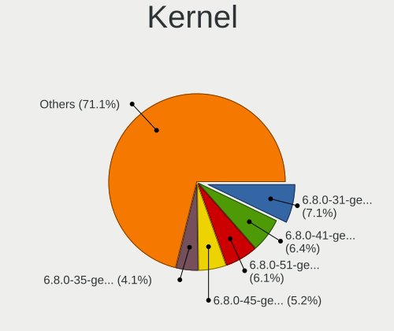

| Version             | Notebooks | Percent |
|---------------------|-----------|---------|
| 6.8.0-31-generic    | 47        | 7.14%   |
| 6.8.0-41-generic    | 42        | 6.38%   |
| 6.8.0-51-generic    | 40        | 6.08%   |
| 6.8.0-45-generic    | 34        | 5.17%   |
| 6.8.0-35-generic    | 27        | 4.1%    |
| 6.8.0-48-generic    | 24        | 3.65%   |
| 6.8.0-38-generic    | 22        | 3.34%   |
| 6.8.0-49-generic    | 18        | 2.74%   |
| 6.11.0-26-generic   | 17        | 2.58%   |
| 6.8.0-40-generic    | 16        | 2.43%   |
| 6.8.0-36-generic    | 16        | 2.43%   |
| 6.8.0-53-generic    | 15        | 2.28%   |
| 6.8.0-47-generic    | 15        | 2.28%   |
| 6.8.0-39-generic    | 15        | 2.28%   |
| 6.8.0-52-generic    | 14        | 2.13%   |
| 6.14.0-27-generic   | 14        | 2.13%   |
| 6.8.0-44-generic    | 12        | 1.82%   |
| 6.14.0-29-generic   | 12        | 1.82%   |
| 6.11.0-17-generic   | 12        | 1.82%   |
| 6.8.0-57-generic    | 11        | 1.67%   |
| 6.8.0-60-generic    | 10        | 1.52%   |
| 6.14.0-33-generic   | 10        | 1.52%   |
| 6.11.0-29-generic   | 10        | 1.52%   |
| 6.8.0-63-generic    | 9         | 1.37%   |
| 6.8.0-55-generic    | 9         | 1.37%   |
| 6.11.0-21-generic   | 8         | 1.22%   |
| 6.14.0-37-generic   | 7         | 1.06%   |
| 6.11.0-25-generic   | 7         | 1.06%   |
| 6.8.0-85-generic    | 5         | 0.76%   |
| 6.8.0-79-generic    | 5         | 0.76%   |
| 6.8.0-71-generic    | 5         | 0.76%   |
| 6.14.0-36-generic   | 5         | 0.76%   |
| 6.11.0-19-generic   | 5         | 0.76%   |
| 6.8.0-90-generic    | 4         | 0.61%   |
| 6.8.0-88-generic    | 4         | 0.61%   |
| 6.8.0-54-generic    | 4         | 0.61%   |
| 6.8.0-41-lowlatency | 4         | 0.61%   |
| 6.6.0-14-generic    | 4         | 0.61%   |
| 6.14.0-35-generic   | 4         | 0.61%   |
| 6.14.0-34-generic   | 4         | 0.61%   |

Kernel Family
-------------

Linux kernel without a distro release

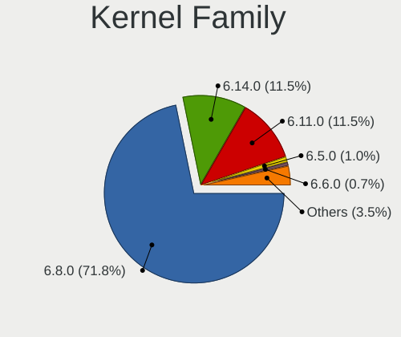

| Version | Notebooks | Percent |
|---------|-----------|---------|
| 6.8.0   | 430       | 71.79%  |
| 6.14.0  | 69        | 11.52%  |
| 6.11.0  | 69        | 11.52%  |
| 6.5.0   | 6         | 1%      |
| 6.6.0   | 4         | 0.67%   |
| 6.9.7   | 2         | 0.33%   |
| 6.9.1   | 2         | 0.33%   |
| 6.8.9   | 2         | 0.33%   |
| 6.9.9   | 1         | 0.17%   |
| 6.9.3   | 1         | 0.17%   |
| 6.7.0   | 1         | 0.17%   |
| 6.6.31  | 1         | 0.17%   |
| 6.6.28  | 1         | 0.17%   |
| 6.2.0   | 1         | 0.17%   |
| 6.16.0  | 1         | 0.17%   |
| 6.14.7  | 1         | 0.17%   |
| 6.14.4  | 1         | 0.17%   |
| 6.14.2  | 1         | 0.17%   |
| 6.13.2  | 1         | 0.17%   |
| 6.10.9  | 1         | 0.17%   |
| 6.10.14 | 1         | 0.17%   |
| 6.10.0  | 1         | 0.17%   |
| 5.15.0  | 1         | 0.17%   |

Kernel Major Ver.
-----------------

Linux kernel major version

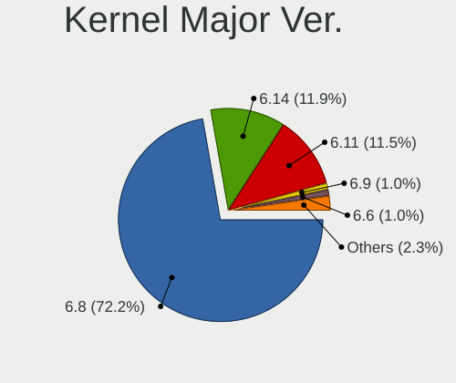

| Version | Notebooks | Percent |
|---------|-----------|---------|
| 6.8     | 432       | 72.24%  |
| 6.14    | 71        | 11.87%  |
| 6.11    | 69        | 11.54%  |
| 6.9     | 6         | 1%      |
| 6.6     | 6         | 1%      |
| 6.5     | 6         | 1%      |
| 6.10    | 3         | 0.5%    |
| 6.7     | 1         | 0.17%   |
| 6.2     | 1         | 0.17%   |
| 6.16    | 1         | 0.17%   |
| 6.13    | 1         | 0.17%   |
| 5.15    | 1         | 0.17%   |

Arch
----

OS architecture (x86_64, i586, etc.)

| Name   | Notebooks | Percent |
|--------|-----------|---------|
| x86_64 | 585       | 100%    |

DE
--

Desktop Environment

| Name  | Notebooks | Percent |
|-------|-----------|---------|
| KDE5  | 572       | 97.61%  |
| KDE   | 11        | 1.88%   |
| GNOME | 3         | 0.51%   |

Display Server
--------------

X11 or Wayland

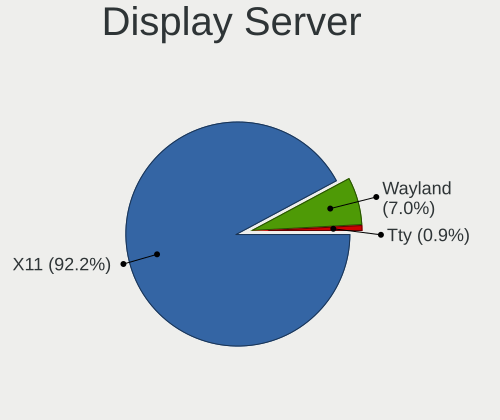

| Name    | Notebooks | Percent |
|---------|-----------|---------|
| X11     | 542       | 92.18%  |
| Wayland | 41        | 6.97%   |
| Tty     | 5         | 0.85%   |

Display Manager
---------------

SDDM, LightDM, etc.

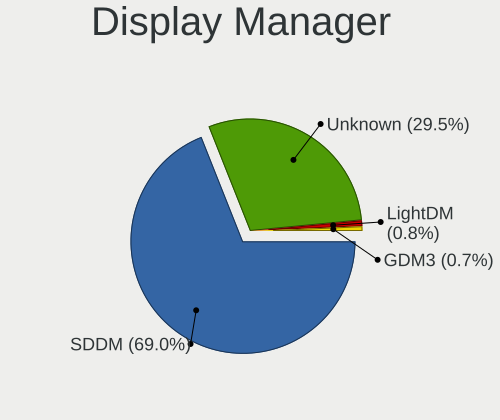

| Name    | Notebooks | Percent |
|---------|-----------|---------|
| SDDM    | 407       | 68.98%  |
| Unknown | 174       | 29.49%  |
| LightDM | 5         | 0.85%   |
| GDM3    | 4         | 0.68%   |

OS Lang
-------

Language

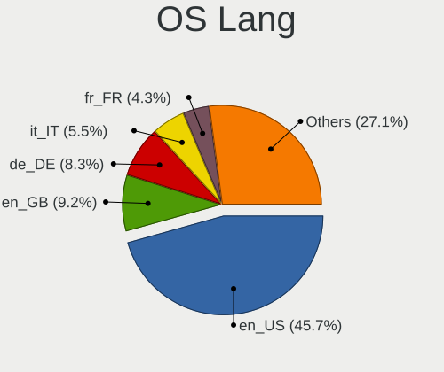

| Lang  | Notebooks | Percent |
|-------|-----------|---------|
| en_US | 268       | 45.66%  |
| en_GB | 54        | 9.2%    |
| de_DE | 49        | 8.35%   |
| it_IT | 32        | 5.45%   |
| fr_FR | 25        | 4.26%   |
| ru_RU | 23        | 3.92%   |
| C     | 22        | 3.75%   |
| pt_BR | 14        | 2.39%   |
| es_ES | 13        | 2.21%   |
| pl_PL | 9         | 1.53%   |
| en_IN | 9         | 1.53%   |
| en_AU | 6         | 1.02%   |
| cs_CZ | 6         | 1.02%   |
| zh_CN | 5         | 0.85%   |
| en_CA | 5         | 0.85%   |
| tr_TR | 4         | 0.68%   |
| es_MX | 4         | 0.68%   |
| sv_SE | 2         | 0.34%   |
| nl_NL | 2         | 0.34%   |
| ja_JP | 2         | 0.34%   |
| hu_HU | 2         | 0.34%   |
| fr_CA | 2         | 0.34%   |
| fi_FI | 2         | 0.34%   |
| es_PY | 2         | 0.34%   |
| es_CL | 2         | 0.34%   |
| en_ZA | 2         | 0.34%   |
| el_GR | 2         | 0.34%   |
| de_AT | 2         | 0.34%   |
| zh_TW | 1         | 0.17%   |
| sk_SK | 1         | 0.17%   |
| pt_PT | 1         | 0.17%   |
| lt_LT | 1         | 0.17%   |
| ko_KR | 1         | 0.17%   |
| fr_BE | 1         | 0.17%   |
| et_EE | 1         | 0.17%   |
| es_PE | 1         | 0.17%   |
| es_CR | 1         | 0.17%   |
| es_CO | 1         | 0.17%   |
| es_BO | 1         | 0.17%   |
| en_SE | 1         | 0.17%   |

Boot Mode
---------

EFI or BIOS

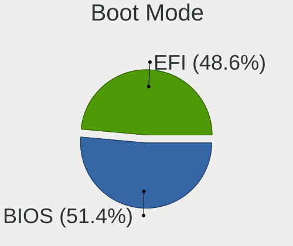

| Mode | Notebooks | Percent |
|------|-----------|---------|
| BIOS | 305       | 51.43%  |
| EFI  | 288       | 48.57%  |

Filesystem
----------

Type of filesystem

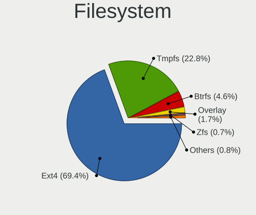

| Type    | Notebooks | Percent |
|---------|-----------|---------|
| Ext4    | 409       | 69.44%  |
| Tmpfs   | 134       | 22.75%  |
| Btrfs   | 27        | 4.58%   |
| Overlay | 10        | 1.7%    |
| Zfs     | 4         | 0.68%   |
| Xfs     | 4         | 0.68%   |
| Ext2    | 1         | 0.17%   |

Part. scheme
------------

Scheme of partitioning

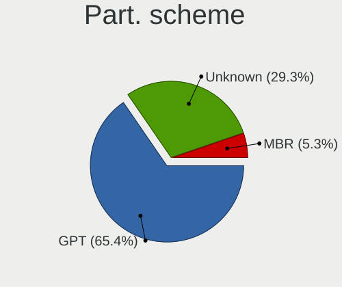

| Type    | Notebooks | Percent |
|---------|-----------|---------|
| GPT     | 386       | 65.42%  |
| Unknown | 173       | 29.32%  |
| MBR     | 31        | 5.25%   |

Dual Boot with Linux/BSD
------------------------

Hosting more than one Linux/BSD

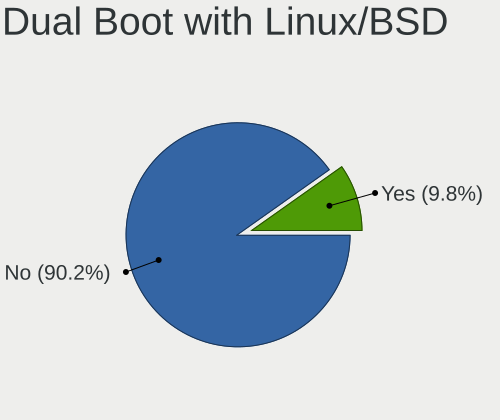

| Dual boot | Notebooks | Percent |
|-----------|-----------|---------|
| No        | 534       | 90.2%   |
| Yes       | 58        | 9.8%    |

Dual Boot (Win)
---------------

Hosting Linux and Windows

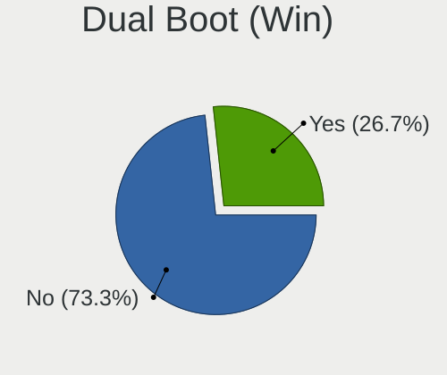

| Dual boot | Notebooks | Percent |
|-----------|-----------|---------|
| No        | 431       | 73.3%   |
| Yes       | 157       | 26.7%   |

Board
-----

Vendor
------

Motherboard manufacturer

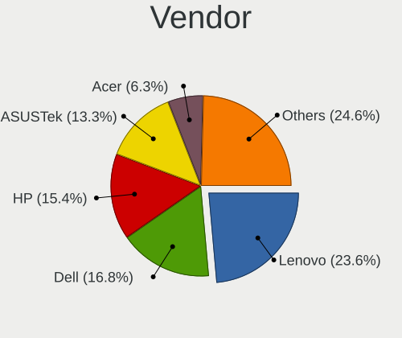

| Name                | Notebooks | Percent |
|---------------------|-----------|---------|
| Lenovo              | 138       | 23.59%  |
| Dell                | 98        | 16.75%  |
| Hewlett-Packard     | 90        | 15.38%  |
| ASUSTek Computer    | 78        | 13.33%  |
| Acer                | 37        | 6.32%   |
| Apple               | 15        | 2.56%   |
| MSI                 | 14        | 2.39%   |
| Samsung Electronics | 11        | 1.88%   |
| HUAWEI              | 10        | 1.71%   |
| Toshiba             | 8         | 1.37%   |
| Notebook            | 8         | 1.37%   |
| Fujitsu             | 5         | 0.85%   |
| Alienware           | 5         | 0.85%   |
| Unknown             | 5         | 0.85%   |
| Sony                | 4         | 0.68%   |
| Google              | 4         | 0.68%   |
| Chuwi               | 4         | 0.68%   |
| TUXEDO              | 3         | 0.51%   |
| Panasonic           | 3         | 0.51%   |
| Gigabyte Technology | 3         | 0.51%   |
| Framework           | 3         | 0.51%   |
| Valve               | 2         | 0.34%   |
| Timi                | 2         | 0.34%   |
| Razer               | 2         | 0.34%   |
| PC Specialist       | 2         | 0.34%   |
| MECHREVO            | 2         | 0.34%   |
| GPU Company         | 2         | 0.34%   |
| Carbon Systems      | 2         | 0.34%   |
| Zebronics           | 1         | 0.17%   |
| win element         | 1         | 0.17%   |
| TongFang            | 1         | 0.17%   |
| THUNDEROBOT         | 1         | 0.17%   |
| Thomson             | 1         | 0.17%   |
| SKIKK               | 1         | 0.17%   |
| Schenker            | 1         | 0.17%   |
| Packard Bell        | 1         | 0.17%   |
| OEM                 | 1         | 0.17%   |
| Monster             | 1         | 0.17%   |
| Micro Electronics   | 1         | 0.17%   |
| Maibenben           | 1         | 0.17%   |

Model
-----

Motherboard model

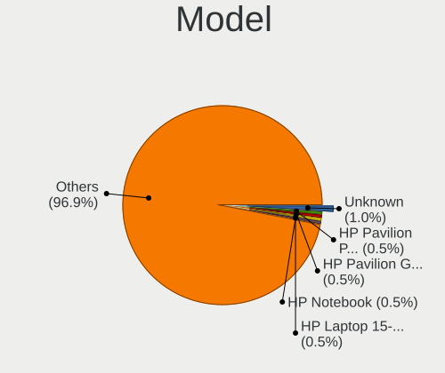

| Name                                              | Notebooks | Percent |
|---------------------------------------------------|-----------|---------|
| Unknown                                           | 6         | 1.03%   |
| HUAWEI FLMH-XX                                    | 3         | 0.51%   |
| HP Pavilion Power Laptop 15-cb0xx                 | 3         | 0.51%   |
| HP Pavilion Gaming Laptop 15-dk0xxx               | 3         | 0.51%   |
| HP Notebook                                       | 3         | 0.51%   |
| HP Laptop 15-fd0xxx                               | 3         | 0.51%   |
| Dell XPS 15 9520                                  | 3         | 0.51%   |
| Dell Pro 14 Plus PB14250                          | 3         | 0.51%   |
| Dell Latitude 7490                                | 3         | 0.51%   |
| Dell G3 3579                                      | 3         | 0.51%   |
| Apple MacBookPro8,1                               | 3         | 0.51%   |
| Samsung 270E5G/270E5U                             | 2         | 0.34%   |
| Lenovo LOQ 15IRH8 82XV                            | 2         | 0.34%   |
| Lenovo Legion Slim 5 16APH8 82Y9                  | 2         | 0.34%   |
| Lenovo Legion 5 15ACH6H 82JU                      | 2         | 0.34%   |
| Lenovo IdeaPad Slim 5 16ABR8 82XG                 | 2         | 0.34%   |
| Lenovo IdeaPad Gaming 3 15ACH6 82K2               | 2         | 0.34%   |
| Lenovo IdeaPad 5 14ARE05 81YM                     | 2         | 0.34%   |
| HUAWEI BOM-WXX9                                   | 2         | 0.34%   |
| HP ZBook Power 15.6 inch G9 Mobile Workstation PC | 2         | 0.34%   |
| HP ProBook 450 15.6 inch G9 Notebook PC           | 2         | 0.34%   |
| HP EliteBook 840 G5                               | 2         | 0.34%   |
| Dell XPS 9315                                     | 2         | 0.34%   |
| Dell XPS 15 7590                                  | 2         | 0.34%   |
| Dell XPS 13 9343                                  | 2         | 0.34%   |
| Dell Precision M4800                              | 2         | 0.34%   |
| Dell Precision 7710                               | 2         | 0.34%   |
| Dell Latitude E7450                               | 2         | 0.34%   |
| Dell Latitude E5450                               | 2         | 0.34%   |
| Dell Latitude 5400                                | 2         | 0.34%   |
| Dell Inspiron 5559                                | 2         | 0.34%   |
| Dell Inspiron 5537                                | 2         | 0.34%   |
| Dell Inspiron 3521                                | 2         | 0.34%   |
| ASUS Zenbook 15 UM3504DA_UM3504DA                 | 2         | 0.34%   |
| ASUS VivoBook_ASUSLaptop X1502VA_F1502VA          | 2         | 0.34%   |
| ASUS VivoBook_ASUSLaptop M1605YA_M1605YA          | 2         | 0.34%   |
| ASUS VivoBook_ASUSLaptop K3605VU_K3605VU          | 2         | 0.34%   |
| Apple MacBookPro12,1                              | 2         | 0.34%   |
| Apple MacBookPro11,2                              | 2         | 0.34%   |
| Alienware m16 R2                                  | 2         | 0.34%   |

Model Family
------------

Motherboard model prefix

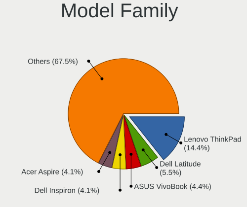

| Name                | Notebooks | Percent |
|---------------------|-----------|---------|
| Lenovo ThinkPad     | 84        | 14.36%  |
| Dell Latitude       | 32        | 5.47%   |
| ASUS VivoBook       | 26        | 4.44%   |
| Dell Inspiron       | 24        | 4.1%    |
| Acer Aspire         | 24        | 4.1%    |
| Lenovo IdeaPad      | 23        | 3.93%   |
| HP Pavilion         | 20        | 3.42%   |
| HP EliteBook        | 19        | 3.25%   |
| Dell XPS            | 15        | 2.56%   |
| HP ProBook          | 14        | 2.39%   |
| Dell Precision      | 14        | 2.39%   |
| ASUS ASUS           | 13        | 2.22%   |
| Lenovo Legion       | 10        | 1.71%   |
| HP Laptop           | 9         | 1.54%   |
| HP ZBook            | 8         | 1.37%   |
| Toshiba Satellite   | 7         | 1.2%    |
| Lenovo ThinkBook    | 6         | 1.03%   |
| ASUS ROG            | 6         | 1.03%   |
| Unknown             | 6         | 1.03%   |
| ASUS Zenbook        | 5         | 0.85%   |
| Acer Swift          | 5         | 0.85%   |
| Fujitsu LIFEBOOK    | 4         | 0.68%   |
| Dell Pro            | 4         | 0.68%   |
| Apple MacBookPro8   | 4         | 0.68%   |
| Lenovo Yoga         | 3         | 0.51%   |
| Lenovo LOQ          | 3         | 0.51%   |
| HUAWEI FLMH-XX      | 3         | 0.51%   |
| HP Notebook         | 3         | 0.51%   |
| HP Compaq           | 3         | 0.51%   |
| HP 250              | 3         | 0.51%   |
| Framework Laptop    | 3         | 0.51%   |
| Dell Vostro         | 3         | 0.51%   |
| Dell G3             | 3         | 0.51%   |
| Chuwi GemiBook      | 3         | 0.51%   |
| Apple MacBookPro11  | 3         | 0.51%   |
| Acer Nitro          | 3         | 0.51%   |
| TUXEDO InfinityBook | 2         | 0.34%   |
| Samsung 270E5G      | 2         | 0.34%   |
| Razer Blade         | 2         | 0.34%   |
| MSI GF75            | 2         | 0.34%   |

MFG Year
--------

Motherboard manufacture year

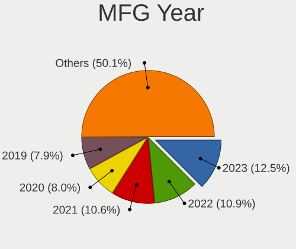

| Year | Notebooks | Percent |
|------|-----------|---------|
| 2023 | 73        | 12.48%  |
| 2022 | 64        | 10.94%  |
| 2021 | 62        | 10.6%   |
| 2020 | 47        | 8.03%   |
| 2019 | 46        | 7.86%   |
| 2018 | 37        | 6.32%   |
| 2024 | 35        | 5.98%   |
| 2017 | 34        | 5.81%   |
| 2013 | 29        | 4.96%   |
| 2011 | 29        | 4.96%   |
| 2014 | 27        | 4.62%   |
| 2015 | 25        | 4.27%   |
| 2012 | 22        | 3.76%   |
| 2010 | 15        | 2.56%   |
| 2025 | 14        | 2.39%   |
| 2016 | 13        | 2.22%   |
| 2008 | 7         | 1.2%    |
| 2009 | 3         | 0.51%   |
| 2007 | 2         | 0.34%   |
| 2006 | 1         | 0.17%   |

Form Factor
-----------

Physical design of the computer

| Name     | Notebooks | Percent |
|----------|-----------|---------|
| Notebook | 585       | 100%    |

Secure Boot
-----------

Enabled or disabled

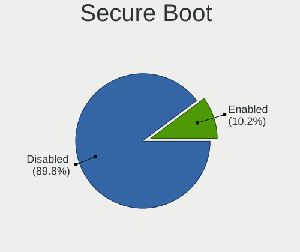

| State    | Notebooks | Percent |
|----------|-----------|---------|
| Disabled | 528       | 89.8%   |
| Enabled  | 60        | 10.2%   |

Coreboot
--------

Have coreboot on board

| Used | Notebooks | Percent |
|------|-----------|---------|
| No   | 580       | 99.15%  |
| Yes  | 5         | 0.85%   |

RAM Size
--------

Total RAM memory

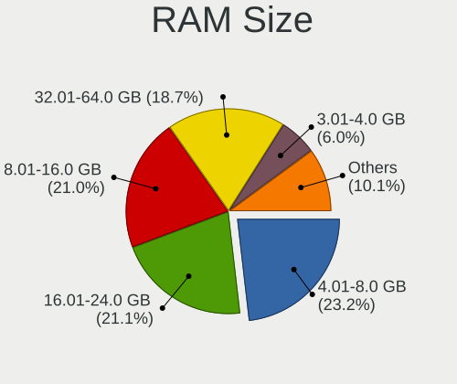

| Size in GB  | Notebooks | Percent |
|-------------|-----------|---------|
| 4.01-8.0    | 136       | 23.17%  |
| 16.01-24.0  | 124       | 21.12%  |
| 8.01-16.0   | 123       | 20.95%  |
| 32.01-64.0  | 110       | 18.74%  |
| 3.01-4.0    | 35        | 5.96%   |
| 64.01-256.0 | 32        | 5.45%   |
| 24.01-32.0  | 21        | 3.58%   |
| 1.01-2.0    | 4         | 0.68%   |
| 2.01-3.0    | 2         | 0.34%   |

RAM Used
--------

Used RAM memory

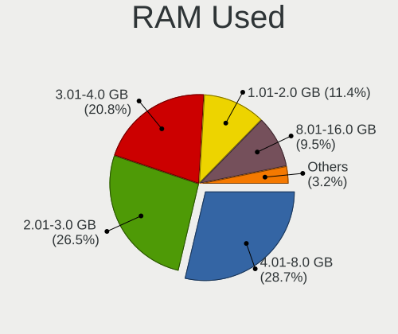

| Used GB    | Notebooks | Percent |
|------------|-----------|---------|
| 4.01-8.0   | 181       | 28.68%  |
| 2.01-3.0   | 167       | 26.47%  |
| 3.01-4.0   | 131       | 20.76%  |
| 1.01-2.0   | 72        | 11.41%  |
| 8.01-16.0  | 60        | 9.51%   |
| 16.01-24.0 | 11        | 1.74%   |
| 24.01-32.0 | 6         | 0.95%   |
| 0.51-1.0   | 2         | 0.32%   |
| 32.01-64.0 | 1         | 0.16%   |

Total Drives
------------

Number of drives on board

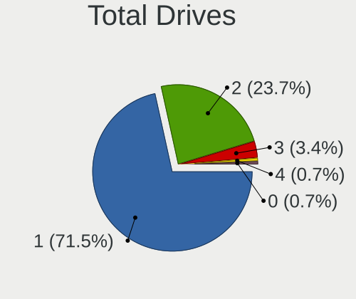

| Drives | Notebooks | Percent |
|--------|-----------|---------|
| 1      | 425       | 71.55%  |
| 2      | 141       | 23.74%  |
| 3      | 20        | 3.37%   |
| 4      | 4         | 0.67%   |
| 0      | 4         | 0.67%   |

Has CD-ROM
----------

Has CD-ROM on board

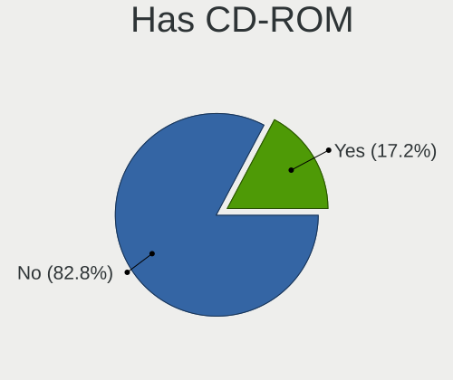

| Presented | Notebooks | Percent |
|-----------|-----------|---------|
| No        | 485       | 82.76%  |
| Yes       | 101       | 17.24%  |

Has Ethernet
------------

Has Ethernet on board

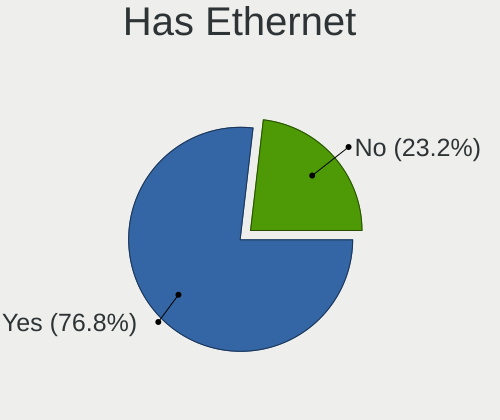

| Presented | Notebooks | Percent |
|-----------|-----------|---------|
| Yes       | 451       | 76.83%  |
| No        | 136       | 23.17%  |

Has WiFi
--------

Has WiFi module

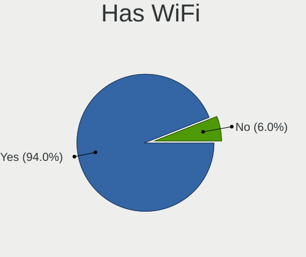

| Presented | Notebooks | Percent |
|-----------|-----------|---------|
| Yes       | 550       | 94.02%  |
| No        | 35        | 5.98%   |

Has Bluetooth
-------------

Has Bluetooth module

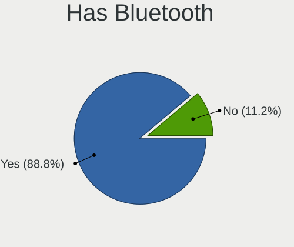

| Presented | Notebooks | Percent |
|-----------|-----------|---------|
| Yes       | 525       | 88.83%  |
| No        | 66        | 11.17%  |

Location
--------

Country
-------

Geographic location (country)

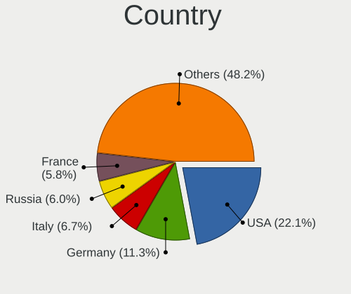

| Country      | Notebooks | Percent |
|--------------|-----------|---------|
| USA          | 129       | 22.05%  |
| Germany      | 66        | 11.28%  |
| Italy        | 39        | 6.67%   |
| Russia       | 35        | 5.98%   |
| France       | 34        | 5.81%   |
| UK           | 27        | 4.62%   |
| Spain        | 18        | 3.08%   |
| Poland       | 18        | 3.08%   |
| Brazil       | 15        | 2.56%   |
| India        | 14        | 2.39%   |
| Netherlands  | 13        | 2.22%   |
| Czechia      | 11        | 1.88%   |
| Canada       | 11        | 1.88%   |
| Mexico       | 8         | 1.37%   |
| China        | 7         | 1.2%    |
| Chile        | 7         | 1.2%    |
| Bulgaria     | 7         | 1.2%    |
| Australia    | 7         | 1.2%    |
| Turkey       | 6         | 1.03%   |
| Romania      | 6         | 1.03%   |
| Sweden       | 5         | 0.85%   |
| Portugal     | 5         | 0.85%   |
| Indonesia    | 5         | 0.85%   |
| Finland      | 4         | 0.68%   |
| South Africa | 3         | 0.51%   |
| Slovakia     | 3         | 0.51%   |
| Serbia       | 3         | 0.51%   |
| Saudi Arabia | 3         | 0.51%   |
| Iran         | 3         | 0.51%   |
| Hungary      | 3         | 0.51%   |
| Greece       | 3         | 0.51%   |
| Colombia     | 3         | 0.51%   |
| Belgium      | 3         | 0.51%   |
| Austria      | 3         | 0.51%   |
| Argentina    | 3         | 0.51%   |
| Ukraine      | 2         | 0.34%   |
| UAE          | 2         | 0.34%   |
| Thailand     | 2         | 0.34%   |
| Sri Lanka    | 2         | 0.34%   |
| Slovenia     | 2         | 0.34%   |

City
----

Geographic location (city)

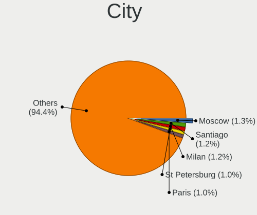

| City           | Notebooks | Percent |
|----------------|-----------|---------|
| Moscow         | 8         | 1.32%   |
| Santiago       | 7         | 1.16%   |
| Milan          | 7         | 1.16%   |
| St Petersburg  | 6         | 0.99%   |
| Paris          | 6         | 0.99%   |
| Traverse City  | 5         | 0.83%   |
| Hanover        | 5         | 0.83%   |
| Sofia          | 4         | 0.66%   |
| Sao Paulo      | 4         | 0.66%   |
| Milano         | 4         | 0.66%   |
| Bergamo        | 4         | 0.66%   |
| Amsterdam      | 4         | 0.66%   |
| Warsaw         | 3         | 0.5%    |
| Vienna         | 3         | 0.5%    |
| Toronto        | 3         | 0.5%    |
| Tehran         | 3         | 0.5%    |
| Sydney         | 3         | 0.5%    |
| Stuttgart      | 3         | 0.5%    |
| Salt Lake City | 3         | 0.5%    |
| Prague         | 3         | 0.5%    |
| Portland       | 3         | 0.5%    |
| Lisbon         | 3         | 0.5%    |
| Krakow         | 3         | 0.5%    |
| Hamburg        | 3         | 0.5%    |
| Dallas         | 3         | 0.5%    |
| Chennai        | 3         | 0.5%    |
| Berlin         | 3         | 0.5%    |
| Bengaluru      | 3         | 0.5%    |
| Belgrade       | 3         | 0.5%    |
| Barcelona      | 3         | 0.5%    |
| Voronezh       | 2         | 0.33%   |
| Victoria       | 2         | 0.33%   |
| Vancouver      | 2         | 0.33%   |
| Tallinn        | 2         | 0.33%   |
| Szczytno       | 2         | 0.33%   |
| South Orange   | 2         | 0.33%   |
| Singapore      | 2         | 0.33%   |
| Seattle        | 2         | 0.33%   |
| San Antonio    | 2         | 0.33%   |
| Rome           | 2         | 0.33%   |

Drives
------

Drive Vendor
------------

Hard drive vendors

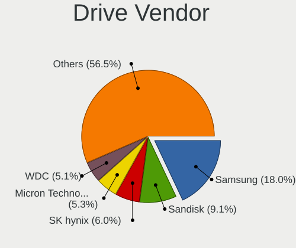

| Vendor                      | Notebooks | Drives | Percent |
|-----------------------------|-----------|--------|---------|
| Samsung Electronics         | 135       | 164    | 18%     |
| Sandisk                     | 68        | 83     | 9.07%   |
| SK hynix                    | 45        | 47     | 6%      |
| Micron Technology           | 40        | 49     | 5.33%   |
| WDC                         | 38        | 42     | 5.07%   |
| Toshiba                     | 38        | 46     | 5.07%   |
| Kingston                    | 37        | 52     | 4.93%   |
| Seagate                     | 35        | 39     | 4.67%   |
| Unknown                     | 32        | 37     | 4.27%   |
| Crucial                     | 32        | 36     | 4.27%   |
| KIOXIA                      | 23        | 30     | 3.07%   |
| Intel                       | 20        | 23     | 2.67%   |
| Kingston Technology Company | 18        | 20     | 2.4%    |
| HGST                        | 13        | 13     | 1.73%   |
| China                       | 10        | 12     | 1.33%   |
| Apple                       | 10        | 12     | 1.33%   |
| A-DATA Technology           | 10        | 12     | 1.33%   |
| SPCC                        | 8         | 11     | 1.07%   |
| Micron/Crucial Technology   | 8         | 8      | 1.07%   |
| Silicon Motion              | 7         | 7      | 0.93%   |
| Phison Electronics          | 7         | 8      | 0.93%   |
| SOLIDIGM                    | 5         | 6      | 0.67%   |
| LITEON                      | 5         | 5      | 0.67%   |
| Lexar                       | 5         | 5      | 0.67%   |
| KingSpec                    | 5         | 9      | 0.67%   |
| JMicron Technology          | 5         | 5      | 0.67%   |
| Hitachi                     | 5         | 5      | 0.67%   |
| PNY                         | 4         | 7      | 0.53%   |
| Netac                       | 4         | 5      | 0.53%   |
| Intenso                     | 4         | 4      | 0.53%   |
| Verbatim                    | 3         | 4      | 0.4%    |
| Phison                      | 3         | 3      | 0.4%    |
| MAXIO Technology (Hangzhou) | 3         | 3      | 0.4%    |
| Fanxiang                    | 3         | 3      | 0.4%    |
| Apacer                      | 3         | 3      | 0.4%    |
| Unknown                     | 3         | 3      | 0.4%    |
| Transcend                   | 2         | 3      | 0.27%   |
| Team                        | 2         | 2      | 0.27%   |
| Realtek                     | 2         | 2      | 0.27%   |
| LITEONIT                    | 2         | 2      | 0.27%   |

Drive Model
-----------

Hard drive models

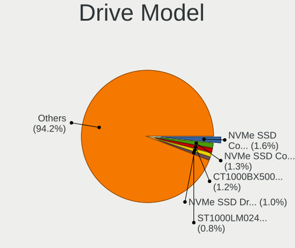

| Model                                              | Notebooks | Percent |
|----------------------------------------------------|-----------|---------|
| Samsung NVMe SSD Controller PM9A1/PM9A3/980PRO 1TB | 12        | 1.56%   |
| Samsung NVMe SSD Controller SM981/PM981/PM983 1TB  | 10        | 1.3%    |
| Crucial CT1000BX500SSD1 1TB                        | 9         | 1.17%   |
| SanDisk NVMe SSD Drive 1TB                         | 8         | 1.04%   |
| Seagate ST1000LM024 HN-M101MBB 1TB                 | 6         | 0.78%   |
| HGST HTS721010A9E630 1TB                           | 6         | 0.78%   |
| Unknown MMC Card  32GB                             | 5         | 0.65%   |
| Toshiba MQ01ABD100 1TB                             | 5         | 0.65%   |
| Kingston Company SNV2S1000G 1TB                    | 5         | 0.65%   |
| Kingston SA400S37960G 960GB SSD                    | 5         | 0.65%   |
| Kingston SA400S37480G 480GB SSD                    | 5         | 0.65%   |
| Crucial CT500MX500SSD1 500GB                       | 5         | 0.65%   |
| SanDisk NVMe SSD Drive 512GB                       | 4         | 0.52%   |
| SanDisk NVMe SSD Drive 4TB                         | 4         | 0.52%   |
| SanDisk NVMe SSD Drive 2TB                         | 4         | 0.52%   |
| Samsung SSD 860 EVO 1TB                            | 4         | 0.52%   |
| Samsung SSD 850 EVO 500GB                          | 4         | 0.52%   |
| Micron/Crucial P2 NVMe PCIe SSD 2TB                | 4         | 0.52%   |
| Kingston SA400S37240G 240GB SSD                    | 4         | 0.52%   |
| Unknown NVMe SSD Drive 512GB                       | 3         | 0.39%   |
| Unknown MMC Card  64GB                             | 3         | 0.39%   |
| Unknown MMC Card  128GB                            | 3         | 0.39%   |
| Toshiba XG6 NVMe SSD Controller 1024GB             | 3         | 0.39%   |
| Toshiba MQ04ABF100 1TB                             | 3         | 0.39%   |
| SOLIDIGM NVMe SSD Drive 512GB                      | 3         | 0.39%   |
| Silicon Motion PCIe-8 SSD 512GB                    | 3         | 0.39%   |
| Seagate ST1000LM035-1RK172 1TB                     | 3         | 0.39%   |
| Sandisk WD PC SN740 SDDPMQD-1T00-1101 1024GB       | 3         | 0.39%   |
| Samsung SSD PM851 M.2 2280 128GB                   | 3         | 0.39%   |
| Samsung SSD 990 PRO 2TB                            | 3         | 0.39%   |
| Samsung SSD 990 PRO 1TB                            | 3         | 0.39%   |
| Samsung MZVL4512HBLU-00BH1 512GB                   | 3         | 0.39%   |
| Phison E12 NVMe Controller 1TB                     | 3         | 0.39%   |
| Micron MTFDKBA1T0QFM-1BD1AABGB 1024GB              | 3         | 0.39%   |
| Micron 2450_MTFDKBA512TFK 512GB                    | 3         | 0.39%   |
| Micron 2400_MTFDKBA1T0QFM 1TB                      | 3         | 0.39%   |
| MAXIO (Hangzhou) NVMe SSD Controller MAP1202 2TB   | 3         | 0.39%   |
| Kingston Company SNV2S2000G 2TB                    | 3         | 0.39%   |
| Intel SSDPEKNU512GZH 512GB                         | 3         | 0.39%   |
| Intel SSD 660P Series 512GB                        | 3         | 0.39%   |

HDD Vendor
----------

Hard disk drive vendors

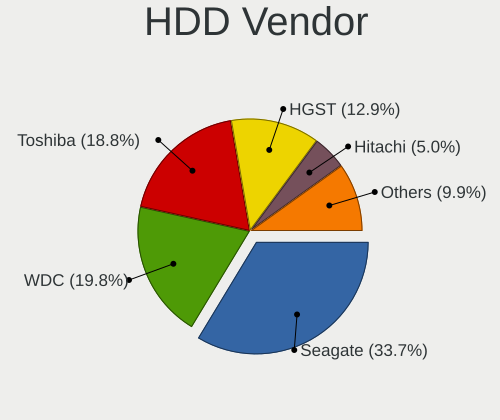

| Vendor             | Notebooks | Drives | Percent |
|--------------------|-----------|--------|---------|
| Seagate            | 34        | 38     | 33.66%  |
| WDC                | 20        | 21     | 19.8%   |
| Toshiba            | 19        | 20     | 18.81%  |
| HGST               | 13        | 13     | 12.87%  |
| Hitachi            | 5         | 5      | 4.95%   |
| JMicron Technology | 2         | 2      | 1.98%   |
| Fujitsu            | 2         | 2      | 1.98%   |
| Unknown            | 1         | 1      | 0.99%   |
| TDAS               | 1         | 1      | 0.99%   |
| IB-AC703           | 1         | 1      | 0.99%   |
| External           | 1         | 1      | 0.99%   |
| Apricorn           | 1         | 1      | 0.99%   |
| Apple              | 1         | 1      | 0.99%   |

SSD Vendor
----------

Solid state drive vendors

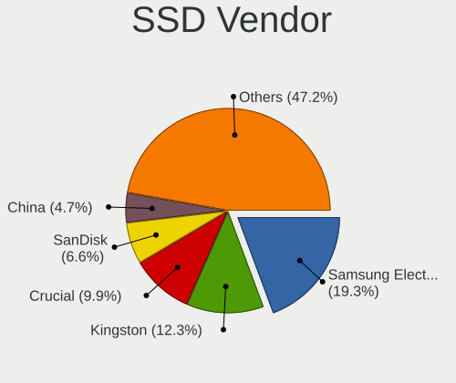

| Vendor              | Notebooks | Drives | Percent |
|---------------------|-----------|--------|---------|
| Samsung Electronics | 41        | 54     | 19.34%  |
| Kingston            | 26        | 37     | 12.26%  |
| Crucial             | 21        | 25     | 9.91%   |
| SanDisk             | 14        | 16     | 6.6%    |
| China               | 10        | 12     | 4.72%   |
| WDC                 | 7         | 9      | 3.3%    |
| SPCC                | 7         | 10     | 3.3%    |
| Apple               | 7         | 8      | 3.3%    |
| Micron Technology   | 6         | 6      | 2.83%   |
| Toshiba             | 5         | 6      | 2.36%   |
| LITEON              | 5         | 5      | 2.36%   |
| KingSpec            | 5         | 9      | 2.36%   |
| SK hynix            | 4         | 4      | 1.89%   |
| PNY                 | 4         | 7      | 1.89%   |
| Intel               | 4         | 6      | 1.89%   |
| A-DATA Technology   | 4         | 5      | 1.89%   |
| Netac               | 3         | 3      | 1.42%   |
| Intenso             | 3         | 3      | 1.42%   |
| Apacer              | 3         | 3      | 1.42%   |
| Verbatim            | 2         | 2      | 0.94%   |
| Transcend           | 2         | 3      | 0.94%   |
| LITEONIT            | 2         | 2      | 0.94%   |
| Lexar               | 2         | 2      | 0.94%   |
| Emtec               | 2         | 2      | 0.94%   |
| XrayDisk            | 1         | 1      | 0.47%   |
| Wibtek              | 1         | 2      | 0.47%   |
| WDC WDS2            | 1         | 1      | 0.47%   |
| Team                | 1         | 1      | 0.47%   |
| SUNEAST             | 1         | 1      | 0.47%   |
| ShiJi               | 1         | 2      | 0.47%   |
| SD                  | 1         | 1      | 0.47%   |
| SATA SSD            | 1         | 1      | 0.47%   |
| SABRENT             | 1         | 1      | 0.47%   |
| Qunion              | 1         | 1      | 0.47%   |
| QOPP                | 1         | 1      | 0.47%   |
| Patriot             | 1         | 1      | 0.47%   |
| NT-1TB              | 1         | 1      | 0.47%   |
| MicroFrom           | 1         | 1      | 0.47%   |
| LDLC                | 1         | 1      | 0.47%   |
| Kingchuxing         | 1         | 1      | 0.47%   |

Drive Kind
----------

HDD or SSD

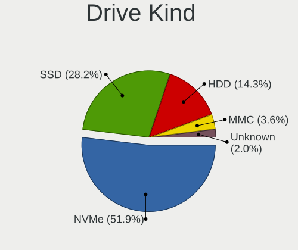

| Kind    | Notebooks | Drives | Percent |
|---------|-----------|--------|---------|
| NVMe    | 360       | 467    | 51.87%  |
| SSD     | 196       | 265    | 28.24%  |
| HDD     | 99        | 107    | 14.27%  |
| MMC     | 25        | 30     | 3.6%    |
| Unknown | 14        | 14     | 2.02%   |

Drive Connector
---------------

SATA, SAS, NVMe, etc.

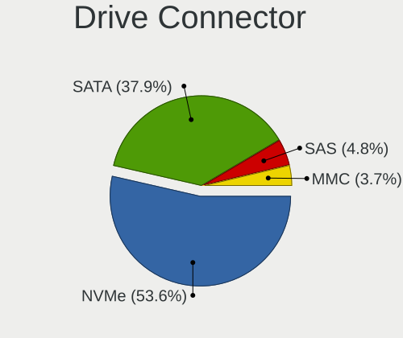

| Type | Notebooks | Drives | Percent |
|------|-----------|--------|---------|
| NVMe | 360       | 464    | 53.57%  |
| SATA | 255       | 351    | 37.95%  |
| SAS  | 32        | 38     | 4.76%   |
| MMC  | 25        | 30     | 3.72%   |

Drive Size
----------

Size of hard drive

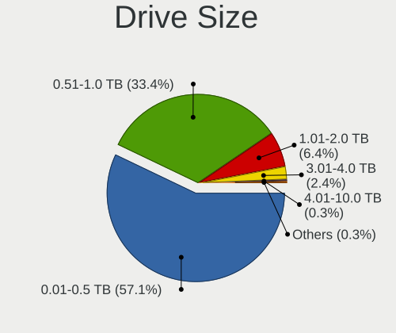

| Size in TB | Notebooks | Drives | Percent |
|------------|-----------|--------|---------|
| 0.01-0.5   | 169       | 225    | 57.09%  |
| 0.51-1.0   | 99        | 114    | 33.45%  |
| 1.01-2.0   | 19        | 24     | 6.42%   |
| 3.01-4.0   | 7         | 7      | 2.36%   |
| 2.01-3.0   | 1         | 1      | 0.34%   |
| 4.01-10.0  | 1         | 1      | 0.34%   |

Space Total
-----------

Amount of disk space available on the file system

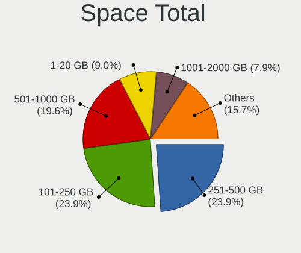

| Size in GB     | Notebooks | Percent |
|----------------|-----------|---------|
| 251-500        | 143       | 23.91%  |
| 101-250        | 143       | 23.91%  |
| 501-1000       | 117       | 19.57%  |
| 1-20           | 54        | 9.03%   |
| 1001-2000      | 47        | 7.86%   |
| 51-100         | 32        | 5.35%   |
| 2001-3000      | 20        | 3.34%   |
| More than 3000 | 19        | 3.18%   |
| 21-50          | 13        | 2.17%   |
| Unknown        | 10        | 1.67%   |

Space Used
----------

Amount of used disk space

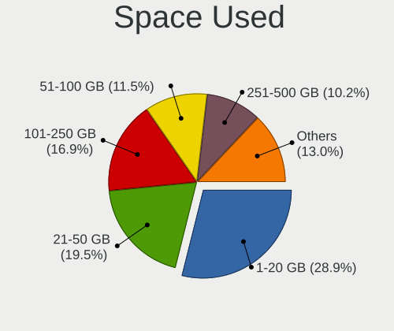

| Used GB        | Notebooks | Percent |
|----------------|-----------|---------|
| 1-20           | 176       | 28.9%   |
| 21-50          | 119       | 19.54%  |
| 101-250        | 103       | 16.91%  |
| 51-100         | 70        | 11.49%  |
| 251-500        | 62        | 10.18%  |
| 501-1000       | 42        | 6.9%    |
| 1001-2000      | 21        | 3.45%   |
| Unknown        | 10        | 1.64%   |
| More than 3000 | 3         | 0.49%   |
| 2001-3000      | 3         | 0.49%   |

Malfunc. Drives
---------------

Drive models with a malfunction

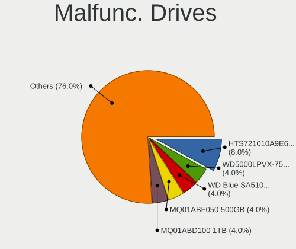

| Model                                                       | Notebooks | Drives | Percent |
|-------------------------------------------------------------|-----------|--------|---------|
| HGST HTS721010A9E630 1TB                                    | 2         | 2      | 8%      |
| WDC WD5000LPVX-75V0TT0 500GB                                | 1         | 1      | 4%      |
| WDC WD Blue SA510 2.5 500GB                                 | 1         | 1      | 4%      |
| Toshiba MQ01ABF050 500GB                                    | 1         | 1      | 4%      |
| Toshiba MQ01ABD100 1TB                                      | 1         | 1      | 4%      |
| Toshiba MQ01ABD075 752GB                                    | 1         | 1      | 4%      |
| Toshiba MK3259GSXP 320GB                                    | 1         | 2      | 4%      |
| T-FORCE TM8FPL1000G 1TB                                     | 1         | 1      | 4%      |
| Seagate ST1000LM024 HN-M101MBB 1TB                          | 1         | 1      | 4%      |
| Samsung Electronics SSD 980 PRO 500GB S5GYNG0NC22231A       | 1         | 1      | 4%      |
| Samsung Electronics SSD 980 PRO 500GB                       | 1         | 2      | 4%      |
| Samsung Electronics SSD 980 1TB S649NF0R869244H             | 1         | 1      | 4%      |
| Samsung Electronics MZVL22T0HBLB-00BH1 2TB                  | 1         | 1      | 4%      |
| Netac NVMe SSD 2TB                                          | 1         | 1      | 4%      |
| Micron Technology MTFDHBA512TDV 512GB                       | 1         | 1      | 4%      |
| Micron Technology 1100_MTFDDAV256TBN 256GB SSD              | 1         | 1      | 4%      |
| MAXIO Technology (Hangzhou) NVMe SSD Controller MAP1202 2TB | 1         | 1      | 4%      |
| Kingston SA400S37480G 480GB SSD                             | 1         | 1      | 4%      |
| Hitachi HTS543232A7A384 320GB                               | 1         | 1      | 4%      |
| Hitachi HTS543216L9SA00 160GB                               | 1         | 1      | 4%      |
| HGST HTS545050A7E380 500GB                                  | 1         | 1      | 4%      |
| HGST HTS541075A9E680 752GB                                  | 1         | 1      | 4%      |
| HGST HTS541010A9E680 1TB                                    | 1         | 1      | 4%      |
| HGST HTS541010A7E630 1TB                                    | 1         | 1      | 4%      |

Malfunc. Drive Vendor
---------------------

Vendors of faulty drives

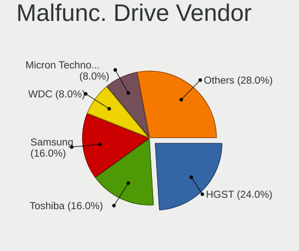

| Vendor                      | Notebooks | Drives | Percent |
|-----------------------------|-----------|--------|---------|
| HGST                        | 6         | 6      | 24%     |
| Toshiba                     | 4         | 5      | 16%     |
| Samsung Electronics         | 4         | 5      | 16%     |
| WDC                         | 2         | 2      | 8%      |
| Micron Technology           | 2         | 2      | 8%      |
| Hitachi                     | 2         | 2      | 8%      |
| T-FORCE                     | 1         | 1      | 4%      |
| Seagate                     | 1         | 1      | 4%      |
| Netac                       | 1         | 1      | 4%      |
| MAXIO Technology (Hangzhou) | 1         | 1      | 4%      |
| Kingston                    | 1         | 1      | 4%      |

Malfunc. HDD Vendor
-------------------

Vendors of faulty HDD drives

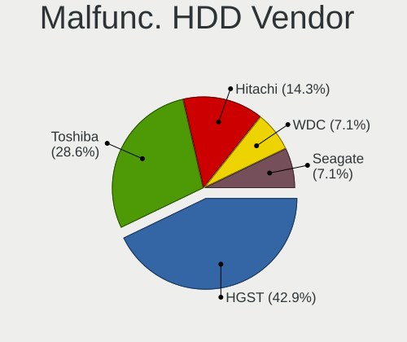

| Vendor  | Notebooks | Drives | Percent |
|---------|-----------|--------|---------|
| HGST    | 6         | 6      | 42.86%  |
| Toshiba | 4         | 5      | 28.57%  |
| Hitachi | 2         | 2      | 14.29%  |
| WDC     | 1         | 1      | 7.14%   |
| Seagate | 1         | 1      | 7.14%   |

Malfunc. Drive Kind
-------------------

Kinds of faulty drives

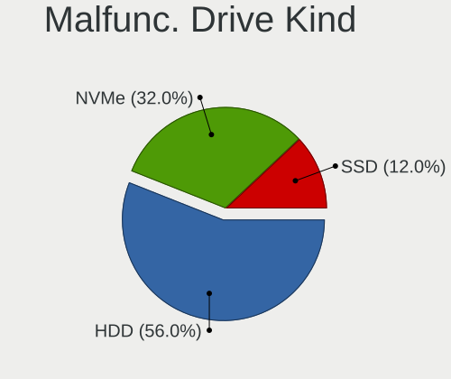

| Kind | Notebooks | Drives | Percent |
|------|-----------|--------|---------|
| HDD  | 14        | 15     | 56%     |
| NVMe | 8         | 9      | 32%     |
| SSD  | 3         | 3      | 12%     |

Failed Drives
-------------

Failed drive models

Zero info for selected period =(

Failed Drive Vendor
-------------------

Failed drive vendors

Zero info for selected period =(

Drive Status
------------

Number of failed and malfunc. drives

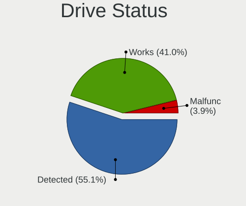

| Status   | Notebooks | Drives | Percent |
|----------|-----------|--------|---------|
| Detected | 343       | 521    | 55.14%  |
| Works    | 255       | 335    | 41%     |
| Malfunc  | 24        | 27     | 3.86%   |

Storage controller
------------------

Storage Vendor
--------------

Storage controller vendors

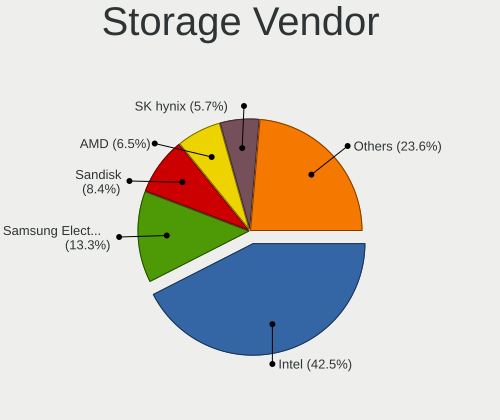

| Vendor                          | Notebooks | Percent |
|---------------------------------|-----------|---------|
| Intel                           | 320       | 42.5%   |
| Samsung Electronics             | 100       | 13.28%  |
| Sandisk                         | 63        | 8.37%   |
| AMD                             | 49        | 6.51%   |
| SK hynix                        | 43        | 5.71%   |
| Micron Technology               | 35        | 4.65%   |
| Kingston Technology Company     | 29        | 3.85%   |
| KIOXIA                          | 21        | 2.79%   |
| Micron/Crucial Technology       | 17        | 2.26%   |
| Toshiba America Info Systems    | 16        | 2.12%   |
| Phison Electronics              | 13        | 1.73%   |
| Silicon Motion                  | 9         | 1.2%    |
| Solidigm                        | 8         | 1.06%   |
| ADATA Technology                | 6         | 0.8%    |
| Shenzhen Longsys Electronics    | 4         | 0.53%   |
| MAXIO Technology (Hangzhou)     | 4         | 0.53%   |
| Yangtze Memory Technologies     | 2         | 0.27%   |
| Nvidia                          | 2         | 0.27%   |
| Biwin Storage Technology        | 2         | 0.27%   |
| Apple                           | 2         | 0.27%   |
| Unknown                         | 2         | 0.27%   |
| Transcend                       | 1         | 0.13%   |
| Solid State Storage Technology  | 1         | 0.13%   |
| Shenzhen Techwinsemi Technology | 1         | 0.13%   |
| Realtek Semiconductor           | 1         | 0.13%   |
| Netac Technology                | 1         | 0.13%   |
| INNOGRIT                        | 1         | 0.13%   |

Storage Model
-------------

Storage controller models

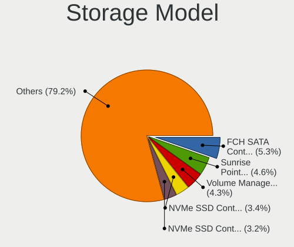

| Model                                                                          | Notebooks | Percent |
|--------------------------------------------------------------------------------|-----------|---------|
| AMD FCH SATA Controller [AHCI mode]                                            | 42        | 5.32%   |
| Intel Sunrise Point-LP SATA Controller [AHCI mode]                             | 36        | 4.56%   |
| Intel Volume Management Device NVMe RAID Controller                            | 34        | 4.31%   |
| Samsung NVMe SSD Controller PM9A1/PM9A3/980PRO                                 | 27        | 3.42%   |
| Samsung NVMe SSD Controller SM981/PM981/PM983                                  | 25        | 3.17%   |
| Intel 82801 Mobile SATA Controller [RAID mode]                                 | 24        | 3.04%   |
| Intel 7 Series Chipset Family 6-port SATA Controller [AHCI mode]               | 22        | 2.79%   |
| Samsung NVMe SSD Controller 980 (DRAM-less)                                    | 21        | 2.66%   |
| SanDisk WD SN560/SN740/SN770/SN5000 NVMe SSD                                   | 19        | 2.41%   |
| Intel RST Volume Management Device Controller                                  | 19        | 2.41%   |
| Intel 6 Series/C200 Series Chipset Family 6 port Mobile SATA AHCI Controller   | 19        | 2.41%   |
| Intel Cannon Lake Mobile PCH SATA AHCI Controller                              | 15        | 1.9%    |
| Intel 8 Series SATA Controller 1 [AHCI mode]                                   | 15        | 1.9%    |
| Intel 8 Series/C220 Series Chipset Family 6-port SATA Controller 1 [AHCI mode] | 14        | 1.77%   |
| SK hynix Gold P31/BC711/PC711 NVMe Solid State Drive                           | 13        | 1.65%   |
| Intel Wildcat Point-LP SATA Controller [AHCI Mode]                             | 13        | 1.65%   |
| Intel Tiger Lake-LP SATA Controller                                            | 11        | 1.39%   |
| Intel HM170/QM170 Chipset SATA Controller [AHCI Mode]                          | 11        | 1.39%   |
| SK hynix Platinum P41/PC801 NVMe Solid State Drive                             | 10        | 1.27%   |
| Micron 2400 NVMe SSD (DRAM-less)                                               | 10        | 1.27%   |
| Samsung NVMe SSD Controller S4LV008[Pascal]                                    | 9         | 1.14%   |
| Micron/Crucial P2 [Nick P2] / P3 / P3 Plus NVMe PCIe SSD (DRAM-less)           | 9         | 1.14%   |
| Micron 2450 NVMe SSD [HendrixV] (DRAM-less)                                    | 9         | 1.14%   |
| Solidigm P41 Plus NVMe SSD (DRAM-less) [Echo Harbor]                           | 8         | 1.01%   |
| Intel SSD 670p Series [Keystone Harbor]                                        | 8         | 1.01%   |
| Intel Cannon Point-LP SATA Controller [AHCI Mode]                              | 8         | 1.01%   |
| Intel Alder Lake-P SATA AHCI Controller                                        | 8         | 1.01%   |
| Toshiba America Info Systems BG3 x2 NVMe SSD Controller (DRAM-less)            | 7         | 0.89%   |
| Samsung NVMe SSD Controller PM9B1 (DRAM-less)                                  | 7         | 0.89%   |
| KIOXIA NVMe SSD Controller XG8                                                 | 7         | 0.89%   |
| Intel Volume Management Device NVMe RAID Controller Intel Corporation          | 7         | 0.89%   |
| SanDisk WD PC SN810 / Black SN850 NVMe SSD                                     | 6         | 0.76%   |
| Sandisk WD PC SN740 NVMe SSD 512GB (DRAM-less)                                 | 6         | 0.76%   |
| KIOXIA NVMe SSD Controller BG4 (DRAM-less)                                     | 6         | 0.76%   |
| Kingston Company NV2 NVMe SSD [E21T] (DRAM-less)                               | 6         | 0.76%   |
| Intel Comet Lake SATA AHCI Controller                                          | 6         | 0.76%   |
| Intel Celeron/Pentium Silver Processor SATA Controller                         | 6         | 0.76%   |
| Intel 5 Series/3400 Series Chipset 4 port SATA AHCI Controller                 | 6         | 0.76%   |
| Toshiba America Info Systems XG6 NVMe SSD Controller                           | 5         | 0.63%   |
| SK hynix BC901 NVMe Solid State Drive (DRAM-less)                              | 5         | 0.63%   |

Storage Kind
------------

Kind of storage controller (IDE, SATA, NVMe, SAS, ...)

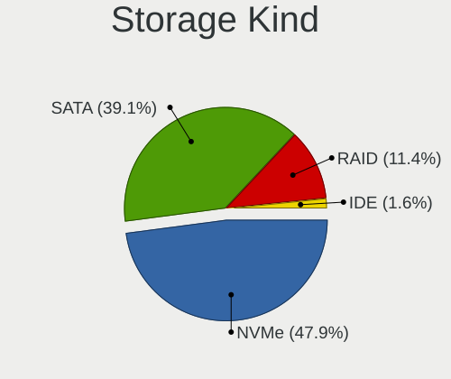

| Kind | Notebooks | Percent |
|------|-----------|---------|
| NVMe | 357       | 47.92%  |
| SATA | 291       | 39.06%  |
| RAID | 85        | 11.41%  |
| IDE  | 12        | 1.61%   |

Processor
---------

CPU Vendor
----------

Processor vendors

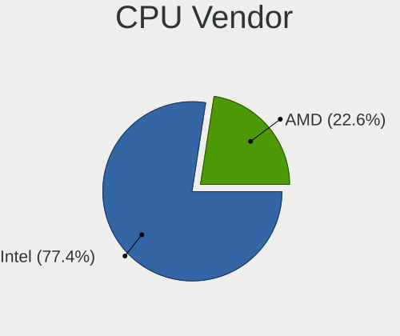

| Vendor | Notebooks | Percent |
|--------|-----------|---------|
| Intel  | 453       | 77.44%  |
| AMD    | 132       | 22.56%  |

CPU Model
---------

Processor models

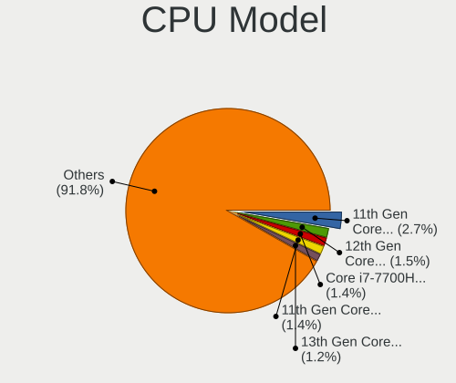

| Model                                         | Notebooks | Percent |
|-----------------------------------------------|-----------|---------|
| Intel 11th Gen Core i7-1165G7 @ 2.80GHz       | 16        | 2.74%   |
| Intel 12th Gen Core i7-12700H                 | 9         | 1.54%   |
| Intel Core i7-7700HQ CPU @ 2.80GHz            | 8         | 1.37%   |
| Intel 11th Gen Core i5-1135G7 @ 2.40GHz       | 8         | 1.37%   |
| Intel 13th Gen Core i9-13900H                 | 7         | 1.2%    |
| AMD Ryzen 5 5500U with Radeon Graphics        | 7         | 1.2%    |
| Intel Core Ultra 7 155H                       | 6         | 1.03%   |
| Intel Core i7-9750H CPU @ 2.60GHz             | 6         | 1.03%   |
| Intel Core i5-9300H CPU @ 2.40GHz             | 6         | 1.03%   |
| Intel Core i5-6200U CPU @ 2.30GHz             | 6         | 1.03%   |
| Intel Core i5-2520M CPU @ 2.50GHz             | 6         | 1.03%   |
| Intel 12th Gen Core i7-1260P                  | 6         | 1.03%   |
| Intel 12th Gen Core i5-1235U                  | 6         | 1.03%   |
| AMD Ryzen 7 7730U with Radeon Graphics        | 6         | 1.03%   |
| AMD Ryzen 7 5700U with Radeon Graphics        | 6         | 1.03%   |
| Intel Core i7-8750H CPU @ 2.20GHz             | 5         | 0.85%   |
| Intel Core i7-8565U CPU @ 1.80GHz             | 5         | 0.85%   |
| Intel Core i7-8550U CPU @ 1.80GHz             | 5         | 0.85%   |
| Intel Core i7-7500U CPU @ 2.70GHz             | 5         | 0.85%   |
| Intel Core i7-4710HQ CPU @ 2.50GHz            | 5         | 0.85%   |
| Intel Core i7-4500U CPU @ 1.80GHz             | 5         | 0.85%   |
| Intel Core i5-8365U CPU @ 1.60GHz             | 5         | 0.85%   |
| Intel Core i5-8350U CPU @ 1.70GHz             | 5         | 0.85%   |
| Intel Core i5-8250U CPU @ 1.60GHz             | 5         | 0.85%   |
| Intel Core i5-6300U CPU @ 2.40GHz             | 5         | 0.85%   |
| Intel Core i5-5300U CPU @ 2.30GHz             | 5         | 0.85%   |
| Intel 12th Gen Core i7-1255U                  | 5         | 0.85%   |
| AMD Ryzen 5 5600H with Radeon Graphics        | 5         | 0.85%   |
| AMD Ryzen 5 3500U with Radeon Vega Mobile Gfx | 5         | 0.85%   |
| Intel Core i7-6820HQ CPU @ 2.70GHz            | 4         | 0.68%   |
| Intel Core i7-6600U CPU @ 2.60GHz             | 4         | 0.68%   |
| Intel Core i7-10510U CPU @ 1.80GHz            | 4         | 0.68%   |
| Intel Core i5-5200U CPU @ 2.20GHz             | 4         | 0.68%   |
| Intel Core i5-4200U CPU @ 1.60GHz             | 4         | 0.68%   |
| Intel Core i5-3320M CPU @ 2.60GHz             | 4         | 0.68%   |
| Intel 13th Gen Core i7-13620H                 | 4         | 0.68%   |
| Intel 12th Gen Core i7-12800H                 | 4         | 0.68%   |
| Intel 12th Gen Core i5-12450H                 | 4         | 0.68%   |
| Intel 11th Gen Core i7-11800H @ 2.30GHz       | 4         | 0.68%   |
| AMD Ryzen 7 5800H with Radeon Graphics        | 4         | 0.68%   |

CPU Model Family
----------------

Processor model prefix

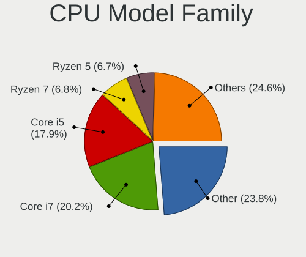

| Model                   | Notebooks | Percent |
|-------------------------|-----------|---------|
| Other                   | 139       | 23.76%  |
| Intel Core i7           | 118       | 20.17%  |
| Intel Core i5           | 105       | 17.95%  |
| AMD Ryzen 7             | 40        | 6.84%   |
| AMD Ryzen 5             | 39        | 6.67%   |
| Intel Core              | 27        | 4.62%   |
| Intel Core i3           | 26        | 4.44%   |
| Intel Celeron           | 18        | 3.08%   |
| AMD Ryzen 7 PRO         | 11        | 1.88%   |
| Intel Core 2 Duo        | 9         | 1.54%   |
| AMD Ryzen 9             | 7         | 1.2%    |
| AMD Ryzen 5 PRO         | 6         | 1.03%   |
| Intel Pentium Silver    | 4         | 0.68%   |
| Intel Core i9           | 4         | 0.68%   |
| AMD Ryzen 3             | 4         | 0.68%   |
| AMD A6                  | 4         | 0.68%   |
| AMD A4                  | 4         | 0.68%   |
| Intel Pentium           | 3         | 0.51%   |
| Intel Pentium Gold      | 2         | 0.34%   |
| AMD A12                 | 2         | 0.34%   |
| Intel Xeon              | 1         | 0.17%   |
| Intel Core M            | 1         | 0.17%   |
| Intel Celeron Dual-Core | 1         | 0.17%   |
| Intel Atom              | 1         | 0.17%   |
| AMD Turion II           | 1         | 0.17%   |
| AMD E2                  | 1         | 0.17%   |
| AMD E1                  | 1         | 0.17%   |
| AMD E                   | 1         | 0.17%   |
| AMD Athlon II Neo       | 1         | 0.17%   |
| AMD Athlon II Dual-Core | 1         | 0.17%   |
| AMD Athlon II           | 1         | 0.17%   |
| AMD A8                  | 1         | 0.17%   |
| AMD A10                 | 1         | 0.17%   |

CPU Cores
---------

Number of processor cores

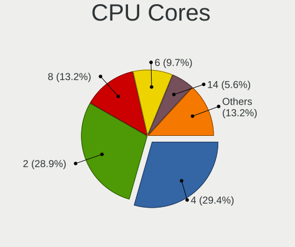

| Number | Notebooks | Percent |
|--------|-----------|---------|
| 4      | 172       | 29.4%   |
| 2      | 169       | 28.89%  |
| 8      | 77        | 13.16%  |
| 6      | 57        | 9.74%   |
| 14     | 33        | 5.64%   |
| 10     | 29        | 4.96%   |
| 12     | 18        | 3.08%   |
| 16     | 17        | 2.91%   |
| 24     | 10        | 1.71%   |
| 1      | 2         | 0.34%   |
| 5      | 1         | 0.17%   |

CPU Sockets
-----------

Number of sockets

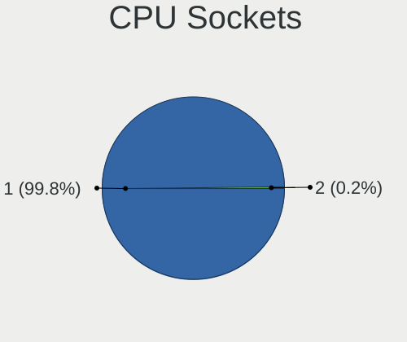

| Number | Notebooks | Percent |
|--------|-----------|---------|
| 1      | 584       | 99.83%  |
| 2      | 1         | 0.17%   |

CPU Threads
-----------

Threads per core (Hyper-Threading)

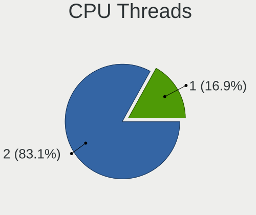

| Number | Notebooks | Percent |
|--------|-----------|---------|
| 2      | 486       | 83.08%  |
| 1      | 99        | 16.92%  |

CPU Op-Modes
------------

CPU Operation Modes (32-bit, 64-bit)

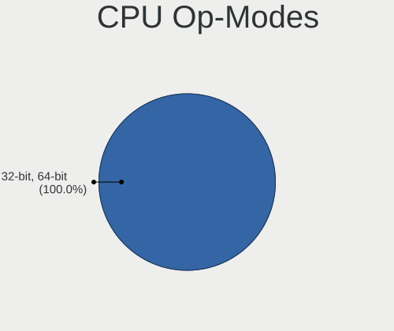

| Op mode        | Notebooks | Percent |
|----------------|-----------|---------|
| 32-bit, 64-bit | 585       | 100%    |

CPU Microcode
-------------

Microcode number

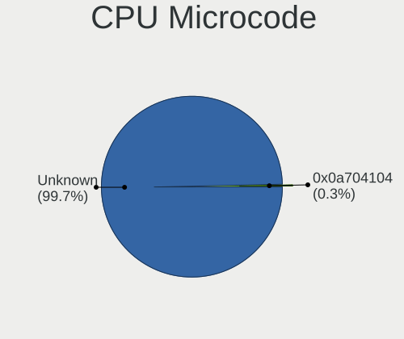

| Number     | Notebooks | Percent |
|------------|-----------|---------|
| Unknown    | 583       | 99.66%  |
| 0x0a704104 | 2         | 0.34%   |

CPU Microarch
-------------

Microarchitecture

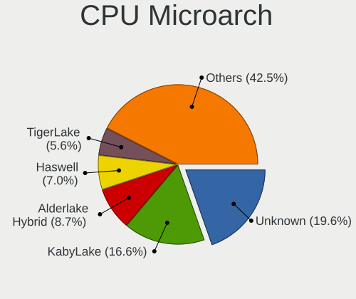

| Name               | Notebooks | Percent |
|--------------------|-----------|---------|
| Unknown            | 115       | 19.62%  |
| KabyLake           | 97        | 16.55%  |
| Alderlake Hybrid   | 51        | 8.7%    |
| Haswell            | 41        | 7%      |
| TigerLake          | 33        | 5.63%   |
| Zen 3              | 30        | 5.12%   |
| Skylake            | 26        | 4.44%   |
| SandyBridge        | 26        | 4.44%   |
| Broadwell          | 21        | 3.58%   |
| IvyBridge          | 19        | 3.24%   |
| Zen 2              | 15        | 2.56%   |
| CometLake          | 11        | 1.88%   |
| Zen+               | 10        | 1.71%   |
| Meteorlake Hybrid  | 10        | 1.71%   |
| Westmere           | 9         | 1.54%   |
| Icelake            | 8         | 1.37%   |
| Penryn             | 7         | 1.19%   |
| Goldmont plus      | 7         | 1.19%   |
| Excavator          | 6         | 1.02%   |
| Silvermont         | 4         | 0.68%   |
| Puma               | 4         | 0.68%   |
| Lunarlake Hybrid   | 4         | 0.68%   |
| K10                | 4         | 0.68%   |
| Gracemont          | 4         | 0.68%   |
| Core               | 4         | 0.68%   |
| Nehalem            | 3         | 0.51%   |
| K10 Llano          | 3         | 0.51%   |
| Goldmont           | 3         | 0.51%   |
| Zen                | 2         | 0.34%   |
| Tremont            | 2         | 0.34%   |
| Jaguar             | 2         | 0.34%   |
| ArrowLake-H Hybrid | 2         | 0.34%   |
| Piledriver         | 1         | 0.17%   |
| Bonnell            | 1         | 0.17%   |
| Bobcat             | 1         | 0.17%   |

Graphics
--------

GPU Vendor
----------

Vendors of graphics cards

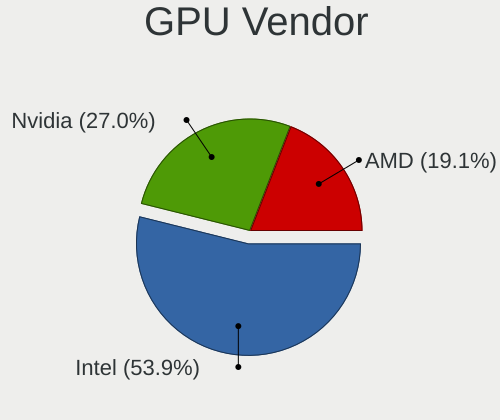

| Vendor | Notebooks | Percent |
|--------|-----------|---------|
| Intel  | 423       | 53.89%  |
| Nvidia | 212       | 27.01%  |
| AMD    | 150       | 19.11%  |

GPU Model
---------

Graphics card models

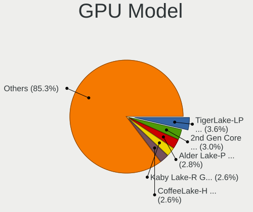

| Model                                                                     | Notebooks | Percent |
|---------------------------------------------------------------------------|-----------|---------|
| Intel TigerLake-LP GT2 [Iris Xe Graphics]                                 | 29        | 3.64%   |
| Intel 2nd Generation Core Processor Family Integrated Graphics Controller | 24        | 3.02%   |
| Intel Alder Lake-P GT2 [Iris Xe Graphics]                                 | 22        | 2.76%   |
| Intel Kaby Lake-R GT2 [UHD Graphics 620]                                  | 21        | 2.64%   |
| Intel CoffeeLake-H GT2 [UHD Graphics 630]                                 | 21        | 2.64%   |
| Intel Haswell-ULT Integrated Graphics Controller                          | 20        | 2.51%   |
| Intel Raptor Lake-P [Iris Xe Graphics]                                    | 19        | 2.39%   |
| Intel Skylake-U GT2 [HD Graphics 520]                                     | 18        | 2.26%   |
| Intel 3rd Gen Core processor Graphics Controller                          | 18        | 2.26%   |
| Intel Kaby Lake-U GT2 [HD Graphics 620]                                   | 17        | 2.14%   |
| Intel 4th Gen Core Processor Integrated Graphics Controller               | 17        | 2.14%   |
| Intel Broadwell-U GT2 [HD Graphics 5500]                                  | 16        | 2.01%   |
| Intel WhiskeyLake-U GT2 [UHD Graphics 620]                                | 15        | 1.88%   |
| AMD Renoir [Radeon Vega Series / Radeon Vega Mobile Series]               | 15        | 1.88%   |
| AMD Cezanne [Radeon Vega Series / Radeon Vega Mobile Series]              | 15        | 1.88%   |
| AMD Rembrandt [Radeon 680M]                                               | 14        | 1.76%   |
| Nvidia TU117M [GeForce GTX 1650 Mobile / Max-Q]                           | 13        | 1.63%   |
| Intel TigerLake-H GT1 [UHD Graphics]                                      | 13        | 1.63%   |
| Intel Meteor Lake-P [Intel Arc Graphics]                                  | 13        | 1.63%   |
| AMD Lucienne                                                              | 13        | 1.63%   |
| AMD Barcelo                                                               | 12        | 1.51%   |
| Nvidia GA106M [GeForce RTX 3060 Mobile / Max-Q]                           | 11        | 1.38%   |
| Nvidia AD107M [GeForce RTX 4060 Max-Q / Mobile]                           | 11        | 1.38%   |
| Nvidia GA107M [GeForce RTX 3050 Mobile]                                   | 10        | 1.26%   |
| Nvidia AD107M [GeForce RTX 4050 Max-Q / Mobile]                           | 10        | 1.26%   |
| Intel Raptor Lake-S UHD Graphics                                          | 10        | 1.26%   |
| Intel Kaby Lake-H GT2 [HD Graphics 630]                                   | 10        | 1.26%   |
| AMD Picasso/Raven 2 [Radeon Vega Series / Radeon Vega Mobile Series]      | 10        | 1.26%   |
| Nvidia GM108M [GeForce 940MX]                                             | 9         | 1.13%   |
| Intel Alder Lake-UP3 GT2 [Iris Xe Graphics]                               | 9         | 1.13%   |
| AMD Phoenix1                                                              | 9         | 1.13%   |
| Nvidia AD106M [GeForce RTX 4070 Max-Q / Mobile]                           | 8         | 1.01%   |
| Intel Raptor Lake-P [UHD Graphics]                                        | 8         | 1.01%   |
| Intel Skylake-H GT2 [HD Graphics 530]                                     | 7         | 0.88%   |
| Intel CometLake-U GT2 [UHD Graphics]                                      | 7         | 0.88%   |
| Intel CometLake-H GT2 [UHD Graphics]                                      | 7         | 0.88%   |
| AMD HawkPoint1                                                            | 7         | 0.88%   |
| Nvidia GP107M [GeForce GTX 1050 Mobile]                                   | 6         | 0.75%   |
| Nvidia GA107M [GeForce RTX 3050 Ti Mobile]                                | 6         | 0.75%   |
| Intel Alder Lake-P GT1 [UHD Graphics]                                     | 5         | 0.63%   |

GPU Combo
---------

Combinations of graphics cards

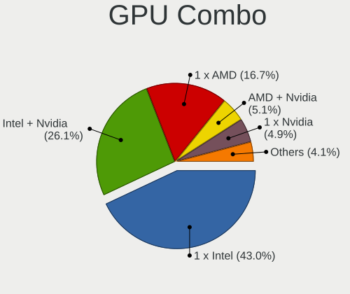

| Name           | Notebooks | Percent |
|----------------|-----------|---------|
| 1 x Intel      | 252       | 43%     |
| Intel + Nvidia | 153       | 26.11%  |
| 1 x AMD        | 98        | 16.72%  |
| AMD + Nvidia   | 30        | 5.12%   |
| 1 x Nvidia     | 29        | 4.95%   |
| Intel + AMD    | 14        | 2.39%   |
| 2 x AMD        | 8         | 1.37%   |
| 2 x Intel      | 2         | 0.34%   |

GPU Driver
----------

Free vs proprietary

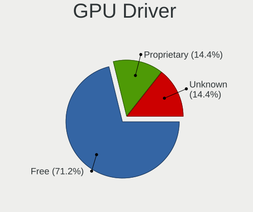

| Driver      | Notebooks | Percent |
|-------------|-----------|---------|
| Free        | 420       | 71.19%  |
| Proprietary | 85        | 14.41%  |
| Unknown     | 85        | 14.41%  |

GPU Memory
----------

Total video memory

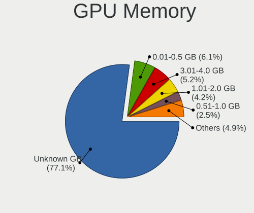

| Size in GB | Notebooks | Percent |
|------------|-----------|---------|
| Unknown    | 458       | 77.1%   |
| 0.01-0.5   | 36        | 6.06%   |
| 3.01-4.0   | 31        | 5.22%   |
| 1.01-2.0   | 25        | 4.21%   |
| 0.51-1.0   | 15        | 2.53%   |
| 7.01-8.0   | 10        | 1.68%   |
| 5.01-6.0   | 10        | 1.68%   |
| 8.01-16.0  | 7         | 1.18%   |
| 24.01-32.0 | 1         | 0.17%   |
| 2.01-3.0   | 1         | 0.17%   |

Monitor
-------

Monitor Vendor
--------------

Monitor vendors

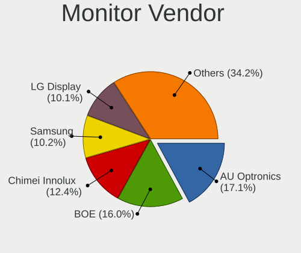

| Vendor                  | Notebooks | Percent |
|-------------------------|-----------|---------|
| AU Optronics            | 125       | 17.08%  |
| BOE                     | 117       | 15.98%  |
| Chimei Innolux          | 91        | 12.43%  |
| Samsung Electronics     | 75        | 10.25%  |
| LG Display              | 74        | 10.11%  |
| Dell                    | 35        | 4.78%   |
| Goldstar                | 21        | 2.87%   |
| Sharp                   | 19        | 2.6%    |
| Apple                   | 15        | 2.05%   |
| Lenovo                  | 14        | 1.91%   |
| PANDA                   | 10        | 1.37%   |
| Chi Mei Optoelectronics | 10        | 1.37%   |
| Philips                 | 9         | 1.23%   |
| Acer                    | 9         | 1.23%   |
| Hewlett-Packard         | 8         | 1.09%   |
| AOC                     | 8         | 1.09%   |
| CSO                     | 7         | 0.96%   |
| BenQ                    | 7         | 0.96%   |
| InfoVision              | 6         | 0.82%   |
| CSOT                    | 6         | 0.82%   |
| CSW                     | 5         | 0.68%   |
| ViewSonic               | 3         | 0.41%   |
| MSI                     | 3         | 0.41%   |
| HKC                     | 3         | 0.41%   |
| EDO                     | 3         | 0.41%   |
| ASUSTek Computer        | 3         | 0.41%   |
| Ancor Communications    | 3         | 0.41%   |
| ___                     | 2         | 0.27%   |
| Vestel Elektronik       | 2         | 0.27%   |
| Valve                   | 2         | 0.27%   |
| Unknown                 | 2         | 0.27%   |
| TMX                     | 2         | 0.27%   |
| Panasonic               | 2         | 0.27%   |
| Mi                      | 2         | 0.27%   |
| Iiyama                  | 2         | 0.27%   |
| HannStar                | 2         | 0.27%   |
| Fujitsu Siemens         | 2         | 0.27%   |
| Vizio                   | 1         | 0.14%   |
| Toshiba                 | 1         | 0.14%   |
| Sony                    | 1         | 0.14%   |

Monitor Model
-------------

Monitor models

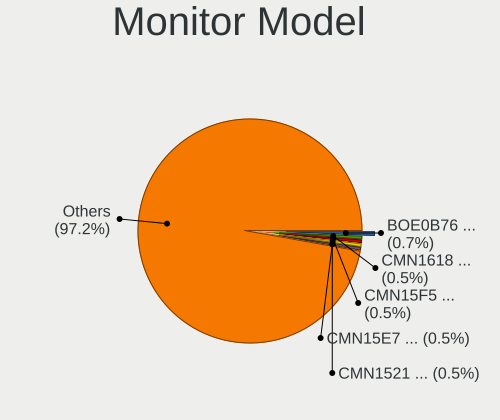

| Model                                                                    | Notebooks | Percent |
|--------------------------------------------------------------------------|-----------|---------|
| BOE LCD Monitor BOE0B76 1920x1200 345x215mm 16.0-inch                    | 5         | 0.67%   |
| Chimei Innolux LCD Monitor CMN1618 1920x1200 344x215mm 16.0-inch         | 4         | 0.54%   |
| Chimei Innolux LCD Monitor CMN15F5 1920x1080 344x193mm 15.5-inch         | 4         | 0.54%   |
| Chimei Innolux LCD Monitor CMN15E7 1920x1080 344x193mm 15.5-inch         | 4         | 0.54%   |
| Chimei Innolux LCD Monitor CMN1521 1920x1080 344x193mm 15.5-inch         | 4         | 0.54%   |
| Chimei Innolux LCD Monitor CMN14D4 1920x1080 309x173mm 13.9-inch         | 4         | 0.54%   |
| Chi Mei Optoelectronics LCD Monitor CMO15A7 1366x768 344x193mm 15.5-inch | 4         | 0.54%   |
| AU Optronics LCD Monitor AUO71EC 1366x768 344x193mm 15.5-inch            | 4         | 0.54%   |
| AU Optronics LCD Monitor AUO106C 1366x768 276x155mm 12.5-inch            | 4         | 0.54%   |
| Sharp LCD Monitor SHP1548 1920x1200 288x180mm 13.4-inch                  | 3         | 0.4%    |
| Samsung Electronics LCD Monitor SEC5441 1280x800 331x207mm 15.4-inch     | 3         | 0.4%    |
| Samsung Electronics LCD Monitor SEC4542 1366x768 309x174mm 14.0-inch     | 3         | 0.4%    |
| Samsung Electronics LCD Monitor SDC4178 3200x2000 344x215mm 16.0-inch    | 3         | 0.4%    |
| Samsung Electronics LCD Monitor SDC324C 1920x1080 344x194mm 15.5-inch    | 3         | 0.4%    |
| Samsung Electronics C24F390 SAM0D2C 1920x1080 521x293mm 23.5-inch        | 3         | 0.4%    |
| PANDA LCD Monitor NCP004D 1920x1080 344x194mm 15.5-inch                  | 3         | 0.4%    |
| LG Display LCD Monitor LGD0521 1920x1080 309x174mm 14.0-inch             | 3         | 0.4%    |
| Lenovo LCD Monitor LEN41B5 1920x1200 344x215mm 16.0-inch                 | 3         | 0.4%    |
| InfoVision LCD Monitor IVO057D 1920x1080 309x174mm 14.0-inch             | 3         | 0.4%    |
| EDO EDO142 EDO0142                                                       | 3         | 0.4%    |
| Chimei Innolux LCD Monitor CMN15E8 1920x1080 344x193mm 15.5-inch         | 3         | 0.4%    |
| Chimei Innolux LCD Monitor CMN1512 1920x1080 344x193mm 15.5-inch         | 3         | 0.4%    |
| Chimei Innolux LCD Monitor CMN14F2 1920x1080 309x173mm 13.9-inch         | 3         | 0.4%    |
| Chimei Innolux LCD Monitor CMN14B1 1920x1080 308x173mm 13.9-inch         | 3         | 0.4%    |
| BOE LCD Monitor BOE09CC 1920x1080 344x194mm 15.5-inch                    | 3         | 0.4%    |
| BOE LCD Monitor BOE08D5 1920x1080 344x194mm 15.5-inch                    | 3         | 0.4%    |
| BOE LCD Monitor BOE06A4 1366x768 344x194mm 15.5-inch                     | 3         | 0.4%    |
| AU Optronics LCD Monitor AUO61ED 1920x1080 344x194mm 15.5-inch           | 3         | 0.4%    |
| AU Optronics LCD Monitor AUO333C 1366x768 309x173mm 13.9-inch            | 3         | 0.4%    |
| AU Optronics LCD Monitor AUO21ED 1920x1080 344x193mm 15.5-inch           | 3         | 0.4%    |
| AU Optronics LCD Monitor AUO133D 1920x1080 309x173mm 13.9-inch           | 3         | 0.4%    |
| ___ LCD TV ___9000 1360x768                                              | 2         | 0.27%   |
| Vestel Elektronik 40UHD_LCD_TV VES3700 3840x2160 880x500mm 39.8-inch     | 2         | 0.27%   |
| Unknown LCDTV16 9000 1360x768 1600x900mm 72.3-inch                       | 2         | 0.27%   |
| Sharp LCD Monitor SHP1516 3840x2400 336x210mm 15.6-inch                  | 2         | 0.27%   |
| Sharp LCD Monitor SHP14D0 3840x2400 336x210mm 15.6-inch                  | 2         | 0.27%   |
| Sharp LCD Monitor SHP1420 1920x1080 294x165mm 13.3-inch                  | 2         | 0.27%   |
| Samsung Electronics LCD Monitor SDCA029 3840x2160 344x194mm 15.5-inch    | 2         | 0.27%   |
| Samsung Electronics LCD Monitor SDC4180 2880x1620 344x194mm 15.5-inch    | 2         | 0.27%   |
| Samsung Electronics LCD Monitor SDC4161 1920x1080 344x194mm 15.5-inch    | 2         | 0.27%   |

Monitor Resolution
------------------

Monitor screen resolution

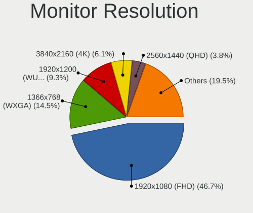

| Resolution         | Notebooks | Percent |
|--------------------|-----------|---------|
| 1920x1080 (FHD)    | 316       | 46.75%  |
| 1366x768 (WXGA)    | 98        | 14.5%   |
| 1920x1200 (WUXGA)  | 63        | 9.32%   |
| 3840x2160 (4K)     | 41        | 6.07%   |
| 2560x1440 (QHD)    | 26        | 3.85%   |
| 2560x1600          | 23        | 3.4%    |
| 1600x900 (HD+)     | 21        | 3.11%   |
| 2880x1800          | 14        | 2.07%   |
| 3440x1440          | 12        | 1.78%   |
| 3840x2400          | 9         | 1.33%   |
| 1280x800 (WXGA)    | 8         | 1.18%   |
| Unknown            | 5         | 0.74%   |
| 2560x1080          | 4         | 0.59%   |
| 3200x2000          | 3         | 0.44%   |
| 2880x1620          | 3         | 0.44%   |
| 1440x900 (WXGA+)   | 3         | 0.44%   |
| 800x1280           | 2         | 0.3%    |
| 3840x1080          | 2         | 0.3%    |
| 3072x1920          | 2         | 0.3%    |
| 3000x2000          | 2         | 0.3%    |
| 2256x1504          | 2         | 0.3%    |
| 2160x1440          | 2         | 0.3%    |
| 1680x1050 (WSXGA+) | 2         | 0.3%    |
| 1360x768           | 2         | 0.3%    |
| 3840x1100          | 1         | 0.15%   |
| 3456x2160          | 1         | 0.15%   |
| 2520x1680          | 1         | 0.15%   |
| 2304x1440          | 1         | 0.15%   |
| 2048x1280          | 1         | 0.15%   |
| 1920x1280          | 1         | 0.15%   |
| 1680x945           | 1         | 0.15%   |
| 1360x765           | 1         | 0.15%   |
| 1280x1024 (SXGA)   | 1         | 0.15%   |
| 1024x768 (XGA)     | 1         | 0.15%   |
| 1024x600           | 1         | 0.15%   |

Monitor Diagonal
----------------

Diagonal size in inches

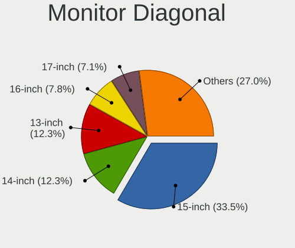

| Inches  | Notebooks | Percent |
|---------|-----------|---------|
| 15      | 245       | 33.47%  |
| 14      | 90        | 12.3%   |
| 13      | 90        | 12.3%   |
| 16      | 57        | 7.79%   |
| 17      | 52        | 7.1%    |
| 27      | 37        | 5.05%   |
| 24      | 30        | 4.1%    |
| 23      | 22        | 3.01%   |
| 31      | 17        | 2.32%   |
| 21      | 15        | 2.05%   |
| 34      | 14        | 1.91%   |
| 12      | 9         | 1.23%   |
| Unknown | 9         | 1.23%   |
| 11      | 6         | 0.82%   |
| 18      | 5         | 0.68%   |
| 84      | 4         | 0.55%   |
| 72      | 4         | 0.55%   |
| 54      | 2         | 0.27%   |
| 48      | 2         | 0.27%   |
| 40      | 2         | 0.27%   |
| 32      | 2         | 0.27%   |
| 22      | 2         | 0.27%   |
| 19      | 2         | 0.27%   |
| 7       | 2         | 0.27%   |
| 74      | 1         | 0.14%   |
| 65      | 1         | 0.14%   |
| 63      | 1         | 0.14%   |
| 52      | 1         | 0.14%   |
| 49      | 1         | 0.14%   |
| 46      | 1         | 0.14%   |
| 42      | 1         | 0.14%   |
| 39      | 1         | 0.14%   |
| 38      | 1         | 0.14%   |
| 33      | 1         | 0.14%   |
| 25      | 1         | 0.14%   |
| 20      | 1         | 0.14%   |

Monitor Width
-------------

Physical width

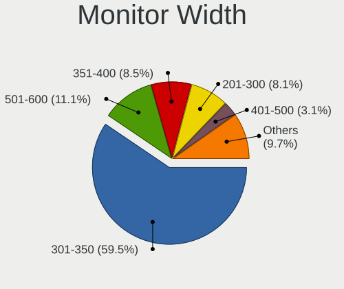

| Width in mm | Notebooks | Percent |
|-------------|-----------|---------|
| 301-350     | 427       | 59.47%  |
| 501-600     | 80        | 11.14%  |
| 351-400     | 61        | 8.5%    |
| 201-300     | 58        | 8.08%   |
| 401-500     | 22        | 3.06%   |
| 601-700     | 19        | 2.65%   |
| 701-800     | 17        | 2.37%   |
| 1501-2000   | 9         | 1.25%   |
| 1001-1500   | 9         | 1.25%   |
| Unknown     | 9         | 1.25%   |
| 801-900     | 3         | 0.42%   |
| 901-1000    | 2         | 0.28%   |
| 1-100       | 2         | 0.28%   |

Aspect Ratio
------------

Proportional relationship between the width and the height

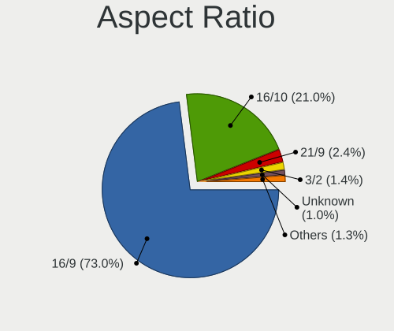

| Ratio   | Notebooks | Percent |
|---------|-----------|---------|
| 16/9    | 460       | 73.02%  |
| 16/10   | 132       | 20.95%  |
| 21/9    | 15        | 2.38%   |
| 3/2     | 9         | 1.43%   |
| Unknown | 6         | 0.95%   |
| 32/9    | 3         | 0.48%   |
| 5/4     | 1         | 0.16%   |
| 4/3     | 1         | 0.16%   |
| 3.40    | 1         | 0.16%   |
| 0.67    | 1         | 0.16%   |
| 0.62    | 1         | 0.16%   |

Monitor Area
------------

Area in inch²

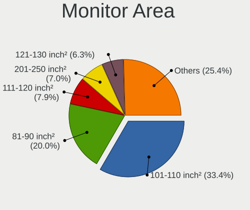

| Area in inch² | Notebooks | Percent |
|----------------|-----------|---------|
| 101-110        | 244       | 33.38%  |
| 81-90          | 146       | 19.97%  |
| 111-120        | 58        | 7.93%   |
| 201-250        | 51        | 6.98%   |
| 121-130        | 46        | 6.29%   |
| 301-350        | 37        | 5.06%   |
| 351-500        | 34        | 4.65%   |
| 71-80          | 31        | 4.24%   |
| More than 1000 | 14        | 1.92%   |
| 251-300        | 12        | 1.64%   |
| 501-1000       | 9         | 1.23%   |
| Unknown        | 9         | 1.23%   |
| 61-70          | 8         | 1.09%   |
| 151-200        | 8         | 1.09%   |
| 51-60          | 7         | 0.96%   |
| 141-150        | 5         | 0.68%   |
| 131-140        | 5         | 0.68%   |
| 91-100         | 5         | 0.68%   |
| 1-40           | 2         | 0.27%   |

Pixel Density
-------------

Pixels per inch

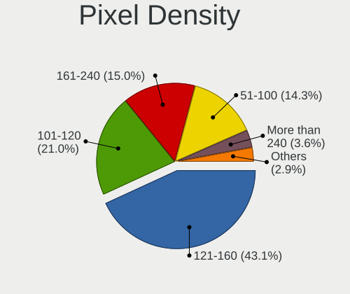

| Density       | Notebooks | Percent |
|---------------|-----------|---------|
| 121-160       | 308       | 43.14%  |
| 101-120       | 150       | 21.01%  |
| 161-240       | 107       | 14.99%  |
| 51-100        | 102       | 14.29%  |
| More than 240 | 26        | 3.64%   |
| 1-50          | 12        | 1.68%   |
| Unknown       | 9         | 1.26%   |

Multiple Monitors
-----------------

Total monitors connected

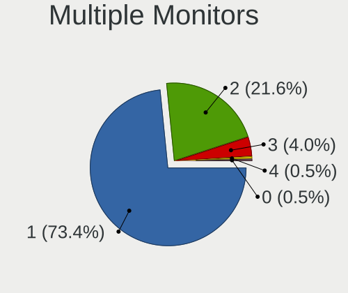

| Total | Notebooks | Percent |
|-------|-----------|---------|
| 1     | 439       | 73.41%  |
| 2     | 129       | 21.57%  |
| 3     | 24        | 4.01%   |
| 4     | 3         | 0.5%    |
| 0     | 3         | 0.5%    |

Network
-------

Net Controller Vendor
---------------------

Controller vendors

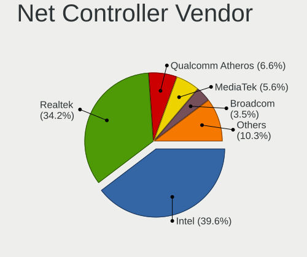

| Vendor                                 | Notebooks | Percent |
|----------------------------------------|-----------|---------|
| Intel                                  | 358       | 39.65%  |
| Realtek Semiconductor                  | 309       | 34.22%  |
| Qualcomm Atheros                       | 60        | 6.64%   |
| MediaTek                               | 51        | 5.65%   |
| Broadcom                               | 32        | 3.54%   |
| Qualcomm                               | 9         | 1%      |
| Broadcom Limited                       | 9         | 1%      |
| ASIX Electronics                       | 8         | 0.89%   |
| TP-Link                                | 7         | 0.78%   |
| Samsung Electronics                    | 7         | 0.78%   |
| Shenzhen Goodix Technology             | 6         | 0.66%   |
| DisplayLink                            | 6         | 0.66%   |
| Sierra Wireless                        | 4         | 0.44%   |
| Ralink                                 | 4         | 0.44%   |
| Marvell Technology Group               | 4         | 0.44%   |
| Dell                                   | 4         | 0.44%   |
| Ralink Technology                      | 3         | 0.33%   |
| Lenovo                                 | 3         | 0.33%   |
| Huawei Technologies                    | 3         | 0.33%   |
| Xiaomi                                 | 2         | 0.22%   |
| Ericsson Business Mobile Networks      | 2         | 0.22%   |
| Suzhou Motorcomm Electronic Technology | 1         | 0.11%   |
| Spreadtrum Communications              | 1         | 0.11%   |
| Nvidia                                 | 1         | 0.11%   |
| Motorcomm Microelectronics.            | 1         | 0.11%   |
| Microchip Technology                   | 1         | 0.11%   |
| Linksys                                | 1         | 0.11%   |
| JMicron Technology                     | 1         | 0.11%   |
| Fibocom                                | 1         | 0.11%   |
| D-Link                                 | 1         | 0.11%   |
| Aquantia                               | 1         | 0.11%   |
| Apple                                  | 1         | 0.11%   |
| 802.11g Adapter [Linksys WUSB54GC v3]  | 1         | 0.11%   |

Net Controller Model
--------------------

Controller models

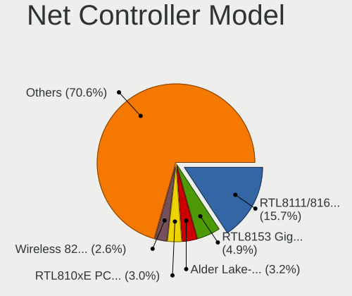

| Model                                                                  | Notebooks | Percent |
|------------------------------------------------------------------------|-----------|---------|
| Realtek RTL8111/8168/8211/8411 PCI Express Gigabit Ethernet Controller | 174       | 15.75%  |
| Realtek RTL8153 Gigabit Ethernet Adapter                               | 54        | 4.89%   |
| Intel Alder Lake-P PCH CNVi WiFi                                       | 35        | 3.17%   |
| Realtek RTL810xE PCI Express Fast Ethernet controller                  | 33        | 2.99%   |
| Intel Wireless 8265 / 8275                                             | 29        | 2.62%   |
| Intel Wi-Fi 6 AX201                                                    | 26        | 2.35%   |
| Intel Wireless 7260                                                    | 25        | 2.26%   |
| Intel Wi-Fi 6 AX200                                                    | 25        | 2.26%   |
| MediaTek MT7921 802.11ax PCIe Wireless Network Adapter [Filogic 330]   | 20        | 1.81%   |
| MediaTek MT7922 802.11ax PCI Express Wireless Network Adapter          | 18        | 1.63%   |
| Intel Wireless 7265                                                    | 18        | 1.63%   |
| Realtek RTL8822CE 802.11ac PCIe Wireless Network Adapter               | 17        | 1.54%   |
| Intel Raptor Lake PCH CNVi WiFi                                        | 17        | 1.54%   |
| Intel Wi-Fi 6E(802.11ax) AX210/AX1675* 2x2 [Typhoon Peak]              | 16        | 1.45%   |
| Realtek RTL8852BE PCIe 802.11ax Wireless Network Controller            | 15        | 1.36%   |
| Intel Wireless 8260                                                    | 15        | 1.36%   |
| Intel Cannon Lake PCH CNVi WiFi                                        | 14        | 1.27%   |
| Realtek RTL8821CE 802.11ac PCIe Wireless Network Adapter               | 12        | 1.09%   |
| Qualcomm Atheros AR9485 Wireless Network Adapter                       | 12        | 1.09%   |
| Intel Ethernet Connection (4) I219-LM                                  | 12        | 1.09%   |
| Intel Wi-Fi 7(802.11be) AX1775*/AX1790*/BE20*/BE401/BE1750* 2x2        | 11        | 1%      |
| Intel Meteor Lake PCH CNVi WiFi                                        | 11        | 1%      |
| Intel 82579LM Gigabit Network Connection (Lewisville)                  | 11        | 1%      |
| Realtek RTL8125 2.5GbE Controller                                      | 10        | 0.9%    |
| Qualcomm Atheros QCA9377 802.11ac Wireless Network Adapter             | 10        | 0.9%    |
| Qualcomm Atheros QCA6174 802.11ac Wireless Network Adapter             | 10        | 0.9%    |
| MediaTek MT7902 802.11ax PCIe Wireless Network Adapter [Filogic 310]   | 10        | 0.9%    |
| Intel Tiger Lake PCH CNVi WiFi                                         | 10        | 0.9%    |
| Qualcomm QCNFA765 Wireless Network Adapter                             | 9         | 0.81%   |
| Qualcomm Atheros QCA9565 / AR9565 Wireless Network Adapter             | 9         | 0.81%   |
| Intel Ethernet Connection (4) I219-V                                   | 9         | 0.81%   |
| Intel Comet Lake PCH CNVi WiFi                                         | 9         | 0.81%   |
| Intel Ethernet Connection I217-LM                                      | 8         | 0.72%   |
| Intel Cannon Point-LP CNVi [Wireless-AC]                               | 8         | 0.72%   |
| Intel 700 Series Chipset CNVi WiFi                                     | 8         | 0.72%   |
| ASIX AX88179 Gigabit Ethernet                                          | 8         | 0.72%   |
| Realtek RTL8822BE 802.11a/b/g/n/ac WiFi adapter                        | 7         | 0.63%   |
| Intel Ethernet Connection I219-LM                                      | 7         | 0.63%   |
| Intel Ethernet Connection (6) I219-LM                                  | 7         | 0.63%   |
| Intel Ethernet Connection (3) I218-LM                                  | 7         | 0.63%   |

Wireless Vendor
---------------

Wireless vendors

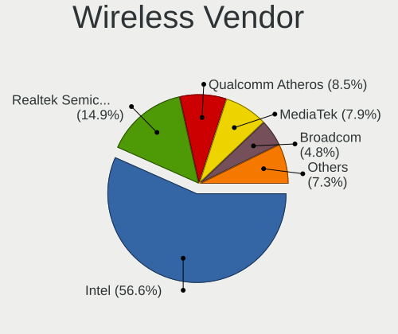

| Vendor                                | Notebooks | Percent |
|---------------------------------------|-----------|---------|
| Intel                                 | 328       | 56.65%  |
| Realtek Semiconductor                 | 86        | 14.85%  |
| Qualcomm Atheros                      | 49        | 8.46%   |
| MediaTek                              | 46        | 7.94%   |
| Broadcom                              | 28        | 4.84%   |
| Qualcomm                              | 9         | 1.55%   |
| Broadcom Limited                      | 8         | 1.38%   |
| TP-Link                               | 6         | 1.04%   |
| Sierra Wireless                       | 4         | 0.69%   |
| Ralink                                | 4         | 0.69%   |
| Dell                                  | 4         | 0.69%   |
| Ralink Technology                     | 3         | 0.52%   |
| Fibocom                               | 1         | 0.17%   |
| Ericsson Business Mobile Networks     | 1         | 0.17%   |
| D-Link                                | 1         | 0.17%   |
| 802.11g Adapter [Linksys WUSB54GC v3] | 1         | 0.17%   |

Wireless Model
--------------

Wireless models

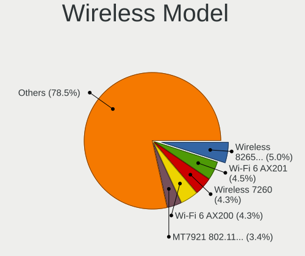

| Model                                                                | Notebooks | Percent |
|----------------------------------------------------------------------|-----------|---------|
| Intel Wireless 8265 / 8275                                           | 29        | 4.99%   |
| Intel Wi-Fi 6 AX201                                                  | 26        | 4.48%   |
| Intel Wireless 7260                                                  | 25        | 4.3%    |
| Intel Wi-Fi 6 AX200                                                  | 25        | 4.3%    |
| MediaTek MT7921 802.11ax PCIe Wireless Network Adapter [Filogic 330] | 20        | 3.44%   |
| Intel Alder Lake-P PCH CNVi WiFi                                     | 20        | 3.44%   |
| Intel Wireless 7265                                                  | 18        | 3.1%    |
| Realtek RTL8822CE 802.11ac PCIe Wireless Network Adapter             | 17        | 2.93%   |
| Intel Raptor Lake PCH CNVi WiFi                                      | 17        | 2.93%   |
| Intel Wi-Fi 6E(802.11ax) AX210/AX1675* 2x2 [Typhoon Peak]            | 16        | 2.75%   |
| Intel Wireless 8260                                                  | 15        | 2.58%   |
| Realtek RTL8852BE PCIe 802.11ax Wireless Network Controller          | 14        | 2.41%   |
| MediaTek MT7922 802.11ax PCI Express Wireless Network Adapter        | 14        | 2.41%   |
| Intel Cannon Lake PCH CNVi WiFi                                      | 14        | 2.41%   |
| Realtek RTL8821CE 802.11ac PCIe Wireless Network Adapter             | 12        | 2.07%   |
| Qualcomm Atheros AR9485 Wireless Network Adapter                     | 12        | 2.07%   |
| Intel Meteor Lake PCH CNVi WiFi                                      | 11        | 1.89%   |
| Qualcomm Atheros QCA9377 802.11ac Wireless Network Adapter           | 10        | 1.72%   |
| Qualcomm Atheros QCA6174 802.11ac Wireless Network Adapter           | 10        | 1.72%   |
| MediaTek MT7902 802.11ax PCIe Wireless Network Adapter [Filogic 310] | 10        | 1.72%   |
| Intel Tiger Lake PCH CNVi WiFi                                       | 10        | 1.72%   |
| Qualcomm QCNFA765 Wireless Network Adapter                           | 9         | 1.55%   |
| Qualcomm Atheros QCA9565 / AR9565 Wireless Network Adapter           | 9         | 1.55%   |
| Intel Comet Lake PCH CNVi WiFi                                       | 9         | 1.55%   |
| Intel Wi-Fi 7(802.11be) AX1775*/AX1790*/BE20*/BE401/BE1750* 2x2      | 8         | 1.38%   |
| Intel Cannon Point-LP CNVi [Wireless-AC]                             | 8         | 1.38%   |
| Intel 700 Series Chipset CNVi WiFi                                   | 8         | 1.38%   |
| Realtek RTL8822BE 802.11a/b/g/n/ac WiFi adapter                      | 7         | 1.2%    |
| Intel Comet Lake PCH-LP CNVi WiFi                                    | 7         | 1.2%    |
| Intel Centrino Advanced-N 6205 [Taylor Peak]                         | 7         | 1.2%    |
| Realtek RTL8852AE 802.11ax PCIe Wireless Network Adapter             | 6         | 1.03%   |
| Realtek RTL8723BE PCIe Wireless Network Adapter                      | 6         | 1.03%   |
| Intel Wireless 3160                                                  | 6         | 1.03%   |
| Intel Dual Band Wireless-AC 3168NGW [Stone Peak]                     | 5         | 0.86%   |
| Broadcom BCM43142 802.11b/g/n                                        | 5         | 0.86%   |
| Broadcom BCM4313 802.11bgn Wireless Network Adapter                  | 5         | 0.86%   |
| Realtek 802.11ac NIC                                                 | 4         | 0.69%   |
| Intel Wireless 3165                                                  | 4         | 0.69%   |
| Intel Wi-Fi 5(802.11ac) Wireless-AC 9x6x [Thunder Peak]              | 4         | 0.69%   |
| Intel Ice Lake-LP PCH CNVi WiFi                                      | 4         | 0.69%   |

Ethernet Vendor
---------------

Ethernet vendors

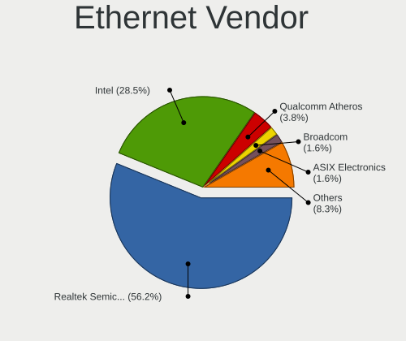

| Vendor                                 | Notebooks | Percent |
|----------------------------------------|-----------|---------|
| Realtek Semiconductor                  | 278       | 56.16%  |
| Intel                                  | 141       | 28.48%  |
| Qualcomm Atheros                       | 19        | 3.84%   |
| Broadcom                               | 8         | 1.62%   |
| ASIX Electronics                       | 8         | 1.62%   |
| Samsung Electronics                    | 7         | 1.41%   |
| DisplayLink                            | 6         | 1.21%   |
| MediaTek                               | 5         | 1.01%   |
| Marvell Technology Group               | 4         | 0.81%   |
| Lenovo                                 | 3         | 0.61%   |
| Huawei Technologies                    | 3         | 0.61%   |
| Xiaomi                                 | 2         | 0.4%    |
| TP-Link                                | 1         | 0.2%    |
| Suzhou Motorcomm Electronic Technology | 1         | 0.2%    |
| Spreadtrum Communications              | 1         | 0.2%    |
| Nvidia                                 | 1         | 0.2%    |
| Motorcomm Microelectronics.            | 1         | 0.2%    |
| Microchip Technology                   | 1         | 0.2%    |
| Linksys                                | 1         | 0.2%    |
| JMicron Technology                     | 1         | 0.2%    |
| Broadcom Limited                       | 1         | 0.2%    |
| Aquantia                               | 1         | 0.2%    |
| Apple                                  | 1         | 0.2%    |

Ethernet Model
--------------

Ethernet models

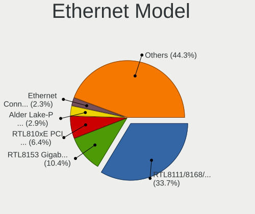

| Model                                                                  | Notebooks | Percent |
|------------------------------------------------------------------------|-----------|---------|
| Realtek RTL8111/8168/8211/8411 PCI Express Gigabit Ethernet Controller | 174       | 33.66%  |
| Realtek RTL8153 Gigabit Ethernet Adapter                               | 54        | 10.44%  |
| Realtek RTL810xE PCI Express Fast Ethernet controller                  | 33        | 6.38%   |
| Intel Alder Lake-P PCH CNVi WiFi                                       | 15        | 2.9%    |
| Intel Ethernet Connection (4) I219-LM                                  | 12        | 2.32%   |
| Intel 82579LM Gigabit Network Connection (Lewisville)                  | 11        | 2.13%   |
| Realtek RTL8125 2.5GbE Controller                                      | 10        | 1.93%   |
| Intel Ethernet Connection (4) I219-V                                   | 9         | 1.74%   |
| Intel Ethernet Connection I217-LM                                      | 8         | 1.55%   |
| ASIX AX88179 Gigabit Ethernet                                          | 8         | 1.55%   |
| Intel Ethernet Connection I219-LM                                      | 7         | 1.35%   |
| Intel Ethernet Connection (6) I219-LM                                  | 7         | 1.35%   |
| Intel Ethernet Connection (3) I218-LM                                  | 7         | 1.35%   |
| Realtek RTL8152 Fast Ethernet Adapter                                  | 6         | 1.16%   |
| Intel Ethernet Connection (2) I219-LM                                  | 6         | 1.16%   |
| Intel Ethernet Connection (16) I219-LM                                 | 6         | 1.16%   |
| Samsung Galaxy series, misc. (tethering mode)                          | 5         | 0.97%   |
| Realtek USB 10/100/1G/2.5 LAN                                          | 5         | 0.97%   |
| Realtek Killer E3000 2.5GbE Controller                                 | 5         | 0.97%   |
| Intel Ethernet Connection (16) I219-V                                  | 5         | 0.97%   |
| Intel Ethernet Connection (13) I219-V                                  | 5         | 0.97%   |
| Qualcomm Atheros AR8151 v2.0 Gigabit Ethernet                          | 4         | 0.77%   |
| MediaTek MT7922 802.11ax PCI Express Wireless Network Adapter          | 4         | 0.77%   |
| Intel Ethernet Controller I226-K                                       | 4         | 0.77%   |
| Intel Ethernet Connection I218-LM                                      | 4         | 0.77%   |
| Intel Ethernet Connection (7) I219-V                                   | 4         | 0.77%   |
| Intel Ethernet Connection (23) I219-V                                  | 4         | 0.77%   |
| Intel Arrow Lake CNVi WiFi                                             | 4         | 0.77%   |
| Intel 82577LM Gigabit Network Connection                               | 4         | 0.77%   |
| Broadcom NetXtreme BCM57765 Gigabit Ethernet PCIe                      | 4         | 0.77%   |
| Marvell Group 88E8040 PCI-E Fast Ethernet Controller                   | 3         | 0.58%   |
| Intel Wi-Fi 7(802.11be) AX1775*/AX1790*/BE20*/BE401/BE1750* 2x2        | 3         | 0.58%   |
| Xiaomi Mi/Redmi series (RNDIS)                                         | 2         | 0.39%   |
| Samsung GT-I9070 (network tethering, USB debugging enabled)            | 2         | 0.39%   |
| Qualcomm Atheros Killer E220x Gigabit Ethernet Controller              | 2         | 0.39%   |
| Qualcomm Atheros AR8162 Fast Ethernet                                  | 2         | 0.39%   |
| Qualcomm Atheros AR8161 Gigabit Ethernet                               | 2         | 0.39%   |
| Qualcomm Atheros AR8131 Gigabit Ethernet                               | 2         | 0.39%   |
| Intel Ethernet Connection I219-V                                       | 2         | 0.39%   |
| Intel Ethernet Connection (6) I219-V                                   | 2         | 0.39%   |

Net Controller Kind
-------------------

Ethernet, WiFi or modem

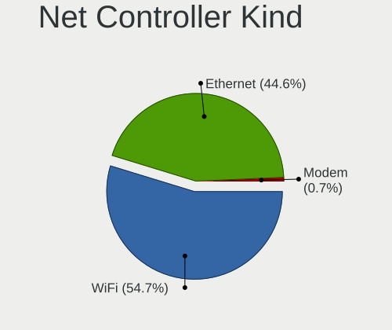

| Kind     | Notebooks | Percent |
|----------|-----------|---------|
| WiFi     | 551       | 54.72%  |
| Ethernet | 449       | 44.59%  |
| Modem    | 7         | 0.7%    |

Used Controller
---------------

Currently used network controller

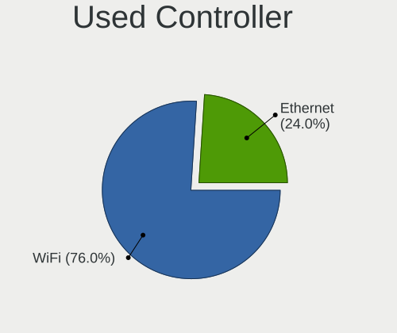

| Kind     | Notebooks | Percent |
|----------|-----------|---------|
| WiFi     | 469       | 76.01%  |
| Ethernet | 148       | 23.99%  |

NICs
----

Total network controllers on board

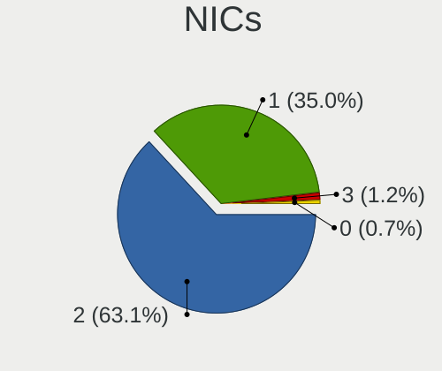

| Total | Notebooks | Percent |
|-------|-----------|---------|
| 2     | 370       | 63.14%  |
| 1     | 205       | 34.98%  |
| 3     | 7         | 1.19%   |
| 0     | 4         | 0.68%   |

IPv6
----

IPv6 vs IPv4

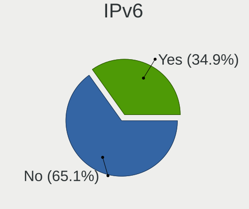

| Used | Notebooks | Percent |
|------|-----------|---------|
| No   | 385       | 65.14%  |
| Yes  | 206       | 34.86%  |

Bluetooth
---------

Bluetooth Vendor
----------------

Controller vendors

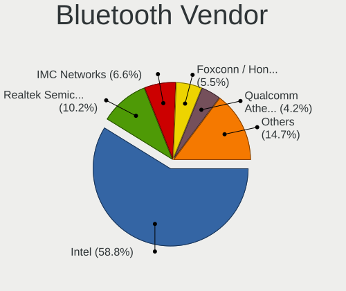

| Vendor                          | Notebooks | Percent |
|---------------------------------|-----------|---------|
| Intel                           | 311       | 58.79%  |
| Realtek Semiconductor           | 54        | 10.21%  |
| IMC Networks                    | 35        | 6.62%   |
| Foxconn / Hon Hai               | 29        | 5.48%   |
| Qualcomm Atheros Communications | 22        | 4.16%   |
| Broadcom                        | 14        | 2.65%   |
| Lite-On Technology              | 13        | 2.46%   |
| Apple                           | 13        | 2.46%   |
| MediaTek                        | 7         | 1.32%   |
| USI                             | 6         | 1.13%   |
| Realtek                         | 5         | 0.95%   |
| Hewlett-Packard                 | 5         | 0.95%   |
| Dell                            | 4         | 0.76%   |
| Cambridge Silicon Radio         | 4         | 0.76%   |
| TP-Link                         | 1         | 0.19%   |
| Toshiba                         | 1         | 0.19%   |
| Ralink Technology               | 1         | 0.19%   |
| Ralink                          | 1         | 0.19%   |
| ASUSTek Computer                | 1         | 0.19%   |
| Askey Computer                  | 1         | 0.19%   |
| Alps Electric                   | 1         | 0.19%   |

Bluetooth Model
---------------

Controller models

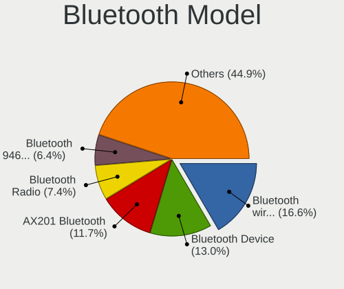

| Model                                               | Notebooks | Percent |
|-----------------------------------------------------|-----------|---------|
| Intel Bluetooth wireless interface                  | 88        | 16.6%   |
| Intel Bluetooth Device                              | 69        | 13.02%  |
| Intel AX201 Bluetooth                               | 62        | 11.7%   |
| Realtek Bluetooth Radio                             | 39        | 7.36%   |
| Intel Bluetooth 9460/9560 Jefferson Peak (JfP)      | 34        | 6.42%   |
| Intel AX200 Bluetooth                               | 25        | 4.72%   |
| IMC Networks Wireless_Device                        | 19        | 3.58%   |
| Intel AX210 Bluetooth                               | 16        | 3.02%   |
| Apple Bluetooth Host Controller                     | 11        | 2.08%   |
| Realtek  Bluetooth 4.2 Adapter                      | 10        | 1.89%   |
| Foxconn / Hon Hai Wireless_Device                   | 10        | 1.89%   |
| IMC Networks Bluetooth Radio                        | 9         | 1.7%    |
| Foxconn / Hon Hai MediaTek Bluetooth Adapter        | 9         | 1.7%    |
| Qualcomm Atheros  Bluetooth Device                  | 7         | 1.32%   |
| MediaTek Wireless_Device                            | 7         | 1.32%   |
| USI Bluetooth Device                                | 6         | 1.13%   |
| Qualcomm Atheros AR3012 Bluetooth 4.0               | 6         | 1.13%   |
| Realtek Bluetooth Radio                             | 5         | 0.94%   |
| Lite-On Qualcomm Atheros QCA9377 Bluetooth          | 5         | 0.94%   |
| Intel Wireless-AC 3168 Bluetooth                    | 5         | 0.94%   |
| Lite-On Wireless_Device                             | 4         | 0.75%   |
| Intel Wireless-AC 9260 Bluetooth Adapter            | 4         | 0.75%   |
| Intel Centrino Bluetooth Wireless Transceiver       | 4         | 0.75%   |
| Intel Centrino Advanced-N 6230 Bluetooth adapter    | 4         | 0.75%   |
| IMC Networks Bluetooth Device                       | 4         | 0.75%   |
| HP Broadcom 2070 Bluetooth Combo                    | 4         | 0.75%   |
| Foxconn / Hon Hai Bluetooth Device                  | 4         | 0.75%   |
| Cambridge Silicon Radio Bluetooth Dongle (HCI mode) | 4         | 0.75%   |
| Qualcomm Atheros QCA61x4 Bluetooth 4.0              | 3         | 0.57%   |
| Qualcomm Atheros AR9462 Bluetooth                   | 3         | 0.57%   |
| IMC Networks Atheros AR3012 Bluetooth 4.0 Adapter   | 3         | 0.57%   |
| Realtek RTL8822BE Bluetooth 4.2 Adapter             | 2         | 0.38%   |
| Realtek 802.11ac WLAN Adapter                       | 2         | 0.38%   |
| Qualcomm Atheros AR3011 Bluetooth                   | 2         | 0.38%   |
| Lite-On Bluetooth Radio                             | 2         | 0.38%   |
| Foxconn / Hon Hai Broadcom BCM20702 Bluetooth       | 2         | 0.38%   |
| Broadcom BCM43142A0 Bluetooth 4.0                   | 2         | 0.38%   |
| Broadcom BCM43142 Bluetooth 4.0                     | 2         | 0.38%   |
| Broadcom BCM20702A0 Bluetooth                       | 2         | 0.38%   |
| Apple Bluetooth USB Host Controller                 | 2         | 0.38%   |

Sound
-----

Sound Vendor
------------

Sound card vendors

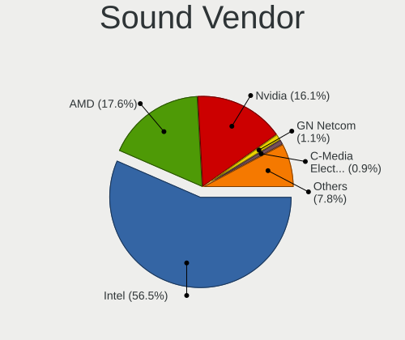

| Vendor                   | Notebooks | Percent |
|--------------------------|-----------|---------|
| Intel                    | 450       | 56.53%  |
| AMD                      | 140       | 17.59%  |
| Nvidia                   | 128       | 16.08%  |
| GN Netcom                | 9         | 1.13%   |
| C-Media Electronics      | 7         | 0.88%   |
| Realtek Semiconductor    | 6         | 0.75%   |
| Lenovo                   | 6         | 0.75%   |
| Razer USA                | 5         | 0.63%   |
| Hewlett-Packard          | 5         | 0.63%   |
| Logitech                 | 4         | 0.5%    |
| Texas Instruments        | 3         | 0.38%   |
| Dell                     | 3         | 0.38%   |
| Yamaha                   | 2         | 0.25%   |
| Creative Technology      | 2         | 0.25%   |
| ASUSTek Computer         | 2         | 0.25%   |
| Astro Gaming             | 2         | 0.25%   |
| SteelSeries ApS          | 1         | 0.13%   |
| Sony                     | 1         | 0.13%   |
| Silicon Motion           | 1         | 0.13%   |
| Plantronics              | 1         | 0.13%   |
| Nordic Semiconductor ASA | 1         | 0.13%   |
| Nacon                    | 1         | 0.13%   |
| Megawin Technology       | 1         | 0.13%   |
| Kingston Technology      | 1         | 0.13%   |
| JMTek                    | 1         | 0.13%   |
| JKY Technology           | 1         | 0.13%   |
| Huawei Technologies      | 1         | 0.13%   |
| GYROCOM C&C              | 1         | 0.13%   |
| Genesys Logic            | 1         | 0.13%   |
| Generalplus Technology   | 1         | 0.13%   |
| Efun-SILICON             | 1         | 0.13%   |
| DSEA A/S                 | 1         | 0.13%   |
| Conexant Systems         | 1         | 0.13%   |
| Avocent                  | 1         | 0.13%   |
| Areson Technology        | 1         | 0.13%   |
| Apple                    | 1         | 0.13%   |
| AOKEO                    | 1         | 0.13%   |
| Afatech                  | 1         | 0.13%   |

Sound Model
-----------

Sound card models

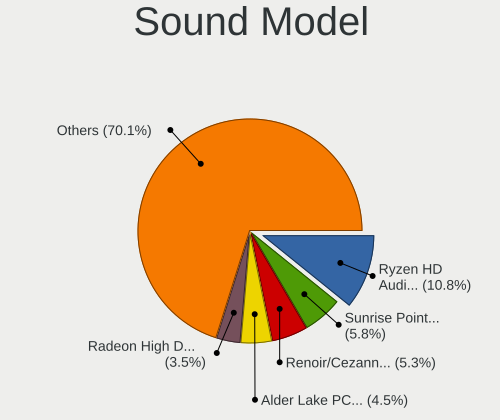

| Model                                                                      | Notebooks | Percent |
|----------------------------------------------------------------------------|-----------|---------|
| AMD Ryzen HD Audio Controller                                              | 105       | 10.81%  |
| Intel Sunrise Point-LP HD Audio                                            | 56        | 5.77%   |
| AMD Renoir/Cezanne HDMI/DP Audio Controller                                | 51        | 5.25%   |
| Intel Alder Lake PCH-P High Definition Audio Controller                    | 44        | 4.53%   |
| AMD Radeon High Definition Audio Controller                                | 34        | 3.5%    |
| Intel Tiger Lake-LP Smart Sound Technology Audio Controller                | 33        | 3.4%    |
| Intel Raptor Lake-P/U/H cAVS                                               | 29        | 2.99%   |
| Intel Cannon Lake PCH cAVS                                                 | 24        | 2.47%   |
| Intel 7 Series/C216 Chipset Family High Definition Audio Controller        | 23        | 2.37%   |
| Intel 6 Series/C200 Series Chipset Family High Definition Audio Controller | 22        | 2.27%   |
| Intel Wildcat Point-LP High Definition Audio Controller                    | 21        | 2.16%   |
| Intel Broadwell-U Audio Controller                                         | 21        | 2.16%   |
| Intel 8 Series/C220 Series Chipset High Definition Audio Controller        | 21        | 2.16%   |
| Intel Haswell-ULT HD Audio Controller                                      | 20        | 2.06%   |
| Intel 8 Series HD Audio Controller                                         | 20        | 2.06%   |
| Nvidia AD107 High Definition Audio Controller                              | 19        | 1.96%   |
| Nvidia GA107 High Definition Audio Controller                              | 17        | 1.75%   |
| Intel Xeon E3-1200 v3/4th Gen Core Processor HD Audio Controller           | 17        | 1.75%   |
| Intel Meteor Lake-P HD Audio Controller                                    | 16        | 1.65%   |
| Intel Cannon Point-LP High Definition Audio Controller                     | 15        | 1.54%   |
| Nvidia TU107 GeForce GTX 1650 High Definition Audio Controller             | 13        | 1.34%   |
| Intel Tiger Lake-H HD Audio Controller                                     | 13        | 1.34%   |
| Intel 5 Series/3400 Series Chipset High Definition Audio                   | 12        | 1.24%   |
| AMD Raven/Raven2/Fenghuang HDMI/DP Audio Controller                        | 12        | 1.24%   |
| Intel Raptor Lake High Definition Audio Controller                         | 11        | 1.13%   |
| Intel CM238 HD Audio Controller                                            | 11        | 1.13%   |
| Nvidia GA106 High Definition Audio Controller                              | 10        | 1.03%   |
| AMD FCH Azalia Controller                                                  | 10        | 1.03%   |
| Intel Comet Lake PCH-LP cAVS                                               | 9         | 0.93%   |
| Nvidia GP107GL High Definition Audio Controller                            | 8         | 0.82%   |
| Intel Comet Lake PCH cAVS                                                  | 8         | 0.82%   |
| Intel 100 Series/C230 Series Chipset Family HD Audio Controller            | 8         | 0.82%   |
| AMD Kabini HDMI/DP Audio                                                   | 8         | 0.82%   |
| Nvidia AD106M High Definition Audio Controller                             | 7         | 0.72%   |
| Intel Celeron/Pentium Silver Processor High Definition Audio               | 7         | 0.72%   |
| Intel Alder Lake-N PCH High Definition Audio Controller                    | 7         | 0.72%   |
| Realtek Semiconductor USB Audio                                            | 6         | 0.62%   |
| Intel Arrow Lake cAVS                                                      | 6         | 0.62%   |
| Intel 82801I (ICH9 Family) HD Audio Controller                             | 6         | 0.62%   |
| Nvidia TU116 High Definition Audio Controller                              | 5         | 0.51%   |

Memory
------

Memory Vendor
-------------

Memory module vendors

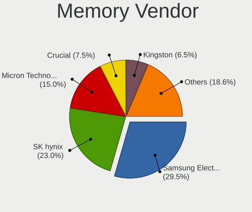

| Vendor              | Notebooks | Percent |
|---------------------|-----------|---------|
| Samsung Electronics | 114       | 29.46%  |
| SK hynix            | 89        | 23%     |
| Micron Technology   | 58        | 14.99%  |
| Crucial             | 29        | 7.49%   |
| Kingston            | 25        | 6.46%   |
| Unknown             | 10        | 2.58%   |
| Unknown             | 9         | 2.33%   |
| Elpida              | 9         | 2.33%   |
| G.Skill             | 6         | 1.55%   |
| Corsair             | 6         | 1.55%   |
| A-DATA Technology   | 5         | 1.29%   |
| Unknown (ABCD)      | 3         | 0.78%   |
| Ramaxel Technology  | 3         | 0.78%   |
| Transcend           | 2         | 0.52%   |
| Timetec             | 2         | 0.52%   |
| Team                | 2         | 0.52%   |
| Smart               | 2         | 0.52%   |
| Patriot             | 2         | 0.52%   |
| Nanya Technology    | 2         | 0.52%   |
| Wodposit            | 1         | 0.26%   |
| Strontium           | 1         | 0.26%   |
| Qimonda             | 1         | 0.26%   |
| pqi                 | 1         | 0.26%   |
| Heoriady            | 1         | 0.26%   |
| GOODRAM             | 1         | 0.26%   |
| Goldenmars          | 1         | 0.26%   |
| Foxline             | 1         | 0.26%   |
| Apacer              | 1         | 0.26%   |

Memory Model
------------

Memory module models

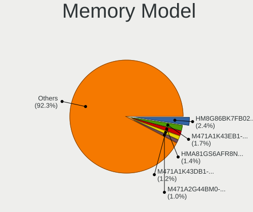

| Model                                                            | Notebooks | Percent |
|------------------------------------------------------------------|-----------|---------|
| Unknown                                                          | 10        | 2.4%    |
| Samsung RAM M471A1K43EB1-CWE 8GB SODIMM DDR4 3200MT/s            | 7         | 1.68%   |
| SK hynix RAM HMA81GS6AFR8N-UH 8GB SODIMM DDR4 2667MT/s           | 6         | 1.44%   |
| Samsung RAM M471A1K43DB1-CWE 8GB SODIMM DDR4 3200MT/s            | 5         | 1.2%    |
| SK hynix RAM HMAA2GS6CJR8N-XN 16GB SODIMM DDR4 3200MT/s          | 4         | 0.96%   |
| Samsung RAM M471A2G44BM0-CWE 16GB SODIMM DDR4 3200MT/s           | 4         | 0.96%   |
| Samsung RAM M471A1K43CB1-CRC 8GB SODIMM DDR4 8400MT/s            | 4         | 0.96%   |
| Samsung RAM M425R1GB4BB0-CQKOL 8GB SODIMM DDR5 4800MT/s          | 4         | 0.96%   |
| SK hynix RAM Module 16GB SODIMM DDR4 3200MT/s                    | 3         | 0.72%   |
| SK hynix RAM HMCG78AGBSA095N 16GB SODIMM DDR5 5600MT/s           | 3         | 0.72%   |
| SK hynix RAM HMAA1GS6CJR6N-XN 8GB SODIMM DDR4 3200MT/s           | 3         | 0.72%   |
| SK hynix RAM HMAA1GS6CJR6N-XN 8GB Row Of Chips DDR4 3200MT/s     | 3         | 0.72%   |
| SK hynix RAM HMA81GS6JJR8N-VK 8GB SODIMM DDR4 2667MT/s           | 3         | 0.72%   |
| SK hynix RAM H9JCNNNCP3MLYR-N6E 2GB Row Of Chips LPDDR5 6400MT/s | 3         | 0.72%   |
| Samsung RAM UBE3D4AA-MGCR 2GB Row Of Chips LPDDR4 4267MT/s       | 3         | 0.72%   |
| Samsung RAM M471A2K43BB1-CRC 16GB SODIMM DDR4 2400MT/s           | 3         | 0.72%   |
| Samsung RAM M471A1K43DB1-CTD 8GB SODIMM DDR4 2667MT/s            | 3         | 0.72%   |
| Samsung RAM M471A1G44BB0-CWE 8GB SODIMM DDR4 3200MT/s            | 3         | 0.72%   |
| Samsung RAM M471A1G44AB0-CWE 8GiB SODIMM DDR4 3200MT/s           | 3         | 0.72%   |
| Samsung RAM M425R2GA3BB0-CQKOL 16GB SODIMM DDR5 4800MT/s         | 3         | 0.72%   |
| Micron RAM 4ATS2G64HZ-3G2B1 16GB SODIMM DDR4 3200MT/s            | 3         | 0.72%   |
| Micron RAM 4ATF51264HZ-2G6E1 4GB SODIMM DDR4 2667MT/s            | 3         | 0.72%   |
| Micron RAM 4ATF1G64HZ-3G2F1 8GB SODIMM DDR4 3200MT/s             | 3         | 0.72%   |
| Micron RAM 4ATF1G64HZ-3G2E1 8GB SODIMM DDR4 3200MT/s             | 3         | 0.72%   |
| Micron RAM 4ATF1G64HZ-3G2E1 8GB Row Of Chips DDR4 3200MT/s       | 3         | 0.72%   |
| Elpida RAM Module 4GB SODIMM DDR3 1600MT/s                       | 3         | 0.72%   |
| Crucial RAM CT16G4SFRA32A.C8FF 16GB SODIMM DDR4 3200MT/s         | 3         | 0.72%   |
| Crucial RAM CT16G48C40S5.M8A1 16GB SODIMM DDR5 4800MT/s          | 3         | 0.72%   |
| Unknown RAM Module 8GB Row Of Chips LPDDR3 2133MT/s              | 2         | 0.48%   |
| Unknown RAM Module 4GB SODIMM DDR3                               | 2         | 0.48%   |
| Unknown RAM Module 2GB Row Of Chips LPDDR4 4267MT/s              | 2         | 0.48%   |
| Unknown (ABCD) RAM 123456789012345678 2GB SODIMM LPDDR4 2400MT/s | 2         | 0.48%   |
| SK hynix RAM Module 8GB SODIMM DDR3 1600MT/s                     | 2         | 0.48%   |
| SK hynix RAM HMT451S6CFR6A-PB 4GB SODIMM DDR3 1600MT/s           | 2         | 0.48%   |
| SK hynix RAM HMT41GS6BFR8A-PB 8GB SODIMM DDR3 2667MT/s           | 2         | 0.48%   |
| SK hynix RAM HMCG88MEBSA092N 32GB SODIMM DDR5 4800MT/s           | 2         | 0.48%   |
| SK hynix RAM HMCG88AGBSA095N 32GB SODIMM DDR5 5600MT/s           | 2         | 0.48%   |
| SK hynix RAM HMCG88AGBSA092N 32GB SODIMM DDR5 5600MT/s           | 2         | 0.48%   |
| SK hynix RAM HMCG66AGBSA095N 8GiB SODIMM DDR5 5600MT/s           | 2         | 0.48%   |
| SK hynix RAM HMCG66AGBSA092N 8GB SODIMM DDR5 5600MT/s            | 2         | 0.48%   |

Memory Kind
-----------

Memory module kinds

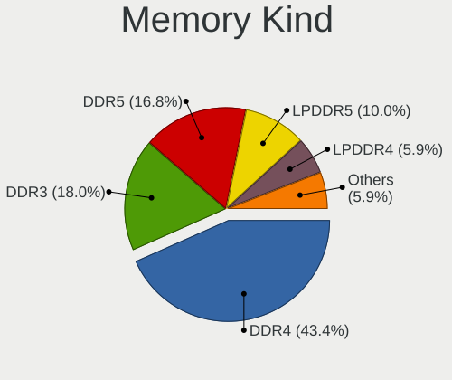

| Kind    | Notebooks | Percent |
|---------|-----------|---------|
| DDR4    | 147       | 43.36%  |
| DDR3    | 61        | 17.99%  |
| DDR5    | 57        | 16.81%  |
| LPDDR5  | 34        | 10.03%  |
| LPDDR4  | 20        | 5.9%    |
| LPDDR3  | 9         | 2.65%   |
| SDRAM   | 5         | 1.47%   |
| DDR2    | 5         | 1.47%   |
| Unknown | 1         | 0.29%   |

Memory Form Factor
------------------

Physical design of the memory module

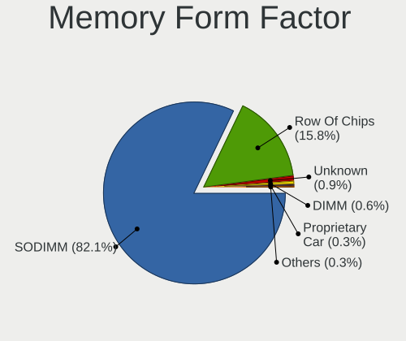

| Name            | Notebooks | Percent |
|-----------------|-----------|---------|
| SODIMM          | 276       | 82.14%  |
| Row Of Chips    | 53        | 15.77%  |
| Unknown         | 3         | 0.89%   |
| DIMM            | 2         | 0.6%    |
| Proprietary Car | 1         | 0.3%    |
| Chip            | 1         | 0.3%    |

Memory Size
-----------

Memory module size

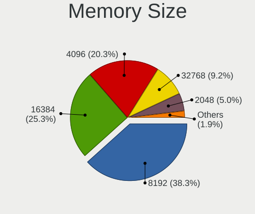

| Size  | Notebooks | Percent |
|-------|-----------|---------|
| 8192  | 138       | 38.33%  |
| 16384 | 91        | 25.28%  |
| 4096  | 73        | 20.28%  |
| 32768 | 33        | 9.17%   |
| 2048  | 18        | 5%      |
| 1024  | 3         | 0.83%   |
| 49152 | 2         | 0.56%   |
| 65536 | 1         | 0.28%   |
| 6144  | 1         | 0.28%   |

Memory Speed
------------

Memory module speed

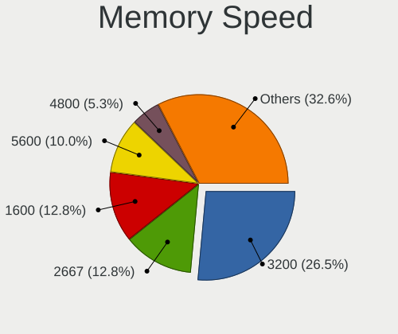

| Speed   | Notebooks | Percent |
|---------|-----------|---------|
| 3200    | 95        | 26.46%  |
| 2667    | 46        | 12.81%  |
| 1600    | 46        | 12.81%  |
| 5600    | 36        | 10.03%  |
| 4800    | 19        | 5.29%   |
| 6400    | 18        | 5.01%   |
| 2400    | 16        | 4.46%   |
| 4267    | 12        | 3.34%   |
| 2133    | 12        | 3.34%   |
| 7500    | 10        | 2.79%   |
| 8400    | 7         | 1.95%   |
| 1334    | 7         | 1.95%   |
| 1333    | 7         | 1.95%   |
| 4199    | 4         | 1.11%   |
| 667     | 4         | 1.11%   |
| 7467    | 3         | 0.84%   |
| 1867    | 3         | 0.84%   |
| 6000    | 2         | 0.56%   |
| 4266    | 2         | 0.56%   |
| 3266    | 2         | 0.56%   |
| 1067    | 2         | 0.56%   |
| Unknown | 2         | 0.56%   |
| 8533    | 1         | 0.28%   |
| 8000    | 1         | 0.28%   |
| 2048    | 1         | 0.28%   |
| 975     | 1         | 0.28%   |

Printers & scanners
-------------------

Printer Vendor
--------------

Printer device vendors

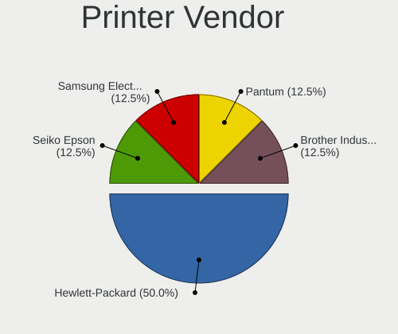

| Vendor              | Notebooks | Percent |
|---------------------|-----------|---------|
| Hewlett-Packard     | 4         | 50%     |
| Seiko Epson         | 1         | 12.5%   |
| Samsung Electronics | 1         | 12.5%   |
| Pantum              | 1         | 12.5%   |
| Brother Industries  | 1         | 12.5%   |

Printer Model
-------------

Printer device models

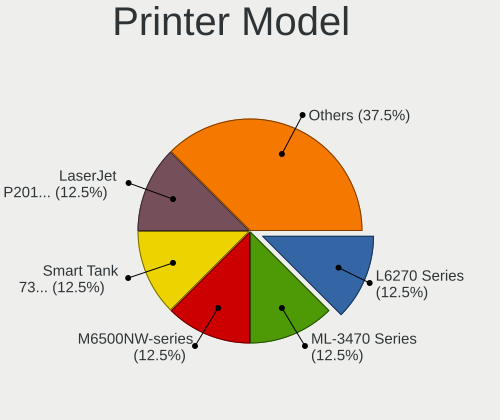

| Model                     | Notebooks | Percent |
|---------------------------|-----------|---------|
| Seiko Epson L6270 Series  | 1         | 12.5%   |
| Samsung ML-3470 Series    | 1         | 12.5%   |
| Pantum M6500NW-series     | 1         | 12.5%   |
| HP Smart Tank 7300 series | 1         | 12.5%   |
| HP LaserJet P2015 series  | 1         | 12.5%   |
| HP LaserJet P1102         | 1         | 12.5%   |
| HP LaserJet 1160 series   | 1         | 12.5%   |
| Brother DCP-L2600D        | 1         | 12.5%   |

Scanner Vendor
--------------

Scanner device vendors

| Vendor      | Notebooks | Percent |
|-------------|-----------|---------|
| Seiko Epson | 1         | 100%    |

Scanner Model
-------------

Scanner device models

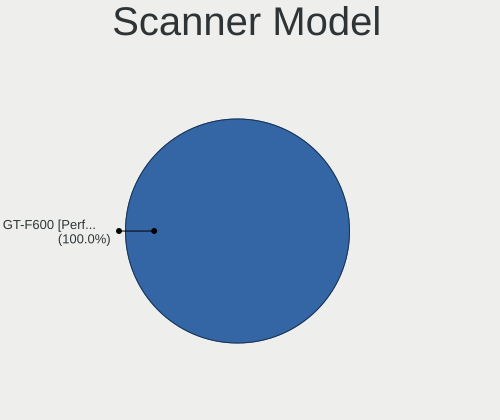

| Model                                 | Notebooks | Percent |
|---------------------------------------|-----------|---------|
| Seiko Epson GT-F600 [Perfection 4180] | 1         | 100%    |

Camera
------

Camera Vendor
-------------

Camera device vendors

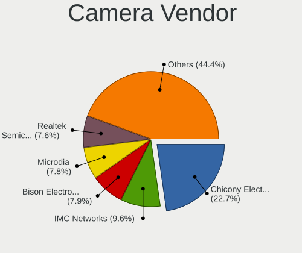

| Vendor                                 | Notebooks | Percent |
|----------------------------------------|-----------|---------|
| Chicony Electronics                    | 126       | 22.74%  |
| IMC Networks                           | 53        | 9.57%   |
| Bison Electronics                      | 44        | 7.94%   |
| Microdia                               | 43        | 7.76%   |
| Realtek Semiconductor                  | 42        | 7.58%   |
| Quanta                                 | 40        | 7.22%   |
| Sunplus Innovation Technology          | 28        | 5.05%   |
| Luxvisions Innotech Limited            | 25        | 4.51%   |
| Cheng Uei Precision Industry (Foxlink) | 15        | 2.71%   |
| Sonix Technology                       | 14        | 2.53%   |
| Syntek                                 | 13        | 2.35%   |
| Logitech                               | 12        | 2.17%   |
| ShineTech                              | 11        | 1.99%   |
| Apple                                  | 9         | 1.62%   |
| Silicon Motion                         | 7         | 1.26%   |
| Lite-On Technology                     | 7         | 1.26%   |
| SunplusIT                              | 6         | 1.08%   |
| Samsung Electronics                    | 6         | 1.08%   |
| Suyin                                  | 5         | 0.9%    |
| kingcome                               | 4         | 0.72%   |
| Alcor Micro                            | 4         | 0.72%   |
| Microsoft                              | 3         | 0.54%   |
| SenseTek                               | 2         | 0.36%   |
| Intel                                  | 2         | 0.36%   |
| icSpring                               | 2         | 0.36%   |
| GEMBIRD                                | 2         | 0.36%   |
| DigiTech                               | 2         | 0.36%   |
| BillionPixels                          | 2         | 0.36%   |
| Acer                                   | 2         | 0.36%   |
| Z-Star Microelectronics                | 1         | 0.18%   |
| Unknown (2000595910700018410)          | 1         | 0.18%   |
| Tobii Technology AB                    | 1         | 0.18%   |
| SN0002                                 | 1         | 0.18%   |
| ShineOptics                            | 1         | 0.18%   |
| Shine-optics                           | 1         | 0.18%   |
| Shenzhen Kingcome Optoelectronic       | 1         | 0.18%   |
| Ricoh                                  | 1         | 0.18%   |
| Pixart Imaging                         | 1         | 0.18%   |
| OmniVision Technologies                | 1         | 0.18%   |
| Linux Foundation                       | 1         | 0.18%   |

Camera Model
------------

Camera device models

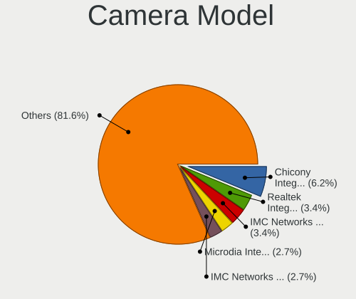

| Model                                             | Notebooks | Percent |
|---------------------------------------------------|-----------|---------|
| Chicony Integrated Camera                         | 35        | 6.25%   |
| Realtek Integrated_Webcam_HD                      | 19        | 3.39%   |
| IMC Networks Integrated Camera                    | 19        | 3.39%   |
| Microdia Integrated_Webcam_HD                     | 15        | 2.68%   |
| IMC Networks USB2.0 HD UVC WebCam                 | 15        | 2.68%   |
| Quanta HP HD Camera                               | 13        | 2.32%   |
| Bison Integrated Camera                           | 13        | 2.32%   |
| Syntek Integrated Camera                          | 12        | 2.14%   |
| Luxvisions Innotech Limited Integrated Camera     | 10        | 1.79%   |
| Chicony HD Webcam                                 | 10        | 1.79%   |
| Sunplus Integrated_Webcam_HD                      | 9         | 1.61%   |
| Sonix USB2.0 FHD UVC WebCam                       | 7         | 1.25%   |
| Bison BisonCam,NB Pro                             | 7         | 1.25%   |
| Sonix USB2.0 HD UVC WebCam                        | 6         | 1.07%   |
| ShineTech USB2.0 HD UVC WebCam                    | 6         | 1.07%   |
| Samsung Galaxy series, misc. (MTP mode)           | 6         | 1.07%   |
| Microdia Integrated_Webcam_FHD                    | 6         | 1.07%   |
| Luxvisions Innotech Limited Integrated RGB Camera | 6         | 1.07%   |
| Chicony HP HD Camera                              | 6         | 1.07%   |
| Shinetech USB2.0 FHD UVC WebCam                   | 5         | 0.89%   |
| Realtek Integrated_Webcam_FHD                     | 5         | 0.89%   |
| Quanta HP Wide Vision HD Camera                   | 5         | 0.89%   |
| Quanta HD User Facing                             | 5         | 0.89%   |
| Microdia Laptop_Integrated_Webcam_HD              | 5         | 0.89%   |
| Logitech Webcam C270                              | 5         | 0.89%   |
| Chicony USB2.0 HD UVC WebCam                      | 5         | 0.89%   |
| Chicony Integrated IR Camera                      | 5         | 0.89%   |
| Chicony HP Wide Vision HD Camera                  | 5         | 0.89%   |
| Bison Integrated RGB Camera                       | 5         | 0.89%   |
| Quanta HD Webcam                                  | 4         | 0.71%   |
| Microdia Integrated Webcam                        | 4         | 0.71%   |
| Logitech C920 PRO HD Webcam                       | 4         | 0.71%   |
| Chicony USB2.0 Camera                             | 4         | 0.71%   |
| Chicony Integrated Camera (1280x720@30)           | 4         | 0.71%   |
| Chicony HP Truevision HD camera                   | 4         | 0.71%   |
| Chicony FJ Camera                                 | 4         | 0.71%   |
| Chicony ACER HD User Facing                       | 4         | 0.71%   |
| Apple FaceTime HD Camera                          | 4         | 0.71%   |
| Sunplus Laptop Integrated Webcam HD               | 3         | 0.54%   |
| Realtek Integrated Webcam_HD                      | 3         | 0.54%   |

Security
--------

Fingerprint Vendor
------------------

Fingerprint sensor vendors

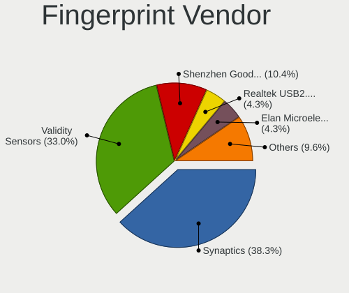

| Vendor                             | Notebooks | Percent |
|------------------------------------|-----------|---------|
| Synaptics                          | 44        | 38.26%  |
| Validity Sensors                   | 38        | 33.04%  |
| Shenzhen Goodix Technology         | 12        | 10.43%  |
| Realtek USB2.0 Finger Print Bridge | 5         | 4.35%   |
| Elan Microelectronics              | 5         | 4.35%   |
| LighTuning Technology              | 3         | 2.61%   |
| AuthenTec                          | 3         | 2.61%   |
| Upek                               | 2         | 1.74%   |
| Focal-systems.Corp                 | 2         | 1.74%   |
| STMicroelectronics                 | 1         | 0.87%   |

Fingerprint Model
-----------------

Fingerprint sensor models

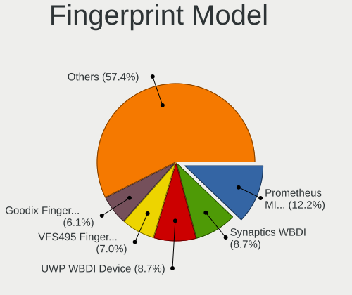

| Model                                                                      | Notebooks | Percent |
|----------------------------------------------------------------------------|-----------|---------|
| Synaptics Prometheus MIS Touch Fingerprint Reader                          | 14        | 12.17%  |
| Validity Sensors Synaptics WBDI                                            | 10        | 8.7%    |
| Synaptics UWP WBDI Device                                                  | 10        | 8.7%    |
| Validity Sensors VFS495 Fingerprint Reader                                 | 8         | 6.96%   |
| Shenzhen Goodix  FingerPrint Device                                        | 7         | 6.09%   |
| Synaptics FS7604 Touch Fingerprint Sensor with PurePrint                   | 6         | 5.22%   |
| Synaptics Metallica MIS Touch Fingerprint Reader                           | 5         | 4.35%   |
| Realtek USB2.0 Finger Print Bridge FocalTech Fingerprint Device            | 5         | 4.35%   |
| Validity Sensors VFS 5011 fingerprint sensor                               | 4         | 3.48%   |
| Validity Sensors VFS7500 Touch Fingerprint Sensor                          | 3         | 2.61%   |
| Validity Sensors VFS5011 Fingerprint Reader                                | 3         | 2.61%   |
| Validity Sensors VFS451 Fingerprint Reader                                 | 3         | 2.61%   |
| Synaptics Prometheus Fingerprint Reader                                    | 3         | 2.61%   |
| Shenzhen Goodix FingerPrint                                                | 3         | 2.61%   |
| LighTuning EgisTec Touch Fingerprint Sensor                                | 3         | 2.61%   |
| Elan ELAN:ARM-M4                                                           | 3         | 2.61%   |
| Validity Sensors VFS471 Fingerprint Reader                                 | 2         | 1.74%   |
| Validity Sensors Synaptics VFS7552 Touch Fingerprint Sensor with PurePrint | 2         | 1.74%   |
| Validity Sensors Swipe Fingerprint Sensor                                  | 2         | 1.74%   |
| Synaptics WBDI                                                             | 2         | 1.74%   |
| Synaptics  FS7604 Touch Fingerprint Sensor with PurePrint                  | 2         | 1.74%   |
| Shenzhen Goodix Fingerprint Reader                                         | 2         | 1.74%   |
| Focal-systems.Corp FT9201Fingerprint.                                      | 2         | 1.74%   |
| Elan ELAN:Fingerprint                                                      | 2         | 1.74%   |
| Validity Sensors Synaptics VFS7552 Touch Fingerprint Sensor                | 1         | 0.87%   |
| Upek TCS5B Fingerprint sensor                                              | 1         | 0.87%   |
| Upek Biometric Touchchip/Touchstrip Fingerprint Sensor                     | 1         | 0.87%   |
| Synaptics Metallica MOH Touch Fingerprint Reader                           | 1         | 0.87%   |
| Synaptics Fingerprint reader [HP G6]                                       | 1         | 0.87%   |
| STMicroelectronics Fingerprint Reader                                      | 1         | 0.87%   |
| AuthenTec AES2550 Fingerprint Sensor                                       | 1         | 0.87%   |
| AuthenTec AES2501 Fingerprint Sensor                                       | 1         | 0.87%   |
| AuthenTec AES1660 Fingerprint Sensor                                       | 1         | 0.87%   |

Chipcard Vendor
---------------

Chipcard module vendors

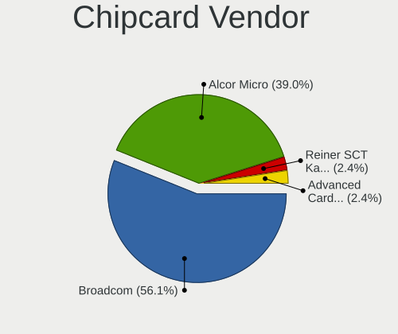

| Vendor                   | Notebooks | Percent |
|--------------------------|-----------|---------|
| Broadcom                 | 23        | 56.1%   |
| Alcor Micro              | 16        | 39.02%  |
| Reiner SCT Kartensysteme | 1         | 2.44%   |
| Advanced Card Systems    | 1         | 2.44%   |

Chipcard Model
--------------

Chipcard module models

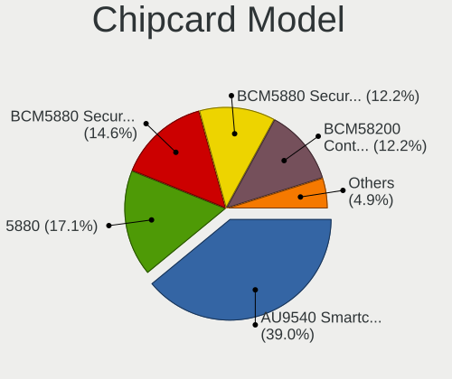

| Model                                                                        | Notebooks | Percent |
|------------------------------------------------------------------------------|-----------|---------|
| Alcor Micro AU9540 Smartcard Reader                                          | 16        | 39.02%  |
| Broadcom 5880                                                                | 7         | 17.07%  |
| Broadcom BCM5880 Secure Applications Processor                               | 6         | 14.63%  |
| Broadcom BCM5880 Secure Applications Processor with fingerprint swipe sensor | 5         | 12.2%   |
| Broadcom BCM58200 ControlVault 3 (FingerPrint sensor + Contacted SmartCard)  | 5         | 12.2%   |
| Reiner SCT Kartensysteme cyberJack RFID basis contactless smartcard reader   | 1         | 2.44%   |
| Advanced Card Systems ACR39U                                                 | 1         | 2.44%   |

Unsupported
-----------

Unsupported Devices
-------------------

Total unsupported devices on board

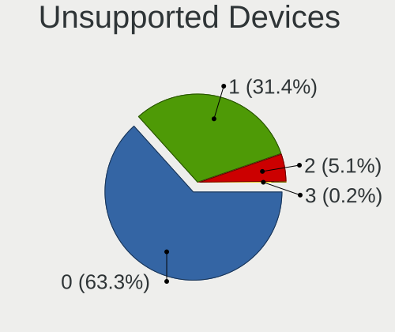

| Total | Notebooks | Percent |
|-------|-----------|---------|
| 0     | 373       | 63.33%  |
| 1     | 185       | 31.41%  |
| 2     | 30        | 5.09%   |
| 3     | 1         | 0.17%   |

Unsupported Device Types
------------------------

Types of unsupported devices

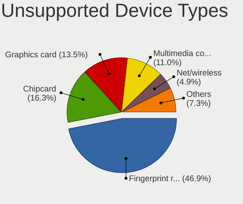

| Type                     | Notebooks | Percent |
|--------------------------|-----------|---------|
| Fingerprint reader       | 115       | 46.94%  |
| Chipcard                 | 40        | 16.33%  |
| Graphics card            | 33        | 13.47%  |
| Multimedia controller    | 27        | 11.02%  |
| Net/wireless             | 12        | 4.9%    |
| Card reader              | 6         | 2.45%   |
| Camera                   | 5         | 2.04%   |
| Storage                  | 2         | 0.82%   |
| Sound                    | 1         | 0.41%   |
| Net/ethernet             | 1         | 0.41%   |
| Modem                    | 1         | 0.41%   |
| Communication controller | 1         | 0.41%   |
| Bluetooth                | 1         | 0.41%   |

