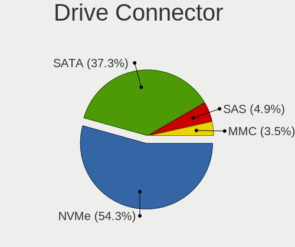
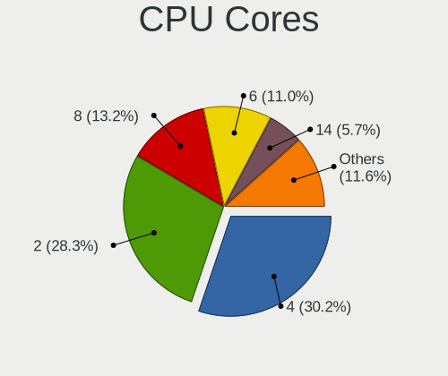
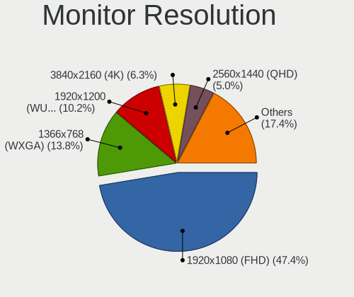
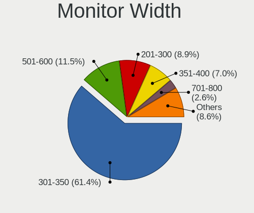
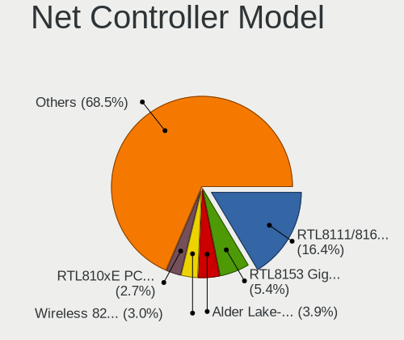
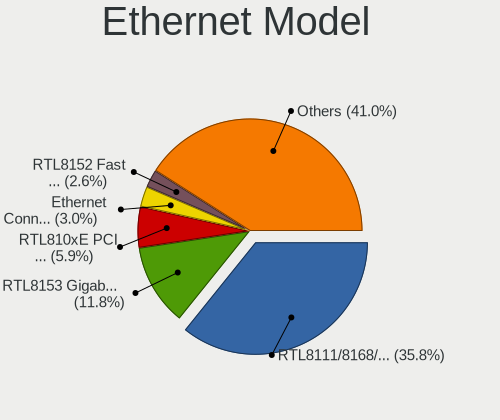

Kubuntu 24.04 - Tested Hardware & Statistics (Notebooks)
--------------------------------------------------------

A project to collect tested hardware configurations for Kubuntu 24.04.

Anyone can contribute to this report by the [hw-probe](https://github.com/linuxhw/hw-probe) tool:

    sudo -E hw-probe -all -upload

Please contribute! Especially if your hardware is rare.

Contents
--------

* [ Test Cases ](#test-cases)

* [ System ](#system)
  - [ Kernel                   ](#kernel)
  - [ Kernel Family            ](#kernel-family)
  - [ Kernel Major Ver.        ](#kernel-major-ver)
  - [ Arch                     ](#arch)
  - [ DE                       ](#de)
  - [ Display Server           ](#display-server)
  - [ Display Manager          ](#display-manager)
  - [ OS Lang                  ](#os-lang)
  - [ Boot Mode                ](#boot-mode)
  - [ Filesystem               ](#filesystem)
  - [ Part. scheme             ](#part-scheme)
  - [ Dual Boot with Linux/BSD ](#dual-boot-with-linuxbsd)
  - [ Dual Boot (Win)          ](#dual-boot-win)

* [ Board ](#board)
  - [ Vendor                   ](#vendor)
  - [ Model                    ](#model)
  - [ Model Family             ](#model-family)
  - [ MFG Year                 ](#mfg-year)
  - [ Form Factor              ](#form-factor)
  - [ Secure Boot              ](#secure-boot)
  - [ Coreboot                 ](#coreboot)
  - [ RAM Size                 ](#ram-size)
  - [ RAM Used                 ](#ram-used)
  - [ Total Drives             ](#total-drives)
  - [ Has CD-ROM               ](#has-cd-rom)
  - [ Has Ethernet             ](#has-ethernet)
  - [ Has WiFi                 ](#has-wifi)
  - [ Has Bluetooth            ](#has-bluetooth)

* [ Location ](#location)
  - [ Country                  ](#country)
  - [ City                     ](#city)

* [ Drives ](#drives)
  - [ Drive Vendor             ](#drive-vendor)
  - [ Drive Model              ](#drive-model)
  - [ HDD Vendor               ](#hdd-vendor)
  - [ SSD Vendor               ](#ssd-vendor)
  - [ Drive Kind               ](#drive-kind)
  - [ Drive Connector          ](#drive-connector)
  - [ Drive Size               ](#drive-size)
  - [ Space Total              ](#space-total)
  - [ Space Used               ](#space-used)
  - [ Malfunc. Drives          ](#malfunc-drives)
  - [ Malfunc. Drive Vendor    ](#malfunc-drive-vendor)
  - [ Malfunc. HDD Vendor      ](#malfunc-hdd-vendor)
  - [ Malfunc. Drive Kind      ](#malfunc-drive-kind)
  - [ Failed Drives            ](#failed-drives)
  - [ Failed Drive Vendor      ](#failed-drive-vendor)
  - [ Drive Status             ](#drive-status)

* [ Storage controller ](#storage-controller)
  - [ Storage Vendor           ](#storage-vendor)
  - [ Storage Model            ](#storage-model)
  - [ Storage Kind             ](#storage-kind)

* [ Processor ](#processor)
  - [ CPU Vendor               ](#cpu-vendor)
  - [ CPU Model                ](#cpu-model)
  - [ CPU Model Family         ](#cpu-model-family)
  - [ CPU Cores                ](#cpu-cores)
  - [ CPU Sockets              ](#cpu-sockets)
  - [ CPU Threads              ](#cpu-threads)
  - [ CPU Op-Modes             ](#cpu-op-modes)
  - [ CPU Microcode            ](#cpu-microcode)
  - [ CPU Microarch            ](#cpu-microarch)

* [ Graphics ](#graphics)
  - [ GPU Vendor               ](#gpu-vendor)
  - [ GPU Model                ](#gpu-model)
  - [ GPU Combo                ](#gpu-combo)
  - [ GPU Driver               ](#gpu-driver)
  - [ GPU Memory               ](#gpu-memory)

* [ Monitor ](#monitor)
  - [ Monitor Vendor           ](#monitor-vendor)
  - [ Monitor Model            ](#monitor-model)
  - [ Monitor Resolution       ](#monitor-resolution)
  - [ Monitor Diagonal         ](#monitor-diagonal)
  - [ Monitor Width            ](#monitor-width)
  - [ Aspect Ratio             ](#aspect-ratio)
  - [ Monitor Area             ](#monitor-area)
  - [ Pixel Density            ](#pixel-density)
  - [ Multiple Monitors        ](#multiple-monitors)

* [ Network ](#network)
  - [ Net Controller Vendor    ](#net-controller-vendor)
  - [ Net Controller Model     ](#net-controller-model)
  - [ Wireless Vendor          ](#wireless-vendor)
  - [ Wireless Model           ](#wireless-model)
  - [ Ethernet Vendor          ](#ethernet-vendor)
  - [ Ethernet Model           ](#ethernet-model)
  - [ Net Controller Kind      ](#net-controller-kind)
  - [ Used Controller          ](#used-controller)
  - [ NICs                     ](#nics)
  - [ IPv6                     ](#ipv6)

* [ Bluetooth ](#bluetooth)
  - [ Bluetooth Vendor         ](#bluetooth-vendor)
  - [ Bluetooth Model          ](#bluetooth-model)

* [ Sound ](#sound)
  - [ Sound Vendor             ](#sound-vendor)
  - [ Sound Model              ](#sound-model)

* [ Memory ](#memory)
  - [ Memory Vendor            ](#memory-vendor)
  - [ Memory Model             ](#memory-model)
  - [ Memory Kind              ](#memory-kind)
  - [ Memory Form Factor       ](#memory-form-factor)
  - [ Memory Size              ](#memory-size)
  - [ Memory Speed             ](#memory-speed)

* [ Printers & scanners ](#printers--scanners)
  - [ Printer Vendor           ](#printer-vendor)
  - [ Printer Model            ](#printer-model)
  - [ Scanner Vendor           ](#scanner-vendor)
  - [ Scanner Model            ](#scanner-model)

* [ Camera ](#camera)
  - [ Camera Vendor            ](#camera-vendor)
  - [ Camera Model             ](#camera-model)

* [ Security ](#security)
  - [ Fingerprint Vendor       ](#fingerprint-vendor)
  - [ Fingerprint Model        ](#fingerprint-model)
  - [ Chipcard Vendor          ](#chipcard-vendor)
  - [ Chipcard Model           ](#chipcard-model)

* [ Unsupported ](#unsupported)
  - [ Unsupported Devices      ](#unsupported-devices)
  - [ Unsupported Device Types ](#unsupported-device-types)

Test Cases
----------

Total: 425

| Vendor        | Model                       | Probe                                                      | Date         |
|---------------|-----------------------------|------------------------------------------------------------|--------------|
| Lenovo        | ThinkPad E520 1143R77       | [3d26d596e3](https://linux-hardware.org/?probe=3d26d596e3) | Jan 05, 2025 |
| Dell          | XPS 16 9640                 | [58d3a3677b](https://linux-hardware.org/?probe=58d3a3677b) | Jan 04, 2025 |
| Dell          | XPS 16 9640                 | [8f38090e9d](https://linux-hardware.org/?probe=8f38090e9d) | Jan 04, 2025 |
| HUAWEI        | CREFG-XX                    | [c781ee9905](https://linux-hardware.org/?probe=c781ee9905) | Jan 03, 2025 |
| ASUSTek       | VivoBook_ASUSLaptop M160... | [51be04fcd7](https://linux-hardware.org/?probe=51be04fcd7) | Jan 03, 2025 |
| Lenovo        | ThinkBook 14 G4+ IAP 21C... | [0d48464f98](https://linux-hardware.org/?probe=0d48464f98) | Jan 03, 2025 |
| HP            | EliteBook 850 G8 Noteboo... | [514cd1a8a0](https://linux-hardware.org/?probe=514cd1a8a0) | Jan 03, 2025 |
| MSI           | GF65 Thin 9SD               | [ed812824ea](https://linux-hardware.org/?probe=ed812824ea) | Dec 30, 2024 |
| MSI           | GF65 Thin 9SD               | [a53632802a](https://linux-hardware.org/?probe=a53632802a) | Dec 30, 2024 |
| Apple         | MacBookPro11,2              | [238bce296a](https://linux-hardware.org/?probe=238bce296a) | Dec 29, 2024 |
| Dell          | Inspiron 1525               | [89a2a2261a](https://linux-hardware.org/?probe=89a2a2261a) | Dec 27, 2024 |
| Dell          | Latitude 5580               | [61c3987fc9](https://linux-hardware.org/?probe=61c3987fc9) | Dec 27, 2024 |
| Dell          | XPS 9315                    | [db4876762a](https://linux-hardware.org/?probe=db4876762a) | Dec 26, 2024 |
| ASRock        | Z390 Phantom Gaming 4S      | [d134a178b2](https://linux-hardware.org/?probe=d134a178b2) | Dec 26, 2024 |
| HP            | Pavilion Laptop 15-cc1xx    | [697cdd9200](https://linux-hardware.org/?probe=697cdd9200) | Dec 25, 2024 |
| HP            | EliteBook 820 G3            | [cf6ba1ead2](https://linux-hardware.org/?probe=cf6ba1ead2) | Dec 25, 2024 |
| Acer          | Aspire V5-573G              | [45f86a09ae](https://linux-hardware.org/?probe=45f86a09ae) | Dec 25, 2024 |
| ASUSTek       | ASUS EXPERTBOOK B1403CVA    | [b51fc6a4fb](https://linux-hardware.org/?probe=b51fc6a4fb) | Dec 23, 2024 |
| Clevo         | P170HMx                     | [c0ec7e3011](https://linux-hardware.org/?probe=c0ec7e3011) | Dec 22, 2024 |
| Lenovo        | LOQ 15IRX9 83DV             | [edf55e35fa](https://linux-hardware.org/?probe=edf55e35fa) | Dec 22, 2024 |
| Acer          | Nitro AN515-57              | [857b365f00](https://linux-hardware.org/?probe=857b365f00) | Dec 22, 2024 |
| HP            | Pavilion Laptop 14-dv0xx... | [210729b8a3](https://linux-hardware.org/?probe=210729b8a3) | Dec 20, 2024 |
| ASUSTek       | VivoBook_ASUSLaptop X512... | [7c5e051820](https://linux-hardware.org/?probe=7c5e051820) | Dec 19, 2024 |
| ASUSTek       | ASUS TUF Gaming A16 FA61... | [efacc3d2bf](https://linux-hardware.org/?probe=efacc3d2bf) | Dec 16, 2024 |
| Fujitsu       | FMVU09001                   | [2be0996b78](https://linux-hardware.org/?probe=2be0996b78) | Dec 16, 2024 |
| ASUSTek       | ASUS EXPERTBOOK B1403CVA    | [dc66ca3bfc](https://linux-hardware.org/?probe=dc66ca3bfc) | Dec 16, 2024 |
| HP            | Pavilion Power Laptop 15... | [a785db7994](https://linux-hardware.org/?probe=a785db7994) | Dec 15, 2024 |
| ASUSTek       | VivoBook_ASUSLaptop K340... | [ed3d05274d](https://linux-hardware.org/?probe=ed3d05274d) | Dec 14, 2024 |
| Samsung       | 950XDB/951XDB/950XDY        | [a53cca0335](https://linux-hardware.org/?probe=a53cca0335) | Dec 14, 2024 |
| MSI           | Creator Z17 A12UGST         | [ca137f5639](https://linux-hardware.org/?probe=ca137f5639) | Dec 14, 2024 |
| Panasonic     | CF-191DCSG1M                | [c607411b91](https://linux-hardware.org/?probe=c607411b91) | Dec 13, 2024 |
| Panasonic     | CF-191DCSG1M                | [471033b960](https://linux-hardware.org/?probe=471033b960) | Dec 13, 2024 |
| Dell          | Inspiron 5559               | [34c0ea4ba1](https://linux-hardware.org/?probe=34c0ea4ba1) | Dec 12, 2024 |
| Lenovo        | ThinkPad X13 Gen 1 20UF0... | [0c5a8d044d](https://linux-hardware.org/?probe=0c5a8d044d) | Dec 11, 2024 |
| ASUSTek       | VivoBook_ASUSLaptop M160... | [6b5111843a](https://linux-hardware.org/?probe=6b5111843a) | Dec 09, 2024 |
| Dell          | Latitude E6430              | [a80a5df9fd](https://linux-hardware.org/?probe=a80a5df9fd) | Dec 08, 2024 |
| Dell          | XPS 15 7590                 | [fbc857c378](https://linux-hardware.org/?probe=fbc857c378) | Dec 07, 2024 |
| Dell          | XPS 15 7590                 | [19ee3907ad](https://linux-hardware.org/?probe=19ee3907ad) | Dec 07, 2024 |
| ASUSTek       | ASUS TUF Gaming A14 FA40... | [a9c5cf0de0](https://linux-hardware.org/?probe=a9c5cf0de0) | Dec 06, 2024 |
| HP            | Laptop 15-db0xxx            | [3ceb5935c2](https://linux-hardware.org/?probe=3ceb5935c2) | Dec 04, 2024 |
| HP            | Laptop 15-db0xxx            | [cc89356041](https://linux-hardware.org/?probe=cc89356041) | Dec 04, 2024 |
| HUAWEI        | NBLK-WAX9X                  | [2f6d2fe7e2](https://linux-hardware.org/?probe=2f6d2fe7e2) | Dec 01, 2024 |
| Unknown       | AX16PRO                     | [603937e734](https://linux-hardware.org/?probe=603937e734) | Dec 01, 2024 |
| Lenovo        | IdeaPad Gaming 3 15IHU6 ... | [c56cdb7a5f](https://linux-hardware.org/?probe=c56cdb7a5f) | Nov 30, 2024 |
| Lenovo        | IdeaPad Gaming 3 15IHU6 ... | [eaca726e51](https://linux-hardware.org/?probe=eaca726e51) | Nov 30, 2024 |
| Lenovo        | ThinkPad X1 Carbon 6th 2... | [4dd33ed790](https://linux-hardware.org/?probe=4dd33ed790) | Nov 30, 2024 |
| Gateway       | NV75S                       | [c7e9f2b942](https://linux-hardware.org/?probe=c7e9f2b942) | Nov 28, 2024 |
| Notebook      | X370SNx                     | [b3c4edd504](https://linux-hardware.org/?probe=b3c4edd504) | Nov 28, 2024 |
| Dell          | XPS 13 9310                 | [5a464dff99](https://linux-hardware.org/?probe=5a464dff99) | Nov 27, 2024 |
| HP            | ZBook Firefly 15 G7 Mobi... | [8c0ecd4b30](https://linux-hardware.org/?probe=8c0ecd4b30) | Nov 26, 2024 |
| Lenovo        | ThinkPad P14s Gen 2a 21A... | [33235dec27](https://linux-hardware.org/?probe=33235dec27) | Nov 26, 2024 |
| ASRock        | Z390 Phantom Gaming 4S      | [628f4e5d70](https://linux-hardware.org/?probe=628f4e5d70) | Nov 26, 2024 |
| ASUSTek       | VivoBook_ASUSLaptop K650... | [d58ccbdbd5](https://linux-hardware.org/?probe=d58ccbdbd5) | Nov 25, 2024 |
| Lenovo        | ThinkPad P1 Gen 7 21KVCT... | [baf2e1a758](https://linux-hardware.org/?probe=baf2e1a758) | Nov 25, 2024 |
| Dell          | Latitude E6420              | [f1db6546f8](https://linux-hardware.org/?probe=f1db6546f8) | Nov 25, 2024 |
| HP            | EliteBook 2560p             | [54d07de40f](https://linux-hardware.org/?probe=54d07de40f) | Nov 25, 2024 |
| HP            | EliteBook 2560p             | [98af34c213](https://linux-hardware.org/?probe=98af34c213) | Nov 25, 2024 |
| Apple         | MacBookPro12,1              | [1ad2abc16d](https://linux-hardware.org/?probe=1ad2abc16d) | Nov 24, 2024 |
| Lenovo        | IdeaPad Slim 5 16ABR8 82... | [7204b37e87](https://linux-hardware.org/?probe=7204b37e87) | Nov 24, 2024 |
| HP            | ZBook Studio 15.6 inch G... | [57b9a57ac3](https://linux-hardware.org/?probe=57b9a57ac3) | Nov 23, 2024 |
| Acer          | Nitro AN515-53              | [b0da0c19f6](https://linux-hardware.org/?probe=b0da0c19f6) | Nov 23, 2024 |
| HP            | ZBook Firefly 15 G7 Mobi... | [99528ec5f3](https://linux-hardware.org/?probe=99528ec5f3) | Nov 20, 2024 |
| HP            | ZBook Firefly 15 G7 Mobi... | [53a79bee6b](https://linux-hardware.org/?probe=53a79bee6b) | Nov 20, 2024 |
| ASUSTek       | VivoBook_ASUSLaptop M160... | [1ed45c318d](https://linux-hardware.org/?probe=1ed45c318d) | Nov 20, 2024 |
| Lenovo        | IdeaPad Slim 3 16ABR8 82... | [7134e424f3](https://linux-hardware.org/?probe=7134e424f3) | Nov 20, 2024 |
| ASUSTek       | ASUS EXPERTBOOK B9400CEA... | [b9edf1bd37](https://linux-hardware.org/?probe=b9edf1bd37) | Nov 20, 2024 |
| Dell          | Precision 7710              | [f328fe1be2](https://linux-hardware.org/?probe=f328fe1be2) | Nov 18, 2024 |
| Dell          | Precision 7710              | [658f311eb3](https://linux-hardware.org/?probe=658f311eb3) | Nov 18, 2024 |
| Lenovo        | IdeaPad Slim 5 16ABR8 82... | [da573e5f3a](https://linux-hardware.org/?probe=da573e5f3a) | Nov 17, 2024 |
| Chuwi         | GemiBook Plus               | [10be58e89f](https://linux-hardware.org/?probe=10be58e89f) | Nov 16, 2024 |
| Lenovo        | Yoga 500-15IBD 80N6         | [e157b1804e](https://linux-hardware.org/?probe=e157b1804e) | Nov 16, 2024 |
| HP            | 255 15.6 inch G10           | [9c4d00b6d7](https://linux-hardware.org/?probe=9c4d00b6d7) | Nov 16, 2024 |
| Thomson       | NEO17C-8B1TCO               | [b5896a8529](https://linux-hardware.org/?probe=b5896a8529) | Nov 15, 2024 |
| Dell          | Latitude 5530               | [260bfa0ebf](https://linux-hardware.org/?probe=260bfa0ebf) | Nov 15, 2024 |
| Lenovo        | ThinkPad T480 20L5CTO1WW    | [cdda7d4c72](https://linux-hardware.org/?probe=cdda7d4c72) | Nov 15, 2024 |
| GPU Compan... | GWTN156-11                  | [30f3f9fea6](https://linux-hardware.org/?probe=30f3f9fea6) | Nov 14, 2024 |
| ASUSTek       | ROG Zephyrus Duo 16 GX65... | [cd0098486b](https://linux-hardware.org/?probe=cd0098486b) | Nov 14, 2024 |
| HUAWEI        | FLMH-XX                     | [3472dd9d1b](https://linux-hardware.org/?probe=3472dd9d1b) | Nov 13, 2024 |
| Samsung       | 270E5G/270E5U               | [d4eba09088](https://linux-hardware.org/?probe=d4eba09088) | Nov 13, 2024 |
| ASUSTek       | ASUS TUF Gaming F15 FX50... | [d78f2cd0d5](https://linux-hardware.org/?probe=d78f2cd0d5) | Nov 12, 2024 |
| Fujitsu       | LIFEBOOK E780               | [b41da32715](https://linux-hardware.org/?probe=b41da32715) | Nov 11, 2024 |
| Alurin        | ALU-BAR-R555-000-156        | [946a4bbb98](https://linux-hardware.org/?probe=946a4bbb98) | Nov 10, 2024 |
| Alurin        | ALU-BAR-R555-000-156        | [c528868479](https://linux-hardware.org/?probe=c528868479) | Nov 10, 2024 |
| Dell          | Latitude 5410               | [be3048dbda](https://linux-hardware.org/?probe=be3048dbda) | Nov 09, 2024 |
| ASUSTek       | E402SA                      | [5e4e4b42cb](https://linux-hardware.org/?probe=5e4e4b42cb) | Nov 08, 2024 |
| Timi          | Redmi Book Pro 14 2022      | [317fe89cc5](https://linux-hardware.org/?probe=317fe89cc5) | Nov 05, 2024 |
| TECNO Mobi... | Pocket Go                   | [3e1b35b41c](https://linux-hardware.org/?probe=3e1b35b41c) | Nov 04, 2024 |
| Dell          | Latitude E5450              | [23833c27eb](https://linux-hardware.org/?probe=23833c27eb) | Nov 04, 2024 |
| Apple         | MacBookPro12,1              | [8d8ff8e8b5](https://linux-hardware.org/?probe=8d8ff8e8b5) | Nov 04, 2024 |
| HP            | EliteBook 8540w             | [72ef3bdc40](https://linux-hardware.org/?probe=72ef3bdc40) | Nov 03, 2024 |
| Lenovo        | ThinkPad P16s Gen 1 21CK... | [6bfe7b8d66](https://linux-hardware.org/?probe=6bfe7b8d66) | Nov 02, 2024 |
| Lenovo        | ThinkPad X395 20NMS0YG00    | [fa349693cc](https://linux-hardware.org/?probe=fa349693cc) | Nov 02, 2024 |
| Lenovo        | ThinkPad X395 20NMS0YG00    | [0d8a4bb988](https://linux-hardware.org/?probe=0d8a4bb988) | Nov 01, 2024 |
| Dell          | XPS 13 9343                 | [02e150f7e1](https://linux-hardware.org/?probe=02e150f7e1) | Nov 01, 2024 |
| Dell          | Latitude 3490               | [0beb8b64e1](https://linux-hardware.org/?probe=0beb8b64e1) | Oct 31, 2024 |
| ASUSTek       | VivoBook_ASUSLaptop M650... | [d901f51891](https://linux-hardware.org/?probe=d901f51891) | Oct 30, 2024 |
| ASUSTek       | ASUS TUF Gaming F15 FX50... | [f4becfc085](https://linux-hardware.org/?probe=f4becfc085) | Oct 29, 2024 |
| HP            | ProBook 450 15.6 inch G9... | [9552f01581](https://linux-hardware.org/?probe=9552f01581) | Oct 29, 2024 |
| Dell          | Latitude 5290 2-in-1        | [dcbfa3ffe4](https://linux-hardware.org/?probe=dcbfa3ffe4) | Oct 28, 2024 |
| Lenovo        | 15ARE05 81W4                | [049414e1fb](https://linux-hardware.org/?probe=049414e1fb) | Oct 27, 2024 |
| Acer          | Nitro ANV15-51              | [f273e6c830](https://linux-hardware.org/?probe=f273e6c830) | Oct 27, 2024 |
| Acer          | Nitro ANV15-51              | [4d8ce01dce](https://linux-hardware.org/?probe=4d8ce01dce) | Oct 27, 2024 |
| Dell          | XPS 15 9510                 | [c9c27cec3b](https://linux-hardware.org/?probe=c9c27cec3b) | Oct 26, 2024 |
| HP            | EliteBook 840 G5            | [9c9358857e](https://linux-hardware.org/?probe=9c9358857e) | Oct 26, 2024 |
| ASUSTek       | G551JM                      | [d6d0bfa34e](https://linux-hardware.org/?probe=d6d0bfa34e) | Oct 26, 2024 |
| ASUSTek       | G551JM                      | [c411632c1c](https://linux-hardware.org/?probe=c411632c1c) | Oct 26, 2024 |
| Dell          | Latitude 5530               | [05ab1c8f51](https://linux-hardware.org/?probe=05ab1c8f51) | Oct 25, 2024 |
| Dell          | Latitude E5570              | [6d86bd0c29](https://linux-hardware.org/?probe=6d86bd0c29) | Oct 24, 2024 |
| Lenovo        | ThinkPad P15v Gen 3 21D9... | [3256d7f820](https://linux-hardware.org/?probe=3256d7f820) | Oct 23, 2024 |
| Lenovo        | ThinkPad P15v Gen 3 21D9... | [37b34d5541](https://linux-hardware.org/?probe=37b34d5541) | Oct 23, 2024 |
| Dell          | Vostro 3550                 | [e9bb2708b0](https://linux-hardware.org/?probe=e9bb2708b0) | Oct 23, 2024 |
| Dell          | Vostro 3550                 | [e8577f4996](https://linux-hardware.org/?probe=e8577f4996) | Oct 23, 2024 |
| HP            | ProBook 4520s               | [352aa6f393](https://linux-hardware.org/?probe=352aa6f393) | Oct 22, 2024 |
| Dell          | Latitude 5430               | [aea23cbc32](https://linux-hardware.org/?probe=aea23cbc32) | Oct 21, 2024 |
| Acer          | Swift SF514-52TP            | [1114c4713d](https://linux-hardware.org/?probe=1114c4713d) | Oct 20, 2024 |
| Acer          | Swift SF514-52TP            | [90891d2f2a](https://linux-hardware.org/?probe=90891d2f2a) | Oct 20, 2024 |
| Lenovo        | ThinkPad X1 Carbon 7th 2... | [e0c1d7b9ce](https://linux-hardware.org/?probe=e0c1d7b9ce) | Oct 18, 2024 |
| HP            | EliteBook 840 G8 Noteboo... | [bd0906dab7](https://linux-hardware.org/?probe=bd0906dab7) | Oct 17, 2024 |
| MSI           | GP72MVR 7RFX                | [aa62c4b0dd](https://linux-hardware.org/?probe=aa62c4b0dd) | Oct 16, 2024 |
| MSI           | GP72MVR 7RFX                | [0ce7ce2745](https://linux-hardware.org/?probe=0ce7ce2745) | Oct 16, 2024 |
| HP            | EliteBook 840 G2            | [7bac64408f](https://linux-hardware.org/?probe=7bac64408f) | Oct 16, 2024 |
| HP            | Laptop 15-bs0xx             | [3144ddfcfc](https://linux-hardware.org/?probe=3144ddfcfc) | Oct 14, 2024 |
| Lenovo        | ThinkPad P16s Gen 1 21BU... | [b9707fb8cd](https://linux-hardware.org/?probe=b9707fb8cd) | Oct 14, 2024 |
| Apple         | MacBookPro12,1              | [21665e8dad](https://linux-hardware.org/?probe=21665e8dad) | Oct 14, 2024 |
| HP            | Laptop 15s-fq5xxx           | [960da6f0c1](https://linux-hardware.org/?probe=960da6f0c1) | Oct 14, 2024 |
| HP            | Pavilion Gaming Laptop 1... | [106afe3aa3](https://linux-hardware.org/?probe=106afe3aa3) | Oct 13, 2024 |
| Dell          | Latitude 7480               | [4686c4e7c6](https://linux-hardware.org/?probe=4686c4e7c6) | Oct 13, 2024 |
| HP            | Pavilion g6                 | [2639353fe7](https://linux-hardware.org/?probe=2639353fe7) | Oct 11, 2024 |
| MSI           | Katana GF76 11SC            | [1a01b23b92](https://linux-hardware.org/?probe=1a01b23b92) | Oct 11, 2024 |
| Dell          | Latitude E7450              | [b240417f21](https://linux-hardware.org/?probe=b240417f21) | Oct 10, 2024 |
| Dell          | Latitude 5440               | [71ee76b243](https://linux-hardware.org/?probe=71ee76b243) | Oct 10, 2024 |
| HP            | EliteBook 8740w             | [4721f064f7](https://linux-hardware.org/?probe=4721f064f7) | Oct 10, 2024 |
| Unknown       | Unknown                     | [cc06a0fc67](https://linux-hardware.org/?probe=cc06a0fc67) | Oct 10, 2024 |
| Lenovo        | ThinkBook 15 G2 ITL 20VE    | [11bd71149b](https://linux-hardware.org/?probe=11bd71149b) | Oct 10, 2024 |
| Lenovo        | ThinkBook 15 G2 ITL 20VE    | [b2a2d78933](https://linux-hardware.org/?probe=b2a2d78933) | Oct 10, 2024 |
| Acer          | Aspire A315-44P             | [8131f1506d](https://linux-hardware.org/?probe=8131f1506d) | Oct 09, 2024 |
| Lenovo        | ThinkBook 16 G6 IRL 21KH    | [a010c0db0b](https://linux-hardware.org/?probe=a010c0db0b) | Oct 09, 2024 |
| ASUSTek       | Q400A                       | [71f5a7f27b](https://linux-hardware.org/?probe=71f5a7f27b) | Oct 09, 2024 |
| ASUSTek       | VivoBook_ASUSLaptop X415... | [30e368c030](https://linux-hardware.org/?probe=30e368c030) | Oct 08, 2024 |
| ASUSTek       | VivoBook_ASUSLaptop X415... | [a6c3210fa6](https://linux-hardware.org/?probe=a6c3210fa6) | Oct 08, 2024 |
| Apple         | MacBookPro12,1              | [effcb6f158](https://linux-hardware.org/?probe=effcb6f158) | Oct 07, 2024 |
| Apple         | MacBookPro12,1              | [e2b9f2ef87](https://linux-hardware.org/?probe=e2b9f2ef87) | Oct 07, 2024 |
| Notebook      | X370SNx1                    | [d9d9096946](https://linux-hardware.org/?probe=d9d9096946) | Oct 07, 2024 |
| HP            | 250 G4                      | [c686ed18ff](https://linux-hardware.org/?probe=c686ed18ff) | Oct 06, 2024 |
| Lenovo        | IdeaPad 320-15AST 80XV      | [18e0b29e22](https://linux-hardware.org/?probe=18e0b29e22) | Oct 05, 2024 |
| Dell          | Latitude 5440               | [15ad67d4bf](https://linux-hardware.org/?probe=15ad67d4bf) | Oct 05, 2024 |
| HP            | EliteBook 745 G6            | [0344e21246](https://linux-hardware.org/?probe=0344e21246) | Oct 04, 2024 |
| Lenovo        | G555 20045                  | [0a688043df](https://linux-hardware.org/?probe=0a688043df) | Oct 04, 2024 |
| Lenovo        | ThinkPad T16 Gen 1 21BVC... | [e8ba2e3f09](https://linux-hardware.org/?probe=e8ba2e3f09) | Oct 03, 2024 |
| Dell          | Latitude E6430              | [9a577f1aa5](https://linux-hardware.org/?probe=9a577f1aa5) | Oct 02, 2024 |
| Dell          | Latitude E6430              | [48ba2b306b](https://linux-hardware.org/?probe=48ba2b306b) | Oct 02, 2024 |
| TongFang      | GM6BG5Q                     | [dc8700d443](https://linux-hardware.org/?probe=dc8700d443) | Oct 02, 2024 |
| Lenovo        | IdeaPad 320-15AST 80XV      | [5098531588](https://linux-hardware.org/?probe=5098531588) | Oct 01, 2024 |
| Dell          | XPS 13 9300                 | [e5e96718fa](https://linux-hardware.org/?probe=e5e96718fa) | Sep 29, 2024 |
| Unknown       | Unknown                     | [8eae452ea2](https://linux-hardware.org/?probe=8eae452ea2) | Sep 28, 2024 |
| Lenovo        | ThinkPad T450 20BUS0B000    | [0b5eb97e2c](https://linux-hardware.org/?probe=0b5eb97e2c) | Sep 28, 2024 |
| Dell          | Precision 5540              | [cf02756049](https://linux-hardware.org/?probe=cf02756049) | Sep 28, 2024 |
| Dell          | System Inspiron N7110       | [d183b0f670](https://linux-hardware.org/?probe=d183b0f670) | Sep 27, 2024 |
| Lenovo        | ThinkPad P14s Gen 4 21K5... | [85fb0924d3](https://linux-hardware.org/?probe=85fb0924d3) | Sep 27, 2024 |
| Apple         | MacBook8,1                  | [b6d5064cea](https://linux-hardware.org/?probe=b6d5064cea) | Sep 27, 2024 |
| Lenovo        | ThinkPad T470 20HES18S0A    | [cd6482b31a](https://linux-hardware.org/?probe=cd6482b31a) | Sep 27, 2024 |
| Positivo      | Mobile                      | [6b9044e6ef](https://linux-hardware.org/?probe=6b9044e6ef) | Sep 26, 2024 |
| Lenovo        | ThinkPad L570 20J8S01L00    | [4dc13bc8ce](https://linux-hardware.org/?probe=4dc13bc8ce) | Sep 25, 2024 |
| Google        | Nightfury                   | [aeab74dab3](https://linux-hardware.org/?probe=aeab74dab3) | Sep 25, 2024 |
| HP            | Pavilion Laptop 15-eg2xx... | [77aec090af](https://linux-hardware.org/?probe=77aec090af) | Sep 24, 2024 |
| ASUSTek       | X555LN                      | [fc48a399c1](https://linux-hardware.org/?probe=fc48a399c1) | Sep 23, 2024 |
| Acer          | Aspire E5-575               | [c29c98e6a0](https://linux-hardware.org/?probe=c29c98e6a0) | Sep 22, 2024 |
| Lenovo        | ThinkPad E16 Gen 2 21MA0... | [b5245f6826](https://linux-hardware.org/?probe=b5245f6826) | Sep 21, 2024 |
| HP            | Pavilion Gaming Laptop 1... | [7f49175066](https://linux-hardware.org/?probe=7f49175066) | Sep 21, 2024 |
| HP            | Pavilion Gaming Laptop 1... | [7dc0c6d7ef](https://linux-hardware.org/?probe=7dc0c6d7ef) | Sep 21, 2024 |
| Notebook      | NJ50_70CU                   | [9e2e247732](https://linux-hardware.org/?probe=9e2e247732) | Sep 21, 2024 |
| Dell          | Latitude 3301               | [f6a8ab5a34](https://linux-hardware.org/?probe=f6a8ab5a34) | Sep 20, 2024 |
| Dell          | XPS 15 9520                 | [2739bedf2b](https://linux-hardware.org/?probe=2739bedf2b) | Sep 20, 2024 |
| ASUSTek       | VivoBook_ASUSLaptop M650... | [387c75427e](https://linux-hardware.org/?probe=387c75427e) | Sep 20, 2024 |
| ASUSTek       | VivoBook_ASUSLaptop M650... | [7397996420](https://linux-hardware.org/?probe=7397996420) | Sep 20, 2024 |
| ASUSTek       | VivoBook_ASUSLaptop X512... | [801351cbf3](https://linux-hardware.org/?probe=801351cbf3) | Sep 19, 2024 |
| Lenovo        | ThinkPad W530 2463A52       | [c0860a78cd](https://linux-hardware.org/?probe=c0860a78cd) | Sep 18, 2024 |
| Lenovo        | ThinkPad T450 20BUS0B000    | [dd6ef8688e](https://linux-hardware.org/?probe=dd6ef8688e) | Sep 18, 2024 |
| Dell          | XPS 13 9343                 | [2dbfb786d5](https://linux-hardware.org/?probe=2dbfb786d5) | Sep 17, 2024 |
| Lenovo        | ThinkPad A485 20MVS1AQ00    | [34bfc8c26a](https://linux-hardware.org/?probe=34bfc8c26a) | Sep 16, 2024 |
| ASUSTek       | Strix GL504GS               | [f0c1524131](https://linux-hardware.org/?probe=f0c1524131) | Sep 15, 2024 |
| ASUSTek       | Strix GL504GS               | [c484b885c0](https://linux-hardware.org/?probe=c484b885c0) | Sep 15, 2024 |
| Lenovo        | IdeaPad S540-14API 81NH     | [a1593b5f7c](https://linux-hardware.org/?probe=a1593b5f7c) | Sep 14, 2024 |
| Chuwi         | GemiBook Pro                | [c7426d1005](https://linux-hardware.org/?probe=c7426d1005) | Sep 14, 2024 |
| Acer          | Swift SF314-511             | [d213e0af9a](https://linux-hardware.org/?probe=d213e0af9a) | Sep 14, 2024 |
| ASUSTek       | X555LN                      | [acbf9d7e70](https://linux-hardware.org/?probe=acbf9d7e70) | Sep 12, 2024 |
| Timi          | RedmiBook 15                | [0b5157905f](https://linux-hardware.org/?probe=0b5157905f) | Sep 12, 2024 |
| ASUSTek       | ROG Strix G513RM_G513RM     | [ef8c47b1d9](https://linux-hardware.org/?probe=ef8c47b1d9) | Sep 12, 2024 |
| ASUSTek       | VivoBook_ASUSLaptop K650... | [38fd7b1b76](https://linux-hardware.org/?probe=38fd7b1b76) | Sep 11, 2024 |
| HP            | ProBook 440 14 inch G9 N... | [6095a51efd](https://linux-hardware.org/?probe=6095a51efd) | Sep 11, 2024 |
| Dell          | Precision 5550              | [9842cbcc71](https://linux-hardware.org/?probe=9842cbcc71) | Sep 09, 2024 |
| Dell          | Precision 5680              | [bb7e125b99](https://linux-hardware.org/?probe=bb7e125b99) | Sep 09, 2024 |
| Samsung       | 900X3G                      | [6cd3890aea](https://linux-hardware.org/?probe=6cd3890aea) | Sep 09, 2024 |
| Dell          | Latitude E6440              | [46b9c0db60](https://linux-hardware.org/?probe=46b9c0db60) | Sep 09, 2024 |
| Acer          | Aspire 7250G                | [68d5009bac](https://linux-hardware.org/?probe=68d5009bac) | Sep 09, 2024 |
| Google        | Coral                       | [9a0e0d1a5a](https://linux-hardware.org/?probe=9a0e0d1a5a) | Sep 09, 2024 |
| Gigabyte      | AORUS 16X 9KG               | [098daa2563](https://linux-hardware.org/?probe=098daa2563) | Sep 08, 2024 |
| Dell          | System Inspiron N7110       | [928b66365e](https://linux-hardware.org/?probe=928b66365e) | Sep 07, 2024 |
| ASUSTek       | ROG Strix G531GT_G531GT     | [eaf9d96fe3](https://linux-hardware.org/?probe=eaf9d96fe3) | Sep 05, 2024 |
| Acer          | Extensa 215-33              | [1b723d9f22](https://linux-hardware.org/?probe=1b723d9f22) | Sep 05, 2024 |
| Lenovo        | IdeaPad Slim 5 14AHP9 83... | [121ee8244a](https://linux-hardware.org/?probe=121ee8244a) | Sep 05, 2024 |
| Samsung       | 750XED                      | [932ab0c420](https://linux-hardware.org/?probe=932ab0c420) | Sep 03, 2024 |
| Dell          | XPS 9315                    | [39ffc1a843](https://linux-hardware.org/?probe=39ffc1a843) | Sep 02, 2024 |
| Lenovo        | ThinkPad T16 Gen 1 21BVC... | [4f637d09be](https://linux-hardware.org/?probe=4f637d09be) | Sep 02, 2024 |
| HP            | Laptop 14s-dq3xxx           | [d05b98ac9f](https://linux-hardware.org/?probe=d05b98ac9f) | Sep 01, 2024 |
| Apple         | MacBookPro8,2               | [2e27642378](https://linux-hardware.org/?probe=2e27642378) | Sep 01, 2024 |
| MSI           | Creator Z16 A11UE           | [146049daab](https://linux-hardware.org/?probe=146049daab) | Sep 01, 2024 |
| HP            | ProBook 450 G6              | [409f1a74c9](https://linux-hardware.org/?probe=409f1a74c9) | Sep 01, 2024 |
| Lenovo        | ThinkPad T460 20FMS1201F    | [0d47268287](https://linux-hardware.org/?probe=0d47268287) | Aug 31, 2024 |
| Lenovo        | ThinkBook 15 G2 ITL 20VE    | [0bb61612c1](https://linux-hardware.org/?probe=0bb61612c1) | Aug 31, 2024 |
| HP            | EliteBook 840 G1            | [195cc1a6fb](https://linux-hardware.org/?probe=195cc1a6fb) | Aug 30, 2024 |
| Razer         | Blade 16 - RZ09-0483        | [ceec81d2b3](https://linux-hardware.org/?probe=ceec81d2b3) | Aug 30, 2024 |
| Lenovo        | V15 G4 AMN 82YU             | [a30ad3a61c](https://linux-hardware.org/?probe=a30ad3a61c) | Aug 30, 2024 |
| Lenovo        | ThinkPad X240 20AL009ALM    | [74185c03a6](https://linux-hardware.org/?probe=74185c03a6) | Aug 30, 2024 |
| Dell          | Precision 5520              | [2dbe2ff4f6](https://linux-hardware.org/?probe=2dbe2ff4f6) | Aug 29, 2024 |
| ASUSTek       | ASUS Zenbook 14 UX3405MA... | [82fdd25b0b](https://linux-hardware.org/?probe=82fdd25b0b) | Aug 29, 2024 |
| Lenovo        | ThinkPad T480 20L50000GE    | [3f99efa511](https://linux-hardware.org/?probe=3f99efa511) | Aug 29, 2024 |
| Gigabyte      | B650M AORUS ELITE AX        | [02a803e0ad](https://linux-hardware.org/?probe=02a803e0ad) | Aug 29, 2024 |
| HP            | Pavilion g4                 | [cee1aebcc0](https://linux-hardware.org/?probe=cee1aebcc0) | Aug 28, 2024 |
| Dell          | Inspiron 7460               | [f3b882910e](https://linux-hardware.org/?probe=f3b882910e) | Aug 28, 2024 |
| Framework     | Laptop 13 (AMD Ryzen 704... | [016c00e94b](https://linux-hardware.org/?probe=016c00e94b) | Aug 27, 2024 |
| HP            | ENVY Laptop 15-ep1xxx       | [e2365fcd35](https://linux-hardware.org/?probe=e2365fcd35) | Aug 27, 2024 |
| Dell          | Inspiron 5502               | [8c8a24c745](https://linux-hardware.org/?probe=8c8a24c745) | Aug 27, 2024 |
| HP            | 250 G8 Notebook PC          | [7ac05b5327](https://linux-hardware.org/?probe=7ac05b5327) | Aug 27, 2024 |
| Fujitsu       | LIFEBOOK A555               | [7b4fbc6849](https://linux-hardware.org/?probe=7b4fbc6849) | Aug 26, 2024 |
| ASUSTek       | Q550LF                      | [506eddd317](https://linux-hardware.org/?probe=506eddd317) | Aug 26, 2024 |
| Lenovo        | Legion 5 17ACH6 82K0        | [fa9e63db04](https://linux-hardware.org/?probe=fa9e63db04) | Aug 25, 2024 |
| ASUSTek       | Q550LF                      | [008af5e707](https://linux-hardware.org/?probe=008af5e707) | Aug 24, 2024 |
| Acer          | Aspire A315-54K             | [d73269df6b](https://linux-hardware.org/?probe=d73269df6b) | Aug 23, 2024 |
| ASUSTek       | ROG Strix G531GT_G531GT     | [6f5535115e](https://linux-hardware.org/?probe=6f5535115e) | Aug 22, 2024 |
| Lenovo        | IdeaPad Slim 3 16ABR8 82... | [10a2f62bd9](https://linux-hardware.org/?probe=10a2f62bd9) | Aug 22, 2024 |
| HP            | Pavilion dv7                | [cfad38b872](https://linux-hardware.org/?probe=cfad38b872) | Aug 22, 2024 |
| HP            | Pavilion dv7                | [b9565eeedc](https://linux-hardware.org/?probe=b9565eeedc) | Aug 22, 2024 |
| HUAWEI        | BOM-WXX9                    | [c1ee416c49](https://linux-hardware.org/?probe=c1ee416c49) | Aug 21, 2024 |
| HP            | Victus by Gaming Laptop ... | [a24709998d](https://linux-hardware.org/?probe=a24709998d) | Aug 21, 2024 |
| HP            | Pavilion g6                 | [7e16cfcd82](https://linux-hardware.org/?probe=7e16cfcd82) | Aug 21, 2024 |
| BOSGAME       | B95                         | [b56f847eaf](https://linux-hardware.org/?probe=b56f847eaf) | Aug 19, 2024 |
| Sony          | SVE1712C5E                  | [277bd30aed](https://linux-hardware.org/?probe=277bd30aed) | Aug 18, 2024 |
| Lenovo        | ThinkPad E580 20KTS0TF00    | [9e5ff813b9](https://linux-hardware.org/?probe=9e5ff813b9) | Aug 18, 2024 |
| Lenovo        | IdeaPad Gaming 3 15IHU6 ... | [affe4b35c6](https://linux-hardware.org/?probe=affe4b35c6) | Aug 18, 2024 |
| HUAWEI        | FLMH-XX                     | [ec02f6ec42](https://linux-hardware.org/?probe=ec02f6ec42) | Aug 17, 2024 |
| Unknown       | Unknown                     | [dcec7f8dfd](https://linux-hardware.org/?probe=dcec7f8dfd) | Aug 17, 2024 |
| Lenovo        | V145-15AST 81MT             | [7d0072134f](https://linux-hardware.org/?probe=7d0072134f) | Aug 17, 2024 |
| Toshiba       | dynabook Satellite B654/... | [67a37011ca](https://linux-hardware.org/?probe=67a37011ca) | Aug 15, 2024 |
| Lenovo        | ThinkPad T470 20HES18S0A    | [53d639d19e](https://linux-hardware.org/?probe=53d639d19e) | Aug 13, 2024 |
| HP            | ZBook Firefly 14 inch G9... | [ec0030be88](https://linux-hardware.org/?probe=ec0030be88) | Aug 12, 2024 |
| Lenovo        | ThinkPad P50 20EN0017US     | [86d20c2ccc](https://linux-hardware.org/?probe=86d20c2ccc) | Aug 11, 2024 |
| Lenovo        | ThinkPad X1 Carbon Gen 1... | [fef6ca7ee4](https://linux-hardware.org/?probe=fef6ca7ee4) | Aug 09, 2024 |
| Dell          | Inspiron 3521               | [f3e3da253b](https://linux-hardware.org/?probe=f3e3da253b) | Aug 09, 2024 |
| ASUSTek       | X540SA                      | [95c076ad48](https://linux-hardware.org/?probe=95c076ad48) | Aug 07, 2024 |
| Dell          | Precision M4800             | [f05468134c](https://linux-hardware.org/?probe=f05468134c) | Aug 07, 2024 |
| ASUSTek       | X555LN                      | [f1bf5f5504](https://linux-hardware.org/?probe=f1bf5f5504) | Aug 06, 2024 |
| Fujitsu       | LIFEBOOK E780               | [bc8134d353](https://linux-hardware.org/?probe=bc8134d353) | Aug 06, 2024 |
| Lenovo        | ThinkBook 15 G2 ARE 20VG    | [011662378d](https://linux-hardware.org/?probe=011662378d) | Aug 05, 2024 |
| Apple         | MacBookPro11,2              | [c8123a73d3](https://linux-hardware.org/?probe=c8123a73d3) | Aug 05, 2024 |
| Dell          | Latitude 3590               | [d3485f7f4e](https://linux-hardware.org/?probe=d3485f7f4e) | Aug 05, 2024 |
| Dell          | Inspiron 5520               | [2b509a59ee](https://linux-hardware.org/?probe=2b509a59ee) | Aug 05, 2024 |
| Dell          | Inspiron 5520               | [f9c0a1fd98](https://linux-hardware.org/?probe=f9c0a1fd98) | Aug 03, 2024 |
| Dell          | Inspiron 5520               | [96341f34a7](https://linux-hardware.org/?probe=96341f34a7) | Aug 03, 2024 |
| Samsung       | 900X3G                      | [6189a14605](https://linux-hardware.org/?probe=6189a14605) | Aug 03, 2024 |
| Samsung       | 900X3G                      | [b449ae23d8](https://linux-hardware.org/?probe=b449ae23d8) | Aug 03, 2024 |
| Lenovo        | ThinkPad X270 20HN001MUS    | [1f0bcc3a5a](https://linux-hardware.org/?probe=1f0bcc3a5a) | Aug 03, 2024 |
| HP            | OMEN by Laptop 15z-en100    | [8fb4f017ef](https://linux-hardware.org/?probe=8fb4f017ef) | Aug 02, 2024 |
| Lenovo        | ThinkPad X1 Carbon 7th 2... | [133a365ced](https://linux-hardware.org/?probe=133a365ced) | Aug 02, 2024 |
| Dell          | G3 3579                     | [7251ad1d36](https://linux-hardware.org/?probe=7251ad1d36) | Aug 01, 2024 |
| Lenovo        | ThinkBook 14 G6 ABP 21KJ    | [8a8aa40902](https://linux-hardware.org/?probe=8a8aa40902) | Jul 30, 2024 |
| Timi          | A30                         | [03b882d33f](https://linux-hardware.org/?probe=03b882d33f) | Jul 29, 2024 |
| ASUSTek       | VivoBook_ASUSLaptop M160... | [f621a647f0](https://linux-hardware.org/?probe=f621a647f0) | Jul 29, 2024 |
| Lenovo        | ThinkPad P16 Gen 1 21D60... | [418eae0422](https://linux-hardware.org/?probe=418eae0422) | Jul 28, 2024 |
| Lenovo        | ThinkPad T15 Gen 1 20S60... | [9eed8ad5c8](https://linux-hardware.org/?probe=9eed8ad5c8) | Jul 27, 2024 |
| HP            | ZBook Firefly 14 inch G8... | [4fadaa8ae9](https://linux-hardware.org/?probe=4fadaa8ae9) | Jul 26, 2024 |
| ASUSTek       | K43SJ                       | [ec195657ef](https://linux-hardware.org/?probe=ec195657ef) | Jul 26, 2024 |
| Valve         | Galileo                     | [47fb0d922a](https://linux-hardware.org/?probe=47fb0d922a) | Jul 26, 2024 |
| ASUSTek       | ASUS TUF Gaming F15 FX50... | [c56ab22f06](https://linux-hardware.org/?probe=c56ab22f06) | Jul 26, 2024 |
| Getac         | F110G3                      | [11c3019515](https://linux-hardware.org/?probe=11c3019515) | Jul 26, 2024 |
| Dell          | G3 3579                     | [e26c347f45](https://linux-hardware.org/?probe=e26c347f45) | Jul 25, 2024 |
| Timi          | A30                         | [4e266b69a0](https://linux-hardware.org/?probe=4e266b69a0) | Jul 25, 2024 |
| HP            | Compaq 6730s                | [545beb9156](https://linux-hardware.org/?probe=545beb9156) | Jul 24, 2024 |
| Dell          | Latitude 7490               | [b5a207dd53](https://linux-hardware.org/?probe=b5a207dd53) | Jul 24, 2024 |
| Dell          | Precision 7710              | [5832b6851e](https://linux-hardware.org/?probe=5832b6851e) | Jul 23, 2024 |
| Lenovo        | ThinkPad T440p 20AW0006U... | [0b258a89a1](https://linux-hardware.org/?probe=0b258a89a1) | Jul 22, 2024 |
| ASUSTek       | VivoBook_ASUSLaptop M650... | [9b16a4eef5](https://linux-hardware.org/?probe=9b16a4eef5) | Jul 22, 2024 |
| BOSGAME       | B95                         | [c58cc291ee](https://linux-hardware.org/?probe=c58cc291ee) | Jul 22, 2024 |
| HP            | Pavilion Power Laptop 15... | [7c6e268b79](https://linux-hardware.org/?probe=7c6e268b79) | Jul 21, 2024 |
| ASUSTek       | VivoBook_ASUSLaptop M160... | [98a9cbc497](https://linux-hardware.org/?probe=98a9cbc497) | Jul 21, 2024 |
| Lenovo        | IdeaPad Gaming 3 15ACH6 ... | [f6fdbc3c45](https://linux-hardware.org/?probe=f6fdbc3c45) | Jul 21, 2024 |
| Lenovo        | IdeaPad Slim 5 14IAH8 83... | [1fd609b5ad](https://linux-hardware.org/?probe=1fd609b5ad) | Jul 20, 2024 |
| Lenovo        | IdeaPad Slim 5 14IAH8 83... | [07b0621ce0](https://linux-hardware.org/?probe=07b0621ce0) | Jul 20, 2024 |
| Fujitsu       | LIFEBOOK E756               | [67aaac08fb](https://linux-hardware.org/?probe=67aaac08fb) | Jul 19, 2024 |
| HUAWEI        | RLEF-XX                     | [6ac82c0b42](https://linux-hardware.org/?probe=6ac82c0b42) | Jul 19, 2024 |
| Apple         | MacBookPro15,1              | [dd99fc758a](https://linux-hardware.org/?probe=dd99fc758a) | Jul 18, 2024 |
| Apple         | MacBookPro15,1              | [cd60fc080f](https://linux-hardware.org/?probe=cd60fc080f) | Jul 18, 2024 |
| Lenovo        | Yoga Slim 7 Pro 16ARH7 8... | [e8d8da1e41](https://linux-hardware.org/?probe=e8d8da1e41) | Jul 18, 2024 |
| Alienware     | Area-51m R2 A00             | [b81380e2f7](https://linux-hardware.org/?probe=b81380e2f7) | Jul 17, 2024 |
| Dell          | Precision 5760              | [cc6dca65f2](https://linux-hardware.org/?probe=cc6dca65f2) | Jul 16, 2024 |
| HP            | ProBook 450 G2              | [ae2d83c3bb](https://linux-hardware.org/?probe=ae2d83c3bb) | Jul 16, 2024 |
| Lenovo        | ThinkPad T14 Gen 5 21MCC... | [e5ebc41054](https://linux-hardware.org/?probe=e5ebc41054) | Jul 15, 2024 |
| ASUSTek       | VivoBook_ASUSLaptop X515... | [51f5235f40](https://linux-hardware.org/?probe=51f5235f40) | Jul 15, 2024 |
| ASUSTek       | ASUS TUF Gaming A16 FA61... | [d7b2736c42](https://linux-hardware.org/?probe=d7b2736c42) | Jul 15, 2024 |
| HP            | ProBook 440 G8 Notebook ... | [855f740c87](https://linux-hardware.org/?probe=855f740c87) | Jul 15, 2024 |
| Lenovo        | ThinkPad X1 Carbon Gen 1... | [a3e43daae8](https://linux-hardware.org/?probe=a3e43daae8) | Jul 15, 2024 |
| Acer          | Aspire E5-475G              | [18965ce4ea](https://linux-hardware.org/?probe=18965ce4ea) | Jul 15, 2024 |
| Dell          | Precision 7510              | [d6b4d36eb1](https://linux-hardware.org/?probe=d6b4d36eb1) | Jul 14, 2024 |
| ASUSTek       | X555LN                      | [c97fa10f61](https://linux-hardware.org/?probe=c97fa10f61) | Jul 14, 2024 |
| HP            | ProBook 450 G5              | [c5209bc45c](https://linux-hardware.org/?probe=c5209bc45c) | Jul 12, 2024 |
| Acer          | Aspire One 721              | [1561681cfd](https://linux-hardware.org/?probe=1561681cfd) | Jul 12, 2024 |
| Lenovo        | IdeaPad Slim 3 16ABR8 82... | [881926475d](https://linux-hardware.org/?probe=881926475d) | Jul 11, 2024 |
| HP            | EliteBook 845 G7 Noteboo... | [987518b5c2](https://linux-hardware.org/?probe=987518b5c2) | Jul 11, 2024 |
| ASUSTek       | G751JT                      | [f0963299c0](https://linux-hardware.org/?probe=f0963299c0) | Jul 10, 2024 |
| ASUSTek       | G751JT                      | [c808a1b57e](https://linux-hardware.org/?probe=c808a1b57e) | Jul 10, 2024 |
| HUAWEI        | BOM-WXX9                    | [1e8758609a](https://linux-hardware.org/?probe=1e8758609a) | Jul 09, 2024 |
| Lenovo        | IdeaPad Slim 5 16ABR8 82... | [4f3b511f6d](https://linux-hardware.org/?probe=4f3b511f6d) | Jul 09, 2024 |
| ASUSTek       | X540SA                      | [d8c47f398e](https://linux-hardware.org/?probe=d8c47f398e) | Jul 08, 2024 |
| Lenovo        | IdeaPad Slim 3 16ABR8 82... | [26ff1867e8](https://linux-hardware.org/?probe=26ff1867e8) | Jul 08, 2024 |
| HP            | Pavilion Gaming Laptop 1... | [a0e8d69d0e](https://linux-hardware.org/?probe=a0e8d69d0e) | Jul 07, 2024 |
| Acer          | Aspire A315-44P             | [c9eda63152](https://linux-hardware.org/?probe=c9eda63152) | Jul 06, 2024 |
| HONOR         | HYM-WXX                     | [b7ffd5fdda](https://linux-hardware.org/?probe=b7ffd5fdda) | Jul 05, 2024 |
| Apple         | MacBookPro8,1               | [b749879a8b](https://linux-hardware.org/?probe=b749879a8b) | Jul 04, 2024 |
| ASUSTek       | ASUS TUF Gaming A16 FA61... | [861b9a2229](https://linux-hardware.org/?probe=861b9a2229) | Jul 04, 2024 |
| ASUSTek       | VivoBook_ASUSLaptop M150... | [1dba93f632](https://linux-hardware.org/?probe=1dba93f632) | Jul 04, 2024 |
| Apple         | MacBookPro7,1               | [9be18c393b](https://linux-hardware.org/?probe=9be18c393b) | Jul 02, 2024 |
| Lenovo        | ThinkPad T14 Gen 3 21AH0... | [20dff7c07e](https://linux-hardware.org/?probe=20dff7c07e) | Jul 02, 2024 |
| Lenovo        | ThinkPad P1 Gen 2 20QTCT... | [63548c5b34](https://linux-hardware.org/?probe=63548c5b34) | Jun 30, 2024 |
| HP            | Pavilion Laptop 15-eg0xx... | [0bc90fbfe6](https://linux-hardware.org/?probe=0bc90fbfe6) | Jun 29, 2024 |
| Dell          | Precision 7780              | [8aa268d381](https://linux-hardware.org/?probe=8aa268d381) | Jun 28, 2024 |
| American M... | X133JR610                   | [5d89edbc74](https://linux-hardware.org/?probe=5d89edbc74) | Jun 27, 2024 |
| Lenovo        | ThinkPad T440p 20AW004LU... | [7eb64f54d1](https://linux-hardware.org/?probe=7eb64f54d1) | Jun 27, 2024 |
| Apple         | MacBook7,1                  | [ea7955c183](https://linux-hardware.org/?probe=ea7955c183) | Jun 27, 2024 |
| MSI           | Raider 18 HX A14VGG         | [f052ea706e](https://linux-hardware.org/?probe=f052ea706e) | Jun 26, 2024 |
| Dell          | Precision 5570              | [46d5773924](https://linux-hardware.org/?probe=46d5773924) | Jun 26, 2024 |
| Toshiba       | Satellite C55Dt-A           | [b552a323b9](https://linux-hardware.org/?probe=b552a323b9) | Jun 25, 2024 |
| Dell          | Inspiron 7537               | [deca24cbf8](https://linux-hardware.org/?probe=deca24cbf8) | Jun 25, 2024 |
| Lenovo        | ThinkPad X1 Carbon 5th 2... | [1e684fe0b9](https://linux-hardware.org/?probe=1e684fe0b9) | Jun 23, 2024 |
| Lenovo        | ThinkPad X1 Carbon 5th 2... | [4ac5244e84](https://linux-hardware.org/?probe=4ac5244e84) | Jun 23, 2024 |
| Dell          | Inspiron 5537               | [7d00738186](https://linux-hardware.org/?probe=7d00738186) | Jun 23, 2024 |
| ASUSTek       | GL753VD                     | [abcc4d8ff5](https://linux-hardware.org/?probe=abcc4d8ff5) | Jun 22, 2024 |
| Acer          | Aspire E5-576               | [7f2bca7d01](https://linux-hardware.org/?probe=7f2bca7d01) | Jun 22, 2024 |
| Lenovo        | Legion S7 16IAH7 82TF       | [ea4f4934d9](https://linux-hardware.org/?probe=ea4f4934d9) | Jun 22, 2024 |
| HP            | Pavilion Power Laptop 15... | [20cc4ab586](https://linux-hardware.org/?probe=20cc4ab586) | Jun 21, 2024 |
| Aierben       | NOTEBOOK                    | [89e7d8e0ee](https://linux-hardware.org/?probe=89e7d8e0ee) | Jun 19, 2024 |
| Dell          | Latitude 5280               | [d29cf84a44](https://linux-hardware.org/?probe=d29cf84a44) | Jun 19, 2024 |
| Lenovo        | ThinkPad X390 20Q1S62G00    | [38d996320e](https://linux-hardware.org/?probe=38d996320e) | Jun 19, 2024 |
| Lenovo        | IdeaPad Slim 5 16AHP9 83... | [dbb3d92cc6](https://linux-hardware.org/?probe=dbb3d92cc6) | Jun 17, 2024 |
| HP            | Laptop 15-fd0xxx            | [2a9b456b7b](https://linux-hardware.org/?probe=2a9b456b7b) | Jun 17, 2024 |
| Dell          | Inspiron 14 5425            | [3fb17595e8](https://linux-hardware.org/?probe=3fb17595e8) | Jun 16, 2024 |
| Dell          | XPS 15 9520                 | [bd3cfc43c4](https://linux-hardware.org/?probe=bd3cfc43c4) | Jun 15, 2024 |
| Lenovo        | ThinkPad T470s W10DG 20J... | [9b30ebc629](https://linux-hardware.org/?probe=9b30ebc629) | Jun 15, 2024 |
| Lenovo        | ThinkPad P16s Gen 1 21CK... | [c9a4221ee5](https://linux-hardware.org/?probe=c9a4221ee5) | Jun 14, 2024 |
| Apple         | MacBook7,1                  | [dcc7c75595](https://linux-hardware.org/?probe=dcc7c75595) | Jun 14, 2024 |
| ASUSTek       | ROG Zephyrus G14 GA401IH... | [d72c7b70ee](https://linux-hardware.org/?probe=d72c7b70ee) | Jun 13, 2024 |
| Zebronics     | ZEB-NBC 4S                  | [d7adbe838f](https://linux-hardware.org/?probe=d7adbe838f) | Jun 12, 2024 |
| Apple         | MacBookPro12,1              | [62324bdfab](https://linux-hardware.org/?probe=62324bdfab) | Jun 12, 2024 |
| Dell          | XPS 9320                    | [5621b848e7](https://linux-hardware.org/?probe=5621b848e7) | Jun 10, 2024 |
| MSI           | Modern 14 B4MW              | [ed6e21156a](https://linux-hardware.org/?probe=ed6e21156a) | Jun 10, 2024 |
| Lenovo        | IdeaPad Gaming 3 15IMH05... | [cc4d989cf2](https://linux-hardware.org/?probe=cc4d989cf2) | Jun 10, 2024 |
| BOSGAME       | B95                         | [82dce687be](https://linux-hardware.org/?probe=82dce687be) | Jun 09, 2024 |
| ASUSTek       | ROG Zephyrus G14 GA401IV... | [b1804cbed6](https://linux-hardware.org/?probe=b1804cbed6) | Jun 08, 2024 |
| HP            | G62                         | [aaf9be135b](https://linux-hardware.org/?probe=aaf9be135b) | Jun 08, 2024 |
| BOSGAME       | B95                         | [b8a0cc58a0](https://linux-hardware.org/?probe=b8a0cc58a0) | Jun 07, 2024 |
| ASUSTek       | VivoBook_ASUSLaptop K350... | [bdc127504a](https://linux-hardware.org/?probe=bdc127504a) | Jun 07, 2024 |
| Dell          | Inspiron 3521               | [901a6ac1e9](https://linux-hardware.org/?probe=901a6ac1e9) | Jun 07, 2024 |
| Dell          | Inspiron 16 Plus 7620       | [49de8de74e](https://linux-hardware.org/?probe=49de8de74e) | Jun 06, 2024 |
| ASUSTek       | Zenbook UX3404VA_Q420VA     | [bef8b068d9](https://linux-hardware.org/?probe=bef8b068d9) | Jun 06, 2024 |
| ASUSTek       | X551MA                      | [000ab0454c](https://linux-hardware.org/?probe=000ab0454c) | Jun 05, 2024 |
| Dell          | XPS 15 9550                 | [e7e4d7eafd](https://linux-hardware.org/?probe=e7e4d7eafd) | Jun 04, 2024 |
| Carbon Sys... | Iridium 16                  | [e788077f54](https://linux-hardware.org/?probe=e788077f54) | Jun 04, 2024 |
| MSI           | N6105                       | [aa94b1de9f](https://linux-hardware.org/?probe=aa94b1de9f) | Jun 03, 2024 |
| Valve         | Jupiter                     | [2eb09b5eb5](https://linux-hardware.org/?probe=2eb09b5eb5) | Jun 02, 2024 |
| Zebronics     | ZEB-NBC 4S                  | [1e35e1eaa5](https://linux-hardware.org/?probe=1e35e1eaa5) | Jun 02, 2024 |
| Lenovo        | ThinkPad Edge E440 20C50... | [c63054b2fb](https://linux-hardware.org/?probe=c63054b2fb) | Jun 02, 2024 |
| Lenovo        | Legion 5 15ACH6H 82JU       | [534bcec5bf](https://linux-hardware.org/?probe=534bcec5bf) | May 31, 2024 |
| Acer          | Aspire A515-43              | [2f21ea4790](https://linux-hardware.org/?probe=2f21ea4790) | May 30, 2024 |
| ASUSTek       | GL753VE                     | [d7c00401bb](https://linux-hardware.org/?probe=d7c00401bb) | May 30, 2024 |
| THUNDEROBO... | 911S                        | [bcc5c0d77c](https://linux-hardware.org/?probe=bcc5c0d77c) | May 29, 2024 |
| Alienware     | m16 R2                      | [c04f2740ce](https://linux-hardware.org/?probe=c04f2740ce) | May 29, 2024 |
| HP            | ProBook 430 G4              | [6e67f048dd](https://linux-hardware.org/?probe=6e67f048dd) | May 27, 2024 |
| Avell High... | A70 MOB                     | [379461e822](https://linux-hardware.org/?probe=379461e822) | May 27, 2024 |
| Lenovo        | Legion Y9000P IAH7H 82RF    | [2b78b64bb5](https://linux-hardware.org/?probe=2b78b64bb5) | May 27, 2024 |
| Lenovo        | ThinkPad P16s Gen 2 21K9... | [c77802dfff](https://linux-hardware.org/?probe=c77802dfff) | May 26, 2024 |
| Sony          | SVS1511F4R                  | [84b3fc4c20](https://linux-hardware.org/?probe=84b3fc4c20) | May 26, 2024 |
| Lenovo        | ThinkPad X390 20Q1S62G00    | [711fccb70e](https://linux-hardware.org/?probe=711fccb70e) | May 25, 2024 |
| TUXEDO        | InfinityBook Pro Gen7 (M... | [840992d512](https://linux-hardware.org/?probe=840992d512) | May 24, 2024 |
| Alienware     | 15                          | [530b9ef951](https://linux-hardware.org/?probe=530b9ef951) | May 24, 2024 |
| HP            | 830 G5                      | [1524cbd604](https://linux-hardware.org/?probe=1524cbd604) | May 24, 2024 |
| Lenovo        | ThinkPad L15 Gen 2a 20X8... | [b3a468a604](https://linux-hardware.org/?probe=b3a468a604) | May 24, 2024 |
| ASUSTek       | Zenbook 15 UM3504DA_UM35... | [59fba14180](https://linux-hardware.org/?probe=59fba14180) | May 23, 2024 |
| ASUSTek       | ASUS TUF Gaming A15 FA50... | [f673ffdb75](https://linux-hardware.org/?probe=f673ffdb75) | May 23, 2024 |
| HP            | ZBook Power 15.6 inch G9... | [a9ab03f34e](https://linux-hardware.org/?probe=a9ab03f34e) | May 22, 2024 |
| Lenovo        | Legion Slim 5 16APH8 82Y... | [17f1be5f27](https://linux-hardware.org/?probe=17f1be5f27) | May 20, 2024 |
| Aierben       | NOTEBOOK                    | [aec50590b5](https://linux-hardware.org/?probe=aec50590b5) | May 20, 2024 |
| Dell          | Vostro 7590                 | [950dda308c](https://linux-hardware.org/?probe=950dda308c) | May 19, 2024 |
| Lenovo        | Legion Y9000P IAH7H 82RF    | [c9c13f9aca](https://linux-hardware.org/?probe=c9c13f9aca) | May 18, 2024 |
| Lenovo        | Legion Y9000P IAH7H 82RF    | [c3cac230e5](https://linux-hardware.org/?probe=c3cac230e5) | May 18, 2024 |
| Lenovo        | ThinkPad T480 20L6S03X00    | [bda9402f6c](https://linux-hardware.org/?probe=bda9402f6c) | May 18, 2024 |
| HP            | Pavilion Notebook           | [1565bb1237](https://linux-hardware.org/?probe=1565bb1237) | May 18, 2024 |
| Lenovo        | ThinkPad X1 Carbon 4th 2... | [892baa3bab](https://linux-hardware.org/?probe=892baa3bab) | May 14, 2024 |
| HP            | Bloog                       | [3f95276b96](https://linux-hardware.org/?probe=3f95276b96) | May 14, 2024 |
| HP            | EliteBook 840 G2            | [3e4da376ce](https://linux-hardware.org/?probe=3e4da376ce) | May 12, 2024 |
| Apple         | MacBookPro8,1               | [ac1a840bb3](https://linux-hardware.org/?probe=ac1a840bb3) | May 10, 2024 |
| Acer          | TravelMate P215-53          | [1dafa74bdd](https://linux-hardware.org/?probe=1dafa74bdd) | May 09, 2024 |
| Dell          | Vostro 15 3510              | [9236e5d92d](https://linux-hardware.org/?probe=9236e5d92d) | May 07, 2024 |
| Lenovo        | ThinkPad E580 20KTS0TF00    | [ca15c39fa7](https://linux-hardware.org/?probe=ca15c39fa7) | May 05, 2024 |
| Acer          | Aspire A315-24P             | [3fbbffc4e8](https://linux-hardware.org/?probe=3fbbffc4e8) | May 04, 2024 |
| MSI           | GF75 Thin 10SCSXR           | [588a1bf985](https://linux-hardware.org/?probe=588a1bf985) | May 04, 2024 |
| Acer          | Swift SF314-41              | [7c627dfe92](https://linux-hardware.org/?probe=7c627dfe92) | May 02, 2024 |
| Acer          | Swift SF314-41              | [c6c8d9ef33](https://linux-hardware.org/?probe=c6c8d9ef33) | May 02, 2024 |
| Dell          | Latitude E7250              | [e674f5e264](https://linux-hardware.org/?probe=e674f5e264) | May 01, 2024 |
| HP            | EliteBook 840 G5            | [ea3b78a648](https://linux-hardware.org/?probe=ea3b78a648) | May 01, 2024 |
| HP            | ProBook x360 11 G1 EE       | [85b180a3db](https://linux-hardware.org/?probe=85b180a3db) | Apr 30, 2024 |
| Apple         | MacBookPro8,1               | [f6c6a3c2cb](https://linux-hardware.org/?probe=f6c6a3c2cb) | Apr 28, 2024 |
| ASUSTek       | K55VJ                       | [dee27f64b0](https://linux-hardware.org/?probe=dee27f64b0) | Apr 28, 2024 |
| ASUSTek       | K55VJ                       | [ade9763073](https://linux-hardware.org/?probe=ade9763073) | Apr 28, 2024 |
| Acer          | Aspire A515-57              | [99f1c965f4](https://linux-hardware.org/?probe=99f1c965f4) | Apr 27, 2024 |
| Alienware     | 17 R5                       | [519ea8e910](https://linux-hardware.org/?probe=519ea8e910) | Apr 27, 2024 |
| HP            | Compaq 8710w (GT649PA#AB... | [aa6e9b5ba6](https://linux-hardware.org/?probe=aa6e9b5ba6) | Apr 26, 2024 |
| HP            | EliteBook 845 14 inch G1... | [7165f80198](https://linux-hardware.org/?probe=7165f80198) | Mar 04, 2024 |
| HP            | EliteBook 845 14 inch G1... | [49325a9c62](https://linux-hardware.org/?probe=49325a9c62) | Mar 01, 2024 |
| Samsung       | RV420/RV520/RV720/E3530/... | [565c995910](https://linux-hardware.org/?probe=565c995910) | Jan 08, 2024 |
| Acer          | Aspire 8730                 | [69f291e4be](https://linux-hardware.org/?probe=69f291e4be) | Jan 03, 2024 |
| Acer          | Aspire 8730                 | [a435ff1bd6](https://linux-hardware.org/?probe=a435ff1bd6) | Jan 02, 2024 |
| Acer          | Aspire 8730                 | [4db4a265b6](https://linux-hardware.org/?probe=4db4a265b6) | Jan 02, 2024 |
| Acer          | Aspire 8730                 | [3110584890](https://linux-hardware.org/?probe=3110584890) | Dec 28, 2023 |
| Acer          | Aspire 8730                 | [3a9461e870](https://linux-hardware.org/?probe=3a9461e870) | Dec 28, 2023 |
| ASUSTek       | Zenbook 15 UM3504DA_UM35... | [cf35bfbdf4](https://linux-hardware.org/?probe=cf35bfbdf4) | Dec 14, 2023 |
| HP            | ZBook Studio 15.6 inch G... | [7a78497797](https://linux-hardware.org/?probe=7a78497797) | Dec 03, 2023 |

System
------

Kernel
------

Version of the Linux kernel

| Version                        | Notebooks | Percent |
|--------------------------------|-----------|---------|
| 6.8.0-31-generic               | 46        | 13.14%  |
| 6.8.0-41-generic               | 37        | 10.57%  |
| 6.8.0-45-generic               | 33        | 9.43%   |
| 6.8.0-35-generic               | 27        | 7.71%   |
| 6.8.0-48-generic               | 24        | 6.86%   |
| 6.8.0-38-generic               | 22        | 6.29%   |
| 6.8.0-49-generic               | 18        | 5.14%   |
| 6.8.0-51-generic               | 17        | 4.86%   |
| 6.8.0-40-generic               | 16        | 4.57%   |
| 6.8.0-36-generic               | 16        | 4.57%   |
| 6.8.0-47-generic               | 15        | 4.29%   |
| 6.8.0-39-generic               | 15        | 4.29%   |
| 6.8.0-44-generic               | 12        | 3.43%   |
| 6.6.0-14-generic               | 4         | 1.14%   |
| 6.8.0-45-lowlatency            | 3         | 0.86%   |
| 6.8.0-41-lowlatency            | 3         | 0.86%   |
| 6.8.0-40-lowlatency            | 3         | 0.86%   |
| 6.9.1-060901-generic           | 2         | 0.57%   |
| 6.8.0-50-generic               | 2         | 0.57%   |
| 6.8.0-48-lowlatency            | 2         | 0.57%   |
| 6.8.0-45-kfocus                | 2         | 0.57%   |
| 6.8.0-39-lowlatency            | 2         | 0.57%   |
| 6.8.0-35-lowlatency            | 2         | 0.57%   |
| 6.5.0-42-generic               | 2         | 0.57%   |
| 6.9.9-060909-generic           | 1         | 0.29%   |
| 6.9.7-sandy-custom             | 1         | 0.29%   |
| 6.9.7-4-t2-noble               | 1         | 0.29%   |
| 6.9.3-060903-generic           | 1         | 0.29%   |
| 6.8.9-g14-custom               | 1         | 0.29%   |
| 6.8.9-ext73-108.9-kabylake-8th | 1         | 0.29%   |
| 6.8.8-060808-generic           | 1         | 0.29%   |
| 6.8.0-50-lowlatency            | 1         | 0.29%   |
| 6.8.0-49-lowlatency            | 1         | 0.29%   |
| 6.8.0-47-lowlatency            | 1         | 0.29%   |
| 6.8.0-38-lowlatency            | 1         | 0.29%   |
| 6.8.0-36-lowlatency            | 1         | 0.29%   |
| 6.8.0-1014-oem                 | 1         | 0.29%   |
| 6.8.0-1005-oem                 | 1         | 0.29%   |
| 6.7.0-060700rc5-generic        | 1         | 0.29%   |
| 6.6.31-x64v3-xanmod1           | 1         | 0.29%   |

Kernel Family
-------------

Linux kernel without a distro release

| Version | Notebooks | Percent |
|---------|-----------|---------|
| 6.8.0   | 298       | 91.98%  |
| 6.5.0   | 6         | 1.85%   |
| 6.6.0   | 4         | 1.23%   |
| 6.9.7   | 2         | 0.62%   |
| 6.9.1   | 2         | 0.62%   |
| 6.8.9   | 2         | 0.62%   |
| 6.9.9   | 1         | 0.31%   |
| 6.9.3   | 1         | 0.31%   |
| 6.8.8   | 1         | 0.31%   |
| 6.7.0   | 1         | 0.31%   |
| 6.6.31  | 1         | 0.31%   |
| 6.6.28  | 1         | 0.31%   |
| 6.2.0   | 1         | 0.31%   |
| 6.10.9  | 1         | 0.31%   |
| 6.10.0  | 1         | 0.31%   |
| 5.15.0  | 1         | 0.31%   |

Kernel Major Ver.
-----------------

Linux kernel major version

| Version | Notebooks | Percent |
|---------|-----------|---------|
| 6.8     | 301       | 92.9%   |
| 6.9     | 6         | 1.85%   |
| 6.6     | 6         | 1.85%   |
| 6.5     | 6         | 1.85%   |
| 6.10    | 2         | 0.62%   |
| 6.7     | 1         | 0.31%   |
| 6.2     | 1         | 0.31%   |
| 5.15    | 1         | 0.31%   |

Arch
----

OS architecture (x86_64, i586, etc.)

| Name   | Notebooks | Percent |
|--------|-----------|---------|
| x86_64 | 318       | 100%    |

DE
--

Desktop Environment

| Name  | Notebooks | Percent |
|-------|-----------|---------|
| KDE5  | 311       | 97.8%   |
| KDE   | 4         | 1.26%   |
| GNOME | 3         | 0.94%   |

Display Server
--------------

X11 or Wayland

| Name    | Notebooks | Percent |
|---------|-----------|---------|
| X11     | 297       | 93.1%   |
| Wayland | 21        | 6.58%   |
| Tty     | 1         | 0.31%   |

Display Manager
---------------

SDDM, LightDM, etc.

| Name    | Notebooks | Percent |
|---------|-----------|---------|
| SDDM    | 209       | 65.11%  |
| Unknown | 108       | 33.64%  |
| LightDM | 3         | 0.93%   |
| GDM3    | 1         | 0.31%   |

OS Lang
-------

Language

| Lang  | Notebooks | Percent |
|-------|-----------|---------|
| en_US | 157       | 49.37%  |
| en_GB | 29        | 9.12%   |
| de_DE | 21        | 6.6%    |
| it_IT | 17        | 5.35%   |
| ru_RU | 13        | 4.09%   |
| fr_FR | 10        | 3.14%   |
| C     | 10        | 3.14%   |
| pt_BR | 8         | 2.52%   |
| es_ES | 8         | 2.52%   |
| en_IN | 7         | 2.2%    |
| tr_TR | 4         | 1.26%   |
| en_CA | 4         | 1.26%   |
| en_AU | 4         | 1.26%   |
| pl_PL | 3         | 0.94%   |
| es_MX | 3         | 0.94%   |
| sv_SE | 2         | 0.63%   |
| ja_JP | 2         | 0.63%   |
| fi_FI | 2         | 0.63%   |
| en_ZA | 2         | 0.63%   |
| cs_CZ | 2         | 0.63%   |
| zh_CN | 1         | 0.31%   |
| pt_PT | 1         | 0.31%   |
| lt_LT | 1         | 0.31%   |
| hu_HU | 1         | 0.31%   |
| es_PE | 1         | 0.31%   |
| es_CR | 1         | 0.31%   |
| es_CO | 1         | 0.31%   |
| el_GR | 1         | 0.31%   |
| de_AT | 1         | 0.31%   |
| da_DK | 1         | 0.31%   |

Boot Mode
---------

EFI or BIOS

| Mode | Notebooks | Percent |
|------|-----------|---------|
| BIOS | 170       | 53.13%  |
| EFI  | 150       | 46.88%  |

Filesystem
----------

Type of filesystem

| Type    | Notebooks | Percent |
|---------|-----------|---------|
| Ext4    | 229       | 71.56%  |
| Tmpfs   | 67        | 20.94%  |
| Btrfs   | 15        | 4.69%   |
| Overlay | 5         | 1.56%   |
| Xfs     | 3         | 0.94%   |
| Zfs     | 1         | 0.31%   |

Part. scheme
------------

Scheme of partitioning

| Type    | Notebooks | Percent |
|---------|-----------|---------|
| GPT     | 196       | 61.06%  |
| Unknown | 108       | 33.64%  |
| MBR     | 17        | 5.3%    |

Dual Boot with Linux/BSD
------------------------

Hosting more than one Linux/BSD

| Dual boot | Notebooks | Percent |
|-----------|-----------|---------|
| No        | 294       | 91.88%  |
| Yes       | 26        | 8.13%   |

Dual Boot (Win)
---------------

Hosting Linux and Windows

| Dual boot | Notebooks | Percent |
|-----------|-----------|---------|
| No        | 234       | 73.35%  |
| Yes       | 85        | 26.65%  |

Board
-----

Vendor
------

Motherboard manufacturer

| Name                   | Notebooks | Percent |
|------------------------|-----------|---------|
| Lenovo                 | 66        | 20.75%  |
| Dell                   | 58        | 18.24%  |
| Hewlett-Packard        | 54        | 16.98%  |
| ASUSTek Computer       | 40        | 12.58%  |
| Acer                   | 21        | 6.6%    |
| Apple                  | 10        | 3.14%   |
| MSI                    | 8         | 2.52%   |
| HUAWEI                 | 7         | 2.2%    |
| Samsung Electronics    | 5         | 1.57%   |
| Fujitsu                | 4         | 1.26%   |
| Alienware              | 4         | 1.26%   |
| Timi                   | 3         | 0.94%   |
| Notebook               | 3         | 0.94%   |
| Unknown                | 3         | 0.94%   |
| Valve                  | 2         | 0.63%   |
| Toshiba                | 2         | 0.63%   |
| Sony                   | 2         | 0.63%   |
| Google                 | 2         | 0.63%   |
| Gigabyte Technology    | 2         | 0.63%   |
| Chuwi                  | 2         | 0.63%   |
| Zebronics              | 1         | 0.31%   |
| TUXEDO                 | 1         | 0.31%   |
| TongFang               | 1         | 0.31%   |
| THUNDEROBOT            | 1         | 0.31%   |
| Thomson                | 1         | 0.31%   |
| Razer                  | 1         | 0.31%   |
| Panasonic              | 1         | 0.31%   |
| HONOR                  | 1         | 0.31%   |
| GPU Company            | 1         | 0.31%   |
| Getac                  | 1         | 0.31%   |
| Gateway                | 1         | 0.31%   |
| Framework              | 1         | 0.31%   |
| Clevo                  | 1         | 0.31%   |
| Carbon Systems         | 1         | 0.31%   |
| BOSGAME                | 1         | 0.31%   |
| Avell High Performance | 1         | 0.31%   |
| ASRock                 | 1         | 0.31%   |
| American Megatrends    | 1         | 0.31%   |
| Alurin                 | 1         | 0.31%   |
| Aierben                | 1         | 0.31%   |

Model
-----

Motherboard model

| Name                                              | Notebooks | Percent |
|---------------------------------------------------|-----------|---------|
| HP Pavilion Power Laptop 15-cb0xx                 | 3         | 0.94%   |
| Unknown                                           | 3         | 0.94%   |
| Lenovo IdeaPad Slim 5 16ABR8 82XG                 | 2         | 0.63%   |
| HUAWEI FLMH-XX                                    | 2         | 0.63%   |
| HUAWEI BOM-WXX9                                   | 2         | 0.63%   |
| HP Pavilion Gaming Laptop 15-dk0xxx               | 2         | 0.63%   |
| HP EliteBook 840 G5                               | 2         | 0.63%   |
| Dell XPS 9315                                     | 2         | 0.63%   |
| Dell XPS 15 9520                                  | 2         | 0.63%   |
| Dell XPS 13 9343                                  | 2         | 0.63%   |
| Dell Precision 7710                               | 2         | 0.63%   |
| Dell Inspiron 3521                                | 2         | 0.63%   |
| Dell G3 3579                                      | 2         | 0.63%   |
| ASUS Zenbook 15 UM3504DA_UM3504DA                 | 2         | 0.63%   |
| ASUS VivoBook_ASUSLaptop M1605YA_M1605YA          | 2         | 0.63%   |
| Apple MacBookPro12,1                              | 2         | 0.63%   |
| Apple MacBookPro11,2                              | 2         | 0.63%   |
| Acer Aspire A315-44P                              | 2         | 0.63%   |
| Zebronics ZEB-NBC 4S                              | 1         | 0.31%   |
| Valve Jupiter                                     | 1         | 0.31%   |
| Valve Galileo                                     | 1         | 0.31%   |
| TUXEDO InfinityBook Pro Gen7 (MK1)                | 1         | 0.31%   |
| Toshiba Satellite C55Dt-A                         | 1         | 0.31%   |
| Toshiba dynabook Satellite B654/M                 | 1         | 0.31%   |
| TongFang GM6BG5Q                                  | 1         | 0.31%   |
| Timi RedmiBook 15                                 | 1         | 0.31%   |
| Timi Redmi Book Pro 14 2022                       | 1         | 0.31%   |
| Timi A30                                          | 1         | 0.31%   |
| THUNDEROBOT 911S                                  | 1         | 0.31%   |
| Thomson NEO17C-8B1TCO                             | 1         | 0.31%   |
| Sony SVS1511F4R                                   | 1         | 0.31%   |
| Sony SVE1712C5E                                   | 1         | 0.31%   |
| Samsung RV420/RV520/RV720/E3530/S3530/E3420/E3520 | 1         | 0.31%   |
| Samsung 950XDB/951XDB/950XDY                      | 1         | 0.31%   |
| Samsung 900X3G                                    | 1         | 0.31%   |
| Samsung 750XED                                    | 1         | 0.31%   |
| Samsung 270E5G/270E5U                             | 1         | 0.31%   |
| Razer Blade 16 - RZ09-0483                        | 1         | 0.31%   |
| Panasonic CF-191DCSG1M                            | 1         | 0.31%   |
| Notebook X370SNx1                                 | 1         | 0.31%   |

Model Family
------------

Motherboard model prefix

| Name                | Notebooks | Percent |
|---------------------|-----------|---------|
| Lenovo ThinkPad     | 38        | 11.95%  |
| Dell Latitude       | 18        | 5.66%   |
| HP Pavilion         | 14        | 4.4%    |
| ASUS VivoBook       | 13        | 4.09%   |
| Acer Aspire         | 13        | 4.09%   |
| HP EliteBook        | 12        | 3.77%   |
| Dell XPS            | 12        | 3.77%   |
| Lenovo IdeaPad      | 11        | 3.46%   |
| Dell Precision      | 11        | 3.46%   |
| Dell Inspiron       | 11        | 3.46%   |
| HP ProBook          | 8         | 2.52%   |
| ASUS ASUS           | 6         | 1.89%   |
| Lenovo ThinkBook    | 5         | 1.57%   |
| Lenovo Legion       | 5         | 1.57%   |
| HP ZBook            | 5         | 1.57%   |
| ASUS ROG            | 5         | 1.57%   |
| HP Laptop           | 4         | 1.26%   |
| Fujitsu LIFEBOOK    | 3         | 0.94%   |
| Dell Vostro         | 3         | 0.94%   |
| ASUS Zenbook        | 3         | 0.94%   |
| Acer Swift          | 3         | 0.94%   |
| Acer Nitro          | 3         | 0.94%   |
| Unknown             | 3         | 0.94%   |
| Lenovo Yoga         | 2         | 0.63%   |
| HUAWEI FLMH-XX      | 2         | 0.63%   |
| HUAWEI BOM-WXX9     | 2         | 0.63%   |
| HP Compaq           | 2         | 0.63%   |
| HP 250              | 2         | 0.63%   |
| Dell G3             | 2         | 0.63%   |
| Chuwi GemiBook      | 2         | 0.63%   |
| Apple MacBookPro8   | 2         | 0.63%   |
| Apple MacBookPro12  | 2         | 0.63%   |
| Apple MacBookPro11  | 2         | 0.63%   |
| Zebronics ZEB-NBC   | 1         | 0.31%   |
| Valve Jupiter       | 1         | 0.31%   |
| Valve Galileo       | 1         | 0.31%   |
| TUXEDO InfinityBook | 1         | 0.31%   |
| Toshiba Satellite   | 1         | 0.31%   |
| Toshiba dynabook    | 1         | 0.31%   |
| TongFang GM6BG5Q    | 1         | 0.31%   |

MFG Year
--------

Motherboard manufacture year

| Year | Notebooks | Percent |
|------|-----------|---------|
| 2022 | 46        | 14.47%  |
| 2023 | 42        | 13.21%  |
| 2021 | 32        | 10.06%  |
| 2018 | 26        | 8.18%   |
| 2020 | 23        | 7.23%   |
| 2019 | 23        | 7.23%   |
| 2024 | 21        | 6.6%    |
| 2017 | 20        | 6.29%   |
| 2013 | 15        | 4.72%   |
| 2011 | 13        | 4.09%   |
| 2015 | 12        | 3.77%   |
| 2014 | 11        | 3.46%   |
| 2012 | 11        | 3.46%   |
| 2010 | 10        | 3.14%   |
| 2016 | 8         | 2.52%   |
| 2008 | 4         | 1.26%   |
| 2007 | 1         | 0.31%   |

Form Factor
-----------

Physical design of the computer

| Name     | Notebooks | Percent |
|----------|-----------|---------|
| Notebook | 318       | 100%    |

Secure Boot
-----------

Enabled or disabled

| State    | Notebooks | Percent |
|----------|-----------|---------|
| Disabled | 286       | 89.1%   |
| Enabled  | 35        | 10.9%   |

Coreboot
--------

Have coreboot on board

| Used | Notebooks | Percent |
|------|-----------|---------|
| No   | 315       | 99.06%  |
| Yes  | 3         | 0.94%   |

RAM Size
--------

Total RAM memory

| Size in GB  | Notebooks | Percent |
|-------------|-----------|---------|
| 8.01-16.0   | 75        | 23.51%  |
| 4.01-8.0    | 71        | 22.26%  |
| 16.01-24.0  | 71        | 22.26%  |
| 32.01-64.0  | 53        | 16.61%  |
| 3.01-4.0    | 21        | 6.58%   |
| 64.01-256.0 | 14        | 4.39%   |
| 24.01-32.0  | 11        | 3.45%   |
| 2.01-3.0    | 2         | 0.63%   |
| 1.01-2.0    | 1         | 0.31%   |

RAM Used
--------

Used RAM memory

| Used GB    | Notebooks | Percent |
|------------|-----------|---------|
| 2.01-3.0   | 92        | 27.22%  |
| 4.01-8.0   | 91        | 26.92%  |
| 3.01-4.0   | 73        | 21.6%   |
| 1.01-2.0   | 40        | 11.83%  |
| 8.01-16.0  | 32        | 9.47%   |
| 16.01-24.0 | 5         | 1.48%   |
| 24.01-32.0 | 4         | 1.18%   |
| 0.51-1.0   | 1         | 0.3%    |

Total Drives
------------

Number of drives on board

| Drives | Notebooks | Percent |
|--------|-----------|---------|
| 1      | 234       | 72.67%  |
| 2      | 75        | 23.29%  |
| 3      | 9         | 2.8%    |
| 4      | 3         | 0.93%   |
| 0      | 1         | 0.31%   |

Has CD-ROM
----------

Has CD-ROM on board

| Presented | Notebooks | Percent |
|-----------|-----------|---------|
| No        | 262       | 82.13%  |
| Yes       | 57        | 17.87%  |

Has Ethernet
------------

Has Ethernet on board

| Presented | Notebooks | Percent |
|-----------|-----------|---------|
| Yes       | 243       | 76.18%  |
| No        | 76        | 23.82%  |

Has WiFi
--------

Has WiFi module

| Presented | Notebooks | Percent |
|-----------|-----------|---------|
| Yes       | 303       | 95.28%  |
| No        | 15        | 4.72%   |

Has Bluetooth
-------------

Has Bluetooth module

| Presented | Notebooks | Percent |
|-----------|-----------|---------|
| Yes       | 293       | 90.71%  |
| No        | 30        | 9.29%   |

Location
--------

Country
-------

Geographic location (country)

| Country      | Notebooks | Percent |
|--------------|-----------|---------|
| USA          | 75        | 23.58%  |
| Germany      | 29        | 9.12%   |
| Russia       | 24        | 7.55%   |
| Italy        | 20        | 6.29%   |
| France       | 16        | 5.03%   |
| Spain        | 14        | 4.4%    |
| UK           | 12        | 3.77%   |
| India        | 9         | 2.83%   |
| Brazil       | 9         | 2.83%   |
| Poland       | 8         | 2.52%   |
| Netherlands  | 7         | 2.2%    |
| Turkey       | 5         | 1.57%   |
| Romania      | 5         | 1.57%   |
| Czechia      | 5         | 1.57%   |
| Canada       | 5         | 1.57%   |
| Australia    | 5         | 1.57%   |
| Mexico       | 4         | 1.26%   |
| Bulgaria     | 4         | 1.26%   |
| Sweden       | 3         | 0.94%   |
| South Africa | 3         | 0.94%   |
| China        | 3         | 0.94%   |
| Austria      | 3         | 0.94%   |
| UAE          | 2         | 0.63%   |
| Sri Lanka    | 2         | 0.63%   |
| Slovenia     | 2         | 0.63%   |
| Saudi Arabia | 2         | 0.63%   |
| Portugal     | 2         | 0.63%   |
| Malaysia     | 2         | 0.63%   |
| Japan        | 2         | 0.63%   |
| Hungary      | 2         | 0.63%   |
| Greece       | 2         | 0.63%   |
| Finland      | 2         | 0.63%   |
| Egypt        | 2         | 0.63%   |
| Denmark      | 2         | 0.63%   |
| Colombia     | 2         | 0.63%   |
| Chile        | 2         | 0.63%   |
| Argentina    | 2         | 0.63%   |
| Uruguay      | 1         | 0.31%   |
| Ukraine      | 1         | 0.31%   |
| Thailand     | 1         | 0.31%   |

City
----

Geographic location (city)

| City             | Notebooks | Percent |
|------------------|-----------|---------|
| Paris            | 6         | 1.84%   |
| Milan            | 6         | 1.84%   |
| Moscow           | 5         | 1.53%   |
| Vienna           | 3         | 0.92%   |
| St Petersburg    | 3         | 0.92%   |
| Sofia            | 3         | 0.92%   |
| Sao Paulo        | 3         | 0.92%   |
| Krakow           | 3         | 0.92%   |
| Dallas           | 3         | 0.92%   |
| Barcelona        | 3         | 0.92%   |
| Voronezh         | 2         | 0.61%   |
| Victoria         | 2         | 0.61%   |
| Vancouver        | 2         | 0.61%   |
| Traverse City    | 2         | 0.61%   |
| Sydney           | 2         | 0.61%   |
| Santiago         | 2         | 0.61%   |
| Salt Lake City   | 2         | 0.61%   |
| Prague           | 2         | 0.61%   |
| Poznan           | 2         | 0.61%   |
| Portland         | 2         | 0.61%   |
| Patna            | 2         | 0.61%   |
| Monheim am Rhein | 2         | 0.61%   |
| Milano           | 2         | 0.61%   |
| Mexico City      | 2         | 0.61%   |
| Mlaga          | 2         | 0.61%   |
| Madrid           | 2         | 0.61%   |
| Ljubljana        | 2         | 0.61%   |
| Karlstad         | 2         | 0.61%   |
| Hamburg          | 2         | 0.61%   |
| George Town      | 2         | 0.61%   |
| Flushing         | 2         | 0.61%   |
| Chennai          | 2         | 0.61%   |
| Campina Grande   | 2         | 0.61%   |
| Budapest         | 2         | 0.61%   |
| Brandon          | 2         | 0.61%   |
| Beijing          | 2         | 0.61%   |
| Amsterdam        | 2         | 0.61%   |
| Zagarolo         | 1         | 0.31%   |
| Yerevan          | 1         | 0.31%   |
| Yekaterinburg    | 1         | 0.31%   |

Drives
------

Drive Vendor
------------

Hard drive vendors

| Vendor                         | Notebooks | Drives | Percent |
|--------------------------------|-----------|--------|---------|
| Samsung Electronics            | 82        | 94     | 19.85%  |
| Sandisk                        | 40        | 44     | 9.69%   |
| SK hynix                       | 23        | 23     | 5.57%   |
| Micron Technology              | 23        | 27     | 5.57%   |
| Toshiba                        | 20        | 22     | 4.84%   |
| Seagate                        | 20        | 21     | 4.84%   |
| Kingston                       | 20        | 25     | 4.84%   |
| Unknown                        | 17        | 17     | 4.12%   |
| Intel                          | 17        | 20     | 4.12%   |
| WDC                            | 13        | 16     | 3.15%   |
| Crucial                        | 13        | 14     | 3.15%   |
| KIOXIA                         | 12        | 15     | 2.91%   |
| HGST                           | 11        | 11     | 2.66%   |
| Kingston Technology Company    | 8         | 10     | 1.94%   |
| A-DATA Technology              | 8         | 9      | 1.94%   |
| SPCC                           | 7         | 10     | 1.69%   |
| Apple                          | 6         | 7      | 1.45%   |
| Phison Electronics             | 5         | 5      | 1.21%   |
| Micron/Crucial Technology      | 5         | 5      | 1.21%   |
| China                          | 4         | 5      | 0.97%   |
| Silicon Motion                 | 3         | 3      | 0.73%   |
| Phison                         | 3         | 3      | 0.73%   |
| Netac                          | 3         | 3      | 0.73%   |
| LITEON                         | 3         | 3      | 0.73%   |
| Lexar                          | 3         | 3      | 0.73%   |
| JMicron Technology             | 3         | 3      | 0.73%   |
| Unknown                        | 3         | 3      | 0.73%   |
| Transcend                      | 2         | 3      | 0.48%   |
| PNY                            | 2         | 5      | 0.48%   |
| Intenso                        | 2         | 2      | 0.48%   |
| Apacer                         | 2         | 2      | 0.48%   |
| Yangtze Memory Technologies    | 1         | 1      | 0.24%   |
| XrayDisk                       | 1         | 1      | 0.24%   |
| Verbatim                       | 1         | 1      | 0.24%   |
| Team                           | 1         | 1      | 0.24%   |
| T-FORCE                        | 1         | 1      | 0.24%   |
| SUNEAST                        | 1         | 1      | 0.24%   |
| Solid State Storage Technology | 1         | 1      | 0.24%   |
| ShiJi                          | 1         | 2      | 0.24%   |
| Shenzhen Longsys Electronics   | 1         | 1      | 0.24%   |

Drive Model
-----------

Hard drive models

| Model                                                | Notebooks | Percent |
|------------------------------------------------------|-----------|---------|
| Samsung NVMe SSD Controller PM9A1/PM9A3/980PRO 512GB | 10        | 2.38%   |
| Samsung NVMe SSD Controller SM981/PM981/PM983 512GB  | 6         | 1.43%   |
| HGST HTS721010A9E630 1TB                             | 6         | 1.43%   |
| Micron/Crucial P2 NVMe PCIe SSD 500GB                | 4         | 0.95%   |
| Kingston Company SNV2S1000G 1TB                      | 4         | 0.95%   |
| Crucial CT1000BX500SSD1 1TB                          | 4         | 0.95%   |
| Toshiba XG6 NVMe SSD Controller 1024GB               | 3         | 0.71%   |
| Toshiba MQ04ABF100 1TB                               | 3         | 0.71%   |
| Sandisk WD PC SN740 SDDPMQD-1T00-1101 1024GB         | 3         | 0.71%   |
| Samsung SSD PM851 M.2 2280 128GB                     | 3         | 0.71%   |
| Samsung SSD 850 EVO 500GB                            | 3         | 0.71%   |
| Micron 2450_MTFDKBA512TFK 512GB                      | 3         | 0.71%   |
| Kingston SA400S37480G 480GB SSD                      | 3         | 0.71%   |
| Kingston SA400S37240G 240GB SSD                      | 3         | 0.71%   |
| Intel SSDPEKNU512GZH 512GB                           | 3         | 0.71%   |
| Intel SSD 660P Series 1024GB                         | 3         | 0.71%   |
| Crucial CT500MX500SSD1 500GB                         | 3         | 0.71%   |
| Unknown                                              | 3         | 0.71%   |
| Unknown NVMe SSD Drive 512GB                         | 2         | 0.48%   |
| Unknown NVMe SSD Drive 1TB                           | 2         | 0.48%   |
| Unknown MMC Card  32GB                               | 2         | 0.48%   |
| SK hynix SKHynix_HFS512GEJ9X115N 512GB               | 2         | 0.48%   |
| SK hynix SKHynix_HFS001TDE9X081N 1024GB              | 2         | 0.48%   |
| Silicon Motion PCIe-8 SSD 512GB                      | 2         | 0.48%   |
| Sandisk WD_BLACK SN770 1TB                           | 2         | 0.48%   |
| Sandisk WD Black SN750 / PC SN730 NVMe SSD 512GB     | 2         | 0.48%   |
| SanDisk SSD PLUS 240GB                               | 2         | 0.48%   |
| SanDisk NVMe SSD Drive 512GB                         | 2         | 0.48%   |
| SanDisk NVMe SSD Drive 4TB                           | 2         | 0.48%   |
| SanDisk NVMe SSD Drive 2TB                           | 2         | 0.48%   |
| SanDisk NVMe SSD Drive 1TB                           | 2         | 0.48%   |
| Samsung SSD 870 EVO 500GB                            | 2         | 0.48%   |
| Samsung PM9A1 NVMe 1024GB                            | 2         | 0.48%   |
| Samsung MZVL4512HBLU-00BTW 512GB                     | 2         | 0.48%   |
| Samsung MZVL4512HBLU-00BH1 512GB                     | 2         | 0.48%   |
| Samsung MZVL2512HCJQ-00B00 512GB                     | 2         | 0.48%   |
| Phison E12 NVMe Controller 480GB                     | 2         | 0.48%   |
| Micron 3460 NVMe 1024GB                              | 2         | 0.48%   |
| Kingston Company SNV2S2000G 2TB                      | 2         | 0.48%   |
| Kingston SKC3000S1024G 1TB                           | 2         | 0.48%   |

HDD Vendor
----------

Hard disk drive vendors

| Vendor   | Notebooks | Drives | Percent |
|----------|-----------|--------|---------|
| Seagate  | 19        | 20     | 37.25%  |
| HGST     | 11        | 11     | 21.57%  |
| WDC      | 10        | 11     | 19.61%  |
| Toshiba  | 9         | 9      | 17.65%  |
| Fujitsu  | 1         | 1      | 1.96%   |
| External | 1         | 1      | 1.96%   |

SSD Vendor
----------

Solid state drive vendors

| Vendor              | Notebooks | Drives | Percent |
|---------------------|-----------|--------|---------|
| Samsung Electronics | 22        | 25     | 18.8%   |
| Kingston            | 14        | 17     | 11.97%  |
| Crucial             | 10        | 11     | 8.55%   |
| SanDisk             | 8         | 8      | 6.84%   |
| SPCC                | 6         | 9      | 5.13%   |
| Micron Technology   | 5         | 5      | 4.27%   |
| WDC                 | 4         | 5      | 3.42%   |
| Intel               | 4         | 6      | 3.42%   |
| China               | 4         | 5      | 3.42%   |
| Apple               | 4         | 5      | 3.42%   |
| A-DATA Technology   | 4         | 5      | 3.42%   |
| LITEON              | 3         | 3      | 2.56%   |
| Transcend           | 2         | 3      | 1.71%   |
| SK hynix            | 2         | 2      | 1.71%   |
| PNY                 | 2         | 5      | 1.71%   |
| Netac               | 2         | 2      | 1.71%   |
| Lexar               | 2         | 2      | 1.71%   |
| Intenso             | 2         | 2      | 1.71%   |
| Apacer              | 2         | 2      | 1.71%   |
| XrayDisk            | 1         | 1      | 0.85%   |
| Verbatim            | 1         | 1      | 0.85%   |
| Toshiba             | 1         | 1      | 0.85%   |
| SUNEAST             | 1         | 1      | 0.85%   |
| ShiJi               | 1         | 2      | 0.85%   |
| SATA SSD            | 1         | 1      | 0.85%   |
| Qunion              | 1         | 1      | 0.85%   |
| Patriot             | 1         | 1      | 0.85%   |
| NT-1TB              | 1         | 1      | 0.85%   |
| LITEONIT            | 1         | 1      | 0.85%   |
| LDLC                | 1         | 1      | 0.85%   |
| Kimtigo             | 1         | 1      | 0.85%   |
| FORESEE             | 1         | 1      | 0.85%   |
| Dogfish             | 1         | 1      | 0.85%   |
| ADATA SU            | 1         | 1      | 0.85%   |

Drive Kind
----------

HDD or SSD

| Kind    | Notebooks | Drives | Percent |
|---------|-----------|--------|---------|
| NVMe    | 201       | 250    | 52.07%  |
| SSD     | 111       | 138    | 28.76%  |
| HDD     | 51        | 53     | 13.21%  |
| MMC     | 13        | 13     | 3.37%   |
| Unknown | 10        | 10     | 2.59%   |

Drive Connector
---------------

SATA, SAS, NVMe, etc.

| Type | Notebooks | Drives | Percent |
|------|-----------|--------|---------|
| NVMe | 201       | 249    | 54.32%  |
| SATA | 138       | 181    | 37.3%   |
| SAS  | 18        | 21     | 4.86%   |
| MMC  | 13        | 13     | 3.51%   |

Drive Size
----------

Size of hard drive

| Size in TB | Notebooks | Drives | Percent |
|------------|-----------|--------|---------|
| 0.01-0.5   | 94        | 115    | 58.75%  |
| 0.51-1.0   | 56        | 66     | 35%     |
| 1.01-2.0   | 6         | 6      | 3.75%   |
| 4.01-10.0  | 2         | 2      | 1.25%   |
| 3.01-4.0   | 1         | 1      | 0.63%   |
| 2.01-3.0   | 1         | 1      | 0.63%   |

Space Total
-----------

Amount of disk space available on the file system

| Size in GB     | Notebooks | Percent |
|----------------|-----------|---------|
| 101-250        | 83        | 25.46%  |
| 251-500        | 82        | 25.15%  |
| 501-1000       | 56        | 17.18%  |
| 1001-2000      | 30        | 9.2%    |
| 1-20           | 25        | 7.67%   |
| 51-100         | 18        | 5.52%   |
| More than 3000 | 9         | 2.76%   |
| 21-50          | 9         | 2.76%   |
| 2001-3000      | 9         | 2.76%   |
| Unknown        | 5         | 1.53%   |

Space Used
----------

Amount of used disk space

| Used GB   | Notebooks | Percent |
|-----------|-----------|---------|
| 1-20      | 101       | 30.7%   |
| 21-50     | 64        | 19.45%  |
| 101-250   | 55        | 16.72%  |
| 51-100    | 34        | 10.33%  |
| 251-500   | 32        | 9.73%   |
| 501-1000  | 24        | 7.29%   |
| 1001-2000 | 12        | 3.65%   |
| Unknown   | 5         | 1.52%   |
| 2001-3000 | 2         | 0.61%   |

Malfunc. Drives
---------------

Drive models with a malfunction

| Model                                                 | Notebooks | Drives | Percent |
|-------------------------------------------------------|-----------|--------|---------|
| HGST HTS721010A9E630 1TB                              | 2         | 2      | 16.67%  |
| WDC WD Blue SA510 2.5 500GB                           | 1         | 1      | 8.33%   |
| Toshiba MQ01ABF050 500GB                              | 1         | 1      | 8.33%   |
| T-FORCE TM8FPL1000G 1TB                               | 1         | 1      | 8.33%   |
| Samsung Electronics SSD 980 PRO 500GB S5GYNG0NC22231A | 1         | 1      | 8.33%   |
| Samsung Electronics SSD 980 PRO 500GB                 | 1         | 2      | 8.33%   |
| Samsung Electronics MZVL22T0HBLB-00BH1 2TB            | 1         | 1      | 8.33%   |
| Micron Technology 1100_MTFDDAV256TBN 256GB SSD        | 1         | 1      | 8.33%   |
| Kingston SA400S37480G 480GB SSD                       | 1         | 1      | 8.33%   |
| HGST HTS545050A7E380 500GB                            | 1         | 1      | 8.33%   |
| HGST HTS541075A9E680 752GB                            | 1         | 1      | 8.33%   |

Malfunc. Drive Vendor
---------------------

Vendors of faulty drives

| Vendor              | Notebooks | Drives | Percent |
|---------------------|-----------|--------|---------|
| HGST                | 4         | 4      | 33.33%  |
| Samsung Electronics | 3         | 4      | 25%     |
| WDC                 | 1         | 1      | 8.33%   |
| Toshiba             | 1         | 1      | 8.33%   |
| T-FORCE             | 1         | 1      | 8.33%   |
| Micron Technology   | 1         | 1      | 8.33%   |
| Kingston            | 1         | 1      | 8.33%   |

Malfunc. HDD Vendor
-------------------

Vendors of faulty HDD drives

| Vendor  | Notebooks | Drives | Percent |
|---------|-----------|--------|---------|
| HGST    | 4         | 4      | 80%     |
| Toshiba | 1         | 1      | 20%     |

Malfunc. Drive Kind
-------------------

Kinds of faulty drives

| Kind | Notebooks | Drives | Percent |
|------|-----------|--------|---------|
| HDD  | 5         | 5      | 41.67%  |
| NVMe | 4         | 5      | 33.33%  |
| SSD  | 3         | 3      | 25%     |

Failed Drives
-------------

Failed drive models

Zero info for selected period =(

Failed Drive Vendor
-------------------

Failed drive vendors

Zero info for selected period =(

Drive Status
------------

Number of failed and malfunc. drives

| Status   | Notebooks | Drives | Percent |
|----------|-----------|--------|---------|
| Detected | 197       | 279    | 57.6%   |
| Works    | 134       | 172    | 39.18%  |
| Malfunc  | 11        | 13     | 3.22%   |

Storage controller
------------------

Storage Vendor
--------------

Storage controller vendors

| Vendor                         | Notebooks | Percent |
|--------------------------------|-----------|---------|
| Intel                          | 180       | 43.27%  |
| Samsung Electronics            | 63        | 15.14%  |
| Sandisk                        | 31        | 7.45%   |
| AMD                            | 26        | 6.25%   |
| SK hynix                       | 22        | 5.29%   |
| Micron Technology              | 19        | 4.57%   |
| Kingston Technology Company    | 14        | 3.37%   |
| KIOXIA                         | 12        | 2.88%   |
| Toshiba America Info Systems   | 10        | 2.4%    |
| Phison Electronics             | 9         | 2.16%   |
| Micron/Crucial Technology      | 6         | 1.44%   |
| Silicon Motion                 | 5         | 1.2%    |
| ADATA Technology               | 4         | 0.96%   |
| Solidigm                       | 2         | 0.48%   |
| Nvidia                         | 2         | 0.48%   |
| Apple                          | 2         | 0.48%   |
| Yangtze Memory Technologies    | 1         | 0.24%   |
| Transcend                      | 1         | 0.24%   |
| Solid State Storage Technology | 1         | 0.24%   |
| Shenzhen Longsys Electronics   | 1         | 0.24%   |
| Realtek Semiconductor          | 1         | 0.24%   |
| MAXIO Technology (Hangzhou)    | 1         | 0.24%   |
| INNOGRIT                       | 1         | 0.24%   |
| Biwin Storage Technology       | 1         | 0.24%   |
| Unknown                        | 1         | 0.24%   |

Storage Model
-------------

Storage controller models

| Model                                                                          | Notebooks | Percent |
|--------------------------------------------------------------------------------|-----------|---------|
| Intel Volume Management Device NVMe RAID Controller                            | 27        | 6.15%   |
| Samsung NVMe SSD Controller PM9A1/PM9A3/980PRO                                 | 22        | 5.01%   |
| AMD FCH SATA Controller [AHCI mode]                                            | 21        | 4.78%   |
| Intel Sunrise Point-LP SATA Controller [AHCI mode]                             | 20        | 4.56%   |
| Samsung NVMe SSD Controller SM981/PM981/PM983                                  | 18        | 4.1%    |
| SanDisk WD Black SN770 / PC SN740 256GB / PC SN560 (DRAM-less) NVMe SSD        | 13        | 2.96%   |
| Intel 82801 Mobile SATA Controller [RAID mode]                                 | 13        | 2.96%   |
| Samsung NVMe SSD Controller 980 (DRAM-less)                                    | 12        | 2.73%   |
| Intel Volume Management Device NVMe RAID Controller Intel Corporation          | 11        | 2.51%   |
| Intel 7 Series Chipset Family 6-port SATA Controller [AHCI mode]               | 10        | 2.28%   |
| Intel 6 Series/C200 Series Chipset Family 6 port Mobile SATA AHCI Controller   | 10        | 2.28%   |
| Intel Wildcat Point-LP SATA Controller [AHCI Mode]                             | 9         | 2.05%   |
| Intel Tiger Lake-LP SATA Controller                                            | 8         | 1.82%   |
| Intel Cannon Lake Mobile PCH SATA AHCI Controller                              | 8         | 1.82%   |
| SK hynix Gold P31/BC711/PC711 NVMe Solid State Drive                           | 7         | 1.59%   |
| Micron 2450 NVMe SSD [HendrixV] (DRAM-less)                                    | 7         | 1.59%   |
| Intel 8 Series SATA Controller 1 [AHCI mode]                                   | 7         | 1.59%   |
| SK hynix Platinum P41/PC801 NVMe Solid State Drive                             | 6         | 1.37%   |
| Intel HM170/QM170 Chipset SATA Controller [AHCI Mode]                          | 6         | 1.37%   |
| Intel 8 Series/C220 Series Chipset Family 6-port SATA Controller 1 [AHCI mode] | 6         | 1.37%   |
| Toshiba America Info Systems BG3 x2 NVMe SSD Controller (DRAM-less)            | 5         | 1.14%   |
| Sandisk WD PC SN740 NVMe SSD 512GB (DRAM-less)                                 | 5         | 1.14%   |
| Intel SSD 670p Series [Keystone Harbor]                                        | 5         | 1.14%   |
| Intel SSD 660P Series                                                          | 5         | 1.14%   |
| Sandisk WD Black SN850X NVMe SSD                                               | 4         | 0.91%   |
| Samsung NVMe SSD Controller PM9B1 (DRAM-less)                                  | 4         | 0.91%   |
| Micron/Crucial P2 [Nick P2] / P3 / P3 Plus NVMe PCIe SSD (DRAM-less)           | 4         | 0.91%   |
| KIOXIA NVMe SSD Controller XG8                                                 | 4         | 0.91%   |
| KIOXIA NVMe SSD Controller BG4 (DRAM-less)                                     | 4         | 0.91%   |
| Kingston Company NV2 NVMe SSD [E21T] (DRAM-less)                               | 4         | 0.91%   |
| Intel Q170/Q150/B150/H170/H110/Z170/CM236 Chipset SATA Controller [AHCI Mode]  | 4         | 0.91%   |
| Intel Comet Lake SATA AHCI Controller                                          | 4         | 0.91%   |
| AMD SB7x0/SB8x0/SB9x0 SATA Controller [AHCI mode]                              | 4         | 0.91%   |
| Toshiba America Info Systems XG6 NVMe SSD Controller                           | 3         | 0.68%   |
| SK hynix PC601 NVMe Solid State Drive                                          | 3         | 0.68%   |
| SK hynix BC901 NVMe Solid State Drive (DRAM-less)                              | 3         | 0.68%   |
| Silicon Motion SM2263EN/SM2263XT (DRAM-less) NVMe SSD Controllers              | 3         | 0.68%   |
| SanDisk Extreme Pro / WD Black SN750 / PC SN730 / Red SN700 NVMe SSD           | 3         | 0.68%   |
| Samsung NVMe SSD Controller S4LV008[Pascal]                                    | 3         | 0.68%   |
| Micron 2400 NVMe SSD (DRAM-less)                                               | 3         | 0.68%   |

Storage Kind
------------

Kind of storage controller (IDE, SATA, NVMe, SAS, ...)

| Kind | Notebooks | Percent |
|------|-----------|---------|
| NVMe | 198       | 47.71%  |
| SATA | 157       | 37.83%  |
| RAID | 52        | 12.53%  |
| IDE  | 8         | 1.93%   |

Processor
---------

CPU Vendor
----------

Processor vendors

| Vendor | Notebooks | Percent |
|--------|-----------|---------|
| Intel  | 246       | 77.36%  |
| AMD    | 72        | 22.64%  |

CPU Model
---------

Processor models

| Model                                         | Notebooks | Percent |
|-----------------------------------------------|-----------|---------|
| Intel 11th Gen Core i7-1165G7 @ 2.80GHz       | 10        | 3.14%   |
| Intel Core i7-7700HQ CPU @ 2.80GHz            | 6         | 1.89%   |
| Intel 12th Gen Core i5-1235U                  | 6         | 1.89%   |
| Intel Core i7-8550U CPU @ 1.80GHz             | 5         | 1.57%   |
| Intel 12th Gen Core i7-12700H                 | 5         | 1.57%   |
| AMD Ryzen 7 7730U with Radeon Graphics        | 5         | 1.57%   |
| Intel Core i7-8750H CPU @ 2.20GHz             | 4         | 1.26%   |
| Intel Core i5-9300H CPU @ 2.40GHz             | 4         | 1.26%   |
| AMD Ryzen 5 5500U with Radeon Graphics        | 4         | 1.26%   |
| AMD Ryzen 5 3500U with Radeon Vega Mobile Gfx | 4         | 1.26%   |
| Intel Core Ultra 9 185H                       | 3         | 0.94%   |
| Intel Core i7-6820HQ CPU @ 2.70GHz            | 3         | 0.94%   |
| Intel Core i7-6600U CPU @ 2.60GHz             | 3         | 0.94%   |
| Intel Core i5-8250U CPU @ 1.60GHz             | 3         | 0.94%   |
| Intel Core i5-7200U CPU @ 2.50GHz             | 3         | 0.94%   |
| Intel Core i5-6300U CPU @ 2.40GHz             | 3         | 0.94%   |
| Intel Core i5-5300U CPU @ 2.30GHz             | 3         | 0.94%   |
| Intel Core i5-5200U CPU @ 2.20GHz             | 3         | 0.94%   |
| Intel Core i5-2410M CPU @ 2.30GHz             | 3         | 0.94%   |
| Intel Core i5-10300H CPU @ 2.50GHz            | 3         | 0.94%   |
| Intel Core i3-7100U CPU @ 2.40GHz             | 3         | 0.94%   |
| Intel 12th Gen Core i7-12800H                 | 3         | 0.94%   |
| Intel 12th Gen Core i7-1260P                  | 3         | 0.94%   |
| Intel 12th Gen Core i5-12450H                 | 3         | 0.94%   |
| Intel 11th Gen Core i5-11400H @ 2.70GHz       | 3         | 0.94%   |
| Intel 11th Gen Core i5-1135G7 @ 2.40GHz       | 3         | 0.94%   |
| AMD Ryzen 7 PRO 7840U w/ Radeon 780M Graphics | 3         | 0.94%   |
| AMD Ryzen 5 7530U with Radeon Graphics        | 3         | 0.94%   |
| AMD Ryzen 5 5600H with Radeon Graphics        | 3         | 0.94%   |
| Intel Pentium Silver N5030 CPU @ 1.10GHz      | 2         | 0.63%   |
| Intel N100                                    | 2         | 0.63%   |
| Intel Core Ultra 7 155H                       | 2         | 0.63%   |
| Intel Core Ultra 5 125H                       | 2         | 0.63%   |
| Intel Core i9-14900HX                         | 2         | 0.63%   |
| Intel Core i7-9750H CPU @ 2.60GHz             | 2         | 0.63%   |
| Intel Core i7-8650U CPU @ 1.90GHz             | 2         | 0.63%   |
| Intel Core i7-8565U CPU @ 1.80GHz             | 2         | 0.63%   |
| Intel Core i7-7600U CPU @ 2.80GHz             | 2         | 0.63%   |
| Intel Core i7-7500U CPU @ 2.70GHz             | 2         | 0.63%   |
| Intel Core i7-5600U CPU @ 2.60GHz             | 2         | 0.63%   |

CPU Model Family
----------------

Processor model prefix

| Model                   | Notebooks | Percent |
|-------------------------|-----------|---------|
| Other                   | 81        | 25.47%  |
| Intel Core i7           | 63        | 19.81%  |
| Intel Core i5           | 57        | 17.92%  |
| AMD Ryzen 5             | 25        | 7.86%   |
| AMD Ryzen 7             | 21        | 6.6%    |
| Intel Core i3           | 15        | 4.72%   |
| Intel Celeron           | 9         | 2.83%   |
| Intel Core              | 8         | 2.52%   |
| AMD Ryzen 7 PRO         | 8         | 2.52%   |
| Intel Core 2 Duo        | 7         | 2.2%    |
| Intel Core i9           | 4         | 1.26%   |
| AMD Ryzen 5 PRO         | 4         | 1.26%   |
| Intel Pentium Silver    | 2         | 0.63%   |
| AMD Ryzen 9             | 2         | 0.63%   |
| AMD Ryzen 3             | 2         | 0.63%   |
| AMD A6                  | 2         | 0.63%   |
| Intel Pentium Gold      | 1         | 0.31%   |
| Intel Pentium           | 1         | 0.31%   |
| Intel Core M            | 1         | 0.31%   |
| AMD E                   | 1         | 0.31%   |
| AMD Athlon II Neo       | 1         | 0.31%   |
| AMD Athlon II Dual-Core | 1         | 0.31%   |
| AMD Athlon II           | 1         | 0.31%   |
| AMD A4                  | 1         | 0.31%   |

CPU Cores
---------

Number of processor cores

| Number | Notebooks | Percent |
|--------|-----------|---------|
| 4      | 96        | 30.19%  |
| 2      | 90        | 28.3%   |
| 8      | 42        | 13.21%  |
| 6      | 35        | 11.01%  |
| 14     | 18        | 5.66%   |
| 10     | 14        | 4.4%    |
| 12     | 10        | 3.14%   |
| 16     | 7         | 2.2%    |
| 24     | 5         | 1.57%   |
| 1      | 1         | 0.31%   |

CPU Sockets
-----------

Number of sockets

| Number | Notebooks | Percent |
|--------|-----------|---------|
| 1      | 318       | 100%    |

CPU Threads
-----------

Threads per core (Hyper-Threading)

| Number | Notebooks | Percent |
|--------|-----------|---------|
| 2      | 269       | 84.59%  |
| 1      | 49        | 15.41%  |

CPU Op-Modes
------------

CPU Operation Modes (32-bit, 64-bit)

| Op mode        | Notebooks | Percent |
|----------------|-----------|---------|
| 32-bit, 64-bit | 318       | 100%    |

CPU Microcode
-------------

Microcode number

| Number     | Notebooks | Percent |
|------------|-----------|---------|
| Unknown    | 316       | 99.37%  |
| 0x0a704104 | 2         | 0.63%   |

CPU Microarch
-------------

Microarchitecture

| Name              | Notebooks | Percent |
|-------------------|-----------|---------|
| Unknown           | 66        | 20.69%  |
| KabyLake          | 57        | 17.87%  |
| Alderlake Hybrid  | 26        | 8.15%   |
| TigerLake         | 20        | 6.27%   |
| Haswell           | 20        | 6.27%   |
| Zen 3             | 19        | 5.96%   |
| Skylake           | 13        | 4.08%   |
| Broadwell         | 13        | 4.08%   |
| SandyBridge       | 12        | 3.76%   |
| IvyBridge         | 10        | 3.13%   |
| Zen 2             | 7         | 2.19%   |
| CometLake         | 7         | 2.19%   |
| Zen+              | 6         | 1.88%   |
| Meteorlake Hybrid | 5         | 1.57%   |
| Silvermont        | 4         | 1.25%   |
| Penryn            | 4         | 1.25%   |
| Icelake           | 4         | 1.25%   |
| Westmere          | 3         | 0.94%   |
| K10               | 3         | 0.94%   |
| Goldmont plus     | 3         | 0.94%   |
| Core              | 3         | 0.94%   |
| Zen               | 2         | 0.63%   |
| Nehalem           | 2         | 0.63%   |
| Gracemont         | 2         | 0.63%   |
| Goldmont          | 2         | 0.63%   |
| Excavator         | 2         | 0.63%   |
| Tremont           | 1         | 0.31%   |
| K10 Llano         | 1         | 0.31%   |
| Jaguar            | 1         | 0.31%   |
| Bobcat            | 1         | 0.31%   |

Graphics
--------

GPU Vendor
----------

Vendors of graphics cards

| Vendor | Notebooks | Percent |
|--------|-----------|---------|
| Intel  | 229       | 54.27%  |
| Nvidia | 111       | 26.3%   |
| AMD    | 82        | 19.43%  |

GPU Model
---------

Graphics card models

| Model                                                                                    | Notebooks | Percent |
|------------------------------------------------------------------------------------------|-----------|---------|
| Intel TigerLake-LP GT2 [Iris Xe Graphics]                                                | 17        | 3.98%   |
| Intel Alder Lake-P GT2 [Iris Xe Graphics]                                                | 15        | 3.51%   |
| Intel HD Graphics 620                                                                    | 14        | 3.28%   |
| Intel CoffeeLake-H GT2 [UHD Graphics 630]                                                | 13        | 3.04%   |
| Intel UHD Graphics 620                                                                   | 12        | 2.81%   |
| Intel HD Graphics 5500                                                                   | 10        | 2.34%   |
| Intel 2nd Generation Core Processor Family Integrated Graphics Controller                | 10        | 2.34%   |
| AMD Rembrandt [Radeon 680M]                                                              | 10        | 2.34%   |
| AMD Barcelo                                                                              | 10        | 2.34%   |
| Nvidia TU117M [GeForce GTX 1650 Mobile / Max-Q]                                          | 9         | 2.11%   |
| Intel TigerLake-H GT1 [UHD Graphics]                                                     | 9         | 2.11%   |
| Intel Raptor Lake-P [Iris Xe Graphics]                                                   | 9         | 2.11%   |
| Intel Haswell-ULT Integrated Graphics Controller                                         | 9         | 2.11%   |
| Intel 3rd Gen Core processor Graphics Controller                                         | 9         | 2.11%   |
| Intel Skylake GT2 [HD Graphics 520]                                                      | 8         | 1.87%   |
| Intel 4th Gen Core Processor Integrated Graphics Controller                              | 8         | 1.87%   |
| AMD Cezanne [Radeon Vega Series / Radeon Vega Mobile Series]                             | 8         | 1.87%   |
| Nvidia GA106M [GeForce RTX 3060 Mobile / Max-Q]                                          | 7         | 1.64%   |
| Intel Meteor Lake-P [Intel Arc Graphics]                                                 | 7         | 1.64%   |
| Intel HD Graphics 630                                                                    | 7         | 1.64%   |
| Intel Alder Lake-UP3 GT2 [Iris Xe Graphics]                                              | 7         | 1.64%   |
| AMD Renoir [Radeon Vega Series / Radeon Vega Mobile Series]                              | 7         | 1.64%   |
| Nvidia GP107M [GeForce GTX 1050 Mobile]                                                  | 6         | 1.41%   |
| Intel Raptor Lake-S UHD Graphics                                                         | 6         | 1.41%   |
| AMD Picasso/Raven 2 [Radeon Vega Series / Radeon Vega Mobile Series]                     | 6         | 1.41%   |
| AMD Lucienne                                                                             | 6         | 1.41%   |
| Nvidia GA107M [GeForce RTX 3050 Ti Mobile]                                               | 5         | 1.17%   |
| Nvidia GA107M [GeForce RTX 3050 Mobile]                                                  | 5         | 1.17%   |
| Nvidia AD106M [GeForce RTX 4070 Max-Q / Mobile]                                          | 5         | 1.17%   |
| Intel WhiskeyLake-U GT2 [UHD Graphics 620]                                               | 5         | 1.17%   |
| Intel HD Graphics 530                                                                    | 5         | 1.17%   |
| AMD Phoenix1                                                                             | 5         | 1.17%   |
| Intel CometLake-H GT2 [UHD Graphics]                                                     | 4         | 0.94%   |
| Nvidia GM108M [GeForce 940MX]                                                            | 3         | 0.7%    |
| Nvidia AD107M [GeForce RTX 4060 Max-Q / Mobile]                                          | 3         | 0.7%    |
| Nvidia AD107M [GeForce RTX 4050 Max-Q / Mobile]                                          | 3         | 0.7%    |
| Intel Tiger Lake-LP GT2 [UHD Graphics G4]                                                | 3         | 0.7%    |
| Intel CometLake-U GT2 [UHD Graphics]                                                     | 3         | 0.7%    |
| Intel Atom/Celeron/Pentium Processor x5-E8000/J3xxx/N3xxx Integrated Graphics Controller | 3         | 0.7%    |
| Intel Alder Lake-P GT1 [UHD Graphics]                                                    | 3         | 0.7%    |

GPU Combo
---------

Combinations of graphics cards

| Name           | Notebooks | Percent |
|----------------|-----------|---------|
| 1 x Intel      | 140       | 44.03%  |
| Intel + Nvidia | 81        | 25.47%  |
| 1 x AMD        | 58        | 18.24%  |
| 1 x Nvidia     | 15        | 4.72%   |
| AMD + Nvidia   | 14        | 4.4%    |
| Intel + AMD    | 6         | 1.89%   |
| 2 x AMD        | 4         | 1.26%   |

GPU Driver
----------

Free vs proprietary

| Driver      | Notebooks | Percent |
|-------------|-----------|---------|
| Free        | 224       | 69.57%  |
| Proprietary | 57        | 17.7%   |
| Unknown     | 41        | 12.73%  |

GPU Memory
----------

Total video memory

| Size in GB | Notebooks | Percent |
|------------|-----------|---------|
| Unknown    | 250       | 77.4%   |
| 3.01-4.0   | 22        | 6.81%   |
| 0.01-0.5   | 19        | 5.88%   |
| 1.01-2.0   | 12        | 3.72%   |
| 0.51-1.0   | 6         | 1.86%   |
| 5.01-6.0   | 5         | 1.55%   |
| 7.01-8.0   | 4         | 1.24%   |
| 8.01-16.0  | 4         | 1.24%   |
| 2.01-3.0   | 1         | 0.31%   |

Monitor
-------

Monitor Vendor
--------------

Monitor vendors

| Vendor                  | Notebooks | Percent |
|-------------------------|-----------|---------|
| AU Optronics            | 68        | 17.39%  |
| BOE                     | 62        | 15.86%  |
| LG Display              | 43        | 11%     |
| Chimei Innolux          | 41        | 10.49%  |
| Samsung Electronics     | 39        | 9.97%   |
| Dell                    | 19        | 4.86%   |
| Sharp                   | 16        | 4.09%   |
| Goldstar                | 10        | 2.56%   |
| Apple                   | 10        | 2.56%   |
| PANDA                   | 8         | 2.05%   |
| CSO                     | 7         | 1.79%   |
| Chi Mei Optoelectronics | 7         | 1.79%   |
| Hewlett-Packard         | 6         | 1.53%   |
| BenQ                    | 5         | 1.28%   |
| AOC                     | 5         | 1.28%   |
| Philips                 | 4         | 1.02%   |
| Lenovo                  | 4         | 1.02%   |
| InfoVision              | 4         | 1.02%   |
| HKC                     | 3         | 0.77%   |
| ASUSTek Computer        | 3         | 0.77%   |
| Acer                    | 3         | 0.77%   |
| ViewSonic               | 2         | 0.51%   |
| Valve                   | 2         | 0.51%   |
| EDO                     | 2         | 0.51%   |
| Vizio                   | 1         | 0.26%   |
| Vestel Elektronik       | 1         | 0.26%   |
| Sony                    | 1         | 0.26%   |
| Pixio                   | 1         | 0.26%   |
| ONN                     | 1         | 0.26%   |
| MSI                     | 1         | 0.26%   |
| Mi                      | 1         | 0.26%   |
| LG Philips              | 1         | 0.26%   |
| KDB                     | 1         | 0.26%   |
| HUAWEI                  | 1         | 0.26%   |
| HannStar                | 1         | 0.26%   |
| Gigabyte Technology     | 1         | 0.26%   |
| GDH                     | 1         | 0.26%   |
| Denver                  | 1         | 0.26%   |
| CSW                     | 1         | 0.26%   |
| CPT                     | 1         | 0.26%   |

Monitor Model
-------------

Monitor models

| Model                                                                    | Notebooks | Percent |
|--------------------------------------------------------------------------|-----------|---------|
| BOE LCD Monitor BOE0B76 1920x1200 345x215mm 16.0-inch                    | 4         | 1.01%   |
| Sharp LCD Monitor SHP1548 1920x1200 288x180mm 13.4-inch                  | 3         | 0.76%   |
| Samsung Electronics C24F390 SAM0D2C 1920x1080 521x293mm 23.5-inch        | 3         | 0.76%   |
| LG Display LCD Monitor LGD0521 1920x1080 309x174mm 14.0-inch             | 3         | 0.76%   |
| Chimei Innolux LCD Monitor CMN15E7 1920x1080 344x193mm 15.5-inch         | 3         | 0.76%   |
| Chimei Innolux LCD Monitor CMN1521 1920x1080 344x193mm 15.5-inch         | 3         | 0.76%   |
| Chi Mei Optoelectronics LCD Monitor CMO15A7 1366x768 344x193mm 15.5-inch | 3         | 0.76%   |
| Sharp LCD Monitor SHP14D0 3840x2400 336x210mm 15.6-inch                  | 2         | 0.51%   |
| Sharp LCD Monitor SHP1420 1920x1080 294x165mm 13.3-inch                  | 2         | 0.51%   |
| Samsung Electronics LCD Monitor SEC4542 1366x768 309x174mm 14.0-inch     | 2         | 0.51%   |
| Samsung Electronics LCD Monitor SDC324C 1920x1080 344x194mm 15.5-inch    | 2         | 0.51%   |
| PANDA LCD Monitor NCP0050 1920x1080 309x174mm 14.0-inch                  | 2         | 0.51%   |
| PANDA LCD Monitor NCP004D 1920x1080 344x194mm 15.5-inch                  | 2         | 0.51%   |
| LG Display LCD Monitor LGD0532 1920x1080 344x194mm 15.5-inch             | 2         | 0.51%   |
| LG Display LCD Monitor LGD046F 1920x1080 344x194mm 15.5-inch             | 2         | 0.51%   |
| LG Display LCD Monitor LGD03DF 1366x768 344x194mm 15.5-inch              | 2         | 0.51%   |
| Goldstar FULL HD GSM5B55 1920x1080 480x270mm 21.7-inch                   | 2         | 0.51%   |
| EDO EDO142 EDO0142                                                       | 2         | 0.51%   |
| Dell P2417H DELA0DB 1920x1080 527x296mm 23.8-inch                        | 2         | 0.51%   |
| Chimei Innolux LCD Monitor CMN1618 1920x1200 344x215mm 16.0-inch         | 2         | 0.51%   |
| Chimei Innolux LCD Monitor CMN1614 1920x1200 344x215mm 16.0-inch         | 2         | 0.51%   |
| Chimei Innolux LCD Monitor CMN15F5 1920x1080 344x193mm 15.5-inch         | 2         | 0.51%   |
| Chimei Innolux LCD Monitor CMN1512 1920x1080 344x193mm 15.5-inch         | 2         | 0.51%   |
| Chimei Innolux LCD Monitor CMN14D6 1366x768 309x173mm 13.9-inch          | 2         | 0.51%   |
| Chi Mei Optoelectronics LCD Monitor CMO1711 1600x900 382x215mm 17.3-inch | 2         | 0.51%   |
| BOE LCD Monitor BOE0B82 1920x1080 344x194mm 15.5-inch                    | 2         | 0.51%   |
| BOE LCD Monitor BOE0A30 1920x1200 345x215mm 16.0-inch                    | 2         | 0.51%   |
| BOE LCD Monitor BOE09F9 2560x1440 381x214mm 17.2-inch                    | 2         | 0.51%   |
| BOE LCD Monitor BOE08E8 1920x1080 344x194mm 15.5-inch                    | 2         | 0.51%   |
| BOE LCD Monitor BOE0872 1920x1080 344x194mm 15.5-inch                    | 2         | 0.51%   |
| BOE LCD Monitor BOE06CB 1920x1080 340x190mm 15.3-inch                    | 2         | 0.51%   |
| BOE LCD Monitor BOE06BA 1920x1080 344x193mm 15.5-inch                    | 2         | 0.51%   |
| AU Optronics LCD Monitor AUO978F 1920x1080 382x215mm 17.3-inch           | 2         | 0.51%   |
| AU Optronics LCD Monitor AUO5A2D 1920x1080 290x170mm 13.2-inch           | 2         | 0.51%   |
| AU Optronics LCD Monitor AUO5799 1920x1080 344x194mm 15.5-inch           | 2         | 0.51%   |
| AU Optronics LCD Monitor AUO46EC 1366x768 344x193mm 15.5-inch            | 2         | 0.51%   |
| AU Optronics LCD Monitor AUO403D 1920x1080 309x174mm 14.0-inch           | 2         | 0.51%   |
| AU Optronics LCD Monitor AUO21ED 1920x1080 344x193mm 15.5-inch           | 2         | 0.51%   |
| AU Optronics LCD Monitor AUO133D 1920x1080 309x173mm 13.9-inch           | 2         | 0.51%   |
| AU Optronics LCD Monitor AUO11ED 1920x1080 344x193mm 15.5-inch           | 2         | 0.51%   |

Monitor Resolution
------------------

Monitor screen resolution

| Resolution         | Notebooks | Percent |
|--------------------|-----------|---------|
| 1920x1080 (FHD)    | 172       | 47.38%  |
| 1366x768 (WXGA)    | 50        | 13.77%  |
| 1920x1200 (WUXGA)  | 37        | 10.19%  |
| 3840x2160 (4K)     | 23        | 6.34%   |
| 2560x1440 (QHD)    | 18        | 4.96%   |
| 2560x1600          | 14        | 3.86%   |
| 1600x900 (HD+)     | 8         | 2.2%    |
| 3840x2400          | 5         | 1.38%   |
| 3440x1440          | 5         | 1.38%   |
| 2880x1800          | 5         | 1.38%   |
| 1280x800 (WXGA)    | 4         | 1.1%    |
| Unknown            | 3         | 0.83%   |
| 800x1280           | 2         | 0.55%   |
| 2880x1620          | 2         | 0.55%   |
| 2560x1080          | 2         | 0.55%   |
| 3840x1100          | 1         | 0.28%   |
| 3456x2160          | 1         | 0.28%   |
| 3072x1920          | 1         | 0.28%   |
| 2520x1680          | 1         | 0.28%   |
| 2304x1440          | 1         | 0.28%   |
| 2256x1504          | 1         | 0.28%   |
| 2160x1440          | 1         | 0.28%   |
| 2048x1280          | 1         | 0.28%   |
| 1920x1280          | 1         | 0.28%   |
| 1680x945           | 1         | 0.28%   |
| 1680x1050 (WSXGA+) | 1         | 0.28%   |
| 1440x900 (WXGA+)   | 1         | 0.28%   |
| 1024x600           | 1         | 0.28%   |

Monitor Diagonal
----------------

Diagonal size in inches

| Inches  | Notebooks | Percent |
|---------|-----------|---------|
| 15      | 139       | 35.64%  |
| 14      | 49        | 12.56%  |
| 13      | 43        | 11.03%  |
| 16      | 32        | 8.21%   |
| 17      | 24        | 6.15%   |
| 27      | 19        | 4.87%   |
| 23      | 16        | 4.1%    |
| 24      | 14        | 3.59%   |
| 34      | 7         | 1.79%   |
| 31      | 7         | 1.79%   |
| 21      | 7         | 1.79%   |
| 12      | 6         | 1.54%   |
| 11      | 4         | 1.03%   |
| 18      | 3         | 0.77%   |
| Unknown | 3         | 0.77%   |
| 72      | 2         | 0.51%   |
| 32      | 2         | 0.51%   |
| 7       | 2         | 0.51%   |
| 84      | 1         | 0.26%   |
| 54      | 1         | 0.26%   |
| 52      | 1         | 0.26%   |
| 49      | 1         | 0.26%   |
| 46      | 1         | 0.26%   |
| 40      | 1         | 0.26%   |
| 39      | 1         | 0.26%   |
| 38      | 1         | 0.26%   |
| 33      | 1         | 0.26%   |
| 25      | 1         | 0.26%   |
| 22      | 1         | 0.26%   |

Monitor Width
-------------

Physical width

| Width in mm | Notebooks | Percent |
|-------------|-----------|---------|
| 301-350     | 235       | 61.36%  |
| 501-600     | 44        | 11.49%  |
| 201-300     | 34        | 8.88%   |
| 351-400     | 27        | 7.05%   |
| 701-800     | 10        | 2.61%   |
| 401-500     | 10        | 2.61%   |
| 601-700     | 8         | 2.09%   |
| 1001-1500   | 4         | 1.04%   |
| 1501-2000   | 3         | 0.78%   |
| Unknown     | 3         | 0.78%   |
| 801-900     | 2         | 0.52%   |
| 1-100       | 2         | 0.52%   |
| 901-1000    | 1         | 0.26%   |

Aspect Ratio
------------

Proportional relationship between the width and the height

| Ratio   | Notebooks | Percent |
|---------|-----------|---------|
| 16/9    | 249       | 73.02%  |
| 16/10   | 73        | 21.41%  |
| 21/9    | 8         | 2.35%   |
| 3/2     | 4         | 1.17%   |
| Unknown | 3         | 0.88%   |
| 32/9    | 1         | 0.29%   |
| 3.40    | 1         | 0.29%   |
| 0.67    | 1         | 0.29%   |
| 0.62    | 1         | 0.29%   |

Monitor Area
------------

Area in inch

| Area in inch | Notebooks | Percent |
|----------------|-----------|---------|
| 101-110        | 138       | 35.38%  |
| 81-90          | 73        | 18.72%  |
| 111-120        | 33        | 8.46%   |
| 201-250        | 31        | 7.95%   |
| 121-130        | 20        | 5.13%   |
| 301-350        | 19        | 4.87%   |
| 71-80          | 17        | 4.36%   |
| 351-500        | 17        | 4.36%   |
| 61-70          | 6         | 1.54%   |
| More than 1000 | 5         | 1.28%   |
| 51-60          | 5         | 1.28%   |
| 251-300        | 5         | 1.28%   |
| 501-1000       | 5         | 1.28%   |
| 131-140        | 4         | 1.03%   |
| 141-150        | 3         | 0.77%   |
| 91-100         | 3         | 0.77%   |
| Unknown        | 3         | 0.77%   |
| 1-40           | 2         | 0.51%   |
| 151-200        | 1         | 0.26%   |

Pixel Density
-------------

Pixels per inch

| Density       | Notebooks | Percent |
|---------------|-----------|---------|
| 121-160       | 171       | 45%     |
| 101-120       | 72        | 18.95%  |
| 161-240       | 67        | 17.63%  |
| 51-100        | 50        | 13.16%  |
| More than 240 | 11        | 2.89%   |
| 1-50          | 6         | 1.58%   |
| Unknown       | 3         | 0.79%   |

Multiple Monitors
-----------------

Total monitors connected

| Total | Notebooks | Percent |
|-------|-----------|---------|
| 1     | 244       | 76.01%  |
| 2     | 64        | 19.94%  |
| 3     | 9         | 2.8%    |
| 4     | 2         | 0.62%   |
| 0     | 2         | 0.62%   |

Network
-------

Net Controller Vendor
---------------------

Controller vendors

| Vendor                   | Notebooks | Percent |
|--------------------------|-----------|---------|
| Intel                    | 194       | 40.25%  |
| Realtek Semiconductor    | 166       | 34.44%  |
| MediaTek                 | 32        | 6.64%   |
| Qualcomm Atheros         | 30        | 6.22%   |
| Broadcom                 | 19        | 3.94%   |
| Qualcomm                 | 6         | 1.24%   |
| Samsung Electronics      | 5         | 1.04%   |
| ASIX Electronics         | 4         | 0.83%   |
| Ralink                   | 3         | 0.62%   |
| Dell                     | 3         | 0.62%   |
| Broadcom Limited         | 3         | 0.62%   |
| TP-Link                  | 2         | 0.41%   |
| Sierra Wireless          | 2         | 0.41%   |
| Marvell Technology Group | 2         | 0.41%   |
| Huawei Technologies      | 2         | 0.41%   |
| Ralink Technology        | 1         | 0.21%   |
| Nvidia                   | 1         | 0.21%   |
| Linksys                  | 1         | 0.21%   |
| Lenovo                   | 1         | 0.21%   |
| JMicron Technology       | 1         | 0.21%   |
| Fibocom                  | 1         | 0.21%   |
| DisplayLink              | 1         | 0.21%   |
| Aquantia                 | 1         | 0.21%   |
| Apple                    | 1         | 0.21%   |

Net Controller Model
--------------------

Controller models

| Model                                                                  | Notebooks | Percent |
|------------------------------------------------------------------------|-----------|---------|
| Realtek RTL8111/8168/8211/8411 PCI Express Gigabit Ethernet Controller | 97        | 16.41%  |
| Realtek RTL8153 Gigabit Ethernet Adapter                               | 32        | 5.41%   |
| Intel Alder Lake-P PCH CNVi WiFi                                       | 23        | 3.89%   |
| Intel Wireless 8265 / 8275                                             | 18        | 3.05%   |
| Realtek RTL810xE PCI Express Fast Ethernet controller                  | 16        | 2.71%   |
| MediaTek MT7921 802.11ax PCI Express Wireless Network Adapter          | 16        | 2.71%   |
| Intel Wireless 7265                                                    | 15        | 2.54%   |
| Intel Wireless 7260                                                    | 15        | 2.54%   |
| Intel Wi-Fi 6 AX201                                                    | 15        | 2.54%   |
| Intel Wireless 8260                                                    | 11        | 1.86%   |
| Intel Wi-Fi 6 AX200                                                    | 11        | 1.86%   |
| Realtek RTL8822CE 802.11ac PCIe Wireless Network Adapter               | 10        | 1.69%   |
| MediaTek MT7922 802.11ax PCI Express Wireless Network Adapter          | 9         | 1.52%   |
| Intel Wi-Fi 6E(802.11ax) AX210/AX1675* 2x2 [Typhoon Peak]              | 8         | 1.35%   |
| Intel Ethernet Connection (4) I219-LM                                  | 8         | 1.35%   |
| Realtek RTL8152 Fast Ethernet Adapter                                  | 7         | 1.18%   |
| Qualcomm Atheros QCA9377 802.11ac Wireless Network Adapter             | 7         | 1.18%   |
| Qualcomm Atheros QCA6174 802.11ac Wireless Network Adapter             | 7         | 1.18%   |
| Intel Tiger Lake PCH CNVi WiFi                                         | 7         | 1.18%   |
| Intel Raptor Lake PCH CNVi WiFi                                        | 7         | 1.18%   |
| Intel Ethernet Connection (4) I219-V                                   | 7         | 1.18%   |
| Intel Cannon Lake PCH CNVi WiFi                                        | 7         | 1.18%   |
| Realtek RTL8852BE PCIe 802.11ax Wireless Network Controller            | 6         | 1.02%   |
| Realtek RTL8821CE 802.11ac PCIe Wireless Network Adapter               | 6         | 1.02%   |
| Qualcomm QCNFA765 Wireless Network Adapter                             | 6         | 1.02%   |
| MediaTek Wi-Fi 6E MT7902 Wireless Network Adapter                      | 6         | 1.02%   |
| Intel Wi-Fi 7(802.11be) AX1775*/AX1790*/BE20*/BE401/BE1750* 2x2        | 5         | 0.85%   |
| Intel Raptor Lake-S PCH CNVi WiFi                                      | 5         | 0.85%   |
| Intel Meteor Lake PCH CNVi WiFi                                        | 5         | 0.85%   |
| Intel Ethernet Connection I219-LM                                      | 5         | 0.85%   |
| Intel Ethernet Connection I217-LM                                      | 5         | 0.85%   |
| Intel Ethernet Connection (3) I218-LM                                  | 5         | 0.85%   |
| Intel Ethernet Connection (2) I219-LM                                  | 5         | 0.85%   |
| Intel Ethernet Connection (16) I219-LM                                 | 5         | 0.85%   |
| Intel Comet Lake PCH-LP CNVi WiFi                                      | 5         | 0.85%   |
| Intel Comet Lake PCH CNVi WiFi                                         | 5         | 0.85%   |
| Realtek RTL8822BE 802.11a/b/g/n/ac WiFi adapter                        | 4         | 0.68%   |
| Realtek RTL8125 2.5GbE Controller                                      | 4         | 0.68%   |
| Qualcomm Atheros QCA9565 / AR9565 Wireless Network Adapter             | 4         | 0.68%   |
| Qualcomm Atheros AR9485 Wireless Network Adapter                       | 4         | 0.68%   |

Wireless Vendor
---------------

Wireless vendors

| Vendor                | Notebooks | Percent |
|-----------------------|-----------|---------|
| Intel                 | 186       | 58.68%  |
| Realtek Semiconductor | 39        | 12.3%   |
| MediaTek              | 28        | 8.83%   |
| Qualcomm Atheros      | 26        | 8.2%    |
| Broadcom              | 17        | 5.36%   |
| Qualcomm              | 6         | 1.89%   |
| Ralink                | 3         | 0.95%   |
| Dell                  | 3         | 0.95%   |
| Broadcom Limited      | 3         | 0.95%   |
| TP-Link               | 2         | 0.63%   |
| Sierra Wireless       | 2         | 0.63%   |
| Ralink Technology     | 1         | 0.32%   |
| Fibocom               | 1         | 0.32%   |

Wireless Model
--------------

Wireless models

| Model                                                           | Notebooks | Percent |
|-----------------------------------------------------------------|-----------|---------|
| Intel Alder Lake-P PCH CNVi WiFi                                | 23        | 7.23%   |
| Intel Wireless 8265 / 8275                                      | 18        | 5.66%   |
| MediaTek MT7921 802.11ax PCI Express Wireless Network Adapter   | 16        | 5.03%   |
| Intel Wireless 7265                                             | 15        | 4.72%   |
| Intel Wireless 7260                                             | 15        | 4.72%   |
| Intel Wi-Fi 6 AX201                                             | 15        | 4.72%   |
| Intel Wireless 8260                                             | 11        | 3.46%   |
| Intel Wi-Fi 6 AX200                                             | 11        | 3.46%   |
| Realtek RTL8822CE 802.11ac PCIe Wireless Network Adapter        | 10        | 3.14%   |
| Intel Wi-Fi 6E(802.11ax) AX210/AX1675* 2x2 [Typhoon Peak]       | 8         | 2.52%   |
| Qualcomm Atheros QCA9377 802.11ac Wireless Network Adapter      | 7         | 2.2%    |
| Qualcomm Atheros QCA6174 802.11ac Wireless Network Adapter      | 7         | 2.2%    |
| Intel Tiger Lake PCH CNVi WiFi                                  | 7         | 2.2%    |
| Intel Raptor Lake PCH CNVi WiFi                                 | 7         | 2.2%    |
| Intel Cannon Lake PCH CNVi WiFi                                 | 7         | 2.2%    |
| Realtek RTL8821CE 802.11ac PCIe Wireless Network Adapter        | 6         | 1.89%   |
| Qualcomm QCNFA765 Wireless Network Adapter                      | 6         | 1.89%   |
| MediaTek Wi-Fi 6E MT7902 Wireless Network Adapter               | 6         | 1.89%   |
| MediaTek MT7922 802.11ax PCI Express Wireless Network Adapter   | 5         | 1.57%   |
| Intel Raptor Lake-S PCH CNVi WiFi                               | 5         | 1.57%   |
| Intel Meteor Lake PCH CNVi WiFi                                 | 5         | 1.57%   |
| Intel Comet Lake PCH-LP CNVi WiFi                               | 5         | 1.57%   |
| Intel Comet Lake PCH CNVi WiFi                                  | 5         | 1.57%   |
| Realtek RTL8852BE PCIe 802.11ax Wireless Network Controller     | 4         | 1.26%   |
| Realtek RTL8822BE 802.11a/b/g/n/ac WiFi adapter                 | 4         | 1.26%   |
| Qualcomm Atheros QCA9565 / AR9565 Wireless Network Adapter      | 4         | 1.26%   |
| Qualcomm Atheros AR9485 Wireless Network Adapter                | 4         | 1.26%   |
| Realtek 802.11ac NIC                                            | 3         | 0.94%   |
| Intel Wi-Fi 7(802.11be) AX1775*/AX1790*/BE20*/BE401/BE1750* 2x2 | 3         | 0.94%   |
| Intel Centrino Advanced-N 6235                                  | 3         | 0.94%   |
| Intel Cannon Point-LP CNVi [Wireless-AC]                        | 3         | 0.94%   |
| Broadcom BCM4313 802.11bgn Wireless Network Adapter             | 3         | 0.94%   |
| Realtek RTL8852AE 802.11ax PCIe Wireless Network Adapter        | 2         | 0.63%   |
| Realtek RTL8821AE 802.11ac PCIe Wireless Network Adapter        | 2         | 0.63%   |
| Realtek RTL8723BE PCIe Wireless Network Adapter                 | 2         | 0.63%   |
| Ralink RT3090 Wireless 802.11n 1T/1R PCIe                       | 2         | 0.63%   |
| Qualcomm Atheros AR9285 Wireless Network Adapter (PCI-Express)  | 2         | 0.63%   |
| Intel Wireless 3165                                             | 2         | 0.63%   |
| Intel Wi-Fi 5(802.11ac) Wireless-AC 9x6x [Thunder Peak]         | 2         | 0.63%   |
| Intel Ice Lake-LP PCH CNVi WiFi                                 | 2         | 0.63%   |

Ethernet Vendor
---------------

Ethernet vendors

| Vendor                   | Notebooks | Percent |
|--------------------------|-----------|---------|
| Realtek Semiconductor    | 153       | 58.85%  |
| Intel                    | 73        | 28.08%  |
| Qualcomm Atheros         | 8         | 3.08%   |
| MediaTek                 | 4         | 1.54%   |
| Broadcom                 | 4         | 1.54%   |
| ASIX Electronics         | 4         | 1.54%   |
| Samsung Electronics      | 3         | 1.15%   |
| Marvell Technology Group | 2         | 0.77%   |
| Huawei Technologies      | 2         | 0.77%   |
| Nvidia                   | 1         | 0.38%   |
| Linksys                  | 1         | 0.38%   |
| Lenovo                   | 1         | 0.38%   |
| JMicron Technology       | 1         | 0.38%   |
| DisplayLink              | 1         | 0.38%   |
| Aquantia                 | 1         | 0.38%   |
| Apple                    | 1         | 0.38%   |

Ethernet Model
--------------

Ethernet models

| Model                                                                  | Notebooks | Percent |
|------------------------------------------------------------------------|-----------|---------|
| Realtek RTL8111/8168/8211/8411 PCI Express Gigabit Ethernet Controller | 97        | 35.79%  |
| Realtek RTL8153 Gigabit Ethernet Adapter                               | 32        | 11.81%  |
| Realtek RTL810xE PCI Express Fast Ethernet controller                  | 16        | 5.9%    |
| Intel Ethernet Connection (4) I219-LM                                  | 8         | 2.95%   |
| Realtek RTL8152 Fast Ethernet Adapter                                  | 7         | 2.58%   |
| Intel Ethernet Connection (4) I219-V                                   | 7         | 2.58%   |
| Intel Ethernet Connection I219-LM                                      | 5         | 1.85%   |
| Intel Ethernet Connection I217-LM                                      | 5         | 1.85%   |
| Intel Ethernet Connection (3) I218-LM                                  | 5         | 1.85%   |
| Intel Ethernet Connection (2) I219-LM                                  | 5         | 1.85%   |
| Intel Ethernet Connection (16) I219-LM                                 | 5         | 1.85%   |
| Realtek RTL8125 2.5GbE Controller                                      | 4         | 1.48%   |
| MediaTek MT7922 802.11ax PCI Express Wireless Network Adapter          | 4         | 1.48%   |
| Intel 82579LM Gigabit Network Connection (Lewisville)                  | 4         | 1.48%   |
| ASIX AX88179 Gigabit Ethernet                                          | 4         | 1.48%   |
| Samsung Galaxy series, misc. (tethering mode)                          | 3         | 1.11%   |
| Realtek Killer E3000 2.5GbE Controller                                 | 3         | 1.11%   |
| Intel Ethernet Connection (16) I219-V                                  | 3         | 1.11%   |
| Intel 82577LM Gigabit Network Connection                               | 3         | 1.11%   |
| Realtek RTL8852BE PCIe 802.11ax Wireless Network Controller            | 2         | 0.74%   |
| Qualcomm Atheros AR8151 v2.0 Gigabit Ethernet                          | 2         | 0.74%   |
| Intel Wi-Fi 7(802.11be) AX1775*/AX1790*/BE20*/BE401/BE1750* 2x2        | 2         | 0.74%   |
| Intel Killer E3100X 2.5 Gigabit Ethernet Controller (3)                | 2         | 0.74%   |
| Intel Ethernet Connection I218-LM                                      | 2         | 0.74%   |
| Intel Ethernet Connection (7) I219-V                                   | 2         | 0.74%   |
| Intel Ethernet Connection (6) I219-LM                                  | 2         | 0.74%   |
| Intel Ethernet Connection (13) I219-V                                  | 2         | 0.74%   |
| Intel CNVi: Wi-Fi                                                      | 2         | 0.74%   |
| Broadcom NetXtreme BCM57765 Gigabit Ethernet PCIe                      | 2         | 0.74%   |
| Broadcom NetXtreme BCM5764M Gigabit Ethernet PCIe                      | 2         | 0.74%   |
| Realtek RTL8852BE PCIe 802.11ax Wireless Network Controller [1T1R]     | 1         | 0.37%   |
| Realtek Killer E2600 GbE Controller                                    | 1         | 0.37%   |
| Qualcomm Atheros Killer E2500 Gigabit Ethernet Controller              | 1         | 0.37%   |
| Qualcomm Atheros Killer E2400 Gigabit Ethernet Controller              | 1         | 0.37%   |
| Qualcomm Atheros Killer E220x Gigabit Ethernet Controller              | 1         | 0.37%   |
| Qualcomm Atheros AR8152 v2.0 Fast Ethernet                             | 1         | 0.37%   |
| Qualcomm Atheros AR8151 v1.0 Gigabit Ethernet                          | 1         | 0.37%   |
| Qualcomm Atheros AR8132 Fast Ethernet                                  | 1         | 0.37%   |
| Nvidia MCP89 Ethernet                                                  | 1         | 0.37%   |
| Marvell Group 88E8072 PCI-E Gigabit Ethernet Controller                | 1         | 0.37%   |

Net Controller Kind
-------------------

Ethernet, WiFi or modem

| Kind     | Notebooks | Percent |
|----------|-----------|---------|
| WiFi     | 303       | 55.39%  |
| Ethernet | 242       | 44.24%  |
| Modem    | 2         | 0.37%   |

Used Controller
---------------

Currently used network controller

| Kind     | Notebooks | Percent |
|----------|-----------|---------|
| WiFi     | 255       | 76.58%  |
| Ethernet | 78        | 23.42%  |

NICs
----

Total network controllers on board

| Total | Notebooks | Percent |
|-------|-----------|---------|
| 2     | 197       | 61.95%  |
| 1     | 115       | 36.16%  |
| 3     | 4         | 1.26%   |
| 0     | 2         | 0.63%   |

IPv6
----

IPv6 vs IPv4

| Used | Notebooks | Percent |
|------|-----------|---------|
| No   | 206       | 64.17%  |
| Yes  | 115       | 35.83%  |

Bluetooth
---------

Bluetooth Vendor
----------------

Controller vendors

| Vendor                          | Notebooks | Percent |
|---------------------------------|-----------|---------|
| Intel                           | 174       | 58.98%  |
| Realtek Semiconductor           | 26        | 8.81%   |
| IMC Networks                    | 22        | 7.46%   |
| Foxconn / Hon Hai               | 16        | 5.42%   |
| Qualcomm Atheros Communications | 13        | 4.41%   |
| Lite-On Technology              | 8         | 2.71%   |
| Apple                           | 8         | 2.71%   |
| Broadcom                        | 7         | 2.37%   |
| USI                             | 4         | 1.36%   |
| MediaTek                        | 4         | 1.36%   |
| Hewlett-Packard                 | 4         | 1.36%   |
| Realtek                         | 3         | 1.02%   |
| Dell                            | 2         | 0.68%   |
| Cambridge Silicon Radio         | 2         | 0.68%   |
| Ralink Technology               | 1         | 0.34%   |
| Askey Computer                  | 1         | 0.34%   |

Bluetooth Model
---------------

Controller models

| Model                                               | Notebooks | Percent |
|-----------------------------------------------------|-----------|---------|
| Intel Bluetooth wireless interface                  | 60        | 20.27%  |
| Intel AX201 Bluetooth                               | 37        | 12.5%   |
| Intel AX211 Bluetooth                               | 30        | 10.14%  |
| Realtek Bluetooth Radio                             | 19        | 6.42%   |
| Intel Bluetooth 9460/9560 Jefferson Peak (JfP)      | 15        | 5.07%   |
| IMC Networks Wireless_Device                        | 12        | 4.05%   |
| Intel AX200 Bluetooth                               | 11        | 3.72%   |
| Intel AX210 Bluetooth                               | 8         | 2.7%    |
| Apple Bluetooth Host Controller                     | 8         | 2.7%    |
| Foxconn / Hon Hai MediaTek Bluetooth Adapter        | 7         | 2.36%   |
| Intel Bluetooth Device                              | 5         | 1.69%   |
| IMC Networks Bluetooth Radio                        | 5         | 1.69%   |
| Foxconn / Hon Hai Wireless_Device                   | 5         | 1.69%   |
| USI Bluetooth Device                                | 4         | 1.35%   |
| Realtek  Bluetooth 4.2 Adapter                      | 4         | 1.35%   |
| Qualcomm Atheros AR3012 Bluetooth 4.0               | 4         | 1.35%   |
| MediaTek Wireless_Device                            | 4         | 1.35%   |
| IMC Networks Bluetooth Device                       | 4         | 1.35%   |
| Realtek Bluetooth Radio                             | 3         | 1.01%   |
| Qualcomm Atheros  Bluetooth Device                  | 3         | 1.01%   |
| Lite-On Wireless_Device                             | 3         | 1.01%   |
| Lite-On Qualcomm Atheros QCA9377 Bluetooth          | 3         | 1.01%   |
| Intel Centrino Bluetooth Wireless Transceiver       | 3         | 1.01%   |
| HP Broadcom 2070 Bluetooth Combo                    | 3         | 1.01%   |
| Qualcomm Atheros QCA61x4 Bluetooth 4.0              | 2         | 0.68%   |
| Qualcomm Atheros AR3011 Bluetooth                   | 2         | 0.68%   |
| Intel Wireless-AC 9260 Bluetooth Adapter            | 2         | 0.68%   |
| Intel Wireless-AC 3168 Bluetooth                    | 2         | 0.68%   |
| Intel Centrino Advanced-N 6230 Bluetooth adapter    | 2         | 0.68%   |
| Foxconn / Hon Hai Bluetooth Device                  | 2         | 0.68%   |
| Cambridge Silicon Radio Bluetooth Dongle (HCI mode) | 2         | 0.68%   |
| Broadcom BCM20702A0 Bluetooth                       | 2         | 0.68%   |
| Realtek RTL8822BE Bluetooth 4.2 Adapter             | 1         | 0.34%   |
| Realtek RTL8821A Bluetooth                          | 1         | 0.34%   |
| Realtek 802.11ac WLAN Adapter                       | 1         | 0.34%   |
| Ralink Motorola BC4 Bluetooth 3.0+HS Adapter        | 1         | 0.34%   |
| Qualcomm Atheros Bluetooth USB Host Controller      | 1         | 0.34%   |
| Qualcomm Atheros AR9462 Bluetooth                   | 1         | 0.34%   |
| Lite-On Broadcom BCM43142A0 Bluetooth Device        | 1         | 0.34%   |
| Lite-On Bluetooth Device                            | 1         | 0.34%   |

Sound
-----

Sound Vendor
------------

Sound card vendors

| Vendor                   | Notebooks | Percent |
|--------------------------|-----------|---------|
| Intel                    | 243       | 57.18%  |
| AMD                      | 77        | 18.12%  |
| Nvidia                   | 65        | 15.29%  |
| Logitech                 | 4         | 0.94%   |
| Hewlett-Packard          | 4         | 0.94%   |
| Realtek Semiconductor    | 3         | 0.71%   |
| Lenovo                   | 3         | 0.71%   |
| C-Media Electronics      | 3         | 0.71%   |
| Yamaha                   | 2         | 0.47%   |
| GN Netcom                | 2         | 0.47%   |
| ASUSTek Computer         | 2         | 0.47%   |
| SteelSeries ApS          | 1         | 0.24%   |
| Sony                     | 1         | 0.24%   |
| Razer USA                | 1         | 0.24%   |
| Plantronics              | 1         | 0.24%   |
| Nordic Semiconductor ASA | 1         | 0.24%   |
| Nacon                    | 1         | 0.24%   |
| MV-SILICON               | 1         | 0.24%   |
| Kingston Technology      | 1         | 0.24%   |
| JMTek                    | 1         | 0.24%   |
| JKY Technology           | 1         | 0.24%   |
| GYROCOM C&C              | 1         | 0.24%   |
| DSEA A/S                 | 1         | 0.24%   |
| Dell                     | 1         | 0.24%   |
| Conexant Systems         | 1         | 0.24%   |
| Areson Technology        | 1         | 0.24%   |
| Apple                    | 1         | 0.24%   |
| Afatech                  | 1         | 0.24%   |

Sound Model
-----------

Sound card models

| Model                                                                                             | Notebooks | Percent |
|---------------------------------------------------------------------------------------------------|-----------|---------|
| AMD Family 17h/19h/1ah HD Audio Controller                                                        | 59        | 11.37%  |
| Intel Sunrise Point-LP HD Audio                                                                   | 34        | 6.55%   |
| AMD Renoir Radeon High Definition Audio Controller                                                | 29        | 5.59%   |
| Intel Alder Lake PCH-P High Definition Audio Controller                                           | 28        | 5.39%   |
| Intel Tiger Lake-LP Smart Sound Technology Audio Controller                                       | 20        | 3.85%   |
| AMD Rembrandt Radeon High Definition Audio Controller                                             | 20        | 3.85%   |
| Intel Cannon Lake PCH cAVS                                                                        | 14        | 2.7%    |
| Intel Wildcat Point-LP High Definition Audio Controller                                           | 13        | 2.5%    |
| Intel Broadwell-U Audio Controller                                                                | 13        | 2.5%    |
| Nvidia GA107 High Definition Audio Controller                                                     | 11        | 2.12%   |
| Intel Raptor Lake-P/U/H cAVS                                                                      | 11        | 2.12%   |
| Intel 8 Series/C220 Series Chipset High Definition Audio Controller                               | 11        | 2.12%   |
| Intel 7 Series/C216 Chipset Family High Definition Audio Controller                               | 11        | 2.12%   |
| Intel 6 Series/C200 Series Chipset Family High Definition Audio Controller                        | 11        | 2.12%   |
| Intel Tiger Lake-H HD Audio Controller                                                            | 9         | 1.73%   |
| Intel Haswell-ULT HD Audio Controller                                                             | 9         | 1.73%   |
| Intel 8 Series HD Audio Controller                                                                | 9         | 1.73%   |
| Intel Xeon E3-1200 v3/4th Gen Core Processor HD Audio Controller                                  | 8         | 1.54%   |
| Intel Meteor Lake-P HD Audio Controller                                                           | 8         | 1.54%   |
| AMD Raven/Raven2/Fenghuang HDMI/DP Audio Controller                                               | 8         | 1.54%   |
| Nvidia TU107 GeForce GTX 1650 High Definition Audio Controller                                    | 7         | 1.35%   |
| Intel Raptor Lake High Definition Audio Controller                                                | 7         | 1.35%   |
| Intel CM238 HD Audio Controller                                                                   | 7         | 1.35%   |
| Nvidia GP107GL High Definition Audio Controller                                                   | 6         | 1.16%   |
| Nvidia GA106 High Definition Audio Controller                                                     | 6         | 1.16%   |
| Nvidia AD107 High Definition Audio Controller                                                     | 6         | 1.16%   |
| Intel Comet Lake PCH-LP cAVS                                                                      | 5         | 0.96%   |
| Intel Comet Lake PCH cAVS                                                                         | 5         | 0.96%   |
| Intel Cannon Point-LP High Definition Audio Controller                                            | 5         | 0.96%   |
| Intel 5 Series/3400 Series Chipset High Definition Audio                                          | 5         | 0.96%   |
| Intel 100 Series/C230 Series Chipset Family HD Audio Controller                                   | 5         | 0.96%   |
| Nvidia AD106M High Definition Audio Controller                                                    | 4         | 0.77%   |
| AMD SBx00 Azalia (Intel HDA)                                                                      | 4         | 0.77%   |
| Realtek Semiconductor USB Audio                                                                   | 3         | 0.58%   |
| Intel Celeron/Pentium Silver Processor High Definition Audio                                      | 3         | 0.58%   |
| Intel Atom/Celeron/Pentium Processor x5-E8000/J3xxx/N3xxx Series High Definition Audio Controller | 3         | 0.58%   |
| Intel Alder Lake-N PCH High Definition Audio Controller                                           | 3         | 0.58%   |
| Intel 82801I (ICH9 Family) HD Audio Controller                                                    | 3         | 0.58%   |
| Nvidia TU116 High Definition Audio Controller                                                     | 2         | 0.39%   |
| Nvidia MCP89 High Definition Audio                                                                | 2         | 0.39%   |

Memory
------

Memory Vendor
-------------

Memory module vendors

| Vendor              | Notebooks | Percent |
|---------------------|-----------|---------|
| Samsung Electronics | 58        | 29.29%  |
| SK hynix            | 51        | 25.76%  |
| Micron Technology   | 24        | 12.12%  |
| Crucial             | 16        | 8.08%   |
| Kingston            | 12        | 6.06%   |
| Unknown             | 8         | 4.04%   |
| Unknown             | 6         | 3.03%   |
| Elpida              | 5         | 2.53%   |
| Corsair             | 3         | 1.52%   |
| Unknown (ABCD)      | 2         | 1.01%   |
| Transcend           | 1         | 0.51%   |
| Strontium           | 1         | 0.51%   |
| Ramaxel Technology  | 1         | 0.51%   |
| Qimonda             | 1         | 0.51%   |
| pqi                 | 1         | 0.51%   |
| Patriot             | 1         | 0.51%   |
| Nanya Technology    | 1         | 0.51%   |
| GOODRAM             | 1         | 0.51%   |
| Goldenmars          | 1         | 0.51%   |
| G.Skill             | 1         | 0.51%   |
| Foxline             | 1         | 0.51%   |
| Apacer              | 1         | 0.51%   |
| A-DATA Technology   | 1         | 0.51%   |

Memory Model
------------

Memory module models

| Model                                                            | Notebooks | Percent |
|------------------------------------------------------------------|-----------|---------|
| Unknown                                                          | 8         | 3.83%   |
| SK hynix RAM HMAA2GS6CJR8N-XN 16GB SODIMM DDR4 3200MT/s          | 4         | 1.91%   |
| SK hynix RAM HMCG78AGBSA095N 16GB SODIMM DDR5 5600MT/s           | 3         | 1.44%   |
| SK hynix RAM HMAA1GS6CJR6N-XN 8GB SODIMM DDR4 3200MT/s           | 3         | 1.44%   |
| SK hynix RAM HMA81GS6AFR8N-UH 8GB SODIMM DDR4 2667MT/s           | 3         | 1.44%   |
| SK hynix RAM H9JCNNNCP3MLYR-N6E 2GB Row Of Chips LPDDR5 6400MT/s | 3         | 1.44%   |
| Samsung RAM M471A1K43EB1-CWE 8GB SODIMM DDR4 3200MT/s            | 3         | 1.44%   |
| Samsung RAM M471A1K43DB1-CWE 8GB SODIMM DDR4 3200MT/s            | 3         | 1.44%   |
| Samsung RAM M471A1K43CB1-CRC 8GB SODIMM DDR4 2667MT/s            | 3         | 1.44%   |
| Samsung RAM M425R1GB4BB0-CQKOL 8GB SODIMM DDR5 4800MT/s          | 3         | 1.44%   |
| Unknown RAM Module 2GB Row Of Chips LPDDR4 4267MT/s              | 2         | 0.96%   |
| Unknown (ABCD) RAM 123456789012345678 2GB SODIMM LPDDR3 2400MT/s | 2         | 0.96%   |
| SK hynix RAM Module 16GB SODIMM DDR4 3200MT/s                    | 2         | 0.96%   |
| SK hynix RAM HMT41GS6BFR8A-PB 8GB SODIMM DDR3 1600MT/s           | 2         | 0.96%   |
| SK hynix RAM HMCG88MEBSA092N 32GB SODIMM DDR5 4800MT/s           | 2         | 0.96%   |
| SK hynix RAM HMAA1GS6CJR6N-XN 8GB Row Of Chips DDR4 3200MT/s     | 2         | 0.96%   |
| SK hynix RAM HMA851S6CJR6N-VK 4GB SODIMM DDR4 2667MT/s           | 2         | 0.96%   |
| Samsung RAM M471A2K43BB1-CRC 16GB SODIMM DDR4 2400MT/s           | 2         | 0.96%   |
| Samsung RAM M471A1G44AB0-CWE 8GB SODIMM DDR4 3200MT/s            | 2         | 0.96%   |
| Micron RAM 4ATF1G64HZ-3G2F1 8GB SODIMM DDR4 3200MT/s             | 2         | 0.96%   |
| Crucial RAM CT16G48C40S5.M8A1 16GB SODIMM DDR5 4800MT/s          | 2         | 0.96%   |
| Unknown RAM Module 8GB SODIMM DDR3                               | 1         | 0.48%   |
| Unknown RAM Module 8GB Row Of Chips LPDDR4 4267MT/s              | 1         | 0.48%   |
| Unknown RAM Module 8GB Row Of Chips LPDDR3 2133MT/s              | 1         | 0.48%   |
| Unknown RAM Module 4GB SODIMM DDR3                               | 1         | 0.48%   |
| Unknown RAM CL19-19-19 D4-2666 8GB SODIMM DDR4 2133MT/s          | 1         | 0.48%   |
| Transcend RAM TS1GSK64W6H 8GB SODIMM DDR3 1600MT/s               | 1         | 0.48%   |
| Strontium RAM EVMT8G1600S86S 8GB SODIMM DDR3 1600MT/s            | 1         | 0.48%   |
| SK hynix RAM Module 8GB SODIMM DDR3 1600MT/s                     | 1         | 0.48%   |
| SK hynix RAM Module 4GB SODIMM DDR3 1067MT/s                     | 1         | 0.48%   |
| SK hynix RAM Module 4GB Row Of Chips LPDDR3 2133MT/s             | 1         | 0.48%   |
| SK hynix RAM Module 16GB SODIMM DDR5 5600MT/s                    | 1         | 0.48%   |
| SK hynix RAM Module 16GB SODIMM DDR4 2400MT/s                    | 1         | 0.48%   |
| SK hynix RAM HYMP125S64CP8-Y5 2GB SODIMM DDR2 667MT/s            | 1         | 0.48%   |
| SK hynix RAM HYMP125S64CP8-Y5 2GB SODIMM DDR 667MT/s             | 1         | 0.48%   |
| SK hynix RAM HMT451S6MFR8A-PB 4GB SODIMM DDR3 1600MT/s           | 1         | 0.48%   |
| SK hynix RAM HMT451S6CFR6A-PB 4GB SODIMM DDR3 1600MT/s           | 1         | 0.48%   |
| SK hynix RAM HMT451S6AFR6A-PB 4GB SODIMM DDR3 1600MT/s           | 1         | 0.48%   |
| SK hynix RAM HMT41GS6MFR8C-PB 8GB SODIMM DDR3 1600MT/s           | 1         | 0.48%   |
| SK hynix RAM HMT351S6BFR8C-H9 4GB SODIMM DDR3 1333MT/s           | 1         | 0.48%   |

Memory Kind
-----------

Memory module kinds

| Kind   | Notebooks | Percent |
|--------|-----------|---------|
| DDR4   | 71        | 41.28%  |
| DDR3   | 30        | 17.44%  |
| LPDDR5 | 24        | 13.95%  |
| DDR5   | 24        | 13.95%  |
| LPDDR4 | 12        | 6.98%   |
| LPDDR3 | 7         | 4.07%   |
| DDR2   | 3         | 1.74%   |
| SDRAM  | 1         | 0.58%   |

Memory Form Factor
------------------

Physical design of the memory module

| Name         | Notebooks | Percent |
|--------------|-----------|---------|
| SODIMM       | 132       | 76.3%   |
| Row Of Chips | 37        | 21.39%  |
| Unknown      | 2         | 1.16%   |
| DIMM         | 1         | 0.58%   |
| Chip         | 1         | 0.58%   |

Memory Size
-----------

Memory module size

| Size  | Notebooks | Percent |
|-------|-----------|---------|
| 8192  | 73        | 40.11%  |
| 16384 | 44        | 24.18%  |
| 4096  | 40        | 21.98%  |
| 32768 | 11        | 6.04%   |
| 2048  | 11        | 6.04%   |
| 1024  | 2         | 1.1%    |
| 49152 | 1         | 0.55%   |

Memory Speed
------------

Memory module speed

| Speed   | Notebooks | Percent |
|---------|-----------|---------|
| 3200    | 42        | 23.08%  |
| 2667    | 24        | 13.19%  |
| 1600    | 20        | 10.99%  |
| 6400    | 14        | 7.69%   |
| 4800    | 12        | 6.59%   |
| 5600    | 11        | 6.04%   |
| 2400    | 11        | 6.04%   |
| 2133    | 9         | 4.95%   |
| 4267    | 7         | 3.85%   |
| 7500    | 5         | 2.75%   |
| 1334    | 5         | 2.75%   |
| 7467    | 4         | 2.2%    |
| 1333    | 4         | 2.2%    |
| 1867    | 3         | 1.65%   |
| 667     | 3         | 1.65%   |
| 1067    | 2         | 1.1%    |
| 8400    | 1         | 0.55%   |
| 6000    | 1         | 0.55%   |
| 4266    | 1         | 0.55%   |
| 3266    | 1         | 0.55%   |
| 2048    | 1         | 0.55%   |
| Unknown | 1         | 0.55%   |

Printers & scanners
-------------------

Printer Vendor
--------------

Printer device vendors

| Vendor          | Notebooks | Percent |
|-----------------|-----------|---------|
| Pantum          | 1         | 50%     |
| Hewlett-Packard | 1         | 50%     |

Printer Model
-------------

Printer device models

| Model                   | Notebooks | Percent |
|-------------------------|-----------|---------|
| Pantum M6500NW-series   | 1         | 50%     |
| HP LaserJet 1160 series | 1         | 50%     |

Scanner Vendor
--------------

Scanner device vendors

| Vendor      | Notebooks | Percent |
|-------------|-----------|---------|
| Seiko Epson | 1         | 100%    |

Scanner Model
-------------

Scanner device models

| Model                                 | Notebooks | Percent |
|---------------------------------------|-----------|---------|
| Seiko Epson GT-F600 [Perfection 4180] | 1         | 100%    |

Camera
------

Camera Vendor
-------------

Camera device vendors

| Vendor                                 | Notebooks | Percent |
|----------------------------------------|-----------|---------|
| Chicony Electronics                    | 60        | 19.74%  |
| IMC Networks                           | 29        | 9.54%   |
| Quanta                                 | 27        | 8.88%   |
| Microdia                               | 25        | 8.22%   |
| Realtek Semiconductor                  | 22        | 7.24%   |
| Sunplus Innovation Technology          | 20        | 6.58%   |
| Luxvisions Innotech Limited            | 18        | 5.92%   |
| Bison Electronics                      | 14        | 4.61%   |
| Sonix Technology                       | 10        | 3.29%   |
| Logitech                               | 9         | 2.96%   |
| ShineTech                              | 7         | 2.3%    |
| Cheng Uei Precision Industry (Foxlink) | 6         | 1.97%   |
| Apple                                  | 6         | 1.97%   |
| Syntek                                 | 5         | 1.64%   |
| SunplusIT                              | 5         | 1.64%   |
| Suyin                                  | 4         | 1.32%   |
| Silicon Motion                         | 4         | 1.32%   |
| Alcor Micro                            | 4         | 1.32%   |
| Acer                                   | 4         | 1.32%   |
| Lite-On Technology                     | 3         | 0.99%   |
| SenseTek                               | 2         | 0.66%   |
| Samsung Electronics                    | 2         | 0.66%   |
| Microsoft                              | 2         | 0.66%   |
| kingcome                               | 2         | 0.66%   |
| GEMBIRD                                | 2         | 0.66%   |
| Z-Star Microelectronics                | 1         | 0.33%   |
| Tobii Technology AB                    | 1         | 0.33%   |
| ShineOptics                            | 1         | 0.33%   |
| Shenzhen Kingcome Optoelectronic       | 1         | 0.33%   |
| OmniVision Technologies                | 1         | 0.33%   |
| KYE Systems (Mouse Systems)            | 1         | 0.33%   |
| Intel                                  | 1         | 0.33%   |
| icSpring                               | 1         | 0.33%   |
| Foxconn / Hon Hai                      | 1         | 0.33%   |
| BTF-240516-XH                          | 1         | 0.33%   |
| BRS 2Mp Camera                         | 1         | 0.33%   |
| Anker Innovations Limited              | 1         | 0.33%   |

Camera Model
------------

Camera device models

| Model                                             | Notebooks | Percent |
|---------------------------------------------------|-----------|---------|
| Chicony Integrated Camera                         | 19        | 6.19%   |
| Realtek Integrated_Webcam_HD                      | 11        | 3.58%   |
| Quanta HP HD Camera                               | 10        | 3.26%   |
| IMC Networks Integrated Camera                    | 10        | 3.26%   |
| IMC Networks USB2.0 HD UVC WebCam                 | 9         | 2.93%   |
| Microdia Integrated_Webcam_HD                     | 8         | 2.61%   |
| Sunplus Integrated_Webcam_HD                      | 7         | 2.28%   |
| Luxvisions Innotech Limited Integrated Camera     | 6         | 1.95%   |
| Microdia Integrated_Webcam_FHD                    | 5         | 1.63%   |
| Luxvisions Innotech Limited Integrated RGB Camera | 5         | 1.63%   |
| Logitech Webcam C270                              | 5         | 1.63%   |
| Chicony HD WebCam                                 | 5         | 1.63%   |
| Syntek Integrated Camera                          | 4         | 1.3%    |
| Sonix USB2.0 FHD UVC WebCam                       | 4         | 1.3%    |
| Shinetech USB2.0 FHD UVC WebCam                   | 4         | 1.3%    |
| Quanta HP Wide Vision HD Camera                   | 4         | 1.3%    |
| Quanta ACER HD User Facing                        | 4         | 1.3%    |
| Chicony HP HD Camera                              | 4         | 1.3%    |
| Sonix USB2.0 HD UVC WebCam                        | 3         | 0.98%   |
| ShineTech USB2.0 HD UVC WebCam                    | 3         | 0.98%   |
| Quanta HD User Facing                             | 3         | 0.98%   |
| Microdia Laptop_Integrated_Webcam_HD              | 3         | 0.98%   |
| Logitech HD Pro Webcam C920                       | 3         | 0.98%   |
| Chicony USB2.0 HD UVC WebCam                      | 3         | 0.98%   |
| Chicony HP Wide Vision HD Camera                  | 3         | 0.98%   |
| Chicony HP TrueVision HD Camera                   | 3         | 0.98%   |
| Chicony FJ Camera                                 | 3         | 0.98%   |
| Bison Integrated RGB Camera                       | 3         | 0.98%   |
| Bison Integrated Camera                           | 3         | 0.98%   |
| Sunplus Laptop Integrated Webcam FHD              | 2         | 0.65%   |
| Sunplus Dell Integrated Webcam                    | 2         | 0.65%   |
| SenseTek FHD Camera                               | 2         | 0.65%   |
| Samsung Galaxy series, misc. (MTP mode)           | 2         | 0.65%   |
| Realtek Integrated Webcam_HD                      | 2         | 0.65%   |
| Realtek Integrated Webcam                         | 2         | 0.65%   |
| Realtek HP Wide Vision HD Camera                  | 2         | 0.65%   |
| Quanta HD Webcam                                  | 2         | 0.65%   |
| Microdia USB 2.0 Camera                           | 2         | 0.65%   |
| Microdia Integrated Webcam HD                     | 2         | 0.65%   |
| Microdia Integrated Webcam                        | 2         | 0.65%   |

Security
--------

Fingerprint Vendor
------------------

Fingerprint sensor vendors

| Vendor                             | Notebooks | Percent |
|------------------------------------|-----------|---------|
| Validity Sensors                   | 25        | 35.21%  |
| Synaptics                          | 24        | 33.8%   |
| Shenzhen Goodix Technology         | 8         | 11.27%  |
| Realtek USB2.0 Finger Print Bridge | 4         | 5.63%   |
| Elan Microelectronics              | 4         | 5.63%   |
| LighTuning Technology              | 2         | 2.82%   |
| AuthenTec                          | 2         | 2.82%   |
| Upek                               | 1         | 1.41%   |
| Focal-systems.Corp                 | 1         | 1.41%   |

Fingerprint Model
-----------------

Fingerprint sensor models

| Model                                                                      | Notebooks | Percent |
|----------------------------------------------------------------------------|-----------|---------|
| Synaptics Prometheus MIS Touch Fingerprint Reader                          | 9         | 12.68%  |
| Synaptics UWP WBDI Device                                                  | 5         | 7.04%   |
| Synaptics FS7604 Touch Fingerprint Sensor with PurePrint                   | 5         | 7.04%   |
| Validity Sensors VFS495 Fingerprint Reader                                 | 4         | 5.63%   |
| Validity Sensors VFS 5011 fingerprint sensor                               | 4         | 5.63%   |
| Validity Sensors Synaptics WBDI                                            | 4         | 5.63%   |
| Shenzhen Goodix  Fingerprint Device                                        | 4         | 5.63%   |
| Realtek USB2.0 Finger Print Bridge FocalTech Fingerprint Device            | 4         | 5.63%   |
| Validity Sensors VFS451 Fingerprint Reader                                 | 3         | 4.23%   |
| Synaptics Metallica MIS Touch Fingerprint Reader                           | 3         | 4.23%   |
| Shenzhen Goodix FingerPrint                                                | 3         | 4.23%   |
| Elan ELAN:ARM-M4                                                           | 3         | 4.23%   |
| Validity Sensors VFS7500 Touch Fingerprint Sensor                          | 2         | 2.82%   |
| Validity Sensors VFS5011 Fingerprint Reader                                | 2         | 2.82%   |
| Validity Sensors Synaptics VFS7552 Touch Fingerprint Sensor with PurePrint | 2         | 2.82%   |
| Validity Sensors Swipe Fingerprint Sensor                                  | 2         | 2.82%   |
| Synaptics  FS7604 Touch Fingerprint Sensor with PurePrint                  | 2         | 2.82%   |
| LighTuning EgisTec Touch Fingerprint Sensor                                | 2         | 2.82%   |
| Validity Sensors VFS471 Fingerprint Reader                                 | 1         | 1.41%   |
| Validity Sensors Synaptics VFS7552 Touch Fingerprint Sensor                | 1         | 1.41%   |
| Upek TCS5B Fingerprint sensor                                              | 1         | 1.41%   |
| Shenzhen Goodix Fingerprint Reader                                         | 1         | 1.41%   |
| Focal-systems.Corp FT9201Fingerprint.                                  | 1         | 1.41%   |
| Elan ELAN:Fingerprint                                                      | 1         | 1.41%   |
| AuthenTec AES2550 Fingerprint Sensor                                       | 1         | 1.41%   |
| AuthenTec AES2501 Fingerprint Sensor                                       | 1         | 1.41%   |

Chipcard Vendor
---------------

Chipcard module vendors

| Vendor                | Notebooks | Percent |
|-----------------------|-----------|---------|
| Broadcom              | 13        | 61.9%   |
| Alcor Micro           | 7         | 33.33%  |
| Advanced Card Systems | 1         | 4.76%   |

Chipcard Model
--------------

Chipcard module models

| Model                                                                        | Notebooks | Percent |
|------------------------------------------------------------------------------|-----------|---------|
| Alcor Micro AU9540 Smartcard Reader                                          | 7         | 33.33%  |
| Broadcom 5880                                                                | 6         | 28.57%  |
| Broadcom BCM5880 Secure Applications Processor                               | 3         | 14.29%  |
| Broadcom BCM5880 Secure Applications Processor with fingerprint swipe sensor | 2         | 9.52%   |
| Broadcom 58200                                                               | 2         | 9.52%   |
| Advanced Card Systems ACR39U                                                 | 1         | 4.76%   |

Unsupported
-----------

Unsupported Devices
-------------------

Total unsupported devices on board

| Total | Notebooks | Percent |
|-------|-----------|---------|
| 0     | 197       | 61.37%  |
| 1     | 106       | 33.02%  |
| 2     | 18        | 5.61%   |

Unsupported Device Types
------------------------

Types of unsupported devices

| Type                  | Notebooks | Percent |
|-----------------------|-----------|---------|
| Fingerprint reader    | 71        | 50.71%  |
| Chipcard              | 21        | 15%     |
| Multimedia controller | 20        | 14.29%  |
| Graphics card         | 13        | 9.29%   |
| Net/wireless          | 8         | 5.71%   |
| Camera                | 3         | 2.14%   |
| Storage               | 2         | 1.43%   |
| Card reader           | 2         | 1.43%   |

