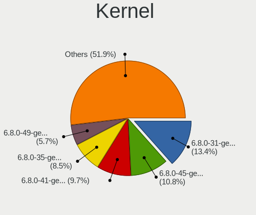
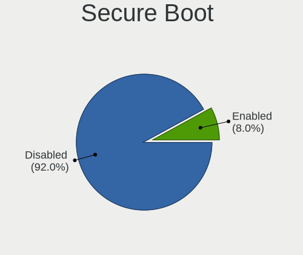
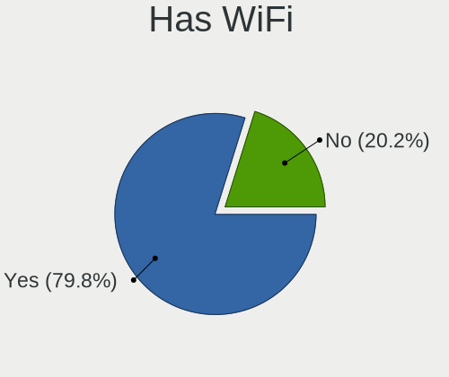
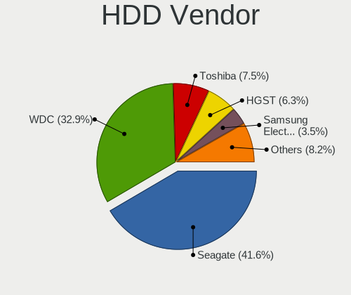
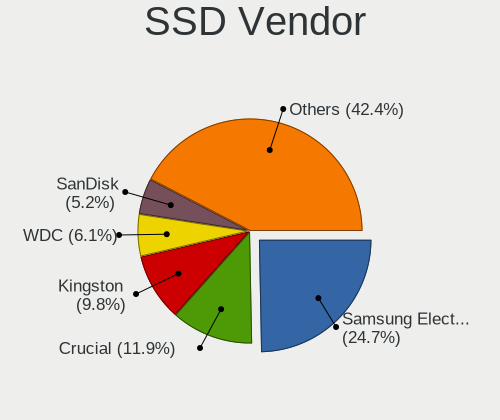
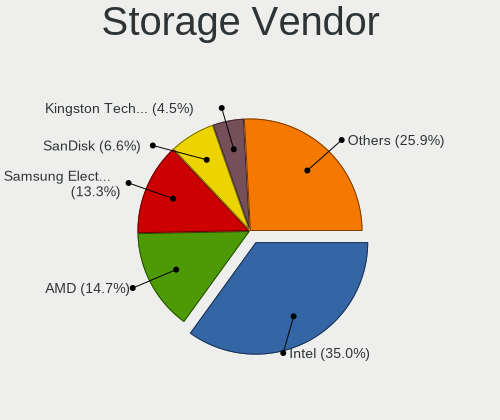
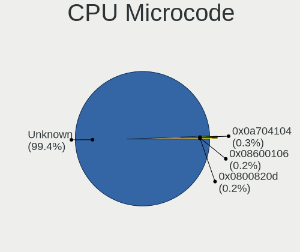

Kubuntu 24.04 - Tested Hardware & Statistics
--------------------------------------------

A project to collect tested hardware configurations for Kubuntu 24.04.

Anyone can contribute to this report by the [hw-probe](https://github.com/linuxhw/hw-probe) tool:

    sudo -E hw-probe -all -upload

Please contribute! Especially if your hardware is rare.

This is a report for all computer types. See also reports for [desktops](/Dist/Kubuntu_24.04/Desktop/README.md) and [notebooks](/Dist/Kubuntu_24.04/Notebook/README.md).

Contents
--------

* [ Test Cases ](#test-cases)

* [ System ](#system)
  - [ Kernel                   ](#kernel)
  - [ Kernel Family            ](#kernel-family)
  - [ Kernel Major Ver.        ](#kernel-major-ver)
  - [ Arch                     ](#arch)
  - [ DE                       ](#de)
  - [ Display Server           ](#display-server)
  - [ Display Manager          ](#display-manager)
  - [ OS Lang                  ](#os-lang)
  - [ Boot Mode                ](#boot-mode)
  - [ Filesystem               ](#filesystem)
  - [ Part. scheme             ](#part-scheme)
  - [ Dual Boot with Linux/BSD ](#dual-boot-with-linuxbsd)
  - [ Dual Boot (Win)          ](#dual-boot-win)

* [ Board ](#board)
  - [ Vendor                   ](#vendor)
  - [ Model                    ](#model)
  - [ Model Family             ](#model-family)
  - [ MFG Year                 ](#mfg-year)
  - [ Form Factor              ](#form-factor)
  - [ Secure Boot              ](#secure-boot)
  - [ Coreboot                 ](#coreboot)
  - [ RAM Size                 ](#ram-size)
  - [ RAM Used                 ](#ram-used)
  - [ Total Drives             ](#total-drives)
  - [ Has CD-ROM               ](#has-cd-rom)
  - [ Has Ethernet             ](#has-ethernet)
  - [ Has WiFi                 ](#has-wifi)
  - [ Has Bluetooth            ](#has-bluetooth)

* [ Location ](#location)
  - [ Country                  ](#country)
  - [ City                     ](#city)

* [ Drives ](#drives)
  - [ Drive Vendor             ](#drive-vendor)
  - [ Drive Model              ](#drive-model)
  - [ HDD Vendor               ](#hdd-vendor)
  - [ SSD Vendor               ](#ssd-vendor)
  - [ Drive Kind               ](#drive-kind)
  - [ Drive Connector          ](#drive-connector)
  - [ Drive Size               ](#drive-size)
  - [ Space Total              ](#space-total)
  - [ Space Used               ](#space-used)
  - [ Malfunc. Drives          ](#malfunc-drives)
  - [ Malfunc. Drive Vendor    ](#malfunc-drive-vendor)
  - [ Malfunc. HDD Vendor      ](#malfunc-hdd-vendor)
  - [ Malfunc. Drive Kind      ](#malfunc-drive-kind)
  - [ Failed Drives            ](#failed-drives)
  - [ Failed Drive Vendor      ](#failed-drive-vendor)
  - [ Drive Status             ](#drive-status)

* [ Storage controller ](#storage-controller)
  - [ Storage Vendor           ](#storage-vendor)
  - [ Storage Model            ](#storage-model)
  - [ Storage Kind             ](#storage-kind)

* [ Processor ](#processor)
  - [ CPU Vendor               ](#cpu-vendor)
  - [ CPU Model                ](#cpu-model)
  - [ CPU Model Family         ](#cpu-model-family)
  - [ CPU Cores                ](#cpu-cores)
  - [ CPU Sockets              ](#cpu-sockets)
  - [ CPU Threads              ](#cpu-threads)
  - [ CPU Op-Modes             ](#cpu-op-modes)
  - [ CPU Microcode            ](#cpu-microcode)
  - [ CPU Microarch            ](#cpu-microarch)

* [ Graphics ](#graphics)
  - [ GPU Vendor               ](#gpu-vendor)
  - [ GPU Model                ](#gpu-model)
  - [ GPU Combo                ](#gpu-combo)
  - [ GPU Driver               ](#gpu-driver)
  - [ GPU Memory               ](#gpu-memory)

* [ Monitor ](#monitor)
  - [ Monitor Vendor           ](#monitor-vendor)
  - [ Monitor Model            ](#monitor-model)
  - [ Monitor Resolution       ](#monitor-resolution)
  - [ Monitor Diagonal         ](#monitor-diagonal)
  - [ Monitor Width            ](#monitor-width)
  - [ Aspect Ratio             ](#aspect-ratio)
  - [ Monitor Area             ](#monitor-area)
  - [ Pixel Density            ](#pixel-density)
  - [ Multiple Monitors        ](#multiple-monitors)

* [ Network ](#network)
  - [ Net Controller Vendor    ](#net-controller-vendor)
  - [ Net Controller Model     ](#net-controller-model)
  - [ Wireless Vendor          ](#wireless-vendor)
  - [ Wireless Model           ](#wireless-model)
  - [ Ethernet Vendor          ](#ethernet-vendor)
  - [ Ethernet Model           ](#ethernet-model)
  - [ Net Controller Kind      ](#net-controller-kind)
  - [ Used Controller          ](#used-controller)
  - [ NICs                     ](#nics)
  - [ IPv6                     ](#ipv6)

* [ Bluetooth ](#bluetooth)
  - [ Bluetooth Vendor         ](#bluetooth-vendor)
  - [ Bluetooth Model          ](#bluetooth-model)

* [ Sound ](#sound)
  - [ Sound Vendor             ](#sound-vendor)
  - [ Sound Model              ](#sound-model)

* [ Memory ](#memory)
  - [ Memory Vendor            ](#memory-vendor)
  - [ Memory Model             ](#memory-model)
  - [ Memory Kind              ](#memory-kind)
  - [ Memory Form Factor       ](#memory-form-factor)
  - [ Memory Size              ](#memory-size)
  - [ Memory Speed             ](#memory-speed)

* [ Printers & scanners ](#printers--scanners)
  - [ Printer Vendor           ](#printer-vendor)
  - [ Printer Model            ](#printer-model)
  - [ Scanner Vendor           ](#scanner-vendor)
  - [ Scanner Model            ](#scanner-model)

* [ Camera ](#camera)
  - [ Camera Vendor            ](#camera-vendor)
  - [ Camera Model             ](#camera-model)

* [ Security ](#security)
  - [ Fingerprint Vendor       ](#fingerprint-vendor)
  - [ Fingerprint Model        ](#fingerprint-model)
  - [ Chipcard Vendor          ](#chipcard-vendor)
  - [ Chipcard Model           ](#chipcard-model)

* [ Unsupported ](#unsupported)
  - [ Unsupported Devices      ](#unsupported-devices)
  - [ Unsupported Device Types ](#unsupported-device-types)

Test Cases
----------

Total: 871

| Vendor        | Model                       | Form-Factor | Probe                                                      | Date         |
|---------------|-----------------------------|-------------|------------------------------------------------------------|--------------|
| Dell          | 0GDG8Y A00                  | Desktop     | [417dd2665a](https://linux-hardware.org/?probe=417dd2665a) | Jan 06, 2025 |
| Lenovo        | ThinkPad E520 1143R77       | Notebook    | [3d26d596e3](https://linux-hardware.org/?probe=3d26d596e3) | Jan 05, 2025 |
| ASRock        | A520M Phantom Gaming 4      | Desktop     | [55ed055bf7](https://linux-hardware.org/?probe=55ed055bf7) | Jan 05, 2025 |
| ASRock        | A520M Phantom Gaming 4      | Desktop     | [9bd6c2311d](https://linux-hardware.org/?probe=9bd6c2311d) | Jan 05, 2025 |
| Gigabyte      | B760M DS3H DDR4             | Desktop     | [735622d487](https://linux-hardware.org/?probe=735622d487) | Jan 05, 2025 |
| Dell          | XPS 16 9640                 | Notebook    | [58d3a3677b](https://linux-hardware.org/?probe=58d3a3677b) | Jan 04, 2025 |
| Dell          | XPS 16 9640                 | Notebook    | [8f38090e9d](https://linux-hardware.org/?probe=8f38090e9d) | Jan 04, 2025 |
| ASUSTek       | M5A97 LE R2.0               | Desktop     | [badfe83ed3](https://linux-hardware.org/?probe=badfe83ed3) | Jan 04, 2025 |
| MACHINIST     | E5-MR9A V1.0                | Desktop     | [2cd6888290](https://linux-hardware.org/?probe=2cd6888290) | Jan 04, 2025 |
| HUAWEI        | CREFG-XX                    | Notebook    | [c781ee9905](https://linux-hardware.org/?probe=c781ee9905) | Jan 03, 2025 |
| Lenovo        | ThinkPad L390 Yoga 20NT0... | Convertible | [bfb0f7c906](https://linux-hardware.org/?probe=bfb0f7c906) | Jan 03, 2025 |
| ASUSTek       | VivoBook_ASUSLaptop M160... | Notebook    | [51be04fcd7](https://linux-hardware.org/?probe=51be04fcd7) | Jan 03, 2025 |
| Lenovo        | ThinkBook 14 G4+ IAP 21C... | Notebook    | [0d48464f98](https://linux-hardware.org/?probe=0d48464f98) | Jan 03, 2025 |
| HP            | EliteBook 850 G8 Noteboo... | Notebook    | [514cd1a8a0](https://linux-hardware.org/?probe=514cd1a8a0) | Jan 03, 2025 |
| BESSTAR Te... | T3 MRD                      | Desktop     | [a4aa2dfab1](https://linux-hardware.org/?probe=a4aa2dfab1) | Jan 02, 2025 |
| Lenovo        | 3717 SDK0J40700 WIN 3258... | Desktop     | [bc8aa268ef](https://linux-hardware.org/?probe=bc8aa268ef) | Jan 01, 2025 |
| AZW           | EQ                          | Mini pc     | [770d05536d](https://linux-hardware.org/?probe=770d05536d) | Jan 01, 2025 |
| MSI           | X470 GAMING PRO CARBON      | Desktop     | [0a1f200989](https://linux-hardware.org/?probe=0a1f200989) | Jan 01, 2025 |
| Dell          | Inspiron 7573               | Convertible | [57f273fb9c](https://linux-hardware.org/?probe=57f273fb9c) | Dec 31, 2024 |
| ASUSTek       | TUF Gaming B550-PLUS WIF... | Desktop     | [9f7d158933](https://linux-hardware.org/?probe=9f7d158933) | Dec 30, 2024 |
| MSI           | GF65 Thin 9SD               | Notebook    | [ed812824ea](https://linux-hardware.org/?probe=ed812824ea) | Dec 30, 2024 |
| MSI           | GF65 Thin 9SD               | Notebook    | [a53632802a](https://linux-hardware.org/?probe=a53632802a) | Dec 30, 2024 |
| Apple         | MacBookPro11,2              | Notebook    | [238bce296a](https://linux-hardware.org/?probe=238bce296a) | Dec 29, 2024 |
| MSI           | X470 GAMING PRO CARBON      | Desktop     | [6ec37ed4b3](https://linux-hardware.org/?probe=6ec37ed4b3) | Dec 29, 2024 |
| ASRock        | B550 Phantom Gaming-ITX/... | Desktop     | [a3e88e71e3](https://linux-hardware.org/?probe=a3e88e71e3) | Dec 28, 2024 |
| Dell          | Inspiron 1525               | Notebook    | [89a2a2261a](https://linux-hardware.org/?probe=89a2a2261a) | Dec 27, 2024 |
| CBR           | A320M.2-VH Challenger       | Desktop     | [1f5e2840d1](https://linux-hardware.org/?probe=1f5e2840d1) | Dec 27, 2024 |
| Dell          | Latitude 5580               | Notebook    | [61c3987fc9](https://linux-hardware.org/?probe=61c3987fc9) | Dec 27, 2024 |
| HP            | 2B29                        | Desktop     | [2bacb97467](https://linux-hardware.org/?probe=2bacb97467) | Dec 26, 2024 |
| Dell          | XPS 9315                    | Notebook    | [db4876762a](https://linux-hardware.org/?probe=db4876762a) | Dec 26, 2024 |
| ASRock        | Z390 Phantom Gaming 4S      | Notebook    | [d134a178b2](https://linux-hardware.org/?probe=d134a178b2) | Dec 26, 2024 |
| HP            | Pavilion Laptop 15-cc1xx    | Notebook    | [697cdd9200](https://linux-hardware.org/?probe=697cdd9200) | Dec 25, 2024 |
| HP            | EliteBook 820 G3            | Notebook    | [cf6ba1ead2](https://linux-hardware.org/?probe=cf6ba1ead2) | Dec 25, 2024 |
| Acer          | Aspire V5-573G              | Notebook    | [45f86a09ae](https://linux-hardware.org/?probe=45f86a09ae) | Dec 25, 2024 |
| ASUSTek       | ROG STRIX B650E-F GAMING... | Desktop     | [ad40c6b991](https://linux-hardware.org/?probe=ad40c6b991) | Dec 23, 2024 |
| Gigabyte      | B450M DS3H V2               | Desktop     | [a0bed8cb3f](https://linux-hardware.org/?probe=a0bed8cb3f) | Dec 23, 2024 |
| ASUSTek       | ASUS EXPERTBOOK B1403CVA    | Notebook    | [b51fc6a4fb](https://linux-hardware.org/?probe=b51fc6a4fb) | Dec 23, 2024 |
| Clevo         | P170HMx                     | Notebook    | [c0ec7e3011](https://linux-hardware.org/?probe=c0ec7e3011) | Dec 22, 2024 |
| Lenovo        | LOQ 15IRX9 83DV             | Notebook    | [edf55e35fa](https://linux-hardware.org/?probe=edf55e35fa) | Dec 22, 2024 |
| Acer          | Nitro AN515-57              | Notebook    | [857b365f00](https://linux-hardware.org/?probe=857b365f00) | Dec 22, 2024 |
| Unknown       | Unknown                     | Soc         | [4839a778ab](https://linux-hardware.org/?probe=4839a778ab) | Dec 22, 2024 |
| Gigabyte      | Z270-HD3P-CF                | Desktop     | [f95d24a4d3](https://linux-hardware.org/?probe=f95d24a4d3) | Dec 22, 2024 |
| HP            | Pavilion Laptop 14-dv0xx... | Notebook    | [210729b8a3](https://linux-hardware.org/?probe=210729b8a3) | Dec 20, 2024 |
| AZW           | SEi12 MAX                   | Mini pc     | [7fdbdbc1a6](https://linux-hardware.org/?probe=7fdbdbc1a6) | Dec 20, 2024 |
| Biostar       | B450MX-S                    | Desktop     | [298f913b02](https://linux-hardware.org/?probe=298f913b02) | Dec 20, 2024 |
| ASUSTek       | VivoBook_ASUSLaptop X512... | Notebook    | [7c5e051820](https://linux-hardware.org/?probe=7c5e051820) | Dec 19, 2024 |
| Gigabyte      | X570 AORUS MASTER           | Desktop     | [9e02fc3eec](https://linux-hardware.org/?probe=9e02fc3eec) | Dec 19, 2024 |
| Gigabyte      | X570 AORUS MASTER           | Desktop     | [e41eca5240](https://linux-hardware.org/?probe=e41eca5240) | Dec 19, 2024 |
| MSI           | MAG X670E TOMAHAWK WIFI     | Desktop     | [607a9aa50f](https://linux-hardware.org/?probe=607a9aa50f) | Dec 19, 2024 |
| ASUSTek       | P8Z77-V LX                  | Desktop     | [a65cf104b4](https://linux-hardware.org/?probe=a65cf104b4) | Dec 18, 2024 |
| Intel         | S1200SP H57532-260          | Server      | [172a6309df](https://linux-hardware.org/?probe=172a6309df) | Dec 18, 2024 |
| ASRock        | B760M Pro RS/D4 WiFi        | Desktop     | [34bf804bd1](https://linux-hardware.org/?probe=34bf804bd1) | Dec 17, 2024 |
| Apple         | Mac-942B59F58194171B iMa... | All in one  | [8b589149fb](https://linux-hardware.org/?probe=8b589149fb) | Dec 17, 2024 |
| ASUSTek       | ASUS TUF Gaming A16 FA61... | Notebook    | [efacc3d2bf](https://linux-hardware.org/?probe=efacc3d2bf) | Dec 16, 2024 |
| Fujitsu       | FMVU09001                   | Notebook    | [2be0996b78](https://linux-hardware.org/?probe=2be0996b78) | Dec 16, 2024 |
| ASUSTek       | ROG STRIX Z390-E GAMING     | Desktop     | [bbe170f0bc](https://linux-hardware.org/?probe=bbe170f0bc) | Dec 16, 2024 |
| ASUSTek       | ASUS EXPERTBOOK B1403CVA    | Notebook    | [dc66ca3bfc](https://linux-hardware.org/?probe=dc66ca3bfc) | Dec 16, 2024 |
| HP            | Pavilion Power Laptop 15... | Notebook    | [a785db7994](https://linux-hardware.org/?probe=a785db7994) | Dec 15, 2024 |
| Unknown       | Unknown                     | Soc         | [7798007682](https://linux-hardware.org/?probe=7798007682) | Dec 15, 2024 |
| ASUSTek       | VivoBook_ASUSLaptop K340... | Notebook    | [ed3d05274d](https://linux-hardware.org/?probe=ed3d05274d) | Dec 14, 2024 |
| Samsung       | 950XDB/951XDB/950XDY        | Notebook    | [a53cca0335](https://linux-hardware.org/?probe=a53cca0335) | Dec 14, 2024 |
| MSI           | B450 GAMING PLUS MAX        | Desktop     | [7beb5cea9f](https://linux-hardware.org/?probe=7beb5cea9f) | Dec 14, 2024 |
| MSI           | Creator Z17 A12UGST         | Notebook    | [ca137f5639](https://linux-hardware.org/?probe=ca137f5639) | Dec 14, 2024 |
| Panasonic     | CF-191DCSG1M                | Notebook    | [c607411b91](https://linux-hardware.org/?probe=c607411b91) | Dec 13, 2024 |
| Panasonic     | CF-191DCSG1M                | Notebook    | [471033b960](https://linux-hardware.org/?probe=471033b960) | Dec 13, 2024 |
| Lenovo        | 310B SDK0J40697 WIN 3305... | Mini pc     | [b53a9b97fc](https://linux-hardware.org/?probe=b53a9b97fc) | Dec 13, 2024 |
| Dell          | Inspiron 5559               | Notebook    | [34c0ea4ba1](https://linux-hardware.org/?probe=34c0ea4ba1) | Dec 12, 2024 |
| Apple         | Mac-942B59F58194171B iMa... | All in one  | [ea00b2a8c1](https://linux-hardware.org/?probe=ea00b2a8c1) | Dec 12, 2024 |
| Unknown       | V00                         | Mini pc     | [5563f43111](https://linux-hardware.org/?probe=5563f43111) | Dec 11, 2024 |
| Lenovo        | ThinkPad X13 Gen 1 20UF0... | Notebook    | [0c5a8d044d](https://linux-hardware.org/?probe=0c5a8d044d) | Dec 11, 2024 |
| Huanan        | X99-TF                      | Desktop     | [8fd5cc725c](https://linux-hardware.org/?probe=8fd5cc725c) | Dec 10, 2024 |
| Apple         | Mac-031B6874CF7F642A iMa... | All in one  | [1e678a3582](https://linux-hardware.org/?probe=1e678a3582) | Dec 10, 2024 |
| Intel         | NUC9VXQNB K47179-500        | Mini pc     | [01c529e25c](https://linux-hardware.org/?probe=01c529e25c) | Dec 10, 2024 |
| ASUSTek       | TUF B450M-PLUS GAMING       | Desktop     | [f3e2067835](https://linux-hardware.org/?probe=f3e2067835) | Dec 10, 2024 |
| ZOTAC         | ZBOX-ECM73070C/7307LH/53... | Mini pc     | [4d77eb6ed7](https://linux-hardware.org/?probe=4d77eb6ed7) | Dec 09, 2024 |
| ASUSTek       | VivoBook_ASUSLaptop M160... | Notebook    | [6b5111843a](https://linux-hardware.org/?probe=6b5111843a) | Dec 09, 2024 |
| Dell          | Latitude E6430              | Notebook    | [a80a5df9fd](https://linux-hardware.org/?probe=a80a5df9fd) | Dec 08, 2024 |
| ASUSTek       | Z97-C                       | Desktop     | [456449c9b2](https://linux-hardware.org/?probe=456449c9b2) | Dec 08, 2024 |
| Dell          | 0NC2VH A01                  | Desktop     | [d1867f2f69](https://linux-hardware.org/?probe=d1867f2f69) | Dec 08, 2024 |
| Biostar       | B450MX-S                    | Desktop     | [821e6039db](https://linux-hardware.org/?probe=821e6039db) | Dec 08, 2024 |
| ASUSTek       | X99-E WS/USB                | Desktop     | [7d160ef3b0](https://linux-hardware.org/?probe=7d160ef3b0) | Dec 07, 2024 |
| Gigabyte      | B550 GAMING X V2            | Desktop     | [b90a139240](https://linux-hardware.org/?probe=b90a139240) | Dec 07, 2024 |
| Dell          | XPS 15 7590                 | Notebook    | [fbc857c378](https://linux-hardware.org/?probe=fbc857c378) | Dec 07, 2024 |
| Dell          | XPS 15 7590                 | Notebook    | [19ee3907ad](https://linux-hardware.org/?probe=19ee3907ad) | Dec 07, 2024 |
| ASUSTek       | ASUS TUF Gaming A14 FA40... | Notebook    | [a9c5cf0de0](https://linux-hardware.org/?probe=a9c5cf0de0) | Dec 06, 2024 |
| Shenzhen M... | F7BSI                       | Mini pc     | [6fecd84428](https://linux-hardware.org/?probe=6fecd84428) | Dec 06, 2024 |
| MSI           | B650 GAMING PLUS WIFI       | Desktop     | [d025744ff8](https://linux-hardware.org/?probe=d025744ff8) | Dec 06, 2024 |
| ASUSTek       | PRIME B250M-A               | Desktop     | [9c45bca350](https://linux-hardware.org/?probe=9c45bca350) | Dec 05, 2024 |
| Gigabyte      | Q87M-D2H                    | Desktop     | [bcb77899dd](https://linux-hardware.org/?probe=bcb77899dd) | Dec 05, 2024 |
| ASUSTek       | F2A85-M PRO                 | Desktop     | [dc43147214](https://linux-hardware.org/?probe=dc43147214) | Dec 05, 2024 |
| ASUSTek       | PRIME B250M-A               | Desktop     | [0c7c4b2a6e](https://linux-hardware.org/?probe=0c7c4b2a6e) | Dec 04, 2024 |
| HP            | Laptop 15-db0xxx            | Notebook    | [3ceb5935c2](https://linux-hardware.org/?probe=3ceb5935c2) | Dec 04, 2024 |
| ASUSTek       | F2A85-M PRO                 | Desktop     | [fa47a2dbb2](https://linux-hardware.org/?probe=fa47a2dbb2) | Dec 04, 2024 |
| HP            | Laptop 15-db0xxx            | Notebook    | [cc89356041](https://linux-hardware.org/?probe=cc89356041) | Dec 04, 2024 |
| AZW           | SER                         | Mini pc     | [2fff4fb280](https://linux-hardware.org/?probe=2fff4fb280) | Dec 03, 2024 |
| ASUSTek       | V-P8H67E                    | Desktop     | [d1c21b9076](https://linux-hardware.org/?probe=d1c21b9076) | Dec 03, 2024 |
| Gigabyte      | Z370P D3-CF                 | Desktop     | [440c2f4be0](https://linux-hardware.org/?probe=440c2f4be0) | Dec 02, 2024 |
| Lenovo        | 310B SDK0J40697 WIN 3305... | Mini pc     | [0787086502](https://linux-hardware.org/?probe=0787086502) | Dec 02, 2024 |
| Dell          | 0PXWHK A00                  | Desktop     | [e732eb7855](https://linux-hardware.org/?probe=e732eb7855) | Dec 02, 2024 |
| HUAWEI        | NBLK-WAX9X                  | Notebook    | [2f6d2fe7e2](https://linux-hardware.org/?probe=2f6d2fe7e2) | Dec 01, 2024 |
| Unknown       | AX16PRO                     | Notebook    | [603937e734](https://linux-hardware.org/?probe=603937e734) | Dec 01, 2024 |
| ASUSTek       | B85-PRO GAMER               | Desktop     | [12dd784125](https://linux-hardware.org/?probe=12dd784125) | Nov 30, 2024 |
| Lenovo        | IdeaPad Gaming 3 15IHU6 ... | Notebook    | [c56cdb7a5f](https://linux-hardware.org/?probe=c56cdb7a5f) | Nov 30, 2024 |
| Lenovo        | IdeaPad Gaming 3 15IHU6 ... | Notebook    | [eaca726e51](https://linux-hardware.org/?probe=eaca726e51) | Nov 30, 2024 |
| Lenovo        | ThinkPad X1 Carbon 6th 2... | Notebook    | [4dd33ed790](https://linux-hardware.org/?probe=4dd33ed790) | Nov 30, 2024 |
| ASUSTek       | B85-PRO GAMER               | Desktop     | [fb51898c9a](https://linux-hardware.org/?probe=fb51898c9a) | Nov 29, 2024 |
| Nvidia        | M750SLI-DS4                 | Desktop     | [6e2167686c](https://linux-hardware.org/?probe=6e2167686c) | Nov 29, 2024 |
| MSI           | X470 GAMING PRO CARBON      | Desktop     | [ea4aa1f387](https://linux-hardware.org/?probe=ea4aa1f387) | Nov 29, 2024 |
| Intel         | H61                         | Desktop     | [9884456ecc](https://linux-hardware.org/?probe=9884456ecc) | Nov 29, 2024 |
| MSI           | B550M PRO-VDH WIFI          | Desktop     | [52266f066f](https://linux-hardware.org/?probe=52266f066f) | Nov 29, 2024 |
| MSI           | MEG X570 ACE                | Desktop     | [f510dcc7d0](https://linux-hardware.org/?probe=f510dcc7d0) | Nov 28, 2024 |
| Gateway       | NV75S                       | Notebook    | [c7e9f2b942](https://linux-hardware.org/?probe=c7e9f2b942) | Nov 28, 2024 |
| ASUSTek       | V-P8H67E                    | Desktop     | [89f2b30be4](https://linux-hardware.org/?probe=89f2b30be4) | Nov 28, 2024 |
| Notebook      | X370SNx                     | Notebook    | [b3c4edd504](https://linux-hardware.org/?probe=b3c4edd504) | Nov 28, 2024 |
| Gigabyte      | Z170-HD3P-CF                | Desktop     | [85900dda2b](https://linux-hardware.org/?probe=85900dda2b) | Nov 27, 2024 |
| Gigabyte      | Z170-HD3P-CF                | Desktop     | [1b415de6dd](https://linux-hardware.org/?probe=1b415de6dd) | Nov 27, 2024 |
| Dell          | XPS 13 9310                 | Notebook    | [5a464dff99](https://linux-hardware.org/?probe=5a464dff99) | Nov 27, 2024 |
| HP            | ZBook Firefly 15 G7 Mobi... | Notebook    | [8c0ecd4b30](https://linux-hardware.org/?probe=8c0ecd4b30) | Nov 26, 2024 |
| Lenovo        | ThinkPad P14s Gen 2a 21A... | Notebook    | [33235dec27](https://linux-hardware.org/?probe=33235dec27) | Nov 26, 2024 |
| ASRock        | Z390 Phantom Gaming 4S      | Notebook    | [628f4e5d70](https://linux-hardware.org/?probe=628f4e5d70) | Nov 26, 2024 |
| ASUSTek       | VivoBook_ASUSLaptop K650... | Notebook    | [d58ccbdbd5](https://linux-hardware.org/?probe=d58ccbdbd5) | Nov 25, 2024 |
| Lenovo        | ThinkPad P1 Gen 7 21KVCT... | Notebook    | [baf2e1a758](https://linux-hardware.org/?probe=baf2e1a758) | Nov 25, 2024 |
| Dell          | Latitude E6420              | Notebook    | [f1db6546f8](https://linux-hardware.org/?probe=f1db6546f8) | Nov 25, 2024 |
| HP            | EliteBook 2560p             | Notebook    | [54d07de40f](https://linux-hardware.org/?probe=54d07de40f) | Nov 25, 2024 |
| HP            | EliteBook 2560p             | Notebook    | [98af34c213](https://linux-hardware.org/?probe=98af34c213) | Nov 25, 2024 |
| Intel         | H61                         | Desktop     | [06e926278d](https://linux-hardware.org/?probe=06e926278d) | Nov 25, 2024 |
| Apple         | MacBookPro12,1              | Notebook    | [1ad2abc16d](https://linux-hardware.org/?probe=1ad2abc16d) | Nov 24, 2024 |
| Lenovo        | IdeaPad Slim 5 16ABR8 82... | Notebook    | [7204b37e87](https://linux-hardware.org/?probe=7204b37e87) | Nov 24, 2024 |
| Dell          | 06D7TR A00                  | Desktop     | [61383033d8](https://linux-hardware.org/?probe=61383033d8) | Nov 24, 2024 |
| MSI           | X470 GAMING PRO CARBON      | Desktop     | [2412cb727b](https://linux-hardware.org/?probe=2412cb727b) | Nov 23, 2024 |
| Dell          | Inspiron 7573               | Convertible | [14dfbb9ebc](https://linux-hardware.org/?probe=14dfbb9ebc) | Nov 23, 2024 |
| HP            | ZBook Studio 15.6 inch G... | Notebook    | [57b9a57ac3](https://linux-hardware.org/?probe=57b9a57ac3) | Nov 23, 2024 |
| Acer          | Nitro AN515-53              | Notebook    | [b0da0c19f6](https://linux-hardware.org/?probe=b0da0c19f6) | Nov 23, 2024 |
| Gigabyte      | B650 GAMING X AX            | Desktop     | [6375082100](https://linux-hardware.org/?probe=6375082100) | Nov 23, 2024 |
| HP            | 212B                        | Desktop     | [00b61e1475](https://linux-hardware.org/?probe=00b61e1475) | Nov 21, 2024 |
| HP            | ZBook Firefly 15 G7 Mobi... | Notebook    | [99528ec5f3](https://linux-hardware.org/?probe=99528ec5f3) | Nov 20, 2024 |
| HP            | ZBook Firefly 15 G7 Mobi... | Notebook    | [53a79bee6b](https://linux-hardware.org/?probe=53a79bee6b) | Nov 20, 2024 |
| ASUSTek       | VivoBook_ASUSLaptop M160... | Notebook    | [1ed45c318d](https://linux-hardware.org/?probe=1ed45c318d) | Nov 20, 2024 |
| Lenovo        | IdeaPad Slim 3 16ABR8 82... | Notebook    | [7134e424f3](https://linux-hardware.org/?probe=7134e424f3) | Nov 20, 2024 |
| ASUSTek       | ASUS EXPERTBOOK B9400CEA... | Notebook    | [b9edf1bd37](https://linux-hardware.org/?probe=b9edf1bd37) | Nov 20, 2024 |
| Lenovo        | 3728 NOK                    | Desktop     | [1af5098c4e](https://linux-hardware.org/?probe=1af5098c4e) | Nov 19, 2024 |
| Biostar       | B450MX-S                    | Desktop     | [867b43aac2](https://linux-hardware.org/?probe=867b43aac2) | Nov 19, 2024 |
| Gigabyte      | P35-DS3L                    | Desktop     | [beaa8307e1](https://linux-hardware.org/?probe=beaa8307e1) | Nov 18, 2024 |
| Dell          | Precision 7710              | Notebook    | [f328fe1be2](https://linux-hardware.org/?probe=f328fe1be2) | Nov 18, 2024 |
| Dell          | Precision 7710              | Notebook    | [658f311eb3](https://linux-hardware.org/?probe=658f311eb3) | Nov 18, 2024 |
| Lenovo        | IdeaPad Slim 5 16ABR8 82... | Notebook    | [da573e5f3a](https://linux-hardware.org/?probe=da573e5f3a) | Nov 17, 2024 |
| Chuwi         | GemiBook Plus               | Notebook    | [10be58e89f](https://linux-hardware.org/?probe=10be58e89f) | Nov 16, 2024 |
| Lenovo        | Yoga 500-15IBD 80N6         | Notebook    | [e157b1804e](https://linux-hardware.org/?probe=e157b1804e) | Nov 16, 2024 |
| Gigabyte      | B550 AORUS ELITE V2         | Desktop     | [67dac8ba1a](https://linux-hardware.org/?probe=67dac8ba1a) | Nov 16, 2024 |
| HP            | 255 15.6 inch G10           | Notebook    | [9c4d00b6d7](https://linux-hardware.org/?probe=9c4d00b6d7) | Nov 16, 2024 |
| MSI           | MPG B550 GAMING PLUS        | Desktop     | [2d1f399be3](https://linux-hardware.org/?probe=2d1f399be3) | Nov 16, 2024 |
| Thomson       | NEO17C-8B1TCO               | Notebook    | [b5896a8529](https://linux-hardware.org/?probe=b5896a8529) | Nov 15, 2024 |
| Dell          | Latitude 5530               | Notebook    | [260bfa0ebf](https://linux-hardware.org/?probe=260bfa0ebf) | Nov 15, 2024 |
| Lenovo        | ThinkPad T480 20L5CTO1WW    | Notebook    | [cdda7d4c72](https://linux-hardware.org/?probe=cdda7d4c72) | Nov 15, 2024 |
| GPU Compan... | GWTN156-11                  | Notebook    | [30f3f9fea6](https://linux-hardware.org/?probe=30f3f9fea6) | Nov 14, 2024 |
| ASUSTek       | H81T                        | Desktop     | [e5b4d3412b](https://linux-hardware.org/?probe=e5b4d3412b) | Nov 14, 2024 |
| ASUSTek       | ROG Zephyrus Duo 16 GX65... | Notebook    | [cd0098486b](https://linux-hardware.org/?probe=cd0098486b) | Nov 14, 2024 |
| Lenovo        | 36C8 SDK0J40700 WIN 3258... | Desktop     | [58f234c8d9](https://linux-hardware.org/?probe=58f234c8d9) | Nov 13, 2024 |
| HUAWEI        | FLMH-XX                     | Notebook    | [3472dd9d1b](https://linux-hardware.org/?probe=3472dd9d1b) | Nov 13, 2024 |
| Samsung       | 270E5G/270E5U               | Notebook    | [d4eba09088](https://linux-hardware.org/?probe=d4eba09088) | Nov 13, 2024 |
| ASUSTek       | PRIME A520M-K               | Desktop     | [4036e5d5c8](https://linux-hardware.org/?probe=4036e5d5c8) | Nov 13, 2024 |
| Dell          | Inspiron 7573               | Convertible | [f34d6238c3](https://linux-hardware.org/?probe=f34d6238c3) | Nov 13, 2024 |
| ASUSTek       | ASUS TUF Gaming F15 FX50... | Notebook    | [d78f2cd0d5](https://linux-hardware.org/?probe=d78f2cd0d5) | Nov 12, 2024 |
| MSI           | PRO Z790-P WIFI             | Desktop     | [b98699dc00](https://linux-hardware.org/?probe=b98699dc00) | Nov 12, 2024 |
| Fisusen Te... | FSX-ALU4L2S Ver:1.2         | Desktop     | [1ad6062abc](https://linux-hardware.org/?probe=1ad6062abc) | Nov 12, 2024 |
| Fisusen Te... | FSX-ALU4L2S Ver:1.2         | Desktop     | [eaa81d85da](https://linux-hardware.org/?probe=eaa81d85da) | Nov 12, 2024 |
| Fujitsu       | LIFEBOOK E780               | Notebook    | [b41da32715](https://linux-hardware.org/?probe=b41da32715) | Nov 11, 2024 |
| ASUSTek       | TUF Z270 MARK 2             | Desktop     | [de78865944](https://linux-hardware.org/?probe=de78865944) | Nov 10, 2024 |
| Unknown       | Unknown                     | Desktop     | [6fe1fc4bfb](https://linux-hardware.org/?probe=6fe1fc4bfb) | Nov 10, 2024 |
| Alurin        | ALU-BAR-R555-000-156        | Notebook    | [946a4bbb98](https://linux-hardware.org/?probe=946a4bbb98) | Nov 10, 2024 |
| Alurin        | ALU-BAR-R555-000-156        | Notebook    | [c528868479](https://linux-hardware.org/?probe=c528868479) | Nov 10, 2024 |
| Dell          | Latitude 5410               | Notebook    | [be3048dbda](https://linux-hardware.org/?probe=be3048dbda) | Nov 09, 2024 |
| ASUSTek       | E402SA                      | Notebook    | [5e4e4b42cb](https://linux-hardware.org/?probe=5e4e4b42cb) | Nov 08, 2024 |
| MSI           | B360 GAMING PRO CARBON      | Desktop     | [8622f5cac7](https://linux-hardware.org/?probe=8622f5cac7) | Nov 07, 2024 |
| ASUSTek       | PRIME X570-P                | Desktop     | [8a99b0cee1](https://linux-hardware.org/?probe=8a99b0cee1) | Nov 06, 2024 |
| Lenovo        | SHARKBAY NOK                | Desktop     | [f7909ba95e](https://linux-hardware.org/?probe=f7909ba95e) | Nov 05, 2024 |
| Nvidia        | M750SLI-DS4                 | Desktop     | [32195a3f35](https://linux-hardware.org/?probe=32195a3f35) | Nov 05, 2024 |
| Timi          | Redmi Book Pro 14 2022      | Notebook    | [317fe89cc5](https://linux-hardware.org/?probe=317fe89cc5) | Nov 05, 2024 |
| Unknown       | Unknown                     | Soc         | [5aba8aabee](https://linux-hardware.org/?probe=5aba8aabee) | Nov 05, 2024 |
| TECNO Mobi... | Pocket Go                   | Notebook    | [3e1b35b41c](https://linux-hardware.org/?probe=3e1b35b41c) | Nov 04, 2024 |
| Dell          | Latitude E5450              | Notebook    | [23833c27eb](https://linux-hardware.org/?probe=23833c27eb) | Nov 04, 2024 |
| Apple         | MacBookPro12,1              | Notebook    | [8d8ff8e8b5](https://linux-hardware.org/?probe=8d8ff8e8b5) | Nov 04, 2024 |
| HP            | EliteBook 8540w             | Notebook    | [72ef3bdc40](https://linux-hardware.org/?probe=72ef3bdc40) | Nov 03, 2024 |
| Lenovo        | ThinkPad P16s Gen 1 21CK... | Notebook    | [6bfe7b8d66](https://linux-hardware.org/?probe=6bfe7b8d66) | Nov 02, 2024 |
| Lenovo        | ThinkPad X395 20NMS0YG00    | Notebook    | [fa349693cc](https://linux-hardware.org/?probe=fa349693cc) | Nov 02, 2024 |
| Lenovo        | ThinkPad X395 20NMS0YG00    | Notebook    | [0d8a4bb988](https://linux-hardware.org/?probe=0d8a4bb988) | Nov 01, 2024 |
| MSI           | X370 XPOWER GAMING TITAN... | Desktop     | [36275af64b](https://linux-hardware.org/?probe=36275af64b) | Nov 01, 2024 |
| Dell          | XPS 13 9343                 | Notebook    | [02e150f7e1](https://linux-hardware.org/?probe=02e150f7e1) | Nov 01, 2024 |
| MSI           | X470 GAMING PRO CARBON      | Desktop     | [d9043dc2d5](https://linux-hardware.org/?probe=d9043dc2d5) | Nov 01, 2024 |
| Dell          | Latitude 3490               | Notebook    | [0beb8b64e1](https://linux-hardware.org/?probe=0beb8b64e1) | Oct 31, 2024 |
| ASUSTek       | VivoBook_ASUSLaptop M650... | Notebook    | [d901f51891](https://linux-hardware.org/?probe=d901f51891) | Oct 30, 2024 |
| ASUSTek       | ASUS TUF Gaming F15 FX50... | Notebook    | [f4becfc085](https://linux-hardware.org/?probe=f4becfc085) | Oct 29, 2024 |
| HP            | ProBook 450 15.6 inch G9... | Notebook    | [9552f01581](https://linux-hardware.org/?probe=9552f01581) | Oct 29, 2024 |
| Dell          | Latitude 5290 2-in-1        | Notebook    | [dcbfa3ffe4](https://linux-hardware.org/?probe=dcbfa3ffe4) | Oct 28, 2024 |
| Dell          | 048DY8 A01                  | Desktop     | [48ed169a24](https://linux-hardware.org/?probe=48ed169a24) | Oct 28, 2024 |
| MSI           | B650 GAMING PLUS WIFI       | Desktop     | [d117ba60e9](https://linux-hardware.org/?probe=d117ba60e9) | Oct 27, 2024 |
| Lenovo        | 15ARE05 81W4                | Notebook    | [049414e1fb](https://linux-hardware.org/?probe=049414e1fb) | Oct 27, 2024 |
| Acer          | Nitro ANV15-51              | Notebook    | [f273e6c830](https://linux-hardware.org/?probe=f273e6c830) | Oct 27, 2024 |
| Acer          | Nitro ANV15-51              | Notebook    | [4d8ce01dce](https://linux-hardware.org/?probe=4d8ce01dce) | Oct 27, 2024 |
| Dell          | XPS 15 9510                 | Notebook    | [c9c27cec3b](https://linux-hardware.org/?probe=c9c27cec3b) | Oct 26, 2024 |
| HP            | EliteBook 840 G5            | Notebook    | [9c9358857e](https://linux-hardware.org/?probe=9c9358857e) | Oct 26, 2024 |
| ASUSTek       | G551JM                      | Notebook    | [d6d0bfa34e](https://linux-hardware.org/?probe=d6d0bfa34e) | Oct 26, 2024 |
| ASUSTek       | G551JM                      | Notebook    | [c411632c1c](https://linux-hardware.org/?probe=c411632c1c) | Oct 26, 2024 |
| ASRock        | Q1900M                      | Desktop     | [9724395584](https://linux-hardware.org/?probe=9724395584) | Oct 25, 2024 |
| Dell          | Latitude 5530               | Notebook    | [05ab1c8f51](https://linux-hardware.org/?probe=05ab1c8f51) | Oct 25, 2024 |
| MSI           | MPG B650 EDGE WIFI          | Desktop     | [2d03a71708](https://linux-hardware.org/?probe=2d03a71708) | Oct 24, 2024 |
| Dell          | Latitude E5570              | Notebook    | [6d86bd0c29](https://linux-hardware.org/?probe=6d86bd0c29) | Oct 24, 2024 |
| Gigabyte      | B650 AORUS ELITE AX V2      | Desktop     | [171bf9a6b1](https://linux-hardware.org/?probe=171bf9a6b1) | Oct 23, 2024 |
| ASUSTek       | B85M-E                      | Desktop     | [0750f91898](https://linux-hardware.org/?probe=0750f91898) | Oct 23, 2024 |
| Lenovo        | ThinkPad P15v Gen 3 21D9... | Notebook    | [3256d7f820](https://linux-hardware.org/?probe=3256d7f820) | Oct 23, 2024 |
| Lenovo        | ThinkPad P15v Gen 3 21D9... | Notebook    | [37b34d5541](https://linux-hardware.org/?probe=37b34d5541) | Oct 23, 2024 |
| ASUSTek       | TUF Gaming B650M-E WIFI     | Desktop     | [a31f68636f](https://linux-hardware.org/?probe=a31f68636f) | Oct 23, 2024 |
| ASRock        | X470 Taichi                 | Desktop     | [281ae4fd93](https://linux-hardware.org/?probe=281ae4fd93) | Oct 23, 2024 |
| ASUSTek       | STRIX Z270E GAMING          | Desktop     | [788a8234d6](https://linux-hardware.org/?probe=788a8234d6) | Oct 23, 2024 |
| Dell          | Vostro 3550                 | Notebook    | [e9bb2708b0](https://linux-hardware.org/?probe=e9bb2708b0) | Oct 23, 2024 |
| Dell          | Vostro 3550                 | Notebook    | [e8577f4996](https://linux-hardware.org/?probe=e8577f4996) | Oct 23, 2024 |
| MSI           | MPG X570 GAMING PRO CARB... | Desktop     | [7f42b4b8eb](https://linux-hardware.org/?probe=7f42b4b8eb) | Oct 22, 2024 |
| HP            | ProBook 4520s               | Notebook    | [352aa6f393](https://linux-hardware.org/?probe=352aa6f393) | Oct 22, 2024 |
| Dell          | 0D28YY A00                  | Desktop     | [d99284464c](https://linux-hardware.org/?probe=d99284464c) | Oct 22, 2024 |
| Lenovo        | IdeaPadFlex 6-14IKB 81EM    | Convertible | [e865c64993](https://linux-hardware.org/?probe=e865c64993) | Oct 22, 2024 |
| Lenovo        | 3148 SDK0J40697 WIN 3305... | Desktop     | [90245dec30](https://linux-hardware.org/?probe=90245dec30) | Oct 22, 2024 |
| Lenovo        | Yoga 7 16IRL8 82YN          | Convertible | [dd0993b9ed](https://linux-hardware.org/?probe=dd0993b9ed) | Oct 22, 2024 |
| Lenovo        | 3130 SDK0J40697 WIN 3305... | Mini pc     | [12195ee0cf](https://linux-hardware.org/?probe=12195ee0cf) | Oct 22, 2024 |
| Gigabyte      | B550 UD AC-Y1               | Desktop     | [63e2546922](https://linux-hardware.org/?probe=63e2546922) | Oct 22, 2024 |
| Lenovo        | IdeaPadFlex 6-14IKB 81EM    | Convertible | [5b4680f0b2](https://linux-hardware.org/?probe=5b4680f0b2) | Oct 22, 2024 |
| MSI           | MPG B650 EDGE WIFI          | Desktop     | [d86b5ef934](https://linux-hardware.org/?probe=d86b5ef934) | Oct 21, 2024 |
| Dell          | Latitude 5430               | Notebook    | [aea23cbc32](https://linux-hardware.org/?probe=aea23cbc32) | Oct 21, 2024 |
| Acer          | Swift SF514-52TP            | Notebook    | [1114c4713d](https://linux-hardware.org/?probe=1114c4713d) | Oct 20, 2024 |
| Acer          | Swift SF514-52TP            | Notebook    | [90891d2f2a](https://linux-hardware.org/?probe=90891d2f2a) | Oct 20, 2024 |
| ASUSTek       | ROG STRIX B550-XE GAMING... | Desktop     | [a615005d3d](https://linux-hardware.org/?probe=a615005d3d) | Oct 20, 2024 |
| Gigabyte      | X570 AORUS ELITE            | Desktop     | [1517e4e467](https://linux-hardware.org/?probe=1517e4e467) | Oct 19, 2024 |
| ASUSTek       | P8B75-M LX PLUS             | Desktop     | [84f8b8a516](https://linux-hardware.org/?probe=84f8b8a516) | Oct 19, 2024 |
| Lenovo        | ThinkPad X1 Carbon 7th 2... | Notebook    | [e0c1d7b9ce](https://linux-hardware.org/?probe=e0c1d7b9ce) | Oct 18, 2024 |
| Gigabyte      | B760M DS3H AX DDR4          | Desktop     | [90f6d1aeaa](https://linux-hardware.org/?probe=90f6d1aeaa) | Oct 18, 2024 |
| Dell          | 06D7TR A01                  | Desktop     | [4330cba698](https://linux-hardware.org/?probe=4330cba698) | Oct 18, 2024 |
| Lenovo        | ThinkPad X1 Yoga 1st 20F... | Convertible | [b94f17fdb3](https://linux-hardware.org/?probe=b94f17fdb3) | Oct 18, 2024 |
| HP            | ENVY x360 2-in-1 Laptop ... | Convertible | [b10034c28c](https://linux-hardware.org/?probe=b10034c28c) | Oct 18, 2024 |
| Gigabyte      | B360M GAMING HD             | Desktop     | [82d4e1568c](https://linux-hardware.org/?probe=82d4e1568c) | Oct 17, 2024 |
| HP            | EliteBook 840 G8 Noteboo... | Notebook    | [bd0906dab7](https://linux-hardware.org/?probe=bd0906dab7) | Oct 17, 2024 |
| MSI           | GP72MVR 7RFX                | Notebook    | [aa62c4b0dd](https://linux-hardware.org/?probe=aa62c4b0dd) | Oct 16, 2024 |
| MSI           | GP72MVR 7RFX                | Notebook    | [0ce7ce2745](https://linux-hardware.org/?probe=0ce7ce2745) | Oct 16, 2024 |
| HP            | EliteBook 840 G2            | Notebook    | [7bac64408f](https://linux-hardware.org/?probe=7bac64408f) | Oct 16, 2024 |
| Gigabyte      | B450 AORUS PRO WIFI-CF      | Desktop     | [0ce8e146cf](https://linux-hardware.org/?probe=0ce8e146cf) | Oct 16, 2024 |
| Lenovo        | ThinkPad X1 Yoga 1st 20F... | Convertible | [2f7890de1d](https://linux-hardware.org/?probe=2f7890de1d) | Oct 15, 2024 |
| Dell          | 0C3YXR A01                  | Desktop     | [702872562a](https://linux-hardware.org/?probe=702872562a) | Oct 15, 2024 |
| ASUSTek       | Q525UAR                     | Convertible | [322026070c](https://linux-hardware.org/?probe=322026070c) | Oct 15, 2024 |
| HP            | Laptop 15-bs0xx             | Notebook    | [3144ddfcfc](https://linux-hardware.org/?probe=3144ddfcfc) | Oct 14, 2024 |
| Lenovo        | ThinkPad P16s Gen 1 21BU... | Notebook    | [b9707fb8cd](https://linux-hardware.org/?probe=b9707fb8cd) | Oct 14, 2024 |
| Apple         | MacBookPro12,1              | Notebook    | [21665e8dad](https://linux-hardware.org/?probe=21665e8dad) | Oct 14, 2024 |
| HP            | Laptop 15s-fq5xxx           | Notebook    | [960da6f0c1](https://linux-hardware.org/?probe=960da6f0c1) | Oct 14, 2024 |
| Nvidia        | M750SLI-DS4                 | Desktop     | [597ea8c178](https://linux-hardware.org/?probe=597ea8c178) | Oct 14, 2024 |
| HP            | Pavilion Gaming Laptop 1... | Notebook    | [106afe3aa3](https://linux-hardware.org/?probe=106afe3aa3) | Oct 13, 2024 |
| Dell          | Latitude 7480               | Notebook    | [4686c4e7c6](https://linux-hardware.org/?probe=4686c4e7c6) | Oct 13, 2024 |
| ASUSTek       | Maximus IV GENE-Z/GEN3      | Desktop     | [4d57a6b4ae](https://linux-hardware.org/?probe=4d57a6b4ae) | Oct 12, 2024 |
| ASUSTek       | PRIME B250M-PLUS            | Desktop     | [8e00234742](https://linux-hardware.org/?probe=8e00234742) | Oct 12, 2024 |
| Intel         | NUC12WSBi7 M46422-303       | Mini pc     | [f6fa0c5195](https://linux-hardware.org/?probe=f6fa0c5195) | Oct 12, 2024 |
| MSI           | B460M PRO-VDH WIFI          | Desktop     | [efedf1a09f](https://linux-hardware.org/?probe=efedf1a09f) | Oct 12, 2024 |
| HP            | Pavilion g6                 | Notebook    | [2639353fe7](https://linux-hardware.org/?probe=2639353fe7) | Oct 11, 2024 |
| AZW           | MINI S                      | Desktop     | [9f7e9cafb9](https://linux-hardware.org/?probe=9f7e9cafb9) | Oct 11, 2024 |
| MSI           | Katana GF76 11SC            | Notebook    | [1a01b23b92](https://linux-hardware.org/?probe=1a01b23b92) | Oct 11, 2024 |
| Dell          | Latitude E7450              | Notebook    | [b240417f21](https://linux-hardware.org/?probe=b240417f21) | Oct 10, 2024 |
| Dell          | Latitude 5440               | Notebook    | [71ee76b243](https://linux-hardware.org/?probe=71ee76b243) | Oct 10, 2024 |
| HP            | EliteBook 8740w             | Notebook    | [4721f064f7](https://linux-hardware.org/?probe=4721f064f7) | Oct 10, 2024 |
| ASUSTek       | ASUS EXPERTBOOK B3402FEA... | Convertible | [f8be0d1332](https://linux-hardware.org/?probe=f8be0d1332) | Oct 10, 2024 |
| Unknown       | Unknown                     | Notebook    | [cc06a0fc67](https://linux-hardware.org/?probe=cc06a0fc67) | Oct 10, 2024 |
| Lenovo        | ThinkBook 15 G2 ITL 20VE    | Notebook    | [11bd71149b](https://linux-hardware.org/?probe=11bd71149b) | Oct 10, 2024 |
| Lenovo        | ThinkBook 15 G2 ITL 20VE    | Notebook    | [b2a2d78933](https://linux-hardware.org/?probe=b2a2d78933) | Oct 10, 2024 |
| Gigabyte      | A320M-S2H-CF                | Desktop     | [786357d8a3](https://linux-hardware.org/?probe=786357d8a3) | Oct 10, 2024 |
| Gigabyte      | B450M DS3H V2               | Desktop     | [2b9caff686](https://linux-hardware.org/?probe=2b9caff686) | Oct 09, 2024 |
| Acer          | Aspire A315-44P             | Notebook    | [8131f1506d](https://linux-hardware.org/?probe=8131f1506d) | Oct 09, 2024 |
| Lenovo        | ThinkBook 16 G6 IRL 21KH    | Notebook    | [a010c0db0b](https://linux-hardware.org/?probe=a010c0db0b) | Oct 09, 2024 |
| ASUSTek       | Q400A                       | Notebook    | [71f5a7f27b](https://linux-hardware.org/?probe=71f5a7f27b) | Oct 09, 2024 |
| MSI           | B550M PRO                   | Desktop     | [1567bd14d8](https://linux-hardware.org/?probe=1567bd14d8) | Oct 09, 2024 |
| ASUSTek       | VivoBook_ASUSLaptop X415... | Notebook    | [30e368c030](https://linux-hardware.org/?probe=30e368c030) | Oct 08, 2024 |
| ASUSTek       | VivoBook_ASUSLaptop X415... | Notebook    | [a6c3210fa6](https://linux-hardware.org/?probe=a6c3210fa6) | Oct 08, 2024 |
| MSI           | H61M-P21                    | Desktop     | [1dbbce13c7](https://linux-hardware.org/?probe=1dbbce13c7) | Oct 08, 2024 |
| Apple         | MacBookPro12,1              | Notebook    | [effcb6f158](https://linux-hardware.org/?probe=effcb6f158) | Oct 07, 2024 |
| ASUSTek       | P7P55 LX                    | Desktop     | [bf4370907f](https://linux-hardware.org/?probe=bf4370907f) | Oct 07, 2024 |
| Apple         | MacBookPro12,1              | Notebook    | [e2b9f2ef87](https://linux-hardware.org/?probe=e2b9f2ef87) | Oct 07, 2024 |
| HP            | Pavilion x360 Convertibl... | Convertible | [e4051bb762](https://linux-hardware.org/?probe=e4051bb762) | Oct 07, 2024 |
| Gigabyte      | EX58-UD5                    | Desktop     | [5880d0b553](https://linux-hardware.org/?probe=5880d0b553) | Oct 07, 2024 |
| Notebook      | X370SNx1                    | Notebook    | [d9d9096946](https://linux-hardware.org/?probe=d9d9096946) | Oct 07, 2024 |
| Medion        | E2228T MD61900              | Convertible | [51f842538a](https://linux-hardware.org/?probe=51f842538a) | Oct 06, 2024 |
| HP            | 250 G4                      | Notebook    | [c686ed18ff](https://linux-hardware.org/?probe=c686ed18ff) | Oct 06, 2024 |
| Lenovo        | IdeaPad 320-15AST 80XV      | Notebook    | [18e0b29e22](https://linux-hardware.org/?probe=18e0b29e22) | Oct 05, 2024 |
| MSI           | X470 GAMING PRO CARBON      | Desktop     | [a6f1e4b465](https://linux-hardware.org/?probe=a6f1e4b465) | Oct 05, 2024 |
| Dell          | Latitude 5440               | Notebook    | [15ad67d4bf](https://linux-hardware.org/?probe=15ad67d4bf) | Oct 05, 2024 |
| Gigabyte      | B450M DS3H V2               | Desktop     | [d04f626162](https://linux-hardware.org/?probe=d04f626162) | Oct 05, 2024 |
| Dell          | 0WR7PY A01                  | Desktop     | [77b343aeba](https://linux-hardware.org/?probe=77b343aeba) | Oct 05, 2024 |
| HP            | EliteBook 745 G6            | Notebook    | [0344e21246](https://linux-hardware.org/?probe=0344e21246) | Oct 04, 2024 |
| Lenovo        | G555 20045                  | Notebook    | [0a688043df](https://linux-hardware.org/?probe=0a688043df) | Oct 04, 2024 |
| Dell          | 0DR845                      | Desktop     | [0f42ddcf61](https://linux-hardware.org/?probe=0f42ddcf61) | Oct 04, 2024 |
| Lenovo        | 31A7 SDK0J40697 WIN 3305... | Mini pc     | [ada7ebf233](https://linux-hardware.org/?probe=ada7ebf233) | Oct 04, 2024 |
| Lenovo        | IdeaPad 5 2-in-1 14AHP9 ... | Convertible | [5c6e36b1e6](https://linux-hardware.org/?probe=5c6e36b1e6) | Oct 04, 2024 |
| MSI           | Z97M-G43                    | Desktop     | [ae53772186](https://linux-hardware.org/?probe=ae53772186) | Oct 03, 2024 |
| MSI           | Z97M-G43                    | Desktop     | [4f32e59ad9](https://linux-hardware.org/?probe=4f32e59ad9) | Oct 03, 2024 |
| Lenovo        | ThinkPad T16 Gen 1 21BVC... | Notebook    | [e8ba2e3f09](https://linux-hardware.org/?probe=e8ba2e3f09) | Oct 03, 2024 |
| ASUSTek       | PRIME B550-PLUS             | Desktop     | [41921a1eeb](https://linux-hardware.org/?probe=41921a1eeb) | Oct 03, 2024 |
| Dell          | Latitude E6430              | Notebook    | [9a577f1aa5](https://linux-hardware.org/?probe=9a577f1aa5) | Oct 02, 2024 |
| Dell          | Latitude E6430              | Notebook    | [48ba2b306b](https://linux-hardware.org/?probe=48ba2b306b) | Oct 02, 2024 |
| Pegatron      | Benicia                     | Desktop     | [da155fec72](https://linux-hardware.org/?probe=da155fec72) | Oct 02, 2024 |
| ASUSTek       | PRIME B350M-A               | Desktop     | [9f9436db09](https://linux-hardware.org/?probe=9f9436db09) | Oct 02, 2024 |
| TongFang      | GM6BG5Q                     | Notebook    | [dc8700d443](https://linux-hardware.org/?probe=dc8700d443) | Oct 02, 2024 |
| ASRock        | B650M-H/M.2+                | Desktop     | [40445bd99a](https://linux-hardware.org/?probe=40445bd99a) | Oct 02, 2024 |
| ASUSTek       | Z97-A                       | Desktop     | [f490208f34](https://linux-hardware.org/?probe=f490208f34) | Oct 01, 2024 |
| Lenovo        | IdeaPad 320-15AST 80XV      | Notebook    | [5098531588](https://linux-hardware.org/?probe=5098531588) | Oct 01, 2024 |
| Dell          | 0CXR46 A00                  | Desktop     | [407b847faa](https://linux-hardware.org/?probe=407b847faa) | Sep 30, 2024 |
| Dell          | 048DY8 A01                  | Desktop     | [909949bed3](https://linux-hardware.org/?probe=909949bed3) | Sep 30, 2024 |
| HP            | 212B                        | Desktop     | [8a25cf82be](https://linux-hardware.org/?probe=8a25cf82be) | Sep 30, 2024 |
| ASRock        | Z690 PG Velocita            | Desktop     | [3cca718666](https://linux-hardware.org/?probe=3cca718666) | Sep 29, 2024 |
| Dell          | XPS 13 9300                 | Notebook    | [e5e96718fa](https://linux-hardware.org/?probe=e5e96718fa) | Sep 29, 2024 |
| Gigabyte      | P35-DS3L                    | Desktop     | [199f033892](https://linux-hardware.org/?probe=199f033892) | Sep 29, 2024 |
| Gigabyte      | P35-DS3L                    | Desktop     | [c3ce9fa5d8](https://linux-hardware.org/?probe=c3ce9fa5d8) | Sep 28, 2024 |
| Intel         | NUC9i9QNB K49243-500        | Mini pc     | [dae336e37e](https://linux-hardware.org/?probe=dae336e37e) | Sep 28, 2024 |
| Dell          | 0F6X5P A00                  | Desktop     | [fc052cba3c](https://linux-hardware.org/?probe=fc052cba3c) | Sep 28, 2024 |
| Gigabyte      | GA-A75M-D2H                 | Desktop     | [f62a1a679c](https://linux-hardware.org/?probe=f62a1a679c) | Sep 28, 2024 |
| Unknown       | Unknown                     | Notebook    | [8eae452ea2](https://linux-hardware.org/?probe=8eae452ea2) | Sep 28, 2024 |
| Dell          | 0JGM7F A00                  | Desktop     | [b7edac6094](https://linux-hardware.org/?probe=b7edac6094) | Sep 28, 2024 |
| Lenovo        | ThinkPad T450 20BUS0B000    | Notebook    | [0b5eb97e2c](https://linux-hardware.org/?probe=0b5eb97e2c) | Sep 28, 2024 |
| Dell          | Precision 5540              | Notebook    | [cf02756049](https://linux-hardware.org/?probe=cf02756049) | Sep 28, 2024 |
| MSI           | 760GM -E51                  | Desktop     | [88f6fb3c64](https://linux-hardware.org/?probe=88f6fb3c64) | Sep 28, 2024 |
| Dell          | 0WR7PY A02                  | Desktop     | [bc0335d49f](https://linux-hardware.org/?probe=bc0335d49f) | Sep 27, 2024 |
| Dell          | System Inspiron N7110       | Notebook    | [d183b0f670](https://linux-hardware.org/?probe=d183b0f670) | Sep 27, 2024 |
| Lenovo        | ThinkPad P14s Gen 4 21K5... | Notebook    | [85fb0924d3](https://linux-hardware.org/?probe=85fb0924d3) | Sep 27, 2024 |
| Apple         | MacBook8,1                  | Notebook    | [b6d5064cea](https://linux-hardware.org/?probe=b6d5064cea) | Sep 27, 2024 |
| Lenovo        | ThinkPad T470 20HES18S0A    | Notebook    | [cd6482b31a](https://linux-hardware.org/?probe=cd6482b31a) | Sep 27, 2024 |
| Intel         | NUC9i9QNB K49243-500        | Mini pc     | [48601c29ad](https://linux-hardware.org/?probe=48601c29ad) | Sep 26, 2024 |
| Microsoft     | Surface Pro 4               | Tablet      | [063ec8035a](https://linux-hardware.org/?probe=063ec8035a) | Sep 26, 2024 |
| ASUSTek       | ROG STRIX X670E-E GAMING... | Desktop     | [e1ead454b9](https://linux-hardware.org/?probe=e1ead454b9) | Sep 26, 2024 |
| Positivo      | Mobile                      | Notebook    | [6b9044e6ef](https://linux-hardware.org/?probe=6b9044e6ef) | Sep 26, 2024 |
| Lenovo        | ThinkPad L570 20J8S01L00    | Notebook    | [4dc13bc8ce](https://linux-hardware.org/?probe=4dc13bc8ce) | Sep 25, 2024 |
| Google        | Nightfury                   | Notebook    | [aeab74dab3](https://linux-hardware.org/?probe=aeab74dab3) | Sep 25, 2024 |
| HP            | Pavilion Laptop 15-eg2xx... | Notebook    | [77aec090af](https://linux-hardware.org/?probe=77aec090af) | Sep 24, 2024 |
| Gigabyte      | GA-78LMT-USB3               | Desktop     | [4d7ee90e04](https://linux-hardware.org/?probe=4d7ee90e04) | Sep 24, 2024 |
| ASUSTek       | X555LN                      | Notebook    | [fc48a399c1](https://linux-hardware.org/?probe=fc48a399c1) | Sep 23, 2024 |
| Gigabyte      | A520M DS3H V2               | Desktop     | [7e4ec3213b](https://linux-hardware.org/?probe=7e4ec3213b) | Sep 23, 2024 |
| Dell          | 0F6X5P A00                  | Desktop     | [0c54dd2ad4](https://linux-hardware.org/?probe=0c54dd2ad4) | Sep 22, 2024 |
| Acer          | Aspire E5-575               | Notebook    | [c29c98e6a0](https://linux-hardware.org/?probe=c29c98e6a0) | Sep 22, 2024 |
| Lenovo        | ThinkPad E16 Gen 2 21MA0... | Notebook    | [b5245f6826](https://linux-hardware.org/?probe=b5245f6826) | Sep 21, 2024 |
| HP            | Pavilion Gaming Laptop 1... | Notebook    | [7f49175066](https://linux-hardware.org/?probe=7f49175066) | Sep 21, 2024 |
| HP            | Pavilion Gaming Laptop 1... | Notebook    | [7dc0c6d7ef](https://linux-hardware.org/?probe=7dc0c6d7ef) | Sep 21, 2024 |
| MSI           | 990FXA-GD80                 | Desktop     | [4e64b3d464](https://linux-hardware.org/?probe=4e64b3d464) | Sep 21, 2024 |
| Notebook      | NJ50_70CU                   | Notebook    | [9e2e247732](https://linux-hardware.org/?probe=9e2e247732) | Sep 21, 2024 |
| Gigabyte      | B550M DS3H                  | Desktop     | [eccf46ea1d](https://linux-hardware.org/?probe=eccf46ea1d) | Sep 21, 2024 |
| Fujitsu       | LIFEBOOK T938               | Convertible | [9ec2fb8b14](https://linux-hardware.org/?probe=9ec2fb8b14) | Sep 21, 2024 |
| Fujitsu       | LIFEBOOK T938               | Convertible | [6596b2201a](https://linux-hardware.org/?probe=6596b2201a) | Sep 21, 2024 |
| Dell          | Latitude 3301               | Notebook    | [f6a8ab5a34](https://linux-hardware.org/?probe=f6a8ab5a34) | Sep 20, 2024 |
| Dell          | XPS 15 9520                 | Notebook    | [2739bedf2b](https://linux-hardware.org/?probe=2739bedf2b) | Sep 20, 2024 |
| MSI           | MPG Z390 GAMING PLUS        | Desktop     | [13c4edab38](https://linux-hardware.org/?probe=13c4edab38) | Sep 20, 2024 |
| ASUSTek       | VivoBook_ASUSLaptop M650... | Notebook    | [387c75427e](https://linux-hardware.org/?probe=387c75427e) | Sep 20, 2024 |
| ASUSTek       | VivoBook_ASUSLaptop M650... | Notebook    | [7397996420](https://linux-hardware.org/?probe=7397996420) | Sep 20, 2024 |
| ASUSTek       | VivoBook_ASUSLaptop X512... | Notebook    | [801351cbf3](https://linux-hardware.org/?probe=801351cbf3) | Sep 19, 2024 |
| Lenovo        | ThinkPad W530 2463A52       | Notebook    | [c0860a78cd](https://linux-hardware.org/?probe=c0860a78cd) | Sep 18, 2024 |
| ASUSTek       | T101HA                      | Tablet      | [aa7e927d12](https://linux-hardware.org/?probe=aa7e927d12) | Sep 18, 2024 |
| ASUSTek       | T101HA                      | Tablet      | [4d3aa9ef9a](https://linux-hardware.org/?probe=4d3aa9ef9a) | Sep 18, 2024 |
| HP            | ENVY x360 Convertible 15... | Convertible | [f302e99b1c](https://linux-hardware.org/?probe=f302e99b1c) | Sep 18, 2024 |
| Lenovo        | ThinkPad T450 20BUS0B000    | Notebook    | [dd6ef8688e](https://linux-hardware.org/?probe=dd6ef8688e) | Sep 18, 2024 |
| HP            | ENVY x360 Convertible 15... | Convertible | [cc777a107d](https://linux-hardware.org/?probe=cc777a107d) | Sep 18, 2024 |
| Dell          | XPS 13 9343                 | Notebook    | [2dbfb786d5](https://linux-hardware.org/?probe=2dbfb786d5) | Sep 17, 2024 |
| Acer          | Spin SP513-53N              | Convertible | [79a03342d5](https://linux-hardware.org/?probe=79a03342d5) | Sep 17, 2024 |
| Intel         | NUC12WSBi7 M46422-303       | Mini pc     | [9facb5b04a](https://linux-hardware.org/?probe=9facb5b04a) | Sep 17, 2024 |
| GEEKOM        | A7                          | Desktop     | [61bb59d773](https://linux-hardware.org/?probe=61bb59d773) | Sep 16, 2024 |
| Dell          | 0PXWHK A00                  | Desktop     | [64ca0b3da3](https://linux-hardware.org/?probe=64ca0b3da3) | Sep 16, 2024 |
| Lenovo        | ThinkPad A485 20MVS1AQ00    | Notebook    | [34bfc8c26a](https://linux-hardware.org/?probe=34bfc8c26a) | Sep 16, 2024 |
| ASUSTek       | Strix GL504GS               | Notebook    | [f0c1524131](https://linux-hardware.org/?probe=f0c1524131) | Sep 15, 2024 |
| ASUSTek       | Strix GL504GS               | Notebook    | [c484b885c0](https://linux-hardware.org/?probe=c484b885c0) | Sep 15, 2024 |
| ASUSTek       | TUF Gaming X570-PLUS        | Desktop     | [4d4fad6d57](https://linux-hardware.org/?probe=4d4fad6d57) | Sep 15, 2024 |
| Lenovo        | IdeaPad S540-14API 81NH     | Notebook    | [a1593b5f7c](https://linux-hardware.org/?probe=a1593b5f7c) | Sep 14, 2024 |
| Chuwi         | GemiBook Pro                | Notebook    | [c7426d1005](https://linux-hardware.org/?probe=c7426d1005) | Sep 14, 2024 |
| ASUSTek       | PRIME B450M-A               | Desktop     | [72c90d2d0c](https://linux-hardware.org/?probe=72c90d2d0c) | Sep 14, 2024 |
| Intel         | B75                         | Desktop     | [95c46ed60c](https://linux-hardware.org/?probe=95c46ed60c) | Sep 14, 2024 |
| Acer          | Swift SF314-511             | Notebook    | [d213e0af9a](https://linux-hardware.org/?probe=d213e0af9a) | Sep 14, 2024 |
| Lenovo        | IdeaPadFlex 5 14IIL05 81... | Convertible | [2f8c880cee](https://linux-hardware.org/?probe=2f8c880cee) | Sep 13, 2024 |
| ASUSTek       | PRIME X670-P WIFI           | Desktop     | [c85b492885](https://linux-hardware.org/?probe=c85b492885) | Sep 13, 2024 |
| ASUSTek       | X555LN                      | Notebook    | [acbf9d7e70](https://linux-hardware.org/?probe=acbf9d7e70) | Sep 12, 2024 |
| Timi          | RedmiBook 15                | Notebook    | [0b5157905f](https://linux-hardware.org/?probe=0b5157905f) | Sep 12, 2024 |
| ASUSTek       | ROG Strix G513RM_G513RM     | Notebook    | [ef8c47b1d9](https://linux-hardware.org/?probe=ef8c47b1d9) | Sep 12, 2024 |
| ASUSTek       | VivoBook_ASUSLaptop K650... | Notebook    | [38fd7b1b76](https://linux-hardware.org/?probe=38fd7b1b76) | Sep 11, 2024 |
| ASUSTek       | ROG STRIX Z370-E GAMING     | Desktop     | [968fd5975e](https://linux-hardware.org/?probe=968fd5975e) | Sep 11, 2024 |
| Dell          | 048DY8 A01                  | Desktop     | [abc608fa11](https://linux-hardware.org/?probe=abc608fa11) | Sep 11, 2024 |
| HP            | ProBook 440 14 inch G9 N... | Notebook    | [6095a51efd](https://linux-hardware.org/?probe=6095a51efd) | Sep 11, 2024 |
| Gigabyte      | 970A-DS3                    | Desktop     | [431476d6e8](https://linux-hardware.org/?probe=431476d6e8) | Sep 11, 2024 |
| Lenovo        | IdeaPadFlex 5 14IIL05 81... | Convertible | [c42b6099e6](https://linux-hardware.org/?probe=c42b6099e6) | Sep 11, 2024 |
| Lenovo        | SHARKBAY SDK0E50510 WIN     | Desktop     | [d0c5441818](https://linux-hardware.org/?probe=d0c5441818) | Sep 10, 2024 |
| ASUSTek       | ROG STRIX B550-F GAMING     | Desktop     | [dd74657516](https://linux-hardware.org/?probe=dd74657516) | Sep 10, 2024 |
| MSI           | MPG Z390 GAMING PRO CARB... | Desktop     | [fb30c3df6a](https://linux-hardware.org/?probe=fb30c3df6a) | Sep 10, 2024 |
| MSI           | MPG Z390 GAMING PRO CARB... | Desktop     | [fe1552023e](https://linux-hardware.org/?probe=fe1552023e) | Sep 10, 2024 |
| Dell          | Precision 5550              | Notebook    | [9842cbcc71](https://linux-hardware.org/?probe=9842cbcc71) | Sep 09, 2024 |
| Dell          | Precision 5680              | Notebook    | [bb7e125b99](https://linux-hardware.org/?probe=bb7e125b99) | Sep 09, 2024 |
| Samsung       | 900X3G                      | Notebook    | [6cd3890aea](https://linux-hardware.org/?probe=6cd3890aea) | Sep 09, 2024 |
| Dell          | Latitude E6440              | Notebook    | [46b9c0db60](https://linux-hardware.org/?probe=46b9c0db60) | Sep 09, 2024 |
| Acer          | Aspire 7250G                | Notebook    | [68d5009bac](https://linux-hardware.org/?probe=68d5009bac) | Sep 09, 2024 |
| Google        | Coral                       | Notebook    | [9a0e0d1a5a](https://linux-hardware.org/?probe=9a0e0d1a5a) | Sep 09, 2024 |
| ASUSTek       | ROG STRIX Z790-I GAMING ... | Desktop     | [892913fe0d](https://linux-hardware.org/?probe=892913fe0d) | Sep 08, 2024 |
| ASUSTek       | ROG STRIX B550-F GAMING     | Desktop     | [0f08c484b0](https://linux-hardware.org/?probe=0f08c484b0) | Sep 08, 2024 |
| Intel         | DZ68DB AAG27985-101         | Desktop     | [2bb7aed3d1](https://linux-hardware.org/?probe=2bb7aed3d1) | Sep 08, 2024 |
| ASUSTek       | TUF Gaming B450M-PRO II     | Desktop     | [bcd7fd5eb4](https://linux-hardware.org/?probe=bcd7fd5eb4) | Sep 08, 2024 |
| Gigabyte      | AORUS 16X 9KG               | Notebook    | [098daa2563](https://linux-hardware.org/?probe=098daa2563) | Sep 08, 2024 |
| Dell          | System Inspiron N7110       | Notebook    | [928b66365e](https://linux-hardware.org/?probe=928b66365e) | Sep 07, 2024 |
| Lenovo        | MAHOBAY NOK                 | Desktop     | [f401d0f3d7](https://linux-hardware.org/?probe=f401d0f3d7) | Sep 07, 2024 |
| ASUSTek       | Maximus VI HERO             | Desktop     | [64da4e01a4](https://linux-hardware.org/?probe=64da4e01a4) | Sep 07, 2024 |
| ASUSTek       | ROG Strix G531GT_G531GT     | Notebook    | [eaf9d96fe3](https://linux-hardware.org/?probe=eaf9d96fe3) | Sep 05, 2024 |
| Acer          | Aspire GX-785               | Desktop     | [e50410f0ed](https://linux-hardware.org/?probe=e50410f0ed) | Sep 05, 2024 |
| Acer          | Aspire GX-785               | Desktop     | [f11ea56e9e](https://linux-hardware.org/?probe=f11ea56e9e) | Sep 05, 2024 |
| ASUSTek       | PRIME B650M-A II            | Desktop     | [f6a7476614](https://linux-hardware.org/?probe=f6a7476614) | Sep 05, 2024 |
| Acer          | Extensa 215-33              | Notebook    | [1b723d9f22](https://linux-hardware.org/?probe=1b723d9f22) | Sep 05, 2024 |
| Lenovo        | IdeaPad Slim 5 14AHP9 83... | Notebook    | [121ee8244a](https://linux-hardware.org/?probe=121ee8244a) | Sep 05, 2024 |
| Gigabyte      | Z77X-D3H                    | Desktop     | [1714ec1aaf](https://linux-hardware.org/?probe=1714ec1aaf) | Sep 04, 2024 |
| Dell          | 0DR845                      | Desktop     | [7385610ecd](https://linux-hardware.org/?probe=7385610ecd) | Sep 04, 2024 |
| HP            | ENVY x360 Convertible 15... | Convertible | [f61c6d0262](https://linux-hardware.org/?probe=f61c6d0262) | Sep 03, 2024 |
| Samsung       | 750XED                      | Notebook    | [932ab0c420](https://linux-hardware.org/?probe=932ab0c420) | Sep 03, 2024 |
| Lenovo        | IdeaPadFlex 5 16IAU7 82R... | Convertible | [a740cff3e1](https://linux-hardware.org/?probe=a740cff3e1) | Sep 03, 2024 |
| Dell          | XPS 9315                    | Notebook    | [39ffc1a843](https://linux-hardware.org/?probe=39ffc1a843) | Sep 02, 2024 |
| GMKtec        | NucBox M6                   | Desktop     | [c0aa2b18b2](https://linux-hardware.org/?probe=c0aa2b18b2) | Sep 02, 2024 |
| GMKtec        | NucBox M6                   | Desktop     | [a5236d6708](https://linux-hardware.org/?probe=a5236d6708) | Sep 02, 2024 |
| ASUSTek       | H81M-CS/BR                  | Desktop     | [21197e94df](https://linux-hardware.org/?probe=21197e94df) | Sep 02, 2024 |
| Gigabyte      | G31M-S2C                    | Desktop     | [29671c0af6](https://linux-hardware.org/?probe=29671c0af6) | Sep 02, 2024 |
| Lenovo        | ThinkPad T16 Gen 1 21BVC... | Notebook    | [4f637d09be](https://linux-hardware.org/?probe=4f637d09be) | Sep 02, 2024 |
| Microsoft     | Surface Pro 3               | Tablet      | [25ba875a22](https://linux-hardware.org/?probe=25ba875a22) | Sep 02, 2024 |
| Gigabyte      | H81M-DS2                    | Desktop     | [cb4bfa7983](https://linux-hardware.org/?probe=cb4bfa7983) | Sep 01, 2024 |
| HP            | Laptop 14s-dq3xxx           | Notebook    | [d05b98ac9f](https://linux-hardware.org/?probe=d05b98ac9f) | Sep 01, 2024 |
| Unknown       | Unknown                     | Desktop     | [35b563fbe4](https://linux-hardware.org/?probe=35b563fbe4) | Sep 01, 2024 |
| Unknown       | Unknown                     | Desktop     | [6f7a85fa0d](https://linux-hardware.org/?probe=6f7a85fa0d) | Sep 01, 2024 |
| Apple         | MacBookPro8,2               | Notebook    | [2e27642378](https://linux-hardware.org/?probe=2e27642378) | Sep 01, 2024 |
| MSI           | Creator Z16 A11UE           | Notebook    | [146049daab](https://linux-hardware.org/?probe=146049daab) | Sep 01, 2024 |
| Intel         | NUC8BEB J72693-308          | Mini pc     | [baa988322d](https://linux-hardware.org/?probe=baa988322d) | Sep 01, 2024 |
| HP            | ProBook 450 G6              | Notebook    | [409f1a74c9](https://linux-hardware.org/?probe=409f1a74c9) | Sep 01, 2024 |
| MSI           | MPG X570 GAMING PLUS        | Desktop     | [d9466094dd](https://linux-hardware.org/?probe=d9466094dd) | Sep 01, 2024 |
| Intel         | X99                         | Desktop     | [ae686462f8](https://linux-hardware.org/?probe=ae686462f8) | Aug 31, 2024 |
| Lenovo        | ThinkPad T460 20FMS1201F    | Notebook    | [0d47268287](https://linux-hardware.org/?probe=0d47268287) | Aug 31, 2024 |
| Lenovo        | ThinkBook 15 G2 ITL 20VE    | Notebook    | [0bb61612c1](https://linux-hardware.org/?probe=0bb61612c1) | Aug 31, 2024 |
| ASRock Ind... | 4X4-7000 Series/D5          | Desktop     | [b1e161911d](https://linux-hardware.org/?probe=b1e161911d) | Aug 31, 2024 |
| HP            | EliteBook 840 G1            | Notebook    | [195cc1a6fb](https://linux-hardware.org/?probe=195cc1a6fb) | Aug 30, 2024 |
| ASUSTek       | PRIME B650-PLUS             | Desktop     | [ab12851d28](https://linux-hardware.org/?probe=ab12851d28) | Aug 30, 2024 |
| Razer         | Blade 16 - RZ09-0483        | Notebook    | [ceec81d2b3](https://linux-hardware.org/?probe=ceec81d2b3) | Aug 30, 2024 |
| Lenovo        | V15 G4 AMN 82YU             | Notebook    | [a30ad3a61c](https://linux-hardware.org/?probe=a30ad3a61c) | Aug 30, 2024 |
| Lenovo        | ThinkPad X240 20AL009ALM    | Notebook    | [74185c03a6](https://linux-hardware.org/?probe=74185c03a6) | Aug 30, 2024 |
| Microsoft     | Surface Pro 7               | Tablet      | [4ebfede82a](https://linux-hardware.org/?probe=4ebfede82a) | Aug 29, 2024 |
| Dell          | Precision 5520              | Notebook    | [2dbe2ff4f6](https://linux-hardware.org/?probe=2dbe2ff4f6) | Aug 29, 2024 |
| Microsoft     | Surface Pro 7               | Tablet      | [f8833c0696](https://linux-hardware.org/?probe=f8833c0696) | Aug 29, 2024 |
| ASUSTek       | ASUS Zenbook 14 UX3405MA... | Notebook    | [82fdd25b0b](https://linux-hardware.org/?probe=82fdd25b0b) | Aug 29, 2024 |
| ASUSTek       | H97-PLUS                    | Desktop     | [2ddf6a58fd](https://linux-hardware.org/?probe=2ddf6a58fd) | Aug 29, 2024 |
| Lenovo        | ThinkPad T480 20L50000GE    | Notebook    | [3f99efa511](https://linux-hardware.org/?probe=3f99efa511) | Aug 29, 2024 |
| MSI           | B760 GAMING PLUS WIFI       | Desktop     | [48e74e492a](https://linux-hardware.org/?probe=48e74e492a) | Aug 29, 2024 |
| Gigabyte      | B650M AORUS ELITE AX        | Notebook    | [02a803e0ad](https://linux-hardware.org/?probe=02a803e0ad) | Aug 29, 2024 |
| HP            | Pavilion g4                 | Notebook    | [cee1aebcc0](https://linux-hardware.org/?probe=cee1aebcc0) | Aug 28, 2024 |
| Dell          | Inspiron 7460               | Notebook    | [f3b882910e](https://linux-hardware.org/?probe=f3b882910e) | Aug 28, 2024 |
| Framework     | Laptop 13 (AMD Ryzen 704... | Notebook    | [016c00e94b](https://linux-hardware.org/?probe=016c00e94b) | Aug 27, 2024 |
| HP            | ENVY Laptop 15-ep1xxx       | Notebook    | [e2365fcd35](https://linux-hardware.org/?probe=e2365fcd35) | Aug 27, 2024 |
| Dell          | Inspiron 5502               | Notebook    | [8c8a24c745](https://linux-hardware.org/?probe=8c8a24c745) | Aug 27, 2024 |
| HP            | 250 G8 Notebook PC          | Notebook    | [7ac05b5327](https://linux-hardware.org/?probe=7ac05b5327) | Aug 27, 2024 |
| ASUSTek       | Z170-A                      | Desktop     | [6c1129e7e6](https://linux-hardware.org/?probe=6c1129e7e6) | Aug 27, 2024 |
| Fujitsu       | LIFEBOOK A555               | Notebook    | [7b4fbc6849](https://linux-hardware.org/?probe=7b4fbc6849) | Aug 26, 2024 |
| Dell          | 0WR7PY A01                  | Desktop     | [eb98108706](https://linux-hardware.org/?probe=eb98108706) | Aug 26, 2024 |
| ASUSTek       | Q550LF                      | Notebook    | [506eddd317](https://linux-hardware.org/?probe=506eddd317) | Aug 26, 2024 |
| ASUSTek       | PRIME X670-P                | Desktop     | [84186c6be7](https://linux-hardware.org/?probe=84186c6be7) | Aug 25, 2024 |
| Lenovo        | Legion 5 17ACH6 82K0        | Notebook    | [fa9e63db04](https://linux-hardware.org/?probe=fa9e63db04) | Aug 25, 2024 |
| Dell          | 0WR7PY A01                  | Desktop     | [42c4b0b64e](https://linux-hardware.org/?probe=42c4b0b64e) | Aug 24, 2024 |
| ASUSTek       | Q550LF                      | Notebook    | [008af5e707](https://linux-hardware.org/?probe=008af5e707) | Aug 24, 2024 |
| Samsung       | 930QCG                      | Convertible | [58e3f222cf](https://linux-hardware.org/?probe=58e3f222cf) | Aug 23, 2024 |
| Olidata       | ALICON AI2S-A21 0.41        | Desktop     | [07fa7b2207](https://linux-hardware.org/?probe=07fa7b2207) | Aug 23, 2024 |
| Acer          | Aspire A315-54K             | Notebook    | [d73269df6b](https://linux-hardware.org/?probe=d73269df6b) | Aug 23, 2024 |
| ASUSTek       | ROG Strix G531GT_G531GT     | Notebook    | [6f5535115e](https://linux-hardware.org/?probe=6f5535115e) | Aug 22, 2024 |
| Foxconn       | H61MXL/H61MXL-K             | Desktop     | [d00e0f2aa0](https://linux-hardware.org/?probe=d00e0f2aa0) | Aug 22, 2024 |
| Lenovo        | IdeaPad Slim 3 16ABR8 82... | Notebook    | [10a2f62bd9](https://linux-hardware.org/?probe=10a2f62bd9) | Aug 22, 2024 |
| HP            | Pavilion dv7                | Notebook    | [cfad38b872](https://linux-hardware.org/?probe=cfad38b872) | Aug 22, 2024 |
| HP            | Pavilion dv7                | Notebook    | [b9565eeedc](https://linux-hardware.org/?probe=b9565eeedc) | Aug 22, 2024 |
| GEEKOM        | A5                          | Desktop     | [f6667e67e6](https://linux-hardware.org/?probe=f6667e67e6) | Aug 22, 2024 |
| HUAWEI        | BOM-WXX9                    | Notebook    | [c1ee416c49](https://linux-hardware.org/?probe=c1ee416c49) | Aug 21, 2024 |
| HP            | Victus by Gaming Laptop ... | Notebook    | [a24709998d](https://linux-hardware.org/?probe=a24709998d) | Aug 21, 2024 |
| HP            | Pavilion g6                 | Notebook    | [7e16cfcd82](https://linux-hardware.org/?probe=7e16cfcd82) | Aug 21, 2024 |
| HP            | 1906                        | Desktop     | [a08dcad0b1](https://linux-hardware.org/?probe=a08dcad0b1) | Aug 19, 2024 |
| Apple         | Mac-942B59F58194171B iMa... | All in one  | [50734729a0](https://linux-hardware.org/?probe=50734729a0) | Aug 19, 2024 |
| HP            | 18E6                        | Desktop     | [b930cd6025](https://linux-hardware.org/?probe=b930cd6025) | Aug 19, 2024 |
| BOSGAME       | B95                         | Notebook    | [b56f847eaf](https://linux-hardware.org/?probe=b56f847eaf) | Aug 19, 2024 |
| Sony          | SVE1712C5E                  | Notebook    | [277bd30aed](https://linux-hardware.org/?probe=277bd30aed) | Aug 18, 2024 |
| Lenovo        | ThinkPad E580 20KTS0TF00    | Notebook    | [9e5ff813b9](https://linux-hardware.org/?probe=9e5ff813b9) | Aug 18, 2024 |
| Lenovo        | IdeaPad Gaming 3 15IHU6 ... | Notebook    | [affe4b35c6](https://linux-hardware.org/?probe=affe4b35c6) | Aug 18, 2024 |
| Intel         | NUC9VXQNB K47179-500        | Mini pc     | [c8e4cc6976](https://linux-hardware.org/?probe=c8e4cc6976) | Aug 18, 2024 |
| Gigabyte      | H61M-DS2 DVI                | Desktop     | [a9fd6f75e3](https://linux-hardware.org/?probe=a9fd6f75e3) | Aug 17, 2024 |
| Samsung       | DP500A2M-KW6BR SGL9869A0... | All in one  | [2072820bd6](https://linux-hardware.org/?probe=2072820bd6) | Aug 17, 2024 |
| HUAWEI        | FLMH-XX                     | Notebook    | [ec02f6ec42](https://linux-hardware.org/?probe=ec02f6ec42) | Aug 17, 2024 |
| Unknown       | Unknown                     | Notebook    | [dcec7f8dfd](https://linux-hardware.org/?probe=dcec7f8dfd) | Aug 17, 2024 |
| Lenovo        | V145-15AST 81MT             | Notebook    | [7d0072134f](https://linux-hardware.org/?probe=7d0072134f) | Aug 17, 2024 |
| MSI           | B450 TOMAHAWK MAX           | Desktop     | [7de01582ba](https://linux-hardware.org/?probe=7de01582ba) | Aug 16, 2024 |
| Toshiba       | dynabook Satellite B654/... | Notebook    | [67a37011ca](https://linux-hardware.org/?probe=67a37011ca) | Aug 15, 2024 |
| MSI           | MPG B550 GAMING EDGE WIF... | Desktop     | [d1d78a1afa](https://linux-hardware.org/?probe=d1d78a1afa) | Aug 15, 2024 |
| Microsoft     | Surface Pro                 | Tablet      | [db57230363](https://linux-hardware.org/?probe=db57230363) | Aug 14, 2024 |
| ASUSTek       | PRIME B650M-A II            | Desktop     | [e9650bcedb](https://linux-hardware.org/?probe=e9650bcedb) | Aug 14, 2024 |
| ASUSTek       | TUF Gaming X570-PLUS        | Desktop     | [5aa1d7c5fa](https://linux-hardware.org/?probe=5aa1d7c5fa) | Aug 13, 2024 |
| Lenovo        | ThinkPad T470 20HES18S0A    | Notebook    | [53d639d19e](https://linux-hardware.org/?probe=53d639d19e) | Aug 13, 2024 |
| Shenzhen M... | F7BSD                       | Mini pc     | [37e17c0fe9](https://linux-hardware.org/?probe=37e17c0fe9) | Aug 12, 2024 |
| HP            | ZBook Firefly 14 inch G9... | Notebook    | [ec0030be88](https://linux-hardware.org/?probe=ec0030be88) | Aug 12, 2024 |
| Unknown       | Unknown                     | Desktop     | [7e50390403](https://linux-hardware.org/?probe=7e50390403) | Aug 12, 2024 |
| Intel         | NUC9VXQNB K47179-500        | Mini pc     | [53a6a10da5](https://linux-hardware.org/?probe=53a6a10da5) | Aug 12, 2024 |
| Lenovo        | ThinkPad P50 20EN0017US     | Notebook    | [86d20c2ccc](https://linux-hardware.org/?probe=86d20c2ccc) | Aug 11, 2024 |
| ASUSTek       | B85-PRO GAMER               | Desktop     | [24346c7b11](https://linux-hardware.org/?probe=24346c7b11) | Aug 09, 2024 |
| Lenovo        | ThinkPad X1 Carbon Gen 1... | Notebook    | [fef6ca7ee4](https://linux-hardware.org/?probe=fef6ca7ee4) | Aug 09, 2024 |
| Dell          | Inspiron 3521               | Notebook    | [f3e3da253b](https://linux-hardware.org/?probe=f3e3da253b) | Aug 09, 2024 |
| ASUSTek       | ROG STRIX B650E-E GAMING... | Desktop     | [afc3b37f5f](https://linux-hardware.org/?probe=afc3b37f5f) | Aug 09, 2024 |
| ASUSTek       | X540SA                      | Notebook    | [95c076ad48](https://linux-hardware.org/?probe=95c076ad48) | Aug 07, 2024 |
| Dell          | Precision M4800             | Notebook    | [f05468134c](https://linux-hardware.org/?probe=f05468134c) | Aug 07, 2024 |
| Unknown       | Nintendo Switch (2017) (... | Soc         | [c8e6ce080b](https://linux-hardware.org/?probe=c8e6ce080b) | Aug 07, 2024 |
| ASUSTek       | X555LN                      | Notebook    | [f1bf5f5504](https://linux-hardware.org/?probe=f1bf5f5504) | Aug 06, 2024 |
| Fujitsu       | LIFEBOOK E780               | Notebook    | [bc8134d353](https://linux-hardware.org/?probe=bc8134d353) | Aug 06, 2024 |
| ASUSTek       | M4N68T-M LE                 | Desktop     | [356a623cc0](https://linux-hardware.org/?probe=356a623cc0) | Aug 05, 2024 |
| Lenovo        | SHARKBAY NOK                | Desktop     | [6956b94b89](https://linux-hardware.org/?probe=6956b94b89) | Aug 05, 2024 |
| Lenovo        | ThinkBook 15 G2 ARE 20VG    | Notebook    | [011662378d](https://linux-hardware.org/?probe=011662378d) | Aug 05, 2024 |
| Apple         | MacBookPro11,2              | Notebook    | [c8123a73d3](https://linux-hardware.org/?probe=c8123a73d3) | Aug 05, 2024 |
| Dell          | Latitude 3590               | Notebook    | [d3485f7f4e](https://linux-hardware.org/?probe=d3485f7f4e) | Aug 05, 2024 |
| Dell          | Inspiron 5520               | Notebook    | [2b509a59ee](https://linux-hardware.org/?probe=2b509a59ee) | Aug 05, 2024 |
| Dell          | Inspiron 5520               | Notebook    | [f9c0a1fd98](https://linux-hardware.org/?probe=f9c0a1fd98) | Aug 03, 2024 |
| Dell          | Inspiron 5520               | Notebook    | [96341f34a7](https://linux-hardware.org/?probe=96341f34a7) | Aug 03, 2024 |
| Samsung       | 900X3G                      | Notebook    | [6189a14605](https://linux-hardware.org/?probe=6189a14605) | Aug 03, 2024 |
| Samsung       | 900X3G                      | Notebook    | [b449ae23d8](https://linux-hardware.org/?probe=b449ae23d8) | Aug 03, 2024 |
| Lenovo        | ThinkPad X270 20HN001MUS    | Notebook    | [1f0bcc3a5a](https://linux-hardware.org/?probe=1f0bcc3a5a) | Aug 03, 2024 |
| Dell          | 0GY6Y8 A03                  | Desktop     | [fcd7a86ca6](https://linux-hardware.org/?probe=fcd7a86ca6) | Aug 02, 2024 |
| Gigabyte      | B650 GAMING X AX            | Desktop     | [e5c47e1119](https://linux-hardware.org/?probe=e5c47e1119) | Aug 02, 2024 |
| HP            | OMEN by Laptop 15z-en100    | Notebook    | [8fb4f017ef](https://linux-hardware.org/?probe=8fb4f017ef) | Aug 02, 2024 |
| Dell          | 0GY6Y8 A03                  | Desktop     | [418ebc291b](https://linux-hardware.org/?probe=418ebc291b) | Aug 02, 2024 |
| Lenovo        | ThinkPad X1 Carbon 7th 2... | Notebook    | [133a365ced](https://linux-hardware.org/?probe=133a365ced) | Aug 02, 2024 |
| AZW           | SER V1.0                    | Mini pc     | [25894d4b0b](https://linux-hardware.org/?probe=25894d4b0b) | Aug 01, 2024 |
| Dell          | G3 3579                     | Notebook    | [7251ad1d36](https://linux-hardware.org/?probe=7251ad1d36) | Aug 01, 2024 |
| ASUSTek       | ASUS EXPERTBOOK B5402FVA... | Convertible | [758ef81424](https://linux-hardware.org/?probe=758ef81424) | Aug 01, 2024 |
| ASRock        | B450 Steel Legend           | Desktop     | [c30cb81663](https://linux-hardware.org/?probe=c30cb81663) | Aug 01, 2024 |
| ASRock        | B450 Steel Legend           | Desktop     | [54b25b7058](https://linux-hardware.org/?probe=54b25b7058) | Aug 01, 2024 |
| Lenovo        | 334A NOK                    | Mini pc     | [fed7dc047a](https://linux-hardware.org/?probe=fed7dc047a) | Jul 31, 2024 |
| Lenovo        | ThinkBook 14 G6 ABP 21KJ    | Notebook    | [8a8aa40902](https://linux-hardware.org/?probe=8a8aa40902) | Jul 30, 2024 |
| MSI           | MPG B550 GAMING PLUS        | Desktop     | [ce2d2ebef8](https://linux-hardware.org/?probe=ce2d2ebef8) | Jul 30, 2024 |
| Timi          | A30                         | Notebook    | [03b882d33f](https://linux-hardware.org/?probe=03b882d33f) | Jul 29, 2024 |
| Gigabyte      | GA-890XA-UD3                | Desktop     | [7fa0a90371](https://linux-hardware.org/?probe=7fa0a90371) | Jul 29, 2024 |
| ASUSTek       | VivoBook_ASUSLaptop M160... | Notebook    | [f621a647f0](https://linux-hardware.org/?probe=f621a647f0) | Jul 29, 2024 |
| ASUSTek       | PRIME B350M-A               | Desktop     | [b0359d6d88](https://linux-hardware.org/?probe=b0359d6d88) | Jul 28, 2024 |
| Lenovo        | ThinkPad P16 Gen 1 21D60... | Notebook    | [418eae0422](https://linux-hardware.org/?probe=418eae0422) | Jul 28, 2024 |
| Lenovo        | Yoga 720-12IKB 81B5         | Convertible | [4bf14c78d6](https://linux-hardware.org/?probe=4bf14c78d6) | Jul 28, 2024 |
| MSI           | B450M-A PRO MAX             | Desktop     | [456c72e5f8](https://linux-hardware.org/?probe=456c72e5f8) | Jul 27, 2024 |
| Lenovo        | ThinkPad T15 Gen 1 20S60... | Notebook    | [9eed8ad5c8](https://linux-hardware.org/?probe=9eed8ad5c8) | Jul 27, 2024 |
| ASUSTek       | B85-PRO GAMER               | Desktop     | [8ba5d05428](https://linux-hardware.org/?probe=8ba5d05428) | Jul 26, 2024 |
| HP            | ZBook Firefly 14 inch G8... | Notebook    | [4fadaa8ae9](https://linux-hardware.org/?probe=4fadaa8ae9) | Jul 26, 2024 |
| ASUSTek       | K43SJ                       | Notebook    | [ec195657ef](https://linux-hardware.org/?probe=ec195657ef) | Jul 26, 2024 |
| Valve         | Galileo                     | Notebook    | [47fb0d922a](https://linux-hardware.org/?probe=47fb0d922a) | Jul 26, 2024 |
| ASUSTek       | ASUS TUF Gaming F15 FX50... | Notebook    | [c56ab22f06](https://linux-hardware.org/?probe=c56ab22f06) | Jul 26, 2024 |
| Getac         | F110G3                      | Notebook    | [11c3019515](https://linux-hardware.org/?probe=11c3019515) | Jul 26, 2024 |
| Dell          | G3 3579                     | Notebook    | [e26c347f45](https://linux-hardware.org/?probe=e26c347f45) | Jul 25, 2024 |
| ASUSTek       | TUF Gaming X570-PRO         | Desktop     | [9012ef4428](https://linux-hardware.org/?probe=9012ef4428) | Jul 25, 2024 |
| Timi          | A30                         | Notebook    | [4e266b69a0](https://linux-hardware.org/?probe=4e266b69a0) | Jul 25, 2024 |
| Packard Be... | IMEDIA S3850                | Desktop     | [da5e573428](https://linux-hardware.org/?probe=da5e573428) | Jul 24, 2024 |
| HP            | Compaq 6730s                | Notebook    | [545beb9156](https://linux-hardware.org/?probe=545beb9156) | Jul 24, 2024 |
| Lenovo        | Yoga 9 15IMH5 82DE          | Convertible | [d0bcf5ad3b](https://linux-hardware.org/?probe=d0bcf5ad3b) | Jul 24, 2024 |
| Dell          | Latitude 7490               | Notebook    | [b5a207dd53](https://linux-hardware.org/?probe=b5a207dd53) | Jul 24, 2024 |
| ASUSTek       | TUF Gaming X670E-PLUS       | Desktop     | [ff4342e65c](https://linux-hardware.org/?probe=ff4342e65c) | Jul 24, 2024 |
| ASUSTek       | TUF Gaming X570-PLUS        | Desktop     | [7645946eaa](https://linux-hardware.org/?probe=7645946eaa) | Jul 24, 2024 |
| Dell          | Precision 7710              | Notebook    | [5832b6851e](https://linux-hardware.org/?probe=5832b6851e) | Jul 23, 2024 |
| Microsoft     | Surface Laptop              | Tablet      | [b1c910b77e](https://linux-hardware.org/?probe=b1c910b77e) | Jul 23, 2024 |
| Dell          | Inspiron 7573               | Convertible | [e5d07b13cb](https://linux-hardware.org/?probe=e5d07b13cb) | Jul 23, 2024 |
| Lenovo        | MAHOBAY Win8 MM DPK IPG     | Desktop     | [72f48be8d0](https://linux-hardware.org/?probe=72f48be8d0) | Jul 22, 2024 |
| Lenovo        | ThinkPad T440p 20AW0006U... | Notebook    | [0b258a89a1](https://linux-hardware.org/?probe=0b258a89a1) | Jul 22, 2024 |
| ASUSTek       | VivoBook_ASUSLaptop M650... | Notebook    | [9b16a4eef5](https://linux-hardware.org/?probe=9b16a4eef5) | Jul 22, 2024 |
| HP            | 158B                        | Desktop     | [8968fc3701](https://linux-hardware.org/?probe=8968fc3701) | Jul 22, 2024 |
| BOSGAME       | B95                         | Notebook    | [c58cc291ee](https://linux-hardware.org/?probe=c58cc291ee) | Jul 22, 2024 |
| HP            | Pavilion Power Laptop 15... | Notebook    | [7c6e268b79](https://linux-hardware.org/?probe=7c6e268b79) | Jul 21, 2024 |
| ASUSTek       | VivoBook_ASUSLaptop M160... | Notebook    | [98a9cbc497](https://linux-hardware.org/?probe=98a9cbc497) | Jul 21, 2024 |
| Lenovo        | IdeaPad Gaming 3 15ACH6 ... | Notebook    | [f6fdbc3c45](https://linux-hardware.org/?probe=f6fdbc3c45) | Jul 21, 2024 |
| ASRock        | X470 Gaming K4              | Desktop     | [9483400c1a](https://linux-hardware.org/?probe=9483400c1a) | Jul 20, 2024 |
| Lenovo        | IdeaPad Slim 5 14IAH8 83... | Notebook    | [1fd609b5ad](https://linux-hardware.org/?probe=1fd609b5ad) | Jul 20, 2024 |
| Lenovo        | IdeaPad Slim 5 14IAH8 83... | Notebook    | [07b0621ce0](https://linux-hardware.org/?probe=07b0621ce0) | Jul 20, 2024 |
| ASRock        | Z790 PG Lightning           | Desktop     | [0cb6138a92](https://linux-hardware.org/?probe=0cb6138a92) | Jul 20, 2024 |
| AZW           | SER V1.0                    | Mini pc     | [ae337e4f13](https://linux-hardware.org/?probe=ae337e4f13) | Jul 20, 2024 |
| Fujitsu       | LIFEBOOK E756               | Notebook    | [67aaac08fb](https://linux-hardware.org/?probe=67aaac08fb) | Jul 19, 2024 |
| HUAWEI        | RLEF-XX                     | Notebook    | [6ac82c0b42](https://linux-hardware.org/?probe=6ac82c0b42) | Jul 19, 2024 |
| Apple         | MacBookPro15,1              | Notebook    | [dd99fc758a](https://linux-hardware.org/?probe=dd99fc758a) | Jul 18, 2024 |
| Apple         | MacBookPro15,1              | Notebook    | [cd60fc080f](https://linux-hardware.org/?probe=cd60fc080f) | Jul 18, 2024 |
| MSI           | MAG X570 TOMAHAWK WIFI      | Desktop     | [f5bc2b848f](https://linux-hardware.org/?probe=f5bc2b848f) | Jul 18, 2024 |
| Lenovo        | Yoga Slim 7 Pro 16ARH7 8... | Notebook    | [e8d8da1e41](https://linux-hardware.org/?probe=e8d8da1e41) | Jul 18, 2024 |
| ASUSTek       | PRIME B450M-K               | Desktop     | [eb0dfe72bd](https://linux-hardware.org/?probe=eb0dfe72bd) | Jul 18, 2024 |
| Alienware     | Area-51m R2 A00             | Notebook    | [b81380e2f7](https://linux-hardware.org/?probe=b81380e2f7) | Jul 17, 2024 |
| ASUSTek       | VivoBook_ASUSLaptop TP34... | Convertible | [e963e945a3](https://linux-hardware.org/?probe=e963e945a3) | Jul 17, 2024 |
| Dell          | Precision 5760              | Notebook    | [cc6dca65f2](https://linux-hardware.org/?probe=cc6dca65f2) | Jul 16, 2024 |
| ASUSTek       | ROG STRIX Z790-I GAMING ... | Desktop     | [048e081f26](https://linux-hardware.org/?probe=048e081f26) | Jul 16, 2024 |
| HP            | ProBook 450 G2              | Notebook    | [ae2d83c3bb](https://linux-hardware.org/?probe=ae2d83c3bb) | Jul 16, 2024 |
| Lenovo        | ThinkPad T14 Gen 5 21MCC... | Notebook    | [e5ebc41054](https://linux-hardware.org/?probe=e5ebc41054) | Jul 15, 2024 |
| ASUSTek       | VivoBook_ASUSLaptop X515... | Notebook    | [51f5235f40](https://linux-hardware.org/?probe=51f5235f40) | Jul 15, 2024 |
| ASUSTek       | ASUS TUF Gaming A16 FA61... | Notebook    | [d7b2736c42](https://linux-hardware.org/?probe=d7b2736c42) | Jul 15, 2024 |
| HP            | ProBook 440 G8 Notebook ... | Notebook    | [855f740c87](https://linux-hardware.org/?probe=855f740c87) | Jul 15, 2024 |
| Intel         | DH55HC AAE70933-505         | Desktop     | [dc2ae2fa5c](https://linux-hardware.org/?probe=dc2ae2fa5c) | Jul 15, 2024 |
| Lenovo        | ThinkPad X1 Carbon Gen 1... | Notebook    | [a3e43daae8](https://linux-hardware.org/?probe=a3e43daae8) | Jul 15, 2024 |
| Acer          | Aspire E5-475G              | Notebook    | [18965ce4ea](https://linux-hardware.org/?probe=18965ce4ea) | Jul 15, 2024 |
| ASUSTek       | ROG STRIX X570-E GAMING ... | Desktop     | [c97f769f84](https://linux-hardware.org/?probe=c97f769f84) | Jul 14, 2024 |
| Dell          | Precision 7510              | Notebook    | [d6b4d36eb1](https://linux-hardware.org/?probe=d6b4d36eb1) | Jul 14, 2024 |
| ASUSTek       | X555LN                      | Notebook    | [c97fa10f61](https://linux-hardware.org/?probe=c97fa10f61) | Jul 14, 2024 |
| Acer          | Revo RN96                   | Desktop     | [cb7d128955](https://linux-hardware.org/?probe=cb7d128955) | Jul 13, 2024 |
| Lenovo        | Yoga 510-14IKB 80VB         | Convertible | [50ec67b72d](https://linux-hardware.org/?probe=50ec67b72d) | Jul 13, 2024 |
| HP            | 158B                        | Desktop     | [fd2a4a4a87](https://linux-hardware.org/?probe=fd2a4a4a87) | Jul 13, 2024 |
| HP            | ProBook 450 G5              | Notebook    | [c5209bc45c](https://linux-hardware.org/?probe=c5209bc45c) | Jul 12, 2024 |
| Acer          | Aspire One 721              | Notebook    | [1561681cfd](https://linux-hardware.org/?probe=1561681cfd) | Jul 12, 2024 |
| Lenovo        | IdeaPad Slim 3 16ABR8 82... | Notebook    | [881926475d](https://linux-hardware.org/?probe=881926475d) | Jul 11, 2024 |
| Acer          | Revo RN96                   | Desktop     | [815e942bf4](https://linux-hardware.org/?probe=815e942bf4) | Jul 11, 2024 |
| Dell          | 048DY8 A01                  | Desktop     | [43d9c11fed](https://linux-hardware.org/?probe=43d9c11fed) | Jul 11, 2024 |
| HP            | EliteBook 845 G7 Noteboo... | Notebook    | [987518b5c2](https://linux-hardware.org/?probe=987518b5c2) | Jul 11, 2024 |
| ASUSTek       | PN53-G                      | Mini pc     | [003311a98c](https://linux-hardware.org/?probe=003311a98c) | Jul 10, 2024 |
| Dell          | 048DY8 A01                  | Desktop     | [207f109f0a](https://linux-hardware.org/?probe=207f109f0a) | Jul 10, 2024 |
| ASUSTek       | G751JT                      | Notebook    | [f0963299c0](https://linux-hardware.org/?probe=f0963299c0) | Jul 10, 2024 |
| ASUSTek       | G751JT                      | Notebook    | [c808a1b57e](https://linux-hardware.org/?probe=c808a1b57e) | Jul 10, 2024 |
| HUAWEI        | BOM-WXX9                    | Notebook    | [1e8758609a](https://linux-hardware.org/?probe=1e8758609a) | Jul 09, 2024 |
| MSI           | MAG X570 TOMAHAWK WIFI      | Desktop     | [c8b98f8a09](https://linux-hardware.org/?probe=c8b98f8a09) | Jul 09, 2024 |
| Lenovo        | MAHOBAY Win8 MM DPK IPG     | Desktop     | [07c5cc4b07](https://linux-hardware.org/?probe=07c5cc4b07) | Jul 09, 2024 |
| Lenovo        | IdeaPad Slim 5 16ABR8 82... | Notebook    | [4f3b511f6d](https://linux-hardware.org/?probe=4f3b511f6d) | Jul 09, 2024 |
| ASUSTek       | TUF Gaming X670E-PLUS       | Desktop     | [3e55966cd3](https://linux-hardware.org/?probe=3e55966cd3) | Jul 08, 2024 |
| Dell          | 0Y2MRG A00                  | Desktop     | [c88be2fac9](https://linux-hardware.org/?probe=c88be2fac9) | Jul 08, 2024 |
| ASUSTek       | X540SA                      | Notebook    | [d8c47f398e](https://linux-hardware.org/?probe=d8c47f398e) | Jul 08, 2024 |
| Dell          | 08NPPY A00                  | Desktop     | [086483448f](https://linux-hardware.org/?probe=086483448f) | Jul 08, 2024 |
| Lenovo        | IdeaPad Slim 3 16ABR8 82... | Notebook    | [26ff1867e8](https://linux-hardware.org/?probe=26ff1867e8) | Jul 08, 2024 |
| Dell          | 0Y2MRG A00                  | Desktop     | [5ec24c65cc](https://linux-hardware.org/?probe=5ec24c65cc) | Jul 07, 2024 |
| HP            | Pavilion Gaming Laptop 1... | Notebook    | [a0e8d69d0e](https://linux-hardware.org/?probe=a0e8d69d0e) | Jul 07, 2024 |
| MSI           | X570-A PRO                  | Desktop     | [ce09faf63d](https://linux-hardware.org/?probe=ce09faf63d) | Jul 07, 2024 |
| Dell          | Inspiron 5406 2n1           | Convertible | [ef444307db](https://linux-hardware.org/?probe=ef444307db) | Jul 06, 2024 |
| Acer          | Aspire A315-44P             | Notebook    | [c9eda63152](https://linux-hardware.org/?probe=c9eda63152) | Jul 06, 2024 |
| ASUSTek       | PRIME B550M-A               | Desktop     | [f0d08f6a84](https://linux-hardware.org/?probe=f0d08f6a84) | Jul 06, 2024 |
| Lenovo        | IdeaPadFlex 5 15IIL05 81... | Convertible | [38ae21aee8](https://linux-hardware.org/?probe=38ae21aee8) | Jul 06, 2024 |
| HONOR         | HYM-WXX                     | Notebook    | [b7ffd5fdda](https://linux-hardware.org/?probe=b7ffd5fdda) | Jul 05, 2024 |
| Dell          | 048DY8 A01                  | Desktop     | [33f31c4a24](https://linux-hardware.org/?probe=33f31c4a24) | Jul 05, 2024 |
| Dell          | 048DY8 A01                  | Desktop     | [23260822b3](https://linux-hardware.org/?probe=23260822b3) | Jul 05, 2024 |
| MSI           | Z790 GAMING PLUS WIFI       | Desktop     | [0e9c2e373c](https://linux-hardware.org/?probe=0e9c2e373c) | Jul 05, 2024 |
| Unknown       | Unknown                     | Soc         | [ac0a3fec9a](https://linux-hardware.org/?probe=ac0a3fec9a) | Jul 05, 2024 |
| Apple         | MacBookPro8,1               | Notebook    | [b749879a8b](https://linux-hardware.org/?probe=b749879a8b) | Jul 04, 2024 |
| ASUSTek       | ASUS TUF Gaming A16 FA61... | Notebook    | [861b9a2229](https://linux-hardware.org/?probe=861b9a2229) | Jul 04, 2024 |
| ASUSTek       | VivoBook_ASUSLaptop M150... | Notebook    | [1dba93f632](https://linux-hardware.org/?probe=1dba93f632) | Jul 04, 2024 |
| Gigabyte      | X570S AERO G                | Desktop     | [843ab4b92c](https://linux-hardware.org/?probe=843ab4b92c) | Jul 03, 2024 |
| Dell          | 0K240Y A01                  | Desktop     | [7e1d841ef5](https://linux-hardware.org/?probe=7e1d841ef5) | Jul 03, 2024 |
| Apple         | MacBookPro7,1               | Notebook    | [9be18c393b](https://linux-hardware.org/?probe=9be18c393b) | Jul 02, 2024 |
| Gigabyte      | A320M-S2H-CF                | Desktop     | [e14db79fb1](https://linux-hardware.org/?probe=e14db79fb1) | Jul 02, 2024 |
| Lenovo        | ThinkPad T14 Gen 3 21AH0... | Notebook    | [20dff7c07e](https://linux-hardware.org/?probe=20dff7c07e) | Jul 02, 2024 |
| Dell          | Inspiron 7373               | Convertible | [f08e365c4f](https://linux-hardware.org/?probe=f08e365c4f) | Jul 02, 2024 |
| Intel         | HM570                       | Desktop     | [0140ed07ec](https://linux-hardware.org/?probe=0140ed07ec) | Jul 02, 2024 |
| HP            | 2AFA                        | Desktop     | [0a7720ada0](https://linux-hardware.org/?probe=0a7720ada0) | Jul 01, 2024 |
| HP            | 2AFA                        | Desktop     | [14609f713d](https://linux-hardware.org/?probe=14609f713d) | Jul 01, 2024 |
| MSI           | PRO Z790-P WIFI             | Desktop     | [7fcd6c5aae](https://linux-hardware.org/?probe=7fcd6c5aae) | Jul 01, 2024 |
| HP            | 8876 11                     | Desktop     | [3e37ce6409](https://linux-hardware.org/?probe=3e37ce6409) | Jun 30, 2024 |
| Lenovo        | ThinkPad P1 Gen 2 20QTCT... | Notebook    | [63548c5b34](https://linux-hardware.org/?probe=63548c5b34) | Jun 30, 2024 |
| HP            | Pavilion Laptop 15-eg0xx... | Notebook    | [0bc90fbfe6](https://linux-hardware.org/?probe=0bc90fbfe6) | Jun 29, 2024 |
| HP            | 2129                        | Desktop     | [8999b4e714](https://linux-hardware.org/?probe=8999b4e714) | Jun 29, 2024 |
| Lenovo        | MAHOBAY 0B98401 PRO         | Desktop     | [6c7bcd021d](https://linux-hardware.org/?probe=6c7bcd021d) | Jun 29, 2024 |
| ASUSTek       | M5A78L-M PLUS/USB3          | Desktop     | [c58a112703](https://linux-hardware.org/?probe=c58a112703) | Jun 29, 2024 |
| Dell          | Precision 7780              | Notebook    | [8aa268d381](https://linux-hardware.org/?probe=8aa268d381) | Jun 28, 2024 |
| Samsung       | 950QDB                      | Convertible | [9be770e082](https://linux-hardware.org/?probe=9be770e082) | Jun 28, 2024 |
| Lenovo        | MAHOBAY 0B98401 PRO         | Desktop     | [de32ab8e14](https://linux-hardware.org/?probe=de32ab8e14) | Jun 28, 2024 |
| MSI           | MAG Z790 TOMAHAWK WIFI D... | Desktop     | [d50c33c9d4](https://linux-hardware.org/?probe=d50c33c9d4) | Jun 27, 2024 |
| American M... | X133JR610                   | Notebook    | [5d89edbc74](https://linux-hardware.org/?probe=5d89edbc74) | Jun 27, 2024 |
| ASUSTek       | TUF Gaming X670E-PLUS       | Desktop     | [0e38c9ffa2](https://linux-hardware.org/?probe=0e38c9ffa2) | Jun 27, 2024 |
| ASUSTek       | TUF Gaming X670E-PLUS       | Desktop     | [5bd2fbd2ba](https://linux-hardware.org/?probe=5bd2fbd2ba) | Jun 27, 2024 |
| Lenovo        | ThinkPad T440p 20AW004LU... | Notebook    | [7eb64f54d1](https://linux-hardware.org/?probe=7eb64f54d1) | Jun 27, 2024 |
| Intel         | H81                         | Desktop     | [ede844f96a](https://linux-hardware.org/?probe=ede844f96a) | Jun 27, 2024 |
| Apple         | MacBook7,1                  | Notebook    | [ea7955c183](https://linux-hardware.org/?probe=ea7955c183) | Jun 27, 2024 |
| MSI           | Raider 18 HX A14VGG         | Notebook    | [f052ea706e](https://linux-hardware.org/?probe=f052ea706e) | Jun 26, 2024 |
| Dell          | Precision 5570              | Notebook    | [46d5773924](https://linux-hardware.org/?probe=46d5773924) | Jun 26, 2024 |
| ASRock        | Z270 Taichi                 | Desktop     | [590fbdc611](https://linux-hardware.org/?probe=590fbdc611) | Jun 26, 2024 |
| Toshiba       | Satellite C55Dt-A           | Notebook    | [b552a323b9](https://linux-hardware.org/?probe=b552a323b9) | Jun 25, 2024 |
| ASUSTek       | PRIME B550-PLUS             | Desktop     | [d3672e758d](https://linux-hardware.org/?probe=d3672e758d) | Jun 25, 2024 |
| Gigabyte      | Z590 AORUS PRO AX           | Desktop     | [23b1acf284](https://linux-hardware.org/?probe=23b1acf284) | Jun 25, 2024 |
| Dell          | Inspiron 7537               | Notebook    | [deca24cbf8](https://linux-hardware.org/?probe=deca24cbf8) | Jun 25, 2024 |
| ASUSTek       | ProArt Z790-CREATOR WIFI    | Desktop     | [0e3b3cfc57](https://linux-hardware.org/?probe=0e3b3cfc57) | Jun 25, 2024 |
| Lenovo        | ThinkPad X1 Carbon 5th 2... | Notebook    | [1e684fe0b9](https://linux-hardware.org/?probe=1e684fe0b9) | Jun 23, 2024 |
| Lenovo        | ThinkPad X1 Carbon 5th 2... | Notebook    | [4ac5244e84](https://linux-hardware.org/?probe=4ac5244e84) | Jun 23, 2024 |
| Dell          | Inspiron 5537               | Notebook    | [7d00738186](https://linux-hardware.org/?probe=7d00738186) | Jun 23, 2024 |
| ASUSTek       | TUF Gaming X570-PLUS        | Desktop     | [ceb19f4768](https://linux-hardware.org/?probe=ceb19f4768) | Jun 23, 2024 |
| ASUSTek       | PRIME B760M-A D4            | Desktop     | [cdb8159601](https://linux-hardware.org/?probe=cdb8159601) | Jun 23, 2024 |
| ASUSTek       | GL753VD                     | Notebook    | [abcc4d8ff5](https://linux-hardware.org/?probe=abcc4d8ff5) | Jun 22, 2024 |
| Acer          | Aspire E5-576               | Notebook    | [7f2bca7d01](https://linux-hardware.org/?probe=7f2bca7d01) | Jun 22, 2024 |
| Lenovo        | Legion S7 16IAH7 82TF       | Notebook    | [ea4f4934d9](https://linux-hardware.org/?probe=ea4f4934d9) | Jun 22, 2024 |
| ASUSTek       | Pro WS WRX80E-SAGE SE WI... | Desktop     | [392cb57f53](https://linux-hardware.org/?probe=392cb57f53) | Jun 22, 2024 |
| ASUSTek       | TUF Gaming B450M-PRO S      | Desktop     | [164cc5266c](https://linux-hardware.org/?probe=164cc5266c) | Jun 22, 2024 |
| HP            | Pavilion Power Laptop 15... | Notebook    | [20cc4ab586](https://linux-hardware.org/?probe=20cc4ab586) | Jun 21, 2024 |
| ASUSTek       | M5A97 EVO R2.0              | Desktop     | [40127dadf5](https://linux-hardware.org/?probe=40127dadf5) | Jun 21, 2024 |
| Aierben       | NOTEBOOK                    | Notebook    | [89e7d8e0ee](https://linux-hardware.org/?probe=89e7d8e0ee) | Jun 19, 2024 |
| ASUSTek       | PRIME B360M-A               | Desktop     | [f81159ea35](https://linux-hardware.org/?probe=f81159ea35) | Jun 19, 2024 |
| Dell          | Latitude 5280               | Notebook    | [d29cf84a44](https://linux-hardware.org/?probe=d29cf84a44) | Jun 19, 2024 |
| Lenovo        | ThinkPad X390 20Q1S62G00    | Notebook    | [38d996320e](https://linux-hardware.org/?probe=38d996320e) | Jun 19, 2024 |
| MSI           | MAG X570 TOMAHAWK WIFI      | Desktop     | [68d634239b](https://linux-hardware.org/?probe=68d634239b) | Jun 18, 2024 |
| MSI           | 970 GAMING                  | Desktop     | [7071b11ba7](https://linux-hardware.org/?probe=7071b11ba7) | Jun 18, 2024 |
| ASUSTek       | PRIME B450M-A II            | Desktop     | [3ac1eff1c8](https://linux-hardware.org/?probe=3ac1eff1c8) | Jun 18, 2024 |
| Lenovo        | IdeaPad Slim 5 16AHP9 83... | Notebook    | [dbb3d92cc6](https://linux-hardware.org/?probe=dbb3d92cc6) | Jun 17, 2024 |
| HP            | Laptop 15-fd0xxx            | Notebook    | [2a9b456b7b](https://linux-hardware.org/?probe=2a9b456b7b) | Jun 17, 2024 |
| Dell          | Inspiron 14 5425            | Notebook    | [3fb17595e8](https://linux-hardware.org/?probe=3fb17595e8) | Jun 16, 2024 |
| Lenovo        | IdeaPadFlex 5 14ALC7 82R... | Convertible | [06c5c9df08](https://linux-hardware.org/?probe=06c5c9df08) | Jun 16, 2024 |
| HP            | 18E7                        | Desktop     | [9a6371efa9](https://linux-hardware.org/?probe=9a6371efa9) | Jun 15, 2024 |
| Gigabyte      | Z590 AORUS PRO AX           | Desktop     | [2bdbfd5ccd](https://linux-hardware.org/?probe=2bdbfd5ccd) | Jun 15, 2024 |
| Dell          | XPS 15 9520                 | Notebook    | [bd3cfc43c4](https://linux-hardware.org/?probe=bd3cfc43c4) | Jun 15, 2024 |
| Dell          | 0HY9JP A00                  | Desktop     | [3c365b04b3](https://linux-hardware.org/?probe=3c365b04b3) | Jun 15, 2024 |
| Lenovo        | ThinkPad T470s W10DG 20J... | Notebook    | [9b30ebc629](https://linux-hardware.org/?probe=9b30ebc629) | Jun 15, 2024 |
| Lenovo        | ThinkPad P16s Gen 1 21CK... | Notebook    | [c9a4221ee5](https://linux-hardware.org/?probe=c9a4221ee5) | Jun 14, 2024 |
| Intel         | H81                         | Desktop     | [f0a726fada](https://linux-hardware.org/?probe=f0a726fada) | Jun 14, 2024 |
| Apple         | MacBook7,1                  | Notebook    | [dcc7c75595](https://linux-hardware.org/?probe=dcc7c75595) | Jun 14, 2024 |
| Dell          | 0GY6Y8 A02                  | Desktop     | [8d460943ce](https://linux-hardware.org/?probe=8d460943ce) | Jun 14, 2024 |
| ASUSTek       | ROG Zephyrus G14 GA401IH... | Notebook    | [d72c7b70ee](https://linux-hardware.org/?probe=d72c7b70ee) | Jun 13, 2024 |
| HP            | 8595                        | Desktop     | [35718de056](https://linux-hardware.org/?probe=35718de056) | Jun 13, 2024 |
| Lenovo        | ThinkPad L13 Yoga 20R5CT... | Convertible | [823510c88e](https://linux-hardware.org/?probe=823510c88e) | Jun 13, 2024 |
| ASUSTek       | ROG STRIX B360-F GAMING     | Desktop     | [f1be01dd26](https://linux-hardware.org/?probe=f1be01dd26) | Jun 13, 2024 |
| MSI           | PRO B650-P WIFI             | Desktop     | [3b2e777f18](https://linux-hardware.org/?probe=3b2e777f18) | Jun 13, 2024 |
| Zebronics     | ZEB-NBC 4S                  | Notebook    | [d7adbe838f](https://linux-hardware.org/?probe=d7adbe838f) | Jun 12, 2024 |
| ASUSTek       | CROSSHAIR VI HERO           | Desktop     | [4fd540ab4e](https://linux-hardware.org/?probe=4fd540ab4e) | Jun 12, 2024 |
| Apple         | MacBookPro12,1              | Notebook    | [62324bdfab](https://linux-hardware.org/?probe=62324bdfab) | Jun 12, 2024 |
| ASRock        | B650M-H/M.2+                | Desktop     | [ba4d7f73e7](https://linux-hardware.org/?probe=ba4d7f73e7) | Jun 12, 2024 |
| Gigabyte      | A320M-S2H-CF                | Desktop     | [0daecc8e36](https://linux-hardware.org/?probe=0daecc8e36) | Jun 12, 2024 |
| Gigabyte      | X570 UD                     | Desktop     | [468d9bb326](https://linux-hardware.org/?probe=468d9bb326) | Jun 12, 2024 |
| HP            | 8704                        | Desktop     | [b81332ea6f](https://linux-hardware.org/?probe=b81332ea6f) | Jun 10, 2024 |
| Dell          | XPS 9320                    | Notebook    | [5621b848e7](https://linux-hardware.org/?probe=5621b848e7) | Jun 10, 2024 |
| MSI           | Modern 14 B4MW              | Notebook    | [ed6e21156a](https://linux-hardware.org/?probe=ed6e21156a) | Jun 10, 2024 |
| ASUSTek       | PRIME B450-PLUS             | Desktop     | [25637fcd16](https://linux-hardware.org/?probe=25637fcd16) | Jun 10, 2024 |
| MSI           | 970 GAMING                  | Desktop     | [2bf231e482](https://linux-hardware.org/?probe=2bf231e482) | Jun 10, 2024 |
| Lenovo        | IdeaPad Gaming 3 15IMH05... | Notebook    | [cc4d989cf2](https://linux-hardware.org/?probe=cc4d989cf2) | Jun 10, 2024 |
| BOSGAME       | B95                         | Notebook    | [82dce687be](https://linux-hardware.org/?probe=82dce687be) | Jun 09, 2024 |
| MSI           | Indio                       | Desktop     | [e1d7cda7e1](https://linux-hardware.org/?probe=e1d7cda7e1) | Jun 09, 2024 |
| ASUSTek       | PRIME B450-PLUS             | Desktop     | [29676eb2af](https://linux-hardware.org/?probe=29676eb2af) | Jun 09, 2024 |
| ASUSTek       | PRIME Z690-P D4             | Desktop     | [02e64270cf](https://linux-hardware.org/?probe=02e64270cf) | Jun 09, 2024 |
| MSI           | B350 PC MATE                | Desktop     | [3506c89fc7](https://linux-hardware.org/?probe=3506c89fc7) | Jun 09, 2024 |
| ASUSTek       | ROG Zephyrus G14 GA401IV... | Notebook    | [b1804cbed6](https://linux-hardware.org/?probe=b1804cbed6) | Jun 08, 2024 |
| MSI           | Z87-G45 GAMING              | Desktop     | [d65968aab9](https://linux-hardware.org/?probe=d65968aab9) | Jun 08, 2024 |
| HP            | G62                         | Notebook    | [aaf9be135b](https://linux-hardware.org/?probe=aaf9be135b) | Jun 08, 2024 |
| Gigabyte      | GB-BRR5H-4500               | Desktop     | [a5e0188d5f](https://linux-hardware.org/?probe=a5e0188d5f) | Jun 08, 2024 |
| ASRock        | AB350 Pro4                  | Desktop     | [72ccfbff42](https://linux-hardware.org/?probe=72ccfbff42) | Jun 08, 2024 |
| Huanan        | X99-F8 GAMING V5.0          | Desktop     | [d8c9efc2f8](https://linux-hardware.org/?probe=d8c9efc2f8) | Jun 08, 2024 |
| Huanan        | X99-F8 GAMING V5.0          | Desktop     | [a6bdd30878](https://linux-hardware.org/?probe=a6bdd30878) | Jun 08, 2024 |
| MSI           | MPG B550 GAMING PLUS        | Desktop     | [ecdf65b3e2](https://linux-hardware.org/?probe=ecdf65b3e2) | Jun 08, 2024 |
| Dell          | 0YP9G7 A00                  | Desktop     | [30704d56a9](https://linux-hardware.org/?probe=30704d56a9) | Jun 07, 2024 |
| BOSGAME       | B95                         | Notebook    | [b8a0cc58a0](https://linux-hardware.org/?probe=b8a0cc58a0) | Jun 07, 2024 |
| ASUSTek       | VivoBook_ASUSLaptop K350... | Notebook    | [bdc127504a](https://linux-hardware.org/?probe=bdc127504a) | Jun 07, 2024 |
| Dell          | Inspiron 3521               | Notebook    | [901a6ac1e9](https://linux-hardware.org/?probe=901a6ac1e9) | Jun 07, 2024 |
| Dell          | Inspiron 16 Plus 7620       | Notebook    | [49de8de74e](https://linux-hardware.org/?probe=49de8de74e) | Jun 06, 2024 |
| GEEKOM        | GT13 Pro                    | Server      | [3fb875e5a3](https://linux-hardware.org/?probe=3fb875e5a3) | Jun 06, 2024 |
| ASUSTek       | Zenbook UX3404VA_Q420VA     | Notebook    | [bef8b068d9](https://linux-hardware.org/?probe=bef8b068d9) | Jun 06, 2024 |
| ASUSTek       | ZenBook UX363EA_UX363EA     | Convertible | [edfb4179d8](https://linux-hardware.org/?probe=edfb4179d8) | Jun 06, 2024 |
| ASUSTek       | X551MA                      | Notebook    | [000ab0454c](https://linux-hardware.org/?probe=000ab0454c) | Jun 05, 2024 |
| MSI           | 970 GAMING                  | Desktop     | [602c9a8e8d](https://linux-hardware.org/?probe=602c9a8e8d) | Jun 05, 2024 |
| ASUSTek       | P8B75-M LX PLUS             | Desktop     | [fdb14858e0](https://linux-hardware.org/?probe=fdb14858e0) | Jun 05, 2024 |
| Dell          | XPS 15 9550                 | Notebook    | [e7e4d7eafd](https://linux-hardware.org/?probe=e7e4d7eafd) | Jun 04, 2024 |
| Intel         | B75                         | Desktop     | [a7c5d8d818](https://linux-hardware.org/?probe=a7c5d8d818) | Jun 04, 2024 |
| Intel         | B75                         | Desktop     | [6999f30447](https://linux-hardware.org/?probe=6999f30447) | Jun 04, 2024 |
| Carbon Sys... | Iridium 16                  | Notebook    | [e788077f54](https://linux-hardware.org/?probe=e788077f54) | Jun 04, 2024 |
| GEEKOM        | Mini IT13                   | Desktop     | [555ca1e51b](https://linux-hardware.org/?probe=555ca1e51b) | Jun 03, 2024 |
| MSI           | N6105                       | Notebook    | [aa94b1de9f](https://linux-hardware.org/?probe=aa94b1de9f) | Jun 03, 2024 |
| ASUSTek       | TUF Gaming X570-PLUS        | Desktop     | [502a526ae9](https://linux-hardware.org/?probe=502a526ae9) | Jun 03, 2024 |
| ASRock        | Z690 Steel Legend WiFi 6... | Desktop     | [e547ebb478](https://linux-hardware.org/?probe=e547ebb478) | Jun 02, 2024 |
| Valve         | Jupiter                     | Notebook    | [2eb09b5eb5](https://linux-hardware.org/?probe=2eb09b5eb5) | Jun 02, 2024 |
| Zebronics     | ZEB-NBC 4S                  | Notebook    | [1e35e1eaa5](https://linux-hardware.org/?probe=1e35e1eaa5) | Jun 02, 2024 |
| Acer          | Aspire XC-705               | Desktop     | [4465a8e0b3](https://linux-hardware.org/?probe=4465a8e0b3) | Jun 02, 2024 |
| Lenovo        | ThinkPad Edge E440 20C50... | Notebook    | [c63054b2fb](https://linux-hardware.org/?probe=c63054b2fb) | Jun 02, 2024 |
| ASRock        | X570 Steel Legend WiFi a... | Desktop     | [990022b7bf](https://linux-hardware.org/?probe=990022b7bf) | Jun 01, 2024 |
| MSI           | B450M GAMING PLUS           | Desktop     | [acf9d26a07](https://linux-hardware.org/?probe=acf9d26a07) | May 31, 2024 |
| Lenovo        | Legion 5 15ACH6H 82JU       | Notebook    | [534bcec5bf](https://linux-hardware.org/?probe=534bcec5bf) | May 31, 2024 |
| Acer          | Aspire A515-43              | Notebook    | [2f21ea4790](https://linux-hardware.org/?probe=2f21ea4790) | May 30, 2024 |
| Gigabyte      | B450 AORUS PRO WIFI-CF      | Desktop     | [6324375713](https://linux-hardware.org/?probe=6324375713) | May 30, 2024 |
| Gigabyte      | GB-BRR3H-4300               | Desktop     | [8a4710fb87](https://linux-hardware.org/?probe=8a4710fb87) | May 30, 2024 |
| HP            | EliteBook x360 1030 G7 N... | Convertible | [0ec17716dc](https://linux-hardware.org/?probe=0ec17716dc) | May 30, 2024 |
| ASUSTek       | GL753VE                     | Notebook    | [d7c00401bb](https://linux-hardware.org/?probe=d7c00401bb) | May 30, 2024 |
| Intel         | X99 V1.0                    | Desktop     | [9f5b9028b1](https://linux-hardware.org/?probe=9f5b9028b1) | May 30, 2024 |
| Biostar       | B550MX/E PRO                | Desktop     | [6e4c29aab9](https://linux-hardware.org/?probe=6e4c29aab9) | May 30, 2024 |
| THUNDEROBO... | 911S                        | Notebook    | [bcc5c0d77c](https://linux-hardware.org/?probe=bcc5c0d77c) | May 29, 2024 |
| Alienware     | m16 R2                      | Notebook    | [c04f2740ce](https://linux-hardware.org/?probe=c04f2740ce) | May 29, 2024 |
| Apple         | Mac-CFF7D910A743CAAF iMa... | All in one  | [dc2f4e650a](https://linux-hardware.org/?probe=dc2f4e650a) | May 29, 2024 |
| MSI           | PRO H610M-G WIFI DDR4       | Desktop     | [78bde49c08](https://linux-hardware.org/?probe=78bde49c08) | May 27, 2024 |
| HP            | ProBook 430 G4              | Notebook    | [6e67f048dd](https://linux-hardware.org/?probe=6e67f048dd) | May 27, 2024 |
| Avell High... | A70 MOB                     | Notebook    | [379461e822](https://linux-hardware.org/?probe=379461e822) | May 27, 2024 |
| ASUSTek       | PRIME B450M-A II            | Desktop     | [7ea5218399](https://linux-hardware.org/?probe=7ea5218399) | May 27, 2024 |
| Lenovo        | Legion Y9000P IAH7H 82RF    | Notebook    | [2b78b64bb5](https://linux-hardware.org/?probe=2b78b64bb5) | May 27, 2024 |
| Apple         | Mac-CFF7D910A743CAAF iMa... | All in one  | [7ca37dd75a](https://linux-hardware.org/?probe=7ca37dd75a) | May 27, 2024 |
| Dell          | 0GY6Y8 A02                  | Desktop     | [ff69f93bc2](https://linux-hardware.org/?probe=ff69f93bc2) | May 27, 2024 |
| Gigabyte      | B550 AORUS ELITE            | Desktop     | [d898d9f265](https://linux-hardware.org/?probe=d898d9f265) | May 27, 2024 |
| Lenovo        | ThinkPad P16s Gen 2 21K9... | Notebook    | [c77802dfff](https://linux-hardware.org/?probe=c77802dfff) | May 26, 2024 |
| Lenovo        | Yoga 7 14ITL5 82BH          | Convertible | [f2bce5b978](https://linux-hardware.org/?probe=f2bce5b978) | May 26, 2024 |
| Sony          | SVS1511F4R                  | Notebook    | [84b3fc4c20](https://linux-hardware.org/?probe=84b3fc4c20) | May 26, 2024 |
| ASUSTek       | PRIME B660-PLUS D4          | Desktop     | [424f19ab64](https://linux-hardware.org/?probe=424f19ab64) | May 25, 2024 |
| Lenovo        | ThinkPad X390 20Q1S62G00    | Notebook    | [711fccb70e](https://linux-hardware.org/?probe=711fccb70e) | May 25, 2024 |
| Lenovo        | Yoga 7 14ITL5 82BH          | Convertible | [183fe13f6e](https://linux-hardware.org/?probe=183fe13f6e) | May 25, 2024 |
| TUXEDO        | InfinityBook Pro Gen7 (M... | Notebook    | [840992d512](https://linux-hardware.org/?probe=840992d512) | May 24, 2024 |
| Alienware     | 15                          | Notebook    | [530b9ef951](https://linux-hardware.org/?probe=530b9ef951) | May 24, 2024 |
| HP            | 830 G5                      | Notebook    | [1524cbd604](https://linux-hardware.org/?probe=1524cbd604) | May 24, 2024 |
| Lenovo        | ThinkPad L15 Gen 2a 20X8... | Notebook    | [b3a468a604](https://linux-hardware.org/?probe=b3a468a604) | May 24, 2024 |
| ASUSTek       | PRIME X470-PRO              | Desktop     | [0c37db92cb](https://linux-hardware.org/?probe=0c37db92cb) | May 24, 2024 |
| ASUSTek       | Zenbook 15 UM3504DA_UM35... | Notebook    | [59fba14180](https://linux-hardware.org/?probe=59fba14180) | May 23, 2024 |
| ASUSTek       | ROG STRIX Z390-E GAMING     | Desktop     | [75a909523a](https://linux-hardware.org/?probe=75a909523a) | May 23, 2024 |
| HP            | Spectre x360 Convertible... | Convertible | [add61dc6fc](https://linux-hardware.org/?probe=add61dc6fc) | May 23, 2024 |
| ASUSTek       | ROG STRIX B350-F GAMING     | Desktop     | [aa89f90664](https://linux-hardware.org/?probe=aa89f90664) | May 23, 2024 |
| ASUSTek       | ASUS TUF Gaming A15 FA50... | Notebook    | [f673ffdb75](https://linux-hardware.org/?probe=f673ffdb75) | May 23, 2024 |
| HP            | 2B47                        | Desktop     | [fdbde4861c](https://linux-hardware.org/?probe=fdbde4861c) | May 22, 2024 |
| HP            | 2B47                        | Desktop     | [077374e081](https://linux-hardware.org/?probe=077374e081) | May 22, 2024 |
| HP            | 158A                        | Desktop     | [89f26f3ada](https://linux-hardware.org/?probe=89f26f3ada) | May 22, 2024 |
| HP            | ZBook Power 15.6 inch G9... | Notebook    | [a9ab03f34e](https://linux-hardware.org/?probe=a9ab03f34e) | May 22, 2024 |
| MSI           | B450M GAMING PLUS           | Desktop     | [3ee918c6dc](https://linux-hardware.org/?probe=3ee918c6dc) | May 22, 2024 |
| HP            | 3646h                       | Desktop     | [cf1eb9f877](https://linux-hardware.org/?probe=cf1eb9f877) | May 22, 2024 |
| HP            | ENVY x360 2-in-1 Laptop ... | Convertible | [60d9c62b5a](https://linux-hardware.org/?probe=60d9c62b5a) | May 22, 2024 |
| MSI           | Indio                       | Desktop     | [eb6d32dec2](https://linux-hardware.org/?probe=eb6d32dec2) | May 21, 2024 |
| ASUSTek       | TUF Gaming B760-PLUS WIF... | Desktop     | [46fabc55f5](https://linux-hardware.org/?probe=46fabc55f5) | May 21, 2024 |
| Lenovo        | Legion Slim 5 16APH8 82Y... | Notebook    | [17f1be5f27](https://linux-hardware.org/?probe=17f1be5f27) | May 20, 2024 |
| Aierben       | NOTEBOOK                    | Notebook    | [aec50590b5](https://linux-hardware.org/?probe=aec50590b5) | May 20, 2024 |
| Gigabyte      | B550 GAMING X               | Desktop     | [8f6bf46729](https://linux-hardware.org/?probe=8f6bf46729) | May 20, 2024 |
| Dell          | Vostro 7590                 | Notebook    | [950dda308c](https://linux-hardware.org/?probe=950dda308c) | May 19, 2024 |
| MSI           | MAG B550 TOMAHAWK           | Desktop     | [34fc5bf656](https://linux-hardware.org/?probe=34fc5bf656) | May 19, 2024 |
| Dell          | Latitude 5310 2-in-1        | Convertible | [8a971e86fe](https://linux-hardware.org/?probe=8a971e86fe) | May 18, 2024 |
| Lenovo        | Legion Y9000P IAH7H 82RF    | Notebook    | [c9c13f9aca](https://linux-hardware.org/?probe=c9c13f9aca) | May 18, 2024 |
| Lenovo        | Legion Y9000P IAH7H 82RF    | Notebook    | [c3cac230e5](https://linux-hardware.org/?probe=c3cac230e5) | May 18, 2024 |
| Lenovo        | ThinkPad T480 20L6S03X00    | Notebook    | [bda9402f6c](https://linux-hardware.org/?probe=bda9402f6c) | May 18, 2024 |
| HP            | Pavilion Notebook           | Notebook    | [1565bb1237](https://linux-hardware.org/?probe=1565bb1237) | May 18, 2024 |
| ASUSTek       | PRIME B350-PLUS             | Desktop     | [2bd08e3fb5](https://linux-hardware.org/?probe=2bd08e3fb5) | May 17, 2024 |
| Gigabyte      | B650 AORUS ELITE AX         | Desktop     | [0da8a042fa](https://linux-hardware.org/?probe=0da8a042fa) | May 17, 2024 |
| Lenovo        | ThinkPad X1 Carbon 4th 2... | Notebook    | [892baa3bab](https://linux-hardware.org/?probe=892baa3bab) | May 14, 2024 |
| HP            | Bloog                       | Notebook    | [3f95276b96](https://linux-hardware.org/?probe=3f95276b96) | May 14, 2024 |
| Intel         | NUC12WSBi7 M46422-303       | Mini pc     | [c3d53b2f3a](https://linux-hardware.org/?probe=c3d53b2f3a) | May 13, 2024 |
| Gigabyte      | B450M S2H                   | Desktop     | [5714f5e487](https://linux-hardware.org/?probe=5714f5e487) | May 13, 2024 |
| ASUSTek       | M5A97 LE R2.0               | Desktop     | [c452eb9b02](https://linux-hardware.org/?probe=c452eb9b02) | May 13, 2024 |
| HP            | EliteBook 840 G2            | Notebook    | [3e4da376ce](https://linux-hardware.org/?probe=3e4da376ce) | May 12, 2024 |
| LTD Delovo... | EVE 1470D ES1278EW          | Tablet      | [113237d691](https://linux-hardware.org/?probe=113237d691) | May 12, 2024 |
| AZW           | GTR V11                     | Desktop     | [4f36eb5740](https://linux-hardware.org/?probe=4f36eb5740) | May 11, 2024 |
| Apple         | MacBookPro8,1               | Notebook    | [ac1a840bb3](https://linux-hardware.org/?probe=ac1a840bb3) | May 10, 2024 |
| Acer          | TravelMate P215-53          | Notebook    | [1dafa74bdd](https://linux-hardware.org/?probe=1dafa74bdd) | May 09, 2024 |
| Intel         | X99                         | Desktop     | [a02c0050f2](https://linux-hardware.org/?probe=a02c0050f2) | May 08, 2024 |
| Dell          | Vostro 15 3510              | Notebook    | [9236e5d92d](https://linux-hardware.org/?probe=9236e5d92d) | May 07, 2024 |
| Gigabyte      | X570S AERO G                | Desktop     | [051c9db94b](https://linux-hardware.org/?probe=051c9db94b) | May 07, 2024 |
| Dell          | 048DY8 A01                  | Desktop     | [a81f44c8b4](https://linux-hardware.org/?probe=a81f44c8b4) | May 07, 2024 |
| Lenovo        | ThinkPad E580 20KTS0TF00    | Notebook    | [ca15c39fa7](https://linux-hardware.org/?probe=ca15c39fa7) | May 05, 2024 |
| Acer          | Aspire A315-24P             | Notebook    | [3fbbffc4e8](https://linux-hardware.org/?probe=3fbbffc4e8) | May 04, 2024 |
| MSI           | GF75 Thin 10SCSXR           | Notebook    | [588a1bf985](https://linux-hardware.org/?probe=588a1bf985) | May 04, 2024 |
| Acer          | Swift SF314-41              | Notebook    | [7c627dfe92](https://linux-hardware.org/?probe=7c627dfe92) | May 02, 2024 |
| Acer          | Swift SF314-41              | Notebook    | [c6c8d9ef33](https://linux-hardware.org/?probe=c6c8d9ef33) | May 02, 2024 |
| ASRock        | Z270 Extreme4               | Desktop     | [7e548f1855](https://linux-hardware.org/?probe=7e548f1855) | May 02, 2024 |
| Gigabyte      | Z790 UD AC                  | Desktop     | [0386514a20](https://linux-hardware.org/?probe=0386514a20) | May 01, 2024 |
| Dell          | Latitude E7250              | Notebook    | [e674f5e264](https://linux-hardware.org/?probe=e674f5e264) | May 01, 2024 |
| HP            | EliteBook 840 G5            | Notebook    | [ea3b78a648](https://linux-hardware.org/?probe=ea3b78a648) | May 01, 2024 |
| Gigabyte      | Z790 UD AC                  | Desktop     | [e9f80cea34](https://linux-hardware.org/?probe=e9f80cea34) | Apr 30, 2024 |
| HP            | ProBook x360 11 G1 EE       | Notebook    | [85b180a3db](https://linux-hardware.org/?probe=85b180a3db) | Apr 30, 2024 |
| ASUSTek       | SABERTOOTH 990FX            | Desktop     | [cd98023b83](https://linux-hardware.org/?probe=cd98023b83) | Apr 30, 2024 |
| MSI           | MEG Z490 UNIFY              | Desktop     | [616294b6b2](https://linux-hardware.org/?probe=616294b6b2) | Apr 29, 2024 |
| Gigabyte      | Z790 AORUS ELITE AX         | Desktop     | [c16a488664](https://linux-hardware.org/?probe=c16a488664) | Apr 29, 2024 |
| ASUSTek       | ROG CROSSHAIR X670E HERO    | Desktop     | [b9693bfaa8](https://linux-hardware.org/?probe=b9693bfaa8) | Apr 28, 2024 |
| Apple         | MacBookPro8,1               | Notebook    | [f6c6a3c2cb](https://linux-hardware.org/?probe=f6c6a3c2cb) | Apr 28, 2024 |
| ASUSTek       | K55VJ                       | Notebook    | [dee27f64b0](https://linux-hardware.org/?probe=dee27f64b0) | Apr 28, 2024 |
| ASUSTek       | K55VJ                       | Notebook    | [ade9763073](https://linux-hardware.org/?probe=ade9763073) | Apr 28, 2024 |
| Raspberry ... | Raspberry Pi                | Soc         | [12a735e282](https://linux-hardware.org/?probe=12a735e282) | Apr 27, 2024 |
| Gigabyte      | B550M K                     | Desktop     | [cd0ed468fc](https://linux-hardware.org/?probe=cd0ed468fc) | Apr 27, 2024 |
| Acer          | Aspire A515-57              | Notebook    | [99f1c965f4](https://linux-hardware.org/?probe=99f1c965f4) | Apr 27, 2024 |
| Alienware     | 17 R5                       | Notebook    | [519ea8e910](https://linux-hardware.org/?probe=519ea8e910) | Apr 27, 2024 |
| HP            | 8704                        | Desktop     | [9637e112ef](https://linux-hardware.org/?probe=9637e112ef) | Apr 27, 2024 |
| HP            | 8704                        | Desktop     | [bc67b63fb1](https://linux-hardware.org/?probe=bc67b63fb1) | Apr 27, 2024 |
| HP            | Compaq 8710w (GT649PA#AB... | Notebook    | [aa6e9b5ba6](https://linux-hardware.org/?probe=aa6e9b5ba6) | Apr 26, 2024 |
| MSI           | MAG B550 TOMAHAWK           | Desktop     | [b3d6bd419d](https://linux-hardware.org/?probe=b3d6bd419d) | Apr 20, 2024 |
| Acer          | Aspire XC-705               | Desktop     | [da91a97808](https://linux-hardware.org/?probe=da91a97808) | Apr 20, 2024 |
| Intel         | X99                         | Desktop     | [45b537d1cf](https://linux-hardware.org/?probe=45b537d1cf) | Apr 10, 2024 |
| ASUSTek       | TUF Gaming X570-PLUS        | Desktop     | [3afa8d09c7](https://linux-hardware.org/?probe=3afa8d09c7) | Apr 02, 2024 |
| Lenovo        | ThinkPad X1 Titanium Gen... | Convertible | [29a1e96961](https://linux-hardware.org/?probe=29a1e96961) | Mar 25, 2024 |
| Alienware     | 07HV66 A01                  | Desktop     | [b94fccbefa](https://linux-hardware.org/?probe=b94fccbefa) | Mar 13, 2024 |
| HP            | EliteBook 845 14 inch G1... | Notebook    | [7165f80198](https://linux-hardware.org/?probe=7165f80198) | Mar 04, 2024 |
| Shenzhen M... | F6BFC                       | Desktop     | [34133ba182](https://linux-hardware.org/?probe=34133ba182) | Mar 04, 2024 |
| Shenzhen M... | F6BFC                       | Desktop     | [e8081f5809](https://linux-hardware.org/?probe=e8081f5809) | Mar 04, 2024 |
| HP            | EliteBook 845 14 inch G1... | Notebook    | [49325a9c62](https://linux-hardware.org/?probe=49325a9c62) | Mar 01, 2024 |
| AZW           | LZX TBD                     | Desktop     | [2036ce8e24](https://linux-hardware.org/?probe=2036ce8e24) | Feb 29, 2024 |
| ASUSTek       | TUF Gaming X570-PLUS        | Desktop     | [6b768aaf97](https://linux-hardware.org/?probe=6b768aaf97) | Feb 21, 2024 |
| Huanan        | X99-F8 GAMING V5.0          | Desktop     | [061476515d](https://linux-hardware.org/?probe=061476515d) | Feb 18, 2024 |
| Huanan        | X99-F8 GAMING V5.0          | Desktop     | [e7b2834297](https://linux-hardware.org/?probe=e7b2834297) | Feb 18, 2024 |
| ASUSTek       | TUF Gaming X570-PLUS        | Desktop     | [78267b0204](https://linux-hardware.org/?probe=78267b0204) | Feb 17, 2024 |
| Unknown       | Unknown                     | Desktop     | [0df8d427ea](https://linux-hardware.org/?probe=0df8d427ea) | Feb 14, 2024 |
| Unknown       | Unknown                     | Desktop     | [a1010c1dc5](https://linux-hardware.org/?probe=a1010c1dc5) | Feb 14, 2024 |
| Unknown       | Unknown                     | Desktop     | [5be4fcf8fd](https://linux-hardware.org/?probe=5be4fcf8fd) | Feb 14, 2024 |
| Unknown       | Unknown                     | Desktop     | [4d5af450c4](https://linux-hardware.org/?probe=4d5af450c4) | Feb 14, 2024 |
| Intel         | B75 V124                    | Desktop     | [4548b73c01](https://linux-hardware.org/?probe=4548b73c01) | Jan 16, 2024 |
| Samsung       | RV420/RV520/RV720/E3530/... | Notebook    | [565c995910](https://linux-hardware.org/?probe=565c995910) | Jan 08, 2024 |
| Acer          | Aspire 8730                 | Notebook    | [69f291e4be](https://linux-hardware.org/?probe=69f291e4be) | Jan 03, 2024 |
| Acer          | Aspire 8730                 | Notebook    | [a435ff1bd6](https://linux-hardware.org/?probe=a435ff1bd6) | Jan 02, 2024 |
| Acer          | Aspire 8730                 | Notebook    | [4db4a265b6](https://linux-hardware.org/?probe=4db4a265b6) | Jan 02, 2024 |
| Acer          | Aspire 8730                 | Notebook    | [3110584890](https://linux-hardware.org/?probe=3110584890) | Dec 28, 2023 |
| Acer          | Aspire 8730                 | Notebook    | [3a9461e870](https://linux-hardware.org/?probe=3a9461e870) | Dec 28, 2023 |
| ASUSTek       | Zenbook 15 UM3504DA_UM35... | Notebook    | [cf35bfbdf4](https://linux-hardware.org/?probe=cf35bfbdf4) | Dec 14, 2023 |
| HP            | ZBook Studio 15.6 inch G... | Notebook    | [7a78497797](https://linux-hardware.org/?probe=7a78497797) | Dec 03, 2023 |

...

See full list of test cases in the file [Test_Cases.md](</Dist/Kubuntu_24.04/All/Test_Cases.md>).

System
------

Kernel
------

Version of the Linux kernel

| Version                 | Computers | Percent |
|-------------------------|-----------|---------|
| 6.8.0-31-generic        | 96        | 13.43%  |
| 6.8.0-45-generic        | 77        | 10.77%  |
| 6.8.0-41-generic        | 69        | 9.65%   |
| 6.8.0-35-generic        | 61        | 8.53%   |
| 6.8.0-49-generic        | 41        | 5.73%   |
| 6.8.0-48-generic        | 39        | 5.45%   |
| 6.8.0-38-generic        | 39        | 5.45%   |
| 6.8.0-51-generic        | 36        | 5.03%   |
| 6.8.0-36-generic        | 36        | 5.03%   |
| 6.8.0-47-generic        | 31        | 4.34%   |
| 6.8.0-39-generic        | 29        | 4.06%   |
| 6.8.0-40-generic        | 25        | 3.5%    |
| 6.8.0-44-generic        | 20        | 2.8%    |
| 6.8.0-47-lowlatency     | 8         | 1.12%   |
| 6.6.0-14-generic        | 7         | 0.98%   |
| 6.8.0-45-lowlatency     | 6         | 0.84%   |
| 6.8.0-50-generic        | 5         | 0.7%    |
| 4.9.140-l4t             | 5         | 0.7%    |
| 6.8.0-49-lowlatency     | 4         | 0.56%   |
| 6.8.0-41-lowlatency     | 4         | 0.56%   |
| 6.8.0-35-lowlatency     | 4         | 0.56%   |
| 6.8.0-40-lowlatency     | 3         | 0.42%   |
| 6.8.0-39-lowlatency     | 3         | 0.42%   |
| 6.8.0-11-generic        | 3         | 0.42%   |
| 6.9.1-060901-generic    | 2         | 0.28%   |
| 6.8.0-50-lowlatency     | 2         | 0.28%   |
| 6.8.0-48-lowlatency     | 2         | 0.28%   |
| 6.8.0-45-kfocus         | 2         | 0.28%   |
| 6.8.0-38-lowlatency     | 2         | 0.28%   |
| 6.5.0-42-generic        | 2         | 0.28%   |
| 6.5.0-17-generic        | 2         | 0.28%   |
| 6.10.2-061002-generic   | 2         | 0.28%   |
| 6.9.9-060909-generic    | 1         | 0.14%   |
| 6.9.7-sandy-custom      | 1         | 0.14%   |
| 6.9.7-4-t2-noble        | 1         | 0.14%   |
| 6.9.3-surface-2         | 1         | 0.14%   |
| 6.9.3-1-liquorix-amd64  | 1         | 0.14%   |
| 6.9.3-060903-generic    | 1         | 0.14%   |
| 6.9.12-2-liquorix-amd64 | 1         | 0.14%   |
| 6.9.0-alder-custom      | 1         | 0.14%   |

Kernel Family
-------------

Linux kernel without a distro release

| Version | Computers | Percent |
|---------|-----------|---------|
| 6.8.0   | 604       | 91.1%   |
| 6.5.0   | 11        | 1.66%   |
| 6.6.0   | 7         | 1.06%   |
| 4.9.140 | 5         | 0.75%   |
| 6.8.9   | 4         | 0.6%    |
| 6.9.3   | 3         | 0.45%   |
| 6.9.7   | 2         | 0.3%    |
| 6.9.1   | 2         | 0.3%    |
| 6.9.0   | 2         | 0.3%    |
| 6.8.10  | 2         | 0.3%    |
| 6.8.1   | 2         | 0.3%    |
| 6.11.0  | 2         | 0.3%    |
| 6.10.9  | 2         | 0.3%    |
| 6.10.2  | 2         | 0.3%    |
| 6.9.9   | 1         | 0.15%   |
| 6.9.12  | 1         | 0.15%   |
| 6.8.8   | 1         | 0.15%   |
| 6.7.5   | 1         | 0.15%   |
| 6.7.0   | 1         | 0.15%   |
| 6.6.31  | 1         | 0.15%   |
| 6.6.28  | 1         | 0.15%   |
| 6.2.0   | 1         | 0.15%   |
| 6.12.3  | 1         | 0.15%   |
| 6.11.3  | 1         | 0.15%   |
| 6.10.4  | 1         | 0.15%   |
| 6.10.0  | 1         | 0.15%   |
| 5.15.0  | 1         | 0.15%   |

Kernel Major Ver.
-----------------

Linux kernel major version

| Version | Computers | Percent |
|---------|-----------|---------|
| 6.8     | 613       | 92.6%   |
| 6.9     | 11        | 1.66%   |
| 6.5     | 11        | 1.66%   |
| 6.6     | 9         | 1.36%   |
| 6.10    | 6         | 0.91%   |
| 4.9     | 5         | 0.76%   |
| 6.7     | 2         | 0.3%    |
| 6.11    | 2         | 0.3%    |
| 6.2     | 1         | 0.15%   |
| 6.12    | 1         | 0.15%   |
| 5.15    | 1         | 0.15%   |

Arch
----

OS architecture (x86_64, i586, etc.)

| Name    | Computers | Percent |
|---------|-----------|---------|
| x86_64  | 642       | 98.77%  |
| aarch64 | 6         | 0.92%   |
| riscv64 | 2         | 0.31%   |

DE
--

Desktop Environment

| Name                     | Computers | Percent |
|--------------------------|-----------|---------|
| KDE5                     | 631       | 96.78%  |
| KDE                      | 14        | 2.15%   |
| GNOME                    | 5         | 0.77%   |
| kubuntu-live-environment | 1         | 0.15%   |
| Deepin                   | 1         | 0.15%   |

Display Server
--------------

X11 or Wayland

| Name    | Computers | Percent |
|---------|-----------|---------|
| X11     | 611       | 93.86%  |
| Wayland | 39        | 5.99%   |
| Tty     | 1         | 0.15%   |

Display Manager
---------------

SDDM, LightDM, etc.

| Name    | Computers | Percent |
|---------|-----------|---------|
| SDDM    | 388       | 59.24%  |
| Unknown | 251       | 38.32%  |
| LightDM | 8         | 1.22%   |
| GDM3    | 8         | 1.22%   |

OS Lang
-------

Language

| Lang  | Computers | Percent |
|-------|-----------|---------|
| en_US | 336       | 51.53%  |
| en_GB | 52        | 7.98%   |
| de_DE | 45        | 6.9%    |
| it_IT | 31        | 4.75%   |
| pt_BR | 24        | 3.68%   |
| fr_FR | 24        | 3.68%   |
| ru_RU | 20        | 3.07%   |
| es_ES | 17        | 2.61%   |
| C     | 17        | 2.61%   |
| en_CA | 11        | 1.69%   |
| en_AU | 9         | 1.38%   |
| pl_PL | 8         | 1.23%   |
| en_IN | 8         | 1.23%   |
| tr_TR | 5         | 0.77%   |
| es_MX | 4         | 0.61%   |
| fi_FI | 3         | 0.46%   |
| es_CL | 3         | 0.46%   |
| cs_CZ | 3         | 0.46%   |
| sv_SE | 2         | 0.31%   |
| pt_PT | 2         | 0.31%   |
| lt_LT | 2         | 0.31%   |
| ja_JP | 2         | 0.31%   |
| hu_HU | 2         | 0.31%   |
| es_CR | 2         | 0.31%   |
| es_AR | 2         | 0.31%   |
| en_ZA | 2         | 0.31%   |
| en_NZ | 2         | 0.31%   |
| en_DK | 2         | 0.31%   |
| el_GR | 2         | 0.31%   |
| de_AT | 2         | 0.31%   |
| zh_TW | 1         | 0.15%   |
| zh_CN | 1         | 0.15%   |
| sk_SK | 1         | 0.15%   |
| fr_BE | 1         | 0.15%   |
| es_PE | 1         | 0.15%   |
| es_CO | 1         | 0.15%   |
| en_SG | 1         | 0.15%   |
| da_DK | 1         | 0.15%   |

Boot Mode
---------

EFI or BIOS

| Mode | Computers | Percent |
|------|-----------|---------|
| BIOS | 376       | 57.4%   |
| EFI  | 279       | 42.6%   |

Filesystem
----------

Type of filesystem

| Type    | Computers | Percent |
|---------|-----------|---------|
| Ext4    | 475       | 72.52%  |
| Tmpfs   | 133       | 20.31%  |
| Btrfs   | 30        | 4.58%   |
| Overlay | 9         | 1.37%   |
| Xfs     | 5         | 0.76%   |
| Zfs     | 2         | 0.31%   |
| Ext3    | 1         | 0.15%   |

Part. scheme
------------

Scheme of partitioning

| Type    | Computers | Percent |
|---------|-----------|---------|
| GPT     | 375       | 57.25%  |
| Unknown | 249       | 38.02%  |
| MBR     | 31        | 4.73%   |

Dual Boot with Linux/BSD
------------------------

Hosting more than one Linux/BSD

| Dual boot | Computers | Percent |
|-----------|-----------|---------|
| No        | 589       | 90.2%   |
| Yes       | 64        | 9.8%    |

Dual Boot (Win)
---------------

Hosting Linux and Windows

| Dual boot | Computers | Percent |
|-----------|-----------|---------|
| No        | 474       | 72.59%  |
| Yes       | 179       | 27.41%  |

Board
-----

Vendor
------

Motherboard manufacturer

| Name                                 | Computers | Percent |
|--------------------------------------|-----------|---------|
| ASUSTek Computer                     | 120       | 18.46%  |
| Lenovo                               | 95        | 14.62%  |
| Dell                                 | 82        | 12.62%  |
| Hewlett-Packard                      | 75        | 11.54%  |
| MSI                                  | 51        | 7.85%   |
| Gigabyte Technology                  | 45        | 6.92%   |
| Acer                                 | 25        | 3.85%   |
| Intel                                | 16        | 2.46%   |
| ASRock                               | 16        | 2.46%   |
| Apple                                | 14        | 2.15%   |
| Unknown                              | 13        | 2%      |
| Samsung Electronics                  | 8         | 1.23%   |
| AZW                                  | 8         | 1.23%   |
| HUAWEI                               | 7         | 1.08%   |
| Microsoft                            | 5         | 0.77%   |
| Fujitsu                              | 5         | 0.77%   |
| Alienware                            | 5         | 0.77%   |
| GEEKOM                               | 4         | 0.62%   |
| Timi                                 | 3         | 0.46%   |
| Shenzhen Meigao Electronic Equipment | 3         | 0.46%   |
| Notebook                             | 3         | 0.46%   |
| Valve                                | 2         | 0.31%   |
| Toshiba                              | 2         | 0.31%   |
| Sony                                 | 2         | 0.31%   |
| Huanan                               | 2         | 0.31%   |
| Google                               | 2         | 0.31%   |
| Chuwi                                | 2         | 0.31%   |
| Biostar                              | 2         | 0.31%   |
| ZOTAC                                | 1         | 0.15%   |
| Zebronics                            | 1         | 0.15%   |
| TUXEDO                               | 1         | 0.15%   |
| TongFang                             | 1         | 0.15%   |
| THUNDEROBOT                          | 1         | 0.15%   |
| Thomson                              | 1         | 0.15%   |
| Razer                                | 1         | 0.15%   |
| Raspberry Pi Foundation              | 1         | 0.15%   |
| Pegatron                             | 1         | 0.15%   |
| Panasonic                            | 1         | 0.15%   |
| Packard Bell                         | 1         | 0.15%   |
| Nvidia                               | 1         | 0.15%   |

Model
-----

Motherboard model

| Name                                     | Computers | Percent |
|------------------------------------------|-----------|---------|
| Unknown                                  | 13        | 2%      |
| ASUS All Series                          | 8         | 1.23%   |
| Dell OptiPlex 7010                       | 4         | 0.62%   |
| MSI MS-7C56                              | 3         | 0.46%   |
| HP Pavilion Power Laptop 15-cb0xx        | 3         | 0.46%   |
| AZW SER                                  | 3         | 0.46%   |
| ASUS TUF Gaming X570-PLUS                | 3         | 0.46%   |
| MSI MS-7E26                              | 2         | 0.31%   |
| MSI MS-7E06                              | 2         | 0.31%   |
| MSI MS-7C91                              | 2         | 0.31%   |
| MSI MS-7C84                              | 2         | 0.31%   |
| MSI MS-7C37                              | 2         | 0.31%   |
| MSI MS-7693                              | 2         | 0.31%   |
| Lenovo IdeaPad Slim 5 16ABR8 82XG        | 2         | 0.31%   |
| Intel X99                                | 2         | 0.31%   |
| Intel B75                                | 2         | 0.31%   |
| HUAWEI FLMH-XX                           | 2         | 0.31%   |
| HUAWEI BOM-WXX9                          | 2         | 0.31%   |
| HP Z440 Workstation                      | 2         | 0.31%   |
| HP Pavilion Gaming Laptop 15-dk0xxx      | 2         | 0.31%   |
| HP EliteBook 840 G5                      | 2         | 0.31%   |
| Gigabyte Z590 AORUS PRO AX               | 2         | 0.31%   |
| Gigabyte B650 GAMING X AX                | 2         | 0.31%   |
| Gigabyte B450 AORUS PRO WIFI             | 2         | 0.31%   |
| Dell XPS 9315                            | 2         | 0.31%   |
| Dell XPS 15 9520                         | 2         | 0.31%   |
| Dell XPS 13 9343                         | 2         | 0.31%   |
| Dell Precision T1700                     | 2         | 0.31%   |
| Dell Precision 7710                      | 2         | 0.31%   |
| Dell OptiPlex 990                        | 2         | 0.31%   |
| Dell OptiPlex 790                        | 2         | 0.31%   |
| Dell Inspiron 3521                       | 2         | 0.31%   |
| Dell G3 3579                             | 2         | 0.31%   |
| ASUS Zenbook 15 UM3504DA_UM3504DA        | 2         | 0.31%   |
| ASUS VivoBook_ASUSLaptop M1605YA_M1605YA | 2         | 0.31%   |
| ASUS ROG STRIX Z390-E GAMING             | 2         | 0.31%   |
| ASUS PRIME-B650M-A-II-10DE               | 2         | 0.31%   |
| ASUS PRIME B550-PLUS                     | 2         | 0.31%   |
| ASUS PRIME B450M-A II                    | 2         | 0.31%   |
| ASUS PRIME B350M-A                       | 2         | 0.31%   |

Model Family
------------

Motherboard model prefix

| Name               | Computers | Percent |
|--------------------|-----------|---------|
| Lenovo ThinkPad    | 42        | 6.46%   |
| ASUS PRIME         | 22        | 3.38%   |
| Dell Latitude      | 19        | 2.92%   |
| ASUS ROG           | 18        | 2.77%   |
| Dell Inspiron      | 16        | 2.46%   |
| HP Pavilion        | 15        | 2.31%   |
| Acer Aspire        | 15        | 2.31%   |
| Dell Precision     | 14        | 2.15%   |
| Dell OptiPlex      | 14        | 2.15%   |
| ASUS VivoBook      | 14        | 2.15%   |
| HP EliteBook       | 13        | 2%      |
| Dell XPS           | 13        | 2%      |
| Unknown            | 13        | 2%      |
| Lenovo IdeaPad     | 12        | 1.85%   |
| ASUS TUF           | 12        | 1.85%   |
| Lenovo ThinkCentre | 10        | 1.54%   |
| HP ProBook         | 8         | 1.23%   |
| ASUS ASUS          | 8         | 1.23%   |
| ASUS All           | 8         | 1.23%   |
| Lenovo Yoga        | 7         | 1.08%   |
| Lenovo Legion      | 6         | 0.92%   |
| Microsoft Surface  | 5         | 0.77%   |
| Lenovo ThinkBook   | 5         | 0.77%   |
| Lenovo IdeaPadFlex | 5         | 0.77%   |
| HP ZBook           | 5         | 0.77%   |
| Gigabyte B550      | 5         | 0.77%   |
| HP Laptop          | 4         | 0.62%   |
| HP ENVY            | 4         | 0.62%   |
| Gigabyte B650      | 4         | 0.62%   |
| Fujitsu LIFEBOOK   | 4         | 0.62%   |
| ASUS Zenbook       | 4         | 0.62%   |
| MSI MS-7C56        | 3         | 0.46%   |
| Intel X99          | 3         | 0.46%   |
| Intel B75          | 3         | 0.46%   |
| HP OMEN            | 3         | 0.46%   |
| HP Compaq          | 3         | 0.46%   |
| Gigabyte X570      | 3         | 0.46%   |
| Dell Vostro        | 3         | 0.46%   |
| AZW SER            | 3         | 0.46%   |
| Acer Swift         | 3         | 0.46%   |

MFG Year
--------

Motherboard manufacture year

| Year    | Computers | Percent |
|---------|-----------|---------|
| 2023    | 82        | 12.62%  |
| 2022    | 82        | 12.62%  |
| 2020    | 71        | 10.92%  |
| 2018    | 54        | 8.31%   |
| 2019    | 51        | 7.85%   |
| 2021    | 50        | 7.69%   |
| 2017    | 42        | 6.46%   |
| 2024    | 34        | 5.23%   |
| 2013    | 30        | 4.62%   |
| 2014    | 28        | 4.31%   |
| 2011    | 28        | 4.31%   |
| 2012    | 23        | 3.54%   |
| 2015    | 21        | 3.23%   |
| 2016    | 19        | 2.92%   |
| 2010    | 15        | 2.31%   |
| 2008    | 6         | 0.92%   |
| Unknown | 6         | 0.92%   |
| 2009    | 5         | 0.77%   |
| 2007    | 3         | 0.46%   |

Form Factor
-----------

Physical design of the computer

| Name           | Computers | Percent |
|----------------|-----------|---------|
| Notebook       | 318       | 48.92%  |
| Desktop        | 260       | 40%     |
| Convertible    | 34        | 5.23%   |
| Mini pc        | 18        | 2.77%   |
| Tablet         | 7         | 1.08%   |
| System on chip | 6         | 0.92%   |
| All in one     | 5         | 0.77%   |
| Server         | 2         | 0.31%   |

Secure Boot
-----------

Enabled or disabled

| State    | Computers | Percent |
|----------|-----------|---------|
| Disabled | 602       | 92.05%  |
| Enabled  | 52        | 7.95%   |

Coreboot
--------

Have coreboot on board

| Used | Computers | Percent |
|------|-----------|---------|
| No   | 647       | 99.54%  |
| Yes  | 3         | 0.46%   |

RAM Size
--------

Total RAM memory

| Size in GB      | Computers | Percent |
|-----------------|-----------|---------|
| 16.01-24.0      | 155       | 23.7%   |
| 32.01-64.0      | 146       | 22.32%  |
| 8.01-16.0       | 124       | 18.96%  |
| 4.01-8.0        | 107       | 16.36%  |
| 64.01-256.0     | 53        | 8.1%    |
| 24.01-32.0      | 33        | 5.05%   |
| 3.01-4.0        | 30        | 4.59%   |
| 2.01-3.0        | 4         | 0.61%   |
| More than 256.0 | 1         | 0.15%   |
| 1.01-2.0        | 1         | 0.15%   |

RAM Used
--------

Used RAM memory

| Used GB    | Computers | Percent |
|------------|-----------|---------|
| 4.01-8.0   | 199       | 28.55%  |
| 2.01-3.0   | 173       | 24.82%  |
| 3.01-4.0   | 147       | 21.09%  |
| 1.01-2.0   | 80        | 11.48%  |
| 8.01-16.0  | 72        | 10.33%  |
| 16.01-24.0 | 15        | 2.15%   |
| 24.01-32.0 | 7         | 1%      |
| 0.51-1.0   | 3         | 0.43%   |
| 32.01-64.0 | 1         | 0.14%   |

Total Drives
------------

Number of drives on board

| Drives | Computers | Percent |
|--------|-----------|---------|
| 1      | 368       | 55.34%  |
| 2      | 146       | 21.95%  |
| 3      | 62        | 9.32%   |
| 4      | 45        | 6.77%   |
| 5      | 21        | 3.16%   |
| 6      | 8         | 1.2%    |
| 8      | 5         | 0.75%   |
| 7      | 5         | 0.75%   |
| 0      | 3         | 0.45%   |
| 16     | 1         | 0.15%   |
| 10     | 1         | 0.15%   |

Has CD-ROM
----------

Has CD-ROM on board

| Presented | Computers | Percent |
|-----------|-----------|---------|
| No        | 514       | 78.71%  |
| Yes       | 139       | 21.29%  |

Has Ethernet
------------

Has Ethernet on board

| Presented | Computers | Percent |
|-----------|-----------|---------|
| Yes       | 544       | 83.44%  |
| No        | 108       | 16.56%  |

Has WiFi
--------

Has WiFi module

| Presented | Computers | Percent |
|-----------|-----------|---------|
| Yes       | 522       | 79.82%  |
| No        | 132       | 20.18%  |

Has Bluetooth
-------------

Has Bluetooth module

| Presented | Computers | Percent |
|-----------|-----------|---------|
| Yes       | 503       | 76.33%  |
| No        | 156       | 23.67%  |

Location
--------

Country
-------

Geographic location (country)

| Country      | Computers | Percent |
|--------------|-----------|---------|
| USA          | 184       | 28.31%  |
| Germany      | 60        | 9.23%   |
| Italy        | 37        | 5.69%   |
| Russia       | 34        | 5.23%   |
| France       | 32        | 4.92%   |
| Brazil       | 29        | 4.46%   |
| UK           | 27        | 4.15%   |
| Spain        | 23        | 3.54%   |
| Poland       | 15        | 2.31%   |
| Canada       | 15        | 2.31%   |
| Netherlands  | 13        | 2%      |
| India        | 11        | 1.69%   |
| Australia    | 11        | 1.69%   |
| Czechia      | 9         | 1.38%   |
| Turkey       | 7         | 1.08%   |
| Sweden       | 6         | 0.92%   |
| Romania      | 6         | 0.92%   |
| Mexico       | 6         | 0.92%   |
| Finland      | 6         | 0.92%   |
| China        | 6         | 0.92%   |
| Chile        | 6         | 0.92%   |
| Belgium      | 6         | 0.92%   |
| South Africa | 5         | 0.77%   |
| Slovakia     | 5         | 0.77%   |
| Portugal     | 5         | 0.77%   |
| Bulgaria     | 5         | 0.77%   |
| Denmark      | 4         | 0.62%   |
| Austria      | 4         | 0.62%   |
| Argentina    | 4         | 0.62%   |
| UAE          | 3         | 0.46%   |
| Thailand     | 3         | 0.46%   |
| Switzerland  | 3         | 0.46%   |
| Serbia       | 3         | 0.46%   |
| Saudi Arabia | 3         | 0.46%   |
| New Zealand  | 3         | 0.46%   |
| Malaysia     | 3         | 0.46%   |
| Indonesia    | 3         | 0.46%   |
| Hungary      | 3         | 0.46%   |
| Greece       | 3         | 0.46%   |
| Egypt        | 3         | 0.46%   |

City
----

Geographic location (city)

| City              | Computers | Percent |
|-------------------|-----------|---------|
| Paris             | 8         | 1.2%    |
| Moscow            | 8         | 1.2%    |
| Milan             | 8         | 1.2%    |
| Sao Paulo         | 6         | 0.9%    |
| Barcelona         | 6         | 0.9%    |
| Santiago          | 5         | 0.75%   |
| Rome              | 5         | 0.75%   |
| Montreal          | 5         | 0.75%   |
| Amsterdam         | 5         | 0.75%   |
| Vienna            | 4         | 0.6%    |
| Sydney            | 4         | 0.6%    |
| Sofia             | 4         | 0.6%    |
| Prague            | 4         | 0.6%    |
| Krakow            | 4         | 0.6%    |
| Hamburg           | 4         | 0.6%    |
| Dallas            | 4         | 0.6%    |
| Stuttgart         | 3         | 0.45%   |
| St. Petersburg    | 3         | 0.45%   |
| St Petersburg     | 3         | 0.45%   |
| Rio de Janeiro    | 3         | 0.45%   |
| Portland          | 3         | 0.45%   |
| Naples            | 3         | 0.45%   |
| Munich            | 3         | 0.45%   |
| Mlaga           | 3         | 0.45%   |
| Los Angeles       | 3         | 0.45%   |
| Frankfurt am Main | 3         | 0.45%   |
| Flushing          | 3         | 0.45%   |
| Camarillo         | 3         | 0.45%   |
| Budapest          | 3         | 0.45%   |
| Brandon           | 3         | 0.45%   |
| Bengaluru         | 3         | 0.45%   |
| Belgrade          | 3         | 0.45%   |
| Wooburn Green     | 2         | 0.3%    |
| Warsaw            | 2         | 0.3%    |
| Voronezh          | 2         | 0.3%    |
| Victoria          | 2         | 0.3%    |
| Vancouver         | 2         | 0.3%    |
| Traverse City     | 2         | 0.3%    |
| Southampton       | 2         | 0.3%    |
| Singapore         | 2         | 0.3%    |

Drives
------

Drive Vendor
------------

Hard drive vendors

| Vendor                       | Computers | Drives | Percent |
|------------------------------|-----------|--------|---------|
| Samsung Electronics          | 202       | 286    | 18.67%  |
| Seagate                      | 107       | 155    | 9.89%   |
| WDC                          | 102       | 162    | 9.43%   |
| Sandisk                      | 76        | 92     | 7.02%   |
| Crucial                      | 49        | 63     | 4.53%   |
| Kingston                     | 47        | 57     | 4.34%   |
| SK hynix                     | 41        | 45     | 3.79%   |
| Toshiba                      | 38        | 45     | 3.51%   |
| Micron Technology            | 33        | 38     | 3.05%   |
| Unknown                      | 32        | 38     | 2.96%   |
| Kingston Technology Company  | 29        | 31     | 2.68%   |
| Intel                        | 23        | 28     | 2.13%   |
| Phison Electronics           | 20        | 23     | 1.85%   |
| Micron/Crucial Technology    | 17        | 25     | 1.57%   |
| HGST                         | 16        | 16     | 1.48%   |
| KIOXIA                       | 15        | 19     | 1.39%   |
| A-DATA Technology            | 15        | 19     | 1.39%   |
| SPCC                         | 13        | 16     | 1.2%    |
| Silicon Motion               | 13        | 17     | 1.2%    |
| China                        | 11        | 14     | 1.02%   |
| Phison                       | 9         | 9      | 0.83%   |
| MAXIO Technology (Hangzhou)  | 9         | 11     | 0.83%   |
| Patriot                      | 8         | 9      | 0.74%   |
| JMicron Technology           | 8         | 9      | 0.74%   |
| Apple                        | 8         | 9      | 0.74%   |
| Unknown                      | 8         | 8      | 0.74%   |
| PNY                          | 7         | 12     | 0.65%   |
| Hitachi                      | 7         | 9      | 0.65%   |
| Team                         | 6         | 8      | 0.55%   |
| Lexar                        | 6         | 6      | 0.55%   |
| T-FORCE                      | 5         | 6      | 0.46%   |
| Realtek Semiconductor        | 5         | 5      | 0.46%   |
| Intenso                      | 5         | 5      | 0.46%   |
| Transcend                    | 4         | 5      | 0.37%   |
| Netac                        | 4         | 4      | 0.37%   |
| Shenzhen Longsys Electronics | 3         | 3      | 0.28%   |
| OCZ                          | 3         | 3      | 0.28%   |
| LITEON                       | 3         | 3      | 0.28%   |
| LaCie                        | 3         | 4      | 0.28%   |
| Emtec                        | 3         | 3      | 0.28%   |

Drive Model
-----------

Hard drive models

| Model                                                 | Computers | Percent |
|-------------------------------------------------------|-----------|---------|
| Samsung NVMe SSD Controller SM981/PM981/PM983 512GB   | 23        | 1.91%   |
| Samsung NVMe SSD Controller PM9A1/PM9A3/980PRO 512GB  | 23        | 1.91%   |
| Kingston Company SNV2S1000G 1TB                       | 13        | 1.08%   |
| Crucial CT1000MX500SSD1 1TB                           | 13        | 1.08%   |
| Micron/Crucial P2 NVMe PCIe SSD 500GB                 | 12        | 1%      |
| Samsung SSD 850 EVO 500GB                             | 11        | 0.91%   |
| Seagate ST1000DM010-2EP102 1TB                        | 10        | 0.83%   |
| Samsung SSD 850 EVO 250GB                             | 9         | 0.75%   |
| Seagate ST4000DM004-2CV104 4TB                        | 8         | 0.67%   |
| Samsung SSD 870 EVO 500GB                             | 8         | 0.67%   |
| Samsung SSD 860 EVO 500GB                             | 8         | 0.67%   |
| Kingston SA400S37240G 240GB SSD                       | 8         | 0.67%   |
| Unknown                                               | 8         | 0.67%   |
| Kingston Company SNV2S2000G 2TB                       | 7         | 0.58%   |
| Kingston SA400S37480G 480GB SSD                       | 7         | 0.58%   |
| Crucial CT1000BX500SSD1 1TB                           | 7         | 0.58%   |
| WDC WD10EZEX-08WN4A0 1TB                              | 6         | 0.5%    |
| Silicon Motion SM2263EN/SM2263XT SSD Controller 256GB | 6         | 0.5%    |
| Phison E12 NVMe Controller 480GB                      | 6         | 0.5%    |
| Kingston Company A2000 NVMe SSD 500GB                 | 6         | 0.5%    |
| HGST HTS721010A9E630 1TB                              | 6         | 0.5%    |
| Seagate ST1000LM035-1RK172 1TB                        | 5         | 0.42%   |
| SanDisk NVMe SSD Drive 2TB                            | 5         | 0.42%   |
| Samsung SSD 870 QVO 1TB                               | 5         | 0.42%   |
| Phison E16 PCIe4 NVMe Controller 1TB                  | 5         | 0.42%   |
| Unknown SD/MMC/MS PRO 128GB                           | 4         | 0.33%   |
| Unknown MMC Card  128GB                               | 4         | 0.33%   |
| Toshiba XG6 NVMe SSD Controller 1024GB                | 4         | 0.33%   |
| Seagate ST31000528AS 1TB                              | 4         | 0.33%   |
| Seagate ST2000LM007-1R8174 2TB                        | 4         | 0.33%   |
| Seagate ST2000DM008-2FR102 2TB                        | 4         | 0.33%   |
| Seagate ST2000DM006-2DM164 2TB                        | 4         | 0.33%   |
| Sandisk WD PC SN740 SDDPMQD-1T00-1101 1024GB          | 4         | 0.33%   |
| SanDisk NVMe SSD Drive 1TB                            | 4         | 0.33%   |
| Samsung SSD 980 PRO 2TB                               | 4         | 0.33%   |
| Samsung SSD 980 1TB                                   | 4         | 0.33%   |
| Samsung NVMe SSD Controller SM961/PM961/SM963 256GB   | 4         | 0.33%   |
| MAXIO (Hangzhou) NVMe SSD Controller MAP1202 512GB    | 4         | 0.33%   |
| JMicron Tech 250GB                                    | 4         | 0.33%   |
| Intel SSD 660P Series 1024GB                          | 4         | 0.33%   |

HDD Vendor
----------

Hard disk drive vendors

| Vendor              | Computers | Drives | Percent |
|---------------------|-----------|--------|---------|
| Seagate             | 106       | 153    | 41.57%  |
| WDC                 | 84        | 126    | 32.94%  |
| Toshiba             | 19        | 24     | 7.45%   |
| HGST                | 16        | 16     | 6.27%   |
| Samsung Electronics | 9         | 14     | 3.53%   |
| Hitachi             | 7         | 9      | 2.75%   |
| Unknown             | 5         | 7      | 1.96%   |
| JMicron Technology  | 3         | 4      | 1.18%   |
| MARVELL             | 1         | 1      | 0.39%   |
| LaCie               | 1         | 1      | 0.39%   |
| KESU                | 1         | 1      | 0.39%   |
| Inateck             | 1         | 2      | 0.39%   |
| Fujitsu             | 1         | 1      | 0.39%   |
| External            | 1         | 1      | 0.39%   |

SSD Vendor
----------

Solid state drive vendors

| Vendor              | Computers | Drives | Percent |
|---------------------|-----------|--------|---------|
| Samsung Electronics | 81        | 122    | 24.7%   |
| Crucial             | 39        | 48     | 11.89%  |
| Kingston            | 32        | 39     | 9.76%   |
| WDC                 | 20        | 30     | 6.1%    |
| SanDisk             | 17        | 21     | 5.18%   |
| China               | 11        | 14     | 3.35%   |
| SPCC                | 10        | 13     | 3.05%   |
| A-DATA Technology   | 10        | 14     | 3.05%   |
| Micron Technology   | 8         | 9      | 2.44%   |
| PNY                 | 7         | 12     | 2.13%   |
| Patriot             | 7         | 8      | 2.13%   |
| SK hynix            | 6         | 8      | 1.83%   |
| Intel               | 6         | 9      | 1.83%   |
| Team                | 5         | 7      | 1.52%   |
| Intenso             | 5         | 5      | 1.52%   |
| Apple               | 5         | 6      | 1.52%   |
| Toshiba             | 4         | 4      | 1.22%   |
| Transcend           | 3         | 4      | 0.91%   |
| OCZ                 | 3         | 3      | 0.91%   |
| Netac               | 3         | 3      | 0.91%   |
| LITEON              | 3         | 3      | 0.91%   |
| Lexar               | 3         | 3      | 0.91%   |
| Emtec               | 3         | 3      | 0.91%   |
| Apacer              | 3         | 3      | 0.91%   |
| Unknown             | 3         | 3      | 0.91%   |
| Verbatim            | 2         | 2      | 0.61%   |
| KingSpec            | 2         | 2      | 0.61%   |
| GOODRAM             | 2         | 2      | 0.61%   |
| XrayDisk            | 1         | 1      | 0.3%    |
| V Series            | 1         | 1      | 0.3%    |
| Timetec             | 1         | 1      | 0.3%    |
| TCSUNBOW            | 1         | 1      | 0.3%    |
| T-FORCE             | 1         | 1      | 0.3%    |
| SUNEAST             | 1         | 1      | 0.3%    |
| ShiJi               | 1         | 2      | 0.3%    |
| SATA SSD            | 1         | 1      | 0.3%    |
| Qunion              | 1         | 1      | 0.3%    |
| NT-1TB              | 1         | 1      | 0.3%    |
| Neo                 | 1         | 1      | 0.3%    |
| LITEONIT            | 1         | 1      | 0.3%    |

Drive Kind
----------

HDD or SSD

| Kind    | Computers | Drives | Percent |
|---------|-----------|--------|---------|
| NVMe    | 405       | 548    | 43.09%  |
| SSD     | 280       | 430    | 29.79%  |
| HDD     | 203       | 360    | 21.6%   |
| Unknown | 29        | 38     | 3.09%   |
| MMC     | 23        | 23     | 2.45%   |

Drive Connector
---------------

SATA, SAS, NVMe, etc.

| Type | Computers | Drives | Percent |
|------|-----------|--------|---------|
| NVMe | 405       | 544    | 48.21%  |
| SATA | 359       | 757    | 42.74%  |
| SAS  | 53        | 75     | 6.31%   |
| MMC  | 23        | 23     | 2.74%   |

Drive Size
----------

Size of hard drive

| Size in TB | Computers | Drives | Percent |
|------------|-----------|--------|---------|
| 0.01-0.5   | 233       | 347    | 43.88%  |
| 0.51-1.0   | 179       | 267    | 33.71%  |
| 1.01-2.0   | 62        | 101    | 11.68%  |
| 3.01-4.0   | 27        | 36     | 5.08%   |
| 4.01-10.0  | 13        | 15     | 2.45%   |
| 10.01-20.0 | 10        | 17     | 1.88%   |
| 2.01-3.0   | 7         | 7      | 1.32%   |

Space Total
-----------

Amount of disk space available on the file system

| Size in GB     | Computers | Percent |
|----------------|-----------|---------|
| 251-500        | 142       | 21.23%  |
| 101-250        | 137       | 20.48%  |
| 501-1000       | 131       | 19.58%  |
| 1001-2000      | 86        | 12.86%  |
| More than 3000 | 53        | 7.92%   |
| 1-20           | 36        | 5.38%   |
| 2001-3000      | 31        | 4.63%   |
| 51-100         | 26        | 3.89%   |
| 21-50          | 14        | 2.09%   |
| Unknown        | 13        | 1.94%   |

Space Used
----------

Amount of used disk space

| Used GB        | Computers | Percent |
|----------------|-----------|---------|
| 1-20           | 160       | 23.63%  |
| 21-50          | 121       | 17.87%  |
| 101-250        | 106       | 15.66%  |
| 501-1000       | 73        | 10.78%  |
| 51-100         | 72        | 10.64%  |
| 251-500        | 69        | 10.19%  |
| 1001-2000      | 35        | 5.17%   |
| More than 3000 | 16        | 2.36%   |
| Unknown        | 13        | 1.92%   |
| 2001-3000      | 12        | 1.77%   |

Malfunc. Drives
---------------

Drive models with a malfunction

| Model                                                 | Computers | Drives | Percent |
|-------------------------------------------------------|-----------|--------|---------|
| Seagate ST8000DM004-2CX188 8TB                        | 2         | 2      | 4%      |
| Seagate ST31000528AS 1TB                              | 2         | 3      | 4%      |
| Seagate ST2000LM007-1R8174 2TB                        | 2         | 2      | 4%      |
| HGST HTS721010A9E630 1TB                              | 2         | 2      | 4%      |
| WDC WD5000AAKX-003CA0 500GB                           | 1         | 1      | 2%      |
| WDC WD3200AAKX-001CA0 320GB                           | 1         | 1      | 2%      |
| WDC WD30EZRX-00D8PB0 3TB                              | 1         | 1      | 2%      |
| WDC WD30EFRX-68EUZN0 3TB                              | 1         | 1      | 2%      |
| WDC WD10JPVX-08JC3T5 1TB                              | 1         | 1      | 2%      |
| WDC WD10EZEX-22MFCA0 1TB                              | 1         | 1      | 2%      |
| WDC WD10EURX-63UY4Y0 1TB                              | 1         | 2      | 2%      |
| WDC WD10EARS-00Y5B1 1TB                               | 1         | 1      | 2%      |
| WDC WD10EACS-00ZJB0 1TB                               | 1         | 1      | 2%      |
| WDC WD1001FALS-40U9B0 1TB                             | 1         | 1      | 2%      |
| WDC WD1001FAES-60Z2A0 1TB                             | 1         | 1      | 2%      |
| WDC WD Blue SA510 2.5 500GB                           | 1         | 1      | 2%      |
| Toshiba MQ01ABF050 500GB                              | 1         | 1      | 2%      |
| T-FORCE TM8FPL1000G 1TB                               | 1         | 1      | 2%      |
| Seagate ST9500325AS 500GB                             | 1         | 1      | 2%      |
| Seagate ST4000VX007-2DT166 4TB                        | 1         | 1      | 2%      |
| Seagate ST3500620AS 500GB                             | 1         | 1      | 2%      |
| Seagate ST3500312CS 500GB                             | 1         | 1      | 2%      |
| Seagate ST2000DM006-2DM164 2TB                        | 1         | 2      | 2%      |
| Seagate ST2000DM001-9YN164 2TB                        | 1         | 1      | 2%      |
| Seagate ST2000DM001-1CH164 2TB                        | 1         | 1      | 2%      |
| Seagate ST1000VX000-9YW162 1TB                        | 1         | 1      | 2%      |
| Seagate ST1000LM014-1EJ164 1TB                        | 1         | 1      | 2%      |
| Seagate ST1000DM003-1CH162 1TB                        | 1         | 2      | 2%      |
| SanDisk SD5SB2-128G-1006E 128GB SSD                   | 1         | 1      | 2%      |
| Samsung Electronics SSD 980 PRO 500GB S5GYNG0NC22231A | 1         | 1      | 2%      |
| Samsung Electronics SSD 980 PRO 500GB                 | 1         | 2      | 2%      |
| Samsung Electronics SSD 980 1TB S649NJ0R307310Y       | 1         | 1      | 2%      |
| Samsung Electronics SSD 980 1TB                       | 1         | 1      | 2%      |
| Samsung Electronics SSD 850 EVO 250GB                 | 1         | 1      | 2%      |
| Samsung Electronics MZVL22T0HBLB-00BH1 2TB            | 1         | 1      | 2%      |
| Samsung Electronics HD103SI 1TB                       | 1         | 1      | 2%      |
| Neo Forza NFS121SA312-6007000 120GB SSD               | 1         | 1      | 2%      |
| Micron Technology 1100_MTFDDAV256TBN 256GB SSD        | 1         | 1      | 2%      |
| Kingston SA400S37480G 480GB SSD                       | 1         | 1      | 2%      |
| Hitachi HTS725032A9A364 320GB                         | 1         | 2      | 2%      |

Malfunc. Drive Vendor
---------------------

Vendors of faulty drives

| Vendor              | Computers | Drives | Percent |
|---------------------|-----------|--------|---------|
| Seagate             | 14        | 19     | 29.17%  |
| WDC                 | 12        | 13     | 25%     |
| Samsung Electronics | 7         | 8      | 14.58%  |
| HGST                | 5         | 5      | 10.42%  |
| Toshiba             | 1         | 1      | 2.08%   |
| T-FORCE             | 1         | 1      | 2.08%   |
| SanDisk             | 1         | 1      | 2.08%   |
| Neo                 | 1         | 1      | 2.08%   |
| Micron Technology   | 1         | 1      | 2.08%   |
| Kingston            | 1         | 1      | 2.08%   |
| Hitachi             | 1         | 2      | 2.08%   |
| Crucial             | 1         | 1      | 2.08%   |
| China               | 1         | 1      | 2.08%   |
| A-DATA Technology   | 1         | 1      | 2.08%   |

Malfunc. HDD Vendor
-------------------

Vendors of faulty HDD drives

| Vendor              | Computers | Drives | Percent |
|---------------------|-----------|--------|---------|
| Seagate             | 14        | 19     | 42.42%  |
| WDC                 | 11        | 12     | 33.33%  |
| HGST                | 5         | 5      | 15.15%  |
| Toshiba             | 1         | 1      | 3.03%   |
| Samsung Electronics | 1         | 1      | 3.03%   |
| Hitachi             | 1         | 2      | 3.03%   |

Malfunc. Drive Kind
-------------------

Kinds of faulty drives

| Kind | Computers | Drives | Percent |
|------|-----------|--------|---------|
| HDD  | 29        | 40     | 65.91%  |
| SSD  | 9         | 9      | 20.45%  |
| NVMe | 6         | 7      | 13.64%  |

Failed Drives
-------------

Failed drive models

Zero info for selected period =(

Failed Drive Vendor
-------------------

Failed drive vendors

Zero info for selected period =(

Drive Status
------------

Number of failed and malfunc. drives

| Status   | Computers | Drives | Percent |
|----------|-----------|--------|---------|
| Detected | 421       | 894    | 59.05%  |
| Works    | 255       | 449    | 35.76%  |
| Malfunc  | 37        | 56     | 5.19%   |

Storage controller
------------------

Storage Vendor
--------------

Storage controller vendors

| Vendor                         | Computers | Percent |
|--------------------------------|-----------|---------|
| Intel                          | 342       | 34.97%  |
| AMD                            | 144       | 14.72%  |
| Samsung Electronics            | 130       | 13.29%  |
| SanDisk                        | 65        | 6.65%   |
| Kingston Technology Company    | 44        | 4.5%    |
| SK hynix                       | 35        | 3.58%   |
| Phison Electronics             | 32        | 3.27%   |
| Micron Technology              | 28        | 2.86%   |
| Micron/Crucial Technology      | 26        | 2.66%   |
| ASMedia Technology             | 18        | 1.84%   |
| Silicon Motion                 | 16        | 1.64%   |
| KIOXIA                         | 16        | 1.64%   |
| Toshiba America Info Systems   | 14        | 1.43%   |
| MAXIO Technology (Hangzhou)    | 13        | 1.33%   |
| JMicron Technology             | 9         | 0.92%   |
| Realtek Semiconductor          | 7         | 0.72%   |
| ADATA Technology               | 7         | 0.72%   |
| Marvell Technology Group       | 6         | 0.61%   |
| Nvidia                         | 4         | 0.41%   |
| Shenzhen Longsys Electronics   | 3         | 0.31%   |
| Apple                          | 3         | 0.31%   |
| Yangtze Memory Technologies    | 2         | 0.2%    |
| Solidigm                       | 2         | 0.2%    |
| Hosin Global Electronics       | 2         | 0.2%    |
| Broadcom / LSI                 | 2         | 0.2%    |
| Biwin Storage Technology       | 2         | 0.2%    |
| Zhaoxin                        | 1         | 0.1%    |
| Transcend                      | 1         | 0.1%    |
| Solid State Storage Technology | 1         | 0.1%    |
| LSI Logic / Symbios Logic      | 1         | 0.1%    |
| INNOGRIT                       | 1         | 0.1%    |
| Unknown                        | 1         | 0.1%    |

Storage Model
-------------

Storage controller models

| Model                                                                          | Computers | Percent |
|--------------------------------------------------------------------------------|-----------|---------|
| AMD FCH SATA Controller [AHCI mode]                                            | 76        | 7.08%   |
| Samsung NVMe SSD Controller SM981/PM981/PM983                                  | 43        | 4%      |
| Samsung NVMe SSD Controller PM9A1/PM9A3/980PRO                                 | 40        | 3.72%   |
| Intel Volume Management Device NVMe RAID Controller                            | 37        | 3.45%   |
| AMD 500 Series Chipset SATA Controller                                         | 27        | 2.51%   |
| Intel Sunrise Point-LP SATA Controller [AHCI mode]                             | 26        | 2.42%   |
| Intel 8 Series/C220 Series Chipset Family 6-port SATA Controller 1 [AHCI mode] | 24        | 2.23%   |
| AMD 600 Series Chipset SATA Controller                                         | 22        | 2.05%   |
| AMD 400 Series Chipset SATA Controller                                         | 22        | 2.05%   |
| Samsung NVMe SSD Controller 980 (DRAM-less)                                    | 21        | 1.96%   |
| SanDisk WD Black SN770 / PC SN740 256GB / PC SN560 (DRAM-less) NVMe SSD        | 18        | 1.68%   |
| Micron/Crucial P2 [Nick P2] / P3 / P3 Plus NVMe PCIe SSD (DRAM-less)           | 16        | 1.49%   |
| ASMedia ASM1061/ASM1062 Serial ATA Controller                                  | 16        | 1.49%   |
| Intel Volume Management Device NVMe RAID Controller Intel Corporation          | 15        | 1.4%    |
| Intel 82801 Mobile SATA Controller [RAID mode]                                 | 15        | 1.4%    |
| Intel SATA Controller [RAID mode]                                              | 14        | 1.3%    |
| Intel Raptor Lake SATA AHCI Controller                                         | 13        | 1.21%   |
| Silicon Motion SM2263EN/SM2263XT (DRAM-less) NVMe SSD Controllers              | 12        | 1.12%   |
| Kingston Company NV2 NVMe SSD [SM2267XT] (DRAM-less)                           | 12        | 1.12%   |
| Intel 7 Series/C210 Series Chipset Family 6-port SATA Controller [AHCI mode]   | 12        | 1.12%   |
| Intel 6 Series/C200 Series Chipset Family 6 port Desktop SATA AHCI Controller  | 12        | 1.12%   |
| Intel 200 Series PCH SATA controller [AHCI mode]                               | 12        | 1.12%   |
| AMD SB7x0/SB8x0/SB9x0 SATA Controller [AHCI mode]                              | 11        | 1.02%   |
| Samsung NVMe SSD Controller S4LV008[Pascal]                                    | 10        | 0.93%   |
| Intel Tiger Lake-LP SATA Controller                                            | 10        | 0.93%   |
| Intel Cannon Lake PCH SATA AHCI Controller                                     | 10        | 0.93%   |
| Intel Cannon Lake Mobile PCH SATA AHCI Controller                              | 10        | 0.93%   |
| Intel 7 Series Chipset Family 6-port SATA Controller [AHCI mode]               | 10        | 0.93%   |
| Intel 6 Series/C200 Series Chipset Family 6 port Mobile SATA AHCI Controller   | 10        | 0.93%   |
| Phison E12 NVMe Controller                                                     | 9         | 0.84%   |
| Intel Wildcat Point-LP SATA Controller [AHCI Mode]                             | 9         | 0.84%   |
| Intel Q170/Q150/B150/H170/H110/Z170/CM236 Chipset SATA Controller [AHCI Mode]  | 9         | 0.84%   |
| Intel Alder Lake-P SATA AHCI Controller                                        | 9         | 0.84%   |
| SK hynix Platinum P41/PC801 NVMe Solid State Drive                             | 8         | 0.74%   |
| Sandisk WD Black SN850X NVMe SSD                                               | 8         | 0.74%   |
| Phison E16 PCIe4 NVMe Controller                                               | 8         | 0.74%   |
| Intel 8 Series SATA Controller 1 [AHCI mode]                                   | 8         | 0.74%   |
| Toshiba America Info Systems BG3 x2 NVMe SSD Controller (DRAM-less)            | 7         | 0.65%   |
| SK hynix Gold P31/BC711/PC711 NVMe Solid State Drive                           | 7         | 0.65%   |
| Micron 2450 NVMe SSD [HendrixV] (DRAM-less)                                    | 7         | 0.65%   |

Storage Kind
------------

Kind of storage controller (IDE, SATA, NVMe, SAS, ...)

| Kind | Computers | Percent |
|------|-----------|---------|
| SATA | 407       | 43.86%  |
| NVMe | 402       | 43.32%  |
| RAID | 85        | 9.16%   |
| IDE  | 31        | 3.34%   |
| SAS  | 3         | 0.32%   |

Processor
---------

CPU Vendor
----------

Processor vendors

| Vendor        | Computers | Percent |
|---------------|-----------|---------|
| Intel         | 434       | 66.77%  |
| AMD           | 207       | 31.85%  |
| ARM           | 6         | 0.92%   |
| sifive,u74-mc | 2         | 0.31%   |
| CentaurHauls  | 1         | 0.15%   |

CPU Model
---------

Processor models

| Model                                         | Computers | Percent |
|-----------------------------------------------|-----------|---------|
| Intel 11th Gen Core i7-1165G7 @ 2.80GHz       | 13        | 2%      |
| Intel 12th Gen Core i7-12700H                 | 7         | 1.08%   |
| Intel 11th Gen Core i5-1135G7 @ 2.40GHz       | 7         | 1.08%   |
| AMD Ryzen 7 2700X Eight-Core Processor        | 7         | 1.08%   |
| AMD Ryzen 5 5600X 6-Core Processor            | 7         | 1.08%   |
| AMD Ryzen 5 3600 6-Core Processor             | 7         | 1.08%   |
| Intel Core i7-8550U CPU @ 1.80GHz             | 6         | 0.92%   |
| Intel Core i7-7700HQ CPU @ 2.80GHz            | 6         | 0.92%   |
| Intel 12th Gen Core i5-1235U                  | 6         | 0.92%   |
| ARM Processor                                 | 6         | 0.92%   |
| AMD Ryzen 7 7730U with Radeon Graphics        | 6         | 0.92%   |
| AMD Ryzen 7 5800X 8-Core Processor            | 6         | 0.92%   |
| AMD Ryzen 5 5600G with Radeon Graphics        | 6         | 0.92%   |
| Intel Core i7-7700K CPU @ 4.20GHz             | 5         | 0.77%   |
| Intel Core i7-4790K CPU @ 4.00GHz             | 5         | 0.77%   |
| Intel Core i7-3770 CPU @ 3.40GHz              | 5         | 0.77%   |
| Intel Core i7-2600 CPU @ 3.40GHz              | 5         | 0.77%   |
| Intel Core i7-1065G7 CPU @ 1.30GHz            | 5         | 0.77%   |
| Intel Core i5-8265U CPU @ 1.60GHz             | 5         | 0.77%   |
| Intel Core i5-8250U CPU @ 1.60GHz             | 5         | 0.77%   |
| Intel Core i5-3470 CPU @ 3.20GHz              | 5         | 0.77%   |
| AMD Ryzen 9 5950X 16-Core Processor           | 5         | 0.77%   |
| AMD Ryzen 7 3700X 8-Core Processor            | 5         | 0.77%   |
| AMD Ryzen 5 7600X 6-Core Processor            | 5         | 0.77%   |
| AMD Ryzen 5 5500U with Radeon Graphics        | 5         | 0.77%   |
| Intel Core i7-8750H CPU @ 2.20GHz             | 4         | 0.61%   |
| Intel Core i7-6600U CPU @ 2.60GHz             | 4         | 0.61%   |
| Intel Core i5-9300H CPU @ 2.40GHz             | 4         | 0.61%   |
| Intel Core i5-7200U CPU @ 2.50GHz             | 4         | 0.61%   |
| Intel Core i5-6300U CPU @ 2.40GHz             | 4         | 0.61%   |
| Intel 12th Gen Core i7-1260P                  | 4         | 0.61%   |
| Intel 12th Gen Core i7-1255U                  | 4         | 0.61%   |
| AMD Ryzen 9 6900HX with Radeon Graphics       | 4         | 0.61%   |
| AMD Ryzen 7 5700X 8-Core Processor            | 4         | 0.61%   |
| AMD Ryzen 5 3500U with Radeon Vega Mobile Gfx | 4         | 0.61%   |
| AMD Ryzen 5 2600 Six-Core Processor           | 4         | 0.61%   |
| Intel Core Ultra 9 185H                       | 3         | 0.46%   |
| Intel Core i7-8700K CPU @ 3.70GHz             | 3         | 0.46%   |
| Intel Core i7-8650U CPU @ 1.90GHz             | 3         | 0.46%   |
| Intel Core i7-7500U CPU @ 2.70GHz             | 3         | 0.46%   |

CPU Model Family
----------------

Processor model prefix

| Model                   | Computers | Percent |
|-------------------------|-----------|---------|
| Other                   | 129       | 19.82%  |
| Intel Core i7           | 117       | 17.97%  |
| Intel Core i5           | 111       | 17.05%  |
| AMD Ryzen 5             | 70        | 10.75%  |
| AMD Ryzen 7             | 65        | 9.98%   |
| AMD Ryzen 9             | 25        | 3.84%   |
| Intel Core i3           | 21        | 3.23%   |
| Intel Xeon              | 19        | 2.92%   |
| Intel Core 2 Duo        | 11        | 1.69%   |
| Intel Celeron           | 11        | 1.69%   |
| AMD Ryzen 7 PRO         | 9         | 1.38%   |
| Intel Core i9           | 8         | 1.23%   |
| Intel Core              | 8         | 1.23%   |
| AMD FX                  | 8         | 1.23%   |
| AMD Ryzen 5 PRO         | 7         | 1.08%   |
| Intel Pentium           | 3         | 0.46%   |
| Intel Atom              | 3         | 0.46%   |
| AMD Ryzen 3             | 3         | 0.46%   |
| Intel Pentium Silver    | 2         | 0.31%   |
| AMD Phenom II X4        | 2         | 0.31%   |
| AMD A6                  | 2         | 0.31%   |
| Intel Pentium Gold      | 1         | 0.15%   |
| Intel Pentium Dual-Core | 1         | 0.15%   |
| Intel Genuine           | 1         | 0.15%   |
| Intel Core M            | 1         | 0.15%   |
| AMD Ryzen Threadripper  | 1         | 0.15%   |
| AMD Ryzen 3 PRO         | 1         | 0.15%   |
| AMD Phenom II X6        | 1         | 0.15%   |
| AMD E1                  | 1         | 0.15%   |
| AMD E                   | 1         | 0.15%   |
| AMD Athlon II X4        | 1         | 0.15%   |
| AMD Athlon II X2        | 1         | 0.15%   |
| AMD Athlon II Neo       | 1         | 0.15%   |
| AMD Athlon II Dual-Core | 1         | 0.15%   |
| AMD Athlon II           | 1         | 0.15%   |
| AMD Athlon 64 X2        | 1         | 0.15%   |
| AMD A8                  | 1         | 0.15%   |
| AMD A4                  | 1         | 0.15%   |

CPU Cores
---------

Number of processor cores

| Number  | Computers | Percent |
|---------|-----------|---------|
| 4       | 211       | 32.46%  |
| 2       | 114       | 17.54%  |
| 8       | 103       | 15.85%  |
| 6       | 100       | 15.38%  |
| 12      | 27        | 4.15%   |
| 14      | 26        | 4%      |
| 10      | 23        | 3.54%   |
| 16      | 21        | 3.23%   |
| 24      | 9         | 1.38%   |
| Unknown | 8         | 1.23%   |
| 20      | 4         | 0.62%   |
| 32      | 1         | 0.15%   |
| 28      | 1         | 0.15%   |
| 3       | 1         | 0.15%   |
| 1       | 1         | 0.15%   |

CPU Sockets
-----------

Number of sockets

| Number  | Computers | Percent |
|---------|-----------|---------|
| 1       | 639       | 98.31%  |
| Unknown | 8         | 1.23%   |
| 2       | 3         | 0.46%   |

CPU Threads
-----------

Threads per core (Hyper-Threading)

| Number  | Computers | Percent |
|---------|-----------|---------|
| 2       | 523       | 80.34%  |
| 1       | 120       | 18.43%  |
| Unknown | 8         | 1.23%   |

CPU Op-Modes
------------

CPU Operation Modes (32-bit, 64-bit)

| Op mode        | Computers | Percent |
|----------------|-----------|---------|
| 32-bit, 64-bit | 643       | 98.92%  |
| 64-bit         | 5         | 0.77%   |
| Unknown        | 2         | 0.31%   |

CPU Microcode
-------------

Microcode number

| Number     | Computers | Percent |
|------------|-----------|---------|
| Unknown    | 647       | 99.39%  |
| 0x0a704104 | 2         | 0.31%   |
| 0x08600106 | 1         | 0.15%   |
| 0x0800820d | 1         | 0.15%   |

CPU Microarch
-------------

Microarchitecture

| Name              | Computers | Percent |
|-------------------|-----------|---------|
| Unknown           | 133       | 20.43%  |
| KabyLake          | 102       | 15.67%  |
| Zen 3             | 58        | 8.91%   |
| Haswell           | 50        | 7.68%   |
| Alderlake Hybrid  | 36        | 5.53%   |
| SandyBridge       | 31        | 4.76%   |
| Zen 2             | 30        | 4.61%   |
| TigerLake         | 29        | 4.45%   |
| IvyBridge         | 24        | 3.69%   |
| Zen+              | 21        | 3.23%   |
| Skylake           | 17        | 2.61%   |
| CometLake         | 16        | 2.46%   |
| Broadwell         | 16        | 2.46%   |
| Icelake           | 11        | 1.69%   |
| Zen               | 9         | 1.38%   |
| Silvermont        | 8         | 1.23%   |
| Piledriver        | 8         | 1.23%   |
| Penryn            | 8         | 1.23%   |
| K10               | 7         | 1.08%   |
| Nehalem           | 5         | 0.77%   |
| Meteorlake Hybrid | 5         | 0.77%   |
| Westmere          | 4         | 0.61%   |
| Goldmont plus     | 4         | 0.61%   |
| Core              | 4         | 0.61%   |
| Goldmont          | 3         | 0.46%   |
| K10 Llano         | 2         | 0.31%   |
| Gracemont         | 2         | 0.31%   |
| Excavator         | 2         | 0.31%   |
| Tremont           | 1         | 0.15%   |
| Puma              | 1         | 0.15%   |
| K8 Hammer         | 1         | 0.15%   |
| Jaguar            | 1         | 0.15%   |
| Bulldozer         | 1         | 0.15%   |
| Bobcat            | 1         | 0.15%   |

Graphics
--------

GPU Vendor
----------

Vendors of graphics cards

| Vendor                     | Computers | Percent |
|----------------------------|-----------|---------|
| Intel                      | 330       | 42.09%  |
| Nvidia                     | 263       | 33.55%  |
| AMD                        | 189       | 24.11%  |
| Zhaoxin                    | 1         | 0.13%   |
| Matrox Electronics Systems | 1         | 0.13%   |

GPU Model
---------

Graphics card models

| Model                                                                                    | Computers | Percent |
|------------------------------------------------------------------------------------------|-----------|---------|
| Intel TigerLake-LP GT2 [Iris Xe Graphics]                                                | 25        | 3.12%   |
| Intel HD Graphics 620                                                                    | 18        | 2.24%   |
| Intel Alder Lake-P GT2 [Iris Xe Graphics]                                                | 18        | 2.24%   |
| AMD Raphael                                                                              | 18        | 2.24%   |
| Intel UHD Graphics 620                                                                   | 16        | 2%      |
| Intel 2nd Generation Core Processor Family Integrated Graphics Controller                | 16        | 2%      |
| AMD Rembrandt [Radeon 680M]                                                              | 16        | 2%      |
| AMD Cezanne [Radeon Vega Series / Radeon Vega Mobile Series]                             | 16        | 2%      |
| Intel CoffeeLake-H GT2 [UHD Graphics 630]                                                | 14        | 1.75%   |
| AMD Renoir [Radeon Vega Series / Radeon Vega Mobile Series]                              | 14        | 1.75%   |
| Intel Xeon E3-1200 v3/4th Gen Core Processor Integrated Graphics Controller              | 12        | 1.5%    |
| Intel Raptor Lake-P [Iris Xe Graphics]                                                   | 12        | 1.5%    |
| Intel HD Graphics 630                                                                    | 12        | 1.5%    |
| AMD Phoenix1                                                                             | 11        | 1.37%   |
| AMD Ellesmere [Radeon RX 470/480/570/570X/580/580X/590]                                  | 11        | 1.37%   |
| AMD Barcelo                                                                              | 11        | 1.37%   |
| Intel Skylake GT2 [HD Graphics 520]                                                      | 10        | 1.25%   |
| Intel HD Graphics 5500                                                                   | 10        | 1.25%   |
| Intel Haswell-ULT Integrated Graphics Controller                                         | 10        | 1.25%   |
| Nvidia TU117M [GeForce GTX 1650 Mobile / Max-Q]                                          | 9         | 1.12%   |
| Nvidia GA106 [GeForce RTX 3060 Lite Hash Rate]                                           | 9         | 1.12%   |
| Intel WhiskeyLake-U GT2 [UHD Graphics 620]                                               | 9         | 1.12%   |
| Intel TigerLake-H GT1 [UHD Graphics]                                                     | 9         | 1.12%   |
| Intel Alder Lake-UP3 GT2 [Iris Xe Graphics]                                              | 9         | 1.12%   |
| Intel 3rd Gen Core processor Graphics Controller                                         | 9         | 1.12%   |
| Nvidia GP107 [GeForce GTX 1050 Ti]                                                       | 8         | 1%      |
| Nvidia AD104 [GeForce RTX 4070]                                                          | 8         | 1%      |
| Intel 4th Gen Core Processor Integrated Graphics Controller                              | 8         | 1%      |
| AMD Picasso/Raven 2 [Radeon Vega Series / Radeon Vega Mobile Series]                     | 8         | 1%      |
| AMD Lucienne                                                                             | 8         | 1%      |
| Nvidia GA106M [GeForce RTX 3060 Mobile / Max-Q]                                          | 7         | 0.87%   |
| Intel Meteor Lake-P [Intel Arc Graphics]                                                 | 7         | 0.87%   |
| Intel CoffeeLake-S GT2 [UHD Graphics 630]                                                | 7         | 0.87%   |
| Nvidia GP107M [GeForce GTX 1050 Mobile]                                                  | 6         | 0.75%   |
| Intel Raptor Lake-S UHD Graphics                                                         | 6         | 0.75%   |
| Intel Atom/Celeron/Pentium Processor x5-E8000/J3xxx/N3xxx Integrated Graphics Controller | 6         | 0.75%   |
| AMD Navi 14 [Radeon RX 5500/5500M / Pro 5500M]                                           | 6         | 0.75%   |
| Nvidia GP104 [GeForce GTX 1080]                                                          | 5         | 0.62%   |
| Nvidia GP104 [GeForce GTX 1070]                                                          | 5         | 0.62%   |
| Nvidia GA107M [GeForce RTX 3050 Ti Mobile]                                               | 5         | 0.62%   |

GPU Combo
---------

Combinations of graphics cards

| Name               | Computers | Percent |
|--------------------|-----------|---------|
| 1 x Intel          | 221       | 33.84%  |
| 1 x Nvidia         | 139       | 21.29%  |
| 1 x AMD            | 139       | 21.29%  |
| Intel + Nvidia     | 89        | 13.63%  |
| AMD + Nvidia       | 29        | 4.44%   |
| 2 x AMD            | 13        | 1.99%   |
| Intel + AMD        | 10        | 1.53%   |
| Other              | 8         | 1.23%   |
| 2 x Nvidia         | 2         | 0.31%   |
| 1 x Zhaoxin        | 1         | 0.15%   |
| Nvidia + Matrox    | 1         | 0.15%   |
| Intel + 2 x Nvidia | 1         | 0.15%   |

GPU Driver
----------

Free vs proprietary

| Driver      | Computers | Percent |
|-------------|-----------|---------|
| Free        | 429       | 65.2%   |
| Proprietary | 157       | 23.86%  |
| Unknown     | 72        | 10.94%  |

GPU Memory
----------

Total video memory

| Size in GB | Computers | Percent |
|------------|-----------|---------|
| Unknown    | 444       | 66.77%  |
| 3.01-4.0   | 43        | 6.47%   |
| 7.01-8.0   | 38        | 5.71%   |
| 8.01-16.0  | 34        | 5.11%   |
| 1.01-2.0   | 33        | 4.96%   |
| 0.01-0.5   | 32        | 4.81%   |
| 0.51-1.0   | 16        | 2.41%   |
| 5.01-6.0   | 14        | 2.11%   |
| 16.01-24.0 | 7         | 1.05%   |
| 2.01-3.0   | 4         | 0.6%    |

Monitor
-------

Monitor Vendor
--------------

Monitor vendors

| Vendor                  | Computers | Percent |
|-------------------------|-----------|---------|
| Samsung Electronics     | 102       | 12.99%  |
| AU Optronics            | 75        | 9.55%   |
| BOE                     | 70        | 8.92%   |
| Dell                    | 58        | 7.39%   |
| Goldstar                | 49        | 6.24%   |
| Chimei Innolux          | 49        | 6.24%   |
| LG Display              | 47        | 5.99%   |
| Acer                    | 29        | 3.69%   |
| Hewlett-Packard         | 26        | 3.31%   |
| Philips                 | 22        | 2.8%    |
| AOC                     | 20        | 2.55%   |
| Sharp                   | 17        | 2.17%   |
| BenQ                    | 17        | 2.17%   |
| Apple                   | 14        | 1.78%   |
| Lenovo                  | 11        | 1.4%    |
| PANDA                   | 10        | 1.27%   |
| Gigabyte Technology     | 9         | 1.15%   |
| ASUSTek Computer        | 9         | 1.15%   |
| Ancor Communications    | 9         | 1.15%   |
| Iiyama                  | 8         | 1.02%   |
| Unknown                 | 7         | 0.89%   |
| CSO                     | 7         | 0.89%   |
| Chi Mei Optoelectronics | 7         | 0.89%   |
| ViewSonic               | 6         | 0.76%   |
| Sceptre Tech            | 6         | 0.76%   |
| InfoVision              | 5         | 0.64%   |
| HKC                     | 5         | 0.64%   |
| Sony                    | 4         | 0.51%   |
| MSI                     | 4         | 0.51%   |
| Vizio                   | 3         | 0.38%   |
| Vestel Elektronik       | 3         | 0.38%   |
| SKG                     | 3         | 0.38%   |
| Insignia                | 3         | 0.38%   |
| Hitachi                 | 3         | 0.38%   |
| Fujitsu Siemens         | 3         | 0.38%   |
| Unknown                 | 3         | 0.38%   |
| ___                     | 2         | 0.25%   |
| Viotek                  | 2         | 0.25%   |
| Valve                   | 2         | 0.25%   |
| Panasonic               | 2         | 0.25%   |

Monitor Model
-------------

Monitor models

| Model                                                                    | Computers | Percent |
|--------------------------------------------------------------------------|-----------|---------|
| Unknown LCD Monitor FFFF 2288x1287 2550x2550mm 142.0-inch                | 7         | 0.86%   |
| Samsung Electronics C24F390 SAM0D2C 1920x1080 521x293mm 23.5-inch        | 7         | 0.86%   |
| Goldstar FULL HD GSM5B55 1920x1080 480x270mm 21.7-inch                   | 5         | 0.61%   |
| Goldstar ULTRAWIDE GSM59F1 2560x1080 677x290mm 29.0-inch                 | 4         | 0.49%   |
| Dell U2412M DELA07A 1920x1200 518x324mm 24.1-inch                        | 4         | 0.49%   |
| Dell P2417H DELA0DB 1920x1080 527x296mm 23.8-inch                        | 4         | 0.49%   |
| BOE LCD Monitor BOE0B76 1920x1200 345x215mm 16.0-inch                    | 4         | 0.49%   |
| AU Optronics LCD Monitor AUO403D 1920x1080 309x174mm 14.0-inch           | 4         | 0.49%   |
| Vestel Elektronik 49FHD_LCD_TV VES3700 1920x1080 1280x720mm 57.8-inch    | 3         | 0.37%   |
| Sharp LCD Monitor SHP1548 1920x1200 288x180mm 13.4-inch                  | 3         | 0.37%   |
| Sceptre Tech Sceptre F24 SPT09AB 1920x1080 526x296mm 23.8-inch           | 3         | 0.37%   |
| LG Display LCD Monitor LGD0521 1920x1080 309x174mm 14.0-inch             | 3         | 0.37%   |
| Chimei Innolux LCD Monitor CMN1614 1920x1200 344x215mm 16.0-inch         | 3         | 0.37%   |
| Chimei Innolux LCD Monitor CMN15E7 1920x1080 344x193mm 15.5-inch         | 3         | 0.37%   |
| Chimei Innolux LCD Monitor CMN1521 1920x1080 344x193mm 15.5-inch         | 3         | 0.37%   |
| Chimei Innolux LCD Monitor CMN1512 1920x1080 344x193mm 15.5-inch         | 3         | 0.37%   |
| Chi Mei Optoelectronics LCD Monitor CMO15A7 1366x768 344x193mm 15.5-inch | 3         | 0.37%   |
| AOC Q27G2WG4 AOC2702 2560x1440 597x336mm 27.0-inch                       | 3         | 0.37%   |
| Acer ED273 P ACR0914 1920x1080 597x336mm 27.0-inch                       | 3         | 0.37%   |
| Unknown                                                                  | 3         | 0.37%   |
| SKG DEXP DF24N2 SKG2413 1920x1080 597x336mm 27.0-inch                    | 2         | 0.25%   |
| Sharp LCD Monitor SHP14D0 3840x2400 336x210mm 15.6-inch                  | 2         | 0.25%   |
| Sharp LCD Monitor SHP1420 1920x1080 294x165mm 13.3-inch                  | 2         | 0.25%   |
| Sceptre Tech Sceptre F27 SPT0AD7 1920x1080 600x330mm 27.0-inch           | 2         | 0.25%   |
| Samsung Electronics S24F350 SAM0D20 1920x1080 521x293mm 23.5-inch        | 2         | 0.25%   |
| Samsung Electronics Odyssey G95C SAM74AF 3840x1080 1193x336mm 48.8-inch  | 2         | 0.25%   |
| Samsung Electronics LU28R55 SAM1016 3840x2160 632x360mm 28.6-inch        | 2         | 0.25%   |
| Samsung Electronics LS32CG51x SAM72FE 2560x1440 697x392mm 31.5-inch      | 2         | 0.25%   |
| Samsung Electronics LS24AG30x SAM7179 1920x1080 527x296mm 23.8-inch      | 2         | 0.25%   |
| Samsung Electronics LCD Monitor SEC4542 1366x768 309x174mm 14.0-inch     | 2         | 0.25%   |
| Samsung Electronics LCD Monitor SDC4187 1920x1200 302x189mm 14.0-inch    | 2         | 0.25%   |
| Samsung Electronics LCD Monitor SDC4159 1920x1080 344x194mm 15.5-inch    | 2         | 0.25%   |
| Samsung Electronics LCD Monitor SDC324C 1920x1080 344x194mm 15.5-inch    | 2         | 0.25%   |
| Samsung Electronics LC27G7xT SAM105C 2560x1440 597x336mm 27.0-inch       | 2         | 0.25%   |
| Samsung Electronics LC24RG50 SAM0F91 1920x1080 532x304mm 24.1-inch       | 2         | 0.25%   |
| Samsung Electronics C27F390 SAM0D32 1920x1080 600x340mm 27.2-inch        | 2         | 0.25%   |
| Philips PHL 273V7 PHLC156 1920x1080 598x336mm 27.0-inch                  | 2         | 0.25%   |
| Philips PHL 243B1 PHL0942 1920x1080 527x296mm 23.8-inch                  | 2         | 0.25%   |
| Philips FTV PHL01EA 1920x1080 1440x810mm 65.0-inch                       | 2         | 0.25%   |
| PANDA LCD Monitor NCP0050 1920x1080 309x174mm 14.0-inch                  | 2         | 0.25%   |

Monitor Resolution
------------------

Monitor screen resolution

| Resolution         | Computers | Percent |
|--------------------|-----------|---------|
| 1920x1080 (FHD)    | 357       | 48.77%  |
| 3840x2160 (4K)     | 65        | 8.88%   |
| 2560x1440 (QHD)    | 61        | 8.33%   |
| 1366x768 (WXGA)    | 58        | 7.92%   |
| 1920x1200 (WUXGA)  | 49        | 6.69%   |
| 3440x1440          | 21        | 2.87%   |
| 2560x1600          | 15        | 2.05%   |
| 1600x900 (HD+)     | 14        | 1.91%   |
| 2880x1800          | 7         | 0.96%   |
| 2560x1080          | 7         | 0.96%   |
| 2288x1287          | 7         | 0.96%   |
| Unknown            | 7         | 0.96%   |
| 1680x1050 (WSXGA+) | 6         | 0.82%   |
| 1280x1024 (SXGA)   | 6         | 0.82%   |
| 3840x2400          | 5         | 0.68%   |
| 3840x1080          | 5         | 0.68%   |
| 1440x900 (WXGA+)   | 4         | 0.55%   |
| 1280x800 (WXGA)    | 4         | 0.55%   |
| 1920x540           | 3         | 0.41%   |
| 1360x768           | 3         | 0.41%   |
| 800x1280           | 2         | 0.27%   |
| 2880x1920          | 2         | 0.27%   |
| 2880x1620          | 2         | 0.27%   |
| 2160x1440          | 2         | 0.27%   |
| 1920x1280          | 2         | 0.27%   |
| 504x315            | 1         | 0.14%   |
| 480x1920           | 1         | 0.14%   |
| 3840x1200          | 1         | 0.14%   |
| 3840x1100          | 1         | 0.14%   |
| 3600x1080          | 1         | 0.14%   |
| 3520x1080          | 1         | 0.14%   |
| 3456x2160          | 1         | 0.14%   |
| 3200x1080          | 1         | 0.14%   |
| 3072x1920          | 1         | 0.14%   |
| 2736x1824          | 1         | 0.14%   |
| 2520x1680          | 1         | 0.14%   |
| 2304x1440          | 1         | 0.14%   |
| 2256x1504          | 1         | 0.14%   |
| 2048x1280          | 1         | 0.14%   |
| 1680x945           | 1         | 0.14%   |

Monitor Diagonal
----------------

Diagonal size in inches

| Inches  | Computers | Percent |
|---------|-----------|---------|
| 15      | 158       | 20.2%   |
| 27      | 77        | 9.85%   |
| 24      | 77        | 9.85%   |
| 23      | 69        | 8.82%   |
| 13      | 59        | 7.54%   |
| 14      | 53        | 6.78%   |
| 31      | 38        | 4.86%   |
| 16      | 35        | 4.48%   |
| 21      | 30        | 3.84%   |
| 34      | 27        | 3.45%   |
| 17      | 25        | 3.2%    |
| Unknown | 19        | 2.43%   |
| 84      | 10        | 1.28%   |
| 19      | 9         | 1.15%   |
| 18      | 9         | 1.15%   |
| 12      | 9         | 1.15%   |
| 72      | 8         | 1.02%   |
| 32      | 8         | 1.02%   |
| 142     | 7         | 0.9%    |
| 48      | 7         | 0.9%    |
| 11      | 6         | 0.77%   |
| 28      | 4         | 0.51%   |
| 22      | 4         | 0.51%   |
| 42      | 3         | 0.38%   |
| 40      | 3         | 0.38%   |
| 39      | 3         | 0.38%   |
| 20      | 3         | 0.38%   |
| 7       | 3         | 0.38%   |
| 65      | 2         | 0.26%   |
| 54      | 2         | 0.26%   |
| 52      | 2         | 0.26%   |
| 46      | 2         | 0.26%   |
| 38      | 2         | 0.26%   |
| 25      | 2         | 0.26%   |
| 58      | 1         | 0.13%   |
| 55      | 1         | 0.13%   |
| 50      | 1         | 0.13%   |
| 49      | 1         | 0.13%   |
| 43      | 1         | 0.13%   |
| 37      | 1         | 0.13%   |

Monitor Width
-------------

Physical width

| Width in mm    | Computers | Percent |
|----------------|-----------|---------|
| 301-350        | 267       | 35.32%  |
| 501-600        | 197       | 26.06%  |
| 201-300        | 50        | 6.61%   |
| 401-500        | 49        | 6.48%   |
| 601-700        | 45        | 5.95%   |
| 701-800        | 36        | 4.76%   |
| 351-400        | 33        | 4.37%   |
| 1001-1500      | 20        | 2.65%   |
| Unknown        | 19        | 2.51%   |
| 1501-2000      | 18        | 2.38%   |
| 801-900        | 8         | 1.06%   |
| More than 2000 | 7         | 0.93%   |
| 901-1000       | 4         | 0.53%   |
| 1-100          | 2         | 0.26%   |
| 101-200        | 1         | 0.13%   |

Aspect Ratio
------------

Proportional relationship between the width and the height

| Ratio   | Computers | Percent |
|---------|-----------|---------|
| 16/9    | 499       | 73.93%  |
| 16/10   | 99        | 14.67%  |
| 21/9    | 28        | 4.15%   |
| 3/2     | 11        | 1.63%   |
| 32/9    | 9         | 1.33%   |
| Unknown | 8         | 1.19%   |
| 1.00    | 7         | 1.04%   |
| 5/4     | 5         | 0.74%   |
| 4/3     | 2         | 0.3%    |
| 6/5     | 1         | 0.15%   |
| 3.40    | 1         | 0.15%   |
| 3.20    | 1         | 0.15%   |
| 1.96    | 1         | 0.15%   |
| 0.67    | 1         | 0.15%   |
| 0.62    | 1         | 0.15%   |
| 0.25    | 1         | 0.15%   |

Monitor Area
------------

Area in inch

| Area in inch | Computers | Percent |
|----------------|-----------|---------|
| 101-110        | 157       | 20.42%  |
| 201-250        | 133       | 17.3%   |
| 81-90          | 84        | 10.92%  |
| 351-500        | 77        | 10.01%  |
| 301-350        | 77        | 10.01%  |
| 111-120        | 36        | 4.68%   |
| More than 1000 | 34        | 4.42%   |
| 251-300        | 29        | 3.77%   |
| 71-80          | 27        | 3.51%   |
| 151-200        | 22        | 2.86%   |
| 501-1000       | 22        | 2.86%   |
| 121-130        | 20        | 2.6%    |
| Unknown        | 19        | 2.47%   |
| 61-70          | 8         | 1.04%   |
| 51-60          | 7         | 0.91%   |
| 141-150        | 7         | 0.91%   |
| 131-140        | 4         | 0.52%   |
| 1-40           | 3         | 0.39%   |
| 91-100         | 3         | 0.39%   |

Pixel Density
-------------

Pixels per inch

| Density       | Computers | Percent |
|---------------|-----------|---------|
| 51-100        | 247       | 33.51%  |
| 121-160       | 211       | 28.63%  |
| 101-120       | 135       | 18.32%  |
| 161-240       | 83        | 11.26%  |
| 1-50          | 26        | 3.53%   |
| Unknown       | 19        | 2.58%   |
| More than 240 | 16        | 2.17%   |

Multiple Monitors
-----------------

Total monitors connected

| Total | Computers | Percent |
|-------|-----------|---------|
| 1     | 459       | 69.65%  |
| 2     | 160       | 24.28%  |
| 3     | 22        | 3.34%   |
| 0     | 14        | 2.12%   |
| 4     | 4         | 0.61%   |

Network
-------

Net Controller Vendor
---------------------

Controller vendors

| Vendor                            | Computers | Percent |
|-----------------------------------|-----------|---------|
| Intel                             | 365       | 37.67%  |
| Realtek Semiconductor             | 362       | 37.36%  |
| MediaTek                          | 54        | 5.57%   |
| Qualcomm Atheros                  | 51        | 5.26%   |
| Broadcom                          | 31        | 3.2%    |
| TP-Link                           | 12        | 1.24%   |
| Samsung Electronics               | 8         | 0.83%   |
| ASIX Electronics                  | 8         | 0.83%   |
| Qualcomm                          | 7         | 0.72%   |
| Microsoft                         | 7         | 0.72%   |
| Marvell Technology Group          | 6         | 0.62%   |
| Broadcom Limited                  | 5         | 0.52%   |
| Ralink                            | 4         | 0.41%   |
| Aquantia                          | 4         | 0.41%   |
| Ralink Technology                 | 3         | 0.31%   |
| DisplayLink                       | 3         | 0.31%   |
| Dell                              | 3         | 0.31%   |
| ASUSTek Computer                  | 3         | 0.31%   |
| Xiaomi                            | 2         | 0.21%   |
| Sierra Wireless                   | 2         | 0.21%   |
| QinHeng Electronics               | 2         | 0.21%   |
| Nvidia                            | 2         | 0.21%   |
| NetGear                           | 2         | 0.21%   |
| Linksys                           | 2         | 0.21%   |
| Huawei Technologies               | 2         | 0.21%   |
| Apple                             | 2         | 0.21%   |
| Van Ooijen Technische Informatica | 1         | 0.1%    |
| Spreadtrum Communications         | 1         | 0.1%    |
| Senao                             | 1         | 0.1%    |
| Realtek                           | 1         | 0.1%    |
| Raspberry Pi                      | 1         | 0.1%    |
| Qualcomm Technologies             | 1         | 0.1%    |
| Qualcomm Atheros Communications   | 1         | 0.1%    |
| Mellanox Technologies             | 1         | 0.1%    |
| Lenovo                            | 1         | 0.1%    |
| JMicron Technology                | 1         | 0.1%    |
| Fibocom                           | 1         | 0.1%    |
| Espressif                         | 1         | 0.1%    |
| Dresden Elektronik                | 1         | 0.1%    |
| D-Link                            | 1         | 0.1%    |

Net Controller Model
--------------------

Controller models

| Model                                                                  | Computers | Percent |
|------------------------------------------------------------------------|-----------|---------|
| Realtek RTL8111/8168/8211/8411 PCI Express Gigabit Ethernet Controller | 215       | 18.17%  |
| Realtek RTL8125 2.5GbE Controller                                      | 56        | 4.73%   |
| Realtek RTL8153 Gigabit Ethernet Adapter                               | 43        | 3.63%   |
| Intel Wi-Fi 6 AX200                                                    | 41        | 3.47%   |
| Intel Wi-Fi 6E(802.11ax) AX210/AX1675* 2x2 [Typhoon Peak]              | 25        | 2.11%   |
| Intel Alder Lake-P PCH CNVi WiFi                                       | 25        | 2.11%   |
| MediaTek MT7922 802.11ax PCI Express Wireless Network Adapter          | 24        | 2.03%   |
| Intel Wi-Fi 6 AX201                                                    | 22        | 1.86%   |
| Realtek RTL810xE PCI Express Fast Ethernet controller                  | 21        | 1.78%   |
| Intel Wireless 8265 / 8275                                             | 21        | 1.78%   |
| Intel Wireless 7265                                                    | 20        | 1.69%   |
| Intel Ethernet Controller I225-V                                       | 20        | 1.69%   |
| MediaTek MT7921 802.11ax PCI Express Wireless Network Adapter          | 18        | 1.52%   |
| Intel Wireless 7260                                                    | 17        | 1.44%   |
| Intel 82579LM Gigabit Network Connection (Lewisville)                  | 17        | 1.44%   |
| Intel Raptor Lake-S PCH CNVi WiFi                                      | 16        | 1.35%   |
| Intel I211 Gigabit Network Connection                                  | 16        | 1.35%   |
| Realtek RTL8822CE 802.11ac PCIe Wireless Network Adapter               | 14        | 1.18%   |
| Realtek RTL8852BE PCIe 802.11ax Wireless Network Controller            | 13        | 1.1%    |
| Intel Wireless 8260                                                    | 13        | 1.1%    |
| Intel Ethernet Connection I217-LM                                      | 12        | 1.01%   |
| Qualcomm Atheros QCA9377 802.11ac Wireless Network Adapter             | 10        | 0.85%   |
| Qualcomm Atheros QCA6174 802.11ac Wireless Network Adapter             | 10        | 0.85%   |
| Intel Cannon Lake PCH CNVi WiFi                                        | 10        | 0.85%   |
| Realtek RTL8821CE 802.11ac PCIe Wireless Network Adapter               | 9         | 0.76%   |
| Intel Raptor Lake PCH CNVi WiFi                                        | 9         | 0.76%   |
| Intel Ethernet Connection (4) I219-LM                                  | 9         | 0.76%   |
| Realtek 802.11ac NIC                                                   | 8         | 0.68%   |
| MediaTek Wi-Fi 6E MT7902 Wireless Network Adapter                      | 8         | 0.68%   |
| Intel Tiger Lake PCH CNVi WiFi                                         | 8         | 0.68%   |
| Intel Ethernet Connection (7) I219-V                                   | 8         | 0.68%   |
| Intel Dual Band Wireless-AC 3168NGW [Stone Peak]                       | 8         | 0.68%   |
| Intel Comet Lake PCH-LP CNVi WiFi                                      | 8         | 0.68%   |
| ASIX AX88179 Gigabit Ethernet                                          | 8         | 0.68%   |
| Realtek RTL8188EUS 802.11n Wireless Network Adapter                    | 7         | 0.59%   |
| Realtek RTL8152 Fast Ethernet Adapter                                  | 7         | 0.59%   |
| Intel Ethernet Connection (4) I219-V                                   | 7         | 0.59%   |
| Intel Ethernet Connection (2) I219-V                                   | 7         | 0.59%   |
| Intel Comet Lake PCH CNVi WiFi                                         | 7         | 0.59%   |
| Intel Cannon Point-LP CNVi [Wireless-AC]                               | 7         | 0.59%   |

Wireless Vendor
---------------

Wireless vendors

| Vendor                          | Computers | Percent |
|---------------------------------|-----------|---------|
| Intel                           | 299       | 54.17%  |
| Realtek Semiconductor           | 81        | 14.67%  |
| MediaTek                        | 48        | 8.7%    |
| Qualcomm Atheros                | 40        | 7.25%   |
| Broadcom                        | 27        | 4.89%   |
| TP-Link                         | 12        | 2.17%   |
| Qualcomm                        | 6         | 1.09%   |
| Broadcom Limited                | 5         | 0.91%   |
| Ralink                          | 4         | 0.72%   |
| Microsoft                       | 4         | 0.72%   |
| Marvell Technology Group        | 4         | 0.72%   |
| Ralink Technology               | 3         | 0.54%   |
| Dell                            | 3         | 0.54%   |
| ASUSTek Computer                | 3         | 0.54%   |
| Sierra Wireless                 | 2         | 0.36%   |
| NetGear                         | 2         | 0.36%   |
| Senao                           | 1         | 0.18%   |
| Realtek                         | 1         | 0.18%   |
| Qualcomm Technologies           | 1         | 0.18%   |
| Qualcomm Atheros Communications | 1         | 0.18%   |
| Linksys                         | 1         | 0.18%   |
| Fibocom                         | 1         | 0.18%   |
| D-Link                          | 1         | 0.18%   |
| Belkin Components               | 1         | 0.18%   |
| AVM                             | 1         | 0.18%   |

Wireless Model
--------------

Wireless models

| Model                                                         | Computers | Percent |
|---------------------------------------------------------------|-----------|---------|
| Intel Wi-Fi 6 AX200                                           | 41        | 7.33%   |
| Intel Wi-Fi 6E(802.11ax) AX210/AX1675* 2x2 [Typhoon Peak]     | 25        | 4.47%   |
| Intel Alder Lake-P PCH CNVi WiFi                              | 25        | 4.47%   |
| Intel Wi-Fi 6 AX201                                           | 22        | 3.94%   |
| Intel Wireless 8265 / 8275                                    | 21        | 3.76%   |
| Intel Wireless 7265                                           | 20        | 3.58%   |
| MediaTek MT7922 802.11ax PCI Express Wireless Network Adapter | 18        | 3.22%   |
| MediaTek MT7921 802.11ax PCI Express Wireless Network Adapter | 18        | 3.22%   |
| Intel Wireless 7260                                           | 17        | 3.04%   |
| Intel Raptor Lake-S PCH CNVi WiFi                             | 16        | 2.86%   |
| Realtek RTL8822CE 802.11ac PCIe Wireless Network Adapter      | 14        | 2.5%    |
| Intel Wireless 8260                                           | 13        | 2.33%   |
| Qualcomm Atheros QCA9377 802.11ac Wireless Network Adapter    | 10        | 1.79%   |
| Qualcomm Atheros QCA6174 802.11ac Wireless Network Adapter    | 10        | 1.79%   |
| Intel Cannon Lake PCH CNVi WiFi                               | 10        | 1.79%   |
| Realtek RTL8852BE PCIe 802.11ax Wireless Network Controller   | 9         | 1.61%   |
| Realtek RTL8821CE 802.11ac PCIe Wireless Network Adapter      | 9         | 1.61%   |
| Intel Raptor Lake PCH CNVi WiFi                               | 9         | 1.61%   |
| Realtek 802.11ac NIC                                          | 8         | 1.43%   |
| MediaTek Wi-Fi 6E MT7902 Wireless Network Adapter             | 8         | 1.43%   |
| Intel Tiger Lake PCH CNVi WiFi                                | 8         | 1.43%   |
| Intel Dual Band Wireless-AC 3168NGW [Stone Peak]              | 8         | 1.43%   |
| Intel Comet Lake PCH-LP CNVi WiFi                             | 8         | 1.43%   |
| Realtek RTL8188EUS 802.11n Wireless Network Adapter           | 7         | 1.25%   |
| Intel Comet Lake PCH CNVi WiFi                                | 7         | 1.25%   |
| Intel Cannon Point-LP CNVi [Wireless-AC]                      | 7         | 1.25%   |
| Realtek RTL8822BE 802.11a/b/g/n/ac WiFi adapter               | 6         | 1.07%   |
| Qualcomm QCNFA765 Wireless Network Adapter                    | 6         | 1.07%   |
| Intel Wi-Fi 5(802.11ac) Wireless-AC 9x6x [Thunder Peak]       | 6         | 1.07%   |
| Intel Ice Lake-LP PCH CNVi WiFi                               | 6         | 1.07%   |
| TP-Link 802.11ac WLAN Adapter                                 | 5         | 0.89%   |
| Qualcomm Atheros QCA9565 / AR9565 Wireless Network Adapter    | 5         | 0.89%   |
| Intel Meteor Lake PCH CNVi WiFi                               | 5         | 0.89%   |
| Broadcom BCM4356 802.11ac Wireless Network Adapter            | 5         | 0.89%   |
| Realtek RTL88x2bu [AC1200 Techkey]                            | 4         | 0.72%   |
| Qualcomm Atheros AR9485 Wireless Network Adapter              | 4         | 0.72%   |
| Qualcomm Atheros AR93xx Wireless Network Adapter              | 4         | 0.72%   |
| Marvell Group 88W8897 [AVASTAR] 802.11ac Wireless             | 4         | 0.72%   |
| Intel Wireless 3165                                           | 4         | 0.72%   |
| Broadcom BCM4360 802.11ac Dual Band Wireless Network Adapter  | 4         | 0.72%   |

Ethernet Vendor
---------------

Ethernet vendors

| Vendor                    | Computers | Percent |
|---------------------------|-----------|---------|
| Realtek Semiconductor     | 332       | 57.14%  |
| Intel                     | 180       | 30.98%  |
| Qualcomm Atheros          | 15        | 2.58%   |
| Broadcom                  | 9         | 1.55%   |
| ASIX Electronics          | 8         | 1.38%   |
| MediaTek                  | 6         | 1.03%   |
| Samsung Electronics       | 5         | 0.86%   |
| Aquantia                  | 4         | 0.69%   |
| DisplayLink               | 3         | 0.52%   |
| Xiaomi                    | 2         | 0.34%   |
| Nvidia                    | 2         | 0.34%   |
| Microsoft                 | 2         | 0.34%   |
| Marvell Technology Group  | 2         | 0.34%   |
| Huawei Technologies       | 2         | 0.34%   |
| Apple                     | 2         | 0.34%   |
| Spreadtrum Communications | 1         | 0.17%   |
| Raspberry Pi              | 1         | 0.17%   |
| Qualcomm                  | 1         | 0.17%   |
| Mellanox Technologies     | 1         | 0.17%   |
| Linksys                   | 1         | 0.17%   |
| Lenovo                    | 1         | 0.17%   |
| JMicron Technology        | 1         | 0.17%   |

Ethernet Model
--------------

Ethernet models

| Model                                                                  | Computers | Percent |
|------------------------------------------------------------------------|-----------|---------|
| Realtek RTL8111/8168/8211/8411 PCI Express Gigabit Ethernet Controller | 215       | 35.02%  |
| Realtek RTL8125 2.5GbE Controller                                      | 56        | 9.12%   |
| Realtek RTL8153 Gigabit Ethernet Adapter                               | 43        | 7%      |
| Realtek RTL810xE PCI Express Fast Ethernet controller                  | 21        | 3.42%   |
| Intel Ethernet Controller I225-V                                       | 20        | 3.26%   |
| Intel 82579LM Gigabit Network Connection (Lewisville)                  | 17        | 2.77%   |
| Intel I211 Gigabit Network Connection                                  | 16        | 2.61%   |
| Intel Ethernet Connection I217-LM                                      | 12        | 1.95%   |
| Intel Ethernet Connection (4) I219-LM                                  | 9         | 1.47%   |
| Intel Ethernet Connection (7) I219-V                                   | 8         | 1.3%    |
| ASIX AX88179 Gigabit Ethernet                                          | 8         | 1.3%    |
| Realtek RTL8152 Fast Ethernet Adapter                                  | 7         | 1.14%   |
| Intel Ethernet Connection (4) I219-V                                   | 7         | 1.14%   |
| Intel Ethernet Connection (2) I219-V                                   | 7         | 1.14%   |
| MediaTek MT7922 802.11ax PCI Express Wireless Network Adapter          | 6         | 0.98%   |
| Intel Ethernet Connection I219-LM                                      | 6         | 0.98%   |
| Intel Ethernet Connection (2) I219-LM                                  | 6         | 0.98%   |
| Samsung Galaxy series, misc. (tethering mode)                          | 5         | 0.81%   |
| Intel I210 Gigabit Network Connection                                  | 5         | 0.81%   |
| Intel Ethernet Controller I226-V                                       | 5         | 0.81%   |
| Intel Ethernet Connection (3) I218-LM                                  | 5         | 0.81%   |
| Intel Ethernet Connection (16) I219-LM                                 | 5         | 0.81%   |
| Realtek RTL8852BE PCIe 802.11ax Wireless Network Controller            | 4         | 0.65%   |
| Realtek Killer E3000 2.5GbE Controller                                 | 4         | 0.65%   |
| Qualcomm Atheros Killer E220x Gigabit Ethernet Controller              | 4         | 0.65%   |
| Qualcomm Atheros AR8151 v2.0 Gigabit Ethernet                          | 4         | 0.65%   |
| Intel Ethernet Connection (7) I219-LM                                  | 4         | 0.65%   |
| Intel Ethernet Connection (2) I218-LM                                  | 4         | 0.65%   |
| Broadcom NetXtreme BCM57765 Gigabit Ethernet PCIe                      | 4         | 0.65%   |
| Intel Ethernet Connection I217-V                                       | 3         | 0.49%   |
| Intel Ethernet Connection (16) I219-V                                  | 3         | 0.49%   |
| Intel Ethernet Connection (13) I219-V                                  | 3         | 0.49%   |
| Intel 82579V Gigabit Network Connection                                | 3         | 0.49%   |
| Intel 82577LM Gigabit Network Connection                               | 3         | 0.49%   |
| Intel 82574L Gigabit Network Connection                                | 3         | 0.49%   |
| Xiaomi Mi/Redmi series (RNDIS)                                         | 2         | 0.33%   |
| Realtek RTL8111/8168/8411 PCI Express Gigabit Ethernet Controller      | 2         | 0.33%   |
| Qualcomm Atheros Killer E2400 Gigabit Ethernet Controller              | 2         | 0.33%   |
| Qualcomm Atheros AR8152 v2.0 Fast Ethernet                             | 2         | 0.33%   |
| Microsoft RTL8153 GigE [Surface Ethernet Adapter]                      | 2         | 0.33%   |

Net Controller Kind
-------------------

Ethernet, WiFi or modem

| Kind     | Computers | Percent |
|----------|-----------|---------|
| Ethernet | 543       | 50.51%  |
| WiFi     | 523       | 48.65%  |
| Modem    | 8         | 0.74%   |
| Unknown  | 1         | 0.09%   |

Used Controller
---------------

Currently used network controller

| Kind     | Computers | Percent |
|----------|-----------|---------|
| WiFi     | 385       | 56.53%  |
| Ethernet | 296       | 43.47%  |

NICs
----

Total network controllers on board

| Total | Computers | Percent |
|-------|-----------|---------|
| 2     | 336       | 51.53%  |
| 1     | 281       | 43.1%   |
| 3     | 26        | 3.99%   |
| 0     | 7         | 1.07%   |
| 6     | 1         | 0.15%   |
| 4     | 1         | 0.15%   |

IPv6
----

IPv6 vs IPv4

| Used | Computers | Percent |
|------|-----------|---------|
| No   | 443       | 67.84%  |
| Yes  | 210       | 32.16%  |

Bluetooth
---------

Bluetooth Vendor
----------------

Controller vendors

| Vendor                          | Computers | Percent |
|---------------------------------|-----------|---------|
| Intel                           | 281       | 55.42%  |
| Realtek Semiconductor           | 50        | 9.86%   |
| IMC Networks                    | 35        | 6.9%    |
| Foxconn / Hon Hai               | 20        | 3.94%   |
| Cambridge Silicon Radio         | 20        | 3.94%   |
| Qualcomm Atheros Communications | 19        | 3.75%   |
| MediaTek                        | 16        | 3.16%   |
| Apple                           | 12        | 2.37%   |
| Broadcom                        | 10        | 1.97%   |
| Lite-On Technology              | 8         | 1.58%   |
| ASUSTek Computer                | 7         | 1.38%   |
| TP-Link                         | 6         | 1.18%   |
| USI                             | 4         | 0.79%   |
| Marvell Semiconductor           | 4         | 0.79%   |
| Hewlett-Packard                 | 4         | 0.79%   |
| Realtek                         | 3         | 0.59%   |
| Dell                            | 3         | 0.59%   |
| Unknown                         | 2         | 0.39%   |
| Ralink Technology               | 1         | 0.2%    |
| Askey Computer                  | 1         | 0.2%    |
| Actions                         | 1         | 0.2%    |

Bluetooth Model
---------------

Controller models

| Model                                               | Computers | Percent |
|-----------------------------------------------------|-----------|---------|
| Intel Bluetooth wireless interface                  | 74        | 14.54%  |
| Intel AX201 Bluetooth                               | 53        | 10.41%  |
| Intel AX211 Bluetooth                               | 45        | 8.84%   |
| Realtek Bluetooth Radio                             | 39        | 7.66%   |
| Intel AX200 Bluetooth                               | 39        | 7.66%   |
| Intel Bluetooth 9460/9560 Jefferson Peak (JfP)      | 25        | 4.91%   |
| Intel AX210 Bluetooth                               | 23        | 4.52%   |
| Cambridge Silicon Radio Bluetooth Dongle (HCI mode) | 20        | 3.93%   |
| IMC Networks Wireless_Device                        | 19        | 3.73%   |
| MediaTek Wireless_Device                            | 16        | 3.14%   |
| IMC Networks Bluetooth Radio                        | 10        | 1.96%   |
| Apple Bluetooth Host Controller                     | 10        | 1.96%   |
| Intel Wireless-AC 3168 Bluetooth                    | 8         | 1.57%   |
| Foxconn / Hon Hai Wireless_Device                   | 8         | 1.57%   |
| Foxconn / Hon Hai MediaTek Bluetooth Adapter        | 7         | 1.38%   |
| TP-Link TP-Link Bluetooth USB Adapter               | 6         | 1.18%   |
| Qualcomm Atheros  Bluetooth Device                  | 6         | 1.18%   |
| Intel Wireless-AC 9260 Bluetooth Adapter            | 6         | 1.18%   |
| ASUS Broadcom BCM20702A0 Bluetooth                  | 6         | 1.18%   |
| Realtek  Bluetooth 4.2 Adapter                      | 5         | 0.98%   |
| Intel Bluetooth Device                              | 5         | 0.98%   |
| IMC Networks Bluetooth Device                       | 5         | 0.98%   |
| USI Bluetooth Device                                | 4         | 0.79%   |
| Qualcomm Atheros QCA61x4 Bluetooth 4.0              | 4         | 0.79%   |
| Qualcomm Atheros AR3012 Bluetooth 4.0               | 4         | 0.79%   |
| Realtek Bluetooth Radio                             | 3         | 0.59%   |
| Qualcomm Atheros AR3011 Bluetooth                   | 3         | 0.59%   |
| Marvell Bluetooth and Wireless LAN Composite        | 3         | 0.59%   |
| Lite-On Wireless_Device                             | 3         | 0.59%   |
| Lite-On Qualcomm Atheros QCA9377 Bluetooth          | 3         | 0.59%   |
| Intel Centrino Bluetooth Wireless Transceiver       | 3         | 0.59%   |
| HP Broadcom 2070 Bluetooth Combo                    | 3         | 0.59%   |
| Foxconn / Hon Hai Bluetooth Device                  | 3         | 0.59%   |
| Realtek RTL8822BE Bluetooth 4.2 Adapter             | 2         | 0.39%   |
| Realtek 802.11ac WLAN Adapter                       | 2         | 0.39%   |
| Intel Centrino Advanced-N 6230 Bluetooth adapter    | 2         | 0.39%   |
| Broadcom BCM20702A0 Bluetooth                       | 2         | 0.39%   |
| Apple Built-in Bluetooth 2.0+EDR HCI                | 2         | 0.39%   |
| Unknown                                             | 2         | 0.39%   |
| Realtek RTL8821A Bluetooth                          | 1         | 0.2%    |

Sound
-----

Sound Vendor
------------

Sound card vendors

| Vendor                               | Computers | Percent |
|--------------------------------------|-----------|---------|
| Intel                                | 423       | 40.83%  |
| AMD                                  | 234       | 22.59%  |
| Nvidia                               | 212       | 20.46%  |
| Logitech                             | 16        | 1.54%   |
| C-Media Electronics                  | 15        | 1.45%   |
| Hewlett-Packard                      | 13        | 1.25%   |
| Creative Labs                        | 8         | 0.77%   |
| JMTek                                | 7         | 0.68%   |
| ASUSTek Computer                     | 7         | 0.68%   |
| Realtek Semiconductor                | 6         | 0.58%   |
| Razer USA                            | 6         | 0.58%   |
| SteelSeries ApS                      | 5         | 0.48%   |
| Lenovo                               | 5         | 0.48%   |
| GN Netcom                            | 5         | 0.48%   |
| Generalplus Technology               | 5         | 0.48%   |
| Texas Instruments                    | 4         | 0.39%   |
| Focusrite-Novation                   | 4         | 0.39%   |
| Plantronics                          | 3         | 0.29%   |
| Microsoft                            | 3         | 0.29%   |
| Dell                                 | 3         | 0.29%   |
| Apple                                | 3         | 0.29%   |
| Yamaha                               | 2         | 0.19%   |
| Trust                                | 2         | 0.19%   |
| Thesycon Systemsoftware & Consulting | 2         | 0.19%   |
| Samson Technologies                  | 2         | 0.19%   |
| KTMicro                              | 2         | 0.19%   |
| Kingston Technology                  | 2         | 0.19%   |
| Giga-Byte Technology                 | 2         | 0.19%   |
| FiiO Electronics Technology          | 2         | 0.19%   |
| Creative Technology                  | 2         | 0.19%   |
| BEHRINGER International              | 2         | 0.19%   |
| 1621_PC_R001_20240330                | 2         | 0.19%   |
| Zhaoxin                              | 1         | 0.1%    |
| XMOS                                 | 1         | 0.1%    |
| VIA Technologies                     | 1         | 0.1%    |
| Tenx Technology                      | 1         | 0.1%    |
| Sony                                 | 1         | 0.1%    |
| ROCCAT                               | 1         | 0.1%    |
| RME                                  | 1         | 0.1%    |
| Numark                               | 1         | 0.1%    |

Sound Model
-----------

Sound card models

| Model                                                                      | Computers | Percent |
|----------------------------------------------------------------------------|-----------|---------|
| AMD Family 17h/19h/1ah HD Audio Controller                                 | 112       | 9.07%   |
| AMD Renoir Radeon High Definition Audio Controller                         | 50        | 4.05%   |
| AMD Rembrandt Radeon High Definition Audio Controller                      | 49        | 3.97%   |
| Intel Sunrise Point-LP HD Audio                                            | 45        | 3.64%   |
| AMD Starship/Matisse HD Audio Controller                                   | 44        | 3.56%   |
| Intel Alder Lake PCH-P High Definition Audio Controller                    | 34        | 2.75%   |
| Intel 8 Series/C220 Series Chipset High Definition Audio Controller        | 31        | 2.51%   |
| Intel Tiger Lake-LP Smart Sound Technology Audio Controller                | 29        | 2.35%   |
| Intel 6 Series/C200 Series Chipset Family High Definition Audio Controller | 28        | 2.27%   |
| Intel Cannon Lake PCH cAVS                                                 | 27        | 2.19%   |
| Intel 7 Series/C216 Chipset Family High Definition Audio Controller        | 22        | 1.78%   |
| Intel Raptor Lake High Definition Audio Controller                         | 20        | 1.62%   |
| Nvidia GP107GL High Definition Audio Controller                            | 18        | 1.46%   |
| Nvidia GA106 High Definition Audio Controller                              | 18        | 1.46%   |
| Intel Xeon E3-1200 v3/4th Gen Core Processor HD Audio Controller           | 18        | 1.46%   |
| AMD Family 17h (Models 00h-0fh) HD Audio Controller                        | 17        | 1.38%   |
| Intel Raptor Lake-P/U/H cAVS                                               | 16        | 1.3%    |
| Nvidia AD104 High Definition Audio Controller                              | 15        | 1.21%   |
| AMD SBx00 Azalia (Intel HDA)                                               | 15        | 1.21%   |
| Nvidia GA104 High Definition Audio Controller                              | 13        | 1.05%   |
| Intel Wildcat Point-LP High Definition Audio Controller                    | 13        | 1.05%   |
| Intel Broadwell-U Audio Controller                                         | 13        | 1.05%   |
| Intel 200 Series PCH HD Audio                                              | 13        | 1.05%   |
| AMD Navi 21/23 HDMI/DP Audio Controller                                    | 13        | 1.05%   |
| Nvidia GP104 High Definition Audio Controller                              | 12        | 0.97%   |
| Intel Tiger Lake-H HD Audio Controller                                     | 12        | 0.97%   |
| AMD Ellesmere HDMI Audio [Radeon RX 470/480 / 570/580/590]                 | 12        | 0.97%   |
| Nvidia GA107 High Definition Audio Controller                              | 11        | 0.89%   |
| AMD Raven/Raven2/Fenghuang HDMI/DP Audio Controller                        | 11        | 0.89%   |
| Nvidia GA102 High Definition Audio Controller                              | 10        | 0.81%   |
| Nvidia AD107 High Definition Audio Controller                              | 10        | 0.81%   |
| Intel Haswell-ULT HD Audio Controller                                      | 10        | 0.81%   |
| Intel Cannon Point-LP High Definition Audio Controller                     | 10        | 0.81%   |
| Intel 8 Series HD Audio Controller                                         | 10        | 0.81%   |
| Nvidia TU107 GeForce GTX 1650 High Definition Audio Controller             | 9         | 0.73%   |
| Nvidia GK208 HDMI/DP Audio Controller                                      | 9         | 0.73%   |
| Nvidia AD106M High Definition Audio Controller                             | 9         | 0.73%   |
| Intel Comet Lake PCH cAVS                                                  | 9         | 0.73%   |
| Intel 100 Series/C230 Series Chipset Family HD Audio Controller            | 9         | 0.73%   |
| AMD Navi 31 HDMI/DP Audio                                                  | 9         | 0.73%   |

Memory
------

Memory Vendor
-------------

Memory module vendors

| Vendor                                  | Computers | Percent |
|-----------------------------------------|-----------|---------|
| Samsung Electronics                     | 80        | 21.86%  |
| SK hynix                                | 72        | 19.67%  |
| Micron Technology                       | 34        | 9.29%   |
| Kingston                                | 34        | 9.29%   |
| Crucial                                 | 30        | 8.2%    |
| Corsair                                 | 18        | 4.92%   |
| G.Skill                                 | 16        | 4.37%   |
| Unknown                                 | 13        | 3.55%   |
| Unknown                                 | 12        | 3.28%   |
| Team                                    | 10        | 2.73%   |
| Elpida                                  | 6         | 1.64%   |
| A-DATA Technology                       | 5         | 1.37%   |
| Ramaxel Technology                      | 4         | 1.09%   |
| Unknown (ABCD)                          | 3         | 0.82%   |
| Patriot                                 | 3         | 0.82%   |
| Nanya Technology                        | 3         | 0.82%   |
| Transcend                               | 2         | 0.55%   |
| Timetec                                 | 2         | 0.55%   |
| Silicon Power                           | 2         | 0.55%   |
| Patriot Memory                          | 2         | 0.55%   |
| Wodposit                                | 1         | 0.27%   |
| Unknown (0x0B45)                        | 1         | 0.27%   |
| Strontium                               | 1         | 0.27%   |
| Silicon Power Computer & Communications | 1         | 0.27%   |
| Qimonda                                 | 1         | 0.27%   |
| pqi                                     | 1         | 0.27%   |
| KINGBANK                                | 1         | 0.27%   |
| Juhor                                   | 1         | 0.27%   |
| GOODRAM                                 | 1         | 0.27%   |
| Goldenmars                              | 1         | 0.27%   |
| Foxline                                 | 1         | 0.27%   |
| Avant                                   | 1         | 0.27%   |
| Atermiter                               | 1         | 0.27%   |
| Apacer                                  | 1         | 0.27%   |
| A Force                                 | 1         | 0.27%   |

Memory Model
------------

Memory module models

| Model                                                            | Computers | Percent |
|------------------------------------------------------------------|-----------|---------|
| Unknown                                                          | 12        | 3.03%   |
| SK hynix RAM HMAA2GS6CJR8N-XN 16GB SODIMM DDR4 3200MT/s          | 5         | 1.26%   |
| Team RAM TEAMGROUP-UD4-3200 8GB DIMM DDR4 3733MT/s               | 4         | 1.01%   |
| SK hynix RAM HMA81GS6AFR8N-UH 8GB SODIMM DDR4 2667MT/s           | 4         | 1.01%   |
| Samsung RAM M471A1K43EB1-CWE 8GB SODIMM DDR4 3200MT/s            | 4         | 1.01%   |
| Samsung RAM M471A1K43DB1-CWE 8GB SODIMM DDR4 3200MT/s            | 4         | 1.01%   |
| Unknown (ABCD) RAM 123456789012345678 2GB SODIMM LPDDR3 2400MT/s | 3         | 0.76%   |
| Team RAM TEAMGROUP-UD4-3200 8GB DIMM DDR4 3800MT/s               | 3         | 0.76%   |
| SK hynix RAM HMCG78AGBSA095N 16GB SODIMM DDR5 5600MT/s           | 3         | 0.76%   |
| SK hynix RAM HMAA1GS6CJR6N-XN 8GB SODIMM DDR4 3200MT/s           | 3         | 0.76%   |
| SK hynix RAM H9JCNNNCP3MLYR-N6E 2GB Row Of Chips LPDDR5 6400MT/s | 3         | 0.76%   |
| Samsung RAM M471A1K43CB1-CRC 8GB SODIMM DDR4 2667MT/s            | 3         | 0.76%   |
| Samsung RAM M471A1G44AB0-CWE 8GB SODIMM DDR4 3200MT/s            | 3         | 0.76%   |
| Samsung RAM M425R1GB4BB0-CQKOL 8GB SODIMM DDR5 4800MT/s          | 3         | 0.76%   |
| Crucial RAM CT16G48C40S5.M8A1 16GB SODIMM DDR5 4800MT/s          | 3         | 0.76%   |
| Unknown RAM Module 8GB DIMM DDR3 1600MT/s                        | 2         | 0.51%   |
| Unknown RAM Module 2GB Row Of Chips LPDDR4 4267MT/s              | 2         | 0.51%   |
| SK hynix RAM Module 16GB SODIMM DDR4 3200MT/s                    | 2         | 0.51%   |
| SK hynix RAM HMT41GS6MFR8C-PB 8GB SODIMM DDR3 1600MT/s           | 2         | 0.51%   |
| SK hynix RAM HMT41GS6BFR8A-PB 8GB SODIMM DDR3 1600MT/s           | 2         | 0.51%   |
| SK hynix RAM HMT351U6EFR8A-PB 8GB DIMM DDR3 1600MT/s             | 2         | 0.51%   |
| SK hynix RAM HMCG88MEBSA092N 32GB SODIMM DDR5 4800MT/s           | 2         | 0.51%   |
| SK hynix RAM HMAA1GS6CJR6N-XN 8GB Row Of Chips DDR4 3200MT/s     | 2         | 0.51%   |
| SK hynix RAM HMA851S6CJR6N-VK 4GB SODIMM DDR4 2667MT/s           | 2         | 0.51%   |
| Samsung RAM M471B1G73EB0-YK0 8GB SODIMM DDR3 1600MT/s            | 2         | 0.51%   |
| Samsung RAM M471A5244CB0-CTD 4GB SODIMM DDR4 3266MT/s            | 2         | 0.51%   |
| Samsung RAM M471A2K43CB1-CRC 16GB SODIMM DDR4 2667MT/s           | 2         | 0.51%   |
| Samsung RAM M471A2K43BB1-CRC 16GB SODIMM DDR4 2400MT/s           | 2         | 0.51%   |
| Samsung RAM M471A1K43CB1-CTD 8GB SODIMM DDR4 2667MT/s            | 2         | 0.51%   |
| Samsung RAM M471A1G44AB0-CWE 8GB Row Of Chips DDR4 3200MT/s      | 2         | 0.51%   |
| Ramaxel RAM RMR5030MN68F9F1600 4GB DIMM DDR3 1600MT/s            | 2         | 0.51%   |
| Patriot RAM 3200 C16 Series 4GB DIMM DDR4 3600MT/s               | 2         | 0.51%   |
| Patriot Memory RAM 4000 C19 Series 8GB DIMM DDR4 4000MT/s        | 2         | 0.51%   |
| Micron RAM MTC4C10163S1SC48BA1 8GB SODIMM DDR5 4800MT/s          | 2         | 0.51%   |
| Micron RAM MT53E512M32D2NP-046 1GB Row Of Chips LPDDR4 4267MT/s  | 2         | 0.51%   |
| Micron RAM Module 8GB SODIMM DDR3 1600MT/s                       | 2         | 0.51%   |
| Micron RAM 4ATF1G64HZ-3G2F1 8GB SODIMM DDR4 3200MT/s             | 2         | 0.51%   |
| Kingston RAM KHX2133C14D4/8G 8GB DIMM DDR4 3000MT/s              | 2         | 0.51%   |
| Kingston RAM KF560C36-16 16GB DIMM DDR5 6000MT/s                 | 2         | 0.51%   |
| G.Skill RAM F4-3000C16-8GISB 8GB DIMM DDR4 3200MT/s              | 2         | 0.51%   |

Memory Kind
-----------

Memory module kinds

| Kind    | Computers | Percent |
|---------|-----------|---------|
| DDR4    | 152       | 47.2%   |
| DDR3    | 63        | 19.57%  |
| DDR5    | 46        | 14.29%  |
| LPDDR5  | 25        | 7.76%   |
| LPDDR4  | 20        | 6.21%   |
| LPDDR3  | 9         | 2.8%    |
| DDR2    | 4         | 1.24%   |
| SDRAM   | 1         | 0.31%   |
| DRAM    | 1         | 0.31%   |
| Unknown | 1         | 0.31%   |

Memory Form Factor
------------------

Physical design of the memory module

| Name         | Computers | Percent |
|--------------|-----------|---------|
| SODIMM       | 174       | 53.87%  |
| DIMM         | 97        | 30.03%  |
| Row Of Chips | 47        | 14.55%  |
| Unknown      | 3         | 0.93%   |
| Chip         | 2         | 0.62%   |

Memory Size
-----------

Memory module size

| Size  | Computers | Percent |
|-------|-----------|---------|
| 8192  | 135       | 38.9%   |
| 16384 | 91        | 26.22%  |
| 4096  | 64        | 18.44%  |
| 32768 | 36        | 10.37%  |
| 2048  | 15        | 4.32%   |
| 1024  | 3         | 0.86%   |
| 49152 | 2         | 0.58%   |
| 12288 | 1         | 0.29%   |

Memory Speed
------------

Memory module speed

| Speed | Computers | Percent |
|-------|-----------|---------|
| 3200  | 68        | 19.32%  |
| 1600  | 42        | 11.93%  |
| 2667  | 38        | 10.8%   |
| 2400  | 21        | 5.97%   |
| 4800  | 20        | 5.68%   |
| 5600  | 18        | 5.11%   |
| 2133  | 16        | 4.55%   |
| 6400  | 15        | 4.26%   |
| 4267  | 13        | 3.69%   |
| 3600  | 11        | 3.13%   |
| 1333  | 9         | 2.56%   |
| 3733  | 7         | 1.99%   |
| 7500  | 6         | 1.7%    |
| 6000  | 6         | 1.7%    |
| 1867  | 6         | 1.7%    |
| 4000  | 5         | 1.42%   |
| 3800  | 5         | 1.42%   |
| 1334  | 5         | 1.42%   |
| 7467  | 4         | 1.14%   |
| 3000  | 4         | 1.14%   |
| 667   | 4         | 1.14%   |
| 4266  | 3         | 0.85%   |
| 3466  | 2         | 0.57%   |
| 3266  | 2         | 0.57%   |
| 1800  | 2         | 0.57%   |
| 1067  | 2         | 0.57%   |
| 1066  | 2         | 0.57%   |
| 800   | 2         | 0.57%   |
| 8400  | 1         | 0.28%   |
| 7000  | 1         | 0.28%   |
| 6600  | 1         | 0.28%   |
| 3334  | 1         | 0.28%   |
| 3066  | 1         | 0.28%   |
| 3007  | 1         | 0.28%   |
| 2800  | 1         | 0.28%   |
| 2666  | 1         | 0.28%   |
| 2132  | 1         | 0.28%   |
| 2048  | 1         | 0.28%   |
| 2000  | 1         | 0.28%   |
| 1648  | 1         | 0.28%   |

Printers & scanners
-------------------

Printer Vendor
--------------

Printer device vendors

| Vendor              | Computers | Percent |
|---------------------|-----------|---------|
| Brother Industries  | 6         | 35.29%  |
| Hewlett-Packard     | 5         | 29.41%  |
| Samsung Electronics | 2         | 11.76%  |
| Zebra Technologies  | 1         | 5.88%   |
| Zebra               | 1         | 5.88%   |
| Seiko Epson         | 1         | 5.88%   |
| Pantum              | 1         | 5.88%   |

Printer Model
-------------

Printer device models

| Model                                    | Computers | Percent |
|------------------------------------------|-----------|---------|
| Samsung SCX-3400 Series                  | 2         | 11.11%  |
| Zebra ZTC ZM400-200dpi ZPL               | 1         | 5.56%   |
| Zebra ZD410 Direct Thermal Label Printer | 1         | 5.56%   |
| Seiko Epson L3150 Series                 | 1         | 5.56%   |
| Pantum M6500NW-series                    | 1         | 5.56%   |
| HP LaserJet 1320                         | 1         | 5.56%   |
| HP LaserJet 1160 series                  | 1         | 5.56%   |
| HP HP OfficeJet Pro 9020 series          | 1         | 5.56%   |
| HP DeskJet Plus 4100 series              | 1         | 5.56%   |
| HP Color LaserJet Pro M478f-9f           | 1         | 5.56%   |
| Brother MFC-L2710DW series               | 1         | 5.56%   |
| Brother MFC-L2707DW                      | 1         | 5.56%   |
| Brother MFC-J460DW                       | 1         | 5.56%   |
| Brother HL-L3290CDW                      | 1         | 5.56%   |
| Brother HL-L2300D series                 | 1         | 5.56%   |
| Brother HL-2240D series                  | 1         | 5.56%   |
| Brother DCP-7055W                        | 1         | 5.56%   |

Scanner Vendor
--------------

Scanner device vendors

| Vendor      | Computers | Percent |
|-------------|-----------|---------|
| Seiko Epson | 1         | 100%    |

Scanner Model
-------------

Scanner device models

| Model                                 | Computers | Percent |
|---------------------------------------|-----------|---------|
| Seiko Epson GT-F600 [Perfection 4180] | 1         | 100%    |

Camera
------

Camera Vendor
-------------

Camera device vendors

| Vendor                                 | Computers | Percent |
|----------------------------------------|-----------|---------|
| Chicony Electronics                    | 67        | 16.26%  |
| IMC Networks                           | 33        | 8.01%   |
| Microdia                               | 32        | 7.77%   |
| Quanta                                 | 30        | 7.28%   |
| Logitech                               | 30        | 7.28%   |
| Realtek Semiconductor                  | 28        | 6.8%    |
| Sunplus Innovation Technology          | 24        | 5.83%   |
| Luxvisions Innotech Limited            | 22        | 5.34%   |
| Bison Electronics                      | 19        | 4.61%   |
| Sonix Technology                       | 12        | 2.91%   |
| Syntek                                 | 9         | 2.18%   |
| Samsung Electronics                    | 9         | 2.18%   |
| Apple                                  | 9         | 2.18%   |
| ShineTech                              | 7         | 1.7%    |
| Cheng Uei Precision Industry (Foxlink) | 6         | 1.46%   |
| SunplusIT                              | 5         | 1.21%   |
| Silicon Motion                         | 5         | 1.21%   |
| Microsoft                              | 5         | 1.21%   |
| Trust                                  | 4         | 0.97%   |
| Suyin                                  | 4         | 0.97%   |
| Alcor Micro                            | 4         | 0.97%   |
| Acer                                   | 4         | 0.97%   |
| Shenzhen Kingcome Optoelectronic       | 3         | 0.73%   |
| Lite-On Technology                     | 3         | 0.73%   |
| SenseTek                               | 2         | 0.49%   |
| kingcome                               | 2         | 0.49%   |
| Jieli Technology                       | 2         | 0.49%   |
| Generalplus Technology                 | 2         | 0.49%   |
| GEMBIRD                                | 2         | 0.49%   |
| AVerMedia Technologies                 | 2         | 0.49%   |
| Z-Star Microelectronics                | 1         | 0.24%   |
| vivo                                   | 1         | 0.24%   |
| USB Camera CS                          | 1         | 0.24%   |
| Tobii Technology AB                    | 1         | 0.24%   |
| Sunplus Technology                     | 1         | 0.24%   |
| Sunplus IT                             | 1         | 0.24%   |
| SN0002                                 | 1         | 0.24%   |
| ShineOptics                            | 1         | 0.24%   |
| Pixart Imaging                         | 1         | 0.24%   |
| OmniVision Technologies                | 1         | 0.24%   |

Camera Model
------------

Camera device models

| Model                                             | Computers | Percent |
|---------------------------------------------------|-----------|---------|
| Chicony Integrated Camera                         | 22        | 5.28%   |
| Realtek Integrated_Webcam_HD                      | 15        | 3.6%    |
| IMC Networks USB2.0 HD UVC WebCam                 | 13        | 3.12%   |
| Quanta HP HD Camera                               | 11        | 2.64%   |
| IMC Networks Integrated Camera                    | 10        | 2.4%    |
| Samsung Galaxy series, misc. (MTP mode)           | 9         | 2.16%   |
| Logitech Webcam C270                              | 9         | 2.16%   |
| Logitech HD Pro Webcam C920                       | 9         | 2.16%   |
| Microdia Integrated_Webcam_HD                     | 8         | 1.92%   |
| Luxvisions Innotech Limited Integrated Camera     | 8         | 1.92%   |
| Sunplus Integrated_Webcam_HD                      | 7         | 1.68%   |
| Syntek Integrated Camera                          | 6         | 1.44%   |
| Luxvisions Innotech Limited Integrated RGB Camera | 6         | 1.44%   |
| Bison Integrated Camera                           | 6         | 1.44%   |
| Sonix USB2.0 FHD UVC WebCam                       | 5         | 1.2%    |
| Quanta HP Wide Vision HD Camera                   | 5         | 1.2%    |
| Microdia Integrated_Webcam_FHD                    | 5         | 1.2%    |
| Chicony HD WebCam                                 | 5         | 1.2%    |
| Shinetech USB2.0 FHD UVC WebCam                   | 4         | 0.96%   |
| Quanta ACER HD User Facing                        | 4         | 0.96%   |
| Microdia USB 2.0 Camera                           | 4         | 0.96%   |
| Chicony HP HD Camera                              | 4         | 0.96%   |
| Chicony FJ Camera                                 | 4         | 0.96%   |
| Apple FaceTime HD Camera (Built-in)               | 4         | 0.96%   |
| Sonix USB2.0 HD UVC WebCam                        | 3         | 0.72%   |
| ShineTech USB2.0 HD UVC WebCam                    | 3         | 0.72%   |
| Shenzhen Kingcome Optoelectronic 720p HD Camera   | 3         | 0.72%   |
| Quanta HD User Facing                             | 3         | 0.72%   |
| Microdia Webcam Vitade AF                         | 3         | 0.72%   |
| Microdia Laptop_Integrated_Webcam_HD              | 3         | 0.72%   |
| Logitech C922 Pro Stream Webcam                   | 3         | 0.72%   |
| Chicony USB2.0 HD UVC WebCam                      | 3         | 0.72%   |
| Chicony HP Wide Vision HD Camera                  | 3         | 0.72%   |
| Chicony HP TrueVision HD Camera                   | 3         | 0.72%   |
| Bison Integrated RGB Camera                       | 3         | 0.72%   |
| Trust 17676 Webcam                                | 2         | 0.48%   |
| Sunplus NexiGo N950P 4K Webcam                    | 2         | 0.48%   |
| Sunplus Laptop Integrated Webcam FHD              | 2         | 0.48%   |
| Sunplus Dell Integrated Webcam                    | 2         | 0.48%   |
| SenseTek FHD Camera                               | 2         | 0.48%   |

Security
--------

Fingerprint Vendor
------------------

Fingerprint sensor vendors

| Vendor                             | Computers | Percent |
|------------------------------------|-----------|---------|
| Synaptics                          | 33        | 37.08%  |
| Validity Sensors                   | 27        | 30.34%  |
| Shenzhen Goodix Technology         | 10        | 11.24%  |
| Elan Microelectronics              | 6         | 6.74%   |
| Realtek USB2.0 Finger Print Bridge | 5         | 5.62%   |
| LighTuning Technology              | 3         | 3.37%   |
| AuthenTec                          | 2         | 2.25%   |
| Upek                               | 1         | 1.12%   |
| Samsung Electronics                | 1         | 1.12%   |
| Focal-systems.Corp                 | 1         | 1.12%   |

Fingerprint Model
-----------------

Fingerprint sensor models

| Model                                                                      | Computers | Percent |
|----------------------------------------------------------------------------|-----------|---------|
| Synaptics Prometheus MIS Touch Fingerprint Reader                          | 9         | 10.11%  |
| Synaptics UWP WBDI Device                                                  | 5         | 5.62%   |
| Synaptics FS7604 Touch Fingerprint Sensor with PurePrint                   | 5         | 5.62%   |
| Realtek USB2.0 Finger Print Bridge FocalTech Fingerprint Device            | 5         | 5.62%   |
| Validity Sensors VFS495 Fingerprint Reader                                 | 4         | 4.49%   |
| Validity Sensors VFS 5011 fingerprint sensor                               | 4         | 4.49%   |
| Validity Sensors Synaptics WBDI                                            | 4         | 4.49%   |
| Synaptics WBDI                                                             | 4         | 4.49%   |
| Shenzhen Goodix  Fingerprint Device                                        | 4         | 4.49%   |
| Validity Sensors VFS7500 Touch Fingerprint Sensor                          | 3         | 3.37%   |
| Validity Sensors VFS5011 Fingerprint Reader                                | 3         | 3.37%   |
| Validity Sensors VFS451 Fingerprint Reader                                 | 3         | 3.37%   |
| Synaptics  FS7604 Touch Fingerprint Sensor with PurePrint                  | 3         | 3.37%   |
| Synaptics Metallica MIS Touch Fingerprint Reader                           | 3         | 3.37%   |
| Shenzhen Goodix Fingerprint Reader                                         | 3         | 3.37%   |
| Shenzhen Goodix FingerPrint                                                | 3         | 3.37%   |
| Elan ELAN:ARM-M4                                                           | 3         | 3.37%   |
| Validity Sensors Synaptics VFS7552 Touch Fingerprint Sensor with PurePrint | 2         | 2.25%   |
| Validity Sensors Swipe Fingerprint Sensor                                  | 2         | 2.25%   |
| Synaptics  WBDI                                                            | 2         | 2.25%   |
| LighTuning EgisTec Touch Fingerprint Sensor                                | 2         | 2.25%   |
| Elan ELAN:Fingerprint                                                      | 2         | 2.25%   |
| Validity Sensors VFS471 Fingerprint Reader                                 | 1         | 1.12%   |
| Validity Sensors Synaptics VFS7552 Touch Fingerprint Sensor                | 1         | 1.12%   |
| Upek TCS5B Fingerprint sensor                                              | 1         | 1.12%   |
| Synaptics UWP WBDI                                                         | 1         | 1.12%   |
| Synaptics Metallica MOH Touch Fingerprint Reader                           | 1         | 1.12%   |
| Samsung Fingerprint Sensor Device - 730B                                   | 1         | 1.12%   |
| LighTuning Fingerprint Sensor                                              | 1         | 1.12%   |
| Focal-systems.Corp FT9201Fingerprint.                                  | 1         | 1.12%   |
| Elan WBF Fingerprint Sensor                                                | 1         | 1.12%   |
| AuthenTec AES2550 Fingerprint Sensor                                       | 1         | 1.12%   |
| AuthenTec AES2501 Fingerprint Sensor                                       | 1         | 1.12%   |

Chipcard Vendor
---------------

Chipcard module vendors

| Vendor                | Computers | Percent |
|-----------------------|-----------|---------|
| Broadcom              | 14        | 53.85%  |
| Alcor Micro           | 9         | 34.62%  |
| Gemalto (was Gemplus) | 2         | 7.69%   |
| Advanced Card Systems | 1         | 3.85%   |

Chipcard Model
--------------

Chipcard module models

| Model                                                                        | Computers | Percent |
|------------------------------------------------------------------------------|-----------|---------|
| Alcor Micro AU9540 Smartcard Reader                                          | 9         | 34.62%  |
| Broadcom 5880                                                                | 6         | 23.08%  |
| Broadcom BCM5880 Secure Applications Processor                               | 3         | 11.54%  |
| Broadcom 58200                                                               | 3         | 11.54%  |
| Gemalto (was Gemplus) GemPC Twin SmartCard Reader                            | 2         | 7.69%   |
| Broadcom BCM5880 Secure Applications Processor with fingerprint swipe sensor | 2         | 7.69%   |
| Advanced Card Systems ACR39U                                                 | 1         | 3.85%   |

Unsupported
-----------

Unsupported Devices
-------------------

Total unsupported devices on board

| Total | Computers | Percent |
|-------|-----------|---------|
| 0     | 469       | 71.17%  |
| 1     | 163       | 24.73%  |
| 2     | 27        | 4.1%    |

Unsupported Device Types
------------------------

Types of unsupported devices

| Type                     | Computers | Percent |
|--------------------------|-----------|---------|
| Fingerprint reader       | 89        | 42.18%  |
| Graphics card            | 31        | 14.69%  |
| Multimedia controller    | 25        | 11.85%  |
| Chipcard                 | 24        | 11.37%  |
| Net/wireless             | 19        | 9%      |
| Unassigned class         | 9         | 4.27%   |
| Camera                   | 4         | 1.9%    |
| Sound                    | 3         | 1.42%   |
| Card reader              | 3         | 1.42%   |
| Storage                  | 2         | 0.95%   |
| Firewire controller      | 1         | 0.47%   |
| Communication controller | 1         | 0.47%   |

