Kylin - Tested Hardware & Statistics
------------------------------------

A project to collect tested hardware configurations for Kylin.

Anyone can contribute to this report by the [hw-probe](https://github.com/linuxhw/hw-probe) tool:

    sudo -E hw-probe -all -upload

Please contribute! Especially if your hardware is rare.

This is a report for all computer types. See also reports for [desktops](/Dist/Kylin/Desktop/README.md) and [notebooks](/Dist/Kylin/Notebook/README.md).

Contents
--------

* [ Test Cases ](#test-cases)

* [ System ](#system)
  - [ OS                       ](#os)
  - [ OS Family                ](#os-family)
  - [ Kernel                   ](#kernel)
  - [ Kernel Family            ](#kernel-family)
  - [ Kernel Major Ver.        ](#kernel-major-ver)
  - [ Arch                     ](#arch)
  - [ DE                       ](#de)
  - [ Display Server           ](#display-server)
  - [ Display Manager          ](#display-manager)
  - [ OS Lang                  ](#os-lang)
  - [ Boot Mode                ](#boot-mode)
  - [ Filesystem               ](#filesystem)
  - [ Part. scheme             ](#part-scheme)
  - [ Dual Boot with Linux/BSD ](#dual-boot-with-linuxbsd)
  - [ Dual Boot (Win)          ](#dual-boot-win)

* [ Board ](#board)
  - [ Vendor                   ](#vendor)
  - [ Model                    ](#model)
  - [ Model Family             ](#model-family)
  - [ MFG Year                 ](#mfg-year)
  - [ Form Factor              ](#form-factor)
  - [ Secure Boot              ](#secure-boot)
  - [ Coreboot                 ](#coreboot)
  - [ RAM Size                 ](#ram-size)
  - [ RAM Used                 ](#ram-used)
  - [ Total Drives             ](#total-drives)
  - [ Has CD-ROM               ](#has-cd-rom)
  - [ Has Ethernet             ](#has-ethernet)
  - [ Has WiFi                 ](#has-wifi)
  - [ Has Bluetooth            ](#has-bluetooth)

* [ Location ](#location)
  - [ Country                  ](#country)
  - [ City                     ](#city)

* [ Drives ](#drives)
  - [ Drive Vendor             ](#drive-vendor)
  - [ Drive Model              ](#drive-model)
  - [ HDD Vendor               ](#hdd-vendor)
  - [ SSD Vendor               ](#ssd-vendor)
  - [ Drive Kind               ](#drive-kind)
  - [ Drive Connector          ](#drive-connector)
  - [ Drive Size               ](#drive-size)
  - [ Space Total              ](#space-total)
  - [ Space Used               ](#space-used)
  - [ Malfunc. Drives          ](#malfunc-drives)
  - [ Malfunc. Drive Vendor    ](#malfunc-drive-vendor)
  - [ Malfunc. HDD Vendor      ](#malfunc-hdd-vendor)
  - [ Malfunc. Drive Kind      ](#malfunc-drive-kind)
  - [ Failed Drives            ](#failed-drives)
  - [ Failed Drive Vendor      ](#failed-drive-vendor)
  - [ Drive Status             ](#drive-status)

* [ Storage controller ](#storage-controller)
  - [ Storage Vendor           ](#storage-vendor)
  - [ Storage Model            ](#storage-model)
  - [ Storage Kind             ](#storage-kind)

* [ Processor ](#processor)
  - [ CPU Vendor               ](#cpu-vendor)
  - [ CPU Model                ](#cpu-model)
  - [ CPU Model Family         ](#cpu-model-family)
  - [ CPU Cores                ](#cpu-cores)
  - [ CPU Sockets              ](#cpu-sockets)
  - [ CPU Threads              ](#cpu-threads)
  - [ CPU Op-Modes             ](#cpu-op-modes)
  - [ CPU Microcode            ](#cpu-microcode)
  - [ CPU Microarch            ](#cpu-microarch)

* [ Graphics ](#graphics)
  - [ GPU Vendor               ](#gpu-vendor)
  - [ GPU Model                ](#gpu-model)
  - [ GPU Combo                ](#gpu-combo)
  - [ GPU Driver               ](#gpu-driver)
  - [ GPU Memory               ](#gpu-memory)

* [ Monitor ](#monitor)
  - [ Monitor Vendor           ](#monitor-vendor)
  - [ Monitor Model            ](#monitor-model)
  - [ Monitor Resolution       ](#monitor-resolution)
  - [ Monitor Diagonal         ](#monitor-diagonal)
  - [ Monitor Width            ](#monitor-width)
  - [ Aspect Ratio             ](#aspect-ratio)
  - [ Monitor Area             ](#monitor-area)
  - [ Pixel Density            ](#pixel-density)
  - [ Multiple Monitors        ](#multiple-monitors)

* [ Network ](#network)
  - [ Net Controller Vendor    ](#net-controller-vendor)
  - [ Net Controller Model     ](#net-controller-model)
  - [ Wireless Vendor          ](#wireless-vendor)
  - [ Wireless Model           ](#wireless-model)
  - [ Ethernet Vendor          ](#ethernet-vendor)
  - [ Ethernet Model           ](#ethernet-model)
  - [ Net Controller Kind      ](#net-controller-kind)
  - [ Used Controller          ](#used-controller)
  - [ NICs                     ](#nics)
  - [ IPv6                     ](#ipv6)

* [ Bluetooth ](#bluetooth)
  - [ Bluetooth Vendor         ](#bluetooth-vendor)
  - [ Bluetooth Model          ](#bluetooth-model)

* [ Sound ](#sound)
  - [ Sound Vendor             ](#sound-vendor)
  - [ Sound Model              ](#sound-model)

* [ Memory ](#memory)
  - [ Memory Vendor            ](#memory-vendor)
  - [ Memory Model             ](#memory-model)
  - [ Memory Kind              ](#memory-kind)
  - [ Memory Form Factor       ](#memory-form-factor)
  - [ Memory Size              ](#memory-size)
  - [ Memory Speed             ](#memory-speed)

* [ Printers & scanners ](#printers--scanners)
  - [ Printer Vendor           ](#printer-vendor)
  - [ Printer Model            ](#printer-model)
  - [ Scanner Vendor           ](#scanner-vendor)
  - [ Scanner Model            ](#scanner-model)

* [ Camera ](#camera)
  - [ Camera Vendor            ](#camera-vendor)
  - [ Camera Model             ](#camera-model)

* [ Security ](#security)
  - [ Fingerprint Vendor       ](#fingerprint-vendor)
  - [ Fingerprint Model        ](#fingerprint-model)
  - [ Chipcard Vendor          ](#chipcard-vendor)
  - [ Chipcard Model           ](#chipcard-model)

* [ Unsupported ](#unsupported)
  - [ Unsupported Devices      ](#unsupported-devices)
  - [ Unsupported Device Types ](#unsupported-device-types)

Test Cases
----------

Total: 46

| Vendor    | Model                       | Form-Factor | Probe                                                      | Date         |
|-----------|-----------------------------|-------------|------------------------------------------------------------|--------------|
| HUAWEI    | W515 PGUV-WBY0              | Soc         | [b3d022d177](https://linux-hardware.org/?probe=b3d022d177) | Dec 19, 2023 |
| HUAWEI    | CREM-WXX9                   | Notebook    | [cf753bfc89](https://linux-hardware.org/?probe=cf753bfc89) | Dec 05, 2023 |
| ASUSTek   | PRIME H310M-F R2.0          | Desktop     | [4b4560a9ba](https://linux-hardware.org/?probe=4b4560a9ba) | Nov 20, 2023 |
| ASUSTek   | PRIME H310M-F R2.0          | Desktop     | [6ff3a21e4e](https://linux-hardware.org/?probe=6ff3a21e4e) | Nov 20, 2023 |
| Lenovo    | Yoga 14cACN 2021 82N7       | Convertible | [4f7bb0e30b](https://linux-hardware.org/?probe=4f7bb0e30b) | Nov 06, 2023 |
| ASUSTek   | ROG Flow X13 GV301RE_GV3... | Convertible | [6b3d70f496](https://linux-hardware.org/?probe=6b3d70f496) | Nov 01, 2023 |
| HUAWEI    | KLVDZ-WXX9                  | Notebook    | [d6486c4e50](https://linux-hardware.org/?probe=d6486c4e50) | Oct 27, 2023 |
| ASUSTek   | TUF Gaming FX505GT          | Notebook    | [a5fde2a0ed](https://linux-hardware.org/?probe=a5fde2a0ed) | Oct 24, 2023 |
| Dell      | Vostro 3350                 | Notebook    | [1034a53a9d](https://linux-hardware.org/?probe=1034a53a9d) | Sep 30, 2023 |
| GreatWall | GW-001Y1B-FTF               | All in one  | [7a7a16fc50](https://linux-hardware.org/?probe=7a7a16fc50) | Sep 28, 2023 |
| Lenovo    | Legion R9000P2021H 82JQ     | Notebook    | [5168f99a06](https://linux-hardware.org/?probe=5168f99a06) | Sep 26, 2023 |
| GreatWall | Unknown                     | Soc         | [9b283b5931](https://linux-hardware.org/?probe=9b283b5931) | Sep 18, 2023 |
| ASUSTek   | ROG Strix G713PV_G713PV     | Notebook    | [0d1c562190](https://linux-hardware.org/?probe=0d1c562190) | Sep 08, 2023 |
| Apple     | MacBookPro12,1              | Notebook    | [4a1def29d3](https://linux-hardware.org/?probe=4a1def29d3) | Aug 09, 2023 |
| ASUSTek   | UX31LA                      | Notebook    | [0695e3bb09](https://linux-hardware.org/?probe=0695e3bb09) | Aug 08, 2023 |
| HUAWEI    | QingYun L420 KLVV-W5821     | Notebook    | [e3227788f6](https://linux-hardware.org/?probe=e3227788f6) | Jul 08, 2023 |
| Lenovo    | ThinkBook 16 G5+ ARP 21J... | Notebook    | [211f5e5cf1](https://linux-hardware.org/?probe=211f5e5cf1) | Jul 02, 2023 |
| Lenovo    | ThinkPad X1 Extreme Gen ... | Notebook    | [80b6536a46](https://linux-hardware.org/?probe=80b6536a46) | Jun 28, 2023 |
| HUAWEI    | MACH-WX9                    | Notebook    | [016268562d](https://linux-hardware.org/?probe=016268562d) | Jun 21, 2023 |
| HUAWEI    | MACH-WX9                    | Notebook    | [25bc3b1533](https://linux-hardware.org/?probe=25bc3b1533) | Jun 21, 2023 |
| Dell      | Inspiron 5468               | Notebook    | [b16aeda09e](https://linux-hardware.org/?probe=b16aeda09e) | Jun 02, 2023 |
| Lenovo    | ThinkPad X200 74574AC       | Notebook    | [e770387a34](https://linux-hardware.org/?probe=e770387a34) | May 25, 2023 |
| ASUSTek   | VivoBook_ASUSLaptop K550... | Notebook    | [cacfc4dacd](https://linux-hardware.org/?probe=cacfc4dacd) | May 16, 2023 |
| HP        | ZHAN 99 Mobile Workstati... | Notebook    | [3dcc7ab043](https://linux-hardware.org/?probe=3dcc7ab043) | Apr 12, 2023 |
| Lenovo    | Legion Y9000P IAH7H 82RF    | Notebook    | [30d91acf27](https://linux-hardware.org/?probe=30d91acf27) | Mar 07, 2023 |
| Lenovo    | Legion Y9000P IAH7H 82RF    | Notebook    | [97925534c2](https://linux-hardware.org/?probe=97925534c2) | Mar 02, 2023 |
| Dell      | 0V7K5Y A00                  | Desktop     | [831a493e15](https://linux-hardware.org/?probe=831a493e15) | Feb 24, 2023 |
| Lenovo    | ThinkPad X1 Carbon Gen 1... | Notebook    | [cc10e54ab9](https://linux-hardware.org/?probe=cc10e54ab9) | Feb 20, 2023 |
| Lenovo    | XiaoXinPro 14ACH 2021 82... | Notebook    | [29326a6340](https://linux-hardware.org/?probe=29326a6340) | Feb 11, 2023 |
| Lenovo    | ThinkPad T480s 20L7A00HH... | Notebook    | [801c1bad94](https://linux-hardware.org/?probe=801c1bad94) | Jan 02, 2023 |
| Gigabyte  | Z97X-SLI-CF                 | Desktop     | [4e829bc252](https://linux-hardware.org/?probe=4e829bc252) | Dec 10, 2022 |
| THTF      | CR F860-T1                  | Notebook    | [9f0a52783f](https://linux-hardware.org/?probe=9f0a52783f) | Oct 27, 2022 |
| Phytium   | D2000                       | Server      | [e43b580add](https://linux-hardware.org/?probe=e43b580add) | Oct 18, 2022 |
| HUAWEI    | L410 KLVU-WDU0              | Notebook    | [00edb23106](https://linux-hardware.org/?probe=00edb23106) | Oct 07, 2022 |
| Phytium   | FT2000/4                    | Server      | [5f7f5d61af](https://linux-hardware.org/?probe=5f7f5d61af) | Oct 02, 2022 |
| Phytium   | FT2000/4                    | Server      | [c8aa4d1457](https://linux-hardware.org/?probe=c8aa4d1457) | Sep 30, 2022 |
| Phytium   | FT2000/4                    | Server      | [ff17710900](https://linux-hardware.org/?probe=ff17710900) | Sep 29, 2022 |
| GreatWall | Unknown                     | Notebook    | [12ee24a7c7](https://linux-hardware.org/?probe=12ee24a7c7) | Sep 20, 2022 |
| HP        | Tablet 11-be0xxx            | Tablet      | [e3bcbaf593](https://linux-hardware.org/?probe=e3bcbaf593) | Apr 08, 2022 |
| Timi      | TM1612                      | Notebook    | [fe85c2d733](https://linux-hardware.org/?probe=fe85c2d733) | Feb 05, 2022 |
| HANWEI    | FT-208-COME-B               | Soc         | [d22caa9915](https://linux-hardware.org/?probe=d22caa9915) | Jan 23, 2022 |
| Phytium   | FT-2000/4 V0001             | Server      | [152a75acd0](https://linux-hardware.org/?probe=152a75acd0) | Jan 19, 2022 |
| Lenovo    | ThinkPad X13 Gen 1 20T2A... | Notebook    | [0c261084db](https://linux-hardware.org/?probe=0c261084db) | Oct 16, 2021 |
| HP        | EliteBook 840 G7 Noteboo... | Notebook    | [ebe2901cc8](https://linux-hardware.org/?probe=ebe2901cc8) | Apr 30, 2021 |
| Lenovo    | IdeaPad 710S-13ISK 80SW     | Notebook    | [55b2402c28](https://linux-hardware.org/?probe=55b2402c28) | Feb 25, 2021 |
| Lenovo    | IdeaPad 710S-13ISK 80SW     | Notebook    | [44013b0bb4](https://linux-hardware.org/?probe=44013b0bb4) | Feb 23, 2021 |

System
------

OS
--

Installed operating systems

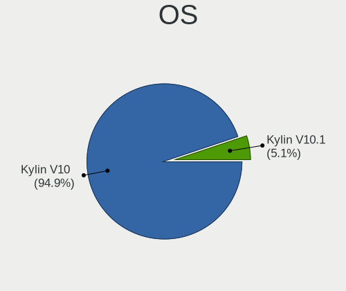

| Name        | Computers | Percent |
|-------------|-----------|---------|
| Kylin V10   | 37        | 94.87%  |
| Kylin V10.1 | 2         | 5.13%   |

OS Family
---------

OS without a version

| Name  | Computers | Percent |
|-------|-----------|---------|
| Kylin | 39        | 100%    |

Kernel
------

Version of the Linux kernel

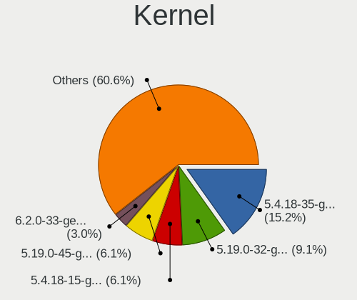

| Version                 | Computers | Percent |
|-------------------------|-----------|---------|
| 5.4.18-35-generic       | 5         | 12.5%   |
| 6.1.0-13-amd64          | 3         | 7.5%    |
| 5.19.0-32-generic       | 3         | 7.5%    |
| 5.4.18-15-generic       | 2         | 5%      |
| 5.19.0-45-generic       | 2         | 5%      |
| 6.2.0-33-generic        | 1         | 2.5%    |
| 6.2.0-32-generic        | 1         | 2.5%    |
| 6.2.0-23-generic        | 1         | 2.5%    |
| 6.2.0-21-generic        | 1         | 2.5%    |
| 5.4.96-7-kr9a0          | 1         | 2.5%    |
| 5.4.18-95-generic       | 1         | 2.5%    |
| 5.4.18-85-generic       | 1         | 2.5%    |
| 5.4.18-27-generic       | 1         | 2.5%    |
| 5.4.0-26-generic        | 1         | 2.5%    |
| 5.4.0-155-generic       | 1         | 2.5%    |
| 5.19.0-46-generic       | 1         | 2.5%    |
| 5.19.0-41-generic       | 1         | 2.5%    |
| 5.15.0-88-generic       | 1         | 2.5%    |
| 5.15.0-73-generic       | 1         | 2.5%    |
| 5.15.0-69-generic       | 1         | 2.5%    |
| 5.15.0-56-generic       | 1         | 2.5%    |
| 5.10.46-marvis          | 1         | 2.5%    |
| 5.10.0-3-generic        | 1         | 2.5%    |
| 5.10.0-23-amd64         | 1         | 2.5%    |
| 5.10.0-20-amd64         | 1         | 2.5%    |
| 5.10.0-0.bpo.9-rt-amd64 | 1         | 2.5%    |
| 4.19.71-30-kr990        | 1         | 2.5%    |
| 4.19.71-14-kr990        | 1         | 2.5%    |
| 4.19.260-atzlinux-ft9   | 1         | 2.5%    |
| 4.19.237-atzlinux-ft8   | 1         | 2.5%    |

Kernel Family
-------------

Linux kernel without a distro release

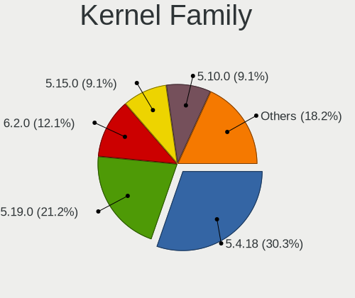

| Version  | Computers | Percent |
|----------|-----------|---------|
| 5.4.18   | 10        | 25%     |
| 5.19.0   | 7         | 17.5%   |
| 6.2.0    | 4         | 10%     |
| 5.15.0   | 4         | 10%     |
| 5.10.0   | 4         | 10%     |
| 6.1.0    | 3         | 7.5%    |
| 5.4.0    | 2         | 5%      |
| 4.19.71  | 2         | 5%      |
| 5.4.96   | 1         | 2.5%    |
| 5.10.46  | 1         | 2.5%    |
| 4.19.260 | 1         | 2.5%    |
| 4.19.237 | 1         | 2.5%    |

Kernel Major Ver.
-----------------

Linux kernel major version

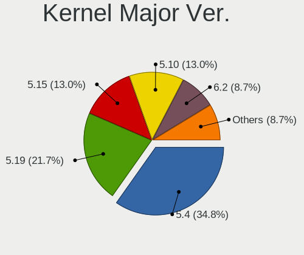

| Version | Computers | Percent |
|---------|-----------|---------|
| 5.4     | 13        | 33.33%  |
| 5.19    | 7         | 17.95%  |
| 5.10    | 5         | 12.82%  |
| 6.2     | 4         | 10.26%  |
| 5.15    | 4         | 10.26%  |
| 6.1     | 3         | 7.69%   |
| 4.19    | 3         | 7.69%   |

Arch
----

OS architecture (x86_64, i586, etc.)

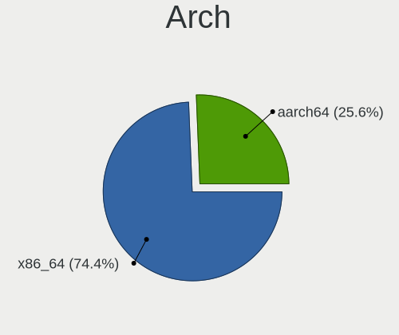

| Name    | Computers | Percent |
|---------|-----------|---------|
| x86_64  | 29        | 74.36%  |
| aarch64 | 10        | 25.64%  |

DE
--

Desktop Environment

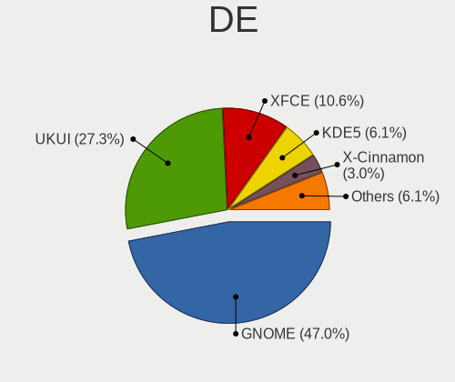

| Name            | Computers | Percent |
|-----------------|-----------|---------|
| UKUI            | 16        | 41.03%  |
| GNOME           | 16        | 41.03%  |
| XFCE            | 2         | 5.13%   |
| KDE5            | 2         | 5.13%   |
| X-Cinnamon      | 1         | 2.56%   |
| Unity           | 1         | 2.56%   |
| GNOME Flashback | 1         | 2.56%   |

Display Server
--------------

X11 or Wayland

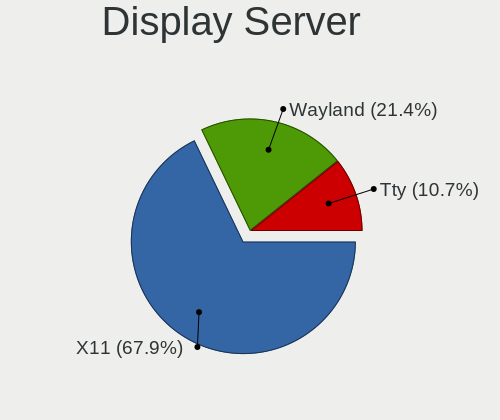

| Name    | Computers | Percent |
|---------|-----------|---------|
| X11     | 26        | 65%     |
| Wayland | 11        | 27.5%   |
| Tty     | 3         | 7.5%    |

Display Manager
---------------

SDDM, LightDM, etc.

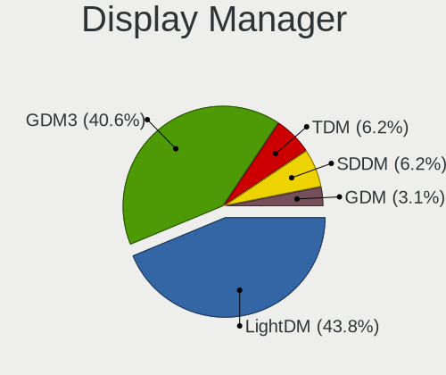

| Name    | Computers | Percent |
|---------|-----------|---------|
| LightDM | 18        | 46.15%  |
| GDM3    | 15        | 38.46%  |
| TDM     | 2         | 5.13%   |
| SDDM    | 2         | 5.13%   |
| GDM     | 2         | 5.13%   |

OS Lang
-------

Language

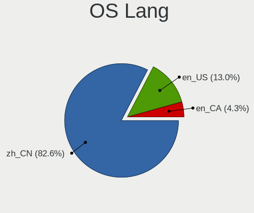

| Lang  | Computers | Percent |
|-------|-----------|---------|
| zh_CN | 30        | 76.92%  |
| en_US | 6         | 15.38%  |
| en_HK | 1         | 2.56%   |
| en_CA | 1         | 2.56%   |
| C     | 1         | 2.56%   |

Boot Mode
---------

EFI or BIOS

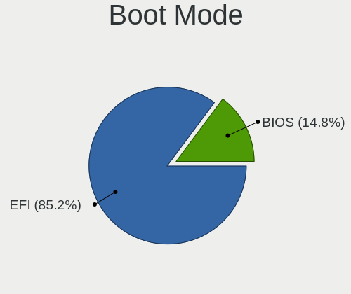

| Mode | Computers | Percent |
|------|-----------|---------|
| EFI  | 34        | 87.18%  |
| BIOS | 5         | 12.82%  |

Filesystem
----------

Type of filesystem

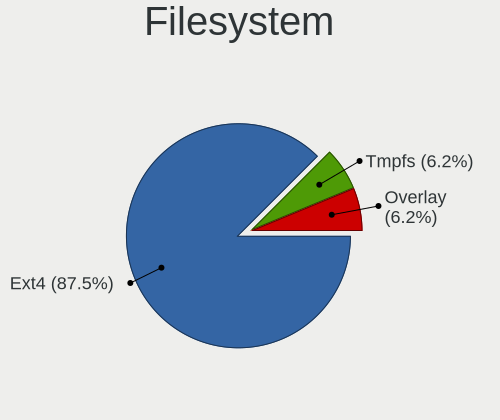

| Type    | Computers | Percent |
|---------|-----------|---------|
| Ext4    | 34        | 87.18%  |
| Tmpfs   | 2         | 5.13%   |
| Overlay | 2         | 5.13%   |
| Zfs     | 1         | 2.56%   |

Part. scheme
------------

Scheme of partitioning

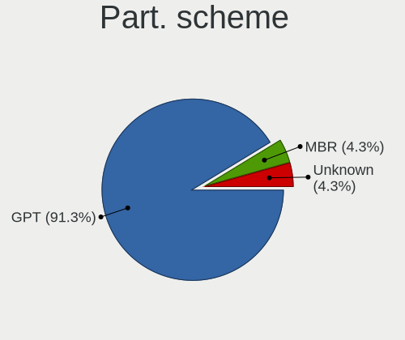

| Type    | Computers | Percent |
|---------|-----------|---------|
| GPT     | 37        | 94.87%  |
| MBR     | 1         | 2.56%   |
| Unknown | 1         | 2.56%   |

Dual Boot with Linux/BSD
------------------------

Hosting more than one Linux/BSD

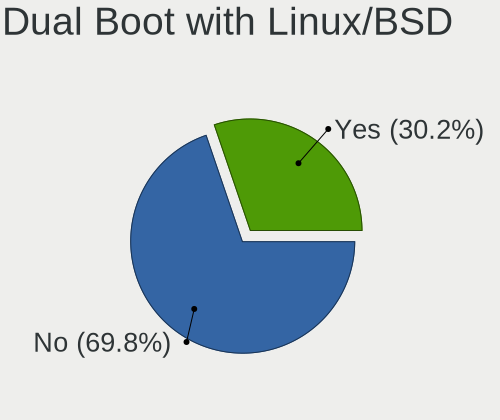

| Dual boot | Computers | Percent |
|-----------|-----------|---------|
| No        | 28        | 70%     |
| Yes       | 12        | 30%     |

Dual Boot (Win)
---------------

Hosting Linux and Windows

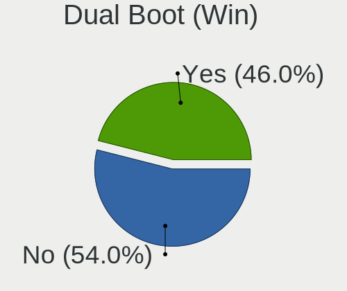

| Dual boot | Computers | Percent |
|-----------|-----------|---------|
| No        | 26        | 66.67%  |
| Yes       | 13        | 33.33%  |

Board
-----

Vendor
------

Motherboard manufacturer

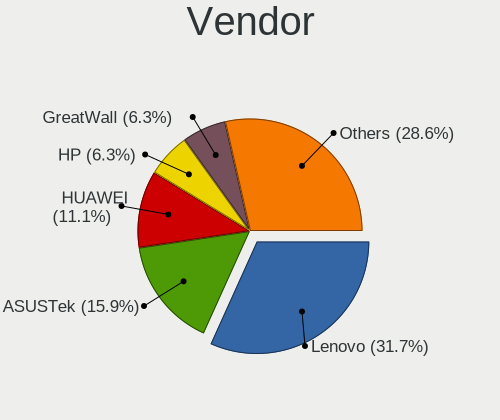

| Name                | Computers | Percent |
|---------------------|-----------|---------|
| Lenovo              | 11        | 28.21%  |
| HUAWEI              | 6         | 15.38%  |
| ASUSTek Computer    | 6         | 15.38%  |
| Phytium             | 3         | 7.69%   |
| Hewlett-Packard     | 3         | 7.69%   |
| GreatWall           | 3         | 7.69%   |
| Dell                | 3         | 7.69%   |
| Timi                | 1         | 2.56%   |
| THTF                | 1         | 2.56%   |
| Gigabyte Technology | 1         | 2.56%   |
| Apple               | 1         | 2.56%   |

Model
-----

Motherboard model

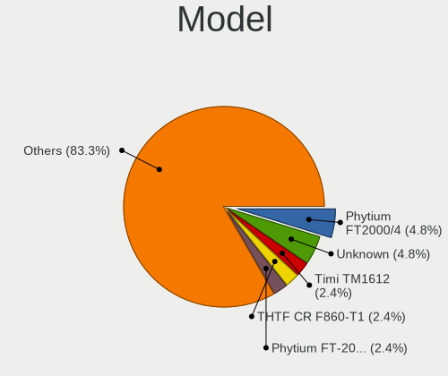

| Name                                         | Computers | Percent |
|----------------------------------------------|-----------|---------|
| Phytium FT2000/4                             | 2         | 5.13%   |
| Unknown                                      | 2         | 5.13%   |
| Timi TM1612                                  | 1         | 2.56%   |
| THTF CR F860-T1                              | 1         | 2.56%   |
| Phytium FT-2000/4                            | 1         | 2.56%   |
| Lenovo Yoga 14cACN 2021 82N7                 | 1         | 2.56%   |
| Lenovo XiaoXinPro 14ACH 2021 82MS            | 1         | 2.56%   |
| Lenovo ThinkPad X200 74574AC                 | 1         | 2.56%   |
| Lenovo ThinkPad X13 Gen 1 20T2A003CD         | 1         | 2.56%   |
| Lenovo ThinkPad X1 Extreme Gen 4i 20Y6S00400 | 1         | 2.56%   |
| Lenovo ThinkPad X1 Carbon Gen 10 21CBA002CD  | 1         | 2.56%   |
| Lenovo ThinkPad T480s 20L7A00HHK             | 1         | 2.56%   |
| Lenovo ThinkBook 16 G5+ ARP 21J0             | 1         | 2.56%   |
| Lenovo Legion Y9000P IAH7H 82RF              | 1         | 2.56%   |
| Lenovo Legion R9000P2021H 82JQ               | 1         | 2.56%   |
| Lenovo IdeaPad 710S-13ISK 80SW               | 1         | 2.56%   |
| HUAWEI W515 PGUV-WBY0                        | 1         | 2.56%   |
| HUAWEI QingYun L420 KLVV-W5821               | 1         | 2.56%   |
| HUAWEI MACH-WX9                              | 1         | 2.56%   |
| HUAWEI L410 KLVU-WDU0                        | 1         | 2.56%   |
| HUAWEI KLVDZ-WXX9                            | 1         | 2.56%   |
| HUAWEI CREM-WXX9                             | 1         | 2.56%   |
| HP ZHAN 99 Mobile Workstation G3             | 1         | 2.56%   |
| HP Tablet 11-be0xxx                          | 1         | 2.56%   |
| HP EliteBook 840 G7 Notebook PC              | 1         | 2.56%   |
| GreatWall GW-XXXXXX-XXX                      | 1         | 2.56%   |
| Gigabyte Z97X-SLI                            | 1         | 2.56%   |
| Dell Vostro 5880                             | 1         | 2.56%   |
| Dell Vostro 3350                             | 1         | 2.56%   |
| Dell Inspiron 5468                           | 1         | 2.56%   |
| ASUS VivoBook_ASUSLaptop K5504VA_K5504VA     | 1         | 2.56%   |
| ASUS UX31LA                                  | 1         | 2.56%   |
| ASUS TUF Gaming FX505GT                      | 1         | 2.56%   |
| ASUS ROG Strix G713PV_G713PV                 | 1         | 2.56%   |
| ASUS ROG Flow X13 GV301RE_GV301RE            | 1         | 2.56%   |
| ASUS PRIME H310M-F R2.0                      | 1         | 2.56%   |
| Apple MacBookPro12,1                         | 1         | 2.56%   |

Model Family
------------

Motherboard model prefix

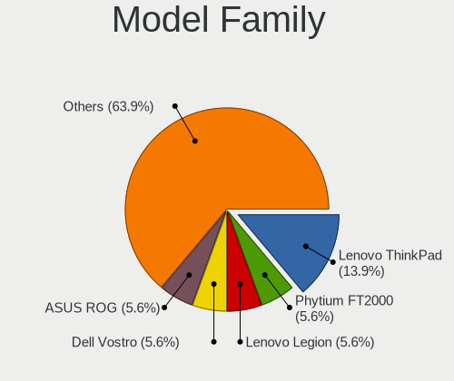

| Name                    | Computers | Percent |
|-------------------------|-----------|---------|
| Lenovo ThinkPad         | 5         | 12.82%  |
| Phytium FT2000          | 2         | 5.13%   |
| Lenovo Legion           | 2         | 5.13%   |
| Dell Vostro             | 2         | 5.13%   |
| ASUS ROG                | 2         | 5.13%   |
| Unknown                 | 2         | 5.13%   |
| Timi TM1612             | 1         | 2.56%   |
| THTF CR                 | 1         | 2.56%   |
| Phytium FT-2000         | 1         | 2.56%   |
| Lenovo Yoga             | 1         | 2.56%   |
| Lenovo XiaoXinPro       | 1         | 2.56%   |
| Lenovo ThinkBook        | 1         | 2.56%   |
| Lenovo IdeaPad          | 1         | 2.56%   |
| HUAWEI W515             | 1         | 2.56%   |
| HUAWEI QingYun          | 1         | 2.56%   |
| HUAWEI MACH-WX9         | 1         | 2.56%   |
| HUAWEI L410             | 1         | 2.56%   |
| HUAWEI KLVDZ-WXX9       | 1         | 2.56%   |
| HUAWEI CREM-WXX9        | 1         | 2.56%   |
| HP ZHAN                 | 1         | 2.56%   |
| HP Tablet               | 1         | 2.56%   |
| HP EliteBook            | 1         | 2.56%   |
| GreatWall GW-XXXXXX-XXX | 1         | 2.56%   |
| Gigabyte Z97X-SLI       | 1         | 2.56%   |
| Dell Inspiron           | 1         | 2.56%   |
| ASUS VivoBook           | 1         | 2.56%   |
| ASUS UX31LA             | 1         | 2.56%   |
| ASUS TUF                | 1         | 2.56%   |
| ASUS PRIME              | 1         | 2.56%   |
| Apple MacBookPro12      | 1         | 2.56%   |

MFG Year
--------

Motherboard manufacture year

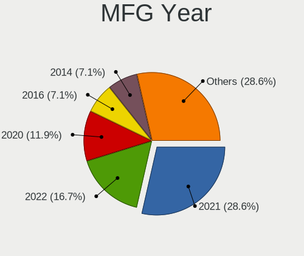

| Year    | Computers | Percent |
|---------|-----------|---------|
| 2021    | 11        | 28.21%  |
| 2022    | 7         | 17.95%  |
| 2020    | 4         | 10.26%  |
| 2016    | 3         | 7.69%   |
| 2014    | 3         | 7.69%   |
| Unknown | 3         | 7.69%   |
| 2018    | 2         | 5.13%   |
| 2023    | 1         | 2.56%   |
| 2019    | 1         | 2.56%   |
| 2015    | 1         | 2.56%   |
| 2012    | 1         | 2.56%   |
| 2011    | 1         | 2.56%   |
| 2008    | 1         | 2.56%   |

Form Factor
-----------

Physical design of the computer

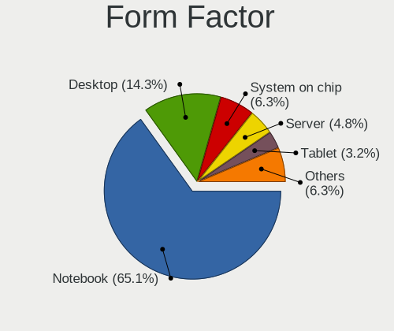

| Name           | Computers | Percent |
|----------------|-----------|---------|
| Notebook       | 27        | 69.23%  |
| Server         | 3         | 7.69%   |
| Desktop        | 3         | 7.69%   |
| System on chip | 2         | 5.13%   |
| Convertible    | 2         | 5.13%   |
| Tablet         | 1         | 2.56%   |
| All in one     | 1         | 2.56%   |

Secure Boot
-----------

Enabled or disabled

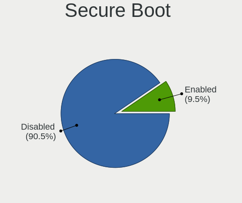

| State    | Computers | Percent |
|----------|-----------|---------|
| Disabled | 35        | 89.74%  |
| Enabled  | 4         | 10.26%  |

Coreboot
--------

Have coreboot on board

| Used | Computers | Percent |
|------|-----------|---------|
| No   | 39        | 100%    |

RAM Size
--------

Total RAM memory

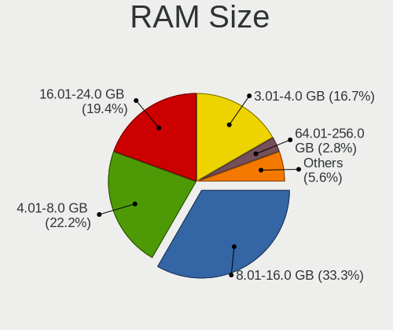

| Size in GB  | Computers | Percent |
|-------------|-----------|---------|
| 8.01-16.0   | 13        | 33.33%  |
| 4.01-8.0    | 9         | 23.08%  |
| 16.01-24.0  | 7         | 17.95%  |
| 3.01-4.0    | 6         | 15.38%  |
| 32.01-64.0  | 2         | 5.13%   |
| 24.01-32.0  | 1         | 2.56%   |
| 64.01-256.0 | 1         | 2.56%   |

RAM Used
--------

Used RAM memory

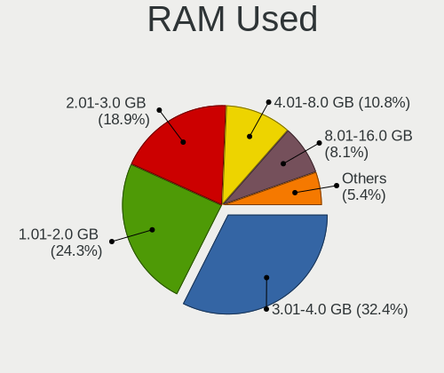

| Used GB   | Computers | Percent |
|-----------|-----------|---------|
| 3.01-4.0  | 13        | 32.5%   |
| 1.01-2.0  | 9         | 22.5%   |
| 2.01-3.0  | 8         | 20%     |
| 4.01-8.0  | 4         | 10%     |
| 8.01-16.0 | 4         | 10%     |
| 0.51-1.0  | 2         | 5%      |

Total Drives
------------

Number of drives on board

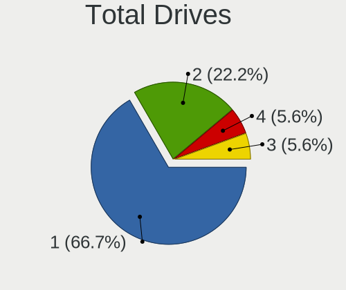

| Drives | Computers | Percent |
|--------|-----------|---------|
| 1      | 24        | 61.54%  |
| 2      | 10        | 25.64%  |
| 4      | 2         | 5.13%   |
| 3      | 2         | 5.13%   |
| 5      | 1         | 2.56%   |

Has CD-ROM
----------

Has CD-ROM on board

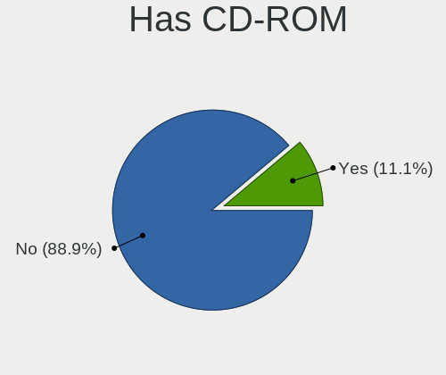

| Presented | Computers | Percent |
|-----------|-----------|---------|
| No        | 35        | 89.74%  |
| Yes       | 4         | 10.26%  |

Has Ethernet
------------

Has Ethernet on board

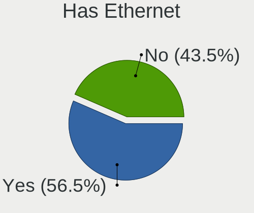

| Presented | Computers | Percent |
|-----------|-----------|---------|
| Yes       | 25        | 64.1%   |
| No        | 14        | 35.9%   |

Has WiFi
--------

Has WiFi module

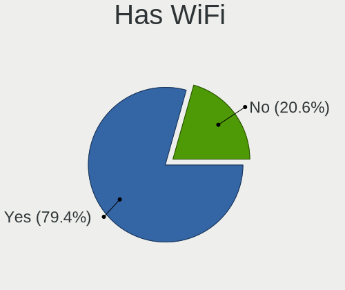

| Presented | Computers | Percent |
|-----------|-----------|---------|
| Yes       | 31        | 79.49%  |
| No        | 8         | 20.51%  |

Has Bluetooth
-------------

Has Bluetooth module

| Presented | Computers | Percent |
|-----------|-----------|---------|
| Yes       | 31        | 79.49%  |
| No        | 8         | 20.51%  |

Location
--------

Country
-------

Geographic location (country)

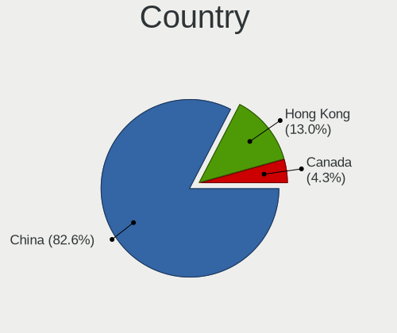

| Country   | Computers | Percent |
|-----------|-----------|---------|
| China     | 31        | 79.49%  |
| Hong Kong | 3         | 7.69%   |
| Japan     | 2         | 5.13%   |
| USA       | 1         | 2.56%   |
| Taiwan    | 1         | 2.56%   |
| Canada    | 1         | 2.56%   |

City
----

Geographic location (city)

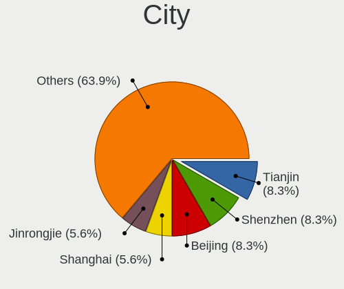

| City        | Computers | Percent |
|-------------|-----------|---------|
| Tianjin     | 3         | 7.69%   |
| Shenzhen    | 3         | 7.69%   |
| Beijing     | 3         | 7.69%   |
| Tokyo       | 2         | 5.13%   |
| Shanghai    | 2         | 5.13%   |
| Jinrongjie  | 2         | 5.13%   |
| Jinan       | 2         | 5.13%   |
| Haidian     | 2         | 5.13%   |
| Central     | 2         | 5.13%   |
| Zhongshan   | 1         | 2.56%   |
| Zhengzhou   | 1         | 2.56%   |
| Zhangzhou   | 1         | 2.56%   |
| Xuhui       | 1         | 2.56%   |
| Xiaolou     | 1         | 2.56%   |
| Xi'an       | 1         | 2.56%   |
| Shizishan   | 1         | 2.56%   |
| Putuo       | 1         | 2.56%   |
| Mong Kok    | 1         | 2.56%   |
| Markham     | 1         | 2.56%   |
| Los Angeles | 1         | 2.56%   |
| Kunming     | 1         | 2.56%   |
| Harbin      | 1         | 2.56%   |
| Haikou      | 1         | 2.56%   |
| Guangzhou   | 1         | 2.56%   |
| Changsha    | 1         | 2.56%   |
| Chancheng   | 1         | 2.56%   |
| Banqiao     | 1         | 2.56%   |

Drives
------

Drive Vendor
------------

Hard drive vendors

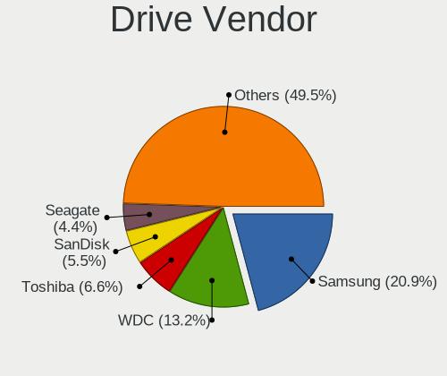

| Vendor              | Computers | Drives | Percent |
|---------------------|-----------|--------|---------|
| Samsung Electronics | 11        | 15     | 21.15%  |
| WDC                 | 6         | 9      | 11.54%  |
| Toshiba             | 4         | 4      | 7.69%   |
| SanDisk             | 4         | 4      | 7.69%   |
| Micron Technology   | 3         | 3      | 5.77%   |
| Unknown             | 2         | 2      | 3.85%   |
| Seagate             | 2         | 2      | 3.85%   |
| Phison              | 2         | 2      | 3.85%   |
| Kingston            | 2         | 2      | 3.85%   |
| FORESEE             | 2         | 3      | 3.85%   |
| ZX1 1TB             | 1         | 1      | 1.92%   |
| ZHITAI              | 1         | 1      | 1.92%   |
| SK hynix            | 1         | 1      | 1.92%   |
| Pear 2TB            | 1         | 1      | 1.92%   |
| Lenovo              | 1         | 1      | 1.92%   |
| Kingchuxing         | 1         | 1      | 1.92%   |
| Intel               | 1         | 1      | 1.92%   |
| HISI                | 1         | 4      | 1.92%   |
| Hikvision           | 1         | 1      | 1.92%   |
| Hewlett-Packard     | 1         | 1      | 1.92%   |
| Great Wa            | 1         | 1      | 1.92%   |
| FC-1307             | 1         | 1      | 1.92%   |
| Fanxiang            | 1         | 1      | 1.92%   |
| Apple               | 1         | 1      | 1.92%   |

Drive Model
-----------

Hard drive models

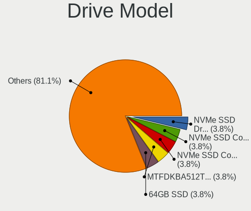

| Model                                              | Computers | Percent |
|----------------------------------------------------|-----------|---------|
| SanDisk NVMe SSD Drive 1TB                         | 2         | 3.77%   |
| Samsung NVMe SSD Controller SM981/PM981/PM983 1TB  | 2         | 3.77%   |
| Samsung NVMe SSD Controller PM9A1/PM9A3/980PRO 2TB | 2         | 3.77%   |
| Micron MTFDKBA512TFH 512GB                         | 2         | 3.77%   |
| FORESEE 64GB SSD                                   | 2         | 3.77%   |
| ZX1 1TB Disk 1TB                                   | 1         | 1.89%   |
| ZHITAI TiPlus7100 2TB                              | 1         | 1.89%   |
| WDC WD10EZEX-22MFCA0 1TB                           | 1         | 1.89%   |
| WDC SDINFDO4-256G                                  | 1         | 1.89%   |
| WDC PC SN730 SDBPNTY-512G-1101 512GB               | 1         | 1.89%   |
| WDC PC SN730 SDBPNTY-512G                          | 1         | 1.89%   |
| WDC PC SN530 SDBPNPZ-512G-1014 512GB               | 1         | 1.89%   |
| WDC PC SN530 SDBPNPZ-256G                          | 1         | 1.89%   |
| Unknown NVMe SSD Drive 512GB                       | 1         | 1.89%   |
| Unknown NVMe SSD Drive 256GB                       | 1         | 1.89%   |
| Toshiba MQ01ABD100 1TB                             | 1         | 1.89%   |
| Toshiba MK3261GSYN 320GB                           | 1         | 1.89%   |
| Toshiba KXG60ZNV512G KIOXIA 512GB                  | 1         | 1.89%   |
| Toshiba DT01ACA100 1TB                             | 1         | 1.89%   |
| SK hynix SKHynix_HFS512GDE9X084N 512GB             | 1         | 1.89%   |
| Seagate ST9500325AS 500GB                          | 1         | 1.89%   |
| Seagate ST1000DM010-2EP102 1TB                     | 1         | 1.89%   |
| SanDisk SD6SP1M256G1102 256GB SSD                  | 1         | 1.89%   |
| SanDisk NVMe SSD Drive 256GB                       | 1         | 1.89%   |
| Samsung PM991 NVMe 256GB                           | 1         | 1.89%   |
| Samsung MZVLW256HEHP-000L2 256GB                   | 1         | 1.89%   |
| Samsung MZVLB512HBJQ-000L7 512GB                   | 1         | 1.89%   |
| Samsung MZVLB512HAJQ-00000 512GB                   | 1         | 1.89%   |
| Samsung MZVL2512HCJQ-00BL7 512GB                   | 1         | 1.89%   |
| Samsung MZNTY128HDHP-00000 128GB SSD               | 1         | 1.89%   |
| Samsung KLUFG8RHDA-B2D1 512GB                      | 1         | 1.89%   |
| Samsung KLUFG8RHDA-B2D1 1GB                        | 1         | 1.89%   |
| Phison ThinkPlus ST8000 PCI-E M.2 256G             | 1         | 1.89%   |
| Phison 511BS0512HB 512GB                           | 1         | 1.89%   |
| Pear 2TB Disk 2TB                                  | 1         | 1.89%   |
| Micron 2450_MTFDKBA1T0TFK 1TB                      | 1         | 1.89%   |
| Lenovo SSD SL500 240G                              | 1         | 1.89%   |
| Kingston SA400S37240G 240GB SSD                    | 1         | 1.89%   |
| Kingston OM3PDP3128B-AH 128GB                      | 1         | 1.89%   |
| Kingchuxing SSD 128GB                              | 1         | 1.89%   |

HDD Vendor
----------

Hard disk drive vendors

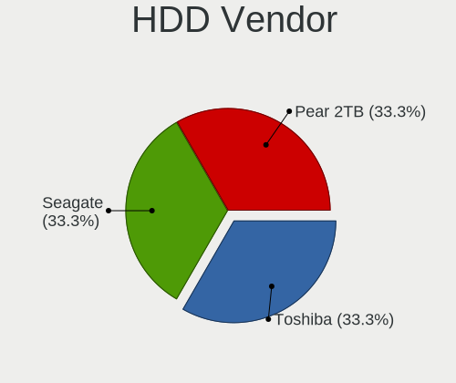

| Vendor   | Computers | Drives | Percent |
|----------|-----------|--------|---------|
| Toshiba  | 3         | 3      | 37.5%   |
| Seagate  | 2         | 2      | 25%     |
| WDC      | 1         | 1      | 12.5%   |
| Pear 2TB | 1         | 1      | 12.5%   |
| FC-1307  | 1         | 1      | 12.5%   |

SSD Vendor
----------

Solid state drive vendors

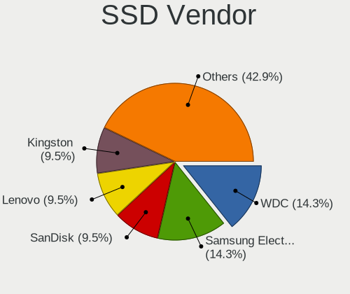

| Vendor              | Computers | Drives | Percent |
|---------------------|-----------|--------|---------|
| Samsung Electronics | 2         | 5      | 18.18%  |
| FORESEE             | 2         | 3      | 18.18%  |
| WDC                 | 1         | 4      | 9.09%   |
| SanDisk             | 1         | 1      | 9.09%   |
| Lenovo              | 1         | 1      | 9.09%   |
| Kingston            | 1         | 1      | 9.09%   |
| Kingchuxing         | 1         | 1      | 9.09%   |
| HISI                | 1         | 4      | 9.09%   |
| Apple               | 1         | 1      | 9.09%   |

Drive Kind
----------

HDD or SSD

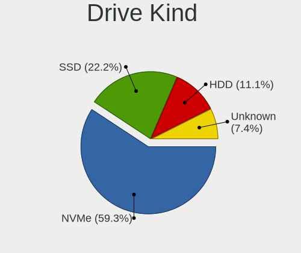

| Kind    | Computers | Drives | Percent |
|---------|-----------|--------|---------|
| NVMe    | 26        | 32     | 55.32%  |
| SSD     | 11        | 21     | 23.4%   |
| HDD     | 8         | 8      | 17.02%  |
| Unknown | 2         | 2      | 4.26%   |

Drive Connector
---------------

SATA, SAS, NVMe, etc.

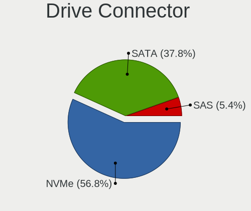

| Type | Computers | Drives | Percent |
|------|-----------|--------|---------|
| NVMe | 26        | 31     | 55.32%  |
| SATA | 17        | 28     | 36.17%  |
| SAS  | 4         | 4      | 8.51%   |

Drive Size
----------

Size of hard drive

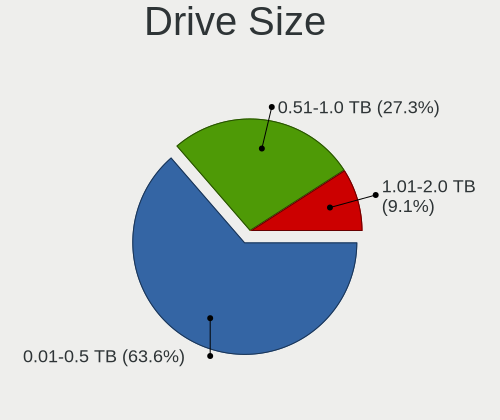

| Size in TB | Computers | Drives | Percent |
|------------|-----------|--------|---------|
| 0.01-0.5   | 14        | 23     | 70%     |
| 0.51-1.0   | 5         | 5      | 25%     |
| 1.01-2.0   | 1         | 1      | 5%      |

Space Total
-----------

Amount of disk space available on the file system

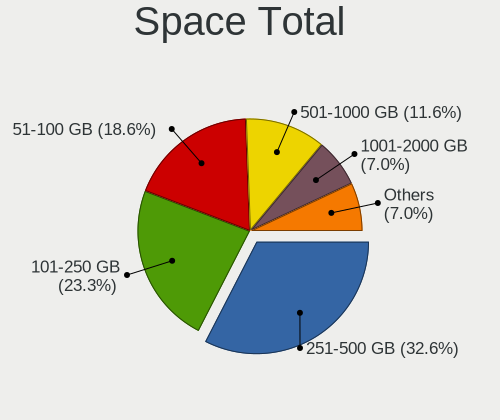

| Size in GB | Computers | Percent |
|------------|-----------|---------|
| 251-500    | 13        | 32.5%   |
| 101-250    | 8         | 20%     |
| 51-100     | 8         | 20%     |
| 501-1000   | 5         | 12.5%   |
| 1001-2000  | 3         | 7.5%    |
| 21-50      | 1         | 2.5%    |
| 2001-3000  | 1         | 2.5%    |
| 1-20       | 1         | 2.5%    |

Space Used
----------

Amount of used disk space

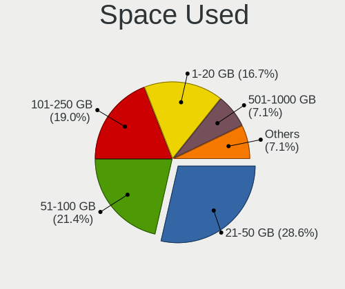

| Used GB  | Computers | Percent |
|----------|-----------|---------|
| 21-50    | 11        | 28.21%  |
| 51-100   | 8         | 20.51%  |
| 101-250  | 7         | 17.95%  |
| 1-20     | 7         | 17.95%  |
| 251-500  | 3         | 7.69%   |
| 501-1000 | 3         | 7.69%   |

Malfunc. Drives
---------------

Drive models with a malfunction

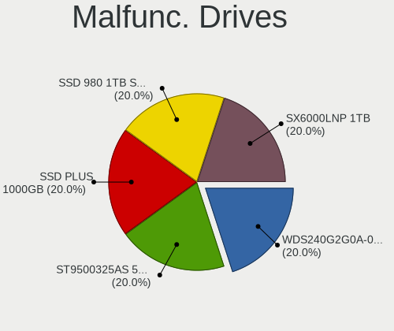

| Model                     | Computers | Drives | Percent |
|---------------------------|-----------|--------|---------|
| Seagate ST9500325AS 500GB | 1         | 1      | 100%    |

Malfunc. Drive Vendor
---------------------

Vendors of faulty drives

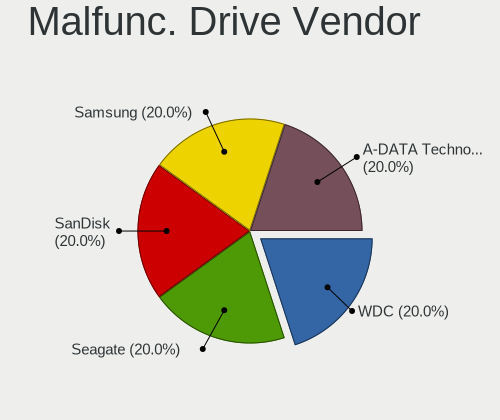

| Vendor  | Computers | Drives | Percent |
|---------|-----------|--------|---------|
| Seagate | 1         | 1      | 100%    |

Malfunc. HDD Vendor
-------------------

Vendors of faulty HDD drives

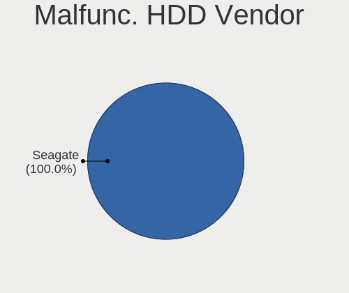

| Vendor  | Computers | Drives | Percent |
|---------|-----------|--------|---------|
| Seagate | 1         | 1      | 100%    |

Malfunc. Drive Kind
-------------------

Kinds of faulty drives

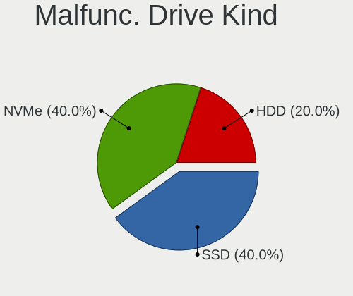

| Kind | Computers | Drives | Percent |
|------|-----------|--------|---------|
| HDD  | 1         | 1      | 100%    |

Failed Drives
-------------

Failed drive models

Zero info for selected period =(

Failed Drive Vendor
-------------------

Failed drive vendors

Zero info for selected period =(

Drive Status
------------

Number of failed and malfunc. drives

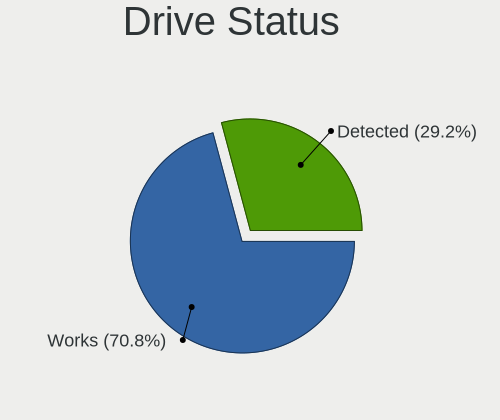

| Status   | Computers | Drives | Percent |
|----------|-----------|--------|---------|
| Works    | 29        | 35     | 67.44%  |
| Detected | 13        | 27     | 30.23%  |
| Malfunc  | 1         | 1      | 2.33%   |

Storage controller
------------------

Storage Vendor
--------------

Storage controller vendors

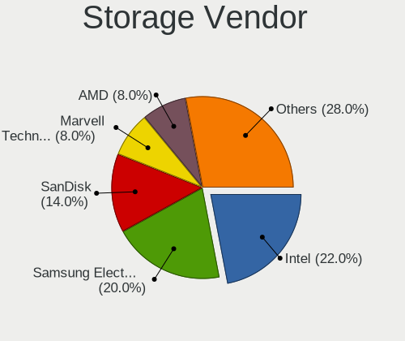

| Vendor                                  | Computers | Percent |
|-----------------------------------------|-----------|---------|
| Intel                                   | 11        | 22%     |
| Samsung Electronics                     | 10        | 20%     |
| SanDisk                                 | 7         | 14%     |
| Marvell Technology Group                | 4         | 8%      |
| AMD                                     | 4         | 8%      |
| Phison Electronics                      | 3         | 6%      |
| Micron Technology                       | 3         | 6%      |
| Yangtze Memory Technologies             | 1         | 2%      |
| Toshiba America Info Systems            | 1         | 2%      |
| SK hynix                                | 1         | 2%      |
| Silicon Motion                          | 1         | 2%      |
| Kingston Technology Company             | 1         | 2%      |
| Jiangsu Xinsheng Intelligent Technology | 1         | 2%      |
| Hefei DATANG Storage Technology         | 1         | 2%      |
| ASMedia Technology                      | 1         | 2%      |

Storage Model
-------------

Storage controller models

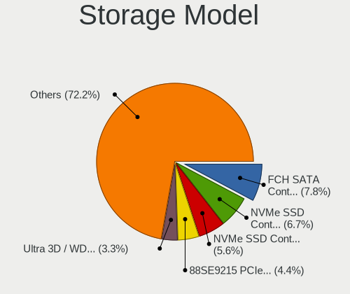

| Model                                                                        | Computers | Percent |
|------------------------------------------------------------------------------|-----------|---------|
| Samsung NVMe SSD Controller SM981/PM981/PM983                                | 4         | 7.69%   |
| Marvell Group 88SE9215 PCIe 2.0 x1 4-port SATA 6 Gb/s Controller             | 4         | 7.69%   |
| AMD FCH SATA Controller [AHCI mode]                                          | 4         | 7.69%   |
| Samsung NVMe SSD Controller PM9A1/PM9A3/980PRO                               | 3         | 5.77%   |
| Intel Sunrise Point-LP SATA Controller [AHCI mode]                           | 3         | 5.77%   |
| SanDisk Ultra 3D / WD Blue SN550 NVMe SSD                                    | 2         | 3.85%   |
| SanDisk Extreme Pro / WD Black SN750 / PC SN730 / Red SN700 NVMe SSD         | 2         | 3.85%   |
| Phison PS5013-E13 PCIe3 NVMe Controller (DRAM-less)                          | 2         | 3.85%   |
| Micron 3400 NVMe SSD [Hendrix]                                               | 2         | 3.85%   |
| Yangtze Memory ZHITAI TiPlus7100                                             | 1         | 1.92%   |
| Toshiba America Info Systems XG6 NVMe SSD Controller                         | 1         | 1.92%   |
| SK hynix Gold P31/BC711/PC711 NVMe Solid State Drive                         | 1         | 1.92%   |
| Silicon Motion SM2262/SM2262EN SSD Controller                                | 1         | 1.92%   |
| Sandisk WD PC SN735 NVMe SSD 1TB (DRAM-less)                                 | 1         | 1.92%   |
| SanDisk WD Black SN770 / PC SN740 256GB / PC SN560 (DRAM-less) NVMe SSD      | 1         | 1.92%   |
| Sandisk PC SN740 NVMe SSD (DRAM-less)                                        | 1         | 1.92%   |
| Samsung S4LN058A01[SSUBX] AHCI SSD Controller (Apple slot)                   | 1         | 1.92%   |
| Samsung NVMe SSD Controller SM961/PM961/SM963                                | 1         | 1.92%   |
| Samsung NVMe SSD Controller 980 (DRAM-less)                                  | 1         | 1.92%   |
| Phison E12 NVMe Controller                                                   | 1         | 1.92%   |
| Micron 2450 NVMe SSD [HendrixV] (DRAM-less)                                  | 1         | 1.92%   |
| Kingston Company OM3PDP3 NVMe SSD                                            | 1         | 1.92%   |
| Jiangsu Xinsheng Intelligent EP2000Pro PCIe 3 NVMe SSD (DRAM-less)           | 1         | 1.92%   |
| Intel Volume Management Device NVMe RAID Controller Intel Corporation        | 1         | 1.92%   |
| Intel SSD 660P Series                                                        | 1         | 1.92%   |
| Intel Mobile 4 Series Chipset PT IDER Controller                             | 1         | 1.92%   |
| Intel Comet Lake SATA AHCI Controller                                        | 1         | 1.92%   |
| Intel Cannon Lake Mobile PCH SATA AHCI Controller                            | 1         | 1.92%   |
| Intel 9 Series Chipset Family SATA Controller [AHCI Mode]                    | 1         | 1.92%   |
| Intel 82801IBM/IEM (ICH9M/ICH9M-E) 4 port SATA Controller [AHCI mode]        | 1         | 1.92%   |
| Intel 8 Series SATA Controller 1 [AHCI mode]                                 | 1         | 1.92%   |
| Intel 6 Series/C200 Series Chipset Family 6 port Mobile SATA AHCI Controller | 1         | 1.92%   |
| Intel 200 Series PCH SATA controller [AHCI mode]                             | 1         | 1.92%   |
| Hefei DATANG Storage NVMe SSD Controller 300A                                | 1         | 1.92%   |
| ASMedia ASM1064 Serial ATA Controller                                        | 1         | 1.92%   |

Storage Kind
------------

Kind of storage controller (IDE, SATA, NVMe, SAS, ...)

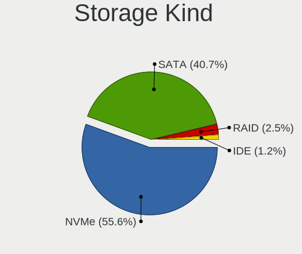

| Kind | Computers | Percent |
|------|-----------|---------|
| NVMe | 26        | 54.17%  |
| SATA | 20        | 41.67%  |
| RAID | 1         | 2.08%   |
| IDE  | 1         | 2.08%   |

Processor
---------

CPU Vendor
----------

Processor vendors

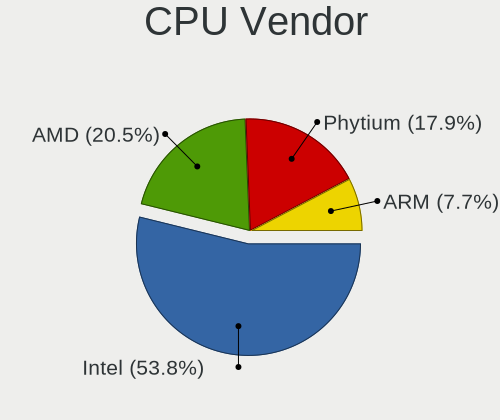

| Vendor  | Computers | Percent |
|---------|-----------|---------|
| Intel   | 21        | 53.85%  |
| AMD     | 8         | 20.51%  |
| Phytium | 7         | 17.95%  |
| ARM     | 3         | 7.69%   |

CPU Model
---------

Processor models

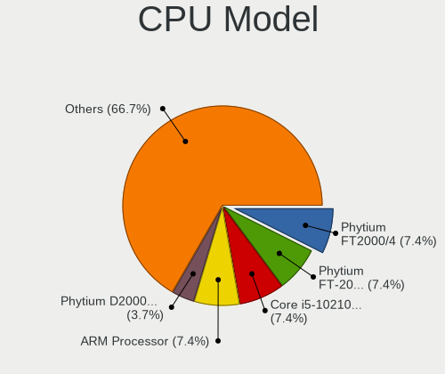

| Model                                   | Computers | Percent |
|-----------------------------------------|-----------|---------|
| ARM Processor                           | 3         | 7.69%   |
| AMD Ryzen 7 5800H with Radeon Graphics  | 3         | 7.69%   |
| Phytium FT2000/4                        | 2         | 5.13%   |
| Phytium FT-2000/4                       | 2         | 5.13%   |
| Phytium D2000/8 E8C                     | 2         | 5.13%   |
| Intel Core i5-10210U CPU @ 1.60GHz      | 2         | 5.13%   |
| Phytium D2000/8                         | 1         | 2.56%   |
| Intel Pentium Silver N6000 @ 1.10GHz    | 1         | 2.56%   |
| Intel Core m3-6Y30 CPU @ 0.90GHz        | 1         | 2.56%   |
| Intel Core i7-9750H CPU @ 2.60GHz       | 1         | 2.56%   |
| Intel Core i7-8550U CPU @ 1.80GHz       | 1         | 2.56%   |
| Intel Core i7-7500U CPU @ 2.70GHz       | 1         | 2.56%   |
| Intel Core i7-6560U CPU @ 2.20GHz       | 1         | 2.56%   |
| Intel Core i7-4790 CPU @ 3.60GHz        | 1         | 2.56%   |
| Intel Core i7-10700 CPU @ 2.90GHz       | 1         | 2.56%   |
| Intel Core i5-8400 CPU @ 2.80GHz        | 1         | 2.56%   |
| Intel Core i5-8350U CPU @ 1.70GHz       | 1         | 2.56%   |
| Intel Core i5-5257U CPU @ 2.70GHz       | 1         | 2.56%   |
| Intel Core i5-4200U CPU @ 1.60GHz       | 1         | 2.56%   |
| Intel Core i3-2310M CPU @ 2.10GHz       | 1         | 2.56%   |
| Intel Core 2 Duo CPU P8400 @ 2.26GHz    | 1         | 2.56%   |
| Intel 13th Gen Core i9-13900H           | 1         | 2.56%   |
| Intel 12th Gen Core i7-12700H           | 1         | 2.56%   |
| Intel 12th Gen Core i5-1240P            | 1         | 2.56%   |
| Intel 11th Gen Core i7-11800H @ 2.30GHz | 1         | 2.56%   |
| Intel 11th Gen Core i7-1165G7 @ 2.80GHz | 1         | 2.56%   |
| AMD Ryzen 9 7845HX with Radeon Graphics | 1         | 2.56%   |
| AMD Ryzen 9 6900HS with Radeon Graphics | 1         | 2.56%   |
| AMD Ryzen 7 7735H with Radeon Graphics  | 1         | 2.56%   |
| AMD Ryzen 7 5800U with Radeon Graphics  | 1         | 2.56%   |
| AMD Ryzen 5 5600H with Radeon Graphics  | 1         | 2.56%   |

CPU Model Family
----------------

Processor model prefix

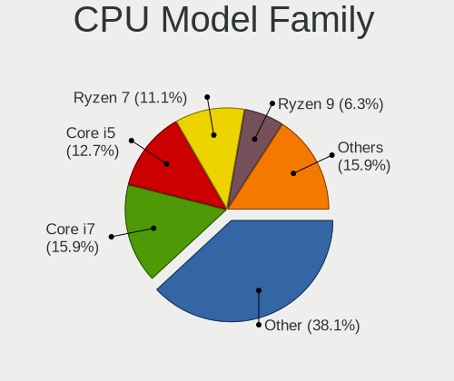

| Model                | Computers | Percent |
|----------------------|-----------|---------|
| Other                | 15        | 38.46%  |
| Intel Core i7        | 6         | 15.38%  |
| Intel Core i5        | 6         | 15.38%  |
| AMD Ryzen 7          | 5         | 12.82%  |
| AMD Ryzen 9          | 2         | 5.13%   |
| Intel Pentium Silver | 1         | 2.56%   |
| Intel Core m3        | 1         | 2.56%   |
| Intel Core i3        | 1         | 2.56%   |
| Intel Core 2 Duo     | 1         | 2.56%   |
| AMD Ryzen 5          | 1         | 2.56%   |

CPU Cores
---------

Number of processor cores

| Number | Computers | Percent |
|--------|-----------|---------|
| 8      | 11        | 28.21%  |
| 4      | 11        | 28.21%  |
| 2      | 7         | 17.95%  |
| 6      | 6         | 15.38%  |
| 14     | 2         | 5.13%   |
| 12     | 2         | 5.13%   |

CPU Sockets
-----------

Number of sockets

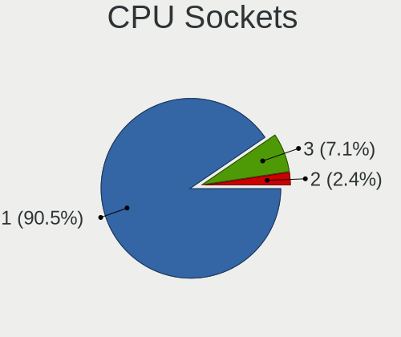

| Number | Computers | Percent |
|--------|-----------|---------|
| 1      | 35        | 89.74%  |
| 3      | 3         | 7.69%   |
| 2      | 1         | 2.56%   |

CPU Threads
-----------

Threads per core (Hyper-Threading)

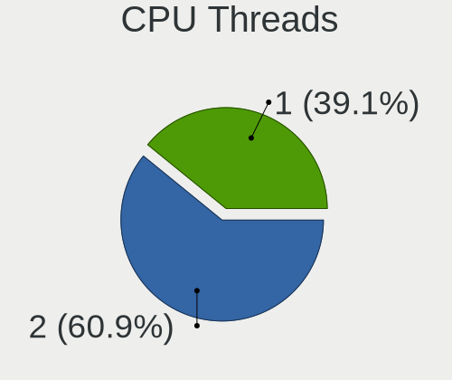

| Number | Computers | Percent |
|--------|-----------|---------|
| 2      | 25        | 64.1%   |
| 1      | 14        | 35.9%   |

CPU Op-Modes
------------

CPU Operation Modes (32-bit, 64-bit)

| Op mode        | Computers | Percent |
|----------------|-----------|---------|
| 32-bit, 64-bit | 39        | 100%    |

CPU Microcode
-------------

Microcode number

| Number     | Computers | Percent |
|------------|-----------|---------|
| Unknown    | 16        | 41.03%  |
| 0x906ea    | 2         | 5.13%   |
| 0x806ec    | 2         | 5.13%   |
| 0x406e3    | 2         | 5.13%   |
| 0x0a50000c | 2         | 5.13%   |
| 0x0a404102 | 2         | 5.13%   |
| 0xa0655    | 1         | 2.56%   |
| 0x906c0    | 1         | 2.56%   |
| 0x906a3    | 1         | 2.56%   |
| 0x806ea    | 1         | 2.56%   |
| 0x806e9    | 1         | 2.56%   |
| 0x806c1    | 1         | 2.56%   |
| 0x40651    | 1         | 2.56%   |
| 0x306d4    | 1         | 2.56%   |
| 0x306c3    | 1         | 2.56%   |
| 0x1067a    | 1         | 2.56%   |
| 0x0a601203 | 1         | 2.56%   |
| 0x0a50000d | 1         | 2.56%   |
| 0x0a50000b | 1         | 2.56%   |

CPU Microarch
-------------

Microarchitecture

| Name             | Computers | Percent |
|------------------|-----------|---------|
| Unknown          | 15        | 38.46%  |
| KabyLake         | 7         | 17.95%  |
| Zen 3            | 5         | 12.82%  |
| Skylake          | 2         | 5.13%   |
| Haswell          | 2         | 5.13%   |
| Alderlake Hybrid | 2         | 5.13%   |
| Tremont          | 1         | 2.56%   |
| TigerLake        | 1         | 2.56%   |
| SandyBridge      | 1         | 2.56%   |
| Penryn           | 1         | 2.56%   |
| CometLake        | 1         | 2.56%   |
| Broadwell        | 1         | 2.56%   |

Graphics
--------

GPU Vendor
----------

Vendors of graphics cards

| Vendor                   | Computers | Percent |
|--------------------------|-----------|---------|
| Intel                    | 21        | 45.65%  |
| AMD                      | 15        | 32.61%  |
| Nvidia                   | 9         | 19.57%  |
| Jingjia Microelectronics | 1         | 2.17%   |

GPU Model
---------

Graphics card models

| Model                                                                                 | Computers | Percent |
|---------------------------------------------------------------------------------------|-----------|---------|
| AMD Cezanne [Radeon Vega Series / Radeon Vega Mobile Series]                          | 5         | 10.87%  |
| Nvidia GA106M [GeForce RTX 3060 Mobile / Max-Q]                                       | 3         | 6.52%   |
| Intel UHD Graphics 620                                                                | 2         | 4.35%   |
| Intel CometLake-U GT2 [UHD Graphics]                                                  | 2         | 4.35%   |
| Intel Alder Lake-P GT2 [Iris Xe Graphics]                                             | 2         | 4.35%   |
| AMD Rembrandt [Radeon 680M]                                                           | 2         | 4.35%   |
| AMD Lexa [Radeon 540X/550X/630 / RX 640 / E9171 MCM]                                  | 2         | 4.35%   |
| AMD Caicos [Radeon HD 6450/7450/8450 / R5 230 OEM]                                    | 2         | 4.35%   |
| Nvidia TU117M [GeForce GTX 1650 Mobile / Max-Q]                                       | 1         | 2.17%   |
| Nvidia TU117GLM [T600 Mobile]                                                         | 1         | 2.17%   |
| Nvidia GP108M [GeForce MX150]                                                         | 1         | 2.17%   |
| Nvidia GP106 [GeForce GTX 1060 6GB]                                                   | 1         | 2.17%   |
| Nvidia GK208B [GeForce GT 730]                                                        | 1         | 2.17%   |
| Nvidia AD107M [GeForce RTX 4060 Max-Q / Mobile]                                       | 1         | 2.17%   |
| Jingjia Microelectronics JM7200 Series GPU                                            | 1         | 2.17%   |
| Intel Xeon E3-1200 v3/4th Gen Core Processor Integrated Graphics Controller           | 1         | 2.17%   |
| Intel TigerLake-LP GT2 [Iris Xe Graphics]                                             | 1         | 2.17%   |
| Intel TigerLake-H GT1 [UHD Graphics]                                                  | 1         | 2.17%   |
| Intel Raptor Lake-P [Iris Xe Graphics]                                                | 1         | 2.17%   |
| Intel Mobile 4 Series Chipset Integrated Graphics Controller                          | 1         | 2.17%   |
| Intel JasperLake [UHD Graphics]                                                       | 1         | 2.17%   |
| Intel Iris Graphics 6100                                                              | 1         | 2.17%   |
| Intel Iris Graphics 540                                                               | 1         | 2.17%   |
| Intel HD Graphics 620                                                                 | 1         | 2.17%   |
| Intel HD Graphics 515                                                                 | 1         | 2.17%   |
| Intel Haswell-ULT Integrated Graphics Controller                                      | 1         | 2.17%   |
| Intel CometLake-S GT2 [UHD Graphics 630]                                              | 1         | 2.17%   |
| Intel CoffeeLake-S GT2 [UHD Graphics 630]                                             | 1         | 2.17%   |
| Intel CoffeeLake-H GT2 [UHD Graphics 630]                                             | 1         | 2.17%   |
| Intel 2nd Generation Core Processor Family Integrated Graphics Controller             | 1         | 2.17%   |
| AMD Topaz XT [Radeon R7 M260/M265 / M340/M360 / M440/M445 / 530/535 / 620/625 Mobile] | 1         | 2.17%   |
| AMD Raphael                                                                           | 1         | 2.17%   |
| AMD Lexa PRO [Radeon 540/540X/550/550X / RX 540X/550/550X]                            | 1         | 2.17%   |
| AMD Caicos                                                                            | 1         | 2.17%   |

GPU Combo
---------

Combinations of graphics cards

| Name                         | Computers | Percent |
|------------------------------|-----------|---------|
| 1 x Intel                    | 14        | 35.9%   |
| 1 x AMD                      | 11        | 28.21%  |
| Intel + Nvidia               | 5         | 12.82%  |
| Other                        | 3         | 7.69%   |
| AMD + Nvidia                 | 3         | 7.69%   |
| 1 x Nvidia                   | 1         | 2.56%   |
| 1 x Jingjia Microelectronics | 1         | 2.56%   |
| Intel + AMD                  | 1         | 2.56%   |

GPU Driver
----------

Free vs proprietary

| Driver      | Computers | Percent |
|-------------|-----------|---------|
| Free        | 29        | 74.36%  |
| Proprietary | 5         | 12.82%  |
| Unknown     | 5         | 12.82%  |

GPU Memory
----------

Total video memory

| Size in GB | Computers | Percent |
|------------|-----------|---------|
| Unknown    | 23        | 58.97%  |
| 1.01-2.0   | 9         | 23.08%  |
| 3.01-4.0   | 2         | 5.13%   |
| 0.51-1.0   | 2         | 5.13%   |
| 0.01-0.5   | 2         | 5.13%   |
| 5.01-6.0   | 1         | 2.56%   |

Monitor
-------

Monitor Vendor
--------------

Monitor vendors

| Vendor               | Computers | Percent |
|----------------------|-----------|---------|
| BOE                  | 10        | 23.81%  |
| Dell                 | 4         | 9.52%   |
| CSO                  | 4         | 9.52%   |
| LG Display           | 3         | 7.14%   |
| Lenovo               | 3         | 7.14%   |
| Chimei Innolux       | 3         | 7.14%   |
| Xiaomi               | 2         | 4.76%   |
| AOC                  | 2         | 4.76%   |
| Samsung Electronics  | 1         | 2.38%   |
| Philips              | 1         | 2.38%   |
| PANDA                | 1         | 2.38%   |
| KIG                  | 1         | 2.38%   |
| JDI                  | 1         | 2.38%   |
| HUAWEI               | 1         | 2.38%   |
| CPT                  | 1         | 2.38%   |
| BenQ                 | 1         | 2.38%   |
| AU Optronics         | 1         | 2.38%   |
| Apple                | 1         | 2.38%   |
| Ancor Communications | 1         | 2.38%   |

Monitor Model
-------------

Monitor models

| Model                                                                 | Computers | Percent |
|-----------------------------------------------------------------------|-----------|---------|
| Xiaomi Mi TV XMD004A 1440x900 708x398mm 32.0-inch                     | 2         | 4.76%   |
| Dell P2422H DELA1C4 1920x1080 527x296mm 23.8-inch                     | 2         | 4.76%   |
| Samsung Electronics LCD Monitor SDC4180 2880x1620 344x194mm 15.5-inch | 1         | 2.38%   |
| Philips PHL 243V7 PHLC155 1920x1080 527x296mm 23.8-inch               | 1         | 2.38%   |
| PANDA LCD Monitor NCP0042 1920x1080 344x194mm 15.5-inch               | 1         | 2.38%   |
| LG Display LCD Monitor LGD06AA 3840x2400 344x215mm 16.0-inch          | 1         | 2.38%   |
| LG Display LCD Monitor LGD060A 1920x1080 294x165mm 13.3-inch          | 1         | 2.38%   |
| LG Display LCD Monitor LGD04EF 1920x1080 294x165mm 13.3-inch          | 1         | 2.38%   |
| Lenovo X24i-10 LEN61AA 1920x1080 527x296mm 23.8-inch                  | 1         | 2.38%   |
| Lenovo LEN T2224rbA LEN60EA 1920x1080 477x268mm 21.5-inch             | 1         | 2.38%   |
| Lenovo LCD Monitor LEN4010 1280x800 261x163mm 12.1-inch               | 1         | 2.38%   |
| KIG KKTV KIG2700 1920x1080 598x336mm 27.0-inch                        | 1         | 2.38%   |
| JDI LCD Monitor JDI422A 3000x2000 293x196mm 13.9-inch                 | 1         | 2.38%   |
| HUAWEI SSN-24 HWV6E4E 1920x1080 527x296mm 23.8-inch                   | 1         | 2.38%   |
| Dell P2717H DEL40F7 1920x1080 598x336mm 27.0-inch                     | 1         | 2.38%   |
| Dell 1704FPT DEL4005 1280x1024 338x270mm 17.0-inch                    | 1         | 2.38%   |
| CSO MNH301CA3-1 CSO1702 2560x1440 381x214mm 17.2-inch                 | 1         | 2.38%   |
| CSO LCD Monitor CSO1612 2560x1600 345x215mm 16.0-inch                 | 1         | 2.38%   |
| CSO LCD Monitor CSO1609 2560x1600 345x215mm 16.0-inch                 | 1         | 2.38%   |
| CSO LCD Monitor CSO1402 2880x1800 302x188mm 14.0-inch                 | 1         | 2.38%   |
| CPT LCD Monitor CPT17DB 1600x900 293x164mm 13.2-inch                  | 1         | 2.38%   |
| Chimei Innolux LCD Monitor CMN153A 1920x1080 344x193mm 15.5-inch      | 1         | 2.38%   |
| Chimei Innolux LCD Monitor CMN14D5 1920x1080 309x173mm 13.9-inch      | 1         | 2.38%   |
| Chimei Innolux LCD Monitor CMN14B1 1920x1080 308x173mm 13.9-inch      | 1         | 2.38%   |
| BOE LCD Monitor BOE0AC9 2240x1400 302x189mm 14.0-inch                 | 1         | 2.38%   |
| BOE LCD Monitor BOE0AC1 2560x1600 344x215mm 16.0-inch                 | 1         | 2.38%   |
| BOE LCD Monitor BOE0A0A 2160x1440 233x155mm 11.0-inch                 | 1         | 2.38%   |
| BOE LCD Monitor BOE092F 2520x1680 338x226mm 16.0-inch                 | 1         | 2.38%   |
| BOE LCD Monitor BOE08DA 1920x1080 309x174mm 14.0-inch                 | 1         | 2.38%   |
| BOE LCD Monitor BOE0893 2160x1440 296x197mm 14.0-inch                 | 1         | 2.38%   |
| BOE LCD Monitor BOE0855 1920x1080 309x174mm 14.0-inch                 | 1         | 2.38%   |
| BOE LCD Monitor BOE07DB 1920x1080 309x174mm 14.0-inch                 | 1         | 2.38%   |
| BOE LCD Monitor BOE06B6 1366x768 309x173mm 13.9-inch                  | 1         | 2.38%   |
| BOE LCD Monitor BOE0691 1920x1080 280x165mm 12.8-inch                 | 1         | 2.38%   |
| BenQ LCD Monitor G2400W 1920x1200                                     | 1         | 2.38%   |
| AU Optronics LCD Monitor AUO312C 1366x768 293x164mm 13.2-inch         | 1         | 2.38%   |
| Apple Color LCD APPA02A 2560x1600 286x179mm 13.3-inch                 | 1         | 2.38%   |
| AOC 27V3 AOC2703 1920x1080 598x336mm 27.0-inch                        | 1         | 2.38%   |
| AOC 23E1WX AOC2301 1920x1080 488x297mm 22.5-inch                      | 1         | 2.38%   |
| Ancor Communications ASUS VS247 ACI249A 1920x1080 521x293mm 23.5-inch | 1         | 2.38%   |

Monitor Resolution
------------------

Monitor screen resolution

| Resolution        | Computers | Percent |
|-------------------|-----------|---------|
| 1920x1080 (FHD)   | 18        | 45%     |
| 2560x1600         | 4         | 10%     |
| 3840x2160 (4K)    | 3         | 7.5%    |
| 2160x1440         | 2         | 5%      |
| 1366x768 (WXGA)   | 2         | 5%      |
| 3840x2400         | 1         | 2.5%    |
| 3000x2000         | 1         | 2.5%    |
| 2880x1800         | 1         | 2.5%    |
| 2880x1620         | 1         | 2.5%    |
| 2560x1440 (QHD)   | 1         | 2.5%    |
| 2520x1680         | 1         | 2.5%    |
| 2240x1400         | 1         | 2.5%    |
| 1920x1200 (WUXGA) | 1         | 2.5%    |
| 1600x900 (HD+)    | 1         | 2.5%    |
| 1280x800 (WXGA)   | 1         | 2.5%    |
| 1280x1024 (SXGA)  | 1         | 2.5%    |

Monitor Diagonal
----------------

Diagonal size in inches

| Inches  | Computers | Percent |
|---------|-----------|---------|
| 13      | 9         | 21.43%  |
| 14      | 6         | 14.29%  |
| 16      | 5         | 11.9%   |
| 24      | 4         | 9.52%   |
| 27      | 3         | 7.14%   |
| 15      | 3         | 7.14%   |
| 65      | 2         | 4.76%   |
| 23      | 2         | 4.76%   |
| 17      | 2         | 4.76%   |
| 12      | 2         | 4.76%   |
| 22      | 1         | 2.38%   |
| 21      | 1         | 2.38%   |
| 11      | 1         | 2.38%   |
| Unknown | 1         | 2.38%   |

Monitor Width
-------------

Physical width

| Width in mm | Computers | Percent |
|-------------|-----------|---------|
| 301-350     | 17        | 40.48%  |
| 201-300     | 10        | 23.81%  |
| 501-600     | 9         | 21.43%  |
| 401-500     | 2         | 4.76%   |
| 1001-1500   | 2         | 4.76%   |
| 351-400     | 1         | 2.38%   |
| Unknown     | 1         | 2.38%   |

Aspect Ratio
------------

Proportional relationship between the width and the height

| Ratio   | Computers | Percent |
|---------|-----------|---------|
| 16/9    | 24        | 63.16%  |
| 16/10   | 8         | 21.05%  |
| 3/2     | 4         | 10.53%  |
| 5/4     | 1         | 2.63%   |
| Unknown | 1         | 2.63%   |

Monitor Area
------------

Area in inch²

| Area in inch² | Computers | Percent |
|----------------|-----------|---------|
| 81-90          | 11        | 26.19%  |
| 201-250        | 7         | 16.67%  |
| 71-80          | 5         | 11.9%   |
| 111-120        | 5         | 11.9%   |
| 301-350        | 3         | 7.14%   |
| 101-110        | 3         | 7.14%   |
| More than 1000 | 2         | 4.76%   |
| 61-70          | 1         | 2.38%   |
| 51-60          | 1         | 2.38%   |
| 151-200        | 1         | 2.38%   |
| 141-150        | 1         | 2.38%   |
| 121-130        | 1         | 2.38%   |
| Unknown        | 1         | 2.38%   |

Pixel Density
-------------

Pixels per inch

| Density       | Computers | Percent |
|---------------|-----------|---------|
| 161-240       | 13        | 32.5%   |
| 121-160       | 9         | 22.5%   |
| 51-100        | 9         | 22.5%   |
| More than 240 | 3         | 7.5%    |
| 101-120       | 3         | 7.5%    |
| 1-50          | 2         | 5%      |
| Unknown       | 1         | 2.5%    |

Multiple Monitors
-----------------

Total monitors connected

| Total | Computers | Percent |
|-------|-----------|---------|
| 1     | 29        | 72.5%   |
| 2     | 7         | 17.5%   |
| 0     | 4         | 10%     |

Network
-------

Net Controller Vendor
---------------------

Controller vendors

| Vendor                     | Computers | Percent |
|----------------------------|-----------|---------|
| Realtek Semiconductor      | 23        | 42.59%  |
| Intel                      | 18        | 33.33%  |
| MediaTek                   | 5         | 9.26%   |
| ASIX Electronics           | 3         | 5.56%   |
| Huawei Technologies        | 2         | 3.7%    |
| Quectel Wireless Solutions | 1         | 1.85%   |
| ICS Advent                 | 1         | 1.85%   |
| Broadcom                   | 1         | 1.85%   |

Net Controller Model
--------------------

Controller models

| Model                                                                  | Computers | Percent |
|------------------------------------------------------------------------|-----------|---------|
| Realtek RTL8111/8168/8211/8411 PCI Express Gigabit Ethernet Controller | 12        | 19.67%  |
| MediaTek MT7921 802.11ax PCI Express Wireless Network Adapter          | 3         | 4.92%   |
| ASIX AX88179 Gigabit Ethernet                                          | 3         | 4.92%   |
| Realtek RTL8852AE 802.11ax PCIe Wireless Network Adapter               | 2         | 3.28%   |
| Realtek RTL8822CE 802.11ac PCIe Wireless Network Adapter               | 2         | 3.28%   |
| Realtek RTL8153 Gigabit Ethernet Adapter                               | 2         | 3.28%   |
| Realtek RTL8152 Fast Ethernet Adapter                                  | 2         | 3.28%   |
| MediaTek MT7922 802.11ax PCI Express Wireless Network Adapter          | 2         | 3.28%   |
| Intel Wireless 8265 / 8275                                             | 2         | 3.28%   |
| Intel Wireless 8260                                                    | 2         | 3.28%   |
| Intel Comet Lake PCH-LP CNVi WiFi                                      | 2         | 3.28%   |
| Intel Alder Lake-P PCH CNVi WiFi                                       | 2         | 3.28%   |
| Huawei Network controller                                              | 2         | 3.28%   |
| Realtek USB 10/100/1G/2.5G LAN                                         | 1         | 1.64%   |
| Realtek RTL8821CE 802.11ac PCIe Wireless Network Adapter               | 1         | 1.64%   |
| Realtek RTL8821AE 802.11ac PCIe Wireless Network Adapter               | 1         | 1.64%   |
| Realtek RTL8723DE Wireless Network Adapter                             | 1         | 1.64%   |
| Realtek RTL8188EUS 802.11n Wireless Network Adapter                    | 1         | 1.64%   |
| Realtek RTL810xE PCI Express Fast Ethernet controller                  | 1         | 1.64%   |
| Quectel Wireless Solutions Quectel EM05-CE                             | 1         | 1.64%   |
| Intel Wireless 7260                                                    | 1         | 1.64%   |
| Intel Wi-Fi 6E(802.11ax) AX210/AX1675* 2x2 [Typhoon Peak]              | 1         | 1.64%   |
| Intel Wi-Fi 6 AX201 160MHz                                             | 1         | 1.64%   |
| Intel Wi-Fi 6 AX201                                                    | 1         | 1.64%   |
| Intel Wi-Fi 6 AX200                                                    | 1         | 1.64%   |
| Intel Raptor Lake PCH CNVi WiFi                                        | 1         | 1.64%   |
| Intel PRO/Wireless 5100 AGN [Shiloh] Network Connection                | 1         | 1.64%   |
| Intel Ethernet Connection I217-V                                       | 1         | 1.64%   |
| Intel Ethernet Connection (4) I219-LM                                  | 1         | 1.64%   |
| Intel Ethernet Connection (11) I219-V                                  | 1         | 1.64%   |
| Intel Ethernet Connection (10) I219-V                                  | 1         | 1.64%   |
| Intel Centrino Wireless-N 1030 [Rainbow Peak]                          | 1         | 1.64%   |
| Intel Cannon Lake PCH CNVi WiFi                                        | 1         | 1.64%   |
| Intel 82567LM Gigabit Network Connection                               | 1         | 1.64%   |
| ICS Advent USB 10/100 LAN                                              | 1         | 1.64%   |
| Broadcom BCM43602 802.11ac Wireless LAN SoC                            | 1         | 1.64%   |

Wireless Vendor
---------------

Wireless vendors

| Vendor                     | Computers | Percent |
|----------------------------|-----------|---------|
| Intel                      | 17        | 53.13%  |
| Realtek Semiconductor      | 8         | 25%     |
| MediaTek                   | 5         | 15.63%  |
| Quectel Wireless Solutions | 1         | 3.13%   |
| Broadcom                   | 1         | 3.13%   |

Wireless Model
--------------

Wireless models

| Model                                                         | Computers | Percent |
|---------------------------------------------------------------|-----------|---------|
| MediaTek MT7921 802.11ax PCI Express Wireless Network Adapter | 3         | 9.38%   |
| Realtek RTL8852AE 802.11ax PCIe Wireless Network Adapter      | 2         | 6.25%   |
| Realtek RTL8822CE 802.11ac PCIe Wireless Network Adapter      | 2         | 6.25%   |
| MediaTek MT7922 802.11ax PCI Express Wireless Network Adapter | 2         | 6.25%   |
| Intel Wireless 8265 / 8275                                    | 2         | 6.25%   |
| Intel Wireless 8260                                           | 2         | 6.25%   |
| Intel Comet Lake PCH-LP CNVi WiFi                             | 2         | 6.25%   |
| Intel Alder Lake-P PCH CNVi WiFi                              | 2         | 6.25%   |
| Realtek RTL8821CE 802.11ac PCIe Wireless Network Adapter      | 1         | 3.13%   |
| Realtek RTL8821AE 802.11ac PCIe Wireless Network Adapter      | 1         | 3.13%   |
| Realtek RTL8723DE Wireless Network Adapter                    | 1         | 3.13%   |
| Realtek RTL8188EUS 802.11n Wireless Network Adapter           | 1         | 3.13%   |
| Quectel Wireless Solutions Quectel EM05-CE                    | 1         | 3.13%   |
| Intel Wireless 7260                                           | 1         | 3.13%   |
| Intel Wi-Fi 6E(802.11ax) AX210/AX1675* 2x2 [Typhoon Peak]     | 1         | 3.13%   |
| Intel Wi-Fi 6 AX201 160MHz                                    | 1         | 3.13%   |
| Intel Wi-Fi 6 AX201                                           | 1         | 3.13%   |
| Intel Wi-Fi 6 AX200                                           | 1         | 3.13%   |
| Intel Raptor Lake PCH CNVi WiFi                               | 1         | 3.13%   |
| Intel PRO/Wireless 5100 AGN [Shiloh] Network Connection       | 1         | 3.13%   |
| Intel Centrino Wireless-N 1030 [Rainbow Peak]                 | 1         | 3.13%   |
| Intel Cannon Lake PCH CNVi WiFi                               | 1         | 3.13%   |
| Broadcom BCM43602 802.11ac Wireless LAN SoC                   | 1         | 3.13%   |

Ethernet Vendor
---------------

Ethernet vendors

| Vendor                | Computers | Percent |
|-----------------------|-----------|---------|
| Realtek Semiconductor | 18        | 66.67%  |
| Intel                 | 5         | 18.52%  |
| ASIX Electronics      | 3         | 11.11%  |
| ICS Advent            | 1         | 3.7%    |

Ethernet Model
--------------

Ethernet models

| Model                                                                  | Computers | Percent |
|------------------------------------------------------------------------|-----------|---------|
| Realtek RTL8111/8168/8211/8411 PCI Express Gigabit Ethernet Controller | 12        | 44.44%  |
| ASIX AX88179 Gigabit Ethernet                                          | 3         | 11.11%  |
| Realtek RTL8153 Gigabit Ethernet Adapter                               | 2         | 7.41%   |
| Realtek RTL8152 Fast Ethernet Adapter                                  | 2         | 7.41%   |
| Realtek USB 10/100/1G/2.5G LAN                                         | 1         | 3.7%    |
| Realtek RTL810xE PCI Express Fast Ethernet controller                  | 1         | 3.7%    |
| Intel Ethernet Connection I217-V                                       | 1         | 3.7%    |
| Intel Ethernet Connection (4) I219-LM                                  | 1         | 3.7%    |
| Intel Ethernet Connection (11) I219-V                                  | 1         | 3.7%    |
| Intel Ethernet Connection (10) I219-V                                  | 1         | 3.7%    |
| Intel 82567LM Gigabit Network Connection                               | 1         | 3.7%    |
| ICS Advent USB 10/100 LAN                                              | 1         | 3.7%    |

Net Controller Kind
-------------------

Ethernet, WiFi or modem

| Kind     | Computers | Percent |
|----------|-----------|---------|
| WiFi     | 31        | 53.45%  |
| Ethernet | 25        | 43.1%   |
| Unknown  | 2         | 3.45%   |

Used Controller
---------------

Currently used network controller

| Kind     | Computers | Percent |
|----------|-----------|---------|
| WiFi     | 27        | 75%     |
| Ethernet | 9         | 25%     |

NICs
----

Total network controllers on board

| Total | Computers | Percent |
|-------|-----------|---------|
| 1     | 18        | 46.15%  |
| 2     | 16        | 41.03%  |
| 0     | 5         | 12.82%  |

IPv6
----

IPv6 vs IPv4

| Used | Computers | Percent |
|------|-----------|---------|
| No   | 31        | 79.49%  |
| Yes  | 8         | 20.51%  |

Bluetooth
---------

Bluetooth Vendor
----------------

Controller vendors

| Vendor                          | Computers | Percent |
|---------------------------------|-----------|---------|
| Intel                           | 16        | 51.61%  |
| Realtek Semiconductor           | 4         | 12.9%   |
| Foxconn / Hon Hai               | 4         | 12.9%   |
| IMC Networks                    | 3         | 9.68%   |
| Realtek                         | 1         | 3.23%   |
| Qualcomm Atheros Communications | 1         | 3.23%   |
| Broadcom                        | 1         | 3.23%   |
| Apple                           | 1         | 3.23%   |

Bluetooth Model
---------------

Controller models

| Model                                              | Computers | Percent |
|----------------------------------------------------|-----------|---------|
| Intel Bluetooth wireless interface                 | 5         | 16.13%  |
| Intel Bluetooth Device                             | 4         | 12.9%   |
| Intel AX201 Bluetooth                              | 4         | 12.9%   |
| Foxconn / Hon Hai Wireless_Device                  | 4         | 12.9%   |
| Realtek Bluetooth Radio                            | 3         | 9.68%   |
| IMC Networks Bluetooth Radio                       | 2         | 6.45%   |
| Realtek 802.11n WLAN Adapter                       | 1         | 3.23%   |
| Realtek Bluetooth Radio                            | 1         | 3.23%   |
| Qualcomm Atheros  Bluetooth Device                 | 1         | 3.23%   |
| Intel Bluetooth 9460/9560 Jefferson Peak (JfP)     | 1         | 3.23%   |
| Intel AX210 Bluetooth                              | 1         | 3.23%   |
| Intel AX200 Bluetooth                              | 1         | 3.23%   |
| IMC Networks Wireless_Device                       | 1         | 3.23%   |
| Broadcom BCM2045B (BDC-2.1) [Bluetooth Controller] | 1         | 3.23%   |
| Apple Bluetooth Host Controller                    | 1         | 3.23%   |

Sound
-----

Sound Vendor
------------

Sound card vendors

| Vendor                                       | Computers | Percent |
|----------------------------------------------|-----------|---------|
| Intel                                        | 21        | 46.67%  |
| AMD                                          | 14        | 31.11%  |
| Nvidia                                       | 8         | 17.78%  |
| Zoran Co. Personal Media Division (Nogatech) | 2         | 4.44%   |

Sound Model
-----------

Sound card models

| Model                                                                             | Computers | Percent |
|-----------------------------------------------------------------------------------|-----------|---------|
| AMD Family 17h/19h HD Audio Controller                                            | 8         | 15.09%  |
| Intel Sunrise Point-LP HD Audio                                                   | 5         | 9.43%   |
| Nvidia GA106 High Definition Audio Controller                                     | 3         | 5.66%   |
| AMD Renoir Radeon High Definition Audio Controller                                | 3         | 5.66%   |
| AMD Caicos HDMI Audio [Radeon HD 6450 / 7450/8450/8490 OEM / R5 230/235/235X OEM] | 3         | 5.66%   |
| AMD Baffin HDMI/DP Audio [Radeon RX 550 640SP / RX 560/560X]                      | 3         | 5.66%   |
| Zoran Co. Personal Media Division (Nogatech) USB Audio and HID                    | 2         | 3.77%   |
| Nvidia TU107 GeForce GTX 1650 High Definition Audio Controller                    | 2         | 3.77%   |
| Intel Comet Lake PCH-LP cAVS                                                      | 2         | 3.77%   |
| Intel Alder Lake PCH-P High Definition Audio Controller                           | 2         | 3.77%   |
| AMD Rembrandt Radeon High Definition Audio Controller                             | 2         | 3.77%   |
| Nvidia GP106 High Definition Audio Controller                                     | 1         | 1.89%   |
| Nvidia GK208 HDMI/DP Audio Controller                                             | 1         | 1.89%   |
| Nvidia Audio device                                                               | 1         | 1.89%   |
| Intel Xeon E3-1200 v3/4th Gen Core Processor HD Audio Controller                  | 1         | 1.89%   |
| Intel Wildcat Point-LP High Definition Audio Controller                           | 1         | 1.89%   |
| Intel Tiger Lake-LP Smart Sound Technology Audio Controller                       | 1         | 1.89%   |
| Intel Tiger Lake-H HD Audio Controller                                            | 1         | 1.89%   |
| Intel Raptor Lake-P/U/H cAVS                                                      | 1         | 1.89%   |
| Intel Jasper Lake HD Audio                                                        | 1         | 1.89%   |
| Intel Haswell-ULT HD Audio Controller                                             | 1         | 1.89%   |
| Intel Comet Lake PCH cAVS                                                         | 1         | 1.89%   |
| Intel Cannon Lake PCH cAVS                                                        | 1         | 1.89%   |
| Intel Broadwell-U Audio Controller                                                | 1         | 1.89%   |
| Intel 9 Series Chipset Family HD Audio Controller                                 | 1         | 1.89%   |
| Intel 82801I (ICH9 Family) HD Audio Controller                                    | 1         | 1.89%   |
| Intel 8 Series HD Audio Controller                                                | 1         | 1.89%   |
| Intel 6 Series/C200 Series Chipset Family High Definition Audio Controller        | 1         | 1.89%   |
| Intel 200 Series PCH HD Audio                                                     | 1         | 1.89%   |

Memory
------

Memory Vendor
-------------

Memory module vendors

| Vendor              | Computers | Percent |
|---------------------|-----------|---------|
| SK hynix            | 9         | 25%     |
| Micron Technology   | 9         | 25%     |
| Samsung Electronics | 8         | 22.22%  |
| Elpida              | 2         | 5.56%   |
| Unknown             | 2         | 5.56%   |
| UNILC               | 1         | 2.78%   |
| UniIC               | 1         | 2.78%   |
| Nanya Technology    | 1         | 2.78%   |
| Longsys             | 1         | 2.78%   |
| Kingston            | 1         | 2.78%   |
| A-DATA Technology   | 1         | 2.78%   |

Memory Model
------------

Memory module models

| Model                                                            | Computers | Percent |
|------------------------------------------------------------------|-----------|---------|
| Micron RAM Not Set 8GB DIMM DDR4 2668MT/s                        | 2         | 5.41%   |
| Unknown                                                          | 2         | 5.41%   |
| UNILC RAM 6478545886 8192MB SODIMM DDR4 2400MT/s                 | 1         | 2.7%    |
| UniIC RAM SCC08GS03H1F1C-26V 8192MB SODIMM DDR4 2666MT/s         | 1         | 2.7%    |
| SK hynix RAM Module 4GB SODIMM DDR3 1867MT/s                     | 1         | 2.7%    |
| SK hynix RAM Module 4096MB SODIMM LPDDR3 1867MT/s                | 1         | 2.7%    |
| SK hynix RAM HMAA1GS6DMR6N-XN 8GB Row Of Chips DDR4 3200MT/s     | 1         | 2.7%    |
| SK hynix RAM HMAA1GS6CJR6N-XN 8GB Row Of Chips DDR4 3200MT/s     | 1         | 2.7%    |
| SK hynix RAM HMA851S6AFR6N-UH 4GB SODIMM DDR4 2667MT/s           | 1         | 2.7%    |
| SK hynix RAM HMA81GU6DJR8N-XN 8192MB DIMM DDR4 3200MT/s          | 1         | 2.7%    |
| SK hynix RAM HMA81GS6AFR8N-UH 8GB SODIMM DDR4 2667MT/s           | 1         | 2.7%    |
| SK hynix RAM H9JCNNNCP3MLYR-N6E 2GB Row Of Chips LPDDR5 6400MT/s | 1         | 2.7%    |
| SK hynix RAM H9HKNNNFBMBUDR 8192MB Row Of Chips LPDDR4 4266MT/s  | 1         | 2.7%    |
| SK hynix RAM H9HCNNNCPMMLXR-NEE 8GB Row Of Chips LPDDR4 4266MT/s | 1         | 2.7%    |
| Samsung RAM Module 8192MB SODIMM DDR4 2667MT/s                   | 1         | 2.7%    |
| Samsung RAM Module 2048MB SODIMM LPDDR3 1867MT/s                 | 1         | 2.7%    |
| Samsung RAM M471A1K43EB1-CWE 8GB SODIMM DDR4 3200MT/s            | 1         | 2.7%    |
| Samsung RAM M471A1K43DB1-CTD 8GB SODIMM DDR4 2667MT/s            | 1         | 2.7%    |
| Samsung RAM M471A1G44AB0-CTD 8GB SODIMM DDR4 2667MT/s            | 1         | 2.7%    |
| Samsung RAM K3UH7H70AM 8192MB Row Of Chips LPDDR4 4266MT/s       | 1         | 2.7%    |
| Samsung RAM K3LKBKB0BM-MGCP 4GB SODIMM LPDDR5 6400MT/s           | 1         | 2.7%    |
| Samsung RAM 6478545886 16GB DIMM DDR4 2668MT/s                   | 1         | 2.7%    |
| Nanya RAM M2N2G64CB8HA5N-BE 2GB SODIMM 1066MT/s                  | 1         | 2.7%    |
| Micron RAM MTC4C10163S1SC48BA1 8GB SODIMM DDR5 4800MT/s          | 1         | 2.7%    |
| Micron RAM MT62F2G32D8DR-031 WT 8GB Row Of Chips LPDDR5 6400MT/s | 1         | 2.7%    |
| Micron RAM MT62F1G32D4DR-031 8GB Row Of Chips LPDDR5 6400MT/s    | 1         | 2.7%    |
| Micron RAM MT52L1G32D4PG-093 8GB Row Of Chips LPDDR3 2133MT/s    | 1         | 2.7%    |
| Micron RAM 53E512M32D2NP-046 1GB Row Of Chips LPDDR4 4267MT/s    | 1         | 2.7%    |
| Micron RAM 4ATF1G64HZ-3G2E1 8GB SODIMM DDR4 3200MT/s             | 1         | 2.7%    |
| Micron RAM 4ATF1G64HZ-3G2E1 8GB Row Of Chips DDR4 3200MT/s       | 1         | 2.7%    |
| Longsys RAM FD4AU3200C8GTG 8192MB DIMM DDR4 3200MT/s             | 1         | 2.7%    |
| Kingston RAM KF3200C16D4/16GX 16GB DIMM DDR4 3200MT/s            | 1         | 2.7%    |
| Elpida RAM Module 2048MB SODIMM DDR3 1600MT/s                    | 1         | 2.7%    |
| Elpida RAM EBJ21UE8BDS0-AE-F 2GB SODIMM DDR3 1067MT/s            | 1         | 2.7%    |
| A-DATA RAM Module 8GB SODIMM DDR4 2667MT/s                       | 1         | 2.7%    |

Memory Kind
-----------

Memory module kinds

| Kind    | Computers | Percent |
|---------|-----------|---------|
| DDR4    | 18        | 50%     |
| LPDDR4  | 6         | 16.67%  |
| LPDDR5  | 4         | 11.11%  |
| LPDDR3  | 3         | 8.33%   |
| DDR3    | 3         | 8.33%   |
| DDR5    | 1         | 2.78%   |
| Unknown | 1         | 2.78%   |

Memory Form Factor
------------------

Physical design of the memory module

| Name         | Computers | Percent |
|--------------|-----------|---------|
| SODIMM       | 16        | 47.06%  |
| Row Of Chips | 11        | 32.35%  |
| DIMM         | 6         | 17.65%  |
| Chip         | 1         | 2.94%   |

Memory Size
-----------

Memory module size

| Size  | Computers | Percent |
|-------|-----------|---------|
| 8192  | 24        | 70.59%  |
| 4096  | 5         | 14.71%  |
| 2048  | 3         | 8.82%   |
| 16384 | 2         | 5.88%   |

Memory Speed
------------

Memory module speed

| Speed | Computers | Percent |
|-------|-----------|---------|
| 3200  | 8         | 22.86%  |
| 6400  | 4         | 11.43%  |
| 4266  | 4         | 11.43%  |
| 2667  | 4         | 11.43%  |
| 2668  | 3         | 8.57%   |
| 1867  | 3         | 8.57%   |
| 2666  | 2         | 5.71%   |
| 4800  | 1         | 2.86%   |
| 4267  | 1         | 2.86%   |
| 2400  | 1         | 2.86%   |
| 2133  | 1         | 2.86%   |
| 1600  | 1         | 2.86%   |
| 1067  | 1         | 2.86%   |
| 1066  | 1         | 2.86%   |

Printers & scanners
-------------------

Printer Vendor
--------------

Printer device vendors

| Vendor              | Computers | Percent |
|---------------------|-----------|---------|
| Samsung Electronics | 1         | 50%     |
| Hewlett-Packard     | 1         | 50%     |

Printer Model
-------------

Printer device models

| Model                   | Computers | Percent |
|-------------------------|-----------|---------|
| Samsung M2020 Series    | 1         | 50%     |
| HP DeskJet F4200 series | 1         | 50%     |

Scanner Vendor
--------------

Scanner device vendors

Zero info for selected period =(

Scanner Model
-------------

Scanner device models

Zero info for selected period =(

Camera
------

Camera Vendor
-------------

Camera device vendors

| Vendor                                 | Computers | Percent |
|----------------------------------------|-----------|---------|
| IMC Networks                           | 7         | 25.93%  |
| Chicony Electronics                    | 6         | 22.22%  |
| Unknown (0000066029)                   | 2         | 7.41%   |
| Syntek                                 | 2         | 7.41%   |
| Microdia                               | 2         | 7.41%   |
| Sonix Technology                       | 1         | 3.7%    |
| ShineTech                              | 1         | 3.7%    |
| Realtek Semiconductor                  | 1         | 3.7%    |
| Quanta                                 | 1         | 3.7%    |
| Luxvisions Innotech Limited            | 1         | 3.7%    |
| Lenovo                                 | 1         | 3.7%    |
| Cheng Uei Precision Industry (Foxlink) | 1         | 3.7%    |
| BL012030059711690428                   | 1         | 3.7%    |

Camera Model
------------

Camera device models

| Model                                               | Computers | Percent |
|-----------------------------------------------------|-----------|---------|
| IMC Networks USB2.0 HD UVC WebCam                   | 3         | 11.11%  |
| IMC Networks Integrated Camera                      | 3         | 11.11%  |
| Unknown (0000066029) HD Camera                      | 2         | 7.41%   |
| Syntek Integrated Camera                            | 2         | 7.41%   |
| Sonix USB2.0 FHD UVC WebCam                         | 1         | 3.7%    |
| ShineTech HD Camera                                 | 1         | 3.7%    |
| Realtek Integrated_Webcam_HD                        | 1         | 3.7%    |
| Quanta ov9734_techfront_camera                      | 1         | 3.7%    |
| Microdia USB2.0 Camera                              | 1         | 3.7%    |
| Microdia Laptop_Integrated_Webcam_HD                | 1         | 3.7%    |
| Luxvisions Innotech Limited HP TrueVision HD Camera | 1         | 3.7%    |
| Lenovo Integrated Webcam                            | 1         | 3.7%    |
| IMC Networks Integrated RGB Camera                  | 1         | 3.7%    |
| Chicony XiaoMi USB 2.0 Webcam                       | 1         | 3.7%    |
| Chicony USB2.0 HD UVC WebCam                        | 1         | 3.7%    |
| Chicony Integrated Camera (1280x720@30)             | 1         | 3.7%    |
| Chicony Integrated Camera                           | 1         | 3.7%    |
| Chicony HP HD Camera                                | 1         | 3.7%    |
| Chicony EasyCamera                                  | 1         | 3.7%    |
| Cheng Uei Precision Industry (Foxlink) HD Camera    | 1         | 3.7%    |
| BL012030059711690428 Integrated Camera              | 1         | 3.7%    |

Security
--------

Fingerprint Vendor
------------------

Fingerprint sensor vendors

| Vendor                     | Computers | Percent |
|----------------------------|-----------|---------|
| Synaptics                  | 4         | 50%     |
| Shenzhen Goodix Technology | 2         | 25%     |
| Validity Sensors           | 1         | 12.5%   |
| AuthenTec                  | 1         | 12.5%   |

Fingerprint Model
-----------------

Fingerprint sensor models

| Model                                                     | Computers | Percent |
|-----------------------------------------------------------|-----------|---------|
| Shenzhen Goodix  Fingerprint Device                       | 2         | 25%     |
| Validity Sensors VFS5011 Fingerprint Reader               | 1         | 12.5%   |
| Synaptics UWP WBDI Device                                 | 1         | 12.5%   |
| Synaptics  FS7604 Touch Fingerprint Sensor with PurePrint | 1         | 12.5%   |
| Synaptics Prometheus MIS Touch Fingerprint Reader         | 1         | 12.5%   |
| Synaptics Metallica MIS Touch Fingerprint Reader          | 1         | 12.5%   |
| AuthenTec AES2810                                         | 1         | 12.5%   |

Chipcard Vendor
---------------

Chipcard module vendors

Zero info for selected period =(

Chipcard Model
--------------

Chipcard module models

Zero info for selected period =(

Unsupported
-----------

Unsupported Devices
-------------------

Total unsupported devices on board

| Total | Computers | Percent |
|-------|-----------|---------|
| 0     | 24        | 61.54%  |
| 1     | 13        | 33.33%  |
| 3     | 1         | 2.56%   |
| 2     | 1         | 2.56%   |

Unsupported Device Types
------------------------

Types of unsupported devices

| Type                  | Computers | Percent |
|-----------------------|-----------|---------|
| Fingerprint reader    | 8         | 44.44%  |
| Graphics card         | 3         | 16.67%  |
| Net/wireless          | 2         | 11.11%  |
| Multimedia controller | 2         | 11.11%  |
| Bluetooth             | 2         | 11.11%  |
| Camera                | 1         | 5.56%   |

