Kylin - Tested Hardware & Statistics
------------------------------------

A project to collect tested hardware configurations for Kylin.

Anyone can contribute to this report by the [hw-probe](https://github.com/linuxhw/hw-probe) tool:

    sudo -E hw-probe -all -upload

Please contribute! Especially if your hardware is rare.

This is a report for all computer types. See also reports for [desktops](/Dist/Kylin/Desktop/README.md) and [notebooks](/Dist/Kylin/Notebook/README.md).

Contents
--------

* [ Test Cases ](#test-cases)

* [ System ](#system)
  - [ OS                       ](#os)
  - [ OS Family                ](#os-family)
  - [ Kernel                   ](#kernel)
  - [ Kernel Family            ](#kernel-family)
  - [ Kernel Major Ver.        ](#kernel-major-ver)
  - [ Arch                     ](#arch)
  - [ DE                       ](#de)
  - [ Display Server           ](#display-server)
  - [ Display Manager          ](#display-manager)
  - [ OS Lang                  ](#os-lang)
  - [ Boot Mode                ](#boot-mode)
  - [ Filesystem               ](#filesystem)
  - [ Part. scheme             ](#part-scheme)
  - [ Dual Boot with Linux/BSD ](#dual-boot-with-linuxbsd)
  - [ Dual Boot (Win)          ](#dual-boot-win)

* [ Board ](#board)
  - [ Vendor                   ](#vendor)
  - [ Model                    ](#model)
  - [ Model Family             ](#model-family)
  - [ MFG Year                 ](#mfg-year)
  - [ Form Factor              ](#form-factor)
  - [ Secure Boot              ](#secure-boot)
  - [ Coreboot                 ](#coreboot)
  - [ RAM Size                 ](#ram-size)
  - [ RAM Used                 ](#ram-used)
  - [ Total Drives             ](#total-drives)
  - [ Has CD-ROM               ](#has-cd-rom)
  - [ Has Ethernet             ](#has-ethernet)
  - [ Has WiFi                 ](#has-wifi)
  - [ Has Bluetooth            ](#has-bluetooth)

* [ Location ](#location)
  - [ Country                  ](#country)
  - [ City                     ](#city)

* [ Drives ](#drives)
  - [ Drive Vendor             ](#drive-vendor)
  - [ Drive Model              ](#drive-model)
  - [ HDD Vendor               ](#hdd-vendor)
  - [ SSD Vendor               ](#ssd-vendor)
  - [ Drive Kind               ](#drive-kind)
  - [ Drive Connector          ](#drive-connector)
  - [ Drive Size               ](#drive-size)
  - [ Space Total              ](#space-total)
  - [ Space Used               ](#space-used)
  - [ Malfunc. Drives          ](#malfunc-drives)
  - [ Malfunc. Drive Vendor    ](#malfunc-drive-vendor)
  - [ Malfunc. HDD Vendor      ](#malfunc-hdd-vendor)
  - [ Malfunc. Drive Kind      ](#malfunc-drive-kind)
  - [ Failed Drives            ](#failed-drives)
  - [ Failed Drive Vendor      ](#failed-drive-vendor)
  - [ Drive Status             ](#drive-status)

* [ Storage controller ](#storage-controller)
  - [ Storage Vendor           ](#storage-vendor)
  - [ Storage Model            ](#storage-model)
  - [ Storage Kind             ](#storage-kind)

* [ Processor ](#processor)
  - [ CPU Vendor               ](#cpu-vendor)
  - [ CPU Model                ](#cpu-model)
  - [ CPU Model Family         ](#cpu-model-family)
  - [ CPU Cores                ](#cpu-cores)
  - [ CPU Sockets              ](#cpu-sockets)
  - [ CPU Threads              ](#cpu-threads)
  - [ CPU Op-Modes             ](#cpu-op-modes)
  - [ CPU Microcode            ](#cpu-microcode)
  - [ CPU Microarch            ](#cpu-microarch)

* [ Graphics ](#graphics)
  - [ GPU Vendor               ](#gpu-vendor)
  - [ GPU Model                ](#gpu-model)
  - [ GPU Combo                ](#gpu-combo)
  - [ GPU Driver               ](#gpu-driver)
  - [ GPU Memory               ](#gpu-memory)

* [ Monitor ](#monitor)
  - [ Monitor Vendor           ](#monitor-vendor)
  - [ Monitor Model            ](#monitor-model)
  - [ Monitor Resolution       ](#monitor-resolution)
  - [ Monitor Diagonal         ](#monitor-diagonal)
  - [ Monitor Width            ](#monitor-width)
  - [ Aspect Ratio             ](#aspect-ratio)
  - [ Monitor Area             ](#monitor-area)
  - [ Pixel Density            ](#pixel-density)
  - [ Multiple Monitors        ](#multiple-monitors)

* [ Network ](#network)
  - [ Net Controller Vendor    ](#net-controller-vendor)
  - [ Net Controller Model     ](#net-controller-model)
  - [ Wireless Vendor          ](#wireless-vendor)
  - [ Wireless Model           ](#wireless-model)
  - [ Ethernet Vendor          ](#ethernet-vendor)
  - [ Ethernet Model           ](#ethernet-model)
  - [ Net Controller Kind      ](#net-controller-kind)
  - [ Used Controller          ](#used-controller)
  - [ NICs                     ](#nics)
  - [ IPv6                     ](#ipv6)

* [ Bluetooth ](#bluetooth)
  - [ Bluetooth Vendor         ](#bluetooth-vendor)
  - [ Bluetooth Model          ](#bluetooth-model)

* [ Sound ](#sound)
  - [ Sound Vendor             ](#sound-vendor)
  - [ Sound Model              ](#sound-model)

* [ Memory ](#memory)
  - [ Memory Vendor            ](#memory-vendor)
  - [ Memory Model             ](#memory-model)
  - [ Memory Kind              ](#memory-kind)
  - [ Memory Form Factor       ](#memory-form-factor)
  - [ Memory Size              ](#memory-size)
  - [ Memory Speed             ](#memory-speed)

* [ Printers & scanners ](#printers--scanners)
  - [ Printer Vendor           ](#printer-vendor)
  - [ Printer Model            ](#printer-model)
  - [ Scanner Vendor           ](#scanner-vendor)
  - [ Scanner Model            ](#scanner-model)

* [ Camera ](#camera)
  - [ Camera Vendor            ](#camera-vendor)
  - [ Camera Model             ](#camera-model)

* [ Security ](#security)
  - [ Fingerprint Vendor       ](#fingerprint-vendor)
  - [ Fingerprint Model        ](#fingerprint-model)
  - [ Chipcard Vendor          ](#chipcard-vendor)
  - [ Chipcard Model           ](#chipcard-model)

* [ Unsupported ](#unsupported)
  - [ Unsupported Devices      ](#unsupported-devices)
  - [ Unsupported Device Types ](#unsupported-device-types)

Test Cases
----------

Total: 93

| Vendor        | Model                       | Form-Factor | Probe                                                      | Date         |
|---------------|-----------------------------|-------------|------------------------------------------------------------|--------------|
| UniOne        | GTW8102                     | Notebook    | [d24b01bc71](https://linux-hardware.org/?probe=d24b01bc71) | Dec 29, 2025 |
| Lenovo        | 3316 NOK                    | Desktop     | [cff96fc34b](https://linux-hardware.org/?probe=cff96fc34b) | Dec 11, 2025 |
| Phytium       | FT-2000+/64 V0001           | Server      | [8e5262ba36](https://linux-hardware.org/?probe=8e5262ba36) | Nov 14, 2025 |
| HUAWEI        | KLVC-WXX9                   | Notebook    | [99c270a920](https://linux-hardware.org/?probe=99c270a920) | Aug 19, 2025 |
| ASUSTek       | VivoBook_ASUSLaptop K350... | Notebook    | [b89520b9ba](https://linux-hardware.org/?probe=b89520b9ba) | Jul 24, 2025 |
| HUAWEI        | W515 PGUV-WBY0              | Soc         | [e50b70a628](https://linux-hardware.org/?probe=e50b70a628) | Jun 18, 2025 |
| HP            | ZBook Power 15.6 inch G9... | Notebook    | [7aec32fdee](https://linux-hardware.org/?probe=7aec32fdee) | May 20, 2025 |
| GreatWall     | GW-XXXXXX-XXX               | Notebook    | [340b109272](https://linux-hardware.org/?probe=340b109272) | May 10, 2025 |
| ASUSTek       | ROG STRIX B650E-I GAMING... | Desktop     | [ed4540396f](https://linux-hardware.org/?probe=ed4540396f) | May 07, 2025 |
| GreatWall     | GW-XXXXXX-XXX               | Notebook    | [aaedfb3a5d](https://linux-hardware.org/?probe=aaedfb3a5d) | May 06, 2025 |
| Lenovo        | ThinkPad Edge E430c 3365... | Notebook    | [22d727a135](https://linux-hardware.org/?probe=22d727a135) | May 01, 2025 |
| Gigabyte      | Z390 M GAMING-CF            | Desktop     | [77464924ba](https://linux-hardware.org/?probe=77464924ba) | Apr 07, 2025 |
| KaiTian       | N89z G1d                    | Notebook    | [efeb7e2ce3](https://linux-hardware.org/?probe=efeb7e2ce3) | Mar 09, 2025 |
| Lenovo        | ThinkPad T14 Gen 4 21HD0... | Notebook    | [f38d8fa44e](https://linux-hardware.org/?probe=f38d8fa44e) | Nov 16, 2024 |
| AZW           | SER                         | Mini pc     | [80af405ca3](https://linux-hardware.org/?probe=80af405ca3) | Nov 01, 2024 |
| Lenovo        | ThinkPad X13 Gen 1 20UF0... | Notebook    | [c8cf89df2f](https://linux-hardware.org/?probe=c8cf89df2f) | Oct 19, 2024 |
| Lenovo        | ThinkPad T14 Gen 4 21HD0... | Notebook    | [201204cf6c](https://linux-hardware.org/?probe=201204cf6c) | Oct 06, 2024 |
| Timi          | Redmi G 2022                | Notebook    | [115c01ddd7](https://linux-hardware.org/?probe=115c01ddd7) | Sep 29, 2024 |
| Lenovo        | NOK                         | Desktop     | [869a19c237](https://linux-hardware.org/?probe=869a19c237) | Sep 27, 2024 |
| ASUSTek       | ROG Flow X16 GV601VI_GV6... | Convertible | [d444ddf345](https://linux-hardware.org/?probe=d444ddf345) | Sep 24, 2024 |
| Lenovo        | ThinkPad T14 Gen 4 21HD0... | Notebook    | [28057f9ed2](https://linux-hardware.org/?probe=28057f9ed2) | Sep 23, 2024 |
| Lenovo        | XiaoXinDuet IAU7 82TQ       | Tablet      | [f2b2ffbffe](https://linux-hardware.org/?probe=f2b2ffbffe) | Sep 22, 2024 |
| GreatWall     | \xe4\xb8\x96\xe6\x81\x92... | Soc         | [83f3a5dae1](https://linux-hardware.org/?probe=83f3a5dae1) | Sep 20, 2024 |
| Lenovo        | Legion R9000P ARX8 82WM     | Notebook    | [c16aaf7f55](https://linux-hardware.org/?probe=c16aaf7f55) | Sep 12, 2024 |
| HUAWEI        | W515 PGUV-WBY0              | Soc         | [bf1d53ab19](https://linux-hardware.org/?probe=bf1d53ab19) | Aug 30, 2024 |
| ASUSTek       | TUF Gaming FX505GE_FX86F... | Notebook    | [f8a5fac34e](https://linux-hardware.org/?probe=f8a5fac34e) | Aug 28, 2024 |
| ASUSTek       | TUF Gaming B560M-PLUS       | Desktop     | [668f599883](https://linux-hardware.org/?probe=668f599883) | Aug 14, 2024 |
| Lenovo        | ThinkPad T14 Gen 1 20UDA... | Notebook    | [2d97d245a2](https://linux-hardware.org/?probe=2d97d245a2) | Aug 10, 2024 |
| Alienware     | m15 R6                      | Notebook    | [12574a3dbf](https://linux-hardware.org/?probe=12574a3dbf) | Jul 21, 2024 |
| Lenovo        | ThinkPad T14 Gen 4 21HD0... | Notebook    | [d57f4d29a8](https://linux-hardware.org/?probe=d57f4d29a8) | Jul 18, 2024 |
| Lenovo        | ThinkPad T14 Gen 4 21HD0... | Notebook    | [0a947b6f0e](https://linux-hardware.org/?probe=0a947b6f0e) | Jul 17, 2024 |
| Lenovo        | ThinkPad Edge E531 68851... | Notebook    | [ccbb2df5c2](https://linux-hardware.org/?probe=ccbb2df5c2) | Jul 02, 2024 |
| Lenovo        | ThinkPad T460p 20FWA00PC... | Notebook    | [7e6b842321](https://linux-hardware.org/?probe=7e6b842321) | Jun 21, 2024 |
| Lenovo        | ThinkPad T460p 20FWA00PC... | Notebook    | [f214e8aea1](https://linux-hardware.org/?probe=f214e8aea1) | Jun 21, 2024 |
| ONDA          | B75E                        | Desktop     | [c42fc0c3e5](https://linux-hardware.org/?probe=c42fc0c3e5) | Jun 19, 2024 |
| Gigabyte      | B550M AORUS ELITE           | Desktop     | [d2f2894a0c](https://linux-hardware.org/?probe=d2f2894a0c) | Jun 14, 2024 |
| ASUSTek       | Zenbook UX3402VA_UX3402V... | Notebook    | [91141580f8](https://linux-hardware.org/?probe=91141580f8) | Jun 07, 2024 |
| ASUSTek       | ROG STRIX B760-I GAMING ... | Desktop     | [f2c3443779](https://linux-hardware.org/?probe=f2c3443779) | Jun 03, 2024 |
| HP            | ZBook Power 15.6 inch G9... | Notebook    | [2aef3e835d](https://linux-hardware.org/?probe=2aef3e835d) | Jun 01, 2024 |
| HASEE Comp... | GI5CN54                     | Notebook    | [c0c280376b](https://linux-hardware.org/?probe=c0c280376b) | May 22, 2024 |
| ASRock        | X570 Phantom Gaming-ITX/... | Desktop     | [26ccfc6d25](https://linux-hardware.org/?probe=26ccfc6d25) | May 18, 2024 |
| Lenovo        | ThinkPad T14 Gen 4 21HD0... | Notebook    | [85f843311f](https://linux-hardware.org/?probe=85f843311f) | May 18, 2024 |
| Timi          | TM1612                      | Notebook    | [b2a95327e3](https://linux-hardware.org/?probe=b2a95327e3) | May 17, 2024 |
| Lenovo        | Legion R9000P ARX8 82WM     | Notebook    | [5c9388af66](https://linux-hardware.org/?probe=5c9388af66) | May 10, 2024 |
| Lenovo        | ThinkPad T14 Gen 4 21HD0... | Notebook    | [db370ffb35](https://linux-hardware.org/?probe=db370ffb35) | May 05, 2024 |
| Acer          | Swift SFX14-41G             | Notebook    | [47966edb56](https://linux-hardware.org/?probe=47966edb56) | Apr 09, 2024 |
| Lenovo        | ThinkPad E14 Gen 2 20TAA... | Notebook    | [de970e3adc](https://linux-hardware.org/?probe=de970e3adc) | Mar 21, 2024 |
| HUAWEI        | W515 PGUV-WBY0              | Soc         | [b3d022d177](https://linux-hardware.org/?probe=b3d022d177) | Dec 19, 2023 |
| HUAWEI        | CREM-WXX9                   | Notebook    | [cf753bfc89](https://linux-hardware.org/?probe=cf753bfc89) | Dec 05, 2023 |
| ASUSTek       | PRIME H310M-F R2.0          | Desktop     | [4b4560a9ba](https://linux-hardware.org/?probe=4b4560a9ba) | Nov 20, 2023 |
| ASUSTek       | PRIME H310M-F R2.0          | Desktop     | [6ff3a21e4e](https://linux-hardware.org/?probe=6ff3a21e4e) | Nov 20, 2023 |
| Lenovo        | Yoga 14cACN 2021 82N7       | Convertible | [4f7bb0e30b](https://linux-hardware.org/?probe=4f7bb0e30b) | Nov 06, 2023 |
| ASUSTek       | ROG Flow X13 GV301RE_GV3... | Convertible | [6b3d70f496](https://linux-hardware.org/?probe=6b3d70f496) | Nov 01, 2023 |
| HUAWEI        | KLVDZ-WXX9                  | Notebook    | [d6486c4e50](https://linux-hardware.org/?probe=d6486c4e50) | Oct 27, 2023 |
| ASUSTek       | TUF Gaming FX505GT          | Notebook    | [a5fde2a0ed](https://linux-hardware.org/?probe=a5fde2a0ed) | Oct 24, 2023 |
| Dell          | Vostro 3350                 | Notebook    | [1034a53a9d](https://linux-hardware.org/?probe=1034a53a9d) | Sep 30, 2023 |
| GreatWall     | GW-001Y1B-FTF               | All in one  | [7a7a16fc50](https://linux-hardware.org/?probe=7a7a16fc50) | Sep 28, 2023 |
| Lenovo        | Legion R9000P2021H 82JQ     | Notebook    | [5168f99a06](https://linux-hardware.org/?probe=5168f99a06) | Sep 26, 2023 |
| GreatWall     | Unknown                     | Soc         | [9b283b5931](https://linux-hardware.org/?probe=9b283b5931) | Sep 18, 2023 |
| ASUSTek       | ROG Strix G713PV_G713PV     | Notebook    | [0d1c562190](https://linux-hardware.org/?probe=0d1c562190) | Sep 08, 2023 |
| Apple         | MacBookPro12,1              | Notebook    | [4a1def29d3](https://linux-hardware.org/?probe=4a1def29d3) | Aug 09, 2023 |
| ASUSTek       | UX31LA                      | Notebook    | [0695e3bb09](https://linux-hardware.org/?probe=0695e3bb09) | Aug 08, 2023 |
| HUAWEI        | QingYun L420 KLVV-W5821     | Notebook    | [e3227788f6](https://linux-hardware.org/?probe=e3227788f6) | Jul 08, 2023 |
| Lenovo        | ThinkBook 16 G5+ ARP 21J... | Notebook    | [211f5e5cf1](https://linux-hardware.org/?probe=211f5e5cf1) | Jul 02, 2023 |
| Lenovo        | ThinkPad X1 Extreme Gen ... | Notebook    | [80b6536a46](https://linux-hardware.org/?probe=80b6536a46) | Jun 28, 2023 |
| HUAWEI        | MACH-WX9                    | Notebook    | [016268562d](https://linux-hardware.org/?probe=016268562d) | Jun 21, 2023 |
| HUAWEI        | MACH-WX9                    | Notebook    | [25bc3b1533](https://linux-hardware.org/?probe=25bc3b1533) | Jun 21, 2023 |
| Dell          | Inspiron 5468               | Notebook    | [b16aeda09e](https://linux-hardware.org/?probe=b16aeda09e) | Jun 02, 2023 |
| Lenovo        | ThinkPad X200 74574AC       | Notebook    | [e770387a34](https://linux-hardware.org/?probe=e770387a34) | May 25, 2023 |
| ASUSTek       | VivoBook_ASUSLaptop K550... | Notebook    | [cacfc4dacd](https://linux-hardware.org/?probe=cacfc4dacd) | May 16, 2023 |
| HP            | ZHAN 99 Mobile Workstati... | Notebook    | [3dcc7ab043](https://linux-hardware.org/?probe=3dcc7ab043) | Apr 12, 2023 |
| Lenovo        | Legion Y9000P IAH7H 82RF    | Notebook    | [30d91acf27](https://linux-hardware.org/?probe=30d91acf27) | Mar 07, 2023 |
| Lenovo        | Legion Y9000P IAH7H 82RF    | Notebook    | [97925534c2](https://linux-hardware.org/?probe=97925534c2) | Mar 02, 2023 |
| Dell          | 0V7K5Y A00                  | Desktop     | [831a493e15](https://linux-hardware.org/?probe=831a493e15) | Feb 24, 2023 |
| Lenovo        | ThinkPad X1 Carbon Gen 1... | Notebook    | [cc10e54ab9](https://linux-hardware.org/?probe=cc10e54ab9) | Feb 20, 2023 |
| Lenovo        | XiaoXinPro 14ACH 2021 82... | Notebook    | [29326a6340](https://linux-hardware.org/?probe=29326a6340) | Feb 11, 2023 |
| Lenovo        | ThinkPad T480s 20L7A00HH... | Notebook    | [801c1bad94](https://linux-hardware.org/?probe=801c1bad94) | Jan 02, 2023 |
| Gigabyte      | Z97X-SLI-CF                 | Desktop     | [4e829bc252](https://linux-hardware.org/?probe=4e829bc252) | Dec 10, 2022 |
| THTF          | CR F860-T1                  | Notebook    | [9f0a52783f](https://linux-hardware.org/?probe=9f0a52783f) | Oct 27, 2022 |
| Phytium       | D2000                       | Server      | [e43b580add](https://linux-hardware.org/?probe=e43b580add) | Oct 18, 2022 |
| HUAWEI        | L410 KLVU-WDU0              | Notebook    | [00edb23106](https://linux-hardware.org/?probe=00edb23106) | Oct 07, 2022 |
| Phytium       | FT2000/4                    | Server      | [5f7f5d61af](https://linux-hardware.org/?probe=5f7f5d61af) | Oct 02, 2022 |
| Phytium       | FT2000/4                    | Server      | [c8aa4d1457](https://linux-hardware.org/?probe=c8aa4d1457) | Sep 30, 2022 |
| Phytium       | FT2000/4                    | Server      | [ff17710900](https://linux-hardware.org/?probe=ff17710900) | Sep 29, 2022 |
| GreatWall     | Unknown                     | Notebook    | [12ee24a7c7](https://linux-hardware.org/?probe=12ee24a7c7) | Sep 20, 2022 |
| HP            | Tablet 11-be0xxx            | Tablet      | [e3bcbaf593](https://linux-hardware.org/?probe=e3bcbaf593) | Apr 08, 2022 |
| Timi          | TM1612                      | Notebook    | [fe85c2d733](https://linux-hardware.org/?probe=fe85c2d733) | Feb 05, 2022 |
| HANWEI        | FT-208-COME-B               | Soc         | [d22caa9915](https://linux-hardware.org/?probe=d22caa9915) | Jan 23, 2022 |
| Phytium       | FT-2000/4 V0001             | Server      | [152a75acd0](https://linux-hardware.org/?probe=152a75acd0) | Jan 19, 2022 |
| Lenovo        | ThinkPad X13 Gen 1 20T2A... | Notebook    | [0c261084db](https://linux-hardware.org/?probe=0c261084db) | Oct 16, 2021 |
| HP            | EliteBook 840 G7 Noteboo... | Notebook    | [ebe2901cc8](https://linux-hardware.org/?probe=ebe2901cc8) | Apr 30, 2021 |
| Lenovo        | IdeaPad 710S-13ISK 80SW     | Notebook    | [55b2402c28](https://linux-hardware.org/?probe=55b2402c28) | Feb 25, 2021 |
| Lenovo        | IdeaPad 710S-13ISK 80SW     | Notebook    | [44013b0bb4](https://linux-hardware.org/?probe=44013b0bb4) | Feb 23, 2021 |

System
------

OS
--

Installed operating systems

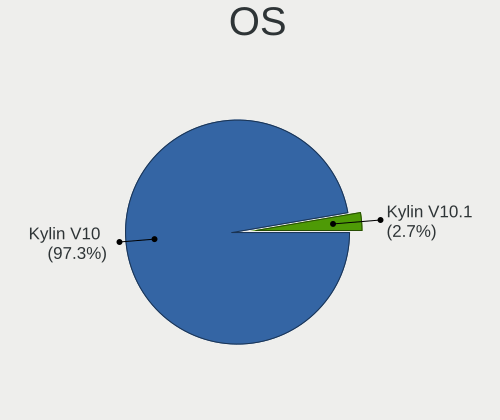

| Name        | Computers | Percent |
|-------------|-----------|---------|
| Kylin V10   | 72        | 97.3%   |
| Kylin V10.1 | 2         | 2.7%    |

OS Family
---------

OS without a version

| Name  | Computers | Percent |
|-------|-----------|---------|
| Kylin | 74        | 100%    |

Kernel
------

Version of the Linux kernel

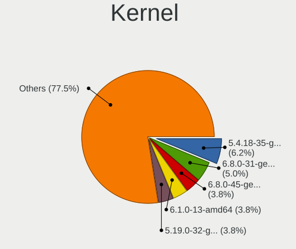

| Version               | Computers | Percent |
|-----------------------|-----------|---------|
| 5.4.18-35-generic     | 5         | 6.25%   |
| 6.8.0-31-generic      | 4         | 5%      |
| 6.8.0-45-generic      | 3         | 3.75%   |
| 6.1.0-13-amd64        | 3         | 3.75%   |
| 5.19.0-32-generic     | 3         | 3.75%   |
| 5.4.18-15-generic     | 2         | 2.5%    |
| 5.4.18-110-generic    | 2         | 2.5%    |
| 5.19.0-45-generic     | 2         | 2.5%    |
| 4.19.71-30-kr990      | 2         | 2.5%    |
| 6.9.9-rt-amd64        | 1         | 1.25%   |
| 6.8.0-47-generic      | 1         | 1.25%   |
| 6.8.0-40-generic      | 1         | 1.25%   |
| 6.8.0-38-generic      | 1         | 1.25%   |
| 6.8.0-35-generic      | 1         | 1.25%   |
| 6.7.12-rt-amd64       | 1         | 1.25%   |
| 6.7.10-060710-generic | 1         | 1.25%   |
| 6.6.9-amd64           | 1         | 1.25%   |
| 6.5.0-44-generic      | 1         | 1.25%   |
| 6.5.0-41-generic      | 1         | 1.25%   |
| 6.5.0-25-generic      | 1         | 1.25%   |
| 6.2.0-33-generic      | 1         | 1.25%   |
| 6.2.0-32-generic      | 1         | 1.25%   |
| 6.2.0-23-generic      | 1         | 1.25%   |
| 6.2.0-21-generic      | 1         | 1.25%   |
| 6.12.35+deb13-amd64   | 1         | 1.25%   |
| 6.11-rt-amd64         | 1         | 1.25%   |
| 6.1.0-38-amd64        | 1         | 1.25%   |
| 6.1.0-32-amd64        | 1         | 1.25%   |
| 6.1.0-27-rt-amd64     | 1         | 1.25%   |
| 6.1.0-26-rt-amd64     | 1         | 1.25%   |
| 6.1.0-23-amd64        | 1         | 1.25%   |
| 6.1.0-21-rt-amd64     | 1         | 1.25%   |
| 6.1.0-21-amd64        | 1         | 1.25%   |
| 6.1.0-20-amd64        | 1         | 1.25%   |
| 6.1.0-18-amd64        | 1         | 1.25%   |
| 5.4.96-7-kr9a0        | 1         | 1.25%   |
| 5.4.18-95-generic     | 1         | 1.25%   |
| 5.4.18-85-generic     | 1         | 1.25%   |
| 5.4.18-27-generic     | 1         | 1.25%   |
| 5.4.0-26-generic      | 1         | 1.25%   |

Kernel Family
-------------

Linux kernel without a distro release

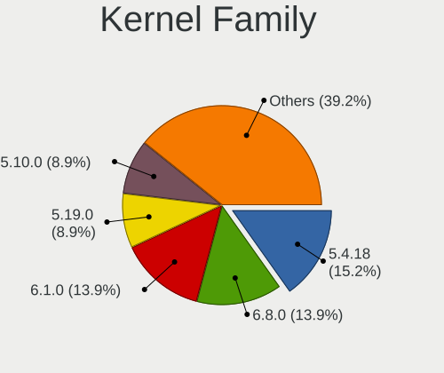

| Version  | Computers | Percent |
|----------|-----------|---------|
| 5.4.18   | 12        | 15.19%  |
| 6.8.0    | 11        | 13.92%  |
| 6.1.0    | 11        | 13.92%  |
| 5.19.0   | 7         | 8.86%   |
| 5.10.0   | 7         | 8.86%   |
| 5.15.0   | 6         | 7.59%   |
| 6.2.0    | 4         | 5.06%   |
| 4.19.71  | 4         | 5.06%   |
| 6.5.0    | 3         | 3.8%    |
| 5.4.0    | 3         | 3.8%    |
| 6.9.9    | 1         | 1.27%   |
| 6.7.12   | 1         | 1.27%   |
| 6.7.10   | 1         | 1.27%   |
| 6.6.9    | 1         | 1.27%   |
| 6.12.35  | 1         | 1.27%   |
| 6.11     | 1         | 1.27%   |
| 5.4.96   | 1         | 1.27%   |
| 5.10.46  | 1         | 1.27%   |
| 4.19.90  | 1         | 1.27%   |
| 4.19.260 | 1         | 1.27%   |
| 4.19.237 | 1         | 1.27%   |

Kernel Major Ver.
-----------------

Linux kernel major version

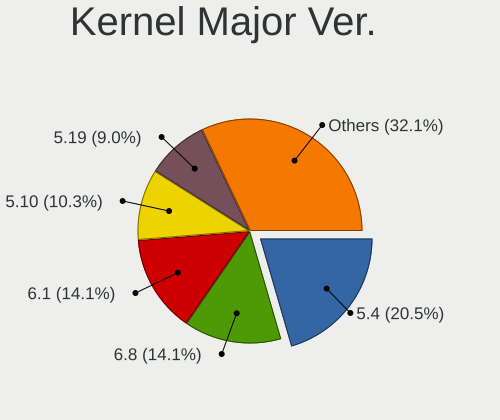

| Version | Computers | Percent |
|---------|-----------|---------|
| 5.4     | 16        | 20.51%  |
| 6.8     | 11        | 14.1%   |
| 6.1     | 11        | 14.1%   |
| 5.10    | 8         | 10.26%  |
| 5.19    | 7         | 8.97%   |
| 5.15    | 6         | 7.69%   |
| 4.19    | 6         | 7.69%   |
| 6.2     | 4         | 5.13%   |
| 6.5     | 3         | 3.85%   |
| 6.7     | 2         | 2.56%   |
| 6.9     | 1         | 1.28%   |
| 6.6     | 1         | 1.28%   |
| 6.12    | 1         | 1.28%   |
| 6       | 1         | 1.28%   |

Arch
----

OS architecture (x86_64, i586, etc.)

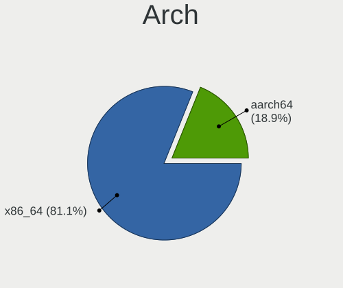

| Name    | Computers | Percent |
|---------|-----------|---------|
| x86_64  | 60        | 81.08%  |
| aarch64 | 14        | 18.92%  |

DE
--

Desktop Environment

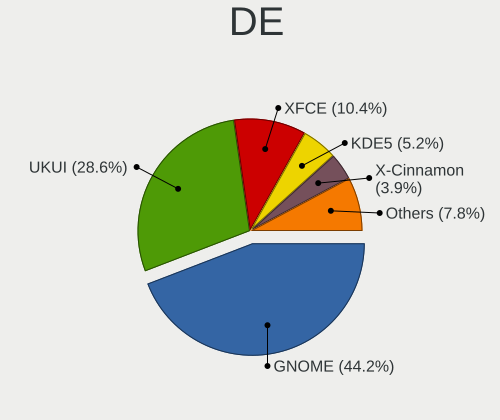

| Name            | Computers | Percent |
|-----------------|-----------|---------|
| GNOME           | 34        | 44.16%  |
| UKUI            | 22        | 28.57%  |
| XFCE            | 8         | 10.39%  |
| KDE5            | 4         | 5.19%   |
| X-Cinnamon      | 3         | 3.9%    |
| MATE            | 2         | 2.6%    |
| Unity           | 1         | 1.3%    |
| LXQt            | 1         | 1.3%    |
| KDE6            | 1         | 1.3%    |
| GNOME Flashback | 1         | 1.3%    |

Display Server
--------------

X11 or Wayland

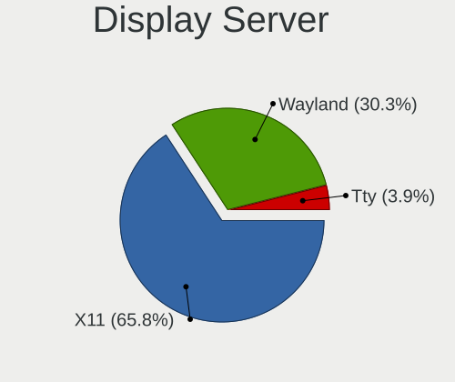

| Name    | Computers | Percent |
|---------|-----------|---------|
| X11     | 50        | 65.79%  |
| Wayland | 23        | 30.26%  |
| Tty     | 3         | 3.95%   |

Display Manager
---------------

SDDM, LightDM, etc.

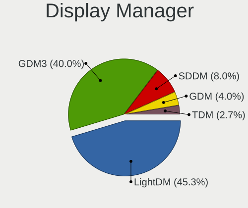

| Name    | Computers | Percent |
|---------|-----------|---------|
| LightDM | 34        | 45.33%  |
| GDM3    | 30        | 40%     |
| SDDM    | 6         | 8%      |
| GDM     | 3         | 4%      |
| TDM     | 2         | 2.67%   |

OS Lang
-------

Language

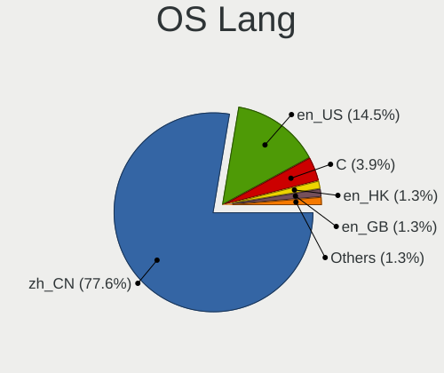

| Lang  | Computers | Percent |
|-------|-----------|---------|
| zh_CN | 59        | 77.63%  |
| en_US | 11        | 14.47%  |
| C     | 3         | 3.95%   |
| en_HK | 1         | 1.32%   |
| en_GB | 1         | 1.32%   |
| en_CA | 1         | 1.32%   |

Boot Mode
---------

EFI or BIOS

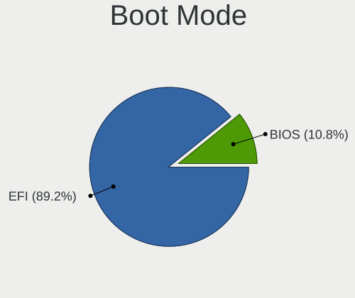

| Mode | Computers | Percent |
|------|-----------|---------|
| EFI  | 66        | 89.19%  |
| BIOS | 8         | 10.81%  |

Filesystem
----------

Type of filesystem

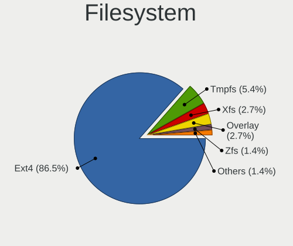

| Type    | Computers | Percent |
|---------|-----------|---------|
| Ext4    | 64        | 86.49%  |
| Tmpfs   | 4         | 5.41%   |
| Xfs     | 2         | 2.7%    |
| Overlay | 2         | 2.7%    |
| Zfs     | 1         | 1.35%   |
| Unknown | 1         | 1.35%   |

Part. scheme
------------

Scheme of partitioning

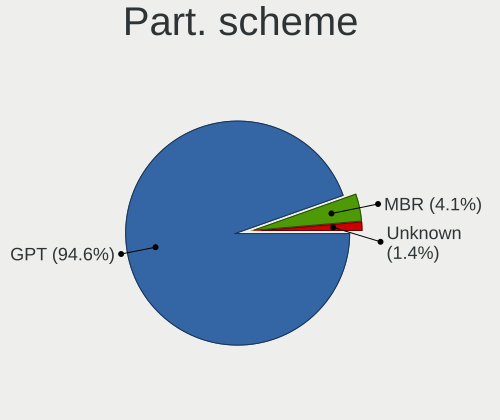

| Type    | Computers | Percent |
|---------|-----------|---------|
| GPT     | 70        | 94.59%  |
| MBR     | 3         | 4.05%   |
| Unknown | 1         | 1.35%   |

Dual Boot with Linux/BSD
------------------------

Hosting more than one Linux/BSD

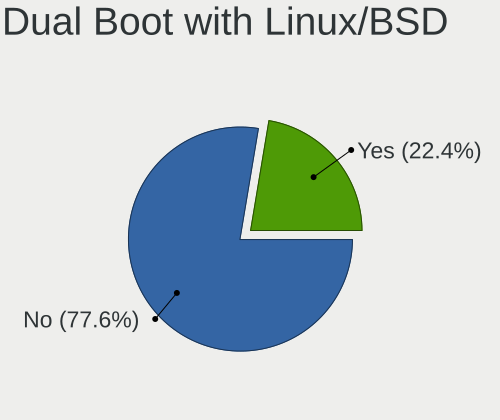

| Dual boot | Computers | Percent |
|-----------|-----------|---------|
| No        | 59        | 77.63%  |
| Yes       | 17        | 22.37%  |

Dual Boot (Win)
---------------

Hosting Linux and Windows

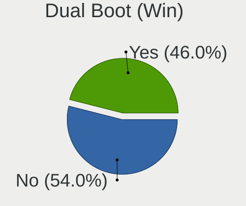

| Dual boot | Computers | Percent |
|-----------|-----------|---------|
| Yes       | 37        | 50%     |
| No        | 37        | 50%     |

Board
-----

Vendor
------

Motherboard manufacturer

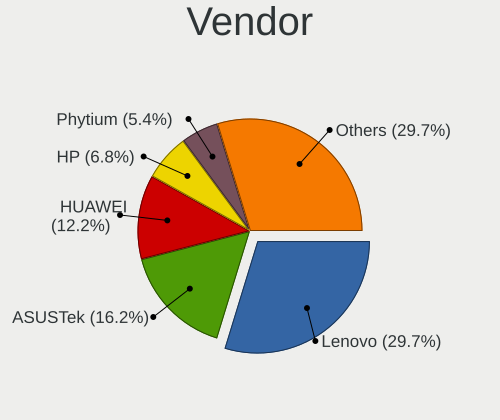

| Name                | Computers | Percent |
|---------------------|-----------|---------|
| Lenovo              | 22        | 29.73%  |
| ASUSTek Computer    | 12        | 16.22%  |
| HUAWEI              | 9         | 12.16%  |
| Hewlett-Packard     | 5         | 6.76%   |
| Phytium             | 4         | 5.41%   |
| GreatWall           | 4         | 5.41%   |
| Gigabyte Technology | 3         | 4.05%   |
| Dell                | 3         | 4.05%   |
| Timi                | 2         | 2.7%    |
| UniOne              | 1         | 1.35%   |
| THTF                | 1         | 1.35%   |
| ONDA                | 1         | 1.35%   |
| KaiTian             | 1         | 1.35%   |
| HASEE Computer      | 1         | 1.35%   |
| AZW                 | 1         | 1.35%   |
| ASRock              | 1         | 1.35%   |
| Apple               | 1         | 1.35%   |
| Alienware           | 1         | 1.35%   |
| Acer                | 1         | 1.35%   |

Model
-----

Motherboard model

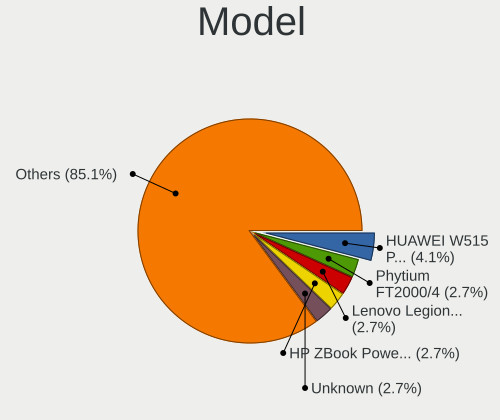

| Name                                              | Computers | Percent |
|---------------------------------------------------|-----------|---------|
| HUAWEI W515 PGUV-WBY0                             | 3         | 4.05%   |
| Phytium FT2000/4                                  | 2         | 2.7%    |
| Lenovo Legion R9000P ARX8 82WM                    | 2         | 2.7%    |
| HP ZBook Power 15.6 inch G9 Mobile Workstation PC | 2         | 2.7%    |
| Unknown                                           | 2         | 2.7%    |
| UniOne GTW8102                                    | 1         | 1.35%   |
| Timi TM1612                                       | 1         | 1.35%   |
| Timi Redmi G 2022                                 | 1         | 1.35%   |
| THTF CR F860-T1                                   | 1         | 1.35%   |
| Phytium FT-2000/4                                 | 1         | 1.35%   |
| Phytium FT-2000+/64                               | 1         | 1.35%   |
| ONDA B75E                                         | 1         | 1.35%   |
| Lenovo Yoga 14cACN 2021 82N7                      | 1         | 1.35%   |
| Lenovo YangTianT4900v-00                          | 1         | 1.35%   |
| Lenovo XiaoXinPro 14ACH 2021 82MS                 | 1         | 1.35%   |
| Lenovo XiaoXinDuet IAU7 82TQ                      | 1         | 1.35%   |
| Lenovo ThinkServer T100C 90U30005CD               | 1         | 1.35%   |
| Lenovo ThinkPad X200 74574AC                      | 1         | 1.35%   |
| Lenovo ThinkPad X13 Gen 1 20UF000ACD              | 1         | 1.35%   |
| Lenovo ThinkPad X13 Gen 1 20T2A003CD              | 1         | 1.35%   |
| Lenovo ThinkPad X1 Extreme Gen 4i 20Y6S00400      | 1         | 1.35%   |
| Lenovo ThinkPad X1 Carbon Gen 10 21CBA002CD       | 1         | 1.35%   |
| Lenovo ThinkPad T480s 20L7A00HHK                  | 1         | 1.35%   |
| Lenovo ThinkPad T460p 20FWA00PCD                  | 1         | 1.35%   |
| Lenovo ThinkPad T14 Gen 4 21HD0078CD              | 1         | 1.35%   |
| Lenovo ThinkPad T14 Gen 1 20UDA00MCD              | 1         | 1.35%   |
| Lenovo ThinkPad Edge E430c 33651E3                | 1         | 1.35%   |
| Lenovo ThinkPad E14 Gen 2 20TAA006CD              | 1         | 1.35%   |
| Lenovo ThinkBook 16 G5+ ARP 21J0                  | 1         | 1.35%   |
| Lenovo Legion Y9000P IAH7H 82RF                   | 1         | 1.35%   |
| Lenovo Legion R9000P2021H 82JQ                    | 1         | 1.35%   |
| Lenovo IdeaPad 710S-13ISK 80SW                    | 1         | 1.35%   |
| KaiTian N89z G1d                                  | 1         | 1.35%   |
| HUAWEI QingYun L420 KLVV-W5821                    | 1         | 1.35%   |
| HUAWEI MACH-WX9                                   | 1         | 1.35%   |
| HUAWEI L410 KLVU-WDU0                             | 1         | 1.35%   |
| HUAWEI KLVDZ-WXX9                                 | 1         | 1.35%   |
| HUAWEI KLVC-WXX9                                  | 1         | 1.35%   |
| HUAWEI CREM-WXX9                                  | 1         | 1.35%   |
| HP ZHAN 99 Mobile Workstation G3                  | 1         | 1.35%   |

Model Family
------------

Motherboard model prefix

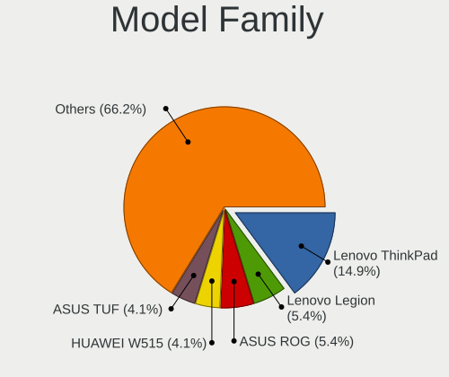

| Name                                    | Computers | Percent |
|-----------------------------------------|-----------|---------|
| Lenovo ThinkPad                         | 11        | 14.86%  |
| Lenovo Legion                           | 4         | 5.41%   |
| ASUS ROG                                | 4         | 5.41%   |
| HUAWEI W515                             | 3         | 4.05%   |
| ASUS TUF                                | 3         | 4.05%   |
| Phytium FT2000                          | 2         | 2.7%    |
| HP ZBook                                | 2         | 2.7%    |
| Dell Vostro                             | 2         | 2.7%    |
| ASUS VivoBook                           | 2         | 2.7%    |
| Unknown                                 | 2         | 2.7%    |
| UniOne GTW8102                          | 1         | 1.35%   |
| Timi TM1612                             | 1         | 1.35%   |
| Timi Redmi                              | 1         | 1.35%   |
| THTF CR                                 | 1         | 1.35%   |
| Phytium FT-2000+                        | 1         | 1.35%   |
| Phytium FT-2000                         | 1         | 1.35%   |
| ONDA B75E                               | 1         | 1.35%   |
| Lenovo Yoga                             | 1         | 1.35%   |
| Lenovo YangTianT4900v-00                | 1         | 1.35%   |
| Lenovo XiaoXinPro                       | 1         | 1.35%   |
| Lenovo XiaoXinDuet                      | 1         | 1.35%   |
| Lenovo ThinkServer                      | 1         | 1.35%   |
| Lenovo ThinkBook                        | 1         | 1.35%   |
| Lenovo IdeaPad                          | 1         | 1.35%   |
| KaiTian N89z                            | 1         | 1.35%   |
| HUAWEI QingYun                          | 1         | 1.35%   |
| HUAWEI MACH-WX9                         | 1         | 1.35%   |
| HUAWEI L410                             | 1         | 1.35%   |
| HUAWEI KLVDZ-WXX9                       | 1         | 1.35%   |
| HUAWEI KLVC-WXX9                        | 1         | 1.35%   |
| HUAWEI CREM-WXX9                        | 1         | 1.35%   |
| HP ZHAN                                 | 1         | 1.35%   |
| HP Tablet                               | 1         | 1.35%   |
| HP EliteBook                            | 1         | 1.35%   |
| HASEE GI5CN54                           | 1         | 1.35%   |
| GreatWall \xe4\xb8\x96\xe6\x81\x92D80F3 | 1         | 1.35%   |
| GreatWall GW-XXXXXX-XXX                 | 1         | 1.35%   |
| Gigabyte Z97X-SLI                       | 1         | 1.35%   |
| Gigabyte Z390                           | 1         | 1.35%   |
| Gigabyte B550M                          | 1         | 1.35%   |

MFG Year
--------

Motherboard manufacture year

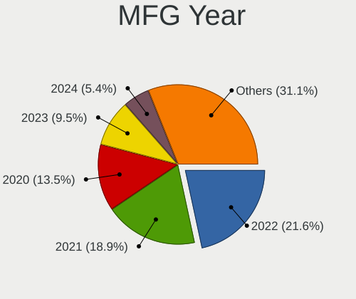

| Year    | Computers | Percent |
|---------|-----------|---------|
| 2022    | 16        | 21.62%  |
| 2021    | 14        | 18.92%  |
| 2020    | 10        | 13.51%  |
| 2023    | 7         | 9.46%   |
| 2024    | 4         | 5.41%   |
| 2018    | 4         | 5.41%   |
| 2016    | 4         | 5.41%   |
| 2014    | 4         | 5.41%   |
| 2019    | 3         | 4.05%   |
| Unknown | 3         | 4.05%   |
| 2015    | 1         | 1.35%   |
| 2013    | 1         | 1.35%   |
| 2012    | 1         | 1.35%   |
| 2011    | 1         | 1.35%   |
| 2008    | 1         | 1.35%   |

Form Factor
-----------

Physical design of the computer

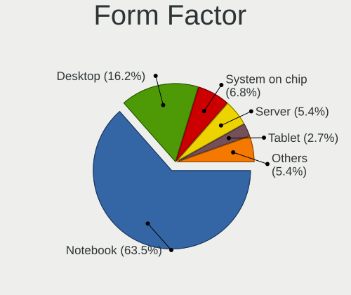

| Name           | Computers | Percent |
|----------------|-----------|---------|
| Notebook       | 47        | 63.51%  |
| Desktop        | 12        | 16.22%  |
| System on chip | 5         | 6.76%   |
| Server         | 4         | 5.41%   |
| Tablet         | 2         | 2.7%    |
| Convertible    | 2         | 2.7%    |
| Mini pc        | 1         | 1.35%   |
| All in one     | 1         | 1.35%   |

Secure Boot
-----------

Enabled or disabled

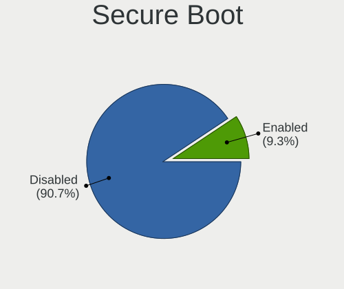

| State    | Computers | Percent |
|----------|-----------|---------|
| Disabled | 68        | 90.67%  |
| Enabled  | 7         | 9.33%   |

Coreboot
--------

Have coreboot on board

| Used | Computers | Percent |
|------|-----------|---------|
| No   | 74        | 100%    |

RAM Size
--------

Total RAM memory

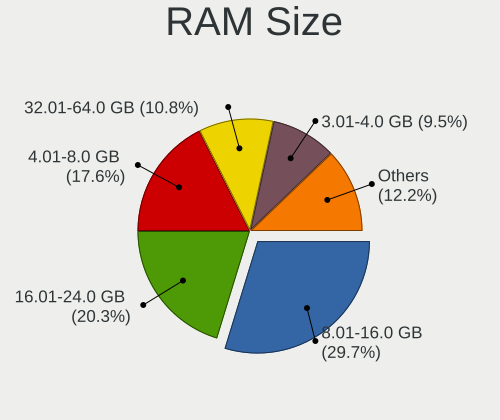

| Size in GB  | Computers | Percent |
|-------------|-----------|---------|
| 8.01-16.0   | 22        | 29.73%  |
| 16.01-24.0  | 15        | 20.27%  |
| 4.01-8.0    | 13        | 17.57%  |
| 32.01-64.0  | 8         | 10.81%  |
| 3.01-4.0    | 7         | 9.46%   |
| 64.01-256.0 | 5         | 6.76%   |
| 24.01-32.0  | 4         | 5.41%   |

RAM Used
--------

Used RAM memory

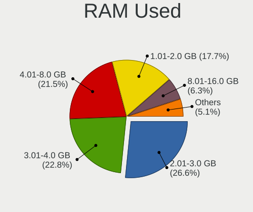

| Used GB    | Computers | Percent |
|------------|-----------|---------|
| 2.01-3.0   | 21        | 26.58%  |
| 3.01-4.0   | 18        | 22.78%  |
| 4.01-8.0   | 17        | 21.52%  |
| 1.01-2.0   | 14        | 17.72%  |
| 8.01-16.0  | 5         | 6.33%   |
| 16.01-24.0 | 2         | 2.53%   |
| 0.51-1.0   | 2         | 2.53%   |

Total Drives
------------

Number of drives on board

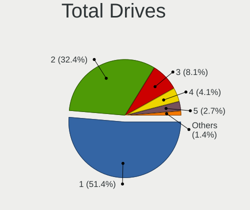

| Drives | Computers | Percent |
|--------|-----------|---------|
| 1      | 38        | 51.35%  |
| 2      | 24        | 32.43%  |
| 3      | 6         | 8.11%   |
| 4      | 3         | 4.05%   |
| 5      | 2         | 2.7%    |
| 7      | 1         | 1.35%   |

Has CD-ROM
----------

Has CD-ROM on board

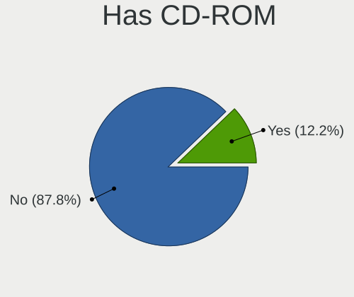

| Presented | Computers | Percent |
|-----------|-----------|---------|
| No        | 65        | 87.84%  |
| Yes       | 9         | 12.16%  |

Has Ethernet
------------

Has Ethernet on board

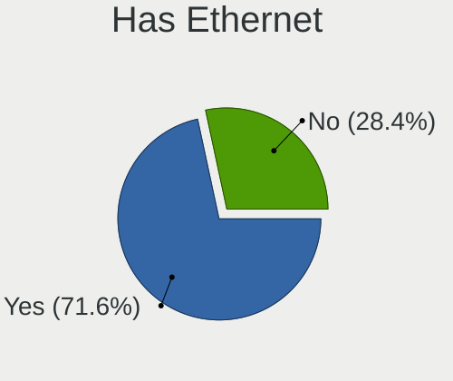

| Presented | Computers | Percent |
|-----------|-----------|---------|
| Yes       | 53        | 71.62%  |
| No        | 21        | 28.38%  |

Has WiFi
--------

Has WiFi module

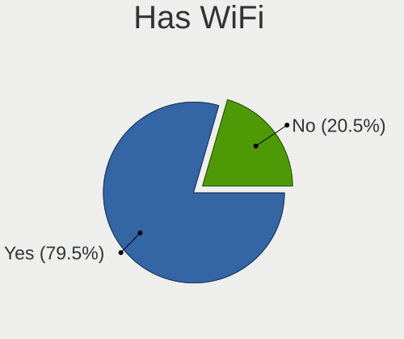

| Presented | Computers | Percent |
|-----------|-----------|---------|
| Yes       | 60        | 81.08%  |
| No        | 14        | 18.92%  |

Has Bluetooth
-------------

Has Bluetooth module

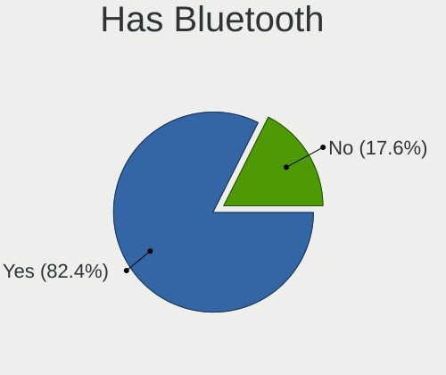

| Presented | Computers | Percent |
|-----------|-----------|---------|
| Yes       | 61        | 82.43%  |
| No        | 13        | 17.57%  |

Location
--------

Country
-------

Geographic location (country)

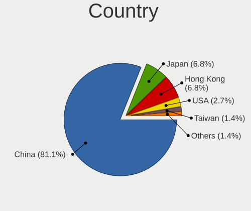

| Country   | Computers | Percent |
|-----------|-----------|---------|
| China     | 60        | 81.08%  |
| Japan     | 5         | 6.76%   |
| Hong Kong | 5         | 6.76%   |
| USA       | 2         | 2.7%    |
| Taiwan    | 1         | 1.35%   |
| Canada    | 1         | 1.35%   |

City
----

Geographic location (city)

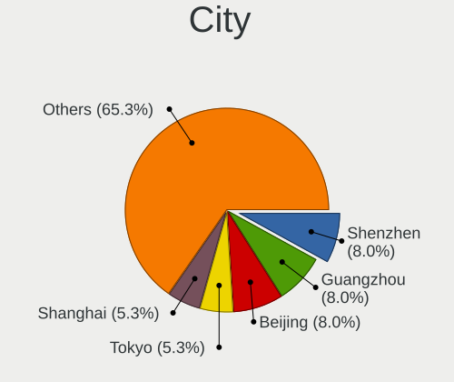

| City        | Computers | Percent |
|-------------|-----------|---------|
| Shenzhen    | 6         | 8%      |
| Guangzhou   | 6         | 8%      |
| Beijing     | 6         | 8%      |
| Tokyo       | 4         | 5.33%   |
| Shanghai    | 4         | 5.33%   |
| Tianjin     | 3         | 4%      |
| Jinan       | 3         | 4%      |
| Zhangzhou   | 2         | 2.67%   |
| Xi'an       | 2         | 2.67%   |
| Mong Kok    | 2         | 2.67%   |
| Los Angeles | 2         | 2.67%   |
| Jinrongjie  | 2         | 2.67%   |
| Hefei       | 2         | 2.67%   |
| Haidian     | 2         | 2.67%   |
| Chengdu     | 2         | 2.67%   |
| Changsha    | 2         | 2.67%   |
| Central     | 2         | 2.67%   |
| Zhongshan   | 1         | 1.33%   |
| Zhengzhou   | 1         | 1.33%   |
| Xuhui       | 1         | 1.33%   |
| Xiaolou     | 1         | 1.33%   |
| Wuhan       | 1         | 1.33%   |
| Wenzhou     | 1         | 1.33%   |
| Wanchai     | 1         | 1.33%   |
| Taohua      | 1         | 1.33%   |
| Taizhou     | 1         | 1.33%   |
| Shizishan   | 1         | 1.33%   |
| Shekou      | 1         | 1.33%   |
| Qinnan      | 1         | 1.33%   |
| Putuo       | 1         | 1.33%   |
| Osaka       | 1         | 1.33%   |
| Markham     | 1         | 1.33%   |
| Kunming     | 1         | 1.33%   |
| Harbin      | 1         | 1.33%   |
| Haikou      | 1         | 1.33%   |
| Foshan      | 1         | 1.33%   |
| Changzhou   | 1         | 1.33%   |
| Chancheng   | 1         | 1.33%   |
| Banqiao     | 1         | 1.33%   |
| Bacheng     | 1         | 1.33%   |

Drives
------

Drive Vendor
------------

Hard drive vendors

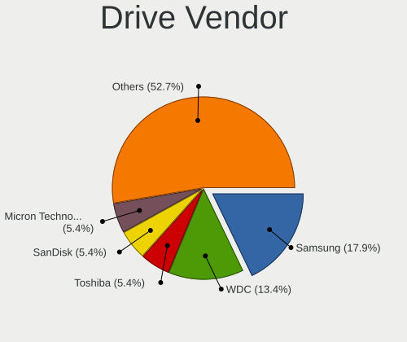

| Vendor                      | Computers | Drives | Percent |
|-----------------------------|-----------|--------|---------|
| Samsung Electronics         | 20        | 26     | 17.86%  |
| WDC                         | 15        | 28     | 13.39%  |
| Toshiba                     | 6         | 6      | 5.36%   |
| SanDisk                     | 6         | 6      | 5.36%   |
| Micron Technology           | 6         | 6      | 5.36%   |
| SK hynix                    | 5         | 8      | 4.46%   |
| Seagate                     | 5         | 5      | 4.46%   |
| ZHITAI                      | 4         | 5      | 3.57%   |
| Phison                      | 4         | 4      | 3.57%   |
| Kingston                    | 4         | 4      | 3.57%   |
| FORESEE                     | 3         | 4      | 2.68%   |
| Fanxiang                    | 3         | 4      | 2.68%   |
| BIWIN                       | 3         | 3      | 2.68%   |
| Unknown                     | 2         | 2      | 1.79%   |
| Lenovo                      | 2         | 2      | 1.79%   |
| KIOXIA                      | 2         | 6      | 1.79%   |
| Intel                       | 2         | 2      | 1.79%   |
| Hikvision                   | 2         | 2      | 1.79%   |
| Hewlett-Packard             | 2         | 2      | 1.79%   |
| ZX1 1TB                     | 1         | 1      | 0.89%   |
| YMTC                        | 1         | 1      | 0.89%   |
| Yangtze Memory Technologies | 1         | 1      | 0.89%   |
| Teclast                     | 1         | 2      | 0.89%   |
| Realtek Semiconductor       | 1         | 1      | 0.89%   |
| Pear 2TB                    | 1         | 1      | 0.89%   |
| Kingchuxing                 | 1         | 1      | 0.89%   |
| J.ZAO                       | 1         | 1      | 0.89%   |
| HISI                        | 1         | 4      | 0.89%   |
| HIKSEMI                     | 1         | 1      | 0.89%   |
| Great Wa                    | 1         | 1      | 0.89%   |
| FC-1307                     | 1         | 1      | 0.89%   |
| Crucial                     | 1         | 1      | 0.89%   |
| China                       | 1         | 1      | 0.89%   |
| Apple                       | 1         | 1      | 0.89%   |
| A-DATA Technology           | 1         | 1      | 0.89%   |

Drive Model
-----------

Hard drive models

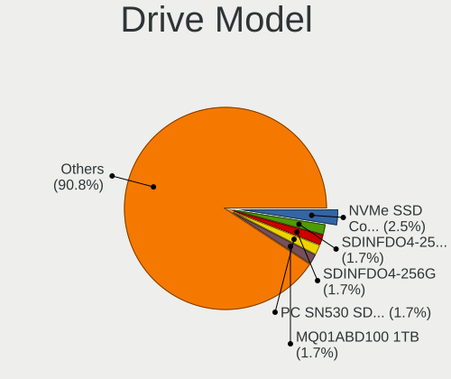

| Model                                              | Computers | Percent |
|----------------------------------------------------|-----------|---------|
| Samsung NVMe SSD Controller SM981/PM981/PM983 1TB  | 3         | 2.52%   |
| WDC SDINFDO4-256G SSD                              | 2         | 1.68%   |
| WDC SDINFDO4-256G                                  | 2         | 1.68%   |
| WDC PC SN530 SDBPNPZ-256G                          | 2         | 1.68%   |
| Toshiba MQ01ABD100 1TB                             | 2         | 1.68%   |
| Seagate ST1000DM010-2EP102 1TB                     | 2         | 1.68%   |
| SanDisk NVMe SSD Drive 1TB                         | 2         | 1.68%   |
| Samsung NVMe SSD Controller PM9A1/PM9A3/980PRO 1TB | 2         | 1.68%   |
| Micron MTFDKBA512TFH 512GB                         | 2         | 1.68%   |
| Kingston SA400S37240G 240GB SSD                    | 2         | 1.68%   |
| FORESEE 64GB SSD                                   | 2         | 1.68%   |
| ZX1 1TB Disk 1TB                                   | 1         | 0.84%   |
| ZHITAI TiPro9000 4TB                               | 1         | 0.84%   |
| ZHITAI TiPlus7100 4TB                              | 1         | 0.84%   |
| ZHITAI TiPlus7100 2TB                              | 1         | 0.84%   |
| ZHITAI TiPlus7100 1TB                              | 1         | 0.84%   |
| ZHITAI PC005 Active 1TB                            | 1         | 0.84%   |
| YMTC YMSS2CB04B32MC 256GB                          | 1         | 0.84%   |
| Yangtze Memory ZHITAI Ti600 1TB                    | 1         | 0.84%   |
| WDC WDS240G2G0A-00JH30 240GB SSD                   | 1         | 0.84%   |
| WDC WD20EJRX-89G3VY0 2TB                           | 1         | 0.84%   |
| WDC WD10EZEX-22MFCA0 1TB                           | 1         | 0.84%   |
| WDC WD10EZEX-08WN4A0 1TB                           | 1         | 0.84%   |
| WDC WD05PURX-64D85Y0 500GB                         | 1         | 0.84%   |
| WDC PC SN730 SDBPNTY-512G-1101 512GB               | 1         | 0.84%   |
| WDC PC SN730 SDBPNTY-512G-1027 512GB               | 1         | 0.84%   |
| WDC PC SN730 SDBPNTY-512G                          | 1         | 0.84%   |
| WDC PC SN530 SDBPNPZ-512G-1114 512GB               | 1         | 0.84%   |
| WDC PC SN530 SDBPNPZ-512G-1014 512GB               | 1         | 0.84%   |
| WDC PC SN530 NVMe 512GB                            | 1         | 0.84%   |
| Unknown NVMe SSD Drive 512GB                       | 1         | 0.84%   |
| Unknown NVMe SSD Drive 256GB                       | 1         | 0.84%   |
| Toshiba MK3261GSYN 320GB                           | 1         | 0.84%   |
| Toshiba KXG60ZNV512G KIOXIA 512GB                  | 1         | 0.84%   |
| Toshiba DT01ACA100 LENOVO 1TB                      | 1         | 0.84%   |
| Toshiba DT01ACA100 1TB                             | 1         | 0.84%   |
| Teclast 512GB A850 SSD                             | 1         | 0.84%   |
| Teclast 256GB A750 SSD                             | 1         | 0.84%   |
| SK hynix SKHynix_HFS512GDE9X084N 512GB             | 1         | 0.84%   |
| SK hynix SKHynix_HFS512GD9TNI-L2A0B 512GB          | 1         | 0.84%   |

HDD Vendor
----------

Hard disk drive vendors

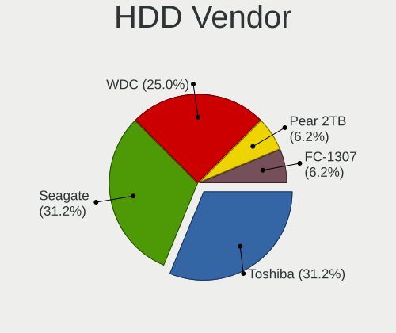

| Vendor   | Computers | Drives | Percent |
|----------|-----------|--------|---------|
| Toshiba  | 5         | 5      | 31.25%  |
| Seagate  | 5         | 5      | 31.25%  |
| WDC      | 4         | 5      | 25%     |
| Pear 2TB | 1         | 1      | 6.25%   |
| FC-1307  | 1         | 1      | 6.25%   |

SSD Vendor
----------

Solid state drive vendors

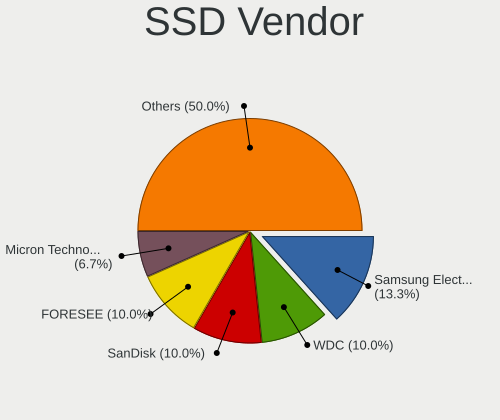

| Vendor              | Computers | Drives | Percent |
|---------------------|-----------|--------|---------|
| Samsung Electronics | 4         | 9      | 13.33%  |
| WDC                 | 3         | 15     | 10%     |
| SanDisk             | 3         | 3      | 10%     |
| FORESEE             | 3         | 4      | 10%     |
| Micron Technology   | 2         | 2      | 6.67%   |
| Lenovo              | 2         | 2      | 6.67%   |
| Kingston            | 2         | 2      | 6.67%   |
| Teclast             | 1         | 2      | 3.33%   |
| SK hynix            | 1         | 4      | 3.33%   |
| Phison              | 1         | 1      | 3.33%   |
| Kingchuxing         | 1         | 1      | 3.33%   |
| J.ZAO               | 1         | 1      | 3.33%   |
| HISI                | 1         | 4      | 3.33%   |
| HIKSEMI             | 1         | 1      | 3.33%   |
| Hewlett-Packard     | 1         | 1      | 3.33%   |
| Crucial             | 1         | 1      | 3.33%   |
| China               | 1         | 1      | 3.33%   |
| Apple               | 1         | 1      | 3.33%   |

Drive Kind
----------

HDD or SSD

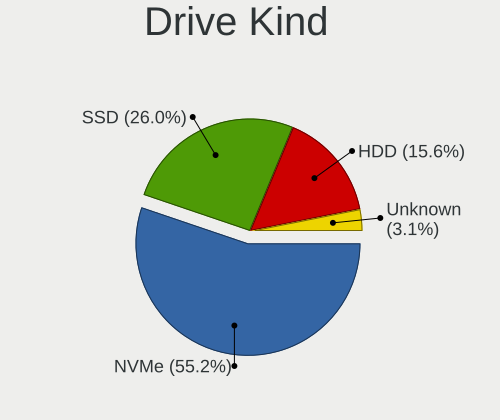

| Kind    | Computers | Drives | Percent |
|---------|-----------|--------|---------|
| NVMe    | 53        | 70     | 55.21%  |
| SSD     | 25        | 55     | 26.04%  |
| HDD     | 15        | 17     | 15.63%  |
| Unknown | 3         | 3      | 3.13%   |

Drive Connector
---------------

SATA, SAS, NVMe, etc.

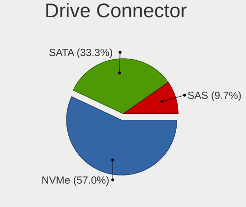

| Type | Computers | Drives | Percent |
|------|-----------|--------|---------|
| NVMe | 53        | 69     | 56.99%  |
| SATA | 31        | 60     | 33.33%  |
| SAS  | 9         | 16     | 9.68%   |

Drive Size
----------

Size of hard drive

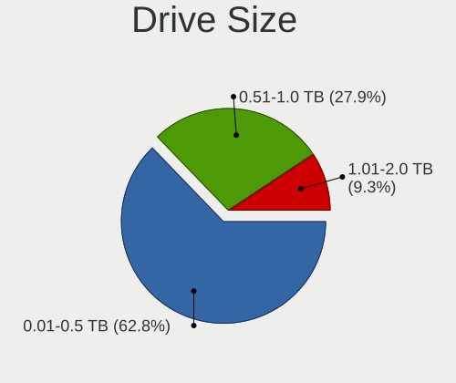

| Size in TB | Computers | Drives | Percent |
|------------|-----------|--------|---------|
| 0.01-0.5   | 27        | 55     | 62.79%  |
| 0.51-1.0   | 12        | 13     | 27.91%  |
| 1.01-2.0   | 4         | 4      | 9.3%    |

Space Total
-----------

Amount of disk space available on the file system

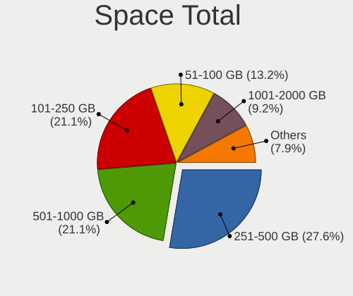

| Size in GB | Computers | Percent |
|------------|-----------|---------|
| 251-500    | 21        | 27.63%  |
| 101-250    | 16        | 21.05%  |
| 501-1000   | 16        | 21.05%  |
| 51-100     | 10        | 13.16%  |
| 1001-2000  | 7         | 9.21%   |
| 2001-3000  | 3         | 3.95%   |
| 21-50      | 1         | 1.32%   |
| 1-20       | 1         | 1.32%   |
| Unknown    | 1         | 1.32%   |

Space Used
----------

Amount of used disk space

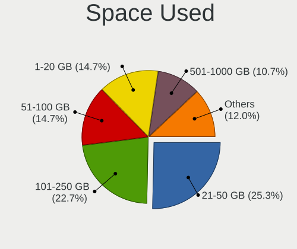

| Used GB   | Computers | Percent |
|-----------|-----------|---------|
| 21-50     | 19        | 25.33%  |
| 101-250   | 17        | 22.67%  |
| 1-20      | 11        | 14.67%  |
| 51-100    | 11        | 14.67%  |
| 501-1000  | 8         | 10.67%  |
| 251-500   | 7         | 9.33%   |
| 1001-2000 | 1         | 1.33%   |
| Unknown   | 1         | 1.33%   |

Malfunc. Drives
---------------

Drive models with a malfunction

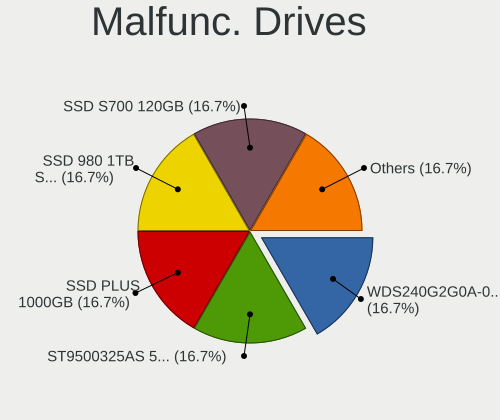

| Model                                           | Computers | Drives | Percent |
|-------------------------------------------------|-----------|--------|---------|
| WDC WDS240G2G0A-00JH30 240GB SSD                | 1         | 1      | 16.67%  |
| Seagate ST9500325AS 500GB                       | 1         | 1      | 16.67%  |
| SanDisk SSD PLUS 1000GB                         | 1         | 1      | 16.67%  |
| Samsung Electronics SSD 980 1TB S649NX0T432942B | 1         | 1      | 16.67%  |
| Hewlett-Packard SSD S700 120GB                  | 1         | 1      | 16.67%  |
| A-DATA Technology SX6000LNP 1TB                 | 1         | 1      | 16.67%  |

Malfunc. Drive Vendor
---------------------

Vendors of faulty drives

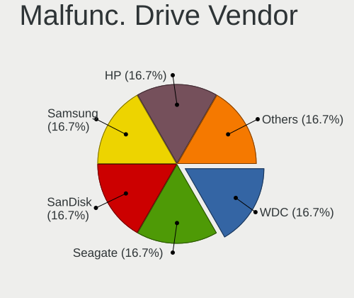

| Vendor              | Computers | Drives | Percent |
|---------------------|-----------|--------|---------|
| WDC                 | 1         | 1      | 16.67%  |
| Seagate             | 1         | 1      | 16.67%  |
| SanDisk             | 1         | 1      | 16.67%  |
| Samsung Electronics | 1         | 1      | 16.67%  |
| Hewlett-Packard     | 1         | 1      | 16.67%  |
| A-DATA Technology   | 1         | 1      | 16.67%  |

Malfunc. HDD Vendor
-------------------

Vendors of faulty HDD drives

| Vendor  | Computers | Drives | Percent |
|---------|-----------|--------|---------|
| Seagate | 1         | 1      | 100%    |

Malfunc. Drive Kind
-------------------

Kinds of faulty drives

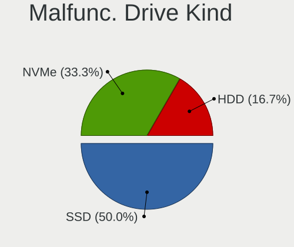

| Kind | Computers | Drives | Percent |
|------|-----------|--------|---------|
| SSD  | 3         | 3      | 50%     |
| NVMe | 2         | 2      | 33.33%  |
| HDD  | 1         | 1      | 16.67%  |

Failed Drives
-------------

Failed drive models

Zero info for selected period =(

Failed Drive Vendor
-------------------

Failed drive vendors

Zero info for selected period =(

Drive Status
------------

Number of failed and malfunc. drives

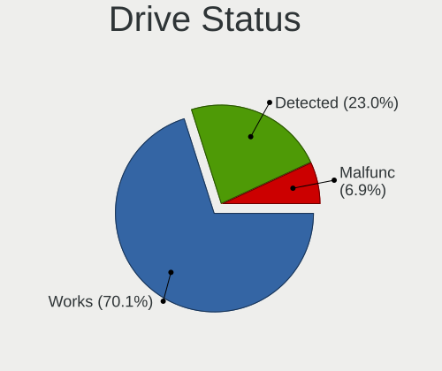

| Status   | Computers | Drives | Percent |
|----------|-----------|--------|---------|
| Works    | 61        | 88     | 70.11%  |
| Detected | 20        | 51     | 22.99%  |
| Malfunc  | 6         | 6      | 6.9%    |

Storage controller
------------------

Storage Vendor
--------------

Storage controller vendors

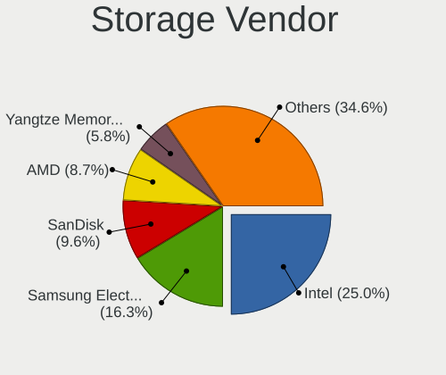

| Vendor                                  | Computers | Percent |
|-----------------------------------------|-----------|---------|
| Intel                                   | 26        | 25%     |
| Samsung Electronics                     | 17        | 16.35%  |
| SanDisk                                 | 10        | 9.62%   |
| AMD                                     | 9         | 8.65%   |
| Yangtze Memory Technologies             | 6         | 5.77%   |
| Marvell Technology Group                | 6         | 5.77%   |
| SK hynix                                | 4         | 3.85%   |
| Phison Electronics                      | 4         | 3.85%   |
| Micron Technology                       | 4         | 3.85%   |
| MAXIO Technology (Hangzhou)             | 3         | 2.88%   |
| Biwin Storage Technology                | 3         | 2.88%   |
| ASMedia Technology                      | 3         | 2.88%   |
| KIOXIA                                  | 2         | 1.92%   |
| Kingston Technology Company             | 2         | 1.92%   |
| Toshiba America Info Systems            | 1         | 0.96%   |
| Silicon Motion                          | 1         | 0.96%   |
| Realtek Semiconductor                   | 1         | 0.96%   |
| Jiangsu Xinsheng Intelligent Technology | 1         | 0.96%   |
| Hefei DATANG Storage Technology         | 1         | 0.96%   |

Storage Model
-------------

Storage controller models

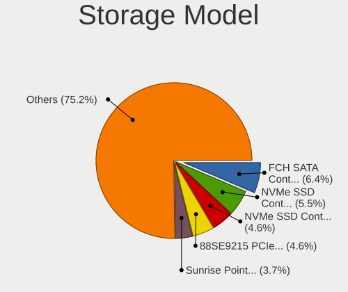

| Model                                                                     | Computers | Percent |
|---------------------------------------------------------------------------|-----------|---------|
| AMD FCH SATA Controller [AHCI mode]                                       | 7         | 6.42%   |
| Samsung NVMe SSD Controller PM9A1/PM9A3/980PRO                            | 6         | 5.5%    |
| Samsung NVMe SSD Controller SM981/PM981/PM983                             | 5         | 4.59%   |
| Marvell Group 88SE9215 PCIe 2.0 x1 4-port SATA 6 Gb/s Controller          | 5         | 4.59%   |
| Intel Sunrise Point-LP SATA Controller [AHCI mode]                        | 4         | 3.67%   |
| Yangtze Memory ZHITAI TiPlus7100                                          | 3         | 2.75%   |
| SanDisk Ultra 3D / WD PC SN530, IX SN530, Blue SN550 NVMe SSD (DRAM-less) | 3         | 2.75%   |
| SanDisk Extreme Pro / WD Black SN750 / PC SN730 / Red SN700 NVMe SSD      | 3         | 2.75%   |
| Intel Comet Lake SATA AHCI Controller                                     | 3         | 2.75%   |
| Intel Cannon Lake Mobile PCH SATA AHCI Controller                         | 3         | 2.75%   |
| ASMedia ASM1064 Serial ATA Controller                                     | 3         | 2.75%   |
| SK hynix Platinum P41/PC801 NVMe Solid State Drive                        | 2         | 1.83%   |
| Samsung NVMe SSD Controller 980 (DRAM-less)                               | 2         | 1.83%   |
| Phison PS5013-E13 PCIe3 NVMe Controller (DRAM-less)                       | 2         | 1.83%   |
| Micron 3400 NVMe SSD [Hendrix]                                            | 2         | 1.83%   |
| Micron 2450 NVMe SSD [HendrixV] (DRAM-less)                               | 2         | 1.83%   |
| MAXIO (Hangzhou) NVMe SSD Controller MAP1202 (DRAM-less)                  | 2         | 1.83%   |
| Intel RST Volume Management Device Controller                             | 2         | 1.83%   |
| Biwin Storage FX700 NVMe SSD (DRAM-less)                                  | 2         | 1.83%   |
| Yangtze Memory ZHITAI TiPro9000 NVMe SSD                                  | 1         | 0.92%   |
| Yangtze Memory ZHITAI Ti600 NVMe SSD                                      | 1         | 0.92%   |
| Yangtze Memory ZHITAI PC005 NVMe SSD                                      | 1         | 0.92%   |
| Yangtze Memory PC300 M.2 2280 NVMe SSD (DRAM-less)                        | 1         | 0.92%   |
| Toshiba America Info Systems XG6 NVMe SSD Controller                      | 1         | 0.92%   |
| SK hynix PC611 NVMe Solid State Drive                                     | 1         | 0.92%   |
| SK hynix Gold P31/BC711/PC711 NVMe Solid State Drive                      | 1         | 0.92%   |
| Silicon Motion SM2262/SM2262EN SSD Controller                             | 1         | 0.92%   |
| SanDisk WD SN560/SN740/SN770/SN5000 NVMe SSD                              | 1         | 0.92%   |
| Sandisk WD PC SN735 NVMe SSD 1TB (DRAM-less)                              | 1         | 0.92%   |
| Sandisk PC SN740 NVMe SSD (DRAM-less)                                     | 1         | 0.92%   |
| SanDisk IX SN530 NVMe SSD / microSD Express Card (DRAM-less)              | 1         | 0.92%   |
| Samsung S4LN058A01[SSUBX] AHCI SSD Controller (Apple slot)                | 1         | 0.92%   |
| Samsung NVMe SSD Controller SM961/PM961/SM963                             | 1         | 0.92%   |
| Samsung NVMe SSD Controller S4LV008[Pascal]                               | 1         | 0.92%   |
| Samsung NVMe SSD Controller PM9B1 (DRAM-less)                             | 1         | 0.92%   |
| Realtek RTS5765DL NVMe SSD Controller (DRAM-less)                         | 1         | 0.92%   |
| Phison PS5019-E19 PCIe4 NVMe Controller (DRAM-less)                       | 1         | 0.92%   |
| Phison E12 NVMe Controller                                                | 1         | 0.92%   |
| MAXIO (Hangzhou) NVMe SSD Controller MAP1602 (DRAM-less)                  | 1         | 0.92%   |
| Marvell Group 88SS1092 NVMe SSD Controller                                | 1         | 0.92%   |

Storage Kind
------------

Kind of storage controller (IDE, SATA, NVMe, SAS, ...)

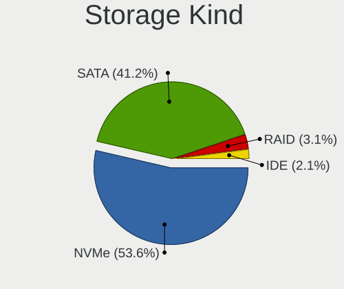

| Kind | Computers | Percent |
|------|-----------|---------|
| NVMe | 52        | 53.61%  |
| SATA | 40        | 41.24%  |
| RAID | 3         | 3.09%   |
| IDE  | 2         | 2.06%   |

Processor
---------

CPU Vendor
----------

Processor vendors

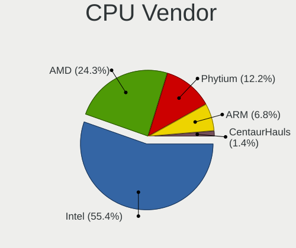

| Vendor       | Computers | Percent |
|--------------|-----------|---------|
| Intel        | 41        | 55.41%  |
| AMD          | 18        | 24.32%  |
| Phytium      | 9         | 12.16%  |
| ARM          | 5         | 6.76%   |
| CentaurHauls | 1         | 1.35%   |

CPU Model
---------

Processor models

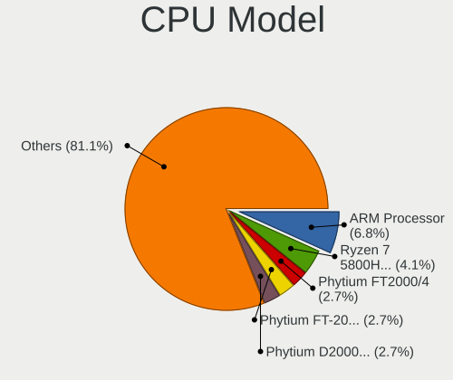

| Model                                      | Computers | Percent |
|--------------------------------------------|-----------|---------|
| ARM Processor                              | 5         | 6.76%   |
| AMD Ryzen 7 5800H with Radeon Graphics     | 3         | 4.05%   |
| Phytium FT2000/4                           | 2         | 2.7%    |
| Phytium FT-2000/4                          | 2         | 2.7%    |
| Phytium D2000/8 E8C                        | 2         | 2.7%    |
| Intel Core i7-8750H CPU @ 2.20GHz          | 2         | 2.7%    |
| Intel Core i7-4790 CPU @ 3.60GHz           | 2         | 2.7%    |
| Intel Core i5-10210U CPU @ 1.60GHz         | 2         | 2.7%    |
| Intel 13th Gen Core i5-1340P               | 2         | 2.7%    |
| Intel 12th Gen Core i7-12700H              | 2         | 2.7%    |
| Intel 12th Gen Core i5-12500H              | 2         | 2.7%    |
| Intel 11th Gen Core i7-11800H @ 2.30GHz    | 2         | 2.7%    |
| Intel 11th Gen Core i7-1165G7 @ 2.80GHz    | 2         | 2.7%    |
| AMD Ryzen 9 7945HX with Radeon Graphics    | 2         | 2.7%    |
| AMD Ryzen 7 PRO 4750U with Radeon Graphics | 2         | 2.7%    |
| AMD Ryzen 7 5800U with Radeon Graphics     | 2         | 2.7%    |
| Phytium FT-2000+/64                        | 1         | 1.35%   |
| Phytium D3000                              | 1         | 1.35%   |
| Phytium D2000/8                            | 1         | 1.35%   |
| Intel Pentium Silver N6000 @ 1.10GHz       | 1         | 1.35%   |
| Intel Pentium Gold G6400 CPU @ 4.00GHz     | 1         | 1.35%   |
| Intel Core m3-6Y30 CPU @ 0.90GHz           | 1         | 1.35%   |
| Intel Core i7-9750H CPU @ 2.60GHz          | 1         | 1.35%   |
| Intel Core i7-8550U CPU @ 1.80GHz          | 1         | 1.35%   |
| Intel Core i7-7500U CPU @ 2.70GHz          | 1         | 1.35%   |
| Intel Core i7-6700HQ CPU @ 2.60GHz         | 1         | 1.35%   |
| Intel Core i7-6560U CPU @ 2.20GHz          | 1         | 1.35%   |
| Intel Core i7-10700 CPU @ 2.90GHz          | 1         | 1.35%   |
| Intel Core i7-10510U CPU @ 1.80GHz         | 1         | 1.35%   |
| Intel Core i5-9600K CPU @ 3.70GHz          | 1         | 1.35%   |
| Intel Core i5-8400 CPU @ 2.80GHz           | 1         | 1.35%   |
| Intel Core i5-8350U CPU @ 1.70GHz          | 1         | 1.35%   |
| Intel Core i5-7300U CPU @ 2.60GHz          | 1         | 1.35%   |
| Intel Core i5-5257U CPU @ 2.70GHz          | 1         | 1.35%   |
| Intel Core i5-4200U CPU @ 1.60GHz          | 1         | 1.35%   |
| Intel Core i5-3570 CPU @ 3.40GHz           | 1         | 1.35%   |
| Intel Core i5-14600K                       | 1         | 1.35%   |
| Intel Core i3-3110M CPU @ 2.40GHz          | 1         | 1.35%   |
| Intel Core i3-2310M CPU @ 2.10GHz          | 1         | 1.35%   |
| Intel Core 2 Duo CPU P8400 @ 2.26GHz       | 1         | 1.35%   |

CPU Model Family
----------------

Processor model prefix

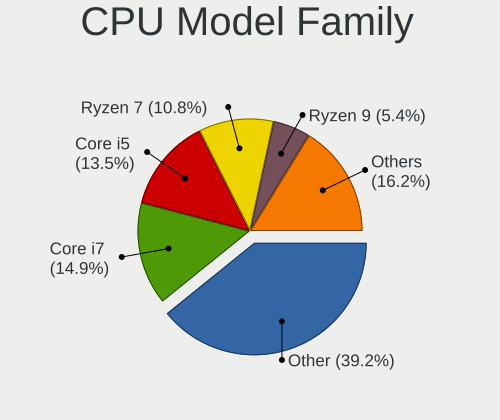

| Model                | Computers | Percent |
|----------------------|-----------|---------|
| Other                | 29        | 39.19%  |
| Intel Core i7        | 11        | 14.86%  |
| Intel Core i5        | 10        | 13.51%  |
| AMD Ryzen 7          | 8         | 10.81%  |
| AMD Ryzen 9          | 4         | 5.41%   |
| Intel Core i3        | 2         | 2.7%    |
| AMD Ryzen 7 PRO      | 2         | 2.7%    |
| AMD Ryzen 5          | 2         | 2.7%    |
| Intel Pentium Silver | 1         | 1.35%   |
| Intel Pentium Gold   | 1         | 1.35%   |
| Intel Core m3        | 1         | 1.35%   |
| Intel Core 2 Duo     | 1         | 1.35%   |
| AMD Ryzen 5 PRO      | 1         | 1.35%   |
| AMD E                | 1         | 1.35%   |

CPU Cores
---------

Number of processor cores

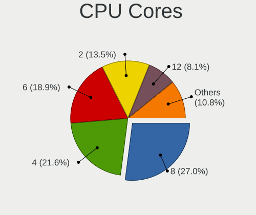

| Number | Computers | Percent |
|--------|-----------|---------|
| 8      | 20        | 27.03%  |
| 4      | 16        | 21.62%  |
| 6      | 14        | 18.92%  |
| 2      | 10        | 13.51%  |
| 12     | 6         | 8.11%   |
| 14     | 4         | 5.41%   |
| 16     | 2         | 2.7%    |
| 64     | 1         | 1.35%   |
| 10     | 1         | 1.35%   |

CPU Sockets
-----------

Number of sockets

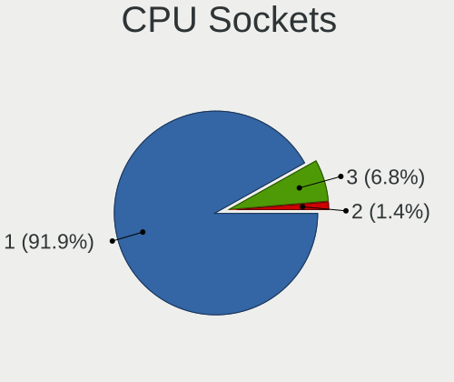

| Number | Computers | Percent |
|--------|-----------|---------|
| 1      | 68        | 91.89%  |
| 3      | 5         | 6.76%   |
| 2      | 1         | 1.35%   |

CPU Threads
-----------

Threads per core (Hyper-Threading)

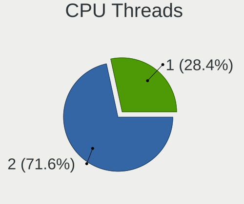

| Number | Computers | Percent |
|--------|-----------|---------|
| 2      | 53        | 71.62%  |
| 1      | 21        | 28.38%  |

CPU Op-Modes
------------

CPU Operation Modes (32-bit, 64-bit)

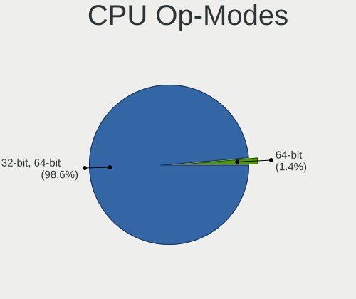

| Op mode        | Computers | Percent |
|----------------|-----------|---------|
| 32-bit, 64-bit | 73        | 98.65%  |
| 64-bit         | 1         | 1.35%   |

CPU Microcode
-------------

Microcode number

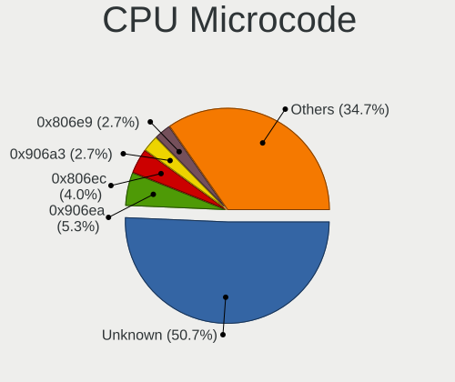

| Number     | Computers | Percent |
|------------|-----------|---------|
| Unknown    | 38        | 50.67%  |
| 0x906ea    | 4         | 5.33%   |
| 0x806ec    | 3         | 4%      |
| 0x906a3    | 2         | 2.67%   |
| 0x806e9    | 2         | 2.67%   |
| 0x406e3    | 2         | 2.67%   |
| 0x0a50000d | 2         | 2.67%   |
| 0x0a50000c | 2         | 2.67%   |
| 0x0a404102 | 2         | 2.67%   |
| 0xb06a2    | 1         | 1.33%   |
| 0xa0655    | 1         | 1.33%   |
| 0xa0653    | 1         | 1.33%   |
| 0x906c0    | 1         | 1.33%   |
| 0x806ea    | 1         | 1.33%   |
| 0x806c1    | 1         | 1.33%   |
| 0x40651    | 1         | 1.33%   |
| 0x306d4    | 1         | 1.33%   |
| 0x306c3    | 1         | 1.33%   |
| 0x306a9    | 1         | 1.33%   |
| 0x1067a    | 1         | 1.33%   |
| 0x0b404023 | 1         | 1.33%   |
| 0x0a601206 | 1         | 1.33%   |
| 0x0a601203 | 1         | 1.33%   |
| 0x0a50000f | 1         | 1.33%   |
| 0x0a50000b | 1         | 1.33%   |
| 0x0860010c | 1         | 1.33%   |
| 0x08600103 | 1         | 1.33%   |

CPU Microarch
-------------

Microarchitecture

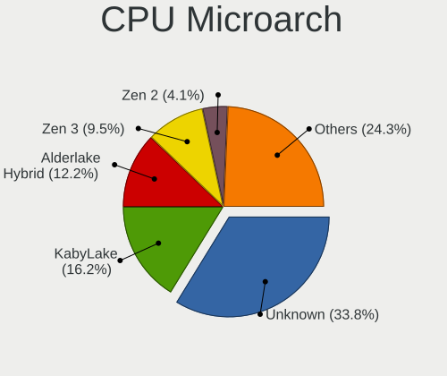

| Name             | Computers | Percent |
|------------------|-----------|---------|
| Unknown          | 25        | 33.78%  |
| KabyLake         | 12        | 16.22%  |
| Alderlake Hybrid | 9         | 12.16%  |
| Zen 3            | 7         | 9.46%   |
| Zen 2            | 3         | 4.05%   |
| Skylake          | 3         | 4.05%   |
| Haswell          | 3         | 4.05%   |
| TigerLake        | 2         | 2.7%    |
| IvyBridge        | 2         | 2.7%    |
| Icelake          | 2         | 2.7%    |
| CometLake        | 2         | 2.7%    |
| Tremont          | 1         | 1.35%   |
| SandyBridge      | 1         | 1.35%   |
| Penryn           | 1         | 1.35%   |
| Broadwell        | 1         | 1.35%   |

Graphics
--------

GPU Vendor
----------

Vendors of graphics cards

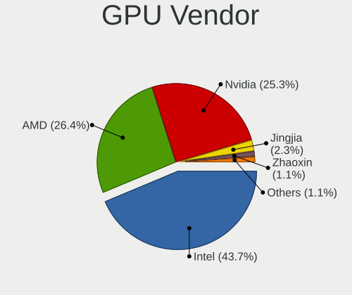

| Vendor                   | Computers | Percent |
|--------------------------|-----------|---------|
| Intel                    | 38        | 43.68%  |
| AMD                      | 23        | 26.44%  |
| Nvidia                   | 22        | 25.29%  |
| Jingjia Microelectronics | 2         | 2.3%    |
| Zhaoxin                  | 1         | 1.15%   |
| ASPEED Technology        | 1         | 1.15%   |

GPU Model
---------

Graphics card models

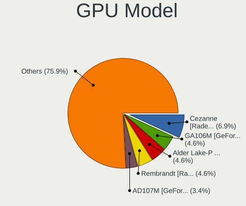

| Model                                                                       | Computers | Percent |
|-----------------------------------------------------------------------------|-----------|---------|
| AMD Cezanne [Radeon Vega Series / Radeon Vega Mobile Series]                | 6         | 6.9%    |
| Nvidia GA106M [GeForce RTX 3060 Mobile / Max-Q]                             | 4         | 4.6%    |
| Intel Alder Lake-P GT2 [Iris Xe Graphics]                                   | 4         | 4.6%    |
| AMD Rembrandt [Radeon 680M]                                                 | 4         | 4.6%    |
| Nvidia AD107M [GeForce RTX 4060 Max-Q / Mobile]                             | 3         | 3.45%   |
| Intel CometLake-U GT2 [UHD Graphics]                                        | 3         | 3.45%   |
| Intel CoffeeLake-H GT2 [UHD Graphics 630]                                   | 3         | 3.45%   |
| Nvidia GA107M [GeForce RTX 3050 Mobile]                                     | 2         | 2.3%    |
| Nvidia GA102 [GeForce RTX 3090]                                             | 2         | 2.3%    |
| Intel TigerLake-LP GT2 [Iris Xe Graphics]                                   | 2         | 2.3%    |
| Intel TigerLake-H GT1 [UHD Graphics]                                        | 2         | 2.3%    |
| Intel Raptor Lake-P [Iris Xe Graphics]                                      | 2         | 2.3%    |
| Intel Kaby Lake-U GT2 [HD Graphics 620]                                     | 2         | 2.3%    |
| Intel Kaby Lake-R GT2 [UHD Graphics 620]                                    | 2         | 2.3%    |
| AMD Renoir [Radeon Vega Series / Radeon Vega Mobile Series]                 | 2         | 2.3%    |
| AMD Lexa [Radeon 540X/550X/630 / RX 640 / E9171 MCM]                        | 2         | 2.3%    |
| AMD Caicos [Radeon HD 6450/7450/8450 / R5 230 OEM]                          | 2         | 2.3%    |
| Zhaoxin KX-6000 C-960 GPU                                                   | 1         | 1.15%   |
| Nvidia TU117M [GeForce MX450]                                               | 1         | 1.15%   |
| Nvidia TU117M [GeForce GTX 1650 Mobile / Max-Q]                             | 1         | 1.15%   |
| Nvidia TU117GLM [T600 Mobile]                                               | 1         | 1.15%   |
| Nvidia GP108M [GeForce MX150]                                               | 1         | 1.15%   |
| Nvidia GP107M [GeForce MX350]                                               | 1         | 1.15%   |
| Nvidia GP107M [GeForce GTX 1050 Ti Mobile]                                  | 1         | 1.15%   |
| Nvidia GP107 [GeForce GTX 1050 Ti]                                          | 1         | 1.15%   |
| Nvidia GP106 [GeForce GTX 1060 6GB]                                         | 1         | 1.15%   |
| Nvidia GM108M [GeForce 940MX]                                               | 1         | 1.15%   |
| Nvidia GK208B [GeForce GT 730]                                              | 1         | 1.15%   |
| Nvidia GB202 [GeForce RTX 5090]                                             | 1         | 1.15%   |
| Jingjia Microelectronics JM9100                                             | 1         | 1.15%   |
| Jingjia Microelectronics JM7200 Series GPU                                  | 1         | 1.15%   |
| Intel Xeon E3-1200 v3/4th Gen Core Processor Integrated Graphics Controller | 1         | 1.15%   |
| Intel Xeon E3-1200 v2/3rd Gen Core processor Graphics Controller            | 1         | 1.15%   |
| Intel Skylake-Y GT2 [HD Graphics 515]                                       | 1         | 1.15%   |
| Intel Skylake-U GT3 [Iris Graphics 540]                                     | 1         | 1.15%   |
| Intel Skylake-H GT2 [HD Graphics 530]                                       | 1         | 1.15%   |
| Intel Raptor Lake-S GT1 [UHD Graphics 770]                                  | 1         | 1.15%   |
| Intel Raptor Lake-P [UHD Graphics]                                          | 1         | 1.15%   |
| Intel Mobile 4 Series Chipset Integrated Graphics Controller                | 1         | 1.15%   |
| Intel JasperLake [UHD Graphics]                                             | 1         | 1.15%   |

GPU Combo
---------

Combinations of graphics cards

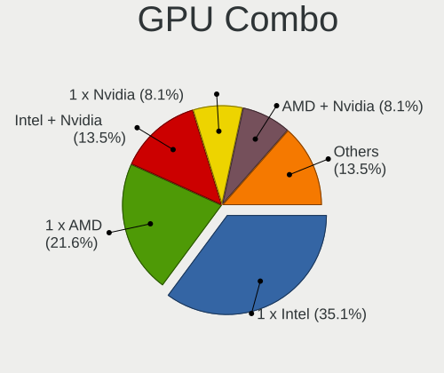

| Name                         | Computers | Percent |
|------------------------------|-----------|---------|
| 1 x Intel                    | 26        | 35.14%  |
| 1 x AMD                      | 16        | 21.62%  |
| Intel + Nvidia               | 10        | 13.51%  |
| 1 x Nvidia                   | 6         | 8.11%   |
| AMD + Nvidia                 | 6         | 8.11%   |
| Other                        | 5         | 6.76%   |
| 1 x Jingjia Microelectronics | 2         | 2.7%    |
| 1 x Zhaoxin                  | 1         | 1.35%   |
| Intel + AMD                  | 1         | 1.35%   |
| 1 x ASPEED                   | 1         | 1.35%   |

GPU Driver
----------

Free vs proprietary

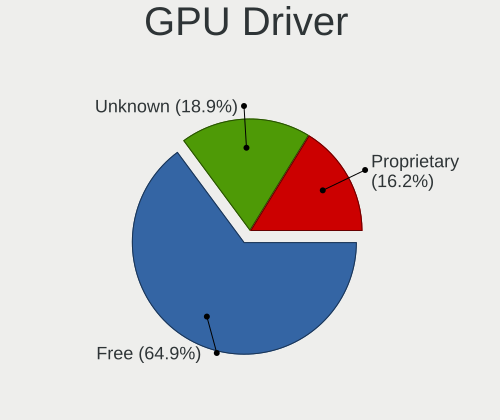

| Driver      | Computers | Percent |
|-------------|-----------|---------|
| Free        | 48        | 64.86%  |
| Unknown     | 14        | 18.92%  |
| Proprietary | 12        | 16.22%  |

GPU Memory
----------

Total video memory

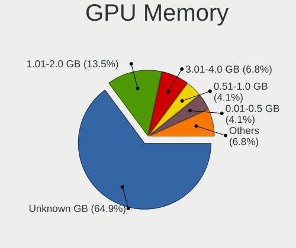

| Size in GB | Computers | Percent |
|------------|-----------|---------|
| Unknown    | 48        | 64.86%  |
| 1.01-2.0   | 10        | 13.51%  |
| 3.01-4.0   | 5         | 6.76%   |
| 0.51-1.0   | 3         | 4.05%   |
| 0.01-0.5   | 3         | 4.05%   |
| 7.01-8.0   | 2         | 2.7%    |
| 5.01-6.0   | 1         | 1.35%   |
| 24.01-32.0 | 1         | 1.35%   |
| 16.01-24.0 | 1         | 1.35%   |

Monitor
-------

Monitor Vendor
--------------

Monitor vendors

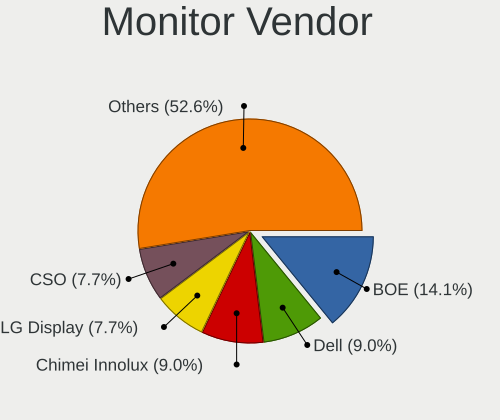

| Vendor               | Computers | Percent |
|----------------------|-----------|---------|
| BOE                  | 11        | 14.1%   |
| Dell                 | 7         | 8.97%   |
| Chimei Innolux       | 7         | 8.97%   |
| LG Display           | 6         | 7.69%   |
| CSO                  | 6         | 7.69%   |
| AU Optronics         | 6         | 7.69%   |
| AOC                  | 5         | 6.41%   |
| Samsung Electronics  | 3         | 3.85%   |
| Mi                   | 3         | 3.85%   |
| Lenovo               | 3         | 3.85%   |
| Xiaomi               | 2         | 2.56%   |
| HUAWEI               | 2         | 2.56%   |
| Goldstar             | 2         | 2.56%   |
| TMX                  | 1         | 1.28%   |
| STD                  | 1         | 1.28%   |
| SAC                  | 1         | 1.28%   |
| RTK                  | 1         | 1.28%   |
| Philips              | 1         | 1.28%   |
| PANDA                | 1         | 1.28%   |
| KIG                  | 1         | 1.28%   |
| JZM                  | 1         | 1.28%   |
| JDI                  | 1         | 1.28%   |
| InfoVision           | 1         | 1.28%   |
| HKC                  | 1         | 1.28%   |
| CPT                  | 1         | 1.28%   |
| BenQ                 | 1         | 1.28%   |
| Apple                | 1         | 1.28%   |
| Ancor Communications | 1         | 1.28%   |

Monitor Model
-------------

Monitor models

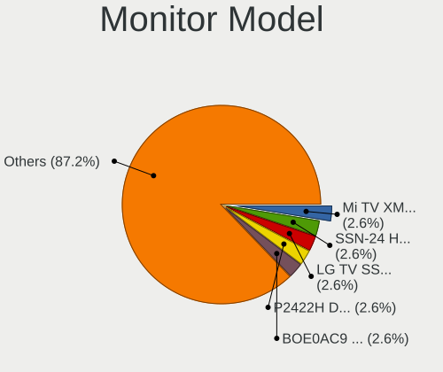

| Model                                                                 | Computers | Percent |
|-----------------------------------------------------------------------|-----------|---------|
| Xiaomi Mi TV XMD004A 3840x2160 708x398mm 32.0-inch                    | 2         | 2.56%   |
| HUAWEI SSN-24 HWV6E4E 1920x1080 527x296mm 23.8-inch                   | 2         | 2.56%   |
| Goldstar LG TV SSCR2 GSMC0C8 3840x2160                                | 2         | 2.56%   |
| Dell P2422H DELA1C4 1920x1080 527x296mm 23.8-inch                     | 2         | 2.56%   |
| BOE LCD Monitor BOE0AC9 2240x1400 302x189mm 14.0-inch                 | 2         | 2.56%   |
| AU Optronics LCD Monitor AUOA08B 1920x1080 344x193mm 15.5-inch        | 2         | 2.56%   |
| TMX TL160ADMP01-0 TMX1600 2560x1600 345x215mm 16.0-inch               | 1         | 1.28%   |
| STD ARUR STD2700 2560x1440 598x336mm 27.0-inch                        | 1         | 1.28%   |
| Samsung Electronics LCD Monitor SDC4180 2880x1620 344x194mm 15.5-inch | 1         | 1.28%   |
| Samsung Electronics LCD Monitor SDC4171 2880x1800 302x189mm 14.0-inch | 1         | 1.28%   |
| Samsung Electronics LCD Monitor SDC416E 2880x1620 344x194mm 15.5-inch | 1         | 1.28%   |
| SAC DP SAC2742 2560x1440 597x336mm 27.0-inch                          | 1         | 1.28%   |
| RTK Verbatim MT14 RTK0012 1920x1080                                   | 1         | 1.28%   |
| Philips PHL 243V7 PHLC155 1920x1080 527x296mm 23.8-inch               | 1         | 1.28%   |
| PANDA LCD Monitor NCP0042 1920x1080 344x194mm 15.5-inch               | 1         | 1.28%   |
| Mi P27QBB-RA XMID003 2560x1440 600x340mm 27.2-inch                    | 1         | 1.28%   |
| Mi Monitor XMI3444 3440x1440 797x334mm 34.0-inch                      | 1         | 1.28%   |
| Mi 245 HF1 XMIA003 1920x1080 540x300mm 24.3-inch                      | 1         | 1.28%   |
| LG Display LCD Monitor LGD06AA 3840x2400 344x215mm 16.0-inch          | 1         | 1.28%   |
| LG Display LCD Monitor LGD0690 2560x1440 344x194mm 15.5-inch          | 1         | 1.28%   |
| LG Display LCD Monitor LGD060A 1920x1080 294x165mm 13.3-inch          | 1         | 1.28%   |
| LG Display LCD Monitor LGD0563 1920x1080 344x194mm 15.5-inch          | 1         | 1.28%   |
| LG Display LCD Monitor LGD04EF 1920x1080 294x165mm 13.3-inch          | 1         | 1.28%   |
| LG Display LCD Monitor LGD049A 2560x1440 310x174mm 14.0-inch          | 1         | 1.28%   |
| Lenovo X24i-10 LEN61AA 1920x1080 527x296mm 23.8-inch                  | 1         | 1.28%   |
| Lenovo LEN T2224rA LEN60EA 1920x1080 477x268mm 21.5-inch              | 1         | 1.28%   |
| Lenovo LCD Monitor LEN4010 1280x800 261x163mm 12.1-inch               | 1         | 1.28%   |
| KIG KKTV KIG2700 1920x1080 598x336mm 27.0-inch                        | 1         | 1.28%   |
| JZM JZM238G JZM2442 1920x1080 527x296mm 23.8-inch                     | 1         | 1.28%   |
| JDI LCD Monitor JDI422A 3000x2000 293x196mm 13.9-inch                 | 1         | 1.28%   |
| InfoVision LCD Monitor IVO8C45 2240x1400 302x188mm 14.0-inch          | 1         | 1.28%   |
| HKC S24 PRO HKC2473 1920x1080 527x296mm 23.8-inch                     | 1         | 1.28%   |
| Dell SE2218HL DELF121 1920x1080 476x268mm 21.5-inch                   | 1         | 1.28%   |
| Dell S2319HS DEL418F 1920x1080 509x286mm 23.0-inch                    | 1         | 1.28%   |
| Dell P2717H DEL40F7 1920x1080 598x336mm 27.0-inch                     | 1         | 1.28%   |
| Dell E2213 DELD04E 1680x1050 473x296mm 22.0-inch                      | 1         | 1.28%   |
| Dell 1704FPT DEL4005 1280x1024 338x270mm 17.0-inch                    | 1         | 1.28%   |
| CSO MNH301CA3-1 CSO1702 2560x1440 381x214mm 17.2-inch                 | 1         | 1.28%   |
| CSO LCD Monitor CSO161B 2560x1600 344x215mm 16.0-inch                 | 1         | 1.28%   |
| CSO LCD Monitor CSO161B 2560x1600 340x220mm 15.9-inch                 | 1         | 1.28%   |

Monitor Resolution
------------------

Monitor screen resolution

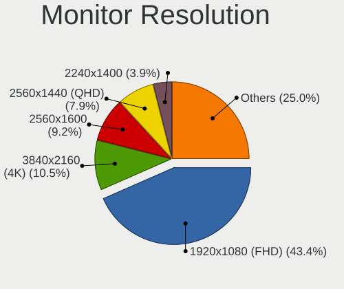

| Resolution         | Computers | Percent |
|--------------------|-----------|---------|
| 1920x1080 (FHD)    | 33        | 43.42%  |
| 3840x2160 (4K)     | 8         | 10.53%  |
| 2560x1600          | 7         | 9.21%   |
| 2560x1440 (QHD)    | 6         | 7.89%   |
| 2240x1400          | 3         | 3.95%   |
| 2160x1440          | 3         | 3.95%   |
| 1366x768 (WXGA)    | 3         | 3.95%   |
| 2880x1800          | 2         | 2.63%   |
| 2880x1620          | 2         | 2.63%   |
| 3840x2400          | 1         | 1.32%   |
| 3440x1440          | 1         | 1.32%   |
| 3000x2000          | 1         | 1.32%   |
| 2520x1680          | 1         | 1.32%   |
| 1920x1200 (WUXGA)  | 1         | 1.32%   |
| 1680x1050 (WSXGA+) | 1         | 1.32%   |
| 1600x900 (HD+)     | 1         | 1.32%   |
| 1280x800 (WXGA)    | 1         | 1.32%   |
| 1280x1024 (SXGA)   | 1         | 1.32%   |

Monitor Diagonal
----------------

Diagonal size in inches

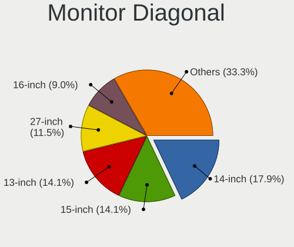

| Inches  | Computers | Percent |
|---------|-----------|---------|
| 14      | 14        | 17.95%  |
| 15      | 11        | 14.1%   |
| 13      | 11        | 14.1%   |
| 27      | 9         | 11.54%  |
| 16      | 7         | 8.97%   |
| 24      | 6         | 7.69%   |
| 23      | 5         | 6.41%   |
| 72      | 2         | 2.56%   |
| 65      | 2         | 2.56%   |
| 22      | 2         | 2.56%   |
| 21      | 2         | 2.56%   |
| 17      | 2         | 2.56%   |
| 12      | 2         | 2.56%   |
| 34      | 1         | 1.28%   |
| 11      | 1         | 1.28%   |
| Unknown | 1         | 1.28%   |

Monitor Width
-------------

Physical width

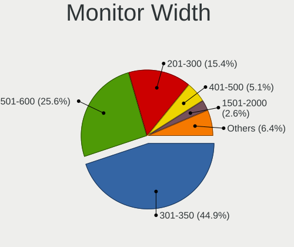

| Width in mm | Computers | Percent |
|-------------|-----------|---------|
| 301-350     | 35        | 44.87%  |
| 501-600     | 20        | 25.64%  |
| 201-300     | 12        | 15.38%  |
| 401-500     | 4         | 5.13%   |
| 1501-2000   | 2         | 2.56%   |
| 1001-1500   | 2         | 2.56%   |
| 701-800     | 1         | 1.28%   |
| 351-400     | 1         | 1.28%   |
| Unknown     | 1         | 1.28%   |

Aspect Ratio
------------

Proportional relationship between the width and the height

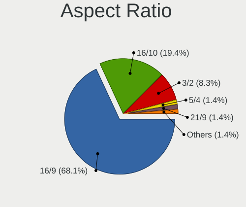

| Ratio   | Computers | Percent |
|---------|-----------|---------|
| 16/9    | 49        | 68.06%  |
| 16/10   | 14        | 19.44%  |
| 3/2     | 6         | 8.33%   |
| 5/4     | 1         | 1.39%   |
| 21/9    | 1         | 1.39%   |
| Unknown | 1         | 1.39%   |

Monitor Area
------------

Area in inch²

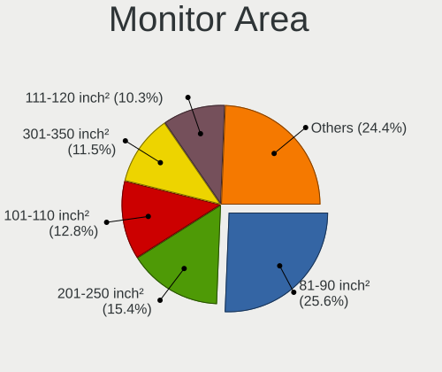

| Area in inch² | Computers | Percent |
|----------------|-----------|---------|
| 81-90          | 20        | 25.64%  |
| 201-250        | 12        | 15.38%  |
| 101-110        | 10        | 12.82%  |
| 301-350        | 9         | 11.54%  |
| 111-120        | 8         | 10.26%  |
| 71-80          | 6         | 7.69%   |
| More than 1000 | 4         | 5.13%   |
| 151-200        | 2         | 2.56%   |
| 61-70          | 1         | 1.28%   |
| 51-60          | 1         | 1.28%   |
| 351-500        | 1         | 1.28%   |
| 251-300        | 1         | 1.28%   |
| 141-150        | 1         | 1.28%   |
| 121-130        | 1         | 1.28%   |
| Unknown        | 1         | 1.28%   |

Pixel Density
-------------

Pixels per inch

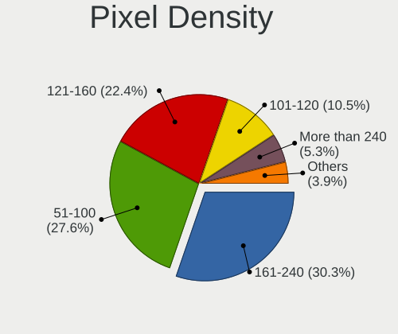

| Density       | Computers | Percent |
|---------------|-----------|---------|
| 161-240       | 23        | 30.26%  |
| 51-100        | 21        | 27.63%  |
| 121-160       | 17        | 22.37%  |
| 101-120       | 8         | 10.53%  |
| More than 240 | 4         | 5.26%   |
| 1-50          | 2         | 2.63%   |
| Unknown       | 1         | 1.32%   |

Multiple Monitors
-----------------

Total monitors connected

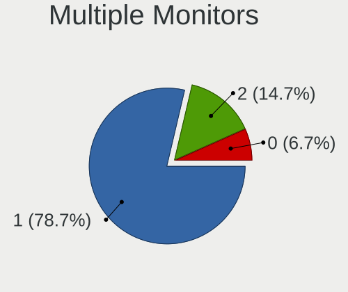

| Total | Computers | Percent |
|-------|-----------|---------|
| 1     | 59        | 78.67%  |
| 2     | 11        | 14.67%  |
| 0     | 5         | 6.67%   |

Network
-------

Net Controller Vendor
---------------------

Controller vendors

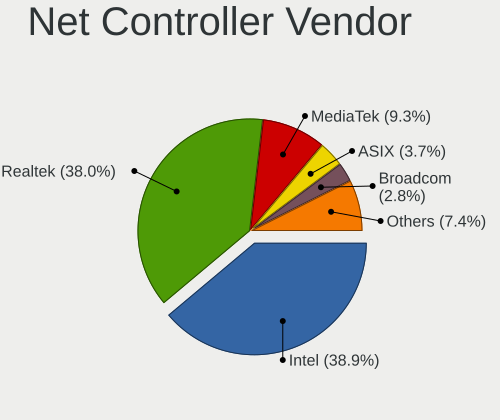

| Vendor                     | Computers | Percent |
|----------------------------|-----------|---------|
| Intel                      | 42        | 38.89%  |
| Realtek Semiconductor      | 41        | 37.96%  |
| MediaTek                   | 10        | 9.26%   |
| ASIX Electronics           | 4         | 3.7%    |
| Broadcom                   | 3         | 2.78%   |
| Huawei Technologies        | 2         | 1.85%   |
| Xiaomi                     | 1         | 0.93%   |
| SEGGER                     | 1         | 0.93%   |
| Quectel Wireless Solutions | 1         | 0.93%   |
| Qualcomm Atheros           | 1         | 0.93%   |
| QinHeng Electronics        | 1         | 0.93%   |
| ICS Advent                 | 1         | 0.93%   |

Net Controller Model
--------------------

Controller models

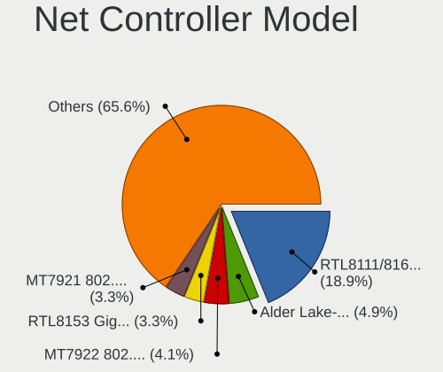

| Model                                                                  | Computers | Percent |
|------------------------------------------------------------------------|-----------|---------|
| Realtek RTL8111/8168/8211/8411 PCI Express Gigabit Ethernet Controller | 23        | 18.85%  |
| Intel Alder Lake-P PCH CNVi WiFi                                       | 6         | 4.92%   |
| MediaTek MT7922 802.11ax PCI Express Wireless Network Adapter          | 5         | 4.1%    |
| Realtek RTL8153 Gigabit Ethernet Adapter                               | 4         | 3.28%   |
| MediaTek MT7921 802.11ax PCIe Wireless Network Adapter [Filogic 330]   | 4         | 3.28%   |
| Intel Wi-Fi 6 AX200                                                    | 4         | 3.28%   |
| ASIX AX88179 Gigabit Ethernet                                          | 4         | 3.28%   |
| Intel Wireless 8260                                                    | 3         | 2.46%   |
| Intel Wi-Fi 6E(802.11ax) AX210/AX1675* 2x2 [Typhoon Peak]              | 3         | 2.46%   |
| Intel Raptor Lake PCH CNVi WiFi                                        | 3         | 2.46%   |
| Intel Comet Lake PCH-LP CNVi WiFi                                      | 3         | 2.46%   |
| Intel Cannon Lake PCH CNVi WiFi                                        | 3         | 2.46%   |
| Realtek RTL8852AE 802.11ax PCIe Wireless Network Adapter               | 2         | 1.64%   |
| Realtek RTL8822CE 802.11ac PCIe Wireless Network Adapter               | 2         | 1.64%   |
| Realtek RTL8152 Fast Ethernet Adapter                                  | 2         | 1.64%   |
| Realtek RTL8125 2.5GbE Controller                                      | 2         | 1.64%   |
| Realtek RTL810xE PCI Express Fast Ethernet controller                  | 2         | 1.64%   |
| Intel Wireless 8265 / 8275                                             | 2         | 1.64%   |
| Intel Wi-Fi 6 AX201                                                    | 2         | 1.64%   |
| Intel Ethernet Connection (11) I219-V                                  | 2         | 1.64%   |
| Huawei Network controller                                              | 2         | 1.64%   |
| Broadcom BCM43602 802.11ac Wireless LAN SoC                            | 2         | 1.64%   |
| Xiaomi Mi/Redmi series (RNDIS)                                         | 1         | 0.82%   |
| SEGGER J-Link_J-Link V9.3 Plus                                         | 1         | 0.82%   |
| Realtek USB 10/100/1G/2.5 LAN                                          | 1         | 0.82%   |
| Realtek RTL88x2bu [AC1200 Techkey]                                     | 1         | 0.82%   |
| Realtek RTL8852BE PCIe 802.11ax Wireless Network Controller            | 1         | 0.82%   |
| Realtek RTL8821CE 802.11ac PCIe Wireless Network Adapter               | 1         | 0.82%   |
| Realtek RTL8821AE 802.11ac PCIe Wireless Network Adapter               | 1         | 0.82%   |
| Realtek RTL8723DE Wireless Network Adapter                             | 1         | 0.82%   |
| Realtek RTL8188EUS 802.11n Wireless Network Adapter                    | 1         | 0.82%   |
| Realtek Killer E2600 GbE Controller                                    | 1         | 0.82%   |
| Quectel Wireless Solutions Quectel EM05-CE                             | 1         | 0.82%   |
| Qualcomm Atheros AR5212/5213/2414 Wireless Network Adapter             | 1         | 0.82%   |
| QinHeng USB Single Serial                                              | 1         | 0.82%   |
| MediaTek WiFi                                                          | 1         | 0.82%   |
| Intel Wireless 7260                                                    | 1         | 0.82%   |
| Intel Wi-Fi 5(802.11ac) Wireless-AC 9x6x [Thunder Peak]                | 1         | 0.82%   |
| Intel Tiger Lake PCH CNVi WiFi                                         | 1         | 0.82%   |
| Intel PRO/Wireless 5100 AGN [Shiloh] Network Connection                | 1         | 0.82%   |

Wireless Vendor
---------------

Wireless vendors

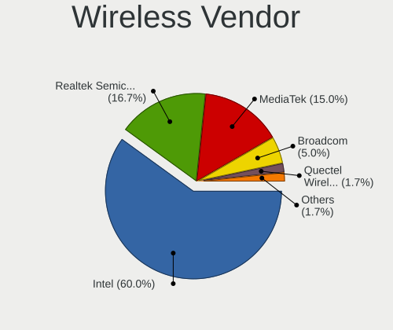

| Vendor                     | Computers | Percent |
|----------------------------|-----------|---------|
| Intel                      | 36        | 60%     |
| Realtek Semiconductor      | 10        | 16.67%  |
| MediaTek                   | 9         | 15%     |
| Broadcom                   | 3         | 5%      |
| Quectel Wireless Solutions | 1         | 1.67%   |
| Qualcomm Atheros           | 1         | 1.67%   |

Wireless Model
--------------

Wireless models

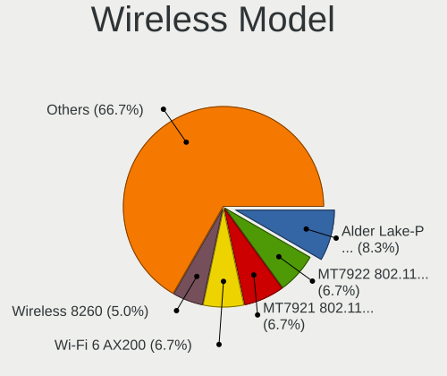

| Model                                                                | Computers | Percent |
|----------------------------------------------------------------------|-----------|---------|
| Intel Alder Lake-P PCH CNVi WiFi                                     | 5         | 8.33%   |
| MediaTek MT7922 802.11ax PCI Express Wireless Network Adapter        | 4         | 6.67%   |
| MediaTek MT7921 802.11ax PCIe Wireless Network Adapter [Filogic 330] | 4         | 6.67%   |
| Intel Wi-Fi 6 AX200                                                  | 4         | 6.67%   |
| Intel Wireless 8260                                                  | 3         | 5%      |
| Intel Wi-Fi 6E(802.11ax) AX210/AX1675* 2x2 [Typhoon Peak]            | 3         | 5%      |
| Intel Raptor Lake PCH CNVi WiFi                                      | 3         | 5%      |
| Intel Comet Lake PCH-LP CNVi WiFi                                    | 3         | 5%      |
| Intel Cannon Lake PCH CNVi WiFi                                      | 3         | 5%      |
| Realtek RTL8852AE 802.11ax PCIe Wireless Network Adapter             | 2         | 3.33%   |
| Realtek RTL8822CE 802.11ac PCIe Wireless Network Adapter             | 2         | 3.33%   |
| Intel Wireless 8265 / 8275                                           | 2         | 3.33%   |
| Intel Wi-Fi 6 AX201                                                  | 2         | 3.33%   |
| Broadcom BCM43602 802.11ac Wireless LAN SoC                          | 2         | 3.33%   |
| Realtek RTL88x2bu [AC1200 Techkey]                                   | 1         | 1.67%   |
| Realtek RTL8852BE PCIe 802.11ax Wireless Network Controller          | 1         | 1.67%   |
| Realtek RTL8821CE 802.11ac PCIe Wireless Network Adapter             | 1         | 1.67%   |
| Realtek RTL8821AE 802.11ac PCIe Wireless Network Adapter             | 1         | 1.67%   |
| Realtek RTL8723DE Wireless Network Adapter                           | 1         | 1.67%   |
| Realtek RTL8188EUS 802.11n Wireless Network Adapter                  | 1         | 1.67%   |
| Quectel Wireless Solutions Quectel EM05-CE                           | 1         | 1.67%   |
| Qualcomm Atheros AR5212/5213/2414 Wireless Network Adapter           | 1         | 1.67%   |
| MediaTek WiFi                                                        | 1         | 1.67%   |
| Intel Wireless 7260                                                  | 1         | 1.67%   |
| Intel Wi-Fi 5(802.11ac) Wireless-AC 9x6x [Thunder Peak]              | 1         | 1.67%   |
| Intel Tiger Lake PCH CNVi WiFi                                       | 1         | 1.67%   |
| Intel PRO/Wireless 5100 AGN [Shiloh] Network Connection              | 1         | 1.67%   |
| Intel Jasper Lake PCH CNVi WiFi                                      | 1         | 1.67%   |
| Intel Dual Band Wireless-AC 3168NGW [Stone Peak]                     | 1         | 1.67%   |
| Intel Centrino Wireless-N 1030 [Rainbow Peak]                        | 1         | 1.67%   |
| Intel 700 Series Chipset CNVi WiFi                                   | 1         | 1.67%   |
| Broadcom BCM43142 802.11b/g/n                                        | 1         | 1.67%   |

Ethernet Vendor
---------------

Ethernet vendors

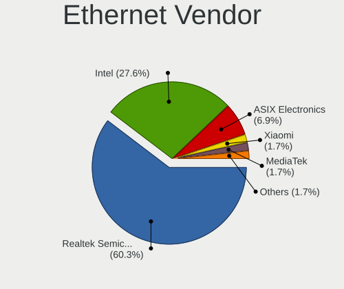

| Vendor                | Computers | Percent |
|-----------------------|-----------|---------|
| Realtek Semiconductor | 35        | 60.34%  |
| Intel                 | 16        | 27.59%  |
| ASIX Electronics      | 4         | 6.9%    |
| Xiaomi                | 1         | 1.72%   |
| MediaTek              | 1         | 1.72%   |
| ICS Advent            | 1         | 1.72%   |

Ethernet Model
--------------

Ethernet models

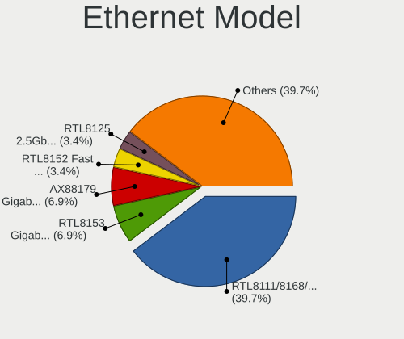

| Model                                                                  | Computers | Percent |
|------------------------------------------------------------------------|-----------|---------|
| Realtek RTL8111/8168/8211/8411 PCI Express Gigabit Ethernet Controller | 23        | 39.66%  |
| Realtek RTL8153 Gigabit Ethernet Adapter                               | 4         | 6.9%    |
| ASIX AX88179 Gigabit Ethernet                                          | 4         | 6.9%    |
| Realtek RTL8152 Fast Ethernet Adapter                                  | 2         | 3.45%   |
| Realtek RTL8125 2.5GbE Controller                                      | 2         | 3.45%   |
| Realtek RTL810xE PCI Express Fast Ethernet controller                  | 2         | 3.45%   |
| Intel Ethernet Connection (11) I219-V                                  | 2         | 3.45%   |
| Xiaomi Mi/Redmi series (RNDIS)                                         | 1         | 1.72%   |
| Realtek USB 10/100/1G/2.5 LAN                                          | 1         | 1.72%   |
| Realtek Killer E2600 GbE Controller                                    | 1         | 1.72%   |
| MediaTek MT7922 802.11ax PCI Express Wireless Network Adapter          | 1         | 1.72%   |
| Intel I350 Gigabit Network Connection                                  | 1         | 1.72%   |
| Intel I211 Gigabit Network Connection                                  | 1         | 1.72%   |
| Intel Ethernet Controller I226-V                                       | 1         | 1.72%   |
| Intel Ethernet Controller I225-V                                       | 1         | 1.72%   |
| Intel Ethernet Connection I217-V                                       | 1         | 1.72%   |
| Intel Ethernet Connection (7) I219-V                                   | 1         | 1.72%   |
| Intel Ethernet Connection (4) I219-LM                                  | 1         | 1.72%   |
| Intel Ethernet Connection (23) I219-LM                                 | 1         | 1.72%   |
| Intel Ethernet Connection (2) I219-LM                                  | 1         | 1.72%   |
| Intel Ethernet Connection (16) I219-V                                  | 1         | 1.72%   |
| Intel Ethernet Connection (13) I219-V                                  | 1         | 1.72%   |
| Intel Ethernet Connection (10) I219-V                                  | 1         | 1.72%   |
| Intel Alder Lake-P PCH CNVi WiFi                                       | 1         | 1.72%   |
| Intel 82567LM Gigabit Network Connection                               | 1         | 1.72%   |
| ICS Advent 10/100M LAN                                                 | 1         | 1.72%   |

Net Controller Kind
-------------------

Ethernet, WiFi or modem

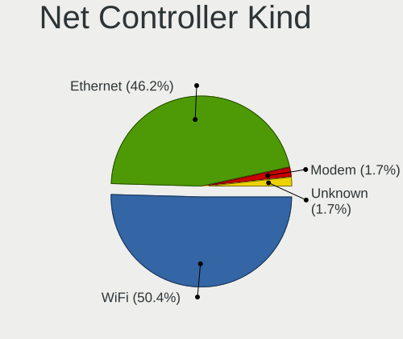

| Kind     | Computers | Percent |
|----------|-----------|---------|
| WiFi     | 59        | 50.43%  |
| Ethernet | 54        | 46.15%  |
| Modem    | 2         | 1.71%   |
| Unknown  | 2         | 1.71%   |

Used Controller
---------------

Currently used network controller

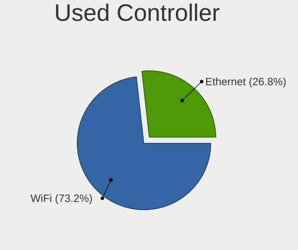

| Kind     | Computers | Percent |
|----------|-----------|---------|
| WiFi     | 52        | 73.24%  |
| Ethernet | 19        | 26.76%  |

NICs
----

Total network controllers on board

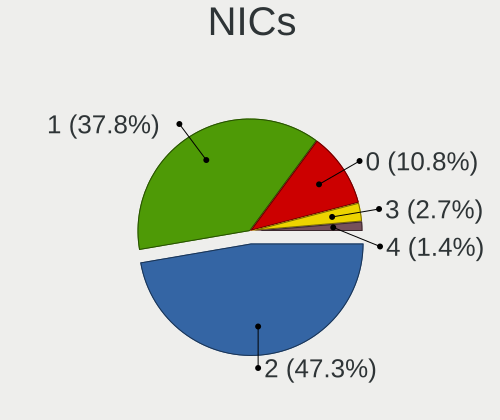

| Total | Computers | Percent |
|-------|-----------|---------|
| 2     | 35        | 47.3%   |
| 1     | 28        | 37.84%  |
| 0     | 8         | 10.81%  |
| 3     | 2         | 2.7%    |
| 4     | 1         | 1.35%   |

IPv6
----

IPv6 vs IPv4

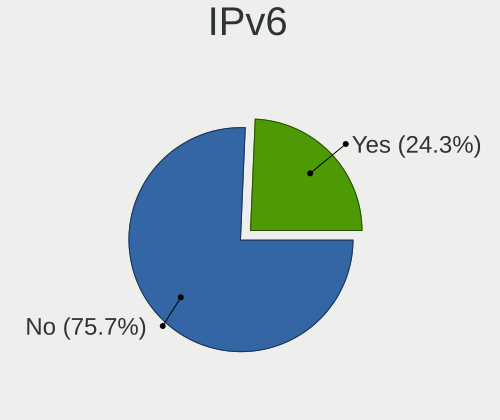

| Used | Computers | Percent |
|------|-----------|---------|
| No   | 56        | 75.68%  |
| Yes  | 18        | 24.32%  |

Bluetooth
---------

Bluetooth Vendor
----------------

Controller vendors

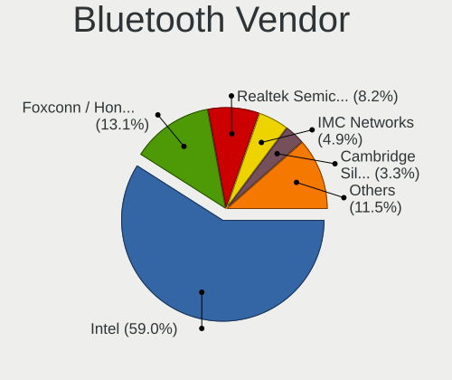

| Vendor                          | Computers | Percent |
|---------------------------------|-----------|---------|
| Intel                           | 36        | 59.02%  |
| Foxconn / Hon Hai               | 8         | 13.11%  |
| Realtek Semiconductor           | 5         | 8.2%    |
| IMC Networks                    | 3         | 4.92%   |
| Cambridge Silicon Radio         | 2         | 3.28%   |
| Apple                           | 2         | 3.28%   |
| Realtek                         | 1         | 1.64%   |
| Qualcomm Atheros Communications | 1         | 1.64%   |
| MediaTek                        | 1         | 1.64%   |
| Foxconn International           | 1         | 1.64%   |
| Broadcom                        | 1         | 1.64%   |

Bluetooth Model
---------------

Controller models

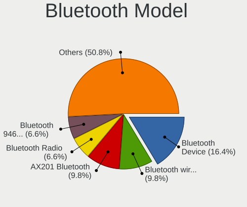

| Model                                               | Computers | Percent |
|-----------------------------------------------------|-----------|---------|
| Intel Bluetooth Device                              | 10        | 16.39%  |
| Intel Bluetooth wireless interface                  | 6         | 9.84%   |
| Intel AX201 Bluetooth                               | 6         | 9.84%   |
| Realtek Bluetooth Radio                             | 4         | 6.56%   |
| Intel Bluetooth 9460/9560 Jefferson Peak (JfP)      | 4         | 6.56%   |
| Intel AX200 Bluetooth                               | 4         | 6.56%   |
| Foxconn / Hon Hai Wireless_Device                   | 4         | 6.56%   |
| Foxconn / Hon Hai MediaTek Bluetooth Adapter        | 4         | 6.56%   |
| Intel AX210 Bluetooth                               | 3         | 4.92%   |
| IMC Networks Bluetooth Radio                        | 2         | 3.28%   |
| Cambridge Silicon Radio Bluetooth Dongle (HCI mode) | 2         | 3.28%   |
| Realtek 802.11n WLAN Adapter                        | 1         | 1.64%   |
| Realtek Bluetooth Radio                             | 1         | 1.64%   |
| Qualcomm Atheros  Bluetooth Device                  | 1         | 1.64%   |
| MediaTek Wireless_Device                            | 1         | 1.64%   |
| Intel Wireless-AC 9260 Bluetooth Adapter            | 1         | 1.64%   |
| Intel Wireless-AC 3168 Bluetooth                    | 1         | 1.64%   |
| Intel Centrino Advanced-N 6230 Bluetooth adapter    | 1         | 1.64%   |
| IMC Networks Wireless_Device                        | 1         | 1.64%   |
| Foxconn International BCM43142A0 Bluetooth module   | 1         | 1.64%   |
| Broadcom BCM2045B (BDC-2.1) [Bluetooth Controller]  | 1         | 1.64%   |
| Apple Bluetooth USB Host Controller                 | 1         | 1.64%   |
| Apple Bluetooth Host Controller                     | 1         | 1.64%   |

Sound
-----

Sound Vendor
------------

Sound card vendors

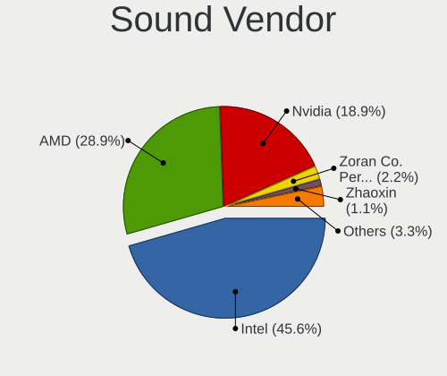

| Vendor                                       | Computers | Percent |
|----------------------------------------------|-----------|---------|
| Intel                                        | 41        | 45.56%  |
| AMD                                          | 26        | 28.89%  |
| Nvidia                                       | 17        | 18.89%  |
| Zoran Co. Personal Media Division (Nogatech) | 2         | 2.22%   |
| Zhaoxin                                      | 1         | 1.11%   |
| TTGK Technology                              | 1         | 1.11%   |
| HECATE G4 S PRO                              | 1         | 1.11%   |
| ASUSTek Computer                             | 1         | 1.11%   |

Sound Model
-----------

Sound card models

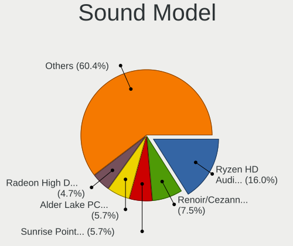

| Model                                                                                     | Computers | Percent |
|-------------------------------------------------------------------------------------------|-----------|---------|
| AMD Ryzen HD Audio Controller                                                             | 17        | 16.04%  |
| AMD Renoir/Cezanne HDMI/DP Audio Controller                                               | 8         | 7.55%   |
| Intel Sunrise Point-LP HD Audio                                                           | 6         | 5.66%   |
| Intel Alder Lake PCH-P High Definition Audio Controller                                   | 6         | 5.66%   |
| AMD Radeon High Definition Audio Controller                                               | 5         | 4.72%   |
| Nvidia GA106 High Definition Audio Controller                                             | 4         | 3.77%   |
| Intel Cannon Lake PCH cAVS                                                                | 4         | 3.77%   |
| AMD Caicos HDMI Audio [Radeon HD 6450 / 7450/8450/8490 OEM / R5 230/235/235X OEM]         | 4         | 3.77%   |
| Nvidia AD107 High Definition Audio Controller                                             | 3         | 2.83%   |
| Intel Tiger Lake-H HD Audio Controller                                                    | 3         | 2.83%   |
| Intel Raptor Lake-P/U/H cAVS                                                              | 3         | 2.83%   |
| Intel Comet Lake PCH-LP cAVS                                                              | 3         | 2.83%   |
| AMD Baffin HDMI/DP Audio [Radeon RX 550 640SP / RX 560/560X]                              | 3         | 2.83%   |
| Zoran Co. Personal Media Division (Nogatech) USB Audio and HID                            | 2         | 1.89%   |
| Nvidia TU107 GeForce GTX 1650 High Definition Audio Controller                            | 2         | 1.89%   |
| Nvidia GP107GL High Definition Audio Controller                                           | 2         | 1.89%   |
| Nvidia GA102 High Definition Audio Controller                                             | 2         | 1.89%   |
| Intel Tiger Lake-LP Smart Sound Technology Audio Controller                               | 2         | 1.89%   |
| Intel Comet Lake PCH cAVS                                                                 | 2         | 1.89%   |
| Intel 7 Series/C216 Chipset Family High Definition Audio Controller                       | 2         | 1.89%   |
| Zhaoxin ZX-E High Definition Audio Controller                                             | 1         | 0.94%   |
| Zhaoxin ZX-100/KX-5000/KX-6000/KX-6000G/KH-40000/KX-7000 High Definition Audio Controller | 1         | 0.94%   |
| TTGK Technology Audio                                                                     | 1         | 0.94%   |
| Nvidia GP106 High Definition Audio Controller                                             | 1         | 0.94%   |
| Nvidia GK208 HDMI/DP Audio Controller                                                     | 1         | 0.94%   |
| Nvidia GB202 High Definition Audio Controller                                             | 1         | 0.94%   |
| Nvidia GA107 High Definition Audio Controller                                             | 1         | 0.94%   |
| Intel Xeon E3-1200 v3/4th Gen Core Processor HD Audio Controller                          | 1         | 0.94%   |
| Intel Wildcat Point-LP High Definition Audio Controller                                   | 1         | 0.94%   |
| Intel Raptor Lake High Definition Audio Controller                                        | 1         | 0.94%   |
| Intel Jasper Lake HD Audio                                                                | 1         | 0.94%   |
| Intel Haswell-ULT HD Audio Controller                                                     | 1         | 0.94%   |
| Intel Broadwell-U Audio Controller                                                        | 1         | 0.94%   |
| Intel 9 Series Chipset Family HD Audio Controller                                         | 1         | 0.94%   |
| Intel 82801I (ICH9 Family) HD Audio Controller                                            | 1         | 0.94%   |
| Intel 8 Series/C220 Series Chipset High Definition Audio Controller                       | 1         | 0.94%   |
| Intel 8 Series HD Audio Controller                                                        | 1         | 0.94%   |
| Intel 6 Series/C200 Series Chipset Family High Definition Audio Controller                | 1         | 0.94%   |
| Intel 200 Series PCH HD Audio                                                             | 1         | 0.94%   |
| Intel 100 Series/C230 Series Chipset Family HD Audio Controller                           | 1         | 0.94%   |

Memory
------

Memory Vendor
-------------

Memory module vendors

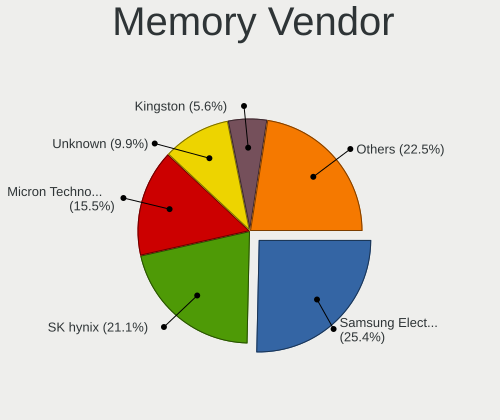

| Vendor              | Computers | Percent |
|---------------------|-----------|---------|
| Samsung Electronics | 18        | 25.35%  |
| SK hynix            | 15        | 21.13%  |
| Micron Technology   | 11        | 15.49%  |
| Unknown             | 7         | 9.86%   |
| Kingston            | 4         | 5.63%   |
| Crucial             | 4         | 5.63%   |
| Unilc               | 2         | 2.82%   |
| Elpida              | 2         | 2.82%   |
| A-DATA Technology   | 2         | 2.82%   |
| Unknown (08C8)      | 1         | 1.41%   |
| UniIC               | 1         | 1.41%   |
| Ramaxel Technology  | 1         | 1.41%   |
| Nanya Technology    | 1         | 1.41%   |
| Longsys             | 1         | 1.41%   |
| Asgard              | 1         | 1.41%   |

Memory Model
------------

Memory module models

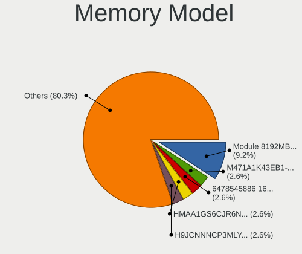

| Model                                                             | Computers | Percent |
|-------------------------------------------------------------------|-----------|---------|
| Unknown                                                           | 7         | 9.21%   |
| SK hynix RAM HMAA1GS6CJR6N-XN 8GB SODIMM DDR4 3200MT/s            | 2         | 2.63%   |
| SK hynix RAM H9JCNNNCP3MLYR-N6E 2GB Row Of Chips LPDDR5 6400MT/s  | 2         | 2.63%   |
| Samsung RAM M471A1K43EB1-CWE 8GB SODIMM DDR4 3200MT/s             | 2         | 2.63%   |
| Samsung RAM 6478545886 16384MB DIMM DDR4 2668MT/s                 | 2         | 2.63%   |
| Micron RAM Not Set 8GB DIMM DDR4 2668MT/s                         | 2         | 2.63%   |
| Unknown (08C8) RAM Lenovo DDR4 3200 8GB 8192MB DIMM DDR4 3200MT/s | 1         | 1.32%   |
| Unilc RAM SCA08GU04H1F1C-56B 8192MB DIMM DDR5 5600MT/s            | 1         | 1.32%   |
| UNILC RAM 6478545886 8192MB SODIMM DDR4 2400MT/s                  | 1         | 1.32%   |
| UniIC RAM SCC08GS03H1F1C-26V 8192MB SODIMM DDR4 2666MT/s          | 1         | 1.32%   |
| SK hynix RAM Module 4GB SODIMM DDR3 1867MT/s                      | 1         | 1.32%   |
| SK hynix RAM Module 4096MB SODIMM LPDDR3 1867MT/s                 | 1         | 1.32%   |
| SK hynix RAM HMT325S6EFR8C-PB 2048MB SODIMM DDR3 1600MT/s         | 1         | 1.32%   |
| SK hynix RAM HMT125S6TFR8C-G7 2048MB SODIMM DDR3 1067MT/s         | 1         | 1.32%   |
| SK hynix RAM HMAA4GS6AJR8N-XN 32GB SODIMM DDR4 3200MT/s           | 1         | 1.32%   |
| SK hynix RAM HMAA1GS6DMR6N-XN 8GB Row Of Chips DDR4 3200MT/s      | 1         | 1.32%   |
| SK hynix RAM HMAA1GS6CJR6N-XN 8GB Row Of Chips DDR4 3200MT/s      | 1         | 1.32%   |
| SK hynix RAM HMA851S6AFR6N-UH 4GB SODIMM DDR4 2667MT/s            | 1         | 1.32%   |
| SK hynix RAM HMA81GU6DJR8N-XN 8GB DIMM DDR4 3200MT/s              | 1         | 1.32%   |
| SK hynix RAM HMA81GS6AFR8N-UH 8GB SODIMM DDR4 2667MT/s            | 1         | 1.32%   |
| SK hynix RAM H9HKNNNFBMBUDR 8192MB Row Of Chips LPDDR4 4266MT/s   | 1         | 1.32%   |
| SK hynix RAM H9HCNNNCPMMLXR-NEE 8GB Row Of Chips LPDDR4 4266MT/s  | 1         | 1.32%   |
| SK hynix RAM H9CCNNNCLGALAR-NVD 8GB Row Of Chips LPDDR3 2133MT/s  | 1         | 1.32%   |
| Samsung RAM Module 8192MB SODIMM DDR4 3200MT/s                    | 1         | 1.32%   |
| Samsung RAM Module 8192MB SODIMM DDR4 2667MT/s                    | 1         | 1.32%   |
| Samsung RAM Module 2GB SODIMM LPDDR3 1867MT/s                     | 1         | 1.32%   |
| Samsung RAM Module 2048MB SODIMM LPDDR3 1867MT/s                  | 1         | 1.32%   |
| Samsung RAM Module 16GB SODIMM DDR5 4800MT/s                      | 1         | 1.32%   |
| Samsung RAM M471A2K43BB1-CPB 16GB SODIMM DDR4 2133MT/s            | 1         | 1.32%   |
| Samsung RAM M471A2K43BB1-CPB 16GB Chip DDR4 2133MT/s              | 1         | 1.32%   |
| Samsung RAM M471A2G44AM0-CWE 16GB SODIMM DDR4 3200MT/s            | 1         | 1.32%   |
| Samsung RAM M471A1K43DB1-CTD 8GB SODIMM DDR4 2667MT/s             | 1         | 1.32%   |
| Samsung RAM M471A1G44BB0-CWE 8GB SODIMM DDR4 3200MT/s             | 1         | 1.32%   |
| Samsung RAM M471A1G44AB0-CTD 8GB SODIMM DDR4 2667MT/s             | 1         | 1.32%   |
| Samsung RAM M425R1GB4DB0-CWMOL 16GB SODIMM DDR5 5600MT/s          | 1         | 1.32%   |
| Samsung RAM M425R1GB4BB0-CQKOD 8GB SODIMM DDR5 4800MT/s           | 1         | 1.32%   |
| Samsung RAM K4UBE3D4AB-MGCL 2GB Row Of Chips LPDDR4 4267MT/s      | 1         | 1.32%   |
| Samsung RAM K4UBE3D4AA-MGCR 8GB SODIMM LPDDR4 4266MT/s            | 1         | 1.32%   |
| Samsung RAM K3UH7H70AM 8192MB Row Of Chips LPDDR4 4266MT/s        | 1         | 1.32%   |
| Samsung RAM K3LKBKB0BM-MGCP 4GB SODIMM LPDDR5 6400MT/s            | 1         | 1.32%   |

Memory Kind
-----------

Memory module kinds

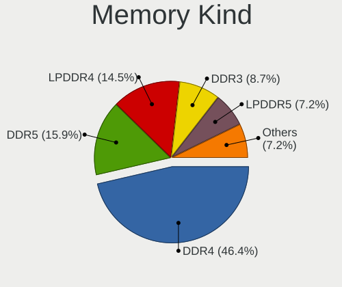

| Kind    | Computers | Percent |
|---------|-----------|---------|
| DDR4    | 32        | 46.38%  |
| DDR5    | 11        | 15.94%  |
| LPDDR4  | 10        | 14.49%  |
| DDR3    | 6         | 8.7%    |
| LPDDR5  | 5         | 7.25%   |
| LPDDR3  | 4         | 5.8%    |
| Unknown | 1         | 1.45%   |

Memory Form Factor
------------------

Physical design of the memory module

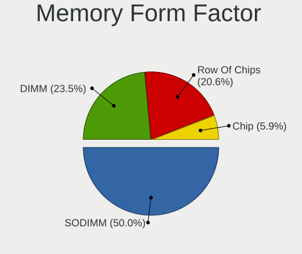

| Name         | Computers | Percent |
|--------------|-----------|---------|
| SODIMM       | 34        | 50%     |
| DIMM         | 16        | 23.53%  |
| Row Of Chips | 14        | 20.59%  |
| Chip         | 4         | 5.88%   |

Memory Size
-----------

Memory module size

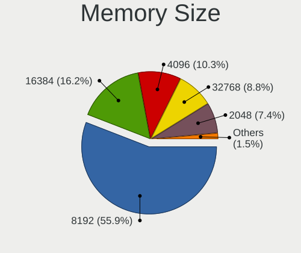

| Size  | Computers | Percent |
|-------|-----------|---------|
| 8192  | 38        | 55.88%  |
| 16384 | 11        | 16.18%  |
| 4096  | 7         | 10.29%  |
| 32768 | 6         | 8.82%   |
| 2048  | 5         | 7.35%   |
| 24576 | 1         | 1.47%   |

Memory Speed
------------

Memory module speed

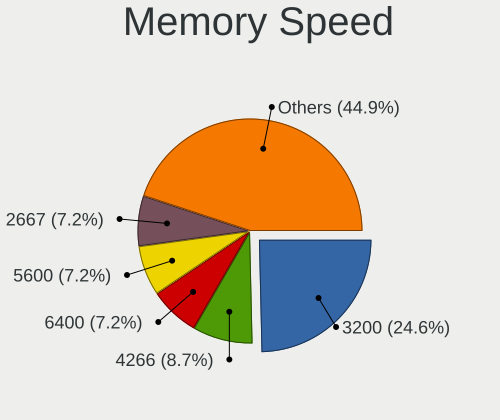

| Speed | Computers | Percent |
|-------|-----------|---------|
| 3200  | 17        | 24.64%  |
| 4266  | 6         | 8.7%    |
| 6400  | 5         | 7.25%   |
| 5600  | 5         | 7.25%   |
| 2667  | 5         | 7.25%   |
| 4800  | 4         | 5.8%    |
| 2668  | 4         | 5.8%    |
| 1600  | 4         | 5.8%    |
| 2133  | 3         | 4.35%   |
| 1867  | 3         | 4.35%   |
| 4267  | 2         | 2.9%    |
| 3600  | 2         | 2.9%    |
| 2666  | 2         | 2.9%    |
| 1067  | 2         | 2.9%    |
| 6000  | 1         | 1.45%   |
| 5200  | 1         | 1.45%   |
| 3733  | 1         | 1.45%   |
| 2400  | 1         | 1.45%   |
| 1066  | 1         | 1.45%   |

Printers & scanners
-------------------

Printer Vendor
--------------

Printer device vendors

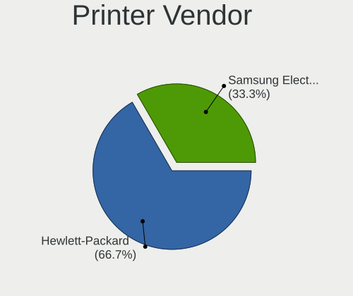

| Vendor              | Computers | Percent |
|---------------------|-----------|---------|
| Hewlett-Packard     | 2         | 66.67%  |
| Samsung Electronics | 1         | 33.33%  |

Printer Model
-------------

Printer device models

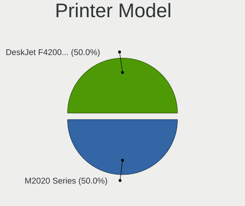

| Model                   | Computers | Percent |
|-------------------------|-----------|---------|
| Samsung M2020 Series    | 1         | 33.33%  |
| HP Laser NS 1020        | 1         | 33.33%  |
| HP DeskJet F4200 series | 1         | 33.33%  |

Scanner Vendor
--------------

Scanner device vendors

Zero info for selected period =(

Scanner Model
-------------

Scanner device models

Zero info for selected period =(

Camera
------

Camera Vendor
-------------

Camera device vendors

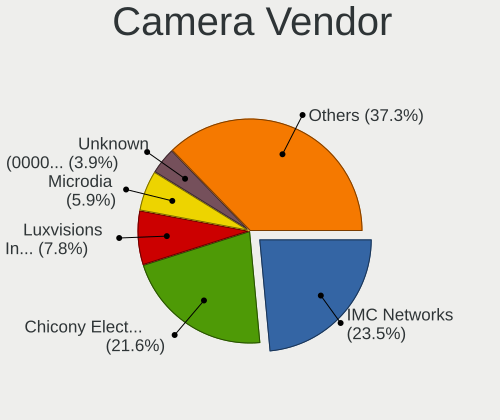

| Vendor                                 | Computers | Percent |
|----------------------------------------|-----------|---------|
| IMC Networks                           | 12        | 23.53%  |
| Chicony Electronics                    | 11        | 21.57%  |
| Luxvisions Innotech Limited            | 4         | 7.84%   |
| Microdia                               | 3         | 5.88%   |
| Unknown (0000066029)                   | 2         | 3.92%   |
| Syntek                                 | 2         | 3.92%   |
| SunplusIT                              | 2         | 3.92%   |
| Sonix Technology                       | 2         | 3.92%   |
| Quanta                                 | 2         | 3.92%   |
| Cheng Uei Precision Industry (Foxlink) | 2         | 3.92%   |
| Bison Electronics                      | 2         | 3.92%   |
| Sunplus Innovation Technology          | 1         | 1.96%   |
| ShineTech                              | 1         | 1.96%   |
| Ricoh                                  | 1         | 1.96%   |
| Realtek Semiconductor                  | 1         | 1.96%   |
| Lenovo                                 | 1         | 1.96%   |
| Genesys Logic                          | 1         | 1.96%   |
| Apple                                  | 1         | 1.96%   |

Camera Model
------------

Camera device models

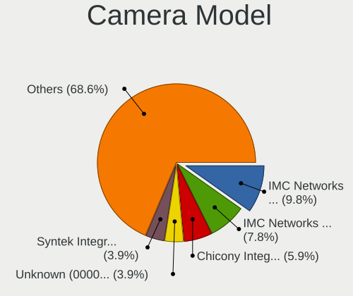

| Model                                               | Computers | Percent |
|-----------------------------------------------------|-----------|---------|
| IMC Networks USB2.0 HD UVC WebCam                   | 5         | 9.8%    |
| IMC Networks Integrated Camera                      | 4         | 7.84%   |
| Chicony Integrated Camera                           | 3         | 5.88%   |
| Unknown (0000066029) HD Camera                      | 2         | 3.92%   |
| Syntek Integrated Camera                            | 2         | 3.92%   |
| Sonix USB2.0 FHD UVC WebCam                         | 2         | 3.92%   |
| Luxvisions Innotech Limited Integrated Camera       | 2         | 3.92%   |
| Chicony HP HD Camera                                | 2         | 3.92%   |
| Bison Integrated Camera                             | 2         | 3.92%   |
| SunplusIT XiaoMi Webcam                             | 1         | 1.96%   |
| SunplusIT SPCA2650 AV Camera                        | 1         | 1.96%   |
| Sunplus Full HD webcam                              | 1         | 1.96%   |
| ShineTech HD Camera                                 | 1         | 1.96%   |
| Ricoh Integrated Camera                             | 1         | 1.96%   |
| Realtek Integrated_Webcam_HD                        | 1         | 1.96%   |
| Quanta ov9734_techfront_camera                      | 1         | 1.96%   |
| Quanta HD User Facing                               | 1         | 1.96%   |
| Microdia USB2.0 Camera                              | 1         | 1.96%   |
| Microdia Laptop_Integrated_Webcam_HD                | 1         | 1.96%   |
| Microdia Integrated_Webcam_HD                       | 1         | 1.96%   |
| Luxvisions Innotech Limited Integrated RGB Camera   | 1         | 1.96%   |
| Luxvisions Innotech Limited HP TrueVision HD Camera | 1         | 1.96%   |
| Lenovo Integrated Webcam                            | 1         | 1.96%   |
| IMC Networks XHC Camera                             | 1         | 1.96%   |
| IMC Networks Integrated RGB Camera                  | 1         | 1.96%   |
| IMC Networks HD Camera                              | 1         | 1.96%   |
| Genesys Logic HD camera                             | 1         | 1.96%   |
| Chicony XiaoMi USB 2.0 Webcam                       | 1         | 1.96%   |
| Chicony USB2.0 HD UVC WebCam                        | 1         | 1.96%   |
| Chicony USB2.0 FHD UVC WebCam                       | 1         | 1.96%   |
| Chicony Integrated Camera (1280x720@30)             | 1         | 1.96%   |
| Chicony HD Webcam                                   | 1         | 1.96%   |
| Chicony EasyCamera                                  | 1         | 1.96%   |
| Cheng Uei Precision Industry (Foxlink) HP HD Camera | 1         | 1.96%   |
| Cheng Uei Precision Industry (Foxlink) HD Camera    | 1         | 1.96%   |
| Apple iPhone 5/5C/5S/6/SE/7/8/X                     | 1         | 1.96%   |

Security
--------

Fingerprint Vendor
------------------

Fingerprint sensor vendors

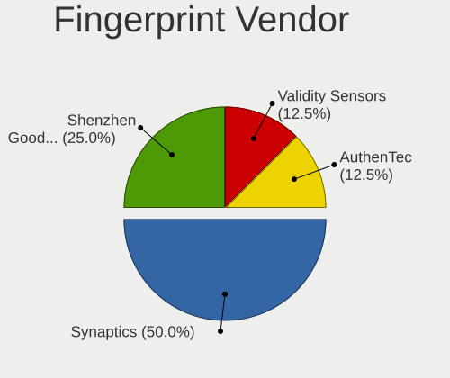

| Vendor                     | Computers | Percent |
|----------------------------|-----------|---------|
| Synaptics                  | 7         | 53.85%  |
| Validity Sensors           | 3         | 23.08%  |
| Shenzhen Goodix Technology | 2         | 15.38%  |
| AuthenTec                  | 1         | 7.69%   |

Fingerprint Model
-----------------

Fingerprint sensor models

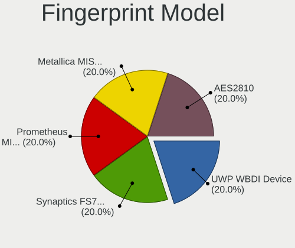

| Model                                                     | Computers | Percent |
|-----------------------------------------------------------|-----------|---------|
| Synaptics Prometheus MIS Touch Fingerprint Reader         | 3         | 23.08%  |
| Shenzhen Goodix  Fingerprint Device                       | 2         | 15.38%  |
| Validity Sensors VFS7500 Touch Fingerprint Sensor         | 1         | 7.69%   |
| Validity Sensors VFS5011 Fingerprint Reader               | 1         | 7.69%   |
| Validity Sensors VFS 5011 fingerprint sensor              | 1         | 7.69%   |
| Synaptics UWP WBDI Device                                 | 1         | 7.69%   |
| Synaptics  FS7604 Touch Fingerprint Sensor with PurePrint | 1         | 7.69%   |
| Synaptics Prometheus Fingerprint Reader                   | 1         | 7.69%   |
| Synaptics Metallica MIS Touch Fingerprint Reader          | 1         | 7.69%   |
| AuthenTec AES2810                                         | 1         | 7.69%   |

Chipcard Vendor
---------------

Chipcard module vendors

Zero info for selected period =(

Chipcard Model
--------------

Chipcard module models

Zero info for selected period =(

Unsupported
-----------

Unsupported Devices
-------------------

Total unsupported devices on board

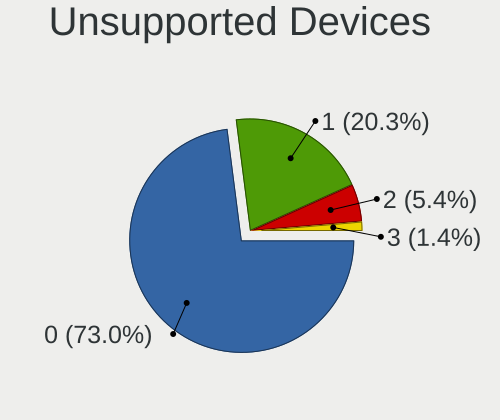

| Total | Computers | Percent |
|-------|-----------|---------|
| 0     | 54        | 72.97%  |
| 1     | 15        | 20.27%  |
| 2     | 4         | 5.41%   |
| 3     | 1         | 1.35%   |

Unsupported Device Types
------------------------

Types of unsupported devices

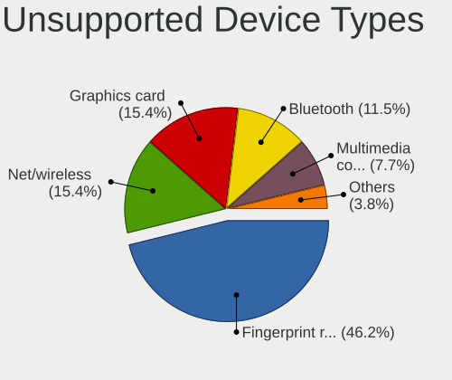

| Type                  | Computers | Percent |
|-----------------------|-----------|---------|
| Fingerprint reader    | 12        | 46.15%  |
| Net/wireless          | 4         | 15.38%  |
| Graphics card         | 4         | 15.38%  |
| Bluetooth             | 3         | 11.54%  |
| Multimedia controller | 2         | 7.69%   |
| Camera                | 1         | 3.85%   |

