Kylin - Tested Hardware & Statistics
------------------------------------

A project to collect tested hardware configurations for Kylin.

Anyone can contribute to this report by the [hw-probe](https://github.com/linuxhw/hw-probe) tool:

    sudo -E hw-probe -all -upload

Please contribute! Especially if your hardware is rare.

This is a report for all computer types. See also reports for [desktops](/Dist/Kylin/Desktop/README.md) and [notebooks](/Dist/Kylin/Notebook/README.md).

Contents
--------

* [ Test Cases ](#test-cases)

* [ System ](#system)
  - [ OS                       ](#os)
  - [ OS Family                ](#os-family)
  - [ Kernel                   ](#kernel)
  - [ Kernel Family            ](#kernel-family)
  - [ Kernel Major Ver.        ](#kernel-major-ver)
  - [ Arch                     ](#arch)
  - [ DE                       ](#de)
  - [ Display Server           ](#display-server)
  - [ Display Manager          ](#display-manager)
  - [ OS Lang                  ](#os-lang)
  - [ Boot Mode                ](#boot-mode)
  - [ Filesystem               ](#filesystem)
  - [ Part. scheme             ](#part-scheme)
  - [ Dual Boot with Linux/BSD ](#dual-boot-with-linuxbsd)
  - [ Dual Boot (Win)          ](#dual-boot-win)

* [ Board ](#board)
  - [ Vendor                   ](#vendor)
  - [ Model                    ](#model)
  - [ Model Family             ](#model-family)
  - [ MFG Year                 ](#mfg-year)
  - [ Form Factor              ](#form-factor)
  - [ Secure Boot              ](#secure-boot)
  - [ Coreboot                 ](#coreboot)
  - [ RAM Size                 ](#ram-size)
  - [ RAM Used                 ](#ram-used)
  - [ Total Drives             ](#total-drives)
  - [ Has CD-ROM               ](#has-cd-rom)
  - [ Has Ethernet             ](#has-ethernet)
  - [ Has WiFi                 ](#has-wifi)
  - [ Has Bluetooth            ](#has-bluetooth)

* [ Location ](#location)
  - [ Country                  ](#country)
  - [ City                     ](#city)

* [ Drives ](#drives)
  - [ Drive Vendor             ](#drive-vendor)
  - [ Drive Model              ](#drive-model)
  - [ HDD Vendor               ](#hdd-vendor)
  - [ SSD Vendor               ](#ssd-vendor)
  - [ Drive Kind               ](#drive-kind)
  - [ Drive Connector          ](#drive-connector)
  - [ Drive Size               ](#drive-size)
  - [ Space Total              ](#space-total)
  - [ Space Used               ](#space-used)
  - [ Malfunc. Drives          ](#malfunc-drives)
  - [ Malfunc. Drive Vendor    ](#malfunc-drive-vendor)
  - [ Malfunc. HDD Vendor      ](#malfunc-hdd-vendor)
  - [ Malfunc. Drive Kind      ](#malfunc-drive-kind)
  - [ Failed Drives            ](#failed-drives)
  - [ Failed Drive Vendor      ](#failed-drive-vendor)
  - [ Drive Status             ](#drive-status)

* [ Storage controller ](#storage-controller)
  - [ Storage Vendor           ](#storage-vendor)
  - [ Storage Model            ](#storage-model)
  - [ Storage Kind             ](#storage-kind)

* [ Processor ](#processor)
  - [ CPU Vendor               ](#cpu-vendor)
  - [ CPU Model                ](#cpu-model)
  - [ CPU Model Family         ](#cpu-model-family)
  - [ CPU Cores                ](#cpu-cores)
  - [ CPU Sockets              ](#cpu-sockets)
  - [ CPU Threads              ](#cpu-threads)
  - [ CPU Op-Modes             ](#cpu-op-modes)
  - [ CPU Microcode            ](#cpu-microcode)
  - [ CPU Microarch            ](#cpu-microarch)

* [ Graphics ](#graphics)
  - [ GPU Vendor               ](#gpu-vendor)
  - [ GPU Model                ](#gpu-model)
  - [ GPU Combo                ](#gpu-combo)
  - [ GPU Driver               ](#gpu-driver)
  - [ GPU Memory               ](#gpu-memory)

* [ Monitor ](#monitor)
  - [ Monitor Vendor           ](#monitor-vendor)
  - [ Monitor Model            ](#monitor-model)
  - [ Monitor Resolution       ](#monitor-resolution)
  - [ Monitor Diagonal         ](#monitor-diagonal)
  - [ Monitor Width            ](#monitor-width)
  - [ Aspect Ratio             ](#aspect-ratio)
  - [ Monitor Area             ](#monitor-area)
  - [ Pixel Density            ](#pixel-density)
  - [ Multiple Monitors        ](#multiple-monitors)

* [ Network ](#network)
  - [ Net Controller Vendor    ](#net-controller-vendor)
  - [ Net Controller Model     ](#net-controller-model)
  - [ Wireless Vendor          ](#wireless-vendor)
  - [ Wireless Model           ](#wireless-model)
  - [ Ethernet Vendor          ](#ethernet-vendor)
  - [ Ethernet Model           ](#ethernet-model)
  - [ Net Controller Kind      ](#net-controller-kind)
  - [ Used Controller          ](#used-controller)
  - [ NICs                     ](#nics)
  - [ IPv6                     ](#ipv6)

* [ Bluetooth ](#bluetooth)
  - [ Bluetooth Vendor         ](#bluetooth-vendor)
  - [ Bluetooth Model          ](#bluetooth-model)

* [ Sound ](#sound)
  - [ Sound Vendor             ](#sound-vendor)
  - [ Sound Model              ](#sound-model)

* [ Memory ](#memory)
  - [ Memory Vendor            ](#memory-vendor)
  - [ Memory Model             ](#memory-model)
  - [ Memory Kind              ](#memory-kind)
  - [ Memory Form Factor       ](#memory-form-factor)
  - [ Memory Size              ](#memory-size)
  - [ Memory Speed             ](#memory-speed)

* [ Printers & scanners ](#printers--scanners)
  - [ Printer Vendor           ](#printer-vendor)
  - [ Printer Model            ](#printer-model)
  - [ Scanner Vendor           ](#scanner-vendor)
  - [ Scanner Model            ](#scanner-model)

* [ Camera ](#camera)
  - [ Camera Vendor            ](#camera-vendor)
  - [ Camera Model             ](#camera-model)

* [ Security ](#security)
  - [ Fingerprint Vendor       ](#fingerprint-vendor)
  - [ Fingerprint Model        ](#fingerprint-model)
  - [ Chipcard Vendor          ](#chipcard-vendor)
  - [ Chipcard Model           ](#chipcard-model)

* [ Unsupported ](#unsupported)
  - [ Unsupported Devices      ](#unsupported-devices)
  - [ Unsupported Device Types ](#unsupported-device-types)

Test Cases
----------

Total: 80

| Vendor        | Model                       | Form-Factor | Probe                                                      | Date         |
|---------------|-----------------------------|-------------|------------------------------------------------------------|--------------|
| Lenovo        | ThinkPad T14 Gen 4 21HD0... | Notebook    | [f38d8fa44e](https://linux-hardware.org/?probe=f38d8fa44e) | Nov 16, 2024 |
| AZW           | SER                         | Mini pc     | [80af405ca3](https://linux-hardware.org/?probe=80af405ca3) | Nov 01, 2024 |
| Lenovo        | ThinkPad X13 Gen 1 20UF0... | Notebook    | [c8cf89df2f](https://linux-hardware.org/?probe=c8cf89df2f) | Oct 19, 2024 |
| Lenovo        | ThinkPad T14 Gen 4 21HD0... | Notebook    | [201204cf6c](https://linux-hardware.org/?probe=201204cf6c) | Oct 06, 2024 |
| Timi          | Redmi G 2022                | Notebook    | [115c01ddd7](https://linux-hardware.org/?probe=115c01ddd7) | Sep 29, 2024 |
| Lenovo        | NOK                         | Desktop     | [869a19c237](https://linux-hardware.org/?probe=869a19c237) | Sep 27, 2024 |
| ASUSTek       | ROG Flow X16 GV601VI_GV6... | Convertible | [d444ddf345](https://linux-hardware.org/?probe=d444ddf345) | Sep 24, 2024 |
| Lenovo        | ThinkPad T14 Gen 4 21HD0... | Notebook    | [28057f9ed2](https://linux-hardware.org/?probe=28057f9ed2) | Sep 23, 2024 |
| Lenovo        | XiaoXinDuet IAU7 82TQ       | Tablet      | [f2b2ffbffe](https://linux-hardware.org/?probe=f2b2ffbffe) | Sep 22, 2024 |
| GreatWall     | \xe4\xb8\x96\xe6\x81\x92... | Soc         | [83f3a5dae1](https://linux-hardware.org/?probe=83f3a5dae1) | Sep 20, 2024 |
| Lenovo        | Legion R9000P ARX8 82WM     | Notebook    | [c16aaf7f55](https://linux-hardware.org/?probe=c16aaf7f55) | Sep 12, 2024 |
| HUAWEI        | W515 PGUV-WBY0              | Soc         | [bf1d53ab19](https://linux-hardware.org/?probe=bf1d53ab19) | Aug 30, 2024 |
| ASUSTek       | TUF Gaming FX505GE_FX86F... | Notebook    | [f8a5fac34e](https://linux-hardware.org/?probe=f8a5fac34e) | Aug 28, 2024 |
| ASUSTek       | TUF Gaming B560M-PLUS       | Desktop     | [668f599883](https://linux-hardware.org/?probe=668f599883) | Aug 14, 2024 |
| Lenovo        | ThinkPad T14 Gen 1 20UDA... | Notebook    | [2d97d245a2](https://linux-hardware.org/?probe=2d97d245a2) | Aug 10, 2024 |
| Alienware     | m15 R6                      | Notebook    | [12574a3dbf](https://linux-hardware.org/?probe=12574a3dbf) | Jul 21, 2024 |
| Lenovo        | ThinkPad T14 Gen 4 21HD0... | Notebook    | [d57f4d29a8](https://linux-hardware.org/?probe=d57f4d29a8) | Jul 18, 2024 |
| Lenovo        | ThinkPad T14 Gen 4 21HD0... | Notebook    | [0a947b6f0e](https://linux-hardware.org/?probe=0a947b6f0e) | Jul 17, 2024 |
| Lenovo        | ThinkPad Edge E531 68851... | Notebook    | [ccbb2df5c2](https://linux-hardware.org/?probe=ccbb2df5c2) | Jul 02, 2024 |
| Lenovo        | ThinkPad T460p 20FWA00PC... | Notebook    | [7e6b842321](https://linux-hardware.org/?probe=7e6b842321) | Jun 21, 2024 |
| Lenovo        | ThinkPad T460p 20FWA00PC... | Notebook    | [f214e8aea1](https://linux-hardware.org/?probe=f214e8aea1) | Jun 21, 2024 |
| ONDA          | B75E                        | Desktop     | [c42fc0c3e5](https://linux-hardware.org/?probe=c42fc0c3e5) | Jun 19, 2024 |
| Gigabyte      | B550M AORUS ELITE           | Desktop     | [d2f2894a0c](https://linux-hardware.org/?probe=d2f2894a0c) | Jun 14, 2024 |
| ASUSTek       | Zenbook UX3402VA_UX3402V... | Notebook    | [91141580f8](https://linux-hardware.org/?probe=91141580f8) | Jun 07, 2024 |
| ASUSTek       | ROG STRIX B760-I GAMING ... | Desktop     | [f2c3443779](https://linux-hardware.org/?probe=f2c3443779) | Jun 03, 2024 |
| HP            | ZBook Power 15.6 inch G9... | Notebook    | [2aef3e835d](https://linux-hardware.org/?probe=2aef3e835d) | Jun 01, 2024 |
| HASEE Comp... | GI5CN54                     | Notebook    | [c0c280376b](https://linux-hardware.org/?probe=c0c280376b) | May 22, 2024 |
| ASRock        | X570 Phantom Gaming-ITX/... | Desktop     | [26ccfc6d25](https://linux-hardware.org/?probe=26ccfc6d25) | May 18, 2024 |
| Lenovo        | ThinkPad T14 Gen 4 21HD0... | Notebook    | [85f843311f](https://linux-hardware.org/?probe=85f843311f) | May 18, 2024 |
| Timi          | TM1612                      | Notebook    | [b2a95327e3](https://linux-hardware.org/?probe=b2a95327e3) | May 17, 2024 |
| Lenovo        | Legion R9000P ARX8 82WM     | Notebook    | [5c9388af66](https://linux-hardware.org/?probe=5c9388af66) | May 10, 2024 |
| Lenovo        | ThinkPad T14 Gen 4 21HD0... | Notebook    | [db370ffb35](https://linux-hardware.org/?probe=db370ffb35) | May 05, 2024 |
| Acer          | Swift SFX14-41G             | Notebook    | [47966edb56](https://linux-hardware.org/?probe=47966edb56) | Apr 09, 2024 |
| Lenovo        | ThinkPad E14 Gen 2 20TAA... | Notebook    | [de970e3adc](https://linux-hardware.org/?probe=de970e3adc) | Mar 21, 2024 |
| HUAWEI        | W515 PGUV-WBY0              | Soc         | [b3d022d177](https://linux-hardware.org/?probe=b3d022d177) | Dec 19, 2023 |
| HUAWEI        | CREM-WXX9                   | Notebook    | [cf753bfc89](https://linux-hardware.org/?probe=cf753bfc89) | Dec 05, 2023 |
| ASUSTek       | PRIME H310M-F R2.0          | Desktop     | [4b4560a9ba](https://linux-hardware.org/?probe=4b4560a9ba) | Nov 20, 2023 |
| ASUSTek       | PRIME H310M-F R2.0          | Desktop     | [6ff3a21e4e](https://linux-hardware.org/?probe=6ff3a21e4e) | Nov 20, 2023 |
| Lenovo        | Yoga 14cACN 2021 82N7       | Convertible | [4f7bb0e30b](https://linux-hardware.org/?probe=4f7bb0e30b) | Nov 06, 2023 |
| ASUSTek       | ROG Flow X13 GV301RE_GV3... | Convertible | [6b3d70f496](https://linux-hardware.org/?probe=6b3d70f496) | Nov 01, 2023 |
| HUAWEI        | KLVDZ-WXX9                  | Notebook    | [d6486c4e50](https://linux-hardware.org/?probe=d6486c4e50) | Oct 27, 2023 |
| ASUSTek       | TUF Gaming FX505GT          | Notebook    | [a5fde2a0ed](https://linux-hardware.org/?probe=a5fde2a0ed) | Oct 24, 2023 |
| Dell          | Vostro 3350                 | Notebook    | [1034a53a9d](https://linux-hardware.org/?probe=1034a53a9d) | Sep 30, 2023 |
| GreatWall     | GW-001Y1B-FTF               | All in one  | [7a7a16fc50](https://linux-hardware.org/?probe=7a7a16fc50) | Sep 28, 2023 |
| Lenovo        | Legion R9000P2021H 82JQ     | Notebook    | [5168f99a06](https://linux-hardware.org/?probe=5168f99a06) | Sep 26, 2023 |
| GreatWall     | Unknown                     | Soc         | [9b283b5931](https://linux-hardware.org/?probe=9b283b5931) | Sep 18, 2023 |
| ASUSTek       | ROG Strix G713PV_G713PV     | Notebook    | [0d1c562190](https://linux-hardware.org/?probe=0d1c562190) | Sep 08, 2023 |
| Apple         | MacBookPro12,1              | Notebook    | [4a1def29d3](https://linux-hardware.org/?probe=4a1def29d3) | Aug 09, 2023 |
| ASUSTek       | UX31LA                      | Notebook    | [0695e3bb09](https://linux-hardware.org/?probe=0695e3bb09) | Aug 08, 2023 |
| HUAWEI        | QingYun L420 KLVV-W5821     | Notebook    | [e3227788f6](https://linux-hardware.org/?probe=e3227788f6) | Jul 08, 2023 |
| Lenovo        | ThinkBook 16 G5+ ARP 21J... | Notebook    | [211f5e5cf1](https://linux-hardware.org/?probe=211f5e5cf1) | Jul 02, 2023 |
| Lenovo        | ThinkPad X1 Extreme Gen ... | Notebook    | [80b6536a46](https://linux-hardware.org/?probe=80b6536a46) | Jun 28, 2023 |
| HUAWEI        | MACH-WX9                    | Notebook    | [016268562d](https://linux-hardware.org/?probe=016268562d) | Jun 21, 2023 |
| HUAWEI        | MACH-WX9                    | Notebook    | [25bc3b1533](https://linux-hardware.org/?probe=25bc3b1533) | Jun 21, 2023 |
| Dell          | Inspiron 5468               | Notebook    | [b16aeda09e](https://linux-hardware.org/?probe=b16aeda09e) | Jun 02, 2023 |
| Lenovo        | ThinkPad X200 74574AC       | Notebook    | [e770387a34](https://linux-hardware.org/?probe=e770387a34) | May 25, 2023 |
| ASUSTek       | VivoBook_ASUSLaptop K550... | Notebook    | [cacfc4dacd](https://linux-hardware.org/?probe=cacfc4dacd) | May 16, 2023 |
| HP            | ZHAN 99 Mobile Workstati... | Notebook    | [3dcc7ab043](https://linux-hardware.org/?probe=3dcc7ab043) | Apr 12, 2023 |
| Lenovo        | Legion Y9000P IAH7H 82RF    | Notebook    | [30d91acf27](https://linux-hardware.org/?probe=30d91acf27) | Mar 07, 2023 |
| Lenovo        | Legion Y9000P IAH7H 82RF    | Notebook    | [97925534c2](https://linux-hardware.org/?probe=97925534c2) | Mar 02, 2023 |
| Dell          | 0V7K5Y A00                  | Desktop     | [831a493e15](https://linux-hardware.org/?probe=831a493e15) | Feb 24, 2023 |
| Lenovo        | ThinkPad X1 Carbon Gen 1... | Notebook    | [cc10e54ab9](https://linux-hardware.org/?probe=cc10e54ab9) | Feb 20, 2023 |
| Lenovo        | XiaoXinPro 14ACH 2021 82... | Notebook    | [29326a6340](https://linux-hardware.org/?probe=29326a6340) | Feb 11, 2023 |
| Lenovo        | ThinkPad T480s 20L7A00HH... | Notebook    | [801c1bad94](https://linux-hardware.org/?probe=801c1bad94) | Jan 02, 2023 |
| Gigabyte      | Z97X-SLI-CF                 | Desktop     | [4e829bc252](https://linux-hardware.org/?probe=4e829bc252) | Dec 10, 2022 |
| THTF          | CR F860-T1                  | Notebook    | [9f0a52783f](https://linux-hardware.org/?probe=9f0a52783f) | Oct 27, 2022 |
| Phytium       | D2000                       | Server      | [e43b580add](https://linux-hardware.org/?probe=e43b580add) | Oct 18, 2022 |
| HUAWEI        | L410 KLVU-WDU0              | Notebook    | [00edb23106](https://linux-hardware.org/?probe=00edb23106) | Oct 07, 2022 |
| Phytium       | FT2000/4                    | Server      | [5f7f5d61af](https://linux-hardware.org/?probe=5f7f5d61af) | Oct 02, 2022 |
| Phytium       | FT2000/4                    | Server      | [c8aa4d1457](https://linux-hardware.org/?probe=c8aa4d1457) | Sep 30, 2022 |
| Phytium       | FT2000/4                    | Server      | [ff17710900](https://linux-hardware.org/?probe=ff17710900) | Sep 29, 2022 |
| GreatWall     | Unknown                     | Notebook    | [12ee24a7c7](https://linux-hardware.org/?probe=12ee24a7c7) | Sep 20, 2022 |
| HP            | Tablet 11-be0xxx            | Tablet      | [e3bcbaf593](https://linux-hardware.org/?probe=e3bcbaf593) | Apr 08, 2022 |
| Timi          | TM1612                      | Notebook    | [fe85c2d733](https://linux-hardware.org/?probe=fe85c2d733) | Feb 05, 2022 |
| HANWEI        | FT-208-COME-B               | Soc         | [d22caa9915](https://linux-hardware.org/?probe=d22caa9915) | Jan 23, 2022 |
| Phytium       | FT-2000/4 V0001             | Server      | [152a75acd0](https://linux-hardware.org/?probe=152a75acd0) | Jan 19, 2022 |
| Lenovo        | ThinkPad X13 Gen 1 20T2A... | Notebook    | [0c261084db](https://linux-hardware.org/?probe=0c261084db) | Oct 16, 2021 |
| HP            | EliteBook 840 G7 Noteboo... | Notebook    | [ebe2901cc8](https://linux-hardware.org/?probe=ebe2901cc8) | Apr 30, 2021 |
| Lenovo        | IdeaPad 710S-13ISK 80SW     | Notebook    | [55b2402c28](https://linux-hardware.org/?probe=55b2402c28) | Feb 25, 2021 |
| Lenovo        | IdeaPad 710S-13ISK 80SW     | Notebook    | [44013b0bb4](https://linux-hardware.org/?probe=44013b0bb4) | Feb 23, 2021 |

System
------

OS
--

Installed operating systems

| Name        | Computers | Percent |
|-------------|-----------|---------|
| Kylin V10   | 61        | 96.83%  |
| Kylin V10.1 | 2         | 3.17%   |

OS Family
---------

OS without a version

| Name  | Computers | Percent |
|-------|-----------|---------|
| Kylin | 63        | 100%    |

Kernel
------

Version of the Linux kernel

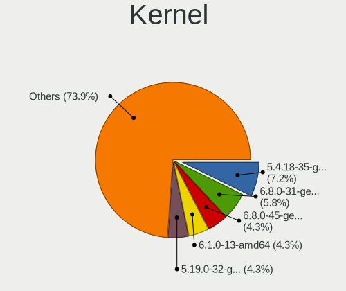

| Version               | Computers | Percent |
|-----------------------|-----------|---------|
| 5.4.18-35-generic     | 5         | 7.25%   |
| 6.8.0-31-generic      | 4         | 5.8%    |
| 6.8.0-45-generic      | 3         | 4.35%   |
| 6.1.0-13-amd64        | 3         | 4.35%   |
| 5.19.0-32-generic     | 3         | 4.35%   |
| 5.4.18-15-generic     | 2         | 2.9%    |
| 5.19.0-45-generic     | 2         | 2.9%    |
| 4.19.71-30-kr990      | 2         | 2.9%    |
| 6.9.9-rt-amd64        | 1         | 1.45%   |
| 6.8.0-47-generic      | 1         | 1.45%   |
| 6.8.0-40-generic      | 1         | 1.45%   |
| 6.8.0-38-generic      | 1         | 1.45%   |
| 6.8.0-35-generic      | 1         | 1.45%   |
| 6.7.12-rt-amd64       | 1         | 1.45%   |
| 6.7.10-060710-generic | 1         | 1.45%   |
| 6.6.9-amd64           | 1         | 1.45%   |
| 6.5.0-44-generic      | 1         | 1.45%   |
| 6.5.0-41-generic      | 1         | 1.45%   |
| 6.2.0-33-generic      | 1         | 1.45%   |
| 6.2.0-32-generic      | 1         | 1.45%   |
| 6.2.0-23-generic      | 1         | 1.45%   |
| 6.2.0-21-generic      | 1         | 1.45%   |
| 6.11-rt-amd64         | 1         | 1.45%   |
| 6.1.0-27-rt-amd64     | 1         | 1.45%   |
| 6.1.0-26-rt-amd64     | 1         | 1.45%   |
| 6.1.0-23-amd64        | 1         | 1.45%   |
| 6.1.0-21-rt-amd64     | 1         | 1.45%   |
| 6.1.0-21-amd64        | 1         | 1.45%   |
| 6.1.0-18-amd64        | 1         | 1.45%   |
| 5.4.96-7-kr9a0        | 1         | 1.45%   |
| 5.4.18-95-generic     | 1         | 1.45%   |
| 5.4.18-85-generic     | 1         | 1.45%   |
| 5.4.18-27-generic     | 1         | 1.45%   |
| 5.4.18-110-generic    | 1         | 1.45%   |
| 5.4.0-26-generic      | 1         | 1.45%   |
| 5.4.0-155-generic     | 1         | 1.45%   |
| 5.19.0-46-generic     | 1         | 1.45%   |
| 5.19.0-41-generic     | 1         | 1.45%   |
| 5.15.0-88-generic     | 1         | 1.45%   |
| 5.15.0-73-generic     | 1         | 1.45%   |

Kernel Family
-------------

Linux kernel without a distro release

| Version  | Computers | Percent |
|----------|-----------|---------|
| 6.8.0    | 11        | 16.18%  |
| 5.4.18   | 11        | 16.18%  |
| 6.1.0    | 8         | 11.76%  |
| 5.19.0   | 7         | 10.29%  |
| 5.15.0   | 6         | 8.82%   |
| 5.10.0   | 5         | 7.35%   |
| 6.2.0    | 4         | 5.88%   |
| 4.19.71  | 3         | 4.41%   |
| 6.5.0    | 2         | 2.94%   |
| 5.4.0    | 2         | 2.94%   |
| 6.9.9    | 1         | 1.47%   |
| 6.7.12   | 1         | 1.47%   |
| 6.7.10   | 1         | 1.47%   |
| 6.6.9    | 1         | 1.47%   |
| 6.11     | 1         | 1.47%   |
| 5.4.96   | 1         | 1.47%   |
| 5.10.46  | 1         | 1.47%   |
| 4.19.260 | 1         | 1.47%   |
| 4.19.237 | 1         | 1.47%   |

Kernel Major Ver.
-----------------

Linux kernel major version

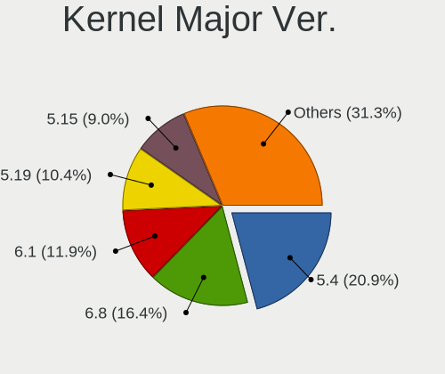

| Version | Computers | Percent |
|---------|-----------|---------|
| 5.4     | 14        | 20.9%   |
| 6.8     | 11        | 16.42%  |
| 6.1     | 8         | 11.94%  |
| 5.19    | 7         | 10.45%  |
| 5.15    | 6         | 8.96%   |
| 5.10    | 6         | 8.96%   |
| 6.2     | 4         | 5.97%   |
| 4.19    | 4         | 5.97%   |
| 6.7     | 2         | 2.99%   |
| 6.5     | 2         | 2.99%   |
| 6.9     | 1         | 1.49%   |
| 6.6     | 1         | 1.49%   |
| 6       | 1         | 1.49%   |

Arch
----

OS architecture (x86_64, i586, etc.)

| Name    | Computers | Percent |
|---------|-----------|---------|
| x86_64  | 51        | 80.95%  |
| aarch64 | 12        | 19.05%  |

DE
--

Desktop Environment

| Name            | Computers | Percent |
|-----------------|-----------|---------|
| GNOME           | 31        | 46.97%  |
| UKUI            | 18        | 27.27%  |
| XFCE            | 7         | 10.61%  |
| KDE5            | 4         | 6.06%   |
| X-Cinnamon      | 2         | 3.03%   |
| Unity           | 1         | 1.52%   |
| MATE            | 1         | 1.52%   |
| LXQt            | 1         | 1.52%   |
| GNOME Flashback | 1         | 1.52%   |

Display Server
--------------

X11 or Wayland

| Name    | Computers | Percent |
|---------|-----------|---------|
| X11     | 42        | 64.62%  |
| Wayland | 20        | 30.77%  |
| Tty     | 3         | 4.62%   |

Display Manager
---------------

SDDM, LightDM, etc.

| Name    | Computers | Percent |
|---------|-----------|---------|
| GDM3    | 29        | 45.31%  |
| LightDM | 27        | 42.19%  |
| SDDM    | 4         | 6.25%   |
| TDM     | 2         | 3.13%   |
| GDM     | 2         | 3.13%   |

OS Lang
-------

Language

| Lang  | Computers | Percent |
|-------|-----------|---------|
| zh_CN | 49        | 75.38%  |
| en_US | 10        | 15.38%  |
| C     | 3         | 4.62%   |
| en_HK | 1         | 1.54%   |
| en_GB | 1         | 1.54%   |
| en_CA | 1         | 1.54%   |

Boot Mode
---------

EFI or BIOS

| Mode | Computers | Percent |
|------|-----------|---------|
| EFI  | 57        | 90.48%  |
| BIOS | 6         | 9.52%   |

Filesystem
----------

Type of filesystem

| Type    | Computers | Percent |
|---------|-----------|---------|
| Ext4    | 55        | 87.3%   |
| Tmpfs   | 3         | 4.76%   |
| Overlay | 2         | 3.17%   |
| Zfs     | 1         | 1.59%   |
| Xfs     | 1         | 1.59%   |
| Unknown | 1         | 1.59%   |

Part. scheme
------------

Scheme of partitioning

| Type    | Computers | Percent |
|---------|-----------|---------|
| GPT     | 60        | 95.24%  |
| MBR     | 2         | 3.17%   |
| Unknown | 1         | 1.59%   |

Dual Boot with Linux/BSD
------------------------

Hosting more than one Linux/BSD

| Dual boot | Computers | Percent |
|-----------|-----------|---------|
| No        | 50        | 76.92%  |
| Yes       | 15        | 23.08%  |

Dual Boot (Win)
---------------

Hosting Linux and Windows

| Dual boot | Computers | Percent |
|-----------|-----------|---------|
| No        | 34        | 53.97%  |
| Yes       | 29        | 46.03%  |

Board
-----

Vendor
------

Motherboard manufacturer

| Name                | Computers | Percent |
|---------------------|-----------|---------|
| Lenovo              | 20        | 31.75%  |
| ASUSTek Computer    | 10        | 15.87%  |
| HUAWEI              | 7         | 11.11%  |
| Hewlett-Packard     | 4         | 6.35%   |
| GreatWall           | 4         | 6.35%   |
| Phytium             | 3         | 4.76%   |
| Dell                | 3         | 4.76%   |
| Timi                | 2         | 3.17%   |
| Gigabyte Technology | 2         | 3.17%   |
| THTF                | 1         | 1.59%   |
| ONDA                | 1         | 1.59%   |
| HASEE Computer      | 1         | 1.59%   |
| AZW                 | 1         | 1.59%   |
| ASRock              | 1         | 1.59%   |
| Apple               | 1         | 1.59%   |
| Alienware           | 1         | 1.59%   |
| Acer                | 1         | 1.59%   |

Model
-----

Motherboard model

| Name                                                                                                 | Computers | Percent |
|------------------------------------------------------------------------------------------------------|-----------|---------|
| Phytium FT2000/4                                                                                     | 2         | 3.17%   |
| Lenovo Legion R9000P ARX8 82WM                                                                       | 2         | 3.17%   |
| HUAWEI W515 PGUV-WBY0                                                                                | 2         | 3.17%   |
| Unknown                                                                                              | 2         | 3.17%   |
| Timi TM1612                                                                                          | 1         | 1.59%   |
| Timi Redmi G 2022                                                                                    | 1         | 1.59%   |
| THTF CR F860-T1                                                                                      | 1         | 1.59%   |
| Phytium FT-2000/4                                                                                    | 1         | 1.59%   |
| ONDA B75E                                                                                            | 1         | 1.59%   |
| Lenovo Yoga 14cACN 2021 82N7                                                                         | 1         | 1.59%   |
| Lenovo YangTianT4900v-00                                                                             | 1         | 1.59%   |
| Lenovo XiaoXinPro 14ACH 2021 82MS                                                                    | 1         | 1.59%   |
| Lenovo XiaoXinDuet IAU7 82TQ                                                                         | 1         | 1.59%   |
| Lenovo ThinkPad X200 74574AC                                                                         | 1         | 1.59%   |
| Lenovo ThinkPad X13 Gen 1 20UF000ACD                                                                 | 1         | 1.59%   |
| Lenovo ThinkPad X13 Gen 1 20T2A003CD                                                                 | 1         | 1.59%   |
| Lenovo ThinkPad X1 Extreme Gen 4i 20Y6S00400                                                         | 1         | 1.59%   |
| Lenovo ThinkPad X1 Carbon Gen 10 21CBA002CD                                                          | 1         | 1.59%   |
| Lenovo ThinkPad T480s 20L7A00HHK                                                                     | 1         | 1.59%   |
| Lenovo ThinkPad T460p 20FWA00PCD                                                                     | 1         | 1.59%   |
| Lenovo ThinkPad T14 Gen 4 21HD0078CD                                                                 | 1         | 1.59%   |
| Lenovo ThinkPad T14 Gen 1 20UDA00MCD                                                                 | 1         | 1.59%   |
| Lenovo ThinkPad E14 Gen 2 20TAA006CD                                                                 | 1         | 1.59%   |
| Lenovo ThinkBook 16 G5+ ARP 21J0                                                                     | 1         | 1.59%   |
| Lenovo Legion Y9000P IAH7H 82RF                                                                      | 1         | 1.59%   |
| Lenovo Legion R9000P2021H 82JQ                                                                       | 1         | 1.59%   |
| Lenovo IdeaPad 710S-13ISK 80SW                                                                       | 1         | 1.59%   |
| HUAWEI QingYun L420 KLVV-W5821                                                                       | 1         | 1.59%   |
| HUAWEI MACH-WX9                                                                                      | 1         | 1.59%   |
| HUAWEI L410 KLVU-WDU0                                                                                | 1         | 1.59%   |
| HUAWEI KLVDZ-WXX9                                                                                    | 1         | 1.59%   |
| HUAWEI CREM-WXX9                                                                                     | 1         | 1.59%   |
| HP ZHAN 99 Mobile Workstation G3                                                                     | 1         | 1.59%   |
| HP ZBook Power 15.6 inch G9 Mobile Workstation PC                                                    | 1         | 1.59%   |
| HP Tablet 11-be0xxx                                                                                  | 1         | 1.59%   |
| HP EliteBook 840 G7 Notebook PC                                                                      | 1         | 1.59%   |
| HASEE GI5CN54                                                                                        | 1         | 1.59%   |
| GreatWall \xe4\xb8\x96\xe6\x81\x92D80F3/GWMDDB1EL1T, BIOS \xe9\x95\xbf\xe5\x9f\x8eBIOS V3.0 08/01/20 | 1         | 1.59%   |
| GreatWall GW-XXXXXX-XXX                                                                              | 1         | 1.59%   |
| Gigabyte Z97X-SLI                                                                                    | 1         | 1.59%   |

Model Family
------------

Motherboard model prefix

| Name                                    | Computers | Percent |
|-----------------------------------------|-----------|---------|
| Lenovo ThinkPad                         | 10        | 15.87%  |
| Lenovo Legion                           | 4         | 6.35%   |
| ASUS TUF                                | 3         | 4.76%   |
| ASUS ROG                                | 3         | 4.76%   |
| Phytium FT2000                          | 2         | 3.17%   |
| HUAWEI W515                             | 2         | 3.17%   |
| Dell Vostro                             | 2         | 3.17%   |
| Unknown                                 | 2         | 3.17%   |
| Timi TM1612                             | 1         | 1.59%   |
| Timi Redmi                              | 1         | 1.59%   |
| THTF CR                                 | 1         | 1.59%   |
| Phytium FT-2000                         | 1         | 1.59%   |
| ONDA B75E                               | 1         | 1.59%   |
| Lenovo Yoga                             | 1         | 1.59%   |
| Lenovo YangTianT4900v-00                | 1         | 1.59%   |
| Lenovo XiaoXinPro                       | 1         | 1.59%   |
| Lenovo XiaoXinDuet                      | 1         | 1.59%   |
| Lenovo ThinkBook                        | 1         | 1.59%   |
| Lenovo IdeaPad                          | 1         | 1.59%   |
| HUAWEI QingYun                          | 1         | 1.59%   |
| HUAWEI MACH-WX9                         | 1         | 1.59%   |
| HUAWEI L410                             | 1         | 1.59%   |
| HUAWEI KLVDZ-WXX9                       | 1         | 1.59%   |
| HUAWEI CREM-WXX9                        | 1         | 1.59%   |
| HP ZHAN                                 | 1         | 1.59%   |
| HP ZBook                                | 1         | 1.59%   |
| HP Tablet                               | 1         | 1.59%   |
| HP EliteBook                            | 1         | 1.59%   |
| HASEE GI5CN54                           | 1         | 1.59%   |
| GreatWall \xe4\xb8\x96\xe6\x81\x92D80F3 | 1         | 1.59%   |
| GreatWall GW-XXXXXX-XXX                 | 1         | 1.59%   |
| Gigabyte Z97X-SLI                       | 1         | 1.59%   |
| Gigabyte B550M                          | 1         | 1.59%   |
| Dell Inspiron                           | 1         | 1.59%   |
| AZW SER                                 | 1         | 1.59%   |
| ASUS Zenbook                            | 1         | 1.59%   |
| ASUS VivoBook                           | 1         | 1.59%   |
| ASUS UX31LA                             | 1         | 1.59%   |
| ASUS PRIME                              | 1         | 1.59%   |
| ASRock X570                             | 1         | 1.59%   |

MFG Year
--------

Motherboard manufacture year

| Year    | Computers | Percent |
|---------|-----------|---------|
| 2021    | 15        | 23.81%  |
| 2022    | 12        | 19.05%  |
| 2020    | 8         | 12.7%   |
| 2023    | 5         | 7.94%   |
| 2016    | 4         | 6.35%   |
| 2014    | 4         | 6.35%   |
| 2019    | 3         | 4.76%   |
| 2018    | 3         | 4.76%   |
| Unknown | 3         | 4.76%   |
| 2024    | 2         | 3.17%   |
| 2015    | 1         | 1.59%   |
| 2012    | 1         | 1.59%   |
| 2011    | 1         | 1.59%   |
| 2008    | 1         | 1.59%   |

Form Factor
-----------

Physical design of the computer

| Name           | Computers | Percent |
|----------------|-----------|---------|
| Notebook       | 41        | 65.08%  |
| Desktop        | 9         | 14.29%  |
| System on chip | 4         | 6.35%   |
| Server         | 3         | 4.76%   |
| Tablet         | 2         | 3.17%   |
| Convertible    | 2         | 3.17%   |
| Mini pc        | 1         | 1.59%   |
| All in one     | 1         | 1.59%   |

Secure Boot
-----------

Enabled or disabled

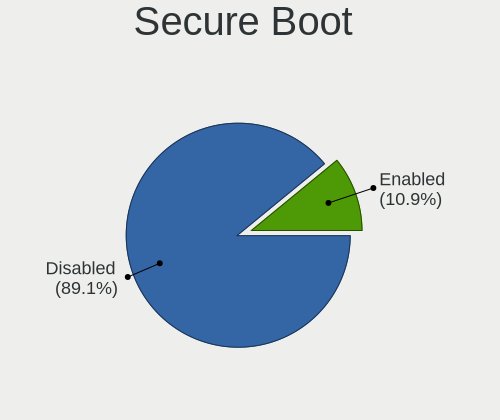

| State    | Computers | Percent |
|----------|-----------|---------|
| Disabled | 57        | 89.06%  |
| Enabled  | 7         | 10.94%  |

Coreboot
--------

Have coreboot on board

| Used | Computers | Percent |
|------|-----------|---------|
| No   | 63        | 100%    |

RAM Size
--------

Total RAM memory

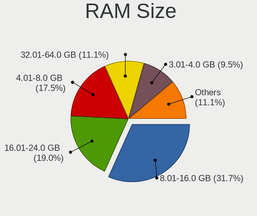

| Size in GB  | Computers | Percent |
|-------------|-----------|---------|
| 8.01-16.0   | 20        | 31.75%  |
| 16.01-24.0  | 12        | 19.05%  |
| 4.01-8.0    | 11        | 17.46%  |
| 32.01-64.0  | 7         | 11.11%  |
| 3.01-4.0    | 6         | 9.52%   |
| 64.01-256.0 | 4         | 6.35%   |
| 24.01-32.0  | 3         | 4.76%   |

RAM Used
--------

Used RAM memory

| Used GB    | Computers | Percent |
|------------|-----------|---------|
| 3.01-4.0   | 17        | 25%     |
| 2.01-3.0   | 17        | 25%     |
| 4.01-8.0   | 14        | 20.59%  |
| 1.01-2.0   | 13        | 19.12%  |
| 8.01-16.0  | 4         | 5.88%   |
| 0.51-1.0   | 2         | 2.94%   |
| 16.01-24.0 | 1         | 1.47%   |

Total Drives
------------

Number of drives on board

| Drives | Computers | Percent |
|--------|-----------|---------|
| 1      | 35        | 55.56%  |
| 2      | 19        | 30.16%  |
| 3      | 5         | 7.94%   |
| 4      | 2         | 3.17%   |
| 7      | 1         | 1.59%   |
| 5      | 1         | 1.59%   |

Has CD-ROM
----------

Has CD-ROM on board

| Presented | Computers | Percent |
|-----------|-----------|---------|
| No        | 56        | 88.89%  |
| Yes       | 7         | 11.11%  |

Has Ethernet
------------

Has Ethernet on board

| Presented | Computers | Percent |
|-----------|-----------|---------|
| Yes       | 45        | 71.43%  |
| No        | 18        | 28.57%  |

Has WiFi
--------

Has WiFi module

| Presented | Computers | Percent |
|-----------|-----------|---------|
| Yes       | 50        | 79.37%  |
| No        | 13        | 20.63%  |

Has Bluetooth
-------------

Has Bluetooth module

| Presented | Computers | Percent |
|-----------|-----------|---------|
| Yes       | 52        | 82.54%  |
| No        | 11        | 17.46%  |

Location
--------

Country
-------

Geographic location (country)

| Country   | Computers | Percent |
|-----------|-----------|---------|
| China     | 51        | 80.95%  |
| Hong Kong | 5         | 7.94%   |
| Japan     | 4         | 6.35%   |
| USA       | 1         | 1.59%   |
| Taiwan    | 1         | 1.59%   |
| Canada    | 1         | 1.59%   |

City
----

Geographic location (city)

| City        | Computers | Percent |
|-------------|-----------|---------|
| Shenzhen    | 5         | 7.81%   |
| Beijing     | 5         | 7.81%   |
| Shanghai    | 4         | 6.25%   |
| Guangzhou   | 4         | 6.25%   |
| Tokyo       | 3         | 4.69%   |
| Tianjin     | 3         | 4.69%   |
| Jinan       | 3         | 4.69%   |
| Zhangzhou   | 2         | 3.13%   |
| Xi'an       | 2         | 3.13%   |
| Mong Kok    | 2         | 3.13%   |
| Jinrongjie  | 2         | 3.13%   |
| Hefei       | 2         | 3.13%   |
| Haidian     | 2         | 3.13%   |
| Central     | 2         | 3.13%   |
| Zhongshan   | 1         | 1.56%   |
| Zhengzhou   | 1         | 1.56%   |
| Xuhui       | 1         | 1.56%   |
| Xiaolou     | 1         | 1.56%   |
| Wuhan       | 1         | 1.56%   |
| Wanchai     | 1         | 1.56%   |
| Taohua      | 1         | 1.56%   |
| Taizhou     | 1         | 1.56%   |
| Shizishan   | 1         | 1.56%   |
| Qinnan      | 1         | 1.56%   |
| Putuo       | 1         | 1.56%   |
| Osaka       | 1         | 1.56%   |
| Markham     | 1         | 1.56%   |
| Los Angeles | 1         | 1.56%   |
| Kunming     | 1         | 1.56%   |
| Harbin      | 1         | 1.56%   |
| Haikou      | 1         | 1.56%   |
| Foshan      | 1         | 1.56%   |
| Chengdu     | 1         | 1.56%   |
| Changzhou   | 1         | 1.56%   |
| Changsha    | 1         | 1.56%   |
| Chancheng   | 1         | 1.56%   |
| Banqiao     | 1         | 1.56%   |

Drives
------

Drive Vendor
------------

Hard drive vendors

| Vendor                | Computers | Drives | Percent |
|-----------------------|-----------|--------|---------|
| Samsung Electronics   | 19        | 25     | 20.88%  |
| WDC                   | 12        | 18     | 13.19%  |
| Toshiba               | 6         | 6      | 6.59%   |
| SanDisk               | 5         | 5      | 5.49%   |
| Seagate               | 4         | 4      | 4.4%    |
| Phison                | 4         | 4      | 4.4%    |
| Kingston              | 4         | 4      | 4.4%    |
| SK hynix              | 3         | 3      | 3.3%    |
| Micron Technology     | 3         | 3      | 3.3%    |
| Fanxiang              | 3         | 4      | 3.3%    |
| ZHITAI                | 2         | 2      | 2.2%    |
| Unknown               | 2         | 2      | 2.2%    |
| Lenovo                | 2         | 2      | 2.2%    |
| KIOXIA                | 2         | 6      | 2.2%    |
| Intel                 | 2         | 2      | 2.2%    |
| Hikvision             | 2         | 2      | 2.2%    |
| FORESEE               | 2         | 3      | 2.2%    |
| ZX1 1TB               | 1         | 1      | 1.1%    |
| Teclast               | 1         | 2      | 1.1%    |
| Realtek Semiconductor | 1         | 1      | 1.1%    |
| Pear 2TB              | 1         | 1      | 1.1%    |
| Kingchuxing           | 1         | 1      | 1.1%    |
| J.ZAO                 | 1         | 1      | 1.1%    |
| HISI                  | 1         | 4      | 1.1%    |
| Hewlett-Packard       | 1         | 1      | 1.1%    |
| Great Wa              | 1         | 1      | 1.1%    |
| FC-1307               | 1         | 1      | 1.1%    |
| China                 | 1         | 1      | 1.1%    |
| BIWIN                 | 1         | 1      | 1.1%    |
| Apple                 | 1         | 1      | 1.1%    |
| A-DATA Technology     | 1         | 1      | 1.1%    |

Drive Model
-----------

Hard drive models

| Model                                                | Computers | Percent |
|------------------------------------------------------|-----------|---------|
| Samsung NVMe SSD Controller SM981/PM981/PM983 512GB  | 3         | 3.16%   |
| WDC SDINFDO4-256G                                    | 2         | 2.11%   |
| Toshiba MQ01ABD100 1TB                               | 2         | 2.11%   |
| Seagate ST1000DM010-2EP102 1TB                       | 2         | 2.11%   |
| SanDisk NVMe SSD Drive 1TB                           | 2         | 2.11%   |
| Samsung NVMe SSD Controller PM9A1/PM9A3/980PRO 512GB | 2         | 2.11%   |
| Micron MTFDKBA512TFH 512GB                           | 2         | 2.11%   |
| Kingston SA400S37240G 240GB SSD                      | 2         | 2.11%   |
| FORESEE 64GB SSD                                     | 2         | 2.11%   |
| ZX1 1TB Disk 1TB                                     | 1         | 1.05%   |
| ZHITAI TiPlus7100 2TB                                | 1         | 1.05%   |
| ZHITAI TiPlus7100 1TB                                | 1         | 1.05%   |
| WDC WDS240G2G0A-00JH30 240GB SSD                     | 1         | 1.05%   |
| WDC WD20EJRX-89G3VY0 2TB                             | 1         | 1.05%   |
| WDC WD10EZEX-22MFCA0 1TB                             | 1         | 1.05%   |
| WDC PC SN730 SDBPNTY-512G-1101 512GB                 | 1         | 1.05%   |
| WDC PC SN730 SDBPNTY-512G-1027 512GB                 | 1         | 1.05%   |
| WDC PC SN730 SDBPNTY-512G                            | 1         | 1.05%   |
| WDC PC SN530 SDBPNPZ-512G-1114 512GB                 | 1         | 1.05%   |
| WDC PC SN530 SDBPNPZ-512G-1014 512GB                 | 1         | 1.05%   |
| WDC PC SN530 SDBPNPZ-256G                            | 1         | 1.05%   |
| WDC PC SN530 NVMe 512GB                              | 1         | 1.05%   |
| Unknown NVMe SSD Drive 512GB                         | 1         | 1.05%   |
| Unknown NVMe SSD Drive 256GB                         | 1         | 1.05%   |
| Toshiba MK3261GSYN 320GB                             | 1         | 1.05%   |
| Toshiba KXG60ZNV512G KIOXIA 512GB                    | 1         | 1.05%   |
| Toshiba DT01ACA100 LENOVO 1TB                        | 1         | 1.05%   |
| Toshiba DT01ACA100 1TB                               | 1         | 1.05%   |
| Teclast 512GB A850 SSD                               | 1         | 1.05%   |
| Teclast 256GB A750 SSD                               | 1         | 1.05%   |
| SK hynix SKHynix_HFS512GDE9X084N 512GB               | 1         | 1.05%   |
| SK hynix SKHynix_HFS512GD9TNI-L2A0B 512GB            | 1         | 1.05%   |
| SK hynix SKHynix_HFS001TEJ9X115N 1TB                 | 1         | 1.05%   |
| Seagate ST9500325AS 500GB                            | 1         | 1.05%   |
| Seagate ST2000DM008-2FR102 2TB                       | 1         | 1.05%   |
| SanDisk SSD PLUS 1000GB                              | 1         | 1.05%   |
| SanDisk SD6SP1M256G1102 256GB SSD                    | 1         | 1.05%   |
| SanDisk NVMe SSD Drive 256GB                         | 1         | 1.05%   |
| Samsung SSD 990 PRO 1TB                              | 1         | 1.05%   |
| Samsung SSD 980 1TB S649NX0T432942B                  | 1         | 1.05%   |

HDD Vendor
----------

Hard disk drive vendors

| Vendor   | Computers | Drives | Percent |
|----------|-----------|--------|---------|
| Toshiba  | 5         | 5      | 38.46%  |
| Seagate  | 4         | 4      | 30.77%  |
| WDC      | 2         | 2      | 15.38%  |
| Pear 2TB | 1         | 1      | 7.69%   |
| FC-1307  | 1         | 1      | 7.69%   |

SSD Vendor
----------

Solid state drive vendors

| Vendor              | Computers | Drives | Percent |
|---------------------|-----------|--------|---------|
| WDC                 | 3         | 9      | 14.29%  |
| Samsung Electronics | 3         | 8      | 14.29%  |
| SanDisk             | 2         | 2      | 9.52%   |
| Lenovo              | 2         | 2      | 9.52%   |
| Kingston            | 2         | 2      | 9.52%   |
| FORESEE             | 2         | 3      | 9.52%   |
| Teclast             | 1         | 2      | 4.76%   |
| Phison              | 1         | 1      | 4.76%   |
| Kingchuxing         | 1         | 1      | 4.76%   |
| J.ZAO               | 1         | 1      | 4.76%   |
| HISI                | 1         | 4      | 4.76%   |
| China               | 1         | 1      | 4.76%   |
| Apple               | 1         | 1      | 4.76%   |

Drive Kind
----------

HDD or SSD

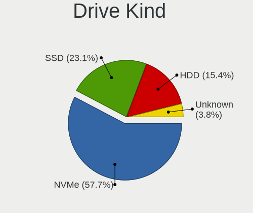

| Kind    | Computers | Drives | Percent |
|---------|-----------|--------|---------|
| NVMe    | 45        | 60     | 57.69%  |
| SSD     | 18        | 37     | 23.08%  |
| HDD     | 12        | 13     | 15.38%  |
| Unknown | 3         | 3      | 3.85%   |

Drive Connector
---------------

SATA, SAS, NVMe, etc.

| Type | Computers | Drives | Percent |
|------|-----------|--------|---------|
| NVMe | 45        | 59     | 58.44%  |
| SATA | 25        | 46     | 32.47%  |
| SAS  | 7         | 8      | 9.09%   |

Drive Size
----------

Size of hard drive

| Size in TB | Computers | Drives | Percent |
|------------|-----------|--------|---------|
| 0.01-0.5   | 21        | 37     | 63.64%  |
| 0.51-1.0   | 9         | 10     | 27.27%  |
| 1.01-2.0   | 3         | 3      | 9.09%   |

Space Total
-----------

Amount of disk space available on the file system

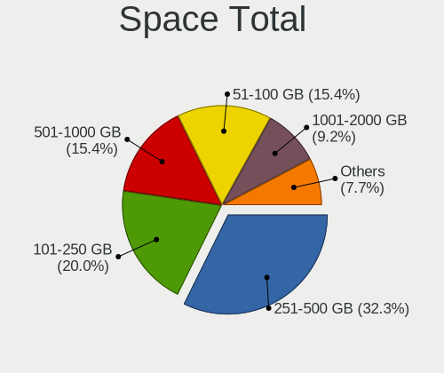

| Size in GB | Computers | Percent |
|------------|-----------|---------|
| 251-500    | 21        | 32.31%  |
| 101-250    | 13        | 20%     |
| 501-1000   | 10        | 15.38%  |
| 51-100     | 10        | 15.38%  |
| 1001-2000  | 6         | 9.23%   |
| 2001-3000  | 2         | 3.08%   |
| 21-50      | 1         | 1.54%   |
| 1-20       | 1         | 1.54%   |
| Unknown    | 1         | 1.54%   |

Space Used
----------

Amount of used disk space

| Used GB   | Computers | Percent |
|-----------|-----------|---------|
| 21-50     | 18        | 28.13%  |
| 101-250   | 14        | 21.88%  |
| 1-20      | 10        | 15.63%  |
| 51-100    | 10        | 15.63%  |
| 251-500   | 5         | 7.81%   |
| 501-1000  | 5         | 7.81%   |
| 1001-2000 | 1         | 1.56%   |
| Unknown   | 1         | 1.56%   |

Malfunc. Drives
---------------

Drive models with a malfunction

| Model                                           | Computers | Drives | Percent |
|-------------------------------------------------|-----------|--------|---------|
| WDC WDS240G2G0A-00JH30 240GB SSD                | 1         | 1      | 20%     |
| Seagate ST9500325AS 500GB                       | 1         | 1      | 20%     |
| SanDisk SSD PLUS 1000GB                         | 1         | 1      | 20%     |
| Samsung Electronics SSD 980 1TB S649NX0T432942B | 1         | 1      | 20%     |
| A-DATA Technology SX6000LNP 1TB                 | 1         | 1      | 20%     |

Malfunc. Drive Vendor
---------------------

Vendors of faulty drives

| Vendor              | Computers | Drives | Percent |
|---------------------|-----------|--------|---------|
| WDC                 | 1         | 1      | 20%     |
| Seagate             | 1         | 1      | 20%     |
| SanDisk             | 1         | 1      | 20%     |
| Samsung Electronics | 1         | 1      | 20%     |
| A-DATA Technology   | 1         | 1      | 20%     |

Malfunc. HDD Vendor
-------------------

Vendors of faulty HDD drives

| Vendor  | Computers | Drives | Percent |
|---------|-----------|--------|---------|
| Seagate | 1         | 1      | 100%    |

Malfunc. Drive Kind
-------------------

Kinds of faulty drives

| Kind | Computers | Drives | Percent |
|------|-----------|--------|---------|
| NVMe | 2         | 2      | 40%     |
| SSD  | 2         | 2      | 40%     |
| HDD  | 1         | 1      | 20%     |

Failed Drives
-------------

Failed drive models

Zero info for selected period =(

Failed Drive Vendor
-------------------

Failed drive vendors

Zero info for selected period =(

Drive Status
------------

Number of failed and malfunc. drives

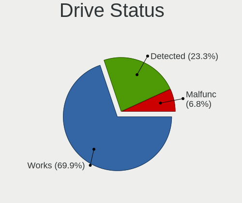

| Status   | Computers | Drives | Percent |
|----------|-----------|--------|---------|
| Works    | 51        | 72     | 69.86%  |
| Detected | 17        | 36     | 23.29%  |
| Malfunc  | 5         | 5      | 6.85%   |

Storage controller
------------------

Storage Vendor
--------------

Storage controller vendors

| Vendor                                  | Computers | Percent |
|-----------------------------------------|-----------|---------|
| Intel                                   | 20        | 22.99%  |
| Samsung Electronics                     | 17        | 19.54%  |
| SanDisk                                 | 10        | 11.49%  |
| AMD                                     | 8         | 9.2%    |
| Marvell Technology Group                | 5         | 5.75%   |
| Phison Electronics                      | 4         | 4.6%    |
| SK hynix                                | 3         | 3.45%   |
| Micron Technology                       | 3         | 3.45%   |
| MAXIO Technology (Hangzhou)             | 3         | 3.45%   |
| Yangtze Memory Technologies             | 2         | 2.3%    |
| KIOXIA                                  | 2         | 2.3%    |
| Kingston Technology Company             | 2         | 2.3%    |
| ASMedia Technology                      | 2         | 2.3%    |
| Toshiba America Info Systems            | 1         | 1.15%   |
| Silicon Motion                          | 1         | 1.15%   |
| Realtek Semiconductor                   | 1         | 1.15%   |
| Jiangsu Xinsheng Intelligent Technology | 1         | 1.15%   |
| Hefei DATANG Storage Technology         | 1         | 1.15%   |
| Biwin Storage Technology                | 1         | 1.15%   |

Storage Model
-------------

Storage controller models

| Model                                                                     | Computers | Percent |
|---------------------------------------------------------------------------|-----------|---------|
| AMD FCH SATA Controller [AHCI mode]                                       | 7         | 7.78%   |
| Samsung NVMe SSD Controller PM9A1/PM9A3/980PRO                            | 6         | 6.67%   |
| Samsung NVMe SSD Controller SM981/PM981/PM983                             | 5         | 5.56%   |
| Marvell Group 88SE9215 PCIe 2.0 x1 4-port SATA 6 Gb/s Controller          | 4         | 4.44%   |
| SanDisk Ultra 3D / WD PC SN530, IX SN530, Blue SN550 NVMe SSD (DRAM-less) | 3         | 3.33%   |
| SanDisk Extreme Pro / WD Black SN750 / PC SN730 / Red SN700 NVMe SSD      | 3         | 3.33%   |
| Intel Sunrise Point-LP SATA Controller [AHCI mode]                        | 3         | 3.33%   |
| Intel Cannon Lake Mobile PCH SATA AHCI Controller                         | 3         | 3.33%   |
| Yangtze Memory ZHITAI TiPlus7100                                          | 2         | 2.22%   |
| Samsung NVMe SSD Controller 980 (DRAM-less)                               | 2         | 2.22%   |
| Phison PS5013-E13 PCIe3 NVMe Controller (DRAM-less)                       | 2         | 2.22%   |
| Micron 3400 NVMe SSD [Hendrix]                                            | 2         | 2.22%   |
| MAXIO (Hangzhou) NVMe SSD Controller MAP1202 (DRAM-less)                  | 2         | 2.22%   |
| Intel Volume Management Device NVMe RAID Controller Intel Corporation     | 2         | 2.22%   |
| ASMedia ASM1064 Serial ATA Controller                                     | 2         | 2.22%   |
| Toshiba America Info Systems XG6 NVMe SSD Controller                      | 1         | 1.11%   |
| SK hynix Platinum P41/PC801 NVMe Solid State Drive                        | 1         | 1.11%   |
| SK hynix PC611 NVMe Solid State Drive                                     | 1         | 1.11%   |
| SK hynix Gold P31/BC711/PC711 NVMe Solid State Drive                      | 1         | 1.11%   |
| Silicon Motion SM2262/SM2262EN SSD Controller                             | 1         | 1.11%   |
| Sandisk WD PC SN735 NVMe SSD 1TB (DRAM-less)                              | 1         | 1.11%   |
| SanDisk WD Black SN770 / PC SN740 256GB / PC SN560 (DRAM-less) NVMe SSD   | 1         | 1.11%   |
| Sandisk PC SN740 NVMe SSD (DRAM-less)                                     | 1         | 1.11%   |
| SanDisk IX SN530 NVMe SSD (DRAM-less)                                     | 1         | 1.11%   |
| Samsung S4LN058A01[SSUBX] AHCI SSD Controller (Apple slot)                | 1         | 1.11%   |
| Samsung NVMe SSD Controller SM961/PM961/SM963                             | 1         | 1.11%   |
| Samsung NVMe SSD Controller S4LV008[Pascal]                               | 1         | 1.11%   |
| Samsung NVMe SSD Controller PM9B1 (DRAM-less)                             | 1         | 1.11%   |
| Realtek RTS5765DL NVMe SSD Controller (DRAM-less)                         | 1         | 1.11%   |
| Phison PS5019-E19 PCIe4 NVMe Controller (DRAM-less)                       | 1         | 1.11%   |
| Phison E12 NVMe Controller                                                | 1         | 1.11%   |
| Micron 2450 NVMe SSD [HendrixV] (DRAM-less)                               | 1         | 1.11%   |
| MAXIO (Hangzhou) NVMe SSD Controller MAP1602 (DRAM-less)                  | 1         | 1.11%   |
| Marvell Group Marvell Non-Volatile memory controller                      | 1         | 1.11%   |
| KIOXIA NVMe SSD Controller XG8                                            | 1         | 1.11%   |
| KIOXIA NVMe SSD Controller BG5 (DRAM-less)                                | 1         | 1.11%   |
| Kingston Company OM3PDP3 NVMe SSD                                         | 1         | 1.11%   |
| Kingston Company A2000 NVMe SSD [SM2263EN]                                | 1         | 1.11%   |
| Jiangsu Xinsheng Intelligent EP2000Pro PCIe 3 NVMe SSD (DRAM-less)        | 1         | 1.11%   |
| Intel Tiger Lake SATA AHCI Controller                                     | 1         | 1.11%   |

Storage Kind
------------

Kind of storage controller (IDE, SATA, NVMe, SAS, ...)

| Kind | Computers | Percent |
|------|-----------|---------|
| NVMe | 45        | 55.56%  |
| SATA | 33        | 40.74%  |
| RAID | 2         | 2.47%   |
| IDE  | 1         | 1.23%   |

Processor
---------

CPU Vendor
----------

Processor vendors

| Vendor  | Computers | Percent |
|---------|-----------|---------|
| Intel   | 34        | 53.97%  |
| AMD     | 17        | 26.98%  |
| Phytium | 8         | 12.7%   |
| ARM     | 4         | 6.35%   |

CPU Model
---------

Processor models

| Model                                      | Computers | Percent |
|--------------------------------------------|-----------|---------|
| ARM Processor                              | 4         | 6.35%   |
| AMD Ryzen 7 5800H with Radeon Graphics     | 3         | 4.76%   |
| Phytium FT2000/4                           | 2         | 3.17%   |
| Phytium FT-2000/4                          | 2         | 3.17%   |
| Phytium D2000/8 E8C                        | 2         | 3.17%   |
| Intel Core i7-8750H CPU @ 2.20GHz          | 2         | 3.17%   |
| Intel Core i7-4790 CPU @ 3.60GHz           | 2         | 3.17%   |
| Intel Core i5-10210U CPU @ 1.60GHz         | 2         | 3.17%   |
| Intel 13th Gen Core i5-1340P               | 2         | 3.17%   |
| Intel 12th Gen Core i7-12700H              | 2         | 3.17%   |
| Intel 11th Gen Core i7-11800H @ 2.30GHz    | 2         | 3.17%   |
| Intel 11th Gen Core i7-1165G7 @ 2.80GHz    | 2         | 3.17%   |
| AMD Ryzen 9 7945HX with Radeon Graphics    | 2         | 3.17%   |
| AMD Ryzen 7 PRO 4750U with Radeon Graphics | 2         | 3.17%   |
| AMD Ryzen 7 5800U with Radeon Graphics     | 2         | 3.17%   |
| Phytium D3000                              | 1         | 1.59%   |
| Phytium D2000/8                            | 1         | 1.59%   |
| Intel Pentium Silver N6000 @ 1.10GHz       | 1         | 1.59%   |
| Intel Core m3-6Y30 CPU @ 0.90GHz           | 1         | 1.59%   |
| Intel Core i7-9750H CPU @ 2.60GHz          | 1         | 1.59%   |
| Intel Core i7-8550U CPU @ 1.80GHz          | 1         | 1.59%   |
| Intel Core i7-7500U CPU @ 2.70GHz          | 1         | 1.59%   |
| Intel Core i7-6700HQ CPU @ 2.60GHz         | 1         | 1.59%   |
| Intel Core i7-6560U CPU @ 2.20GHz          | 1         | 1.59%   |
| Intel Core i7-10700 CPU @ 2.90GHz          | 1         | 1.59%   |
| Intel Core i5-8400 CPU @ 2.80GHz           | 1         | 1.59%   |
| Intel Core i5-8350U CPU @ 1.70GHz          | 1         | 1.59%   |
| Intel Core i5-5257U CPU @ 2.70GHz          | 1         | 1.59%   |
| Intel Core i5-4200U CPU @ 1.60GHz          | 1         | 1.59%   |
| Intel Core i5-3570 CPU @ 3.40GHz           | 1         | 1.59%   |
| Intel Core i5-14600K                       | 1         | 1.59%   |
| Intel Core i3-2310M CPU @ 2.10GHz          | 1         | 1.59%   |
| Intel Core 2 Duo CPU P8400 @ 2.26GHz       | 1         | 1.59%   |
| Intel 13th Gen Core i9-13900H              | 1         | 1.59%   |
| Intel 12th Gen Core i5-1240P               | 1         | 1.59%   |
| Intel 12th Gen Core i5-1235U               | 1         | 1.59%   |
| Intel 11th Gen Core i5-11400F @ 2.60GHz    | 1         | 1.59%   |
| AMD Ryzen 9 7845HX with Radeon Graphics    | 1         | 1.59%   |
| AMD Ryzen 9 6900HS with Radeon Graphics    | 1         | 1.59%   |
| AMD Ryzen 7 7735HS with Radeon Graphics    | 1         | 1.59%   |

CPU Model Family
----------------

Processor model prefix

| Model                | Computers | Percent |
|----------------------|-----------|---------|
| Other                | 24        | 38.1%   |
| Intel Core i7        | 10        | 15.87%  |
| Intel Core i5        | 8         | 12.7%   |
| AMD Ryzen 7          | 7         | 11.11%  |
| AMD Ryzen 9          | 4         | 6.35%   |
| AMD Ryzen 7 PRO      | 2         | 3.17%   |
| AMD Ryzen 5          | 2         | 3.17%   |
| Intel Pentium Silver | 1         | 1.59%   |
| Intel Core m3        | 1         | 1.59%   |
| Intel Core i3        | 1         | 1.59%   |
| Intel Core 2 Duo     | 1         | 1.59%   |
| AMD Ryzen 5 PRO      | 1         | 1.59%   |
| AMD E                | 1         | 1.59%   |

CPU Cores
---------

Number of processor cores

| Number | Computers | Percent |
|--------|-----------|---------|
| 8      | 18        | 28.57%  |
| 4      | 15        | 23.81%  |
| 6      | 12        | 19.05%  |
| 2      | 7         | 11.11%  |
| 14     | 4         | 6.35%   |
| 12     | 4         | 6.35%   |
| 16     | 2         | 3.17%   |
| 10     | 1         | 1.59%   |

CPU Sockets
-----------

Number of sockets

| Number | Computers | Percent |
|--------|-----------|---------|
| 1      | 58        | 92.06%  |
| 3      | 4         | 6.35%   |
| 2      | 1         | 1.59%   |

CPU Threads
-----------

Threads per core (Hyper-Threading)

| Number | Computers | Percent |
|--------|-----------|---------|
| 2      | 46        | 73.02%  |
| 1      | 17        | 26.98%  |

CPU Op-Modes
------------

CPU Operation Modes (32-bit, 64-bit)

| Op mode        | Computers | Percent |
|----------------|-----------|---------|
| 32-bit, 64-bit | 63        | 100%    |

CPU Microcode
-------------

Microcode number

| Number     | Computers | Percent |
|------------|-----------|---------|
| Unknown    | 33        | 51.56%  |
| 0x906ea    | 4         | 6.25%   |
| 0x806ec    | 2         | 3.13%   |
| 0x406e3    | 2         | 3.13%   |
| 0x0a50000d | 2         | 3.13%   |
| 0x0a50000c | 2         | 3.13%   |
| 0x0a404102 | 2         | 3.13%   |
| 0xb06a2    | 1         | 1.56%   |
| 0xa0655    | 1         | 1.56%   |
| 0x906c0    | 1         | 1.56%   |
| 0x906a3    | 1         | 1.56%   |
| 0x806ea    | 1         | 1.56%   |
| 0x806e9    | 1         | 1.56%   |
| 0x806c1    | 1         | 1.56%   |
| 0x40651    | 1         | 1.56%   |
| 0x306d4    | 1         | 1.56%   |
| 0x306c3    | 1         | 1.56%   |
| 0x1067a    | 1         | 1.56%   |
| 0x0a601206 | 1         | 1.56%   |
| 0x0a601203 | 1         | 1.56%   |
| 0x0a50000f | 1         | 1.56%   |
| 0x0a50000b | 1         | 1.56%   |
| 0x0860010c | 1         | 1.56%   |
| 0x08600103 | 1         | 1.56%   |

CPU Microarch
-------------

Microarchitecture

| Name             | Computers | Percent |
|------------------|-----------|---------|
| Unknown          | 21        | 33.33%  |
| KabyLake         | 9         | 14.29%  |
| Zen 3            | 7         | 11.11%  |
| Alderlake Hybrid | 7         | 11.11%  |
| Zen 2            | 3         | 4.76%   |
| Skylake          | 3         | 4.76%   |
| Haswell          | 3         | 4.76%   |
| TigerLake        | 2         | 3.17%   |
| Icelake          | 2         | 3.17%   |
| Tremont          | 1         | 1.59%   |
| SandyBridge      | 1         | 1.59%   |
| Penryn           | 1         | 1.59%   |
| IvyBridge        | 1         | 1.59%   |
| CometLake        | 1         | 1.59%   |
| Broadwell        | 1         | 1.59%   |

Graphics
--------

GPU Vendor
----------

Vendors of graphics cards

| Vendor                   | Computers | Percent |
|--------------------------|-----------|---------|
| Intel                    | 32        | 42.67%  |
| AMD                      | 21        | 28%     |
| Nvidia                   | 20        | 26.67%  |
| Jingjia Microelectronics | 2         | 2.67%   |

GPU Model
---------

Graphics card models

| Model                                                                       | Computers | Percent |
|-----------------------------------------------------------------------------|-----------|---------|
| AMD Cezanne [Radeon Vega Series / Radeon Vega Mobile Series]                | 6         | 8%      |
| Nvidia GA106M [GeForce RTX 3060 Mobile / Max-Q]                             | 4         | 5.33%   |
| AMD Rembrandt [Radeon 680M]                                                 | 4         | 5.33%   |
| Nvidia AD107M [GeForce RTX 4060 Max-Q / Mobile]                             | 3         | 4%      |
| Intel CoffeeLake-H GT2 [UHD Graphics 630]                                   | 3         | 4%      |
| Nvidia GA107M [GeForce RTX 3050 Mobile]                                     | 2         | 2.67%   |
| Nvidia GA102 [GeForce RTX 3090]                                             | 2         | 2.67%   |
| Intel UHD Graphics 620                                                      | 2         | 2.67%   |
| Intel TigerLake-LP GT2 [Iris Xe Graphics]                                   | 2         | 2.67%   |
| Intel TigerLake-H GT1 [UHD Graphics]                                        | 2         | 2.67%   |
| Intel Raptor Lake-P [Iris Xe Graphics]                                      | 2         | 2.67%   |
| Intel CometLake-U GT2 [UHD Graphics]                                        | 2         | 2.67%   |
| Intel Alder Lake-P GT2 [Iris Xe Graphics]                                   | 2         | 2.67%   |
| AMD Renoir [Radeon Vega Series / Radeon Vega Mobile Series]                 | 2         | 2.67%   |
| AMD Lexa [Radeon 540X/550X/630 / RX 640 / E9171 MCM]                        | 2         | 2.67%   |
| AMD Caicos [Radeon HD 6450/7450/8450 / R5 230 OEM]                          | 2         | 2.67%   |
| Nvidia TU117M [GeForce MX450]                                               | 1         | 1.33%   |
| Nvidia TU117M [GeForce GTX 1650 Mobile / Max-Q]                             | 1         | 1.33%   |
| Nvidia TU117GLM [T600 Mobile]                                               | 1         | 1.33%   |
| Nvidia GP108M [GeForce MX150]                                               | 1         | 1.33%   |
| Nvidia GP107M [GeForce GTX 1050 Ti Mobile]                                  | 1         | 1.33%   |
| Nvidia GP107 [GeForce GTX 1050 Ti]                                          | 1         | 1.33%   |
| Nvidia GP106 [GeForce GTX 1060 6GB]                                         | 1         | 1.33%   |
| Nvidia GM108M [GeForce 940MX]                                               | 1         | 1.33%   |
| Nvidia GK208B [GeForce GT 730]                                              | 1         | 1.33%   |
| Jingjia Microelectronics JM9100                                             | 1         | 1.33%   |
| Jingjia Microelectronics JM7200 Series GPU                                  | 1         | 1.33%   |
| Intel Xeon E3-1200 v3/4th Gen Core Processor Integrated Graphics Controller | 1         | 1.33%   |
| Intel Xeon E3-1200 v2/3rd Gen Core processor Graphics Controller            | 1         | 1.33%   |
| Intel Raptor Lake-S GT1 [UHD Graphics 770]                                  | 1         | 1.33%   |
| Intel Raptor Lake-P [UHD Graphics]                                          | 1         | 1.33%   |
| Intel Mobile 4 Series Chipset Integrated Graphics Controller                | 1         | 1.33%   |
| Intel JasperLake [UHD Graphics]                                             | 1         | 1.33%   |
| Intel Iris Graphics 6100                                                    | 1         | 1.33%   |
| Intel Iris Graphics 540                                                     | 1         | 1.33%   |
| Intel HD Graphics 620                                                       | 1         | 1.33%   |
| Intel HD Graphics 530                                                       | 1         | 1.33%   |
| Intel HD Graphics 515                                                       | 1         | 1.33%   |
| Intel Haswell-ULT Integrated Graphics Controller                            | 1         | 1.33%   |
| Intel CometLake-S GT2 [UHD Graphics 630]                                    | 1         | 1.33%   |

GPU Combo
---------

Combinations of graphics cards

| Name                         | Computers | Percent |
|------------------------------|-----------|---------|
| 1 x Intel                    | 21        | 33.33%  |
| 1 x AMD                      | 15        | 23.81%  |
| Intel + Nvidia               | 9         | 14.29%  |
| 1 x Nvidia                   | 6         | 9.52%   |
| AMD + Nvidia                 | 5         | 7.94%   |
| Other                        | 4         | 6.35%   |
| 1 x Jingjia Microelectronics | 2         | 3.17%   |
| Intel + AMD                  | 1         | 1.59%   |

GPU Driver
----------

Free vs proprietary

| Driver      | Computers | Percent |
|-------------|-----------|---------|
| Free        | 36        | 57.14%  |
| Proprietary | 16        | 25.4%   |
| Unknown     | 11        | 17.46%  |

GPU Memory
----------

Total video memory

| Size in GB | Computers | Percent |
|------------|-----------|---------|
| Unknown    | 38        | 60.32%  |
| 1.01-2.0   | 10        | 15.87%  |
| 3.01-4.0   | 5         | 7.94%   |
| 0.51-1.0   | 3         | 4.76%   |
| 0.01-0.5   | 3         | 4.76%   |
| 7.01-8.0   | 2         | 3.17%   |
| 5.01-6.0   | 1         | 1.59%   |
| 16.01-24.0 | 1         | 1.59%   |

Monitor
-------

Monitor Vendor
--------------

Monitor vendors

| Vendor               | Computers | Percent |
|----------------------|-----------|---------|
| BOE                  | 11        | 16.18%  |
| Dell                 | 7         | 10.29%  |
| LG Display           | 6         | 8.82%   |
| CSO                  | 6         | 8.82%   |
| Chimei Innolux       | 5         | 7.35%   |
| AU Optronics         | 5         | 7.35%   |
| AOC                  | 4         | 5.88%   |
| Lenovo               | 3         | 4.41%   |
| Xiaomi               | 2         | 2.94%   |
| Samsung Electronics  | 2         | 2.94%   |
| Mi                   | 2         | 2.94%   |
| HUAWEI               | 2         | 2.94%   |
| TMX                  | 1         | 1.47%   |
| STD                  | 1         | 1.47%   |
| RTK                  | 1         | 1.47%   |
| Philips              | 1         | 1.47%   |
| PANDA                | 1         | 1.47%   |
| KIG                  | 1         | 1.47%   |
| JZM                  | 1         | 1.47%   |
| JDI                  | 1         | 1.47%   |
| Goldstar             | 1         | 1.47%   |
| CPT                  | 1         | 1.47%   |
| BenQ                 | 1         | 1.47%   |
| Apple                | 1         | 1.47%   |
| Ancor Communications | 1         | 1.47%   |

Monitor Model
-------------

Monitor models

| Model                                                                 | Computers | Percent |
|-----------------------------------------------------------------------|-----------|---------|
| Xiaomi Mi TV XMD004A 1920x1080 708x398mm 32.0-inch                    | 2         | 2.94%   |
| HUAWEI SSN-24 HWV6E4E 1920x1080 527x296mm 23.8-inch                   | 2         | 2.94%   |
| Dell P2422H DELA1C4 1920x1080 527x296mm 23.8-inch                     | 2         | 2.94%   |
| BOE LCD Monitor BOE0AC9 2240x1400 302x189mm 14.0-inch                 | 2         | 2.94%   |
| TMX TL160ADMP01-0 TMX1600 2560x1600 345x215mm 16.0-inch               | 1         | 1.47%   |
| STD HDMI STD2700 1920x1080 600x330mm 27.0-inch                        | 1         | 1.47%   |
| Samsung Electronics LCD Monitor SDC4180 2880x1620 344x194mm 15.5-inch | 1         | 1.47%   |
| Samsung Electronics LCD Monitor SDC4171 2880x1800 302x189mm 14.0-inch | 1         | 1.47%   |
| RTK FHD RTK0012 1920x1080 344x196mm 15.6-inch                         | 1         | 1.47%   |
| Philips PHL 243V7 PHLC155 1920x1080 527x296mm 23.8-inch               | 1         | 1.47%   |
| PANDA LCD Monitor NCP0042 1920x1080 344x194mm 15.5-inch               | 1         | 1.47%   |
| Mi P27QBB-RA XMID003 2560x1440 600x340mm 27.2-inch                    | 1         | 1.47%   |
| Mi Monitor XMI3444 3440x1440 800x330mm 34.1-inch                      | 1         | 1.47%   |
| LG Display LCD Monitor LGD06AA 3840x2400 344x215mm 16.0-inch          | 1         | 1.47%   |
| LG Display LCD Monitor LGD0690 2560x1440 344x194mm 15.5-inch          | 1         | 1.47%   |
| LG Display LCD Monitor LGD060A 1920x1080 294x165mm 13.3-inch          | 1         | 1.47%   |
| LG Display LCD Monitor LGD0563 1920x1080 344x194mm 15.5-inch          | 1         | 1.47%   |
| LG Display LCD Monitor LGD04EF 1920x1080 294x165mm 13.3-inch          | 1         | 1.47%   |
| LG Display LCD Monitor LGD049A 2560x1440 310x174mm 14.0-inch          | 1         | 1.47%   |
| Lenovo X24i-10 LEN61AA 1920x1080 527x296mm 23.8-inch                  | 1         | 1.47%   |
| Lenovo LEN T2224rbA LEN60EA 1920x1080 477x268mm 21.5-inch             | 1         | 1.47%   |
| Lenovo LCD Monitor LEN4010 1280x800 261x163mm 12.1-inch               | 1         | 1.47%   |
| KIG KKTV KIG2700 1920x1080 598x336mm 27.0-inch                        | 1         | 1.47%   |
| JZM JZM238G JZM2442 1920x1080 527x296mm 23.8-inch                     | 1         | 1.47%   |
| JDI LCD Monitor JDI422A 3000x2000 293x196mm 13.9-inch                 | 1         | 1.47%   |
| Goldstar LG TV SSCR2 GSMC0C8 3840x2160                                | 1         | 1.47%   |
| Dell SE2218HL DELF121 1920x1080 476x268mm 21.5-inch                   | 1         | 1.47%   |
| Dell S2319HS DEL418F 1920x1080 509x286mm 23.0-inch                    | 1         | 1.47%   |
| Dell P2717H DEL40F7 1920x1080 598x336mm 27.0-inch                     | 1         | 1.47%   |
| Dell E2213 DELD04E 1680x1050 473x296mm 22.0-inch                      | 1         | 1.47%   |
| Dell 1704FPT DEL4005 1280x1024 338x270mm 17.0-inch                    | 1         | 1.47%   |
| CSO MNH301CA3-1 CSO1702 2560x1440 381x214mm 17.2-inch                 | 1         | 1.47%   |
| CSO LCD Monitor CSO161B 2560x1600 344x215mm 16.0-inch                 | 1         | 1.47%   |
| CSO LCD Monitor CSO161B 2560x1600 340x220mm 15.9-inch                 | 1         | 1.47%   |
| CSO LCD Monitor CSO1612 2560x1600 345x215mm 16.0-inch                 | 1         | 1.47%   |
| CSO LCD Monitor CSO1609 2560x1600 345x215mm 16.0-inch                 | 1         | 1.47%   |
| CSO LCD Monitor CSO1402 2880x1800 302x188mm 14.0-inch                 | 1         | 1.47%   |
| CPT LCD Monitor CPT17DB 1600x900 293x164mm 13.2-inch                  | 1         | 1.47%   |
| Chimei Innolux LCD Monitor CMN15F7 1920x1080 344x193mm 15.5-inch      | 1         | 1.47%   |
| Chimei Innolux LCD Monitor CMN153A 1920x1080 344x193mm 15.5-inch      | 1         | 1.47%   |

Monitor Resolution
------------------

Monitor screen resolution

| Resolution         | Computers | Percent |
|--------------------|-----------|---------|
| 1920x1080 (FHD)    | 31        | 46.97%  |
| 2560x1600          | 7         | 10.61%  |
| 3840x2160 (4K)     | 6         | 9.09%   |
| 2560x1440 (QHD)    | 4         | 6.06%   |
| 2880x1800          | 2         | 3.03%   |
| 2240x1400          | 2         | 3.03%   |
| 2160x1440          | 2         | 3.03%   |
| 1366x768 (WXGA)    | 2         | 3.03%   |
| 3840x2400          | 1         | 1.52%   |
| 3440x1440          | 1         | 1.52%   |
| 3000x2000          | 1         | 1.52%   |
| 2880x1620          | 1         | 1.52%   |
| 2520x1680          | 1         | 1.52%   |
| 1920x1200 (WUXGA)  | 1         | 1.52%   |
| 1680x1050 (WSXGA+) | 1         | 1.52%   |
| 1600x900 (HD+)     | 1         | 1.52%   |
| 1280x800 (WXGA)    | 1         | 1.52%   |
| 1280x1024 (SXGA)   | 1         | 1.52%   |

Monitor Diagonal
----------------

Diagonal size in inches

| Inches  | Computers | Percent |
|---------|-----------|---------|
| 14      | 11        | 16.18%  |
| 13      | 11        | 16.18%  |
| 15      | 9         | 13.24%  |
| 27      | 7         | 10.29%  |
| 16      | 7         | 10.29%  |
| 24      | 5         | 7.35%   |
| 23      | 4         | 5.88%   |
| 65      | 2         | 2.94%   |
| 22      | 2         | 2.94%   |
| 21      | 2         | 2.94%   |
| 17      | 2         | 2.94%   |
| 12      | 2         | 2.94%   |
| 72      | 1         | 1.47%   |
| 34      | 1         | 1.47%   |
| 11      | 1         | 1.47%   |
| Unknown | 1         | 1.47%   |

Monitor Width
-------------

Physical width

| Width in mm | Computers | Percent |
|-------------|-----------|---------|
| 301-350     | 31        | 45.59%  |
| 501-600     | 16        | 23.53%  |
| 201-300     | 11        | 16.18%  |
| 401-500     | 4         | 5.88%   |
| 1001-1500   | 2         | 2.94%   |
| 701-800     | 1         | 1.47%   |
| 351-400     | 1         | 1.47%   |
| 1501-2000   | 1         | 1.47%   |
| Unknown     | 1         | 1.47%   |

Aspect Ratio
------------

Proportional relationship between the width and the height

| Ratio   | Computers | Percent |
|---------|-----------|---------|
| 16/9    | 42        | 66.67%  |
| 16/10   | 13        | 20.63%  |
| 3/2     | 5         | 7.94%   |
| 5/4     | 1         | 1.59%   |
| 21/9    | 1         | 1.59%   |
| Unknown | 1         | 1.59%   |

Monitor Area
------------

Area in inch

| Area in inch | Computers | Percent |
|----------------|-----------|---------|
| 81-90          | 17        | 25%     |
| 201-250        | 11        | 16.18%  |
| 111-120        | 8         | 11.76%  |
| 101-110        | 8         | 11.76%  |
| 301-350        | 7         | 10.29%  |
| 71-80          | 6         | 8.82%   |
| More than 1000 | 3         | 4.41%   |
| 151-200        | 2         | 2.94%   |
| 61-70          | 1         | 1.47%   |
| 51-60          | 1         | 1.47%   |
| 351-500        | 1         | 1.47%   |
| 141-150        | 1         | 1.47%   |
| 121-130        | 1         | 1.47%   |
| Unknown        | 1         | 1.47%   |

Pixel Density
-------------

Pixels per inch

| Density       | Computers | Percent |
|---------------|-----------|---------|
| 161-240       | 20        | 30.3%   |
| 51-100        | 17        | 25.76%  |
| 121-160       | 16        | 24.24%  |
| 101-120       | 6         | 9.09%   |
| More than 240 | 4         | 6.06%   |
| 1-50          | 2         | 3.03%   |
| Unknown       | 1         | 1.52%   |

Multiple Monitors
-----------------

Total monitors connected

| Total | Computers | Percent |
|-------|-----------|---------|
| 1     | 49        | 76.56%  |
| 2     | 10        | 15.63%  |
| 0     | 5         | 7.81%   |

Network
-------

Net Controller Vendor
---------------------

Controller vendors

| Vendor                     | Computers | Percent |
|----------------------------|-----------|---------|
| Realtek Semiconductor      | 38        | 41.3%   |
| Intel                      | 34        | 36.96%  |
| MediaTek                   | 9         | 9.78%   |
| ASIX Electronics           | 4         | 4.35%   |
| Huawei Technologies        | 2         | 2.17%   |
| Xiaomi                     | 1         | 1.09%   |
| Quectel Wireless Solutions | 1         | 1.09%   |
| Qualcomm Atheros           | 1         | 1.09%   |
| ICS Advent                 | 1         | 1.09%   |
| Broadcom                   | 1         | 1.09%   |

Net Controller Model
--------------------

Controller models

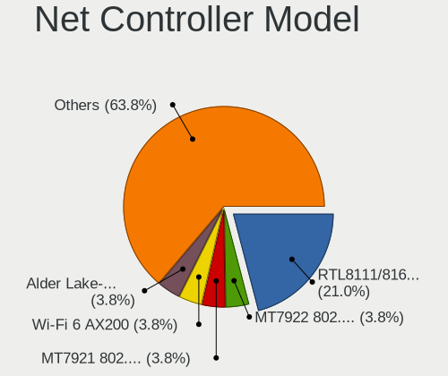

| Model                                                                  | Computers | Percent |
|------------------------------------------------------------------------|-----------|---------|
| Realtek RTL8111/8168/8211/8411 PCI Express Gigabit Ethernet Controller | 22        | 20.95%  |
| MediaTek MT7922 802.11ax PCI Express Wireless Network Adapter          | 4         | 3.81%   |
| MediaTek MT7921 802.11ax PCI Express Wireless Network Adapter          | 4         | 3.81%   |
| Intel Wi-Fi 6 AX200                                                    | 4         | 3.81%   |
| Intel Alder Lake-P PCH CNVi WiFi                                       | 4         | 3.81%   |
| ASIX AX88179 Gigabit Ethernet                                          | 4         | 3.81%   |
| Realtek RTL8153 Gigabit Ethernet Adapter                               | 3         | 2.86%   |
| Intel Wireless 8260                                                    | 3         | 2.86%   |
| Intel Wi-Fi 6E(802.11ax) AX210/AX1675* 2x2 [Typhoon Peak]              | 3         | 2.86%   |
| Intel Raptor Lake PCH CNVi WiFi                                        | 3         | 2.86%   |
| Intel Cannon Lake PCH CNVi WiFi                                        | 3         | 2.86%   |
| Realtek RTL8852AE 802.11ax PCIe Wireless Network Adapter               | 2         | 1.9%    |
| Realtek RTL8822CE 802.11ac PCIe Wireless Network Adapter               | 2         | 1.9%    |
| Realtek RTL8152 Fast Ethernet Adapter                                  | 2         | 1.9%    |
| Realtek RTL8125 2.5GbE Controller                                      | 2         | 1.9%    |
| Realtek RTL810xE PCI Express Fast Ethernet controller                  | 2         | 1.9%    |
| Intel Wireless 8265 / 8275                                             | 2         | 1.9%    |
| Intel Wi-Fi 6 AX201                                                    | 2         | 1.9%    |
| Intel Comet Lake PCH-LP CNVi WiFi                                      | 2         | 1.9%    |
| Huawei Network controller                                              | 2         | 1.9%    |
| Xiaomi Mi/Redmi series (RNDIS)                                         | 1         | 0.95%   |
| Realtek USB 10/100/1G/2.5G LAN                                         | 1         | 0.95%   |
| Realtek RTL88x2bu [AC1200 Techkey]                                     | 1         | 0.95%   |
| Realtek RTL8821CE 802.11ac PCIe Wireless Network Adapter               | 1         | 0.95%   |
| Realtek RTL8821AE 802.11ac PCIe Wireless Network Adapter               | 1         | 0.95%   |
| Realtek RTL8723DE Wireless Network Adapter                             | 1         | 0.95%   |
| Realtek RTL8188EUS 802.11n Wireless Network Adapter                    | 1         | 0.95%   |
| Realtek Killer E2600 GbE Controller                                    | 1         | 0.95%   |
| Quectel Wireless Solutions Quectel EM05-CE                             | 1         | 0.95%   |
| Qualcomm Atheros AR5212/5213/2414 Wireless Network Adapter             | 1         | 0.95%   |
| MediaTek WiFi                                                          | 1         | 0.95%   |
| Intel Wireless 7260                                                    | 1         | 0.95%   |
| Intel Wi-Fi 6 AX201 160MHz                                             | 1         | 0.95%   |
| Intel Tiger Lake PCH CNVi WiFi                                         | 1         | 0.95%   |
| Intel Raptor Lake-S PCH CNVi WiFi                                      | 1         | 0.95%   |
| Intel PRO/Wireless 5100 AGN [Shiloh] Network Connection                | 1         | 0.95%   |
| Intel I211 Gigabit Network Connection                                  | 1         | 0.95%   |
| Intel Ethernet Controller I226-V                                       | 1         | 0.95%   |
| Intel Ethernet Connection I217-V                                       | 1         | 0.95%   |
| Intel Ethernet Connection (4) I219-LM                                  | 1         | 0.95%   |

Wireless Vendor
---------------

Wireless vendors

| Vendor                     | Computers | Percent |
|----------------------------|-----------|---------|
| Intel                      | 33        | 63.46%  |
| Realtek Semiconductor      | 9         | 17.31%  |
| MediaTek                   | 7         | 13.46%  |
| Quectel Wireless Solutions | 1         | 1.92%   |
| Qualcomm Atheros           | 1         | 1.92%   |
| Broadcom                   | 1         | 1.92%   |

Wireless Model
--------------

Wireless models

| Model                                                         | Computers | Percent |
|---------------------------------------------------------------|-----------|---------|
| MediaTek MT7921 802.11ax PCI Express Wireless Network Adapter | 4         | 7.69%   |
| Intel Wi-Fi 6 AX200                                           | 4         | 7.69%   |
| Intel Alder Lake-P PCH CNVi WiFi                              | 4         | 7.69%   |
| Intel Wireless 8260                                           | 3         | 5.77%   |
| Intel Wi-Fi 6E(802.11ax) AX210/AX1675* 2x2 [Typhoon Peak]     | 3         | 5.77%   |
| Intel Raptor Lake PCH CNVi WiFi                               | 3         | 5.77%   |
| Intel Cannon Lake PCH CNVi WiFi                               | 3         | 5.77%   |
| Realtek RTL8852AE 802.11ax PCIe Wireless Network Adapter      | 2         | 3.85%   |
| Realtek RTL8822CE 802.11ac PCIe Wireless Network Adapter      | 2         | 3.85%   |
| MediaTek MT7922 802.11ax PCI Express Wireless Network Adapter | 2         | 3.85%   |
| Intel Wireless 8265 / 8275                                    | 2         | 3.85%   |
| Intel Wi-Fi 6 AX201                                           | 2         | 3.85%   |
| Intel Comet Lake PCH-LP CNVi WiFi                             | 2         | 3.85%   |
| Realtek RTL88x2bu [AC1200 Techkey]                            | 1         | 1.92%   |
| Realtek RTL8821CE 802.11ac PCIe Wireless Network Adapter      | 1         | 1.92%   |
| Realtek RTL8821AE 802.11ac PCIe Wireless Network Adapter      | 1         | 1.92%   |
| Realtek RTL8723DE Wireless Network Adapter                    | 1         | 1.92%   |
| Realtek RTL8188EUS 802.11n Wireless Network Adapter           | 1         | 1.92%   |
| Quectel Wireless Solutions Quectel EM05-CE                    | 1         | 1.92%   |
| Qualcomm Atheros AR5212/5213/2414 Wireless Network Adapter    | 1         | 1.92%   |
| MediaTek WiFi                                                 | 1         | 1.92%   |
| Intel Wireless 7260                                           | 1         | 1.92%   |
| Intel Wi-Fi 6 AX201 160MHz                                    | 1         | 1.92%   |
| Intel Tiger Lake PCH CNVi WiFi                                | 1         | 1.92%   |
| Intel Raptor Lake-S PCH CNVi WiFi                             | 1         | 1.92%   |
| Intel PRO/Wireless 5100 AGN [Shiloh] Network Connection       | 1         | 1.92%   |
| Intel Dual Band Wireless-AC 3168NGW [Stone Peak]              | 1         | 1.92%   |
| Intel Centrino Wireless-N 1030 [Rainbow Peak]                 | 1         | 1.92%   |
| Broadcom BCM43602 802.11ac Wireless LAN SoC                   | 1         | 1.92%   |

Ethernet Vendor
---------------

Ethernet vendors

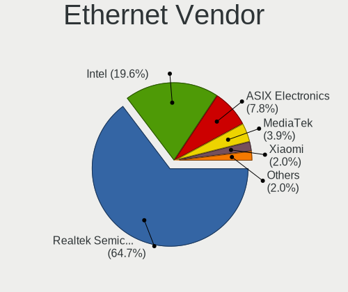

| Vendor                | Computers | Percent |
|-----------------------|-----------|---------|
| Realtek Semiconductor | 33        | 64.71%  |
| Intel                 | 10        | 19.61%  |
| ASIX Electronics      | 4         | 7.84%   |
| MediaTek              | 2         | 3.92%   |
| Xiaomi                | 1         | 1.96%   |
| ICS Advent            | 1         | 1.96%   |

Ethernet Model
--------------

Ethernet models

| Model                                                                  | Computers | Percent |
|------------------------------------------------------------------------|-----------|---------|
| Realtek RTL8111/8168/8211/8411 PCI Express Gigabit Ethernet Controller | 22        | 43.14%  |
| ASIX AX88179 Gigabit Ethernet                                          | 4         | 7.84%   |
| Realtek RTL8153 Gigabit Ethernet Adapter                               | 3         | 5.88%   |
| Realtek RTL8152 Fast Ethernet Adapter                                  | 2         | 3.92%   |
| Realtek RTL8125 2.5GbE Controller                                      | 2         | 3.92%   |
| Realtek RTL810xE PCI Express Fast Ethernet controller                  | 2         | 3.92%   |
| MediaTek MT7922 802.11ax PCI Express Wireless Network Adapter          | 2         | 3.92%   |
| Xiaomi Mi/Redmi series (RNDIS)                                         | 1         | 1.96%   |
| Realtek USB 10/100/1G/2.5G LAN                                         | 1         | 1.96%   |
| Realtek Killer E2600 GbE Controller                                    | 1         | 1.96%   |
| Intel I211 Gigabit Network Connection                                  | 1         | 1.96%   |
| Intel Ethernet Controller I226-V                                       | 1         | 1.96%   |
| Intel Ethernet Connection I217-V                                       | 1         | 1.96%   |
| Intel Ethernet Connection (4) I219-LM                                  | 1         | 1.96%   |
| Intel Ethernet Connection (23) I219-LM                                 | 1         | 1.96%   |
| Intel Ethernet Connection (2) I219-LM                                  | 1         | 1.96%   |
| Intel Ethernet Connection (13) I219-V                                  | 1         | 1.96%   |
| Intel Ethernet Connection (11) I219-V                                  | 1         | 1.96%   |
| Intel Ethernet Connection (10) I219-V                                  | 1         | 1.96%   |
| Intel 82567LM Gigabit Network Connection                               | 1         | 1.96%   |
| ICS Advent USB 10/100 LAN                                              | 1         | 1.96%   |

Net Controller Kind
-------------------

Ethernet, WiFi or modem

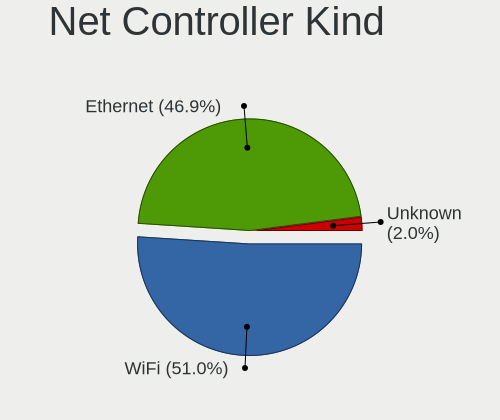

| Kind     | Computers | Percent |
|----------|-----------|---------|
| WiFi     | 50        | 51.02%  |
| Ethernet | 46        | 46.94%  |
| Unknown  | 2         | 2.04%   |

Used Controller
---------------

Currently used network controller

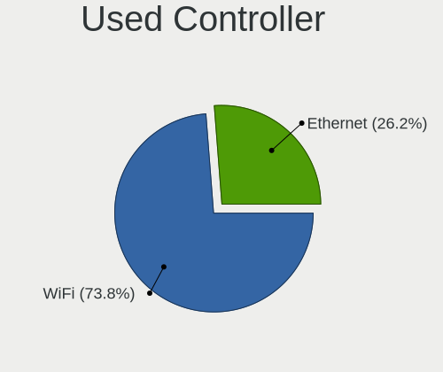

| Kind     | Computers | Percent |
|----------|-----------|---------|
| WiFi     | 45        | 73.77%  |
| Ethernet | 16        | 26.23%  |

NICs
----

Total network controllers on board

| Total | Computers | Percent |
|-------|-----------|---------|
| 2     | 31        | 49.21%  |
| 1     | 23        | 36.51%  |
| 0     | 7         | 11.11%  |
| 3     | 2         | 3.17%   |

IPv6
----

IPv6 vs IPv4

| Used | Computers | Percent |
|------|-----------|---------|
| No   | 49        | 77.78%  |
| Yes  | 14        | 22.22%  |

Bluetooth
---------

Bluetooth Vendor
----------------

Controller vendors

| Vendor                          | Computers | Percent |
|---------------------------------|-----------|---------|
| Intel                           | 32        | 61.54%  |
| Foxconn / Hon Hai               | 7         | 13.46%  |
| Realtek Semiconductor           | 4         | 7.69%   |
| IMC Networks                    | 3         | 5.77%   |
| Cambridge Silicon Radio         | 2         | 3.85%   |
| Realtek                         | 1         | 1.92%   |
| Qualcomm Atheros Communications | 1         | 1.92%   |
| Broadcom                        | 1         | 1.92%   |
| Apple                           | 1         | 1.92%   |

Bluetooth Model
---------------

Controller models

| Model                                               | Computers | Percent |
|-----------------------------------------------------|-----------|---------|
| Intel AX211 Bluetooth                               | 8         | 15.38%  |
| Intel Bluetooth wireless interface                  | 6         | 11.54%  |
| Intel AX201 Bluetooth                               | 6         | 11.54%  |
| Intel AX200 Bluetooth                               | 4         | 7.69%   |
| Foxconn / Hon Hai MediaTek Bluetooth Adapter        | 4         | 7.69%   |
| Realtek Bluetooth Radio                             | 3         | 5.77%   |
| Intel Bluetooth 9460/9560 Jefferson Peak (JfP)      | 3         | 5.77%   |
| Intel AX210 Bluetooth                               | 3         | 5.77%   |
| Foxconn / Hon Hai Wireless_Device                   | 3         | 5.77%   |
| IMC Networks Bluetooth Radio                        | 2         | 3.85%   |
| Cambridge Silicon Radio Bluetooth Dongle (HCI mode) | 2         | 3.85%   |
| Realtek 802.11n WLAN Adapter                        | 1         | 1.92%   |
| Realtek Bluetooth Radio                             | 1         | 1.92%   |
| Qualcomm Atheros  Bluetooth Device                  | 1         | 1.92%   |
| Intel Wireless-AC 3168 Bluetooth                    | 1         | 1.92%   |
| Intel Centrino Advanced-N 6230 Bluetooth adapter    | 1         | 1.92%   |
| IMC Networks Wireless_Device                        | 1         | 1.92%   |
| Broadcom BCM2045B (BDC-2.1) [Bluetooth Controller]  | 1         | 1.92%   |
| Apple Bluetooth Host Controller                     | 1         | 1.92%   |

Sound
-----

Sound Vendor
------------

Sound card vendors

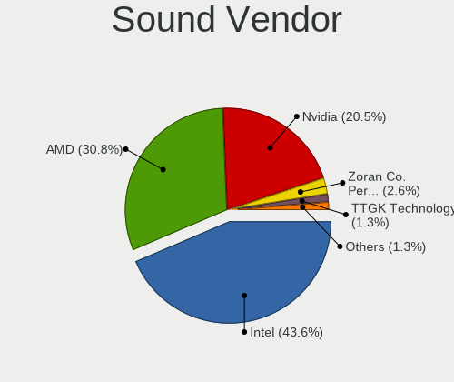

| Vendor                                       | Computers | Percent |
|----------------------------------------------|-----------|---------|
| Intel                                        | 34        | 43.59%  |
| AMD                                          | 24        | 30.77%  |
| Nvidia                                       | 16        | 20.51%  |
| Zoran Co. Personal Media Division (Nogatech) | 2         | 2.56%   |
| TTGK Technology                              | 1         | 1.28%   |
| HECATE G4 S PRO                              | 1         | 1.28%   |

Sound Model
-----------

Sound card models

| Model                                                                             | Computers | Percent |
|-----------------------------------------------------------------------------------|-----------|---------|
| AMD Family 17h/19h/1ah HD Audio Controller                                        | 17        | 18.28%  |
| AMD Renoir Radeon High Definition Audio Controller                                | 8         | 8.6%    |
| Intel Sunrise Point-LP HD Audio                                                   | 5         | 5.38%   |
| Nvidia GA106 High Definition Audio Controller                                     | 4         | 4.3%    |
| Intel Alder Lake PCH-P High Definition Audio Controller                           | 4         | 4.3%    |
| AMD Rembrandt Radeon High Definition Audio Controller                             | 4         | 4.3%    |
| AMD Caicos HDMI Audio [Radeon HD 6450 / 7450/8450/8490 OEM / R5 230/235/235X OEM] | 4         | 4.3%    |
| Nvidia AD107 High Definition Audio Controller                                     | 3         | 3.23%   |
| Intel Tiger Lake-H HD Audio Controller                                            | 3         | 3.23%   |
| Intel Raptor Lake-P/U/H cAVS                                                      | 3         | 3.23%   |
| Intel Cannon Lake PCH cAVS                                                        | 3         | 3.23%   |
| AMD Baffin HDMI/DP Audio [Radeon RX 550 640SP / RX 560/560X]                      | 3         | 3.23%   |
| Zoran Co. Personal Media Division (Nogatech) USB Audio and HID                    | 2         | 2.15%   |
| Nvidia TU107 GeForce GTX 1650 High Definition Audio Controller                    | 2         | 2.15%   |
| Nvidia GP107GL High Definition Audio Controller                                   | 2         | 2.15%   |
| Nvidia GA102 High Definition Audio Controller                                     | 2         | 2.15%   |
| Intel Tiger Lake-LP Smart Sound Technology Audio Controller                       | 2         | 2.15%   |
| Intel Comet Lake PCH-LP cAVS                                                      | 2         | 2.15%   |
| TTGK Technology Audio                                                             | 1         | 1.08%   |
| Nvidia GP106 High Definition Audio Controller                                     | 1         | 1.08%   |
| Nvidia GK208 HDMI/DP Audio Controller                                             | 1         | 1.08%   |
| Nvidia GA107 High Definition Audio Controller                                     | 1         | 1.08%   |
| Intel Xeon E3-1200 v3/4th Gen Core Processor HD Audio Controller                  | 1         | 1.08%   |
| Intel Wildcat Point-LP High Definition Audio Controller                           | 1         | 1.08%   |
| Intel Raptor Lake High Definition Audio Controller                                | 1         | 1.08%   |
| Intel Jasper Lake HD Audio                                                        | 1         | 1.08%   |
| Intel Haswell-ULT HD Audio Controller                                             | 1         | 1.08%   |
| Intel Comet Lake PCH cAVS                                                         | 1         | 1.08%   |
| Intel Broadwell-U Audio Controller                                                | 1         | 1.08%   |
| Intel 9 Series Chipset Family HD Audio Controller                                 | 1         | 1.08%   |
| Intel 82801I (ICH9 Family) HD Audio Controller                                    | 1         | 1.08%   |
| Intel 8 Series/C220 Series Chipset High Definition Audio Controller               | 1         | 1.08%   |
| Intel 8 Series HD Audio Controller                                                | 1         | 1.08%   |
| Intel 7 Series/C216 Chipset Family High Definition Audio Controller               | 1         | 1.08%   |
| Intel 6 Series/C200 Series Chipset Family High Definition Audio Controller        | 1         | 1.08%   |
| Intel 200 Series PCH HD Audio                                                     | 1         | 1.08%   |
| Intel 100 Series/C230 Series Chipset Family HD Audio Controller                   | 1         | 1.08%   |
| HECATE G4 S PRO HECATE G4 S PRO                                                   | 1         | 1.08%   |

Memory
------

Memory Vendor
-------------

Memory module vendors

| Vendor              | Computers | Percent |
|---------------------|-----------|---------|
| Samsung Electronics | 15        | 25%     |
| SK hynix            | 12        | 20%     |
| Micron Technology   | 11        | 18.33%  |
| Unknown             | 6         | 10%     |
| Kingston            | 4         | 6.67%   |
| Crucial             | 3         | 5%      |
| Unilc               | 2         | 3.33%   |
| Elpida              | 2         | 3.33%   |
| A-DATA Technology   | 2         | 3.33%   |
| UniIC               | 1         | 1.67%   |
| Nanya Technology    | 1         | 1.67%   |
| Longsys             | 1         | 1.67%   |

Memory Model
------------

Memory module models

| Model                                                            | Computers | Percent |
|------------------------------------------------------------------|-----------|---------|
| Unknown                                                          | 6         | 9.52%   |
| SK hynix RAM H9JCNNNCP3MLYR-N6E 2GB Row Of Chips LPDDR5 6400MT/s | 2         | 3.17%   |
| Micron RAM Not Set 8GB DIMM DDR4 2668MT/s                        | 2         | 3.17%   |
| Unilc RAM SCA08GU04H1F1C-56B 8192MB DIMM DDR5 5600MT/s           | 1         | 1.59%   |
| UNILC RAM 6478545886 8192MB SODIMM DDR4 2400MT/s                 | 1         | 1.59%   |
| UniIC RAM SCC08GS03H1F1C-26V 8192MB SODIMM DDR4 2666MT/s         | 1         | 1.59%   |
| SK hynix RAM Module 4GB SODIMM DDR3 1867MT/s                     | 1         | 1.59%   |
| SK hynix RAM Module 4096MB SODIMM LPDDR3 1867MT/s                | 1         | 1.59%   |
| SK hynix RAM HMAA4GS6AJR8N-XN 32GB SODIMM DDR4 3200MT/s          | 1         | 1.59%   |
| SK hynix RAM HMAA1GS6DMR6N-XN 8GB Row Of Chips DDR4 3200MT/s     | 1         | 1.59%   |
| SK hynix RAM HMAA1GS6CJR6N-XN 8GB SODIMM DDR4 3200MT/s           | 1         | 1.59%   |
| SK hynix RAM HMAA1GS6CJR6N-XN 8GB Row Of Chips DDR4 3200MT/s     | 1         | 1.59%   |
| SK hynix RAM HMA851S6AFR6N-UH 4GB SODIMM DDR4 2667MT/s           | 1         | 1.59%   |
| SK hynix RAM HMA81GU6DJR8N-XN 8GB DIMM DDR4 3200MT/s             | 1         | 1.59%   |
| SK hynix RAM HMA81GS6AFR8N-UH 8GB SODIMM DDR4 2667MT/s           | 1         | 1.59%   |
| SK hynix RAM H9HKNNNFBMBUDR 8192MB Row Of Chips LPDDR4 4266MT/s  | 1         | 1.59%   |
| SK hynix RAM H9HCNNNCPMMLXR-NEE 8GB Row Of Chips LPDDR4 4266MT/s | 1         | 1.59%   |
| Samsung RAM Module 8192MB SODIMM DDR4 2667MT/s                   | 1         | 1.59%   |
| Samsung RAM Module 2GB SODIMM LPDDR3 1867MT/s                    | 1         | 1.59%   |
| Samsung RAM Module 2048MB SODIMM LPDDR3 1867MT/s                 | 1         | 1.59%   |
| Samsung RAM Module 16GB SODIMM DDR5 4800MT/s                     | 1         | 1.59%   |
| Samsung RAM M471A2K43BB1-CPB 16GB SODIMM DDR4 2133MT/s           | 1         | 1.59%   |
| Samsung RAM M471A2K43BB1-CPB 16GB Chip DDR4 2133MT/s             | 1         | 1.59%   |
| Samsung RAM M471A2G44AM0-CWE 16GB SODIMM DDR4 3200MT/s           | 1         | 1.59%   |
| Samsung RAM M471A1K43EB1-CWE 8GB SODIMM DDR4 3200MT/s            | 1         | 1.59%   |
| Samsung RAM M471A1K43DB1-CTD 8GB SODIMM DDR4 2667MT/s            | 1         | 1.59%   |
| Samsung RAM M471A1G44AB0-CTD 8GB SODIMM DDR4 2667MT/s            | 1         | 1.59%   |
| Samsung RAM M425R1GB4DB0-CWMOL 16GB SODIMM DDR5 5600MT/s         | 1         | 1.59%   |
| Samsung RAM M425R1GB4BB0-CQKOD 8GB SODIMM DDR5 4800MT/s          | 1         | 1.59%   |
| Samsung RAM K4UBE3D4AB-MGCL 2GB Row Of Chips LPDDR4 4267MT/s     | 1         | 1.59%   |
| Samsung RAM K4UBE3D4AA-MGCR 8GB SODIMM LPDDR4 4266MT/s           | 1         | 1.59%   |
| Samsung RAM K3UH7H70AM 8192MB Row Of Chips LPDDR4 4266MT/s       | 1         | 1.59%   |
| Samsung RAM K3LKBKB0BM-MGCP 4GB SODIMM LPDDR5 6400MT/s           | 1         | 1.59%   |
| Samsung RAM 6478545886 16GB DIMM DDR4 2668MT/s                   | 1         | 1.59%   |
| Nanya RAM M2N2G64CB8HA5N-BE 2GB SODIMM 1066MT/s                  | 1         | 1.59%   |
| Micron RAM MTC4C10163S1SC48BA1 8GB SODIMM DDR5 4800MT/s          | 1         | 1.59%   |
| Micron RAM MT62F2G32D8DR-031 WT 8GB Row Of Chips LPDDR5 6400MT/s | 1         | 1.59%   |
| Micron RAM MT62F1G32D4DR-031 2GB Row Of Chips LPDDR5 6400MT/s    | 1         | 1.59%   |
| Micron RAM MT52L1G32D4PG-093 8GB Row Of Chips LPDDR3 2133MT/s    | 1         | 1.59%   |
| Micron RAM Module 16GB SODIMM DDR4 2667MT/s                      | 1         | 1.59%   |

Memory Kind
-----------

Memory module kinds

| Kind    | Computers | Percent |
|---------|-----------|---------|
| DDR4    | 27        | 45.76%  |
| LPDDR4  | 9         | 15.25%  |
| DDR5    | 9         | 15.25%  |
| LPDDR5  | 5         | 8.47%   |
| DDR3    | 5         | 8.47%   |
| LPDDR3  | 3         | 5.08%   |
| Unknown | 1         | 1.69%   |

Memory Form Factor
------------------

Physical design of the memory module

| Name         | Computers | Percent |
|--------------|-----------|---------|
| SODIMM       | 29        | 50%     |
| Row Of Chips | 13        | 22.41%  |
| DIMM         | 13        | 22.41%  |
| Chip         | 3         | 5.17%   |

Memory Size
-----------

Memory module size

| Size  | Computers | Percent |
|-------|-----------|---------|
| 8192  | 32        | 55.17%  |
| 16384 | 9         | 15.52%  |
| 4096  | 7         | 12.07%  |
| 32768 | 5         | 8.62%   |
| 2048  | 4         | 6.9%    |
| 24576 | 1         | 1.72%   |

Memory Speed
------------

Memory module speed

| Speed | Computers | Percent |
|-------|-----------|---------|
| 3200  | 14        | 24.14%  |
| 4266  | 6         | 10.34%  |
| 6400  | 5         | 8.62%   |
| 2667  | 5         | 8.62%   |
| 5600  | 4         | 6.9%    |
| 4800  | 3         | 5.17%   |
| 2668  | 3         | 5.17%   |
| 1867  | 3         | 5.17%   |
| 1600  | 3         | 5.17%   |
| 4267  | 2         | 3.45%   |
| 2666  | 2         | 3.45%   |
| 2133  | 2         | 3.45%   |
| 6000  | 1         | 1.72%   |
| 5200  | 1         | 1.72%   |
| 3600  | 1         | 1.72%   |
| 2400  | 1         | 1.72%   |
| 1067  | 1         | 1.72%   |
| 1066  | 1         | 1.72%   |

Printers & scanners
-------------------

Printer Vendor
--------------

Printer device vendors

| Vendor              | Computers | Percent |
|---------------------|-----------|---------|
| Hewlett-Packard     | 2         | 66.67%  |
| Samsung Electronics | 1         | 33.33%  |

Printer Model
-------------

Printer device models

| Model                   | Computers | Percent |
|-------------------------|-----------|---------|
| Samsung M2020 Series    | 1         | 33.33%  |
| HP Laser NS 1020        | 1         | 33.33%  |
| HP DeskJet F4200 series | 1         | 33.33%  |

Scanner Vendor
--------------

Scanner device vendors

Zero info for selected period =(

Scanner Model
-------------

Scanner device models

Zero info for selected period =(

Camera
------

Camera Vendor
-------------

Camera device vendors

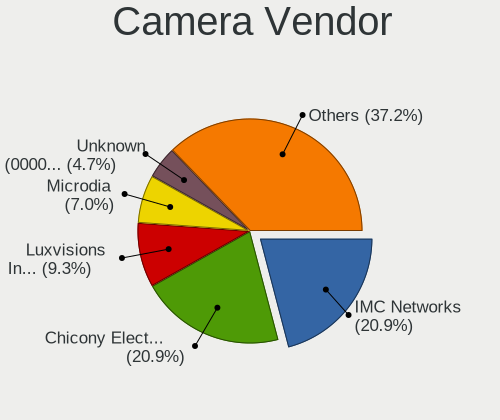

| Vendor                                 | Computers | Percent |
|----------------------------------------|-----------|---------|
| IMC Networks                           | 9         | 20.93%  |
| Chicony Electronics                    | 9         | 20.93%  |
| Luxvisions Innotech Limited            | 4         | 9.3%    |
| Microdia                               | 3         | 6.98%   |
| Unknown (0000066029)                   | 2         | 4.65%   |
| Syntek                                 | 2         | 4.65%   |
| Sonix Technology                       | 2         | 4.65%   |
| Quanta                                 | 2         | 4.65%   |
| Cheng Uei Precision Industry (Foxlink) | 2         | 4.65%   |
| SunplusIT                              | 1         | 2.33%   |
| Sunplus Innovation Technology          | 1         | 2.33%   |
| ShineTech                              | 1         | 2.33%   |
| Realtek Semiconductor                  | 1         | 2.33%   |
| Lenovo                                 | 1         | 2.33%   |
| Bison Electronics                      | 1         | 2.33%   |
| Apple                                  | 1         | 2.33%   |
| Acer                                   | 1         | 2.33%   |

Camera Model
------------

Camera device models

| Model                                               | Computers | Percent |
|-----------------------------------------------------|-----------|---------|
| IMC Networks USB2.0 HD UVC WebCam                   | 4         | 9.3%    |
| IMC Networks Integrated Camera                      | 4         | 9.3%    |
| Chicony Integrated Camera                           | 3         | 6.98%   |
| Unknown (0000066029) HD Camera                      | 2         | 4.65%   |
| Syntek Integrated Camera                            | 2         | 4.65%   |
| Sonix USB2.0 FHD UVC WebCam                         | 2         | 4.65%   |
| Luxvisions Innotech Limited Integrated Camera       | 2         | 4.65%   |
| SunplusIT XiaoMi Webcam                             | 1         | 2.33%   |
| Sunplus Full HD webcam                              | 1         | 2.33%   |
| ShineTech HD Camera                                 | 1         | 2.33%   |
| Realtek Integrated_Webcam_HD                        | 1         | 2.33%   |
| Quanta ov9734_techfront_camera                      | 1         | 2.33%   |
| Quanta HD User Facing                               | 1         | 2.33%   |
| Microdia USB2.0 Camera                              | 1         | 2.33%   |
| Microdia Laptop_Integrated_Webcam_HD                | 1         | 2.33%   |
| Microdia Integrated_Webcam_HD                       | 1         | 2.33%   |
| Luxvisions Innotech Limited Integrated RGB Camera   | 1         | 2.33%   |
| Luxvisions Innotech Limited HP TrueVision HD Camera | 1         | 2.33%   |
| Lenovo Integrated Webcam                            | 1         | 2.33%   |
| IMC Networks Integrated RGB Camera                  | 1         | 2.33%   |
| Chicony XiaoMi USB 2.0 Webcam                       | 1         | 2.33%   |
| Chicony USB2.0 HD UVC WebCam                        | 1         | 2.33%   |
| Chicony Integrated Camera (1280x720@30)             | 1         | 2.33%   |
| Chicony HP HD Camera                                | 1         | 2.33%   |
| Chicony HD Webcam                                   | 1         | 2.33%   |
| Chicony EasyCamera                                  | 1         | 2.33%   |
| Cheng Uei Precision Industry (Foxlink) HP HD Camera | 1         | 2.33%   |
| Cheng Uei Precision Industry (Foxlink) HD Camera    | 1         | 2.33%   |
| Bison Integrated Camera                             | 1         | 2.33%   |
| Apple iPhone 5/5C/5S/6/SE/7/8/X/XR                  | 1         | 2.33%   |
| Acer Integrated Camera                              | 1         | 2.33%   |

Security
--------

Fingerprint Vendor
------------------

Fingerprint sensor vendors

| Vendor                     | Computers | Percent |
|----------------------------|-----------|---------|
| Synaptics                  | 7         | 53.85%  |
| Validity Sensors           | 3         | 23.08%  |
| Shenzhen Goodix Technology | 2         | 15.38%  |
| AuthenTec                  | 1         | 7.69%   |

Fingerprint Model
-----------------

Fingerprint sensor models

| Model                                                     | Computers | Percent |
|-----------------------------------------------------------|-----------|---------|
| Synaptics Prometheus MIS Touch Fingerprint Reader         | 3         | 23.08%  |
| Shenzhen Goodix  Fingerprint Device                       | 2         | 15.38%  |
| Validity Sensors VFS7500 Touch Fingerprint Sensor         | 1         | 7.69%   |
| Validity Sensors VFS5011 Fingerprint Reader               | 1         | 7.69%   |
| Validity Sensors VFS 5011 fingerprint sensor              | 1         | 7.69%   |
| Synaptics UWP WBDI Device                                 | 1         | 7.69%   |
| Synaptics  FS7604 Touch Fingerprint Sensor with PurePrint | 1         | 7.69%   |
| Synaptics Prometheus Fingerprint Reader                   | 1         | 7.69%   |
| Synaptics Metallica MIS Touch Fingerprint Reader          | 1         | 7.69%   |
| AuthenTec AES2810                                         | 1         | 7.69%   |

Chipcard Vendor
---------------

Chipcard module vendors

Zero info for selected period =(

Chipcard Model
--------------

Chipcard module models

Zero info for selected period =(

Unsupported
-----------

Unsupported Devices
-------------------

Total unsupported devices on board

| Total | Computers | Percent |
|-------|-----------|---------|
| 0     | 45        | 71.43%  |
| 1     | 13        | 20.63%  |
| 2     | 4         | 6.35%   |
| 3     | 1         | 1.59%   |

Unsupported Device Types
------------------------

Types of unsupported devices

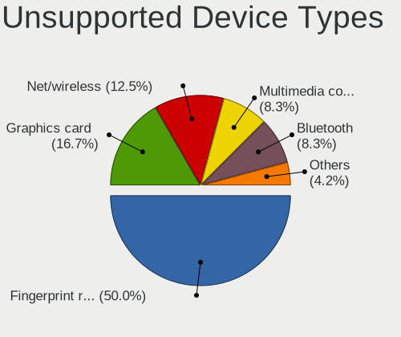

| Type                  | Computers | Percent |
|-----------------------|-----------|---------|
| Fingerprint reader    | 12        | 50%     |
| Graphics card         | 4         | 16.67%  |
| Net/wireless          | 3         | 12.5%   |
| Multimedia controller | 2         | 8.33%   |
| Bluetooth             | 2         | 8.33%   |
| Camera                | 1         | 4.17%   |

