Kylin - Tested Hardware & Statistics (Desktops)
-----------------------------------------------

A project to collect tested hardware configurations for Kylin.

Anyone can contribute to this report by the [hw-probe](https://github.com/linuxhw/hw-probe) tool:

    sudo -E hw-probe -all -upload

Please contribute! Especially if your hardware is rare.

Contents
--------

* [ Test Cases ](#test-cases)

* [ System ](#system)
  - [ OS                       ](#os)
  - [ OS Family                ](#os-family)
  - [ Kernel                   ](#kernel)
  - [ Kernel Family            ](#kernel-family)
  - [ Kernel Major Ver.        ](#kernel-major-ver)
  - [ Arch                     ](#arch)
  - [ DE                       ](#de)
  - [ Display Server           ](#display-server)
  - [ Display Manager          ](#display-manager)
  - [ OS Lang                  ](#os-lang)
  - [ Boot Mode                ](#boot-mode)
  - [ Filesystem               ](#filesystem)
  - [ Part. scheme             ](#part-scheme)
  - [ Dual Boot with Linux/BSD ](#dual-boot-with-linuxbsd)
  - [ Dual Boot (Win)          ](#dual-boot-win)

* [ Board ](#board)
  - [ Vendor                   ](#vendor)
  - [ Model                    ](#model)
  - [ Model Family             ](#model-family)
  - [ MFG Year                 ](#mfg-year)
  - [ Form Factor              ](#form-factor)
  - [ Secure Boot              ](#secure-boot)
  - [ Coreboot                 ](#coreboot)
  - [ RAM Size                 ](#ram-size)
  - [ RAM Used                 ](#ram-used)
  - [ Total Drives             ](#total-drives)
  - [ Has CD-ROM               ](#has-cd-rom)
  - [ Has Ethernet             ](#has-ethernet)
  - [ Has WiFi                 ](#has-wifi)
  - [ Has Bluetooth            ](#has-bluetooth)

* [ Location ](#location)
  - [ Country                  ](#country)
  - [ City                     ](#city)

* [ Drives ](#drives)
  - [ Drive Vendor             ](#drive-vendor)
  - [ Drive Model              ](#drive-model)
  - [ HDD Vendor               ](#hdd-vendor)
  - [ SSD Vendor               ](#ssd-vendor)
  - [ Drive Kind               ](#drive-kind)
  - [ Drive Connector          ](#drive-connector)
  - [ Drive Size               ](#drive-size)
  - [ Space Total              ](#space-total)
  - [ Space Used               ](#space-used)
  - [ Malfunc. Drives          ](#malfunc-drives)
  - [ Malfunc. Drive Vendor    ](#malfunc-drive-vendor)
  - [ Malfunc. HDD Vendor      ](#malfunc-hdd-vendor)
  - [ Malfunc. Drive Kind      ](#malfunc-drive-kind)
  - [ Failed Drives            ](#failed-drives)
  - [ Failed Drive Vendor      ](#failed-drive-vendor)
  - [ Drive Status             ](#drive-status)

* [ Storage controller ](#storage-controller)
  - [ Storage Vendor           ](#storage-vendor)
  - [ Storage Model            ](#storage-model)
  - [ Storage Kind             ](#storage-kind)

* [ Processor ](#processor)
  - [ CPU Vendor               ](#cpu-vendor)
  - [ CPU Model                ](#cpu-model)
  - [ CPU Model Family         ](#cpu-model-family)
  - [ CPU Cores                ](#cpu-cores)
  - [ CPU Sockets              ](#cpu-sockets)
  - [ CPU Threads              ](#cpu-threads)
  - [ CPU Op-Modes             ](#cpu-op-modes)
  - [ CPU Microcode            ](#cpu-microcode)
  - [ CPU Microarch            ](#cpu-microarch)

* [ Graphics ](#graphics)
  - [ GPU Vendor               ](#gpu-vendor)
  - [ GPU Model                ](#gpu-model)
  - [ GPU Combo                ](#gpu-combo)
  - [ GPU Driver               ](#gpu-driver)
  - [ GPU Memory               ](#gpu-memory)

* [ Monitor ](#monitor)
  - [ Monitor Vendor           ](#monitor-vendor)
  - [ Monitor Model            ](#monitor-model)
  - [ Monitor Resolution       ](#monitor-resolution)
  - [ Monitor Diagonal         ](#monitor-diagonal)
  - [ Monitor Width            ](#monitor-width)
  - [ Aspect Ratio             ](#aspect-ratio)
  - [ Monitor Area             ](#monitor-area)
  - [ Pixel Density            ](#pixel-density)
  - [ Multiple Monitors        ](#multiple-monitors)

* [ Network ](#network)
  - [ Net Controller Vendor    ](#net-controller-vendor)
  - [ Net Controller Model     ](#net-controller-model)
  - [ Wireless Vendor          ](#wireless-vendor)
  - [ Wireless Model           ](#wireless-model)
  - [ Ethernet Vendor          ](#ethernet-vendor)
  - [ Ethernet Model           ](#ethernet-model)
  - [ Net Controller Kind      ](#net-controller-kind)
  - [ Used Controller          ](#used-controller)
  - [ NICs                     ](#nics)
  - [ IPv6                     ](#ipv6)

* [ Bluetooth ](#bluetooth)
  - [ Bluetooth Vendor         ](#bluetooth-vendor)
  - [ Bluetooth Model          ](#bluetooth-model)

* [ Sound ](#sound)
  - [ Sound Vendor             ](#sound-vendor)
  - [ Sound Model              ](#sound-model)

* [ Memory ](#memory)
  - [ Memory Vendor            ](#memory-vendor)
  - [ Memory Model             ](#memory-model)
  - [ Memory Kind              ](#memory-kind)
  - [ Memory Form Factor       ](#memory-form-factor)
  - [ Memory Size              ](#memory-size)
  - [ Memory Speed             ](#memory-speed)

* [ Printers & scanners ](#printers--scanners)
  - [ Printer Vendor           ](#printer-vendor)
  - [ Printer Model            ](#printer-model)
  - [ Scanner Vendor           ](#scanner-vendor)
  - [ Scanner Model            ](#scanner-model)

* [ Camera ](#camera)
  - [ Camera Vendor            ](#camera-vendor)
  - [ Camera Model             ](#camera-model)

* [ Security ](#security)
  - [ Fingerprint Vendor       ](#fingerprint-vendor)
  - [ Fingerprint Model        ](#fingerprint-model)
  - [ Chipcard Vendor          ](#chipcard-vendor)
  - [ Chipcard Model           ](#chipcard-model)

* [ Unsupported ](#unsupported)
  - [ Unsupported Devices      ](#unsupported-devices)
  - [ Unsupported Device Types ](#unsupported-device-types)

Test Cases
----------

Total: 4

| Vendor   | Model              | Probe                                                      | Date         |
|----------|--------------------|------------------------------------------------------------|--------------|
| ASUSTek  | PRIME H310M-F R2.0 | [4b4560a9ba](https://linux-hardware.org/?probe=4b4560a9ba) | Nov 20, 2023 |
| ASUSTek  | PRIME H310M-F R2.0 | [6ff3a21e4e](https://linux-hardware.org/?probe=6ff3a21e4e) | Nov 20, 2023 |
| Dell     | 0V7K5Y A00         | [831a493e15](https://linux-hardware.org/?probe=831a493e15) | Feb 24, 2023 |
| Gigabyte | Z97X-SLI-CF        | [4e829bc252](https://linux-hardware.org/?probe=4e829bc252) | Dec 10, 2022 |

System
------

OS
--

Installed operating systems

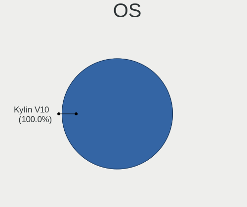

| Name      | Desktops | Percent |
|-----------|----------|---------|
| Kylin V10 | 3        | 100%    |

OS Family
---------

OS without a version

| Name  | Desktops | Percent |
|-------|----------|---------|
| Kylin | 3        | 100%    |

Kernel
------

Version of the Linux kernel

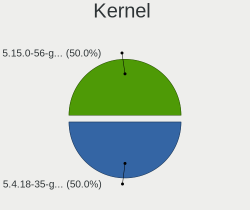

| Version           | Desktops | Percent |
|-------------------|----------|---------|
| 5.4.18-35-generic | 1        | 33.33%  |
| 5.4.0-26-generic  | 1        | 33.33%  |
| 5.15.0-56-generic | 1        | 33.33%  |

Kernel Family
-------------

Linux kernel without a distro release

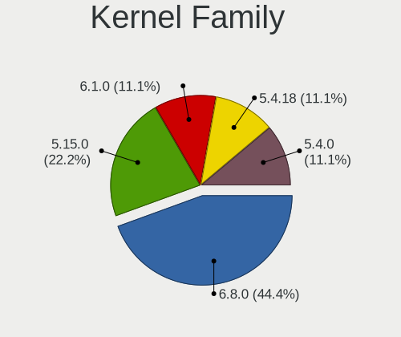

| Version | Desktops | Percent |
|---------|----------|---------|
| 5.4.18  | 1        | 33.33%  |
| 5.4.0   | 1        | 33.33%  |
| 5.15.0  | 1        | 33.33%  |

Kernel Major Ver.
-----------------

Linux kernel major version

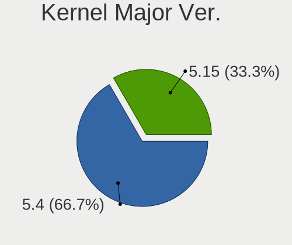

| Version | Desktops | Percent |
|---------|----------|---------|
| 5.4     | 2        | 66.67%  |
| 5.15    | 1        | 33.33%  |

Arch
----

OS architecture (x86_64, i586, etc.)

| Name   | Desktops | Percent |
|--------|----------|---------|
| x86_64 | 3        | 100%    |

DE
--

Desktop Environment

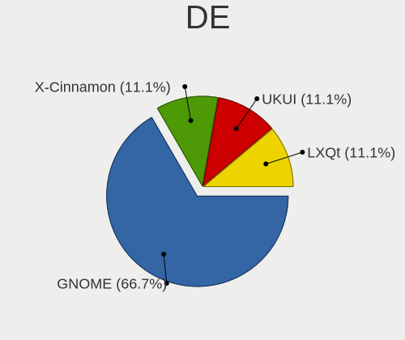

| Name  | Desktops | Percent |
|-------|----------|---------|
| GNOME | 2        | 66.67%  |
| UKUI  | 1        | 33.33%  |

Display Server
--------------

X11 or Wayland

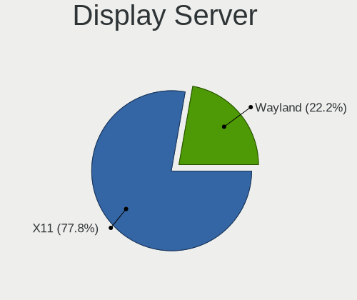

| Name | Desktops | Percent |
|------|----------|---------|
| X11  | 3        | 100%    |

Display Manager
---------------

SDDM, LightDM, etc.

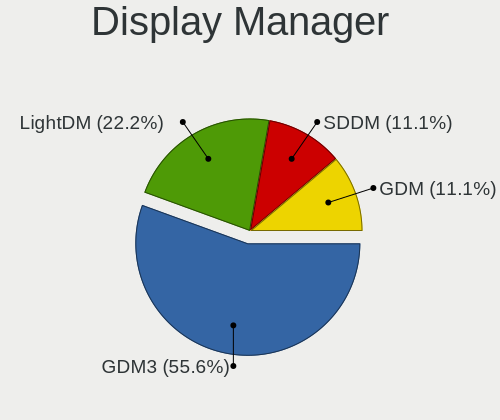

| Name    | Desktops | Percent |
|---------|----------|---------|
| LightDM | 1        | 33.33%  |
| GDM3    | 1        | 33.33%  |
| GDM     | 1        | 33.33%  |

OS Lang
-------

Language

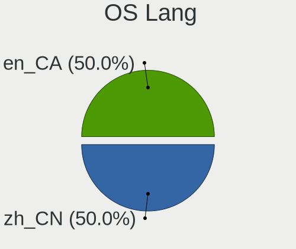

| Lang  | Desktops | Percent |
|-------|----------|---------|
| zh_CN | 2        | 66.67%  |
| en_CA | 1        | 33.33%  |

Boot Mode
---------

EFI or BIOS

| Mode | Desktops | Percent |
|------|----------|---------|
| EFI  | 3        | 100%    |

Filesystem
----------

Type of filesystem

| Type | Desktops | Percent |
|------|----------|---------|
| Ext4 | 3        | 100%    |

Part. scheme
------------

Scheme of partitioning

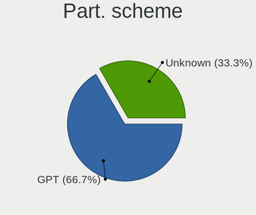

| Type    | Desktops | Percent |
|---------|----------|---------|
| GPT     | 2        | 66.67%  |
| Unknown | 1        | 33.33%  |

Dual Boot with Linux/BSD
------------------------

Hosting more than one Linux/BSD

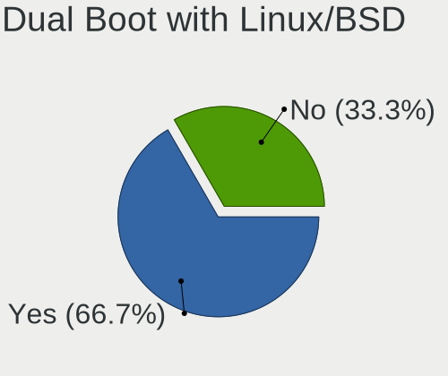

| Dual boot | Desktops | Percent |
|-----------|----------|---------|
| Yes       | 2        | 66.67%  |
| No        | 1        | 33.33%  |

Dual Boot (Win)
---------------

Hosting Linux and Windows

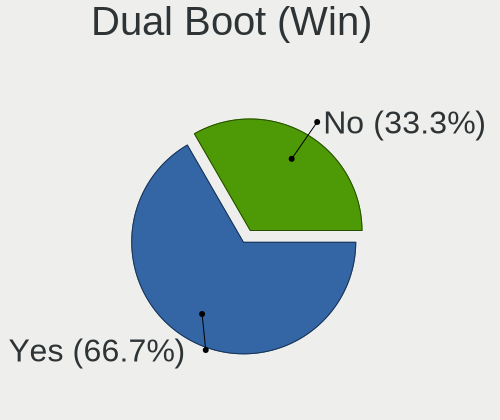

| Dual boot | Desktops | Percent |
|-----------|----------|---------|
| No        | 2        | 66.67%  |
| Yes       | 1        | 33.33%  |

Board
-----

Vendor
------

Motherboard manufacturer

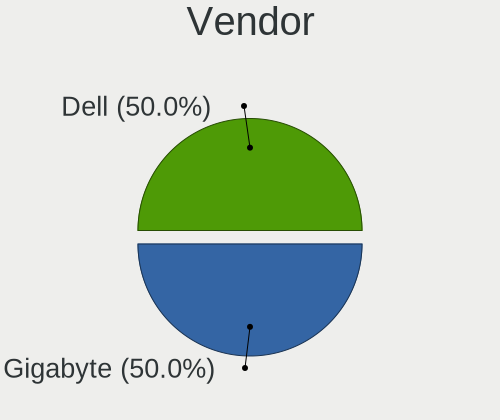

| Name                | Desktops | Percent |
|---------------------|----------|---------|
| Gigabyte Technology | 1        | 33.33%  |
| Dell                | 1        | 33.33%  |
| ASUSTek Computer    | 1        | 33.33%  |

Model
-----

Motherboard model

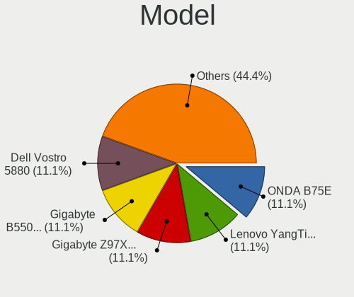

| Name                    | Desktops | Percent |
|-------------------------|----------|---------|
| Gigabyte Z97X-SLI       | 1        | 33.33%  |
| Dell Vostro 5880        | 1        | 33.33%  |
| ASUS PRIME H310M-F R2.0 | 1        | 33.33%  |

Model Family
------------

Motherboard model prefix

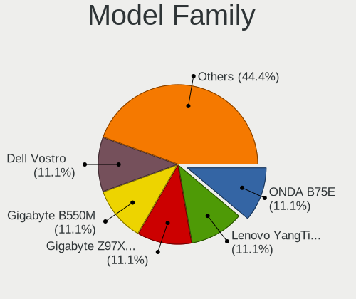

| Name              | Desktops | Percent |
|-------------------|----------|---------|
| Gigabyte Z97X-SLI | 1        | 33.33%  |
| Dell Vostro       | 1        | 33.33%  |
| ASUS PRIME        | 1        | 33.33%  |

MFG Year
--------

Motherboard manufacture year

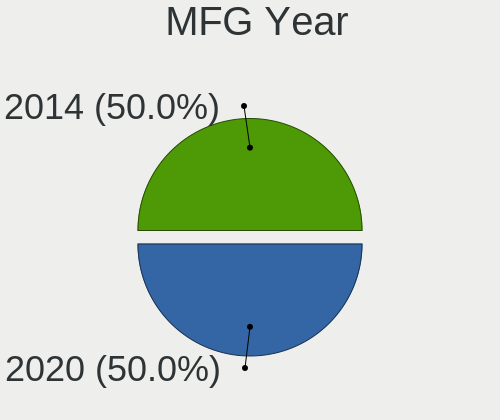

| Year | Desktops | Percent |
|------|----------|---------|
| 2020 | 1        | 33.33%  |
| 2019 | 1        | 33.33%  |
| 2014 | 1        | 33.33%  |

Form Factor
-----------

Physical design of the computer

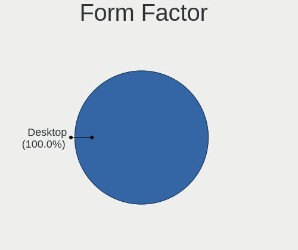

| Name    | Desktops | Percent |
|---------|----------|---------|
| Desktop | 3        | 100%    |

Secure Boot
-----------

Enabled or disabled

| State    | Desktops | Percent |
|----------|----------|---------|
| Disabled | 3        | 100%    |

Coreboot
--------

Have coreboot on board

| Used | Desktops | Percent |
|------|----------|---------|
| No   | 3        | 100%    |

RAM Size
--------

Total RAM memory

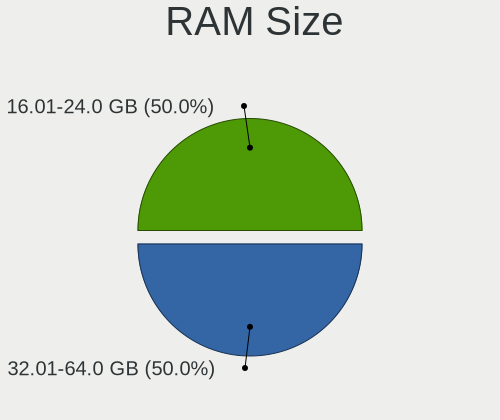

| Size in GB | Desktops | Percent |
|------------|----------|---------|
| 32.01-64.0 | 2        | 66.67%  |
| 16.01-24.0 | 1        | 33.33%  |

RAM Used
--------

Used RAM memory

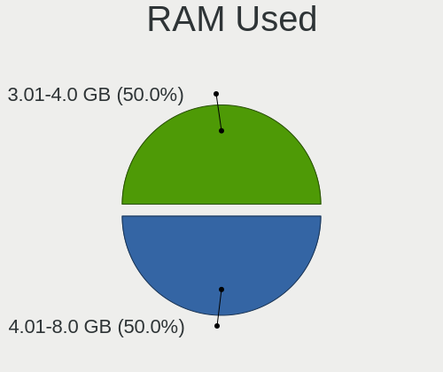

| Used GB  | Desktops | Percent |
|----------|----------|---------|
| 3.01-4.0 | 2        | 66.67%  |
| 4.01-8.0 | 1        | 33.33%  |

Total Drives
------------

Number of drives on board

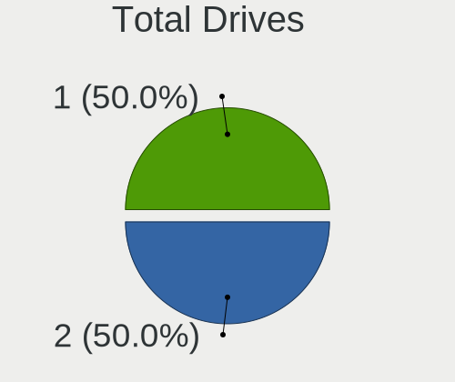

| Drives | Desktops | Percent |
|--------|----------|---------|
| 2      | 2        | 66.67%  |
| 1      | 1        | 33.33%  |

Has CD-ROM
----------

Has CD-ROM on board

| Presented | Desktops | Percent |
|-----------|----------|---------|
| No        | 3        | 100%    |

Has Ethernet
------------

Has Ethernet on board

| Presented | Desktops | Percent |
|-----------|----------|---------|
| Yes       | 3        | 100%    |

Has WiFi
--------

Has WiFi module

| Presented | Desktops | Percent |
|-----------|----------|---------|
| Yes       | 2        | 66.67%  |
| No        | 1        | 33.33%  |

Has Bluetooth
-------------

Has Bluetooth module

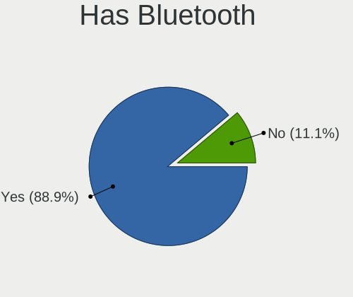

| Presented | Desktops | Percent |
|-----------|----------|---------|
| Yes       | 3        | 100%    |

Location
--------

Country
-------

Geographic location (country)

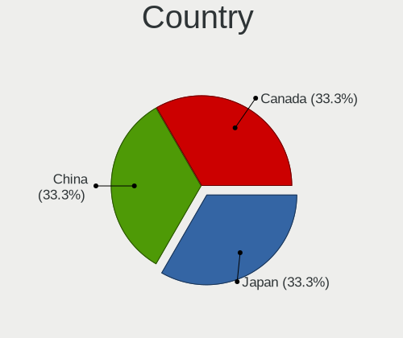

| Country | Desktops | Percent |
|---------|----------|---------|
| Japan   | 1        | 33.33%  |
| China   | 1        | 33.33%  |
| Canada  | 1        | 33.33%  |

City
----

Geographic location (city)

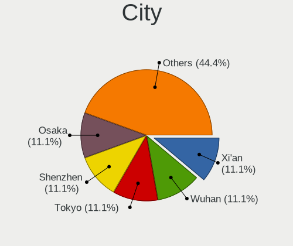

| City    | Desktops | Percent |
|---------|----------|---------|
| Tokyo   | 1        | 33.33%  |
| Markham | 1        | 33.33%  |
| Beijing | 1        | 33.33%  |

Drives
------

Drive Vendor
------------

Hard drive vendors

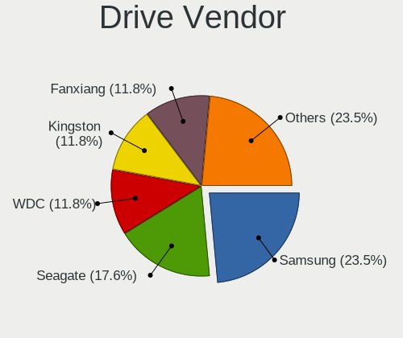

| Vendor              | Desktops | Drives | Percent |
|---------------------|----------|--------|---------|
| WDC                 | 1        | 1      | 20%     |
| Seagate             | 1        | 1      | 20%     |
| Samsung Electronics | 1        | 1      | 20%     |
| Kingston            | 1        | 1      | 20%     |
| FC-1307             | 1        | 1      | 20%     |

Drive Model
-----------

Hard drive models

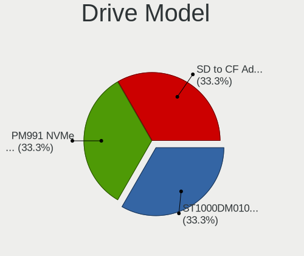

| Model                           | Desktops | Percent |
|---------------------------------|----------|---------|
| WDC WD10EZEX-22MFCA0 1TB        | 1        | 20%     |
| Seagate ST1000DM010-2EP102 1TB  | 1        | 20%     |
| Samsung PM991 NVMe 256GB        | 1        | 20%     |
| Kingston SA400S37240G 240GB SSD | 1        | 20%     |
| FC-1307 SD to CF Adapter V1.4   | 1        | 20%     |

HDD Vendor
----------

Hard disk drive vendors

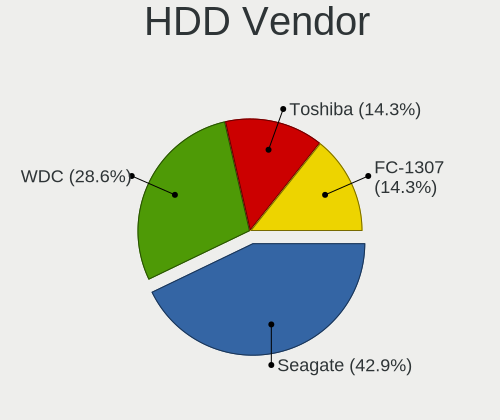

| Vendor  | Desktops | Drives | Percent |
|---------|----------|--------|---------|
| WDC     | 1        | 1      | 33.33%  |
| Seagate | 1        | 1      | 33.33%  |
| FC-1307 | 1        | 1      | 33.33%  |

SSD Vendor
----------

Solid state drive vendors

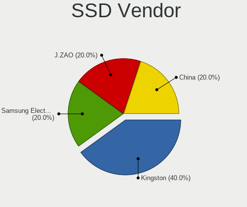

| Vendor   | Desktops | Drives | Percent |
|----------|----------|--------|---------|
| Kingston | 1        | 1      | 100%    |

Drive Kind
----------

HDD or SSD

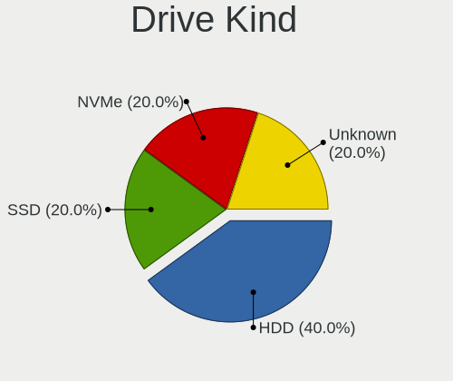

| Kind | Desktops | Drives | Percent |
|------|----------|--------|---------|
| HDD  | 3        | 3      | 60%     |
| NVMe | 1        | 1      | 20%     |
| SSD  | 1        | 1      | 20%     |

Drive Connector
---------------

SATA, SAS, NVMe, etc.

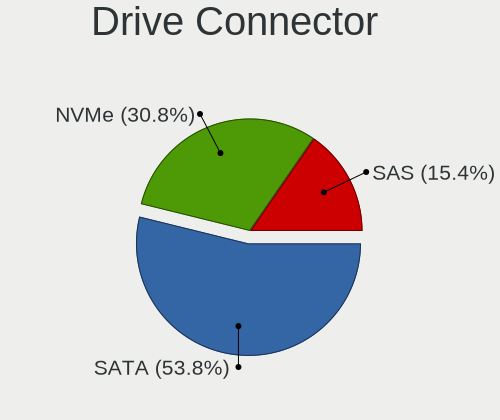

| Type | Desktops | Drives | Percent |
|------|----------|--------|---------|
| SATA | 3        | 4      | 75%     |
| NVMe | 1        | 1      | 25%     |

Drive Size
----------

Size of hard drive

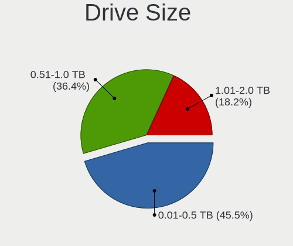

| Size in TB | Desktops | Drives | Percent |
|------------|----------|--------|---------|
| 0.51-1.0   | 2        | 2      | 50%     |
| 0.01-0.5   | 2        | 2      | 50%     |

Space Total
-----------

Amount of disk space available on the file system

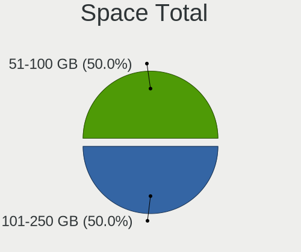

| Size in GB | Desktops | Percent |
|------------|----------|---------|
| 101-250    | 2        | 66.67%  |
| 51-100     | 1        | 33.33%  |

Space Used
----------

Amount of used disk space

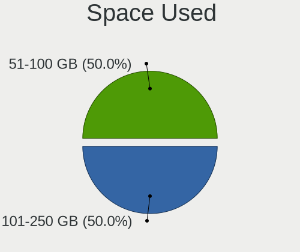

| Used GB | Desktops | Percent |
|---------|----------|---------|
| 101-250 | 2        | 66.67%  |
| 51-100  | 1        | 33.33%  |

Malfunc. Drives
---------------

Drive models with a malfunction

Zero info for selected period =(

Malfunc. Drive Vendor
---------------------

Vendors of faulty drives

Zero info for selected period =(

Malfunc. HDD Vendor
-------------------

Vendors of faulty HDD drives

Zero info for selected period =(

Malfunc. Drive Kind
-------------------

Kinds of faulty drives

Zero info for selected period =(

Failed Drives
-------------

Failed drive models

Zero info for selected period =(

Failed Drive Vendor
-------------------

Failed drive vendors

Zero info for selected period =(

Drive Status
------------

Number of failed and malfunc. drives

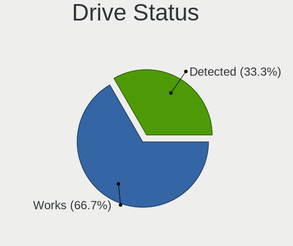

| Status   | Desktops | Drives | Percent |
|----------|----------|--------|---------|
| Works    | 2        | 4      | 66.67%  |
| Detected | 1        | 1      | 33.33%  |

Storage controller
------------------

Storage Vendor
--------------

Storage controller vendors

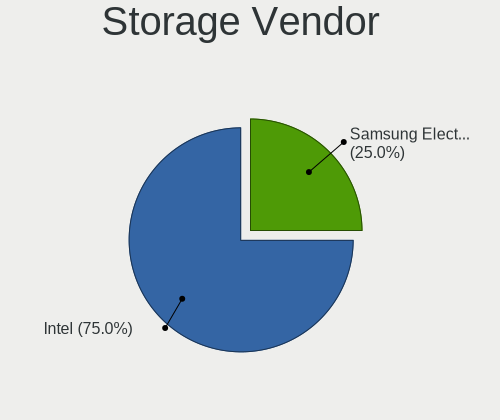

| Vendor              | Desktops | Percent |
|---------------------|----------|---------|
| Intel               | 3        | 75%     |
| Samsung Electronics | 1        | 25%     |

Storage Model
-------------

Storage controller models

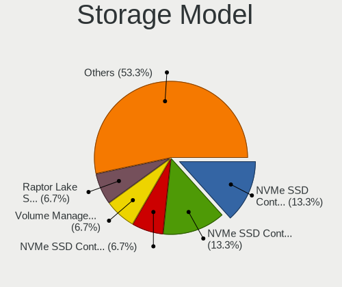

| Model                                                     | Desktops | Percent |
|-----------------------------------------------------------|----------|---------|
| Samsung NVMe SSD Controller 980 (DRAM-less)               | 1        | 25%     |
| Intel Comet Lake SATA AHCI Controller                     | 1        | 25%     |
| Intel 9 Series Chipset Family SATA Controller [AHCI Mode] | 1        | 25%     |
| Intel 200 Series PCH SATA controller [AHCI mode]          | 1        | 25%     |

Storage Kind
------------

Kind of storage controller (IDE, SATA, NVMe, SAS, ...)

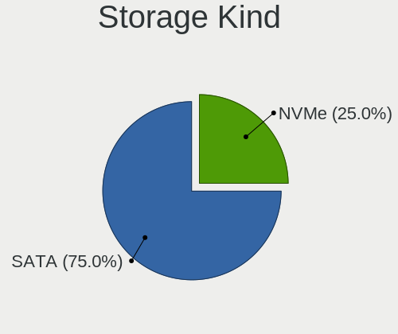

| Kind | Desktops | Percent |
|------|----------|---------|
| SATA | 3        | 75%     |
| NVMe | 1        | 25%     |

Processor
---------

CPU Vendor
----------

Processor vendors

| Vendor | Desktops | Percent |
|--------|----------|---------|
| Intel  | 3        | 100%    |

CPU Model
---------

Processor models

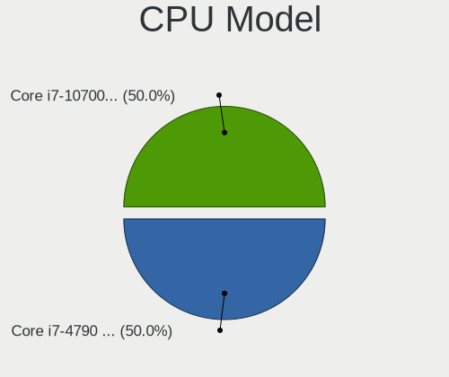

| Model                             | Desktops | Percent |
|-----------------------------------|----------|---------|
| Intel Core i7-4790 CPU @ 3.60GHz  | 1        | 33.33%  |
| Intel Core i7-10700 CPU @ 2.90GHz | 1        | 33.33%  |
| Intel Core i5-8400 CPU @ 2.80GHz  | 1        | 33.33%  |

CPU Model Family
----------------

Processor model prefix

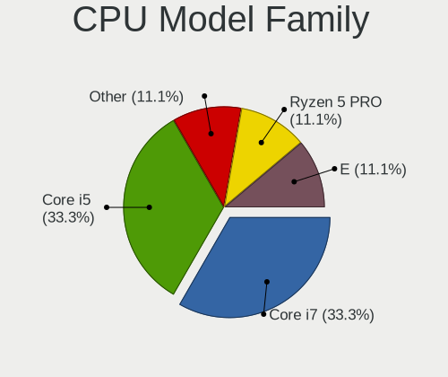

| Model         | Desktops | Percent |
|---------------|----------|---------|
| Intel Core i7 | 2        | 66.67%  |
| Intel Core i5 | 1        | 33.33%  |

CPU Cores
---------

Number of processor cores

| Number | Desktops | Percent |
|--------|----------|---------|
| 8      | 1        | 33.33%  |
| 6      | 1        | 33.33%  |
| 4      | 1        | 33.33%  |

CPU Sockets
-----------

Number of sockets

| Number | Desktops | Percent |
|--------|----------|---------|
| 1      | 3        | 100%    |

CPU Threads
-----------

Threads per core (Hyper-Threading)

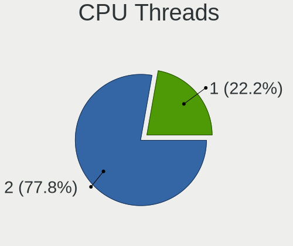

| Number | Desktops | Percent |
|--------|----------|---------|
| 2      | 2        | 66.67%  |
| 1      | 1        | 33.33%  |

CPU Op-Modes
------------

CPU Operation Modes (32-bit, 64-bit)

| Op mode        | Desktops | Percent |
|----------------|----------|---------|
| 32-bit, 64-bit | 3        | 100%    |

CPU Microcode
-------------

Microcode number

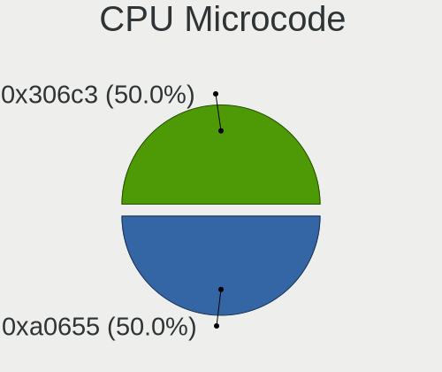

| Number  | Desktops | Percent |
|---------|----------|---------|
| 0xa0655 | 1        | 33.33%  |
| 0x906ea | 1        | 33.33%  |
| 0x306c3 | 1        | 33.33%  |

CPU Microarch
-------------

Microarchitecture

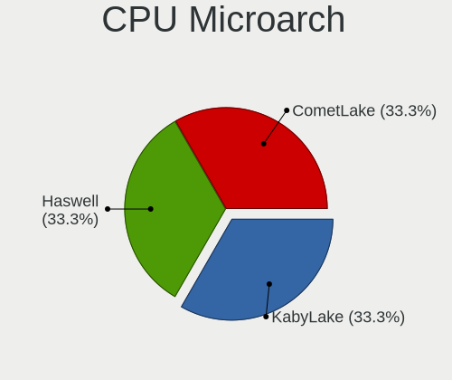

| Name      | Desktops | Percent |
|-----------|----------|---------|
| KabyLake  | 1        | 33.33%  |
| Haswell   | 1        | 33.33%  |
| CometLake | 1        | 33.33%  |

Graphics
--------

GPU Vendor
----------

Vendors of graphics cards

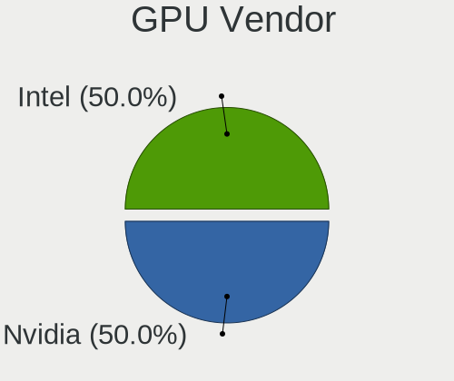

| Vendor | Desktops | Percent |
|--------|----------|---------|
| Intel  | 3        | 60%     |
| Nvidia | 2        | 40%     |

GPU Model
---------

Graphics card models

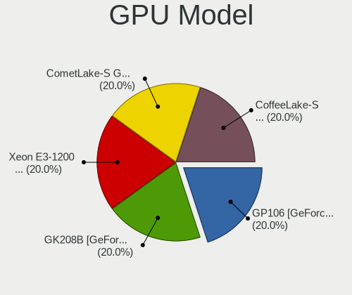

| Model                                                                       | Desktops | Percent |
|-----------------------------------------------------------------------------|----------|---------|
| Nvidia GP106 [GeForce GTX 1060 6GB]                                         | 1        | 20%     |
| Nvidia GK208B [GeForce GT 730]                                              | 1        | 20%     |
| Intel Xeon E3-1200 v3/4th Gen Core Processor Integrated Graphics Controller | 1        | 20%     |
| Intel CometLake-S GT2 [UHD Graphics 630]                                    | 1        | 20%     |
| Intel CoffeeLake-S GT2 [UHD Graphics 630]                                   | 1        | 20%     |

GPU Combo
---------

Combinations of graphics cards

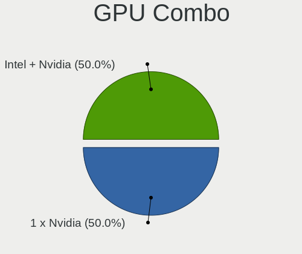

| Name           | Desktops | Percent |
|----------------|----------|---------|
| 1 x Nvidia     | 1        | 33.33%  |
| Intel + Nvidia | 1        | 33.33%  |
| 1 x Intel      | 1        | 33.33%  |

GPU Driver
----------

Free vs proprietary

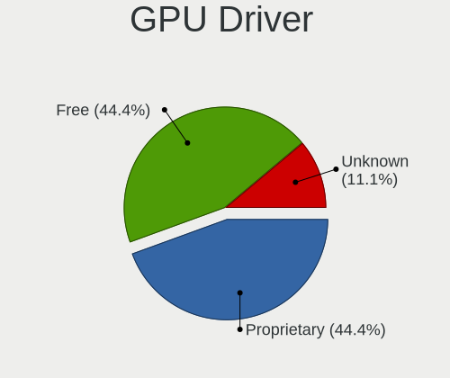

| Driver      | Desktops | Percent |
|-------------|----------|---------|
| Free        | 2        | 66.67%  |
| Proprietary | 1        | 33.33%  |

GPU Memory
----------

Total video memory

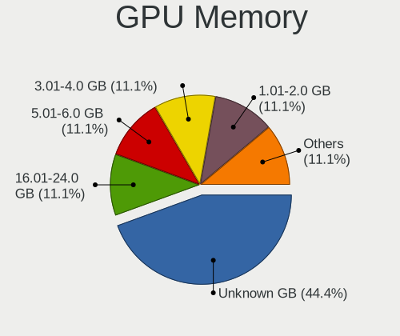

| Size in GB | Desktops | Percent |
|------------|----------|---------|
| 5.01-6.0   | 1        | 33.33%  |
| 1.01-2.0   | 1        | 33.33%  |
| Unknown    | 1        | 33.33%  |

Monitor
-------

Monitor Vendor
--------------

Monitor vendors

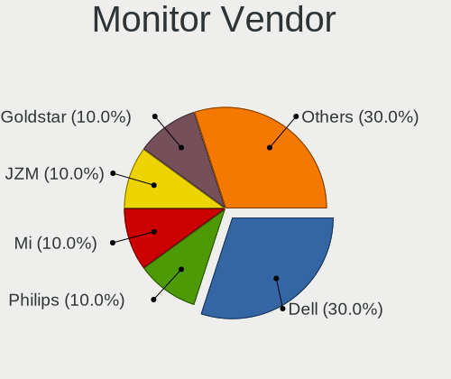

| Vendor               | Desktops | Percent |
|----------------------|----------|---------|
| Philips              | 1        | 25%     |
| Dell                 | 1        | 25%     |
| BenQ                 | 1        | 25%     |
| Ancor Communications | 1        | 25%     |

Monitor Model
-------------

Monitor models

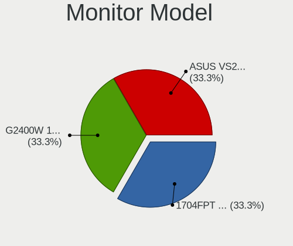

| Model                                                                 | Desktops | Percent |
|-----------------------------------------------------------------------|----------|---------|
| Philips PHL 243V7 PHLC155 1920x1080 527x296mm 23.8-inch               | 1        | 25%     |
| Dell 1704FPT DEL4005 1280x1024 338x270mm 17.0-inch                    | 1        | 25%     |
| BenQ LCD Monitor G2400W 1920x1200                                     | 1        | 25%     |
| Ancor Communications ASUS VS247 ACI249A 1920x1080 521x293mm 23.5-inch | 1        | 25%     |

Monitor Resolution
------------------

Monitor screen resolution

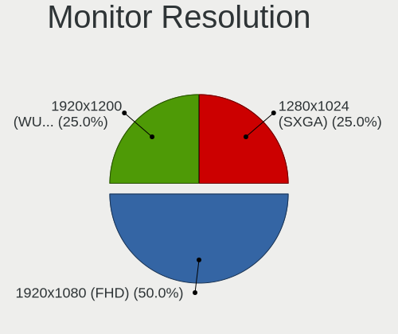

| Resolution        | Desktops | Percent |
|-------------------|----------|---------|
| 1920x1080 (FHD)   | 2        | 50%     |
| 1920x1200 (WUXGA) | 1        | 25%     |
| 1280x1024 (SXGA)  | 1        | 25%     |

Monitor Diagonal
----------------

Diagonal size in inches

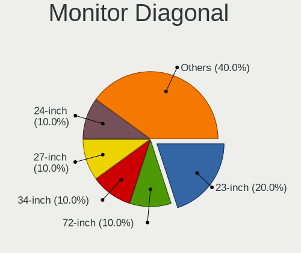

| Inches  | Desktops | Percent |
|---------|----------|---------|
| 24      | 1        | 25%     |
| 23      | 1        | 25%     |
| 17      | 1        | 25%     |
| Unknown | 1        | 25%     |

Monitor Width
-------------

Physical width

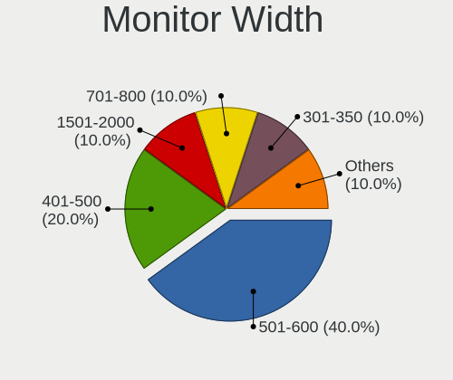

| Width in mm | Desktops | Percent |
|-------------|----------|---------|
| 501-600     | 2        | 50%     |
| 301-350     | 1        | 25%     |
| Unknown     | 1        | 25%     |

Aspect Ratio
------------

Proportional relationship between the width and the height

| Ratio   | Desktops | Percent |
|---------|----------|---------|
| 16/9    | 2        | 50%     |
| 5/4     | 1        | 25%     |
| Unknown | 1        | 25%     |

Monitor Area
------------

Area in inch²

| Area in inch² | Desktops | Percent |
|----------------|----------|---------|
| 201-250        | 2        | 50%     |
| 141-150        | 1        | 25%     |
| Unknown        | 1        | 25%     |

Pixel Density
-------------

Pixels per inch

| Density | Desktops | Percent |
|---------|----------|---------|
| 51-100  | 2        | 66.67%  |
| Unknown | 1        | 33.33%  |

Multiple Monitors
-----------------

Total monitors connected

| Total | Desktops | Percent |
|-------|----------|---------|
| 1     | 2        | 66.67%  |
| 2     | 1        | 33.33%  |

Network
-------

Net Controller Vendor
---------------------

Controller vendors

| Vendor                | Desktops | Percent |
|-----------------------|----------|---------|
| Realtek Semiconductor | 2        | 50%     |
| Intel                 | 2        | 50%     |

Net Controller Model
--------------------

Controller models

| Model                                                                  | Desktops | Percent |
|------------------------------------------------------------------------|----------|---------|
| Realtek RTL8723DE Wireless Network Adapter                             | 1        | 20%     |
| Realtek RTL8111/8168/8211/8411 PCI Express Gigabit Ethernet Controller | 1        | 20%     |
| Intel Wi-Fi 6 AX200                                                    | 1        | 20%     |
| Intel Ethernet Connection I217-V                                       | 1        | 20%     |
| Intel Ethernet Connection (11) I219-V                                  | 1        | 20%     |

Wireless Vendor
---------------

Wireless vendors

| Vendor                | Desktops | Percent |
|-----------------------|----------|---------|
| Realtek Semiconductor | 1        | 50%     |
| Intel                 | 1        | 50%     |

Wireless Model
--------------

Wireless models

| Model                                      | Desktops | Percent |
|--------------------------------------------|----------|---------|
| Realtek RTL8723DE Wireless Network Adapter | 1        | 50%     |
| Intel Wi-Fi 6 AX200                        | 1        | 50%     |

Ethernet Vendor
---------------

Ethernet vendors

| Vendor                | Desktops | Percent |
|-----------------------|----------|---------|
| Intel                 | 2        | 66.67%  |
| Realtek Semiconductor | 1        | 33.33%  |

Ethernet Model
--------------

Ethernet models

| Model                                                                  | Desktops | Percent |
|------------------------------------------------------------------------|----------|---------|
| Realtek RTL8111/8168/8211/8411 PCI Express Gigabit Ethernet Controller | 1        | 33.33%  |
| Intel Ethernet Connection I217-V                                       | 1        | 33.33%  |
| Intel Ethernet Connection (11) I219-V                                  | 1        | 33.33%  |

Net Controller Kind
-------------------

Ethernet, WiFi or modem

| Kind     | Desktops | Percent |
|----------|----------|---------|
| Ethernet | 3        | 60%     |
| WiFi     | 2        | 40%     |

Used Controller
---------------

Currently used network controller

| Kind     | Desktops | Percent |
|----------|----------|---------|
| Ethernet | 2        | 66.67%  |
| WiFi     | 1        | 33.33%  |

NICs
----

Total network controllers on board

| Total | Desktops | Percent |
|-------|----------|---------|
| 2     | 2        | 66.67%  |
| 1     | 1        | 33.33%  |

IPv6
----

IPv6 vs IPv4

| Used | Desktops | Percent |
|------|----------|---------|
| No   | 2        | 66.67%  |
| Yes  | 1        | 33.33%  |

Bluetooth
---------

Bluetooth Vendor
----------------

Controller vendors

| Vendor                | Desktops | Percent |
|-----------------------|----------|---------|
| Realtek Semiconductor | 2        | 66.67%  |
| Intel                 | 1        | 33.33%  |

Bluetooth Model
---------------

Controller models

| Model                        | Desktops | Percent |
|------------------------------|----------|---------|
| Realtek Bluetooth Radio      | 1        | 33.33%  |
| Realtek 802.11n WLAN Adapter | 1        | 33.33%  |
| Intel AX200 Bluetooth        | 1        | 33.33%  |

Sound
-----

Sound Vendor
------------

Sound card vendors

| Vendor | Desktops | Percent |
|--------|----------|---------|
| Intel  | 3        | 60%     |
| Nvidia | 2        | 40%     |

Sound Model
-----------

Sound card models

| Model                                                            | Desktops | Percent |
|------------------------------------------------------------------|----------|---------|
| Nvidia GP106 High Definition Audio Controller                    | 1        | 16.67%  |
| Nvidia GK208 HDMI/DP Audio Controller                            | 1        | 16.67%  |
| Intel Xeon E3-1200 v3/4th Gen Core Processor HD Audio Controller | 1        | 16.67%  |
| Intel Comet Lake PCH cAVS                                        | 1        | 16.67%  |
| Intel 9 Series Chipset Family HD Audio Controller                | 1        | 16.67%  |
| Intel 200 Series PCH HD Audio                                    | 1        | 16.67%  |

Memory
------

Memory Vendor
-------------

Memory module vendors

| Vendor   | Desktops | Percent |
|----------|----------|---------|
| SK hynix | 1        | 50%     |
| Kingston | 1        | 50%     |

Memory Model
------------

Memory module models

| Model                                                   | Desktops | Percent |
|---------------------------------------------------------|----------|---------|
| SK hynix RAM HMA81GU6DJR8N-XN 8192MB DIMM DDR4 3200MT/s | 1        | 50%     |
| Kingston RAM KF3200C16D4/16GX 16GB DIMM DDR4 3200MT/s   | 1        | 50%     |

Memory Kind
-----------

Memory module kinds

| Kind | Desktops | Percent |
|------|----------|---------|
| DDR4 | 2        | 100%    |

Memory Form Factor
------------------

Physical design of the memory module

| Name | Desktops | Percent |
|------|----------|---------|
| DIMM | 2        | 100%    |

Memory Size
-----------

Memory module size

| Size  | Desktops | Percent |
|-------|----------|---------|
| 16384 | 1        | 50%     |
| 8192  | 1        | 50%     |

Memory Speed
------------

Memory module speed

| Speed | Desktops | Percent |
|-------|----------|---------|
| 3200  | 2        | 100%    |

Printers & scanners
-------------------

Printer Vendor
--------------

Printer device vendors

| Vendor              | Desktops | Percent |
|---------------------|----------|---------|
| Samsung Electronics | 1        | 50%     |
| Hewlett-Packard     | 1        | 50%     |

Printer Model
-------------

Printer device models

| Model                   | Desktops | Percent |
|-------------------------|----------|---------|
| Samsung M2020 Series    | 1        | 50%     |
| HP DeskJet F4200 series | 1        | 50%     |

Scanner Vendor
--------------

Scanner device vendors

Zero info for selected period =(

Scanner Model
-------------

Scanner device models

Zero info for selected period =(

Camera
------

Camera Vendor
-------------

Camera device vendors

Zero info for selected period =(

Camera Model
------------

Camera device models

Zero info for selected period =(

Security
--------

Fingerprint Vendor
------------------

Fingerprint sensor vendors

Zero info for selected period =(

Fingerprint Model
-----------------

Fingerprint sensor models

Zero info for selected period =(

Chipcard Vendor
---------------

Chipcard module vendors

Zero info for selected period =(

Chipcard Model
--------------

Chipcard module models

Zero info for selected period =(

Unsupported
-----------

Unsupported Devices
-------------------

Total unsupported devices on board

| Total | Desktops | Percent |
|-------|----------|---------|
| 1     | 2        | 66.67%  |
| 0     | 1        | 33.33%  |

Unsupported Device Types
------------------------

Types of unsupported devices

| Type         | Desktops | Percent |
|--------------|----------|---------|
| Net/wireless | 1        | 50%     |
| Bluetooth    | 1        | 50%     |

