Kylin - Tested Hardware & Statistics (Desktops)
-----------------------------------------------

A project to collect tested hardware configurations for Kylin.

Anyone can contribute to this report by the [hw-probe](https://github.com/linuxhw/hw-probe) tool:

    sudo -E hw-probe -all -upload

Please contribute! Especially if your hardware is rare.

Contents
--------

* [ Test Cases ](#test-cases)

* [ System ](#system)
  - [ OS                       ](#os)
  - [ OS Family                ](#os-family)
  - [ Kernel                   ](#kernel)
  - [ Kernel Family            ](#kernel-family)
  - [ Kernel Major Ver.        ](#kernel-major-ver)
  - [ Arch                     ](#arch)
  - [ DE                       ](#de)
  - [ Display Server           ](#display-server)
  - [ Display Manager          ](#display-manager)
  - [ OS Lang                  ](#os-lang)
  - [ Boot Mode                ](#boot-mode)
  - [ Filesystem               ](#filesystem)
  - [ Part. scheme             ](#part-scheme)
  - [ Dual Boot with Linux/BSD ](#dual-boot-with-linuxbsd)
  - [ Dual Boot (Win)          ](#dual-boot-win)

* [ Board ](#board)
  - [ Vendor                   ](#vendor)
  - [ Model                    ](#model)
  - [ Model Family             ](#model-family)
  - [ MFG Year                 ](#mfg-year)
  - [ Form Factor              ](#form-factor)
  - [ Secure Boot              ](#secure-boot)
  - [ Coreboot                 ](#coreboot)
  - [ RAM Size                 ](#ram-size)
  - [ RAM Used                 ](#ram-used)
  - [ Total Drives             ](#total-drives)
  - [ Has CD-ROM               ](#has-cd-rom)
  - [ Has Ethernet             ](#has-ethernet)
  - [ Has WiFi                 ](#has-wifi)
  - [ Has Bluetooth            ](#has-bluetooth)

* [ Location ](#location)
  - [ Country                  ](#country)
  - [ City                     ](#city)

* [ Drives ](#drives)
  - [ Drive Vendor             ](#drive-vendor)
  - [ Drive Model              ](#drive-model)
  - [ HDD Vendor               ](#hdd-vendor)
  - [ SSD Vendor               ](#ssd-vendor)
  - [ Drive Kind               ](#drive-kind)
  - [ Drive Connector          ](#drive-connector)
  - [ Drive Size               ](#drive-size)
  - [ Space Total              ](#space-total)
  - [ Space Used               ](#space-used)
  - [ Malfunc. Drives          ](#malfunc-drives)
  - [ Malfunc. Drive Vendor    ](#malfunc-drive-vendor)
  - [ Malfunc. HDD Vendor      ](#malfunc-hdd-vendor)
  - [ Malfunc. Drive Kind      ](#malfunc-drive-kind)
  - [ Failed Drives            ](#failed-drives)
  - [ Failed Drive Vendor      ](#failed-drive-vendor)
  - [ Drive Status             ](#drive-status)

* [ Storage controller ](#storage-controller)
  - [ Storage Vendor           ](#storage-vendor)
  - [ Storage Model            ](#storage-model)
  - [ Storage Kind             ](#storage-kind)

* [ Processor ](#processor)
  - [ CPU Vendor               ](#cpu-vendor)
  - [ CPU Model                ](#cpu-model)
  - [ CPU Model Family         ](#cpu-model-family)
  - [ CPU Cores                ](#cpu-cores)
  - [ CPU Sockets              ](#cpu-sockets)
  - [ CPU Threads              ](#cpu-threads)
  - [ CPU Op-Modes             ](#cpu-op-modes)
  - [ CPU Microcode            ](#cpu-microcode)
  - [ CPU Microarch            ](#cpu-microarch)

* [ Graphics ](#graphics)
  - [ GPU Vendor               ](#gpu-vendor)
  - [ GPU Model                ](#gpu-model)
  - [ GPU Combo                ](#gpu-combo)
  - [ GPU Driver               ](#gpu-driver)
  - [ GPU Memory               ](#gpu-memory)

* [ Monitor ](#monitor)
  - [ Monitor Vendor           ](#monitor-vendor)
  - [ Monitor Model            ](#monitor-model)
  - [ Monitor Resolution       ](#monitor-resolution)
  - [ Monitor Diagonal         ](#monitor-diagonal)
  - [ Monitor Width            ](#monitor-width)
  - [ Aspect Ratio             ](#aspect-ratio)
  - [ Monitor Area             ](#monitor-area)
  - [ Pixel Density            ](#pixel-density)
  - [ Multiple Monitors        ](#multiple-monitors)

* [ Network ](#network)
  - [ Net Controller Vendor    ](#net-controller-vendor)
  - [ Net Controller Model     ](#net-controller-model)
  - [ Wireless Vendor          ](#wireless-vendor)
  - [ Wireless Model           ](#wireless-model)
  - [ Ethernet Vendor          ](#ethernet-vendor)
  - [ Ethernet Model           ](#ethernet-model)
  - [ Net Controller Kind      ](#net-controller-kind)
  - [ Used Controller          ](#used-controller)
  - [ NICs                     ](#nics)
  - [ IPv6                     ](#ipv6)

* [ Bluetooth ](#bluetooth)
  - [ Bluetooth Vendor         ](#bluetooth-vendor)
  - [ Bluetooth Model          ](#bluetooth-model)

* [ Sound ](#sound)
  - [ Sound Vendor             ](#sound-vendor)
  - [ Sound Model              ](#sound-model)

* [ Memory ](#memory)
  - [ Memory Vendor            ](#memory-vendor)
  - [ Memory Model             ](#memory-model)
  - [ Memory Kind              ](#memory-kind)
  - [ Memory Form Factor       ](#memory-form-factor)
  - [ Memory Size              ](#memory-size)
  - [ Memory Speed             ](#memory-speed)

* [ Printers & scanners ](#printers--scanners)
  - [ Printer Vendor           ](#printer-vendor)
  - [ Printer Model            ](#printer-model)
  - [ Scanner Vendor           ](#scanner-vendor)
  - [ Scanner Model            ](#scanner-model)

* [ Camera ](#camera)
  - [ Camera Vendor            ](#camera-vendor)
  - [ Camera Model             ](#camera-model)

* [ Security ](#security)
  - [ Fingerprint Vendor       ](#fingerprint-vendor)
  - [ Fingerprint Model        ](#fingerprint-model)
  - [ Chipcard Vendor          ](#chipcard-vendor)
  - [ Chipcard Model           ](#chipcard-model)

* [ Unsupported ](#unsupported)
  - [ Unsupported Devices      ](#unsupported-devices)
  - [ Unsupported Device Types ](#unsupported-device-types)

Test Cases
----------

Total: 13

| Vendor   | Model                       | Probe                                                      | Date         |
|----------|-----------------------------|------------------------------------------------------------|--------------|
| Lenovo   | 3316 NOK                    | [cff96fc34b](https://linux-hardware.org/?probe=cff96fc34b) | Dec 11, 2025 |
| ASUSTek  | ROG STRIX B650E-I GAMING... | [ed4540396f](https://linux-hardware.org/?probe=ed4540396f) | May 07, 2025 |
| Gigabyte | Z390 M GAMING-CF            | [77464924ba](https://linux-hardware.org/?probe=77464924ba) | Apr 07, 2025 |
| Lenovo   | NOK                         | [869a19c237](https://linux-hardware.org/?probe=869a19c237) | Sep 27, 2024 |
| ASUSTek  | TUF Gaming B560M-PLUS       | [668f599883](https://linux-hardware.org/?probe=668f599883) | Aug 14, 2024 |
| ONDA     | B75E                        | [c42fc0c3e5](https://linux-hardware.org/?probe=c42fc0c3e5) | Jun 19, 2024 |
| Gigabyte | B550M AORUS ELITE           | [d2f2894a0c](https://linux-hardware.org/?probe=d2f2894a0c) | Jun 14, 2024 |
| ASUSTek  | ROG STRIX B760-I GAMING ... | [f2c3443779](https://linux-hardware.org/?probe=f2c3443779) | Jun 03, 2024 |
| ASRock   | X570 Phantom Gaming-ITX/... | [26ccfc6d25](https://linux-hardware.org/?probe=26ccfc6d25) | May 18, 2024 |
| ASUSTek  | PRIME H310M-F R2.0          | [4b4560a9ba](https://linux-hardware.org/?probe=4b4560a9ba) | Nov 20, 2023 |
| ASUSTek  | PRIME H310M-F R2.0          | [6ff3a21e4e](https://linux-hardware.org/?probe=6ff3a21e4e) | Nov 20, 2023 |
| Dell     | 0V7K5Y A00                  | [831a493e15](https://linux-hardware.org/?probe=831a493e15) | Feb 24, 2023 |
| Gigabyte | Z97X-SLI-CF                 | [4e829bc252](https://linux-hardware.org/?probe=4e829bc252) | Dec 10, 2022 |

System
------

OS
--

Installed operating systems

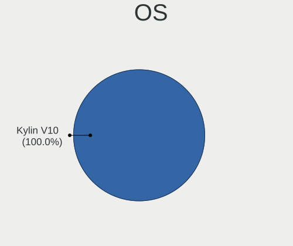

| Name      | Desktops | Percent |
|-----------|----------|---------|
| Kylin V10 | 12       | 100%    |

OS Family
---------

OS without a version

| Name  | Desktops | Percent |
|-------|----------|---------|
| Kylin | 12       | 100%    |

Kernel
------

Version of the Linux kernel

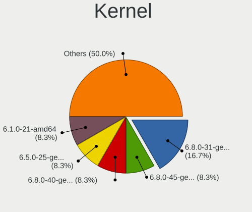

| Version            | Desktops | Percent |
|--------------------|----------|---------|
| 6.8.0-31-generic   | 2        | 16.67%  |
| 6.8.0-45-generic   | 1        | 8.33%   |
| 6.8.0-40-generic   | 1        | 8.33%   |
| 6.5.0-25-generic   | 1        | 8.33%   |
| 6.1.0-21-amd64     | 1        | 8.33%   |
| 6.1.0-20-amd64     | 1        | 8.33%   |
| 5.4.18-35-generic  | 1        | 8.33%   |
| 5.4.0-26-generic   | 1        | 8.33%   |
| 5.4.0-216-generic  | 1        | 8.33%   |
| 5.15.0-56-generic  | 1        | 8.33%   |
| 5.15.0-107-generic | 1        | 8.33%   |

Kernel Family
-------------

Linux kernel without a distro release

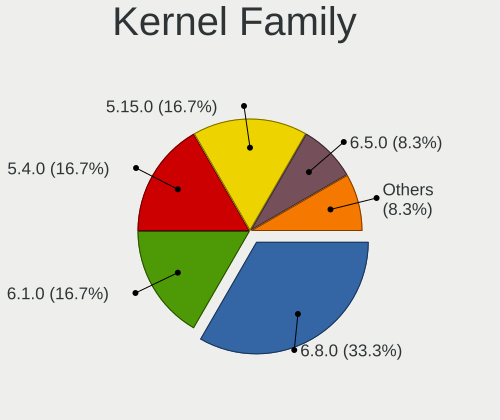

| Version | Desktops | Percent |
|---------|----------|---------|
| 6.8.0   | 4        | 33.33%  |
| 6.1.0   | 2        | 16.67%  |
| 5.4.0   | 2        | 16.67%  |
| 5.15.0  | 2        | 16.67%  |
| 6.5.0   | 1        | 8.33%   |
| 5.4.18  | 1        | 8.33%   |

Kernel Major Ver.
-----------------

Linux kernel major version

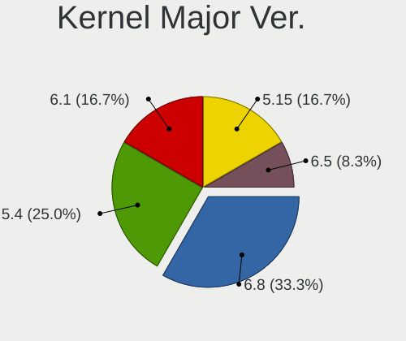

| Version | Desktops | Percent |
|---------|----------|---------|
| 6.8     | 4        | 33.33%  |
| 5.4     | 3        | 25%     |
| 6.1     | 2        | 16.67%  |
| 5.15    | 2        | 16.67%  |
| 6.5     | 1        | 8.33%   |

Arch
----

OS architecture (x86_64, i586, etc.)

| Name   | Desktops | Percent |
|--------|----------|---------|
| x86_64 | 12       | 100%    |

DE
--

Desktop Environment

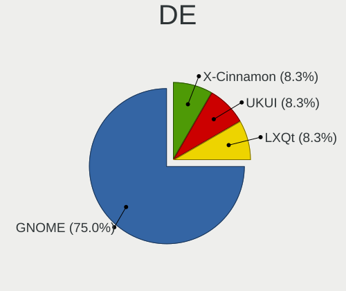

| Name       | Desktops | Percent |
|------------|----------|---------|
| GNOME      | 9        | 75%     |
| X-Cinnamon | 1        | 8.33%   |
| UKUI       | 1        | 8.33%   |
| LXQt       | 1        | 8.33%   |

Display Server
--------------

X11 or Wayland

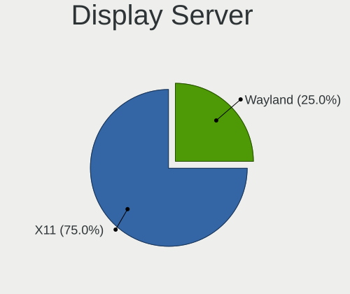

| Name    | Desktops | Percent |
|---------|----------|---------|
| X11     | 9        | 75%     |
| Wayland | 3        | 25%     |

Display Manager
---------------

SDDM, LightDM, etc.

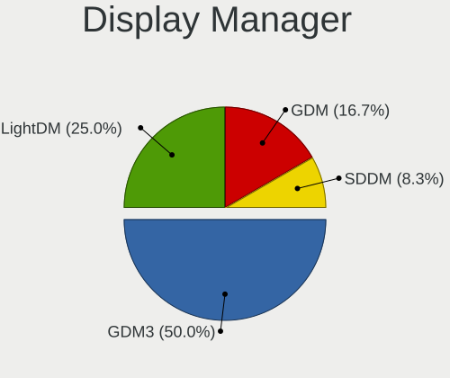

| Name    | Desktops | Percent |
|---------|----------|---------|
| GDM3    | 6        | 50%     |
| LightDM | 3        | 25%     |
| GDM     | 2        | 16.67%  |
| SDDM    | 1        | 8.33%   |

OS Lang
-------

Language

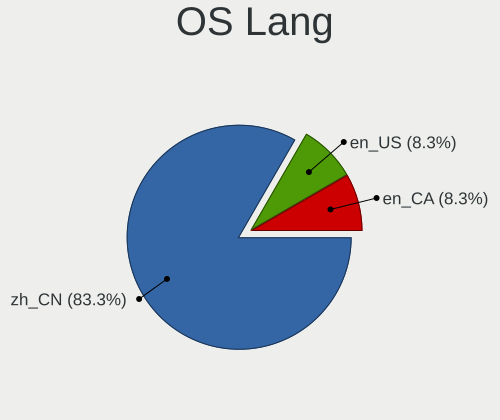

| Lang  | Desktops | Percent |
|-------|----------|---------|
| zh_CN | 10       | 83.33%  |
| en_US | 1        | 8.33%   |
| en_CA | 1        | 8.33%   |

Boot Mode
---------

EFI or BIOS

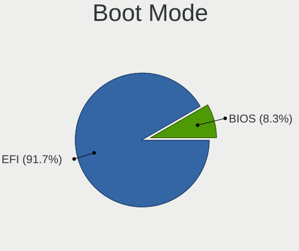

| Mode | Desktops | Percent |
|------|----------|---------|
| EFI  | 11       | 91.67%  |
| BIOS | 1        | 8.33%   |

Filesystem
----------

Type of filesystem

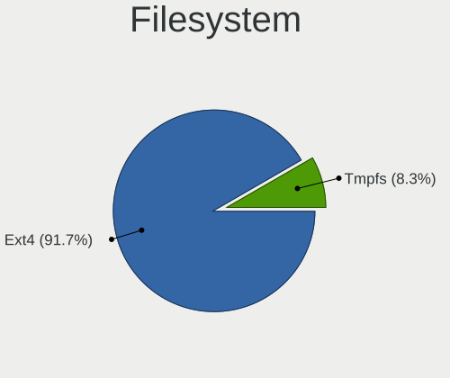

| Type  | Desktops | Percent |
|-------|----------|---------|
| Ext4  | 11       | 91.67%  |
| Tmpfs | 1        | 8.33%   |

Part. scheme
------------

Scheme of partitioning

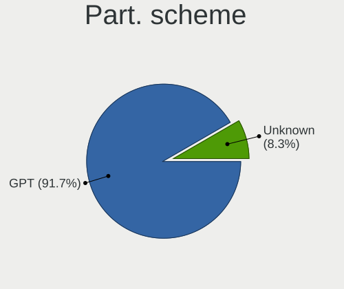

| Type    | Desktops | Percent |
|---------|----------|---------|
| GPT     | 11       | 91.67%  |
| Unknown | 1        | 8.33%   |

Dual Boot with Linux/BSD
------------------------

Hosting more than one Linux/BSD

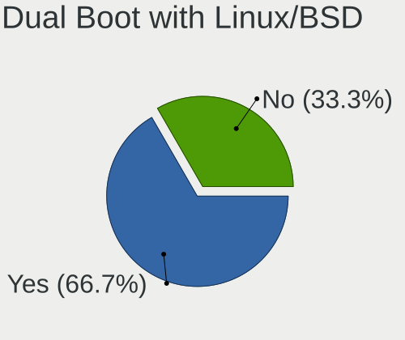

| Dual boot | Desktops | Percent |
|-----------|----------|---------|
| No        | 8        | 66.67%  |
| Yes       | 4        | 33.33%  |

Dual Boot (Win)
---------------

Hosting Linux and Windows

| Dual boot | Desktops | Percent |
|-----------|----------|---------|
| Yes       | 9        | 75%     |
| No        | 3        | 25%     |

Board
-----

Vendor
------

Motherboard manufacturer

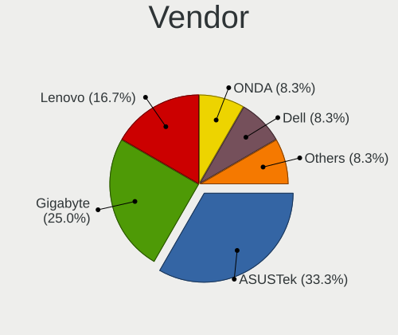

| Name                | Desktops | Percent |
|---------------------|----------|---------|
| ASUSTek Computer    | 4        | 33.33%  |
| Gigabyte Technology | 3        | 25%     |
| Lenovo              | 2        | 16.67%  |
| ONDA                | 1        | 8.33%   |
| Dell                | 1        | 8.33%   |
| ASRock              | 1        | 8.33%   |

Model
-----

Motherboard model

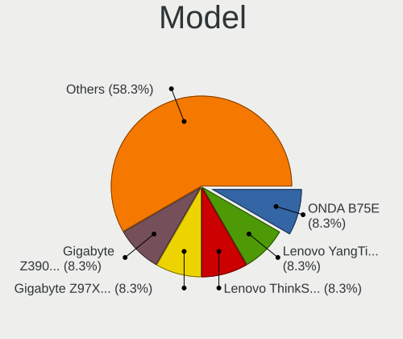

| Name                                | Desktops | Percent |
|-------------------------------------|----------|---------|
| ONDA B75E                           | 1        | 8.33%   |
| Lenovo YangTianT4900v-00            | 1        | 8.33%   |
| Lenovo ThinkServer T100C 90U30005CD | 1        | 8.33%   |
| Gigabyte Z97X-SLI                   | 1        | 8.33%   |
| Gigabyte Z390 M GAMING              | 1        | 8.33%   |
| Gigabyte B550M AORUS ELITE          | 1        | 8.33%   |
| Dell Vostro 5880                    | 1        | 8.33%   |
| ASUS TUF Gaming B560M-PLUS          | 1        | 8.33%   |
| ASUS ROG STRIX B760-I GAMING WIFI   | 1        | 8.33%   |
| ASUS ROG STRIX B650E-I GAMING WIFI  | 1        | 8.33%   |
| ASUS PRIME H310M-F R2.0             | 1        | 8.33%   |
| ASRock X570 Phantom Gaming-ITX/TB3  | 1        | 8.33%   |

Model Family
------------

Motherboard model prefix

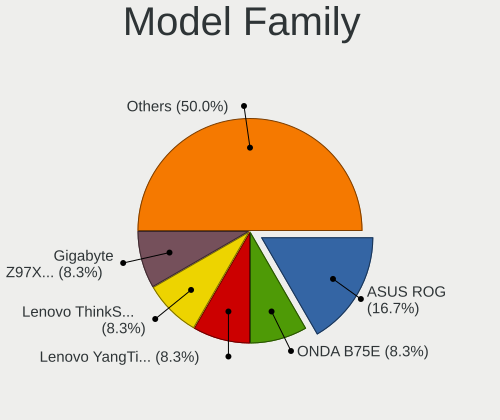

| Name                     | Desktops | Percent |
|--------------------------|----------|---------|
| ASUS ROG                 | 2        | 16.67%  |
| ONDA B75E                | 1        | 8.33%   |
| Lenovo YangTianT4900v-00 | 1        | 8.33%   |
| Lenovo ThinkServer       | 1        | 8.33%   |
| Gigabyte Z97X-SLI        | 1        | 8.33%   |
| Gigabyte Z390            | 1        | 8.33%   |
| Gigabyte B550M           | 1        | 8.33%   |
| Dell Vostro              | 1        | 8.33%   |
| ASUS TUF                 | 1        | 8.33%   |
| ASUS PRIME               | 1        | 8.33%   |
| ASRock X570              | 1        | 8.33%   |

MFG Year
--------

Motherboard manufacture year

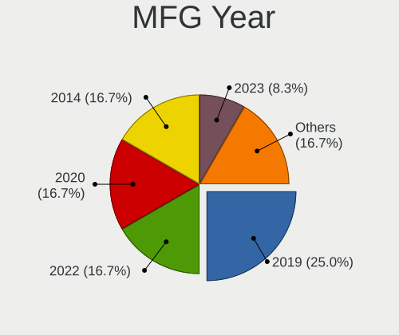

| Year | Desktops | Percent |
|------|----------|---------|
| 2019 | 3        | 25%     |
| 2022 | 2        | 16.67%  |
| 2020 | 2        | 16.67%  |
| 2014 | 2        | 16.67%  |
| 2023 | 1        | 8.33%   |
| 2021 | 1        | 8.33%   |
| 2018 | 1        | 8.33%   |

Form Factor
-----------

Physical design of the computer

| Name    | Desktops | Percent |
|---------|----------|---------|
| Desktop | 12       | 100%    |

Secure Boot
-----------

Enabled or disabled

| State    | Desktops | Percent |
|----------|----------|---------|
| Disabled | 12       | 100%    |

Coreboot
--------

Have coreboot on board

| Used | Desktops | Percent |
|------|----------|---------|
| No   | 12       | 100%    |

RAM Size
--------

Total RAM memory

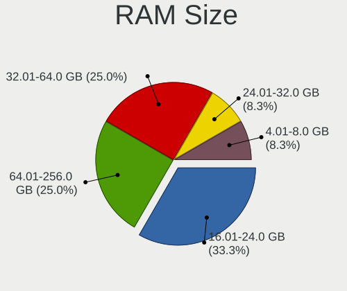

| Size in GB  | Desktops | Percent |
|-------------|----------|---------|
| 16.01-24.0  | 4        | 33.33%  |
| 32.01-64.0  | 3        | 25%     |
| 64.01-256.0 | 3        | 25%     |
| 4.01-8.0    | 1        | 8.33%   |
| 24.01-32.0  | 1        | 8.33%   |

RAM Used
--------

Used RAM memory

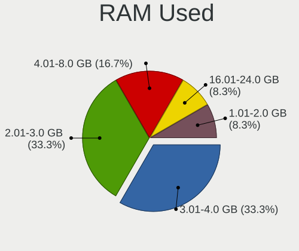

| Used GB    | Desktops | Percent |
|------------|----------|---------|
| 3.01-4.0   | 4        | 33.33%  |
| 2.01-3.0   | 4        | 33.33%  |
| 4.01-8.0   | 2        | 16.67%  |
| 16.01-24.0 | 1        | 8.33%   |
| 1.01-2.0   | 1        | 8.33%   |

Total Drives
------------

Number of drives on board

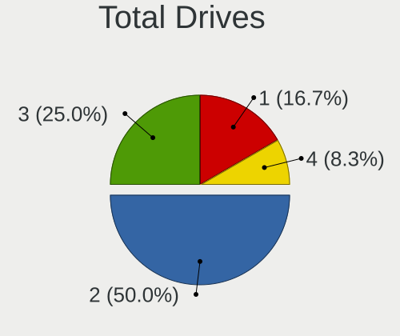

| Drives | Desktops | Percent |
|--------|----------|---------|
| 2      | 6        | 50%     |
| 3      | 3        | 25%     |
| 1      | 2        | 16.67%  |
| 4      | 1        | 8.33%   |

Has CD-ROM
----------

Has CD-ROM on board

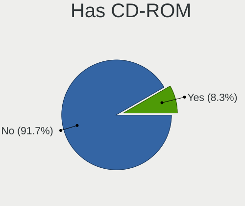

| Presented | Desktops | Percent |
|-----------|----------|---------|
| No        | 11       | 91.67%  |
| Yes       | 1        | 8.33%   |

Has Ethernet
------------

Has Ethernet on board

| Presented | Desktops | Percent |
|-----------|----------|---------|
| Yes       | 12       | 100%    |

Has WiFi
--------

Has WiFi module

| Presented | Desktops | Percent |
|-----------|----------|---------|
| Yes       | 10       | 83.33%  |
| No        | 2        | 16.67%  |

Has Bluetooth
-------------

Has Bluetooth module

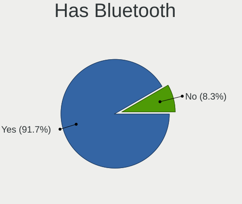

| Presented | Desktops | Percent |
|-----------|----------|---------|
| Yes       | 11       | 91.67%  |
| No        | 1        | 8.33%   |

Location
--------

Country
-------

Geographic location (country)

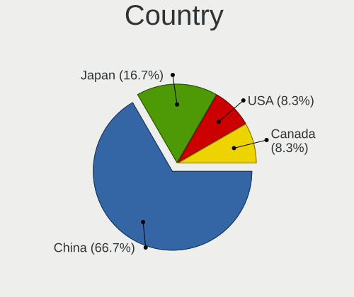

| Country | Desktops | Percent |
|---------|----------|---------|
| China   | 8        | 66.67%  |
| Japan   | 2        | 16.67%  |
| USA     | 1        | 8.33%   |
| Canada  | 1        | 8.33%   |

City
----

Geographic location (city)

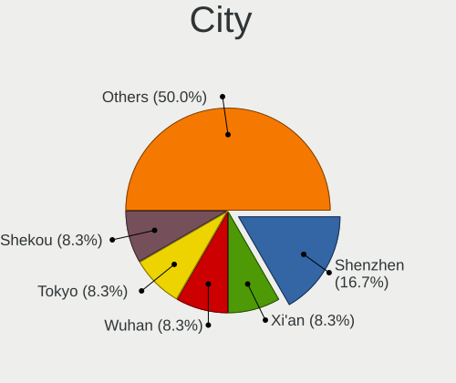

| City        | Desktops | Percent |
|-------------|----------|---------|
| Shenzhen    | 2        | 16.67%  |
| Xi'an       | 1        | 8.33%   |
| Wuhan       | 1        | 8.33%   |
| Tokyo       | 1        | 8.33%   |
| Shekou      | 1        | 8.33%   |
| Osaka       | 1        | 8.33%   |
| Markham     | 1        | 8.33%   |
| Los Angeles | 1        | 8.33%   |
| Jinan       | 1        | 8.33%   |
| Guangzhou   | 1        | 8.33%   |
| Beijing     | 1        | 8.33%   |

Drives
------

Drive Vendor
------------

Hard drive vendors

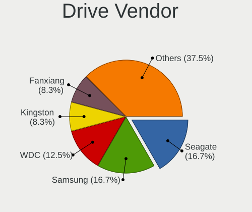

| Vendor                      | Desktops | Drives | Percent |
|-----------------------------|----------|--------|---------|
| Seagate                     | 4        | 4      | 16.67%  |
| Samsung Electronics         | 4        | 5      | 16.67%  |
| WDC                         | 3        | 3      | 12.5%   |
| Kingston                    | 2        | 2      | 8.33%   |
| Fanxiang                    | 2        | 3      | 8.33%   |
| ZHITAI                      | 1        | 2      | 4.17%   |
| YMTC                        | 1        | 1      | 4.17%   |
| Yangtze Memory Technologies | 1        | 1      | 4.17%   |
| Toshiba                     | 1        | 1      | 4.17%   |
| SanDisk                     | 1        | 1      | 4.17%   |
| J.ZAO                       | 1        | 1      | 4.17%   |
| FC-1307                     | 1        | 1      | 4.17%   |
| Crucial                     | 1        | 1      | 4.17%   |
| China                       | 1        | 1      | 4.17%   |

Drive Model
-----------

Hard drive models

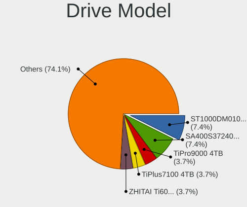

| Model                                  | Desktops | Percent |
|----------------------------------------|----------|---------|
| Seagate ST1000DM010-2EP102 1TB         | 2        | 7.41%   |
| Kingston SA400S37240G 240GB SSD        | 2        | 7.41%   |
| ZHITAI TiPro9000 4TB                   | 1        | 3.7%    |
| ZHITAI TiPlus7100 4TB                  | 1        | 3.7%    |
| YMTC YMSS2CB04B32MC 256GB              | 1        | 3.7%    |
| Yangtze Memory ZHITAI Ti600 1TB        | 1        | 3.7%    |
| WDC WD20EJRX-89G3VY0 2TB               | 1        | 3.7%    |
| WDC WD10EZEX-22MFCA0 1TB               | 1        | 3.7%    |
| WDC WD10EZEX-08WN4A0 1TB               | 1        | 3.7%    |
| Toshiba MQ01ABD100 1TB                 | 1        | 3.7%    |
| Seagate ST2000DM008-2UB102 2TB         | 1        | 3.7%    |
| Seagate ST2000DM008-2FR102 2TB         | 1        | 3.7%    |
| SanDisk SDSSDA240G 240GB               | 1        | 3.7%    |
| Samsung SSD 990 PRO 1TB                | 1        | 3.7%    |
| Samsung SSD 980 1TB S649NX0T432942B    | 1        | 3.7%    |
| Samsung SSD 860 EVO 250GB              | 1        | 3.7%    |
| Samsung SSD 850 EVO 500GB              | 1        | 3.7%    |
| Samsung PM991 NVMe 256GB               | 1        | 3.7%    |
| J.ZAO 3 SERIES 2.5 INCH 120GB SATA SSD | 1        | 3.7%    |
| FC-1307 SD to CF Adapter V1.4          | 1        | 3.7%    |
| Fanxiang S500Pro 2TB                   | 1        | 3.7%    |
| Fanxiang S500PRO 1TB                   | 1        | 3.7%    |
| Fanxiang PS2000 1TB                    | 1        | 3.7%    |
| Crucial CT1000MX500SSD1 1TB            | 1        | 3.7%    |
| China 120GB SSD                        | 1        | 3.7%    |

HDD Vendor
----------

Hard disk drive vendors

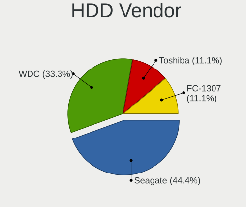

| Vendor  | Desktops | Drives | Percent |
|---------|----------|--------|---------|
| Seagate | 4        | 4      | 44.44%  |
| WDC     | 3        | 3      | 33.33%  |
| Toshiba | 1        | 1      | 11.11%  |
| FC-1307 | 1        | 1      | 11.11%  |

SSD Vendor
----------

Solid state drive vendors

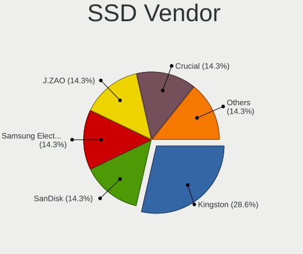

| Vendor              | Desktops | Drives | Percent |
|---------------------|----------|--------|---------|
| Kingston            | 2        | 2      | 28.57%  |
| SanDisk             | 1        | 1      | 14.29%  |
| Samsung Electronics | 1        | 2      | 14.29%  |
| J.ZAO               | 1        | 1      | 14.29%  |
| Crucial             | 1        | 1      | 14.29%  |
| China               | 1        | 1      | 14.29%  |

Drive Kind
----------

HDD or SSD

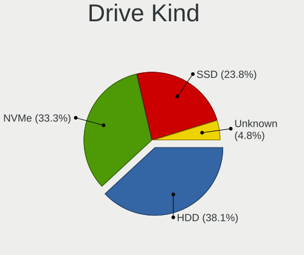

| Kind    | Desktops | Drives | Percent |
|---------|----------|--------|---------|
| HDD     | 8        | 9      | 38.1%   |
| NVMe    | 7        | 9      | 33.33%  |
| SSD     | 5        | 8      | 23.81%  |
| Unknown | 1        | 1      | 4.76%   |

Drive Connector
---------------

SATA, SAS, NVMe, etc.

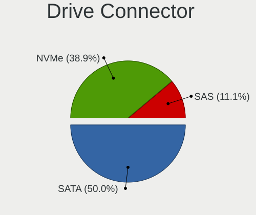

| Type | Desktops | Drives | Percent |
|------|----------|--------|---------|
| SATA | 9        | 16     | 50%     |
| NVMe | 7        | 9      | 38.89%  |
| SAS  | 2        | 2      | 11.11%  |

Drive Size
----------

Size of hard drive

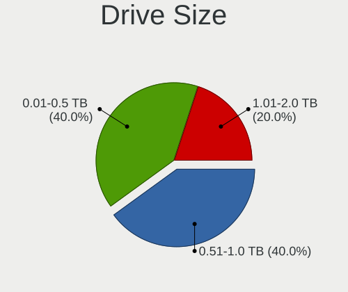

| Size in TB | Desktops | Drives | Percent |
|------------|----------|--------|---------|
| 0.51-1.0   | 6        | 6      | 40%     |
| 0.01-0.5   | 6        | 8      | 40%     |
| 1.01-2.0   | 3        | 3      | 20%     |

Space Total
-----------

Amount of disk space available on the file system

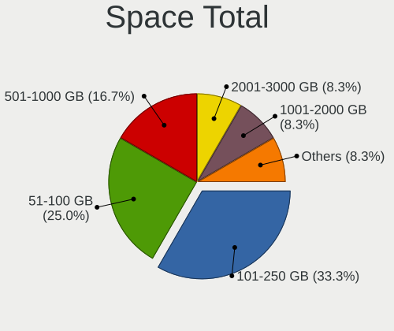

| Size in GB | Desktops | Percent |
|------------|----------|---------|
| 101-250    | 4        | 33.33%  |
| 51-100     | 3        | 25%     |
| 501-1000   | 2        | 16.67%  |
| 251-500    | 1        | 8.33%   |
| 2001-3000  | 1        | 8.33%   |
| 1001-2000  | 1        | 8.33%   |

Space Used
----------

Amount of used disk space

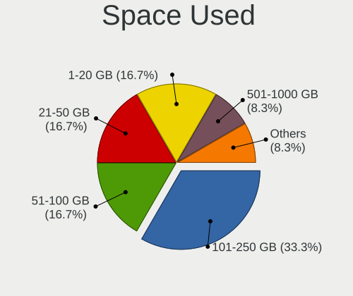

| Used GB  | Desktops | Percent |
|----------|----------|---------|
| 101-250  | 4        | 33.33%  |
| 21-50    | 2        | 16.67%  |
| 1-20     | 2        | 16.67%  |
| 51-100   | 2        | 16.67%  |
| 251-500  | 1        | 8.33%   |
| 501-1000 | 1        | 8.33%   |

Malfunc. Drives
---------------

Drive models with a malfunction

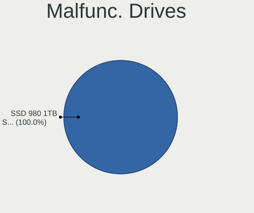

| Model                                           | Desktops | Drives | Percent |
|-------------------------------------------------|----------|--------|---------|
| Samsung Electronics SSD 980 1TB S649NX0T432942B | 1        | 1      | 100%    |

Malfunc. Drive Vendor
---------------------

Vendors of faulty drives

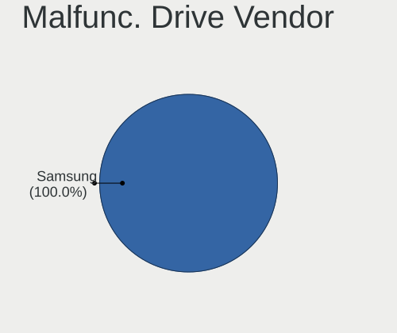

| Vendor              | Desktops | Drives | Percent |
|---------------------|----------|--------|---------|
| Samsung Electronics | 1        | 1      | 100%    |

Malfunc. HDD Vendor
-------------------

Vendors of faulty HDD drives

Zero info for selected period =(

Malfunc. Drive Kind
-------------------

Kinds of faulty drives

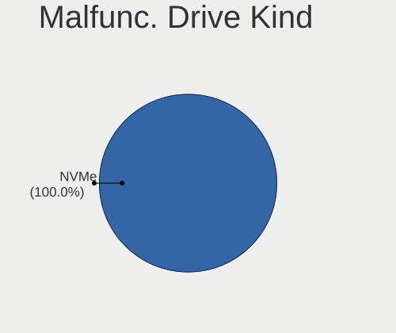

| Kind | Desktops | Drives | Percent |
|------|----------|--------|---------|
| NVMe | 1        | 1      | 100%    |

Failed Drives
-------------

Failed drive models

Zero info for selected period =(

Failed Drive Vendor
-------------------

Failed drive vendors

Zero info for selected period =(

Drive Status
------------

Number of failed and malfunc. drives

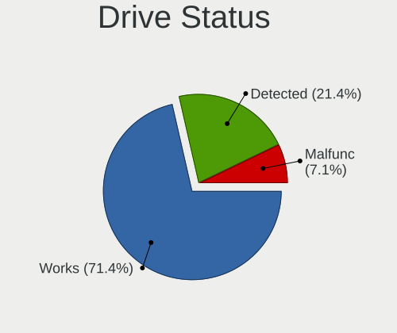

| Status   | Desktops | Drives | Percent |
|----------|----------|--------|---------|
| Works    | 10       | 20     | 71.43%  |
| Detected | 3        | 6      | 21.43%  |
| Malfunc  | 1        | 1      | 7.14%   |

Storage controller
------------------

Storage Vendor
--------------

Storage controller vendors

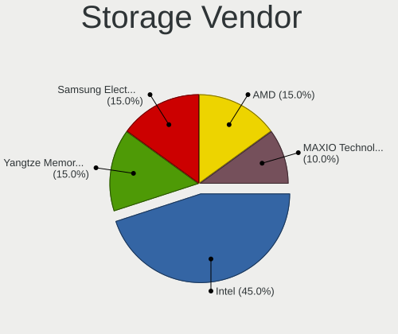

| Vendor                      | Desktops | Percent |
|-----------------------------|----------|---------|
| Intel                       | 9        | 45%     |
| Yangtze Memory Technologies | 3        | 15%     |
| Samsung Electronics         | 3        | 15%     |
| AMD                         | 3        | 15%     |
| MAXIO Technology (Hangzhou) | 2        | 10%     |

Storage Model
-------------

Storage controller models

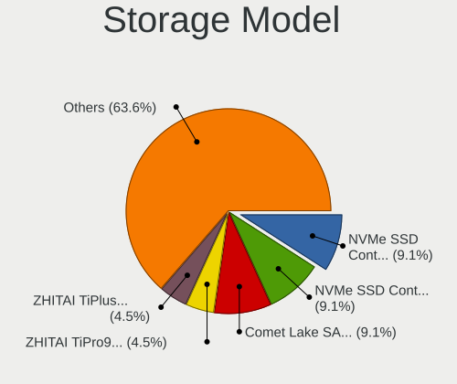

| Model                                                                          | Desktops | Percent |
|--------------------------------------------------------------------------------|----------|---------|
| Samsung NVMe SSD Controller 980 (DRAM-less)                                    | 2        | 9.09%   |
| MAXIO (Hangzhou) NVMe SSD Controller MAP1202 (DRAM-less)                       | 2        | 9.09%   |
| Intel Comet Lake SATA AHCI Controller                                          | 2        | 9.09%   |
| Yangtze Memory ZHITAI TiPro9000 NVMe SSD                                       | 1        | 4.55%   |
| Yangtze Memory ZHITAI TiPlus7100                                               | 1        | 4.55%   |
| Yangtze Memory ZHITAI Ti600 NVMe SSD                                           | 1        | 4.55%   |
| Yangtze Memory PC300 M.2 2280 NVMe SSD (DRAM-less)                             | 1        | 4.55%   |
| Samsung NVMe SSD Controller S4LV008[Pascal]                                    | 1        | 4.55%   |
| Intel RST Volume Management Device Controller                                  | 1        | 4.55%   |
| Intel Raptor Lake SATA AHCI Controller                                         | 1        | 4.55%   |
| Intel Cannon Lake PCH SATA AHCI Controller                                     | 1        | 4.55%   |
| Intel 9 Series Chipset Family SATA Controller [AHCI Mode]                      | 1        | 4.55%   |
| Intel 8 Series/C220 Series Chipset Family 6-port SATA Controller 1 [AHCI mode] | 1        | 4.55%   |
| Intel 7 Series/C210 Series Chipset Family 6-port SATA Controller [AHCI mode]   | 1        | 4.55%   |
| Intel 500 Series Chipset Family SATA AHCI Controller                           | 1        | 4.55%   |
| Intel 200 Series PCH SATA controller [AHCI mode]                               | 1        | 4.55%   |
| AMD FCH SATA Controller [AHCI mode]                                            | 1        | 4.55%   |
| AMD 600 Series Chipset SATA Controller                                         | 1        | 4.55%   |
| AMD 500 Series Chipset SATA Controller                                         | 1        | 4.55%   |

Storage Kind
------------

Kind of storage controller (IDE, SATA, NVMe, SAS, ...)

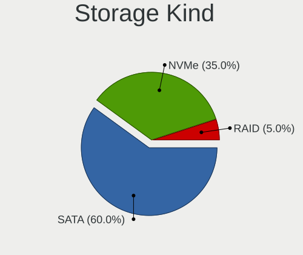

| Kind | Desktops | Percent |
|------|----------|---------|
| SATA | 12       | 60%     |
| NVMe | 7        | 35%     |
| RAID | 1        | 5%      |

Processor
---------

CPU Vendor
----------

Processor vendors

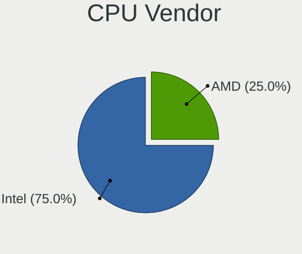

| Vendor | Desktops | Percent |
|--------|----------|---------|
| Intel  | 9        | 75%     |
| AMD    | 3        | 25%     |

CPU Model
---------

Processor models

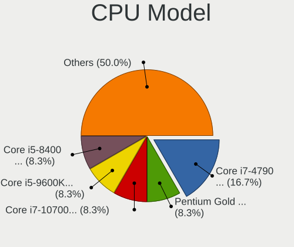

| Model                                      | Desktops | Percent |
|--------------------------------------------|----------|---------|
| Intel Core i7-4790 CPU @ 3.60GHz           | 2        | 16.67%  |
| Intel Pentium Gold G6400 CPU @ 4.00GHz     | 1        | 8.33%   |
| Intel Core i7-10700 CPU @ 2.90GHz          | 1        | 8.33%   |
| Intel Core i5-9600K CPU @ 3.70GHz          | 1        | 8.33%   |
| Intel Core i5-8400 CPU @ 2.80GHz           | 1        | 8.33%   |
| Intel Core i5-3570 CPU @ 3.40GHz           | 1        | 8.33%   |
| Intel Core i5-14600K                       | 1        | 8.33%   |
| Intel 11th Gen Core i5-11400F @ 2.60GHz    | 1        | 8.33%   |
| AMD Ryzen 7 9800X3D 8-Core Processor       | 1        | 8.33%   |
| AMD Ryzen 5 PRO 4650G with Radeon Graphics | 1        | 8.33%   |
| AMD Eng Sample: 100-000000263-30_Y         | 1        | 8.33%   |

CPU Model Family
----------------

Processor model prefix

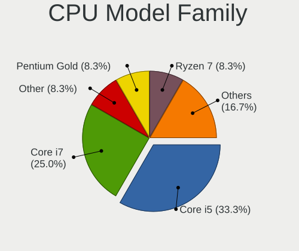

| Model              | Desktops | Percent |
|--------------------|----------|---------|
| Intel Core i5      | 4        | 33.33%  |
| Intel Core i7      | 3        | 25%     |
| Other              | 1        | 8.33%   |
| Intel Pentium Gold | 1        | 8.33%   |
| AMD Ryzen 7        | 1        | 8.33%   |
| AMD Ryzen 5 PRO    | 1        | 8.33%   |
| AMD E              | 1        | 8.33%   |

CPU Cores
---------

Number of processor cores

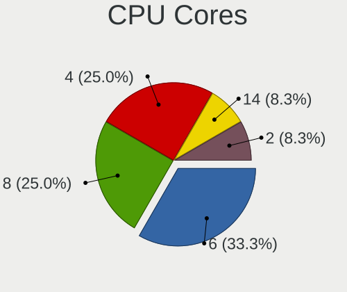

| Number | Desktops | Percent |
|--------|----------|---------|
| 6      | 4        | 33.33%  |
| 8      | 3        | 25%     |
| 4      | 3        | 25%     |
| 14     | 1        | 8.33%   |
| 2      | 1        | 8.33%   |

CPU Sockets
-----------

Number of sockets

| Number | Desktops | Percent |
|--------|----------|---------|
| 1      | 12       | 100%    |

CPU Threads
-----------

Threads per core (Hyper-Threading)

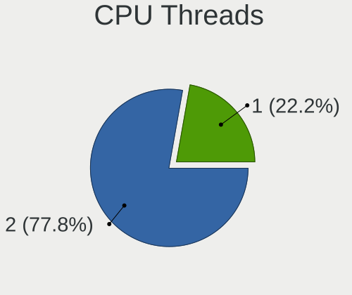

| Number | Desktops | Percent |
|--------|----------|---------|
| 2      | 9        | 75%     |
| 1      | 3        | 25%     |

CPU Op-Modes
------------

CPU Operation Modes (32-bit, 64-bit)

| Op mode        | Desktops | Percent |
|----------------|----------|---------|
| 32-bit, 64-bit | 12       | 100%    |

CPU Microcode
-------------

Microcode number

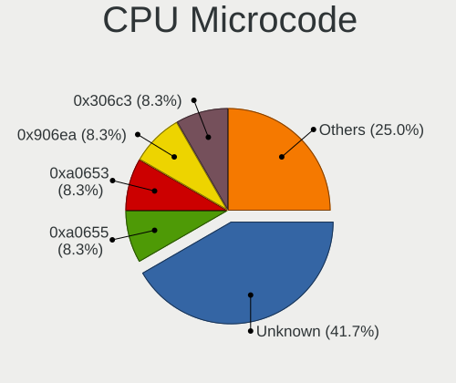

| Number     | Desktops | Percent |
|------------|----------|---------|
| Unknown    | 5        | 41.67%  |
| 0xa0655    | 1        | 8.33%   |
| 0xa0653    | 1        | 8.33%   |
| 0x906ea    | 1        | 8.33%   |
| 0x306c3    | 1        | 8.33%   |
| 0x0b404023 | 1        | 8.33%   |
| 0x0a50000f | 1        | 8.33%   |
| 0x08600103 | 1        | 8.33%   |

CPU Microarch
-------------

Microarchitecture

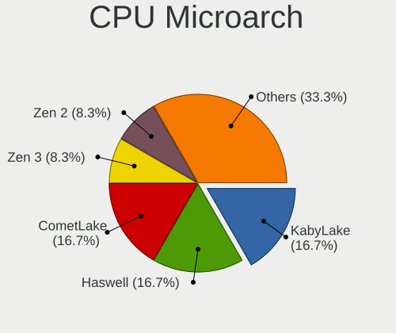

| Name             | Desktops | Percent |
|------------------|----------|---------|
| KabyLake         | 2        | 16.67%  |
| Haswell          | 2        | 16.67%  |
| CometLake        | 2        | 16.67%  |
| Zen 3            | 1        | 8.33%   |
| Zen 2            | 1        | 8.33%   |
| IvyBridge        | 1        | 8.33%   |
| Icelake          | 1        | 8.33%   |
| Alderlake Hybrid | 1        | 8.33%   |
| Unknown          | 1        | 8.33%   |

Graphics
--------

GPU Vendor
----------

Vendors of graphics cards

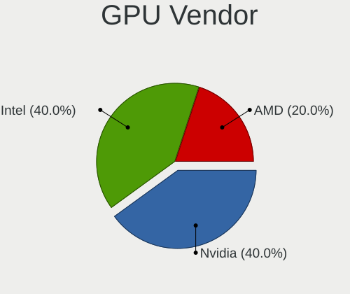

| Vendor | Desktops | Percent |
|--------|----------|---------|
| Nvidia | 6        | 40%     |
| Intel  | 6        | 40%     |
| AMD    | 3        | 20%     |

GPU Model
---------

Graphics card models

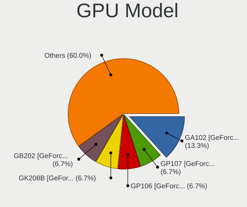

| Model                                                                       | Desktops | Percent |
|-----------------------------------------------------------------------------|----------|---------|
| Nvidia GA102 [GeForce RTX 3090]                                             | 2        | 13.33%  |
| Nvidia GP107 [GeForce GTX 1050 Ti]                                          | 1        | 6.67%   |
| Nvidia GP106 [GeForce GTX 1060 6GB]                                         | 1        | 6.67%   |
| Nvidia GK208B [GeForce GT 730]                                              | 1        | 6.67%   |
| Nvidia GB202 [GeForce RTX 5090]                                             | 1        | 6.67%   |
| Intel Xeon E3-1200 v3/4th Gen Core Processor Integrated Graphics Controller | 1        | 6.67%   |
| Intel Xeon E3-1200 v2/3rd Gen Core processor Graphics Controller            | 1        | 6.67%   |
| Intel Raptor Lake-S GT1 [UHD Graphics 770]                                  | 1        | 6.67%   |
| Intel CometLake-S GT2 [UHD Graphics 630]                                    | 1        | 6.67%   |
| Intel CometLake-S GT1 [UHD Graphics 610]                                    | 1        | 6.67%   |
| Intel CoffeeLake-S GT2 [UHD Graphics 630]                                   | 1        | 6.67%   |
| AMD Granite Ridge [Radeon Graphics]                                         | 1        | 6.67%   |
| AMD Ellesmere [Radeon RX 470/480/570/570X/580/580X/590]                     | 1        | 6.67%   |
| AMD Caicos XT [Radeon HD 7470/8470 / R5 235/310 OEM]                        | 1        | 6.67%   |

GPU Combo
---------

Combinations of graphics cards

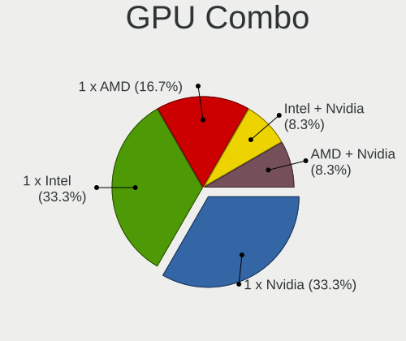

| Name           | Desktops | Percent |
|----------------|----------|---------|
| 1 x Nvidia     | 4        | 33.33%  |
| 1 x Intel      | 4        | 33.33%  |
| 1 x AMD        | 2        | 16.67%  |
| Intel + Nvidia | 1        | 8.33%   |
| AMD + Nvidia   | 1        | 8.33%   |

GPU Driver
----------

Free vs proprietary

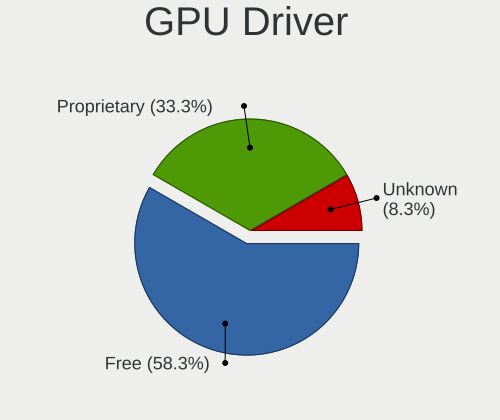

| Driver      | Desktops | Percent |
|-------------|----------|---------|
| Free        | 7        | 58.33%  |
| Proprietary | 4        | 33.33%  |
| Unknown     | 1        | 8.33%   |

GPU Memory
----------

Total video memory

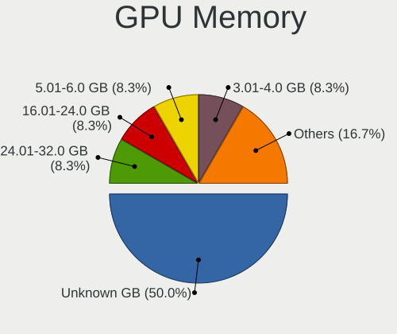

| Size in GB | Desktops | Percent |
|------------|----------|---------|
| Unknown    | 6        | 50%     |
| 5.01-6.0   | 1        | 8.33%   |
| 3.01-4.0   | 1        | 8.33%   |
| 24.01-32.0 | 1        | 8.33%   |
| 16.01-24.0 | 1        | 8.33%   |
| 1.01-2.0   | 1        | 8.33%   |
| 0.51-1.0   | 1        | 8.33%   |

Monitor
-------

Monitor Vendor
--------------

Monitor vendors

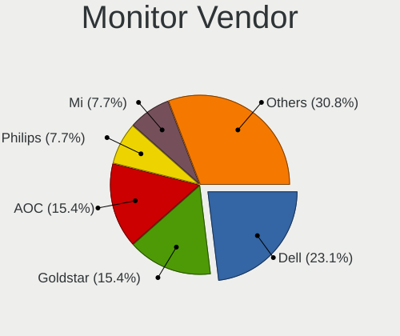

| Vendor               | Desktops | Percent |
|----------------------|----------|---------|
| Dell                 | 3        | 23.08%  |
| Goldstar             | 2        | 15.38%  |
| AOC                  | 2        | 15.38%  |
| Philips              | 1        | 7.69%   |
| Mi                   | 1        | 7.69%   |
| JZM                  | 1        | 7.69%   |
| HKC                  | 1        | 7.69%   |
| BenQ                 | 1        | 7.69%   |
| Ancor Communications | 1        | 7.69%   |

Monitor Model
-------------

Monitor models

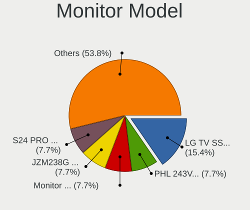

| Model                                                                 | Desktops | Percent |
|-----------------------------------------------------------------------|----------|---------|
| Goldstar LG TV SSCR2 GSMC0C8 3840x2160                                | 2        | 15.38%  |
| Philips PHL 243V7 PHLC155 1920x1080 527x296mm 23.8-inch               | 1        | 7.69%   |
| Mi Monitor XMI3444 3440x1440 797x334mm 34.0-inch                      | 1        | 7.69%   |
| JZM JZM238G JZM2442 1920x1080 527x296mm 23.8-inch                     | 1        | 7.69%   |
| HKC S24 PRO HKC2473 1920x1080 527x296mm 23.8-inch                     | 1        | 7.69%   |
| Dell SE2218HL DELF121 1920x1080 476x268mm 21.5-inch                   | 1        | 7.69%   |
| Dell E2213 DELD04E 1680x1050 473x296mm 22.0-inch                      | 1        | 7.69%   |
| Dell 1704FPT DEL4005 1280x1024 338x270mm 17.0-inch                    | 1        | 7.69%   |
| BenQ LCD Monitor G2400W 1920x1200                                     | 1        | 7.69%   |
| AOC U2790B AOC2790 3840x2160 597x336mm 27.0-inch                      | 1        | 7.69%   |
| AOC 27G1G4 AOC2701 1920x1080 598x336mm 27.0-inch                      | 1        | 7.69%   |
| Ancor Communications ASUS VS247 ACI249A 1920x1080 521x293mm 23.5-inch | 1        | 7.69%   |

Monitor Resolution
------------------

Monitor screen resolution

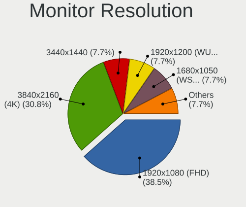

| Resolution         | Desktops | Percent |
|--------------------|----------|---------|
| 1920x1080 (FHD)    | 5        | 38.46%  |
| 3840x2160 (4K)     | 4        | 30.77%  |
| 3440x1440          | 1        | 7.69%   |
| 1920x1200 (WUXGA)  | 1        | 7.69%   |
| 1680x1050 (WSXGA+) | 1        | 7.69%   |
| 1280x1024 (SXGA)   | 1        | 7.69%   |

Monitor Diagonal
----------------

Diagonal size in inches

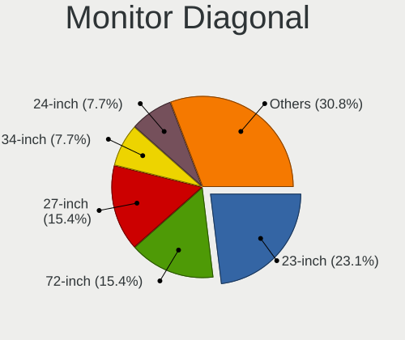

| Inches  | Desktops | Percent |
|---------|----------|---------|
| 23      | 3        | 23.08%  |
| 72      | 2        | 15.38%  |
| 27      | 2        | 15.38%  |
| 34      | 1        | 7.69%   |
| 24      | 1        | 7.69%   |
| 22      | 1        | 7.69%   |
| 21      | 1        | 7.69%   |
| 17      | 1        | 7.69%   |
| Unknown | 1        | 7.69%   |

Monitor Width
-------------

Physical width

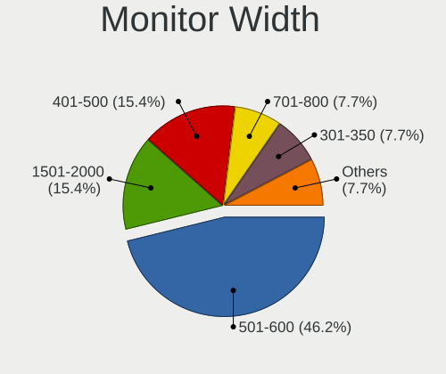

| Width in mm | Desktops | Percent |
|-------------|----------|---------|
| 501-600     | 6        | 46.15%  |
| 401-500     | 2        | 15.38%  |
| 1501-2000   | 2        | 15.38%  |
| 701-800     | 1        | 7.69%   |
| 301-350     | 1        | 7.69%   |
| Unknown     | 1        | 7.69%   |

Aspect Ratio
------------

Proportional relationship between the width and the height

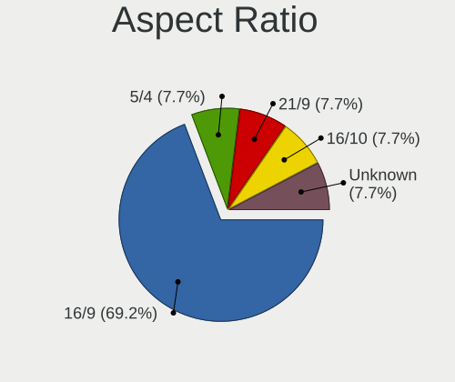

| Ratio   | Desktops | Percent |
|---------|----------|---------|
| 16/9    | 9        | 69.23%  |
| 5/4     | 1        | 7.69%   |
| 21/9    | 1        | 7.69%   |
| 16/10   | 1        | 7.69%   |
| Unknown | 1        | 7.69%   |

Monitor Area
------------

Area in inch²

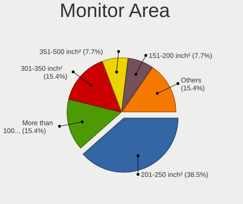

| Area in inch² | Desktops | Percent |
|----------------|----------|---------|
| 201-250        | 5        | 38.46%  |
| More than 1000 | 2        | 15.38%  |
| 301-350        | 2        | 15.38%  |
| 351-500        | 1        | 7.69%   |
| 151-200        | 1        | 7.69%   |
| 141-150        | 1        | 7.69%   |
| Unknown        | 1        | 7.69%   |

Pixel Density
-------------

Pixels per inch

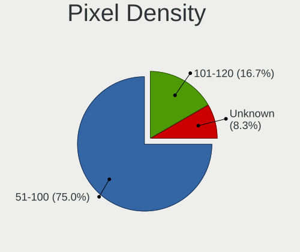

| Density | Desktops | Percent |
|---------|----------|---------|
| 51-100  | 9        | 75%     |
| 101-120 | 2        | 16.67%  |
| Unknown | 1        | 8.33%   |

Multiple Monitors
-----------------

Total monitors connected

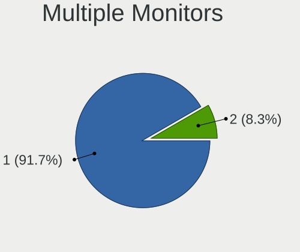

| Total | Desktops | Percent |
|-------|----------|---------|
| 1     | 11       | 91.67%  |
| 2     | 1        | 8.33%   |

Network
-------

Net Controller Vendor
---------------------

Controller vendors

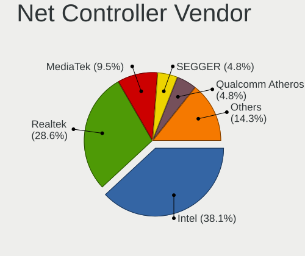

| Vendor                | Desktops | Percent |
|-----------------------|----------|---------|
| Intel                 | 8        | 38.1%   |
| Realtek Semiconductor | 6        | 28.57%  |
| MediaTek              | 2        | 9.52%   |
| SEGGER                | 1        | 4.76%   |
| Qualcomm Atheros      | 1        | 4.76%   |
| QinHeng Electronics   | 1        | 4.76%   |
| Broadcom              | 1        | 4.76%   |
| ASIX Electronics      | 1        | 4.76%   |

Net Controller Model
--------------------

Controller models

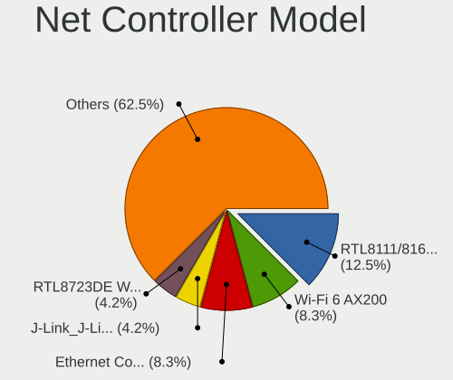

| Model                                                                  | Desktops | Percent |
|------------------------------------------------------------------------|----------|---------|
| Realtek RTL8111/8168/8211/8411 PCI Express Gigabit Ethernet Controller | 3        | 12.5%   |
| Intel Wi-Fi 6 AX200                                                    | 2        | 8.33%   |
| Intel Ethernet Connection (11) I219-V                                  | 2        | 8.33%   |
| SEGGER J-Link_J-Link V9.3 Plus                                         | 1        | 4.17%   |
| Realtek RTL8723DE Wireless Network Adapter                             | 1        | 4.17%   |
| Realtek RTL8125 2.5GbE Controller                                      | 1        | 4.17%   |
| Realtek RTL810xE PCI Express Fast Ethernet controller                  | 1        | 4.17%   |
| Qualcomm Atheros AR5212/5213/2414 Wireless Network Adapter             | 1        | 4.17%   |
| QinHeng USB Single Serial                                              | 1        | 4.17%   |
| MediaTek WiFi                                                          | 1        | 4.17%   |
| MediaTek MT7922 802.11ax PCI Express Wireless Network Adapter          | 1        | 4.17%   |
| Intel I211 Gigabit Network Connection                                  | 1        | 4.17%   |
| Intel Ethernet Controller I226-V                                       | 1        | 4.17%   |
| Intel Ethernet Controller I225-V                                       | 1        | 4.17%   |
| Intel Ethernet Connection I217-V                                       | 1        | 4.17%   |
| Intel Ethernet Connection (7) I219-V                                   | 1        | 4.17%   |
| Intel Dual Band Wireless-AC 3168NGW [Stone Peak]                       | 1        | 4.17%   |
| Intel 700 Series Chipset CNVi WiFi                                     | 1        | 4.17%   |
| Broadcom BCM43602 802.11ac Wireless LAN SoC                            | 1        | 4.17%   |
| ASIX AX88179 Gigabit Ethernet                                          | 1        | 4.17%   |

Wireless Vendor
---------------

Wireless vendors

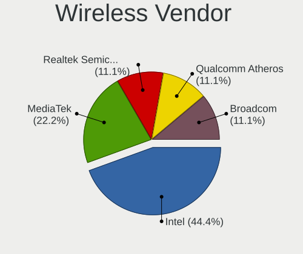

| Vendor                | Desktops | Percent |
|-----------------------|----------|---------|
| Intel                 | 4        | 44.44%  |
| MediaTek              | 2        | 22.22%  |
| Realtek Semiconductor | 1        | 11.11%  |
| Qualcomm Atheros      | 1        | 11.11%  |
| Broadcom              | 1        | 11.11%  |

Wireless Model
--------------

Wireless models

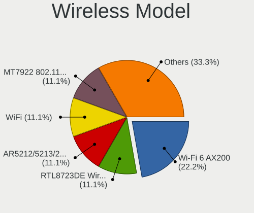

| Model                                                         | Desktops | Percent |
|---------------------------------------------------------------|----------|---------|
| Intel Wi-Fi 6 AX200                                           | 2        | 22.22%  |
| Realtek RTL8723DE Wireless Network Adapter                    | 1        | 11.11%  |
| Qualcomm Atheros AR5212/5213/2414 Wireless Network Adapter    | 1        | 11.11%  |
| MediaTek WiFi                                                 | 1        | 11.11%  |
| MediaTek MT7922 802.11ax PCI Express Wireless Network Adapter | 1        | 11.11%  |
| Intel Dual Band Wireless-AC 3168NGW [Stone Peak]              | 1        | 11.11%  |
| Intel 700 Series Chipset CNVi WiFi                            | 1        | 11.11%  |
| Broadcom BCM43602 802.11ac Wireless LAN SoC                   | 1        | 11.11%  |

Ethernet Vendor
---------------

Ethernet vendors

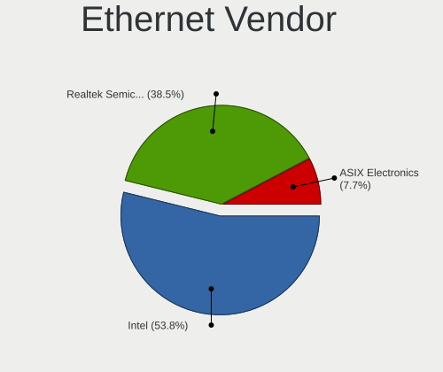

| Vendor                | Desktops | Percent |
|-----------------------|----------|---------|
| Intel                 | 7        | 53.85%  |
| Realtek Semiconductor | 5        | 38.46%  |
| ASIX Electronics      | 1        | 7.69%   |

Ethernet Model
--------------

Ethernet models

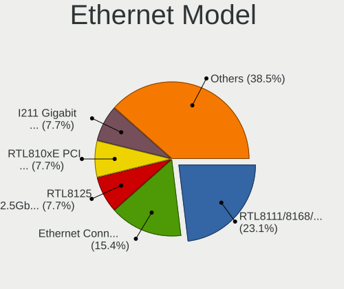

| Model                                                                  | Desktops | Percent |
|------------------------------------------------------------------------|----------|---------|
| Realtek RTL8111/8168/8211/8411 PCI Express Gigabit Ethernet Controller | 3        | 23.08%  |
| Intel Ethernet Connection (11) I219-V                                  | 2        | 15.38%  |
| Realtek RTL8125 2.5GbE Controller                                      | 1        | 7.69%   |
| Realtek RTL810xE PCI Express Fast Ethernet controller                  | 1        | 7.69%   |
| Intel I211 Gigabit Network Connection                                  | 1        | 7.69%   |
| Intel Ethernet Controller I226-V                                       | 1        | 7.69%   |
| Intel Ethernet Controller I225-V                                       | 1        | 7.69%   |
| Intel Ethernet Connection I217-V                                       | 1        | 7.69%   |
| Intel Ethernet Connection (7) I219-V                                   | 1        | 7.69%   |
| ASIX AX88179 Gigabit Ethernet                                          | 1        | 7.69%   |

Net Controller Kind
-------------------

Ethernet, WiFi or modem

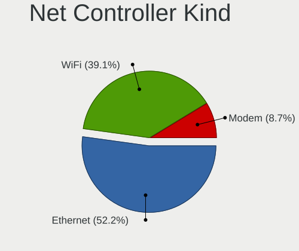

| Kind     | Desktops | Percent |
|----------|----------|---------|
| Ethernet | 12       | 52.17%  |
| WiFi     | 9        | 39.13%  |
| Modem    | 2        | 8.7%    |

Used Controller
---------------

Currently used network controller

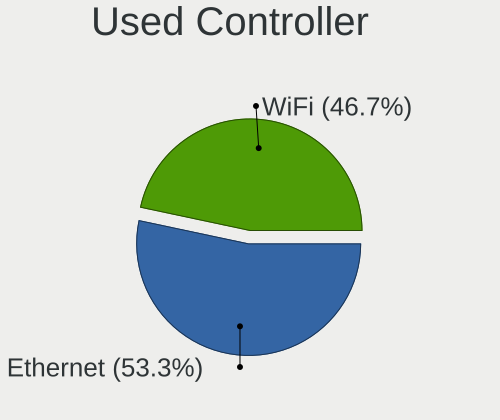

| Kind     | Desktops | Percent |
|----------|----------|---------|
| Ethernet | 8        | 53.33%  |
| WiFi     | 7        | 46.67%  |

NICs
----

Total network controllers on board

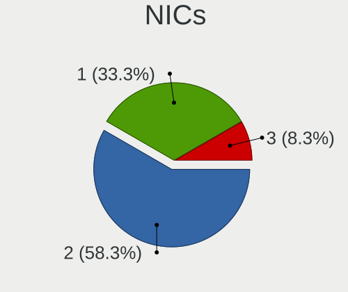

| Total | Desktops | Percent |
|-------|----------|---------|
| 2     | 7        | 58.33%  |
| 1     | 4        | 33.33%  |
| 3     | 1        | 8.33%   |

IPv6
----

IPv6 vs IPv4

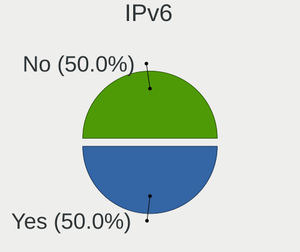

| Used | Desktops | Percent |
|------|----------|---------|
| No   | 9        | 75%     |
| Yes  | 3        | 25%     |

Bluetooth
---------

Bluetooth Vendor
----------------

Controller vendors

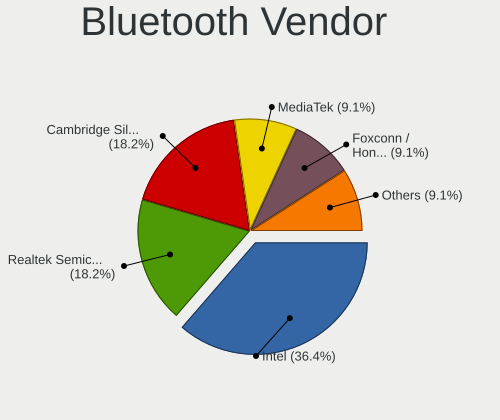

| Vendor                  | Desktops | Percent |
|-------------------------|----------|---------|
| Intel                   | 4        | 36.36%  |
| Realtek Semiconductor   | 2        | 18.18%  |
| Cambridge Silicon Radio | 2        | 18.18%  |
| MediaTek                | 1        | 9.09%   |
| Foxconn / Hon Hai       | 1        | 9.09%   |
| Apple                   | 1        | 9.09%   |

Bluetooth Model
---------------

Controller models

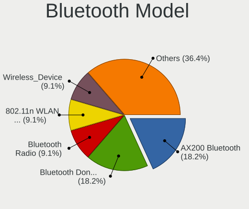

| Model                                               | Desktops | Percent |
|-----------------------------------------------------|----------|---------|
| Intel AX200 Bluetooth                               | 2        | 18.18%  |
| Cambridge Silicon Radio Bluetooth Dongle (HCI mode) | 2        | 18.18%  |
| Realtek Bluetooth Radio                             | 1        | 9.09%   |
| Realtek 802.11n WLAN Adapter                        | 1        | 9.09%   |
| MediaTek Wireless_Device                            | 1        | 9.09%   |
| Intel Wireless-AC 3168 Bluetooth                    | 1        | 9.09%   |
| Intel Bluetooth Device                              | 1        | 9.09%   |
| Foxconn / Hon Hai Wireless_Device                   | 1        | 9.09%   |
| Apple Bluetooth USB Host Controller                 | 1        | 9.09%   |

Sound
-----

Sound Vendor
------------

Sound card vendors

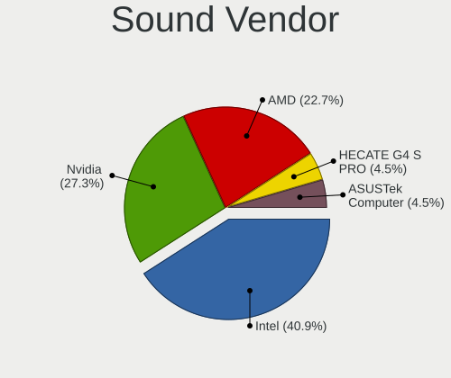

| Vendor           | Desktops | Percent |
|------------------|----------|---------|
| Intel            | 9        | 40.91%  |
| Nvidia           | 6        | 27.27%  |
| AMD              | 5        | 22.73%  |
| HECATE G4 S PRO  | 1        | 4.55%   |
| ASUSTek Computer | 1        | 4.55%   |

Sound Model
-----------

Sound card models

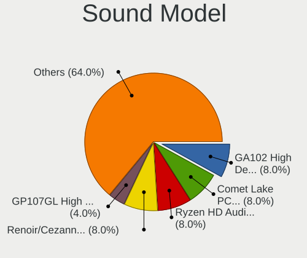

| Model                                                                             | Desktops | Percent |
|-----------------------------------------------------------------------------------|----------|---------|
| Nvidia GA102 High Definition Audio Controller                                     | 2        | 8%      |
| Intel Comet Lake PCH cAVS                                                         | 2        | 8%      |
| AMD Ryzen HD Audio Controller                                                     | 2        | 8%      |
| AMD Renoir/Cezanne HDMI/DP Audio Controller                                       | 2        | 8%      |
| Nvidia GP107GL High Definition Audio Controller                                   | 1        | 4%      |
| Nvidia GP106 High Definition Audio Controller                                     | 1        | 4%      |
| Nvidia GK208 HDMI/DP Audio Controller                                             | 1        | 4%      |
| Nvidia GB202 High Definition Audio Controller                                     | 1        | 4%      |
| Intel Xeon E3-1200 v3/4th Gen Core Processor HD Audio Controller                  | 1        | 4%      |
| Intel Tiger Lake-H HD Audio Controller                                            | 1        | 4%      |
| Intel Raptor Lake High Definition Audio Controller                                | 1        | 4%      |
| Intel Cannon Lake PCH cAVS                                                        | 1        | 4%      |
| Intel 9 Series Chipset Family HD Audio Controller                                 | 1        | 4%      |
| Intel 8 Series/C220 Series Chipset High Definition Audio Controller               | 1        | 4%      |
| Intel 7 Series/C216 Chipset Family High Definition Audio Controller               | 1        | 4%      |
| Intel 200 Series PCH HD Audio                                                     | 1        | 4%      |
| HECATE G4 S PRO HECATE G4 S PRO                                                   | 1        | 4%      |
| ASUSTek Computer USB Audio                                                        | 1        | 4%      |
| AMD Radeon High Definition Audio Controller                                       | 1        | 4%      |
| AMD Ellesmere HDMI Audio [Radeon RX 470/480 / 570/580/590]                        | 1        | 4%      |
| AMD Caicos HDMI Audio [Radeon HD 6450 / 7450/8450/8490 OEM / R5 230/235/235X OEM] | 1        | 4%      |

Memory
------

Memory Vendor
-------------

Memory module vendors

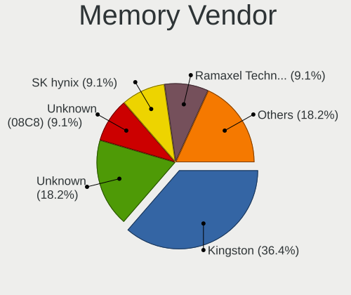

| Vendor             | Desktops | Percent |
|--------------------|----------|---------|
| Kingston           | 4        | 36.36%  |
| Unknown            | 2        | 18.18%  |
| Unknown (08C8)     | 1        | 9.09%   |
| SK hynix           | 1        | 9.09%   |
| Ramaxel Technology | 1        | 9.09%   |
| Asgard             | 1        | 9.09%   |
| A-DATA Technology  | 1        | 9.09%   |

Memory Model
------------

Memory module models

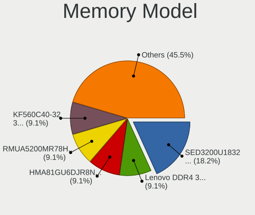

| Model                                                             | Desktops | Percent |
|-------------------------------------------------------------------|----------|---------|
| Unknown                                                           | 2        | 18.18%  |
| Unknown (08C8) RAM Lenovo DDR4 3200 8GB 8192MB DIMM DDR4 3200MT/s | 1        | 9.09%   |
| SK hynix RAM HMA81GU6DJR8N-XN 8GB DIMM DDR4 3200MT/s              | 1        | 9.09%   |
| Ramaxel RAM RMUA5200MR78HAF-3200 8192MB DIMM DDR4 3200MT/s        | 1        | 9.09%   |
| Kingston RAM KF560C40-32 32GB DIMM DDR5 6000MT/s                  | 1        | 9.09%   |
| Kingston RAM KF3200C16D4/16GX 16GB DIMM DDR4 3733MT/s             | 1        | 9.09%   |
| Kingston RAM 99P5474-055.A00LF 4GB DIMM DDR3 1600MT/s             | 1        | 9.09%   |
| Kingston RAM 99P5471-033.A00LF 8GB DIMM DDR3 1600MT/s             | 1        | 9.09%   |
| Asgard RAM VAM5UH60C28AG-CTHRBA 16GB DIMM DDR5 5600MT/s           | 1        | 9.09%   |
| A-DATA RAM DDR4 3200 16GB DIMM DDR4 3600MT/s                      | 1        | 9.09%   |

Memory Kind
-----------

Memory module kinds

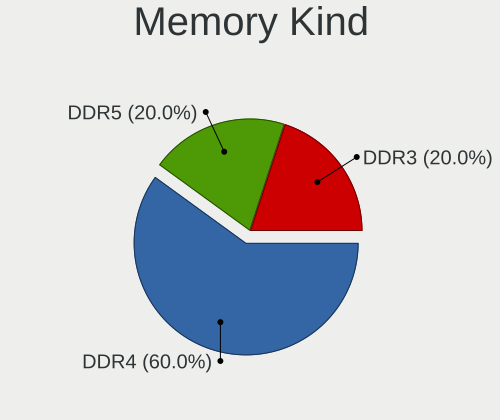

| Kind | Desktops | Percent |
|------|----------|---------|
| DDR4 | 6        | 60%     |
| DDR5 | 2        | 20%     |
| DDR3 | 2        | 20%     |

Memory Form Factor
------------------

Physical design of the memory module

| Name | Desktops | Percent |
|------|----------|---------|
| DIMM | 10       | 100%    |

Memory Size
-----------

Memory module size

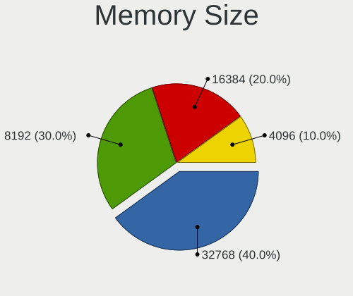

| Size  | Desktops | Percent |
|-------|----------|---------|
| 32768 | 4        | 40%     |
| 8192  | 3        | 30%     |
| 16384 | 2        | 20%     |
| 4096  | 1        | 10%     |

Memory Speed
------------

Memory module speed

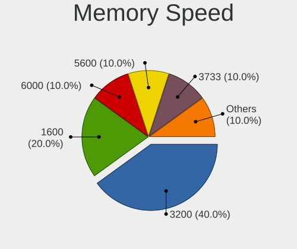

| Speed | Desktops | Percent |
|-------|----------|---------|
| 3200  | 4        | 40%     |
| 1600  | 2        | 20%     |
| 6000  | 1        | 10%     |
| 5600  | 1        | 10%     |
| 3733  | 1        | 10%     |
| 3600  | 1        | 10%     |

Printers & scanners
-------------------

Printer Vendor
--------------

Printer device vendors

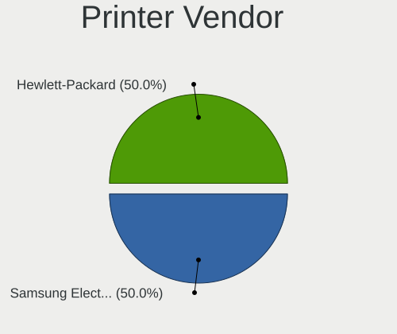

| Vendor              | Desktops | Percent |
|---------------------|----------|---------|
| Samsung Electronics | 1        | 50%     |
| Hewlett-Packard     | 1        | 50%     |

Printer Model
-------------

Printer device models

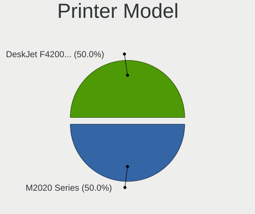

| Model                   | Desktops | Percent |
|-------------------------|----------|---------|
| Samsung M2020 Series    | 1        | 50%     |
| HP DeskJet F4200 series | 1        | 50%     |

Scanner Vendor
--------------

Scanner device vendors

Zero info for selected period =(

Scanner Model
-------------

Scanner device models

Zero info for selected period =(

Camera
------

Camera Vendor
-------------

Camera device vendors

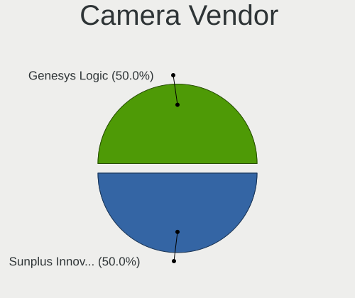

| Vendor                        | Desktops | Percent |
|-------------------------------|----------|---------|
| Sunplus Innovation Technology | 1        | 50%     |
| Genesys Logic                 | 1        | 50%     |

Camera Model
------------

Camera device models

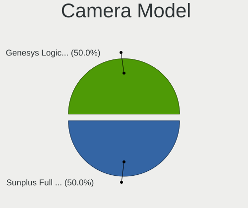

| Model                   | Desktops | Percent |
|-------------------------|----------|---------|
| Sunplus Full HD webcam  | 1        | 50%     |
| Genesys Logic HD camera | 1        | 50%     |

Security
--------

Fingerprint Vendor
------------------

Fingerprint sensor vendors

Zero info for selected period =(

Fingerprint Model
-----------------

Fingerprint sensor models

Zero info for selected period =(

Chipcard Vendor
---------------

Chipcard module vendors

Zero info for selected period =(

Chipcard Model
--------------

Chipcard module models

Zero info for selected period =(

Unsupported
-----------

Unsupported Devices
-------------------

Total unsupported devices on board

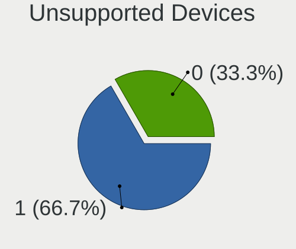

| Total | Desktops | Percent |
|-------|----------|---------|
| 0     | 9        | 75%     |
| 1     | 3        | 25%     |

Unsupported Device Types
------------------------

Types of unsupported devices

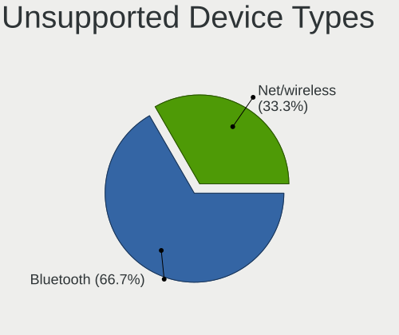

| Type         | Desktops | Percent |
|--------------|----------|---------|
| Bluetooth    | 2        | 66.67%  |
| Net/wireless | 1        | 33.33%  |

