Kylin - Tested Hardware & Statistics (Desktops)
-----------------------------------------------

A project to collect tested hardware configurations for Kylin.

Anyone can contribute to this report by the [hw-probe](https://github.com/linuxhw/hw-probe) tool:

    sudo -E hw-probe -all -upload

Please contribute! Especially if your hardware is rare.

Contents
--------

* [ Test Cases ](#test-cases)

* [ System ](#system)
  - [ OS                       ](#os)
  - [ OS Family                ](#os-family)
  - [ Kernel                   ](#kernel)
  - [ Kernel Family            ](#kernel-family)
  - [ Kernel Major Ver.        ](#kernel-major-ver)
  - [ Arch                     ](#arch)
  - [ DE                       ](#de)
  - [ Display Server           ](#display-server)
  - [ Display Manager          ](#display-manager)
  - [ OS Lang                  ](#os-lang)
  - [ Boot Mode                ](#boot-mode)
  - [ Filesystem               ](#filesystem)
  - [ Part. scheme             ](#part-scheme)
  - [ Dual Boot with Linux/BSD ](#dual-boot-with-linuxbsd)
  - [ Dual Boot (Win)          ](#dual-boot-win)

* [ Board ](#board)
  - [ Vendor                   ](#vendor)
  - [ Model                    ](#model)
  - [ Model Family             ](#model-family)
  - [ MFG Year                 ](#mfg-year)
  - [ Form Factor              ](#form-factor)
  - [ Secure Boot              ](#secure-boot)
  - [ Coreboot                 ](#coreboot)
  - [ RAM Size                 ](#ram-size)
  - [ RAM Used                 ](#ram-used)
  - [ Total Drives             ](#total-drives)
  - [ Has CD-ROM               ](#has-cd-rom)
  - [ Has Ethernet             ](#has-ethernet)
  - [ Has WiFi                 ](#has-wifi)
  - [ Has Bluetooth            ](#has-bluetooth)

* [ Location ](#location)
  - [ Country                  ](#country)
  - [ City                     ](#city)

* [ Drives ](#drives)
  - [ Drive Vendor             ](#drive-vendor)
  - [ Drive Model              ](#drive-model)
  - [ HDD Vendor               ](#hdd-vendor)
  - [ SSD Vendor               ](#ssd-vendor)
  - [ Drive Kind               ](#drive-kind)
  - [ Drive Connector          ](#drive-connector)
  - [ Drive Size               ](#drive-size)
  - [ Space Total              ](#space-total)
  - [ Space Used               ](#space-used)
  - [ Malfunc. Drives          ](#malfunc-drives)
  - [ Malfunc. Drive Vendor    ](#malfunc-drive-vendor)
  - [ Malfunc. HDD Vendor      ](#malfunc-hdd-vendor)
  - [ Malfunc. Drive Kind      ](#malfunc-drive-kind)
  - [ Failed Drives            ](#failed-drives)
  - [ Failed Drive Vendor      ](#failed-drive-vendor)
  - [ Drive Status             ](#drive-status)

* [ Storage controller ](#storage-controller)
  - [ Storage Vendor           ](#storage-vendor)
  - [ Storage Model            ](#storage-model)
  - [ Storage Kind             ](#storage-kind)

* [ Processor ](#processor)
  - [ CPU Vendor               ](#cpu-vendor)
  - [ CPU Model                ](#cpu-model)
  - [ CPU Model Family         ](#cpu-model-family)
  - [ CPU Cores                ](#cpu-cores)
  - [ CPU Sockets              ](#cpu-sockets)
  - [ CPU Threads              ](#cpu-threads)
  - [ CPU Op-Modes             ](#cpu-op-modes)
  - [ CPU Microcode            ](#cpu-microcode)
  - [ CPU Microarch            ](#cpu-microarch)

* [ Graphics ](#graphics)
  - [ GPU Vendor               ](#gpu-vendor)
  - [ GPU Model                ](#gpu-model)
  - [ GPU Combo                ](#gpu-combo)
  - [ GPU Driver               ](#gpu-driver)
  - [ GPU Memory               ](#gpu-memory)

* [ Monitor ](#monitor)
  - [ Monitor Vendor           ](#monitor-vendor)
  - [ Monitor Model            ](#monitor-model)
  - [ Monitor Resolution       ](#monitor-resolution)
  - [ Monitor Diagonal         ](#monitor-diagonal)
  - [ Monitor Width            ](#monitor-width)
  - [ Aspect Ratio             ](#aspect-ratio)
  - [ Monitor Area             ](#monitor-area)
  - [ Pixel Density            ](#pixel-density)
  - [ Multiple Monitors        ](#multiple-monitors)

* [ Network ](#network)
  - [ Net Controller Vendor    ](#net-controller-vendor)
  - [ Net Controller Model     ](#net-controller-model)
  - [ Wireless Vendor          ](#wireless-vendor)
  - [ Wireless Model           ](#wireless-model)
  - [ Ethernet Vendor          ](#ethernet-vendor)
  - [ Ethernet Model           ](#ethernet-model)
  - [ Net Controller Kind      ](#net-controller-kind)
  - [ Used Controller          ](#used-controller)
  - [ NICs                     ](#nics)
  - [ IPv6                     ](#ipv6)

* [ Bluetooth ](#bluetooth)
  - [ Bluetooth Vendor         ](#bluetooth-vendor)
  - [ Bluetooth Model          ](#bluetooth-model)

* [ Sound ](#sound)
  - [ Sound Vendor             ](#sound-vendor)
  - [ Sound Model              ](#sound-model)

* [ Memory ](#memory)
  - [ Memory Vendor            ](#memory-vendor)
  - [ Memory Model             ](#memory-model)
  - [ Memory Kind              ](#memory-kind)
  - [ Memory Form Factor       ](#memory-form-factor)
  - [ Memory Size              ](#memory-size)
  - [ Memory Speed             ](#memory-speed)

* [ Printers & scanners ](#printers--scanners)
  - [ Printer Vendor           ](#printer-vendor)
  - [ Printer Model            ](#printer-model)
  - [ Scanner Vendor           ](#scanner-vendor)
  - [ Scanner Model            ](#scanner-model)

* [ Camera ](#camera)
  - [ Camera Vendor            ](#camera-vendor)
  - [ Camera Model             ](#camera-model)

* [ Security ](#security)
  - [ Fingerprint Vendor       ](#fingerprint-vendor)
  - [ Fingerprint Model        ](#fingerprint-model)
  - [ Chipcard Vendor          ](#chipcard-vendor)
  - [ Chipcard Model           ](#chipcard-model)

* [ Unsupported ](#unsupported)
  - [ Unsupported Devices      ](#unsupported-devices)
  - [ Unsupported Device Types ](#unsupported-device-types)

Test Cases
----------

Total: 10

| Vendor   | Model                       | Probe                                                      | Date         |
|----------|-----------------------------|------------------------------------------------------------|--------------|
| Lenovo   | NOK                         | [869a19c237](https://linux-hardware.org/?probe=869a19c237) | Sep 27, 2024 |
| ASUSTek  | TUF Gaming B560M-PLUS       | [668f599883](https://linux-hardware.org/?probe=668f599883) | Aug 14, 2024 |
| ONDA     | B75E                        | [c42fc0c3e5](https://linux-hardware.org/?probe=c42fc0c3e5) | Jun 19, 2024 |
| Gigabyte | B550M AORUS ELITE           | [d2f2894a0c](https://linux-hardware.org/?probe=d2f2894a0c) | Jun 14, 2024 |
| ASUSTek  | ROG STRIX B760-I GAMING ... | [f2c3443779](https://linux-hardware.org/?probe=f2c3443779) | Jun 03, 2024 |
| ASRock   | X570 Phantom Gaming-ITX/... | [26ccfc6d25](https://linux-hardware.org/?probe=26ccfc6d25) | May 18, 2024 |
| ASUSTek  | PRIME H310M-F R2.0          | [4b4560a9ba](https://linux-hardware.org/?probe=4b4560a9ba) | Nov 20, 2023 |
| ASUSTek  | PRIME H310M-F R2.0          | [6ff3a21e4e](https://linux-hardware.org/?probe=6ff3a21e4e) | Nov 20, 2023 |
| Dell     | 0V7K5Y A00                  | [831a493e15](https://linux-hardware.org/?probe=831a493e15) | Feb 24, 2023 |
| Gigabyte | Z97X-SLI-CF                 | [4e829bc252](https://linux-hardware.org/?probe=4e829bc252) | Dec 10, 2022 |

System
------

OS
--

Installed operating systems

| Name      | Desktops | Percent |
|-----------|----------|---------|
| Kylin V10 | 9        | 100%    |

OS Family
---------

OS without a version

| Name  | Desktops | Percent |
|-------|----------|---------|
| Kylin | 9        | 100%    |

Kernel
------

Version of the Linux kernel

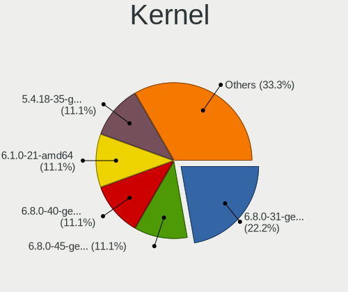

| Version            | Desktops | Percent |
|--------------------|----------|---------|
| 6.8.0-31-generic   | 2        | 22.22%  |
| 6.8.0-45-generic   | 1        | 11.11%  |
| 6.8.0-40-generic   | 1        | 11.11%  |
| 6.1.0-21-amd64     | 1        | 11.11%  |
| 5.4.18-35-generic  | 1        | 11.11%  |
| 5.4.0-26-generic   | 1        | 11.11%  |
| 5.15.0-56-generic  | 1        | 11.11%  |
| 5.15.0-107-generic | 1        | 11.11%  |

Kernel Family
-------------

Linux kernel without a distro release

| Version | Desktops | Percent |
|---------|----------|---------|
| 6.8.0   | 4        | 44.44%  |
| 5.15.0  | 2        | 22.22%  |
| 6.1.0   | 1        | 11.11%  |
| 5.4.18  | 1        | 11.11%  |
| 5.4.0   | 1        | 11.11%  |

Kernel Major Ver.
-----------------

Linux kernel major version

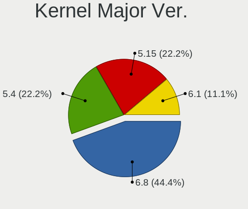

| Version | Desktops | Percent |
|---------|----------|---------|
| 6.8     | 4        | 44.44%  |
| 5.4     | 2        | 22.22%  |
| 5.15    | 2        | 22.22%  |
| 6.1     | 1        | 11.11%  |

Arch
----

OS architecture (x86_64, i586, etc.)

| Name   | Desktops | Percent |
|--------|----------|---------|
| x86_64 | 9        | 100%    |

DE
--

Desktop Environment

| Name       | Desktops | Percent |
|------------|----------|---------|
| GNOME      | 6        | 66.67%  |
| X-Cinnamon | 1        | 11.11%  |
| UKUI       | 1        | 11.11%  |
| LXQt       | 1        | 11.11%  |

Display Server
--------------

X11 or Wayland

| Name    | Desktops | Percent |
|---------|----------|---------|
| X11     | 7        | 77.78%  |
| Wayland | 2        | 22.22%  |

Display Manager
---------------

SDDM, LightDM, etc.

| Name    | Desktops | Percent |
|---------|----------|---------|
| GDM3    | 5        | 55.56%  |
| LightDM | 2        | 22.22%  |
| SDDM    | 1        | 11.11%  |
| GDM     | 1        | 11.11%  |

OS Lang
-------

Language

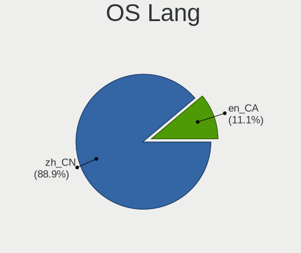

| Lang  | Desktops | Percent |
|-------|----------|---------|
| zh_CN | 8        | 88.89%  |
| en_CA | 1        | 11.11%  |

Boot Mode
---------

EFI or BIOS

| Mode | Desktops | Percent |
|------|----------|---------|
| EFI  | 9        | 100%    |

Filesystem
----------

Type of filesystem

| Type | Desktops | Percent |
|------|----------|---------|
| Ext4 | 9        | 100%    |

Part. scheme
------------

Scheme of partitioning

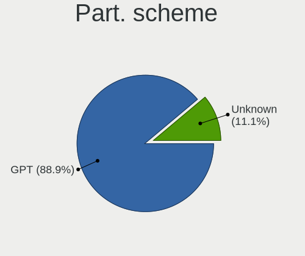

| Type    | Desktops | Percent |
|---------|----------|---------|
| GPT     | 8        | 88.89%  |
| Unknown | 1        | 11.11%  |

Dual Boot with Linux/BSD
------------------------

Hosting more than one Linux/BSD

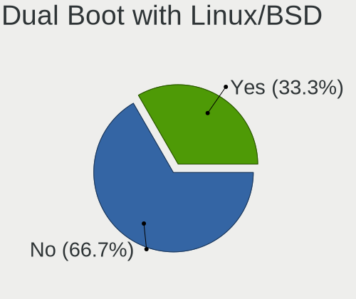

| Dual boot | Desktops | Percent |
|-----------|----------|---------|
| No        | 6        | 66.67%  |
| Yes       | 3        | 33.33%  |

Dual Boot (Win)
---------------

Hosting Linux and Windows

| Dual boot | Desktops | Percent |
|-----------|----------|---------|
| Yes       | 6        | 66.67%  |
| No        | 3        | 33.33%  |

Board
-----

Vendor
------

Motherboard manufacturer

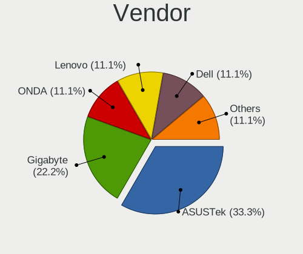

| Name                | Desktops | Percent |
|---------------------|----------|---------|
| ASUSTek Computer    | 3        | 33.33%  |
| Gigabyte Technology | 2        | 22.22%  |
| ONDA                | 1        | 11.11%  |
| Lenovo              | 1        | 11.11%  |
| Dell                | 1        | 11.11%  |
| ASRock              | 1        | 11.11%  |

Model
-----

Motherboard model

| Name                               | Desktops | Percent |
|------------------------------------|----------|---------|
| ONDA B75E                          | 1        | 11.11%  |
| Lenovo YangTianT4900v-00           | 1        | 11.11%  |
| Gigabyte Z97X-SLI                  | 1        | 11.11%  |
| Gigabyte B550M AORUS ELITE         | 1        | 11.11%  |
| Dell Vostro 5880                   | 1        | 11.11%  |
| ASUS TUF Gaming B560M-PLUS         | 1        | 11.11%  |
| ASUS ROG STRIX B760-I GAMING WIFI  | 1        | 11.11%  |
| ASUS PRIME H310M-F R2.0            | 1        | 11.11%  |
| ASRock X570 Phantom Gaming-ITX/TB3 | 1        | 11.11%  |

Model Family
------------

Motherboard model prefix

| Name                     | Desktops | Percent |
|--------------------------|----------|---------|
| ONDA B75E                | 1        | 11.11%  |
| Lenovo YangTianT4900v-00 | 1        | 11.11%  |
| Gigabyte Z97X-SLI        | 1        | 11.11%  |
| Gigabyte B550M           | 1        | 11.11%  |
| Dell Vostro              | 1        | 11.11%  |
| ASUS TUF                 | 1        | 11.11%  |
| ASUS ROG                 | 1        | 11.11%  |
| ASUS PRIME               | 1        | 11.11%  |
| ASRock X570              | 1        | 11.11%  |

MFG Year
--------

Motherboard manufacture year

| Year | Desktops | Percent |
|------|----------|---------|
| 2019 | 3        | 33.33%  |
| 2020 | 2        | 22.22%  |
| 2014 | 2        | 22.22%  |
| 2022 | 1        | 11.11%  |
| 2021 | 1        | 11.11%  |

Form Factor
-----------

Physical design of the computer

| Name    | Desktops | Percent |
|---------|----------|---------|
| Desktop | 9        | 100%    |

Secure Boot
-----------

Enabled or disabled

| State    | Desktops | Percent |
|----------|----------|---------|
| Disabled | 9        | 100%    |

Coreboot
--------

Have coreboot on board

| Used | Desktops | Percent |
|------|----------|---------|
| No   | 9        | 100%    |

RAM Size
--------

Total RAM memory

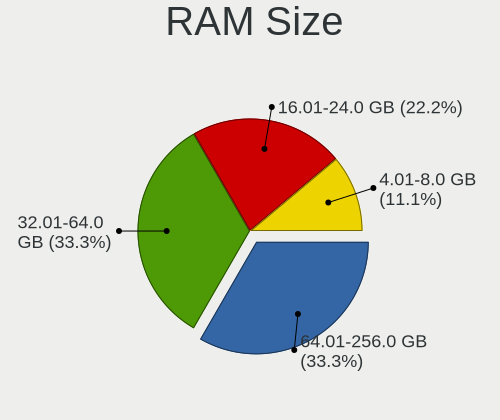

| Size in GB  | Desktops | Percent |
|-------------|----------|---------|
| 32.01-64.0  | 3        | 33.33%  |
| 64.01-256.0 | 3        | 33.33%  |
| 16.01-24.0  | 2        | 22.22%  |
| 4.01-8.0    | 1        | 11.11%  |

RAM Used
--------

Used RAM memory

| Used GB    | Desktops | Percent |
|------------|----------|---------|
| 3.01-4.0   | 3        | 33.33%  |
| 2.01-3.0   | 3        | 33.33%  |
| 4.01-8.0   | 2        | 22.22%  |
| 16.01-24.0 | 1        | 11.11%  |

Total Drives
------------

Number of drives on board

| Drives | Desktops | Percent |
|--------|----------|---------|
| 2      | 4        | 44.44%  |
| 3      | 3        | 33.33%  |
| 1      | 2        | 22.22%  |

Has CD-ROM
----------

Has CD-ROM on board

| Presented | Desktops | Percent |
|-----------|----------|---------|
| No        | 8        | 88.89%  |
| Yes       | 1        | 11.11%  |

Has Ethernet
------------

Has Ethernet on board

| Presented | Desktops | Percent |
|-----------|----------|---------|
| Yes       | 9        | 100%    |

Has WiFi
--------

Has WiFi module

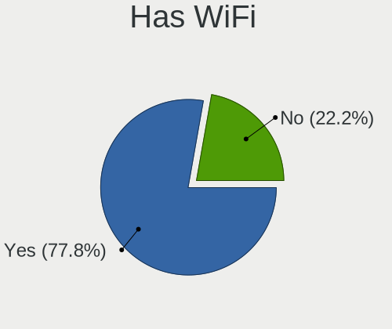

| Presented | Desktops | Percent |
|-----------|----------|---------|
| Yes       | 7        | 77.78%  |
| No        | 2        | 22.22%  |

Has Bluetooth
-------------

Has Bluetooth module

| Presented | Desktops | Percent |
|-----------|----------|---------|
| Yes       | 8        | 88.89%  |
| No        | 1        | 11.11%  |

Location
--------

Country
-------

Geographic location (country)

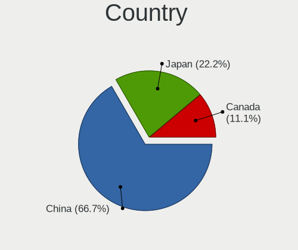

| Country | Desktops | Percent |
|---------|----------|---------|
| China   | 6        | 66.67%  |
| Japan   | 2        | 22.22%  |
| Canada  | 1        | 11.11%  |

City
----

Geographic location (city)

| City      | Desktops | Percent |
|-----------|----------|---------|
| Xi'an     | 1        | 11.11%  |
| Wuhan     | 1        | 11.11%  |
| Tokyo     | 1        | 11.11%  |
| Shenzhen  | 1        | 11.11%  |
| Osaka     | 1        | 11.11%  |
| Markham   | 1        | 11.11%  |
| Jinan     | 1        | 11.11%  |
| Guangzhou | 1        | 11.11%  |
| Beijing   | 1        | 11.11%  |

Drives
------

Drive Vendor
------------

Hard drive vendors

| Vendor              | Desktops | Drives | Percent |
|---------------------|----------|--------|---------|
| Samsung Electronics | 4        | 5      | 23.53%  |
| Seagate             | 3        | 3      | 17.65%  |
| WDC                 | 2        | 2      | 11.76%  |
| Kingston            | 2        | 2      | 11.76%  |
| Fanxiang            | 2        | 3      | 11.76%  |
| Toshiba             | 1        | 1      | 5.88%   |
| J.ZAO               | 1        | 1      | 5.88%   |
| FC-1307             | 1        | 1      | 5.88%   |
| China               | 1        | 1      | 5.88%   |

Drive Model
-----------

Hard drive models

| Model                                  | Desktops | Percent |
|----------------------------------------|----------|---------|
| Seagate ST1000DM010-2EP102 1TB         | 2        | 10.53%  |
| Kingston SA400S37240G 240GB SSD        | 2        | 10.53%  |
| WDC WD20EJRX-89G3VY0 2TB               | 1        | 5.26%   |
| WDC WD10EZEX-22MFCA0 1TB               | 1        | 5.26%   |
| Toshiba MQ01ABD100 1TB                 | 1        | 5.26%   |
| Seagate ST2000DM008-2FR102 2TB         | 1        | 5.26%   |
| Samsung SSD 990 PRO 1TB                | 1        | 5.26%   |
| Samsung SSD 980 1TB S649NX0T432942B    | 1        | 5.26%   |
| Samsung SSD 860 EVO 250GB              | 1        | 5.26%   |
| Samsung SSD 850 EVO 500GB              | 1        | 5.26%   |
| Samsung PM991 NVMe 256GB               | 1        | 5.26%   |
| J.ZAO 3 SERIES 2.5 INCH 120GB SATA SSD | 1        | 5.26%   |
| FC-1307 SD to CF Adapter V1.4          | 1        | 5.26%   |
| Fanxiang S500PRO 2TB                   | 1        | 5.26%   |
| Fanxiang S500Pro 1TB                   | 1        | 5.26%   |
| Fanxiang PS2000 1TB                    | 1        | 5.26%   |
| China 120GB SSD                        | 1        | 5.26%   |

HDD Vendor
----------

Hard disk drive vendors

| Vendor  | Desktops | Drives | Percent |
|---------|----------|--------|---------|
| Seagate | 3        | 3      | 42.86%  |
| WDC     | 2        | 2      | 28.57%  |
| Toshiba | 1        | 1      | 14.29%  |
| FC-1307 | 1        | 1      | 14.29%  |

SSD Vendor
----------

Solid state drive vendors

| Vendor              | Desktops | Drives | Percent |
|---------------------|----------|--------|---------|
| Kingston            | 2        | 2      | 40%     |
| Samsung Electronics | 1        | 2      | 20%     |
| J.ZAO               | 1        | 1      | 20%     |
| China               | 1        | 1      | 20%     |

Drive Kind
----------

HDD or SSD

| Kind    | Desktops | Drives | Percent |
|---------|----------|--------|---------|
| HDD     | 6        | 7      | 40%     |
| NVMe    | 4        | 5      | 26.67%  |
| SSD     | 4        | 6      | 26.67%  |
| Unknown | 1        | 1      | 6.67%   |

Drive Connector
---------------

SATA, SAS, NVMe, etc.

| Type | Desktops | Drives | Percent |
|------|----------|--------|---------|
| SATA | 7        | 12     | 53.85%  |
| NVMe | 4        | 5      | 30.77%  |
| SAS  | 2        | 2      | 15.38%  |

Drive Size
----------

Size of hard drive

| Size in TB | Desktops | Drives | Percent |
|------------|----------|--------|---------|
| 0.01-0.5   | 5        | 7      | 45.45%  |
| 0.51-1.0   | 4        | 4      | 36.36%  |
| 1.01-2.0   | 2        | 2      | 18.18%  |

Space Total
-----------

Amount of disk space available on the file system

| Size in GB | Desktops | Percent |
|------------|----------|---------|
| 101-250    | 3        | 33.33%  |
| 51-100     | 3        | 33.33%  |
| 251-500    | 1        | 11.11%  |
| 2001-3000  | 1        | 11.11%  |
| 1001-2000  | 1        | 11.11%  |

Space Used
----------

Amount of used disk space

| Used GB  | Desktops | Percent |
|----------|----------|---------|
| 101-250  | 3        | 33.33%  |
| 1-20     | 2        | 22.22%  |
| 51-100   | 2        | 22.22%  |
| 21-50    | 1        | 11.11%  |
| 501-1000 | 1        | 11.11%  |

Malfunc. Drives
---------------

Drive models with a malfunction

| Model                                           | Desktops | Drives | Percent |
|-------------------------------------------------|----------|--------|---------|
| Samsung Electronics SSD 980 1TB S649NX0T432942B | 1        | 1      | 100%    |

Malfunc. Drive Vendor
---------------------

Vendors of faulty drives

| Vendor              | Desktops | Drives | Percent |
|---------------------|----------|--------|---------|
| Samsung Electronics | 1        | 1      | 100%    |

Malfunc. HDD Vendor
-------------------

Vendors of faulty HDD drives

Zero info for selected period =(

Malfunc. Drive Kind
-------------------

Kinds of faulty drives

| Kind | Desktops | Drives | Percent |
|------|----------|--------|---------|
| NVMe | 1        | 1      | 100%    |

Failed Drives
-------------

Failed drive models

Zero info for selected period =(

Failed Drive Vendor
-------------------

Failed drive vendors

Zero info for selected period =(

Drive Status
------------

Number of failed and malfunc. drives

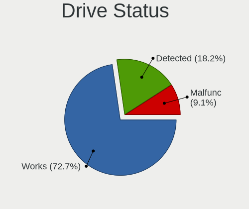

| Status   | Desktops | Drives | Percent |
|----------|----------|--------|---------|
| Works    | 8        | 16     | 72.73%  |
| Detected | 2        | 2      | 18.18%  |
| Malfunc  | 1        | 1      | 9.09%   |

Storage controller
------------------

Storage Vendor
--------------

Storage controller vendors

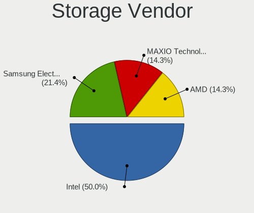

| Vendor                      | Desktops | Percent |
|-----------------------------|----------|---------|
| Intel                       | 7        | 50%     |
| Samsung Electronics         | 3        | 21.43%  |
| MAXIO Technology (Hangzhou) | 2        | 14.29%  |
| AMD                         | 2        | 14.29%  |

Storage Model
-------------

Storage controller models

| Model                                                                          | Desktops | Percent |
|--------------------------------------------------------------------------------|----------|---------|
| Samsung NVMe SSD Controller 980 (DRAM-less)                                    | 2        | 13.33%  |
| MAXIO (Hangzhou) NVMe SSD Controller MAP1202 (DRAM-less)                       | 2        | 13.33%  |
| Samsung NVMe SSD Controller S4LV008[Pascal]                                    | 1        | 6.67%   |
| Intel Volume Management Device NVMe RAID Controller Intel Corporation          | 1        | 6.67%   |
| Intel Raptor Lake SATA AHCI Controller                                         | 1        | 6.67%   |
| Intel Comet Lake SATA AHCI Controller                                          | 1        | 6.67%   |
| Intel 9 Series Chipset Family SATA Controller [AHCI Mode]                      | 1        | 6.67%   |
| Intel 8 Series/C220 Series Chipset Family 6-port SATA Controller 1 [AHCI mode] | 1        | 6.67%   |
| Intel 7 Series/C210 Series Chipset Family 6-port SATA Controller [AHCI mode]   | 1        | 6.67%   |
| Intel 500 Series Chipset Family SATA AHCI Controller                           | 1        | 6.67%   |
| Intel 200 Series PCH SATA controller [AHCI mode]                               | 1        | 6.67%   |
| AMD FCH SATA Controller [AHCI mode]                                            | 1        | 6.67%   |
| AMD 500 Series Chipset SATA Controller                                         | 1        | 6.67%   |

Storage Kind
------------

Kind of storage controller (IDE, SATA, NVMe, SAS, ...)

| Kind | Desktops | Percent |
|------|----------|---------|
| SATA | 9        | 64.29%  |
| NVMe | 4        | 28.57%  |
| RAID | 1        | 7.14%   |

Processor
---------

CPU Vendor
----------

Processor vendors

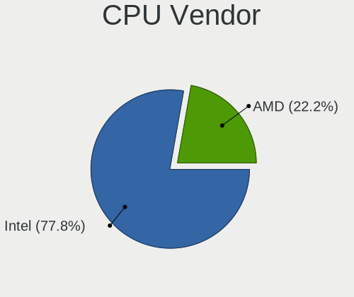

| Vendor | Desktops | Percent |
|--------|----------|---------|
| Intel  | 7        | 77.78%  |
| AMD    | 2        | 22.22%  |

CPU Model
---------

Processor models

| Model                                      | Desktops | Percent |
|--------------------------------------------|----------|---------|
| Intel Core i7-4790 CPU @ 3.60GHz           | 2        | 22.22%  |
| Intel Core i7-10700 CPU @ 2.90GHz          | 1        | 11.11%  |
| Intel Core i5-8400 CPU @ 2.80GHz           | 1        | 11.11%  |
| Intel Core i5-3570 CPU @ 3.40GHz           | 1        | 11.11%  |
| Intel Core i5-14600K                       | 1        | 11.11%  |
| Intel 11th Gen Core i5-11400F @ 2.60GHz    | 1        | 11.11%  |
| AMD Ryzen 5 PRO 4650G with Radeon Graphics | 1        | 11.11%  |
| AMD Eng Sample: 100-000000263-30_Y         | 1        | 11.11%  |

CPU Model Family
----------------

Processor model prefix

| Model           | Desktops | Percent |
|-----------------|----------|---------|
| Intel Core i7   | 3        | 33.33%  |
| Intel Core i5   | 3        | 33.33%  |
| Other           | 1        | 11.11%  |
| AMD Ryzen 5 PRO | 1        | 11.11%  |
| AMD E           | 1        | 11.11%  |

CPU Cores
---------

Number of processor cores

| Number | Desktops | Percent |
|--------|----------|---------|
| 6      | 3        | 33.33%  |
| 4      | 3        | 33.33%  |
| 8      | 2        | 22.22%  |
| 14     | 1        | 11.11%  |

CPU Sockets
-----------

Number of sockets

| Number | Desktops | Percent |
|--------|----------|---------|
| 1      | 9        | 100%    |

CPU Threads
-----------

Threads per core (Hyper-Threading)

| Number | Desktops | Percent |
|--------|----------|---------|
| 2      | 7        | 77.78%  |
| 1      | 2        | 22.22%  |

CPU Op-Modes
------------

CPU Operation Modes (32-bit, 64-bit)

| Op mode        | Desktops | Percent |
|----------------|----------|---------|
| 32-bit, 64-bit | 9        | 100%    |

CPU Microcode
-------------

Microcode number

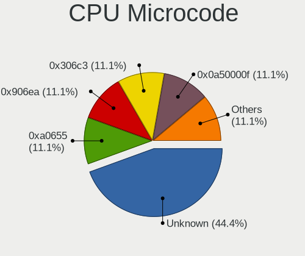

| Number     | Desktops | Percent |
|------------|----------|---------|
| Unknown    | 4        | 44.44%  |
| 0xa0655    | 1        | 11.11%  |
| 0x906ea    | 1        | 11.11%  |
| 0x306c3    | 1        | 11.11%  |
| 0x0a50000f | 1        | 11.11%  |
| 0x08600103 | 1        | 11.11%  |

CPU Microarch
-------------

Microarchitecture

| Name             | Desktops | Percent |
|------------------|----------|---------|
| Haswell          | 2        | 22.22%  |
| Zen 3            | 1        | 11.11%  |
| Zen 2            | 1        | 11.11%  |
| KabyLake         | 1        | 11.11%  |
| IvyBridge        | 1        | 11.11%  |
| Icelake          | 1        | 11.11%  |
| CometLake        | 1        | 11.11%  |
| Alderlake Hybrid | 1        | 11.11%  |

Graphics
--------

GPU Vendor
----------

Vendors of graphics cards

| Vendor | Desktops | Percent |
|--------|----------|---------|
| Nvidia | 5        | 45.45%  |
| Intel  | 5        | 45.45%  |
| AMD    | 1        | 9.09%   |

GPU Model
---------

Graphics card models

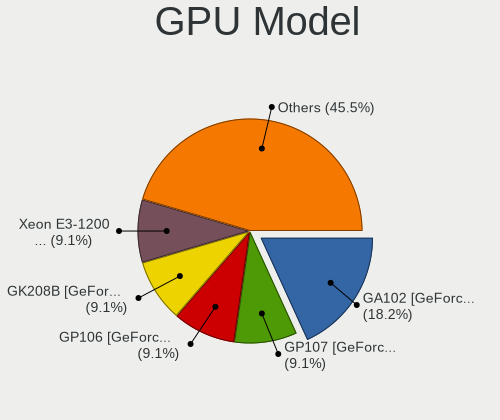

| Model                                                                       | Desktops | Percent |
|-----------------------------------------------------------------------------|----------|---------|
| Nvidia GA102 [GeForce RTX 3090]                                             | 2        | 18.18%  |
| Nvidia GP107 [GeForce GTX 1050 Ti]                                          | 1        | 9.09%   |
| Nvidia GP106 [GeForce GTX 1060 6GB]                                         | 1        | 9.09%   |
| Nvidia GK208B [GeForce GT 730]                                              | 1        | 9.09%   |
| Intel Xeon E3-1200 v3/4th Gen Core Processor Integrated Graphics Controller | 1        | 9.09%   |
| Intel Xeon E3-1200 v2/3rd Gen Core processor Graphics Controller            | 1        | 9.09%   |
| Intel Raptor Lake-S GT1 [UHD Graphics 770]                                  | 1        | 9.09%   |
| Intel CometLake-S GT2 [UHD Graphics 630]                                    | 1        | 9.09%   |
| Intel CoffeeLake-S GT2 [UHD Graphics 630]                                   | 1        | 9.09%   |
| AMD Caicos XT [Radeon HD 7470/8470 / R5 235/310 OEM]                        | 1        | 9.09%   |

GPU Combo
---------

Combinations of graphics cards

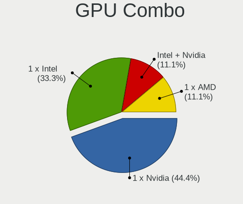

| Name           | Desktops | Percent |
|----------------|----------|---------|
| 1 x Nvidia     | 4        | 44.44%  |
| 1 x Intel      | 3        | 33.33%  |
| Intel + Nvidia | 1        | 11.11%  |
| 1 x AMD        | 1        | 11.11%  |

GPU Driver
----------

Free vs proprietary

| Driver      | Desktops | Percent |
|-------------|----------|---------|
| Proprietary | 4        | 44.44%  |
| Free        | 4        | 44.44%  |
| Unknown     | 1        | 11.11%  |

GPU Memory
----------

Total video memory

| Size in GB | Desktops | Percent |
|------------|----------|---------|
| Unknown    | 4        | 44.44%  |
| 5.01-6.0   | 1        | 11.11%  |
| 3.01-4.0   | 1        | 11.11%  |
| 16.01-24.0 | 1        | 11.11%  |
| 1.01-2.0   | 1        | 11.11%  |
| 0.51-1.0   | 1        | 11.11%  |

Monitor
-------

Monitor Vendor
--------------

Monitor vendors

| Vendor               | Desktops | Percent |
|----------------------|----------|---------|
| Dell                 | 3        | 30%     |
| Philips              | 1        | 10%     |
| Mi                   | 1        | 10%     |
| JZM                  | 1        | 10%     |
| Goldstar             | 1        | 10%     |
| BenQ                 | 1        | 10%     |
| AOC                  | 1        | 10%     |
| Ancor Communications | 1        | 10%     |

Monitor Model
-------------

Monitor models

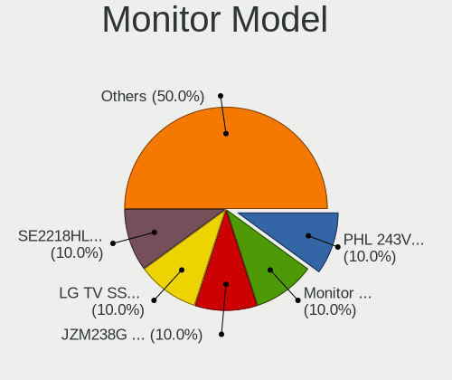

| Model                                                                 | Desktops | Percent |
|-----------------------------------------------------------------------|----------|---------|
| Philips PHL 243V7 PHLC155 1920x1080 527x296mm 23.8-inch               | 1        | 10%     |
| Mi Monitor XMI3444 3440x1440 800x330mm 34.1-inch                      | 1        | 10%     |
| JZM JZM238G JZM2442 1920x1080 527x296mm 23.8-inch                     | 1        | 10%     |
| Goldstar LG TV SSCR2 GSMC0C8 3840x2160                                | 1        | 10%     |
| Dell SE2218HL DELF121 1920x1080 476x268mm 21.5-inch                   | 1        | 10%     |
| Dell E2213 DELD04E 1680x1050 473x296mm 22.0-inch                      | 1        | 10%     |
| Dell 1704FPT DEL4005 1280x1024 338x270mm 17.0-inch                    | 1        | 10%     |
| BenQ LCD Monitor G2400W 1920x1200                                     | 1        | 10%     |
| AOC 27G1G4 AOC2701 1920x1080 598x336mm 27.0-inch                      | 1        | 10%     |
| Ancor Communications ASUS VS247 ACI249A 1920x1080 521x293mm 23.5-inch | 1        | 10%     |

Monitor Resolution
------------------

Monitor screen resolution

| Resolution         | Desktops | Percent |
|--------------------|----------|---------|
| 1920x1080 (FHD)    | 4        | 40%     |
| 3840x2160 (4K)     | 2        | 20%     |
| 3440x1440          | 1        | 10%     |
| 1920x1200 (WUXGA)  | 1        | 10%     |
| 1680x1050 (WSXGA+) | 1        | 10%     |
| 1280x1024 (SXGA)   | 1        | 10%     |

Monitor Diagonal
----------------

Diagonal size in inches

| Inches  | Desktops | Percent |
|---------|----------|---------|
| 23      | 2        | 20%     |
| 72      | 1        | 10%     |
| 34      | 1        | 10%     |
| 27      | 1        | 10%     |
| 24      | 1        | 10%     |
| 22      | 1        | 10%     |
| 21      | 1        | 10%     |
| 17      | 1        | 10%     |
| Unknown | 1        | 10%     |

Monitor Width
-------------

Physical width

| Width in mm | Desktops | Percent |
|-------------|----------|---------|
| 501-600     | 4        | 40%     |
| 401-500     | 2        | 20%     |
| 701-800     | 1        | 10%     |
| 301-350     | 1        | 10%     |
| 1501-2000   | 1        | 10%     |
| Unknown     | 1        | 10%     |

Aspect Ratio
------------

Proportional relationship between the width and the height

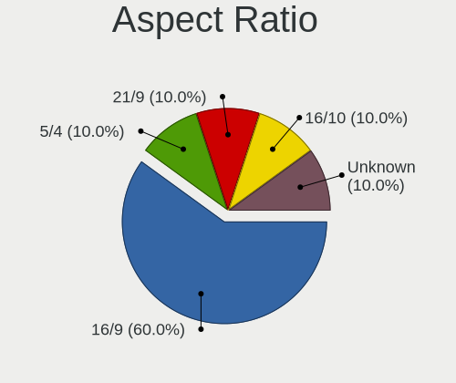

| Ratio   | Desktops | Percent |
|---------|----------|---------|
| 16/9    | 6        | 60%     |
| 5/4     | 1        | 10%     |
| 21/9    | 1        | 10%     |
| 16/10   | 1        | 10%     |
| Unknown | 1        | 10%     |

Monitor Area
------------

Area in inch²

| Area in inch² | Desktops | Percent |
|----------------|----------|---------|
| 201-250        | 4        | 40%     |
| More than 1000 | 1        | 10%     |
| 351-500        | 1        | 10%     |
| 301-350        | 1        | 10%     |
| 151-200        | 1        | 10%     |
| 141-150        | 1        | 10%     |
| Unknown        | 1        | 10%     |

Pixel Density
-------------

Pixels per inch

| Density | Desktops | Percent |
|---------|----------|---------|
| 51-100  | 6        | 66.67%  |
| 101-120 | 2        | 22.22%  |
| Unknown | 1        | 11.11%  |

Multiple Monitors
-----------------

Total monitors connected

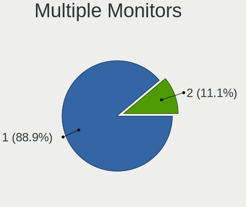

| Total | Desktops | Percent |
|-------|----------|---------|
| 1     | 8        | 88.89%  |
| 2     | 1        | 11.11%  |

Network
-------

Net Controller Vendor
---------------------

Controller vendors

| Vendor                | Desktops | Percent |
|-----------------------|----------|---------|
| Realtek Semiconductor | 6        | 42.86%  |
| Intel                 | 5        | 35.71%  |
| Qualcomm Atheros      | 1        | 7.14%   |
| MediaTek              | 1        | 7.14%   |
| ASIX Electronics      | 1        | 7.14%   |

Net Controller Model
--------------------

Controller models

| Model                                                                  | Desktops | Percent |
|------------------------------------------------------------------------|----------|---------|
| Realtek RTL8111/8168/8211/8411 PCI Express Gigabit Ethernet Controller | 3        | 17.65%  |
| Intel Wi-Fi 6 AX200                                                    | 2        | 11.76%  |
| Realtek RTL8723DE Wireless Network Adapter                             | 1        | 5.88%   |
| Realtek RTL8125 2.5GbE Controller                                      | 1        | 5.88%   |
| Realtek RTL810xE PCI Express Fast Ethernet controller                  | 1        | 5.88%   |
| Qualcomm Atheros AR5212/5213/2414 Wireless Network Adapter             | 1        | 5.88%   |
| MediaTek WiFi                                                          | 1        | 5.88%   |
| Intel Raptor Lake-S PCH CNVi WiFi                                      | 1        | 5.88%   |
| Intel I211 Gigabit Network Connection                                  | 1        | 5.88%   |
| Intel Ethernet Controller I226-V                                       | 1        | 5.88%   |
| Intel Ethernet Connection I217-V                                       | 1        | 5.88%   |
| Intel Ethernet Connection (11) I219-V                                  | 1        | 5.88%   |
| Intel Dual Band Wireless-AC 3168NGW [Stone Peak]                       | 1        | 5.88%   |
| ASIX AX88179 Gigabit Ethernet                                          | 1        | 5.88%   |

Wireless Vendor
---------------

Wireless vendors

| Vendor                | Desktops | Percent |
|-----------------------|----------|---------|
| Intel                 | 4        | 57.14%  |
| Realtek Semiconductor | 1        | 14.29%  |
| Qualcomm Atheros      | 1        | 14.29%  |
| MediaTek              | 1        | 14.29%  |

Wireless Model
--------------

Wireless models

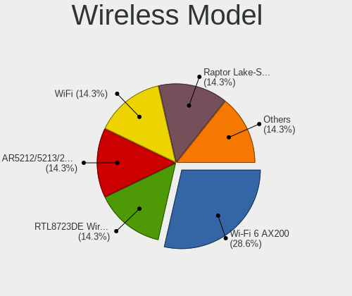

| Model                                                      | Desktops | Percent |
|------------------------------------------------------------|----------|---------|
| Intel Wi-Fi 6 AX200                                        | 2        | 28.57%  |
| Realtek RTL8723DE Wireless Network Adapter                 | 1        | 14.29%  |
| Qualcomm Atheros AR5212/5213/2414 Wireless Network Adapter | 1        | 14.29%  |
| MediaTek WiFi                                              | 1        | 14.29%  |
| Intel Raptor Lake-S PCH CNVi WiFi                          | 1        | 14.29%  |
| Intel Dual Band Wireless-AC 3168NGW [Stone Peak]           | 1        | 14.29%  |

Ethernet Vendor
---------------

Ethernet vendors

| Vendor                | Desktops | Percent |
|-----------------------|----------|---------|
| Realtek Semiconductor | 5        | 50%     |
| Intel                 | 4        | 40%     |
| ASIX Electronics      | 1        | 10%     |

Ethernet Model
--------------

Ethernet models

| Model                                                                  | Desktops | Percent |
|------------------------------------------------------------------------|----------|---------|
| Realtek RTL8111/8168/8211/8411 PCI Express Gigabit Ethernet Controller | 3        | 30%     |
| Realtek RTL8125 2.5GbE Controller                                      | 1        | 10%     |
| Realtek RTL810xE PCI Express Fast Ethernet controller                  | 1        | 10%     |
| Intel I211 Gigabit Network Connection                                  | 1        | 10%     |
| Intel Ethernet Controller I226-V                                       | 1        | 10%     |
| Intel Ethernet Connection I217-V                                       | 1        | 10%     |
| Intel Ethernet Connection (11) I219-V                                  | 1        | 10%     |
| ASIX AX88179 Gigabit Ethernet                                          | 1        | 10%     |

Net Controller Kind
-------------------

Ethernet, WiFi or modem

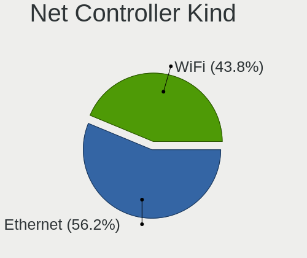

| Kind     | Desktops | Percent |
|----------|----------|---------|
| Ethernet | 9        | 56.25%  |
| WiFi     | 7        | 43.75%  |

Used Controller
---------------

Currently used network controller

| Kind     | Desktops | Percent |
|----------|----------|---------|
| Ethernet | 6        | 54.55%  |
| WiFi     | 5        | 45.45%  |

NICs
----

Total network controllers on board

| Total | Desktops | Percent |
|-------|----------|---------|
| 2     | 5        | 55.56%  |
| 1     | 3        | 33.33%  |
| 3     | 1        | 11.11%  |

IPv6
----

IPv6 vs IPv4

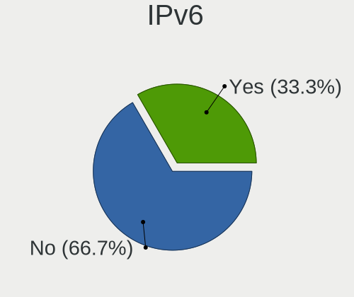

| Used | Desktops | Percent |
|------|----------|---------|
| No   | 6        | 66.67%  |
| Yes  | 3        | 33.33%  |

Bluetooth
---------

Bluetooth Vendor
----------------

Controller vendors

| Vendor                  | Desktops | Percent |
|-------------------------|----------|---------|
| Intel                   | 4        | 50%     |
| Realtek Semiconductor   | 2        | 25%     |
| Cambridge Silicon Radio | 2        | 25%     |

Bluetooth Model
---------------

Controller models

| Model                                               | Desktops | Percent |
|-----------------------------------------------------|----------|---------|
| Intel AX200 Bluetooth                               | 2        | 25%     |
| Cambridge Silicon Radio Bluetooth Dongle (HCI mode) | 2        | 25%     |
| Realtek Bluetooth Radio                             | 1        | 12.5%   |
| Realtek 802.11n WLAN Adapter                        | 1        | 12.5%   |
| Intel Wireless-AC 3168 Bluetooth                    | 1        | 12.5%   |
| Intel AX211 Bluetooth                               | 1        | 12.5%   |

Sound
-----

Sound Vendor
------------

Sound card vendors

| Vendor          | Desktops | Percent |
|-----------------|----------|---------|
| Intel           | 7        | 43.75%  |
| Nvidia          | 5        | 31.25%  |
| AMD             | 3        | 18.75%  |
| HECATE G4 S PRO | 1        | 6.25%   |

Sound Model
-----------

Sound card models

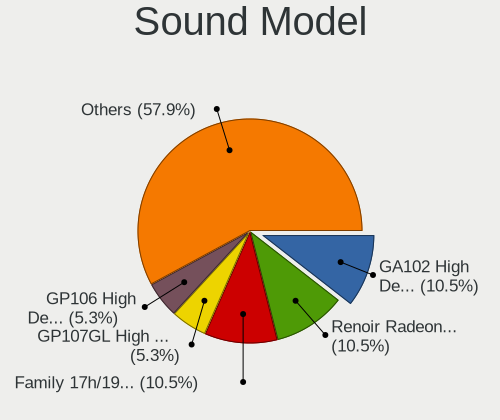

| Model                                                                             | Desktops | Percent |
|-----------------------------------------------------------------------------------|----------|---------|
| Nvidia GA102 High Definition Audio Controller                                     | 2        | 10.53%  |
| AMD Renoir Radeon High Definition Audio Controller                                | 2        | 10.53%  |
| AMD Family 17h/19h/1ah HD Audio Controller                                        | 2        | 10.53%  |
| Nvidia GP107GL High Definition Audio Controller                                   | 1        | 5.26%   |
| Nvidia GP106 High Definition Audio Controller                                     | 1        | 5.26%   |
| Nvidia GK208 HDMI/DP Audio Controller                                             | 1        | 5.26%   |
| Intel Xeon E3-1200 v3/4th Gen Core Processor HD Audio Controller                  | 1        | 5.26%   |
| Intel Tiger Lake-H HD Audio Controller                                            | 1        | 5.26%   |
| Intel Raptor Lake High Definition Audio Controller                                | 1        | 5.26%   |
| Intel Comet Lake PCH cAVS                                                         | 1        | 5.26%   |
| Intel 9 Series Chipset Family HD Audio Controller                                 | 1        | 5.26%   |
| Intel 8 Series/C220 Series Chipset High Definition Audio Controller               | 1        | 5.26%   |
| Intel 7 Series/C216 Chipset Family High Definition Audio Controller               | 1        | 5.26%   |
| Intel 200 Series PCH HD Audio                                                     | 1        | 5.26%   |
| HECATE G4 S PRO HECATE G4 S PRO                                                   | 1        | 5.26%   |
| AMD Caicos HDMI Audio [Radeon HD 6450 / 7450/8450/8490 OEM / R5 230/235/235X OEM] | 1        | 5.26%   |

Memory
------

Memory Vendor
-------------

Memory module vendors

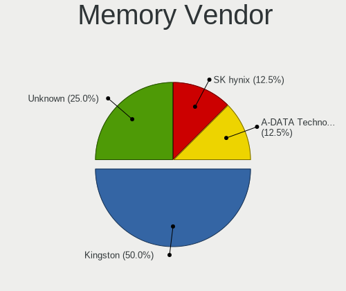

| Vendor            | Desktops | Percent |
|-------------------|----------|---------|
| Kingston          | 4        | 50%     |
| Unknown           | 2        | 25%     |
| SK hynix          | 1        | 12.5%   |
| A-DATA Technology | 1        | 12.5%   |

Memory Model
------------

Memory module models

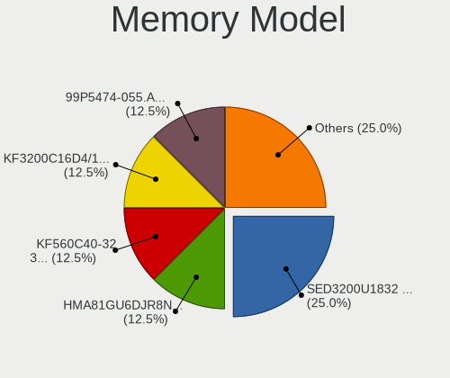

| Model                                                 | Desktops | Percent |
|-------------------------------------------------------|----------|---------|
| Unknown                                               | 2        | 25%     |
| SK hynix RAM HMA81GU6DJR8N-XN 8GB DIMM DDR4 3200MT/s  | 1        | 12.5%   |
| Kingston RAM KF560C40-32 32GB DIMM DDR5 6000MT/s      | 1        | 12.5%   |
| Kingston RAM KF3200C16D4/16GX 16GB DIMM DDR4 3200MT/s | 1        | 12.5%   |
| Kingston RAM 99P5474-055.A00LF 4GB DIMM DDR3 1600MT/s | 1        | 12.5%   |
| Kingston RAM 99P5471-033.A00LF 8GB DIMM DDR3 1600MT/s | 1        | 12.5%   |
| A-DATA RAM DDR4 3200 8GB DIMM DDR4 3600MT/s           | 1        | 12.5%   |

Memory Kind
-----------

Memory module kinds

| Kind | Desktops | Percent |
|------|----------|---------|
| DDR4 | 5        | 62.5%   |
| DDR3 | 2        | 25%     |
| DDR5 | 1        | 12.5%   |

Memory Form Factor
------------------

Physical design of the memory module

| Name | Desktops | Percent |
|------|----------|---------|
| DIMM | 8        | 100%    |

Memory Size
-----------

Memory module size

| Size  | Desktops | Percent |
|-------|----------|---------|
| 32768 | 4        | 50%     |
| 8192  | 2        | 25%     |
| 16384 | 1        | 12.5%   |
| 4096  | 1        | 12.5%   |

Memory Speed
------------

Memory module speed

| Speed | Desktops | Percent |
|-------|----------|---------|
| 3200  | 4        | 50%     |
| 1600  | 2        | 25%     |
| 6000  | 1        | 12.5%   |
| 3600  | 1        | 12.5%   |

Printers & scanners
-------------------

Printer Vendor
--------------

Printer device vendors

| Vendor              | Desktops | Percent |
|---------------------|----------|---------|
| Samsung Electronics | 1        | 50%     |
| Hewlett-Packard     | 1        | 50%     |

Printer Model
-------------

Printer device models

| Model                   | Desktops | Percent |
|-------------------------|----------|---------|
| Samsung M2020 Series    | 1        | 50%     |
| HP DeskJet F4200 series | 1        | 50%     |

Scanner Vendor
--------------

Scanner device vendors

Zero info for selected period =(

Scanner Model
-------------

Scanner device models

Zero info for selected period =(

Camera
------

Camera Vendor
-------------

Camera device vendors

| Vendor                        | Desktops | Percent |
|-------------------------------|----------|---------|
| Sunplus Innovation Technology | 1        | 100%    |

Camera Model
------------

Camera device models

| Model                  | Desktops | Percent |
|------------------------|----------|---------|
| Sunplus Full HD webcam | 1        | 100%    |

Security
--------

Fingerprint Vendor
------------------

Fingerprint sensor vendors

Zero info for selected period =(

Fingerprint Model
-----------------

Fingerprint sensor models

Zero info for selected period =(

Chipcard Vendor
---------------

Chipcard module vendors

Zero info for selected period =(

Chipcard Model
--------------

Chipcard module models

Zero info for selected period =(

Unsupported
-----------

Unsupported Devices
-------------------

Total unsupported devices on board

| Total | Desktops | Percent |
|-------|----------|---------|
| 0     | 7        | 77.78%  |
| 1     | 2        | 22.22%  |

Unsupported Device Types
------------------------

Types of unsupported devices

| Type         | Desktops | Percent |
|--------------|----------|---------|
| Net/wireless | 1        | 50%     |
| Bluetooth    | 1        | 50%     |

