Kylin - Tested Hardware & Statistics (Notebooks)
------------------------------------------------

A project to collect tested hardware configurations for Kylin.

Anyone can contribute to this report by the [hw-probe](https://github.com/linuxhw/hw-probe) tool:

    sudo -E hw-probe -all -upload

Please contribute! Especially if your hardware is rare.

Contents
--------

* [ Test Cases ](#test-cases)

* [ System ](#system)
  - [ OS                       ](#os)
  - [ OS Family                ](#os-family)
  - [ Kernel                   ](#kernel)
  - [ Kernel Family            ](#kernel-family)
  - [ Kernel Major Ver.        ](#kernel-major-ver)
  - [ Arch                     ](#arch)
  - [ DE                       ](#de)
  - [ Display Server           ](#display-server)
  - [ Display Manager          ](#display-manager)
  - [ OS Lang                  ](#os-lang)
  - [ Boot Mode                ](#boot-mode)
  - [ Filesystem               ](#filesystem)
  - [ Part. scheme             ](#part-scheme)
  - [ Dual Boot with Linux/BSD ](#dual-boot-with-linuxbsd)
  - [ Dual Boot (Win)          ](#dual-boot-win)

* [ Board ](#board)
  - [ Vendor                   ](#vendor)
  - [ Model                    ](#model)
  - [ Model Family             ](#model-family)
  - [ MFG Year                 ](#mfg-year)
  - [ Form Factor              ](#form-factor)
  - [ Secure Boot              ](#secure-boot)
  - [ Coreboot                 ](#coreboot)
  - [ RAM Size                 ](#ram-size)
  - [ RAM Used                 ](#ram-used)
  - [ Total Drives             ](#total-drives)
  - [ Has CD-ROM               ](#has-cd-rom)
  - [ Has Ethernet             ](#has-ethernet)
  - [ Has WiFi                 ](#has-wifi)
  - [ Has Bluetooth            ](#has-bluetooth)

* [ Location ](#location)
  - [ Country                  ](#country)
  - [ City                     ](#city)

* [ Drives ](#drives)
  - [ Drive Vendor             ](#drive-vendor)
  - [ Drive Model              ](#drive-model)
  - [ HDD Vendor               ](#hdd-vendor)
  - [ SSD Vendor               ](#ssd-vendor)
  - [ Drive Kind               ](#drive-kind)
  - [ Drive Connector          ](#drive-connector)
  - [ Drive Size               ](#drive-size)
  - [ Space Total              ](#space-total)
  - [ Space Used               ](#space-used)
  - [ Malfunc. Drives          ](#malfunc-drives)
  - [ Malfunc. Drive Vendor    ](#malfunc-drive-vendor)
  - [ Malfunc. HDD Vendor      ](#malfunc-hdd-vendor)
  - [ Malfunc. Drive Kind      ](#malfunc-drive-kind)
  - [ Failed Drives            ](#failed-drives)
  - [ Failed Drive Vendor      ](#failed-drive-vendor)
  - [ Drive Status             ](#drive-status)

* [ Storage controller ](#storage-controller)
  - [ Storage Vendor           ](#storage-vendor)
  - [ Storage Model            ](#storage-model)
  - [ Storage Kind             ](#storage-kind)

* [ Processor ](#processor)
  - [ CPU Vendor               ](#cpu-vendor)
  - [ CPU Model                ](#cpu-model)
  - [ CPU Model Family         ](#cpu-model-family)
  - [ CPU Cores                ](#cpu-cores)
  - [ CPU Sockets              ](#cpu-sockets)
  - [ CPU Threads              ](#cpu-threads)
  - [ CPU Op-Modes             ](#cpu-op-modes)
  - [ CPU Microcode            ](#cpu-microcode)
  - [ CPU Microarch            ](#cpu-microarch)

* [ Graphics ](#graphics)
  - [ GPU Vendor               ](#gpu-vendor)
  - [ GPU Model                ](#gpu-model)
  - [ GPU Combo                ](#gpu-combo)
  - [ GPU Driver               ](#gpu-driver)
  - [ GPU Memory               ](#gpu-memory)

* [ Monitor ](#monitor)
  - [ Monitor Vendor           ](#monitor-vendor)
  - [ Monitor Model            ](#monitor-model)
  - [ Monitor Resolution       ](#monitor-resolution)
  - [ Monitor Diagonal         ](#monitor-diagonal)
  - [ Monitor Width            ](#monitor-width)
  - [ Aspect Ratio             ](#aspect-ratio)
  - [ Monitor Area             ](#monitor-area)
  - [ Pixel Density            ](#pixel-density)
  - [ Multiple Monitors        ](#multiple-monitors)

* [ Network ](#network)
  - [ Net Controller Vendor    ](#net-controller-vendor)
  - [ Net Controller Model     ](#net-controller-model)
  - [ Wireless Vendor          ](#wireless-vendor)
  - [ Wireless Model           ](#wireless-model)
  - [ Ethernet Vendor          ](#ethernet-vendor)
  - [ Ethernet Model           ](#ethernet-model)
  - [ Net Controller Kind      ](#net-controller-kind)
  - [ Used Controller          ](#used-controller)
  - [ NICs                     ](#nics)
  - [ IPv6                     ](#ipv6)

* [ Bluetooth ](#bluetooth)
  - [ Bluetooth Vendor         ](#bluetooth-vendor)
  - [ Bluetooth Model          ](#bluetooth-model)

* [ Sound ](#sound)
  - [ Sound Vendor             ](#sound-vendor)
  - [ Sound Model              ](#sound-model)

* [ Memory ](#memory)
  - [ Memory Vendor            ](#memory-vendor)
  - [ Memory Model             ](#memory-model)
  - [ Memory Kind              ](#memory-kind)
  - [ Memory Form Factor       ](#memory-form-factor)
  - [ Memory Size              ](#memory-size)
  - [ Memory Speed             ](#memory-speed)

* [ Printers & scanners ](#printers--scanners)
  - [ Printer Vendor           ](#printer-vendor)
  - [ Printer Model            ](#printer-model)
  - [ Scanner Vendor           ](#scanner-vendor)
  - [ Scanner Model            ](#scanner-model)

* [ Camera ](#camera)
  - [ Camera Vendor            ](#camera-vendor)
  - [ Camera Model             ](#camera-model)

* [ Security ](#security)
  - [ Fingerprint Vendor       ](#fingerprint-vendor)
  - [ Fingerprint Model        ](#fingerprint-model)
  - [ Chipcard Vendor          ](#chipcard-vendor)
  - [ Chipcard Model           ](#chipcard-model)

* [ Unsupported ](#unsupported)
  - [ Unsupported Devices      ](#unsupported-devices)
  - [ Unsupported Device Types ](#unsupported-device-types)

Test Cases
----------

Total: 61

| Vendor        | Model                       | Probe                                                      | Date         |
|---------------|-----------------------------|------------------------------------------------------------|--------------|
| UniOne        | GTW8102                     | [d24b01bc71](https://linux-hardware.org/?probe=d24b01bc71) | Dec 29, 2025 |
| HUAWEI        | KLVC-WXX9                   | [99c270a920](https://linux-hardware.org/?probe=99c270a920) | Aug 19, 2025 |
| ASUSTek       | VivoBook_ASUSLaptop K350... | [b89520b9ba](https://linux-hardware.org/?probe=b89520b9ba) | Jul 24, 2025 |
| HP            | ZBook Power 15.6 inch G9... | [7aec32fdee](https://linux-hardware.org/?probe=7aec32fdee) | May 20, 2025 |
| GreatWall     | GW-XXXXXX-XXX               | [340b109272](https://linux-hardware.org/?probe=340b109272) | May 10, 2025 |
| GreatWall     | GW-XXXXXX-XXX               | [aaedfb3a5d](https://linux-hardware.org/?probe=aaedfb3a5d) | May 06, 2025 |
| Lenovo        | ThinkPad Edge E430c 3365... | [22d727a135](https://linux-hardware.org/?probe=22d727a135) | May 01, 2025 |
| KaiTian       | N89z G1d                    | [efeb7e2ce3](https://linux-hardware.org/?probe=efeb7e2ce3) | Mar 09, 2025 |
| Lenovo        | ThinkPad T14 Gen 4 21HD0... | [f38d8fa44e](https://linux-hardware.org/?probe=f38d8fa44e) | Nov 16, 2024 |
| Lenovo        | ThinkPad X13 Gen 1 20UF0... | [c8cf89df2f](https://linux-hardware.org/?probe=c8cf89df2f) | Oct 19, 2024 |
| Lenovo        | ThinkPad T14 Gen 4 21HD0... | [201204cf6c](https://linux-hardware.org/?probe=201204cf6c) | Oct 06, 2024 |
| Timi          | Redmi G 2022                | [115c01ddd7](https://linux-hardware.org/?probe=115c01ddd7) | Sep 29, 2024 |
| Lenovo        | ThinkPad T14 Gen 4 21HD0... | [28057f9ed2](https://linux-hardware.org/?probe=28057f9ed2) | Sep 23, 2024 |
| Lenovo        | Legion R9000P ARX8 82WM     | [c16aaf7f55](https://linux-hardware.org/?probe=c16aaf7f55) | Sep 12, 2024 |
| ASUSTek       | TUF Gaming FX505GE_FX86F... | [f8a5fac34e](https://linux-hardware.org/?probe=f8a5fac34e) | Aug 28, 2024 |
| Lenovo        | ThinkPad T14 Gen 1 20UDA... | [2d97d245a2](https://linux-hardware.org/?probe=2d97d245a2) | Aug 10, 2024 |
| Alienware     | m15 R6                      | [12574a3dbf](https://linux-hardware.org/?probe=12574a3dbf) | Jul 21, 2024 |
| Lenovo        | ThinkPad T14 Gen 4 21HD0... | [d57f4d29a8](https://linux-hardware.org/?probe=d57f4d29a8) | Jul 18, 2024 |
| Lenovo        | ThinkPad T14 Gen 4 21HD0... | [0a947b6f0e](https://linux-hardware.org/?probe=0a947b6f0e) | Jul 17, 2024 |
| Lenovo        | ThinkPad Edge E531 68851... | [ccbb2df5c2](https://linux-hardware.org/?probe=ccbb2df5c2) | Jul 02, 2024 |
| Lenovo        | ThinkPad T460p 20FWA00PC... | [7e6b842321](https://linux-hardware.org/?probe=7e6b842321) | Jun 21, 2024 |
| Lenovo        | ThinkPad T460p 20FWA00PC... | [f214e8aea1](https://linux-hardware.org/?probe=f214e8aea1) | Jun 21, 2024 |
| ASUSTek       | Zenbook UX3402VA_UX3402V... | [91141580f8](https://linux-hardware.org/?probe=91141580f8) | Jun 07, 2024 |
| HP            | ZBook Power 15.6 inch G9... | [2aef3e835d](https://linux-hardware.org/?probe=2aef3e835d) | Jun 01, 2024 |
| HASEE Comp... | GI5CN54                     | [c0c280376b](https://linux-hardware.org/?probe=c0c280376b) | May 22, 2024 |
| Lenovo        | ThinkPad T14 Gen 4 21HD0... | [85f843311f](https://linux-hardware.org/?probe=85f843311f) | May 18, 2024 |
| Timi          | TM1612                      | [b2a95327e3](https://linux-hardware.org/?probe=b2a95327e3) | May 17, 2024 |
| Lenovo        | Legion R9000P ARX8 82WM     | [5c9388af66](https://linux-hardware.org/?probe=5c9388af66) | May 10, 2024 |
| Lenovo        | ThinkPad T14 Gen 4 21HD0... | [db370ffb35](https://linux-hardware.org/?probe=db370ffb35) | May 05, 2024 |
| Acer          | Swift SFX14-41G             | [47966edb56](https://linux-hardware.org/?probe=47966edb56) | Apr 09, 2024 |
| Lenovo        | ThinkPad E14 Gen 2 20TAA... | [de970e3adc](https://linux-hardware.org/?probe=de970e3adc) | Mar 21, 2024 |
| HUAWEI        | CREM-WXX9                   | [cf753bfc89](https://linux-hardware.org/?probe=cf753bfc89) | Dec 05, 2023 |
| HUAWEI        | KLVDZ-WXX9                  | [d6486c4e50](https://linux-hardware.org/?probe=d6486c4e50) | Oct 27, 2023 |
| ASUSTek       | TUF Gaming FX505GT          | [a5fde2a0ed](https://linux-hardware.org/?probe=a5fde2a0ed) | Oct 24, 2023 |
| Dell          | Vostro 3350                 | [1034a53a9d](https://linux-hardware.org/?probe=1034a53a9d) | Sep 30, 2023 |
| Lenovo        | Legion R9000P2021H 82JQ     | [5168f99a06](https://linux-hardware.org/?probe=5168f99a06) | Sep 26, 2023 |
| ASUSTek       | ROG Strix G713PV_G713PV     | [0d1c562190](https://linux-hardware.org/?probe=0d1c562190) | Sep 08, 2023 |
| Apple         | MacBookPro12,1              | [4a1def29d3](https://linux-hardware.org/?probe=4a1def29d3) | Aug 09, 2023 |
| ASUSTek       | UX31LA                      | [0695e3bb09](https://linux-hardware.org/?probe=0695e3bb09) | Aug 08, 2023 |
| HUAWEI        | QingYun L420 KLVV-W5821     | [e3227788f6](https://linux-hardware.org/?probe=e3227788f6) | Jul 08, 2023 |
| Lenovo        | ThinkBook 16 G5+ ARP 21J... | [211f5e5cf1](https://linux-hardware.org/?probe=211f5e5cf1) | Jul 02, 2023 |
| Lenovo        | ThinkPad X1 Extreme Gen ... | [80b6536a46](https://linux-hardware.org/?probe=80b6536a46) | Jun 28, 2023 |
| HUAWEI        | MACH-WX9                    | [016268562d](https://linux-hardware.org/?probe=016268562d) | Jun 21, 2023 |
| HUAWEI        | MACH-WX9                    | [25bc3b1533](https://linux-hardware.org/?probe=25bc3b1533) | Jun 21, 2023 |
| Dell          | Inspiron 5468               | [b16aeda09e](https://linux-hardware.org/?probe=b16aeda09e) | Jun 02, 2023 |
| Lenovo        | ThinkPad X200 74574AC       | [e770387a34](https://linux-hardware.org/?probe=e770387a34) | May 25, 2023 |
| ASUSTek       | VivoBook_ASUSLaptop K550... | [cacfc4dacd](https://linux-hardware.org/?probe=cacfc4dacd) | May 16, 2023 |
| HP            | ZHAN 99 Mobile Workstati... | [3dcc7ab043](https://linux-hardware.org/?probe=3dcc7ab043) | Apr 12, 2023 |
| Lenovo        | Legion Y9000P IAH7H 82RF    | [30d91acf27](https://linux-hardware.org/?probe=30d91acf27) | Mar 07, 2023 |
| Lenovo        | Legion Y9000P IAH7H 82RF    | [97925534c2](https://linux-hardware.org/?probe=97925534c2) | Mar 02, 2023 |
| Lenovo        | ThinkPad X1 Carbon Gen 1... | [cc10e54ab9](https://linux-hardware.org/?probe=cc10e54ab9) | Feb 20, 2023 |
| Lenovo        | XiaoXinPro 14ACH 2021 82... | [29326a6340](https://linux-hardware.org/?probe=29326a6340) | Feb 11, 2023 |
| Lenovo        | ThinkPad T480s 20L7A00HH... | [801c1bad94](https://linux-hardware.org/?probe=801c1bad94) | Jan 02, 2023 |
| THTF          | CR F860-T1                  | [9f0a52783f](https://linux-hardware.org/?probe=9f0a52783f) | Oct 27, 2022 |
| HUAWEI        | L410 KLVU-WDU0              | [00edb23106](https://linux-hardware.org/?probe=00edb23106) | Oct 07, 2022 |
| GreatWall     | Unknown                     | [12ee24a7c7](https://linux-hardware.org/?probe=12ee24a7c7) | Sep 20, 2022 |
| Timi          | TM1612                      | [fe85c2d733](https://linux-hardware.org/?probe=fe85c2d733) | Feb 05, 2022 |
| Lenovo        | ThinkPad X13 Gen 1 20T2A... | [0c261084db](https://linux-hardware.org/?probe=0c261084db) | Oct 16, 2021 |
| HP            | EliteBook 840 G7 Noteboo... | [ebe2901cc8](https://linux-hardware.org/?probe=ebe2901cc8) | Apr 30, 2021 |
| Lenovo        | IdeaPad 710S-13ISK 80SW     | [55b2402c28](https://linux-hardware.org/?probe=55b2402c28) | Feb 25, 2021 |
| Lenovo        | IdeaPad 710S-13ISK 80SW     | [44013b0bb4](https://linux-hardware.org/?probe=44013b0bb4) | Feb 23, 2021 |

System
------

OS
--

Installed operating systems

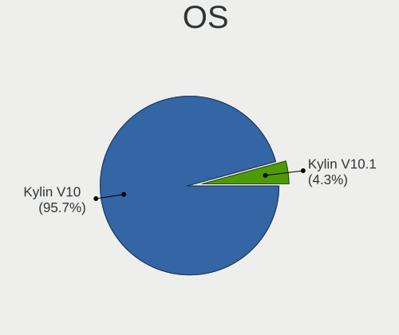

| Name        | Notebooks | Percent |
|-------------|-----------|---------|
| Kylin V10   | 45        | 95.74%  |
| Kylin V10.1 | 2         | 4.26%   |

OS Family
---------

OS without a version

| Name  | Notebooks | Percent |
|-------|-----------|---------|
| Kylin | 47        | 100%    |

Kernel
------

Version of the Linux kernel

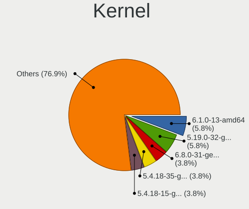

| Version             | Notebooks | Percent |
|---------------------|-----------|---------|
| 6.1.0-13-amd64      | 3         | 5.77%   |
| 5.19.0-32-generic   | 3         | 5.77%   |
| 6.8.0-31-generic    | 2         | 3.85%   |
| 5.4.18-35-generic   | 2         | 3.85%   |
| 5.4.18-15-generic   | 2         | 3.85%   |
| 5.19.0-45-generic   | 2         | 3.85%   |
| 6.9.9-rt-amd64      | 1         | 1.92%   |
| 6.8.0-47-generic    | 1         | 1.92%   |
| 6.8.0-45-generic    | 1         | 1.92%   |
| 6.8.0-38-generic    | 1         | 1.92%   |
| 6.8.0-35-generic    | 1         | 1.92%   |
| 6.7.12-rt-amd64     | 1         | 1.92%   |
| 6.6.9-amd64         | 1         | 1.92%   |
| 6.5.0-44-generic    | 1         | 1.92%   |
| 6.5.0-41-generic    | 1         | 1.92%   |
| 6.2.0-33-generic    | 1         | 1.92%   |
| 6.2.0-32-generic    | 1         | 1.92%   |
| 6.2.0-23-generic    | 1         | 1.92%   |
| 6.2.0-21-generic    | 1         | 1.92%   |
| 6.12.35+deb13-amd64 | 1         | 1.92%   |
| 6.11-rt-amd64       | 1         | 1.92%   |
| 6.1.0-38-amd64      | 1         | 1.92%   |
| 6.1.0-32-amd64      | 1         | 1.92%   |
| 6.1.0-27-rt-amd64   | 1         | 1.92%   |
| 6.1.0-26-rt-amd64   | 1         | 1.92%   |
| 6.1.0-23-amd64      | 1         | 1.92%   |
| 6.1.0-21-rt-amd64   | 1         | 1.92%   |
| 6.1.0-18-amd64      | 1         | 1.92%   |
| 5.4.96-7-kr9a0      | 1         | 1.92%   |
| 5.4.18-27-generic   | 1         | 1.92%   |
| 5.4.18-110-generic  | 1         | 1.92%   |
| 5.4.0-155-generic   | 1         | 1.92%   |
| 5.19.0-46-generic   | 1         | 1.92%   |
| 5.19.0-41-generic   | 1         | 1.92%   |
| 5.15.0-73-generic   | 1         | 1.92%   |
| 5.15.0-69-generic   | 1         | 1.92%   |
| 5.15.0-119-generic  | 1         | 1.92%   |
| 5.10.0-9-generic    | 1         | 1.92%   |
| 5.10.0-28-amd64     | 1         | 1.92%   |
| 5.10.0-23-amd64     | 1         | 1.92%   |

Kernel Family
-------------

Linux kernel without a distro release

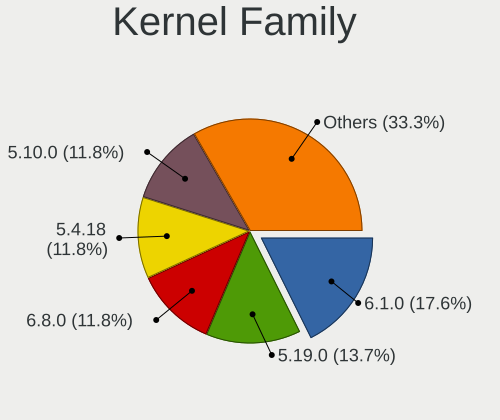

| Version | Notebooks | Percent |
|---------|-----------|---------|
| 6.1.0   | 9         | 17.65%  |
| 5.19.0  | 7         | 13.73%  |
| 6.8.0   | 6         | 11.76%  |
| 5.4.18  | 6         | 11.76%  |
| 5.10.0  | 6         | 11.76%  |
| 6.2.0   | 4         | 7.84%   |
| 5.15.0  | 3         | 5.88%   |
| 6.5.0   | 2         | 3.92%   |
| 6.9.9   | 1         | 1.96%   |
| 6.7.12  | 1         | 1.96%   |
| 6.6.9   | 1         | 1.96%   |
| 6.12.35 | 1         | 1.96%   |
| 6.11    | 1         | 1.96%   |
| 5.4.96  | 1         | 1.96%   |
| 5.4.0   | 1         | 1.96%   |
| 4.19.71 | 1         | 1.96%   |

Kernel Major Ver.
-----------------

Linux kernel major version

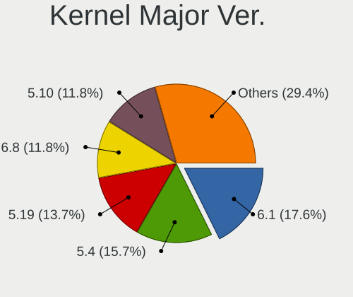

| Version | Notebooks | Percent |
|---------|-----------|---------|
| 6.1     | 9         | 17.65%  |
| 5.4     | 8         | 15.69%  |
| 5.19    | 7         | 13.73%  |
| 6.8     | 6         | 11.76%  |
| 5.10    | 6         | 11.76%  |
| 6.2     | 4         | 7.84%   |
| 5.15    | 3         | 5.88%   |
| 6.5     | 2         | 3.92%   |
| 6.9     | 1         | 1.96%   |
| 6.7     | 1         | 1.96%   |
| 6.6     | 1         | 1.96%   |
| 6.12    | 1         | 1.96%   |
| 6       | 1         | 1.96%   |
| 4.19    | 1         | 1.96%   |

Arch
----

OS architecture (x86_64, i586, etc.)

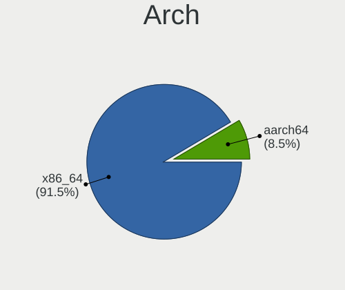

| Name    | Notebooks | Percent |
|---------|-----------|---------|
| x86_64  | 43        | 91.49%  |
| aarch64 | 4         | 8.51%   |

DE
--

Desktop Environment

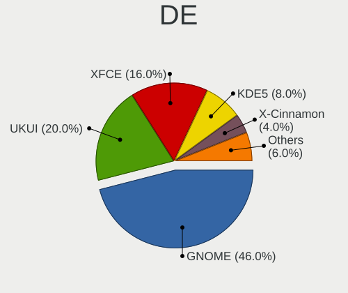

| Name            | Notebooks | Percent |
|-----------------|-----------|---------|
| GNOME           | 23        | 46%     |
| UKUI            | 10        | 20%     |
| XFCE            | 8         | 16%     |
| KDE5            | 4         | 8%      |
| X-Cinnamon      | 2         | 4%      |
| MATE            | 1         | 2%      |
| KDE6            | 1         | 2%      |
| GNOME Flashback | 1         | 2%      |

Display Server
--------------

X11 or Wayland

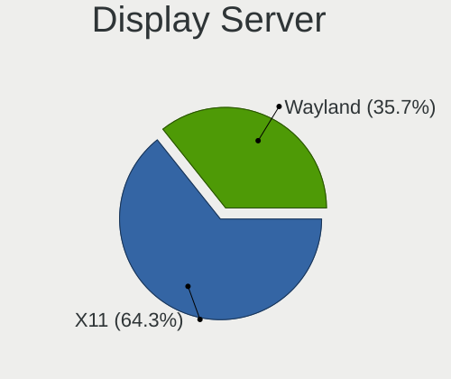

| Name    | Notebooks | Percent |
|---------|-----------|---------|
| X11     | 32        | 66.67%  |
| Wayland | 16        | 33.33%  |

Display Manager
---------------

SDDM, LightDM, etc.

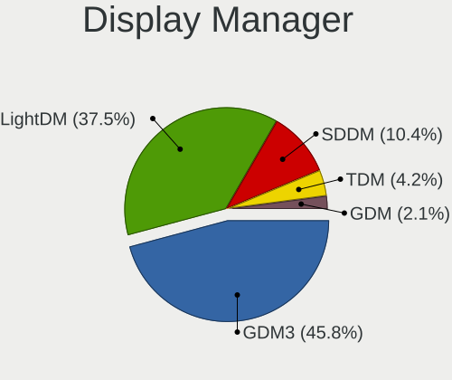

| Name    | Notebooks | Percent |
|---------|-----------|---------|
| GDM3    | 22        | 45.83%  |
| LightDM | 18        | 37.5%   |
| SDDM    | 5         | 10.42%  |
| TDM     | 2         | 4.17%   |
| GDM     | 1         | 2.08%   |

OS Lang
-------

Language

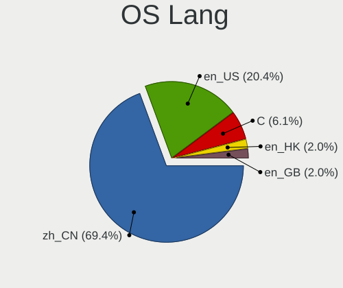

| Lang  | Notebooks | Percent |
|-------|-----------|---------|
| zh_CN | 34        | 69.39%  |
| en_US | 10        | 20.41%  |
| C     | 3         | 6.12%   |
| en_HK | 1         | 2.04%   |
| en_GB | 1         | 2.04%   |

Boot Mode
---------

EFI or BIOS

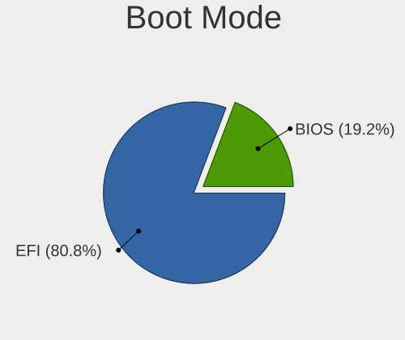

| Mode | Notebooks | Percent |
|------|-----------|---------|
| EFI  | 40        | 85.11%  |
| BIOS | 7         | 14.89%  |

Filesystem
----------

Type of filesystem

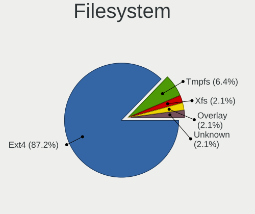

| Type    | Notebooks | Percent |
|---------|-----------|---------|
| Ext4    | 41        | 87.23%  |
| Tmpfs   | 3         | 6.38%   |
| Xfs     | 1         | 2.13%   |
| Overlay | 1         | 2.13%   |
| Unknown | 1         | 2.13%   |

Part. scheme
------------

Scheme of partitioning

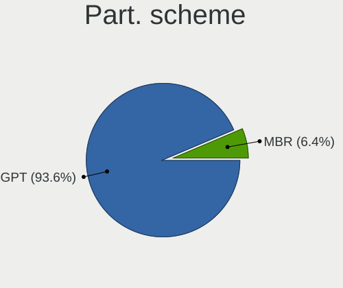

| Type | Notebooks | Percent |
|------|-----------|---------|
| GPT  | 44        | 93.62%  |
| MBR  | 3         | 6.38%   |

Dual Boot with Linux/BSD
------------------------

Hosting more than one Linux/BSD

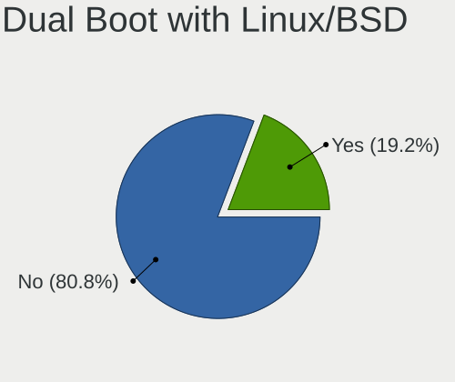

| Dual boot | Notebooks | Percent |
|-----------|-----------|---------|
| No        | 41        | 85.42%  |
| Yes       | 7         | 14.58%  |

Dual Boot (Win)
---------------

Hosting Linux and Windows

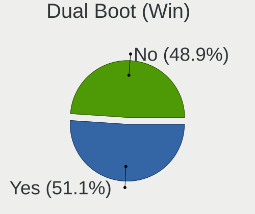

| Dual boot | Notebooks | Percent |
|-----------|-----------|---------|
| Yes       | 24        | 51.06%  |
| No        | 23        | 48.94%  |

Board
-----

Vendor
------

Motherboard manufacturer

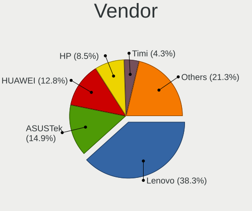

| Name             | Notebooks | Percent |
|------------------|-----------|---------|
| Lenovo           | 18        | 38.3%   |
| ASUSTek Computer | 7         | 14.89%  |
| HUAWEI           | 6         | 12.77%  |
| Hewlett-Packard  | 4         | 8.51%   |
| Timi             | 2         | 4.26%   |
| Dell             | 2         | 4.26%   |
| UniOne           | 1         | 2.13%   |
| THTF             | 1         | 2.13%   |
| KaiTian          | 1         | 2.13%   |
| HASEE Computer   | 1         | 2.13%   |
| GreatWall        | 1         | 2.13%   |
| Apple            | 1         | 2.13%   |
| Alienware        | 1         | 2.13%   |
| Acer             | 1         | 2.13%   |

Model
-----

Motherboard model

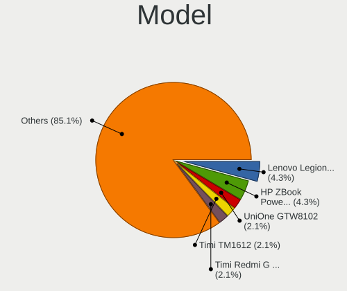

| Name                                              | Notebooks | Percent |
|---------------------------------------------------|-----------|---------|
| Lenovo Legion R9000P ARX8 82WM                    | 2         | 4.26%   |
| HP ZBook Power 15.6 inch G9 Mobile Workstation PC | 2         | 4.26%   |
| UniOne GTW8102                                    | 1         | 2.13%   |
| Timi TM1612                                       | 1         | 2.13%   |
| Timi Redmi G 2022                                 | 1         | 2.13%   |
| THTF CR F860-T1                                   | 1         | 2.13%   |
| Lenovo XiaoXinPro 14ACH 2021 82MS                 | 1         | 2.13%   |
| Lenovo ThinkPad X200 74574AC                      | 1         | 2.13%   |
| Lenovo ThinkPad X13 Gen 1 20UF000ACD              | 1         | 2.13%   |
| Lenovo ThinkPad X13 Gen 1 20T2A003CD              | 1         | 2.13%   |
| Lenovo ThinkPad X1 Extreme Gen 4i 20Y6S00400      | 1         | 2.13%   |
| Lenovo ThinkPad X1 Carbon Gen 10 21CBA002CD       | 1         | 2.13%   |
| Lenovo ThinkPad T480s 20L7A00HHK                  | 1         | 2.13%   |
| Lenovo ThinkPad T460p 20FWA00PCD                  | 1         | 2.13%   |
| Lenovo ThinkPad T14 Gen 4 21HD0078CD              | 1         | 2.13%   |
| Lenovo ThinkPad T14 Gen 1 20UDA00MCD              | 1         | 2.13%   |
| Lenovo ThinkPad Edge E430c 33651E3                | 1         | 2.13%   |
| Lenovo ThinkPad E14 Gen 2 20TAA006CD              | 1         | 2.13%   |
| Lenovo ThinkBook 16 G5+ ARP 21J0                  | 1         | 2.13%   |
| Lenovo Legion Y9000P IAH7H 82RF                   | 1         | 2.13%   |
| Lenovo Legion R9000P2021H 82JQ                    | 1         | 2.13%   |
| Lenovo IdeaPad 710S-13ISK 80SW                    | 1         | 2.13%   |
| KaiTian N89z G1d                                  | 1         | 2.13%   |
| HUAWEI QingYun L420 KLVV-W5821                    | 1         | 2.13%   |
| HUAWEI MACH-WX9                                   | 1         | 2.13%   |
| HUAWEI L410 KLVU-WDU0                             | 1         | 2.13%   |
| HUAWEI KLVDZ-WXX9                                 | 1         | 2.13%   |
| HUAWEI KLVC-WXX9                                  | 1         | 2.13%   |
| HUAWEI CREM-WXX9                                  | 1         | 2.13%   |
| HP ZHAN 99 Mobile Workstation G3                  | 1         | 2.13%   |
| HP EliteBook 840 G7 Notebook PC                   | 1         | 2.13%   |
| HASEE GI5CN54                                     | 1         | 2.13%   |
| Dell Vostro 3350                                  | 1         | 2.13%   |
| Dell Inspiron 5468                                | 1         | 2.13%   |
| ASUS Zenbook UX3402VA_UX3402VA                    | 1         | 2.13%   |
| ASUS VivoBook_ASUSLaptop K5504VA_K5504VA          | 1         | 2.13%   |
| ASUS VivoBook_ASUSLaptop K3502ZA_K3502ZA          | 1         | 2.13%   |
| ASUS UX31LA                                       | 1         | 2.13%   |
| ASUS TUF Gaming FX505GT                           | 1         | 2.13%   |
| ASUS TUF Gaming FX505GE_FX86FE                    | 1         | 2.13%   |

Model Family
------------

Motherboard model prefix

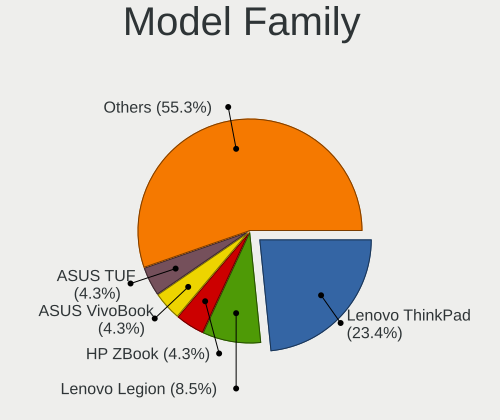

| Name               | Notebooks | Percent |
|--------------------|-----------|---------|
| Lenovo ThinkPad    | 11        | 23.4%   |
| Lenovo Legion      | 4         | 8.51%   |
| HP ZBook           | 2         | 4.26%   |
| ASUS VivoBook      | 2         | 4.26%   |
| ASUS TUF           | 2         | 4.26%   |
| UniOne GTW8102     | 1         | 2.13%   |
| Timi TM1612        | 1         | 2.13%   |
| Timi Redmi         | 1         | 2.13%   |
| THTF CR            | 1         | 2.13%   |
| Lenovo XiaoXinPro  | 1         | 2.13%   |
| Lenovo ThinkBook   | 1         | 2.13%   |
| Lenovo IdeaPad     | 1         | 2.13%   |
| KaiTian N89z       | 1         | 2.13%   |
| HUAWEI QingYun     | 1         | 2.13%   |
| HUAWEI MACH-WX9    | 1         | 2.13%   |
| HUAWEI L410        | 1         | 2.13%   |
| HUAWEI KLVDZ-WXX9  | 1         | 2.13%   |
| HUAWEI KLVC-WXX9   | 1         | 2.13%   |
| HUAWEI CREM-WXX9   | 1         | 2.13%   |
| HP ZHAN            | 1         | 2.13%   |
| HP EliteBook       | 1         | 2.13%   |
| HASEE GI5CN54      | 1         | 2.13%   |
| Dell Vostro        | 1         | 2.13%   |
| Dell Inspiron      | 1         | 2.13%   |
| ASUS Zenbook       | 1         | 2.13%   |
| ASUS UX31LA        | 1         | 2.13%   |
| ASUS ROG           | 1         | 2.13%   |
| Apple MacBookPro12 | 1         | 2.13%   |
| Alienware m15      | 1         | 2.13%   |
| Acer Swift         | 1         | 2.13%   |
| Unknown            | 1         | 2.13%   |

MFG Year
--------

Motherboard manufacture year

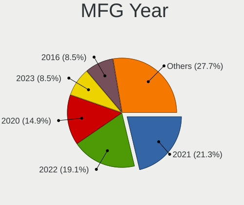

| Year    | Notebooks | Percent |
|---------|-----------|---------|
| 2021    | 10        | 21.28%  |
| 2022    | 9         | 19.15%  |
| 2020    | 7         | 14.89%  |
| 2023    | 4         | 8.51%   |
| 2016    | 4         | 8.51%   |
| 2018    | 3         | 6.38%   |
| 2024    | 2         | 4.26%   |
| 2014    | 2         | 4.26%   |
| 2015    | 1         | 2.13%   |
| 2013    | 1         | 2.13%   |
| 2012    | 1         | 2.13%   |
| 2011    | 1         | 2.13%   |
| 2008    | 1         | 2.13%   |
| Unknown | 1         | 2.13%   |

Form Factor
-----------

Physical design of the computer

| Name     | Notebooks | Percent |
|----------|-----------|---------|
| Notebook | 47        | 100%    |

Secure Boot
-----------

Enabled or disabled

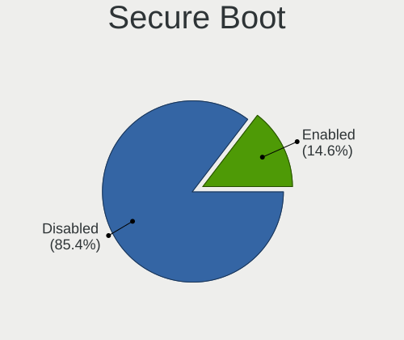

| State    | Notebooks | Percent |
|----------|-----------|---------|
| Disabled | 41        | 85.42%  |
| Enabled  | 7         | 14.58%  |

Coreboot
--------

Have coreboot on board

| Used | Notebooks | Percent |
|------|-----------|---------|
| No   | 47        | 100%    |

RAM Size
--------

Total RAM memory

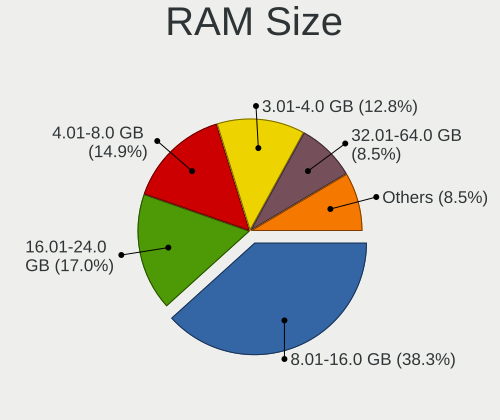

| Size in GB  | Notebooks | Percent |
|-------------|-----------|---------|
| 8.01-16.0   | 18        | 38.3%   |
| 16.01-24.0  | 8         | 17.02%  |
| 4.01-8.0    | 7         | 14.89%  |
| 3.01-4.0    | 6         | 12.77%  |
| 32.01-64.0  | 4         | 8.51%   |
| 24.01-32.0  | 2         | 4.26%   |
| 64.01-256.0 | 2         | 4.26%   |

RAM Used
--------

Used RAM memory

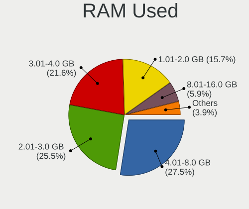

| Used GB    | Notebooks | Percent |
|------------|-----------|---------|
| 4.01-8.0   | 14        | 27.45%  |
| 2.01-3.0   | 13        | 25.49%  |
| 3.01-4.0   | 11        | 21.57%  |
| 1.01-2.0   | 8         | 15.69%  |
| 8.01-16.0  | 3         | 5.88%   |
| 16.01-24.0 | 1         | 1.96%   |
| 0.51-1.0   | 1         | 1.96%   |

Total Drives
------------

Number of drives on board

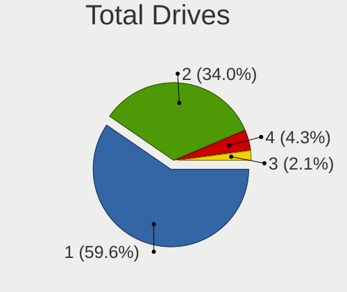

| Drives | Notebooks | Percent |
|--------|-----------|---------|
| 1      | 28        | 59.57%  |
| 2      | 16        | 34.04%  |
| 4      | 2         | 4.26%   |
| 3      | 1         | 2.13%   |

Has CD-ROM
----------

Has CD-ROM on board

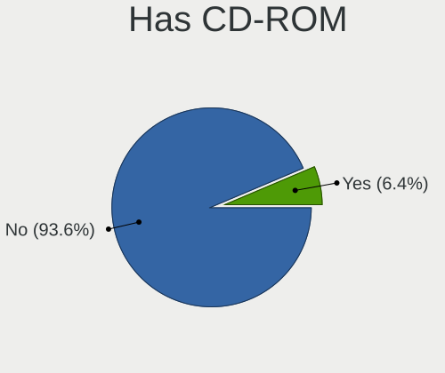

| Presented | Notebooks | Percent |
|-----------|-----------|---------|
| No        | 44        | 93.62%  |
| Yes       | 3         | 6.38%   |

Has Ethernet
------------

Has Ethernet on board

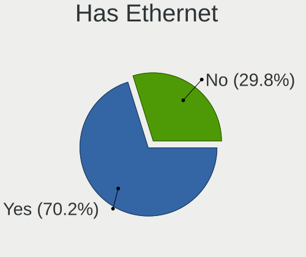

| Presented | Notebooks | Percent |
|-----------|-----------|---------|
| Yes       | 33        | 70.21%  |
| No        | 14        | 29.79%  |

Has WiFi
--------

Has WiFi module

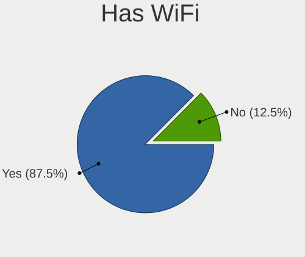

| Presented | Notebooks | Percent |
|-----------|-----------|---------|
| Yes       | 44        | 93.62%  |
| No        | 3         | 6.38%   |

Has Bluetooth
-------------

Has Bluetooth module

| Presented | Notebooks | Percent |
|-----------|-----------|---------|
| Yes       | 44        | 93.62%  |
| No        | 3         | 6.38%   |

Location
--------

Country
-------

Geographic location (country)

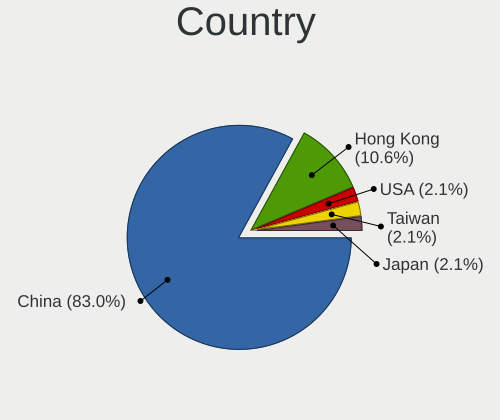

| Country   | Notebooks | Percent |
|-----------|-----------|---------|
| China     | 39        | 82.98%  |
| Hong Kong | 5         | 10.64%  |
| USA       | 1         | 2.13%   |
| Taiwan    | 1         | 2.13%   |
| Japan     | 1         | 2.13%   |

City
----

Geographic location (city)

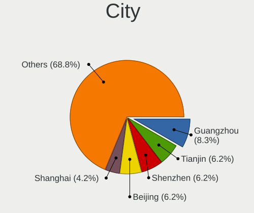

| City        | Notebooks | Percent |
|-------------|-----------|---------|
| Guangzhou   | 4         | 8.33%   |
| Tianjin     | 3         | 6.25%   |
| Shenzhen    | 3         | 6.25%   |
| Beijing     | 3         | 6.25%   |
| Shanghai    | 2         | 4.17%   |
| Mong Kok    | 2         | 4.17%   |
| Jinrongjie  | 2         | 4.17%   |
| Hefei       | 2         | 4.17%   |
| Haidian     | 2         | 4.17%   |
| Chengdu     | 2         | 4.17%   |
| Central     | 2         | 4.17%   |
| Zhongshan   | 1         | 2.08%   |
| Xiaolou     | 1         | 2.08%   |
| Xi'an       | 1         | 2.08%   |
| Wenzhou     | 1         | 2.08%   |
| Wanchai     | 1         | 2.08%   |
| Tokyo       | 1         | 2.08%   |
| Taohua      | 1         | 2.08%   |
| Taizhou     | 1         | 2.08%   |
| Shizishan   | 1         | 2.08%   |
| Qinnan      | 1         | 2.08%   |
| Putuo       | 1         | 2.08%   |
| Los Angeles | 1         | 2.08%   |
| Kunming     | 1         | 2.08%   |
| Jinan       | 1         | 2.08%   |
| Harbin      | 1         | 2.08%   |
| Haikou      | 1         | 2.08%   |
| Changzhou   | 1         | 2.08%   |
| Changsha    | 1         | 2.08%   |
| Chancheng   | 1         | 2.08%   |
| Banqiao     | 1         | 2.08%   |
| Bacheng     | 1         | 2.08%   |

Drives
------

Drive Vendor
------------

Hard drive vendors

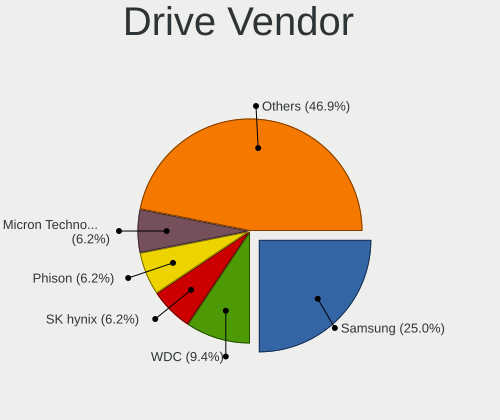

| Vendor                | Notebooks | Drives | Percent |
|-----------------------|-----------|--------|---------|
| Samsung Electronics   | 16        | 21     | 25%     |
| WDC                   | 6         | 6      | 9.38%   |
| SK hynix              | 4         | 4      | 6.25%   |
| Phison                | 4         | 4      | 6.25%   |
| Micron Technology     | 4         | 4      | 6.25%   |
| Toshiba               | 3         | 3      | 4.69%   |
| SanDisk               | 3         | 3      | 4.69%   |
| ZHITAI                | 2         | 2      | 3.13%   |
| Lenovo                | 2         | 2      | 3.13%   |
| Intel                 | 2         | 2      | 3.13%   |
| Hewlett-Packard       | 2         | 2      | 3.13%   |
| BIWIN                 | 2         | 2      | 3.13%   |
| ZX1 1TB               | 1         | 1      | 1.56%   |
| Unknown               | 1         | 1      | 1.56%   |
| Seagate               | 1         | 1      | 1.56%   |
| Realtek Semiconductor | 1         | 1      | 1.56%   |
| KIOXIA                | 1         | 5      | 1.56%   |
| Kingston              | 1         | 1      | 1.56%   |
| Kingchuxing           | 1         | 1      | 1.56%   |
| HISI                  | 1         | 4      | 1.56%   |
| Hikvision             | 1         | 1      | 1.56%   |
| HIKSEMI               | 1         | 1      | 1.56%   |
| FORESEE               | 1         | 1      | 1.56%   |
| Fanxiang              | 1         | 1      | 1.56%   |
| Apple                 | 1         | 1      | 1.56%   |
| A-DATA Technology     | 1         | 1      | 1.56%   |

Drive Model
-----------

Hard drive models

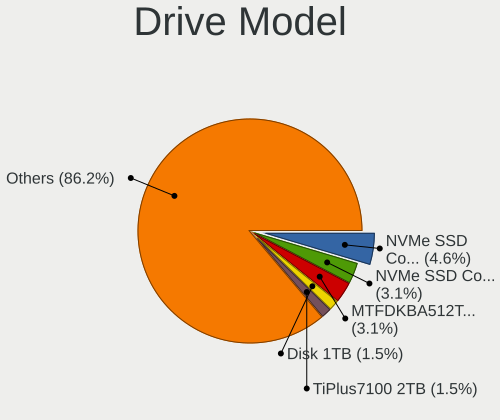

| Model                                              | Notebooks | Percent |
|----------------------------------------------------|-----------|---------|
| Samsung NVMe SSD Controller SM981/PM981/PM983 1TB  | 3         | 4.62%   |
| Samsung NVMe SSD Controller PM9A1/PM9A3/980PRO 1TB | 2         | 3.08%   |
| Micron MTFDKBA512TFH 512GB                         | 2         | 3.08%   |
| ZX1 1TB Disk 1TB                                   | 1         | 1.54%   |
| ZHITAI TiPlus7100 2TB                              | 1         | 1.54%   |
| ZHITAI PC005 Active 1TB                            | 1         | 1.54%   |
| WDC PC SN730 SDBPNTY-512G-1027 512GB               | 1         | 1.54%   |
| WDC PC SN730 SDBPNTY-512G                          | 1         | 1.54%   |
| WDC PC SN530 SDBPNPZ-512G-1114 512GB               | 1         | 1.54%   |
| WDC PC SN530 SDBPNPZ-512G-1014 512GB               | 1         | 1.54%   |
| WDC PC SN530 SDBPNPZ-256G                          | 1         | 1.54%   |
| WDC PC SN530 NVMe 512GB                            | 1         | 1.54%   |
| Unknown NVMe SSD Drive 256GB                       | 1         | 1.54%   |
| Toshiba MQ01ABD100 1TB                             | 1         | 1.54%   |
| Toshiba MK3261GSYN 320GB                           | 1         | 1.54%   |
| Toshiba KXG60ZNV512G KIOXIA 512GB                  | 1         | 1.54%   |
| SK hynix SKHynix_HFS512GDE9X084N 512GB             | 1         | 1.54%   |
| SK hynix SKHynix_HFS512GD9TNI-L2A0B 512GB          | 1         | 1.54%   |
| SK hynix SKHynix_HFS001TEJ9X115N 1024GB            | 1         | 1.54%   |
| SK hynix SHPP41-2000GM 2TB                         | 1         | 1.54%   |
| Seagate ST9500325AS 500GB                          | 1         | 1.54%   |
| SanDisk SSD PLUS 1000GB                            | 1         | 1.54%   |
| SanDisk SD6SP1M256G1102 256GB SSD                  | 1         | 1.54%   |
| SanDisk NVMe SSD Drive 1TB                         | 1         | 1.54%   |
| Samsung Portable SSD T5 500GB                      | 1         | 1.54%   |
| Samsung MZVLW256HEHP-000L2 256GB                   | 1         | 1.54%   |
| Samsung MZVLB512HBJQ-000L7 512GB                   | 1         | 1.54%   |
| Samsung MZVLB512HAJQ-00000 512GB                   | 1         | 1.54%   |
| Samsung MZVL4512HBLU-00BTW 512GB                   | 1         | 1.54%   |
| Samsung MZVL2512HCJQ-00BL7 512GB                   | 1         | 1.54%   |
| Samsung MZVL2512HCJQ-00BH1 512GB                   | 1         | 1.54%   |
| Samsung MZVL2512HCJQ-00B00 512GB                   | 1         | 1.54%   |
| Samsung MZVL21T0HCLR-00BL2 1TB                     | 1         | 1.54%   |
| Samsung MZNTY128HDHP-00000 128GB SSD               | 1         | 1.54%   |
| Samsung KLUFG8RHDA-B2D1 512GB                      | 1         | 1.54%   |
| Samsung KLUFG8RHDA-B2D1 1GB                        | 1         | 1.54%   |
| Realtek NVMe SSD Drive 512GB                       | 1         | 1.54%   |
| Phison ThinkPlus ST8000 PCI-E M.2 256G             | 1         | 1.54%   |
| Phison SATA SSD 128GB                              | 1         | 1.54%   |
| Phison CFESR512GMTCT-E9C-2 512GB                   | 1         | 1.54%   |

HDD Vendor
----------

Hard disk drive vendors

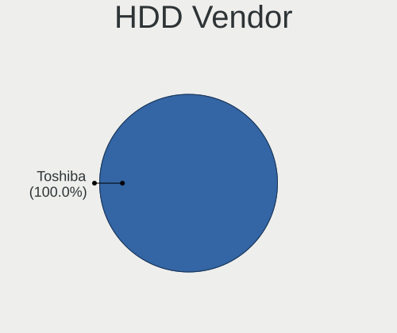

| Vendor  | Notebooks | Drives | Percent |
|---------|-----------|--------|---------|
| Toshiba | 2         | 2      | 66.67%  |
| Seagate | 1         | 1      | 33.33%  |

SSD Vendor
----------

Solid state drive vendors

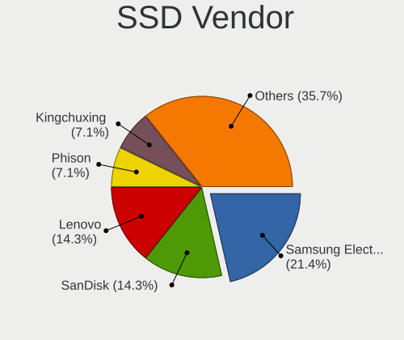

| Vendor              | Notebooks | Drives | Percent |
|---------------------|-----------|--------|---------|
| Samsung Electronics | 3         | 7      | 21.43%  |
| SanDisk             | 2         | 2      | 14.29%  |
| Lenovo              | 2         | 2      | 14.29%  |
| Phison              | 1         | 1      | 7.14%   |
| Kingchuxing         | 1         | 1      | 7.14%   |
| HISI                | 1         | 4      | 7.14%   |
| HIKSEMI             | 1         | 1      | 7.14%   |
| Hewlett-Packard     | 1         | 1      | 7.14%   |
| FORESEE             | 1         | 1      | 7.14%   |
| Apple               | 1         | 1      | 7.14%   |

Drive Kind
----------

HDD or SSD

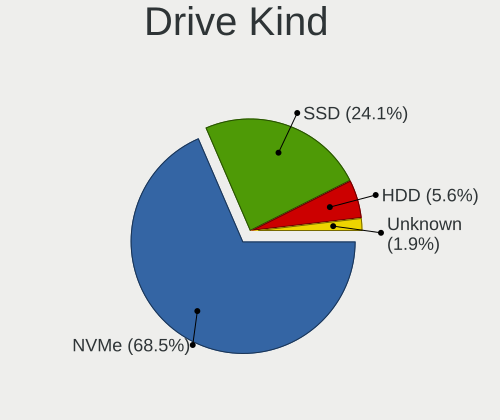

| Kind    | Notebooks | Drives | Percent |
|---------|-----------|--------|---------|
| NVMe    | 37        | 51     | 68.52%  |
| SSD     | 13        | 21     | 24.07%  |
| HDD     | 3         | 3      | 5.56%   |
| Unknown | 1         | 1      | 1.85%   |

Drive Connector
---------------

SATA, SAS, NVMe, etc.

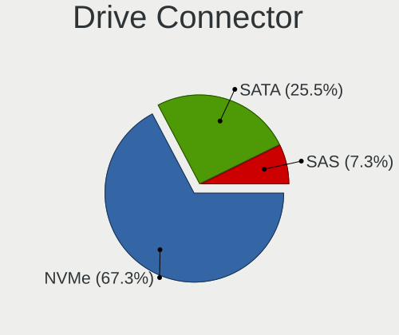

| Type | Notebooks | Drives | Percent |
|------|-----------|--------|---------|
| NVMe | 37        | 50     | 67.27%  |
| SATA | 14        | 22     | 25.45%  |
| SAS  | 4         | 4      | 7.27%   |

Drive Size
----------

Size of hard drive

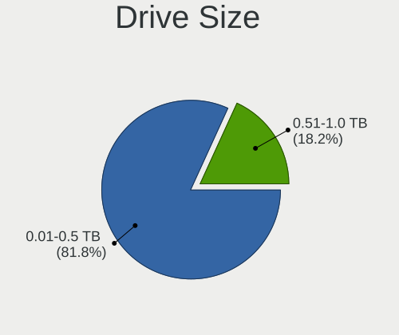

| Size in TB | Notebooks | Drives | Percent |
|------------|-----------|--------|---------|
| 0.01-0.5   | 14        | 20     | 77.78%  |
| 0.51-1.0   | 4         | 4      | 22.22%  |

Space Total
-----------

Amount of disk space available on the file system

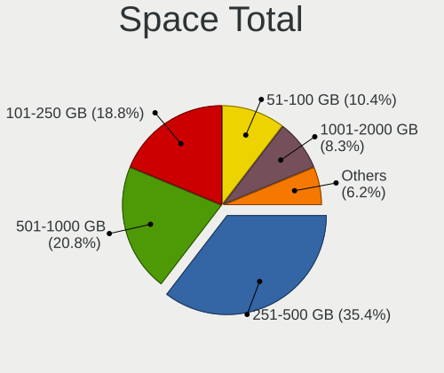

| Size in GB | Notebooks | Percent |
|------------|-----------|---------|
| 251-500    | 17        | 35.42%  |
| 501-1000   | 10        | 20.83%  |
| 101-250    | 9         | 18.75%  |
| 51-100     | 5         | 10.42%  |
| 1001-2000  | 4         | 8.33%   |
| 2001-3000  | 2         | 4.17%   |
| Unknown    | 1         | 2.08%   |

Space Used
----------

Amount of used disk space

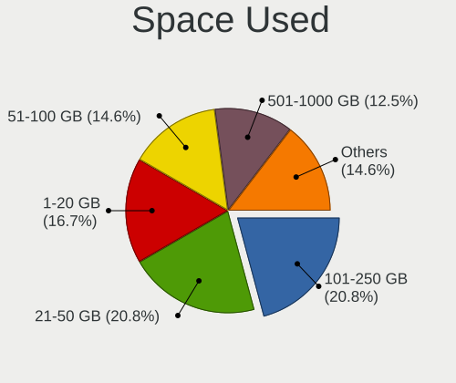

| Used GB   | Notebooks | Percent |
|-----------|-----------|---------|
| 21-50     | 10        | 20.83%  |
| 101-250   | 10        | 20.83%  |
| 1-20      | 8         | 16.67%  |
| 51-100    | 7         | 14.58%  |
| 501-1000  | 6         | 12.5%   |
| 251-500   | 5         | 10.42%  |
| 1001-2000 | 1         | 2.08%   |
| Unknown   | 1         | 2.08%   |

Malfunc. Drives
---------------

Drive models with a malfunction

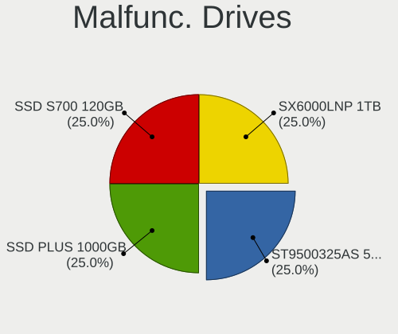

| Model                           | Notebooks | Drives | Percent |
|---------------------------------|-----------|--------|---------|
| Seagate ST9500325AS 500GB       | 1         | 1      | 25%     |
| SanDisk SSD PLUS 1000GB         | 1         | 1      | 25%     |
| Hewlett-Packard SSD S700 120GB  | 1         | 1      | 25%     |
| A-DATA Technology SX6000LNP 1TB | 1         | 1      | 25%     |

Malfunc. Drive Vendor
---------------------

Vendors of faulty drives

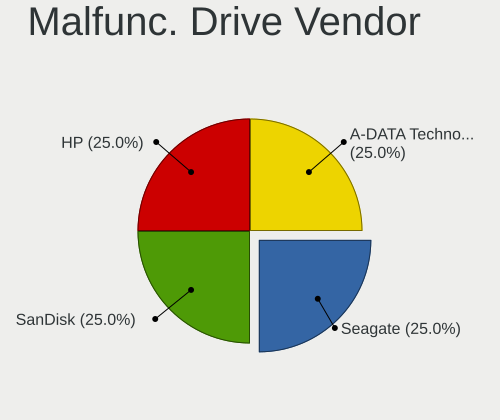

| Vendor            | Notebooks | Drives | Percent |
|-------------------|-----------|--------|---------|
| Seagate           | 1         | 1      | 25%     |
| SanDisk           | 1         | 1      | 25%     |
| Hewlett-Packard   | 1         | 1      | 25%     |
| A-DATA Technology | 1         | 1      | 25%     |

Malfunc. HDD Vendor
-------------------

Vendors of faulty HDD drives

| Vendor  | Notebooks | Drives | Percent |
|---------|-----------|--------|---------|
| Seagate | 1         | 1      | 100%    |

Malfunc. Drive Kind
-------------------

Kinds of faulty drives

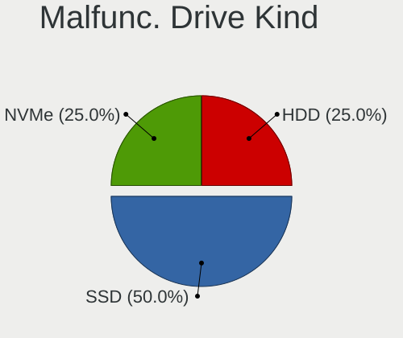

| Kind | Notebooks | Drives | Percent |
|------|-----------|--------|---------|
| SSD  | 2         | 2      | 50%     |
| NVMe | 1         | 1      | 25%     |
| HDD  | 1         | 1      | 25%     |

Failed Drives
-------------

Failed drive models

Zero info for selected period =(

Failed Drive Vendor
-------------------

Failed drive vendors

Zero info for selected period =(

Drive Status
------------

Number of failed and malfunc. drives

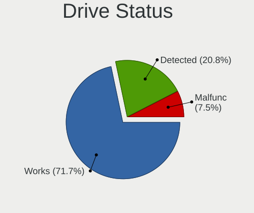

| Status   | Notebooks | Drives | Percent |
|----------|-----------|--------|---------|
| Works    | 38        | 52     | 71.7%   |
| Detected | 11        | 20     | 20.75%  |
| Malfunc  | 4         | 4      | 7.55%   |

Storage controller
------------------

Storage Vendor
--------------

Storage controller vendors

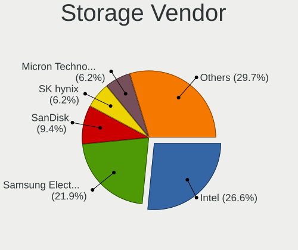

| Vendor                          | Notebooks | Percent |
|---------------------------------|-----------|---------|
| Intel                           | 17        | 26.56%  |
| Samsung Electronics             | 14        | 21.88%  |
| SanDisk                         | 6         | 9.38%   |
| SK hynix                        | 4         | 6.25%   |
| Micron Technology               | 4         | 6.25%   |
| AMD                             | 4         | 6.25%   |
| Phison Electronics              | 3         | 4.69%   |
| Yangtze Memory Technologies     | 2         | 3.13%   |
| Biwin Storage Technology        | 2         | 3.13%   |
| Toshiba America Info Systems    | 1         | 1.56%   |
| Silicon Motion                  | 1         | 1.56%   |
| Realtek Semiconductor           | 1         | 1.56%   |
| MAXIO Technology (Hangzhou)     | 1         | 1.56%   |
| Marvell Technology Group        | 1         | 1.56%   |
| KIOXIA                          | 1         | 1.56%   |
| Kingston Technology Company     | 1         | 1.56%   |
| Hefei DATANG Storage Technology | 1         | 1.56%   |

Storage Model
-------------

Storage controller models

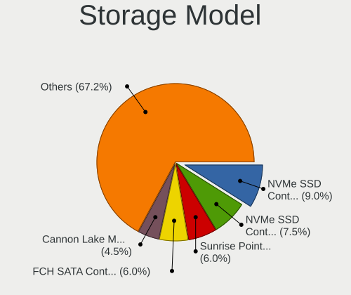

| Model                                                                     | Notebooks | Percent |
|---------------------------------------------------------------------------|-----------|---------|
| Samsung NVMe SSD Controller PM9A1/PM9A3/980PRO                            | 6         | 8.96%   |
| Samsung NVMe SSD Controller SM981/PM981/PM983                             | 5         | 7.46%   |
| Intel Sunrise Point-LP SATA Controller [AHCI mode]                        | 4         | 5.97%   |
| AMD FCH SATA Controller [AHCI mode]                                       | 4         | 5.97%   |
| Intel Cannon Lake Mobile PCH SATA AHCI Controller                         | 3         | 4.48%   |
| SK hynix Platinum P41/PC801 NVMe Solid State Drive                        | 2         | 2.99%   |
| SanDisk Ultra 3D / WD PC SN530, IX SN530, Blue SN550 NVMe SSD (DRAM-less) | 2         | 2.99%   |
| SanDisk Extreme Pro / WD Black SN750 / PC SN730 / Red SN700 NVMe SSD      | 2         | 2.99%   |
| Micron 3400 NVMe SSD [Hendrix]                                            | 2         | 2.99%   |
| Micron 2450 NVMe SSD [HendrixV] (DRAM-less)                               | 2         | 2.99%   |
| Yangtze Memory ZHITAI TiPlus7100                                          | 1         | 1.49%   |
| Yangtze Memory ZHITAI PC005 NVMe SSD                                      | 1         | 1.49%   |
| Toshiba America Info Systems XG6 NVMe SSD Controller                      | 1         | 1.49%   |
| SK hynix PC611 NVMe Solid State Drive                                     | 1         | 1.49%   |
| SK hynix Gold P31/BC711/PC711 NVMe Solid State Drive                      | 1         | 1.49%   |
| Silicon Motion SM2262/SM2262EN SSD Controller                             | 1         | 1.49%   |
| SanDisk WD SN560/SN740/SN770/SN5000 NVMe SSD                              | 1         | 1.49%   |
| SanDisk IX SN530 NVMe SSD / microSD Express Card (DRAM-less)              | 1         | 1.49%   |
| Samsung S4LN058A01[SSUBX] AHCI SSD Controller (Apple slot)                | 1         | 1.49%   |
| Samsung NVMe SSD Controller SM961/PM961/SM963                             | 1         | 1.49%   |
| Samsung NVMe SSD Controller PM9B1 (DRAM-less)                             | 1         | 1.49%   |
| Realtek RTS5765DL NVMe SSD Controller (DRAM-less)                         | 1         | 1.49%   |
| Phison PS5019-E19 PCIe4 NVMe Controller (DRAM-less)                       | 1         | 1.49%   |
| Phison PS5013-E13 PCIe3 NVMe Controller (DRAM-less)                       | 1         | 1.49%   |
| Phison E12 NVMe Controller                                                | 1         | 1.49%   |
| MAXIO (Hangzhou) NVMe SSD Controller MAP1602 (DRAM-less)                  | 1         | 1.49%   |
| Marvell Group 88SS1092 NVMe SSD Controller                                | 1         | 1.49%   |
| KIOXIA NVMe SSD Controller XG8                                            | 1         | 1.49%   |
| Kingston Company A2000 NVMe SSD [SM2263EN]                                | 1         | 1.49%   |
| Intel Volume Management Device NVMe RAID Controller                       | 1         | 1.49%   |
| Intel Tiger Lake SATA AHCI Controller                                     | 1         | 1.49%   |
| Intel SSD 670p Series [Keystone Harbor]                                   | 1         | 1.49%   |
| Intel SSD 660P Series                                                     | 1         | 1.49%   |
| Intel RST Volume Management Device Controller                             | 1         | 1.49%   |
| Intel Mobile 4 Series Chipset PT IDER Controller                          | 1         | 1.49%   |
| Intel HM170/QM170 Chipset SATA Controller [AHCI Mode]                     | 1         | 1.49%   |
| Intel Comet Lake SATA AHCI Controller                                     | 1         | 1.49%   |
| Intel 82801IBM/IEM (ICH9M/ICH9M-E) 4 port SATA Controller [AHCI mode]     | 1         | 1.49%   |
| Intel 8 Series SATA Controller 1 [AHCI mode]                              | 1         | 1.49%   |
| Intel 7 Series Chipset Family 4-port SATA Controller [IDE mode]           | 1         | 1.49%   |

Storage Kind
------------

Kind of storage controller (IDE, SATA, NVMe, SAS, ...)

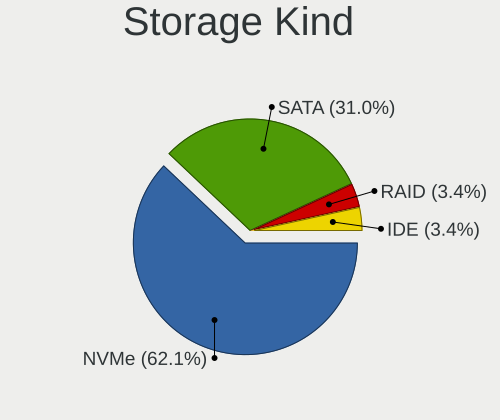

| Kind | Notebooks | Percent |
|------|-----------|---------|
| NVMe | 36        | 62.07%  |
| SATA | 18        | 31.03%  |
| RAID | 2         | 3.45%   |
| IDE  | 2         | 3.45%   |

Processor
---------

CPU Vendor
----------

Processor vendors

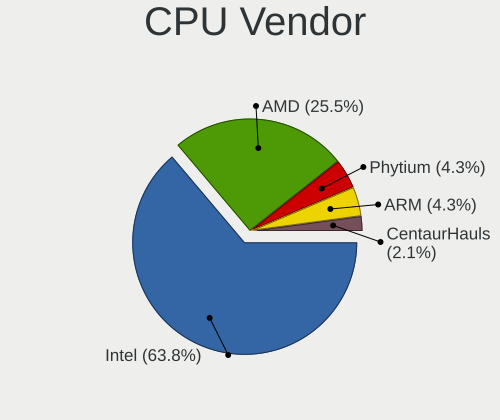

| Vendor       | Notebooks | Percent |
|--------------|-----------|---------|
| Intel        | 30        | 63.83%  |
| AMD          | 12        | 25.53%  |
| Phytium      | 2         | 4.26%   |
| ARM          | 2         | 4.26%   |
| CentaurHauls | 1         | 2.13%   |

CPU Model
---------

Processor models

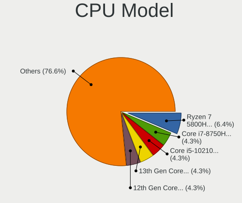

| Model                                         | Notebooks | Percent |
|-----------------------------------------------|-----------|---------|
| AMD Ryzen 7 5800H with Radeon Graphics        | 3         | 6.38%   |
| Intel Core i7-8750H CPU @ 2.20GHz             | 2         | 4.26%   |
| Intel Core i5-10210U CPU @ 1.60GHz            | 2         | 4.26%   |
| Intel 13th Gen Core i5-1340P                  | 2         | 4.26%   |
| Intel 12th Gen Core i7-12700H                 | 2         | 4.26%   |
| Intel 12th Gen Core i5-12500H                 | 2         | 4.26%   |
| Intel 11th Gen Core i7-11800H @ 2.30GHz       | 2         | 4.26%   |
| Intel 11th Gen Core i7-1165G7 @ 2.80GHz       | 2         | 4.26%   |
| ARM Processor                                 | 2         | 4.26%   |
| AMD Ryzen 9 7945HX with Radeon Graphics       | 2         | 4.26%   |
| AMD Ryzen 7 PRO 4750U with Radeon Graphics    | 2         | 4.26%   |
| Phytium FT-2000/4                             | 1         | 2.13%   |
| Phytium D2000/8 E8C                           | 1         | 2.13%   |
| Intel Core m3-6Y30 CPU @ 0.90GHz              | 1         | 2.13%   |
| Intel Core i7-9750H CPU @ 2.60GHz             | 1         | 2.13%   |
| Intel Core i7-8550U CPU @ 1.80GHz             | 1         | 2.13%   |
| Intel Core i7-7500U CPU @ 2.70GHz             | 1         | 2.13%   |
| Intel Core i7-6700HQ CPU @ 2.60GHz            | 1         | 2.13%   |
| Intel Core i7-6560U CPU @ 2.20GHz             | 1         | 2.13%   |
| Intel Core i7-10510U CPU @ 1.80GHz            | 1         | 2.13%   |
| Intel Core i5-8350U CPU @ 1.70GHz             | 1         | 2.13%   |
| Intel Core i5-7300U CPU @ 2.60GHz             | 1         | 2.13%   |
| Intel Core i5-5257U CPU @ 2.70GHz             | 1         | 2.13%   |
| Intel Core i5-4200U CPU @ 1.60GHz             | 1         | 2.13%   |
| Intel Core i3-3110M CPU @ 2.40GHz             | 1         | 2.13%   |
| Intel Core i3-2310M CPU @ 2.10GHz             | 1         | 2.13%   |
| Intel Core 2 Duo CPU P8400 @ 2.26GHz          | 1         | 2.13%   |
| Intel 13th Gen Core i9-13900H                 | 1         | 2.13%   |
| Intel 12th Gen Core i5-1240P                  | 1         | 2.13%   |
| CentaurHauls ZHAOXIN KaiXian KX-U6780A@2.7GHz | 1         | 2.13%   |
| AMD Ryzen 9 7845HX with Radeon Graphics       | 1         | 2.13%   |
| AMD Ryzen 7 7735H with Radeon Graphics        | 1         | 2.13%   |
| AMD Ryzen 7 5800U with Radeon Graphics        | 1         | 2.13%   |
| AMD Ryzen 5 6600H with Radeon Graphics        | 1         | 2.13%   |
| AMD Ryzen 5 5600H with Radeon Graphics        | 1         | 2.13%   |

CPU Model Family
----------------

Processor model prefix

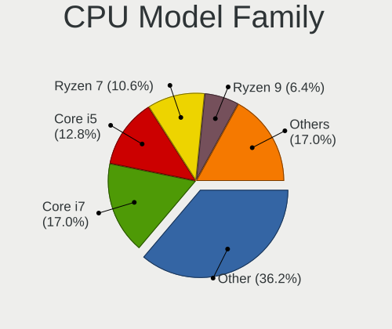

| Model            | Notebooks | Percent |
|------------------|-----------|---------|
| Other            | 17        | 36.17%  |
| Intel Core i7    | 8         | 17.02%  |
| Intel Core i5    | 6         | 12.77%  |
| AMD Ryzen 7      | 5         | 10.64%  |
| AMD Ryzen 9      | 3         | 6.38%   |
| Intel Core i3    | 2         | 4.26%   |
| AMD Ryzen 7 PRO  | 2         | 4.26%   |
| AMD Ryzen 5      | 2         | 4.26%   |
| Intel Core m3    | 1         | 2.13%   |
| Intel Core 2 Duo | 1         | 2.13%   |

CPU Cores
---------

Number of processor cores

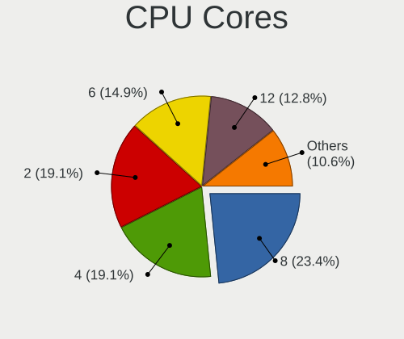

| Number | Notebooks | Percent |
|--------|-----------|---------|
| 8      | 11        | 23.4%   |
| 4      | 9         | 19.15%  |
| 2      | 9         | 19.15%  |
| 6      | 7         | 14.89%  |
| 12     | 6         | 12.77%  |
| 14     | 3         | 6.38%   |
| 16     | 2         | 4.26%   |

CPU Sockets
-----------

Number of sockets

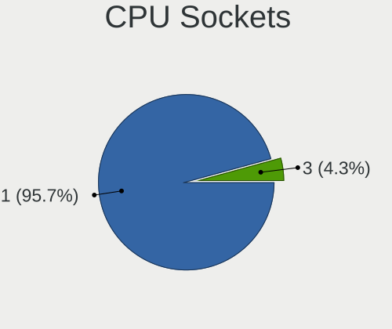

| Number | Notebooks | Percent |
|--------|-----------|---------|
| 1      | 45        | 95.74%  |
| 3      | 2         | 4.26%   |

CPU Threads
-----------

Threads per core (Hyper-Threading)

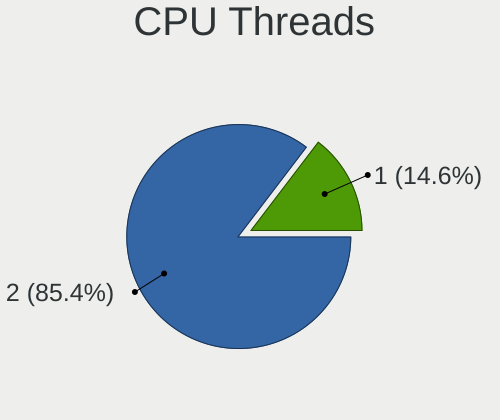

| Number | Notebooks | Percent |
|--------|-----------|---------|
| 2      | 40        | 85.11%  |
| 1      | 7         | 14.89%  |

CPU Op-Modes
------------

CPU Operation Modes (32-bit, 64-bit)

| Op mode        | Notebooks | Percent |
|----------------|-----------|---------|
| 32-bit, 64-bit | 47        | 100%    |

CPU Microcode
-------------

Microcode number

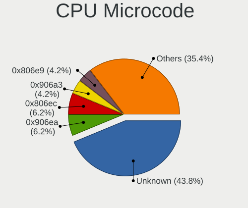

| Number     | Notebooks | Percent |
|------------|-----------|---------|
| Unknown    | 21        | 43.75%  |
| 0x906ea    | 3         | 6.25%   |
| 0x806ec    | 3         | 6.25%   |
| 0x906a3    | 2         | 4.17%   |
| 0x806e9    | 2         | 4.17%   |
| 0x406e3    | 2         | 4.17%   |
| 0x0a50000d | 2         | 4.17%   |
| 0xb06a2    | 1         | 2.08%   |
| 0x806ea    | 1         | 2.08%   |
| 0x806c1    | 1         | 2.08%   |
| 0x40651    | 1         | 2.08%   |
| 0x306d4    | 1         | 2.08%   |
| 0x306a9    | 1         | 2.08%   |
| 0x1067a    | 1         | 2.08%   |
| 0x0a601206 | 1         | 2.08%   |
| 0x0a601203 | 1         | 2.08%   |
| 0x0a50000c | 1         | 2.08%   |
| 0x0a50000b | 1         | 2.08%   |
| 0x0a404102 | 1         | 2.08%   |
| 0x0860010c | 1         | 2.08%   |

CPU Microarch
-------------

Microarchitecture

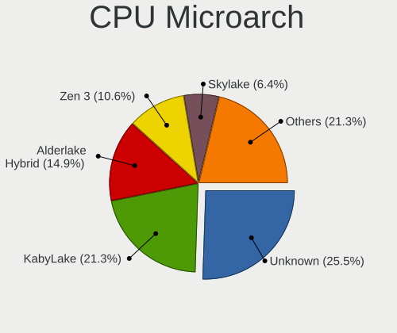

| Name             | Notebooks | Percent |
|------------------|-----------|---------|
| Unknown          | 12        | 25.53%  |
| KabyLake         | 10        | 21.28%  |
| Alderlake Hybrid | 7         | 14.89%  |
| Zen 3            | 5         | 10.64%  |
| Skylake          | 3         | 6.38%   |
| Zen 2            | 2         | 4.26%   |
| TigerLake        | 2         | 4.26%   |
| SandyBridge      | 1         | 2.13%   |
| Penryn           | 1         | 2.13%   |
| IvyBridge        | 1         | 2.13%   |
| Icelake          | 1         | 2.13%   |
| Haswell          | 1         | 2.13%   |
| Broadwell        | 1         | 2.13%   |

Graphics
--------

GPU Vendor
----------

Vendors of graphics cards

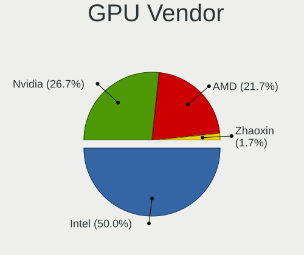

| Vendor  | Notebooks | Percent |
|---------|-----------|---------|
| Intel   | 30        | 50%     |
| Nvidia  | 16        | 26.67%  |
| AMD     | 13        | 21.67%  |
| Zhaoxin | 1         | 1.67%   |

GPU Model
---------

Graphics card models

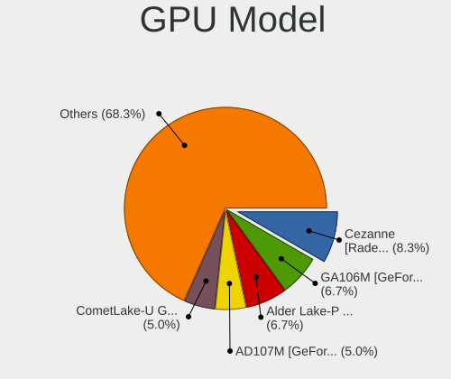

| Model                                                                                 | Notebooks | Percent |
|---------------------------------------------------------------------------------------|-----------|---------|
| AMD Cezanne [Radeon Vega Series / Radeon Vega Mobile Series]                          | 5         | 8.33%   |
| Nvidia GA106M [GeForce RTX 3060 Mobile / Max-Q]                                       | 4         | 6.67%   |
| Intel Alder Lake-P GT2 [Iris Xe Graphics]                                             | 4         | 6.67%   |
| Nvidia AD107M [GeForce RTX 4060 Max-Q / Mobile]                                       | 3         | 5%      |
| Intel CometLake-U GT2 [UHD Graphics]                                                  | 3         | 5%      |
| Intel CoffeeLake-H GT2 [UHD Graphics 630]                                             | 3         | 5%      |
| Nvidia GA107M [GeForce RTX 3050 Mobile]                                               | 2         | 3.33%   |
| Intel TigerLake-LP GT2 [Iris Xe Graphics]                                             | 2         | 3.33%   |
| Intel TigerLake-H GT1 [UHD Graphics]                                                  | 2         | 3.33%   |
| Intel Raptor Lake-P [Iris Xe Graphics]                                                | 2         | 3.33%   |
| Intel Kaby Lake-U GT2 [HD Graphics 620]                                               | 2         | 3.33%   |
| Intel Kaby Lake-R GT2 [UHD Graphics 620]                                              | 2         | 3.33%   |
| AMD Renoir [Radeon Vega Series / Radeon Vega Mobile Series]                           | 2         | 3.33%   |
| AMD Rembrandt [Radeon 680M]                                                           | 2         | 3.33%   |
| AMD Lexa [Radeon 540X/550X/630 / RX 640 / E9171 MCM]                                  | 2         | 3.33%   |
| Zhaoxin KX-6000 C-960 GPU                                                             | 1         | 1.67%   |
| Nvidia TU117M [GeForce MX450]                                                         | 1         | 1.67%   |
| Nvidia TU117M [GeForce GTX 1650 Mobile / Max-Q]                                       | 1         | 1.67%   |
| Nvidia TU117GLM [T600 Mobile]                                                         | 1         | 1.67%   |
| Nvidia GP108M [GeForce MX150]                                                         | 1         | 1.67%   |
| Nvidia GP107M [GeForce MX350]                                                         | 1         | 1.67%   |
| Nvidia GP107M [GeForce GTX 1050 Ti Mobile]                                            | 1         | 1.67%   |
| Nvidia GM108M [GeForce 940MX]                                                         | 1         | 1.67%   |
| Intel Skylake-Y GT2 [HD Graphics 515]                                                 | 1         | 1.67%   |
| Intel Skylake-U GT3 [Iris Graphics 540]                                               | 1         | 1.67%   |
| Intel Skylake-H GT2 [HD Graphics 530]                                                 | 1         | 1.67%   |
| Intel Raptor Lake-P [UHD Graphics]                                                    | 1         | 1.67%   |
| Intel Mobile 4 Series Chipset Integrated Graphics Controller                          | 1         | 1.67%   |
| Intel Haswell-ULT Integrated Graphics Controller                                      | 1         | 1.67%   |
| Intel Broadwell-U GT3 [Iris Graphics 6100]                                            | 1         | 1.67%   |
| Intel Alder Lake-P Integrated Graphics Controller                                     | 1         | 1.67%   |
| Intel 3rd Gen Core processor Graphics Controller                                      | 1         | 1.67%   |
| Intel 2nd Generation Core Processor Family Integrated Graphics Controller             | 1         | 1.67%   |
| AMD Topaz XT [Radeon R7 M260/M265 / M340/M360 / M440/M445 / 530/535 / 620/625 Mobile] | 1         | 1.67%   |
| AMD Raphael                                                                           | 1         | 1.67%   |

GPU Combo
---------

Combinations of graphics cards

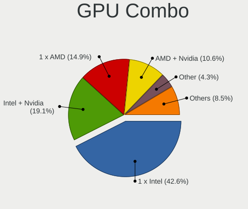

| Name           | Notebooks | Percent |
|----------------|-----------|---------|
| 1 x Intel      | 20        | 42.55%  |
| Intel + Nvidia | 9         | 19.15%  |
| 1 x AMD        | 7         | 14.89%  |
| AMD + Nvidia   | 5         | 10.64%  |
| Other          | 2         | 4.26%   |
| 1 x Nvidia     | 2         | 4.26%   |
| 1 x Zhaoxin    | 1         | 2.13%   |
| Intel + AMD    | 1         | 2.13%   |

GPU Driver
----------

Free vs proprietary

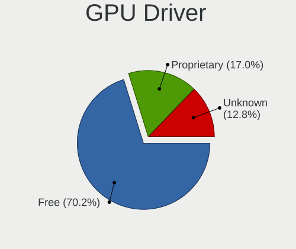

| Driver      | Notebooks | Percent |
|-------------|-----------|---------|
| Free        | 33        | 70.21%  |
| Proprietary | 8         | 17.02%  |
| Unknown     | 6         | 12.77%  |

GPU Memory
----------

Total video memory

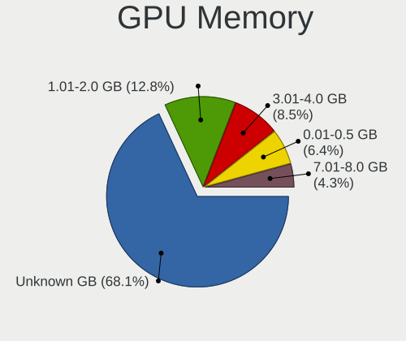

| Size in GB | Notebooks | Percent |
|------------|-----------|---------|
| Unknown    | 32        | 68.09%  |
| 1.01-2.0   | 6         | 12.77%  |
| 3.01-4.0   | 4         | 8.51%   |
| 0.01-0.5   | 3         | 6.38%   |
| 7.01-8.0   | 2         | 4.26%   |

Monitor
-------

Monitor Vendor
--------------

Monitor vendors

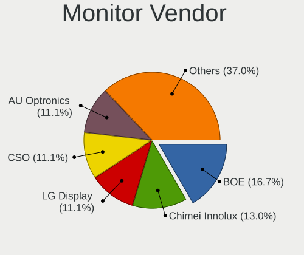

| Vendor              | Notebooks | Percent |
|---------------------|-----------|---------|
| BOE                 | 9         | 16.67%  |
| Chimei Innolux      | 7         | 12.96%  |
| LG Display          | 6         | 11.11%  |
| CSO                 | 6         | 11.11%  |
| AU Optronics        | 6         | 11.11%  |
| Samsung Electronics | 3         | 5.56%   |
| AOC                 | 3         | 5.56%   |
| Lenovo              | 2         | 3.7%    |
| Xiaomi              | 1         | 1.85%   |
| TMX                 | 1         | 1.85%   |
| STD                 | 1         | 1.85%   |
| SAC                 | 1         | 1.85%   |
| PANDA               | 1         | 1.85%   |
| Mi                  | 1         | 1.85%   |
| KIG                 | 1         | 1.85%   |
| JDI                 | 1         | 1.85%   |
| InfoVision          | 1         | 1.85%   |
| Dell                | 1         | 1.85%   |
| CPT                 | 1         | 1.85%   |
| Apple               | 1         | 1.85%   |

Monitor Model
-------------

Monitor models

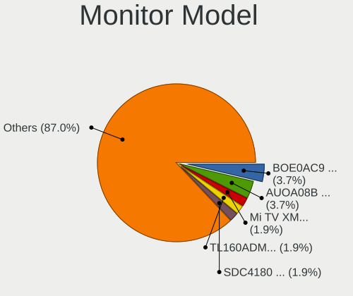

| Model                                                                 | Notebooks | Percent |
|-----------------------------------------------------------------------|-----------|---------|
| BOE LCD Monitor BOE0AC9 2240x1400 302x189mm 14.0-inch                 | 2         | 3.7%    |
| AU Optronics LCD Monitor AUOA08B 1920x1080 344x193mm 15.5-inch        | 2         | 3.7%    |
| Xiaomi Mi TV XMD004A 3840x2160 708x398mm 32.0-inch                    | 1         | 1.85%   |
| TMX TL160ADMP01-0 TMX1600 2560x1600 345x215mm 16.0-inch               | 1         | 1.85%   |
| STD ARUR STD2700 2560x1440 598x336mm 27.0-inch                        | 1         | 1.85%   |
| Samsung Electronics LCD Monitor SDC4180 2880x1620 344x194mm 15.5-inch | 1         | 1.85%   |
| Samsung Electronics LCD Monitor SDC4171 2880x1800 302x189mm 14.0-inch | 1         | 1.85%   |
| Samsung Electronics LCD Monitor SDC416E 2880x1620 344x194mm 15.5-inch | 1         | 1.85%   |
| SAC DP SAC2742 2560x1440 597x336mm 27.0-inch                          | 1         | 1.85%   |
| PANDA LCD Monitor NCP0042 1920x1080 344x194mm 15.5-inch               | 1         | 1.85%   |
| Mi P27QBB-RA XMID003 2560x1440 600x340mm 27.2-inch                    | 1         | 1.85%   |
| LG Display LCD Monitor LGD06AA 3840x2400 344x215mm 16.0-inch          | 1         | 1.85%   |
| LG Display LCD Monitor LGD0690 2560x1440 344x194mm 15.5-inch          | 1         | 1.85%   |
| LG Display LCD Monitor LGD060A 1920x1080 294x165mm 13.3-inch          | 1         | 1.85%   |
| LG Display LCD Monitor LGD0563 1920x1080 344x194mm 15.5-inch          | 1         | 1.85%   |
| LG Display LCD Monitor LGD04EF 1920x1080 294x165mm 13.3-inch          | 1         | 1.85%   |
| LG Display LCD Monitor LGD049A 2560x1440 310x174mm 14.0-inch          | 1         | 1.85%   |
| Lenovo X24i-10 LEN61AA 1920x1080 527x296mm 23.8-inch                  | 1         | 1.85%   |
| Lenovo LCD Monitor LEN4010 1280x800 261x163mm 12.1-inch               | 1         | 1.85%   |
| KIG KKTV KIG2700 1920x1080 598x336mm 27.0-inch                        | 1         | 1.85%   |
| JDI LCD Monitor JDI422A 3000x2000 293x196mm 13.9-inch                 | 1         | 1.85%   |
| InfoVision LCD Monitor IVO8C45 2240x1400 302x188mm 14.0-inch          | 1         | 1.85%   |
| Dell P2717H DEL40F7 1920x1080 598x336mm 27.0-inch                     | 1         | 1.85%   |
| CSO MNH301CA3-1 CSO1702 2560x1440 381x214mm 17.2-inch                 | 1         | 1.85%   |
| CSO LCD Monitor CSO161B 2560x1600 344x215mm 16.0-inch                 | 1         | 1.85%   |
| CSO LCD Monitor CSO161B 2560x1600 340x220mm 15.9-inch                 | 1         | 1.85%   |
| CSO LCD Monitor CSO1612 2560x1600 345x215mm 16.0-inch                 | 1         | 1.85%   |
| CSO LCD Monitor CSO1609 2560x1600 345x215mm 16.0-inch                 | 1         | 1.85%   |
| CSO LCD Monitor CSO1402 2880x1800 302x188mm 14.0-inch                 | 1         | 1.85%   |
| CPT LCD Monitor CPT17DB 1600x900 293x164mm 13.2-inch                  | 1         | 1.85%   |
| Chimei Innolux P140ZKA-BZ1 CMN8C02 2160x1440 296x197mm 14.0-inch      | 1         | 1.85%   |
| Chimei Innolux LCD Monitor CMN15F7 1920x1080 344x193mm 15.5-inch      | 1         | 1.85%   |
| Chimei Innolux LCD Monitor CMN153A 1920x1080 344x193mm 15.5-inch      | 1         | 1.85%   |
| Chimei Innolux LCD Monitor CMN14D5 1920x1080 309x173mm 13.9-inch      | 1         | 1.85%   |
| Chimei Innolux LCD Monitor CMN14D4 1920x1080 309x173mm 13.9-inch      | 1         | 1.85%   |
| Chimei Innolux LCD Monitor CMN14B1 1920x1080 308x173mm 13.9-inch      | 1         | 1.85%   |
| Chimei Innolux LCD Monitor CMN1480 1366x768 309x174mm 14.0-inch       | 1         | 1.85%   |
| BOE LCD Monitor BOE0AC1 2560x1600 344x215mm 16.0-inch                 | 1         | 1.85%   |
| BOE LCD Monitor BOE092F 2520x1680 338x226mm 16.0-inch                 | 1         | 1.85%   |
| BOE LCD Monitor BOE08DA 1920x1080 309x174mm 14.0-inch                 | 1         | 1.85%   |

Monitor Resolution
------------------

Monitor screen resolution

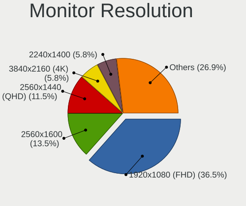

| Resolution      | Notebooks | Percent |
|-----------------|-----------|---------|
| 1920x1080 (FHD) | 19        | 36.54%  |
| 2560x1600       | 7         | 13.46%  |
| 2560x1440 (QHD) | 6         | 11.54%  |
| 3840x2160 (4K)  | 3         | 5.77%   |
| 2240x1400       | 3         | 5.77%   |
| 1366x768 (WXGA) | 3         | 5.77%   |
| 2880x1800       | 2         | 3.85%   |
| 2880x1620       | 2         | 3.85%   |
| 2160x1440       | 2         | 3.85%   |
| 3840x2400       | 1         | 1.92%   |
| 3000x2000       | 1         | 1.92%   |
| 2520x1680       | 1         | 1.92%   |
| 1600x900 (HD+)  | 1         | 1.92%   |
| 1280x800 (WXGA) | 1         | 1.92%   |

Monitor Diagonal
----------------

Diagonal size in inches

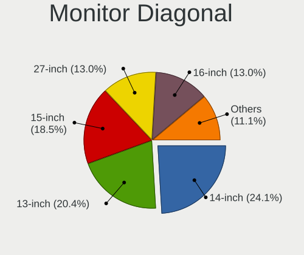

| Inches | Notebooks | Percent |
|--------|-----------|---------|
| 14     | 13        | 24.07%  |
| 13     | 11        | 20.37%  |
| 15     | 10        | 18.52%  |
| 27     | 7         | 12.96%  |
| 16     | 7         | 12.96%  |
| 12     | 2         | 3.7%    |
| 65     | 1         | 1.85%   |
| 23     | 1         | 1.85%   |
| 22     | 1         | 1.85%   |
| 17     | 1         | 1.85%   |

Monitor Width
-------------

Physical width

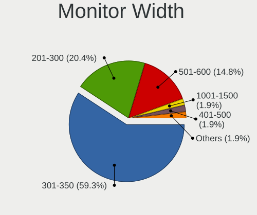

| Width in mm | Notebooks | Percent |
|-------------|-----------|---------|
| 301-350     | 32        | 59.26%  |
| 201-300     | 11        | 20.37%  |
| 501-600     | 8         | 14.81%  |
| 401-500     | 1         | 1.85%   |
| 351-400     | 1         | 1.85%   |
| 1001-1500   | 1         | 1.85%   |

Aspect Ratio
------------

Proportional relationship between the width and the height

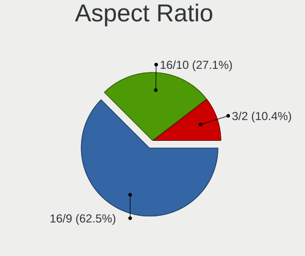

| Ratio | Notebooks | Percent |
|-------|-----------|---------|
| 16/9  | 30        | 62.5%   |
| 16/10 | 13        | 27.08%  |
| 3/2   | 5         | 10.42%  |

Monitor Area
------------

Area in inch²

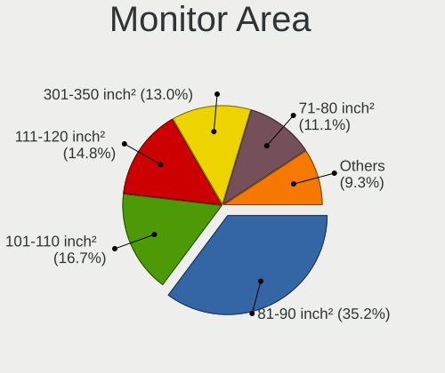

| Area in inch² | Notebooks | Percent |
|----------------|-----------|---------|
| 81-90          | 19        | 35.19%  |
| 101-110        | 9         | 16.67%  |
| 111-120        | 8         | 14.81%  |
| 301-350        | 7         | 12.96%  |
| 71-80          | 6         | 11.11%  |
| 201-250        | 2         | 3.7%    |
| More than 1000 | 1         | 1.85%   |
| 61-70          | 1         | 1.85%   |
| 121-130        | 1         | 1.85%   |

Pixel Density
-------------

Pixels per inch

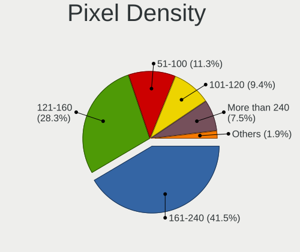

| Density       | Notebooks | Percent |
|---------------|-----------|---------|
| 161-240       | 22        | 41.51%  |
| 121-160       | 15        | 28.3%   |
| 51-100        | 6         | 11.32%  |
| 101-120       | 5         | 9.43%   |
| More than 240 | 4         | 7.55%   |
| 1-50          | 1         | 1.89%   |

Multiple Monitors
-----------------

Total monitors connected

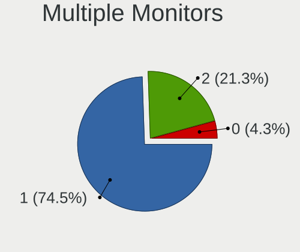

| Total | Notebooks | Percent |
|-------|-----------|---------|
| 1     | 35        | 74.47%  |
| 2     | 10        | 21.28%  |
| 0     | 2         | 4.26%   |

Network
-------

Net Controller Vendor
---------------------

Controller vendors

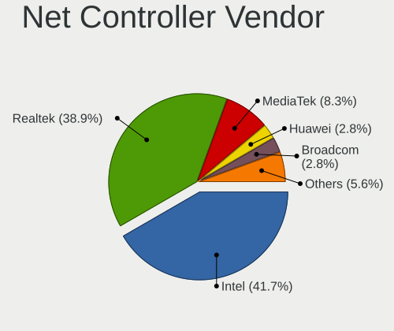

| Vendor                     | Notebooks | Percent |
|----------------------------|-----------|---------|
| Intel                      | 30        | 41.67%  |
| Realtek Semiconductor      | 28        | 38.89%  |
| MediaTek                   | 6         | 8.33%   |
| Huawei Technologies        | 2         | 2.78%   |
| Broadcom                   | 2         | 2.78%   |
| Xiaomi                     | 1         | 1.39%   |
| Quectel Wireless Solutions | 1         | 1.39%   |
| ICS Advent                 | 1         | 1.39%   |
| ASIX Electronics           | 1         | 1.39%   |

Net Controller Model
--------------------

Controller models

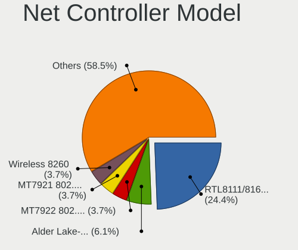

| Model                                                                  | Notebooks | Percent |
|------------------------------------------------------------------------|-----------|---------|
| Realtek RTL8111/8168/8211/8411 PCI Express Gigabit Ethernet Controller | 20        | 24.39%  |
| Intel Alder Lake-P PCH CNVi WiFi                                       | 5         | 6.1%    |
| MediaTek MT7922 802.11ax PCI Express Wireless Network Adapter          | 3         | 3.66%   |
| MediaTek MT7921 802.11ax PCIe Wireless Network Adapter [Filogic 330]   | 3         | 3.66%   |
| Intel Wireless 8260                                                    | 3         | 3.66%   |
| Intel Wi-Fi 6E(802.11ax) AX210/AX1675* 2x2 [Typhoon Peak]              | 3         | 3.66%   |
| Intel Raptor Lake PCH CNVi WiFi                                        | 3         | 3.66%   |
| Intel Comet Lake PCH-LP CNVi WiFi                                      | 3         | 3.66%   |
| Intel Cannon Lake PCH CNVi WiFi                                        | 3         | 3.66%   |
| Realtek RTL8852AE 802.11ax PCIe Wireless Network Adapter               | 2         | 2.44%   |
| Realtek RTL8822CE 802.11ac PCIe Wireless Network Adapter               | 2         | 2.44%   |
| Realtek RTL8152 Fast Ethernet Adapter                                  | 2         | 2.44%   |
| Intel Wireless 8265 / 8275                                             | 2         | 2.44%   |
| Intel Wi-Fi 6 AX201                                                    | 2         | 2.44%   |
| Huawei Network controller                                              | 2         | 2.44%   |
| Xiaomi Mi/Redmi series (RNDIS)                                         | 1         | 1.22%   |
| Realtek RTL8852BE PCIe 802.11ax Wireless Network Controller            | 1         | 1.22%   |
| Realtek RTL8821CE 802.11ac PCIe Wireless Network Adapter               | 1         | 1.22%   |
| Realtek RTL8153 Gigabit Ethernet Adapter                               | 1         | 1.22%   |
| Realtek RTL810xE PCI Express Fast Ethernet controller                  | 1         | 1.22%   |
| Realtek Killer E2600 GbE Controller                                    | 1         | 1.22%   |
| Quectel Wireless Solutions Quectel EM05-CE                             | 1         | 1.22%   |
| Intel Wireless 7260                                                    | 1         | 1.22%   |
| Intel Wi-Fi 6 AX200                                                    | 1         | 1.22%   |
| Intel Wi-Fi 5(802.11ac) Wireless-AC 9x6x [Thunder Peak]                | 1         | 1.22%   |
| Intel Tiger Lake PCH CNVi WiFi                                         | 1         | 1.22%   |
| Intel PRO/Wireless 5100 AGN [Shiloh] Network Connection                | 1         | 1.22%   |
| Intel Ethernet Connection (4) I219-LM                                  | 1         | 1.22%   |
| Intel Ethernet Connection (23) I219-LM                                 | 1         | 1.22%   |
| Intel Ethernet Connection (2) I219-LM                                  | 1         | 1.22%   |
| Intel Ethernet Connection (16) I219-V                                  | 1         | 1.22%   |
| Intel Ethernet Connection (13) I219-V                                  | 1         | 1.22%   |
| Intel Ethernet Connection (10) I219-V                                  | 1         | 1.22%   |
| Intel Centrino Wireless-N 1030 [Rainbow Peak]                          | 1         | 1.22%   |
| Intel 82567LM Gigabit Network Connection                               | 1         | 1.22%   |
| ICS Advent 10/100M LAN                                                 | 1         | 1.22%   |
| Broadcom BCM43602 802.11ac Wireless LAN SoC                            | 1         | 1.22%   |
| Broadcom BCM43142 802.11b/g/n                                          | 1         | 1.22%   |
| ASIX AX88179 Gigabit Ethernet                                          | 1         | 1.22%   |

Wireless Vendor
---------------

Wireless vendors

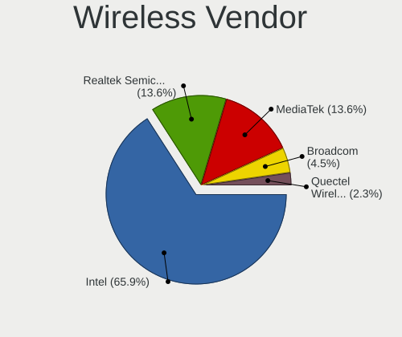

| Vendor                     | Notebooks | Percent |
|----------------------------|-----------|---------|
| Intel                      | 29        | 65.91%  |
| Realtek Semiconductor      | 6         | 13.64%  |
| MediaTek                   | 6         | 13.64%  |
| Broadcom                   | 2         | 4.55%   |
| Quectel Wireless Solutions | 1         | 2.27%   |

Wireless Model
--------------

Wireless models

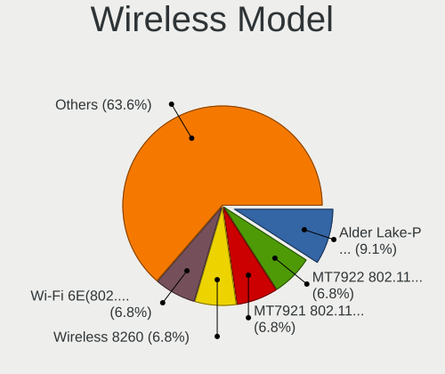

| Model                                                                | Notebooks | Percent |
|----------------------------------------------------------------------|-----------|---------|
| Intel Alder Lake-P PCH CNVi WiFi                                     | 4         | 9.09%   |
| MediaTek MT7922 802.11ax PCI Express Wireless Network Adapter        | 3         | 6.82%   |
| MediaTek MT7921 802.11ax PCIe Wireless Network Adapter [Filogic 330] | 3         | 6.82%   |
| Intel Wireless 8260                                                  | 3         | 6.82%   |
| Intel Wi-Fi 6E(802.11ax) AX210/AX1675* 2x2 [Typhoon Peak]            | 3         | 6.82%   |
| Intel Raptor Lake PCH CNVi WiFi                                      | 3         | 6.82%   |
| Intel Comet Lake PCH-LP CNVi WiFi                                    | 3         | 6.82%   |
| Intel Cannon Lake PCH CNVi WiFi                                      | 3         | 6.82%   |
| Realtek RTL8852AE 802.11ax PCIe Wireless Network Adapter             | 2         | 4.55%   |
| Realtek RTL8822CE 802.11ac PCIe Wireless Network Adapter             | 2         | 4.55%   |
| Intel Wireless 8265 / 8275                                           | 2         | 4.55%   |
| Intel Wi-Fi 6 AX201                                                  | 2         | 4.55%   |
| Realtek RTL8852BE PCIe 802.11ax Wireless Network Controller          | 1         | 2.27%   |
| Realtek RTL8821CE 802.11ac PCIe Wireless Network Adapter             | 1         | 2.27%   |
| Quectel Wireless Solutions Quectel EM05-CE                           | 1         | 2.27%   |
| Intel Wireless 7260                                                  | 1         | 2.27%   |
| Intel Wi-Fi 6 AX200                                                  | 1         | 2.27%   |
| Intel Wi-Fi 5(802.11ac) Wireless-AC 9x6x [Thunder Peak]              | 1         | 2.27%   |
| Intel Tiger Lake PCH CNVi WiFi                                       | 1         | 2.27%   |
| Intel PRO/Wireless 5100 AGN [Shiloh] Network Connection              | 1         | 2.27%   |
| Intel Centrino Wireless-N 1030 [Rainbow Peak]                        | 1         | 2.27%   |
| Broadcom BCM43602 802.11ac Wireless LAN SoC                          | 1         | 2.27%   |
| Broadcom BCM43142 802.11b/g/n                                        | 1         | 2.27%   |

Ethernet Vendor
---------------

Ethernet vendors

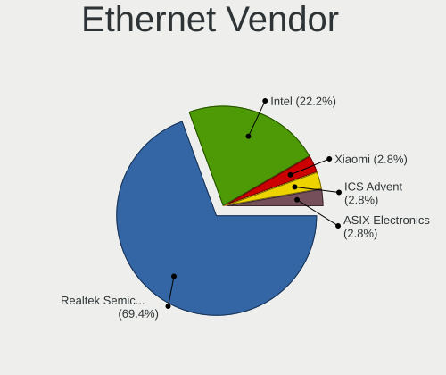

| Vendor                | Notebooks | Percent |
|-----------------------|-----------|---------|
| Realtek Semiconductor | 25        | 69.44%  |
| Intel                 | 8         | 22.22%  |
| Xiaomi                | 1         | 2.78%   |
| ICS Advent            | 1         | 2.78%   |
| ASIX Electronics      | 1         | 2.78%   |

Ethernet Model
--------------

Ethernet models

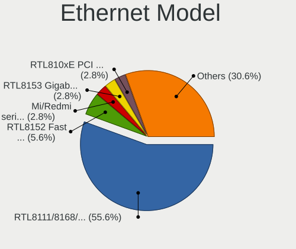

| Model                                                                  | Notebooks | Percent |
|------------------------------------------------------------------------|-----------|---------|
| Realtek RTL8111/8168/8211/8411 PCI Express Gigabit Ethernet Controller | 20        | 55.56%  |
| Realtek RTL8152 Fast Ethernet Adapter                                  | 2         | 5.56%   |
| Xiaomi Mi/Redmi series (RNDIS)                                         | 1         | 2.78%   |
| Realtek RTL8153 Gigabit Ethernet Adapter                               | 1         | 2.78%   |
| Realtek RTL810xE PCI Express Fast Ethernet controller                  | 1         | 2.78%   |
| Realtek Killer E2600 GbE Controller                                    | 1         | 2.78%   |
| Intel Ethernet Connection (4) I219-LM                                  | 1         | 2.78%   |
| Intel Ethernet Connection (23) I219-LM                                 | 1         | 2.78%   |
| Intel Ethernet Connection (2) I219-LM                                  | 1         | 2.78%   |
| Intel Ethernet Connection (16) I219-V                                  | 1         | 2.78%   |
| Intel Ethernet Connection (13) I219-V                                  | 1         | 2.78%   |
| Intel Ethernet Connection (10) I219-V                                  | 1         | 2.78%   |
| Intel Alder Lake-P PCH CNVi WiFi                                       | 1         | 2.78%   |
| Intel 82567LM Gigabit Network Connection                               | 1         | 2.78%   |
| ICS Advent 10/100M LAN                                                 | 1         | 2.78%   |
| ASIX AX88179 Gigabit Ethernet                                          | 1         | 2.78%   |

Net Controller Kind
-------------------

Ethernet, WiFi or modem

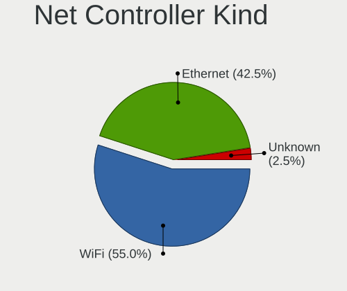

| Kind     | Notebooks | Percent |
|----------|-----------|---------|
| WiFi     | 44        | 55%     |
| Ethernet | 34        | 42.5%   |
| Unknown  | 2         | 2.5%    |

Used Controller
---------------

Currently used network controller

| Kind     | Notebooks | Percent |
|----------|-----------|---------|
| WiFi     | 39        | 81.25%  |
| Ethernet | 9         | 18.75%  |

NICs
----

Total network controllers on board

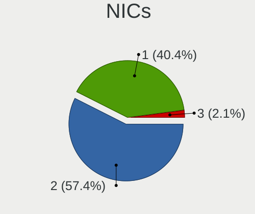

| Total | Notebooks | Percent |
|-------|-----------|---------|
| 2     | 27        | 57.45%  |
| 1     | 19        | 40.43%  |
| 3     | 1         | 2.13%   |

IPv6
----

IPv6 vs IPv4

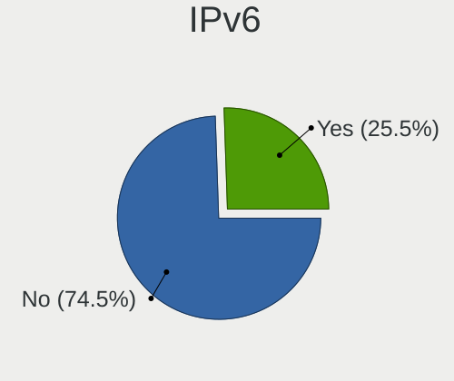

| Used | Notebooks | Percent |
|------|-----------|---------|
| No   | 35        | 74.47%  |
| Yes  | 12        | 25.53%  |

Bluetooth
---------

Bluetooth Vendor
----------------

Controller vendors

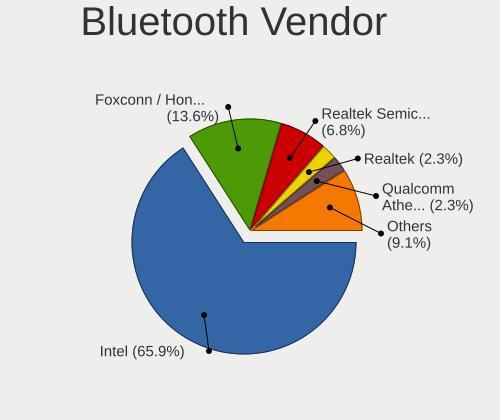

| Vendor                          | Notebooks | Percent |
|---------------------------------|-----------|---------|
| Intel                           | 29        | 65.91%  |
| Foxconn / Hon Hai               | 6         | 13.64%  |
| Realtek Semiconductor           | 3         | 6.82%   |
| Realtek                         | 1         | 2.27%   |
| Qualcomm Atheros Communications | 1         | 2.27%   |
| IMC Networks                    | 1         | 2.27%   |
| Foxconn International           | 1         | 2.27%   |
| Broadcom                        | 1         | 2.27%   |
| Apple                           | 1         | 2.27%   |

Bluetooth Model
---------------

Controller models

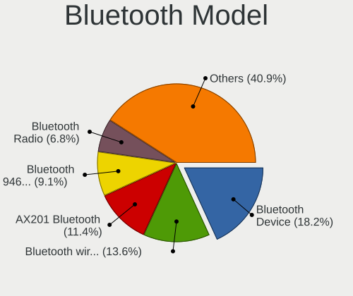

| Model                                              | Notebooks | Percent |
|----------------------------------------------------|-----------|---------|
| Intel Bluetooth Device                             | 8         | 18.18%  |
| Intel Bluetooth wireless interface                 | 6         | 13.64%  |
| Intel AX201 Bluetooth                              | 5         | 11.36%  |
| Intel Bluetooth 9460/9560 Jefferson Peak (JfP)     | 4         | 9.09%   |
| Realtek Bluetooth Radio                            | 3         | 6.82%   |
| Intel AX210 Bluetooth                              | 3         | 6.82%   |
| Foxconn / Hon Hai Wireless_Device                  | 3         | 6.82%   |
| Foxconn / Hon Hai MediaTek Bluetooth Adapter       | 3         | 6.82%   |
| Realtek Bluetooth Radio                            | 1         | 2.27%   |
| Qualcomm Atheros  Bluetooth Device                 | 1         | 2.27%   |
| Intel Wireless-AC 9260 Bluetooth Adapter           | 1         | 2.27%   |
| Intel Centrino Advanced-N 6230 Bluetooth adapter   | 1         | 2.27%   |
| Intel AX200 Bluetooth                              | 1         | 2.27%   |
| IMC Networks Bluetooth Radio                       | 1         | 2.27%   |
| Foxconn International BCM43142A0 Bluetooth module  | 1         | 2.27%   |
| Broadcom BCM2045B (BDC-2.1) [Bluetooth Controller] | 1         | 2.27%   |
| Apple Bluetooth Host Controller                    | 1         | 2.27%   |

Sound
-----

Sound Vendor
------------

Sound card vendors

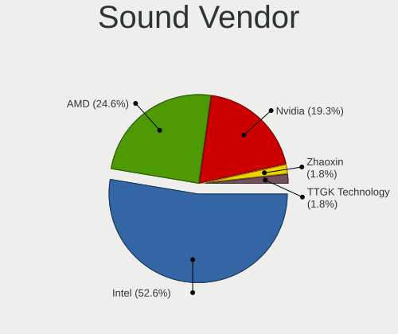

| Vendor          | Notebooks | Percent |
|-----------------|-----------|---------|
| Intel           | 30        | 52.63%  |
| AMD             | 14        | 24.56%  |
| Nvidia          | 11        | 19.3%   |
| Zhaoxin         | 1         | 1.75%   |
| TTGK Technology | 1         | 1.75%   |

Sound Model
-----------

Sound card models

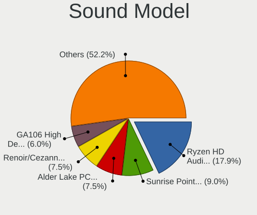

| Model                                                                                     | Notebooks | Percent |
|-------------------------------------------------------------------------------------------|-----------|---------|
| AMD Ryzen HD Audio Controller                                                             | 12        | 17.91%  |
| Intel Sunrise Point-LP HD Audio                                                           | 6         | 8.96%   |
| Intel Alder Lake PCH-P High Definition Audio Controller                                   | 5         | 7.46%   |
| AMD Renoir/Cezanne HDMI/DP Audio Controller                                               | 5         | 7.46%   |
| Nvidia GA106 High Definition Audio Controller                                             | 4         | 5.97%   |
| Nvidia AD107 High Definition Audio Controller                                             | 3         | 4.48%   |
| Intel Raptor Lake-P/U/H cAVS                                                              | 3         | 4.48%   |
| Intel Comet Lake PCH-LP cAVS                                                              | 3         | 4.48%   |
| Intel Cannon Lake PCH cAVS                                                                | 3         | 4.48%   |
| Nvidia TU107 GeForce GTX 1650 High Definition Audio Controller                            | 2         | 2.99%   |
| Intel Tiger Lake-LP Smart Sound Technology Audio Controller                               | 2         | 2.99%   |
| Intel Tiger Lake-H HD Audio Controller                                                    | 2         | 2.99%   |
| AMD Radeon High Definition Audio Controller                                               | 2         | 2.99%   |
| AMD Baffin HDMI/DP Audio [Radeon RX 550 640SP / RX 560/560X]                              | 2         | 2.99%   |
| Zhaoxin ZX-E High Definition Audio Controller                                             | 1         | 1.49%   |
| Zhaoxin ZX-100/KX-5000/KX-6000/KX-6000G/KH-40000/KX-7000 High Definition Audio Controller | 1         | 1.49%   |
| TTGK Technology Audio                                                                     | 1         | 1.49%   |
| Nvidia GP107GL High Definition Audio Controller                                           | 1         | 1.49%   |
| Nvidia GA107 High Definition Audio Controller                                             | 1         | 1.49%   |
| Intel Wildcat Point-LP High Definition Audio Controller                                   | 1         | 1.49%   |
| Intel Haswell-ULT HD Audio Controller                                                     | 1         | 1.49%   |
| Intel Broadwell-U Audio Controller                                                        | 1         | 1.49%   |
| Intel 82801I (ICH9 Family) HD Audio Controller                                            | 1         | 1.49%   |
| Intel 8 Series HD Audio Controller                                                        | 1         | 1.49%   |
| Intel 7 Series/C216 Chipset Family High Definition Audio Controller                       | 1         | 1.49%   |
| Intel 6 Series/C200 Series Chipset Family High Definition Audio Controller                | 1         | 1.49%   |
| Intel 100 Series/C230 Series Chipset Family HD Audio Controller                           | 1         | 1.49%   |

Memory
------

Memory Vendor
-------------

Memory module vendors

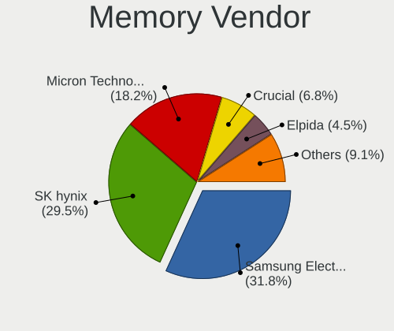

| Vendor              | Notebooks | Percent |
|---------------------|-----------|---------|
| Samsung Electronics | 14        | 31.82%  |
| SK hynix            | 13        | 29.55%  |
| Micron Technology   | 8         | 18.18%  |
| Crucial             | 3         | 6.82%   |
| Elpida              | 2         | 4.55%   |
| UNILC               | 1         | 2.27%   |
| Nanya Technology    | 1         | 2.27%   |
| A-DATA Technology   | 1         | 2.27%   |
| Unknown             | 1         | 2.27%   |

Memory Model
------------

Memory module models

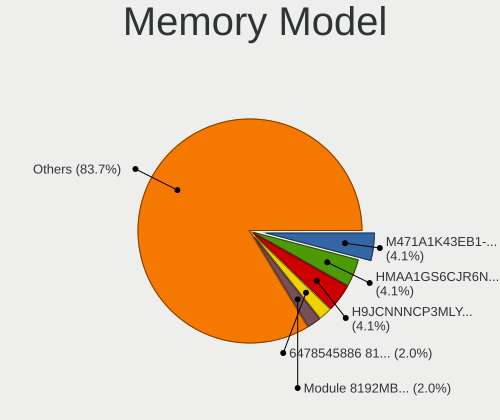

| Model                                                            | Notebooks | Percent |
|------------------------------------------------------------------|-----------|---------|
| SK hynix RAM HMAA1GS6CJR6N-XN 8GB SODIMM DDR4 3200MT/s           | 2         | 4.08%   |
| SK hynix RAM H9JCNNNCP3MLYR-N6E 2GB Row Of Chips LPDDR5 6400MT/s | 2         | 4.08%   |
| Samsung RAM M471A1K43EB1-CWE 8GB SODIMM DDR4 3200MT/s            | 2         | 4.08%   |
| UNILC RAM 6478545886 8192MB SODIMM DDR4 2400MT/s                 | 1         | 2.04%   |
| SK hynix RAM Module 4GB SODIMM DDR3 1867MT/s                     | 1         | 2.04%   |
| SK hynix RAM Module 4096MB SODIMM LPDDR3 1867MT/s                | 1         | 2.04%   |
| SK hynix RAM HMT325S6EFR8C-PB 2048MB SODIMM DDR3 1600MT/s        | 1         | 2.04%   |
| SK hynix RAM HMT125S6TFR8C-G7 2048MB SODIMM DDR3 1067MT/s        | 1         | 2.04%   |
| SK hynix RAM HMAA4GS6AJR8N-XN 32GB SODIMM DDR4 3200MT/s          | 1         | 2.04%   |
| SK hynix RAM HMAA1GS6DMR6N-XN 8GB Row Of Chips DDR4 3200MT/s     | 1         | 2.04%   |
| SK hynix RAM HMAA1GS6CJR6N-XN 8GB Row Of Chips DDR4 3200MT/s     | 1         | 2.04%   |
| SK hynix RAM HMA851S6AFR6N-UH 4GB SODIMM DDR4 2667MT/s           | 1         | 2.04%   |
| SK hynix RAM HMA81GS6AFR8N-UH 8GB SODIMM DDR4 2667MT/s           | 1         | 2.04%   |
| SK hynix RAM H9HKNNNFBMBUDR 8192MB Row Of Chips LPDDR4 4266MT/s  | 1         | 2.04%   |
| SK hynix RAM H9CCNNNCLGALAR-NVD 8GB Row Of Chips LPDDR3 2133MT/s | 1         | 2.04%   |
| Samsung RAM Module 8192MB SODIMM DDR4 3200MT/s                   | 1         | 2.04%   |
| Samsung RAM Module 8192MB SODIMM DDR4 2667MT/s                   | 1         | 2.04%   |
| Samsung RAM Module 2GB SODIMM LPDDR3 1867MT/s                    | 1         | 2.04%   |
| Samsung RAM Module 2048MB SODIMM LPDDR3 1867MT/s                 | 1         | 2.04%   |
| Samsung RAM Module 16GB SODIMM DDR5 4800MT/s                     | 1         | 2.04%   |
| Samsung RAM M471A2K43BB1-CPB 16GB SODIMM DDR4 2133MT/s           | 1         | 2.04%   |
| Samsung RAM M471A2K43BB1-CPB 16GB Chip DDR4 2133MT/s             | 1         | 2.04%   |
| Samsung RAM M471A2G44AM0-CWE 16GB SODIMM DDR4 3200MT/s           | 1         | 2.04%   |
| Samsung RAM M471A1K43DB1-CTD 8GB SODIMM DDR4 2667MT/s            | 1         | 2.04%   |
| Samsung RAM M471A1G44BB0-CWE 8GB SODIMM DDR4 3200MT/s            | 1         | 2.04%   |
| Samsung RAM M471A1G44AB0-CTD 8GB SODIMM DDR4 2667MT/s            | 1         | 2.04%   |
| Samsung RAM M425R1GB4DB0-CWMOL 16GB SODIMM DDR5 5600MT/s         | 1         | 2.04%   |
| Samsung RAM M425R1GB4BB0-CQKOD 8GB SODIMM DDR5 4800MT/s          | 1         | 2.04%   |
| Samsung RAM K4UBE3D4AA-MGCR 8GB SODIMM LPDDR4 4266MT/s           | 1         | 2.04%   |
| Samsung RAM K3UH7H70AM 8192MB Row Of Chips LPDDR4 4266MT/s       | 1         | 2.04%   |
| Nanya RAM M2N2G64CB8HA5N-BE 2GB SODIMM 1066MT/s                  | 1         | 2.04%   |
| Micron RAM MTC4C10163S1SC48BA1 8GB SODIMM DDR5 4800MT/s          | 1         | 2.04%   |
| Micron RAM MT62F2G32D8DR-031 WT 8GB Row Of Chips LPDDR5 6400MT/s | 1         | 2.04%   |
| Micron RAM MT62F1G32D4DR-031 2GB Row Of Chips LPDDR5 6400MT/s    | 1         | 2.04%   |
| Micron RAM MT52L1G32D4PG-093 8GB Row Of Chips LPDDR3 2133MT/s    | 1         | 2.04%   |
| Micron RAM Module 16GB SODIMM DDR4 2667MT/s                      | 1         | 2.04%   |
| Micron RAM 8ATF1G64HZ-3G2J1 8GB SODIMM DDR4 3200MT/s             | 1         | 2.04%   |
| Micron RAM 4ATF1G64HZ-3G2E1 8GB SODIMM DDR4 3200MT/s             | 1         | 2.04%   |
| Micron RAM 4ATF1G64HZ-3G2E1 8GB Row Of Chips DDR4 3200MT/s       | 1         | 2.04%   |
| Elpida RAM Module 2048MB SODIMM DDR3 1600MT/s                    | 1         | 2.04%   |

Memory Kind
-----------

Memory module kinds

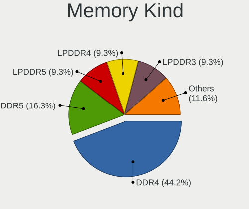

| Kind    | Notebooks | Percent |
|---------|-----------|---------|
| DDR4    | 19        | 44.19%  |
| DDR5    | 7         | 16.28%  |
| LPDDR5  | 4         | 9.3%    |
| LPDDR4  | 4         | 9.3%    |
| LPDDR3  | 4         | 9.3%    |
| DDR3    | 4         | 9.3%    |
| Unknown | 1         | 2.33%   |

Memory Form Factor
------------------

Physical design of the memory module

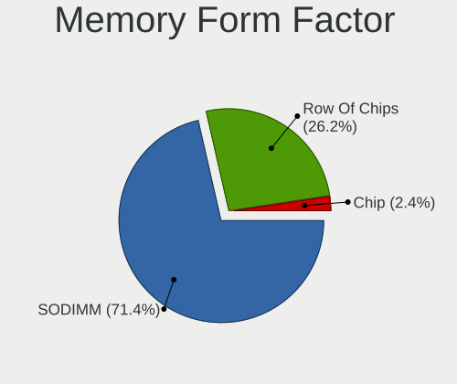

| Name         | Notebooks | Percent |
|--------------|-----------|---------|
| SODIMM       | 30        | 71.43%  |
| Row Of Chips | 11        | 26.19%  |
| Chip         | 1         | 2.38%   |

Memory Size
-----------

Memory module size

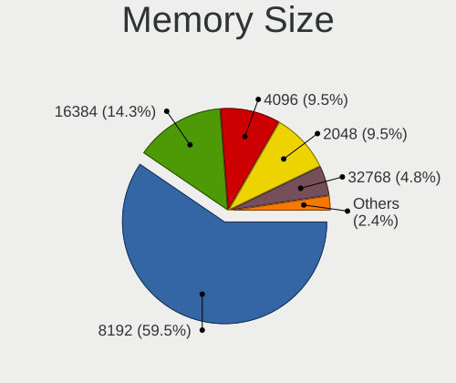

| Size  | Notebooks | Percent |
|-------|-----------|---------|
| 8192  | 25        | 59.52%  |
| 16384 | 6         | 14.29%  |
| 4096  | 4         | 9.52%   |
| 2048  | 4         | 9.52%   |
| 32768 | 2         | 4.76%   |
| 24576 | 1         | 2.38%   |

Memory Speed
------------

Memory module speed

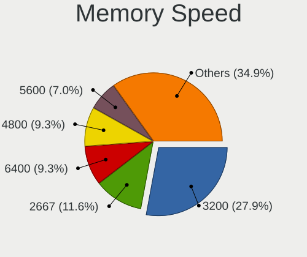

| Speed | Notebooks | Percent |
|-------|-----------|---------|
| 3200  | 12        | 27.91%  |
| 2667  | 5         | 11.63%  |
| 6400  | 4         | 9.3%    |
| 4800  | 4         | 9.3%    |
| 5600  | 3         | 6.98%   |
| 4266  | 3         | 6.98%   |
| 2133  | 3         | 6.98%   |
| 1867  | 3         | 6.98%   |
| 1600  | 2         | 4.65%   |
| 1067  | 2         | 4.65%   |
| 2400  | 1         | 2.33%   |
| 1066  | 1         | 2.33%   |

Printers & scanners
-------------------

Printer Vendor
--------------

Printer device vendors

Zero info for selected period =(

Printer Model
-------------

Printer device models

Zero info for selected period =(

Scanner Vendor
--------------

Scanner device vendors

Zero info for selected period =(

Scanner Model
-------------

Scanner device models

Zero info for selected period =(

Camera
------

Camera Vendor
-------------

Camera device vendors

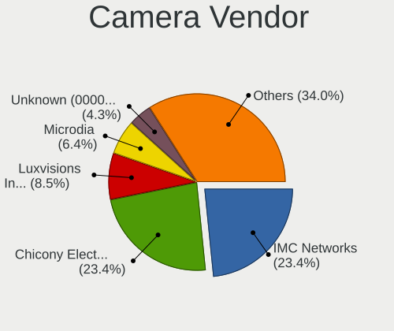

| Vendor                                 | Notebooks | Percent |
|----------------------------------------|-----------|---------|
| IMC Networks                           | 11        | 23.4%   |
| Chicony Electronics                    | 11        | 23.4%   |
| Luxvisions Innotech Limited            | 4         | 8.51%   |
| Microdia                               | 3         | 6.38%   |
| Unknown (0000066029)                   | 2         | 4.26%   |
| SunplusIT                              | 2         | 4.26%   |
| Sonix Technology                       | 2         | 4.26%   |
| Quanta                                 | 2         | 4.26%   |
| Cheng Uei Precision Industry (Foxlink) | 2         | 4.26%   |
| Bison Electronics                      | 2         | 4.26%   |
| Syntek                                 | 1         | 2.13%   |
| ShineTech                              | 1         | 2.13%   |
| Ricoh                                  | 1         | 2.13%   |
| Realtek Semiconductor                  | 1         | 2.13%   |
| Lenovo                                 | 1         | 2.13%   |
| Apple                                  | 1         | 2.13%   |

Camera Model
------------

Camera device models

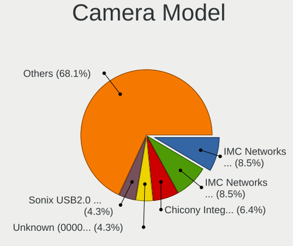

| Model                                               | Notebooks | Percent |
|-----------------------------------------------------|-----------|---------|
| IMC Networks USB2.0 HD UVC WebCam                   | 4         | 8.51%   |
| IMC Networks Integrated Camera                      | 4         | 8.51%   |
| Chicony Integrated Camera                           | 3         | 6.38%   |
| Unknown (0000066029) HD Camera                      | 2         | 4.26%   |
| Sonix USB2.0 FHD UVC WebCam                         | 2         | 4.26%   |
| Luxvisions Innotech Limited Integrated Camera       | 2         | 4.26%   |
| Chicony HP HD Camera                                | 2         | 4.26%   |
| Bison Integrated Camera                             | 2         | 4.26%   |
| Syntek Integrated Camera                            | 1         | 2.13%   |
| SunplusIT XiaoMi Webcam                             | 1         | 2.13%   |
| SunplusIT SPCA2650 AV Camera                        | 1         | 2.13%   |
| ShineTech HD Camera                                 | 1         | 2.13%   |
| Ricoh Integrated Camera                             | 1         | 2.13%   |
| Realtek Integrated_Webcam_HD                        | 1         | 2.13%   |
| Quanta ov9734_techfront_camera                      | 1         | 2.13%   |
| Quanta HD User Facing                               | 1         | 2.13%   |
| Microdia USB2.0 Camera                              | 1         | 2.13%   |
| Microdia Laptop_Integrated_Webcam_HD                | 1         | 2.13%   |
| Microdia Integrated_Webcam_HD                       | 1         | 2.13%   |
| Luxvisions Innotech Limited Integrated RGB Camera   | 1         | 2.13%   |
| Luxvisions Innotech Limited HP TrueVision HD Camera | 1         | 2.13%   |
| Lenovo Integrated Webcam                            | 1         | 2.13%   |
| IMC Networks XHC Camera                             | 1         | 2.13%   |
| IMC Networks Integrated RGB Camera                  | 1         | 2.13%   |
| IMC Networks HD Camera                              | 1         | 2.13%   |
| Chicony XiaoMi USB 2.0 Webcam                       | 1         | 2.13%   |
| Chicony USB2.0 HD UVC WebCam                        | 1         | 2.13%   |
| Chicony USB2.0 FHD UVC WebCam                       | 1         | 2.13%   |
| Chicony Integrated Camera (1280x720@30)             | 1         | 2.13%   |
| Chicony HD Webcam                                   | 1         | 2.13%   |
| Chicony EasyCamera                                  | 1         | 2.13%   |
| Cheng Uei Precision Industry (Foxlink) HP HD Camera | 1         | 2.13%   |
| Cheng Uei Precision Industry (Foxlink) HD Camera    | 1         | 2.13%   |
| Apple iPhone 5/5C/5S/6/SE/7/8/X                     | 1         | 2.13%   |

Security
--------

Fingerprint Vendor
------------------

Fingerprint sensor vendors

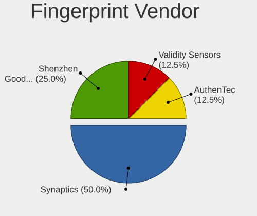

| Vendor                     | Notebooks | Percent |
|----------------------------|-----------|---------|
| Synaptics                  | 7         | 53.85%  |
| Validity Sensors           | 3         | 23.08%  |
| Shenzhen Goodix Technology | 2         | 15.38%  |
| AuthenTec                  | 1         | 7.69%   |

Fingerprint Model
-----------------

Fingerprint sensor models

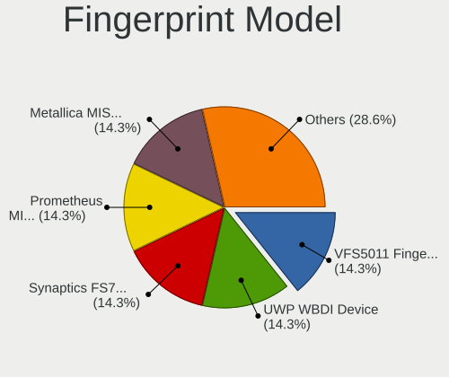

| Model                                                     | Notebooks | Percent |
|-----------------------------------------------------------|-----------|---------|
| Synaptics Prometheus MIS Touch Fingerprint Reader         | 3         | 23.08%  |
| Shenzhen Goodix  Fingerprint Device                       | 2         | 15.38%  |
| Validity Sensors VFS7500 Touch Fingerprint Sensor         | 1         | 7.69%   |
| Validity Sensors VFS5011 Fingerprint Reader               | 1         | 7.69%   |
| Validity Sensors VFS 5011 fingerprint sensor              | 1         | 7.69%   |
| Synaptics UWP WBDI Device                                 | 1         | 7.69%   |
| Synaptics  FS7604 Touch Fingerprint Sensor with PurePrint | 1         | 7.69%   |
| Synaptics Prometheus Fingerprint Reader                   | 1         | 7.69%   |
| Synaptics Metallica MIS Touch Fingerprint Reader          | 1         | 7.69%   |
| AuthenTec AES2810                                         | 1         | 7.69%   |

Chipcard Vendor
---------------

Chipcard module vendors

Zero info for selected period =(

Chipcard Model
--------------

Chipcard module models

Zero info for selected period =(

Unsupported
-----------

Unsupported Devices
-------------------

Total unsupported devices on board

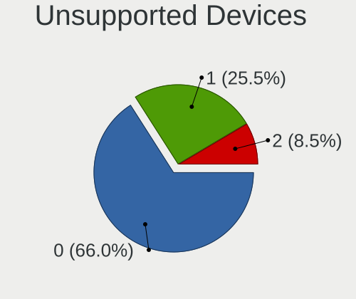

| Total | Notebooks | Percent |
|-------|-----------|---------|
| 0     | 31        | 65.96%  |
| 1     | 12        | 25.53%  |
| 2     | 4         | 8.51%   |

Unsupported Device Types
------------------------

Types of unsupported devices

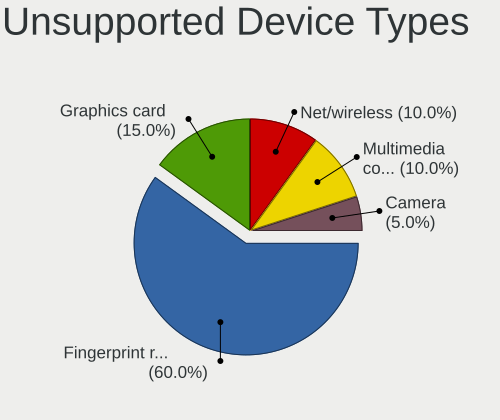

| Type                  | Notebooks | Percent |
|-----------------------|-----------|---------|
| Fingerprint reader    | 12        | 60%     |
| Graphics card         | 3         | 15%     |
| Net/wireless          | 2         | 10%     |
| Multimedia controller | 2         | 10%     |
| Camera                | 1         | 5%      |

