LMDE - Tested Hardware & Statistics
-----------------------------------

A project to collect tested hardware configurations for LMDE.

Anyone can contribute to this report by the [hw-probe](https://github.com/linuxhw/hw-probe) tool:

    sudo -E hw-probe -all -upload

Please contribute! Especially if your hardware is rare.

This is a report for all computer types. See also reports for [desktops](/Dist/LMDE/Desktop/README.md) and [notebooks](/Dist/LMDE/Notebook/README.md).

Contents
--------

* [ Test Cases ](#test-cases)

* [ System ](#system)
  - [ OS                       ](#os)
  - [ OS Family                ](#os-family)
  - [ Kernel                   ](#kernel)
  - [ Kernel Family            ](#kernel-family)
  - [ Kernel Major Ver.        ](#kernel-major-ver)
  - [ Arch                     ](#arch)
  - [ DE                       ](#de)
  - [ Display Server           ](#display-server)
  - [ Display Manager          ](#display-manager)
  - [ OS Lang                  ](#os-lang)
  - [ Boot Mode                ](#boot-mode)
  - [ Filesystem               ](#filesystem)
  - [ Part. scheme             ](#part-scheme)
  - [ Dual Boot with Linux/BSD ](#dual-boot-with-linuxbsd)
  - [ Dual Boot (Win)          ](#dual-boot-win)

* [ Board ](#board)
  - [ Vendor                   ](#vendor)
  - [ Model                    ](#model)
  - [ Model Family             ](#model-family)
  - [ MFG Year                 ](#mfg-year)
  - [ Form Factor              ](#form-factor)
  - [ Secure Boot              ](#secure-boot)
  - [ Coreboot                 ](#coreboot)
  - [ RAM Size                 ](#ram-size)
  - [ RAM Used                 ](#ram-used)
  - [ Total Drives             ](#total-drives)
  - [ Has CD-ROM               ](#has-cd-rom)
  - [ Has Ethernet             ](#has-ethernet)
  - [ Has WiFi                 ](#has-wifi)
  - [ Has Bluetooth            ](#has-bluetooth)

* [ Location ](#location)
  - [ Country                  ](#country)
  - [ City                     ](#city)

* [ Drives ](#drives)
  - [ Drive Vendor             ](#drive-vendor)
  - [ Drive Model              ](#drive-model)
  - [ HDD Vendor               ](#hdd-vendor)
  - [ SSD Vendor               ](#ssd-vendor)
  - [ Drive Kind               ](#drive-kind)
  - [ Drive Connector          ](#drive-connector)
  - [ Drive Size               ](#drive-size)
  - [ Space Total              ](#space-total)
  - [ Space Used               ](#space-used)
  - [ Malfunc. Drives          ](#malfunc-drives)
  - [ Malfunc. Drive Vendor    ](#malfunc-drive-vendor)
  - [ Malfunc. HDD Vendor      ](#malfunc-hdd-vendor)
  - [ Malfunc. Drive Kind      ](#malfunc-drive-kind)
  - [ Failed Drives            ](#failed-drives)
  - [ Failed Drive Vendor      ](#failed-drive-vendor)
  - [ Drive Status             ](#drive-status)

* [ Storage controller ](#storage-controller)
  - [ Storage Vendor           ](#storage-vendor)
  - [ Storage Model            ](#storage-model)
  - [ Storage Kind             ](#storage-kind)

* [ Processor ](#processor)
  - [ CPU Vendor               ](#cpu-vendor)
  - [ CPU Model                ](#cpu-model)
  - [ CPU Model Family         ](#cpu-model-family)
  - [ CPU Cores                ](#cpu-cores)
  - [ CPU Sockets              ](#cpu-sockets)
  - [ CPU Threads              ](#cpu-threads)
  - [ CPU Op-Modes             ](#cpu-op-modes)
  - [ CPU Microcode            ](#cpu-microcode)
  - [ CPU Microarch            ](#cpu-microarch)

* [ Graphics ](#graphics)
  - [ GPU Vendor               ](#gpu-vendor)
  - [ GPU Model                ](#gpu-model)
  - [ GPU Combo                ](#gpu-combo)
  - [ GPU Driver               ](#gpu-driver)
  - [ GPU Memory               ](#gpu-memory)

* [ Monitor ](#monitor)
  - [ Monitor Vendor           ](#monitor-vendor)
  - [ Monitor Model            ](#monitor-model)
  - [ Monitor Resolution       ](#monitor-resolution)
  - [ Monitor Diagonal         ](#monitor-diagonal)
  - [ Monitor Width            ](#monitor-width)
  - [ Aspect Ratio             ](#aspect-ratio)
  - [ Monitor Area             ](#monitor-area)
  - [ Pixel Density            ](#pixel-density)
  - [ Multiple Monitors        ](#multiple-monitors)

* [ Network ](#network)
  - [ Net Controller Vendor    ](#net-controller-vendor)
  - [ Net Controller Model     ](#net-controller-model)
  - [ Wireless Vendor          ](#wireless-vendor)
  - [ Wireless Model           ](#wireless-model)
  - [ Ethernet Vendor          ](#ethernet-vendor)
  - [ Ethernet Model           ](#ethernet-model)
  - [ Net Controller Kind      ](#net-controller-kind)
  - [ Used Controller          ](#used-controller)
  - [ NICs                     ](#nics)
  - [ IPv6                     ](#ipv6)

* [ Bluetooth ](#bluetooth)
  - [ Bluetooth Vendor         ](#bluetooth-vendor)
  - [ Bluetooth Model          ](#bluetooth-model)

* [ Sound ](#sound)
  - [ Sound Vendor             ](#sound-vendor)
  - [ Sound Model              ](#sound-model)

* [ Memory ](#memory)
  - [ Memory Vendor            ](#memory-vendor)
  - [ Memory Model             ](#memory-model)
  - [ Memory Kind              ](#memory-kind)
  - [ Memory Form Factor       ](#memory-form-factor)
  - [ Memory Size              ](#memory-size)
  - [ Memory Speed             ](#memory-speed)

* [ Printers & scanners ](#printers--scanners)
  - [ Printer Vendor           ](#printer-vendor)
  - [ Printer Model            ](#printer-model)
  - [ Scanner Vendor           ](#scanner-vendor)
  - [ Scanner Model            ](#scanner-model)

* [ Camera ](#camera)
  - [ Camera Vendor            ](#camera-vendor)
  - [ Camera Model             ](#camera-model)

* [ Security ](#security)
  - [ Fingerprint Vendor       ](#fingerprint-vendor)
  - [ Fingerprint Model        ](#fingerprint-model)
  - [ Chipcard Vendor          ](#chipcard-vendor)
  - [ Chipcard Model           ](#chipcard-model)

* [ Unsupported ](#unsupported)
  - [ Unsupported Devices      ](#unsupported-devices)
  - [ Unsupported Device Types ](#unsupported-device-types)

Test Cases
----------

Total: 2968

| Vendor        | Model                       | Form-Factor | Probe                                                      | Date         |
|---------------|-----------------------------|-------------|------------------------------------------------------------|--------------|
| Medion        | TJ4125                      | Desktop     | [349b9f3f33](https://linux-hardware.org/?probe=349b9f3f33) | Jan 03, 2026 |
| Intel         | NUC13ANBi5 M89647-203       | Mini pc     | [72cfa6f80f](https://linux-hardware.org/?probe=72cfa6f80f) | Jan 03, 2026 |
| Dell          | Precision 7540              | Notebook    | [96cf560abd](https://linux-hardware.org/?probe=96cf560abd) | Jan 03, 2026 |
| Apple         | MacBookPro10,1              | Notebook    | [ef44ac7fe9](https://linux-hardware.org/?probe=ef44ac7fe9) | Jan 03, 2026 |
| Apple         | MacBookPro10,1              | Notebook    | [55fd422a4c](https://linux-hardware.org/?probe=55fd422a4c) | Jan 03, 2026 |
| Medion        | TJ4125                      | Desktop     | [0d34b4cd08](https://linux-hardware.org/?probe=0d34b4cd08) | Jan 02, 2026 |
| MSI           | MAG X570S TORPEDO MAX       | Desktop     | [4dca31393d](https://linux-hardware.org/?probe=4dca31393d) | Jan 01, 2026 |
| American M... | K7S41GX                     | Desktop     | [1e5ee9ad40](https://linux-hardware.org/?probe=1e5ee9ad40) | Jan 01, 2026 |
| Intel         | NUC13ANBi5 M89647-203       | Mini pc     | [e879375360](https://linux-hardware.org/?probe=e879375360) | Jan 01, 2026 |
| Medion        | TJ4125                      | Desktop     | [51d5103855](https://linux-hardware.org/?probe=51d5103855) | Dec 31, 2025 |
| Medion        | TJ4125                      | Desktop     | [c310d29f92](https://linux-hardware.org/?probe=c310d29f92) | Dec 31, 2025 |
| Medion        | TJ4125                      | Desktop     | [a8527bcac3](https://linux-hardware.org/?probe=a8527bcac3) | Dec 31, 2025 |
| ECS           | A780GM-A                    | Desktop     | [457a3514b8](https://linux-hardware.org/?probe=457a3514b8) | Dec 31, 2025 |
| ASUSTek       | K30BF_M32BF                 | Desktop     | [30c7679d70](https://linux-hardware.org/?probe=30c7679d70) | Dec 30, 2025 |
| Intel         | NUC13ANBi5 M89647-203       | Mini pc     | [f673cd4a18](https://linux-hardware.org/?probe=f673cd4a18) | Dec 30, 2025 |
| Gigabyte      | X870 EAGLE WIFI7            | Desktop     | [6f2ae59371](https://linux-hardware.org/?probe=6f2ae59371) | Dec 29, 2025 |
| Gigabyte      | X870 EAGLE WIFI7            | Desktop     | [535d303157](https://linux-hardware.org/?probe=535d303157) | Dec 29, 2025 |
| HP            | EliteBook 840 G1            | Notebook    | [e079930036](https://linux-hardware.org/?probe=e079930036) | Dec 28, 2025 |
| Acer          | Veriton E430 v1.0           | Desktop     | [0871672bdf](https://linux-hardware.org/?probe=0871672bdf) | Dec 28, 2025 |
| Medion        | TJ4125                      | Desktop     | [baf04f3c95](https://linux-hardware.org/?probe=baf04f3c95) | Dec 28, 2025 |
| Shenzhen M... | F7BRC                       | Desktop     | [c94b75f001](https://linux-hardware.org/?probe=c94b75f001) | Dec 28, 2025 |
| Gigabyte      | Q87M-D2H                    | Desktop     | [d121de6e9b](https://linux-hardware.org/?probe=d121de6e9b) | Dec 27, 2025 |
| Lenovo        | ThinkPad X13 Gen 4 21J3C... | Notebook    | [50ca8779bd](https://linux-hardware.org/?probe=50ca8779bd) | Dec 26, 2025 |
| Acer          | Aspire V3-772               | Notebook    | [3f4baae57a](https://linux-hardware.org/?probe=3f4baae57a) | Dec 26, 2025 |
| HP            | Compaq 6735s                | Notebook    | [f9a8c75160](https://linux-hardware.org/?probe=f9a8c75160) | Dec 25, 2025 |
| Lenovo        | ThinkPad L440 20AT005EGE    | Notebook    | [2301c8cd37](https://linux-hardware.org/?probe=2301c8cd37) | Dec 25, 2025 |
| HP            | Compaq 6735s                | Notebook    | [b2d186f711](https://linux-hardware.org/?probe=b2d186f711) | Dec 25, 2025 |
| ASUSTek       | L1N64-SLI WS                | Desktop     | [68a8fcbc78](https://linux-hardware.org/?probe=68a8fcbc78) | Dec 25, 2025 |
| Gigabyte      | A520M K V2                  | Desktop     | [6a63cf2a4a](https://linux-hardware.org/?probe=6a63cf2a4a) | Dec 25, 2025 |
| Dell          | G15 5515                    | Notebook    | [9d42a4ecec](https://linux-hardware.org/?probe=9d42a4ecec) | Dec 24, 2025 |
| HP            | ProBook 440 G6              | Notebook    | [4e2ad0a4b4](https://linux-hardware.org/?probe=4e2ad0a4b4) | Dec 23, 2025 |
| ASUSTek       | NUC13ANB-M 60AS0040-MB3A... | Mini pc     | [069cac2fda](https://linux-hardware.org/?probe=069cac2fda) | Dec 23, 2025 |
| HP            | ProBook 440 G6              | Notebook    | [3729f2821d](https://linux-hardware.org/?probe=3729f2821d) | Dec 23, 2025 |
| ASUSTek       | M3A78-EM                    | Desktop     | [900352ee25](https://linux-hardware.org/?probe=900352ee25) | Dec 23, 2025 |
| LG Electro... | 17Z90N-V.AA55G              | Notebook    | [ccbf888ff9](https://linux-hardware.org/?probe=ccbf888ff9) | Dec 22, 2025 |
| Dell          | Precision 7540              | Notebook    | [08e0c78abb](https://linux-hardware.org/?probe=08e0c78abb) | Dec 22, 2025 |
| HP            | 871A                        | Mini pc     | [e391c1b107](https://linux-hardware.org/?probe=e391c1b107) | Dec 22, 2025 |
| Lenovo        | Legion S7 15IMH5 82BC       | Notebook    | [22528a9921](https://linux-hardware.org/?probe=22528a9921) | Dec 22, 2025 |
| LETSUNG       | Unknown                     | Notebook    | [774968a0e1](https://linux-hardware.org/?probe=774968a0e1) | Dec 21, 2025 |
| HP            | OMEN by Gaming Laptop 16... | Notebook    | [ac5ee1a3fb](https://linux-hardware.org/?probe=ac5ee1a3fb) | Dec 21, 2025 |
| HP            | Laptop 15-dy1xxx            | Notebook    | [65b0ceadbf](https://linux-hardware.org/?probe=65b0ceadbf) | Dec 21, 2025 |
| ASUSTek       | TUF Gaming B760-PLUS WIF... | Desktop     | [518c0ce72c](https://linux-hardware.org/?probe=518c0ce72c) | Dec 21, 2025 |
| Gigabyte      | B660M DS3H DDR4             | Desktop     | [1ba68bf835](https://linux-hardware.org/?probe=1ba68bf835) | Dec 20, 2025 |
| HP            | EliteBook 1030 G1           | Notebook    | [c5554d5225](https://linux-hardware.org/?probe=c5554d5225) | Dec 20, 2025 |
| ASUSTek       | NUC12WSB-M 60AS00F0-MB5A... | Mini pc     | [a2e2a77b08](https://linux-hardware.org/?probe=a2e2a77b08) | Dec 19, 2025 |
| ASUSTek       | NUC12WSB-M 60AS00F0-MB5A... | Mini pc     | [9ec86990a3](https://linux-hardware.org/?probe=9ec86990a3) | Dec 19, 2025 |
| Acer          | Aspire E1-572G              | Notebook    | [091268f526](https://linux-hardware.org/?probe=091268f526) | Dec 19, 2025 |
| Gigabyte      | 970A-DS3P                   | Desktop     | [613e821a8e](https://linux-hardware.org/?probe=613e821a8e) | Dec 18, 2025 |
| Sony          | VPCEB3M1E                   | Notebook    | [b816b94828](https://linux-hardware.org/?probe=b816b94828) | Dec 18, 2025 |
| Packard Be... | EasyNote TS11HR             | Notebook    | [d8972da40e](https://linux-hardware.org/?probe=d8972da40e) | Dec 17, 2025 |
| Lenovo        | ThinkPad X1 Yoga Gen 5 2... | Convertible | [b7203d0d8f](https://linux-hardware.org/?probe=b7203d0d8f) | Dec 16, 2025 |
| HP            | 255 15.6 inch G10           | Notebook    | [1d179f2b05](https://linux-hardware.org/?probe=1d179f2b05) | Dec 16, 2025 |
| Samsung       | 275E4E/275E5E               | Notebook    | [fa22f21ec7](https://linux-hardware.org/?probe=fa22f21ec7) | Dec 16, 2025 |
| Samsung       | 275E4E/275E5E               | Notebook    | [dcaa23df9f](https://linux-hardware.org/?probe=dcaa23df9f) | Dec 16, 2025 |
| Gigabyte      | F2A88X-D3H                  | Desktop     | [b98ee7fa68](https://linux-hardware.org/?probe=b98ee7fa68) | Dec 16, 2025 |
| Lenovo        | SKYBAY SDK0J40697 WIN 33... | All in one  | [6e31e58dab](https://linux-hardware.org/?probe=6e31e58dab) | Dec 15, 2025 |
| Google        | Fleex                       | Notebook    | [58834484af](https://linux-hardware.org/?probe=58834484af) | Dec 14, 2025 |
| LG Electro... | 17Z90TL-G.AU8BF             | Notebook    | [67792314e0](https://linux-hardware.org/?probe=67792314e0) | Dec 14, 2025 |
| Lenovo        | ThinkCentre M90p 5536A4U    | Desktop     | [7c0b2f32b6](https://linux-hardware.org/?probe=7c0b2f32b6) | Dec 13, 2025 |
| Dell          | Latitude E6440              | Notebook    | [e165db147f](https://linux-hardware.org/?probe=e165db147f) | Dec 13, 2025 |
| Packard Be... | EasyNote TS11HR             | Notebook    | [6d13776c01](https://linux-hardware.org/?probe=6d13776c01) | Dec 13, 2025 |
| Acer          | Aspire 5738                 | Notebook    | [2e366bef83](https://linux-hardware.org/?probe=2e366bef83) | Dec 13, 2025 |
| HP            | 250 G3                      | Notebook    | [6fa7cf56e2](https://linux-hardware.org/?probe=6fa7cf56e2) | Dec 13, 2025 |
| Lenovo        | IdeaPad 5 2-in-1 16AKP10... | Convertible | [d3ca25ee87](https://linux-hardware.org/?probe=d3ca25ee87) | Dec 12, 2025 |
| ASUSTek       | ASUS Adolbook 14 X1404VA... | Notebook    | [0fab2fb307](https://linux-hardware.org/?probe=0fab2fb307) | Dec 11, 2025 |
| MSI           | MS-7390                     | Desktop     | [1f57ceafc1](https://linux-hardware.org/?probe=1f57ceafc1) | Dec 10, 2025 |
| Gigabyte      | G41M-ES2L                   | Desktop     | [00659d1055](https://linux-hardware.org/?probe=00659d1055) | Dec 10, 2025 |
| MSI           | MS-7390                     | Desktop     | [841c2fd00b](https://linux-hardware.org/?probe=841c2fd00b) | Dec 09, 2025 |
| ASUSTek       | ASUS Adolbook 14 X1404VA... | Notebook    | [7ef0f50690](https://linux-hardware.org/?probe=7ef0f50690) | Dec 09, 2025 |
| Gigabyte      | G41M-ES2L                   | Desktop     | [f8b23a9141](https://linux-hardware.org/?probe=f8b23a9141) | Dec 09, 2025 |
| Acer          | Aspire E1-572G              | Notebook    | [fcacff111e](https://linux-hardware.org/?probe=fcacff111e) | Dec 08, 2025 |
| HP            | EliteBook 8570p             | Notebook    | [d355b8f013](https://linux-hardware.org/?probe=d355b8f013) | Dec 08, 2025 |
| Shenzhen M... | F7BSL                       | Mini pc     | [63d85e9944](https://linux-hardware.org/?probe=63d85e9944) | Dec 08, 2025 |
| Apple         | MacBookPro12,1              | Notebook    | [a9d8f51c71](https://linux-hardware.org/?probe=a9d8f51c71) | Dec 08, 2025 |
| HP            | ProBook 455 15.6 inch G1... | Notebook    | [2fdeea9201](https://linux-hardware.org/?probe=2fdeea9201) | Dec 07, 2025 |
| ASUSTek       | TUF Gaming B850-PLUS WIF... | Desktop     | [4477c51c45](https://linux-hardware.org/?probe=4477c51c45) | Dec 06, 2025 |
| ASUSTek       | TUF Gaming B850-PLUS WIF... | Desktop     | [3e1fde1bdc](https://linux-hardware.org/?probe=3e1fde1bdc) | Dec 06, 2025 |
| Intel         | NUC8BEB J72692-306          | Mini pc     | [cd76a147f6](https://linux-hardware.org/?probe=cd76a147f6) | Dec 06, 2025 |
| ASUSTek       | TUF Gaming B850-PLUS WIF... | Desktop     | [14e1a5c238](https://linux-hardware.org/?probe=14e1a5c238) | Dec 06, 2025 |
| ASUSTek       | H110M-K                     | Desktop     | [c2430d1ead](https://linux-hardware.org/?probe=c2430d1ead) | Dec 06, 2025 |
| ASUSTek       | H110M-K                     | Desktop     | [0c3f148abd](https://linux-hardware.org/?probe=0c3f148abd) | Dec 05, 2025 |
| Medion        | E7220                       | Notebook    | [e9fa21b1d4](https://linux-hardware.org/?probe=e9fa21b1d4) | Dec 05, 2025 |
| Medion        | E7220                       | Notebook    | [ee6f6da985](https://linux-hardware.org/?probe=ee6f6da985) | Dec 05, 2025 |
| Apple         | Mac-BE088AF8C5EB4FA2 iMa... | All in one  | [f53c01c9e2](https://linux-hardware.org/?probe=f53c01c9e2) | Dec 04, 2025 |
| Apple         | MacBookPro15,2              | Notebook    | [a9547fbb7d](https://linux-hardware.org/?probe=a9547fbb7d) | Dec 04, 2025 |
| Dell          | 0D24M8 A03                  | Desktop     | [d00acaabae](https://linux-hardware.org/?probe=d00acaabae) | Dec 04, 2025 |
| Lenovo        | ThinkPad                    | Notebook    | [f9161d546b](https://linux-hardware.org/?probe=f9161d546b) | Dec 03, 2025 |
| ASUSTek       | NUC13ANB-M 60AS0040-MB3A... | Mini pc     | [b2bec9189d](https://linux-hardware.org/?probe=b2bec9189d) | Dec 03, 2025 |
| Gigabyte      | H310M A-CF                  | Desktop     | [9868d596d4](https://linux-hardware.org/?probe=9868d596d4) | Dec 03, 2025 |
| Lenovo        | ThinkPad P53 20QQS1GXGE     | Notebook    | [d7aa32d562](https://linux-hardware.org/?probe=d7aa32d562) | Dec 03, 2025 |
| AB8139        | LX15PRO                     | Notebook    | [f2b9dd04c9](https://linux-hardware.org/?probe=f2b9dd04c9) | Dec 03, 2025 |
| Acer          | Aspire V3-572G              | Notebook    | [ce7832de5f](https://linux-hardware.org/?probe=ce7832de5f) | Dec 02, 2025 |
| AB8139        | LX15PRO                     | Notebook    | [30c7eb218b](https://linux-hardware.org/?probe=30c7eb218b) | Dec 02, 2025 |
| Gigabyte      | B550 VISION D               | Notebook    | [1c8ebf8ac3](https://linux-hardware.org/?probe=1c8ebf8ac3) | Dec 02, 2025 |
| HP            | 8455                        | Desktop     | [463f9770a1](https://linux-hardware.org/?probe=463f9770a1) | Dec 02, 2025 |
| HP            | EliteBook 840 G1            | Notebook    | [58e0ab32d1](https://linux-hardware.org/?probe=58e0ab32d1) | Dec 02, 2025 |
| AZW           | ME mini                     | Desktop     | [3a429175de](https://linux-hardware.org/?probe=3a429175de) | Dec 02, 2025 |
| Dell          | Latitude 3400               | Notebook    | [751869ab32](https://linux-hardware.org/?probe=751869ab32) | Dec 02, 2025 |
| Lenovo        | ThinkPad T400 2768V82       | Notebook    | [fbd89eaa1e](https://linux-hardware.org/?probe=fbd89eaa1e) | Dec 01, 2025 |
| HP            | 8455                        | Desktop     | [77c23b390e](https://linux-hardware.org/?probe=77c23b390e) | Dec 01, 2025 |
| Unknown       | Unknown                     | Desktop     | [d79ae09518](https://linux-hardware.org/?probe=d79ae09518) | Nov 30, 2025 |
| Intel         | NUC13ANBi5 M89647-203       | Mini pc     | [df89feef65](https://linux-hardware.org/?probe=df89feef65) | Nov 30, 2025 |
| ASUSTek       | X550LD                      | Notebook    | [f37de81dd7](https://linux-hardware.org/?probe=f37de81dd7) | Nov 30, 2025 |
| HP            | 3397                        | Desktop     | [87bf4ee86d](https://linux-hardware.org/?probe=87bf4ee86d) | Nov 30, 2025 |
| Medion        | TJ4125                      | Desktop     | [7738c52d34](https://linux-hardware.org/?probe=7738c52d34) | Nov 29, 2025 |
| Medion        | TJ4125                      | Desktop     | [97592eb8c9](https://linux-hardware.org/?probe=97592eb8c9) | Nov 29, 2025 |
| Dell          | Inspiron 5521               | Notebook    | [1d930f0587](https://linux-hardware.org/?probe=1d930f0587) | Nov 29, 2025 |
| Acer          | Aspire C24-860              | All in one  | [e79c33d20a](https://linux-hardware.org/?probe=e79c33d20a) | Nov 28, 2025 |
| Lenovo        | ThinkPad L390 20NSS3RW00    | Notebook    | [598e7f5371](https://linux-hardware.org/?probe=598e7f5371) | Nov 28, 2025 |
| Apple         | Mac-F221BEC8                | Desktop     | [f8071ede0e](https://linux-hardware.org/?probe=f8071ede0e) | Nov 28, 2025 |
| HP            | 1905                        | Desktop     | [8b0d4702b4](https://linux-hardware.org/?probe=8b0d4702b4) | Nov 28, 2025 |
| ASUSTek       | VivoBook_ASUSLaptop X412... | Notebook    | [b78c8f06e2](https://linux-hardware.org/?probe=b78c8f06e2) | Nov 27, 2025 |
| Lenovo        | ThinkPad X13 Gen 4 21J3C... | Notebook    | [538788c9f9](https://linux-hardware.org/?probe=538788c9f9) | Nov 27, 2025 |
| Samsung       | RV420/RV520/RV720/E3530/... | Notebook    | [e6a25e20bc](https://linux-hardware.org/?probe=e6a25e20bc) | Nov 27, 2025 |
| Intel         | NUC13ANBi5 M89647-203       | Mini pc     | [d82258ee37](https://linux-hardware.org/?probe=d82258ee37) | Nov 27, 2025 |
| Gigabyte      | GA-MA770T-UD3P              | Desktop     | [e87f746e94](https://linux-hardware.org/?probe=e87f746e94) | Nov 26, 2025 |
| Gigabyte      | GA-MA770T-UD3P              | Desktop     | [bcf6739877](https://linux-hardware.org/?probe=bcf6739877) | Nov 26, 2025 |
| Lenovo        | ThinkPad L512 2550A13       | Notebook    | [0732fea7b0](https://linux-hardware.org/?probe=0732fea7b0) | Nov 26, 2025 |
| Lenovo        | IdeaPadFlex 5 14ARE05 81... | Convertible | [fc66432dd1](https://linux-hardware.org/?probe=fc66432dd1) | Nov 26, 2025 |
| Pegatron      | 2A99                        | Desktop     | [7ad851a702](https://linux-hardware.org/?probe=7ad851a702) | Nov 25, 2025 |
| Medion        | H77H2-EM V1.0               | Desktop     | [06c21f8608](https://linux-hardware.org/?probe=06c21f8608) | Nov 25, 2025 |
| ASUSTek       | Maximus III Formula         | Desktop     | [6ce70a372f](https://linux-hardware.org/?probe=6ce70a372f) | Nov 25, 2025 |
| Lenovo        | SHARKBAY NOK                | Desktop     | [d3c5703b1d](https://linux-hardware.org/?probe=d3c5703b1d) | Nov 24, 2025 |
| HP            | Laptop 15-fc0xxx            | Notebook    | [00acaf1c7c](https://linux-hardware.org/?probe=00acaf1c7c) | Nov 24, 2025 |
| ZOTAC         | ZBOX-CI669/CI649NANO        | Mini pc     | [9ef60395df](https://linux-hardware.org/?probe=9ef60395df) | Nov 23, 2025 |
| HP            | Laptop 15s-fq1xxx           | Notebook    | [e4310745e4](https://linux-hardware.org/?probe=e4310745e4) | Nov 22, 2025 |
| Lenovo        | IdeaPad S145-15AST 81N3     | Notebook    | [022bbd1727](https://linux-hardware.org/?probe=022bbd1727) | Nov 22, 2025 |
| Toshiba       | TECRA R840                  | Notebook    | [228ae2bf44](https://linux-hardware.org/?probe=228ae2bf44) | Nov 22, 2025 |
| Fujitsu       | D3233-A1 S26361-D3233-A1    | Desktop     | [44f234d41b](https://linux-hardware.org/?probe=44f234d41b) | Nov 22, 2025 |
| Fujitsu       | D3233-A1 S26361-D3233-A1    | Desktop     | [195b6d331c](https://linux-hardware.org/?probe=195b6d331c) | Nov 22, 2025 |
| Shenzhen M... | AHBTB                       | Desktop     | [2a6584cfcb](https://linux-hardware.org/?probe=2a6584cfcb) | Nov 22, 2025 |
| ASUSTek       | NUC13ANB-M 60AS0040-MB3A... | Mini pc     | [1a099284d2](https://linux-hardware.org/?probe=1a099284d2) | Nov 21, 2025 |
| Lenovo        | SHARKBAY NOK                | Desktop     | [9dd2814b3d](https://linux-hardware.org/?probe=9dd2814b3d) | Nov 21, 2025 |
| Apple         | MacBookPro11,4              | Notebook    | [959f7e1234](https://linux-hardware.org/?probe=959f7e1234) | Nov 21, 2025 |
| Apple         | MacBookPro11,4              | Notebook    | [a5aa6d514c](https://linux-hardware.org/?probe=a5aa6d514c) | Nov 21, 2025 |
| Gigabyte      | GA-A75M-UD2H                | Desktop     | [6b3c745834](https://linux-hardware.org/?probe=6b3c745834) | Nov 21, 2025 |
| ASUSTek       | Vivobook Go E1504FA_E150... | Notebook    | [f43b2ae2cc](https://linux-hardware.org/?probe=f43b2ae2cc) | Nov 21, 2025 |
| Intel         | NUC7i5BNB J31144-304        | Mini pc     | [ff81aa8bb5](https://linux-hardware.org/?probe=ff81aa8bb5) | Nov 21, 2025 |
| ASUSTek       | TUF Gaming X670E-PLUS WI... | Desktop     | [8f815ce059](https://linux-hardware.org/?probe=8f815ce059) | Nov 21, 2025 |
| ASUSTek       | H61M-E                      | Desktop     | [8382315c1f](https://linux-hardware.org/?probe=8382315c1f) | Nov 20, 2025 |
| Dell          | Latitude 7300               | Notebook    | [c09446cd0a](https://linux-hardware.org/?probe=c09446cd0a) | Nov 20, 2025 |
| Dell          | Latitude 7300               | Notebook    | [f30c2d3686](https://linux-hardware.org/?probe=f30c2d3686) | Nov 20, 2025 |
| Lenovo        | ThinkPad T14 Gen 3 21AJS... | Notebook    | [a5b1a0231f](https://linux-hardware.org/?probe=a5b1a0231f) | Nov 19, 2025 |
| ASUSTek       | G750JM                      | Notebook    | [77af09f755](https://linux-hardware.org/?probe=77af09f755) | Nov 18, 2025 |
| Gigabyte      | B760M DS3H AX               | Desktop     | [e1bb02045a](https://linux-hardware.org/?probe=e1bb02045a) | Nov 16, 2025 |
| ASUSTek       | Rampage V EXTREME           | Desktop     | [29870a675d](https://linux-hardware.org/?probe=29870a675d) | Nov 16, 2025 |
| Gigabyte      | B760M DS3H AX               | Desktop     | [bdc37d18aa](https://linux-hardware.org/?probe=bdc37d18aa) | Nov 16, 2025 |
| Google        | Lulu                        | Notebook    | [34d6f05372](https://linux-hardware.org/?probe=34d6f05372) | Nov 16, 2025 |
| Lenovo        | IdeaPadFlex 5 14ARE05 81... | Convertible | [09f127731b](https://linux-hardware.org/?probe=09f127731b) | Nov 16, 2025 |
| Apple         | Mac-F65AE981FFA204ED Mac... | Mini pc     | [4e7bc3a15b](https://linux-hardware.org/?probe=4e7bc3a15b) | Nov 15, 2025 |
| HP            | EliteBook 8540p             | Notebook    | [3af8a0ff9a](https://linux-hardware.org/?probe=3af8a0ff9a) | Nov 15, 2025 |
| ASUSTek       | Zenbook UX425QA_UM425QA     | Notebook    | [405aa6abb6](https://linux-hardware.org/?probe=405aa6abb6) | Nov 14, 2025 |
| Intel         | NUC7i5BNB J31144-304        | Mini pc     | [6de0659de5](https://linux-hardware.org/?probe=6de0659de5) | Nov 14, 2025 |
| Dell          | Precision 7550              | Notebook    | [92fdce3c99](https://linux-hardware.org/?probe=92fdce3c99) | Nov 14, 2025 |
| Dell          | Precision 7550              | Notebook    | [c82fd028db](https://linux-hardware.org/?probe=c82fd028db) | Nov 14, 2025 |
| Lenovo        | ThinkPad T450 20BUS0X10N    | Notebook    | [db6ebf941e](https://linux-hardware.org/?probe=db6ebf941e) | Nov 14, 2025 |
| Acer          | Aspire E1-572G              | Notebook    | [c2a87519a6](https://linux-hardware.org/?probe=c2a87519a6) | Nov 13, 2025 |
| Unknown       | Unknown                     | Desktop     | [d0f7584845](https://linux-hardware.org/?probe=d0f7584845) | Nov 12, 2025 |
| Unknown       | Unknown                     | Desktop     | [3afe0ebc3d](https://linux-hardware.org/?probe=3afe0ebc3d) | Nov 12, 2025 |
| HP            | EliteBook x360 1030 G2      | Convertible | [9b22fa18f2](https://linux-hardware.org/?probe=9b22fa18f2) | Nov 12, 2025 |
| Lenovo        | SHARKBAY SDK0E50515 STD     | Desktop     | [6e927658ce](https://linux-hardware.org/?probe=6e927658ce) | Nov 12, 2025 |
| Lenovo        | 3111 SDK0J40697 WIN 3305... | Mini pc     | [a17924f5df](https://linux-hardware.org/?probe=a17924f5df) | Nov 12, 2025 |
| ASUSTek       | H97-PLUS                    | Desktop     | [9a92ac1dae](https://linux-hardware.org/?probe=9a92ac1dae) | Nov 11, 2025 |
| ASUSTek       | CM6330_CM6630_CM6730_CM6... | Desktop     | [a20a7960fe](https://linux-hardware.org/?probe=a20a7960fe) | Nov 10, 2025 |
| ASUSTek       | CM6330_CM6630_CM6730_CM6... | Desktop     | [c9f8f38cc2](https://linux-hardware.org/?probe=c9f8f38cc2) | Nov 10, 2025 |
| Lenovo        | ThinkBook 14 G2 ITL 20VD    | Notebook    | [65b8e79568](https://linux-hardware.org/?probe=65b8e79568) | Nov 10, 2025 |
| Lenovo        | ThinkPad X230 2325SU3       | Notebook    | [56984b5e17](https://linux-hardware.org/?probe=56984b5e17) | Nov 09, 2025 |
| AZW           | SER V2.0                    | Mini pc     | [d79da09c04](https://linux-hardware.org/?probe=d79da09c04) | Nov 09, 2025 |
| ASUSTek       | ROG Zephyrus G15 GA503QR... | Notebook    | [c7bee99b1e](https://linux-hardware.org/?probe=c7bee99b1e) | Nov 09, 2025 |
| Apple         | MacBookPro9,2               | Notebook    | [c77a34a051](https://linux-hardware.org/?probe=c77a34a051) | Nov 08, 2025 |
| HP            | ProBook 450 G1              | Notebook    | [e87cc318d5](https://linux-hardware.org/?probe=e87cc318d5) | Nov 08, 2025 |
| Apple         | Mac-AA95B1DDAB278B95 iMa... | All in one  | [8a5c3fc44e](https://linux-hardware.org/?probe=8a5c3fc44e) | Nov 08, 2025 |
| ASUSTek       | NUC13ANB-M 60AS0040-MB3A... | Mini pc     | [ab65cb01ed](https://linux-hardware.org/?probe=ab65cb01ed) | Nov 08, 2025 |
| Apple         | Mac-AA95B1DDAB278B95 iMa... | All in one  | [34ac859fee](https://linux-hardware.org/?probe=34ac859fee) | Nov 08, 2025 |
| Toshiba       | Satellite C75D-B            | Notebook    | [323ab8df88](https://linux-hardware.org/?probe=323ab8df88) | Nov 08, 2025 |
| Acer          | Aspire E1-572G              | Notebook    | [77512f6e1f](https://linux-hardware.org/?probe=77512f6e1f) | Nov 07, 2025 |
| Toshiba       | Satellite L70-B             | Notebook    | [0186d429ce](https://linux-hardware.org/?probe=0186d429ce) | Nov 07, 2025 |
| HP            | ProBook 470 G5              | Notebook    | [340daf1cbc](https://linux-hardware.org/?probe=340daf1cbc) | Nov 07, 2025 |
| ASUSTek       | ROG STRIX B450-F GAMING ... | Desktop     | [682862ada2](https://linux-hardware.org/?probe=682862ada2) | Nov 07, 2025 |
| ASUSTek       | T100TAS                     | Notebook    | [44f1476d60](https://linux-hardware.org/?probe=44f1476d60) | Nov 06, 2025 |
| Acer          | Aspire 5735                 | Notebook    | [6f42a7128d](https://linux-hardware.org/?probe=6f42a7128d) | Nov 06, 2025 |
| Acer          | Aspire 5735                 | Notebook    | [083253fd45](https://linux-hardware.org/?probe=083253fd45) | Nov 06, 2025 |
| AZW           | SER V2.0                    | Mini pc     | [ec84ec19dc](https://linux-hardware.org/?probe=ec84ec19dc) | Nov 06, 2025 |
| HP            | ENVY 6                      | Notebook    | [841d8d0b0c](https://linux-hardware.org/?probe=841d8d0b0c) | Nov 06, 2025 |
| Gigabyte      | B560M DS3H V2               | Desktop     | [47b94c57ac](https://linux-hardware.org/?probe=47b94c57ac) | Nov 06, 2025 |
| Lenovo        | SHARKBAY NOK                | Desktop     | [6b83c01330](https://linux-hardware.org/?probe=6b83c01330) | Nov 05, 2025 |
| Lenovo        | ThinkPad E14 Gen 6 21M3C... | Notebook    | [f1a649e68b](https://linux-hardware.org/?probe=f1a649e68b) | Nov 05, 2025 |
| Microsoft     | Surface Pro 7+              | Tablet      | [bd48ffc67a](https://linux-hardware.org/?probe=bd48ffc67a) | Nov 05, 2025 |
| Lenovo        | G400s VILG1                 | Notebook    | [abee63d56b](https://linux-hardware.org/?probe=abee63d56b) | Nov 05, 2025 |
| Lenovo        | ThinkPad P14s Gen 2a 21A... | Notebook    | [f22d4be734](https://linux-hardware.org/?probe=f22d4be734) | Nov 05, 2025 |
| Lenovo        | ThinkPad P14s Gen 2a 21A... | Notebook    | [eee21a9659](https://linux-hardware.org/?probe=eee21a9659) | Nov 05, 2025 |
| Medion        | TJ4125                      | Desktop     | [63e42ef2ef](https://linux-hardware.org/?probe=63e42ef2ef) | Nov 04, 2025 |
| Intel         | NUC13ANBi5 M89647-203       | Mini pc     | [bd7305e1ab](https://linux-hardware.org/?probe=bd7305e1ab) | Nov 04, 2025 |
| MSI           | Z77A-G43                    | Desktop     | [830f7ec089](https://linux-hardware.org/?probe=830f7ec089) | Nov 04, 2025 |
| Dell          | 0YXT71 A02                  | Desktop     | [d1f5f0d7ef](https://linux-hardware.org/?probe=d1f5f0d7ef) | Nov 03, 2025 |
| Samsung       | 730QFG                      | Convertible | [a4e9bb6df2](https://linux-hardware.org/?probe=a4e9bb6df2) | Nov 03, 2025 |
| Medion        | TJ4125                      | Desktop     | [92b1b520f0](https://linux-hardware.org/?probe=92b1b520f0) | Nov 03, 2025 |
| Apple         | Mac-F65AE981FFA204ED Mac... | Mini pc     | [921d70a473](https://linux-hardware.org/?probe=921d70a473) | Nov 03, 2025 |
| Fujitsu       | LIFEBOOK E782               | Notebook    | [74696dc3e2](https://linux-hardware.org/?probe=74696dc3e2) | Nov 02, 2025 |
| Intel         | NUC13ANBi5 M89647-203       | Mini pc     | [56648b4b3e](https://linux-hardware.org/?probe=56648b4b3e) | Nov 02, 2025 |
| ASUSTek       | PRIME B250-PLUS             | Desktop     | [c6290d7912](https://linux-hardware.org/?probe=c6290d7912) | Nov 01, 2025 |
| ASUSTek       | NUC13ANB-M 60AS0040-MB3A... | Mini pc     | [5f6b3561d2](https://linux-hardware.org/?probe=5f6b3561d2) | Nov 01, 2025 |
| Intel         | NUC7JYB M37316-601          | Mini pc     | [361e6aec1b](https://linux-hardware.org/?probe=361e6aec1b) | Nov 01, 2025 |
| ASRock        | N68C-GS FX                  | Desktop     | [bbb6bc603d](https://linux-hardware.org/?probe=bbb6bc603d) | Nov 01, 2025 |
| G7-2011       | X79                         | Desktop     | [cb93f5ed68](https://linux-hardware.org/?probe=cb93f5ed68) | Nov 01, 2025 |
| Lenovo        | ThinkPad X1 Yoga 4th 20Q... | Convertible | [aa89732cc3](https://linux-hardware.org/?probe=aa89732cc3) | Nov 01, 2025 |
| Lenovo        | ThinkPad X1 Yoga 4th 20Q... | Convertible | [25cfcf518c](https://linux-hardware.org/?probe=25cfcf518c) | Oct 31, 2025 |
| HP            | Pavilion Notebook           | Notebook    | [9e0d2963d0](https://linux-hardware.org/?probe=9e0d2963d0) | Oct 31, 2025 |
| ASUSTek       | PRIME B460M-A               | Desktop     | [a10a72c361](https://linux-hardware.org/?probe=a10a72c361) | Oct 31, 2025 |
| ASRock        | X570 Steel Legend           | Desktop     | [6225901759](https://linux-hardware.org/?probe=6225901759) | Oct 31, 2025 |
| Apple         | MacBookPro8,1               | Notebook    | [494a06c913](https://linux-hardware.org/?probe=494a06c913) | Oct 29, 2025 |
| HP            | Pavilion Notebook           | Notebook    | [b5cbf70620](https://linux-hardware.org/?probe=b5cbf70620) | Oct 29, 2025 |
| Gigabyte      | 970A-DS3P                   | Desktop     | [2fb0ac22e9](https://linux-hardware.org/?probe=2fb0ac22e9) | Oct 29, 2025 |
| HP            | 8768 A                      | Desktop     | [89b8b2d1bd](https://linux-hardware.org/?probe=89b8b2d1bd) | Oct 28, 2025 |
| Dell          | Vostro 5402                 | Notebook    | [1b853c807c](https://linux-hardware.org/?probe=1b853c807c) | Oct 26, 2025 |
| Gigabyte      | Z77X-D3H                    | Desktop     | [c02b5b750f](https://linux-hardware.org/?probe=c02b5b750f) | Oct 25, 2025 |
| MSI           | B250M MORTAR                | Desktop     | [b5974b5ac9](https://linux-hardware.org/?probe=b5974b5ac9) | Oct 25, 2025 |
| HP            | Pavilion dv6                | Notebook    | [bc384c4e09](https://linux-hardware.org/?probe=bc384c4e09) | Oct 25, 2025 |
| Dell          | XPS 15 9560                 | Notebook    | [baae1485f8](https://linux-hardware.org/?probe=baae1485f8) | Oct 25, 2025 |
| Lenovo        | IdeaPad 5 2-in-1 16AKP10... | Convertible | [65e20925a3](https://linux-hardware.org/?probe=65e20925a3) | Oct 25, 2025 |
| Medion        | B560H6-EM2                  | Desktop     | [d5a1cd11c2](https://linux-hardware.org/?probe=d5a1cd11c2) | Oct 24, 2025 |
| Lenovo        | IdeaPadFlex 5-1570 81CA     | Convertible | [139f361957](https://linux-hardware.org/?probe=139f361957) | Oct 24, 2025 |
| ASUSTek       | X553MA                      | Notebook    | [1dbb850718](https://linux-hardware.org/?probe=1dbb850718) | Oct 23, 2025 |
| HP            | 3031h                       | Desktop     | [0a0715c416](https://linux-hardware.org/?probe=0a0715c416) | Oct 23, 2025 |
| HP            | 3031h                       | Desktop     | [cfae61d70d](https://linux-hardware.org/?probe=cfae61d70d) | Oct 23, 2025 |
| Unknown       | Unknown                     | Desktop     | [031031da17](https://linux-hardware.org/?probe=031031da17) | Oct 23, 2025 |
| HP            | 0B4Ch D                     | Desktop     | [700d0a69be](https://linux-hardware.org/?probe=700d0a69be) | Oct 23, 2025 |
| HP            | 802F                        | Desktop     | [1b332ede20](https://linux-hardware.org/?probe=1b332ede20) | Oct 23, 2025 |
| Acer          | Aspire E1-572G              | Notebook    | [2fd274af0a](https://linux-hardware.org/?probe=2fd274af0a) | Oct 23, 2025 |
| Microsoft     | Surface Book                | Tablet      | [f2780872ff](https://linux-hardware.org/?probe=f2780872ff) | Oct 23, 2025 |
| HP            | 8768 A                      | Desktop     | [31a76f1737](https://linux-hardware.org/?probe=31a76f1737) | Oct 23, 2025 |
| Intel         | AH16                        | Notebook    | [50760bb5bb](https://linux-hardware.org/?probe=50760bb5bb) | Oct 22, 2025 |
| ASRock        | N68C-S UCC                  | Desktop     | [a33d72f651](https://linux-hardware.org/?probe=a33d72f651) | Oct 22, 2025 |
| GMKtec        | NucBoxG9                    | Other       | [4909df8b11](https://linux-hardware.org/?probe=4909df8b11) | Oct 22, 2025 |
| ASUSTek       | ASUS TUF Gaming F15 FX50... | Notebook    | [09c10df57c](https://linux-hardware.org/?probe=09c10df57c) | Oct 22, 2025 |
| ASUSTek       | ASUS TUF Gaming F15 FX50... | Notebook    | [29ab89b5c7](https://linux-hardware.org/?probe=29ab89b5c7) | Oct 22, 2025 |
| HP            | Pavilion dm1                | Notebook    | [f4b5f9fe38](https://linux-hardware.org/?probe=f4b5f9fe38) | Oct 21, 2025 |
| HP            | Pavilion dm1                | Notebook    | [69c549827c](https://linux-hardware.org/?probe=69c549827c) | Oct 21, 2025 |
| Fujitsu       | D3221-A1 S26361-D3221-A1    | Desktop     | [a1a196668e](https://linux-hardware.org/?probe=a1a196668e) | Oct 21, 2025 |
| Acer          | Aspire E1-572G              | Notebook    | [44c57a362b](https://linux-hardware.org/?probe=44c57a362b) | Oct 21, 2025 |
| HP            | Pro x2 612 G2               | Tablet      | [23f775fc4b](https://linux-hardware.org/?probe=23f775fc4b) | Oct 21, 2025 |
| HP            | ENVY 17                     | Notebook    | [84498b0f36](https://linux-hardware.org/?probe=84498b0f36) | Oct 20, 2025 |
| Lenovo        | IdeaPad 3 15IML05 82BS      | Notebook    | [9af9b0e592](https://linux-hardware.org/?probe=9af9b0e592) | Oct 20, 2025 |
| Lenovo        | IdeaPad 3 15IML05 82BS      | Notebook    | [7aa22f1005](https://linux-hardware.org/?probe=7aa22f1005) | Oct 19, 2025 |
| HP            | Laptop 17-cn2xxx            | Notebook    | [f98e1f537c](https://linux-hardware.org/?probe=f98e1f537c) | Oct 19, 2025 |
| HP            | Laptop 17-cn2xxx            | Notebook    | [67636e8814](https://linux-hardware.org/?probe=67636e8814) | Oct 19, 2025 |
| Microsoft     | Surface Laptop              | Tablet      | [4c342b30fc](https://linux-hardware.org/?probe=4c342b30fc) | Oct 19, 2025 |
| Lenovo        | ThinkPad T14 Gen 1 20S00... | Notebook    | [881f585681](https://linux-hardware.org/?probe=881f585681) | Oct 18, 2025 |
| Fujitsu       | D3221-A1 S26361-D3221-A1    | Desktop     | [98d85b2c6b](https://linux-hardware.org/?probe=98d85b2c6b) | Oct 18, 2025 |
| Lenovo        | IdeaPad Gaming 3 15ARH7 ... | Notebook    | [374d1e159a](https://linux-hardware.org/?probe=374d1e159a) | Oct 17, 2025 |
| Infinix       | BL51A5                      | Notebook    | [db66d02e7e](https://linux-hardware.org/?probe=db66d02e7e) | Oct 16, 2025 |
| HP            | 8455                        | Desktop     | [d1afecec96](https://linux-hardware.org/?probe=d1afecec96) | Oct 16, 2025 |
| Medion        | E3222                       | Convertible | [3035edc03b](https://linux-hardware.org/?probe=3035edc03b) | Oct 16, 2025 |
| TongFang      | GX5HRXG                     | Notebook    | [ea52c6a754](https://linux-hardware.org/?probe=ea52c6a754) | Oct 15, 2025 |
| Apple         | MacBookPro11,4              | Notebook    | [be9ba7ee72](https://linux-hardware.org/?probe=be9ba7ee72) | Oct 15, 2025 |
| Apple         | Mac-F4218FC8 DVT            | All in one  | [0eade221fb](https://linux-hardware.org/?probe=0eade221fb) | Oct 15, 2025 |
| ASUSTek       | GL752VW                     | Notebook    | [563d682a8d](https://linux-hardware.org/?probe=563d682a8d) | Oct 15, 2025 |
| GMKtec        | NucBoxG9                    | Other       | [8295dc5e13](https://linux-hardware.org/?probe=8295dc5e13) | Oct 14, 2025 |
| ASUSTek       | NUC13ANB-M 60AS0040-MB3A... | Mini pc     | [0085b5dcc3](https://linux-hardware.org/?probe=0085b5dcc3) | Oct 14, 2025 |
| Toshiba       | Satellite L755              | Notebook    | [f8562bb58a](https://linux-hardware.org/?probe=f8562bb58a) | Oct 14, 2025 |
| Lenovo        | G50-45 80E3                 | Notebook    | [4ae992ea39](https://linux-hardware.org/?probe=4ae992ea39) | Oct 13, 2025 |
| HP            | Pavilion TS 15              | Notebook    | [d33461d603](https://linux-hardware.org/?probe=d33461d603) | Oct 13, 2025 |
| ASRock        | B550 Taichi                 | Desktop     | [5d724542c0](https://linux-hardware.org/?probe=5d724542c0) | Oct 13, 2025 |
| MSI           | PRO B550M-VC WIFI           | Desktop     | [e814c82d53](https://linux-hardware.org/?probe=e814c82d53) | Oct 13, 2025 |
| Apple         | Mac-F227BEC8 PVT            | All in one  | [300fd752ee](https://linux-hardware.org/?probe=300fd752ee) | Oct 13, 2025 |
| Gigabyte      | 965P-DS3                    | Desktop     | [b787c8b019](https://linux-hardware.org/?probe=b787c8b019) | Oct 13, 2025 |
| HP            | Notebook                    | Notebook    | [131259ee12](https://linux-hardware.org/?probe=131259ee12) | Oct 12, 2025 |
| Medion        | TJ4125                      | Desktop     | [79e6dbfaac](https://linux-hardware.org/?probe=79e6dbfaac) | Oct 12, 2025 |
| Intel         | NUC13ANBi5 M89647-203       | Mini pc     | [5feecdba0a](https://linux-hardware.org/?probe=5feecdba0a) | Oct 12, 2025 |
| Apple         | MacBookPro7,1               | Notebook    | [3540b90b4e](https://linux-hardware.org/?probe=3540b90b4e) | Oct 11, 2025 |
| Intel         | NUC13ANBi5 M89647-203       | Mini pc     | [1082b4c4f5](https://linux-hardware.org/?probe=1082b4c4f5) | Oct 11, 2025 |
| ASUSTek       | ROG STRIX B450-F GAMING     | Desktop     | [2d44f8fc4d](https://linux-hardware.org/?probe=2d44f8fc4d) | Oct 11, 2025 |
| Lenovo        | ThinkPad P52 20MAS44K00     | Notebook    | [069fdf17c0](https://linux-hardware.org/?probe=069fdf17c0) | Oct 11, 2025 |
| Medion        | TJ4125                      | Desktop     | [2d80da577e](https://linux-hardware.org/?probe=2d80da577e) | Oct 11, 2025 |
| ASRock        | X570 Steel Legend           | Desktop     | [0cdc823602](https://linux-hardware.org/?probe=0cdc823602) | Oct 11, 2025 |
| ASUSTek       | NUC13ANB-M 60AS0040-MB3A... | Mini pc     | [ed6187b48a](https://linux-hardware.org/?probe=ed6187b48a) | Oct 10, 2025 |
| Gigabyte      | B550M K                     | Desktop     | [d69ebdf89b](https://linux-hardware.org/?probe=d69ebdf89b) | Oct 10, 2025 |
| Gigabyte      | B550M K                     | Desktop     | [f9d1e8bf8f](https://linux-hardware.org/?probe=f9d1e8bf8f) | Oct 10, 2025 |
| Lenovo        | ThinkPad T420 4178B8G       | Notebook    | [e55c91c220](https://linux-hardware.org/?probe=e55c91c220) | Oct 10, 2025 |
| Lenovo        | ThinkPad T440p 20AWS2010... | Notebook    | [dd727653e3](https://linux-hardware.org/?probe=dd727653e3) | Oct 09, 2025 |
| Acer          | Aspire E1-572G              | Notebook    | [e0697dccac](https://linux-hardware.org/?probe=e0697dccac) | Oct 08, 2025 |
| Toshiba       | Satellite C55-C             | Notebook    | [b5a81e32ac](https://linux-hardware.org/?probe=b5a81e32ac) | Oct 08, 2025 |
| Apple         | Mac-F227BEC8 PVT            | All in one  | [2b8de78673](https://linux-hardware.org/?probe=2b8de78673) | Oct 08, 2025 |
| ASUSTek       | VivoBook_ASUSLaptop X515... | Notebook    | [a0082050a4](https://linux-hardware.org/?probe=a0082050a4) | Oct 07, 2025 |
| ASUSTek       | M4A88T-V EVO/USB3           | Desktop     | [0597cfadf8](https://linux-hardware.org/?probe=0597cfadf8) | Oct 06, 2025 |
| Dell          | 0478VN A00                  | Desktop     | [8e9f46e664](https://linux-hardware.org/?probe=8e9f46e664) | Oct 06, 2025 |
| Dell          | 0478VN A00                  | Desktop     | [2f9659ad8a](https://linux-hardware.org/?probe=2f9659ad8a) | Oct 06, 2025 |
| Apple         | MacBookAir7,2               | Notebook    | [0e4fc5a6c1](https://linux-hardware.org/?probe=0e4fc5a6c1) | Oct 05, 2025 |
| ASUSTek       | NUC13ANB-M 60AS0040-MB3A... | Mini pc     | [7e8aa7cb9b](https://linux-hardware.org/?probe=7e8aa7cb9b) | Oct 05, 2025 |
| HP            | 1587h                       | Desktop     | [d7614e4788](https://linux-hardware.org/?probe=d7614e4788) | Oct 05, 2025 |
| Apple         | MacBookAir7,2               | Notebook    | [e403afa6ba](https://linux-hardware.org/?probe=e403afa6ba) | Oct 05, 2025 |
| Apple         | Mac-F4218EC8 DVT            | All in one  | [9ecb50c5f0](https://linux-hardware.org/?probe=9ecb50c5f0) | Oct 04, 2025 |
| HP            | EliteBook 840 G5            | Notebook    | [68bceb1ac9](https://linux-hardware.org/?probe=68bceb1ac9) | Oct 03, 2025 |
| HP            | EliteBook 840 G5            | Notebook    | [f51c3ead9c](https://linux-hardware.org/?probe=f51c3ead9c) | Oct 03, 2025 |
| Acer          | Aspire E1-572G              | Notebook    | [8539e30e49](https://linux-hardware.org/?probe=8539e30e49) | Oct 02, 2025 |
| HP            | 18E7                        | Desktop     | [99ee0a97ed](https://linux-hardware.org/?probe=99ee0a97ed) | Oct 02, 2025 |
| HP            | 86F3 00100                  | All in one  | [1e5d9be6b7](https://linux-hardware.org/?probe=1e5d9be6b7) | Sep 30, 2025 |
| Lenovo        | ThinkPad T14 Gen 1 20S1S... | Notebook    | [6b58f6c9ca](https://linux-hardware.org/?probe=6b58f6c9ca) | Sep 30, 2025 |
| Apple         | Mac-F227BEC8 PVT            | All in one  | [ac6df1261a](https://linux-hardware.org/?probe=ac6df1261a) | Sep 30, 2025 |
| HP            | 86F3 00100                  | All in one  | [8dcc4f730d](https://linux-hardware.org/?probe=8dcc4f730d) | Sep 30, 2025 |
| Fujitsu       | LIFEBOOK U727               | Notebook    | [8a18bb68fe](https://linux-hardware.org/?probe=8a18bb68fe) | Sep 30, 2025 |
| ASUSTek       | P8H61-M LE                  | Desktop     | [c2431dbbc0](https://linux-hardware.org/?probe=c2431dbbc0) | Sep 29, 2025 |
| ASUSTek       | Zenbook UM3402YAR_UM3402... | Notebook    | [b95a5bf11b](https://linux-hardware.org/?probe=b95a5bf11b) | Sep 29, 2025 |
| GEEKOM        | AE8                         | Desktop     | [09521a14be](https://linux-hardware.org/?probe=09521a14be) | Sep 28, 2025 |
| Gigabyte      | B360 AORUS GAMING 3 WIFI... | Desktop     | [66ce917656](https://linux-hardware.org/?probe=66ce917656) | Sep 28, 2025 |
| Lenovo        | ThinkPad Helix 3697CTO      | Notebook    | [d138684c8f](https://linux-hardware.org/?probe=d138684c8f) | Sep 28, 2025 |
| Dell          | Latitude 7400 2-in-1        | Convertible | [a90d4a2020](https://linux-hardware.org/?probe=a90d4a2020) | Sep 27, 2025 |
| Intel         | NUC13ANBi5 M89647-203       | Mini pc     | [fc5652c4d3](https://linux-hardware.org/?probe=fc5652c4d3) | Sep 26, 2025 |
| Medion        | TJ4125                      | Desktop     | [69fb618207](https://linux-hardware.org/?probe=69fb618207) | Sep 26, 2025 |
| Dell          | Latitude 5540               | Notebook    | [97cf132dce](https://linux-hardware.org/?probe=97cf132dce) | Sep 26, 2025 |
| Lenovo        | Yoga Slim 7 13ITL5 82CU     | Notebook    | [aca9926bd9](https://linux-hardware.org/?probe=aca9926bd9) | Sep 26, 2025 |
| Dell          | 076YDP A00                  | All in one  | [3d7fc4235c](https://linux-hardware.org/?probe=3d7fc4235c) | Sep 26, 2025 |
| Acer          | Aspire 5738                 | Notebook    | [901ebde97b](https://linux-hardware.org/?probe=901ebde97b) | Sep 26, 2025 |
| ASUSTek       | NUC13ANB-M 60AS0040-MB3A... | Mini pc     | [d1af2b6bdc](https://linux-hardware.org/?probe=d1af2b6bdc) | Sep 24, 2025 |
| ASUSTek       | NUC13ANB-M 60AS0040-MB3A... | Mini pc     | [7e96e10431](https://linux-hardware.org/?probe=7e96e10431) | Sep 24, 2025 |
| Unknown       | Unknown                     | Notebook    | [3c9e8fc339](https://linux-hardware.org/?probe=3c9e8fc339) | Sep 22, 2025 |
| Unknown       | Unknown                     | Notebook    | [a8e6ab6d44](https://linux-hardware.org/?probe=a8e6ab6d44) | Sep 22, 2025 |
| Apple         | MacBookPro5,1               | Notebook    | [924643daa8](https://linux-hardware.org/?probe=924643daa8) | Sep 22, 2025 |
| Apple         | MacBookPro5,1               | Notebook    | [8085f1eaac](https://linux-hardware.org/?probe=8085f1eaac) | Sep 22, 2025 |
| Acer          | Aspire one                  | Notebook    | [8a24f5fbdc](https://linux-hardware.org/?probe=8a24f5fbdc) | Sep 22, 2025 |
| Toshiba       | Satellite M70               | Notebook    | [54d441b3fa](https://linux-hardware.org/?probe=54d441b3fa) | Sep 21, 2025 |
| Toshiba       | Satellite M70               | Notebook    | [9cf9562359](https://linux-hardware.org/?probe=9cf9562359) | Sep 21, 2025 |
| ASUSTek       | PRIME X570-PRO              | Desktop     | [26433a6350](https://linux-hardware.org/?probe=26433a6350) | Sep 21, 2025 |
| Dell          | Inspiron 3542               | Notebook    | [be628ab974](https://linux-hardware.org/?probe=be628ab974) | Sep 20, 2025 |
| Lenovo        | ThinkPad T14 Gen 5 21MCC... | Notebook    | [f820f5c67e](https://linux-hardware.org/?probe=f820f5c67e) | Sep 20, 2025 |
| HP            | ENVY x360 2-in-1 Laptop ... | Convertible | [d84664c948](https://linux-hardware.org/?probe=d84664c948) | Sep 18, 2025 |
| GMKtec        | NucBoxG9                    | Other       | [fe29d7a39c](https://linux-hardware.org/?probe=fe29d7a39c) | Sep 17, 2025 |
| MSI           | B450 GAMING PRO CARBON A... | Desktop     | [be8df43d21](https://linux-hardware.org/?probe=be8df43d21) | Sep 17, 2025 |
| Gigabyte      | A520M K V2                  | Desktop     | [5423a2a6a0](https://linux-hardware.org/?probe=5423a2a6a0) | Sep 16, 2025 |
| ASUSTek       | Zenbook 15 UM3504DA_UM35... | Notebook    | [855c81f6be](https://linux-hardware.org/?probe=855c81f6be) | Sep 15, 2025 |
| ASUSTek       | A5402WVAR                   | All in one  | [a386586b25](https://linux-hardware.org/?probe=a386586b25) | Sep 13, 2025 |
| ASUSTek       | K73SV                       | Notebook    | [9e6145f8df](https://linux-hardware.org/?probe=9e6145f8df) | Sep 11, 2025 |
| Lenovo        | 317C SDK0J40697 WIN 3305... | Desktop     | [4ac7b0be11](https://linux-hardware.org/?probe=4ac7b0be11) | Sep 10, 2025 |
| ASUSTek       | VivoBook_ASUSLaptop X140... | Notebook    | [3200ccfa92](https://linux-hardware.org/?probe=3200ccfa92) | Sep 09, 2025 |
| Apple         | MacBookAir6,2               | Notebook    | [2c3909ea86](https://linux-hardware.org/?probe=2c3909ea86) | Sep 08, 2025 |
| HP            | Victus by Laptop 16-d0xx... | Notebook    | [d195da9d7f](https://linux-hardware.org/?probe=d195da9d7f) | Sep 07, 2025 |
| Intel         | NUC13ANBi5 M89647-203       | Mini pc     | [668b4fbb96](https://linux-hardware.org/?probe=668b4fbb96) | Sep 07, 2025 |
| ASUSTek       | VivoBook_ASUSLaptop X712... | Notebook    | [e52a856e67](https://linux-hardware.org/?probe=e52a856e67) | Sep 07, 2025 |
| Lenovo        | ThinkPad E590 20NB0029GE    | Notebook    | [ee552d56cc](https://linux-hardware.org/?probe=ee552d56cc) | Sep 06, 2025 |
| Medion        | TJ4125                      | Desktop     | [19d5d8b4f0](https://linux-hardware.org/?probe=19d5d8b4f0) | Sep 06, 2025 |
| Medion        | TJ4125                      | Desktop     | [c020fb32c9](https://linux-hardware.org/?probe=c020fb32c9) | Sep 06, 2025 |
| Intel         | NUC13ANBi5 M89647-203       | Mini pc     | [b5bc73ae4d](https://linux-hardware.org/?probe=b5bc73ae4d) | Sep 05, 2025 |
| Acer          | Nitro AN515-51              | Notebook    | [cfe2b75b50](https://linux-hardware.org/?probe=cfe2b75b50) | Sep 04, 2025 |
| AZW           | SER V2.0                    | Mini pc     | [8d404bbb9c](https://linux-hardware.org/?probe=8d404bbb9c) | Sep 04, 2025 |
| Dell          | 0F0TGN A00                  | Desktop     | [028e8ba4e0](https://linux-hardware.org/?probe=028e8ba4e0) | Sep 03, 2025 |
| ASUSTek       | X441SA                      | Notebook    | [f8ec81dd03](https://linux-hardware.org/?probe=f8ec81dd03) | Sep 02, 2025 |
| Lenovo        | Yoga 9 14IAP7 82LU          | Convertible | [bae7ced05f](https://linux-hardware.org/?probe=bae7ced05f) | Sep 02, 2025 |
| Packard Be... | EasyNote TS11HR             | Notebook    | [4b033155c6](https://linux-hardware.org/?probe=4b033155c6) | Sep 01, 2025 |
| Dell          | 0RY007                      | Desktop     | [a9cda38b58](https://linux-hardware.org/?probe=a9cda38b58) | Sep 01, 2025 |
| ASUSTek       | Z77-A                       | Desktop     | [d14cd8d02c](https://linux-hardware.org/?probe=d14cd8d02c) | Sep 01, 2025 |
| HP            | Laptop 15-bw0xx             | Notebook    | [97b6eff50d](https://linux-hardware.org/?probe=97b6eff50d) | Sep 01, 2025 |
| Lenovo        | ThinkPad Yoga 370 20JJS3... | Convertible | [eb921b0fd8](https://linux-hardware.org/?probe=eb921b0fd8) | Aug 30, 2025 |
| Dell          | 0F0TGN A00                  | Desktop     | [df4aec1d37](https://linux-hardware.org/?probe=df4aec1d37) | Aug 30, 2025 |
| Dell          | Precision M6300             | Notebook    | [dabf8d0fbb](https://linux-hardware.org/?probe=dabf8d0fbb) | Aug 27, 2025 |
| Lenovo        | SHARKBAY NOK                | Desktop     | [1adf3a3841](https://linux-hardware.org/?probe=1adf3a3841) | Aug 26, 2025 |
| Gigabyte      | 970A-DS3P                   | Desktop     | [e7930bbade](https://linux-hardware.org/?probe=e7930bbade) | Aug 24, 2025 |
| ASUSTek       | ROG STRIX B550-F GAMING     | Desktop     | [d507e6e482](https://linux-hardware.org/?probe=d507e6e482) | Aug 24, 2025 |
| ASUSTek       | NUC13ANB-M 60AS0040-MB3A... | Mini pc     | [a35db4cb96](https://linux-hardware.org/?probe=a35db4cb96) | Aug 23, 2025 |
| Acer          | Aspire ES1-533              | Notebook    | [124b4313d4](https://linux-hardware.org/?probe=124b4313d4) | Aug 22, 2025 |
| Dell          | 0GY6Y8 A02                  | Desktop     | [828cd03393](https://linux-hardware.org/?probe=828cd03393) | Aug 22, 2025 |
| Acer          | Aspire E1-572G              | Notebook    | [acb936e5c4](https://linux-hardware.org/?probe=acb936e5c4) | Aug 22, 2025 |
| HP            | 0B4Ch D                     | Desktop     | [29307b6ba6](https://linux-hardware.org/?probe=29307b6ba6) | Aug 19, 2025 |
| Lenovo        | Yoga 9 14IAP7 82LU          | Convertible | [bb49be6acb](https://linux-hardware.org/?probe=bb49be6acb) | Aug 19, 2025 |
| ASRock        | B650E PG Riptide WiFi       | Desktop     | [c2cf331637](https://linux-hardware.org/?probe=c2cf331637) | Aug 19, 2025 |
| ASUSTek       | ROG STRIX B550-F GAMING     | Desktop     | [45339db027](https://linux-hardware.org/?probe=45339db027) | Aug 19, 2025 |
| Dell          | Latitude E7470              | Notebook    | [8f1a6f7728](https://linux-hardware.org/?probe=8f1a6f7728) | Aug 18, 2025 |
| ASUSTek       | 1005PE                      | Notebook    | [998f306138](https://linux-hardware.org/?probe=998f306138) | Aug 17, 2025 |
| AZW           | SER V2.0                    | Mini pc     | [6f887a5aa0](https://linux-hardware.org/?probe=6f887a5aa0) | Aug 15, 2025 |
| HP            | 0B40h                       | Desktop     | [32f5bb2fc7](https://linux-hardware.org/?probe=32f5bb2fc7) | Aug 14, 2025 |
| HP            | 2820h                       | Desktop     | [7fe6722bde](https://linux-hardware.org/?probe=7fe6722bde) | Aug 13, 2025 |
| Lenovo        | V15 G4 IRU 83A1             | Notebook    | [2a8cb6a696](https://linux-hardware.org/?probe=2a8cb6a696) | Aug 13, 2025 |
| Lenovo        | V15 G4 IRU 83A1             | Notebook    | [3bcd7f432c](https://linux-hardware.org/?probe=3bcd7f432c) | Aug 12, 2025 |
| Apple         | Mac-F227BEC8 PVT            | All in one  | [ecbc9c69f6](https://linux-hardware.org/?probe=ecbc9c69f6) | Aug 10, 2025 |
| Chuwi         | Hi10 pro tablet             | Tablet      | [3ec1ab5846](https://linux-hardware.org/?probe=3ec1ab5846) | Aug 08, 2025 |
| Chuwi         | Hi10 pro tablet             | Tablet      | [2009872cd3](https://linux-hardware.org/?probe=2009872cd3) | Aug 08, 2025 |
| Gigabyte      | Z77X-UD5H                   | Desktop     | [2fe929814c](https://linux-hardware.org/?probe=2fe929814c) | Aug 07, 2025 |
| Lenovo        | IdeaPad Duet 3 10IGL5-LT... | Tablet      | [4bc7509f04](https://linux-hardware.org/?probe=4bc7509f04) | Aug 06, 2025 |
| ASUSTek       | TUF Gaming B850-BTF WIFI... | Desktop     | [d1eafaf49b](https://linux-hardware.org/?probe=d1eafaf49b) | Aug 06, 2025 |
| ASUSTek       | TUF Gaming B850-BTF WIFI... | Desktop     | [2578e8015b](https://linux-hardware.org/?probe=2578e8015b) | Aug 06, 2025 |
| Supermicro    | H8SGL                       | Server      | [c7b434e119](https://linux-hardware.org/?probe=c7b434e119) | Aug 06, 2025 |
| Acer          | Aspire E1-572G              | Notebook    | [425a790738](https://linux-hardware.org/?probe=425a790738) | Aug 06, 2025 |
| Dell          | 0F756F A00                  | Desktop     | [4c88458a84](https://linux-hardware.org/?probe=4c88458a84) | Aug 06, 2025 |
| Valve         | Jupiter                     | Notebook    | [18ac09384e](https://linux-hardware.org/?probe=18ac09384e) | Aug 06, 2025 |
| Dell          | 076YDP A00                  | All in one  | [0ef0b582e3](https://linux-hardware.org/?probe=0ef0b582e3) | Aug 05, 2025 |
| Dell          | 0F756F A00                  | Desktop     | [053f2e82d8](https://linux-hardware.org/?probe=053f2e82d8) | Aug 05, 2025 |
| ASUSTek       | PRIME Z390-P                | Desktop     | [b55f8909e0](https://linux-hardware.org/?probe=b55f8909e0) | Aug 04, 2025 |
| Dell          | Latitude E5510              | Notebook    | [40d2478a7b](https://linux-hardware.org/?probe=40d2478a7b) | Aug 02, 2025 |
| ASUSTek       | VivoBook_ASUSLaptop X509... | Notebook    | [086db7ca95](https://linux-hardware.org/?probe=086db7ca95) | Aug 02, 2025 |
| Dell          | Inspiron 15-3567            | Notebook    | [b3cf0f28d3](https://linux-hardware.org/?probe=b3cf0f28d3) | Aug 02, 2025 |
| Acer          | TravelMate P216-51-G2-TC... | Notebook    | [8124f73595](https://linux-hardware.org/?probe=8124f73595) | Aug 02, 2025 |
| ASRock        | Z690 Phantom Gaming 4/D5    | Desktop     | [76f7babeb1](https://linux-hardware.org/?probe=76f7babeb1) | Aug 01, 2025 |
| Lenovo        | ThinkPad T480 20L6S2S800    | Notebook    | [a6588b8d70](https://linux-hardware.org/?probe=a6588b8d70) | Aug 01, 2025 |
| ASUSTek       | NUC13ANB-M 60AS0040-MB3A... | Mini pc     | [7584be8edb](https://linux-hardware.org/?probe=7584be8edb) | Jul 31, 2025 |
| Gigabyte      | B450M DS3H WIFI-CF          | Desktop     | [46aca721ed](https://linux-hardware.org/?probe=46aca721ed) | Jul 31, 2025 |
| Lenovo        | IdeaPadFlex 5 14ALC05 82... | Convertible | [0aeaebbf0c](https://linux-hardware.org/?probe=0aeaebbf0c) | Jul 31, 2025 |
| Lenovo        | ThinkPad X1 Carbon 7th 2... | Notebook    | [0f6bfa377d](https://linux-hardware.org/?probe=0f6bfa377d) | Jul 30, 2025 |
| Acer          | Spin SP514-51N              | Convertible | [0c1b2eb8dd](https://linux-hardware.org/?probe=0c1b2eb8dd) | Jul 29, 2025 |
| Lenovo        | ThinkPad T530 24293N0       | Notebook    | [9f1aa28371](https://linux-hardware.org/?probe=9f1aa28371) | Jul 28, 2025 |
| ASUSTek       | H97M-E                      | Desktop     | [abfde43d99](https://linux-hardware.org/?probe=abfde43d99) | Jul 28, 2025 |
| Dell          | Precision M4600             | Notebook    | [60f441636b](https://linux-hardware.org/?probe=60f441636b) | Jul 27, 2025 |
| HP            | OMEN by Laptop 15-ce0xx     | Notebook    | [f4d167f83f](https://linux-hardware.org/?probe=f4d167f83f) | Jul 27, 2025 |
| HP            | ProBook 6570b               | Notebook    | [90b528b791](https://linux-hardware.org/?probe=90b528b791) | Jul 26, 2025 |
| HP            | 0B40h                       | Desktop     | [876fc49961](https://linux-hardware.org/?probe=876fc49961) | Jul 23, 2025 |
| Framework     | Laptop 13 (AMD Ryzen AI ... | Notebook    | [cc3237f47d](https://linux-hardware.org/?probe=cc3237f47d) | Jul 23, 2025 |
| Lenovo        | ThinkPad T14 Gen 2a 20XK... | Notebook    | [5ceced75d6](https://linux-hardware.org/?probe=5ceced75d6) | Jul 22, 2025 |
| Dell          | 076YDP A00                  | All in one  | [f6a1788684](https://linux-hardware.org/?probe=f6a1788684) | Jul 22, 2025 |
| HP            | Laptop 14-ck0xxx            | Notebook    | [66ba6920a3](https://linux-hardware.org/?probe=66ba6920a3) | Jul 22, 2025 |
| HP            | ENVY 17                     | Notebook    | [04fa992d5b](https://linux-hardware.org/?probe=04fa992d5b) | Jul 20, 2025 |
| Medion        | TJ4125                      | Desktop     | [19aff278e5](https://linux-hardware.org/?probe=19aff278e5) | Jul 19, 2025 |
| ASRock        | X670E Taichi Carrara        | Desktop     | [f9716af58a](https://linux-hardware.org/?probe=f9716af58a) | Jul 18, 2025 |
| Intel         | NUC13ANBi5 M89647-203       | Mini pc     | [4c843ee634](https://linux-hardware.org/?probe=4c843ee634) | Jul 17, 2025 |
| Shenzhen M... | F8BAC                       | Mini pc     | [b8db3bfed6](https://linux-hardware.org/?probe=b8db3bfed6) | Jul 15, 2025 |
| Shenzhen M... | F8BAC                       | Mini pc     | [aac3e5069d](https://linux-hardware.org/?probe=aac3e5069d) | Jul 14, 2025 |
| Shenzhen M... | F8BAC                       | Mini pc     | [1e1266d98c](https://linux-hardware.org/?probe=1e1266d98c) | Jul 13, 2025 |
| ASUSTek       | G501JW                      | Notebook    | [c6434731d2](https://linux-hardware.org/?probe=c6434731d2) | Jul 13, 2025 |
| Gigabyte      | B250M-DS3H-CF               | Desktop     | [fcc02de185](https://linux-hardware.org/?probe=fcc02de185) | Jul 13, 2025 |
| Medion        | TJ4125                      | Desktop     | [ead4f97792](https://linux-hardware.org/?probe=ead4f97792) | Jul 12, 2025 |
| Dell          | Latitude 5420               | Notebook    | [593603f373](https://linux-hardware.org/?probe=593603f373) | Jul 12, 2025 |
| Lenovo        | IdeaPad 3 14ALC6 82KT       | Notebook    | [527cda9f0c](https://linux-hardware.org/?probe=527cda9f0c) | Jul 11, 2025 |
| Dell          | Latitude 5440               | Notebook    | [d3762293d9](https://linux-hardware.org/?probe=d3762293d9) | Jul 11, 2025 |
| Lenovo        | ThinkPad T480s 20L8S3UA0... | Notebook    | [6083f0e5aa](https://linux-hardware.org/?probe=6083f0e5aa) | Jul 11, 2025 |
| Lenovo        | ThinkPad X1 Extreme 2nd ... | Notebook    | [d6bf310e6c](https://linux-hardware.org/?probe=d6bf310e6c) | Jul 10, 2025 |
| Schenker      | XMG EVO (M24)               | Notebook    | [cb1a0c987d](https://linux-hardware.org/?probe=cb1a0c987d) | Jul 09, 2025 |
| GEEKOM        | A7                          | Desktop     | [51b9dc5acd](https://linux-hardware.org/?probe=51b9dc5acd) | Jul 09, 2025 |
| Gigabyte      | B550 AORUS ELITE AX V2      | Desktop     | [17f31ff9bc](https://linux-hardware.org/?probe=17f31ff9bc) | Jul 09, 2025 |
| Intel         | NUC13ANBi5 M89647-203       | Mini pc     | [5dff61ea79](https://linux-hardware.org/?probe=5dff61ea79) | Jul 08, 2025 |
| Apple         | MacBookPro12,1              | Notebook    | [0b30c94223](https://linux-hardware.org/?probe=0b30c94223) | Jul 07, 2025 |
| Apple         | Mac-8ED6AF5B48C039E1 Mac... | Mini pc     | [1ed63f1f9c](https://linux-hardware.org/?probe=1ed63f1f9c) | Jul 07, 2025 |
| Intel         | powered classmate PC        | Tablet      | [c75ef36c1f](https://linux-hardware.org/?probe=c75ef36c1f) | Jul 07, 2025 |
| Lenovo        | ThinkPad T480s 20L8S3UA0... | Notebook    | [8bcf8ee7ac](https://linux-hardware.org/?probe=8bcf8ee7ac) | Jul 06, 2025 |
| Gigabyte      | B360 AORUS GAMING 3 WIFI... | Desktop     | [2bb00a50d0](https://linux-hardware.org/?probe=2bb00a50d0) | Jul 06, 2025 |
| Gigabyte      | B360 AORUS GAMING 3 WIFI... | Desktop     | [6c0adbaf73](https://linux-hardware.org/?probe=6c0adbaf73) | Jul 06, 2025 |
| Intel         | powered classmate PC        | Tablet      | [af0c2ee3ff](https://linux-hardware.org/?probe=af0c2ee3ff) | Jul 06, 2025 |
| HP            | ENVY x360 Convertible 15... | Convertible | [b13b85172c](https://linux-hardware.org/?probe=b13b85172c) | Jul 04, 2025 |
| MSI           | MAG B550 TOMAHAWK           | Desktop     | [4c9772035e](https://linux-hardware.org/?probe=4c9772035e) | Jul 04, 2025 |
| Apple         | MacBookAir7,2               | Notebook    | [512cb2c3a5](https://linux-hardware.org/?probe=512cb2c3a5) | Jul 03, 2025 |
| Lenovo        | IdeaPad L340-15IWL 81LG     | Notebook    | [131602d786](https://linux-hardware.org/?probe=131602d786) | Jul 02, 2025 |
| Dell          | 0WMJ54 A01                  | Desktop     | [89f53b6c82](https://linux-hardware.org/?probe=89f53b6c82) | Jul 01, 2025 |
| Samsung       | 520U4C/520U4X               | Notebook    | [2f28b67d07](https://linux-hardware.org/?probe=2f28b67d07) | Jul 01, 2025 |
| MSI           | Sword 17 A11UD              | Notebook    | [087c4348c3](https://linux-hardware.org/?probe=087c4348c3) | Jun 30, 2025 |
| HP            | Compaq nx6310 (ES466EA#A... | Notebook    | [a60cf74a4a](https://linux-hardware.org/?probe=a60cf74a4a) | Jun 30, 2025 |
| Acer          | Aspire E1-572G              | Notebook    | [061c2763cd](https://linux-hardware.org/?probe=061c2763cd) | Jun 30, 2025 |
| DEXP          | C14-ICW300                  | Notebook    | [3b21a105d8](https://linux-hardware.org/?probe=3b21a105d8) | Jun 29, 2025 |
| Panasonic     | CFSX4-1L                    | Notebook    | [b9e6070def](https://linux-hardware.org/?probe=b9e6070def) | Jun 29, 2025 |
| Panasonic     | CFSX4-1L                    | Notebook    | [3d133a6d15](https://linux-hardware.org/?probe=3d133a6d15) | Jun 29, 2025 |
| Dell          | Inspiron 5402               | Notebook    | [137113f9c1](https://linux-hardware.org/?probe=137113f9c1) | Jun 29, 2025 |
| Acer          | Aspire E5-571P              | Notebook    | [d079ed8ee5](https://linux-hardware.org/?probe=d079ed8ee5) | Jun 28, 2025 |
| HP            | EliteBook x360 1030 G2      | Convertible | [05d3d438b3](https://linux-hardware.org/?probe=05d3d438b3) | Jun 28, 2025 |
| ASRock        | B250M Pro4                  | Desktop     | [23c030fc52](https://linux-hardware.org/?probe=23c030fc52) | Jun 27, 2025 |
| Lenovo        | Yoga Slim 7 13ITL5 82CU     | Notebook    | [48d3541d4a](https://linux-hardware.org/?probe=48d3541d4a) | Jun 26, 2025 |
| MSI           | H110M PRO-D                 | Desktop     | [9677fb0820](https://linux-hardware.org/?probe=9677fb0820) | Jun 26, 2025 |
| Dell          | 0WR1RF A05                  | Desktop     | [c935ad3bd9](https://linux-hardware.org/?probe=c935ad3bd9) | Jun 25, 2025 |
| Lenovo        | IdeaCentre K330B            | Desktop     | [baa79dad9b](https://linux-hardware.org/?probe=baa79dad9b) | Jun 24, 2025 |
| Dell          | Latitude 5500               | Notebook    | [7fe46a5914](https://linux-hardware.org/?probe=7fe46a5914) | Jun 23, 2025 |
| Acer          | Aspire ES1-533              | Notebook    | [b165f29e68](https://linux-hardware.org/?probe=b165f29e68) | Jun 23, 2025 |
| ASUSTek       | X550LC                      | Notebook    | [d0170c2403](https://linux-hardware.org/?probe=d0170c2403) | Jun 22, 2025 |
| Intel         | D54250WYK H13922-303        | Desktop     | [a4f86ce7fb](https://linux-hardware.org/?probe=a4f86ce7fb) | Jun 22, 2025 |
| Gigabyte      | B760 GAMING X DDR4          | Desktop     | [274069e10a](https://linux-hardware.org/?probe=274069e10a) | Jun 21, 2025 |
| ASUSTek       | ROG STRIX Z370-I GAMING     | Desktop     | [783a6ca047](https://linux-hardware.org/?probe=783a6ca047) | Jun 21, 2025 |
| Gigabyte      | B760 GAMING X DDR4          | Desktop     | [07026815a1](https://linux-hardware.org/?probe=07026815a1) | Jun 19, 2025 |
| Dell          | Latitude 5500               | Notebook    | [801b8856dc](https://linux-hardware.org/?probe=801b8856dc) | Jun 19, 2025 |
| ASUSTek       | PRIME A520M-K               | Desktop     | [73e9ad5501](https://linux-hardware.org/?probe=73e9ad5501) | Jun 16, 2025 |
| ASUSTek       | PRIME A520M-K               | Desktop     | [797a0b684c](https://linux-hardware.org/?probe=797a0b684c) | Jun 16, 2025 |
| Dell          | 00V62H A01                  | Desktop     | [89f331ee71](https://linux-hardware.org/?probe=89f331ee71) | Jun 15, 2025 |
| Dell          | 09M8Y8 A01                  | Desktop     | [66b19b8b8b](https://linux-hardware.org/?probe=66b19b8b8b) | Jun 15, 2025 |
| ASRock        | Z690 Phantom Gaming 4/D5    | Desktop     | [0aeec37aa0](https://linux-hardware.org/?probe=0aeec37aa0) | Jun 15, 2025 |
| AZW           | EQ                          | Mini pc     | [c6b26ff8b9](https://linux-hardware.org/?probe=c6b26ff8b9) | Jun 15, 2025 |
| Dell          | 0YXT71 A02                  | Desktop     | [3c43359304](https://linux-hardware.org/?probe=3c43359304) | Jun 14, 2025 |
| Fujitsu       | D2778-C1 S26361-D2778-C1    | Desktop     | [5d1855fa5e](https://linux-hardware.org/?probe=5d1855fa5e) | Jun 13, 2025 |
| Lenovo        | IdeaPad Slim 3 15IRH8 83... | Notebook    | [a37077f308](https://linux-hardware.org/?probe=a37077f308) | Jun 12, 2025 |
| Dell          | System Vostro 3750          | Notebook    | [e0bbb882ff](https://linux-hardware.org/?probe=e0bbb882ff) | Jun 12, 2025 |
| Acer          | Nitro AN515-45              | Notebook    | [5b7027d695](https://linux-hardware.org/?probe=5b7027d695) | Jun 12, 2025 |
| Samsung       | 550XBE/350XBE               | Notebook    | [31725cb1b4](https://linux-hardware.org/?probe=31725cb1b4) | Jun 12, 2025 |
| Lenovo        | ThinkPad T14 Gen 4 21HD0... | Notebook    | [bfa62fbc5f](https://linux-hardware.org/?probe=bfa62fbc5f) | Jun 12, 2025 |
| ASUSTek       | ROG STRIX B450-F GAMING     | Desktop     | [2a2a5d6f61](https://linux-hardware.org/?probe=2a2a5d6f61) | Jun 11, 2025 |
| HP            | 15                          | Notebook    | [a5cf3fe553](https://linux-hardware.org/?probe=a5cf3fe553) | Jun 10, 2025 |
| LG Electro... | 16Z90TP-K.AA78D             | Notebook    | [70d6df6d52](https://linux-hardware.org/?probe=70d6df6d52) | Jun 10, 2025 |
| Dell          | System Vostro 3750          | Notebook    | [57eae340a3](https://linux-hardware.org/?probe=57eae340a3) | Jun 09, 2025 |
| HP            | EliteBook 735 G5            | Notebook    | [94f0330ec0](https://linux-hardware.org/?probe=94f0330ec0) | Jun 09, 2025 |
| ECS           | H61H2-CM                    | Desktop     | [9541786163](https://linux-hardware.org/?probe=9541786163) | Jun 09, 2025 |
| ASUSTek       | X556UQK                     | Notebook    | [f4bbaaee73](https://linux-hardware.org/?probe=f4bbaaee73) | Jun 08, 2025 |
| Gigabyte      | B460M DS3H AC-Y1            | Desktop     | [e0c47af925](https://linux-hardware.org/?probe=e0c47af925) | Jun 08, 2025 |
| Gigabyte      | X870 AORUS ELITE WIFI7 I... | Desktop     | [ca5fc3e6bf](https://linux-hardware.org/?probe=ca5fc3e6bf) | Jun 07, 2025 |
| Acer          | Predator PHN16-72           | Notebook    | [f215640dea](https://linux-hardware.org/?probe=f215640dea) | Jun 07, 2025 |
| Medion        | TJ4125                      | Desktop     | [ac1165f893](https://linux-hardware.org/?probe=ac1165f893) | Jun 05, 2025 |
| HP            | 255 15.6 inch G10           | Notebook    | [0e44b7fa50](https://linux-hardware.org/?probe=0e44b7fa50) | Jun 05, 2025 |
| Acer          | Aspire E1-572G              | Notebook    | [e7c9ed17e6](https://linux-hardware.org/?probe=e7c9ed17e6) | Jun 04, 2025 |
| Acer          | Aspire A515-51              | Notebook    | [e53301c24f](https://linux-hardware.org/?probe=e53301c24f) | Jun 02, 2025 |
| ASUSTek       | D520MT_D520SF_D320MT        | Desktop     | [8130f151f8](https://linux-hardware.org/?probe=8130f151f8) | Jun 02, 2025 |
| Intel         | NUC13ANBi5 M89647-203       | Mini pc     | [275d75f10a](https://linux-hardware.org/?probe=275d75f10a) | Jun 02, 2025 |
| ASUSTek       | P8H61-M LE                  | Desktop     | [a4dafa5bf4](https://linux-hardware.org/?probe=a4dafa5bf4) | Jun 02, 2025 |
| Samsung       | N150P/N210P/N220P           | Notebook    | [9e73bc5209](https://linux-hardware.org/?probe=9e73bc5209) | Jun 01, 2025 |
| ASRock        | B450 Gaming-ITX/ac          | Desktop     | [7b4176a222](https://linux-hardware.org/?probe=7b4176a222) | Jun 01, 2025 |
| Dell          | Latitude E6410              | Notebook    | [a382aa51d1](https://linux-hardware.org/?probe=a382aa51d1) | May 31, 2025 |
| Lenovo        | 312D SDK0J40697 WIN 3305... | Mini pc     | [51666db7c9](https://linux-hardware.org/?probe=51666db7c9) | May 31, 2025 |
| MSI           | Z270M MORTAR                | Desktop     | [0d97e1ec7f](https://linux-hardware.org/?probe=0d97e1ec7f) | May 30, 2025 |
| Dell          | Inspiron M5010              | Notebook    | [b671d6afa9](https://linux-hardware.org/?probe=b671d6afa9) | May 29, 2025 |
| Minix         | NEO Z83-4 V1.1              | Desktop     | [668bebd807](https://linux-hardware.org/?probe=668bebd807) | May 28, 2025 |
| Apple         | MacBookAir6,2               | Notebook    | [069b1c0d9f](https://linux-hardware.org/?probe=069b1c0d9f) | May 28, 2025 |
| Apple         | MacBookAir6,2               | Notebook    | [7be3decb5f](https://linux-hardware.org/?probe=7be3decb5f) | May 27, 2025 |
| WeiBu         | ADL-N Prod                  | Desktop     | [443f7decd6](https://linux-hardware.org/?probe=443f7decd6) | May 27, 2025 |
| Intel         | NUC13ANBi5 M89647-203       | Mini pc     | [2a9de6c241](https://linux-hardware.org/?probe=2a9de6c241) | May 27, 2025 |
| Acer          | Aspire E1-572G              | Notebook    | [adca73142b](https://linux-hardware.org/?probe=adca73142b) | May 26, 2025 |
| Lenovo        | ThinkPad T470s 20HFCTO1W... | Notebook    | [3fb1bae7c8](https://linux-hardware.org/?probe=3fb1bae7c8) | May 25, 2025 |
| Lenovo        | IdeaPad 330-17IKB 81DM      | Notebook    | [269f39bab1](https://linux-hardware.org/?probe=269f39bab1) | May 25, 2025 |
| HP            | 339A                        | Desktop     | [0adea6e20d](https://linux-hardware.org/?probe=0adea6e20d) | May 25, 2025 |
| Fujitsu       | LIFEBOOK E559               | Notebook    | [ae3778d8ee](https://linux-hardware.org/?probe=ae3778d8ee) | May 25, 2025 |
| MSI           | MPG B650 CARBON WIFI        | Desktop     | [1756e42bfe](https://linux-hardware.org/?probe=1756e42bfe) | May 25, 2025 |
| Dell          | 02DXT3 A00                  | Mini pc     | [6137e6fe3e](https://linux-hardware.org/?probe=6137e6fe3e) | May 25, 2025 |
| ASUSTek       | 1000HG                      | Notebook    | [b1a314182d](https://linux-hardware.org/?probe=b1a314182d) | May 24, 2025 |
| ASRock        | B450 Gaming-ITX/ac          | Desktop     | [f26af33f47](https://linux-hardware.org/?probe=f26af33f47) | May 24, 2025 |
| Intel         | DQ965GF AAD41676-402        | Desktop     | [cbcd411d7c](https://linux-hardware.org/?probe=cbcd411d7c) | May 23, 2025 |
| ASUSTek       | 1000HG                      | Notebook    | [080a23593a](https://linux-hardware.org/?probe=080a23593a) | May 22, 2025 |
| MSI           | MPG B650 CARBON WIFI        | Desktop     | [479c35845a](https://linux-hardware.org/?probe=479c35845a) | May 21, 2025 |
| ASUSTek       | P8H61-M LE                  | Desktop     | [b4c54b9c8b](https://linux-hardware.org/?probe=b4c54b9c8b) | May 19, 2025 |
| ASUSTek       | NUC13ANB-M 60AS0040-MB3A... | Mini pc     | [6ae6d2a1e9](https://linux-hardware.org/?probe=6ae6d2a1e9) | May 18, 2025 |
| Fujitsu       | FMVNE4NE                    | Notebook    | [fcaceaf278](https://linux-hardware.org/?probe=fcaceaf278) | May 17, 2025 |
| Dell          | 0X4H68 A00                  | Desktop     | [1a74d03045](https://linux-hardware.org/?probe=1a74d03045) | May 17, 2025 |
| ASUSTek       | PRIME Z370-P II             | Desktop     | [ce93cc89b1](https://linux-hardware.org/?probe=ce93cc89b1) | May 17, 2025 |
| Dell          | Latitude E6220              | Notebook    | [d99e1c6942](https://linux-hardware.org/?probe=d99e1c6942) | May 17, 2025 |
| HP            | Pavilion 15                 | Notebook    | [fd5d83e8ec](https://linux-hardware.org/?probe=fd5d83e8ec) | May 15, 2025 |
| HP            | ENVY Notebook               | Notebook    | [211eb100f8](https://linux-hardware.org/?probe=211eb100f8) | May 14, 2025 |
| Irbis         | NB211                       | Notebook    | [626be4dc62](https://linux-hardware.org/?probe=626be4dc62) | May 14, 2025 |
| Dell          | 00V62H A01                  | Desktop     | [f42972c0cd](https://linux-hardware.org/?probe=f42972c0cd) | May 14, 2025 |
| ASUSTek       | P8H61-M LE                  | Desktop     | [5873f9e355](https://linux-hardware.org/?probe=5873f9e355) | May 13, 2025 |
| MSI           | Z170A GAMING PRO CARBON     | Desktop     | [fff2a96d4a](https://linux-hardware.org/?probe=fff2a96d4a) | May 13, 2025 |
| MSI           | Z170A GAMING PRO CARBON     | Desktop     | [f72c58cc29](https://linux-hardware.org/?probe=f72c58cc29) | May 13, 2025 |
| ASUSTek       | H81M-C                      | Desktop     | [11dd2b44ab](https://linux-hardware.org/?probe=11dd2b44ab) | May 12, 2025 |
| Acer          | Aspire E1-572G              | Notebook    | [7d60f79865](https://linux-hardware.org/?probe=7d60f79865) | May 12, 2025 |
| Dell          | Latitude 7490               | Notebook    | [81baa645f5](https://linux-hardware.org/?probe=81baa645f5) | May 12, 2025 |
| Lenovo        | IdeaCentre K330B            | Desktop     | [f68a264591](https://linux-hardware.org/?probe=f68a264591) | May 12, 2025 |
| Dell          | 04YP6J A02                  | Desktop     | [533d3b1997](https://linux-hardware.org/?probe=533d3b1997) | May 10, 2025 |
| GEEKOM        | Mini IT11                   | Desktop     | [421d3aae29](https://linux-hardware.org/?probe=421d3aae29) | May 10, 2025 |
| ASUSTek       | NUC13ANB-M 60AS0040-MB3A... | Mini pc     | [763b7d4246](https://linux-hardware.org/?probe=763b7d4246) | May 10, 2025 |
| HP            | EliteBook 8470p             | Notebook    | [881f07d761](https://linux-hardware.org/?probe=881f07d761) | May 10, 2025 |
| Lenovo        | IdeaPad 1 15IJL7 82LX       | Notebook    | [02537d8195](https://linux-hardware.org/?probe=02537d8195) | May 09, 2025 |
| Lenovo        | IdeaPad 1 15IJL7 82LX       | Notebook    | [c78cb02587](https://linux-hardware.org/?probe=c78cb02587) | May 09, 2025 |
| Apple         | MacBookPro8,2               | Notebook    | [b4d56f61ab](https://linux-hardware.org/?probe=b4d56f61ab) | May 09, 2025 |
| ASUSTek       | X55VD                       | Notebook    | [3a8dc80da2](https://linux-hardware.org/?probe=3a8dc80da2) | May 09, 2025 |
| Lenovo        | ThinkPad E14 Gen 2 20T70... | Notebook    | [8c571cb4a2](https://linux-hardware.org/?probe=8c571cb4a2) | May 07, 2025 |
| HP            | ENVY 17                     | Notebook    | [1aca5ec809](https://linux-hardware.org/?probe=1aca5ec809) | May 07, 2025 |
| HP            | ENVY 17                     | Notebook    | [4e1cddaf81](https://linux-hardware.org/?probe=4e1cddaf81) | May 07, 2025 |
| Dell          | 0GX297                      | Desktop     | [36fa47b8bf](https://linux-hardware.org/?probe=36fa47b8bf) | May 06, 2025 |
| Apple         | Mac-F65AE981FFA204ED Mac... | Mini pc     | [68105a3ed7](https://linux-hardware.org/?probe=68105a3ed7) | May 06, 2025 |
| NZXT          | N7 B550                     | Desktop     | [db31437e07](https://linux-hardware.org/?probe=db31437e07) | May 05, 2025 |
| Intel         | NUC13ANBi5 M89647-203       | Mini pc     | [39f23cc47f](https://linux-hardware.org/?probe=39f23cc47f) | May 04, 2025 |
| Sony          | VGN-NS11M_S                 | Notebook    | [a9ee2967aa](https://linux-hardware.org/?probe=a9ee2967aa) | May 04, 2025 |
| Dell          | 09M8Y8 A01                  | Desktop     | [9c14f33700](https://linux-hardware.org/?probe=9c14f33700) | May 04, 2025 |
| Gigabyte      | MZGLKAP-00                  | Desktop     | [8cc8191bd8](https://linux-hardware.org/?probe=8cc8191bd8) | May 04, 2025 |
| Dell          | 09M8Y8 A01                  | Desktop     | [494ce1a7d0](https://linux-hardware.org/?probe=494ce1a7d0) | May 04, 2025 |
| GEEKOM        | AE8                         | Desktop     | [9158c70300](https://linux-hardware.org/?probe=9158c70300) | May 04, 2025 |
| ASRock        | Z690 Phantom Gaming 4/D5    | Desktop     | [8c7b8e24fc](https://linux-hardware.org/?probe=8c7b8e24fc) | May 03, 2025 |
| ASUSTek       | SABERTOOTH 990FX R2.0       | Desktop     | [47aa3a80b3](https://linux-hardware.org/?probe=47aa3a80b3) | May 03, 2025 |
| GEEKOM        | AE8                         | Desktop     | [7cdc357a94](https://linux-hardware.org/?probe=7cdc357a94) | May 03, 2025 |
| MSI           | B550M PRO-VDH WIFI          | Desktop     | [1dd652fa65](https://linux-hardware.org/?probe=1dd652fa65) | May 02, 2025 |
| ASRock        | Z68 Extreme3 Gen3           | Desktop     | [ea0bc65f32](https://linux-hardware.org/?probe=ea0bc65f32) | May 02, 2025 |
| Lenovo        | ThinkPad X1 Yoga 1st 20F... | Convertible | [834a57c287](https://linux-hardware.org/?probe=834a57c287) | May 02, 2025 |
| Lenovo        | ThinkPad T480s 20L8SAWM0... | Notebook    | [eff24ac691](https://linux-hardware.org/?probe=eff24ac691) | May 01, 2025 |
| ASUSTek       | VivoBook_ASUSLaptop X150... | Notebook    | [275f7cff84](https://linux-hardware.org/?probe=275f7cff84) | Apr 30, 2025 |
| Gigabyte      | B760M DS3H AX               | Desktop     | [d2dabf6705](https://linux-hardware.org/?probe=d2dabf6705) | Apr 29, 2025 |
| ASUSTek       | TUF Gaming A620M-PLUS WI... | Desktop     | [3ec993fcb1](https://linux-hardware.org/?probe=3ec993fcb1) | Apr 28, 2025 |
| Gigabyte      | X570S AORUS ELITE AX        | Desktop     | [69a71355b4](https://linux-hardware.org/?probe=69a71355b4) | Apr 28, 2025 |
| Dell          | 0WMJ54 A01                  | Desktop     | [a3a7e67460](https://linux-hardware.org/?probe=a3a7e67460) | Apr 28, 2025 |
| Gigabyte      | X570S AORUS ELITE AX        | Desktop     | [9adcab1856](https://linux-hardware.org/?probe=9adcab1856) | Apr 27, 2025 |
| Clientron ... | L700                        | Desktop     | [eed16cfff6](https://linux-hardware.org/?probe=eed16cfff6) | Apr 27, 2025 |
| Intel         | NUC13ANBi5 M89647-203       | Mini pc     | [63c2b4fc77](https://linux-hardware.org/?probe=63c2b4fc77) | Apr 26, 2025 |
| DEXP          | C14-ICW300                  | Notebook    | [6e4fa6bb9c](https://linux-hardware.org/?probe=6e4fa6bb9c) | Apr 26, 2025 |
| Acer          | Aspire E1-572G              | Notebook    | [2fbf4c139c](https://linux-hardware.org/?probe=2fbf4c139c) | Apr 25, 2025 |
| Acer          | Aspire E1-572G              | Notebook    | [0ee593b4f2](https://linux-hardware.org/?probe=0ee593b4f2) | Apr 25, 2025 |
| ASUSTek       | PRIME A520M-K               | Desktop     | [3e459dab89](https://linux-hardware.org/?probe=3e459dab89) | Apr 25, 2025 |
| HP            | 0B4Ch D                     | Desktop     | [dd487cf2a9](https://linux-hardware.org/?probe=dd487cf2a9) | Apr 25, 2025 |
| Lenovo        | ThinkPad X230 23252R0       | Notebook    | [ebb1f88303](https://linux-hardware.org/?probe=ebb1f88303) | Apr 24, 2025 |
| ASUSTek       | TUF Gaming X670E-PLUS WI... | Desktop     | [9ddbf43336](https://linux-hardware.org/?probe=9ddbf43336) | Apr 24, 2025 |
| MSI           | PRO B550M-VC WIFI           | Desktop     | [a4ffee729b](https://linux-hardware.org/?probe=a4ffee729b) | Apr 24, 2025 |
| Acer          | Predator G9-593             | Notebook    | [d7f0f6c780](https://linux-hardware.org/?probe=d7f0f6c780) | Apr 22, 2025 |
| ASUSTek       | VivoBook E14 E402YA_E402... | Notebook    | [05f864bfdf](https://linux-hardware.org/?probe=05f864bfdf) | Apr 21, 2025 |
| KUU           | Andes                       | Tablet      | [87a983be89](https://linux-hardware.org/?probe=87a983be89) | Apr 21, 2025 |
| HP            | ProBook 450 G1              | Notebook    | [300ad9d16a](https://linux-hardware.org/?probe=300ad9d16a) | Apr 21, 2025 |
| ASUSTek       | X551CA                      | Notebook    | [a29b2b2d6d](https://linux-hardware.org/?probe=a29b2b2d6d) | Apr 20, 2025 |
| Lenovo        | 30D2 SDK0J40705 WIN 3425... | Desktop     | [c64b2890b9](https://linux-hardware.org/?probe=c64b2890b9) | Apr 19, 2025 |
| Unknown       | RX16                        | Notebook    | [1c672dbb34](https://linux-hardware.org/?probe=1c672dbb34) | Apr 19, 2025 |
| Lenovo        | ThinkPad T520 4243W63       | Notebook    | [eecc516f02](https://linux-hardware.org/?probe=eecc516f02) | Apr 18, 2025 |
| HP            | 0B4Ch D                     | Desktop     | [3cf36ba352](https://linux-hardware.org/?probe=3cf36ba352) | Apr 17, 2025 |
| HP            | ENVY x360 Convertible 15... | Convertible | [d9c64bab83](https://linux-hardware.org/?probe=d9c64bab83) | Apr 17, 2025 |
| Lenovo        | IdeaPad S340-15API 81NC     | Notebook    | [d1296e658b](https://linux-hardware.org/?probe=d1296e658b) | Apr 17, 2025 |
| Lenovo        | SHARKBAY SDK0E50515 STD     | Desktop     | [50069c6280](https://linux-hardware.org/?probe=50069c6280) | Apr 17, 2025 |
| ASRock        | B85 Pro4                    | Desktop     | [6cea1e7a20](https://linux-hardware.org/?probe=6cea1e7a20) | Apr 16, 2025 |
| ASRock        | B85 Pro4                    | Desktop     | [824c2a3efb](https://linux-hardware.org/?probe=824c2a3efb) | Apr 16, 2025 |
| ASRock        | A320M-HDV R4.0              | Desktop     | [5f5a576b99](https://linux-hardware.org/?probe=5f5a576b99) | Apr 16, 2025 |
| HP            | Bloog                       | Notebook    | [53877958f6](https://linux-hardware.org/?probe=53877958f6) | Apr 16, 2025 |
| HP            | Bloog                       | Notebook    | [2a169eec95](https://linux-hardware.org/?probe=2a169eec95) | Apr 16, 2025 |
| Lenovo        | ThinkStation S20 4105J6G    | Desktop     | [dcca17605e](https://linux-hardware.org/?probe=dcca17605e) | Apr 15, 2025 |
| Lenovo        | SHARKBAY SDK0E50515 STD     | Desktop     | [63e7cb0712](https://linux-hardware.org/?probe=63e7cb0712) | Apr 15, 2025 |
| Lenovo        | ThinkPad Edge E530 62722... | Notebook    | [8994427db1](https://linux-hardware.org/?probe=8994427db1) | Apr 15, 2025 |
| MSI           | Alpha 15 A4DEK              | Notebook    | [11213d9da0](https://linux-hardware.org/?probe=11213d9da0) | Apr 15, 2025 |
| MSI           | Alpha 15 A4DEK              | Notebook    | [5238125a52](https://linux-hardware.org/?probe=5238125a52) | Apr 15, 2025 |
| Dell          | 0WWJRX A00                  | Desktop     | [5cb44e756c](https://linux-hardware.org/?probe=5cb44e756c) | Apr 14, 2025 |
| Dell          | 0WWJRX A00                  | Desktop     | [9e0233cc61](https://linux-hardware.org/?probe=9e0233cc61) | Apr 14, 2025 |
| Fujitsu       | D3233-A1 S26361-D3233-A1    | Desktop     | [ddb0b76533](https://linux-hardware.org/?probe=ddb0b76533) | Apr 14, 2025 |
| Unknown       | RX16                        | Notebook    | [44adf0c721](https://linux-hardware.org/?probe=44adf0c721) | Apr 14, 2025 |
| Fujitsu       | D3233-A1 S26361-D3233-A1    | Desktop     | [7522f8f475](https://linux-hardware.org/?probe=7522f8f475) | Apr 14, 2025 |
| Acer          | Nitro AN515-45              | Notebook    | [4e87a1956a](https://linux-hardware.org/?probe=4e87a1956a) | Apr 14, 2025 |
| Lenovo        | ThinkCentre M91p 7052A9G    | Desktop     | [944fb85015](https://linux-hardware.org/?probe=944fb85015) | Apr 13, 2025 |
| Lenovo        | ThinkCentre M91p 7052A9G    | Desktop     | [cc4bab3b31](https://linux-hardware.org/?probe=cc4bab3b31) | Apr 13, 2025 |
| Lenovo        | V15 G3 IAP 82TT             | Notebook    | [81b8aee7da](https://linux-hardware.org/?probe=81b8aee7da) | Apr 13, 2025 |
| Lenovo        | V15 G3 IAP 82TT             | Notebook    | [33006cb0cd](https://linux-hardware.org/?probe=33006cb0cd) | Apr 13, 2025 |
| Dell          | Latitude E5520              | Notebook    | [578c98ac9b](https://linux-hardware.org/?probe=578c98ac9b) | Apr 12, 2025 |
| Lenovo        | Yoga 730-13IWL 81JR         | Convertible | [56f4429990](https://linux-hardware.org/?probe=56f4429990) | Apr 12, 2025 |
| ASUSTek       | NUC13ANB-M 60AS0040-MB3A... | Mini pc     | [5673cbf22f](https://linux-hardware.org/?probe=5673cbf22f) | Apr 11, 2025 |
| Biostar       | H310MHC2                    | Desktop     | [1ab3c7b926](https://linux-hardware.org/?probe=1ab3c7b926) | Apr 08, 2025 |
| MSI           | C847MS-E33                  | Desktop     | [46cd07a997](https://linux-hardware.org/?probe=46cd07a997) | Apr 07, 2025 |
| Gigabyte      | X570 I AORUS PRO WIFI       | Desktop     | [719ad29e5f](https://linux-hardware.org/?probe=719ad29e5f) | Apr 03, 2025 |
| HP            | EliteBook x360 1030 G3      | Convertible | [690a2b1396](https://linux-hardware.org/?probe=690a2b1396) | Apr 03, 2025 |
| HP            | EliteBook x360 1030 G3      | Convertible | [be771b7f18](https://linux-hardware.org/?probe=be771b7f18) | Apr 03, 2025 |
| Timi          | Redmi Book Pro 15 2022      | Notebook    | [c0eaeaab84](https://linux-hardware.org/?probe=c0eaeaab84) | Apr 02, 2025 |
| ASUSTek       | NUC13ANB-M 60AS0040-MB3A... | Mini pc     | [a48cc302b6](https://linux-hardware.org/?probe=a48cc302b6) | Apr 02, 2025 |
| ASUSTek       | ROG STRIX B550-E GAMING     | Desktop     | [ca0dcab902](https://linux-hardware.org/?probe=ca0dcab902) | Apr 02, 2025 |
| ASUSTek       | N50Vn                       | Notebook    | [6a86db3c24](https://linux-hardware.org/?probe=6a86db3c24) | Apr 02, 2025 |
| ASUSTek       | VivoBook_ASUSLaptop X160... | Notebook    | [cc9aef254d](https://linux-hardware.org/?probe=cc9aef254d) | Apr 02, 2025 |
| ASUSTek       | P7P55D LE                   | Desktop     | [a5bf5753af](https://linux-hardware.org/?probe=a5bf5753af) | Apr 02, 2025 |
| Intel         | NUC13ANBi5 M89647-203       | Mini pc     | [7fbaf978ab](https://linux-hardware.org/?probe=7fbaf978ab) | Mar 31, 2025 |
| Lenovo        | V14 G2 IJL 82QX             | Notebook    | [93926c39df](https://linux-hardware.org/?probe=93926c39df) | Mar 31, 2025 |
| MSI           | B760 GAMING PLUS WIFI       | Desktop     | [73732a2f7c](https://linux-hardware.org/?probe=73732a2f7c) | Mar 30, 2025 |
| Dell          | Latitude E6410              | Notebook    | [5e17eea694](https://linux-hardware.org/?probe=5e17eea694) | Mar 30, 2025 |
| Dell          | Latitude E6410              | Notebook    | [f252509fe9](https://linux-hardware.org/?probe=f252509fe9) | Mar 30, 2025 |
| Intel         | NUC13ANBi5 M89647-203       | Mini pc     | [bbf10c5775](https://linux-hardware.org/?probe=bbf10c5775) | Mar 29, 2025 |
| Gigabyte      | B450M DS3H V2               | Desktop     | [8699e5c8bf](https://linux-hardware.org/?probe=8699e5c8bf) | Mar 29, 2025 |
| Lenovo        | SHARKBAY 31900003 STD       | Desktop     | [b767cf4f14](https://linux-hardware.org/?probe=b767cf4f14) | Mar 29, 2025 |
| ASUSTek       | NUC13ANB-M 60AS0040-MB3A... | Mini pc     | [8b9aa62385](https://linux-hardware.org/?probe=8b9aa62385) | Mar 28, 2025 |
| HP            | 1497                        | Desktop     | [a6252a2fea](https://linux-hardware.org/?probe=a6252a2fea) | Mar 28, 2025 |
| Apple         | MacBookAir5,1               | Notebook    | [7a3d380989](https://linux-hardware.org/?probe=7a3d380989) | Mar 28, 2025 |
| ASUSTek       | M4A88T-M/USB3               | Desktop     | [6c2e466d8e](https://linux-hardware.org/?probe=6c2e466d8e) | Mar 27, 2025 |
| ASUSTek       | P8H67-M PRO                 | Desktop     | [1686a17e4a](https://linux-hardware.org/?probe=1686a17e4a) | Mar 27, 2025 |
| ASUSTek       | P8H67-M PRO                 | Desktop     | [e7b070821e](https://linux-hardware.org/?probe=e7b070821e) | Mar 27, 2025 |
| ASUSTek       | E402SA                      | Notebook    | [cb7ef7d9b4](https://linux-hardware.org/?probe=cb7ef7d9b4) | Mar 26, 2025 |
| ASRock        | B250M Pro4                  | Desktop     | [d80d521a9d](https://linux-hardware.org/?probe=d80d521a9d) | Mar 25, 2025 |
| Apple         | Mac-BE088AF8C5EB4FA2 iMa... | All in one  | [8509906ade](https://linux-hardware.org/?probe=8509906ade) | Mar 25, 2025 |
| ECS           | A780GM-A                    | Desktop     | [12d6f63d69](https://linux-hardware.org/?probe=12d6f63d69) | Mar 24, 2025 |
| ECS           | A780GM-A                    | Desktop     | [036a7b9176](https://linux-hardware.org/?probe=036a7b9176) | Mar 24, 2025 |
| HP            | Laptop 15-dw1xxx            | Notebook    | [03e61d8837](https://linux-hardware.org/?probe=03e61d8837) | Mar 23, 2025 |
| Lenovo        | IdeaPad Yoga 13 20175       | Notebook    | [98c1501794](https://linux-hardware.org/?probe=98c1501794) | Mar 22, 2025 |
| MSI           | Bravo 15 B5DD               | Notebook    | [d1d8d4c0ea](https://linux-hardware.org/?probe=d1d8d4c0ea) | Mar 22, 2025 |
| MSI           | Bravo 15 B5DD               | Notebook    | [8071d8697d](https://linux-hardware.org/?probe=8071d8697d) | Mar 22, 2025 |
| Lenovo        | Legion 5 15ARH05H 82B1      | Notebook    | [cd0ee8a653](https://linux-hardware.org/?probe=cd0ee8a653) | Mar 22, 2025 |
| Notebook      | W65_67SZ                    | Notebook    | [bdef705981](https://linux-hardware.org/?probe=bdef705981) | Mar 21, 2025 |
| Dell          | 0Y2MRG A00                  | Desktop     | [d43df1600f](https://linux-hardware.org/?probe=d43df1600f) | Mar 21, 2025 |
| Lenovo        | IdeaPad Yoga 13 20175       | Notebook    | [6d433888f2](https://linux-hardware.org/?probe=6d433888f2) | Mar 20, 2025 |
| ASUSTek       | P8H61-M LX3 PLUS            | Desktop     | [c419030a03](https://linux-hardware.org/?probe=c419030a03) | Mar 18, 2025 |
| Apple         | Mac-F2268DC8                | All in one  | [be3dd9a863](https://linux-hardware.org/?probe=be3dd9a863) | Mar 18, 2025 |
| ASRock        | H110M-HG4                   | Desktop     | [33b8554985](https://linux-hardware.org/?probe=33b8554985) | Mar 18, 2025 |
| ASUSTek       | E402SA                      | Notebook    | [dfa5a3ebc3](https://linux-hardware.org/?probe=dfa5a3ebc3) | Mar 18, 2025 |
| Dell          | 0Y2MRG A00                  | Desktop     | [1cb24fc1b0](https://linux-hardware.org/?probe=1cb24fc1b0) | Mar 18, 2025 |
| Intel         | NUC13ANBi5 M89647-203       | Mini pc     | [7e072f0213](https://linux-hardware.org/?probe=7e072f0213) | Mar 17, 2025 |
| Infinix       | INBook X1                   | Notebook    | [58b1fcaeeb](https://linux-hardware.org/?probe=58b1fcaeeb) | Mar 16, 2025 |
| Samsung       | 950XED                      | Notebook    | [0ef4486b16](https://linux-hardware.org/?probe=0ef4486b16) | Mar 16, 2025 |
| Samsung       | 950XED                      | Notebook    | [0b5113ecd8](https://linux-hardware.org/?probe=0b5113ecd8) | Mar 16, 2025 |
| Apple         | MacBookAir7,2               | Notebook    | [ecc64e6edd](https://linux-hardware.org/?probe=ecc64e6edd) | Mar 15, 2025 |
| ASUSTek       | NUC13ANB-M 60AS0040-MB3A... | Mini pc     | [7322d63795](https://linux-hardware.org/?probe=7322d63795) | Mar 15, 2025 |
| MSI           | B550-A PRO                  | Desktop     | [a3314aa5b6](https://linux-hardware.org/?probe=a3314aa5b6) | Mar 15, 2025 |
| ASUSTek       | T101HA                      | Notebook    | [720e41ab07](https://linux-hardware.org/?probe=720e41ab07) | Mar 15, 2025 |
| ASUSTek       | NUC13ANB-M 60AS0040-MB3A... | Mini pc     | [89fbf1d072](https://linux-hardware.org/?probe=89fbf1d072) | Mar 14, 2025 |
| Dell          | 0TP406                      | Desktop     | [2b332802b6](https://linux-hardware.org/?probe=2b332802b6) | Mar 14, 2025 |
| ASUSTek       | P5B-MX                      | Desktop     | [35cb44c5c5](https://linux-hardware.org/?probe=35cb44c5c5) | Mar 12, 2025 |
| Lenovo        | IdeaPadFlex 5 14ALC7 82R... | Convertible | [ed38c68aea](https://linux-hardware.org/?probe=ed38c68aea) | Mar 12, 2025 |
| HP            | EliteBook 8530w             | Notebook    | [09c73a1fa8](https://linux-hardware.org/?probe=09c73a1fa8) | Mar 11, 2025 |
| HP            | EliteBook 8530w             | Notebook    | [af6d86b56c](https://linux-hardware.org/?probe=af6d86b56c) | Mar 11, 2025 |
| Dell          | 0X4H68 A00                  | Desktop     | [2cc90f7a43](https://linux-hardware.org/?probe=2cc90f7a43) | Mar 10, 2025 |
| HP            | 255 15.6 inch G10           | Notebook    | [455f0f016b](https://linux-hardware.org/?probe=455f0f016b) | Mar 10, 2025 |
| Lenovo        | IdeaCentre K330B            | Desktop     | [34aa7baafc](https://linux-hardware.org/?probe=34aa7baafc) | Mar 10, 2025 |
| Dell          | Inspiron 1501               | Notebook    | [b48488a2dc](https://linux-hardware.org/?probe=b48488a2dc) | Mar 09, 2025 |
| Dell          | Inspiron 1501               | Notebook    | [2e3724cf78](https://linux-hardware.org/?probe=2e3724cf78) | Mar 09, 2025 |
| Intel         | NUC13ANBi5 M89647-203       | Mini pc     | [36c2b32c38](https://linux-hardware.org/?probe=36c2b32c38) | Mar 08, 2025 |
| Fujitsu Si... | STYLISTIC ST5112            | Notebook    | [101d1b41e6](https://linux-hardware.org/?probe=101d1b41e6) | Mar 08, 2025 |
| Samsung       | N150P/N210P/N220P           | Notebook    | [cbf9d9810a](https://linux-hardware.org/?probe=cbf9d9810a) | Mar 08, 2025 |
| Unknown       | RX16                        | Notebook    | [6c5e935c08](https://linux-hardware.org/?probe=6c5e935c08) | Mar 07, 2025 |
| Dell          | G15 5530                    | Notebook    | [d2c9a3ff2d](https://linux-hardware.org/?probe=d2c9a3ff2d) | Mar 05, 2025 |
| Fujitsu       | D3162-A1 S26361-D3162-A1    | Desktop     | [e4731d0c0d](https://linux-hardware.org/?probe=e4731d0c0d) | Mar 05, 2025 |
| HP            | Compaq nx7300 (GB853ES#A... | Notebook    | [79dbded025](https://linux-hardware.org/?probe=79dbded025) | Mar 04, 2025 |
| ASUSTek       | 1000HG                      | Notebook    | [57f026924b](https://linux-hardware.org/?probe=57f026924b) | Mar 04, 2025 |
| Acer          | Predator PHN16-72           | Notebook    | [a02d2c9599](https://linux-hardware.org/?probe=a02d2c9599) | Mar 04, 2025 |
| Dell          | G15 5530                    | Notebook    | [68ff312a0a](https://linux-hardware.org/?probe=68ff312a0a) | Mar 03, 2025 |
| Acer          | Aspire GX-781               | Desktop     | [aa719f1093](https://linux-hardware.org/?probe=aa719f1093) | Mar 03, 2025 |
| Fujitsu       | LIFEBOOK A544               | Notebook    | [c9b2d3e644](https://linux-hardware.org/?probe=c9b2d3e644) | Mar 02, 2025 |
| ASUSTek       | VivoBook 15_ASUS Laptop ... | Notebook    | [79f6a57ef0](https://linux-hardware.org/?probe=79f6a57ef0) | Feb 28, 2025 |
| ASUSTek       | B85M-G                      | Desktop     | [5aee5aae1b](https://linux-hardware.org/?probe=5aee5aae1b) | Feb 28, 2025 |
| ASUSTek       | B85M-G                      | Desktop     | [5c7a810ab7](https://linux-hardware.org/?probe=5c7a810ab7) | Feb 27, 2025 |
| Samsung       | 535U3C                      | Notebook    | [7f38a96ed8](https://linux-hardware.org/?probe=7f38a96ed8) | Feb 27, 2025 |
| Fujitsu       | CELSIUS H7510               | Notebook    | [8a63782ebb](https://linux-hardware.org/?probe=8a63782ebb) | Feb 26, 2025 |
| Apple         | Mac-F60DEB81FF30ACF6 Mac... | Desktop     | [f810c98a11](https://linux-hardware.org/?probe=f810c98a11) | Feb 26, 2025 |
| Toshiba       | Satellite P200              | Notebook    | [79f1233b4b](https://linux-hardware.org/?probe=79f1233b4b) | Feb 24, 2025 |
| Apple         | Mac-FC02E91DDD3FA6A4 iMa... | All in one  | [2bab9341c4](https://linux-hardware.org/?probe=2bab9341c4) | Feb 23, 2025 |
| HP            | EliteBook 845 G8 Noteboo... | Notebook    | [e80a15fdad](https://linux-hardware.org/?probe=e80a15fdad) | Feb 23, 2025 |
| HC Technol... | HCAR4000-MI                 | Desktop     | [54e76aa36e](https://linux-hardware.org/?probe=54e76aa36e) | Feb 23, 2025 |
| ASUSTek       | P5Q                         | Desktop     | [2f5cc472e4](https://linux-hardware.org/?probe=2f5cc472e4) | Feb 23, 2025 |
| ASUSTek       | P5Q                         | Desktop     | [dfc1e4f83f](https://linux-hardware.org/?probe=dfc1e4f83f) | Feb 23, 2025 |
| Acer          | Aspire E5-573               | Notebook    | [b362b69e32](https://linux-hardware.org/?probe=b362b69e32) | Feb 23, 2025 |
| MSI           | B75MA-P45                   | Desktop     | [7474b49f5c](https://linux-hardware.org/?probe=7474b49f5c) | Feb 22, 2025 |
| ASUSTek       | ROG Flow X13 GV301QE_GV3... | Notebook    | [b4ce5d02e0](https://linux-hardware.org/?probe=b4ce5d02e0) | Feb 22, 2025 |
| Lenovo        | ThinkPad T460p 20FWCTO1W... | Notebook    | [4cbb50c8f2](https://linux-hardware.org/?probe=4cbb50c8f2) | Feb 20, 2025 |
| Lenovo        | ThinkPad E15 Gen 2 20T80... | Notebook    | [773c1163d0](https://linux-hardware.org/?probe=773c1163d0) | Feb 19, 2025 |
| PLEXHD        | X79 Turbo                   | Desktop     | [a272242927](https://linux-hardware.org/?probe=a272242927) | Feb 18, 2025 |
| PLEXHD        | X79 Turbo                   | Desktop     | [52e126235e](https://linux-hardware.org/?probe=52e126235e) | Feb 18, 2025 |
| ASUSTek       | PN53-G                      | Mini pc     | [82ef044807](https://linux-hardware.org/?probe=82ef044807) | Feb 17, 2025 |
| Dell          | Inspiron 3537               | Notebook    | [a1f51e4a67](https://linux-hardware.org/?probe=a1f51e4a67) | Feb 16, 2025 |
| HP            | Pavilion TS 11              | Notebook    | [7130ad4767](https://linux-hardware.org/?probe=7130ad4767) | Feb 16, 2025 |
| PELADN        | WI-6                        | Desktop     | [7e0e77a962](https://linux-hardware.org/?probe=7e0e77a962) | Feb 16, 2025 |
| Lenovo        | ThinkPad P16s Gen 3 21KS... | Notebook    | [ecd10f4617](https://linux-hardware.org/?probe=ecd10f4617) | Feb 16, 2025 |
| Medion        | MS-7707                     | Desktop     | [6e36b94a5a](https://linux-hardware.org/?probe=6e36b94a5a) | Feb 15, 2025 |
| HP            | mt41                        | Notebook    | [e86336a7aa](https://linux-hardware.org/?probe=e86336a7aa) | Feb 15, 2025 |
| HP            | mt41                        | Notebook    | [c44051311f](https://linux-hardware.org/?probe=c44051311f) | Feb 15, 2025 |
| HP            | EliteBook 855 G8 Noteboo... | Notebook    | [b176c27a0b](https://linux-hardware.org/?probe=b176c27a0b) | Feb 13, 2025 |
| Lenovo        | G770 20089                  | Notebook    | [deba23359c](https://linux-hardware.org/?probe=deba23359c) | Feb 13, 2025 |
| Samsung       | 300E4A/300E5A/300E7A        | Notebook    | [80933a92d7](https://linux-hardware.org/?probe=80933a92d7) | Feb 13, 2025 |
| HP            | Pavilion Notebook           | Notebook    | [ec12bd0e28](https://linux-hardware.org/?probe=ec12bd0e28) | Feb 12, 2025 |
| Dell          | 0X9M3X A04                  | Desktop     | [394e03fa0e](https://linux-hardware.org/?probe=394e03fa0e) | Feb 12, 2025 |
| Gigabyte      | Z77-DS3H                    | Desktop     | [0ee5279781](https://linux-hardware.org/?probe=0ee5279781) | Feb 11, 2025 |
| Lenovo        | IdeaPad 330S-15AST 81F9     | Notebook    | [e57097c61d](https://linux-hardware.org/?probe=e57097c61d) | Feb 11, 2025 |
| MSI           | B75MA-P45                   | Desktop     | [491c8852e9](https://linux-hardware.org/?probe=491c8852e9) | Feb 10, 2025 |
| Medion        | MS-7707                     | Desktop     | [bd0176f563](https://linux-hardware.org/?probe=bd0176f563) | Feb 09, 2025 |
| Dell          | Vostro 1540                 | Notebook    | [a702d17147](https://linux-hardware.org/?probe=a702d17147) | Feb 08, 2025 |
| Acer          | Predator G3-571             | Notebook    | [b3d30f19c8](https://linux-hardware.org/?probe=b3d30f19c8) | Feb 08, 2025 |
| HP            | Pavilion Notebook           | Notebook    | [45a006e359](https://linux-hardware.org/?probe=45a006e359) | Feb 07, 2025 |
| Acer          | Aspire 5755G                | Notebook    | [99ea4fe230](https://linux-hardware.org/?probe=99ea4fe230) | Feb 06, 2025 |
| Acer          | Aspire E1-572G              | Notebook    | [a4e087418a](https://linux-hardware.org/?probe=a4e087418a) | Feb 06, 2025 |
| ASRock        | A320M-HDV R4.0              | Desktop     | [94bd213028](https://linux-hardware.org/?probe=94bd213028) | Feb 06, 2025 |
| Unknown       | RX16                        | Notebook    | [d18998d57f](https://linux-hardware.org/?probe=d18998d57f) | Feb 05, 2025 |
| Acer          | Aspire AV15-51              | Notebook    | [73d9fa49d9](https://linux-hardware.org/?probe=73d9fa49d9) | Feb 03, 2025 |
| HP            | Notebook                    | Notebook    | [3f6fe250f9](https://linux-hardware.org/?probe=3f6fe250f9) | Feb 03, 2025 |
| Dell          | Precision M6300             | Notebook    | [3d805eb7e5](https://linux-hardware.org/?probe=3d805eb7e5) | Feb 03, 2025 |
| Acer          | Switch SW312-31             | Tablet      | [63d2cbdb2b](https://linux-hardware.org/?probe=63d2cbdb2b) | Feb 03, 2025 |
| HUAWEI        | NBLK-WAX9X                  | Notebook    | [8ae6092e4f](https://linux-hardware.org/?probe=8ae6092e4f) | Feb 03, 2025 |
| Dynabook      | SZ/LSB                      | Notebook    | [e3fd312c56](https://linux-hardware.org/?probe=e3fd312c56) | Feb 02, 2025 |
| Lenovo        | ThinkPad T430s 2356H83      | Notebook    | [8dd154f3a9](https://linux-hardware.org/?probe=8dd154f3a9) | Feb 02, 2025 |
| HP            | Pavilion Aero Laptop 13-... | Notebook    | [4f0e755a4a](https://linux-hardware.org/?probe=4f0e755a4a) | Feb 02, 2025 |
| Acer          | Aspire A315-58              | Notebook    | [266aec89b0](https://linux-hardware.org/?probe=266aec89b0) | Feb 02, 2025 |
| Intel         | B75                         | Desktop     | [836553e146](https://linux-hardware.org/?probe=836553e146) | Feb 01, 2025 |
| Samsung       | 950XED                      | Notebook    | [b65bde59ad](https://linux-hardware.org/?probe=b65bde59ad) | Feb 01, 2025 |
| Samsung       | 950XED                      | Notebook    | [0dfee1d2d9](https://linux-hardware.org/?probe=0dfee1d2d9) | Feb 01, 2025 |
| Login Info... | ISYNC ONE B75 V1            | Desktop     | [61c31eb3a0](https://linux-hardware.org/?probe=61c31eb3a0) | Feb 01, 2025 |
| Login Info... | ISYNC ONE B75 V1            | Desktop     | [afc02cd20d](https://linux-hardware.org/?probe=afc02cd20d) | Jan 31, 2025 |
| ASRock        | Z390 Phantom Gaming 4/AC    | Desktop     | [b570c6d606](https://linux-hardware.org/?probe=b570c6d606) | Jan 31, 2025 |
| Foxconn       | ETON                        | Desktop     | [19ce5c04c2](https://linux-hardware.org/?probe=19ce5c04c2) | Jan 31, 2025 |
| Acer          | Aspire A315-51              | Notebook    | [81ad0672bc](https://linux-hardware.org/?probe=81ad0672bc) | Jan 30, 2025 |
| Fujitsu       | D3501-A1 S26361-D3501-A1    | Desktop     | [70479fdb19](https://linux-hardware.org/?probe=70479fdb19) | Jan 29, 2025 |
| Lenovo        | IdeaCentre K330B            | Desktop     | [9253c594fc](https://linux-hardware.org/?probe=9253c594fc) | Jan 29, 2025 |
| HP            | 15                          | Notebook    | [aa73d28293](https://linux-hardware.org/?probe=aa73d28293) | Jan 29, 2025 |
| Fujitsu       | LIFEBOOK U7510              | Notebook    | [0a1d93ac75](https://linux-hardware.org/?probe=0a1d93ac75) | Jan 28, 2025 |
| ASUSTek       | ASUS TUF Gaming A17 FA70... | Notebook    | [187d0b2b35](https://linux-hardware.org/?probe=187d0b2b35) | Jan 28, 2025 |
| PELADN        | WI-6                        | Desktop     | [bb87fb47ce](https://linux-hardware.org/?probe=bb87fb47ce) | Jan 26, 2025 |
| Intel         | NUC13ANBi5 M89647-203       | Mini pc     | [a001b7a5d8](https://linux-hardware.org/?probe=a001b7a5d8) | Jan 25, 2025 |
| ASRock        | 970 Pro3 R2.0               | Desktop     | [ec028380c5](https://linux-hardware.org/?probe=ec028380c5) | Jan 25, 2025 |
| ASRock        | 970 Pro3 R2.0               | Desktop     | [d5242ec865](https://linux-hardware.org/?probe=d5242ec865) | Jan 25, 2025 |
| Fujitsu       | D3162-A1 S26361-D3162-A1    | Desktop     | [a700fbd0ed](https://linux-hardware.org/?probe=a700fbd0ed) | Jan 25, 2025 |
| ASUSTek       | NUC13ANB-M 60AS0040-MB3A... | Mini pc     | [11506df915](https://linux-hardware.org/?probe=11506df915) | Jan 25, 2025 |
| ASUSTek       | GL752VW                     | Notebook    | [f63f2eb417](https://linux-hardware.org/?probe=f63f2eb417) | Jan 25, 2025 |
| ASUSTek       | TUF B450M-PRO GAMING        | Desktop     | [8aad6328bf](https://linux-hardware.org/?probe=8aad6328bf) | Jan 25, 2025 |
| ASUSTek       | NUC13ANB-M 60AS0040-MB3A... | Mini pc     | [8022414bf2](https://linux-hardware.org/?probe=8022414bf2) | Jan 25, 2025 |
| HP            | ProBook 645 G4              | Notebook    | [a6dcb4b4b6](https://linux-hardware.org/?probe=a6dcb4b4b6) | Jan 25, 2025 |
| Intel         | NUC13ANBi5 M89647-203       | Mini pc     | [c56cc4eefb](https://linux-hardware.org/?probe=c56cc4eefb) | Jan 24, 2025 |
| PELADN        | WI-6                        | Desktop     | [c97c817643](https://linux-hardware.org/?probe=c97c817643) | Jan 23, 2025 |
| ASUSTek       | PRIME Z390-P                | Desktop     | [2b5ea4e149](https://linux-hardware.org/?probe=2b5ea4e149) | Jan 20, 2025 |
| HP            | Pavilion g6                 | Notebook    | [2c86f90e14](https://linux-hardware.org/?probe=2c86f90e14) | Jan 19, 2025 |
| ASUSTek       | VivoBook 15_ASUS Laptop ... | Notebook    | [964ba8e057](https://linux-hardware.org/?probe=964ba8e057) | Jan 19, 2025 |
| HP            | EliteBook 820 G3            | Notebook    | [75db49fa08](https://linux-hardware.org/?probe=75db49fa08) | Jan 19, 2025 |
| HP            | EliteBook 820 G3            | Notebook    | [ac8637b405](https://linux-hardware.org/?probe=ac8637b405) | Jan 19, 2025 |
| HP            | 82B4                        | Desktop     | [b97dc50326](https://linux-hardware.org/?probe=b97dc50326) | Jan 19, 2025 |
| Dell          | 0HHV7N A00                  | Desktop     | [bdf33bafff](https://linux-hardware.org/?probe=bdf33bafff) | Jan 19, 2025 |
| HP            | ENVY Laptop 17-cr0xxx       | Notebook    | [6c8a0015ef](https://linux-hardware.org/?probe=6c8a0015ef) | Jan 18, 2025 |
| HP            | 1587h                       | Desktop     | [74cc78a058](https://linux-hardware.org/?probe=74cc78a058) | Jan 18, 2025 |
| ASUSTek       | SABERTOOTH 990FX R2.0       | Desktop     | [cb87984b34](https://linux-hardware.org/?probe=cb87984b34) | Jan 18, 2025 |
| Acer          | Aspire 5738                 | Notebook    | [f71cd4f718](https://linux-hardware.org/?probe=f71cd4f718) | Jan 15, 2025 |
| ECS           | H61H2-TI                    | All in one  | [9eafd96f42](https://linux-hardware.org/?probe=9eafd96f42) | Jan 15, 2025 |
| Lenovo        | SKYBAY SDK0J40700 WIN 32... | Desktop     | [2024201637](https://linux-hardware.org/?probe=2024201637) | Jan 15, 2025 |
| Apple         | Mac-35C5E08120C7EEAF Mac... | Mini pc     | [76e836d071](https://linux-hardware.org/?probe=76e836d071) | Jan 15, 2025 |
| Apple         | Mac-F65AE981FFA204ED Mac... | Mini pc     | [61a6bb5195](https://linux-hardware.org/?probe=61a6bb5195) | Jan 15, 2025 |
| HP            | Notebook                    | Notebook    | [a2ac96399e](https://linux-hardware.org/?probe=a2ac96399e) | Jan 14, 2025 |
| ASUSTek       | NUC13ANB-M 60AS0040-MB3A... | Mini pc     | [d650a6d175](https://linux-hardware.org/?probe=d650a6d175) | Jan 14, 2025 |
| Medion        | E6214                       | Notebook    | [d28b1f13ab](https://linux-hardware.org/?probe=d28b1f13ab) | Jan 14, 2025 |
| Chuwi         | HeroBox                     | Mini pc     | [0656891c8d](https://linux-hardware.org/?probe=0656891c8d) | Jan 14, 2025 |
| Lenovo        | ThinkPad X250 20CLS3LU00    | Notebook    | [218a63bf4d](https://linux-hardware.org/?probe=218a63bf4d) | Jan 14, 2025 |
| Medion        | E6214                       | Notebook    | [c06acb2f71](https://linux-hardware.org/?probe=c06acb2f71) | Jan 13, 2025 |
| MSI           | MAG Z790 TOMAHAWK WIFI      | Desktop     | [fac00c4aaa](https://linux-hardware.org/?probe=fac00c4aaa) | Jan 13, 2025 |
| Acer          | Aspire M3400                | Desktop     | [f6d8d35f2d](https://linux-hardware.org/?probe=f6d8d35f2d) | Jan 13, 2025 |
| HP            | 1587h                       | Desktop     | [512209ee9a](https://linux-hardware.org/?probe=512209ee9a) | Jan 12, 2025 |
| HP            | Pavilion dv8000 (EZ224EA... | Notebook    | [d715c5ba3c](https://linux-hardware.org/?probe=d715c5ba3c) | Jan 12, 2025 |
| HP            | Pavilion dv8000 (EZ224EA... | Notebook    | [3b7191f11a](https://linux-hardware.org/?probe=3b7191f11a) | Jan 12, 2025 |
| Acer          | Aspire X1420                | Desktop     | [80abd0c20b](https://linux-hardware.org/?probe=80abd0c20b) | Jan 12, 2025 |
| HP            | Laptop 15-dy2xxx            | Notebook    | [4b9ab9476e](https://linux-hardware.org/?probe=4b9ab9476e) | Jan 12, 2025 |
| Dell          | Latitude 3540               | Notebook    | [9855bc7a05](https://linux-hardware.org/?probe=9855bc7a05) | Jan 11, 2025 |
| HP            | Laptop 15-dy2xxx            | Notebook    | [a8e5651581](https://linux-hardware.org/?probe=a8e5651581) | Jan 11, 2025 |
| Dell          | Latitude E6420              | Notebook    | [bc82dd1a02](https://linux-hardware.org/?probe=bc82dd1a02) | Jan 10, 2025 |
| Apple         | Mac-F65AE981FFA204ED Mac... | Mini pc     | [e414e5e76e](https://linux-hardware.org/?probe=e414e5e76e) | Jan 10, 2025 |
| Lenovo        | ThinkPad T540p 20BF005RB... | Notebook    | [b77e1c0a8b](https://linux-hardware.org/?probe=b77e1c0a8b) | Jan 10, 2025 |
| Unknown       | RX16                        | Notebook    | [aabcb7b2e8](https://linux-hardware.org/?probe=aabcb7b2e8) | Jan 10, 2025 |
| Unknown       | RX16                        | Notebook    | [51698e7933](https://linux-hardware.org/?probe=51698e7933) | Jan 10, 2025 |
| Intel         | NUC13ANBi5 M89647-203       | Mini pc     | [0db4ab3434](https://linux-hardware.org/?probe=0db4ab3434) | Jan 08, 2025 |
| ASUSTek       | PRIME X570-PRO              | Desktop     | [93d0ec3ead](https://linux-hardware.org/?probe=93d0ec3ead) | Jan 07, 2025 |
| Pegatron      | 2AD5                        | Desktop     | [83c81f49c1](https://linux-hardware.org/?probe=83c81f49c1) | Jan 07, 2025 |
| Lenovo        | ThinkPad P16v Gen 1 21FC... | Notebook    | [a33786d633](https://linux-hardware.org/?probe=a33786d633) | Jan 06, 2025 |
| PELADN        | WI-6                        | Desktop     | [4eb39eba20](https://linux-hardware.org/?probe=4eb39eba20) | Jan 06, 2025 |
| Lenovo        | ThinkPad P16v Gen 1 21FC... | Notebook    | [613d717a90](https://linux-hardware.org/?probe=613d717a90) | Jan 06, 2025 |
| Schenker      | XMG EVO (M24)               | Notebook    | [de8c09c39e](https://linux-hardware.org/?probe=de8c09c39e) | Jan 06, 2025 |
| PELADN        | WI-6                        | Desktop     | [537a11ae44](https://linux-hardware.org/?probe=537a11ae44) | Jan 06, 2025 |
| Medion        | E6214                       | Notebook    | [e72344f20c](https://linux-hardware.org/?probe=e72344f20c) | Jan 05, 2025 |
| Medion        | E6214                       | Notebook    | [1abed4b52d](https://linux-hardware.org/?probe=1abed4b52d) | Jan 05, 2025 |
| Apple         | MacBookAir6,2               | Notebook    | [2a0e5e8dee](https://linux-hardware.org/?probe=2a0e5e8dee) | Jan 04, 2025 |
| ASUSTek       | PRIME Z390-P                | Desktop     | [d6e8f1ee6c](https://linux-hardware.org/?probe=d6e8f1ee6c) | Jan 04, 2025 |
| HP            | Laptop 15-ef3xxx            | Notebook    | [990ef26285](https://linux-hardware.org/?probe=990ef26285) | Jan 04, 2025 |
| MSI           | B450 TOMAHAWK MAX           | Desktop     | [88d10a1126](https://linux-hardware.org/?probe=88d10a1126) | Jan 04, 2025 |
| Apple         | MacBookAir6,2               | Notebook    | [ba9cefc697](https://linux-hardware.org/?probe=ba9cefc697) | Jan 03, 2025 |
| Acer          | Aspire XC600 v1.0           | Desktop     | [2f22befa4d](https://linux-hardware.org/?probe=2f22befa4d) | Jan 01, 2025 |
| Acer          | Aspire XC600 v1.0           | Desktop     | [cad98a7856](https://linux-hardware.org/?probe=cad98a7856) | Jan 01, 2025 |
| PELADN        | WI-6                        | Desktop     | [ed403a09ce](https://linux-hardware.org/?probe=ed403a09ce) | Jan 01, 2025 |
| PELADN        | WI-6                        | Desktop     | [9961c80013](https://linux-hardware.org/?probe=9961c80013) | Dec 31, 2024 |
| PELADN        | WI-6                        | Desktop     | [ad75e2844c](https://linux-hardware.org/?probe=ad75e2844c) | Dec 31, 2024 |
| PELADN        | WI-6                        | Desktop     | [a4d452eb65](https://linux-hardware.org/?probe=a4d452eb65) | Dec 31, 2024 |
| Acer          | Aspire A515-57              | Notebook    | [a91c16b9c4](https://linux-hardware.org/?probe=a91c16b9c4) | Dec 31, 2024 |
| Intel         | NUC13ANBi5 M89647-202       | Mini pc     | [176c7dc908](https://linux-hardware.org/?probe=176c7dc908) | Dec 29, 2024 |
| Dell          | 0MWYPT A02                  | Desktop     | [3a7c58054c](https://linux-hardware.org/?probe=3a7c58054c) | Dec 29, 2024 |
| ASUSTek       | PRIME Z390-P                | Desktop     | [f680af729c](https://linux-hardware.org/?probe=f680af729c) | Dec 28, 2024 |
| ASUSTek       | Vivobook Go E1404FA_E140... | Notebook    | [0ac54971da](https://linux-hardware.org/?probe=0ac54971da) | Dec 28, 2024 |
| Dell          | Inspiron 5577               | Notebook    | [dabaffa853](https://linux-hardware.org/?probe=dabaffa853) | Dec 25, 2024 |
| Dell          | 0DT021 A02                  | Server      | [5de4c4a538](https://linux-hardware.org/?probe=5de4c4a538) | Dec 23, 2024 |
| ASRock        | H110M-HDV R3.0              | Desktop     | [43e003f874](https://linux-hardware.org/?probe=43e003f874) | Dec 22, 2024 |
| ASUSTek       | ROG STRIX B450-F GAMING     | Desktop     | [8144311954](https://linux-hardware.org/?probe=8144311954) | Dec 22, 2024 |
| HP            | 2820h                       | Desktop     | [64ccd9e1f2](https://linux-hardware.org/?probe=64ccd9e1f2) | Dec 22, 2024 |
| Acer          | Aspire 5738                 | Notebook    | [edb35a4953](https://linux-hardware.org/?probe=edb35a4953) | Dec 17, 2024 |
| Sony          | VPCM12M1E                   | Notebook    | [eca3984533](https://linux-hardware.org/?probe=eca3984533) | Dec 16, 2024 |
| ASUSTek       | VivoBook_ASUSLaptop S540... | Notebook    | [68a46993af](https://linux-hardware.org/?probe=68a46993af) | Dec 15, 2024 |
| ASUSTek       | PRIME B250M-C               | Desktop     | [ebcaaa33b0](https://linux-hardware.org/?probe=ebcaaa33b0) | Dec 15, 2024 |
| ASUSTek       | PRIME B250M-C               | Desktop     | [787e3a402c](https://linux-hardware.org/?probe=787e3a402c) | Dec 14, 2024 |
| ASUSTek       | N551JK                      | Notebook    | [10b918146d](https://linux-hardware.org/?probe=10b918146d) | Dec 13, 2024 |
| Dell          | Precision 3551              | Notebook    | [598abdb472](https://linux-hardware.org/?probe=598abdb472) | Dec 13, 2024 |
| Acer          | Extensa 5220                | Notebook    | [864e664760](https://linux-hardware.org/?probe=864e664760) | Dec 10, 2024 |
| Lenovo        | ThinkPad E495 20NE0002US    | Notebook    | [690a841928](https://linux-hardware.org/?probe=690a841928) | Dec 10, 2024 |
| Lenovo        | IdeaPad Slim 3 14IAH8 83... | Notebook    | [132e6e2862](https://linux-hardware.org/?probe=132e6e2862) | Dec 09, 2024 |
| Sony          | VPCM12M1E                   | Notebook    | [e7896a9326](https://linux-hardware.org/?probe=e7896a9326) | Dec 08, 2024 |
| ASUSTek       | H81M-K                      | Desktop     | [4c7c8cc298](https://linux-hardware.org/?probe=4c7c8cc298) | Dec 08, 2024 |
| Lenovo        | Yoga Slim 6 14IAP8 82WU     | Notebook    | [ecbb2dfb26](https://linux-hardware.org/?probe=ecbb2dfb26) | Dec 07, 2024 |
| Acer          | Aspire 5738                 | Notebook    | [041abf44b0](https://linux-hardware.org/?probe=041abf44b0) | Dec 07, 2024 |
| Lenovo        | ThinkPad X240 20AM001JUS    | Notebook    | [1ac27908e6](https://linux-hardware.org/?probe=1ac27908e6) | Dec 06, 2024 |
| Acer          | Aspire E1-572G              | Notebook    | [5fd88a9482](https://linux-hardware.org/?probe=5fd88a9482) | Dec 04, 2024 |
| ASUSTek       | ASUS TUF Gaming A16 FA61... | Notebook    | [8456ee2251](https://linux-hardware.org/?probe=8456ee2251) | Dec 03, 2024 |
| ASUSTek       | NUC13ANB-M 60AS0040-MB3A... | Mini pc     | [d085327361](https://linux-hardware.org/?probe=d085327361) | Dec 02, 2024 |
| Lenovo        | ThinkPad T60 2007YQY        | Notebook    | [8d792cc626](https://linux-hardware.org/?probe=8d792cc626) | Dec 02, 2024 |
| Gigabyte      | B550M DS3H                  | Desktop     | [146d9d897a](https://linux-hardware.org/?probe=146d9d897a) | Dec 02, 2024 |
| ASUSTek       | NUC13ANB-M 60AS0040-MB3A... | Mini pc     | [5dd8a1851e](https://linux-hardware.org/?probe=5dd8a1851e) | Dec 02, 2024 |
| Insyde        | BayTrail                    | Notebook    | [101b76beeb](https://linux-hardware.org/?probe=101b76beeb) | Dec 02, 2024 |
| ASUSTek       | VivoBook_ASUSLaptop X515... | Notebook    | [fb5d35bd4b](https://linux-hardware.org/?probe=fb5d35bd4b) | Dec 01, 2024 |
| Lenovo        | ThinkCentre M58p 7220AVG    | Desktop     | [9d47a500ed](https://linux-hardware.org/?probe=9d47a500ed) | Dec 01, 2024 |
| Acer          | Aspire AV15-51              | Notebook    | [c98b2b5898](https://linux-hardware.org/?probe=c98b2b5898) | Dec 01, 2024 |
| Unknown       | Unknown                     | Notebook    | [678e33b8ed](https://linux-hardware.org/?probe=678e33b8ed) | Dec 01, 2024 |
| Fujitsu       | LIFEBOOK E753               | Notebook    | [e36fbc49ec](https://linux-hardware.org/?probe=e36fbc49ec) | Dec 01, 2024 |
| Lenovo        | ThinkPad X270 20HN001MUS    | Notebook    | [6c580a86e2](https://linux-hardware.org/?probe=6c580a86e2) | Nov 30, 2024 |
| Notebook      | W65_67SZ                    | Notebook    | [245be0630e](https://linux-hardware.org/?probe=245be0630e) | Nov 29, 2024 |
| ASRock        | B450 Pro4                   | Desktop     | [ca8808db77](https://linux-hardware.org/?probe=ca8808db77) | Nov 29, 2024 |
| Acer          | Spin SP514-51N              | Convertible | [ff213eb067](https://linux-hardware.org/?probe=ff213eb067) | Nov 29, 2024 |
| ASRock        | B450 Pro4                   | Desktop     | [fb2858b084](https://linux-hardware.org/?probe=fb2858b084) | Nov 28, 2024 |
| Lenovo        | ThinkPad neo 14 21DN0009... | Notebook    | [63a0ee38c2](https://linux-hardware.org/?probe=63a0ee38c2) | Nov 27, 2024 |
| Intel         | NUC12WSBi5 M46425-303       | Mini pc     | [612c9b02a8](https://linux-hardware.org/?probe=612c9b02a8) | Nov 26, 2024 |
| Notebook      | W65_67SZ                    | Notebook    | [7cf2df4c2d](https://linux-hardware.org/?probe=7cf2df4c2d) | Nov 25, 2024 |
| PELADN        | WI-6                        | Desktop     | [deec076d09](https://linux-hardware.org/?probe=deec076d09) | Nov 24, 2024 |
| PELADN        | WI-6                        | Desktop     | [f1daf75b91](https://linux-hardware.org/?probe=f1daf75b91) | Nov 24, 2024 |
| HP            | Laptop 17z-cp300            | Notebook    | [be49e0c290](https://linux-hardware.org/?probe=be49e0c290) | Nov 23, 2024 |
| HP            | Laptop 17z-cp300            | Notebook    | [4090b82a10](https://linux-hardware.org/?probe=4090b82a10) | Nov 23, 2024 |
| Unknown       | Unknown                     | Notebook    | [f3f336f89e](https://linux-hardware.org/?probe=f3f336f89e) | Nov 23, 2024 |
| PLEXHD        | X79 Turbo                   | Desktop     | [e1891a209b](https://linux-hardware.org/?probe=e1891a209b) | Nov 22, 2024 |
| Acer          | Aspire A315-510P            | Notebook    | [99993b0f3e](https://linux-hardware.org/?probe=99993b0f3e) | Nov 21, 2024 |
| TUXEDO        | InfinityBook S Gen8         | Notebook    | [ac4e85e111](https://linux-hardware.org/?probe=ac4e85e111) | Nov 21, 2024 |
| Notebook      | W65_67SZ                    | Notebook    | [c7eb463249](https://linux-hardware.org/?probe=c7eb463249) | Nov 20, 2024 |
| Toshiba       | Satellite P105              | Notebook    | [74a9b7015c](https://linux-hardware.org/?probe=74a9b7015c) | Nov 18, 2024 |
| ASUSTek       | PRIME Z390-P                | Desktop     | [a087a2818f](https://linux-hardware.org/?probe=a087a2818f) | Nov 18, 2024 |
| Dell          | 00V62H A01                  | Desktop     | [3f6a95ad11](https://linux-hardware.org/?probe=3f6a95ad11) | Nov 18, 2024 |
| Fujitsu Si... | AMILO Li 2735               | Notebook    | [afbab1e78c](https://linux-hardware.org/?probe=afbab1e78c) | Nov 17, 2024 |
| Dell          | Inspiron N5110              | Notebook    | [da064fe75f](https://linux-hardware.org/?probe=da064fe75f) | Nov 16, 2024 |
| Dell          | 073MMW A03                  | Desktop     | [715ccc808c](https://linux-hardware.org/?probe=715ccc808c) | Nov 16, 2024 |
| Toshiba       | Satellite M100              | Notebook    | [655a407dd2](https://linux-hardware.org/?probe=655a407dd2) | Nov 15, 2024 |
| ASRock        | A320M-HDV R4.0              | Desktop     | [bd75bc63f7](https://linux-hardware.org/?probe=bd75bc63f7) | Nov 15, 2024 |
| ASUSTek       | TUF Gaming X670E-PLUS WI... | Desktop     | [7ac1792400](https://linux-hardware.org/?probe=7ac1792400) | Nov 14, 2024 |
| Lenovo        | ThinkPad T450 20BUS1110E    | Notebook    | [c6bc9a84e4](https://linux-hardware.org/?probe=c6bc9a84e4) | Nov 14, 2024 |
| Gigabyte      | A520M S2H                   | Desktop     | [53fa642cd5](https://linux-hardware.org/?probe=53fa642cd5) | Nov 13, 2024 |
| Lenovo        | ThinkBook 15-IIL 20SM       | Notebook    | [70007038ab](https://linux-hardware.org/?probe=70007038ab) | Nov 13, 2024 |
| ASUSTek       | Zenbook UX3402ZA_UX3402Z... | Notebook    | [97617e7ac0](https://linux-hardware.org/?probe=97617e7ac0) | Nov 10, 2024 |
| ASUSTek       | T101HA                      | Tablet      | [2aa1d5261d](https://linux-hardware.org/?probe=2aa1d5261d) | Nov 09, 2024 |
| HP            | EliteBook 8440p             | Notebook    | [5ed52c1fdc](https://linux-hardware.org/?probe=5ed52c1fdc) | Nov 09, 2024 |
| ASUSTek       | PRIME Z390-P                | Desktop     | [acecc3bec2](https://linux-hardware.org/?probe=acecc3bec2) | Nov 09, 2024 |
| HP            | ProBook 450 G2              | Notebook    | [db16e5b334](https://linux-hardware.org/?probe=db16e5b334) | Nov 09, 2024 |
| ASUSTek       | TUF Gaming X570-PLUS        | Desktop     | [01063d0f9e](https://linux-hardware.org/?probe=01063d0f9e) | Nov 08, 2024 |
| Gigabyte      | B360 AORUS GAMING 3 WIFI... | Desktop     | [856f712b05](https://linux-hardware.org/?probe=856f712b05) | Nov 08, 2024 |
| HP            | Laptop 15s-fq2xxx           | Notebook    | [40be935ed5](https://linux-hardware.org/?probe=40be935ed5) | Nov 06, 2024 |
| Conectar I... | SF20GM7                     | Notebook    | [1c43877e91](https://linux-hardware.org/?probe=1c43877e91) | Nov 06, 2024 |
| HP            | Laptop 15-bs2xx             | Notebook    | [fb25b57170](https://linux-hardware.org/?probe=fb25b57170) | Nov 06, 2024 |
| ASUSTek       | P8H67-M                     | Desktop     | [d7ef318b8e](https://linux-hardware.org/?probe=d7ef318b8e) | Nov 06, 2024 |
| PLEXHD        | X79 Turbo                   | Desktop     | [898dc2c319](https://linux-hardware.org/?probe=898dc2c319) | Nov 04, 2024 |
| MSI           | Prestige 15 A12SC           | Notebook    | [403f475ebb](https://linux-hardware.org/?probe=403f475ebb) | Nov 03, 2024 |
| ASUSTek       | X450LN                      | Notebook    | [029f170b3e](https://linux-hardware.org/?probe=029f170b3e) | Nov 02, 2024 |
| Conectar I... | SF20GM7                     | Notebook    | [95da818f37](https://linux-hardware.org/?probe=95da818f37) | Nov 02, 2024 |
| Intel         | H110D4-P1                   | Desktop     | [65e304fcef](https://linux-hardware.org/?probe=65e304fcef) | Nov 02, 2024 |
| AZW           | MINI S 10                   | Desktop     | [a76f3d4f56](https://linux-hardware.org/?probe=a76f3d4f56) | Nov 01, 2024 |
| AZW           | MINI S 10                   | Desktop     | [eae99fa9a9](https://linux-hardware.org/?probe=eae99fa9a9) | Nov 01, 2024 |
| HP            | Pavilion dv6000 (RY645EA... | Notebook    | [a9cb45608f](https://linux-hardware.org/?probe=a9cb45608f) | Nov 01, 2024 |
| ASUSTek       | NUC13ANB-M 60AS0040-MB3A... | Mini pc     | [159bac7506](https://linux-hardware.org/?probe=159bac7506) | Nov 01, 2024 |
| ASUSTek       | NUC13ANB-M 60AS0040-MB3A... | Mini pc     | [bd1050484e](https://linux-hardware.org/?probe=bd1050484e) | Oct 31, 2024 |
| Lenovo        | Unknown                     | Notebook    | [0fdc4e7dac](https://linux-hardware.org/?probe=0fdc4e7dac) | Oct 31, 2024 |
| HP            | 2820h                       | Desktop     | [940082e5de](https://linux-hardware.org/?probe=940082e5de) | Oct 30, 2024 |
| ASUSTek       | VivoBook_ASUSLaptop E210... | Notebook    | [cb80f674ac](https://linux-hardware.org/?probe=cb80f674ac) | Oct 30, 2024 |
| HP            | Laptop 15-dy2xxx            | Notebook    | [9cc00f993a](https://linux-hardware.org/?probe=9cc00f993a) | Oct 29, 2024 |
| HP            | 1906                        | Desktop     | [2d314c1b57](https://linux-hardware.org/?probe=2d314c1b57) | Oct 28, 2024 |
| Lenovo        | ThinkPad T550 20CK004QUS    | Notebook    | [d4d5181e4f](https://linux-hardware.org/?probe=d4d5181e4f) | Oct 28, 2024 |
| Lenovo        | ThinkPad T550 20CK004QUS    | Notebook    | [c7b77b3285](https://linux-hardware.org/?probe=c7b77b3285) | Oct 27, 2024 |
| ASRock        | A320M-HDV                   | Desktop     | [7ae06e5667](https://linux-hardware.org/?probe=7ae06e5667) | Oct 27, 2024 |
| Gigabyte      | Z77X-D3H                    | Desktop     | [91631ac2c3](https://linux-hardware.org/?probe=91631ac2c3) | Oct 27, 2024 |
| Dell          | Latitude D820               | Notebook    | [e8052d5ecd](https://linux-hardware.org/?probe=e8052d5ecd) | Oct 26, 2024 |
| HP            | EliteBook 850 G3            | Notebook    | [a62e77d2a5](https://linux-hardware.org/?probe=a62e77d2a5) | Oct 26, 2024 |
| Dell          | Latitude D820               | Notebook    | [69777b44d3](https://linux-hardware.org/?probe=69777b44d3) | Oct 25, 2024 |
| Dell          | Latitude E6430              | Notebook    | [7aa1bdef3c](https://linux-hardware.org/?probe=7aa1bdef3c) | Oct 25, 2024 |
| HP            | EliteBook 840 G7 Noteboo... | Notebook    | [38e3efc950](https://linux-hardware.org/?probe=38e3efc950) | Oct 24, 2024 |
| ASUSTek       | TUF Gaming FX505GD_FX505... | Notebook    | [60f87c4f6d](https://linux-hardware.org/?probe=60f87c4f6d) | Oct 24, 2024 |
| HP            | 2AFB                        | Desktop     | [c7b44337e2](https://linux-hardware.org/?probe=c7b44337e2) | Oct 23, 2024 |
| HP            | 2AFB                        | Desktop     | [cedecd78de](https://linux-hardware.org/?probe=cedecd78de) | Oct 23, 2024 |
| Lenovo        | ThinkPad T400s 28153VG      | Notebook    | [312c0a0fb9](https://linux-hardware.org/?probe=312c0a0fb9) | Oct 22, 2024 |
| Dell          | Latitude 5350               | Notebook    | [58f8fa615d](https://linux-hardware.org/?probe=58f8fa615d) | Oct 21, 2024 |
| Dell          | Latitude 5350               | Notebook    | [b2d8fecadb](https://linux-hardware.org/?probe=b2d8fecadb) | Oct 21, 2024 |
| ASUSTek       | ASUS EXPERTBOOK B5402FEA... | Convertible | [9477b439b9](https://linux-hardware.org/?probe=9477b439b9) | Oct 20, 2024 |
| ASUSTek       | ASUS EXPERTBOOK B5402FEA... | Convertible | [c7769abd75](https://linux-hardware.org/?probe=c7769abd75) | Oct 20, 2024 |
| Acer          | Aspire 5738                 | Notebook    | [ca83f1cc2d](https://linux-hardware.org/?probe=ca83f1cc2d) | Oct 19, 2024 |
| ASUSTek       | Crosshair IV Formula        | Desktop     | [50d12895aa](https://linux-hardware.org/?probe=50d12895aa) | Oct 18, 2024 |
| ASUSTek       | ROG CROSSHAIR VII HERO      | Desktop     | [2c7a8f6c86](https://linux-hardware.org/?probe=2c7a8f6c86) | Oct 17, 2024 |
| Fujitsu       | LIFEBOOK U759               | Notebook    | [fed82bdfb6](https://linux-hardware.org/?probe=fed82bdfb6) | Oct 17, 2024 |
| eMachines     | eM350                       | Notebook    | [2e70a62535](https://linux-hardware.org/?probe=2e70a62535) | Oct 16, 2024 |
| AZW           | GTR V01                     | Mini pc     | [e9502fa314](https://linux-hardware.org/?probe=e9502fa314) | Oct 13, 2024 |
| Toshiba       | Satellite L50D-B            | Notebook    | [a2287ef876](https://linux-hardware.org/?probe=a2287ef876) | Oct 12, 2024 |
| Acer          | Aspire 5738                 | Notebook    | [eb50a1a3c6](https://linux-hardware.org/?probe=eb50a1a3c6) | Oct 12, 2024 |
| PELADN        | WI-6                        | Desktop     | [475cbc4d32](https://linux-hardware.org/?probe=475cbc4d32) | Oct 12, 2024 |
| PELADN        | WI-6                        | Desktop     | [26845b5304](https://linux-hardware.org/?probe=26845b5304) | Oct 12, 2024 |
| PELADN        | WI-6                        | Desktop     | [0531287d03](https://linux-hardware.org/?probe=0531287d03) | Oct 12, 2024 |
| PELADN        | WI-6                        | Desktop     | [ab803d1e89](https://linux-hardware.org/?probe=ab803d1e89) | Oct 12, 2024 |
| Acer          | Aspire 5738                 | Notebook    | [b7da389696](https://linux-hardware.org/?probe=b7da389696) | Oct 12, 2024 |
| HP            | Laptop 15-dy2xxx            | Notebook    | [cc8c1d6778](https://linux-hardware.org/?probe=cc8c1d6778) | Oct 11, 2024 |
| Medion        | TJ4125                      | Desktop     | [a371c066fd](https://linux-hardware.org/?probe=a371c066fd) | Oct 11, 2024 |
| Fujitsu       | D3427-A1 S26361-D3427-A1    | Desktop     | [31774f82cc](https://linux-hardware.org/?probe=31774f82cc) | Oct 11, 2024 |
| ASUSTek       | ASUS EXPERTBOOK B5402FEA... | Convertible | [6e7991ae99](https://linux-hardware.org/?probe=6e7991ae99) | Oct 11, 2024 |
| Lenovo        | B50-70 80EU                 | Notebook    | [5c0fd8834f](https://linux-hardware.org/?probe=5c0fd8834f) | Oct 11, 2024 |
| Fujitsu       | D3427-A1 S26361-D3427-A1    | Desktop     | [f42bacdfa7](https://linux-hardware.org/?probe=f42bacdfa7) | Oct 11, 2024 |
| Dell          | Inspiron 5570               | Notebook    | [46275a960a](https://linux-hardware.org/?probe=46275a960a) | Oct 11, 2024 |
| AZW           | GTR V01                     | Mini pc     | [df73bf01cd](https://linux-hardware.org/?probe=df73bf01cd) | Oct 10, 2024 |
| Acer          | Aspire E5-521G              | Notebook    | [63755713f4](https://linux-hardware.org/?probe=63755713f4) | Oct 10, 2024 |
| Dell          | Inspiron 5570               | Notebook    | [c1fdcf2050](https://linux-hardware.org/?probe=c1fdcf2050) | Oct 10, 2024 |
| Lenovo        | ThinkPad T480 20L6S0EY00    | Notebook    | [123b9ee07a](https://linux-hardware.org/?probe=123b9ee07a) | Oct 09, 2024 |
| Medion        | TJ4125                      | Desktop     | [24e446e7a7](https://linux-hardware.org/?probe=24e446e7a7) | Oct 08, 2024 |
| ASUSTek       | NUC13ANB-M 60AS0040-MB3A... | Mini pc     | [5aadf01aae](https://linux-hardware.org/?probe=5aadf01aae) | Oct 06, 2024 |
| Chuwi         | CoreBook X                  | Notebook    | [c2905b1bd7](https://linux-hardware.org/?probe=c2905b1bd7) | Oct 06, 2024 |
| Lenovo        | ThinkPad T460p 20FXS09D0... | Notebook    | [aff398dad9](https://linux-hardware.org/?probe=aff398dad9) | Oct 05, 2024 |
| ASUSTek       | NUC13ANB-M 60AS0040-MB3A... | Mini pc     | [b0bd2a93c2](https://linux-hardware.org/?probe=b0bd2a93c2) | Oct 04, 2024 |
| MSI           | PRO B550M-P GEN3            | Desktop     | [f216dafbba](https://linux-hardware.org/?probe=f216dafbba) | Oct 04, 2024 |
| Lenovo        | ThinkPad X61 Tablet 7764... | Notebook    | [4a002c0f20](https://linux-hardware.org/?probe=4a002c0f20) | Oct 04, 2024 |
| Lenovo        | ThinkPad X1 Nano Gen 1 2... | Notebook    | [060b69d0b3](https://linux-hardware.org/?probe=060b69d0b3) | Oct 01, 2024 |
| ASUSTek       | PRIME X570-PRO              | Desktop     | [bc7fdf7279](https://linux-hardware.org/?probe=bc7fdf7279) | Oct 01, 2024 |
| Apple         | Mac-F226BEC8 PVT            | All in one  | [df3520af77](https://linux-hardware.org/?probe=df3520af77) | Oct 01, 2024 |
| Lenovo        | ThinkPad T400s 28153VG      | Notebook    | [508b12a75b](https://linux-hardware.org/?probe=508b12a75b) | Oct 01, 2024 |
| HP            | ZBook Fury 17.3 inch G8 ... | Notebook    | [1eafc27f9d](https://linux-hardware.org/?probe=1eafc27f9d) | Sep 30, 2024 |
| Gigabyte      | Z77X-D3H                    | Desktop     | [e9bbaa808d](https://linux-hardware.org/?probe=e9bbaa808d) | Sep 30, 2024 |
| Notebook      | N2x0WU                      | Notebook    | [7e061af782](https://linux-hardware.org/?probe=7e061af782) | Sep 29, 2024 |
| Gigabyte      | Z77X-D3H                    | Desktop     | [51fe2ae08f](https://linux-hardware.org/?probe=51fe2ae08f) | Sep 29, 2024 |
| Dell          | XPS 13 9360                 | Notebook    | [4559019bac](https://linux-hardware.org/?probe=4559019bac) | Sep 28, 2024 |
| Lenovo        | ThinkPad X230 2330A17       | Notebook    | [ce28e0de6c](https://linux-hardware.org/?probe=ce28e0de6c) | Sep 27, 2024 |
| HP            | Laptop 15-fd0xxx            | Notebook    | [dc7fdc65d6](https://linux-hardware.org/?probe=dc7fdc65d6) | Sep 26, 2024 |
| ASRock        | A320M-HDV                   | Desktop     | [23c6bbe37a](https://linux-hardware.org/?probe=23c6bbe37a) | Sep 25, 2024 |
| ASUSTek       | ZenBook UX434FAC_UX433FA... | Notebook    | [76bce69bcf](https://linux-hardware.org/?probe=76bce69bcf) | Sep 24, 2024 |
| Lenovo        | ThinkPad X230 2330A17       | Notebook    | [4c04674392](https://linux-hardware.org/?probe=4c04674392) | Sep 23, 2024 |
| ASUSTek       | P5G41T-M LE                 | Desktop     | [d2315eef29](https://linux-hardware.org/?probe=d2315eef29) | Sep 22, 2024 |
| HP            | Pavilion dv5000 (RG937EA... | Notebook    | [a022208bc5](https://linux-hardware.org/?probe=a022208bc5) | Sep 22, 2024 |
| HP            | Pavilion dv5000 (RG937EA... | Notebook    | [ce20a826eb](https://linux-hardware.org/?probe=ce20a826eb) | Sep 22, 2024 |
| Biostar       | P31-A7                      | Desktop     | [8f249ff212](https://linux-hardware.org/?probe=8f249ff212) | Sep 22, 2024 |
| HUAWEI        | NBLK-WAX9X                  | Notebook    | [10e3fce76a](https://linux-hardware.org/?probe=10e3fce76a) | Sep 21, 2024 |
| HP            | Laptop                      | Notebook    | [fa20696672](https://linux-hardware.org/?probe=fa20696672) | Sep 21, 2024 |
| MSI           | B350 TOMAHAWK               | Desktop     | [f87173b8b2](https://linux-hardware.org/?probe=f87173b8b2) | Sep 20, 2024 |
| Toshiba       | Satellite L745              | Notebook    | [b60f22f240](https://linux-hardware.org/?probe=b60f22f240) | Sep 19, 2024 |
| Lenovo        | ThinkPad E14 Gen 5 21JKC... | Notebook    | [186c21f29f](https://linux-hardware.org/?probe=186c21f29f) | Sep 19, 2024 |
| Dell          | 0T568R A00                  | Desktop     | [1e475fbe85](https://linux-hardware.org/?probe=1e475fbe85) | Sep 18, 2024 |
| ASRock        | B650M Pro RS WiFi           | Desktop     | [8f68843f40](https://linux-hardware.org/?probe=8f68843f40) | Sep 18, 2024 |
| Lenovo        | ThinkPad T480s 20L8S9JE0... | Notebook    | [9ef5814db9](https://linux-hardware.org/?probe=9ef5814db9) | Sep 17, 2024 |
| ASUSTek       | V241EA                      | All in one  | [e02555bd07](https://linux-hardware.org/?probe=e02555bd07) | Sep 15, 2024 |
| Acer          | Aspire A315-59              | Notebook    | [af848409fc](https://linux-hardware.org/?probe=af848409fc) | Sep 15, 2024 |
| Apple         | Mac-F65AE981FFA204ED Mac... | Mini pc     | [4815c901f0](https://linux-hardware.org/?probe=4815c901f0) | Sep 15, 2024 |
| Lenovo        | Yoga 500-14IBD 80N4         | Notebook    | [09dda9115e](https://linux-hardware.org/?probe=09dda9115e) | Sep 12, 2024 |
| Acer          | Aspire A315-59              | Notebook    | [60a485333f](https://linux-hardware.org/?probe=60a485333f) | Sep 11, 2024 |
| Apple         | Mac-F60DEB81FF30ACF6 Mac... | Desktop     | [47ffb7c0c0](https://linux-hardware.org/?probe=47ffb7c0c0) | Sep 11, 2024 |
| Fujitsu       | LIFEBOOK U7512              | Notebook    | [fefdfd4982](https://linux-hardware.org/?probe=fefdfd4982) | Sep 10, 2024 |
| Dell          | Latitude 5550               | Notebook    | [b409cdf8ab](https://linux-hardware.org/?probe=b409cdf8ab) | Sep 09, 2024 |
| PELADN        | WI-6                        | Desktop     | [1a20712dde](https://linux-hardware.org/?probe=1a20712dde) | Sep 08, 2024 |
| PELADN        | WI-6                        | Desktop     | [c250dba9ae](https://linux-hardware.org/?probe=c250dba9ae) | Sep 07, 2024 |
| Acer          | Spin SP514-51N              | Convertible | [0bf8c23be2](https://linux-hardware.org/?probe=0bf8c23be2) | Sep 07, 2024 |
| Dell          | XPS 15 9510                 | Notebook    | [c36d4de7b4](https://linux-hardware.org/?probe=c36d4de7b4) | Sep 06, 2024 |
| HP            | Pavilion dv2700             | Notebook    | [dae4a490a7](https://linux-hardware.org/?probe=dae4a490a7) | Sep 06, 2024 |
| HP            | Pavilion dv2700             | Notebook    | [3dd25c19fb](https://linux-hardware.org/?probe=3dd25c19fb) | Sep 06, 2024 |
| HP            | Notebook                    | Notebook    | [03bdb73471](https://linux-hardware.org/?probe=03bdb73471) | Sep 05, 2024 |
| Lenovo        | ThinkPad T520 4243W63       | Notebook    | [3e79035d31](https://linux-hardware.org/?probe=3e79035d31) | Sep 03, 2024 |
| Microsoft     | Surface Go 2                | Tablet      | [fcdcfb0dc3](https://linux-hardware.org/?probe=fcdcfb0dc3) | Sep 03, 2024 |
| HP            | 829A                        | Mini pc     | [3183148718](https://linux-hardware.org/?probe=3183148718) | Sep 02, 2024 |
| Acer          | Aspire E1-572G              | Notebook    | [386d564b97](https://linux-hardware.org/?probe=386d564b97) | Aug 31, 2024 |

...

See full list of test cases in the file [Test_Cases.md](</Dist/LMDE/All/Test_Cases.md>).

System
------

OS
--

Installed operating systems

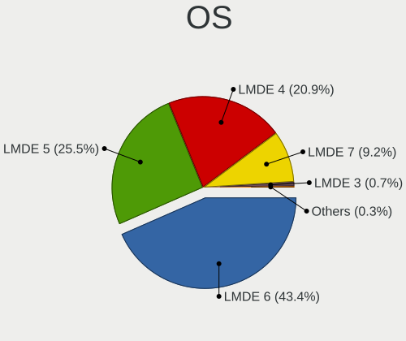

| Name   | Computers | Percent |
|--------|-----------|---------|
| LMDE 6 | 812       | 43.42%  |
| LMDE 5 | 476       | 25.45%  |
| LMDE 4 | 391       | 20.91%  |
| LMDE 7 | 172       | 9.2%    |
| LMDE 3 | 14        | 0.75%   |
| LMDE 2 | 5         | 0.27%   |

OS Family
---------

OS without a version

| Name | Computers | Percent |
|------|-----------|---------|
| LMDE | 1831      | 100%    |

Kernel
------

Version of the Linux kernel

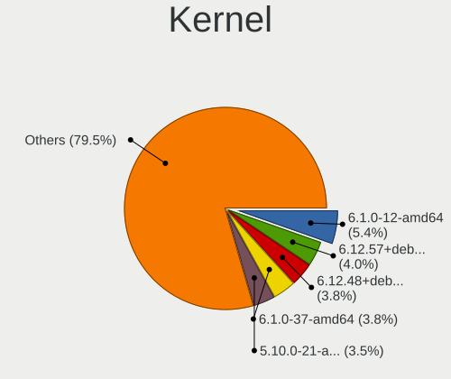

| Version             | Computers | Percent |
|---------------------|-----------|---------|
| 6.1.0-12-amd64      | 113       | 5.39%   |
| 6.12.57+deb13-amd64 | 84        | 4.01%   |
| 6.12.48+deb13-amd64 | 80        | 3.81%   |
| 6.1.0-37-amd64      | 79        | 3.77%   |
| 5.10.0-21-amd64     | 74        | 3.53%   |
| 6.1.0-13-amd64      | 70        | 3.34%   |
| 5.10.0-12-amd64     | 63        | 3%      |
| 5.10.0-23-amd64     | 52        | 2.48%   |
| 6.1.0-17-amd64      | 48        | 2.29%   |
| 4.19.0-8-amd64      | 45        | 2.15%   |
| 4.19.0-18-amd64     | 44        | 2.1%    |
| 6.1.0-18-amd64      | 43        | 2.05%   |
| 4.19.0-17-amd64     | 41        | 1.96%   |
| 4.19.0-16-amd64     | 40        | 1.91%   |
| 6.1.0-28-amd64      | 39        | 1.86%   |
| 6.1.0-31-amd64      | 37        | 1.76%   |
| 6.1.0-23-amd64      | 37        | 1.76%   |
| 5.10.0-19-amd64     | 37        | 1.76%   |
| 5.10.0-25-amd64     | 36        | 1.72%   |
| 6.1.0-26-amd64      | 33        | 1.57%   |
| 6.1.0-21-amd64      | 32        | 1.53%   |
| 4.19.0-14-amd64     | 31        | 1.48%   |
| 6.1.0-34-amd64      | 30        | 1.43%   |
| 6.1.0-30-amd64      | 30        | 1.43%   |
| 5.10.0-14-amd64     | 30        | 1.43%   |
| 4.19.0-9-amd64      | 30        | 1.43%   |
| 4.19.0-13-amd64     | 30        | 1.43%   |
| 6.1.0-40-amd64      | 29        | 1.38%   |
| 5.10.0-20-amd64     | 29        | 1.38%   |
| 6.1.0-25-amd64      | 27        | 1.29%   |
| 5.10.0-13-amd64     | 27        | 1.29%   |
| 6.1.0-32-amd64      | 26        | 1.24%   |
| 5.10.0-18-amd64     | 25        | 1.19%   |
| 6.1.0-38-amd64      | 22        | 1.05%   |
| 6.1.0-20-amd64      | 22        | 1.05%   |
| 5.10.0-17-amd64     | 21        | 1%      |
| 6.1.0-16-amd64      | 20        | 0.95%   |
| 4.19.0-10-amd64     | 20        | 0.95%   |
| 6.1.0-33-amd64      | 19        | 0.91%   |
| 5.10.0-15-amd64     | 19        | 0.91%   |

Kernel Family
-------------

Linux kernel without a distro release

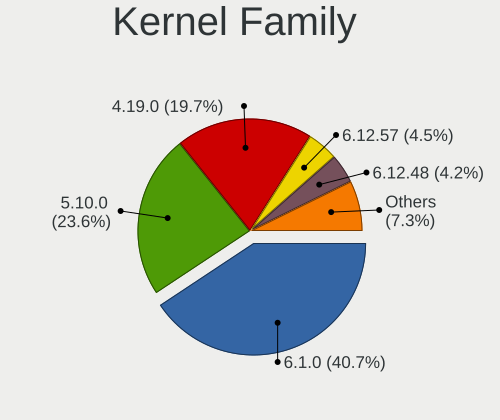

| Version | Computers | Percent |
|---------|-----------|---------|
| 6.1.0   | 771       | 40.69%  |
| 5.10.0  | 447       | 23.59%  |
| 4.19.0  | 374       | 19.74%  |
| 6.12.57 | 85        | 4.49%   |
| 6.12.48 | 80        | 4.22%   |
| 4.9.0   | 12        | 0.63%   |
| 6.12.12 | 8         | 0.42%   |
| 6.12.43 | 6         | 0.32%   |
| 5.18.0  | 6         | 0.32%   |
| 6.5.0   | 5         | 0.26%   |
| 6.12.9  | 5         | 0.26%   |
| 6.12.22 | 5         | 0.26%   |
| 3.16.0  | 5         | 0.26%   |
| 6.14.0  | 4         | 0.21%   |
| 6.10.11 | 4         | 0.21%   |
| 5.16.0  | 4         | 0.21%   |
| 6.9.7   | 3         | 0.16%   |
| 6.6.13  | 3         | 0.16%   |
| 5.6.0   | 3         | 0.16%   |
| 5.4.0   | 3         | 0.16%   |
| 5.19.0  | 3         | 0.16%   |
| 6.9.5   | 2         | 0.11%   |
| 6.17.8  | 2         | 0.11%   |
| 6.12.33 | 2         | 0.11%   |
| 6.12.32 | 2         | 0.11%   |
| 6.11.5  | 2         | 0.11%   |
| 6.11.10 | 2         | 0.11%   |
| 6.10.6  | 2         | 0.11%   |
| 5.8.0   | 2         | 0.11%   |
| 5.15.59 | 2         | 0.11%   |
| 5.15.0  | 2         | 0.11%   |
| 6.9.10  | 1         | 0.05%   |
| 6.7.6   | 1         | 0.05%   |
| 6.7.12  | 1         | 0.05%   |
| 6.7.10  | 1         | 0.05%   |
| 6.6.2   | 1         | 0.05%   |
| 6.6.15  | 1         | 0.05%   |
| 6.6.11  | 1         | 0.05%   |
| 6.6.10  | 1         | 0.05%   |
| 6.5.7   | 1         | 0.05%   |

Kernel Major Ver.
-----------------

Linux kernel major version

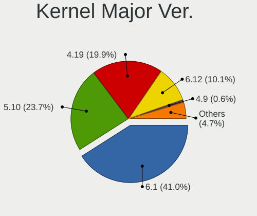

| Version | Computers | Percent |
|---------|-----------|---------|
| 6.1     | 772       | 40.98%  |
| 5.10    | 447       | 23.73%  |
| 4.19    | 374       | 19.85%  |
| 6.12    | 190       | 10.08%  |
| 4.9     | 12        | 0.64%   |
| 6.6     | 7         | 0.37%   |
| 6.5     | 7         | 0.37%   |
| 6.10    | 7         | 0.37%   |
| 6.9     | 6         | 0.32%   |
| 5.18    | 6         | 0.32%   |
| 5.15    | 6         | 0.32%   |
| 6.14    | 5         | 0.27%   |
| 3.16    | 5         | 0.27%   |
| 6.11    | 4         | 0.21%   |
| 5.4     | 4         | 0.21%   |
| 5.19    | 4         | 0.21%   |
| 5.16    | 4         | 0.21%   |
| 6.7     | 3         | 0.16%   |
| 6.17    | 3         | 0.16%   |
| 5.6     | 3         | 0.16%   |
| 6.4     | 2         | 0.11%   |
| 6.16    | 2         | 0.11%   |
| 6.15    | 2         | 0.11%   |
| 6.0     | 2         | 0.11%   |
| 5.9     | 2         | 0.11%   |
| 5.8     | 2         | 0.11%   |
| 6.18    | 1         | 0.05%   |
| 6.13    | 1         | 0.05%   |
| 4.17    | 1         | 0.05%   |

Arch
----

OS architecture (x86_64, i586, etc.)

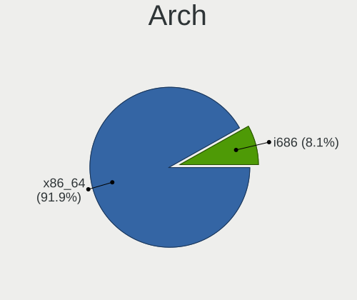

| Name   | Computers | Percent |
|--------|-----------|---------|
| x86_64 | 1683      | 91.87%  |
| i686   | 149       | 8.13%   |

DE
--

Desktop Environment

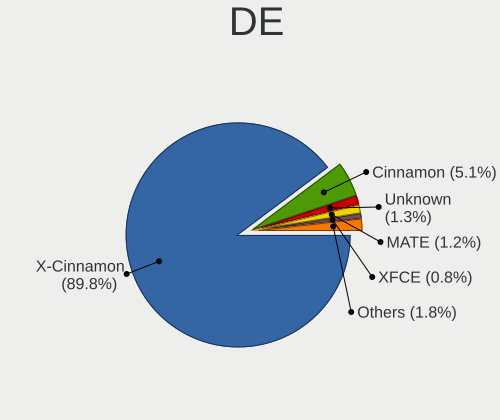

| Name       | Computers | Percent |
|------------|-----------|---------|
| X-Cinnamon | 1665      | 89.76%  |
| Cinnamon   | 95        | 5.12%   |
| Unknown    | 25        | 1.35%   |
| MATE       | 23        | 1.24%   |
| XFCE       | 14        | 0.75%   |
| KDE5       | 9         | 0.49%   |
| GNOME      | 9         | 0.49%   |
| LXDE       | 7         | 0.38%   |
| LXQt       | 2         | 0.11%   |
| KDE        | 2         | 0.11%   |
| Trinity    | 1         | 0.05%   |
| KDE6       | 1         | 0.05%   |
| i3         | 1         | 0.05%   |
| awesome    | 1         | 0.05%   |

Display Server
--------------

X11 or Wayland

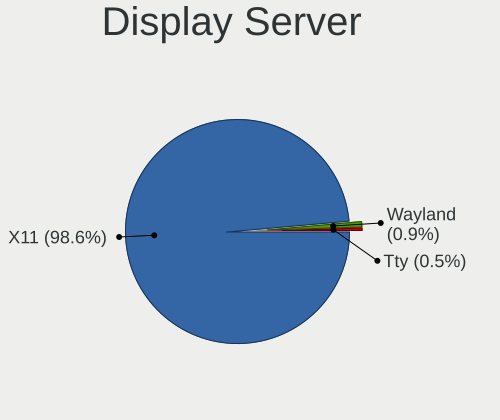

| Name    | Computers | Percent |
|---------|-----------|---------|
| X11     | 1807      | 98.58%  |
| Wayland | 17        | 0.93%   |
| Tty     | 9         | 0.49%   |

Display Manager
---------------

SDDM, LightDM, etc.

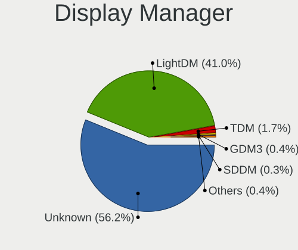

| Name    | Computers | Percent |
|---------|-----------|---------|
| Unknown | 1038      | 56.17%  |
| LightDM | 757       | 40.96%  |
| TDM     | 32        | 1.73%   |
| GDM3    | 8         | 0.43%   |
| SDDM    | 5         | 0.27%   |
| MDM     | 5         | 0.27%   |
| GDM     | 3         | 0.16%   |

OS Lang
-------

Language

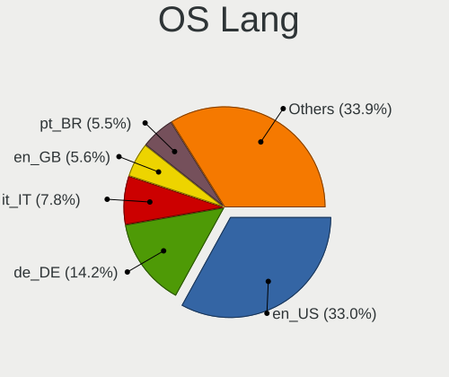

| Lang    | Computers | Percent |
|---------|-----------|---------|
| en_US   | 608       | 33.01%  |
| de_DE   | 262       | 14.22%  |
| it_IT   | 144       | 7.82%   |
| en_GB   | 103       | 5.59%   |
| pt_BR   | 101       | 5.48%   |
| fr_FR   | 93        | 5.05%   |
| ru_RU   | 84        | 4.56%   |
| pl_PL   | 47        | 2.55%   |
| es_ES   | 35        | 1.9%    |
| Unknown | 31        | 1.68%   |
| en_CA   | 22        | 1.19%   |
| en_AU   | 21        | 1.14%   |
| es_AR   | 16        | 0.87%   |
| cs_CZ   | 16        | 0.87%   |
| nl_NL   | 15        | 0.81%   |
| sv_SE   | 12        | 0.65%   |
| es_MX   | 12        | 0.65%   |
| de_CH   | 11        | 0.6%    |
| ja_JP   | 10        | 0.54%   |
| hu_HU   | 10        | 0.54%   |
| de_AT   | 10        | 0.54%   |
| tr_TR   | 9         | 0.49%   |
| nl_BE   | 8         | 0.43%   |
| fr_CA   | 8         | 0.43%   |
| el_GR   | 8         | 0.43%   |
| fr_BE   | 7         | 0.38%   |
| fi_FI   | 7         | 0.38%   |
| en_NZ   | 7         | 0.38%   |
| pt_PT   | 6         | 0.33%   |
| zh_CN   | 5         | 0.27%   |
| es_SV   | 5         | 0.27%   |
| es_CL   | 5         | 0.27%   |
| es_BO   | 5         | 0.27%   |
| en_ZA   | 5         | 0.27%   |
| en_IN   | 5         | 0.27%   |
| sk_SK   | 4         | 0.22%   |
| es_UY   | 4         | 0.22%   |
| es_EC   | 4         | 0.22%   |
| en_IE   | 4         | 0.22%   |
| da_DK   | 4         | 0.22%   |

Boot Mode
---------

EFI or BIOS

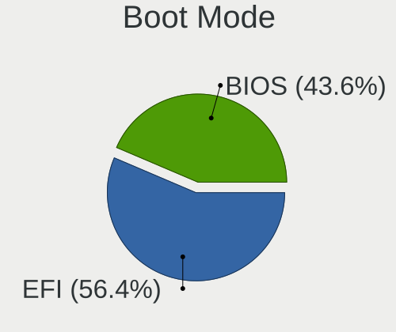

| Mode | Computers | Percent |
|------|-----------|---------|
| EFI  | 1041      | 56.42%  |
| BIOS | 804       | 43.58%  |

Filesystem
----------

Type of filesystem

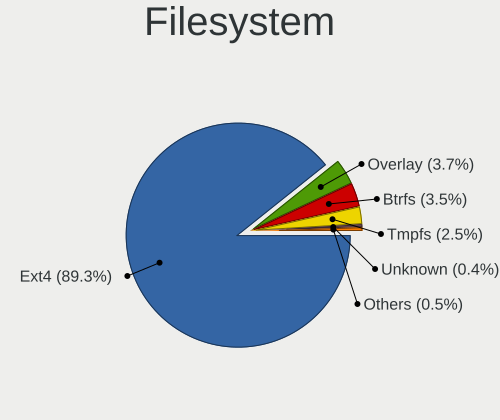

| Type    | Computers | Percent |
|---------|-----------|---------|
| Ext4    | 1647      | 89.27%  |
| Overlay | 69        | 3.74%   |
| Btrfs   | 64        | 3.47%   |
| Tmpfs   | 47        | 2.55%   |
| Unknown | 8         | 0.43%   |
| Xfs     | 5         | 0.27%   |
| Zfs     | 2         | 0.11%   |
| Jfs     | 1         | 0.05%   |
| Ext3    | 1         | 0.05%   |
| Aufs    | 1         | 0.05%   |

Part. scheme
------------

Scheme of partitioning

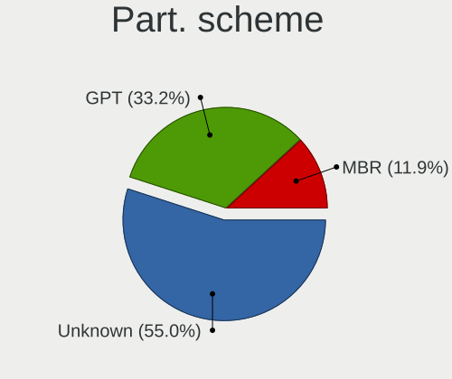

| Type    | Computers | Percent |
|---------|-----------|---------|
| Unknown | 1015      | 54.98%  |
| GPT     | 612       | 33.15%  |
| MBR     | 219       | 11.86%  |

Dual Boot with Linux/BSD
------------------------

Hosting more than one Linux/BSD

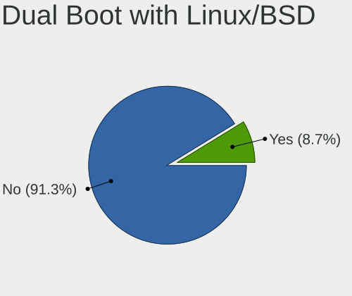

| Dual boot | Computers | Percent |
|-----------|-----------|---------|
| No        | 1683      | 91.27%  |
| Yes       | 161       | 8.73%   |

Dual Boot (Win)
---------------

Hosting Linux and Windows

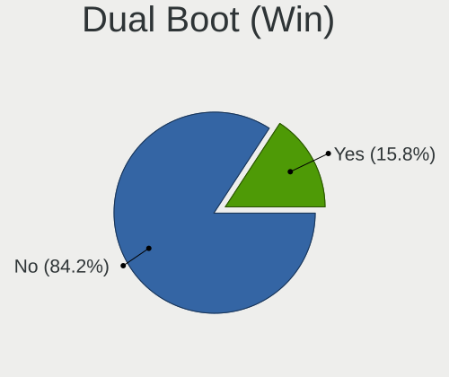

| Dual boot | Computers | Percent |
|-----------|-----------|---------|
| No        | 1551      | 84.2%   |
| Yes       | 291       | 15.8%   |

Board
-----

Vendor
------

Motherboard manufacturer

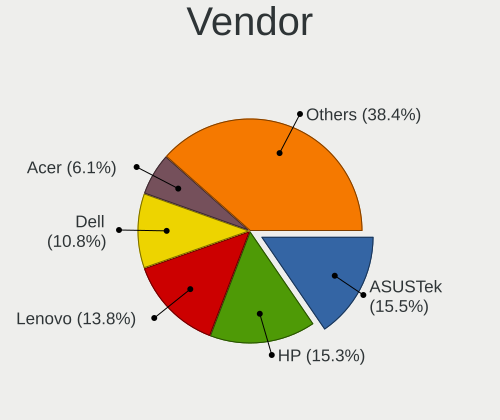

| Name                                 | Computers | Percent |
|--------------------------------------|-----------|---------|
| ASUSTek Computer                     | 283       | 15.46%  |
| Hewlett-Packard                      | 281       | 15.35%  |
| Lenovo                               | 253       | 13.82%  |
| Dell                                 | 198       | 10.81%  |
| Acer                                 | 112       | 6.12%   |
| Gigabyte Technology                  | 94        | 5.13%   |
| MSI                                  | 83        | 4.53%   |
| Apple                                | 64        | 3.5%    |
| ASRock                               | 55        | 3%      |
| Toshiba                              | 35        | 1.91%   |
| Intel                                | 32        | 1.75%   |
| Fujitsu                              | 32        | 1.75%   |
| Unknown                              | 23        | 1.26%   |
| Samsung Electronics                  | 22        | 1.2%    |
| Sony                                 | 15        | 0.82%   |
| Medion                               | 12        | 0.66%   |
| Fujitsu Siemens                      | 11        | 0.6%    |
| AZW                                  | 11        | 0.6%    |
| Pegatron                             | 9         | 0.49%   |
| Google                               | 9         | 0.49%   |
| LG Electronics                       | 8         | 0.44%   |
| HUAWEI                               | 8         | 0.44%   |
| ECS                                  | 8         | 0.44%   |
| Microsoft                            | 7         | 0.38%   |
| Shenzhen Meigao Electronic Equipment | 6         | 0.33%   |
| Positivo                             | 6         | 0.33%   |
| Packard Bell                         | 6         | 0.33%   |
| Notebook                             | 6         | 0.33%   |
| GEEKOM                               | 6         | 0.33%   |
| Alienware                            | 6         | 0.33%   |
| Foxconn                              | 5         | 0.27%   |
| TUXEDO                               | 4         | 0.22%   |
| Gateway                              | 4         | 0.22%   |
| eMachines                            | 4         | 0.22%   |
| Supermicro                           | 3         | 0.16%   |
| Chuwi                                | 3         | 0.16%   |
| Biostar                              | 3         | 0.16%   |
| Timi                                 | 2         | 0.11%   |
| Star Labs                            | 2         | 0.11%   |
| Semp Toshiba                         | 2         | 0.11%   |

Model
-----

Motherboard model

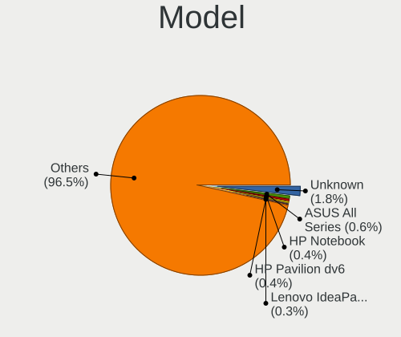

| Name                                        | Computers | Percent |
|---------------------------------------------|-----------|---------|
| Unknown                                     | 33        | 1.8%    |
| ASUS All Series                             | 11        | 0.6%    |
| HP Notebook                                 | 8         | 0.44%   |
| HP Pavilion dv6                             | 7         | 0.38%   |
| Lenovo IdeaPad 3 15ADA05 81W1               | 5         | 0.27%   |
| HP Pavilion Notebook                        | 5         | 0.27%   |
| ASRock A320M-HDV R4.0                       | 5         | 0.27%   |
| Apple MacBookAir7,2                         | 5         | 0.27%   |
| MSI MS-7C95                                 | 4         | 0.22%   |
| MSI MS-7A38                                 | 4         | 0.22%   |
| Intel B75                                   | 4         | 0.22%   |
| HP 250 G8 Notebook PC                       | 4         | 0.22%   |
| Dell XPS 13 9360                            | 4         | 0.22%   |
| Dell OptiPlex 7010                          | 4         | 0.22%   |
| ASUS VivoBook_ASUSLaptop X1605VA_X1605VA    | 4         | 0.22%   |
| ASUS ROG STRIX B450-F GAMING                | 4         | 0.22%   |
| Apple MacBookPro9,2                         | 4         | 0.22%   |
| Apple iMac8,1                               | 4         | 0.22%   |
| Samsung RV411/RV511/E3511/S3511/RV711/E3411 | 3         | 0.16%   |
| MSI MS-7C52                                 | 3         | 0.16%   |
| Lenovo ThinkCentre M93p 10A8S4B200          | 3         | 0.16%   |
| Lenovo IdeaPadFlex 5 14ALC05 82HU           | 3         | 0.16%   |
| Lenovo G50-45 80E3                          | 3         | 0.16%   |
| HP Pavilion dv7                             | 3         | 0.16%   |
| HP Pavilion Desktop 590-p0xxx               | 3         | 0.16%   |
| HP Pavilion 15                              | 3         | 0.16%   |
| HP Laptop 15-dy2xxx                         | 3         | 0.16%   |
| HP Laptop 15-dw1xxx                         | 3         | 0.16%   |
| HP Laptop 15-bw0xx                          | 3         | 0.16%   |
| HP EliteBook 8440p                          | 3         | 0.16%   |
| HP EliteBook 840 G1                         | 3         | 0.16%   |
| HP EliteBook 820 G3                         | 3         | 0.16%   |
| HP 250 G7 Notebook PC                       | 3         | 0.16%   |
| Gigabyte 970A-DS3P                          | 3         | 0.16%   |
| Dell System Vostro 3750                     | 3         | 0.16%   |
| Dell OptiPlex 780                           | 3         | 0.16%   |
| Dell OptiPlex 3020                          | 3         | 0.16%   |
| Dell Latitude E6430                         | 3         | 0.16%   |
| Dell Latitude E6400                         | 3         | 0.16%   |
| AZW SER                                     | 3         | 0.16%   |

Model Family
------------

Motherboard model prefix

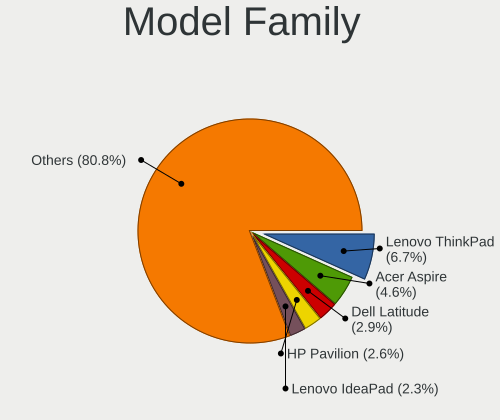

| Name               | Computers | Percent |
|--------------------|-----------|---------|
| Lenovo ThinkPad    | 123       | 6.72%   |
| Acer Aspire        | 84        | 4.59%   |
| Dell Latitude      | 53        | 2.89%   |
| HP Pavilion        | 48        | 2.62%   |
| Lenovo IdeaPad     | 43        | 2.35%   |
| Dell Inspiron      | 40        | 2.18%   |
| HP Laptop          | 39        | 2.13%   |
| HP EliteBook       | 35        | 1.91%   |
| ASUS VivoBook      | 33        | 1.8%    |
| Unknown            | 33        | 1.8%    |
| Dell OptiPlex      | 31        | 1.69%   |
| Dell Precision     | 30        | 1.64%   |
| Toshiba Satellite  | 29        | 1.58%   |
| HP Compaq          | 29        | 1.58%   |
| ASUS PRIME         | 23        | 1.26%   |
| ASUS ROG           | 22        | 1.2%    |
| Lenovo ThinkCentre | 20        | 1.09%   |
| HP ProBook         | 20        | 1.09%   |
| Dell XPS           | 15        | 0.82%   |
| ASUS TUF           | 15        | 0.82%   |
| HP ENVY            | 14        | 0.76%   |
| Fujitsu LIFEBOOK   | 13        | 0.71%   |
| ASUS All           | 11        | 0.6%    |
| Dell Vostro        | 10        | 0.55%   |
| ASUS Zenbook       | 10        | 0.55%   |
| ASUS ASUS          | 10        | 0.55%   |
| Lenovo Yoga        | 9         | 0.49%   |
| HP 250             | 9         | 0.49%   |
| Fujitsu ESPRIMO    | 9         | 0.49%   |
| Lenovo IdeaPadFlex | 8         | 0.44%   |
| HP Notebook        | 8         | 0.44%   |
| Microsoft Surface  | 7         | 0.38%   |
| HP ProDesk         | 7         | 0.38%   |
| Gigabyte B450M     | 6         | 0.33%   |
| ASRock A320M-HDV   | 6         | 0.33%   |
| Apple MacBookAir7  | 6         | 0.33%   |
| Acer Veriton       | 6         | 0.33%   |
| Lenovo Legion      | 5         | 0.27%   |
| HP 255             | 5         | 0.27%   |
| Gigabyte X570      | 5         | 0.27%   |

MFG Year
--------

Motherboard manufacture year

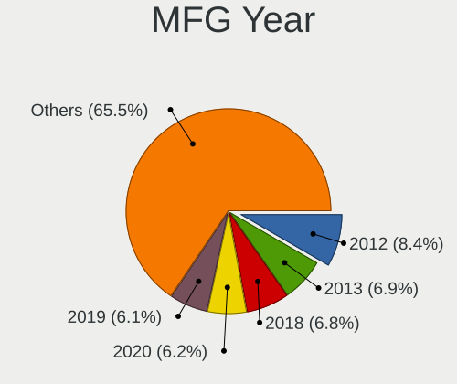

| Year    | Computers | Percent |
|---------|-----------|---------|
| 2012    | 153       | 8.36%   |
| 2013    | 127       | 6.94%   |
| 2018    | 125       | 6.83%   |
| 2020    | 114       | 6.23%   |
| 2019    | 112       | 6.12%   |
| 2021    | 111       | 6.06%   |
| 2011    | 106       | 5.79%   |
| 2010    | 102       | 5.57%   |
| 2017    | 98        | 5.35%   |
| 2016    | 92        | 5.02%   |
| 2009    | 91        | 4.97%   |
| 2008    | 89        | 4.86%   |
| 2022    | 85        | 4.64%   |
| 2023    | 80        | 4.37%   |
| 2014    | 79        | 4.31%   |
| 2007    | 70        | 3.82%   |
| 2015    | 69        | 3.77%   |
| 2006    | 45        | 2.46%   |
| 2024    | 40        | 2.18%   |
| 2025    | 14        | 0.76%   |
| 2005    | 13        | 0.71%   |
| 2003    | 6         | 0.33%   |
| Unknown | 5         | 0.27%   |
| 2004    | 4         | 0.22%   |
| 2002    | 1         | 0.05%   |

Form Factor
-----------

Physical design of the computer

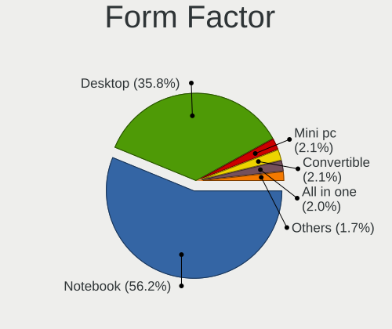

| Name        | Computers | Percent |
|-------------|-----------|---------|
| Notebook    | 1029      | 56.2%   |
| Desktop     | 656       | 35.83%  |
| Mini pc     | 39        | 2.13%   |
| Convertible | 38        | 2.08%   |
| All in one  | 37        | 2.02%   |
| Tablet      | 22        | 1.2%    |
| Server      | 8         | 0.44%   |
| Other       | 2         | 0.11%   |

Secure Boot
-----------

Enabled or disabled

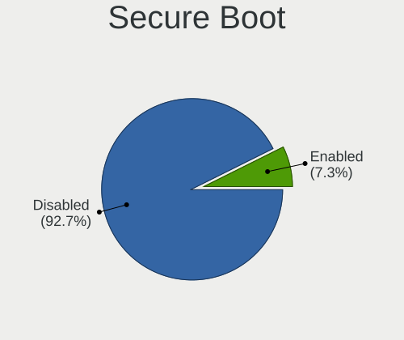

| State    | Computers | Percent |
|----------|-----------|---------|
| Disabled | 1703      | 92.66%  |
| Enabled  | 135       | 7.34%   |

Coreboot
--------

Have coreboot on board

| Used | Computers | Percent |
|------|-----------|---------|
| No   | 1818      | 99.29%  |
| Yes  | 13        | 0.71%   |

RAM Size
--------

Total RAM memory

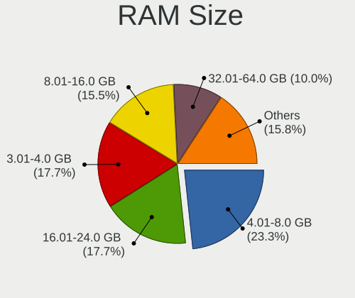

| Size in GB      | Computers | Percent |
|-----------------|-----------|---------|
| 4.01-8.0        | 432       | 23.31%  |
| 3.01-4.0        | 328       | 17.7%   |
| 16.01-24.0      | 328       | 17.7%   |
| 8.01-16.0       | 287       | 15.49%  |
| 32.01-64.0      | 185       | 9.98%   |
| 2.01-3.0        | 89        | 4.8%    |
| 1.01-2.0        | 80        | 4.32%   |
| 64.01-256.0     | 59        | 3.18%   |
| 24.01-32.0      | 42        | 2.27%   |
| 0.51-1.0        | 22        | 1.19%   |
| More than 256.0 | 1         | 0.05%   |

RAM Used
--------

Used RAM memory

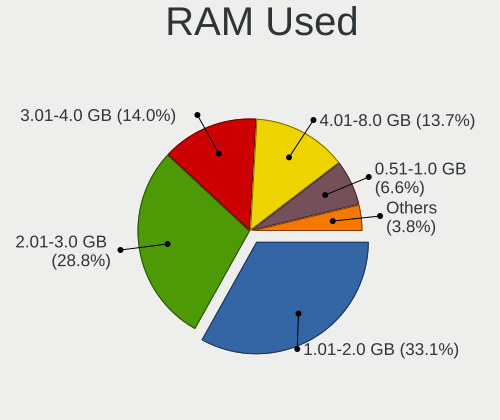

| Used GB    | Computers | Percent |
|------------|-----------|---------|
| 1.01-2.0   | 653       | 33.11%  |
| 2.01-3.0   | 568       | 28.8%   |
| 3.01-4.0   | 276       | 14%     |
| 4.01-8.0   | 270       | 13.69%  |
| 0.51-1.0   | 130       | 6.59%   |
| 8.01-16.0  | 58        | 2.94%   |
| 24.01-32.0 | 5         | 0.25%   |
| 0.01-0.5   | 5         | 0.25%   |
| 16.01-24.0 | 4         | 0.2%    |
| 32.01-64.0 | 3         | 0.15%   |

Total Drives
------------

Number of drives on board

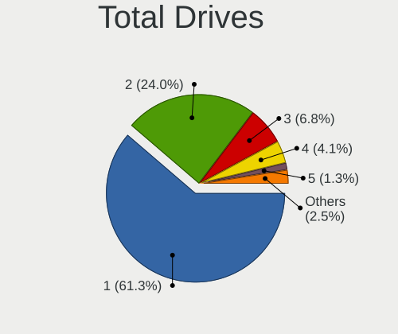

| Drives | Computers | Percent |
|--------|-----------|---------|
| 1      | 1153      | 61.3%   |
| 2      | 452       | 24.03%  |
| 3      | 128       | 6.8%    |
| 4      | 77        | 4.09%   |
| 5      | 24        | 1.28%   |
| 6      | 18        | 0.96%   |
| 0      | 13        | 0.69%   |
| 7      | 10        | 0.53%   |
| 8      | 4         | 0.21%   |
| 11     | 1         | 0.05%   |
| 10     | 1         | 0.05%   |

Has CD-ROM
----------

Has CD-ROM on board

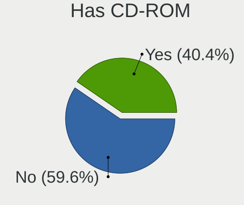

| Presented | Computers | Percent |
|-----------|-----------|---------|
| No        | 1099      | 59.57%  |
| Yes       | 746       | 40.43%  |

Has Ethernet
------------

Has Ethernet on board

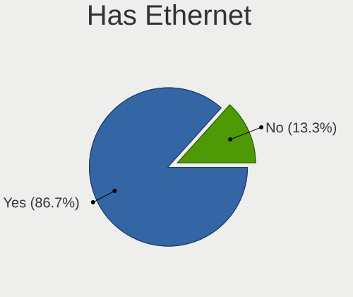

| Presented | Computers | Percent |
|-----------|-----------|---------|
| Yes       | 1588      | 86.68%  |
| No        | 244       | 13.32%  |

Has WiFi
--------

Has WiFi module

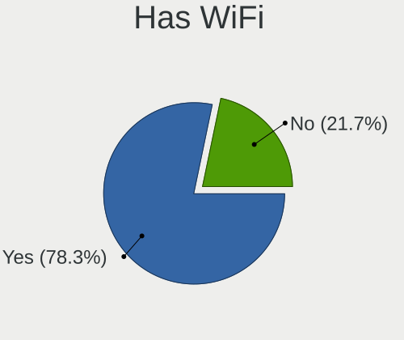

| Presented | Computers | Percent |
|-----------|-----------|---------|
| Yes       | 1435      | 77.78%  |
| No        | 410       | 22.22%  |

Has Bluetooth
-------------

Has Bluetooth module

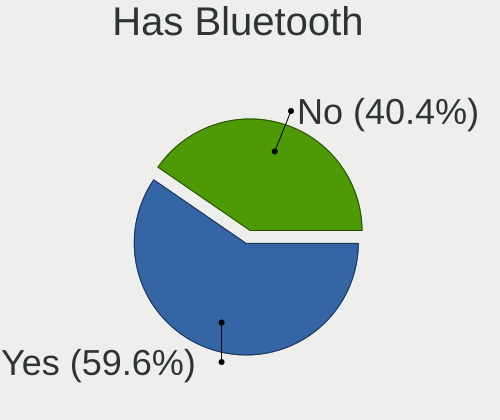

| Presented | Computers | Percent |
|-----------|-----------|---------|
| Yes       | 1097      | 59.59%  |
| No        | 744       | 40.41%  |

Location
--------

Country
-------

Geographic location (country)

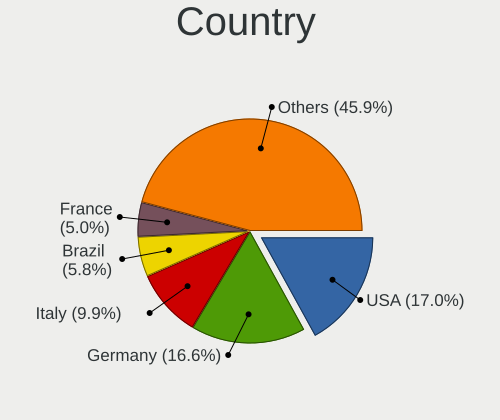

| Country      | Computers | Percent |
|--------------|-----------|---------|
| USA          | 312       | 16.99%  |
| Germany      | 304       | 16.56%  |
| Italy        | 181       | 9.86%   |
| Brazil       | 106       | 5.77%   |
| France       | 91        | 4.96%   |
| Russia       | 90        | 4.9%    |
| UK           | 62        | 3.38%   |
| Poland       | 51        | 2.78%   |
| Canada       | 48        | 2.61%   |
| Spain        | 44        | 2.4%    |
| Netherlands  | 34        | 1.85%   |
| Australia    | 29        | 1.58%   |
| Mexico       | 21        | 1.14%   |
| Belgium      | 20        | 1.09%   |
| Austria      | 20        | 1.09%   |
| Argentina    | 20        | 1.09%   |
| Sweden       | 18        | 0.98%   |
| Ukraine      | 16        | 0.87%   |
| Turkey       | 16        | 0.87%   |
| Switzerland  | 16        | 0.87%   |
| Czechia      | 15        | 0.82%   |
| Malaysia     | 14        | 0.76%   |
| Hungary      | 14        | 0.76%   |
| Portugal     | 13        | 0.71%   |
| Japan        | 13        | 0.71%   |
| Finland      | 13        | 0.71%   |
| Romania      | 12        | 0.65%   |
| India        | 12        | 0.65%   |
| Bulgaria     | 12        | 0.65%   |
| Indonesia    | 11        | 0.6%    |
| Greece       | 11        | 0.6%    |
| New Zealand  | 9         | 0.49%   |
| Norway       | 8         | 0.44%   |
| Ecuador      | 8         | 0.44%   |
| Belarus      | 8         | 0.44%   |
| Denmark      | 7         | 0.38%   |
| Chile        | 7         | 0.38%   |
| South Africa | 6         | 0.33%   |
| Croatia      | 6         | 0.33%   |
| Bolivia      | 6         | 0.33%   |

City
----

Geographic location (city)

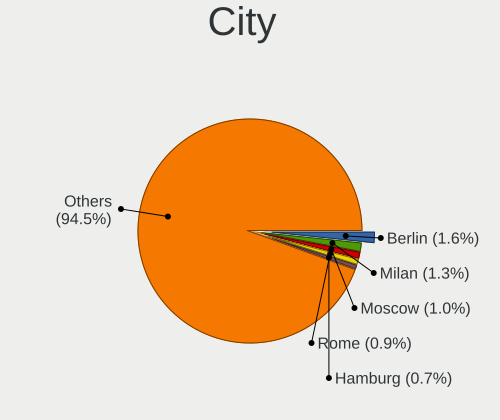

| City              | Computers | Percent |
|-------------------|-----------|---------|
| Berlin            | 32        | 1.64%   |
| Milan             | 26        | 1.34%   |
| Moscow            | 20        | 1.03%   |
| Rome              | 17        | 0.87%   |
| Hamburg           | 13        | 0.67%   |
| Vienna            | 12        | 0.62%   |
| Paris             | 12        | 0.62%   |
| Munich            | 12        | 0.62%   |
| Sao Paulo         | 10        | 0.51%   |
| Bologna           | 10        | 0.51%   |
| Sydney            | 9         | 0.46%   |
| St Petersburg     | 9         | 0.46%   |
| Warsaw            | 8         | 0.41%   |
| Turin             | 8         | 0.41%   |
| Traunstein        | 8         | 0.41%   |
| Rio de Janeiro    | 8         | 0.41%   |
| Montreal          | 8         | 0.41%   |
| Milano            | 8         | 0.41%   |
| Madrid            | 8         | 0.41%   |
| Wroclaw           | 7         | 0.36%   |
| Toronto           | 7         | 0.36%   |
| Melbourne         | 7         | 0.36%   |
| Kuala Lumpur      | 7         | 0.36%   |
| Krakow            | 7         | 0.36%   |
| Frankfurt am Main | 7         | 0.36%   |
| Florence          | 7         | 0.36%   |
| Cologne           | 7         | 0.36%   |
| Auckland          | 7         | 0.36%   |
| Athens            | 7         | 0.36%   |
| Amsterdam         | 7         | 0.36%   |
| Sofia             | 6         | 0.31%   |
| New York          | 6         | 0.31%   |
| Mannheim          | 6         | 0.31%   |
| Leipzig           | 6         | 0.31%   |
| Guayaquil         | 6         | 0.31%   |
| Delligsen         | 6         | 0.31%   |
| Dallas            | 6         | 0.31%   |
| Bremen            | 6         | 0.31%   |
| San Antonio       | 5         | 0.26%   |
| Rho               | 5         | 0.26%   |

Drives
------

Drive Vendor
------------

Hard drive vendors

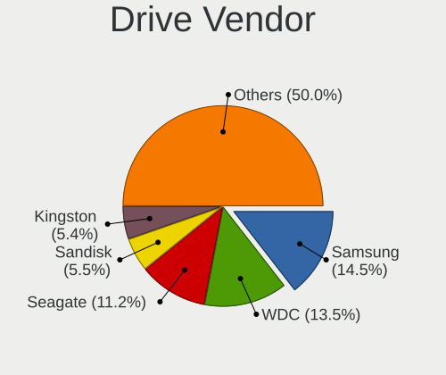

| Vendor                      | Computers | Drives | Percent |
|-----------------------------|-----------|--------|---------|
| Samsung Electronics         | 389       | 576    | 14.48%  |
| WDC                         | 363       | 536    | 13.51%  |
| Seagate                     | 301       | 443    | 11.21%  |
| Sandisk                     | 147       | 205    | 5.47%   |
| Kingston                    | 144       | 214    | 5.36%   |
| Toshiba                     | 129       | 152    | 4.8%    |
| Crucial                     | 113       | 135    | 4.21%   |
| Unknown                     | 103       | 144    | 3.83%   |
| Hitachi                     | 79        | 96     | 2.94%   |
| Intel                       | 62        | 76     | 2.31%   |
| SK hynix                    | 59        | 65     | 2.2%    |
| Micron Technology           | 51        | 58     | 1.9%    |
| China                       | 46        | 50     | 1.71%   |
| A-DATA Technology           | 36        | 39     | 1.34%   |
| HGST                        | 32        | 42     | 1.19%   |
| Apple                       | 30        | 38     | 1.12%   |
| Intenso                     | 28        | 31     | 1.04%   |
| PNY                         | 21        | 30     | 0.78%   |
| Fujitsu                     | 20        | 20     | 0.74%   |
| Unknown                     | 20        | 37     | 0.74%   |
| SPCC                        | 19        | 20     | 0.71%   |
| Phison                      | 18        | 40     | 0.67%   |
| Micron/Crucial Technology   | 18        | 26     | 0.67%   |
| KIOXIA                      | 17        | 30     | 0.63%   |
| Patriot                     | 16        | 19     | 0.6%    |
| GOODRAM                     | 16        | 16     | 0.6%    |
| Transcend                   | 15        | 20     | 0.56%   |
| Phison Electronics          | 15        | 16     | 0.56%   |
| MAXIO Technology (Hangzhou) | 14        | 16     | 0.52%   |
| JMicron Technology          | 14        | 15     | 0.52%   |
| Silicon Motion              | 13        | 15     | 0.48%   |
| Kingston Technology Company | 12        | 15     | 0.45%   |
| KingSpec                    | 12        | 13     | 0.45%   |
| Lexar                       | 11        | 12     | 0.41%   |
| Team                        | 10        | 14     | 0.37%   |
| Gigabyte Technology         | 10        | 13     | 0.37%   |
| Apacer                      | 10        | 15     | 0.37%   |
| ADATA Technology            | 10        | 21     | 0.37%   |
| SABRENT                     | 9         | 10     | 0.34%   |
| OCZ                         | 9         | 11     | 0.34%   |

Drive Model
-----------

Hard drive models

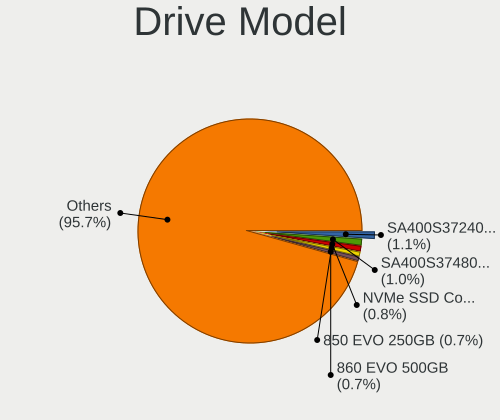

| Model                                             | Computers | Percent |
|---------------------------------------------------|-----------|---------|
| Kingston SA400S37240G 240GB SSD                   | 32        | 1.09%   |
| Kingston SA400S37480G 480GB SSD                   | 30        | 1.02%   |
| Samsung NVMe SSD Controller SM981/PM981/PM983 1TB | 25        | 0.85%   |
| Samsung SSD 850 EVO 250GB                         | 21        | 0.71%   |
| Samsung SSD 860 EVO 500GB                         | 20        | 0.68%   |
| Unknown                                           | 20        | 0.68%   |
| Unknown SD/MMC/MS PRO 2GB                         | 18        | 0.61%   |
| Seagate ST500DM002-1BD142 500GB                   | 18        | 0.61%   |
| SanDisk NVMe SSD Drive 1TB                        | 18        | 0.61%   |
| Seagate ST1000LM035-1RK172 1TB                    | 17        | 0.58%   |
| Kingston SA400S37120G 120GB SSD                   | 16        | 0.54%   |
| Unknown MMC Card  64GB                            | 14        | 0.48%   |
| Crucial CT500MX500SSD1 500GB                      | 14        | 0.48%   |
| Crucial CT1000MX500SSD1 1TB                       | 14        | 0.48%   |
| Unknown MMC Card  32GB                            | 13        | 0.44%   |
| Toshiba MQ01ABD100 1TB                            | 13        | 0.44%   |
| Seagate ST500LT012-1DG142 500GB                   | 13        | 0.44%   |
| Sandisk WD Blue SN550 NVMe SSD 1024GB             | 13        | 0.44%   |
| Samsung SSD 850 EVO 500GB                         | 13        | 0.44%   |
| Unknown MMC Card  128GB                           | 12        | 0.41%   |
| SanDisk NVMe SSD Drive 2TB                        | 12        | 0.41%   |
| WDC WD10EZEX-08WN4A0 1TB                          | 11        | 0.37%   |
| Toshiba DT01ACA100 1TB                            | 11        | 0.37%   |
| Samsung SSD 870 EVO 500GB                         | 11        | 0.37%   |
| Crucial CT240BX500SSD1 240GB                      | 11        | 0.37%   |
| Samsung SSD 860 EVO 250GB                         | 10        | 0.34%   |
| Samsung SSD 860 EVO 1TB                           | 10        | 0.34%   |
| Seagate ST1000DM010-2EP102 1TB                    | 9         | 0.31%   |
| Seagate Expansion 2TB                             | 9         | 0.31%   |
| Samsung SSD 980 1TB                               | 9         | 0.31%   |
| SABRENT Disk 4TB                                  | 9         | 0.31%   |
| Crucial CT250MX500SSD1 250GB                      | 9         | 0.31%   |
| Crucial CT1000BX500SSD1 1TB                       | 9         | 0.31%   |
| WDC WDS500G2B0A-00SM50 500GB                      | 8         | 0.27%   |
| WDC WDS240G2G0A-00JH30 240GB SSD                  | 8         | 0.27%   |
| Seagate ST2000DM008-2FR102 2TB                    | 8         | 0.27%   |
| Seagate ST1000DM003-1ER162 1TB                    | 8         | 0.27%   |
| SanDisk SSD PLUS 1000GB                           | 8         | 0.27%   |
| SanDisk NVMe SSD Drive 512GB                      | 8         | 0.27%   |
| Samsung SSD 990 PRO 2TB                           | 8         | 0.27%   |

HDD Vendor
----------

Hard disk drive vendors

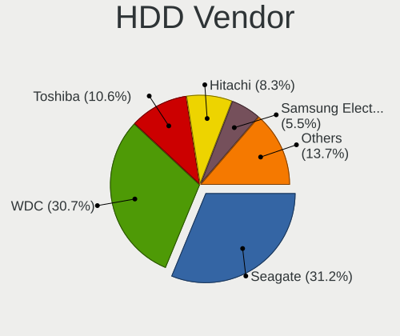

| Vendor              | Computers | Drives | Percent |
|---------------------|-----------|--------|---------|
| Seagate             | 297       | 434    | 31.23%  |
| WDC                 | 292       | 439    | 30.7%   |
| Toshiba             | 101       | 118    | 10.62%  |
| Hitachi             | 79        | 96     | 8.31%   |
| Samsung Electronics | 52        | 69     | 5.47%   |
| HGST                | 32        | 42     | 3.36%   |
| Fujitsu             | 20        | 20     | 2.1%    |
| Unknown             | 19        | 21     | 2%      |
| Apple               | 8         | 9      | 0.84%   |
| JMicron Technology  | 7         | 7      | 0.74%   |
| Intenso             | 7         | 7      | 0.74%   |
| TO Exter            | 6         | 6      | 0.63%   |
| Maxtor              | 6         | 8      | 0.63%   |
| ASMT                | 4         | 6      | 0.42%   |
| IBM/Hitachi         | 3         | 3      | 0.32%   |
| External            | 3         | 3      | 0.32%   |
| USB3.0              | 2         | 2      | 0.21%   |
| TrueNAS             | 2         | 4      | 0.21%   |
| ASMedia             | 2         | 2      | 0.21%   |
| T-FORCE             | 1         | 1      | 0.11%   |
| Shenzhen            | 1         | 1      | 0.11%   |
| KESU                | 1         | 2      | 0.11%   |
| Initio              | 1         | 1      | 0.11%   |
| HPE                 | 1         | 4      | 0.11%   |
| ExcelStor           | 1         | 1      | 0.11%   |
| DC-624e             | 1         | 1      | 0.11%   |
| DAS                 | 1         | 4      | 0.11%   |
| Unknown             | 1         | 1      | 0.11%   |

SSD Vendor
----------

Solid state drive vendors

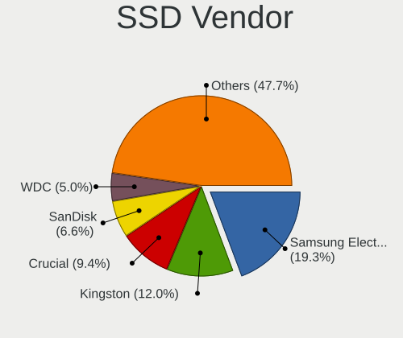

| Vendor              | Computers | Drives | Percent |
|---------------------|-----------|--------|---------|
| Samsung Electronics | 189       | 246    | 19.31%  |
| Kingston            | 117       | 178    | 11.95%  |
| Crucial             | 92        | 113    | 9.4%    |
| SanDisk             | 65        | 83     | 6.64%   |
| WDC                 | 49        | 62     | 5.01%   |
| China               | 44        | 48     | 4.49%   |
| A-DATA Technology   | 33        | 36     | 3.37%   |
| Intel               | 25        | 27     | 2.55%   |
| Apple               | 21        | 21     | 2.15%   |
| PNY                 | 20        | 29     | 2.04%   |
| Intenso             | 19        | 22     | 1.94%   |
| Micron Technology   | 17        | 20     | 1.74%   |
| SPCC                | 16        | 17     | 1.63%   |
| Transcend           | 15        | 20     | 1.53%   |
| Patriot             | 15        | 18     | 1.53%   |
| GOODRAM             | 15        | 15     | 1.53%   |
| Toshiba             | 13        | 17     | 1.33%   |
| KingSpec            | 12        | 13     | 1.23%   |
| Team                | 9         | 13     | 0.92%   |
| SK hynix            | 9         | 10     | 0.92%   |
| SABRENT             | 9         | 10     | 0.92%   |
| OCZ                 | 9         | 11     | 0.92%   |
| Unknown             | 9         | 21     | 0.92%   |
| Gigabyte Technology | 8         | 11     | 0.82%   |
| Verbatim            | 7         | 12     | 0.72%   |
| Hewlett-Packard     | 7         | 10     | 0.72%   |
| Apacer              | 7         | 12     | 0.72%   |
| Lexar               | 6         | 6      | 0.61%   |
| KingDian            | 6         | 7      | 0.61%   |
| Fanxiang            | 5         | 7      | 0.51%   |
| SD                  | 4         | 4      | 0.41%   |
| Netac               | 4         | 4      | 0.41%   |
| LITEON              | 4         | 4      | 0.41%   |
| T-FORCE             | 3         | 3      | 0.31%   |
| Phison              | 3         | 22     | 0.31%   |
| LITEONIT            | 3         | 4      | 0.31%   |
| Integral            | 3         | 3      | 0.31%   |
| FORESEE             | 3         | 5      | 0.31%   |
| XrayDisk            | 2         | 2      | 0.2%    |
| USB30               | 2         | 3      | 0.2%    |

Drive Kind
----------

HDD or SSD

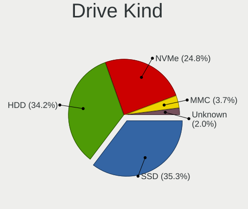

| Kind    | Computers | Drives | Percent |
|---------|-----------|--------|---------|
| SSD     | 845       | 1263   | 35.34%  |
| HDD     | 818       | 1312   | 34.21%  |
| NVMe    | 592       | 894    | 24.76%  |
| MMC     | 88        | 117    | 3.68%   |
| Unknown | 48        | 64     | 2.01%   |

Drive Connector
---------------

SATA, SAS, NVMe, etc.

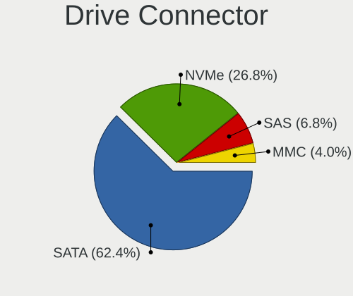

| Type | Computers | Drives | Percent |
|------|-----------|--------|---------|
| SATA | 1371      | 2439   | 62.4%   |
| NVMe | 589       | 878    | 26.81%  |
| SAS  | 149       | 216    | 6.78%   |
| MMC  | 88        | 117    | 4.01%   |

Drive Size
----------

Size of hard drive

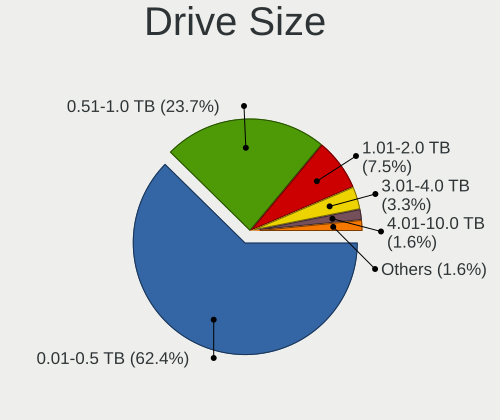

| Size in TB | Computers | Drives | Percent |
|------------|-----------|--------|---------|
| 0.01-0.5   | 1077      | 1623   | 62.36%  |
| 0.51-1.0   | 409       | 580    | 23.68%  |
| 1.01-2.0   | 130       | 195    | 7.53%   |
| 3.01-4.0   | 57        | 84     | 3.3%    |
| 4.01-10.0  | 27        | 47     | 1.56%   |
| 2.01-3.0   | 17        | 33     | 0.98%   |
| 10.01-20.0 | 10        | 13     | 0.58%   |

Space Total
-----------

Amount of disk space available on the file system

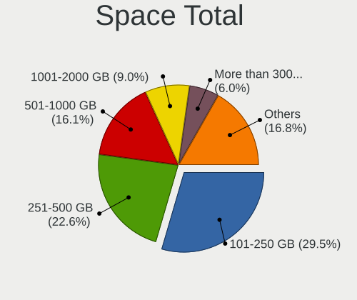

| Size in GB     | Computers | Percent |
|----------------|-----------|---------|
| 101-250        | 560       | 29.52%  |
| 251-500        | 429       | 22.61%  |
| 501-1000       | 305       | 16.08%  |
| 1001-2000      | 171       | 9.01%   |
| More than 3000 | 114       | 6.01%   |
| 51-100         | 114       | 6.01%   |
| 1-20           | 74        | 3.9%    |
| 2001-3000      | 58        | 3.06%   |
| 21-50          | 50        | 2.64%   |
| Unknown        | 22        | 1.16%   |

Space Used
----------

Amount of used disk space

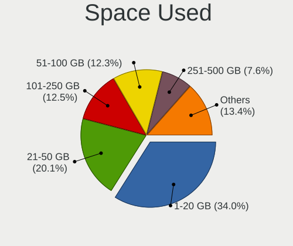

| Used GB        | Computers | Percent |
|----------------|-----------|---------|
| 1-20           | 672       | 33.97%  |
| 21-50          | 398       | 20.12%  |
| 101-250        | 248       | 12.54%  |
| 51-100         | 243       | 12.29%  |
| 251-500        | 151       | 7.63%   |
| 501-1000       | 116       | 5.86%   |
| 1001-2000      | 55        | 2.78%   |
| More than 3000 | 44        | 2.22%   |
| 2001-3000      | 29        | 1.47%   |
| Unknown        | 22        | 1.11%   |

Malfunc. Drives
---------------

Drive models with a malfunction

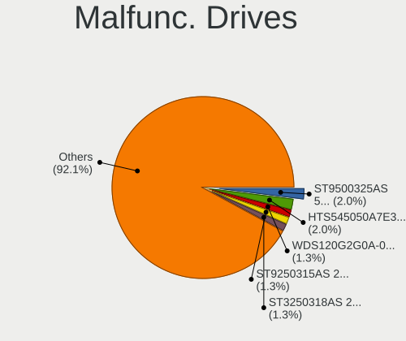

| Model                                 | Computers | Drives | Percent |
|---------------------------------------|-----------|--------|---------|
| Seagate ST9500325AS 500GB             | 3         | 3      | 1.97%   |
| Hitachi HTS545050A7E380 500GB         | 3         | 3      | 1.97%   |
| WDC WDS120G2G0A-00JH30 120GB SSD      | 2         | 2      | 1.32%   |
| Seagate ST9250315AS 250GB             | 2         | 2      | 1.32%   |
| Seagate ST3250318AS 250GB             | 2         | 2      | 1.32%   |
| Samsung Electronics SSD 970 EVO 500GB | 2         | 3      | 1.32%   |
| Samsung Electronics SSD 870 EVO 2TB   | 2         | 2      | 1.32%   |
| Samsung Electronics HD502IJ 500GB     | 2         | 3      | 1.32%   |
| Intel SSDSA2M160G2GC 160GB            | 2         | 2      | 1.32%   |
| Hitachi HTS543232L9A300 320GB         | 2         | 2      | 1.32%   |
| HGST HTS545050A7E680 500GB            | 2         | 2      | 1.32%   |
| WINTEC 240GB SATA3 SF2281 SSD         | 1         | 1      | 0.66%   |
| WDC WD7500BPVT-00HXZT3 752GB          | 1         | 1      | 0.66%   |
| WDC WD5000LPVX-60V0TT0 500GB          | 1         | 1      | 0.66%   |
| WDC WD5000BEVT-22A0RT0 500GB          | 1         | 1      | 0.66%   |
| WDC WD3200BEVT-60ZCT1 320GB           | 1         | 1      | 0.66%   |
| WDC WD3200BEVT-26A23T0 320GB          | 1         | 1      | 0.66%   |
| WDC WD3200BEVT-22A23T0 320GB          | 1         | 1      | 0.66%   |
| WDC WD3200AAKS-00L9A0 320GB           | 1         | 1      | 0.66%   |
| WDC WD2500BEVT-24A23T0 250GB          | 1         | 1      | 0.66%   |
| WDC WD1600JS-60MHB5 160GB             | 1         | 1      | 0.66%   |
| WDC WD1600BEVT-22ZCT0 160GB           | 1         | 1      | 0.66%   |
| WDC WD15EADS-00P8B0 1TB               | 1         | 1      | 0.66%   |
| WDC WD1200BEVS-07LAT0 120GB           | 1         | 1      | 0.66%   |
| WDC WD10SPZX-24Z10 1TB                | 1         | 1      | 0.66%   |
| WDC WD10EZRZ-00HTKB0 1TB              | 1         | 1      | 0.66%   |
| WDC WD10EZEX-75M2NA0 1TB              | 1         | 1      | 0.66%   |
| WDC WD10EZEX-60WN4A0 1TB              | 1         | 1      | 0.66%   |
| WDC WD10EFRX-68PJCN0 1TB              | 1         | 1      | 0.66%   |
| WDC WD1002FAEX-00Y9A0 1TB             | 1         | 1      | 0.66%   |
| WDC WD Green 2.5 240GB                | 1         | 1      | 0.66%   |
| Unknown MMC Card  128GB               | 1         | 1      | 0.66%   |
| Transcend TS512GMTS430S 512GB SSD     | 1         | 1      | 0.66%   |
| Toshiba THNSNF128GCSS 128GB SSD       | 1         | 1      | 0.66%   |
| Toshiba MQ04ABF100 1TB                | 1         | 1      | 0.66%   |
| Toshiba MK1652GSX 160GB               | 1         | 1      | 0.66%   |
| Toshiba MK1637GSX 160GB               | 1         | 1      | 0.66%   |
| Toshiba MD04ACA400 4TB                | 1         | 1      | 0.66%   |
| Toshiba HDWD110 1TB                   | 1         | 1      | 0.66%   |
| Toshiba DT01ACA050 500GB              | 1         | 1      | 0.66%   |

Malfunc. Drive Vendor
---------------------

Vendors of faulty drives

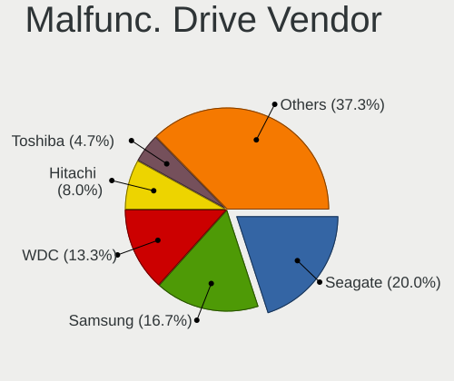

| Vendor              | Computers | Drives | Percent |
|---------------------|-----------|--------|---------|
| Seagate             | 30        | 31     | 20%     |
| Samsung Electronics | 25        | 27     | 16.67%  |
| WDC                 | 20        | 21     | 13.33%  |
| Hitachi             | 12        | 13     | 8%      |
| Toshiba             | 7         | 7      | 4.67%   |
| Intel               | 7         | 7      | 4.67%   |
| SanDisk             | 4         | 5      | 2.67%   |
| Kingston            | 4         | 4      | 2.67%   |
| HGST                | 4         | 4      | 2.67%   |
| Fujitsu             | 4         | 4      | 2.67%   |
| SK hynix            | 3         | 3      | 2%      |
| Crucial             | 3         | 4      | 2%      |
| China               | 3         | 4      | 2%      |
| Apple               | 3         | 3      | 2%      |
| A-DATA Technology   | 3         | 3      | 2%      |
| Micron Technology   | 2         | 2      | 1.33%   |
| Maxtor              | 2         | 2      | 1.33%   |
| WINTEC              | 1         | 1      | 0.67%   |
| Unknown             | 1         | 1      | 0.67%   |
| Transcend           | 1         | 1      | 0.67%   |
| SSSTC               | 1         | 1      | 0.67%   |
| Solid               | 1         | 1      | 0.67%   |
| SD                  | 1         | 1      | 0.67%   |
| Phison              | 1         | 1      | 0.67%   |
| Lexar               | 1         | 1      | 0.67%   |
| Leven               | 1         | 1      | 0.67%   |
| KUU                 | 1         | 1      | 0.67%   |
| KingSpec            | 1         | 1      | 0.67%   |
| JMicron Technology  | 1         | 1      | 0.67%   |
| Intenso             | 1         | 1      | 0.67%   |
| IBM/Hitachi         | 1         | 1      | 0.67%   |

Malfunc. HDD Vendor
-------------------

Vendors of faulty HDD drives

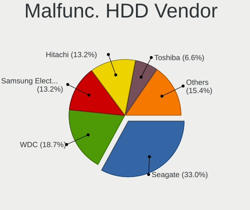

| Vendor              | Computers | Drives | Percent |
|---------------------|-----------|--------|---------|
| Seagate             | 30        | 31     | 32.97%  |
| WDC                 | 17        | 18     | 18.68%  |
| Samsung Electronics | 12        | 13     | 13.19%  |
| Hitachi             | 12        | 13     | 13.19%  |
| Toshiba             | 6         | 6      | 6.59%   |
| HGST                | 4         | 4      | 4.4%    |
| Fujitsu             | 4         | 4      | 4.4%    |
| Maxtor              | 2         | 2      | 2.2%    |
| Apple               | 2         | 2      | 2.2%    |
| JMicron Technology  | 1         | 1      | 1.1%    |
| IBM/Hitachi         | 1         | 1      | 1.1%    |

Malfunc. Drive Kind
-------------------

Kinds of faulty drives

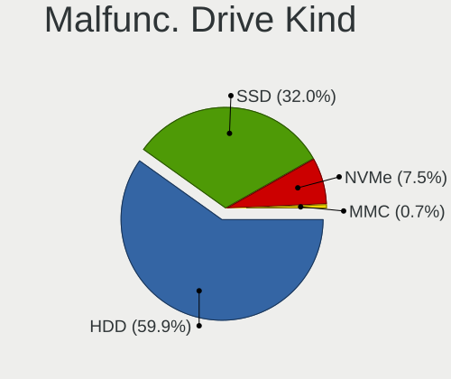

| Kind | Computers | Drives | Percent |
|------|-----------|--------|---------|
| HDD  | 88        | 95     | 59.86%  |
| SSD  | 47        | 50     | 31.97%  |
| NVMe | 11        | 12     | 7.48%   |
| MMC  | 1         | 1      | 0.68%   |

Failed Drives
-------------

Failed drive models

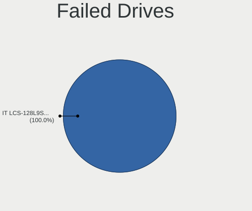

| Model                                     | Computers | Drives | Percent |
|-------------------------------------------|-----------|--------|---------|
| LITEON IT LCS-128L9S-11 2.5 7mm 128GB SSD | 1         | 1      | 100%    |

Failed Drive Vendor
-------------------

Failed drive vendors

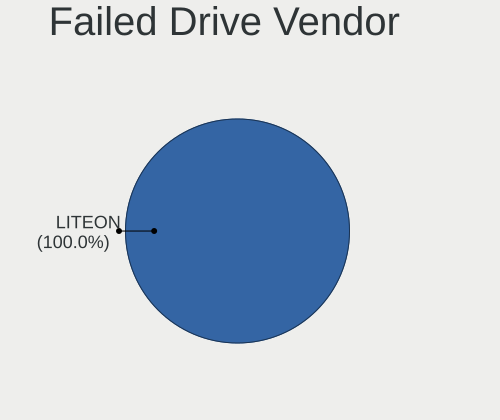

| Vendor | Computers | Drives | Percent |
|--------|-----------|--------|---------|
| LITEON | 1         | 1      | 100%    |

Drive Status
------------

Number of failed and malfunc. drives

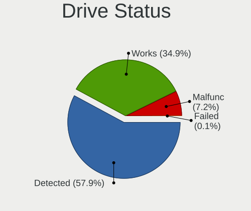

| Status   | Computers | Drives | Percent |
|----------|-----------|--------|---------|
| Detected | 1156      | 2261   | 57.86%  |
| Works    | 697       | 1230   | 34.88%  |
| Malfunc  | 144       | 158    | 7.21%   |
| Failed   | 1         | 1      | 0.05%   |

Storage controller
------------------

Storage Vendor
--------------

Storage controller vendors

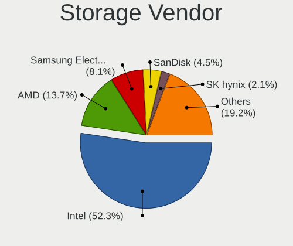

| Vendor                                  | Computers | Percent |
|-----------------------------------------|-----------|---------|
| Intel                                   | 1217      | 52.34%  |
| AMD                                     | 318       | 13.68%  |
| Samsung Electronics                     | 189       | 8.13%   |
| SanDisk                                 | 105       | 4.52%   |
| SK hynix                                | 49        | 2.11%   |
| Phison Electronics                      | 43        | 1.85%   |
| Kingston Technology Company             | 40        | 1.72%   |
| ASMedia Technology                      | 39        | 1.68%   |
| Micron Technology                       | 37        | 1.59%   |
| Nvidia                                  | 36        | 1.55%   |
| Micron/Crucial Technology               | 35        | 1.51%   |
| JMicron Technology                      | 25        | 1.08%   |
| Marvell Technology Group                | 22        | 0.95%   |
| KIOXIA                                  | 20        | 0.86%   |
| MAXIO Technology (Hangzhou)             | 18        | 0.77%   |
| Silicon Motion                          | 17        | 0.73%   |
| Toshiba America Info Systems            | 16        | 0.69%   |
| VIA Technologies                        | 15        | 0.65%   |
| ADATA Technology                        | 13        | 0.56%   |
| Silicon Integrated Systems [SiS]        | 9         | 0.39%   |
| Broadcom / LSI                          | 6         | 0.26%   |
| Union Memory (Shenzhen)                 | 5         | 0.22%   |
| Shenzhen Longsys Electronics            | 5         | 0.22%   |
| Realtek Semiconductor                   | 5         | 0.22%   |
| Solidigm                                | 4         | 0.17%   |
| Solid State Storage Technology          | 4         | 0.17%   |
| Silicon Image                           | 4         | 0.17%   |
| LSI Logic / Symbios Logic               | 4         | 0.17%   |
| Hosin Global Electronics                | 3         | 0.13%   |
| Apple                                   | 3         | 0.13%   |
| Yangtze Memory Technologies             | 2         | 0.09%   |
| TenaFe                                  | 2         | 0.09%   |
| Seagate Technology                      | 2         | 0.09%   |
| Netac Technology                        | 2         | 0.09%   |
| Integrated Technology Express           | 2         | 0.09%   |
| INNOGRIT                                | 2         | 0.09%   |
| Biwin Storage Technology                | 2         | 0.09%   |
| Shenzhen Unionmemory Information System | 1         | 0.04%   |
| Dell                                    | 1         | 0.04%   |
| Chelsio Communications                  | 1         | 0.04%   |

Storage Model
-------------

Storage controller models

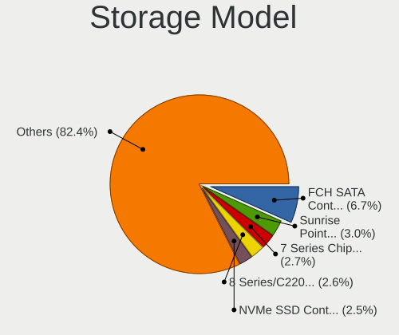

| Model                                                                          | Computers | Percent |
|--------------------------------------------------------------------------------|-----------|---------|
| AMD FCH SATA Controller [AHCI mode]                                            | 180       | 6.67%   |
| Intel Sunrise Point-LP SATA Controller [AHCI mode]                             | 82        | 3.04%   |
| Intel 7 Series Chipset Family 6-port SATA Controller [AHCI mode]               | 73        | 2.7%    |
| Intel 8 Series/C220 Series Chipset Family 6-port SATA Controller 1 [AHCI mode] | 71        | 2.63%   |
| Samsung NVMe SSD Controller SM981/PM981/PM983                                  | 68        | 2.52%   |
| Intel 82801G (ICH7 Family) IDE Controller                                      | 64        | 2.37%   |
| Intel 82801 Mobile SATA Controller [RAID mode]                                 | 62        | 2.3%    |
| Intel 6 Series/C200 Series Chipset Family 6 port Mobile SATA AHCI Controller   | 54        | 2%      |
| Samsung NVMe SSD Controller 980 (DRAM-less)                                    | 50        | 1.85%   |
| Intel Volume Management Device NVMe RAID Controller                            | 45        | 1.67%   |
| Intel 6 Series/C200 Series Chipset Family 6 port Desktop SATA AHCI Controller  | 44        | 1.63%   |
| Intel 8 Series SATA Controller 1 [AHCI mode]                                   | 43        | 1.59%   |
| Intel 82801IBM/IEM (ICH9M/ICH9M-E) 4 port SATA Controller [AHCI mode]          | 42        | 1.56%   |
| Intel 7 Series/C210 Series Chipset Family 6-port SATA Controller [AHCI mode]   | 42        | 1.56%   |
| Intel NM10/ICH7 Family SATA Controller [IDE mode]                              | 40        | 1.48%   |
| AMD SB7x0/SB8x0/SB9x0 SATA Controller [AHCI mode]                              | 38        | 1.41%   |
| ASMedia ASM1061/ASM1062 Serial ATA Controller                                  | 36        | 1.33%   |
| Intel Q170/Q150/B150/H170/H110/Z170/CM236 Chipset SATA Controller [AHCI Mode]  | 35        | 1.3%    |
| AMD 400 Series Chipset SATA Controller                                         | 35        | 1.3%    |
| AMD 500 Series Chipset SATA Controller                                         | 31        | 1.15%   |
| Intel SATA Controller [RAID mode]                                              | 29        | 1.07%   |
| Intel 5 Series/3400 Series Chipset 6 port SATA AHCI Controller                 | 28        | 1.04%   |
| AMD SB7x0/SB8x0/SB9x0 IDE Controller                                           | 28        | 1.04%   |
| Intel 82801HM/HEM (ICH8M/ICH8M-E) IDE Controller                               | 27        | 1%      |
| Intel 82801GBM/GHM (ICH7-M Family) SATA Controller [IDE mode]                  | 27        | 1%      |
| Intel 5 Series/3400 Series Chipset 4 port SATA AHCI Controller                 | 26        | 0.96%   |
| Intel 82801HM/HEM (ICH8M/ICH8M-E) SATA Controller [AHCI mode]                  | 25        | 0.93%   |
| Intel 82801GBM/GHM (ICH7-M Family) SATA Controller [AHCI mode]                 | 24        | 0.89%   |
| Intel Tiger Lake-LP SATA Controller                                            | 22        | 0.82%   |
| Intel Celeron/Pentium Silver Processor SATA Controller                         | 22        | 0.82%   |
| SanDisk Ultra 3D / WD PC SN530, IX SN530, Blue SN550 NVMe SSD (DRAM-less)      | 21        | 0.78%   |
| Samsung NVMe SSD Controller S4LV008[Pascal]                                    | 21        | 0.78%   |
| Intel 200 Series PCH SATA controller [AHCI mode]                               | 21        | 0.78%   |
| Intel Wildcat Point-LP SATA Controller [AHCI Mode]                             | 20        | 0.74%   |
| Intel Cannon Lake PCH SATA AHCI Controller                                     | 20        | 0.74%   |
| AMD SB7x0/SB8x0/SB9x0 SATA Controller [IDE mode]                               | 19        | 0.7%    |
| Intel NM10/ICH7 Family SATA Controller [AHCI mode]                             | 18        | 0.67%   |
| AMD 600 Series Chipset SATA Controller                                         | 18        | 0.67%   |
| SK hynix Gold P31/BC711/PC711 NVMe Solid State Drive                           | 17        | 0.63%   |
| Samsung NVMe SSD Controller PM9A1/PM9A3/980PRO                                 | 17        | 0.63%   |

Storage Kind
------------

Kind of storage controller (IDE, SATA, NVMe, SAS, ...)

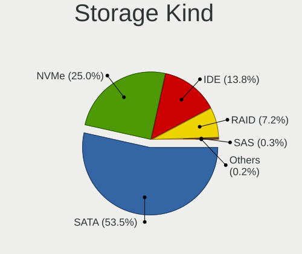

| Kind | Computers | Percent |
|------|-----------|---------|
| SATA | 1256      | 53.47%  |
| NVMe | 587       | 24.99%  |
| IDE  | 324       | 13.79%  |
| RAID | 170       | 7.24%   |
| SAS  | 7         | 0.3%    |
| SCSI | 5         | 0.21%   |

Processor
---------

CPU Vendor
----------

Processor vendors

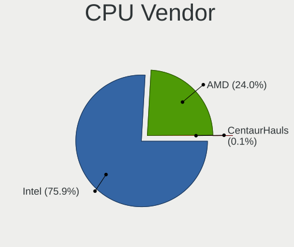

| Vendor       | Computers | Percent |
|--------------|-----------|---------|
| Intel        | 1390      | 75.91%  |
| AMD          | 439       | 23.98%  |
| CentaurHauls | 2         | 0.11%   |

CPU Model
---------

Processor models

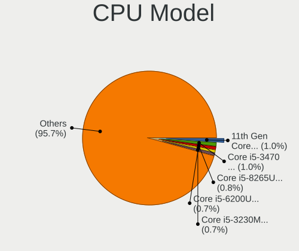

| Model                                   | Computers | Percent |
|-----------------------------------------|-----------|---------|
| Intel 11th Gen Core i5-1135G7 @ 2.40GHz | 19        | 1.04%   |
| Intel Core i5-3470 CPU @ 3.20GHz        | 18        | 0.98%   |
| Intel Core i5-8265U CPU @ 1.60GHz       | 15        | 0.82%   |
| Intel Core i5-6200U CPU @ 2.30GHz       | 13        | 0.71%   |
| Intel Core i5-3230M CPU @ 2.60GHz       | 13        | 0.71%   |
| Intel Core i5-7200U CPU @ 2.50GHz       | 12        | 0.65%   |
| Intel 11th Gen Core i3-1115G4 @ 3.00GHz | 12        | 0.65%   |
| AMD Ryzen 7 3700X 8-Core Processor      | 12        | 0.65%   |
| AMD Ryzen 5 5500U with Radeon Graphics  | 12        | 0.65%   |
| Intel N100                              | 11        | 0.6%    |
| Intel Core i5-3320M CPU @ 2.60GHz       | 11        | 0.6%    |
| Intel Atom CPU N270 @ 1.60GHz           | 11        | 0.6%    |
| Intel Core i5-8250U CPU @ 1.60GHz       | 10        | 0.54%   |
| Intel Atom x5-Z8350 CPU @ 1.44GHz       | 10        | 0.54%   |
| Intel Atom CPU N2600 @ 1.60GHz          | 10        | 0.54%   |
| Intel Core i7-8565U CPU @ 1.80GHz       | 9         | 0.49%   |
| Intel Core i7-7500U CPU @ 2.70GHz       | 9         | 0.49%   |
| Intel Core i7-3770 CPU @ 3.40GHz        | 9         | 0.49%   |
| Intel Core i7-10510U CPU @ 1.80GHz      | 9         | 0.49%   |
| Intel Core i3-2310M CPU @ 2.10GHz       | 9         | 0.49%   |
| Intel Core i7-8550U CPU @ 1.80GHz       | 8         | 0.44%   |
| Intel Core i7-7700HQ CPU @ 2.80GHz      | 8         | 0.44%   |
| Intel Core i5-6300U CPU @ 2.40GHz       | 8         | 0.44%   |
| Intel Core i5-5200U CPU @ 2.20GHz       | 8         | 0.44%   |
| Intel Core i5-4200U CPU @ 1.60GHz       | 8         | 0.44%   |
| Intel Core i5-10210U CPU @ 1.60GHz      | 8         | 0.44%   |
| Intel Core 2 Duo CPU T6600 @ 2.20GHz    | 8         | 0.44%   |
| Intel 11th Gen Core i7-1165G7 @ 2.80GHz | 8         | 0.44%   |
| AMD Ryzen 7 5800H with Radeon Graphics  | 8         | 0.44%   |
| AMD Ryzen 7 5700U with Radeon Graphics  | 8         | 0.44%   |
| Intel Genuine CPU T2300 @ 1.66GHz       | 7         | 0.38%   |
| Intel Core i7-4790 CPU @ 3.60GHz        | 7         | 0.38%   |
| Intel Core i7-4770 CPU @ 3.40GHz        | 7         | 0.38%   |
| Intel Core i7-2600 CPU @ 3.40GHz        | 7         | 0.38%   |
| Intel Core i5-4210U CPU @ 1.70GHz       | 7         | 0.38%   |
| Intel Core i5-2520M CPU @ 2.50GHz       | 7         | 0.38%   |
| Intel Core i5-2450M CPU @ 2.50GHz       | 7         | 0.38%   |
| Intel Core i5-2400 CPU @ 3.10GHz        | 7         | 0.38%   |
| Intel Celeron N4020 CPU @ 1.10GHz       | 7         | 0.38%   |
| AMD Ryzen 5 5600G with Radeon Graphics  | 7         | 0.38%   |

CPU Model Family
----------------

Processor model prefix

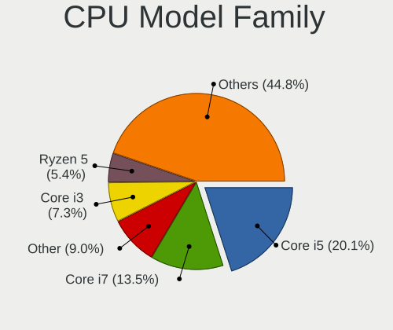

| Model                   | Computers | Percent |
|-------------------------|-----------|---------|
| Intel Core i5           | 368       | 20.07%  |
| Intel Core i7           | 247       | 13.47%  |
| Other                   | 165       | 9%      |
| Intel Core i3           | 134       | 7.31%   |
| AMD Ryzen 5             | 99        | 5.4%    |
| Intel Core 2 Duo        | 97        | 5.29%   |
| AMD Ryzen 7             | 90        | 4.91%   |
| Intel Celeron           | 85        | 4.63%   |
| Intel Atom              | 52        | 2.84%   |
| Intel Xeon              | 50        | 2.73%   |
| Intel Pentium           | 43        | 2.34%   |
| AMD Ryzen 9             | 33        | 1.8%    |
| Intel Pentium Dual-Core | 24        | 1.31%   |
| Intel Genuine           | 23        | 1.25%   |
| AMD Ryzen 3             | 23        | 1.25%   |
| Intel Core 2 Quad       | 19        | 1.04%   |
| Intel Core 2            | 18        | 0.98%   |
| AMD A4                  | 16        | 0.87%   |
| AMD FX                  | 14        | 0.76%   |
| Intel Pentium Dual      | 12        | 0.65%   |
| Intel Pentium M         | 11        | 0.6%    |
| AMD A8                  | 11        | 0.6%    |
| AMD Phenom II X6        | 10        | 0.55%   |
| AMD A6                  | 10        | 0.55%   |
| AMD Sempron             | 9         | 0.49%   |
| AMD E1                  | 9         | 0.49%   |
| AMD Athlon 64 X2        | 9         | 0.49%   |
| Intel Pentium Silver    | 8         | 0.44%   |
| Intel Pentium D         | 8         | 0.44%   |
| Intel Core i9           | 8         | 0.44%   |
| AMD Ryzen 5 PRO         | 8         | 0.44%   |
| AMD Athlon              | 8         | 0.44%   |
| Intel Pentium 4         | 7         | 0.38%   |
| Intel Core              | 7         | 0.38%   |
| AMD Ryzen 7 PRO         | 7         | 0.38%   |
| AMD E2                  | 7         | 0.38%   |
| AMD Athlon II X2        | 7         | 0.38%   |
| Intel Core Duo          | 6         | 0.33%   |
| AMD Phenom II X4        | 6         | 0.33%   |
| AMD A10                 | 6         | 0.33%   |

CPU Cores
---------

Number of processor cores

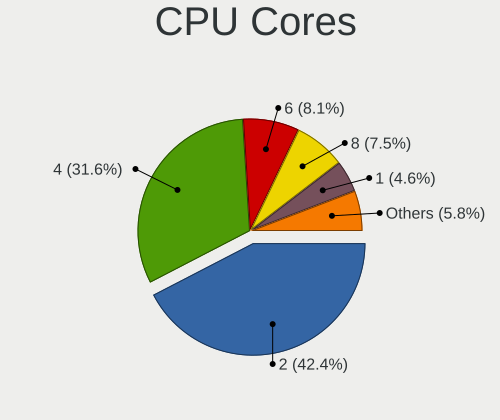

| Number | Computers | Percent |
|--------|-----------|---------|
| 2      | 778       | 42.4%   |
| 4      | 580       | 31.61%  |
| 6      | 149       | 8.12%   |
| 8      | 137       | 7.47%   |
| 1      | 84        | 4.58%   |
| 12     | 40        | 2.18%   |
| 10     | 22        | 1.2%    |
| 16     | 21        | 1.14%   |
| 14     | 15        | 0.82%   |
| 3      | 5         | 0.27%   |
| 24     | 3         | 0.16%   |
| 20     | 1         | 0.05%   |

CPU Sockets
-----------

Number of sockets

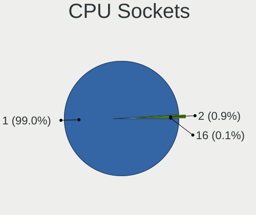

| Number | Computers | Percent |
|--------|-----------|---------|
| 1      | 1813      | 99.02%  |
| 2      | 17        | 0.93%   |
| 16     | 1         | 0.05%   |

CPU Threads
-----------

Threads per core (Hyper-Threading)

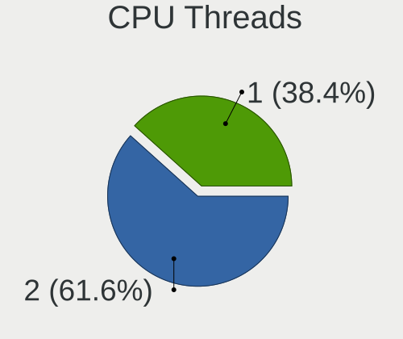

| Number | Computers | Percent |
|--------|-----------|---------|
| 2      | 1130      | 61.65%  |
| 1      | 703       | 38.35%  |

CPU Op-Modes
------------

CPU Operation Modes (32-bit, 64-bit)

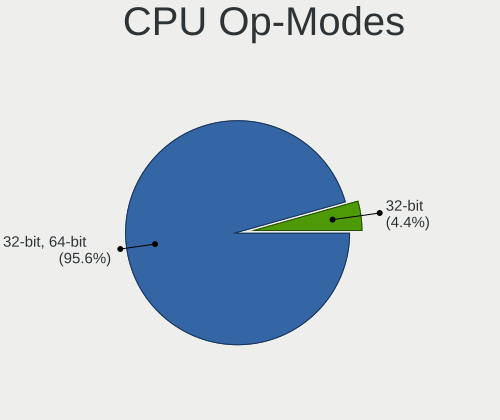

| Op mode        | Computers | Percent |
|----------------|-----------|---------|
| 32-bit, 64-bit | 1751      | 95.63%  |
| 32-bit         | 80        | 4.37%   |

CPU Microcode
-------------

Microcode number

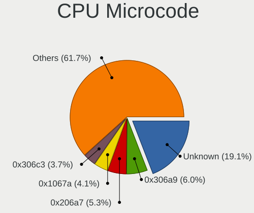

| Number     | Computers | Percent |
|------------|-----------|---------|
| Unknown    | 358       | 19.13%  |
| 0x306a9    | 113       | 6.04%   |
| 0x206a7    | 100       | 5.34%   |
| 0x1067a    | 77        | 4.12%   |
| 0x306c3    | 69        | 3.69%   |
| 0x40651    | 44        | 2.35%   |
| 0x806c1    | 35        | 1.87%   |
| 0x806ec    | 33        | 1.76%   |
| 0x406e3    | 33        | 1.76%   |
| 0x6fd      | 32        | 1.71%   |
| 0x20655    | 32        | 1.71%   |
| 0x806e9    | 31        | 1.66%   |
| 0x506e3    | 31        | 1.66%   |
| 0x08108109 | 30        | 1.6%    |
| 0x806ea    | 29        | 1.55%   |
| 0x906e9    | 28        | 1.5%    |
| 0x306d4    | 21        | 1.12%   |
| 0x10676    | 21        | 1.12%   |
| 0x406c4    | 19        | 1.02%   |
| 0x010000c8 | 19        | 1.02%   |
| 0x906ea    | 18        | 0.96%   |
| 0x106c2    | 18        | 0.96%   |
| 0x6f6      | 16        | 0.86%   |
| 0x6e8      | 16        | 0.86%   |
| 0x08608103 | 16        | 0.86%   |
| 0x706a8    | 15        | 0.8%    |
| 0x30678    | 14        | 0.75%   |
| 0x0a50000d | 14        | 0.75%   |
| 0x0a50000c | 14        | 0.75%   |
| 0x06006705 | 14        | 0.75%   |
| 0xb06e0    | 13        | 0.69%   |
| 0x906a3    | 13        | 0.69%   |
| 0x6fb      | 13        | 0.69%   |
| 0x6ec      | 13        | 0.69%   |
| 0x106e5    | 13        | 0.69%   |
| 0x906ed    | 12        | 0.64%   |
| 0x906c0    | 12        | 0.64%   |
| 0x30661    | 12        | 0.64%   |
| 0x706e5    | 11        | 0.59%   |
| 0x0800820d | 11        | 0.59%   |

CPU Microarch
-------------

Microarchitecture

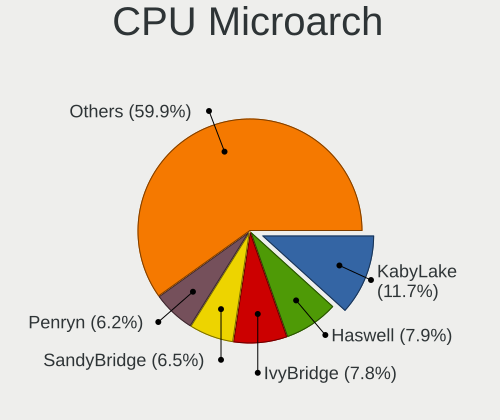

| Name             | Computers | Percent |
|------------------|-----------|---------|
| KabyLake         | 215       | 11.72%  |
| Haswell          | 145       | 7.9%    |
| IvyBridge        | 143       | 7.79%   |
| SandyBridge      | 119       | 6.49%   |
| Penryn           | 114       | 6.21%   |
| Unknown          | 98        | 5.34%   |
| Zen 3            | 77        | 4.2%    |
| Skylake          | 75        | 4.09%   |
| Core             | 75        | 4.09%   |
| Alderlake Hybrid | 71        | 3.87%   |
| Westmere         | 54        | 2.94%   |
| Zen+             | 52        | 2.83%   |
| Silvermont       | 49        | 2.67%   |
| TigerLake        | 48        | 2.62%   |
| P6               | 42        | 2.29%   |
| K10              | 41        | 2.23%   |
| Zen 2            | 38        | 2.07%   |
| Bonnell          | 38        | 2.07%   |
| Broadwell        | 33        | 1.8%    |
| Zen              | 31        | 1.69%   |
| Goldmont plus    | 28        | 1.53%   |
| Piledriver       | 24        | 1.31%   |
| Excavator        | 24        | 1.31%   |
| IceLake          | 23        | 1.25%   |
| K8 Hammer        | 22        | 1.2%    |
| CometLake        | 22        | 1.2%    |
| Nehalem          | 21        | 1.14%   |
| NetBurst         | 19        | 1.04%   |
| Gracemont        | 17        | 0.93%   |
| Puma             | 14        | 0.76%   |
| Tremont          | 12        | 0.65%   |
| Bobcat           | 11        | 0.6%    |
| Goldmont         | 10        | 0.54%   |
| Jaguar           | 8         | 0.44%   |
| K10 Llano        | 6         | 0.33%   |
| Bulldozer        | 6         | 0.33%   |
| K8 & K10 hybrid  | 4         | 0.22%   |
| K6               | 4         | 0.22%   |
| Steamroller      | 2         | 0.11%   |

Graphics
--------

GPU Vendor
----------

Vendors of graphics cards

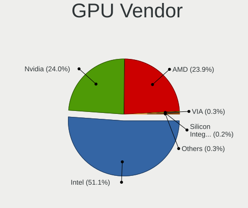

| Vendor                           | Computers | Percent |
|----------------------------------|-----------|---------|
| Intel                            | 1058      | 51.14%  |
| Nvidia                           | 497       | 24.02%  |
| AMD                              | 495       | 23.92%  |
| VIA Technologies                 | 7         | 0.34%   |
| Silicon Integrated Systems [SiS] | 5         | 0.24%   |
| Matrox Electronics Systems       | 5         | 0.24%   |
| S3 Graphics                      | 1         | 0.05%   |
| ASPEED Technology                | 1         | 0.05%   |

GPU Model
---------

Graphics card models

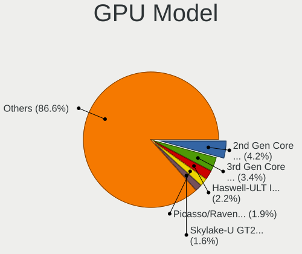

| Model                                                                                    | Computers | Percent |
|------------------------------------------------------------------------------------------|-----------|---------|
| Intel 2nd Generation Core Processor Family Integrated Graphics Controller                | 91        | 4.21%   |
| Intel 3rd Gen Core processor Graphics Controller                                         | 74        | 3.42%   |
| Intel Haswell-ULT Integrated Graphics Controller                                         | 48        | 2.22%   |
| AMD Picasso/Raven 2 [Radeon Vega Series / Radeon Vega Mobile Series]                     | 42        | 1.94%   |
| Intel Skylake-U GT2 [HD Graphics 520]                                                    | 35        | 1.62%   |
| Intel Core Processor Integrated Graphics Controller                                      | 35        | 1.62%   |
| Intel TigerLake-LP GT2 [Iris Xe Graphics]                                                | 34        | 1.57%   |
| Intel Mobile 945GM/GMS/GME, 943/940GML Express Integrated Graphics Controller            | 34        | 1.57%   |
| Intel Kaby Lake-U GT2 [HD Graphics 620]                                                  | 34        | 1.57%   |
| Intel Kaby Lake-R GT2 [UHD Graphics 620]                                                 | 34        | 1.57%   |
| Intel WhiskeyLake-U GT2 [UHD Graphics 620]                                               | 33        | 1.52%   |
| Intel Xeon E3-1200 v2/3rd Gen Core processor Graphics Controller                         | 32        | 1.48%   |
| Intel Atom/Celeron/Pentium Processor x5-E8000/J3xxx/N3xxx Integrated Graphics Controller | 31        | 1.43%   |
| Intel Mobile 4 Series Chipset Integrated Graphics Controller                             | 29        | 1.34%   |
| Intel 4th Gen Core Processor Integrated Graphics Controller                              | 29        | 1.34%   |
| AMD Cezanne [Radeon Vega Series / Radeon Vega Mobile Series]                             | 28        | 1.29%   |
| Intel CometLake-U GT2 [UHD Graphics]                                                     | 24        | 1.11%   |
| Intel Xeon E3-1200 v3/4th Gen Core Processor Integrated Graphics Controller              | 23        | 1.06%   |
| Intel Mobile 945GM/GMS, 943/940GML Express Integrated Graphics Controller                | 22        | 1.02%   |
| Intel GeminiLake [UHD Graphics 600]                                                      | 22        | 1.02%   |
| AMD Lucienne                                                                             | 22        | 1.02%   |
| Intel Raptor Lake-P [Iris Xe Graphics]                                                   | 20        | 0.92%   |
| Intel Broadwell-U GT2 [HD Graphics 5500]                                                 | 20        | 0.92%   |
| AMD Stoney [Radeon R2/R3/R4/R5 Graphics]                                                 | 19        | 0.88%   |
| AMD Renoir [Radeon Vega Series / Radeon Vega Mobile Series]                              | 19        | 0.88%   |
| Intel Atom Processor Z36xxx/Z37xxx Series Graphics & Display                             | 18        | 0.83%   |
| AMD Ellesmere [Radeon RX 470/480/570/570X/580/580X/590]                                  | 18        | 0.83%   |
| Intel Alder Lake-P GT2 [Iris Xe Graphics]                                                | 17        | 0.79%   |
| Intel Alder Lake-N [UHD Graphics]                                                        | 17        | 0.79%   |
| Nvidia GK208B [GeForce GT 710]                                                           | 16        | 0.74%   |
| Intel Skylake-S GT2 [HD Graphics 530]                                                    | 16        | 0.74%   |
| Intel CoffeeLake-S GT2 [UHD Graphics 630]                                                | 15        | 0.69%   |
| Intel CoffeeLake-H GT2 [UHD Graphics 630]                                                | 15        | 0.69%   |
| Intel 4 Series Chipset Integrated Graphics Controller                                    | 15        | 0.69%   |
| AMD Rembrandt [Radeon 680M]                                                              | 15        | 0.69%   |
| Intel Mobile GM965/GL960 Integrated Graphics Controller (secondary)                      | 14        | 0.65%   |
| Intel Mobile GM965/GL960 Integrated Graphics Controller (primary)                        | 14        | 0.65%   |
| AMD Raven Ridge [Radeon Vega Series / Radeon Vega Mobile Series]                         | 14        | 0.65%   |
| Intel Tiger Lake-LP GT2 [UHD Graphics G4]                                                | 13        | 0.6%    |
| Intel Mobile 945GSE Express Integrated Graphics Controller                               | 13        | 0.6%    |

GPU Combo
---------

Combinations of graphics cards

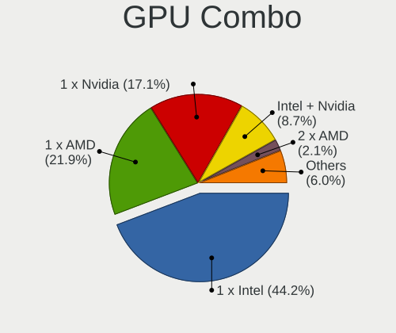

| Name            | Computers | Percent |
|-----------------|-----------|---------|
| 1 x Intel       | 812       | 44.23%  |
| 1 x AMD         | 402       | 21.9%   |
| 1 x Nvidia      | 314       | 17.1%   |
| Intel + Nvidia  | 159       | 8.66%   |
| 2 x AMD         | 39        | 2.12%   |
| Intel + AMD     | 36        | 1.96%   |
| 2 x Intel       | 30        | 1.63%   |
| AMD + Nvidia    | 19        | 1.03%   |
| 1 x VIA         | 7         | 0.38%   |
| 1 x SiS         | 5         | 0.27%   |
| 1 x Matrox      | 5         | 0.27%   |
| 2 x Nvidia      | 4         | 0.22%   |
| Other           | 2         | 0.11%   |
| 1 x S3 Graphics | 1         | 0.05%   |
| 1 x ASPEED      | 1         | 0.05%   |

GPU Driver
----------

Free vs proprietary

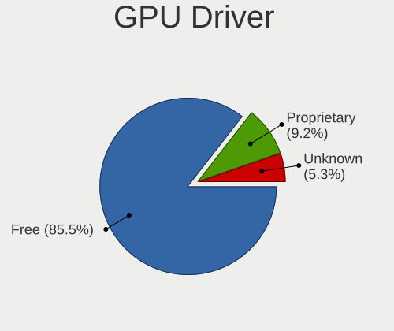

| Driver      | Computers | Percent |
|-------------|-----------|---------|
| Free        | 1579      | 85.54%  |
| Proprietary | 169       | 9.15%   |
| Unknown     | 98        | 5.31%   |

GPU Memory
----------

Total video memory

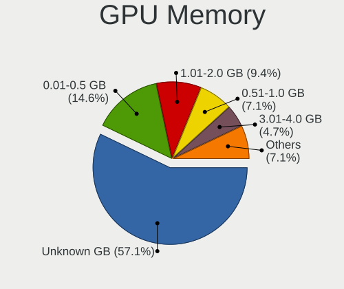

| Size in GB | Computers | Percent |
|------------|-----------|---------|
| Unknown    | 1061      | 57.14%  |
| 0.01-0.5   | 271       | 14.59%  |
| 1.01-2.0   | 175       | 9.42%   |
| 0.51-1.0   | 132       | 7.11%   |
| 3.01-4.0   | 87        | 4.68%   |
| 7.01-8.0   | 54        | 2.91%   |
| 5.01-6.0   | 31        | 1.67%   |
| 8.01-16.0  | 24        | 1.29%   |
| 2.01-3.0   | 16        | 0.86%   |
| 16.01-24.0 | 6         | 0.32%   |

Monitor
-------

Monitor Vendor
--------------

Monitor vendors

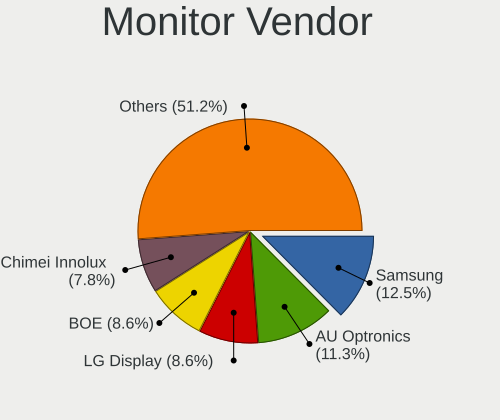

| Vendor                  | Computers | Percent |
|-------------------------|-----------|---------|
| Samsung Electronics     | 239       | 12.55%  |
| AU Optronics            | 215       | 11.29%  |
| LG Display              | 164       | 8.61%   |
| BOE                     | 163       | 8.56%   |
| Chimei Innolux          | 149       | 7.82%   |
| Goldstar                | 97        | 5.09%   |
| Dell                    | 86        | 4.51%   |
| Acer                    | 64        | 3.36%   |
| Apple                   | 55        | 2.89%   |
| Hewlett-Packard         | 52        | 2.73%   |
| Philips                 | 44        | 2.31%   |
| AOC                     | 39        | 2.05%   |
| Lenovo                  | 38        | 1.99%   |
| BenQ                    | 37        | 1.94%   |
| Chi Mei Optoelectronics | 32        | 1.68%   |
| Ancor Communications    | 29        | 1.52%   |
| LG Philips              | 22        | 1.15%   |
| Sharp                   | 20        | 1.05%   |
| Iiyama                  | 19        | 1%      |
| HannStar                | 18        | 0.94%   |
| ASUSTek Computer        | 18        | 0.94%   |
| PANDA                   | 15        | 0.79%   |
| InfoVision              | 15        | 0.79%   |
| Eizo                    | 15        | 0.79%   |
| Unknown                 | 14        | 0.73%   |
| HUAWEI                  | 14        | 0.73%   |
| Fujitsu Siemens         | 14        | 0.73%   |
| Sony                    | 13        | 0.68%   |
| ViewSonic               | 9         | 0.47%   |
| MSI                     | 9         | 0.47%   |
| Panasonic               | 8         | 0.42%   |
| CPT                     | 8         | 0.42%   |
| Toshiba                 | 7         | 0.37%   |
| Quanta Display          | 7         | 0.37%   |
| NEC Computers           | 7         | 0.37%   |
| Mi                      | 6         | 0.31%   |
| Hitachi                 | 6         | 0.31%   |
| Belinea                 | 6         | 0.31%   |
| Sceptre Tech            | 5         | 0.26%   |
| HKC                     | 5         | 0.26%   |

Monitor Model
-------------

Monitor models

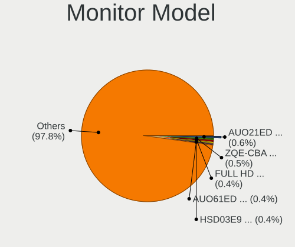

| Model                                                                | Computers | Percent |
|----------------------------------------------------------------------|-----------|---------|
| AU Optronics LCD Monitor AUO21ED 1920x1080 344x193mm 15.5-inch       | 11        | 0.56%   |
| HUAWEI ZQE-CBA HWV6A25 3440x1440 797x334mm 34.0-inch                 | 9         | 0.46%   |
| Goldstar FULL HD GSM5B55 1920x1080 480x270mm 21.7-inch               | 8         | 0.41%   |
| AU Optronics LCD Monitor AUO61ED 1920x1080 344x194mm 15.5-inch       | 8         | 0.41%   |
| HannStar LCD Monitor HSD03E9 1024x600 220x129mm 10.0-inch            | 7         | 0.36%   |
| Samsung Electronics LCD Monitor SEC5441 1280x800 331x207mm 15.4-inch | 6         | 0.31%   |
| Panasonic VVX11F009G00 MEI96A2 1920x1080 344x193mm 15.5-inch         | 6         | 0.31%   |
| LG Display LCD Monitor LGD046F 1920x1080 344x194mm 15.5-inch         | 6         | 0.31%   |
| Chimei Innolux LCD Monitor CMN15F5 1920x1080 344x193mm 15.5-inch     | 6         | 0.31%   |
| Chimei Innolux LCD Monitor CMN15E7 1920x1080 344x193mm 15.5-inch     | 6         | 0.31%   |
| Chimei Innolux LCD Monitor CMN15DB 1366x768 344x193mm 15.5-inch      | 6         | 0.31%   |
| Chimei Innolux LCD Monitor CMN15CA 1366x768 344x193mm 15.5-inch      | 6         | 0.31%   |
| Chimei Innolux LCD Monitor CMN14D4 1920x1080 309x173mm 13.9-inch     | 6         | 0.31%   |
| AU Optronics LCD Monitor AUO38ED 1920x1080 344x193mm 15.5-inch       | 6         | 0.31%   |
| Samsung Electronics C24F390 SAM0D2C 1920x1080 521x293mm 23.5-inch    | 5         | 0.26%   |
| LG Display LCD Monitor LGD033A 1366x768 344x194mm 15.5-inch          | 5         | 0.26%   |
| Chimei Innolux LCD Monitor CMN1618 1920x1200 344x215mm 16.0-inch     | 5         | 0.26%   |
| Chimei Innolux LCD Monitor CMN15C3 1920x1080 344x193mm 15.5-inch     | 5         | 0.26%   |
| BOE LCD Monitor BOE069C 1920x1080 344x193mm 15.5-inch                | 5         | 0.26%   |
| AU Optronics LCD Monitor AUO45EC 1366x768 344x193mm 15.5-inch        | 5         | 0.26%   |
| AU Optronics LCD Monitor AUO10EC 1366x768 344x193mm 15.5-inch        | 5         | 0.26%   |
| AU Optronics LCD Monitor AUO106C 1366x768 276x155mm 12.5-inch        | 5         | 0.26%   |
| LG Display LCD Monitor LGD0430 1366x768 345x194mm 15.6-inch          | 4         | 0.21%   |
| Lenovo LCD Monitor LEN40B1 1600x900 345x194mm 15.6-inch              | 4         | 0.21%   |
| InfoVision LCD Monitor IVO03F4 1920x1080 309x173mm 13.9-inch         | 4         | 0.21%   |
| Chimei Innolux LCD Monitor CMN1521 1920x1080 344x193mm 15.5-inch     | 4         | 0.21%   |
| AU Optronics LCD Monitor AUO403D 1920x1080 309x174mm 14.0-inch       | 4         | 0.21%   |
| AU Optronics LCD Monitor AUO3791 1920x1080 344x194mm 15.5-inch       | 4         | 0.21%   |
| AU Optronics LCD Monitor AUO323D 1920x1080 309x174mm 14.0-inch       | 4         | 0.21%   |
| AU Optronics LCD Monitor AUO243D 1920x1080 309x173mm 13.9-inch       | 4         | 0.21%   |
| Ancor Communications VE228 ACI22FA 1920x1080 477x268mm 21.5-inch     | 4         | 0.21%   |
| SLD LCD Monitor SLD003C 1366x768 309x173mm 13.9-inch                 | 3         | 0.15%   |
| Sharp LCD Monitor SHP1449 1920x1080 294x165mm 13.3-inch              | 3         | 0.15%   |
| Samsung Electronics SA300/SA350 SAM0788 1366x768 410x230mm 18.5-inch | 3         | 0.15%   |
| Samsung Electronics S27F350 SAM0D22 1920x1080 598x336mm 27.0-inch    | 3         | 0.15%   |
| Samsung Electronics LCD Monitor SEC544B 1600x900 382x214mm 17.2-inch | 3         | 0.15%   |
| Samsung Electronics LCD Monitor SEC3345 1280x800 331x207mm 15.4-inch | 3         | 0.15%   |
| Samsung Electronics LCD Monitor SEC3052 1366x768 256x144mm 11.6-inch | 3         | 0.15%   |
| Samsung Electronics LCD Monitor SEC3047 1366x768 277x156mm 12.5-inch | 3         | 0.15%   |
| Philips PHL 242V8 PHLC219 1920x1080 527x296mm 23.8-inch              | 3         | 0.15%   |

Monitor Resolution
------------------

Monitor screen resolution

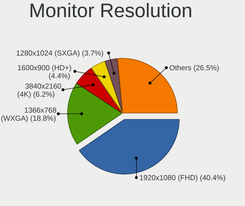

| Resolution         | Computers | Percent |
|--------------------|-----------|---------|
| 1920x1080 (FHD)    | 746       | 40.43%  |
| 1366x768 (WXGA)    | 346       | 18.75%  |
| 3840x2160 (4K)     | 114       | 6.18%   |
| 1600x900 (HD+)     | 82        | 4.44%   |
| 1280x1024 (SXGA)   | 68        | 3.69%   |
| 1280x800 (WXGA)    | 63        | 3.41%   |
| 1920x1200 (WUXGA)  | 62        | 3.36%   |
| 2560x1440 (QHD)    | 59        | 3.2%    |
| 1680x1050 (WSXGA+) | 56        | 3.04%   |
| 1440x900 (WXGA+)   | 56        | 3.04%   |
| 3440x1440          | 22        | 1.19%   |
| 1024x600           | 22        | 1.19%   |
| 2560x1600          | 21        | 1.14%   |
| Unknown            | 16        | 0.87%   |
| 1360x768           | 15        | 0.81%   |
| 2560x1080          | 14        | 0.76%   |
| 1024x768 (XGA)     | 13        | 0.7%    |
| 3840x1080          | 10        | 0.54%   |
| 2880x1800          | 6         | 0.33%   |
| 1920x540           | 5         | 0.27%   |
| 2160x1440          | 4         | 0.22%   |
| 1920x1280          | 4         | 0.22%   |
| 2256x1504          | 3         | 0.16%   |
| 1600x1200          | 3         | 0.16%   |
| 1280x768           | 3         | 0.16%   |
| 4480x1440          | 2         | 0.11%   |
| 3840x2400          | 2         | 0.11%   |
| 3200x1800 (QHD+)   | 2         | 0.11%   |
| 2880x1920          | 2         | 0.11%   |
| 2520x1680          | 2         | 0.11%   |
| 2240x1400          | 2         | 0.11%   |
| 1680x945           | 2         | 0.11%   |
| 1400x1050          | 2         | 0.11%   |
| 1280x720 (HD)      | 2         | 0.11%   |
| 9600x2160          | 1         | 0.05%   |
| 800x1280           | 1         | 0.05%   |
| 7680x2160          | 1         | 0.05%   |
| 4240x1440          | 1         | 0.05%   |
| 3840x1600          | 1         | 0.05%   |
| 3200x2000          | 1         | 0.05%   |

Monitor Diagonal
----------------

Diagonal size in inches

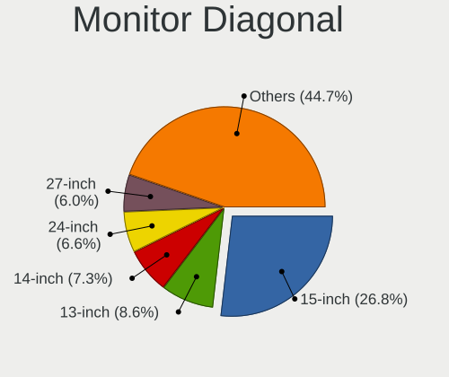

| Inches  | Computers | Percent |
|---------|-----------|---------|
| 15      | 508       | 26.82%  |
| 13      | 162       | 8.55%   |
| 14      | 139       | 7.34%   |
| 24      | 125       | 6.6%    |
| 27      | 113       | 5.97%   |
| 17      | 106       | 5.6%    |
| 23      | 102       | 5.39%   |
| Unknown | 87        | 4.59%   |
| 21      | 85        | 4.49%   |
| 19      | 57        | 3.01%   |
| 31      | 49        | 2.59%   |
| 18      | 42        | 2.22%   |
| 22      | 37        | 1.95%   |
| 34      | 36        | 1.9%    |
| 12      | 36        | 1.9%    |
| 20      | 31        | 1.64%   |
| 11      | 26        | 1.37%   |
| 16      | 24        | 1.27%   |
| 10      | 24        | 1.27%   |
| 32      | 11        | 0.58%   |
| 84      | 10        | 0.53%   |
| 72      | 10        | 0.53%   |
| 54      | 9         | 0.48%   |
| 26      | 9         | 0.48%   |
| 63      | 6         | 0.32%   |
| 52      | 6         | 0.32%   |
| 40      | 5         | 0.26%   |
| 48      | 4         | 0.21%   |
| 42      | 4         | 0.21%   |
| 49      | 3         | 0.16%   |
| 25      | 3         | 0.16%   |
| 8       | 3         | 0.16%   |
| 86      | 2         | 0.11%   |
| 60      | 2         | 0.11%   |
| 46      | 2         | 0.11%   |
| 38      | 2         | 0.11%   |
| 33      | 2         | 0.11%   |
| 28      | 2         | 0.11%   |
| 95      | 1         | 0.05%   |
| 65      | 1         | 0.05%   |

Monitor Width
-------------

Physical width

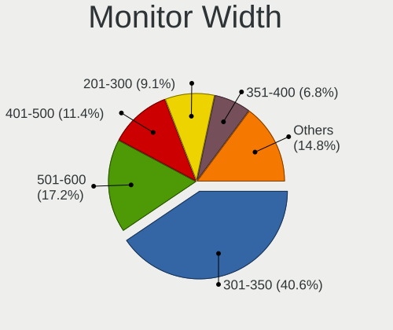

| Width in mm | Computers | Percent |
|-------------|-----------|---------|
| 301-350     | 758       | 40.56%  |
| 501-600     | 322       | 17.23%  |
| 401-500     | 213       | 11.4%   |
| 201-300     | 171       | 9.15%   |
| 351-400     | 128       | 6.85%   |
| Unknown     | 87        | 4.65%   |
| 601-700     | 65        | 3.48%   |
| 701-800     | 49        | 2.62%   |
| 1001-1500   | 36        | 1.93%   |
| 1501-2000   | 22        | 1.18%   |
| 801-900     | 10        | 0.54%   |
| 901-1000    | 4         | 0.21%   |
| 101-200     | 3         | 0.16%   |
| 1-100       | 1         | 0.05%   |

Aspect Ratio
------------

Proportional relationship between the width and the height

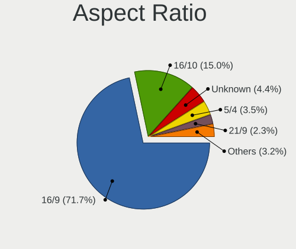

| Ratio   | Computers | Percent |
|---------|-----------|---------|
| 16/9    | 1268      | 71.68%  |
| 16/10   | 265       | 14.98%  |
| Unknown | 77        | 4.35%   |
| 5/4     | 62        | 3.5%    |
| 21/9    | 41        | 2.32%   |
| 4/3     | 26        | 1.47%   |
| 3/2     | 23        | 1.3%    |
| 32/9    | 4         | 0.23%   |
| 0.56    | 2         | 0.11%   |
| 0.67    | 1         | 0.06%   |

Monitor Area
------------

Area in inch²

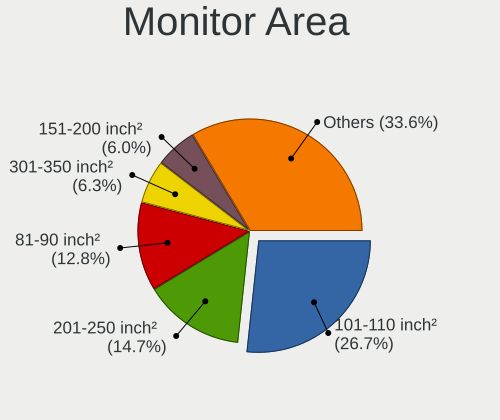

| Area in inch² | Computers | Percent |
|----------------|-----------|---------|
| 101-110        | 501       | 26.69%  |
| 201-250        | 275       | 14.65%  |
| 81-90          | 240       | 12.79%  |
| 301-350        | 118       | 6.29%   |
| 151-200        | 113       | 6.02%   |
| 351-500        | 100       | 5.33%   |
| Unknown        | 87        | 4.64%   |
| 141-150        | 63        | 3.36%   |
| 121-130        | 63        | 3.36%   |
| 71-80          | 60        | 3.2%    |
| More than 1000 | 54        | 2.88%   |
| 251-300        | 47        | 2.5%    |
| 61-70          | 33        | 1.76%   |
| 51-60          | 27        | 1.44%   |
| 111-120        | 27        | 1.44%   |
| 41-50          | 23        | 1.23%   |
| 501-1000       | 18        | 0.96%   |
| 131-140        | 15        | 0.8%    |
| 91-100         | 9         | 0.48%   |
| 1-40           | 4         | 0.21%   |

Pixel Density
-------------

Pixels per inch

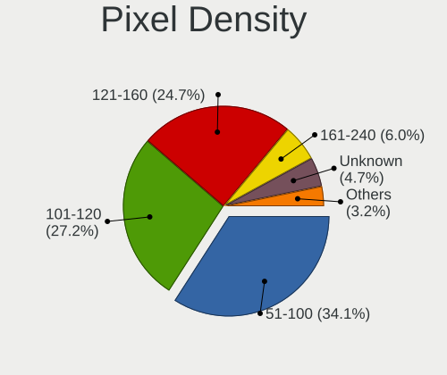

| Density       | Computers | Percent |
|---------------|-----------|---------|
| 51-100        | 626       | 34.1%   |
| 101-120       | 500       | 27.23%  |
| 121-160       | 454       | 24.73%  |
| 161-240       | 110       | 5.99%   |
| Unknown       | 87        | 4.74%   |
| 1-50          | 42        | 2.29%   |
| More than 240 | 17        | 0.93%   |

Multiple Monitors
-----------------

Total monitors connected

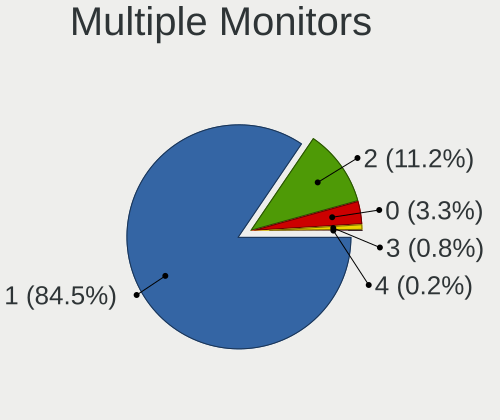

| Total | Computers | Percent |
|-------|-----------|---------|
| 1     | 1569      | 84.49%  |
| 2     | 208       | 11.2%   |
| 0     | 62        | 3.34%   |
| 3     | 15        | 0.81%   |
| 4     | 3         | 0.16%   |

Network
-------

Net Controller Vendor
---------------------

Controller vendors

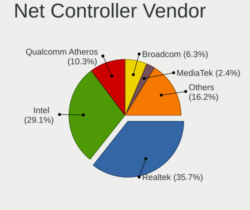

| Vendor                                 | Computers | Percent |
|----------------------------------------|-----------|---------|
| Realtek Semiconductor                  | 993       | 35.66%  |
| Intel                                  | 810       | 29.08%  |
| Qualcomm Atheros                       | 287       | 10.31%  |
| Broadcom                               | 176       | 6.32%   |
| MediaTek                               | 67        | 2.41%   |
| Broadcom Limited                       | 54        | 1.94%   |
| Marvell Technology Group               | 53        | 1.9%    |
| TP-Link                                | 40        | 1.44%   |
| Ralink Technology                      | 33        | 1.18%   |
| Nvidia                                 | 32        | 1.15%   |
| Ralink                                 | 28        | 1.01%   |
| ASIX Electronics                       | 17        | 0.61%   |
| Samsung Electronics                    | 16        | 0.57%   |
| Ericsson Business Mobile Networks      | 11        | 0.39%   |
| VIA Technologies                       | 9         | 0.32%   |
| NetGear                                | 8         | 0.29%   |
| Silicon Integrated Systems [SiS]       | 7         | 0.25%   |
| JMicron Technology                     | 7         | 0.25%   |
| Huawei Technologies                    | 7         | 0.25%   |
| Dell                                   | 7         | 0.25%   |
| Xiaomi                                 | 6         | 0.22%   |
| Sierra Wireless                        | 6         | 0.22%   |
| Qualcomm                               | 6         | 0.22%   |
| Lenovo                                 | 6         | 0.22%   |
| Edimax Technology                      | 6         | 0.22%   |
| Microsoft                              | 5         | 0.18%   |
| ASUSTek Computer                       | 5         | 0.18%   |
| Hewlett-Packard                        | 4         | 0.14%   |
| D-Link System                          | 4         | 0.14%   |
| Belkin Components                      | 4         | 0.14%   |
| AVM                                    | 4         | 0.14%   |
| ZTE WCDMA Technologies MSM             | 3         | 0.11%   |
| QinHeng Electronics                    | 3         | 0.11%   |
| Mercucys                               | 3         | 0.11%   |
| Google                                 | 3         | 0.11%   |
| DisplayLink                            | 3         | 0.11%   |
| AMD                                    | 3         | 0.11%   |
| Tenda                                  | 2         | 0.07%   |
| Suzhou Motorcomm Electronic Technology | 2         | 0.07%   |
| Spreadtrum Communications              | 2         | 0.07%   |

Net Controller Model
--------------------

Controller models

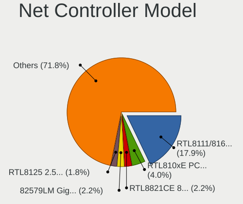

| Model                                                                   | Computers | Percent |
|-------------------------------------------------------------------------|-----------|---------|
| Realtek RTL8111/8168/8211/8411 PCI Express Gigabit Ethernet Controller  | 596       | 17.87%  |
| Realtek RTL810xE PCI Express Fast Ethernet controller                   | 135       | 4.05%   |
| Realtek RTL8821CE 802.11ac PCIe Wireless Network Adapter                | 74        | 2.22%   |
| Intel 82579LM Gigabit Network Connection (Lewisville)                   | 74        | 2.22%   |
| Realtek RTL8125 2.5GbE Controller                                       | 61        | 1.83%   |
| Intel Wi-Fi 6 AX200                                                     | 51        | 1.53%   |
| Intel Wireless 8265 / 8275                                              | 46        | 1.38%   |
| Qualcomm Atheros AR9285 Wireless Network Adapter (PCI-Express)          | 38        | 1.14%   |
| Intel Wireless 7260                                                     | 35        | 1.05%   |
| Realtek RTL8822CE 802.11ac PCIe Wireless Network Adapter                | 34        | 1.02%   |
| Qualcomm Atheros QCA9377 802.11ac Wireless Network Adapter              | 34        | 1.02%   |
| Realtek RTL8153 Gigabit Ethernet Adapter                                | 33        | 0.99%   |
| Qualcomm Atheros AR9485 Wireless Network Adapter                        | 33        | 0.99%   |
| Qualcomm Atheros QCA9565 / AR9565 Wireless Network Adapter              | 32        | 0.96%   |
| Intel Ethernet Connection I217-LM                                       | 30        | 0.9%    |
| Broadcom BCM4313 802.11bgn Wireless Network Adapter                     | 29        | 0.87%   |
| Intel Wireless 7265                                                     | 28        | 0.84%   |
| Intel Wireless 8260                                                     | 27        | 0.81%   |
| Intel Wi-Fi 6E(802.11ax) AX210/AX1675* 2x2 [Typhoon Peak]               | 27        | 0.81%   |
| Intel PRO/Wireless 3945ABG [Golan] Network Connection                   | 27        | 0.81%   |
| Intel I211 Gigabit Network Connection                                   | 27        | 0.81%   |
| Realtek RTL-8100/8101L/8139 PCI Fast Ethernet Adapter                   | 26        | 0.78%   |
| Intel Centrino Advanced-N 6205 [Taylor Peak]                            | 26        | 0.78%   |
| Intel Wi-Fi 6 AX201                                                     | 25        | 0.75%   |
| Intel Wireless 3165                                                     | 24        | 0.72%   |
| Intel Alder Lake-P PCH CNVi WiFi                                        | 23        | 0.69%   |
| Intel Cannon Point-LP CNVi [Wireless-AC]                                | 22        | 0.66%   |
| Qualcomm Atheros AR242x / AR542x Wireless Network Adapter (PCI-Express) | 20        | 0.6%    |
| MediaTek MT7922 802.11ax PCI Express Wireless Network Adapter           | 20        | 0.6%    |
| Intel Ethernet Connection (2) I219-V                                    | 20        | 0.6%    |
| Realtek RTL88x2bu [AC1200 Techkey]                                      | 19        | 0.57%   |
| Realtek RTL8723BE PCIe Wireless Network Adapter                         | 19        | 0.57%   |
| Realtek RTL8188EUS 802.11n Wireless Network Adapter                     | 19        | 0.57%   |
| Realtek RTL8852BE PCIe 802.11ax Wireless Network Controller             | 18        | 0.54%   |
| Intel Comet Lake PCH-LP CNVi WiFi                                       | 18        | 0.54%   |
| Intel Dual Band Wireless-AC 3168NGW [Stone Peak]                        | 17        | 0.51%   |
| Qualcomm Atheros QCA6174 802.11ac Wireless Network Adapter              | 16        | 0.48%   |
| Intel Raptor Lake PCH CNVi WiFi                                         | 16        | 0.48%   |
| Realtek 802.11ac NIC                                                    | 15        | 0.45%   |
| Qualcomm Atheros AR9462 Wireless Network Adapter                        | 15        | 0.45%   |

Wireless Vendor
---------------

Wireless vendors

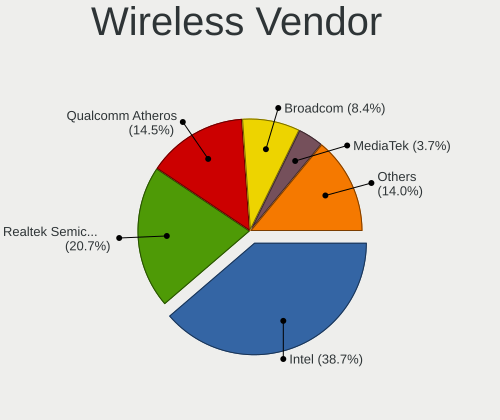

| Vendor                                | Computers | Percent |
|---------------------------------------|-----------|---------|
| Intel                                 | 591       | 38.7%   |
| Realtek Semiconductor                 | 316       | 20.69%  |
| Qualcomm Atheros                      | 221       | 14.47%  |
| Broadcom                              | 128       | 8.38%   |
| MediaTek                              | 57        | 3.73%   |
| TP-Link                               | 38        | 2.49%   |
| Broadcom Limited                      | 36        | 2.36%   |
| Ralink Technology                     | 33        | 2.16%   |
| Ralink                                | 28        | 1.83%   |
| NetGear                               | 8         | 0.52%   |
| Marvell Technology Group              | 7         | 0.46%   |
| Sierra Wireless                       | 6         | 0.39%   |
| Edimax Technology                     | 6         | 0.39%   |
| Qualcomm                              | 5         | 0.33%   |
| Microsoft                             | 5         | 0.33%   |
| ASUSTek Computer                      | 5         | 0.33%   |
| AVM                                   | 4         | 0.26%   |
| Mercucys                              | 3         | 0.2%    |
| Dell                                  | 3         | 0.2%    |
| D-Link System                         | 3         | 0.2%    |
| Belkin Components                     | 3         | 0.2%    |
| Tenda                                 | 2         | 0.13%   |
| Sitecom Europe                        | 2         | 0.13%   |
| Qualcomm Atheros Communications       | 2         | 0.13%   |
| Linksys                               | 2         | 0.13%   |
| IMC Networks                          | 2         | 0.13%   |
| D-Link                                | 2         | 0.13%   |
| Cisco Aironet Wireless Communications | 2         | 0.13%   |
| ZTE WCDMA Technologies MSM            | 1         | 0.07%   |
| Xiaomi                                | 1         | 0.07%   |
| Qualcomm Technologies                 | 1         | 0.07%   |
| Hewlett-Packard                       | 1         | 0.07%   |
| Fibocom                               | 1         | 0.07%   |
| Ericsson Business Mobile Networks     | 1         | 0.07%   |
| Askey Computer                        | 1         | 0.07%   |

Wireless Model
--------------

Wireless models

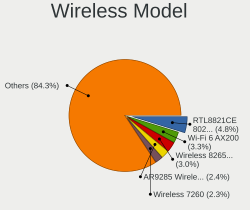

| Model                                                                   | Computers | Percent |
|-------------------------------------------------------------------------|-----------|---------|
| Realtek RTL8821CE 802.11ac PCIe Wireless Network Adapter                | 74        | 4.76%   |
| Intel Wi-Fi 6 AX200                                                     | 51        | 3.28%   |
| Intel Wireless 8265 / 8275                                              | 46        | 2.96%   |
| Qualcomm Atheros AR9285 Wireless Network Adapter (PCI-Express)          | 38        | 2.45%   |
| Intel Wireless 7260                                                     | 35        | 2.25%   |
| Realtek RTL8822CE 802.11ac PCIe Wireless Network Adapter                | 34        | 2.19%   |
| Qualcomm Atheros QCA9377 802.11ac Wireless Network Adapter              | 34        | 2.19%   |
| Qualcomm Atheros AR9485 Wireless Network Adapter                        | 33        | 2.12%   |
| Qualcomm Atheros QCA9565 / AR9565 Wireless Network Adapter              | 32        | 2.06%   |
| Broadcom BCM4313 802.11bgn Wireless Network Adapter                     | 29        | 1.87%   |
| Intel Wireless 7265                                                     | 28        | 1.8%    |
| Intel Wireless 8260                                                     | 27        | 1.74%   |
| Intel Wi-Fi 6E(802.11ax) AX210/AX1675* 2x2 [Typhoon Peak]               | 27        | 1.74%   |
| Intel PRO/Wireless 3945ABG [Golan] Network Connection                   | 27        | 1.74%   |
| Intel Centrino Advanced-N 6205 [Taylor Peak]                            | 26        | 1.67%   |
| Intel Wi-Fi 6 AX201                                                     | 25        | 1.61%   |
| Intel Wireless 3165                                                     | 24        | 1.55%   |
| Intel Cannon Point-LP CNVi [Wireless-AC]                                | 22        | 1.42%   |
| Qualcomm Atheros AR242x / AR542x Wireless Network Adapter (PCI-Express) | 20        | 1.29%   |
| Realtek RTL88x2bu [AC1200 Techkey]                                      | 19        | 1.22%   |
| Realtek RTL8723BE PCIe Wireless Network Adapter                         | 19        | 1.22%   |
| Realtek RTL8188EUS 802.11n Wireless Network Adapter                     | 19        | 1.22%   |
| Intel Comet Lake PCH-LP CNVi WiFi                                       | 18        | 1.16%   |
| Intel Dual Band Wireless-AC 3168NGW [Stone Peak]                        | 17        | 1.09%   |
| Qualcomm Atheros QCA6174 802.11ac Wireless Network Adapter              | 16        | 1.03%   |
| Intel Raptor Lake PCH CNVi WiFi                                         | 16        | 1.03%   |
| Intel Alder Lake-P PCH CNVi WiFi                                        | 16        | 1.03%   |
| Realtek 802.11ac NIC                                                    | 15        | 0.97%   |
| Qualcomm Atheros AR9462 Wireless Network Adapter                        | 15        | 0.97%   |
| MediaTek MT7922 802.11ax PCI Express Wireless Network Adapter           | 15        | 0.97%   |
| Intel WiFi Link 5100                                                    | 15        | 0.97%   |
| Broadcom Limited BCM4360 802.11ac Dual Band Wireless Network Adapter    | 15        | 0.97%   |
| MediaTek MT7921 802.11ax PCIe Wireless Network Adapter [Filogic 330]    | 14        | 0.9%    |
| MediaTek MT7902 802.11ax PCIe Wireless Network Adapter [Filogic 310]    | 14        | 0.9%    |
| Realtek RTL8188CE 802.11b/g/n WiFi Adapter                              | 13        | 0.84%   |
| Intel Centrino Ultimate-N 6300                                          | 13        | 0.84%   |
| Intel Wi-Fi 5(802.11ac) Wireless-AC 9x6x [Thunder Peak]                 | 12        | 0.77%   |
| Ralink MT7601U Wireless Adapter                                         | 11        | 0.71%   |
| MediaTek MT7921K (RZ608) Wi-Fi 6E 80MHz                                 | 11        | 0.71%   |
| Intel Wireless 3160                                                     | 11        | 0.71%   |

Ethernet Vendor
---------------

Ethernet vendors

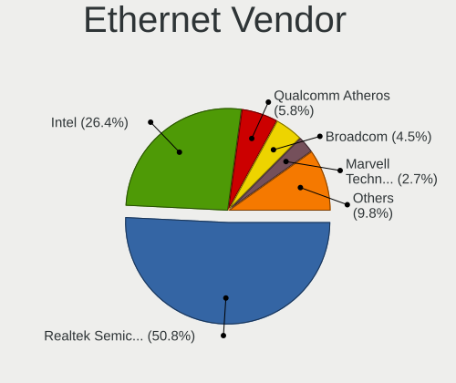

| Vendor                                 | Computers | Percent |
|----------------------------------------|-----------|---------|
| Realtek Semiconductor                  | 858       | 50.77%  |
| Intel                                  | 446       | 26.39%  |
| Qualcomm Atheros                       | 98        | 5.8%    |
| Broadcom                               | 76        | 4.5%    |
| Marvell Technology Group               | 46        | 2.72%   |
| Nvidia                                 | 32        | 1.89%   |
| Broadcom Limited                       | 18        | 1.07%   |
| ASIX Electronics                       | 17        | 1.01%   |
| Samsung Electronics                    | 16        | 0.95%   |
| MediaTek                               | 10        | 0.59%   |
| VIA Technologies                       | 9         | 0.53%   |
| Silicon Integrated Systems [SiS]       | 7         | 0.41%   |
| JMicron Technology                     | 7         | 0.41%   |
| Xiaomi                                 | 5         | 0.3%    |
| Lenovo                                 | 5         | 0.3%    |
| Huawei Technologies                    | 5         | 0.3%    |
| Hewlett-Packard                        | 3         | 0.18%   |
| Google                                 | 3         | 0.18%   |
| DisplayLink                            | 3         | 0.18%   |
| TP-Link                                | 2         | 0.12%   |
| Suzhou Motorcomm Electronic Technology | 2         | 0.12%   |
| Spreadtrum Communications              | 2         | 0.12%   |
| Attansic Technology                    | 2         | 0.12%   |
| ADMtek                                 | 2         | 0.12%   |
| ZTE WCDMA Technologies MSM             | 1         | 0.06%   |
| Qualcomm                               | 1         | 0.06%   |
| QinHeng Electronics                    | 1         | 0.06%   |
| OPPO Electronics                       | 1         | 0.06%   |
| OnePlus Technology (Shenzhen)          | 1         | 0.06%   |
| Motorola PCS                           | 1         | 0.06%   |
| Microchip Technology                   | 1         | 0.06%   |
| Mellanox Technologies                  | 1         | 0.06%   |
| HTC (High Tech Computer)               | 1         | 0.06%   |
| Gemtek                                 | 1         | 0.06%   |
| Davicom Semiconductor                  | 1         | 0.06%   |
| D-Link System                          | 1         | 0.06%   |
| Chelsio Communications                 | 1         | 0.06%   |
| Belkin Components                      | 1         | 0.06%   |
| Aquantia                               | 1         | 0.06%   |
| 3Com                                   | 1         | 0.06%   |

Ethernet Model
--------------

Ethernet models

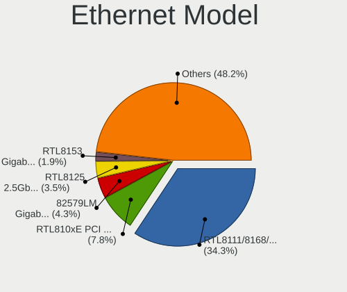

| Model                                                                  | Computers | Percent |
|------------------------------------------------------------------------|-----------|---------|
| Realtek RTL8111/8168/8211/8411 PCI Express Gigabit Ethernet Controller | 596       | 34.33%  |
| Realtek RTL810xE PCI Express Fast Ethernet controller                  | 135       | 7.78%   |
| Intel 82579LM Gigabit Network Connection (Lewisville)                  | 74        | 4.26%   |
| Realtek RTL8125 2.5GbE Controller                                      | 61        | 3.51%   |
| Realtek RTL8153 Gigabit Ethernet Adapter                               | 33        | 1.9%    |
| Intel Ethernet Connection I217-LM                                      | 30        | 1.73%   |
| Intel I211 Gigabit Network Connection                                  | 27        | 1.56%   |
| Realtek RTL-8100/8101L/8139 PCI Fast Ethernet Adapter                  | 26        | 1.5%    |
| Intel Ethernet Connection (2) I219-V                                   | 20        | 1.15%   |
| Qualcomm Atheros AR8151 v2.0 Gigabit Ethernet                          | 15        | 0.86%   |
| ASIX AX88179 Gigabit Ethernet                                          | 15        | 0.86%   |
| Intel 82579V Gigabit Network Connection                                | 14        | 0.81%   |
| Samsung Galaxy series, misc. (tethering mode)                          | 13        | 0.75%   |
| Intel Ethernet Controller I225-V                                       | 13        | 0.75%   |
| Intel Ethernet Connection (4) I219-LM                                  | 13        | 0.75%   |
| Nvidia MCP61 Ethernet                                                  | 12        | 0.69%   |
| Intel Ethernet Connection I219-LM                                      | 12        | 0.69%   |
| Intel Ethernet Connection (7) I219-V                                   | 12        | 0.69%   |
| Intel 82577LM Gigabit Network Connection                               | 12        | 0.69%   |
| Qualcomm Atheros AR8132 Fast Ethernet                                  | 11        | 0.63%   |
| Qualcomm Atheros AR8131 Gigabit Ethernet                               | 11        | 0.63%   |
| Intel Ethernet Connection I217-V                                       | 11        | 0.63%   |
| Intel 82567LM Gigabit Network Connection                               | 11        | 0.63%   |
| Intel Ethernet Controller I226-V                                       | 10        | 0.58%   |
| Intel Ethernet Connection (2) I219-LM                                  | 10        | 0.58%   |
| Realtek RTL8852BE PCIe 802.11ax Wireless Network Controller            | 9         | 0.52%   |
| Qualcomm Atheros AR8152 v2.0 Fast Ethernet                             | 9         | 0.52%   |
| Qualcomm Atheros AR8121/AR8113/AR8114 Gigabit or Fast Ethernet         | 9         | 0.52%   |
| Nvidia MCP79 Ethernet                                                  | 9         | 0.52%   |
| Broadcom NetXtreme BCM57766 Gigabit Ethernet PCIe                      | 9         | 0.52%   |
| Qualcomm Atheros Attansic L1 Gigabit Ethernet                          | 8         | 0.46%   |
| Marvell Group 88E8071 PCI-E Gigabit Ethernet Controller                | 8         | 0.46%   |
| Intel Ethernet Connection I219-V                                       | 8         | 0.46%   |
| Intel Ethernet Connection (3) I218-LM                                  | 8         | 0.46%   |
| Intel 82574L Gigabit Network Connection                                | 8         | 0.46%   |
| Intel 82573L Gigabit Ethernet Controller                               | 8         | 0.46%   |
| Broadcom NetXtreme BCM57765 Gigabit Ethernet PCIe                      | 8         | 0.46%   |
| Broadcom NetLink BCM57785 Gigabit Ethernet PCIe                        | 8         | 0.46%   |
| VIA VT6102/VT6103 [Rhine-II]                                           | 7         | 0.4%    |
| Qualcomm Atheros Killer E220x Gigabit Ethernet Controller              | 7         | 0.4%    |

Net Controller Kind
-------------------

Ethernet, WiFi or modem

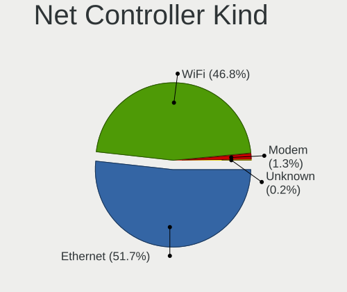

| Kind     | Computers | Percent |
|----------|-----------|---------|
| Ethernet | 1587      | 51.74%  |
| WiFi     | 1434      | 46.76%  |
| Modem    | 39        | 1.27%   |
| Unknown  | 7         | 0.23%   |

Used Controller
---------------

Currently used network controller

| Kind     | Computers | Percent |
|----------|-----------|---------|
| WiFi     | 1062      | 55.6%   |
| Ethernet | 848       | 44.4%   |

NICs
----

Total network controllers on board

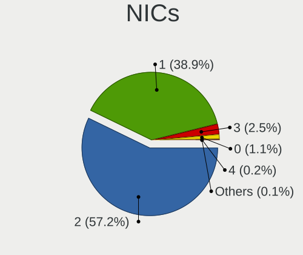

| Total | Computers | Percent |
|-------|-----------|---------|
| 2     | 1050      | 57.19%  |
| 1     | 715       | 38.94%  |
| 3     | 45        | 2.45%   |
| 0     | 21        | 1.14%   |
| 4     | 4         | 0.22%   |
| 7     | 1         | 0.05%   |

IPv6
----

IPv6 vs IPv4

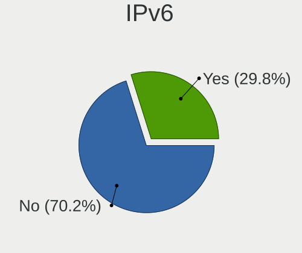

| Used | Computers | Percent |
|------|-----------|---------|
| No   | 1313      | 70.18%  |
| Yes  | 558       | 29.82%  |

Bluetooth
---------

Bluetooth Vendor
----------------

Controller vendors

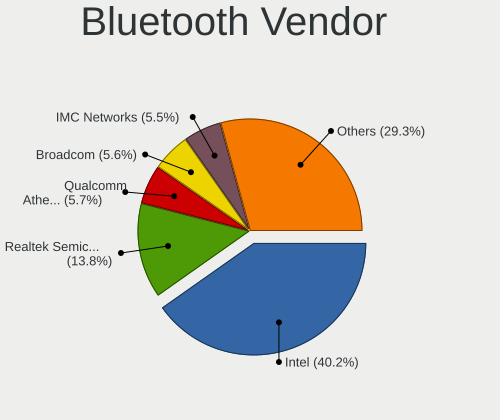

| Vendor                          | Computers | Percent |
|---------------------------------|-----------|---------|
| Intel                           | 447       | 40.23%  |
| Realtek Semiconductor           | 153       | 13.77%  |
| Qualcomm Atheros Communications | 63        | 5.67%   |
| Broadcom                        | 62        | 5.58%   |
| IMC Networks                    | 61        | 5.49%   |
| Apple                           | 61        | 5.49%   |
| Cambridge Silicon Radio         | 57        | 5.13%   |
| Foxconn / Hon Hai               | 41        | 3.69%   |
| Lite-On Technology              | 30        | 2.7%    |
| MediaTek                        | 23        | 2.07%   |
| Hewlett-Packard                 | 21        | 1.89%   |
| Dell                            | 20        | 1.8%    |
| ASUSTek Computer                | 15        | 1.35%   |
| Ralink                          | 10        | 0.9%    |
| Realtek                         | 6         | 0.54%   |
| Toshiba                         | 5         | 0.45%   |
| Marvell Semiconductor           | 5         | 0.45%   |
| Askey Computer                  | 4         | 0.36%   |
| USI                             | 3         | 0.27%   |
| TP-Link                         | 3         | 0.27%   |
| Integrated System Solution      | 3         | 0.27%   |
| Foxconn International           | 3         | 0.27%   |
| Ralink Technology               | 2         | 0.18%   |
| Dynex                           | 2         | 0.18%   |
| Unknown                         | 2         | 0.18%   |
| Taiyo Yuden                     | 1         | 0.09%   |
| SiW                             | 1         | 0.09%   |
| Qcom                            | 1         | 0.09%   |
| Logitech                        | 1         | 0.09%   |
| Edimax Technology               | 1         | 0.09%   |
| D-Link                          | 1         | 0.09%   |
| Chicony Electronics             | 1         | 0.09%   |
| Alps Electric                   | 1         | 0.09%   |
| Actions                         | 1         | 0.09%   |

Bluetooth Model
---------------

Controller models

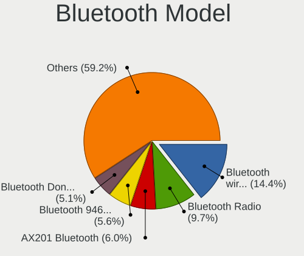

| Model                                               | Computers | Percent |
|-----------------------------------------------------|-----------|---------|
| Intel Bluetooth wireless interface                  | 160       | 14.39%  |
| Realtek Bluetooth Radio                             | 108       | 9.71%   |
| Intel AX201 Bluetooth                               | 67        | 6.03%   |
| Intel Bluetooth 9460/9560 Jefferson Peak (JfP)      | 62        | 5.58%   |
| Cambridge Silicon Radio Bluetooth Dongle (HCI mode) | 57        | 5.13%   |
| Intel AX200 Bluetooth                               | 47        | 4.23%   |
| Intel Bluetooth Device                              | 43        | 3.87%   |
| Realtek  Bluetooth 4.2 Adapter                      | 35        | 3.15%   |
| Qualcomm Atheros  Bluetooth Device                  | 26        | 2.34%   |
| Apple Bluetooth Host Controller                     | 25        | 2.25%   |
| MediaTek Wireless_Device                            | 23        | 2.07%   |
| Intel AX210 Bluetooth                               | 23        | 2.07%   |
| IMC Networks Wireless_Device                        | 22        | 1.98%   |
| IMC Networks Bluetooth Radio                        | 22        | 1.98%   |
| Apple Bluetooth USB Host Controller                 | 18        | 1.62%   |
| Intel Wireless-AC 3168 Bluetooth                    | 17        | 1.53%   |
| Qualcomm Atheros AR3012 Bluetooth 4.0               | 14        | 1.26%   |
| Lite-On Qualcomm Atheros QCA9377 Bluetooth          | 12        | 1.08%   |
| HP Bluetooth 2.0 Interface [Broadcom BCM2045]       | 12        | 1.08%   |
| Intel Wireless-AC 9260 Bluetooth Adapter            | 11        | 0.99%   |
| Apple Bluetooth HCI                                 | 11        | 0.99%   |
| Ralink RT3290 Bluetooth                             | 10        | 0.9%    |
| Qualcomm Atheros QCA61x4 Bluetooth 4.0              | 10        | 0.9%    |
| Intel Centrino Advanced-N 6230 Bluetooth adapter    | 10        | 0.9%    |
| IMC Networks Bluetooth Device                       | 10        | 0.9%    |
| Foxconn / Hon Hai Wireless_Device                   | 10        | 0.9%    |
| Foxconn / Hon Hai Bluetooth Device                  | 10        | 0.9%    |
| Dell DW375 Bluetooth Module                         | 10        | 0.9%    |
| Broadcom BCM20702A0 Bluetooth 4.0                   | 9         | 0.81%   |
| Broadcom BCM20702 Bluetooth 4.0 [ThinkPad]          | 9         | 0.81%   |
| Broadcom BCM2045B (BDC-2.1)                         | 9         | 0.81%   |
| HP Broadcom 2070 Bluetooth Combo                    | 8         | 0.72%   |
| Qualcomm Atheros AR3011 Bluetooth                   | 7         | 0.63%   |
| Intel Centrino Bluetooth Wireless Transceiver       | 7         | 0.63%   |
| Apple Built-in Bluetooth 2.0+EDR HCI                | 7         | 0.63%   |
| Realtek Bluetooth Radio                             | 6         | 0.54%   |
| Lite-On Bluetooth Device                            | 6         | 0.54%   |
| Broadcom BCM2045B (BDC-2) [Bluetooth Controller]    | 6         | 0.54%   |
| Lite-On Atheros AR3012 Bluetooth                    | 5         | 0.45%   |
| Foxconn / Hon Hai MediaTek Bluetooth Adapter        | 5         | 0.45%   |

Sound
-----

Sound Vendor
------------

Sound card vendors

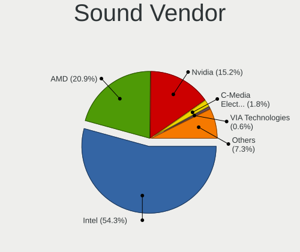

| Vendor                                       | Computers | Percent |
|----------------------------------------------|-----------|---------|
| Intel                                        | 1327      | 54.25%  |
| AMD                                          | 511       | 20.89%  |
| Nvidia                                       | 371       | 15.17%  |
| C-Media Electronics                          | 43        | 1.76%   |
| VIA Technologies                             | 15        | 0.61%   |
| Creative Labs                                | 13        | 0.53%   |
| Creative Technology                          | 12        | 0.49%   |
| Logitech                                     | 11        | 0.45%   |
| JMTek                                        | 10        | 0.41%   |
| Generalplus Technology                       | 10        | 0.41%   |
| Texas Instruments                            | 9         | 0.37%   |
| Silicon Integrated Systems [SiS]             | 9         | 0.37%   |
| GN Netcom                                    | 8         | 0.33%   |
| Micro Star International                     | 6         | 0.25%   |
| Zoran Co. Personal Media Division (Nogatech) | 5         | 0.2%    |
| Thesycon Systemsoftware & Consulting         | 5         | 0.2%    |
| Plantronics                                  | 4         | 0.16%   |
| Fujitsu                                      | 4         | 0.16%   |
| Apple                                        | 4         | 0.16%   |
| Tenx Technology                              | 3         | 0.12%   |
| Realtek Semiconductor                        | 3         | 0.12%   |
| Razer USA                                    | 3         | 0.12%   |
| KTMicro                                      | 3         | 0.12%   |
| Jieli Technology                             | 3         | 0.12%   |
| Focusrite-Novation                           | 3         | 0.12%   |
| DSEA A/S                                     | 3         | 0.12%   |
| Yamaha                                       | 2         | 0.08%   |
| Walmart                                      | 2         | 0.08%   |
| Sony                                         | 2         | 0.08%   |
| Mark of the Unicorn                          | 2         | 0.08%   |
| M-Audio                                      | 2         | 0.08%   |
| Lenovo                                       | 2         | 0.08%   |
| Hewlett-Packard                              | 2         | 0.08%   |
| BEHRINGER International                      | 2         | 0.08%   |
| ASRock                                       | 2         | 0.08%   |
| ZOOM                                         | 1         | 0.04%   |
| XMOS                                         | 1         | 0.04%   |
| Xilinx                                       | 1         | 0.04%   |
| Turtle Beach                                 | 1         | 0.04%   |
| SAVITECH                                     | 1         | 0.04%   |

Sound Model
-----------

Sound card models

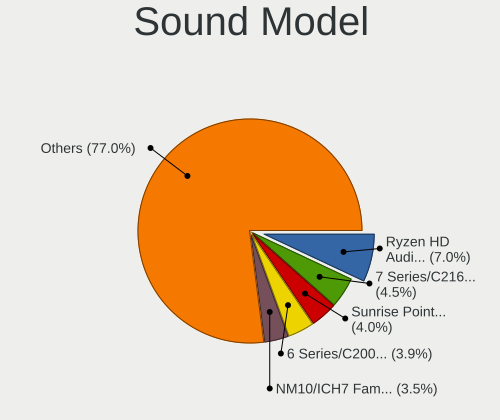

| Model                                                                                             | Computers | Percent |
|---------------------------------------------------------------------------------------------------|-----------|---------|
| AMD Ryzen HD Audio Controller                                                                     | 205       | 7%      |
| Intel 7 Series/C216 Chipset Family High Definition Audio Controller                               | 133       | 4.54%   |
| Intel Sunrise Point-LP HD Audio                                                                   | 116       | 3.96%   |
| Intel 6 Series/C200 Series Chipset Family High Definition Audio Controller                        | 115       | 3.92%   |
| Intel NM10/ICH7 Family High Definition Audio Controller                                           | 104       | 3.55%   |
| AMD Renoir/Cezanne HDMI/DP Audio Controller                                                       | 86        | 2.94%   |
| Intel 8 Series/C220 Series Chipset High Definition Audio Controller                               | 81        | 2.76%   |
| Intel 82801I (ICH9 Family) HD Audio Controller                                                    | 70        | 2.39%   |
| AMD SBx00 Azalia (Intel HDA)                                                                      | 62        | 2.12%   |
| Intel 5 Series/3400 Series Chipset High Definition Audio                                          | 60        | 2.05%   |
| Intel Xeon E3-1200 v3/4th Gen Core Processor HD Audio Controller                                  | 59        | 2.01%   |
| AMD Raven/Raven2/Fenghuang HDMI/DP Audio Controller                                               | 54        | 1.84%   |
| Intel Haswell-ULT HD Audio Controller                                                             | 50        | 1.71%   |
| Intel 8 Series HD Audio Controller                                                                | 50        | 1.71%   |
| Intel Tiger Lake-LP Smart Sound Technology Audio Controller                                       | 48        | 1.64%   |
| AMD Radeon High Definition Audio Controller                                                       | 47        | 1.6%    |
| AMD FCH Azalia Controller                                                                         | 46        | 1.57%   |
| AMD Starship/Matisse HD Audio Controller                                                          | 40        | 1.37%   |
| Intel Cannon Lake PCH cAVS                                                                        | 39        | 1.33%   |
| Intel Cannon Point-LP High Definition Audio Controller                                            | 37        | 1.26%   |
| Intel 100 Series/C230 Series Chipset Family HD Audio Controller                                   | 37        | 1.26%   |
| Nvidia GK208 HDMI/DP Audio Controller                                                             | 34        | 1.16%   |
| Intel Alder Lake PCH-P High Definition Audio Controller                                           | 33        | 1.13%   |
| Intel 82801H (ICH8 Family) HD Audio Controller                                                    | 33        | 1.13%   |
| Intel Broadwell-U Audio Controller                                                                | 30        | 1.02%   |
| Nvidia GF108 High Definition Audio Controller                                                     | 29        | 0.99%   |
| Intel Wildcat Point-LP High Definition Audio Controller                                           | 29        | 0.99%   |
| Intel Celeron/Pentium Silver Processor High Definition Audio                                      | 28        | 0.96%   |
| Nvidia GP107GL High Definition Audio Controller                                                   | 27        | 0.92%   |
| Intel Raptor Lake-P/U/H cAVS                                                                      | 26        | 0.89%   |
| AMD Kabini HDMI/DP Audio                                                                          | 26        | 0.89%   |
| Intel Comet Lake PCH-LP cAVS                                                                      | 24        | 0.82%   |
| AMD Family 15h (Models 60h-6fh) Audio Controller                                                  | 24        | 0.82%   |
| Intel 200 Series PCH HD Audio                                                                     | 23        | 0.78%   |
| AMD Navi 21/23 HDMI/DP Audio Controller                                                           | 22        | 0.75%   |
| Nvidia High Definition Audio Controller                                                           | 21        | 0.72%   |
| AMD Family 17h (Models 00h-0fh) HD Audio Controller                                               | 21        | 0.72%   |
| Intel Alder Lake-N PCH High Definition Audio Controller                                           | 20        | 0.68%   |
| Intel Atom/Celeron/Pentium Processor x5-E8000/J3xxx/N3xxx Series High Definition Audio Controller | 19        | 0.65%   |
| Intel 82801JI (ICH10 Family) HD Audio Controller                                                  | 19        | 0.65%   |

Memory
------

Memory Vendor
-------------

Memory module vendors

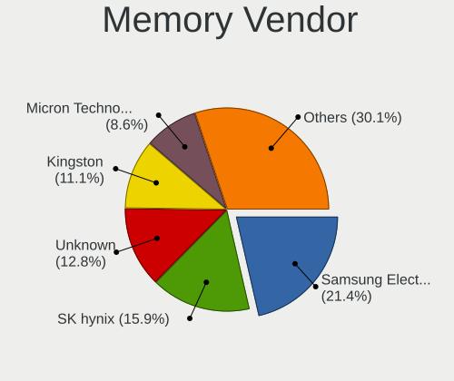

| Vendor              | Computers | Percent |
|---------------------|-----------|---------|
| Samsung Electronics | 207       | 21.43%  |
| SK hynix            | 154       | 15.94%  |
| Unknown             | 124       | 12.84%  |
| Kingston            | 107       | 11.08%  |
| Micron Technology   | 83        | 8.59%   |
| Crucial             | 52        | 5.38%   |
| Corsair             | 46        | 4.76%   |
| G.Skill             | 39        | 4.04%   |
| A-DATA Technology   | 17        | 1.76%   |
| Unknown             | 17        | 1.76%   |
| Elpida              | 16        | 1.66%   |
| Ramaxel Technology  | 13        | 1.35%   |
| Nanya Technology    | 12        | 1.24%   |
| Patriot             | 8         | 0.83%   |
| Team                | 7         | 0.72%   |
| Unknown (ABCD)      | 6         | 0.62%   |
| Smart               | 6         | 0.62%   |
| Unknown (0x0E9D)    | 3         | 0.31%   |
| GeIL                | 3         | 0.31%   |
| Avant               | 3         | 0.31%   |
| Unknown (0x0CC7)    | 2         | 0.21%   |
| Unknown (0x0B45)    | 2         | 0.21%   |
| Transcend           | 2         | 0.21%   |
| Timetec             | 2         | 0.21%   |
| Silicon Power       | 2         | 0.21%   |
| PUSKILL             | 2         | 0.21%   |
| PNY                 | 2         | 0.21%   |
| Lexar Co Limited    | 2         | 0.21%   |
| GSkill              | 2         | 0.21%   |
| Exceleram           | 2         | 0.21%   |
| Apacer              | 2         | 0.21%   |
| V-Color             | 1         | 0.1%    |
| Unknown (8A91)      | 1         | 0.1%    |
| Unknown (87CE)      | 1         | 0.1%    |
| Toshiba             | 1         | 0.1%    |
| Super Talent        | 1         | 0.1%    |
| Strontium           | 1         | 0.1%    |
| Shenzhen Longsys    | 1         | 0.1%    |
| SHARETRONIC         | 1         | 0.1%    |
| Qimonda             | 1         | 0.1%    |

Memory Model
------------

Memory module models

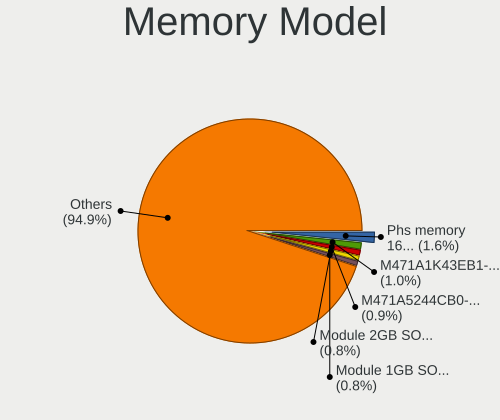

| Model                                                            | Computers | Percent |
|------------------------------------------------------------------|-----------|---------|
| Unknown                                                          | 17        | 1.62%   |
| Samsung RAM M471A1K43EB1-CWE 8GB SODIMM DDR4 3200MT/s            | 11        | 1.05%   |
| Samsung RAM M471A5244CB0-CTD 4GB SODIMM DDR4 3266MT/s            | 9         | 0.86%   |
| Unknown RAM Module 2GB SODIMM DDR2 667MT/s                       | 8         | 0.76%   |
| Unknown RAM Module 1GB SODIMM DDR2                               | 8         | 0.76%   |
| Samsung RAM M471A1K43DB1-CTD 8GB SODIMM DDR4 2667MT/s            | 7         | 0.67%   |
| Micron RAM 4ATF1G64HZ-3G2F1 8GB SODIMM DDR4 3200MT/s             | 7         | 0.67%   |
| Unknown RAM Module 2GB SODIMM DDR2                               | 6         | 0.57%   |
| SK hynix RAM HMT451S6BFR8A-PB 4GB SODIMM DDR3 1600MT/s           | 6         | 0.57%   |
| Samsung RAM M471B5173DB0-YK0 4GB SODIMM DDR3 1600MT/s            | 6         | 0.57%   |
| Samsung RAM M471A1K43CB1-CRC 8GB SODIMM DDR4 8400MT/s            | 6         | 0.57%   |
| Kingston RAM KF3200C16D4/8GX 8GiB DIMM DDR4 3600MT/s             | 6         | 0.57%   |
| Unknown (ABCD) RAM 123456789012345678 2GB SODIMM LPDDR4 2400MT/s | 5         | 0.48%   |
| SK hynix RAM HMT451S6AFR8A-PB 4GB SODIMM DDR3 1600MT/s           | 5         | 0.48%   |
| SK hynix RAM HMAA1GS6CJR6N-XN 8GB SODIMM DDR4 3200MT/s           | 5         | 0.48%   |
| SK hynix RAM HMA851S6DJR6N-XN 4GB SODIMM DDR4 3200MT/s           | 5         | 0.48%   |
| Samsung RAM M471B5273CH0-CH9 4GB SODIMM DDR3 1334MT/s            | 5         | 0.48%   |
| Samsung RAM M471B5173QH0-YK0 4GB SODIMM DDR3 1600MT/s            | 5         | 0.48%   |
| Samsung RAM M471A5244CB0-CWE 4GB SODIMM DDR4 3200MT/s            | 5         | 0.48%   |
| Samsung RAM M471A1K43BB1-CRC 8GB SODIMM DDR4 2667MT/s            | 5         | 0.48%   |
| Unknown RAM Module 512MB SODIMM DDR2                             | 4         | 0.38%   |
| Unknown RAM Module 2GB SODIMM DDR2 533MT/s                       | 4         | 0.38%   |
| Unknown RAM Module 1GB SODIMM DDR2 533MT/s                       | 4         | 0.38%   |
| SK hynix RAM Module 4GB SODIMM DDR3 1600MT/s                     | 4         | 0.38%   |
| SK hynix RAM HMA81GS6AFR8N-UH 8GB SODIMM DDR4 2667MT/s           | 4         | 0.38%   |
| Samsung RAM M471B1G73DB0-YK0 8GB SODIMM DDR3 1600MT/s            | 4         | 0.38%   |
| Samsung RAM M471A2K43CB1-CRC 16GB SODIMM DDR4 2667MT/s           | 4         | 0.38%   |
| Samsung RAM M471A1K43CB1-CTD 8GB SODIMM DDR4 3200MT/s            | 4         | 0.38%   |
| Samsung RAM M471A1G44BB0-CWE 8GB SODIMM DDR4 3200MT/s            | 4         | 0.38%   |
| Samsung RAM M471A1G44AB0-CWE 8GiB SODIMM DDR4 3200MT/s           | 4         | 0.38%   |
| Samsung RAM M471A1G44AB0-CWE 8GB Row Of Chips DDR4 3200MT/s      | 4         | 0.38%   |
| Samsung RAM M4 70T5663QZ3-CF7 2GB SODIMM DDR2 2048MT/s           | 4         | 0.38%   |
| Crucial RAM CT16G4SFRA32A.C16FT 16GB SODIMM DDR4 3200MT/s        | 4         | 0.38%   |
| Corsair RAM CMK16GX4M2B3200C16 8GB DIMM DDR4 3600MT/s            | 4         | 0.38%   |
| Unknown RAM Module 8GB SODIMM DDR4 2400MT/s                      | 3         | 0.29%   |
| Unknown RAM Module 4GB DIMM 1333MT/s                             | 3         | 0.29%   |
| Unknown RAM Module 2GB SODIMM SDRAM                              | 3         | 0.29%   |
| Unknown RAM Module 1GB SODIMM DDR2 667MT/s                       | 3         | 0.29%   |
| Unknown RAM Module 1GB SODIMM DDR                                | 3         | 0.29%   |
| SK hynix RAM HMT451S6AFR8C-PB 4GB SODIMM DDR3 1600MT/s           | 3         | 0.29%   |

Memory Kind
-----------

Memory module kinds

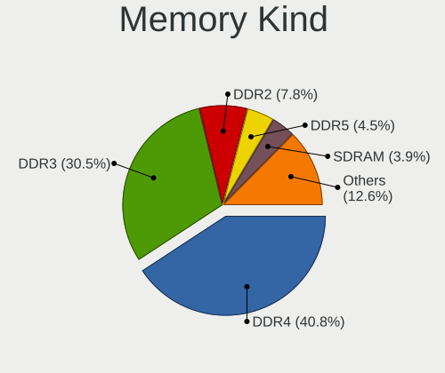

| Kind    | Computers | Percent |
|---------|-----------|---------|
| DDR4    | 346       | 40.75%  |
| DDR3    | 259       | 30.51%  |
| DDR2    | 66        | 7.77%   |
| DDR5    | 38        | 4.48%   |
| SDRAM   | 33        | 3.89%   |
| LPDDR5  | 29        | 3.42%   |
| LPDDR4  | 26        | 3.06%   |
| Unknown | 20        | 2.36%   |
| DDR     | 15        | 1.77%   |
| LPDDR3  | 13        | 1.53%   |
| DRAM    | 3         | 0.35%   |
| RAM     | 1         | 0.12%   |

Memory Form Factor
------------------

Physical design of the memory module

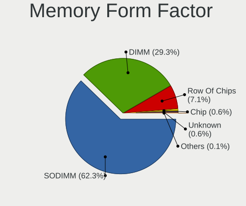

| Name         | Computers | Percent |
|--------------|-----------|---------|
| SODIMM       | 520       | 62.28%  |
| DIMM         | 245       | 29.34%  |
| Row Of Chips | 59        | 7.07%   |
| Chip         | 5         | 0.6%    |
| Unknown      | 5         | 0.6%    |
| RIMM         | 1         | 0.12%   |

Memory Size
-----------

Memory module size

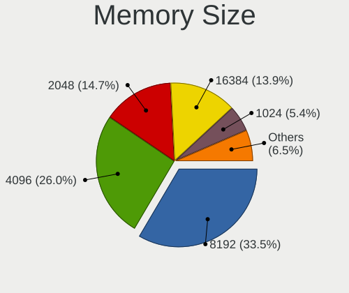

| Size    | Computers | Percent |
|---------|-----------|---------|
| 8192    | 310       | 33.48%  |
| 4096    | 241       | 26.03%  |
| 2048    | 136       | 14.69%  |
| 16384   | 129       | 13.93%  |
| 1024    | 50        | 5.4%    |
| 32768   | 38        | 4.1%    |
| 512     | 15        | 1.62%   |
| 49152   | 5         | 0.54%   |
| 16      | 1         | 0.11%   |
| Unknown | 1         | 0.11%   |

Memory Speed
------------

Memory module speed

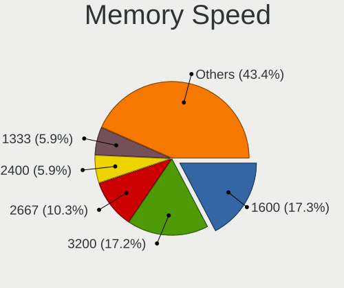

| Speed   | Computers | Percent |
|---------|-----------|---------|
| 1600    | 158       | 17.31%  |
| 3200    | 157       | 17.2%   |
| 2667    | 94        | 10.3%   |
| 2400    | 54        | 5.91%   |
| 1333    | 54        | 5.91%   |
| Unknown | 39        | 4.27%   |
| 2133    | 36        | 3.94%   |
| 667     | 33        | 3.61%   |
| 3600    | 25        | 2.74%   |
| 6400    | 24        | 2.63%   |
| 1334    | 23        | 2.52%   |
| 5600    | 19        | 2.08%   |
| 1867    | 15        | 1.64%   |
| 800     | 15        | 1.64%   |
| 533     | 15        | 1.64%   |
| 1067    | 14        | 1.53%   |
| 3266    | 9         | 0.99%   |
| 2048    | 9         | 0.99%   |
| 4267    | 8         | 0.88%   |
| 1866    | 8         | 0.88%   |
| 1066    | 8         | 0.88%   |
| 8400    | 7         | 0.77%   |
| 6000    | 7         | 0.77%   |
| 4199    | 7         | 0.77%   |
| 4800    | 6         | 0.66%   |
| 3733    | 6         | 0.66%   |
| 2800    | 5         | 0.55%   |
| 6200    | 4         | 0.44%   |
| 4266    | 4         | 0.44%   |
| 3400    | 4         | 0.44%   |
| 2666    | 4         | 0.44%   |
| 1800    | 4         | 0.44%   |
| 3000    | 3         | 0.33%   |
| 975     | 3         | 0.33%   |
| 400     | 3         | 0.33%   |
| 5500    | 2         | 0.22%   |
| 3500    | 2         | 0.22%   |
| 2933    | 2         | 0.22%   |
| 2448    | 2         | 0.22%   |
| 1639    | 2         | 0.22%   |

Printers & scanners
-------------------

Printer Vendor
--------------

Printer device vendors

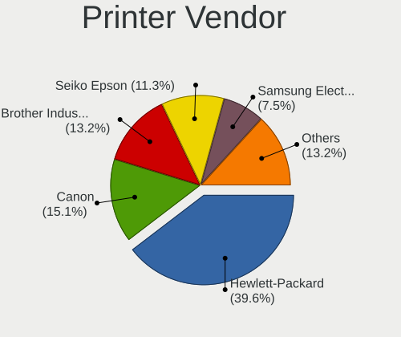

| Vendor                | Computers | Percent |
|-----------------------|-----------|---------|
| Hewlett-Packard       | 21        | 39.62%  |
| Canon                 | 8         | 15.09%  |
| Brother Industries    | 7         | 13.21%  |
| Seiko Epson           | 6         | 11.32%  |
| Samsung Electronics   | 4         | 7.55%   |
| Lexmark International | 2         | 3.77%   |
| Ricoh                 | 1         | 1.89%   |
| QinHeng Electronics   | 1         | 1.89%   |
| Prolific Technology   | 1         | 1.89%   |
| Minolta               | 1         | 1.89%   |
| Konica Minolta        | 1         | 1.89%   |

Printer Model
-------------

Printer device models

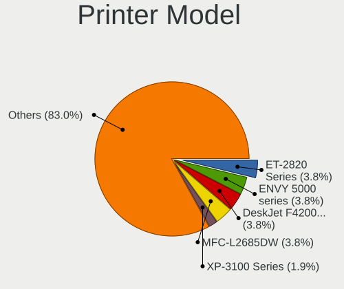

| Model                                  | Computers | Percent |
|----------------------------------------|-----------|---------|
| Seiko Epson ET-2820 Series             | 2         | 3.77%   |
| HP ENVY 5000 series                    | 2         | 3.77%   |
| HP DeskJet F4200 series                | 2         | 3.77%   |
| Brother MFC-L2685DW                    | 2         | 3.77%   |
| Seiko Epson XP-3100 Series             | 1         | 1.89%   |
| Seiko Epson L210 Series                | 1         | 1.89%   |
| Seiko Epson L1250 Series               | 1         | 1.89%   |
| Seiko Epson ET-2810 Series             | 1         | 1.89%   |
| Samsung SCX-4600 Series                | 1         | 1.89%   |
| Samsung SCX-3400 Series                | 1         | 1.89%   |
| Samsung ML-1670 Series                 | 1         | 1.89%   |
| Samsung M283x Series                   | 1         | 1.89%   |
| Ricoh SP C260SFNw                      | 1         | 1.89%   |
| QinHeng CH340S                         | 1         | 1.89%   |
| Prolific PL2305 Parallel Port          | 1         | 1.89%   |
| Minolta PagePro 1200W                  | 1         | 1.89%   |
| Lexmark International Printing Support | 1         | 1.89%   |
| Lexmark International MX310dn          | 1         | 1.89%   |
| Konica Minolta KONICA MINOLTA 185      | 1         | 1.89%   |
| HP OfficeJet Pro 8730                  | 1         | 1.89%   |
| HP OfficeJet Pro 7740 series           | 1         | 1.89%   |
| HP OfficeJet 6200                      | 1         | 1.89%   |
| HP LaserJet P2015 series               | 1         | 1.89%   |
| HP LaserJet P1006                      | 1         | 1.89%   |
| HP LaserJet P1005                      | 1         | 1.89%   |
| HP LaserJet M14-M17                    | 1         | 1.89%   |
| HP LaserJet 3050                       | 1         | 1.89%   |
| HP LaserJet 1020                       | 1         | 1.89%   |
| HP HP LaserJet Pro M404-M405           | 1         | 1.89%   |
| HP ENVY 4520 series                    | 1         | 1.89%   |
| HP DeskJet 4100 series                 | 1         | 1.89%   |
| HP DeskJet 2700 series                 | 1         | 1.89%   |
| HP Deskjet 2540 series                 | 1         | 1.89%   |
| HP DeskJet 2130 series                 | 1         | 1.89%   |
| HP Deskjet 1050 J410                   | 1         | 1.89%   |
| HP Color LaserJet CP2025dn             | 1         | 1.89%   |
| Canon TS9100 series                    | 1         | 1.89%   |
| Canon TR4600 series                    | 1         | 1.89%   |
| Canon PIXMA MG3500 Series              | 1         | 1.89%   |
| Canon LiDE 300                         | 1         | 1.89%   |

Scanner Vendor
--------------

Scanner device vendors

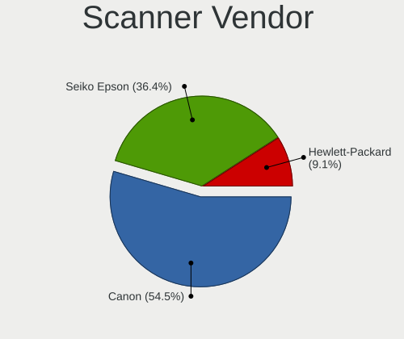

| Vendor          | Computers | Percent |
|-----------------|-----------|---------|
| Canon           | 6         | 54.55%  |
| Seiko Epson     | 4         | 36.36%  |
| Hewlett-Packard | 1         | 9.09%   |

Scanner Model
-------------

Scanner device models

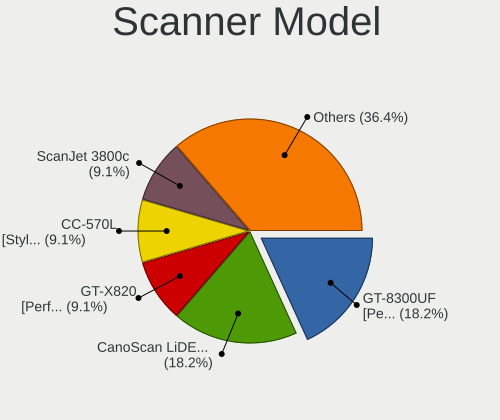

| Model                                         | Computers | Percent |
|-----------------------------------------------|-----------|---------|
| Seiko Epson GT-8300UF [Perfection 1660 PHOTO] | 2         | 18.18%  |
| Canon CanoScan LiDE 210                       | 2         | 18.18%  |
| Seiko Epson GT-X820 [Perfection V600 Photo]   | 1         | 9.09%   |
| Seiko Epson CC-570L [Stylus CX3100/CX3200]    | 1         | 9.09%   |
| HP ScanJet 3800c                              | 1         | 9.09%   |
| Canon CanoScan N1240U/LiDE 30                 | 1         | 9.09%   |
| Canon CanoScan LIDE 25                        | 1         | 9.09%   |
| Canon CanoScan LiDE 220                       | 1         | 9.09%   |
| Canon CanoScan LiDE 110                       | 1         | 9.09%   |

Camera
------

Camera Vendor
-------------

Camera device vendors

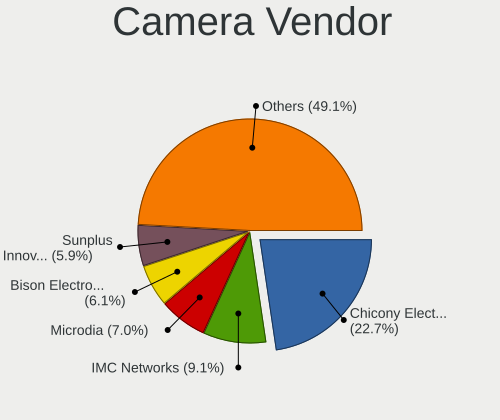

| Vendor                                 | Computers | Percent |
|----------------------------------------|-----------|---------|
| Chicony Electronics                    | 233       | 22.67%  |
| IMC Networks                           | 94        | 9.14%   |
| Microdia                               | 72        | 7%      |
| Bison Electronics                      | 63        | 6.13%   |
| Sunplus Innovation Technology          | 61        | 5.93%   |
| Realtek Semiconductor                  | 61        | 5.93%   |
| Quanta                                 | 58        | 5.64%   |
| Logitech                               | 43        | 4.18%   |
| Apple                                  | 42        | 4.09%   |
| Suyin                                  | 41        | 3.99%   |
| Cheng Uei Precision Industry (Foxlink) | 35        | 3.4%    |
| Luxvisions Innotech Limited            | 28        | 2.72%   |
| Syntek                                 | 21        | 2.04%   |
| Silicon Motion                         | 17        | 1.65%   |
| Alcor Micro                            | 17        | 1.65%   |
| Lite-On Technology                     | 12        | 1.17%   |
| Ricoh                                  | 11        | 1.07%   |
| Microsoft                              | 11        | 1.07%   |
| Sonix Technology                       | 9         | 0.88%   |
| Shinetech                              | 8         | 0.78%   |
| Z-Star Microelectronics                | 7         | 0.68%   |
| Importek                               | 7         | 0.68%   |
| MacroSilicon                           | 6         | 0.58%   |
| Lenovo                                 | 5         | 0.49%   |
| Acer                                   | 5         | 0.49%   |
| Samsung Electronics                    | 4         | 0.39%   |
| OmniVision Technologies                | 4         | 0.39%   |
| Generalplus Technology                 | 4         | 0.39%   |
| ALi                                    | 4         | 0.39%   |
| SunplusIT                              | 3         | 0.29%   |
| Sunplus Technology                     | 3         | 0.29%   |
| Shine-optics                           | 2         | 0.19%   |
| Razer USA                              | 2         | 0.19%   |
| KYE Systems (Mouse Systems)            | 2         | 0.19%   |
| kingcome                               | 2         | 0.19%   |
| Huawei Technologies                    | 2         | 0.19%   |
| Genesys Logic                          | 2         | 0.19%   |
| Creative Technology                    | 2         | 0.19%   |
| Xiongmai                               | 1         | 0.1%    |
| Web Camera                             | 1         | 0.1%    |

Camera Model
------------

Camera device models

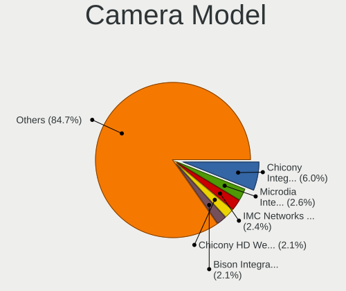

| Model                                                          | Computers | Percent |
|----------------------------------------------------------------|-----------|---------|
| Chicony Integrated Camera                                      | 63        | 6.05%   |
| Microdia Integrated_Webcam_HD                                  | 27        | 2.59%   |
| IMC Networks USB2.0 HD UVC WebCam                              | 25        | 2.4%    |
| Chicony HD WebCam                                              | 22        | 2.11%   |
| Bison Integrated Camera                                        | 22        | 2.11%   |
| Realtek Integrated_Webcam_HD                                   | 20        | 1.92%   |
| IMC Networks Integrated Camera                                 | 19        | 1.82%   |
| IMC Networks USB2.0 VGA UVC WebCam                             | 16        | 1.54%   |
| Syntek Integrated Camera                                       | 14        | 1.34%   |
| Apple Built-in iSight                                          | 14        | 1.34%   |
| Quanta HP TrueVision HD Camera                                 | 11        | 1.06%   |
| Luxvisions Innotech Limited HP TrueVision HD Camera            | 11        | 1.06%   |
| Chicony USB2.0 HD UVC WebCam                                   | 11        | 1.06%   |
| Quanta HP Webcam                                               | 10        | 0.96%   |
| Suyin HP TrueVision HD                                         | 9         | 0.86%   |
| Sunplus Laptop_Integrated_Webcam_FHD                           | 8         | 0.77%   |
| Microdia USB 2.0 Camera                                        | 8         | 0.77%   |
| Logitech Webcam C270                                           | 8         | 0.77%   |
| Chicony HP HD Camera                                           | 8         | 0.77%   |
| Chicony FJ Camera                                              | 8         | 0.77%   |
| Apple FaceTime HD Camera (Built-in)                            | 8         | 0.77%   |
| Quanta VGA Webcam                                              | 7         | 0.67%   |
| Chicony HP TrueVision HD Camera                                | 7         | 0.67%   |
| Apple FaceTime HD Camera                                       | 7         | 0.67%   |
| Alcor Micro USB 2.0 Camera                                     | 7         | 0.67%   |
| Realtek Lenovo EasyCamera                                      | 6         | 0.58%   |
| Quanta HP HD Camera                                            | 6         | 0.58%   |
| Lite-On Integrated Camera                                      | 6         | 0.58%   |
| Chicony USB 2.0 Camera                                         | 6         | 0.58%   |
| Chicony TOSHIBA Web Camera - HD                                | 6         | 0.58%   |
| Cheng Uei Precision Industry (Foxlink) HP Webcam               | 6         | 0.58%   |
| Cheng Uei Precision Industry (Foxlink) HP TrueVision HD Camera | 6         | 0.58%   |
| Cheng Uei Precision Industry (Foxlink) HP Truevision HD        | 6         | 0.58%   |
| Bison ThinkPad Integrated Camera                               | 6         | 0.58%   |
| Bison HD Webcam                                                | 6         | 0.58%   |
| Apple iPhone 5/5C/5S/6/SE/7/8/X                                | 6         | 0.58%   |
| Suyin Acer/HP Integrated Webcam [CN0314]                       | 5         | 0.48%   |
| Sunplus Laptop_Integrated_Webcam_HD                            | 5         | 0.48%   |
| Sunplus Integrated_Webcam_HD                                   | 5         | 0.48%   |
| Sonix USB2.0 HD UVC WebCam                                     | 5         | 0.48%   |

Security
--------

Fingerprint Vendor
------------------

Fingerprint sensor vendors

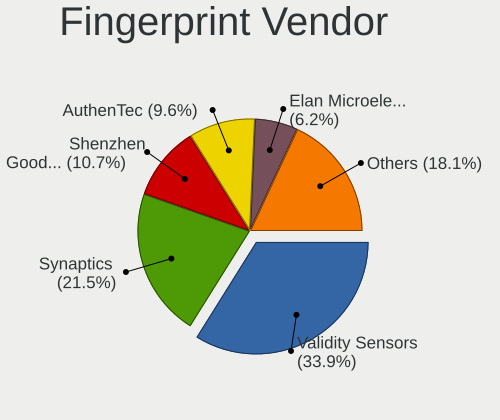

| Vendor                     | Computers | Percent |
|----------------------------|-----------|---------|
| Validity Sensors           | 60        | 33.9%   |
| Synaptics                  | 38        | 21.47%  |
| Shenzhen Goodix Technology | 19        | 10.73%  |
| AuthenTec                  | 17        | 9.6%    |
| Elan Microelectronics      | 11        | 6.21%   |
| Upek                       | 10        | 5.65%   |
| STMicroelectronics         | 10        | 5.65%   |
| LighTuning Technology      | 8         | 4.52%   |
| Focal-systems.Corp         | 2         | 1.13%   |
| Samsung Electronics        | 1         | 0.56%   |
| Microsoft                  | 1         | 0.56%   |

Fingerprint Model
-----------------

Fingerprint sensor models

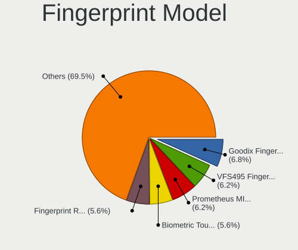

| Model                                                                      | Computers | Percent |
|----------------------------------------------------------------------------|-----------|---------|
| Shenzhen Goodix  FingerPrint Device                                        | 12        | 6.78%   |
| Validity Sensors VFS495 Fingerprint Reader                                 | 11        | 6.21%   |
| Synaptics Prometheus MIS Touch Fingerprint Reader                          | 11        | 6.21%   |
| Upek Biometric Touchchip/Touchstrip Fingerprint Sensor                     | 10        | 5.65%   |
| STMicroelectronics Fingerprint Reader                                      | 10        | 5.65%   |
| Validity Sensors VFS5011 Fingerprint Reader                                | 6         | 3.39%   |
| Validity Sensors VFS 5011 fingerprint sensor                               | 6         | 3.39%   |
| Synaptics UWP WBDI Device                                                  | 6         | 3.39%   |
| Synaptics FS7604 Touch Fingerprint Sensor with PurePrint                   | 6         | 3.39%   |
| Elan ELAN:ARM-M4                                                           | 6         | 3.39%   |
| Validity Sensors VFS7500 Touch Fingerprint Sensor                          | 5         | 2.82%   |
| Validity Sensors VFS451 Fingerprint Reader                                 | 5         | 2.82%   |
| Validity Sensors VFS301 Fingerprint Reader                                 | 5         | 2.82%   |
| Validity Sensors Fingerprint scanner                                       | 5         | 2.82%   |
| Synaptics Metallica MIS Touch Fingerprint Reader                           | 5         | 2.82%   |
| Shenzhen Goodix Fingerprint Reader                                         | 5         | 2.82%   |
| Elan ELAN:Fingerprint                                                      | 5         | 2.82%   |
| AuthenTec Fingerprint Sensor                                               | 5         | 2.82%   |
| AuthenTec AES2501 Fingerprint Sensor                                       | 4         | 2.26%   |
| AuthenTec AES1600                                                          | 4         | 2.26%   |
| Validity Sensors VFS491                                                    | 3         | 1.69%   |
| Validity Sensors Synaptics WBDI                                            | 3         | 1.69%   |
| Validity Sensors Synaptics VFS7552 Touch Fingerprint Sensor with PurePrint | 3         | 1.69%   |
| Validity Sensors Swipe Fingerprint Sensor                                  | 3         | 1.69%   |
| Synaptics Metallica MOH Touch Fingerprint Reader                           | 3         | 1.69%   |
| LighTuning ES603 Swipe Fingerprint Sensor                                  | 3         | 1.69%   |
| LighTuning EgisTec Touch Fingerprint Sensor                                | 3         | 1.69%   |
| AuthenTec AES2810                                                          | 3         | 1.69%   |
| Validity Sensors VFS Fingerprint sensor                                    | 2         | 1.13%   |
| Synaptics WBDI                                                             | 2         | 1.13%   |
| Synaptics UWP WBDI                                                         | 2         | 1.13%   |
| Shenzhen Goodix FingerPrint                                                | 2         | 1.13%   |
| Focal-systems.Corp FT9201Fingerprint.                                      | 2         | 1.13%   |
| Validity Sensors VFS7552 Touch Fingerprint Sensor                          | 1         | 0.56%   |
| Validity Sensors VFS101 Fingerprint Reader                                 | 1         | 0.56%   |
| Validity Sensors Synaptics VFS7552 Touch Fingerprint Sensor                | 1         | 0.56%   |
| Synaptics WBDI Fingerprint Reader USB 102                                  | 1         | 0.56%   |
| Synaptics  WBDI                                                            | 1         | 0.56%   |
| Synaptics Fingerprint reader [HP G6]                                       | 1         | 0.56%   |
| Samsung Fingerprint Sensor Device - 730B                                   | 1         | 0.56%   |

Chipcard Vendor
---------------

Chipcard module vendors

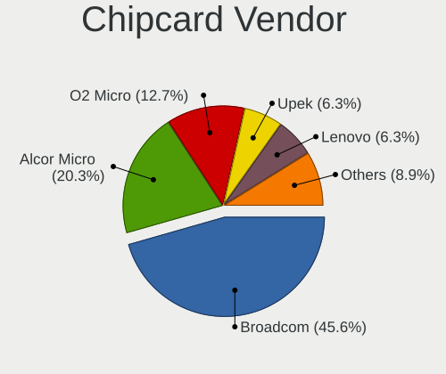

| Vendor                            | Computers | Percent |
|-----------------------------------|-----------|---------|
| Broadcom                          | 36        | 45.57%  |
| Alcor Micro                       | 16        | 20.25%  |
| O2 Micro                          | 10        | 12.66%  |
| Upek                              | 5         | 6.33%   |
| Lenovo                            | 5         | 6.33%   |
| OmniKey                           | 2         | 2.53%   |
| VASCO Data Security International | 1         | 1.27%   |
| Swissbit                          | 1         | 1.27%   |
| Kobil Systems                     | 1         | 1.27%   |
| Jing-Mold Enterprise              | 1         | 1.27%   |
| Gemalto (was Gemplus)             | 1         | 1.27%   |

Chipcard Model
--------------

Chipcard module models

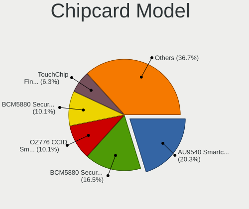

| Model                                                                        | Computers | Percent |
|------------------------------------------------------------------------------|-----------|---------|
| Alcor Micro AU9540 Smartcard Reader                                          | 16        | 20.25%  |
| Broadcom BCM5880 Secure Applications Processor                               | 13        | 16.46%  |
| O2 Micro OZ776 CCID Smartcard Reader                                         | 8         | 10.13%  |
| Broadcom BCM5880 Secure Applications Processor with fingerprint swipe sensor | 8         | 10.13%  |
| Upek TouchChip Fingerprint Coprocessor (WBF advanced mode)                   | 5         | 6.33%   |
| Lenovo Integrated Smart Card Reader                                          | 5         | 6.33%   |
| Broadcom BCM58200 ControlVault 3 (FingerPrint sensor + Contacted SmartCard)  | 5         | 6.33%   |
| Broadcom 5880                                                                | 5         | 6.33%   |
| Broadcom 58200                                                               | 4         | 5.06%   |
| O2 Micro Oz776 SmartCard Reader                                              | 2         | 2.53%   |
| VASCO Data Security International DIGIPASS 870                               | 1         | 1.27%   |
| Swissbit iShield Key FIDO2                                                   | 1         | 1.27%   |
| OmniKey CardMan 1021                                                         | 1         | 1.27%   |
| OmniKey 3x21 Smart Card Reader                                               | 1         | 1.27%   |
| Kobil Systems KOBIL Class 3 Reader                                           | 1         | 1.27%   |
| Jing-Mold Enterprise HP USB Business Slim Smartcard CCID Keyboard            | 1         | 1.27%   |
| Gemalto (was Gemplus) Compact Smart Card Reader Writer                       | 1         | 1.27%   |
| Broadcom BCM5880 Secure Applications Processor with fingerprint touch sensor | 1         | 1.27%   |

Unsupported
-----------

Unsupported Devices
-------------------

Total unsupported devices on board

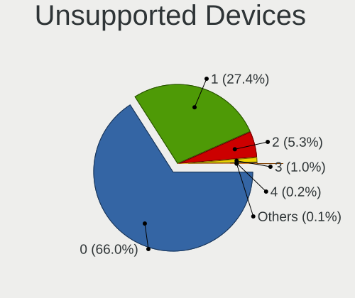

| Total | Computers | Percent |
|-------|-----------|---------|
| 0     | 1232      | 65.95%  |
| 1     | 512       | 27.41%  |
| 2     | 99        | 5.3%    |
| 3     | 19        | 1.02%   |
| 4     | 4         | 0.21%   |
| 6     | 1         | 0.05%   |
| 5     | 1         | 0.05%   |

Unsupported Device Types
------------------------

Types of unsupported devices

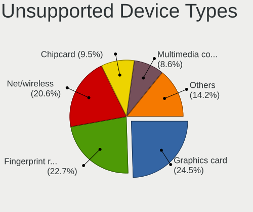

| Type                     | Computers | Percent |
|--------------------------|-----------|---------|
| Graphics card            | 188       | 24.48%  |
| Fingerprint reader       | 174       | 22.66%  |
| Net/wireless             | 158       | 20.57%  |
| Chipcard                 | 73        | 9.51%   |
| Multimedia controller    | 66        | 8.59%   |
| Communication controller | 22        | 2.86%   |
| Bluetooth                | 16        | 2.08%   |
| Storage                  | 14        | 1.82%   |
| Camera                   | 13        | 1.69%   |
| Unassigned class         | 8         | 1.04%   |
| Card reader              | 8         | 1.04%   |
| Network                  | 7         | 0.91%   |
| Sound                    | 5         | 0.65%   |
| Net/ethernet             | 4         | 0.52%   |
| Modem                    | 3         | 0.39%   |
| Flash memory             | 3         | 0.39%   |
| Dvb card                 | 2         | 0.26%   |
| Tv card                  | 1         | 0.13%   |
| Storage/raid             | 1         | 0.13%   |
| Storage/nvme             | 1         | 0.13%   |
| Storage/ide              | 1         | 0.13%   |

