LMDE - Tested Hardware & Statistics (Desktops)
----------------------------------------------

A project to collect tested hardware configurations for LMDE.

Anyone can contribute to this report by the [hw-probe](https://github.com/linuxhw/hw-probe) tool:

    sudo -E hw-probe -all -upload

Please contribute! Especially if your hardware is rare.

Contents
--------

* [ Test Cases ](#test-cases)

* [ System ](#system)
  - [ OS                       ](#os)
  - [ OS Family                ](#os-family)
  - [ Kernel                   ](#kernel)
  - [ Kernel Family            ](#kernel-family)
  - [ Kernel Major Ver.        ](#kernel-major-ver)
  - [ Arch                     ](#arch)
  - [ DE                       ](#de)
  - [ Display Server           ](#display-server)
  - [ Display Manager          ](#display-manager)
  - [ OS Lang                  ](#os-lang)
  - [ Boot Mode                ](#boot-mode)
  - [ Filesystem               ](#filesystem)
  - [ Part. scheme             ](#part-scheme)
  - [ Dual Boot with Linux/BSD ](#dual-boot-with-linuxbsd)
  - [ Dual Boot (Win)          ](#dual-boot-win)

* [ Board ](#board)
  - [ Vendor                   ](#vendor)
  - [ Model                    ](#model)
  - [ Model Family             ](#model-family)
  - [ MFG Year                 ](#mfg-year)
  - [ Form Factor              ](#form-factor)
  - [ Secure Boot              ](#secure-boot)
  - [ Coreboot                 ](#coreboot)
  - [ RAM Size                 ](#ram-size)
  - [ RAM Used                 ](#ram-used)
  - [ Total Drives             ](#total-drives)
  - [ Has CD-ROM               ](#has-cd-rom)
  - [ Has Ethernet             ](#has-ethernet)
  - [ Has WiFi                 ](#has-wifi)
  - [ Has Bluetooth            ](#has-bluetooth)

* [ Location ](#location)
  - [ Country                  ](#country)
  - [ City                     ](#city)

* [ Drives ](#drives)
  - [ Drive Vendor             ](#drive-vendor)
  - [ Drive Model              ](#drive-model)
  - [ HDD Vendor               ](#hdd-vendor)
  - [ SSD Vendor               ](#ssd-vendor)
  - [ Drive Kind               ](#drive-kind)
  - [ Drive Connector          ](#drive-connector)
  - [ Drive Size               ](#drive-size)
  - [ Space Total              ](#space-total)
  - [ Space Used               ](#space-used)
  - [ Malfunc. Drives          ](#malfunc-drives)
  - [ Malfunc. Drive Vendor    ](#malfunc-drive-vendor)
  - [ Malfunc. HDD Vendor      ](#malfunc-hdd-vendor)
  - [ Malfunc. Drive Kind      ](#malfunc-drive-kind)
  - [ Failed Drives            ](#failed-drives)
  - [ Failed Drive Vendor      ](#failed-drive-vendor)
  - [ Drive Status             ](#drive-status)

* [ Storage controller ](#storage-controller)
  - [ Storage Vendor           ](#storage-vendor)
  - [ Storage Model            ](#storage-model)
  - [ Storage Kind             ](#storage-kind)

* [ Processor ](#processor)
  - [ CPU Vendor               ](#cpu-vendor)
  - [ CPU Model                ](#cpu-model)
  - [ CPU Model Family         ](#cpu-model-family)
  - [ CPU Cores                ](#cpu-cores)
  - [ CPU Sockets              ](#cpu-sockets)
  - [ CPU Threads              ](#cpu-threads)
  - [ CPU Op-Modes             ](#cpu-op-modes)
  - [ CPU Microcode            ](#cpu-microcode)
  - [ CPU Microarch            ](#cpu-microarch)

* [ Graphics ](#graphics)
  - [ GPU Vendor               ](#gpu-vendor)
  - [ GPU Model                ](#gpu-model)
  - [ GPU Combo                ](#gpu-combo)
  - [ GPU Driver               ](#gpu-driver)
  - [ GPU Memory               ](#gpu-memory)

* [ Monitor ](#monitor)
  - [ Monitor Vendor           ](#monitor-vendor)
  - [ Monitor Model            ](#monitor-model)
  - [ Monitor Resolution       ](#monitor-resolution)
  - [ Monitor Diagonal         ](#monitor-diagonal)
  - [ Monitor Width            ](#monitor-width)
  - [ Aspect Ratio             ](#aspect-ratio)
  - [ Monitor Area             ](#monitor-area)
  - [ Pixel Density            ](#pixel-density)
  - [ Multiple Monitors        ](#multiple-monitors)

* [ Network ](#network)
  - [ Net Controller Vendor    ](#net-controller-vendor)
  - [ Net Controller Model     ](#net-controller-model)
  - [ Wireless Vendor          ](#wireless-vendor)
  - [ Wireless Model           ](#wireless-model)
  - [ Ethernet Vendor          ](#ethernet-vendor)
  - [ Ethernet Model           ](#ethernet-model)
  - [ Net Controller Kind      ](#net-controller-kind)
  - [ Used Controller          ](#used-controller)
  - [ NICs                     ](#nics)
  - [ IPv6                     ](#ipv6)

* [ Bluetooth ](#bluetooth)
  - [ Bluetooth Vendor         ](#bluetooth-vendor)
  - [ Bluetooth Model          ](#bluetooth-model)

* [ Sound ](#sound)
  - [ Sound Vendor             ](#sound-vendor)
  - [ Sound Model              ](#sound-model)

* [ Memory ](#memory)
  - [ Memory Vendor            ](#memory-vendor)
  - [ Memory Model             ](#memory-model)
  - [ Memory Kind              ](#memory-kind)
  - [ Memory Form Factor       ](#memory-form-factor)
  - [ Memory Size              ](#memory-size)
  - [ Memory Speed             ](#memory-speed)

* [ Printers & scanners ](#printers--scanners)
  - [ Printer Vendor           ](#printer-vendor)
  - [ Printer Model            ](#printer-model)
  - [ Scanner Vendor           ](#scanner-vendor)
  - [ Scanner Model            ](#scanner-model)

* [ Camera ](#camera)
  - [ Camera Vendor            ](#camera-vendor)
  - [ Camera Model             ](#camera-model)

* [ Security ](#security)
  - [ Fingerprint Vendor       ](#fingerprint-vendor)
  - [ Fingerprint Model        ](#fingerprint-model)
  - [ Chipcard Vendor          ](#chipcard-vendor)
  - [ Chipcard Model           ](#chipcard-model)

* [ Unsupported ](#unsupported)
  - [ Unsupported Devices      ](#unsupported-devices)
  - [ Unsupported Device Types ](#unsupported-device-types)

Test Cases
----------

Total: 1135

| Vendor        | Model                       | Probe                                                      | Date         |
|---------------|-----------------------------|------------------------------------------------------------|--------------|
| Medion        | TJ4125                      | [349b9f3f33](https://linux-hardware.org/?probe=349b9f3f33) | Jan 03, 2026 |
| Medion        | TJ4125                      | [0d34b4cd08](https://linux-hardware.org/?probe=0d34b4cd08) | Jan 02, 2026 |
| MSI           | MAG X570S TORPEDO MAX       | [4dca31393d](https://linux-hardware.org/?probe=4dca31393d) | Jan 01, 2026 |
| American M... | K7S41GX                     | [1e5ee9ad40](https://linux-hardware.org/?probe=1e5ee9ad40) | Jan 01, 2026 |
| Medion        | TJ4125                      | [51d5103855](https://linux-hardware.org/?probe=51d5103855) | Dec 31, 2025 |
| Medion        | TJ4125                      | [c310d29f92](https://linux-hardware.org/?probe=c310d29f92) | Dec 31, 2025 |
| Medion        | TJ4125                      | [a8527bcac3](https://linux-hardware.org/?probe=a8527bcac3) | Dec 31, 2025 |
| ECS           | A780GM-A                    | [457a3514b8](https://linux-hardware.org/?probe=457a3514b8) | Dec 31, 2025 |
| ASUSTek       | K30BF_M32BF                 | [30c7679d70](https://linux-hardware.org/?probe=30c7679d70) | Dec 30, 2025 |
| Gigabyte      | X870 EAGLE WIFI7            | [6f2ae59371](https://linux-hardware.org/?probe=6f2ae59371) | Dec 29, 2025 |
| Gigabyte      | X870 EAGLE WIFI7            | [535d303157](https://linux-hardware.org/?probe=535d303157) | Dec 29, 2025 |
| Acer          | Veriton E430 v1.0           | [0871672bdf](https://linux-hardware.org/?probe=0871672bdf) | Dec 28, 2025 |
| Medion        | TJ4125                      | [baf04f3c95](https://linux-hardware.org/?probe=baf04f3c95) | Dec 28, 2025 |
| Shenzhen M... | F7BRC                       | [c94b75f001](https://linux-hardware.org/?probe=c94b75f001) | Dec 28, 2025 |
| Gigabyte      | Q87M-D2H                    | [d121de6e9b](https://linux-hardware.org/?probe=d121de6e9b) | Dec 27, 2025 |
| ASUSTek       | L1N64-SLI WS                | [68a8fcbc78](https://linux-hardware.org/?probe=68a8fcbc78) | Dec 25, 2025 |
| Gigabyte      | A520M K V2                  | [6a63cf2a4a](https://linux-hardware.org/?probe=6a63cf2a4a) | Dec 25, 2025 |
| ASUSTek       | M3A78-EM                    | [900352ee25](https://linux-hardware.org/?probe=900352ee25) | Dec 23, 2025 |
| ASUSTek       | TUF Gaming B760-PLUS WIF... | [518c0ce72c](https://linux-hardware.org/?probe=518c0ce72c) | Dec 21, 2025 |
| Gigabyte      | B660M DS3H DDR4             | [1ba68bf835](https://linux-hardware.org/?probe=1ba68bf835) | Dec 20, 2025 |
| Gigabyte      | 970A-DS3P                   | [613e821a8e](https://linux-hardware.org/?probe=613e821a8e) | Dec 18, 2025 |
| Gigabyte      | F2A88X-D3H                  | [b98ee7fa68](https://linux-hardware.org/?probe=b98ee7fa68) | Dec 16, 2025 |
| Lenovo        | ThinkCentre M90p 5536A4U    | [7c0b2f32b6](https://linux-hardware.org/?probe=7c0b2f32b6) | Dec 13, 2025 |
| MSI           | MS-7390                     | [1f57ceafc1](https://linux-hardware.org/?probe=1f57ceafc1) | Dec 10, 2025 |
| Gigabyte      | G41M-ES2L                   | [00659d1055](https://linux-hardware.org/?probe=00659d1055) | Dec 10, 2025 |
| MSI           | MS-7390                     | [841c2fd00b](https://linux-hardware.org/?probe=841c2fd00b) | Dec 09, 2025 |
| Gigabyte      | G41M-ES2L                   | [f8b23a9141](https://linux-hardware.org/?probe=f8b23a9141) | Dec 09, 2025 |
| ASUSTek       | TUF Gaming B850-PLUS WIF... | [4477c51c45](https://linux-hardware.org/?probe=4477c51c45) | Dec 06, 2025 |
| ASUSTek       | TUF Gaming B850-PLUS WIF... | [3e1fde1bdc](https://linux-hardware.org/?probe=3e1fde1bdc) | Dec 06, 2025 |
| ASUSTek       | TUF Gaming B850-PLUS WIF... | [14e1a5c238](https://linux-hardware.org/?probe=14e1a5c238) | Dec 06, 2025 |
| ASUSTek       | H110M-K                     | [c2430d1ead](https://linux-hardware.org/?probe=c2430d1ead) | Dec 06, 2025 |
| ASUSTek       | H110M-K                     | [0c3f148abd](https://linux-hardware.org/?probe=0c3f148abd) | Dec 05, 2025 |
| Dell          | 0D24M8 A03                  | [d00acaabae](https://linux-hardware.org/?probe=d00acaabae) | Dec 04, 2025 |
| Gigabyte      | H310M A-CF                  | [9868d596d4](https://linux-hardware.org/?probe=9868d596d4) | Dec 03, 2025 |
| HP            | 8455                        | [463f9770a1](https://linux-hardware.org/?probe=463f9770a1) | Dec 02, 2025 |
| AZW           | ME mini                     | [3a429175de](https://linux-hardware.org/?probe=3a429175de) | Dec 02, 2025 |
| HP            | 8455                        | [77c23b390e](https://linux-hardware.org/?probe=77c23b390e) | Dec 01, 2025 |
| Unknown       | Unknown                     | [d79ae09518](https://linux-hardware.org/?probe=d79ae09518) | Nov 30, 2025 |
| HP            | 3397                        | [87bf4ee86d](https://linux-hardware.org/?probe=87bf4ee86d) | Nov 30, 2025 |
| Medion        | TJ4125                      | [7738c52d34](https://linux-hardware.org/?probe=7738c52d34) | Nov 29, 2025 |
| Medion        | TJ4125                      | [97592eb8c9](https://linux-hardware.org/?probe=97592eb8c9) | Nov 29, 2025 |
| Apple         | Mac-F221BEC8                | [f8071ede0e](https://linux-hardware.org/?probe=f8071ede0e) | Nov 28, 2025 |
| HP            | 1905                        | [8b0d4702b4](https://linux-hardware.org/?probe=8b0d4702b4) | Nov 28, 2025 |
| Gigabyte      | GA-MA770T-UD3P              | [e87f746e94](https://linux-hardware.org/?probe=e87f746e94) | Nov 26, 2025 |
| Gigabyte      | GA-MA770T-UD3P              | [bcf6739877](https://linux-hardware.org/?probe=bcf6739877) | Nov 26, 2025 |
| Pegatron      | 2A99                        | [7ad851a702](https://linux-hardware.org/?probe=7ad851a702) | Nov 25, 2025 |
| Medion        | H77H2-EM V1.0               | [06c21f8608](https://linux-hardware.org/?probe=06c21f8608) | Nov 25, 2025 |
| ASUSTek       | Maximus III Formula         | [6ce70a372f](https://linux-hardware.org/?probe=6ce70a372f) | Nov 25, 2025 |
| Lenovo        | SHARKBAY NOK                | [d3c5703b1d](https://linux-hardware.org/?probe=d3c5703b1d) | Nov 24, 2025 |
| Fujitsu       | D3233-A1 S26361-D3233-A1    | [44f234d41b](https://linux-hardware.org/?probe=44f234d41b) | Nov 22, 2025 |
| Fujitsu       | D3233-A1 S26361-D3233-A1    | [195b6d331c](https://linux-hardware.org/?probe=195b6d331c) | Nov 22, 2025 |
| Shenzhen M... | AHBTB                       | [2a6584cfcb](https://linux-hardware.org/?probe=2a6584cfcb) | Nov 22, 2025 |
| Lenovo        | SHARKBAY NOK                | [9dd2814b3d](https://linux-hardware.org/?probe=9dd2814b3d) | Nov 21, 2025 |
| Gigabyte      | GA-A75M-UD2H                | [6b3c745834](https://linux-hardware.org/?probe=6b3c745834) | Nov 21, 2025 |
| ASUSTek       | TUF Gaming X670E-PLUS WI... | [8f815ce059](https://linux-hardware.org/?probe=8f815ce059) | Nov 21, 2025 |
| ASUSTek       | H61M-E                      | [8382315c1f](https://linux-hardware.org/?probe=8382315c1f) | Nov 20, 2025 |
| Gigabyte      | B760M DS3H AX               | [e1bb02045a](https://linux-hardware.org/?probe=e1bb02045a) | Nov 16, 2025 |
| ASUSTek       | Rampage V EXTREME           | [29870a675d](https://linux-hardware.org/?probe=29870a675d) | Nov 16, 2025 |
| Gigabyte      | B760M DS3H AX               | [bdc37d18aa](https://linux-hardware.org/?probe=bdc37d18aa) | Nov 16, 2025 |
| Unknown       | Unknown                     | [d0f7584845](https://linux-hardware.org/?probe=d0f7584845) | Nov 12, 2025 |
| Unknown       | Unknown                     | [3afe0ebc3d](https://linux-hardware.org/?probe=3afe0ebc3d) | Nov 12, 2025 |
| Lenovo        | SHARKBAY SDK0E50515 STD     | [6e927658ce](https://linux-hardware.org/?probe=6e927658ce) | Nov 12, 2025 |
| ASUSTek       | H97-PLUS                    | [9a92ac1dae](https://linux-hardware.org/?probe=9a92ac1dae) | Nov 11, 2025 |
| ASUSTek       | CM6330_CM6630_CM6730_CM6... | [a20a7960fe](https://linux-hardware.org/?probe=a20a7960fe) | Nov 10, 2025 |
| ASUSTek       | CM6330_CM6630_CM6730_CM6... | [c9f8f38cc2](https://linux-hardware.org/?probe=c9f8f38cc2) | Nov 10, 2025 |
| ASUSTek       | ROG STRIX B450-F GAMING ... | [682862ada2](https://linux-hardware.org/?probe=682862ada2) | Nov 07, 2025 |
| Gigabyte      | B560M DS3H V2               | [47b94c57ac](https://linux-hardware.org/?probe=47b94c57ac) | Nov 06, 2025 |
| Lenovo        | SHARKBAY NOK                | [6b83c01330](https://linux-hardware.org/?probe=6b83c01330) | Nov 05, 2025 |
| Medion        | TJ4125                      | [63e42ef2ef](https://linux-hardware.org/?probe=63e42ef2ef) | Nov 04, 2025 |
| MSI           | Z77A-G43                    | [830f7ec089](https://linux-hardware.org/?probe=830f7ec089) | Nov 04, 2025 |
| Dell          | 0YXT71 A02                  | [d1f5f0d7ef](https://linux-hardware.org/?probe=d1f5f0d7ef) | Nov 03, 2025 |
| Medion        | TJ4125                      | [92b1b520f0](https://linux-hardware.org/?probe=92b1b520f0) | Nov 03, 2025 |
| ASUSTek       | PRIME B250-PLUS             | [c6290d7912](https://linux-hardware.org/?probe=c6290d7912) | Nov 01, 2025 |
| ASRock        | N68C-GS FX                  | [bbb6bc603d](https://linux-hardware.org/?probe=bbb6bc603d) | Nov 01, 2025 |
| G7-2011       | X79                         | [cb93f5ed68](https://linux-hardware.org/?probe=cb93f5ed68) | Nov 01, 2025 |
| ASUSTek       | PRIME B460M-A               | [a10a72c361](https://linux-hardware.org/?probe=a10a72c361) | Oct 31, 2025 |
| ASRock        | X570 Steel Legend           | [6225901759](https://linux-hardware.org/?probe=6225901759) | Oct 31, 2025 |
| Gigabyte      | 970A-DS3P                   | [2fb0ac22e9](https://linux-hardware.org/?probe=2fb0ac22e9) | Oct 29, 2025 |
| HP            | 8768 A                      | [89b8b2d1bd](https://linux-hardware.org/?probe=89b8b2d1bd) | Oct 28, 2025 |
| Gigabyte      | Z77X-D3H                    | [c02b5b750f](https://linux-hardware.org/?probe=c02b5b750f) | Oct 25, 2025 |
| MSI           | B250M MORTAR                | [b5974b5ac9](https://linux-hardware.org/?probe=b5974b5ac9) | Oct 25, 2025 |
| Medion        | B560H6-EM2                  | [d5a1cd11c2](https://linux-hardware.org/?probe=d5a1cd11c2) | Oct 24, 2025 |
| HP            | 3031h                       | [0a0715c416](https://linux-hardware.org/?probe=0a0715c416) | Oct 23, 2025 |
| HP            | 3031h                       | [cfae61d70d](https://linux-hardware.org/?probe=cfae61d70d) | Oct 23, 2025 |
| Unknown       | Unknown                     | [031031da17](https://linux-hardware.org/?probe=031031da17) | Oct 23, 2025 |
| HP            | 0B4Ch D                     | [700d0a69be](https://linux-hardware.org/?probe=700d0a69be) | Oct 23, 2025 |
| HP            | 802F                        | [1b332ede20](https://linux-hardware.org/?probe=1b332ede20) | Oct 23, 2025 |
| HP            | 8768 A                      | [31a76f1737](https://linux-hardware.org/?probe=31a76f1737) | Oct 23, 2025 |
| ASRock        | N68C-S UCC                  | [a33d72f651](https://linux-hardware.org/?probe=a33d72f651) | Oct 22, 2025 |
| Fujitsu       | D3221-A1 S26361-D3221-A1    | [a1a196668e](https://linux-hardware.org/?probe=a1a196668e) | Oct 21, 2025 |
| Fujitsu       | D3221-A1 S26361-D3221-A1    | [98d85b2c6b](https://linux-hardware.org/?probe=98d85b2c6b) | Oct 18, 2025 |
| HP            | 8455                        | [d1afecec96](https://linux-hardware.org/?probe=d1afecec96) | Oct 16, 2025 |
| ASRock        | B550 Taichi                 | [5d724542c0](https://linux-hardware.org/?probe=5d724542c0) | Oct 13, 2025 |
| MSI           | PRO B550M-VC WIFI           | [e814c82d53](https://linux-hardware.org/?probe=e814c82d53) | Oct 13, 2025 |
| Gigabyte      | 965P-DS3                    | [b787c8b019](https://linux-hardware.org/?probe=b787c8b019) | Oct 13, 2025 |
| Medion        | TJ4125                      | [79e6dbfaac](https://linux-hardware.org/?probe=79e6dbfaac) | Oct 12, 2025 |
| ASUSTek       | ROG STRIX B450-F GAMING     | [2d44f8fc4d](https://linux-hardware.org/?probe=2d44f8fc4d) | Oct 11, 2025 |
| Medion        | TJ4125                      | [2d80da577e](https://linux-hardware.org/?probe=2d80da577e) | Oct 11, 2025 |
| ASRock        | X570 Steel Legend           | [0cdc823602](https://linux-hardware.org/?probe=0cdc823602) | Oct 11, 2025 |
| Gigabyte      | B550M K                     | [d69ebdf89b](https://linux-hardware.org/?probe=d69ebdf89b) | Oct 10, 2025 |
| Gigabyte      | B550M K                     | [f9d1e8bf8f](https://linux-hardware.org/?probe=f9d1e8bf8f) | Oct 10, 2025 |
| ASUSTek       | M4A88T-V EVO/USB3           | [0597cfadf8](https://linux-hardware.org/?probe=0597cfadf8) | Oct 06, 2025 |
| Dell          | 0478VN A00                  | [8e9f46e664](https://linux-hardware.org/?probe=8e9f46e664) | Oct 06, 2025 |
| Dell          | 0478VN A00                  | [2f9659ad8a](https://linux-hardware.org/?probe=2f9659ad8a) | Oct 06, 2025 |
| HP            | 1587h                       | [d7614e4788](https://linux-hardware.org/?probe=d7614e4788) | Oct 05, 2025 |
| HP            | 18E7                        | [99ee0a97ed](https://linux-hardware.org/?probe=99ee0a97ed) | Oct 02, 2025 |
| ASUSTek       | P8H61-M LE                  | [c2431dbbc0](https://linux-hardware.org/?probe=c2431dbbc0) | Sep 29, 2025 |
| GEEKOM        | AE8                         | [09521a14be](https://linux-hardware.org/?probe=09521a14be) | Sep 28, 2025 |
| Gigabyte      | B360 AORUS GAMING 3 WIFI... | [66ce917656](https://linux-hardware.org/?probe=66ce917656) | Sep 28, 2025 |
| Medion        | TJ4125                      | [69fb618207](https://linux-hardware.org/?probe=69fb618207) | Sep 26, 2025 |
| ASUSTek       | PRIME X570-PRO              | [26433a6350](https://linux-hardware.org/?probe=26433a6350) | Sep 21, 2025 |
| MSI           | B450 GAMING PRO CARBON A... | [be8df43d21](https://linux-hardware.org/?probe=be8df43d21) | Sep 17, 2025 |
| Gigabyte      | A520M K V2                  | [5423a2a6a0](https://linux-hardware.org/?probe=5423a2a6a0) | Sep 16, 2025 |
| Lenovo        | 317C SDK0J40697 WIN 3305... | [4ac7b0be11](https://linux-hardware.org/?probe=4ac7b0be11) | Sep 10, 2025 |
| Medion        | TJ4125                      | [19d5d8b4f0](https://linux-hardware.org/?probe=19d5d8b4f0) | Sep 06, 2025 |
| Medion        | TJ4125                      | [c020fb32c9](https://linux-hardware.org/?probe=c020fb32c9) | Sep 06, 2025 |
| Dell          | 0F0TGN A00                  | [028e8ba4e0](https://linux-hardware.org/?probe=028e8ba4e0) | Sep 03, 2025 |
| Dell          | 0RY007                      | [a9cda38b58](https://linux-hardware.org/?probe=a9cda38b58) | Sep 01, 2025 |
| ASUSTek       | Z77-A                       | [d14cd8d02c](https://linux-hardware.org/?probe=d14cd8d02c) | Sep 01, 2025 |
| Dell          | 0F0TGN A00                  | [df4aec1d37](https://linux-hardware.org/?probe=df4aec1d37) | Aug 30, 2025 |
| Lenovo        | SHARKBAY NOK                | [1adf3a3841](https://linux-hardware.org/?probe=1adf3a3841) | Aug 26, 2025 |
| Gigabyte      | 970A-DS3P                   | [e7930bbade](https://linux-hardware.org/?probe=e7930bbade) | Aug 24, 2025 |
| ASUSTek       | ROG STRIX B550-F GAMING     | [d507e6e482](https://linux-hardware.org/?probe=d507e6e482) | Aug 24, 2025 |
| Dell          | 0GY6Y8 A02                  | [828cd03393](https://linux-hardware.org/?probe=828cd03393) | Aug 22, 2025 |
| HP            | 0B4Ch D                     | [29307b6ba6](https://linux-hardware.org/?probe=29307b6ba6) | Aug 19, 2025 |
| ASRock        | B650E PG Riptide WiFi       | [c2cf331637](https://linux-hardware.org/?probe=c2cf331637) | Aug 19, 2025 |
| ASUSTek       | ROG STRIX B550-F GAMING     | [45339db027](https://linux-hardware.org/?probe=45339db027) | Aug 19, 2025 |
| HP            | 0B40h                       | [32f5bb2fc7](https://linux-hardware.org/?probe=32f5bb2fc7) | Aug 14, 2025 |
| HP            | 2820h                       | [7fe6722bde](https://linux-hardware.org/?probe=7fe6722bde) | Aug 13, 2025 |
| Gigabyte      | Z77X-UD5H                   | [2fe929814c](https://linux-hardware.org/?probe=2fe929814c) | Aug 07, 2025 |
| ASUSTek       | TUF Gaming B850-BTF WIFI... | [d1eafaf49b](https://linux-hardware.org/?probe=d1eafaf49b) | Aug 06, 2025 |
| ASUSTek       | TUF Gaming B850-BTF WIFI... | [2578e8015b](https://linux-hardware.org/?probe=2578e8015b) | Aug 06, 2025 |
| Dell          | 0F756F A00                  | [4c88458a84](https://linux-hardware.org/?probe=4c88458a84) | Aug 06, 2025 |
| Dell          | 0F756F A00                  | [053f2e82d8](https://linux-hardware.org/?probe=053f2e82d8) | Aug 05, 2025 |
| ASUSTek       | PRIME Z390-P                | [b55f8909e0](https://linux-hardware.org/?probe=b55f8909e0) | Aug 04, 2025 |
| ASRock        | Z690 Phantom Gaming 4/D5    | [76f7babeb1](https://linux-hardware.org/?probe=76f7babeb1) | Aug 01, 2025 |
| Gigabyte      | B450M DS3H WIFI-CF          | [46aca721ed](https://linux-hardware.org/?probe=46aca721ed) | Jul 31, 2025 |
| ASUSTek       | H97M-E                      | [abfde43d99](https://linux-hardware.org/?probe=abfde43d99) | Jul 28, 2025 |
| HP            | 0B40h                       | [876fc49961](https://linux-hardware.org/?probe=876fc49961) | Jul 23, 2025 |
| Medion        | TJ4125                      | [19aff278e5](https://linux-hardware.org/?probe=19aff278e5) | Jul 19, 2025 |
| ASRock        | X670E Taichi Carrara        | [f9716af58a](https://linux-hardware.org/?probe=f9716af58a) | Jul 18, 2025 |
| Gigabyte      | B250M-DS3H-CF               | [fcc02de185](https://linux-hardware.org/?probe=fcc02de185) | Jul 13, 2025 |
| Medion        | TJ4125                      | [ead4f97792](https://linux-hardware.org/?probe=ead4f97792) | Jul 12, 2025 |
| GEEKOM        | A7                          | [51b9dc5acd](https://linux-hardware.org/?probe=51b9dc5acd) | Jul 09, 2025 |
| Gigabyte      | B550 AORUS ELITE AX V2      | [17f31ff9bc](https://linux-hardware.org/?probe=17f31ff9bc) | Jul 09, 2025 |
| Gigabyte      | B360 AORUS GAMING 3 WIFI... | [2bb00a50d0](https://linux-hardware.org/?probe=2bb00a50d0) | Jul 06, 2025 |
| Gigabyte      | B360 AORUS GAMING 3 WIFI... | [6c0adbaf73](https://linux-hardware.org/?probe=6c0adbaf73) | Jul 06, 2025 |
| MSI           | MAG B550 TOMAHAWK           | [4c9772035e](https://linux-hardware.org/?probe=4c9772035e) | Jul 04, 2025 |
| Dell          | 0WMJ54 A01                  | [89f53b6c82](https://linux-hardware.org/?probe=89f53b6c82) | Jul 01, 2025 |
| ASRock        | B250M Pro4                  | [23c030fc52](https://linux-hardware.org/?probe=23c030fc52) | Jun 27, 2025 |
| MSI           | H110M PRO-D                 | [9677fb0820](https://linux-hardware.org/?probe=9677fb0820) | Jun 26, 2025 |
| Dell          | 0WR1RF A05                  | [c935ad3bd9](https://linux-hardware.org/?probe=c935ad3bd9) | Jun 25, 2025 |
| Lenovo        | IdeaCentre K330B            | [baa79dad9b](https://linux-hardware.org/?probe=baa79dad9b) | Jun 24, 2025 |
| Intel         | D54250WYK H13922-303        | [a4f86ce7fb](https://linux-hardware.org/?probe=a4f86ce7fb) | Jun 22, 2025 |
| Gigabyte      | B760 GAMING X DDR4          | [274069e10a](https://linux-hardware.org/?probe=274069e10a) | Jun 21, 2025 |
| ASUSTek       | ROG STRIX Z370-I GAMING     | [783a6ca047](https://linux-hardware.org/?probe=783a6ca047) | Jun 21, 2025 |
| Gigabyte      | B760 GAMING X DDR4          | [07026815a1](https://linux-hardware.org/?probe=07026815a1) | Jun 19, 2025 |
| ASUSTek       | PRIME A520M-K               | [73e9ad5501](https://linux-hardware.org/?probe=73e9ad5501) | Jun 16, 2025 |
| ASUSTek       | PRIME A520M-K               | [797a0b684c](https://linux-hardware.org/?probe=797a0b684c) | Jun 16, 2025 |
| Dell          | 00V62H A01                  | [89f331ee71](https://linux-hardware.org/?probe=89f331ee71) | Jun 15, 2025 |
| Dell          | 09M8Y8 A01                  | [66b19b8b8b](https://linux-hardware.org/?probe=66b19b8b8b) | Jun 15, 2025 |
| ASRock        | Z690 Phantom Gaming 4/D5    | [0aeec37aa0](https://linux-hardware.org/?probe=0aeec37aa0) | Jun 15, 2025 |
| Dell          | 0YXT71 A02                  | [3c43359304](https://linux-hardware.org/?probe=3c43359304) | Jun 14, 2025 |
| Fujitsu       | D2778-C1 S26361-D2778-C1    | [5d1855fa5e](https://linux-hardware.org/?probe=5d1855fa5e) | Jun 13, 2025 |
| ASUSTek       | ROG STRIX B450-F GAMING     | [2a2a5d6f61](https://linux-hardware.org/?probe=2a2a5d6f61) | Jun 11, 2025 |
| ECS           | H61H2-CM                    | [9541786163](https://linux-hardware.org/?probe=9541786163) | Jun 09, 2025 |
| Gigabyte      | B460M DS3H AC-Y1            | [e0c47af925](https://linux-hardware.org/?probe=e0c47af925) | Jun 08, 2025 |
| Gigabyte      | X870 AORUS ELITE WIFI7 I... | [ca5fc3e6bf](https://linux-hardware.org/?probe=ca5fc3e6bf) | Jun 07, 2025 |
| Medion        | TJ4125                      | [ac1165f893](https://linux-hardware.org/?probe=ac1165f893) | Jun 05, 2025 |
| ASUSTek       | D520MT_D520SF_D320MT        | [8130f151f8](https://linux-hardware.org/?probe=8130f151f8) | Jun 02, 2025 |
| ASUSTek       | P8H61-M LE                  | [a4dafa5bf4](https://linux-hardware.org/?probe=a4dafa5bf4) | Jun 02, 2025 |
| ASRock        | B450 Gaming-ITX/ac          | [7b4176a222](https://linux-hardware.org/?probe=7b4176a222) | Jun 01, 2025 |
| MSI           | Z270M MORTAR                | [0d97e1ec7f](https://linux-hardware.org/?probe=0d97e1ec7f) | May 30, 2025 |
| Minix         | NEO Z83-4 V1.1              | [668bebd807](https://linux-hardware.org/?probe=668bebd807) | May 28, 2025 |
| WeiBu         | ADL-N Prod                  | [443f7decd6](https://linux-hardware.org/?probe=443f7decd6) | May 27, 2025 |
| HP            | 339A                        | [0adea6e20d](https://linux-hardware.org/?probe=0adea6e20d) | May 25, 2025 |
| MSI           | MPG B650 CARBON WIFI        | [1756e42bfe](https://linux-hardware.org/?probe=1756e42bfe) | May 25, 2025 |
| ASRock        | B450 Gaming-ITX/ac          | [f26af33f47](https://linux-hardware.org/?probe=f26af33f47) | May 24, 2025 |
| Intel         | DQ965GF AAD41676-402        | [cbcd411d7c](https://linux-hardware.org/?probe=cbcd411d7c) | May 23, 2025 |
| MSI           | MPG B650 CARBON WIFI        | [479c35845a](https://linux-hardware.org/?probe=479c35845a) | May 21, 2025 |
| ASUSTek       | P8H61-M LE                  | [b4c54b9c8b](https://linux-hardware.org/?probe=b4c54b9c8b) | May 19, 2025 |
| Dell          | 0X4H68 A00                  | [1a74d03045](https://linux-hardware.org/?probe=1a74d03045) | May 17, 2025 |
| ASUSTek       | PRIME Z370-P II             | [ce93cc89b1](https://linux-hardware.org/?probe=ce93cc89b1) | May 17, 2025 |
| Dell          | 00V62H A01                  | [f42972c0cd](https://linux-hardware.org/?probe=f42972c0cd) | May 14, 2025 |
| ASUSTek       | P8H61-M LE                  | [5873f9e355](https://linux-hardware.org/?probe=5873f9e355) | May 13, 2025 |
| MSI           | Z170A GAMING PRO CARBON     | [fff2a96d4a](https://linux-hardware.org/?probe=fff2a96d4a) | May 13, 2025 |
| MSI           | Z170A GAMING PRO CARBON     | [f72c58cc29](https://linux-hardware.org/?probe=f72c58cc29) | May 13, 2025 |
| ASUSTek       | H81M-C                      | [11dd2b44ab](https://linux-hardware.org/?probe=11dd2b44ab) | May 12, 2025 |
| Lenovo        | IdeaCentre K330B            | [f68a264591](https://linux-hardware.org/?probe=f68a264591) | May 12, 2025 |
| Dell          | 04YP6J A02                  | [533d3b1997](https://linux-hardware.org/?probe=533d3b1997) | May 10, 2025 |
| GEEKOM        | Mini IT11                   | [421d3aae29](https://linux-hardware.org/?probe=421d3aae29) | May 10, 2025 |
| Dell          | 0GX297                      | [36fa47b8bf](https://linux-hardware.org/?probe=36fa47b8bf) | May 06, 2025 |
| NZXT          | N7 B550                     | [db31437e07](https://linux-hardware.org/?probe=db31437e07) | May 05, 2025 |
| Dell          | 09M8Y8 A01                  | [9c14f33700](https://linux-hardware.org/?probe=9c14f33700) | May 04, 2025 |
| Gigabyte      | MZGLKAP-00                  | [8cc8191bd8](https://linux-hardware.org/?probe=8cc8191bd8) | May 04, 2025 |
| Dell          | 09M8Y8 A01                  | [494ce1a7d0](https://linux-hardware.org/?probe=494ce1a7d0) | May 04, 2025 |
| GEEKOM        | AE8                         | [9158c70300](https://linux-hardware.org/?probe=9158c70300) | May 04, 2025 |
| ASRock        | Z690 Phantom Gaming 4/D5    | [8c7b8e24fc](https://linux-hardware.org/?probe=8c7b8e24fc) | May 03, 2025 |
| ASUSTek       | SABERTOOTH 990FX R2.0       | [47aa3a80b3](https://linux-hardware.org/?probe=47aa3a80b3) | May 03, 2025 |
| GEEKOM        | AE8                         | [7cdc357a94](https://linux-hardware.org/?probe=7cdc357a94) | May 03, 2025 |
| MSI           | B550M PRO-VDH WIFI          | [1dd652fa65](https://linux-hardware.org/?probe=1dd652fa65) | May 02, 2025 |
| ASRock        | Z68 Extreme3 Gen3           | [ea0bc65f32](https://linux-hardware.org/?probe=ea0bc65f32) | May 02, 2025 |
| Gigabyte      | B760M DS3H AX               | [d2dabf6705](https://linux-hardware.org/?probe=d2dabf6705) | Apr 29, 2025 |
| ASUSTek       | TUF Gaming A620M-PLUS WI... | [3ec993fcb1](https://linux-hardware.org/?probe=3ec993fcb1) | Apr 28, 2025 |
| Gigabyte      | X570S AORUS ELITE AX        | [69a71355b4](https://linux-hardware.org/?probe=69a71355b4) | Apr 28, 2025 |
| Dell          | 0WMJ54 A01                  | [a3a7e67460](https://linux-hardware.org/?probe=a3a7e67460) | Apr 28, 2025 |
| Gigabyte      | X570S AORUS ELITE AX        | [9adcab1856](https://linux-hardware.org/?probe=9adcab1856) | Apr 27, 2025 |
| Clientron ... | L700                        | [eed16cfff6](https://linux-hardware.org/?probe=eed16cfff6) | Apr 27, 2025 |
| ASUSTek       | PRIME A520M-K               | [3e459dab89](https://linux-hardware.org/?probe=3e459dab89) | Apr 25, 2025 |
| HP            | 0B4Ch D                     | [dd487cf2a9](https://linux-hardware.org/?probe=dd487cf2a9) | Apr 25, 2025 |
| ASUSTek       | TUF Gaming X670E-PLUS WI... | [9ddbf43336](https://linux-hardware.org/?probe=9ddbf43336) | Apr 24, 2025 |
| MSI           | PRO B550M-VC WIFI           | [a4ffee729b](https://linux-hardware.org/?probe=a4ffee729b) | Apr 24, 2025 |
| Lenovo        | 30D2 SDK0J40705 WIN 3425... | [c64b2890b9](https://linux-hardware.org/?probe=c64b2890b9) | Apr 19, 2025 |
| HP            | 0B4Ch D                     | [3cf36ba352](https://linux-hardware.org/?probe=3cf36ba352) | Apr 17, 2025 |
| Lenovo        | SHARKBAY SDK0E50515 STD     | [50069c6280](https://linux-hardware.org/?probe=50069c6280) | Apr 17, 2025 |
| ASRock        | B85 Pro4                    | [6cea1e7a20](https://linux-hardware.org/?probe=6cea1e7a20) | Apr 16, 2025 |
| ASRock        | B85 Pro4                    | [824c2a3efb](https://linux-hardware.org/?probe=824c2a3efb) | Apr 16, 2025 |
| ASRock        | A320M-HDV R4.0              | [5f5a576b99](https://linux-hardware.org/?probe=5f5a576b99) | Apr 16, 2025 |
| Lenovo        | ThinkStation S20 4105J6G    | [dcca17605e](https://linux-hardware.org/?probe=dcca17605e) | Apr 15, 2025 |
| Lenovo        | SHARKBAY SDK0E50515 STD     | [63e7cb0712](https://linux-hardware.org/?probe=63e7cb0712) | Apr 15, 2025 |
| Dell          | 0WWJRX A00                  | [5cb44e756c](https://linux-hardware.org/?probe=5cb44e756c) | Apr 14, 2025 |
| Dell          | 0WWJRX A00                  | [9e0233cc61](https://linux-hardware.org/?probe=9e0233cc61) | Apr 14, 2025 |
| Fujitsu       | D3233-A1 S26361-D3233-A1    | [ddb0b76533](https://linux-hardware.org/?probe=ddb0b76533) | Apr 14, 2025 |
| Fujitsu       | D3233-A1 S26361-D3233-A1    | [7522f8f475](https://linux-hardware.org/?probe=7522f8f475) | Apr 14, 2025 |
| Lenovo        | ThinkCentre M91p 7052A9G    | [944fb85015](https://linux-hardware.org/?probe=944fb85015) | Apr 13, 2025 |
| Lenovo        | ThinkCentre M91p 7052A9G    | [cc4bab3b31](https://linux-hardware.org/?probe=cc4bab3b31) | Apr 13, 2025 |
| Biostar       | H310MHC2                    | [1ab3c7b926](https://linux-hardware.org/?probe=1ab3c7b926) | Apr 08, 2025 |
| MSI           | C847MS-E33                  | [46cd07a997](https://linux-hardware.org/?probe=46cd07a997) | Apr 07, 2025 |
| Gigabyte      | X570 I AORUS PRO WIFI       | [719ad29e5f](https://linux-hardware.org/?probe=719ad29e5f) | Apr 03, 2025 |
| ASUSTek       | ROG STRIX B550-E GAMING     | [ca0dcab902](https://linux-hardware.org/?probe=ca0dcab902) | Apr 02, 2025 |
| ASUSTek       | P7P55D LE                   | [a5bf5753af](https://linux-hardware.org/?probe=a5bf5753af) | Apr 02, 2025 |
| MSI           | B760 GAMING PLUS WIFI       | [73732a2f7c](https://linux-hardware.org/?probe=73732a2f7c) | Mar 30, 2025 |
| Gigabyte      | B450M DS3H V2               | [8699e5c8bf](https://linux-hardware.org/?probe=8699e5c8bf) | Mar 29, 2025 |
| Lenovo        | SHARKBAY 31900003 STD       | [b767cf4f14](https://linux-hardware.org/?probe=b767cf4f14) | Mar 29, 2025 |
| HP            | 1497                        | [a6252a2fea](https://linux-hardware.org/?probe=a6252a2fea) | Mar 28, 2025 |
| ASUSTek       | M4A88T-M/USB3               | [6c2e466d8e](https://linux-hardware.org/?probe=6c2e466d8e) | Mar 27, 2025 |
| ASUSTek       | P8H67-M PRO                 | [1686a17e4a](https://linux-hardware.org/?probe=1686a17e4a) | Mar 27, 2025 |
| ASUSTek       | P8H67-M PRO                 | [e7b070821e](https://linux-hardware.org/?probe=e7b070821e) | Mar 27, 2025 |
| ASRock        | B250M Pro4                  | [d80d521a9d](https://linux-hardware.org/?probe=d80d521a9d) | Mar 25, 2025 |
| ECS           | A780GM-A                    | [12d6f63d69](https://linux-hardware.org/?probe=12d6f63d69) | Mar 24, 2025 |
| ECS           | A780GM-A                    | [036a7b9176](https://linux-hardware.org/?probe=036a7b9176) | Mar 24, 2025 |
| Dell          | 0Y2MRG A00                  | [d43df1600f](https://linux-hardware.org/?probe=d43df1600f) | Mar 21, 2025 |
| ASUSTek       | P8H61-M LX3 PLUS            | [c419030a03](https://linux-hardware.org/?probe=c419030a03) | Mar 18, 2025 |
| ASRock        | H110M-HG4                   | [33b8554985](https://linux-hardware.org/?probe=33b8554985) | Mar 18, 2025 |
| Dell          | 0Y2MRG A00                  | [1cb24fc1b0](https://linux-hardware.org/?probe=1cb24fc1b0) | Mar 18, 2025 |
| MSI           | B550-A PRO                  | [a3314aa5b6](https://linux-hardware.org/?probe=a3314aa5b6) | Mar 15, 2025 |
| Dell          | 0TP406                      | [2b332802b6](https://linux-hardware.org/?probe=2b332802b6) | Mar 14, 2025 |
| ASUSTek       | P5B-MX                      | [35cb44c5c5](https://linux-hardware.org/?probe=35cb44c5c5) | Mar 12, 2025 |
| Dell          | 0X4H68 A00                  | [2cc90f7a43](https://linux-hardware.org/?probe=2cc90f7a43) | Mar 10, 2025 |
| Lenovo        | IdeaCentre K330B            | [34aa7baafc](https://linux-hardware.org/?probe=34aa7baafc) | Mar 10, 2025 |
| Fujitsu       | D3162-A1 S26361-D3162-A1    | [e4731d0c0d](https://linux-hardware.org/?probe=e4731d0c0d) | Mar 05, 2025 |
| Acer          | Aspire GX-781               | [aa719f1093](https://linux-hardware.org/?probe=aa719f1093) | Mar 03, 2025 |
| ASUSTek       | B85M-G                      | [5aee5aae1b](https://linux-hardware.org/?probe=5aee5aae1b) | Feb 28, 2025 |
| ASUSTek       | B85M-G                      | [5c7a810ab7](https://linux-hardware.org/?probe=5c7a810ab7) | Feb 27, 2025 |
| Apple         | Mac-F60DEB81FF30ACF6 Mac... | [f810c98a11](https://linux-hardware.org/?probe=f810c98a11) | Feb 26, 2025 |
| HC Technol... | HCAR4000-MI                 | [54e76aa36e](https://linux-hardware.org/?probe=54e76aa36e) | Feb 23, 2025 |
| ASUSTek       | P5Q                         | [2f5cc472e4](https://linux-hardware.org/?probe=2f5cc472e4) | Feb 23, 2025 |
| ASUSTek       | P5Q                         | [dfc1e4f83f](https://linux-hardware.org/?probe=dfc1e4f83f) | Feb 23, 2025 |
| MSI           | B75MA-P45                   | [7474b49f5c](https://linux-hardware.org/?probe=7474b49f5c) | Feb 22, 2025 |
| PLEXHD        | X79 Turbo                   | [a272242927](https://linux-hardware.org/?probe=a272242927) | Feb 18, 2025 |
| PLEXHD        | X79 Turbo                   | [52e126235e](https://linux-hardware.org/?probe=52e126235e) | Feb 18, 2025 |
| PELADN        | WI-6                        | [7e0e77a962](https://linux-hardware.org/?probe=7e0e77a962) | Feb 16, 2025 |
| Medion        | MS-7707                     | [6e36b94a5a](https://linux-hardware.org/?probe=6e36b94a5a) | Feb 15, 2025 |
| Dell          | 0X9M3X A04                  | [394e03fa0e](https://linux-hardware.org/?probe=394e03fa0e) | Feb 12, 2025 |
| Gigabyte      | Z77-DS3H                    | [0ee5279781](https://linux-hardware.org/?probe=0ee5279781) | Feb 11, 2025 |
| MSI           | B75MA-P45                   | [491c8852e9](https://linux-hardware.org/?probe=491c8852e9) | Feb 10, 2025 |
| Medion        | MS-7707                     | [bd0176f563](https://linux-hardware.org/?probe=bd0176f563) | Feb 09, 2025 |
| ASRock        | A320M-HDV R4.0              | [94bd213028](https://linux-hardware.org/?probe=94bd213028) | Feb 06, 2025 |
| Intel         | B75                         | [836553e146](https://linux-hardware.org/?probe=836553e146) | Feb 01, 2025 |
| Login Info... | ISYNC ONE B75 V1            | [61c31eb3a0](https://linux-hardware.org/?probe=61c31eb3a0) | Feb 01, 2025 |
| Login Info... | ISYNC ONE B75 V1            | [afc02cd20d](https://linux-hardware.org/?probe=afc02cd20d) | Jan 31, 2025 |
| ASRock        | Z390 Phantom Gaming 4/AC    | [b570c6d606](https://linux-hardware.org/?probe=b570c6d606) | Jan 31, 2025 |
| Foxconn       | ETON                        | [19ce5c04c2](https://linux-hardware.org/?probe=19ce5c04c2) | Jan 31, 2025 |
| Fujitsu       | D3501-A1 S26361-D3501-A1    | [70479fdb19](https://linux-hardware.org/?probe=70479fdb19) | Jan 29, 2025 |
| Lenovo        | IdeaCentre K330B            | [9253c594fc](https://linux-hardware.org/?probe=9253c594fc) | Jan 29, 2025 |
| PELADN        | WI-6                        | [bb87fb47ce](https://linux-hardware.org/?probe=bb87fb47ce) | Jan 26, 2025 |
| ASRock        | 970 Pro3 R2.0               | [ec028380c5](https://linux-hardware.org/?probe=ec028380c5) | Jan 25, 2025 |
| ASRock        | 970 Pro3 R2.0               | [d5242ec865](https://linux-hardware.org/?probe=d5242ec865) | Jan 25, 2025 |
| Fujitsu       | D3162-A1 S26361-D3162-A1    | [a700fbd0ed](https://linux-hardware.org/?probe=a700fbd0ed) | Jan 25, 2025 |
| ASUSTek       | TUF B450M-PRO GAMING        | [8aad6328bf](https://linux-hardware.org/?probe=8aad6328bf) | Jan 25, 2025 |
| PELADN        | WI-6                        | [c97c817643](https://linux-hardware.org/?probe=c97c817643) | Jan 23, 2025 |
| ASUSTek       | PRIME Z390-P                | [2b5ea4e149](https://linux-hardware.org/?probe=2b5ea4e149) | Jan 20, 2025 |
| HP            | 82B4                        | [b97dc50326](https://linux-hardware.org/?probe=b97dc50326) | Jan 19, 2025 |
| Dell          | 0HHV7N A00                  | [bdf33bafff](https://linux-hardware.org/?probe=bdf33bafff) | Jan 19, 2025 |
| HP            | 1587h                       | [74cc78a058](https://linux-hardware.org/?probe=74cc78a058) | Jan 18, 2025 |
| ASUSTek       | SABERTOOTH 990FX R2.0       | [cb87984b34](https://linux-hardware.org/?probe=cb87984b34) | Jan 18, 2025 |
| Lenovo        | SKYBAY SDK0J40700 WIN 32... | [2024201637](https://linux-hardware.org/?probe=2024201637) | Jan 15, 2025 |
| MSI           | MAG Z790 TOMAHAWK WIFI      | [fac00c4aaa](https://linux-hardware.org/?probe=fac00c4aaa) | Jan 13, 2025 |
| Acer          | Aspire M3400                | [f6d8d35f2d](https://linux-hardware.org/?probe=f6d8d35f2d) | Jan 13, 2025 |
| HP            | 1587h                       | [512209ee9a](https://linux-hardware.org/?probe=512209ee9a) | Jan 12, 2025 |
| Acer          | Aspire X1420                | [80abd0c20b](https://linux-hardware.org/?probe=80abd0c20b) | Jan 12, 2025 |
| ASUSTek       | PRIME X570-PRO              | [93d0ec3ead](https://linux-hardware.org/?probe=93d0ec3ead) | Jan 07, 2025 |
| Pegatron      | 2AD5                        | [83c81f49c1](https://linux-hardware.org/?probe=83c81f49c1) | Jan 07, 2025 |
| PELADN        | WI-6                        | [4eb39eba20](https://linux-hardware.org/?probe=4eb39eba20) | Jan 06, 2025 |
| PELADN        | WI-6                        | [537a11ae44](https://linux-hardware.org/?probe=537a11ae44) | Jan 06, 2025 |
| ASUSTek       | PRIME Z390-P                | [d6e8f1ee6c](https://linux-hardware.org/?probe=d6e8f1ee6c) | Jan 04, 2025 |
| MSI           | B450 TOMAHAWK MAX           | [88d10a1126](https://linux-hardware.org/?probe=88d10a1126) | Jan 04, 2025 |
| Acer          | Aspire XC600 v1.0           | [2f22befa4d](https://linux-hardware.org/?probe=2f22befa4d) | Jan 01, 2025 |
| Acer          | Aspire XC600 v1.0           | [cad98a7856](https://linux-hardware.org/?probe=cad98a7856) | Jan 01, 2025 |
| PELADN        | WI-6                        | [ed403a09ce](https://linux-hardware.org/?probe=ed403a09ce) | Jan 01, 2025 |
| PELADN        | WI-6                        | [9961c80013](https://linux-hardware.org/?probe=9961c80013) | Dec 31, 2024 |
| PELADN        | WI-6                        | [ad75e2844c](https://linux-hardware.org/?probe=ad75e2844c) | Dec 31, 2024 |
| PELADN        | WI-6                        | [a4d452eb65](https://linux-hardware.org/?probe=a4d452eb65) | Dec 31, 2024 |
| Dell          | 0MWYPT A02                  | [3a7c58054c](https://linux-hardware.org/?probe=3a7c58054c) | Dec 29, 2024 |
| ASUSTek       | PRIME Z390-P                | [f680af729c](https://linux-hardware.org/?probe=f680af729c) | Dec 28, 2024 |
| ASRock        | H110M-HDV R3.0              | [43e003f874](https://linux-hardware.org/?probe=43e003f874) | Dec 22, 2024 |
| ASUSTek       | ROG STRIX B450-F GAMING     | [8144311954](https://linux-hardware.org/?probe=8144311954) | Dec 22, 2024 |
| HP            | 2820h                       | [64ccd9e1f2](https://linux-hardware.org/?probe=64ccd9e1f2) | Dec 22, 2024 |
| ASUSTek       | PRIME B250M-C               | [ebcaaa33b0](https://linux-hardware.org/?probe=ebcaaa33b0) | Dec 15, 2024 |
| ASUSTek       | PRIME B250M-C               | [787e3a402c](https://linux-hardware.org/?probe=787e3a402c) | Dec 14, 2024 |
| ASUSTek       | H81M-K                      | [4c7c8cc298](https://linux-hardware.org/?probe=4c7c8cc298) | Dec 08, 2024 |
| Gigabyte      | B550M DS3H                  | [146d9d897a](https://linux-hardware.org/?probe=146d9d897a) | Dec 02, 2024 |
| Lenovo        | ThinkCentre M58p 7220AVG    | [9d47a500ed](https://linux-hardware.org/?probe=9d47a500ed) | Dec 01, 2024 |
| ASRock        | B450 Pro4                   | [ca8808db77](https://linux-hardware.org/?probe=ca8808db77) | Nov 29, 2024 |
| ASRock        | B450 Pro4                   | [fb2858b084](https://linux-hardware.org/?probe=fb2858b084) | Nov 28, 2024 |
| PELADN        | WI-6                        | [deec076d09](https://linux-hardware.org/?probe=deec076d09) | Nov 24, 2024 |
| PELADN        | WI-6                        | [f1daf75b91](https://linux-hardware.org/?probe=f1daf75b91) | Nov 24, 2024 |
| PLEXHD        | X79 Turbo                   | [e1891a209b](https://linux-hardware.org/?probe=e1891a209b) | Nov 22, 2024 |
| ASUSTek       | PRIME Z390-P                | [a087a2818f](https://linux-hardware.org/?probe=a087a2818f) | Nov 18, 2024 |
| Dell          | 00V62H A01                  | [3f6a95ad11](https://linux-hardware.org/?probe=3f6a95ad11) | Nov 18, 2024 |
| Dell          | 073MMW A03                  | [715ccc808c](https://linux-hardware.org/?probe=715ccc808c) | Nov 16, 2024 |
| ASRock        | A320M-HDV R4.0              | [bd75bc63f7](https://linux-hardware.org/?probe=bd75bc63f7) | Nov 15, 2024 |
| ASUSTek       | TUF Gaming X670E-PLUS WI... | [7ac1792400](https://linux-hardware.org/?probe=7ac1792400) | Nov 14, 2024 |
| Gigabyte      | A520M S2H                   | [53fa642cd5](https://linux-hardware.org/?probe=53fa642cd5) | Nov 13, 2024 |
| ASUSTek       | PRIME Z390-P                | [acecc3bec2](https://linux-hardware.org/?probe=acecc3bec2) | Nov 09, 2024 |
| ASUSTek       | TUF Gaming X570-PLUS        | [01063d0f9e](https://linux-hardware.org/?probe=01063d0f9e) | Nov 08, 2024 |
| Gigabyte      | B360 AORUS GAMING 3 WIFI... | [856f712b05](https://linux-hardware.org/?probe=856f712b05) | Nov 08, 2024 |
| ASUSTek       | P8H67-M                     | [d7ef318b8e](https://linux-hardware.org/?probe=d7ef318b8e) | Nov 06, 2024 |
| PLEXHD        | X79 Turbo                   | [898dc2c319](https://linux-hardware.org/?probe=898dc2c319) | Nov 04, 2024 |
| Intel         | H110D4-P1                   | [65e304fcef](https://linux-hardware.org/?probe=65e304fcef) | Nov 02, 2024 |
| AZW           | MINI S 10                   | [a76f3d4f56](https://linux-hardware.org/?probe=a76f3d4f56) | Nov 01, 2024 |
| AZW           | MINI S 10                   | [eae99fa9a9](https://linux-hardware.org/?probe=eae99fa9a9) | Nov 01, 2024 |
| HP            | 2820h                       | [940082e5de](https://linux-hardware.org/?probe=940082e5de) | Oct 30, 2024 |
| HP            | 1906                        | [2d314c1b57](https://linux-hardware.org/?probe=2d314c1b57) | Oct 28, 2024 |
| ASRock        | A320M-HDV                   | [7ae06e5667](https://linux-hardware.org/?probe=7ae06e5667) | Oct 27, 2024 |
| Gigabyte      | Z77X-D3H                    | [91631ac2c3](https://linux-hardware.org/?probe=91631ac2c3) | Oct 27, 2024 |
| HP            | 2AFB                        | [c7b44337e2](https://linux-hardware.org/?probe=c7b44337e2) | Oct 23, 2024 |
| HP            | 2AFB                        | [cedecd78de](https://linux-hardware.org/?probe=cedecd78de) | Oct 23, 2024 |
| ASUSTek       | Crosshair IV Formula        | [50d12895aa](https://linux-hardware.org/?probe=50d12895aa) | Oct 18, 2024 |
| ASUSTek       | ROG CROSSHAIR VII HERO      | [2c7a8f6c86](https://linux-hardware.org/?probe=2c7a8f6c86) | Oct 17, 2024 |
| PELADN        | WI-6                        | [475cbc4d32](https://linux-hardware.org/?probe=475cbc4d32) | Oct 12, 2024 |
| PELADN        | WI-6                        | [26845b5304](https://linux-hardware.org/?probe=26845b5304) | Oct 12, 2024 |
| PELADN        | WI-6                        | [0531287d03](https://linux-hardware.org/?probe=0531287d03) | Oct 12, 2024 |
| PELADN        | WI-6                        | [ab803d1e89](https://linux-hardware.org/?probe=ab803d1e89) | Oct 12, 2024 |
| Medion        | TJ4125                      | [a371c066fd](https://linux-hardware.org/?probe=a371c066fd) | Oct 11, 2024 |
| Fujitsu       | D3427-A1 S26361-D3427-A1    | [31774f82cc](https://linux-hardware.org/?probe=31774f82cc) | Oct 11, 2024 |
| Fujitsu       | D3427-A1 S26361-D3427-A1    | [f42bacdfa7](https://linux-hardware.org/?probe=f42bacdfa7) | Oct 11, 2024 |
| Medion        | TJ4125                      | [24e446e7a7](https://linux-hardware.org/?probe=24e446e7a7) | Oct 08, 2024 |
| MSI           | PRO B550M-P GEN3            | [f216dafbba](https://linux-hardware.org/?probe=f216dafbba) | Oct 04, 2024 |
| ASUSTek       | PRIME X570-PRO              | [bc7fdf7279](https://linux-hardware.org/?probe=bc7fdf7279) | Oct 01, 2024 |
| Gigabyte      | Z77X-D3H                    | [e9bbaa808d](https://linux-hardware.org/?probe=e9bbaa808d) | Sep 30, 2024 |
| Gigabyte      | Z77X-D3H                    | [51fe2ae08f](https://linux-hardware.org/?probe=51fe2ae08f) | Sep 29, 2024 |
| ASRock        | A320M-HDV                   | [23c6bbe37a](https://linux-hardware.org/?probe=23c6bbe37a) | Sep 25, 2024 |
| ASUSTek       | P5G41T-M LE                 | [d2315eef29](https://linux-hardware.org/?probe=d2315eef29) | Sep 22, 2024 |
| Biostar       | P31-A7                      | [8f249ff212](https://linux-hardware.org/?probe=8f249ff212) | Sep 22, 2024 |
| MSI           | B350 TOMAHAWK               | [f87173b8b2](https://linux-hardware.org/?probe=f87173b8b2) | Sep 20, 2024 |
| Dell          | 0T568R A00                  | [1e475fbe85](https://linux-hardware.org/?probe=1e475fbe85) | Sep 18, 2024 |
| ASRock        | B650M Pro RS WiFi           | [8f68843f40](https://linux-hardware.org/?probe=8f68843f40) | Sep 18, 2024 |
| Apple         | Mac-F60DEB81FF30ACF6 Mac... | [47ffb7c0c0](https://linux-hardware.org/?probe=47ffb7c0c0) | Sep 11, 2024 |
| PELADN        | WI-6                        | [1a20712dde](https://linux-hardware.org/?probe=1a20712dde) | Sep 08, 2024 |
| PELADN        | WI-6                        | [c250dba9ae](https://linux-hardware.org/?probe=c250dba9ae) | Sep 07, 2024 |
| MSI           | A68HM GRENADE               | [d823f74970](https://linux-hardware.org/?probe=d823f74970) | Aug 29, 2024 |
| MSI           | A68HM GRENADE               | [10f8a9b965](https://linux-hardware.org/?probe=10f8a9b965) | Aug 29, 2024 |
| ASUSTek       | G11CD-K                     | [97151fcf68](https://linux-hardware.org/?probe=97151fcf68) | Aug 27, 2024 |
| ASUSTek       | ROG STRIX B550-A GAMING     | [c771260335](https://linux-hardware.org/?probe=c771260335) | Aug 19, 2024 |
| PELADN        | WI-6                        | [862128760a](https://linux-hardware.org/?probe=862128760a) | Aug 15, 2024 |
| Shenzhen M... | DNBIB                       | [b96a88e34c](https://linux-hardware.org/?probe=b96a88e34c) | Aug 13, 2024 |
| PELADN        | WI-6                        | [e23677d993](https://linux-hardware.org/?probe=e23677d993) | Aug 13, 2024 |
| ASRock        | X370 Killer SLI             | [e2b748b24a](https://linux-hardware.org/?probe=e2b748b24a) | Aug 11, 2024 |
| MACHINIST     | X99 PR9                     | [fd08f80e3b](https://linux-hardware.org/?probe=fd08f80e3b) | Aug 10, 2024 |
| MSI           | X670E GAMING PLUS WIFI      | [ac8d4298ad](https://linux-hardware.org/?probe=ac8d4298ad) | Aug 06, 2024 |
| Gigabyte      | B760M DS3H DDR4             | [f65ee4168b](https://linux-hardware.org/?probe=f65ee4168b) | Aug 06, 2024 |
| GEEKOM        | A7                          | [a642de18b4](https://linux-hardware.org/?probe=a642de18b4) | Aug 03, 2024 |
| GEEKOM        | A7                          | [5e4d479deb](https://linux-hardware.org/?probe=5e4d479deb) | Aug 03, 2024 |
| ASRock        | Z68M-ITX/HT                 | [ec4ca88b8b](https://linux-hardware.org/?probe=ec4ca88b8b) | Aug 01, 2024 |
| MSI           | B560M PRO-E                 | [e822834efe](https://linux-hardware.org/?probe=e822834efe) | Jul 31, 2024 |
| ASRock        | Z68 Extreme3 Gen3           | [a7c539d689](https://linux-hardware.org/?probe=a7c539d689) | Jul 27, 2024 |
| ASUSTek       | ProArt B550-CREATOR         | [9a733fe6d3](https://linux-hardware.org/?probe=9a733fe6d3) | Jul 26, 2024 |
| Medion        | TJ4125                      | [8a4a376199](https://linux-hardware.org/?probe=8a4a376199) | Jul 25, 2024 |
| MSI           | MPG B550 GAMING PLUS        | [5261c040c3](https://linux-hardware.org/?probe=5261c040c3) | Jul 25, 2024 |
| MSI           | MPG B550 GAMING PLUS        | [9f6655b549](https://linux-hardware.org/?probe=9f6655b549) | Jul 25, 2024 |
| Unknown       | Unknown                     | [9f21efbdc8](https://linux-hardware.org/?probe=9f21efbdc8) | Jul 24, 2024 |
| ASUSTek       | P5K SE                      | [b860e6df76](https://linux-hardware.org/?probe=b860e6df76) | Jul 24, 2024 |
| ASUSTek       | P5K SE                      | [6f0ebdcb04](https://linux-hardware.org/?probe=6f0ebdcb04) | Jul 24, 2024 |
| MSI           | MAG Z790 TOMAHAWK WIFI      | [c031d1b6ab](https://linux-hardware.org/?probe=c031d1b6ab) | Jul 22, 2024 |
| MSI           | MAG Z790 TOMAHAWK WIFI      | [ae9443b715](https://linux-hardware.org/?probe=ae9443b715) | Jul 21, 2024 |
| ASUSTek       | ROG STRIX B550-F GAMING     | [a0300a1940](https://linux-hardware.org/?probe=a0300a1940) | Jul 21, 2024 |
| Medion        | TJ4125                      | [50af4fbfc4](https://linux-hardware.org/?probe=50af4fbfc4) | Jul 20, 2024 |
| Intel         | H81                         | [22d5bf41a9](https://linux-hardware.org/?probe=22d5bf41a9) | Jul 17, 2024 |
| Fujitsu       | D3062-A1 S26361-D3062-A1    | [ae5c5e7f74](https://linux-hardware.org/?probe=ae5c5e7f74) | Jul 16, 2024 |
| ASRock        | H270M Pro4                  | [0098f75d27](https://linux-hardware.org/?probe=0098f75d27) | Jul 16, 2024 |
| PELADN        | WI-6                        | [5bf72a6fb4](https://linux-hardware.org/?probe=5bf72a6fb4) | Jul 07, 2024 |
| Medion        | TJ4125                      | [d6eea34c91](https://linux-hardware.org/?probe=d6eea34c91) | Jul 06, 2024 |
| PELADN        | WI-6                        | [bf8f9bc3b3](https://linux-hardware.org/?probe=bf8f9bc3b3) | Jul 06, 2024 |
| Medion        | TJ4125                      | [01eef112d6](https://linux-hardware.org/?probe=01eef112d6) | Jul 06, 2024 |
| Dell          | 0YXT71 A02                  | [a0f01e0864](https://linux-hardware.org/?probe=a0f01e0864) | Jul 01, 2024 |
| Intel         | H61                         | [0373caa5cc](https://linux-hardware.org/?probe=0373caa5cc) | Jun 28, 2024 |
| MSI           | MAG Z790 TOMAHAWK WIFI      | [4070fa9d3e](https://linux-hardware.org/?probe=4070fa9d3e) | Jun 28, 2024 |
| ASUSTek       | PRIME N100I-D D4            | [3ef6295470](https://linux-hardware.org/?probe=3ef6295470) | Jun 27, 2024 |
| Gigabyte      | AB350M-DS3H V2-CF           | [e58ec4ab82](https://linux-hardware.org/?probe=e58ec4ab82) | Jun 27, 2024 |
| Dell          | 0T568R A00                  | [be28ff899b](https://linux-hardware.org/?probe=be28ff899b) | Jun 25, 2024 |
| ASUSTek       | TUF Gaming B550-PLUS        | [31708d14fb](https://linux-hardware.org/?probe=31708d14fb) | Jun 22, 2024 |
| ASUSTek       | M4A88TD-V EVO/USB3          | [286891ce23](https://linux-hardware.org/?probe=286891ce23) | Jun 22, 2024 |
| ASUSTek       | M4A88TD-V EVO/USB3          | [43ddc59145](https://linux-hardware.org/?probe=43ddc59145) | Jun 22, 2024 |
| Dell          | 048DY8 A01                  | [b044c0600b](https://linux-hardware.org/?probe=b044c0600b) | Jun 22, 2024 |
| Lenovo        | ThinkCentre M71e 3133A8S    | [e73d8477a0](https://linux-hardware.org/?probe=e73d8477a0) | Jun 21, 2024 |
| ASUSTek       | STRIX H270F GAMING          | [fcc5c05273](https://linux-hardware.org/?probe=fcc5c05273) | Jun 20, 2024 |
| HP            | 3397                        | [6156808fc9](https://linux-hardware.org/?probe=6156808fc9) | Jun 20, 2024 |
| HP            | 3397                        | [28f359e68a](https://linux-hardware.org/?probe=28f359e68a) | Jun 20, 2024 |
| ASUSTek       | SABERTOOTH 990FX R2.0       | [86fb4cb7e8](https://linux-hardware.org/?probe=86fb4cb7e8) | Jun 18, 2024 |
| ASUSTek       | P7P55 LX                    | [a8754caf68](https://linux-hardware.org/?probe=a8754caf68) | Jun 17, 2024 |
| Gigabyte      | B650 GAMING X AX            | [cb0f2121d5](https://linux-hardware.org/?probe=cb0f2121d5) | Jun 14, 2024 |
| Shenzhen M... | F7BRC                       | [c5fa0bb59b](https://linux-hardware.org/?probe=c5fa0bb59b) | Jun 10, 2024 |
| Lenovo        | SHARKBAY SDK0E50510 WIN     | [55b98015cb](https://linux-hardware.org/?probe=55b98015cb) | Jun 06, 2024 |
| Dell          | 0YXT71 A02                  | [ab3b880704](https://linux-hardware.org/?probe=ab3b880704) | May 28, 2024 |
| MSI           | A320M-A PRO MAX             | [ee19bbcc37](https://linux-hardware.org/?probe=ee19bbcc37) | May 19, 2024 |
| ASUSTek       | P8H61-M                     | [451e286c21](https://linux-hardware.org/?probe=451e286c21) | May 18, 2024 |
| ASUSTek       | M4A78LT-M                   | [2736095341](https://linux-hardware.org/?probe=2736095341) | May 18, 2024 |
| ASUSTek       | M4A78LT-M                   | [9ae2bfab73](https://linux-hardware.org/?probe=9ae2bfab73) | May 18, 2024 |
| Gigabyte      | Q87M-D2H                    | [57e0f5eb29](https://linux-hardware.org/?probe=57e0f5eb29) | May 13, 2024 |
| PELADN        | WI-6                        | [4cabf19872](https://linux-hardware.org/?probe=4cabf19872) | May 13, 2024 |
| ASUSTek       | PRIME B250M-C               | [1f7c62ca20](https://linux-hardware.org/?probe=1f7c62ca20) | May 11, 2024 |
| ASUSTek       | P5Q SE2                     | [0a49b531a8](https://linux-hardware.org/?probe=0a49b531a8) | May 10, 2024 |
| ASUSTek       | PRIME B250M-C               | [0a6d61d9f6](https://linux-hardware.org/?probe=0a6d61d9f6) | May 09, 2024 |
| ASUSTek       | P5Q SE2                     | [cf126cd087](https://linux-hardware.org/?probe=cf126cd087) | May 08, 2024 |
| PELADN        | WI-6                        | [73069ab9f5](https://linux-hardware.org/?probe=73069ab9f5) | May 07, 2024 |
| Dell          | 0YXT71 A02                  | [4da89e5d1d](https://linux-hardware.org/?probe=4da89e5d1d) | May 05, 2024 |
| ASUSTek       | TUF Gaming B550-PLUS WIF... | [9176ad5eb1](https://linux-hardware.org/?probe=9176ad5eb1) | May 04, 2024 |
| ASUSTek       | M5A99X EVO                  | [9d375acdb0](https://linux-hardware.org/?probe=9d375acdb0) | May 03, 2024 |
| Gigabyte      | GA-A75-D3H                  | [9fbe4e85f5](https://linux-hardware.org/?probe=9fbe4e85f5) | May 01, 2024 |
| ASUSTek       | H81-PLUS                    | [efe7c01899](https://linux-hardware.org/?probe=efe7c01899) | May 01, 2024 |
| ASUSTek       | H81-PLUS                    | [512660cdbc](https://linux-hardware.org/?probe=512660cdbc) | May 01, 2024 |
| Medion        | TJ4125                      | [5107c56945](https://linux-hardware.org/?probe=5107c56945) | Apr 29, 2024 |
| Fujitsu       | D3171-A1 S26361-D3171-A1    | [a52ce5dea5](https://linux-hardware.org/?probe=a52ce5dea5) | Apr 27, 2024 |
| Intel         | DQ77MK AAG39642-302         | [0e7e9ec585](https://linux-hardware.org/?probe=0e7e9ec585) | Apr 26, 2024 |
| Pegatron      | 2A94                        | [3673d4e290](https://linux-hardware.org/?probe=3673d4e290) | Apr 25, 2024 |
| Gigabyte      | GA-A75-D3H                  | [741937c8be](https://linux-hardware.org/?probe=741937c8be) | Apr 23, 2024 |
| HP            | 8876 11                     | [b15b96ee62](https://linux-hardware.org/?probe=b15b96ee62) | Apr 23, 2024 |
| AMI           | Intel                       | [7f5a03f6a3](https://linux-hardware.org/?probe=7f5a03f6a3) | Apr 23, 2024 |
| Unknown       | Unknown                     | [2be166cff9](https://linux-hardware.org/?probe=2be166cff9) | Apr 22, 2024 |
| Unknown       | Unknown                     | [9bce7f48fb](https://linux-hardware.org/?probe=9bce7f48fb) | Apr 22, 2024 |
| ASUSTek       | PRIME B250M-C               | [46d23f3585](https://linux-hardware.org/?probe=46d23f3585) | Apr 21, 2024 |
| HP            | 1495                        | [0eb85fb716](https://linux-hardware.org/?probe=0eb85fb716) | Apr 20, 2024 |
| HP            | 1495                        | [f3b383fe91](https://linux-hardware.org/?probe=f3b383fe91) | Apr 20, 2024 |
| Gigabyte      | AB350M-DS3H V2-CF           | [7cfe6d651b](https://linux-hardware.org/?probe=7cfe6d651b) | Apr 18, 2024 |
| Medion        | TJ4125                      | [283e08c36b](https://linux-hardware.org/?probe=283e08c36b) | Apr 18, 2024 |
| MSI           | MAG Z790 TOMAHAWK WIFI      | [0bf4de97cf](https://linux-hardware.org/?probe=0bf4de97cf) | Apr 17, 2024 |
| MSI           | MPG B550 GAMING PLUS        | [a996f7b2e9](https://linux-hardware.org/?probe=a996f7b2e9) | Apr 12, 2024 |
| Gigabyte      | Q87M-D2H                    | [3d748511c8](https://linux-hardware.org/?probe=3d748511c8) | Apr 08, 2024 |
| PELADN        | WI-6                        | [16b9fe150d](https://linux-hardware.org/?probe=16b9fe150d) | Apr 07, 2024 |
| PELADN        | WI-6                        | [e3e158c12c](https://linux-hardware.org/?probe=e3e158c12c) | Apr 05, 2024 |
| Medion        | TJ4125                      | [9d159ef9de](https://linux-hardware.org/?probe=9d159ef9de) | Apr 04, 2024 |
| Medion        | TJ4125                      | [3133554055](https://linux-hardware.org/?probe=3133554055) | Apr 04, 2024 |
| ASUSTek       | PRIME Z370-P II             | [e075d81601](https://linux-hardware.org/?probe=e075d81601) | Apr 04, 2024 |
| Quanta        | 2AC7 011                    | [ee7988e621](https://linux-hardware.org/?probe=ee7988e621) | Mar 29, 2024 |
| ASRock        | J3455-ITX                   | [a0f0f8fc52](https://linux-hardware.org/?probe=a0f0f8fc52) | Mar 26, 2024 |
| Gigabyte      | Q87M-D2H                    | [14cbf1cf7d](https://linux-hardware.org/?probe=14cbf1cf7d) | Mar 25, 2024 |
| PELADN        | WI-6                        | [76b4088a9e](https://linux-hardware.org/?probe=76b4088a9e) | Mar 23, 2024 |
| Fujitsu       | D3161-A1 S26361-D3161-A1    | [07889f98fc](https://linux-hardware.org/?probe=07889f98fc) | Mar 22, 2024 |
| ASUSTek       | K30BF_M32BF_A_F_K31BF_6     | [dfa8ff45b7](https://linux-hardware.org/?probe=dfa8ff45b7) | Mar 21, 2024 |
| ASUSTek       | K30BF_M32BF_A_F_K31BF_6     | [5c0de1313b](https://linux-hardware.org/?probe=5c0de1313b) | Mar 21, 2024 |
| Gigabyte      | Z170-HD3P-CF                | [230ed44a0f](https://linux-hardware.org/?probe=230ed44a0f) | Mar 18, 2024 |
| ASUSTek       | PRIME B450M-A II            | [e5bf526b80](https://linux-hardware.org/?probe=e5bf526b80) | Mar 13, 2024 |
| Unknown       | G31T-M7                     | [1bf4ded8e3](https://linux-hardware.org/?probe=1bf4ded8e3) | Mar 09, 2024 |
| Acer          | Veriton M480                | [c8ed2099cb](https://linux-hardware.org/?probe=c8ed2099cb) | Mar 02, 2024 |
| Gigabyte      | AB350M-Gaming 3-CF          | [0eb252845c](https://linux-hardware.org/?probe=0eb252845c) | Feb 24, 2024 |
| Gigabyte      | AB350M-Gaming 3-CF          | [70e8bb7037](https://linux-hardware.org/?probe=70e8bb7037) | Feb 23, 2024 |
| Gigabyte      | A320M-H-CF                  | [954a5c5822](https://linux-hardware.org/?probe=954a5c5822) | Feb 20, 2024 |
| Gigabyte      | Q87M-D2H                    | [54eb218a18](https://linux-hardware.org/?probe=54eb218a18) | Feb 20, 2024 |
| MSI           | B450M PRO-VDH MAX           | [373d3866b8](https://linux-hardware.org/?probe=373d3866b8) | Feb 20, 2024 |
| MSI           | Z370-A PRO                  | [3715fac015](https://linux-hardware.org/?probe=3715fac015) | Feb 20, 2024 |
| Gigabyte      | AB350M-DS3H V2-CF           | [29958a239f](https://linux-hardware.org/?probe=29958a239f) | Feb 19, 2024 |
| MSI           | Z170A SLI PLUS              | [5dff40d28c](https://linux-hardware.org/?probe=5dff40d28c) | Feb 19, 2024 |
| ASRock        | B760M Pro RS/D4             | [f0f36877ea](https://linux-hardware.org/?probe=f0f36877ea) | Feb 19, 2024 |
| Gigabyte      | Q87M-D2H                    | [741292eb40](https://linux-hardware.org/?probe=741292eb40) | Feb 18, 2024 |
| Gigabyte      | B560M D3H                   | [dd40636963](https://linux-hardware.org/?probe=dd40636963) | Feb 17, 2024 |
| Inventec      | VXC Class A02               | [f5467a7fcc](https://linux-hardware.org/?probe=f5467a7fcc) | Feb 12, 2024 |
| Fujitsu       | D3041-A1 S26361-D3041-A1    | [b342dc33d2](https://linux-hardware.org/?probe=b342dc33d2) | Feb 11, 2024 |
| Inventec      | VXC Class A02               | [cd813cc599](https://linux-hardware.org/?probe=cd813cc599) | Feb 10, 2024 |
| Intel         | B75                         | [23e52718b5](https://linux-hardware.org/?probe=23e52718b5) | Feb 03, 2024 |
| HP            | 212B                        | [ada937137f](https://linux-hardware.org/?probe=ada937137f) | Feb 03, 2024 |
| Gigabyte      | Q87M-D2H                    | [32b5d46627](https://linux-hardware.org/?probe=32b5d46627) | Feb 02, 2024 |
| Gigabyte      | Q87M-D2H                    | [4c5e48c75f](https://linux-hardware.org/?probe=4c5e48c75f) | Feb 02, 2024 |
| Inventec      | DQ Class A02                | [4cb447dae2](https://linux-hardware.org/?probe=4cb447dae2) | Feb 02, 2024 |
| Gigabyte      | Q87M-D2H                    | [78ef1fbd6c](https://linux-hardware.org/?probe=78ef1fbd6c) | Jan 31, 2024 |
| Medion        | TJ4125                      | [2705de4986](https://linux-hardware.org/?probe=2705de4986) | Jan 31, 2024 |
| MSI           | MS-7345                     | [3453f85c21](https://linux-hardware.org/?probe=3453f85c21) | Jan 30, 2024 |
| MSI           | MAG B560 TORPEDO            | [429541ce17](https://linux-hardware.org/?probe=429541ce17) | Jan 29, 2024 |
| ASUSTek       | TUF Gaming X670E-PLUS WI... | [c7a52fe756](https://linux-hardware.org/?probe=c7a52fe756) | Jan 29, 2024 |
| HP            | 805D                        | [81113f9b0d](https://linux-hardware.org/?probe=81113f9b0d) | Jan 29, 2024 |
| ASUSTek       | PRIME X670-P                | [08b5799cfd](https://linux-hardware.org/?probe=08b5799cfd) | Jan 27, 2024 |
| MSI           | MAG B560 TORPEDO            | [30954e841f](https://linux-hardware.org/?probe=30954e841f) | Jan 26, 2024 |
| ASUSTek       | CROSSHAIR V FORMULA-Z       | [56bd222ae5](https://linux-hardware.org/?probe=56bd222ae5) | Jan 24, 2024 |
| Gigabyte      | B450 AORUS M                | [ed52617ade](https://linux-hardware.org/?probe=ed52617ade) | Jan 23, 2024 |
| ASRock        | Z690 Pro RS                 | [4083a31da9](https://linux-hardware.org/?probe=4083a31da9) | Jan 21, 2024 |
| ASRock        | X670E Taichi Carrara        | [52318f5ae6](https://linux-hardware.org/?probe=52318f5ae6) | Jan 20, 2024 |
| ASUSTek       | P7P55D-E                    | [bb8785aa08](https://linux-hardware.org/?probe=bb8785aa08) | Jan 15, 2024 |
| MSI           | MEG X670E ACE               | [08ee758712](https://linux-hardware.org/?probe=08ee758712) | Jan 15, 2024 |
| ASRock        | Z97 Pro4                    | [e3ef5ae05b](https://linux-hardware.org/?probe=e3ef5ae05b) | Jan 14, 2024 |
| Gigabyte      | GA-78LMT-S2P 78LMT2         | [b81e3342c6](https://linux-hardware.org/?probe=b81e3342c6) | Jan 13, 2024 |
| ASUSTek       | TUF B450M-PLUS GAMING       | [70dedc5c9d](https://linux-hardware.org/?probe=70dedc5c9d) | Jan 12, 2024 |
| ASUSTek       | P5G41T-M LX3                | [a358114f21](https://linux-hardware.org/?probe=a358114f21) | Jan 12, 2024 |
| Gigabyte      | B450 AORUS M                | [6b5cc546b5](https://linux-hardware.org/?probe=6b5cc546b5) | Jan 12, 2024 |
| MSI           | Z390-A PRO                  | [538119eb86](https://linux-hardware.org/?probe=538119eb86) | Jan 11, 2024 |
| MSI           | B350M BAZOOKA               | [fab33560f3](https://linux-hardware.org/?probe=fab33560f3) | Jan 10, 2024 |
| Sapphire      | PI-AM3RS760G2               | [ec094665df](https://linux-hardware.org/?probe=ec094665df) | Jan 09, 2024 |
| Fujitsu       | D3183-A1 S26361-D3183-A1    | [c9096376d8](https://linux-hardware.org/?probe=c9096376d8) | Jan 09, 2024 |
| Apple         | Mac-F60DEB81FF30ACF6 Mac... | [e15da7350e](https://linux-hardware.org/?probe=e15da7350e) | Jan 07, 2024 |
| MSI           | B550-A PRO                  | [e2e58f59b7](https://linux-hardware.org/?probe=e2e58f59b7) | Jan 06, 2024 |
| MSI           | MAG X570 TOMAHAWK WIFI      | [ff9686f03c](https://linux-hardware.org/?probe=ff9686f03c) | Jan 06, 2024 |
| Sapphire      | PI-AM3RS760G2               | [b98b78a3df](https://linux-hardware.org/?probe=b98b78a3df) | Jan 05, 2024 |
| Sapphire      | PI-AM3RS760G2               | [243e9d1b27](https://linux-hardware.org/?probe=243e9d1b27) | Jan 02, 2024 |
| Medion        | TJ4125                      | [ca0e4105c2](https://linux-hardware.org/?probe=ca0e4105c2) | Jan 02, 2024 |
| Gigabyte      | Q87M-D2H                    | [26f77fa950](https://linux-hardware.org/?probe=26f77fa950) | Jan 02, 2024 |
| ASUSTek       | H110M-A/M.2                 | [9e622b4006](https://linux-hardware.org/?probe=9e622b4006) | Dec 31, 2023 |
| Gigabyte      | Q87M-D2H                    | [0f440edfb5](https://linux-hardware.org/?probe=0f440edfb5) | Dec 31, 2023 |
| Gigabyte      | Q87M-D2H                    | [edbe61f4fa](https://linux-hardware.org/?probe=edbe61f4fa) | Dec 31, 2023 |
| Intel         | B75                         | [df9a51de80](https://linux-hardware.org/?probe=df9a51de80) | Dec 30, 2023 |
| Dell          | 0RW199                      | [906719d239](https://linux-hardware.org/?probe=906719d239) | Dec 27, 2023 |
| HP            | 090Ch                       | [06e9f893bc](https://linux-hardware.org/?probe=06e9f893bc) | Dec 25, 2023 |
| Gigabyte      | Q87M-D2H                    | [4b2ed8b976](https://linux-hardware.org/?probe=4b2ed8b976) | Dec 23, 2023 |
| ASUSTek       | X99-A II                    | [37e4430c0e](https://linux-hardware.org/?probe=37e4430c0e) | Dec 23, 2023 |
| ASRock        | Z97 Pro4                    | [f8e2df67b1](https://linux-hardware.org/?probe=f8e2df67b1) | Dec 23, 2023 |
| MSI           | MPG B550 GAMING PLUS        | [db8c00daf3](https://linux-hardware.org/?probe=db8c00daf3) | Dec 22, 2023 |
| Lenovo        | 317C NOK                    | [87064e6d98](https://linux-hardware.org/?probe=87064e6d98) | Dec 20, 2023 |
| Medion        | TJ4125                      | [8fce958467](https://linux-hardware.org/?probe=8fce958467) | Dec 20, 2023 |
| Gigabyte      | GA-MA78LMT-US2H             | [a1f4076586](https://linux-hardware.org/?probe=a1f4076586) | Dec 19, 2023 |
| Medion        | TJ4125                      | [c7eeb77279](https://linux-hardware.org/?probe=c7eeb77279) | Dec 18, 2023 |
| Gigabyte      | Q87M-D2H                    | [378b82ce2f](https://linux-hardware.org/?probe=378b82ce2f) | Dec 17, 2023 |
| Gigabyte      | Q87M-D2H                    | [e7f9b37ee3](https://linux-hardware.org/?probe=e7f9b37ee3) | Dec 17, 2023 |
| Gigabyte      | Q87M-D2H                    | [935f688c90](https://linux-hardware.org/?probe=935f688c90) | Dec 17, 2023 |
| Gigabyte      | Q87M-D2H                    | [f53d129b3d](https://linux-hardware.org/?probe=f53d129b3d) | Dec 17, 2023 |
| Medion        | TJ4125                      | [7556d73046](https://linux-hardware.org/?probe=7556d73046) | Dec 17, 2023 |
| Gigabyte      | A520M S2H                   | [0b4a9d3a4e](https://linux-hardware.org/?probe=0b4a9d3a4e) | Dec 16, 2023 |
| ASUSTek       | M4A89GTD-PRO/USB3           | [9362181823](https://linux-hardware.org/?probe=9362181823) | Dec 14, 2023 |
| Sapphire      | PI-AM3RS760G2               | [e2c79fa4d1](https://linux-hardware.org/?probe=e2c79fa4d1) | Dec 13, 2023 |
| Acer          | Veriton M4630G V:1.0        | [91ec51ebf5](https://linux-hardware.org/?probe=91ec51ebf5) | Dec 12, 2023 |
| Dell          | 0GXM1W A02                  | [3184d3c38b](https://linux-hardware.org/?probe=3184d3c38b) | Dec 11, 2023 |
| ASRock        | H310M-STX                   | [205a5c1696](https://linux-hardware.org/?probe=205a5c1696) | Dec 10, 2023 |
| Gigabyte      | 970A-DS3P                   | [71de71e3f4](https://linux-hardware.org/?probe=71de71e3f4) | Dec 10, 2023 |
| Gigabyte      | 970A-DS3P                   | [64b0038221](https://linux-hardware.org/?probe=64b0038221) | Dec 10, 2023 |
| MSI           | MPG X570 GAMING EDGE WIF... | [4525b7e30c](https://linux-hardware.org/?probe=4525b7e30c) | Dec 09, 2023 |
| ASUSTek       | P5G41T-M LX3                | [42a7acfe4b](https://linux-hardware.org/?probe=42a7acfe4b) | Dec 09, 2023 |
| ASUSTek       | PRIME A320M-K               | [b553ec2266](https://linux-hardware.org/?probe=b553ec2266) | Dec 08, 2023 |
| ASUSTek       | Rampage III Extreme         | [d4d934c9be](https://linux-hardware.org/?probe=d4d934c9be) | Dec 08, 2023 |
| Unknown       | Unknown                     | [7144bda606](https://linux-hardware.org/?probe=7144bda606) | Dec 07, 2023 |
| ASUSTek       | PRIME B350-PLUS             | [6fca6c7335](https://linux-hardware.org/?probe=6fca6c7335) | Dec 03, 2023 |
| ASUSTek       | PRIME B450M-K               | [9fa48c41da](https://linux-hardware.org/?probe=9fa48c41da) | Nov 27, 2023 |
| Gigabyte      | B560M D3H                   | [8a894da286](https://linux-hardware.org/?probe=8a894da286) | Nov 26, 2023 |
| Shenzhen M... | F7BRC                       | [9ff2c76737](https://linux-hardware.org/?probe=9ff2c76737) | Nov 26, 2023 |
| MSI           | MAG B760M MORTAR WIFI DD... | [b11fcf42c2](https://linux-hardware.org/?probe=b11fcf42c2) | Nov 25, 2023 |
| Medion        | TJ4125                      | [512206df27](https://linux-hardware.org/?probe=512206df27) | Nov 24, 2023 |
| Pegatron      | 2ACF                        | [d89c55cb89](https://linux-hardware.org/?probe=d89c55cb89) | Nov 24, 2023 |
| ASUSTek       | PRIME A320M-K               | [81d1db42ea](https://linux-hardware.org/?probe=81d1db42ea) | Nov 23, 2023 |
| ASUSTek       | P5G41T-M LX3                | [af55920808](https://linux-hardware.org/?probe=af55920808) | Nov 23, 2023 |
| Acer          | Aspire TC-780               | [dbce2ba706](https://linux-hardware.org/?probe=dbce2ba706) | Nov 23, 2023 |
| MSI           | PRO Z790-A WIFI             | [b564a39ed5](https://linux-hardware.org/?probe=b564a39ed5) | Nov 22, 2023 |
| Dell          | 0Y2YM6 A00                  | [ce96501574](https://linux-hardware.org/?probe=ce96501574) | Nov 22, 2023 |
| Gigabyte      | Q87M-D2H                    | [a0f12099c5](https://linux-hardware.org/?probe=a0f12099c5) | Nov 22, 2023 |
| Soyo          | SY-N3150L Quad              | [7fd72fcced](https://linux-hardware.org/?probe=7fd72fcced) | Nov 21, 2023 |
| Pegatron      | 2ADC                        | [683e6fe69e](https://linux-hardware.org/?probe=683e6fe69e) | Nov 20, 2023 |
| Pegatron      | 2ADC                        | [ff6ee5f1e5](https://linux-hardware.org/?probe=ff6ee5f1e5) | Nov 20, 2023 |
| Gigabyte      | Q87M-D2H                    | [085623428e](https://linux-hardware.org/?probe=085623428e) | Nov 19, 2023 |
| Acer          | Aspire X3400                | [26cedbdbde](https://linux-hardware.org/?probe=26cedbdbde) | Nov 19, 2023 |
| Acer          | Aspire X3400                | [83890ec21c](https://linux-hardware.org/?probe=83890ec21c) | Nov 19, 2023 |
| ASUSTek       | P5G41T-M LX3                | [e65cf40bcb](https://linux-hardware.org/?probe=e65cf40bcb) | Nov 19, 2023 |
| HP            | 8265                        | [d3f5c1d6ce](https://linux-hardware.org/?probe=d3f5c1d6ce) | Nov 15, 2023 |
| Fujitsu       | D3400-A1 S26361-D3400-A1    | [c4b486ecb1](https://linux-hardware.org/?probe=c4b486ecb1) | Nov 13, 2023 |
| Medion        | TJ4125                      | [1e0f7cdf34](https://linux-hardware.org/?probe=1e0f7cdf34) | Nov 12, 2023 |
| Medion        | TJ4125                      | [ab37177769](https://linux-hardware.org/?probe=ab37177769) | Nov 10, 2023 |
| Gigabyte      | Q87M-D2H                    | [80bba409c5](https://linux-hardware.org/?probe=80bba409c5) | Nov 10, 2023 |
| Dell          | 0HH807                      | [300ee3d8f5](https://linux-hardware.org/?probe=300ee3d8f5) | Nov 08, 2023 |
| ASUSTek       | P5G41T-M LX3                | [8d5332d643](https://linux-hardware.org/?probe=8d5332d643) | Nov 07, 2023 |
| MSI           | B75MA-P45                   | [bfe1423965](https://linux-hardware.org/?probe=bfe1423965) | Nov 06, 2023 |
| Gigabyte      | Q87M-D2H                    | [62a888f71c](https://linux-hardware.org/?probe=62a888f71c) | Nov 05, 2023 |
| Medion        | TJ4125                      | [65a059325e](https://linux-hardware.org/?probe=65a059325e) | Nov 05, 2023 |
| Gigabyte      | MZBSWAP-K4                  | [ef6c15830d](https://linux-hardware.org/?probe=ef6c15830d) | Nov 05, 2023 |
| ASUSTek       | P5G41T-M LX                 | [ae6c835796](https://linux-hardware.org/?probe=ae6c835796) | Nov 02, 2023 |
| ASRock        | Z97 Pro4                    | [6fa2a70f99](https://linux-hardware.org/?probe=6fa2a70f99) | Nov 01, 2023 |
| HP            | 18EB                        | [83596ab9d9](https://linux-hardware.org/?probe=83596ab9d9) | Oct 31, 2023 |
| ASUSTek       | P5G41T-M LX                 | [e741e073e0](https://linux-hardware.org/?probe=e741e073e0) | Oct 30, 2023 |
| ASRock        | Z690M-ITX/ax                | [810297d46b](https://linux-hardware.org/?probe=810297d46b) | Oct 30, 2023 |
| Gigabyte      | MZBSWAP-K4                  | [aed94a16c1](https://linux-hardware.org/?probe=aed94a16c1) | Oct 30, 2023 |
| Trigkey       | Green G4 10                 | [bb72f6af02](https://linux-hardware.org/?probe=bb72f6af02) | Oct 29, 2023 |
| Medion        | TJ4125                      | [f791cf88cb](https://linux-hardware.org/?probe=f791cf88cb) | Oct 27, 2023 |
| Dell          | 0HH807                      | [7f15d65c22](https://linux-hardware.org/?probe=7f15d65c22) | Oct 27, 2023 |
| Unknown       | P4M800CE-8237               | [bf22b887f8](https://linux-hardware.org/?probe=bf22b887f8) | Oct 26, 2023 |
| ASRock        | Z97 Pro4                    | [bcf737a9cd](https://linux-hardware.org/?probe=bcf737a9cd) | Oct 25, 2023 |
| Gigabyte      | Q87M-D2H                    | [74d5de2172](https://linux-hardware.org/?probe=74d5de2172) | Oct 21, 2023 |
| Gigabyte      | AB350M-DS3H V2-CF           | [4f2229b9fa](https://linux-hardware.org/?probe=4f2229b9fa) | Oct 21, 2023 |
| Gigabyte      | Q87M-D2H                    | [4633508fb0](https://linux-hardware.org/?probe=4633508fb0) | Oct 20, 2023 |
| Acer          | Predator G3-605             | [d3b59b34a0](https://linux-hardware.org/?probe=d3b59b34a0) | Oct 19, 2023 |
| Intel         | DG31PR AAD97573-206         | [5064906065](https://linux-hardware.org/?probe=5064906065) | Oct 18, 2023 |
| HP            | 843B                        | [0e5a69e3ab](https://linux-hardware.org/?probe=0e5a69e3ab) | Oct 17, 2023 |
| ASRock        | H310M-STX                   | [b0bc91de7a](https://linux-hardware.org/?probe=b0bc91de7a) | Oct 14, 2023 |
| Medion        | TJ4125                      | [e60adf45ac](https://linux-hardware.org/?probe=e60adf45ac) | Oct 10, 2023 |
| Gigabyte      | A520M S2H                   | [d71ced0f1d](https://linux-hardware.org/?probe=d71ced0f1d) | Oct 08, 2023 |
| Dell          | 0WR7PY A03                  | [7bd89c0f18](https://linux-hardware.org/?probe=7bd89c0f18) | Oct 07, 2023 |
| ASUSTek       | ROG STRIX Z790-I GAMING ... | [04473f37e9](https://linux-hardware.org/?probe=04473f37e9) | Oct 07, 2023 |
| Gigabyte      | G31M-ES2L                   | [bfed98df15](https://linux-hardware.org/?probe=bfed98df15) | Oct 04, 2023 |
| Medion        | TJ4125                      | [626065ec1b](https://linux-hardware.org/?probe=626065ec1b) | Oct 03, 2023 |
| Gigabyte      | Q87M-D2H                    | [ee49b13b77](https://linux-hardware.org/?probe=ee49b13b77) | Oct 02, 2023 |
| MSI           | B550M PRO-VDH WIFI          | [bc2e88dd9c](https://linux-hardware.org/?probe=bc2e88dd9c) | Sep 30, 2023 |
| Gigabyte      | Q87M-D2H                    | [1d749b29ad](https://linux-hardware.org/?probe=1d749b29ad) | Sep 28, 2023 |
| Gigabyte      | Q87M-D2H                    | [8bdc8129ff](https://linux-hardware.org/?probe=8bdc8129ff) | Sep 25, 2023 |
| Gigabyte      | Q87M-D2H                    | [87cba2e3a2](https://linux-hardware.org/?probe=87cba2e3a2) | Sep 24, 2023 |
| Medion        | TJ4125                      | [434dd057a6](https://linux-hardware.org/?probe=434dd057a6) | Sep 23, 2023 |
| ASUSTek       | P8H61-M LX                  | [48a5b6b71d](https://linux-hardware.org/?probe=48a5b6b71d) | Sep 23, 2023 |
| HP            | 859C                        | [7de1553287](https://linux-hardware.org/?probe=7de1553287) | Sep 20, 2023 |
| Intel         | DG31PR AAD97573-206         | [da930461ec](https://linux-hardware.org/?probe=da930461ec) | Sep 18, 2023 |
| Gigabyte      | GA-880GM-UD2H               | [5fa6a632ae](https://linux-hardware.org/?probe=5fa6a632ae) | Sep 18, 2023 |
| HP            | 158B                        | [d56ff45f03](https://linux-hardware.org/?probe=d56ff45f03) | Sep 17, 2023 |
| ASRock        | X670E Pro RS                | [11d9d55772](https://linux-hardware.org/?probe=11d9d55772) | Sep 17, 2023 |
| Gigabyte      | B450 AORUS PRO-CF           | [807a40b618](https://linux-hardware.org/?probe=807a40b618) | Sep 15, 2023 |
| Intel         | X79                         | [e9a4f4dc51](https://linux-hardware.org/?probe=e9a4f4dc51) | Sep 13, 2023 |
| ASRock        | H110M-DVS R3.0              | [b0305f4ba4](https://linux-hardware.org/?probe=b0305f4ba4) | Sep 10, 2023 |
| Medion        | TJ4125                      | [80a4e5fbff](https://linux-hardware.org/?probe=80a4e5fbff) | Sep 09, 2023 |
| HP            | 859C                        | [c113eb162e](https://linux-hardware.org/?probe=c113eb162e) | Sep 09, 2023 |
| Gigabyte      | Q87M-D2H                    | [3389baa197](https://linux-hardware.org/?probe=3389baa197) | Sep 07, 2023 |
| Gigabyte      | Q87M-D2H                    | [f73f6d9301](https://linux-hardware.org/?probe=f73f6d9301) | Sep 05, 2023 |
| Gigabyte      | Q87M-D2H                    | [61c5e35c02](https://linux-hardware.org/?probe=61c5e35c02) | Sep 05, 2023 |
| Gigabyte      | Q87M-D2H                    | [f5e7afad66](https://linux-hardware.org/?probe=f5e7afad66) | Sep 04, 2023 |
| Medion        | TJ4125                      | [e2e111051c](https://linux-hardware.org/?probe=e2e111051c) | Sep 03, 2023 |
| ASUSTek       | G10DK                       | [d6b74ca876](https://linux-hardware.org/?probe=d6b74ca876) | Sep 03, 2023 |
| Gigabyte      | B450 AORUS M                | [e58d4f8405](https://linux-hardware.org/?probe=e58d4f8405) | Sep 03, 2023 |
| MSI           | B560M PRO-E                 | [17eed28ecb](https://linux-hardware.org/?probe=17eed28ecb) | Sep 02, 2023 |
| Acer          | Aspire X3400                | [62a78b2a16](https://linux-hardware.org/?probe=62a78b2a16) | Sep 01, 2023 |
| MSI           | B450 TOMAHAWK MAX II        | [f7a484830d](https://linux-hardware.org/?probe=f7a484830d) | Aug 30, 2023 |
| Dell          | 0D28YY A00                  | [9f2585c0aa](https://linux-hardware.org/?probe=9f2585c0aa) | Aug 29, 2023 |
| HP            | 859C                        | [978d715b29](https://linux-hardware.org/?probe=978d715b29) | Aug 25, 2023 |
| eMachines     | EL1852G                     | [68db025f09](https://linux-hardware.org/?probe=68db025f09) | Aug 25, 2023 |
| Pegatron      | 2ACF                        | [38f3df41d7](https://linux-hardware.org/?probe=38f3df41d7) | Aug 24, 2023 |
| eMachines     | EL1852G                     | [ea782989fd](https://linux-hardware.org/?probe=ea782989fd) | Aug 24, 2023 |
| HP            | 859C                        | [63f9e00825](https://linux-hardware.org/?probe=63f9e00825) | Aug 22, 2023 |
| Gigabyte      | AB350M-DS3H V2-CF           | [cce6cb2878](https://linux-hardware.org/?probe=cce6cb2878) | Aug 18, 2023 |
| Gigabyte      | AB350M-DS3H V2-CF           | [8803256d2e](https://linux-hardware.org/?probe=8803256d2e) | Aug 14, 2023 |
| Medion        | TJ4125                      | [e24dc34df5](https://linux-hardware.org/?probe=e24dc34df5) | Aug 13, 2023 |
| Gigabyte      | Q87M-D2H                    | [6289a9e628](https://linux-hardware.org/?probe=6289a9e628) | Aug 12, 2023 |
| HP            | 859C                        | [24dd090f2c](https://linux-hardware.org/?probe=24dd090f2c) | Aug 09, 2023 |
| ASRock        | B550M-ITX/ac                | [c86495f999](https://linux-hardware.org/?probe=c86495f999) | Aug 08, 2023 |
| ASUSTek       | ROG STRIX B450-F GAMING     | [7fe1ce642a](https://linux-hardware.org/?probe=7fe1ce642a) | Aug 08, 2023 |
| Gigabyte      | Q87M-D2H                    | [dbcb2c4a80](https://linux-hardware.org/?probe=dbcb2c4a80) | Aug 07, 2023 |
| Medion        | TJ4125                      | [e35dc275ce](https://linux-hardware.org/?probe=e35dc275ce) | Aug 06, 2023 |
| Medion        | TJ4125                      | [0adec5cb7e](https://linux-hardware.org/?probe=0adec5cb7e) | Aug 04, 2023 |
| Gigabyte      | Q87M-D2H                    | [d3df0e8ee1](https://linux-hardware.org/?probe=d3df0e8ee1) | Aug 04, 2023 |
| ASUSTek       | H81M-K                      | [d946977ec8](https://linux-hardware.org/?probe=d946977ec8) | Aug 04, 2023 |
| Gigabyte      | Q87M-D2H                    | [37725aaff8](https://linux-hardware.org/?probe=37725aaff8) | Aug 03, 2023 |
| Intel         | X79                         | [051316466a](https://linux-hardware.org/?probe=051316466a) | Aug 01, 2023 |
| Gigabyte      | AB350M-DS3H V2-CF           | [1bcc28bd33](https://linux-hardware.org/?probe=1bcc28bd33) | Jul 29, 2023 |
| Apple         | Mac-F221BEC8                | [12932af713](https://linux-hardware.org/?probe=12932af713) | Jul 29, 2023 |
| Medion        | TJ4125                      | [0882778c0a](https://linux-hardware.org/?probe=0882778c0a) | Jul 28, 2023 |
| Gigabyte      | Q87M-D2H                    | [374c405364](https://linux-hardware.org/?probe=374c405364) | Jul 26, 2023 |
| ASUSTek       | PRIME A320M-K               | [199fe99179](https://linux-hardware.org/?probe=199fe99179) | Jul 25, 2023 |
| Gigabyte      | Q87M-D2H                    | [7aaa099507](https://linux-hardware.org/?probe=7aaa099507) | Jul 24, 2023 |
| Intel         | X79                         | [8037a9fc0e](https://linux-hardware.org/?probe=8037a9fc0e) | Jul 24, 2023 |
| Dell          | 00F82W A02                  | [53b13b667d](https://linux-hardware.org/?probe=53b13b667d) | Jul 16, 2023 |
| Dell          | 00F82W A02                  | [293fa24c88](https://linux-hardware.org/?probe=293fa24c88) | Jul 14, 2023 |
| Medion        | TJ4125                      | [88fb5ecc29](https://linux-hardware.org/?probe=88fb5ecc29) | Jul 09, 2023 |
| Medion        | TJ4125                      | [efa563ec1f](https://linux-hardware.org/?probe=efa563ec1f) | Jul 09, 2023 |
| Gigabyte      | Q87M-D2H                    | [d660aa6f35](https://linux-hardware.org/?probe=d660aa6f35) | Jul 09, 2023 |
| Gigabyte      | Q87M-D2H                    | [87872596c0](https://linux-hardware.org/?probe=87872596c0) | Jul 08, 2023 |
| Medion        | TJ4125                      | [38d2ffe2de](https://linux-hardware.org/?probe=38d2ffe2de) | Jul 08, 2023 |
| Medion        | TJ4125                      | [1de78b3365](https://linux-hardware.org/?probe=1de78b3365) | Jul 07, 2023 |
| Gigabyte      | B450M DS3H V2               | [919f65a256](https://linux-hardware.org/?probe=919f65a256) | Jul 05, 2023 |
| Gigabyte      | Q87M-D2H                    | [22a3b2defb](https://linux-hardware.org/?probe=22a3b2defb) | Jul 05, 2023 |
| Medion        | TJ4125                      | [8d8748e1dc](https://linux-hardware.org/?probe=8d8748e1dc) | Jul 02, 2023 |
| Gigabyte      | Q87M-D2H                    | [89c111d3ec](https://linux-hardware.org/?probe=89c111d3ec) | Jul 02, 2023 |
| Medion        | TJ4125                      | [e99bd03d75](https://linux-hardware.org/?probe=e99bd03d75) | Jul 01, 2023 |
| Gigabyte      | Q87M-D2H                    | [729fb2873e](https://linux-hardware.org/?probe=729fb2873e) | Jul 01, 2023 |
| Gigabyte      | Q87M-D2H                    | [633c55d4ba](https://linux-hardware.org/?probe=633c55d4ba) | Jun 30, 2023 |
| Medion        | TJ4125                      | [5cebe0a1d0](https://linux-hardware.org/?probe=5cebe0a1d0) | Jun 30, 2023 |
| Medion        | TJ4125                      | [327794cb1a](https://linux-hardware.org/?probe=327794cb1a) | Jun 30, 2023 |
| Gigabyte      | Q87M-D2H                    | [95e5472f48](https://linux-hardware.org/?probe=95e5472f48) | Jun 27, 2023 |
| Gigabyte      | Q87M-D2H                    | [67a44b0d84](https://linux-hardware.org/?probe=67a44b0d84) | Jun 20, 2023 |
| Intel         | X79                         | [8c50d3b5e8](https://linux-hardware.org/?probe=8c50d3b5e8) | Jun 20, 2023 |
| ASRock        | B450 Gaming K4              | [2344c78f90](https://linux-hardware.org/?probe=2344c78f90) | Jun 20, 2023 |
| Lenovo        | SHARKBAY NOK                | [0173559ed0](https://linux-hardware.org/?probe=0173559ed0) | Jun 19, 2023 |
| Medion        | TJ4125                      | [4c6aec7e33](https://linux-hardware.org/?probe=4c6aec7e33) | Jun 18, 2023 |
| Medion        | TJ4125                      | [fc102c077c](https://linux-hardware.org/?probe=fc102c077c) | Jun 16, 2023 |
| Gigabyte      | AB350M-DS3H V2-CF           | [64da6bc381](https://linux-hardware.org/?probe=64da6bc381) | Jun 14, 2023 |
| Gigabyte      | Q87M-D2H                    | [59b855f1a1](https://linux-hardware.org/?probe=59b855f1a1) | Jun 12, 2023 |
| Gigabyte      | Q87M-D2H                    | [56421d7b0f](https://linux-hardware.org/?probe=56421d7b0f) | Jun 09, 2023 |
| AZW           | GK mini                     | [d9d37cb11a](https://linux-hardware.org/?probe=d9d37cb11a) | Jun 08, 2023 |
| MSI           | X470 GAMING PLUS MAX        | [a8724dfd68](https://linux-hardware.org/?probe=a8724dfd68) | Jun 08, 2023 |
| MSI           | PRO B550M-VC WIFI           | [ac442da472](https://linux-hardware.org/?probe=ac442da472) | Jun 08, 2023 |
| Gigabyte      | Q87M-D2H                    | [05a3b3210a](https://linux-hardware.org/?probe=05a3b3210a) | Jun 06, 2023 |
| Gigabyte      | Q87M-D2H                    | [eeaf6dbd4c](https://linux-hardware.org/?probe=eeaf6dbd4c) | Jun 05, 2023 |
| Gigabyte      | F2A55M-DS2                  | [74b01a9071](https://linux-hardware.org/?probe=74b01a9071) | Jun 05, 2023 |
| Medion        | TJ4125                      | [3faed0102f](https://linux-hardware.org/?probe=3faed0102f) | Jun 04, 2023 |
| Gigabyte      | A520M S2H                   | [81caf6e8cf](https://linux-hardware.org/?probe=81caf6e8cf) | Jun 04, 2023 |
| Gigabyte      | A520M S2H                   | [0169222312](https://linux-hardware.org/?probe=0169222312) | Jun 03, 2023 |
| Intel         | B75                         | [2387f30645](https://linux-hardware.org/?probe=2387f30645) | Jun 03, 2023 |
| Medion        | TJ4125                      | [6244ae0e43](https://linux-hardware.org/?probe=6244ae0e43) | Jun 02, 2023 |
| Unknown       | X99                         | [0ffca5934a](https://linux-hardware.org/?probe=0ffca5934a) | Jun 02, 2023 |
| Intel         | DB85FL AAG89861-202         | [8ededa47e6](https://linux-hardware.org/?probe=8ededa47e6) | Jun 02, 2023 |
| Intel         | DB85FL AAG89861-202         | [7bd893ebe1](https://linux-hardware.org/?probe=7bd893ebe1) | Jun 02, 2023 |
| Gigabyte      | Q87M-D2H                    | [8f3525a119](https://linux-hardware.org/?probe=8f3525a119) | Jun 01, 2023 |
| Gigabyte      | Q87M-D2H                    | [7400ec0f1a](https://linux-hardware.org/?probe=7400ec0f1a) | May 31, 2023 |
| Gigabyte      | Q87M-D2H                    | [5e7eb5b41c](https://linux-hardware.org/?probe=5e7eb5b41c) | May 29, 2023 |
| ASUSTek       | A8N-E                       | [2baf5b889b](https://linux-hardware.org/?probe=2baf5b889b) | May 26, 2023 |
| ASUSTek       | ROG STRIX B450-F GAMING     | [bf6e9cf4d0](https://linux-hardware.org/?probe=bf6e9cf4d0) | May 26, 2023 |
| Gigabyte      | Q87M-D2H                    | [a3e5c89fe6](https://linux-hardware.org/?probe=a3e5c89fe6) | May 25, 2023 |
| Gigabyte      | Q87M-D2H                    | [3c82eec4d2](https://linux-hardware.org/?probe=3c82eec4d2) | May 23, 2023 |
| Gigabyte      | Q87M-D2H                    | [ee4eca623f](https://linux-hardware.org/?probe=ee4eca623f) | May 21, 2023 |
| MSI           | B350M BAZOOKA               | [49e536226c](https://linux-hardware.org/?probe=49e536226c) | May 19, 2023 |
| MSI           | B350M BAZOOKA               | [2abefd21ea](https://linux-hardware.org/?probe=2abefd21ea) | May 19, 2023 |
| Alienware     | 04VWF2 A00                  | [311799f80a](https://linux-hardware.org/?probe=311799f80a) | May 18, 2023 |
| Packard Be... | PT890-8237A                 | [b15e7cc105](https://linux-hardware.org/?probe=b15e7cc105) | May 18, 2023 |
| Gigabyte      | E2100N                      | [cce0e87f11](https://linux-hardware.org/?probe=cce0e87f11) | May 17, 2023 |
| Pegatron      | VIOLET                      | [197ec890d6](https://linux-hardware.org/?probe=197ec890d6) | May 16, 2023 |
| Pegatron      | VIOLET                      | [fa6dc417d4](https://linux-hardware.org/?probe=fa6dc417d4) | May 16, 2023 |
| Gigabyte      | Q87M-D2H                    | [98f104037a](https://linux-hardware.org/?probe=98f104037a) | May 15, 2023 |
| AZW           | MINI S                      | [72c9908514](https://linux-hardware.org/?probe=72c9908514) | May 14, 2023 |
| AZW           | MINI S                      | [788d932e58](https://linux-hardware.org/?probe=788d932e58) | May 14, 2023 |
| Gigabyte      | Q87M-D2H                    | [42db835c47](https://linux-hardware.org/?probe=42db835c47) | May 14, 2023 |
| Gigabyte      | Q87M-D2H                    | [3f4eafaf9c](https://linux-hardware.org/?probe=3f4eafaf9c) | May 13, 2023 |
| Medion        | TJ4125                      | [a0fcafbf70](https://linux-hardware.org/?probe=a0fcafbf70) | May 12, 2023 |
| Medion        | TJ4125                      | [4d7467c0bc](https://linux-hardware.org/?probe=4d7467c0bc) | May 12, 2023 |
| Gigabyte      | Q87M-D2H                    | [99c9764b7e](https://linux-hardware.org/?probe=99c9764b7e) | May 12, 2023 |
| Gigabyte      | Q87M-D2H                    | [a70e02af94](https://linux-hardware.org/?probe=a70e02af94) | May 09, 2023 |
| ASRock        | 775Dual-VSTA                | [89ccdd7262](https://linux-hardware.org/?probe=89ccdd7262) | May 08, 2023 |
| Gigabyte      | Q87M-D2H                    | [7d861acbd6](https://linux-hardware.org/?probe=7d861acbd6) | May 07, 2023 |
| Medion        | TJ4125                      | [583b49089e](https://linux-hardware.org/?probe=583b49089e) | May 07, 2023 |
| Medion        | TJ4125                      | [2255946fa5](https://linux-hardware.org/?probe=2255946fa5) | May 05, 2023 |
| ASRock        | B450M Pro4                  | [3c7546e88a](https://linux-hardware.org/?probe=3c7546e88a) | May 02, 2023 |
| Gigabyte      | Q87M-D2H                    | [ae586408c4](https://linux-hardware.org/?probe=ae586408c4) | May 02, 2023 |
| ASUSTek       | P7Q57-M DO                  | [897fc61b8c](https://linux-hardware.org/?probe=897fc61b8c) | Apr 30, 2023 |
| ASUSTek       | P7Q57-M DO                  | [4f502dcb59](https://linux-hardware.org/?probe=4f502dcb59) | Apr 30, 2023 |
| Gigabyte      | Q87M-D2H                    | [16279b3c8b](https://linux-hardware.org/?probe=16279b3c8b) | Apr 30, 2023 |
| Medion        | TJ4125                      | [ad46974b2a](https://linux-hardware.org/?probe=ad46974b2a) | Apr 29, 2023 |
| ASRock        | B450M Pro4                  | [7c8260664a](https://linux-hardware.org/?probe=7c8260664a) | Apr 29, 2023 |
| Medion        | TJ4125                      | [8f319cff50](https://linux-hardware.org/?probe=8f319cff50) | Apr 28, 2023 |
| ASRock        | B450M Pro4                  | [831cd8fa39](https://linux-hardware.org/?probe=831cd8fa39) | Apr 28, 2023 |
| Gigabyte      | Q87M-D2H                    | [6503ed5a4c](https://linux-hardware.org/?probe=6503ed5a4c) | Apr 28, 2023 |
| Gigabyte      | Q87M-D2H                    | [5827cd2604](https://linux-hardware.org/?probe=5827cd2604) | Apr 23, 2023 |
| Medion        | TJ4125                      | [faa241e4bc](https://linux-hardware.org/?probe=faa241e4bc) | Apr 23, 2023 |
| MSI           | MPG X570 GAMING PLUS        | [93a6cb1a8a](https://linux-hardware.org/?probe=93a6cb1a8a) | Apr 22, 2023 |
| Gigabyte      | A520M DS3H                  | [c4b35f2a05](https://linux-hardware.org/?probe=c4b35f2a05) | Apr 16, 2023 |
| Intel         | SHARKBAY                    | [3bb10a5574](https://linux-hardware.org/?probe=3bb10a5574) | Apr 12, 2023 |
| ASUSTek       | ROG STRIX B450-F GAMING     | [d6f8675bc9](https://linux-hardware.org/?probe=d6f8675bc9) | Apr 11, 2023 |
| Intel         | SHARKBAY                    | [4b50be64da](https://linux-hardware.org/?probe=4b50be64da) | Apr 11, 2023 |
| Gigabyte      | Q87M-D2H                    | [d041ee40cc](https://linux-hardware.org/?probe=d041ee40cc) | Apr 11, 2023 |
| Gigabyte      | Q87M-D2H                    | [2c83dbd3ef](https://linux-hardware.org/?probe=2c83dbd3ef) | Apr 08, 2023 |
| Dell          | 0KWVT8 A00                  | [d1e9eaed8b](https://linux-hardware.org/?probe=d1e9eaed8b) | Apr 08, 2023 |
| Dell          | 0KWVT8 A00                  | [82a96ca347](https://linux-hardware.org/?probe=82a96ca347) | Apr 08, 2023 |
| Gigabyte      | Q87M-D2H                    | [4552b7c999](https://linux-hardware.org/?probe=4552b7c999) | Apr 01, 2023 |
| Gigabyte      | Q87M-D2H                    | [b627db43dd](https://linux-hardware.org/?probe=b627db43dd) | Apr 01, 2023 |
| ASUSTek       | P7P55D                      | [b50f27ad05](https://linux-hardware.org/?probe=b50f27ad05) | Mar 31, 2023 |
| Dell          | 00F82W A02                  | [8bf22304e0](https://linux-hardware.org/?probe=8bf22304e0) | Mar 31, 2023 |
| ASUSTek       | P5GC-VM/SI                  | [b53d1202dc](https://linux-hardware.org/?probe=b53d1202dc) | Mar 28, 2023 |
| Gigabyte      | Q87M-D2H                    | [dd71be113d](https://linux-hardware.org/?probe=dd71be113d) | Mar 27, 2023 |
| ASUSTek       | P5GC-VM/SI                  | [e5cef530ff](https://linux-hardware.org/?probe=e5cef530ff) | Mar 27, 2023 |
| Gigabyte      | Q87M-D2H                    | [8690ae647e](https://linux-hardware.org/?probe=8690ae647e) | Mar 26, 2023 |
| BESSTAR Te... | TH50                        | [7165e2c0d0](https://linux-hardware.org/?probe=7165e2c0d0) | Mar 21, 2023 |
| Gigabyte      | A520M DS3H                  | [79104099a5](https://linux-hardware.org/?probe=79104099a5) | Mar 20, 2023 |
| Gigabyte      | Q87M-D2H                    | [fb5c67c585](https://linux-hardware.org/?probe=fb5c67c585) | Mar 19, 2023 |
| Gigabyte      | Q87M-D2H                    | [7051e25dc0](https://linux-hardware.org/?probe=7051e25dc0) | Mar 18, 2023 |
| ASRock        | B365M Pro4                  | [e237668eb2](https://linux-hardware.org/?probe=e237668eb2) | Mar 15, 2023 |
| ASUSTek       | ROG STRIX B450-F GAMING     | [29f50579db](https://linux-hardware.org/?probe=29f50579db) | Mar 15, 2023 |
| Gigabyte      | A320M-S2H-CF                | [bf2b5490ba](https://linux-hardware.org/?probe=bf2b5490ba) | Mar 15, 2023 |
| Gigabyte      | Z87X-OC Force-CF            | [17deac9c67](https://linux-hardware.org/?probe=17deac9c67) | Mar 12, 2023 |
| SiYW          | V200 Series                 | [7c3751c888](https://linux-hardware.org/?probe=7c3751c888) | Mar 11, 2023 |
| ASUSTek       | PRIME A320M-K               | [93875c7518](https://linux-hardware.org/?probe=93875c7518) | Mar 09, 2023 |
| MSI           | 970A-G46                    | [8c3d20fa95](https://linux-hardware.org/?probe=8c3d20fa95) | Mar 08, 2023 |
| Dell          | 096JG8 A01                  | [fddb284e37](https://linux-hardware.org/?probe=fddb284e37) | Mar 03, 2023 |
| Gigabyte      | Z590 GAMING X               | [d39a85e759](https://linux-hardware.org/?probe=d39a85e759) | Feb 24, 2023 |
| Medion        | MS-7800                     | [2f542347f9](https://linux-hardware.org/?probe=2f542347f9) | Feb 19, 2023 |
| Dell          | 0NK70N A03                  | [3da6e11665](https://linux-hardware.org/?probe=3da6e11665) | Feb 18, 2023 |
| ASUSTek       | P7P55D                      | [bcae3260be](https://linux-hardware.org/?probe=bcae3260be) | Feb 17, 2023 |
| Foxconn       | 2ABF                        | [2c98a8340f](https://linux-hardware.org/?probe=2c98a8340f) | Feb 17, 2023 |
| Dell          | 0MF24N A03                  | [e48d83d96d](https://linux-hardware.org/?probe=e48d83d96d) | Feb 15, 2023 |
| Gigabyte      | X570 AORUS MASTER           | [2d26056501](https://linux-hardware.org/?probe=2d26056501) | Feb 13, 2023 |
| Gigabyte      | B450M S2H                   | [20bcead0e8](https://linux-hardware.org/?probe=20bcead0e8) | Feb 11, 2023 |
| HP            | 843C                        | [02ddbb64e8](https://linux-hardware.org/?probe=02ddbb64e8) | Feb 09, 2023 |
| Gigabyte      | B450 AORUS M                | [e96f495083](https://linux-hardware.org/?probe=e96f495083) | Feb 06, 2023 |
| ASUSTek       | M5A78L-M PLUS/USB3          | [4df21dd9fa](https://linux-hardware.org/?probe=4df21dd9fa) | Feb 05, 2023 |
| ASUSTek       | M5A78L-M PLUS/USB3          | [e42e3a74b4](https://linux-hardware.org/?probe=e42e3a74b4) | Feb 05, 2023 |
| ASUSTek       | P8H61-M LX R2.0             | [1985f76677](https://linux-hardware.org/?probe=1985f76677) | Feb 05, 2023 |
| Gigabyte      | B560 DS3H AC-Y1             | [6c094e2027](https://linux-hardware.org/?probe=6c094e2027) | Jan 31, 2023 |
| ASUSTek       | P7P55D                      | [981ae95b2a](https://linux-hardware.org/?probe=981ae95b2a) | Jan 31, 2023 |
| Gigabyte      | X570 AORUS ULTRA            | [40152faf5b](https://linux-hardware.org/?probe=40152faf5b) | Jan 28, 2023 |
| Intel         | H61M-DS2V                   | [0591a32a07](https://linux-hardware.org/?probe=0591a32a07) | Jan 25, 2023 |
| ASRock        | Z87 Pro3                    | [0ab0dbb821](https://linux-hardware.org/?probe=0ab0dbb821) | Jan 23, 2023 |
| Dell          | 0C27VV A01                  | [e43d24d2b6](https://linux-hardware.org/?probe=e43d24d2b6) | Jan 23, 2023 |
| ASUSTek       | M5A78L-M PLUS/USB3          | [76a4c34a41](https://linux-hardware.org/?probe=76a4c34a41) | Jan 21, 2023 |
| ASUSTek       | ROG CROSSHAIR VIII HERO     | [c5dd2e8482](https://linux-hardware.org/?probe=c5dd2e8482) | Jan 19, 2023 |
| Gigabyte      | H310M S2H                   | [9aec47cbf0](https://linux-hardware.org/?probe=9aec47cbf0) | Jan 12, 2023 |
| Gigabyte      | H310M S2H                   | [b3cccc4043](https://linux-hardware.org/?probe=b3cccc4043) | Jan 12, 2023 |
| ADVANSUS      | 945G                        | [3a9bdd2358](https://linux-hardware.org/?probe=3a9bdd2358) | Jan 12, 2023 |
| Gigabyte      | X470 AORUS ULTRA GAMING-... | [563d7aaba5](https://linux-hardware.org/?probe=563d7aaba5) | Jan 12, 2023 |
| ADVANSUS      | 945G                        | [db0f184e3f](https://linux-hardware.org/?probe=db0f184e3f) | Jan 11, 2023 |
| Intel         | B75                         | [ec08587a4a](https://linux-hardware.org/?probe=ec08587a4a) | Jan 09, 2023 |
| MSI           | FM2-A55M-E33                | [1ce8a2718b](https://linux-hardware.org/?probe=1ce8a2718b) | Jan 07, 2023 |
| Acer          | Aspire XC-780               | [66823871a5](https://linux-hardware.org/?probe=66823871a5) | Jan 07, 2023 |
| ASUSTek       | ROG STRIX Z490-H GAMING     | [12c1c0d9a0](https://linux-hardware.org/?probe=12c1c0d9a0) | Jan 01, 2023 |
| Fujitsu       | D3003-S2 S26361-D3003-S2    | [cb55beafca](https://linux-hardware.org/?probe=cb55beafca) | Dec 30, 2022 |
| Fujitsu       | D3003-S2 S26361-D3003-S2    | [938db016a2](https://linux-hardware.org/?probe=938db016a2) | Dec 30, 2022 |
| ASUSTek       | Z170M-PLUS                  | [6b61c9a811](https://linux-hardware.org/?probe=6b61c9a811) | Dec 28, 2022 |
| Gigabyte      | GA-970A-D3                  | [82b0efdce8](https://linux-hardware.org/?probe=82b0efdce8) | Dec 25, 2022 |
| ASUSTek       | PRIME B350M-A               | [b03e4717c0](https://linux-hardware.org/?probe=b03e4717c0) | Dec 22, 2022 |
| Dell          | 0C27VV A01                  | [91c790d54e](https://linux-hardware.org/?probe=91c790d54e) | Dec 18, 2022 |
| MSI           | PRO B660M-A DDR4            | [770334f093](https://linux-hardware.org/?probe=770334f093) | Dec 16, 2022 |
| Dell          | 0T1D10 A01                  | [6988ab07fe](https://linux-hardware.org/?probe=6988ab07fe) | Dec 12, 2022 |
| Dell          | 0T1D10 A01                  | [6ec6d4563d](https://linux-hardware.org/?probe=6ec6d4563d) | Dec 12, 2022 |
| ASUSTek       | LEUCITE3                    | [b29a792d69](https://linux-hardware.org/?probe=b29a792d69) | Dec 12, 2022 |
| ASUSTek       | PRIME B450-PLUS             | [e810c5c2eb](https://linux-hardware.org/?probe=e810c5c2eb) | Dec 08, 2022 |
| ASUSTek       | P7P55D                      | [a1d27bfc48](https://linux-hardware.org/?probe=a1d27bfc48) | Dec 04, 2022 |
| SiYW          | V200 Series                 | [c80a75c310](https://linux-hardware.org/?probe=c80a75c310) | Dec 03, 2022 |
| HP            | 8299                        | [8f6b89bf07](https://linux-hardware.org/?probe=8f6b89bf07) | Nov 25, 2022 |
| Gigabyte      | GA-78LMT-USB3               | [1ad4dcb28a](https://linux-hardware.org/?probe=1ad4dcb28a) | Nov 22, 2022 |
| Gigabyte      | B450 I AORUS PRO WIFI-CF    | [f2a00a7bb3](https://linux-hardware.org/?probe=f2a00a7bb3) | Nov 21, 2022 |
| MSI           | MAG X570S TOMAHAWK MAX W... | [d93b2b9778](https://linux-hardware.org/?probe=d93b2b9778) | Nov 21, 2022 |
| MSI           | A320M-A PRO MAX             | [486c850cd6](https://linux-hardware.org/?probe=486c850cd6) | Nov 20, 2022 |
| Dell          | 0C27VV A01                  | [5e87654e7a](https://linux-hardware.org/?probe=5e87654e7a) | Nov 14, 2022 |
| ASUSTek       | M5A78L-M PLUS/USB3          | [95f38cc8d9](https://linux-hardware.org/?probe=95f38cc8d9) | Nov 12, 2022 |
| Dell          | 0C27VV A01                  | [9e5c4960c3](https://linux-hardware.org/?probe=9e5c4960c3) | Nov 10, 2022 |
| Dell          | 0C27VV A01                  | [a8c3b285d0](https://linux-hardware.org/?probe=a8c3b285d0) | Nov 10, 2022 |
| Dell          | 0N826N A03                  | [2126bcff1e](https://linux-hardware.org/?probe=2126bcff1e) | Nov 06, 2022 |
| MSI           | A320M-A PRO MAX             | [774861eae7](https://linux-hardware.org/?probe=774861eae7) | Oct 21, 2022 |
| HP            | 8299                        | [2b4c3924e4](https://linux-hardware.org/?probe=2b4c3924e4) | Oct 20, 2022 |
| HP            | 8299                        | [bf86078a8f](https://linux-hardware.org/?probe=bf86078a8f) | Oct 18, 2022 |
| Samsung       | DT1234567890 SEC_SW_REVI... | [19d09fb082](https://linux-hardware.org/?probe=19d09fb082) | Oct 17, 2022 |
| Samsung       | DT1234567890 SEC_SW_REVI... | [9f3307c5d0](https://linux-hardware.org/?probe=9f3307c5d0) | Oct 17, 2022 |
| Dell          | 0D735T A00                  | [20d0bc0836](https://linux-hardware.org/?probe=20d0bc0836) | Oct 12, 2022 |
| MSI           | B550-A PRO                  | [0526dffee9](https://linux-hardware.org/?probe=0526dffee9) | Oct 11, 2022 |
| AZW           | MINI S                      | [c5be5052a0](https://linux-hardware.org/?probe=c5be5052a0) | Oct 09, 2022 |
| ASUSTek       | Maximus VI HERO             | [2ee3173d51](https://linux-hardware.org/?probe=2ee3173d51) | Oct 08, 2022 |
| MSI           | B550-A PRO                  | [de85238b42](https://linux-hardware.org/?probe=de85238b42) | Oct 05, 2022 |
| ASRock        | A320M-HDV R4.0              | [b340ade9c9](https://linux-hardware.org/?probe=b340ade9c9) | Oct 05, 2022 |
| ASUSTek       | ROG CROSSHAIR VIII HERO     | [bc6ad9af3e](https://linux-hardware.org/?probe=bc6ad9af3e) | Oct 03, 2022 |
| Fujitsu       | D3062-A1 S26361-D3062-A1    | [3915f19817](https://linux-hardware.org/?probe=3915f19817) | Oct 03, 2022 |
| Acer          | Aspire XC-1660G V:1.1       | [f7f5368662](https://linux-hardware.org/?probe=f7f5368662) | Sep 28, 2022 |
| Acer          | Aspire XC-1660G V:1.1       | [fb983c65ac](https://linux-hardware.org/?probe=fb983c65ac) | Sep 28, 2022 |
| Dell          | 082WXT A01                  | [7b1ea76e92](https://linux-hardware.org/?probe=7b1ea76e92) | Sep 26, 2022 |
| Dell          | 082WXT A01                  | [7c4445ad04](https://linux-hardware.org/?probe=7c4445ad04) | Sep 26, 2022 |
| Gateway       | DX4870                      | [fd5b76e786](https://linux-hardware.org/?probe=fd5b76e786) | Sep 22, 2022 |
| Digiboard     | NM70-TI                     | [84e21c8253](https://linux-hardware.org/?probe=84e21c8253) | Sep 21, 2022 |
| Dell          | 0XC837                      | [94ad27e346](https://linux-hardware.org/?probe=94ad27e346) | Sep 19, 2022 |
| MSI           | B360M MORTAR                | [cdcff8c15d](https://linux-hardware.org/?probe=cdcff8c15d) | Sep 18, 2022 |
| ASUSTek       | PRIME H610M-E D4            | [b8f2004ea5](https://linux-hardware.org/?probe=b8f2004ea5) | Sep 10, 2022 |
| ASRock        | G41M-S3                     | [2cdcaebd43](https://linux-hardware.org/?probe=2cdcaebd43) | Sep 10, 2022 |
| Dell          | 0FJ030                      | [bf789b5c5f](https://linux-hardware.org/?probe=bf789b5c5f) | Sep 10, 2022 |
| MSI           | B450I GAMING PLUS AC        | [acbb191061](https://linux-hardware.org/?probe=acbb191061) | Sep 09, 2022 |
| Pegatron      | 2A9Eh                       | [2c7b59f70b](https://linux-hardware.org/?probe=2c7b59f70b) | Sep 08, 2022 |
| ASUSTek       | P8H77-V                     | [c92f578a36](https://linux-hardware.org/?probe=c92f578a36) | Sep 07, 2022 |
| ASUSTek       | ROG CROSSHAIR VIII HERO     | [9842cac1de](https://linux-hardware.org/?probe=9842cac1de) | Sep 04, 2022 |
| eMachines     | EL1352G                     | [2547a277f7](https://linux-hardware.org/?probe=2547a277f7) | Sep 04, 2022 |
| ASUSTek       | P5K-E                       | [632cd1e47d](https://linux-hardware.org/?probe=632cd1e47d) | Sep 03, 2022 |
| Dell          | 042P49 A00                  | [31efc1e75f](https://linux-hardware.org/?probe=31efc1e75f) | Sep 01, 2022 |
| ASUSTek       | P5QPL-AM                    | [38e6481a65](https://linux-hardware.org/?probe=38e6481a65) | Aug 30, 2022 |
| Gigabyte      | B450M DS3H-CF               | [afde42fb41](https://linux-hardware.org/?probe=afde42fb41) | Aug 28, 2022 |
| Gigabyte      | B450M DS3H-CF               | [6c1db95864](https://linux-hardware.org/?probe=6c1db95864) | Aug 28, 2022 |
| MSI           | Z170A GAMING PRO            | [f86bc78c33](https://linux-hardware.org/?probe=f86bc78c33) | Aug 27, 2022 |
| MSI           | B85I                        | [454972a062](https://linux-hardware.org/?probe=454972a062) | Aug 19, 2022 |
| Gigabyte      | H97-Gaming 3                | [2d464fc182](https://linux-hardware.org/?probe=2d464fc182) | Aug 10, 2022 |
| Gigabyte      | B85M-DS3H-A                 | [527a0607d8](https://linux-hardware.org/?probe=527a0607d8) | Aug 08, 2022 |
| ASRock        | H61M-DGS                    | [683cd6273f](https://linux-hardware.org/?probe=683cd6273f) | Jul 30, 2022 |
| Gigabyte      | B450 AORUS M                | [fdaa3bac93](https://linux-hardware.org/?probe=fdaa3bac93) | Jul 20, 2022 |
| HP            | 8433 11                     | [85ecad964d](https://linux-hardware.org/?probe=85ecad964d) | Jul 17, 2022 |
| HP            | 8433 11                     | [7f6ec63dc8](https://linux-hardware.org/?probe=7f6ec63dc8) | Jul 17, 2022 |
| ASUSTek       | BM6820_BM6620_BP6320-8      | [8d8c845646](https://linux-hardware.org/?probe=8d8c845646) | Jul 17, 2022 |
| ASUSTek       | P5B                         | [149ab02b84](https://linux-hardware.org/?probe=149ab02b84) | Jul 06, 2022 |
| Gigabyte      | B450 AORUS M                | [12e48a7c0a](https://linux-hardware.org/?probe=12e48a7c0a) | Jul 06, 2022 |
| ASUSTek       | P8H77-M PRO                 | [efc2332724](https://linux-hardware.org/?probe=efc2332724) | Jul 02, 2022 |
| Dell          | 0XR1GT A00                  | [0d72ab6a71](https://linux-hardware.org/?probe=0d72ab6a71) | Jun 24, 2022 |
| Lenovo        | 3731 NOK                    | [efd1e69f79](https://linux-hardware.org/?probe=efd1e69f79) | Jun 09, 2022 |
| Lenovo        | 3731 NOK                    | [1da6b9f6c0](https://linux-hardware.org/?probe=1da6b9f6c0) | Jun 09, 2022 |
| Dell          | 0XR1GT A00                  | [8c3fd28612](https://linux-hardware.org/?probe=8c3fd28612) | Jun 08, 2022 |
| MSI           | MPG Z390 GAMING PRO CARB... | [6f8785bd56](https://linux-hardware.org/?probe=6f8785bd56) | May 30, 2022 |
| Lenovo        | MAHOBAY                     | [ba204646ba](https://linux-hardware.org/?probe=ba204646ba) | May 25, 2022 |
| Acer          | Seawolf                     | [dccbcb7ef3](https://linux-hardware.org/?probe=dccbcb7ef3) | May 25, 2022 |
| Intel         | DQ77MK AAG39642-400         | [f694bcfbc5](https://linux-hardware.org/?probe=f694bcfbc5) | May 21, 2022 |
| MSI           | X470 GAMING PLUS MAX        | [63950495b3](https://linux-hardware.org/?probe=63950495b3) | May 15, 2022 |
| MSI           | 970A-G43 PLUS               | [399deea7b9](https://linux-hardware.org/?probe=399deea7b9) | May 15, 2022 |
| ASUSTek       | P5QL PRO                    | [9ea782b1d2](https://linux-hardware.org/?probe=9ea782b1d2) | May 08, 2022 |
| Gigabyte      | Z68A-D3H-B3                 | [1441dfb79e](https://linux-hardware.org/?probe=1441dfb79e) | May 07, 2022 |
| HP            | 158B                        | [a613debdee](https://linux-hardware.org/?probe=a613debdee) | May 06, 2022 |
| HP            | 158B                        | [21f9c188f3](https://linux-hardware.org/?probe=21f9c188f3) | May 06, 2022 |
| HP            | 339A                        | [d58b95ebb1](https://linux-hardware.org/?probe=d58b95ebb1) | May 05, 2022 |
| Gigabyte      | H110M-S2H-CF                | [c45a37ce5d](https://linux-hardware.org/?probe=c45a37ce5d) | May 01, 2022 |
| ASUSTek       | PRIME H610M-A D4            | [e9376d24f0](https://linux-hardware.org/?probe=e9376d24f0) | Apr 29, 2022 |
| Dell          | 0XR1GT A00                  | [2a3b9ad6cf](https://linux-hardware.org/?probe=2a3b9ad6cf) | Apr 24, 2022 |
| ASRock        | A320M-DGS                   | [b7df060840](https://linux-hardware.org/?probe=b7df060840) | Apr 19, 2022 |
| ASRock        | A320M-DGS                   | [70fe08376f](https://linux-hardware.org/?probe=70fe08376f) | Apr 19, 2022 |
| Dell          | 0CU568 A00                  | [b544c48421](https://linux-hardware.org/?probe=b544c48421) | Apr 19, 2022 |
| Dell          | 0CU568 A00                  | [84f7029c22](https://linux-hardware.org/?probe=84f7029c22) | Apr 19, 2022 |
| Foxconn       | Cinema Series FAB           | [1e32228753](https://linux-hardware.org/?probe=1e32228753) | Apr 13, 2022 |
| ASUSTek       | PRIME B350M-A               | [ed40a9ddc1](https://linux-hardware.org/?probe=ed40a9ddc1) | Apr 12, 2022 |
| ASUSTek       | PRIME B350M-A               | [9a137f0540](https://linux-hardware.org/?probe=9a137f0540) | Apr 12, 2022 |
| MSI           | Z170A GAMING M5             | [8f2e10cbf3](https://linux-hardware.org/?probe=8f2e10cbf3) | Apr 12, 2022 |
| Lenovo        | 312A SDK0J40697 WIN 3305... | [2a33f087e6](https://linux-hardware.org/?probe=2a33f087e6) | Apr 11, 2022 |
| Lenovo        | 312A SDK0J40697 WIN 3305... | [05b9ec80c6](https://linux-hardware.org/?probe=05b9ec80c6) | Apr 11, 2022 |
| Lenovo        | 102F SDK0J40705 WIN 3425... | [eb751efc1f](https://linux-hardware.org/?probe=eb751efc1f) | Apr 09, 2022 |
| Acer          | WG43M                       | [c7cb6ee141](https://linux-hardware.org/?probe=c7cb6ee141) | Apr 08, 2022 |
| ASUSTek       | P5G41T-M LX3                | [28371c08c2](https://linux-hardware.org/?probe=28371c08c2) | Apr 08, 2022 |
| MSI           | X470 GAMING PLUS MAX        | [9f1a76acb8](https://linux-hardware.org/?probe=9f1a76acb8) | Apr 06, 2022 |
| MSI           | X470 GAMING PLUS MAX        | [18a4ba3137](https://linux-hardware.org/?probe=18a4ba3137) | Apr 06, 2022 |
| ASUSTek       | P6T                         | [5ed6ed355f](https://linux-hardware.org/?probe=5ed6ed355f) | Apr 04, 2022 |
| Acer          | EG43M                       | [28b4dd5236](https://linux-hardware.org/?probe=28b4dd5236) | Mar 31, 2022 |
| ASUSTek       | PRIME H510M-D               | [1e0a28c8f3](https://linux-hardware.org/?probe=1e0a28c8f3) | Mar 28, 2022 |
| Gigabyte      | X570 AORUS MASTER           | [346857be22](https://linux-hardware.org/?probe=346857be22) | Mar 24, 2022 |
| ASUSTek       | P4P800                      | [0cb6a89491](https://linux-hardware.org/?probe=0cb6a89491) | Mar 19, 2022 |
| HP            | 0AA8h                       | [b3507722e3](https://linux-hardware.org/?probe=b3507722e3) | Mar 19, 2022 |
| HP            | 0AE8h C                     | [d3980b5b59](https://linux-hardware.org/?probe=d3980b5b59) | Mar 14, 2022 |
| Dell          | 0HR330                      | [3533cd70af](https://linux-hardware.org/?probe=3533cd70af) | Feb 26, 2022 |
| Dell          | 0HR330                      | [e587783731](https://linux-hardware.org/?probe=e587783731) | Feb 26, 2022 |
| HP            | 0AA8h                       | [21de71cf71](https://linux-hardware.org/?probe=21de71cf71) | Feb 25, 2022 |
| Gigabyte      | Z77-D3H                     | [a0d52488b2](https://linux-hardware.org/?probe=a0d52488b2) | Feb 22, 2022 |
| Gigabyte      | B550 AORUS ELITE AX V2      | [0731118682](https://linux-hardware.org/?probe=0731118682) | Feb 15, 2022 |
| Gigabyte      | B550 AORUS ELITE AX V2      | [5026ea812a](https://linux-hardware.org/?probe=5026ea812a) | Feb 15, 2022 |
| Dell          | 0Y2K8N A01                  | [e3922aecf0](https://linux-hardware.org/?probe=e3922aecf0) | Feb 04, 2022 |
| EVGA          | 131-HE-E095                 | [6d45d47131](https://linux-hardware.org/?probe=6d45d47131) | Jan 31, 2022 |
| ASUSTek       | A68HM-K                     | [00cd805015](https://linux-hardware.org/?probe=00cd805015) | Jan 23, 2022 |
| MSI           | Z97 PC Mate                 | [be068c5a3a](https://linux-hardware.org/?probe=be068c5a3a) | Jan 21, 2022 |
| Dell          | 0XR1GT A00                  | [a988797ac9](https://linux-hardware.org/?probe=a988797ac9) | Jan 16, 2022 |
| eMachines     | EMCP73VT-PM                 | [1d55cceee4](https://linux-hardware.org/?probe=1d55cceee4) | Jan 09, 2022 |
| ASUSTek       | Z97-K                       | [43b421ad06](https://linux-hardware.org/?probe=43b421ad06) | Jan 08, 2022 |
| ASRock        | N68-S3 UCC                  | [bfcf287c09](https://linux-hardware.org/?probe=bfcf287c09) | Jan 08, 2022 |
| OEM           | Unknown                     | [6adc4b5659](https://linux-hardware.org/?probe=6adc4b5659) | Jan 01, 2022 |
| Unknown       | K7VM2                       | [06f13210ad](https://linux-hardware.org/?probe=06f13210ad) | Dec 29, 2021 |
| Unknown       | K7VM2                       | [be785b672c](https://linux-hardware.org/?probe=be785b672c) | Dec 29, 2021 |
| HP            | 2AE3                        | [fb02077f16](https://linux-hardware.org/?probe=fb02077f16) | Dec 14, 2021 |
| HP            | 2AE3                        | [18efa559b9](https://linux-hardware.org/?probe=18efa559b9) | Dec 14, 2021 |
| ECS           | G41T-M7                     | [5a8641a9aa](https://linux-hardware.org/?probe=5a8641a9aa) | Dec 13, 2021 |
| Acer          | RS880M05                    | [2ce9c25975](https://linux-hardware.org/?probe=2ce9c25975) | Nov 25, 2021 |
| NEC Comput... | GA-8I945PM                  | [3d3711b8cc](https://linux-hardware.org/?probe=3d3711b8cc) | Nov 22, 2021 |
| ASUSTek       | A68HM-K                     | [b4b709eb1b](https://linux-hardware.org/?probe=b4b709eb1b) | Nov 18, 2021 |
| ASUSTek       | A68HM-K                     | [18236d5a16](https://linux-hardware.org/?probe=18236d5a16) | Nov 18, 2021 |
| Intel         | H61                         | [51f383b050](https://linux-hardware.org/?probe=51f383b050) | Nov 04, 2021 |
| HP            | 843C                        | [e7df8fecdd](https://linux-hardware.org/?probe=e7df8fecdd) | Oct 30, 2021 |
| ASUSTek       | P7F-M                       | [f0983027ee](https://linux-hardware.org/?probe=f0983027ee) | Oct 26, 2021 |
| EVGA          | 132-BL-E758 Tylersburg      | [48187accde](https://linux-hardware.org/?probe=48187accde) | Oct 21, 2021 |
| ASUSTek       | Z97-K                       | [f1fcb9d1db](https://linux-hardware.org/?probe=f1fcb9d1db) | Oct 17, 2021 |
| EVGA          | 132-BL-E758 Tylersburg      | [a1820d8f0c](https://linux-hardware.org/?probe=a1820d8f0c) | Oct 17, 2021 |
| Gigabyte      | H61M-D2-B3                  | [138df954cb](https://linux-hardware.org/?probe=138df954cb) | Oct 15, 2021 |
| Gigabyte      | H61M-D2-B3                  | [dabe5d459a](https://linux-hardware.org/?probe=dabe5d459a) | Oct 15, 2021 |
| ASUSTek       | Z97-K                       | [940a27249a](https://linux-hardware.org/?probe=940a27249a) | Oct 12, 2021 |
| ASUSTek       | Z97-K                       | [012056e32d](https://linux-hardware.org/?probe=012056e32d) | Sep 28, 2021 |
| Biostar       | G41D3C                      | [16eb676e0c](https://linux-hardware.org/?probe=16eb676e0c) | Sep 25, 2021 |
| ASUSTek       | P5KPL-AM EPU                | [9c0ade7c9c](https://linux-hardware.org/?probe=9c0ade7c9c) | Sep 20, 2021 |
| ASUSTek       | P5VD2-VM                    | [9eec34a3f2](https://linux-hardware.org/?probe=9eec34a3f2) | Sep 13, 2021 |
| Foxconn       | 945 7MC Series              | [623cb095f2](https://linux-hardware.org/?probe=623cb095f2) | Sep 12, 2021 |
| Pegatron      | 2AB5                        | [3c335b37fa](https://linux-hardware.org/?probe=3c335b37fa) | Sep 10, 2021 |
| ASUSTek       | UN62                        | [0702f80222](https://linux-hardware.org/?probe=0702f80222) | Sep 09, 2021 |
| ASUSTek       | P5VD2-VM                    | [305d566f57](https://linux-hardware.org/?probe=305d566f57) | Sep 07, 2021 |
| Gigabyte      | H61M-S1                     | [d1773b3e3d](https://linux-hardware.org/?probe=d1773b3e3d) | Sep 06, 2021 |
| Gigabyte      | H61M-S1                     | [5d2cc7f4ca](https://linux-hardware.org/?probe=5d2cc7f4ca) | Sep 06, 2021 |
| Intel         | DG31PR AAD97573-302         | [7122e4bd16](https://linux-hardware.org/?probe=7122e4bd16) | Sep 04, 2021 |
| Gigabyte      | M52LT-D3P                   | [09cbb5b50e](https://linux-hardware.org/?probe=09cbb5b50e) | Sep 03, 2021 |
| Gigabyte      | M52LT-D3P                   | [949b2062ea](https://linux-hardware.org/?probe=949b2062ea) | Sep 03, 2021 |
| ASRock        | G41M-S3                     | [c34caa75e2](https://linux-hardware.org/?probe=c34caa75e2) | Aug 23, 2021 |
| MSI           | MS-7142                     | [2700c74bd9](https://linux-hardware.org/?probe=2700c74bd9) | Aug 21, 2021 |
| MSI           | MS-7142                     | [18ae0c1bb3](https://linux-hardware.org/?probe=18ae0c1bb3) | Aug 21, 2021 |
| HP            | 0AA8h                       | [d9a8fd3722](https://linux-hardware.org/?probe=d9a8fd3722) | Aug 15, 2021 |
| ASUSTek       | A7N8X-LA                    | [0e9fd81caf](https://linux-hardware.org/?probe=0e9fd81caf) | Aug 11, 2021 |
| ASUSTek       | A7N8X-LA                    | [f14c99bbce](https://linux-hardware.org/?probe=f14c99bbce) | Aug 11, 2021 |
| Gigabyte      | X570 AORUS ULTRA            | [b937ce5e88](https://linux-hardware.org/?probe=b937ce5e88) | Aug 10, 2021 |
| ASUSTek       | P7F-M                       | [cff87306ab](https://linux-hardware.org/?probe=cff87306ab) | Aug 07, 2021 |
| Fujitsu Si... | D2264-A1 S26361-D2264-A1    | [a1768aa578](https://linux-hardware.org/?probe=a1768aa578) | Aug 06, 2021 |
| Fujitsu Si... | D2264-A1 S26361-D2264-A1    | [52aa712b0c](https://linux-hardware.org/?probe=52aa712b0c) | Aug 05, 2021 |
| ASUSTek       | PRIME Z370-A                | [05c1703574](https://linux-hardware.org/?probe=05c1703574) | Aug 03, 2021 |
| ASUSTek       | PRIME Z370-A                | [faf304d157](https://linux-hardware.org/?probe=faf304d157) | Aug 02, 2021 |
| OEM           | 45CMX/45GMX/45CMX-K         | [65d8eb687e](https://linux-hardware.org/?probe=65d8eb687e) | Jul 30, 2021 |
| ASUSTek       | P7F-M                       | [33a6186148](https://linux-hardware.org/?probe=33a6186148) | Jul 30, 2021 |
| Intel         | BTC-T37                     | [bb5051b598](https://linux-hardware.org/?probe=bb5051b598) | Jul 27, 2021 |
| ASRock        | FM2A85X Extreme4-M          | [aa0030f094](https://linux-hardware.org/?probe=aa0030f094) | Jul 26, 2021 |
| Gigabyte      | Z390 M GAMING-CF            | [763cb39ac0](https://linux-hardware.org/?probe=763cb39ac0) | Jul 25, 2021 |
| Gigabyte      | X570 AORUS PRO              | [932c4de6ce](https://linux-hardware.org/?probe=932c4de6ce) | Jul 18, 2021 |
| ASUSTek       | PRIME A320M-K 2021-06-11    | [39037104b7](https://linux-hardware.org/?probe=39037104b7) | Jul 17, 2021 |
| Dell          | 08HPGT A01                  | [64d562d6ef](https://linux-hardware.org/?probe=64d562d6ef) | Jul 16, 2021 |
| ASUSTek       | PRIME A320M-K 2021-06-11    | [a82245240b](https://linux-hardware.org/?probe=a82245240b) | Jul 15, 2021 |
| ASUSTek       | P7F-M                       | [3007b813c6](https://linux-hardware.org/?probe=3007b813c6) | Jul 13, 2021 |
| ASUSTek       | P7F-M                       | [5cfa1dcb4f](https://linux-hardware.org/?probe=5cfa1dcb4f) | Jul 12, 2021 |
| MSI           | H81M-E34                    | [14c2f8a49d](https://linux-hardware.org/?probe=14c2f8a49d) | Jul 05, 2021 |
| MSI           | A320M-A PRO                 | [9d356e787a](https://linux-hardware.org/?probe=9d356e787a) | Jul 01, 2021 |
| HP            | 0A98h                       | [40990f73a5](https://linux-hardware.org/?probe=40990f73a5) | Jun 22, 2021 |
| HP            | 0AA8h                       | [43103b39a5](https://linux-hardware.org/?probe=43103b39a5) | Jun 17, 2021 |
| HP            | 0AA8h                       | [9154911bc9](https://linux-hardware.org/?probe=9154911bc9) | Jun 13, 2021 |
| ASUSTek       | Maximus VI HERO             | [699d10613e](https://linux-hardware.org/?probe=699d10613e) | Jun 11, 2021 |
| Unknown       | Unknown                     | [3e408e9ead](https://linux-hardware.org/?probe=3e408e9ead) | May 31, 2021 |
| Unknown       | Unknown                     | [39b2780acf](https://linux-hardware.org/?probe=39b2780acf) | May 31, 2021 |
| Dell          | 0HY9JP A01                  | [3f6ddbd81d](https://linux-hardware.org/?probe=3f6ddbd81d) | May 30, 2021 |
| ASUSTek       | H61M-A/BR                   | [7d2b37e6e1](https://linux-hardware.org/?probe=7d2b37e6e1) | May 29, 2021 |
| ASRock        | G41M-S3                     | [adc801308b](https://linux-hardware.org/?probe=adc801308b) | May 29, 2021 |
| MSI           | B450I GAMING PLUS AC        | [d03d2796a0](https://linux-hardware.org/?probe=d03d2796a0) | May 29, 2021 |
| MSI           | B450I GAMING PLUS AC        | [200072e2a7](https://linux-hardware.org/?probe=200072e2a7) | May 29, 2021 |
| ASRock        | G41M-S3                     | [47f6c3e962](https://linux-hardware.org/?probe=47f6c3e962) | May 28, 2021 |
| MSI           | Gamila/Giovani/Neon seri... | [cd3697bd15](https://linux-hardware.org/?probe=cd3697bd15) | May 25, 2021 |
| MSI           | Gamila/Giovani/Neon seri... | [7c520b0d6e](https://linux-hardware.org/?probe=7c520b0d6e) | May 25, 2021 |
| Gigabyte      | GA-78LMT-USB3               | [55d981b2ed](https://linux-hardware.org/?probe=55d981b2ed) | May 23, 2021 |
| Intel         | H61                         | [1954634de4](https://linux-hardware.org/?probe=1954634de4) | May 22, 2021 |
| Foxconn       | 945 7MC Series              | [f4634ec470](https://linux-hardware.org/?probe=f4634ec470) | May 17, 2021 |
| Dell          | 0FM586 A00                  | [8a955d2c5a](https://linux-hardware.org/?probe=8a955d2c5a) | May 16, 2021 |
| ASUSTek       | B150M-A                     | [ecc85d30a9](https://linux-hardware.org/?probe=ecc85d30a9) | May 13, 2021 |
| Dell          | 0XR1GT A00                  | [a502e8842e](https://linux-hardware.org/?probe=a502e8842e) | May 12, 2021 |
| ASUSTek       | V-P7H55E                    | [3c0a297ede](https://linux-hardware.org/?probe=3c0a297ede) | May 08, 2021 |
| ASUSTek       | Crosshair V Formula         | [0fd87c485e](https://linux-hardware.org/?probe=0fd87c485e) | May 07, 2021 |
| ASUSTek       | P5KC                        | [80549acbba](https://linux-hardware.org/?probe=80549acbba) | May 03, 2021 |
| ASUSTek       | P5KC                        | [f2313ee72b](https://linux-hardware.org/?probe=f2313ee72b) | May 03, 2021 |
| ASUSTek       | P5KPL-AM SE                 | [2cd9e43be0](https://linux-hardware.org/?probe=2cd9e43be0) | Apr 27, 2021 |
| ASUSTek       | PRIME B350-PLUS             | [46b0bab7d8](https://linux-hardware.org/?probe=46b0bab7d8) | Apr 27, 2021 |

...

See full list of test cases in the file [Test_Cases.md](</Dist/LMDE/Desktop/Test_Cases.md>).

System
------

OS
--

Installed operating systems

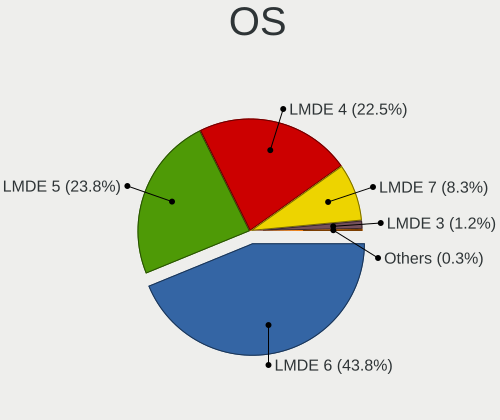

| Name   | Desktops | Percent |
|--------|----------|---------|
| LMDE 6 | 294      | 43.82%  |
| LMDE 5 | 160      | 23.85%  |
| LMDE 4 | 151      | 22.5%   |
| LMDE 7 | 56       | 8.35%   |
| LMDE 3 | 8        | 1.19%   |
| LMDE 2 | 2        | 0.3%    |

OS Family
---------

OS without a version

| Name | Desktops | Percent |
|------|----------|---------|
| LMDE | 656      | 100%    |

Kernel
------

Version of the Linux kernel

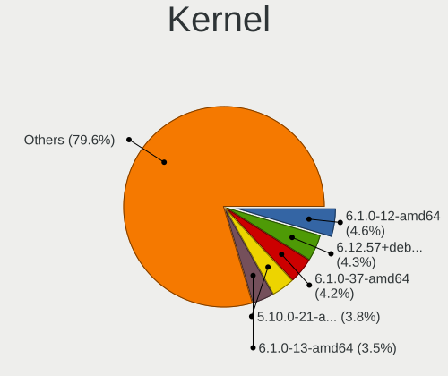

| Version             | Desktops | Percent |
|---------------------|----------|---------|
| 6.1.0-12-amd64      | 35       | 4.58%   |
| 6.12.57+deb13-amd64 | 33       | 4.31%   |
| 6.1.0-37-amd64      | 32       | 4.18%   |
| 5.10.0-21-amd64     | 29       | 3.79%   |
| 6.1.0-13-amd64      | 27       | 3.53%   |
| 4.19.0-16-amd64     | 23       | 3.01%   |
| 6.12.48+deb13-amd64 | 22       | 2.88%   |
| 6.1.0-17-amd64      | 22       | 2.88%   |
| 5.10.0-12-amd64     | 22       | 2.88%   |
| 4.19.0-17-amd64     | 20       | 2.61%   |
| 4.19.0-18-amd64     | 19       | 2.48%   |
| 5.10.0-23-amd64     | 18       | 2.35%   |
| 4.19.0-14-amd64     | 18       | 2.35%   |
| 6.1.0-23-amd64      | 17       | 2.22%   |
| 4.19.0-13-amd64     | 17       | 2.22%   |
| 6.1.0-21-amd64      | 16       | 2.09%   |
| 5.10.0-25-amd64     | 16       | 2.09%   |
| 6.1.0-34-amd64      | 15       | 1.96%   |
| 6.1.0-26-amd64      | 15       | 1.96%   |
| 4.19.0-8-amd64      | 15       | 1.96%   |
| 6.1.0-31-amd64      | 13       | 1.7%    |
| 6.1.0-28-amd64      | 13       | 1.7%    |
| 6.1.0-20-amd64      | 12       | 1.57%   |
| 6.1.0-18-amd64      | 12       | 1.57%   |
| 5.10.0-20-amd64     | 12       | 1.57%   |
| 5.10.0-17-amd64     | 11       | 1.44%   |
| 6.1.0-38-amd64      | 10       | 1.31%   |
| 6.1.0-32-amd64      | 10       | 1.31%   |
| 5.10.0-14-amd64     | 10       | 1.31%   |
| 5.10.0-13-amd64     | 10       | 1.31%   |
| 6.1.0-40-amd64      | 9        | 1.18%   |
| 6.1.0-30-amd64      | 9        | 1.18%   |
| 5.10.0-18-amd64     | 9        | 1.18%   |
| 4.19.0-12-amd64     | 9        | 1.18%   |
| 6.1.0-33-amd64      | 8        | 1.05%   |
| 6.1.0-25-amd64      | 8        | 1.05%   |
| 6.1.0-16-amd64      | 8        | 1.05%   |
| 5.10.0-19-amd64     | 8        | 1.05%   |
| 4.19.0-9-amd64      | 8        | 1.05%   |
| 4.19.0-10-amd64     | 8        | 1.05%   |

Kernel Family
-------------

Linux kernel without a distro release

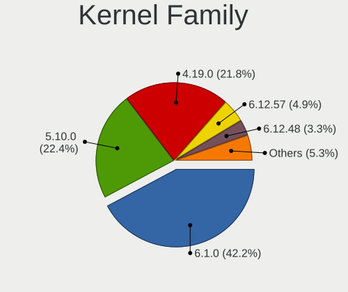

| Version | Desktops | Percent |
|---------|----------|---------|
| 6.1.0   | 284      | 42.2%   |
| 5.10.0  | 151      | 22.44%  |
| 4.19.0  | 147      | 21.84%  |
| 6.12.57 | 33       | 4.9%    |
| 6.12.48 | 22       | 3.27%   |
| 4.9.0   | 7        | 1.04%   |
| 6.12.9  | 3        | 0.45%   |
| 6.12.12 | 3        | 0.45%   |
| 6.10.11 | 2        | 0.3%    |
| 3.16.0  | 2        | 0.3%    |
| 6.9.7   | 1        | 0.15%   |
| 6.7.12  | 1        | 0.15%   |
| 6.7.10  | 1        | 0.15%   |
| 6.6.13  | 1        | 0.15%   |
| 6.6.11  | 1        | 0.15%   |
| 6.5.0   | 1        | 0.15%   |
| 6.16.7  | 1        | 0.15%   |
| 6.14.0  | 1        | 0.15%   |
| 6.13.8  | 1        | 0.15%   |
| 6.12.43 | 1        | 0.15%   |
| 6.12.28 | 1        | 0.15%   |
| 6.12.22 | 1        | 0.15%   |
| 6.11.10 | 1        | 0.15%   |
| 6.0.2   | 1        | 0.15%   |
| 5.8.0   | 1        | 0.15%   |
| 5.6.0   | 1        | 0.15%   |
| 5.4.0   | 1        | 0.15%   |
| 5.19.0  | 1        | 0.15%   |
| 4.17.0  | 1        | 0.15%   |

Kernel Major Ver.
-----------------

Linux kernel major version

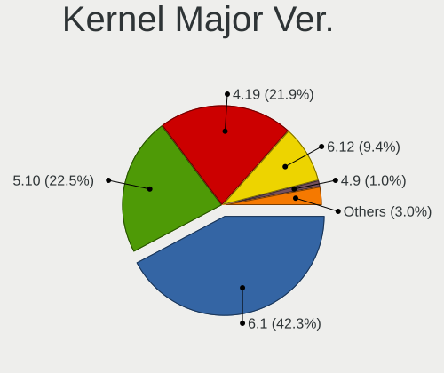

| Version | Desktops | Percent |
|---------|----------|---------|
| 6.1     | 284      | 42.26%  |
| 5.10    | 151      | 22.47%  |
| 4.19    | 147      | 21.88%  |
| 6.12    | 63       | 9.38%   |
| 4.9     | 7        | 1.04%   |
| 6.7     | 2        | 0.3%    |
| 6.6     | 2        | 0.3%    |
| 6.10    | 2        | 0.3%    |
| 3.16    | 2        | 0.3%    |
| 6.9     | 1        | 0.15%   |
| 6.5     | 1        | 0.15%   |
| 6.16    | 1        | 0.15%   |
| 6.14    | 1        | 0.15%   |
| 6.13    | 1        | 0.15%   |
| 6.11    | 1        | 0.15%   |
| 6.0     | 1        | 0.15%   |
| 5.8     | 1        | 0.15%   |
| 5.6     | 1        | 0.15%   |
| 5.4     | 1        | 0.15%   |
| 5.19    | 1        | 0.15%   |
| 4.17    | 1        | 0.15%   |

Arch
----

OS architecture (x86_64, i586, etc.)

| Name   | Desktops | Percent |
|--------|----------|---------|
| x86_64 | 628      | 95.73%  |
| i686   | 28       | 4.27%   |

DE
--

Desktop Environment

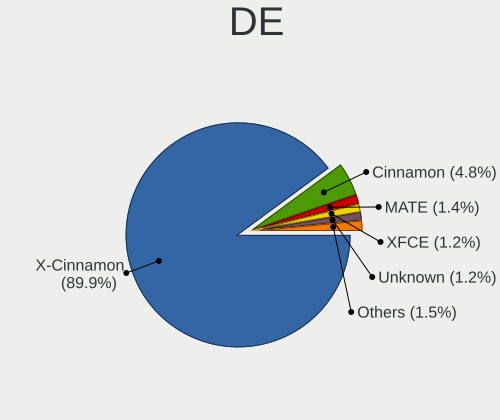

| Name       | Desktops | Percent |
|------------|----------|---------|
| X-Cinnamon | 597      | 89.91%  |
| Cinnamon   | 32       | 4.82%   |
| MATE       | 9        | 1.36%   |
| XFCE       | 8        | 1.2%    |
| Unknown    | 8        | 1.2%    |
| KDE5       | 3        | 0.45%   |
| GNOME      | 3        | 0.45%   |
| LXQt       | 2        | 0.3%    |
| LXDE       | 2        | 0.3%    |

Display Server
--------------

X11 or Wayland

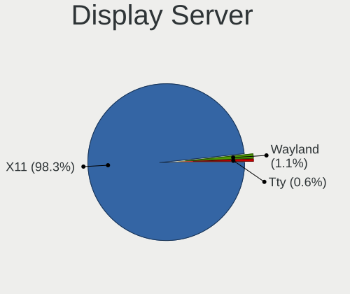

| Name    | Desktops | Percent |
|---------|----------|---------|
| X11     | 646      | 98.33%  |
| Wayland | 7        | 1.07%   |
| Tty     | 4        | 0.61%   |

Display Manager
---------------

SDDM, LightDM, etc.

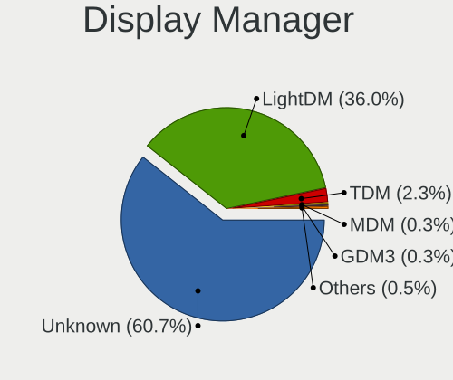

| Name    | Desktops | Percent |
|---------|----------|---------|
| Unknown | 401      | 60.67%  |
| LightDM | 238      | 36.01%  |
| TDM     | 15       | 2.27%   |
| MDM     | 2        | 0.3%    |
| GDM3    | 2        | 0.3%    |
| GDM     | 2        | 0.3%    |
| SDDM    | 1        | 0.15%   |

OS Lang
-------

Language

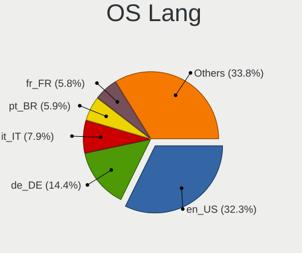

| Lang    | Desktops | Percent |
|---------|----------|---------|
| en_US   | 213      | 32.27%  |
| de_DE   | 95       | 14.39%  |
| it_IT   | 52       | 7.88%   |
| pt_BR   | 39       | 5.91%   |
| fr_FR   | 38       | 5.76%   |
| en_GB   | 38       | 5.76%   |
| ru_RU   | 23       | 3.48%   |
| pl_PL   | 18       | 2.73%   |
| Unknown | 14       | 2.12%   |
| en_CA   | 11       | 1.67%   |
| en_AU   | 10       | 1.52%   |
| es_ES   | 9        | 1.36%   |
| sv_SE   | 7        | 1.06%   |
| cs_CZ   | 7        | 1.06%   |
| es_AR   | 6        | 0.91%   |
| nl_BE   | 5        | 0.76%   |
| hu_HU   | 5        | 0.76%   |
| fr_CA   | 5        | 0.76%   |
| de_AT   | 5        | 0.76%   |
| tr_TR   | 3        | 0.45%   |
| sk_SK   | 3        | 0.45%   |
| es_UY   | 3        | 0.45%   |
| sr_RS   | 2        | 0.3%    |
| ru_UA   | 2        | 0.3%    |
| pt_PT   | 2        | 0.3%    |
| nl_NL   | 2        | 0.3%    |
| nb_NO   | 2        | 0.3%    |
| ja_JP   | 2        | 0.3%    |
| hr_HR   | 2        | 0.3%    |
| fi_FI   | 2        | 0.3%    |
| es_PA   | 2        | 0.3%    |
| es_MX   | 2        | 0.3%    |
| es_CL   | 2        | 0.3%    |
| en_ZA   | 2        | 0.3%    |
| en_NZ   | 2        | 0.3%    |
| en_DK   | 2        | 0.3%    |
| el_GR   | 2        | 0.3%    |
| de_CH   | 2        | 0.3%    |
| ar_EG   | 2        | 0.3%    |
| unm_US  | 1        | 0.15%   |

Boot Mode
---------

EFI or BIOS

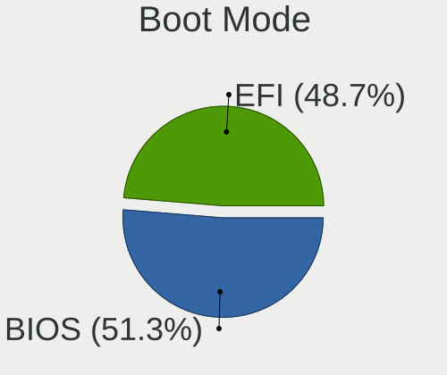

| Mode | Desktops | Percent |
|------|----------|---------|
| BIOS | 339      | 51.29%  |
| EFI  | 322      | 48.71%  |

Filesystem
----------

Type of filesystem

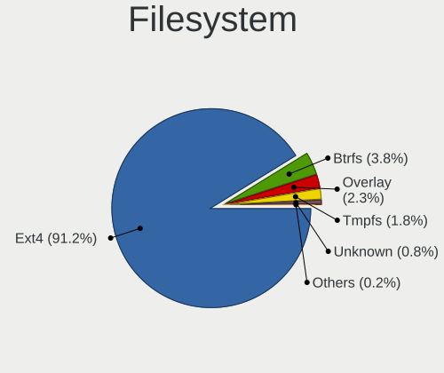

| Type    | Desktops | Percent |
|---------|----------|---------|
| Ext4    | 601      | 91.2%   |
| Btrfs   | 25       | 3.79%   |
| Overlay | 15       | 2.28%   |
| Tmpfs   | 12       | 1.82%   |
| Unknown | 5        | 0.76%   |
| Ext3    | 1        | 0.15%   |

Part. scheme
------------

Scheme of partitioning

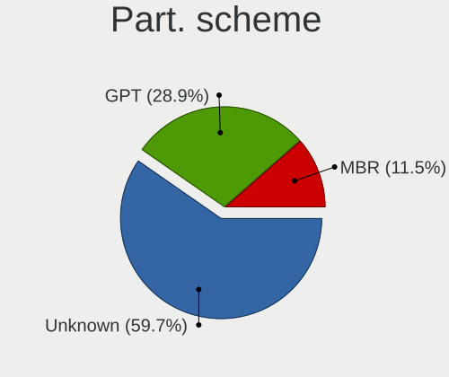

| Type    | Desktops | Percent |
|---------|----------|---------|
| Unknown | 395      | 59.67%  |
| GPT     | 191      | 28.85%  |
| MBR     | 76       | 11.48%  |

Dual Boot with Linux/BSD
------------------------

Hosting more than one Linux/BSD

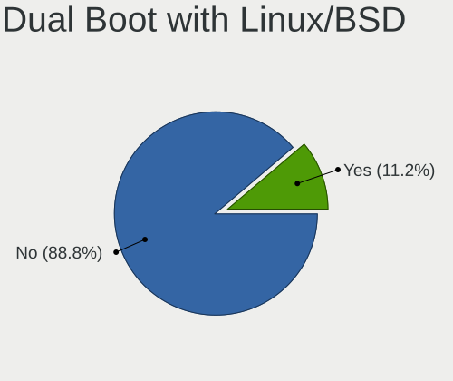

| Dual boot | Desktops | Percent |
|-----------|----------|---------|
| No        | 587      | 88.8%   |
| Yes       | 74       | 11.2%   |

Dual Boot (Win)
---------------

Hosting Linux and Windows

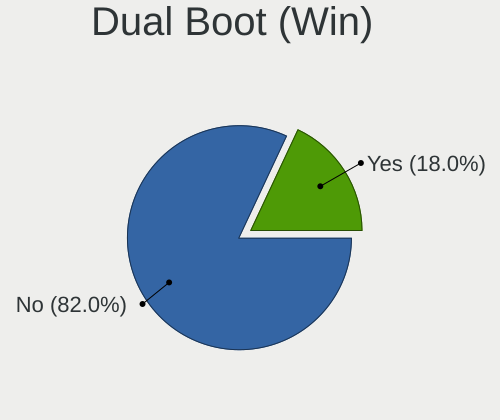

| Dual boot | Desktops | Percent |
|-----------|----------|---------|
| No        | 541      | 81.97%  |
| Yes       | 119      | 18.03%  |

Board
-----

Vendor
------

Motherboard manufacturer

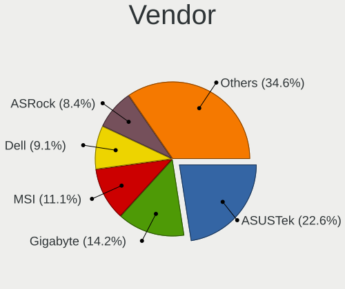

| Name                                 | Desktops | Percent |
|--------------------------------------|----------|---------|
| ASUSTek Computer                     | 148      | 22.56%  |
| Gigabyte Technology                  | 93       | 14.18%  |
| MSI                                  | 73       | 11.13%  |
| Dell                                 | 60       | 9.15%   |
| ASRock                               | 55       | 8.38%   |
| Hewlett-Packard                      | 45       | 6.86%   |
| Lenovo                               | 23       | 3.51%   |
| Intel                                | 23       | 3.51%   |
| Acer                                 | 19       | 2.9%    |
| Fujitsu                              | 15       | 2.29%   |
| Unknown                              | 14       | 2.13%   |
| Pegatron                             | 9        | 1.37%   |
| ECS                                  | 7        | 1.07%   |
| Medion                               | 5        | 0.76%   |
| GEEKOM                               | 5        | 0.76%   |
| Foxconn                              | 5        | 0.76%   |
| AZW                                  | 5        | 0.76%   |
| Apple                                | 5        | 0.76%   |
| Shenzhen Meigao Electronic Equipment | 4        | 0.61%   |
| eMachines                            | 3        | 0.46%   |
| Biostar                              | 3        | 0.46%   |
| PELADN                               | 2        | 0.3%    |
| OEM                                  | 2        | 0.3%    |
| Inventec                             | 2        | 0.3%    |
| EVGA                                 | 2        | 0.3%    |
| WeiBu                                | 1        | 0.15%   |
| Trigkey                              | 1        | 0.15%   |
| Soyo                                 | 1        | 0.15%   |
| SiYW                                 | 1        | 0.15%   |
| Semp Toshiba                         | 1        | 0.15%   |
| Sapphire                             | 1        | 0.15%   |
| Samsung Electronics                  | 1        | 0.15%   |
| Quanta                               | 1        | 0.15%   |
| Positivo                             | 1        | 0.15%   |
| PLEXHD                               | 1        | 0.15%   |
| PCWare                               | 1        | 0.15%   |
| Packard Bell                         | 1        | 0.15%   |
| NZXT                                 | 1        | 0.15%   |
| NEC Computers                        | 1        | 0.15%   |
| Minix                                | 1        | 0.15%   |

Model
-----

Motherboard model

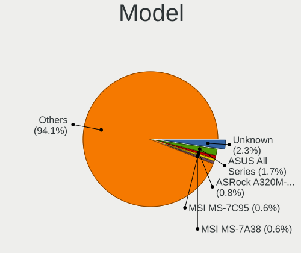

| Name                                                | Desktops | Percent |
|-----------------------------------------------------|----------|---------|
| Unknown                                             | 15       | 2.29%   |
| ASUS All Series                                     | 11       | 1.68%   |
| ASRock A320M-HDV R4.0                               | 5        | 0.76%   |
| MSI MS-7C95                                         | 4        | 0.61%   |
| MSI MS-7A38                                         | 4        | 0.61%   |
| Intel B75                                           | 4        | 0.61%   |
| Dell OptiPlex 7010                                  | 4        | 0.61%   |
| ASUS ROG STRIX B450-F GAMING                        | 4        | 0.61%   |
| MSI MS-7C52                                         | 3        | 0.46%   |
| Lenovo ThinkCentre M93p 10A8S4B200                  | 3        | 0.46%   |
| HP Pavilion Desktop 590-p0xxx                       | 3        | 0.46%   |
| Gigabyte 970A-DS3P                                  | 3        | 0.46%   |
| Dell OptiPlex 780                                   | 3        | 0.46%   |
| Dell OptiPlex 3020                                  | 3        | 0.46%   |
| AZW MINI S                                          | 3        | 0.46%   |
| ASUS SABERTOOTH 990FX R2.0                          | 3        | 0.46%   |
| Apple MacPro6,1                                     | 3        | 0.46%   |
| Shenzhen Meigao Electronic Equipment Venus Series   | 2        | 0.3%    |
| Shenzhen Meigao Electronic Equipment Mercury series | 2        | 0.3%    |
| PELADN WI-6                                         | 2        | 0.3%    |
| MSI MS-7D91                                         | 2        | 0.3%    |
| MSI MS-7D54                                         | 2        | 0.3%    |
| MSI MS-7D22                                         | 2        | 0.3%    |
| MSI MS-7C56                                         | 2        | 0.3%    |
| MSI MS-7C02                                         | 2        | 0.3%    |
| MSI MS-7B79                                         | 2        | 0.3%    |
| MSI MS-7A69                                         | 2        | 0.3%    |
| MSI MS-7798                                         | 2        | 0.3%    |
| Lenovo H530 10130                                   | 2        | 0.3%    |
| Intel H61                                           | 2        | 0.3%    |
| HP Z820 Workstation                                 | 2        | 0.3%    |
| HP ProDesk 400 G5 Desktop Mini                      | 2        | 0.3%    |
| HP Compaq Elite 8300 SFF                            | 2        | 0.3%    |
| HP Compaq dc5800 Microtower                         | 2        | 0.3%    |
| HP 290 G2 MT Business PC                            | 2        | 0.3%    |
| Gigabyte X570 AORUS ULTRA                           | 2        | 0.3%    |
| Gigabyte GA-880GM-UD2H                              | 2        | 0.3%    |
| Gigabyte B760M DS3H AX                              | 2        | 0.3%    |
| Gigabyte B550 AORUS ELITE AX V2                     | 2        | 0.3%    |
| Gigabyte B450M DS3H V2                              | 2        | 0.3%    |

Model Family
------------

Motherboard model prefix

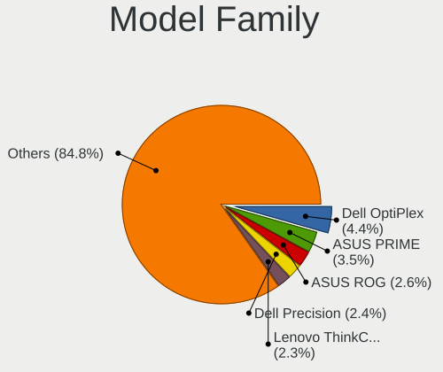

| Name                                         | Desktops | Percent |
|----------------------------------------------|----------|---------|
| Dell OptiPlex                                | 29       | 4.42%   |
| ASUS PRIME                                   | 23       | 3.51%   |
| ASUS ROG                                     | 17       | 2.59%   |
| Dell Precision                               | 16       | 2.44%   |
| Lenovo ThinkCentre                           | 15       | 2.29%   |
| Unknown                                      | 15       | 2.29%   |
| HP Compaq                                    | 14       | 2.13%   |
| ASUS TUF                                     | 12       | 1.83%   |
| Acer Aspire                                  | 12       | 1.83%   |
| ASUS All                                     | 11       | 1.68%   |
| Fujitsu ESPRIMO                              | 9        | 1.37%   |
| HP ProDesk                                   | 6        | 0.91%   |
| Gigabyte B450M                               | 6        | 0.91%   |
| ASRock A320M-HDV                             | 6        | 0.91%   |
| Acer Veriton                                 | 6        | 0.91%   |
| Gigabyte X570                                | 5        | 0.76%   |
| Gigabyte A520M                               | 5        | 0.76%   |
| Dell Inspiron                                | 5        | 0.76%   |
| ASUS P8H61-M                                 | 5        | 0.76%   |
| MSI MS-7C95                                  | 4        | 0.61%   |
| MSI MS-7A38                                  | 4        | 0.61%   |
| Intel B75                                    | 4        | 0.61%   |
| Gigabyte B450                                | 4        | 0.61%   |
| Dell Vostro                                  | 4        | 0.61%   |
| ASUS P5G41T-M                                | 4        | 0.61%   |
| MSI MS-7C52                                  | 3        | 0.46%   |
| HP Pavilion                                  | 3        | 0.46%   |
| Gigabyte B760M                               | 3        | 0.46%   |
| Gigabyte 970A-DS3P                           | 3        | 0.46%   |
| Fujitsu CELSIUS                              | 3        | 0.46%   |
| Dell XPS                                     | 3        | 0.46%   |
| AZW MINI                                     | 3        | 0.46%   |
| ASUS SABERTOOTH                              | 3        | 0.46%   |
| ASUS Crosshair                               | 3        | 0.46%   |
| ASRock X670E                                 | 3        | 0.46%   |
| ASRock B450                                  | 3        | 0.46%   |
| Apple MacPro6                                | 3        | 0.46%   |
| Shenzhen Meigao Electronic Equipment Venus   | 2        | 0.3%    |
| Shenzhen Meigao Electronic Equipment Mercury | 2        | 0.3%    |
| PELADN WI-6                                  | 2        | 0.3%    |

MFG Year
--------

Motherboard manufacture year

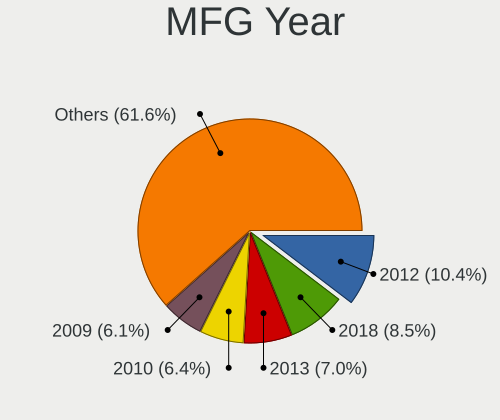

| Year | Desktops | Percent |
|------|----------|---------|
| 2012 | 68       | 10.37%  |
| 2018 | 56       | 8.54%   |
| 2013 | 46       | 7.01%   |
| 2010 | 42       | 6.4%    |
| 2009 | 40       | 6.1%    |
| 2019 | 38       | 5.79%   |
| 2011 | 38       | 5.79%   |
| 2022 | 37       | 5.64%   |
| 2017 | 35       | 5.34%   |
| 2020 | 31       | 4.73%   |
| 2016 | 29       | 4.42%   |
| 2014 | 29       | 4.42%   |
| 2007 | 28       | 4.27%   |
| 2021 | 27       | 4.12%   |
| 2008 | 26       | 3.96%   |
| 2015 | 23       | 3.51%   |
| 2023 | 22       | 3.35%   |
| 2006 | 14       | 2.13%   |
| 2024 | 13       | 1.98%   |
| 2005 | 4        | 0.61%   |
| 2003 | 4        | 0.61%   |
| 2025 | 3        | 0.46%   |
| 2004 | 3        | 0.46%   |

Form Factor
-----------

Physical design of the computer

| Name    | Desktops | Percent |
|---------|----------|---------|
| Desktop | 656      | 100%    |

Secure Boot
-----------

Enabled or disabled

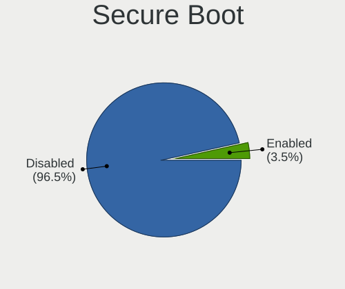

| State    | Desktops | Percent |
|----------|----------|---------|
| Disabled | 636      | 96.51%  |
| Enabled  | 23       | 3.49%   |

Coreboot
--------

Have coreboot on board

| Used | Desktops | Percent |
|------|----------|---------|
| No   | 656      | 100%    |

RAM Size
--------

Total RAM memory

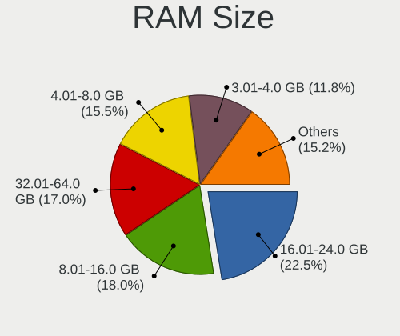

| Size in GB      | Desktops | Percent |
|-----------------|----------|---------|
| 16.01-24.0      | 151      | 22.5%   |
| 8.01-16.0       | 121      | 18.03%  |
| 32.01-64.0      | 114      | 16.99%  |
| 4.01-8.0        | 104      | 15.5%   |
| 3.01-4.0        | 79       | 11.77%  |
| 64.01-256.0     | 35       | 5.22%   |
| 24.01-32.0      | 24       | 3.58%   |
| 2.01-3.0        | 18       | 2.68%   |
| 1.01-2.0        | 18       | 2.68%   |
| 0.51-1.0        | 6        | 0.89%   |
| More than 256.0 | 1        | 0.15%   |

RAM Used
--------

Used RAM memory

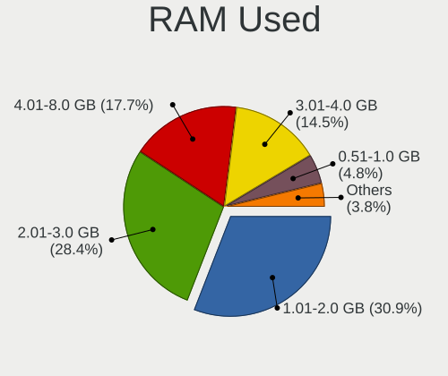

| Used GB    | Desktops | Percent |
|------------|----------|---------|
| 1.01-2.0   | 220      | 30.9%   |
| 2.01-3.0   | 202      | 28.37%  |
| 4.01-8.0   | 126      | 17.7%   |
| 3.01-4.0   | 103      | 14.47%  |
| 0.51-1.0   | 34       | 4.78%   |
| 8.01-16.0  | 22       | 3.09%   |
| 24.01-32.0 | 3        | 0.42%   |
| 32.01-64.0 | 1        | 0.14%   |
| 16.01-24.0 | 1        | 0.14%   |

Total Drives
------------

Number of drives on board

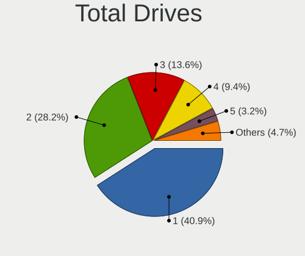

| Drives | Desktops | Percent |
|--------|----------|---------|
| 1      | 279      | 40.91%  |
| 2      | 192      | 28.15%  |
| 3      | 93       | 13.64%  |
| 4      | 64       | 9.38%   |
| 5      | 22       | 3.23%   |
| 6      | 16       | 2.35%   |
| 7      | 9        | 1.32%   |
| 8      | 4        | 0.59%   |
| 0      | 2        | 0.29%   |
| 10     | 1        | 0.15%   |

Has CD-ROM
----------

Has CD-ROM on board

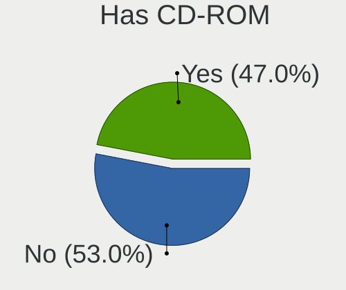

| Presented | Desktops | Percent |
|-----------|----------|---------|
| No        | 351      | 53.02%  |
| Yes       | 311      | 46.98%  |

Has Ethernet
------------

Has Ethernet on board

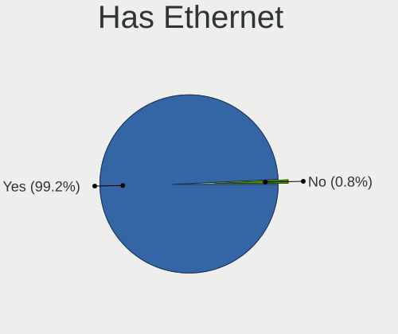

| Presented | Desktops | Percent |
|-----------|----------|---------|
| Yes       | 651      | 99.24%  |
| No        | 5        | 0.76%   |

Has WiFi
--------

Has WiFi module

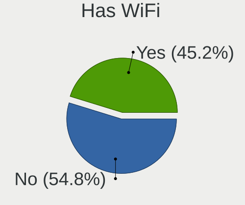

| Presented | Desktops | Percent |
|-----------|----------|---------|
| No        | 367      | 54.78%  |
| Yes       | 303      | 45.22%  |

Has Bluetooth
-------------

Has Bluetooth module

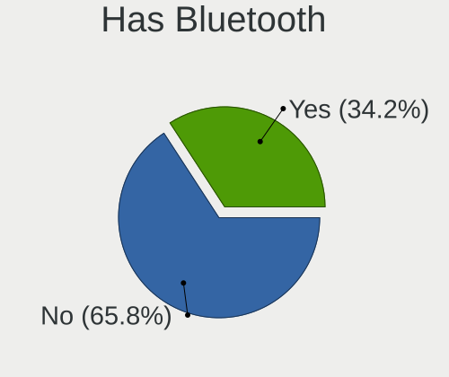

| Presented | Desktops | Percent |
|-----------|----------|---------|
| No        | 437      | 65.81%  |
| Yes       | 227      | 34.19%  |

Location
--------

Country
-------

Geographic location (country)

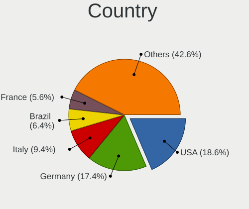

| Country      | Desktops | Percent |
|--------------|----------|---------|
| USA          | 122      | 18.57%  |
| Germany      | 114      | 17.35%  |
| Italy        | 62       | 9.44%   |
| Brazil       | 42       | 6.39%   |
| France       | 37       | 5.63%   |
| Russia       | 28       | 4.26%   |
| UK           | 22       | 3.35%   |
| Canada       | 22       | 3.35%   |
| Poland       | 15       | 2.28%   |
| Spain        | 13       | 1.98%   |
| Australia    | 11       | 1.67%   |
| Netherlands  | 10       | 1.52%   |
| Sweden       | 8        | 1.22%   |
| Argentina    | 8        | 1.22%   |
| Ukraine      | 7        | 1.07%   |
| Malaysia     | 7        | 1.07%   |
| Belgium      | 7        | 1.07%   |
| Hungary      | 6        | 0.91%   |
| Czechia      | 6        | 0.91%   |
| Norway       | 5        | 0.76%   |
| Mexico       | 5        | 0.76%   |
| Austria      | 5        | 0.76%   |
| Turkey       | 4        | 0.61%   |
| Slovakia     | 4        | 0.61%   |
| Portugal     | 4        | 0.61%   |
| India        | 4        | 0.61%   |
| Greece       | 4        | 0.61%   |
| Croatia      | 4        | 0.61%   |
| Bulgaria     | 4        | 0.61%   |
| Uruguay      | 3        | 0.46%   |
| Switzerland  | 3        | 0.46%   |
| South Africa | 3        | 0.46%   |
| Serbia       | 3        | 0.46%   |
| New Zealand  | 3        | 0.46%   |
| Finland      | 3        | 0.46%   |
| Venezuela    | 2        | 0.3%    |
| Romania      | 2        | 0.3%    |
| Puerto Rico  | 2        | 0.3%    |
| Peru         | 2        | 0.3%    |
| Paraguay     | 2        | 0.3%    |

City
----

Geographic location (city)

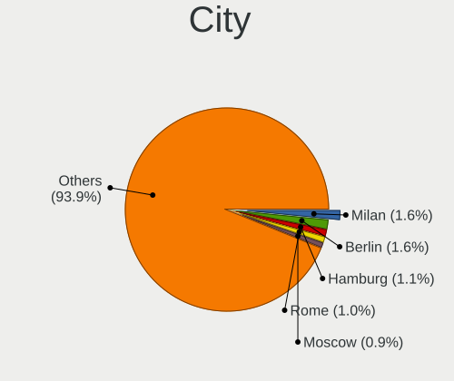

| City                  | Desktops | Percent |
|-----------------------|----------|---------|
| Milan                 | 11       | 1.57%   |
| Berlin                | 11       | 1.57%   |
| Hamburg               | 8        | 1.14%   |
| Rome                  | 7        | 1%      |
| Moscow                | 6        | 0.86%   |
| Munich                | 5        | 0.71%   |
| Melbourne             | 5        | 0.71%   |
| Turin                 | 4        | 0.57%   |
| Toronto               | 4        | 0.57%   |
| Rio de Janeiro        | 4        | 0.57%   |
| Paris                 | 4        | 0.57%   |
| Kuala Lumpur          | 4        | 0.57%   |
| Dallas                | 4        | 0.57%   |
| Athens                | 4        | 0.57%   |
| Warsaw                | 3        | 0.43%   |
| Vienna                | 3        | 0.43%   |
| Sydney                | 3        | 0.43%   |
| Sofia                 | 3        | 0.43%   |
| Panama City           | 3        | 0.43%   |
| Nitra                 | 3        | 0.43%   |
| Montreal              | 3        | 0.43%   |
| Montevideo            | 3        | 0.43%   |
| Ludwigshafen am Rhein | 3        | 0.43%   |
| Frankfurt am Main     | 3        | 0.43%   |
| Delligsen             | 3        | 0.43%   |
| Bologna               | 3        | 0.43%   |
| Belém                | 3        | 0.43%   |
| Auckland              | 3        | 0.43%   |
| Wroclaw               | 2        | 0.29%   |
| Winchester            | 2        | 0.29%   |
| Valencia              | 2        | 0.29%   |
| Uetze                 | 2        | 0.29%   |
| Trondheim             | 2        | 0.29%   |
| Troisdorf             | 2        | 0.29%   |
| Trieste               | 2        | 0.29%   |
| Traunstein            | 2        | 0.29%   |
| Tokushima             | 2        | 0.29%   |
| Stockholm             | 2        | 0.29%   |
| South Bend            | 2        | 0.29%   |
| Šlapanice            | 2        | 0.29%   |

Drives
------

Drive Vendor
------------

Hard drive vendors

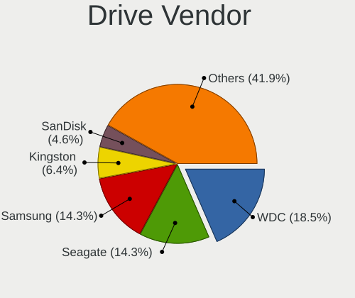

| Vendor                      | Desktops | Drives | Percent |
|-----------------------------|----------|--------|---------|
| WDC                         | 223      | 379    | 18.48%  |
| Seagate                     | 173      | 285    | 14.33%  |
| Samsung Electronics         | 172      | 294    | 14.25%  |
| Kingston                    | 77       | 122    | 6.38%   |
| SanDisk                     | 56       | 72     | 4.64%   |
| Toshiba                     | 53       | 70     | 4.39%   |
| Crucial                     | 53       | 66     | 4.39%   |
| Hitachi                     | 35       | 47     | 2.9%    |
| A-DATA Technology           | 20       | 21     | 1.66%   |
| Intel                       | 18       | 21     | 1.49%   |
| China                       | 18       | 20     | 1.49%   |
| Intenso                     | 15       | 18     | 1.24%   |
| Micron Technology           | 12       | 13     | 0.99%   |
| Unknown                     | 11       | 18     | 0.91%   |
| PNY                         | 11       | 19     | 0.91%   |
| SPCC                        | 10       | 11     | 0.83%   |
| Phison                      | 9        | 29     | 0.75%   |
| Patriot                     | 9        | 10     | 0.75%   |
| Unknown                     | 9        | 23     | 0.75%   |
| OCZ                         | 8        | 10     | 0.66%   |
| Micron/Crucial Technology   | 8        | 12     | 0.66%   |
| MAXIO Technology (Hangzhou) | 8        | 8      | 0.66%   |
| SK hynix                    | 7        | 8      | 0.58%   |
| Silicon Motion              | 7        | 9      | 0.58%   |
| Phison Electronics          | 7        | 7      | 0.58%   |
| ADATA Technology            | 7        | 16     | 0.58%   |
| Maxtor                      | 6        | 8      | 0.5%    |
| Kingston Technology Company | 6        | 8      | 0.5%    |
| JMicron Technology          | 6        | 6      | 0.5%    |
| HGST                        | 6        | 8      | 0.5%    |
| GOODRAM                     | 6        | 6      | 0.5%    |
| Gigabyte Technology         | 6        | 7      | 0.5%    |
| Verbatim                    | 5        | 8      | 0.41%   |
| Transcend                   | 5        | 6      | 0.41%   |
| Team                        | 5        | 8      | 0.41%   |
| Apacer                      | 5        | 6      | 0.41%   |
| XrayDisk                    | 4        | 5      | 0.33%   |
| KingSpec                    | 4        | 4      | 0.33%   |
| T-FORCE                     | 3        | 3      | 0.25%   |
| Lexar                       | 3        | 3      | 0.25%   |

Drive Model
-----------

Hard drive models

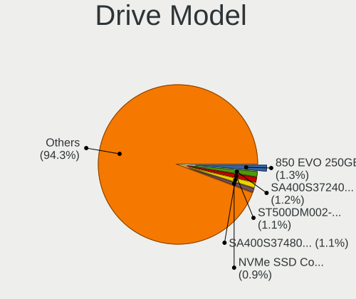

| Model                                                              | Desktops | Percent |
|--------------------------------------------------------------------|----------|---------|
| Samsung SSD 850 EVO 250GB                                          | 19       | 1.34%   |
| Kingston SA400S37240G 240GB SSD                                    | 17       | 1.2%    |
| Seagate ST500DM002-1BD142 500GB                                    | 16       | 1.13%   |
| Kingston SA400S37480G 480GB SSD                                    | 16       | 1.13%   |
| Samsung NVMe SSD Controller SM981/PM981/PM983 1TB                  | 13       | 0.92%   |
| Toshiba DT01ACA100 1TB                                             | 11       | 0.78%   |
| WDC WD10EZEX-08WN4A0 1TB                                           | 10       | 0.71%   |
| Samsung SSD 860 EVO 500GB                                          | 10       | 0.71%   |
| Kingston SA400S37120G 120GB SSD                                    | 10       | 0.71%   |
| Seagate ST1000DM010-2EP102 1TB                                     | 9        | 0.64%   |
| Unknown                                                            | 9        | 0.64%   |
| Seagate ST2000DM008-2FR102 2TB                                     | 8        | 0.57%   |
| Seagate ST1000DM003-1ER162 1TB                                     | 8        | 0.57%   |
| Seagate ST2000DM006-2DM164 2TB                                     | 7        | 0.49%   |
| Sandisk WD Blue SN550 NVMe SSD 1024GB                              | 7        | 0.49%   |
| SanDisk NVMe SSD Drive 1TB                                         | 7        | 0.49%   |
| Crucial CT500MX500SSD1 500GB                                       | 7        | 0.49%   |
| Crucial CT240BX500SSD1 240GB                                       | 7        | 0.49%   |
| WDC WDS500G2B0A-00SM50 500GB                                       | 6        | 0.42%   |
| Toshiba HDWD110 1TB                                                | 6        | 0.42%   |
| SanDisk NVMe SSD Drive 2TB                                         | 6        | 0.42%   |
| Samsung HD204UI 2TB                                                | 6        | 0.42%   |
| ADATA XPG SX8200 Pro PCIe Gen3x4 M.2 2280 Solid State Drive 1024GB | 6        | 0.42%   |
| WDC WD40EZAZ-00SF3B0 4TB                                           | 5        | 0.35%   |
| Seagate ST31000528AS 1TB                                           | 5        | 0.35%   |
| Seagate ST2000DM001-1ER164 2TB                                     | 5        | 0.35%   |
| Seagate ST1000DM003-1CH162 1TB                                     | 5        | 0.35%   |
| Samsung SSD 990 PRO 2TB                                            | 5        | 0.35%   |
| Samsung SSD 980 500GB                                              | 5        | 0.35%   |
| Samsung SSD 980 1TB                                                | 5        | 0.35%   |
| Samsung SSD 970 EVO 500GB                                          | 5        | 0.35%   |
| Samsung SSD 870 QVO 2TB                                            | 5        | 0.35%   |
| Samsung SSD 850 EVO 500GB                                          | 5        | 0.35%   |
| Samsung SSD 840 EVO 250GB                                          | 5        | 0.35%   |
| Kingston SV300S37A120G 120GB SSD                                   | 5        | 0.35%   |
| Crucial CT250MX500SSD1 250GB                                       | 5        | 0.35%   |
| WDC WDS240G2G0A-00JH30 240GB SSD                                   | 4        | 0.28%   |
| WDC WD40EZRZ-00GXCB0 4TB                                           | 4        | 0.28%   |
| WDC WD10EZEX-00BN5A0 1TB                                           | 4        | 0.28%   |
| Unknown SD/MMC/MS PRO 2GB                                          | 4        | 0.28%   |

HDD Vendor
----------

Hard disk drive vendors

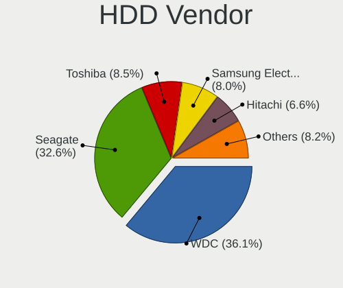

| Vendor              | Desktops | Drives | Percent |
|---------------------|----------|--------|---------|
| WDC                 | 190      | 323    | 36.05%  |
| Seagate             | 172      | 280    | 32.64%  |
| Toshiba             | 45       | 58     | 8.54%   |
| Samsung Electronics | 42       | 58     | 7.97%   |
| Hitachi             | 35       | 47     | 6.64%   |
| Maxtor              | 6        | 8      | 1.14%   |
| HGST                | 6        | 8      | 1.14%   |
| Unknown             | 5        | 6      | 0.95%   |
| Intenso             | 4        | 4      | 0.76%   |
| TrueNAS             | 2        | 4      | 0.38%   |
| TO Exter            | 2        | 2      | 0.38%   |
| JMicron Technology  | 2        | 2      | 0.38%   |
| Fujitsu             | 2        | 2      | 0.38%   |
| External            | 2        | 2      | 0.38%   |
| ASMT                | 2        | 4      | 0.38%   |
| ASMedia             | 2        | 2      | 0.38%   |
| USB3.0              | 1        | 1      | 0.19%   |
| KESU                | 1        | 2      | 0.19%   |
| IBM/Hitachi         | 1        | 1      | 0.19%   |
| HPE                 | 1        | 4      | 0.19%   |
| ExcelStor           | 1        | 1      | 0.19%   |
| DC-624e             | 1        | 1      | 0.19%   |
| Apple               | 1        | 1      | 0.19%   |
| Unknown             | 1        | 1      | 0.19%   |

SSD Vendor
----------

Solid state drive vendors

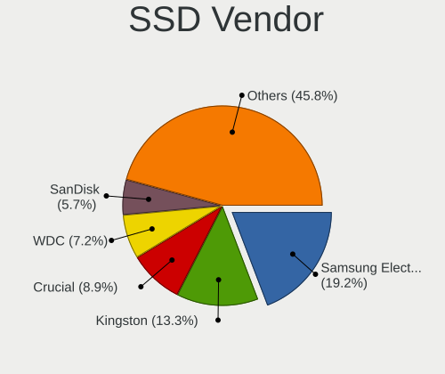

| Vendor              | Desktops | Drives | Percent |
|---------------------|----------|--------|---------|
| Samsung Electronics | 91       | 122    | 19.2%   |
| Kingston            | 63       | 101    | 13.29%  |
| Crucial             | 42       | 54     | 8.86%   |
| WDC                 | 34       | 46     | 7.17%   |
| SanDisk             | 27       | 33     | 5.7%    |
| China               | 18       | 20     | 3.8%    |
| A-DATA Technology   | 18       | 19     | 3.8%    |
| PNY                 | 11       | 19     | 2.32%   |
| Intenso             | 11       | 14     | 2.32%   |
| Intel               | 11       | 13     | 2.32%   |
| SPCC                | 9        | 10     | 1.9%    |
| Patriot             | 9        | 10     | 1.9%    |
| Micron Technology   | 9        | 10     | 1.9%    |
| OCZ                 | 8        | 10     | 1.69%   |
| Toshiba             | 7        | 11     | 1.48%   |
| Unknown             | 7        | 19     | 1.48%   |
| Verbatim            | 5        | 8      | 1.05%   |
| Transcend           | 5        | 6      | 1.05%   |
| Team                | 5        | 8      | 1.05%   |
| GOODRAM             | 5        | 5      | 1.05%   |
| KingSpec            | 4        | 4      | 0.84%   |
| Gigabyte Technology | 4        | 5      | 0.84%   |
| Apacer              | 4        | 5      | 0.84%   |
| T-FORCE             | 3        | 3      | 0.63%   |
| SK hynix            | 3        | 3      | 0.63%   |
| TCSUNBOW            | 2        | 2      | 0.42%   |
| Seagate             | 2        | 2      | 0.42%   |
| SD                  | 2        | 2      | 0.42%   |
| SABRENT             | 2        | 2      | 0.42%   |
| LITEONIT            | 2        | 2      | 0.42%   |
| Lexar               | 2        | 2      | 0.42%   |
| KingDian            | 2        | 2      | 0.42%   |
| Integral            | 2        | 2      | 0.42%   |
| Hewlett-Packard     | 2        | 4      | 0.42%   |
| CT500MX5            | 2        | 3      | 0.42%   |
| Apple               | 2        | 2      | 0.42%   |
| XrayDisk            | 1        | 1      | 0.21%   |
| X12                 | 1        | 1      | 0.21%   |
| Vi550               | 1        | 2      | 0.21%   |
| Vaseky              | 1        | 4      | 0.21%   |

Drive Kind
----------

HDD or SSD

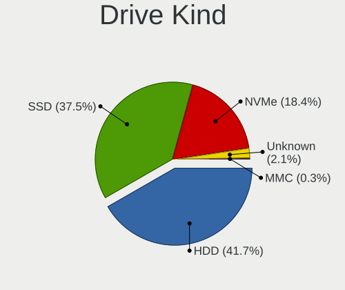

| Kind    | Desktops | Drives | Percent |
|---------|----------|--------|---------|
| HDD     | 420      | 822    | 41.71%  |
| SSD     | 378      | 647    | 37.54%  |
| NVMe    | 185      | 318    | 18.37%  |
| Unknown | 21       | 31     | 2.09%   |
| MMC     | 3        | 4      | 0.3%    |

Drive Connector
---------------

SATA, SAS, NVMe, etc.

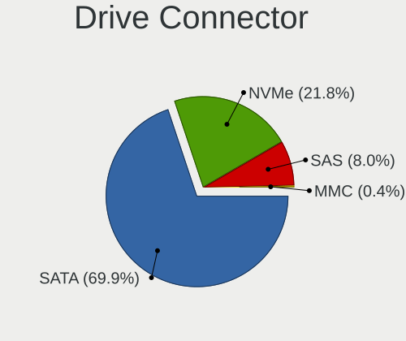

| Type | Desktops | Drives | Percent |
|------|----------|--------|---------|
| SATA | 594      | 1407   | 69.88%  |
| NVMe | 185      | 312    | 21.76%  |
| SAS  | 68       | 99     | 8%      |
| MMC  | 3        | 4      | 0.35%   |

Drive Size
----------

Size of hard drive

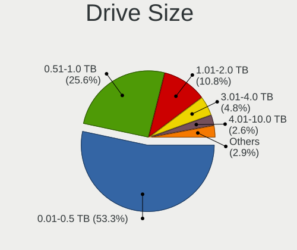

| Size in TB | Desktops | Drives | Percent |
|------------|----------|--------|---------|
| 0.01-0.5   | 458      | 839    | 53.32%  |
| 0.51-1.0   | 220      | 340    | 25.61%  |
| 1.01-2.0   | 93       | 145    | 10.83%  |
| 3.01-4.0   | 41       | 65     | 4.77%   |
| 4.01-10.0  | 22       | 36     | 2.56%   |
| 2.01-3.0   | 16       | 32     | 1.86%   |
| 10.01-20.0 | 9        | 12     | 1.05%   |

Space Total
-----------

Amount of disk space available on the file system

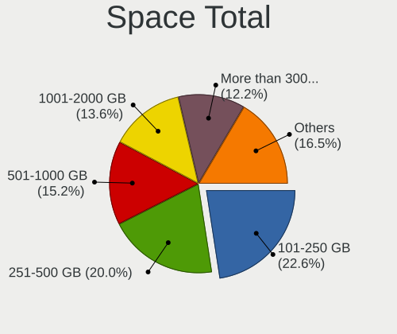

| Size in GB     | Desktops | Percent |
|----------------|----------|---------|
| 101-250        | 156      | 22.58%  |
| 251-500        | 138      | 19.97%  |
| 501-1000       | 105      | 15.2%   |
| 1001-2000      | 94       | 13.6%   |
| More than 3000 | 84       | 12.16%  |
| 2001-3000      | 41       | 5.93%   |
| 51-100         | 33       | 4.78%   |
| 1-20           | 18       | 2.6%    |
| 21-50          | 16       | 2.32%   |
| Unknown        | 6        | 0.87%   |

Space Used
----------

Amount of used disk space

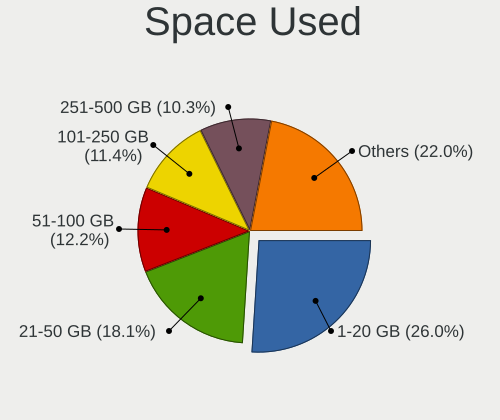

| Used GB        | Desktops | Percent |
|----------------|----------|---------|
| 1-20           | 187      | 26.01%  |
| 21-50          | 130      | 18.08%  |
| 51-100         | 88       | 12.24%  |
| 101-250        | 82       | 11.4%   |
| 251-500        | 74       | 10.29%  |
| 501-1000       | 64       | 8.9%    |
| 1001-2000      | 36       | 5.01%   |
| More than 3000 | 31       | 4.31%   |
| 2001-3000      | 21       | 2.92%   |
| Unknown        | 6        | 0.83%   |

Malfunc. Drives
---------------

Drive models with a malfunction

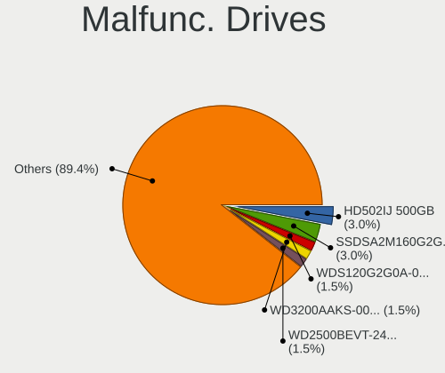

| Model                                 | Desktops | Drives | Percent |
|---------------------------------------|----------|--------|---------|
| Samsung Electronics HD502IJ 500GB     | 2        | 3      | 3.03%   |
| Intel SSDSA2M160G2GC 160GB            | 2        | 2      | 3.03%   |
| WDC WDS120G2G0A-00JH30 120GB SSD      | 1        | 1      | 1.52%   |
| WDC WD3200AAKS-00L9A0 320GB           | 1        | 1      | 1.52%   |
| WDC WD2500BEVT-24A23T0 250GB          | 1        | 1      | 1.52%   |
| WDC WD1600JS-60MHB5 160GB             | 1        | 1      | 1.52%   |
| WDC WD15EADS-00P8B0 1TB               | 1        | 1      | 1.52%   |
| WDC WD10EZRZ-00HTKB0 1TB              | 1        | 1      | 1.52%   |
| WDC WD10EZEX-75M2NA0 1TB              | 1        | 1      | 1.52%   |
| WDC WD10EZEX-60WN4A0 1TB              | 1        | 1      | 1.52%   |
| WDC WD10EFRX-68PJCN0 1TB              | 1        | 1      | 1.52%   |
| WDC WD1002FAEX-00Y9A0 1TB             | 1        | 1      | 1.52%   |
| WDC WD Green 2.5 240GB                | 1        | 1      | 1.52%   |
| Toshiba MQ04ABF100 1TB                | 1        | 1      | 1.52%   |
| Toshiba MD04ACA400 4TB                | 1        | 1      | 1.52%   |
| Toshiba HDWD110 1TB                   | 1        | 1      | 1.52%   |
| Solid SSD0256S00 256GB                | 1        | 1      | 1.52%   |
| Seagate ST9500325AS 500GB             | 1        | 1      | 1.52%   |
| Seagate ST9320325AS 320GB             | 1        | 1      | 1.52%   |
| Seagate ST9250315AS 250GB             | 1        | 1      | 1.52%   |
| Seagate ST500LT012-1DG142 500GB       | 1        | 1      | 1.52%   |
| Seagate ST500DM002-1BD142 500GB       | 1        | 1      | 1.52%   |
| Seagate ST3250318AS 250GB             | 1        | 1      | 1.52%   |
| Seagate ST31500341AS 1TB              | 1        | 1      | 1.52%   |
| Seagate ST31000528AS 1TB              | 1        | 1      | 1.52%   |
| Seagate ST31000524AS 1TB              | 1        | 1      | 1.52%   |
| Seagate ST2000VX008-2E3164 2TB        | 1        | 1      | 1.52%   |
| Seagate ST2000DX001-1CM164 2TB        | 1        | 1      | 1.52%   |
| Seagate ST2000DM006-2DM164 2TB        | 1        | 1      | 1.52%   |
| Seagate ST1500DL003-9VT16L 1TB        | 1        | 1      | 1.52%   |
| Seagate ST1000LM049-2GH172 1TB        | 1        | 1      | 1.52%   |
| Seagate ST1000LM048-2E7172 1TB        | 1        | 1      | 1.52%   |
| Seagate ST1000DX001-1NS162 1TB        | 1        | 1      | 1.52%   |
| Seagate ST1000DM003-9YN162 1TB        | 1        | 1      | 1.52%   |
| Seagate ST1000DM003-1SB102 1TB        | 1        | 1      | 1.52%   |
| SanDisk SSD PLUS 480 GB               | 1        | 1      | 1.52%   |
| SanDisk SSD PLUS 240GB                | 1        | 1      | 1.52%   |
| SanDisk SDSSDHII120G 120GB            | 1        | 2      | 1.52%   |
| Samsung Electronics SSD 980 500GB     | 1        | 1      | 1.52%   |
| Samsung Electronics SSD 970 EVO 500GB | 1        | 1      | 1.52%   |

Malfunc. Drive Vendor
---------------------

Vendors of faulty drives

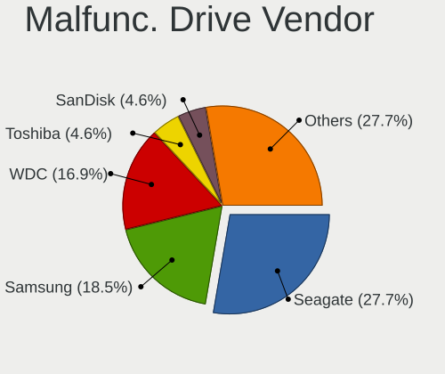

| Vendor              | Desktops | Drives | Percent |
|---------------------|----------|--------|---------|
| Seagate             | 18       | 18     | 27.69%  |
| Samsung Electronics | 12       | 13     | 18.46%  |
| WDC                 | 11       | 11     | 16.92%  |
| Toshiba             | 3        | 3      | 4.62%   |
| SanDisk             | 3        | 4      | 4.62%   |
| Intel               | 3        | 3      | 4.62%   |
| Hitachi             | 3        | 4      | 4.62%   |
| Micron Technology   | 2        | 2      | 3.08%   |
| Maxtor              | 2        | 2      | 3.08%   |
| A-DATA Technology   | 2        | 2      | 3.08%   |
| Solid               | 1        | 1      | 1.54%   |
| Leven               | 1        | 1      | 1.54%   |
| Kingston            | 1        | 1      | 1.54%   |
| KingSpec            | 1        | 1      | 1.54%   |
| IBM/Hitachi         | 1        | 1      | 1.54%   |
| HGST                | 1        | 1      | 1.54%   |

Malfunc. HDD Vendor
-------------------

Vendors of faulty HDD drives

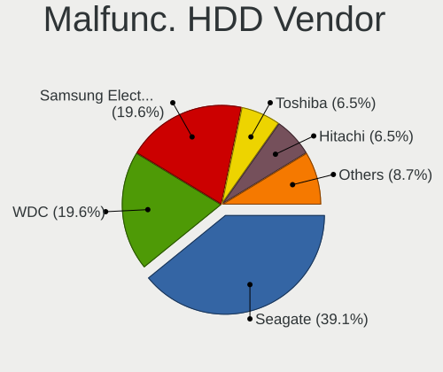

| Vendor              | Desktops | Drives | Percent |
|---------------------|----------|--------|---------|
| Seagate             | 18       | 18     | 39.13%  |
| WDC                 | 9        | 9      | 19.57%  |
| Samsung Electronics | 9        | 10     | 19.57%  |
| Toshiba             | 3        | 3      | 6.52%   |
| Hitachi             | 3        | 4      | 6.52%   |
| Maxtor              | 2        | 2      | 4.35%   |
| IBM/Hitachi         | 1        | 1      | 2.17%   |
| HGST                | 1        | 1      | 2.17%   |

Malfunc. Drive Kind
-------------------

Kinds of faulty drives

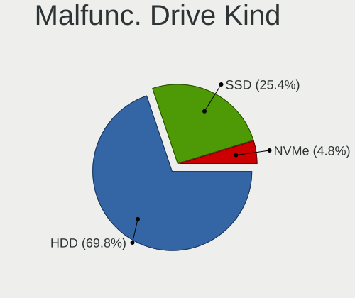

| Kind | Desktops | Drives | Percent |
|------|----------|--------|---------|
| HDD  | 44       | 48     | 69.84%  |
| SSD  | 16       | 17     | 25.4%   |
| NVMe | 3        | 3      | 4.76%   |

Failed Drives
-------------

Failed drive models

Zero info for selected period =(

Failed Drive Vendor
-------------------

Failed drive vendors

Zero info for selected period =(

Drive Status
------------

Number of failed and malfunc. drives

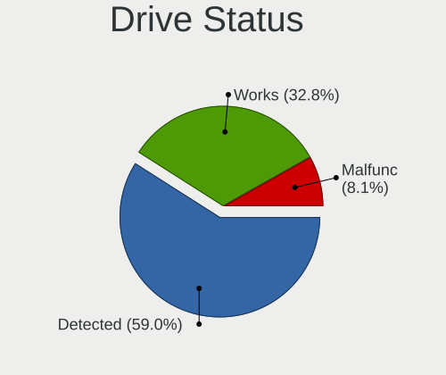

| Status   | Desktops | Drives | Percent |
|----------|----------|--------|---------|
| Detected | 442      | 1144   | 59.01%  |
| Works    | 246      | 610    | 32.84%  |
| Malfunc  | 61       | 68     | 8.14%   |

Storage controller
------------------

Storage Vendor
--------------

Storage controller vendors

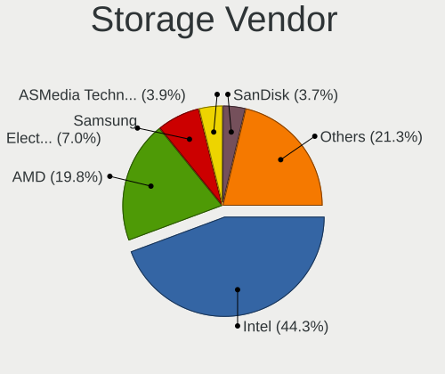

| Vendor                           | Desktops | Percent |
|----------------------------------|----------|---------|
| Intel                            | 423      | 44.34%  |
| AMD                              | 189      | 19.81%  |
| Samsung Electronics              | 67       | 7.02%   |
| ASMedia Technology               | 37       | 3.88%   |
| SanDisk                          | 35       | 3.67%   |
| JMicron Technology               | 24       | 2.52%   |
| Phison Electronics               | 23       | 2.41%   |
| Nvidia                           | 22       | 2.31%   |
| Kingston Technology Company      | 21       | 2.2%    |
| Micron/Crucial Technology        | 17       | 1.78%   |
| Marvell Technology Group         | 17       | 1.78%   |
| VIA Technologies                 | 13       | 1.36%   |
| MAXIO Technology (Hangzhou)      | 10       | 1.05%   |
| Silicon Motion                   | 9        | 0.94%   |
| ADATA Technology                 | 9        | 0.94%   |
| Broadcom / LSI                   | 5        | 0.52%   |
| SK hynix                         | 4        | 0.42%   |
| Silicon Image                    | 4        | 0.42%   |
| Micron Technology                | 4        | 0.42%   |
| Silicon Integrated Systems [SiS] | 3        | 0.31%   |
| LSI Logic / Symbios Logic        | 2        | 0.21%   |
| KIOXIA                           | 2        | 0.21%   |
| Integrated Technology Express    | 2        | 0.21%   |
| Hosin Global Electronics         | 2        | 0.21%   |
| Toshiba America Info Systems     | 1        | 0.1%    |
| TenaFe                           | 1        | 0.1%    |
| Shenzhen Longsys Electronics     | 1        | 0.1%    |
| Seagate Technology               | 1        | 0.1%    |
| Realtek Semiconductor            | 1        | 0.1%    |
| Netac Technology                 | 1        | 0.1%    |
| INNOGRIT                         | 1        | 0.1%    |
| Chelsio Communications           | 1        | 0.1%    |
| Biwin Storage Technology         | 1        | 0.1%    |
| Adaptec                          | 1        | 0.1%    |

Storage Model
-------------

Storage controller models

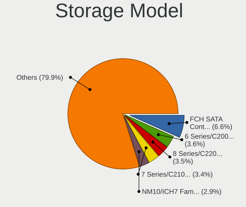

| Model                                                                                   | Desktops | Percent |
|-----------------------------------------------------------------------------------------|----------|---------|
| AMD FCH SATA Controller [AHCI mode]                                                     | 79       | 6.65%   |
| Intel 6 Series/C200 Series Chipset Family 6 port Desktop SATA AHCI Controller           | 43       | 3.62%   |
| Intel 8 Series/C220 Series Chipset Family 6-port SATA Controller 1 [AHCI mode]          | 42       | 3.54%   |
| Intel 7 Series/C210 Series Chipset Family 6-port SATA Controller [AHCI mode]            | 40       | 3.37%   |
| Intel NM10/ICH7 Family SATA Controller [IDE mode]                                       | 35       | 2.95%   |
| Intel 82801G (ICH7 Family) IDE Controller                                               | 35       | 2.95%   |
| AMD 400 Series Chipset SATA Controller                                                  | 35       | 2.95%   |
| ASMedia ASM1061/ASM1062 Serial ATA Controller                                           | 34       | 2.86%   |
| Samsung NVMe SSD Controller SM981/PM981/PM983                                           | 33       | 2.78%   |
| AMD 500 Series Chipset SATA Controller                                                  | 30       | 2.53%   |
| Intel SATA Controller [RAID mode]                                                       | 28       | 2.36%   |
| Intel Q170/Q150/B150/H170/H110/Z170/CM236 Chipset SATA Controller [AHCI Mode]           | 28       | 2.36%   |
| AMD SB7x0/SB8x0/SB9x0 IDE Controller                                                    | 25       | 2.1%    |
| AMD SB7x0/SB8x0/SB9x0 SATA Controller [AHCI mode]                                       | 22       | 1.85%   |
| AMD SB7x0/SB8x0/SB9x0 SATA Controller [IDE mode]                                        | 19       | 1.6%    |
| AMD 600 Series Chipset SATA Controller                                                  | 18       | 1.52%   |
| Intel Cannon Lake PCH SATA AHCI Controller                                              | 17       | 1.43%   |
| Intel 200 Series PCH SATA controller [AHCI mode]                                        | 17       | 1.43%   |
| AMD A320 Chipset SATA Controller [AHCI mode]                                            | 16       | 1.35%   |
| JMicron JMB363 SATA/IDE Controller                                                      | 15       | 1.26%   |
| Samsung NVMe SSD Controller 980 (DRAM-less)                                             | 13       | 1.09%   |
| Intel 82801I (ICH9 Family) 2 port SATA Controller [IDE mode]                            | 13       | 1.09%   |
| Samsung NVMe SSD Controller S4LV008[Pascal]                                             | 12       | 1.01%   |
| Nvidia MCP61 SATA Controller                                                            | 12       | 1.01%   |
| Intel Alder Lake-N SATA AHCI Controller                                                 | 12       | 1.01%   |
| Intel 6 Series/C200 Series Chipset Family Desktop SATA Controller (IDE mode, ports 4-5) | 12       | 1.01%   |
| Intel 6 Series/C200 Series Chipset Family Desktop SATA Controller (IDE mode, ports 0-3) | 12       | 1.01%   |
| Intel Raptor Lake SATA AHCI Controller                                                  | 11       | 0.93%   |
| Intel 82801JI (ICH10 Family) SATA AHCI Controller                                       | 11       | 0.93%   |
| Intel 5 Series/3400 Series Chipset 6 port SATA AHCI Controller                          | 11       | 0.93%   |
| AMD 300 Series Chipset SATA Controller                                                  | 11       | 0.93%   |
| Intel 82801JI (ICH10 Family) 4 port SATA IDE Controller #1                              | 10       | 0.84%   |
| Intel 500 Series Chipset Family SATA AHCI Controller                                    | 10       | 0.84%   |
| Samsung NVMe SSD Controller PM9A1/PM9A3/980PRO                                          | 9        | 0.76%   |
| Intel 82801JI (ICH10 Family) 2 port SATA IDE Controller #2                              | 9        | 0.76%   |
| VIA VT82C586A/B/VT82C686/A/B/VT823x/A/C PIPC Bus Master IDE                             | 8        | 0.67%   |
| SanDisk Ultra 3D / WD PC SN530, IX SN530, Blue SN550 NVMe SSD (DRAM-less)               | 8        | 0.67%   |
| Phison E12 NVMe Controller                                                              | 8        | 0.67%   |
| Nvidia MCP61 IDE                                                                        | 8        | 0.67%   |
| MAXIO (Hangzhou) NVMe SSD Controller MAP1202 (DRAM-less)                                | 7        | 0.59%   |

Storage Kind
------------

Kind of storage controller (IDE, SATA, NVMe, SAS, ...)

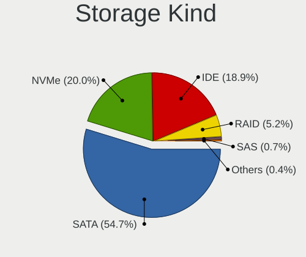

| Kind | Desktops | Percent |
|------|----------|---------|
| SATA | 503      | 54.73%  |
| NVMe | 184      | 20.02%  |
| IDE  | 174      | 18.93%  |
| RAID | 48       | 5.22%   |
| SAS  | 6        | 0.65%   |
| SCSI | 4        | 0.44%   |

Processor
---------

CPU Vendor
----------

Processor vendors

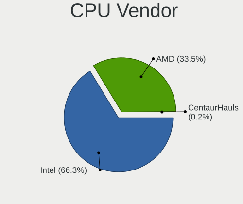

| Vendor       | Desktops | Percent |
|--------------|----------|---------|
| Intel        | 435      | 66.31%  |
| AMD          | 220      | 33.54%  |
| CentaurHauls | 1        | 0.15%   |

CPU Model
---------

Processor models

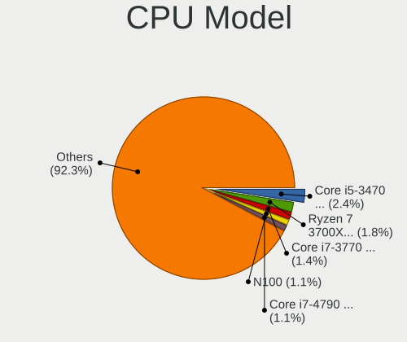

| Model                                       | Desktops | Percent |
|---------------------------------------------|----------|---------|
| Intel Core i5-3470 CPU @ 3.20GHz            | 16       | 2.43%   |
| AMD Ryzen 7 3700X 8-Core Processor          | 12       | 1.82%   |
| Intel Core i7-3770 CPU @ 3.40GHz            | 9        | 1.37%   |
| Intel N100                                  | 7        | 1.06%   |
| Intel Core i7-4790 CPU @ 3.60GHz            | 7        | 1.06%   |
| Intel Core i7-4770 CPU @ 3.40GHz            | 7        | 1.06%   |
| Intel Core i7-2600 CPU @ 3.40GHz            | 7        | 1.06%   |
| Intel Core i5-2400 CPU @ 3.10GHz            | 7        | 1.06%   |
| AMD Ryzen 5 5600G with Radeon Graphics      | 7        | 1.06%   |
| AMD Ryzen 3 3200G with Radeon Vega Graphics | 7        | 1.06%   |
| Intel Core i3-4150 CPU @ 3.50GHz            | 6        | 0.91%   |
| Intel Core 2 Quad CPU Q6600 @ 2.40GHz       | 6        | 0.91%   |
| AMD Ryzen 9 5950X 16-Core Processor         | 6        | 0.91%   |
| AMD Ryzen 5 5600X 6-Core Processor          | 6        | 0.91%   |
| AMD Ryzen 5 2600 Six-Core Processor         | 6        | 0.91%   |
| Intel Core i7-6700K CPU @ 4.00GHz           | 5        | 0.76%   |
| Intel Core i5-7400 CPU @ 3.00GHz            | 5        | 0.76%   |
| Intel Core i5-4460 CPU @ 3.20GHz            | 5        | 0.76%   |
| Intel Core 2 Duo CPU E8400 @ 3.00GHz        | 5        | 0.76%   |
| Intel Core 2 Duo CPU E7500 @ 2.93GHz        | 5        | 0.76%   |
| Intel Core 2 Duo CPU E7400 @ 2.80GHz        | 5        | 0.76%   |
| Intel Core 2 Duo CPU E4500 @ 2.20GHz        | 5        | 0.76%   |
| AMD Ryzen 7 5800X 8-Core Processor          | 5        | 0.76%   |
| AMD Ryzen 7 5700G with Radeon Graphics      | 5        | 0.76%   |
| AMD Ryzen 5 2400G with Radeon Vega Graphics | 5        | 0.76%   |
| Intel Pentium Dual-Core CPU E5300 @ 2.60GHz | 4        | 0.61%   |
| Intel N95                                   | 4        | 0.61%   |
| Intel Core i7-7700 CPU @ 3.60GHz            | 4        | 0.61%   |
| Intel Core i5-6500 CPU @ 3.20GHz            | 4        | 0.61%   |
| Intel Core i5 CPU 750 @ 2.67GHz             | 4        | 0.61%   |
| Intel Core i3-8100 CPU @ 3.60GHz            | 4        | 0.61%   |
| Intel Core i3-2120 CPU @ 3.30GHz            | 4        | 0.61%   |
| Intel Core i3-2100 CPU @ 3.10GHz            | 4        | 0.61%   |
| Intel Core 2 Duo CPU E6550 @ 2.33GHz        | 4        | 0.61%   |
| AMD Ryzen 9 5900X 12-Core Processor         | 4        | 0.61%   |
| AMD Ryzen 5 5500                            | 4        | 0.61%   |
| AMD Ryzen 3 2200G with Radeon Vega Graphics | 4        | 0.61%   |
| Intel Xeon CPU E5-2697 v2 @ 2.70GHz         | 3        | 0.46%   |
| Intel Pentium Dual-Core CPU E5700 @ 3.00GHz | 3        | 0.46%   |
| Intel Pentium D CPU 3.00GHz                 | 3        | 0.46%   |

CPU Model Family
----------------

Processor model prefix

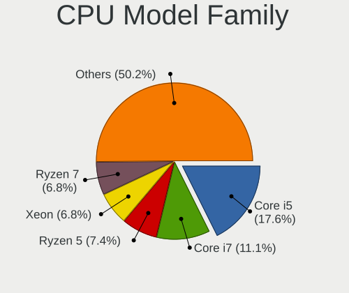

| Model                   | Desktops | Percent |
|-------------------------|----------|---------|
| Intel Core i5           | 116      | 17.63%  |
| Intel Core i7           | 73       | 11.09%  |
| AMD Ryzen 5             | 49       | 7.45%   |
| Intel Xeon              | 45       | 6.84%   |
| AMD Ryzen 7             | 45       | 6.84%   |
| Intel Core i3           | 42       | 6.38%   |
| Other                   | 37       | 5.62%   |
| Intel Core 2 Duo        | 30       | 4.56%   |
| AMD Ryzen 9             | 22       | 3.34%   |
| Intel Core 2 Quad       | 19       | 2.89%   |
| Intel Celeron           | 19       | 2.89%   |
| Intel Pentium Dual-Core | 15       | 2.28%   |
| AMD Ryzen 3             | 14       | 2.13%   |
| AMD FX                  | 14       | 2.13%   |
| Intel Pentium           | 12       | 1.82%   |
| AMD Phenom II X6        | 10       | 1.52%   |
| Intel Pentium D         | 8        | 1.22%   |
| AMD Athlon II X2        | 7        | 1.06%   |
| AMD Phenom II X4        | 6        | 0.91%   |
| AMD Athlon 64 X2        | 6        | 0.91%   |
| Intel Pentium 4         | 5        | 0.76%   |
| AMD Sempron             | 5        | 0.76%   |
| AMD Athlon II X4        | 5        | 0.76%   |
| Intel Core i9           | 4        | 0.61%   |
| Intel Core 2            | 4        | 0.61%   |
| AMD Athlon              | 4        | 0.61%   |
| AMD A8                  | 4        | 0.61%   |
| AMD A4                  | 4        | 0.61%   |
| Intel Pentium Dual      | 3        | 0.46%   |
| AMD Ryzen 5 PRO         | 3        | 0.46%   |
| AMD Phenom II X2        | 3        | 0.46%   |
| AMD G                   | 3        | 0.46%   |
| AMD Athlon XP           | 3        | 0.46%   |
| Intel Pentium Gold      | 2        | 0.3%    |
| AMD E1                  | 2        | 0.3%    |
| AMD A6                  | 2        | 0.3%    |
| AMD A10                 | 2        | 0.3%    |
| Intel Core              | 1        | 0.15%   |
| Intel Atom              | 1        | 0.15%   |
| CentaurHauls VIA Eden   | 1        | 0.15%   |

CPU Cores
---------

Number of processor cores

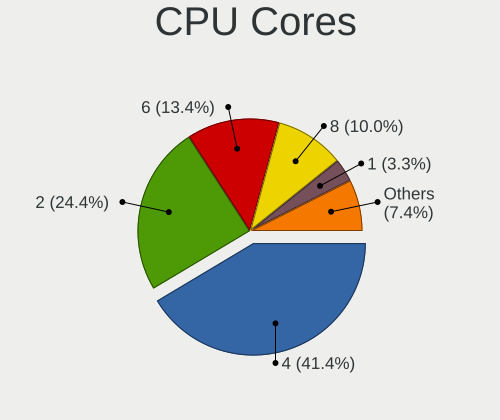

| Number | Desktops | Percent |
|--------|----------|---------|
| 4      | 273      | 41.43%  |
| 2      | 161      | 24.43%  |
| 6      | 88       | 13.35%  |
| 8      | 66       | 10.02%  |
| 1      | 22       | 3.34%   |
| 16     | 19       | 2.88%   |
| 12     | 14       | 2.12%   |
| 14     | 6        | 0.91%   |
| 3      | 4        | 0.61%   |
| 10     | 3        | 0.46%   |
| 24     | 2        | 0.3%    |
| 20     | 1        | 0.15%   |

CPU Sockets
-----------

Number of sockets

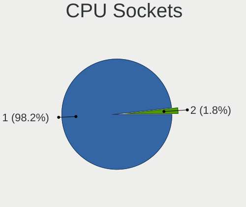

| Number | Desktops | Percent |
|--------|----------|---------|
| 1      | 644      | 98.17%  |
| 2      | 12       | 1.83%   |

CPU Threads
-----------

Threads per core (Hyper-Threading)

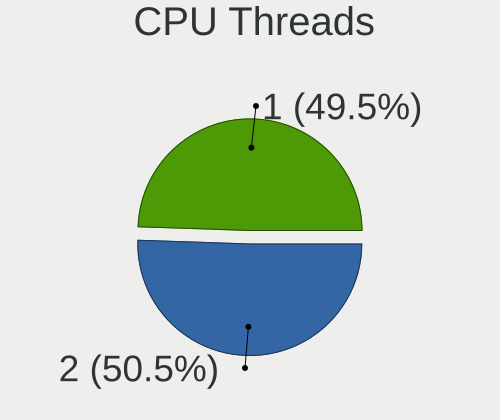

| Number | Desktops | Percent |
|--------|----------|---------|
| 2      | 332      | 50.53%  |
| 1      | 325      | 49.47%  |

CPU Op-Modes
------------

CPU Operation Modes (32-bit, 64-bit)

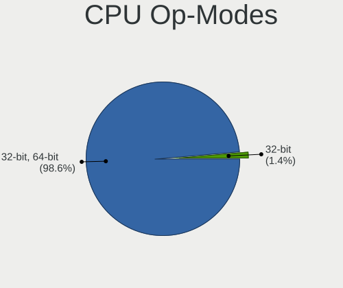

| Op mode        | Desktops | Percent |
|----------------|----------|---------|
| 32-bit, 64-bit | 647      | 98.63%  |
| 32-bit         | 9        | 1.37%   |

CPU Microcode
-------------

Microcode number

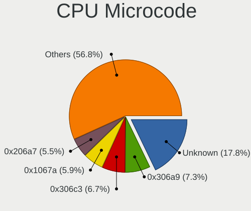

| Number     | Desktops | Percent |
|------------|----------|---------|
| Unknown    | 120      | 17.83%  |
| 0x306a9    | 49       | 7.28%   |
| 0x306c3    | 45       | 6.69%   |
| 0x1067a    | 40       | 5.94%   |
| 0x206a7    | 37       | 5.5%    |
| 0x506e3    | 19       | 2.82%   |
| 0x906e9    | 17       | 2.53%   |
| 0x08108109 | 14       | 2.08%   |
| 0x010000c8 | 14       | 2.08%   |
| 0x906ea    | 11       | 1.63%   |
| 0x0800820d | 11       | 1.63%   |
| 0x6fb      | 10       | 1.49%   |
| 0x08701021 | 10       | 1.49%   |
| 0x906ed    | 9        | 1.34%   |
| 0x6fd      | 9        | 1.34%   |
| 0xb06e0    | 8        | 1.19%   |
| 0x306e4    | 8        | 1.19%   |
| 0x106e5    | 8        | 1.19%   |
| 0x06000852 | 8        | 1.19%   |
| 0x0a50000d | 7        | 1.04%   |
| 0x010000dc | 7        | 1.04%   |
| 0xb0671    | 6        | 0.89%   |
| 0x106a5    | 6        | 0.89%   |
| 0x0a20120e | 6        | 0.89%   |
| 0x0810100b | 6        | 0.89%   |
| 0x08001138 | 6        | 0.89%   |
| 0xa0655    | 5        | 0.74%   |
| 0xa0653    | 5        | 0.74%   |
| 0x906eb    | 5        | 0.74%   |
| 0x206d7    | 5        | 0.74%   |
| 0x10677    | 5        | 0.74%   |
| 0x10676    | 5        | 0.74%   |
| 0x08701030 | 5        | 0.74%   |
| 0x06001119 | 5        | 0.74%   |
| 0xf65      | 4        | 0.59%   |
| 0xa0671    | 4        | 0.59%   |
| 0x90675    | 4        | 0.59%   |
| 0x306f2    | 4        | 0.59%   |
| 0x20655    | 4        | 0.59%   |
| 0x0a20120a | 4        | 0.59%   |

CPU Microarch
-------------

Microarchitecture

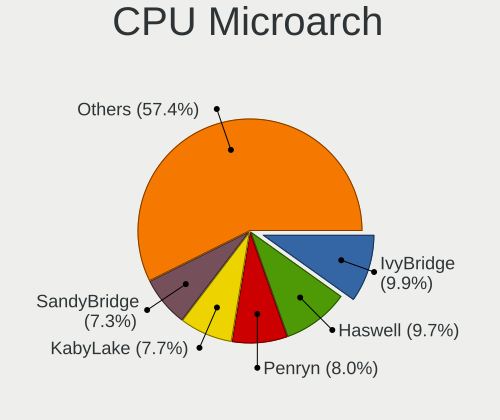

| Name             | Desktops | Percent |
|------------------|----------|---------|
| IvyBridge        | 65       | 9.86%   |
| Haswell          | 64       | 9.71%   |
| Penryn           | 53       | 8.04%   |
| KabyLake         | 51       | 7.74%   |
| SandyBridge      | 48       | 7.28%   |
| Zen 3            | 41       | 6.22%   |
| K10              | 35       | 5.31%   |
| Unknown          | 34       | 5.16%   |
| Zen+             | 26       | 3.95%   |
| Core             | 26       | 3.95%   |
| Zen              | 23       | 3.49%   |
| Zen 2            | 22       | 3.34%   |
| Skylake          | 22       | 3.34%   |
| Alderlake Hybrid | 18       | 2.73%   |
| Piledriver       | 17       | 2.58%   |
| NetBurst         | 16       | 2.43%   |
| Nehalem          | 16       | 2.43%   |
| CometLake        | 12       | 1.82%   |
| K8 Hammer        | 10       | 1.52%   |
| Gracemont        | 10       | 1.52%   |
| Westmere         | 9        | 1.37%   |
| Bulldozer        | 5        | 0.76%   |
| K6               | 4        | 0.61%   |
| Goldmont plus    | 4        | 0.61%   |
| Bobcat           | 4        | 0.61%   |
| Silvermont       | 3        | 0.46%   |
| K10 Llano        | 3        | 0.46%   |
| Jaguar           | 3        | 0.46%   |
| Icelake          | 3        | 0.46%   |
| Broadwell        | 3        | 0.46%   |
| Tremont          | 2        | 0.3%    |
| TigerLake        | 2        | 0.3%    |
| Steamroller      | 2        | 0.3%    |
| Goldmont         | 2        | 0.3%    |
| Excavator        | 1        | 0.15%   |

Graphics
--------

GPU Vendor
----------

Vendors of graphics cards

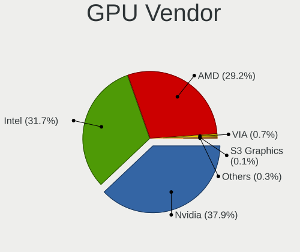

| Vendor                     | Desktops | Percent |
|----------------------------|----------|---------|
| Nvidia                     | 266      | 37.95%  |
| Intel                      | 222      | 31.67%  |
| AMD                        | 205      | 29.24%  |
| VIA Technologies           | 5        | 0.71%   |
| S3 Graphics                | 1        | 0.14%   |
| Matrox Electronics Systems | 1        | 0.14%   |
| ASPEED Technology          | 1        | 0.14%   |

GPU Model
---------

Graphics card models

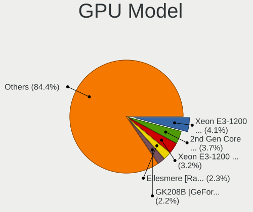

| Model                                                                       | Desktops | Percent |
|-----------------------------------------------------------------------------|----------|---------|
| Intel Xeon E3-1200 v2/3rd Gen Core processor Graphics Controller            | 30       | 4.14%   |
| Intel 2nd Generation Core Processor Family Integrated Graphics Controller   | 27       | 3.72%   |
| Intel Xeon E3-1200 v3/4th Gen Core Processor Integrated Graphics Controller | 23       | 3.17%   |
| AMD Ellesmere [Radeon RX 470/480/570/570X/580/580X/590]                     | 17       | 2.34%   |
| Nvidia GK208B [GeForce GT 710]                                              | 16       | 2.21%   |
| Intel 4 Series Chipset Integrated Graphics Controller                       | 15       | 2.07%   |
| Intel CoffeeLake-S GT2 [UHD Graphics 630]                                   | 14       | 1.93%   |
| AMD Picasso/Raven 2 [Radeon Vega Series / Radeon Vega Mobile Series]        | 13       | 1.79%   |
| Nvidia GT218 [GeForce 210]                                                  | 12       | 1.66%   |
| Nvidia GM206 [GeForce GTX 960]                                              | 12       | 1.66%   |
| Nvidia GK208B [GeForce GT 730]                                              | 12       | 1.66%   |
| Nvidia GP107 [GeForce GTX 1050 Ti]                                          | 11       | 1.52%   |
| Intel Alder Lake-N [UHD Graphics]                                           | 11       | 1.52%   |
| Intel Skylake-S GT2 [HD Graphics 530]                                       | 10       | 1.38%   |
| AMD Raphael                                                                 | 10       | 1.38%   |
| Intel 4th Generation Core Processor Family Integrated Graphics Controller   | 9        | 1.24%   |
| AMD Raven Ridge [Radeon Vega Series / Radeon Vega Mobile Series]            | 9        | 1.24%   |
| Nvidia GP104 [GeForce GTX 1070]                                             | 8        | 1.1%    |
| AMD Navi 23 [Radeon RX 6600/6600 XT/6600M]                                  | 8        | 1.1%    |
| AMD Cezanne [Radeon Vega Series / Radeon Vega Mobile Series]                | 8        | 1.1%    |
| AMD Cedar [Radeon HD 5000/6000/7350/8350 Series]                            | 8        | 1.1%    |
| Nvidia GM204 [GeForce GTX 970]                                              | 7        | 0.97%   |
| Intel Kaby Lake-S GT2 [HD Graphics 630]                                     | 7        | 0.97%   |
| Intel IvyBridge GT2 [HD Graphics 4000]                                      | 7        | 0.97%   |
| Nvidia GP108 [GeForce GT 1030]                                              | 6        | 0.83%   |
| Nvidia GP107 [GeForce GTX 1050]                                             | 6        | 0.83%   |
| Nvidia GK104 [GeForce GTX 760]                                              | 6        | 0.83%   |
| Intel CometLake-S GT2 [UHD Graphics 630]                                    | 6        | 0.83%   |
| Intel 82G33/G31 Express Integrated Graphics Controller                      | 6        | 0.83%   |
| AMD Navi 31 [Radeon RX 7900 XT/7900 XTX/7900 GRE/7900M]                     | 6        | 0.83%   |
| AMD Navi 22 [Radeon RX 6700/6700 XT/6750 XT / 6800M/6850M XT]               | 6        | 0.83%   |
| Nvidia TU106 [GeForce RTX 2060 Rev. A]                                      | 5        | 0.69%   |
| Nvidia GP106 [GeForce GTX 1060 6GB]                                         | 5        | 0.69%   |
| Nvidia GP106 [GeForce GTX 1060 3GB]                                         | 5        | 0.69%   |
| AMD RV710 [Radeon HD 4350/4550]                                             | 5        | 0.69%   |
| AMD Caicos [Radeon HD 6450/7450/8450 / R5 230 OEM]                          | 5        | 0.69%   |
| Nvidia TU117 [GeForce GTX 1650]                                             | 4        | 0.55%   |
| Nvidia GP102 [GeForce GTX 1080 Ti]                                          | 4        | 0.55%   |
| Nvidia GM107 [GeForce GTX 750 Ti]                                           | 4        | 0.55%   |
| Nvidia GA106 [Geforce RTX 3050]                                             | 4        | 0.55%   |

GPU Combo
---------

Combinations of graphics cards

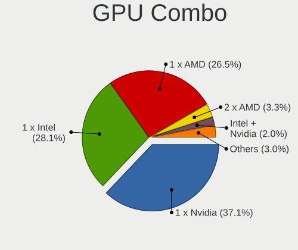

| Name            | Desktops | Percent |
|-----------------|----------|---------|
| 1 x Nvidia      | 245      | 37.07%  |
| 1 x Intel       | 186      | 28.14%  |
| 1 x AMD         | 175      | 26.48%  |
| 2 x AMD         | 22       | 3.33%   |
| Intel + Nvidia  | 13       | 1.97%   |
| 1 x VIA         | 5        | 0.76%   |
| AMD + Nvidia    | 5        | 0.76%   |
| Intel + AMD     | 4        | 0.61%   |
| 2 x Nvidia      | 2        | 0.3%    |
| 2 x Intel       | 1        | 0.15%   |
| 1 x S3 Graphics | 1        | 0.15%   |
| 1 x Matrox      | 1        | 0.15%   |
| 1 x ASPEED      | 1        | 0.15%   |

GPU Driver
----------

Free vs proprietary

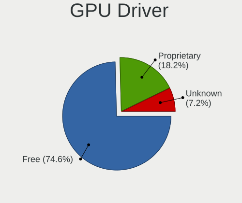

| Driver      | Desktops | Percent |
|-------------|----------|---------|
| Free        | 496      | 74.59%  |
| Proprietary | 121      | 18.2%   |
| Unknown     | 48       | 7.22%   |

GPU Memory
----------

Total video memory

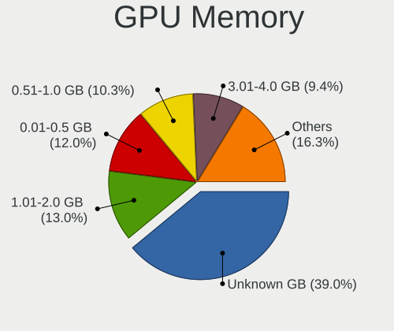

| Size in GB | Desktops | Percent |
|------------|----------|---------|
| Unknown    | 261      | 39.01%  |
| 1.01-2.0   | 87       | 13%     |
| 0.01-0.5   | 80       | 11.96%  |
| 0.51-1.0   | 69       | 10.31%  |
| 3.01-4.0   | 63       | 9.42%   |
| 7.01-8.0   | 51       | 7.62%   |
| 8.01-16.0  | 23       | 3.44%   |
| 5.01-6.0   | 20       | 2.99%   |
| 2.01-3.0   | 9        | 1.35%   |
| 16.01-24.0 | 6        | 0.9%    |

Monitor
-------

Monitor Vendor
--------------

Monitor vendors

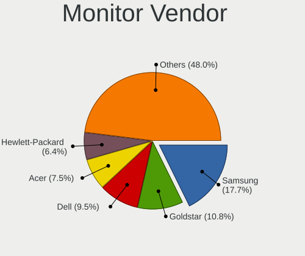

| Vendor               | Desktops | Percent |
|----------------------|----------|---------|
| Samsung Electronics  | 121      | 17.72%  |
| Goldstar             | 74       | 10.83%  |
| Dell                 | 65       | 9.52%   |
| Acer                 | 51       | 7.47%   |
| Hewlett-Packard      | 44       | 6.44%   |
| Philips              | 34       | 4.98%   |
| AOC                  | 32       | 4.69%   |
| BenQ                 | 29       | 4.25%   |
| Ancor Communications | 26       | 3.81%   |
| Unknown              | 12       | 1.76%   |
| Lenovo               | 12       | 1.76%   |
| Iiyama               | 12       | 1.76%   |
| ASUSTek Computer     | 12       | 1.76%   |
| Fujitsu Siemens      | 11       | 1.61%   |
| Eizo                 | 10       | 1.46%   |
| MSI                  | 9        | 1.32%   |
| Sony                 | 8        | 1.17%   |
| NEC Computers        | 7        | 1.02%   |
| HUAWEI               | 7        | 1.02%   |
| ViewSonic            | 6        | 0.88%   |
| Toshiba              | 4        | 0.59%   |
| LG Electronics       | 4        | 0.59%   |
| Hitachi              | 4        | 0.59%   |
| Belinea              | 4        | 0.59%   |
| Vizio                | 3        | 0.44%   |
| Sceptre Tech         | 3        | 0.44%   |
| MStar                | 3        | 0.44%   |
| Medion               | 3        | 0.44%   |
| Insignia             | 3        | 0.44%   |
| HannStar             | 3        | 0.44%   |
| Apple                | 3        | 0.44%   |
| ___                  | 2        | 0.29%   |
| VIZTA                | 2        | 0.29%   |
| Unknown (XXX)        | 2        | 0.29%   |
| Sceptre              | 2        | 0.29%   |
| Nixeus               | 2        | 0.29%   |
| Microstep            | 2        | 0.29%   |
| Mi                   | 2        | 0.29%   |
| Idek Iiyama          | 2        | 0.29%   |
| HPN                  | 2        | 0.29%   |

Monitor Model
-------------

Monitor models

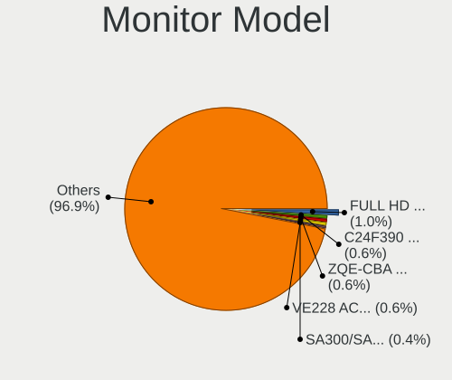

| Model                                                                | Desktops | Percent |
|----------------------------------------------------------------------|----------|---------|
| Goldstar FULL HD GSM5B55 1920x1080 480x270mm 21.7-inch               | 7        | 0.98%   |
| Samsung Electronics C24F390 SAM0D2C 1920x1080 521x293mm 23.5-inch    | 4        | 0.56%   |
| HUAWEI ZQE-CBA HWV6A25 3440x1440 797x334mm 34.0-inch                 | 4        | 0.56%   |
| Ancor Communications VE228 ACI22FA 1920x1080 477x268mm 21.5-inch     | 4        | 0.56%   |
| Samsung Electronics SA300/SA350 SAM0788 1366x768 410x230mm 18.5-inch | 3        | 0.42%   |
| Philips PHL 242V8 PHLC219 1920x1080 527x296mm 23.8-inch              | 3        | 0.42%   |
| HUAWEI AD80HW HWV2402 1920x1080 527x296mm 23.8-inch                  | 3        | 0.42%   |
| Goldstar HDR WFHD GSM7714 2560x1080 798x334mm 34.1-inch              | 3        | 0.42%   |
| Apple LED Cinema APP9226 2560x1440 597x336mm 27.0-inch               | 3        | 0.42%   |
| Acer V246HQL ACR0424 1920x1080 521x293mm 23.5-inch                   | 3        | 0.42%   |
| Vizio D43f-F1 VIZ1027 1920x1080 940x529mm 42.5-inch                  | 2        | 0.28%   |
| Unknown LCD Monitor SAMSUNG 1920x1080                                | 2        | 0.28%   |
| Unknown LCD Monitor SAMSUNG                                          | 2        | 0.28%   |
| Toshiba LCD Monitor TV 1920x1080                                     | 2        | 0.28%   |
| Sony LCD Monitor TV 3840x1080                                        | 2        | 0.28%   |
| Samsung Electronics SyncMaster SAM0456 1360x768 410x230mm 18.5-inch  | 2        | 0.28%   |
| Samsung Electronics SyncMaster SAM01CE 1024x768 304x228mm 15.0-inch  | 2        | 0.28%   |
| Samsung Electronics S27F350 SAM0D22 1920x1080 598x336mm 27.0-inch    | 2        | 0.28%   |
| Samsung Electronics S22D300 SAM0B3F 1920x1080 477x268mm 21.5-inch    | 2        | 0.28%   |
| Samsung Electronics C27F390 SAM0D33 1920x1080 598x336mm 27.0-inch    | 2        | 0.28%   |
| Philips PHL 244E5 PHLC0C0 1920x1080 527x296mm 23.8-inch              | 2        | 0.28%   |
| Philips PHL 223V5 PHLC0CF 1920x1080 477x268mm 21.5-inch              | 2        | 0.28%   |
| Philips 244E PHLC036 1920x1080 521x293mm 23.5-inch                   | 2        | 0.28%   |
| NEC Computers PA271W NEC67DA 2560x1440 596x335mm 26.9-inch           | 2        | 0.28%   |
| MStar Demo MST0030 1920x1080 708x398mm 32.0-inch                     | 2        | 0.28%   |
| Lenovo LEN L193pC LEN114F 1280x1024 376x301mm 19.0-inch              | 2        | 0.28%   |
| Lenovo LEN G32qc-10 LEN66A2 2560x1440 698x392mm 31.5-inch            | 2        | 0.28%   |
| Lenovo L24i-10 LEN65D6 1920x1080 527x296mm 23.8-inch                 | 2        | 0.28%   |
| Iiyama PL2294H IVM563B 1920x1080 476x268mm 21.5-inch                 | 2        | 0.28%   |
| Hitachi HDMI HEC0029 1920x1080 1152x648mm 52.0-inch                  | 2        | 0.28%   |
| Hewlett-Packard TouchSmart HWP4211 1920x1080 509x286mm 23.0-inch     | 2        | 0.28%   |
| Hewlett-Packard LE1901w HWP2842 1440x900 410x256mm 19.0-inch         | 2        | 0.28%   |
| Hewlett-Packard E232 HWP3279 1920x1080 509x286mm 23.0-inch           | 2        | 0.28%   |
| Hewlett-Packard 27wm HWP3355 1920x1080 598x336mm 27.0-inch           | 2        | 0.28%   |
| Hewlett-Packard 27ea HPN3395 1920x1080 527x296mm 23.8-inch           | 2        | 0.28%   |
| Hewlett-Packard 25x HPN357F 1920x1080 544x303mm 24.5-inch            | 2        | 0.28%   |
| Hewlett-Packard 24f HPN3545 1920x1080 527x296mm 23.8-inch            | 2        | 0.28%   |
| Goldstar W1943 GSM4BAD 1360x768 406x229mm 18.4-inch                  | 2        | 0.28%   |
| Goldstar Ultra HD GSM5B09 3840x2160 600x340mm 27.2-inch              | 2        | 0.28%   |
| Goldstar LG TV SSCR2 GSMC0C8 3840x2160                               | 2        | 0.28%   |

Monitor Resolution
------------------

Monitor screen resolution

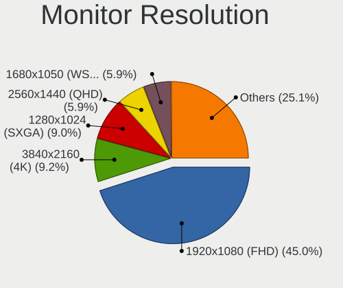

| Resolution         | Desktops | Percent |
|--------------------|----------|---------|
| 1920x1080 (FHD)    | 300      | 45.05%  |
| 3840x2160 (4K)     | 61       | 9.16%   |
| 1280x1024 (SXGA)   | 60       | 9.01%   |
| 2560x1440 (QHD)    | 39       | 5.86%   |
| 1680x1050 (WSXGA+) | 39       | 5.86%   |
| 1366x768 (WXGA)    | 26       | 3.9%    |
| 1600x900 (HD+)     | 21       | 3.15%   |
| 1440x900 (WXGA+)   | 21       | 3.15%   |
| 3440x1440          | 16       | 2.4%    |
| 1920x1200 (WUXGA)  | 16       | 2.4%    |
| Unknown            | 15       | 2.25%   |
| 1360x768           | 12       | 1.8%    |
| 2560x1080          | 9        | 1.35%   |
| 3840x1080          | 8        | 1.2%    |
| 1024x768 (XGA)     | 5        | 0.75%   |
| 1920x540           | 4        | 0.6%    |
| 1600x1200          | 3        | 0.45%   |
| 4480x1440          | 2        | 0.3%    |
| 9600x2160          | 1        | 0.15%   |
| 7680x2160          | 1        | 0.15%   |
| 4240x1440          | 1        | 0.15%   |
| 3840x1600          | 1        | 0.15%   |
| 3040x1050          | 1        | 0.15%   |
| 2560x1600          | 1        | 0.15%   |
| 2560x1024          | 1        | 0.15%   |
| 1280x768           | 1        | 0.15%   |
| 1280x720 (HD)      | 1        | 0.15%   |

Monitor Diagonal
----------------

Diagonal size in inches

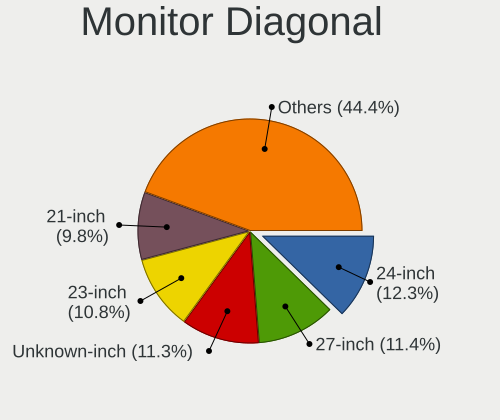

| Inches  | Desktops | Percent |
|---------|----------|---------|
| 24      | 83       | 12.31%  |
| 27      | 77       | 11.42%  |
| Unknown | 76       | 11.28%  |
| 23      | 73       | 10.83%  |
| 21      | 66       | 9.79%   |
| 19      | 48       | 7.12%   |
| 18      | 34       | 5.04%   |
| 22      | 32       | 4.75%   |
| 31      | 29       | 4.3%    |
| 17      | 25       | 3.71%   |
| 20      | 23       | 3.41%   |
| 34      | 21       | 3.12%   |
| 15      | 13       | 1.93%   |
| 32      | 10       | 1.48%   |
| 72      | 7        | 1.04%   |
| 54      | 7        | 1.04%   |
| 63      | 6        | 0.89%   |
| 52      | 6        | 0.89%   |
| 26      | 5        | 0.74%   |
| 84      | 3        | 0.45%   |
| 49      | 3        | 0.45%   |
| 40      | 3        | 0.45%   |
| 60      | 2        | 0.3%    |
| 42      | 2        | 0.3%    |
| 38      | 2        | 0.3%    |
| 25      | 2        | 0.3%    |
| 16      | 2        | 0.3%    |
| 95      | 1        | 0.15%   |
| 86      | 1        | 0.15%   |
| 65      | 1        | 0.15%   |
| 64      | 1        | 0.15%   |
| 50      | 1        | 0.15%   |
| 48      | 1        | 0.15%   |
| 46      | 1        | 0.15%   |
| 37      | 1        | 0.15%   |
| 33      | 1        | 0.15%   |
| 30      | 1        | 0.15%   |
| 28      | 1        | 0.15%   |
| 14      | 1        | 0.15%   |
| 13      | 1        | 0.15%   |

Monitor Width
-------------

Physical width

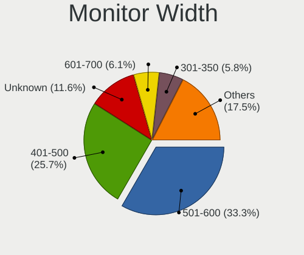

| Width in mm | Desktops | Percent |
|-------------|----------|---------|
| 501-600     | 219      | 33.33%  |
| 401-500     | 169      | 25.72%  |
| Unknown     | 76       | 11.57%  |
| 601-700     | 40       | 6.09%   |
| 301-350     | 38       | 5.78%   |
| 351-400     | 33       | 5.02%   |
| 701-800     | 31       | 4.72%   |
| 1001-1500   | 28       | 4.26%   |
| 1501-2000   | 12       | 1.83%   |
| 801-900     | 7        | 1.07%   |
| 201-300     | 2        | 0.3%    |
| 901-1000    | 2        | 0.3%    |

Aspect Ratio
------------

Proportional relationship between the width and the height

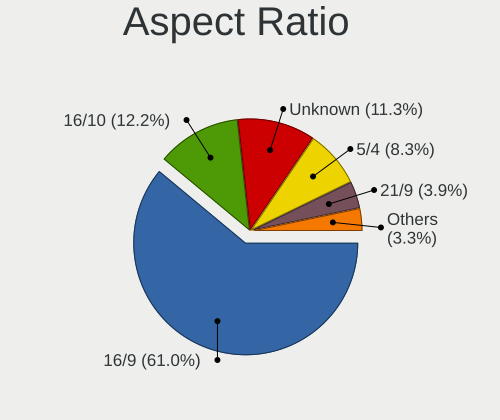

| Ratio   | Desktops | Percent |
|---------|----------|---------|
| 16/9    | 390      | 61.03%  |
| 16/10   | 78       | 12.21%  |
| Unknown | 72       | 11.27%  |
| 5/4     | 53       | 8.29%   |
| 21/9    | 25       | 3.91%   |
| 4/3     | 16       | 2.5%    |
| 3/2     | 4        | 0.63%   |
| 32/9    | 1        | 0.16%   |

Monitor Area
------------

Area in inch²

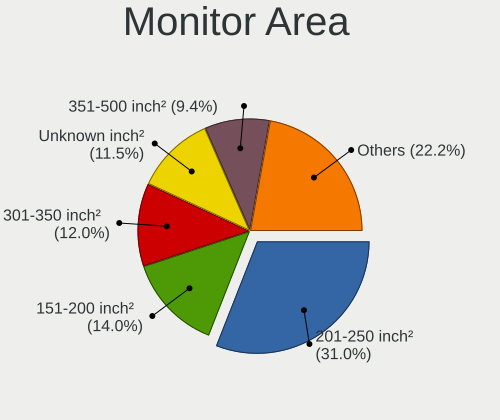

| Area in inch² | Desktops | Percent |
|----------------|----------|---------|
| 201-250        | 204      | 30.96%  |
| 151-200        | 92       | 13.96%  |
| 301-350        | 79       | 11.99%  |
| Unknown        | 76       | 11.53%  |
| 351-500        | 62       | 9.41%   |
| 141-150        | 52       | 7.89%   |
| More than 1000 | 39       | 5.92%   |
| 251-300        | 28       | 4.25%   |
| 101-110        | 9        | 1.37%   |
| 501-1000       | 9        | 1.37%   |
| 111-120        | 6        | 0.91%   |
| 81-90          | 1        | 0.15%   |
| 71-80          | 1        | 0.15%   |
| 91-100         | 1        | 0.15%   |

Pixel Density
-------------

Pixels per inch

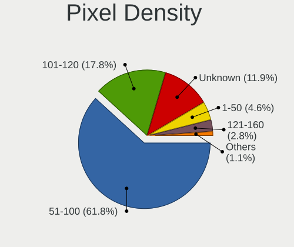

| Density | Desktops | Percent |
|---------|----------|---------|
| 51-100  | 393      | 61.79%  |
| 101-120 | 113      | 17.77%  |
| Unknown | 76       | 11.95%  |
| 1-50    | 29       | 4.56%   |
| 121-160 | 18       | 2.83%   |
| 161-240 | 7        | 1.1%    |

Multiple Monitors
-----------------

Total monitors connected

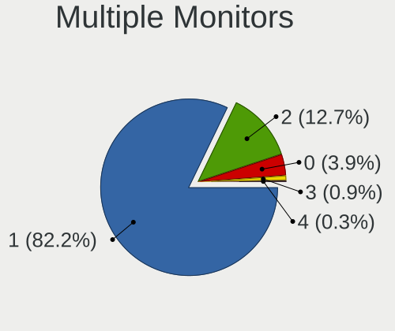

| Total | Desktops | Percent |
|-------|----------|---------|
| 1     | 548      | 82.16%  |
| 2     | 85       | 12.74%  |
| 0     | 26       | 3.9%    |
| 3     | 6        | 0.9%    |
| 4     | 2        | 0.3%    |

Network
-------

Net Controller Vendor
---------------------

Controller vendors

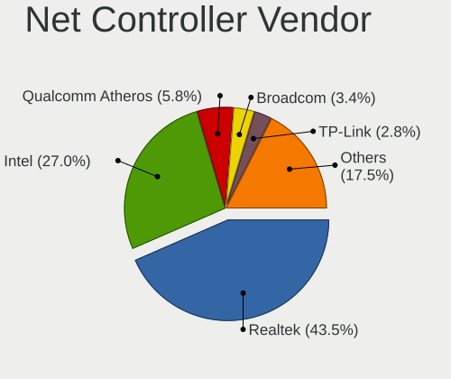

| Vendor                                 | Desktops | Percent |
|----------------------------------------|----------|---------|
| Realtek Semiconductor                  | 412      | 43.46%  |
| Intel                                  | 256      | 27%     |
| Qualcomm Atheros                       | 55       | 5.8%    |
| Broadcom                               | 32       | 3.38%   |
| TP-Link                                | 27       | 2.85%   |
| Ralink Technology                      | 25       | 2.64%   |
| MediaTek                               | 24       | 2.53%   |
| Nvidia                                 | 20       | 2.11%   |
| Marvell Technology Group               | 9        | 0.95%   |
| VIA Technologies                       | 8        | 0.84%   |
| Ralink                                 | 7        | 0.74%   |
| NetGear                                | 6        | 0.63%   |
| Samsung Electronics                    | 5        | 0.53%   |
| Microsoft                              | 5        | 0.53%   |
| Huawei Technologies                    | 4        | 0.42%   |
| Broadcom Limited                       | 4        | 0.42%   |
| Belkin Components                      | 4        | 0.42%   |
| ASUSTek Computer                       | 4        | 0.42%   |
| Edimax Technology                      | 3        | 0.32%   |
| ASIX Electronics                       | 3        | 0.32%   |
| ZTE WCDMA Technologies MSM             | 2        | 0.21%   |
| Xiaomi                                 | 2        | 0.21%   |
| Tenda                                  | 2        | 0.21%   |
| Sitecom Europe                         | 2        | 0.21%   |
| Silicon Integrated Systems [SiS]       | 2        | 0.21%   |
| Mercucys                               | 2        | 0.21%   |
| Mellanox Technologies                  | 2        | 0.21%   |
| IMC Networks                           | 2        | 0.21%   |
| D-Link System                          | 2        | 0.21%   |
| AVM                                    | 2        | 0.21%   |
| ADMtek                                 | 2        | 0.21%   |
| Uniden                                 | 1        | 0.11%   |
| Sony Ericsson Mobile Communications AB | 1        | 0.11%   |
| Qualcomm Atheros Communications        | 1        | 0.11%   |
| Qualcomm                               | 1        | 0.11%   |
| LSI                                    | 1        | 0.11%   |
| JMicron Technology                     | 1        | 0.11%   |
| HTC (High Tech Computer)               | 1        | 0.11%   |
| DisplayLink                            | 1        | 0.11%   |
| D-Link                                 | 1        | 0.11%   |

Net Controller Model
--------------------

Controller models

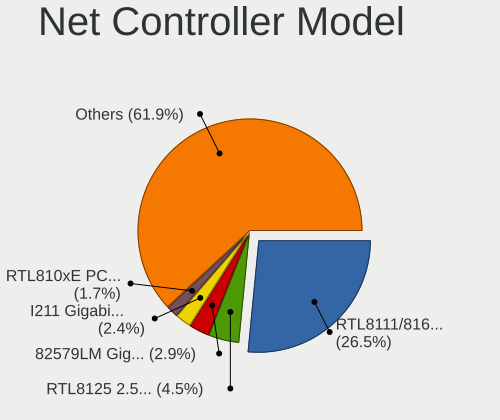

| Model                                                                  | Desktops | Percent |
|------------------------------------------------------------------------|----------|---------|
| Realtek RTL8111/8168/8211/8411 PCI Express Gigabit Ethernet Controller | 289      | 26.54%  |
| Realtek RTL8125 2.5GbE Controller                                      | 49       | 4.5%    |
| Intel 82579LM Gigabit Network Connection (Lewisville)                  | 32       | 2.94%   |
| Intel I211 Gigabit Network Connection                                  | 26       | 2.39%   |
| Realtek RTL810xE PCI Express Fast Ethernet controller                  | 19       | 1.74%   |
| Intel Ethernet Connection (2) I219-V                                   | 19       | 1.74%   |
| Intel Wi-Fi 6 AX200                                                    | 18       | 1.65%   |
| Intel Ethernet Connection I217-LM                                      | 18       | 1.65%   |
| Realtek RTL8821CE 802.11ac PCIe Wireless Network Adapter               | 14       | 1.29%   |
| Realtek RTL88x2bu [AC1200 Techkey]                                     | 13       | 1.19%   |
| Intel Wi-Fi 6E(802.11ax) AX210/AX1675* 2x2 [Typhoon Peak]              | 13       | 1.19%   |
| Nvidia MCP61 Ethernet                                                  | 12       | 1.1%    |
| Intel Dual Band Wireless-AC 3168NGW [Stone Peak]                       | 12       | 1.1%    |
| Realtek RTL8188EUS 802.11n Wireless Network Adapter                    | 11       | 1.01%   |
| Realtek 802.11ac NIC                                                   | 11       | 1.01%   |
| Intel Ethernet Controller I225-V                                       | 11       | 1.01%   |
| Intel Ethernet Connection (7) I219-V                                   | 11       | 1.01%   |
| Realtek RTL-8100/8101L/8139 PCI Fast Ethernet Adapter                  | 10       | 0.92%   |
| Intel Ethernet Connection I217-V                                       | 10       | 0.92%   |
| Intel 82579V Gigabit Network Connection                                | 10       | 0.92%   |
| MediaTek MT7922 802.11ax PCI Express Wireless Network Adapter          | 9        | 0.83%   |
| MediaTek MT7921K (RZ608) Wi-Fi 6E 80MHz                                | 9        | 0.83%   |
| Ralink RT5370 Wireless Adapter                                         | 8        | 0.73%   |
| Ralink MT7601U Wireless Adapter                                        | 8        | 0.73%   |
| Intel 700 Series Chipset CNVi WiFi                                     | 8        | 0.73%   |
| Qualcomm Atheros Attansic L1 Gigabit Ethernet                          | 7        | 0.64%   |
| Intel 82574L Gigabit Network Connection                                | 7        | 0.64%   |
| Broadcom BCM4360 802.11ac Dual Band Wireless Network Adapter           | 7        | 0.64%   |
| VIA VT6102/VT6103 [Rhine-II]                                           | 6        | 0.55%   |
| Realtek RTL8822CE 802.11ac PCIe Wireless Network Adapter               | 6        | 0.55%   |
| Intel I210 Gigabit Network Connection                                  | 6        | 0.55%   |
| Intel 82566DM-2 Gigabit Network Connection                             | 6        | 0.55%   |
| TP-Link TL-WN823N v2/v3 [Realtek RTL8192EU]                            | 5        | 0.46%   |
| TP-Link TL-WN722N v2/v3 [Realtek RTL8188EUS]                           | 5        | 0.46%   |
| TP-Link 802.11ac WLAN Adapter                                          | 5        | 0.46%   |
| Samsung Galaxy series, misc. (tethering mode)                          | 5        | 0.46%   |
| Realtek RTL8192EE PCIe Wireless Network Adapter                        | 5        | 0.46%   |
| Realtek RTL8192CU 802.11n WLAN Adapter                                 | 5        | 0.46%   |
| Realtek RTL8188FTV 802.11b/g/n 1T1R 2.4G WLAN Adapter                  | 5        | 0.46%   |
| Realtek RTL8153 Gigabit Ethernet Adapter                               | 5        | 0.46%   |

Wireless Vendor
---------------

Wireless vendors

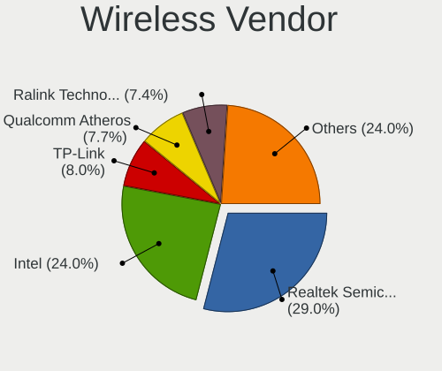

| Vendor                          | Desktops | Percent |
|---------------------------------|----------|---------|
| Realtek Semiconductor           | 98       | 28.99%  |
| Intel                           | 81       | 23.96%  |
| TP-Link                         | 27       | 7.99%   |
| Qualcomm Atheros                | 26       | 7.69%   |
| Ralink Technology               | 25       | 7.4%    |
| MediaTek                        | 19       | 5.62%   |
| Broadcom                        | 17       | 5.03%   |
| Ralink                          | 7        | 2.07%   |
| NetGear                         | 6        | 1.78%   |
| Microsoft                       | 5        | 1.48%   |
| ASUSTek Computer                | 4        | 1.18%   |
| Edimax Technology               | 3        | 0.89%   |
| Belkin Components               | 3        | 0.89%   |
| Tenda                           | 2        | 0.59%   |
| Sitecom Europe                  | 2        | 0.59%   |
| Mercucys                        | 2        | 0.59%   |
| Marvell Technology Group        | 2        | 0.59%   |
| IMC Networks                    | 2        | 0.59%   |
| AVM                             | 2        | 0.59%   |
| ZTE WCDMA Technologies MSM      | 1        | 0.3%    |
| Qualcomm Atheros Communications | 1        | 0.3%    |
| D-Link System                   | 1        | 0.3%    |
| D-Link                          | 1        | 0.3%    |
| Broadcom Limited                | 1        | 0.3%    |

Wireless Model
--------------

Wireless models

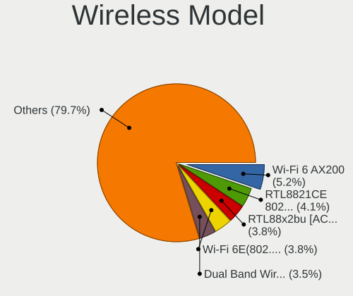

| Model                                                          | Desktops | Percent |
|----------------------------------------------------------------|----------|---------|
| Intel Wi-Fi 6 AX200                                            | 18       | 5.22%   |
| Realtek RTL8821CE 802.11ac PCIe Wireless Network Adapter       | 14       | 4.06%   |
| Realtek RTL88x2bu [AC1200 Techkey]                             | 13       | 3.77%   |
| Intel Wi-Fi 6E(802.11ax) AX210/AX1675* 2x2 [Typhoon Peak]      | 13       | 3.77%   |
| Intel Dual Band Wireless-AC 3168NGW [Stone Peak]               | 12       | 3.48%   |
| Realtek RTL8188EUS 802.11n Wireless Network Adapter            | 11       | 3.19%   |
| Realtek 802.11ac NIC                                           | 11       | 3.19%   |
| MediaTek MT7921K (RZ608) Wi-Fi 6E 80MHz                        | 9        | 2.61%   |
| Ralink RT5370 Wireless Adapter                                 | 8        | 2.32%   |
| Ralink MT7601U Wireless Adapter                                | 8        | 2.32%   |
| Intel 700 Series Chipset CNVi WiFi                             | 8        | 2.32%   |
| Broadcom BCM4360 802.11ac Dual Band Wireless Network Adapter   | 7        | 2.03%   |
| Realtek RTL8822CE 802.11ac PCIe Wireless Network Adapter       | 6        | 1.74%   |
| MediaTek MT7922 802.11ax PCI Express Wireless Network Adapter  | 6        | 1.74%   |
| TP-Link TL-WN823N v2/v3 [Realtek RTL8192EU]                    | 5        | 1.45%   |
| TP-Link TL-WN722N v2/v3 [Realtek RTL8188EUS]                   | 5        | 1.45%   |
| TP-Link 802.11ac WLAN Adapter                                  | 5        | 1.45%   |
| Realtek RTL8192EE PCIe Wireless Network Adapter                | 5        | 1.45%   |
| Realtek RTL8192CU 802.11n WLAN Adapter                         | 5        | 1.45%   |
| Realtek RTL8188FTV 802.11b/g/n 1T1R 2.4G WLAN Adapter          | 5        | 1.45%   |
| Ralink RT2870/RT3070 Wireless Adapter                          | 5        | 1.45%   |
| Qualcomm Atheros AR9485 Wireless Network Adapter               | 5        | 1.45%   |
| Qualcomm Atheros AR9227 Wireless Network Adapter               | 5        | 1.45%   |
| Intel Wireless 3165                                            | 5        | 1.45%   |
| Intel Wi-Fi 5(802.11ac) Wireless-AC 9x6x [Thunder Peak]        | 5        | 1.45%   |
| Realtek RTL8192CE PCIe Wireless Network Adapter                | 4        | 1.16%   |
| Realtek RTL8188CUS 802.11n WLAN Adapter                        | 4        | 1.16%   |
| Realtek 802.11ac WLAN Adapter                                  | 4        | 1.16%   |
| Microsoft Xbox Wireless Adapter for Windows                    | 4        | 1.16%   |
| TP-Link RTL8812AU Archer T4U 802.11ac                          | 3        | 0.87%   |
| TP-Link Archer T2U PLUS [RTL8821AU]                            | 3        | 0.87%   |
| Ralink MT7610U ("Archer T2U" 2.4G+5G WLAN Adapter              | 3        | 0.87%   |
| Qualcomm Atheros AR9462 Wireless Network Adapter               | 3        | 0.87%   |
| Qualcomm Atheros AR9287 Wireless Network Adapter (PCI-Express) | 3        | 0.87%   |
| Intel Wireless 7265                                            | 3        | 0.87%   |
| Intel Wireless 7260                                            | 3        | 0.87%   |
| Intel Cannon Lake PCH CNVi WiFi                                | 3        | 0.87%   |
| Intel Alder Lake-N PCH CNVi WiFi                               | 3        | 0.87%   |
| TP-Link TL-WN821N v5/v6 [RTL8192EU]                            | 2        | 0.58%   |
| TP-Link Archer T3U [Realtek RTL8812BU]                         | 2        | 0.58%   |

Ethernet Vendor
---------------

Ethernet vendors

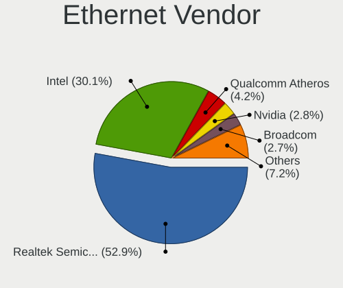

| Vendor                           | Desktops | Percent |
|----------------------------------|----------|---------|
| Realtek Semiconductor            | 374      | 52.9%   |
| Intel                            | 213      | 30.13%  |
| Qualcomm Atheros                 | 30       | 4.24%   |
| Nvidia                           | 20       | 2.83%   |
| Broadcom                         | 19       | 2.69%   |
| VIA Technologies                 | 8        | 1.13%   |
| Marvell Technology Group         | 7        | 0.99%   |
| Samsung Electronics              | 5        | 0.71%   |
| MediaTek                         | 5        | 0.71%   |
| Huawei Technologies              | 4        | 0.57%   |
| Broadcom Limited                 | 3        | 0.42%   |
| ASIX Electronics                 | 3        | 0.42%   |
| Xiaomi                           | 2        | 0.28%   |
| Silicon Integrated Systems [SiS] | 2        | 0.28%   |
| ADMtek                           | 2        | 0.28%   |
| Qualcomm                         | 1        | 0.14%   |
| Mellanox Technologies            | 1        | 0.14%   |
| JMicron Technology               | 1        | 0.14%   |
| HTC (High Tech Computer)         | 1        | 0.14%   |
| DisplayLink                      | 1        | 0.14%   |
| D-Link System                    | 1        | 0.14%   |
| Chelsio Communications           | 1        | 0.14%   |
| Belkin Components                | 1        | 0.14%   |
| Aquantia                         | 1        | 0.14%   |
| 3Com                             | 1        | 0.14%   |

Ethernet Model
--------------

Ethernet models

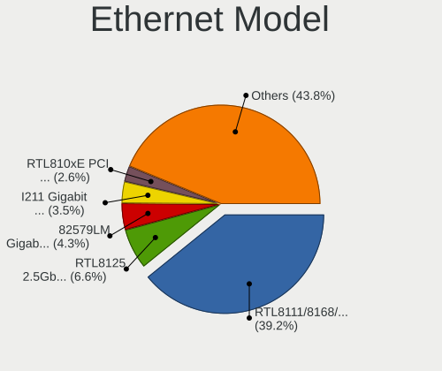

| Model                                                                  | Desktops | Percent |
|------------------------------------------------------------------------|----------|---------|
| Realtek RTL8111/8168/8211/8411 PCI Express Gigabit Ethernet Controller | 289      | 39.16%  |
| Realtek RTL8125 2.5GbE Controller                                      | 49       | 6.64%   |
| Intel 82579LM Gigabit Network Connection (Lewisville)                  | 32       | 4.34%   |
| Intel I211 Gigabit Network Connection                                  | 26       | 3.52%   |
| Realtek RTL810xE PCI Express Fast Ethernet controller                  | 19       | 2.57%   |
| Intel Ethernet Connection (2) I219-V                                   | 19       | 2.57%   |
| Intel Ethernet Connection I217-LM                                      | 18       | 2.44%   |
| Nvidia MCP61 Ethernet                                                  | 12       | 1.63%   |
| Intel Ethernet Controller I225-V                                       | 11       | 1.49%   |
| Intel Ethernet Connection (7) I219-V                                   | 11       | 1.49%   |
| Realtek RTL-8100/8101L/8139 PCI Fast Ethernet Adapter                  | 10       | 1.36%   |
| Intel Ethernet Connection I217-V                                       | 10       | 1.36%   |
| Intel 82579V Gigabit Network Connection                                | 10       | 1.36%   |
| Qualcomm Atheros Attansic L1 Gigabit Ethernet                          | 7        | 0.95%   |
| Intel 82574L Gigabit Network Connection                                | 7        | 0.95%   |
| VIA VT6102/VT6103 [Rhine-II]                                           | 6        | 0.81%   |
| Intel I210 Gigabit Network Connection                                  | 6        | 0.81%   |
| Intel 82566DM-2 Gigabit Network Connection                             | 6        | 0.81%   |
| Samsung Galaxy series, misc. (tethering mode)                          | 5        | 0.68%   |
| Realtek RTL8153 Gigabit Ethernet Adapter                               | 5        | 0.68%   |
| Qualcomm Atheros AR8151 v2.0 Gigabit Ethernet                          | 5        | 0.68%   |
| Intel Ethernet Controller I226-V                                       | 5        | 0.68%   |
| Intel Ethernet Connection (2) I219-LM                                  | 5        | 0.68%   |
| Intel 82567LM-3 Gigabit Network Connection                             | 5        | 0.68%   |
| Realtek RTL-8110SC/8169SC Gigabit Ethernet                             | 4        | 0.54%   |
| Qualcomm Atheros AR8161 Gigabit Ethernet                               | 4        | 0.54%   |
| Qualcomm Atheros AR8121/AR8113/AR8114 Gigabit or Fast Ethernet         | 4        | 0.54%   |
| Marvell Group 88E8056 PCI-E Gigabit Ethernet Controller                | 4        | 0.54%   |
| Intel Ethernet Connection (2) I218-V                                   | 4        | 0.54%   |
| Intel 82578DM Gigabit Network Connection                               | 4        | 0.54%   |
| Intel 82566DC-2 Gigabit Network Connection                             | 4        | 0.54%   |
| Huawei FOA-LX9                                                         | 4        | 0.54%   |
| Broadcom NetXtreme BCM5754 Gigabit Ethernet PCI Express                | 4        | 0.54%   |
| Realtek RTL8852BE PCIe 802.11ax Wireless Network Controller            | 3        | 0.41%   |
| Realtek RTL8169 PCI Gigabit Ethernet Controller                        | 3        | 0.41%   |
| Realtek RTL8111/8168/8411 PCI Express Gigabit Ethernet Controller      | 3        | 0.41%   |
| Realtek Killer E3000 2.5GbE Controller                                 | 3        | 0.41%   |
| Qualcomm Atheros AR8152 v2.0 Fast Ethernet                             | 3        | 0.41%   |
| Qualcomm Atheros AR8131 Gigabit Ethernet                               | 3        | 0.41%   |
| Nvidia MCP77 Ethernet                                                  | 3        | 0.41%   |

Net Controller Kind
-------------------

Ethernet, WiFi or modem

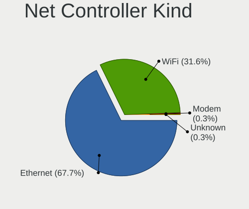

| Kind     | Desktops | Percent |
|----------|----------|---------|
| Ethernet | 651      | 67.74%  |
| WiFi     | 304      | 31.63%  |
| Modem    | 3        | 0.31%   |
| Unknown  | 3        | 0.31%   |

Used Controller
---------------

Currently used network controller

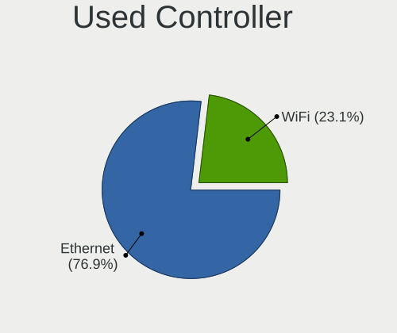

| Kind     | Desktops | Percent |
|----------|----------|---------|
| Ethernet | 525      | 76.87%  |
| WiFi     | 158      | 23.13%  |

NICs
----

Total network controllers on board

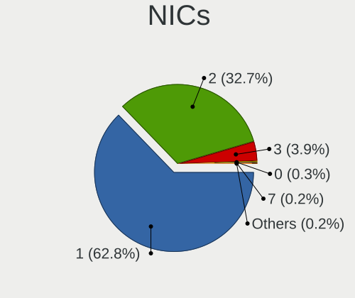

| Total | Desktops | Percent |
|-------|----------|---------|
| 1     | 415      | 62.78%  |
| 2     | 216      | 32.68%  |
| 3     | 26       | 3.93%   |
| 0     | 2        | 0.3%    |
| 7     | 1        | 0.15%   |
| 4     | 1        | 0.15%   |

IPv6
----

IPv6 vs IPv4

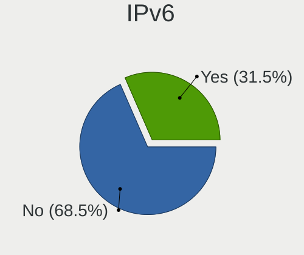

| Used | Desktops | Percent |
|------|----------|---------|
| No   | 460      | 68.45%  |
| Yes  | 212      | 31.55%  |

Bluetooth
---------

Bluetooth Vendor
----------------

Controller vendors

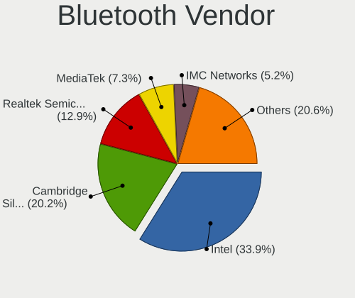

| Vendor                          | Desktops | Percent |
|---------------------------------|----------|---------|
| Intel                           | 79       | 33.91%  |
| Cambridge Silicon Radio         | 47       | 20.17%  |
| Realtek Semiconductor           | 30       | 12.88%  |
| MediaTek                        | 17       | 7.3%    |
| IMC Networks                    | 12       | 5.15%   |
| Broadcom                        | 10       | 4.29%   |
| Apple                           | 8        | 3.43%   |
| ASUSTek Computer                | 7        | 3%      |
| Qualcomm Atheros Communications | 4        | 1.72%   |
| TP-Link                         | 3        | 1.29%   |
| Lite-On Technology              | 3        | 1.29%   |
| Integrated System Solution      | 3        | 1.29%   |
| Dynex                           | 2        | 0.86%   |
| Dell                            | 2        | 0.86%   |
| Unknown                         | 2        | 0.86%   |
| SiW                             | 1        | 0.43%   |
| Logitech                        | 1        | 0.43%   |
| Foxconn / Hon Hai               | 1        | 0.43%   |
| Edimax Technology               | 1        | 0.43%   |

Bluetooth Model
---------------

Controller models

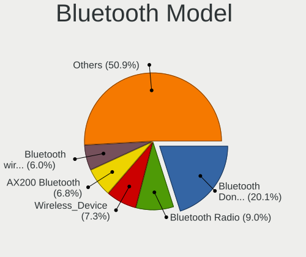

| Model                                                    | Desktops | Percent |
|----------------------------------------------------------|----------|---------|
| Cambridge Silicon Radio Bluetooth Dongle (HCI mode)      | 47       | 20.09%  |
| Realtek Bluetooth Radio                                  | 21       | 8.97%   |
| MediaTek Wireless_Device                                 | 17       | 7.26%   |
| Intel AX200 Bluetooth                                    | 16       | 6.84%   |
| Intel Bluetooth wireless interface                       | 14       | 5.98%   |
| Intel Wireless-AC 3168 Bluetooth                         | 12       | 5.13%   |
| Intel AX210 Bluetooth                                    | 11       | 4.7%    |
| Intel Bluetooth Device                                   | 9        | 3.85%   |
| Intel AX201 Bluetooth                                    | 7        | 2.99%   |
| Realtek  Bluetooth 4.2 Adapter                           | 6        | 2.56%   |
| IMC Networks Wireless_Device                             | 6        | 2.56%   |
| Broadcom BCM20702A0 Bluetooth 4.0                        | 6        | 2.56%   |
| Intel Wireless-AC 9260 Bluetooth Adapter                 | 5        | 2.14%   |
| IMC Networks Bluetooth Radio                             | 5        | 2.14%   |
| Apple Bluetooth Host Controller                          | 5        | 2.14%   |
| Intel Bluetooth 9460/9560 Jefferson Peak (JfP)           | 4        | 1.71%   |
| TP-Link TP-T@- UB500 Adapter                             | 3        | 1.28%   |
| ASUS Broadcom BCM20702A0 Bluetooth                       | 3        | 1.28%   |
| ASUS ASUS USB-BT500                                      | 3        | 1.28%   |
| Realtek 802.11ac WLAN Adapter                            | 2        | 0.85%   |
| Qualcomm Atheros  Bluetooth Device                       | 2        | 0.85%   |
| Qualcomm Atheros AR3011 Bluetooth                        | 2        | 0.85%   |
| Lite-On Bluetooth Device                                 | 2        | 0.85%   |
| Intel Centrino Bluetooth Wireless Transceiver            | 2        | 0.85%   |
| Integrated System Solution Bluetooth Device              | 2        | 0.85%   |
| Dynex Bluetooth 4.0 Adapter [Broadcom, 1.12, BCM20702A0] | 2        | 0.85%   |
| Dell BT Mini-Receiver                                    | 2        | 0.85%   |
| Broadcom HP Bluethunder                                  | 2        | 0.85%   |
| Apple Built-in Bluetooth 2.0+EDR HCI                     | 2        | 0.85%   |
| Unknown                                                  | 2        | 0.85%   |
| SiW SiW                                                  | 1        | 0.43%   |
| Realtek Bluetooth 5.3 Radio                              | 1        | 0.43%   |
| Logitech BT Mini-Receiver (HCI mode)                     | 1        | 0.43%   |
| Lite-On Bluetooth Radio                                  | 1        | 0.43%   |
| Integrated System Solution KY-BT100 Bluetooth Adapter    | 1        | 0.43%   |
| IMC Networks Bluetooth Device                            | 1        | 0.43%   |
| Foxconn / Hon Hai Wireless_Device                        | 1        | 0.43%   |
| Edimax Bluetooth Device                                  | 1        | 0.43%   |
| Broadcom Bluetooth 3.0 USB Dongle                        | 1        | 0.43%   |
| Broadcom BCM2045 Bluetooth                               | 1        | 0.43%   |

Sound
-----

Sound Vendor
------------

Sound card vendors

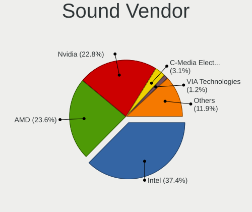

| Vendor                                       | Desktops | Percent |
|----------------------------------------------|----------|---------|
| Intel                                        | 412      | 37.42%  |
| AMD                                          | 260      | 23.61%  |
| Nvidia                                       | 251      | 22.8%   |
| C-Media Electronics                          | 34       | 3.09%   |
| VIA Technologies                             | 13       | 1.18%   |
| Creative Labs                                | 13       | 1.18%   |
| Creative Technology                          | 11       | 1%      |
| Logitech                                     | 9        | 0.82%   |
| JMTek                                        | 8        | 0.73%   |
| GN Netcom                                    | 7        | 0.64%   |
| Generalplus Technology                       | 7        | 0.64%   |
| Micro Star International                     | 6        | 0.54%   |
| Zoran Co. Personal Media Division (Nogatech) | 5        | 0.45%   |
| Thesycon Systemsoftware & Consulting         | 5        | 0.45%   |
| Texas Instruments                            | 4        | 0.36%   |
| Plantronics                                  | 4        | 0.36%   |
| Silicon Integrated Systems [SiS]             | 3        | 0.27%   |
| KTMicro                                      | 3        | 0.27%   |
| Jieli Technology                             | 3        | 0.27%   |
| Apple                                        | 3        | 0.27%   |
| Tenx Technology                              | 2        | 0.18%   |
| Razer USA                                    | 2        | 0.18%   |
| Mark of the Unicorn                          | 2        | 0.18%   |
| Hewlett-Packard                              | 2        | 0.18%   |
| Focusrite-Novation                           | 2        | 0.18%   |
| BEHRINGER International                      | 2        | 0.18%   |
| ASRock                                       | 2        | 0.18%   |
| ZOOM                                         | 1        | 0.09%   |
| Yamaha                                       | 1        | 0.09%   |
| XMOS                                         | 1        | 0.09%   |
| Xilinx                                       | 1        | 0.09%   |
| Turtle Beach                                 | 1        | 0.09%   |
| Sony                                         | 1        | 0.09%   |
| SAVITECH                                     | 1        | 0.09%   |
| Samson Technologies                          | 1        | 0.09%   |
| Realtek Semiconductor                        | 1        | 0.09%   |
| QinHeng Electronics                          | 1        | 0.09%   |
| Native Instruments                           | 1        | 0.09%   |
| M-Audio                                      | 1        | 0.09%   |
| Kingston Technology                          | 1        | 0.09%   |

Sound Model
-----------

Sound card models

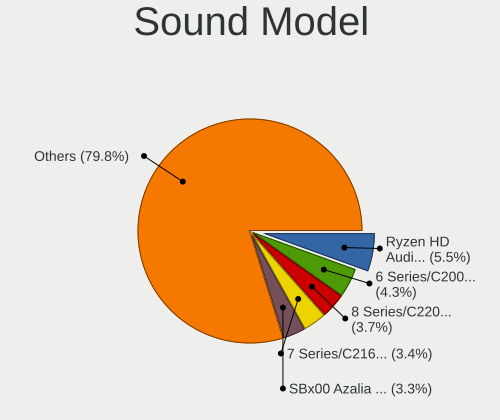

| Model                                                                      | Desktops | Percent |
|----------------------------------------------------------------------------|----------|---------|
| AMD Ryzen HD Audio Controller                                              | 71       | 5.53%   |
| Intel 6 Series/C200 Series Chipset Family High Definition Audio Controller | 55       | 4.28%   |
| Intel 8 Series/C220 Series Chipset High Definition Audio Controller        | 47       | 3.66%   |
| Intel 7 Series/C216 Chipset Family High Definition Audio Controller        | 44       | 3.43%   |
| AMD SBx00 Azalia (Intel HDA)                                               | 42       | 3.27%   |
| AMD Starship/Matisse HD Audio Controller                                   | 39       | 3.04%   |
| Intel NM10/ICH7 Family High Definition Audio Controller                    | 36       | 2.8%    |
| Nvidia GK208 HDMI/DP Audio Controller                                      | 32       | 2.49%   |
| Intel Xeon E3-1200 v3/4th Gen Core Processor HD Audio Controller           | 30       | 2.34%   |
| Intel 100 Series/C230 Series Chipset Family HD Audio Controller            | 27       | 2.1%    |
| Intel Cannon Lake PCH cAVS                                                 | 22       | 1.71%   |
| AMD Renoir/Cezanne HDMI/DP Audio Controller                                | 22       | 1.71%   |
| AMD Raven/Raven2/Fenghuang HDMI/DP Audio Controller                        | 22       | 1.71%   |
| Nvidia GP107GL High Definition Audio Controller                            | 21       | 1.64%   |
| AMD Navi 21/23 HDMI/DP Audio Controller                                    | 21       | 1.64%   |
| AMD Family 17h (Models 00h-0fh) HD Audio Controller                        | 21       | 1.64%   |
| Intel 82801JI (ICH10 Family) HD Audio Controller                           | 19       | 1.48%   |
| Intel 200 Series PCH HD Audio                                              | 19       | 1.48%   |
| AMD Radeon High Definition Audio Controller                                | 19       | 1.48%   |
| Intel 82801I (ICH9 Family) HD Audio Controller                             | 18       | 1.4%    |
| AMD Ellesmere HDMI Audio [Radeon RX 470/480 / 570/580/590]                 | 18       | 1.4%    |
| Nvidia High Definition Audio Controller                                    | 17       | 1.32%   |
| AMD FCH Azalia Controller                                                  | 15       | 1.17%   |
| Nvidia GM206 High Definition Audio Controller                              | 14       | 1.09%   |
| AMD Oland/Hainan/Cape Verde/Pitcairn HDMI Audio [Radeon HD 7000 Series]    | 14       | 1.09%   |
| Intel Alder Lake-N PCH High Definition Audio Controller                    | 13       | 1.01%   |
| Intel 5 Series/3400 Series Chipset High Definition Audio                   | 13       | 1.01%   |
| Nvidia MCP61 High Definition Audio                                         | 12       | 0.93%   |
| Intel Raptor Lake High Definition Audio Controller                         | 12       | 0.93%   |
| Nvidia TU106 High Definition Audio Controller                              | 11       | 0.86%   |
| Nvidia GP106 High Definition Audio Controller                              | 11       | 0.86%   |
| Nvidia GP104 High Definition Audio Controller                              | 11       | 0.86%   |
| Nvidia GM107 High Definition Audio Controller [GeForce 940MX]              | 11       | 0.86%   |
| Nvidia GK104 HDMI Audio Controller                                         | 11       | 0.86%   |
| Nvidia GF108 High Definition Audio Controller                              | 11       | 0.86%   |
| Intel C600/X79 series chipset High Definition Audio Controller             | 11       | 0.86%   |
| Nvidia GM204 High Definition Audio Controller                              | 10       | 0.78%   |
| Nvidia TU116 High Definition Audio Controller                              | 9        | 0.7%    |
| AMD Navi 31 HDMI/DP Audio                                                  | 9        | 0.7%    |
| Nvidia GK107 HDMI Audio Controller                                         | 8        | 0.62%   |

Memory
------

Memory Vendor
-------------

Memory module vendors

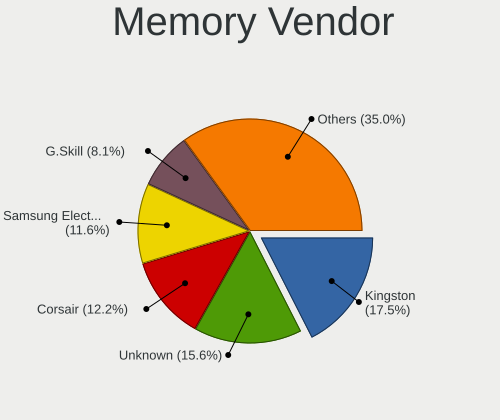

| Vendor              | Desktops | Percent |
|---------------------|----------|---------|
| Kingston            | 56       | 17.5%   |
| Unknown             | 50       | 15.63%  |
| Corsair             | 39       | 12.19%  |
| Samsung Electronics | 37       | 11.56%  |
| G.Skill             | 26       | 8.13%   |
| SK hynix            | 23       | 7.19%   |
| Crucial             | 22       | 6.88%   |
| Micron Technology   | 14       | 4.38%   |
| Unknown             | 7        | 2.19%   |
| Team                | 5        | 1.56%   |
| Patriot             | 5        | 1.56%   |
| Unknown (0x0E9D)    | 3        | 0.94%   |
| Nanya Technology    | 3        | 0.94%   |
| GeIL                | 3        | 0.94%   |
| Unknown (0x0B45)    | 2        | 0.63%   |
| Ramaxel Technology  | 2        | 0.63%   |
| Exceleram           | 2        | 0.63%   |
| Elpida              | 2        | 0.63%   |
| A-DATA Technology   | 2        | 0.63%   |
| Unknown (ABCD)      | 1        | 0.31%   |
| Unknown (87CE)      | 1        | 0.31%   |
| Unknown (0x0CC7)    | 1        | 0.31%   |
| Transcend           | 1        | 0.31%   |
| Toshiba             | 1        | 0.31%   |
| Smart               | 1        | 0.31%   |
| Qimonda             | 1        | 0.31%   |
| PNY                 | 1        | 0.31%   |
| PLEXHD              | 1        | 0.31%   |
| Mushkin             | 1        | 0.31%   |
| Lexar Co Limited    | 1        | 0.31%   |
| KLEVV               | 1        | 0.31%   |
| Kingmax             | 1        | 0.31%   |
| CSX                 | 1        | 0.31%   |
| AVEXIR              | 1        | 0.31%   |
| Avant               | 1        | 0.31%   |
| Apacer              | 1        | 0.31%   |

Memory Model
------------

Memory module models

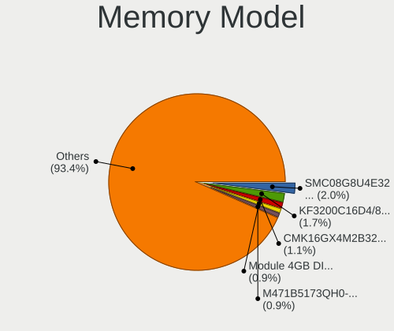

| Model                                                              | Desktops | Percent |
|--------------------------------------------------------------------|----------|---------|
| Unknown                                                            | 7        | 2%      |
| Kingston RAM KF3200C16D4/8GX 8GiB DIMM DDR4 3600MT/s               | 6        | 1.71%   |
| Corsair RAM CMK16GX4M2B3200C16 8GB DIMM DDR4 3600MT/s              | 4        | 1.14%   |
| Unknown RAM Module 4GB DIMM 1333MT/s                               | 3        | 0.86%   |
| Samsung RAM M471B5173QH0-YK0 4GB SODIMM DDR3 1600MT/s              | 3        | 0.86%   |
| Unknown RAM Module 4GB DIMM DDR3 1333MT/s                          | 2        | 0.57%   |
| Unknown RAM Module 4GB DIMM DDR3                                   | 2        | 0.57%   |
| Unknown RAM Module 4GB DIMM 1066MT/s                               | 2        | 0.57%   |
| Unknown RAM Module 2GB DIMM DDR2 800MT/s                           | 2        | 0.57%   |
| Unknown RAM Module 2GB DIMM DDR 1333MT/s                           | 2        | 0.57%   |
| Unknown RAM Module 2GB DIMM 800MT/s                                | 2        | 0.57%   |
| Unknown RAM Module 2GB DIMM 1333MT/s                               | 2        | 0.57%   |
| Unknown RAM Module 2GB DIMM 1066MT/s                               | 2        | 0.57%   |
| Unknown (0x0E9D) RAM KINSOTIN16GB2666MHZ 16GB SODIMM DDR4 2667MT/s | 2        | 0.57%   |
| Unknown (0x0B45) RAM WPBH32D416SWA-16G 16GB SODIMM DDR4 3200MT/s   | 2        | 0.57%   |
| Team RAM TEAMGROUP-SD4-2666 8GB SODIMM DDR4 2667MT/s               | 2        | 0.57%   |
| Samsung RAM M378B5673EH1-CH9 2GB DIMM DDR3 1333MT/s                | 2        | 0.57%   |
| Samsung RAM M378A1K43CB2-CRC 8GB DIMM DDR4 3500MT/s                | 2        | 0.57%   |
| Micron RAM 8ATF1G64AZ-2G3B1 8GB DIMM DDR4 2448MT/s                 | 2        | 0.57%   |
| Kingston RAM KHX3200C16D4/8GX 8GB DIMM DDR4 3733MT/s               | 2        | 0.57%   |
| Kingston RAM KHX2666C15D4/4G 4GB DIMM DDR4 3200MT/s                | 2        | 0.57%   |
| Kingston RAM KHX1600C9D3/4GX 4GB DIMM DDR3 1867MT/s                | 2        | 0.57%   |
| Kingston RAM KF560C36-32 32GB DIMM DDR5 6200MT/s                   | 2        | 0.57%   |
| Kingston RAM KF3600C18D4/16GX 16GB DIMM DDR4 3733MT/s              | 2        | 0.57%   |
| Kingston RAM 99U5584-005.A00LF 4GB DIMM DDR3 1600MT/s              | 2        | 0.57%   |
| Kingston RAM 99U5471-054.A00LF 8GB DIMM DDR3 1600MT/s              | 2        | 0.57%   |
| G.Skill RAM F5-6000J3040G32G 32GB DIMM DDR5 6200MT/s               | 2        | 0.57%   |
| G.Skill RAM F4-3200C16-16GVK 16GB DIMM DDR4 3600MT/s               | 2        | 0.57%   |
| Crucial RAM CT16G56C46S5.M8B2 16GB SODIMM DDR5 5600MT/s            | 2        | 0.57%   |
| Corsair RAM CMZ16GX3M2A1600C10 8GB DIMM DDR3 1600MT/s              | 2        | 0.57%   |
| Corsair RAM CMK64GX4M2E3200C16 32GB DIMM DDR4 3600MT/s             | 2        | 0.57%   |
| Corsair RAM CMK16GX4M2Z3600C18 8GB DIMM DDR4 3600MT/s              | 2        | 0.57%   |
| Corsair RAM CMK16GX4M2B3000C15 8GB DIMM DDR4 3600MT/s              | 2        | 0.57%   |
| Corsair RAM CMK16GX4M2A2400C14 8GB DIMM DDR4 2800MT/s              | 2        | 0.57%   |
| Unknown RAM Module 8GB SODIMM DDR3 1600MT/s                        | 1        | 0.29%   |
| Unknown RAM Module 8GB DIMM DDR 1333MT/s                           | 1        | 0.29%   |
| Unknown RAM Module 8GB DIMM 1333MT/s                               | 1        | 0.29%   |
| Unknown RAM Module 8192MB DIMM 1333MT/s                            | 1        | 0.29%   |
| Unknown RAM Module 512MB DIMM DDR2 266MT/s                         | 1        | 0.29%   |
| Unknown RAM Module 512MB DIMM 667MT/s                              | 1        | 0.29%   |

Memory Kind
-----------

Memory module kinds

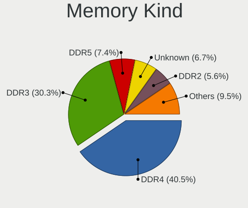

| Kind    | Desktops | Percent |
|---------|----------|---------|
| DDR4    | 115      | 40.49%  |
| DDR3    | 86       | 30.28%  |
| DDR5    | 21       | 7.39%   |
| Unknown | 19       | 6.69%   |
| DDR2    | 16       | 5.63%   |
| SDRAM   | 14       | 4.93%   |
| DDR     | 7        | 2.46%   |
| LPDDR5  | 4        | 1.41%   |
| LPDDR4  | 2        | 0.7%    |

Memory Form Factor
------------------

Physical design of the memory module

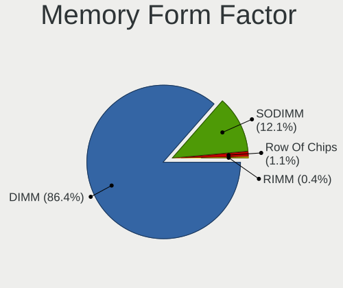

| Name         | Desktops | Percent |
|--------------|----------|---------|
| DIMM         | 236      | 86.45%  |
| SODIMM       | 33       | 12.09%  |
| Row Of Chips | 3        | 1.1%    |
| RIMM         | 1        | 0.37%   |

Memory Size
-----------

Memory module size

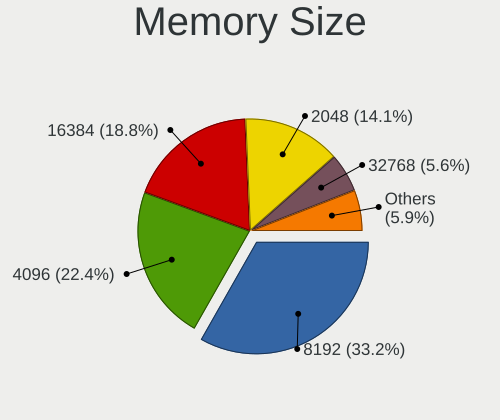

| Size  | Desktops | Percent |
|-------|----------|---------|
| 8192  | 101      | 33.22%  |
| 4096  | 68       | 22.37%  |
| 16384 | 57       | 18.75%  |
| 2048  | 43       | 14.14%  |
| 32768 | 17       | 5.59%   |
| 1024  | 11       | 3.62%   |
| 512   | 4        | 1.32%   |
| 49152 | 2        | 0.66%   |
| 16    | 1        | 0.33%   |

Memory Speed
------------

Memory module speed

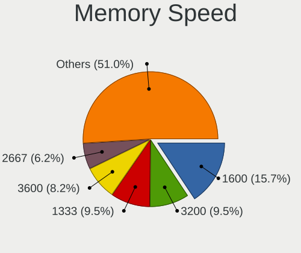

| Speed   | Desktops | Percent |
|---------|----------|---------|
| 1600    | 48       | 15.69%  |
| 3200    | 29       | 9.48%   |
| 1333    | 29       | 9.48%   |
| 3600    | 25       | 8.17%   |
| 2667    | 19       | 6.21%   |
| 2400    | 16       | 5.23%   |
| 2133    | 13       | 4.25%   |
| 667     | 11       | 3.59%   |
| 800     | 9        | 2.94%   |
| Unknown | 9        | 2.94%   |
| 1866    | 8        | 2.61%   |
| 6000    | 7        | 2.29%   |
| 5600    | 7        | 2.29%   |
| 3733    | 6        | 1.96%   |
| 6400    | 5        | 1.63%   |
| 2800    | 5        | 1.63%   |
| 1867    | 5        | 1.63%   |
| 6200    | 4        | 1.31%   |
| 3400    | 4        | 1.31%   |
| 2666    | 4        | 1.31%   |
| 1800    | 4        | 1.31%   |
| 1066    | 4        | 1.31%   |
| 533     | 4        | 1.31%   |
| 3000    | 3        | 0.98%   |
| 3500    | 2        | 0.65%   |
| 2448    | 2        | 0.65%   |
| 1639    | 2        | 0.65%   |
| 1334    | 2        | 0.65%   |
| 1067    | 2        | 0.65%   |
| 400     | 2        | 0.65%   |
| 8400    | 1        | 0.33%   |
| 7200    | 1        | 0.33%   |
| 4800    | 1        | 0.33%   |
| 4266    | 1        | 0.33%   |
| 4000    | 1        | 0.33%   |
| 3800    | 1        | 0.33%   |
| 3466    | 1        | 0.33%   |
| 3333    | 1        | 0.33%   |
| 3066    | 1        | 0.33%   |
| 3007    | 1        | 0.33%   |

Printers & scanners
-------------------

Printer Vendor
--------------

Printer device vendors

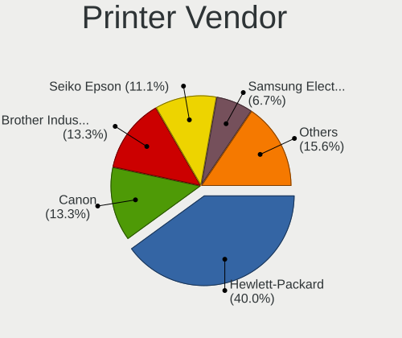

| Vendor                | Desktops | Percent |
|-----------------------|----------|---------|
| Hewlett-Packard       | 18       | 40%     |
| Canon                 | 6        | 13.33%  |
| Brother Industries    | 6        | 13.33%  |
| Seiko Epson           | 5        | 11.11%  |
| Samsung Electronics   | 3        | 6.67%   |
| Lexmark International | 2        | 4.44%   |
| Ricoh                 | 1        | 2.22%   |
| QinHeng Electronics   | 1        | 2.22%   |
| Prolific Technology   | 1        | 2.22%   |
| Minolta               | 1        | 2.22%   |
| Konica Minolta        | 1        | 2.22%   |

Printer Model
-------------

Printer device models

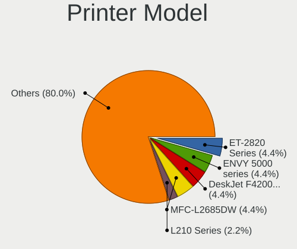

| Model                                  | Desktops | Percent |
|----------------------------------------|----------|---------|
| Seiko Epson ET-2820 Series             | 2        | 4.44%   |
| HP ENVY 5000 series                    | 2        | 4.44%   |
| HP DeskJet F4200 series                | 2        | 4.44%   |
| Brother MFC-L2685DW                    | 2        | 4.44%   |
| Seiko Epson L210 Series                | 1        | 2.22%   |
| Seiko Epson L1250 Series               | 1        | 2.22%   |
| Seiko Epson ET-2810 Series             | 1        | 2.22%   |
| Samsung SCX-4600 Series                | 1        | 2.22%   |
| Samsung SCX-3400 Series                | 1        | 2.22%   |
| Samsung ML-1670 Series                 | 1        | 2.22%   |
| Ricoh SP C260SFNw                      | 1        | 2.22%   |
| QinHeng CH340S                         | 1        | 2.22%   |
| Prolific PL2305 Parallel Port          | 1        | 2.22%   |
| Minolta PagePro 1200W                  | 1        | 2.22%   |
| Lexmark International Printing Support | 1        | 2.22%   |
| Lexmark International MX310dn          | 1        | 2.22%   |
| Konica Minolta KONICA MINOLTA 185      | 1        | 2.22%   |
| HP OfficeJet Pro 8730                  | 1        | 2.22%   |
| HP OfficeJet Pro 7740 series           | 1        | 2.22%   |
| HP LaserJet P2015 series               | 1        | 2.22%   |
| HP LaserJet P1006                      | 1        | 2.22%   |
| HP LaserJet P1005                      | 1        | 2.22%   |
| HP LaserJet M14-M17                    | 1        | 2.22%   |
| HP LaserJet 3050                       | 1        | 2.22%   |
| HP LaserJet 1020                       | 1        | 2.22%   |
| HP HP LaserJet Pro M404-M405           | 1        | 2.22%   |
| HP ENVY 4520 series                    | 1        | 2.22%   |
| HP Deskjet 2540 series                 | 1        | 2.22%   |
| HP DeskJet 2130 series                 | 1        | 2.22%   |
| HP Deskjet 1050 J410                   | 1        | 2.22%   |
| HP Color LaserJet CP2025dn             | 1        | 2.22%   |
| Canon TS9100 series                    | 1        | 2.22%   |
| Canon LiDE 300                         | 1        | 2.22%   |
| Canon LaserShot LBP-1120 Printer       | 1        | 2.22%   |
| Canon iP7200 series                    | 1        | 2.22%   |
| Canon iP4200                           | 1        | 2.22%   |
| Canon D570 UFRII LT                    | 1        | 2.22%   |
| Brother MFC-T4500DW                    | 1        | 2.22%   |
| Brother MFC-J4335DW                    | 1        | 2.22%   |
| Brother HL-L2300D series               | 1        | 2.22%   |

Scanner Vendor
--------------

Scanner device vendors

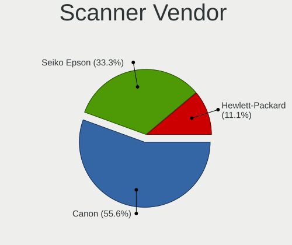

| Vendor          | Desktops | Percent |
|-----------------|----------|---------|
| Canon           | 5        | 55.56%  |
| Seiko Epson     | 3        | 33.33%  |
| Hewlett-Packard | 1        | 11.11%  |

Scanner Model
-------------

Scanner device models

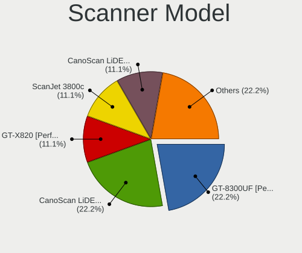

| Model                                         | Desktops | Percent |
|-----------------------------------------------|----------|---------|
| Seiko Epson GT-8300UF [Perfection 1660 PHOTO] | 2        | 22.22%  |
| Canon CanoScan LiDE 210                       | 2        | 22.22%  |
| Seiko Epson GT-X820 [Perfection V600 Photo]   | 1        | 11.11%  |
| HP ScanJet 3800c                              | 1        | 11.11%  |
| Canon CanoScan LIDE 25                        | 1        | 11.11%  |
| Canon CanoScan LiDE 220                       | 1        | 11.11%  |
| Canon CanoScan LiDE 110                       | 1        | 11.11%  |

Camera
------

Camera Vendor
-------------

Camera device vendors

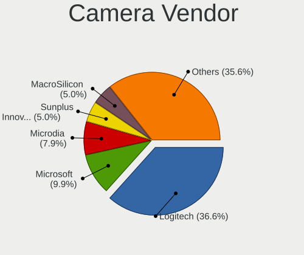

| Vendor                        | Desktops | Percent |
|-------------------------------|----------|---------|
| Logitech                      | 37       | 36.63%  |
| Microsoft                     | 10       | 9.9%    |
| Microdia                      | 8        | 7.92%   |
| Sunplus Innovation Technology | 5        | 4.95%   |
| MacroSilicon                  | 5        | 4.95%   |
| Apple                         | 4        | 3.96%   |
| Generalplus Technology        | 3        | 2.97%   |
| Chicony Electronics           | 3        | 2.97%   |
| Z-Star Microelectronics       | 2        | 1.98%   |
| Samsung Electronics           | 2        | 1.98%   |
| Razer USA                     | 2        | 1.98%   |
| OmniVision Technologies       | 2        | 1.98%   |
| KYE Systems (Mouse Systems)   | 2        | 1.98%   |
| Huawei Technologies           | 2        | 1.98%   |
| Creative Technology           | 2        | 1.98%   |
| Xiongmai                      | 1        | 0.99%   |
| Web Camera                    | 1        | 0.99%   |
| WCM_USB                       | 1        | 0.99%   |
| Service & Quality Technology  | 1        | 0.99%   |
| Pixart Imaging                | 1        | 0.99%   |
| Nintendo                      | 1        | 0.99%   |
| Magic Control Technology      | 1        | 0.99%   |
| Jieli Technology              | 1        | 0.99%   |
| Elgato Systems                | 1        | 0.99%   |
| AVerMedia Technologies        | 1        | 0.99%   |
| ARC International             | 1        | 0.99%   |
| Alcor Micro                   | 1        | 0.99%   |

Camera Model
------------

Camera device models

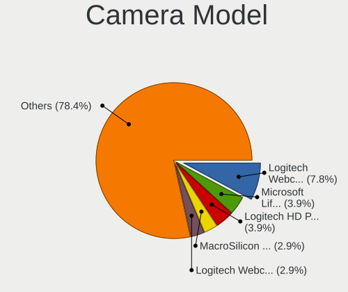

| Model                                          | Desktops | Percent |
|------------------------------------------------|----------|---------|
| Logitech Webcam C270                           | 8        | 7.84%   |
| Microsoft LifeCam HD-3000                      | 4        | 3.92%   |
| Logitech HD Pro Webcam C920                    | 4        | 3.92%   |
| MacroSilicon USB Video                         | 3        | 2.94%   |
| Logitech Webcam C310                           | 3        | 2.94%   |
| Apple iSight in LED Cinema Display             | 3        | 2.94%   |
| Z-Star Venus USB2.0 Camera                     | 2        | 1.96%   |
| Sunplus Integrated Camera                      | 2        | 1.96%   |
| Sunplus Full HD webcam                         | 2        | 1.96%   |
| Samsung Galaxy series, misc. (MTP mode)        | 2        | 1.96%   |
| OmniVision Integrated Webcam for Dell XPS 2010 | 2        | 1.96%   |
| Microsoft LifeCam Studio                       | 2        | 1.96%   |
| Microdia USB 2.0 Camera                        | 2        | 1.96%   |
| Logitech StreamCam                             | 2        | 1.96%   |
| Logitech HD Webcam C615                        | 2        | 1.96%   |
| Logitech HD Webcam C525                        | 2        | 1.96%   |
| Logitech C920 PRO HD Webcam                    | 2        | 1.96%   |
| Logitech BRIO Ultra HD Webcam                  | 2        | 1.96%   |
| Huawei HiCamera                                | 2        | 1.96%   |
| Generalplus GENERAL WEBCAM                     | 2        | 1.96%   |
| Chicony HP High Definition 1MP Webcam          | 2        | 1.96%   |
| Xiongmai web camera                            | 1        | 0.98%   |
| Web Camera Web Camera                          | 1        | 0.98%   |
| WCM_USB WEB CAM                                | 1        | 0.98%   |
| Sunplus HK 5M WebCAM                           | 1        | 0.98%   |
| Service & Quality USB PC Camera                | 1        | 0.98%   |
| Razer USA Razer Kiyo X                         | 1        | 0.98%   |
| Razer USA Gaming Webcam [Kiyo]                 | 1        | 0.98%   |
| Pixart Imaging GE 1.3 MP MiniCam Pro           | 1        | 0.98%   |
| Nintendo USB Camera                            | 1        | 0.98%   |
| Microsoft Microsoft LifeCam VX-5500            | 1        | 0.98%   |
| Microsoft Microsoft LifeCam Cinema             | 1        | 0.98%   |
| Microsoft LifeCam VX-700                       | 1        | 0.98%   |
| Microsoft LifeCam Cinema                       | 1        | 0.98%   |
| Microdia Webcam Vitade AF                      | 1        | 0.98%   |
| Microdia Sonix USB 2.0 Camera                  | 1        | 0.98%   |
| Microdia Rapoo Camera                          | 1        | 0.98%   |
| Microdia Integrated Camera                     | 1        | 0.98%   |
| Microdia Camera                                | 1        | 0.98%   |
| Microdia ACR010 USB Webcam                     | 1        | 0.98%   |

Security
--------

Fingerprint Vendor
------------------

Fingerprint sensor vendors

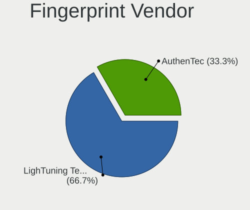

| Vendor                | Desktops | Percent |
|-----------------------|----------|---------|
| LighTuning Technology | 2        | 66.67%  |
| AuthenTec             | 1        | 33.33%  |

Fingerprint Model
-----------------

Fingerprint sensor models

| Model                                     | Desktops | Percent |
|-------------------------------------------|----------|---------|
| LighTuning ES603 Swipe Fingerprint Sensor | 2        | 66.67%  |
| AuthenTec AES3500 TruePrint Sensor        | 1        | 33.33%  |

Chipcard Vendor
---------------

Chipcard module vendors

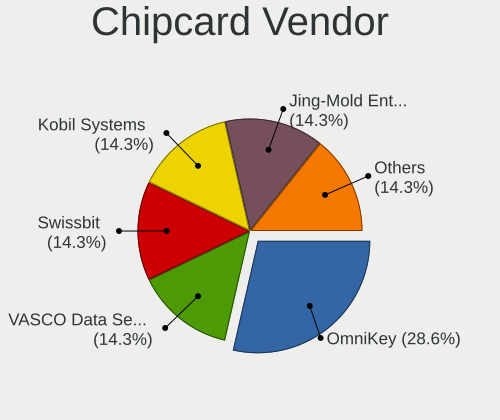

| Vendor                            | Desktops | Percent |
|-----------------------------------|----------|---------|
| OmniKey                           | 2        | 28.57%  |
| VASCO Data Security International | 1        | 14.29%  |
| Swissbit                          | 1        | 14.29%  |
| Kobil Systems                     | 1        | 14.29%  |
| Jing-Mold Enterprise              | 1        | 14.29%  |
| Alcor Micro                       | 1        | 14.29%  |

Chipcard Model
--------------

Chipcard module models

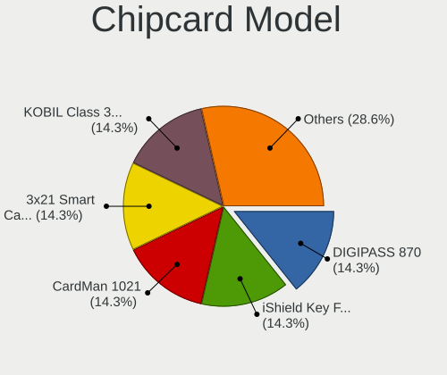

| Model                                                             | Desktops | Percent |
|-------------------------------------------------------------------|----------|---------|
| VASCO Data Security International DIGIPASS 870                    | 1        | 14.29%  |
| Swissbit iShield Key FIDO2                                        | 1        | 14.29%  |
| OmniKey CardMan 1021                                              | 1        | 14.29%  |
| OmniKey 3x21 Smart Card Reader                                    | 1        | 14.29%  |
| Kobil Systems KOBIL Class 3 Reader                                | 1        | 14.29%  |
| Jing-Mold Enterprise HP USB Business Slim Smartcard CCID Keyboard | 1        | 14.29%  |
| Alcor Micro AU9540 Smartcard Reader                               | 1        | 14.29%  |

Unsupported
-----------

Unsupported Devices
-------------------

Total unsupported devices on board

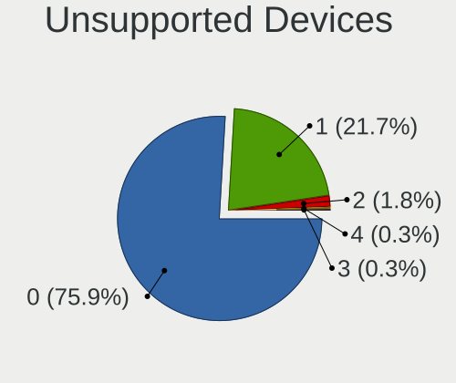

| Total | Desktops | Percent |
|-------|----------|---------|
| 0     | 511      | 75.93%  |
| 1     | 146      | 21.69%  |
| 2     | 12       | 1.78%   |
| 4     | 2        | 0.3%    |
| 3     | 2        | 0.3%    |

Unsupported Device Types
------------------------

Types of unsupported devices

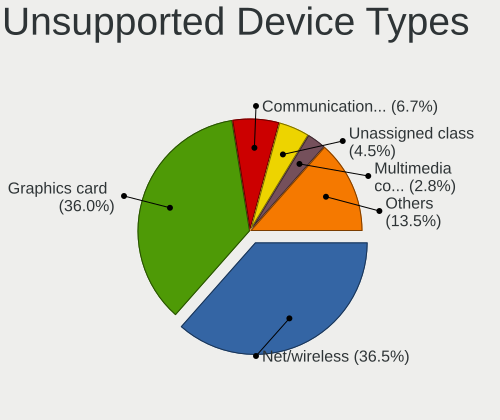

| Type                     | Desktops | Percent |
|--------------------------|----------|---------|
| Net/wireless             | 65       | 36.52%  |
| Graphics card            | 64       | 35.96%  |
| Communication controller | 12       | 6.74%   |
| Unassigned class         | 8        | 4.49%   |
| Multimedia controller    | 5        | 2.81%   |
| Chipcard                 | 4        | 2.25%   |
| Network                  | 3        | 1.69%   |
| Fingerprint reader       | 3        | 1.69%   |
| Card reader              | 3        | 1.69%   |
| Sound                    | 2        | 1.12%   |
| Net/ethernet             | 2        | 1.12%   |
| Modem                    | 2        | 1.12%   |
| Camera                   | 2        | 1.12%   |
| Storage/raid             | 1        | 0.56%   |
| Storage/ide              | 1        | 0.56%   |
| Dvb card                 | 1        | 0.56%   |

