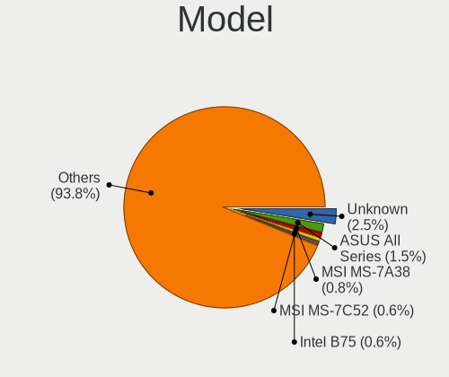
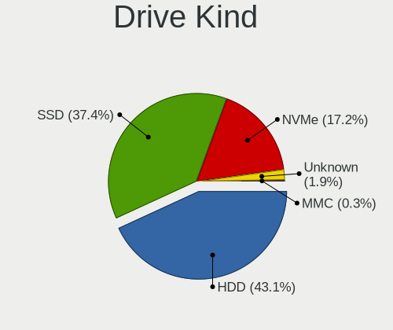
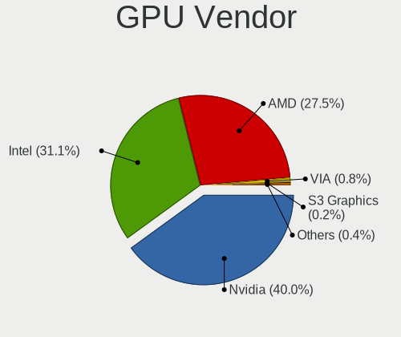
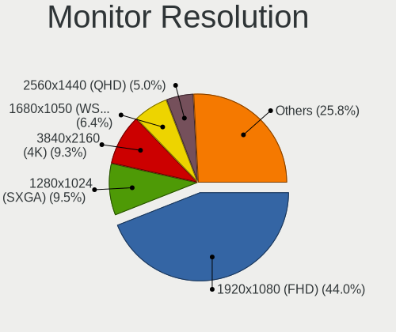
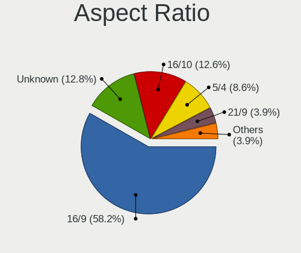
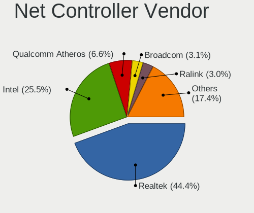
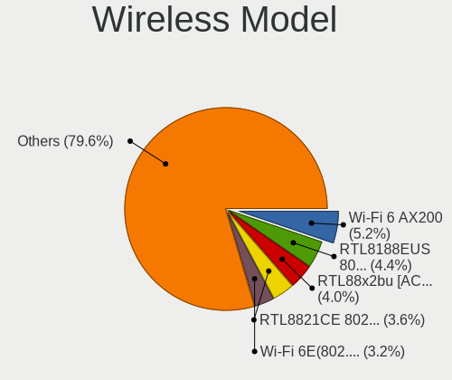
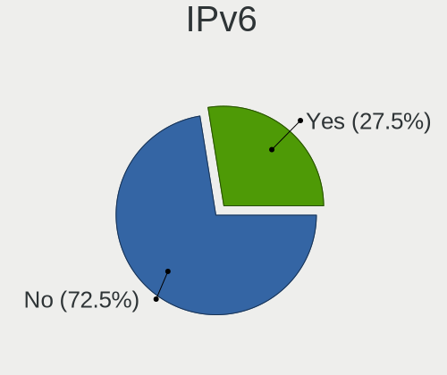
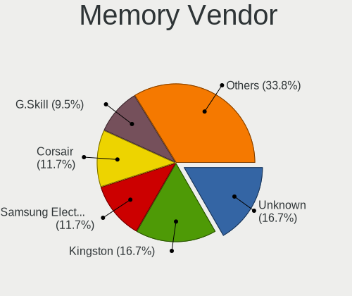
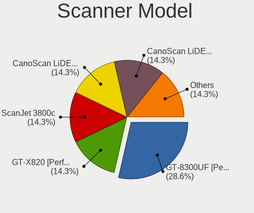

LMDE - Tested Hardware & Statistics (Desktops)
----------------------------------------------

A project to collect tested hardware configurations for LMDE.

Anyone can contribute to this report by the [hw-probe](https://github.com/linuxhw/hw-probe) tool:

    sudo -E hw-probe -all -upload

Please contribute! Especially if your hardware is rare.

Contents
--------

* [ Test Cases ](#test-cases)

* [ System ](#system)
  - [ OS                       ](#os)
  - [ OS Family                ](#os-family)
  - [ Kernel                   ](#kernel)
  - [ Kernel Family            ](#kernel-family)
  - [ Kernel Major Ver.        ](#kernel-major-ver)
  - [ Arch                     ](#arch)
  - [ DE                       ](#de)
  - [ Display Server           ](#display-server)
  - [ Display Manager          ](#display-manager)
  - [ OS Lang                  ](#os-lang)
  - [ Boot Mode                ](#boot-mode)
  - [ Filesystem               ](#filesystem)
  - [ Part. scheme             ](#part-scheme)
  - [ Dual Boot with Linux/BSD ](#dual-boot-with-linuxbsd)
  - [ Dual Boot (Win)          ](#dual-boot-win)

* [ Board ](#board)
  - [ Vendor                   ](#vendor)
  - [ Model                    ](#model)
  - [ Model Family             ](#model-family)
  - [ MFG Year                 ](#mfg-year)
  - [ Form Factor              ](#form-factor)
  - [ Secure Boot              ](#secure-boot)
  - [ Coreboot                 ](#coreboot)
  - [ RAM Size                 ](#ram-size)
  - [ RAM Used                 ](#ram-used)
  - [ Total Drives             ](#total-drives)
  - [ Has CD-ROM               ](#has-cd-rom)
  - [ Has Ethernet             ](#has-ethernet)
  - [ Has WiFi                 ](#has-wifi)
  - [ Has Bluetooth            ](#has-bluetooth)

* [ Location ](#location)
  - [ Country                  ](#country)
  - [ City                     ](#city)

* [ Drives ](#drives)
  - [ Drive Vendor             ](#drive-vendor)
  - [ Drive Model              ](#drive-model)
  - [ HDD Vendor               ](#hdd-vendor)
  - [ SSD Vendor               ](#ssd-vendor)
  - [ Drive Kind               ](#drive-kind)
  - [ Drive Connector          ](#drive-connector)
  - [ Drive Size               ](#drive-size)
  - [ Space Total              ](#space-total)
  - [ Space Used               ](#space-used)
  - [ Malfunc. Drives          ](#malfunc-drives)
  - [ Malfunc. Drive Vendor    ](#malfunc-drive-vendor)
  - [ Malfunc. HDD Vendor      ](#malfunc-hdd-vendor)
  - [ Malfunc. Drive Kind      ](#malfunc-drive-kind)
  - [ Failed Drives            ](#failed-drives)
  - [ Failed Drive Vendor      ](#failed-drive-vendor)
  - [ Drive Status             ](#drive-status)

* [ Storage controller ](#storage-controller)
  - [ Storage Vendor           ](#storage-vendor)
  - [ Storage Model            ](#storage-model)
  - [ Storage Kind             ](#storage-kind)

* [ Processor ](#processor)
  - [ CPU Vendor               ](#cpu-vendor)
  - [ CPU Model                ](#cpu-model)
  - [ CPU Model Family         ](#cpu-model-family)
  - [ CPU Cores                ](#cpu-cores)
  - [ CPU Sockets              ](#cpu-sockets)
  - [ CPU Threads              ](#cpu-threads)
  - [ CPU Op-Modes             ](#cpu-op-modes)
  - [ CPU Microcode            ](#cpu-microcode)
  - [ CPU Microarch            ](#cpu-microarch)

* [ Graphics ](#graphics)
  - [ GPU Vendor               ](#gpu-vendor)
  - [ GPU Model                ](#gpu-model)
  - [ GPU Combo                ](#gpu-combo)
  - [ GPU Driver               ](#gpu-driver)
  - [ GPU Memory               ](#gpu-memory)

* [ Monitor ](#monitor)
  - [ Monitor Vendor           ](#monitor-vendor)
  - [ Monitor Model            ](#monitor-model)
  - [ Monitor Resolution       ](#monitor-resolution)
  - [ Monitor Diagonal         ](#monitor-diagonal)
  - [ Monitor Width            ](#monitor-width)
  - [ Aspect Ratio             ](#aspect-ratio)
  - [ Monitor Area             ](#monitor-area)
  - [ Pixel Density            ](#pixel-density)
  - [ Multiple Monitors        ](#multiple-monitors)

* [ Network ](#network)
  - [ Net Controller Vendor    ](#net-controller-vendor)
  - [ Net Controller Model     ](#net-controller-model)
  - [ Wireless Vendor          ](#wireless-vendor)
  - [ Wireless Model           ](#wireless-model)
  - [ Ethernet Vendor          ](#ethernet-vendor)
  - [ Ethernet Model           ](#ethernet-model)
  - [ Net Controller Kind      ](#net-controller-kind)
  - [ Used Controller          ](#used-controller)
  - [ NICs                     ](#nics)
  - [ IPv6                     ](#ipv6)

* [ Bluetooth ](#bluetooth)
  - [ Bluetooth Vendor         ](#bluetooth-vendor)
  - [ Bluetooth Model          ](#bluetooth-model)

* [ Sound ](#sound)
  - [ Sound Vendor             ](#sound-vendor)
  - [ Sound Model              ](#sound-model)

* [ Memory ](#memory)
  - [ Memory Vendor            ](#memory-vendor)
  - [ Memory Model             ](#memory-model)
  - [ Memory Kind              ](#memory-kind)
  - [ Memory Form Factor       ](#memory-form-factor)
  - [ Memory Size              ](#memory-size)
  - [ Memory Speed             ](#memory-speed)

* [ Printers & scanners ](#printers--scanners)
  - [ Printer Vendor           ](#printer-vendor)
  - [ Printer Model            ](#printer-model)
  - [ Scanner Vendor           ](#scanner-vendor)
  - [ Scanner Model            ](#scanner-model)

* [ Camera ](#camera)
  - [ Camera Vendor            ](#camera-vendor)
  - [ Camera Model             ](#camera-model)

* [ Security ](#security)
  - [ Fingerprint Vendor       ](#fingerprint-vendor)
  - [ Fingerprint Model        ](#fingerprint-model)
  - [ Chipcard Vendor          ](#chipcard-vendor)
  - [ Chipcard Model           ](#chipcard-model)

* [ Unsupported ](#unsupported)
  - [ Unsupported Devices      ](#unsupported-devices)
  - [ Unsupported Device Types ](#unsupported-device-types)

Test Cases
----------

Total: 327

| Vendor        | Model                       | Probe                                                      | Date         |
|---------------|-----------------------------|------------------------------------------------------------|--------------|
| HP            | 8299                        | [8f6b89bf07](https://linux-hardware.org/?probe=8f6b89bf07) | Nov 25, 2022 |
| Gigabyte      | GA-78LMT-USB3               | [1ad4dcb28a](https://linux-hardware.org/?probe=1ad4dcb28a) | Nov 22, 2022 |
| Gigabyte      | B450 I AORUS PRO WIFI-CF    | [f2a00a7bb3](https://linux-hardware.org/?probe=f2a00a7bb3) | Nov 21, 2022 |
| MSI           | MAG X570S TOMAHAWK MAX W... | [d93b2b9778](https://linux-hardware.org/?probe=d93b2b9778) | Nov 21, 2022 |
| MSI           | A320M-A PRO MAX             | [486c850cd6](https://linux-hardware.org/?probe=486c850cd6) | Nov 20, 2022 |
| Dell          | 0C27VV A01                  | [5e87654e7a](https://linux-hardware.org/?probe=5e87654e7a) | Nov 14, 2022 |
| ASUSTek       | M5A78L-M PLUS/USB3          | [95f38cc8d9](https://linux-hardware.org/?probe=95f38cc8d9) | Nov 12, 2022 |
| Dell          | 0C27VV A01                  | [9e5c4960c3](https://linux-hardware.org/?probe=9e5c4960c3) | Nov 10, 2022 |
| Dell          | 0C27VV A01                  | [a8c3b285d0](https://linux-hardware.org/?probe=a8c3b285d0) | Nov 10, 2022 |
| Dell          | 0N826N A03                  | [2126bcff1e](https://linux-hardware.org/?probe=2126bcff1e) | Nov 06, 2022 |
| MSI           | A320M-A PRO MAX             | [774861eae7](https://linux-hardware.org/?probe=774861eae7) | Oct 21, 2022 |
| HP            | 8299                        | [2b4c3924e4](https://linux-hardware.org/?probe=2b4c3924e4) | Oct 20, 2022 |
| HP            | 8299                        | [bf86078a8f](https://linux-hardware.org/?probe=bf86078a8f) | Oct 18, 2022 |
| Samsung       | DT1234567890 SEC_SW_REVI... | [19d09fb082](https://linux-hardware.org/?probe=19d09fb082) | Oct 17, 2022 |
| Samsung       | DT1234567890 SEC_SW_REVI... | [9f3307c5d0](https://linux-hardware.org/?probe=9f3307c5d0) | Oct 17, 2022 |
| Dell          | 0D735T A00                  | [20d0bc0836](https://linux-hardware.org/?probe=20d0bc0836) | Oct 12, 2022 |
| MSI           | B550-A PRO                  | [0526dffee9](https://linux-hardware.org/?probe=0526dffee9) | Oct 11, 2022 |
| AZW           | MINI S                      | [c5be5052a0](https://linux-hardware.org/?probe=c5be5052a0) | Oct 09, 2022 |
| ASUSTek       | Maximus VI HERO             | [2ee3173d51](https://linux-hardware.org/?probe=2ee3173d51) | Oct 08, 2022 |
| MSI           | B550-A PRO                  | [de85238b42](https://linux-hardware.org/?probe=de85238b42) | Oct 05, 2022 |
| ASRock        | A320M-HDV R4.0              | [b340ade9c9](https://linux-hardware.org/?probe=b340ade9c9) | Oct 05, 2022 |
| ASUSTek       | ROG CROSSHAIR VIII HERO     | [bc6ad9af3e](https://linux-hardware.org/?probe=bc6ad9af3e) | Oct 03, 2022 |
| Fujitsu       | D3062-A1 S26361-D3062-A1    | [3915f19817](https://linux-hardware.org/?probe=3915f19817) | Oct 03, 2022 |
| Acer          | Aspire XC-1660G V:1.1       | [f7f5368662](https://linux-hardware.org/?probe=f7f5368662) | Sep 28, 2022 |
| Acer          | Aspire XC-1660G V:1.1       | [fb983c65ac](https://linux-hardware.org/?probe=fb983c65ac) | Sep 28, 2022 |
| Dell          | 082WXT A01                  | [7b1ea76e92](https://linux-hardware.org/?probe=7b1ea76e92) | Sep 26, 2022 |
| Dell          | 082WXT A01                  | [7c4445ad04](https://linux-hardware.org/?probe=7c4445ad04) | Sep 26, 2022 |
| Gateway       | DX4870                      | [fd5b76e786](https://linux-hardware.org/?probe=fd5b76e786) | Sep 22, 2022 |
| Digiboard     | NM70-TI                     | [84e21c8253](https://linux-hardware.org/?probe=84e21c8253) | Sep 21, 2022 |
| Dell          | 0XC837                      | [94ad27e346](https://linux-hardware.org/?probe=94ad27e346) | Sep 19, 2022 |
| MSI           | B360M MORTAR                | [cdcff8c15d](https://linux-hardware.org/?probe=cdcff8c15d) | Sep 18, 2022 |
| ASUSTek       | PRIME H610M-E D4            | [b8f2004ea5](https://linux-hardware.org/?probe=b8f2004ea5) | Sep 10, 2022 |
| ASRock        | G41M-S3                     | [2cdcaebd43](https://linux-hardware.org/?probe=2cdcaebd43) | Sep 10, 2022 |
| Dell          | 0FJ030                      | [bf789b5c5f](https://linux-hardware.org/?probe=bf789b5c5f) | Sep 10, 2022 |
| MSI           | B450I GAMING PLUS AC        | [acbb191061](https://linux-hardware.org/?probe=acbb191061) | Sep 09, 2022 |
| Pegatron      | 2A9Eh                       | [2c7b59f70b](https://linux-hardware.org/?probe=2c7b59f70b) | Sep 08, 2022 |
| ASUSTek       | P8H77-V                     | [c92f578a36](https://linux-hardware.org/?probe=c92f578a36) | Sep 07, 2022 |
| ASUSTek       | ROG CROSSHAIR VIII HERO     | [9842cac1de](https://linux-hardware.org/?probe=9842cac1de) | Sep 04, 2022 |
| eMachines     | EL1352G                     | [2547a277f7](https://linux-hardware.org/?probe=2547a277f7) | Sep 04, 2022 |
| ASUSTek       | P5K-E                       | [632cd1e47d](https://linux-hardware.org/?probe=632cd1e47d) | Sep 03, 2022 |
| Dell          | 042P49 A00                  | [31efc1e75f](https://linux-hardware.org/?probe=31efc1e75f) | Sep 01, 2022 |
| ASUSTek       | P5QPL-AM                    | [38e6481a65](https://linux-hardware.org/?probe=38e6481a65) | Aug 30, 2022 |
| Gigabyte      | B450M DS3H-CF               | [afde42fb41](https://linux-hardware.org/?probe=afde42fb41) | Aug 28, 2022 |
| Gigabyte      | B450M DS3H-CF               | [6c1db95864](https://linux-hardware.org/?probe=6c1db95864) | Aug 28, 2022 |
| MSI           | Z170A GAMING PRO            | [f86bc78c33](https://linux-hardware.org/?probe=f86bc78c33) | Aug 27, 2022 |
| MSI           | B85I                        | [454972a062](https://linux-hardware.org/?probe=454972a062) | Aug 19, 2022 |
| Gigabyte      | H97-Gaming 3                | [2d464fc182](https://linux-hardware.org/?probe=2d464fc182) | Aug 10, 2022 |
| Gigabyte      | B85M-DS3H-A                 | [527a0607d8](https://linux-hardware.org/?probe=527a0607d8) | Aug 08, 2022 |
| ASRock        | H61M-DGS                    | [683cd6273f](https://linux-hardware.org/?probe=683cd6273f) | Jul 30, 2022 |
| Gigabyte      | B450 AORUS M                | [fdaa3bac93](https://linux-hardware.org/?probe=fdaa3bac93) | Jul 20, 2022 |
| HP            | 8433 11                     | [85ecad964d](https://linux-hardware.org/?probe=85ecad964d) | Jul 17, 2022 |
| HP            | 8433 11                     | [7f6ec63dc8](https://linux-hardware.org/?probe=7f6ec63dc8) | Jul 17, 2022 |
| ASUSTek       | BM6820_BM6620_BP6320-8      | [8d8c845646](https://linux-hardware.org/?probe=8d8c845646) | Jul 17, 2022 |
| ASUSTek       | P5B                         | [149ab02b84](https://linux-hardware.org/?probe=149ab02b84) | Jul 06, 2022 |
| Gigabyte      | B450 AORUS M                | [12e48a7c0a](https://linux-hardware.org/?probe=12e48a7c0a) | Jul 06, 2022 |
| ASUSTek       | P8H77-M PRO                 | [efc2332724](https://linux-hardware.org/?probe=efc2332724) | Jul 02, 2022 |
| Dell          | 0XR1GT A00                  | [0d72ab6a71](https://linux-hardware.org/?probe=0d72ab6a71) | Jun 24, 2022 |
| Lenovo        | 3731 NOK                    | [efd1e69f79](https://linux-hardware.org/?probe=efd1e69f79) | Jun 09, 2022 |
| Lenovo        | 3731 NOK                    | [1da6b9f6c0](https://linux-hardware.org/?probe=1da6b9f6c0) | Jun 09, 2022 |
| Dell          | 0XR1GT A00                  | [8c3fd28612](https://linux-hardware.org/?probe=8c3fd28612) | Jun 08, 2022 |
| MSI           | MPG Z390 GAMING PRO CARB... | [6f8785bd56](https://linux-hardware.org/?probe=6f8785bd56) | May 30, 2022 |
| Lenovo        | MAHOBAY                     | [ba204646ba](https://linux-hardware.org/?probe=ba204646ba) | May 25, 2022 |
| Acer          | Seawolf                     | [dccbcb7ef3](https://linux-hardware.org/?probe=dccbcb7ef3) | May 25, 2022 |
| Intel         | DQ77MK AAG39642-400         | [f694bcfbc5](https://linux-hardware.org/?probe=f694bcfbc5) | May 21, 2022 |
| MSI           | X470 GAMING PLUS MAX        | [63950495b3](https://linux-hardware.org/?probe=63950495b3) | May 15, 2022 |
| MSI           | 970A-G43 PLUS               | [399deea7b9](https://linux-hardware.org/?probe=399deea7b9) | May 15, 2022 |
| ASUSTek       | P5QL PRO                    | [9ea782b1d2](https://linux-hardware.org/?probe=9ea782b1d2) | May 08, 2022 |
| Gigabyte      | Z68A-D3H-B3                 | [1441dfb79e](https://linux-hardware.org/?probe=1441dfb79e) | May 07, 2022 |
| HP            | 158B                        | [a613debdee](https://linux-hardware.org/?probe=a613debdee) | May 06, 2022 |
| HP            | 158B                        | [21f9c188f3](https://linux-hardware.org/?probe=21f9c188f3) | May 06, 2022 |
| HP            | 339A                        | [d58b95ebb1](https://linux-hardware.org/?probe=d58b95ebb1) | May 05, 2022 |
| Gigabyte      | H110M-S2H-CF                | [c45a37ce5d](https://linux-hardware.org/?probe=c45a37ce5d) | May 01, 2022 |
| ASUSTek       | PRIME H610M-A D4            | [e9376d24f0](https://linux-hardware.org/?probe=e9376d24f0) | Apr 29, 2022 |
| Dell          | 0XR1GT A00                  | [2a3b9ad6cf](https://linux-hardware.org/?probe=2a3b9ad6cf) | Apr 24, 2022 |
| ASRock        | A320M-DGS                   | [b7df060840](https://linux-hardware.org/?probe=b7df060840) | Apr 19, 2022 |
| ASRock        | A320M-DGS                   | [70fe08376f](https://linux-hardware.org/?probe=70fe08376f) | Apr 19, 2022 |
| Dell          | 0CU568 A00                  | [b544c48421](https://linux-hardware.org/?probe=b544c48421) | Apr 19, 2022 |
| Dell          | 0CU568 A00                  | [84f7029c22](https://linux-hardware.org/?probe=84f7029c22) | Apr 19, 2022 |
| Foxconn       | Cinema Series FAB           | [1e32228753](https://linux-hardware.org/?probe=1e32228753) | Apr 13, 2022 |
| ASUSTek       | PRIME B350M-A               | [ed40a9ddc1](https://linux-hardware.org/?probe=ed40a9ddc1) | Apr 12, 2022 |
| ASUSTek       | PRIME B350M-A               | [9a137f0540](https://linux-hardware.org/?probe=9a137f0540) | Apr 12, 2022 |
| MSI           | Z170A GAMING M5             | [8f2e10cbf3](https://linux-hardware.org/?probe=8f2e10cbf3) | Apr 12, 2022 |
| Lenovo        | 312A SDK0J40697 WIN 3305... | [2a33f087e6](https://linux-hardware.org/?probe=2a33f087e6) | Apr 11, 2022 |
| Lenovo        | 312A SDK0J40697 WIN 3305... | [05b9ec80c6](https://linux-hardware.org/?probe=05b9ec80c6) | Apr 11, 2022 |
| Lenovo        | 102F SDK0J40705 WIN 3425... | [eb751efc1f](https://linux-hardware.org/?probe=eb751efc1f) | Apr 09, 2022 |
| Acer          | WG43M                       | [c7cb6ee141](https://linux-hardware.org/?probe=c7cb6ee141) | Apr 08, 2022 |
| ASUSTek       | P5G41T-M LX3                | [28371c08c2](https://linux-hardware.org/?probe=28371c08c2) | Apr 08, 2022 |
| MSI           | X470 GAMING PLUS MAX        | [9f1a76acb8](https://linux-hardware.org/?probe=9f1a76acb8) | Apr 06, 2022 |
| MSI           | X470 GAMING PLUS MAX        | [18a4ba3137](https://linux-hardware.org/?probe=18a4ba3137) | Apr 06, 2022 |
| ASUSTek       | P6T                         | [5ed6ed355f](https://linux-hardware.org/?probe=5ed6ed355f) | Apr 04, 2022 |
| Acer          | EG43M                       | [28b4dd5236](https://linux-hardware.org/?probe=28b4dd5236) | Mar 31, 2022 |
| ASUSTek       | PRIME H510M-D               | [1e0a28c8f3](https://linux-hardware.org/?probe=1e0a28c8f3) | Mar 28, 2022 |
| Gigabyte      | X570 AORUS MASTER           | [346857be22](https://linux-hardware.org/?probe=346857be22) | Mar 24, 2022 |
| ASUSTek       | P4P800                      | [0cb6a89491](https://linux-hardware.org/?probe=0cb6a89491) | Mar 19, 2022 |
| HP            | 0AA8h                       | [b3507722e3](https://linux-hardware.org/?probe=b3507722e3) | Mar 19, 2022 |
| HP            | 0AE8h C                     | [d3980b5b59](https://linux-hardware.org/?probe=d3980b5b59) | Mar 14, 2022 |
| Dell          | 0HR330                      | [3533cd70af](https://linux-hardware.org/?probe=3533cd70af) | Feb 26, 2022 |
| Dell          | 0HR330                      | [e587783731](https://linux-hardware.org/?probe=e587783731) | Feb 26, 2022 |
| HP            | 0AA8h                       | [21de71cf71](https://linux-hardware.org/?probe=21de71cf71) | Feb 25, 2022 |
| Gigabyte      | Z77-D3H                     | [a0d52488b2](https://linux-hardware.org/?probe=a0d52488b2) | Feb 22, 2022 |
| Gigabyte      | B550 AORUS ELITE AX V2      | [0731118682](https://linux-hardware.org/?probe=0731118682) | Feb 15, 2022 |
| Gigabyte      | B550 AORUS ELITE AX V2      | [5026ea812a](https://linux-hardware.org/?probe=5026ea812a) | Feb 15, 2022 |
| Dell          | 0Y2K8N A01                  | [e3922aecf0](https://linux-hardware.org/?probe=e3922aecf0) | Feb 04, 2022 |
| EVGA          | 131-HE-E095                 | [6d45d47131](https://linux-hardware.org/?probe=6d45d47131) | Jan 31, 2022 |
| ASUSTek       | A68HM-K                     | [00cd805015](https://linux-hardware.org/?probe=00cd805015) | Jan 23, 2022 |
| MSI           | Z97 PC Mate                 | [be068c5a3a](https://linux-hardware.org/?probe=be068c5a3a) | Jan 21, 2022 |
| Dell          | 0XR1GT A00                  | [a988797ac9](https://linux-hardware.org/?probe=a988797ac9) | Jan 16, 2022 |
| eMachines     | EMCP73VT-PM                 | [1d55cceee4](https://linux-hardware.org/?probe=1d55cceee4) | Jan 09, 2022 |
| ASUSTek       | Z97-K                       | [43b421ad06](https://linux-hardware.org/?probe=43b421ad06) | Jan 08, 2022 |
| ASRock        | N68-S3 UCC                  | [bfcf287c09](https://linux-hardware.org/?probe=bfcf287c09) | Jan 08, 2022 |
| OEM           | Unknown                     | [6adc4b5659](https://linux-hardware.org/?probe=6adc4b5659) | Jan 01, 2022 |
| Unknown       | K7VM2                       | [06f13210ad](https://linux-hardware.org/?probe=06f13210ad) | Dec 29, 2021 |
| Unknown       | K7VM2                       | [be785b672c](https://linux-hardware.org/?probe=be785b672c) | Dec 29, 2021 |
| HP            | 2AE3                        | [fb02077f16](https://linux-hardware.org/?probe=fb02077f16) | Dec 14, 2021 |
| HP            | 2AE3                        | [18efa559b9](https://linux-hardware.org/?probe=18efa559b9) | Dec 14, 2021 |
| ECS           | G41T-M7                     | [5a8641a9aa](https://linux-hardware.org/?probe=5a8641a9aa) | Dec 13, 2021 |
| Acer          | RS880M05                    | [2ce9c25975](https://linux-hardware.org/?probe=2ce9c25975) | Nov 25, 2021 |
| NEC Comput... | GA-8I945PM                  | [3d3711b8cc](https://linux-hardware.org/?probe=3d3711b8cc) | Nov 22, 2021 |
| ASUSTek       | A68HM-K                     | [b4b709eb1b](https://linux-hardware.org/?probe=b4b709eb1b) | Nov 18, 2021 |
| ASUSTek       | A68HM-K                     | [18236d5a16](https://linux-hardware.org/?probe=18236d5a16) | Nov 18, 2021 |
| Intel         | H61                         | [51f383b050](https://linux-hardware.org/?probe=51f383b050) | Nov 04, 2021 |
| HP            | 843C                        | [e7df8fecdd](https://linux-hardware.org/?probe=e7df8fecdd) | Oct 30, 2021 |
| ASUSTek       | P7F-M                       | [f0983027ee](https://linux-hardware.org/?probe=f0983027ee) | Oct 26, 2021 |
| EVGA          | 132-BL-E758 Tylersburg      | [48187accde](https://linux-hardware.org/?probe=48187accde) | Oct 21, 2021 |
| ASUSTek       | Z97-K                       | [f1fcb9d1db](https://linux-hardware.org/?probe=f1fcb9d1db) | Oct 17, 2021 |
| EVGA          | 132-BL-E758 Tylersburg      | [a1820d8f0c](https://linux-hardware.org/?probe=a1820d8f0c) | Oct 17, 2021 |
| Gigabyte      | H61M-D2-B3                  | [138df954cb](https://linux-hardware.org/?probe=138df954cb) | Oct 15, 2021 |
| Gigabyte      | H61M-D2-B3                  | [dabe5d459a](https://linux-hardware.org/?probe=dabe5d459a) | Oct 15, 2021 |
| ASUSTek       | Z97-K                       | [940a27249a](https://linux-hardware.org/?probe=940a27249a) | Oct 12, 2021 |
| ASUSTek       | Z97-K                       | [012056e32d](https://linux-hardware.org/?probe=012056e32d) | Sep 28, 2021 |
| Biostar       | G41D3C                      | [16eb676e0c](https://linux-hardware.org/?probe=16eb676e0c) | Sep 25, 2021 |
| ASUSTek       | P5KPL-AM EPU                | [9c0ade7c9c](https://linux-hardware.org/?probe=9c0ade7c9c) | Sep 20, 2021 |
| ASUSTek       | P5VD2-VM                    | [9eec34a3f2](https://linux-hardware.org/?probe=9eec34a3f2) | Sep 13, 2021 |
| Foxconn       | 945 7MC Series              | [623cb095f2](https://linux-hardware.org/?probe=623cb095f2) | Sep 12, 2021 |
| Pegatron      | 2AB5                        | [3c335b37fa](https://linux-hardware.org/?probe=3c335b37fa) | Sep 10, 2021 |
| ASUSTek       | UN62                        | [0702f80222](https://linux-hardware.org/?probe=0702f80222) | Sep 09, 2021 |
| ASUSTek       | P5VD2-VM                    | [305d566f57](https://linux-hardware.org/?probe=305d566f57) | Sep 07, 2021 |
| Gigabyte      | H61M-S1                     | [d1773b3e3d](https://linux-hardware.org/?probe=d1773b3e3d) | Sep 06, 2021 |
| Gigabyte      | H61M-S1                     | [5d2cc7f4ca](https://linux-hardware.org/?probe=5d2cc7f4ca) | Sep 06, 2021 |
| Intel         | DG31PR AAD97573-302         | [7122e4bd16](https://linux-hardware.org/?probe=7122e4bd16) | Sep 04, 2021 |
| Gigabyte      | M52LT-D3P                   | [09cbb5b50e](https://linux-hardware.org/?probe=09cbb5b50e) | Sep 03, 2021 |
| Gigabyte      | M52LT-D3P                   | [949b2062ea](https://linux-hardware.org/?probe=949b2062ea) | Sep 03, 2021 |
| ASRock        | G41M-S3                     | [c34caa75e2](https://linux-hardware.org/?probe=c34caa75e2) | Aug 23, 2021 |
| MSI           | MS-7142                     | [2700c74bd9](https://linux-hardware.org/?probe=2700c74bd9) | Aug 21, 2021 |
| MSI           | MS-7142                     | [18ae0c1bb3](https://linux-hardware.org/?probe=18ae0c1bb3) | Aug 21, 2021 |
| HP            | 0AA8h                       | [d9a8fd3722](https://linux-hardware.org/?probe=d9a8fd3722) | Aug 15, 2021 |
| ASUSTek       | A7N8X-LA                    | [0e9fd81caf](https://linux-hardware.org/?probe=0e9fd81caf) | Aug 11, 2021 |
| ASUSTek       | A7N8X-LA                    | [f14c99bbce](https://linux-hardware.org/?probe=f14c99bbce) | Aug 11, 2021 |
| Gigabyte      | X570 AORUS ULTRA            | [b937ce5e88](https://linux-hardware.org/?probe=b937ce5e88) | Aug 10, 2021 |
| ASUSTek       | P7F-M                       | [cff87306ab](https://linux-hardware.org/?probe=cff87306ab) | Aug 07, 2021 |
| Fujitsu Si... | D2264-A1 S26361-D2264-A1    | [a1768aa578](https://linux-hardware.org/?probe=a1768aa578) | Aug 06, 2021 |
| Fujitsu Si... | D2264-A1 S26361-D2264-A1    | [52aa712b0c](https://linux-hardware.org/?probe=52aa712b0c) | Aug 05, 2021 |
| ASUSTek       | PRIME Z370-A                | [05c1703574](https://linux-hardware.org/?probe=05c1703574) | Aug 03, 2021 |
| ASUSTek       | PRIME Z370-A                | [faf304d157](https://linux-hardware.org/?probe=faf304d157) | Aug 02, 2021 |
| OEM           | 45CMX/45GMX/45CMX-K         | [65d8eb687e](https://linux-hardware.org/?probe=65d8eb687e) | Jul 30, 2021 |
| ASUSTek       | P7F-M                       | [33a6186148](https://linux-hardware.org/?probe=33a6186148) | Jul 30, 2021 |
| Intel         | BTC-T37                     | [bb5051b598](https://linux-hardware.org/?probe=bb5051b598) | Jul 27, 2021 |
| ASRock        | FM2A85X Extreme4-M          | [aa0030f094](https://linux-hardware.org/?probe=aa0030f094) | Jul 26, 2021 |
| Gigabyte      | Z390 M GAMING-CF            | [763cb39ac0](https://linux-hardware.org/?probe=763cb39ac0) | Jul 25, 2021 |
| Gigabyte      | X570 AORUS PRO              | [932c4de6ce](https://linux-hardware.org/?probe=932c4de6ce) | Jul 18, 2021 |
| ASUSTek       | PRIME A320M-K 2021-06-11    | [39037104b7](https://linux-hardware.org/?probe=39037104b7) | Jul 17, 2021 |
| Dell          | 08HPGT A01                  | [64d562d6ef](https://linux-hardware.org/?probe=64d562d6ef) | Jul 16, 2021 |
| ASUSTek       | PRIME A320M-K 2021-06-11    | [a82245240b](https://linux-hardware.org/?probe=a82245240b) | Jul 15, 2021 |
| ASUSTek       | P7F-M                       | [3007b813c6](https://linux-hardware.org/?probe=3007b813c6) | Jul 13, 2021 |
| ASUSTek       | P7F-M                       | [5cfa1dcb4f](https://linux-hardware.org/?probe=5cfa1dcb4f) | Jul 12, 2021 |
| MSI           | H81M-E34                    | [14c2f8a49d](https://linux-hardware.org/?probe=14c2f8a49d) | Jul 05, 2021 |
| MSI           | A320M-A PRO                 | [9d356e787a](https://linux-hardware.org/?probe=9d356e787a) | Jul 01, 2021 |
| HP            | 0A98h                       | [40990f73a5](https://linux-hardware.org/?probe=40990f73a5) | Jun 22, 2021 |
| HP            | 0AA8h                       | [43103b39a5](https://linux-hardware.org/?probe=43103b39a5) | Jun 17, 2021 |
| HP            | 0AA8h                       | [9154911bc9](https://linux-hardware.org/?probe=9154911bc9) | Jun 13, 2021 |
| ASUSTek       | Maximus VI HERO             | [699d10613e](https://linux-hardware.org/?probe=699d10613e) | Jun 11, 2021 |
| Unknown       | Unknown                     | [3e408e9ead](https://linux-hardware.org/?probe=3e408e9ead) | May 31, 2021 |
| Unknown       | Unknown                     | [39b2780acf](https://linux-hardware.org/?probe=39b2780acf) | May 31, 2021 |
| Dell          | 0HY9JP A01                  | [3f6ddbd81d](https://linux-hardware.org/?probe=3f6ddbd81d) | May 30, 2021 |
| ASUSTek       | H61M-A/BR                   | [7d2b37e6e1](https://linux-hardware.org/?probe=7d2b37e6e1) | May 29, 2021 |
| ASRock        | G41M-S3                     | [adc801308b](https://linux-hardware.org/?probe=adc801308b) | May 29, 2021 |
| MSI           | B450I GAMING PLUS AC        | [d03d2796a0](https://linux-hardware.org/?probe=d03d2796a0) | May 29, 2021 |
| MSI           | B450I GAMING PLUS AC        | [200072e2a7](https://linux-hardware.org/?probe=200072e2a7) | May 29, 2021 |
| ASRock        | G41M-S3                     | [47f6c3e962](https://linux-hardware.org/?probe=47f6c3e962) | May 28, 2021 |
| MSI           | Gamila/Giovani/Neon seri... | [cd3697bd15](https://linux-hardware.org/?probe=cd3697bd15) | May 25, 2021 |
| MSI           | Gamila/Giovani/Neon seri... | [7c520b0d6e](https://linux-hardware.org/?probe=7c520b0d6e) | May 25, 2021 |
| Gigabyte      | GA-78LMT-USB3               | [55d981b2ed](https://linux-hardware.org/?probe=55d981b2ed) | May 23, 2021 |
| Intel         | H61                         | [1954634de4](https://linux-hardware.org/?probe=1954634de4) | May 22, 2021 |
| Foxconn       | 945 7MC Series              | [f4634ec470](https://linux-hardware.org/?probe=f4634ec470) | May 17, 2021 |
| Dell          | 0FM586 A00                  | [8a955d2c5a](https://linux-hardware.org/?probe=8a955d2c5a) | May 16, 2021 |
| ASUSTek       | B150M-A                     | [ecc85d30a9](https://linux-hardware.org/?probe=ecc85d30a9) | May 13, 2021 |
| Dell          | 0XR1GT A00                  | [a502e8842e](https://linux-hardware.org/?probe=a502e8842e) | May 12, 2021 |
| ASUSTek       | V-P7H55E                    | [3c0a297ede](https://linux-hardware.org/?probe=3c0a297ede) | May 08, 2021 |
| ASUSTek       | Crosshair V Formula         | [0fd87c485e](https://linux-hardware.org/?probe=0fd87c485e) | May 07, 2021 |
| ASUSTek       | P5KC                        | [80549acbba](https://linux-hardware.org/?probe=80549acbba) | May 03, 2021 |
| ASUSTek       | P5KC                        | [f2313ee72b](https://linux-hardware.org/?probe=f2313ee72b) | May 03, 2021 |
| ASUSTek       | P5KPL-AM SE                 | [2cd9e43be0](https://linux-hardware.org/?probe=2cd9e43be0) | Apr 27, 2021 |
| ASUSTek       | PRIME B350-PLUS             | [46b0bab7d8](https://linux-hardware.org/?probe=46b0bab7d8) | Apr 27, 2021 |
| Unknown       | Phitronics N68C-M           | [3076a5bae3](https://linux-hardware.org/?probe=3076a5bae3) | Apr 24, 2021 |
| Unknown       | Phitronics N68C-M           | [d3a56832d9](https://linux-hardware.org/?probe=d3a56832d9) | Apr 23, 2021 |
| ASUSTek       | PRIME B450-PLUS             | [761a9ce0e9](https://linux-hardware.org/?probe=761a9ce0e9) | Apr 21, 2021 |
| ASUSTek       | P5Q DELUXE                  | [8ab143ec6b](https://linux-hardware.org/?probe=8ab143ec6b) | Apr 20, 2021 |
| Gigabyte      | GA-78LMT-USB3               | [2813977a91](https://linux-hardware.org/?probe=2813977a91) | Apr 20, 2021 |
| ASUSTek       | PRIME B350-PLUS             | [d6c3daff43](https://linux-hardware.org/?probe=d6c3daff43) | Apr 19, 2021 |
| ASUSTek       | V-P7H55E                    | [fb3b69b074](https://linux-hardware.org/?probe=fb3b69b074) | Apr 18, 2021 |
| Gigabyte      | M68MT-S2P                   | [47deff8a39](https://linux-hardware.org/?probe=47deff8a39) | Apr 17, 2021 |
| Gigabyte      | Z97-D3H-CF                  | [16d03cb92f](https://linux-hardware.org/?probe=16d03cb92f) | Apr 12, 2021 |
| Dell          | 0KP561                      | [3579bff9c4](https://linux-hardware.org/?probe=3579bff9c4) | Apr 08, 2021 |
| DFI           | LP BI P45-T2S Elite         | [01f0babd70](https://linux-hardware.org/?probe=01f0babd70) | Apr 08, 2021 |
| ASUSTek       | PRIME Z390-P                | [055066b50a](https://linux-hardware.org/?probe=055066b50a) | Apr 08, 2021 |
| ASUSTek       | P5KC                        | [b687d3a64f](https://linux-hardware.org/?probe=b687d3a64f) | Apr 06, 2021 |
| Pegatron      | 2ADC                        | [e4bfddb8d9](https://linux-hardware.org/?probe=e4bfddb8d9) | Apr 04, 2021 |
| MSI           | MS-7267                     | [d16e8a4364](https://linux-hardware.org/?probe=d16e8a4364) | Apr 03, 2021 |
| Intel         | H61                         | [d7c3f87e52](https://linux-hardware.org/?probe=d7c3f87e52) | Mar 26, 2021 |
| Gigabyte      | Z77-D3H                     | [6ab1c423db](https://linux-hardware.org/?probe=6ab1c423db) | Mar 25, 2021 |
| MSI           | Z77A-GD65                   | [a9c3672597](https://linux-hardware.org/?probe=a9c3672597) | Mar 25, 2021 |
| ASUSTek       | M5A97 PRO                   | [3c9720e16b](https://linux-hardware.org/?probe=3c9720e16b) | Mar 18, 2021 |
| MSI           | MS-6785                     | [303c1ac636](https://linux-hardware.org/?probe=303c1ac636) | Mar 17, 2021 |
| ASUSTek       | ROG STRIX H470-I GAMING     | [f8503ecc3b](https://linux-hardware.org/?probe=f8503ecc3b) | Mar 10, 2021 |
| ECS           | A740GM-M                    | [442aa41981](https://linux-hardware.org/?probe=442aa41981) | Mar 08, 2021 |
| ASUSTek       | P7F-M                       | [a8d2e4fa56](https://linux-hardware.org/?probe=a8d2e4fa56) | Mar 07, 2021 |
| MSI           | B450M PRO-VDH MAX           | [79e6e8bbfc](https://linux-hardware.org/?probe=79e6e8bbfc) | Mar 06, 2021 |
| ASRock        | G31M-GS                     | [ea6fbcd94e](https://linux-hardware.org/?probe=ea6fbcd94e) | Mar 02, 2021 |
| Acer          | EG43LMK                     | [249967a21a](https://linux-hardware.org/?probe=249967a21a) | Feb 28, 2021 |
| ASRock        | A320M-HDV R4.0              | [527b138b70](https://linux-hardware.org/?probe=527b138b70) | Feb 22, 2021 |
| Acer          | EG43LMK                     | [1c1fdf43c0](https://linux-hardware.org/?probe=1c1fdf43c0) | Feb 17, 2021 |
| MSI           | MS-7267                     | [6bf114a22f](https://linux-hardware.org/?probe=6bf114a22f) | Feb 15, 2021 |
| MSI           | MS-7267                     | [78e4d03c89](https://linux-hardware.org/?probe=78e4d03c89) | Feb 15, 2021 |
| Intel         | DP55WB AAE64798-206         | [4b2befb0d2](https://linux-hardware.org/?probe=4b2befb0d2) | Feb 14, 2021 |
| ASUSTek       | SABERTOOTH 990FX R2.0       | [c8e67a7d41](https://linux-hardware.org/?probe=c8e67a7d41) | Feb 07, 2021 |
| Gigabyte      | H61M-DS2 DVI                | [6e605fd64d](https://linux-hardware.org/?probe=6e605fd64d) | Feb 06, 2021 |
| Gigabyte      | H61M-DS2 DVI                | [ec667e7b35](https://linux-hardware.org/?probe=ec667e7b35) | Feb 05, 2021 |
| ASUSTek       | PRIME H310M-E R2.0/BR       | [b71d20e5de](https://linux-hardware.org/?probe=b71d20e5de) | Feb 05, 2021 |
| ASUSTek       | Z97-K                       | [3adb6d9dc1](https://linux-hardware.org/?probe=3adb6d9dc1) | Feb 05, 2021 |
| ASRock        | X570 Taichi                 | [9f77a9eea6](https://linux-hardware.org/?probe=9f77a9eea6) | Feb 04, 2021 |
| ASRock        | X570 Taichi                 | [9b6ea4cda5](https://linux-hardware.org/?probe=9b6ea4cda5) | Feb 04, 2021 |
| ASRock        | H61M-HVS                    | [05c23c4247](https://linux-hardware.org/?probe=05c23c4247) | Feb 02, 2021 |
| ASRock        | H61M-HVS                    | [8c45cfc073](https://linux-hardware.org/?probe=8c45cfc073) | Feb 02, 2021 |
| ASUSTek       | P5E3 Deluxe                 | [47324765ec](https://linux-hardware.org/?probe=47324765ec) | Feb 02, 2021 |
| Unknown       | Unknown                     | [94d77e9dd0](https://linux-hardware.org/?probe=94d77e9dd0) | Feb 02, 2021 |
| ASUSTek       | P5KPL-AM EPU                | [9761a3446c](https://linux-hardware.org/?probe=9761a3446c) | Jan 30, 2021 |
| Dell          | 03NVJ6 A02                  | [9c930ede42](https://linux-hardware.org/?probe=9c930ede42) | Jan 28, 2021 |
| MSI           | B450M-A PRO MAX             | [e5bc80f882](https://linux-hardware.org/?probe=e5bc80f882) | Jan 26, 2021 |
| Dell          | 0TT708 A01                  | [d04b2d493f](https://linux-hardware.org/?probe=d04b2d493f) | Jan 20, 2021 |
| Dell          | 0TT708 A01                  | [08ac15e868](https://linux-hardware.org/?probe=08ac15e868) | Jan 15, 2021 |
| Dell          | 0TT708 A01                  | [d0da7a44f7](https://linux-hardware.org/?probe=d0da7a44f7) | Jan 14, 2021 |
| Alienware     | 06G6JW A00                  | [992089d02a](https://linux-hardware.org/?probe=992089d02a) | Jan 12, 2021 |
| Intel         | DP55WB AAE64798-206         | [51ec8a1510](https://linux-hardware.org/?probe=51ec8a1510) | Jan 06, 2021 |
| ASUSTek       | P5K                         | [22a568db8e](https://linux-hardware.org/?probe=22a568db8e) | Jan 02, 2021 |
| ASUSTek       | P5K                         | [4233bd7b15](https://linux-hardware.org/?probe=4233bd7b15) | Jan 02, 2021 |
| MSI           | MS-6570                     | [f6bdec1638](https://linux-hardware.org/?probe=f6bdec1638) | Dec 28, 2020 |
| ASUSTek       | ROG STRIX X570-E GAMING     | [8396553751](https://linux-hardware.org/?probe=8396553751) | Dec 26, 2020 |
| MSI           | Z87 MPOWER MAX              | [5db0b2dedf](https://linux-hardware.org/?probe=5db0b2dedf) | Dec 23, 2020 |
| MSI           | MS-7541                     | [a6e134920c](https://linux-hardware.org/?probe=a6e134920c) | Dec 22, 2020 |
| MSI           | MS-7541                     | [a44769cfd2](https://linux-hardware.org/?probe=a44769cfd2) | Dec 22, 2020 |
| ASUSTek       | Maximus VI HERO             | [862b159eb2](https://linux-hardware.org/?probe=862b159eb2) | Dec 19, 2020 |
| Toshiba       | STI 910123                  | [f9f7a69232](https://linux-hardware.org/?probe=f9f7a69232) | Dec 18, 2020 |
| Toshiba       | STI 910123                  | [ae79e069f3](https://linux-hardware.org/?probe=ae79e069f3) | Dec 18, 2020 |
| ASUSTek       | B150 PRO GAMING/AURA        | [fdc26c9f6d](https://linux-hardware.org/?probe=fdc26c9f6d) | Dec 18, 2020 |
| ASUSTek       | P8B75-V                     | [edb814f54a](https://linux-hardware.org/?probe=edb814f54a) | Dec 15, 2020 |
| ASUSTek       | Z97-K                       | [5b78a6b7ee](https://linux-hardware.org/?probe=5b78a6b7ee) | Dec 13, 2020 |
| ASUSTek       | Z97-K                       | [e1afb118e5](https://linux-hardware.org/?probe=e1afb118e5) | Dec 12, 2020 |
| Acer          | Aspire XC600 v1.0           | [5a3c92338e](https://linux-hardware.org/?probe=5a3c92338e) | Dec 08, 2020 |
| EVGA          | 131-HE-E095                 | [8fca80343b](https://linux-hardware.org/?probe=8fca80343b) | Dec 08, 2020 |
| HP            | 1496                        | [61eeea25ed](https://linux-hardware.org/?probe=61eeea25ed) | Dec 04, 2020 |
| Dell          | 0XPDFK A01                  | [02ffa180c8](https://linux-hardware.org/?probe=02ffa180c8) | Nov 30, 2020 |
| ASRock        | X370 Taichi                 | [a229c68d0e](https://linux-hardware.org/?probe=a229c68d0e) | Nov 27, 2020 |
| Gigabyte      | 945GM-S2                    | [1bbf0f874b](https://linux-hardware.org/?probe=1bbf0f874b) | Nov 26, 2020 |
| MSI           | B85M-G43                    | [dee4fcacb7](https://linux-hardware.org/?probe=dee4fcacb7) | Nov 26, 2020 |
| Gigabyte      | H81M-S2PV                   | [1c5cc4c12e](https://linux-hardware.org/?probe=1c5cc4c12e) | Nov 25, 2020 |
| Dell          | 0F6X5P A00                  | [458d498ed4](https://linux-hardware.org/?probe=458d498ed4) | Nov 24, 2020 |
| ASUSTek       | M4A785TD-V EVO              | [c03bf04e1e](https://linux-hardware.org/?probe=c03bf04e1e) | Nov 15, 2020 |
| Gigabyte      | GA-880GM-UD2H               | [2fe3e165eb](https://linux-hardware.org/?probe=2fe3e165eb) | Oct 31, 2020 |
| Dell          | 0DR845                      | [958876c9d6](https://linux-hardware.org/?probe=958876c9d6) | Oct 27, 2020 |
| HP            | 843B                        | [cf9214c9e8](https://linux-hardware.org/?probe=cf9214c9e8) | Oct 25, 2020 |
| Lenovo        | SHARKBAY 0B98401 PRO        | [c637e2732a](https://linux-hardware.org/?probe=c637e2732a) | Oct 22, 2020 |
| Gigabyte      | G33M-S2                     | [d5b1adf1cc](https://linux-hardware.org/?probe=d5b1adf1cc) | Oct 21, 2020 |
| MSI           | Z97 GAMING 3                | [d70dc5679f](https://linux-hardware.org/?probe=d70dc5679f) | Oct 15, 2020 |
| ASUSTek       | P7F-M                       | [a931f70b33](https://linux-hardware.org/?probe=a931f70b33) | Oct 14, 2020 |
| HP            | 304Ah                       | [720e05d59c](https://linux-hardware.org/?probe=720e05d59c) | Oct 04, 2020 |
| HP            | 304Ah                       | [e8bf5f6700](https://linux-hardware.org/?probe=e8bf5f6700) | Oct 04, 2020 |
| HP            | 304Ah                       | [11dc9e4238](https://linux-hardware.org/?probe=11dc9e4238) | Sep 28, 2020 |
| ASUSTek       | P8H61-MX USB3               | [2def8c0128](https://linux-hardware.org/?probe=2def8c0128) | Sep 19, 2020 |
| ASUSTek       | P5E3 Deluxe                 | [694576f25f](https://linux-hardware.org/?probe=694576f25f) | Sep 14, 2020 |
| ASUSTek       | B150 PRO GAMING/AURA        | [e5260021d2](https://linux-hardware.org/?probe=e5260021d2) | Sep 06, 2020 |
| Dell          | 0DR845                      | [f9dfefaf63](https://linux-hardware.org/?probe=f9dfefaf63) | Aug 31, 2020 |
| Gigabyte      | EP45C-DS3R                  | [3baa06afa2](https://linux-hardware.org/?probe=3baa06afa2) | Aug 24, 2020 |
| ECS           | KAM1-I                      | [cef51c9cd7](https://linux-hardware.org/?probe=cef51c9cd7) | Aug 15, 2020 |
| MSI           | D2414 S26361-D2414-A10      | [a0ea23eae8](https://linux-hardware.org/?probe=a0ea23eae8) | Aug 10, 2020 |
| Unknown       | P4M800Pro-8237              | [e632211d18](https://linux-hardware.org/?probe=e632211d18) | Aug 04, 2020 |
| Gigabyte      | Z77-D3H                     | [05331a0b70](https://linux-hardware.org/?probe=05331a0b70) | Aug 04, 2020 |
| Intel         | DG33FB AAD81072-309         | [217bfd48bd](https://linux-hardware.org/?probe=217bfd48bd) | Aug 04, 2020 |
| Dell          | 0DR845                      | [a70d949ebc](https://linux-hardware.org/?probe=a70d949ebc) | Jul 30, 2020 |
| Positivo      | POS-EIH61CE POSITIVO        | [4af42f19bb](https://linux-hardware.org/?probe=4af42f19bb) | Jul 14, 2020 |
| HP            | 3396                        | [53167bce1a](https://linux-hardware.org/?probe=53167bce1a) | Jul 09, 2020 |
| ASUSTek       | G11DF                       | [73ddfc32aa](https://linux-hardware.org/?probe=73ddfc32aa) | Jun 23, 2020 |
| ASUSTek       | G11DF                       | [497ebd9b60](https://linux-hardware.org/?probe=497ebd9b60) | Jun 23, 2020 |
| Biostar       | NF61S-M2A                   | [c071fa24d8](https://linux-hardware.org/?probe=c071fa24d8) | Jun 21, 2020 |
| PCWare        | IPMH81G1                    | [416c3e2997](https://linux-hardware.org/?probe=416c3e2997) | Jun 07, 2020 |
| Dell          | 0200DY A03                  | [aebb17da40](https://linux-hardware.org/?probe=aebb17da40) | Jun 01, 2020 |
| Dell          | 0DR845                      | [4b8a511c08](https://linux-hardware.org/?probe=4b8a511c08) | May 29, 2020 |
| Dell          | 042P49 A00                  | [aca1fb8ea1](https://linux-hardware.org/?probe=aca1fb8ea1) | May 21, 2020 |
| Dell          | 042P49 A00                  | [8e547a1414](https://linux-hardware.org/?probe=8e547a1414) | May 20, 2020 |
| ASRock        | EP2C602-4L/D16              | [cf5fe3dbce](https://linux-hardware.org/?probe=cf5fe3dbce) | May 17, 2020 |
| ASRock        | B75M R2.0                   | [efd3354b61](https://linux-hardware.org/?probe=efd3354b61) | May 10, 2020 |
| Gigabyte      | Z390 DESIGNARE-CF           | [1a79fa9925](https://linux-hardware.org/?probe=1a79fa9925) | May 03, 2020 |
| ASRock        | J4205-ITX                   | [4fc5d5a325](https://linux-hardware.org/?probe=4fc5d5a325) | Apr 22, 2020 |
| ECS           | Nettle2                     | [ababaf523c](https://linux-hardware.org/?probe=ababaf523c) | Apr 19, 2020 |
| ASUSTek       | A88XM-A                     | [12c198a6f5](https://linux-hardware.org/?probe=12c198a6f5) | Apr 18, 2020 |
| ASUSTek       | A88XM-A                     | [0d1b40e847](https://linux-hardware.org/?probe=0d1b40e847) | Apr 14, 2020 |
| ASRock        | N68-GS3 UCC                 | [3cc8e9e496](https://linux-hardware.org/?probe=3cc8e9e496) | Apr 12, 2020 |
| ASRock        | N68-GS3 UCC                 | [8822c3378d](https://linux-hardware.org/?probe=8822c3378d) | Apr 12, 2020 |
| HP            | 8526 MVB, A                 | [30e90998e1](https://linux-hardware.org/?probe=30e90998e1) | Apr 08, 2020 |
| Gigabyte      | B450M DS3H-CF               | [b660991573](https://linux-hardware.org/?probe=b660991573) | Mar 29, 2020 |
| MSI           | G31M2                       | [7534350893](https://linux-hardware.org/?probe=7534350893) | Mar 28, 2020 |
| Acer          | Aspire TC-605               | [495fffaa63](https://linux-hardware.org/?probe=495fffaa63) | Mar 26, 2020 |
| Gigabyte      | Z370 AORUS Gaming 7         | [fb006f397c](https://linux-hardware.org/?probe=fb006f397c) | Mar 24, 2020 |
| Dell          | 018D1Y A01                  | [5c7e0a86df](https://linux-hardware.org/?probe=5c7e0a86df) | Mar 24, 2020 |
| Dell          | 018D1Y A01                  | [c6a5cf98ee](https://linux-hardware.org/?probe=c6a5cf98ee) | Mar 24, 2020 |
| Gigabyte      | Z370 AORUS Gaming 7         | [0c52aebe31](https://linux-hardware.org/?probe=0c52aebe31) | Mar 23, 2020 |
| Intel         | D34010WYK H14771-303        | [0c19bbe87a](https://linux-hardware.org/?probe=0c19bbe87a) | Feb 18, 2020 |
| HP            | ProLiant MicroServer        | [363851a935](https://linux-hardware.org/?probe=363851a935) | Dec 19, 2019 |
| HP            | ProLiant MicroServer        | [708dff507f](https://linux-hardware.org/?probe=708dff507f) | Dec 19, 2019 |
| Dell          | OptiPlex GX620              | [21f221a304](https://linux-hardware.org/?probe=21f221a304) | May 17, 2019 |
| Dell          | OptiPlex GX620              | [3e9258a7c5](https://linux-hardware.org/?probe=3e9258a7c5) | Apr 15, 2019 |
| Dell          | OptiPlex GX620              | [87babb0fa3](https://linux-hardware.org/?probe=87babb0fa3) | Apr 15, 2019 |
| Gigabyte      | 945GCM-S2L                  | [d950de89e7](https://linux-hardware.org/?probe=d950de89e7) | Mar 26, 2019 |
| Gigabyte      | 970A-UD3P                   | [d425ca175b](https://linux-hardware.org/?probe=d425ca175b) | Oct 11, 2018 |
| Intel         | DG31PR AAD97573-205         | [693096a808](https://linux-hardware.org/?probe=693096a808) | Sep 06, 2018 |
| ASUSTek       | P8Z77-V                     | [bcdb9633d9](https://linux-hardware.org/?probe=bcdb9633d9) | Sep 05, 2018 |
| Foxconn       | 945 7MA Series              | [95d9e1dba9](https://linux-hardware.org/?probe=95d9e1dba9) | Nov 14, 2017 |
| ASUSTek       | H61M-K                      | [78a1c15c22](https://linux-hardware.org/?probe=78a1c15c22) | Sep 09, 2017 |

System
------

OS
--

Installed operating systems

| Name   | Desktops | Percent |
|--------|----------|---------|
| LMDE 4 | 148      | 67.27%  |
| LMDE 5 | 62       | 28.18%  |
| LMDE 3 | 8        | 3.64%   |
| LMDE 2 | 2        | 0.91%   |

OS Family
---------

OS without a version

| Name | Desktops | Percent |
|------|----------|---------|
| LMDE | 218      | 100%    |

Kernel
------

Version of the Linux kernel

| Version                  | Desktops | Percent |
|--------------------------|----------|---------|
| 4.19.0-16-amd64          | 23       | 9.5%    |
| 4.19.0-17-amd64          | 20       | 8.26%   |
| 4.19.0-18-amd64          | 19       | 7.85%   |
| 4.19.0-14-amd64          | 18       | 7.44%   |
| 4.19.0-13-amd64          | 17       | 7.02%   |
| 4.19.0-8-amd64           | 15       | 6.2%    |
| 5.10.0-12-amd64          | 12       | 4.96%   |
| 5.10.0-17-amd64          | 11       | 4.55%   |
| 5.10.0-14-amd64          | 10       | 4.13%   |
| 5.10.0-13-amd64          | 10       | 4.13%   |
| 5.10.0-18-amd64          | 9        | 3.72%   |
| 4.19.0-12-amd64          | 9        | 3.72%   |
| 4.19.0-10-amd64          | 8        | 3.31%   |
| 4.19.0-9-amd64           | 7        | 2.89%   |
| 5.10.0-19-amd64          | 5        | 2.07%   |
| 4.9.0-8-amd64            | 4        | 1.65%   |
| 4.19.0-11-amd64          | 4        | 1.65%   |
| 5.10.0-15-amd64          | 3        | 1.24%   |
| 4.19.0-17-686            | 3        | 1.24%   |
| 4.19.0-16-686            | 3        | 1.24%   |
| 4.19.0-14-686            | 3        | 1.24%   |
| 5.10.0-16-amd64          | 2        | 0.83%   |
| 4.19.0-8-686             | 2        | 0.83%   |
| 4.19.0-20-amd64          | 2        | 0.83%   |
| 4.19.0-19-686            | 2        | 0.83%   |
| 4.19.0-18-686            | 2        | 0.83%   |
| 4.19.0-13-686            | 2        | 0.83%   |
| 3.16.0-4-amd64           | 2        | 0.83%   |
| 6.0.2-x64v2-rt11-xanmod1 | 1        | 0.41%   |
| 5.8.0-3-amd64            | 1        | 0.41%   |
| 5.6.0-0.bpo.2-amd64      | 1        | 0.41%   |
| 5.4.0-0.bpo.4-amd64      | 1        | 0.41%   |
| 5.19.0-0.deb11.2-amd64   | 1        | 0.41%   |
| 5.10.0-7-amd64           | 1        | 0.41%   |
| 5.10.0-13-686            | 1        | 0.41%   |
| 4.9.0-9-amd64            | 1        | 0.41%   |
| 4.9.0-17-amd64           | 1        | 0.41%   |
| 4.9.0-11-amd64           | 1        | 0.41%   |
| 4.19.0-9-686             | 1        | 0.41%   |
| 4.19.0-21-amd64          | 1        | 0.41%   |

Kernel Family
-------------

Linux kernel without a distro release

| Version | Desktops | Percent |
|---------|----------|---------|
| 4.19.0  | 144      | 65.45%  |
| 5.10.0  | 61       | 27.73%  |
| 4.9.0   | 7        | 3.18%   |
| 3.16.0  | 2        | 0.91%   |
| 6.0.2   | 1        | 0.45%   |
| 5.8.0   | 1        | 0.45%   |
| 5.6.0   | 1        | 0.45%   |
| 5.4.0   | 1        | 0.45%   |
| 5.19.0  | 1        | 0.45%   |
| 4.17.0  | 1        | 0.45%   |

Kernel Major Ver.
-----------------

Linux kernel major version

| Version | Desktops | Percent |
|---------|----------|---------|
| 4.19    | 144      | 65.45%  |
| 5.10    | 61       | 27.73%  |
| 4.9     | 7        | 3.18%   |
| 3.16    | 2        | 0.91%   |
| 6.0     | 1        | 0.45%   |
| 5.8     | 1        | 0.45%   |
| 5.6     | 1        | 0.45%   |
| 5.4     | 1        | 0.45%   |
| 5.19    | 1        | 0.45%   |
| 4.17    | 1        | 0.45%   |

Arch
----

OS architecture (x86_64, i586, etc.)

| Name   | Desktops | Percent |
|--------|----------|---------|
| x86_64 | 198      | 90.83%  |
| i686   | 20       | 9.17%   |

DE
--

Desktop Environment

| Name       | Desktops | Percent |
|------------|----------|---------|
| X-Cinnamon | 187      | 85.39%  |
| Cinnamon   | 17       | 7.76%   |
| MATE       | 5        | 2.28%   |
| Unknown    | 3        | 1.37%   |
| XFCE       | 2        | 0.91%   |
| GNOME      | 2        | 0.91%   |
| LXQt       | 1        | 0.46%   |
| LXDE       | 1        | 0.46%   |
| KDE5       | 1        | 0.46%   |

Display Server
--------------

X11 or Wayland

| Name | Desktops | Percent |
|------|----------|---------|
| X11  | 218      | 100%    |

Display Manager
---------------

SDDM, LightDM, etc.

| Name    | Desktops | Percent |
|---------|----------|---------|
| Unknown | 174      | 79.82%  |
| LightDM | 25       | 11.47%  |
| TDM     | 15       | 6.88%   |
| MDM     | 2        | 0.92%   |
| SDDM    | 1        | 0.46%   |
| GDM     | 1        | 0.46%   |

OS Lang
-------

Language

| Lang    | Desktops | Percent |
|---------|----------|---------|
| en_US   | 61       | 27.98%  |
| de_DE   | 24       | 11.01%  |
| pt_BR   | 20       | 9.17%   |
| fr_FR   | 16       | 7.34%   |
| ru_RU   | 10       | 4.59%   |
| pl_PL   | 9        | 4.13%   |
| Unknown | 9        | 4.13%   |
| en_GB   | 8        | 3.67%   |
| en_CA   | 7        | 3.21%   |
| it_IT   | 5        | 2.29%   |
| sv_SE   | 4        | 1.83%   |
| es_ES   | 4        | 1.83%   |
| en_AU   | 4        | 1.83%   |
| nl_BE   | 3        | 1.38%   |
| es_AR   | 3        | 1.38%   |
| sk_SK   | 2        | 0.92%   |
| pt_PT   | 2        | 0.92%   |
| hu_HU   | 2        | 0.92%   |
| fr_CA   | 2        | 0.92%   |
| de_AT   | 2        | 0.92%   |
| cs_CZ   | 2        | 0.92%   |
| ar_EG   | 2        | 0.92%   |
| unm_US  | 1        | 0.46%   |
| uk_UA   | 1        | 0.46%   |
| tr_TR   | 1        | 0.46%   |
| nb_NO   | 1        | 0.46%   |
| it_CH   | 1        | 0.46%   |
| fi_FI   | 1        | 0.46%   |
| et_EE   | 1        | 0.46%   |
| es_UY   | 1        | 0.46%   |
| es_NI   | 1        | 0.46%   |
| es_MX   | 1        | 0.46%   |
| es_EC   | 1        | 0.46%   |
| es_CO   | 1        | 0.46%   |
| es_CL   | 1        | 0.46%   |
| en_ZA   | 1        | 0.46%   |
| el_GR   | 1        | 0.46%   |
| ca_ES   | 1        | 0.46%   |
| bg_BG   | 1        | 0.46%   |

Boot Mode
---------

EFI or BIOS

| Mode | Desktops | Percent |
|------|----------|---------|
| BIOS | 151      | 69.27%  |
| EFI  | 67       | 30.73%  |

Filesystem
----------

Type of filesystem

| Type    | Desktops | Percent |
|---------|----------|---------|
| Ext4    | 204      | 93.15%  |
| Btrfs   | 6        | 2.74%   |
| Unknown | 5        | 2.28%   |
| Tmpfs   | 2        | 0.91%   |
| Overlay | 1        | 0.46%   |
| Ext3    | 1        | 0.46%   |

Part. scheme
------------

Scheme of partitioning

| Type    | Desktops | Percent |
|---------|----------|---------|
| Unknown | 174      | 79.09%  |
| GPT     | 25       | 11.36%  |
| MBR     | 21       | 9.55%   |

Dual Boot with Linux/BSD
------------------------

Hosting more than one Linux/BSD

| Dual boot | Desktops | Percent |
|-----------|----------|---------|
| No        | 205      | 93.18%  |
| Yes       | 15       | 6.82%   |

Dual Boot (Win)
---------------

Hosting Linux and Windows

| Dual boot | Desktops | Percent |
|-----------|----------|---------|
| No        | 198      | 90.83%  |
| Yes       | 20       | 9.17%   |

Board
-----

Vendor
------

Motherboard manufacturer

| Name                | Desktops | Percent |
|---------------------|----------|---------|
| ASUSTek Computer    | 50       | 22.94%  |
| Gigabyte Technology | 30       | 13.76%  |
| MSI                 | 27       | 12.39%  |
| Dell                | 24       | 11.01%  |
| Hewlett-Packard     | 16       | 7.34%   |
| ASRock              | 15       | 6.88%   |
| Intel               | 8        | 3.67%   |
| Acer                | 8        | 3.67%   |
| Lenovo              | 5        | 2.29%   |
| Unknown             | 5        | 2.29%   |
| ECS                 | 4        | 1.83%   |
| Pegatron            | 3        | 1.38%   |
| Foxconn             | 3        | 1.38%   |
| OEM                 | 2        | 0.92%   |
| EVGA                | 2        | 0.92%   |
| eMachines           | 2        | 0.92%   |
| Biostar             | 2        | 0.92%   |
| Semp Toshiba        | 1        | 0.46%   |
| Samsung Electronics | 1        | 0.46%   |
| Positivo            | 1        | 0.46%   |
| PCWare              | 1        | 0.46%   |
| NEC Computers       | 1        | 0.46%   |
| Gateway             | 1        | 0.46%   |
| Fujitsu Siemens     | 1        | 0.46%   |
| Fujitsu             | 1        | 0.46%   |
| Digiboard           | 1        | 0.46%   |
| DFI                 | 1        | 0.46%   |
| AZW                 | 1        | 0.46%   |
| Alienware           | 1        | 0.46%   |

Model
-----

Motherboard model

| Name                            | Desktops | Percent |
|---------------------------------|----------|---------|
| Unknown                         | 6        | 2.75%   |
| Dell OptiPlex 780               | 3        | 1.38%   |
| ASUS All Series                 | 3        | 1.38%   |
| MSI MS-7C52                     | 2        | 0.92%   |
| HP Pavilion Desktop 590-p0xxx   | 2        | 0.92%   |
| Gigabyte B450M DS3H             | 2        | 0.92%   |
| Dell OptiPlex 3010              | 2        | 0.92%   |
| ASRock A320M-HDV R4.0           | 2        | 0.92%   |
| Semp Toshiba STI                | 1        | 0.46%   |
| Samsung DeskTop System          | 1        | 0.46%   |
| Positivo POS-EIH61CE            | 1        | 0.46%   |
| Pegatron Pro 3015 Microtower PC | 1        | 0.46%   |
| Pegatron Elite 7300 Series MT   | 1        | 0.46%   |
| Pegatron 520-1188la             | 1        | 0.46%   |
| PCWare IPMH81G1                 | 1        | 0.46%   |
| OEM 45CMX/45GMX/45CMX-K         | 1        | 0.46%   |
| NEC Computers IMEDIA S9509      | 1        | 0.46%   |
| MSI PX714AA-ABH t3040.nl        | 1        | 0.46%   |
| MSI MS-7D54                     | 1        | 0.46%   |
| MSI MS-7C51                     | 1        | 0.46%   |
| MSI MS-7B79                     | 1        | 0.46%   |
| MSI MS-7B23                     | 1        | 0.46%   |
| MSI MS-7B17                     | 1        | 0.46%   |
| MSI MS-7A40                     | 1        | 0.46%   |
| MSI MS-7A38                     | 1        | 0.46%   |
| MSI MS-7984                     | 1        | 0.46%   |
| MSI MS-7977                     | 1        | 0.46%   |
| MSI MS-7974                     | 1        | 0.46%   |
| MSI MS-7918                     | 1        | 0.46%   |
| MSI MS-7851                     | 1        | 0.46%   |
| MSI MS-7850                     | 1        | 0.46%   |
| MSI MS-7823                     | 1        | 0.46%   |
| MSI MS-7817                     | 1        | 0.46%   |
| MSI MS-7815                     | 1        | 0.46%   |
| MSI MS-7751                     | 1        | 0.46%   |
| MSI MS-7383                     | 1        | 0.46%   |
| MSI MS-7267                     | 1        | 0.46%   |
| MSI MS-7142                     | 1        | 0.46%   |
| MSI MS-6785                     | 1        | 0.46%   |
| MSI MS-6570                     | 1        | 0.46%   |

Model Family
------------

Motherboard model prefix

| Name                   | Desktops | Percent |
|------------------------|----------|---------|
| Dell OptiPlex          | 12       | 5.5%    |
| ASUS PRIME             | 8        | 3.67%   |
| HP Compaq              | 6        | 2.75%   |
| Unknown                | 6        | 2.75%   |
| Dell Precision         | 5        | 2.29%   |
| Acer Aspire            | 5        | 2.29%   |
| Dell Inspiron          | 4        | 1.83%   |
| Lenovo ThinkCentre     | 3        | 1.38%   |
| Gigabyte X570          | 3        | 1.38%   |
| ASUS ROG               | 3        | 1.38%   |
| ASUS All               | 3        | 1.38%   |
| Acer Veriton           | 3        | 1.38%   |
| MSI MS-7C52            | 2        | 0.92%   |
| HP Pavilion            | 2        | 0.92%   |
| Gigabyte Z390          | 2        | 0.92%   |
| Gigabyte GA-78LMT-USB3 | 2        | 0.92%   |
| Gigabyte B450M         | 2        | 0.92%   |
| Gigabyte B450          | 2        | 0.92%   |
| Foxconn 945            | 2        | 0.92%   |
| ASUS P5KPL-AM          | 2        | 0.92%   |
| ASRock A320M-HDV       | 2        | 0.92%   |
| Semp Toshiba STI       | 1        | 0.46%   |
| Samsung DeskTop        | 1        | 0.46%   |
| Positivo POS-EIH61CE   | 1        | 0.46%   |
| Pegatron Pro           | 1        | 0.46%   |
| Pegatron Elite         | 1        | 0.46%   |
| Pegatron 520-1188la    | 1        | 0.46%   |
| PCWare IPMH81G1        | 1        | 0.46%   |
| OEM 45CMX              | 1        | 0.46%   |
| NEC Computers IMEDIA   | 1        | 0.46%   |
| MSI PX714AA-ABH        | 1        | 0.46%   |
| MSI MS-7D54            | 1        | 0.46%   |
| MSI MS-7C51            | 1        | 0.46%   |
| MSI MS-7B79            | 1        | 0.46%   |
| MSI MS-7B23            | 1        | 0.46%   |
| MSI MS-7B17            | 1        | 0.46%   |
| MSI MS-7A40            | 1        | 0.46%   |
| MSI MS-7A38            | 1        | 0.46%   |
| MSI MS-7984            | 1        | 0.46%   |
| MSI MS-7977            | 1        | 0.46%   |

MFG Year
--------

Motherboard manufacture year

| Year | Desktops | Percent |
|------|----------|---------|
| 2012 | 30       | 13.76%  |
| 2009 | 20       | 9.17%   |
| 2018 | 18       | 8.26%   |
| 2010 | 17       | 7.8%    |
| 2007 | 16       | 7.34%   |
| 2019 | 15       | 6.88%   |
| 2014 | 14       | 6.42%   |
| 2011 | 13       | 5.96%   |
| 2008 | 12       | 5.5%    |
| 2013 | 11       | 5.05%   |
| 2006 | 10       | 4.59%   |
| 2017 | 9        | 4.13%   |
| 2015 | 7        | 3.21%   |
| 2021 | 6        | 2.75%   |
| 2020 | 5        | 2.29%   |
| 2016 | 4        | 1.83%   |
| 2003 | 4        | 1.83%   |
| 2022 | 3        | 1.38%   |
| 2005 | 3        | 1.38%   |
| 2004 | 1        | 0.46%   |

Form Factor
-----------

Physical design of the computer

| Name    | Desktops | Percent |
|---------|----------|---------|
| Desktop | 218      | 100%    |

Secure Boot
-----------

Enabled or disabled

| State    | Desktops | Percent |
|----------|----------|---------|
| Disabled | 217      | 98.64%  |
| Enabled  | 3        | 1.36%   |

Coreboot
--------

Have coreboot on board

| Used | Desktops | Percent |
|------|----------|---------|
| No   | 218      | 100%    |

RAM Size
--------

Total RAM memory

| Size in GB  | Desktops | Percent |
|-------------|----------|---------|
| 8.01-16.0   | 58       | 26.13%  |
| 3.01-4.0    | 44       | 19.82%  |
| 16.01-24.0  | 40       | 18.02%  |
| 4.01-8.0    | 30       | 13.51%  |
| 32.01-64.0  | 19       | 8.56%   |
| 2.01-3.0    | 11       | 4.95%   |
| 1.01-2.0    | 10       | 4.5%    |
| 0.51-1.0    | 4        | 1.8%    |
| 24.01-32.0  | 3        | 1.35%   |
| 64.01-256.0 | 3        | 1.35%   |

RAM Used
--------

Used RAM memory

| Used GB    | Desktops | Percent |
|------------|----------|---------|
| 1.01-2.0   | 102      | 44.16%  |
| 2.01-3.0   | 54       | 23.38%  |
| 3.01-4.0   | 30       | 12.99%  |
| 0.51-1.0   | 23       | 9.96%   |
| 4.01-8.0   | 19       | 8.23%   |
| 8.01-16.0  | 2        | 0.87%   |
| 32.01-64.0 | 1        | 0.43%   |

Total Drives
------------

Number of drives on board

| Drives | Desktops | Percent |
|--------|----------|---------|
| 1      | 102      | 45.54%  |
| 2      | 66       | 29.46%  |
| 3      | 28       | 12.5%   |
| 4      | 16       | 7.14%   |
| 7      | 4        | 1.79%   |
| 5      | 4        | 1.79%   |
| 6      | 3        | 1.34%   |
| 8      | 1        | 0.45%   |

Has CD-ROM
----------

Has CD-ROM on board

| Presented | Desktops | Percent |
|-----------|----------|---------|
| Yes       | 125      | 56.31%  |
| No        | 97       | 43.69%  |

Has Ethernet
------------

Has Ethernet on board

| Presented | Desktops | Percent |
|-----------|----------|---------|
| Yes       | 218      | 100%    |

Has WiFi
--------

Has WiFi module

| Presented | Desktops | Percent |
|-----------|----------|---------|
| No        | 139      | 62.33%  |
| Yes       | 84       | 37.67%  |

Has Bluetooth
-------------

Has Bluetooth module

| Presented | Desktops | Percent |
|-----------|----------|---------|
| No        | 174      | 79.45%  |
| Yes       | 45       | 20.55%  |

Location
--------

Country
-------

Geographic location (country)

| Country      | Desktops | Percent |
|--------------|----------|---------|
| USA          | 34       | 15.6%   |
| Germany      | 26       | 11.93%  |
| Brazil       | 22       | 10.09%  |
| France       | 16       | 7.34%   |
| Russia       | 14       | 6.42%   |
| Canada       | 10       | 4.59%   |
| Italy        | 8        | 3.67%   |
| Poland       | 7        | 3.21%   |
| UK           | 6        | 2.75%   |
| Spain        | 6        | 2.75%   |
| Ukraine      | 5        | 2.29%   |
| Netherlands  | 5        | 2.29%   |
| Australia    | 5        | 2.29%   |
| Sweden       | 4        | 1.83%   |
| Bulgaria     | 3        | 1.38%   |
| Belgium      | 3        | 1.38%   |
| Austria      | 3        | 1.38%   |
| Argentina    | 3        | 1.38%   |
| Turkey       | 2        | 0.92%   |
| Slovakia     | 2        | 0.92%   |
| Puerto Rico  | 2        | 0.92%   |
| Portugal     | 2        | 0.92%   |
| Mexico       | 2        | 0.92%   |
| Hungary      | 2        | 0.92%   |
| Greece       | 2        | 0.92%   |
| Finland      | 2        | 0.92%   |
| Czechia      | 2        | 0.92%   |
| Venezuela    | 1        | 0.46%   |
| Uruguay      | 1        | 0.46%   |
| South Africa | 1        | 0.46%   |
| Serbia       | 1        | 0.46%   |
| Romania      | 1        | 0.46%   |
| Philippines  | 1        | 0.46%   |
| Pakistan     | 1        | 0.46%   |
| Norway       | 1        | 0.46%   |
| Nicaragua    | 1        | 0.46%   |
| Luxembourg   | 1        | 0.46%   |
| Latvia       | 1        | 0.46%   |
| India        | 1        | 0.46%   |
| Estonia      | 1        | 0.46%   |

City
----

Geographic location (city)

| City                  | Desktops | Percent |
|-----------------------|----------|---------|
| Hamburg               | 4        | 1.72%   |
| Paris                 | 3        | 1.29%   |
| Melbourne             | 3        | 1.29%   |
| Warsaw                | 2        | 0.86%   |
| Sofia                 | 2        | 0.86%   |
| San Antonio           | 2        | 0.86%   |
| Rio de Janeiro        | 2        | 0.86%   |
| Perth                 | 2        | 0.86%   |
| Nitra                 | 2        | 0.86%   |
| Moscow                | 2        | 0.86%   |
| Montreal              | 2        | 0.86%   |
| Milan                 | 2        | 0.86%   |
| Marseille             | 2        | 0.86%   |
| Helsinki              | 2        | 0.86%   |
| Frankfurt am Main     | 2        | 0.86%   |
| Florianpolis        | 2        | 0.86%   |
| Berlin                | 2        | 0.86%   |
| Belo Horizonte        | 2        | 0.86%   |
| Bayamn              | 2        | 0.86%   |
| Athens                | 2        | 0.86%   |
| Amsterdam             | 2        | 0.86%   |
| Zaporozhe             | 1        | 0.43%   |
| Zaandam               | 1        | 0.43%   |
| Wroclaw               | 1        | 0.43%   |
| Wijchen               | 1        | 0.43%   |
| Weiden                | 1        | 0.43%   |
| Washington            | 1        | 0.43%   |
| Warmsen               | 1        | 0.43%   |
| Voronezh              | 1        | 0.43%   |
| Volta Redonda         | 1        | 0.43%   |
| Vitria da Conquista | 1        | 0.43%   |
| Vincennes             | 1        | 0.43%   |
| Vienna                | 1        | 0.43%   |
| Victoria              | 1        | 0.43%   |
| Vicente Guerrero      | 1        | 0.43%   |
| Valencia              | 1        | 0.43%   |
| Ulyanovsk             | 1        | 0.43%   |
| Ukhta                 | 1        | 0.43%   |
| Trindade              | 1        | 0.43%   |
| Trieste               | 1        | 0.43%   |

Drives
------

Drive Vendor
------------

Hard drive vendors

| Vendor              | Desktops | Drives | Percent |
|---------------------|----------|--------|---------|
| WDC                 | 84       | 142    | 23.6%   |
| Seagate             | 63       | 99     | 17.7%   |
| Samsung Electronics | 53       | 85     | 14.89%  |
| Kingston            | 22       | 26     | 6.18%   |
| Toshiba             | 17       | 23     | 4.78%   |
| Hitachi             | 16       | 20     | 4.49%   |
| SanDisk             | 15       | 18     | 4.21%   |
| Crucial             | 15       | 19     | 4.21%   |
| A-DATA Technology   | 9        | 9      | 2.53%   |
| Phison              | 6        | 7      | 1.69%   |
| Intel               | 6        | 6      | 1.69%   |
| China               | 4        | 4      | 1.12%   |
| OCZ                 | 3        | 5      | 0.84%   |
| Maxtor              | 3        | 5      | 0.84%   |
| Intenso             | 3        | 4      | 0.84%   |
| Transcend           | 2        | 3      | 0.56%   |
| TCSUNBOW            | 2        | 2      | 0.56%   |
| SK hynix            | 2        | 3      | 0.56%   |
| Micron Technology   | 2        | 2      | 0.56%   |
| CT500MX5            | 2        | 2      | 0.56%   |
| XrayDisk            | 1        | 2      | 0.28%   |
| Unknown             | 1        | 2      | 0.28%   |
| Team                | 1        | 2      | 0.28%   |
| Smartbuy            | 1        | 1      | 0.28%   |
| Silicon Motion      | 1        | 1      | 0.28%   |
| SABRENT             | 1        | 1      | 0.28%   |
| Plextor             | 1        | 2      | 0.28%   |
| Phison Electronics  | 1        | 1      | 0.28%   |
| Patriot             | 1        | 1      | 0.28%   |
| OCZ-VERTEX          | 1        | 1      | 0.28%   |
| Netac               | 1        | 1      | 0.28%   |
| Mushkin             | 1        | 1      | 0.28%   |
| KingSpec            | 1        | 1      | 0.28%   |
| Kingmax             | 1        | 1      | 0.28%   |
| KESU                | 1        | 2      | 0.28%   |
| HPE                 | 1        | 4      | 0.28%   |
| Hewlett-Packard     | 1        | 1      | 0.28%   |
| GOODRAM             | 1        | 1      | 0.28%   |
| Gigabyte Technology | 1        | 1      | 0.28%   |
| Fujitsu             | 1        | 1      | 0.28%   |

Drive Model
-----------

Hard drive models

| Model                            | Desktops | Percent |
|----------------------------------|----------|---------|
| Samsung SSD 850 EVO 250GB        | 7        | 1.67%   |
| Kingston SA400S37120G 120GB SSD  | 5        | 1.2%    |
| WDC WD10EZEX-08WN4A0 1TB         | 4        | 0.96%   |
| Toshiba DT01ACA100 1TB           | 4        | 0.96%   |
| Seagate ST1000DM010-2EP102 1TB   | 4        | 0.96%   |
| Samsung SSD 850 EVO 500GB        | 4        | 0.96%   |
| Kingston SA400S37240G 240GB SSD  | 4        | 0.96%   |
| Toshiba HDWD110 1TB              | 3        | 0.72%   |
| Seagate ST2000DM008-2FR102 2TB   | 3        | 0.72%   |
| Seagate ST2000DM001-1ER164 2TB   | 3        | 0.72%   |
| Seagate ST1000DM003-1CH162 1TB   | 3        | 0.72%   |
| Samsung SSD 860 EVO 500GB        | 3        | 0.72%   |
| Samsung NVMe SSD Drive 500GB     | 3        | 0.72%   |
| Samsung HD322HJ 320GB            | 3        | 0.72%   |
| Samsung HD161HJ 160GB            | 3        | 0.72%   |
| Samsung HD103SJ 1TB              | 3        | 0.72%   |
| Kingston SA400S37480G 480GB SSD  | 3        | 0.72%   |
| Crucial CT480BX500SSD1 480GB     | 3        | 0.72%   |
| Crucial CT240BX500SSD1 240GB     | 3        | 0.72%   |
| WDC WDS120G2G0A-00JH30 120GB SSD | 2        | 0.48%   |
| WDC WD5000AAKX-00U6AA0 500GB     | 2        | 0.48%   |
| WDC WD40EZAZ-00SF3B0 4TB         | 2        | 0.48%   |
| WDC WD40EFRX-68N32N0 4TB         | 2        | 0.48%   |
| WDC WD3200AAKS-00L9A0 320GB      | 2        | 0.48%   |
| WDC WD2500AAKX-753CA1 250GB      | 2        | 0.48%   |
| WDC WD1600AABS-00PRA0 160GB      | 2        | 0.48%   |
| WDC WD10EZEX-60WN4A0 1TB         | 2        | 0.48%   |
| WDC WD1003FZEX-00MK2A0 1TB       | 2        | 0.48%   |
| Toshiba DT01ACA200 2TB           | 2        | 0.48%   |
| Seagate ST500LT012-1DG142 500GB  | 2        | 0.48%   |
| Seagate ST500DM002-1BD142 500GB  | 2        | 0.48%   |
| Seagate ST3500418AS 500GB        | 2        | 0.48%   |
| Seagate ST3320418AS 320GB        | 2        | 0.48%   |
| Seagate ST3250318AS 250GB        | 2        | 0.48%   |
| Seagate ST3160021A 160GB         | 2        | 0.48%   |
| Seagate ST31000528AS 1TB         | 2        | 0.48%   |
| Seagate ST2000LX001-1RG174 2TB   | 2        | 0.48%   |
| Seagate ST2000DM001-9YN164 2TB   | 2        | 0.48%   |
| Seagate ST1000DM003-1ER162 1TB   | 2        | 0.48%   |
| Seagate ST1000DL002-9TT153 1TB   | 2        | 0.48%   |

HDD Vendor
----------

Hard disk drive vendors

| Vendor              | Desktops | Drives | Percent |
|---------------------|----------|--------|---------|
| WDC                 | 76       | 132    | 37.44%  |
| Seagate             | 63       | 98     | 31.03%  |
| Samsung Electronics | 26       | 34     | 12.81%  |
| Hitachi             | 16       | 20     | 7.88%   |
| Toshiba             | 13       | 15     | 6.4%    |
| Maxtor              | 3        | 5      | 1.48%   |
| Unknown             | 1        | 1      | 0.49%   |
| KESU                | 1        | 2      | 0.49%   |
| HPE                 | 1        | 4      | 0.49%   |
| Fujitsu             | 1        | 1      | 0.49%   |
| ExcelStor           | 1        | 1      | 0.49%   |
| ASMedia             | 1        | 1      | 0.49%   |

SSD Vendor
----------

Solid state drive vendors

| Vendor              | Desktops | Drives | Percent |
|---------------------|----------|--------|---------|
| Samsung Electronics | 21       | 30     | 16.28%  |
| Kingston            | 19       | 23     | 14.73%  |
| Crucial             | 15       | 19     | 11.63%  |
| SanDisk             | 14       | 17     | 10.85%  |
| A-DATA Technology   | 9        | 9      | 6.98%   |
| WDC                 | 8        | 8      | 6.2%    |
| Toshiba             | 4        | 8      | 3.1%    |
| Intel               | 4        | 4      | 3.1%    |
| China               | 4        | 4      | 3.1%    |
| OCZ                 | 3        | 5      | 2.33%   |
| Intenso             | 3        | 4      | 2.33%   |
| Transcend           | 2        | 3      | 1.55%   |
| TCSUNBOW            | 2        | 2      | 1.55%   |
| Micron Technology   | 2        | 2      | 1.55%   |
| CT500MX5            | 2        | 2      | 1.55%   |
| Unknown             | 1        | 1      | 0.78%   |
| Team                | 1        | 2      | 0.78%   |
| Smartbuy            | 1        | 1      | 0.78%   |
| SK hynix            | 1        | 1      | 0.78%   |
| Plextor             | 1        | 2      | 0.78%   |
| Patriot             | 1        | 1      | 0.78%   |
| OCZ-VERTEX          | 1        | 1      | 0.78%   |
| Netac               | 1        | 1      | 0.78%   |
| KingSpec            | 1        | 1      | 0.78%   |
| Kingmax             | 1        | 1      | 0.78%   |
| Hewlett-Packard     | 1        | 1      | 0.78%   |
| GOODRAM             | 1        | 1      | 0.78%   |
| Gigabyte Technology | 1        | 1      | 0.78%   |
| Dogfish             | 1        | 1      | 0.78%   |
| Apple               | 1        | 1      | 0.78%   |
| 2.5''               | 1        | 1      | 0.78%   |
| Unknown             | 1        | 2      | 0.78%   |

Drive Kind
----------

HDD or SSD

| Kind    | Desktops | Drives | Percent |
|---------|----------|--------|---------|
| HDD     | 164      | 314    | 53.95%  |
| SSD     | 108      | 160    | 35.53%  |
| NVMe    | 29       | 42     | 9.54%   |
| Unknown | 3        | 4      | 0.99%   |

Drive Connector
---------------

SATA, SAS, NVMe, etc.

| Type | Desktops | Drives | Percent |
|------|----------|--------|---------|
| SATA | 209      | 454    | 83.27%  |
| NVMe | 28       | 41     | 11.16%  |
| SAS  | 14       | 25     | 5.58%   |

Drive Size
----------

Size of hard drive

| Size in TB | Desktops | Drives | Percent |
|------------|----------|--------|---------|
| 0.01-0.5   | 173      | 311    | 61.79%  |
| 0.51-1.0   | 66       | 98     | 23.57%  |
| 1.01-2.0   | 27       | 39     | 9.64%   |
| 3.01-4.0   | 5        | 9      | 1.79%   |
| 2.01-3.0   | 5        | 13     | 1.79%   |
| 4.01-10.0  | 4        | 4      | 1.43%   |

Space Total
-----------

Amount of disk space available on the file system

| Size in GB     | Desktops | Percent |
|----------------|----------|---------|
| 101-250        | 64       | 28.44%  |
| 251-500        | 47       | 20.89%  |
| 1001-2000      | 33       | 14.67%  |
| More than 3000 | 21       | 9.33%   |
| 501-1000       | 20       | 8.89%   |
| 51-100         | 16       | 7.11%   |
| 2001-3000      | 12       | 5.33%   |
| 21-50          | 9        | 4%      |
| 1-20           | 3        | 1.33%   |

Space Used
----------

Amount of used disk space

| Used GB        | Desktops | Percent |
|----------------|----------|---------|
| 1-20           | 74       | 31.62%  |
| 21-50          | 52       | 22.22%  |
| 51-100         | 26       | 11.11%  |
| 251-500        | 19       | 8.12%   |
| 101-250        | 18       | 7.69%   |
| 501-1000       | 17       | 7.26%   |
| 1001-2000      | 16       | 6.84%   |
| More than 3000 | 6        | 2.56%   |
| 2001-3000      | 6        | 2.56%   |

Malfunc. Drives
---------------

Drive models with a malfunction

| Model                             | Desktops | Drives | Percent |
|-----------------------------------|----------|--------|---------|
| WDC WD2500BEVT-24A23T0 250GB      | 1        | 1      | 12.5%   |
| Seagate ST9320325AS 320GB         | 1        | 1      | 12.5%   |
| Seagate ST500LT012-1DG142 500GB   | 1        | 1      | 12.5%   |
| Seagate ST3250318AS 250GB         | 1        | 1      | 12.5%   |
| Seagate ST2000DX001-1CM164 2TB    | 1        | 1      | 12.5%   |
| Samsung Electronics SP2004C 200GB | 1        | 1      | 12.5%   |
| Samsung Electronics HM500JI 500GB | 1        | 1      | 12.5%   |
| Samsung Electronics HD103SJ 1TB   | 1        | 1      | 12.5%   |

Malfunc. Drive Vendor
---------------------

Vendors of faulty drives

| Vendor              | Desktops | Drives | Percent |
|---------------------|----------|--------|---------|
| Seagate             | 4        | 4      | 50%     |
| Samsung Electronics | 3        | 3      | 37.5%   |
| WDC                 | 1        | 1      | 12.5%   |

Malfunc. HDD Vendor
-------------------

Vendors of faulty HDD drives

| Vendor              | Desktops | Drives | Percent |
|---------------------|----------|--------|---------|
| Seagate             | 4        | 4      | 50%     |
| Samsung Electronics | 3        | 3      | 37.5%   |
| WDC                 | 1        | 1      | 12.5%   |

Malfunc. Drive Kind
-------------------

Kinds of faulty drives

| Kind | Desktops | Drives | Percent |
|------|----------|--------|---------|
| HDD  | 8        | 8      | 100%    |

Failed Drives
-------------

Failed drive models

Zero info for selected period =(

Failed Drive Vendor
-------------------

Failed drive vendors

Zero info for selected period =(

Drive Status
------------

Number of failed and malfunc. drives

| Status   | Desktops | Drives | Percent |
|----------|----------|--------|---------|
| Detected | 178      | 412    | 76.39%  |
| Works    | 47       | 100    | 20.17%  |
| Malfunc  | 8        | 8      | 3.43%   |

Storage controller
------------------

Storage Vendor
--------------

Storage controller vendors

| Vendor                           | Desktops | Percent |
|----------------------------------|----------|---------|
| Intel                            | 152      | 52.96%  |
| AMD                              | 48       | 16.72%  |
| Samsung Electronics              | 13       | 4.53%   |
| Nvidia                           | 13       | 4.53%   |
| ASMedia Technology               | 13       | 4.53%   |
| JMicron Technology               | 11       | 3.83%   |
| Phison Electronics               | 7        | 2.44%   |
| VIA Technologies                 | 6        | 2.09%   |
| Marvell Technology Group         | 6        | 2.09%   |
| SanDisk                          | 3        | 1.05%   |
| Kingston Technology Company      | 3        | 1.05%   |
| Broadcom / LSI                   | 3        | 1.05%   |
| Silicon Motion                   | 2        | 0.7%    |
| Silicon Integrated Systems [SiS] | 2        | 0.7%    |
| Silicon Image                    | 2        | 0.7%    |
| SK hynix                         | 1        | 0.35%   |
| LSI Logic / Symbios Logic        | 1        | 0.35%   |
| Integrated Technology Express    | 1        | 0.35%   |

Storage Model
-------------

Storage controller models

| Model                                                                                   | Desktops | Percent |
|-----------------------------------------------------------------------------------------|----------|---------|
| AMD FCH SATA Controller [AHCI mode]                                                     | 26       | 6.67%   |
| Intel 82801G (ICH7 Family) IDE Controller                                               | 21       | 5.38%   |
| Intel NM10/ICH7 Family SATA Controller [IDE mode]                                       | 19       | 4.87%   |
| Intel 6 Series/C200 Series Chipset Family 6 port Desktop SATA AHCI Controller           | 19       | 4.87%   |
| ASMedia ASM1062 Serial ATA Controller                                                   | 13       | 3.33%   |
| Intel 8 Series/C220 Series Chipset Family 6-port SATA Controller 1 [AHCI mode]          | 11       | 2.82%   |
| Intel 7 Series/C210 Series Chipset Family 6-port SATA Controller [AHCI mode]            | 11       | 2.82%   |
| Samsung NVMe SSD Controller SM981/PM981/PM983                                           | 10       | 2.56%   |
| AMD SB7x0/SB8x0/SB9x0 IDE Controller                                                    | 10       | 2.56%   |
| Intel Cannon Lake PCH SATA AHCI Controller                                              | 9        | 2.31%   |
| AMD 400 Series Chipset SATA Controller                                                  | 9        | 2.31%   |
| Nvidia MCP61 SATA Controller                                                            | 8        | 2.05%   |
| Intel 82801JI (ICH10 Family) SATA AHCI Controller                                       | 8        | 2.05%   |
| AMD SB7x0/SB8x0/SB9x0 SATA Controller [IDE mode]                                        | 8        | 2.05%   |
| JMicron JMB363 SATA/IDE Controller                                                      | 7        | 1.79%   |
| Intel 82801I (ICH9 Family) 2 port SATA Controller [IDE mode]                            | 7        | 1.79%   |
| AMD SB7x0/SB8x0/SB9x0 SATA Controller [AHCI mode]                                       | 7        | 1.79%   |
| Nvidia MCP61 IDE                                                                        | 6        | 1.54%   |
| Intel 82801JI (ICH10 Family) 4 port SATA IDE Controller #1                              | 6        | 1.54%   |
| Intel 82801JI (ICH10 Family) 2 port SATA IDE Controller #2                              | 6        | 1.54%   |
| AMD FCH SATA Controller D                                                               | 6        | 1.54%   |
| VIA VT82C586A/B/VT82C686/A/B/VT823x/A/C PIPC Bus Master IDE                             | 5        | 1.28%   |
| Intel SATA Controller [RAID mode]                                                       | 5        | 1.28%   |
| Intel Q170/Q150/B150/H170/H110/Z170/CM236 Chipset SATA Controller [AHCI Mode]           | 5        | 1.28%   |
| Intel 6 Series/C200 Series Chipset Family Desktop SATA Controller (IDE mode, ports 4-5) | 5        | 1.28%   |
| Intel 6 Series/C200 Series Chipset Family Desktop SATA Controller (IDE mode, ports 0-3) | 5        | 1.28%   |
| Intel 5 Series/3400 Series Chipset 6 port SATA AHCI Controller                          | 5        | 1.28%   |
| Intel 9 Series Chipset Family SATA Controller [AHCI Mode]                               | 4        | 1.03%   |
| Intel 82801IR/IO/IH (ICH9R/DO/DH) 6 port SATA Controller [AHCI mode]                    | 4        | 1.03%   |
| Intel 82801IR/IO/IH (ICH9R/DO/DH) 4 port SATA Controller [IDE mode]                     | 4        | 1.03%   |
| AMD 300 Series Chipset SATA Controller                                                  | 4        | 1.03%   |
| VIA VIA VT6420 SATA RAID Controller                                                     | 3        | 0.77%   |
| Phison E12 NVMe Controller                                                              | 3        | 0.77%   |
| JMicron JMB368 IDE controller                                                           | 3        | 0.77%   |
| Intel NM10/ICH7 Family SATA Controller [AHCI mode]                                      | 3        | 0.77%   |
| Intel C602 chipset 4-Port SATA Storage Control Unit                                     | 3        | 0.77%   |
| Intel C600/X79 series chipset 6-Port SATA AHCI Controller                               | 3        | 0.77%   |
| Intel 82Q35 Express PT IDER Controller                                                  | 3        | 0.77%   |
| Intel 82801IB (ICH9) 2 port SATA Controller [IDE mode]                                  | 3        | 0.77%   |
| Intel 200 Series PCH SATA controller [AHCI mode]                                        | 3        | 0.77%   |

Storage Kind
------------

Kind of storage controller (IDE, SATA, NVMe, SAS, ...)

| Kind | Desktops | Percent |
|------|----------|---------|
| SATA | 152      | 52.41%  |
| IDE  | 90       | 31.03%  |
| NVMe | 28       | 9.66%   |
| RAID | 15       | 5.17%   |
| SAS  | 3        | 1.03%   |
| SCSI | 2        | 0.69%   |

Processor
---------

CPU Vendor
----------

Processor vendors

| Vendor | Desktops | Percent |
|--------|----------|---------|
| Intel  | 155      | 71.1%   |
| AMD    | 63       | 28.9%   |

CPU Model
---------

Processor models

| Model                                       | Desktops | Percent |
|---------------------------------------------|----------|---------|
| Intel Core i5-3470 CPU @ 3.20GHz            | 6        | 2.75%   |
| Intel Core i7-2600 CPU @ 3.40GHz            | 4        | 1.83%   |
| Intel Core i3-8100 CPU @ 3.60GHz            | 4        | 1.83%   |
| Intel Core 2 Duo CPU E7500 @ 2.93GHz        | 4        | 1.83%   |
| Intel Core 2 Duo CPU E4500 @ 2.20GHz        | 4        | 1.83%   |
| AMD Ryzen 7 3700X 8-Core Processor          | 4        | 1.83%   |
| Intel Pentium CPU G645 @ 2.90GHz            | 3        | 1.38%   |
| Intel Core i7-4790 CPU @ 3.60GHz            | 3        | 1.38%   |
| Intel Core i7-4770K CPU @ 3.50GHz           | 3        | 1.38%   |
| Intel Core i7-3770 CPU @ 3.40GHz            | 3        | 1.38%   |
| Intel Core i5-2400 CPU @ 3.10GHz            | 3        | 1.38%   |
| Intel Core 2 Quad CPU Q6600 @ 2.40GHz       | 3        | 1.38%   |
| Intel Core 2 Duo CPU E7400 @ 2.80GHz        | 3        | 1.38%   |
| Intel Core 2 Duo CPU E6550 @ 2.33GHz        | 3        | 1.38%   |
| AMD Ryzen 3 3200G with Radeon Vega Graphics | 3        | 1.38%   |
| Intel Xeon CPU E5-2687W 0 @ 3.10GHz         | 2        | 0.92%   |
| Intel Pentium Dual-Core CPU E5700 @ 3.00GHz | 2        | 0.92%   |
| Intel Pentium D CPU 3.00GHz                 | 2        | 0.92%   |
| Intel Pentium D CPU 2.80GHz                 | 2        | 0.92%   |
| Intel Pentium CPU G4400 @ 3.30GHz           | 2        | 0.92%   |
| Intel Pentium CPU G2030 @ 3.00GHz           | 2        | 0.92%   |
| Intel Core i7-9700K CPU @ 3.60GHz           | 2        | 0.92%   |
| Intel Core i7-9700 CPU @ 3.00GHz            | 2        | 0.92%   |
| Intel Core i7-8700K CPU @ 3.70GHz           | 2        | 0.92%   |
| Intel Core i5-3570K CPU @ 3.40GHz           | 2        | 0.92%   |
| Intel Core i5-3330 CPU @ 3.00GHz            | 2        | 0.92%   |
| Intel Core i5 CPU 750 @ 2.67GHz             | 2        | 0.92%   |
| Intel Core i3-2120 CPU @ 3.30GHz            | 2        | 0.92%   |
| Intel Core i3-2100 CPU @ 3.10GHz            | 2        | 0.92%   |
| Intel Core 2 Quad CPU Q9450 @ 2.66GHz       | 2        | 0.92%   |
| Intel Core 2 Quad CPU Q8200 @ 2.33GHz       | 2        | 0.92%   |
| Intel Core 2 Duo CPU E8400 @ 3.00GHz        | 2        | 0.92%   |
| AMD Sempron Processor 3000+                 | 2        | 0.92%   |
| AMD Ryzen 7 1700 Eight-Core Processor       | 2        | 0.92%   |
| AMD Ryzen 5 5600G with Radeon Graphics      | 2        | 0.92%   |
| AMD Ryzen 5 3400G with Radeon Vega Graphics | 2        | 0.92%   |
| AMD Ryzen 5 3350G with Radeon Vega Graphics | 2        | 0.92%   |
| AMD Ryzen 5 2600 Six-Core Processor         | 2        | 0.92%   |
| AMD Ryzen 3 2200G with Radeon Vega Graphics | 2        | 0.92%   |
| AMD Phenom II X6 1055T Processor            | 2        | 0.92%   |

CPU Model Family
----------------

Processor model prefix

| Model                   | Desktops | Percent |
|-------------------------|----------|---------|
| Intel Core i5           | 28       | 12.84%  |
| Intel Core i7           | 26       | 11.93%  |
| Intel Core 2 Duo        | 19       | 8.72%   |
| Intel Xeon              | 14       | 6.42%   |
| Intel Core i3           | 14       | 6.42%   |
| Intel Core 2 Quad       | 12       | 5.5%    |
| AMD Ryzen 5             | 11       | 5.05%   |
| Intel Pentium           | 9        | 4.13%   |
| Intel Celeron           | 9        | 4.13%   |
| AMD Ryzen 7             | 8        | 3.67%   |
| Intel Pentium D         | 6        | 2.75%   |
| AMD FX                  | 6        | 2.75%   |
| Intel Pentium Dual-Core | 5        | 2.29%   |
| AMD Ryzen 3             | 5        | 2.29%   |
| Intel Core 2            | 4        | 1.83%   |
| AMD Sempron             | 4        | 1.83%   |
| AMD Phenom II X4        | 4        | 1.83%   |
| AMD Athlon 64 X2        | 4        | 1.83%   |
| Intel Pentium 4         | 3        | 1.38%   |
| AMD Phenom II X6        | 3        | 1.38%   |
| AMD Athlon XP           | 3        | 1.38%   |
| AMD Athlon II X2        | 3        | 1.38%   |
| Other                   | 2        | 0.92%   |
| Intel Core i9           | 2        | 0.92%   |
| AMD Ryzen 9             | 2        | 0.92%   |
| AMD Athlon II X4        | 2        | 0.92%   |
| AMD Athlon              | 2        | 0.92%   |
| Intel Pentium Gold      | 1        | 0.46%   |
| Intel Pentium Dual      | 1        | 0.46%   |
| AMD Turion II Neo       | 1        | 0.46%   |
| AMD Ryzen 5 PRO         | 1        | 0.46%   |
| AMD Phenom II X2        | 1        | 0.46%   |
| AMD E1                  | 1        | 0.46%   |
| AMD A4                  | 1        | 0.46%   |
| AMD A10                 | 1        | 0.46%   |

CPU Cores
---------

Number of processor cores

| Number | Desktops | Percent |
|--------|----------|---------|
| 4      | 87       | 39.91%  |
| 2      | 79       | 36.24%  |
| 6      | 17       | 7.8%    |
| 8      | 15       | 6.88%   |
| 1      | 12       | 5.5%    |
| 16     | 4        | 1.83%   |
| 3      | 2        | 0.92%   |
| 12     | 1        | 0.46%   |
| 10     | 1        | 0.46%   |

CPU Sockets
-----------

Number of sockets

| Number | Desktops | Percent |
|--------|----------|---------|
| 1      | 212      | 97.25%  |
| 2      | 6        | 2.75%   |

CPU Threads
-----------

Threads per core (Hyper-Threading)

| Number | Desktops | Percent |
|--------|----------|---------|
| 1      | 134      | 61.47%  |
| 2      | 84       | 38.53%  |

CPU Op-Modes
------------

CPU Operation Modes (32-bit, 64-bit)

| Op mode        | Desktops | Percent |
|----------------|----------|---------|
| 32-bit, 64-bit | 212      | 97.25%  |
| 32-bit         | 6        | 2.75%   |

CPU Microcode
-------------

Microcode number

| Number     | Desktops | Percent |
|------------|----------|---------|
| 0x1067a    | 21       | 9.59%   |
| Unknown    | 21       | 9.59%   |
| 0x306a9    | 19       | 8.68%   |
| 0x206a7    | 17       | 7.76%   |
| 0x306c3    | 15       | 6.85%   |
| 0x08108109 | 8        | 3.65%   |
| 0x010000c8 | 7        | 3.2%    |
| 0x6fd      | 6        | 2.74%   |
| 0x6fb      | 6        | 2.74%   |
| 0x906ed    | 5        | 2.28%   |
| 0x506e3    | 5        | 2.28%   |
| 0x10677    | 5        | 2.28%   |
| 0xf65      | 4        | 1.83%   |
| 0x906eb    | 4        | 1.83%   |
| 0x106e5    | 4        | 1.83%   |
| 0x08701021 | 4        | 1.83%   |
| 0xf64      | 3        | 1.37%   |
| 0x906ea    | 3        | 1.37%   |
| 0x6f2      | 3        | 1.37%   |
| 0x206d7    | 3        | 1.37%   |
| 0x106a5    | 3        | 1.37%   |
| 0x08101016 | 3        | 1.37%   |
| 0x06000852 | 3        | 1.37%   |
| 0xf29      | 2        | 0.91%   |
| 0x90675    | 2        | 0.91%   |
| 0x40651    | 2        | 0.91%   |
| 0x10676    | 2        | 0.91%   |
| 0x08701013 | 2        | 0.91%   |
| 0x0800820d | 2        | 0.91%   |
| 0x06001119 | 2        | 0.91%   |
| 0x0600063e | 2        | 0.91%   |
| 0x010000dc | 2        | 0.91%   |
| 0xf43      | 1        | 0.46%   |
| 0xa0671    | 1        | 0.46%   |
| 0xa0655    | 1        | 0.46%   |
| 0xa0653    | 1        | 0.46%   |
| 0x906e9    | 1        | 0.46%   |
| 0x906c0    | 1        | 0.46%   |
| 0x706a8    | 1        | 0.46%   |
| 0x6f6      | 1        | 0.46%   |

CPU Microarch
-------------

Microarchitecture

| Name          | Desktops | Percent |
|---------------|----------|---------|
| Penryn        | 28       | 12.84%  |
| SandyBridge   | 23       | 10.55%  |
| IvyBridge     | 20       | 9.17%   |
| Haswell       | 18       | 8.26%   |
| Core          | 18       | 8.26%   |
| KabyLake      | 14       | 6.42%   |
| K10           | 14       | 6.42%   |
| Zen+          | 11       | 5.05%   |
| NetBurst      | 11       | 5.05%   |
| Zen           | 8        | 3.67%   |
| Nehalem       | 7        | 3.21%   |
| K8 Hammer     | 7        | 3.21%   |
| Zen 2         | 6        | 2.75%   |
| Piledriver    | 6        | 2.75%   |
| Skylake       | 5        | 2.29%   |
| Zen 3         | 4        | 1.83%   |
| K6            | 3        | 1.38%   |
| Unknown       | 3        | 1.38%   |
| Westmere      | 2        | 0.92%   |
| CometLake     | 2        | 0.92%   |
| Bulldozer     | 2        | 0.92%   |
| Tremont       | 1        | 0.46%   |
| Jaguar        | 1        | 0.46%   |
| Goldmont plus | 1        | 0.46%   |
| Goldmont      | 1        | 0.46%   |
| Broadwell     | 1        | 0.46%   |
| Bobcat        | 1        | 0.46%   |

Graphics
--------

GPU Vendor
----------

Vendors of graphics cards

| Vendor                     | Desktops | Percent |
|----------------------------|----------|---------|
| Nvidia                     | 104      | 44.26%  |
| Intel                      | 70       | 29.79%  |
| AMD                        | 54       | 22.98%  |
| VIA Technologies           | 4        | 1.7%    |
| S3 Graphics                | 1        | 0.43%   |
| Matrox Electronics Systems | 1        | 0.43%   |
| ASPEED Technology          | 1        | 0.43%   |

GPU Model
---------

Graphics card models

| Model                                                                         | Desktops | Percent |
|-------------------------------------------------------------------------------|----------|---------|
| Intel 2nd Generation Core Processor Family Integrated Graphics Controller     | 16       | 6.61%   |
| Nvidia GM206 [GeForce GTX 960]                                                | 9        | 3.72%   |
| Intel Xeon E3-1200 v2/3rd Gen Core processor Graphics Controller              | 9        | 3.72%   |
| Nvidia GT218 [GeForce 210]                                                    | 8        | 3.31%   |
| Intel 4 Series Chipset Integrated Graphics Controller                         | 8        | 3.31%   |
| AMD Picasso/Raven 2 [Radeon Vega Series / Radeon Vega Mobile Series]          | 8        | 3.31%   |
| Intel Xeon E3-1200 v3/4th Gen Core Processor Integrated Graphics Controller   | 7        | 2.89%   |
| Intel CoffeeLake-S GT2 [UHD Graphics 630]                                     | 7        | 2.89%   |
| AMD Ellesmere [Radeon RX 470/480/570/570X/580/580X/590]                       | 6        | 2.48%   |
| Nvidia GK208B [GeForce GT 730]                                                | 5        | 2.07%   |
| Nvidia GK208B [GeForce GT 710]                                                | 5        | 2.07%   |
| AMD Raven Ridge [Radeon Vega Series / Radeon Vega Mobile Series]              | 5        | 2.07%   |
| Nvidia GP107 [GeForce GTX 1050 Ti]                                            | 4        | 1.65%   |
| AMD RV710 [Radeon HD 4350/4550]                                               | 4        | 1.65%   |
| Nvidia GP108 [GeForce GT 1030]                                                | 3        | 1.24%   |
| Nvidia GP107 [GeForce GTX 1050]                                               | 3        | 1.24%   |
| Nvidia GP106 [GeForce GTX 1060 3GB]                                           | 3        | 1.24%   |
| Nvidia GM204 [GeForce GTX 970]                                                | 3        | 1.24%   |
| Nvidia GK104 [GeForce GTX 760]                                                | 3        | 1.24%   |
| Nvidia GF116 [GeForce GTX 550 Ti]                                             | 3        | 1.24%   |
| Intel 82G33/G31 Express Integrated Graphics Controller                        | 3        | 1.24%   |
| Intel 82945G/GZ Integrated Graphics Controller                                | 3        | 1.24%   |
| AMD Cedar [Radeon HD 5000/6000/7350/8350 Series]                              | 3        | 1.24%   |
| Nvidia TU106 [GeForce RTX 2070]                                               | 2        | 0.83%   |
| Nvidia GT218 [GeForce 8400 GS Rev. 3]                                         | 2        | 0.83%   |
| Nvidia GP104 [GeForce GTX 1070]                                               | 2        | 0.83%   |
| Nvidia GM107 [GeForce GTX 750 Ti]                                             | 2        | 0.83%   |
| Nvidia GF119 [NVS 310]                                                        | 2        | 0.83%   |
| Nvidia GF114 [GeForce GTX 560 Ti]                                             | 2        | 0.83%   |
| Nvidia GF104 [GeForce GTX 460]                                                | 2        | 0.83%   |
| Nvidia G86 [GeForce 8400 GS]                                                  | 2        | 0.83%   |
| Nvidia C61 [GeForce 7025 / nForce 630a]                                       | 2        | 0.83%   |
| Intel Haswell-ULT Integrated Graphics Controller                              | 2        | 0.83%   |
| Intel CometLake-S GT2 [UHD Graphics 630]                                      | 2        | 0.83%   |
| Intel 82Q35 Express Integrated Graphics Controller                            | 2        | 0.83%   |
| VIA Technologies P4M890 [S3 UniChrome Pro]                                    | 1        | 0.41%   |
| VIA Technologies K8M800/K8N800/K8N800A [S3 UniChrome Pro]                     | 1        | 0.41%   |
| VIA Technologies CN896/VN896/P4M900 [Chrome 9 HC]                             | 1        | 0.41%   |
| VIA Technologies CN700/P4M800 Pro/P4M800 CE/VN800 Graphics [S3 UniChrome Pro] | 1        | 0.41%   |
| S3 Graphics VT8375 [ProSavage8 KM266/KL266]                                   | 1        | 0.41%   |

GPU Combo
---------

Combinations of graphics cards

| Name            | Desktops | Percent |
|-----------------|----------|---------|
| 1 x Nvidia      | 97       | 43.89%  |
| 1 x Intel       | 58       | 26.24%  |
| 1 x AMD         | 46       | 20.81%  |
| 2 x AMD         | 4        | 1.81%   |
| 1 x VIA         | 4        | 1.81%   |
| Intel + Nvidia  | 4        | 1.81%   |
| AMD + Nvidia    | 3        | 1.36%   |
| 2 x Nvidia      | 1        | 0.45%   |
| 1 x S3 Graphics | 1        | 0.45%   |
| 1 x Matrox      | 1        | 0.45%   |
| Intel + AMD     | 1        | 0.45%   |
| 1 x ASPEED      | 1        | 0.45%   |

GPU Driver
----------

Free vs proprietary

| Driver      | Desktops | Percent |
|-------------|----------|---------|
| Free        | 146      | 66.06%  |
| Proprietary | 45       | 20.36%  |
| Unknown     | 30       | 13.57%  |

GPU Memory
----------

Total video memory

| Size in GB | Desktops | Percent |
|------------|----------|---------|
| Unknown    | 88       | 39.64%  |
| 1.01-2.0   | 36       | 16.22%  |
| 0.01-0.5   | 31       | 13.96%  |
| 0.51-1.0   | 30       | 13.51%  |
| 3.01-4.0   | 21       | 9.46%   |
| 7.01-8.0   | 10       | 4.5%    |
| 2.01-3.0   | 3        | 1.35%   |
| 5.01-6.0   | 2        | 0.9%    |
| 8.01-16.0  | 1        | 0.45%   |

Monitor
-------

Monitor Vendor
--------------

Monitor vendors

| Vendor               | Desktops | Percent |
|----------------------|----------|---------|
| Samsung Electronics  | 39       | 17.03%  |
| Goldstar             | 23       | 10.04%  |
| Dell                 | 21       | 9.17%   |
| Acer                 | 21       | 9.17%   |
| Hewlett-Packard      | 13       | 5.68%   |
| BenQ                 | 13       | 5.68%   |
| AOC                  | 12       | 5.24%   |
| Ancor Communications | 12       | 5.24%   |
| Philips              | 10       | 4.37%   |
| Unknown              | 9        | 3.93%   |
| Lenovo               | 5        | 2.18%   |
| Iiyama               | 5        | 2.18%   |
| Sony                 | 4        | 1.75%   |
| Fujitsu Siemens      | 4        | 1.75%   |
| ___                  | 2        | 0.87%   |
| Sceptre Tech         | 2        | 0.87%   |
| NEC Computers        | 2        | 0.87%   |
| Medion               | 2        | 0.87%   |
| LG Electronics       | 2        | 0.87%   |
| eMachines            | 2        | 0.87%   |
| ASUSTek Computer     | 2        | 0.87%   |
| ViewSonic            | 1        | 0.44%   |
| Vestel               | 1        | 0.44%   |
| Toshiba              | 1        | 0.44%   |
| Targa Visionary      | 1        | 0.44%   |
| PLN                  | 1        | 0.44%   |
| OEM                  | 1        | 0.44%   |
| NCS                  | 1        | 0.44%   |
| Mitsubishi           | 1        | 0.44%   |
| Microstep            | 1        | 0.44%   |
| Lenovo Group Limited | 1        | 0.44%   |
| Insignia             | 1        | 0.44%   |
| IBM                  | 1        | 0.44%   |
| Hitachi              | 1        | 0.44%   |
| ELSA International   | 1        | 0.44%   |
| Elo Touch            | 1        | 0.44%   |
| ELO                  | 1        | 0.44%   |
| Eizo                 | 1        | 0.44%   |
| DENON                | 1        | 0.44%   |
| Compal               | 1        | 0.44%   |

Monitor Model
-------------

Monitor models

| Model                                                                   | Desktops | Percent |
|-------------------------------------------------------------------------|----------|---------|
| Unknown LCD Monitor SAMSUNG                                             | 2        | 0.84%   |
| Sony LCD Monitor TV 3840x1080                                           | 2        | 0.84%   |
| Samsung Electronics SyncMaster SAM01CE 1024x768 304x228mm 15.0-inch     | 2        | 0.84%   |
| Samsung Electronics S22D300 SAM0B3F 1920x1080 477x268mm 21.5-inch       | 2        | 0.84%   |
| Goldstar W1943 GSM4BAD 1360x768 406x229mm 18.4-inch                     | 2        | 0.84%   |
| Goldstar FULL HD GSM5B55 1920x1080 480x270mm 21.7-inch                  | 2        | 0.84%   |
| Dell 1707FP DEL4012 1280x1024 338x270mm 17.0-inch                       | 2        | 0.84%   |
| AOC 2036 AOC2036 1600x900 443x249mm 20.0-inch                           | 2        | 0.84%   |
| Ancor Communications VE228 ACI22FA 1920x1080 531x299mm 24.0-inch        | 2        | 0.84%   |
| ___ LCDTV16 ___0101 1360x768                                            | 1        | 0.42%   |
| ___ LCD Monitor ___A995 1600x1200 360x270mm 17.7-inch                   | 1        | 0.42%   |
| ViewSonic VG2230wm VSCA21E 1680x1050 474x296mm 22.0-inch                | 1        | 0.42%   |
| Vestel LCD Monitor 58UHD_LCD_TV 3840x2160                               | 1        | 0.42%   |
| Unknown Monitor A995 1280x1024 360x270mm 17.7-inch                      | 1        | 0.42%   |
| Unknown LCDTV14 0101 1360x768 1600x900mm 72.3-inch                      | 1        | 0.42%   |
| Unknown LCD Monitor SAMSUNG 1920x1080                                   | 1        | 0.42%   |
| Unknown LCD Monitor SAMSUNG 1366x768                                    | 1        | 0.42%   |
| Unknown LCD Monitor Mitsubishi NXM76LCD 1280x1024                       | 1        | 0.42%   |
| Unknown LCD Monitor GBT G34WQC 3440x1440                                | 1        | 0.42%   |
| Unknown HV-734TB ___1770 1280x1024 338x270mm 17.0-inch                  | 1        | 0.42%   |
| Toshiba LCD Monitor TV 1920x1080                                        | 1        | 0.42%   |
| Targa Visionary LCD19-4 TARA194 1280x1024 376x301mm 19.0-inch           | 1        | 0.42%   |
| Sony TV SNY4C03 1920x1080 1063x598mm 48.0-inch                          | 1        | 0.42%   |
| Sony TV SNY1B02 1360x768                                                | 1        | 0.42%   |
| Sony TV  *00 SNYF503 1920x1080 1220x680mm 55.0-inch                     | 1        | 0.42%   |
| Sceptre Tech F24 SPT0961 1920x1080 480x260mm 21.5-inch                  | 1        | 0.42%   |
| Sceptre Tech E27 SPT0ABF 1920x1080 521x293mm 23.5-inch                  | 1        | 0.42%   |
| Samsung Electronics T27B300 SAM0933 1920x1080 598x336mm 27.0-inch       | 1        | 0.42%   |
| Samsung Electronics T23B350 SAM093B 1920x1080 510x287mm 23.0-inch       | 1        | 0.42%   |
| Samsung Electronics SyncMaster SAM0497 1600x900 443x249mm 20.0-inch     | 1        | 0.42%   |
| Samsung Electronics SyncMaster SAM03D7 1680x1050 459x296mm 21.5-inch    | 1        | 0.42%   |
| Samsung Electronics SyncMaster SAM0372 1680x1050 440x300mm 21.0-inch    | 1        | 0.42%   |
| Samsung Electronics SyncMaster SAM034F 1440x900 428x255mm 19.6-inch     | 1        | 0.42%   |
| Samsung Electronics SyncMaster SAM0303 1680x1050 494x320mm 23.2-inch    | 1        | 0.42%   |
| Samsung Electronics SyncMaster SAM0259 1280x1024 380x300mm 19.1-inch    | 1        | 0.42%   |
| Samsung Electronics SyncMaster SAM0217 1280x1024 376x301mm 19.0-inch    | 1        | 0.42%   |
| Samsung Electronics SyncMaster SAM01BB 1280x1024 376x301mm 19.0-inch    | 1        | 0.42%   |
| Samsung Electronics SyncMaster SAM006E 1280x1024 338x270mm 17.0-inch    | 1        | 0.42%   |
| Samsung Electronics SMS22A200/460 SAM0831 1920x1080 477x268mm 21.5-inch | 1        | 0.42%   |
| Samsung Electronics SME1920NR SAM06A4 1280x1024 376x301mm 19.0-inch     | 1        | 0.42%   |

Monitor Resolution
------------------

Monitor screen resolution

| Resolution         | Desktops | Percent |
|--------------------|----------|---------|
| 1920x1080 (FHD)    | 97       | 44.29%  |
| 1280x1024 (SXGA)   | 34       | 15.53%  |
| 1680x1050 (WSXGA+) | 17       | 7.76%   |
| 1440x900 (WXGA+)   | 11       | 5.02%   |
| 1366x768 (WXGA)    | 9        | 4.11%   |
| 1600x900 (HD+)     | 7        | 3.2%    |
| 3840x2160 (4K)     | 6        | 2.74%   |
| 1920x1200 (WUXGA)  | 6        | 2.74%   |
| 1360x768           | 6        | 2.74%   |
| Unknown            | 6        | 2.74%   |
| 2560x1440 (QHD)    | 5        | 2.28%   |
| 1024x768 (XGA)     | 4        | 1.83%   |
| 3840x1080          | 3        | 1.37%   |
| 3440x1440          | 2        | 0.91%   |
| 2560x1080          | 2        | 0.91%   |
| 7680x2160          | 1        | 0.46%   |
| 4480x1440          | 1        | 0.46%   |
| 4240x1440          | 1        | 0.46%   |
| 1600x1200          | 1        | 0.46%   |

Monitor Diagonal
----------------

Diagonal size in inches

| Inches  | Desktops | Percent |
|---------|----------|---------|
| Unknown | 35       | 15.7%   |
| 21      | 29       | 13%     |
| 24      | 22       | 9.87%   |
| 23      | 21       | 9.42%   |
| 19      | 20       | 8.97%   |
| 27      | 17       | 7.62%   |
| 17      | 17       | 7.62%   |
| 18      | 15       | 6.73%   |
| 22      | 10       | 4.48%   |
| 20      | 8        | 3.59%   |
| 15      | 8        | 3.59%   |
| 31      | 4        | 1.79%   |
| 72      | 2        | 0.9%    |
| 32      | 2        | 0.9%    |
| 65      | 1        | 0.45%   |
| 54      | 1        | 0.45%   |
| 52      | 1        | 0.45%   |
| 48      | 1        | 0.45%   |
| 34      | 1        | 0.45%   |
| 33      | 1        | 0.45%   |
| 28      | 1        | 0.45%   |
| 26      | 1        | 0.45%   |
| 25      | 1        | 0.45%   |
| 16      | 1        | 0.45%   |
| 14      | 1        | 0.45%   |
| 13      | 1        | 0.45%   |
| 12      | 1        | 0.45%   |

Monitor Width
-------------

Physical width

| Width in mm | Desktops | Percent |
|-------------|----------|---------|
| 401-500     | 65       | 30.23%  |
| 501-600     | 55       | 25.58%  |
| Unknown     | 35       | 16.28%  |
| 301-350     | 24       | 11.16%  |
| 351-400     | 18       | 8.37%   |
| 601-700     | 6        | 2.79%   |
| 701-800     | 4        | 1.86%   |
| 1001-1500   | 4        | 1.86%   |
| 201-300     | 2        | 0.93%   |
| 1501-2000   | 2        | 0.93%   |

Aspect Ratio
------------

Proportional relationship between the width and the height

| Ratio   | Desktops | Percent |
|---------|----------|---------|
| 16/9    | 103      | 48.82%  |
| Unknown | 35       | 16.59%  |
| 16/10   | 30       | 14.22%  |
| 5/4     | 29       | 13.74%  |
| 4/3     | 10       | 4.74%   |
| 21/9    | 3        | 1.42%   |
| 3/2     | 1        | 0.47%   |

Monitor Area
------------

Area in inch

| Area in inch | Desktops | Percent |
|----------------|----------|---------|
| 201-250        | 68       | 30.77%  |
| 151-200        | 38       | 17.19%  |
| Unknown        | 35       | 15.84%  |
| 141-150        | 26       | 11.76%  |
| 301-350        | 18       | 8.14%   |
| 251-300        | 9        | 4.07%   |
| 351-500        | 8        | 3.62%   |
| 101-110        | 7        | 3.17%   |
| More than 1000 | 5        | 2.26%   |
| 111-120        | 3        | 1.36%   |
| 81-90          | 1        | 0.45%   |
| 71-80          | 1        | 0.45%   |
| 131-140        | 1        | 0.45%   |
| 501-1000       | 1        | 0.45%   |

Pixel Density
-------------

Pixels per inch

| Density | Desktops | Percent |
|---------|----------|---------|
| 51-100  | 133      | 63.33%  |
| Unknown | 35       | 16.67%  |
| 101-120 | 32       | 15.24%  |
| 1-50    | 6        | 2.86%   |
| 121-160 | 3        | 1.43%   |
| 161-240 | 1        | 0.48%   |

Multiple Monitors
-----------------

Total monitors connected

| Total | Desktops | Percent |
|-------|----------|---------|
| 1     | 174      | 78.73%  |
| 2     | 32       | 14.48%  |
| 0     | 12       | 5.43%   |
| 3     | 3        | 1.36%   |

Network
-------

Net Controller Vendor
---------------------

Controller vendors

| Vendor                           | Desktops | Percent |
|----------------------------------|----------|---------|
| Realtek Semiconductor            | 128      | 41.69%  |
| Intel                            | 72       | 23.45%  |
| Qualcomm Atheros                 | 26       | 8.47%   |
| Ralink Technology                | 14       | 4.56%   |
| Broadcom                         | 12       | 3.91%   |
| Nvidia                           | 11       | 3.58%   |
| TP-Link                          | 5        | 1.63%   |
| VIA Technologies                 | 4        | 1.3%    |
| Marvell Technology Group         | 4        | 1.3%    |
| Samsung Electronics              | 3        | 0.98%   |
| Broadcom Limited                 | 3        | 0.98%   |
| Sitecom Europe                   | 2        | 0.65%   |
| Microsoft                        | 2        | 0.65%   |
| Huawei Technologies              | 2        | 0.65%   |
| AVM                              | 2        | 0.65%   |
| ZTE WCDMA Technologies MSM       | 1        | 0.33%   |
| Silicon Integrated Systems [SiS] | 1        | 0.33%   |
| Ralink                           | 1        | 0.33%   |
| Qualcomm                         | 1        | 0.33%   |
| NetGear                          | 1        | 0.33%   |
| Mercucys                         | 1        | 0.33%   |
| Mellanox Technologies            | 1        | 0.33%   |
| MediaTek                         | 1        | 0.33%   |
| LSI                              | 1        | 0.33%   |
| JMicron Technology               | 1        | 0.33%   |
| Edimax Technology                | 1        | 0.33%   |
| DisplayLink                      | 1        | 0.33%   |
| D-Link System                    | 1        | 0.33%   |
| Belkin Components                | 1        | 0.33%   |
| ASUSTek Computer                 | 1        | 0.33%   |
| ADMtek                           | 1        | 0.33%   |
| 3Com                             | 1        | 0.33%   |

Net Controller Model
--------------------

Controller models

| Model                                                                                         | Desktops | Percent |
|-----------------------------------------------------------------------------------------------|----------|---------|
| Realtek RTL8111/8168/8411 PCI Express Gigabit Ethernet Controller                             | 93       | 27.19%  |
| Intel 82579LM Gigabit Network Connection (Lewisville)                                         | 11       | 3.22%   |
| Realtek RTL810xE PCI Express Fast Ethernet controller                                         | 9        | 2.63%   |
| Intel I211 Gigabit Network Connection                                                         | 9        | 2.63%   |
| Nvidia MCP61 Ethernet                                                                         | 8        | 2.34%   |
| Realtek RTL8188EUS 802.11n Wireless Network Adapter                                           | 6        | 1.75%   |
| Realtek RTL8125 2.5GbE Controller                                                             | 5        | 1.46%   |
| Realtek RTL-8100/8101L/8139 PCI Fast Ethernet Adapter                                         | 5        | 1.46%   |
| Ralink RT2870/RT3070 Wireless Adapter                                                         | 5        | 1.46%   |
| Intel Wi-Fi 6 AX200                                                                           | 5        | 1.46%   |
| Intel Ethernet Connection (7) I219-V                                                          | 5        | 1.46%   |
| Intel 82579V Gigabit Network Connection                                                       | 5        | 1.46%   |
| VIA VT6102/VT6103 [Rhine-II]                                                                  | 4        | 1.17%   |
| Realtek RTL8821CE 802.11ac PCIe Wireless Network Adapter                                      | 4        | 1.17%   |
| Ralink MT7601U Wireless Adapter                                                               | 4        | 1.17%   |
| Intel 82574L Gigabit Network Connection                                                       | 4        | 1.17%   |
| Samsung Galaxy series, misc. (tethering mode)                                                 | 3        | 0.88%   |
| Realtek RTL8192CE PCIe Wireless Network Adapter                                               | 3        | 0.88%   |
| Realtek RTL-8110SC/8169SC Gigabit Ethernet                                                    | 3        | 0.88%   |
| Qualcomm Atheros Attansic L1 Gigabit Ethernet                                                 | 3        | 0.88%   |
| Qualcomm Atheros AR8152 v2.0 Fast Ethernet                                                    | 3        | 0.88%   |
| Qualcomm Atheros AR8121/AR8113/AR8114 Gigabit or Fast Ethernet                                | 3        | 0.88%   |
| Marvell Group 88E8056 PCI-E Gigabit Ethernet Controller                                       | 3        | 0.88%   |
| Intel Ethernet Connection I217-V                                                              | 3        | 0.88%   |
| Intel Ethernet Connection (2) I219-V                                                          | 3        | 0.88%   |
| Intel 82567LM-3 Gigabit Network Connection                                                    | 3        | 0.88%   |
| Intel 82566DM-2 Gigabit Network Connection                                                    | 3        | 0.88%   |
| TP-Link TL-WN722N v2/v3 [Realtek RTL8188EUS]                                                  | 2        | 0.58%   |
| Realtek RTL8188CUS 802.11n WLAN Adapter                                                       | 2        | 0.58%   |
| Realtek RTL8169 PCI Gigabit Ethernet Controller                                               | 2        | 0.58%   |
| Realtek Realtek 8812AU/8821AU 802.11ac WLAN Adapter [USB Wireless Dual-Band Adapter 2.4/5Ghz] | 2        | 0.58%   |
| Realtek 802.11n                                                                               | 2        | 0.58%   |
| Ralink RT5370 Wireless Adapter                                                                | 2        | 0.58%   |
| Ralink MT7610U ("Archer T2U" 2.4G+5G WLAN Adapter                                             | 2        | 0.58%   |
| Qualcomm Atheros Killer E220x Gigabit Ethernet Controller                                     | 2        | 0.58%   |
| Qualcomm Atheros AR9485 Wireless Network Adapter                                              | 2        | 0.58%   |
| Qualcomm Atheros AR9462 Wireless Network Adapter                                              | 2        | 0.58%   |
| Qualcomm Atheros AR9287 Wireless Network Adapter (PCI-Express)                                | 2        | 0.58%   |
| Qualcomm Atheros AR9227 Wireless Network Adapter                                              | 2        | 0.58%   |
| Qualcomm Atheros AR8161 Gigabit Ethernet                                                      | 2        | 0.58%   |

Wireless Vendor
---------------

Wireless vendors

| Vendor                | Desktops | Percent |
|-----------------------|----------|---------|
| Realtek Semiconductor | 28       | 29.79%  |
| Intel                 | 18       | 19.15%  |
| Ralink Technology     | 14       | 14.89%  |
| Qualcomm Atheros      | 10       | 10.64%  |
| TP-Link               | 5        | 5.32%   |
| Broadcom              | 4        | 4.26%   |
| Sitecom Europe        | 2        | 2.13%   |
| Microsoft             | 2        | 2.13%   |
| AVM                   | 2        | 2.13%   |
| Ralink                | 1        | 1.06%   |
| NetGear               | 1        | 1.06%   |
| Mercucys              | 1        | 1.06%   |
| MediaTek              | 1        | 1.06%   |
| Edimax Technology     | 1        | 1.06%   |
| D-Link System         | 1        | 1.06%   |
| Broadcom Limited      | 1        | 1.06%   |
| Belkin Components     | 1        | 1.06%   |
| ASUSTek Computer      | 1        | 1.06%   |

Wireless Model
--------------

Wireless models

| Model                                                                                         | Desktops | Percent |
|-----------------------------------------------------------------------------------------------|----------|---------|
| Realtek RTL8188EUS 802.11n Wireless Network Adapter                                           | 6        | 6.32%   |
| Ralink RT2870/RT3070 Wireless Adapter                                                         | 5        | 5.26%   |
| Intel Wi-Fi 6 AX200                                                                           | 5        | 5.26%   |
| Realtek RTL8821CE 802.11ac PCIe Wireless Network Adapter                                      | 4        | 4.21%   |
| Ralink MT7601U Wireless Adapter                                                               | 4        | 4.21%   |
| Realtek RTL8192CE PCIe Wireless Network Adapter                                               | 3        | 3.16%   |
| TP-Link TL-WN722N v2/v3 [Realtek RTL8188EUS]                                                  | 2        | 2.11%   |
| Realtek RTL8188CUS 802.11n WLAN Adapter                                                       | 2        | 2.11%   |
| Realtek Realtek 8812AU/8821AU 802.11ac WLAN Adapter [USB Wireless Dual-Band Adapter 2.4/5Ghz] | 2        | 2.11%   |
| Realtek 802.11n                                                                               | 2        | 2.11%   |
| Ralink RT5370 Wireless Adapter                                                                | 2        | 2.11%   |
| Ralink MT7610U ("Archer T2U" 2.4G+5G WLAN Adapter                                             | 2        | 2.11%   |
| Qualcomm Atheros AR9485 Wireless Network Adapter                                              | 2        | 2.11%   |
| Qualcomm Atheros AR9462 Wireless Network Adapter                                              | 2        | 2.11%   |
| Qualcomm Atheros AR9287 Wireless Network Adapter (PCI-Express)                                | 2        | 2.11%   |
| Qualcomm Atheros AR9227 Wireless Network Adapter                                              | 2        | 2.11%   |
| Intel Wireless-AC 9260                                                                        | 2        | 2.11%   |
| Intel Dual Band Wireless-AC 3168NGW [Stone Peak]                                              | 2        | 2.11%   |
| TP-Link TL-WN823N v2/v3 [Realtek RTL8192EU]                                                   | 1        | 1.05%   |
| TP-Link Archer T2U PLUS [RTL8821AU]                                                           | 1        | 1.05%   |
| TP-Link 802.11n NIC                                                                           | 1        | 1.05%   |
| Sitecom Europe WLA-2000 v1.001 WLAN [RTL8191SU]                                               | 1        | 1.05%   |
| Sitecom Europe RTL8188S WLAN Adapter                                                          | 1        | 1.05%   |
| Realtek RTL88x2bu [AC1200 Techkey]                                                            | 1        | 1.05%   |
| Realtek RTL8812AE 802.11ac PCIe Wireless Network Adapter                                      | 1        | 1.05%   |
| Realtek RTL8811AU 802.11a/b/g/n/ac WLAN Adapter                                               | 1        | 1.05%   |
| Realtek RTL8192EU 802.11b/g/n WLAN Adapter                                                    | 1        | 1.05%   |
| Realtek RTL8192CU 802.11n WLAN Adapter                                                        | 1        | 1.05%   |
| Realtek RTL8191SU 802.11n WLAN Adapter                                                        | 1        | 1.05%   |
| Realtek RTL8188SU 802.11n WLAN Adapter                                                        | 1        | 1.05%   |
| Realtek RTL8187 Wireless Adapter                                                              | 1        | 1.05%   |
| Realtek RTL-8185 IEEE 802.11a/b/g Wireless LAN Controller                                     | 1        | 1.05%   |
| Realtek 802.11ac NIC                                                                          | 1        | 1.05%   |
| Ralink RT2501/RT2573 Wireless Adapter                                                         | 1        | 1.05%   |
| Ralink RT3090 Wireless 802.11n 1T/1R PCIe                                                     | 1        | 1.05%   |
| Qualcomm Atheros QCA9565 / AR9565 Wireless Network Adapter                                    | 1        | 1.05%   |
| Qualcomm Atheros QCA9377 802.11ac Wireless Network Adapter                                    | 1        | 1.05%   |
| NetGear A6150                                                                                 | 1        | 1.05%   |
| Microsoft XBOX ACC                                                                            | 1        | 1.05%   |
| Microsoft Xbox 360 Wireless Adapter                                                           | 1        | 1.05%   |

Ethernet Vendor
---------------

Ethernet vendors

| Vendor                           | Desktops | Percent |
|----------------------------------|----------|---------|
| Realtek Semiconductor            | 116      | 48.95%  |
| Intel                            | 64       | 27%     |
| Qualcomm Atheros                 | 16       | 6.75%   |
| Nvidia                           | 11       | 4.64%   |
| Broadcom                         | 8        | 3.38%   |
| VIA Technologies                 | 4        | 1.69%   |
| Marvell Technology Group         | 4        | 1.69%   |
| Samsung Electronics              | 3        | 1.27%   |
| Huawei Technologies              | 2        | 0.84%   |
| Broadcom Limited                 | 2        | 0.84%   |
| ZTE WCDMA Technologies MSM       | 1        | 0.42%   |
| Silicon Integrated Systems [SiS] | 1        | 0.42%   |
| Qualcomm                         | 1        | 0.42%   |
| JMicron Technology               | 1        | 0.42%   |
| DisplayLink                      | 1        | 0.42%   |
| ADMtek                           | 1        | 0.42%   |
| 3Com                             | 1        | 0.42%   |

Ethernet Model
--------------

Ethernet models

| Model                                                             | Desktops | Percent |
|-------------------------------------------------------------------|----------|---------|
| Realtek RTL8111/8168/8411 PCI Express Gigabit Ethernet Controller | 93       | 37.96%  |
| Intel 82579LM Gigabit Network Connection (Lewisville)             | 11       | 4.49%   |
| Realtek RTL810xE PCI Express Fast Ethernet controller             | 9        | 3.67%   |
| Intel I211 Gigabit Network Connection                             | 9        | 3.67%   |
| Nvidia MCP61 Ethernet                                             | 8        | 3.27%   |
| Realtek RTL8125 2.5GbE Controller                                 | 5        | 2.04%   |
| Realtek RTL-8100/8101L/8139 PCI Fast Ethernet Adapter             | 5        | 2.04%   |
| Intel Ethernet Connection (7) I219-V                              | 5        | 2.04%   |
| Intel 82579V Gigabit Network Connection                           | 5        | 2.04%   |
| VIA VT6102/VT6103 [Rhine-II]                                      | 4        | 1.63%   |
| Intel 82574L Gigabit Network Connection                           | 4        | 1.63%   |
| Samsung Galaxy series, misc. (tethering mode)                     | 3        | 1.22%   |
| Realtek RTL-8110SC/8169SC Gigabit Ethernet                        | 3        | 1.22%   |
| Qualcomm Atheros Attansic L1 Gigabit Ethernet                     | 3        | 1.22%   |
| Qualcomm Atheros AR8152 v2.0 Fast Ethernet                        | 3        | 1.22%   |
| Qualcomm Atheros AR8121/AR8113/AR8114 Gigabit or Fast Ethernet    | 3        | 1.22%   |
| Marvell Group 88E8056 PCI-E Gigabit Ethernet Controller           | 3        | 1.22%   |
| Intel Ethernet Connection I217-V                                  | 3        | 1.22%   |
| Intel Ethernet Connection (2) I219-V                              | 3        | 1.22%   |
| Intel 82567LM-3 Gigabit Network Connection                        | 3        | 1.22%   |
| Intel 82566DM-2 Gigabit Network Connection                        | 3        | 1.22%   |
| Realtek RTL8169 PCI Gigabit Ethernet Controller                   | 2        | 0.82%   |
| Qualcomm Atheros Killer E220x Gigabit Ethernet Controller         | 2        | 0.82%   |
| Qualcomm Atheros AR8161 Gigabit Ethernet                          | 2        | 0.82%   |
| Nvidia nForce2 Ethernet Controller                                | 2        | 0.82%   |
| Intel 82567V-2 Gigabit Network Connection                         | 2        | 0.82%   |
| Intel 82566DC-2 Gigabit Network Connection                        | 2        | 0.82%   |
| Huawei SNE-LX1                                                    | 2        | 0.82%   |
| Broadcom NetXtreme BCM5754 Gigabit Ethernet PCI Express           | 2        | 0.82%   |
| ZTE WCDMA MSM USB SCSI CD-ROM                                     | 1        | 0.41%   |
| Silicon Integrated Systems [SiS] SiS900 PCI Fast Ethernet         | 1        | 0.41%   |
| Realtek RTL8153 Gigabit Ethernet Adapter                          | 1        | 0.41%   |
| Qualcomm Atheros Killer E2500 Gigabit Ethernet Controller         | 1        | 0.41%   |
| Qualcomm Atheros Killer E2400 Gigabit Ethernet Controller         | 1        | 0.41%   |
| Qualcomm Atheros AR8151 v2.0 Gigabit Ethernet                     | 1        | 0.41%   |
| Qualcomm Android                                                  | 1        | 0.41%   |
| Nvidia MCP77 Ethernet                                             | 1        | 0.41%   |
| Marvell Group 88E8071 PCI-E Gigabit Ethernet Controller           | 1        | 0.41%   |
| Marvell Group 88E8001 Gigabit Ethernet Controller                 | 1        | 0.41%   |
| JMicron JMC250 PCI Express Gigabit Ethernet Controller            | 1        | 0.41%   |

Net Controller Kind
-------------------

Ethernet, WiFi or modem

| Kind     | Desktops | Percent |
|----------|----------|---------|
| Ethernet | 218      | 71.71%  |
| WiFi     | 84       | 27.63%  |
| Modem    | 1        | 0.33%   |
| Unknown  | 1        | 0.33%   |

Used Controller
---------------

Currently used network controller

| Kind     | Desktops | Percent |
|----------|----------|---------|
| Ethernet | 182      | 80.89%  |
| WiFi     | 43       | 19.11%  |

NICs
----

Total network controllers on board

| Total | Desktops | Percent |
|-------|----------|---------|
| 1     | 156      | 71.56%  |
| 2     | 57       | 26.15%  |
| 3     | 4        | 1.83%   |
| 4     | 1        | 0.46%   |

IPv6
----

IPv6 vs IPv4

| Used | Desktops | Percent |
|------|----------|---------|
| No   | 184      | 81.42%  |
| Yes  | 42       | 18.58%  |

Bluetooth
---------

Bluetooth Vendor
----------------

Controller vendors

| Vendor                          | Desktops | Percent |
|---------------------------------|----------|---------|
| Intel                           | 17       | 36.17%  |
| Cambridge Silicon Radio         | 13       | 27.66%  |
| Realtek Semiconductor           | 5        | 10.64%  |
| Broadcom                        | 4        | 8.51%   |
| Qualcomm Atheros Communications | 2        | 4.26%   |
| ASUSTek Computer                | 2        | 4.26%   |
| MediaTek                        | 1        | 2.13%   |
| Lite-On Technology              | 1        | 2.13%   |
| Dell                            | 1        | 2.13%   |
| Apple                           | 1        | 2.13%   |

Bluetooth Model
---------------

Controller models

| Model                                               | Desktops | Percent |
|-----------------------------------------------------|----------|---------|
| Cambridge Silicon Radio Bluetooth Dongle (HCI mode) | 13       | 27.66%  |
| Intel AX200 Bluetooth                               | 5        | 10.64%  |
| Realtek  Bluetooth 4.2 Adapter                      | 3        | 6.38%   |
| Intel Bluetooth wireless interface                  | 3        | 6.38%   |
| Realtek Bluetooth Radio                             | 2        | 4.26%   |
| Intel Wireless-AC 9260 Bluetooth Adapter            | 2        | 4.26%   |
| Intel Wireless-AC 3168 Bluetooth                    | 2        | 4.26%   |
| Intel AX201 Bluetooth                               | 2        | 4.26%   |
| ASUS Broadcom BCM20702A0 Bluetooth                  | 2        | 4.26%   |
| Qualcomm Atheros  Bluetooth Device                  | 1        | 2.13%   |
| Qualcomm Atheros AR3011 Bluetooth                   | 1        | 2.13%   |
| MediaTek Wireless_Device                            | 1        | 2.13%   |
| Lite-On Bluetooth Device                            | 1        | 2.13%   |
| Intel Centrino Bluetooth Wireless Transceiver       | 1        | 2.13%   |
| Intel Bluetooth 9460/9560 Jefferson Peak (JfP)      | 1        | 2.13%   |
| Intel AX210 Bluetooth                               | 1        | 2.13%   |
| Dell BT Mini-Receiver                               | 1        | 2.13%   |
| Broadcom HP Bluethunder                             | 1        | 2.13%   |
| Broadcom BCM92045B3 ROM                             | 1        | 2.13%   |
| Broadcom BCM20702A0 Bluetooth 4.0                   | 1        | 2.13%   |
| Broadcom BCM2045 Bluetooth                          | 1        | 2.13%   |
| Apple Bluetooth USB Host Controller                 | 1        | 2.13%   |

Sound
-----

Sound Vendor
------------

Sound card vendors

| Vendor                           | Desktops | Percent |
|----------------------------------|----------|---------|
| Intel                            | 139      | 39.94%  |
| Nvidia                           | 93       | 26.72%  |
| AMD                              | 67       | 19.25%  |
| C-Media Electronics              | 13       | 3.74%   |
| VIA Technologies                 | 8        | 2.3%    |
| Generalplus Technology           | 4        | 1.15%   |
| Creative Labs                    | 4        | 1.15%   |
| GN Netcom                        | 3        | 0.86%   |
| Silicon Integrated Systems [SiS] | 2        | 0.57%   |
| Logitech                         | 2        | 0.57%   |
| JMTek                            | 2        | 0.57%   |
| Yamaha                           | 1        | 0.29%   |
| Xilinx                           | 1        | 0.29%   |
| Tenx Technology                  | 1        | 0.29%   |
| Plantronics                      | 1        | 0.29%   |
| Native Instruments               | 1        | 0.29%   |
| Micro Star International         | 1        | 0.29%   |
| M-Audio                          | 1        | 0.29%   |
| GYROCOM C&C                      | 1        | 0.29%   |
| Focusrite-Novation               | 1        | 0.29%   |
| Evolution Electronics            | 1        | 0.29%   |
| Creative Technology              | 1        | 0.29%   |

Sound Model
-----------

Sound card models

| Model                                                                      | Desktops | Percent |
|----------------------------------------------------------------------------|----------|---------|
| Intel 6 Series/C200 Series Chipset Family High Definition Audio Controller | 24       | 6.19%   |
| Intel NM10/ICH7 Family High Definition Audio Controller                    | 20       | 5.15%   |
| AMD SBx00 Azalia (Intel HDA)                                               | 15       | 3.87%   |
| Intel 7 Series/C216 Chipset Family High Definition Audio Controller        | 14       | 3.61%   |
| AMD Family 17h/19h HD Audio Controller                                     | 14       | 3.61%   |
| AMD Raven/Raven2/Fenghuang HDMI/DP Audio Controller                        | 13       | 3.35%   |
| Nvidia High Definition Audio Controller                                    | 11       | 2.84%   |
| Nvidia GK208 HDMI/DP Audio Controller                                      | 11       | 2.84%   |
| Intel 82801JI (ICH10 Family) HD Audio Controller                           | 11       | 2.84%   |
| Intel 8 Series/C220 Series Chipset High Definition Audio Controller        | 11       | 2.84%   |
| Intel Cannon Lake PCH cAVS                                                 | 10       | 2.58%   |
| Intel 82801I (ICH9 Family) HD Audio Controller                             | 10       | 2.58%   |
| Nvidia GP107GL High Definition Audio Controller                            | 9        | 2.32%   |
| Nvidia GM206 High Definition Audio Controller                              | 9        | 2.32%   |
| Nvidia MCP61 High Definition Audio                                         | 8        | 2.06%   |
| AMD Starship/Matisse HD Audio Controller                                   | 8        | 2.06%   |
| Intel Xeon E3-1200 v3/4th Gen Core Processor HD Audio Controller           | 7        | 1.8%    |
| AMD Ellesmere HDMI Audio [Radeon RX 470/480 / 570/580/590]                 | 6        | 1.55%   |
| C-Media Electronics CMI8788 [Oxygen HD Audio]                              | 5        | 1.29%   |
| AMD Oland/Hainan/Cape Verde/Pitcairn HDMI Audio [Radeon HD 7000 Series]    | 5        | 1.29%   |
| AMD Family 17h (Models 00h-0fh) HD Audio Controller                        | 5        | 1.29%   |
| VIA Technologies VT8233/A/8235/8237 AC97 Audio Controller                  | 4        | 1.03%   |
| Nvidia GP106 High Definition Audio Controller                              | 4        | 1.03%   |
| Nvidia GM204 High Definition Audio Controller                              | 4        | 1.03%   |
| Nvidia GK104 HDMI Audio Controller                                         | 4        | 1.03%   |
| Nvidia GF116 High Definition Audio Controller                              | 4        | 1.03%   |
| Intel 9 Series Chipset Family HD Audio Controller                          | 4        | 1.03%   |
| Intel 5 Series/3400 Series Chipset High Definition Audio                   | 4        | 1.03%   |
| Intel 100 Series/C230 Series Chipset Family HD Audio Controller            | 4        | 1.03%   |
| Generalplus Technology USB Audio Device                                    | 4        | 1.03%   |
| AMD RV710/730 HDMI Audio [Radeon HD 4000 series]                           | 4        | 1.03%   |
| Nvidia TU116 High Definition Audio Controller                              | 3        | 0.77%   |
| Nvidia TU106 High Definition Audio Controller                              | 3        | 0.77%   |
| Nvidia GP108 High Definition Audio Controller                              | 3        | 0.77%   |
| Nvidia GM107 High Definition Audio Controller [GeForce 940MX]              | 3        | 0.77%   |
| Nvidia GF108 High Definition Audio Controller                              | 3        | 0.77%   |
| Intel C600/X79 series chipset High Definition Audio Controller             | 3        | 0.77%   |
| Intel 82801JD/DO (ICH10 Family) HD Audio Controller                        | 3        | 0.77%   |
| Intel 200 Series PCH HD Audio                                              | 3        | 0.77%   |
| AMD FCH Azalia Controller                                                  | 3        | 0.77%   |

Memory
------

Memory Vendor
-------------

Memory module vendors

| Vendor              | Desktops | Percent |
|---------------------|----------|---------|
| Unknown             | 17       | 30.36%  |
| Samsung Electronics | 7        | 12.5%   |
| Kingston            | 7        | 12.5%   |
| Crucial             | 6        | 10.71%  |
| SK hynix            | 3        | 5.36%   |
| Micron Technology   | 3        | 5.36%   |
| G.Skill             | 3        | 5.36%   |
| Corsair             | 2        | 3.57%   |
| Smart               | 1        | 1.79%   |
| PLEXHD              | 1        | 1.79%   |
| Nanya Technology    | 1        | 1.79%   |
| Kingmax             | 1        | 1.79%   |
| Exceleram           | 1        | 1.79%   |
| Elpida              | 1        | 1.79%   |
| A-DATA Technology   | 1        | 1.79%   |
| Unknown             | 1        | 1.79%   |

Memory Model
------------

Memory module models

| Model                                                     | Desktops | Percent |
|-----------------------------------------------------------|----------|---------|
| Samsung RAM M471B5173QH0-YK0 4GB SODIMM DDR3 1600MT/s     | 2        | 3.33%   |
| Unknown RAM Module 8GB DIMM 1333MT/s                      | 1        | 1.67%   |
| Unknown RAM Module 8192MB DIMM 1333MT/s                   | 1        | 1.67%   |
| Unknown RAM Module 512MB DIMM 667MT/s                     | 1        | 1.67%   |
| Unknown RAM Module 4GB DIMM 1333MT/s                      | 1        | 1.67%   |
| Unknown RAM Module 4096MB DIMM DDR3 1600MT/s              | 1        | 1.67%   |
| Unknown RAM Module 2GB DIMM DDR2 800MT/s                  | 1        | 1.67%   |
| Unknown RAM Module 2GB DIMM DDR2 667MT/s                  | 1        | 1.67%   |
| Unknown RAM Module 2GB DIMM DDR 1333MT/s                  | 1        | 1.67%   |
| Unknown RAM Module 2GB DIMM 1333MT/s                      | 1        | 1.67%   |
| Unknown RAM Module 2048MB DIMM DDR2 800MT/s               | 1        | 1.67%   |
| Unknown RAM Module 2048MB DIMM DDR2 667MT/s               | 1        | 1.67%   |
| Unknown RAM Module 2048MB DIMM DDR2 400MT/s               | 1        | 1.67%   |
| Unknown RAM Module 2048MB DIMM DDR 800MT/s                | 1        | 1.67%   |
| Unknown RAM Module 2048MB DIMM DDR 533MT/s                | 1        | 1.67%   |
| Unknown RAM Module 2048MB DIMM 667MT/s                    | 1        | 1.67%   |
| Unknown RAM Module 1024MB DIMM SDRAM                      | 1        | 1.67%   |
| Unknown RAM Module 1024MB DIMM 667MT/s                    | 1        | 1.67%   |
| Unknown RAM Module 1024MB DIMM                            | 1        | 1.67%   |
| Unknown RAM 4400 C19 Series 8GB DIMM DDR4 2133MT/s        | 1        | 1.67%   |
| Smart RAM SH564128FJ8NWRNSQR 4GB SODIMM DDR3 1600MT/s     | 1        | 1.67%   |
| SK hynix RAM Module 8192MB DIMM DDR4 2400MT/s             | 1        | 1.67%   |
| SK hynix RAM HMA82GU6JJR8N-VK 16GB DIMM DDR4 2667MT/s     | 1        | 1.67%   |
| SK hynix RAM HMA81GU6CJR8N-VK 8GB DIMM DDR4 2666MT/s      | 1        | 1.67%   |
| Samsung RAM Module 8GB DIMM DDR4 2400MT/s                 | 1        | 1.67%   |
| Samsung RAM M471B5173DB0-YK0 4096MB SODIMM DDR3 1600MT/s  | 1        | 1.67%   |
| Samsung RAM M471B2873FHS-CH9 1024MB SODIMM DDR3 1334MT/s  | 1        | 1.67%   |
| Samsung RAM M393B1G70QH0-CMA 8GB DIMM DDR3 1600MT/s       | 1        | 1.67%   |
| Samsung RAM M393B1G70BH0-YK0 8GB DIMM DDR3 1600MT/s       | 1        | 1.67%   |
| Samsung RAM M378A2K43CB1-CTD 16GB DIMM DDR4 2667MT/s      | 1        | 1.67%   |
| Samsung RAM M378A1K43CB2-CRC 8GB DIMM DDR4 3500MT/s       | 1        | 1.67%   |
| PLEXHD RAM Module 8192MB DIMM DDR3 1333MT/s               | 1        | 1.67%   |
| Nanya RAM NT1GT64U8HB0BY-3C 1GB DIMM DDR2 667MT/s         | 1        | 1.67%   |
| Micron RAM 8JTF51264AZ-1G6E1 4GB DIMM DDR3 1600MT/s       | 1        | 1.67%   |
| Micron RAM 18JSF1G72PZ-1G9E1 8GB DIMM DDR3 1866MT/s       | 1        | 1.67%   |
| Micron RAM 16JTF51264AZ-1G6M1 4GB DIMM DDR3 1600MT/s      | 1        | 1.67%   |
| Kingston RAM KP223C-ELD 2GB DIMM DDR3 1600MT/s            | 1        | 1.67%   |
| Kingston RAM KHX3600C17D4/16GX 16GB DIMM DDR4 3800MT/s    | 1        | 1.67%   |
| Kingston RAM KF3200C16D4/8GX 8GB DIMM DDR4 3600MT/s       | 1        | 1.67%   |
| Kingston RAM 99U4342-016.A00G 4096MB SODIMM DDR3 1600MT/s | 1        | 1.67%   |

Memory Kind
-----------

Memory module kinds

| Kind    | Desktops | Percent |
|---------|----------|---------|
| DDR3    | 19       | 35.85%  |
| DDR4    | 16       | 30.19%  |
| DDR2    | 6        | 11.32%  |
| Unknown | 6        | 11.32%  |
| SDRAM   | 3        | 5.66%   |
| DDR     | 3        | 5.66%   |

Memory Form Factor
------------------

Physical design of the memory module

| Name   | Desktops | Percent |
|--------|----------|---------|
| DIMM   | 47       | 90.38%  |
| SODIMM | 5        | 9.62%   |

Memory Size
-----------

Memory module size

| Size  | Desktops | Percent |
|-------|----------|---------|
| 8192  | 16       | 29.63%  |
| 4096  | 13       | 24.07%  |
| 2048  | 12       | 22.22%  |
| 16384 | 7        | 12.96%  |
| 1024  | 4        | 7.41%   |
| 32768 | 1        | 1.85%   |
| 512   | 1        | 1.85%   |

Memory Speed
------------

Memory module speed

| Speed   | Desktops | Percent |
|---------|----------|---------|
| 1600    | 15       | 27.27%  |
| 800     | 6        | 10.91%  |
| 1333    | 5        | 9.09%   |
| 667     | 5        | 9.09%   |
| 3200    | 3        | 5.45%   |
| 2400    | 3        | 5.45%   |
| 3600    | 2        | 3.64%   |
| 2667    | 2        | 3.64%   |
| 2666    | 2        | 3.64%   |
| Unknown | 2        | 3.64%   |
| 4133    | 1        | 1.82%   |
| 3800    | 1        | 1.82%   |
| 3500    | 1        | 1.82%   |
| 3400    | 1        | 1.82%   |
| 2133    | 1        | 1.82%   |
| 1866    | 1        | 1.82%   |
| 1334    | 1        | 1.82%   |
| 1067    | 1        | 1.82%   |
| 533     | 1        | 1.82%   |
| 400     | 1        | 1.82%   |

Printers & scanners
-------------------

Printer Vendor
--------------

Printer device vendors

| Vendor              | Desktops | Percent |
|---------------------|----------|---------|
| Hewlett-Packard     | 6        | 40%     |
| Brother Industries  | 3        | 20%     |
| Samsung Electronics | 2        | 13.33%  |
| Canon               | 2        | 13.33%  |
| Ricoh               | 1        | 6.67%   |
| Konica Minolta      | 1        | 6.67%   |

Printer Model
-------------

Printer device models

| Model                            | Desktops | Percent |
|----------------------------------|----------|---------|
| Brother MFC-L2685DW              | 2        | 13.33%  |
| Samsung SCX-3400 Series          | 1        | 6.67%   |
| Samsung ML-1670 Series           | 1        | 6.67%   |
| Ricoh SP C260SFNw                | 1        | 6.67%   |
| Konica Minolta 185               | 1        | 6.67%   |
| HP OfficeJet Pro 8730            | 1        | 6.67%   |
| HP LaserJet P1006                | 1        | 6.67%   |
| HP LaserJet 3050                 | 1        | 6.67%   |
| HP DeskJet F4200 series          | 1        | 6.67%   |
| HP Deskjet 2540 series           | 1        | 6.67%   |
| HP Deskjet 1050 J410             | 1        | 6.67%   |
| Canon LaserShot LBP-1120 Printer | 1        | 6.67%   |
| Canon iP4200                     | 1        | 6.67%   |
| Brother HL-L2300D series         | 1        | 6.67%   |

Scanner Vendor
--------------

Scanner device vendors

| Vendor          | Desktops | Percent |
|-----------------|----------|---------|
| Seiko Epson     | 1        | 33.33%  |
| Hewlett-Packard | 1        | 33.33%  |
| Canon           | 1        | 33.33%  |

Scanner Model
-------------

Scanner device models

| Model                                         | Desktops | Percent |
|-----------------------------------------------|----------|---------|
| Seiko Epson GT-8300UF [Perfection 1660 PHOTO] | 1        | 33.33%  |
| HP ScanJet 3800c                              | 1        | 33.33%  |
| Canon CanoScan LiDE 110                       | 1        | 33.33%  |

Camera
------

Camera Vendor
-------------

Camera device vendors

| Vendor                        | Desktops | Percent |
|-------------------------------|----------|---------|
| Logitech                      | 14       | 38.89%  |
| Microsoft                     | 3        | 8.33%   |
| Z-Star Microelectronics       | 2        | 5.56%   |
| Sunplus Innovation Technology | 2        | 5.56%   |
| Creative Technology           | 2        | 5.56%   |
| Xiongmai                      | 1        | 2.78%   |
| WCM_USB                       | 1        | 2.78%   |
| Service & Quality Technology  | 1        | 2.78%   |
| Pixart Imaging                | 1        | 2.78%   |
| OmniVision Technologies       | 1        | 2.78%   |
| Nintendo                      | 1        | 2.78%   |
| Microdia                      | 1        | 2.78%   |
| MacroSilicon                  | 1        | 2.78%   |
| KYE Systems (Mouse Systems)   | 1        | 2.78%   |
| Generalplus Technology        | 1        | 2.78%   |
| Chicony Electronics           | 1        | 2.78%   |
| ARC International             | 1        | 2.78%   |
| Alcor Micro                   | 1        | 2.78%   |

Camera Model
------------

Camera device models

| Model                                              | Desktops | Percent |
|----------------------------------------------------|----------|---------|
| Logitech Webcam C270                               | 5        | 13.89%  |
| Z-Star Venus USB2.0 Camera                         | 2        | 5.56%   |
| Microsoft LifeCam HD-3000                          | 2        | 5.56%   |
| Logitech Webcam C310                               | 2        | 5.56%   |
| Xiongmai web camera                                | 1        | 2.78%   |
| WCM_USB WEB CAM                                    | 1        | 2.78%   |
| Sunplus Full HD webcam                             | 1        | 2.78%   |
| Sunplus AAPDQT-0622-W                              | 1        | 2.78%   |
| Service & Quality USB PC Camera                    | 1        | 2.78%   |
| Pixart Imaging GE 1.3 MP MiniCam Pro               | 1        | 2.78%   |
| OmniVision Integrated Webcam for Dell XPS 2010     | 1        | 2.78%   |
| Nintendo USB Camera                                | 1        | 2.78%   |
| Microsoft Microsoft LifeCam VX-5500              | 1        | 2.78%   |
| Microdia Webcam Vitade AF                          | 1        | 2.78%   |
| MacroSilicon USB Video                             | 1        | 2.78%   |
| Logitech Webcam Pro 9000                           | 1        | 2.78%   |
| Logitech Webcam C930e                              | 1        | 2.78%   |
| Logitech Webcam C925e                              | 1        | 2.78%   |
| Logitech Webcam C210                               | 1        | 2.78%   |
| Logitech Webcam B500                               | 1        | 2.78%   |
| Logitech Logi Webcam C920e                         | 1        | 2.78%   |
| Logitech HD Pro Webcam C920                        | 1        | 2.78%   |
| KYE Systems (Mouse Systems) Genius iSlim 2000AF V2 | 1        | 2.78%   |
| Generalplus 808 Camera                             | 1        | 2.78%   |
| Creative VF0610 Live! Cam Socialize HD             | 1        | 2.78%   |
| Creative Live! Cam Sync HD [VF0770]                | 1        | 2.78%   |
| Chicony HP High Definition 1MP Webcam              | 1        | 2.78%   |
| ARC International Camera                           | 1        | 2.78%   |
| Alcor Micro USB 2.0 PC Camera                      | 1        | 2.78%   |

Security
--------

Fingerprint Vendor
------------------

Fingerprint sensor vendors

| Vendor                | Desktops | Percent |
|-----------------------|----------|---------|
| LighTuning Technology | 1        | 100%    |

Fingerprint Model
-----------------

Fingerprint sensor models

| Model                                     | Desktops | Percent |
|-------------------------------------------|----------|---------|
| LighTuning ES603 Swipe Fingerprint Sensor | 1        | 100%    |

Chipcard Vendor
---------------

Chipcard module vendors

| Vendor                            | Desktops | Percent |
|-----------------------------------|----------|---------|
| VASCO Data Security International | 1        | 33.33%  |
| OmniKey                           | 1        | 33.33%  |
| Jing-Mold Enterprise              | 1        | 33.33%  |

Chipcard Model
--------------

Chipcard module models

| Model                                                             | Desktops | Percent |
|-------------------------------------------------------------------|----------|---------|
| VASCO Data Security International DIGIPASS 870                    | 1        | 33.33%  |
| OmniKey CardMan 1021                                              | 1        | 33.33%  |
| Jing-Mold Enterprise HP USB Business Slim Smartcard CCID Keyboard | 1        | 33.33%  |

Unsupported
-----------

Unsupported Devices
-------------------

Total unsupported devices on board

| Total | Desktops | Percent |
|-------|----------|---------|
| 0     | 158      | 70.85%  |
| 1     | 57       | 25.56%  |
| 2     | 4        | 1.79%   |
| 4     | 2        | 0.9%    |
| 3     | 2        | 0.9%    |

Unsupported Device Types
------------------------

Types of unsupported devices

| Type                     | Desktops | Percent |
|--------------------------|----------|---------|
| Graphics card            | 36       | 48.65%  |
| Net/wireless             | 20       | 27.03%  |
| Communication controller | 5        | 6.76%   |
| Unassigned class         | 3        | 4.05%   |
| Network                  | 2        | 2.7%    |
| Net/ethernet             | 2        | 2.7%    |
| Storage/ide              | 1        | 1.35%   |
| Multimedia controller    | 1        | 1.35%   |
| Modem                    | 1        | 1.35%   |
| Fingerprint reader       | 1        | 1.35%   |
| Chipcard                 | 1        | 1.35%   |
| Camera                   | 1        | 1.35%   |

