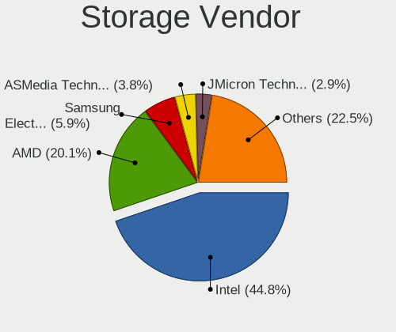
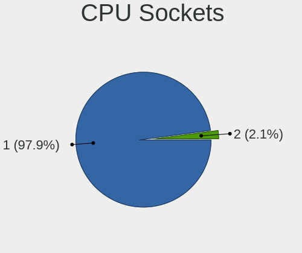
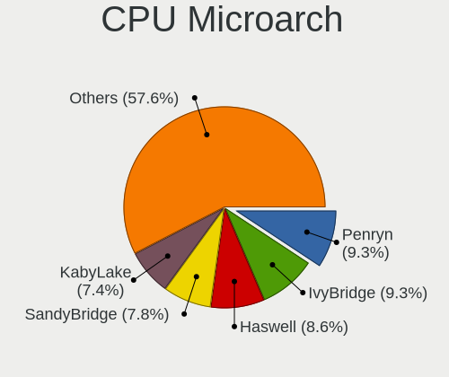
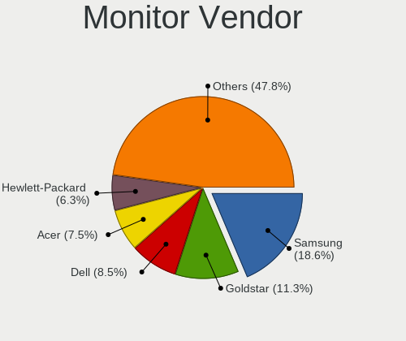
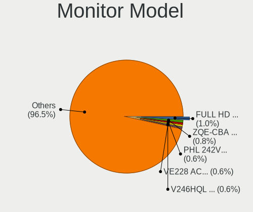
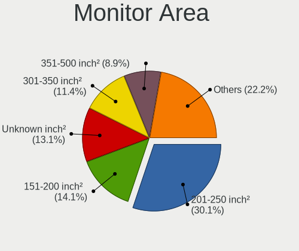
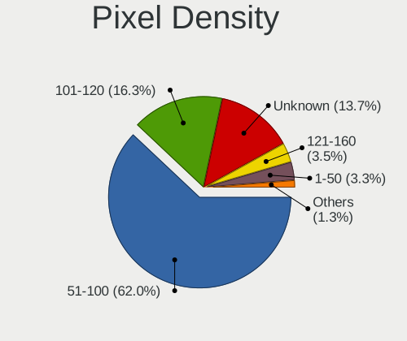
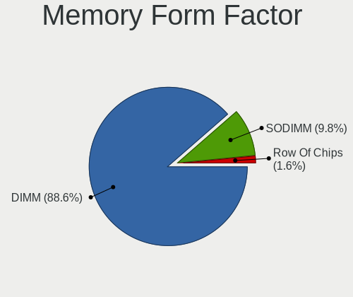

LMDE - Tested Hardware & Statistics (Desktops)
----------------------------------------------

A project to collect tested hardware configurations for LMDE.

Anyone can contribute to this report by the [hw-probe](https://github.com/linuxhw/hw-probe) tool:

    sudo -E hw-probe -all -upload

Please contribute! Especially if your hardware is rare.

Contents
--------

* [ Test Cases ](#test-cases)

* [ System ](#system)
  - [ OS                       ](#os)
  - [ OS Family                ](#os-family)
  - [ Kernel                   ](#kernel)
  - [ Kernel Family            ](#kernel-family)
  - [ Kernel Major Ver.        ](#kernel-major-ver)
  - [ Arch                     ](#arch)
  - [ DE                       ](#de)
  - [ Display Server           ](#display-server)
  - [ Display Manager          ](#display-manager)
  - [ OS Lang                  ](#os-lang)
  - [ Boot Mode                ](#boot-mode)
  - [ Filesystem               ](#filesystem)
  - [ Part. scheme             ](#part-scheme)
  - [ Dual Boot with Linux/BSD ](#dual-boot-with-linuxbsd)
  - [ Dual Boot (Win)          ](#dual-boot-win)

* [ Board ](#board)
  - [ Vendor                   ](#vendor)
  - [ Model                    ](#model)
  - [ Model Family             ](#model-family)
  - [ MFG Year                 ](#mfg-year)
  - [ Form Factor              ](#form-factor)
  - [ Secure Boot              ](#secure-boot)
  - [ Coreboot                 ](#coreboot)
  - [ RAM Size                 ](#ram-size)
  - [ RAM Used                 ](#ram-used)
  - [ Total Drives             ](#total-drives)
  - [ Has CD-ROM               ](#has-cd-rom)
  - [ Has Ethernet             ](#has-ethernet)
  - [ Has WiFi                 ](#has-wifi)
  - [ Has Bluetooth            ](#has-bluetooth)

* [ Location ](#location)
  - [ Country                  ](#country)
  - [ City                     ](#city)

* [ Drives ](#drives)
  - [ Drive Vendor             ](#drive-vendor)
  - [ Drive Model              ](#drive-model)
  - [ HDD Vendor               ](#hdd-vendor)
  - [ SSD Vendor               ](#ssd-vendor)
  - [ Drive Kind               ](#drive-kind)
  - [ Drive Connector          ](#drive-connector)
  - [ Drive Size               ](#drive-size)
  - [ Space Total              ](#space-total)
  - [ Space Used               ](#space-used)
  - [ Malfunc. Drives          ](#malfunc-drives)
  - [ Malfunc. Drive Vendor    ](#malfunc-drive-vendor)
  - [ Malfunc. HDD Vendor      ](#malfunc-hdd-vendor)
  - [ Malfunc. Drive Kind      ](#malfunc-drive-kind)
  - [ Failed Drives            ](#failed-drives)
  - [ Failed Drive Vendor      ](#failed-drive-vendor)
  - [ Drive Status             ](#drive-status)

* [ Storage controller ](#storage-controller)
  - [ Storage Vendor           ](#storage-vendor)
  - [ Storage Model            ](#storage-model)
  - [ Storage Kind             ](#storage-kind)

* [ Processor ](#processor)
  - [ CPU Vendor               ](#cpu-vendor)
  - [ CPU Model                ](#cpu-model)
  - [ CPU Model Family         ](#cpu-model-family)
  - [ CPU Cores                ](#cpu-cores)
  - [ CPU Sockets              ](#cpu-sockets)
  - [ CPU Threads              ](#cpu-threads)
  - [ CPU Op-Modes             ](#cpu-op-modes)
  - [ CPU Microcode            ](#cpu-microcode)
  - [ CPU Microarch            ](#cpu-microarch)

* [ Graphics ](#graphics)
  - [ GPU Vendor               ](#gpu-vendor)
  - [ GPU Model                ](#gpu-model)
  - [ GPU Combo                ](#gpu-combo)
  - [ GPU Driver               ](#gpu-driver)
  - [ GPU Memory               ](#gpu-memory)

* [ Monitor ](#monitor)
  - [ Monitor Vendor           ](#monitor-vendor)
  - [ Monitor Model            ](#monitor-model)
  - [ Monitor Resolution       ](#monitor-resolution)
  - [ Monitor Diagonal         ](#monitor-diagonal)
  - [ Monitor Width            ](#monitor-width)
  - [ Aspect Ratio             ](#aspect-ratio)
  - [ Monitor Area             ](#monitor-area)
  - [ Pixel Density            ](#pixel-density)
  - [ Multiple Monitors        ](#multiple-monitors)

* [ Network ](#network)
  - [ Net Controller Vendor    ](#net-controller-vendor)
  - [ Net Controller Model     ](#net-controller-model)
  - [ Wireless Vendor          ](#wireless-vendor)
  - [ Wireless Model           ](#wireless-model)
  - [ Ethernet Vendor          ](#ethernet-vendor)
  - [ Ethernet Model           ](#ethernet-model)
  - [ Net Controller Kind      ](#net-controller-kind)
  - [ Used Controller          ](#used-controller)
  - [ NICs                     ](#nics)
  - [ IPv6                     ](#ipv6)

* [ Bluetooth ](#bluetooth)
  - [ Bluetooth Vendor         ](#bluetooth-vendor)
  - [ Bluetooth Model          ](#bluetooth-model)

* [ Sound ](#sound)
  - [ Sound Vendor             ](#sound-vendor)
  - [ Sound Model              ](#sound-model)

* [ Memory ](#memory)
  - [ Memory Vendor            ](#memory-vendor)
  - [ Memory Model             ](#memory-model)
  - [ Memory Kind              ](#memory-kind)
  - [ Memory Form Factor       ](#memory-form-factor)
  - [ Memory Size              ](#memory-size)
  - [ Memory Speed             ](#memory-speed)

* [ Printers & scanners ](#printers--scanners)
  - [ Printer Vendor           ](#printer-vendor)
  - [ Printer Model            ](#printer-model)
  - [ Scanner Vendor           ](#scanner-vendor)
  - [ Scanner Model            ](#scanner-model)

* [ Camera ](#camera)
  - [ Camera Vendor            ](#camera-vendor)
  - [ Camera Model             ](#camera-model)

* [ Security ](#security)
  - [ Fingerprint Vendor       ](#fingerprint-vendor)
  - [ Fingerprint Model        ](#fingerprint-model)
  - [ Chipcard Vendor          ](#chipcard-vendor)
  - [ Chipcard Model           ](#chipcard-model)

* [ Unsupported ](#unsupported)
  - [ Unsupported Devices      ](#unsupported-devices)
  - [ Unsupported Device Types ](#unsupported-device-types)

Test Cases
----------

Total: 653

| Vendor        | Model                       | Probe                                                      | Date         |
|---------------|-----------------------------|------------------------------------------------------------|--------------|
| Gigabyte      | Q87M-D2H                    | [4c5e48c75f](https://linux-hardware.org/?probe=4c5e48c75f) | Feb 02, 2024 |
| Inventec      | DQ Class A02                | [4cb447dae2](https://linux-hardware.org/?probe=4cb447dae2) | Feb 02, 2024 |
| Gigabyte      | Q87M-D2H                    | [78ef1fbd6c](https://linux-hardware.org/?probe=78ef1fbd6c) | Jan 31, 2024 |
| Medion        | TJ4125                      | [2705de4986](https://linux-hardware.org/?probe=2705de4986) | Jan 31, 2024 |
| MSI           | MS-7345                     | [3453f85c21](https://linux-hardware.org/?probe=3453f85c21) | Jan 30, 2024 |
| MSI           | MAG B560 TORPEDO            | [429541ce17](https://linux-hardware.org/?probe=429541ce17) | Jan 29, 2024 |
| ASUSTek       | TUF Gaming X670E-PLUS WI... | [c7a52fe756](https://linux-hardware.org/?probe=c7a52fe756) | Jan 29, 2024 |
| HP            | 805D                        | [81113f9b0d](https://linux-hardware.org/?probe=81113f9b0d) | Jan 29, 2024 |
| ASUSTek       | PRIME X670-P                | [08b5799cfd](https://linux-hardware.org/?probe=08b5799cfd) | Jan 27, 2024 |
| MSI           | MAG B560 TORPEDO            | [30954e841f](https://linux-hardware.org/?probe=30954e841f) | Jan 26, 2024 |
| ASUSTek       | CROSSHAIR V FORMULA-Z       | [56bd222ae5](https://linux-hardware.org/?probe=56bd222ae5) | Jan 24, 2024 |
| Gigabyte      | B450 AORUS M                | [ed52617ade](https://linux-hardware.org/?probe=ed52617ade) | Jan 23, 2024 |
| ASRock        | Z690 Pro RS                 | [4083a31da9](https://linux-hardware.org/?probe=4083a31da9) | Jan 21, 2024 |
| ASRock        | X670E Taichi Carrara        | [52318f5ae6](https://linux-hardware.org/?probe=52318f5ae6) | Jan 20, 2024 |
| ASUSTek       | P7P55D-E                    | [bb8785aa08](https://linux-hardware.org/?probe=bb8785aa08) | Jan 15, 2024 |
| MSI           | MEG X670E ACE               | [08ee758712](https://linux-hardware.org/?probe=08ee758712) | Jan 15, 2024 |
| ASRock        | Z97 Pro4                    | [e3ef5ae05b](https://linux-hardware.org/?probe=e3ef5ae05b) | Jan 14, 2024 |
| Gigabyte      | GA-78LMT-S2P 78LMT2         | [b81e3342c6](https://linux-hardware.org/?probe=b81e3342c6) | Jan 13, 2024 |
| ASUSTek       | TUF B450M-PLUS GAMING       | [70dedc5c9d](https://linux-hardware.org/?probe=70dedc5c9d) | Jan 12, 2024 |
| ASUSTek       | P5G41T-M LX3                | [a358114f21](https://linux-hardware.org/?probe=a358114f21) | Jan 12, 2024 |
| Gigabyte      | B450 AORUS M                | [6b5cc546b5](https://linux-hardware.org/?probe=6b5cc546b5) | Jan 12, 2024 |
| MSI           | Z390-A PRO                  | [538119eb86](https://linux-hardware.org/?probe=538119eb86) | Jan 11, 2024 |
| MSI           | B350M BAZOOKA               | [fab33560f3](https://linux-hardware.org/?probe=fab33560f3) | Jan 10, 2024 |
| Sapphire      | PI-AM3RS760G2               | [ec094665df](https://linux-hardware.org/?probe=ec094665df) | Jan 09, 2024 |
| Fujitsu       | D3183-A1 S26361-D3183-A1    | [c9096376d8](https://linux-hardware.org/?probe=c9096376d8) | Jan 09, 2024 |
| Apple         | Mac-F60DEB81FF30ACF6 Mac... | [e15da7350e](https://linux-hardware.org/?probe=e15da7350e) | Jan 07, 2024 |
| MSI           | B550-A PRO                  | [e2e58f59b7](https://linux-hardware.org/?probe=e2e58f59b7) | Jan 06, 2024 |
| MSI           | MAG X570 TOMAHAWK WIFI      | [ff9686f03c](https://linux-hardware.org/?probe=ff9686f03c) | Jan 06, 2024 |
| Sapphire      | PI-AM3RS760G2               | [b98b78a3df](https://linux-hardware.org/?probe=b98b78a3df) | Jan 05, 2024 |
| Sapphire      | PI-AM3RS760G2               | [243e9d1b27](https://linux-hardware.org/?probe=243e9d1b27) | Jan 02, 2024 |
| Medion        | TJ4125                      | [ca0e4105c2](https://linux-hardware.org/?probe=ca0e4105c2) | Jan 02, 2024 |
| Gigabyte      | Q87M-D2H                    | [26f77fa950](https://linux-hardware.org/?probe=26f77fa950) | Jan 02, 2024 |
| ASUSTek       | H110M-A/M.2                 | [9e622b4006](https://linux-hardware.org/?probe=9e622b4006) | Dec 31, 2023 |
| Gigabyte      | Q87M-D2H                    | [0f440edfb5](https://linux-hardware.org/?probe=0f440edfb5) | Dec 31, 2023 |
| Gigabyte      | Q87M-D2H                    | [edbe61f4fa](https://linux-hardware.org/?probe=edbe61f4fa) | Dec 31, 2023 |
| Intel         | B75                         | [df9a51de80](https://linux-hardware.org/?probe=df9a51de80) | Dec 30, 2023 |
| Dell          | 0RW199                      | [906719d239](https://linux-hardware.org/?probe=906719d239) | Dec 27, 2023 |
| HP            | 090Ch                       | [06e9f893bc](https://linux-hardware.org/?probe=06e9f893bc) | Dec 25, 2023 |
| Gigabyte      | Q87M-D2H                    | [4b2ed8b976](https://linux-hardware.org/?probe=4b2ed8b976) | Dec 23, 2023 |
| ASUSTek       | X99-A II                    | [37e4430c0e](https://linux-hardware.org/?probe=37e4430c0e) | Dec 23, 2023 |
| ASRock        | Z97 Pro4                    | [f8e2df67b1](https://linux-hardware.org/?probe=f8e2df67b1) | Dec 23, 2023 |
| MSI           | MPG B550 GAMING PLUS        | [db8c00daf3](https://linux-hardware.org/?probe=db8c00daf3) | Dec 22, 2023 |
| Lenovo        | 317C NOK                    | [87064e6d98](https://linux-hardware.org/?probe=87064e6d98) | Dec 20, 2023 |
| Medion        | TJ4125                      | [8fce958467](https://linux-hardware.org/?probe=8fce958467) | Dec 20, 2023 |
| Gigabyte      | GA-MA78LMT-US2H             | [a1f4076586](https://linux-hardware.org/?probe=a1f4076586) | Dec 19, 2023 |
| Medion        | TJ4125                      | [c7eeb77279](https://linux-hardware.org/?probe=c7eeb77279) | Dec 18, 2023 |
| Gigabyte      | Q87M-D2H                    | [378b82ce2f](https://linux-hardware.org/?probe=378b82ce2f) | Dec 17, 2023 |
| Gigabyte      | Q87M-D2H                    | [e7f9b37ee3](https://linux-hardware.org/?probe=e7f9b37ee3) | Dec 17, 2023 |
| Gigabyte      | Q87M-D2H                    | [935f688c90](https://linux-hardware.org/?probe=935f688c90) | Dec 17, 2023 |
| Gigabyte      | Q87M-D2H                    | [f53d129b3d](https://linux-hardware.org/?probe=f53d129b3d) | Dec 17, 2023 |
| Medion        | TJ4125                      | [7556d73046](https://linux-hardware.org/?probe=7556d73046) | Dec 17, 2023 |
| Gigabyte      | A520M S2H                   | [0b4a9d3a4e](https://linux-hardware.org/?probe=0b4a9d3a4e) | Dec 16, 2023 |
| ASUSTek       | M4A89GTD-PRO/USB3           | [9362181823](https://linux-hardware.org/?probe=9362181823) | Dec 14, 2023 |
| Sapphire      | PI-AM3RS760G2               | [e2c79fa4d1](https://linux-hardware.org/?probe=e2c79fa4d1) | Dec 13, 2023 |
| Acer          | Veriton M4630G V:1.0        | [91ec51ebf5](https://linux-hardware.org/?probe=91ec51ebf5) | Dec 12, 2023 |
| Dell          | 0GXM1W A02                  | [3184d3c38b](https://linux-hardware.org/?probe=3184d3c38b) | Dec 11, 2023 |
| ASRock        | H310M-STX                   | [205a5c1696](https://linux-hardware.org/?probe=205a5c1696) | Dec 10, 2023 |
| Gigabyte      | 970A-DS3P                   | [71de71e3f4](https://linux-hardware.org/?probe=71de71e3f4) | Dec 10, 2023 |
| Gigabyte      | 970A-DS3P                   | [64b0038221](https://linux-hardware.org/?probe=64b0038221) | Dec 10, 2023 |
| MSI           | MPG X570 GAMING EDGE WIF... | [4525b7e30c](https://linux-hardware.org/?probe=4525b7e30c) | Dec 09, 2023 |
| ASUSTek       | P5G41T-M LX3                | [42a7acfe4b](https://linux-hardware.org/?probe=42a7acfe4b) | Dec 09, 2023 |
| ASUSTek       | PRIME A320M-K               | [b553ec2266](https://linux-hardware.org/?probe=b553ec2266) | Dec 08, 2023 |
| ASUSTek       | Rampage III Extreme         | [d4d934c9be](https://linux-hardware.org/?probe=d4d934c9be) | Dec 08, 2023 |
| Unknown       | Unknown                     | [7144bda606](https://linux-hardware.org/?probe=7144bda606) | Dec 07, 2023 |
| ASUSTek       | PRIME B350-PLUS             | [6fca6c7335](https://linux-hardware.org/?probe=6fca6c7335) | Dec 03, 2023 |
| ASUSTek       | PRIME B450M-K               | [9fa48c41da](https://linux-hardware.org/?probe=9fa48c41da) | Nov 27, 2023 |
| Gigabyte      | B560M D3H                   | [8a894da286](https://linux-hardware.org/?probe=8a894da286) | Nov 26, 2023 |
| Shenzhen M... | F7BRC                       | [9ff2c76737](https://linux-hardware.org/?probe=9ff2c76737) | Nov 26, 2023 |
| MSI           | MAG B760M MORTAR WIFI DD... | [b11fcf42c2](https://linux-hardware.org/?probe=b11fcf42c2) | Nov 25, 2023 |
| Medion        | TJ4125                      | [512206df27](https://linux-hardware.org/?probe=512206df27) | Nov 24, 2023 |
| Pegatron      | 2ACF                        | [d89c55cb89](https://linux-hardware.org/?probe=d89c55cb89) | Nov 24, 2023 |
| ASUSTek       | PRIME A320M-K               | [81d1db42ea](https://linux-hardware.org/?probe=81d1db42ea) | Nov 23, 2023 |
| ASUSTek       | P5G41T-M LX3                | [af55920808](https://linux-hardware.org/?probe=af55920808) | Nov 23, 2023 |
| Acer          | Aspire TC-780               | [dbce2ba706](https://linux-hardware.org/?probe=dbce2ba706) | Nov 23, 2023 |
| MSI           | PRO Z790-A WIFI             | [b564a39ed5](https://linux-hardware.org/?probe=b564a39ed5) | Nov 22, 2023 |
| Dell          | 0Y2YM6 A00                  | [ce96501574](https://linux-hardware.org/?probe=ce96501574) | Nov 22, 2023 |
| Gigabyte      | Q87M-D2H                    | [a0f12099c5](https://linux-hardware.org/?probe=a0f12099c5) | Nov 22, 2023 |
| Soyo          | SY-N3150L Quad              | [7fd72fcced](https://linux-hardware.org/?probe=7fd72fcced) | Nov 21, 2023 |
| Pegatron      | 2ADC                        | [683e6fe69e](https://linux-hardware.org/?probe=683e6fe69e) | Nov 20, 2023 |
| Pegatron      | 2ADC                        | [ff6ee5f1e5](https://linux-hardware.org/?probe=ff6ee5f1e5) | Nov 20, 2023 |
| Gigabyte      | Q87M-D2H                    | [085623428e](https://linux-hardware.org/?probe=085623428e) | Nov 19, 2023 |
| Acer          | Aspire X3400                | [26cedbdbde](https://linux-hardware.org/?probe=26cedbdbde) | Nov 19, 2023 |
| Acer          | Aspire X3400                | [83890ec21c](https://linux-hardware.org/?probe=83890ec21c) | Nov 19, 2023 |
| ASUSTek       | P5G41T-M LX3                | [e65cf40bcb](https://linux-hardware.org/?probe=e65cf40bcb) | Nov 19, 2023 |
| HP            | 8265                        | [d3f5c1d6ce](https://linux-hardware.org/?probe=d3f5c1d6ce) | Nov 15, 2023 |
| Fujitsu       | D3400-A1 S26361-D3400-A1    | [c4b486ecb1](https://linux-hardware.org/?probe=c4b486ecb1) | Nov 13, 2023 |
| Medion        | TJ4125                      | [1e0f7cdf34](https://linux-hardware.org/?probe=1e0f7cdf34) | Nov 12, 2023 |
| Medion        | TJ4125                      | [ab37177769](https://linux-hardware.org/?probe=ab37177769) | Nov 10, 2023 |
| Gigabyte      | Q87M-D2H                    | [80bba409c5](https://linux-hardware.org/?probe=80bba409c5) | Nov 10, 2023 |
| Dell          | 0HH807                      | [300ee3d8f5](https://linux-hardware.org/?probe=300ee3d8f5) | Nov 08, 2023 |
| ASUSTek       | P5G41T-M LX3                | [8d5332d643](https://linux-hardware.org/?probe=8d5332d643) | Nov 07, 2023 |
| MSI           | B75MA-P45                   | [bfe1423965](https://linux-hardware.org/?probe=bfe1423965) | Nov 06, 2023 |
| Gigabyte      | Q87M-D2H                    | [62a888f71c](https://linux-hardware.org/?probe=62a888f71c) | Nov 05, 2023 |
| Medion        | TJ4125                      | [65a059325e](https://linux-hardware.org/?probe=65a059325e) | Nov 05, 2023 |
| Gigabyte      | MZBSWAP-K4                  | [ef6c15830d](https://linux-hardware.org/?probe=ef6c15830d) | Nov 05, 2023 |
| ASUSTek       | P5G41T-M LX                 | [ae6c835796](https://linux-hardware.org/?probe=ae6c835796) | Nov 02, 2023 |
| ASRock        | Z97 Pro4                    | [6fa2a70f99](https://linux-hardware.org/?probe=6fa2a70f99) | Nov 01, 2023 |
| HP            | 18EB                        | [83596ab9d9](https://linux-hardware.org/?probe=83596ab9d9) | Oct 31, 2023 |
| ASUSTek       | P5G41T-M LX                 | [e741e073e0](https://linux-hardware.org/?probe=e741e073e0) | Oct 30, 2023 |
| ASRock        | Z690M-ITX/ax                | [810297d46b](https://linux-hardware.org/?probe=810297d46b) | Oct 30, 2023 |
| Gigabyte      | MZBSWAP-K4                  | [aed94a16c1](https://linux-hardware.org/?probe=aed94a16c1) | Oct 30, 2023 |
| Trigkey       | Green G4 10                 | [bb72f6af02](https://linux-hardware.org/?probe=bb72f6af02) | Oct 29, 2023 |
| Medion        | TJ4125                      | [f791cf88cb](https://linux-hardware.org/?probe=f791cf88cb) | Oct 27, 2023 |
| Dell          | 0HH807                      | [7f15d65c22](https://linux-hardware.org/?probe=7f15d65c22) | Oct 27, 2023 |
| Unknown       | P4M800CE-8237               | [bf22b887f8](https://linux-hardware.org/?probe=bf22b887f8) | Oct 26, 2023 |
| ASRock        | Z97 Pro4                    | [bcf737a9cd](https://linux-hardware.org/?probe=bcf737a9cd) | Oct 25, 2023 |
| Gigabyte      | Q87M-D2H                    | [74d5de2172](https://linux-hardware.org/?probe=74d5de2172) | Oct 21, 2023 |
| Gigabyte      | AB350M-DS3H V2-CF           | [4f2229b9fa](https://linux-hardware.org/?probe=4f2229b9fa) | Oct 21, 2023 |
| Gigabyte      | Q87M-D2H                    | [4633508fb0](https://linux-hardware.org/?probe=4633508fb0) | Oct 20, 2023 |
| Acer          | Predator G3-605             | [d3b59b34a0](https://linux-hardware.org/?probe=d3b59b34a0) | Oct 19, 2023 |
| Intel         | DG31PR AAD97573-206         | [5064906065](https://linux-hardware.org/?probe=5064906065) | Oct 18, 2023 |
| HP            | 843B                        | [0e5a69e3ab](https://linux-hardware.org/?probe=0e5a69e3ab) | Oct 17, 2023 |
| ASRock        | H310M-STX                   | [b0bc91de7a](https://linux-hardware.org/?probe=b0bc91de7a) | Oct 14, 2023 |
| Medion        | TJ4125                      | [e60adf45ac](https://linux-hardware.org/?probe=e60adf45ac) | Oct 10, 2023 |
| Gigabyte      | A520M S2H                   | [d71ced0f1d](https://linux-hardware.org/?probe=d71ced0f1d) | Oct 08, 2023 |
| Dell          | 0WR7PY A03                  | [7bd89c0f18](https://linux-hardware.org/?probe=7bd89c0f18) | Oct 07, 2023 |
| ASUSTek       | ROG STRIX Z790-I GAMING ... | [04473f37e9](https://linux-hardware.org/?probe=04473f37e9) | Oct 07, 2023 |
| Gigabyte      | G31M-ES2L                   | [bfed98df15](https://linux-hardware.org/?probe=bfed98df15) | Oct 04, 2023 |
| Medion        | TJ4125                      | [626065ec1b](https://linux-hardware.org/?probe=626065ec1b) | Oct 03, 2023 |
| Gigabyte      | Q87M-D2H                    | [ee49b13b77](https://linux-hardware.org/?probe=ee49b13b77) | Oct 02, 2023 |
| MSI           | B550M PRO-VDH WIFI          | [bc2e88dd9c](https://linux-hardware.org/?probe=bc2e88dd9c) | Sep 30, 2023 |
| Gigabyte      | Q87M-D2H                    | [1d749b29ad](https://linux-hardware.org/?probe=1d749b29ad) | Sep 28, 2023 |
| Gigabyte      | Q87M-D2H                    | [8bdc8129ff](https://linux-hardware.org/?probe=8bdc8129ff) | Sep 25, 2023 |
| Gigabyte      | Q87M-D2H                    | [87cba2e3a2](https://linux-hardware.org/?probe=87cba2e3a2) | Sep 24, 2023 |
| Medion        | TJ4125                      | [434dd057a6](https://linux-hardware.org/?probe=434dd057a6) | Sep 23, 2023 |
| ASUSTek       | P8H61-M LX                  | [48a5b6b71d](https://linux-hardware.org/?probe=48a5b6b71d) | Sep 23, 2023 |
| HP            | 859C                        | [7de1553287](https://linux-hardware.org/?probe=7de1553287) | Sep 20, 2023 |
| Intel         | DG31PR AAD97573-206         | [da930461ec](https://linux-hardware.org/?probe=da930461ec) | Sep 18, 2023 |
| Gigabyte      | GA-880GM-UD2H               | [5fa6a632ae](https://linux-hardware.org/?probe=5fa6a632ae) | Sep 18, 2023 |
| HP            | 158B                        | [d56ff45f03](https://linux-hardware.org/?probe=d56ff45f03) | Sep 17, 2023 |
| ASRock        | X670E Pro RS                | [11d9d55772](https://linux-hardware.org/?probe=11d9d55772) | Sep 17, 2023 |
| Gigabyte      | B450 AORUS PRO-CF           | [807a40b618](https://linux-hardware.org/?probe=807a40b618) | Sep 15, 2023 |
| Intel         | X79                         | [e9a4f4dc51](https://linux-hardware.org/?probe=e9a4f4dc51) | Sep 13, 2023 |
| ASRock        | H110M-DVS R3.0              | [b0305f4ba4](https://linux-hardware.org/?probe=b0305f4ba4) | Sep 10, 2023 |
| Medion        | TJ4125                      | [80a4e5fbff](https://linux-hardware.org/?probe=80a4e5fbff) | Sep 09, 2023 |
| HP            | 859C                        | [c113eb162e](https://linux-hardware.org/?probe=c113eb162e) | Sep 09, 2023 |
| Gigabyte      | Q87M-D2H                    | [3389baa197](https://linux-hardware.org/?probe=3389baa197) | Sep 07, 2023 |
| Gigabyte      | Q87M-D2H                    | [f73f6d9301](https://linux-hardware.org/?probe=f73f6d9301) | Sep 05, 2023 |
| Gigabyte      | Q87M-D2H                    | [61c5e35c02](https://linux-hardware.org/?probe=61c5e35c02) | Sep 05, 2023 |
| Gigabyte      | Q87M-D2H                    | [f5e7afad66](https://linux-hardware.org/?probe=f5e7afad66) | Sep 04, 2023 |
| Medion        | TJ4125                      | [e2e111051c](https://linux-hardware.org/?probe=e2e111051c) | Sep 03, 2023 |
| ASUSTek       | G10DK                       | [d6b74ca876](https://linux-hardware.org/?probe=d6b74ca876) | Sep 03, 2023 |
| Gigabyte      | B450 AORUS M                | [e58d4f8405](https://linux-hardware.org/?probe=e58d4f8405) | Sep 03, 2023 |
| MSI           | B560M PRO-E                 | [17eed28ecb](https://linux-hardware.org/?probe=17eed28ecb) | Sep 02, 2023 |
| Acer          | Aspire X3400                | [62a78b2a16](https://linux-hardware.org/?probe=62a78b2a16) | Sep 01, 2023 |
| MSI           | B450 TOMAHAWK MAX II        | [f7a484830d](https://linux-hardware.org/?probe=f7a484830d) | Aug 30, 2023 |
| Dell          | 0D28YY A00                  | [9f2585c0aa](https://linux-hardware.org/?probe=9f2585c0aa) | Aug 29, 2023 |
| HP            | 859C                        | [978d715b29](https://linux-hardware.org/?probe=978d715b29) | Aug 25, 2023 |
| eMachines     | EL1852G                     | [68db025f09](https://linux-hardware.org/?probe=68db025f09) | Aug 25, 2023 |
| Pegatron      | 2ACF                        | [38f3df41d7](https://linux-hardware.org/?probe=38f3df41d7) | Aug 24, 2023 |
| eMachines     | EL1852G                     | [ea782989fd](https://linux-hardware.org/?probe=ea782989fd) | Aug 24, 2023 |
| HP            | 859C                        | [63f9e00825](https://linux-hardware.org/?probe=63f9e00825) | Aug 22, 2023 |
| Gigabyte      | AB350M-DS3H V2-CF           | [cce6cb2878](https://linux-hardware.org/?probe=cce6cb2878) | Aug 18, 2023 |
| Gigabyte      | AB350M-DS3H V2-CF           | [8803256d2e](https://linux-hardware.org/?probe=8803256d2e) | Aug 14, 2023 |
| Medion        | TJ4125                      | [e24dc34df5](https://linux-hardware.org/?probe=e24dc34df5) | Aug 13, 2023 |
| Gigabyte      | Q87M-D2H                    | [6289a9e628](https://linux-hardware.org/?probe=6289a9e628) | Aug 12, 2023 |
| HP            | 859C                        | [24dd090f2c](https://linux-hardware.org/?probe=24dd090f2c) | Aug 09, 2023 |
| ASRock        | B550M-ITX/ac                | [c86495f999](https://linux-hardware.org/?probe=c86495f999) | Aug 08, 2023 |
| ASUSTek       | ROG STRIX B450-F GAMING     | [7fe1ce642a](https://linux-hardware.org/?probe=7fe1ce642a) | Aug 08, 2023 |
| Gigabyte      | Q87M-D2H                    | [dbcb2c4a80](https://linux-hardware.org/?probe=dbcb2c4a80) | Aug 07, 2023 |
| Medion        | TJ4125                      | [e35dc275ce](https://linux-hardware.org/?probe=e35dc275ce) | Aug 06, 2023 |
| Medion        | TJ4125                      | [0adec5cb7e](https://linux-hardware.org/?probe=0adec5cb7e) | Aug 04, 2023 |
| Gigabyte      | Q87M-D2H                    | [d3df0e8ee1](https://linux-hardware.org/?probe=d3df0e8ee1) | Aug 04, 2023 |
| ASUSTek       | H81M-K                      | [d946977ec8](https://linux-hardware.org/?probe=d946977ec8) | Aug 04, 2023 |
| Gigabyte      | Q87M-D2H                    | [37725aaff8](https://linux-hardware.org/?probe=37725aaff8) | Aug 03, 2023 |
| Intel         | X79                         | [051316466a](https://linux-hardware.org/?probe=051316466a) | Aug 01, 2023 |
| Gigabyte      | AB350M-DS3H V2-CF           | [1bcc28bd33](https://linux-hardware.org/?probe=1bcc28bd33) | Jul 29, 2023 |
| Apple         | Mac-F221BEC8                | [12932af713](https://linux-hardware.org/?probe=12932af713) | Jul 29, 2023 |
| Medion        | TJ4125                      | [0882778c0a](https://linux-hardware.org/?probe=0882778c0a) | Jul 28, 2023 |
| Gigabyte      | Q87M-D2H                    | [374c405364](https://linux-hardware.org/?probe=374c405364) | Jul 26, 2023 |
| ASUSTek       | PRIME A320M-K               | [199fe99179](https://linux-hardware.org/?probe=199fe99179) | Jul 25, 2023 |
| Gigabyte      | Q87M-D2H                    | [7aaa099507](https://linux-hardware.org/?probe=7aaa099507) | Jul 24, 2023 |
| Intel         | X79                         | [8037a9fc0e](https://linux-hardware.org/?probe=8037a9fc0e) | Jul 24, 2023 |
| Dell          | 00F82W A02                  | [53b13b667d](https://linux-hardware.org/?probe=53b13b667d) | Jul 16, 2023 |
| Dell          | 00F82W A02                  | [293fa24c88](https://linux-hardware.org/?probe=293fa24c88) | Jul 14, 2023 |
| Medion        | TJ4125                      | [88fb5ecc29](https://linux-hardware.org/?probe=88fb5ecc29) | Jul 09, 2023 |
| Medion        | TJ4125                      | [efa563ec1f](https://linux-hardware.org/?probe=efa563ec1f) | Jul 09, 2023 |
| Gigabyte      | Q87M-D2H                    | [d660aa6f35](https://linux-hardware.org/?probe=d660aa6f35) | Jul 09, 2023 |
| Gigabyte      | Q87M-D2H                    | [87872596c0](https://linux-hardware.org/?probe=87872596c0) | Jul 08, 2023 |
| Medion        | TJ4125                      | [38d2ffe2de](https://linux-hardware.org/?probe=38d2ffe2de) | Jul 08, 2023 |
| Medion        | TJ4125                      | [1de78b3365](https://linux-hardware.org/?probe=1de78b3365) | Jul 07, 2023 |
| Gigabyte      | B450M DS3H V2               | [919f65a256](https://linux-hardware.org/?probe=919f65a256) | Jul 05, 2023 |
| Gigabyte      | Q87M-D2H                    | [22a3b2defb](https://linux-hardware.org/?probe=22a3b2defb) | Jul 05, 2023 |
| Medion        | TJ4125                      | [8d8748e1dc](https://linux-hardware.org/?probe=8d8748e1dc) | Jul 02, 2023 |
| Gigabyte      | Q87M-D2H                    | [89c111d3ec](https://linux-hardware.org/?probe=89c111d3ec) | Jul 02, 2023 |
| Medion        | TJ4125                      | [e99bd03d75](https://linux-hardware.org/?probe=e99bd03d75) | Jul 01, 2023 |
| Gigabyte      | Q87M-D2H                    | [729fb2873e](https://linux-hardware.org/?probe=729fb2873e) | Jul 01, 2023 |
| Gigabyte      | Q87M-D2H                    | [633c55d4ba](https://linux-hardware.org/?probe=633c55d4ba) | Jun 30, 2023 |
| Medion        | TJ4125                      | [5cebe0a1d0](https://linux-hardware.org/?probe=5cebe0a1d0) | Jun 30, 2023 |
| Medion        | TJ4125                      | [327794cb1a](https://linux-hardware.org/?probe=327794cb1a) | Jun 30, 2023 |
| Gigabyte      | Q87M-D2H                    | [95e5472f48](https://linux-hardware.org/?probe=95e5472f48) | Jun 27, 2023 |
| Gigabyte      | Q87M-D2H                    | [67a44b0d84](https://linux-hardware.org/?probe=67a44b0d84) | Jun 20, 2023 |
| Intel         | X79                         | [8c50d3b5e8](https://linux-hardware.org/?probe=8c50d3b5e8) | Jun 20, 2023 |
| ASRock        | B450 Gaming K4              | [2344c78f90](https://linux-hardware.org/?probe=2344c78f90) | Jun 20, 2023 |
| Lenovo        | SHARKBAY NOK                | [0173559ed0](https://linux-hardware.org/?probe=0173559ed0) | Jun 19, 2023 |
| Medion        | TJ4125                      | [4c6aec7e33](https://linux-hardware.org/?probe=4c6aec7e33) | Jun 18, 2023 |
| Medion        | TJ4125                      | [fc102c077c](https://linux-hardware.org/?probe=fc102c077c) | Jun 16, 2023 |
| Gigabyte      | AB350M-DS3H V2-CF           | [64da6bc381](https://linux-hardware.org/?probe=64da6bc381) | Jun 14, 2023 |
| Gigabyte      | Q87M-D2H                    | [59b855f1a1](https://linux-hardware.org/?probe=59b855f1a1) | Jun 12, 2023 |
| Gigabyte      | Q87M-D2H                    | [56421d7b0f](https://linux-hardware.org/?probe=56421d7b0f) | Jun 09, 2023 |
| AZW           | GK mini                     | [d9d37cb11a](https://linux-hardware.org/?probe=d9d37cb11a) | Jun 08, 2023 |
| MSI           | X470 GAMING PLUS MAX        | [a8724dfd68](https://linux-hardware.org/?probe=a8724dfd68) | Jun 08, 2023 |
| MSI           | PRO B550M-VC WIFI           | [ac442da472](https://linux-hardware.org/?probe=ac442da472) | Jun 08, 2023 |
| Gigabyte      | Q87M-D2H                    | [05a3b3210a](https://linux-hardware.org/?probe=05a3b3210a) | Jun 06, 2023 |
| Gigabyte      | Q87M-D2H                    | [eeaf6dbd4c](https://linux-hardware.org/?probe=eeaf6dbd4c) | Jun 05, 2023 |
| Gigabyte      | F2A55M-DS2                  | [74b01a9071](https://linux-hardware.org/?probe=74b01a9071) | Jun 05, 2023 |
| Medion        | TJ4125                      | [3faed0102f](https://linux-hardware.org/?probe=3faed0102f) | Jun 04, 2023 |
| Gigabyte      | A520M S2H                   | [81caf6e8cf](https://linux-hardware.org/?probe=81caf6e8cf) | Jun 04, 2023 |
| Gigabyte      | A520M S2H                   | [0169222312](https://linux-hardware.org/?probe=0169222312) | Jun 03, 2023 |
| Intel         | B75                         | [2387f30645](https://linux-hardware.org/?probe=2387f30645) | Jun 03, 2023 |
| Medion        | TJ4125                      | [6244ae0e43](https://linux-hardware.org/?probe=6244ae0e43) | Jun 02, 2023 |
| Unknown       | X99                         | [0ffca5934a](https://linux-hardware.org/?probe=0ffca5934a) | Jun 02, 2023 |
| Intel         | DB85FL AAG89861-202         | [8ededa47e6](https://linux-hardware.org/?probe=8ededa47e6) | Jun 02, 2023 |
| Intel         | DB85FL AAG89861-202         | [7bd893ebe1](https://linux-hardware.org/?probe=7bd893ebe1) | Jun 02, 2023 |
| Gigabyte      | Q87M-D2H                    | [8f3525a119](https://linux-hardware.org/?probe=8f3525a119) | Jun 01, 2023 |
| Gigabyte      | Q87M-D2H                    | [7400ec0f1a](https://linux-hardware.org/?probe=7400ec0f1a) | May 31, 2023 |
| Gigabyte      | Q87M-D2H                    | [5e7eb5b41c](https://linux-hardware.org/?probe=5e7eb5b41c) | May 29, 2023 |
| ASUSTek       | A8N-E                       | [2baf5b889b](https://linux-hardware.org/?probe=2baf5b889b) | May 26, 2023 |
| ASUSTek       | ROG STRIX B450-F GAMING     | [bf6e9cf4d0](https://linux-hardware.org/?probe=bf6e9cf4d0) | May 26, 2023 |
| Gigabyte      | Q87M-D2H                    | [a3e5c89fe6](https://linux-hardware.org/?probe=a3e5c89fe6) | May 25, 2023 |
| Gigabyte      | Q87M-D2H                    | [3c82eec4d2](https://linux-hardware.org/?probe=3c82eec4d2) | May 23, 2023 |
| Gigabyte      | Q87M-D2H                    | [ee4eca623f](https://linux-hardware.org/?probe=ee4eca623f) | May 21, 2023 |
| MSI           | B350M BAZOOKA               | [49e536226c](https://linux-hardware.org/?probe=49e536226c) | May 19, 2023 |
| MSI           | B350M BAZOOKA               | [2abefd21ea](https://linux-hardware.org/?probe=2abefd21ea) | May 19, 2023 |
| Alienware     | 04VWF2 A00                  | [311799f80a](https://linux-hardware.org/?probe=311799f80a) | May 18, 2023 |
| Packard Be... | PT890-8237A                 | [b15e7cc105](https://linux-hardware.org/?probe=b15e7cc105) | May 18, 2023 |
| Gigabyte      | E2100N                      | [cce0e87f11](https://linux-hardware.org/?probe=cce0e87f11) | May 17, 2023 |
| Pegatron      | VIOLET                      | [197ec890d6](https://linux-hardware.org/?probe=197ec890d6) | May 16, 2023 |
| Pegatron      | VIOLET                      | [fa6dc417d4](https://linux-hardware.org/?probe=fa6dc417d4) | May 16, 2023 |
| Gigabyte      | Q87M-D2H                    | [98f104037a](https://linux-hardware.org/?probe=98f104037a) | May 15, 2023 |
| AZW           | MINI S                      | [72c9908514](https://linux-hardware.org/?probe=72c9908514) | May 14, 2023 |
| AZW           | MINI S                      | [788d932e58](https://linux-hardware.org/?probe=788d932e58) | May 14, 2023 |
| Gigabyte      | Q87M-D2H                    | [42db835c47](https://linux-hardware.org/?probe=42db835c47) | May 14, 2023 |
| Gigabyte      | Q87M-D2H                    | [3f4eafaf9c](https://linux-hardware.org/?probe=3f4eafaf9c) | May 13, 2023 |
| Medion        | TJ4125                      | [a0fcafbf70](https://linux-hardware.org/?probe=a0fcafbf70) | May 12, 2023 |
| Medion        | TJ4125                      | [4d7467c0bc](https://linux-hardware.org/?probe=4d7467c0bc) | May 12, 2023 |
| Gigabyte      | Q87M-D2H                    | [99c9764b7e](https://linux-hardware.org/?probe=99c9764b7e) | May 12, 2023 |
| Gigabyte      | Q87M-D2H                    | [a70e02af94](https://linux-hardware.org/?probe=a70e02af94) | May 09, 2023 |
| ASRock        | 775Dual-VSTA                | [89ccdd7262](https://linux-hardware.org/?probe=89ccdd7262) | May 08, 2023 |
| Gigabyte      | Q87M-D2H                    | [7d861acbd6](https://linux-hardware.org/?probe=7d861acbd6) | May 07, 2023 |
| Medion        | TJ4125                      | [583b49089e](https://linux-hardware.org/?probe=583b49089e) | May 07, 2023 |
| Medion        | TJ4125                      | [2255946fa5](https://linux-hardware.org/?probe=2255946fa5) | May 05, 2023 |
| ASRock        | B450M Pro4                  | [3c7546e88a](https://linux-hardware.org/?probe=3c7546e88a) | May 02, 2023 |
| Gigabyte      | Q87M-D2H                    | [ae586408c4](https://linux-hardware.org/?probe=ae586408c4) | May 02, 2023 |
| ASUSTek       | P7Q57-M DO                  | [897fc61b8c](https://linux-hardware.org/?probe=897fc61b8c) | Apr 30, 2023 |
| ASUSTek       | P7Q57-M DO                  | [4f502dcb59](https://linux-hardware.org/?probe=4f502dcb59) | Apr 30, 2023 |
| Gigabyte      | Q87M-D2H                    | [16279b3c8b](https://linux-hardware.org/?probe=16279b3c8b) | Apr 30, 2023 |
| Medion        | TJ4125                      | [ad46974b2a](https://linux-hardware.org/?probe=ad46974b2a) | Apr 29, 2023 |
| ASRock        | B450M Pro4                  | [7c8260664a](https://linux-hardware.org/?probe=7c8260664a) | Apr 29, 2023 |
| Medion        | TJ4125                      | [8f319cff50](https://linux-hardware.org/?probe=8f319cff50) | Apr 28, 2023 |
| ASRock        | B450M Pro4                  | [831cd8fa39](https://linux-hardware.org/?probe=831cd8fa39) | Apr 28, 2023 |
| Gigabyte      | Q87M-D2H                    | [6503ed5a4c](https://linux-hardware.org/?probe=6503ed5a4c) | Apr 28, 2023 |
| Gigabyte      | Q87M-D2H                    | [5827cd2604](https://linux-hardware.org/?probe=5827cd2604) | Apr 23, 2023 |
| Medion        | TJ4125                      | [faa241e4bc](https://linux-hardware.org/?probe=faa241e4bc) | Apr 23, 2023 |
| MSI           | MPG X570 GAMING PLUS        | [93a6cb1a8a](https://linux-hardware.org/?probe=93a6cb1a8a) | Apr 22, 2023 |
| Gigabyte      | A520M DS3H                  | [c4b35f2a05](https://linux-hardware.org/?probe=c4b35f2a05) | Apr 16, 2023 |
| Intel         | SHARKBAY                    | [3bb10a5574](https://linux-hardware.org/?probe=3bb10a5574) | Apr 12, 2023 |
| ASUSTek       | ROG STRIX B450-F GAMING     | [d6f8675bc9](https://linux-hardware.org/?probe=d6f8675bc9) | Apr 11, 2023 |
| Intel         | SHARKBAY                    | [4b50be64da](https://linux-hardware.org/?probe=4b50be64da) | Apr 11, 2023 |
| Gigabyte      | Q87M-D2H                    | [d041ee40cc](https://linux-hardware.org/?probe=d041ee40cc) | Apr 11, 2023 |
| Gigabyte      | Q87M-D2H                    | [2c83dbd3ef](https://linux-hardware.org/?probe=2c83dbd3ef) | Apr 08, 2023 |
| Dell          | 0KWVT8 A00                  | [d1e9eaed8b](https://linux-hardware.org/?probe=d1e9eaed8b) | Apr 08, 2023 |
| Dell          | 0KWVT8 A00                  | [82a96ca347](https://linux-hardware.org/?probe=82a96ca347) | Apr 08, 2023 |
| Gigabyte      | Q87M-D2H                    | [4552b7c999](https://linux-hardware.org/?probe=4552b7c999) | Apr 01, 2023 |
| Gigabyte      | Q87M-D2H                    | [b627db43dd](https://linux-hardware.org/?probe=b627db43dd) | Apr 01, 2023 |
| ASUSTek       | P7P55D                      | [b50f27ad05](https://linux-hardware.org/?probe=b50f27ad05) | Mar 31, 2023 |
| Dell          | 00F82W A02                  | [8bf22304e0](https://linux-hardware.org/?probe=8bf22304e0) | Mar 31, 2023 |
| ASUSTek       | P5GC-VM/SI                  | [b53d1202dc](https://linux-hardware.org/?probe=b53d1202dc) | Mar 28, 2023 |
| Gigabyte      | Q87M-D2H                    | [dd71be113d](https://linux-hardware.org/?probe=dd71be113d) | Mar 27, 2023 |
| ASUSTek       | P5GC-VM/SI                  | [e5cef530ff](https://linux-hardware.org/?probe=e5cef530ff) | Mar 27, 2023 |
| Gigabyte      | Q87M-D2H                    | [8690ae647e](https://linux-hardware.org/?probe=8690ae647e) | Mar 26, 2023 |
| BESSTAR Te... | TH50                        | [7165e2c0d0](https://linux-hardware.org/?probe=7165e2c0d0) | Mar 21, 2023 |
| Gigabyte      | A520M DS3H                  | [79104099a5](https://linux-hardware.org/?probe=79104099a5) | Mar 20, 2023 |
| Gigabyte      | Q87M-D2H                    | [fb5c67c585](https://linux-hardware.org/?probe=fb5c67c585) | Mar 19, 2023 |
| Gigabyte      | Q87M-D2H                    | [7051e25dc0](https://linux-hardware.org/?probe=7051e25dc0) | Mar 18, 2023 |
| ASRock        | B365M Pro4                  | [e237668eb2](https://linux-hardware.org/?probe=e237668eb2) | Mar 15, 2023 |
| ASUSTek       | ROG STRIX B450-F GAMING     | [29f50579db](https://linux-hardware.org/?probe=29f50579db) | Mar 15, 2023 |
| Gigabyte      | A320M-S2H-CF                | [bf2b5490ba](https://linux-hardware.org/?probe=bf2b5490ba) | Mar 15, 2023 |
| Gigabyte      | Z87X-OC Force-CF            | [17deac9c67](https://linux-hardware.org/?probe=17deac9c67) | Mar 12, 2023 |
| SiYW          | V200 Series                 | [7c3751c888](https://linux-hardware.org/?probe=7c3751c888) | Mar 11, 2023 |
| ASUSTek       | PRIME A320M-K               | [93875c7518](https://linux-hardware.org/?probe=93875c7518) | Mar 09, 2023 |
| MSI           | 970A-G46                    | [8c3d20fa95](https://linux-hardware.org/?probe=8c3d20fa95) | Mar 08, 2023 |
| Dell          | 096JG8 A01                  | [fddb284e37](https://linux-hardware.org/?probe=fddb284e37) | Mar 03, 2023 |
| Gigabyte      | Z590 GAMING X               | [d39a85e759](https://linux-hardware.org/?probe=d39a85e759) | Feb 24, 2023 |
| Medion        | MS-7800                     | [2f542347f9](https://linux-hardware.org/?probe=2f542347f9) | Feb 19, 2023 |
| Dell          | 0NK70N A03                  | [3da6e11665](https://linux-hardware.org/?probe=3da6e11665) | Feb 18, 2023 |
| ASUSTek       | P7P55D                      | [bcae3260be](https://linux-hardware.org/?probe=bcae3260be) | Feb 17, 2023 |
| Foxconn       | 2ABF                        | [2c98a8340f](https://linux-hardware.org/?probe=2c98a8340f) | Feb 17, 2023 |
| Dell          | 0MF24N A03                  | [e48d83d96d](https://linux-hardware.org/?probe=e48d83d96d) | Feb 15, 2023 |
| Gigabyte      | X570 AORUS MASTER           | [2d26056501](https://linux-hardware.org/?probe=2d26056501) | Feb 13, 2023 |
| Gigabyte      | B450M S2H                   | [20bcead0e8](https://linux-hardware.org/?probe=20bcead0e8) | Feb 11, 2023 |
| HP            | 843C                        | [02ddbb64e8](https://linux-hardware.org/?probe=02ddbb64e8) | Feb 09, 2023 |
| Gigabyte      | B450 AORUS M                | [e96f495083](https://linux-hardware.org/?probe=e96f495083) | Feb 06, 2023 |
| ASUSTek       | M5A78L-M PLUS/USB3          | [4df21dd9fa](https://linux-hardware.org/?probe=4df21dd9fa) | Feb 05, 2023 |
| ASUSTek       | M5A78L-M PLUS/USB3          | [e42e3a74b4](https://linux-hardware.org/?probe=e42e3a74b4) | Feb 05, 2023 |
| ASUSTek       | P8H61-M LX R2.0             | [1985f76677](https://linux-hardware.org/?probe=1985f76677) | Feb 05, 2023 |
| Gigabyte      | B560 DS3H AC-Y1             | [6c094e2027](https://linux-hardware.org/?probe=6c094e2027) | Jan 31, 2023 |
| ASUSTek       | P7P55D                      | [981ae95b2a](https://linux-hardware.org/?probe=981ae95b2a) | Jan 31, 2023 |
| Gigabyte      | X570 AORUS ULTRA            | [40152faf5b](https://linux-hardware.org/?probe=40152faf5b) | Jan 28, 2023 |
| Intel         | H61M-DS2V                   | [0591a32a07](https://linux-hardware.org/?probe=0591a32a07) | Jan 25, 2023 |
| ASRock        | Z87 Pro3                    | [0ab0dbb821](https://linux-hardware.org/?probe=0ab0dbb821) | Jan 23, 2023 |
| Dell          | 0C27VV A01                  | [e43d24d2b6](https://linux-hardware.org/?probe=e43d24d2b6) | Jan 23, 2023 |
| ASUSTek       | M5A78L-M PLUS/USB3          | [76a4c34a41](https://linux-hardware.org/?probe=76a4c34a41) | Jan 21, 2023 |
| ASUSTek       | ROG CROSSHAIR VIII HERO     | [c5dd2e8482](https://linux-hardware.org/?probe=c5dd2e8482) | Jan 19, 2023 |
| Gigabyte      | H310M S2H                   | [9aec47cbf0](https://linux-hardware.org/?probe=9aec47cbf0) | Jan 12, 2023 |
| Gigabyte      | H310M S2H                   | [b3cccc4043](https://linux-hardware.org/?probe=b3cccc4043) | Jan 12, 2023 |
| ADVANSUS      | 945G                        | [3a9bdd2358](https://linux-hardware.org/?probe=3a9bdd2358) | Jan 12, 2023 |
| Gigabyte      | X470 AORUS ULTRA GAMING-... | [563d7aaba5](https://linux-hardware.org/?probe=563d7aaba5) | Jan 12, 2023 |
| ADVANSUS      | 945G                        | [db0f184e3f](https://linux-hardware.org/?probe=db0f184e3f) | Jan 11, 2023 |
| Intel         | B75                         | [ec08587a4a](https://linux-hardware.org/?probe=ec08587a4a) | Jan 09, 2023 |
| MSI           | FM2-A55M-E33                | [1ce8a2718b](https://linux-hardware.org/?probe=1ce8a2718b) | Jan 07, 2023 |
| Acer          | Aspire XC-780               | [66823871a5](https://linux-hardware.org/?probe=66823871a5) | Jan 07, 2023 |
| ASUSTek       | ROG STRIX Z490-H GAMING     | [12c1c0d9a0](https://linux-hardware.org/?probe=12c1c0d9a0) | Jan 01, 2023 |
| Fujitsu       | D3003-S2 S26361-D3003-S2    | [cb55beafca](https://linux-hardware.org/?probe=cb55beafca) | Dec 30, 2022 |
| Fujitsu       | D3003-S2 S26361-D3003-S2    | [938db016a2](https://linux-hardware.org/?probe=938db016a2) | Dec 30, 2022 |
| ASUSTek       | Z170M-PLUS                  | [6b61c9a811](https://linux-hardware.org/?probe=6b61c9a811) | Dec 28, 2022 |
| Gigabyte      | GA-970A-D3                  | [82b0efdce8](https://linux-hardware.org/?probe=82b0efdce8) | Dec 25, 2022 |
| ASUSTek       | PRIME B350M-A               | [b03e4717c0](https://linux-hardware.org/?probe=b03e4717c0) | Dec 22, 2022 |
| Dell          | 0C27VV A01                  | [91c790d54e](https://linux-hardware.org/?probe=91c790d54e) | Dec 18, 2022 |
| MSI           | PRO B660M-A DDR4            | [770334f093](https://linux-hardware.org/?probe=770334f093) | Dec 16, 2022 |
| Dell          | 0T1D10 A01                  | [6988ab07fe](https://linux-hardware.org/?probe=6988ab07fe) | Dec 12, 2022 |
| Dell          | 0T1D10 A01                  | [6ec6d4563d](https://linux-hardware.org/?probe=6ec6d4563d) | Dec 12, 2022 |
| ASUSTek       | LEUCITE3                    | [b29a792d69](https://linux-hardware.org/?probe=b29a792d69) | Dec 12, 2022 |
| ASUSTek       | PRIME B450-PLUS             | [e810c5c2eb](https://linux-hardware.org/?probe=e810c5c2eb) | Dec 08, 2022 |
| ASUSTek       | P7P55D                      | [a1d27bfc48](https://linux-hardware.org/?probe=a1d27bfc48) | Dec 04, 2022 |
| SiYW          | V200 Series                 | [c80a75c310](https://linux-hardware.org/?probe=c80a75c310) | Dec 03, 2022 |
| HP            | 8299                        | [8f6b89bf07](https://linux-hardware.org/?probe=8f6b89bf07) | Nov 25, 2022 |
| Gigabyte      | GA-78LMT-USB3               | [1ad4dcb28a](https://linux-hardware.org/?probe=1ad4dcb28a) | Nov 22, 2022 |
| Gigabyte      | B450 I AORUS PRO WIFI-CF    | [f2a00a7bb3](https://linux-hardware.org/?probe=f2a00a7bb3) | Nov 21, 2022 |
| MSI           | MAG X570S TOMAHAWK MAX W... | [d93b2b9778](https://linux-hardware.org/?probe=d93b2b9778) | Nov 21, 2022 |
| MSI           | A320M-A PRO MAX             | [486c850cd6](https://linux-hardware.org/?probe=486c850cd6) | Nov 20, 2022 |
| Dell          | 0C27VV A01                  | [5e87654e7a](https://linux-hardware.org/?probe=5e87654e7a) | Nov 14, 2022 |
| ASUSTek       | M5A78L-M PLUS/USB3          | [95f38cc8d9](https://linux-hardware.org/?probe=95f38cc8d9) | Nov 12, 2022 |
| Dell          | 0C27VV A01                  | [9e5c4960c3](https://linux-hardware.org/?probe=9e5c4960c3) | Nov 10, 2022 |
| Dell          | 0C27VV A01                  | [a8c3b285d0](https://linux-hardware.org/?probe=a8c3b285d0) | Nov 10, 2022 |
| Dell          | 0N826N A03                  | [2126bcff1e](https://linux-hardware.org/?probe=2126bcff1e) | Nov 06, 2022 |
| MSI           | A320M-A PRO MAX             | [774861eae7](https://linux-hardware.org/?probe=774861eae7) | Oct 21, 2022 |
| HP            | 8299                        | [2b4c3924e4](https://linux-hardware.org/?probe=2b4c3924e4) | Oct 20, 2022 |
| HP            | 8299                        | [bf86078a8f](https://linux-hardware.org/?probe=bf86078a8f) | Oct 18, 2022 |
| Samsung       | DT1234567890 SEC_SW_REVI... | [19d09fb082](https://linux-hardware.org/?probe=19d09fb082) | Oct 17, 2022 |
| Samsung       | DT1234567890 SEC_SW_REVI... | [9f3307c5d0](https://linux-hardware.org/?probe=9f3307c5d0) | Oct 17, 2022 |
| Dell          | 0D735T A00                  | [20d0bc0836](https://linux-hardware.org/?probe=20d0bc0836) | Oct 12, 2022 |
| MSI           | B550-A PRO                  | [0526dffee9](https://linux-hardware.org/?probe=0526dffee9) | Oct 11, 2022 |
| AZW           | MINI S                      | [c5be5052a0](https://linux-hardware.org/?probe=c5be5052a0) | Oct 09, 2022 |
| ASUSTek       | Maximus VI HERO             | [2ee3173d51](https://linux-hardware.org/?probe=2ee3173d51) | Oct 08, 2022 |
| MSI           | B550-A PRO                  | [de85238b42](https://linux-hardware.org/?probe=de85238b42) | Oct 05, 2022 |
| ASRock        | A320M-HDV R4.0              | [b340ade9c9](https://linux-hardware.org/?probe=b340ade9c9) | Oct 05, 2022 |
| ASUSTek       | ROG CROSSHAIR VIII HERO     | [bc6ad9af3e](https://linux-hardware.org/?probe=bc6ad9af3e) | Oct 03, 2022 |
| Fujitsu       | D3062-A1 S26361-D3062-A1    | [3915f19817](https://linux-hardware.org/?probe=3915f19817) | Oct 03, 2022 |
| Acer          | Aspire XC-1660G V:1.1       | [f7f5368662](https://linux-hardware.org/?probe=f7f5368662) | Sep 28, 2022 |
| Acer          | Aspire XC-1660G V:1.1       | [fb983c65ac](https://linux-hardware.org/?probe=fb983c65ac) | Sep 28, 2022 |
| Dell          | 082WXT A01                  | [7b1ea76e92](https://linux-hardware.org/?probe=7b1ea76e92) | Sep 26, 2022 |
| Dell          | 082WXT A01                  | [7c4445ad04](https://linux-hardware.org/?probe=7c4445ad04) | Sep 26, 2022 |
| Gateway       | DX4870                      | [fd5b76e786](https://linux-hardware.org/?probe=fd5b76e786) | Sep 22, 2022 |
| Digiboard     | NM70-TI                     | [84e21c8253](https://linux-hardware.org/?probe=84e21c8253) | Sep 21, 2022 |
| Dell          | 0XC837                      | [94ad27e346](https://linux-hardware.org/?probe=94ad27e346) | Sep 19, 2022 |
| MSI           | B360M MORTAR                | [cdcff8c15d](https://linux-hardware.org/?probe=cdcff8c15d) | Sep 18, 2022 |
| ASUSTek       | PRIME H610M-E D4            | [b8f2004ea5](https://linux-hardware.org/?probe=b8f2004ea5) | Sep 10, 2022 |
| ASRock        | G41M-S3                     | [2cdcaebd43](https://linux-hardware.org/?probe=2cdcaebd43) | Sep 10, 2022 |
| Dell          | 0FJ030                      | [bf789b5c5f](https://linux-hardware.org/?probe=bf789b5c5f) | Sep 10, 2022 |
| MSI           | B450I GAMING PLUS AC        | [acbb191061](https://linux-hardware.org/?probe=acbb191061) | Sep 09, 2022 |
| Pegatron      | 2A9Eh                       | [2c7b59f70b](https://linux-hardware.org/?probe=2c7b59f70b) | Sep 08, 2022 |
| ASUSTek       | P8H77-V                     | [c92f578a36](https://linux-hardware.org/?probe=c92f578a36) | Sep 07, 2022 |
| ASUSTek       | ROG CROSSHAIR VIII HERO     | [9842cac1de](https://linux-hardware.org/?probe=9842cac1de) | Sep 04, 2022 |
| eMachines     | EL1352G                     | [2547a277f7](https://linux-hardware.org/?probe=2547a277f7) | Sep 04, 2022 |
| ASUSTek       | P5K-E                       | [632cd1e47d](https://linux-hardware.org/?probe=632cd1e47d) | Sep 03, 2022 |
| Dell          | 042P49 A00                  | [31efc1e75f](https://linux-hardware.org/?probe=31efc1e75f) | Sep 01, 2022 |
| ASUSTek       | P5QPL-AM                    | [38e6481a65](https://linux-hardware.org/?probe=38e6481a65) | Aug 30, 2022 |
| Gigabyte      | B450M DS3H-CF               | [afde42fb41](https://linux-hardware.org/?probe=afde42fb41) | Aug 28, 2022 |
| Gigabyte      | B450M DS3H-CF               | [6c1db95864](https://linux-hardware.org/?probe=6c1db95864) | Aug 28, 2022 |
| MSI           | Z170A GAMING PRO            | [f86bc78c33](https://linux-hardware.org/?probe=f86bc78c33) | Aug 27, 2022 |
| MSI           | B85I                        | [454972a062](https://linux-hardware.org/?probe=454972a062) | Aug 19, 2022 |
| Gigabyte      | H97-Gaming 3                | [2d464fc182](https://linux-hardware.org/?probe=2d464fc182) | Aug 10, 2022 |
| Gigabyte      | B85M-DS3H-A                 | [527a0607d8](https://linux-hardware.org/?probe=527a0607d8) | Aug 08, 2022 |
| ASRock        | H61M-DGS                    | [683cd6273f](https://linux-hardware.org/?probe=683cd6273f) | Jul 30, 2022 |
| Gigabyte      | B450 AORUS M                | [fdaa3bac93](https://linux-hardware.org/?probe=fdaa3bac93) | Jul 20, 2022 |
| HP            | 8433 11                     | [85ecad964d](https://linux-hardware.org/?probe=85ecad964d) | Jul 17, 2022 |
| HP            | 8433 11                     | [7f6ec63dc8](https://linux-hardware.org/?probe=7f6ec63dc8) | Jul 17, 2022 |
| ASUSTek       | BM6820_BM6620_BP6320-8      | [8d8c845646](https://linux-hardware.org/?probe=8d8c845646) | Jul 17, 2022 |
| ASUSTek       | P5B                         | [149ab02b84](https://linux-hardware.org/?probe=149ab02b84) | Jul 06, 2022 |
| Gigabyte      | B450 AORUS M                | [12e48a7c0a](https://linux-hardware.org/?probe=12e48a7c0a) | Jul 06, 2022 |
| ASUSTek       | P8H77-M PRO                 | [efc2332724](https://linux-hardware.org/?probe=efc2332724) | Jul 02, 2022 |
| Dell          | 0XR1GT A00                  | [0d72ab6a71](https://linux-hardware.org/?probe=0d72ab6a71) | Jun 24, 2022 |
| Lenovo        | 3731 NOK                    | [efd1e69f79](https://linux-hardware.org/?probe=efd1e69f79) | Jun 09, 2022 |
| Lenovo        | 3731 NOK                    | [1da6b9f6c0](https://linux-hardware.org/?probe=1da6b9f6c0) | Jun 09, 2022 |
| Dell          | 0XR1GT A00                  | [8c3fd28612](https://linux-hardware.org/?probe=8c3fd28612) | Jun 08, 2022 |
| MSI           | MPG Z390 GAMING PRO CARB... | [6f8785bd56](https://linux-hardware.org/?probe=6f8785bd56) | May 30, 2022 |
| Lenovo        | MAHOBAY                     | [ba204646ba](https://linux-hardware.org/?probe=ba204646ba) | May 25, 2022 |
| Acer          | Seawolf                     | [dccbcb7ef3](https://linux-hardware.org/?probe=dccbcb7ef3) | May 25, 2022 |
| Intel         | DQ77MK AAG39642-400         | [f694bcfbc5](https://linux-hardware.org/?probe=f694bcfbc5) | May 21, 2022 |
| MSI           | X470 GAMING PLUS MAX        | [63950495b3](https://linux-hardware.org/?probe=63950495b3) | May 15, 2022 |
| MSI           | 970A-G43 PLUS               | [399deea7b9](https://linux-hardware.org/?probe=399deea7b9) | May 15, 2022 |
| ASUSTek       | P5QL PRO                    | [9ea782b1d2](https://linux-hardware.org/?probe=9ea782b1d2) | May 08, 2022 |
| Gigabyte      | Z68A-D3H-B3                 | [1441dfb79e](https://linux-hardware.org/?probe=1441dfb79e) | May 07, 2022 |
| HP            | 158B                        | [a613debdee](https://linux-hardware.org/?probe=a613debdee) | May 06, 2022 |
| HP            | 158B                        | [21f9c188f3](https://linux-hardware.org/?probe=21f9c188f3) | May 06, 2022 |
| HP            | 339A                        | [d58b95ebb1](https://linux-hardware.org/?probe=d58b95ebb1) | May 05, 2022 |
| Gigabyte      | H110M-S2H-CF                | [c45a37ce5d](https://linux-hardware.org/?probe=c45a37ce5d) | May 01, 2022 |
| ASUSTek       | PRIME H610M-A D4            | [e9376d24f0](https://linux-hardware.org/?probe=e9376d24f0) | Apr 29, 2022 |
| Dell          | 0XR1GT A00                  | [2a3b9ad6cf](https://linux-hardware.org/?probe=2a3b9ad6cf) | Apr 24, 2022 |
| ASRock        | A320M-DGS                   | [b7df060840](https://linux-hardware.org/?probe=b7df060840) | Apr 19, 2022 |
| ASRock        | A320M-DGS                   | [70fe08376f](https://linux-hardware.org/?probe=70fe08376f) | Apr 19, 2022 |
| Dell          | 0CU568 A00                  | [b544c48421](https://linux-hardware.org/?probe=b544c48421) | Apr 19, 2022 |
| Dell          | 0CU568 A00                  | [84f7029c22](https://linux-hardware.org/?probe=84f7029c22) | Apr 19, 2022 |
| Foxconn       | Cinema Series FAB           | [1e32228753](https://linux-hardware.org/?probe=1e32228753) | Apr 13, 2022 |
| ASUSTek       | PRIME B350M-A               | [ed40a9ddc1](https://linux-hardware.org/?probe=ed40a9ddc1) | Apr 12, 2022 |
| ASUSTek       | PRIME B350M-A               | [9a137f0540](https://linux-hardware.org/?probe=9a137f0540) | Apr 12, 2022 |
| MSI           | Z170A GAMING M5             | [8f2e10cbf3](https://linux-hardware.org/?probe=8f2e10cbf3) | Apr 12, 2022 |
| Lenovo        | 312A SDK0J40697 WIN 3305... | [2a33f087e6](https://linux-hardware.org/?probe=2a33f087e6) | Apr 11, 2022 |
| Lenovo        | 312A SDK0J40697 WIN 3305... | [05b9ec80c6](https://linux-hardware.org/?probe=05b9ec80c6) | Apr 11, 2022 |
| Lenovo        | 102F SDK0J40705 WIN 3425... | [eb751efc1f](https://linux-hardware.org/?probe=eb751efc1f) | Apr 09, 2022 |
| Acer          | WG43M                       | [c7cb6ee141](https://linux-hardware.org/?probe=c7cb6ee141) | Apr 08, 2022 |
| ASUSTek       | P5G41T-M LX3                | [28371c08c2](https://linux-hardware.org/?probe=28371c08c2) | Apr 08, 2022 |
| MSI           | X470 GAMING PLUS MAX        | [9f1a76acb8](https://linux-hardware.org/?probe=9f1a76acb8) | Apr 06, 2022 |
| MSI           | X470 GAMING PLUS MAX        | [18a4ba3137](https://linux-hardware.org/?probe=18a4ba3137) | Apr 06, 2022 |
| ASUSTek       | P6T                         | [5ed6ed355f](https://linux-hardware.org/?probe=5ed6ed355f) | Apr 04, 2022 |
| Acer          | EG43M                       | [28b4dd5236](https://linux-hardware.org/?probe=28b4dd5236) | Mar 31, 2022 |
| ASUSTek       | PRIME H510M-D               | [1e0a28c8f3](https://linux-hardware.org/?probe=1e0a28c8f3) | Mar 28, 2022 |
| Gigabyte      | X570 AORUS MASTER           | [346857be22](https://linux-hardware.org/?probe=346857be22) | Mar 24, 2022 |
| ASUSTek       | P4P800                      | [0cb6a89491](https://linux-hardware.org/?probe=0cb6a89491) | Mar 19, 2022 |
| HP            | 0AA8h                       | [b3507722e3](https://linux-hardware.org/?probe=b3507722e3) | Mar 19, 2022 |
| HP            | 0AE8h C                     | [d3980b5b59](https://linux-hardware.org/?probe=d3980b5b59) | Mar 14, 2022 |
| Dell          | 0HR330                      | [3533cd70af](https://linux-hardware.org/?probe=3533cd70af) | Feb 26, 2022 |
| Dell          | 0HR330                      | [e587783731](https://linux-hardware.org/?probe=e587783731) | Feb 26, 2022 |
| HP            | 0AA8h                       | [21de71cf71](https://linux-hardware.org/?probe=21de71cf71) | Feb 25, 2022 |
| Gigabyte      | Z77-D3H                     | [a0d52488b2](https://linux-hardware.org/?probe=a0d52488b2) | Feb 22, 2022 |
| Gigabyte      | B550 AORUS ELITE AX V2      | [0731118682](https://linux-hardware.org/?probe=0731118682) | Feb 15, 2022 |
| Gigabyte      | B550 AORUS ELITE AX V2      | [5026ea812a](https://linux-hardware.org/?probe=5026ea812a) | Feb 15, 2022 |
| Dell          | 0Y2K8N A01                  | [e3922aecf0](https://linux-hardware.org/?probe=e3922aecf0) | Feb 04, 2022 |
| EVGA          | 131-HE-E095                 | [6d45d47131](https://linux-hardware.org/?probe=6d45d47131) | Jan 31, 2022 |
| ASUSTek       | A68HM-K                     | [00cd805015](https://linux-hardware.org/?probe=00cd805015) | Jan 23, 2022 |
| MSI           | Z97 PC Mate                 | [be068c5a3a](https://linux-hardware.org/?probe=be068c5a3a) | Jan 21, 2022 |
| Dell          | 0XR1GT A00                  | [a988797ac9](https://linux-hardware.org/?probe=a988797ac9) | Jan 16, 2022 |
| eMachines     | EMCP73VT-PM                 | [1d55cceee4](https://linux-hardware.org/?probe=1d55cceee4) | Jan 09, 2022 |
| ASUSTek       | Z97-K                       | [43b421ad06](https://linux-hardware.org/?probe=43b421ad06) | Jan 08, 2022 |
| ASRock        | N68-S3 UCC                  | [bfcf287c09](https://linux-hardware.org/?probe=bfcf287c09) | Jan 08, 2022 |
| OEM           | Unknown                     | [6adc4b5659](https://linux-hardware.org/?probe=6adc4b5659) | Jan 01, 2022 |
| Unknown       | K7VM2                       | [06f13210ad](https://linux-hardware.org/?probe=06f13210ad) | Dec 29, 2021 |
| Unknown       | K7VM2                       | [be785b672c](https://linux-hardware.org/?probe=be785b672c) | Dec 29, 2021 |
| HP            | 2AE3                        | [fb02077f16](https://linux-hardware.org/?probe=fb02077f16) | Dec 14, 2021 |
| HP            | 2AE3                        | [18efa559b9](https://linux-hardware.org/?probe=18efa559b9) | Dec 14, 2021 |
| ECS           | G41T-M7                     | [5a8641a9aa](https://linux-hardware.org/?probe=5a8641a9aa) | Dec 13, 2021 |
| Acer          | RS880M05                    | [2ce9c25975](https://linux-hardware.org/?probe=2ce9c25975) | Nov 25, 2021 |
| NEC Comput... | GA-8I945PM                  | [3d3711b8cc](https://linux-hardware.org/?probe=3d3711b8cc) | Nov 22, 2021 |
| ASUSTek       | A68HM-K                     | [b4b709eb1b](https://linux-hardware.org/?probe=b4b709eb1b) | Nov 18, 2021 |
| ASUSTek       | A68HM-K                     | [18236d5a16](https://linux-hardware.org/?probe=18236d5a16) | Nov 18, 2021 |
| Intel         | H61                         | [51f383b050](https://linux-hardware.org/?probe=51f383b050) | Nov 04, 2021 |
| HP            | 843C                        | [e7df8fecdd](https://linux-hardware.org/?probe=e7df8fecdd) | Oct 30, 2021 |
| ASUSTek       | P7F-M                       | [f0983027ee](https://linux-hardware.org/?probe=f0983027ee) | Oct 26, 2021 |
| EVGA          | 132-BL-E758 Tylersburg      | [48187accde](https://linux-hardware.org/?probe=48187accde) | Oct 21, 2021 |
| ASUSTek       | Z97-K                       | [f1fcb9d1db](https://linux-hardware.org/?probe=f1fcb9d1db) | Oct 17, 2021 |
| EVGA          | 132-BL-E758 Tylersburg      | [a1820d8f0c](https://linux-hardware.org/?probe=a1820d8f0c) | Oct 17, 2021 |
| Gigabyte      | H61M-D2-B3                  | [138df954cb](https://linux-hardware.org/?probe=138df954cb) | Oct 15, 2021 |
| Gigabyte      | H61M-D2-B3                  | [dabe5d459a](https://linux-hardware.org/?probe=dabe5d459a) | Oct 15, 2021 |
| ASUSTek       | Z97-K                       | [940a27249a](https://linux-hardware.org/?probe=940a27249a) | Oct 12, 2021 |
| ASUSTek       | Z97-K                       | [012056e32d](https://linux-hardware.org/?probe=012056e32d) | Sep 28, 2021 |
| Biostar       | G41D3C                      | [16eb676e0c](https://linux-hardware.org/?probe=16eb676e0c) | Sep 25, 2021 |
| ASUSTek       | P5KPL-AM EPU                | [9c0ade7c9c](https://linux-hardware.org/?probe=9c0ade7c9c) | Sep 20, 2021 |
| ASUSTek       | P5VD2-VM                    | [9eec34a3f2](https://linux-hardware.org/?probe=9eec34a3f2) | Sep 13, 2021 |
| Foxconn       | 945 7MC Series              | [623cb095f2](https://linux-hardware.org/?probe=623cb095f2) | Sep 12, 2021 |
| Pegatron      | 2AB5                        | [3c335b37fa](https://linux-hardware.org/?probe=3c335b37fa) | Sep 10, 2021 |
| ASUSTek       | UN62                        | [0702f80222](https://linux-hardware.org/?probe=0702f80222) | Sep 09, 2021 |
| ASUSTek       | P5VD2-VM                    | [305d566f57](https://linux-hardware.org/?probe=305d566f57) | Sep 07, 2021 |
| Gigabyte      | H61M-S1                     | [d1773b3e3d](https://linux-hardware.org/?probe=d1773b3e3d) | Sep 06, 2021 |
| Gigabyte      | H61M-S1                     | [5d2cc7f4ca](https://linux-hardware.org/?probe=5d2cc7f4ca) | Sep 06, 2021 |
| Intel         | DG31PR AAD97573-302         | [7122e4bd16](https://linux-hardware.org/?probe=7122e4bd16) | Sep 04, 2021 |
| Gigabyte      | M52LT-D3P                   | [09cbb5b50e](https://linux-hardware.org/?probe=09cbb5b50e) | Sep 03, 2021 |
| Gigabyte      | M52LT-D3P                   | [949b2062ea](https://linux-hardware.org/?probe=949b2062ea) | Sep 03, 2021 |
| ASRock        | G41M-S3                     | [c34caa75e2](https://linux-hardware.org/?probe=c34caa75e2) | Aug 23, 2021 |
| MSI           | MS-7142                     | [2700c74bd9](https://linux-hardware.org/?probe=2700c74bd9) | Aug 21, 2021 |
| MSI           | MS-7142                     | [18ae0c1bb3](https://linux-hardware.org/?probe=18ae0c1bb3) | Aug 21, 2021 |
| HP            | 0AA8h                       | [d9a8fd3722](https://linux-hardware.org/?probe=d9a8fd3722) | Aug 15, 2021 |
| ASUSTek       | A7N8X-LA                    | [0e9fd81caf](https://linux-hardware.org/?probe=0e9fd81caf) | Aug 11, 2021 |
| ASUSTek       | A7N8X-LA                    | [f14c99bbce](https://linux-hardware.org/?probe=f14c99bbce) | Aug 11, 2021 |
| Gigabyte      | X570 AORUS ULTRA            | [b937ce5e88](https://linux-hardware.org/?probe=b937ce5e88) | Aug 10, 2021 |
| ASUSTek       | P7F-M                       | [cff87306ab](https://linux-hardware.org/?probe=cff87306ab) | Aug 07, 2021 |
| Fujitsu Si... | D2264-A1 S26361-D2264-A1    | [a1768aa578](https://linux-hardware.org/?probe=a1768aa578) | Aug 06, 2021 |
| Fujitsu Si... | D2264-A1 S26361-D2264-A1    | [52aa712b0c](https://linux-hardware.org/?probe=52aa712b0c) | Aug 05, 2021 |
| ASUSTek       | PRIME Z370-A                | [05c1703574](https://linux-hardware.org/?probe=05c1703574) | Aug 03, 2021 |
| ASUSTek       | PRIME Z370-A                | [faf304d157](https://linux-hardware.org/?probe=faf304d157) | Aug 02, 2021 |
| OEM           | 45CMX/45GMX/45CMX-K         | [65d8eb687e](https://linux-hardware.org/?probe=65d8eb687e) | Jul 30, 2021 |
| ASUSTek       | P7F-M                       | [33a6186148](https://linux-hardware.org/?probe=33a6186148) | Jul 30, 2021 |
| Intel         | BTC-T37                     | [bb5051b598](https://linux-hardware.org/?probe=bb5051b598) | Jul 27, 2021 |
| ASRock        | FM2A85X Extreme4-M          | [aa0030f094](https://linux-hardware.org/?probe=aa0030f094) | Jul 26, 2021 |
| Gigabyte      | Z390 M GAMING-CF            | [763cb39ac0](https://linux-hardware.org/?probe=763cb39ac0) | Jul 25, 2021 |
| Gigabyte      | X570 AORUS PRO              | [932c4de6ce](https://linux-hardware.org/?probe=932c4de6ce) | Jul 18, 2021 |
| ASUSTek       | PRIME A320M-K 2021-06-11    | [39037104b7](https://linux-hardware.org/?probe=39037104b7) | Jul 17, 2021 |
| Dell          | 08HPGT A01                  | [64d562d6ef](https://linux-hardware.org/?probe=64d562d6ef) | Jul 16, 2021 |
| ASUSTek       | PRIME A320M-K 2021-06-11    | [a82245240b](https://linux-hardware.org/?probe=a82245240b) | Jul 15, 2021 |
| ASUSTek       | P7F-M                       | [3007b813c6](https://linux-hardware.org/?probe=3007b813c6) | Jul 13, 2021 |
| ASUSTek       | P7F-M                       | [5cfa1dcb4f](https://linux-hardware.org/?probe=5cfa1dcb4f) | Jul 12, 2021 |
| MSI           | H81M-E34                    | [14c2f8a49d](https://linux-hardware.org/?probe=14c2f8a49d) | Jul 05, 2021 |
| MSI           | A320M-A PRO                 | [9d356e787a](https://linux-hardware.org/?probe=9d356e787a) | Jul 01, 2021 |
| HP            | 0A98h                       | [40990f73a5](https://linux-hardware.org/?probe=40990f73a5) | Jun 22, 2021 |
| HP            | 0AA8h                       | [43103b39a5](https://linux-hardware.org/?probe=43103b39a5) | Jun 17, 2021 |
| HP            | 0AA8h                       | [9154911bc9](https://linux-hardware.org/?probe=9154911bc9) | Jun 13, 2021 |
| ASUSTek       | Maximus VI HERO             | [699d10613e](https://linux-hardware.org/?probe=699d10613e) | Jun 11, 2021 |
| Unknown       | Unknown                     | [3e408e9ead](https://linux-hardware.org/?probe=3e408e9ead) | May 31, 2021 |
| Unknown       | Unknown                     | [39b2780acf](https://linux-hardware.org/?probe=39b2780acf) | May 31, 2021 |
| Dell          | 0HY9JP A01                  | [3f6ddbd81d](https://linux-hardware.org/?probe=3f6ddbd81d) | May 30, 2021 |
| ASUSTek       | H61M-A/BR                   | [7d2b37e6e1](https://linux-hardware.org/?probe=7d2b37e6e1) | May 29, 2021 |
| ASRock        | G41M-S3                     | [adc801308b](https://linux-hardware.org/?probe=adc801308b) | May 29, 2021 |
| MSI           | B450I GAMING PLUS AC        | [d03d2796a0](https://linux-hardware.org/?probe=d03d2796a0) | May 29, 2021 |
| MSI           | B450I GAMING PLUS AC        | [200072e2a7](https://linux-hardware.org/?probe=200072e2a7) | May 29, 2021 |
| ASRock        | G41M-S3                     | [47f6c3e962](https://linux-hardware.org/?probe=47f6c3e962) | May 28, 2021 |
| MSI           | Gamila/Giovani/Neon seri... | [cd3697bd15](https://linux-hardware.org/?probe=cd3697bd15) | May 25, 2021 |
| MSI           | Gamila/Giovani/Neon seri... | [7c520b0d6e](https://linux-hardware.org/?probe=7c520b0d6e) | May 25, 2021 |
| Gigabyte      | GA-78LMT-USB3               | [55d981b2ed](https://linux-hardware.org/?probe=55d981b2ed) | May 23, 2021 |
| Intel         | H61                         | [1954634de4](https://linux-hardware.org/?probe=1954634de4) | May 22, 2021 |
| Foxconn       | 945 7MC Series              | [f4634ec470](https://linux-hardware.org/?probe=f4634ec470) | May 17, 2021 |
| Dell          | 0FM586 A00                  | [8a955d2c5a](https://linux-hardware.org/?probe=8a955d2c5a) | May 16, 2021 |
| ASUSTek       | B150M-A                     | [ecc85d30a9](https://linux-hardware.org/?probe=ecc85d30a9) | May 13, 2021 |
| Dell          | 0XR1GT A00                  | [a502e8842e](https://linux-hardware.org/?probe=a502e8842e) | May 12, 2021 |
| ASUSTek       | V-P7H55E                    | [3c0a297ede](https://linux-hardware.org/?probe=3c0a297ede) | May 08, 2021 |
| ASUSTek       | Crosshair V Formula         | [0fd87c485e](https://linux-hardware.org/?probe=0fd87c485e) | May 07, 2021 |
| ASUSTek       | P5KC                        | [80549acbba](https://linux-hardware.org/?probe=80549acbba) | May 03, 2021 |
| ASUSTek       | P5KC                        | [f2313ee72b](https://linux-hardware.org/?probe=f2313ee72b) | May 03, 2021 |
| ASUSTek       | P5KPL-AM SE                 | [2cd9e43be0](https://linux-hardware.org/?probe=2cd9e43be0) | Apr 27, 2021 |
| ASUSTek       | PRIME B350-PLUS             | [46b0bab7d8](https://linux-hardware.org/?probe=46b0bab7d8) | Apr 27, 2021 |
| Unknown       | Phitronics N68C-M           | [3076a5bae3](https://linux-hardware.org/?probe=3076a5bae3) | Apr 24, 2021 |
| Unknown       | Phitronics N68C-M           | [d3a56832d9](https://linux-hardware.org/?probe=d3a56832d9) | Apr 23, 2021 |
| ASUSTek       | PRIME B450-PLUS             | [761a9ce0e9](https://linux-hardware.org/?probe=761a9ce0e9) | Apr 21, 2021 |
| ASUSTek       | P5Q DELUXE                  | [8ab143ec6b](https://linux-hardware.org/?probe=8ab143ec6b) | Apr 20, 2021 |
| Gigabyte      | GA-78LMT-USB3               | [2813977a91](https://linux-hardware.org/?probe=2813977a91) | Apr 20, 2021 |
| ASUSTek       | PRIME B350-PLUS             | [d6c3daff43](https://linux-hardware.org/?probe=d6c3daff43) | Apr 19, 2021 |
| ASUSTek       | V-P7H55E                    | [fb3b69b074](https://linux-hardware.org/?probe=fb3b69b074) | Apr 18, 2021 |
| Gigabyte      | M68MT-S2P                   | [47deff8a39](https://linux-hardware.org/?probe=47deff8a39) | Apr 17, 2021 |
| Gigabyte      | Z97-D3H-CF                  | [16d03cb92f](https://linux-hardware.org/?probe=16d03cb92f) | Apr 12, 2021 |
| Dell          | 0KP561                      | [3579bff9c4](https://linux-hardware.org/?probe=3579bff9c4) | Apr 08, 2021 |
| DFI           | LP BI P45-T2S Elite         | [01f0babd70](https://linux-hardware.org/?probe=01f0babd70) | Apr 08, 2021 |
| ASUSTek       | PRIME Z390-P                | [055066b50a](https://linux-hardware.org/?probe=055066b50a) | Apr 08, 2021 |
| ASUSTek       | P5KC                        | [b687d3a64f](https://linux-hardware.org/?probe=b687d3a64f) | Apr 06, 2021 |
| Pegatron      | 2ADC                        | [e4bfddb8d9](https://linux-hardware.org/?probe=e4bfddb8d9) | Apr 04, 2021 |
| MSI           | MS-7267                     | [d16e8a4364](https://linux-hardware.org/?probe=d16e8a4364) | Apr 03, 2021 |
| Intel         | H61                         | [d7c3f87e52](https://linux-hardware.org/?probe=d7c3f87e52) | Mar 26, 2021 |
| Gigabyte      | Z77-D3H                     | [6ab1c423db](https://linux-hardware.org/?probe=6ab1c423db) | Mar 25, 2021 |
| MSI           | Z77A-GD65                   | [a9c3672597](https://linux-hardware.org/?probe=a9c3672597) | Mar 25, 2021 |
| ASUSTek       | M5A97 PRO                   | [3c9720e16b](https://linux-hardware.org/?probe=3c9720e16b) | Mar 18, 2021 |
| MSI           | MS-6785                     | [303c1ac636](https://linux-hardware.org/?probe=303c1ac636) | Mar 17, 2021 |
| ASUSTek       | ROG STRIX H470-I GAMING     | [f8503ecc3b](https://linux-hardware.org/?probe=f8503ecc3b) | Mar 10, 2021 |
| ECS           | A740GM-M                    | [442aa41981](https://linux-hardware.org/?probe=442aa41981) | Mar 08, 2021 |
| ASUSTek       | P7F-M                       | [a8d2e4fa56](https://linux-hardware.org/?probe=a8d2e4fa56) | Mar 07, 2021 |
| MSI           | B450M PRO-VDH MAX           | [79e6e8bbfc](https://linux-hardware.org/?probe=79e6e8bbfc) | Mar 06, 2021 |
| ASRock        | G31M-GS                     | [ea6fbcd94e](https://linux-hardware.org/?probe=ea6fbcd94e) | Mar 02, 2021 |
| Acer          | EG43LMK                     | [249967a21a](https://linux-hardware.org/?probe=249967a21a) | Feb 28, 2021 |
| ASRock        | A320M-HDV R4.0              | [527b138b70](https://linux-hardware.org/?probe=527b138b70) | Feb 22, 2021 |
| Acer          | EG43LMK                     | [1c1fdf43c0](https://linux-hardware.org/?probe=1c1fdf43c0) | Feb 17, 2021 |
| MSI           | MS-7267                     | [6bf114a22f](https://linux-hardware.org/?probe=6bf114a22f) | Feb 15, 2021 |
| MSI           | MS-7267                     | [78e4d03c89](https://linux-hardware.org/?probe=78e4d03c89) | Feb 15, 2021 |
| Intel         | DP55WB AAE64798-206         | [4b2befb0d2](https://linux-hardware.org/?probe=4b2befb0d2) | Feb 14, 2021 |
| ASUSTek       | SABERTOOTH 990FX R2.0       | [c8e67a7d41](https://linux-hardware.org/?probe=c8e67a7d41) | Feb 07, 2021 |
| Gigabyte      | H61M-DS2 DVI                | [6e605fd64d](https://linux-hardware.org/?probe=6e605fd64d) | Feb 06, 2021 |
| Gigabyte      | H61M-DS2 DVI                | [ec667e7b35](https://linux-hardware.org/?probe=ec667e7b35) | Feb 05, 2021 |
| ASUSTek       | PRIME H310M-E R2.0/BR       | [b71d20e5de](https://linux-hardware.org/?probe=b71d20e5de) | Feb 05, 2021 |
| ASUSTek       | Z97-K                       | [3adb6d9dc1](https://linux-hardware.org/?probe=3adb6d9dc1) | Feb 05, 2021 |
| ASRock        | X570 Taichi                 | [9f77a9eea6](https://linux-hardware.org/?probe=9f77a9eea6) | Feb 04, 2021 |
| ASRock        | X570 Taichi                 | [9b6ea4cda5](https://linux-hardware.org/?probe=9b6ea4cda5) | Feb 04, 2021 |
| ASRock        | H61M-HVS                    | [05c23c4247](https://linux-hardware.org/?probe=05c23c4247) | Feb 02, 2021 |
| ASRock        | H61M-HVS                    | [8c45cfc073](https://linux-hardware.org/?probe=8c45cfc073) | Feb 02, 2021 |
| ASUSTek       | P5E3 Deluxe                 | [47324765ec](https://linux-hardware.org/?probe=47324765ec) | Feb 02, 2021 |
| Unknown       | Unknown                     | [94d77e9dd0](https://linux-hardware.org/?probe=94d77e9dd0) | Feb 02, 2021 |
| ASUSTek       | P5KPL-AM EPU                | [9761a3446c](https://linux-hardware.org/?probe=9761a3446c) | Jan 30, 2021 |
| Dell          | 03NVJ6 A02                  | [9c930ede42](https://linux-hardware.org/?probe=9c930ede42) | Jan 28, 2021 |
| MSI           | B450M-A PRO MAX             | [e5bc80f882](https://linux-hardware.org/?probe=e5bc80f882) | Jan 26, 2021 |
| Dell          | 0TT708 A01                  | [d04b2d493f](https://linux-hardware.org/?probe=d04b2d493f) | Jan 20, 2021 |
| Dell          | 0TT708 A01                  | [08ac15e868](https://linux-hardware.org/?probe=08ac15e868) | Jan 15, 2021 |
| Dell          | 0TT708 A01                  | [d0da7a44f7](https://linux-hardware.org/?probe=d0da7a44f7) | Jan 14, 2021 |
| Alienware     | 06G6JW A00                  | [992089d02a](https://linux-hardware.org/?probe=992089d02a) | Jan 12, 2021 |
| Intel         | DP55WB AAE64798-206         | [51ec8a1510](https://linux-hardware.org/?probe=51ec8a1510) | Jan 06, 2021 |
| ASUSTek       | P5K                         | [22a568db8e](https://linux-hardware.org/?probe=22a568db8e) | Jan 02, 2021 |
| ASUSTek       | P5K                         | [4233bd7b15](https://linux-hardware.org/?probe=4233bd7b15) | Jan 02, 2021 |
| MSI           | MS-6570                     | [f6bdec1638](https://linux-hardware.org/?probe=f6bdec1638) | Dec 28, 2020 |
| ASUSTek       | ROG STRIX X570-E GAMING     | [8396553751](https://linux-hardware.org/?probe=8396553751) | Dec 26, 2020 |
| MSI           | Z87 MPOWER MAX              | [5db0b2dedf](https://linux-hardware.org/?probe=5db0b2dedf) | Dec 23, 2020 |
| MSI           | MS-7541                     | [a6e134920c](https://linux-hardware.org/?probe=a6e134920c) | Dec 22, 2020 |
| MSI           | MS-7541                     | [a44769cfd2](https://linux-hardware.org/?probe=a44769cfd2) | Dec 22, 2020 |
| ASUSTek       | Maximus VI HERO             | [862b159eb2](https://linux-hardware.org/?probe=862b159eb2) | Dec 19, 2020 |
| Toshiba       | STI 910123                  | [f9f7a69232](https://linux-hardware.org/?probe=f9f7a69232) | Dec 18, 2020 |
| Toshiba       | STI 910123                  | [ae79e069f3](https://linux-hardware.org/?probe=ae79e069f3) | Dec 18, 2020 |
| ASUSTek       | B150 PRO GAMING/AURA        | [fdc26c9f6d](https://linux-hardware.org/?probe=fdc26c9f6d) | Dec 18, 2020 |
| ASUSTek       | P8B75-V                     | [edb814f54a](https://linux-hardware.org/?probe=edb814f54a) | Dec 15, 2020 |
| ASUSTek       | Z97-K                       | [5b78a6b7ee](https://linux-hardware.org/?probe=5b78a6b7ee) | Dec 13, 2020 |
| ASUSTek       | Z97-K                       | [e1afb118e5](https://linux-hardware.org/?probe=e1afb118e5) | Dec 12, 2020 |
| Acer          | Aspire XC600 v1.0           | [5a3c92338e](https://linux-hardware.org/?probe=5a3c92338e) | Dec 08, 2020 |
| EVGA          | 131-HE-E095                 | [8fca80343b](https://linux-hardware.org/?probe=8fca80343b) | Dec 08, 2020 |
| HP            | 1496                        | [61eeea25ed](https://linux-hardware.org/?probe=61eeea25ed) | Dec 04, 2020 |
| Dell          | 0XPDFK A01                  | [02ffa180c8](https://linux-hardware.org/?probe=02ffa180c8) | Nov 30, 2020 |
| ASRock        | X370 Taichi                 | [a229c68d0e](https://linux-hardware.org/?probe=a229c68d0e) | Nov 27, 2020 |
| Gigabyte      | 945GM-S2                    | [1bbf0f874b](https://linux-hardware.org/?probe=1bbf0f874b) | Nov 26, 2020 |
| MSI           | B85M-G43                    | [dee4fcacb7](https://linux-hardware.org/?probe=dee4fcacb7) | Nov 26, 2020 |
| Gigabyte      | H81M-S2PV                   | [1c5cc4c12e](https://linux-hardware.org/?probe=1c5cc4c12e) | Nov 25, 2020 |
| Dell          | 0F6X5P A00                  | [458d498ed4](https://linux-hardware.org/?probe=458d498ed4) | Nov 24, 2020 |
| ASUSTek       | M4A785TD-V EVO              | [c03bf04e1e](https://linux-hardware.org/?probe=c03bf04e1e) | Nov 15, 2020 |
| Gigabyte      | GA-880GM-UD2H               | [2fe3e165eb](https://linux-hardware.org/?probe=2fe3e165eb) | Oct 31, 2020 |
| Dell          | 0DR845                      | [958876c9d6](https://linux-hardware.org/?probe=958876c9d6) | Oct 27, 2020 |
| HP            | 843B                        | [cf9214c9e8](https://linux-hardware.org/?probe=cf9214c9e8) | Oct 25, 2020 |
| Lenovo        | SHARKBAY 0B98401 PRO        | [c637e2732a](https://linux-hardware.org/?probe=c637e2732a) | Oct 22, 2020 |
| Gigabyte      | G33M-S2                     | [d5b1adf1cc](https://linux-hardware.org/?probe=d5b1adf1cc) | Oct 21, 2020 |
| MSI           | Z97 GAMING 3                | [d70dc5679f](https://linux-hardware.org/?probe=d70dc5679f) | Oct 15, 2020 |
| ASUSTek       | P7F-M                       | [a931f70b33](https://linux-hardware.org/?probe=a931f70b33) | Oct 14, 2020 |
| HP            | 304Ah                       | [720e05d59c](https://linux-hardware.org/?probe=720e05d59c) | Oct 04, 2020 |
| HP            | 304Ah                       | [e8bf5f6700](https://linux-hardware.org/?probe=e8bf5f6700) | Oct 04, 2020 |
| HP            | 304Ah                       | [11dc9e4238](https://linux-hardware.org/?probe=11dc9e4238) | Sep 28, 2020 |
| ASUSTek       | P8H61-MX USB3               | [2def8c0128](https://linux-hardware.org/?probe=2def8c0128) | Sep 19, 2020 |
| ASUSTek       | P5E3 Deluxe                 | [694576f25f](https://linux-hardware.org/?probe=694576f25f) | Sep 14, 2020 |
| ASUSTek       | B150 PRO GAMING/AURA        | [e5260021d2](https://linux-hardware.org/?probe=e5260021d2) | Sep 06, 2020 |
| Dell          | 0DR845                      | [f9dfefaf63](https://linux-hardware.org/?probe=f9dfefaf63) | Aug 31, 2020 |
| Gigabyte      | EP45C-DS3R                  | [3baa06afa2](https://linux-hardware.org/?probe=3baa06afa2) | Aug 24, 2020 |
| ECS           | KAM1-I                      | [cef51c9cd7](https://linux-hardware.org/?probe=cef51c9cd7) | Aug 15, 2020 |
| MSI           | D2414 S26361-D2414-A10      | [a0ea23eae8](https://linux-hardware.org/?probe=a0ea23eae8) | Aug 10, 2020 |
| Unknown       | P4M800Pro-8237              | [e632211d18](https://linux-hardware.org/?probe=e632211d18) | Aug 04, 2020 |
| Gigabyte      | Z77-D3H                     | [05331a0b70](https://linux-hardware.org/?probe=05331a0b70) | Aug 04, 2020 |
| Intel         | DG33FB AAD81072-309         | [217bfd48bd](https://linux-hardware.org/?probe=217bfd48bd) | Aug 04, 2020 |
| Dell          | 0DR845                      | [a70d949ebc](https://linux-hardware.org/?probe=a70d949ebc) | Jul 30, 2020 |
| Positivo      | POS-EIH61CE POSITIVO        | [4af42f19bb](https://linux-hardware.org/?probe=4af42f19bb) | Jul 14, 2020 |
| HP            | 3396                        | [53167bce1a](https://linux-hardware.org/?probe=53167bce1a) | Jul 09, 2020 |
| ASUSTek       | G11DF                       | [73ddfc32aa](https://linux-hardware.org/?probe=73ddfc32aa) | Jun 23, 2020 |
| ASUSTek       | G11DF                       | [497ebd9b60](https://linux-hardware.org/?probe=497ebd9b60) | Jun 23, 2020 |
| Biostar       | NF61S-M2A                   | [c071fa24d8](https://linux-hardware.org/?probe=c071fa24d8) | Jun 21, 2020 |
| PCWare        | IPMH81G1                    | [416c3e2997](https://linux-hardware.org/?probe=416c3e2997) | Jun 07, 2020 |
| Dell          | 0200DY A03                  | [aebb17da40](https://linux-hardware.org/?probe=aebb17da40) | Jun 01, 2020 |
| Dell          | 0DR845                      | [4b8a511c08](https://linux-hardware.org/?probe=4b8a511c08) | May 29, 2020 |
| Dell          | 042P49 A00                  | [aca1fb8ea1](https://linux-hardware.org/?probe=aca1fb8ea1) | May 21, 2020 |
| Dell          | 042P49 A00                  | [8e547a1414](https://linux-hardware.org/?probe=8e547a1414) | May 20, 2020 |
| ASRock        | EP2C602-4L/D16              | [cf5fe3dbce](https://linux-hardware.org/?probe=cf5fe3dbce) | May 17, 2020 |
| ASRock        | B75M R2.0                   | [efd3354b61](https://linux-hardware.org/?probe=efd3354b61) | May 10, 2020 |
| Gigabyte      | Z390 DESIGNARE-CF           | [1a79fa9925](https://linux-hardware.org/?probe=1a79fa9925) | May 03, 2020 |
| ASRock        | J4205-ITX                   | [4fc5d5a325](https://linux-hardware.org/?probe=4fc5d5a325) | Apr 22, 2020 |
| ECS           | Nettle2                     | [ababaf523c](https://linux-hardware.org/?probe=ababaf523c) | Apr 19, 2020 |
| ASUSTek       | A88XM-A                     | [12c198a6f5](https://linux-hardware.org/?probe=12c198a6f5) | Apr 18, 2020 |
| ASUSTek       | A88XM-A                     | [0d1b40e847](https://linux-hardware.org/?probe=0d1b40e847) | Apr 14, 2020 |
| ASRock        | N68-GS3 UCC                 | [3cc8e9e496](https://linux-hardware.org/?probe=3cc8e9e496) | Apr 12, 2020 |
| ASRock        | N68-GS3 UCC                 | [8822c3378d](https://linux-hardware.org/?probe=8822c3378d) | Apr 12, 2020 |
| HP            | 8526 MVB, A                 | [30e90998e1](https://linux-hardware.org/?probe=30e90998e1) | Apr 08, 2020 |
| Gigabyte      | B450M DS3H-CF               | [b660991573](https://linux-hardware.org/?probe=b660991573) | Mar 29, 2020 |
| MSI           | G31M2                       | [7534350893](https://linux-hardware.org/?probe=7534350893) | Mar 28, 2020 |
| Acer          | Aspire TC-605               | [495fffaa63](https://linux-hardware.org/?probe=495fffaa63) | Mar 26, 2020 |
| Gigabyte      | Z370 AORUS Gaming 7         | [fb006f397c](https://linux-hardware.org/?probe=fb006f397c) | Mar 24, 2020 |
| Dell          | 018D1Y A01                  | [5c7e0a86df](https://linux-hardware.org/?probe=5c7e0a86df) | Mar 24, 2020 |
| Dell          | 018D1Y A01                  | [c6a5cf98ee](https://linux-hardware.org/?probe=c6a5cf98ee) | Mar 24, 2020 |
| Gigabyte      | Z370 AORUS Gaming 7         | [0c52aebe31](https://linux-hardware.org/?probe=0c52aebe31) | Mar 23, 2020 |
| Intel         | D34010WYK H14771-303        | [0c19bbe87a](https://linux-hardware.org/?probe=0c19bbe87a) | Feb 18, 2020 |
| HP            | ProLiant MicroServer        | [363851a935](https://linux-hardware.org/?probe=363851a935) | Dec 19, 2019 |
| HP            | ProLiant MicroServer        | [708dff507f](https://linux-hardware.org/?probe=708dff507f) | Dec 19, 2019 |
| Dell          | OptiPlex GX620              | [21f221a304](https://linux-hardware.org/?probe=21f221a304) | May 17, 2019 |
| Dell          | OptiPlex GX620              | [3e9258a7c5](https://linux-hardware.org/?probe=3e9258a7c5) | Apr 15, 2019 |
| Dell          | OptiPlex GX620              | [87babb0fa3](https://linux-hardware.org/?probe=87babb0fa3) | Apr 15, 2019 |
| Gigabyte      | 945GCM-S2L                  | [d950de89e7](https://linux-hardware.org/?probe=d950de89e7) | Mar 26, 2019 |
| Gigabyte      | 970A-UD3P                   | [d425ca175b](https://linux-hardware.org/?probe=d425ca175b) | Oct 11, 2018 |
| Intel         | DG31PR AAD97573-205         | [693096a808](https://linux-hardware.org/?probe=693096a808) | Sep 06, 2018 |
| ASUSTek       | P8Z77-V                     | [bcdb9633d9](https://linux-hardware.org/?probe=bcdb9633d9) | Sep 05, 2018 |
| Foxconn       | 945 7MA Series              | [95d9e1dba9](https://linux-hardware.org/?probe=95d9e1dba9) | Nov 14, 2017 |
| ASUSTek       | H61M-K                      | [78a1c15c22](https://linux-hardware.org/?probe=78a1c15c22) | Sep 09, 2017 |

...

See full list of test cases in the file [Test_Cases.md](</Dist/LMDE/Desktop/Test_Cases.md>).

System
------

OS
--

Installed operating systems

| Name   | Desktops | Percent |
|--------|----------|---------|
| LMDE 4 | 151      | 40.37%  |
| LMDE 5 | 145      | 38.77%  |
| LMDE 6 | 68       | 18.18%  |
| LMDE 3 | 8        | 2.14%   |
| LMDE 2 | 2        | 0.53%   |

OS Family
---------

OS without a version

| Name | Desktops | Percent |
|------|----------|---------|
| LMDE | 364      | 100%    |

Kernel
------

Version of the Linux kernel

| Version               | Desktops | Percent |
|-----------------------|----------|---------|
| 5.10.0-21-amd64       | 29       | 6.9%    |
| 6.1.0-13-amd64        | 26       | 6.19%   |
| 4.19.0-16-amd64       | 23       | 5.48%   |
| 5.10.0-12-amd64       | 21       | 5%      |
| 4.19.0-17-amd64       | 20       | 4.76%   |
| 4.19.0-18-amd64       | 19       | 4.52%   |
| 5.10.0-23-amd64       | 18       | 4.29%   |
| 4.19.0-14-amd64       | 18       | 4.29%   |
| 6.1.0-17-amd64        | 17       | 4.05%   |
| 4.19.0-13-amd64       | 17       | 4.05%   |
| 5.10.0-25-amd64       | 16       | 3.81%   |
| 6.1.0-12-amd64        | 15       | 3.57%   |
| 4.19.0-8-amd64        | 15       | 3.57%   |
| 5.10.0-20-amd64       | 12       | 2.86%   |
| 5.10.0-17-amd64       | 11       | 2.62%   |
| 5.10.0-14-amd64       | 10       | 2.38%   |
| 5.10.0-13-amd64       | 10       | 2.38%   |
| 5.10.0-18-amd64       | 9        | 2.14%   |
| 4.19.0-12-amd64       | 9        | 2.14%   |
| 5.10.0-19-amd64       | 8        | 1.9%    |
| 4.19.0-9-amd64        | 8        | 1.9%    |
| 4.19.0-10-amd64       | 8        | 1.9%    |
| 6.1.0-16-amd64        | 7        | 1.67%   |
| 5.10.0-22-amd64       | 5        | 1.19%   |
| 6.1.0-0.deb11.7-amd64 | 4        | 0.95%   |
| 5.10.0-26-amd64       | 4        | 0.95%   |
| 4.9.0-8-amd64         | 4        | 0.95%   |
| 4.19.0-11-amd64       | 4        | 0.95%   |
| 5.10.0-15-amd64       | 3        | 0.71%   |
| 4.19.0-17-686         | 3        | 0.71%   |
| 4.19.0-16-686         | 3        | 0.71%   |
| 4.19.0-14-686         | 3        | 0.71%   |
| 6.1.0-15-amd64        | 2        | 0.48%   |
| 6.1.0-14-amd64        | 2        | 0.48%   |
| 6.1.0-12-686          | 2        | 0.48%   |
| 5.10.0-16-amd64       | 2        | 0.48%   |
| 4.19.0-8-686          | 2        | 0.48%   |
| 4.19.0-20-amd64       | 2        | 0.48%   |
| 4.19.0-19-686         | 2        | 0.48%   |
| 4.19.0-18-686         | 2        | 0.48%   |

Kernel Family
-------------

Linux kernel without a distro release

| Version | Desktops | Percent |
|---------|----------|---------|
| 4.19.0  | 147      | 39.2%   |
| 5.10.0  | 139      | 37.07%  |
| 6.1.0   | 72       | 19.2%   |
| 4.9.0   | 7        | 1.87%   |
| 3.16.0  | 2        | 0.53%   |
| 6.6.11  | 1        | 0.27%   |
| 6.5.0   | 1        | 0.27%   |
| 6.0.2   | 1        | 0.27%   |
| 5.8.0   | 1        | 0.27%   |
| 5.6.0   | 1        | 0.27%   |
| 5.4.0   | 1        | 0.27%   |
| 5.19.0  | 1        | 0.27%   |
| 4.17.0  | 1        | 0.27%   |

Kernel Major Ver.
-----------------

Linux kernel major version

| Version | Desktops | Percent |
|---------|----------|---------|
| 4.19    | 147      | 39.2%   |
| 5.10    | 139      | 37.07%  |
| 6.1     | 72       | 19.2%   |
| 4.9     | 7        | 1.87%   |
| 3.16    | 2        | 0.53%   |
| 6.6     | 1        | 0.27%   |
| 6.5     | 1        | 0.27%   |
| 6.0     | 1        | 0.27%   |
| 5.8     | 1        | 0.27%   |
| 5.6     | 1        | 0.27%   |
| 5.4     | 1        | 0.27%   |
| 5.19    | 1        | 0.27%   |
| 4.17    | 1        | 0.27%   |

Arch
----

OS architecture (x86_64, i586, etc.)

| Name   | Desktops | Percent |
|--------|----------|---------|
| x86_64 | 342      | 93.96%  |
| i686   | 22       | 6.04%   |

DE
--

Desktop Environment

| Name       | Desktops | Percent |
|------------|----------|---------|
| X-Cinnamon | 318      | 86.65%  |
| Cinnamon   | 26       | 7.08%   |
| MATE       | 8        | 2.18%   |
| Unknown    | 6        | 1.63%   |
| XFCE       | 3        | 0.82%   |
| KDE5       | 2        | 0.54%   |
| GNOME      | 2        | 0.54%   |
| LXQt       | 1        | 0.27%   |
| LXDE       | 1        | 0.27%   |

Display Server
--------------

X11 or Wayland

| Name    | Desktops | Percent |
|---------|----------|---------|
| X11     | 363      | 99.73%  |
| Wayland | 1        | 0.27%   |

Display Manager
---------------

SDDM, LightDM, etc.

| Name    | Desktops | Percent |
|---------|----------|---------|
| Unknown | 262      | 71.58%  |
| LightDM | 83       | 22.68%  |
| TDM     | 15       | 4.1%    |
| MDM     | 2        | 0.55%   |
| GDM     | 2        | 0.55%   |
| SDDM    | 1        | 0.27%   |
| GDM3    | 1        | 0.27%   |

OS Lang
-------

Language

| Lang    | Desktops | Percent |
|---------|----------|---------|
| en_US   | 115      | 31.59%  |
| de_DE   | 42       | 11.54%  |
| pt_BR   | 29       | 7.97%   |
| fr_FR   | 22       | 6.04%   |
| en_GB   | 19       | 5.22%   |
| ru_RU   | 15       | 4.12%   |
| pl_PL   | 15       | 4.12%   |
| it_IT   | 15       | 4.12%   |
| Unknown | 12       | 3.3%    |
| en_CA   | 8        | 2.2%    |
| en_AU   | 7        | 1.92%   |
| es_ES   | 6        | 1.65%   |
| sv_SE   | 5        | 1.37%   |
| es_AR   | 5        | 1.37%   |
| cs_CZ   | 5        | 1.37%   |
| hu_HU   | 4        | 1.1%    |
| nl_BE   | 3        | 0.82%   |
| fr_CA   | 3        | 0.82%   |
| sk_SK   | 2        | 0.55%   |
| ru_UA   | 2        | 0.55%   |
| pt_PT   | 2        | 0.55%   |
| en_ZA   | 2        | 0.55%   |
| el_GR   | 2        | 0.55%   |
| de_AT   | 2        | 0.55%   |
| ar_EG   | 2        | 0.55%   |
| unm_US  | 1        | 0.27%   |
| uk_UA   | 1        | 0.27%   |
| tr_TR   | 1        | 0.27%   |
| nb_NO   | 1        | 0.27%   |
| it_CH   | 1        | 0.27%   |
| hr_HR   | 1        | 0.27%   |
| fr_BE   | 1        | 0.27%   |
| fi_FI   | 1        | 0.27%   |
| et_EE   | 1        | 0.27%   |
| es_UY   | 1        | 0.27%   |
| es_PA   | 1        | 0.27%   |
| es_NI   | 1        | 0.27%   |
| es_MX   | 1        | 0.27%   |
| es_EC   | 1        | 0.27%   |
| es_CO   | 1        | 0.27%   |

Boot Mode
---------

EFI or BIOS

| Mode | Desktops | Percent |
|------|----------|---------|
| BIOS | 211      | 57.65%  |
| EFI  | 155      | 42.35%  |

Filesystem
----------

Type of filesystem

| Type    | Desktops | Percent |
|---------|----------|---------|
| Ext4    | 332      | 90.96%  |
| Btrfs   | 13       | 3.56%   |
| Tmpfs   | 7        | 1.92%   |
| Overlay | 7        | 1.92%   |
| Unknown | 5        | 1.37%   |
| Ext3    | 1        | 0.27%   |

Part. scheme
------------

Scheme of partitioning

| Type    | Desktops | Percent |
|---------|----------|---------|
| Unknown | 259      | 70.38%  |
| GPT     | 72       | 19.57%  |
| MBR     | 37       | 10.05%  |

Dual Boot with Linux/BSD
------------------------

Hosting more than one Linux/BSD

| Dual boot | Desktops | Percent |
|-----------|----------|---------|
| No        | 328      | 89.37%  |
| Yes       | 39       | 10.63%  |

Dual Boot (Win)
---------------

Hosting Linux and Windows

| Dual boot | Desktops | Percent |
|-----------|----------|---------|
| No        | 317      | 86.61%  |
| Yes       | 49       | 13.39%  |

Board
-----

Vendor
------

Motherboard manufacturer

| Name                                 | Desktops | Percent |
|--------------------------------------|----------|---------|
| ASUSTek Computer                     | 80       | 21.98%  |
| Gigabyte Technology                  | 55       | 15.11%  |
| MSI                                  | 46       | 12.64%  |
| Dell                                 | 35       | 9.62%   |
| ASRock                               | 28       | 7.69%   |
| Hewlett-Packard                      | 24       | 6.59%   |
| Intel                                | 15       | 4.12%   |
| Acer                                 | 13       | 3.57%   |
| Unknown                              | 8        | 2.2%    |
| Lenovo                               | 7        | 1.92%   |
| Pegatron                             | 6        | 1.65%   |
| Fujitsu                              | 4        | 1.1%    |
| Foxconn                              | 4        | 1.1%    |
| ECS                                  | 4        | 1.1%    |
| eMachines                            | 3        | 0.82%   |
| AZW                                  | 3        | 0.82%   |
| OEM                                  | 2        | 0.55%   |
| Medion                               | 2        | 0.55%   |
| EVGA                                 | 2        | 0.55%   |
| Biostar                              | 2        | 0.55%   |
| Apple                                | 2        | 0.55%   |
| Trigkey                              | 1        | 0.27%   |
| Soyo                                 | 1        | 0.27%   |
| SiYW                                 | 1        | 0.27%   |
| Shenzhen Meigao Electronic Equipment | 1        | 0.27%   |
| Semp Toshiba                         | 1        | 0.27%   |
| Sapphire                             | 1        | 0.27%   |
| Samsung Electronics                  | 1        | 0.27%   |
| Positivo                             | 1        | 0.27%   |
| PCWare                               | 1        | 0.27%   |
| Packard Bell                         | 1        | 0.27%   |
| NEC Computers                        | 1        | 0.27%   |
| Inventec                             | 1        | 0.27%   |
| Gateway                              | 1        | 0.27%   |
| Fujitsu Siemens                      | 1        | 0.27%   |
| Digiboard                            | 1        | 0.27%   |
| DFI                                  | 1        | 0.27%   |
| BESSTAR Tech                         | 1        | 0.27%   |
| Alienware                            | 1        | 0.27%   |
| ADVANSUS                             | 1        | 0.27%   |

Model
-----

Motherboard model

| Name                                                | Desktops | Percent |
|-----------------------------------------------------|----------|---------|
| Unknown                                             | 9        | 2.47%   |
| ASUS All Series                                     | 5        | 1.37%   |
| MSI MS-7A38                                         | 3        | 0.82%   |
| HP Pavilion Desktop 590-p0xxx                       | 3        | 0.82%   |
| Dell OptiPlex 780                                   | 3        | 0.82%   |
| MSI MS-7C95                                         | 2        | 0.55%   |
| MSI MS-7C52                                         | 2        | 0.55%   |
| MSI MS-7B79                                         | 2        | 0.55%   |
| Intel B75                                           | 2        | 0.55%   |
| HP Z820 Workstation                                 | 2        | 0.55%   |
| HP ProDesk 400 G5 Desktop Mini                      | 2        | 0.55%   |
| HP 290 G2 MT Business PC                            | 2        | 0.55%   |
| Gigabyte X570 AORUS ULTRA                           | 2        | 0.55%   |
| Gigabyte GA-880GM-UD2H                              | 2        | 0.55%   |
| Gigabyte B450M DS3H                                 | 2        | 0.55%   |
| Gigabyte B450 AORUS M                               | 2        | 0.55%   |
| Gigabyte A520M S2H                                  | 2        | 0.55%   |
| Dell OptiPlex GX620                                 | 2        | 0.55%   |
| Dell OptiPlex 790                                   | 2        | 0.55%   |
| Dell OptiPlex 7010                                  | 2        | 0.55%   |
| Dell OptiPlex 3010                                  | 2        | 0.55%   |
| AZW MINI S                                          | 2        | 0.55%   |
| ASUS ROG STRIX B450-F GAMING                        | 2        | 0.55%   |
| ASUS PRIME B350M-A                                  | 2        | 0.55%   |
| ASUS PRIME B350-PLUS                                | 2        | 0.55%   |
| ASUS PRIME A320M-K                                  | 2        | 0.55%   |
| ASUS P5G41T-M LX3                                   | 2        | 0.55%   |
| ASRock A320M-HDV R4.0                               | 2        | 0.55%   |
| Trigkey Green G4                                    | 1        | 0.27%   |
| Soyo SY-N3150L Quad                                 | 1        | 0.27%   |
| SiYW V200 Series                                    | 1        | 0.27%   |
| Shenzhen Meigao Electronic Equipment Mercury series | 1        | 0.27%   |
| Semp Toshiba STI                                    | 1        | 0.27%   |
| Sapphire PI-AM3RS760G2                              | 1        | 0.27%   |
| Samsung DeskTop System                              | 1        | 0.27%   |
| Positivo POS-EIH61CE                                | 1        | 0.27%   |
| Pegatron Pro 3015 Microtower PC                     | 1        | 0.27%   |
| Pegatron p6-2143w                                   | 1        | 0.27%   |
| Pegatron FQ574AA-ABA m9517c                         | 1        | 0.27%   |
| Pegatron Elite 7300 Series MT                       | 1        | 0.27%   |

Model Family
------------

Motherboard model prefix

| Name                   | Desktops | Percent |
|------------------------|----------|---------|
| Dell OptiPlex          | 18       | 4.95%   |
| ASUS PRIME             | 14       | 3.85%   |
| Unknown                | 9        | 2.47%   |
| Dell Precision         | 8        | 2.2%    |
| ASUS ROG               | 8        | 2.2%    |
| Acer Aspire            | 8        | 2.2%    |
| HP Compaq              | 6        | 1.65%   |
| ASUS All               | 5        | 1.37%   |
| HP ProDesk             | 4        | 1.1%    |
| Gigabyte X570          | 4        | 1.1%    |
| Gigabyte B450M         | 4        | 1.1%    |
| Gigabyte B450          | 4        | 1.1%    |
| Dell Inspiron          | 4        | 1.1%    |
| Acer Veriton           | 4        | 1.1%    |
| MSI MS-7A38            | 3        | 0.82%   |
| Lenovo ThinkCentre     | 3        | 0.82%   |
| HP Pavilion            | 3        | 0.82%   |
| Gigabyte A520M         | 3        | 0.82%   |
| Dell Vostro            | 3        | 0.82%   |
| ASUS P5G41T-M          | 3        | 0.82%   |
| MSI MS-7C95            | 2        | 0.55%   |
| MSI MS-7C52            | 2        | 0.55%   |
| MSI MS-7B79            | 2        | 0.55%   |
| Intel DG31PR           | 2        | 0.55%   |
| Intel B75              | 2        | 0.55%   |
| HP Z820                | 2        | 0.55%   |
| HP 290                 | 2        | 0.55%   |
| Gigabyte Z390          | 2        | 0.55%   |
| Gigabyte GA-880GM-UD2H | 2        | 0.55%   |
| Gigabyte GA-78LMT-USB3 | 2        | 0.55%   |
| Foxconn 945            | 2        | 0.55%   |
| AZW MINI               | 2        | 0.55%   |
| ASUS TUF               | 2        | 0.55%   |
| ASUS P8H61-M           | 2        | 0.55%   |
| ASUS P5KPL-AM          | 2        | 0.55%   |
| ASUS Crosshair         | 2        | 0.55%   |
| ASRock X670E           | 2        | 0.55%   |
| ASRock A320M-HDV       | 2        | 0.55%   |
| Trigkey Green          | 1        | 0.27%   |
| Soyo SY-N3150L         | 1        | 0.27%   |

MFG Year
--------

Motherboard manufacture year

| Year | Desktops | Percent |
|------|----------|---------|
| 2012 | 40       | 10.99%  |
| 2018 | 39       | 10.71%  |
| 2009 | 26       | 7.14%   |
| 2010 | 24       | 6.59%   |
| 2019 | 23       | 6.32%   |
| 2013 | 23       | 6.32%   |
| 2011 | 20       | 5.49%   |
| 2007 | 20       | 5.49%   |
| 2014 | 19       | 5.22%   |
| 2017 | 18       | 4.95%   |
| 2021 | 15       | 4.12%   |
| 2020 | 15       | 4.12%   |
| 2008 | 15       | 4.12%   |
| 2022 | 13       | 3.57%   |
| 2016 | 13       | 3.57%   |
| 2006 | 13       | 3.57%   |
| 2015 | 12       | 3.3%    |
| 2023 | 6        | 1.65%   |
| 2005 | 4        | 1.1%    |
| 2003 | 4        | 1.1%    |
| 2004 | 2        | 0.55%   |

Form Factor
-----------

Physical design of the computer

| Name    | Desktops | Percent |
|---------|----------|---------|
| Desktop | 364      | 100%    |

Secure Boot
-----------

Enabled or disabled

| State    | Desktops | Percent |
|----------|----------|---------|
| Disabled | 357      | 97.54%  |
| Enabled  | 9        | 2.46%   |

Coreboot
--------

Have coreboot on board

| Used | Desktops | Percent |
|------|----------|---------|
| No   | 364      | 100%    |

RAM Size
--------

Total RAM memory

| Size in GB      | Desktops | Percent |
|-----------------|----------|---------|
| 8.01-16.0       | 77       | 20.59%  |
| 16.01-24.0      | 74       | 19.79%  |
| 4.01-8.0        | 59       | 15.78%  |
| 3.01-4.0        | 57       | 15.24%  |
| 32.01-64.0      | 48       | 12.83%  |
| 1.01-2.0        | 15       | 4.01%   |
| 2.01-3.0        | 13       | 3.48%   |
| 64.01-256.0     | 13       | 3.48%   |
| 24.01-32.0      | 12       | 3.21%   |
| 0.51-1.0        | 5        | 1.34%   |
| More than 256.0 | 1        | 0.27%   |

RAM Used
--------

Used RAM memory

| Used GB    | Desktops | Percent |
|------------|----------|---------|
| 1.01-2.0   | 155      | 38.75%  |
| 2.01-3.0   | 103      | 25.75%  |
| 3.01-4.0   | 53       | 13.25%  |
| 4.01-8.0   | 48       | 12%     |
| 0.51-1.0   | 28       | 7%      |
| 8.01-16.0  | 10       | 2.5%    |
| 32.01-64.0 | 1        | 0.25%   |
| 24.01-32.0 | 1        | 0.25%   |
| 16.01-24.0 | 1        | 0.25%   |

Total Drives
------------

Number of drives on board

| Drives | Desktops | Percent |
|--------|----------|---------|
| 1      | 162      | 42.86%  |
| 2      | 103      | 27.25%  |
| 3      | 50       | 13.23%  |
| 4      | 31       | 8.2%    |
| 5      | 15       | 3.97%   |
| 7      | 7        | 1.85%   |
| 6      | 7        | 1.85%   |
| 10     | 1        | 0.26%   |
| 8      | 1        | 0.26%   |
| 0      | 1        | 0.26%   |

Has CD-ROM
----------

Has CD-ROM on board

| Presented | Desktops | Percent |
|-----------|----------|---------|
| No        | 186      | 50.41%  |
| Yes       | 183      | 49.59%  |

Has Ethernet
------------

Has Ethernet on board

| Presented | Desktops | Percent |
|-----------|----------|---------|
| Yes       | 361      | 99.18%  |
| No        | 3        | 0.82%   |

Has WiFi
--------

Has WiFi module

| Presented | Desktops | Percent |
|-----------|----------|---------|
| No        | 206      | 55.23%  |
| Yes       | 167      | 44.77%  |

Has Bluetooth
-------------

Has Bluetooth module

| Presented | Desktops | Percent |
|-----------|----------|---------|
| No        | 263      | 71.47%  |
| Yes       | 105      | 28.53%  |

Location
--------

Country
-------

Geographic location (country)

| Country      | Desktops | Percent |
|--------------|----------|---------|
| USA          | 65       | 17.81%  |
| Germany      | 54       | 14.79%  |
| Brazil       | 31       | 8.49%   |
| France       | 22       | 6.03%   |
| Italy        | 20       | 5.48%   |
| Russia       | 19       | 5.21%   |
| Canada       | 16       | 4.38%   |
| UK           | 13       | 3.56%   |
| Poland       | 12       | 3.29%   |
| Spain        | 8        | 2.19%   |
| Australia    | 8        | 2.19%   |
| Ukraine      | 7        | 1.92%   |
| Netherlands  | 7        | 1.92%   |
| Sweden       | 5        | 1.37%   |
| Argentina    | 5        | 1.37%   |
| Hungary      | 4        | 1.1%    |
| Czechia      | 4        | 1.1%    |
| Belgium      | 4        | 1.1%    |
| South Africa | 3        | 0.82%   |
| Mexico       | 3        | 0.82%   |
| India        | 3        | 0.82%   |
| Greece       | 3        | 0.82%   |
| Bulgaria     | 3        | 0.82%   |
| Austria      | 3        | 0.82%   |
| Turkey       | 2        | 0.55%   |
| Slovakia     | 2        | 0.55%   |
| Puerto Rico  | 2        | 0.55%   |
| Portugal     | 2        | 0.55%   |
| Norway       | 2        | 0.55%   |
| Kazakhstan   | 2        | 0.55%   |
| Indonesia    | 2        | 0.55%   |
| Finland      | 2        | 0.55%   |
| Ecuador      | 2        | 0.55%   |
| Croatia      | 2        | 0.55%   |
| Bolivia      | 2        | 0.55%   |
| Venezuela    | 1        | 0.27%   |
| Uruguay      | 1        | 0.27%   |
| Serbia       | 1        | 0.27%   |
| Romania      | 1        | 0.27%   |
| Philippines  | 1        | 0.27%   |

City
----

Geographic location (city)

| City              | Desktops | Percent |
|-------------------|----------|---------|
| Berlin            | 6        | 1.54%   |
| Rio de Janeiro    | 4        | 1.03%   |
| Milan             | 4        | 1.03%   |
| Hamburg           | 4        | 1.03%   |
| Warsaw            | 3        | 0.77%   |
| Paris             | 3        | 0.77%   |
| Montreal          | 3        | 0.77%   |
| Melbourne         | 3        | 0.77%   |
| Frankfurt am Main | 3        | 0.77%   |
| Athens            | 3        | 0.77%   |
| Traunstein        | 2        | 0.51%   |
| Toronto           | 2        | 0.51%   |
| Sydney            | 2        | 0.51%   |
| Sofia             | 2        | 0.51%   |
| San Antonio       | 2        | 0.51%   |
| Perth             | 2        | 0.51%   |
| Parshall          | 2        | 0.51%   |
| Parma             | 2        | 0.51%   |
| Panama City       | 2        | 0.51%   |
| Oklahoma City     | 2        | 0.51%   |
| Nitra             | 2        | 0.51%   |
| Munich            | 2        | 0.51%   |
| Moscow            | 2        | 0.51%   |
| Marseille         | 2        | 0.51%   |
| Helsinki          | 2        | 0.51%   |
| Guayaquil         | 2        | 0.51%   |
| Gothenburg        | 2        | 0.51%   |
| Florianpolis    | 2        | 0.51%   |
| Fitchburg         | 2        | 0.51%   |
| Delligsen         | 2        | 0.51%   |
| Dallas            | 2        | 0.51%   |
| Columbia City     | 2        | 0.51%   |
| Braunschweig      | 2        | 0.51%   |
| Belo Horizonte    | 2        | 0.51%   |
| Belm            | 2        | 0.51%   |
| Bayamn          | 2        | 0.51%   |
| Amsterdam         | 2        | 0.51%   |
| Zaporozhe         | 1        | 0.26%   |
| Zaandam           | 1        | 0.26%   |
| Wroclaw           | 1        | 0.26%   |

Drives
------

Drive Vendor
------------

Hard drive vendors

| Vendor                    | Desktops | Drives | Percent |
|---------------------------|----------|--------|---------|
| WDC                       | 141      | 254    | 21.63%  |
| Seagate                   | 101      | 164    | 15.49%  |
| Samsung Electronics       | 89       | 143    | 13.65%  |
| Kingston                  | 39       | 66     | 5.98%   |
| Toshiba                   | 36       | 46     | 5.52%   |
| Crucial                   | 27       | 33     | 4.14%   |
| SanDisk                   | 26       | 32     | 3.99%   |
| Hitachi                   | 22       | 28     | 3.37%   |
| A-DATA Technology         | 14       | 14     | 2.15%   |
| China                     | 11       | 13     | 1.69%   |
| Phison                    | 9        | 19     | 1.38%   |
| Unknown                   | 6        | 10     | 0.92%   |
| PNY                       | 6        | 11     | 0.92%   |
| Intel                     | 6        | 6      | 0.92%   |
| SK hynix                  | 5        | 6      | 0.77%   |
| Silicon Motion            | 5        | 6      | 0.77%   |
| Micron Technology         | 5        | 5      | 0.77%   |
| Maxtor                    | 5        | 7      | 0.77%   |
| Unknown                   | 5        | 11     | 0.77%   |
| Transcend                 | 4        | 5      | 0.61%   |
| Patriot                   | 4        | 5      | 0.61%   |
| OCZ                       | 4        | 6      | 0.61%   |
| Intenso                   | 4        | 5      | 0.61%   |
| ADATA Technology          | 4        | 8      | 0.61%   |
| Team                      | 3        | 5      | 0.46%   |
| SPCC                      | 3        | 4      | 0.46%   |
| Phison Electronics        | 3        | 3      | 0.46%   |
| Micron/Crucial Technology | 3        | 4      | 0.46%   |
| Gigabyte Technology       | 3        | 4      | 0.46%   |
| Apacer                    | 3        | 4      | 0.46%   |
| TCSUNBOW                  | 2        | 2      | 0.31%   |
| HGST                      | 2        | 2      | 0.31%   |
| GOODRAM                   | 2        | 2      | 0.31%   |
| Fujitsu                   | 2        | 2      | 0.31%   |
| CT500MX5                  | 2        | 3      | 0.31%   |
| Apple                     | 2        | 2      | 0.31%   |
| XrayDisk                  | 1        | 2      | 0.15%   |
| WALRAM                    | 1        | 1      | 0.15%   |
| Verbatim                  | 1        | 2      | 0.15%   |
| Vaseky                    | 1        | 4      | 0.15%   |

Drive Model
-----------

Hard drive models

| Model                                               | Desktops | Percent |
|-----------------------------------------------------|----------|---------|
| Samsung SSD 850 EVO 250GB                           | 9        | 1.18%   |
| Kingston SA400S37480G 480GB SSD                     | 8        | 1.05%   |
| Kingston SA400S37240G 240GB SSD                     | 8        | 1.05%   |
| Kingston SA400S37120G 120GB SSD                     | 7        | 0.92%   |
| WDC WD10EZEX-08WN4A0 1TB                            | 6        | 0.79%   |
| Toshiba DT01ACA100 1TB                              | 6        | 0.79%   |
| Seagate ST1000DM010-2EP102 1TB                      | 6        | 0.79%   |
| Samsung NVMe SSD Controller SM981/PM981/PM983 1TB   | 6        | 0.79%   |
| Seagate ST500DM002-1BD142 500GB                     | 5        | 0.66%   |
| Seagate ST2000DM001-1ER164 2TB                      | 5        | 0.66%   |
| Samsung SSD 860 EVO 500GB                           | 5        | 0.66%   |
| Samsung SSD 850 EVO 500GB                           | 5        | 0.66%   |
| Unknown                                             | 5        | 0.66%   |
| Toshiba HDWD110 1TB                                 | 4        | 0.52%   |
| Silicon Motion SM2262/SM2262EN SSD Controller 480GB | 4        | 0.52%   |
| Seagate ST2000DM008-2FR102 2TB                      | 4        | 0.52%   |
| Seagate ST1000DM003-1CH162 1TB                      | 4        | 0.52%   |
| Samsung SSD 970 EVO 500GB                           | 4        | 0.52%   |
| Crucial CT240BX500SSD1 240GB                        | 4        | 0.52%   |
| WDC WDS500G2B0A-00SM50 500GB SSD                    | 3        | 0.39%   |
| WDC WD5000AAKX-001CA0 500GB                         | 3        | 0.39%   |
| WDC WD40EZAZ-00SF3B0 4TB                            | 3        | 0.39%   |
| WDC WD10EZEX-60WN4A0 1TB                            | 3        | 0.39%   |
| Unknown SD/MMC/MS PRO 256GB                         | 3        | 0.39%   |
| Toshiba DT01ACA200 2TB                              | 3        | 0.39%   |
| Seagate ST8000DM004-2U9188 8TB                      | 3        | 0.39%   |
| Seagate ST3500418AS 500GB                           | 3        | 0.39%   |
| Seagate ST2000LX001-1RG174 2TB                      | 3        | 0.39%   |
| Seagate ST2000DM006-2DM164 2TB                      | 3        | 0.39%   |
| Seagate ST1000DM003-1ER162 1TB                      | 3        | 0.39%   |
| Seagate Expansion 1TB                               | 3        | 0.39%   |
| SanDisk NVMe SSD Drive 2TB                          | 3        | 0.39%   |
| Samsung SSD 980 1TB                                 | 3        | 0.39%   |
| Samsung SSD 870 QVO 2TB                             | 3        | 0.39%   |
| Samsung SSD 870 QVO 1TB                             | 3        | 0.39%   |
| Samsung SSD 850 PRO 256GB                           | 3        | 0.39%   |
| Samsung NVMe SSD Drive 500GB                        | 3        | 0.39%   |
| Samsung HD322HJ 320GB                               | 3        | 0.39%   |
| Samsung HD161HJ 160GB                               | 3        | 0.39%   |
| Samsung HD103SJ 1TB                                 | 3        | 0.39%   |

HDD Vendor
----------

Hard disk drive vendors

| Vendor              | Desktops | Drives | Percent |
|---------------------|----------|--------|---------|
| WDC                 | 121      | 222    | 36.67%  |
| Seagate             | 101      | 163    | 30.61%  |
| Toshiba             | 31       | 37     | 9.39%   |
| Samsung Electronics | 31       | 42     | 9.39%   |
| Hitachi             | 22       | 28     | 6.67%   |
| Maxtor              | 5        | 7      | 1.52%   |
| Unknown             | 3        | 3      | 0.91%   |
| HGST                | 2        | 2      | 0.61%   |
| Fujitsu             | 2        | 2      | 0.61%   |
| TO Exter            | 1        | 1      | 0.3%    |
| KESU                | 1        | 2      | 0.3%    |
| Intenso             | 1        | 1      | 0.3%    |
| IBM/Hitachi         | 1        | 1      | 0.3%    |
| HPE                 | 1        | 4      | 0.3%    |
| External            | 1        | 1      | 0.3%    |
| ExcelStor           | 1        | 1      | 0.3%    |
| DC-624e             | 1        | 1      | 0.3%    |
| ASMT                | 1        | 2      | 0.3%    |
| ASMedia             | 1        | 1      | 0.3%    |
| Apple               | 1        | 1      | 0.3%    |
| Unknown             | 1        | 1      | 0.3%    |

SSD Vendor
----------

Solid state drive vendors

| Vendor              | Desktops | Drives | Percent |
|---------------------|----------|--------|---------|
| Samsung Electronics | 43       | 59     | 18.07%  |
| Kingston            | 33       | 55     | 13.87%  |
| Crucial             | 24       | 30     | 10.08%  |
| WDC                 | 20       | 27     | 8.4%    |
| SanDisk             | 16       | 19     | 6.72%   |
| A-DATA Technology   | 14       | 14     | 5.88%   |
| China               | 11       | 13     | 4.62%   |
| PNY                 | 6        | 11     | 2.52%   |
| Transcend           | 4        | 5      | 1.68%   |
| Toshiba             | 4        | 8      | 1.68%   |
| Patriot             | 4        | 5      | 1.68%   |
| OCZ                 | 4        | 6      | 1.68%   |
| Micron Technology   | 4        | 4      | 1.68%   |
| Intel               | 4        | 4      | 1.68%   |
| Team                | 3        | 5      | 1.26%   |
| SPCC                | 3        | 4      | 1.26%   |
| Intenso             | 3        | 4      | 1.26%   |
| Gigabyte Technology | 3        | 4      | 1.26%   |
| Apacer              | 3        | 4      | 1.26%   |
| TCSUNBOW            | 2        | 2      | 0.84%   |
| SK hynix            | 2        | 2      | 0.84%   |
| CT500MX5            | 2        | 3      | 0.84%   |
| Unknown             | 2        | 3      | 0.84%   |
| Verbatim            | 1        | 2      | 0.42%   |
| Vaseky              | 1        | 4      | 0.42%   |
| V-GeN               | 1        | 1      | 0.42%   |
| Unknown             | 1        | 1      | 0.42%   |
| TakeMS              | 1        | 1      | 0.42%   |
| T-FORCE             | 1        | 1      | 0.42%   |
| Smartbuy            | 1        | 1      | 0.42%   |
| SD                  | 1        | 1      | 0.42%   |
| SABRENT             | 1        | 1      | 0.42%   |
| PNY USB             | 1        | 1      | 0.42%   |
| Plextor             | 1        | 2      | 0.42%   |
| Phison              | 1        | 10     | 0.42%   |
| OCZ-VERTEX          | 1        | 1      | 0.42%   |
| NGFF                | 1        | 1      | 0.42%   |
| Netac               | 1        | 1      | 0.42%   |
| LITEONIT            | 1        | 1      | 0.42%   |
| KingSpec            | 1        | 1      | 0.42%   |

Drive Kind
----------

HDD or SSD

| Kind    | Desktops | Drives | Percent |
|---------|----------|--------|---------|
| HDD     | 257      | 523    | 46.98%  |
| SSD     | 199      | 329    | 36.38%  |
| NVMe    | 79       | 124    | 14.44%  |
| Unknown | 10       | 17     | 1.83%   |
| MMC     | 2        | 3      | 0.37%   |

Drive Connector
---------------

SATA, SAS, NVMe, etc.

| Type | Desktops | Drives | Percent |
|------|----------|--------|---------|
| SATA | 339      | 818    | 74.67%  |
| NVMe | 79       | 123    | 17.4%   |
| SAS  | 34       | 52     | 7.49%   |
| MMC  | 2        | 3      | 0.44%   |

Drive Size
----------

Size of hard drive

| Size in TB | Desktops | Drives | Percent |
|------------|----------|--------|---------|
| 0.01-0.5   | 265      | 501    | 54.19%  |
| 0.51-1.0   | 125      | 192    | 25.56%  |
| 1.01-2.0   | 50       | 75     | 10.22%  |
| 3.01-4.0   | 17       | 30     | 3.48%   |
| 4.01-10.0  | 17       | 24     | 3.48%   |
| 2.01-3.0   | 11       | 25     | 2.25%   |
| 10.01-20.0 | 4        | 5      | 0.82%   |

Space Total
-----------

Amount of disk space available on the file system

| Size in GB     | Desktops | Percent |
|----------------|----------|---------|
| 101-250        | 103      | 26.96%  |
| 251-500        | 81       | 21.2%   |
| 1001-2000      | 45       | 11.78%  |
| 501-1000       | 43       | 11.26%  |
| More than 3000 | 42       | 10.99%  |
| 51-100         | 21       | 5.5%    |
| 2001-3000      | 20       | 5.24%   |
| 21-50          | 12       | 3.14%   |
| 1-20           | 12       | 3.14%   |
| Unknown        | 3        | 0.79%   |

Space Used
----------

Amount of used disk space

| Used GB        | Desktops | Percent |
|----------------|----------|---------|
| 1-20           | 123      | 30.83%  |
| 21-50          | 78       | 19.55%  |
| 51-100         | 44       | 11.03%  |
| 101-250        | 40       | 10.03%  |
| 251-500        | 36       | 9.02%   |
| 501-1000       | 26       | 6.52%   |
| 1001-2000      | 22       | 5.51%   |
| More than 3000 | 15       | 3.76%   |
| 2001-3000      | 12       | 3.01%   |
| Unknown        | 3        | 0.75%   |

Malfunc. Drives
---------------

Drive models with a malfunction

| Model                                               | Desktops | Drives | Percent |
|-----------------------------------------------------|----------|--------|---------|
| WDC WD2500BEVT-24A23T0 250GB                        | 1        | 1      | 3.45%   |
| WDC WD10EZRZ-00HTKB0 1TB                            | 1        | 1      | 3.45%   |
| WDC WD10EZEX-60WN4A0 1TB                            | 1        | 1      | 3.45%   |
| WDC WD1002FAEX-00Y9A0 1TB                           | 1        | 1      | 3.45%   |
| Toshiba MQ04ABF100 1TB                              | 1        | 1      | 3.45%   |
| Toshiba MD04ACA400 4TB                              | 1        | 1      | 3.45%   |
| Toshiba HDWD110 1TB                                 | 1        | 1      | 3.45%   |
| Seagate ST9500325AS 500GB                           | 1        | 1      | 3.45%   |
| Seagate ST9320325AS 320GB                           | 1        | 1      | 3.45%   |
| Seagate ST500LT012-1DG142 500GB                     | 1        | 1      | 3.45%   |
| Seagate ST500DM002-1BD142 500GB                     | 1        | 1      | 3.45%   |
| Seagate ST3250318AS 250GB                           | 1        | 1      | 3.45%   |
| Seagate ST31000524AS 1TB                            | 1        | 1      | 3.45%   |
| Seagate ST2000DX001-1CM164 2TB                      | 1        | 1      | 3.45%   |
| Seagate ST1000LM048-2E7172 1TB                      | 1        | 1      | 3.45%   |
| Seagate ST1000DM003-9YN162 1TB                      | 1        | 1      | 3.45%   |
| Samsung Electronics SSD 980 500GB                   | 1        | 1      | 3.45%   |
| Samsung Electronics SSD 870 EVO 2TB                 | 1        | 1      | 3.45%   |
| Samsung Electronics SP2004C 200GB                   | 1        | 1      | 3.45%   |
| Samsung Electronics HM500JI 500GB                   | 1        | 1      | 3.45%   |
| Samsung Electronics HD153WI 1TB                     | 1        | 1      | 3.45%   |
| Samsung Electronics HD103UJ 1TB                     | 1        | 1      | 3.45%   |
| Samsung Electronics HD103SJ 1TB                     | 1        | 1      | 3.45%   |
| Micron Technology MTFDDAK512MAY-1AE1ZABHA 512GB SSD | 1        | 1      | 3.45%   |
| Maxtor 6E040L0 40GB                                 | 1        | 1      | 3.45%   |
| Kingston SKC2500M8500G 500GB                        | 1        | 1      | 3.45%   |
| IBM/Hitachi IC35L040AVER07-0 41GB                   | 1        | 1      | 3.45%   |
| Hitachi HDS721010KLA330 1TB                         | 1        | 1      | 3.45%   |
| Hitachi HDP725050GLA360 500GB                       | 1        | 1      | 3.45%   |

Malfunc. Drive Vendor
---------------------

Vendors of faulty drives

| Vendor              | Desktops | Drives | Percent |
|---------------------|----------|--------|---------|
| Seagate             | 9        | 9      | 31.03%  |
| Samsung Electronics | 7        | 7      | 24.14%  |
| WDC                 | 4        | 4      | 13.79%  |
| Toshiba             | 3        | 3      | 10.34%  |
| Hitachi             | 2        | 2      | 6.9%    |
| Micron Technology   | 1        | 1      | 3.45%   |
| Maxtor              | 1        | 1      | 3.45%   |
| Kingston            | 1        | 1      | 3.45%   |
| IBM/Hitachi         | 1        | 1      | 3.45%   |

Malfunc. HDD Vendor
-------------------

Vendors of faulty HDD drives

| Vendor              | Desktops | Drives | Percent |
|---------------------|----------|--------|---------|
| Seagate             | 9        | 9      | 36%     |
| Samsung Electronics | 5        | 5      | 20%     |
| WDC                 | 4        | 4      | 16%     |
| Toshiba             | 3        | 3      | 12%     |
| Hitachi             | 2        | 2      | 8%      |
| Maxtor              | 1        | 1      | 4%      |
| IBM/Hitachi         | 1        | 1      | 4%      |

Malfunc. Drive Kind
-------------------

Kinds of faulty drives

| Kind | Desktops | Drives | Percent |
|------|----------|--------|---------|
| HDD  | 23       | 25     | 85.19%  |
| NVMe | 2        | 2      | 7.41%   |
| SSD  | 2        | 2      | 7.41%   |

Failed Drives
-------------

Failed drive models

Zero info for selected period =(

Failed Drive Vendor
-------------------

Failed drive vendors

Zero info for selected period =(

Drive Status
------------

Number of failed and malfunc. drives

| Status   | Desktops | Drives | Percent |
|----------|----------|--------|---------|
| Detected | 278      | 711    | 68.81%  |
| Works    | 100      | 256    | 24.75%  |
| Malfunc  | 26       | 29     | 6.44%   |

Storage controller
------------------

Storage Vendor
--------------

Storage controller vendors

| Vendor                           | Desktops | Percent |
|----------------------------------|----------|---------|
| Intel                            | 236      | 46.64%  |
| AMD                              | 101      | 19.96%  |
| Samsung Electronics              | 26       | 5.14%   |
| ASMedia Technology               | 20       | 3.95%   |
| Nvidia                           | 16       | 3.16%   |
| JMicron Technology               | 16       | 3.16%   |
| SanDisk                          | 13       | 2.57%   |
| Phison Electronics               | 12       | 2.37%   |
| Marvell Technology Group         | 12       | 2.37%   |
| VIA Technologies                 | 9        | 1.78%   |
| Kingston Technology Company      | 8        | 1.58%   |
| Silicon Motion                   | 7        | 1.38%   |
| Micron/Crucial Technology        | 5        | 0.99%   |
| Broadcom / LSI                   | 5        | 0.99%   |
| ADATA Technology                 | 4        | 0.79%   |
| SK hynix                         | 3        | 0.59%   |
| Silicon Integrated Systems [SiS] | 2        | 0.4%    |
| Silicon Image                    | 2        | 0.4%    |
| Integrated Technology Express    | 2        | 0.4%    |
| Toshiba America Info Systems     | 1        | 0.2%    |
| Shenzhen Longsys Electronics     | 1        | 0.2%    |
| Micron Technology                | 1        | 0.2%    |
| MAXIO Technology (Hangzhou)      | 1        | 0.2%    |
| LSI Logic / Symbios Logic        | 1        | 0.2%    |
| KIOXIA                           | 1        | 0.2%    |
| INNOGRIT                         | 1        | 0.2%    |

Storage Model
-------------

Storage controller models

| Model                                                                                   | Desktops | Percent |
|-----------------------------------------------------------------------------------------|----------|---------|
| AMD FCH SATA Controller [AHCI mode]                                                     | 50       | 7.53%   |
| Intel 82801G (ICH7 Family) IDE Controller                                               | 29       | 4.37%   |
| Intel NM10/ICH7 Family SATA Controller [IDE mode]                                       | 27       | 4.07%   |
| Intel 6 Series/C200 Series Chipset Family 6 port Desktop SATA AHCI Controller           | 24       | 3.61%   |
| Intel 8 Series/C220 Series Chipset Family 6-port SATA Controller 1 [AHCI mode]          | 22       | 3.31%   |
| AMD 400 Series Chipset SATA Controller                                                  | 22       | 3.31%   |
| ASMedia ASM1061/ASM1062 Serial ATA Controller                                           | 19       | 2.86%   |
| Intel 7 Series/C210 Series Chipset Family 6-port SATA Controller [AHCI mode]            | 18       | 2.71%   |
| Samsung NVMe SSD Controller SM981/PM981/PM983                                           | 17       | 2.56%   |
| AMD SB7x0/SB8x0/SB9x0 IDE Controller                                                    | 15       | 2.26%   |
| Intel Q170/Q150/B150/H170/H110/Z170/CM236 Chipset SATA Controller [AHCI Mode]           | 14       | 2.11%   |
| Intel Cannon Lake PCH SATA AHCI Controller                                              | 14       | 2.11%   |
| AMD SB7x0/SB8x0/SB9x0 SATA Controller [AHCI mode]                                       | 13       | 1.96%   |
| AMD SB7x0/SB8x0/SB9x0 SATA Controller [IDE mode]                                        | 11       | 1.66%   |
| JMicron JMB363 SATA/IDE Controller                                                      | 10       | 1.51%   |
| AMD FCH SATA Controller D                                                               | 10       | 1.51%   |
| Intel SATA Controller [RAID Mode]                                                       | 9        | 1.36%   |
| Intel 82801JI (ICH10 Family) SATA AHCI Controller                                       | 9        | 1.36%   |
| AMD 500 Series Chipset SATA Controller                                                  | 9        | 1.36%   |
| AMD 300 Series Chipset SATA Controller                                                  | 9        | 1.36%   |
| VIA VT82C586A/B/VT82C686/A/B/VT823x/A/C PIPC Bus Master IDE                             | 8        | 1.2%    |
| Nvidia MCP61 SATA Controller                                                            | 8        | 1.2%    |
| Intel 82801I (ICH9 Family) 2 port SATA Controller [IDE mode]                            | 8        | 1.2%    |
| Intel 5 Series/3400 Series Chipset 6 port SATA AHCI Controller                          | 8        | 1.2%    |
| Intel 82801JI (ICH10 Family) 4 port SATA IDE Controller #1                              | 7        | 1.05%   |
| Intel 82801JI (ICH10 Family) 2 port SATA IDE Controller #2                              | 7        | 1.05%   |
| Intel 6 Series/C200 Series Chipset Family Desktop SATA Controller (IDE mode, ports 4-5) | 7        | 1.05%   |
| Intel 6 Series/C200 Series Chipset Family Desktop SATA Controller (IDE mode, ports 0-3) | 7        | 1.05%   |
| Phison E12 NVMe Controller                                                              | 6        | 0.9%    |
| Nvidia MCP61 IDE                                                                        | 6        | 0.9%    |
| Intel 500 Series Chipset Family SATA AHCI Controller                                    | 6        | 0.9%    |
| Silicon Motion SM2262/SM2262EN SSD Controller                                           | 5        | 0.75%   |
| Samsung NVMe SSD Controller 980 (DRAM-less)                                             | 5        | 0.75%   |
| Intel C600/X79 series chipset 6-Port SATA AHCI Controller                               | 5        | 0.75%   |
| Intel 9 Series Chipset Family SATA Controller [AHCI Mode]                               | 5        | 0.75%   |
| Intel 82801IR/IO/IH (ICH9R/DO/DH) 4 port SATA Controller [IDE mode]                     | 5        | 0.75%   |
| AMD 600 Series Chipset SATA Controller                                                  | 5        | 0.75%   |
| VIA VIA VT6420 SATA RAID Controller                                                     | 4        | 0.6%    |
| Phison PS5013-E13 PCIe3 NVMe Controller (DRAM-less)                                     | 4        | 0.6%    |
| JMicron JMB368 IDE controller                                                           | 4        | 0.6%    |

Storage Kind
------------

Kind of storage controller (IDE, SATA, NVMe, SAS, ...)

| Kind | Desktops | Percent |
|------|----------|---------|
| SATA | 276      | 54.44%  |
| IDE  | 121      | 23.87%  |
| NVMe | 78       | 15.38%  |
| RAID | 24       | 4.73%   |
| SAS  | 6        | 1.18%   |
| SCSI | 2        | 0.39%   |

Processor
---------

CPU Vendor
----------

Processor vendors

| Vendor | Desktops | Percent |
|--------|----------|---------|
| Intel  | 244      | 67.03%  |
| AMD    | 120      | 32.97%  |

CPU Model
---------

Processor models

| Model                                       | Desktops | Percent |
|---------------------------------------------|----------|---------|
| Intel Core i5-3470 CPU @ 3.20GHz            | 9        | 2.46%   |
| AMD Ryzen 7 3700X 8-Core Processor          | 8        | 2.19%   |
| AMD Ryzen 5 5600G with Radeon Graphics      | 6        | 1.64%   |
| Intel Core i7-4790 CPU @ 3.60GHz            | 5        | 1.37%   |
| Intel Core i7-3770 CPU @ 3.40GHz            | 5        | 1.37%   |
| Intel Core i7-2600 CPU @ 3.40GHz            | 5        | 1.37%   |
| Intel Core 2 Duo CPU E4500 @ 2.20GHz        | 5        | 1.37%   |
| AMD Ryzen 5 2600 Six-Core Processor         | 5        | 1.37%   |
| AMD Ryzen 3 3200G with Radeon Vega Graphics | 5        | 1.37%   |
| Intel Core i5-2400 CPU @ 3.10GHz            | 4        | 1.09%   |
| Intel Core i3-8100 CPU @ 3.60GHz            | 4        | 1.09%   |
| Intel Core 2 Quad CPU Q6600 @ 2.40GHz       | 4        | 1.09%   |
| Intel Core 2 Duo CPU E7500 @ 2.93GHz        | 4        | 1.09%   |
| Intel Core 2 Duo CPU E7400 @ 2.80GHz        | 4        | 1.09%   |
| AMD Ryzen 3 2200G with Radeon Vega Graphics | 4        | 1.09%   |
| Intel Pentium Dual-Core CPU E5700 @ 3.00GHz | 3        | 0.82%   |
| Intel Pentium D CPU 3.00GHz                 | 3        | 0.82%   |
| Intel Pentium D CPU 2.80GHz                 | 3        | 0.82%   |
| Intel Pentium CPU G645 @ 2.90GHz            | 3        | 0.82%   |
| Intel Core i7-9700K CPU @ 3.60GHz           | 3        | 0.82%   |
| Intel Core i7-4770K CPU @ 3.50GHz           | 3        | 0.82%   |
| Intel Core i7-4770 CPU @ 3.40GHz            | 3        | 0.82%   |
| Intel Core i5-4460 CPU @ 3.20GHz            | 3        | 0.82%   |
| Intel Core i5 CPU 750 @ 2.67GHz             | 3        | 0.82%   |
| Intel Core i3-2100 CPU @ 3.10GHz            | 3        | 0.82%   |
| Intel Core 2 Duo CPU E6550 @ 2.33GHz        | 3        | 0.82%   |
| Intel Celeron J4125 CPU @ 2.00GHz           | 3        | 0.82%   |
| AMD Ryzen 5 5600X 6-Core Processor          | 3        | 0.82%   |
| AMD FX-4300 Quad-Core Processor             | 3        | 0.82%   |
| Intel Xeon CPU E5-2697 v2 @ 2.70GHz         | 2        | 0.55%   |
| Intel Xeon CPU E5-2687W 0 @ 3.10GHz         | 2        | 0.55%   |
| Intel Xeon CPU E5-2670 0 @ 2.60GHz          | 2        | 0.55%   |
| Intel Pentium Dual-Core CPU E6600 @ 3.06GHz | 2        | 0.55%   |
| Intel Pentium Dual CPU E2180 @ 2.00GHz      | 2        | 0.55%   |
| Intel Pentium CPU G4400 @ 3.30GHz           | 2        | 0.55%   |
| Intel Pentium CPU G2030 @ 3.00GHz           | 2        | 0.55%   |
| Intel Pentium 4 CPU 2.80GHz                 | 2        | 0.55%   |
| Intel N100                                  | 2        | 0.55%   |
| Intel Core i9-9900K CPU @ 3.60GHz           | 2        | 0.55%   |
| Intel Core i7-9700 CPU @ 3.00GHz            | 2        | 0.55%   |

CPU Model Family
----------------

Processor model prefix

| Model                   | Desktops | Percent |
|-------------------------|----------|---------|
| Intel Core i5           | 53       | 14.52%  |
| Intel Core i7           | 43       | 11.78%  |
| AMD Ryzen 5             | 26       | 7.12%   |
| Intel Xeon              | 22       | 6.03%   |
| Intel Core 2 Duo        | 22       | 6.03%   |
| Intel Core i3           | 21       | 5.75%   |
| AMD Ryzen 7             | 21       | 5.75%   |
| Intel Celeron           | 15       | 4.11%   |
| Other                   | 13       | 3.56%   |
| Intel Core 2 Quad       | 13       | 3.56%   |
| AMD Ryzen 3             | 11       | 3.01%   |
| Intel Pentium           | 10       | 2.74%   |
| AMD FX                  | 10       | 2.74%   |
| Intel Pentium Dual-Core | 9        | 2.47%   |
| Intel Pentium D         | 8        | 2.19%   |
| AMD Ryzen 9             | 6        | 1.64%   |
| AMD Sempron             | 5        | 1.37%   |
| AMD Phenom II X4        | 5        | 1.37%   |
| AMD Athlon II X2        | 5        | 1.37%   |
| AMD Athlon 64 X2        | 5        | 1.37%   |
| Intel Pentium 4         | 4        | 1.1%    |
| Intel Core 2            | 4        | 1.1%    |
| AMD Phenom II X6        | 4        | 1.1%    |
| Intel Pentium Dual      | 3        | 0.82%   |
| Intel Core i9           | 3        | 0.82%   |
| AMD Athlon XP           | 3        | 0.82%   |
| AMD Athlon              | 3        | 0.82%   |
| AMD A4                  | 3        | 0.82%   |
| Intel Pentium Gold      | 2        | 0.55%   |
| AMD E1                  | 2        | 0.55%   |
| AMD Athlon II X4        | 2        | 0.55%   |
| AMD Turion II Neo       | 1        | 0.27%   |
| AMD Ryzen 5 PRO         | 1        | 0.27%   |
| AMD Phenom II X2        | 1        | 0.27%   |
| AMD Phenom              | 1        | 0.27%   |
| AMD GX                  | 1        | 0.27%   |
| AMD G                   | 1        | 0.27%   |
| AMD A8                  | 1        | 0.27%   |
| AMD A6                  | 1        | 0.27%   |
| AMD A10                 | 1        | 0.27%   |

CPU Cores
---------

Number of processor cores

| Number | Desktops | Percent |
|--------|----------|---------|
| 4      | 141      | 38.52%  |
| 2      | 108      | 29.51%  |
| 6      | 41       | 11.2%   |
| 8      | 35       | 9.56%   |
| 1      | 19       | 5.19%   |
| 16     | 11       | 3.01%   |
| 12     | 4        | 1.09%   |
| 10     | 3        | 0.82%   |
| 3      | 2        | 0.55%   |
| 24     | 1        | 0.27%   |
| 14     | 1        | 0.27%   |

CPU Sockets
-----------

Number of sockets

| Number | Desktops | Percent |
|--------|----------|---------|
| 1      | 354      | 97.25%  |
| 2      | 10       | 2.75%   |

CPU Threads
-----------

Threads per core (Hyper-Threading)

| Number | Desktops | Percent |
|--------|----------|---------|
| 1      | 194      | 53.15%  |
| 2      | 171      | 46.85%  |

CPU Op-Modes
------------

CPU Operation Modes (32-bit, 64-bit)

| Op mode        | Desktops | Percent |
|----------------|----------|---------|
| 32-bit, 64-bit | 356      | 97.8%   |
| 32-bit         | 8        | 2.2%    |

CPU Microcode
-------------

Microcode number

| Number     | Desktops | Percent |
|------------|----------|---------|
| 0x306a9    | 28       | 7.55%   |
| Unknown    | 28       | 7.55%   |
| 0x306c3    | 27       | 7.28%   |
| 0x1067a    | 26       | 7.01%   |
| 0x206a7    | 21       | 5.66%   |
| 0x010000c8 | 11       | 2.96%   |
| 0x08108109 | 10       | 2.7%    |
| 0x6fd      | 9        | 2.43%   |
| 0x506e3    | 9        | 2.43%   |
| 0x906ea    | 8        | 2.16%   |
| 0x08701021 | 8        | 2.16%   |
| 0x0800820d | 8        | 2.16%   |
| 0x906ed    | 7        | 1.89%   |
| 0x6fb      | 7        | 1.89%   |
| 0x06000852 | 6        | 1.62%   |
| 0x906e9    | 5        | 1.35%   |
| 0x106e5    | 5        | 1.35%   |
| 0x10677    | 5        | 1.35%   |
| 0x0a50000d | 5        | 1.35%   |
| 0xf65      | 4        | 1.08%   |
| 0xa0671    | 4        | 1.08%   |
| 0xa0653    | 4        | 1.08%   |
| 0x906eb    | 4        | 1.08%   |
| 0x206d7    | 4        | 1.08%   |
| 0x20655    | 4        | 1.08%   |
| 0x106a5    | 4        | 1.08%   |
| 0x10676    | 4        | 1.08%   |
| 0x0810100b | 4        | 1.08%   |
| 0x08001138 | 4        | 1.08%   |
| 0x06001119 | 4        | 1.08%   |
| 0xf64      | 3        | 0.81%   |
| 0xf29      | 3        | 0.81%   |
| 0x706a8    | 3        | 0.81%   |
| 0x6f2      | 3        | 0.81%   |
| 0x306e4    | 3        | 0.81%   |
| 0x08701030 | 3        | 0.81%   |
| 0x08101016 | 3        | 0.81%   |
| 0x0700010f | 3        | 0.81%   |
| 0x010000dc | 3        | 0.81%   |
| 0xb06e0    | 2        | 0.54%   |

CPU Microarch
-------------

Microarchitecture

| Name             | Desktops | Percent |
|------------------|----------|---------|
| Penryn           | 35       | 9.56%   |
| IvyBridge        | 33       | 9.02%   |
| Haswell          | 32       | 8.74%   |
| SandyBridge      | 29       | 7.92%   |
| KabyLake         | 26       | 7.1%    |
| Core             | 22       | 6.01%   |
| K10              | 20       | 5.46%   |
| Zen+             | 18       | 4.92%   |
| Zen              | 17       | 4.64%   |
| Zen 3            | 15       | 4.1%    |
| NetBurst         | 15       | 4.1%    |
| Zen 2            | 12       | 3.28%   |
| Piledriver       | 12       | 3.28%   |
| Unknown          | 11       | 3.01%   |
| Skylake          | 10       | 2.73%   |
| Nehalem          | 9        | 2.46%   |
| K8 Hammer        | 8        | 2.19%   |
| Westmere         | 6        | 1.64%   |
| CometLake        | 6        | 1.64%   |
| Alderlake Hybrid | 5        | 1.37%   |
| K6               | 3        | 0.82%   |
| Jaguar           | 3        | 0.82%   |
| Goldmont plus    | 3        | 0.82%   |
| Bulldozer        | 3        | 0.82%   |
| Tremont          | 2        | 0.55%   |
| Silvermont       | 2        | 0.55%   |
| Gracemont        | 2        | 0.55%   |
| Bobcat           | 2        | 0.55%   |
| TigerLake        | 1        | 0.27%   |
| K10 Llano        | 1        | 0.27%   |
| Icelake          | 1        | 0.27%   |
| Goldmont         | 1        | 0.27%   |
| Broadwell        | 1        | 0.27%   |

Graphics
--------

GPU Vendor
----------

Vendors of graphics cards

| Vendor                     | Desktops | Percent |
|----------------------------|----------|---------|
| Nvidia                     | 166      | 42.46%  |
| Intel                      | 116      | 29.67%  |
| AMD                        | 102      | 26.09%  |
| VIA Technologies           | 4        | 1.02%   |
| S3 Graphics                | 1        | 0.26%   |
| Matrox Electronics Systems | 1        | 0.26%   |
| ASPEED Technology          | 1        | 0.26%   |

GPU Model
---------

Graphics card models

| Model                                                                       | Desktops | Percent |
|-----------------------------------------------------------------------------|----------|---------|
| Intel 2nd Generation Core Processor Family Integrated Graphics Controller   | 19       | 4.68%   |
| Intel Xeon E3-1200 v2/3rd Gen Core processor Graphics Controller            | 14       | 3.45%   |
| Nvidia GK208B [GeForce GT 710]                                              | 11       | 2.71%   |
| Intel Xeon E3-1200 v3/4th Gen Core Processor Integrated Graphics Controller | 11       | 2.71%   |
| Intel CoffeeLake-S GT2 [UHD Graphics 630]                                   | 11       | 2.71%   |
| Intel 4 Series Chipset Integrated Graphics Controller                       | 11       | 2.71%   |
| Nvidia GM206 [GeForce GTX 960]                                              | 10       | 2.46%   |
| AMD Picasso/Raven 2 [Radeon Vega Series / Radeon Vega Mobile Series]        | 10       | 2.46%   |
| AMD Ellesmere [Radeon RX 470/480/570/570X/580/580X/590]                     | 10       | 2.46%   |
| Nvidia GT218 [GeForce 210]                                                  | 9        | 2.22%   |
| Nvidia GK208B [GeForce GT 730]                                              | 8        | 1.97%   |
| AMD Raven Ridge [Radeon Vega Series / Radeon Vega Mobile Series]            | 7        | 1.72%   |
| AMD Cezanne [Radeon Vega Series / Radeon Vega Mobile Series]                | 7        | 1.72%   |
| Nvidia GK104 [GeForce GTX 760]                                              | 6        | 1.48%   |
| AMD Cedar [Radeon HD 5000/6000/7350/8350 Series]                            | 6        | 1.48%   |
| Nvidia GP108 [GeForce GT 1030]                                              | 5        | 1.23%   |
| Nvidia GP107 [GeForce GTX 1050 Ti]                                          | 5        | 1.23%   |
| Nvidia GM204 [GeForce GTX 970]                                              | 5        | 1.23%   |
| AMD RV710 [Radeon HD 4350/4550]                                             | 5        | 1.23%   |
| AMD Raphael                                                                 | 5        | 1.23%   |
| Nvidia GP107 [GeForce GTX 1050]                                             | 4        | 0.99%   |
| Nvidia GP106 [GeForce GTX 1060 3GB]                                         | 4        | 0.99%   |
| Intel IvyBridge GT2 [HD Graphics 4000]                                      | 4        | 0.99%   |
| Intel 82G33/G31 Express Integrated Graphics Controller                      | 4        | 0.99%   |
| Intel 82945G/GZ Integrated Graphics Controller                              | 4        | 0.99%   |
| AMD RS780L [Radeon 3000]                                                    | 4        | 0.99%   |
| Nvidia TU116 [GeForce GTX 1660 Ti]                                          | 3        | 0.74%   |
| Nvidia GP106 [GeForce GTX 1060 6GB]                                         | 3        | 0.74%   |
| Nvidia GP104 [GeForce GTX 1070]                                             | 3        | 0.74%   |
| Nvidia GF116 [GeForce GTX 550 Ti]                                           | 3        | 0.74%   |
| Intel HD Graphics 530                                                       | 3        | 0.74%   |
| Intel GeminiLake [UHD Graphics 600]                                         | 3        | 0.74%   |
| Intel CometLake-S GT2 [UHD Graphics 630]                                    | 3        | 0.74%   |
| AMD Navi 23 [Radeon RX 6600/6600 XT/6600M]                                  | 3        | 0.74%   |
| AMD Caicos [Radeon HD 6450/7450/8450 / R5 230 OEM]                          | 3        | 0.74%   |
| Nvidia TU117 [GeForce GTX 1650]                                             | 2        | 0.49%   |
| Nvidia TU106 [GeForce RTX 2070]                                             | 2        | 0.49%   |
| Nvidia TU106 [GeForce RTX 2060 Rev. A]                                      | 2        | 0.49%   |
| Nvidia TU106 [GeForce RTX 2060 12GB]                                        | 2        | 0.49%   |
| Nvidia GT218 [GeForce 8400 GS Rev. 3]                                       | 2        | 0.49%   |

GPU Combo
---------

Combinations of graphics cards

| Name            | Desktops | Percent |
|-----------------|----------|---------|
| 1 x Nvidia      | 154      | 41.85%  |
| 1 x Intel       | 96       | 26.09%  |
| 1 x AMD         | 86       | 23.37%  |
| 2 x AMD         | 12       | 3.26%   |
| Intel + Nvidia  | 7        | 1.9%    |
| 1 x VIA         | 4        | 1.09%   |
| AMD + Nvidia    | 3        | 0.82%   |
| 2 x Nvidia      | 2        | 0.54%   |
| 1 x S3 Graphics | 1        | 0.27%   |
| 1 x Matrox      | 1        | 0.27%   |
| Intel + AMD     | 1        | 0.27%   |
| 1 x ASPEED      | 1        | 0.27%   |

GPU Driver
----------

Free vs proprietary

| Driver      | Desktops | Percent |
|-------------|----------|---------|
| Free        | 257      | 69.46%  |
| Proprietary | 75       | 20.27%  |
| Unknown     | 38       | 10.27%  |

GPU Memory
----------

Total video memory

| Size in GB | Desktops | Percent |
|------------|----------|---------|
| Unknown    | 141      | 37.7%   |
| 1.01-2.0   | 56       | 14.97%  |
| 0.01-0.5   | 50       | 13.37%  |
| 0.51-1.0   | 46       | 12.3%   |
| 3.01-4.0   | 35       | 9.36%   |
| 7.01-8.0   | 24       | 6.42%   |
| 5.01-6.0   | 10       | 2.67%   |
| 2.01-3.0   | 5        | 1.34%   |
| 8.01-16.0  | 5        | 1.34%   |
| 16.01-24.0 | 2        | 0.53%   |

Monitor
-------

Monitor Vendor
--------------

Monitor vendors

| Vendor                  | Desktops | Percent |
|-------------------------|----------|---------|
| Samsung Electronics     | 68       | 18.28%  |
| Goldstar                | 39       | 10.48%  |
| Dell                    | 33       | 8.87%   |
| Acer                    | 32       | 8.6%    |
| Hewlett-Packard         | 22       | 5.91%   |
| Philips                 | 19       | 5.11%   |
| AOC                     | 17       | 4.57%   |
| BenQ                    | 15       | 4.03%   |
| Ancor Communications    | 15       | 4.03%   |
| Unknown                 | 11       | 2.96%   |
| Lenovo                  | 9        | 2.42%   |
| Sony                    | 7        | 1.88%   |
| Iiyama                  | 7        | 1.88%   |
| Fujitsu Siemens         | 6        | 1.61%   |
| NEC Computers           | 4        | 1.08%   |
| Eizo                    | 4        | 1.08%   |
| ViewSonic               | 3        | 0.81%   |
| LG Electronics          | 3        | 0.81%   |
| ASUSTek Computer        | 3        | 0.81%   |
| ___                     | 2        | 0.54%   |
| Toshiba                 | 2        | 0.54%   |
| Sceptre Tech            | 2        | 0.54%   |
| Medion                  | 2        | 0.54%   |
| Idek Iiyama             | 2        | 0.54%   |
| Hitachi                 | 2        | 0.54%   |
| eMachines               | 2        | 0.54%   |
| DENON                   | 2        | 0.54%   |
| Chi Mei Optoelectronics | 2        | 0.54%   |
| AUS                     | 2        | 0.54%   |
| Vestel                  | 1        | 0.27%   |
| Unknown (XXX)           | 1        | 0.27%   |
| Targa Visionary         | 1        | 0.27%   |
| Targa                   | 1        | 0.27%   |
| SKY                     | 1        | 0.27%   |
| Sceptre                 | 1        | 0.27%   |
| RGT                     | 1        | 0.27%   |
| PLN                     | 1        | 0.27%   |
| Pioneer                 | 1        | 0.27%   |
| OEM                     | 1        | 0.27%   |
| Nixeus                  | 1        | 0.27%   |

Monitor Model
-------------

Monitor models

| Model                                                               | Desktops | Percent |
|---------------------------------------------------------------------|----------|---------|
| Goldstar FULL HD GSM5B55 1920x1080 480x270mm 21.7-inch              | 4        | 1.02%   |
| Philips PHL 242V8 PHLC219 1920x1080 527x296mm 23.8-inch             | 3        | 0.76%   |
| Ancor Communications VE228 ACI22FA 1920x1080 531x299mm 24.0-inch    | 3        | 0.76%   |
| Acer V246HQL ACR0424 1920x1080 521x293mm 23.5-inch                  | 3        | 0.76%   |
| Unknown LCD Monitor SAMSUNG                                         | 2        | 0.51%   |
| Toshiba LCD Monitor TV 1920x1080                                    | 2        | 0.51%   |
| Sony LCD Monitor TV 3840x1080                                       | 2        | 0.51%   |
| Samsung Electronics SyncMaster SAM01CE 1024x768 304x228mm 15.0-inch | 2        | 0.51%   |
| Samsung Electronics S27F350 SAM0D22 1920x1080 598x336mm 27.0-inch   | 2        | 0.51%   |
| Samsung Electronics S22D300 SAM0B3F 1920x1080 477x268mm 21.5-inch   | 2        | 0.51%   |
| Philips 247E4 PHLC0C0 1920x1080 521x293mm 23.5-inch                 | 2        | 0.51%   |
| Lenovo LEN G32qc-10 LEN66A2 2560x1440 698x392mm 31.5-inch           | 2        | 0.51%   |
| Lenovo L24i-10 LEN65D6 1920x1080 527x296mm 23.8-inch                | 2        | 0.51%   |
| Hewlett-Packard TouchSmart HWP4211 1920x1080 509x286mm 23.0-inch    | 2        | 0.51%   |
| Hewlett-Packard LE1901w HWP2842 1440x900 410x256mm 19.0-inch        | 2        | 0.51%   |
| Hewlett-Packard E232 HWP3279 1920x1080 509x286mm 23.0-inch          | 2        | 0.51%   |
| Hewlett-Packard 25x HPN357F 1920x1080 544x303mm 24.5-inch           | 2        | 0.51%   |
| Goldstar W1943 GSM4BAD 1360x768 406x229mm 18.4-inch                 | 2        | 0.51%   |
| Goldstar IPS FULLHD GSM5AB8 1920x1080 480x270mm 21.7-inch           | 2        | 0.51%   |
| Goldstar HDR WFHD GSM7714 2560x1080 798x334mm 34.1-inch             | 2        | 0.51%   |
| Fujitsu Siemens P27-9 TS QHD FUS08D5 2560x1440 597x336mm 27.0-inch  | 2        | 0.51%   |
| Dell SE2717H/HX DELD0A1 1920x1080 598x336mm 27.0-inch               | 2        | 0.51%   |
| Dell P190S DEL405B 1280x1024 376x301mm 19.0-inch                    | 2        | 0.51%   |
| Dell 1707FP DEL4012 1280x1024 338x270mm 17.0-inch                   | 2        | 0.51%   |
| AOC 2036 AOC2036 1600x900 443x249mm 20.0-inch                       | 2        | 0.51%   |
| Ancor Communications VS248 ACI2498 1920x1080 531x299mm 24.0-inch    | 2        | 0.51%   |
| Acer T272HL ACR013B 1920x1080 598x336mm 27.0-inch                   | 2        | 0.51%   |
| ___ LCD TV ___0101 1920x1080                                        | 1        | 0.25%   |
| ___ LCD Monitor ___A995 1600x1200 360x270mm 17.7-inch               | 1        | 0.25%   |
| ViewSonic VX3276-FHD VSCE735 1920x1080 698x393mm 31.5-inch          | 1        | 0.25%   |
| ViewSonic VX2457 VSCB931 1920x1080 521x293mm 23.5-inch              | 1        | 0.25%   |
| ViewSonic VG2230wm-EU VSCA21E 1680x1050 474x296mm 22.0-inch         | 1        | 0.25%   |
| Vestel LCD Monitor 58UHD_LCD_TV 3840x2160                           | 1        | 0.25%   |
| Unknown Monitor A995 1280x1024 360x270mm 17.7-inch                  | 1        | 0.25%   |
| Unknown LCDTV14 0101 1360x768 1600x900mm 72.3-inch                  | 1        | 0.25%   |
| Unknown LCD Monitor SAMSUNG 3840x2160                               | 1        | 0.25%   |
| Unknown LCD Monitor SAMSUNG 1920x1080                               | 1        | 0.25%   |
| Unknown LCD Monitor SAMSUNG 1366x768                                | 1        | 0.25%   |
| Unknown LCD Monitor Mitsubishi NXM76LCD 1280x1024                   | 1        | 0.25%   |
| Unknown LCD Monitor GBT G34WQC 3440x1440                            | 1        | 0.25%   |

Monitor Resolution
------------------

Monitor screen resolution

| Resolution         | Desktops | Percent |
|--------------------|----------|---------|
| 1920x1080 (FHD)    | 165      | 45.58%  |
| 1280x1024 (SXGA)   | 42       | 11.6%   |
| 3840x2160 (4K)     | 23       | 6.35%   |
| 1680x1050 (WSXGA+) | 21       | 5.8%    |
| 2560x1440 (QHD)    | 17       | 4.7%    |
| 1440x900 (WXGA+)   | 14       | 3.87%   |
| 1366x768 (WXGA)    | 14       | 3.87%   |
| 1600x900 (HD+)     | 11       | 3.04%   |
| 1920x1200 (WUXGA)  | 10       | 2.76%   |
| 1360x768           | 8        | 2.21%   |
| Unknown            | 8        | 2.21%   |
| 3440x1440          | 7        | 1.93%   |
| 2560x1080          | 6        | 1.66%   |
| 1024x768 (XGA)     | 5        | 1.38%   |
| 3840x1080          | 4        | 1.1%    |
| 1600x1200          | 2        | 0.55%   |
| 7680x2160          | 1        | 0.28%   |
| 4480x1440          | 1        | 0.28%   |
| 4240x1440          | 1        | 0.28%   |
| 3040x1050          | 1        | 0.28%   |
| 1280x768           | 1        | 0.28%   |

Monitor Diagonal
----------------

Diagonal size in inches

| Inches  | Desktops | Percent |
|---------|----------|---------|
| Unknown | 54       | 14.63%  |
| 24      | 43       | 11.65%  |
| 21      | 43       | 11.65%  |
| 23      | 37       | 10.03%  |
| 27      | 32       | 8.67%   |
| 19      | 27       | 7.32%   |
| 18      | 20       | 5.42%   |
| 17      | 18       | 4.88%   |
| 22      | 15       | 4.07%   |
| 20      | 13       | 3.52%   |
| 31      | 12       | 3.25%   |
| 15      | 10       | 2.71%   |
| 34      | 8        | 2.17%   |
| 72      | 5        | 1.36%   |
| 32      | 4        | 1.08%   |
| 84      | 3        | 0.81%   |
| 54      | 3        | 0.81%   |
| 52      | 3        | 0.81%   |
| 42      | 2        | 0.54%   |
| 40      | 2        | 0.54%   |
| 25      | 2        | 0.54%   |
| 16      | 2        | 0.54%   |
| 65      | 1        | 0.27%   |
| 64      | 1        | 0.27%   |
| 60      | 1        | 0.27%   |
| 46      | 1        | 0.27%   |
| 33      | 1        | 0.27%   |
| 28      | 1        | 0.27%   |
| 26      | 1        | 0.27%   |
| 14      | 1        | 0.27%   |
| 13      | 1        | 0.27%   |
| 12      | 1        | 0.27%   |
| 7       | 1        | 0.27%   |

Monitor Width
-------------

Physical width

| Width in mm | Desktops | Percent |
|-------------|----------|---------|
| 501-600     | 105      | 29.33%  |
| 401-500     | 96       | 26.82%  |
| Unknown     | 54       | 15.08%  |
| 301-350     | 28       | 7.82%   |
| 351-400     | 22       | 6.15%   |
| 601-700     | 16       | 4.47%   |
| 701-800     | 13       | 3.63%   |
| 1001-1500   | 9        | 2.51%   |
| 1501-2000   | 8        | 2.23%   |
| 801-900     | 2        | 0.56%   |
| 201-300     | 2        | 0.56%   |
| 901-1000    | 2        | 0.56%   |
| 101-200     | 1        | 0.28%   |

Aspect Ratio
------------

Proportional relationship between the width and the height

| Ratio   | Desktops | Percent |
|---------|----------|---------|
| 16/9    | 194      | 55.27%  |
| Unknown | 53       | 15.1%   |
| 16/10   | 43       | 12.25%  |
| 5/4     | 35       | 9.97%   |
| 4/3     | 14       | 3.99%   |
| 21/9    | 11       | 3.13%   |
| 3/2     | 1        | 0.28%   |

Monitor Area
------------

Area in inch

| Area in inch | Desktops | Percent |
|----------------|----------|---------|
| 201-250        | 113      | 31.22%  |
| Unknown        | 54       | 14.92%  |
| 151-200        | 51       | 14.09%  |
| 301-350        | 33       | 9.12%   |
| 141-150        | 33       | 9.12%   |
| 351-500        | 25       | 6.91%   |
| More than 1000 | 16       | 4.42%   |
| 251-300        | 16       | 4.42%   |
| 101-110        | 9        | 2.49%   |
| 501-1000       | 5        | 1.38%   |
| 111-120        | 4        | 1.1%    |
| 81-90          | 1        | 0.28%   |
| 71-80          | 1        | 0.28%   |
| 1-40           | 1        | 0.28%   |

Pixel Density
-------------

Pixels per inch

| Density       | Desktops | Percent |
|---------------|----------|---------|
| 51-100        | 216      | 61.54%  |
| 101-120       | 58       | 16.52%  |
| Unknown       | 54       | 15.38%  |
| 1-50          | 12       | 3.42%   |
| 121-160       | 6        | 1.71%   |
| 161-240       | 4        | 1.14%   |
| More than 240 | 1        | 0.28%   |

Multiple Monitors
-----------------

Total monitors connected

| Total | Desktops | Percent |
|-------|----------|---------|
| 1     | 301      | 80.7%   |
| 2     | 52       | 13.94%  |
| 0     | 17       | 4.56%   |
| 3     | 3        | 0.8%    |

Network
-------

Net Controller Vendor
---------------------

Controller vendors

| Vendor                           | Desktops | Percent |
|----------------------------------|----------|---------|
| Realtek Semiconductor            | 226      | 43.63%  |
| Intel                            | 129      | 24.9%   |
| Qualcomm Atheros                 | 38       | 7.34%   |
| Ralink Technology                | 18       | 3.47%   |
| Broadcom                         | 18       | 3.47%   |
| Nvidia                           | 14       | 2.7%    |
| TP-Link                          | 11       | 2.12%   |
| VIA Technologies                 | 7        | 1.35%   |
| MediaTek                         | 6        | 1.16%   |
| Marvell Technology Group         | 5        | 0.97%   |
| Ralink                           | 4        | 0.77%   |
| Broadcom Limited                 | 4        | 0.77%   |
| Samsung Electronics              | 3        | 0.58%   |
| NetGear                          | 3        | 0.58%   |
| Microsoft                        | 3        | 0.58%   |
| Huawei Technologies              | 3        | 0.58%   |
| Tenda                            | 2        | 0.39%   |
| Sitecom Europe                   | 2        | 0.39%   |
| Edimax Technology                | 2        | 0.39%   |
| AVM                              | 2        | 0.39%   |
| ASUSTek Computer                 | 2        | 0.39%   |
| ZTE WCDMA Technologies MSM       | 1        | 0.19%   |
| Silicon Integrated Systems [SiS] | 1        | 0.19%   |
| Qualcomm                         | 1        | 0.19%   |
| Mercucys                         | 1        | 0.19%   |
| Mellanox Technologies            | 1        | 0.19%   |
| LSI                              | 1        | 0.19%   |
| JMicron Technology               | 1        | 0.19%   |
| IMC Networks                     | 1        | 0.19%   |
| HTC (High Tech Computer)         | 1        | 0.19%   |
| DisplayLink                      | 1        | 0.19%   |
| D-Link System                    | 1        | 0.19%   |
| D-Link                           | 1        | 0.19%   |
| Belkin Components                | 1        | 0.19%   |
| Aquantia                         | 1        | 0.19%   |
| ADMtek                           | 1        | 0.19%   |
| 3Com                             | 1        | 0.19%   |

Net Controller Model
--------------------

Controller models

| Model                                                                  | Desktops | Percent |
|------------------------------------------------------------------------|----------|---------|
| Realtek RTL8111/8168/8211/8411 PCI Express Gigabit Ethernet Controller | 166      | 28.04%  |
| Intel 82579LM Gigabit Network Connection (Lewisville)                  | 18       | 3.04%   |
| Realtek RTL8125 2.5GbE Controller                                      | 15       | 2.53%   |
| Intel I211 Gigabit Network Connection                                  | 15       | 2.53%   |
| Realtek RTL810xE PCI Express Fast Ethernet controller                  | 13       | 2.2%    |
| Realtek RTL88x2bu [AC1200 Techkey]                                     | 8        | 1.35%   |
| Realtek RTL8188EUS 802.11n Wireless Network Adapter                    | 8        | 1.35%   |
| Nvidia MCP61 Ethernet                                                  | 8        | 1.35%   |
| Intel Wi-Fi 6 AX200                                                    | 8        | 1.35%   |
| Intel Dual Band Wireless-AC 3168NGW [Stone Peak]                       | 8        | 1.35%   |
| Realtek RTL-8100/8101L/8139 PCI Fast Ethernet Adapter                  | 7        | 1.18%   |
| Intel Ethernet Connection I217-V                                       | 7        | 1.18%   |
| Intel Ethernet Connection (7) I219-V                                   | 7        | 1.18%   |
| VIA VT6102/VT6103 [Rhine-II]                                           | 6        | 1.01%   |
| Realtek RTL8821CE 802.11ac PCIe Wireless Network Adapter               | 6        | 1.01%   |
| Intel Wi-Fi 6E(802.11ax) AX210/AX1675* 2x2 [Typhoon Peak]              | 6        | 1.01%   |
| Intel Ethernet Connection (2) I219-V                                   | 6        | 1.01%   |
| Intel 82574L Gigabit Network Connection                                | 6        | 1.01%   |
| Realtek RTL8188FTV 802.11b/g/n 1T1R 2.4G WLAN Adapter                  | 5        | 0.84%   |
| Ralink RT2870/RT3070 Wireless Adapter                                  | 5        | 0.84%   |
| Ralink MT7601U Wireless Adapter                                        | 5        | 0.84%   |
| Intel Wireless 3165                                                    | 5        | 0.84%   |
| Intel 82579V Gigabit Network Connection                                | 5        | 0.84%   |
| TP-Link TL-WN722N v2/v3 [Realtek RTL8188EUS]                           | 4        | 0.68%   |
| Realtek 802.11ac NIC                                                   | 4        | 0.68%   |
| Ralink RT5370 Wireless Adapter                                         | 4        | 0.68%   |
| Qualcomm Atheros Attansic L1 Gigabit Ethernet                          | 4        | 0.68%   |
| MediaTek MT7921K (RZ608) Wi-Fi 6E 80MHz                                | 4        | 0.68%   |
| Samsung Galaxy series, misc. (tethering mode)                          | 3        | 0.51%   |
| Realtek RTL8192EE PCIe Wireless Network Adapter                        | 3        | 0.51%   |
| Realtek RTL8192CE PCIe Wireless Network Adapter                        | 3        | 0.51%   |
| Realtek RTL-8110SC/8169SC Gigabit Ethernet                             | 3        | 0.51%   |
| Ralink MT7610U ("Archer T2U" 2.4G+5G WLAN Adapter                      | 3        | 0.51%   |
| Qualcomm Atheros AR9485 Wireless Network Adapter                       | 3        | 0.51%   |
| Qualcomm Atheros AR9462 Wireless Network Adapter                       | 3        | 0.51%   |
| Qualcomm Atheros AR8152 v2.0 Fast Ethernet                             | 3        | 0.51%   |
| Qualcomm Atheros AR8151 v2.0 Gigabit Ethernet                          | 3        | 0.51%   |
| Qualcomm Atheros AR8121/AR8113/AR8114 Gigabit or Fast Ethernet         | 3        | 0.51%   |
| Nvidia MCP77 Ethernet                                                  | 3        | 0.51%   |
| Marvell Group 88E8056 PCI-E Gigabit Ethernet Controller                | 3        | 0.51%   |

Wireless Vendor
---------------

Wireless vendors

| Vendor                   | Desktops | Percent |
|--------------------------|----------|---------|
| Realtek Semiconductor    | 55       | 29.73%  |
| Intel                    | 43       | 23.24%  |
| Ralink Technology        | 18       | 9.73%   |
| Qualcomm Atheros         | 17       | 9.19%   |
| TP-Link                  | 11       | 5.95%   |
| Broadcom                 | 8        | 4.32%   |
| MediaTek                 | 6        | 3.24%   |
| Ralink                   | 4        | 2.16%   |
| NetGear                  | 3        | 1.62%   |
| Microsoft                | 3        | 1.62%   |
| Tenda                    | 2        | 1.08%   |
| Sitecom Europe           | 2        | 1.08%   |
| Edimax Technology        | 2        | 1.08%   |
| AVM                      | 2        | 1.08%   |
| ASUSTek Computer         | 2        | 1.08%   |
| Mercucys                 | 1        | 0.54%   |
| Marvell Technology Group | 1        | 0.54%   |
| IMC Networks             | 1        | 0.54%   |
| D-Link System            | 1        | 0.54%   |
| D-Link                   | 1        | 0.54%   |
| Broadcom Limited         | 1        | 0.54%   |
| Belkin Components        | 1        | 0.54%   |

Wireless Model
--------------

Wireless models

| Model                                                                                         | Desktops | Percent |
|-----------------------------------------------------------------------------------------------|----------|---------|
| Realtek RTL88x2bu [AC1200 Techkey]                                                            | 8        | 4.21%   |
| Realtek RTL8188EUS 802.11n Wireless Network Adapter                                           | 8        | 4.21%   |
| Intel Wi-Fi 6 AX200                                                                           | 8        | 4.21%   |
| Intel Dual Band Wireless-AC 3168NGW [Stone Peak]                                              | 8        | 4.21%   |
| Realtek RTL8821CE 802.11ac PCIe Wireless Network Adapter                                      | 6        | 3.16%   |
| Intel Wi-Fi 6E(802.11ax) AX210/AX1675* 2x2 [Typhoon Peak]                                     | 6        | 3.16%   |
| Realtek RTL8188FTV 802.11b/g/n 1T1R 2.4G WLAN Adapter                                         | 5        | 2.63%   |
| Ralink RT2870/RT3070 Wireless Adapter                                                         | 5        | 2.63%   |
| Ralink MT7601U Wireless Adapter                                                               | 5        | 2.63%   |
| Intel Wireless 3165                                                                           | 5        | 2.63%   |
| TP-Link TL-WN722N v2/v3 [Realtek RTL8188EUS]                                                  | 4        | 2.11%   |
| Realtek 802.11ac NIC                                                                          | 4        | 2.11%   |
| Ralink RT5370 Wireless Adapter                                                                | 4        | 2.11%   |
| MediaTek MT7921K (RZ608) Wi-Fi 6E 80MHz                                                       | 4        | 2.11%   |
| Realtek RTL8192EE PCIe Wireless Network Adapter                                               | 3        | 1.58%   |
| Realtek RTL8192CE PCIe Wireless Network Adapter                                               | 3        | 1.58%   |
| Ralink MT7610U ("Archer T2U" 2.4G+5G WLAN Adapter                                             | 3        | 1.58%   |
| Qualcomm Atheros AR9485 Wireless Network Adapter                                              | 3        | 1.58%   |
| Qualcomm Atheros AR9462 Wireless Network Adapter                                              | 3        | 1.58%   |
| Intel Wi-Fi 5(802.11ac) Wireless-AC 9x6x [Thunder Peak]                                       | 3        | 1.58%   |
| Intel Raptor Lake-S PCH CNVi WiFi                                                             | 3        | 1.58%   |
| TP-Link Archer T2U PLUS [RTL8821AU]                                                           | 2        | 1.05%   |
| Tenda U12                                                                                     | 2        | 1.05%   |
| Realtek RTL8822CE 802.11ac PCIe Wireless Network Adapter                                      | 2        | 1.05%   |
| Realtek RTL8811AU 802.11a/b/g/n/ac WLAN Adapter                                               | 2        | 1.05%   |
| Realtek RTL8192EU 802.11b/g/n WLAN Adapter                                                    | 2        | 1.05%   |
| Realtek RTL8192CU 802.11n WLAN Adapter                                                        | 2        | 1.05%   |
| Realtek RTL8188SU 802.11n WLAN Adapter                                                        | 2        | 1.05%   |
| Realtek RTL8188CUS 802.11n WLAN Adapter                                                       | 2        | 1.05%   |
| Realtek RTL8187 Wireless Adapter                                                              | 2        | 1.05%   |
| Realtek Realtek 8812AU/8821AU 802.11ac WLAN Adapter [USB Wireless Dual-Band Adapter 2.4/5Ghz] | 2        | 1.05%   |
| Ralink RT2561/RT61 802.11g PCI                                                                | 2        | 1.05%   |
| Qualcomm Atheros QCA9565 / AR9565 Wireless Network Adapter                                    | 2        | 1.05%   |
| Qualcomm Atheros AR9287 Wireless Network Adapter (PCI-Express)                                | 2        | 1.05%   |
| Qualcomm Atheros AR9227 Wireless Network Adapter                                              | 2        | 1.05%   |
| Microsoft Xbox Wireless Adapter for Windows                                                   | 2        | 1.05%   |
| Intel Wireless 8260                                                                           | 2        | 1.05%   |
| Intel Wireless 7265                                                                           | 2        | 1.05%   |
| Broadcom BCM4360 802.11ac Dual Band Wireless Network Adapter                                  | 2        | 1.05%   |
| Broadcom BCM43225 802.11b/g/n                                                                 | 2        | 1.05%   |

Ethernet Vendor
---------------

Ethernet vendors

| Vendor                           | Desktops | Percent |
|----------------------------------|----------|---------|
| Realtek Semiconductor            | 205      | 53.11%  |
| Intel                            | 106      | 27.46%  |
| Qualcomm Atheros                 | 21       | 5.44%   |
| Nvidia                           | 14       | 3.63%   |
| Broadcom                         | 11       | 2.85%   |
| VIA Technologies                 | 7        | 1.81%   |
| Marvell Technology Group         | 4        | 1.04%   |
| Samsung Electronics              | 3        | 0.78%   |
| Huawei Technologies              | 3        | 0.78%   |
| Broadcom Limited                 | 3        | 0.78%   |
| ZTE WCDMA Technologies MSM       | 1        | 0.26%   |
| Silicon Integrated Systems [SiS] | 1        | 0.26%   |
| Qualcomm                         | 1        | 0.26%   |
| JMicron Technology               | 1        | 0.26%   |
| HTC (High Tech Computer)         | 1        | 0.26%   |
| DisplayLink                      | 1        | 0.26%   |
| Aquantia                         | 1        | 0.26%   |
| ADMtek                           | 1        | 0.26%   |
| 3Com                             | 1        | 0.26%   |

Ethernet Model
--------------

Ethernet models

| Model                                                                  | Desktops | Percent |
|------------------------------------------------------------------------|----------|---------|
| Realtek RTL8111/8168/8211/8411 PCI Express Gigabit Ethernet Controller | 166      | 41.5%   |
| Intel 82579LM Gigabit Network Connection (Lewisville)                  | 18       | 4.5%    |
| Realtek RTL8125 2.5GbE Controller                                      | 15       | 3.75%   |
| Intel I211 Gigabit Network Connection                                  | 15       | 3.75%   |
| Realtek RTL810xE PCI Express Fast Ethernet controller                  | 13       | 3.25%   |
| Nvidia MCP61 Ethernet                                                  | 8        | 2%      |
| Realtek RTL-8100/8101L/8139 PCI Fast Ethernet Adapter                  | 7        | 1.75%   |
| Intel Ethernet Connection I217-V                                       | 7        | 1.75%   |
| Intel Ethernet Connection (7) I219-V                                   | 7        | 1.75%   |
| VIA VT6102/VT6103 [Rhine-II]                                           | 6        | 1.5%    |
| Intel Ethernet Connection (2) I219-V                                   | 6        | 1.5%    |
| Intel 82574L Gigabit Network Connection                                | 6        | 1.5%    |
| Intel 82579V Gigabit Network Connection                                | 5        | 1.25%   |
| Qualcomm Atheros Attansic L1 Gigabit Ethernet                          | 4        | 1%      |
| Samsung Galaxy series, misc. (tethering mode)                          | 3        | 0.75%   |
| Realtek RTL-8110SC/8169SC Gigabit Ethernet                             | 3        | 0.75%   |
| Qualcomm Atheros AR8152 v2.0 Fast Ethernet                             | 3        | 0.75%   |
| Qualcomm Atheros AR8151 v2.0 Gigabit Ethernet                          | 3        | 0.75%   |
| Qualcomm Atheros AR8121/AR8113/AR8114 Gigabit or Fast Ethernet         | 3        | 0.75%   |
| Nvidia MCP77 Ethernet                                                  | 3        | 0.75%   |
| Marvell Group 88E8056 PCI-E Gigabit Ethernet Controller                | 3        | 0.75%   |
| Intel I210 Gigabit Network Connection                                  | 3        | 0.75%   |
| Intel Ethernet Controller I225-V                                       | 3        | 0.75%   |
| Intel Ethernet Connection (2) I218-V                                   | 3        | 0.75%   |
| Intel 82567V-2 Gigabit Network Connection                              | 3        | 0.75%   |
| Intel 82567LM-3 Gigabit Network Connection                             | 3        | 0.75%   |
| Intel 82566DM-2 Gigabit Network Connection                             | 3        | 0.75%   |
| Huawei STG-LX1                                                         | 3        | 0.75%   |
| Broadcom NetXtreme BCM5754 Gigabit Ethernet PCI Express                | 3        | 0.75%   |
| Realtek RTL8169 PCI Gigabit Ethernet Controller                        | 2        | 0.5%    |
| Qualcomm Atheros Killer E220x Gigabit Ethernet Controller              | 2        | 0.5%    |
| Qualcomm Atheros AR8161 Gigabit Ethernet                               | 2        | 0.5%    |
| Qualcomm Atheros AR8131 Gigabit Ethernet                               | 2        | 0.5%    |
| Nvidia nForce2 Ethernet Controller                                     | 2        | 0.5%    |
| Intel NM10/ICH7 Family LAN Controller                                  | 2        | 0.5%    |
| Intel Ethernet Connection I217-LM                                      | 2        | 0.5%    |
| Intel Ethernet Connection (2) I219-LM                                  | 2        | 0.5%    |
| Intel Ethernet Connection (17) I219-V                                  | 2        | 0.5%    |
| Intel Ethernet Connection (14) I219-V                                  | 2        | 0.5%    |
| Intel Ethernet Connection (10) I219-V                                  | 2        | 0.5%    |

Net Controller Kind
-------------------

Ethernet, WiFi or modem

| Kind     | Desktops | Percent |
|----------|----------|---------|
| Ethernet | 361      | 68.11%  |
| WiFi     | 167      | 31.51%  |
| Modem    | 1        | 0.19%   |
| Unknown  | 1        | 0.19%   |

Used Controller
---------------

Currently used network controller

| Kind     | Desktops | Percent |
|----------|----------|---------|
| Ethernet | 291      | 76.18%  |
| WiFi     | 91       | 23.82%  |

NICs
----

Total network controllers on board

| Total | Desktops | Percent |
|-------|----------|---------|
| 1     | 243      | 66.21%  |
| 2     | 108      | 29.43%  |
| 3     | 13       | 3.54%   |
| 0     | 2        | 0.54%   |
| 4     | 1        | 0.27%   |

IPv6
----

IPv6 vs IPv4

| Used | Desktops | Percent |
|------|----------|---------|
| No   | 276      | 73.8%   |
| Yes  | 98       | 26.2%   |

Bluetooth
---------

Bluetooth Vendor
----------------

Controller vendors

| Vendor                          | Desktops | Percent |
|---------------------------------|----------|---------|
| Intel                           | 42       | 38.89%  |
| Cambridge Silicon Radio         | 25       | 23.15%  |
| Realtek Semiconductor           | 11       | 10.19%  |
| Broadcom                        | 7        | 6.48%   |
| MediaTek                        | 6        | 5.56%   |
| Apple                           | 4        | 3.7%    |
| Qualcomm Atheros Communications | 3        | 2.78%   |
| Lite-On Technology              | 3        | 2.78%   |
| ASUSTek Computer                | 2        | 1.85%   |
| Integrated System Solution      | 1        | 0.93%   |
| IMC Networks                    | 1        | 0.93%   |
| Dynex                           | 1        | 0.93%   |
| Dell                            | 1        | 0.93%   |
| Unknown                         | 1        | 0.93%   |

Bluetooth Model
---------------

Controller models

| Model                                                    | Desktops | Percent |
|----------------------------------------------------------|----------|---------|
| Cambridge Silicon Radio Bluetooth Dongle (HCI mode)      | 25       | 22.94%  |
| Intel Bluetooth wireless interface                       | 10       | 9.17%   |
| Intel Wireless-AC 3168 Bluetooth                         | 8        | 7.34%   |
| Intel AX200 Bluetooth                                    | 8        | 7.34%   |
| Realtek Bluetooth Radio                                  | 6        | 5.5%    |
| MediaTek Wireless_Device                                 | 6        | 5.5%    |
| Intel AX210 Bluetooth                                    | 5        | 4.59%   |
| Realtek  Bluetooth 4.2 Adapter                           | 4        | 3.67%   |
| Intel Bluetooth Device                                   | 4        | 3.67%   |
| Intel Wireless-AC 9260 Bluetooth Adapter                 | 3        | 2.75%   |
| Intel AX201 Bluetooth                                    | 3        | 2.75%   |
| Qualcomm Atheros  Bluetooth Device                       | 2        | 1.83%   |
| Lite-On Bluetooth Device                                 | 2        | 1.83%   |
| Broadcom HP Bluethunder                                  | 2        | 1.83%   |
| Broadcom BCM20702A0 Bluetooth 4.0                        | 2        | 1.83%   |
| ASUS Broadcom BCM20702A0 Bluetooth                       | 2        | 1.83%   |
| Apple Bluetooth Host Controller                          | 2        | 1.83%   |
| Realtek 802.11ac WLAN Adapter                            | 1        | 0.92%   |
| Qualcomm Atheros AR3011 Bluetooth                        | 1        | 0.92%   |
| Lite-On Bluetooth Radio                                  | 1        | 0.92%   |
| Intel Centrino Bluetooth Wireless Transceiver            | 1        | 0.92%   |
| Intel Bluetooth 9460/9560 Jefferson Peak (JfP)           | 1        | 0.92%   |
| Integrated System Solution Bluetooth Device              | 1        | 0.92%   |
| IMC Networks Bluetooth Radio                             | 1        | 0.92%   |
| Dynex Bluetooth 4.0 Adapter [Broadcom, 1.12, BCM20702A0] | 1        | 0.92%   |
| Dell BT Mini-Receiver                                    | 1        | 0.92%   |
| Broadcom Bluetooth 3.0 Dongle                            | 1        | 0.92%   |
| Broadcom BCM92045B3 ROM                                  | 1        | 0.92%   |
| Broadcom BCM2045 Bluetooth                               | 1        | 0.92%   |
| Apple Built-in Bluetooth 2.0+EDR HCI                     | 1        | 0.92%   |
| Apple Bluetooth USB Host Controller                      | 1        | 0.92%   |
| Unknown                                                  | 1        | 0.92%   |

Sound
-----

Sound Vendor
------------

Sound card vendors

| Vendor                                       | Desktops | Percent |
|----------------------------------------------|----------|---------|
| Intel                                        | 222      | 36.69%  |
| Nvidia                                       | 151      | 24.96%  |
| AMD                                          | 135      | 22.31%  |
| C-Media Electronics                          | 20       | 3.31%   |
| VIA Technologies                             | 11       | 1.82%   |
| Creative Labs                                | 7        | 1.16%   |
| Logitech                                     | 5        | 0.83%   |
| JMTek                                        | 5        | 0.83%   |
| GN Netcom                                    | 5        | 0.83%   |
| Generalplus Technology                       | 5        | 0.83%   |
| Plantronics                                  | 3        | 0.5%    |
| Micro Star International                     | 3        | 0.5%    |
| KTMicro                                      | 3        | 0.5%    |
| Creative Technology                          | 3        | 0.5%    |
| Thesycon Systemsoftware & Consulting         | 2        | 0.33%   |
| Texas Instruments                            | 2        | 0.33%   |
| Silicon Integrated Systems [SiS]             | 2        | 0.33%   |
| Zoran Co. Personal Media Division (Nogatech) | 1        | 0.17%   |
| Yamaha                                       | 1        | 0.17%   |
| Xilinx                                       | 1        | 0.17%   |
| Turtle Beach                                 | 1        | 0.17%   |
| Tenx Technology                              | 1        | 0.17%   |
| Sony                                         | 1        | 0.17%   |
| SAVITECH                                     | 1        | 0.17%   |
| Razer USA                                    | 1        | 0.17%   |
| QinHeng Electronics                          | 1        | 0.17%   |
| Native Instruments                           | 1        | 0.17%   |
| M-Audio                                      | 1        | 0.17%   |
| Hewlett-Packard                              | 1        | 0.17%   |
| GYROCOM C&C                                  | 1        | 0.17%   |
| Focusrite-Novation                           | 1        | 0.17%   |
| Evolution Electronics                        | 1        | 0.17%   |
| BR23                                         | 1        | 0.17%   |
| Blue Microphones                             | 1        | 0.17%   |
| ASUSTek Computer                             | 1        | 0.17%   |
| ASRock                                       | 1        | 0.17%   |
| Apple                                        | 1        | 0.17%   |
| Altec Lansing Technologies                   | 1        | 0.17%   |

Sound Model
-----------

Sound card models

| Model                                                                      | Desktops | Percent |
|----------------------------------------------------------------------------|----------|---------|
| AMD Family 17h/19h HD Audio Controller                                     | 32       | 4.65%   |
| Intel 6 Series/C200 Series Chipset Family High Definition Audio Controller | 31       | 4.51%   |
| Intel NM10/ICH7 Family High Definition Audio Controller                    | 28       | 4.07%   |
| AMD SBx00 Azalia (Intel HDA)                                               | 24       | 3.49%   |
| Nvidia GK208 HDMI/DP Audio Controller                                      | 22       | 3.2%    |
| Intel 8 Series/C220 Series Chipset High Definition Audio Controller        | 21       | 3.05%   |
| Intel 7 Series/C216 Chipset Family High Definition Audio Controller        | 21       | 3.05%   |
| AMD Starship/Matisse HD Audio Controller                                   | 18       | 2.62%   |
| AMD Raven/Raven2/Fenghuang HDMI/DP Audio Controller                        | 17       | 2.47%   |
| Intel Cannon Lake PCH cAVS                                                 | 16       | 2.33%   |
| AMD Family 17h (Models 00h-0fh) HD Audio Controller                        | 15       | 2.18%   |
| Intel 100 Series/C230 Series Chipset Family HD Audio Controller            | 13       | 1.89%   |
| Nvidia High Definition Audio Controller                                    | 12       | 1.74%   |
| Intel Xeon E3-1200 v3/4th Gen Core Processor HD Audio Controller           | 12       | 1.74%   |
| Intel 82801JI (ICH10 Family) HD Audio Controller                           | 12       | 1.74%   |
| Nvidia GP107GL High Definition Audio Controller                            | 11       | 1.6%    |
| Nvidia GM206 High Definition Audio Controller                              | 11       | 1.6%    |
| Intel 82801I (ICH9 Family) HD Audio Controller                             | 11       | 1.6%    |
| AMD Ellesmere HDMI Audio [Radeon RX 470/480 / 570/580/590]                 | 10       | 1.45%   |
| AMD Renoir Radeon High Definition Audio Controller                         | 9        | 1.31%   |
| AMD FCH Azalia Controller                                                  | 9        | 1.31%   |
| Nvidia TU106 High Definition Audio Controller                              | 8        | 1.16%   |
| Nvidia MCP61 High Definition Audio                                         | 8        | 1.16%   |
| Nvidia GP106 High Definition Audio Controller                              | 8        | 1.16%   |
| Nvidia GK104 HDMI Audio Controller                                         | 8        | 1.16%   |
| Nvidia GM204 High Definition Audio Controller                              | 7        | 1.02%   |
| Nvidia GF108 High Definition Audio Controller                              | 7        | 1.02%   |
| Intel C600/X79 series chipset High Definition Audio Controller             | 7        | 1.02%   |
| Intel 5 Series/3400 Series Chipset High Definition Audio                   | 7        | 1.02%   |
| C-Media Electronics CMI8788 [Oxygen HD Audio]                              | 7        | 1.02%   |
| Nvidia TU116 High Definition Audio Controller                              | 6        | 0.87%   |
| AMD Rembrandt Radeon High Definition Audio Controller                      | 6        | 0.87%   |
| AMD Oland/Hainan/Cape Verde/Pitcairn HDMI Audio [Radeon HD 7000 Series]    | 6        | 0.87%   |
| AMD Cedar HDMI Audio [Radeon HD 5400/6300/7300 Series]                     | 6        | 0.87%   |
| VIA Technologies VT8233/A/8235/8237 AC97 Audio Controller                  | 5        | 0.73%   |
| Nvidia GP108 High Definition Audio Controller                              | 5        | 0.73%   |
| Nvidia GM107 High Definition Audio Controller [GeForce 940MX]              | 5        | 0.73%   |
| Intel 9 Series Chipset Family HD Audio Controller                          | 5        | 0.73%   |
| Generalplus Technology USB Audio Device                                    | 5        | 0.73%   |
| AMD RV710/730 HDMI Audio [Radeon HD 4000 series]                           | 5        | 0.73%   |

Memory
------

Memory Vendor
-------------

Memory module vendors

| Vendor              | Desktops | Percent |
|---------------------|----------|---------|
| Unknown             | 30       | 22.22%  |
| Kingston            | 22       | 16.3%   |
| Samsung Electronics | 14       | 10.37%  |
| SK hynix            | 11       | 8.15%   |
| Crucial             | 11       | 8.15%   |
| Corsair             | 11       | 8.15%   |
| G.Skill             | 8        | 5.93%   |
| Micron Technology   | 6        | 4.44%   |
| Team                | 3        | 2.22%   |
| GeIL                | 2        | 1.48%   |
| Elpida              | 2        | 1.48%   |
| Unknown             | 2        | 1.48%   |
| Unknown (ABCD)      | 1        | 0.74%   |
| Smart               | 1        | 0.74%   |
| PLEXHD              | 1        | 0.74%   |
| Patriot             | 1        | 0.74%   |
| Nanya Technology    | 1        | 0.74%   |
| Mushkin             | 1        | 0.74%   |
| KLEVV               | 1        | 0.74%   |
| Kingmax             | 1        | 0.74%   |
| Exceleram           | 1        | 0.74%   |
| CSX                 | 1        | 0.74%   |
| AVEXIR              | 1        | 0.74%   |
| Avant               | 1        | 0.74%   |
| A-DATA Technology   | 1        | 0.74%   |

Memory Model
------------

Memory module models

| Model                                                          | Desktops | Percent |
|----------------------------------------------------------------|----------|---------|
| Unknown RAM Module 4GB DIMM 1066MT/s                           | 2        | 1.36%   |
| Samsung RAM M471B5173QH0-YK0 4096MB SODIMM DDR3 1600MT/s       | 2        | 1.36%   |
| Corsair RAM CMZ16GX3M2A1600C10 8GB DIMM DDR3 1600MT/s          | 2        | 1.36%   |
| Unknown                                                        | 2        | 1.36%   |
| Unknown RAM Module 8GB SODIMM DDR3 1600MT/s                    | 1        | 0.68%   |
| Unknown RAM Module 8GB DIMM 1333MT/s                           | 1        | 0.68%   |
| Unknown RAM Module 8192MB DIMM 1333MT/s                        | 1        | 0.68%   |
| Unknown RAM Module 512MB DIMM DDR2 266MT/s                     | 1        | 0.68%   |
| Unknown RAM Module 512MB DIMM 667MT/s                          | 1        | 0.68%   |
| Unknown RAM Module 512MB DIMM                                  | 1        | 0.68%   |
| Unknown RAM Module 4GB DIMM DDR3 1066MT/s                      | 1        | 0.68%   |
| Unknown RAM Module 4GB DIMM 1333MT/s                           | 1        | 0.68%   |
| Unknown RAM Module 4096MB DIMM DDR3 1600MT/s                   | 1        | 0.68%   |
| Unknown RAM Module 2GB DIMM DDR3 1066MT/s                      | 1        | 0.68%   |
| Unknown RAM Module 2GB DIMM DDR2 800MT/s                       | 1        | 0.68%   |
| Unknown RAM Module 2GB DIMM DDR2 667MT/s                       | 1        | 0.68%   |
| Unknown RAM Module 2GB DIMM DDR 667MT/s                        | 1        | 0.68%   |
| Unknown RAM Module 2GB DIMM DDR 1333MT/s                       | 1        | 0.68%   |
| Unknown RAM Module 2GB DIMM 1333MT/s                           | 1        | 0.68%   |
| Unknown RAM Module 2GB DIMM 1066MT/s                           | 1        | 0.68%   |
| Unknown RAM Module 2048MB DIMM DDR2 800MT/s                    | 1        | 0.68%   |
| Unknown RAM Module 2048MB DIMM DDR2 667MT/s                    | 1        | 0.68%   |
| Unknown RAM Module 2048MB DIMM DDR2 400MT/s                    | 1        | 0.68%   |
| Unknown RAM Module 2048MB DIMM DDR 800MT/s                     | 1        | 0.68%   |
| Unknown RAM Module 2048MB DIMM DDR 533MT/s                     | 1        | 0.68%   |
| Unknown RAM Module 2048MB DIMM 667MT/s                         | 1        | 0.68%   |
| Unknown RAM Module 1GB DIMM DDR2 533MT/s                       | 1        | 0.68%   |
| Unknown RAM Module 1GB DIMM DDR2 266MT/s                       | 1        | 0.68%   |
| Unknown RAM Module 1GB DIMM                                    | 1        | 0.68%   |
| Unknown RAM Module 16MB DIMM 667MT/s                           | 1        | 0.68%   |
| Unknown RAM Module 16GB DIMM DDR4 3200MT/s                     | 1        | 0.68%   |
| Unknown RAM Module 16GB DIMM DDR4 2400MT/s                     | 1        | 0.68%   |
| Unknown RAM Module 1024MB DIMM SDRAM                           | 1        | 0.68%   |
| Unknown RAM Module 1024MB DIMM 667MT/s                         | 1        | 0.68%   |
| Unknown RAM Module 1024MB DIMM                                 | 1        | 0.68%   |
| Unknown RAM DDR4 NB 8G 2400 8192MB SODIMM DDR4 2667MT/s        | 1        | 0.68%   |
| Unknown RAM D4 8G 8GB DIMM DDR4 2666MT/s                       | 1        | 0.68%   |
| Unknown RAM 4400 C19 Series 8GB DIMM DDR4 2133MT/s             | 1        | 0.68%   |
| Unknown (ABCD) RAM 123456789012345678 2GB DIMM LPDDR4 2400MT/s | 1        | 0.68%   |
| Team RAM TEAMGROUP-UD4-3600 8GB DIMM DDR4 3600MT/s             | 1        | 0.68%   |

Memory Kind
-----------

Memory module kinds

| Kind    | Desktops | Percent |
|---------|----------|---------|
| DDR4    | 44       | 36.07%  |
| DDR3    | 40       | 32.79%  |
| DDR2    | 10       | 8.2%    |
| Unknown | 10       | 8.2%    |
| SDRAM   | 6        | 4.92%   |
| DDR     | 5        | 4.1%    |
| DDR5    | 4        | 3.28%   |
| LPDDR4  | 2        | 1.64%   |
| LPDDR5  | 1        | 0.82%   |

Memory Form Factor
------------------

Physical design of the memory module

| Name         | Desktops | Percent |
|--------------|----------|---------|
| DIMM         | 106      | 90.6%   |
| SODIMM       | 10       | 8.55%   |
| Row Of Chips | 1        | 0.85%   |

Memory Size
-----------

Memory module size

| Size  | Desktops | Percent |
|-------|----------|---------|
| 8192  | 40       | 30.3%   |
| 4096  | 30       | 22.73%  |
| 2048  | 22       | 16.67%  |
| 16384 | 21       | 15.91%  |
| 1024  | 8        | 6.06%   |
| 32768 | 5        | 3.79%   |
| 512   | 4        | 3.03%   |
| 49152 | 1        | 0.76%   |
| 16    | 1        | 0.76%   |

Memory Speed
------------

Memory module speed

| Speed   | Desktops | Percent |
|---------|----------|---------|
| 1600    | 24       | 18.75%  |
| 3200    | 12       | 9.38%   |
| 1333    | 12       | 9.38%   |
| 667     | 10       | 7.81%   |
| 2667    | 9        | 7.03%   |
| 2400    | 7        | 5.47%   |
| 3600    | 6        | 4.69%   |
| 2133    | 6        | 4.69%   |
| 800     | 6        | 4.69%   |
| 1866    | 4        | 3.13%   |
| 3733    | 3        | 2.34%   |
| 1867    | 3        | 2.34%   |
| 1066    | 3        | 2.34%   |
| 533     | 3        | 2.34%   |
| Unknown | 3        | 2.34%   |
| 6000    | 2        | 1.56%   |
| 4800    | 2        | 1.56%   |
| 1800    | 2        | 1.56%   |
| 6400    | 1        | 0.78%   |
| 4266    | 1        | 0.78%   |
| 3800    | 1        | 0.78%   |
| 3533    | 1        | 0.78%   |
| 3500    | 1        | 0.78%   |
| 3400    | 1        | 0.78%   |
| 2666    | 1        | 0.78%   |
| 1334    | 1        | 0.78%   |
| 1067    | 1        | 0.78%   |
| 400     | 1        | 0.78%   |
| 266     | 1        | 0.78%   |

Printers & scanners
-------------------

Printer Vendor
--------------

Printer device vendors

| Vendor                | Desktops | Percent |
|-----------------------|----------|---------|
| Hewlett-Packard       | 9        | 40.91%  |
| Brother Industries    | 3        | 13.64%  |
| Seiko Epson           | 2        | 9.09%   |
| Samsung Electronics   | 2        | 9.09%   |
| Canon                 | 2        | 9.09%   |
| Ricoh                 | 1        | 4.55%   |
| Minolta               | 1        | 4.55%   |
| Lexmark International | 1        | 4.55%   |
| Konica Minolta        | 1        | 4.55%   |

Printer Model
-------------

Printer device models

| Model                            | Desktops | Percent |
|----------------------------------|----------|---------|
| HP DeskJet F4200 series          | 2        | 9.09%   |
| Brother MFC-L2685DW              | 2        | 9.09%   |
| Seiko Epson ET-2820 Series       | 1        | 4.55%   |
| Seiko Epson ET-1810 Series       | 1        | 4.55%   |
| Samsung SCX-3400 Series          | 1        | 4.55%   |
| Samsung ML-1670 Series           | 1        | 4.55%   |
| Ricoh SP C260SFNw                | 1        | 4.55%   |
| Minolta PagePro 1200W            | 1        | 4.55%   |
| Lexmark International MX310dn    | 1        | 4.55%   |
| Konica Minolta 185               | 1        | 4.55%   |
| HP OfficeJet Pro 8730            | 1        | 4.55%   |
| HP LaserJet Pro M404-M405        | 1        | 4.55%   |
| HP LaserJet P1006                | 1        | 4.55%   |
| HP LaserJet 3050                 | 1        | 4.55%   |
| HP Deskjet 2540 series           | 1        | 4.55%   |
| HP DeskJet 2130 series           | 1        | 4.55%   |
| HP Deskjet 1050 J410             | 1        | 4.55%   |
| Canon LaserShot LBP-1120 Printer | 1        | 4.55%   |
| Canon iP4200                     | 1        | 4.55%   |
| Brother HL-L2300D series         | 1        | 4.55%   |

Scanner Vendor
--------------

Scanner device vendors

| Vendor          | Desktops | Percent |
|-----------------|----------|---------|
| Seiko Epson     | 2        | 50%     |
| Hewlett-Packard | 1        | 25%     |
| Canon           | 1        | 25%     |

Scanner Model
-------------

Scanner device models

| Model                                         | Desktops | Percent |
|-----------------------------------------------|----------|---------|
| Seiko Epson GT-X820 [Perfection V600 Photo]   | 1        | 25%     |
| Seiko Epson GT-8300UF [Perfection 1660 PHOTO] | 1        | 25%     |
| HP ScanJet 3800c                              | 1        | 25%     |
| Canon CanoScan LiDE 110                       | 1        | 25%     |

Camera
------

Camera Vendor
-------------

Camera device vendors

| Vendor                        | Desktops | Percent |
|-------------------------------|----------|---------|
| Logitech                      | 24       | 42.11%  |
| Sunplus Innovation Technology | 4        | 7.02%   |
| Microsoft                     | 4        | 7.02%   |
| Z-Star Microelectronics       | 2        | 3.51%   |
| MacroSilicon                  | 2        | 3.51%   |
| KYE Systems (Mouse Systems)   | 2        | 3.51%   |
| Huawei Technologies           | 2        | 3.51%   |
| Creative Technology           | 2        | 3.51%   |
| Chicony Electronics           | 2        | 3.51%   |
| Xiongmai                      | 1        | 1.75%   |
| WCM_USB                       | 1        | 1.75%   |
| Service & Quality Technology  | 1        | 1.75%   |
| Samsung Electronics           | 1        | 1.75%   |
| Razer USA                     | 1        | 1.75%   |
| Pixart Imaging                | 1        | 1.75%   |
| OmniVision Technologies       | 1        | 1.75%   |
| Nintendo                      | 1        | 1.75%   |
| Microdia                      | 1        | 1.75%   |
| Generalplus Technology        | 1        | 1.75%   |
| ARC International             | 1        | 1.75%   |
| Apple                         | 1        | 1.75%   |
| Alcor Micro                   | 1        | 1.75%   |

Camera Model
------------

Camera device models

| Model                                              | Desktops | Percent |
|----------------------------------------------------|----------|---------|
| Logitech Webcam C270                               | 7        | 12.28%  |
| Microsoft LifeCam HD-3000                          | 3        | 5.26%   |
| Logitech Webcam C310                               | 3        | 5.26%   |
| Z-Star Venus USB2.0 Camera                         | 2        | 3.51%   |
| Sunplus FHD Camera Microphone                      | 2        | 3.51%   |
| Logitech HD Pro Webcam C920                        | 2        | 3.51%   |
| Huawei HiCamera                                    | 2        | 3.51%   |
| Chicony HP High Definition 1MP Webcam              | 2        | 3.51%   |
| Xiongmai web camera                                | 1        | 1.75%   |
| WCM_USB WEB CAM                                    | 1        | 1.75%   |
| Sunplus Webcam                                     | 1        | 1.75%   |
| Sunplus Full HD webcam                             | 1        | 1.75%   |
| Service & Quality USB PC Camera                    | 1        | 1.75%   |
| Samsung Galaxy series, misc. (MTP mode)            | 1        | 1.75%   |
| Razer USA Gaming Webcam [Kiyo]                     | 1        | 1.75%   |
| Pixart Imaging GE 1.3 MP MiniCam Pro               | 1        | 1.75%   |
| OmniVision Integrated Webcam for Dell XPS 2010     | 1        | 1.75%   |
| Nintendo USB Camera                                | 1        | 1.75%   |
| Microsoft Microsoft LifeCam VX-5500              | 1        | 1.75%   |
| Microdia Webcam Vitade AF                          | 1        | 1.75%   |
| MacroSilicon USB3. 0 capture                       | 1        | 1.75%   |
| MacroSilicon ClearClick                            | 1        | 1.75%   |
| Logitech Webcam Pro 9000                           | 1        | 1.75%   |
| Logitech Webcam C930e                              | 1        | 1.75%   |
| Logitech Webcam C925e                              | 1        | 1.75%   |
| Logitech Webcam C210                               | 1        | 1.75%   |
| Logitech Webcam C170                               | 1        | 1.75%   |
| Logitech Webcam B500                               | 1        | 1.75%   |
| Logitech StreamCam                                 | 1        | 1.75%   |
| Logitech QuickCam Communicate Deluxe/S7500         | 1        | 1.75%   |
| Logitech Logi Webcam C920e                         | 1        | 1.75%   |
| Logitech HD Webcam C615                            | 1        | 1.75%   |
| Logitech C920 PRO HD Webcam                        | 1        | 1.75%   |
| Logitech BRIO Ultra HD Webcam                      | 1        | 1.75%   |
| KYE Systems (Mouse Systems) Genius iSlim 2000AF V2 | 1        | 1.75%   |
| KYE Systems (Mouse Systems) Genius FaceCam 312     | 1        | 1.75%   |
| Generalplus 808 Camera                             | 1        | 1.75%   |
| Creative VF0610 Live! Cam Socialize HD             | 1        | 1.75%   |
| Creative Live! Cam Sync HD [VF0770]                | 1        | 1.75%   |
| ARC International Camera                           | 1        | 1.75%   |

Security
--------

Fingerprint Vendor
------------------

Fingerprint sensor vendors

| Vendor                | Desktops | Percent |
|-----------------------|----------|---------|
| LighTuning Technology | 1        | 100%    |

Fingerprint Model
-----------------

Fingerprint sensor models

| Model                                     | Desktops | Percent |
|-------------------------------------------|----------|---------|
| LighTuning ES603 Swipe Fingerprint Sensor | 1        | 100%    |

Chipcard Vendor
---------------

Chipcard module vendors

| Vendor                            | Desktops | Percent |
|-----------------------------------|----------|---------|
| VASCO Data Security International | 1        | 33.33%  |
| OmniKey                           | 1        | 33.33%  |
| Jing-Mold Enterprise              | 1        | 33.33%  |

Chipcard Model
--------------

Chipcard module models

| Model                                                             | Desktops | Percent |
|-------------------------------------------------------------------|----------|---------|
| VASCO Data Security International DIGIPASS 870                    | 1        | 33.33%  |
| OmniKey CardMan 1021                                              | 1        | 33.33%  |
| Jing-Mold Enterprise HP USB Business Slim Smartcard CCID Keyboard | 1        | 33.33%  |

Unsupported
-----------

Unsupported Devices
-------------------

Total unsupported devices on board

| Total | Desktops | Percent |
|-------|----------|---------|
| 0     | 277      | 73.67%  |
| 1     | 86       | 22.87%  |
| 2     | 9        | 2.39%   |
| 4     | 3        | 0.8%    |
| 3     | 1        | 0.27%   |

Unsupported Device Types
------------------------

Types of unsupported devices

| Type                     | Desktops | Percent |
|--------------------------|----------|---------|
| Graphics card            | 52       | 46.02%  |
| Net/wireless             | 34       | 30.09%  |
| Communication controller | 8        | 7.08%   |
| Unassigned class         | 4        | 3.54%   |
| Multimedia controller    | 4        | 3.54%   |
| Network                  | 2        | 1.77%   |
| Net/ethernet             | 2        | 1.77%   |
| Storage/raid             | 1        | 0.88%   |
| Storage/ide              | 1        | 0.88%   |
| Sound                    | 1        | 0.88%   |
| Modem                    | 1        | 0.88%   |
| Fingerprint reader       | 1        | 0.88%   |
| Chipcard                 | 1        | 0.88%   |
| Camera                   | 1        | 0.88%   |

