LMDE - Tested Hardware & Statistics (Notebooks)
-----------------------------------------------

A project to collect tested hardware configurations for LMDE.

Anyone can contribute to this report by the [hw-probe](https://github.com/linuxhw/hw-probe) tool:

    sudo -E hw-probe -all -upload

Please contribute! Especially if your hardware is rare.

Contents
--------

* [ Test Cases ](#test-cases)

* [ System ](#system)
  - [ OS                       ](#os)
  - [ OS Family                ](#os-family)
  - [ Kernel                   ](#kernel)
  - [ Kernel Family            ](#kernel-family)
  - [ Kernel Major Ver.        ](#kernel-major-ver)
  - [ Arch                     ](#arch)
  - [ DE                       ](#de)
  - [ Display Server           ](#display-server)
  - [ Display Manager          ](#display-manager)
  - [ OS Lang                  ](#os-lang)
  - [ Boot Mode                ](#boot-mode)
  - [ Filesystem               ](#filesystem)
  - [ Part. scheme             ](#part-scheme)
  - [ Dual Boot with Linux/BSD ](#dual-boot-with-linuxbsd)
  - [ Dual Boot (Win)          ](#dual-boot-win)

* [ Board ](#board)
  - [ Vendor                   ](#vendor)
  - [ Model                    ](#model)
  - [ Model Family             ](#model-family)
  - [ MFG Year                 ](#mfg-year)
  - [ Form Factor              ](#form-factor)
  - [ Secure Boot              ](#secure-boot)
  - [ Coreboot                 ](#coreboot)
  - [ RAM Size                 ](#ram-size)
  - [ RAM Used                 ](#ram-used)
  - [ Total Drives             ](#total-drives)
  - [ Has CD-ROM               ](#has-cd-rom)
  - [ Has Ethernet             ](#has-ethernet)
  - [ Has WiFi                 ](#has-wifi)
  - [ Has Bluetooth            ](#has-bluetooth)

* [ Location ](#location)
  - [ Country                  ](#country)
  - [ City                     ](#city)

* [ Drives ](#drives)
  - [ Drive Vendor             ](#drive-vendor)
  - [ Drive Model              ](#drive-model)
  - [ HDD Vendor               ](#hdd-vendor)
  - [ SSD Vendor               ](#ssd-vendor)
  - [ Drive Kind               ](#drive-kind)
  - [ Drive Connector          ](#drive-connector)
  - [ Drive Size               ](#drive-size)
  - [ Space Total              ](#space-total)
  - [ Space Used               ](#space-used)
  - [ Malfunc. Drives          ](#malfunc-drives)
  - [ Malfunc. Drive Vendor    ](#malfunc-drive-vendor)
  - [ Malfunc. HDD Vendor      ](#malfunc-hdd-vendor)
  - [ Malfunc. Drive Kind      ](#malfunc-drive-kind)
  - [ Failed Drives            ](#failed-drives)
  - [ Failed Drive Vendor      ](#failed-drive-vendor)
  - [ Drive Status             ](#drive-status)

* [ Storage controller ](#storage-controller)
  - [ Storage Vendor           ](#storage-vendor)
  - [ Storage Model            ](#storage-model)
  - [ Storage Kind             ](#storage-kind)

* [ Processor ](#processor)
  - [ CPU Vendor               ](#cpu-vendor)
  - [ CPU Model                ](#cpu-model)
  - [ CPU Model Family         ](#cpu-model-family)
  - [ CPU Cores                ](#cpu-cores)
  - [ CPU Sockets              ](#cpu-sockets)
  - [ CPU Threads              ](#cpu-threads)
  - [ CPU Op-Modes             ](#cpu-op-modes)
  - [ CPU Microcode            ](#cpu-microcode)
  - [ CPU Microarch            ](#cpu-microarch)

* [ Graphics ](#graphics)
  - [ GPU Vendor               ](#gpu-vendor)
  - [ GPU Model                ](#gpu-model)
  - [ GPU Combo                ](#gpu-combo)
  - [ GPU Driver               ](#gpu-driver)
  - [ GPU Memory               ](#gpu-memory)

* [ Monitor ](#monitor)
  - [ Monitor Vendor           ](#monitor-vendor)
  - [ Monitor Model            ](#monitor-model)
  - [ Monitor Resolution       ](#monitor-resolution)
  - [ Monitor Diagonal         ](#monitor-diagonal)
  - [ Monitor Width            ](#monitor-width)
  - [ Aspect Ratio             ](#aspect-ratio)
  - [ Monitor Area             ](#monitor-area)
  - [ Pixel Density            ](#pixel-density)
  - [ Multiple Monitors        ](#multiple-monitors)

* [ Network ](#network)
  - [ Net Controller Vendor    ](#net-controller-vendor)
  - [ Net Controller Model     ](#net-controller-model)
  - [ Wireless Vendor          ](#wireless-vendor)
  - [ Wireless Model           ](#wireless-model)
  - [ Ethernet Vendor          ](#ethernet-vendor)
  - [ Ethernet Model           ](#ethernet-model)
  - [ Net Controller Kind      ](#net-controller-kind)
  - [ Used Controller          ](#used-controller)
  - [ NICs                     ](#nics)
  - [ IPv6                     ](#ipv6)

* [ Bluetooth ](#bluetooth)
  - [ Bluetooth Vendor         ](#bluetooth-vendor)
  - [ Bluetooth Model          ](#bluetooth-model)

* [ Sound ](#sound)
  - [ Sound Vendor             ](#sound-vendor)
  - [ Sound Model              ](#sound-model)

* [ Memory ](#memory)
  - [ Memory Vendor            ](#memory-vendor)
  - [ Memory Model             ](#memory-model)
  - [ Memory Kind              ](#memory-kind)
  - [ Memory Form Factor       ](#memory-form-factor)
  - [ Memory Size              ](#memory-size)
  - [ Memory Speed             ](#memory-speed)

* [ Printers & scanners ](#printers--scanners)
  - [ Printer Vendor           ](#printer-vendor)
  - [ Printer Model            ](#printer-model)
  - [ Scanner Vendor           ](#scanner-vendor)
  - [ Scanner Model            ](#scanner-model)

* [ Camera ](#camera)
  - [ Camera Vendor            ](#camera-vendor)
  - [ Camera Model             ](#camera-model)

* [ Security ](#security)
  - [ Fingerprint Vendor       ](#fingerprint-vendor)
  - [ Fingerprint Model        ](#fingerprint-model)
  - [ Chipcard Vendor          ](#chipcard-vendor)
  - [ Chipcard Model           ](#chipcard-model)

* [ Unsupported ](#unsupported)
  - [ Unsupported Devices      ](#unsupported-devices)
  - [ Unsupported Device Types ](#unsupported-device-types)

Test Cases
----------

Total: 1566

| Vendor        | Model                       | Probe                                                      | Date         |
|---------------|-----------------------------|------------------------------------------------------------|--------------|
| Dell          | Precision 7540              | [96cf560abd](https://linux-hardware.org/?probe=96cf560abd) | Jan 03, 2026 |
| Apple         | MacBookPro10,1              | [ef44ac7fe9](https://linux-hardware.org/?probe=ef44ac7fe9) | Jan 03, 2026 |
| Apple         | MacBookPro10,1              | [55fd422a4c](https://linux-hardware.org/?probe=55fd422a4c) | Jan 03, 2026 |
| HP            | EliteBook 840 G1            | [e079930036](https://linux-hardware.org/?probe=e079930036) | Dec 28, 2025 |
| Lenovo        | ThinkPad X13 Gen 4 21J3C... | [50ca8779bd](https://linux-hardware.org/?probe=50ca8779bd) | Dec 26, 2025 |
| Acer          | Aspire V3-772               | [3f4baae57a](https://linux-hardware.org/?probe=3f4baae57a) | Dec 26, 2025 |
| HP            | Compaq 6735s                | [f9a8c75160](https://linux-hardware.org/?probe=f9a8c75160) | Dec 25, 2025 |
| Lenovo        | ThinkPad L440 20AT005EGE    | [2301c8cd37](https://linux-hardware.org/?probe=2301c8cd37) | Dec 25, 2025 |
| HP            | Compaq 6735s                | [b2d186f711](https://linux-hardware.org/?probe=b2d186f711) | Dec 25, 2025 |
| Dell          | G15 5515                    | [9d42a4ecec](https://linux-hardware.org/?probe=9d42a4ecec) | Dec 24, 2025 |
| HP            | ProBook 440 G6              | [4e2ad0a4b4](https://linux-hardware.org/?probe=4e2ad0a4b4) | Dec 23, 2025 |
| HP            | ProBook 440 G6              | [3729f2821d](https://linux-hardware.org/?probe=3729f2821d) | Dec 23, 2025 |
| LG Electro... | 17Z90N-V.AA55G              | [ccbf888ff9](https://linux-hardware.org/?probe=ccbf888ff9) | Dec 22, 2025 |
| Dell          | Precision 7540              | [08e0c78abb](https://linux-hardware.org/?probe=08e0c78abb) | Dec 22, 2025 |
| Lenovo        | Legion S7 15IMH5 82BC       | [22528a9921](https://linux-hardware.org/?probe=22528a9921) | Dec 22, 2025 |
| LETSUNG       | Unknown                     | [774968a0e1](https://linux-hardware.org/?probe=774968a0e1) | Dec 21, 2025 |
| HP            | OMEN by Gaming Laptop 16... | [ac5ee1a3fb](https://linux-hardware.org/?probe=ac5ee1a3fb) | Dec 21, 2025 |
| HP            | Laptop 15-dy1xxx            | [65b0ceadbf](https://linux-hardware.org/?probe=65b0ceadbf) | Dec 21, 2025 |
| HP            | EliteBook 1030 G1           | [c5554d5225](https://linux-hardware.org/?probe=c5554d5225) | Dec 20, 2025 |
| Acer          | Aspire E1-572G              | [091268f526](https://linux-hardware.org/?probe=091268f526) | Dec 19, 2025 |
| Sony          | VPCEB3M1E                   | [b816b94828](https://linux-hardware.org/?probe=b816b94828) | Dec 18, 2025 |
| Packard Be... | EasyNote TS11HR             | [d8972da40e](https://linux-hardware.org/?probe=d8972da40e) | Dec 17, 2025 |
| HP            | 255 15.6 inch G10           | [1d179f2b05](https://linux-hardware.org/?probe=1d179f2b05) | Dec 16, 2025 |
| Samsung       | 275E4E/275E5E               | [fa22f21ec7](https://linux-hardware.org/?probe=fa22f21ec7) | Dec 16, 2025 |
| Samsung       | 275E4E/275E5E               | [dcaa23df9f](https://linux-hardware.org/?probe=dcaa23df9f) | Dec 16, 2025 |
| Google        | Fleex                       | [58834484af](https://linux-hardware.org/?probe=58834484af) | Dec 14, 2025 |
| LG Electro... | 17Z90TL-G.AU8BF             | [67792314e0](https://linux-hardware.org/?probe=67792314e0) | Dec 14, 2025 |
| Dell          | Latitude E6440              | [e165db147f](https://linux-hardware.org/?probe=e165db147f) | Dec 13, 2025 |
| Packard Be... | EasyNote TS11HR             | [6d13776c01](https://linux-hardware.org/?probe=6d13776c01) | Dec 13, 2025 |
| Acer          | Aspire 5738                 | [2e366bef83](https://linux-hardware.org/?probe=2e366bef83) | Dec 13, 2025 |
| HP            | 250 G3                      | [6fa7cf56e2](https://linux-hardware.org/?probe=6fa7cf56e2) | Dec 13, 2025 |
| ASUSTek       | ASUS Adolbook 14 X1404VA... | [0fab2fb307](https://linux-hardware.org/?probe=0fab2fb307) | Dec 11, 2025 |
| ASUSTek       | ASUS Adolbook 14 X1404VA... | [7ef0f50690](https://linux-hardware.org/?probe=7ef0f50690) | Dec 09, 2025 |
| Acer          | Aspire E1-572G              | [fcacff111e](https://linux-hardware.org/?probe=fcacff111e) | Dec 08, 2025 |
| HP            | EliteBook 8570p             | [d355b8f013](https://linux-hardware.org/?probe=d355b8f013) | Dec 08, 2025 |
| Apple         | MacBookPro12,1              | [a9d8f51c71](https://linux-hardware.org/?probe=a9d8f51c71) | Dec 08, 2025 |
| HP            | ProBook 455 15.6 inch G1... | [2fdeea9201](https://linux-hardware.org/?probe=2fdeea9201) | Dec 07, 2025 |
| Medion        | E7220                       | [e9fa21b1d4](https://linux-hardware.org/?probe=e9fa21b1d4) | Dec 05, 2025 |
| Medion        | E7220                       | [ee6f6da985](https://linux-hardware.org/?probe=ee6f6da985) | Dec 05, 2025 |
| Apple         | MacBookPro15,2              | [a9547fbb7d](https://linux-hardware.org/?probe=a9547fbb7d) | Dec 04, 2025 |
| Lenovo        | ThinkPad                    | [f9161d546b](https://linux-hardware.org/?probe=f9161d546b) | Dec 03, 2025 |
| Lenovo        | ThinkPad P53 20QQS1GXGE     | [d7aa32d562](https://linux-hardware.org/?probe=d7aa32d562) | Dec 03, 2025 |
| AB8139        | LX15PRO                     | [f2b9dd04c9](https://linux-hardware.org/?probe=f2b9dd04c9) | Dec 03, 2025 |
| Acer          | Aspire V3-572G              | [ce7832de5f](https://linux-hardware.org/?probe=ce7832de5f) | Dec 02, 2025 |
| AB8139        | LX15PRO                     | [30c7eb218b](https://linux-hardware.org/?probe=30c7eb218b) | Dec 02, 2025 |
| Gigabyte      | B550 VISION D               | [1c8ebf8ac3](https://linux-hardware.org/?probe=1c8ebf8ac3) | Dec 02, 2025 |
| HP            | EliteBook 840 G1            | [58e0ab32d1](https://linux-hardware.org/?probe=58e0ab32d1) | Dec 02, 2025 |
| Dell          | Latitude 3400               | [751869ab32](https://linux-hardware.org/?probe=751869ab32) | Dec 02, 2025 |
| Lenovo        | ThinkPad T400 2768V82       | [fbd89eaa1e](https://linux-hardware.org/?probe=fbd89eaa1e) | Dec 01, 2025 |
| ASUSTek       | X550LD                      | [f37de81dd7](https://linux-hardware.org/?probe=f37de81dd7) | Nov 30, 2025 |
| Dell          | Inspiron 5521               | [1d930f0587](https://linux-hardware.org/?probe=1d930f0587) | Nov 29, 2025 |
| Lenovo        | ThinkPad L390 20NSS3RW00    | [598e7f5371](https://linux-hardware.org/?probe=598e7f5371) | Nov 28, 2025 |
| ASUSTek       | VivoBook_ASUSLaptop X412... | [b78c8f06e2](https://linux-hardware.org/?probe=b78c8f06e2) | Nov 27, 2025 |
| Lenovo        | ThinkPad X13 Gen 4 21J3C... | [538788c9f9](https://linux-hardware.org/?probe=538788c9f9) | Nov 27, 2025 |
| Samsung       | RV420/RV520/RV720/E3530/... | [e6a25e20bc](https://linux-hardware.org/?probe=e6a25e20bc) | Nov 27, 2025 |
| Lenovo        | ThinkPad L512 2550A13       | [0732fea7b0](https://linux-hardware.org/?probe=0732fea7b0) | Nov 26, 2025 |
| HP            | Laptop 15-fc0xxx            | [00acaf1c7c](https://linux-hardware.org/?probe=00acaf1c7c) | Nov 24, 2025 |
| HP            | Laptop 15s-fq1xxx           | [e4310745e4](https://linux-hardware.org/?probe=e4310745e4) | Nov 22, 2025 |
| Lenovo        | IdeaPad S145-15AST 81N3     | [022bbd1727](https://linux-hardware.org/?probe=022bbd1727) | Nov 22, 2025 |
| Toshiba       | TECRA R840                  | [228ae2bf44](https://linux-hardware.org/?probe=228ae2bf44) | Nov 22, 2025 |
| Apple         | MacBookPro11,4              | [959f7e1234](https://linux-hardware.org/?probe=959f7e1234) | Nov 21, 2025 |
| Apple         | MacBookPro11,4              | [a5aa6d514c](https://linux-hardware.org/?probe=a5aa6d514c) | Nov 21, 2025 |
| ASUSTek       | Vivobook Go E1504FA_E150... | [f43b2ae2cc](https://linux-hardware.org/?probe=f43b2ae2cc) | Nov 21, 2025 |
| Dell          | Latitude 7300               | [c09446cd0a](https://linux-hardware.org/?probe=c09446cd0a) | Nov 20, 2025 |
| Dell          | Latitude 7300               | [f30c2d3686](https://linux-hardware.org/?probe=f30c2d3686) | Nov 20, 2025 |
| Lenovo        | ThinkPad T14 Gen 3 21AJS... | [a5b1a0231f](https://linux-hardware.org/?probe=a5b1a0231f) | Nov 19, 2025 |
| ASUSTek       | G750JM                      | [77af09f755](https://linux-hardware.org/?probe=77af09f755) | Nov 18, 2025 |
| Google        | Lulu                        | [34d6f05372](https://linux-hardware.org/?probe=34d6f05372) | Nov 16, 2025 |
| HP            | EliteBook 8540p             | [3af8a0ff9a](https://linux-hardware.org/?probe=3af8a0ff9a) | Nov 15, 2025 |
| ASUSTek       | Zenbook UX425QA_UM425QA     | [405aa6abb6](https://linux-hardware.org/?probe=405aa6abb6) | Nov 14, 2025 |
| Dell          | Precision 7550              | [92fdce3c99](https://linux-hardware.org/?probe=92fdce3c99) | Nov 14, 2025 |
| Dell          | Precision 7550              | [c82fd028db](https://linux-hardware.org/?probe=c82fd028db) | Nov 14, 2025 |
| Lenovo        | ThinkPad T450 20BUS0X10N    | [db6ebf941e](https://linux-hardware.org/?probe=db6ebf941e) | Nov 14, 2025 |
| Acer          | Aspire E1-572G              | [c2a87519a6](https://linux-hardware.org/?probe=c2a87519a6) | Nov 13, 2025 |
| Lenovo        | ThinkBook 14 G2 ITL 20VD    | [65b8e79568](https://linux-hardware.org/?probe=65b8e79568) | Nov 10, 2025 |
| Lenovo        | ThinkPad X230 2325SU3       | [56984b5e17](https://linux-hardware.org/?probe=56984b5e17) | Nov 09, 2025 |
| ASUSTek       | ROG Zephyrus G15 GA503QR... | [c7bee99b1e](https://linux-hardware.org/?probe=c7bee99b1e) | Nov 09, 2025 |
| Apple         | MacBookPro9,2               | [c77a34a051](https://linux-hardware.org/?probe=c77a34a051) | Nov 08, 2025 |
| HP            | ProBook 450 G1              | [e87cc318d5](https://linux-hardware.org/?probe=e87cc318d5) | Nov 08, 2025 |
| Toshiba       | Satellite C75D-B            | [323ab8df88](https://linux-hardware.org/?probe=323ab8df88) | Nov 08, 2025 |
| Acer          | Aspire E1-572G              | [77512f6e1f](https://linux-hardware.org/?probe=77512f6e1f) | Nov 07, 2025 |
| Toshiba       | Satellite L70-B             | [0186d429ce](https://linux-hardware.org/?probe=0186d429ce) | Nov 07, 2025 |
| HP            | ProBook 470 G5              | [340daf1cbc](https://linux-hardware.org/?probe=340daf1cbc) | Nov 07, 2025 |
| ASUSTek       | T100TAS                     | [44f1476d60](https://linux-hardware.org/?probe=44f1476d60) | Nov 06, 2025 |
| Acer          | Aspire 5735                 | [6f42a7128d](https://linux-hardware.org/?probe=6f42a7128d) | Nov 06, 2025 |
| Acer          | Aspire 5735                 | [083253fd45](https://linux-hardware.org/?probe=083253fd45) | Nov 06, 2025 |
| HP            | ENVY 6                      | [841d8d0b0c](https://linux-hardware.org/?probe=841d8d0b0c) | Nov 06, 2025 |
| Lenovo        | ThinkPad E14 Gen 6 21M3C... | [f1a649e68b](https://linux-hardware.org/?probe=f1a649e68b) | Nov 05, 2025 |
| Lenovo        | G400s VILG1                 | [abee63d56b](https://linux-hardware.org/?probe=abee63d56b) | Nov 05, 2025 |
| Lenovo        | ThinkPad P14s Gen 2a 21A... | [f22d4be734](https://linux-hardware.org/?probe=f22d4be734) | Nov 05, 2025 |
| Lenovo        | ThinkPad P14s Gen 2a 21A... | [eee21a9659](https://linux-hardware.org/?probe=eee21a9659) | Nov 05, 2025 |
| Fujitsu       | LIFEBOOK E782               | [74696dc3e2](https://linux-hardware.org/?probe=74696dc3e2) | Nov 02, 2025 |
| HP            | Pavilion Notebook           | [9e0d2963d0](https://linux-hardware.org/?probe=9e0d2963d0) | Oct 31, 2025 |
| Apple         | MacBookPro8,1               | [494a06c913](https://linux-hardware.org/?probe=494a06c913) | Oct 29, 2025 |
| HP            | Pavilion Notebook           | [b5cbf70620](https://linux-hardware.org/?probe=b5cbf70620) | Oct 29, 2025 |
| Dell          | Vostro 5402                 | [1b853c807c](https://linux-hardware.org/?probe=1b853c807c) | Oct 26, 2025 |
| HP            | Pavilion dv6                | [bc384c4e09](https://linux-hardware.org/?probe=bc384c4e09) | Oct 25, 2025 |
| Dell          | XPS 15 9560                 | [baae1485f8](https://linux-hardware.org/?probe=baae1485f8) | Oct 25, 2025 |
| ASUSTek       | X553MA                      | [1dbb850718](https://linux-hardware.org/?probe=1dbb850718) | Oct 23, 2025 |
| Acer          | Aspire E1-572G              | [2fd274af0a](https://linux-hardware.org/?probe=2fd274af0a) | Oct 23, 2025 |
| Intel         | AH16                        | [50760bb5bb](https://linux-hardware.org/?probe=50760bb5bb) | Oct 22, 2025 |
| ASUSTek       | ASUS TUF Gaming F15 FX50... | [09c10df57c](https://linux-hardware.org/?probe=09c10df57c) | Oct 22, 2025 |
| ASUSTek       | ASUS TUF Gaming F15 FX50... | [29ab89b5c7](https://linux-hardware.org/?probe=29ab89b5c7) | Oct 22, 2025 |
| HP            | Pavilion dm1                | [f4b5f9fe38](https://linux-hardware.org/?probe=f4b5f9fe38) | Oct 21, 2025 |
| HP            | Pavilion dm1                | [69c549827c](https://linux-hardware.org/?probe=69c549827c) | Oct 21, 2025 |
| Acer          | Aspire E1-572G              | [44c57a362b](https://linux-hardware.org/?probe=44c57a362b) | Oct 21, 2025 |
| HP            | ENVY 17                     | [84498b0f36](https://linux-hardware.org/?probe=84498b0f36) | Oct 20, 2025 |
| Lenovo        | IdeaPad 3 15IML05 82BS      | [9af9b0e592](https://linux-hardware.org/?probe=9af9b0e592) | Oct 20, 2025 |
| Lenovo        | IdeaPad 3 15IML05 82BS      | [7aa22f1005](https://linux-hardware.org/?probe=7aa22f1005) | Oct 19, 2025 |
| HP            | Laptop 17-cn2xxx            | [f98e1f537c](https://linux-hardware.org/?probe=f98e1f537c) | Oct 19, 2025 |
| HP            | Laptop 17-cn2xxx            | [67636e8814](https://linux-hardware.org/?probe=67636e8814) | Oct 19, 2025 |
| Lenovo        | ThinkPad T14 Gen 1 20S00... | [881f585681](https://linux-hardware.org/?probe=881f585681) | Oct 18, 2025 |
| Lenovo        | IdeaPad Gaming 3 15ARH7 ... | [374d1e159a](https://linux-hardware.org/?probe=374d1e159a) | Oct 17, 2025 |
| Infinix       | BL51A5                      | [db66d02e7e](https://linux-hardware.org/?probe=db66d02e7e) | Oct 16, 2025 |
| TongFang      | GX5HRXG                     | [ea52c6a754](https://linux-hardware.org/?probe=ea52c6a754) | Oct 15, 2025 |
| Apple         | MacBookPro11,4              | [be9ba7ee72](https://linux-hardware.org/?probe=be9ba7ee72) | Oct 15, 2025 |
| ASUSTek       | GL752VW                     | [563d682a8d](https://linux-hardware.org/?probe=563d682a8d) | Oct 15, 2025 |
| Toshiba       | Satellite L755              | [f8562bb58a](https://linux-hardware.org/?probe=f8562bb58a) | Oct 14, 2025 |
| Lenovo        | G50-45 80E3                 | [4ae992ea39](https://linux-hardware.org/?probe=4ae992ea39) | Oct 13, 2025 |
| HP            | Pavilion TS 15              | [d33461d603](https://linux-hardware.org/?probe=d33461d603) | Oct 13, 2025 |
| HP            | Notebook                    | [131259ee12](https://linux-hardware.org/?probe=131259ee12) | Oct 12, 2025 |
| Apple         | MacBookPro7,1               | [3540b90b4e](https://linux-hardware.org/?probe=3540b90b4e) | Oct 11, 2025 |
| Lenovo        | ThinkPad P52 20MAS44K00     | [069fdf17c0](https://linux-hardware.org/?probe=069fdf17c0) | Oct 11, 2025 |
| Lenovo        | ThinkPad T420 4178B8G       | [e55c91c220](https://linux-hardware.org/?probe=e55c91c220) | Oct 10, 2025 |
| Lenovo        | ThinkPad T440p 20AWS2010... | [dd727653e3](https://linux-hardware.org/?probe=dd727653e3) | Oct 09, 2025 |
| Acer          | Aspire E1-572G              | [e0697dccac](https://linux-hardware.org/?probe=e0697dccac) | Oct 08, 2025 |
| Toshiba       | Satellite C55-C             | [b5a81e32ac](https://linux-hardware.org/?probe=b5a81e32ac) | Oct 08, 2025 |
| ASUSTek       | VivoBook_ASUSLaptop X515... | [a0082050a4](https://linux-hardware.org/?probe=a0082050a4) | Oct 07, 2025 |
| Apple         | MacBookAir7,2               | [0e4fc5a6c1](https://linux-hardware.org/?probe=0e4fc5a6c1) | Oct 05, 2025 |
| Apple         | MacBookAir7,2               | [e403afa6ba](https://linux-hardware.org/?probe=e403afa6ba) | Oct 05, 2025 |
| HP            | EliteBook 840 G5            | [68bceb1ac9](https://linux-hardware.org/?probe=68bceb1ac9) | Oct 03, 2025 |
| HP            | EliteBook 840 G5            | [f51c3ead9c](https://linux-hardware.org/?probe=f51c3ead9c) | Oct 03, 2025 |
| Acer          | Aspire E1-572G              | [8539e30e49](https://linux-hardware.org/?probe=8539e30e49) | Oct 02, 2025 |
| Lenovo        | ThinkPad T14 Gen 1 20S1S... | [6b58f6c9ca](https://linux-hardware.org/?probe=6b58f6c9ca) | Sep 30, 2025 |
| Fujitsu       | LIFEBOOK U727               | [8a18bb68fe](https://linux-hardware.org/?probe=8a18bb68fe) | Sep 30, 2025 |
| ASUSTek       | Zenbook UM3402YAR_UM3402... | [b95a5bf11b](https://linux-hardware.org/?probe=b95a5bf11b) | Sep 29, 2025 |
| Lenovo        | ThinkPad Helix 3697CTO      | [d138684c8f](https://linux-hardware.org/?probe=d138684c8f) | Sep 28, 2025 |
| Dell          | Latitude 5540               | [97cf132dce](https://linux-hardware.org/?probe=97cf132dce) | Sep 26, 2025 |
| Lenovo        | Yoga Slim 7 13ITL5 82CU     | [aca9926bd9](https://linux-hardware.org/?probe=aca9926bd9) | Sep 26, 2025 |
| Acer          | Aspire 5738                 | [901ebde97b](https://linux-hardware.org/?probe=901ebde97b) | Sep 26, 2025 |
| Unknown       | Unknown                     | [3c9e8fc339](https://linux-hardware.org/?probe=3c9e8fc339) | Sep 22, 2025 |
| Unknown       | Unknown                     | [a8e6ab6d44](https://linux-hardware.org/?probe=a8e6ab6d44) | Sep 22, 2025 |
| Apple         | MacBookPro5,1               | [924643daa8](https://linux-hardware.org/?probe=924643daa8) | Sep 22, 2025 |
| Apple         | MacBookPro5,1               | [8085f1eaac](https://linux-hardware.org/?probe=8085f1eaac) | Sep 22, 2025 |
| Acer          | Aspire one                  | [8a24f5fbdc](https://linux-hardware.org/?probe=8a24f5fbdc) | Sep 22, 2025 |
| Toshiba       | Satellite M70               | [54d441b3fa](https://linux-hardware.org/?probe=54d441b3fa) | Sep 21, 2025 |
| Toshiba       | Satellite M70               | [9cf9562359](https://linux-hardware.org/?probe=9cf9562359) | Sep 21, 2025 |
| Dell          | Inspiron 3542               | [be628ab974](https://linux-hardware.org/?probe=be628ab974) | Sep 20, 2025 |
| Lenovo        | ThinkPad T14 Gen 5 21MCC... | [f820f5c67e](https://linux-hardware.org/?probe=f820f5c67e) | Sep 20, 2025 |
| ASUSTek       | Zenbook 15 UM3504DA_UM35... | [855c81f6be](https://linux-hardware.org/?probe=855c81f6be) | Sep 15, 2025 |
| ASUSTek       | K73SV                       | [9e6145f8df](https://linux-hardware.org/?probe=9e6145f8df) | Sep 11, 2025 |
| ASUSTek       | VivoBook_ASUSLaptop X140... | [3200ccfa92](https://linux-hardware.org/?probe=3200ccfa92) | Sep 09, 2025 |
| Apple         | MacBookAir6,2               | [2c3909ea86](https://linux-hardware.org/?probe=2c3909ea86) | Sep 08, 2025 |
| HP            | Victus by Laptop 16-d0xx... | [d195da9d7f](https://linux-hardware.org/?probe=d195da9d7f) | Sep 07, 2025 |
| ASUSTek       | VivoBook_ASUSLaptop X712... | [e52a856e67](https://linux-hardware.org/?probe=e52a856e67) | Sep 07, 2025 |
| Lenovo        | ThinkPad E590 20NB0029GE    | [ee552d56cc](https://linux-hardware.org/?probe=ee552d56cc) | Sep 06, 2025 |
| Acer          | Nitro AN515-51              | [cfe2b75b50](https://linux-hardware.org/?probe=cfe2b75b50) | Sep 04, 2025 |
| ASUSTek       | X441SA                      | [f8ec81dd03](https://linux-hardware.org/?probe=f8ec81dd03) | Sep 02, 2025 |
| Packard Be... | EasyNote TS11HR             | [4b033155c6](https://linux-hardware.org/?probe=4b033155c6) | Sep 01, 2025 |
| HP            | Laptop 15-bw0xx             | [97b6eff50d](https://linux-hardware.org/?probe=97b6eff50d) | Sep 01, 2025 |
| Dell          | Precision M6300             | [dabf8d0fbb](https://linux-hardware.org/?probe=dabf8d0fbb) | Aug 27, 2025 |
| Acer          | Aspire ES1-533              | [124b4313d4](https://linux-hardware.org/?probe=124b4313d4) | Aug 22, 2025 |
| Acer          | Aspire E1-572G              | [acb936e5c4](https://linux-hardware.org/?probe=acb936e5c4) | Aug 22, 2025 |
| Dell          | Latitude E7470              | [8f1a6f7728](https://linux-hardware.org/?probe=8f1a6f7728) | Aug 18, 2025 |
| ASUSTek       | 1005PE                      | [998f306138](https://linux-hardware.org/?probe=998f306138) | Aug 17, 2025 |
| Lenovo        | V15 G4 IRU 83A1             | [2a8cb6a696](https://linux-hardware.org/?probe=2a8cb6a696) | Aug 13, 2025 |
| Lenovo        | V15 G4 IRU 83A1             | [3bcd7f432c](https://linux-hardware.org/?probe=3bcd7f432c) | Aug 12, 2025 |
| Acer          | Aspire E1-572G              | [425a790738](https://linux-hardware.org/?probe=425a790738) | Aug 06, 2025 |
| Valve         | Jupiter                     | [18ac09384e](https://linux-hardware.org/?probe=18ac09384e) | Aug 06, 2025 |
| Dell          | Latitude E5510              | [40d2478a7b](https://linux-hardware.org/?probe=40d2478a7b) | Aug 02, 2025 |
| ASUSTek       | VivoBook_ASUSLaptop X509... | [086db7ca95](https://linux-hardware.org/?probe=086db7ca95) | Aug 02, 2025 |
| Dell          | Inspiron 15-3567            | [b3cf0f28d3](https://linux-hardware.org/?probe=b3cf0f28d3) | Aug 02, 2025 |
| Acer          | TravelMate P216-51-G2-TC... | [8124f73595](https://linux-hardware.org/?probe=8124f73595) | Aug 02, 2025 |
| Lenovo        | ThinkPad T480 20L6S2S800    | [a6588b8d70](https://linux-hardware.org/?probe=a6588b8d70) | Aug 01, 2025 |
| Lenovo        | ThinkPad X1 Carbon 7th 2... | [0f6bfa377d](https://linux-hardware.org/?probe=0f6bfa377d) | Jul 30, 2025 |
| Lenovo        | ThinkPad T530 24293N0       | [9f1aa28371](https://linux-hardware.org/?probe=9f1aa28371) | Jul 28, 2025 |
| Dell          | Precision M4600             | [60f441636b](https://linux-hardware.org/?probe=60f441636b) | Jul 27, 2025 |
| HP            | OMEN by Laptop 15-ce0xx     | [f4d167f83f](https://linux-hardware.org/?probe=f4d167f83f) | Jul 27, 2025 |
| HP            | ProBook 6570b               | [90b528b791](https://linux-hardware.org/?probe=90b528b791) | Jul 26, 2025 |
| Framework     | Laptop 13 (AMD Ryzen AI ... | [cc3237f47d](https://linux-hardware.org/?probe=cc3237f47d) | Jul 23, 2025 |
| Lenovo        | ThinkPad T14 Gen 2a 20XK... | [5ceced75d6](https://linux-hardware.org/?probe=5ceced75d6) | Jul 22, 2025 |
| HP            | Laptop 14-ck0xxx            | [66ba6920a3](https://linux-hardware.org/?probe=66ba6920a3) | Jul 22, 2025 |
| HP            | ENVY 17                     | [04fa992d5b](https://linux-hardware.org/?probe=04fa992d5b) | Jul 20, 2025 |
| ASUSTek       | G501JW                      | [c6434731d2](https://linux-hardware.org/?probe=c6434731d2) | Jul 13, 2025 |
| Dell          | Latitude 5420               | [593603f373](https://linux-hardware.org/?probe=593603f373) | Jul 12, 2025 |
| Lenovo        | IdeaPad 3 14ALC6 82KT       | [527cda9f0c](https://linux-hardware.org/?probe=527cda9f0c) | Jul 11, 2025 |
| Dell          | Latitude 5440               | [d3762293d9](https://linux-hardware.org/?probe=d3762293d9) | Jul 11, 2025 |
| Lenovo        | ThinkPad T480s 20L8S3UA0... | [6083f0e5aa](https://linux-hardware.org/?probe=6083f0e5aa) | Jul 11, 2025 |
| Lenovo        | ThinkPad X1 Extreme 2nd ... | [d6bf310e6c](https://linux-hardware.org/?probe=d6bf310e6c) | Jul 10, 2025 |
| Schenker      | XMG EVO (M24)               | [cb1a0c987d](https://linux-hardware.org/?probe=cb1a0c987d) | Jul 09, 2025 |
| Apple         | MacBookPro12,1              | [0b30c94223](https://linux-hardware.org/?probe=0b30c94223) | Jul 07, 2025 |
| Lenovo        | ThinkPad T480s 20L8S3UA0... | [8bcf8ee7ac](https://linux-hardware.org/?probe=8bcf8ee7ac) | Jul 06, 2025 |
| Apple         | MacBookAir7,2               | [512cb2c3a5](https://linux-hardware.org/?probe=512cb2c3a5) | Jul 03, 2025 |
| Lenovo        | IdeaPad L340-15IWL 81LG     | [131602d786](https://linux-hardware.org/?probe=131602d786) | Jul 02, 2025 |
| Samsung       | 520U4C/520U4X               | [2f28b67d07](https://linux-hardware.org/?probe=2f28b67d07) | Jul 01, 2025 |
| MSI           | Sword 17 A11UD              | [087c4348c3](https://linux-hardware.org/?probe=087c4348c3) | Jun 30, 2025 |
| HP            | Compaq nx6310 (ES466EA#A... | [a60cf74a4a](https://linux-hardware.org/?probe=a60cf74a4a) | Jun 30, 2025 |
| Acer          | Aspire E1-572G              | [061c2763cd](https://linux-hardware.org/?probe=061c2763cd) | Jun 30, 2025 |
| DEXP          | C14-ICW300                  | [3b21a105d8](https://linux-hardware.org/?probe=3b21a105d8) | Jun 29, 2025 |
| Panasonic     | CFSX4-1L                    | [b9e6070def](https://linux-hardware.org/?probe=b9e6070def) | Jun 29, 2025 |
| Panasonic     | CFSX4-1L                    | [3d133a6d15](https://linux-hardware.org/?probe=3d133a6d15) | Jun 29, 2025 |
| Dell          | Inspiron 5402               | [137113f9c1](https://linux-hardware.org/?probe=137113f9c1) | Jun 29, 2025 |
| Acer          | Aspire E5-571P              | [d079ed8ee5](https://linux-hardware.org/?probe=d079ed8ee5) | Jun 28, 2025 |
| Lenovo        | Yoga Slim 7 13ITL5 82CU     | [48d3541d4a](https://linux-hardware.org/?probe=48d3541d4a) | Jun 26, 2025 |
| Dell          | Latitude 5500               | [7fe46a5914](https://linux-hardware.org/?probe=7fe46a5914) | Jun 23, 2025 |
| Acer          | Aspire ES1-533              | [b165f29e68](https://linux-hardware.org/?probe=b165f29e68) | Jun 23, 2025 |
| ASUSTek       | X550LC                      | [d0170c2403](https://linux-hardware.org/?probe=d0170c2403) | Jun 22, 2025 |
| Dell          | Latitude 5500               | [801b8856dc](https://linux-hardware.org/?probe=801b8856dc) | Jun 19, 2025 |
| Lenovo        | IdeaPad Slim 3 15IRH8 83... | [a37077f308](https://linux-hardware.org/?probe=a37077f308) | Jun 12, 2025 |
| Dell          | System Vostro 3750          | [e0bbb882ff](https://linux-hardware.org/?probe=e0bbb882ff) | Jun 12, 2025 |
| Acer          | Nitro AN515-45              | [5b7027d695](https://linux-hardware.org/?probe=5b7027d695) | Jun 12, 2025 |
| Samsung       | 550XBE/350XBE               | [31725cb1b4](https://linux-hardware.org/?probe=31725cb1b4) | Jun 12, 2025 |
| Lenovo        | ThinkPad T14 Gen 4 21HD0... | [bfa62fbc5f](https://linux-hardware.org/?probe=bfa62fbc5f) | Jun 12, 2025 |
| HP            | 15                          | [a5cf3fe553](https://linux-hardware.org/?probe=a5cf3fe553) | Jun 10, 2025 |
| LG Electro... | 16Z90TP-K.AA78D             | [70d6df6d52](https://linux-hardware.org/?probe=70d6df6d52) | Jun 10, 2025 |
| Dell          | System Vostro 3750          | [57eae340a3](https://linux-hardware.org/?probe=57eae340a3) | Jun 09, 2025 |
| HP            | EliteBook 735 G5            | [94f0330ec0](https://linux-hardware.org/?probe=94f0330ec0) | Jun 09, 2025 |
| ASUSTek       | X556UQK                     | [f4bbaaee73](https://linux-hardware.org/?probe=f4bbaaee73) | Jun 08, 2025 |
| Acer          | Predator PHN16-72           | [f215640dea](https://linux-hardware.org/?probe=f215640dea) | Jun 07, 2025 |
| HP            | 255 15.6 inch G10           | [0e44b7fa50](https://linux-hardware.org/?probe=0e44b7fa50) | Jun 05, 2025 |
| Acer          | Aspire E1-572G              | [e7c9ed17e6](https://linux-hardware.org/?probe=e7c9ed17e6) | Jun 04, 2025 |
| Acer          | Aspire A515-51              | [e53301c24f](https://linux-hardware.org/?probe=e53301c24f) | Jun 02, 2025 |
| Samsung       | N150P/N210P/N220P           | [9e73bc5209](https://linux-hardware.org/?probe=9e73bc5209) | Jun 01, 2025 |
| Dell          | Latitude E6410              | [a382aa51d1](https://linux-hardware.org/?probe=a382aa51d1) | May 31, 2025 |
| Dell          | Inspiron M5010              | [b671d6afa9](https://linux-hardware.org/?probe=b671d6afa9) | May 29, 2025 |
| Apple         | MacBookAir6,2               | [069b1c0d9f](https://linux-hardware.org/?probe=069b1c0d9f) | May 28, 2025 |
| Apple         | MacBookAir6,2               | [7be3decb5f](https://linux-hardware.org/?probe=7be3decb5f) | May 27, 2025 |
| Acer          | Aspire E1-572G              | [adca73142b](https://linux-hardware.org/?probe=adca73142b) | May 26, 2025 |
| Lenovo        | ThinkPad T470s 20HFCTO1W... | [3fb1bae7c8](https://linux-hardware.org/?probe=3fb1bae7c8) | May 25, 2025 |
| Lenovo        | IdeaPad 330-17IKB 81DM      | [269f39bab1](https://linux-hardware.org/?probe=269f39bab1) | May 25, 2025 |
| Fujitsu       | LIFEBOOK E559               | [ae3778d8ee](https://linux-hardware.org/?probe=ae3778d8ee) | May 25, 2025 |
| ASUSTek       | 1000HG                      | [b1a314182d](https://linux-hardware.org/?probe=b1a314182d) | May 24, 2025 |
| ASUSTek       | 1000HG                      | [080a23593a](https://linux-hardware.org/?probe=080a23593a) | May 22, 2025 |
| Fujitsu       | FMVNE4NE                    | [fcaceaf278](https://linux-hardware.org/?probe=fcaceaf278) | May 17, 2025 |
| Dell          | Latitude E6220              | [d99e1c6942](https://linux-hardware.org/?probe=d99e1c6942) | May 17, 2025 |
| HP            | Pavilion 15                 | [fd5d83e8ec](https://linux-hardware.org/?probe=fd5d83e8ec) | May 15, 2025 |
| HP            | ENVY Notebook               | [211eb100f8](https://linux-hardware.org/?probe=211eb100f8) | May 14, 2025 |
| Irbis         | NB211                       | [626be4dc62](https://linux-hardware.org/?probe=626be4dc62) | May 14, 2025 |
| Acer          | Aspire E1-572G              | [7d60f79865](https://linux-hardware.org/?probe=7d60f79865) | May 12, 2025 |
| Dell          | Latitude 7490               | [81baa645f5](https://linux-hardware.org/?probe=81baa645f5) | May 12, 2025 |
| HP            | EliteBook 8470p             | [881f07d761](https://linux-hardware.org/?probe=881f07d761) | May 10, 2025 |
| Lenovo        | IdeaPad 1 15IJL7 82LX       | [02537d8195](https://linux-hardware.org/?probe=02537d8195) | May 09, 2025 |
| Lenovo        | IdeaPad 1 15IJL7 82LX       | [c78cb02587](https://linux-hardware.org/?probe=c78cb02587) | May 09, 2025 |
| Apple         | MacBookPro8,2               | [b4d56f61ab](https://linux-hardware.org/?probe=b4d56f61ab) | May 09, 2025 |
| ASUSTek       | X55VD                       | [3a8dc80da2](https://linux-hardware.org/?probe=3a8dc80da2) | May 09, 2025 |
| Lenovo        | ThinkPad E14 Gen 2 20T70... | [8c571cb4a2](https://linux-hardware.org/?probe=8c571cb4a2) | May 07, 2025 |
| HP            | ENVY 17                     | [1aca5ec809](https://linux-hardware.org/?probe=1aca5ec809) | May 07, 2025 |
| HP            | ENVY 17                     | [4e1cddaf81](https://linux-hardware.org/?probe=4e1cddaf81) | May 07, 2025 |
| Sony          | VGN-NS11M_S                 | [a9ee2967aa](https://linux-hardware.org/?probe=a9ee2967aa) | May 04, 2025 |
| Lenovo        | ThinkPad T480s 20L8SAWM0... | [eff24ac691](https://linux-hardware.org/?probe=eff24ac691) | May 01, 2025 |
| ASUSTek       | VivoBook_ASUSLaptop X150... | [275f7cff84](https://linux-hardware.org/?probe=275f7cff84) | Apr 30, 2025 |
| DEXP          | C14-ICW300                  | [6e4fa6bb9c](https://linux-hardware.org/?probe=6e4fa6bb9c) | Apr 26, 2025 |
| Acer          | Aspire E1-572G              | [2fbf4c139c](https://linux-hardware.org/?probe=2fbf4c139c) | Apr 25, 2025 |
| Acer          | Aspire E1-572G              | [0ee593b4f2](https://linux-hardware.org/?probe=0ee593b4f2) | Apr 25, 2025 |
| Lenovo        | ThinkPad X230 23252R0       | [ebb1f88303](https://linux-hardware.org/?probe=ebb1f88303) | Apr 24, 2025 |
| Acer          | Predator G9-593             | [d7f0f6c780](https://linux-hardware.org/?probe=d7f0f6c780) | Apr 22, 2025 |
| ASUSTek       | VivoBook E14 E402YA_E402... | [05f864bfdf](https://linux-hardware.org/?probe=05f864bfdf) | Apr 21, 2025 |
| HP            | ProBook 450 G1              | [300ad9d16a](https://linux-hardware.org/?probe=300ad9d16a) | Apr 21, 2025 |
| ASUSTek       | X551CA                      | [a29b2b2d6d](https://linux-hardware.org/?probe=a29b2b2d6d) | Apr 20, 2025 |
| Unknown       | RX16                        | [1c672dbb34](https://linux-hardware.org/?probe=1c672dbb34) | Apr 19, 2025 |
| Lenovo        | ThinkPad T520 4243W63       | [eecc516f02](https://linux-hardware.org/?probe=eecc516f02) | Apr 18, 2025 |
| Lenovo        | IdeaPad S340-15API 81NC     | [d1296e658b](https://linux-hardware.org/?probe=d1296e658b) | Apr 17, 2025 |
| HP            | Bloog                       | [53877958f6](https://linux-hardware.org/?probe=53877958f6) | Apr 16, 2025 |
| HP            | Bloog                       | [2a169eec95](https://linux-hardware.org/?probe=2a169eec95) | Apr 16, 2025 |
| Lenovo        | ThinkPad Edge E530 62722... | [8994427db1](https://linux-hardware.org/?probe=8994427db1) | Apr 15, 2025 |
| MSI           | Alpha 15 A4DEK              | [11213d9da0](https://linux-hardware.org/?probe=11213d9da0) | Apr 15, 2025 |
| MSI           | Alpha 15 A4DEK              | [5238125a52](https://linux-hardware.org/?probe=5238125a52) | Apr 15, 2025 |
| Unknown       | RX16                        | [44adf0c721](https://linux-hardware.org/?probe=44adf0c721) | Apr 14, 2025 |
| Acer          | Nitro AN515-45              | [4e87a1956a](https://linux-hardware.org/?probe=4e87a1956a) | Apr 14, 2025 |
| Lenovo        | V15 G3 IAP 82TT             | [81b8aee7da](https://linux-hardware.org/?probe=81b8aee7da) | Apr 13, 2025 |
| Lenovo        | V15 G3 IAP 82TT             | [33006cb0cd](https://linux-hardware.org/?probe=33006cb0cd) | Apr 13, 2025 |
| Dell          | Latitude E5520              | [578c98ac9b](https://linux-hardware.org/?probe=578c98ac9b) | Apr 12, 2025 |
| Timi          | Redmi Book Pro 15 2022      | [c0eaeaab84](https://linux-hardware.org/?probe=c0eaeaab84) | Apr 02, 2025 |
| ASUSTek       | N50Vn                       | [6a86db3c24](https://linux-hardware.org/?probe=6a86db3c24) | Apr 02, 2025 |
| ASUSTek       | VivoBook_ASUSLaptop X160... | [cc9aef254d](https://linux-hardware.org/?probe=cc9aef254d) | Apr 02, 2025 |
| Lenovo        | V14 G2 IJL 82QX             | [93926c39df](https://linux-hardware.org/?probe=93926c39df) | Mar 31, 2025 |
| Dell          | Latitude E6410              | [5e17eea694](https://linux-hardware.org/?probe=5e17eea694) | Mar 30, 2025 |
| Dell          | Latitude E6410              | [f252509fe9](https://linux-hardware.org/?probe=f252509fe9) | Mar 30, 2025 |
| Apple         | MacBookAir5,1               | [7a3d380989](https://linux-hardware.org/?probe=7a3d380989) | Mar 28, 2025 |
| ASUSTek       | E402SA                      | [cb7ef7d9b4](https://linux-hardware.org/?probe=cb7ef7d9b4) | Mar 26, 2025 |
| HP            | Laptop 15-dw1xxx            | [03e61d8837](https://linux-hardware.org/?probe=03e61d8837) | Mar 23, 2025 |
| Lenovo        | IdeaPad Yoga 13 20175       | [98c1501794](https://linux-hardware.org/?probe=98c1501794) | Mar 22, 2025 |
| MSI           | Bravo 15 B5DD               | [d1d8d4c0ea](https://linux-hardware.org/?probe=d1d8d4c0ea) | Mar 22, 2025 |
| MSI           | Bravo 15 B5DD               | [8071d8697d](https://linux-hardware.org/?probe=8071d8697d) | Mar 22, 2025 |
| Lenovo        | Legion 5 15ARH05H 82B1      | [cd0ee8a653](https://linux-hardware.org/?probe=cd0ee8a653) | Mar 22, 2025 |
| Notebook      | W65_67SZ                    | [bdef705981](https://linux-hardware.org/?probe=bdef705981) | Mar 21, 2025 |
| Lenovo        | IdeaPad Yoga 13 20175       | [6d433888f2](https://linux-hardware.org/?probe=6d433888f2) | Mar 20, 2025 |
| ASUSTek       | E402SA                      | [dfa5a3ebc3](https://linux-hardware.org/?probe=dfa5a3ebc3) | Mar 18, 2025 |
| Infinix       | INBook X1                   | [58b1fcaeeb](https://linux-hardware.org/?probe=58b1fcaeeb) | Mar 16, 2025 |
| Samsung       | 950XED                      | [0ef4486b16](https://linux-hardware.org/?probe=0ef4486b16) | Mar 16, 2025 |
| Samsung       | 950XED                      | [0b5113ecd8](https://linux-hardware.org/?probe=0b5113ecd8) | Mar 16, 2025 |
| Apple         | MacBookAir7,2               | [ecc64e6edd](https://linux-hardware.org/?probe=ecc64e6edd) | Mar 15, 2025 |
| ASUSTek       | T101HA                      | [720e41ab07](https://linux-hardware.org/?probe=720e41ab07) | Mar 15, 2025 |
| HP            | EliteBook 8530w             | [09c73a1fa8](https://linux-hardware.org/?probe=09c73a1fa8) | Mar 11, 2025 |
| HP            | EliteBook 8530w             | [af6d86b56c](https://linux-hardware.org/?probe=af6d86b56c) | Mar 11, 2025 |
| HP            | 255 15.6 inch G10           | [455f0f016b](https://linux-hardware.org/?probe=455f0f016b) | Mar 10, 2025 |
| Dell          | Inspiron 1501               | [b48488a2dc](https://linux-hardware.org/?probe=b48488a2dc) | Mar 09, 2025 |
| Dell          | Inspiron 1501               | [2e3724cf78](https://linux-hardware.org/?probe=2e3724cf78) | Mar 09, 2025 |
| Fujitsu Si... | STYLISTIC ST5112            | [101d1b41e6](https://linux-hardware.org/?probe=101d1b41e6) | Mar 08, 2025 |
| Samsung       | N150P/N210P/N220P           | [cbf9d9810a](https://linux-hardware.org/?probe=cbf9d9810a) | Mar 08, 2025 |
| Unknown       | RX16                        | [6c5e935c08](https://linux-hardware.org/?probe=6c5e935c08) | Mar 07, 2025 |
| Dell          | G15 5530                    | [d2c9a3ff2d](https://linux-hardware.org/?probe=d2c9a3ff2d) | Mar 05, 2025 |
| HP            | Compaq nx7300 (GB853ES#A... | [79dbded025](https://linux-hardware.org/?probe=79dbded025) | Mar 04, 2025 |
| ASUSTek       | 1000HG                      | [57f026924b](https://linux-hardware.org/?probe=57f026924b) | Mar 04, 2025 |
| Acer          | Predator PHN16-72           | [a02d2c9599](https://linux-hardware.org/?probe=a02d2c9599) | Mar 04, 2025 |
| Dell          | G15 5530                    | [68ff312a0a](https://linux-hardware.org/?probe=68ff312a0a) | Mar 03, 2025 |
| Fujitsu       | LIFEBOOK A544               | [c9b2d3e644](https://linux-hardware.org/?probe=c9b2d3e644) | Mar 02, 2025 |
| ASUSTek       | VivoBook 15_ASUS Laptop ... | [79f6a57ef0](https://linux-hardware.org/?probe=79f6a57ef0) | Feb 28, 2025 |
| Samsung       | 535U3C                      | [7f38a96ed8](https://linux-hardware.org/?probe=7f38a96ed8) | Feb 27, 2025 |
| Fujitsu       | CELSIUS H7510               | [8a63782ebb](https://linux-hardware.org/?probe=8a63782ebb) | Feb 26, 2025 |
| Toshiba       | Satellite P200              | [79f1233b4b](https://linux-hardware.org/?probe=79f1233b4b) | Feb 24, 2025 |
| HP            | EliteBook 845 G8 Noteboo... | [e80a15fdad](https://linux-hardware.org/?probe=e80a15fdad) | Feb 23, 2025 |
| Acer          | Aspire E5-573               | [b362b69e32](https://linux-hardware.org/?probe=b362b69e32) | Feb 23, 2025 |
| ASUSTek       | ROG Flow X13 GV301QE_GV3... | [b4ce5d02e0](https://linux-hardware.org/?probe=b4ce5d02e0) | Feb 22, 2025 |
| Lenovo        | ThinkPad T460p 20FWCTO1W... | [4cbb50c8f2](https://linux-hardware.org/?probe=4cbb50c8f2) | Feb 20, 2025 |
| Lenovo        | ThinkPad E15 Gen 2 20T80... | [773c1163d0](https://linux-hardware.org/?probe=773c1163d0) | Feb 19, 2025 |
| Dell          | Inspiron 3537               | [a1f51e4a67](https://linux-hardware.org/?probe=a1f51e4a67) | Feb 16, 2025 |
| HP            | Pavilion TS 11              | [7130ad4767](https://linux-hardware.org/?probe=7130ad4767) | Feb 16, 2025 |
| Lenovo        | ThinkPad P16s Gen 3 21KS... | [ecd10f4617](https://linux-hardware.org/?probe=ecd10f4617) | Feb 16, 2025 |
| HP            | mt41                        | [e86336a7aa](https://linux-hardware.org/?probe=e86336a7aa) | Feb 15, 2025 |
| HP            | mt41                        | [c44051311f](https://linux-hardware.org/?probe=c44051311f) | Feb 15, 2025 |
| HP            | EliteBook 855 G8 Noteboo... | [b176c27a0b](https://linux-hardware.org/?probe=b176c27a0b) | Feb 13, 2025 |
| Lenovo        | G770 20089                  | [deba23359c](https://linux-hardware.org/?probe=deba23359c) | Feb 13, 2025 |
| Samsung       | 300E4A/300E5A/300E7A        | [80933a92d7](https://linux-hardware.org/?probe=80933a92d7) | Feb 13, 2025 |
| HP            | Pavilion Notebook           | [ec12bd0e28](https://linux-hardware.org/?probe=ec12bd0e28) | Feb 12, 2025 |
| Lenovo        | IdeaPad 330S-15AST 81F9     | [e57097c61d](https://linux-hardware.org/?probe=e57097c61d) | Feb 11, 2025 |
| Dell          | Vostro 1540                 | [a702d17147](https://linux-hardware.org/?probe=a702d17147) | Feb 08, 2025 |
| Acer          | Predator G3-571             | [b3d30f19c8](https://linux-hardware.org/?probe=b3d30f19c8) | Feb 08, 2025 |
| HP            | Pavilion Notebook           | [45a006e359](https://linux-hardware.org/?probe=45a006e359) | Feb 07, 2025 |
| Acer          | Aspire 5755G                | [99ea4fe230](https://linux-hardware.org/?probe=99ea4fe230) | Feb 06, 2025 |
| Acer          | Aspire E1-572G              | [a4e087418a](https://linux-hardware.org/?probe=a4e087418a) | Feb 06, 2025 |
| Unknown       | RX16                        | [d18998d57f](https://linux-hardware.org/?probe=d18998d57f) | Feb 05, 2025 |
| Acer          | Aspire AV15-51              | [73d9fa49d9](https://linux-hardware.org/?probe=73d9fa49d9) | Feb 03, 2025 |
| HP            | Notebook                    | [3f6fe250f9](https://linux-hardware.org/?probe=3f6fe250f9) | Feb 03, 2025 |
| Dell          | Precision M6300             | [3d805eb7e5](https://linux-hardware.org/?probe=3d805eb7e5) | Feb 03, 2025 |
| HUAWEI        | NBLK-WAX9X                  | [8ae6092e4f](https://linux-hardware.org/?probe=8ae6092e4f) | Feb 03, 2025 |
| Dynabook      | SZ/LSB                      | [e3fd312c56](https://linux-hardware.org/?probe=e3fd312c56) | Feb 02, 2025 |
| Lenovo        | ThinkPad T430s 2356H83      | [8dd154f3a9](https://linux-hardware.org/?probe=8dd154f3a9) | Feb 02, 2025 |
| HP            | Pavilion Aero Laptop 13-... | [4f0e755a4a](https://linux-hardware.org/?probe=4f0e755a4a) | Feb 02, 2025 |
| Acer          | Aspire A315-58              | [266aec89b0](https://linux-hardware.org/?probe=266aec89b0) | Feb 02, 2025 |
| Samsung       | 950XED                      | [b65bde59ad](https://linux-hardware.org/?probe=b65bde59ad) | Feb 01, 2025 |
| Samsung       | 950XED                      | [0dfee1d2d9](https://linux-hardware.org/?probe=0dfee1d2d9) | Feb 01, 2025 |
| Acer          | Aspire A315-51              | [81ad0672bc](https://linux-hardware.org/?probe=81ad0672bc) | Jan 30, 2025 |
| HP            | 15                          | [aa73d28293](https://linux-hardware.org/?probe=aa73d28293) | Jan 29, 2025 |
| Fujitsu       | LIFEBOOK U7510              | [0a1d93ac75](https://linux-hardware.org/?probe=0a1d93ac75) | Jan 28, 2025 |
| ASUSTek       | ASUS TUF Gaming A17 FA70... | [187d0b2b35](https://linux-hardware.org/?probe=187d0b2b35) | Jan 28, 2025 |
| ASUSTek       | GL752VW                     | [f63f2eb417](https://linux-hardware.org/?probe=f63f2eb417) | Jan 25, 2025 |
| HP            | ProBook 645 G4              | [a6dcb4b4b6](https://linux-hardware.org/?probe=a6dcb4b4b6) | Jan 25, 2025 |
| HP            | Pavilion g6                 | [2c86f90e14](https://linux-hardware.org/?probe=2c86f90e14) | Jan 19, 2025 |
| ASUSTek       | VivoBook 15_ASUS Laptop ... | [964ba8e057](https://linux-hardware.org/?probe=964ba8e057) | Jan 19, 2025 |
| HP            | EliteBook 820 G3            | [75db49fa08](https://linux-hardware.org/?probe=75db49fa08) | Jan 19, 2025 |
| HP            | EliteBook 820 G3            | [ac8637b405](https://linux-hardware.org/?probe=ac8637b405) | Jan 19, 2025 |
| HP            | ENVY Laptop 17-cr0xxx       | [6c8a0015ef](https://linux-hardware.org/?probe=6c8a0015ef) | Jan 18, 2025 |
| Acer          | Aspire 5738                 | [f71cd4f718](https://linux-hardware.org/?probe=f71cd4f718) | Jan 15, 2025 |
| HP            | Notebook                    | [a2ac96399e](https://linux-hardware.org/?probe=a2ac96399e) | Jan 14, 2025 |
| Medion        | E6214                       | [d28b1f13ab](https://linux-hardware.org/?probe=d28b1f13ab) | Jan 14, 2025 |
| Lenovo        | ThinkPad X250 20CLS3LU00    | [218a63bf4d](https://linux-hardware.org/?probe=218a63bf4d) | Jan 14, 2025 |
| Medion        | E6214                       | [c06acb2f71](https://linux-hardware.org/?probe=c06acb2f71) | Jan 13, 2025 |
| HP            | Pavilion dv8000 (EZ224EA... | [d715c5ba3c](https://linux-hardware.org/?probe=d715c5ba3c) | Jan 12, 2025 |
| HP            | Pavilion dv8000 (EZ224EA... | [3b7191f11a](https://linux-hardware.org/?probe=3b7191f11a) | Jan 12, 2025 |
| HP            | Laptop 15-dy2xxx            | [4b9ab9476e](https://linux-hardware.org/?probe=4b9ab9476e) | Jan 12, 2025 |
| Dell          | Latitude 3540               | [9855bc7a05](https://linux-hardware.org/?probe=9855bc7a05) | Jan 11, 2025 |
| HP            | Laptop 15-dy2xxx            | [a8e5651581](https://linux-hardware.org/?probe=a8e5651581) | Jan 11, 2025 |
| Dell          | Latitude E6420              | [bc82dd1a02](https://linux-hardware.org/?probe=bc82dd1a02) | Jan 10, 2025 |
| Lenovo        | ThinkPad T540p 20BF005RB... | [b77e1c0a8b](https://linux-hardware.org/?probe=b77e1c0a8b) | Jan 10, 2025 |
| Unknown       | RX16                        | [aabcb7b2e8](https://linux-hardware.org/?probe=aabcb7b2e8) | Jan 10, 2025 |
| Unknown       | RX16                        | [51698e7933](https://linux-hardware.org/?probe=51698e7933) | Jan 10, 2025 |
| Lenovo        | ThinkPad P16v Gen 1 21FC... | [a33786d633](https://linux-hardware.org/?probe=a33786d633) | Jan 06, 2025 |
| Lenovo        | ThinkPad P16v Gen 1 21FC... | [613d717a90](https://linux-hardware.org/?probe=613d717a90) | Jan 06, 2025 |
| Schenker      | XMG EVO (M24)               | [de8c09c39e](https://linux-hardware.org/?probe=de8c09c39e) | Jan 06, 2025 |
| Medion        | E6214                       | [e72344f20c](https://linux-hardware.org/?probe=e72344f20c) | Jan 05, 2025 |
| Medion        | E6214                       | [1abed4b52d](https://linux-hardware.org/?probe=1abed4b52d) | Jan 05, 2025 |
| Apple         | MacBookAir6,2               | [2a0e5e8dee](https://linux-hardware.org/?probe=2a0e5e8dee) | Jan 04, 2025 |
| HP            | Laptop 15-ef3xxx            | [990ef26285](https://linux-hardware.org/?probe=990ef26285) | Jan 04, 2025 |
| Apple         | MacBookAir6,2               | [ba9cefc697](https://linux-hardware.org/?probe=ba9cefc697) | Jan 03, 2025 |
| Acer          | Aspire A515-57              | [a91c16b9c4](https://linux-hardware.org/?probe=a91c16b9c4) | Dec 31, 2024 |
| ASUSTek       | Vivobook Go E1404FA_E140... | [0ac54971da](https://linux-hardware.org/?probe=0ac54971da) | Dec 28, 2024 |
| Dell          | Inspiron 5577               | [dabaffa853](https://linux-hardware.org/?probe=dabaffa853) | Dec 25, 2024 |
| Acer          | Aspire 5738                 | [edb35a4953](https://linux-hardware.org/?probe=edb35a4953) | Dec 17, 2024 |
| Sony          | VPCM12M1E                   | [eca3984533](https://linux-hardware.org/?probe=eca3984533) | Dec 16, 2024 |
| ASUSTek       | VivoBook_ASUSLaptop S540... | [68a46993af](https://linux-hardware.org/?probe=68a46993af) | Dec 15, 2024 |
| ASUSTek       | N551JK                      | [10b918146d](https://linux-hardware.org/?probe=10b918146d) | Dec 13, 2024 |
| Dell          | Precision 3551              | [598abdb472](https://linux-hardware.org/?probe=598abdb472) | Dec 13, 2024 |
| Acer          | Extensa 5220                | [864e664760](https://linux-hardware.org/?probe=864e664760) | Dec 10, 2024 |
| Lenovo        | ThinkPad E495 20NE0002US    | [690a841928](https://linux-hardware.org/?probe=690a841928) | Dec 10, 2024 |
| Lenovo        | IdeaPad Slim 3 14IAH8 83... | [132e6e2862](https://linux-hardware.org/?probe=132e6e2862) | Dec 09, 2024 |
| Sony          | VPCM12M1E                   | [e7896a9326](https://linux-hardware.org/?probe=e7896a9326) | Dec 08, 2024 |
| Lenovo        | Yoga Slim 6 14IAP8 82WU     | [ecbb2dfb26](https://linux-hardware.org/?probe=ecbb2dfb26) | Dec 07, 2024 |
| Acer          | Aspire 5738                 | [041abf44b0](https://linux-hardware.org/?probe=041abf44b0) | Dec 07, 2024 |
| Lenovo        | ThinkPad X240 20AM001JUS    | [1ac27908e6](https://linux-hardware.org/?probe=1ac27908e6) | Dec 06, 2024 |
| Acer          | Aspire E1-572G              | [5fd88a9482](https://linux-hardware.org/?probe=5fd88a9482) | Dec 04, 2024 |
| ASUSTek       | ASUS TUF Gaming A16 FA61... | [8456ee2251](https://linux-hardware.org/?probe=8456ee2251) | Dec 03, 2024 |
| Lenovo        | ThinkPad T60 2007YQY        | [8d792cc626](https://linux-hardware.org/?probe=8d792cc626) | Dec 02, 2024 |
| Insyde        | BayTrail                    | [101b76beeb](https://linux-hardware.org/?probe=101b76beeb) | Dec 02, 2024 |
| ASUSTek       | VivoBook_ASUSLaptop X515... | [fb5d35bd4b](https://linux-hardware.org/?probe=fb5d35bd4b) | Dec 01, 2024 |
| Acer          | Aspire AV15-51              | [c98b2b5898](https://linux-hardware.org/?probe=c98b2b5898) | Dec 01, 2024 |
| Unknown       | Unknown                     | [678e33b8ed](https://linux-hardware.org/?probe=678e33b8ed) | Dec 01, 2024 |
| Fujitsu       | LIFEBOOK E753               | [e36fbc49ec](https://linux-hardware.org/?probe=e36fbc49ec) | Dec 01, 2024 |
| Lenovo        | ThinkPad X270 20HN001MUS    | [6c580a86e2](https://linux-hardware.org/?probe=6c580a86e2) | Nov 30, 2024 |
| Notebook      | W65_67SZ                    | [245be0630e](https://linux-hardware.org/?probe=245be0630e) | Nov 29, 2024 |
| Lenovo        | ThinkPad neo 14 21DN0009... | [63a0ee38c2](https://linux-hardware.org/?probe=63a0ee38c2) | Nov 27, 2024 |
| Notebook      | W65_67SZ                    | [7cf2df4c2d](https://linux-hardware.org/?probe=7cf2df4c2d) | Nov 25, 2024 |
| HP            | Laptop 17z-cp300            | [be49e0c290](https://linux-hardware.org/?probe=be49e0c290) | Nov 23, 2024 |
| HP            | Laptop 17z-cp300            | [4090b82a10](https://linux-hardware.org/?probe=4090b82a10) | Nov 23, 2024 |
| Unknown       | Unknown                     | [f3f336f89e](https://linux-hardware.org/?probe=f3f336f89e) | Nov 23, 2024 |
| Acer          | Aspire A315-510P            | [99993b0f3e](https://linux-hardware.org/?probe=99993b0f3e) | Nov 21, 2024 |
| TUXEDO        | InfinityBook S Gen8         | [ac4e85e111](https://linux-hardware.org/?probe=ac4e85e111) | Nov 21, 2024 |
| Notebook      | W65_67SZ                    | [c7eb463249](https://linux-hardware.org/?probe=c7eb463249) | Nov 20, 2024 |
| Toshiba       | Satellite P105              | [74a9b7015c](https://linux-hardware.org/?probe=74a9b7015c) | Nov 18, 2024 |
| Fujitsu Si... | AMILO Li 2735               | [afbab1e78c](https://linux-hardware.org/?probe=afbab1e78c) | Nov 17, 2024 |
| Dell          | Inspiron N5110              | [da064fe75f](https://linux-hardware.org/?probe=da064fe75f) | Nov 16, 2024 |
| Toshiba       | Satellite M100              | [655a407dd2](https://linux-hardware.org/?probe=655a407dd2) | Nov 15, 2024 |
| Lenovo        | ThinkPad T450 20BUS1110E    | [c6bc9a84e4](https://linux-hardware.org/?probe=c6bc9a84e4) | Nov 14, 2024 |
| Lenovo        | ThinkBook 15-IIL 20SM       | [70007038ab](https://linux-hardware.org/?probe=70007038ab) | Nov 13, 2024 |
| ASUSTek       | Zenbook UX3402ZA_UX3402Z... | [97617e7ac0](https://linux-hardware.org/?probe=97617e7ac0) | Nov 10, 2024 |
| HP            | EliteBook 8440p             | [5ed52c1fdc](https://linux-hardware.org/?probe=5ed52c1fdc) | Nov 09, 2024 |
| HP            | ProBook 450 G2              | [db16e5b334](https://linux-hardware.org/?probe=db16e5b334) | Nov 09, 2024 |
| HP            | Laptop 15s-fq2xxx           | [40be935ed5](https://linux-hardware.org/?probe=40be935ed5) | Nov 06, 2024 |
| Conectar I... | SF20GM7                     | [1c43877e91](https://linux-hardware.org/?probe=1c43877e91) | Nov 06, 2024 |
| HP            | Laptop 15-bs2xx             | [fb25b57170](https://linux-hardware.org/?probe=fb25b57170) | Nov 06, 2024 |
| MSI           | Prestige 15 A12SC           | [403f475ebb](https://linux-hardware.org/?probe=403f475ebb) | Nov 03, 2024 |
| ASUSTek       | X450LN                      | [029f170b3e](https://linux-hardware.org/?probe=029f170b3e) | Nov 02, 2024 |
| Conectar I... | SF20GM7                     | [95da818f37](https://linux-hardware.org/?probe=95da818f37) | Nov 02, 2024 |
| HP            | Pavilion dv6000 (RY645EA... | [a9cb45608f](https://linux-hardware.org/?probe=a9cb45608f) | Nov 01, 2024 |
| Lenovo        | Unknown                     | [0fdc4e7dac](https://linux-hardware.org/?probe=0fdc4e7dac) | Oct 31, 2024 |
| ASUSTek       | VivoBook_ASUSLaptop E210... | [cb80f674ac](https://linux-hardware.org/?probe=cb80f674ac) | Oct 30, 2024 |
| HP            | Laptop 15-dy2xxx            | [9cc00f993a](https://linux-hardware.org/?probe=9cc00f993a) | Oct 29, 2024 |
| Lenovo        | ThinkPad T550 20CK004QUS    | [d4d5181e4f](https://linux-hardware.org/?probe=d4d5181e4f) | Oct 28, 2024 |
| Lenovo        | ThinkPad T550 20CK004QUS    | [c7b77b3285](https://linux-hardware.org/?probe=c7b77b3285) | Oct 27, 2024 |
| Dell          | Latitude D820               | [e8052d5ecd](https://linux-hardware.org/?probe=e8052d5ecd) | Oct 26, 2024 |
| HP            | EliteBook 850 G3            | [a62e77d2a5](https://linux-hardware.org/?probe=a62e77d2a5) | Oct 26, 2024 |
| Dell          | Latitude D820               | [69777b44d3](https://linux-hardware.org/?probe=69777b44d3) | Oct 25, 2024 |
| Dell          | Latitude E6430              | [7aa1bdef3c](https://linux-hardware.org/?probe=7aa1bdef3c) | Oct 25, 2024 |
| HP            | EliteBook 840 G7 Noteboo... | [38e3efc950](https://linux-hardware.org/?probe=38e3efc950) | Oct 24, 2024 |
| ASUSTek       | TUF Gaming FX505GD_FX505... | [60f87c4f6d](https://linux-hardware.org/?probe=60f87c4f6d) | Oct 24, 2024 |
| Lenovo        | ThinkPad T400s 28153VG      | [312c0a0fb9](https://linux-hardware.org/?probe=312c0a0fb9) | Oct 22, 2024 |
| Dell          | Latitude 5350               | [58f8fa615d](https://linux-hardware.org/?probe=58f8fa615d) | Oct 21, 2024 |
| Dell          | Latitude 5350               | [b2d8fecadb](https://linux-hardware.org/?probe=b2d8fecadb) | Oct 21, 2024 |
| Acer          | Aspire 5738                 | [ca83f1cc2d](https://linux-hardware.org/?probe=ca83f1cc2d) | Oct 19, 2024 |
| Fujitsu       | LIFEBOOK U759               | [fed82bdfb6](https://linux-hardware.org/?probe=fed82bdfb6) | Oct 17, 2024 |
| eMachines     | eM350                       | [2e70a62535](https://linux-hardware.org/?probe=2e70a62535) | Oct 16, 2024 |
| Toshiba       | Satellite L50D-B            | [a2287ef876](https://linux-hardware.org/?probe=a2287ef876) | Oct 12, 2024 |
| Acer          | Aspire 5738                 | [eb50a1a3c6](https://linux-hardware.org/?probe=eb50a1a3c6) | Oct 12, 2024 |
| Acer          | Aspire 5738                 | [b7da389696](https://linux-hardware.org/?probe=b7da389696) | Oct 12, 2024 |
| HP            | Laptop 15-dy2xxx            | [cc8c1d6778](https://linux-hardware.org/?probe=cc8c1d6778) | Oct 11, 2024 |
| Lenovo        | B50-70 80EU                 | [5c0fd8834f](https://linux-hardware.org/?probe=5c0fd8834f) | Oct 11, 2024 |
| Dell          | Inspiron 5570               | [46275a960a](https://linux-hardware.org/?probe=46275a960a) | Oct 11, 2024 |
| Acer          | Aspire E5-521G              | [63755713f4](https://linux-hardware.org/?probe=63755713f4) | Oct 10, 2024 |
| Dell          | Inspiron 5570               | [c1fdcf2050](https://linux-hardware.org/?probe=c1fdcf2050) | Oct 10, 2024 |
| Lenovo        | ThinkPad T480 20L6S0EY00    | [123b9ee07a](https://linux-hardware.org/?probe=123b9ee07a) | Oct 09, 2024 |
| Chuwi         | CoreBook X                  | [c2905b1bd7](https://linux-hardware.org/?probe=c2905b1bd7) | Oct 06, 2024 |
| Lenovo        | ThinkPad T460p 20FXS09D0... | [aff398dad9](https://linux-hardware.org/?probe=aff398dad9) | Oct 05, 2024 |
| Lenovo        | ThinkPad X61 Tablet 7764... | [4a002c0f20](https://linux-hardware.org/?probe=4a002c0f20) | Oct 04, 2024 |
| Lenovo        | ThinkPad X1 Nano Gen 1 2... | [060b69d0b3](https://linux-hardware.org/?probe=060b69d0b3) | Oct 01, 2024 |
| Lenovo        | ThinkPad T400s 28153VG      | [508b12a75b](https://linux-hardware.org/?probe=508b12a75b) | Oct 01, 2024 |
| HP            | ZBook Fury 17.3 inch G8 ... | [1eafc27f9d](https://linux-hardware.org/?probe=1eafc27f9d) | Sep 30, 2024 |
| Notebook      | N2x0WU                      | [7e061af782](https://linux-hardware.org/?probe=7e061af782) | Sep 29, 2024 |
| Dell          | XPS 13 9360                 | [4559019bac](https://linux-hardware.org/?probe=4559019bac) | Sep 28, 2024 |
| Lenovo        | ThinkPad X230 2330A17       | [ce28e0de6c](https://linux-hardware.org/?probe=ce28e0de6c) | Sep 27, 2024 |
| HP            | Laptop 15-fd0xxx            | [dc7fdc65d6](https://linux-hardware.org/?probe=dc7fdc65d6) | Sep 26, 2024 |
| ASUSTek       | ZenBook UX434FAC_UX433FA... | [76bce69bcf](https://linux-hardware.org/?probe=76bce69bcf) | Sep 24, 2024 |
| Lenovo        | ThinkPad X230 2330A17       | [4c04674392](https://linux-hardware.org/?probe=4c04674392) | Sep 23, 2024 |
| HP            | Pavilion dv5000 (RG937EA... | [a022208bc5](https://linux-hardware.org/?probe=a022208bc5) | Sep 22, 2024 |
| HP            | Pavilion dv5000 (RG937EA... | [ce20a826eb](https://linux-hardware.org/?probe=ce20a826eb) | Sep 22, 2024 |
| HUAWEI        | NBLK-WAX9X                  | [10e3fce76a](https://linux-hardware.org/?probe=10e3fce76a) | Sep 21, 2024 |
| HP            | Laptop                      | [fa20696672](https://linux-hardware.org/?probe=fa20696672) | Sep 21, 2024 |
| Toshiba       | Satellite L745              | [b60f22f240](https://linux-hardware.org/?probe=b60f22f240) | Sep 19, 2024 |
| Lenovo        | ThinkPad E14 Gen 5 21JKC... | [186c21f29f](https://linux-hardware.org/?probe=186c21f29f) | Sep 19, 2024 |
| Lenovo        | ThinkPad T480s 20L8S9JE0... | [9ef5814db9](https://linux-hardware.org/?probe=9ef5814db9) | Sep 17, 2024 |
| Acer          | Aspire A315-59              | [af848409fc](https://linux-hardware.org/?probe=af848409fc) | Sep 15, 2024 |
| Lenovo        | Yoga 500-14IBD 80N4         | [09dda9115e](https://linux-hardware.org/?probe=09dda9115e) | Sep 12, 2024 |
| Acer          | Aspire A315-59              | [60a485333f](https://linux-hardware.org/?probe=60a485333f) | Sep 11, 2024 |
| Fujitsu       | LIFEBOOK U7512              | [fefdfd4982](https://linux-hardware.org/?probe=fefdfd4982) | Sep 10, 2024 |
| Dell          | Latitude 5550               | [b409cdf8ab](https://linux-hardware.org/?probe=b409cdf8ab) | Sep 09, 2024 |
| Dell          | XPS 15 9510                 | [c36d4de7b4](https://linux-hardware.org/?probe=c36d4de7b4) | Sep 06, 2024 |
| HP            | Pavilion dv2700             | [dae4a490a7](https://linux-hardware.org/?probe=dae4a490a7) | Sep 06, 2024 |
| HP            | Pavilion dv2700             | [3dd25c19fb](https://linux-hardware.org/?probe=3dd25c19fb) | Sep 06, 2024 |
| HP            | Notebook                    | [03bdb73471](https://linux-hardware.org/?probe=03bdb73471) | Sep 05, 2024 |
| Lenovo        | ThinkPad T520 4243W63       | [3e79035d31](https://linux-hardware.org/?probe=3e79035d31) | Sep 03, 2024 |
| Acer          | Aspire E1-572G              | [386d564b97](https://linux-hardware.org/?probe=386d564b97) | Aug 31, 2024 |
| Acer          | Aspire E1-572G              | [db7197814c](https://linux-hardware.org/?probe=db7197814c) | Aug 31, 2024 |
| Lenovo        | ThinkPad T460p 20FXS09D0... | [0ff2303573](https://linux-hardware.org/?probe=0ff2303573) | Aug 31, 2024 |
| Lenovo        | Slim 7 16IAH7 82VB          | [f45acc7e20](https://linux-hardware.org/?probe=f45acc7e20) | Aug 31, 2024 |
| Apple         | MacBookPro9,2               | [a33c000c3c](https://linux-hardware.org/?probe=a33c000c3c) | Aug 29, 2024 |
| MSI           | GP60 2QE                    | [fe42ba85a4](https://linux-hardware.org/?probe=fe42ba85a4) | Aug 24, 2024 |
| Framework     | Laptop                      | [ec6fd2129b](https://linux-hardware.org/?probe=ec6fd2129b) | Aug 23, 2024 |
| Samsung       | 370E4J/370E4Q               | [5627935947](https://linux-hardware.org/?probe=5627935947) | Aug 21, 2024 |
| Acer          | Aspire 5732Z                | [1782abff4d](https://linux-hardware.org/?probe=1782abff4d) | Aug 20, 2024 |
| Apple         | MacBookAir6,2               | [29bb2038d4](https://linux-hardware.org/?probe=29bb2038d4) | Aug 20, 2024 |
| Apple         | MacBookAir6,2               | [bc5d967ee2](https://linux-hardware.org/?probe=bc5d967ee2) | Aug 20, 2024 |
| Acer          | Swift SF315-52G             | [7e4cececee](https://linux-hardware.org/?probe=7e4cececee) | Aug 16, 2024 |
| Acer          | Aspire 5732Z                | [399dfa9617](https://linux-hardware.org/?probe=399dfa9617) | Aug 15, 2024 |
| ASUSTek       | VivoBook_ASUSLaptop M150... | [1647e0bf63](https://linux-hardware.org/?probe=1647e0bf63) | Aug 14, 2024 |
| Apple         | MacBookAir6,2               | [586288c72b](https://linux-hardware.org/?probe=586288c72b) | Aug 13, 2024 |
| Acer          | Aspire 5750G                | [f351efafd1](https://linux-hardware.org/?probe=f351efafd1) | Aug 08, 2024 |
| Fujitsu       | CELSIUS H7510               | [ece1093c90](https://linux-hardware.org/?probe=ece1093c90) | Aug 08, 2024 |
| HP            | ENVY 15                     | [969779119a](https://linux-hardware.org/?probe=969779119a) | Aug 08, 2024 |
| Lenovo        | ThinkPad X13 Gen 1 20T20... | [57987db9cf](https://linux-hardware.org/?probe=57987db9cf) | Aug 08, 2024 |
| HP            | ProBook 4720s               | [f017d85cdb](https://linux-hardware.org/?probe=f017d85cdb) | Aug 06, 2024 |
| Acer          | Aspire E1-572G              | [8902556150](https://linux-hardware.org/?probe=8902556150) | Aug 04, 2024 |
| Acer          | Aspire E1-572G              | [da35f8a43c](https://linux-hardware.org/?probe=da35f8a43c) | Aug 04, 2024 |
| ASUSTek       | X540LA                      | [802e2c494e](https://linux-hardware.org/?probe=802e2c494e) | Aug 01, 2024 |
| ASUSTek       | X540LA                      | [5db4299943](https://linux-hardware.org/?probe=5db4299943) | Aug 01, 2024 |
| Lenovo        | ThinkPad T520 4243W63       | [59769429e0](https://linux-hardware.org/?probe=59769429e0) | Jul 31, 2024 |
| Lenovo        | ThinkPad T520 4243W63       | [1e8c2ea6ef](https://linux-hardware.org/?probe=1e8c2ea6ef) | Jul 31, 2024 |
| Acer          | Aspire E1-531               | [07ce6ddc7c](https://linux-hardware.org/?probe=07ce6ddc7c) | Jul 24, 2024 |
| Toshiba       | TECRA X40-D                 | [cf856c7d5f](https://linux-hardware.org/?probe=cf856c7d5f) | Jul 18, 2024 |
| ASUSTek       | Zenbook 15 UM3504DA_UM35... | [b0be759962](https://linux-hardware.org/?probe=b0be759962) | Jul 16, 2024 |
| Samsung       | N150P/N210P/N220P           | [95700ccdf3](https://linux-hardware.org/?probe=95700ccdf3) | Jul 14, 2024 |
| Samsung       | N150P/N210P/N220P           | [885ee058e5](https://linux-hardware.org/?probe=885ee058e5) | Jul 13, 2024 |
| ASUSTek       | ASUS TUF Gaming F15 FX50... | [af6036e896](https://linux-hardware.org/?probe=af6036e896) | Jul 11, 2024 |
| ASUSTek       | X551CA                      | [c1d5a9a08d](https://linux-hardware.org/?probe=c1d5a9a08d) | Jul 06, 2024 |
| HP            | Laptop 15-fc0xxx            | [11c7e97835](https://linux-hardware.org/?probe=11c7e97835) | Jul 05, 2024 |
| Acer          | Aspire E1-572G              | [b5c7b17e9f](https://linux-hardware.org/?probe=b5c7b17e9f) | Jul 05, 2024 |
| Acer          | Aspire E1-572G              | [873d00bade](https://linux-hardware.org/?probe=873d00bade) | Jul 04, 2024 |
| Lenovo        | ThinkPad E15 Gen 2 20T80... | [f600a1f5e7](https://linux-hardware.org/?probe=f600a1f5e7) | Jul 04, 2024 |
| HP            | Laptop 15-fc0xxx            | [7e78c3299d](https://linux-hardware.org/?probe=7e78c3299d) | Jul 03, 2024 |
| HP            | ENVY Laptop 17-cr0xxx       | [6773aae4ed](https://linux-hardware.org/?probe=6773aae4ed) | Jun 30, 2024 |
| Apple         | MacBook5,1                  | [250352499d](https://linux-hardware.org/?probe=250352499d) | Jun 24, 2024 |
| Lenovo        | ThinkCentre M900 10FLS19... | [75050a724c](https://linux-hardware.org/?probe=75050a724c) | Jun 24, 2024 |
| LG Electro... | A530-T.BE76P1               | [d1cb475d5e](https://linux-hardware.org/?probe=d1cb475d5e) | Jun 24, 2024 |
| Notebook      | W65_67SZ                    | [3b720bff42](https://linux-hardware.org/?probe=3b720bff42) | Jun 22, 2024 |
| ASUSTek       | K50IJ                       | [2eb9b0bf9b](https://linux-hardware.org/?probe=2eb9b0bf9b) | Jun 22, 2024 |
| HP            | Pavilion dv6                | [0010ed731f](https://linux-hardware.org/?probe=0010ed731f) | Jun 08, 2024 |
| HP            | ENVY Laptop 13-aq1xxx       | [3ef8d7d35a](https://linux-hardware.org/?probe=3ef8d7d35a) | Jun 08, 2024 |
| Dell          | Inspiron 3501               | [7bd7c51885](https://linux-hardware.org/?probe=7bd7c51885) | Jun 07, 2024 |
| ASUSTek       | A7F                         | [d2c993325b](https://linux-hardware.org/?probe=d2c993325b) | Jun 05, 2024 |
| Lenovo        | Y70-70 Touch 80DU           | [7c63ac7810](https://linux-hardware.org/?probe=7c63ac7810) | Jun 04, 2024 |
| Prestigio     | PSB141C03                   | [c7612dfd34](https://linux-hardware.org/?probe=c7612dfd34) | Jun 03, 2024 |
| HP            | EliteBook 8440p             | [0707d81b82](https://linux-hardware.org/?probe=0707d81b82) | Jun 03, 2024 |
| ASUSTek       | TUF Gaming FX505DD_FX505... | [187d6649ae](https://linux-hardware.org/?probe=187d6649ae) | Jun 02, 2024 |
| Medion        | E6214                       | [a67672f4f1](https://linux-hardware.org/?probe=a67672f4f1) | Jun 01, 2024 |
| Medion        | E6214                       | [3e6d7287eb](https://linux-hardware.org/?probe=3e6d7287eb) | Jun 01, 2024 |
| ASUSTek       | Zenbook UX3402ZA_UX3402Z... | [b56aaa479c](https://linux-hardware.org/?probe=b56aaa479c) | May 28, 2024 |
| ASUSTek       | 1201N                       | [6466d5ce59](https://linux-hardware.org/?probe=6466d5ce59) | May 27, 2024 |
| HP            | EliteBook 840 G1            | [02fb324096](https://linux-hardware.org/?probe=02fb324096) | May 23, 2024 |
| ASUSTek       | Vivobook Go E1504FA_E150... | [7c07d6eceb](https://linux-hardware.org/?probe=7c07d6eceb) | May 23, 2024 |
| ASUSTek       | 900                         | [9d033691b4](https://linux-hardware.org/?probe=9d033691b4) | May 19, 2024 |
| Dell          | Latitude 5590               | [4b5982bff4](https://linux-hardware.org/?probe=4b5982bff4) | May 19, 2024 |
| Notebook      | W65_67SZ                    | [47bb1315ce](https://linux-hardware.org/?probe=47bb1315ce) | May 19, 2024 |
| ASUSTek       | 900                         | [770a3f0d8d](https://linux-hardware.org/?probe=770a3f0d8d) | May 17, 2024 |
| HP            | Laptop 15-dw1xxx            | [f0f7c823e6](https://linux-hardware.org/?probe=f0f7c823e6) | May 17, 2024 |
| Notebook      | P65xHP                      | [809f680e12](https://linux-hardware.org/?probe=809f680e12) | May 16, 2024 |
| Samsung       | RV415/RV515                 | [9ae57537b3](https://linux-hardware.org/?probe=9ae57537b3) | May 13, 2024 |
| Dell          | Latitude E6510              | [c1d8e78181](https://linux-hardware.org/?probe=c1d8e78181) | May 12, 2024 |
| HP            | Laptop 15-dy2xxx            | [180ba77304](https://linux-hardware.org/?probe=180ba77304) | May 12, 2024 |
| Notebook      | W250EGQ / W270EGQ           | [50c20659c5](https://linux-hardware.org/?probe=50c20659c5) | May 11, 2024 |
| Maibenben     | Perfectum Series            | [d6d3c7760c](https://linux-hardware.org/?probe=d6d3c7760c) | May 10, 2024 |
| Acer          | Aspire AL14-31P             | [2f7ab2437f](https://linux-hardware.org/?probe=2f7ab2437f) | May 09, 2024 |
| Acer          | Aspire AL14-31P             | [fc4db570af](https://linux-hardware.org/?probe=fc4db570af) | May 08, 2024 |
| HP            | Laptop 15-dy2xxx            | [2837d61bc4](https://linux-hardware.org/?probe=2837d61bc4) | May 03, 2024 |
| Star Labs     | StarBook                    | [637a8da717](https://linux-hardware.org/?probe=637a8da717) | May 02, 2024 |
| HP            | Compaq 6730s                | [ab6d479788](https://linux-hardware.org/?probe=ab6d479788) | May 01, 2024 |
| Unknown       | Unknown                     | [a677f40065](https://linux-hardware.org/?probe=a677f40065) | Apr 30, 2024 |
| HP            | ProBook 450 G1              | [5f5030ef83](https://linux-hardware.org/?probe=5f5030ef83) | Apr 29, 2024 |
| ASUSTek       | VivoBook_ASUSLaptop X150... | [bc0e0ae6b8](https://linux-hardware.org/?probe=bc0e0ae6b8) | Apr 25, 2024 |
| ASUSTek       | X541UVK                     | [422fd329a8](https://linux-hardware.org/?probe=422fd329a8) | Apr 25, 2024 |
| Lenovo        | V15 G4 IAH 83FS             | [b922fc6d5e](https://linux-hardware.org/?probe=b922fc6d5e) | Apr 24, 2024 |
| Acer          | TravelMate 4070             | [99e797eb28](https://linux-hardware.org/?probe=99e797eb28) | Apr 23, 2024 |
| Samsung       | N150P/N210P/N220P           | [b7a4824162](https://linux-hardware.org/?probe=b7a4824162) | Apr 23, 2024 |
| Packard Be... | EasyNote_MX45               | [2af5864c3c](https://linux-hardware.org/?probe=2af5864c3c) | Apr 22, 2024 |
| Apple         | MacBookAir7,2               | [4aabe77962](https://linux-hardware.org/?probe=4aabe77962) | Apr 20, 2024 |
| Acer          | Aspire E1-571G              | [cfb1f06070](https://linux-hardware.org/?probe=cfb1f06070) | Apr 20, 2024 |
| Medion        | E6214                       | [fef41424b0](https://linux-hardware.org/?probe=fef41424b0) | Apr 19, 2024 |
| Lenovo        | ThinkPad X140e 20BLS0040... | [028ee7ca9d](https://linux-hardware.org/?probe=028ee7ca9d) | Apr 19, 2024 |
| Medion        | E6214                       | [f6e648f8a4](https://linux-hardware.org/?probe=f6e648f8a4) | Apr 19, 2024 |
| Acer          | Aspire E1-572G              | [39e93654ec](https://linux-hardware.org/?probe=39e93654ec) | Apr 13, 2024 |
| Acer          | Aspire E1-572G              | [562a3aa8fe](https://linux-hardware.org/?probe=562a3aa8fe) | Apr 13, 2024 |
| HP            | EliteBook 840 G3            | [cbc8162b5a](https://linux-hardware.org/?probe=cbc8162b5a) | Apr 10, 2024 |
| ASUSTek       | G752VSK                     | [49116bb834](https://linux-hardware.org/?probe=49116bb834) | Apr 08, 2024 |
| Dell          | Latitude E7250              | [3979d6a4a1](https://linux-hardware.org/?probe=3979d6a4a1) | Apr 07, 2024 |
| Google        | Voxel                       | [5242e65363](https://linux-hardware.org/?probe=5242e65363) | Apr 06, 2024 |
| Medion        | E6214                       | [5ddeb441b9](https://linux-hardware.org/?probe=5ddeb441b9) | Apr 06, 2024 |
| Medion        | E6214                       | [20d0838443](https://linux-hardware.org/?probe=20d0838443) | Apr 06, 2024 |
| HP            | Laptop 15-dw1xxx            | [43a27413f2](https://linux-hardware.org/?probe=43a27413f2) | Mar 31, 2024 |
| HP            | Pavilion 15                 | [69bc35a5b1](https://linux-hardware.org/?probe=69bc35a5b1) | Mar 30, 2024 |
| HP            | Pavilion 15                 | [69293f7635](https://linux-hardware.org/?probe=69293f7635) | Mar 30, 2024 |
| Lenovo        | V15 G4 IAH 83FS             | [ec668db660](https://linux-hardware.org/?probe=ec668db660) | Mar 28, 2024 |
| ASUSTek       | VivoBook_ASUSLaptop X150... | [0cee79fd45](https://linux-hardware.org/?probe=0cee79fd45) | Mar 24, 2024 |
| Samsung       | N150P/N210P/N220P           | [153847bfc0](https://linux-hardware.org/?probe=153847bfc0) | Mar 23, 2024 |
| HP            | ProBook 470 G0              | [7947b2c132](https://linux-hardware.org/?probe=7947b2c132) | Mar 22, 2024 |
| Lenovo        | IdeaPad Pro 5 16IRH8 83A... | [a4c78f511d](https://linux-hardware.org/?probe=a4c78f511d) | Mar 21, 2024 |
| Apple         | MacBookAir4,2               | [3d42d3e1f9](https://linux-hardware.org/?probe=3d42d3e1f9) | Mar 19, 2024 |
| Dell          | Latitude E6500              | [e623a98775](https://linux-hardware.org/?probe=e623a98775) | Mar 18, 2024 |
| Dell          | Inspiron 3585               | [2378788f88](https://linux-hardware.org/?probe=2378788f88) | Mar 18, 2024 |
| Lenovo        | IdeaPad U160 08946JG        | [62adedc3dc](https://linux-hardware.org/?probe=62adedc3dc) | Mar 17, 2024 |
| HUAWEI        | CREM-WXX9                   | [d1f4d3e711](https://linux-hardware.org/?probe=d1f4d3e711) | Mar 16, 2024 |
| ASUSTek       | VivoBook_ASUSLaptop X509... | [25c1a0e7d3](https://linux-hardware.org/?probe=25c1a0e7d3) | Mar 16, 2024 |
| Lenovo        | IdeaPad U160 08946JG        | [0d6bea90e0](https://linux-hardware.org/?probe=0d6bea90e0) | Mar 11, 2024 |
| ASUSTek       | VivoBook_ASUSLaptop X515... | [1dda71290f](https://linux-hardware.org/?probe=1dda71290f) | Mar 08, 2024 |
| Dell          | Latitude E6500              | [e03e94f299](https://linux-hardware.org/?probe=e03e94f299) | Mar 08, 2024 |
| Samsung       | 300E5EV/300E4EV/270E5EV/... | [c7b2c1d469](https://linux-hardware.org/?probe=c7b2c1d469) | Mar 08, 2024 |
| Monster       | TULPAR T7 V20.3             | [df8b4e385a](https://linux-hardware.org/?probe=df8b4e385a) | Mar 06, 2024 |
| Clevo         | W240HU/W250HUQ              | [b4f3b9c879](https://linux-hardware.org/?probe=b4f3b9c879) | Mar 06, 2024 |
| HP            | EliteBook 845 G8 Noteboo... | [5f7a226ed8](https://linux-hardware.org/?probe=5f7a226ed8) | Mar 06, 2024 |
| Acer          | Aspire 5570Z                | [16e46c8657](https://linux-hardware.org/?probe=16e46c8657) | Mar 05, 2024 |
| Acer          | Aspire 5570Z                | [4471c4987a](https://linux-hardware.org/?probe=4471c4987a) | Mar 05, 2024 |
| ASUSTek       | ASUS BR1100CKA BR1100CKA... | [fc21a2b0e2](https://linux-hardware.org/?probe=fc21a2b0e2) | Mar 04, 2024 |
| Samsung       | N150P/N210P/N220P           | [10852897a2](https://linux-hardware.org/?probe=10852897a2) | Mar 04, 2024 |
| HP            | EliteBook 8470p             | [d67a754532](https://linux-hardware.org/?probe=d67a754532) | Feb 27, 2024 |
| Lenovo        | ThinkPad T480 20L6S2CB00    | [eff836bcb1](https://linux-hardware.org/?probe=eff836bcb1) | Feb 27, 2024 |
| Lenovo        | ThinkPad T480 20L6S2CB00    | [a78eb227db](https://linux-hardware.org/?probe=a78eb227db) | Feb 26, 2024 |
| Dell          | Vostro 1510                 | [c2b1496073](https://linux-hardware.org/?probe=c2b1496073) | Feb 24, 2024 |
| HUAWEI        | CREM-WXX9                   | [9f6a95d5b4](https://linux-hardware.org/?probe=9f6a95d5b4) | Feb 23, 2024 |
| HP            | EliteBook 845 14 inch G1... | [dad4fdcceb](https://linux-hardware.org/?probe=dad4fdcceb) | Feb 22, 2024 |
| ASUSTek       | ZenBook UX434FL_UX434FL     | [309bc99f27](https://linux-hardware.org/?probe=309bc99f27) | Feb 22, 2024 |
| Apple         | MacBookPro5,1               | [6bbe163c4b](https://linux-hardware.org/?probe=6bbe163c4b) | Feb 21, 2024 |
| HP            | ZBook Fury 17.3 inch G8 ... | [383bb58584](https://linux-hardware.org/?probe=383bb58584) | Feb 20, 2024 |
| Lenovo        | ThinkPad E470 20H2S00500    | [3c24c9be66](https://linux-hardware.org/?probe=3c24c9be66) | Feb 20, 2024 |
| Fujitsu       | LIFEBOOK A530               | [5cc2223e2a](https://linux-hardware.org/?probe=5cc2223e2a) | Feb 18, 2024 |
| Dell          | XPS 13 9310                 | [0867cf376f](https://linux-hardware.org/?probe=0867cf376f) | Feb 18, 2024 |
| HP            | Pavilion 15                 | [55af31fd66](https://linux-hardware.org/?probe=55af31fd66) | Feb 17, 2024 |
| HP            | Pavilion 15                 | [7dbe71cc73](https://linux-hardware.org/?probe=7dbe71cc73) | Feb 17, 2024 |
| ASUSTek       | BU201LA                     | [7d7e9ee7df](https://linux-hardware.org/?probe=7d7e9ee7df) | Feb 14, 2024 |
| ASUSTek       | BU201LA                     | [420cd60b3b](https://linux-hardware.org/?probe=420cd60b3b) | Feb 14, 2024 |
| Acer          | Aspire A315-44P             | [ffb90b8b62](https://linux-hardware.org/?probe=ffb90b8b62) | Feb 13, 2024 |
| ASUSTek       | K52JU                       | [d9ff2db026](https://linux-hardware.org/?probe=d9ff2db026) | Feb 13, 2024 |
| ASUSTek       | K52JU                       | [15af146ca8](https://linux-hardware.org/?probe=15af146ca8) | Feb 13, 2024 |
| Samsung       | N150P/N210P/N220P           | [042003f9b0](https://linux-hardware.org/?probe=042003f9b0) | Feb 12, 2024 |
| Toshiba       | Satellite A135              | [42cf20d3d4](https://linux-hardware.org/?probe=42cf20d3d4) | Feb 11, 2024 |
| Dell          | XPS 13 9360                 | [ccf721c85c](https://linux-hardware.org/?probe=ccf721c85c) | Feb 10, 2024 |
| Fujitsu       | LIFEBOOK AH530              | [f810a582b9](https://linux-hardware.org/?probe=f810a582b9) | Feb 07, 2024 |
| Fujitsu       | LIFEBOOK AH530              | [5b65435343](https://linux-hardware.org/?probe=5b65435343) | Feb 06, 2024 |
| Toshiba       | Satellite Pro C850-1DQ      | [ecd1214308](https://linux-hardware.org/?probe=ecd1214308) | Feb 06, 2024 |
| Toshiba       | Satellite Pro C850-1DQ      | [af5799035c](https://linux-hardware.org/?probe=af5799035c) | Feb 06, 2024 |
| HP            | ProBook 440 G8 Notebook ... | [df7b813324](https://linux-hardware.org/?probe=df7b813324) | Feb 05, 2024 |
| Fujitsu Si... | AMILO Li3910                | [ecde56e2bb](https://linux-hardware.org/?probe=ecde56e2bb) | Feb 04, 2024 |
| Fujitsu Si... | AMILO Pro Edition V3505     | [3e0e2fd80a](https://linux-hardware.org/?probe=3e0e2fd80a) | Feb 03, 2024 |
| Lenovo        | ThinkPad T540p 20BE0060M... | [71296d9e0f](https://linux-hardware.org/?probe=71296d9e0f) | Feb 02, 2024 |
| MSI           | Thin GF63 12HW              | [b5b16477c3](https://linux-hardware.org/?probe=b5b16477c3) | Feb 02, 2024 |
| Dell          | Latitude 7280               | [c94b45b8f4](https://linux-hardware.org/?probe=c94b45b8f4) | Feb 02, 2024 |
| Acer          | TravelMate 4220             | [73e17ddd6d](https://linux-hardware.org/?probe=73e17ddd6d) | Feb 01, 2024 |
| Acer          | Aspire E1-572G              | [78a08c286e](https://linux-hardware.org/?probe=78a08c286e) | Jan 30, 2024 |
| Acer          | Aspire E1-572G              | [a23343d32d](https://linux-hardware.org/?probe=a23343d32d) | Jan 30, 2024 |
| Medion        | P7612                       | [875d083de0](https://linux-hardware.org/?probe=875d083de0) | Jan 29, 2024 |
| HP            | Compaq 615                  | [907b046dda](https://linux-hardware.org/?probe=907b046dda) | Jan 29, 2024 |
| Lenovo        | IdeaPad 3 15ADA05 81W1      | [79381fe2e8](https://linux-hardware.org/?probe=79381fe2e8) | Jan 29, 2024 |
| Lenovo        | ThinkPad X230 2325SU3       | [664fffd47e](https://linux-hardware.org/?probe=664fffd47e) | Jan 29, 2024 |
| Lenovo        | ThinkPad X230 2325SU3       | [cc42f2d5e4](https://linux-hardware.org/?probe=cc42f2d5e4) | Jan 29, 2024 |
| Acer          | Aspire E5-575               | [6764984d72](https://linux-hardware.org/?probe=6764984d72) | Jan 26, 2024 |
| TUXEDO        | Pulse 14 Gen1               | [7cd83ff81e](https://linux-hardware.org/?probe=7cd83ff81e) | Jan 23, 2024 |
| TUXEDO        | Pulse 14 Gen1               | [b8a8ce8fc0](https://linux-hardware.org/?probe=b8a8ce8fc0) | Jan 23, 2024 |
| Dell          | Latitude D610               | [b1f24babef](https://linux-hardware.org/?probe=b1f24babef) | Jan 22, 2024 |
| ASUSTek       | TUF Gaming FX505DT_FX505... | [61f93014cf](https://linux-hardware.org/?probe=61f93014cf) | Jan 21, 2024 |
| Lenovo        | ThinkPad Z13 Gen 1 21D20... | [b2d419f7dc](https://linux-hardware.org/?probe=b2d419f7dc) | Jan 18, 2024 |
| Lenovo        | ThinkPad X1 Carbon 3rd 2... | [d40c2f48dd](https://linux-hardware.org/?probe=d40c2f48dd) | Jan 18, 2024 |
| Lenovo        | ThinkPad T16 Gen 1 21CHC... | [323c35348f](https://linux-hardware.org/?probe=323c35348f) | Jan 16, 2024 |
| Lenovo        | ThinkPad X61 76754BJ        | [42f1380b4e](https://linux-hardware.org/?probe=42f1380b4e) | Jan 15, 2024 |
| Lenovo        | ThinkPad T400 6474EU3       | [0d9d328c8d](https://linux-hardware.org/?probe=0d9d328c8d) | Jan 14, 2024 |
| Dell          | Inspiron 15-3552            | [2a9bde666e](https://linux-hardware.org/?probe=2a9bde666e) | Jan 13, 2024 |
| Dell          | Inspiron 15-3552            | [87e8f38d79](https://linux-hardware.org/?probe=87e8f38d79) | Jan 13, 2024 |
| HP            | Dragonfly 13.5 inch G4 N... | [516c8f6f9c](https://linux-hardware.org/?probe=516c8f6f9c) | Jan 13, 2024 |
| Lenovo        | ThinkPad X1 Carbon 34601... | [bdfab62447](https://linux-hardware.org/?probe=bdfab62447) | Jan 12, 2024 |
| VALE          | Notebook Classic C171V      | [8ecf376e28](https://linux-hardware.org/?probe=8ecf376e28) | Jan 10, 2024 |
| Lenovo        | ThinkPad Z13 Gen 1 21D20... | [702eef24cf](https://linux-hardware.org/?probe=702eef24cf) | Jan 09, 2024 |
| Lenovo        | IdeaPad Y530                | [344509ac97](https://linux-hardware.org/?probe=344509ac97) | Jan 08, 2024 |
| Notebook      | W35xSTQ_370ST               | [a2f670a8f0](https://linux-hardware.org/?probe=a2f670a8f0) | Jan 08, 2024 |
| Dell          | Latitude E6320              | [75e562d28a](https://linux-hardware.org/?probe=75e562d28a) | Jan 07, 2024 |
| Lenovo        | IdeaPad 3 15IML05 82BS      | [2c36dcaa22](https://linux-hardware.org/?probe=2c36dcaa22) | Jan 07, 2024 |
| Google        | Swanky                      | [1b6173f1e0](https://linux-hardware.org/?probe=1b6173f1e0) | Jan 05, 2024 |
| Apple         | MacBookAir7,1               | [5596e9e3a7](https://linux-hardware.org/?probe=5596e9e3a7) | Jan 04, 2024 |
| Lenovo        | IdeaPad 330S-15IKB 81F5     | [a04f45ddfb](https://linux-hardware.org/?probe=a04f45ddfb) | Jan 03, 2024 |
| Dell          | Latitude E6320              | [e6fec1134a](https://linux-hardware.org/?probe=e6fec1134a) | Jan 03, 2024 |
| HP            | ZBook Fury 17.3 inch G8 ... | [65ddbd761c](https://linux-hardware.org/?probe=65ddbd761c) | Jan 02, 2024 |
| Dell          | Latitude E6320              | [1833dcdd43](https://linux-hardware.org/?probe=1833dcdd43) | Dec 31, 2023 |
| ASUSTek       | ASUS BR1100CKA BR1100CKA... | [fc3a637b52](https://linux-hardware.org/?probe=fc3a637b52) | Dec 31, 2023 |
| ASUSTek       | ROG Strix G512LV_G512LV     | [86a499d322](https://linux-hardware.org/?probe=86a499d322) | Dec 30, 2023 |
| Sony          | VGN-FW21E                   | [52ff803e03](https://linux-hardware.org/?probe=52ff803e03) | Dec 29, 2023 |
| ASUSTek       | VivoBook_ASUSLaptop X160... | [242659bbee](https://linux-hardware.org/?probe=242659bbee) | Dec 27, 2023 |
| Lenovo        | ThinkPad T14 Gen 3 21AHC... | [3673afc1cd](https://linux-hardware.org/?probe=3673afc1cd) | Dec 26, 2023 |
| Lenovo        | ThinkPad T14 Gen 3 21AHC... | [9b570f14f6](https://linux-hardware.org/?probe=9b570f14f6) | Dec 26, 2023 |
| HP            | ProBook 445 14 inch G9 N... | [d3e1c0dbdc](https://linux-hardware.org/?probe=d3e1c0dbdc) | Dec 25, 2023 |
| Lenovo        | IdeaPad S540-14IML 81NF     | [942da4e853](https://linux-hardware.org/?probe=942da4e853) | Dec 20, 2023 |
| Sony          | SVE1511A1EW                 | [2f0fde3487](https://linux-hardware.org/?probe=2f0fde3487) | Dec 19, 2023 |
| Sony          | SVE1511A1EW                 | [e5531ecc00](https://linux-hardware.org/?probe=e5531ecc00) | Dec 19, 2023 |
| Irbis         | NB264                       | [8c32d8fb0b](https://linux-hardware.org/?probe=8c32d8fb0b) | Dec 18, 2023 |
| Medion        | E6214                       | [1bc5839854](https://linux-hardware.org/?probe=1bc5839854) | Dec 17, 2023 |
| Medion        | E6214                       | [5269b6e576](https://linux-hardware.org/?probe=5269b6e576) | Dec 17, 2023 |
| Dell          | Inspiron 3542               | [6b3cd841db](https://linux-hardware.org/?probe=6b3cd841db) | Dec 17, 2023 |
| Dell          | Latitude E6430              | [13af5c2dc4](https://linux-hardware.org/?probe=13af5c2dc4) | Dec 17, 2023 |
| Lenovo        | ThinkPad X230 2325BA3       | [1c573f00c0](https://linux-hardware.org/?probe=1c573f00c0) | Dec 16, 2023 |
| Medion        | E6214                       | [806be57bd5](https://linux-hardware.org/?probe=806be57bd5) | Dec 16, 2023 |
| ASUSTek       | VivoBook_ASUSLaptop X150... | [8f7755936c](https://linux-hardware.org/?probe=8f7755936c) | Dec 14, 2023 |
| HP            | ProBook 650 G2              | [9936eed724](https://linux-hardware.org/?probe=9936eed724) | Dec 12, 2023 |
| MSI           | GF63 Thin 11UC              | [78562df77d](https://linux-hardware.org/?probe=78562df77d) | Dec 11, 2023 |
| Dell          | Precision 3550              | [0235a02831](https://linux-hardware.org/?probe=0235a02831) | Dec 10, 2023 |
| ASUSTek       | X505BP                      | [408ad7dd06](https://linux-hardware.org/?probe=408ad7dd06) | Dec 10, 2023 |
| HUAWEI        | BOM-WXX9                    | [0d970bde9a](https://linux-hardware.org/?probe=0d970bde9a) | Dec 09, 2023 |
| Acer          | Aspire E5-575               | [e6fd8cf7f1](https://linux-hardware.org/?probe=e6fd8cf7f1) | Dec 02, 2023 |
| Lenovo        | IdeaPad 130-15IKB 81H7      | [e33632af4f](https://linux-hardware.org/?probe=e33632af4f) | Dec 02, 2023 |
| Lenovo        | IdeaPad 130-15IKB 81H7      | [f86dd8a709](https://linux-hardware.org/?probe=f86dd8a709) | Dec 02, 2023 |
| HP            | ProBook 450 G3              | [b53f576b27](https://linux-hardware.org/?probe=b53f576b27) | Dec 02, 2023 |
| Lenovo        | G50-80 80E5                 | [75dcedad41](https://linux-hardware.org/?probe=75dcedad41) | Nov 30, 2023 |
| Dell          | XPS 13 9360                 | [8a91691d0b](https://linux-hardware.org/?probe=8a91691d0b) | Nov 30, 2023 |
| Alienware     | 17                          | [1c23fa6051](https://linux-hardware.org/?probe=1c23fa6051) | Nov 29, 2023 |
| LETSUNG       | Unknown                     | [bfbf7dfeaa](https://linux-hardware.org/?probe=bfbf7dfeaa) | Nov 27, 2023 |
| Lenovo        | ThinkPad W541 20EGS07C01    | [c05294f5f5](https://linux-hardware.org/?probe=c05294f5f5) | Nov 26, 2023 |
| Lenovo        | ThinkPad W541 20EGS07C01    | [dc051898f5](https://linux-hardware.org/?probe=dc051898f5) | Nov 26, 2023 |
| Apple         | MacBookPro8,1               | [1a31182007](https://linux-hardware.org/?probe=1a31182007) | Nov 26, 2023 |
| Medion        | E6214                       | [83d5d32938](https://linux-hardware.org/?probe=83d5d32938) | Nov 26, 2023 |
| HP            | Pavilion TS Sleekbook 15    | [3a3a75aa94](https://linux-hardware.org/?probe=3a3a75aa94) | Nov 26, 2023 |
| HP            | Pavilion TS Sleekbook 15    | [9c76ca1014](https://linux-hardware.org/?probe=9c76ca1014) | Nov 25, 2023 |
| HP            | 250 G7 Notebook PC          | [7fce567d9e](https://linux-hardware.org/?probe=7fce567d9e) | Nov 25, 2023 |
| HP            | 245 G7                      | [42ee8e6975](https://linux-hardware.org/?probe=42ee8e6975) | Nov 25, 2023 |
| ASUSTek       | VivoBook_ASUSLaptop M650... | [8131bff614](https://linux-hardware.org/?probe=8131bff614) | Nov 25, 2023 |
| ASUSTek       | VivoBook_ASUSLaptop X515... | [a8b99ab7f3](https://linux-hardware.org/?probe=a8b99ab7f3) | Nov 23, 2023 |
| Lenovo        | ThinkPad X1 Extreme 20MG... | [9f4829b792](https://linux-hardware.org/?probe=9f4829b792) | Nov 22, 2023 |
| HP            | Pavilion 15                 | [b12a3ea8d6](https://linux-hardware.org/?probe=b12a3ea8d6) | Nov 21, 2023 |
| HP            | Pavilion 15                 | [7239efa8fe](https://linux-hardware.org/?probe=7239efa8fe) | Nov 20, 2023 |
| Acer          | Aspire E5-575G              | [41d4402bf3](https://linux-hardware.org/?probe=41d4402bf3) | Nov 17, 2023 |
| HP            | 250 G5 Notebook PC          | [f6d6d655df](https://linux-hardware.org/?probe=f6d6d655df) | Nov 16, 2023 |
| Dell          | XPS 13 9360                 | [b9f38bd221](https://linux-hardware.org/?probe=b9f38bd221) | Nov 15, 2023 |
| Toshiba       | Satellite Pro L100          | [429902b4e5](https://linux-hardware.org/?probe=429902b4e5) | Nov 15, 2023 |
| Acer          | AOA110                      | [a6b7a86c67](https://linux-hardware.org/?probe=a6b7a86c67) | Nov 14, 2023 |
| MSI           | Thin GF63 12HW              | [087220685a](https://linux-hardware.org/?probe=087220685a) | Nov 14, 2023 |
| Toshiba       | Satellite Pro L100          | [ade0fd48dc](https://linux-hardware.org/?probe=ade0fd48dc) | Nov 12, 2023 |
| ASUSTek       | VivoBook_ASUSLaptop X160... | [c00b5e7c16](https://linux-hardware.org/?probe=c00b5e7c16) | Nov 12, 2023 |
| HUAWEI        | KLVL-WXX9                   | [e45cab7f2c](https://linux-hardware.org/?probe=e45cab7f2c) | Nov 12, 2023 |
| ASUSTek       | ROG Strix G513QY_G513QY     | [feaa9f3eac](https://linux-hardware.org/?probe=feaa9f3eac) | Nov 11, 2023 |
| HP            | 250 G8 Notebook PC          | [54073a3305](https://linux-hardware.org/?probe=54073a3305) | Nov 09, 2023 |
| Toshiba       | Satellite L745              | [4dbd78f68d](https://linux-hardware.org/?probe=4dbd78f68d) | Nov 09, 2023 |
| HP            | Pavilion Laptop 15t-eg00... | [c594d3daae](https://linux-hardware.org/?probe=c594d3daae) | Nov 09, 2023 |
| IBM           | ThinkPad T40 23736G4        | [5c1d0bcbb2](https://linux-hardware.org/?probe=5c1d0bcbb2) | Nov 08, 2023 |
| Acer          | Aspire A315-21              | [f51da852ca](https://linux-hardware.org/?probe=f51da852ca) | Nov 07, 2023 |
| Acer          | Aspire A315-21              | [35b7b043ff](https://linux-hardware.org/?probe=35b7b043ff) | Nov 07, 2023 |
| Google        | Akemi                       | [f19a7fb862](https://linux-hardware.org/?probe=f19a7fb862) | Nov 06, 2023 |
| HP            | Pavilion Laptop 15t-eg00... | [d86018bbd8](https://linux-hardware.org/?probe=d86018bbd8) | Nov 06, 2023 |
| Dell          | XPS 17 9720                 | [39e8a692ae](https://linux-hardware.org/?probe=39e8a692ae) | Nov 05, 2023 |
| HP            | 250 G8 Notebook PC          | [a2fbd58a8c](https://linux-hardware.org/?probe=a2fbd58a8c) | Nov 05, 2023 |
| Google        | Akemi                       | [350f53d84a](https://linux-hardware.org/?probe=350f53d84a) | Nov 05, 2023 |
| Medion        | E6214                       | [776be82bf6](https://linux-hardware.org/?probe=776be82bf6) | Nov 04, 2023 |
| Medion        | E6214                       | [65976063e7](https://linux-hardware.org/?probe=65976063e7) | Nov 04, 2023 |
| HP            | 246 G6 Notebook PC          | [cd997e5a97](https://linux-hardware.org/?probe=cd997e5a97) | Nov 03, 2023 |
| HP            | 255 G6 Notebook PC          | [b73e7cf536](https://linux-hardware.org/?probe=b73e7cf536) | Nov 03, 2023 |
| Multilaser    | PC13X                       | [1c6a314055](https://linux-hardware.org/?probe=1c6a314055) | Nov 03, 2023 |
| ASUSTek       | VivoBook_ASUSLaptop X160... | [a0c7507d6d](https://linux-hardware.org/?probe=a0c7507d6d) | Nov 03, 2023 |
| Google        | Akemi                       | [20ec65943c](https://linux-hardware.org/?probe=20ec65943c) | Nov 02, 2023 |
| ASUSTek       | X456UR                      | [9a0a4dfd02](https://linux-hardware.org/?probe=9a0a4dfd02) | Nov 02, 2023 |
| Lenovo        | Legion 5 Pro 16ACH6H 82J... | [826dc000ff](https://linux-hardware.org/?probe=826dc000ff) | Nov 01, 2023 |
| HP            | Notebook                    | [b1491b73ae](https://linux-hardware.org/?probe=b1491b73ae) | Oct 31, 2023 |
| HP            | Pavilion Laptop 15-cs3xx... | [1107919053](https://linux-hardware.org/?probe=1107919053) | Oct 31, 2023 |
| ASUSTek       | X540YA                      | [082e5b7e0b](https://linux-hardware.org/?probe=082e5b7e0b) | Oct 29, 2023 |
| ASUSTek       | VivoBook_ASUSLaptop X160... | [1267d6df00](https://linux-hardware.org/?probe=1267d6df00) | Oct 29, 2023 |
| ASUSTek       | VivoBook_ASUSLaptop X515... | [9f0452aba6](https://linux-hardware.org/?probe=9f0452aba6) | Oct 29, 2023 |
| Lenovo        | ThinkPad T420 4236W1Y       | [2ff5cba7a7](https://linux-hardware.org/?probe=2ff5cba7a7) | Oct 29, 2023 |
| Lenovo        | Yoga Slim 7 14ARE05 82A2    | [a899ecd171](https://linux-hardware.org/?probe=a899ecd171) | Oct 27, 2023 |
| Toshiba       | Satellite L745              | [c126c9e041](https://linux-hardware.org/?probe=c126c9e041) | Oct 27, 2023 |
| Avell High... | 1513 Mxti                   | [9f5d60c02b](https://linux-hardware.org/?probe=9f5d60c02b) | Oct 27, 2023 |
| ASUSTek       | X505BP                      | [884529eef1](https://linux-hardware.org/?probe=884529eef1) | Oct 26, 2023 |
| ASUSTek       | X505BP                      | [f32e8922c8](https://linux-hardware.org/?probe=f32e8922c8) | Oct 26, 2023 |
| Lenovo        | ThinkPad S1 Yoga 20CD000... | [4e393023d7](https://linux-hardware.org/?probe=4e393023d7) | Oct 25, 2023 |
| HP            | Pavilion dv7                | [c3e7ebfd20](https://linux-hardware.org/?probe=c3e7ebfd20) | Oct 23, 2023 |
| Unknown       | Unknown                     | [251baa33d7](https://linux-hardware.org/?probe=251baa33d7) | Oct 23, 2023 |
| Unknown       | Unknown                     | [a06cdb13fc](https://linux-hardware.org/?probe=a06cdb13fc) | Oct 23, 2023 |
| Framework     | Laptop                      | [f78c8c1b58](https://linux-hardware.org/?probe=f78c8c1b58) | Oct 22, 2023 |
| HP            | 250 G7 Notebook PC          | [b9698d48be](https://linux-hardware.org/?probe=b9698d48be) | Oct 22, 2023 |
| ASUSTek       | VivoBook_ASUSLaptop X515... | [77fb62615e](https://linux-hardware.org/?probe=77fb62615e) | Oct 22, 2023 |
| HP            | Pavilion Laptop 15-cw1xx... | [21a31e5298](https://linux-hardware.org/?probe=21a31e5298) | Oct 21, 2023 |
| HP            | Pavilion dv7                | [3379c8b4e7](https://linux-hardware.org/?probe=3379c8b4e7) | Oct 21, 2023 |
| HP            | Pavilion dv6                | [d5669e2ea8](https://linux-hardware.org/?probe=d5669e2ea8) | Oct 19, 2023 |
| Alienware     | 13                          | [15e7dfbbab](https://linux-hardware.org/?probe=15e7dfbbab) | Oct 19, 2023 |
| HP            | Pavilion Sleekbook 14 PC    | [041aba02ce](https://linux-hardware.org/?probe=041aba02ce) | Oct 17, 2023 |
| HP            | EliteBook 840 G6            | [1d624b8227](https://linux-hardware.org/?probe=1d624b8227) | Oct 17, 2023 |
| Alienware     | 13                          | [24ce621e56](https://linux-hardware.org/?probe=24ce621e56) | Oct 16, 2023 |
| Lenovo        | ThinkPad T460s 20FAS2G90... | [36282033c6](https://linux-hardware.org/?probe=36282033c6) | Oct 15, 2023 |
| HP            | ENVY Laptop 17-cr0xxx       | [cf68d0c810](https://linux-hardware.org/?probe=cf68d0c810) | Oct 14, 2023 |
| HP            | ENVY dv7                    | [0972d8543e](https://linux-hardware.org/?probe=0972d8543e) | Oct 14, 2023 |
| HP            | 250 G7 Notebook PC          | [809ff050d7](https://linux-hardware.org/?probe=809ff050d7) | Oct 13, 2023 |
| Alienware     | m15                         | [9ac9acc336](https://linux-hardware.org/?probe=9ac9acc336) | Oct 12, 2023 |
| Alienware     | m15                         | [8b4a8c8fc9](https://linux-hardware.org/?probe=8b4a8c8fc9) | Oct 12, 2023 |
| Dell          | Latitude E6520              | [e29f6e9ba8](https://linux-hardware.org/?probe=e29f6e9ba8) | Oct 11, 2023 |
| Acer          | AOD270                      | [b45399c83c](https://linux-hardware.org/?probe=b45399c83c) | Oct 11, 2023 |
| Lenovo        | ThinkPad T490 20N3S7DP00    | [eb9d7ec72c](https://linux-hardware.org/?probe=eb9d7ec72c) | Oct 10, 2023 |
| Lenovo        | ThinkPad T430 2349STC       | [53e8d1302b](https://linux-hardware.org/?probe=53e8d1302b) | Oct 05, 2023 |
| Apple         | MacBookPro9,2               | [8008433230](https://linux-hardware.org/?probe=8008433230) | Oct 02, 2023 |
| Lenovo        | ThinkPad T420s 4176W23      | [0d27b7532c](https://linux-hardware.org/?probe=0d27b7532c) | Oct 02, 2023 |
| Acer          | Aspire E1-572G              | [271131f10a](https://linux-hardware.org/?probe=271131f10a) | Oct 01, 2023 |
| Acer          | Aspire E1-572G              | [438271a68c](https://linux-hardware.org/?probe=438271a68c) | Oct 01, 2023 |
| Acer          | Aspire E1-572G              | [f7375967ee](https://linux-hardware.org/?probe=f7375967ee) | Sep 30, 2023 |
| Acer          | Aspire E1-572G              | [9fe3adb466](https://linux-hardware.org/?probe=9fe3adb466) | Sep 29, 2023 |
| Lenovo        | ThinkPad W541 20EGS24J00    | [99fb3ec5e9](https://linux-hardware.org/?probe=99fb3ec5e9) | Sep 29, 2023 |
| HP            | 250 G7 Notebook PC          | [7fb0e4c19c](https://linux-hardware.org/?probe=7fb0e4c19c) | Sep 28, 2023 |
| Dell          | Latitude E5570              | [150f9e624b](https://linux-hardware.org/?probe=150f9e624b) | Sep 28, 2023 |
| HP            | 620                         | [1bdfd56638](https://linux-hardware.org/?probe=1bdfd56638) | Sep 27, 2023 |
| Lenovo        | ThinkPad W541 20EGS24J00    | [e87c0e3c00](https://linux-hardware.org/?probe=e87c0e3c00) | Sep 27, 2023 |
| Lenovo        | ThinkPad T14 Gen 1 20S1S... | [b62d121676](https://linux-hardware.org/?probe=b62d121676) | Sep 26, 2023 |
| Dell          | Latitude 7390               | [7e142652b2](https://linux-hardware.org/?probe=7e142652b2) | Sep 25, 2023 |
| Acer          | Aspire A317-51G             | [16870a488b](https://linux-hardware.org/?probe=16870a488b) | Sep 24, 2023 |
| Lenovo        | ThinkPad Edge E430c 3365... | [74351c4243](https://linux-hardware.org/?probe=74351c4243) | Sep 23, 2023 |
| Toshiba       | Satellite P505              | [2b70bd8027](https://linux-hardware.org/?probe=2b70bd8027) | Sep 19, 2023 |
| Toshiba       | Satellite P505              | [a18f0420ac](https://linux-hardware.org/?probe=a18f0420ac) | Sep 18, 2023 |
| HP            | Compaq Mini 311-1100        | [eefc7ef22f](https://linux-hardware.org/?probe=eefc7ef22f) | Sep 17, 2023 |
| IGEL Techn... | M330C                       | [ba678c25e1](https://linux-hardware.org/?probe=ba678c25e1) | Sep 17, 2023 |
| IGEL Techn... | M330C                       | [b056244ce9](https://linux-hardware.org/?probe=b056244ce9) | Sep 17, 2023 |
| HP            | x2 210                      | [776f895eec](https://linux-hardware.org/?probe=776f895eec) | Sep 13, 2023 |
| Acer          | Aspire E1-572G              | [d508e799c4](https://linux-hardware.org/?probe=d508e799c4) | Sep 10, 2023 |
| Acer          | Aspire E1-572G              | [7b302f492e](https://linux-hardware.org/?probe=7b302f492e) | Sep 10, 2023 |
| Dell          | System Vostro 3750          | [00a11a78f5](https://linux-hardware.org/?probe=00a11a78f5) | Sep 09, 2023 |
| Dell          | Precision M4700             | [919035c3c7](https://linux-hardware.org/?probe=919035c3c7) | Sep 08, 2023 |
| Dell          | Precision M4700             | [2c666d6616](https://linux-hardware.org/?probe=2c666d6616) | Sep 07, 2023 |
| Lenovo        | ThinkPad T14 Gen 1 20S1S... | [1591677e7f](https://linux-hardware.org/?probe=1591677e7f) | Sep 07, 2023 |
| HP            | Laptop 14-dk1xxx            | [c7bea10745](https://linux-hardware.org/?probe=c7bea10745) | Sep 07, 2023 |
| Dell          | Precision M4700             | [3e354770b6](https://linux-hardware.org/?probe=3e354770b6) | Sep 06, 2023 |
| Lenovo        | IdeaPad 310-15ISK 80UH      | [0deab6fc8b](https://linux-hardware.org/?probe=0deab6fc8b) | Sep 06, 2023 |
| Lenovo        | IdeaPad 310-15ISK 80UH      | [479d5ea49e](https://linux-hardware.org/?probe=479d5ea49e) | Sep 06, 2023 |
| Lenovo        | 3000 N200 0769EGG           | [44fd3c6e60](https://linux-hardware.org/?probe=44fd3c6e60) | Sep 04, 2023 |
| Lenovo        | ThinkPad L390 20NR000FUS    | [b4d7adfb97](https://linux-hardware.org/?probe=b4d7adfb97) | Sep 01, 2023 |
| HP            | ENVY m6                     | [eea19d891e](https://linux-hardware.org/?probe=eea19d891e) | Aug 31, 2023 |
| Samsung       | 305E4A/305E5A/305E7A        | [decfff1e51](https://linux-hardware.org/?probe=decfff1e51) | Aug 25, 2023 |
| Dell          | XPS 13 9310                 | [e6c72eb614](https://linux-hardware.org/?probe=e6c72eb614) | Aug 24, 2023 |
| Lenovo        | ThinkPad P51s 20HCS0660Y    | [e5c40536c3](https://linux-hardware.org/?probe=e5c40536c3) | Aug 23, 2023 |
| Lenovo        | ThinkPad P51s 20HCS0660Y    | [0f2259e2b8](https://linux-hardware.org/?probe=0f2259e2b8) | Aug 22, 2023 |
| Positivo      | CHT14B                      | [28106aa94b](https://linux-hardware.org/?probe=28106aa94b) | Aug 19, 2023 |
| Gateway       | NE71B                       | [ba5e9df4ec](https://linux-hardware.org/?probe=ba5e9df4ec) | Aug 18, 2023 |
| Multilaser    | PC13X                       | [d79767b027](https://linux-hardware.org/?probe=d79767b027) | Aug 15, 2023 |
| Lenovo        | ThinkPad W520 4284CY1       | [61edf8f5ee](https://linux-hardware.org/?probe=61edf8f5ee) | Aug 14, 2023 |
| HP            | Laptop 15-da0xxx            | [0cb4da66e3](https://linux-hardware.org/?probe=0cb4da66e3) | Aug 07, 2023 |
| HP            | Notebook                    | [499fc30d3a](https://linux-hardware.org/?probe=499fc30d3a) | Aug 03, 2023 |
| GPU Compan... | GWTN156-5                   | [9d7e65fc0f](https://linux-hardware.org/?probe=9d7e65fc0f) | Jul 29, 2023 |
| Gateway       | NE71B                       | [341f524bc5](https://linux-hardware.org/?probe=341f524bc5) | Jul 26, 2023 |
| Lenovo        | IdeaPadFlex 14D 20333       | [65dfd39fb4](https://linux-hardware.org/?probe=65dfd39fb4) | Jul 21, 2023 |
| Lenovo        | IdeaPadFlex 14D 20333       | [f7fcf9f782](https://linux-hardware.org/?probe=f7fcf9f782) | Jul 21, 2023 |
| Teclast       | F6 Pro                      | [d9f3a038e0](https://linux-hardware.org/?probe=d9f3a038e0) | Jul 17, 2023 |
| Lenovo        | ThinkPad W530 2447CN4       | [670e470556](https://linux-hardware.org/?probe=670e470556) | Jul 16, 2023 |
| Dell          | Inspiron 1525               | [d63b2efc8b](https://linux-hardware.org/?probe=d63b2efc8b) | Jul 13, 2023 |
| Fujitsu Si... | AMILO Pa 1510               | [b51a760728](https://linux-hardware.org/?probe=b51a760728) | Jul 09, 2023 |
| Lenovo        | ThinkPad X240 20AMS3S919    | [63e13bb1f2](https://linux-hardware.org/?probe=63e13bb1f2) | Jul 08, 2023 |
| HP            | ZBook Fury 17.3 inch G8 ... | [bdc65d0c9f](https://linux-hardware.org/?probe=bdc65d0c9f) | Jul 05, 2023 |
| Lenovo        | IdeaPad 3 15ITL6 82H8       | [da20e0f159](https://linux-hardware.org/?probe=da20e0f159) | Jul 05, 2023 |
| Lenovo        | IdeaPad 3 15ITL6 82H8       | [d8113bbdf6](https://linux-hardware.org/?probe=d8113bbdf6) | Jul 05, 2023 |
| HP            | Laptop 15-da0xxx            | [703ae4bd0b](https://linux-hardware.org/?probe=703ae4bd0b) | Jun 30, 2023 |
| HP            | Laptop 15-da0xxx            | [bf3c982248](https://linux-hardware.org/?probe=bf3c982248) | Jun 30, 2023 |
| Acer          | Aspire xxxx                 | [67e8606837](https://linux-hardware.org/?probe=67e8606837) | Jun 29, 2023 |
| ASUSTek       | VivoBook_ASUSLaptop X515... | [4ae6c879aa](https://linux-hardware.org/?probe=4ae6c879aa) | Jun 22, 2023 |
| ASUSTek       | VivoBook_ASUSLaptop X515... | [888133764a](https://linux-hardware.org/?probe=888133764a) | Jun 21, 2023 |
| HP            | EliteBook 820 G2            | [d4f506e331](https://linux-hardware.org/?probe=d4f506e331) | Jun 21, 2023 |
| HP            | Compaq 15                   | [d89a75cb42](https://linux-hardware.org/?probe=d89a75cb42) | Jun 20, 2023 |
| HP            | ZBook Fury 17.3 inch G8 ... | [e6e1708182](https://linux-hardware.org/?probe=e6e1708182) | Jun 18, 2023 |
| HP            | Compaq 15                   | [a60f50ade5](https://linux-hardware.org/?probe=a60f50ade5) | Jun 18, 2023 |
| Medion        | E6214                       | [5547ea042f](https://linux-hardware.org/?probe=5547ea042f) | Jun 17, 2023 |
| Medion        | E6214                       | [98ddb6700a](https://linux-hardware.org/?probe=98ddb6700a) | Jun 17, 2023 |
| STONE COMP... | NOTCHA-286                  | [9536ebc16b](https://linux-hardware.org/?probe=9536ebc16b) | Jun 16, 2023 |
| STONE COMP... | NOTCHA-286                  | [00a14ade70](https://linux-hardware.org/?probe=00a14ade70) | Jun 16, 2023 |
| Lenovo        | IdeaPad Gaming 3 15ACH6 ... | [3eb12fd9bc](https://linux-hardware.org/?probe=3eb12fd9bc) | Jun 10, 2023 |
| Lenovo        | ThinkPad X270 W10DG 20K5... | [8a01610ae4](https://linux-hardware.org/?probe=8a01610ae4) | Jun 08, 2023 |
| Google        | Lick                        | [d220804cab](https://linux-hardware.org/?probe=d220804cab) | Jun 08, 2023 |
| Dell          | G5 5587                     | [909f234c06](https://linux-hardware.org/?probe=909f234c06) | Jun 06, 2023 |
| Acer          | Aspire 7745G                | [135ce50995](https://linux-hardware.org/?probe=135ce50995) | Jun 03, 2023 |
| Dell          | Inspiron N4030              | [1a01fbae46](https://linux-hardware.org/?probe=1a01fbae46) | Jun 02, 2023 |
| Alienware     | m15 Ryzen Ed. R5            | [ed1996aaeb](https://linux-hardware.org/?probe=ed1996aaeb) | May 30, 2023 |
| Alienware     | m15 Ryzen Ed. R5            | [3b8f9077db](https://linux-hardware.org/?probe=3b8f9077db) | May 30, 2023 |
| Lenovo        | G50-45 80E3                 | [013d065e72](https://linux-hardware.org/?probe=013d065e72) | May 29, 2023 |
| Framework     | Laptop                      | [cdc855ea4c](https://linux-hardware.org/?probe=cdc855ea4c) | May 26, 2023 |
| Lenovo        | ThinkPad E495 20NES0RS00    | [6f507e12bc](https://linux-hardware.org/?probe=6f507e12bc) | May 25, 2023 |
| Dell          | Latitude E6520              | [bb8bc9b8ae](https://linux-hardware.org/?probe=bb8bc9b8ae) | May 24, 2023 |
| Lenovo        | ThinkPad W541 20EGS24J00    | [d674d76da5](https://linux-hardware.org/?probe=d674d76da5) | May 24, 2023 |
| Lenovo        | ThinkPad W541 20EGS24J00    | [3b74b092c6](https://linux-hardware.org/?probe=3b74b092c6) | May 24, 2023 |
| Lenovo        | ThinkPad W520 4284CY1       | [91945b5bb5](https://linux-hardware.org/?probe=91945b5bb5) | May 23, 2023 |
| Timi          | RedmiBook 14-APCS           | [04d3c59d2c](https://linux-hardware.org/?probe=04d3c59d2c) | May 22, 2023 |
| Lenovo        | V15 G2 ALC 82KD             | [74274a1304](https://linux-hardware.org/?probe=74274a1304) | May 21, 2023 |
| Acer          | Aspire A515-56              | [feb9ed8589](https://linux-hardware.org/?probe=feb9ed8589) | May 19, 2023 |
| Acer          | Aspire A515-56              | [42d9eb5bf8](https://linux-hardware.org/?probe=42d9eb5bf8) | May 13, 2023 |
| Acer          | Aspire A515-56              | [7c946d461d](https://linux-hardware.org/?probe=7c946d461d) | May 13, 2023 |
| Lenovo        | ThinkPad Edge 02173BG       | [05f67c346b](https://linux-hardware.org/?probe=05f67c346b) | May 12, 2023 |
| Dell          | Latitude 7400               | [14de9baf53](https://linux-hardware.org/?probe=14de9baf53) | May 12, 2023 |
| AZW           | SEi                         | [4cd6ab54ba](https://linux-hardware.org/?probe=4cd6ab54ba) | May 08, 2023 |
| Medion        | E6214                       | [869c63244c](https://linux-hardware.org/?probe=869c63244c) | May 06, 2023 |
| Medion        | E6214                       | [64eeb6e165](https://linux-hardware.org/?probe=64eeb6e165) | May 06, 2023 |
| HP            | Compaq Presario CQ60        | [c8347acd5d](https://linux-hardware.org/?probe=c8347acd5d) | May 05, 2023 |
| Lenovo        | ThinkPad L470 W10DG 20JV... | [a15c5113a0](https://linux-hardware.org/?probe=a15c5113a0) | May 05, 2023 |
| Dell          | Latitude 7480               | [fd7043408f](https://linux-hardware.org/?probe=fd7043408f) | May 05, 2023 |
| Lenovo        | ThinkPad L470 W10DG 20JV... | [5b24260cc3](https://linux-hardware.org/?probe=5b24260cc3) | May 05, 2023 |
| HUAWEI        | NBLB-WAX9N                  | [3e42d222a0](https://linux-hardware.org/?probe=3e42d222a0) | May 02, 2023 |
| Dell          | Studio 1555                 | [4f9f0dc9bf](https://linux-hardware.org/?probe=4f9f0dc9bf) | May 01, 2023 |
| Lenovo        | 4068AGJ                     | [6a2c3207b5](https://linux-hardware.org/?probe=6a2c3207b5) | May 01, 2023 |
| HP            | Compaq 15                   | [0c65bb3d3c](https://linux-hardware.org/?probe=0c65bb3d3c) | May 01, 2023 |
| Medion        | E6214                       | [7bb9f39d76](https://linux-hardware.org/?probe=7bb9f39d76) | Apr 30, 2023 |
| Medion        | E6214                       | [39747632e6](https://linux-hardware.org/?probe=39747632e6) | Apr 30, 2023 |
| Toshiba       | Satellite C850-D8K          | [a27eb72e94](https://linux-hardware.org/?probe=a27eb72e94) | Apr 29, 2023 |
| HP            | 250 G7 Notebook PC          | [e5fe9aa407](https://linux-hardware.org/?probe=e5fe9aa407) | Apr 29, 2023 |
| Insyde        | CherryTrail                 | [73e11e9235](https://linux-hardware.org/?probe=73e11e9235) | Apr 29, 2023 |
| Toshiba       | Satellite C850-D8K          | [f2f50094ba](https://linux-hardware.org/?probe=f2f50094ba) | Apr 28, 2023 |
| ASUSTek       | Z550SA                      | [7c6c0c9599](https://linux-hardware.org/?probe=7c6c0c9599) | Apr 28, 2023 |
| GPU Compan... | GWTN156-5                   | [60d207eb63](https://linux-hardware.org/?probe=60d207eb63) | Apr 27, 2023 |
| GPU Compan... | GWTN156-5                   | [df6b1e8e17](https://linux-hardware.org/?probe=df6b1e8e17) | Apr 26, 2023 |
| GPU Compan... | GWTN156-5                   | [a22605adc9](https://linux-hardware.org/?probe=a22605adc9) | Apr 25, 2023 |
| Acer          | Aspire A515-56              | [a3a13c5cb1](https://linux-hardware.org/?probe=a3a13c5cb1) | Apr 24, 2023 |
| Acer          | Aspire A515-56              | [1d5b5dcfc7](https://linux-hardware.org/?probe=1d5b5dcfc7) | Apr 24, 2023 |
| LG Electro... | A530-T.BE76P1               | [8bb0353706](https://linux-hardware.org/?probe=8bb0353706) | Apr 22, 2023 |
| LG Electro... | A530-T.BE76P1               | [b699c8ed48](https://linux-hardware.org/?probe=b699c8ed48) | Apr 22, 2023 |
| LG Electro... | A530-T.BE76P1               | [f5c282ca6c](https://linux-hardware.org/?probe=f5c282ca6c) | Apr 22, 2023 |
| GPU Compan... | GWTN156-2BK                 | [3f172b49f2](https://linux-hardware.org/?probe=3f172b49f2) | Apr 21, 2023 |
| Lenovo        | ThinkPad T420 4180FP9       | [655c151267](https://linux-hardware.org/?probe=655c151267) | Apr 20, 2023 |
| Fujitsu Si... | AMILO Pro Edition V3505     | [ac404082b4](https://linux-hardware.org/?probe=ac404082b4) | Apr 18, 2023 |
| Apple         | MacBookPro9,2               | [9f2a7943c7](https://linux-hardware.org/?probe=9f2a7943c7) | Apr 17, 2023 |
| Gear          | Geranium                    | [5e67931961](https://linux-hardware.org/?probe=5e67931961) | Apr 17, 2023 |
| Gear          | Geranium                    | [fe70506e6c](https://linux-hardware.org/?probe=fe70506e6c) | Apr 17, 2023 |
| Medion        | E6214                       | [ff06e74c6d](https://linux-hardware.org/?probe=ff06e74c6d) | Apr 16, 2023 |
| Lenovo        | ThinkPad X270 W10DG 20K5... | [40ec2e0cba](https://linux-hardware.org/?probe=40ec2e0cba) | Apr 16, 2023 |
| Medion        | E6214                       | [ab33cd63b8](https://linux-hardware.org/?probe=ab33cd63b8) | Apr 16, 2023 |
| Apple         | MacBookPro11,1              | [12cb955c6f](https://linux-hardware.org/?probe=12cb955c6f) | Apr 15, 2023 |
| Unknown       | Unknown                     | [7bd7802e04](https://linux-hardware.org/?probe=7bd7802e04) | Apr 14, 2023 |
| HP            | ZBook 15 G4                 | [816bb7a55c](https://linux-hardware.org/?probe=816bb7a55c) | Apr 06, 2023 |
| Dell          | Precision M4800             | [9283851416](https://linux-hardware.org/?probe=9283851416) | Apr 06, 2023 |
| Kruger&Mat... | KM1406                      | [1b536904d4](https://linux-hardware.org/?probe=1b536904d4) | Apr 05, 2023 |
| GPU Compan... | GWTN156-2BK                 | [3ebdd0188a](https://linux-hardware.org/?probe=3ebdd0188a) | Apr 05, 2023 |
| HP            | 250 G7 Notebook PC          | [3995abb8b8](https://linux-hardware.org/?probe=3995abb8b8) | Apr 04, 2023 |
| Toshiba       | Satellite L300D             | [9d90029e27](https://linux-hardware.org/?probe=9d90029e27) | Apr 04, 2023 |
| Medion        | E6214                       | [79f326e572](https://linux-hardware.org/?probe=79f326e572) | Apr 01, 2023 |
| Medion        | E6214                       | [5766389c97](https://linux-hardware.org/?probe=5766389c97) | Apr 01, 2023 |
| Acer          | Aspire A514-53              | [4bb2babc0a](https://linux-hardware.org/?probe=4bb2babc0a) | Mar 31, 2023 |
| Medion        | E6214                       | [298e2f9c69](https://linux-hardware.org/?probe=298e2f9c69) | Mar 31, 2023 |
| HP            | Pavilion dm4                | [b7f2f9e2ab](https://linux-hardware.org/?probe=b7f2f9e2ab) | Mar 31, 2023 |
| Lenovo        | IdeaPad 100-14IBY 80MH      | [976d8a1a13](https://linux-hardware.org/?probe=976d8a1a13) | Mar 30, 2023 |
| HP            | Pavilion Notebook           | [3844e429b1](https://linux-hardware.org/?probe=3844e429b1) | Mar 30, 2023 |
| ASUSTek       | ZenBook UX333FA_UX333FA     | [e7e49e22ba](https://linux-hardware.org/?probe=e7e49e22ba) | Mar 30, 2023 |
| HP            | Pavilion Notebook           | [9cb1834208](https://linux-hardware.org/?probe=9cb1834208) | Mar 28, 2023 |
| Lenovo        | ThinkPad T14 Gen 3 21AJS... | [701b74ce3e](https://linux-hardware.org/?probe=701b74ce3e) | Mar 27, 2023 |
| Lenovo        | ThinkPad X230 Tablet 343... | [6ac9c53a7e](https://linux-hardware.org/?probe=6ac9c53a7e) | Mar 26, 2023 |
| Medion        | E6214                       | [8ff346be04](https://linux-hardware.org/?probe=8ff346be04) | Mar 26, 2023 |
| Haier         | S15                         | [497105206c](https://linux-hardware.org/?probe=497105206c) | Mar 25, 2023 |
| Acer          | Aspire E1-572G              | [ce4febfe16](https://linux-hardware.org/?probe=ce4febfe16) | Mar 25, 2023 |
| Haier         | S15                         | [083feb0355](https://linux-hardware.org/?probe=083feb0355) | Mar 25, 2023 |
| Toshiba       | Satellite Pro A50-C         | [2fe9003124](https://linux-hardware.org/?probe=2fe9003124) | Mar 24, 2023 |
| Toshiba       | Satellite Pro A50-C         | [95c5c45220](https://linux-hardware.org/?probe=95c5c45220) | Mar 24, 2023 |
| Star Labs     | StarBook                    | [b3957ad08f](https://linux-hardware.org/?probe=b3957ad08f) | Mar 22, 2023 |
| Dell          | Venue 11 Pro 7130 MS        | [2a3bb3e212](https://linux-hardware.org/?probe=2a3bb3e212) | Mar 18, 2023 |
| Dell          | Venue 11 Pro 7130 MS        | [56fab2cb17](https://linux-hardware.org/?probe=56fab2cb17) | Mar 18, 2023 |
| Lenovo        | IdeaPad 320-15AST 80XV      | [f7727e4bcb](https://linux-hardware.org/?probe=f7727e4bcb) | Mar 17, 2023 |
| Acer          | Swift SF314-51              | [b410a4c017](https://linux-hardware.org/?probe=b410a4c017) | Mar 14, 2023 |
| HP            | Pavilion dv6                | [f649c78020](https://linux-hardware.org/?probe=f649c78020) | Mar 13, 2023 |
| Lenovo        | ThinkPad X230 2325Y2S       | [7f15f7ce79](https://linux-hardware.org/?probe=7f15f7ce79) | Mar 12, 2023 |
| Dell          | Inspiron 5515               | [22dd14abae](https://linux-hardware.org/?probe=22dd14abae) | Mar 11, 2023 |
| Dynabook      | Satellite Pro C50-G         | [835785f6a7](https://linux-hardware.org/?probe=835785f6a7) | Mar 10, 2023 |
| Lenovo        | ThinkPad Z61m 9450HAG       | [5aa66edd35](https://linux-hardware.org/?probe=5aa66edd35) | Mar 04, 2023 |
| Acer          | Aspire 5732Z                | [bff68efdba](https://linux-hardware.org/?probe=bff68efdba) | Mar 03, 2023 |
| HP            | Pavilion Notebook           | [906cb4b50a](https://linux-hardware.org/?probe=906cb4b50a) | Mar 03, 2023 |
| HP            | Pavilion Notebook           | [2173dea5df](https://linux-hardware.org/?probe=2173dea5df) | Mar 02, 2023 |
| HIPER         | WORKBOOK                    | [85085220c9](https://linux-hardware.org/?probe=85085220c9) | Mar 01, 2023 |
| Toshiba       | Satellite L300              | [c1b163bee0](https://linux-hardware.org/?probe=c1b163bee0) | Feb 25, 2023 |
| Toshiba       | Satellite L300              | [76e5b62eec](https://linux-hardware.org/?probe=76e5b62eec) | Feb 25, 2023 |
| HP            | 2000                        | [2e234233cc](https://linux-hardware.org/?probe=2e234233cc) | Feb 25, 2023 |
| Lenovo        | ThinkPad X260 20F6S02A00    | [5ad40efe5c](https://linux-hardware.org/?probe=5ad40efe5c) | Feb 24, 2023 |
| HP            | 250 G8 Notebook PC          | [08d9bfbb41](https://linux-hardware.org/?probe=08d9bfbb41) | Feb 24, 2023 |
| Lenovo        | ThinkBook 14 G2 ARE 20VF    | [7acab84e04](https://linux-hardware.org/?probe=7acab84e04) | Feb 22, 2023 |
| Lenovo        | ThinkPad X260 20F6S02A00    | [aa5d23bc20](https://linux-hardware.org/?probe=aa5d23bc20) | Feb 19, 2023 |
| itel Mobil... | SPIRIT 2                    | [8c370ddf38](https://linux-hardware.org/?probe=8c370ddf38) | Feb 17, 2023 |
| Lenovo        | ThinkPad E15 Gen 3 20YG0... | [392442adfb](https://linux-hardware.org/?probe=392442adfb) | Feb 16, 2023 |
| Lenovo        | ThinkPad X260 20F6S02A00    | [da4802f871](https://linux-hardware.org/?probe=da4802f871) | Feb 12, 2023 |
| Compaq        | 420                         | [2028e7c97c](https://linux-hardware.org/?probe=2028e7c97c) | Feb 12, 2023 |
| HP            | ProBook 650 G2              | [b8854f5844](https://linux-hardware.org/?probe=b8854f5844) | Feb 12, 2023 |
| Star Labs     | StarBook                    | [08e31c8ad5](https://linux-hardware.org/?probe=08e31c8ad5) | Feb 10, 2023 |
| Dell          | Precision M4800             | [3f97bef125](https://linux-hardware.org/?probe=3f97bef125) | Feb 08, 2023 |
| Lenovo        | ThinkPad X260 20F6S02A00    | [3e0851346e](https://linux-hardware.org/?probe=3e0851346e) | Feb 08, 2023 |
| TUXEDO        | N8xxEZ                      | [680bdf5ada](https://linux-hardware.org/?probe=680bdf5ada) | Feb 07, 2023 |
| Lenovo        | ThinkPad X260 20F6S02A00    | [3301121a5c](https://linux-hardware.org/?probe=3301121a5c) | Feb 04, 2023 |
| Samsung       | RV415/RV515                 | [ea50188d5c](https://linux-hardware.org/?probe=ea50188d5c) | Jan 31, 2023 |
| Lenovo        | ThinkPad X270 W10DG 20K5... | [5e5231a159](https://linux-hardware.org/?probe=5e5231a159) | Jan 31, 2023 |
| Samsung       | RV415/RV515                 | [c5999dc406](https://linux-hardware.org/?probe=c5999dc406) | Jan 29, 2023 |
| Lenovo        | IdeaPad 320-15AST 80XV      | [a732875be3](https://linux-hardware.org/?probe=a732875be3) | Jan 29, 2023 |
| Acer          | Aspire 3810T                | [a7b93a7119](https://linux-hardware.org/?probe=a7b93a7119) | Jan 29, 2023 |
| Google        | Candy                       | [2b2368d61b](https://linux-hardware.org/?probe=2b2368d61b) | Jan 28, 2023 |
| Acer          | Aspire 3810T                | [c77f7df143](https://linux-hardware.org/?probe=c77f7df143) | Jan 27, 2023 |
| Kruger&Mat... | KM1406                      | [c944e8058f](https://linux-hardware.org/?probe=c944e8058f) | Jan 27, 2023 |
| Compaq        | 420                         | [9ed9e081c4](https://linux-hardware.org/?probe=9ed9e081c4) | Jan 24, 2023 |
| HP            | Laptop 15s-eq3xxx           | [b871955b27](https://linux-hardware.org/?probe=b871955b27) | Jan 23, 2023 |
| Toshiba       | Satellite L305              | [d1a0c1ddf7](https://linux-hardware.org/?probe=d1a0c1ddf7) | Jan 23, 2023 |
| Dell          | Precision 5520              | [f2b0c15a6d](https://linux-hardware.org/?probe=f2b0c15a6d) | Jan 22, 2023 |
| Dell          | Precision 5520              | [c202a2fa19](https://linux-hardware.org/?probe=c202a2fa19) | Jan 22, 2023 |
| Fujitsu       | M2010                       | [dec6151200](https://linux-hardware.org/?probe=dec6151200) | Jan 20, 2023 |
| Toshiba       | PORTEGE M780                | [cf65ef4cf0](https://linux-hardware.org/?probe=cf65ef4cf0) | Jan 20, 2023 |
| Google        | Candy                       | [f1609bed25](https://linux-hardware.org/?probe=f1609bed25) | Jan 16, 2023 |
| Toshiba       | PORTEGE Z30-B               | [4c5c663576](https://linux-hardware.org/?probe=4c5c663576) | Jan 14, 2023 |
| Lenovo        | B50-70 20384                | [0153a9926a](https://linux-hardware.org/?probe=0153a9926a) | Jan 13, 2023 |
| Lenovo        | B560                        | [e5a272b9c1](https://linux-hardware.org/?probe=e5a272b9c1) | Jan 13, 2023 |
| ASUSTek       | K54L                        | [5c67103146](https://linux-hardware.org/?probe=5c67103146) | Jan 09, 2023 |
| Fujitsu       | LIFEBOOK E736               | [96cf85d764](https://linux-hardware.org/?probe=96cf85d764) | Jan 08, 2023 |
| Dynabook      | Satellite Pro C50-G         | [978b828ce6](https://linux-hardware.org/?probe=978b828ce6) | Jan 08, 2023 |
| Chuwi         | GemiBook Pro                | [ed8c1ab25e](https://linux-hardware.org/?probe=ed8c1ab25e) | Jan 04, 2023 |
| Lenovo        | ThinkPad W541 20EGS24J00    | [fa19ac7348](https://linux-hardware.org/?probe=fa19ac7348) | Jan 03, 2023 |
| Fujitsu       | LIFEBOOK S751               | [5fbed33610](https://linux-hardware.org/?probe=5fbed33610) | Jan 03, 2023 |
| Dell          | Vostro 1700                 | [66199c3f54](https://linux-hardware.org/?probe=66199c3f54) | Jan 02, 2023 |
| Lenovo        | IdeaPad 3 15ITL6 82H8       | [fb967bb48d](https://linux-hardware.org/?probe=fb967bb48d) | Jan 01, 2023 |
| Google        | Ultima                      | [b389ad5a98](https://linux-hardware.org/?probe=b389ad5a98) | Dec 27, 2022 |
| Dell          | Latitude E5530 non-vPro     | [9a2f55886f](https://linux-hardware.org/?probe=9a2f55886f) | Dec 25, 2022 |
| HP            | EliteBook 8440p             | [571afe8b70](https://linux-hardware.org/?probe=571afe8b70) | Dec 24, 2022 |
| Fujitsu       | LIFEBOOK S751               | [f3dc3c0121](https://linux-hardware.org/?probe=f3dc3c0121) | Dec 22, 2022 |
| Lenovo        | ThinkPad T61 7661A16        | [bc0e60b586](https://linux-hardware.org/?probe=bc0e60b586) | Dec 21, 2022 |
| TUXEDO        | N8xxEZ                      | [2e8ecb2ca4](https://linux-hardware.org/?probe=2e8ecb2ca4) | Dec 20, 2022 |
| TUXEDO        | N8xxEZ                      | [1055ea57f9](https://linux-hardware.org/?probe=1055ea57f9) | Dec 20, 2022 |
| ASUSTek       | X550VC                      | [5d5f66f67a](https://linux-hardware.org/?probe=5d5f66f67a) | Dec 20, 2022 |
| Apple         | MacBookAir5,1               | [f80de6076d](https://linux-hardware.org/?probe=f80de6076d) | Dec 18, 2022 |
| HP            | Notebook                    | [ef017285ee](https://linux-hardware.org/?probe=ef017285ee) | Dec 18, 2022 |
| Dell          | Latitude E5530 non-vPro     | [917150ffce](https://linux-hardware.org/?probe=917150ffce) | Dec 18, 2022 |
| Apple         | MacBookPro13,3              | [26a498297f](https://linux-hardware.org/?probe=26a498297f) | Dec 16, 2022 |
| HP            | Stream Laptop 14-ax0XX      | [76e4dff90a](https://linux-hardware.org/?probe=76e4dff90a) | Dec 13, 2022 |
| HP            | Laptop 15s-fq2xxx           | [129c077e02](https://linux-hardware.org/?probe=129c077e02) | Dec 11, 2022 |
| Lenovo        | ThinkPad T520 4243W19       | [86064a54c0](https://linux-hardware.org/?probe=86064a54c0) | Dec 10, 2022 |
| Acer          | TravelMate 4070             | [8f9e4c0e26](https://linux-hardware.org/?probe=8f9e4c0e26) | Dec 10, 2022 |
| HP            | Madoo                       | [6a38e78ecf](https://linux-hardware.org/?probe=6a38e78ecf) | Dec 10, 2022 |
| HP            | 250 G8 Notebook PC          | [5a1593a360](https://linux-hardware.org/?probe=5a1593a360) | Dec 08, 2022 |

...

See full list of test cases in the file [Test_Cases.md](</Dist/LMDE/Notebook/Test_Cases.md>).

System
------

OS
--

Installed operating systems

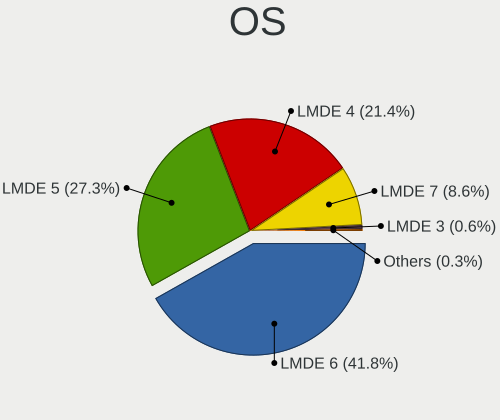

| Name   | Notebooks | Percent |
|--------|-----------|---------|
| LMDE 6 | 438       | 41.83%  |
| LMDE 5 | 286       | 27.32%  |
| LMDE 4 | 224       | 21.39%  |
| LMDE 7 | 90        | 8.6%    |
| LMDE 3 | 6         | 0.57%   |
| LMDE 2 | 3         | 0.29%   |

OS Family
---------

OS without a version

| Name | Notebooks | Percent |
|------|-----------|---------|
| LMDE | 1029      | 100%    |

Kernel
------

Version of the Linux kernel

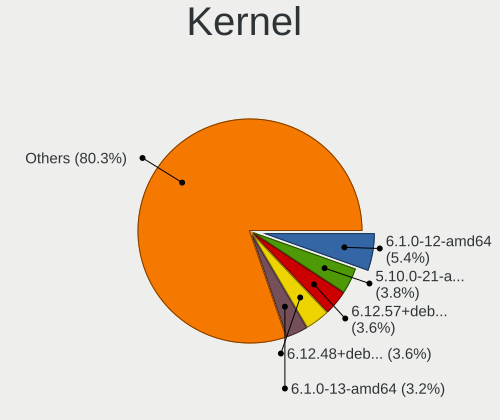

| Version             | Notebooks | Percent |
|---------------------|-----------|---------|
| 6.1.0-12-amd64      | 63        | 5.45%   |
| 5.10.0-21-amd64     | 44        | 3.81%   |
| 6.12.57+deb13-amd64 | 42        | 3.63%   |
| 6.12.48+deb13-amd64 | 42        | 3.63%   |
| 6.1.0-13-amd64      | 37        | 3.2%    |
| 6.1.0-37-amd64      | 36        | 3.11%   |
| 5.10.0-12-amd64     | 35        | 3.03%   |
| 5.10.0-19-amd64     | 29        | 2.51%   |
| 5.10.0-23-amd64     | 28        | 2.42%   |
| 6.1.0-18-amd64      | 27        | 2.34%   |
| 4.19.0-8-amd64      | 27        | 2.34%   |
| 6.1.0-17-amd64      | 23        | 1.99%   |
| 4.19.0-18-amd64     | 23        | 1.99%   |
| 6.1.0-28-amd64      | 20        | 1.73%   |
| 5.10.0-14-amd64     | 20        | 1.73%   |
| 4.19.0-17-amd64     | 20        | 1.73%   |
| 6.1.0-31-amd64      | 19        | 1.64%   |
| 6.1.0-30-amd64      | 19        | 1.64%   |
| 4.19.0-9-amd64      | 18        | 1.56%   |
| 6.1.0-26-amd64      | 17        | 1.47%   |
| 6.1.0-23-amd64      | 17        | 1.47%   |
| 5.10.0-25-amd64     | 17        | 1.47%   |
| 5.10.0-20-amd64     | 17        | 1.47%   |
| 5.10.0-15-amd64     | 16        | 1.38%   |
| 4.19.0-16-amd64     | 16        | 1.38%   |
| 6.1.0-25-amd64      | 15        | 1.3%    |
| 6.1.0-21-amd64      | 15        | 1.3%    |
| 5.10.0-18-amd64     | 14        | 1.21%   |
| 5.10.0-13-amd64     | 14        | 1.21%   |
| 4.19.0-8-686        | 14        | 1.21%   |
| 4.19.0-17-686       | 14        | 1.21%   |
| 6.1.0-32-amd64      | 13        | 1.12%   |
| 4.19.0-14-amd64     | 13        | 1.12%   |
| 6.1.0-40-amd64      | 12        | 1.04%   |
| 6.1.0-34-amd64      | 12        | 1.04%   |
| 4.19.0-13-amd64     | 12        | 1.04%   |
| 6.1.0-16-amd64      | 11        | 0.95%   |
| 5.10.0-16-amd64     | 11        | 0.95%   |
| 4.19.0-16-686       | 11        | 0.95%   |
| 4.19.0-10-amd64     | 11        | 0.95%   |

Kernel Family
-------------

Linux kernel without a distro release

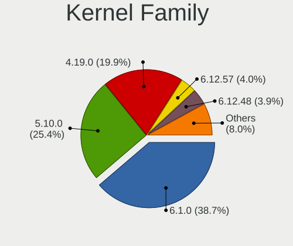

| Version | Notebooks | Percent |
|---------|-----------|---------|
| 6.1.0   | 413       | 38.74%  |
| 5.10.0  | 271       | 25.42%  |
| 4.19.0  | 212       | 19.89%  |
| 6.12.57 | 43        | 4.03%   |
| 6.12.48 | 42        | 3.94%   |
| 5.18.0  | 6         | 0.56%   |
| 6.12.12 | 5         | 0.47%   |
| 4.9.0   | 5         | 0.47%   |
| 6.5.0   | 4         | 0.38%   |
| 6.12.43 | 4         | 0.38%   |
| 5.16.0  | 4         | 0.38%   |
| 3.16.0  | 3         | 0.28%   |
| 6.9.7   | 2         | 0.19%   |
| 6.9.5   | 2         | 0.19%   |
| 6.6.13  | 2         | 0.19%   |
| 6.17.8  | 2         | 0.19%   |
| 6.14.0  | 2         | 0.19%   |
| 6.12.9  | 2         | 0.19%   |
| 6.12.33 | 2         | 0.19%   |
| 6.12.32 | 2         | 0.19%   |
| 6.12.22 | 2         | 0.19%   |
| 6.11.5  | 2         | 0.19%   |
| 5.6.0   | 2         | 0.19%   |
| 5.4.0   | 2         | 0.19%   |
| 5.19.0  | 2         | 0.19%   |
| 5.15.59 | 2         | 0.19%   |
| 6.9.10  | 1         | 0.09%   |
| 6.6.2   | 1         | 0.09%   |
| 6.6.15  | 1         | 0.09%   |
| 6.6.10  | 1         | 0.09%   |
| 6.5.11  | 1         | 0.09%   |
| 6.5.10  | 1         | 0.09%   |
| 6.4.0   | 1         | 0.09%   |
| 6.18.0  | 1         | 0.09%   |
| 6.16.3  | 1         | 0.09%   |
| 6.12.6  | 1         | 0.09%   |
| 6.12.10 | 1         | 0.09%   |
| 6.11.10 | 1         | 0.09%   |
| 6.10.6  | 1         | 0.09%   |
| 6.10.11 | 1         | 0.09%   |

Kernel Major Ver.
-----------------

Linux kernel major version

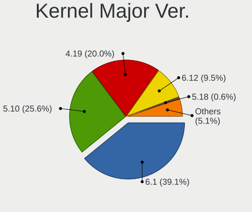

| Version | Notebooks | Percent |
|---------|-----------|---------|
| 6.1     | 414       | 39.13%  |
| 5.10    | 271       | 25.61%  |
| 4.19    | 212       | 20.04%  |
| 6.12    | 101       | 9.55%   |
| 5.18    | 6         | 0.57%   |
| 6.9     | 5         | 0.47%   |
| 6.6     | 5         | 0.47%   |
| 6.5     | 5         | 0.47%   |
| 4.9     | 5         | 0.47%   |
| 5.16    | 4         | 0.38%   |
| 5.15    | 4         | 0.38%   |
| 6.11    | 3         | 0.28%   |
| 5.4     | 3         | 0.28%   |
| 5.19    | 3         | 0.28%   |
| 3.16    | 3         | 0.28%   |
| 6.17    | 2         | 0.19%   |
| 6.14    | 2         | 0.19%   |
| 6.10    | 2         | 0.19%   |
| 5.9     | 2         | 0.19%   |
| 5.6     | 2         | 0.19%   |
| 6.4     | 1         | 0.09%   |
| 6.18    | 1         | 0.09%   |
| 6.16    | 1         | 0.09%   |
| 5.8     | 1         | 0.09%   |

Arch
----

OS architecture (x86_64, i586, etc.)

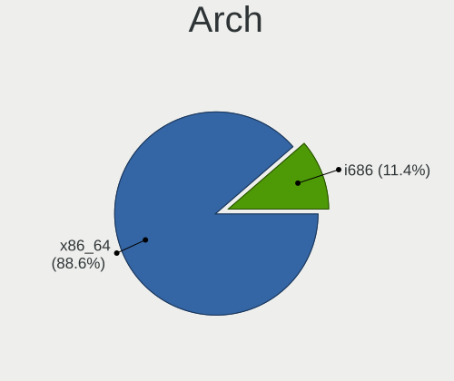

| Name   | Notebooks | Percent |
|--------|-----------|---------|
| x86_64 | 913       | 88.64%  |
| i686   | 117       | 11.36%  |

DE
--

Desktop Environment

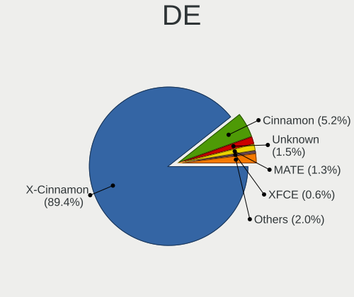

| Name       | Notebooks | Percent |
|------------|-----------|---------|
| X-Cinnamon | 932       | 89.36%  |
| Cinnamon   | 54        | 5.18%   |
| Unknown    | 16        | 1.53%   |
| MATE       | 14        | 1.34%   |
| XFCE       | 6         | 0.58%   |
| GNOME      | 6         | 0.58%   |
| LXDE       | 5         | 0.48%   |
| KDE5       | 5         | 0.48%   |
| Trinity    | 1         | 0.1%    |
| KDE6       | 1         | 0.1%    |
| KDE        | 1         | 0.1%    |
| i3         | 1         | 0.1%    |
| awesome    | 1         | 0.1%    |

Display Server
--------------

X11 or Wayland

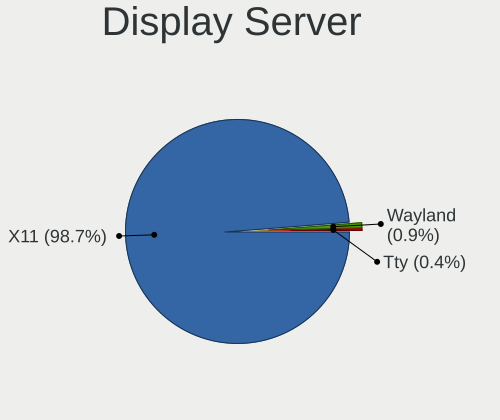

| Name    | Notebooks | Percent |
|---------|-----------|---------|
| X11     | 1017      | 98.74%  |
| Wayland | 9         | 0.87%   |
| Tty     | 4         | 0.39%   |

Display Manager
---------------

SDDM, LightDM, etc.

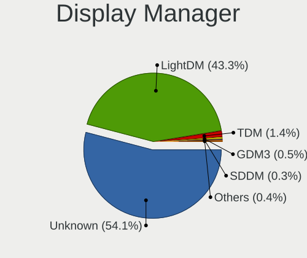

| Name    | Notebooks | Percent |
|---------|-----------|---------|
| Unknown | 563       | 54.08%  |
| LightDM | 451       | 43.32%  |
| TDM     | 15        | 1.44%   |
| GDM3    | 5         | 0.48%   |
| SDDM    | 3         | 0.29%   |
| MDM     | 3         | 0.29%   |
| GDM     | 1         | 0.1%    |

OS Lang
-------

Language

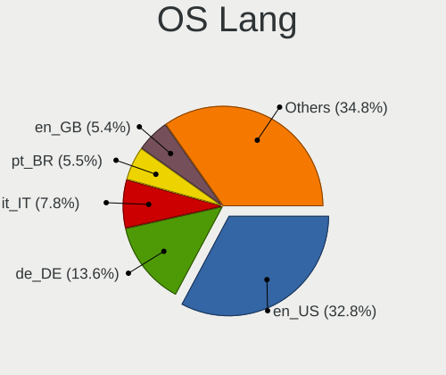

| Lang    | Notebooks | Percent |
|---------|-----------|---------|
| en_US   | 339       | 32.82%  |
| de_DE   | 141       | 13.65%  |
| it_IT   | 81        | 7.84%   |
| pt_BR   | 57        | 5.52%   |
| en_GB   | 56        | 5.42%   |
| ru_RU   | 53        | 5.13%   |
| fr_FR   | 48        | 4.65%   |
| pl_PL   | 28        | 2.71%   |
| es_ES   | 22        | 2.13%   |
| Unknown | 16        | 1.55%   |
| nl_NL   | 12        | 1.16%   |
| es_MX   | 10        | 0.97%   |
| en_CA   | 10        | 0.97%   |
| es_AR   | 9         | 0.87%   |
| en_AU   | 9         | 0.87%   |
| ja_JP   | 8         | 0.77%   |
| cs_CZ   | 8         | 0.77%   |
| de_CH   | 7         | 0.68%   |
| tr_TR   | 6         | 0.58%   |
| el_GR   | 6         | 0.58%   |
| sv_SE   | 5         | 0.48%   |
| hu_HU   | 5         | 0.48%   |
| fr_BE   | 5         | 0.48%   |
| en_NZ   | 5         | 0.48%   |
| en_IN   | 5         | 0.48%   |
| de_AT   | 5         | 0.48%   |
| pt_PT   | 4         | 0.39%   |
| fi_FI   | 4         | 0.39%   |
| es_SV   | 4         | 0.39%   |
| es_BO   | 4         | 0.39%   |
| da_DK   | 4         | 0.39%   |
| nl_BE   | 3         | 0.29%   |
| es_EC   | 3         | 0.29%   |
| es_CL   | 3         | 0.29%   |
| en_ZA   | 3         | 0.29%   |
| en_SG   | 3         | 0.29%   |
| en_IE   | 3         | 0.29%   |
| bg_BG   | 3         | 0.29%   |
| zh_CN   | 2         | 0.19%   |
| ro_RO   | 2         | 0.19%   |

Boot Mode
---------

EFI or BIOS

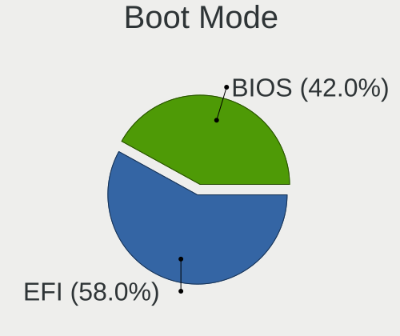

| Mode | Notebooks | Percent |
|------|-----------|---------|
| EFI  | 601       | 58.01%  |
| BIOS | 435       | 41.99%  |

Filesystem
----------

Type of filesystem

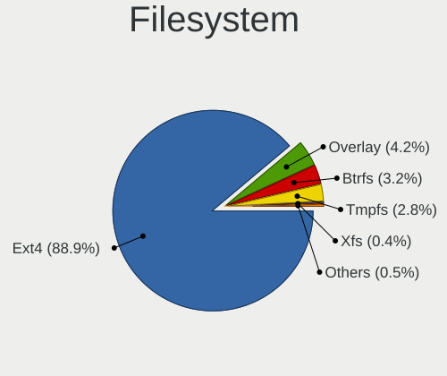

| Type    | Notebooks | Percent |
|---------|-----------|---------|
| Ext4    | 921       | 88.9%   |
| Overlay | 44        | 4.25%   |
| Btrfs   | 33        | 3.19%   |
| Tmpfs   | 29        | 2.8%    |
| Xfs     | 4         | 0.39%   |
| Unknown | 3         | 0.29%   |
| Zfs     | 1         | 0.1%    |
| Aufs    | 1         | 0.1%    |

Part. scheme
------------

Scheme of partitioning

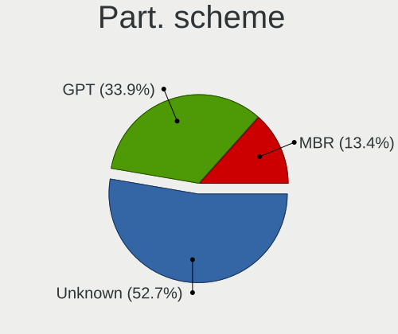

| Type    | Notebooks | Percent |
|---------|-----------|---------|
| Unknown | 547       | 52.7%   |
| GPT     | 352       | 33.91%  |
| MBR     | 139       | 13.39%  |

Dual Boot with Linux/BSD
------------------------

Hosting more than one Linux/BSD

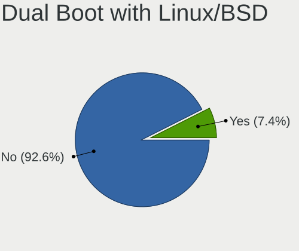

| Dual boot | Notebooks | Percent |
|-----------|-----------|---------|
| No        | 958       | 92.56%  |
| Yes       | 77        | 7.44%   |

Dual Boot (Win)
---------------

Hosting Linux and Windows

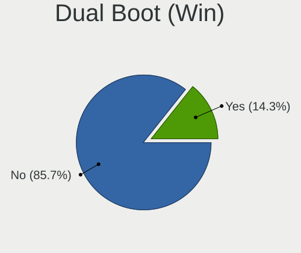

| Dual boot | Notebooks | Percent |
|-----------|-----------|---------|
| No        | 887       | 85.7%   |
| Yes       | 148       | 14.3%   |

Board
-----

Vendor
------

Motherboard manufacturer

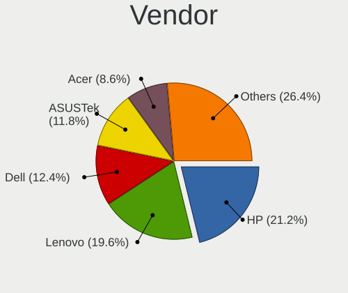

| Name                           | Notebooks | Percent |
|--------------------------------|-----------|---------|
| Hewlett-Packard                | 218       | 21.19%  |
| Lenovo                         | 202       | 19.63%  |
| Dell                           | 128       | 12.44%  |
| ASUSTek Computer               | 121       | 11.76%  |
| Acer                           | 88        | 8.55%   |
| Apple                          | 35        | 3.4%    |
| Toshiba                        | 34        | 3.3%    |
| Samsung Electronics            | 19        | 1.85%   |
| Fujitsu                        | 17        | 1.65%   |
| Sony                           | 15        | 1.46%   |
| MSI                            | 10        | 0.97%   |
| Fujitsu Siemens                | 10        | 0.97%   |
| Google                         | 9         | 0.87%   |
| Unknown                        | 9         | 0.87%   |
| LG Electronics                 | 8         | 0.78%   |
| HUAWEI                         | 7         | 0.68%   |
| Notebook                       | 6         | 0.58%   |
| Medion                         | 6         | 0.58%   |
| Packard Bell                   | 5         | 0.49%   |
| Alienware                      | 5         | 0.49%   |
| TUXEDO                         | 4         | 0.39%   |
| Positivo                       | 4         | 0.39%   |
| Gateway                        | 3         | 0.29%   |
| Timi                           | 2         | 0.19%   |
| Star Labs                      | 2         | 0.19%   |
| Multilaser                     | 2         | 0.19%   |
| Matsushita Electric Industrial | 2         | 0.19%   |
| Maibenben                      | 2         | 0.19%   |
| LETSUNG                        | 2         | 0.19%   |
| Insyde                         | 2         | 0.19%   |
| Infinix                        | 2         | 0.19%   |
| IBM                            | 2         | 0.19%   |
| GPU Company                    | 2         | 0.19%   |
| Framework                      | 2         | 0.19%   |
| Dynabook                       | 2         | 0.19%   |
| Compaq                         | 2         | 0.19%   |
| Wortmann AG                    | 1         | 0.1%    |
| Valve                          | 1         | 0.1%    |
| VALE                           | 1         | 0.1%    |
| TongFang                       | 1         | 0.1%    |

Model
-----

Motherboard model

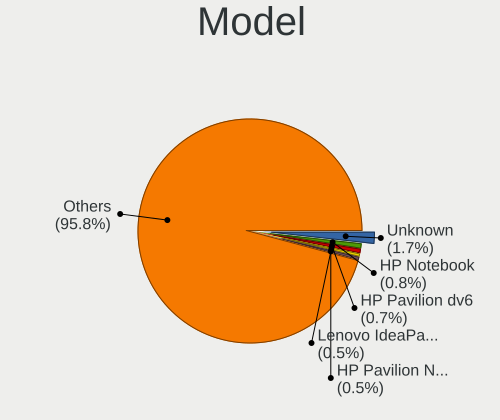

| Name                                        | Notebooks | Percent |
|---------------------------------------------|-----------|---------|
| Unknown                                     | 18        | 1.75%   |
| HP Notebook                                 | 8         | 0.78%   |
| HP Pavilion dv6                             | 7         | 0.68%   |
| Lenovo IdeaPad 3 15ADA05 81W1               | 5         | 0.49%   |
| HP Pavilion Notebook                        | 5         | 0.49%   |
| Apple MacBookAir7,2                         | 5         | 0.49%   |
| HP 250 G8 Notebook PC                       | 4         | 0.39%   |
| Dell XPS 13 9360                            | 4         | 0.39%   |
| ASUS VivoBook_ASUSLaptop X1605VA_X1605VA    | 4         | 0.39%   |
| Apple MacBookPro9,2                         | 4         | 0.39%   |
| Samsung RV411/RV511/E3511/S3511/RV711/E3411 | 3         | 0.29%   |
| Lenovo G50-45 80E3                          | 3         | 0.29%   |
| HP Pavilion dv7                             | 3         | 0.29%   |
| HP Pavilion 15                              | 3         | 0.29%   |
| HP Laptop 15-dy2xxx                         | 3         | 0.29%   |
| HP Laptop 15-dw1xxx                         | 3         | 0.29%   |
| HP Laptop 15-bw0xx                          | 3         | 0.29%   |
| HP EliteBook 8440p                          | 3         | 0.29%   |
| HP EliteBook 840 G1                         | 3         | 0.29%   |
| HP EliteBook 820 G3                         | 3         | 0.29%   |
| HP 250 G7 Notebook PC                       | 3         | 0.29%   |
| Dell System Vostro 3750                     | 3         | 0.29%   |
| Dell Latitude E6430                         | 3         | 0.29%   |
| Dell Latitude E6400                         | 3         | 0.29%   |
| Apple MacBookAir6,2                         | 3         | 0.29%   |
| Acer Aspire E1-570G                         | 3         | 0.29%   |
| Acer Aspire 5930                            | 3         | 0.29%   |
| Acer Aspire 5735                            | 3         | 0.29%   |
| Acer AOD270                                 | 3         | 0.29%   |
| Toshiba Satellite M100                      | 2         | 0.19%   |
| Star Labs StarBook                          | 2         | 0.19%   |
| Notebook W65_67SZ                           | 2         | 0.19%   |
| LG A530-T.BE76P1                            | 2         | 0.19%   |
| Lenovo V145-15AST 81MT                      | 2         | 0.19%   |
| Lenovo ThinkPad X230 2325SU3                | 2         | 0.19%   |
| Lenovo Legion 5 Pro 16ACH6H 82JQ            | 2         | 0.19%   |
| Lenovo IdeaPad 3 15ITL6 82H8                | 2         | 0.19%   |
| Lenovo IdeaPad 3 15IML05 82BS               | 2         | 0.19%   |
| Lenovo IdeaPad 3 14ALC6 82KT                | 2         | 0.19%   |
| Lenovo G500 20236                           | 2         | 0.19%   |

Model Family
------------

Motherboard model prefix

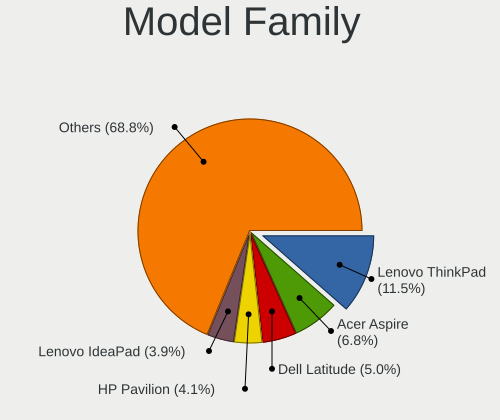

| Name                  | Notebooks | Percent |
|-----------------------|-----------|---------|
| Lenovo ThinkPad       | 118       | 11.47%  |
| Acer Aspire           | 70        | 6.8%    |
| Dell Latitude         | 51        | 4.96%   |
| HP Pavilion           | 42        | 4.08%   |
| Lenovo IdeaPad        | 40        | 3.89%   |
| HP Laptop             | 39        | 3.79%   |
| HP EliteBook          | 33        | 3.21%   |
| Dell Inspiron         | 33        | 3.21%   |
| ASUS VivoBook         | 33        | 3.21%   |
| Toshiba Satellite     | 29        | 2.82%   |
| HP ProBook            | 20        | 1.94%   |
| Unknown               | 18        | 1.75%   |
| HP Compaq             | 15        | 1.46%   |
| Dell Precision        | 14        | 1.36%   |
| Fujitsu LIFEBOOK      | 13        | 1.26%   |
| Dell XPS              | 12        | 1.17%   |
| HP ENVY               | 10        | 0.97%   |
| ASUS Zenbook          | 10        | 0.97%   |
| HP 250                | 9         | 0.87%   |
| HP Notebook           | 8         | 0.78%   |
| Lenovo Yoga           | 6         | 0.58%   |
| Dell Vostro           | 6         | 0.58%   |
| ASUS ASUS             | 6         | 0.58%   |
| Apple MacBookAir7     | 6         | 0.58%   |
| Lenovo Legion         | 5         | 0.49%   |
| HP 255                | 5         | 0.49%   |
| Fujitsu Siemens AMILO | 5         | 0.49%   |
| Dell System           | 5         | 0.49%   |
| ASUS ROG              | 5         | 0.49%   |
| Packard Bell EasyNote | 4         | 0.39%   |
| Lenovo V15            | 4         | 0.39%   |
| Lenovo ThinkBook      | 4         | 0.39%   |
| Apple MacBookPro9     | 4         | 0.39%   |
| Apple MacBookPro5     | 4         | 0.39%   |
| Apple MacBookAir6     | 4         | 0.39%   |
| Acer TravelMate       | 4         | 0.39%   |
| Samsung RV411         | 3         | 0.29%   |
| Lenovo G50-45         | 3         | 0.29%   |
| HP ZBook              | 3         | 0.29%   |
| HP Presario           | 3         | 0.29%   |

MFG Year
--------

Motherboard manufacture year

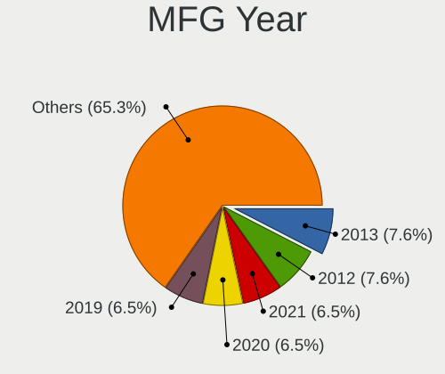

| Year    | Notebooks | Percent |
|---------|-----------|---------|
| 2013    | 78        | 7.58%   |
| 2012    | 78        | 7.58%   |
| 2021    | 67        | 6.51%   |
| 2020    | 67        | 6.51%   |
| 2019    | 67        | 6.51%   |
| 2011    | 67        | 6.51%   |
| 2018    | 62        | 6.03%   |
| 2010    | 58        | 5.64%   |
| 2008    | 57        | 5.54%   |
| 2016    | 54        | 5.25%   |
| 2009    | 49        | 4.76%   |
| 2017    | 46        | 4.47%   |
| 2023    | 45        | 4.37%   |
| 2014    | 45        | 4.37%   |
| 2015    | 42        | 4.08%   |
| 2022    | 40        | 3.89%   |
| 2007    | 34        | 3.3%    |
| 2006    | 31        | 3.01%   |
| 2024    | 19        | 1.85%   |
| 2005    | 9         | 0.87%   |
| 2025    | 6         | 0.58%   |
| Unknown | 4         | 0.39%   |
| 2003    | 2         | 0.19%   |
| 2004    | 1         | 0.1%    |
| 2002    | 1         | 0.1%    |

Form Factor
-----------

Physical design of the computer

| Name     | Notebooks | Percent |
|----------|-----------|---------|
| Notebook | 1029      | 100%    |

Secure Boot
-----------

Enabled or disabled

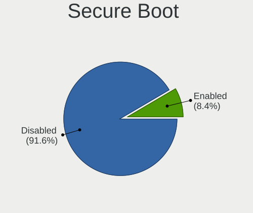

| State    | Notebooks | Percent |
|----------|-----------|---------|
| Disabled | 945       | 91.57%  |
| Enabled  | 87        | 8.43%   |

Coreboot
--------

Have coreboot on board

| Used | Notebooks | Percent |
|------|-----------|---------|
| No   | 1016      | 98.74%  |
| Yes  | 13        | 1.26%   |

RAM Size
--------

Total RAM memory

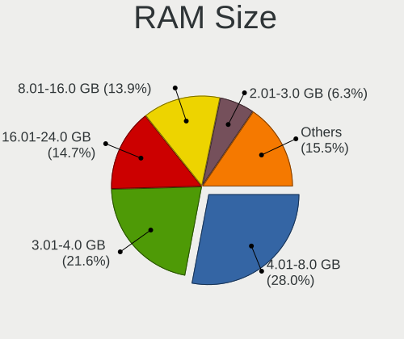

| Size in GB  | Notebooks | Percent |
|-------------|-----------|---------|
| 4.01-8.0    | 289       | 27.98%  |
| 3.01-4.0    | 223       | 21.59%  |
| 16.01-24.0  | 152       | 14.71%  |
| 8.01-16.0   | 144       | 13.94%  |
| 2.01-3.0    | 65        | 6.29%   |
| 1.01-2.0    | 59        | 5.71%   |
| 32.01-64.0  | 56        | 5.42%   |
| 64.01-256.0 | 19        | 1.84%   |
| 0.51-1.0    | 15        | 1.45%   |
| 24.01-32.0  | 11        | 1.06%   |

RAM Used
--------

Used RAM memory

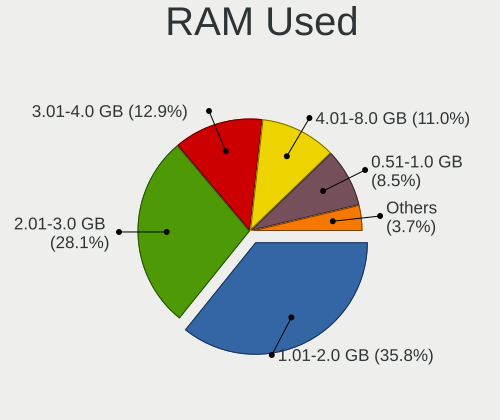

| Used GB    | Notebooks | Percent |
|------------|-----------|---------|
| 1.01-2.0   | 393       | 35.79%  |
| 2.01-3.0   | 308       | 28.05%  |
| 3.01-4.0   | 142       | 12.93%  |
| 4.01-8.0   | 121       | 11.02%  |
| 0.51-1.0   | 93        | 8.47%   |
| 8.01-16.0  | 31        | 2.82%   |
| 0.01-0.5   | 5         | 0.46%   |
| 16.01-24.0 | 3         | 0.27%   |
| 32.01-64.0 | 1         | 0.09%   |
| 24.01-32.0 | 1         | 0.09%   |

Total Drives
------------

Number of drives on board

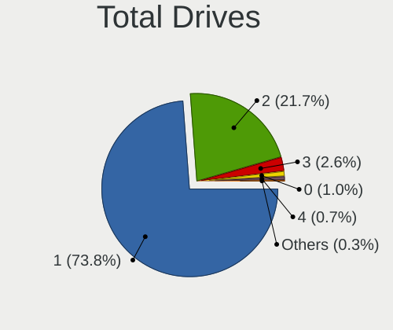

| Drives | Notebooks | Percent |
|--------|-----------|---------|
| 1      | 775       | 73.81%  |
| 2      | 228       | 21.71%  |
| 3      | 27        | 2.57%   |
| 0      | 10        | 0.95%   |
| 4      | 7         | 0.67%   |
| 5      | 2         | 0.19%   |
| 6      | 1         | 0.1%    |

Has CD-ROM
----------

Has CD-ROM on board

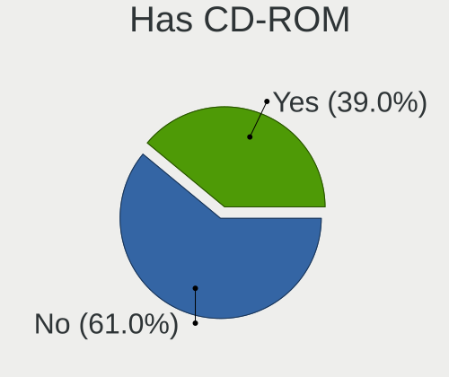

| Presented | Notebooks | Percent |
|-----------|-----------|---------|
| No        | 632       | 61%     |
| Yes       | 404       | 39%     |

Has Ethernet
------------

Has Ethernet on board

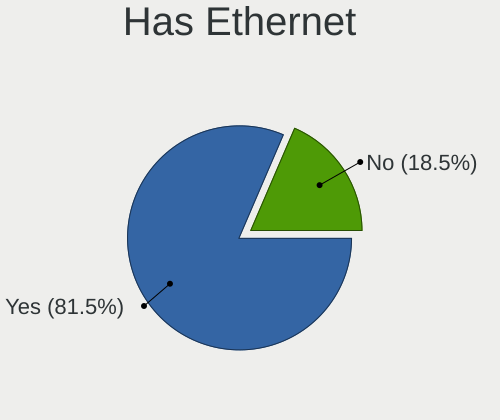

| Presented | Notebooks | Percent |
|-----------|-----------|---------|
| Yes       | 839       | 81.46%  |
| No        | 191       | 18.54%  |

Has WiFi
--------

Has WiFi module

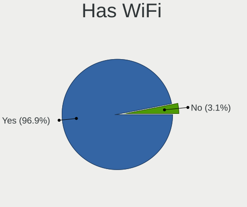

| Presented | Notebooks | Percent |
|-----------|-----------|---------|
| Yes       | 997       | 96.89%  |
| No        | 32        | 3.11%   |

Has Bluetooth
-------------

Has Bluetooth module

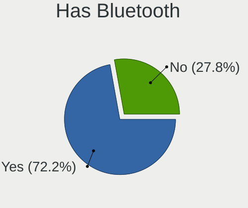

| Presented | Notebooks | Percent |
|-----------|-----------|---------|
| Yes       | 744       | 72.16%  |
| No        | 287       | 27.84%  |

Location
--------

Country
-------

Geographic location (country)

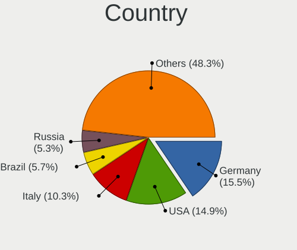

| Country     | Notebooks | Percent |
|-------------|-----------|---------|
| Germany     | 160       | 15.5%   |
| USA         | 154       | 14.92%  |
| Italy       | 106       | 10.27%  |
| Brazil      | 59        | 5.72%   |
| Russia      | 55        | 5.33%   |
| France      | 46        | 4.46%   |
| Poland      | 35        | 3.39%   |
| UK          | 34        | 3.29%   |
| Spain       | 25        | 2.42%   |
| Netherlands | 23        | 2.23%   |
| Canada      | 21        | 2.03%   |
| Mexico      | 16        | 1.55%   |
| Australia   | 14        | 1.36%   |
| Austria     | 13        | 1.26%   |
| Turkey      | 12        | 1.16%   |
| Switzerland | 12        | 1.16%   |
| Belgium     | 12        | 1.16%   |
| Argentina   | 11        | 1.07%   |
| Sweden      | 10        | 0.97%   |
| Ukraine     | 9         | 0.87%   |
| Japan       | 9         | 0.87%   |
| Indonesia   | 9         | 0.87%   |
| Finland     | 9         | 0.87%   |
| Romania     | 8         | 0.78%   |
| India       | 8         | 0.78%   |
| Hungary     | 8         | 0.78%   |
| Czechia     | 8         | 0.78%   |
| Bulgaria    | 8         | 0.78%   |
| Portugal    | 7         | 0.68%   |
| Greece      | 7         | 0.68%   |
| Belarus     | 7         | 0.68%   |
| New Zealand | 6         | 0.58%   |
| Malaysia    | 6         | 0.58%   |
| Ecuador     | 6         | 0.58%   |
| Denmark     | 5         | 0.48%   |
| Chile       | 5         | 0.48%   |
| Philippines | 4         | 0.39%   |
| Ireland     | 4         | 0.39%   |
| Bolivia     | 4         | 0.39%   |
| Tunisia     | 3         | 0.29%   |

City
----

Geographic location (city)

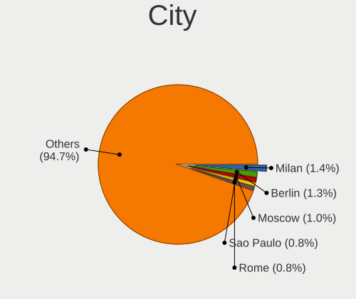

| City              | Notebooks | Percent |
|-------------------|-----------|---------|
| Milan             | 15        | 1.37%   |
| Berlin            | 14        | 1.28%   |
| Moscow            | 11        | 1.01%   |
| Sao Paulo         | 9         | 0.82%   |
| Rome              | 9         | 0.82%   |
| Vienna            | 8         | 0.73%   |
| St Petersburg     | 8         | 0.73%   |
| Bologna           | 7         | 0.64%   |
| Traunstein        | 6         | 0.55%   |
| Paris             | 6         | 0.55%   |
| Munich            | 6         | 0.55%   |
| Milano            | 6         | 0.55%   |
| Madrid            | 6         | 0.55%   |
| Krakow            | 6         | 0.55%   |
| Cologne           | 6         | 0.55%   |
| Wroclaw           | 5         | 0.46%   |
| Sydney            | 5         | 0.46%   |
| New York          | 5         | 0.46%   |
| Mannheim          | 5         | 0.46%   |
| Warsaw            | 4         | 0.37%   |
| Turin             | 4         | 0.37%   |
| Seville           | 4         | 0.37%   |
| Poznan            | 4         | 0.37%   |
| Miami             | 4         | 0.37%   |
| Mexico City       | 4         | 0.37%   |
| Malmo             | 4         | 0.37%   |
| London            | 4         | 0.37%   |
| Lisbon            | 4         | 0.37%   |
| Jacksonville      | 4         | 0.37%   |
| Hamburg           | 4         | 0.37%   |
| Guayaquil         | 4         | 0.37%   |
| Frankfurt am Main | 4         | 0.37%   |
| Florence          | 4         | 0.37%   |
| Budapest          | 4         | 0.37%   |
| Brussels          | 4         | 0.37%   |
| Auckland          | 4         | 0.37%   |
| Amsterdam         | 4         | 0.37%   |
| Zurich            | 3         | 0.27%   |
| Yekaterinburg     | 3         | 0.27%   |
| Wohlen            | 3         | 0.27%   |

Drives
------

Drive Vendor
------------

Hard drive vendors

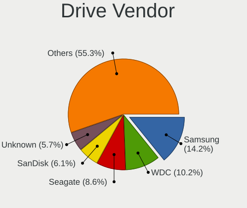

| Vendor                      | Notebooks | Drives | Percent |
|-----------------------------|-----------|--------|---------|
| Samsung Electronics         | 180       | 222    | 14.16%  |
| WDC                         | 130       | 145    | 10.23%  |
| Seagate                     | 109       | 133    | 8.58%   |
| SanDisk                     | 77        | 107    | 6.06%   |
| Unknown                     | 72        | 97     | 5.66%   |
| Toshiba                     | 68        | 70     | 5.35%   |
| Kingston                    | 63        | 87     | 4.96%   |
| Crucial                     | 49        | 57     | 3.86%   |
| SK hynix                    | 45        | 50     | 3.54%   |
| Hitachi                     | 42        | 42     | 3.3%    |
| Intel                       | 39        | 48     | 3.07%   |
| Micron Technology           | 31        | 33     | 2.44%   |
| China                       | 27        | 29     | 2.12%   |
| HGST                        | 25        | 33     | 1.97%   |
| Apple                       | 21        | 26     | 1.65%   |
| Fujitsu                     | 17        | 17     | 1.34%   |
| A-DATA Technology           | 15        | 17     | 1.18%   |
| KIOXIA                      | 13        | 26     | 1.02%   |
| Intenso                     | 11        | 11     | 0.87%   |
| Transcend                   | 10        | 14     | 0.79%   |
| PNY                         | 10        | 11     | 0.79%   |
| GOODRAM                     | 10        | 10     | 0.79%   |
| Phison                      | 9         | 11     | 0.71%   |
| Micron/Crucial Technology   | 8         | 12     | 0.63%   |
| JMicron Technology          | 8         | 9      | 0.63%   |
| Phison Electronics          | 7         | 7      | 0.55%   |
| Patriot                     | 7         | 9      | 0.55%   |
| KingSpec                    | 7         | 8      | 0.55%   |
| Unknown                     | 7         | 9      | 0.55%   |
| SPCC                        | 6         | 6      | 0.47%   |
| SABRENT                     | 6         | 7      | 0.47%   |
| Lexar                       | 6         | 6      | 0.47%   |
| Apacer                      | 5         | 9      | 0.39%   |
| UMIS                        | 4         | 5      | 0.31%   |
| Team                        | 4         | 5      | 0.31%   |
| Silicon Motion              | 4         | 4      | 0.31%   |
| Realtek Semiconductor       | 4         | 4      | 0.31%   |
| MAXIO Technology (Hangzhou) | 4         | 4      | 0.31%   |
| KingDian                    | 4         | 5      | 0.31%   |
| Hewlett-Packard             | 4         | 5      | 0.31%   |

Drive Model
-----------

Hard drive models

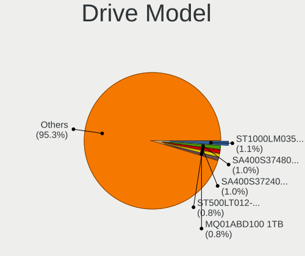

| Model                                             | Notebooks | Percent |
|---------------------------------------------------|-----------|---------|
| Seagate ST1000LM035-1RK172 1TB                    | 14        | 1.07%   |
| Kingston SA400S37480G 480GB SSD                   | 13        | 0.99%   |
| Kingston SA400S37240G 240GB SSD                   | 13        | 0.99%   |
| Seagate ST500LT012-1DG142 500GB                   | 11        | 0.84%   |
| Toshiba MQ01ABD100 1TB                            | 10        | 0.76%   |
| Unknown SD/MMC/MS PRO 2GB                         | 9         | 0.69%   |
| Samsung SSD 860 EVO 500GB                         | 9         | 0.69%   |
| Unknown MMC Card  64GB                            | 8         | 0.61%   |
| Unknown MMC Card  32GB                            | 8         | 0.61%   |
| SanDisk NVMe SSD Drive 1TB                        | 8         | 0.61%   |
| Samsung NVMe SSD Controller SM981/PM981/PM983 1TB | 8         | 0.61%   |
| Crucial CT1000MX500SSD1 1TB                       | 8         | 0.61%   |
| Crucial CT1000BX500SSD1 1TB                       | 8         | 0.61%   |
| SanDisk NVMe SSD Drive 512GB                      | 7         | 0.53%   |
| Samsung SSD 870 EVO 500GB                         | 7         | 0.53%   |
| Samsung SSD 850 EVO 500GB                         | 7         | 0.53%   |
| HGST HTS545050A7E680 500GB                        | 7         | 0.53%   |
| Unknown                                           | 7         | 0.53%   |
| Unknown MMC Card  128GB                           | 6         | 0.46%   |
| Toshiba MQ04ABF100 1TB                            | 6         | 0.46%   |
| Toshiba MQ01ABF050 500GB                          | 6         | 0.46%   |
| Seagate ST9500325AS 500GB                         | 6         | 0.46%   |
| Seagate ST9250315AS 250GB                         | 6         | 0.46%   |
| Sandisk WD Blue SN550 NVMe SSD 1024GB             | 6         | 0.46%   |
| Samsung SSD 860 EVO 1TB                           | 6         | 0.46%   |
| SABRENT Disk 4TB                                  | 6         | 0.46%   |
| Kingston SA400S37120G 120GB SSD                   | 6         | 0.46%   |
| WDC WD3200BEVT-60ZCT1 320GB                       | 5         | 0.38%   |
| Unknown MMC Card  7GB                             | 5         | 0.38%   |
| Unknown MMC Card  16GB                            | 5         | 0.38%   |
| Seagate ST500LM012 HN-M500MBB 500GB               | 5         | 0.38%   |
| Seagate ST1000LM024 HN-M101MBB 1TB                | 5         | 0.38%   |
| Seagate Expansion 2TB                             | 5         | 0.38%   |
| SanDisk NVMe SSD Drive 2TB                        | 5         | 0.38%   |
| SanDisk NVMe SSD Drive 256GB                      | 5         | 0.38%   |
| Samsung SSD 860 EVO 250GB                         | 5         | 0.38%   |
| Samsung MZVLQ1T0HALB-00000 1TB                    | 5         | 0.38%   |
| JMicron Generic 320GB                             | 5         | 0.38%   |
| HGST HTS541010A9E680 1TB                          | 5         | 0.38%   |
| Crucial CT500MX500SSD1 500GB                      | 5         | 0.38%   |

HDD Vendor
----------

Hard disk drive vendors

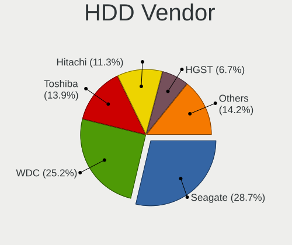

| Vendor              | Notebooks | Drives | Percent |
|---------------------|-----------|--------|---------|
| Seagate             | 107       | 130    | 28.69%  |
| WDC                 | 94        | 106    | 25.2%   |
| Toshiba             | 52        | 54     | 13.94%  |
| Hitachi             | 42        | 42     | 11.26%  |
| HGST                | 25        | 33     | 6.7%    |
| Fujitsu             | 17        | 17     | 4.56%   |
| Unknown             | 9         | 9      | 2.41%   |
| Samsung Electronics | 9         | 10     | 2.41%   |
| JMicron Technology  | 5         | 5      | 1.34%   |
| Intenso             | 3         | 3      | 0.8%    |
| IBM/Hitachi         | 2         | 2      | 0.54%   |
| USB3.0              | 1         | 1      | 0.27%   |
| T-FORCE             | 1         | 1      | 0.27%   |
| Shenzhen            | 1         | 1      | 0.27%   |
| Initio              | 1         | 1      | 0.27%   |
| External            | 1         | 1      | 0.27%   |
| DAS                 | 1         | 4      | 0.27%   |
| ASMT                | 1         | 1      | 0.27%   |
| Apple               | 1         | 1      | 0.27%   |

SSD Vendor
----------

Solid state drive vendors

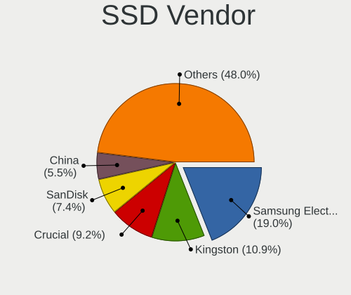

| Vendor              | Notebooks | Drives | Percent |
|---------------------|-----------|--------|---------|
| Samsung Electronics | 87        | 112    | 19%     |
| Kingston            | 50        | 72     | 10.92%  |
| Crucial             | 42        | 50     | 9.17%   |
| SanDisk             | 34        | 46     | 7.42%   |
| China               | 25        | 27     | 5.46%   |
| Apple               | 17        | 17     | 3.71%   |
| WDC                 | 15        | 16     | 3.28%   |
| Intel               | 14        | 14     | 3.06%   |
| A-DATA Technology   | 14        | 16     | 3.06%   |
| Transcend           | 10        | 14     | 2.18%   |
| GOODRAM             | 10        | 10     | 2.18%   |
| PNY                 | 9         | 10     | 1.97%   |
| Micron Technology   | 7         | 8      | 1.53%   |
| KingSpec            | 7         | 8      | 1.53%   |
| Intenso             | 7         | 7      | 1.53%   |
| Toshiba             | 6         | 6      | 1.31%   |
| SPCC                | 6         | 6      | 1.31%   |
| SABRENT             | 6         | 7      | 1.31%   |
| Patriot             | 6         | 8      | 1.31%   |
| SK hynix            | 5         | 6      | 1.09%   |
| Lexar               | 4         | 4      | 0.87%   |
| KingDian            | 4         | 5      | 0.87%   |
| Hewlett-Packard     | 4         | 5      | 0.87%   |
| Gigabyte Technology | 4         | 6      | 0.87%   |
| Team                | 3         | 4      | 0.66%   |
| LITEON              | 3         | 3      | 0.66%   |
| Apacer              | 3         | 7      | 0.66%   |
| Verbatim            | 2         | 4      | 0.44%   |
| SD                  | 2         | 2      | 0.44%   |
| Phison              | 2         | 2      | 0.44%   |
| Netac               | 2         | 2      | 0.44%   |
| FORESEE             | 2         | 4      | 0.44%   |
| Fanxiang            | 2         | 3      | 0.44%   |
| Emtec               | 2         | 2      | 0.44%   |
| Corsair             | 2         | 2      | 0.44%   |
| BHT                 | 2         | 3      | 0.44%   |
| ASUS-PHISON         | 2         | 4      | 0.44%   |
| Unknown             | 2         | 2      | 0.44%   |
| XrayDisk            | 1         | 1      | 0.22%   |
| WINTEC              | 1         | 1      | 0.22%   |

Drive Kind
----------

HDD or SSD

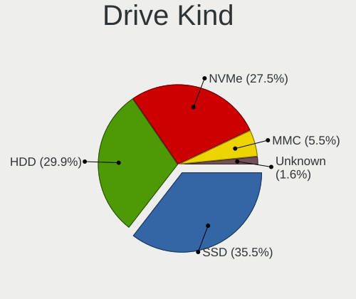

| Kind    | Notebooks | Drives | Percent |
|---------|-----------|--------|---------|
| SSD     | 423       | 563    | 35.49%  |
| HDD     | 357       | 422    | 29.95%  |
| NVMe    | 328       | 447    | 27.52%  |
| MMC     | 65        | 85     | 5.45%   |
| Unknown | 19        | 22     | 1.59%   |

Drive Connector
---------------

SATA, SAS, NVMe, etc.

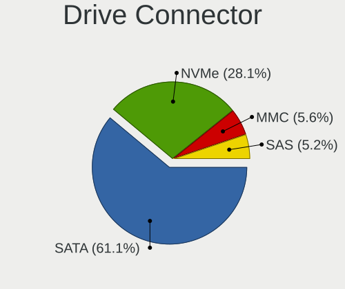

| Type | Notebooks | Drives | Percent |
|------|-----------|--------|---------|
| SATA | 708       | 932    | 61.09%  |
| NVMe | 326       | 438    | 28.13%  |
| MMC  | 65        | 85     | 5.61%   |
| SAS  | 60        | 84     | 5.18%   |

Drive Size
----------

Size of hard drive

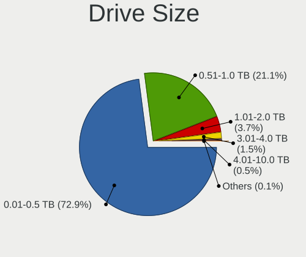

| Size in TB | Notebooks | Drives | Percent |
|------------|-----------|--------|---------|
| 0.01-0.5   | 566       | 720    | 72.94%  |
| 0.51-1.0   | 164       | 209    | 21.13%  |
| 1.01-2.0   | 29        | 34     | 3.74%   |
| 3.01-4.0   | 12        | 14     | 1.55%   |
| 4.01-10.0  | 4         | 7      | 0.52%   |
| 2.01-3.0   | 1         | 1      | 0.13%   |

Space Total
-----------

Amount of disk space available on the file system

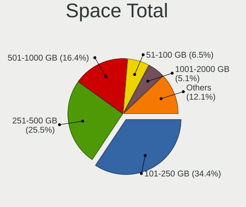

| Size in GB     | Notebooks | Percent |
|----------------|-----------|---------|
| 101-250        | 362       | 34.38%  |
| 251-500        | 269       | 25.55%  |
| 501-1000       | 173       | 16.43%  |
| 51-100         | 68        | 6.46%   |
| 1001-2000      | 54        | 5.13%   |
| 1-20           | 46        | 4.37%   |
| 21-50          | 31        | 2.94%   |
| More than 3000 | 20        | 1.9%    |
| 2001-3000      | 16        | 1.52%   |
| Unknown        | 14        | 1.33%   |

Space Used
----------

Amount of used disk space

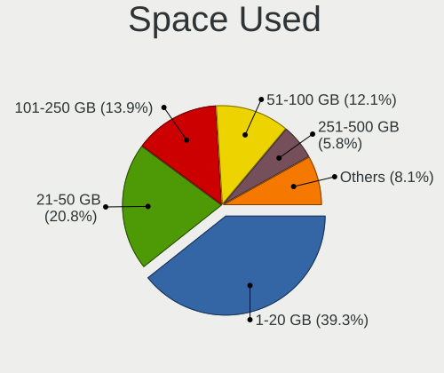

| Used GB        | Notebooks | Percent |
|----------------|-----------|---------|
| 1-20           | 433       | 39.33%  |
| 21-50          | 229       | 20.8%   |
| 101-250        | 153       | 13.9%   |
| 51-100         | 133       | 12.08%  |
| 251-500        | 64        | 5.81%   |
| 501-1000       | 46        | 4.18%   |
| 1001-2000      | 16        | 1.45%   |
| Unknown        | 14        | 1.27%   |
| More than 3000 | 7         | 0.64%   |
| 2001-3000      | 6         | 0.54%   |

Malfunc. Drives
---------------

Drive models with a malfunction

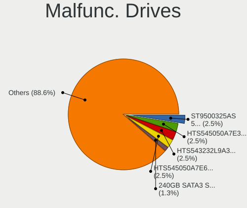

| Model                                 | Notebooks | Drives | Percent |
|---------------------------------------|-----------|--------|---------|
| Seagate ST9500325AS 500GB             | 2         | 2      | 2.53%   |
| Hitachi HTS545050A7E380 500GB         | 2         | 2      | 2.53%   |
| Hitachi HTS543232L9A300 320GB         | 2         | 2      | 2.53%   |
| HGST HTS545050A7E680 500GB            | 2         | 2      | 2.53%   |
| WINTEC 240GB SATA3 SF2281 SSD         | 1         | 1      | 1.27%   |
| WDC WDS120G2G0A-00JH30 120GB SSD      | 1         | 1      | 1.27%   |
| WDC WD7500BPVT-00HXZT3 752GB          | 1         | 1      | 1.27%   |
| WDC WD5000LPVX-60V0TT0 500GB          | 1         | 1      | 1.27%   |
| WDC WD5000BEVT-22A0RT0 500GB          | 1         | 1      | 1.27%   |
| WDC WD3200BEVT-60ZCT1 320GB           | 1         | 1      | 1.27%   |
| WDC WD3200BEVT-26A23T0 320GB          | 1         | 1      | 1.27%   |
| WDC WD3200BEVT-22A23T0 320GB          | 1         | 1      | 1.27%   |
| WDC WD1600BEVT-22ZCT0 160GB           | 1         | 1      | 1.27%   |
| WDC WD1200BEVS-07LAT0 120GB           | 1         | 1      | 1.27%   |
| WDC WD10SPZX-24Z10 1TB                | 1         | 1      | 1.27%   |
| Unknown MMC Card  128GB               | 1         | 1      | 1.27%   |
| Transcend TS512GMTS430S 512GB SSD     | 1         | 1      | 1.27%   |
| Toshiba THNSNF128GCSS 128GB SSD       | 1         | 1      | 1.27%   |
| Toshiba MK1652GSX 160GB               | 1         | 1      | 1.27%   |
| Toshiba MK1637GSX 160GB               | 1         | 1      | 1.27%   |
| SSSTC CV8-8E128-HP 128GB SSD          | 1         | 1      | 1.27%   |
| SK hynix PC711 HFS512GDE9X073N 512GB  | 1         | 1      | 1.27%   |
| SK hynix HFS256G39TND-N210A 256GB SSD | 1         | 1      | 1.27%   |
| SK hynix HFS060G32MNB-2000A 64GB SSD  | 1         | 1      | 1.27%   |
| Seagate STM9120817AS 120GB            | 1         | 1      | 1.27%   |
| Seagate ST98823AS 80GB                | 1         | 2      | 1.27%   |
| Seagate ST9640423AS 640GB             | 1         | 1      | 1.27%   |
| Seagate ST9250315AS 250GB             | 1         | 1      | 1.27%   |
| Seagate ST9120821AS 120GB             | 1         | 1      | 1.27%   |
| Seagate ST910021AS 100GB              | 1         | 1      | 1.27%   |
| Seagate ST500LT032-1E9142 500GB       | 1         | 1      | 1.27%   |
| Seagate ST500LM021-1KJ152 500GB       | 1         | 1      | 1.27%   |
| Seagate ST1000LM014-1EJ164 1TB        | 1         | 1      | 1.27%   |
| SD Ultra 3D 500GB                     | 1         | 1      | 1.27%   |
| SanDisk SD9SN8W-128G-1006 128GB SSD   | 1         | 1      | 1.27%   |
| Samsung Electronics SSD 980 PRO 1TB   | 1         | 1      | 1.27%   |
| Samsung Electronics SSD 970 EVO 500GB | 1         | 2      | 1.27%   |
| Samsung Electronics SSD 870 EVO 500GB | 1         | 1      | 1.27%   |
| Samsung Electronics SSD 870 EVO 1TB   | 1         | 1      | 1.27%   |
| Samsung Electronics SSD 850 PRO 256GB | 1         | 1      | 1.27%   |

Malfunc. Drive Vendor
---------------------

Vendors of faulty drives

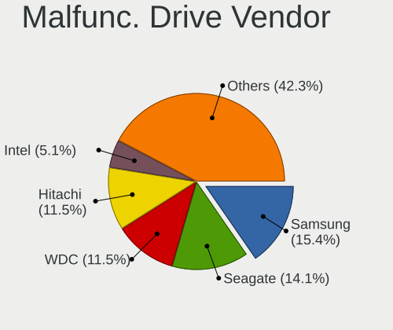

| Vendor              | Notebooks | Drives | Percent |
|---------------------|-----------|--------|---------|
| Samsung Electronics | 12        | 13     | 15.38%  |
| Seagate             | 11        | 12     | 14.1%   |
| WDC                 | 9         | 10     | 11.54%  |
| Hitachi             | 9         | 9      | 11.54%  |
| Intel               | 4         | 4      | 5.13%   |
| Toshiba             | 3         | 3      | 3.85%   |
| SK hynix            | 3         | 3      | 3.85%   |
| Kingston            | 3         | 3      | 3.85%   |
| HGST                | 3         | 3      | 3.85%   |
| Fujitsu             | 3         | 3      | 3.85%   |
| Crucial             | 3         | 4      | 3.85%   |
| China               | 3         | 4      | 3.85%   |
| WINTEC              | 1         | 1      | 1.28%   |
| Unknown             | 1         | 1      | 1.28%   |
| Transcend           | 1         | 1      | 1.28%   |
| SSSTC               | 1         | 1      | 1.28%   |
| SD                  | 1         | 1      | 1.28%   |
| SanDisk             | 1         | 1      | 1.28%   |
| Phison              | 1         | 1      | 1.28%   |
| Lexar               | 1         | 1      | 1.28%   |
| KUU                 | 1         | 1      | 1.28%   |
| JMicron Technology  | 1         | 1      | 1.28%   |
| Intenso             | 1         | 1      | 1.28%   |
| Apple               | 1         | 1      | 1.28%   |

Malfunc. HDD Vendor
-------------------

Vendors of faulty HDD drives

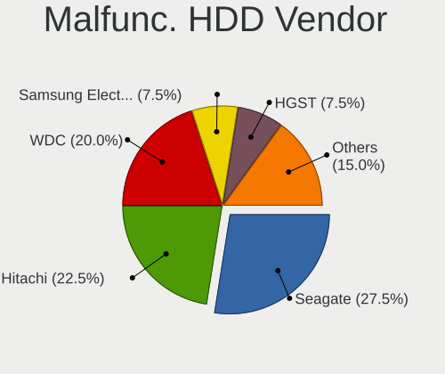

| Vendor              | Notebooks | Drives | Percent |
|---------------------|-----------|--------|---------|
| Seagate             | 11        | 12     | 27.5%   |
| Hitachi             | 9         | 9      | 22.5%   |
| WDC                 | 8         | 9      | 20%     |
| Samsung Electronics | 3         | 3      | 7.5%    |
| HGST                | 3         | 3      | 7.5%    |
| Fujitsu             | 3         | 3      | 7.5%    |
| Toshiba             | 2         | 2      | 5%      |
| JMicron Technology  | 1         | 1      | 2.5%    |

Malfunc. Drive Kind
-------------------

Kinds of faulty drives

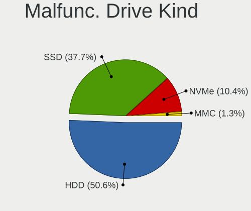

| Kind | Notebooks | Drives | Percent |
|------|-----------|--------|---------|
| HDD  | 39        | 42     | 50.65%  |
| SSD  | 29        | 31     | 37.66%  |
| NVMe | 8         | 9      | 10.39%  |
| MMC  | 1         | 1      | 1.3%    |

Failed Drives
-------------

Failed drive models

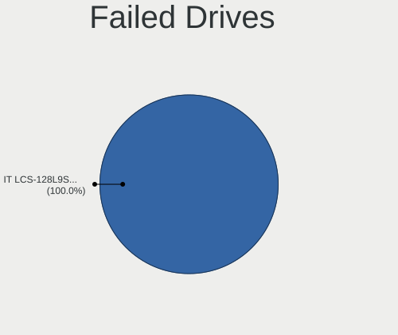

| Model                                     | Notebooks | Drives | Percent |
|-------------------------------------------|-----------|--------|---------|
| LITEON IT LCS-128L9S-11 2.5 7mm 128GB SSD | 1         | 1      | 100%    |

Failed Drive Vendor
-------------------

Failed drive vendors

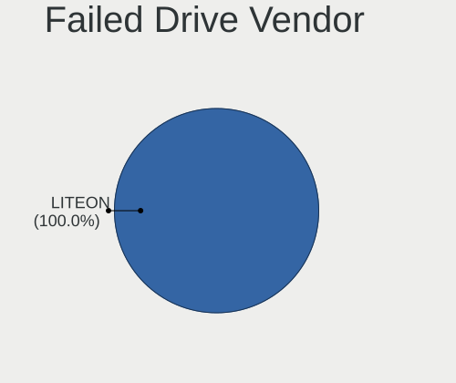

| Vendor | Notebooks | Drives | Percent |
|--------|-----------|--------|---------|
| LITEON | 1         | 1      | 100%    |

Drive Status
------------

Number of failed and malfunc. drives

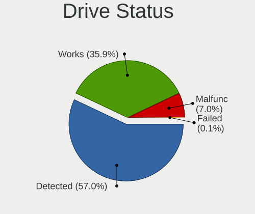

| Status   | Notebooks | Drives | Percent |
|----------|-----------|--------|---------|
| Detected | 621       | 935    | 57.02%  |
| Works    | 391       | 520    | 35.9%   |
| Malfunc  | 76        | 83     | 6.98%   |
| Failed   | 1         | 1      | 0.09%   |

Storage controller
------------------

Storage Vendor
--------------

Storage controller vendors

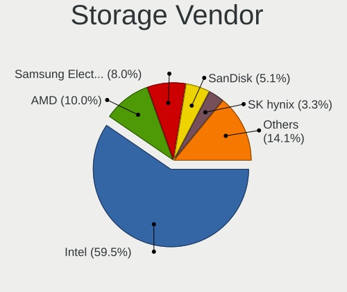

| Vendor                                  | Notebooks | Percent |
|-----------------------------------------|-----------|---------|
| Intel                                   | 703       | 59.53%  |
| AMD                                     | 118       | 9.99%   |
| Samsung Electronics                     | 95        | 8.04%   |
| SanDisk                                 | 60        | 5.08%   |
| SK hynix                                | 39        | 3.3%    |
| Micron Technology                       | 25        | 2.12%   |
| Phison Electronics                      | 17        | 1.44%   |
| Kingston Technology Company             | 16        | 1.35%   |
| KIOXIA                                  | 15        | 1.27%   |
| Micron/Crucial Technology               | 14        | 1.19%   |
| Nvidia                                  | 12        | 1.02%   |
| Toshiba America Info Systems            | 11        | 0.93%   |
| Silicon Motion                          | 6         | 0.51%   |
| Silicon Integrated Systems [SiS]        | 6         | 0.51%   |
| Union Memory (Shenzhen)                 | 5         | 0.42%   |
| MAXIO Technology (Hangzhou)             | 5         | 0.42%   |
| Solidigm                                | 4         | 0.34%   |
| Solid State Storage Technology          | 4         | 0.34%   |
| Marvell Technology Group                | 4         | 0.34%   |
| ADATA Technology                        | 4         | 0.34%   |
| Shenzhen Longsys Electronics            | 3         | 0.25%   |
| Realtek Semiconductor                   | 3         | 0.25%   |
| Apple                                   | 3         | 0.25%   |
| VIA Technologies                        | 2         | 0.17%   |
| TenaFe                                  | 1         | 0.08%   |
| Shenzhen Unionmemory Information System | 1         | 0.08%   |
| Seagate Technology                      | 1         | 0.08%   |
| Netac Technology                        | 1         | 0.08%   |
| INNOGRIT                                | 1         | 0.08%   |
| Hosin Global Electronics                | 1         | 0.08%   |
| Unknown                                 | 1         | 0.08%   |

Storage Model
-------------

Storage controller models

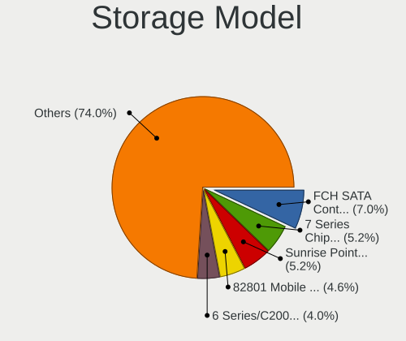

| Model                                                                            | Notebooks | Percent |
|----------------------------------------------------------------------------------|-----------|---------|
| AMD FCH SATA Controller [AHCI mode]                                              | 91        | 7.01%   |
| Intel 7 Series Chipset Family 6-port SATA Controller [AHCI mode]                 | 68        | 5.23%   |
| Intel Sunrise Point-LP SATA Controller [AHCI mode]                               | 67        | 5.16%   |
| Intel 82801 Mobile SATA Controller [RAID mode]                                   | 60        | 4.62%   |
| Intel 6 Series/C200 Series Chipset Family 6 port Mobile SATA AHCI Controller     | 52        | 4%      |
| Intel 82801IBM/IEM (ICH9M/ICH9M-E) 4 port SATA Controller [AHCI mode]            | 42        | 3.23%   |
| Intel Volume Management Device NVMe RAID Controller                              | 39        | 3%      |
| Intel 8 Series SATA Controller 1 [AHCI mode]                                     | 36        | 2.77%   |
| Samsung NVMe SSD Controller SM981/PM981/PM983                                    | 29        | 2.23%   |
| Samsung NVMe SSD Controller 980 (DRAM-less)                                      | 28        | 2.16%   |
| Intel 8 Series/C220 Series Chipset Family 6-port SATA Controller 1 [AHCI mode]   | 26        | 2%      |
| Intel 5 Series/3400 Series Chipset 4 port SATA AHCI Controller                   | 26        | 2%      |
| Intel 82801GBM/GHM (ICH7-M Family) SATA Controller [IDE mode]                    | 22        | 1.69%   |
| Intel 82801GBM/GHM (ICH7-M Family) SATA Controller [AHCI mode]                   | 22        | 1.69%   |
| Intel 82801G (ICH7 Family) IDE Controller                                        | 22        | 1.69%   |
| Intel 82801HM/HEM (ICH8M/ICH8M-E) IDE Controller                                 | 21        | 1.62%   |
| Intel Wildcat Point-LP SATA Controller [AHCI Mode]                               | 20        | 1.54%   |
| Intel Tiger Lake-LP SATA Controller                                              | 19        | 1.46%   |
| Intel 82801HM/HEM (ICH8M/ICH8M-E) SATA Controller [AHCI mode]                    | 19        | 1.46%   |
| Intel 5 Series/3400 Series Chipset 6 port SATA AHCI Controller                   | 16        | 1.23%   |
| SK hynix Gold P31/BC711/PC711 NVMe Solid State Drive                             | 15        | 1.15%   |
| AMD SB7x0/SB8x0/SB9x0 SATA Controller [AHCI mode]                                | 15        | 1.15%   |
| Intel NM10/ICH7 Family SATA Controller [AHCI mode]                               | 14        | 1.08%   |
| Intel Celeron/Pentium Silver Processor SATA Controller                           | 14        | 1.08%   |
| Intel Atom/Celeron/Pentium Processor x5-E8000/J3xxx/N3xxx Series SATA Controller | 14        | 1.08%   |
| SanDisk Ultra 3D / WD PC SN530, IX SN530, Blue SN550 NVMe SSD (DRAM-less)        | 12        | 0.92%   |
| Intel Atom Processor E3800 Series SATA AHCI Controller                           | 12        | 0.92%   |
| Intel HM170/QM170 Chipset SATA Controller [AHCI Mode]                            | 11        | 0.85%   |
| SK hynix BC501 NVMe Solid State Drive                                            | 10        | 0.77%   |
| Samsung NVMe SSD Controller PM9B1 (DRAM-less)                                    | 10        | 0.77%   |
| Intel Cannon Point-LP SATA Controller [AHCI Mode]                                | 10        | 0.77%   |
| KIOXIA NVMe SSD Controller BG4 (DRAM-less)                                       | 9         | 0.69%   |
| Intel RST Volume Management Device Controller                                    | 9         | 0.69%   |
| SanDisk Extreme Pro / WD Black SN750 / PC SN730 / Red SN700 NVMe SSD             | 8         | 0.62%   |
| Samsung S4LN058A01[SSUBX] AHCI SSD Controller (Apple slot)                       | 8         | 0.62%   |
| Samsung NVMe SSD Controller SM961/PM961/SM963                                    | 8         | 0.62%   |
| Phison PS5013-E13 PCIe3 NVMe Controller (DRAM-less)                              | 8         | 0.62%   |
| Intel SSD 660P Series                                                            | 8         | 0.62%   |
| Intel Comet Lake SATA AHCI Controller                                            | 8         | 0.62%   |
| Intel Alder Lake-P SATA AHCI Controller                                          | 8         | 0.62%   |

Storage Kind
------------

Kind of storage controller (IDE, SATA, NVMe, SAS, ...)

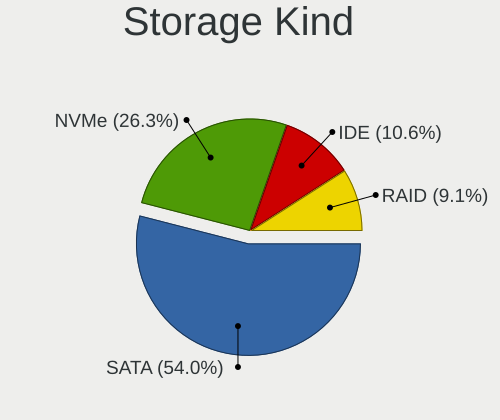

| Kind | Notebooks | Percent |
|------|-----------|---------|
| SATA | 667       | 54.01%  |
| NVMe | 325       | 26.32%  |
| IDE  | 131       | 10.61%  |
| RAID | 112       | 9.07%   |

Processor
---------

CPU Vendor
----------

Processor vendors

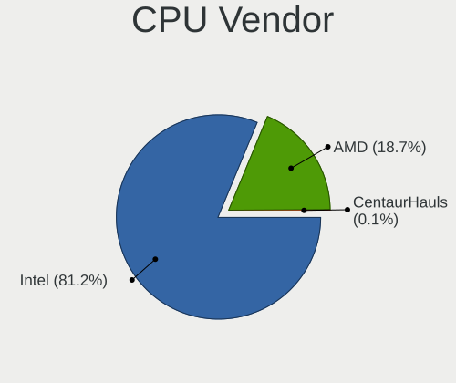

| Vendor       | Notebooks | Percent |
|--------------|-----------|---------|
| Intel        | 836       | 81.24%  |
| AMD          | 192       | 18.66%  |
| CentaurHauls | 1         | 0.1%    |

CPU Model
---------

Processor models

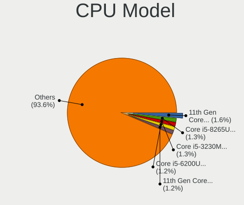

| Model                                         | Notebooks | Percent |
|-----------------------------------------------|-----------|---------|
| Intel 11th Gen Core i5-1135G7 @ 2.40GHz       | 16        | 1.55%   |
| Intel Core i5-8265U CPU @ 1.60GHz             | 13        | 1.26%   |
| Intel Core i5-3230M CPU @ 2.60GHz             | 13        | 1.26%   |
| Intel Core i5-6200U CPU @ 2.30GHz             | 12        | 1.17%   |
| Intel 11th Gen Core i3-1115G4 @ 3.00GHz       | 12        | 1.17%   |
| Intel Core i5-3320M CPU @ 2.60GHz             | 11        | 1.07%   |
| Intel Atom CPU N270 @ 1.60GHz                 | 11        | 1.07%   |
| Intel Core i5-7200U CPU @ 2.50GHz             | 10        | 0.97%   |
| Intel Atom CPU N2600 @ 1.60GHz                | 10        | 0.97%   |
| Intel Core i7-10510U CPU @ 1.80GHz            | 9         | 0.87%   |
| Intel Core i5-8250U CPU @ 1.60GHz             | 9         | 0.87%   |
| Intel Core i3-2310M CPU @ 2.10GHz             | 9         | 0.87%   |
| Intel Core i7-7700HQ CPU @ 2.80GHz            | 8         | 0.78%   |
| Intel Core i7-7500U CPU @ 2.70GHz             | 8         | 0.78%   |
| Intel Core i5-5200U CPU @ 2.20GHz             | 8         | 0.78%   |
| Intel Core i5-4200U CPU @ 1.60GHz             | 8         | 0.78%   |
| Intel Core i5-10210U CPU @ 1.60GHz            | 8         | 0.78%   |
| Intel Core 2 Duo CPU T6600 @ 2.20GHz          | 8         | 0.78%   |
| AMD Ryzen 5 5500U with Radeon Graphics        | 8         | 0.78%   |
| Intel Genuine CPU T2300 @ 1.66GHz             | 7         | 0.68%   |
| Intel Core i7-8565U CPU @ 1.80GHz             | 7         | 0.68%   |
| Intel Core i5-4210U CPU @ 1.70GHz             | 7         | 0.68%   |
| Intel Core i5-2520M CPU @ 2.50GHz             | 7         | 0.68%   |
| Intel Core i5-2450M CPU @ 2.50GHz             | 7         | 0.68%   |
| AMD Ryzen 5 3500U with Radeon Vega Mobile Gfx | 7         | 0.68%   |
| Intel Core i5-6300U CPU @ 2.40GHz             | 6         | 0.58%   |
| Intel Core i5-3210M CPU @ 2.50GHz             | 6         | 0.58%   |
| Intel Core i3-1005G1 CPU @ 1.20GHz            | 6         | 0.58%   |
| Intel Core 2 Duo CPU P8600 @ 2.40GHz          | 6         | 0.58%   |
| Intel Atom x5-Z8350 CPU @ 1.44GHz             | 6         | 0.58%   |
| Intel 11th Gen Core i7-1165G7 @ 2.80GHz       | 6         | 0.58%   |
| AMD Ryzen 7 5800H with Radeon Graphics        | 6         | 0.58%   |
| AMD Ryzen 7 3700U with Radeon Vega Mobile Gfx | 6         | 0.58%   |
| Intel Pentium M processor 1.73GHz             | 5         | 0.49%   |
| Intel Core i7-8550U CPU @ 1.80GHz             | 5         | 0.49%   |
| Intel Core i7-4810MQ CPU @ 2.80GHz            | 5         | 0.49%   |
| Intel Core i5-5300U CPU @ 2.30GHz             | 5         | 0.49%   |
| Intel Core i3-8130U CPU @ 2.20GHz             | 5         | 0.49%   |
| Intel Core i3-6006U CPU @ 2.00GHz             | 5         | 0.49%   |
| Intel Core i3-4005U CPU @ 1.70GHz             | 5         | 0.49%   |

CPU Model Family
----------------

Processor model prefix

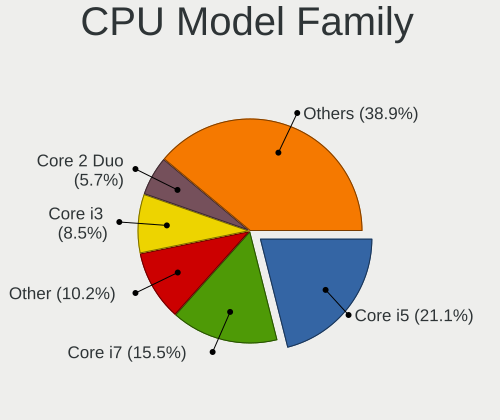

| Model                   | Notebooks | Percent |
|-------------------------|-----------|---------|
| Intel Core i5           | 217       | 21.07%  |
| Intel Core i7           | 160       | 15.53%  |
| Other                   | 105       | 10.19%  |
| Intel Core i3           | 88        | 8.54%   |
| Intel Core 2 Duo        | 59        | 5.73%   |
| Intel Celeron           | 53        | 5.15%   |
| Intel Atom              | 47        | 4.56%   |
| AMD Ryzen 5             | 43        | 4.17%   |
| AMD Ryzen 7             | 36        | 3.5%    |
| Intel Pentium           | 28        | 2.72%   |
| Intel Genuine           | 22        | 2.14%   |
| AMD A4                  | 12        | 1.17%   |
| Intel Pentium M         | 11        | 1.07%   |
| Intel Pentium Dual-Core | 9         | 0.87%   |
| Intel Pentium Dual      | 8         | 0.78%   |
| Intel Core 2            | 8         | 0.78%   |
| AMD Ryzen 9             | 8         | 0.78%   |
| AMD Ryzen 3             | 8         | 0.78%   |
| AMD A6                  | 8         | 0.78%   |
| AMD Ryzen 7 PRO         | 7         | 0.68%   |
| AMD E2                  | 7         | 0.68%   |
| AMD E1                  | 7         | 0.68%   |
| Intel Pentium Silver    | 6         | 0.58%   |
| Intel Core Duo          | 6         | 0.58%   |
| AMD A8                  | 6         | 0.58%   |
| Intel Core              | 5         | 0.49%   |
| Intel Celeron M         | 5         | 0.49%   |
| AMD Ryzen 5 PRO         | 5         | 0.49%   |
| Intel Core i9           | 4         | 0.39%   |
| AMD Turion 64 X2 Mobile | 4         | 0.39%   |
| AMD Sempron             | 4         | 0.39%   |
| AMD E                   | 4         | 0.39%   |
| AMD A10                 | 4         | 0.39%   |
| AMD Athlon II           | 3         | 0.29%   |
| AMD Athlon 64 X2        | 3         | 0.29%   |
| AMD Athlon              | 3         | 0.29%   |
| Intel Pentium 4         | 2         | 0.19%   |
| AMD Phenom II           | 2         | 0.19%   |
| AMD Mobile Sempron      | 2         | 0.19%   |
| Intel Pentium Gold      | 1         | 0.1%    |

CPU Cores
---------

Number of processor cores

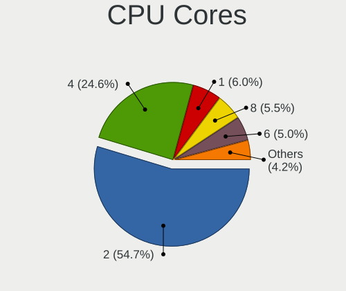

| Number | Notebooks | Percent |
|--------|-----------|---------|
| 2      | 563       | 54.66%  |
| 4      | 253       | 24.56%  |
| 1      | 62        | 6.02%   |
| 8      | 57        | 5.53%   |
| 6      | 52        | 5.05%   |
| 12     | 15        | 1.46%   |
| 10     | 15        | 1.46%   |
| 14     | 9         | 0.87%   |
| 16     | 2         | 0.19%   |
| 24     | 1         | 0.1%    |
| 3      | 1         | 0.1%    |

CPU Sockets
-----------

Number of sockets

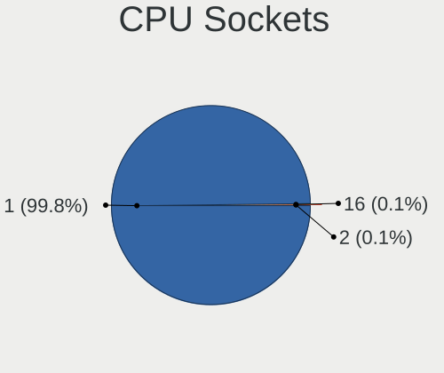

| Number | Notebooks | Percent |
|--------|-----------|---------|
| 1      | 1027      | 99.81%  |
| 16     | 1         | 0.1%    |
| 2      | 1         | 0.1%    |

CPU Threads
-----------

Threads per core (Hyper-Threading)

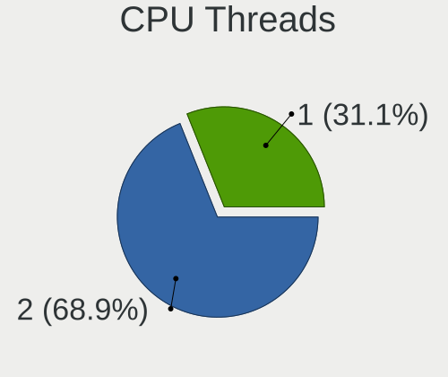

| Number | Notebooks | Percent |
|--------|-----------|---------|
| 2      | 710       | 68.93%  |
| 1      | 320       | 31.07%  |

CPU Op-Modes
------------

CPU Operation Modes (32-bit, 64-bit)

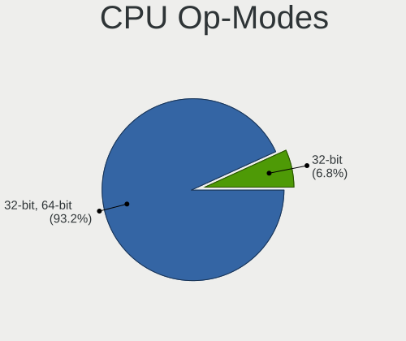

| Op mode        | Notebooks | Percent |
|----------------|-----------|---------|
| 32-bit, 64-bit | 959       | 93.2%   |
| 32-bit         | 70        | 6.8%    |

CPU Microcode
-------------

Microcode number

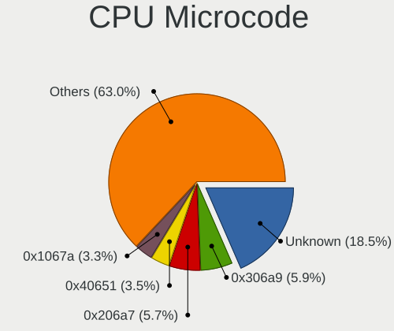

| Number     | Notebooks | Percent |
|------------|-----------|---------|
| Unknown    | 193       | 18.45%  |
| 0x306a9    | 62        | 5.93%   |
| 0x206a7    | 60        | 5.74%   |
| 0x40651    | 37        | 3.54%   |
| 0x1067a    | 35        | 3.35%   |
| 0x806c1    | 32        | 3.06%   |
| 0x806ec    | 31        | 2.96%   |
| 0x406e3    | 29        | 2.77%   |
| 0x20655    | 27        | 2.58%   |
| 0x806e9    | 24        | 2.29%   |
| 0x806ea    | 22        | 2.1%    |
| 0x6fd      | 22        | 2.1%    |
| 0x306c3    | 22        | 2.1%    |
| 0x306d4    | 21        | 2.01%   |
| 0x106c2    | 18        | 1.72%   |
| 0x6e8      | 15        | 1.43%   |
| 0x08108109 | 15        | 1.43%   |
| 0x406c4    | 14        | 1.34%   |
| 0x6ec      | 13        | 1.24%   |
| 0x30678    | 13        | 1.24%   |
| 0x10676    | 13        | 1.24%   |
| 0x06006705 | 13        | 1.24%   |
| 0x30661    | 12        | 1.15%   |
| 0x906a3    | 11        | 1.05%   |
| 0x706e5    | 11        | 1.05%   |
| 0x08608103 | 11        | 1.05%   |
| 0x906e9    | 10        | 0.96%   |
| 0x6d8      | 10        | 0.96%   |
| 0x20652    | 10        | 0.96%   |
| 0x706a8    | 9         | 0.86%   |
| 0x6f6      | 9         | 0.86%   |
| 0x08108102 | 9         | 0.86%   |
| 0x906a4    | 8         | 0.76%   |
| 0x506e3    | 8         | 0.76%   |
| 0x406c3    | 8         | 0.76%   |
| 0x0a50000c | 8         | 0.76%   |
| 0xb06a3    | 7         | 0.67%   |
| 0xa0652    | 7         | 0.67%   |
| 0x906ea    | 7         | 0.67%   |
| 0x806eb    | 7         | 0.67%   |

CPU Microarch
-------------

Microarchitecture

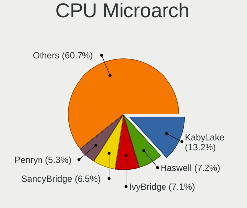

| Name             | Notebooks | Percent |
|------------------|-----------|---------|
| KabyLake         | 136       | 13.2%   |
| Haswell          | 74        | 7.18%   |
| IvyBridge        | 73        | 7.09%   |
| SandyBridge      | 67        | 6.5%    |
| Penryn           | 55        | 5.34%   |
| Unknown          | 49        | 4.76%   |
| Alderlake Hybrid | 43        | 4.17%   |
| Skylake          | 42        | 4.08%   |
| Westmere         | 41        | 3.98%   |
| P6               | 41        | 3.98%   |
| TigerLake        | 40        | 3.88%   |
| Silvermont       | 40        | 3.88%   |
| Core             | 39        | 3.79%   |
| Bonnell          | 38        | 3.69%   |
| Zen 3            | 31        | 3.01%   |
| Broadwell        | 29        | 2.82%   |
| Zen+             | 25        | 2.43%   |
| Excavator        | 21        | 2.04%   |
| IceLake          | 20        | 1.94%   |
| Goldmont plus    | 18        | 1.75%   |
| Zen 2            | 13        | 1.26%   |
| Puma             | 13        | 1.26%   |
| K8 Hammer        | 12        | 1.17%   |
| CometLake        | 9         | 0.87%   |
| Zen              | 8         | 0.78%   |
| Piledriver       | 7         | 0.68%   |
| Bobcat           | 7         | 0.68%   |
| Tremont          | 6         | 0.58%   |
| K10              | 6         | 0.58%   |
| Nehalem          | 5         | 0.49%   |
| Jaguar           | 5         | 0.49%   |
| K8 & K10 hybrid  | 4         | 0.39%   |
| Goldmont         | 4         | 0.39%   |
| NetBurst         | 3         | 0.29%   |
| K10 Llano        | 3         | 0.29%   |
| Gracemont        | 3         | 0.29%   |

Graphics
--------

GPU Vendor
----------

Vendors of graphics cards

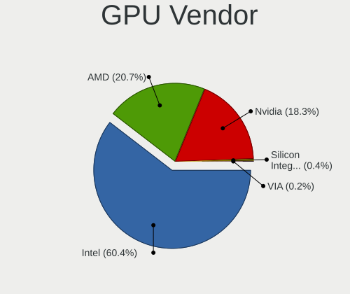

| Vendor                           | Notebooks | Percent |
|----------------------------------|-----------|---------|
| Intel                            | 738       | 60.44%  |
| AMD                              | 253       | 20.72%  |
| Nvidia                           | 223       | 18.26%  |
| Silicon Integrated Systems [SiS] | 5         | 0.41%   |
| VIA Technologies                 | 2         | 0.16%   |

GPU Model
---------

Graphics card models

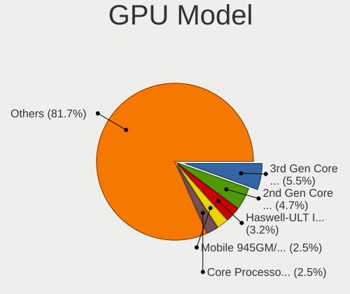

| Model                                                                                    | Notebooks | Percent |
|------------------------------------------------------------------------------------------|-----------|---------|
| Intel 3rd Gen Core processor Graphics Controller                                         | 71        | 5.51%   |
| Intel 2nd Generation Core Processor Family Integrated Graphics Controller                | 60        | 4.66%   |
| Intel Haswell-ULT Integrated Graphics Controller                                         | 41        | 3.18%   |
| Intel Mobile 945GM/GMS/GME, 943/940GML Express Integrated Graphics Controller            | 32        | 2.48%   |
| Intel Core Processor Integrated Graphics Controller                                      | 32        | 2.48%   |
| Intel Skylake-U GT2 [HD Graphics 520]                                                    | 31        | 2.41%   |
| Intel Mobile 4 Series Chipset Integrated Graphics Controller                             | 29        | 2.25%   |
| Intel 4th Gen Core Processor Integrated Graphics Controller                              | 29        | 2.25%   |
| AMD Picasso/Raven 2 [Radeon Vega Series / Radeon Vega Mobile Series]                     | 28        | 2.17%   |
| Intel WhiskeyLake-U GT2 [UHD Graphics 620]                                               | 27        | 2.1%    |
| Intel Kaby Lake-U GT2 [HD Graphics 620]                                                  | 27        | 2.1%    |
| Intel Kaby Lake-R GT2 [UHD Graphics 620]                                                 | 27        | 2.1%    |
| Intel TigerLake-LP GT2 [Iris Xe Graphics]                                                | 26        | 2.02%   |
| Intel CometLake-U GT2 [UHD Graphics]                                                     | 23        | 1.79%   |
| Intel Atom/Celeron/Pentium Processor x5-E8000/J3xxx/N3xxx Integrated Graphics Controller | 23        | 1.79%   |
| Intel Broadwell-U GT2 [HD Graphics 5500]                                                 | 20        | 1.55%   |
| Intel Mobile 945GM/GMS, 943/940GML Express Integrated Graphics Controller                | 19        | 1.48%   |
| AMD Stoney [Radeon R2/R3/R4/R5 Graphics]                                                 | 18        | 1.4%    |
| Intel Atom Processor Z36xxx/Z37xxx Series Graphics & Display                             | 17        | 1.32%   |
| AMD Cezanne [Radeon Vega Series / Radeon Vega Mobile Series]                             | 17        | 1.32%   |
| Intel CoffeeLake-H GT2 [UHD Graphics 630]                                                | 15        | 1.16%   |
| Intel Mobile GM965/GL960 Integrated Graphics Controller (secondary)                      | 14        | 1.09%   |
| Intel Mobile GM965/GL960 Integrated Graphics Controller (primary)                        | 14        | 1.09%   |
| Intel Alder Lake-P GT2 [Iris Xe Graphics]                                                | 14        | 1.09%   |
| Intel Tiger Lake-LP GT2 [UHD Graphics G4]                                                | 13        | 1.01%   |
| Intel Raptor Lake-P [Iris Xe Graphics]                                                   | 13        | 1.01%   |
| Intel Mobile 945GSE Express Integrated Graphics Controller                               | 13        | 1.01%   |
| Intel GeminiLake [UHD Graphics 600]                                                      | 13        | 1.01%   |
| AMD Renoir [Radeon Vega Series / Radeon Vega Mobile Series]                              | 13        | 1.01%   |
| AMD Lucienne                                                                             | 13        | 1.01%   |
| Intel Atom Processor D2xxx/N2xxx Integrated Graphics Controller                          | 12        | 0.93%   |
| Nvidia TU117M [GeForce GTX 1650 Mobile / Max-Q]                                          | 11        | 0.85%   |
| AMD Rembrandt [Radeon 680M]                                                              | 11        | 0.85%   |
| Intel Iris Plus Graphics G1 (Ice Lake)                                                   | 10        | 0.78%   |
| AMD Barcelo                                                                              | 10        | 0.78%   |
| Intel Mobile 915GM/GMS/910GML Express Graphics Controller                                | 9         | 0.7%    |
| Nvidia GF117M [GeForce 610M/710M/810M/820M / GT 620M/625M/630M/720M]                     | 8         | 0.62%   |
| Intel Kaby Lake-H GT2 [HD Graphics 630]                                                  | 8         | 0.62%   |
| Intel CometLake-H GT2 [UHD Graphics]                                                     | 8         | 0.62%   |
| Nvidia GM108M [GeForce 940MX]                                                            | 7         | 0.54%   |

GPU Combo
---------

Combinations of graphics cards

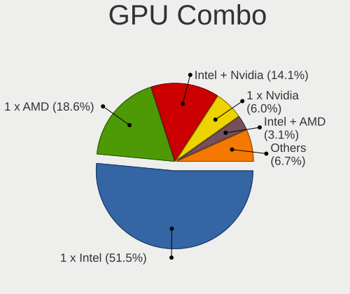

| Name           | Notebooks | Percent |
|----------------|-----------|---------|
| 1 x Intel      | 530       | 51.51%  |
| 1 x AMD        | 191       | 18.56%  |
| Intel + Nvidia | 145       | 14.09%  |
| 1 x Nvidia     | 62        | 6.03%   |
| Intel + AMD    | 32        | 3.11%   |
| 2 x Intel      | 28        | 2.72%   |
| 2 x AMD        | 16        | 1.55%   |
| AMD + Nvidia   | 14        | 1.36%   |
| 1 x SiS        | 5         | 0.49%   |
| Other          | 2         | 0.19%   |
| 2 x Nvidia     | 2         | 0.19%   |
| 1 x VIA        | 2         | 0.19%   |

GPU Driver
----------

Free vs proprietary

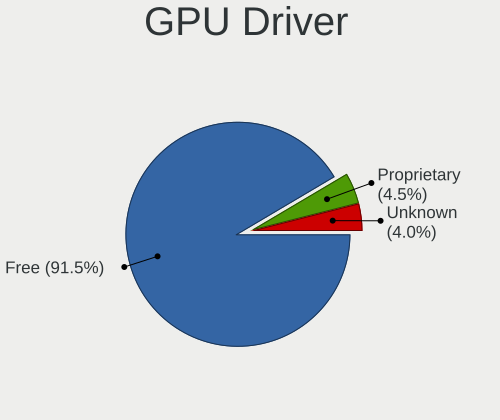

| Driver      | Notebooks | Percent |
|-------------|-----------|---------|
| Free        | 946       | 91.49%  |
| Proprietary | 47        | 4.55%   |
| Unknown     | 41        | 3.97%   |

GPU Memory
----------

Total video memory

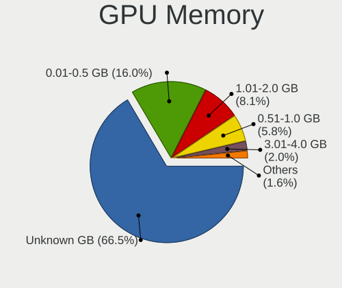

| Size in GB | Notebooks | Percent |
|------------|-----------|---------|
| Unknown    | 691       | 66.51%  |
| 0.01-0.5   | 166       | 15.98%  |
| 1.01-2.0   | 84        | 8.08%   |
| 0.51-1.0   | 60        | 5.77%   |
| 3.01-4.0   | 21        | 2.02%   |
| 5.01-6.0   | 11        | 1.06%   |
| 2.01-3.0   | 3         | 0.29%   |
| 7.01-8.0   | 2         | 0.19%   |
| 8.01-16.0  | 1         | 0.1%    |

Monitor
-------

Monitor Vendor
--------------

Monitor vendors

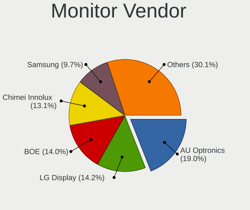

| Vendor                  | Notebooks | Percent |
|-------------------------|-----------|---------|
| AU Optronics            | 207       | 19.03%  |
| LG Display              | 154       | 14.15%  |
| BOE                     | 152       | 13.97%  |
| Chimei Innolux          | 142       | 13.05%  |
| Samsung Electronics     | 105       | 9.65%   |
| Apple                   | 35        | 3.22%   |
| Chi Mei Optoelectronics | 30        | 2.76%   |
| LG Philips              | 22        | 2.02%   |
| Lenovo                  | 21        | 1.93%   |
| Sharp                   | 19        | 1.75%   |
| Goldstar                | 18        | 1.65%   |
| HannStar                | 15        | 1.38%   |
| PANDA                   | 14        | 1.29%   |
| Dell                    | 14        | 1.29%   |
| InfoVision              | 12        | 1.1%    |
| Philips                 | 9         | 0.83%   |
| Acer                    | 9         | 0.83%   |
| CPT                     | 8         | 0.74%   |
| Quanta Display          | 7         | 0.64%   |
| BenQ                    | 7         | 0.64%   |
| AOC                     | 7         | 0.64%   |
| Iiyama                  | 6         | 0.55%   |
| Sony                    | 5         | 0.46%   |
| Panasonic               | 5         | 0.46%   |
| HKC                     | 4         | 0.37%   |
| Hewlett-Packard         | 4         | 0.37%   |
| ASUSTek Computer        | 4         | 0.37%   |
| ViewSonic               | 3         | 0.28%   |
| SLD                     | 3         | 0.28%   |
| InnoLux Display         | 3         | 0.28%   |
| Fujitsu Siemens         | 3         | 0.28%   |
| CSO                     | 3         | 0.28%   |
| Unknown                 | 2         | 0.18%   |
| STA                     | 2         | 0.18%   |
| Mi                      | 2         | 0.18%   |
| GreenWood               | 2         | 0.18%   |
| Eizo                    | 2         | 0.18%   |
| CHO                     | 2         | 0.18%   |
| ZTR                     | 1         | 0.09%   |
| Vestel Elektronik       | 1         | 0.09%   |

Monitor Model
-------------

Monitor models

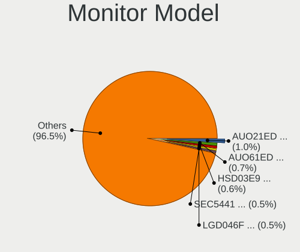

| Model                                                                | Notebooks | Percent |
|----------------------------------------------------------------------|-----------|---------|
| AU Optronics LCD Monitor AUO21ED 1920x1080 344x193mm 15.5-inch       | 11        | 1%      |
| AU Optronics LCD Monitor AUO61ED 1920x1080 344x194mm 15.5-inch       | 8         | 0.73%   |
| HannStar LCD Monitor HSD03E9 1024x600 220x129mm 10.0-inch            | 7         | 0.64%   |
| Samsung Electronics LCD Monitor SEC5441 1280x800 331x207mm 15.4-inch | 6         | 0.55%   |
| LG Display LCD Monitor LGD046F 1920x1080 344x194mm 15.5-inch         | 6         | 0.55%   |
| Chimei Innolux LCD Monitor CMN15F5 1920x1080 344x193mm 15.5-inch     | 6         | 0.55%   |
| Chimei Innolux LCD Monitor CMN15E7 1920x1080 344x193mm 15.5-inch     | 6         | 0.55%   |
| Chimei Innolux LCD Monitor CMN15DB 1366x768 344x193mm 15.5-inch      | 6         | 0.55%   |
| Chimei Innolux LCD Monitor CMN15CA 1366x768 344x193mm 15.5-inch      | 6         | 0.55%   |
| Chimei Innolux LCD Monitor CMN14D4 1920x1080 309x173mm 13.9-inch     | 6         | 0.55%   |
| AU Optronics LCD Monitor AUO38ED 1920x1080 344x193mm 15.5-inch       | 6         | 0.55%   |
| LG Display LCD Monitor LGD033A 1366x768 344x194mm 15.5-inch          | 5         | 0.46%   |
| Chimei Innolux LCD Monitor CMN1618 1920x1200 344x215mm 16.0-inch     | 5         | 0.46%   |
| Chimei Innolux LCD Monitor CMN15C3 1920x1080 344x193mm 15.5-inch     | 5         | 0.46%   |
| BOE LCD Monitor BOE069C 1920x1080 344x193mm 15.5-inch                | 5         | 0.46%   |
| AU Optronics LCD Monitor AUO45EC 1366x768 344x193mm 15.5-inch        | 5         | 0.46%   |
| AU Optronics LCD Monitor AUO10EC 1366x768 344x193mm 15.5-inch        | 5         | 0.46%   |
| AU Optronics LCD Monitor AUO106C 1366x768 276x155mm 12.5-inch        | 5         | 0.46%   |
| Panasonic VVX11F009G00 MEI96A2 1920x1080 344x193mm 15.5-inch         | 4         | 0.36%   |
| LG Display LCD Monitor LGD0430 1366x768 345x194mm 15.6-inch          | 4         | 0.36%   |
| Lenovo LCD Monitor LEN40B1 1600x900 345x194mm 15.6-inch              | 4         | 0.36%   |
| Chimei Innolux LCD Monitor CMN1521 1920x1080 344x193mm 15.5-inch     | 4         | 0.36%   |
| AU Optronics LCD Monitor AUO403D 1920x1080 309x174mm 14.0-inch       | 4         | 0.36%   |
| AU Optronics LCD Monitor AUO3791 1920x1080 344x194mm 15.5-inch       | 4         | 0.36%   |
| AU Optronics LCD Monitor AUO323D 1920x1080 309x174mm 14.0-inch       | 4         | 0.36%   |
| AU Optronics LCD Monitor AUO243D 1920x1080 309x173mm 13.9-inch       | 4         | 0.36%   |
| SLD LCD Monitor SLD003C 1366x768 309x173mm 13.9-inch                 | 3         | 0.27%   |
| Sharp LCD Monitor SHP1449 1920x1080 294x165mm 13.3-inch              | 3         | 0.27%   |
| Samsung Electronics LCD Monitor SEC544B 1600x900 382x214mm 17.2-inch | 3         | 0.27%   |
| Samsung Electronics LCD Monitor SEC3345 1280x800 331x207mm 15.4-inch | 3         | 0.27%   |
| Samsung Electronics LCD Monitor SEC3052 1366x768 256x144mm 11.6-inch | 3         | 0.27%   |
| Samsung Electronics LCD Monitor SEC3047 1366x768 277x156mm 12.5-inch | 3         | 0.27%   |
| PANDA LCD Monitor NCP0061 2560x1600 302x189mm 14.0-inch              | 3         | 0.27%   |
| LG Display LCD Monitor LGD039F 1366x768 345x194mm 15.6-inch          | 3         | 0.27%   |
| LG Display LCD Monitor LGD0395 1366x768 344x194mm 15.5-inch          | 3         | 0.27%   |
| LG Display LCD Monitor LGD0303 1600x900 382x215mm 17.3-inch          | 3         | 0.27%   |
| LG Display LCD Monitor LGD02E9 1366x768 309x174mm 14.0-inch          | 3         | 0.27%   |
| LG Display LCD Monitor LGD02E3 1366x768 344x194mm 15.5-inch          | 3         | 0.27%   |
| LG Display LCD Monitor LGD02DC 1366x768 344x194mm 15.5-inch          | 3         | 0.27%   |
| LG Display LCD Monitor LGD02D8 1366x768 277x156mm 12.5-inch          | 3         | 0.27%   |

Monitor Resolution
------------------

Monitor screen resolution

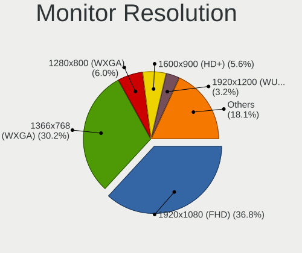

| Resolution         | Notebooks | Percent |
|--------------------|-----------|---------|
| 1920x1080 (FHD)    | 386       | 36.83%  |
| 1366x768 (WXGA)    | 316       | 30.15%  |
| 1280x800 (WXGA)    | 63        | 6.01%   |
| 1600x900 (HD+)     | 59        | 5.63%   |
| 1920x1200 (WUXGA)  | 34        | 3.24%   |
| 3840x2160 (4K)     | 33        | 3.15%   |
| 1440x900 (WXGA+)   | 29        | 2.77%   |
| 1024x600           | 22        | 2.1%    |
| 2560x1600          | 19        | 1.81%   |
| 2560x1440 (QHD)    | 15        | 1.43%   |
| 1680x1050 (WSXGA+) | 10        | 0.95%   |
| 1280x1024 (SXGA)   | 7         | 0.67%   |
| 1024x768 (XGA)     | 7         | 0.67%   |
| 2880x1800          | 6         | 0.57%   |
| 3440x1440          | 4         | 0.38%   |
| 2560x1080          | 4         | 0.38%   |
| 2256x1504          | 3         | 0.29%   |
| 1360x768           | 3         | 0.29%   |
| 3840x2400          | 2         | 0.19%   |
| 3200x1800 (QHD+)   | 2         | 0.19%   |
| 2520x1680          | 2         | 0.19%   |
| 2240x1400          | 2         | 0.19%   |
| 2160x1440          | 2         | 0.19%   |
| 1680x945           | 2         | 0.19%   |
| 1400x1050          | 2         | 0.19%   |
| 1280x768           | 2         | 0.19%   |
| 800x1280           | 1         | 0.1%    |
| 3840x1080          | 1         | 0.1%    |
| 3200x2000          | 1         | 0.1%    |
| 2880x1620          | 1         | 0.1%    |
| 2160x1350          | 1         | 0.1%    |
| 1920x540           | 1         | 0.1%    |
| 1920x1280          | 1         | 0.1%    |
| 1600x2560          | 1         | 0.1%    |
| 1366x912           | 1         | 0.1%    |
| 1280x720 (HD)      | 1         | 0.1%    |
| 1024x576           | 1         | 0.1%    |
| Unknown            | 1         | 0.1%    |

Monitor Diagonal
----------------

Diagonal size in inches

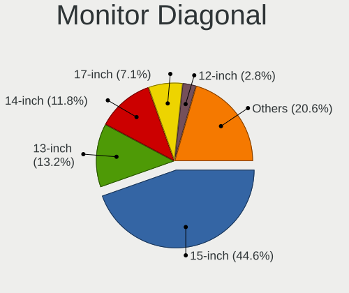

| Inches  | Notebooks | Percent |
|---------|-----------|---------|
| 15      | 484       | 44.61%  |
| 13      | 143       | 13.18%  |
| 14      | 128       | 11.8%   |
| 17      | 77        | 7.1%    |
| 12      | 30        | 2.76%   |
| 24      | 26        | 2.4%    |
| 27      | 25        | 2.3%    |
| 11      | 24        | 2.21%   |
| 10      | 22        | 2.03%   |
| 16      | 21        | 1.94%   |
| 23      | 17        | 1.57%   |
| 21      | 15        | 1.38%   |
| 31      | 13        | 1.2%    |
| 34      | 10        | 0.92%   |
| Unknown | 10        | 0.92%   |
| 18      | 8         | 0.74%   |
| 19      | 6         | 0.55%   |
| 84      | 3         | 0.28%   |
| 72      | 3         | 0.28%   |
| 22      | 3         | 0.28%   |
| 8       | 3         | 0.28%   |
| 48      | 2         | 0.18%   |
| 42      | 2         | 0.18%   |
| 26      | 2         | 0.18%   |
| 86      | 1         | 0.09%   |
| 54      | 1         | 0.09%   |
| 47      | 1         | 0.09%   |
| 40      | 1         | 0.09%   |
| 28      | 1         | 0.09%   |
| 25      | 1         | 0.09%   |
| 20      | 1         | 0.09%   |
| 7       | 1         | 0.09%   |

Monitor Width
-------------

Physical width

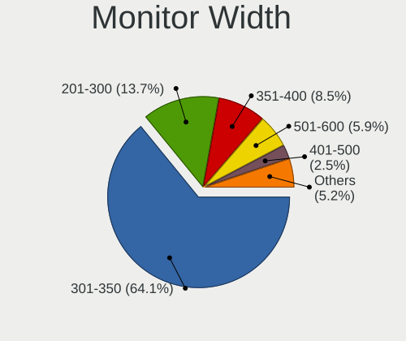

| Width in mm | Notebooks | Percent |
|-------------|-----------|---------|
| 301-350     | 691       | 64.1%   |
| 201-300     | 148       | 13.73%  |
| 351-400     | 92        | 8.53%   |
| 501-600     | 64        | 5.94%   |
| 401-500     | 27        | 2.5%    |
| 601-700     | 18        | 1.67%   |
| 701-800     | 10        | 0.93%   |
| Unknown     | 10        | 0.93%   |
| 1501-2000   | 6         | 0.56%   |
| 1001-1500   | 5         | 0.46%   |
| 101-200     | 3         | 0.28%   |
| 901-1000    | 2         | 0.19%   |
| 801-900     | 1         | 0.09%   |
| 1-100       | 1         | 0.09%   |

Aspect Ratio
------------

Proportional relationship between the width and the height

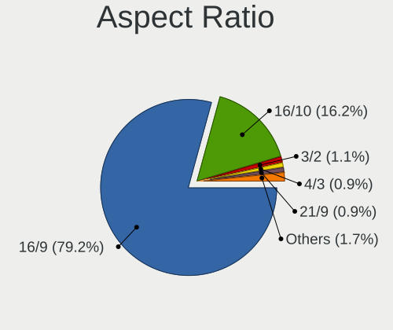

| Ratio   | Notebooks | Percent |
|---------|-----------|---------|
| 16/9    | 794       | 79.24%  |
| 16/10   | 162       | 16.17%  |
| 3/2     | 11        | 1.1%    |
| 4/3     | 9         | 0.9%    |
| 21/9    | 9         | 0.9%    |
| 5/4     | 8         | 0.8%    |
| Unknown | 5         | 0.5%    |
| 32/9    | 2         | 0.2%    |
| 0.67    | 1         | 0.1%    |
| 0.56    | 1         | 0.1%    |

Monitor Area
------------

Area in inch²

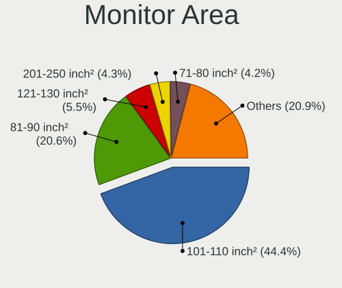

| Area in inch² | Notebooks | Percent |
|----------------|-----------|---------|
| 101-110        | 481       | 44.37%  |
| 81-90          | 223       | 20.57%  |
| 121-130        | 60        | 5.54%   |
| 201-250        | 47        | 4.34%   |
| 71-80          | 46        | 4.24%   |
| 61-70          | 29        | 2.68%   |
| 301-350        | 26        | 2.4%    |
| 51-60          | 24        | 2.21%   |
| 351-500        | 23        | 2.12%   |
| 41-50          | 22        | 2.03%   |
| 111-120        | 20        | 1.85%   |
| 131-140        | 15        | 1.38%   |
| 151-200        | 11        | 1.01%   |
| 251-300        | 10        | 0.92%   |
| 141-150        | 10        | 0.92%   |
| Unknown        | 10        | 0.92%   |
| More than 1000 | 9         | 0.83%   |
| 91-100         | 8         | 0.74%   |
| 501-1000       | 6         | 0.55%   |
| 1-40           | 4         | 0.37%   |

Pixel Density
-------------

Pixels per inch

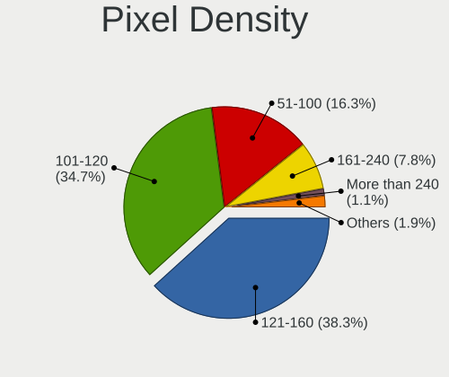

| Density       | Notebooks | Percent |
|---------------|-----------|---------|
| 121-160       | 409       | 38.26%  |
| 101-120       | 371       | 34.71%  |
| 51-100        | 174       | 16.28%  |
| 161-240       | 83        | 7.76%   |
| More than 240 | 12        | 1.12%   |
| 1-50          | 10        | 0.94%   |
| Unknown       | 10        | 0.94%   |

Multiple Monitors
-----------------

Total monitors connected

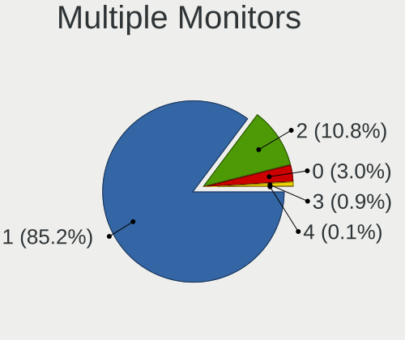

| Total | Notebooks | Percent |
|-------|-----------|---------|
| 1     | 890       | 85.25%  |
| 2     | 113       | 10.82%  |
| 0     | 31        | 2.97%   |
| 3     | 9         | 0.86%   |
| 4     | 1         | 0.1%    |

Network
-------

Net Controller Vendor
---------------------

Controller vendors

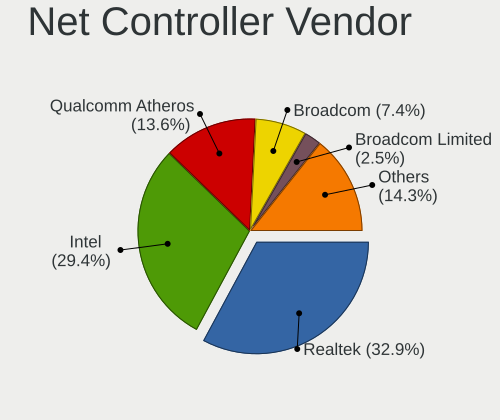

| Vendor                                 | Notebooks | Percent |
|----------------------------------------|-----------|---------|
| Realtek Semiconductor                  | 535       | 32.86%  |
| Intel                                  | 478       | 29.36%  |
| Qualcomm Atheros                       | 221       | 13.57%  |
| Broadcom                               | 121       | 7.43%   |
| Broadcom Limited                       | 40        | 2.46%   |
| MediaTek                               | 34        | 2.09%   |
| Marvell Technology Group               | 27        | 1.66%   |
| Ralink                                 | 21        | 1.29%   |
| TP-Link                                | 11        | 0.68%   |
| Ericsson Business Mobile Networks      | 11        | 0.68%   |
| ASIX Electronics                       | 11        | 0.68%   |
| Samsung Electronics                    | 10        | 0.61%   |
| Nvidia                                 | 10        | 0.61%   |
| Ralink Technology                      | 8         | 0.49%   |
| Dell                                   | 7         | 0.43%   |
| Sierra Wireless                        | 6         | 0.37%   |
| Lenovo                                 | 6         | 0.37%   |
| JMicron Technology                     | 6         | 0.37%   |
| Silicon Integrated Systems [SiS]       | 5         | 0.31%   |
| Qualcomm                               | 5         | 0.31%   |
| Hewlett-Packard                        | 4         | 0.25%   |
| Xiaomi                                 | 3         | 0.18%   |
| Huawei Technologies                    | 3         | 0.18%   |
| Google                                 | 3         | 0.18%   |
| Edimax Technology                      | 3         | 0.18%   |
| AMD                                    | 3         | 0.18%   |
| Suzhou Motorcomm Electronic Technology | 2         | 0.12%   |
| Spreadtrum Communications              | 2         | 0.12%   |
| QinHeng Electronics                    | 2         | 0.12%   |
| NetGear                                | 2         | 0.12%   |
| DisplayLink                            | 2         | 0.12%   |
| D-Link System                          | 2         | 0.12%   |
| Cisco Aironet Wireless Communications  | 2         | 0.12%   |
| Attansic Technology                    | 2         | 0.12%   |
| ZTE WCDMA Technologies MSM             | 1         | 0.06%   |
| Winbond Electronics                    | 1         | 0.06%   |
| VIA Technologies                       | 1         | 0.06%   |
| U-Blox                                 | 1         | 0.06%   |
| ST-Ericsson                            | 1         | 0.06%   |
| Shenzhen Goodix Technology             | 1         | 0.06%   |

Net Controller Model
--------------------

Controller models

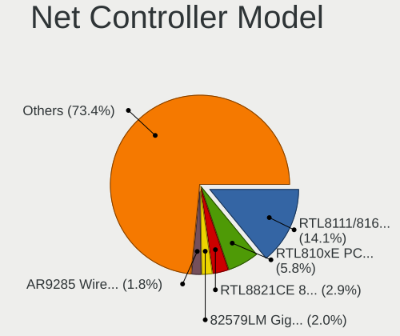

| Model                                                                   | Notebooks | Percent |
|-------------------------------------------------------------------------|-----------|---------|
| Realtek RTL8111/8168/8211/8411 PCI Express Gigabit Ethernet Controller  | 281       | 14.08%  |
| Realtek RTL810xE PCI Express Fast Ethernet controller                   | 115       | 5.76%   |
| Realtek RTL8821CE 802.11ac PCIe Wireless Network Adapter                | 58        | 2.91%   |
| Intel 82579LM Gigabit Network Connection (Lewisville)                   | 40        | 2%      |
| Qualcomm Atheros AR9285 Wireless Network Adapter (PCI-Express)          | 36        | 1.8%    |
| Intel Wireless 8265 / 8275                                              | 34        | 1.7%    |
| Intel Wireless 7260                                                     | 31        | 1.55%   |
| Qualcomm Atheros QCA9565 / AR9565 Wireless Network Adapter              | 29        | 1.45%   |
| Qualcomm Atheros QCA9377 802.11ac Wireless Network Adapter              | 29        | 1.45%   |
| Broadcom BCM4313 802.11bgn Wireless Network Adapter                     | 28        | 1.4%    |
| Realtek RTL8153 Gigabit Ethernet Adapter                                | 27        | 1.35%   |
| Qualcomm Atheros AR9485 Wireless Network Adapter                        | 27        | 1.35%   |
| Intel Wi-Fi 6 AX200                                                     | 27        | 1.35%   |
| Intel PRO/Wireless 3945ABG [Golan] Network Connection                   | 26        | 1.3%    |
| Intel Centrino Advanced-N 6205 [Taylor Peak]                            | 26        | 1.3%    |
| Realtek RTL8822CE 802.11ac PCIe Wireless Network Adapter                | 25        | 1.25%   |
| Intel Wireless 7265                                                     | 22        | 1.1%    |
| Intel Wireless 8260                                                     | 21        | 1.05%   |
| Intel Wi-Fi 6 AX201                                                     | 20        | 1%      |
| Qualcomm Atheros AR242x / AR542x Wireless Network Adapter (PCI-Express) | 19        | 0.95%   |
| Intel Alder Lake-P PCH CNVi WiFi                                        | 19        | 0.95%   |
| Realtek RTL8723BE PCIe Wireless Network Adapter                         | 17        | 0.85%   |
| Intel Comet Lake PCH-LP CNVi WiFi                                       | 17        | 0.85%   |
| Intel Cannon Point-LP CNVi [Wireless-AC]                                | 17        | 0.85%   |
| Realtek RTL-8100/8101L/8139 PCI Fast Ethernet Adapter                   | 16        | 0.8%    |
| Intel Wireless 3165                                                     | 15        | 0.75%   |
| Intel WiFi Link 5100                                                    | 15        | 0.75%   |
| Realtek RTL8852BE PCIe 802.11ax Wireless Network Controller             | 13        | 0.65%   |
| Realtek RTL8188CE 802.11b/g/n WiFi Adapter                              | 13        | 0.65%   |
| Qualcomm Atheros QCA6174 802.11ac Wireless Network Adapter              | 13        | 0.65%   |
| Intel Centrino Ultimate-N 6300                                          | 13        | 0.65%   |
| Qualcomm Atheros AR9462 Wireless Network Adapter                        | 12        | 0.6%    |
| MediaTek MT7921 802.11ax PCIe Wireless Network Adapter [Filogic 330]    | 12        | 0.6%    |
| Intel Wi-Fi 6E(802.11ax) AX210/AX1675* 2x2 [Typhoon Peak]               | 12        | 0.6%    |
| Intel Ethernet Connection (4) I219-LM                                   | 12        | 0.6%    |
| Intel 82577LM Gigabit Network Connection                                | 12        | 0.6%    |
| Broadcom Limited BCM4360 802.11ac Dual Band Wireless Network Adapter    | 12        | 0.6%    |
| Qualcomm Atheros AR8132 Fast Ethernet                                   | 11        | 0.55%   |
| Intel Ethernet Connection I217-LM                                       | 11        | 0.55%   |
| Intel 82567LM Gigabit Network Connection                                | 11        | 0.55%   |

Wireless Vendor
---------------

Wireless vendors

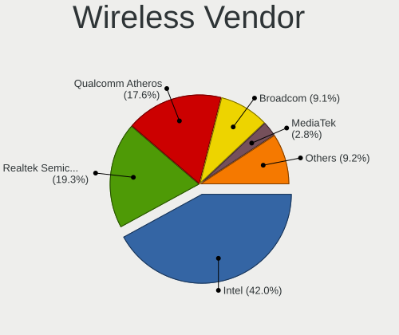

| Vendor                                | Notebooks | Percent |
|---------------------------------------|-----------|---------|
| Intel                                 | 441       | 42.04%  |
| Realtek Semiconductor                 | 202       | 19.26%  |
| Qualcomm Atheros                      | 185       | 17.64%  |
| Broadcom                              | 95        | 9.06%   |
| MediaTek                              | 29        | 2.76%   |
| Broadcom Limited                      | 26        | 2.48%   |
| Ralink                                | 21        | 2%      |
| TP-Link                               | 10        | 0.95%   |
| Ralink Technology                     | 8         | 0.76%   |
| Sierra Wireless                       | 6         | 0.57%   |
| Qualcomm                              | 5         | 0.48%   |
| Edimax Technology                     | 3         | 0.29%   |
| Dell                                  | 3         | 0.29%   |
| NetGear                               | 2         | 0.19%   |
| D-Link System                         | 2         | 0.19%   |
| Cisco Aironet Wireless Communications | 2         | 0.19%   |
| Xiaomi                                | 1         | 0.1%    |
| Qualcomm Technologies                 | 1         | 0.1%    |
| Qualcomm Atheros Communications       | 1         | 0.1%    |
| Linksys                               | 1         | 0.1%    |
| Hewlett-Packard                       | 1         | 0.1%    |
| Ericsson Business Mobile Networks     | 1         | 0.1%    |
| AVM                                   | 1         | 0.1%    |
| ASUSTek Computer                      | 1         | 0.1%    |
| Askey Computer                        | 1         | 0.1%    |

Wireless Model
--------------

Wireless models

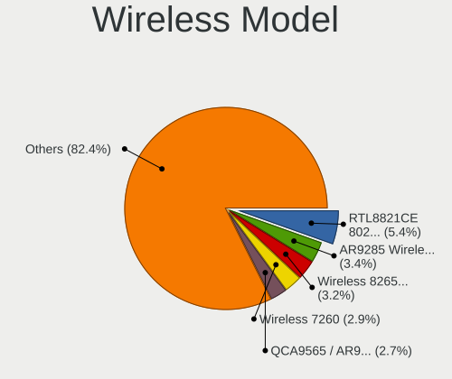

| Model                                                                   | Notebooks | Percent |
|-------------------------------------------------------------------------|-----------|---------|
| Realtek RTL8821CE 802.11ac PCIe Wireless Network Adapter                | 58        | 5.44%   |
| Qualcomm Atheros AR9285 Wireless Network Adapter (PCI-Express)          | 36        | 3.38%   |
| Intel Wireless 8265 / 8275                                              | 34        | 3.19%   |
| Intel Wireless 7260                                                     | 31        | 2.91%   |
| Qualcomm Atheros QCA9565 / AR9565 Wireless Network Adapter              | 29        | 2.72%   |
| Qualcomm Atheros QCA9377 802.11ac Wireless Network Adapter              | 29        | 2.72%   |
| Broadcom BCM4313 802.11bgn Wireless Network Adapter                     | 28        | 2.63%   |
| Qualcomm Atheros AR9485 Wireless Network Adapter                        | 27        | 2.53%   |
| Intel Wi-Fi 6 AX200                                                     | 27        | 2.53%   |
| Intel PRO/Wireless 3945ABG [Golan] Network Connection                   | 26        | 2.44%   |
| Intel Centrino Advanced-N 6205 [Taylor Peak]                            | 26        | 2.44%   |
| Realtek RTL8822CE 802.11ac PCIe Wireless Network Adapter                | 25        | 2.35%   |
| Intel Wireless 7265                                                     | 22        | 2.06%   |
| Intel Wireless 8260                                                     | 21        | 1.97%   |
| Intel Wi-Fi 6 AX201                                                     | 20        | 1.88%   |
| Qualcomm Atheros AR242x / AR542x Wireless Network Adapter (PCI-Express) | 19        | 1.78%   |
| Realtek RTL8723BE PCIe Wireless Network Adapter                         | 17        | 1.59%   |
| Intel Comet Lake PCH-LP CNVi WiFi                                       | 17        | 1.59%   |
| Intel Cannon Point-LP CNVi [Wireless-AC]                                | 17        | 1.59%   |
| Intel Wireless 3165                                                     | 15        | 1.41%   |
| Intel WiFi Link 5100                                                    | 15        | 1.41%   |
| Realtek RTL8188CE 802.11b/g/n WiFi Adapter                              | 13        | 1.22%   |
| Qualcomm Atheros QCA6174 802.11ac Wireless Network Adapter              | 13        | 1.22%   |
| Intel Centrino Ultimate-N 6300                                          | 13        | 1.22%   |
| Qualcomm Atheros AR9462 Wireless Network Adapter                        | 12        | 1.13%   |
| MediaTek MT7921 802.11ax PCIe Wireless Network Adapter [Filogic 330]    | 12        | 1.13%   |
| Intel Wi-Fi 6E(802.11ax) AX210/AX1675* 2x2 [Typhoon Peak]               | 12        | 1.13%   |
| Intel Alder Lake-P PCH CNVi WiFi                                        | 12        | 1.13%   |
| Broadcom Limited BCM4360 802.11ac Dual Band Wireless Network Adapter    | 12        | 1.13%   |
| Ralink RT3290 Wireless 802.11n 1T/1R PCIe                               | 10        | 0.94%   |
| MediaTek MT7902 802.11ax PCIe Wireless Network Adapter [Filogic 310]    | 10        | 0.94%   |
| Intel Wireless 3160                                                     | 10        | 0.94%   |
| Realtek RTL8852BE PCIe 802.11ax Wireless Network Controller             | 9         | 0.84%   |
| Intel Raptor Lake PCH CNVi WiFi                                         | 9         | 0.84%   |
| Broadcom BCM43142 802.11b/g/n                                           | 9         | 0.84%   |
| Realtek RTL8188EE Wireless Network Adapter                              | 8         | 0.75%   |
| Intel Comet Lake PCH CNVi WiFi                                          | 8         | 0.75%   |
| Intel Centrino Wireless-N 1030 [Rainbow Peak]                           | 8         | 0.75%   |
| Broadcom BCM4322 802.11a/b/g/n Wireless LAN Controller                  | 8         | 0.75%   |
| Realtek RTL8191SEvB Wireless LAN Controller                             | 7         | 0.66%   |

Ethernet Vendor
---------------

Ethernet vendors

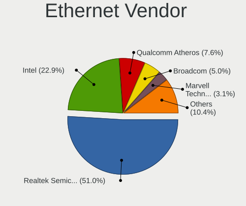

| Vendor                                 | Notebooks | Percent |
|----------------------------------------|-----------|---------|
| Realtek Semiconductor                  | 449       | 50.96%  |
| Intel                                  | 202       | 22.93%  |
| Qualcomm Atheros                       | 67        | 7.6%    |
| Broadcom                               | 44        | 4.99%   |
| Marvell Technology Group               | 27        | 3.06%   |
| Broadcom Limited                       | 14        | 1.59%   |
| ASIX Electronics                       | 11        | 1.25%   |
| Samsung Electronics                    | 10        | 1.14%   |
| Nvidia                                 | 10        | 1.14%   |
| JMicron Technology                     | 6         | 0.68%   |
| Silicon Integrated Systems [SiS]       | 5         | 0.57%   |
| MediaTek                               | 5         | 0.57%   |
| Lenovo                                 | 5         | 0.57%   |
| Hewlett-Packard                        | 3         | 0.34%   |
| Google                                 | 3         | 0.34%   |
| Xiaomi                                 | 2         | 0.23%   |
| Suzhou Motorcomm Electronic Technology | 2         | 0.23%   |
| Spreadtrum Communications              | 2         | 0.23%   |
| DisplayLink                            | 2         | 0.23%   |
| Attansic Technology                    | 2         | 0.23%   |
| ZTE WCDMA Technologies MSM             | 1         | 0.11%   |
| VIA Technologies                       | 1         | 0.11%   |
| TP-Link                                | 1         | 0.11%   |
| QinHeng Electronics                    | 1         | 0.11%   |
| OPPO Electronics                       | 1         | 0.11%   |
| OnePlus Technology (Shenzhen)          | 1         | 0.11%   |
| Motorola PCS                           | 1         | 0.11%   |
| Huawei Technologies                    | 1         | 0.11%   |
| Gemtek                                 | 1         | 0.11%   |
| Davicom Semiconductor                  | 1         | 0.11%   |

Ethernet Model
--------------

Ethernet models

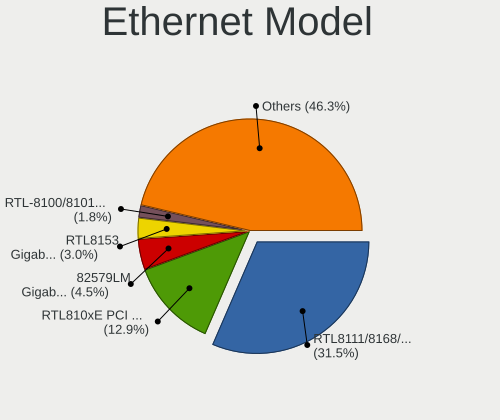

| Model                                                                  | Notebooks | Percent |
|------------------------------------------------------------------------|-----------|---------|
| Realtek RTL8111/8168/8211/8411 PCI Express Gigabit Ethernet Controller | 281       | 31.5%   |
| Realtek RTL810xE PCI Express Fast Ethernet controller                  | 115       | 12.89%  |
| Intel 82579LM Gigabit Network Connection (Lewisville)                  | 40        | 4.48%   |
| Realtek RTL8153 Gigabit Ethernet Adapter                               | 27        | 3.03%   |
| Realtek RTL-8100/8101L/8139 PCI Fast Ethernet Adapter                  | 16        | 1.79%   |
| Intel Ethernet Connection (4) I219-LM                                  | 12        | 1.35%   |
| Intel 82577LM Gigabit Network Connection                               | 12        | 1.35%   |
| Qualcomm Atheros AR8132 Fast Ethernet                                  | 11        | 1.23%   |
| Intel Ethernet Connection I217-LM                                      | 11        | 1.23%   |
| Intel 82567LM Gigabit Network Connection                               | 11        | 1.23%   |
| Qualcomm Atheros AR8151 v2.0 Gigabit Ethernet                          | 10        | 1.12%   |
| Intel Ethernet Connection I219-LM                                      | 10        | 1.12%   |
| ASIX AX88179 Gigabit Ethernet                                          | 10        | 1.12%   |
| Qualcomm Atheros AR8131 Gigabit Ethernet                               | 8         | 0.9%    |
| Intel Ethernet Connection (3) I218-LM                                  | 8         | 0.9%    |
| Broadcom NetLink BCM57785 Gigabit Ethernet PCIe                        | 8         | 0.9%    |
| Samsung Galaxy series, misc. (tethering mode)                          | 7         | 0.78%   |
| Nvidia MCP79 Ethernet                                                  | 7         | 0.78%   |
| Intel Ethernet Connection I219-V                                       | 7         | 0.78%   |
| Intel Ethernet Connection I218-LM                                      | 7         | 0.78%   |
| Intel Alder Lake-P PCH CNVi WiFi                                       | 7         | 0.78%   |
| Broadcom NetXtreme BCM57786 Gigabit Ethernet PCIe                      | 7         | 0.78%   |
| Broadcom NetXtreme BCM57765 Gigabit Ethernet PCIe                      | 7         | 0.78%   |
| Qualcomm Atheros AR8152 v2.0 Fast Ethernet                             | 6         | 0.67%   |
| Marvell Group 88E8071 PCI-E Gigabit Ethernet Controller                | 6         | 0.67%   |
| Intel 82573L Gigabit Ethernet Controller                               | 6         | 0.67%   |
| Realtek RTL8125 2.5GbE Controller                                      | 5         | 0.56%   |
| Qualcomm Atheros Killer E220x Gigabit Ethernet Controller              | 5         | 0.56%   |
| Qualcomm Atheros AR8162 Fast Ethernet                                  | 5         | 0.56%   |
| Qualcomm Atheros AR8151 v1.0 Gigabit Ethernet                          | 5         | 0.56%   |
| Qualcomm Atheros AR8121/AR8113/AR8114 Gigabit or Fast Ethernet         | 5         | 0.56%   |
| JMicron JMC250 PCI Express Gigabit Ethernet Controller                 | 5         | 0.56%   |
| Intel PRO/100 VE Network Connection                                    | 5         | 0.56%   |
| Intel Ethernet Connection (6) I219-V                                   | 5         | 0.56%   |
| Intel Ethernet Connection (6) I219-LM                                  | 5         | 0.56%   |
| Intel 82566MM Gigabit Network Connection                               | 5         | 0.56%   |
| Realtek RTL8852BE PCIe 802.11ax Wireless Network Controller            | 4         | 0.45%   |
| Realtek RTL8152 Fast Ethernet Adapter                                  | 4         | 0.45%   |
| Marvell Group 88E8055 PCI-E Gigabit Ethernet Controller                | 4         | 0.45%   |
| Intel Ethernet Connection (7) I219-LM                                  | 4         | 0.45%   |

Net Controller Kind
-------------------

Ethernet, WiFi or modem

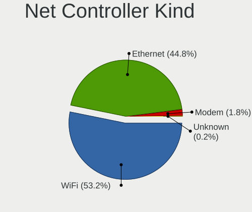

| Kind     | Notebooks | Percent |
|----------|-----------|---------|
| WiFi     | 995       | 53.18%  |
| Ethernet | 838       | 44.79%  |
| Modem    | 34        | 1.82%   |
| Unknown  | 4         | 0.21%   |

Used Controller
---------------

Currently used network controller

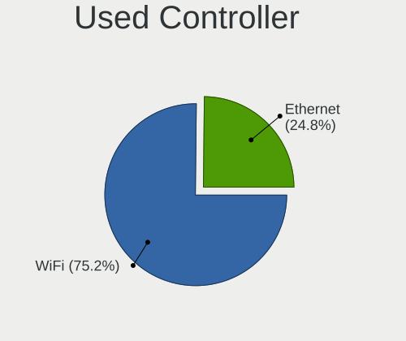

| Kind     | Notebooks | Percent |
|----------|-----------|---------|
| WiFi     | 805       | 75.16%  |
| Ethernet | 266       | 24.84%  |

NICs
----

Total network controllers on board

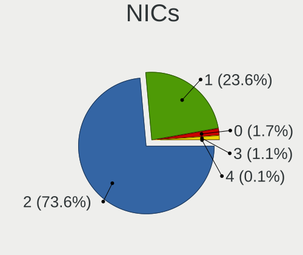

| Total | Notebooks | Percent |
|-------|-----------|---------|
| 2     | 757       | 73.57%  |
| 1     | 243       | 23.62%  |
| 0     | 17        | 1.65%   |
| 3     | 11        | 1.07%   |
| 4     | 1         | 0.1%    |

IPv6
----

IPv6 vs IPv4

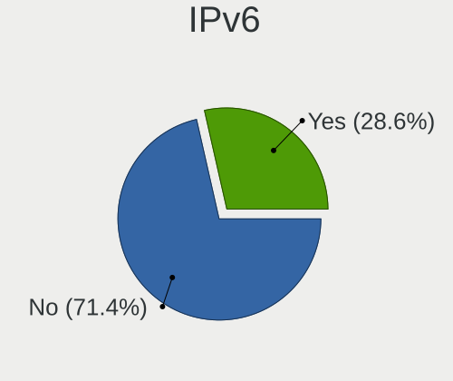

| Used | Notebooks | Percent |
|------|-----------|---------|
| No   | 748       | 71.44%  |
| Yes  | 299       | 28.56%  |

Bluetooth
---------

Bluetooth Vendor
----------------

Controller vendors

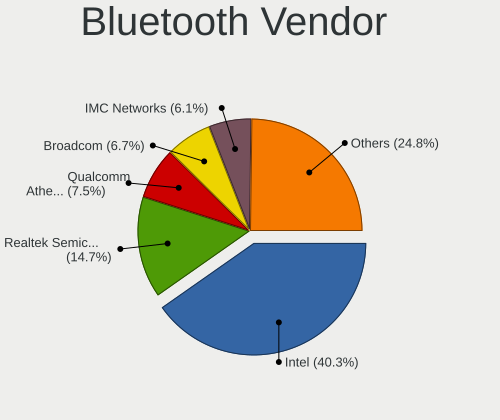

| Vendor                          | Notebooks | Percent |
|---------------------------------|-----------|---------|
| Intel                           | 302       | 40.27%  |
| Realtek Semiconductor           | 110       | 14.67%  |
| Qualcomm Atheros Communications | 56        | 7.47%   |
| Broadcom                        | 50        | 6.67%   |
| IMC Networks                    | 46        | 6.13%   |
| Foxconn / Hon Hai               | 36        | 4.8%    |
| Apple                           | 31        | 4.13%   |
| Lite-On Technology              | 25        | 3.33%   |
| Hewlett-Packard                 | 21        | 2.8%    |
| Dell                            | 18        | 2.4%    |
| Ralink                          | 10        | 1.33%   |
| Cambridge Silicon Radio         | 9         | 1.2%    |
| ASUSTek Computer                | 7         | 0.93%   |
| Realtek                         | 6         | 0.8%    |
| Toshiba                         | 4         | 0.53%   |
| Askey Computer                  | 4         | 0.53%   |
| USI                             | 3         | 0.4%    |
| Foxconn International           | 3         | 0.4%    |
| Ralink Technology               | 2         | 0.27%   |
| MediaTek                        | 2         | 0.27%   |
| Taiyo Yuden                     | 1         | 0.13%   |
| Qcom                            | 1         | 0.13%   |
| D-Link                          | 1         | 0.13%   |
| Chicony Electronics             | 1         | 0.13%   |
| Alps Electric                   | 1         | 0.13%   |

Bluetooth Model
---------------

Controller models

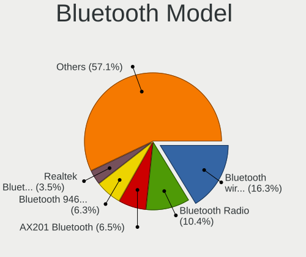

| Model                                               | Notebooks | Percent |
|-----------------------------------------------------|-----------|---------|
| Intel Bluetooth wireless interface                  | 122       | 16.27%  |
| Realtek Bluetooth Radio                             | 78        | 10.4%   |
| Intel AX201 Bluetooth                               | 49        | 6.53%   |
| Intel Bluetooth 9460/9560 Jefferson Peak (JfP)      | 47        | 6.27%   |
| Realtek  Bluetooth 4.2 Adapter                      | 26        | 3.47%   |
| Intel AX200 Bluetooth                               | 25        | 3.33%   |
| Qualcomm Atheros  Bluetooth Device                  | 24        | 3.2%    |
| Intel Bluetooth Device                              | 24        | 3.2%    |
| IMC Networks Bluetooth Radio                        | 17        | 2.27%   |
| IMC Networks Wireless_Device                        | 15        | 2%      |
| Apple Bluetooth Host Controller                     | 15        | 2%      |
| Qualcomm Atheros AR3012 Bluetooth 4.0               | 14        | 1.87%   |
| Apple Bluetooth USB Host Controller                 | 13        | 1.73%   |
| HP Bluetooth 2.0 Interface [Broadcom BCM2045]       | 12        | 1.6%    |
| Lite-On Qualcomm Atheros QCA9377 Bluetooth          | 11        | 1.47%   |
| Ralink RT3290 Bluetooth                             | 10        | 1.33%   |
| Intel Centrino Advanced-N 6230 Bluetooth adapter    | 10        | 1.33%   |
| Intel AX210 Bluetooth                               | 10        | 1.33%   |
| Foxconn / Hon Hai Bluetooth Device                  | 10        | 1.33%   |
| Dell DW375 Bluetooth Module                         | 10        | 1.33%   |
| Cambridge Silicon Radio Bluetooth Dongle (HCI mode) | 9         | 1.2%    |
| Broadcom BCM20702 Bluetooth 4.0 [ThinkPad]          | 9         | 1.2%    |
| Broadcom BCM2045B (BDC-2.1)                         | 9         | 1.2%    |
| HP Broadcom 2070 Bluetooth Combo                    | 8         | 1.07%   |
| Qualcomm Atheros QCA61x4 Bluetooth 4.0              | 7         | 0.93%   |
| IMC Networks Bluetooth Device                       | 7         | 0.93%   |
| Realtek Bluetooth Radio                             | 6         | 0.8%    |
| Foxconn / Hon Hai Wireless_Device                   | 6         | 0.8%    |
| Broadcom BCM2045B (BDC-2) [Bluetooth Controller]    | 6         | 0.8%    |
| Qualcomm Atheros AR3011 Bluetooth                   | 5         | 0.67%   |
| Intel Wireless-AC 9260 Bluetooth Adapter            | 5         | 0.67%   |
| Intel Centrino Bluetooth Wireless Transceiver       | 5         | 0.67%   |
| Broadcom HP Portable SoftSailing                    | 5         | 0.67%   |
| Broadcom BCM2070 Bluetooth 2.1 + EDR                | 5         | 0.67%   |
| Qualcomm Atheros AR9462 Bluetooth                   | 4         | 0.53%   |
| Lite-On Bluetooth Device                            | 4         | 0.53%   |
| Lite-On Atheros AR3012 Bluetooth                    | 4         | 0.53%   |
| Intel Wireless-AC 3168 Bluetooth                    | 4         | 0.53%   |
| Foxconn / Hon Hai MediaTek Bluetooth Adapter        | 4         | 0.53%   |
| Foxconn / Hon Hai Acer Module                       | 4         | 0.53%   |

Sound
-----

Sound Vendor
------------

Sound card vendors

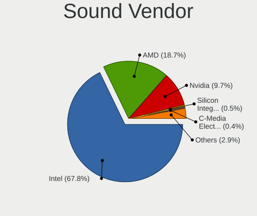

| Vendor                           | Notebooks | Percent |
|----------------------------------|-----------|---------|
| Intel                            | 807       | 67.82%  |
| AMD                              | 222       | 18.66%  |
| Nvidia                           | 115       | 9.66%   |
| Silicon Integrated Systems [SiS] | 6         | 0.5%    |
| C-Media Electronics              | 5         | 0.42%   |
| Texas Instruments                | 4         | 0.34%   |
| Fujitsu                          | 4         | 0.34%   |
| Walmart                          | 2         | 0.17%   |
| VIA Technologies                 | 2         | 0.17%   |
| Realtek Semiconductor            | 2         | 0.17%   |
| Lenovo                           | 2         | 0.17%   |
| Generalplus Technology           | 2         | 0.17%   |
| DSEA A/S                         | 2         | 0.17%   |
| Yamaha                           | 1         | 0.08%   |
| Tenx Technology                  | 1         | 0.08%   |
| Sony                             | 1         | 0.08%   |
| Logitech                         | 1         | 0.08%   |
| JMTek                            | 1         | 0.08%   |
| GN Netcom                        | 1         | 0.08%   |
| Focusrite-Novation               | 1         | 0.08%   |
| Dell                             | 1         | 0.08%   |
| Creative Technology              | 1         | 0.08%   |
| CMX Systems                      | 1         | 0.08%   |
| BTD 600                          | 1         | 0.08%   |
| Avnera                           | 1         | 0.08%   |
| Audioengine                      | 1         | 0.08%   |
| Audio-Technica                   | 1         | 0.08%   |
| Apple                            | 1         | 0.08%   |

Sound Model
-----------

Sound card models

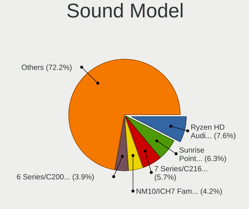

| Model                                                                                             | Notebooks | Percent |
|---------------------------------------------------------------------------------------------------|-----------|---------|
| AMD Ryzen HD Audio Controller                                                                     | 111       | 7.61%   |
| Intel Sunrise Point-LP HD Audio                                                                   | 92        | 6.31%   |
| Intel 7 Series/C216 Chipset Family High Definition Audio Controller                               | 83        | 5.69%   |
| Intel NM10/ICH7 Family High Definition Audio Controller                                           | 62        | 4.25%   |
| Intel 6 Series/C200 Series Chipset Family High Definition Audio Controller                        | 57        | 3.91%   |
| Intel 82801I (ICH9 Family) HD Audio Controller                                                    | 52        | 3.56%   |
| AMD Renoir/Cezanne HDMI/DP Audio Controller                                                       | 47        | 3.22%   |
| Intel 5 Series/3400 Series Chipset High Definition Audio                                          | 46        | 3.15%   |
| Intel Haswell-ULT HD Audio Controller                                                             | 43        | 2.95%   |
| Intel 8 Series HD Audio Controller                                                                | 43        | 2.95%   |
| Intel Tiger Lake-LP Smart Sound Technology Audio Controller                                       | 40        | 2.74%   |
| Intel 8 Series/C220 Series Chipset High Definition Audio Controller                               | 31        | 2.12%   |
| AMD Raven/Raven2/Fenghuang HDMI/DP Audio Controller                                               | 31        | 2.12%   |
| AMD FCH Azalia Controller                                                                         | 30        | 2.06%   |
| Intel Wildcat Point-LP High Definition Audio Controller                                           | 29        | 1.99%   |
| Intel Cannon Point-LP High Definition Audio Controller                                            | 29        | 1.99%   |
| Intel Broadwell-U Audio Controller                                                                | 29        | 1.99%   |
| Intel Xeon E3-1200 v3/4th Gen Core Processor HD Audio Controller                                  | 28        | 1.92%   |
| Intel Alder Lake PCH-P High Definition Audio Controller                                           | 28        | 1.92%   |
| Intel Comet Lake PCH-LP cAVS                                                                      | 23        | 1.58%   |
| AMD Radeon High Definition Audio Controller                                                       | 23        | 1.58%   |
| Intel 82801H (ICH8 Family) HD Audio Controller                                                    | 22        | 1.51%   |
| AMD Kabini HDMI/DP Audio                                                                          | 21        | 1.44%   |
| AMD Family 15h (Models 60h-6fh) Audio Controller                                                  | 21        | 1.44%   |
| AMD SBx00 Azalia (Intel HDA)                                                                      | 20        | 1.37%   |
| Nvidia GF108 High Definition Audio Controller                                                     | 18        | 1.23%   |
| Intel Raptor Lake-P/U/H cAVS                                                                      | 18        | 1.23%   |
| Intel Celeron/Pentium Silver Processor High Definition Audio                                      | 18        | 1.23%   |
| AMD High Definition Audio Controller                                                              | 18        | 1.23%   |
| Intel Atom/Celeron/Pentium Processor x5-E8000/J3xxx/N3xxx Series High Definition Audio Controller | 16        | 1.1%    |
| Intel Ice Lake-LP Smart Sound Technology Audio Controller                                         | 15        | 1.03%   |
| Intel Cannon Lake PCH cAVS                                                                        | 15        | 1.03%   |
| Intel Atom Processor Z36xxx/Z37xxx Series High Definition Audio Controller                        | 15        | 1.03%   |
| Nvidia TU107 GeForce GTX 1650 High Definition Audio Controller                                    | 12        | 0.82%   |
| Intel CM238 HD Audio Controller                                                                   | 12        | 0.82%   |
| Nvidia MCP79 High Definition Audio                                                                | 9         | 0.62%   |
| Intel Comet Lake PCH cAVS                                                                         | 9         | 0.62%   |
| AMD RV710/730 HDMI Audio [Radeon HD 4000 series]                                                  | 8         | 0.55%   |
| Nvidia GA106 High Definition Audio Controller                                                     | 7         | 0.48%   |
| Intel 100 Series/C230 Series Chipset Family HD Audio Controller                                   | 7         | 0.48%   |

Memory
------

Memory Vendor
-------------

Memory module vendors

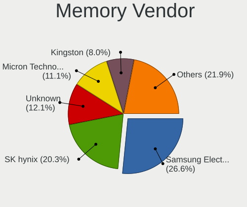

| Vendor                       | Notebooks | Percent |
|------------------------------|-----------|---------|
| Samsung Electronics          | 149       | 26.56%  |
| SK hynix                     | 114       | 20.32%  |
| Unknown                      | 68        | 12.12%  |
| Micron Technology            | 62        | 11.05%  |
| Kingston                     | 45        | 8.02%   |
| Crucial                      | 15        | 2.67%   |
| A-DATA Technology            | 14        | 2.5%    |
| Elpida                       | 13        | 2.32%   |
| G.Skill                      | 11        | 1.96%   |
| Ramaxel Technology           | 10        | 1.78%   |
| Nanya Technology             | 9         | 1.6%    |
| Unknown                      | 8         | 1.43%   |
| Corsair                      | 7         | 1.25%   |
| Smart                        | 5         | 0.89%   |
| Unknown (ABCD)               | 3         | 0.53%   |
| Patriot                      | 3         | 0.53%   |
| Timetec                      | 2         | 0.36%   |
| Team                         | 2         | 0.36%   |
| Silicon Power                | 2         | 0.36%   |
| PUSKILL                      | 2         | 0.36%   |
| GSkill                       | 2         | 0.36%   |
| Avant                        | 2         | 0.36%   |
| Transcend                    | 1         | 0.18%   |
| Strontium                    | 1         | 0.18%   |
| Shenzhen Longsys             | 1         | 0.18%   |
| SHARETRONIC                  | 1         | 0.18%   |
| PNY                          | 1         | 0.18%   |
| Patriot Memory (PDP Systems) | 1         | 0.18%   |
| Lexar Co Limited             | 1         | 0.18%   |
| Goldkey                      | 1         | 0.18%   |
| ASint Technology             | 1         | 0.18%   |
| Apacer                       | 1         | 0.18%   |
| AMD                          | 1         | 0.18%   |
| 4ea5                         | 1         | 0.18%   |
| 48spaces                     | 1         | 0.18%   |

Memory Model
------------

Memory module models

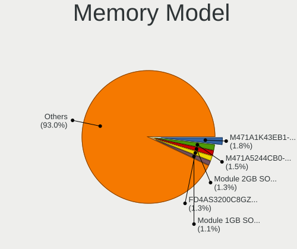

| Model                                                            | Notebooks | Percent |
|------------------------------------------------------------------|-----------|---------|
| Samsung RAM M471A1K43EB1-CWE 8GB SODIMM DDR4 3200MT/s            | 11        | 1.8%    |
| Samsung RAM M471A5244CB0-CTD 4GB SODIMM DDR4 3266MT/s            | 9         | 1.47%   |
| Unknown RAM Module 2GB SODIMM DDR2 667MT/s                       | 8         | 1.31%   |
| Unknown                                                          | 8         | 1.31%   |
| Unknown RAM Module 1GB SODIMM DDR2                               | 7         | 1.15%   |
| Samsung RAM M471A1K43DB1-CTD 8GB SODIMM DDR4 2667MT/s            | 7         | 1.15%   |
| Micron RAM 4ATF1G64HZ-3G2F1 8GB SODIMM DDR4 3200MT/s             | 7         | 1.15%   |
| Unknown RAM Module 2GB SODIMM DDR2                               | 6         | 0.98%   |
| SK hynix RAM HMT451S6BFR8A-PB 4GB SODIMM DDR3 1600MT/s           | 6         | 0.98%   |
| SK hynix RAM HMT451S6AFR8A-PB 4GB SODIMM DDR3 1600MT/s           | 5         | 0.82%   |
| SK hynix RAM HMAA1GS6CJR6N-XN 8GB SODIMM DDR4 3200MT/s           | 5         | 0.82%   |
| SK hynix RAM HMA851S6DJR6N-XN 4GB SODIMM DDR4 3200MT/s           | 5         | 0.82%   |
| Samsung RAM M471B5173DB0-YK0 4GB SODIMM DDR3 1600MT/s            | 5         | 0.82%   |
| Samsung RAM M471A1K43CB1-CRC 8GB SODIMM DDR4 8400MT/s            | 5         | 0.82%   |
| Unknown RAM Module 512MB SODIMM DDR2                             | 4         | 0.65%   |
| Unknown RAM Module 2GB SODIMM DDR2 533MT/s                       | 4         | 0.65%   |
| Unknown RAM Module 1GB SODIMM DDR2 533MT/s                       | 4         | 0.65%   |
| Samsung RAM M471B5273CH0-CH9 4GB SODIMM DDR3 1334MT/s            | 4         | 0.65%   |
| Samsung RAM M471B1G73DB0-YK0 8GB SODIMM DDR3 1600MT/s            | 4         | 0.65%   |
| Samsung RAM M471A5244CB0-CWE 4GB SODIMM DDR4 3200MT/s            | 4         | 0.65%   |
| Samsung RAM M471A2K43CB1-CRC 16GB SODIMM DDR4 2667MT/s           | 4         | 0.65%   |
| Samsung RAM M471A1K43CB1-CTD 8GB SODIMM DDR4 3200MT/s            | 4         | 0.65%   |
| Samsung RAM M471A1K43BB1-CRC 8GB SODIMM DDR4 2667MT/s            | 4         | 0.65%   |
| Samsung RAM M4 70T5663QZ3-CF7 2GB SODIMM DDR2 2048MT/s           | 4         | 0.65%   |
| Unknown RAM Module 8GB SODIMM DDR4 2400MT/s                      | 3         | 0.49%   |
| Unknown RAM Module 2GB SODIMM SDRAM                              | 3         | 0.49%   |
| Unknown RAM Module 1GB SODIMM DDR2 667MT/s                       | 3         | 0.49%   |
| Unknown RAM Module 1GB SODIMM DDR                                | 3         | 0.49%   |
| Unknown (ABCD) RAM 123456789012345678 2GB SODIMM LPDDR4 2400MT/s | 3         | 0.49%   |
| SK hynix RAM HMT451S6AFR8C-PB 4GB SODIMM DDR3 1600MT/s           | 3         | 0.49%   |
| SK hynix RAM HMT41GS6BFR8A-PB 8GB SODIMM DDR3 2667MT/s           | 3         | 0.49%   |
| SK hynix RAM HMT351S6BFR8C-H9 4GB SODIMM 1334MT/s                | 3         | 0.49%   |
| SK hynix RAM HMA81GS6AFR8N-UH 8GB SODIMM DDR4 2667MT/s           | 3         | 0.49%   |
| Samsung RAM M471B1G73QH0-YK0 8GB SODIMM DDR3 1600MT/s            | 3         | 0.49%   |
| Samsung RAM M471A2G44AM0-CWE 16GB SODIMM DDR4 3200MT/s           | 3         | 0.49%   |
| Samsung RAM M471A1G44BB0-CWE 8GB SODIMM DDR4 3200MT/s            | 3         | 0.49%   |
| Samsung RAM M471A1G44AB0-CWE 8GiB SODIMM DDR4 3200MT/s           | 3         | 0.49%   |
| Samsung RAM M471A1G44AB0-CWE 8GB Row Of Chips DDR4 3200MT/s      | 3         | 0.49%   |
| Micron RAM Module 4GB SODIMM DDR3 1600MT/s                       | 3         | 0.49%   |
| Micron RAM 16JSF51264HZ-1G4D1 4GB SODIMM DDR3 1334MT/s           | 3         | 0.49%   |

Memory Kind
-----------

Memory module kinds

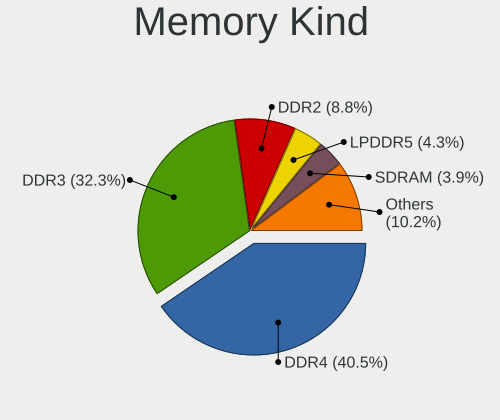

| Kind    | Notebooks | Percent |
|---------|-----------|---------|
| DDR4    | 198       | 40.49%  |
| DDR3    | 158       | 32.31%  |
| DDR2    | 43        | 8.79%   |
| LPDDR5  | 21        | 4.29%   |
| SDRAM   | 19        | 3.89%   |
| LPDDR4  | 16        | 3.27%   |
| DDR5    | 12        | 2.45%   |
| LPDDR3  | 9         | 1.84%   |
| DDR     | 8         | 1.64%   |
| DRAM    | 3         | 0.61%   |
| RAM     | 1         | 0.2%    |
| Unknown | 1         | 0.2%    |

Memory Form Factor
------------------

Physical design of the memory module

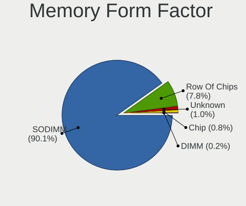

| Name         | Notebooks | Percent |
|--------------|-----------|---------|
| SODIMM       | 439       | 90.14%  |
| Row Of Chips | 38        | 7.8%    |
| Unknown      | 5         | 1.03%   |
| Chip         | 4         | 0.82%   |
| DIMM         | 1         | 0.21%   |

Memory Size
-----------

Memory module size

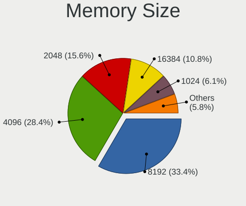

| Size    | Notebooks | Percent |
|---------|-----------|---------|
| 8192    | 180       | 33.4%   |
| 4096    | 153       | 28.39%  |
| 2048    | 84        | 15.58%  |
| 16384   | 58        | 10.76%  |
| 1024    | 33        | 6.12%   |
| 32768   | 17        | 3.15%   |
| 512     | 11        | 2.04%   |
| 49152   | 2         | 0.37%   |
| Unknown | 1         | 0.19%   |

Memory Speed
------------

Memory module speed

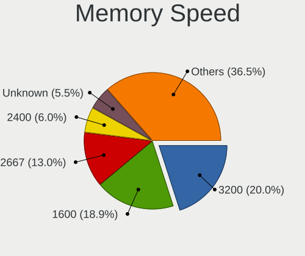

| Speed   | Notebooks | Percent |
|---------|-----------|---------|
| 3200    | 106       | 20.04%  |
| 1600    | 100       | 18.9%   |
| 2667    | 69        | 13.04%  |
| 2400    | 32        | 6.05%   |
| Unknown | 29        | 5.48%   |
| 1334    | 21        | 3.97%   |
| 1333    | 20        | 3.78%   |
| 2133    | 19        | 3.59%   |
| 667     | 18        | 3.4%    |
| 6400    | 15        | 2.84%   |
| 1067    | 10        | 1.89%   |
| 533     | 10        | 1.89%   |
| 5600    | 9         | 1.7%    |
| 3266    | 9         | 1.7%    |
| 2048    | 8         | 1.51%   |
| 4199    | 7         | 1.32%   |
| 1867    | 7         | 1.32%   |
| 8400    | 6         | 1.13%   |
| 4267    | 5         | 0.95%   |
| 800     | 5         | 0.95%   |
| 1066    | 4         | 0.76%   |
| 4800    | 3         | 0.57%   |
| 4266    | 3         | 0.57%   |
| 975     | 3         | 0.57%   |
| 5500    | 2         | 0.38%   |
| 8533    | 1         | 0.19%   |
| 7500    | 1         | 0.19%   |
| 7467    | 1         | 0.19%   |
| 7400    | 1         | 0.19%   |
| 3866    | 1         | 0.19%   |
| 2267    | 1         | 0.19%   |
| 1200    | 1         | 0.19%   |
| 400     | 1         | 0.19%   |
| 266     | 1         | 0.19%   |

Printers & scanners
-------------------

Printer Vendor
--------------

Printer device vendors

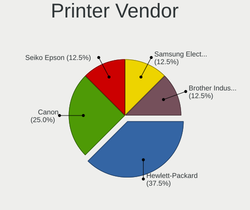

| Vendor              | Notebooks | Percent |
|---------------------|-----------|---------|
| Hewlett-Packard     | 3         | 37.5%   |
| Canon               | 2         | 25%     |
| Seiko Epson         | 1         | 12.5%   |
| Samsung Electronics | 1         | 12.5%   |
| Brother Industries  | 1         | 12.5%   |

Printer Model
-------------

Printer device models

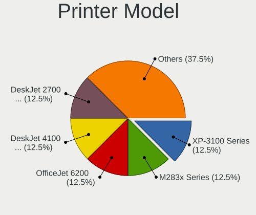

| Model                      | Notebooks | Percent |
|----------------------------|-----------|---------|
| Seiko Epson XP-3100 Series | 1         | 12.5%   |
| Samsung M283x Series       | 1         | 12.5%   |
| HP OfficeJet 6200          | 1         | 12.5%   |
| HP DeskJet 4100 series     | 1         | 12.5%   |
| HP DeskJet 2700 series     | 1         | 12.5%   |
| Canon TR4600 series        | 1         | 12.5%   |
| Canon PIXMA MG3500 Series  | 1         | 12.5%   |
| Brother HL-L2340D series   | 1         | 12.5%   |

Scanner Vendor
--------------

Scanner device vendors

| Vendor | Notebooks | Percent |
|--------|-----------|---------|
| Canon  | 1         | 100%    |

Scanner Model
-------------

Scanner device models

| Model                         | Notebooks | Percent |
|-------------------------------|-----------|---------|
| Canon CanoScan N1240U/LiDE 30 | 1         | 100%    |

Camera
------

Camera Vendor
-------------

Camera device vendors

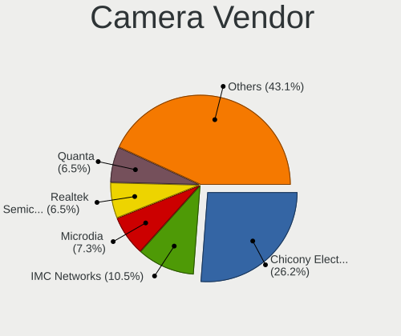

| Vendor                                 | Notebooks | Percent |
|----------------------------------------|-----------|---------|
| Chicony Electronics                    | 223       | 26.2%   |
| IMC Networks                           | 89        | 10.46%  |
| Microdia                               | 62        | 7.29%   |
| Realtek Semiconductor                  | 55        | 6.46%   |
| Quanta                                 | 55        | 6.46%   |
| Bison Electronics                      | 55        | 6.46%   |
| Sunplus Innovation Technology          | 53        | 6.23%   |
| Suyin                                  | 41        | 4.82%   |
| Cheng Uei Precision Industry (Foxlink) | 33        | 3.88%   |
| Luxvisions Innotech Limited            | 23        | 2.7%    |
| Apple                                  | 22        | 2.59%   |
| Syntek                                 | 17        | 2%      |
| Silicon Motion                         | 17        | 2%      |
| Alcor Micro                            | 14        | 1.65%   |
| Ricoh                                  | 11        | 1.29%   |
| Lite-On Technology                     | 11        | 1.29%   |
| Sonix Technology                       | 8         | 0.94%   |
| Shinetech                              | 8         | 0.94%   |
| Importek                               | 6         | 0.71%   |
| Lenovo                                 | 5         | 0.59%   |
| Acer                                   | 5         | 0.59%   |
| Z-Star Microelectronics                | 4         | 0.47%   |
| Logitech                               | 4         | 0.47%   |
| ALi                                    | 4         | 0.47%   |
| Sunplus Technology                     | 3         | 0.35%   |
| SunplusIT                              | 2         | 0.24%   |
| Shine-optics                           | 2         | 0.24%   |
| Samsung Electronics                    | 2         | 0.24%   |
| OmniVision Technologies                | 2         | 0.24%   |
| kingcome                               | 2         | 0.24%   |
| Genesys Logic                          | 2         | 0.24%   |
| USB CAMERA                             | 1         | 0.12%   |
| LG Electronics                         | 1         | 0.12%   |
| Intel                                  | 1         | 0.12%   |
| icSpring                               | 1         | 0.12%   |
| HYGD-221208-J                          | 1         | 0.12%   |
| globaloptics                           | 1         | 0.12%   |
| Generalplus Technology                 | 1         | 0.12%   |
| Framework                              | 1         | 0.12%   |
| eMPIA Technology                       | 1         | 0.12%   |

Camera Model
------------

Camera device models

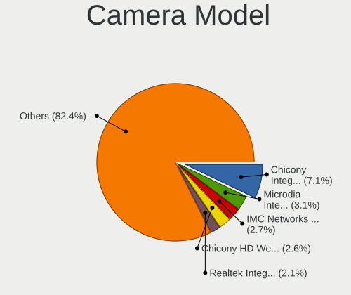

| Model                                                   | Notebooks | Percent |
|---------------------------------------------------------|-----------|---------|
| Chicony Integrated Camera                               | 61        | 7.09%   |
| Microdia Integrated_Webcam_HD                           | 27        | 3.14%   |
| IMC Networks USB2.0 HD UVC WebCam                       | 23        | 2.67%   |
| Chicony HD WebCam                                       | 22        | 2.56%   |
| Realtek Integrated_Webcam_HD                            | 18        | 2.09%   |
| IMC Networks Integrated Camera                          | 17        | 1.98%   |
| IMC Networks USB2.0 VGA UVC WebCam                      | 16        | 1.86%   |
| Bison Integrated Camera                                 | 16        | 1.86%   |
| Quanta HP TrueVision HD Camera                          | 11        | 1.28%   |
| Syntek Integrated Camera                                | 10        | 1.16%   |
| Quanta HP Webcam                                        | 10        | 1.16%   |
| Luxvisions Innotech Limited HP TrueVision HD Camera     | 10        | 1.16%   |
| Chicony USB2.0 HD UVC WebCam                            | 10        | 1.16%   |
| Suyin HP TrueVision HD                                  | 9         | 1.05%   |
| Sunplus Laptop_Integrated_Webcam_FHD                    | 8         | 0.93%   |
| Chicony HP HD Camera                                    | 8         | 0.93%   |
| Chicony FJ Camera                                       | 8         | 0.93%   |
| Quanta VGA Webcam                                       | 7         | 0.81%   |
| Chicony HP TrueVision HD Camera                         | 7         | 0.81%   |
| Apple FaceTime HD Camera                                | 7         | 0.81%   |
| Realtek Lenovo EasyCamera                               | 6         | 0.7%    |
| Quanta HP HD Camera                                     | 6         | 0.7%    |
| Lite-On Integrated Camera                               | 6         | 0.7%    |
| Chicony TOSHIBA Web Camera - HD                         | 6         | 0.7%    |
| Cheng Uei Precision Industry (Foxlink) HP Webcam        | 6         | 0.7%    |
| Cheng Uei Precision Industry (Foxlink) HP Truevision HD | 6         | 0.7%    |
| Bison ThinkPad Integrated Camera                        | 6         | 0.7%    |
| Bison HD Webcam                                         | 6         | 0.7%    |
| Apple Built-in iSight                                   | 6         | 0.7%    |
| Alcor Micro USB 2.0 Camera                              | 6         | 0.7%    |
| Suyin Acer/HP Integrated Webcam [CN0314]                | 5         | 0.58%   |
| Sunplus Laptop_Integrated_Webcam_HD                     | 5         | 0.58%   |
| Silicon Motion WebCam SC-0311139N                       | 5         | 0.58%   |
| Realtek USB2.0 VGA UVC WebCam                           | 5         | 0.58%   |
| Microdia USB 2.0 Camera                                 | 5         | 0.58%   |
| IMC Networks Integrated Webcam                          | 5         | 0.58%   |
| IMC Networks EasyCamera                                 | 5         | 0.58%   |
| Chicony USB2.0 VGA UVC WebCam                           | 5         | 0.58%   |
| Chicony USB 2.0 Camera                                  | 5         | 0.58%   |
| Chicony Lenovo EasyCamera                               | 5         | 0.58%   |

Security
--------

Fingerprint Vendor
------------------

Fingerprint sensor vendors

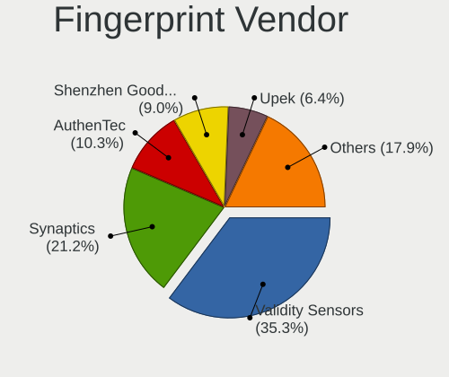

| Vendor                     | Notebooks | Percent |
|----------------------------|-----------|---------|
| Validity Sensors           | 55        | 35.26%  |
| Synaptics                  | 33        | 21.15%  |
| AuthenTec                  | 16        | 10.26%  |
| Shenzhen Goodix Technology | 14        | 8.97%   |
| Upek                       | 10        | 6.41%   |
| STMicroelectronics         | 10        | 6.41%   |
| Elan Microelectronics      | 10        | 6.41%   |
| LighTuning Technology      | 5         | 3.21%   |
| Focal-systems.Corp         | 2         | 1.28%   |
| Microsoft                  | 1         | 0.64%   |

Fingerprint Model
-----------------

Fingerprint sensor models

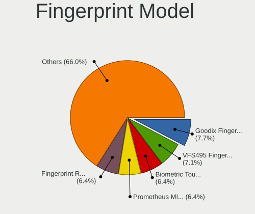

| Model                                                                      | Notebooks | Percent |
|----------------------------------------------------------------------------|-----------|---------|
| Shenzhen Goodix  FingerPrint Device                                        | 12        | 7.69%   |
| Validity Sensors VFS495 Fingerprint Reader                                 | 11        | 7.05%   |
| Upek Biometric Touchchip/Touchstrip Fingerprint Sensor                     | 10        | 6.41%   |
| Synaptics Prometheus MIS Touch Fingerprint Reader                          | 10        | 6.41%   |
| STMicroelectronics Fingerprint Reader                                      | 10        | 6.41%   |
| Validity Sensors VFS5011 Fingerprint Reader                                | 6         | 3.85%   |
| Validity Sensors VFS 5011 fingerprint sensor                               | 6         | 3.85%   |
| Synaptics UWP WBDI Device                                                  | 6         | 3.85%   |
| Synaptics FS7604 Touch Fingerprint Sensor with PurePrint                   | 6         | 3.85%   |
| Elan ELAN:ARM-M4                                                           | 6         | 3.85%   |
| Validity Sensors VFS451 Fingerprint Reader                                 | 5         | 3.21%   |
| Validity Sensors VFS301 Fingerprint Reader                                 | 5         | 3.21%   |
| Validity Sensors Fingerprint scanner                                       | 5         | 3.21%   |
| Synaptics Metallica MIS Touch Fingerprint Reader                           | 5         | 3.21%   |
| AuthenTec Fingerprint Sensor                                               | 5         | 3.21%   |
| Elan ELAN:Fingerprint                                                      | 4         | 2.56%   |
| AuthenTec AES2501 Fingerprint Sensor                                       | 4         | 2.56%   |
| AuthenTec AES1600                                                          | 4         | 2.56%   |
| Validity Sensors VFS7500 Touch Fingerprint Sensor                          | 3         | 1.92%   |
| Validity Sensors VFS491                                                    | 3         | 1.92%   |
| Validity Sensors Swipe Fingerprint Sensor                                  | 3         | 1.92%   |
| Synaptics Metallica MOH Touch Fingerprint Reader                           | 3         | 1.92%   |
| LighTuning EgisTec Touch Fingerprint Sensor                                | 3         | 1.92%   |
| AuthenTec AES2810                                                          | 3         | 1.92%   |
| Validity Sensors VFS Fingerprint sensor                                    | 2         | 1.28%   |
| Validity Sensors Synaptics WBDI                                            | 2         | 1.28%   |
| Validity Sensors Synaptics VFS7552 Touch Fingerprint Sensor with PurePrint | 2         | 1.28%   |
| Shenzhen Goodix FingerPrint                                                | 2         | 1.28%   |
| Focal-systems.Corp FT9201Fingerprint.                                      | 2         | 1.28%   |
| Validity Sensors VFS7552 Touch Fingerprint Sensor                          | 1         | 0.64%   |
| Validity Sensors VFS101 Fingerprint Reader                                 | 1         | 0.64%   |
| Synaptics WBDI                                                             | 1         | 0.64%   |
| Synaptics UWP WBDI                                                         | 1         | 0.64%   |
| Synaptics Fingerprint reader [HP G6]                                       | 1         | 0.64%   |
| Microsoft Fingerprint Reader                                               | 1         | 0.64%   |
| LighTuning Fingerprint Reader                                              | 1         | 0.64%   |
| LighTuning ES603 Swipe Fingerprint Sensor                                  | 1         | 0.64%   |

Chipcard Vendor
---------------

Chipcard module vendors

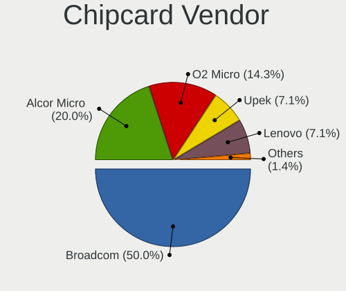

| Vendor                | Notebooks | Percent |
|-----------------------|-----------|---------|
| Broadcom              | 35        | 50%     |
| Alcor Micro           | 14        | 20%     |
| O2 Micro              | 10        | 14.29%  |
| Upek                  | 5         | 7.14%   |
| Lenovo                | 5         | 7.14%   |
| Gemalto (was Gemplus) | 1         | 1.43%   |

Chipcard Model
--------------

Chipcard module models

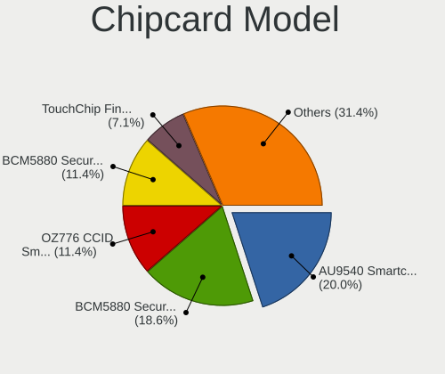

| Model                                                                        | Notebooks | Percent |
|------------------------------------------------------------------------------|-----------|---------|
| Alcor Micro AU9540 Smartcard Reader                                          | 14        | 20%     |
| Broadcom BCM5880 Secure Applications Processor                               | 13        | 18.57%  |
| O2 Micro OZ776 CCID Smartcard Reader                                         | 8         | 11.43%  |
| Broadcom BCM5880 Secure Applications Processor with fingerprint swipe sensor | 8         | 11.43%  |
| Upek TouchChip Fingerprint Coprocessor (WBF advanced mode)                   | 5         | 7.14%   |
| Lenovo Integrated Smart Card Reader                                          | 5         | 7.14%   |
| Broadcom 5880                                                                | 5         | 7.14%   |
| Broadcom BCM58200 ControlVault 3 (FingerPrint sensor + Contacted SmartCard)  | 4         | 5.71%   |
| Broadcom 58200                                                               | 4         | 5.71%   |
| O2 Micro Oz776 SmartCard Reader                                              | 2         | 2.86%   |
| Gemalto (was Gemplus) Compact Smart Card Reader Writer                       | 1         | 1.43%   |
| Broadcom BCM5880 Secure Applications Processor with fingerprint touch sensor | 1         | 1.43%   |

Unsupported
-----------

Unsupported Devices
-------------------

Total unsupported devices on board

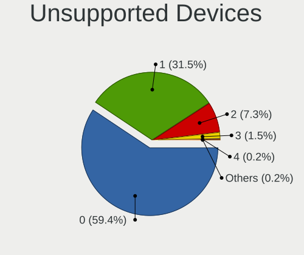

| Total | Notebooks | Percent |
|-------|-----------|---------|
| 0     | 621       | 59.37%  |
| 1     | 329       | 31.45%  |
| 2     | 76        | 7.27%   |
| 3     | 16        | 1.53%   |
| 4     | 2         | 0.19%   |
| 6     | 1         | 0.1%    |
| 5     | 1         | 0.1%    |

Unsupported Device Types
------------------------

Types of unsupported devices

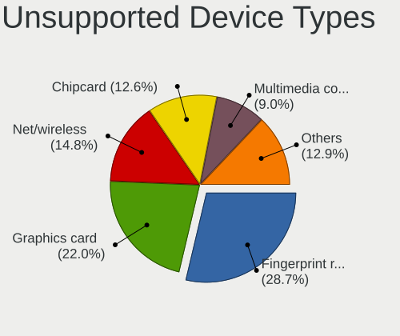

| Type                     | Notebooks | Percent |
|--------------------------|-----------|---------|
| Fingerprint reader       | 153       | 28.71%  |
| Graphics card            | 117       | 21.95%  |
| Net/wireless             | 79        | 14.82%  |
| Chipcard                 | 67        | 12.57%  |
| Multimedia controller    | 48        | 9.01%   |
| Bluetooth                | 16        | 3%      |
| Storage                  | 14        | 2.63%   |
| Camera                   | 10        | 1.88%   |
| Communication controller | 9         | 1.69%   |
| Network                  | 4         | 0.75%   |
| Card reader              | 4         | 0.75%   |
| Sound                    | 3         | 0.56%   |
| Flash memory             | 3         | 0.56%   |
| Net/ethernet             | 2         | 0.38%   |
| Tv card                  | 1         | 0.19%   |
| Storage/nvme             | 1         | 0.19%   |
| Modem                    | 1         | 0.19%   |
| Dvb card                 | 1         | 0.19%   |

