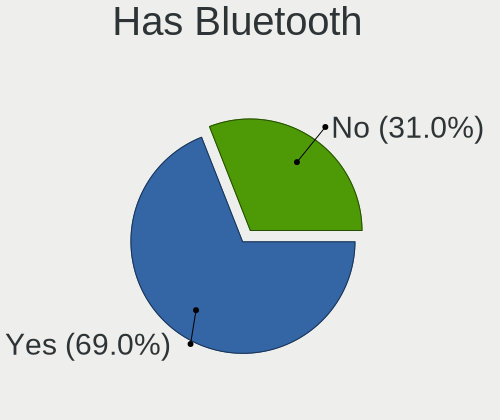
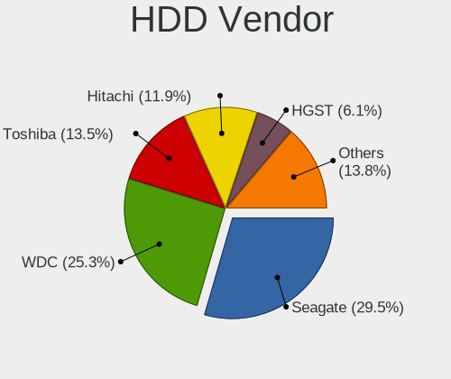
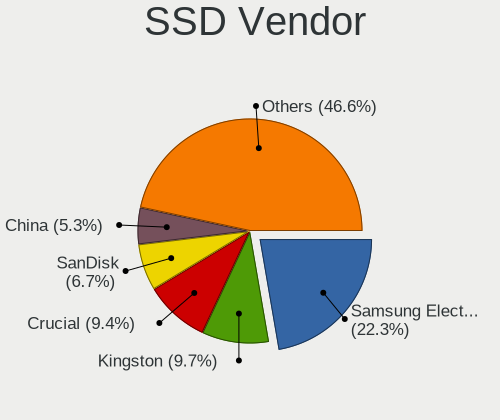
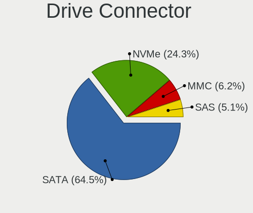
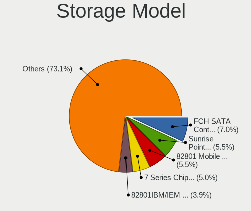
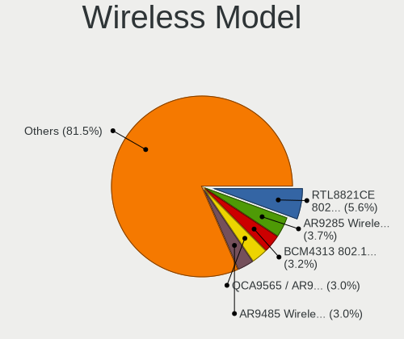

LMDE - Tested Hardware & Statistics (Notebooks)
-----------------------------------------------

A project to collect tested hardware configurations for LMDE.

Anyone can contribute to this report by the [hw-probe](https://github.com/linuxhw/hw-probe) tool:

    sudo -E hw-probe -all -upload

Please contribute! Especially if your hardware is rare.

Full-feature report is available here: https://linux-hardware.org/?view=trends

Contents
--------

* [ Test Cases ](#test-cases)

* [ System ](#system)
  - [ OS                       ](#os)
  - [ OS Family                ](#os-family)
  - [ Kernel                   ](#kernel)
  - [ Kernel Family            ](#kernel-family)
  - [ Kernel Major Ver.        ](#kernel-major-ver)
  - [ Arch                     ](#arch)
  - [ DE                       ](#de)
  - [ Display Server           ](#display-server)
  - [ Display Manager          ](#display-manager)
  - [ OS Lang                  ](#os-lang)
  - [ Boot Mode                ](#boot-mode)
  - [ Filesystem               ](#filesystem)
  - [ Part. scheme             ](#part-scheme)
  - [ Dual Boot with Linux/BSD ](#dual-boot-with-linuxbsd)
  - [ Dual Boot (Win)          ](#dual-boot-win)

* [ Board ](#board)
  - [ Vendor                   ](#vendor)
  - [ Model                    ](#model)
  - [ Model Family             ](#model-family)
  - [ MFG Year                 ](#mfg-year)
  - [ Form Factor              ](#form-factor)
  - [ Secure Boot              ](#secure-boot)
  - [ Coreboot                 ](#coreboot)
  - [ RAM Size                 ](#ram-size)
  - [ RAM Used                 ](#ram-used)
  - [ Total Drives             ](#total-drives)
  - [ Has CD-ROM               ](#has-cd-rom)
  - [ Has Ethernet             ](#has-ethernet)
  - [ Has WiFi                 ](#has-wifi)
  - [ Has Bluetooth            ](#has-bluetooth)

* [ Location ](#location)
  - [ Country                  ](#country)
  - [ City                     ](#city)

* [ Drives ](#drives)
  - [ Drive Vendor             ](#drive-vendor)
  - [ Drive Model              ](#drive-model)
  - [ HDD Vendor               ](#hdd-vendor)
  - [ SSD Vendor               ](#ssd-vendor)
  - [ Drive Kind               ](#drive-kind)
  - [ Drive Connector          ](#drive-connector)
  - [ Drive Size               ](#drive-size)
  - [ Space Total              ](#space-total)
  - [ Space Used               ](#space-used)
  - [ Malfunc. Drives          ](#malfunc-drives)
  - [ Malfunc. Drive Vendor    ](#malfunc-drive-vendor)
  - [ Malfunc. HDD Vendor      ](#malfunc-hdd-vendor)
  - [ Malfunc. Drive Kind      ](#malfunc-drive-kind)
  - [ Failed Drives            ](#failed-drives)
  - [ Failed Drive Vendor      ](#failed-drive-vendor)
  - [ Drive Status             ](#drive-status)

* [ Storage controller ](#storage-controller)
  - [ Storage Vendor           ](#storage-vendor)
  - [ Storage Model            ](#storage-model)
  - [ Storage Kind             ](#storage-kind)

* [ Processor ](#processor)
  - [ CPU Vendor               ](#cpu-vendor)
  - [ CPU Model                ](#cpu-model)
  - [ CPU Model Family         ](#cpu-model-family)
  - [ CPU Cores                ](#cpu-cores)
  - [ CPU Sockets              ](#cpu-sockets)
  - [ CPU Threads              ](#cpu-threads)
  - [ CPU Op-Modes             ](#cpu-op-modes)
  - [ CPU Microcode            ](#cpu-microcode)
  - [ CPU Microarch            ](#cpu-microarch)

* [ Graphics ](#graphics)
  - [ GPU Vendor               ](#gpu-vendor)
  - [ GPU Model                ](#gpu-model)
  - [ GPU Combo                ](#gpu-combo)
  - [ GPU Driver               ](#gpu-driver)
  - [ GPU Memory               ](#gpu-memory)

* [ Monitor ](#monitor)
  - [ Monitor Vendor           ](#monitor-vendor)
  - [ Monitor Model            ](#monitor-model)
  - [ Monitor Resolution       ](#monitor-resolution)
  - [ Monitor Diagonal         ](#monitor-diagonal)
  - [ Monitor Width            ](#monitor-width)
  - [ Aspect Ratio             ](#aspect-ratio)
  - [ Monitor Area             ](#monitor-area)
  - [ Pixel Density            ](#pixel-density)
  - [ Multiple Monitors        ](#multiple-monitors)

* [ Network ](#network)
  - [ Net Controller Vendor    ](#net-controller-vendor)
  - [ Net Controller Model     ](#net-controller-model)
  - [ Wireless Vendor          ](#wireless-vendor)
  - [ Wireless Model           ](#wireless-model)
  - [ Ethernet Vendor          ](#ethernet-vendor)
  - [ Ethernet Model           ](#ethernet-model)
  - [ Net Controller Kind      ](#net-controller-kind)
  - [ Used Controller          ](#used-controller)
  - [ NICs                     ](#nics)
  - [ IPv6                     ](#ipv6)

* [ Bluetooth ](#bluetooth)
  - [ Bluetooth Vendor         ](#bluetooth-vendor)
  - [ Bluetooth Model          ](#bluetooth-model)

* [ Sound ](#sound)
  - [ Sound Vendor             ](#sound-vendor)
  - [ Sound Model              ](#sound-model)

* [ Memory ](#memory)
  - [ Memory Vendor            ](#memory-vendor)
  - [ Memory Model             ](#memory-model)
  - [ Memory Kind              ](#memory-kind)
  - [ Memory Form Factor       ](#memory-form-factor)
  - [ Memory Size              ](#memory-size)
  - [ Memory Speed             ](#memory-speed)

* [ Printers & scanners ](#printers--scanners)
  - [ Printer Vendor           ](#printer-vendor)
  - [ Printer Model            ](#printer-model)
  - [ Scanner Vendor           ](#scanner-vendor)
  - [ Scanner Model            ](#scanner-model)

* [ Camera ](#camera)
  - [ Camera Vendor            ](#camera-vendor)
  - [ Camera Model             ](#camera-model)

* [ Security ](#security)
  - [ Fingerprint Vendor       ](#fingerprint-vendor)
  - [ Fingerprint Model        ](#fingerprint-model)
  - [ Chipcard Vendor          ](#chipcard-vendor)
  - [ Chipcard Model           ](#chipcard-model)

* [ Unsupported ](#unsupported)
  - [ Unsupported Devices      ](#unsupported-devices)
  - [ Unsupported Device Types ](#unsupported-device-types)

Test Cases
----------

Total: 435

| Vendor        | Model                       | Probe                                                      | Date         |
|---------------|-----------------------------|------------------------------------------------------------|--------------|
| Dell          | Latitude 3410               | [78396d572c](https://linux-hardware.org/?probe=78396d572c) | Apr 15, 2022 |
| ASUSTek       | N61Jv                       | [959c5f2238](https://linux-hardware.org/?probe=959c5f2238) | Apr 14, 2022 |
| Acer          | AOA110                      | [cba10fc182](https://linux-hardware.org/?probe=cba10fc182) | Apr 13, 2022 |
| Howard Com... | R7X                         | [e0f3701b1b](https://linux-hardware.org/?probe=e0f3701b1b) | Apr 12, 2022 |
| Lenovo        | ThinkPad W541 20EGS24J00    | [6fbd04d8fd](https://linux-hardware.org/?probe=6fbd04d8fd) | Apr 11, 2022 |
| Howard Com... | R7X                         | [5885bbaa90](https://linux-hardware.org/?probe=5885bbaa90) | Apr 10, 2022 |
| Dell          | Vostro 3500                 | [5b1a24bf51](https://linux-hardware.org/?probe=5b1a24bf51) | Apr 10, 2022 |
| Dell          | Vostro 3500                 | [b2adbbe7d0](https://linux-hardware.org/?probe=b2adbbe7d0) | Apr 10, 2022 |
| Lenovo        | IdeaPad 5 15ARE05 81YQ      | [4d5998459b](https://linux-hardware.org/?probe=4d5998459b) | Apr 09, 2022 |
| HP            | Presario C500 (RY512EA#A... | [4ef049d490](https://linux-hardware.org/?probe=4ef049d490) | Apr 09, 2022 |
| Dell          | Inspiron 14 5410 2-in-1     | [613d6e7d3c](https://linux-hardware.org/?probe=613d6e7d3c) | Apr 07, 2022 |
| Dell          | Latitude 5511               | [2cb0a3e451](https://linux-hardware.org/?probe=2cb0a3e451) | Apr 06, 2022 |
| Dell          | Precision 7520              | [7404842400](https://linux-hardware.org/?probe=7404842400) | Apr 05, 2022 |
| LincPlus      | LINNCPLUS P1                | [22406313dc](https://linux-hardware.org/?probe=22406313dc) | Apr 02, 2022 |
| Toshiba       | Satellite L455              | [699e7d272d](https://linux-hardware.org/?probe=699e7d272d) | Apr 02, 2022 |
| HP            | Pavilion Laptop 15-eh1xx... | [387b77f172](https://linux-hardware.org/?probe=387b77f172) | Apr 01, 2022 |
| ASUSTek       | 901                         | [d118ee90d5](https://linux-hardware.org/?probe=d118ee90d5) | Apr 01, 2022 |
| HP            | ProBook 6570b               | [0609df27fa](https://linux-hardware.org/?probe=0609df27fa) | Mar 31, 2022 |
| Lenovo        | IdeaPad S110 20126          | [9113320f2f](https://linux-hardware.org/?probe=9113320f2f) | Mar 31, 2022 |
| Lenovo        | IdeaPad S110 20126          | [7c5086f8c0](https://linux-hardware.org/?probe=7c5086f8c0) | Mar 31, 2022 |
| Lenovo        | IdeaPad S110 20126          | [d02cab0935](https://linux-hardware.org/?probe=d02cab0935) | Mar 30, 2022 |
| Packard Be... | DOT S                       | [85e7386152](https://linux-hardware.org/?probe=85e7386152) | Mar 28, 2022 |
| Packard Be... | DOT S                       | [edef12b9d5](https://linux-hardware.org/?probe=edef12b9d5) | Mar 28, 2022 |
| Lenovo        | IdeaPad 3 14ALC6 82KT       | [b2e70b8251](https://linux-hardware.org/?probe=b2e70b8251) | Mar 28, 2022 |
| Toshiba       | Satellite L455              | [9213736f1c](https://linux-hardware.org/?probe=9213736f1c) | Mar 27, 2022 |
| Dell          | Latitude E6400              | [01815a09bb](https://linux-hardware.org/?probe=01815a09bb) | Mar 27, 2022 |
| Dell          | Latitude D620               | [172cd26e35](https://linux-hardware.org/?probe=172cd26e35) | Mar 26, 2022 |
| Toshiba       | Satellite L455              | [90334cf68d](https://linux-hardware.org/?probe=90334cf68d) | Mar 26, 2022 |
| Dell          | Precision M4400             | [5172327d82](https://linux-hardware.org/?probe=5172327d82) | Mar 25, 2022 |
| Medion        | E6220                       | [e739ef27a1](https://linux-hardware.org/?probe=e739ef27a1) | Mar 24, 2022 |
| HP            | ProBook 6465b               | [2e1792442b](https://linux-hardware.org/?probe=2e1792442b) | Mar 24, 2022 |
| HP            | ProBook 6465b               | [51a296abf8](https://linux-hardware.org/?probe=51a296abf8) | Mar 24, 2022 |
| Acer          | Aspire 7745G                | [3f4c13ee47](https://linux-hardware.org/?probe=3f4c13ee47) | Mar 23, 2022 |
| HP            | 255 G7 Notebook PC          | [f8561c65dc](https://linux-hardware.org/?probe=f8561c65dc) | Mar 21, 2022 |
| Acer          | TravelMate 420              | [13cae0e399](https://linux-hardware.org/?probe=13cae0e399) | Mar 14, 2022 |
| Lenovo        | IdeaPad Z470                | [b1ca65b3e0](https://linux-hardware.org/?probe=b1ca65b3e0) | Mar 08, 2022 |
| ASUSTek       | X101CH                      | [486f5c28ad](https://linux-hardware.org/?probe=486f5c28ad) | Mar 07, 2022 |
| Dell          | Latitude D620               | [d4e50f40f3](https://linux-hardware.org/?probe=d4e50f40f3) | Mar 06, 2022 |
| Lenovo        | IdeaPad Z470                | [93b1d09d4f](https://linux-hardware.org/?probe=93b1d09d4f) | Mar 03, 2022 |
| HP            | ENVY 6                      | [23f60a7428](https://linux-hardware.org/?probe=23f60a7428) | Mar 02, 2022 |
| Lenovo        | IdeaPad Z470                | [d163816373](https://linux-hardware.org/?probe=d163816373) | Mar 02, 2022 |
| ASUSTek       | UX490UAR                    | [6b6c4bd7b7](https://linux-hardware.org/?probe=6b6c4bd7b7) | Feb 28, 2022 |
| ASUSTek       | UX490UAR                    | [544979fc4f](https://linux-hardware.org/?probe=544979fc4f) | Feb 27, 2022 |
| Fujitsu Si... | LIFEBOOK S7020              | [4bd308dadf](https://linux-hardware.org/?probe=4bd308dadf) | Feb 26, 2022 |
| Fujitsu Si... | LIFEBOOK S7020              | [ec2491adc1](https://linux-hardware.org/?probe=ec2491adc1) | Feb 26, 2022 |
| Acer          | Swift SF315-52              | [74009233c2](https://linux-hardware.org/?probe=74009233c2) | Feb 19, 2022 |
| Lenovo        | ThinkPad W541 20EGS24J00    | [e2ab1c19df](https://linux-hardware.org/?probe=e2ab1c19df) | Feb 18, 2022 |
| HP            | Laptop 14-bs0xx             | [2b5b67148b](https://linux-hardware.org/?probe=2b5b67148b) | Feb 18, 2022 |
| EVOO          | EVC141-12                   | [25710a76b8](https://linux-hardware.org/?probe=25710a76b8) | Feb 18, 2022 |
| Samsung       | NC210/NC110                 | [bf2672168d](https://linux-hardware.org/?probe=bf2672168d) | Feb 14, 2022 |
| Samsung       | NC210/NC110                 | [bcbb1884aa](https://linux-hardware.org/?probe=bcbb1884aa) | Feb 13, 2022 |
| ASUSTek       | X101CH                      | [82661c6a9b](https://linux-hardware.org/?probe=82661c6a9b) | Feb 12, 2022 |
| ASUSTek       | 901                         | [77c14174fd](https://linux-hardware.org/?probe=77c14174fd) | Feb 06, 2022 |
| ASUSTek       | 901                         | [972a6c0937](https://linux-hardware.org/?probe=972a6c0937) | Feb 04, 2022 |
| ASUSTek       | 901                         | [27a497fdf8](https://linux-hardware.org/?probe=27a497fdf8) | Feb 04, 2022 |
| Acer          | Aspire 3820                 | [e6091c93a9](https://linux-hardware.org/?probe=e6091c93a9) | Feb 02, 2022 |
| Toshiba       | Satellite A200              | [9086ec49b6](https://linux-hardware.org/?probe=9086ec49b6) | Jan 21, 2022 |
| LG Electro... | A530-T.BE76P1               | [9fdbf19ebf](https://linux-hardware.org/?probe=9fdbf19ebf) | Jan 09, 2022 |
| Google        | Falco                       | [f450676688](https://linux-hardware.org/?probe=f450676688) | Jan 09, 2022 |
| Packard Be... | EasyNote TE69BM             | [526fc1b476](https://linux-hardware.org/?probe=526fc1b476) | Jan 05, 2022 |
| LG Electro... | E500-S.AP17B                | [675eb28882](https://linux-hardware.org/?probe=675eb28882) | Jan 05, 2022 |
| LG Electro... | E500-S.AP17B                | [203577c78f](https://linux-hardware.org/?probe=203577c78f) | Jan 05, 2022 |
| Dell          | System Inspiron N7110       | [41e93113b5](https://linux-hardware.org/?probe=41e93113b5) | Jan 05, 2022 |
| Dell          | System Inspiron N7110       | [c977f6d6af](https://linux-hardware.org/?probe=c977f6d6af) | Jan 05, 2022 |
| ASUSTek       | K46CA                       | [61978f9418](https://linux-hardware.org/?probe=61978f9418) | Jan 04, 2022 |
| Samsung       | RV411/RV511/E3511/S3511/... | [9d4bddea4d](https://linux-hardware.org/?probe=9d4bddea4d) | Jan 03, 2022 |
| Advent        | Monza T100                  | [7355d1ae53](https://linux-hardware.org/?probe=7355d1ae53) | Dec 23, 2021 |
| Acer          | Aspire V5-573G              | [4c03d73b65](https://linux-hardware.org/?probe=4c03d73b65) | Dec 18, 2021 |
| HP            | Pavilion 14                 | [be9e6368e4](https://linux-hardware.org/?probe=be9e6368e4) | Dec 17, 2021 |
| Acer          | Aspire 3820                 | [b2f24124da](https://linux-hardware.org/?probe=b2f24124da) | Dec 14, 2021 |
| Acer          | Aspire 3820                 | [c4ed088328](https://linux-hardware.org/?probe=c4ed088328) | Dec 14, 2021 |
| Sony          | VPCP116KG                   | [237c9f66e1](https://linux-hardware.org/?probe=237c9f66e1) | Dec 13, 2021 |
| Fujitsu       | STYLISTIC Q550              | [e5d7b73e7f](https://linux-hardware.org/?probe=e5d7b73e7f) | Dec 12, 2021 |
| Fujitsu       | STYLISTIC Q550              | [8138236f20](https://linux-hardware.org/?probe=8138236f20) | Dec 12, 2021 |
| Lenovo        | G40-30 80FY                 | [43ff865e00](https://linux-hardware.org/?probe=43ff865e00) | Nov 28, 2021 |
| HP            | Pavilion dv6                | [5300296119](https://linux-hardware.org/?probe=5300296119) | Nov 27, 2021 |
| Samsung       | RV411/RV511/E3511/S3511/... | [bb0a461d82](https://linux-hardware.org/?probe=bb0a461d82) | Nov 21, 2021 |
| Lenovo        | G50-45 80E3                 | [024686087f](https://linux-hardware.org/?probe=024686087f) | Nov 20, 2021 |
| Samsung       | 305U1A                      | [c602ad4903](https://linux-hardware.org/?probe=c602ad4903) | Nov 18, 2021 |
| Acer          | Aspire 3000                 | [86d2f89f59](https://linux-hardware.org/?probe=86d2f89f59) | Nov 12, 2021 |
| Lenovo        | ThinkPad E495 20NE001MRT    | [688e4047ce](https://linux-hardware.org/?probe=688e4047ce) | Nov 11, 2021 |
| Acer          | Aspire 3000                 | [dad287d5a1](https://linux-hardware.org/?probe=dad287d5a1) | Nov 11, 2021 |
| Toshiba       | Satellite L50-C             | [5a9ebbcad0](https://linux-hardware.org/?probe=5a9ebbcad0) | Nov 09, 2021 |
| Acer          | Aspire E5-411               | [0155c64e23](https://linux-hardware.org/?probe=0155c64e23) | Nov 04, 2021 |
| Acer          | Aspire E5-411               | [63287ab4e6](https://linux-hardware.org/?probe=63287ab4e6) | Nov 02, 2021 |
| Dell          | Latitude D630               | [ac9f57ab8f](https://linux-hardware.org/?probe=ac9f57ab8f) | Nov 02, 2021 |
| TUXEDO        | BC1510 1710                 | [90be7d16be](https://linux-hardware.org/?probe=90be7d16be) | Oct 24, 2021 |
| TUXEDO        | BC1510 1710                 | [49b52175c5](https://linux-hardware.org/?probe=49b52175c5) | Oct 24, 2021 |
| Acer          | Aspire A315-55G             | [5b965ea234](https://linux-hardware.org/?probe=5b965ea234) | Oct 17, 2021 |
| Acer          | Aspire A315-55G             | [3a5976d4eb](https://linux-hardware.org/?probe=3a5976d4eb) | Oct 17, 2021 |
| Acer          | Swift SF515-51T             | [203a3b399d](https://linux-hardware.org/?probe=203a3b399d) | Oct 13, 2021 |
| HP            | Pavilion dv6                | [b4200dd39c](https://linux-hardware.org/?probe=b4200dd39c) | Oct 13, 2021 |
| Medion        | P6670 MD99960               | [eaa186d207](https://linux-hardware.org/?probe=eaa186d207) | Oct 12, 2021 |
| Medion        | P6670 MD99960               | [d42f345fc5](https://linux-hardware.org/?probe=d42f345fc5) | Oct 12, 2021 |
| HP            | 520                         | [4aea2d24b1](https://linux-hardware.org/?probe=4aea2d24b1) | Oct 10, 2021 |
| LG Electro... | A530-T.BE76P1               | [393852d904](https://linux-hardware.org/?probe=393852d904) | Oct 10, 2021 |
| Dell          | Precision M2800             | [b046a9dfe3](https://linux-hardware.org/?probe=b046a9dfe3) | Oct 08, 2021 |
| Lenovo        | ThinkPad T530 2394BK7       | [6e927dafdd](https://linux-hardware.org/?probe=6e927dafdd) | Sep 28, 2021 |
| Lenovo        | ThinkPad T530 2394BK7       | [ccccaee5bb](https://linux-hardware.org/?probe=ccccaee5bb) | Sep 28, 2021 |
| Apple         | MacBookPro5,4               | [633c289440](https://linux-hardware.org/?probe=633c289440) | Sep 28, 2021 |
| Apple         | MacBookPro5,4               | [a6d07be7c9](https://linux-hardware.org/?probe=a6d07be7c9) | Sep 27, 2021 |
| Lenovo        | ThinkPad E495 20NE001MRT    | [759b25b6a9](https://linux-hardware.org/?probe=759b25b6a9) | Sep 27, 2021 |
| Apple         | MacBookPro5,4               | [d5625a9406](https://linux-hardware.org/?probe=d5625a9406) | Sep 24, 2021 |
| Sony          | VPCS131FM                   | [b5bba0e07f](https://linux-hardware.org/?probe=b5bba0e07f) | Sep 22, 2021 |
| Sony          | VPCS131FM                   | [54923e2372](https://linux-hardware.org/?probe=54923e2372) | Sep 22, 2021 |
| Qbex          | UDPAIOQBEX01                | [34c385cfe4](https://linux-hardware.org/?probe=34c385cfe4) | Sep 13, 2021 |
| Acer          | Aspire 4320                 | [fae514c059](https://linux-hardware.org/?probe=fae514c059) | Sep 12, 2021 |
| IBM           | ThinkPad T41 23737JY        | [86cf78a3cf](https://linux-hardware.org/?probe=86cf78a3cf) | Sep 09, 2021 |
| HP            | 250 G2                      | [64f9cfdbab](https://linux-hardware.org/?probe=64f9cfdbab) | Sep 09, 2021 |
| HP            | 250 G2                      | [4fb0a2eab3](https://linux-hardware.org/?probe=4fb0a2eab3) | Sep 09, 2021 |
| Acer          | Aspire A315-31              | [10052076e0](https://linux-hardware.org/?probe=10052076e0) | Sep 09, 2021 |
| Acer          | Aspire A315-31              | [8a0df29327](https://linux-hardware.org/?probe=8a0df29327) | Sep 09, 2021 |
| LG Electro... | A530-T.BE76P1               | [844d7b2492](https://linux-hardware.org/?probe=844d7b2492) | Sep 09, 2021 |
| Matsushita... | CF-19DDGZXVM                | [6f54a42d76](https://linux-hardware.org/?probe=6f54a42d76) | Sep 08, 2021 |
| Fujitsu Si... | ESPRIMO Mobile V5515        | [fdb725803b](https://linux-hardware.org/?probe=fdb725803b) | Sep 01, 2021 |
| Lenovo        | Yoga 2 11 20428             | [52474e968d](https://linux-hardware.org/?probe=52474e968d) | Sep 01, 2021 |
| Lenovo        | Yoga 2 11 20428             | [c4e6145a5f](https://linux-hardware.org/?probe=c4e6145a5f) | Sep 01, 2021 |
| Dell          | XPS M1330                   | [9dbd1f4ad9](https://linux-hardware.org/?probe=9dbd1f4ad9) | Aug 28, 2021 |
| Dell          | XPS M1330                   | [f4e126fba9](https://linux-hardware.org/?probe=f4e126fba9) | Aug 28, 2021 |
| ASUSTek       | 1201HA                      | [eadb8752c9](https://linux-hardware.org/?probe=eadb8752c9) | Aug 28, 2021 |
| HP            | Pavilion dv2000 (RD665EA... | [3b6dfaf6db](https://linux-hardware.org/?probe=3b6dfaf6db) | Aug 25, 2021 |
| Fujitsu       | LIFEBOOK A556/G             | [7706314dbc](https://linux-hardware.org/?probe=7706314dbc) | Aug 24, 2021 |
| Itautec       | W7655                       | [82b2d38326](https://linux-hardware.org/?probe=82b2d38326) | Aug 24, 2021 |
| Itautec       | W7655                       | [5952ec3a0f](https://linux-hardware.org/?probe=5952ec3a0f) | Aug 24, 2021 |
| HP            | 14                          | [e6bbdc5a92](https://linux-hardware.org/?probe=e6bbdc5a92) | Aug 24, 2021 |
| ASUSTek       | X101CH                      | [42ca8c45b4](https://linux-hardware.org/?probe=42ca8c45b4) | Aug 22, 2021 |
| ASUSTek       | X101CH                      | [31ed530084](https://linux-hardware.org/?probe=31ed530084) | Aug 22, 2021 |
| ASUSTek       | M51Sn                       | [5acb8c28ad](https://linux-hardware.org/?probe=5acb8c28ad) | Aug 21, 2021 |
| Packard Be... | EasyNote_NJ66               | [03c09865f3](https://linux-hardware.org/?probe=03c09865f3) | Aug 19, 2021 |
| ASUSTek       | N550JV                      | [f56a2bd3fa](https://linux-hardware.org/?probe=f56a2bd3fa) | Aug 14, 2021 |
| Toshiba       | Satellite M100              | [8dff0ec788](https://linux-hardware.org/?probe=8dff0ec788) | Aug 10, 2021 |
| Toshiba       | Satellite M100              | [06e766539d](https://linux-hardware.org/?probe=06e766539d) | Aug 10, 2021 |
| Lenovo        | ThinkPad E495 20NE001MRT    | [8648635717](https://linux-hardware.org/?probe=8648635717) | Aug 07, 2021 |
| Fujitsu Si... | ESPRIMO Mobile V5515        | [16bec20604](https://linux-hardware.org/?probe=16bec20604) | Aug 06, 2021 |
| Lenovo        | ThinkPad E495 20NE001MRT    | [dec7f65882](https://linux-hardware.org/?probe=dec7f65882) | Aug 06, 2021 |
| Fujitsu Si... | ESPRIMO Mobile V5515        | [322a210197](https://linux-hardware.org/?probe=322a210197) | Aug 05, 2021 |
| Fujitsu Si... | ESPRIMO Mobile V5515        | [c930d1c587](https://linux-hardware.org/?probe=c930d1c587) | Aug 03, 2021 |
| Fujitsu Si... | ESPRIMO Mobile V5515        | [eb5ff22307](https://linux-hardware.org/?probe=eb5ff22307) | Aug 03, 2021 |
| Fujitsu Si... | ESPRIMO Mobile V5515        | [2ffa81b543](https://linux-hardware.org/?probe=2ffa81b543) | Aug 01, 2021 |
| Fujitsu Si... | ESPRIMO Mobile V5515        | [53ee243536](https://linux-hardware.org/?probe=53ee243536) | Aug 01, 2021 |
| HP            | Pavilion Laptop 15-cw1xx... | [eafe3a403f](https://linux-hardware.org/?probe=eafe3a403f) | Jul 30, 2021 |
| Toshiba       | Satellite L855              | [354b3bf7c6](https://linux-hardware.org/?probe=354b3bf7c6) | Jul 30, 2021 |
| ASUSTek       | 1201NL                      | [1ff8ed5a66](https://linux-hardware.org/?probe=1ff8ed5a66) | Jul 29, 2021 |
| ASUSTek       | 1201NL                      | [78fb5dfca9](https://linux-hardware.org/?probe=78fb5dfca9) | Jul 29, 2021 |
| HP            | EliteBook 8470p             | [5ea0d9d644](https://linux-hardware.org/?probe=5ea0d9d644) | Jul 29, 2021 |
| Dell          | Inspiron 15-3567            | [19a4054ab4](https://linux-hardware.org/?probe=19a4054ab4) | Jul 28, 2021 |
| Dell          | Inspiron 15-3567            | [bc64d314a1](https://linux-hardware.org/?probe=bc64d314a1) | Jul 28, 2021 |
| ASUSTek       | VivoBook 15_ASUS Laptop ... | [10ca362cf0](https://linux-hardware.org/?probe=10ca362cf0) | Jul 19, 2021 |
| Dell          | XPS M1330                   | [55de50364d](https://linux-hardware.org/?probe=55de50364d) | Jul 17, 2021 |
| HP            | Compaq nc6400 (RH478EA#A... | [a3f3785bc1](https://linux-hardware.org/?probe=a3f3785bc1) | Jul 15, 2021 |
| Dell          | Latitude E5520              | [9278405254](https://linux-hardware.org/?probe=9278405254) | Jul 13, 2021 |
| Fujitsu Si... | AMILO Pa 2510               | [a4303cc0cf](https://linux-hardware.org/?probe=a4303cc0cf) | Jul 12, 2021 |
| Qbex          | UDPAIOQBEX01                | [9b96573429](https://linux-hardware.org/?probe=9b96573429) | Jul 11, 2021 |
| Dell          | Inspiron 1526               | [515fc96089](https://linux-hardware.org/?probe=515fc96089) | Jul 11, 2021 |
| ASUSTek       | M6Ne                        | [ae1c7d3df6](https://linux-hardware.org/?probe=ae1c7d3df6) | Jul 11, 2021 |
| Dell          | Inspiron 7520               | [fbc1ae17b4](https://linux-hardware.org/?probe=fbc1ae17b4) | Jul 10, 2021 |
| Dell          | Inspiron 7520               | [e9bbf0622c](https://linux-hardware.org/?probe=e9bbf0622c) | Jul 10, 2021 |
| HP            | Laptop 14-df0xxx            | [ce0ac9c2fe](https://linux-hardware.org/?probe=ce0ac9c2fe) | Jul 10, 2021 |
| Samsung       | R59/R60/R61                 | [c0f5798a5b](https://linux-hardware.org/?probe=c0f5798a5b) | Jun 28, 2021 |
| HP            | Pavilion Laptop 15-cs0xx... | [f9a80b7b6b](https://linux-hardware.org/?probe=f9a80b7b6b) | Jun 28, 2021 |
| HP            | Pavilion Laptop 15-cs0xx... | [c7ddbbda0a](https://linux-hardware.org/?probe=c7ddbbda0a) | Jun 27, 2021 |
| Lenovo        | ThinkPad X100e 28762FP      | [95661d2e39](https://linux-hardware.org/?probe=95661d2e39) | Jun 27, 2021 |
| SAELITE       | ES1AU11                     | [267ea9c15e](https://linux-hardware.org/?probe=267ea9c15e) | Jun 26, 2021 |
| Acer          | Aspire 3000                 | [d0c68c57a8](https://linux-hardware.org/?probe=d0c68c57a8) | Jun 26, 2021 |
| Samsung       | RV413/RV513                 | [f6aab08062](https://linux-hardware.org/?probe=f6aab08062) | Jun 26, 2021 |
| Gateway       | M675                        | [ebdf5aa678](https://linux-hardware.org/?probe=ebdf5aa678) | Jun 25, 2021 |
| Acer          | Aspire one                  | [adae8c183d](https://linux-hardware.org/?probe=adae8c183d) | Jun 22, 2021 |
| HP            | Compaq nc6400 (RH478EA#A... | [b96ab4b06e](https://linux-hardware.org/?probe=b96ab4b06e) | Jun 18, 2021 |
| HP            | Presario R4100 (EC375UA#... | [9072bce23d](https://linux-hardware.org/?probe=9072bce23d) | Jun 17, 2021 |
| HP            | Presario R4100 (EC375UA#... | [b557ccbf94](https://linux-hardware.org/?probe=b557ccbf94) | Jun 17, 2021 |
| Dell          | Latitude E6410              | [bd3a2db03c](https://linux-hardware.org/?probe=bd3a2db03c) | Jun 16, 2021 |
| HP            | Notebook                    | [611efdde0d](https://linux-hardware.org/?probe=611efdde0d) | Jun 15, 2021 |
| ASUSTek       | X550LN                      | [67bbff8363](https://linux-hardware.org/?probe=67bbff8363) | Jun 11, 2021 |
| ASUSTek       | X550LN                      | [b37374d9f8](https://linux-hardware.org/?probe=b37374d9f8) | Jun 11, 2021 |
| Gateway       | LT40                        | [fe2551cb8b](https://linux-hardware.org/?probe=fe2551cb8b) | Jun 11, 2021 |
| Acer          | Aspire 3000                 | [57f93cbf62](https://linux-hardware.org/?probe=57f93cbf62) | Jun 09, 2021 |
| Acer          | Aspire 3000                 | [f6a944ee4a](https://linux-hardware.org/?probe=f6a944ee4a) | Jun 09, 2021 |
| Sony          | VPCEB3L1E                   | [bc3c3b537b](https://linux-hardware.org/?probe=bc3c3b537b) | Jun 06, 2021 |
| HP            | Laptop 15-dw0xxx            | [4f752689ed](https://linux-hardware.org/?probe=4f752689ed) | Jun 03, 2021 |
| Gateway       | LT40                        | [9defd288c4](https://linux-hardware.org/?probe=9defd288c4) | Jun 01, 2021 |
| Gateway       | LT40                        | [6a966fe471](https://linux-hardware.org/?probe=6a966fe471) | Jun 01, 2021 |
| ASUSTek       | X555UJ                      | [9c148a1665](https://linux-hardware.org/?probe=9c148a1665) | May 25, 2021 |
| HP            | Pavilion dv6                | [fb309a7f37](https://linux-hardware.org/?probe=fb309a7f37) | May 17, 2021 |
| Lenovo        | ThinkPad L450 20DSS00N18    | [85f3722d36](https://linux-hardware.org/?probe=85f3722d36) | May 12, 2021 |
| ASUSTek       | X550LN                      | [7023b380c0](https://linux-hardware.org/?probe=7023b380c0) | May 11, 2021 |
| ASUSTek       | X550LN                      | [4f117c46f3](https://linux-hardware.org/?probe=4f117c46f3) | May 09, 2021 |
| Acer          | Aspire E5-571               | [2c91167099](https://linux-hardware.org/?probe=2c91167099) | May 07, 2021 |
| Acer          | Aspire E5-571               | [c0b2f54ba4](https://linux-hardware.org/?probe=c0b2f54ba4) | May 07, 2021 |
| HP            | 530                         | [e94b7216d1](https://linux-hardware.org/?probe=e94b7216d1) | May 06, 2021 |
| HP            | 530                         | [8e3d65488a](https://linux-hardware.org/?probe=8e3d65488a) | May 06, 2021 |
| Acer          | Aspire A515-41G             | [38e06153e9](https://linux-hardware.org/?probe=38e06153e9) | May 04, 2021 |
| Dell          | Inspiron 7520               | [3a72f19dd7](https://linux-hardware.org/?probe=3a72f19dd7) | May 01, 2021 |
| Toshiba       | dynabook Satellite J61 1... | [0b4c4a93f1](https://linux-hardware.org/?probe=0b4c4a93f1) | Apr 29, 2021 |
| Lenovo        | ThinkPad X60 1706AA7        | [34a54e1198](https://linux-hardware.org/?probe=34a54e1198) | Apr 27, 2021 |
| Lenovo        | ThinkPad SL510 28752NG      | [66346c1594](https://linux-hardware.org/?probe=66346c1594) | Apr 26, 2021 |
| Unknown       | Unknown                     | [e45a412c3d](https://linux-hardware.org/?probe=e45a412c3d) | Apr 26, 2021 |
| Fujitsu Si... | ESPRIMO Mobile V6535        | [f961a0339b](https://linux-hardware.org/?probe=f961a0339b) | Apr 22, 2021 |
| HP            | Pavilion dv7                | [662a781c83](https://linux-hardware.org/?probe=662a781c83) | Apr 22, 2021 |
| HP            | Pavilion dv7                | [edf38b6c4a](https://linux-hardware.org/?probe=edf38b6c4a) | Apr 21, 2021 |
| HP            | 255 G7 Notebook PC          | [b243c0380f](https://linux-hardware.org/?probe=b243c0380f) | Apr 21, 2021 |
| HP            | Pavilion dv7                | [0c3668cad6](https://linux-hardware.org/?probe=0c3668cad6) | Apr 19, 2021 |
| Toshiba       | NI 1403                     | [a3789d1a53](https://linux-hardware.org/?probe=a3789d1a53) | Apr 15, 2021 |
| HP            | Pavilion dv5                | [2df1512442](https://linux-hardware.org/?probe=2df1512442) | Apr 12, 2021 |
| HP            | Pavilion dv5                | [963a9c98df](https://linux-hardware.org/?probe=963a9c98df) | Apr 12, 2021 |
| Toshiba       | NI 1403                     | [6587e3e02c](https://linux-hardware.org/?probe=6587e3e02c) | Apr 11, 2021 |
| ASUSTek       | X101CH                      | [c1b96ff3fa](https://linux-hardware.org/?probe=c1b96ff3fa) | Apr 04, 2021 |
| LG Electro... | X300-L.CR31B1               | [728ce1cec3](https://linux-hardware.org/?probe=728ce1cec3) | Apr 02, 2021 |
| HP            | Mini 210-1100               | [4b8539128d](https://linux-hardware.org/?probe=4b8539128d) | Apr 01, 2021 |
| HP            | Mini 210-1100               | [a2a1a61099](https://linux-hardware.org/?probe=a2a1a61099) | Apr 01, 2021 |
| LG Electro... | X300-L.CR31B1               | [2dee5439bd](https://linux-hardware.org/?probe=2dee5439bd) | Apr 01, 2021 |
| HP            | Compaq 6530b (GW688AV#AK... | [4644bc75a5](https://linux-hardware.org/?probe=4644bc75a5) | Mar 29, 2021 |
| HP            | Unknown                     | [984ec41c5f](https://linux-hardware.org/?probe=984ec41c5f) | Mar 28, 2021 |
| HP            | Unknown                     | [2f594364bb](https://linux-hardware.org/?probe=2f594364bb) | Mar 20, 2021 |
| Toshiba       | Satellite L750              | [06207199fa](https://linux-hardware.org/?probe=06207199fa) | Mar 16, 2021 |
| ASUSTek       | X542UAR                     | [4a2b4a2f3d](https://linux-hardware.org/?probe=4a2b4a2f3d) | Mar 15, 2021 |
| ASUSTek       | X542UAR                     | [824a5703c6](https://linux-hardware.org/?probe=824a5703c6) | Mar 15, 2021 |
| Sony          | VGN-FZ140E                  | [1d611ce57d](https://linux-hardware.org/?probe=1d611ce57d) | Mar 13, 2021 |
| Sony          | VGN-FZ140E                  | [3bfba9b2a3](https://linux-hardware.org/?probe=3bfba9b2a3) | Mar 13, 2021 |
| ASUSTek       | K46CA                       | [553bb797b4](https://linux-hardware.org/?probe=553bb797b4) | Mar 09, 2021 |
| Fujitsu       | LIFEBOOK A556/G             | [6ce455b6ab](https://linux-hardware.org/?probe=6ce455b6ab) | Mar 08, 2021 |
| HP            | EliteBook 8540w             | [8589da1141](https://linux-hardware.org/?probe=8589da1141) | Mar 06, 2021 |
| Lenovo        | ThinkPad T400 64741EG       | [1d54256d1d](https://linux-hardware.org/?probe=1d54256d1d) | Mar 04, 2021 |
| HP            | Compaq Presario CQ71        | [fba2e0f27a](https://linux-hardware.org/?probe=fba2e0f27a) | Mar 01, 2021 |
| HP            | Compaq Presario CQ71        | [65e004cebd](https://linux-hardware.org/?probe=65e004cebd) | Mar 01, 2021 |
| HP            | Compaq nx7400 (EY294ET#A... | [b253d7d3fa](https://linux-hardware.org/?probe=b253d7d3fa) | Mar 01, 2021 |
| Dell          | Inspiron 5559               | [0ca0e1f04f](https://linux-hardware.org/?probe=0ca0e1f04f) | Feb 28, 2021 |
| Dell          | Inspiron 5559               | [0dcf8f701e](https://linux-hardware.org/?probe=0dcf8f701e) | Feb 27, 2021 |
| Samsung       | NC10                        | [968b0bf5ba](https://linux-hardware.org/?probe=968b0bf5ba) | Feb 26, 2021 |
| HP            | Pavilion dv6                | [1baf6f6c70](https://linux-hardware.org/?probe=1baf6f6c70) | Feb 26, 2021 |
| Lenovo        | Y50-70 20378                | [b0a6138136](https://linux-hardware.org/?probe=b0a6138136) | Feb 25, 2021 |
| Dell          | Inspiron 7520               | [6494901310](https://linux-hardware.org/?probe=6494901310) | Feb 24, 2021 |
| Acer          | Aspire 7750G                | [68c2e2956e](https://linux-hardware.org/?probe=68c2e2956e) | Feb 21, 2021 |
| Toshiba       | NI 1403                     | [4e907477e1](https://linux-hardware.org/?probe=4e907477e1) | Feb 21, 2021 |
| Lenovo        | IdeaPad 330S-14AST 81F8     | [078eb9c9b9](https://linux-hardware.org/?probe=078eb9c9b9) | Feb 19, 2021 |
| Acer          | Aspire 6930ZG               | [5e2260251a](https://linux-hardware.org/?probe=5e2260251a) | Feb 19, 2021 |
| Google        | Gnawty                      | [f2d007d3b0](https://linux-hardware.org/?probe=f2d007d3b0) | Feb 16, 2021 |
| Google        | Gnawty                      | [cf74012060](https://linux-hardware.org/?probe=cf74012060) | Feb 16, 2021 |
| Google        | Gnawty                      | [802daa9713](https://linux-hardware.org/?probe=802daa9713) | Feb 16, 2021 |
| Dell          | Latitude E6520              | [132c1f74fc](https://linux-hardware.org/?probe=132c1f74fc) | Feb 14, 2021 |
| Toshiba       | NI 1403                     | [509417cf38](https://linux-hardware.org/?probe=509417cf38) | Feb 13, 2021 |
| Unknown       | Unknown                     | [289d2b0685](https://linux-hardware.org/?probe=289d2b0685) | Feb 10, 2021 |
| LG Electro... | X120-G.C7VPG                | [349c20610a](https://linux-hardware.org/?probe=349c20610a) | Feb 10, 2021 |
| Dell          | Inspiron 7520               | [f4995bc45c](https://linux-hardware.org/?probe=f4995bc45c) | Feb 07, 2021 |
| Toshiba       | NI 1403                     | [8dd19e0d5b](https://linux-hardware.org/?probe=8dd19e0d5b) | Feb 06, 2021 |
| HP            | EliteBook 820 G3            | [b67948603a](https://linux-hardware.org/?probe=b67948603a) | Feb 04, 2021 |
| Acer          | Aspire 5630                 | [26e90cd431](https://linux-hardware.org/?probe=26e90cd431) | Feb 02, 2021 |
| Acer          | Aspire 5630                 | [61a1c29323](https://linux-hardware.org/?probe=61a1c29323) | Feb 02, 2021 |
| Maibenben     | XiaoMai5                    | [bd1f26e401](https://linux-hardware.org/?probe=bd1f26e401) | Feb 01, 2021 |
| Toshiba       | Satellite C50-A-1DN         | [b5e359a765](https://linux-hardware.org/?probe=b5e359a765) | Jan 28, 2021 |
| Toshiba       | Satellite C50-A-1DN         | [701f078d13](https://linux-hardware.org/?probe=701f078d13) | Jan 28, 2021 |
| Lenovo        | IdeaPad 3 15ADA05 81W1      | [4845dac1e6](https://linux-hardware.org/?probe=4845dac1e6) | Jan 26, 2021 |
| Lenovo        | IdeaPad 3 15ADA05 81W1      | [f86be88365](https://linux-hardware.org/?probe=f86be88365) | Jan 26, 2021 |
| Lenovo        | IdeaPad 3 15ADA05 81W1      | [e6066c8531](https://linux-hardware.org/?probe=e6066c8531) | Jan 26, 2021 |
| ASUSTek       | F5N                         | [5a1b1f9f7a](https://linux-hardware.org/?probe=5a1b1f9f7a) | Jan 26, 2021 |
| Sony          | SVE1511N1ESI                | [aa8a372738](https://linux-hardware.org/?probe=aa8a372738) | Jan 23, 2021 |
| Sony          | SVE1511N1ESI                | [69689785e4](https://linux-hardware.org/?probe=69689785e4) | Jan 22, 2021 |
| Toshiba       | NI 1403                     | [c65b4686c1](https://linux-hardware.org/?probe=c65b4686c1) | Jan 16, 2021 |
| Matsushita... | CF-19CHB23BE                | [e9fa72450f](https://linux-hardware.org/?probe=e9fa72450f) | Jan 14, 2021 |
| Acer          | Aspire 5930                 | [0826a741c2](https://linux-hardware.org/?probe=0826a741c2) | Jan 13, 2021 |
| Acer          | Aspire 5930                 | [e9f548f926](https://linux-hardware.org/?probe=e9f548f926) | Jan 13, 2021 |
| Toshiba       | NI 1403                     | [f2a6c004f5](https://linux-hardware.org/?probe=f2a6c004f5) | Jan 10, 2021 |
| Dell          | Inspiron 7520               | [f894e05226](https://linux-hardware.org/?probe=f894e05226) | Jan 09, 2021 |
| Unknown       | Unknown                     | [89562751d7](https://linux-hardware.org/?probe=89562751d7) | Jan 08, 2021 |
| Exper         | E10IL1                      | [8a1f9ff144](https://linux-hardware.org/?probe=8a1f9ff144) | Dec 31, 2020 |
| Dell          | Precision M4800             | [10bfd0b228](https://linux-hardware.org/?probe=10bfd0b228) | Dec 27, 2020 |
| Toshiba       | NI 1403                     | [d361c2fd53](https://linux-hardware.org/?probe=d361c2fd53) | Dec 27, 2020 |
| ASUSTek       | K55N                        | [e3edf30a97](https://linux-hardware.org/?probe=e3edf30a97) | Dec 26, 2020 |
| ASUSTek       | K55N                        | [d7630d7410](https://linux-hardware.org/?probe=d7630d7410) | Dec 26, 2020 |
| Apple         | MacBookPro5,5               | [95d4d575bf](https://linux-hardware.org/?probe=95d4d575bf) | Dec 26, 2020 |
| Toshiba       | NI 1403                     | [6fd8e6692a](https://linux-hardware.org/?probe=6fd8e6692a) | Dec 26, 2020 |
| Lenovo        | ThinkPad X230 2325CN3       | [c0f1039074](https://linux-hardware.org/?probe=c0f1039074) | Dec 24, 2020 |
| Lenovo        | ThinkPad X230 2325CN3       | [5584ad5871](https://linux-hardware.org/?probe=5584ad5871) | Dec 24, 2020 |
| Toshiba       | NI 1403                     | [e3b15b9aab](https://linux-hardware.org/?probe=e3b15b9aab) | Dec 23, 2020 |
| Dell          | Inspiron 1010               | [0b958b270d](https://linux-hardware.org/?probe=0b958b270d) | Dec 22, 2020 |
| Dell          | Inspiron 1010               | [94d64e448f](https://linux-hardware.org/?probe=94d64e448f) | Dec 21, 2020 |
| Acer          | Aspire 5735                 | [d1a973f77f](https://linux-hardware.org/?probe=d1a973f77f) | Dec 21, 2020 |
| Acer          | Aspire 5735                 | [a9ece8f5d0](https://linux-hardware.org/?probe=a9ece8f5d0) | Dec 21, 2020 |
| Lenovo        | ThinkPad T440p 20AWA1NAU... | [7f143b3e74](https://linux-hardware.org/?probe=7f143b3e74) | Dec 20, 2020 |
| Unknown       | Unknown                     | [64b25942e1](https://linux-hardware.org/?probe=64b25942e1) | Dec 20, 2020 |
| Toshiba       | NI 1403                     | [192f91ada6](https://linux-hardware.org/?probe=192f91ada6) | Dec 19, 2020 |
| Exo           | Unknown                     | [a6c445344b](https://linux-hardware.org/?probe=a6c445344b) | Dec 17, 2020 |
| Lenovo        | ThinkPad T440p 20AWA1NAU... | [1b627fe180](https://linux-hardware.org/?probe=1b627fe180) | Dec 15, 2020 |
| Acer          | Aspire one                  | [556332908d](https://linux-hardware.org/?probe=556332908d) | Dec 14, 2020 |
| HP            | Laptop 15-bw0xx             | [dc7e6d3f5d](https://linux-hardware.org/?probe=dc7e6d3f5d) | Dec 14, 2020 |
| Toshiba       | NI 1403                     | [73fff8bebf](https://linux-hardware.org/?probe=73fff8bebf) | Dec 13, 2020 |
| Toshiba       | NI 1403                     | [e8b1e86c0c](https://linux-hardware.org/?probe=e8b1e86c0c) | Dec 12, 2020 |
| Toshiba       | NI 1403                     | [761cc07d16](https://linux-hardware.org/?probe=761cc07d16) | Dec 11, 2020 |
| Toshiba       | NI 1403                     | [d811cc41d8](https://linux-hardware.org/?probe=d811cc41d8) | Dec 09, 2020 |
| HP            | Pavilion ze2000 (EA772AV... | [15284f8c6e](https://linux-hardware.org/?probe=15284f8c6e) | Dec 07, 2020 |
| Dell          | Precision M4600             | [690e349224](https://linux-hardware.org/?probe=690e349224) | Dec 06, 2020 |
| Dell          | Precision M4600             | [f2023ec8ae](https://linux-hardware.org/?probe=f2023ec8ae) | Dec 06, 2020 |
| Acer          | Extensa 4620                | [1bda4268f4](https://linux-hardware.org/?probe=1bda4268f4) | Dec 04, 2020 |
| Matsushita... | CF-19CHB23BE                | [26a940a651](https://linux-hardware.org/?probe=26a940a651) | Dec 01, 2020 |
| Matsushita... | CF-19CHB23BE                | [a81d111827](https://linux-hardware.org/?probe=a81d111827) | Nov 25, 2020 |
| ASUSTek       | X550VX                      | [b22a35a959](https://linux-hardware.org/?probe=b22a35a959) | Nov 22, 2020 |
| Lenovo        | IdeaPad Y700 Touch-15ISK... | [18d99f9e4f](https://linux-hardware.org/?probe=18d99f9e4f) | Nov 22, 2020 |
| Lenovo        | IdeaPad Y700 Touch-15ISK... | [c17dc0982c](https://linux-hardware.org/?probe=c17dc0982c) | Nov 22, 2020 |
| Lenovo        | ThinkPad T60p 8742C4G       | [9d369e30fd](https://linux-hardware.org/?probe=9d369e30fd) | Nov 20, 2020 |
| MSI           | GT70 2PC                    | [dbac4eb570](https://linux-hardware.org/?probe=dbac4eb570) | Nov 20, 2020 |
| MSI           | GT70 2PC                    | [b070b2d112](https://linux-hardware.org/?probe=b070b2d112) | Nov 18, 2020 |
| HP            | Compaq Presario CQ60        | [c9f4c7eefd](https://linux-hardware.org/?probe=c9f4c7eefd) | Nov 16, 2020 |
| HP            | Unknown                     | [b525a6fdd2](https://linux-hardware.org/?probe=b525a6fdd2) | Nov 15, 2020 |
| Toshiba       | NI 1403                     | [7c9600b0bb](https://linux-hardware.org/?probe=7c9600b0bb) | Nov 14, 2020 |
| ASUSTek       | N90SC                       | [219009d9ea](https://linux-hardware.org/?probe=219009d9ea) | Nov 13, 2020 |
| ASUSTek       | N90SC                       | [1b802fbae0](https://linux-hardware.org/?probe=1b802fbae0) | Nov 13, 2020 |
| HP            | Pavilion dv6000 (RV216UA... | [d07adf47aa](https://linux-hardware.org/?probe=d07adf47aa) | Nov 11, 2020 |
| Lenovo        | ThinkPad T420s 4174EK3      | [256f53a883](https://linux-hardware.org/?probe=256f53a883) | Nov 08, 2020 |
| Acer          | Aspire 5735                 | [3863a67ce4](https://linux-hardware.org/?probe=3863a67ce4) | Nov 07, 2020 |
| Acer          | Aspire 5735                 | [80c240fcef](https://linux-hardware.org/?probe=80c240fcef) | Nov 07, 2020 |
| HP            | Laptop 17-ca0xxx            | [ac476c2272](https://linux-hardware.org/?probe=ac476c2272) | Nov 05, 2020 |
| Dell          | Latitude 5400               | [014e9b7e76](https://linux-hardware.org/?probe=014e9b7e76) | Nov 04, 2020 |
| HP            | Laptop 17-ca0xxx            | [ab7e244449](https://linux-hardware.org/?probe=ab7e244449) | Nov 03, 2020 |
| HP            | Compaq 8510p                | [587f5db4a7](https://linux-hardware.org/?probe=587f5db4a7) | Nov 02, 2020 |
| Toshiba       | NI 1403                     | [07e61e6f8d](https://linux-hardware.org/?probe=07e61e6f8d) | Nov 02, 2020 |
| Dell          | Latitude E6220              | [b3af9d8439](https://linux-hardware.org/?probe=b3af9d8439) | Oct 30, 2020 |
| Dell          | Latitude E6220              | [7df244c05f](https://linux-hardware.org/?probe=7df244c05f) | Oct 30, 2020 |
| Dell          | Inspiron 3521               | [c85f72911e](https://linux-hardware.org/?probe=c85f72911e) | Oct 29, 2020 |
| HP            | EliteBook 8470p             | [dd6fd8b99c](https://linux-hardware.org/?probe=dd6fd8b99c) | Oct 24, 2020 |
| HP            | EliteBook 8470p             | [da38172964](https://linux-hardware.org/?probe=da38172964) | Oct 24, 2020 |
| ASUSTek       | X551MA                      | [bc2de7b987](https://linux-hardware.org/?probe=bc2de7b987) | Oct 23, 2020 |
| ASUSTek       | X551MA                      | [ad50a3e36d](https://linux-hardware.org/?probe=ad50a3e36d) | Oct 22, 2020 |
| Lenovo        | IdeaPad 330-15AST 81D6      | [c00341fecd](https://linux-hardware.org/?probe=c00341fecd) | Oct 21, 2020 |
| Lenovo        | IdeaPad 330-15AST 81D6      | [83c0ae72b0](https://linux-hardware.org/?probe=83c0ae72b0) | Oct 21, 2020 |
| Unknown       | Unknown                     | [f786cfb7ca](https://linux-hardware.org/?probe=f786cfb7ca) | Oct 18, 2020 |
| ASUSTek       | GL503VM                     | [a6705573f8](https://linux-hardware.org/?probe=a6705573f8) | Oct 11, 2020 |
| HP            | EliteBook 8470p             | [27fe34d7e1](https://linux-hardware.org/?probe=27fe34d7e1) | Oct 09, 2020 |
| Acer          | Aspire 5680                 | [3ef4868294](https://linux-hardware.org/?probe=3ef4868294) | Oct 07, 2020 |
| Lenovo        | ThinkPad T530 2394BK7       | [0053b1ef76](https://linux-hardware.org/?probe=0053b1ef76) | Oct 07, 2020 |
| Lenovo        | ThinkPad T530 2394BK7       | [e63d95d346](https://linux-hardware.org/?probe=e63d95d346) | Oct 07, 2020 |
| Lenovo        | B71-80 80RJ                 | [a5135ffb54](https://linux-hardware.org/?probe=a5135ffb54) | Oct 04, 2020 |
| Dell          | Latitude E6400              | [5d51e1eab7](https://linux-hardware.org/?probe=5d51e1eab7) | Oct 04, 2020 |
| Lenovo        | B71-80 80RJ                 | [ac6a6e6885](https://linux-hardware.org/?probe=ac6a6e6885) | Oct 03, 2020 |
| Unknown       | Unknown                     | [fd16de3c7f](https://linux-hardware.org/?probe=fd16de3c7f) | Oct 03, 2020 |
| Lenovo        | B71-80 80RJ                 | [7f6ed6799f](https://linux-hardware.org/?probe=7f6ed6799f) | Oct 03, 2020 |
| Positivo      | H14CU01                     | [3a0013a489](https://linux-hardware.org/?probe=3a0013a489) | Sep 28, 2020 |
| Positivo      | H14CU01                     | [e0d8261056](https://linux-hardware.org/?probe=e0d8261056) | Sep 28, 2020 |
| Dell          | Inspiron 5566               | [a93a422684](https://linux-hardware.org/?probe=a93a422684) | Sep 23, 2020 |
| HP            | TouchSmart tm2              | [1a91d6cc06](https://linux-hardware.org/?probe=1a91d6cc06) | Sep 22, 2020 |
| ASUSTek       | GL503VM                     | [349cf8d805](https://linux-hardware.org/?probe=349cf8d805) | Sep 17, 2020 |
| Toshiba       | NI 1403                     | [d2f6023c70](https://linux-hardware.org/?probe=d2f6023c70) | Sep 17, 2020 |
| Lenovo        | V145-15AST 81MT             | [401a915579](https://linux-hardware.org/?probe=401a915579) | Sep 10, 2020 |
| Fujitsu       | LIFEBOOK A556/G             | [9484700de9](https://linux-hardware.org/?probe=9484700de9) | Sep 10, 2020 |
| MSI           | FX610                       | [61fe175928](https://linux-hardware.org/?probe=61fe175928) | Sep 04, 2020 |
| Acer          | Aspire A315-41              | [2f541fa7c6](https://linux-hardware.org/?probe=2f541fa7c6) | Aug 23, 2020 |
| HP            | EliteBook 2540p             | [682d1b7a8c](https://linux-hardware.org/?probe=682d1b7a8c) | Aug 22, 2020 |
| Acer          | Extensa 4620                | [9421ec33ce](https://linux-hardware.org/?probe=9421ec33ce) | Aug 18, 2020 |
| HP            | Laptop 15-bs0xx             | [f6678c3632](https://linux-hardware.org/?probe=f6678c3632) | Aug 17, 2020 |
| Acer          | Extensa 4620                | [a7701181d6](https://linux-hardware.org/?probe=a7701181d6) | Aug 17, 2020 |
| Lenovo        | ThinkPad T530 2394BK7       | [eed0bce682](https://linux-hardware.org/?probe=eed0bce682) | Aug 14, 2020 |
| Lenovo        | ThinkPad T530 2394BK7       | [532d54162a](https://linux-hardware.org/?probe=532d54162a) | Aug 14, 2020 |
| Dell          | Latitude E5430 non-vPro     | [2a8cc9f92c](https://linux-hardware.org/?probe=2a8cc9f92c) | Aug 04, 2020 |
| HP            | Laptop 15-bs0xx             | [467112cf04](https://linux-hardware.org/?probe=467112cf04) | Jul 31, 2020 |
| Positivo      | W310CZ-T                    | [0a1a913ef9](https://linux-hardware.org/?probe=0a1a913ef9) | Jul 19, 2020 |
| Acer          | Aspire 1640                 | [187a648c68](https://linux-hardware.org/?probe=187a648c68) | Jul 16, 2020 |
| Lenovo        | ThinkPad T61 6457W9X        | [ccd11debcb](https://linux-hardware.org/?probe=ccd11debcb) | Jul 11, 2020 |
| HP            | ProBook 430 G5              | [ea27ca7285](https://linux-hardware.org/?probe=ea27ca7285) | Jul 01, 2020 |
| ASUSTek       | E402SA                      | [46b87025ae](https://linux-hardware.org/?probe=46b87025ae) | Jul 01, 2020 |
| Acer          | Aspire 5750G                | [1f45c104e4](https://linux-hardware.org/?probe=1f45c104e4) | Jun 26, 2020 |
| Acer          | Aspire 5750G                | [5613253a47](https://linux-hardware.org/?probe=5613253a47) | Jun 26, 2020 |
| Dell          | Inspiron 3442               | [8c0a32e7f4](https://linux-hardware.org/?probe=8c0a32e7f4) | Jun 19, 2020 |
| Dell          | Inspiron 3442               | [8ed5aa8505](https://linux-hardware.org/?probe=8ed5aa8505) | Jun 19, 2020 |
| Lenovo        | ThinkPad X230 2325CN3       | [012f3cadc0](https://linux-hardware.org/?probe=012f3cadc0) | Jun 16, 2020 |
| ASUSTek       | K50C                        | [1d98006287](https://linux-hardware.org/?probe=1d98006287) | Jun 15, 2020 |
| ASUSTek       | K50C                        | [141d18f0ca](https://linux-hardware.org/?probe=141d18f0ca) | Jun 15, 2020 |
| HP            | 350 G2                      | [ac2b06957f](https://linux-hardware.org/?probe=ac2b06957f) | Jun 11, 2020 |
| ASUSTek       | 1005PX                      | [8d5b0aa8df](https://linux-hardware.org/?probe=8d5b0aa8df) | Jun 03, 2020 |
| Sony          | VGN-AW41MF_H                | [baf800f176](https://linux-hardware.org/?probe=baf800f176) | May 29, 2020 |
| Samsung       | RV411/RV511/E3511/S3511/... | [f4679ca184](https://linux-hardware.org/?probe=f4679ca184) | May 29, 2020 |
| HP            | EliteBook 8540w             | [4fb041418f](https://linux-hardware.org/?probe=4fb041418f) | May 29, 2020 |
| HP            | EliteBook 8540w             | [7846423802](https://linux-hardware.org/?probe=7846423802) | May 28, 2020 |
| HP            | EliteBook 8540w             | [b36f5a9ddf](https://linux-hardware.org/?probe=b36f5a9ddf) | May 28, 2020 |
| ASUSTek       | K50IJ                       | [7f22ac48a8](https://linux-hardware.org/?probe=7f22ac48a8) | May 26, 2020 |
| ASUSTek       | K50IJ                       | [be86e3ea15](https://linux-hardware.org/?probe=be86e3ea15) | May 26, 2020 |
| HP            | Presario CQ61               | [28b3078708](https://linux-hardware.org/?probe=28b3078708) | May 25, 2020 |
| Acer          | Aspire 7551                 | [d9c150f3ee](https://linux-hardware.org/?probe=d9c150f3ee) | May 24, 2020 |
| Dell          | Inspiron N5110              | [e2ba0ca3f4](https://linux-hardware.org/?probe=e2ba0ca3f4) | May 22, 2020 |
| Acer          | Aspire 4830T                | [5494761310](https://linux-hardware.org/?probe=5494761310) | May 20, 2020 |
| ASUSTek       | X550LC                      | [9c46a8ee24](https://linux-hardware.org/?probe=9c46a8ee24) | May 20, 2020 |
| ASUSTek       | X550LC                      | [b7665aa8e1](https://linux-hardware.org/?probe=b7665aa8e1) | May 20, 2020 |
| Fujitsu Si... | ESPRIMO Mobile V5535        | [4d4f673fb2](https://linux-hardware.org/?probe=4d4f673fb2) | May 16, 2020 |
| HP            | EliteBook 8570p             | [4ede694438](https://linux-hardware.org/?probe=4ede694438) | May 14, 2020 |
| HP            | EliteBook 8570p             | [530b229976](https://linux-hardware.org/?probe=530b229976) | May 14, 2020 |
| Dell          | G3 3590                     | [6b37af517b](https://linux-hardware.org/?probe=6b37af517b) | May 12, 2020 |
| Toshiba       | Satellite U300              | [ef95fa82d7](https://linux-hardware.org/?probe=ef95fa82d7) | May 11, 2020 |
| HP            | G61                         | [7393752623](https://linux-hardware.org/?probe=7393752623) | May 11, 2020 |
| Dell          | Latitude E5570              | [1c8dda10a4](https://linux-hardware.org/?probe=1c8dda10a4) | May 08, 2020 |
| Toshiba       | Satellite U300              | [8859e175ba](https://linux-hardware.org/?probe=8859e175ba) | May 06, 2020 |
| Dell          | Latitude E5570              | [20fc42be1b](https://linux-hardware.org/?probe=20fc42be1b) | May 06, 2020 |
| Dell          | Inspiron N411Z              | [246dd5ce2a](https://linux-hardware.org/?probe=246dd5ce2a) | May 05, 2020 |
| Dell          | Latitude E5570              | [a1b049e54c](https://linux-hardware.org/?probe=a1b049e54c) | May 05, 2020 |
| Toshiba       | Satellite U300              | [3bd62e1a59](https://linux-hardware.org/?probe=3bd62e1a59) | May 05, 2020 |
| HP            | Laptop 15-bs2xx             | [6d47f83eac](https://linux-hardware.org/?probe=6d47f83eac) | May 02, 2020 |
| Lenovo        | E41-25 81FS                 | [154605446a](https://linux-hardware.org/?probe=154605446a) | May 02, 2020 |
| Lenovo        | E41-25 81FS                 | [e9544d771b](https://linux-hardware.org/?probe=e9544d771b) | May 02, 2020 |
| HP            | G42                         | [be1ea8571f](https://linux-hardware.org/?probe=be1ea8571f) | Apr 28, 2020 |
| Lenovo        | ThinkPad E490 20N80017RT    | [7f84d5a0f2](https://linux-hardware.org/?probe=7f84d5a0f2) | Apr 28, 2020 |
| HP            | G42                         | [e1ec91bd2e](https://linux-hardware.org/?probe=e1ec91bd2e) | Apr 27, 2020 |
| HP            | G42                         | [8ea8320eac](https://linux-hardware.org/?probe=8ea8320eac) | Apr 27, 2020 |
| HP            | ProBook 430 G5              | [b314d76130](https://linux-hardware.org/?probe=b314d76130) | Apr 27, 2020 |
| HP            | ProBook 430 G5              | [7984248cab](https://linux-hardware.org/?probe=7984248cab) | Apr 26, 2020 |
| Acer          | Aspire E1-572               | [e64e2fe71c](https://linux-hardware.org/?probe=e64e2fe71c) | Apr 23, 2020 |
| HP            | Laptop 15-bs2xx             | [477c5d9ffa](https://linux-hardware.org/?probe=477c5d9ffa) | Apr 17, 2020 |
| Positivo      | MOBILE                      | [c7cc7cd357](https://linux-hardware.org/?probe=c7cc7cd357) | Apr 17, 2020 |
| Positivo      | MOBILE                      | [55b84972df](https://linux-hardware.org/?probe=55b84972df) | Apr 17, 2020 |
| Unknown       | Unknown                     | [4d06bdc501](https://linux-hardware.org/?probe=4d06bdc501) | Apr 14, 2020 |
| Unknown       | Unknown                     | [d5bf1ee748](https://linux-hardware.org/?probe=d5bf1ee748) | Apr 14, 2020 |
| Unknown       | Unknown                     | [67167458d8](https://linux-hardware.org/?probe=67167458d8) | Apr 14, 2020 |
| Acer          | Aspire E1-572               | [941e12751c](https://linux-hardware.org/?probe=941e12751c) | Apr 14, 2020 |
| Acer          | Aspire E1-570G              | [e727c9003c](https://linux-hardware.org/?probe=e727c9003c) | Apr 10, 2020 |
| Acer          | Aspire E1-570G              | [fe1196d306](https://linux-hardware.org/?probe=fe1196d306) | Apr 09, 2020 |
| Dell          | Latitude E6510              | [5f62bf8564](https://linux-hardware.org/?probe=5f62bf8564) | Apr 07, 2020 |
| Toshiba       | Satellite P300              | [93b28f5a7c](https://linux-hardware.org/?probe=93b28f5a7c) | Apr 03, 2020 |
| ASUSTek       | ZenBook UX431FA             | [3251d5e710](https://linux-hardware.org/?probe=3251d5e710) | Apr 03, 2020 |
| Dell          | Latitude D610               | [44901c9eb2](https://linux-hardware.org/?probe=44901c9eb2) | Mar 30, 2020 |
| Dell          | Latitude D610               | [5bfecb6e64](https://linux-hardware.org/?probe=5bfecb6e64) | Mar 30, 2020 |
| Lenovo        | IdeaPad 520-15IKB 81BF      | [5c90c49af6](https://linux-hardware.org/?probe=5c90c49af6) | Mar 29, 2020 |
| Dell          | Inspiron 3543               | [5055c4067a](https://linux-hardware.org/?probe=5055c4067a) | Mar 20, 2020 |
| HP            | EliteBook 820 G3            | [b2c3317256](https://linux-hardware.org/?probe=b2c3317256) | Mar 19, 2020 |
| HP            | EliteBook 820 G3            | [2cd8614e59](https://linux-hardware.org/?probe=2cd8614e59) | Mar 17, 2020 |
| HP            | EliteBook 820 G3            | [fcb4ff46b5](https://linux-hardware.org/?probe=fcb4ff46b5) | Mar 17, 2020 |
| Lenovo        | Y50-70 20378                | [7dbce6b0fc](https://linux-hardware.org/?probe=7dbce6b0fc) | Jan 15, 2020 |
| Lenovo        | Y50-70 20378                | [246feeef4f](https://linux-hardware.org/?probe=246feeef4f) | Jan 15, 2020 |
| Lenovo        | Y50-70 20378                | [11b0d93285](https://linux-hardware.org/?probe=11b0d93285) | Jan 15, 2020 |
| Dell          | Inspiron 3593               | [9f8af004d3](https://linux-hardware.org/?probe=9f8af004d3) | Nov 29, 2019 |
| Dell          | Inspiron 3593               | [7f4ce08df9](https://linux-hardware.org/?probe=7f4ce08df9) | Nov 29, 2019 |
| Dell          | Inspiron 3593               | [5c777d9843](https://linux-hardware.org/?probe=5c777d9843) | Nov 29, 2019 |
| Dell          | Inspiron 3593               | [a6ee735c5f](https://linux-hardware.org/?probe=a6ee735c5f) | Nov 29, 2019 |
| Acer          | Aspire V3-571G              | [9be63e6a28](https://linux-hardware.org/?probe=9be63e6a28) | Jan 09, 2019 |
| HP            | Pavilion dv7                | [4480bf8ff3](https://linux-hardware.org/?probe=4480bf8ff3) | Dec 24, 2018 |
| Acer          | Aspire V3-571               | [bb8f83433e](https://linux-hardware.org/?probe=bb8f83433e) | Nov 27, 2018 |
| Acer          | Aspire V3-571               | [1136588271](https://linux-hardware.org/?probe=1136588271) | Nov 27, 2018 |
| HP            | ProBook 4510s               | [dbc607e890](https://linux-hardware.org/?probe=dbc607e890) | Sep 08, 2018 |
| Dell          | Inspiron 11-3162            | [92dcc778ac](https://linux-hardware.org/?probe=92dcc778ac) | Mar 19, 2018 |
| Sony          | VPCEB1M1R                   | [25b5c0689e](https://linux-hardware.org/?probe=25b5c0689e) | Mar 16, 2018 |
| Sony          | VPCSB3M1R                   | [155309a9eb](https://linux-hardware.org/?probe=155309a9eb) | Aug 23, 2017 |

System
------

OS
--

Installed operating systems

| Name   | Notebooks | Percent |
|--------|-----------|---------|
| LMDE 4 | 218       | 88.26%  |
| LMDE 5 | 20        | 8.1%    |
| LMDE 3 | 6         | 2.43%   |
| LMDE 2 | 3         | 1.21%   |

OS Family
---------

OS without a version

| Name | Notebooks | Percent |
|------|-----------|---------|
| LMDE | 247       | 100%    |

Kernel
------

Version of the Linux kernel

| Version              | Notebooks | Percent |
|----------------------|-----------|---------|
| 4.19.0-8-amd64       | 27        | 9.78%   |
| 4.19.0-18-amd64      | 24        | 8.7%    |
| 4.19.0-17-amd64      | 20        | 7.25%   |
| 4.19.0-9-amd64       | 18        | 6.52%   |
| 4.19.0-16-amd64      | 16        | 5.8%    |
| 4.19.0-14-amd64      | 15        | 5.43%   |
| 4.19.0-17-686        | 14        | 5.07%   |
| 4.19.0-8-686         | 13        | 4.71%   |
| 4.19.0-13-amd64      | 12        | 4.35%   |
| 4.19.0-10-amd64      | 12        | 4.35%   |
| 4.19.0-16-686        | 11        | 3.99%   |
| 4.19.0-12-amd64      | 11        | 3.99%   |
| 5.10.0-12-amd64      | 10        | 3.62%   |
| 4.19.0-18-686        | 10        | 3.62%   |
| 5.10.0-13-amd64      | 8         | 2.9%    |
| 4.19.0-13-686        | 7         | 2.54%   |
| 4.19.0-11-amd64      | 6         | 2.17%   |
| 4.19.0-12-686        | 5         | 1.81%   |
| 4.9.0-8-amd64        | 4         | 1.45%   |
| 4.19.0-14-686        | 3         | 1.09%   |
| 5.4.0-0.bpo.4-amd64  | 2         | 0.72%   |
| 5.10.0-13-686        | 2         | 0.72%   |
| 5.10.0-0.bpo.5-amd64 | 2         | 0.72%   |
| 4.19.0-20-686        | 2         | 0.72%   |
| 4.19.0-19-686        | 2         | 0.72%   |
| 3.16.0-4-amd64       | 2         | 0.72%   |
| 5.9.12-davius        | 1         | 0.36%   |
| 5.9.0-0.bpo.5-amd64  | 1         | 0.36%   |
| 5.8.0-0.bpo.2-amd64  | 1         | 0.36%   |
| 5.6.0-2-amd64        | 1         | 0.36%   |
| 5.6.0-2-686-pae      | 1         | 0.36%   |
| 5.4.44-xanmod1       | 1         | 0.36%   |
| 5.15.0-0.bpo.3-amd64 | 1         | 0.36%   |
| 5.10.0-0.bpo.9-amd64 | 1         | 0.36%   |
| 5.10.0-0.bpo.3-amd64 | 1         | 0.36%   |
| 4.9.0-14-amd64       | 1         | 0.36%   |
| 4.9.0-11-amd64       | 1         | 0.36%   |
| 4.19.0-9-686         | 1         | 0.36%   |
| 4.19.0-20-amd64      | 1         | 0.36%   |
| 4.19.0-14-686-pae    | 1         | 0.36%   |
| 4.19.0-12-rt-amd64   | 1         | 0.36%   |
| 4.19.0-10-686        | 1         | 0.36%   |
| 4.19.0-0.bpo.8-amd64 | 1         | 0.36%   |
| 3.16.0-5-amd64       | 1         | 0.36%   |

Kernel Family
-------------

Linux kernel without a distro release

| Version | Notebooks | Percent |
|---------|-----------|---------|
| 4.19.0  | 209       | 83.94%  |
| 5.10.0  | 23        | 9.24%   |
| 4.9.0   | 5         | 2.01%   |
| 3.16.0  | 3         | 1.2%    |
| 5.6.0   | 2         | 0.8%    |
| 5.4.0   | 2         | 0.8%    |
| 5.9.12  | 1         | 0.4%    |
| 5.9.0   | 1         | 0.4%    |
| 5.8.0   | 1         | 0.4%    |
| 5.4.44  | 1         | 0.4%    |
| 5.15.0  | 1         | 0.4%    |

Kernel Major Ver.
-----------------

Linux kernel major version

| Version | Notebooks | Percent |
|---------|-----------|---------|
| 4.19    | 209       | 83.94%  |
| 5.10    | 23        | 9.24%   |
| 4.9     | 5         | 2.01%   |
| 5.4     | 3         | 1.2%    |
| 3.16    | 3         | 1.2%    |
| 5.9     | 2         | 0.8%    |
| 5.6     | 2         | 0.8%    |
| 5.8     | 1         | 0.4%    |
| 5.15    | 1         | 0.4%    |

Arch
----

OS architecture (x86_64, i586, etc.)

| Name   | Notebooks | Percent |
|--------|-----------|---------|
| x86_64 | 178       | 72.06%  |
| i686   | 69        | 27.94%  |

DE
--

Desktop Environment

| Name       | Notebooks | Percent |
|------------|-----------|---------|
| X-Cinnamon | 223       | 88.49%  |
| Cinnamon   | 14        | 5.56%   |
| MATE       | 6         | 2.38%   |
| Unknown    | 5         | 1.98%   |
| XFCE       | 1         | 0.4%    |
| Trinity    | 1         | 0.4%    |
| LXDE       | 1         | 0.4%    |
| KDE        | 1         | 0.4%    |

Display Server
--------------

X11 or Wayland

| Name | Notebooks | Percent |
|------|-----------|---------|
| X11  | 247       | 100%    |

Display Manager
---------------

SDDM, LightDM, etc.

| Name    | Notebooks | Percent |
|---------|-----------|---------|
| Unknown | 207       | 83.13%  |
| LightDM | 24        | 9.64%   |
| TDM     | 15        | 6.02%   |
| MDM     | 3         | 1.2%    |

OS Lang
-------

Language

| Lang    | Notebooks | Percent |
|---------|-----------|---------|
| en_US   | 74        | 29.72%  |
| pt_BR   | 23        | 9.24%   |
| de_DE   | 23        | 9.24%   |
| ru_RU   | 14        | 5.62%   |
| en_GB   | 11        | 4.42%   |
| pl_PL   | 10        | 4.02%   |
| it_IT   | 8         | 3.21%   |
| Unknown | 8         | 3.21%   |
| fr_FR   | 6         | 2.41%   |
| es_ES   | 6         | 2.41%   |
| es_AR   | 6         | 2.41%   |
| en_AU   | 6         | 2.41%   |
| es_MX   | 5         | 2.01%   |
| en_CA   | 5         | 2.01%   |
| de_CH   | 5         | 2.01%   |
| nl_NL   | 3         | 1.2%    |
| ja_JP   | 3         | 1.2%    |
| el_GR   | 3         | 1.2%    |
| en_ZA   | 2         | 0.8%    |
| en_PH   | 2         | 0.8%    |
| en_IN   | 2         | 0.8%    |
| de_AT   | 2         | 0.8%    |
| bg_BG   | 2         | 0.8%    |
| zh_CN   | 1         | 0.4%    |
| unm_US  | 1         | 0.4%    |
| uk_UA   | 1         | 0.4%    |
| tr_TR   | 1         | 0.4%    |
| sk_SK   | 1         | 0.4%    |
| ru_UA   | 1         | 0.4%    |
| pt_PT   | 1         | 0.4%    |
| nl_BE   | 1         | 0.4%    |
| nl_AW   | 1         | 0.4%    |
| ko_KR   | 1         | 0.4%    |
| it_CH   | 1         | 0.4%    |
| hr_HR   | 1         | 0.4%    |
| fr_BE   | 1         | 0.4%    |
| et_EE   | 1         | 0.4%    |
| es_PE   | 1         | 0.4%    |
| es_CL   | 1         | 0.4%    |
| en_SG   | 1         | 0.4%    |
| en_NZ   | 1         | 0.4%    |
| da_DK   | 1         | 0.4%    |
| ca_ES   | 1         | 0.4%    |

Boot Mode
---------

EFI or BIOS

| Mode | Notebooks | Percent |
|------|-----------|---------|
| BIOS | 174       | 69.88%  |
| EFI  | 75        | 30.12%  |

Filesystem
----------

Type of filesystem

| Type    | Notebooks | Percent |
|---------|-----------|---------|
| Ext4    | 231       | 93.52%  |
| Btrfs   | 5         | 2.02%   |
| Overlay | 4         | 1.62%   |
| Tmpfs   | 3         | 1.21%   |
| Unknown | 3         | 1.21%   |
| Aufs    | 1         | 0.4%    |

Part. scheme
------------

Scheme of partitioning

| Type    | Notebooks | Percent |
|---------|-----------|---------|
| Unknown | 204       | 82.59%  |
| GPT     | 24        | 9.72%   |
| MBR     | 19        | 7.69%   |

Dual Boot with Linux/BSD
------------------------

Hosting more than one Linux/BSD

| Dual boot | Notebooks | Percent |
|-----------|-----------|---------|
| No        | 235       | 95.14%  |
| Yes       | 12        | 4.86%   |

Dual Boot (Win)
---------------

Hosting Linux and Windows

| Dual boot | Notebooks | Percent |
|-----------|-----------|---------|
| No        | 234       | 94.74%  |
| Yes       | 13        | 5.26%   |

Board
-----

Vendor
------

Motherboard manufacturer

| Name                           | Notebooks | Percent |
|--------------------------------|-----------|---------|
| Hewlett-Packard                | 53        | 21.46%  |
| Dell                           | 37        | 14.98%  |
| Lenovo                         | 31        | 12.55%  |
| Acer                           | 30        | 12.15%  |
| ASUSTek Computer               | 27        | 10.93%  |
| Toshiba                        | 10        | 4.05%   |
| Sony                           | 7         | 2.83%   |
| Samsung Electronics            | 7         | 2.83%   |
| Fujitsu Siemens                | 5         | 2.02%   |
| LG Electronics                 | 4         | 1.62%   |
| Unknown                        | 4         | 1.62%   |
| Positivo                       | 3         | 1.21%   |
| Packard Bell                   | 3         | 1.21%   |
| MSI                            | 2         | 0.81%   |
| Medion                         | 2         | 0.81%   |
| Matsushita Electric Industrial | 2         | 0.81%   |
| Gateway                        | 2         | 0.81%   |
| Fujitsu                        | 2         | 0.81%   |
| Apple                          | 2         | 0.81%   |
| TUXEDO                         | 1         | 0.4%    |
| Semp Toshiba                   | 1         | 0.4%    |
| SAELITE                        | 1         | 0.4%    |
| Qbex                           | 1         | 0.4%    |
| Maibenben                      | 1         | 0.4%    |
| LincPlus                       | 1         | 0.4%    |
| Itautec                        | 1         | 0.4%    |
| IBM                            | 1         | 0.4%    |
| Howard Computers               | 1         | 0.4%    |
| Google                         | 1         | 0.4%    |
| Exper                          | 1         | 0.4%    |
| Exo                            | 1         | 0.4%    |
| EVOO                           | 1         | 0.4%    |
| Advent                         | 1         | 0.4%    |

Model
-----

Motherboard model

| Name                                        | Notebooks | Percent |
|---------------------------------------------|-----------|---------|
| Unknown                                     | 8         | 3.24%   |
| Samsung RV411/RV511/E3511/S3511/RV711/E3411 | 3         | 1.21%   |
| Lenovo IdeaPad 3 15ADA05 81W1               | 2         | 0.81%   |
| HP Pavilion dv7                             | 2         | 0.81%   |
| HP Pavilion dv6                             | 2         | 0.81%   |
| HP EliteBook 8540w                          | 2         | 0.81%   |
| HP 255 G7 Notebook PC                       | 2         | 0.81%   |
| Dell Latitude E6400                         | 2         | 0.81%   |
| ASUS X101CH                                 | 2         | 0.81%   |
| Acer Aspire 5735                            | 2         | 0.81%   |
| Acer Aspire 3000                            | 2         | 0.81%   |
| TUXEDO BC1510 1710                          | 1         | 0.4%    |
| Toshiba Satellite U300                      | 1         | 0.4%    |
| Toshiba Satellite P300                      | 1         | 0.4%    |
| Toshiba Satellite M100                      | 1         | 0.4%    |
| Toshiba Satellite L855                      | 1         | 0.4%    |
| Toshiba Satellite L750                      | 1         | 0.4%    |
| Toshiba Satellite L50-C                     | 1         | 0.4%    |
| Toshiba Satellite L455                      | 1         | 0.4%    |
| Toshiba Satellite C50-A-1DN                 | 1         | 0.4%    |
| Toshiba Satellite A200                      | 1         | 0.4%    |
| Toshiba dynabook Satellite J61 173C/5       | 1         | 0.4%    |
| Sony VPCSB3M1R                              | 1         | 0.4%    |
| Sony VPCS131FM                              | 1         | 0.4%    |
| Sony VPCP116KG                              | 1         | 0.4%    |
| Sony VPCEB1M1R                              | 1         | 0.4%    |
| Sony VGN-FZ140E                             | 1         | 0.4%    |
| Sony VGN-AW41MF_H                           | 1         | 0.4%    |
| Sony SVE1511N1ESI                           | 1         | 0.4%    |
| Semp Toshiba NI 1403                        | 1         | 0.4%    |
| Samsung RV413/RV513                         | 1         | 0.4%    |
| Samsung R59/R60/R61                         | 1         | 0.4%    |
| Samsung NC10                                | 1         | 0.4%    |
| Samsung 305U1A                              | 1         | 0.4%    |
| SAELITE ES1AU11                             | 1         | 0.4%    |
| Qbex UDPAIOQBEX01                           | 1         | 0.4%    |
| Positivo W310CZ-T                           | 1         | 0.4%    |
| Positivo MOBILE                             | 1         | 0.4%    |
| Positivo H14CU01                            | 1         | 0.4%    |
| Packard Bell EasyNote_NJ66                  | 1         | 0.4%    |
| Packard Bell EasyNote TE69BM                | 1         | 0.4%    |
| Packard Bell DOT S                          | 1         | 0.4%    |
| MSI GT70 2PC                                | 1         | 0.4%    |
| MSI FX610                                   | 1         | 0.4%    |
| Medion P6670 MD99960                        | 1         | 0.4%    |
| Medion E6220                                | 1         | 0.4%    |
| Matsushita Electric Industrial CF-19DDGZXVM | 1         | 0.4%    |
| Matsushita Electric Industrial CF-19CHB23BE | 1         | 0.4%    |
| Maibenben XiaoMai5                          | 1         | 0.4%    |
| LincPlus LINNCPLUS P1                       | 1         | 0.4%    |
| LG X300-L.CR31B1                            | 1         | 0.4%    |
| LG X120-G.C7VPG                             | 1         | 0.4%    |
| LG E500-S.AP17B                             | 1         | 0.4%    |
| LG A530-T.BE76P1                            | 1         | 0.4%    |
| Lenovo Yoga 2 11 20428                      | 1         | 0.4%    |
| Lenovo Y50-70 20378                         | 1         | 0.4%    |
| Lenovo V145-15AST 81MT                      | 1         | 0.4%    |
| Lenovo ThinkPad X60 1706AA7                 | 1         | 0.4%    |
| Lenovo ThinkPad X230 2325CN3                | 1         | 0.4%    |
| Lenovo ThinkPad X100e 28762FP               | 1         | 0.4%    |

Model Family
------------

Motherboard model prefix

| Name                                        | Notebooks | Percent |
|---------------------------------------------|-----------|---------|
| Acer Aspire                                 | 25        | 10.12%  |
| Dell Latitude                               | 15        | 6.07%   |
| Lenovo ThinkPad                             | 14        | 5.67%   |
| Dell Inspiron                               | 13        | 5.26%   |
| HP Pavilion                                 | 12        | 4.86%   |
| Lenovo IdeaPad                              | 10        | 4.05%   |
| Toshiba Satellite                           | 9         | 3.64%   |
| Unknown                                     | 8         | 3.24%   |
| HP Laptop                                   | 7         | 2.83%   |
| HP EliteBook                                | 6         | 2.43%   |
| HP Compaq                                   | 6         | 2.43%   |
| Dell Precision                              | 5         | 2.02%   |
| HP ProBook                                  | 4         | 1.62%   |
| Samsung RV411                               | 3         | 1.21%   |
| Fujitsu Siemens ESPRIMO                     | 3         | 1.21%   |
| Packard Bell EasyNote                       | 2         | 0.81%   |
| HP Presario                                 | 2         | 0.81%   |
| HP 255                                      | 2         | 0.81%   |
| ASUS X101CH                                 | 2         | 0.81%   |
| Apple MacBookPro5                           | 2         | 0.81%   |
| Acer Swift                                  | 2         | 0.81%   |
| TUXEDO BC1510                               | 1         | 0.4%    |
| Toshiba dynabook                            | 1         | 0.4%    |
| Sony VPCSB3M1R                              | 1         | 0.4%    |
| Sony VPCS131FM                              | 1         | 0.4%    |
| Sony VPCP116KG                              | 1         | 0.4%    |
| Sony VPCEB1M1R                              | 1         | 0.4%    |
| Sony VGN-FZ140E                             | 1         | 0.4%    |
| Sony VGN-AW41MF                             | 1         | 0.4%    |
| Sony SVE1511N1ESI                           | 1         | 0.4%    |
| Semp Toshiba NI                             | 1         | 0.4%    |
| Samsung RV413                               | 1         | 0.4%    |
| Samsung R59                                 | 1         | 0.4%    |
| Samsung NC10                                | 1         | 0.4%    |
| Samsung 305U1A                              | 1         | 0.4%    |
| SAELITE ES1AU11                             | 1         | 0.4%    |
| Qbex UDPAIOQBEX01                           | 1         | 0.4%    |
| Positivo W310CZ-T                           | 1         | 0.4%    |
| Positivo MOBILE                             | 1         | 0.4%    |
| Positivo H14CU01                            | 1         | 0.4%    |
| Packard Bell DOT                            | 1         | 0.4%    |
| MSI GT70                                    | 1         | 0.4%    |
| MSI FX610                                   | 1         | 0.4%    |
| Medion P6670                                | 1         | 0.4%    |
| Medion E6220                                | 1         | 0.4%    |
| Matsushita Electric Industrial CF-19DDGZXVM | 1         | 0.4%    |
| Matsushita Electric Industrial CF-19CHB23BE | 1         | 0.4%    |
| Maibenben XiaoMai5                          | 1         | 0.4%    |
| LincPlus LINNCPLUS                          | 1         | 0.4%    |
| LG X300-L.CR31B1                            | 1         | 0.4%    |
| LG X120-G.C7VPG                             | 1         | 0.4%    |
| LG E500-S.AP17B                             | 1         | 0.4%    |
| LG A530-T.BE76P1                            | 1         | 0.4%    |
| Lenovo Yoga                                 | 1         | 0.4%    |
| Lenovo Y50-70                               | 1         | 0.4%    |
| Lenovo V145-15AST                           | 1         | 0.4%    |
| Lenovo G50-45                               | 1         | 0.4%    |
| Lenovo G40-30                               | 1         | 0.4%    |
| Lenovo E41-25                               | 1         | 0.4%    |
| Lenovo B71-80                               | 1         | 0.4%    |

MFG Year
--------

Motherboard manufacture year

| Year    | Notebooks | Percent |
|---------|-----------|---------|
| 2011    | 24        | 9.72%   |
| 2010    | 24        | 9.72%   |
| 2009    | 24        | 9.72%   |
| 2012    | 22        | 8.91%   |
| 2008    | 19        | 7.69%   |
| 2007    | 19        | 7.69%   |
| 2018    | 16        | 6.48%   |
| 2013    | 15        | 6.07%   |
| 2014    | 13        | 5.26%   |
| 2020    | 10        | 4.05%   |
| 2019    | 10        | 4.05%   |
| 2015    | 10        | 4.05%   |
| 2006    | 10        | 4.05%   |
| 2017    | 8         | 3.24%   |
| 2016    | 8         | 3.24%   |
| 2005    | 7         | 2.83%   |
| 2021    | 4         | 1.62%   |
| 2004    | 1         | 0.4%    |
| 2003    | 1         | 0.4%    |
| 2002    | 1         | 0.4%    |
| Unknown | 1         | 0.4%    |

Form Factor
-----------

Physical design of the computer

| Name     | Notebooks | Percent |
|----------|-----------|---------|
| Notebook | 247       | 100%    |

Secure Boot
-----------

Enabled or disabled

| State    | Notebooks | Percent |
|----------|-----------|---------|
| Disabled | 236       | 95.16%  |
| Enabled  | 12        | 4.84%   |

Coreboot
--------

Have coreboot on board

| Used | Notebooks | Percent |
|------|-----------|---------|
| No   | 246       | 99.6%   |
| Yes  | 1         | 0.4%    |

RAM Size
--------

Total RAM memory

| Size in GB | Notebooks | Percent |
|------------|-----------|---------|
| 3.01-4.0   | 79        | 31.85%  |
| 4.01-8.0   | 44        | 17.74%  |
| 2.01-3.0   | 39        | 15.73%  |
| 1.01-2.0   | 30        | 12.1%   |
| 16.01-24.0 | 24        | 9.68%   |
| 8.01-16.0  | 19        | 7.66%   |
| 0.51-1.0   | 9         | 3.63%   |
| 32.01-64.0 | 3         | 1.21%   |
| 24.01-32.0 | 1         | 0.4%    |

RAM Used
--------

Used RAM memory

| Used GB   | Notebooks | Percent |
|-----------|-----------|---------|
| 1.01-2.0  | 132       | 49.62%  |
| 0.51-1.0  | 59        | 22.18%  |
| 2.01-3.0  | 41        | 15.41%  |
| 3.01-4.0  | 21        | 7.89%   |
| 4.01-8.0  | 7         | 2.63%   |
| 8.01-16.0 | 3         | 1.13%   |
| 0.01-0.5  | 3         | 1.13%   |

Total Drives
------------

Number of drives on board

| Drives | Notebooks | Percent |
|--------|-----------|---------|
| 1      | 183       | 72.62%  |
| 2      | 53        | 21.03%  |
| 3      | 7         | 2.78%   |
| 0      | 4         | 1.59%   |
| 4      | 3         | 1.19%   |
| 6      | 1         | 0.4%    |
| 5      | 1         | 0.4%    |

Has CD-ROM
----------

Has CD-ROM on board

| Presented | Notebooks | Percent |
|-----------|-----------|---------|
| Yes       | 145       | 58.23%  |
| No        | 104       | 41.77%  |

Has Ethernet
------------

Has Ethernet on board

| Presented | Notebooks | Percent |
|-----------|-----------|---------|
| Yes       | 228       | 92.31%  |
| No        | 19        | 7.69%   |

Has WiFi
--------

Has WiFi module

| Presented | Notebooks | Percent |
|-----------|-----------|---------|
| Yes       | 243       | 98.38%  |
| No        | 4         | 1.62%   |

Has Bluetooth
-------------

Has Bluetooth module

| Presented | Notebooks | Percent |
|-----------|-----------|---------|
| Yes       | 139       | 56.28%  |
| No        | 108       | 43.72%  |

Location
--------

Country
-------

Geographic location (country)

| Country             | Notebooks | Percent |
|---------------------|-----------|---------|
| USA                 | 30        | 12.15%  |
| Germany             | 26        | 10.53%  |
| Brazil              | 24        | 9.72%   |
| Russia              | 15        | 6.07%   |
| UK                  | 11        | 4.45%   |
| Poland              | 10        | 4.05%   |
| Italy               | 9         | 3.64%   |
| France              | 9         | 3.64%   |
| Spain               | 7         | 2.83%   |
| Australia           | 7         | 2.83%   |
| Ukraine             | 6         | 2.43%   |
| Switzerland         | 6         | 2.43%   |
| Netherlands         | 6         | 2.43%   |
| Mexico              | 6         | 2.43%   |
| Canada              | 6         | 2.43%   |
| Bulgaria            | 6         | 2.43%   |
| Argentina           | 6         | 2.43%   |
| Austria             | 4         | 1.62%   |
| Turkey              | 3         | 1.21%   |
| Philippines         | 3         | 1.21%   |
| Indonesia           | 3         | 1.21%   |
| India               | 3         | 1.21%   |
| Greece              | 3         | 1.21%   |
| Bahrain             | 3         | 1.21%   |
| Tunisia             | 2         | 0.81%   |
| South Africa        | 2         | 0.81%   |
| Romania             | 2         | 0.81%   |
| Portugal            | 2         | 0.81%   |
| Japan               | 2         | 0.81%   |
| China               | 2         | 0.81%   |
| Belgium             | 2         | 0.81%   |
| Belarus             | 2         | 0.81%   |
| Venezuela           | 1         | 0.4%    |
| Trinidad and Tobago | 1         | 0.4%    |
| Sweden              | 1         | 0.4%    |
| South Korea         | 1         | 0.4%    |
| Slovenia            | 1         | 0.4%    |
| Singapore           | 1         | 0.4%    |
| Peru                | 1         | 0.4%    |
| New Zealand         | 1         | 0.4%    |
| Myanmar             | 1         | 0.4%    |
| Luxembourg          | 1         | 0.4%    |
| Ireland             | 1         | 0.4%    |
| Honduras            | 1         | 0.4%    |
| Estonia             | 1         | 0.4%    |
| Egypt               | 1         | 0.4%    |
| Dominican Republic  | 1         | 0.4%    |
| Denmark             | 1         | 0.4%    |
| Croatia             | 1         | 0.4%    |
| Chile               | 1         | 0.4%    |
| Bangladesh          | 1         | 0.4%    |

City
----

Geographic location (city)

| City              | Notebooks | Percent |
|-------------------|-----------|---------|
| Zurich            | 5         | 1.92%   |
| Sao Paulo         | 4         | 1.53%   |
| St Petersburg     | 3         | 1.15%   |
| Sofia             | 3         | 1.15%   |
| Seville           | 3         | 1.15%   |
| Poznan            | 3         | 1.15%   |
| Moscow            | 3         | 1.15%   |
| Manama            | 3         | 1.15%   |
| Frankfurt am Main | 3         | 1.15%   |
| Wroclaw           | 2         | 0.77%   |
| Sydney            | 2         | 0.77%   |
| Perth             | 2         | 0.77%   |
| Penhold           | 2         | 0.77%   |
| Paris             | 2         | 0.77%   |
| Mannheim          | 2         | 0.77%   |
| Manila            | 2         | 0.77%   |
| Madrid            | 2         | 0.77%   |
| Glasgow           | 2         | 0.77%   |
| Denver            | 2         | 0.77%   |
| Cologne           | 2         | 0.77%   |
| Cape Town         | 2         | 0.77%   |
| Bursa             | 2         | 0.77%   |
| Buenos Aires      | 2         | 0.77%   |
| Athens            | 2         | 0.77%   |
| Zhukovskiy        | 1         | 0.38%   |
| Zhongshan         | 1         | 0.38%   |
| Zapopan           | 1         | 0.38%   |
| Zagreb            | 1         | 0.38%   |
| Yuzhno-Sakhalinsk | 1         | 0.38%   |
| Yokohama          | 1         | 0.38%   |
| Yevpatoriya       | 1         | 0.38%   |
| Yan'anshi         | 1         | 0.38%   |
| Wnnenberg     | 1         | 0.38%   |
| Whittier          | 1         | 0.38%   |
| Wellington        | 1         | 0.38%   |
| Weatherford       | 1         | 0.38%   |
| Warsaw            | 1         | 0.38%   |
| Waalre            | 1         | 0.38%   |
| Voronezh          | 1         | 0.38%   |
| Voluntari         | 1         | 0.38%   |
| Vitebsk           | 1         | 0.38%   |
| Vila Matias       | 1         | 0.38%   |
| Vicosa            | 1         | 0.38%   |
| Veurne            | 1         | 0.38%   |
| Verona            | 1         | 0.38%   |
| Vaslui            | 1         | 0.38%   |
| Vaassen           | 1         | 0.38%   |
| Uiwang            | 1         | 0.38%   |
| Turin             | 1         | 0.38%   |
| Tunis             | 1         | 0.38%   |
| Tipton            | 1         | 0.38%   |
| Tilburg           | 1         | 0.38%   |
| Thessaloniki      | 1         | 0.38%   |
| The Hague         | 1         | 0.38%   |
| Taquaritinga      | 1         | 0.38%   |
| So Lus    | 1         | 0.38%   |
| Syktyvkar         | 1         | 0.38%   |
| Surabaya          | 1         | 0.38%   |
| Stuttgart         | 1         | 0.38%   |
| Stockholm         | 1         | 0.38%   |

Drives
------

Drive Vendor
------------

Hard drive vendors

| Vendor                         | Notebooks | Drives | Percent |
|--------------------------------|-----------|--------|---------|
| WDC                            | 48        | 55     | 16%     |
| Seagate                        | 41        | 55     | 13.67%  |
| Samsung Electronics            | 41        | 45     | 13.67%  |
| Toshiba                        | 22        | 24     | 7.33%   |
| Hitachi                        | 20        | 20     | 6.67%   |
| Unknown                        | 15        | 17     | 5%      |
| Kingston                       | 13        | 15     | 4.33%   |
| HGST                           | 10        | 11     | 3.33%   |
| SanDisk                        | 9         | 13     | 3%      |
| Intel                          | 7         | 7      | 2.33%   |
| Fujitsu                        | 7         | 7      | 2.33%   |
| Crucial                        | 7         | 9      | 2.33%   |
| SK Hynix                       | 6         | 10     | 2%      |
| China                          | 5         | 6      | 1.67%   |
| Transcend                      | 3         | 4      | 1%      |
| Phison                         | 3         | 4      | 1%      |
| Micron Technology              | 3         | 4      | 1%      |
| KingSpec                       | 3         | 4      | 1%      |
| KingDian                       | 3         | 5      | 1%      |
| GOODRAM                        | 3         | 3      | 1%      |
| Patriot                        | 2         | 4      | 0.67%   |
| JMicron                        | 2         | 3      | 0.67%   |
| Intenso                        | 2         | 2      | 0.67%   |
| IBM/Hitachi                    | 2         | 2      | 0.67%   |
| Gigabyte Technology            | 2         | 4      | 0.67%   |
| USB30                          | 1         | 2      | 0.33%   |
| Solid State Storage Technology | 1         | 1      | 0.33%   |
| SABRENT                        | 1         | 1      | 0.33%   |
| PNY                            | 1         | 1      | 0.33%   |
| PLEXTOR                        | 1         | 1      | 0.33%   |
| Oyen                           | 1         | 1      | 0.33%   |
| Netac                          | 1         | 1      | 0.33%   |
| Mushkin                        | 1         | 1      | 0.33%   |
| Micron/Crucial Technology      | 1         | 1      | 0.33%   |
| LITEON                         | 1         | 1      | 0.33%   |
| HUAWEI                         | 1         | 1      | 0.33%   |
| Hikvision                      | 1         | 1      | 0.33%   |
| Hewlett-Packard                | 1         | 2      | 0.33%   |
| GALAX                          | 1         | 1      | 0.33%   |
| FORESEE                        | 1         | 1      | 0.33%   |
| DREVO                          | 1         | 2      | 0.33%   |
| DAS                            | 1         | 4      | 0.33%   |
| CORSAIR                        | 1         | 1      | 0.33%   |
| BIWIN                          | 1         | 1      | 0.33%   |
| BAITITON                       | 1         | 1      | 0.33%   |
| ASUS-PHISON                    | 1         | 2      | 0.33%   |

Drive Model
-----------

Hard drive models

| Model                                | Notebooks | Percent |
|--------------------------------------|-----------|---------|
| Samsung SSD 860 EVO 500GB            | 6         | 1.97%   |
| Unknown MMC Card  7GB                | 4         | 1.32%   |
| Toshiba MQ01ABF050 500GB             | 4         | 1.32%   |
| Seagate ST500LT012-1DG142 500GB      | 4         | 1.32%   |
| Samsung SSD 860 EVO 1TB              | 4         | 1.32%   |
| Kingston SA400S37240G 240GB SSD      | 4         | 1.32%   |
| WDC WD3200BEVT-60ZCT1 320GB          | 3         | 0.99%   |
| Unknown MMC Card  32GB               | 3         | 0.99%   |
| Toshiba MQ01ABD100 1TB               | 3         | 0.99%   |
| Seagate ST9500325AS 500GB            | 3         | 0.99%   |
| WDC WD7500BPVT-75HXZT3 752GB         | 2         | 0.66%   |
| WDC WD5000LPVX-22V0TT0 500GB         | 2         | 0.66%   |
| WDC WD3200BPVT-22JJ5T0 320GB         | 2         | 0.66%   |
| WDC WD2500BEVT-22ZCT0 250GB          | 2         | 0.66%   |
| WDC WD1200BEVS-22UST0 120GB          | 2         | 0.66%   |
| WDC PC SN530 NVMe 256GB              | 2         | 0.66%   |
| Unknown MMC Card  16GB               | 2         | 0.66%   |
| Toshiba MQ01ABD032 320GB             | 2         | 0.66%   |
| Seagate ST9320423AS 320GB            | 2         | 0.66%   |
| Seagate ST9250315AS 250GB            | 2         | 0.66%   |
| Seagate ST9120821AS 120GB            | 2         | 0.66%   |
| Seagate ST320LM001 HN-M320MBB 320GB  | 2         | 0.66%   |
| Seagate ST1000LM024 HN-M101MBB 1TB   | 2         | 0.66%   |
| Seagate Expansion 1TB                | 2         | 0.66%   |
| Sandisk NVMe SSD Drive 256GB         | 2         | 0.66%   |
| Samsung SSD 860 EVO 250GB            | 2         | 0.66%   |
| Samsung SSD 850 EVO mSATA 250GB      | 2         | 0.66%   |
| Samsung SSD 850 EVO 500GB            | 2         | 0.66%   |
| KingSpec MT-128 128GB                | 2         | 0.66%   |
| KingDian S280 120GB SSD              | 2         | 0.66%   |
| JMicron Tech 250GB                   | 2         | 0.66%   |
| Hitachi HTS725050A9A364 500GB        | 2         | 0.66%   |
| Hitachi HTS545032B9A300 320GB        | 2         | 0.66%   |
| Hitachi HTS543216L9A300 160GB        | 2         | 0.66%   |
| HGST HTS721010A9E630 1TB             | 2         | 0.66%   |
| HGST HTS545050A7E680 500GB           | 2         | 0.66%   |
| HGST HTS545050A7E380 500GB           | 2         | 0.66%   |
| HGST HTS541010A9E680 1TB             | 2         | 0.66%   |
| GOODRAM SSDPR-CL100-120-G3 120GB     | 2         | 0.66%   |
| Gigabyte GP-GSTFS31120GNTD 120GB SSD | 2         | 0.66%   |
| Fujitsu MHV2080BH 80GB               | 2         | 0.66%   |
| China SATA SSD 120GB                 | 2         | 0.66%   |
| WDC WDS240G2G0B 240GB SSD            | 1         | 0.33%   |
| WDC WDS240G2G0A-00JH30 240GB SSD     | 1         | 0.33%   |
| WDC WDS120G2G0A-00JH30 120GB SSD     | 1         | 0.33%   |
| WDC WDBNCE5000PNC 500GB SSD          | 1         | 0.33%   |
| WDC WD800BEVE-00A0HT0 80GB           | 1         | 0.33%   |
| WDC WD7500BPVT-24HXZT1 752GB         | 1         | 0.33%   |
| WDC WD5000LPCX-60VHAT1 500GB         | 1         | 0.33%   |
| WDC WD5000LPCX-60VHAT0 500GB         | 1         | 0.33%   |
| WDC WD5000LPCX-22VHAT1 500GB         | 1         | 0.33%   |
| WDC WD5000LPCX-00VHAT0 500GB         | 1         | 0.33%   |
| WDC WD5000BPVT-22HXZT1 500GB         | 1         | 0.33%   |
| WDC WD5000BPVT-00HXZT1 500GB         | 1         | 0.33%   |
| WDC WD5000BEVT-60A0RT0 500GB         | 1         | 0.33%   |
| WDC WD3200LPLX-75ZNTT0 320GB         | 1         | 0.33%   |
| WDC WD3200BEVT-26A23T0 320GB         | 1         | 0.33%   |
| WDC WD3200BEVT-22ZCT0 320GB          | 1         | 0.33%   |
| WDC WD3200BEVT-11ZCT0 320GB          | 1         | 0.33%   |
| WDC WD30 EFRX-68EUZN0 3TB            | 1         | 0.33%   |

HDD Vendor
----------

Hard disk drive vendors

| Vendor              | Notebooks | Drives | Percent |
|---------------------|-----------|--------|---------|
| WDC                 | 42        | 49     | 28.77%  |
| Seagate             | 40        | 53     | 27.4%   |
| Hitachi             | 20        | 20     | 13.7%   |
| Toshiba             | 19        | 21     | 13.01%  |
| HGST                | 10        | 11     | 6.85%   |
| Fujitsu             | 7         | 7      | 4.79%   |
| Samsung Electronics | 4         | 4      | 2.74%   |
| IBM/Hitachi         | 2         | 2      | 1.37%   |
| Unknown             | 1         | 1      | 0.68%   |
| SABRENT             | 1         | 1      | 0.68%   |

SSD Vendor
----------

Solid state drive vendors

| Vendor              | Notebooks | Drives | Percent |
|---------------------|-----------|--------|---------|
| Samsung Electronics | 33        | 37     | 29.73%  |
| Kingston            | 12        | 14     | 10.81%  |
| Crucial             | 7         | 9      | 6.31%   |
| SanDisk             | 6         | 10     | 5.41%   |
| Intel               | 5         | 5      | 4.5%    |
| WDC                 | 4         | 4      | 3.6%    |
| China               | 4         | 5      | 3.6%    |
| Transcend           | 3         | 4      | 2.7%    |
| Toshiba             | 3         | 3      | 2.7%    |
| Micron Technology   | 3         | 4      | 2.7%    |
| KingDian            | 3         | 5      | 2.7%    |
| GOODRAM             | 3         | 3      | 2.7%    |
| SK Hynix            | 2         | 4      | 1.8%    |
| Patriot             | 2         | 4      | 1.8%    |
| KingSpec            | 2         | 3      | 1.8%    |
| Gigabyte Technology | 2         | 4      | 1.8%    |
| USB30               | 1         | 2      | 0.9%    |
| Unknown             | 1         | 1      | 0.9%    |
| PNY                 | 1         | 1      | 0.9%    |
| PLEXTOR             | 1         | 1      | 0.9%    |
| Netac               | 1         | 1      | 0.9%    |
| Mushkin             | 1         | 1      | 0.9%    |
| LITEON              | 1         | 1      | 0.9%    |
| Intenso             | 1         | 1      | 0.9%    |
| Hikvision           | 1         | 1      | 0.9%    |
| Hewlett-Packard     | 1         | 2      | 0.9%    |
| GALAX               | 1         | 1      | 0.9%    |
| FORESEE             | 1         | 1      | 0.9%    |
| DREVO               | 1         | 2      | 0.9%    |
| CORSAIR             | 1         | 1      | 0.9%    |
| BIWIN               | 1         | 1      | 0.9%    |
| BAITITON            | 1         | 1      | 0.9%    |
| ASUS-PHISON         | 1         | 2      | 0.9%    |

Drive Kind
----------

HDD or SSD

| Kind    | Notebooks | Drives | Percent |
|---------|-----------|--------|---------|
| HDD     | 139       | 169    | 49.64%  |
| SSD     | 98        | 139    | 35%     |
| NVMe    | 21        | 24     | 7.5%    |
| MMC     | 13        | 15     | 4.64%   |
| Unknown | 9         | 14     | 3.21%   |

Drive Connector
---------------

SATA, SAS, NVMe, etc.

| Type | Notebooks | Drives | Percent |
|------|-----------|--------|---------|
| SATA | 225       | 297    | 81.82%  |
| NVMe | 21        | 24     | 7.64%   |
| SAS  | 16        | 25     | 5.82%   |
| MMC  | 13        | 15     | 4.73%   |

Drive Size
----------

Size of hard drive

| Size in TB | Notebooks | Drives | Percent |
|------------|-----------|--------|---------|
| 0.01-0.5   | 196       | 253    | 82.7%   |
| 0.51-1.0   | 36        | 50     | 15.19%  |
| 1.01-2.0   | 2         | 2      | 0.84%   |
| 4.01-10.0  | 2         | 2      | 0.84%   |
| 2.01-3.0   | 1         | 1      | 0.42%   |

Space Total
-----------

Amount of disk space available on the file system

| Size in GB     | Notebooks | Percent |
|----------------|-----------|---------|
| 101-250        | 104       | 41.27%  |
| 251-500        | 60        | 23.81%  |
| 51-100         | 28        | 11.11%  |
| 501-1000       | 26        | 10.32%  |
| 21-50          | 11        | 4.37%   |
| More than 3000 | 7         | 2.78%   |
| 1001-2000      | 7         | 2.78%   |
| 1-20           | 6         | 2.38%   |
| 2001-3000      | 2         | 0.79%   |
| Unknown        | 1         | 0.4%    |

Space Used
----------

Amount of used disk space

| Used GB        | Notebooks | Percent |
|----------------|-----------|---------|
| 1-20           | 129       | 48.68%  |
| 21-50          | 57        | 21.51%  |
| 101-250        | 33        | 12.45%  |
| 51-100         | 25        | 9.43%   |
| 251-500        | 6         | 2.26%   |
| 501-1000       | 5         | 1.89%   |
| 2001-3000      | 4         | 1.51%   |
| More than 3000 | 3         | 1.13%   |
| 1001-2000      | 2         | 0.75%   |
| Unknown        | 1         | 0.38%   |

Malfunc. Drives
---------------

Drive models with a malfunction

| Model                               | Notebooks | Drives | Percent |
|-------------------------------------|-----------|--------|---------|
| WDC WD3200BEVT-26A23T0 320GB        | 1         | 1      | 8.33%   |
| Seagate STM9120817AS 120GB          | 1         | 1      | 8.33%   |
| Seagate ST9640423AS 640GB           | 1         | 1      | 8.33%   |
| Seagate ST9120821AS 120GB           | 1         | 1      | 8.33%   |
| SanDisk SD9SN8W-128G-1006 128GB SSD | 1         | 1      | 8.33%   |
| Samsung Electronics MP0402H 40GB    | 1         | 1      | 8.33%   |
| Phison ES 512GB                     | 1         | 1      | 8.33%   |
| Kingston SV300S37A120G 120GB SSD    | 1         | 1      | 8.33%   |
| Intel SSDSCKKF256G8 SATA 256GB      | 1         | 1      | 8.33%   |
| Hitachi HTS547575A9E384 752GB       | 1         | 1      | 8.33%   |
| Fujitsu MHZ2080BJ FFS G2 80GB       | 1         | 1      | 8.33%   |
| Crucial M4-CT256M4SSD2 256GB        | 1         | 1      | 8.33%   |

Malfunc. Drive Vendor
---------------------

Vendors of faulty drives

| Vendor              | Notebooks | Drives | Percent |
|---------------------|-----------|--------|---------|
| Seagate             | 3         | 3      | 25%     |
| WDC                 | 1         | 1      | 8.33%   |
| SanDisk             | 1         | 1      | 8.33%   |
| Samsung Electronics | 1         | 1      | 8.33%   |
| Phison              | 1         | 1      | 8.33%   |
| Kingston            | 1         | 1      | 8.33%   |
| Intel               | 1         | 1      | 8.33%   |
| Hitachi             | 1         | 1      | 8.33%   |
| Fujitsu             | 1         | 1      | 8.33%   |
| Crucial             | 1         | 1      | 8.33%   |

Malfunc. HDD Vendor
-------------------

Vendors of faulty HDD drives

| Vendor              | Notebooks | Drives | Percent |
|---------------------|-----------|--------|---------|
| Seagate             | 3         | 3      | 42.86%  |
| WDC                 | 1         | 1      | 14.29%  |
| Samsung Electronics | 1         | 1      | 14.29%  |
| Hitachi             | 1         | 1      | 14.29%  |
| Fujitsu             | 1         | 1      | 14.29%  |

Malfunc. Drive Kind
-------------------

Kinds of faulty drives

| Kind | Notebooks | Drives | Percent |
|------|-----------|--------|---------|
| HDD  | 7         | 7      | 58.33%  |
| SSD  | 4         | 4      | 33.33%  |
| NVMe | 1         | 1      | 8.33%   |

Failed Drives
-------------

Failed drive models

Zero info for selected period =(

Failed Drive Vendor
-------------------

Failed drive vendors

Zero info for selected period =(

Drive Status
------------

Number of failed and malfunc. drives

| Status   | Notebooks | Drives | Percent |
|----------|-----------|--------|---------|
| Detected | 206       | 311    | 82.73%  |
| Works    | 31        | 38     | 12.45%  |
| Malfunc  | 12        | 12     | 4.82%   |

Storage controller
------------------

Storage Vendor
--------------

Storage controller vendors

| Vendor                           | Notebooks | Percent |
|----------------------------------|-----------|---------|
| Intel                            | 195       | 74.71%  |
| AMD                              | 32        | 12.26%  |
| Silicon Integrated Systems [SiS] | 6         | 2.3%    |
| Nvidia                           | 6         | 2.3%    |
| Sandisk                          | 5         | 1.92%   |
| Samsung Electronics              | 5         | 1.92%   |
| SK Hynix                         | 4         | 1.53%   |
| Phison Electronics               | 3         | 1.15%   |
| VIA Technologies                 | 1         | 0.38%   |
| Toshiba America Info Systems     | 1         | 0.38%   |
| Solid State Storage Technology   | 1         | 0.38%   |
| Micron/Crucial Technology        | 1         | 0.38%   |
| Kingston Technology Company      | 1         | 0.38%   |

Storage Model
-------------

Storage controller models

| Model                                                                                  | Notebooks | Percent |
|----------------------------------------------------------------------------------------|-----------|---------|
| Intel 82801IBM/IEM (ICH9M/ICH9M-E) 4 port SATA Controller [AHCI mode]                  | 19        | 6.19%   |
| AMD FCH SATA Controller [AHCI mode]                                                    | 18        | 5.86%   |
| Intel 7 Series Chipset Family 6-port SATA Controller [AHCI mode]                       | 16        | 5.21%   |
| Intel Sunrise Point-LP SATA Controller [AHCI mode]                                     | 15        | 4.89%   |
| Intel 6 Series/C200 Series Chipset Family 6 port Mobile SATA AHCI Controller           | 13        | 4.23%   |
| Intel 82801 Mobile SATA Controller [RAID mode]                                         | 12        | 3.91%   |
| Intel 82801GBM/GHM (ICH7-M Family) SATA Controller [AHCI mode]                         | 11        | 3.58%   |
| Intel 82801G (ICH7 Family) IDE Controller                                              | 11        | 3.58%   |
| Intel 5 Series/3400 Series Chipset 4 port SATA AHCI Controller                         | 11        | 3.58%   |
| Intel 82801HM/HEM (ICH8M/ICH8M-E) SATA Controller [AHCI mode]                          | 9         | 2.93%   |
| Intel 82801HM/HEM (ICH8M/ICH8M-E) IDE Controller                                       | 9         | 2.93%   |
| Intel 82801GBM/GHM (ICH7-M Family) SATA Controller [IDE mode]                          | 9         | 2.93%   |
| Intel NM10/ICH7 Family SATA Controller [AHCI mode]                                     | 8         | 2.61%   |
| Intel 8 Series SATA Controller 1 [AHCI mode]                                           | 8         | 2.61%   |
| AMD SB7x0/SB8x0/SB9x0 SATA Controller [AHCI mode]                                      | 8         | 2.61%   |
| Silicon Integrated Systems [SiS] 5513 IDE Controller                                   | 6         | 1.95%   |
| Intel 8 Series/C220 Series Chipset Family 6-port SATA Controller 1 [AHCI mode]         | 6         | 1.95%   |
| Intel Atom Processor E3800 Series SATA AHCI Controller                                 | 5         | 1.63%   |
| Intel 5 Series/3400 Series Chipset 6 port SATA AHCI Controller                         | 5         | 1.63%   |
| Silicon Integrated Systems [SiS] SATA Controller / IDE mode                            | 4         | 1.3%    |
| Sandisk Non-Volatile memory controller                                                 | 4         | 1.3%    |
| Intel US15W/US15X/US15L/UL11L SCH [Poulsbo] IDE Controller                             | 4         | 1.3%    |
| Intel Cannon Point-LP SATA Controller [AHCI Mode]                                      | 4         | 1.3%    |
| Intel Atom/Celeron/Pentium Processor x5-E8000/J3xxx/N3xxx Series SATA Controller       | 4         | 1.3%    |
| SK Hynix BC501 NVMe Solid State Drive                                                  | 3         | 0.98%   |
| Samsung NVMe SSD Controller SM981/PM981/PM983                                          | 3         | 0.98%   |
| Intel Wildcat Point-LP SATA Controller [AHCI Mode]                                     | 3         | 0.98%   |
| Intel HM170/QM170 Chipset SATA Controller [AHCI Mode]                                  | 3         | 0.98%   |
| Intel Celeron/Pentium Silver Processor SATA Controller                                 | 3         | 0.98%   |
| Intel 82801HM/HEM (ICH8M/ICH8M-E) SATA Controller [IDE mode]                           | 3         | 0.98%   |
| AMD SB600 Non-Raid-5 SATA                                                              | 3         | 0.98%   |
| AMD SB600 IDE                                                                          | 3         | 0.98%   |
| AMD IXP SB4x0 IDE Controller                                                           | 3         | 0.98%   |
| Phison E12 NVMe Controller                                                             | 2         | 0.65%   |
| Nvidia MCP79 AHCI Controller                                                           | 2         | 0.65%   |
| Nvidia MCP67 IDE Controller                                                            | 2         | 0.65%   |
| Nvidia MCP67 AHCI Controller                                                           | 2         | 0.65%   |
| Intel NM10/ICH7 Family SATA Controller [IDE mode]                                      | 2         | 0.65%   |
| Intel Cannon Lake Mobile PCH SATA AHCI Controller                                      | 2         | 0.65%   |
| Intel 82801FBM (ICH6M) SATA Controller                                                 | 2         | 0.65%   |
| Intel 82801FB/FBM/FR/FW/FRW (ICH6 Family) IDE Controller                               | 2         | 0.65%   |
| Intel 82801EB/ER (ICH5/ICH5R) IDE Controller                                           | 2         | 0.65%   |
| Intel 82801DBM (ICH4-M) IDE Controller                                                 | 2         | 0.65%   |
| Intel 7 Series Chipset Family 4-port SATA Controller [IDE mode]                        | 2         | 0.65%   |
| Intel 7 Series Chipset Family 2-port SATA Controller [IDE mode]                        | 2         | 0.65%   |
| Intel 6 Series/C200 Series Chipset Family Mobile SATA Controller (IDE mode, ports 4-5) | 2         | 0.65%   |
| Intel 6 Series/C200 Series Chipset Family Mobile SATA Controller (IDE mode, ports 0-3) | 2         | 0.65%   |
| AMD SB7x0/SB8x0/SB9x0 IDE Controller                                                   | 2         | 0.65%   |
| VIA VT82C586A/B/VT82C686/A/B/VT823x/A/C PIPC Bus Master IDE                            | 1         | 0.33%   |
| VIA VT8237A SATA 2-Port Controller                                                     | 1         | 0.33%   |
| Toshiba America Info Systems BG3 NVMe SSD Controller                                   | 1         | 0.33%   |
| Solid State Storage Non-Volatile memory controller                                     | 1         | 0.33%   |
| SK Hynix BC511                                                                         | 1         | 0.33%   |
| Sandisk WD Blue SN500 / PC SN520 NVMe SSD                                              | 1         | 0.33%   |
| Samsung NVMe SSD Controller SM961/PM961/SM963                                          | 1         | 0.33%   |
| Samsung NVMe SSD Controller 980                                                        | 1         | 0.33%   |
| Phison PS5013 E13 NVMe Controller                                                      | 1         | 0.33%   |
| Nvidia MCP79 SATA Controller                                                           | 1         | 0.33%   |
| Nvidia MCP78S [GeForce 8200] SATA Controller (non-AHCI mode)                           | 1         | 0.33%   |
| Nvidia MCP78S [GeForce 8200] IDE                                                       | 1         | 0.33%   |

Storage Kind
------------

Kind of storage controller (IDE, SATA, NVMe, SAS, ...)

| Kind | Notebooks | Percent |
|------|-----------|---------|
| SATA | 183       | 63.1%   |
| IDE  | 70        | 24.14%  |
| NVMe | 23        | 7.93%   |
| RAID | 14        | 4.83%   |

Processor
---------

CPU Vendor
----------

Processor vendors

| Vendor | Notebooks | Percent |
|--------|-----------|---------|
| Intel  | 207       | 83.81%  |
| AMD    | 40        | 16.19%  |

CPU Model
---------

Processor models

| Model                                         | Notebooks | Percent |
|-----------------------------------------------|-----------|---------|
| Intel Atom CPU N270 @ 1.60GHz                 | 6         | 2.43%   |
| Intel Atom CPU N2600 @ 1.60GHz                | 6         | 2.43%   |
| Intel Core 2 Duo CPU T6600 @ 2.20GHz          | 5         | 2.02%   |
| Intel Core 2 Duo CPU P8700 @ 2.53GHz          | 4         | 1.62%   |
| Intel Celeron CPU N2830 @ 2.16GHz             | 4         | 1.62%   |
| Intel Genuine CPU T2300 @ 1.66GHz             | 3         | 1.21%   |
| Intel Core i5-8250U CPU @ 1.60GHz             | 3         | 1.21%   |
| Intel Core i5-6200U CPU @ 2.30GHz             | 3         | 1.21%   |
| Intel Core i5-4210U CPU @ 1.70GHz             | 3         | 1.21%   |
| Intel Core i5-3210M CPU @ 2.50GHz             | 3         | 1.21%   |
| Intel Core i3-3110M CPU @ 2.40GHz             | 3         | 1.21%   |
| Intel Core 2 Duo CPU T8300 @ 2.40GHz          | 3         | 1.21%   |
| Intel Core 2 Duo CPU P8600 @ 2.40GHz          | 3         | 1.21%   |
| Intel Pentium M processor 2.00GHz             | 2         | 0.81%   |
| Intel Pentium Dual-Core CPU T4200 @ 2.00GHz   | 2         | 0.81%   |
| Intel Pentium Dual CPU T3400 @ 2.16GHz        | 2         | 0.81%   |
| Intel Pentium CPU P6100 @ 2.00GHz             | 2         | 0.81%   |
| Intel Pentium CPU N3710 @ 1.60GHz             | 2         | 0.81%   |
| Intel Genuine CPU T2130 @ 1.86GHz             | 2         | 0.81%   |
| Intel Core i7-8565U CPU @ 1.80GHz             | 2         | 0.81%   |
| Intel Core i7-8550U CPU @ 1.80GHz             | 2         | 0.81%   |
| Intel Core i7-6820HQ CPU @ 2.70GHz            | 2         | 0.81%   |
| Intel Core i7-6700HQ CPU @ 2.60GHz            | 2         | 0.81%   |
| Intel Core i7-4810MQ CPU @ 2.80GHz            | 2         | 0.81%   |
| Intel Core i7-4800MQ CPU @ 2.70GHz            | 2         | 0.81%   |
| Intel Core i7-2670QM CPU @ 2.20GHz            | 2         | 0.81%   |
| Intel Core i7 CPU Q 720 @ 1.60GHz             | 2         | 0.81%   |
| Intel Core i7 CPU M 620 @ 2.67GHz             | 2         | 0.81%   |
| Intel Core i5-8265U CPU @ 1.60GHz             | 2         | 0.81%   |
| Intel Core i5-4200U CPU @ 1.60GHz             | 2         | 0.81%   |
| Intel Core i5-3320M CPU @ 2.60GHz             | 2         | 0.81%   |
| Intel Core i5-2450M CPU @ 2.50GHz             | 2         | 0.81%   |
| Intel Core i5-2410M CPU @ 2.30GHz             | 2         | 0.81%   |
| Intel Core i3-8145U CPU @ 2.10GHz             | 2         | 0.81%   |
| Intel Core i3-8130U CPU @ 2.20GHz             | 2         | 0.81%   |
| Intel Core i3-6006U CPU @ 2.00GHz             | 2         | 0.81%   |
| Intel Core i3-3217U CPU @ 1.80GHz             | 2         | 0.81%   |
| Intel Core i3-2310M CPU @ 2.10GHz             | 2         | 0.81%   |
| Intel Core i3 CPU M 330 @ 2.13GHz             | 2         | 0.81%   |
| Intel Core Duo CPU T2400 @ 1.83GHz            | 2         | 0.81%   |
| Intel Core 2 Duo CPU T7250 @ 2.00GHz          | 2         | 0.81%   |
| Intel Core 2 CPU T5600 @ 1.83GHz              | 2         | 0.81%   |
| Intel Celeron N4000 CPU @ 1.10GHz             | 2         | 0.81%   |
| Intel Celeron CPU 900 @ 2.20GHz               | 2         | 0.81%   |
| AMD Ryzen 5 3500U with Radeon Vega Mobile Gfx | 2         | 0.81%   |
| AMD Ryzen 5 2500U with Radeon Vega Mobile Gfx | 2         | 0.81%   |
| AMD E2-9000e RADEON R2, 4 COMPUTE CORES 2C+2G | 2         | 0.81%   |
| AMD A9-9425 RADEON R5, 5 COMPUTE CORES 2C+3G  | 2         | 0.81%   |
| AMD A4-9125 RADEON R3, 4 COMPUTE CORES 2C+2G  | 2         | 0.81%   |
| AMD 3020e with Radeon Graphics                | 2         | 0.81%   |
| Intel Pentium M processor 1600MHz             | 1         | 0.4%    |
| Intel Pentium M processor 1.86GHz             | 1         | 0.4%    |
| Intel Pentium M processor 1.73GHz             | 1         | 0.4%    |
| Intel Pentium Dual-Core CPU T4400 @ 2.20GHz   | 1         | 0.4%    |
| Intel Pentium Dual-Core CPU T4300 @ 2.10GHz   | 1         | 0.4%    |
| Intel Pentium Dual CPU T3200 @ 2.00GHz        | 1         | 0.4%    |
| Intel Pentium Dual CPU T2390 @ 1.86GHz        | 1         | 0.4%    |
| Intel Pentium Dual CPU T2330 @ 1.60GHz        | 1         | 0.4%    |
| Intel Pentium Dual CPU T2310 @ 1.46GHz        | 1         | 0.4%    |
| Intel Pentium CPU P6200 @ 2.13GHz             | 1         | 0.4%    |

CPU Model Family
----------------

Processor model prefix

| Model                          | Notebooks | Percent |
|--------------------------------|-----------|---------|
| Intel Core i5                  | 36        | 14.57%  |
| Intel Core i7                  | 34        | 13.77%  |
| Intel Core 2 Duo               | 26        | 10.53%  |
| Intel Core i3                  | 25        | 10.12%  |
| Intel Atom                     | 22        | 8.91%   |
| Intel Celeron                  | 17        | 6.88%   |
| Intel Pentium                  | 10        | 4.05%   |
| Intel Genuine                  | 8         | 3.24%   |
| Other                          | 7         | 2.83%   |
| Intel Pentium Dual             | 6         | 2.43%   |
| Intel Core 2                   | 6         | 2.43%   |
| Intel Pentium M                | 5         | 2.02%   |
| AMD Ryzen 5                    | 5         | 2.02%   |
| Intel Pentium Dual-Core        | 4         | 1.62%   |
| AMD Ryzen 7                    | 4         | 1.62%   |
| AMD A4                         | 4         | 1.62%   |
| Intel Core Duo                 | 3         | 1.21%   |
| AMD Turion 64 X2 Mobile        | 3         | 1.21%   |
| Intel Pentium 4                | 2         | 0.81%   |
| AMD Sempron                    | 2         | 0.81%   |
| AMD Mobile Sempron             | 2         | 0.81%   |
| AMD E2                         | 2         | 0.81%   |
| AMD E                          | 2         | 0.81%   |
| AMD Athlon II                  | 2         | 0.81%   |
| Intel Mobile Pentium 4         | 1         | 0.4%    |
| AMD Turion X2 Dual-Core Mobile | 1         | 0.4%    |
| AMD Turion 64 Mobile           | 1         | 0.4%    |
| AMD Ryzen 3                    | 1         | 0.4%    |
| AMD Phenom II                  | 1         | 0.4%    |
| AMD Athlon Neo                 | 1         | 0.4%    |
| AMD Athlon 64 X2               | 1         | 0.4%    |
| AMD Athlon                     | 1         | 0.4%    |
| AMD A8                         | 1         | 0.4%    |
| AMD A6                         | 1         | 0.4%    |

CPU Cores
---------

Number of processor cores

| Number | Notebooks | Percent |
|--------|-----------|---------|
| 2      | 163       | 65.73%  |
| 4      | 45        | 18.15%  |
| 1      | 35        | 14.11%  |
| 8      | 3         | 1.21%   |
| 6      | 2         | 0.81%   |

CPU Sockets
-----------

Number of sockets

| Number | Notebooks | Percent |
|--------|-----------|---------|
| 1      | 247       | 100%    |

CPU Threads
-----------

Threads per core (Hyper-Threading)

| Number | Notebooks | Percent |
|--------|-----------|---------|
| 2      | 133       | 53.85%  |
| 1      | 114       | 46.15%  |

CPU Op-Modes
------------

CPU Operation Modes (32-bit, 64-bit)

| Op mode        | Notebooks | Percent |
|----------------|-----------|---------|
| 32-bit, 64-bit | 209       | 84.62%  |
| 32-bit         | 38        | 15.38%  |

CPU Microcode
-------------

Microcode number

| Number     | Notebooks | Percent |
|------------|-----------|---------|
| 0x206a7    | 19        | 7.63%   |
| 0x1067a    | 18        | 7.23%   |
| Unknown    | 18        | 7.23%   |
| 0x306a9    | 16        | 6.43%   |
| 0x6fd      | 11        | 4.42%   |
| 0x106c2    | 11        | 4.42%   |
| 0x20655    | 9         | 3.61%   |
| 0x406e3    | 8         | 3.21%   |
| 0x40651    | 8         | 3.21%   |
| 0x30661    | 8         | 3.21%   |
| 0x806ea    | 7         | 2.81%   |
| 0x06006705 | 7         | 2.81%   |
| 0x6f6      | 6         | 2.41%   |
| 0x6ec      | 6         | 2.41%   |
| 0x306c3    | 6         | 2.41%   |
| 0x20652    | 6         | 2.41%   |
| 0x6e8      | 5         | 2.01%   |
| 0x30678    | 5         | 2.01%   |
| 0x506e3    | 4         | 1.61%   |
| 0x10676    | 4         | 1.61%   |
| 0x806ec    | 3         | 1.2%    |
| 0x806eb    | 3         | 1.2%    |
| 0x6d8      | 3         | 1.2%    |
| 0x306d4    | 3         | 1.2%    |
| 0x106e5    | 3         | 1.2%    |
| 0x08108102 | 3         | 1.2%    |
| 0x010000c8 | 3         | 1.2%    |
| 0xf29      | 2         | 0.8%    |
| 0x806e9    | 2         | 0.8%    |
| 0x806c1    | 2         | 0.8%    |
| 0x706a1    | 2         | 0.8%    |
| 0x406c4    | 2         | 0.8%    |
| 0x406c3    | 2         | 0.8%    |
| 0x106ca    | 2         | 0.8%    |
| 0x10661    | 2         | 0.8%    |
| 0x08608103 | 2         | 0.8%    |
| 0x08200103 | 2         | 0.8%    |
| 0x02000032 | 2         | 0.8%    |
| 0xf24      | 1         | 0.4%    |
| 0xa0652    | 1         | 0.4%    |
| 0x906ed    | 1         | 0.4%    |
| 0x906ea    | 1         | 0.4%    |
| 0x906e9    | 1         | 0.4%    |
| 0x706e5    | 1         | 0.4%    |
| 0x706a8    | 1         | 0.4%    |
| 0x6fb      | 1         | 0.4%    |
| 0x6fa      | 1         | 0.4%    |
| 0x6d6      | 1         | 0.4%    |
| 0x695      | 1         | 0.4%    |
| 0x30673    | 1         | 0.4%    |
| 0x20661    | 1         | 0.4%    |
| 0x08600106 | 1         | 0.4%    |
| 0x08600103 | 1         | 0.4%    |
| 0x08108109 | 1         | 0.4%    |
| 0x08101016 | 1         | 0.4%    |
| 0x0810100b | 1         | 0.4%    |
| 0x07030106 | 1         | 0.4%    |
| 0x07030105 | 1         | 0.4%    |
| 0x06001119 | 1         | 0.4%    |
| 0x05000119 | 1         | 0.4%    |

CPU Microarch
-------------

Microarchitecture

| Name            | Notebooks | Percent |
|-----------------|-----------|---------|
| Penryn          | 25        | 10.12%  |
| Bonnell         | 22        | 8.91%   |
| Core            | 21        | 8.5%    |
| SandyBridge     | 20        | 8.1%    |
| KabyLake        | 19        | 7.69%   |
| P6              | 16        | 6.48%   |
| IvyBridge       | 16        | 6.48%   |
| Westmere        | 15        | 6.07%   |
| Haswell         | 15        | 6.07%   |
| Skylake         | 12        | 4.86%   |
| Silvermont      | 10        | 4.05%   |
| K8 Hammer       | 9         | 3.64%   |
| Excavator       | 7         | 2.83%   |
| Zen+            | 4         | 1.62%   |
| Zen             | 4         | 1.62%   |
| K10             | 4         | 1.62%   |
| NetBurst        | 3         | 1.21%   |
| Nehalem         | 3         | 1.21%   |
| Goldmont plus   | 3         | 1.21%   |
| Broadwell       | 3         | 1.21%   |
| Zen 2           | 2         | 0.81%   |
| TigerLake       | 2         | 0.81%   |
| Puma            | 2         | 0.81%   |
| K8 & K10 hybrid | 2         | 0.81%   |
| Bobcat          | 2         | 0.81%   |
| Unknown         | 2         | 0.81%   |
| Piledriver      | 1         | 0.4%    |
| K10 Llano       | 1         | 0.4%    |
| IceLake         | 1         | 0.4%    |
| CometLake       | 1         | 0.4%    |

Graphics
--------

GPU Vendor
----------

Vendors of graphics cards

| Vendor                           | Notebooks | Percent |
|----------------------------------|-----------|---------|
| Intel                            | 159       | 55.59%  |
| AMD                              | 65        | 22.73%  |
| Nvidia                           | 56        | 19.58%  |
| Silicon Integrated Systems [SiS] | 5         | 1.75%   |
| VIA Technologies                 | 1         | 0.35%   |

GPU Model
---------

Graphics card models

| Model                                                                                      | Notebooks | Percent |
|--------------------------------------------------------------------------------------------|-----------|---------|
| Intel 2nd Generation Core Processor Family Integrated Graphics Controller                  | 16        | 5.19%   |
| Intel Mobile 945GM/GMS/GME, 943/940GML Express Integrated Graphics Controller              | 15        | 4.87%   |
| Intel 3rd Gen Core processor Graphics Controller                                           | 15        | 4.87%   |
| Intel Mobile 4 Series Chipset Integrated Graphics Controller                               | 14        | 4.55%   |
| Intel Core Processor Integrated Graphics Controller                                        | 11        | 3.57%   |
| Intel Mobile 945GSE Express Integrated Graphics Controller                                 | 8         | 2.6%    |
| Intel Atom Processor D2xxx/N2xxx Integrated Graphics Controller                            | 8         | 2.6%    |
| Intel UHD Graphics 620                                                                     | 7         | 2.27%   |
| Intel Skylake GT2 [HD Graphics 520]                                                        | 7         | 2.27%   |
| Intel Mobile 945GM/GMS, 943/940GML Express Integrated Graphics Controller                  | 7         | 2.27%   |
| Intel Haswell-ULT Integrated Graphics Controller                                           | 7         | 2.27%   |
| Intel 4th Gen Core Processor Integrated Graphics Controller                                | 7         | 2.27%   |
| AMD Stoney [Radeon R2/R3/R4/R5 Graphics]                                                   | 7         | 2.27%   |
| Intel WhiskeyLake-U GT2 [UHD Graphics 620]                                                 | 6         | 1.95%   |
| Intel Atom Processor Z36xxx/Z37xxx Series Graphics & Display                               | 6         | 1.95%   |
| AMD Picasso/Raven 2 [Radeon Vega Series / Radeon Vega Mobile Series]                       | 6         | 1.95%   |
| Intel Mobile GM965/GL960 Integrated Graphics Controller (secondary)                        | 5         | 1.62%   |
| Intel Mobile GM965/GL960 Integrated Graphics Controller (primary)                          | 5         | 1.62%   |
| Intel US15W/US15X SCH [Poulsbo] Graphics Controller                                        | 4         | 1.3%    |
| Intel HD Graphics 530                                                                      | 4         | 1.3%    |
| Intel Atom/Celeron/Pentium Processor x5-E8000/J3xxx/N3xxx Integrated Graphics Controller   | 4         | 1.3%    |
| AMD RS880M [Mobility Radeon HD 4225/4250]                                                  | 4         | 1.3%    |
| Silicon Integrated Systems [SiS] 771/671 PCIE VGA Display Adapter                          | 3         | 0.97%   |
| Nvidia GF108M [GeForce GT 525M]                                                            | 3         | 0.97%   |
| Intel Mobile 915GM/GMS/910GML Express Graphics Controller                                  | 3         | 0.97%   |
| Intel GeminiLake [UHD Graphics 600]                                                        | 3         | 0.97%   |
| AMD RV710/M92 [Mobility Radeon HD 4530/4570/545v]                                          | 3         | 0.97%   |
| AMD Madison [Mobility Radeon HD 5650/5750 / 6530M/6550M]                                   | 3         | 0.97%   |
| Silicon Integrated Systems [SiS] 661/741/760 PCI/AGP or 662/761Gx PCIE VGA Display Adapter | 2         | 0.65%   |
| Nvidia GT218M [NVS 3100M]                                                                  | 2         | 0.65%   |
| Nvidia GP108M [GeForce MX150]                                                              | 2         | 0.65%   |
| Nvidia GM108M [GeForce 940MX]                                                              | 2         | 0.65%   |
| Nvidia GM107M [GeForce GTX 960M]                                                           | 2         | 0.65%   |
| Nvidia GK107M [GeForce GT 750M]                                                            | 2         | 0.65%   |
| Nvidia GK106GLM [Quadro K2100M]                                                            | 2         | 0.65%   |
| Nvidia GF119M [NVS 4200M]                                                                  | 2         | 0.65%   |
| Nvidia GF108GLM [Quadro 1000M]                                                             | 2         | 0.65%   |
| Nvidia G96CM [GeForce 9600M GT]                                                            | 2         | 0.65%   |
| Nvidia C79 [GeForce 9400M]                                                                 | 2         | 0.65%   |
| Intel HD Graphics 5500                                                                     | 2         | 0.65%   |
| Intel CoffeeLake-H GT2 [UHD Graphics 630]                                                  | 2         | 0.65%   |
| Intel Atom Processor D4xx/D5xx/N4xx/N5xx Integrated Graphics Controller                    | 2         | 0.65%   |
| AMD Sun XT [Radeon HD 8670A/8670M/8690M / R5 M330 / M430 / Radeon 520 Mobile]              | 2         | 0.65%   |
| AMD Seymour [Radeon HD 6400M/7400M Series]                                                 | 2         | 0.65%   |
| AMD RV350/M10 / RV360/M11 [Mobility Radeon 9600 (PRO) / 9700]                              | 2         | 0.65%   |
| AMD RV200/M7 [Mobility Radeon 7500]                                                        | 2         | 0.65%   |
| AMD RS690M [Radeon Xpress 1200/1250/1270]                                                  | 2         | 0.65%   |
| AMD RS480M [Mobility Radeon Xpress 200]                                                    | 2         | 0.65%   |
| AMD Renoir                                                                                 | 2         | 0.65%   |
| AMD Raven Ridge [Radeon Vega Series / Radeon Vega Mobile Series]                           | 2         | 0.65%   |
| AMD Park [Mobility Radeon HD 5430/5450/5470]                                               | 2         | 0.65%   |
| AMD Lucienne                                                                               | 2         | 0.65%   |
| VIA Technologies CN896/VN896/P4M900 [Chrome 9 HC]                                          | 1         | 0.32%   |
| Nvidia TU117M [GeForce GTX 1650 Mobile / Max-Q]                                            | 1         | 0.32%   |
| Nvidia NV34M [GeForce FX Go5300 / Go5350]                                                  | 1         | 0.32%   |
| Nvidia GT216M [GeForce GT 325M]                                                            | 1         | 0.32%   |
| Nvidia GT216M [GeForce GT 230M]                                                            | 1         | 0.32%   |
| Nvidia GP108M [GeForce MX230]                                                              | 1         | 0.32%   |
| Nvidia GP106M [GeForce GTX 1060 Mobile]                                                    | 1         | 0.32%   |
| Nvidia GM108M [GeForce 840M]                                                               | 1         | 0.32%   |

GPU Combo
---------

Combinations of graphics cards

| Name           | Notebooks | Percent |
|----------------|-----------|---------|
| 1 x Intel      | 120       | 48.58%  |
| 1 x AMD        | 53        | 21.46%  |
| 1 x Nvidia     | 28        | 11.34%  |
| Intel + Nvidia | 28        | 11.34%  |
| Intel + AMD    | 11        | 4.45%   |
| 1 x SiS        | 5         | 2.02%   |
| 2 x AMD        | 1         | 0.4%    |
| 1 x VIA        | 1         | 0.4%    |

GPU Driver
----------

Free vs proprietary

| Driver      | Notebooks | Percent |
|-------------|-----------|---------|
| Free        | 215       | 86.35%  |
| Unknown     | 22        | 8.84%   |
| Proprietary | 12        | 4.82%   |

GPU Memory
----------

Total video memory

| Size in GB | Notebooks | Percent |
|------------|-----------|---------|
| Unknown    | 161       | 64.92%  |
| 0.01-0.5   | 45        | 18.15%  |
| 1.01-2.0   | 21        | 8.47%   |
| 0.51-1.0   | 16        | 6.45%   |
| 3.01-4.0   | 3         | 1.21%   |
| 5.01-6.0   | 1         | 0.4%    |
| 2.01-3.0   | 1         | 0.4%    |

Monitor
-------

Monitor Vendor
--------------

Monitor vendors

| Vendor                  | Notebooks | Percent |
|-------------------------|-----------|---------|
| AU Optronics            | 44        | 18.57%  |
| LG Display              | 35        | 14.77%  |
| Samsung Electronics     | 34        | 14.35%  |
| BOE                     | 28        | 11.81%  |
| Chimei Innolux          | 19        | 8.02%   |
| Chi Mei Optoelectronics | 10        | 4.22%   |
| LG Philips              | 9         | 3.8%    |
| HannStar                | 7         | 2.95%   |
| Goldstar                | 7         | 2.95%   |
| Lenovo                  | 5         | 2.11%   |
| BenQ                    | 4         | 1.69%   |
| Sony                    | 3         | 1.27%   |
| PANDA                   | 3         | 1.27%   |
| Dell                    | 3         | 1.27%   |
| CPT                     | 3         | 1.27%   |
| Apple                   | 3         | 1.27%   |
| Quanta Display          | 2         | 0.84%   |
| InfoVision              | 2         | 0.84%   |
| AOC                     | 2         | 0.84%   |
| Acer                    | 2         | 0.84%   |
| ViewSonic               | 1         | 0.42%   |
| Unknown                 | 1         | 0.42%   |
| Sharp                   | 1         | 0.42%   |
| Seiko/Epson             | 1         | 0.42%   |
| Planar                  | 1         | 0.42%   |
| Philips                 | 1         | 0.42%   |
| Panasonic               | 1         | 0.42%   |
| MLT                     | 1         | 0.42%   |
| InnoLux Display         | 1         | 0.42%   |
| Hewlett-Packard         | 1         | 0.42%   |
| BLS                     | 1         | 0.42%   |
| Belinea                 | 1         | 0.42%   |

Monitor Model
-------------

Monitor models

| Model                                                                    | Notebooks | Percent |
|--------------------------------------------------------------------------|-----------|---------|
| AU Optronics LCD Monitor AUO21ED 1920x1080 344x194mm 15.5-inch           | 5         | 2.07%   |
| LG Display LCD Monitor LGD0430 1366x768 345x194mm 15.6-inch              | 3         | 1.24%   |
| LG Display LCD Monitor LGD02E9 1366x768 309x174mm 14.0-inch              | 3         | 1.24%   |
| Chimei Innolux LCD Monitor CMN15CA 1366x768 344x193mm 15.5-inch          | 3         | 1.24%   |
| AU Optronics LCD Monitor AUO61D2 1024x600 222x125mm 10.0-inch            | 3         | 1.24%   |
| AU Optronics LCD Monitor AUO139E 1600x900 382x214mm 17.2-inch            | 3         | 1.24%   |
| AU Optronics LCD Monitor AUO10EC 1366x768 344x193mm 15.5-inch            | 3         | 1.24%   |
| Samsung Electronics LCD Monitor SEC5441 1366x768 293x165mm 13.2-inch     | 2         | 0.83%   |
| Samsung Electronics LCD Monitor SEC4542 1366x768 309x174mm 14.0-inch     | 2         | 0.83%   |
| Samsung Electronics LCD Monitor SEC3345 1280x800 331x207mm 15.4-inch     | 2         | 0.83%   |
| Samsung Electronics LCD Monitor SEC3052 1366x768 256x144mm 11.6-inch     | 2         | 0.83%   |
| Quanta Display LCD Monitor QDS0025 1024x768 304x228mm 15.0-inch          | 2         | 0.83%   |
| PANDA LCD Monitor NCP0035 1920x1080 309x174mm 14.0-inch                  | 2         | 0.83%   |
| HannStar HSD121PHW1 HSD04B6 1366x768 270x150mm 12.2-inch                 | 2         | 0.83%   |
| HannStar HSD101PFW4A HSD03ED 1024x600 223x125mm 10.1-inch                | 2         | 0.83%   |
| HannStar HSD101PFW2 HSD03E9 1024x600 222x125mm 10.0-inch                 | 2         | 0.83%   |
| CPT LCD Monitor CPT1415 1280x800 331x207mm 15.4-inch                     | 2         | 0.83%   |
| Chimei Innolux LCD Monitor CMN1493 1366x768 309x173mm 13.9-inch          | 2         | 0.83%   |
| Chi Mei Optoelectronics LCD Monitor CMO1592 1366x768 344x193mm 15.5-inch | 2         | 0.83%   |
| Chi Mei Optoelectronics LCD Monitor CMO1558 1366x768 344x193mm 15.5-inch | 2         | 0.83%   |
| BOE LCD Monitor BOE0812 1920x1080 344x194mm 15.5-inch                    | 2         | 0.83%   |
| BOE LCD Monitor BOE06A4 1366x768 344x194mm 15.5-inch                     | 2         | 0.83%   |
| BOE LCD Monitor BOE069C 1920x1080 344x193mm 15.5-inch                    | 2         | 0.83%   |
| BOE LCD Monitor BOE0687 1920x1080 344x193mm 15.5-inch                    | 2         | 0.83%   |
| AU Optronics LCD Monitor AUO303C 1366x768 309x173mm 13.9-inch            | 2         | 0.83%   |
| ViewSonic VX2457 VSCB931 1920x1080 521x293mm 23.5-inch                   | 1         | 0.41%   |
| Unknown LCD Monitor XXX AAA                                              | 1         | 0.41%   |
| Sony TV SNYA301 1920x1080 1600x900mm 72.3-inch                           | 1         | 0.41%   |
| Sony LCD Monitor SNY05FA 1366x768 340x190mm 15.3-inch                    | 1         | 0.41%   |
| Sony AVAMP SNYF700 1920x540                                              | 1         | 0.41%   |
| Sharp LQ156M1JW01 SHP14C3 1920x1080 344x194mm 15.5-inch                  | 1         | 0.41%   |
| Seiko/Epson LCD Monitor 1920x1080                                        | 1         | 0.41%   |
| Samsung Electronics SMB2230H SAM0648 1920x1080                           | 1         | 0.41%   |
| Samsung Electronics LCD Monitor SEC5742 1366x768 309x174mm 14.0-inch     | 1         | 0.41%   |
| Samsung Electronics LCD Monitor SEC554E 1024x600 223x125mm 10.1-inch     | 1         | 0.41%   |
| Samsung Electronics LCD Monitor SEC5443 1920x1200 331x207mm 15.4-inch    | 1         | 0.41%   |
| Samsung Electronics LCD Monitor SEC4642 1280x800 303x190mm 14.1-inch     | 1         | 0.41%   |
| Samsung Electronics LCD Monitor SEC4457 1440x900 303x190mm 14.1-inch     | 1         | 0.41%   |
| Samsung Electronics LCD Monitor SEC4442 1280x800 303x190mm 14.1-inch     | 1         | 0.41%   |
| Samsung Electronics LCD Monitor SEC3847 1440x900 367x230mm 17.1-inch     | 1         | 0.41%   |
| Samsung Electronics LCD Monitor SEC3659 1600x900 344x194mm 15.5-inch     | 1         | 0.41%   |
| Samsung Electronics LCD Monitor SEC3651 1366x768 344x194mm 15.5-inch     | 1         | 0.41%   |
| Samsung Electronics LCD Monitor SEC3450 1400x1050 286x214mm 14.1-inch    | 1         | 0.41%   |
| Samsung Electronics LCD Monitor SEC3445 1280x800 331x207mm 15.4-inch     | 1         | 0.41%   |
| Samsung Electronics LCD Monitor SEC3358 1280x800 331x207mm 15.4-inch     | 1         | 0.41%   |
| Samsung Electronics LCD Monitor SEC325A 1366x768 344x194mm 15.5-inch     | 1         | 0.41%   |
| Samsung Electronics LCD Monitor SEC324C 1600x900 310x174mm 14.0-inch     | 1         | 0.41%   |
| Samsung Electronics LCD Monitor SEC324A 1366x768 344x194mm 15.5-inch     | 1         | 0.41%   |
| Samsung Electronics LCD Monitor SEC3151 1366x768 344x194mm 15.5-inch     | 1         | 0.41%   |
| Samsung Electronics LCD Monitor SEC304C 1366x768 309x174mm 14.0-inch     | 1         | 0.41%   |
| Samsung Electronics LCD Monitor SDC4C48 1920x1080 239x134mm 10.8-inch    | 1         | 0.41%   |
| Samsung Electronics LCD Monitor SDC4852 1366x768 344x194mm 15.5-inch     | 1         | 0.41%   |
| Samsung Electronics LCD Monitor SDC4447 1366x768 340x190mm 15.3-inch     | 1         | 0.41%   |
| Samsung Electronics LCD Monitor SDC4141 1366x768 344x194mm 15.5-inch     | 1         | 0.41%   |
| Samsung Electronics LCD Monitor SDC3250 1920x1080 344x194mm 15.5-inch    | 1         | 0.41%   |
| Samsung Electronics LCD Monitor SDC324C 1920x1080 344x194mm 15.5-inch    | 1         | 0.41%   |
| Samsung Electronics LCD Monitor SAM0A7D 1920x1080 1060x626mm 48.5-inch   | 1         | 0.41%   |
| Samsung Electronics C27F390 SAM0D32 1920x1080 598x336mm 27.0-inch        | 1         | 0.41%   |
| Planar PLL2210W PLN2210 1920x1080 476x268mm 21.5-inch                    | 1         | 0.41%   |
| Philips HDMI TV PHL4650 1280x768 576x324mm 26.0-inch                     | 1         | 0.41%   |

Monitor Resolution
------------------

Monitor screen resolution

| Resolution         | Notebooks | Percent |
|--------------------|-----------|---------|
| 1366x768 (WXGA)    | 89        | 38.36%  |
| 1920x1080 (FHD)    | 62        | 26.72%  |
| 1280x800 (WXGA)    | 27        | 11.64%  |
| 1600x900 (HD+)     | 15        | 6.47%   |
| 1024x600           | 12        | 5.17%   |
| 1440x900 (WXGA+)   | 5         | 2.16%   |
| 3840x2160 (4K)     | 4         | 1.72%   |
| 1920x1200 (WUXGA)  | 3         | 1.29%   |
| 2560x1440 (QHD)    | 2         | 0.86%   |
| 1680x1050 (WSXGA+) | 2         | 0.86%   |
| 1280x1024 (SXGA)   | 2         | 0.86%   |
| 1024x768 (XGA)     | 2         | 0.86%   |
| 3840x1080          | 1         | 0.43%   |
| 2560x1080          | 1         | 0.43%   |
| 1920x540           | 1         | 0.43%   |
| 1400x1050          | 1         | 0.43%   |
| 1360x768           | 1         | 0.43%   |
| 1280x768           | 1         | 0.43%   |
| Unknown            | 1         | 0.43%   |

Monitor Diagonal
----------------

Diagonal size in inches

| Inches  | Notebooks | Percent |
|---------|-----------|---------|
| 15      | 112       | 47.26%  |
| 14      | 30        | 12.66%  |
| 13      | 20        | 8.44%   |
| 17      | 16        | 6.75%   |
| 10      | 10        | 4.22%   |
| 12      | 6         | 2.53%   |
| 27      | 5         | 2.11%   |
| 18      | 5         | 2.11%   |
| 11      | 5         | 2.11%   |
| 23      | 4         | 1.69%   |
| 21      | 4         | 1.69%   |
| Unknown | 4         | 1.69%   |
| 24      | 3         | 1.27%   |
| 19      | 3         | 1.27%   |
| 72      | 2         | 0.84%   |
| 34      | 2         | 0.84%   |
| 8       | 2         | 0.84%   |
| 48      | 1         | 0.42%   |
| 31      | 1         | 0.42%   |
| 20      | 1         | 0.42%   |
| 16      | 1         | 0.42%   |

Monitor Width
-------------

Physical width

| Width in mm | Notebooks | Percent |
|-------------|-----------|---------|
| 301-350     | 151       | 64.26%  |
| 201-300     | 28        | 11.91%  |
| 351-400     | 23        | 9.79%   |
| 401-500     | 11        | 4.68%   |
| 501-600     | 10        | 4.26%   |
| Unknown     | 4         | 1.7%    |
| 701-800     | 2         | 0.85%   |
| 1501-2000   | 2         | 0.85%   |
| 101-200     | 2         | 0.85%   |
| 601-700     | 1         | 0.43%   |
| 1001-1500   | 1         | 0.43%   |

Aspect Ratio
------------

Proportional relationship between the width and the height

| Ratio   | Notebooks | Percent |
|---------|-----------|---------|
| 16/9    | 172       | 78.18%  |
| 16/10   | 37        | 16.82%  |
| 5/4     | 3         | 1.36%   |
| 4/3     | 3         | 1.36%   |
| Unknown | 2         | 0.91%   |
| 32/9    | 1         | 0.45%   |
| 3/2     | 1         | 0.45%   |
| 21/9    | 1         | 0.45%   |

Monitor Area
------------

Area in inch

| Area in inch | Notebooks | Percent |
|----------------|-----------|---------|
| 101-110        | 112       | 47.06%  |
| 81-90          | 45        | 18.91%  |
| 121-130        | 12        | 5.04%   |
| 41-50          | 10        | 4.2%    |
| 201-250        | 9         | 3.78%   |
| 61-70          | 6         | 2.52%   |
| 51-60          | 5         | 2.1%    |
| 301-350        | 5         | 2.1%    |
| 151-200        | 5         | 2.1%    |
| 141-150        | 5         | 2.1%    |
| 71-80          | 4         | 1.68%   |
| 131-140        | 4         | 1.68%   |
| Unknown        | 4         | 1.68%   |
| More than 1000 | 3         | 1.26%   |
| 91-100         | 3         | 1.26%   |
| 351-500        | 2         | 0.84%   |
| 1-40           | 2         | 0.84%   |
| 251-300        | 1         | 0.42%   |
| 501-1000       | 1         | 0.42%   |

Pixel Density
-------------

Pixels per inch

| Density       | Notebooks | Percent |
|---------------|-----------|---------|
| 101-120       | 108       | 46.35%  |
| 121-160       | 61        | 26.18%  |
| 51-100        | 50        | 21.46%  |
| 1-50          | 4         | 1.72%   |
| 161-240       | 4         | 1.72%   |
| Unknown       | 4         | 1.72%   |
| More than 240 | 2         | 0.86%   |

Multiple Monitors
-----------------

Total monitors connected

| Total | Notebooks | Percent |
|-------|-----------|---------|
| 1     | 206       | 82.4%   |
| 2     | 26        | 10.4%   |
| 0     | 17        | 6.8%    |
| 3     | 1         | 0.4%    |

Network
-------

Net Controller Vendor
---------------------

Controller vendors

| Vendor                                | Notebooks | Percent |
|---------------------------------------|-----------|---------|
| Realtek Semiconductor                 | 137       | 31.57%  |
| Intel                                 | 94        | 21.66%  |
| Qualcomm Atheros                      | 87        | 20.05%  |
| Broadcom                              | 42        | 9.68%   |
| Marvell Technology Group              | 11        | 2.53%   |
| Broadcom Limited                      | 9         | 2.07%   |
| Ralink                                | 6         | 1.38%   |
| Silicon Integrated Systems [SiS]      | 5         | 1.15%   |
| Samsung Electronics                   | 5         | 1.15%   |
| Nvidia                                | 5         | 1.15%   |
| Ericsson Business Mobile Networks     | 3         | 0.69%   |
| Ralink Technology                     | 2         | 0.46%   |
| JMicron Technology                    | 2         | 0.46%   |
| Huawei Technologies                   | 2         | 0.46%   |
| Attansic Technology                   | 2         | 0.46%   |
| AMD                                   | 2         | 0.46%   |
| ZTE WCDMA Technologies MSM            | 1         | 0.23%   |
| Xiaomi                                | 1         | 0.23%   |
| VIA Technologies                      | 1         | 0.23%   |
| TP-Link                               | 1         | 0.23%   |
| ST-Ericsson                           | 1         | 0.23%   |
| Sierra Wireless                       | 1         | 0.23%   |
| OnePlus Technology (Shenzhen)         | 1         | 0.23%   |
| NetGear                               | 1         | 0.23%   |
| MediaTek                              | 1         | 0.23%   |
| Manta                                 | 1         | 0.23%   |
| Linksys                               | 1         | 0.23%   |
| Lenovo                                | 1         | 0.23%   |
| Intersil                              | 1         | 0.23%   |
| Hewlett-Packard                       | 1         | 0.23%   |
| Gemtek                                | 1         | 0.23%   |
| DisplayLink                           | 1         | 0.23%   |
| Dell                                  | 1         | 0.23%   |
| Cisco Aironet Wireless Communications | 1         | 0.23%   |
| ASUSTek Computer                      | 1         | 0.23%   |
| Askey Computer                        | 1         | 0.23%   |

Net Controller Model
--------------------

Controller models

| Model                                                                   | Notebooks | Percent |
|-------------------------------------------------------------------------|-----------|---------|
| Realtek RTL8111/8168/8411 PCI Express Gigabit Ethernet Controller       | 71        | 13.71%  |
| Realtek RTL810xE PCI Express Fast Ethernet controller                   | 41        | 7.92%   |
| Qualcomm Atheros AR9285 Wireless Network Adapter (PCI-Express)          | 18        | 3.47%   |
| Qualcomm Atheros QCA9565 / AR9565 Wireless Network Adapter              | 13        | 2.51%   |
| Qualcomm Atheros AR242x / AR542x Wireless Network Adapter (PCI-Express) | 12        | 2.32%   |
| Intel PRO/Wireless 3945ABG [Golan] Network Connection                   | 12        | 2.32%   |
| Broadcom BCM4313 802.11bgn Wireless Network Adapter                     | 12        | 2.32%   |
| Realtek RTL8821CE 802.11ac PCIe Wireless Network Adapter                | 11        | 2.12%   |
| Qualcomm Atheros QCA9377 802.11ac Wireless Network Adapter              | 10        | 1.93%   |
| Qualcomm Atheros AR9485 Wireless Network Adapter                        | 9         | 1.74%   |
| Intel WiFi Link 5100                                                    | 8         | 1.54%   |
| Realtek RTL-8100/8101L/8139 PCI Fast Ethernet Adapter                   | 7         | 1.35%   |
| Intel 82579LM Gigabit Network Connection (Lewisville)                   | 7         | 1.35%   |
| Intel Wireless 7260                                                     | 6         | 1.16%   |
| Realtek RTL8188CE 802.11b/g/n WiFi Adapter                              | 5         | 0.97%   |
| Intel Centrino Ultimate-N 6300                                          | 5         | 0.97%   |
| Intel 82577LM Gigabit Network Connection                                | 5         | 0.97%   |
| Samsung Galaxy series, misc. (tethering mode)                           | 4         | 0.77%   |
| Realtek RTL8191SEvB Wireless LAN Controller                             | 4         | 0.77%   |
| Realtek RTL8188EUS 802.11n Wireless Network Adapter                     | 4         | 0.77%   |
| Qualcomm Atheros AR928X Wireless Network Adapter (PCI-Express)          | 4         | 0.77%   |
| Qualcomm Atheros AR8132 Fast Ethernet                                   | 4         | 0.77%   |
| Intel Wireless 8265 / 8275                                              | 4         | 0.77%   |
| Intel Wireless 3160                                                     | 4         | 0.77%   |
| Intel PRO/Wireless 4965 AG or AGN [Kedron] Network Connection           | 4         | 0.77%   |
| Intel Ethernet Connection I217-LM                                       | 4         | 0.77%   |
| Intel 82573L Gigabit Ethernet Controller                                | 4         | 0.77%   |
| Intel 82567LM Gigabit Network Connection                                | 4         | 0.77%   |
| Silicon Integrated Systems [SiS] 191 Gigabit Ethernet Adapter           | 3         | 0.58%   |
| Realtek RTL8723BE PCIe Wireless Network Adapter                         | 3         | 0.58%   |
| Ralink RT3090 Wireless 802.11n 1T/1R PCIe                               | 3         | 0.58%   |
| Qualcomm Atheros AR9462 Wireless Network Adapter                        | 3         | 0.58%   |
| Qualcomm Atheros AR9287 Wireless Network Adapter (PCI-Express)          | 3         | 0.58%   |
| Qualcomm Atheros AR8131 Gigabit Ethernet                                | 3         | 0.58%   |
| Qualcomm Atheros AR8121/AR8113/AR8114 Gigabit or Fast Ethernet          | 3         | 0.58%   |
| Marvell Group 88E8071 PCI-E Gigabit Ethernet Controller                 | 3         | 0.58%   |
| Intel Wireless 8260                                                     | 3         | 0.58%   |
| Intel Wi-Fi 6 AX200                                                     | 3         | 0.58%   |
| Intel Centrino Wireless-N 1030 [Rainbow Peak]                           | 3         | 0.58%   |
| Intel Centrino Advanced-N 6205 [Taylor Peak]                            | 3         | 0.58%   |
| Intel Cannon Point-LP CNVi [Wireless-AC]                                | 3         | 0.58%   |
| Broadcom Limited NetLink BCM5787M Gigabit Ethernet PCI Express          | 3         | 0.58%   |
| Broadcom BCM43228 802.11a/b/g/n                                         | 3         | 0.58%   |
| Broadcom BCM4322 802.11a/b/g/n Wireless LAN Controller                  | 3         | 0.58%   |
| Broadcom BCM4311 802.11b/g WLAN                                         | 3         | 0.58%   |
| Silicon Integrated Systems [SiS] SiS900 PCI Fast Ethernet               | 2         | 0.39%   |
| Silicon Integrated Systems [SiS] AC'97 Modem Controller                 | 2         | 0.39%   |
| Realtek RTL8822CE 802.11ac PCIe Wireless Network Adapter                | 2         | 0.39%   |
| Realtek RTL8822BE 802.11a/b/g/n/ac WiFi adapter                         | 2         | 0.39%   |
| Realtek RTL8723DE Wireless Network Adapter                              | 2         | 0.39%   |
| Realtek RTL8188EE Wireless Network Adapter                              | 2         | 0.39%   |
| Realtek RTL8187B Wireless 802.11g 54Mbps Network Adapter                | 2         | 0.39%   |
| Realtek RTL8153 Gigabit Ethernet Adapter                                | 2         | 0.39%   |
| Realtek 802.11ac NIC                                                    | 2         | 0.39%   |
| Qualcomm Atheros AR8152 v2.0 Fast Ethernet                              | 2         | 0.39%   |
| Qualcomm Atheros AR8151 v2.0 Gigabit Ethernet                           | 2         | 0.39%   |
| Qualcomm Atheros AR8151 v1.0 Gigabit Ethernet                           | 2         | 0.39%   |
| Qualcomm Atheros AR5212 802.11abg NIC                                   | 2         | 0.39%   |
| Nvidia MCP79 Ethernet                                                   | 2         | 0.39%   |
| Nvidia MCP67 Ethernet                                                   | 2         | 0.39%   |

Wireless Vendor
---------------

Wireless vendors

| Vendor                                | Notebooks | Percent |
|---------------------------------------|-----------|---------|
| Intel                                 | 80        | 31.5%   |
| Qualcomm Atheros                      | 78        | 30.71%  |
| Realtek Semiconductor                 | 46        | 18.11%  |
| Broadcom                              | 31        | 12.2%   |
| Ralink                                | 6         | 2.36%   |
| Broadcom Limited                      | 4         | 1.57%   |
| Ralink Technology                     | 2         | 0.79%   |
| TP-Link                               | 1         | 0.39%   |
| Sierra Wireless                       | 1         | 0.39%   |
| NetGear                               | 1         | 0.39%   |
| Linksys                               | 1         | 0.39%   |
| Cisco Aironet Wireless Communications | 1         | 0.39%   |
| ASUSTek Computer                      | 1         | 0.39%   |
| Askey Computer                        | 1         | 0.39%   |

Wireless Model
--------------

Wireless models

| Model                                                                   | Notebooks | Percent |
|-------------------------------------------------------------------------|-----------|---------|
| Qualcomm Atheros AR9285 Wireless Network Adapter (PCI-Express)          | 18        | 6.95%   |
| Qualcomm Atheros QCA9565 / AR9565 Wireless Network Adapter              | 13        | 5.02%   |
| Qualcomm Atheros AR242x / AR542x Wireless Network Adapter (PCI-Express) | 12        | 4.63%   |
| Intel PRO/Wireless 3945ABG [Golan] Network Connection                   | 12        | 4.63%   |
| Broadcom BCM4313 802.11bgn Wireless Network Adapter                     | 12        | 4.63%   |
| Realtek RTL8821CE 802.11ac PCIe Wireless Network Adapter                | 11        | 4.25%   |
| Qualcomm Atheros QCA9377 802.11ac Wireless Network Adapter              | 10        | 3.86%   |
| Qualcomm Atheros AR9485 Wireless Network Adapter                        | 9         | 3.47%   |
| Intel WiFi Link 5100                                                    | 8         | 3.09%   |
| Intel Wireless 7260                                                     | 6         | 2.32%   |
| Realtek RTL8188CE 802.11b/g/n WiFi Adapter                              | 5         | 1.93%   |
| Intel Centrino Ultimate-N 6300                                          | 5         | 1.93%   |
| Realtek RTL8191SEvB Wireless LAN Controller                             | 4         | 1.54%   |
| Realtek RTL8188EUS 802.11n Wireless Network Adapter                     | 4         | 1.54%   |
| Qualcomm Atheros AR928X Wireless Network Adapter (PCI-Express)          | 4         | 1.54%   |
| Intel Wireless 8265 / 8275                                              | 4         | 1.54%   |
| Intel Wireless 3160                                                     | 4         | 1.54%   |
| Intel PRO/Wireless 4965 AG or AGN [Kedron] Network Connection           | 4         | 1.54%   |
| Realtek RTL8723BE PCIe Wireless Network Adapter                         | 3         | 1.16%   |
| Ralink RT3090 Wireless 802.11n 1T/1R PCIe                               | 3         | 1.16%   |
| Qualcomm Atheros AR9462 Wireless Network Adapter                        | 3         | 1.16%   |
| Qualcomm Atheros AR9287 Wireless Network Adapter (PCI-Express)          | 3         | 1.16%   |
| Intel Wireless 8260                                                     | 3         | 1.16%   |
| Intel Wi-Fi 6 AX200                                                     | 3         | 1.16%   |
| Intel Centrino Wireless-N 1030 [Rainbow Peak]                           | 3         | 1.16%   |
| Intel Centrino Advanced-N 6205 [Taylor Peak]                            | 3         | 1.16%   |
| Intel Cannon Point-LP CNVi [Wireless-AC]                                | 3         | 1.16%   |
| Broadcom BCM43228 802.11a/b/g/n                                         | 3         | 1.16%   |
| Broadcom BCM4322 802.11a/b/g/n Wireless LAN Controller                  | 3         | 1.16%   |
| Broadcom BCM4311 802.11b/g WLAN                                         | 3         | 1.16%   |
| Realtek RTL8822CE 802.11ac PCIe Wireless Network Adapter                | 2         | 0.77%   |
| Realtek RTL8822BE 802.11a/b/g/n/ac WiFi adapter                         | 2         | 0.77%   |
| Realtek RTL8723DE Wireless Network Adapter                              | 2         | 0.77%   |
| Realtek RTL8188EE Wireless Network Adapter                              | 2         | 0.77%   |
| Realtek RTL8187B Wireless 802.11g 54Mbps Network Adapter                | 2         | 0.77%   |
| Realtek 802.11ac NIC                                                    | 2         | 0.77%   |
| Qualcomm Atheros AR5212 802.11abg NIC                                   | 2         | 0.77%   |
| Intel Wireless 7265                                                     | 2         | 0.77%   |
| Intel Ultimate N WiFi Link 5300                                         | 2         | 0.77%   |
| Intel Gemini Lake PCH CNVi WiFi                                         | 2         | 0.77%   |
| Intel Dual Band Wireless-AC 3168NGW [Stone Peak]                        | 2         | 0.77%   |
| Intel Dual Band Wireless-AC 3165 Plus Bluetooth                         | 2         | 0.77%   |
| Broadcom BCM43142 802.11b/g/n                                           | 2         | 0.77%   |
| TP-Link TL-WN823N v2/v3 [Realtek RTL8192EU]                             | 1         | 0.39%   |
| Sierra Wireless MC8305 Modem                                            | 1         | 0.39%   |
| Realtek RTL88x2bu [AC1200 Techkey]                                      | 1         | 0.39%   |
| Realtek RTL8852AE 802.11ax PCIe Wireless Network Adapter                | 1         | 0.39%   |
| Realtek RTL8821AE 802.11ac PCIe Wireless Network Adapter                | 1         | 0.39%   |
| Realtek RTL8811AU 802.11a/b/g/n/ac WLAN Adapter                         | 1         | 0.39%   |
| Realtek RTL8723AE PCIe Wireless Network Adapter                         | 1         | 0.39%   |
| Realtek RTL8192CU 802.11n WLAN Adapter                                  | 1         | 0.39%   |
| Realtek RTL8191SEvA Wireless LAN Controller                             | 1         | 0.39%   |
| Realtek RTL8188FTV 802.11b/g/n 1T1R 2.4G WLAN Adapter                   | 1         | 0.39%   |
| Realtek RTL8188CUS 802.11n WLAN Adapter                                 | 1         | 0.39%   |
| Realtek RTL8187SE Wireless LAN Controller                               | 1         | 0.39%   |
| Realtek RTL8187B Wireless Adapter                                       | 1         | 0.39%   |
| Realtek RTL-8185 IEEE 802.11a/b/g Wireless LAN Controller               | 1         | 0.39%   |
| Ralink RT5372 Wireless Adapter                                          | 1         | 0.39%   |
| Ralink MT7601U Wireless Adapter                                         | 1         | 0.39%   |
| Ralink RT5390 [802.11 b/g/n 1T1R G-band PCI Express Single Chip]        | 1         | 0.39%   |

Ethernet Vendor
---------------

Ethernet vendors

| Vendor                           | Notebooks | Percent |
|----------------------------------|-----------|---------|
| Realtek Semiconductor            | 121       | 50%     |
| Intel                            | 40        | 16.53%  |
| Qualcomm Atheros                 | 20        | 8.26%   |
| Broadcom                         | 16        | 6.61%   |
| Marvell Technology Group         | 11        | 4.55%   |
| Silicon Integrated Systems [SiS] | 5         | 2.07%   |
| Samsung Electronics              | 5         | 2.07%   |
| Nvidia                           | 5         | 2.07%   |
| Broadcom Limited                 | 5         | 2.07%   |
| JMicron Technology               | 2         | 0.83%   |
| Attansic Technology              | 2         | 0.83%   |
| ZTE WCDMA Technologies MSM       | 1         | 0.41%   |
| Xiaomi                           | 1         | 0.41%   |
| VIA Technologies                 | 1         | 0.41%   |
| OnePlus Technology (Shenzhen)    | 1         | 0.41%   |
| MediaTek                         | 1         | 0.41%   |
| Lenovo                           | 1         | 0.41%   |
| Huawei Technologies              | 1         | 0.41%   |
| Hewlett-Packard                  | 1         | 0.41%   |
| Gemtek                           | 1         | 0.41%   |
| DisplayLink                      | 1         | 0.41%   |

Ethernet Model
--------------

Ethernet models

| Model                                                                          | Notebooks | Percent |
|--------------------------------------------------------------------------------|-----------|---------|
| Realtek RTL8111/8168/8411 PCI Express Gigabit Ethernet Controller              | 71        | 29.34%  |
| Realtek RTL810xE PCI Express Fast Ethernet controller                          | 41        | 16.94%  |
| Realtek RTL-8100/8101L/8139 PCI Fast Ethernet Adapter                          | 7         | 2.89%   |
| Intel 82579LM Gigabit Network Connection (Lewisville)                          | 7         | 2.89%   |
| Intel 82577LM Gigabit Network Connection                                       | 5         | 2.07%   |
| Samsung Galaxy series, misc. (tethering mode)                                  | 4         | 1.65%   |
| Qualcomm Atheros AR8132 Fast Ethernet                                          | 4         | 1.65%   |
| Intel Ethernet Connection I217-LM                                              | 4         | 1.65%   |
| Intel 82573L Gigabit Ethernet Controller                                       | 4         | 1.65%   |
| Intel 82567LM Gigabit Network Connection                                       | 4         | 1.65%   |
| Silicon Integrated Systems [SiS] 191 Gigabit Ethernet Adapter                  | 3         | 1.24%   |
| Qualcomm Atheros AR8131 Gigabit Ethernet                                       | 3         | 1.24%   |
| Qualcomm Atheros AR8121/AR8113/AR8114 Gigabit or Fast Ethernet                 | 3         | 1.24%   |
| Marvell Group 88E8071 PCI-E Gigabit Ethernet Controller                        | 3         | 1.24%   |
| Broadcom Limited NetLink BCM5787M Gigabit Ethernet PCI Express                 | 3         | 1.24%   |
| Silicon Integrated Systems [SiS] SiS900 PCI Fast Ethernet                      | 2         | 0.83%   |
| Realtek RTL8153 Gigabit Ethernet Adapter                                       | 2         | 0.83%   |
| Qualcomm Atheros AR8152 v2.0 Fast Ethernet                                     | 2         | 0.83%   |
| Qualcomm Atheros AR8151 v2.0 Gigabit Ethernet                                  | 2         | 0.83%   |
| Qualcomm Atheros AR8151 v1.0 Gigabit Ethernet                                  | 2         | 0.83%   |
| Nvidia MCP79 Ethernet                                                          | 2         | 0.83%   |
| Nvidia MCP67 Ethernet                                                          | 2         | 0.83%   |
| Marvell Group Yukon Optima 88E8059 [PCIe Gigabit Ethernet Controller with AVB] | 2         | 0.83%   |
| JMicron JMC250 PCI Express Gigabit Ethernet Controller                         | 2         | 0.83%   |
| Intel PRO/100 VE Network Connection                                            | 2         | 0.83%   |
| Intel 82566MM Gigabit Network Connection                                       | 2         | 0.83%   |
| Intel 82562ET/EZ/GT/GZ - PRO/100 VE (LOM) Ethernet Controller Mobile           | 2         | 0.83%   |
| Broadcom NetXtreme BCM57786 Gigabit Ethernet PCIe                              | 2         | 0.83%   |
| Broadcom NetXtreme BCM5761 Gigabit Ethernet PCIe                               | 2         | 0.83%   |
| Broadcom NetLink BCM57785 Gigabit Ethernet PCIe                                | 2         | 0.83%   |
| Broadcom BCM4401-B0 100Base-TX                                                 | 2         | 0.83%   |
| Attansic AR8152 v2.0 Fast Ethernet                                             | 2         | 0.83%   |
| ZTE WCDMA MSM Z6201V                                                           | 1         | 0.41%   |
| Xiaomi Mi/Redmi series (RNDIS)                                                 | 1         | 0.41%   |
| VIA VT6102/VT6103 [Rhine-II]                                                   | 1         | 0.41%   |
| Samsung GT-I9070 (network tethering, USB debugging enabled)                    | 1         | 0.41%   |
| Qualcomm Atheros QCA8171 Gigabit Ethernet                                      | 1         | 0.41%   |
| Qualcomm Atheros Killer E220x Gigabit Ethernet Controller                      | 1         | 0.41%   |
| Qualcomm Atheros Attansic L1 Gigabit Ethernet                                  | 1         | 0.41%   |
| Qualcomm Atheros AR8162 Fast Ethernet                                          | 1         | 0.41%   |
| OnePlus (Shenzhen) BE2013                                                      | 1         | 0.41%   |
| Nvidia MCP77 Ethernet                                                          | 1         | 0.41%   |
| MediaTek Le                                                                    | 1         | 0.41%   |
| Marvell Group 88E8072 PCI-E Gigabit Ethernet Controller                        | 1         | 0.41%   |
| Marvell Group 88E8057 PCI-E Gigabit Ethernet Controller                        | 1         | 0.41%   |
| Marvell Group 88E8040T PCI-E Fast Ethernet Controller                          | 1         | 0.41%   |
| Marvell Group 88E8040 PCI-E Fast Ethernet Controller                           | 1         | 0.41%   |
| Marvell Group 88E8039 PCI-E Fast Ethernet Controller                           | 1         | 0.41%   |
| Marvell Group 88E8036 PCI-E Fast Ethernet Controller                           | 1         | 0.41%   |
| Lenovo ThinkPad Lan                                                            | 1         | 0.41%   |
| Intel WiMAX Connection 2400m                                                   | 1         | 0.41%   |
| Intel Ethernet Connection I219-LM                                              | 1         | 0.41%   |
| Intel Ethernet Connection (6) I219-V                                           | 1         | 0.41%   |
| Intel Ethernet Connection (5) I219-LM                                          | 1         | 0.41%   |
| Intel Ethernet Connection (3) I218-LM                                          | 1         | 0.41%   |
| Intel Ethernet Connection (2) I219-LM                                          | 1         | 0.41%   |
| Intel Ethernet Connection (11) I219-V                                          | 1         | 0.41%   |
| Intel 82801CAM (ICH3) PRO/100 VE (LOM) Ethernet Controller                     | 1         | 0.41%   |
| Intel 82579V Gigabit Network Connection                                        | 1         | 0.41%   |
| Intel 82540EP Gigabit Ethernet Controller (Mobile)                             | 1         | 0.41%   |

Net Controller Kind
-------------------

Ethernet, WiFi or modem

| Kind     | Notebooks | Percent |
|----------|-----------|---------|
| WiFi     | 243       | 49.8%   |
| Ethernet | 228       | 46.72%  |
| Modem    | 14        | 2.87%   |
| Unknown  | 3         | 0.61%   |

Used Controller
---------------

Currently used network controller

| Kind     | Notebooks | Percent |
|----------|-----------|---------|
| WiFi     | 218       | 52.91%  |
| Ethernet | 193       | 46.84%  |
| Modem    | 1         | 0.24%   |

NICs
----

Total network controllers on board

| Total | Notebooks | Percent |
|-------|-----------|---------|
| 2     | 213       | 86.23%  |
| 1     | 29        | 11.74%  |
| 3     | 2         | 0.81%   |
| 0     | 2         | 0.81%   |
| 4     | 1         | 0.4%    |

IPv6
----

IPv6 vs IPv4

| Used | Notebooks | Percent |
|------|-----------|---------|
| No   | 213       | 85.54%  |
| Yes  | 36        | 14.46%  |

Bluetooth
---------

Bluetooth Vendor
----------------

Controller vendors

| Vendor                          | Notebooks | Percent |
|---------------------------------|-----------|---------|
| Intel                           | 35        | 24.82%  |
| Realtek Semiconductor           | 19        | 13.48%  |
| Qualcomm Atheros Communications | 18        | 12.77%  |
| Broadcom                        | 15        | 10.64%  |
| Foxconn / Hon Hai               | 10        | 7.09%   |
| Hewlett-Packard                 | 9         | 6.38%   |
| Lite-On Technology              | 6         | 4.26%   |
| Dell                            | 6         | 4.26%   |
| IMC Networks                    | 5         | 3.55%   |
| Cambridge Silicon Radio         | 3         | 2.13%   |
| ASUSTek Computer                | 3         | 2.13%   |
| Toshiba                         | 2         | 1.42%   |
| Apple                           | 2         | 1.42%   |
| Taiyo Yuden                     | 1         | 0.71%   |
| Realtek                         | 1         | 0.71%   |
| Ralink Technology               | 1         | 0.71%   |
| Ralink                          | 1         | 0.71%   |
| Qcom                            | 1         | 0.71%   |
| Foxconn International           | 1         | 0.71%   |
| Askey Computer                  | 1         | 0.71%   |
| Alps Electric                   | 1         | 0.71%   |

Bluetooth Model
---------------

Controller models

| Model                                                                               | Notebooks | Percent |
|-------------------------------------------------------------------------------------|-----------|---------|
| Intel Bluetooth wireless interface                                                  | 19        | 13.48%  |
| Realtek Bluetooth Radio                                                             | 10        | 7.09%   |
| Qualcomm Atheros  Bluetooth Device                                                  | 9         | 6.38%   |
| Realtek  Bluetooth 4.2 Adapter                                                      | 8         | 5.67%   |
| HP Bluetooth 2.0 Interface [Broadcom BCM2045]                                       | 6         | 4.26%   |
| Qualcomm Atheros AR3012 Bluetooth 4.0                                               | 4         | 2.84%   |
| Intel Bluetooth 9460/9560 Jefferson Peak (JfP)                                      | 4         | 2.84%   |
| Dell DW375 Bluetooth Module                                                         | 4         | 2.84%   |
| Intel Centrino Advanced-N 6230 Bluetooth adapter                                    | 3         | 2.13%   |
| Intel Bluetooth Device                                                              | 3         | 2.13%   |
| Intel AX200 Bluetooth                                                               | 3         | 2.13%   |
| HP Broadcom 2070 Bluetooth Combo                                                    | 3         | 2.13%   |
| Foxconn / Hon Hai Foxconn T77H114 BCM2070 [Single-Chip Bluetooth 2.1 + EDR Adapter] | 3         | 2.13%   |
| Foxconn / Hon Hai Bluetooth Device                                                  | 3         | 2.13%   |
| Cambridge Silicon Radio Bluetooth Dongle (HCI mode)                                 | 3         | 2.13%   |
| Broadcom BCM2070 Bluetooth 2.1 + EDR                                                | 3         | 2.13%   |
| Qualcomm Atheros AR9462 Bluetooth                                                   | 2         | 1.42%   |
| Lite-On Qualcomm Atheros QCA9377 Bluetooth                                          | 2         | 1.42%   |
| Lite-On Atheros Bluetooth                                                           | 2         | 1.42%   |
| Lite-On Atheros AR3012 Bluetooth                                                    | 2         | 1.42%   |
| Intel Wireless-AC 3168 Bluetooth                                                    | 2         | 1.42%   |
| IMC Networks Bluetooth Device                                                       | 2         | 1.42%   |
| Broadcom HP Portable SoftSailing                                                    | 2         | 1.42%   |
| Broadcom Bluetooth                                                                  | 2         | 1.42%   |
| Broadcom BCM20702A0 Bluetooth 4.0                                                   | 2         | 1.42%   |
| Broadcom BCM2070 Bluetooth Device                                                   | 2         | 1.42%   |
| Broadcom BCM2045B (BDC-2.1)                                                         | 2         | 1.42%   |
| Apple Bluetooth Host Controller                                                     | 2         | 1.42%   |
| Toshiba Integrated Bluetooth HCI                                                    | 1         | 0.71%   |
| Toshiba Bluetooth Device                                                            | 1         | 0.71%   |
| Taiyo Yuden Bluetooth Device(BC04-External)                                         | 1         | 0.71%   |
| Realtek RTL8822BE Bluetooth 4.2 Adapter                                             | 1         | 0.71%   |
| Realtek Bluetooth Radio                                                             | 1         | 0.71%   |
| Ralink CSR BS8510                                                                   | 1         | 0.71%   |
| Ralink RT3290 Bluetooth                                                             | 1         | 0.71%   |
| Qualcomm Atheros QCA61x4 Bluetooth 4.0                                              | 1         | 0.71%   |
| Qualcomm Atheros Bluetooth USB Host Controller                                      | 1         | 0.71%   |
| Qualcomm Atheros AR3011 Bluetooth                                                   | 1         | 0.71%   |
| Qcom Broadcom Bluetooth USB                                                         | 1         | 0.71%   |
| Intel Centrino Bluetooth Wireless Transceiver                                       | 1         | 0.71%   |
| IMC Networks Broadcom Bluetooth 2.1                                                 | 1         | 0.71%   |
| IMC Networks Bluetooth Radio                                                        | 1         | 0.71%   |
| IMC Networks Atheros AR3012 Bluetooth 4.0 Adapter                                   | 1         | 0.71%   |
| Foxconn International BCM43142A0 Bluetooth module                                   | 1         | 0.71%   |
| Foxconn / Hon Hai Bluetooth USB Host Controller                                     | 1         | 0.71%   |
| Foxconn / Hon Hai BCM20702A0                                                        | 1         | 0.71%   |
| Foxconn / Hon Hai Acer Module                                                       | 1         | 0.71%   |
| Foxconn / Hon Hai Acer Bluetooth module                                             | 1         | 0.71%   |
| Dell Wireless 370 Bluetooth Mini-card                                               | 1         | 0.71%   |
| Dell Wireless 355 Bluetooth                                                         | 1         | 0.71%   |
| Broadcom BCM20702 Bluetooth 4.0 [ThinkPad]                                          | 1         | 0.71%   |
| Broadcom BCM2045B (BDC-2) [Bluetooth Controller]                                    | 1         | 0.71%   |
| ASUS BT-253 Bluetooth Adapter                                                       | 1         | 0.71%   |
| ASUS BT-183 Bluetooth 2.0+EDR adapter                                               | 1         | 0.71%   |
| ASUS Broadcom Bluetooth 2.1                                                         | 1         | 0.71%   |
| Askey Bluetooth Device                                                              | 1         | 0.71%   |
| Alps Electric BCM2046 Bluetooth Device                                              | 1         | 0.71%   |

Sound
-----

Sound Vendor
------------

Sound card vendors

| Vendor                           | Notebooks | Percent |
|----------------------------------|-----------|---------|
| Intel                            | 196       | 67.59%  |
| AMD                              | 50        | 17.24%  |
| Nvidia                           | 27        | 9.31%   |
| Silicon Integrated Systems [SiS] | 6         | 2.07%   |
| Texas Instruments                | 2         | 0.69%   |
| C-Media Electronics              | 2         | 0.69%   |
| VIA Technologies                 | 1         | 0.34%   |
| Tenx Technology                  | 1         | 0.34%   |
| Realtek Semiconductor            | 1         | 0.34%   |
| GN Netcom                        | 1         | 0.34%   |
| Generalplus Technology           | 1         | 0.34%   |
| Dell                             | 1         | 0.34%   |
| Audioengine                      | 1         | 0.34%   |

Sound Model
-----------

Sound card models

| Model                                                                                             | Notebooks | Percent |
|---------------------------------------------------------------------------------------------------|-----------|---------|
| Intel NM10/ICH7 Family High Definition Audio Controller                                           | 30        | 8.88%   |
| Intel 82801I (ICH9 Family) HD Audio Controller                                                    | 23        | 6.8%    |
| Intel 7 Series/C216 Chipset Family High Definition Audio Controller                               | 20        | 5.92%   |
| Intel 5 Series/3400 Series Chipset High Definition Audio                                          | 18        | 5.33%   |
| Intel Sunrise Point-LP HD Audio                                                                   | 17        | 5.03%   |
| Intel 6 Series/C200 Series Chipset Family High Definition Audio Controller                        | 16        | 4.73%   |
| AMD Family 17h/19h HD Audio Controller                                                            | 12        | 3.55%   |
| AMD SBx00 Azalia (Intel HDA)                                                                      | 11        | 3.25%   |
| Intel 82801H (ICH8 Family) HD Audio Controller                                                    | 10        | 2.96%   |
| Intel Haswell-ULT HD Audio Controller                                                             | 8         | 2.37%   |
| Intel 8 Series HD Audio Controller                                                                | 8         | 2.37%   |
| AMD Raven/Raven2/Fenghuang HDMI/DP Audio Controller                                               | 8         | 2.37%   |
| Nvidia GF108 High Definition Audio Controller                                                     | 7         | 2.07%   |
| Intel 8 Series/C220 Series Chipset High Definition Audio Controller                               | 7         | 2.07%   |
| AMD High Definition Audio Controller                                                              | 7         | 2.07%   |
| AMD Family 15h (Models 60h-6fh) Audio Controller                                                  | 7         | 2.07%   |
| Intel Xeon E3-1200 v3/4th Gen Core Processor HD Audio Controller                                  | 6         | 1.78%   |
| Intel Cannon Point-LP High Definition Audio Controller                                            | 6         | 1.78%   |
| Intel Atom Processor Z36xxx/Z37xxx Series High Definition Audio Controller                        | 6         | 1.78%   |
| Silicon Integrated Systems [SiS] Azalia Audio Controller                                          | 4         | 1.18%   |
| Intel US15W/US15X/US15L/UL11L SCH [Poulsbo] HD Audio Controller                                   | 4         | 1.18%   |
| Intel Atom/Celeron/Pentium Processor x5-E8000/J3xxx/N3xxx Series High Definition Audio Controller | 4         | 1.18%   |
| AMD RV710/730 HDMI Audio [Radeon HD 4000 series]                                                  | 4         | 1.18%   |
| AMD RS880 HDMI Audio [Radeon HD 4200 Series]                                                      | 4         | 1.18%   |
| AMD Renoir Radeon High Definition Audio Controller                                                | 4         | 1.18%   |
| AMD Redwood HDMI Audio [Radeon HD 5000 Series]                                                    | 4         | 1.18%   |
| AMD FCH Azalia Controller                                                                         | 4         | 1.18%   |
| Nvidia MCP79 High Definition Audio                                                                | 3         | 0.89%   |
| Intel Wildcat Point-LP High Definition Audio Controller                                           | 3         | 0.89%   |
| Intel Celeron/Pentium Silver Processor High Definition Audio                                      | 3         | 0.89%   |
| Intel Broadwell-U Audio Controller                                                                | 3         | 0.89%   |
| Intel 100 Series/C230 Series Chipset Family HD Audio Controller                                   | 3         | 0.89%   |
| Silicon Integrated Systems [SiS] SiS7012 AC'97 Sound Controller                                   | 2         | 0.59%   |
| Nvidia High Definition Audio Controller                                                           | 2         | 0.59%   |
| Nvidia GT216 HDMI Audio Controller                                                                | 2         | 0.59%   |
| Nvidia GM107 High Definition Audio Controller [GeForce 940MX]                                     | 2         | 0.59%   |
| Nvidia GK106 HDMI Audio Controller                                                                | 2         | 0.59%   |
| Nvidia GF119 HDMI Audio Controller                                                                | 2         | 0.59%   |
| Intel Tiger Lake-LP Smart Sound Technology Audio Controller                                       | 2         | 0.59%   |
| Intel CM238 HD Audio Controller                                                                   | 2         | 0.59%   |
| Intel Cannon Lake PCH cAVS                                                                        | 2         | 0.59%   |
| Intel 82801FB/FBM/FR/FW/FRW (ICH6 Family) High Definition Audio Controller                        | 2         | 0.59%   |
| Intel 82801EB/ER (ICH5/ICH5R) AC'97 Audio Controller                                              | 2         | 0.59%   |
| Intel 82801DB/DBL/DBM (ICH4/ICH4-L/ICH4-M) AC'97 Audio Controller                                 | 2         | 0.59%   |
| AMD Wrestler HDMI Audio                                                                           | 2         | 0.59%   |
| AMD Turks HDMI Audio [Radeon HD 6500/6600 / 6700M Series]                                         | 2         | 0.59%   |
| AMD Kabini HDMI/DP Audio                                                                          | 2         | 0.59%   |
| AMD IXP SB400 AC'97 Audio Controller                                                              | 2         | 0.59%   |
| VIA Technologies VX900/VT8xxx High Definition Audio Controller                                    | 1         | 0.3%    |
| Texas Instruments PCM2704 16-bit stereo audio DAC                                                 | 1         | 0.3%    |
| Texas Instruments PCM2702 16-bit stereo audio DAC                                                 | 1         | 0.3%    |
| Tenx Technology USB AUDIO                                                                         | 1         | 0.3%    |
| Realtek Semiconductor USB Audio                                                                   | 1         | 0.3%    |
| Nvidia TU107 GeForce GTX 1650 High Definition Audio Controller                                    | 1         | 0.3%    |
| Nvidia MCP72XE/MCP72P/MCP78U/MCP78S High Definition Audio                                         | 1         | 0.3%    |
| Nvidia MCP67 High Definition Audio                                                                | 1         | 0.3%    |
| Nvidia GP106 High Definition Audio Controller                                                     | 1         | 0.3%    |
| Nvidia GK208 HDMI/DP Audio Controller                                                             | 1         | 0.3%    |
| Nvidia GK104 HDMI Audio Controller                                                                | 1         | 0.3%    |
| Nvidia GF116 High Definition Audio Controller                                                     | 1         | 0.3%    |

Memory
------

Memory Vendor
-------------

Memory module vendors

| Vendor              | Notebooks | Percent |
|---------------------|-----------|---------|
| SK Hynix            | 12        | 23.53%  |
| Samsung Electronics | 10        | 19.61%  |
| Kingston            | 8         | 15.69%  |
| Unknown             | 6         | 11.76%  |
| Nanya Technology    | 3         | 5.88%   |
| Smart               | 2         | 3.92%   |
| Ramaxel Technology  | 2         | 3.92%   |
| A-DATA Technology   | 2         | 3.92%   |
| Unknown (ABCD)      | 1         | 1.96%   |
| Transcend           | 1         | 1.96%   |
| Patriot             | 1         | 1.96%   |
| Micron Technology   | 1         | 1.96%   |
| G.Skill             | 1         | 1.96%   |
| Crucial             | 1         | 1.96%   |

Memory Model
------------

Memory module models

| Model                                                               | Notebooks | Percent |
|---------------------------------------------------------------------|-----------|---------|
| Unknown RAM Module SODIMM DDR                                       | 1         | 1.79%   |
| Unknown RAM Module 8192MB SODIMM DDR3 1600MT/s                      | 1         | 1.79%   |
| Unknown RAM Module 4096MB SODIMM DDR3                               | 1         | 1.79%   |
| Unknown RAM Module 2GB SODIMM DDR3                                  | 1         | 1.79%   |
| Unknown RAM Module 2048MB SODIMM DDR3                               | 1         | 1.79%   |
| Unknown RAM Module 1024MB SODIMM DDR3                               | 1         | 1.79%   |
| Unknown RAM Module 1024MB SODIMM DDR2 533MT/s                       | 1         | 1.79%   |
| Unknown (ABCD) RAM 123456789012345678 2048MB SODIMM LPDDR4 2400MT/s | 1         | 1.79%   |
| Transcend RAM JM800QSU-2G 2GB SODIMM DDR 975MT/s                    | 1         | 1.79%   |
| Smart RAM SH564128FJ8NWRNSQR 4096MB SODIMM DDR3 1600MT/s            | 1         | 1.79%   |
| Smart RAM SH564128FJ8NWRNSQG 4GB SODIMM DDR3 1600MT/s               | 1         | 1.79%   |
| SK Hynix RAM Module 8192MB SODIMM DDR4 2133MT/s                     | 1         | 1.79%   |
| SK Hynix RAM Module 512MB SODIMM DDR 533MT/s                        | 1         | 1.79%   |
| SK Hynix RAM HYMP125S64CP8-Y5 2048MB SODIMM DDR 667MT/s             | 1         | 1.79%   |
| SK Hynix RAM HYMP125S64CP8-S6 2GB SODIMM DDR 975MT/s                | 1         | 1.79%   |
| SK Hynix RAM HMT41GS6BFR8A-PB 8GB SODIMM DDR3 1600MT/s              | 1         | 1.79%   |
| SK Hynix RAM HMT41GS6AFR8A-PB 8GB SODIMM DDR3 1600MT/s              | 1         | 1.79%   |
| SK Hynix RAM HMT351S6EFR8A-PB 4096MB SODIMM DDR3 1600MT/s           | 1         | 1.79%   |
| SK Hynix RAM HMT351S6CFR8C-H9 4GB SODIMM DDR3 1333MT/s              | 1         | 1.79%   |
| SK Hynix RAM HMT351S6BFR8C-H9 4GB SODIMM DDR3 1333MT/s              | 1         | 1.79%   |
| SK Hynix RAM HMT325S6BFR8C-H9 2048MB SODIMM DDR3 1333MT/s           | 1         | 1.79%   |
| SK Hynix RAM HMP125S6EFR8C-S6 2048MB SODIMM DDR2 800MT/s            | 1         | 1.79%   |
| SK Hynix RAM HMP112S6EFR6C-S6 1024MB SODIMM DDR 800MT/s             | 1         | 1.79%   |
| SK Hynix RAM HMAA1GS6CJR6N-XN 8GB SODIMM DDR4 3200MT/s              | 1         | 1.79%   |
| SK Hynix RAM HMA81GS6CJR8N-XN 8GB SODIMM DDR4 3200MT/s              | 1         | 1.79%   |
| Samsung RAM M471B5773CHS-CH9 2GB SODIMM DDR3 4199MT/s               | 1         | 1.79%   |
| Samsung RAM M471B1G73QH0-YK0 8GB SODIMM DDR3 1600MT/s               | 1         | 1.79%   |
| Samsung RAM M471A5244CB0-CWE 4GB Row Of Chips DDR4 3200MT/s         | 1         | 1.79%   |
| Samsung RAM M471A5244CB0-CTD 4GB SODIMM DDR4 3266MT/s               | 1         | 1.79%   |
| Samsung RAM M471A5244CB0-CRC 4GB SODIMM DDR4 2667MT/s               | 1         | 1.79%   |
| Samsung RAM M471A1K43EB1-CWE 8192MB SODIMM DDR4 3200MT/s            | 1         | 1.79%   |
| Samsung RAM M471A1K43DB1-CWE 8GB SODIMM DDR4 3200MT/s               | 1         | 1.79%   |
| Samsung RAM M471A1K43DB1-CTD 8GB SODIMM DDR4 2667MT/s               | 1         | 1.79%   |
| Samsung RAM M471A1K43CB1-CTD 8GB SODIMM DDR4 2667MT/s               | 1         | 1.79%   |
| Samsung RAM M471A1K43CB1-CRC 8GB SODIMM DDR4 2667MT/s               | 1         | 1.79%   |
| Samsung RAM M4 70T5663QZ3-CF7 2GB SODIMM DDR2 2048MT/s              | 1         | 1.79%   |
| Ramaxel RAM RMSA3260MF68H9F-2666 4096MB SODIMM DDR4 2400MT/s        | 1         | 1.79%   |
| Ramaxel RAM RMN1150EC48D7W-800 1024MB SODIMM DDR2 800MT/s           | 1         | 1.79%   |
| Patriot RAM PSD44G240081S 4096MB SODIMM DDR4 2400MT/s               | 1         | 1.79%   |
| Nanya RAM NT2GT64U8HD0BN-AD 2GB SODIMM DDR2 2048MT/s                | 1         | 1.79%   |
| Nanya RAM NT2GC64B88G0NS-CG 2GB SODIMM DDR3 1600MT/s                | 1         | 1.79%   |
| Nanya RAM Module 1024MB SODIMM DDR 533MT/s                          | 1         | 1.79%   |
| Micron RAM 4ATS1G64HZ-2G6E1 8GB SODIMM DDR4 2667MT/s                | 1         | 1.79%   |
| Kingston RAM KNWMX1-ETB 4GB SODIMM DDR3 1600MT/s                    | 1         | 1.79%   |
| Kingston RAM KMKYF9-MIB 8192MB SODIMM DDR4 2400MT/s                 | 1         | 1.79%   |
| Kingston RAM KHYXPX-MIE 8GB SODIMM DDR4 2667MT/s                    | 1         | 1.79%   |
| Kingston RAM 99U5469-054.A00LF 4096MB SODIMM DDR3 1333MT/s          | 1         | 1.79%   |
| Kingston RAM 99U5469-042.A00LF 4096MB SODIMM DDR3 1333MT/s          | 1         | 1.79%   |
| Kingston RAM 9905711-016.A00G 4GB SODIMM DDR4 2667MT/s              | 1         | 1.79%   |
| Kingston RAM 9905700-024.A00G 8GB SODIMM DDR4 2400MT/s              | 1         | 1.79%   |
| Kingston RAM 9905624-059.A00G 8192MB SODIMM DDR4 2667MT/s           | 1         | 1.79%   |
| Kingston RAM 9905428-155.A00LF 8GB SODIMM DDR3 1600MT/s             | 1         | 1.79%   |
| G.Skill RAM F3-10666CL9-8GBSQ 8192MB SODIMM DDR3 1333MT/s           | 1         | 1.79%   |
| Crucial RAM CT25664AC800.K16F 2048MB SODIMM DDR2 800MT/s            | 1         | 1.79%   |
| A-DATA RAM AO1P32NC8T1-BBVS 8GB SODIMM DDR4 3200MT/s                | 1         | 1.79%   |
| A-DATA RAM AO1P26KC8T1-BXPS 8GB SODIMM DDR4 2667MT/s                | 1         | 1.79%   |

Memory Kind
-----------

Memory module kinds

| Kind   | Notebooks | Percent |
|--------|-----------|---------|
| DDR4   | 17        | 36.96%  |
| DDR3   | 16        | 34.78%  |
| DDR2   | 6         | 13.04%  |
| SDRAM  | 4         | 8.7%    |
| DDR    | 2         | 4.35%   |
| LPDDR4 | 1         | 2.17%   |

Memory Form Factor
------------------

Physical design of the memory module

| Name         | Notebooks | Percent |
|--------------|-----------|---------|
| SODIMM       | 44        | 97.78%  |
| Row Of Chips | 1         | 2.22%   |

Memory Size
-----------

Memory module size

| Size    | Notebooks | Percent |
|---------|-----------|---------|
| 8192    | 20        | 39.22%  |
| 4096    | 13        | 25.49%  |
| 2048    | 11        | 21.57%  |
| 1024    | 5         | 9.8%    |
| 512     | 1         | 1.96%   |
| Unknown | 1         | 1.96%   |

Memory Speed
------------

Memory module speed

| Speed   | Notebooks | Percent |
|---------|-----------|---------|
| 2667    | 10        | 20.41%  |
| 1600    | 8         | 16.33%  |
| 3200    | 5         | 10.2%   |
| 2400    | 5         | 10.2%   |
| 1333    | 4         | 8.16%   |
| Unknown | 4         | 8.16%   |
| 800     | 3         | 6.12%   |
| 2048    | 2         | 4.08%   |
| 975     | 2         | 4.08%   |
| 533     | 2         | 4.08%   |
| 4199    | 1         | 2.04%   |
| 3266    | 1         | 2.04%   |
| 2133    | 1         | 2.04%   |
| 667     | 1         | 2.04%   |

Printers & scanners
-------------------

Printer Vendor
--------------

Printer device vendors

| Vendor          | Notebooks | Percent |
|-----------------|-----------|---------|
| Seiko Epson     | 1         | 50%     |
| Hewlett-Packard | 1         | 50%     |

Printer Model
-------------

Printer device models

| Model                      | Notebooks | Percent |
|----------------------------|-----------|---------|
| Seiko Epson XP-3100 Series | 1         | 50%     |
| HP DeskJet 2700 series     | 1         | 50%     |

Scanner Vendor
--------------

Scanner device vendors

| Vendor | Notebooks | Percent |
|--------|-----------|---------|
| Canon  | 1         | 100%    |

Scanner Model
-------------

Scanner device models

| Model                         | Notebooks | Percent |
|-------------------------------|-----------|---------|
| Canon CanoScan N1240U/LiDE 30 | 1         | 100%    |

Camera
------

Camera Vendor
-------------

Camera device vendors

| Vendor                                 | Notebooks | Percent |
|----------------------------------------|-----------|---------|
| Chicony Electronics                    | 45        | 24.06%  |
| IMC Networks                           | 18        | 9.63%   |
| Sunplus Innovation Technology          | 16        | 8.56%   |
| Suyin                                  | 15        | 8.02%   |
| Microdia                               | 14        | 7.49%   |
| Acer                                   | 13        | 6.95%   |
| Realtek Semiconductor                  | 11        | 5.88%   |
| Quanta                                 | 11        | 5.88%   |
| Silicon Motion                         | 7         | 3.74%   |
| Ricoh                                  | 6         | 3.21%   |
| Cheng Uei Precision Industry (Foxlink) | 5         | 2.67%   |
| Apple                                  | 5         | 2.67%   |
| Syntek                                 | 4         | 2.14%   |
| ALi                                    | 3         | 1.6%    |
| Z-Star Microelectronics                | 2         | 1.07%   |
| Sunplus Technology                     | 2         | 1.07%   |
| Importek                               | 2         | 1.07%   |
| Samsung Electronics                    | 1         | 0.53%   |
| OmniVision Technologies                | 1         | 0.53%   |
| Lite-On Technology                     | 1         | 0.53%   |
| LG Electronics                         | 1         | 0.53%   |
| Lenovo                                 | 1         | 0.53%   |
| Generalplus Technology                 | 1         | 0.53%   |
| DJKANA1BIELN56                         | 1         | 0.53%   |
| Alcor Micro                            | 1         | 0.53%   |

Camera Model
------------

Camera device models

| Model                                            | Notebooks | Percent |
|--------------------------------------------------|-----------|---------|
| Microdia Integrated_Webcam_HD                    | 6         | 3.19%   |
| Chicony Integrated Camera                        | 6         | 3.19%   |
| Quanta HP Webcam                                 | 5         | 2.66%   |
| Chicony HD Webcam                                | 5         | 2.66%   |
| Suyin HP TrueVision HD                           | 3         | 1.6%    |
| Suyin Acer/HP Integrated Webcam [CN0314]         | 3         | 1.6%    |
| Sunplus Laptop_Integrated_Webcam_HD              | 3         | 1.6%    |
| Realtek USB2.0 VGA UVC WebCam                    | 3         | 1.6%    |
| Realtek Integrated_Webcam_HD                     | 3         | 1.6%    |
| IMC Networks Integrated Camera                   | 3         | 1.6%    |
| Chicony USB2.0 HD UVC WebCam                     | 3         | 1.6%    |
| Chicony USB 2.0 Camera                           | 3         | 1.6%    |
| Chicony HP TrueVision HD Camera                  | 3         | 1.6%    |
| Chicony 2.0M UVC Webcam / CNF7129                | 3         | 1.6%    |
| Apple iPhone 5/5C/5S/6/SE                        | 3         | 1.6%    |
| Acer Lenovo EasyCamera                           | 3         | 1.6%    |
| Syntek Sonix USB 2.0 Camera                      | 2         | 1.06%   |
| Suyin HP Webcam                                  | 2         | 1.06%   |
| Suyin Acer CrystalEye Webcam                     | 2         | 1.06%   |
| Suyin 1.3M HD WebCam                             | 2         | 1.06%   |
| Sunplus Laptop Integrated WebCam HD              | 2         | 1.06%   |
| Sunplus HP TrueVision HD Camera                  | 2         | 1.06%   |
| Silicon Motion WebCam SCB-0385N                  | 2         | 1.06%   |
| Silicon Motion WebCam SC-0311139N                | 2         | 1.06%   |
| Silicon Motion HP Webcam-101                     | 2         | 1.06%   |
| Ricoh Sony Visual Communication Camera           | 2         | 1.06%   |
| Quanta VGA WebCam                                | 2         | 1.06%   |
| Quanta HP TrueVision HD Camera                   | 2         | 1.06%   |
| Microdia Sonix USB 2.0 Camera                    | 2         | 1.06%   |
| Microdia Integrated Webcam HD                    | 2         | 1.06%   |
| IMC Networks USB2.0 VGA UVC WebCam               | 2         | 1.06%   |
| IMC Networks USB2.0 HD UVC WebCam                | 2         | 1.06%   |
| IMC Networks USB 2.0 UVC VGA WebCam              | 2         | 1.06%   |
| IMC Networks EasyCamera                          | 2         | 1.06%   |
| Chicony TOSHIBA Web Camera - HD                  | 2         | 1.06%   |
| Chicony HD WebCam (Acer)                         | 2         | 1.06%   |
| Chicony EasyCamera                               | 2         | 1.06%   |
| Cheng Uei Precision Industry (Foxlink) HP Webcam | 2         | 1.06%   |
| Apple Built-in iSight                            | 2         | 1.06%   |
| ALi Gateway Webcam                               | 2         | 1.06%   |
| Acer USB HD Webcam                               | 2         | 1.06%   |
| Acer HD Webcam                                   | 2         | 1.06%   |
| Z-Star Namuga 1.3M Webcam                        | 1         | 0.53%   |
| Z-Star Lenovo EasyCamera                         | 1         | 0.53%   |
| Syntek Integrated Webcam                         | 1         | 0.53%   |
| Syntek HP Webcam                                 | 1         | 0.53%   |
| Suyin HP TrueVision HD Integrated Webcam         | 1         | 0.53%   |
| Suyin HD WebCam                                  | 1         | 0.53%   |
| Suyin HD Video WebCam                            | 1         | 0.53%   |
| Sunplus 1.3M WebCam                              | 1         | 0.53%   |
| Sunplus 1.3M HD WebCam                           | 1         | 0.53%   |
| Sunplus Lenovo EasyCamera                        | 1         | 0.53%   |
| Sunplus Laptop_Integrated_Webcam_FHD             | 1         | 0.53%   |
| Sunplus Integrated_Webcam_HD                     | 1         | 0.53%   |
| Sunplus Integrated Webcam                        | 1         | 0.53%   |
| Sunplus HD WebCam                                | 1         | 0.53%   |
| Sunplus Dell HD Webcam                           | 1         | 0.53%   |
| Sunplus Aukey-PC-LM1E Camera                     | 1         | 0.53%   |
| Sunplus ASUS USB2.0 Webcam                       | 1         | 0.53%   |
| Sunplus 1.3M HD WebCam                           | 1         | 0.53%   |

Security
--------

Fingerprint Vendor
------------------

Fingerprint sensor vendors

| Vendor                     | Notebooks | Percent |
|----------------------------|-----------|---------|
| Validity Sensors           | 12        | 41.38%  |
| AuthenTec                  | 8         | 27.59%  |
| STMicroelectronics         | 3         | 10.34%  |
| LighTuning Technology      | 2         | 6.9%    |
| Upek                       | 1         | 3.45%   |
| Synaptics                  | 1         | 3.45%   |
| Shenzhen Goodix Technology | 1         | 3.45%   |
| Elan Microelectronics      | 1         | 3.45%   |

Fingerprint Model
-----------------

Fingerprint sensor models

| Model                                                  | Notebooks | Percent |
|--------------------------------------------------------|-----------|---------|
| Validity Sensors VFS301 Fingerprint Reader             | 3         | 10.34%  |
| STMicroelectronics Fingerprint Reader                  | 3         | 10.34%  |
| Validity Sensors VFS495 Fingerprint Reader             | 2         | 6.9%    |
| Validity Sensors VFS491                                | 2         | 6.9%    |
| Validity Sensors VFS451 Fingerprint Reader             | 2         | 6.9%    |
| LighTuning EgisTec Touch Fingerprint Sensor            | 2         | 6.9%    |
| AuthenTec Fingerprint Sensor                           | 2         | 6.9%    |
| AuthenTec AES2810                                      | 2         | 6.9%    |
| AuthenTec AES2501 Fingerprint Sensor                   | 2         | 6.9%    |
| AuthenTec AES1600                                      | 2         | 6.9%    |
| Validity Sensors VFS5011 Fingerprint Reader            | 1         | 3.45%   |
| Validity Sensors VFS101 Fingerprint Reader             | 1         | 3.45%   |
| Validity Sensors Fingerprint scanner                   | 1         | 3.45%   |
| Upek Biometric Touchchip/Touchstrip Fingerprint Sensor | 1         | 3.45%   |
| Synaptics Metallica MOH Touch Fingerprint Reader       | 1         | 3.45%   |
| Shenzhen Goodix  FingerPrint Device                    | 1         | 3.45%   |
| Elan ELAN:Fingerprint                                  | 1         | 3.45%   |

Chipcard Vendor
---------------

Chipcard module vendors

| Vendor                | Notebooks | Percent |
|-----------------------|-----------|---------|
| Broadcom              | 12        | 70.59%  |
| O2 Micro              | 3         | 17.65%  |
| Gemalto (was Gemplus) | 1         | 5.88%   |
| Alcor Micro           | 1         | 5.88%   |

Chipcard Model
--------------

Chipcard module models

| Model                                                                        | Notebooks | Percent |
|------------------------------------------------------------------------------|-----------|---------|
| Broadcom BCM5880 Secure Applications Processor                               | 6         | 35.29%  |
| Broadcom BCM5880 Secure Applications Processor with fingerprint swipe sensor | 3         | 17.65%  |
| O2 Micro OZ776 CCID Smartcard Reader                                         | 2         | 11.76%  |
| O2 Micro Oz776 SmartCard Reader                                              | 1         | 5.88%   |
| Gemalto (was Gemplus) Compact Smart Card Reader Writer                       | 1         | 5.88%   |
| Broadcom BCM5880 Secure Applications Processor with fingerprint touch sensor | 1         | 5.88%   |
| Broadcom 5880                                                                | 1         | 5.88%   |
| Broadcom 58200                                                               | 1         | 5.88%   |
| Alcor Micro AU9540 Smartcard Reader                                          | 1         | 5.88%   |

Unsupported
-----------

Unsupported Devices
-------------------

Total unsupported devices on board

| Total | Notebooks | Percent |
|-------|-----------|---------|
| 0     | 157       | 62.55%  |
| 1     | 68        | 27.09%  |
| 2     | 18        | 7.17%   |
| 3     | 7         | 2.79%   |
| 6     | 1         | 0.4%    |

Unsupported Device Types
------------------------

Types of unsupported devices

| Type                     | Notebooks | Percent |
|--------------------------|-----------|---------|
| Graphics card            | 35        | 28.46%  |
| Fingerprint reader       | 29        | 23.58%  |
| Net/wireless             | 18        | 14.63%  |
| Chipcard                 | 16        | 13.01%  |
| Multimedia controller    | 9         | 7.32%   |
| Storage                  | 6         | 4.88%   |
| Communication controller | 4         | 3.25%   |
| Flash memory             | 2         | 1.63%   |
| Sound                    | 1         | 0.81%   |
| Network                  | 1         | 0.81%   |
| Camera                   | 1         | 0.81%   |
| Bluetooth                | 1         | 0.81%   |

