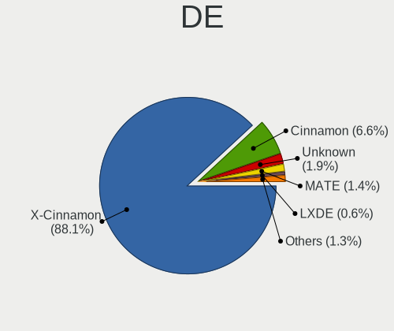
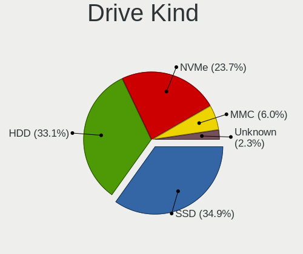
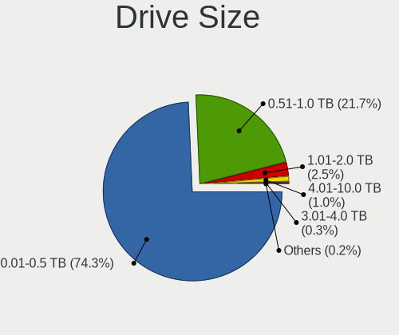
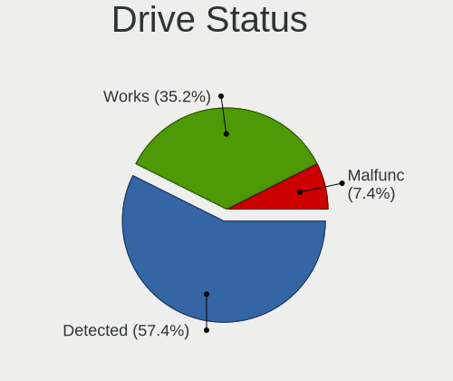
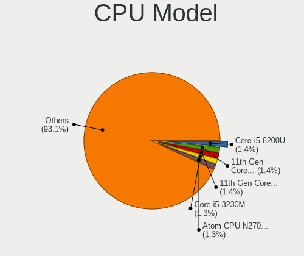
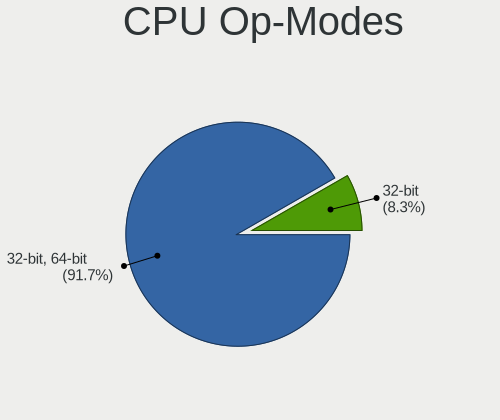
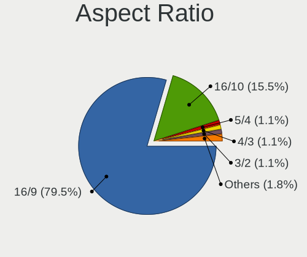
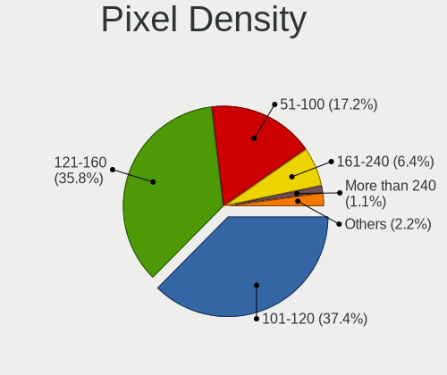
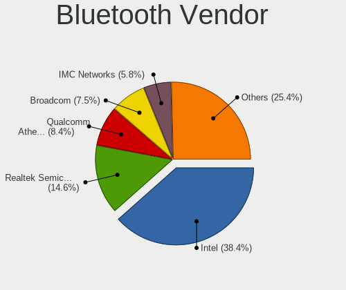

LMDE - Tested Hardware & Statistics (Notebooks)
-----------------------------------------------

A project to collect tested hardware configurations for LMDE.

Anyone can contribute to this report by the [hw-probe](https://github.com/linuxhw/hw-probe) tool:

    sudo -E hw-probe -all -upload

Please contribute! Especially if your hardware is rare.

Contents
--------

* [ Test Cases ](#test-cases)

* [ System ](#system)
  - [ OS                       ](#os)
  - [ OS Family                ](#os-family)
  - [ Kernel                   ](#kernel)
  - [ Kernel Family            ](#kernel-family)
  - [ Kernel Major Ver.        ](#kernel-major-ver)
  - [ Arch                     ](#arch)
  - [ DE                       ](#de)
  - [ Display Server           ](#display-server)
  - [ Display Manager          ](#display-manager)
  - [ OS Lang                  ](#os-lang)
  - [ Boot Mode                ](#boot-mode)
  - [ Filesystem               ](#filesystem)
  - [ Part. scheme             ](#part-scheme)
  - [ Dual Boot with Linux/BSD ](#dual-boot-with-linuxbsd)
  - [ Dual Boot (Win)          ](#dual-boot-win)

* [ Board ](#board)
  - [ Vendor                   ](#vendor)
  - [ Model                    ](#model)
  - [ Model Family             ](#model-family)
  - [ MFG Year                 ](#mfg-year)
  - [ Form Factor              ](#form-factor)
  - [ Secure Boot              ](#secure-boot)
  - [ Coreboot                 ](#coreboot)
  - [ RAM Size                 ](#ram-size)
  - [ RAM Used                 ](#ram-used)
  - [ Total Drives             ](#total-drives)
  - [ Has CD-ROM               ](#has-cd-rom)
  - [ Has Ethernet             ](#has-ethernet)
  - [ Has WiFi                 ](#has-wifi)
  - [ Has Bluetooth            ](#has-bluetooth)

* [ Location ](#location)
  - [ Country                  ](#country)
  - [ City                     ](#city)

* [ Drives ](#drives)
  - [ Drive Vendor             ](#drive-vendor)
  - [ Drive Model              ](#drive-model)
  - [ HDD Vendor               ](#hdd-vendor)
  - [ SSD Vendor               ](#ssd-vendor)
  - [ Drive Kind               ](#drive-kind)
  - [ Drive Connector          ](#drive-connector)
  - [ Drive Size               ](#drive-size)
  - [ Space Total              ](#space-total)
  - [ Space Used               ](#space-used)
  - [ Malfunc. Drives          ](#malfunc-drives)
  - [ Malfunc. Drive Vendor    ](#malfunc-drive-vendor)
  - [ Malfunc. HDD Vendor      ](#malfunc-hdd-vendor)
  - [ Malfunc. Drive Kind      ](#malfunc-drive-kind)
  - [ Failed Drives            ](#failed-drives)
  - [ Failed Drive Vendor      ](#failed-drive-vendor)
  - [ Drive Status             ](#drive-status)

* [ Storage controller ](#storage-controller)
  - [ Storage Vendor           ](#storage-vendor)
  - [ Storage Model            ](#storage-model)
  - [ Storage Kind             ](#storage-kind)

* [ Processor ](#processor)
  - [ CPU Vendor               ](#cpu-vendor)
  - [ CPU Model                ](#cpu-model)
  - [ CPU Model Family         ](#cpu-model-family)
  - [ CPU Cores                ](#cpu-cores)
  - [ CPU Sockets              ](#cpu-sockets)
  - [ CPU Threads              ](#cpu-threads)
  - [ CPU Op-Modes             ](#cpu-op-modes)
  - [ CPU Microcode            ](#cpu-microcode)
  - [ CPU Microarch            ](#cpu-microarch)

* [ Graphics ](#graphics)
  - [ GPU Vendor               ](#gpu-vendor)
  - [ GPU Model                ](#gpu-model)
  - [ GPU Combo                ](#gpu-combo)
  - [ GPU Driver               ](#gpu-driver)
  - [ GPU Memory               ](#gpu-memory)

* [ Monitor ](#monitor)
  - [ Monitor Vendor           ](#monitor-vendor)
  - [ Monitor Model            ](#monitor-model)
  - [ Monitor Resolution       ](#monitor-resolution)
  - [ Monitor Diagonal         ](#monitor-diagonal)
  - [ Monitor Width            ](#monitor-width)
  - [ Aspect Ratio             ](#aspect-ratio)
  - [ Monitor Area             ](#monitor-area)
  - [ Pixel Density            ](#pixel-density)
  - [ Multiple Monitors        ](#multiple-monitors)

* [ Network ](#network)
  - [ Net Controller Vendor    ](#net-controller-vendor)
  - [ Net Controller Model     ](#net-controller-model)
  - [ Wireless Vendor          ](#wireless-vendor)
  - [ Wireless Model           ](#wireless-model)
  - [ Ethernet Vendor          ](#ethernet-vendor)
  - [ Ethernet Model           ](#ethernet-model)
  - [ Net Controller Kind      ](#net-controller-kind)
  - [ Used Controller          ](#used-controller)
  - [ NICs                     ](#nics)
  - [ IPv6                     ](#ipv6)

* [ Bluetooth ](#bluetooth)
  - [ Bluetooth Vendor         ](#bluetooth-vendor)
  - [ Bluetooth Model          ](#bluetooth-model)

* [ Sound ](#sound)
  - [ Sound Vendor             ](#sound-vendor)
  - [ Sound Model              ](#sound-model)

* [ Memory ](#memory)
  - [ Memory Vendor            ](#memory-vendor)
  - [ Memory Model             ](#memory-model)
  - [ Memory Kind              ](#memory-kind)
  - [ Memory Form Factor       ](#memory-form-factor)
  - [ Memory Size              ](#memory-size)
  - [ Memory Speed             ](#memory-speed)

* [ Printers & scanners ](#printers--scanners)
  - [ Printer Vendor           ](#printer-vendor)
  - [ Printer Model            ](#printer-model)
  - [ Scanner Vendor           ](#scanner-vendor)
  - [ Scanner Model            ](#scanner-model)

* [ Camera ](#camera)
  - [ Camera Vendor            ](#camera-vendor)
  - [ Camera Model             ](#camera-model)

* [ Security ](#security)
  - [ Fingerprint Vendor       ](#fingerprint-vendor)
  - [ Fingerprint Model        ](#fingerprint-model)
  - [ Chipcard Vendor          ](#chipcard-vendor)
  - [ Chipcard Model           ](#chipcard-model)

* [ Unsupported ](#unsupported)
  - [ Unsupported Devices      ](#unsupported-devices)
  - [ Unsupported Device Types ](#unsupported-device-types)

Test Cases
----------

Total: 1195

| Vendor        | Model                       | Probe                                                      | Date         |
|---------------|-----------------------------|------------------------------------------------------------|--------------|
| Medion        | E6214                       | [e72344f20c](https://linux-hardware.org/?probe=e72344f20c) | Jan 05, 2025 |
| Medion        | E6214                       | [1abed4b52d](https://linux-hardware.org/?probe=1abed4b52d) | Jan 05, 2025 |
| Apple         | MacBookAir6,2               | [2a0e5e8dee](https://linux-hardware.org/?probe=2a0e5e8dee) | Jan 04, 2025 |
| HP            | Laptop 15-ef3xxx            | [990ef26285](https://linux-hardware.org/?probe=990ef26285) | Jan 04, 2025 |
| Apple         | MacBookAir6,2               | [ba9cefc697](https://linux-hardware.org/?probe=ba9cefc697) | Jan 03, 2025 |
| Acer          | Aspire A515-57              | [a91c16b9c4](https://linux-hardware.org/?probe=a91c16b9c4) | Dec 31, 2024 |
| ASUSTek       | Vivobook Go E1404FA_E140... | [0ac54971da](https://linux-hardware.org/?probe=0ac54971da) | Dec 28, 2024 |
| Dell          | Inspiron 5577               | [dabaffa853](https://linux-hardware.org/?probe=dabaffa853) | Dec 25, 2024 |
| Acer          | Aspire 5738                 | [edb35a4953](https://linux-hardware.org/?probe=edb35a4953) | Dec 17, 2024 |
| Sony          | VPCM12M1E                   | [eca3984533](https://linux-hardware.org/?probe=eca3984533) | Dec 16, 2024 |
| ASUSTek       | VivoBook_ASUSLaptop S540... | [68a46993af](https://linux-hardware.org/?probe=68a46993af) | Dec 15, 2024 |
| ASUSTek       | N551JK                      | [10b918146d](https://linux-hardware.org/?probe=10b918146d) | Dec 13, 2024 |
| Dell          | Precision 3551              | [598abdb472](https://linux-hardware.org/?probe=598abdb472) | Dec 13, 2024 |
| Acer          | Extensa 5220                | [864e664760](https://linux-hardware.org/?probe=864e664760) | Dec 10, 2024 |
| Lenovo        | ThinkPad E495 20NE0002US    | [690a841928](https://linux-hardware.org/?probe=690a841928) | Dec 10, 2024 |
| Lenovo        | IdeaPad Slim 3 14IAH8 83... | [132e6e2862](https://linux-hardware.org/?probe=132e6e2862) | Dec 09, 2024 |
| Sony          | VPCM12M1E                   | [e7896a9326](https://linux-hardware.org/?probe=e7896a9326) | Dec 08, 2024 |
| Lenovo        | Yoga Slim 6 14IAP8 82WU     | [ecbb2dfb26](https://linux-hardware.org/?probe=ecbb2dfb26) | Dec 07, 2024 |
| Acer          | Aspire 5738                 | [041abf44b0](https://linux-hardware.org/?probe=041abf44b0) | Dec 07, 2024 |
| Lenovo        | ThinkPad X240 20AM001JUS    | [1ac27908e6](https://linux-hardware.org/?probe=1ac27908e6) | Dec 06, 2024 |
| Acer          | Aspire E1-572G              | [5fd88a9482](https://linux-hardware.org/?probe=5fd88a9482) | Dec 04, 2024 |
| ASUSTek       | ASUS TUF Gaming A16 FA61... | [8456ee2251](https://linux-hardware.org/?probe=8456ee2251) | Dec 03, 2024 |
| Lenovo        | ThinkPad T60 2007YQY        | [8d792cc626](https://linux-hardware.org/?probe=8d792cc626) | Dec 02, 2024 |
| Insyde        | BayTrail                    | [101b76beeb](https://linux-hardware.org/?probe=101b76beeb) | Dec 02, 2024 |
| ASUSTek       | VivoBook_ASUSLaptop X515... | [fb5d35bd4b](https://linux-hardware.org/?probe=fb5d35bd4b) | Dec 01, 2024 |
| Acer          | Aspire AV15-51              | [c98b2b5898](https://linux-hardware.org/?probe=c98b2b5898) | Dec 01, 2024 |
| Unknown       | Unknown                     | [678e33b8ed](https://linux-hardware.org/?probe=678e33b8ed) | Dec 01, 2024 |
| Fujitsu       | LIFEBOOK E753               | [e36fbc49ec](https://linux-hardware.org/?probe=e36fbc49ec) | Dec 01, 2024 |
| Lenovo        | ThinkPad X270 20HN001MUS    | [6c580a86e2](https://linux-hardware.org/?probe=6c580a86e2) | Nov 30, 2024 |
| Notebook      | W65_67SZ                    | [245be0630e](https://linux-hardware.org/?probe=245be0630e) | Nov 29, 2024 |
| Lenovo        | ThinkPad neo 14 21DN0009... | [63a0ee38c2](https://linux-hardware.org/?probe=63a0ee38c2) | Nov 27, 2024 |
| Notebook      | W65_67SZ                    | [7cf2df4c2d](https://linux-hardware.org/?probe=7cf2df4c2d) | Nov 25, 2024 |
| HP            | Laptop 17z-cp300            | [be49e0c290](https://linux-hardware.org/?probe=be49e0c290) | Nov 23, 2024 |
| HP            | Laptop 17z-cp300            | [4090b82a10](https://linux-hardware.org/?probe=4090b82a10) | Nov 23, 2024 |
| Unknown       | Unknown                     | [f3f336f89e](https://linux-hardware.org/?probe=f3f336f89e) | Nov 23, 2024 |
| Acer          | Aspire A315-510P            | [99993b0f3e](https://linux-hardware.org/?probe=99993b0f3e) | Nov 21, 2024 |
| TUXEDO        | InfinityBook S Gen8         | [ac4e85e111](https://linux-hardware.org/?probe=ac4e85e111) | Nov 21, 2024 |
| Notebook      | W65_67SZ                    | [c7eb463249](https://linux-hardware.org/?probe=c7eb463249) | Nov 20, 2024 |
| Toshiba       | Satellite P105              | [74a9b7015c](https://linux-hardware.org/?probe=74a9b7015c) | Nov 18, 2024 |
| Fujitsu Si... | AMILO Li 2735               | [afbab1e78c](https://linux-hardware.org/?probe=afbab1e78c) | Nov 17, 2024 |
| Dell          | Inspiron N5110              | [da064fe75f](https://linux-hardware.org/?probe=da064fe75f) | Nov 16, 2024 |
| Toshiba       | Satellite M100              | [655a407dd2](https://linux-hardware.org/?probe=655a407dd2) | Nov 15, 2024 |
| Lenovo        | ThinkPad T450 20BUS1110E    | [c6bc9a84e4](https://linux-hardware.org/?probe=c6bc9a84e4) | Nov 14, 2024 |
| Lenovo        | ThinkBook 15-IIL 20SM       | [70007038ab](https://linux-hardware.org/?probe=70007038ab) | Nov 13, 2024 |
| ASUSTek       | Zenbook UX3402ZA_UX3402Z... | [97617e7ac0](https://linux-hardware.org/?probe=97617e7ac0) | Nov 10, 2024 |
| HP            | EliteBook 8440p             | [5ed52c1fdc](https://linux-hardware.org/?probe=5ed52c1fdc) | Nov 09, 2024 |
| HP            | ProBook 450 G2              | [db16e5b334](https://linux-hardware.org/?probe=db16e5b334) | Nov 09, 2024 |
| HP            | Laptop 15s-fq2xxx           | [40be935ed5](https://linux-hardware.org/?probe=40be935ed5) | Nov 06, 2024 |
| Conectar I... | SF20GM7                     | [1c43877e91](https://linux-hardware.org/?probe=1c43877e91) | Nov 06, 2024 |
| HP            | Laptop 15-bs2xx             | [fb25b57170](https://linux-hardware.org/?probe=fb25b57170) | Nov 06, 2024 |
| MSI           | Prestige 15 A12SC           | [403f475ebb](https://linux-hardware.org/?probe=403f475ebb) | Nov 03, 2024 |
| ASUSTek       | X450LN                      | [029f170b3e](https://linux-hardware.org/?probe=029f170b3e) | Nov 02, 2024 |
| Conectar I... | SF20GM7                     | [95da818f37](https://linux-hardware.org/?probe=95da818f37) | Nov 02, 2024 |
| HP            | Pavilion dv6000 (RY645EA... | [a9cb45608f](https://linux-hardware.org/?probe=a9cb45608f) | Nov 01, 2024 |
| Lenovo        | Unknown                     | [0fdc4e7dac](https://linux-hardware.org/?probe=0fdc4e7dac) | Oct 31, 2024 |
| ASUSTek       | VivoBook_ASUSLaptop E210... | [cb80f674ac](https://linux-hardware.org/?probe=cb80f674ac) | Oct 30, 2024 |
| HP            | Laptop 15-dy2xxx            | [9cc00f993a](https://linux-hardware.org/?probe=9cc00f993a) | Oct 29, 2024 |
| Lenovo        | ThinkPad T550 20CK004QUS    | [d4d5181e4f](https://linux-hardware.org/?probe=d4d5181e4f) | Oct 28, 2024 |
| Lenovo        | ThinkPad T550 20CK004QUS    | [c7b77b3285](https://linux-hardware.org/?probe=c7b77b3285) | Oct 27, 2024 |
| Dell          | Latitude D820               | [e8052d5ecd](https://linux-hardware.org/?probe=e8052d5ecd) | Oct 26, 2024 |
| HP            | EliteBook 850 G3            | [a62e77d2a5](https://linux-hardware.org/?probe=a62e77d2a5) | Oct 26, 2024 |
| Dell          | Latitude D820               | [69777b44d3](https://linux-hardware.org/?probe=69777b44d3) | Oct 25, 2024 |
| Dell          | Latitude E6430              | [7aa1bdef3c](https://linux-hardware.org/?probe=7aa1bdef3c) | Oct 25, 2024 |
| HP            | EliteBook 840 G7 Noteboo... | [38e3efc950](https://linux-hardware.org/?probe=38e3efc950) | Oct 24, 2024 |
| ASUSTek       | TUF Gaming FX505GD_FX505... | [60f87c4f6d](https://linux-hardware.org/?probe=60f87c4f6d) | Oct 24, 2024 |
| Lenovo        | ThinkPad T400s 28153VG      | [312c0a0fb9](https://linux-hardware.org/?probe=312c0a0fb9) | Oct 22, 2024 |
| Dell          | Latitude 5350               | [58f8fa615d](https://linux-hardware.org/?probe=58f8fa615d) | Oct 21, 2024 |
| Dell          | Latitude 5350               | [b2d8fecadb](https://linux-hardware.org/?probe=b2d8fecadb) | Oct 21, 2024 |
| Acer          | Aspire 5738                 | [ca83f1cc2d](https://linux-hardware.org/?probe=ca83f1cc2d) | Oct 19, 2024 |
| Fujitsu       | LIFEBOOK U759               | [fed82bdfb6](https://linux-hardware.org/?probe=fed82bdfb6) | Oct 17, 2024 |
| eMachines     | eM350                       | [2e70a62535](https://linux-hardware.org/?probe=2e70a62535) | Oct 16, 2024 |
| Toshiba       | Satellite L50D-B            | [a2287ef876](https://linux-hardware.org/?probe=a2287ef876) | Oct 12, 2024 |
| Acer          | Aspire 5738                 | [eb50a1a3c6](https://linux-hardware.org/?probe=eb50a1a3c6) | Oct 12, 2024 |
| Acer          | Aspire 5738                 | [b7da389696](https://linux-hardware.org/?probe=b7da389696) | Oct 12, 2024 |
| HP            | Laptop 15-dy2xxx            | [cc8c1d6778](https://linux-hardware.org/?probe=cc8c1d6778) | Oct 11, 2024 |
| Lenovo        | B50-70 80EU                 | [5c0fd8834f](https://linux-hardware.org/?probe=5c0fd8834f) | Oct 11, 2024 |
| Dell          | Inspiron 5570               | [46275a960a](https://linux-hardware.org/?probe=46275a960a) | Oct 11, 2024 |
| Acer          | Aspire E5-521G              | [63755713f4](https://linux-hardware.org/?probe=63755713f4) | Oct 10, 2024 |
| Dell          | Inspiron 5570               | [c1fdcf2050](https://linux-hardware.org/?probe=c1fdcf2050) | Oct 10, 2024 |
| Lenovo        | ThinkPad T480 20L6S0EY00    | [123b9ee07a](https://linux-hardware.org/?probe=123b9ee07a) | Oct 09, 2024 |
| Chuwi         | CoreBook X                  | [c2905b1bd7](https://linux-hardware.org/?probe=c2905b1bd7) | Oct 06, 2024 |
| Lenovo        | ThinkPad T460p 20FXS09D0... | [aff398dad9](https://linux-hardware.org/?probe=aff398dad9) | Oct 05, 2024 |
| Lenovo        | ThinkPad X61 Tablet 7764... | [4a002c0f20](https://linux-hardware.org/?probe=4a002c0f20) | Oct 04, 2024 |
| Lenovo        | ThinkPad X1 Nano Gen 1 2... | [060b69d0b3](https://linux-hardware.org/?probe=060b69d0b3) | Oct 01, 2024 |
| Lenovo        | ThinkPad T400s 28153VG      | [508b12a75b](https://linux-hardware.org/?probe=508b12a75b) | Oct 01, 2024 |
| HP            | ZBook Fury 17.3 inch G8 ... | [1eafc27f9d](https://linux-hardware.org/?probe=1eafc27f9d) | Sep 30, 2024 |
| Notebook      | N2x0WU                      | [7e061af782](https://linux-hardware.org/?probe=7e061af782) | Sep 29, 2024 |
| Dell          | XPS 13 9360                 | [4559019bac](https://linux-hardware.org/?probe=4559019bac) | Sep 28, 2024 |
| Lenovo        | ThinkPad X230 2330A17       | [ce28e0de6c](https://linux-hardware.org/?probe=ce28e0de6c) | Sep 27, 2024 |
| HP            | Laptop 15-fd0xxx            | [dc7fdc65d6](https://linux-hardware.org/?probe=dc7fdc65d6) | Sep 26, 2024 |
| ASUSTek       | ZenBook UX434FAC_UX433FA... | [76bce69bcf](https://linux-hardware.org/?probe=76bce69bcf) | Sep 24, 2024 |
| Lenovo        | ThinkPad X230 2330A17       | [4c04674392](https://linux-hardware.org/?probe=4c04674392) | Sep 23, 2024 |
| HP            | Pavilion dv5000 (RG937EA... | [a022208bc5](https://linux-hardware.org/?probe=a022208bc5) | Sep 22, 2024 |
| HP            | Pavilion dv5000 (RG937EA... | [ce20a826eb](https://linux-hardware.org/?probe=ce20a826eb) | Sep 22, 2024 |
| HUAWEI        | NBLK-WAX9X                  | [10e3fce76a](https://linux-hardware.org/?probe=10e3fce76a) | Sep 21, 2024 |
| HP            | Laptop                      | [fa20696672](https://linux-hardware.org/?probe=fa20696672) | Sep 21, 2024 |
| Toshiba       | Satellite L745              | [b60f22f240](https://linux-hardware.org/?probe=b60f22f240) | Sep 19, 2024 |
| Lenovo        | ThinkPad E14 Gen 5 21JKC... | [186c21f29f](https://linux-hardware.org/?probe=186c21f29f) | Sep 19, 2024 |
| Lenovo        | ThinkPad T480s 20L8S9JE0... | [9ef5814db9](https://linux-hardware.org/?probe=9ef5814db9) | Sep 17, 2024 |
| Acer          | Aspire A315-59              | [af848409fc](https://linux-hardware.org/?probe=af848409fc) | Sep 15, 2024 |
| Lenovo        | Yoga 500-14IBD 80N4         | [09dda9115e](https://linux-hardware.org/?probe=09dda9115e) | Sep 12, 2024 |
| Acer          | Aspire A315-59              | [60a485333f](https://linux-hardware.org/?probe=60a485333f) | Sep 11, 2024 |
| Fujitsu       | LIFEBOOK U7512              | [fefdfd4982](https://linux-hardware.org/?probe=fefdfd4982) | Sep 10, 2024 |
| Dell          | Latitude 5550               | [b409cdf8ab](https://linux-hardware.org/?probe=b409cdf8ab) | Sep 09, 2024 |
| Dell          | XPS 15 9510                 | [c36d4de7b4](https://linux-hardware.org/?probe=c36d4de7b4) | Sep 06, 2024 |
| HP            | Pavilion dv2700             | [dae4a490a7](https://linux-hardware.org/?probe=dae4a490a7) | Sep 06, 2024 |
| HP            | Pavilion dv2700             | [3dd25c19fb](https://linux-hardware.org/?probe=3dd25c19fb) | Sep 06, 2024 |
| HP            | Notebook                    | [03bdb73471](https://linux-hardware.org/?probe=03bdb73471) | Sep 05, 2024 |
| Lenovo        | ThinkPad T520 4243W63       | [3e79035d31](https://linux-hardware.org/?probe=3e79035d31) | Sep 03, 2024 |
| Acer          | Aspire E1-572G              | [386d564b97](https://linux-hardware.org/?probe=386d564b97) | Aug 31, 2024 |
| Acer          | Aspire E1-572G              | [db7197814c](https://linux-hardware.org/?probe=db7197814c) | Aug 31, 2024 |
| Lenovo        | ThinkPad T460p 20FXS09D0... | [0ff2303573](https://linux-hardware.org/?probe=0ff2303573) | Aug 31, 2024 |
| Lenovo        | Slim 7 16IAH7 82VB          | [f45acc7e20](https://linux-hardware.org/?probe=f45acc7e20) | Aug 31, 2024 |
| Apple         | MacBookPro9,2               | [a33c000c3c](https://linux-hardware.org/?probe=a33c000c3c) | Aug 29, 2024 |
| MSI           | GP60 2QE                    | [fe42ba85a4](https://linux-hardware.org/?probe=fe42ba85a4) | Aug 24, 2024 |
| Framework     | Laptop                      | [ec6fd2129b](https://linux-hardware.org/?probe=ec6fd2129b) | Aug 23, 2024 |
| Samsung       | 370E4J/370E4Q               | [5627935947](https://linux-hardware.org/?probe=5627935947) | Aug 21, 2024 |
| Acer          | Aspire 5732Z                | [1782abff4d](https://linux-hardware.org/?probe=1782abff4d) | Aug 20, 2024 |
| Apple         | MacBookAir6,2               | [29bb2038d4](https://linux-hardware.org/?probe=29bb2038d4) | Aug 20, 2024 |
| Apple         | MacBookAir6,2               | [bc5d967ee2](https://linux-hardware.org/?probe=bc5d967ee2) | Aug 20, 2024 |
| Acer          | Swift SF315-52G             | [7e4cececee](https://linux-hardware.org/?probe=7e4cececee) | Aug 16, 2024 |
| Acer          | Aspire 5732Z                | [399dfa9617](https://linux-hardware.org/?probe=399dfa9617) | Aug 15, 2024 |
| ASUSTek       | VivoBook_ASUSLaptop M150... | [1647e0bf63](https://linux-hardware.org/?probe=1647e0bf63) | Aug 14, 2024 |
| Apple         | MacBookAir6,2               | [586288c72b](https://linux-hardware.org/?probe=586288c72b) | Aug 13, 2024 |
| Acer          | Aspire 5750G                | [f351efafd1](https://linux-hardware.org/?probe=f351efafd1) | Aug 08, 2024 |
| Fujitsu       | CELSIUS H7510               | [ece1093c90](https://linux-hardware.org/?probe=ece1093c90) | Aug 08, 2024 |
| HP            | ENVY 15                     | [969779119a](https://linux-hardware.org/?probe=969779119a) | Aug 08, 2024 |
| Lenovo        | ThinkPad X13 Gen 1 20T20... | [57987db9cf](https://linux-hardware.org/?probe=57987db9cf) | Aug 08, 2024 |
| HP            | ProBook 4720s               | [f017d85cdb](https://linux-hardware.org/?probe=f017d85cdb) | Aug 06, 2024 |
| Acer          | Aspire E1-572G              | [8902556150](https://linux-hardware.org/?probe=8902556150) | Aug 04, 2024 |
| Acer          | Aspire E1-572G              | [da35f8a43c](https://linux-hardware.org/?probe=da35f8a43c) | Aug 04, 2024 |
| ASUSTek       | X540LA                      | [802e2c494e](https://linux-hardware.org/?probe=802e2c494e) | Aug 01, 2024 |
| ASUSTek       | X540LA                      | [5db4299943](https://linux-hardware.org/?probe=5db4299943) | Aug 01, 2024 |
| Lenovo        | ThinkPad T520 4243W63       | [59769429e0](https://linux-hardware.org/?probe=59769429e0) | Jul 31, 2024 |
| Lenovo        | ThinkPad T520 4243W63       | [1e8c2ea6ef](https://linux-hardware.org/?probe=1e8c2ea6ef) | Jul 31, 2024 |
| Acer          | Aspire E1-531               | [07ce6ddc7c](https://linux-hardware.org/?probe=07ce6ddc7c) | Jul 24, 2024 |
| Toshiba       | TECRA X40-D                 | [cf856c7d5f](https://linux-hardware.org/?probe=cf856c7d5f) | Jul 18, 2024 |
| ASUSTek       | Zenbook 15 UM3504DA_UM35... | [b0be759962](https://linux-hardware.org/?probe=b0be759962) | Jul 16, 2024 |
| Samsung       | N150P/N210P/N220P           | [95700ccdf3](https://linux-hardware.org/?probe=95700ccdf3) | Jul 14, 2024 |
| Samsung       | N150P/N210P/N220P           | [885ee058e5](https://linux-hardware.org/?probe=885ee058e5) | Jul 13, 2024 |
| ASUSTek       | ASUS TUF Gaming F15 FX50... | [af6036e896](https://linux-hardware.org/?probe=af6036e896) | Jul 11, 2024 |
| ASUSTek       | X551CA                      | [c1d5a9a08d](https://linux-hardware.org/?probe=c1d5a9a08d) | Jul 06, 2024 |
| HP            | Laptop 15-fc0xxx            | [11c7e97835](https://linux-hardware.org/?probe=11c7e97835) | Jul 05, 2024 |
| Acer          | Aspire E1-572G              | [b5c7b17e9f](https://linux-hardware.org/?probe=b5c7b17e9f) | Jul 05, 2024 |
| Acer          | Aspire E1-572G              | [873d00bade](https://linux-hardware.org/?probe=873d00bade) | Jul 04, 2024 |
| Lenovo        | ThinkPad E15 Gen 2 20T80... | [f600a1f5e7](https://linux-hardware.org/?probe=f600a1f5e7) | Jul 04, 2024 |
| HP            | Laptop 15-fc0xxx            | [7e78c3299d](https://linux-hardware.org/?probe=7e78c3299d) | Jul 03, 2024 |
| HP            | ENVY Laptop 17-cr0xxx       | [6773aae4ed](https://linux-hardware.org/?probe=6773aae4ed) | Jun 30, 2024 |
| Apple         | MacBook5,1                  | [250352499d](https://linux-hardware.org/?probe=250352499d) | Jun 24, 2024 |
| LG Electro... | A530-T.BE76P1               | [d1cb475d5e](https://linux-hardware.org/?probe=d1cb475d5e) | Jun 24, 2024 |
| Notebook      | W65_67SZ                    | [3b720bff42](https://linux-hardware.org/?probe=3b720bff42) | Jun 22, 2024 |
| ASUSTek       | K50IJ                       | [2eb9b0bf9b](https://linux-hardware.org/?probe=2eb9b0bf9b) | Jun 22, 2024 |
| HP            | Pavilion dv6                | [0010ed731f](https://linux-hardware.org/?probe=0010ed731f) | Jun 08, 2024 |
| HP            | ENVY Laptop 13-aq1xxx       | [3ef8d7d35a](https://linux-hardware.org/?probe=3ef8d7d35a) | Jun 08, 2024 |
| Dell          | Inspiron 3501               | [7bd7c51885](https://linux-hardware.org/?probe=7bd7c51885) | Jun 07, 2024 |
| ASUSTek       | A7F                         | [d2c993325b](https://linux-hardware.org/?probe=d2c993325b) | Jun 05, 2024 |
| Lenovo        | Y70-70 Touch 80DU           | [7c63ac7810](https://linux-hardware.org/?probe=7c63ac7810) | Jun 04, 2024 |
| Prestigio     | PSB141C03                   | [c7612dfd34](https://linux-hardware.org/?probe=c7612dfd34) | Jun 03, 2024 |
| HP            | EliteBook 8440p             | [0707d81b82](https://linux-hardware.org/?probe=0707d81b82) | Jun 03, 2024 |
| ASUSTek       | TUF Gaming FX505DD_FX505... | [187d6649ae](https://linux-hardware.org/?probe=187d6649ae) | Jun 02, 2024 |
| Medion        | E6214                       | [a67672f4f1](https://linux-hardware.org/?probe=a67672f4f1) | Jun 01, 2024 |
| Medion        | E6214                       | [3e6d7287eb](https://linux-hardware.org/?probe=3e6d7287eb) | Jun 01, 2024 |
| ASUSTek       | Zenbook UX3402ZA_UX3402Z... | [b56aaa479c](https://linux-hardware.org/?probe=b56aaa479c) | May 28, 2024 |
| ASUSTek       | 1201N                       | [6466d5ce59](https://linux-hardware.org/?probe=6466d5ce59) | May 27, 2024 |
| HP            | EliteBook 840 G1            | [02fb324096](https://linux-hardware.org/?probe=02fb324096) | May 23, 2024 |
| ASUSTek       | Vivobook Go E1504FA_E150... | [7c07d6eceb](https://linux-hardware.org/?probe=7c07d6eceb) | May 23, 2024 |
| ASUSTek       | 900                         | [9d033691b4](https://linux-hardware.org/?probe=9d033691b4) | May 19, 2024 |
| Dell          | Latitude 5590               | [4b5982bff4](https://linux-hardware.org/?probe=4b5982bff4) | May 19, 2024 |
| Notebook      | W65_67SZ                    | [47bb1315ce](https://linux-hardware.org/?probe=47bb1315ce) | May 19, 2024 |
| ASUSTek       | 900                         | [770a3f0d8d](https://linux-hardware.org/?probe=770a3f0d8d) | May 17, 2024 |
| HP            | Laptop 15-dw1xxx            | [f0f7c823e6](https://linux-hardware.org/?probe=f0f7c823e6) | May 17, 2024 |
| Notebook      | P65xHP                      | [809f680e12](https://linux-hardware.org/?probe=809f680e12) | May 16, 2024 |
| Samsung       | RV415/RV515                 | [9ae57537b3](https://linux-hardware.org/?probe=9ae57537b3) | May 13, 2024 |
| Dell          | Latitude E6510              | [c1d8e78181](https://linux-hardware.org/?probe=c1d8e78181) | May 12, 2024 |
| HP            | Laptop 15-dy2xxx            | [180ba77304](https://linux-hardware.org/?probe=180ba77304) | May 12, 2024 |
| Notebook      | W250EGQ / W270EGQ           | [50c20659c5](https://linux-hardware.org/?probe=50c20659c5) | May 11, 2024 |
| Maibenben     | Perfectum Series            | [d6d3c7760c](https://linux-hardware.org/?probe=d6d3c7760c) | May 10, 2024 |
| Acer          | Aspire AL14-31P             | [2f7ab2437f](https://linux-hardware.org/?probe=2f7ab2437f) | May 09, 2024 |
| Acer          | Aspire AL14-31P             | [fc4db570af](https://linux-hardware.org/?probe=fc4db570af) | May 08, 2024 |
| HP            | Laptop 15-dy2xxx            | [2837d61bc4](https://linux-hardware.org/?probe=2837d61bc4) | May 03, 2024 |
| Star Labs     | StarBook                    | [637a8da717](https://linux-hardware.org/?probe=637a8da717) | May 02, 2024 |
| HP            | Compaq 6730s                | [ab6d479788](https://linux-hardware.org/?probe=ab6d479788) | May 01, 2024 |
| Unknown       | Unknown                     | [a677f40065](https://linux-hardware.org/?probe=a677f40065) | Apr 30, 2024 |
| HP            | ProBook 450 G1              | [5f5030ef83](https://linux-hardware.org/?probe=5f5030ef83) | Apr 29, 2024 |
| ASUSTek       | VivoBook_ASUSLaptop X150... | [bc0e0ae6b8](https://linux-hardware.org/?probe=bc0e0ae6b8) | Apr 25, 2024 |
| ASUSTek       | X541UVK                     | [422fd329a8](https://linux-hardware.org/?probe=422fd329a8) | Apr 25, 2024 |
| Lenovo        | V15 G4 IAH 83FS             | [b922fc6d5e](https://linux-hardware.org/?probe=b922fc6d5e) | Apr 24, 2024 |
| Acer          | TravelMate 4070             | [99e797eb28](https://linux-hardware.org/?probe=99e797eb28) | Apr 23, 2024 |
| Samsung       | N150P/N210P/N220P           | [b7a4824162](https://linux-hardware.org/?probe=b7a4824162) | Apr 23, 2024 |
| Packard Be... | EasyNote_MX45               | [2af5864c3c](https://linux-hardware.org/?probe=2af5864c3c) | Apr 22, 2024 |
| Apple         | MacBookAir7,2               | [4aabe77962](https://linux-hardware.org/?probe=4aabe77962) | Apr 20, 2024 |
| Acer          | Aspire E1-571G              | [cfb1f06070](https://linux-hardware.org/?probe=cfb1f06070) | Apr 20, 2024 |
| Medion        | E6214                       | [fef41424b0](https://linux-hardware.org/?probe=fef41424b0) | Apr 19, 2024 |
| Lenovo        | ThinkPad X140e 20BLS0040... | [028ee7ca9d](https://linux-hardware.org/?probe=028ee7ca9d) | Apr 19, 2024 |
| Medion        | E6214                       | [f6e648f8a4](https://linux-hardware.org/?probe=f6e648f8a4) | Apr 19, 2024 |
| Acer          | Aspire E1-572G              | [39e93654ec](https://linux-hardware.org/?probe=39e93654ec) | Apr 13, 2024 |
| Acer          | Aspire E1-572G              | [562a3aa8fe](https://linux-hardware.org/?probe=562a3aa8fe) | Apr 13, 2024 |
| HP            | EliteBook 840 G3            | [cbc8162b5a](https://linux-hardware.org/?probe=cbc8162b5a) | Apr 10, 2024 |
| ASUSTek       | G752VSK                     | [49116bb834](https://linux-hardware.org/?probe=49116bb834) | Apr 08, 2024 |
| Dell          | Latitude E7250              | [3979d6a4a1](https://linux-hardware.org/?probe=3979d6a4a1) | Apr 07, 2024 |
| Google        | Voxel                       | [5242e65363](https://linux-hardware.org/?probe=5242e65363) | Apr 06, 2024 |
| Medion        | E6214                       | [5ddeb441b9](https://linux-hardware.org/?probe=5ddeb441b9) | Apr 06, 2024 |
| Medion        | E6214                       | [20d0838443](https://linux-hardware.org/?probe=20d0838443) | Apr 06, 2024 |
| HP            | Laptop 15-dw1xxx            | [43a27413f2](https://linux-hardware.org/?probe=43a27413f2) | Mar 31, 2024 |
| HP            | Pavilion 15                 | [69bc35a5b1](https://linux-hardware.org/?probe=69bc35a5b1) | Mar 30, 2024 |
| HP            | Pavilion 15                 | [69293f7635](https://linux-hardware.org/?probe=69293f7635) | Mar 30, 2024 |
| Lenovo        | V15 G4 IAH 83FS             | [ec668db660](https://linux-hardware.org/?probe=ec668db660) | Mar 28, 2024 |
| ASUSTek       | VivoBook_ASUSLaptop X150... | [0cee79fd45](https://linux-hardware.org/?probe=0cee79fd45) | Mar 24, 2024 |
| Samsung       | N150P/N210P/N220P           | [153847bfc0](https://linux-hardware.org/?probe=153847bfc0) | Mar 23, 2024 |
| HP            | ProBook 470 G0              | [7947b2c132](https://linux-hardware.org/?probe=7947b2c132) | Mar 22, 2024 |
| Lenovo        | IdeaPad Pro 5 16IRH8 83A... | [a4c78f511d](https://linux-hardware.org/?probe=a4c78f511d) | Mar 21, 2024 |
| Apple         | MacBookAir4,2               | [3d42d3e1f9](https://linux-hardware.org/?probe=3d42d3e1f9) | Mar 19, 2024 |
| Dell          | Latitude E6500              | [e623a98775](https://linux-hardware.org/?probe=e623a98775) | Mar 18, 2024 |
| Dell          | Inspiron 3585               | [2378788f88](https://linux-hardware.org/?probe=2378788f88) | Mar 18, 2024 |
| Lenovo        | IdeaPad U160 08946JG        | [62adedc3dc](https://linux-hardware.org/?probe=62adedc3dc) | Mar 17, 2024 |
| HUAWEI        | CREM-WXX9                   | [d1f4d3e711](https://linux-hardware.org/?probe=d1f4d3e711) | Mar 16, 2024 |
| ASUSTek       | VivoBook_ASUSLaptop X509... | [25c1a0e7d3](https://linux-hardware.org/?probe=25c1a0e7d3) | Mar 16, 2024 |
| Lenovo        | IdeaPad U160 08946JG        | [0d6bea90e0](https://linux-hardware.org/?probe=0d6bea90e0) | Mar 11, 2024 |
| ASUSTek       | VivoBook_ASUSLaptop X515... | [1dda71290f](https://linux-hardware.org/?probe=1dda71290f) | Mar 08, 2024 |
| Dell          | Latitude E6500              | [e03e94f299](https://linux-hardware.org/?probe=e03e94f299) | Mar 08, 2024 |
| Samsung       | 300E5EV/300E4EV/270E5EV/... | [c7b2c1d469](https://linux-hardware.org/?probe=c7b2c1d469) | Mar 08, 2024 |
| Monster       | TULPAR T7 V20.3             | [df8b4e385a](https://linux-hardware.org/?probe=df8b4e385a) | Mar 06, 2024 |
| Clevo         | W240HU/W250HUQ              | [b4f3b9c879](https://linux-hardware.org/?probe=b4f3b9c879) | Mar 06, 2024 |
| HP            | EliteBook 845 G8 Noteboo... | [5f7a226ed8](https://linux-hardware.org/?probe=5f7a226ed8) | Mar 06, 2024 |
| Acer          | Aspire 5570Z                | [16e46c8657](https://linux-hardware.org/?probe=16e46c8657) | Mar 05, 2024 |
| Acer          | Aspire 5570Z                | [4471c4987a](https://linux-hardware.org/?probe=4471c4987a) | Mar 05, 2024 |
| ASUSTek       | ASUS BR1100CKA BR1100CKA... | [fc21a2b0e2](https://linux-hardware.org/?probe=fc21a2b0e2) | Mar 04, 2024 |
| Samsung       | N150P/N210P/N220P           | [10852897a2](https://linux-hardware.org/?probe=10852897a2) | Mar 04, 2024 |
| HP            | EliteBook 8470p             | [d67a754532](https://linux-hardware.org/?probe=d67a754532) | Feb 27, 2024 |
| Lenovo        | ThinkPad T480 20L6S2CB00    | [eff836bcb1](https://linux-hardware.org/?probe=eff836bcb1) | Feb 27, 2024 |
| Lenovo        | ThinkPad T480 20L6S2CB00    | [a78eb227db](https://linux-hardware.org/?probe=a78eb227db) | Feb 26, 2024 |
| Dell          | Vostro 1510                 | [c2b1496073](https://linux-hardware.org/?probe=c2b1496073) | Feb 24, 2024 |
| HUAWEI        | CREM-WXX9                   | [9f6a95d5b4](https://linux-hardware.org/?probe=9f6a95d5b4) | Feb 23, 2024 |
| HP            | EliteBook 845 14 inch G1... | [dad4fdcceb](https://linux-hardware.org/?probe=dad4fdcceb) | Feb 22, 2024 |
| ASUSTek       | ZenBook UX434FL_UX434FL     | [309bc99f27](https://linux-hardware.org/?probe=309bc99f27) | Feb 22, 2024 |
| Apple         | MacBookPro5,1               | [6bbe163c4b](https://linux-hardware.org/?probe=6bbe163c4b) | Feb 21, 2024 |
| HP            | ZBook Fury 17.3 inch G8 ... | [383bb58584](https://linux-hardware.org/?probe=383bb58584) | Feb 20, 2024 |
| Lenovo        | ThinkPad E470 20H2S00500    | [3c24c9be66](https://linux-hardware.org/?probe=3c24c9be66) | Feb 20, 2024 |
| Fujitsu       | LIFEBOOK A530               | [5cc2223e2a](https://linux-hardware.org/?probe=5cc2223e2a) | Feb 18, 2024 |
| Dell          | XPS 13 9310                 | [0867cf376f](https://linux-hardware.org/?probe=0867cf376f) | Feb 18, 2024 |
| HP            | Pavilion 15                 | [55af31fd66](https://linux-hardware.org/?probe=55af31fd66) | Feb 17, 2024 |
| HP            | Pavilion 15                 | [7dbe71cc73](https://linux-hardware.org/?probe=7dbe71cc73) | Feb 17, 2024 |
| ASUSTek       | BU201LA                     | [7d7e9ee7df](https://linux-hardware.org/?probe=7d7e9ee7df) | Feb 14, 2024 |
| ASUSTek       | BU201LA                     | [420cd60b3b](https://linux-hardware.org/?probe=420cd60b3b) | Feb 14, 2024 |
| Acer          | Aspire A315-44P             | [ffb90b8b62](https://linux-hardware.org/?probe=ffb90b8b62) | Feb 13, 2024 |
| ASUSTek       | K52JU                       | [d9ff2db026](https://linux-hardware.org/?probe=d9ff2db026) | Feb 13, 2024 |
| ASUSTek       | K52JU                       | [15af146ca8](https://linux-hardware.org/?probe=15af146ca8) | Feb 13, 2024 |
| Samsung       | N150P/N210P/N220P           | [042003f9b0](https://linux-hardware.org/?probe=042003f9b0) | Feb 12, 2024 |
| Toshiba       | Satellite A135              | [42cf20d3d4](https://linux-hardware.org/?probe=42cf20d3d4) | Feb 11, 2024 |
| Dell          | XPS 13 9360                 | [ccf721c85c](https://linux-hardware.org/?probe=ccf721c85c) | Feb 10, 2024 |
| Fujitsu       | LIFEBOOK AH530              | [f810a582b9](https://linux-hardware.org/?probe=f810a582b9) | Feb 07, 2024 |
| Fujitsu       | LIFEBOOK AH530              | [5b65435343](https://linux-hardware.org/?probe=5b65435343) | Feb 06, 2024 |
| Toshiba       | Satellite Pro C850-1DQ      | [ecd1214308](https://linux-hardware.org/?probe=ecd1214308) | Feb 06, 2024 |
| Toshiba       | Satellite Pro C850-1DQ      | [af5799035c](https://linux-hardware.org/?probe=af5799035c) | Feb 06, 2024 |
| HP            | ProBook 440 G8 Notebook ... | [df7b813324](https://linux-hardware.org/?probe=df7b813324) | Feb 05, 2024 |
| Fujitsu Si... | AMILO Li3910                | [ecde56e2bb](https://linux-hardware.org/?probe=ecde56e2bb) | Feb 04, 2024 |
| Fujitsu Si... | AMILO Pro Edition V3505     | [3e0e2fd80a](https://linux-hardware.org/?probe=3e0e2fd80a) | Feb 03, 2024 |
| Lenovo        | ThinkPad T540p 20BE0060M... | [71296d9e0f](https://linux-hardware.org/?probe=71296d9e0f) | Feb 02, 2024 |
| MSI           | Thin GF63 12HW              | [b5b16477c3](https://linux-hardware.org/?probe=b5b16477c3) | Feb 02, 2024 |
| Dell          | Latitude 7280               | [c94b45b8f4](https://linux-hardware.org/?probe=c94b45b8f4) | Feb 02, 2024 |
| Acer          | TravelMate 4220             | [73e17ddd6d](https://linux-hardware.org/?probe=73e17ddd6d) | Feb 01, 2024 |
| Acer          | Aspire E1-572G              | [78a08c286e](https://linux-hardware.org/?probe=78a08c286e) | Jan 30, 2024 |
| Acer          | Aspire E1-572G              | [a23343d32d](https://linux-hardware.org/?probe=a23343d32d) | Jan 30, 2024 |
| Medion        | P7612                       | [875d083de0](https://linux-hardware.org/?probe=875d083de0) | Jan 29, 2024 |
| HP            | Compaq 615                  | [907b046dda](https://linux-hardware.org/?probe=907b046dda) | Jan 29, 2024 |
| Lenovo        | IdeaPad 3 15ADA05 81W1      | [79381fe2e8](https://linux-hardware.org/?probe=79381fe2e8) | Jan 29, 2024 |
| Lenovo        | ThinkPad X230 2325SU3       | [664fffd47e](https://linux-hardware.org/?probe=664fffd47e) | Jan 29, 2024 |
| Lenovo        | ThinkPad X230 2325SU3       | [cc42f2d5e4](https://linux-hardware.org/?probe=cc42f2d5e4) | Jan 29, 2024 |
| Acer          | Aspire E5-575               | [6764984d72](https://linux-hardware.org/?probe=6764984d72) | Jan 26, 2024 |
| TUXEDO        | Pulse 14 Gen1               | [7cd83ff81e](https://linux-hardware.org/?probe=7cd83ff81e) | Jan 23, 2024 |
| TUXEDO        | Pulse 14 Gen1               | [b8a8ce8fc0](https://linux-hardware.org/?probe=b8a8ce8fc0) | Jan 23, 2024 |
| Dell          | Latitude D610               | [b1f24babef](https://linux-hardware.org/?probe=b1f24babef) | Jan 22, 2024 |
| ASUSTek       | TUF Gaming FX505DT_FX505... | [61f93014cf](https://linux-hardware.org/?probe=61f93014cf) | Jan 21, 2024 |
| Lenovo        | ThinkPad Z13 Gen 1 21D20... | [b2d419f7dc](https://linux-hardware.org/?probe=b2d419f7dc) | Jan 18, 2024 |
| Lenovo        | ThinkPad X1 Carbon 3rd 2... | [d40c2f48dd](https://linux-hardware.org/?probe=d40c2f48dd) | Jan 18, 2024 |
| Lenovo        | ThinkPad T16 Gen 1 21CHC... | [323c35348f](https://linux-hardware.org/?probe=323c35348f) | Jan 16, 2024 |
| Lenovo        | ThinkPad X61 76754BJ        | [42f1380b4e](https://linux-hardware.org/?probe=42f1380b4e) | Jan 15, 2024 |
| Lenovo        | ThinkPad T400 6474EU3       | [0d9d328c8d](https://linux-hardware.org/?probe=0d9d328c8d) | Jan 14, 2024 |
| Dell          | Inspiron 15-3552            | [2a9bde666e](https://linux-hardware.org/?probe=2a9bde666e) | Jan 13, 2024 |
| Dell          | Inspiron 15-3552            | [87e8f38d79](https://linux-hardware.org/?probe=87e8f38d79) | Jan 13, 2024 |
| HP            | Dragonfly 13.5 inch G4 N... | [516c8f6f9c](https://linux-hardware.org/?probe=516c8f6f9c) | Jan 13, 2024 |
| Lenovo        | ThinkPad X1 Carbon 34601... | [bdfab62447](https://linux-hardware.org/?probe=bdfab62447) | Jan 12, 2024 |
| VALE          | Notebook Classic C171V      | [8ecf376e28](https://linux-hardware.org/?probe=8ecf376e28) | Jan 10, 2024 |
| Lenovo        | ThinkPad Z13 Gen 1 21D20... | [702eef24cf](https://linux-hardware.org/?probe=702eef24cf) | Jan 09, 2024 |
| Lenovo        | IdeaPad Y530                | [344509ac97](https://linux-hardware.org/?probe=344509ac97) | Jan 08, 2024 |
| Notebook      | W35xSTQ_370ST               | [a2f670a8f0](https://linux-hardware.org/?probe=a2f670a8f0) | Jan 08, 2024 |
| Dell          | Latitude E6320              | [75e562d28a](https://linux-hardware.org/?probe=75e562d28a) | Jan 07, 2024 |
| Lenovo        | IdeaPad 3 15IML05 82BS      | [2c36dcaa22](https://linux-hardware.org/?probe=2c36dcaa22) | Jan 07, 2024 |
| Google        | Swanky                      | [1b6173f1e0](https://linux-hardware.org/?probe=1b6173f1e0) | Jan 05, 2024 |
| Apple         | MacBookAir7,1               | [5596e9e3a7](https://linux-hardware.org/?probe=5596e9e3a7) | Jan 04, 2024 |
| Lenovo        | IdeaPad 330S-15IKB 81F5     | [a04f45ddfb](https://linux-hardware.org/?probe=a04f45ddfb) | Jan 03, 2024 |
| Dell          | Latitude E6320              | [e6fec1134a](https://linux-hardware.org/?probe=e6fec1134a) | Jan 03, 2024 |
| HP            | ZBook Fury 17.3 inch G8 ... | [65ddbd761c](https://linux-hardware.org/?probe=65ddbd761c) | Jan 02, 2024 |
| Dell          | Latitude E6320              | [1833dcdd43](https://linux-hardware.org/?probe=1833dcdd43) | Dec 31, 2023 |
| ASUSTek       | ASUS BR1100CKA BR1100CKA... | [fc3a637b52](https://linux-hardware.org/?probe=fc3a637b52) | Dec 31, 2023 |
| ASUSTek       | ROG Strix G512LV_G512LV     | [86a499d322](https://linux-hardware.org/?probe=86a499d322) | Dec 30, 2023 |
| Sony          | VGN-FW21E                   | [52ff803e03](https://linux-hardware.org/?probe=52ff803e03) | Dec 29, 2023 |
| ASUSTek       | VivoBook_ASUSLaptop X160... | [242659bbee](https://linux-hardware.org/?probe=242659bbee) | Dec 27, 2023 |
| Lenovo        | ThinkPad T14 Gen 3 21AHC... | [3673afc1cd](https://linux-hardware.org/?probe=3673afc1cd) | Dec 26, 2023 |
| Lenovo        | ThinkPad T14 Gen 3 21AHC... | [9b570f14f6](https://linux-hardware.org/?probe=9b570f14f6) | Dec 26, 2023 |
| HP            | ProBook 445 14 inch G9 N... | [d3e1c0dbdc](https://linux-hardware.org/?probe=d3e1c0dbdc) | Dec 25, 2023 |
| Lenovo        | IdeaPad S540-14IML 81NF     | [942da4e853](https://linux-hardware.org/?probe=942da4e853) | Dec 20, 2023 |
| Sony          | SVE1511A1EW                 | [2f0fde3487](https://linux-hardware.org/?probe=2f0fde3487) | Dec 19, 2023 |
| Sony          | SVE1511A1EW                 | [e5531ecc00](https://linux-hardware.org/?probe=e5531ecc00) | Dec 19, 2023 |
| Irbis         | NB264                       | [8c32d8fb0b](https://linux-hardware.org/?probe=8c32d8fb0b) | Dec 18, 2023 |
| Medion        | E6214                       | [1bc5839854](https://linux-hardware.org/?probe=1bc5839854) | Dec 17, 2023 |
| Medion        | E6214                       | [5269b6e576](https://linux-hardware.org/?probe=5269b6e576) | Dec 17, 2023 |
| Dell          | Inspiron 3542               | [6b3cd841db](https://linux-hardware.org/?probe=6b3cd841db) | Dec 17, 2023 |
| Dell          | Latitude E6430              | [13af5c2dc4](https://linux-hardware.org/?probe=13af5c2dc4) | Dec 17, 2023 |
| Lenovo        | ThinkPad X230 2325BA3       | [1c573f00c0](https://linux-hardware.org/?probe=1c573f00c0) | Dec 16, 2023 |
| Medion        | E6214                       | [806be57bd5](https://linux-hardware.org/?probe=806be57bd5) | Dec 16, 2023 |
| ASUSTek       | VivoBook_ASUSLaptop X150... | [8f7755936c](https://linux-hardware.org/?probe=8f7755936c) | Dec 14, 2023 |
| HP            | ProBook 650 G2              | [9936eed724](https://linux-hardware.org/?probe=9936eed724) | Dec 12, 2023 |
| MSI           | GF63 Thin 11UC              | [78562df77d](https://linux-hardware.org/?probe=78562df77d) | Dec 11, 2023 |
| Dell          | Precision 3550              | [0235a02831](https://linux-hardware.org/?probe=0235a02831) | Dec 10, 2023 |
| ASUSTek       | X505BP                      | [408ad7dd06](https://linux-hardware.org/?probe=408ad7dd06) | Dec 10, 2023 |
| HUAWEI        | BOM-WXX9                    | [0d970bde9a](https://linux-hardware.org/?probe=0d970bde9a) | Dec 09, 2023 |
| Acer          | Aspire E5-575               | [e6fd8cf7f1](https://linux-hardware.org/?probe=e6fd8cf7f1) | Dec 02, 2023 |
| Lenovo        | IdeaPad 130-15IKB 81H7      | [e33632af4f](https://linux-hardware.org/?probe=e33632af4f) | Dec 02, 2023 |
| Lenovo        | IdeaPad 130-15IKB 81H7      | [f86dd8a709](https://linux-hardware.org/?probe=f86dd8a709) | Dec 02, 2023 |
| HP            | ProBook 450 G3              | [b53f576b27](https://linux-hardware.org/?probe=b53f576b27) | Dec 02, 2023 |
| Lenovo        | G50-80 80E5                 | [75dcedad41](https://linux-hardware.org/?probe=75dcedad41) | Nov 30, 2023 |
| Dell          | XPS 13 9360                 | [8a91691d0b](https://linux-hardware.org/?probe=8a91691d0b) | Nov 30, 2023 |
| Alienware     | 17                          | [1c23fa6051](https://linux-hardware.org/?probe=1c23fa6051) | Nov 29, 2023 |
| LETSUNG       | Unknown                     | [bfbf7dfeaa](https://linux-hardware.org/?probe=bfbf7dfeaa) | Nov 27, 2023 |
| Lenovo        | ThinkPad W541 20EGS07C01    | [c05294f5f5](https://linux-hardware.org/?probe=c05294f5f5) | Nov 26, 2023 |
| Lenovo        | ThinkPad W541 20EGS07C01    | [dc051898f5](https://linux-hardware.org/?probe=dc051898f5) | Nov 26, 2023 |
| Apple         | MacBookPro8,1               | [1a31182007](https://linux-hardware.org/?probe=1a31182007) | Nov 26, 2023 |
| Medion        | E6214                       | [83d5d32938](https://linux-hardware.org/?probe=83d5d32938) | Nov 26, 2023 |
| HP            | Pavilion TS Sleekbook 15    | [3a3a75aa94](https://linux-hardware.org/?probe=3a3a75aa94) | Nov 26, 2023 |
| HP            | Pavilion TS Sleekbook 15    | [9c76ca1014](https://linux-hardware.org/?probe=9c76ca1014) | Nov 25, 2023 |
| HP            | 250 G7 Notebook PC          | [7fce567d9e](https://linux-hardware.org/?probe=7fce567d9e) | Nov 25, 2023 |
| HP            | 245 G7                      | [42ee8e6975](https://linux-hardware.org/?probe=42ee8e6975) | Nov 25, 2023 |
| ASUSTek       | VivoBook_ASUSLaptop M650... | [8131bff614](https://linux-hardware.org/?probe=8131bff614) | Nov 25, 2023 |
| ASUSTek       | VivoBook_ASUSLaptop X515... | [a8b99ab7f3](https://linux-hardware.org/?probe=a8b99ab7f3) | Nov 23, 2023 |
| Lenovo        | ThinkPad X1 Extreme 20MG... | [9f4829b792](https://linux-hardware.org/?probe=9f4829b792) | Nov 22, 2023 |
| HP            | Pavilion 15                 | [b12a3ea8d6](https://linux-hardware.org/?probe=b12a3ea8d6) | Nov 21, 2023 |
| HP            | Pavilion 15                 | [7239efa8fe](https://linux-hardware.org/?probe=7239efa8fe) | Nov 20, 2023 |
| Acer          | Aspire E5-575G              | [41d4402bf3](https://linux-hardware.org/?probe=41d4402bf3) | Nov 17, 2023 |
| HP            | 250 G5 Notebook PC          | [f6d6d655df](https://linux-hardware.org/?probe=f6d6d655df) | Nov 16, 2023 |
| Dell          | XPS 13 9360                 | [b9f38bd221](https://linux-hardware.org/?probe=b9f38bd221) | Nov 15, 2023 |
| Toshiba       | Satellite Pro L100          | [429902b4e5](https://linux-hardware.org/?probe=429902b4e5) | Nov 15, 2023 |
| Acer          | AOA110                      | [a6b7a86c67](https://linux-hardware.org/?probe=a6b7a86c67) | Nov 14, 2023 |
| MSI           | Thin GF63 12HW              | [087220685a](https://linux-hardware.org/?probe=087220685a) | Nov 14, 2023 |
| Toshiba       | Satellite Pro L100          | [ade0fd48dc](https://linux-hardware.org/?probe=ade0fd48dc) | Nov 12, 2023 |
| ASUSTek       | VivoBook_ASUSLaptop X160... | [c00b5e7c16](https://linux-hardware.org/?probe=c00b5e7c16) | Nov 12, 2023 |
| HUAWEI        | KLVL-WXX9                   | [e45cab7f2c](https://linux-hardware.org/?probe=e45cab7f2c) | Nov 12, 2023 |
| ASUSTek       | ROG Strix G513QY_G513QY     | [feaa9f3eac](https://linux-hardware.org/?probe=feaa9f3eac) | Nov 11, 2023 |
| HP            | 250 G8 Notebook PC          | [54073a3305](https://linux-hardware.org/?probe=54073a3305) | Nov 09, 2023 |
| Toshiba       | Satellite L745              | [4dbd78f68d](https://linux-hardware.org/?probe=4dbd78f68d) | Nov 09, 2023 |
| HP            | Pavilion Laptop 15t-eg00... | [c594d3daae](https://linux-hardware.org/?probe=c594d3daae) | Nov 09, 2023 |
| IBM           | ThinkPad T40 23736G4        | [5c1d0bcbb2](https://linux-hardware.org/?probe=5c1d0bcbb2) | Nov 08, 2023 |
| Acer          | Aspire A315-21              | [f51da852ca](https://linux-hardware.org/?probe=f51da852ca) | Nov 07, 2023 |
| Acer          | Aspire A315-21              | [35b7b043ff](https://linux-hardware.org/?probe=35b7b043ff) | Nov 07, 2023 |
| Google        | Akemi                       | [f19a7fb862](https://linux-hardware.org/?probe=f19a7fb862) | Nov 06, 2023 |
| HP            | Pavilion Laptop 15t-eg00... | [d86018bbd8](https://linux-hardware.org/?probe=d86018bbd8) | Nov 06, 2023 |
| Dell          | XPS 17 9720                 | [39e8a692ae](https://linux-hardware.org/?probe=39e8a692ae) | Nov 05, 2023 |
| HP            | 250 G8 Notebook PC          | [a2fbd58a8c](https://linux-hardware.org/?probe=a2fbd58a8c) | Nov 05, 2023 |
| Google        | Akemi                       | [350f53d84a](https://linux-hardware.org/?probe=350f53d84a) | Nov 05, 2023 |
| Medion        | E6214                       | [776be82bf6](https://linux-hardware.org/?probe=776be82bf6) | Nov 04, 2023 |
| Medion        | E6214                       | [65976063e7](https://linux-hardware.org/?probe=65976063e7) | Nov 04, 2023 |
| HP            | 246 G6 Notebook PC          | [cd997e5a97](https://linux-hardware.org/?probe=cd997e5a97) | Nov 03, 2023 |
| HP            | 255 G6 Notebook PC          | [b73e7cf536](https://linux-hardware.org/?probe=b73e7cf536) | Nov 03, 2023 |
| Multilaser    | PC13X                       | [1c6a314055](https://linux-hardware.org/?probe=1c6a314055) | Nov 03, 2023 |
| ASUSTek       | VivoBook_ASUSLaptop X160... | [a0c7507d6d](https://linux-hardware.org/?probe=a0c7507d6d) | Nov 03, 2023 |
| Google        | Akemi                       | [20ec65943c](https://linux-hardware.org/?probe=20ec65943c) | Nov 02, 2023 |
| ASUSTek       | X456UR                      | [9a0a4dfd02](https://linux-hardware.org/?probe=9a0a4dfd02) | Nov 02, 2023 |
| Lenovo        | Legion 5 Pro 16ACH6H 82J... | [826dc000ff](https://linux-hardware.org/?probe=826dc000ff) | Nov 01, 2023 |
| HP            | Notebook                    | [b1491b73ae](https://linux-hardware.org/?probe=b1491b73ae) | Oct 31, 2023 |
| HP            | Pavilion Laptop 15-cs3xx... | [1107919053](https://linux-hardware.org/?probe=1107919053) | Oct 31, 2023 |
| ASUSTek       | X540YA                      | [082e5b7e0b](https://linux-hardware.org/?probe=082e5b7e0b) | Oct 29, 2023 |
| ASUSTek       | VivoBook_ASUSLaptop X160... | [1267d6df00](https://linux-hardware.org/?probe=1267d6df00) | Oct 29, 2023 |
| ASUSTek       | VivoBook_ASUSLaptop X515... | [9f0452aba6](https://linux-hardware.org/?probe=9f0452aba6) | Oct 29, 2023 |
| Lenovo        | ThinkPad T420 4236W1Y       | [2ff5cba7a7](https://linux-hardware.org/?probe=2ff5cba7a7) | Oct 29, 2023 |
| Lenovo        | Yoga Slim 7 14ARE05 82A2    | [a899ecd171](https://linux-hardware.org/?probe=a899ecd171) | Oct 27, 2023 |
| Toshiba       | Satellite L745              | [c126c9e041](https://linux-hardware.org/?probe=c126c9e041) | Oct 27, 2023 |
| Avell High... | 1513 Mxti                   | [9f5d60c02b](https://linux-hardware.org/?probe=9f5d60c02b) | Oct 27, 2023 |
| ASUSTek       | X505BP                      | [884529eef1](https://linux-hardware.org/?probe=884529eef1) | Oct 26, 2023 |
| ASUSTek       | X505BP                      | [f32e8922c8](https://linux-hardware.org/?probe=f32e8922c8) | Oct 26, 2023 |
| Lenovo        | ThinkPad S1 Yoga 20CD000... | [4e393023d7](https://linux-hardware.org/?probe=4e393023d7) | Oct 25, 2023 |
| HP            | Pavilion dv7                | [c3e7ebfd20](https://linux-hardware.org/?probe=c3e7ebfd20) | Oct 23, 2023 |
| Unknown       | Unknown                     | [251baa33d7](https://linux-hardware.org/?probe=251baa33d7) | Oct 23, 2023 |
| Unknown       | Unknown                     | [a06cdb13fc](https://linux-hardware.org/?probe=a06cdb13fc) | Oct 23, 2023 |
| Framework     | Laptop                      | [f78c8c1b58](https://linux-hardware.org/?probe=f78c8c1b58) | Oct 22, 2023 |
| HP            | 250 G7 Notebook PC          | [b9698d48be](https://linux-hardware.org/?probe=b9698d48be) | Oct 22, 2023 |
| ASUSTek       | VivoBook_ASUSLaptop X515... | [77fb62615e](https://linux-hardware.org/?probe=77fb62615e) | Oct 22, 2023 |
| HP            | Pavilion Laptop 15-cw1xx... | [21a31e5298](https://linux-hardware.org/?probe=21a31e5298) | Oct 21, 2023 |
| HP            | Pavilion dv7                | [3379c8b4e7](https://linux-hardware.org/?probe=3379c8b4e7) | Oct 21, 2023 |
| HP            | Pavilion dv6                | [d5669e2ea8](https://linux-hardware.org/?probe=d5669e2ea8) | Oct 19, 2023 |
| Alienware     | 13                          | [15e7dfbbab](https://linux-hardware.org/?probe=15e7dfbbab) | Oct 19, 2023 |
| HP            | Pavilion Sleekbook 14 PC    | [041aba02ce](https://linux-hardware.org/?probe=041aba02ce) | Oct 17, 2023 |
| HP            | EliteBook 840 G6            | [1d624b8227](https://linux-hardware.org/?probe=1d624b8227) | Oct 17, 2023 |
| Alienware     | 13                          | [24ce621e56](https://linux-hardware.org/?probe=24ce621e56) | Oct 16, 2023 |
| Lenovo        | ThinkPad T460s 20FAS2G90... | [36282033c6](https://linux-hardware.org/?probe=36282033c6) | Oct 15, 2023 |
| HP            | ENVY Laptop 17-cr0xxx       | [cf68d0c810](https://linux-hardware.org/?probe=cf68d0c810) | Oct 14, 2023 |
| HP            | ENVY dv7                    | [0972d8543e](https://linux-hardware.org/?probe=0972d8543e) | Oct 14, 2023 |
| HP            | 250 G7 Notebook PC          | [809ff050d7](https://linux-hardware.org/?probe=809ff050d7) | Oct 13, 2023 |
| Alienware     | m15                         | [9ac9acc336](https://linux-hardware.org/?probe=9ac9acc336) | Oct 12, 2023 |
| Alienware     | m15                         | [8b4a8c8fc9](https://linux-hardware.org/?probe=8b4a8c8fc9) | Oct 12, 2023 |
| Dell          | Latitude E6520              | [e29f6e9ba8](https://linux-hardware.org/?probe=e29f6e9ba8) | Oct 11, 2023 |
| Acer          | AOD270                      | [b45399c83c](https://linux-hardware.org/?probe=b45399c83c) | Oct 11, 2023 |
| Lenovo        | ThinkPad T490 20N3S7DP00    | [eb9d7ec72c](https://linux-hardware.org/?probe=eb9d7ec72c) | Oct 10, 2023 |
| Lenovo        | ThinkPad T430 2349STC       | [53e8d1302b](https://linux-hardware.org/?probe=53e8d1302b) | Oct 05, 2023 |
| Apple         | MacBookPro9,2               | [8008433230](https://linux-hardware.org/?probe=8008433230) | Oct 02, 2023 |
| Lenovo        | ThinkPad T420s 4176W23      | [0d27b7532c](https://linux-hardware.org/?probe=0d27b7532c) | Oct 02, 2023 |
| Acer          | Aspire E1-572G              | [271131f10a](https://linux-hardware.org/?probe=271131f10a) | Oct 01, 2023 |
| Acer          | Aspire E1-572G              | [438271a68c](https://linux-hardware.org/?probe=438271a68c) | Oct 01, 2023 |
| Acer          | Aspire E1-572G              | [f7375967ee](https://linux-hardware.org/?probe=f7375967ee) | Sep 30, 2023 |
| Acer          | Aspire E1-572G              | [9fe3adb466](https://linux-hardware.org/?probe=9fe3adb466) | Sep 29, 2023 |
| Lenovo        | ThinkPad W541 20EGS24J00    | [99fb3ec5e9](https://linux-hardware.org/?probe=99fb3ec5e9) | Sep 29, 2023 |
| HP            | 250 G7 Notebook PC          | [7fb0e4c19c](https://linux-hardware.org/?probe=7fb0e4c19c) | Sep 28, 2023 |
| Dell          | Latitude E5570              | [150f9e624b](https://linux-hardware.org/?probe=150f9e624b) | Sep 28, 2023 |
| HP            | 620                         | [1bdfd56638](https://linux-hardware.org/?probe=1bdfd56638) | Sep 27, 2023 |
| Lenovo        | ThinkPad W541 20EGS24J00    | [e87c0e3c00](https://linux-hardware.org/?probe=e87c0e3c00) | Sep 27, 2023 |
| Lenovo        | ThinkPad T14 Gen 1 20S1S... | [b62d121676](https://linux-hardware.org/?probe=b62d121676) | Sep 26, 2023 |
| Dell          | Latitude 7390               | [7e142652b2](https://linux-hardware.org/?probe=7e142652b2) | Sep 25, 2023 |
| Acer          | Aspire A317-51G             | [16870a488b](https://linux-hardware.org/?probe=16870a488b) | Sep 24, 2023 |
| Lenovo        | ThinkPad Edge E430c 3365... | [74351c4243](https://linux-hardware.org/?probe=74351c4243) | Sep 23, 2023 |
| Toshiba       | Satellite P505              | [2b70bd8027](https://linux-hardware.org/?probe=2b70bd8027) | Sep 19, 2023 |
| Toshiba       | Satellite P505              | [a18f0420ac](https://linux-hardware.org/?probe=a18f0420ac) | Sep 18, 2023 |
| HP            | Compaq Mini 311-1100        | [eefc7ef22f](https://linux-hardware.org/?probe=eefc7ef22f) | Sep 17, 2023 |
| IGEL Techn... | M330C                       | [ba678c25e1](https://linux-hardware.org/?probe=ba678c25e1) | Sep 17, 2023 |
| IGEL Techn... | M330C                       | [b056244ce9](https://linux-hardware.org/?probe=b056244ce9) | Sep 17, 2023 |
| HP            | x2 210                      | [776f895eec](https://linux-hardware.org/?probe=776f895eec) | Sep 13, 2023 |
| Acer          | Aspire E1-572G              | [d508e799c4](https://linux-hardware.org/?probe=d508e799c4) | Sep 10, 2023 |
| Acer          | Aspire E1-572G              | [7b302f492e](https://linux-hardware.org/?probe=7b302f492e) | Sep 10, 2023 |
| Dell          | System Vostro 3750          | [00a11a78f5](https://linux-hardware.org/?probe=00a11a78f5) | Sep 09, 2023 |
| Dell          | Precision M4700             | [919035c3c7](https://linux-hardware.org/?probe=919035c3c7) | Sep 08, 2023 |
| Dell          | Precision M4700             | [2c666d6616](https://linux-hardware.org/?probe=2c666d6616) | Sep 07, 2023 |
| Lenovo        | ThinkPad T14 Gen 1 20S1S... | [1591677e7f](https://linux-hardware.org/?probe=1591677e7f) | Sep 07, 2023 |
| HP            | Laptop 14-dk1xxx            | [c7bea10745](https://linux-hardware.org/?probe=c7bea10745) | Sep 07, 2023 |
| Dell          | Precision M4700             | [3e354770b6](https://linux-hardware.org/?probe=3e354770b6) | Sep 06, 2023 |
| Lenovo        | IdeaPad 310-15ISK 80UH      | [0deab6fc8b](https://linux-hardware.org/?probe=0deab6fc8b) | Sep 06, 2023 |
| Lenovo        | IdeaPad 310-15ISK 80UH      | [479d5ea49e](https://linux-hardware.org/?probe=479d5ea49e) | Sep 06, 2023 |
| Lenovo        | 3000 N200 0769EGG           | [44fd3c6e60](https://linux-hardware.org/?probe=44fd3c6e60) | Sep 04, 2023 |
| Lenovo        | ThinkPad L390 20NR000FUS    | [b4d7adfb97](https://linux-hardware.org/?probe=b4d7adfb97) | Sep 01, 2023 |
| HP            | ENVY m6                     | [eea19d891e](https://linux-hardware.org/?probe=eea19d891e) | Aug 31, 2023 |
| Samsung       | 305E4A/305E5A/305E7A        | [decfff1e51](https://linux-hardware.org/?probe=decfff1e51) | Aug 25, 2023 |
| Dell          | XPS 13 9310                 | [e6c72eb614](https://linux-hardware.org/?probe=e6c72eb614) | Aug 24, 2023 |
| Lenovo        | ThinkPad P51s 20HCS0660Y    | [e5c40536c3](https://linux-hardware.org/?probe=e5c40536c3) | Aug 23, 2023 |
| Lenovo        | ThinkPad P51s 20HCS0660Y    | [0f2259e2b8](https://linux-hardware.org/?probe=0f2259e2b8) | Aug 22, 2023 |
| Positivo      | CHT14B                      | [28106aa94b](https://linux-hardware.org/?probe=28106aa94b) | Aug 19, 2023 |
| Gateway       | NE71B                       | [ba5e9df4ec](https://linux-hardware.org/?probe=ba5e9df4ec) | Aug 18, 2023 |
| Multilaser    | PC13X                       | [d79767b027](https://linux-hardware.org/?probe=d79767b027) | Aug 15, 2023 |
| Lenovo        | ThinkPad W520 4284CY1       | [61edf8f5ee](https://linux-hardware.org/?probe=61edf8f5ee) | Aug 14, 2023 |
| HP            | Laptop 15-da0xxx            | [0cb4da66e3](https://linux-hardware.org/?probe=0cb4da66e3) | Aug 07, 2023 |
| HP            | Notebook                    | [499fc30d3a](https://linux-hardware.org/?probe=499fc30d3a) | Aug 03, 2023 |
| GPU Compan... | GWTN156-5                   | [9d7e65fc0f](https://linux-hardware.org/?probe=9d7e65fc0f) | Jul 29, 2023 |
| Gateway       | NE71B                       | [341f524bc5](https://linux-hardware.org/?probe=341f524bc5) | Jul 26, 2023 |
| Lenovo        | IdeaPadFlex 14D 20333       | [65dfd39fb4](https://linux-hardware.org/?probe=65dfd39fb4) | Jul 21, 2023 |
| Lenovo        | IdeaPadFlex 14D 20333       | [f7fcf9f782](https://linux-hardware.org/?probe=f7fcf9f782) | Jul 21, 2023 |
| Teclast       | F6 Pro                      | [d9f3a038e0](https://linux-hardware.org/?probe=d9f3a038e0) | Jul 17, 2023 |
| Lenovo        | ThinkPad W530 2447CN4       | [670e470556](https://linux-hardware.org/?probe=670e470556) | Jul 16, 2023 |
| Dell          | Inspiron 1525               | [d63b2efc8b](https://linux-hardware.org/?probe=d63b2efc8b) | Jul 13, 2023 |
| Fujitsu Si... | AMILO Pa 1510               | [b51a760728](https://linux-hardware.org/?probe=b51a760728) | Jul 09, 2023 |
| Lenovo        | ThinkPad X240 20AMS3S919    | [63e13bb1f2](https://linux-hardware.org/?probe=63e13bb1f2) | Jul 08, 2023 |
| HP            | ZBook Fury 17.3 inch G8 ... | [bdc65d0c9f](https://linux-hardware.org/?probe=bdc65d0c9f) | Jul 05, 2023 |
| Lenovo        | IdeaPad 3 15ITL6 82H8       | [da20e0f159](https://linux-hardware.org/?probe=da20e0f159) | Jul 05, 2023 |
| Lenovo        | IdeaPad 3 15ITL6 82H8       | [d8113bbdf6](https://linux-hardware.org/?probe=d8113bbdf6) | Jul 05, 2023 |
| HP            | Laptop 15-da0xxx            | [703ae4bd0b](https://linux-hardware.org/?probe=703ae4bd0b) | Jun 30, 2023 |
| HP            | Laptop 15-da0xxx            | [bf3c982248](https://linux-hardware.org/?probe=bf3c982248) | Jun 30, 2023 |
| Acer          | Aspire xxxx                 | [67e8606837](https://linux-hardware.org/?probe=67e8606837) | Jun 29, 2023 |
| ASUSTek       | VivoBook_ASUSLaptop X515... | [4ae6c879aa](https://linux-hardware.org/?probe=4ae6c879aa) | Jun 22, 2023 |
| ASUSTek       | VivoBook_ASUSLaptop X515... | [888133764a](https://linux-hardware.org/?probe=888133764a) | Jun 21, 2023 |
| HP            | EliteBook 820 G2            | [d4f506e331](https://linux-hardware.org/?probe=d4f506e331) | Jun 21, 2023 |
| HP            | Compaq 15                   | [d89a75cb42](https://linux-hardware.org/?probe=d89a75cb42) | Jun 20, 2023 |
| HP            | ZBook Fury 17.3 inch G8 ... | [e6e1708182](https://linux-hardware.org/?probe=e6e1708182) | Jun 18, 2023 |
| HP            | Compaq 15                   | [a60f50ade5](https://linux-hardware.org/?probe=a60f50ade5) | Jun 18, 2023 |
| Medion        | E6214                       | [5547ea042f](https://linux-hardware.org/?probe=5547ea042f) | Jun 17, 2023 |
| Medion        | E6214                       | [98ddb6700a](https://linux-hardware.org/?probe=98ddb6700a) | Jun 17, 2023 |
| STONE COMP... | NOTCHA-286                  | [9536ebc16b](https://linux-hardware.org/?probe=9536ebc16b) | Jun 16, 2023 |
| STONE COMP... | NOTCHA-286                  | [00a14ade70](https://linux-hardware.org/?probe=00a14ade70) | Jun 16, 2023 |
| Lenovo        | IdeaPad Gaming 3 15ACH6 ... | [3eb12fd9bc](https://linux-hardware.org/?probe=3eb12fd9bc) | Jun 10, 2023 |
| Lenovo        | ThinkPad X270 W10DG 20K5... | [8a01610ae4](https://linux-hardware.org/?probe=8a01610ae4) | Jun 08, 2023 |
| Google        | Lick                        | [d220804cab](https://linux-hardware.org/?probe=d220804cab) | Jun 08, 2023 |
| Dell          | G5 5587                     | [909f234c06](https://linux-hardware.org/?probe=909f234c06) | Jun 06, 2023 |
| Acer          | Aspire 7745G                | [135ce50995](https://linux-hardware.org/?probe=135ce50995) | Jun 03, 2023 |
| Dell          | Inspiron N4030              | [1a01fbae46](https://linux-hardware.org/?probe=1a01fbae46) | Jun 02, 2023 |
| Alienware     | m15 Ryzen Ed. R5            | [ed1996aaeb](https://linux-hardware.org/?probe=ed1996aaeb) | May 30, 2023 |
| Alienware     | m15 Ryzen Ed. R5            | [3b8f9077db](https://linux-hardware.org/?probe=3b8f9077db) | May 30, 2023 |
| Lenovo        | G50-45 80E3                 | [013d065e72](https://linux-hardware.org/?probe=013d065e72) | May 29, 2023 |
| Framework     | Laptop                      | [cdc855ea4c](https://linux-hardware.org/?probe=cdc855ea4c) | May 26, 2023 |
| Lenovo        | ThinkPad E495 20NES0RS00    | [6f507e12bc](https://linux-hardware.org/?probe=6f507e12bc) | May 25, 2023 |
| Dell          | Latitude E6520              | [bb8bc9b8ae](https://linux-hardware.org/?probe=bb8bc9b8ae) | May 24, 2023 |
| Lenovo        | ThinkPad W541 20EGS24J00    | [d674d76da5](https://linux-hardware.org/?probe=d674d76da5) | May 24, 2023 |
| Lenovo        | ThinkPad W541 20EGS24J00    | [3b74b092c6](https://linux-hardware.org/?probe=3b74b092c6) | May 24, 2023 |
| Lenovo        | ThinkPad W520 4284CY1       | [91945b5bb5](https://linux-hardware.org/?probe=91945b5bb5) | May 23, 2023 |
| Timi          | RedmiBook 14-APCS           | [04d3c59d2c](https://linux-hardware.org/?probe=04d3c59d2c) | May 22, 2023 |
| Lenovo        | V15 G2 ALC 82KD             | [74274a1304](https://linux-hardware.org/?probe=74274a1304) | May 21, 2023 |
| Acer          | Aspire A515-56              | [feb9ed8589](https://linux-hardware.org/?probe=feb9ed8589) | May 19, 2023 |
| Acer          | Aspire A515-56              | [42d9eb5bf8](https://linux-hardware.org/?probe=42d9eb5bf8) | May 13, 2023 |
| Acer          | Aspire A515-56              | [7c946d461d](https://linux-hardware.org/?probe=7c946d461d) | May 13, 2023 |
| Lenovo        | ThinkPad Edge 02173BG       | [05f67c346b](https://linux-hardware.org/?probe=05f67c346b) | May 12, 2023 |
| Dell          | Latitude 7400               | [14de9baf53](https://linux-hardware.org/?probe=14de9baf53) | May 12, 2023 |
| AZW           | SEi                         | [4cd6ab54ba](https://linux-hardware.org/?probe=4cd6ab54ba) | May 08, 2023 |
| Medion        | E6214                       | [869c63244c](https://linux-hardware.org/?probe=869c63244c) | May 06, 2023 |
| Medion        | E6214                       | [64eeb6e165](https://linux-hardware.org/?probe=64eeb6e165) | May 06, 2023 |
| HP            | Compaq Presario CQ60        | [c8347acd5d](https://linux-hardware.org/?probe=c8347acd5d) | May 05, 2023 |
| Lenovo        | ThinkPad L470 W10DG 20JV... | [a15c5113a0](https://linux-hardware.org/?probe=a15c5113a0) | May 05, 2023 |
| Dell          | Latitude 7480               | [fd7043408f](https://linux-hardware.org/?probe=fd7043408f) | May 05, 2023 |
| Lenovo        | ThinkPad L470 W10DG 20JV... | [5b24260cc3](https://linux-hardware.org/?probe=5b24260cc3) | May 05, 2023 |
| HUAWEI        | NBLB-WAX9N                  | [3e42d222a0](https://linux-hardware.org/?probe=3e42d222a0) | May 02, 2023 |
| Dell          | Studio 1555                 | [4f9f0dc9bf](https://linux-hardware.org/?probe=4f9f0dc9bf) | May 01, 2023 |
| Lenovo        | 4068AGJ                     | [6a2c3207b5](https://linux-hardware.org/?probe=6a2c3207b5) | May 01, 2023 |
| HP            | Compaq 15                   | [0c65bb3d3c](https://linux-hardware.org/?probe=0c65bb3d3c) | May 01, 2023 |
| Medion        | E6214                       | [7bb9f39d76](https://linux-hardware.org/?probe=7bb9f39d76) | Apr 30, 2023 |
| Medion        | E6214                       | [39747632e6](https://linux-hardware.org/?probe=39747632e6) | Apr 30, 2023 |
| Toshiba       | Satellite C850-D8K          | [a27eb72e94](https://linux-hardware.org/?probe=a27eb72e94) | Apr 29, 2023 |
| HP            | 250 G7 Notebook PC          | [e5fe9aa407](https://linux-hardware.org/?probe=e5fe9aa407) | Apr 29, 2023 |
| Insyde        | CherryTrail                 | [73e11e9235](https://linux-hardware.org/?probe=73e11e9235) | Apr 29, 2023 |
| Toshiba       | Satellite C850-D8K          | [f2f50094ba](https://linux-hardware.org/?probe=f2f50094ba) | Apr 28, 2023 |
| ASUSTek       | Z550SA                      | [7c6c0c9599](https://linux-hardware.org/?probe=7c6c0c9599) | Apr 28, 2023 |
| GPU Compan... | GWTN156-5                   | [60d207eb63](https://linux-hardware.org/?probe=60d207eb63) | Apr 27, 2023 |
| GPU Compan... | GWTN156-5                   | [df6b1e8e17](https://linux-hardware.org/?probe=df6b1e8e17) | Apr 26, 2023 |
| GPU Compan... | GWTN156-5                   | [a22605adc9](https://linux-hardware.org/?probe=a22605adc9) | Apr 25, 2023 |
| Acer          | Aspire A515-56              | [a3a13c5cb1](https://linux-hardware.org/?probe=a3a13c5cb1) | Apr 24, 2023 |
| Acer          | Aspire A515-56              | [1d5b5dcfc7](https://linux-hardware.org/?probe=1d5b5dcfc7) | Apr 24, 2023 |
| LG Electro... | A530-T.BE76P1               | [8bb0353706](https://linux-hardware.org/?probe=8bb0353706) | Apr 22, 2023 |
| LG Electro... | A530-T.BE76P1               | [b699c8ed48](https://linux-hardware.org/?probe=b699c8ed48) | Apr 22, 2023 |
| LG Electro... | A530-T.BE76P1               | [f5c282ca6c](https://linux-hardware.org/?probe=f5c282ca6c) | Apr 22, 2023 |
| GPU Compan... | GWTN156-2BK                 | [3f172b49f2](https://linux-hardware.org/?probe=3f172b49f2) | Apr 21, 2023 |
| Lenovo        | ThinkPad T420 4180FP9       | [655c151267](https://linux-hardware.org/?probe=655c151267) | Apr 20, 2023 |
| Fujitsu Si... | AMILO Pro Edition V3505     | [ac404082b4](https://linux-hardware.org/?probe=ac404082b4) | Apr 18, 2023 |
| Apple         | MacBookPro9,2               | [9f2a7943c7](https://linux-hardware.org/?probe=9f2a7943c7) | Apr 17, 2023 |
| Gear          | Geranium                    | [5e67931961](https://linux-hardware.org/?probe=5e67931961) | Apr 17, 2023 |
| Gear          | Geranium                    | [fe70506e6c](https://linux-hardware.org/?probe=fe70506e6c) | Apr 17, 2023 |
| Medion        | E6214                       | [ff06e74c6d](https://linux-hardware.org/?probe=ff06e74c6d) | Apr 16, 2023 |
| Lenovo        | ThinkPad X270 W10DG 20K5... | [40ec2e0cba](https://linux-hardware.org/?probe=40ec2e0cba) | Apr 16, 2023 |
| Medion        | E6214                       | [ab33cd63b8](https://linux-hardware.org/?probe=ab33cd63b8) | Apr 16, 2023 |
| Apple         | MacBookPro11,1              | [12cb955c6f](https://linux-hardware.org/?probe=12cb955c6f) | Apr 15, 2023 |
| Unknown       | Unknown                     | [7bd7802e04](https://linux-hardware.org/?probe=7bd7802e04) | Apr 14, 2023 |
| HP            | ZBook 15 G4                 | [816bb7a55c](https://linux-hardware.org/?probe=816bb7a55c) | Apr 06, 2023 |
| Dell          | Precision M4800             | [9283851416](https://linux-hardware.org/?probe=9283851416) | Apr 06, 2023 |
| Kruger&Mat... | KM1406                      | [1b536904d4](https://linux-hardware.org/?probe=1b536904d4) | Apr 05, 2023 |
| GPU Compan... | GWTN156-2BK                 | [3ebdd0188a](https://linux-hardware.org/?probe=3ebdd0188a) | Apr 05, 2023 |
| HP            | 250 G7 Notebook PC          | [3995abb8b8](https://linux-hardware.org/?probe=3995abb8b8) | Apr 04, 2023 |
| Toshiba       | Satellite L300D             | [9d90029e27](https://linux-hardware.org/?probe=9d90029e27) | Apr 04, 2023 |
| Medion        | E6214                       | [79f326e572](https://linux-hardware.org/?probe=79f326e572) | Apr 01, 2023 |
| Medion        | E6214                       | [5766389c97](https://linux-hardware.org/?probe=5766389c97) | Apr 01, 2023 |
| Acer          | Aspire A514-53              | [4bb2babc0a](https://linux-hardware.org/?probe=4bb2babc0a) | Mar 31, 2023 |
| Medion        | E6214                       | [298e2f9c69](https://linux-hardware.org/?probe=298e2f9c69) | Mar 31, 2023 |
| HP            | Pavilion dm4                | [b7f2f9e2ab](https://linux-hardware.org/?probe=b7f2f9e2ab) | Mar 31, 2023 |
| Lenovo        | IdeaPad 100-14IBY 80MH      | [976d8a1a13](https://linux-hardware.org/?probe=976d8a1a13) | Mar 30, 2023 |
| HP            | Pavilion Notebook           | [3844e429b1](https://linux-hardware.org/?probe=3844e429b1) | Mar 30, 2023 |
| ASUSTek       | ZenBook UX333FA_UX333FA     | [e7e49e22ba](https://linux-hardware.org/?probe=e7e49e22ba) | Mar 30, 2023 |
| HP            | Pavilion Notebook           | [9cb1834208](https://linux-hardware.org/?probe=9cb1834208) | Mar 28, 2023 |
| Lenovo        | ThinkPad T14 Gen 3 21AJS... | [701b74ce3e](https://linux-hardware.org/?probe=701b74ce3e) | Mar 27, 2023 |
| Lenovo        | ThinkPad X230 Tablet 343... | [6ac9c53a7e](https://linux-hardware.org/?probe=6ac9c53a7e) | Mar 26, 2023 |
| Medion        | E6214                       | [8ff346be04](https://linux-hardware.org/?probe=8ff346be04) | Mar 26, 2023 |
| Haier         | S15                         | [497105206c](https://linux-hardware.org/?probe=497105206c) | Mar 25, 2023 |
| Acer          | Aspire E1-572G              | [ce4febfe16](https://linux-hardware.org/?probe=ce4febfe16) | Mar 25, 2023 |
| Haier         | S15                         | [083feb0355](https://linux-hardware.org/?probe=083feb0355) | Mar 25, 2023 |
| Toshiba       | Satellite Pro A50-C         | [2fe9003124](https://linux-hardware.org/?probe=2fe9003124) | Mar 24, 2023 |
| Toshiba       | Satellite Pro A50-C         | [95c5c45220](https://linux-hardware.org/?probe=95c5c45220) | Mar 24, 2023 |
| Star Labs     | StarBook                    | [b3957ad08f](https://linux-hardware.org/?probe=b3957ad08f) | Mar 22, 2023 |
| Dell          | Venue 11 Pro 7130 MS        | [2a3bb3e212](https://linux-hardware.org/?probe=2a3bb3e212) | Mar 18, 2023 |
| Dell          | Venue 11 Pro 7130 MS        | [56fab2cb17](https://linux-hardware.org/?probe=56fab2cb17) | Mar 18, 2023 |
| Lenovo        | IdeaPad 320-15AST 80XV      | [f7727e4bcb](https://linux-hardware.org/?probe=f7727e4bcb) | Mar 17, 2023 |
| Acer          | Swift SF314-51              | [b410a4c017](https://linux-hardware.org/?probe=b410a4c017) | Mar 14, 2023 |
| HP            | Pavilion dv6                | [f649c78020](https://linux-hardware.org/?probe=f649c78020) | Mar 13, 2023 |
| Lenovo        | ThinkPad X230 2325Y2S       | [7f15f7ce79](https://linux-hardware.org/?probe=7f15f7ce79) | Mar 12, 2023 |
| Dell          | Inspiron 5515               | [22dd14abae](https://linux-hardware.org/?probe=22dd14abae) | Mar 11, 2023 |
| Dynabook      | Satellite Pro C50-G         | [835785f6a7](https://linux-hardware.org/?probe=835785f6a7) | Mar 10, 2023 |
| Lenovo        | ThinkPad Z61m 9450HAG       | [5aa66edd35](https://linux-hardware.org/?probe=5aa66edd35) | Mar 04, 2023 |
| Acer          | Aspire 5732Z                | [bff68efdba](https://linux-hardware.org/?probe=bff68efdba) | Mar 03, 2023 |
| HP            | Pavilion Notebook           | [906cb4b50a](https://linux-hardware.org/?probe=906cb4b50a) | Mar 03, 2023 |
| HP            | Pavilion Notebook           | [2173dea5df](https://linux-hardware.org/?probe=2173dea5df) | Mar 02, 2023 |
| HIPER         | WORKBOOK                    | [85085220c9](https://linux-hardware.org/?probe=85085220c9) | Mar 01, 2023 |
| Toshiba       | Satellite L300              | [c1b163bee0](https://linux-hardware.org/?probe=c1b163bee0) | Feb 25, 2023 |
| Toshiba       | Satellite L300              | [76e5b62eec](https://linux-hardware.org/?probe=76e5b62eec) | Feb 25, 2023 |
| HP            | 2000                        | [2e234233cc](https://linux-hardware.org/?probe=2e234233cc) | Feb 25, 2023 |
| Lenovo        | ThinkPad X260 20F6S02A00    | [5ad40efe5c](https://linux-hardware.org/?probe=5ad40efe5c) | Feb 24, 2023 |
| HP            | 250 G8 Notebook PC          | [08d9bfbb41](https://linux-hardware.org/?probe=08d9bfbb41) | Feb 24, 2023 |
| Lenovo        | ThinkBook 14 G2 ARE 20VF    | [7acab84e04](https://linux-hardware.org/?probe=7acab84e04) | Feb 22, 2023 |
| Lenovo        | ThinkPad X260 20F6S02A00    | [aa5d23bc20](https://linux-hardware.org/?probe=aa5d23bc20) | Feb 19, 2023 |
| itel Mobil... | SPIRIT 2                    | [8c370ddf38](https://linux-hardware.org/?probe=8c370ddf38) | Feb 17, 2023 |
| Lenovo        | ThinkPad E15 Gen 3 20YG0... | [392442adfb](https://linux-hardware.org/?probe=392442adfb) | Feb 16, 2023 |
| Lenovo        | ThinkPad X260 20F6S02A00    | [da4802f871](https://linux-hardware.org/?probe=da4802f871) | Feb 12, 2023 |
| Compaq        | 420                         | [2028e7c97c](https://linux-hardware.org/?probe=2028e7c97c) | Feb 12, 2023 |
| HP            | ProBook 650 G2              | [b8854f5844](https://linux-hardware.org/?probe=b8854f5844) | Feb 12, 2023 |
| Star Labs     | StarBook                    | [08e31c8ad5](https://linux-hardware.org/?probe=08e31c8ad5) | Feb 10, 2023 |
| Dell          | Precision M4800             | [3f97bef125](https://linux-hardware.org/?probe=3f97bef125) | Feb 08, 2023 |
| Lenovo        | ThinkPad X260 20F6S02A00    | [3e0851346e](https://linux-hardware.org/?probe=3e0851346e) | Feb 08, 2023 |
| TUXEDO        | N8xxEZ                      | [680bdf5ada](https://linux-hardware.org/?probe=680bdf5ada) | Feb 07, 2023 |
| Lenovo        | ThinkPad X260 20F6S02A00    | [3301121a5c](https://linux-hardware.org/?probe=3301121a5c) | Feb 04, 2023 |
| Samsung       | RV415/RV515                 | [ea50188d5c](https://linux-hardware.org/?probe=ea50188d5c) | Jan 31, 2023 |
| Lenovo        | ThinkPad X270 W10DG 20K5... | [5e5231a159](https://linux-hardware.org/?probe=5e5231a159) | Jan 31, 2023 |
| Samsung       | RV415/RV515                 | [c5999dc406](https://linux-hardware.org/?probe=c5999dc406) | Jan 29, 2023 |
| Lenovo        | IdeaPad 320-15AST 80XV      | [a732875be3](https://linux-hardware.org/?probe=a732875be3) | Jan 29, 2023 |
| Acer          | Aspire 3810T                | [a7b93a7119](https://linux-hardware.org/?probe=a7b93a7119) | Jan 29, 2023 |
| Google        | Candy                       | [2b2368d61b](https://linux-hardware.org/?probe=2b2368d61b) | Jan 28, 2023 |
| Acer          | Aspire 3810T                | [c77f7df143](https://linux-hardware.org/?probe=c77f7df143) | Jan 27, 2023 |
| Kruger&Mat... | KM1406                      | [c944e8058f](https://linux-hardware.org/?probe=c944e8058f) | Jan 27, 2023 |
| Compaq        | 420                         | [9ed9e081c4](https://linux-hardware.org/?probe=9ed9e081c4) | Jan 24, 2023 |
| HP            | Laptop 15s-eq3xxx           | [b871955b27](https://linux-hardware.org/?probe=b871955b27) | Jan 23, 2023 |
| Toshiba       | Satellite L305              | [d1a0c1ddf7](https://linux-hardware.org/?probe=d1a0c1ddf7) | Jan 23, 2023 |
| Dell          | Precision 5520              | [f2b0c15a6d](https://linux-hardware.org/?probe=f2b0c15a6d) | Jan 22, 2023 |
| Dell          | Precision 5520              | [c202a2fa19](https://linux-hardware.org/?probe=c202a2fa19) | Jan 22, 2023 |
| Fujitsu       | M2010                       | [dec6151200](https://linux-hardware.org/?probe=dec6151200) | Jan 20, 2023 |
| Toshiba       | PORTEGE M780                | [cf65ef4cf0](https://linux-hardware.org/?probe=cf65ef4cf0) | Jan 20, 2023 |
| Google        | Candy                       | [f1609bed25](https://linux-hardware.org/?probe=f1609bed25) | Jan 16, 2023 |
| Toshiba       | PORTEGE Z30-B               | [4c5c663576](https://linux-hardware.org/?probe=4c5c663576) | Jan 14, 2023 |
| Lenovo        | B50-70 20384                | [0153a9926a](https://linux-hardware.org/?probe=0153a9926a) | Jan 13, 2023 |
| Lenovo        | B560                        | [e5a272b9c1](https://linux-hardware.org/?probe=e5a272b9c1) | Jan 13, 2023 |
| ASUSTek       | K54L                        | [5c67103146](https://linux-hardware.org/?probe=5c67103146) | Jan 09, 2023 |
| Fujitsu       | LIFEBOOK E736               | [96cf85d764](https://linux-hardware.org/?probe=96cf85d764) | Jan 08, 2023 |
| Dynabook      | Satellite Pro C50-G         | [978b828ce6](https://linux-hardware.org/?probe=978b828ce6) | Jan 08, 2023 |
| Chuwi         | GemiBook Pro                | [ed8c1ab25e](https://linux-hardware.org/?probe=ed8c1ab25e) | Jan 04, 2023 |
| Lenovo        | ThinkPad W541 20EGS24J00    | [fa19ac7348](https://linux-hardware.org/?probe=fa19ac7348) | Jan 03, 2023 |
| Fujitsu       | LIFEBOOK S751               | [5fbed33610](https://linux-hardware.org/?probe=5fbed33610) | Jan 03, 2023 |
| Dell          | Vostro 1700                 | [66199c3f54](https://linux-hardware.org/?probe=66199c3f54) | Jan 02, 2023 |
| Lenovo        | IdeaPad 3 15ITL6 82H8       | [fb967bb48d](https://linux-hardware.org/?probe=fb967bb48d) | Jan 01, 2023 |
| Google        | Ultima                      | [b389ad5a98](https://linux-hardware.org/?probe=b389ad5a98) | Dec 27, 2022 |
| Dell          | Latitude E5530 non-vPro     | [9a2f55886f](https://linux-hardware.org/?probe=9a2f55886f) | Dec 25, 2022 |
| HP            | EliteBook 8440p             | [571afe8b70](https://linux-hardware.org/?probe=571afe8b70) | Dec 24, 2022 |
| Fujitsu       | LIFEBOOK S751               | [f3dc3c0121](https://linux-hardware.org/?probe=f3dc3c0121) | Dec 22, 2022 |
| Lenovo        | ThinkPad T61 7661A16        | [bc0e60b586](https://linux-hardware.org/?probe=bc0e60b586) | Dec 21, 2022 |
| TUXEDO        | N8xxEZ                      | [2e8ecb2ca4](https://linux-hardware.org/?probe=2e8ecb2ca4) | Dec 20, 2022 |
| TUXEDO        | N8xxEZ                      | [1055ea57f9](https://linux-hardware.org/?probe=1055ea57f9) | Dec 20, 2022 |
| ASUSTek       | X550VC                      | [5d5f66f67a](https://linux-hardware.org/?probe=5d5f66f67a) | Dec 20, 2022 |
| Apple         | MacBookAir5,1               | [f80de6076d](https://linux-hardware.org/?probe=f80de6076d) | Dec 18, 2022 |
| HP            | Notebook                    | [ef017285ee](https://linux-hardware.org/?probe=ef017285ee) | Dec 18, 2022 |
| Dell          | Latitude E5530 non-vPro     | [917150ffce](https://linux-hardware.org/?probe=917150ffce) | Dec 18, 2022 |
| Apple         | MacBookPro13,3              | [26a498297f](https://linux-hardware.org/?probe=26a498297f) | Dec 16, 2022 |
| HP            | Stream Laptop 14-ax0XX      | [76e4dff90a](https://linux-hardware.org/?probe=76e4dff90a) | Dec 13, 2022 |
| HP            | Laptop 15s-fq2xxx           | [129c077e02](https://linux-hardware.org/?probe=129c077e02) | Dec 11, 2022 |
| Lenovo        | ThinkPad T520 4243W19       | [86064a54c0](https://linux-hardware.org/?probe=86064a54c0) | Dec 10, 2022 |
| Acer          | TravelMate 4070             | [8f9e4c0e26](https://linux-hardware.org/?probe=8f9e4c0e26) | Dec 10, 2022 |
| HP            | Madoo                       | [6a38e78ecf](https://linux-hardware.org/?probe=6a38e78ecf) | Dec 10, 2022 |
| HP            | 250 G8 Notebook PC          | [5a1593a360](https://linux-hardware.org/?probe=5a1593a360) | Dec 08, 2022 |
| HP            | Stream Laptop 14-ax0XX      | [6e40fd6fd3](https://linux-hardware.org/?probe=6e40fd6fd3) | Dec 08, 2022 |
| HP            | ZBook 15 G2                 | [83117100d0](https://linux-hardware.org/?probe=83117100d0) | Dec 08, 2022 |
| Acer          | TravelMate 4070             | [ec589662a2](https://linux-hardware.org/?probe=ec589662a2) | Dec 08, 2022 |
| Lenovo        | IdeaPad 3 15ITL6 82MD       | [7ef192d30d](https://linux-hardware.org/?probe=7ef192d30d) | Dec 06, 2022 |
| HP            | Stream Laptop 14-ax0XX      | [bb589ef99d](https://linux-hardware.org/?probe=bb589ef99d) | Dec 04, 2022 |
| Acer          | Aspire E1-570G              | [b41442c5a1](https://linux-hardware.org/?probe=b41442c5a1) | Dec 01, 2022 |
| Apple         | MacBook6,1                  | [b8145a2349](https://linux-hardware.org/?probe=b8145a2349) | Dec 01, 2022 |
| Acer          | Aspire E1-570G              | [bbb8e289a9](https://linux-hardware.org/?probe=bbb8e289a9) | Nov 29, 2022 |
| Acer          | Aspire E1-570G              | [def1faf044](https://linux-hardware.org/?probe=def1faf044) | Nov 28, 2022 |
| HP            | Mini 110-1100               | [8f28854dfa](https://linux-hardware.org/?probe=8f28854dfa) | Nov 28, 2022 |
| HP            | Victus by Gaming Laptop ... | [e1dcd6d119](https://linux-hardware.org/?probe=e1dcd6d119) | Nov 28, 2022 |
| HP            | EliteBook 820 G3            | [3ca3320525](https://linux-hardware.org/?probe=3ca3320525) | Nov 24, 2022 |
| Kruger&Mat... | KM1406                      | [d639be7513](https://linux-hardware.org/?probe=d639be7513) | Nov 23, 2022 |
| Kruger&Mat... | KM1406                      | [a7e0207e4b](https://linux-hardware.org/?probe=a7e0207e4b) | Nov 23, 2022 |
| Lenovo        | G500 20236                  | [2bfa796e90](https://linux-hardware.org/?probe=2bfa796e90) | Nov 23, 2022 |
| Lenovo        | G500 20236                  | [afcb386e71](https://linux-hardware.org/?probe=afcb386e71) | Nov 23, 2022 |
| Lenovo        | ThinkPad W510 43192PU       | [98fac29e02](https://linux-hardware.org/?probe=98fac29e02) | Nov 22, 2022 |
| Lenovo        | ThinkPad W510 43192PU       | [53882f751e](https://linux-hardware.org/?probe=53882f751e) | Nov 22, 2022 |
| Lenovo        | G580 20150                  | [3f043b96c0](https://linux-hardware.org/?probe=3f043b96c0) | Nov 19, 2022 |
| Dell          | G15 5510                    | [5d9d96d71e](https://linux-hardware.org/?probe=5d9d96d71e) | Nov 16, 2022 |
| HP            | Laptop 15-dw3xxx            | [e656990178](https://linux-hardware.org/?probe=e656990178) | Nov 16, 2022 |
| HP            | Laptop 14-cf3xxx            | [21d31ce6b0](https://linux-hardware.org/?probe=21d31ce6b0) | Nov 15, 2022 |
| Sony          | SVF1532W4E                  | [33d278cd7a](https://linux-hardware.org/?probe=33d278cd7a) | Nov 12, 2022 |
| ASUSTek       | K54LY                       | [721020a0fe](https://linux-hardware.org/?probe=721020a0fe) | Nov 11, 2022 |
| Lenovo        | ThinkBook 15 G2 ITL 20VE    | [b9f262d40b](https://linux-hardware.org/?probe=b9f262d40b) | Nov 10, 2022 |
| HP            | ProBook 650 G4              | [2aec71897b](https://linux-hardware.org/?probe=2aec71897b) | Nov 08, 2022 |
| HP            | EliteBook 850 G8 Noteboo... | [2e0c6e37a4](https://linux-hardware.org/?probe=2e0c6e37a4) | Nov 07, 2022 |
| HP            | Unknown                     | [fe07901ad1](https://linux-hardware.org/?probe=fe07901ad1) | Nov 06, 2022 |
| HP            | Unknown                     | [495b046a6b](https://linux-hardware.org/?probe=495b046a6b) | Nov 06, 2022 |
| Toshiba       | Satellite L855D             | [8ac5a3b401](https://linux-hardware.org/?probe=8ac5a3b401) | Nov 03, 2022 |
| Lenovo        | V145-15AST 81MT             | [077d7d4379](https://linux-hardware.org/?probe=077d7d4379) | Nov 03, 2022 |
| Acer          | Aspire 3000                 | [02693e03ca](https://linux-hardware.org/?probe=02693e03ca) | Nov 01, 2022 |
| HP            | Pavilion dv6                | [ba31f00bbd](https://linux-hardware.org/?probe=ba31f00bbd) | Oct 31, 2022 |
| HP            | Laptop 15-da0xxx            | [554f0e2130](https://linux-hardware.org/?probe=554f0e2130) | Oct 30, 2022 |
| HP            | Laptop 15-dw3xxx            | [0c281b6b5e](https://linux-hardware.org/?probe=0c281b6b5e) | Oct 29, 2022 |
| Lenovo        | IdeaPad 3 15ADA05 81W1      | [c6031ce122](https://linux-hardware.org/?probe=c6031ce122) | Oct 28, 2022 |
| Unknown       | Unknown                     | [fcffee84e4](https://linux-hardware.org/?probe=fcffee84e4) | Oct 27, 2022 |
| HP            | Laptop 14-cf3xxx            | [a782c95632](https://linux-hardware.org/?probe=a782c95632) | Oct 25, 2022 |
| ASUSTek       | VivoBook_ASUSLaptop X571... | [7bf16d5a25](https://linux-hardware.org/?probe=7bf16d5a25) | Oct 25, 2022 |
| ASUSTek       | X510UQR                     | [c03f0f4b6a](https://linux-hardware.org/?probe=c03f0f4b6a) | Oct 24, 2022 |
| Lenovo        | Legion 5 Pro 16ACH6H 82J... | [3b8452c3c6](https://linux-hardware.org/?probe=3b8452c3c6) | Oct 21, 2022 |
| Lenovo        | IdeaPad 320-15IKB 80XL      | [a5d65724fa](https://linux-hardware.org/?probe=a5d65724fa) | Oct 21, 2022 |
| Dell          | XPS L701X                   | [53c5b7ea24](https://linux-hardware.org/?probe=53c5b7ea24) | Oct 18, 2022 |
| Toshiba       | Satellite L855D             | [09dcc1a805](https://linux-hardware.org/?probe=09dcc1a805) | Oct 18, 2022 |
| Toshiba       | Satellite L855D             | [ac86cf3035](https://linux-hardware.org/?probe=ac86cf3035) | Oct 18, 2022 |
| Lenovo        | IdeaPad S340-15APITouch ... | [aa65a51ac6](https://linux-hardware.org/?probe=aa65a51ac6) | Oct 18, 2022 |
| Sony          | SVF1532W4E                  | [e66750b690](https://linux-hardware.org/?probe=e66750b690) | Oct 18, 2022 |
| HP            | Laptop 14-cf3xxx            | [7664f462d0](https://linux-hardware.org/?probe=7664f462d0) | Oct 09, 2022 |
| ASUSTek       | VivoBook_ASUSLaptop X705... | [36ad4bb59b](https://linux-hardware.org/?probe=36ad4bb59b) | Oct 06, 2022 |
| Samsung       | 355V4C/356V4C/3445VC/354... | [e31e511d7b](https://linux-hardware.org/?probe=e31e511d7b) | Oct 04, 2022 |
| HP            | Laptop 15-da0xxx            | [c62874f456](https://linux-hardware.org/?probe=c62874f456) | Oct 04, 2022 |
| ASUSTek       | K54LY                       | [230a36c236](https://linux-hardware.org/?probe=230a36c236) | Oct 03, 2022 |
| Unknown       | Unknown                     | [b9486c47c1](https://linux-hardware.org/?probe=b9486c47c1) | Oct 01, 2022 |
| Dell          | Inspiron 5420               | [71f7e67ca7](https://linux-hardware.org/?probe=71f7e67ca7) | Oct 01, 2022 |
| Lenovo        | ThinkPad X270 W10DG 20K5... | [d277bf47ec](https://linux-hardware.org/?probe=d277bf47ec) | Sep 25, 2022 |
| Lenovo        | ThinkPad E15 Gen 4 21EES... | [fb7029173f](https://linux-hardware.org/?probe=fb7029173f) | Sep 25, 2022 |
| HP            | Laptop 14-cf3xxx            | [9386d6b529](https://linux-hardware.org/?probe=9386d6b529) | Sep 23, 2022 |
| HP            | Laptop 14-cf3xxx            | [3ba944192e](https://linux-hardware.org/?probe=3ba944192e) | Sep 22, 2022 |
| ASUSTek       | K56CB                       | [7a7717e793](https://linux-hardware.org/?probe=7a7717e793) | Sep 21, 2022 |
| Medion        | P15648                      | [e3d7873a30](https://linux-hardware.org/?probe=e3d7873a30) | Sep 19, 2022 |
| HP            | EliteBook 850 G6            | [8b24c3dd3b](https://linux-hardware.org/?probe=8b24c3dd3b) | Sep 19, 2022 |
| ASUSTek       | ROG Strix G513RM_G513RM     | [6b15cc63cc](https://linux-hardware.org/?probe=6b15cc63cc) | Sep 17, 2022 |
| HP            | G72                         | [d00cd9a9bd](https://linux-hardware.org/?probe=d00cd9a9bd) | Sep 14, 2022 |
| Lenovo        | IdeaPad 320-15IKB 80XL      | [65ef8d235d](https://linux-hardware.org/?probe=65ef8d235d) | Sep 08, 2022 |
| Lenovo        | Yoga 2 11 20332             | [9b6635c1db](https://linux-hardware.org/?probe=9b6635c1db) | Sep 06, 2022 |
| Dell          | Latitude E6430              | [b8b0464d70](https://linux-hardware.org/?probe=b8b0464d70) | Sep 05, 2022 |
| Acer          | Aspire 5930                 | [db2b212059](https://linux-hardware.org/?probe=db2b212059) | Sep 03, 2022 |
| Acer          | Aspire F5-573G              | [98812c04d7](https://linux-hardware.org/?probe=98812c04d7) | Sep 03, 2022 |
| Acer          | Aspire F5-573G              | [6fe42dd16d](https://linux-hardware.org/?probe=6fe42dd16d) | Sep 03, 2022 |
| Lenovo        | G50-45 80E3                 | [8e05735fc7](https://linux-hardware.org/?probe=8e05735fc7) | Sep 02, 2022 |
| Lenovo        | ThinkPad T470 W10DG 20JM... | [9b23c4b82c](https://linux-hardware.org/?probe=9b23c4b82c) | Aug 30, 2022 |
| Dell          | Latitude E6330              | [eb89774723](https://linux-hardware.org/?probe=eb89774723) | Aug 29, 2022 |
| Lenovo        | G500 20236                  | [da93b01660](https://linux-hardware.org/?probe=da93b01660) | Aug 22, 2022 |
| HP            | ZBook Fury 17.3 inch G8 ... | [8b1d8459e2](https://linux-hardware.org/?probe=8b1d8459e2) | Aug 20, 2022 |
| Microtech     | ebookPro                    | [b6c6859a02](https://linux-hardware.org/?probe=b6c6859a02) | Aug 18, 2022 |
| Lenovo        | ThinkPad E14 Gen 2 20TAC... | [ee7cbda038](https://linux-hardware.org/?probe=ee7cbda038) | Aug 17, 2022 |
| Dell          | Vostro 5490                 | [3de3bd4b06](https://linux-hardware.org/?probe=3de3bd4b06) | Aug 15, 2022 |
| Dell          | Latitude E5540              | [7d8a8607f8](https://linux-hardware.org/?probe=7d8a8607f8) | Aug 13, 2022 |
| Acer          | Aspire 3820                 | [3b01398aeb](https://linux-hardware.org/?probe=3b01398aeb) | Aug 11, 2022 |
| HP            | Compaq Presario CQ71        | [68c8f97537](https://linux-hardware.org/?probe=68c8f97537) | Aug 11, 2022 |
| HP            | Notebook                    | [487cfc16fc](https://linux-hardware.org/?probe=487cfc16fc) | Aug 10, 2022 |
| HP            | Laptop 14-cf3xxx            | [2f628ea3bb](https://linux-hardware.org/?probe=2f628ea3bb) | Aug 09, 2022 |
| Wortmann      | TERRA_MOBILE_1713A          | [09f3eadbcf](https://linux-hardware.org/?probe=09f3eadbcf) | Aug 07, 2022 |
| HP            | Laptop 14-cf3xxx            | [2f565b89db](https://linux-hardware.org/?probe=2f565b89db) | Aug 06, 2022 |
| Dynabook      | Satellite Pro C50-G         | [755f865912](https://linux-hardware.org/?probe=755f865912) | Aug 05, 2022 |
| HP            | Laptop 14-cf3xxx            | [f6caa753ba](https://linux-hardware.org/?probe=f6caa753ba) | Aug 04, 2022 |
| Acer          | Aspire 3820                 | [5c3cec3fb9](https://linux-hardware.org/?probe=5c3cec3fb9) | Aug 03, 2022 |
| Acer          | Aspire 3820                 | [07f925d91c](https://linux-hardware.org/?probe=07f925d91c) | Aug 03, 2022 |
| Lenovo        | ThinkPad T470s 20HF0047U... | [dfe7ba57b8](https://linux-hardware.org/?probe=dfe7ba57b8) | Jul 31, 2022 |
| Framework     | Laptop                      | [426cf376b2](https://linux-hardware.org/?probe=426cf376b2) | Jul 30, 2022 |
| Dell          | Latitude E5540              | [67063fe669](https://linux-hardware.org/?probe=67063fe669) | Jul 30, 2022 |
| ASUSTek       | VivoBook_ASUSLaptop X515... | [21fc33de37](https://linux-hardware.org/?probe=21fc33de37) | Jul 28, 2022 |
| HP            | Laptop 15s-eq2xxx           | [0b664049a0](https://linux-hardware.org/?probe=0b664049a0) | Jul 28, 2022 |
| Microtech     | ebookPro                    | [12215b6984](https://linux-hardware.org/?probe=12215b6984) | Jul 27, 2022 |
| Lenovo        | ThinkPad T61 7661A16        | [df4af55b5b](https://linux-hardware.org/?probe=df4af55b5b) | Jul 26, 2022 |
| Lenovo        | ThinkPad T61 7661A16        | [892a11d89d](https://linux-hardware.org/?probe=892a11d89d) | Jul 26, 2022 |
| HP            | Laptop 14-cf3xxx            | [63722e3660](https://linux-hardware.org/?probe=63722e3660) | Jul 23, 2022 |
| ASUSTek       | VivoBook E14 E402YA_L402... | [47420083a3](https://linux-hardware.org/?probe=47420083a3) | Jul 23, 2022 |
| Acer          | Aspire A315-21              | [1754eeae39](https://linux-hardware.org/?probe=1754eeae39) | Jul 21, 2022 |
| HP            | Laptop 15-dy2xxx            | [a05a04fae5](https://linux-hardware.org/?probe=a05a04fae5) | Jul 21, 2022 |
| HP            | Laptop 15-dy2xxx            | [67c590c532](https://linux-hardware.org/?probe=67c590c532) | Jul 20, 2022 |
| Apple         | MacBookPro14,1              | [786f399d7a](https://linux-hardware.org/?probe=786f399d7a) | Jul 19, 2022 |
| Apple         | MacBookPro14,1              | [19d55ade50](https://linux-hardware.org/?probe=19d55ade50) | Jul 19, 2022 |
| HP            | Laptop 14-dk1xxx            | [cf03561efa](https://linux-hardware.org/?probe=cf03561efa) | Jul 17, 2022 |
| Lenovo        | IdeaPad 3 15ADA05 81W1      | [3d9f189ad0](https://linux-hardware.org/?probe=3d9f189ad0) | Jul 13, 2022 |
| Google        | Akemi                       | [d4a36d2743](https://linux-hardware.org/?probe=d4a36d2743) | Jul 13, 2022 |
| MSI           | GL73 8SE                    | [b39d9f7404](https://linux-hardware.org/?probe=b39d9f7404) | Jul 11, 2022 |
| ASUSTek       | ROG Flow X13 GV301QE_GV3... | [24cd72e0bf](https://linux-hardware.org/?probe=24cd72e0bf) | Jul 08, 2022 |
| Apple         | MacBookPro11,1              | [9be78f4466](https://linux-hardware.org/?probe=9be78f4466) | Jul 07, 2022 |
| AMI           | T3 MRD                      | [bf634565fd](https://linux-hardware.org/?probe=bf634565fd) | Jul 02, 2022 |
| Sony          | SVE1512G1RW                 | [cf5ff8285e](https://linux-hardware.org/?probe=cf5ff8285e) | Jul 02, 2022 |
| HP            | Pavilion 17                 | [1efb06e77e](https://linux-hardware.org/?probe=1efb06e77e) | Jul 01, 2022 |
| HP            | Compaq 15                   | [fb14abab4d](https://linux-hardware.org/?probe=fb14abab4d) | Jun 30, 2022 |
| Framework     | Laptop                      | [61a6480a38](https://linux-hardware.org/?probe=61a6480a38) | Jun 30, 2022 |
| Dell          | Inspiron 5370               | [e848f3258c](https://linux-hardware.org/?probe=e848f3258c) | Jun 26, 2022 |
| Unknown       | Unknown                     | [a8b7e4a9fe](https://linux-hardware.org/?probe=a8b7e4a9fe) | Jun 26, 2022 |
| HP            | Laptop 15z-ef2xxx           | [f54df47fa0](https://linux-hardware.org/?probe=f54df47fa0) | Jun 25, 2022 |
| Dell          | Inspiron 3505               | [1eaa95f069](https://linux-hardware.org/?probe=1eaa95f069) | Jun 24, 2022 |
| HP            | Laptop 15z-ef2xxx           | [64e65ab80b](https://linux-hardware.org/?probe=64e65ab80b) | Jun 24, 2022 |
| HP            | Laptop 15z-ef2xxx           | [879d7a231f](https://linux-hardware.org/?probe=879d7a231f) | Jun 24, 2022 |
| Lenovo        | ThinkPad T450 20BUS0QT04    | [0c96d2bc24](https://linux-hardware.org/?probe=0c96d2bc24) | Jun 24, 2022 |
| HP            | Laptop 15-bw0xx             | [a55d01829f](https://linux-hardware.org/?probe=a55d01829f) | Jun 23, 2022 |
| HP            | EliteBook 8730w             | [14135356d6](https://linux-hardware.org/?probe=14135356d6) | Jun 20, 2022 |
| MSI           | U180                        | [7aa374e07e](https://linux-hardware.org/?probe=7aa374e07e) | Jun 20, 2022 |
| Acer          | Aspire 5930                 | [348ec06fd0](https://linux-hardware.org/?probe=348ec06fd0) | Jun 18, 2022 |
| ASUSTek       | 1005P                       | [4bd178fe29](https://linux-hardware.org/?probe=4bd178fe29) | Jun 14, 2022 |
| Apple         | MacBookPro14,1              | [88294cb5aa](https://linux-hardware.org/?probe=88294cb5aa) | Jun 12, 2022 |
| Apple         | MacBookPro14,1              | [281724432e](https://linux-hardware.org/?probe=281724432e) | Jun 12, 2022 |
| Acer          | Aspire One 522              | [7f4af0143d](https://linux-hardware.org/?probe=7f4af0143d) | Jun 11, 2022 |
| Apple         | MacBookAir6,1               | [f0883ab59b](https://linux-hardware.org/?probe=f0883ab59b) | Jun 10, 2022 |
| HP            | 255 G5 Notebook PC          | [519a18864f](https://linux-hardware.org/?probe=519a18864f) | Jun 09, 2022 |
| Sony          | SVE1713Y1RB                 | [4a1bc35dda](https://linux-hardware.org/?probe=4a1bc35dda) | Jun 09, 2022 |
| Lenovo        | Z50-70 20354                | [57582f68b6](https://linux-hardware.org/?probe=57582f68b6) | Jun 08, 2022 |
| Multilaser    | PC150                       | [ee0a35cc62](https://linux-hardware.org/?probe=ee0a35cc62) | Jun 08, 2022 |
| Lenovo        | Z50-70 20354                | [870233669c](https://linux-hardware.org/?probe=870233669c) | Jun 07, 2022 |
| Alienware     | 14                          | [7dabcbc673](https://linux-hardware.org/?probe=7dabcbc673) | Jun 07, 2022 |
| Acer          | Swift SF515-51T             | [1d0b1a1c50](https://linux-hardware.org/?probe=1d0b1a1c50) | May 31, 2022 |
| Lenovo        | Legion 5 15ACH6H 82JU       | [0e59a69b8d](https://linux-hardware.org/?probe=0e59a69b8d) | May 30, 2022 |
| HP            | Laptop 14-cf3xxx            | [9e4cd6dab4](https://linux-hardware.org/?probe=9e4cd6dab4) | May 25, 2022 |
| ASUSTek       | VivoBook_ASUSLaptop X512... | [67aa7158d3](https://linux-hardware.org/?probe=67aa7158d3) | May 24, 2022 |
| HP            | Laptop 14-df0xxx            | [94992083bc](https://linux-hardware.org/?probe=94992083bc) | May 24, 2022 |
| Acer          | Aspire One 522              | [0ac567a5cf](https://linux-hardware.org/?probe=0ac567a5cf) | May 21, 2022 |
| Lenovo        | IdeaPad 3 15ITL6 82H8       | [48c8683aa8](https://linux-hardware.org/?probe=48c8683aa8) | May 21, 2022 |
| Lenovo        | IdeaPad 3 15ITL6 82H8       | [8d30966279](https://linux-hardware.org/?probe=8d30966279) | May 20, 2022 |
| HP            | ZBook Fury 17.3 inch G8 ... | [8757941b52](https://linux-hardware.org/?probe=8757941b52) | May 17, 2022 |
| Acer          | Aspire V3-571G              | [91700e1cb8](https://linux-hardware.org/?probe=91700e1cb8) | May 16, 2022 |
| Dell          | XPS 13 9305                 | [e9310a7ede](https://linux-hardware.org/?probe=e9310a7ede) | May 15, 2022 |
| Dell          | XPS 13 9305                 | [3f8becd67d](https://linux-hardware.org/?probe=3f8becd67d) | May 15, 2022 |
| Dell          | Inspiron 5566               | [d01652f69f](https://linux-hardware.org/?probe=d01652f69f) | May 15, 2022 |
| Dell          | Inspiron 5559               | [4b0c466a88](https://linux-hardware.org/?probe=4b0c466a88) | May 15, 2022 |
| Howard Com... | R7X                         | [bc6d6a31eb](https://linux-hardware.org/?probe=bc6d6a31eb) | May 13, 2022 |
| HP            | Notebook                    | [200c1dabff](https://linux-hardware.org/?probe=200c1dabff) | May 09, 2022 |
| Lenovo        | IdeaPad 5 14ALC05 82LM      | [0d64940271](https://linux-hardware.org/?probe=0d64940271) | May 09, 2022 |
| HP            | ENVY 17                     | [a503de2c1f](https://linux-hardware.org/?probe=a503de2c1f) | May 08, 2022 |
| Apple         | MacBookAir7,2               | [54815db142](https://linux-hardware.org/?probe=54815db142) | May 07, 2022 |
| ASUSTek       | VivoBook E14 E402YA_L402... | [57e085245c](https://linux-hardware.org/?probe=57e085245c) | May 07, 2022 |
| Philco        | 10D                         | [d2f71d99cd](https://linux-hardware.org/?probe=d2f71d99cd) | May 05, 2022 |
| Philco        | 10D                         | [9882f4ca80](https://linux-hardware.org/?probe=9882f4ca80) | May 05, 2022 |
| Acer          | Aspire E1-532               | [a7305e2070](https://linux-hardware.org/?probe=a7305e2070) | May 04, 2022 |
| Lenovo        | ThinkPad T480 20L6S1RN00    | [eb55b73c5a](https://linux-hardware.org/?probe=eb55b73c5a) | May 03, 2022 |
| Toshiba       | Satellite M55               | [9d5733c6fc](https://linux-hardware.org/?probe=9d5733c6fc) | May 02, 2022 |
| HP            | Presario C500 (GF581UA#A... | [0e01914db4](https://linux-hardware.org/?probe=0e01914db4) | Apr 30, 2022 |
| HP            | EliteBook 840 G1            | [53bceed0aa](https://linux-hardware.org/?probe=53bceed0aa) | Apr 29, 2022 |
| Acer          | AOD270                      | [d0fae524f9](https://linux-hardware.org/?probe=d0fae524f9) | Apr 29, 2022 |
| Acer          | AOD270                      | [44d897bc15](https://linux-hardware.org/?probe=44d897bc15) | Apr 29, 2022 |
| Acer          | Aspire E5-553G              | [00a648bda6](https://linux-hardware.org/?probe=00a648bda6) | Apr 28, 2022 |
| Acer          | Aspire E5-553G              | [4646f6cd23](https://linux-hardware.org/?probe=4646f6cd23) | Apr 28, 2022 |
| HP            | ProBook 450 G8 Notebook ... | [ff8e46a260](https://linux-hardware.org/?probe=ff8e46a260) | Apr 27, 2022 |
| HP            | ProBook 450 G8 Notebook ... | [0a6534997e](https://linux-hardware.org/?probe=0a6534997e) | Apr 27, 2022 |
| Apple         | MacBookPro14,1              | [ce4f3d8ec8](https://linux-hardware.org/?probe=ce4f3d8ec8) | Apr 24, 2022 |
| Acer          | AOD270                      | [b53cedd40c](https://linux-hardware.org/?probe=b53cedd40c) | Apr 23, 2022 |
| Dixonsxp      | Unknown                     | [65e40dacf4](https://linux-hardware.org/?probe=65e40dacf4) | Apr 20, 2022 |
| Toshiba       | Satellite L455              | [7f0bad47af](https://linux-hardware.org/?probe=7f0bad47af) | Apr 19, 2022 |
| Toshiba       | Satellite L455              | [3a0c54144d](https://linux-hardware.org/?probe=3a0c54144d) | Apr 19, 2022 |
| Dell          | 0X574R                      | [6da5c2339f](https://linux-hardware.org/?probe=6da5c2339f) | Apr 18, 2022 |
| HP            | 14                          | [71f296bd93](https://linux-hardware.org/?probe=71f296bd93) | Apr 17, 2022 |
| Dell          | Latitude 3410               | [78396d572c](https://linux-hardware.org/?probe=78396d572c) | Apr 15, 2022 |
| ASUSTek       | N61Jv                       | [959c5f2238](https://linux-hardware.org/?probe=959c5f2238) | Apr 14, 2022 |
| Acer          | AOA110                      | [cba10fc182](https://linux-hardware.org/?probe=cba10fc182) | Apr 13, 2022 |
| Howard Com... | R7X                         | [e0f3701b1b](https://linux-hardware.org/?probe=e0f3701b1b) | Apr 12, 2022 |
| Lenovo        | ThinkPad W541 20EGS24J00    | [6fbd04d8fd](https://linux-hardware.org/?probe=6fbd04d8fd) | Apr 11, 2022 |
| Howard Com... | R7X                         | [5885bbaa90](https://linux-hardware.org/?probe=5885bbaa90) | Apr 10, 2022 |
| Dell          | Vostro 3500                 | [5b1a24bf51](https://linux-hardware.org/?probe=5b1a24bf51) | Apr 10, 2022 |
| Dell          | Vostro 3500                 | [b2adbbe7d0](https://linux-hardware.org/?probe=b2adbbe7d0) | Apr 10, 2022 |
| Lenovo        | IdeaPad 5 15ARE05 81YQ      | [4d5998459b](https://linux-hardware.org/?probe=4d5998459b) | Apr 09, 2022 |
| HP            | Presario C500 (RY512EA#A... | [4ef049d490](https://linux-hardware.org/?probe=4ef049d490) | Apr 09, 2022 |
| Dell          | Inspiron 14 5410 2-in-1     | [613d6e7d3c](https://linux-hardware.org/?probe=613d6e7d3c) | Apr 07, 2022 |
| Dell          | Latitude 5511               | [2cb0a3e451](https://linux-hardware.org/?probe=2cb0a3e451) | Apr 06, 2022 |
| Dell          | Precision 7520              | [7404842400](https://linux-hardware.org/?probe=7404842400) | Apr 05, 2022 |
| LincPlus      | LINNCPLUS P1                | [22406313dc](https://linux-hardware.org/?probe=22406313dc) | Apr 02, 2022 |
| Toshiba       | Satellite L455              | [699e7d272d](https://linux-hardware.org/?probe=699e7d272d) | Apr 02, 2022 |
| HP            | Pavilion Laptop 15-eh1xx... | [387b77f172](https://linux-hardware.org/?probe=387b77f172) | Apr 01, 2022 |
| ASUSTek       | 901                         | [d118ee90d5](https://linux-hardware.org/?probe=d118ee90d5) | Apr 01, 2022 |
| HP            | ProBook 6570b               | [0609df27fa](https://linux-hardware.org/?probe=0609df27fa) | Mar 31, 2022 |
| Lenovo        | IdeaPad S110 20126          | [9113320f2f](https://linux-hardware.org/?probe=9113320f2f) | Mar 31, 2022 |
| Lenovo        | IdeaPad S110 20126          | [d02cab0935](https://linux-hardware.org/?probe=d02cab0935) | Mar 30, 2022 |
| Packard Be... | DOT S                       | [85e7386152](https://linux-hardware.org/?probe=85e7386152) | Mar 28, 2022 |
| Packard Be... | DOT S                       | [edef12b9d5](https://linux-hardware.org/?probe=edef12b9d5) | Mar 28, 2022 |
| Lenovo        | IdeaPad 3 14ALC6 82KT       | [b2e70b8251](https://linux-hardware.org/?probe=b2e70b8251) | Mar 28, 2022 |
| Dell          | Latitude E6400              | [01815a09bb](https://linux-hardware.org/?probe=01815a09bb) | Mar 27, 2022 |
| Dell          | Latitude D620               | [172cd26e35](https://linux-hardware.org/?probe=172cd26e35) | Mar 26, 2022 |
| Toshiba       | Satellite L455              | [90334cf68d](https://linux-hardware.org/?probe=90334cf68d) | Mar 26, 2022 |
| Dell          | Precision M4400             | [5172327d82](https://linux-hardware.org/?probe=5172327d82) | Mar 25, 2022 |
| Medion        | E6220                       | [e739ef27a1](https://linux-hardware.org/?probe=e739ef27a1) | Mar 24, 2022 |
| HP            | ProBook 6465b               | [2e1792442b](https://linux-hardware.org/?probe=2e1792442b) | Mar 24, 2022 |
| HP            | ProBook 6465b               | [51a296abf8](https://linux-hardware.org/?probe=51a296abf8) | Mar 24, 2022 |
| Acer          | Aspire 7745G                | [3f4c13ee47](https://linux-hardware.org/?probe=3f4c13ee47) | Mar 23, 2022 |
| HP            | 255 G7 Notebook PC          | [f8561c65dc](https://linux-hardware.org/?probe=f8561c65dc) | Mar 21, 2022 |
| Acer          | TravelMate 420              | [13cae0e399](https://linux-hardware.org/?probe=13cae0e399) | Mar 14, 2022 |
| Lenovo        | IdeaPad Z470                | [b1ca65b3e0](https://linux-hardware.org/?probe=b1ca65b3e0) | Mar 08, 2022 |
| ASUSTek       | X101CH                      | [486f5c28ad](https://linux-hardware.org/?probe=486f5c28ad) | Mar 07, 2022 |
| Dell          | Latitude D620               | [d4e50f40f3](https://linux-hardware.org/?probe=d4e50f40f3) | Mar 06, 2022 |
| HP            | ENVY 6                      | [23f60a7428](https://linux-hardware.org/?probe=23f60a7428) | Mar 02, 2022 |
| Lenovo        | IdeaPad Z470                | [d163816373](https://linux-hardware.org/?probe=d163816373) | Mar 02, 2022 |
| ASUSTek       | UX490UAR                    | [6b6c4bd7b7](https://linux-hardware.org/?probe=6b6c4bd7b7) | Feb 28, 2022 |
| ASUSTek       | UX490UAR                    | [544979fc4f](https://linux-hardware.org/?probe=544979fc4f) | Feb 27, 2022 |
| Fujitsu Si... | LIFEBOOK S7020              | [4bd308dadf](https://linux-hardware.org/?probe=4bd308dadf) | Feb 26, 2022 |
| Fujitsu Si... | LIFEBOOK S7020              | [ec2491adc1](https://linux-hardware.org/?probe=ec2491adc1) | Feb 26, 2022 |
| Acer          | Swift SF315-52              | [74009233c2](https://linux-hardware.org/?probe=74009233c2) | Feb 19, 2022 |
| Lenovo        | ThinkPad W541 20EGS24J00    | [e2ab1c19df](https://linux-hardware.org/?probe=e2ab1c19df) | Feb 18, 2022 |
| HP            | Laptop 14-bs0xx             | [2b5b67148b](https://linux-hardware.org/?probe=2b5b67148b) | Feb 18, 2022 |
| EVOO          | EVC141-12                   | [25710a76b8](https://linux-hardware.org/?probe=25710a76b8) | Feb 18, 2022 |
| Samsung       | NC210/NC110                 | [bf2672168d](https://linux-hardware.org/?probe=bf2672168d) | Feb 14, 2022 |
| Samsung       | NC210/NC110                 | [bcbb1884aa](https://linux-hardware.org/?probe=bcbb1884aa) | Feb 13, 2022 |
| ASUSTek       | X101CH                      | [82661c6a9b](https://linux-hardware.org/?probe=82661c6a9b) | Feb 12, 2022 |
| ASUSTek       | 901                         | [27a497fdf8](https://linux-hardware.org/?probe=27a497fdf8) | Feb 04, 2022 |
| Acer          | Aspire 3820                 | [e6091c93a9](https://linux-hardware.org/?probe=e6091c93a9) | Feb 02, 2022 |
| Toshiba       | Satellite A200              | [9086ec49b6](https://linux-hardware.org/?probe=9086ec49b6) | Jan 21, 2022 |
| LG Electro... | A530-T.BE76P1               | [9fdbf19ebf](https://linux-hardware.org/?probe=9fdbf19ebf) | Jan 09, 2022 |
| Google        | Falco                       | [f450676688](https://linux-hardware.org/?probe=f450676688) | Jan 09, 2022 |
| Packard Be... | EasyNote TE69BM             | [526fc1b476](https://linux-hardware.org/?probe=526fc1b476) | Jan 05, 2022 |
| LG Electro... | E500-S.AP17B                | [675eb28882](https://linux-hardware.org/?probe=675eb28882) | Jan 05, 2022 |
| LG Electro... | E500-S.AP17B                | [203577c78f](https://linux-hardware.org/?probe=203577c78f) | Jan 05, 2022 |
| Dell          | System Inspiron N7110       | [41e93113b5](https://linux-hardware.org/?probe=41e93113b5) | Jan 05, 2022 |
| Dell          | System Inspiron N7110       | [c977f6d6af](https://linux-hardware.org/?probe=c977f6d6af) | Jan 05, 2022 |
| ASUSTek       | K46CA                       | [61978f9418](https://linux-hardware.org/?probe=61978f9418) | Jan 04, 2022 |
| Samsung       | RV411/RV511/E3511/S3511/... | [9d4bddea4d](https://linux-hardware.org/?probe=9d4bddea4d) | Jan 03, 2022 |
| Advent        | Monza T100                  | [7355d1ae53](https://linux-hardware.org/?probe=7355d1ae53) | Dec 23, 2021 |
| Acer          | Aspire V5-573G              | [4c03d73b65](https://linux-hardware.org/?probe=4c03d73b65) | Dec 18, 2021 |
| HP            | Pavilion 14                 | [be9e6368e4](https://linux-hardware.org/?probe=be9e6368e4) | Dec 17, 2021 |
| Acer          | Aspire 3820                 | [b2f24124da](https://linux-hardware.org/?probe=b2f24124da) | Dec 14, 2021 |
| Acer          | Aspire 3820                 | [c4ed088328](https://linux-hardware.org/?probe=c4ed088328) | Dec 14, 2021 |
| Sony          | VPCP116KG                   | [237c9f66e1](https://linux-hardware.org/?probe=237c9f66e1) | Dec 13, 2021 |
| Fujitsu       | STYLISTIC Q550              | [e5d7b73e7f](https://linux-hardware.org/?probe=e5d7b73e7f) | Dec 12, 2021 |
| Fujitsu       | STYLISTIC Q550              | [8138236f20](https://linux-hardware.org/?probe=8138236f20) | Dec 12, 2021 |
| Lenovo        | G40-30 80FY                 | [43ff865e00](https://linux-hardware.org/?probe=43ff865e00) | Nov 28, 2021 |
| HP            | Pavilion dv6                | [5300296119](https://linux-hardware.org/?probe=5300296119) | Nov 27, 2021 |
| Samsung       | RV411/RV511/E3511/S3511/... | [bb0a461d82](https://linux-hardware.org/?probe=bb0a461d82) | Nov 21, 2021 |
| Lenovo        | G50-45 80E3                 | [024686087f](https://linux-hardware.org/?probe=024686087f) | Nov 20, 2021 |
| Samsung       | 305U1A                      | [c602ad4903](https://linux-hardware.org/?probe=c602ad4903) | Nov 18, 2021 |
| Acer          | Aspire 3000                 | [86d2f89f59](https://linux-hardware.org/?probe=86d2f89f59) | Nov 12, 2021 |
| Lenovo        | ThinkPad E495 20NE001MRT    | [688e4047ce](https://linux-hardware.org/?probe=688e4047ce) | Nov 11, 2021 |
| Acer          | Aspire 3000                 | [dad287d5a1](https://linux-hardware.org/?probe=dad287d5a1) | Nov 11, 2021 |
| Toshiba       | Satellite L50-C             | [5a9ebbcad0](https://linux-hardware.org/?probe=5a9ebbcad0) | Nov 09, 2021 |
| Acer          | Aspire E5-411               | [0155c64e23](https://linux-hardware.org/?probe=0155c64e23) | Nov 04, 2021 |
| Acer          | Aspire E5-411               | [63287ab4e6](https://linux-hardware.org/?probe=63287ab4e6) | Nov 02, 2021 |
| Dell          | Latitude D630               | [ac9f57ab8f](https://linux-hardware.org/?probe=ac9f57ab8f) | Nov 02, 2021 |
| TUXEDO        | BC1510 1710                 | [90be7d16be](https://linux-hardware.org/?probe=90be7d16be) | Oct 24, 2021 |
| TUXEDO        | BC1510 1710                 | [49b52175c5](https://linux-hardware.org/?probe=49b52175c5) | Oct 24, 2021 |
| Acer          | Aspire A315-55G             | [5b965ea234](https://linux-hardware.org/?probe=5b965ea234) | Oct 17, 2021 |
| Acer          | Aspire A315-55G             | [3a5976d4eb](https://linux-hardware.org/?probe=3a5976d4eb) | Oct 17, 2021 |
| Acer          | Swift SF515-51T             | [203a3b399d](https://linux-hardware.org/?probe=203a3b399d) | Oct 13, 2021 |
| Medion        | P6670 MD99960               | [eaa186d207](https://linux-hardware.org/?probe=eaa186d207) | Oct 12, 2021 |
| Medion        | P6670 MD99960               | [d42f345fc5](https://linux-hardware.org/?probe=d42f345fc5) | Oct 12, 2021 |
| HP            | 520                         | [4aea2d24b1](https://linux-hardware.org/?probe=4aea2d24b1) | Oct 10, 2021 |
| Dell          | Precision M2800             | [b046a9dfe3](https://linux-hardware.org/?probe=b046a9dfe3) | Oct 08, 2021 |
| Lenovo        | ThinkPad T530 2394BK7       | [6e927dafdd](https://linux-hardware.org/?probe=6e927dafdd) | Sep 28, 2021 |
| Lenovo        | ThinkPad T530 2394BK7       | [ccccaee5bb](https://linux-hardware.org/?probe=ccccaee5bb) | Sep 28, 2021 |
| Apple         | MacBookPro5,4               | [633c289440](https://linux-hardware.org/?probe=633c289440) | Sep 28, 2021 |
| Apple         | MacBookPro5,4               | [a6d07be7c9](https://linux-hardware.org/?probe=a6d07be7c9) | Sep 27, 2021 |
| Apple         | MacBookPro5,4               | [d5625a9406](https://linux-hardware.org/?probe=d5625a9406) | Sep 24, 2021 |
| Sony          | VPCS131FM                   | [b5bba0e07f](https://linux-hardware.org/?probe=b5bba0e07f) | Sep 22, 2021 |
| Sony          | VPCS131FM                   | [54923e2372](https://linux-hardware.org/?probe=54923e2372) | Sep 22, 2021 |
| Qbex          | UDPAIOQBEX01                | [34c385cfe4](https://linux-hardware.org/?probe=34c385cfe4) | Sep 13, 2021 |
| Acer          | Aspire 4320                 | [fae514c059](https://linux-hardware.org/?probe=fae514c059) | Sep 12, 2021 |
| IBM           | ThinkPad T41 23737JY        | [86cf78a3cf](https://linux-hardware.org/?probe=86cf78a3cf) | Sep 09, 2021 |
| HP            | 250 G2                      | [64f9cfdbab](https://linux-hardware.org/?probe=64f9cfdbab) | Sep 09, 2021 |
| HP            | 250 G2                      | [4fb0a2eab3](https://linux-hardware.org/?probe=4fb0a2eab3) | Sep 09, 2021 |
| Acer          | Aspire A315-31              | [10052076e0](https://linux-hardware.org/?probe=10052076e0) | Sep 09, 2021 |
| Acer          | Aspire A315-31              | [8a0df29327](https://linux-hardware.org/?probe=8a0df29327) | Sep 09, 2021 |
| LG Electro... | A530-T.BE76P1               | [844d7b2492](https://linux-hardware.org/?probe=844d7b2492) | Sep 09, 2021 |
| Matsushita... | CF-19DDGZXVM                | [6f54a42d76](https://linux-hardware.org/?probe=6f54a42d76) | Sep 08, 2021 |
| Fujitsu Si... | ESPRIMO Mobile V5515        | [fdb725803b](https://linux-hardware.org/?probe=fdb725803b) | Sep 01, 2021 |
| Lenovo        | Yoga 2 11 20428             | [52474e968d](https://linux-hardware.org/?probe=52474e968d) | Sep 01, 2021 |
| Lenovo        | Yoga 2 11 20428             | [c4e6145a5f](https://linux-hardware.org/?probe=c4e6145a5f) | Sep 01, 2021 |
| Dell          | XPS M1330                   | [9dbd1f4ad9](https://linux-hardware.org/?probe=9dbd1f4ad9) | Aug 28, 2021 |
| ASUSTek       | 1201HA                      | [eadb8752c9](https://linux-hardware.org/?probe=eadb8752c9) | Aug 28, 2021 |
| HP            | Pavilion dv2000 (RD665EA... | [3b6dfaf6db](https://linux-hardware.org/?probe=3b6dfaf6db) | Aug 25, 2021 |
| Fujitsu       | LIFEBOOK A556/G             | [7706314dbc](https://linux-hardware.org/?probe=7706314dbc) | Aug 24, 2021 |
| Itautec       | W7655                       | [82b2d38326](https://linux-hardware.org/?probe=82b2d38326) | Aug 24, 2021 |
| Itautec       | W7655                       | [5952ec3a0f](https://linux-hardware.org/?probe=5952ec3a0f) | Aug 24, 2021 |
| HP            | 14                          | [e6bbdc5a92](https://linux-hardware.org/?probe=e6bbdc5a92) | Aug 24, 2021 |
| ASUSTek       | M51Sn                       | [5acb8c28ad](https://linux-hardware.org/?probe=5acb8c28ad) | Aug 21, 2021 |
| Packard Be... | EasyNote_NJ66               | [03c09865f3](https://linux-hardware.org/?probe=03c09865f3) | Aug 19, 2021 |
| ASUSTek       | N550JV                      | [f56a2bd3fa](https://linux-hardware.org/?probe=f56a2bd3fa) | Aug 14, 2021 |
| Toshiba       | Satellite M100              | [8dff0ec788](https://linux-hardware.org/?probe=8dff0ec788) | Aug 10, 2021 |
| Toshiba       | Satellite M100              | [06e766539d](https://linux-hardware.org/?probe=06e766539d) | Aug 10, 2021 |
| Lenovo        | ThinkPad E495 20NE001MRT    | [8648635717](https://linux-hardware.org/?probe=8648635717) | Aug 07, 2021 |
| Fujitsu Si... | ESPRIMO Mobile V5515        | [16bec20604](https://linux-hardware.org/?probe=16bec20604) | Aug 06, 2021 |
| Lenovo        | ThinkPad E495 20NE001MRT    | [dec7f65882](https://linux-hardware.org/?probe=dec7f65882) | Aug 06, 2021 |
| Fujitsu Si... | ESPRIMO Mobile V5515        | [53ee243536](https://linux-hardware.org/?probe=53ee243536) | Aug 01, 2021 |
| HP            | Pavilion Laptop 15-cw1xx... | [eafe3a403f](https://linux-hardware.org/?probe=eafe3a403f) | Jul 30, 2021 |
| Toshiba       | Satellite L855              | [354b3bf7c6](https://linux-hardware.org/?probe=354b3bf7c6) | Jul 30, 2021 |
| ASUSTek       | 1201NL                      | [1ff8ed5a66](https://linux-hardware.org/?probe=1ff8ed5a66) | Jul 29, 2021 |
| ASUSTek       | 1201NL                      | [78fb5dfca9](https://linux-hardware.org/?probe=78fb5dfca9) | Jul 29, 2021 |
| HP            | EliteBook 8470p             | [5ea0d9d644](https://linux-hardware.org/?probe=5ea0d9d644) | Jul 29, 2021 |
| Dell          | Inspiron 15-3567            | [19a4054ab4](https://linux-hardware.org/?probe=19a4054ab4) | Jul 28, 2021 |
| Dell          | Inspiron 15-3567            | [bc64d314a1](https://linux-hardware.org/?probe=bc64d314a1) | Jul 28, 2021 |
| ASUSTek       | VivoBook 15_ASUS Laptop ... | [10ca362cf0](https://linux-hardware.org/?probe=10ca362cf0) | Jul 19, 2021 |
| Dell          | XPS M1330                   | [55de50364d](https://linux-hardware.org/?probe=55de50364d) | Jul 17, 2021 |
| HP            | Compaq nc6400 (RH478EA#A... | [a3f3785bc1](https://linux-hardware.org/?probe=a3f3785bc1) | Jul 15, 2021 |
| Dell          | Latitude E5520              | [9278405254](https://linux-hardware.org/?probe=9278405254) | Jul 13, 2021 |
| Fujitsu Si... | AMILO Pa 2510               | [a4303cc0cf](https://linux-hardware.org/?probe=a4303cc0cf) | Jul 12, 2021 |
| Qbex          | UDPAIOQBEX01                | [9b96573429](https://linux-hardware.org/?probe=9b96573429) | Jul 11, 2021 |
| Dell          | Inspiron 1526               | [515fc96089](https://linux-hardware.org/?probe=515fc96089) | Jul 11, 2021 |
| ASUSTek       | M6Ne                        | [ae1c7d3df6](https://linux-hardware.org/?probe=ae1c7d3df6) | Jul 11, 2021 |
| Dell          | Inspiron 7520               | [fbc1ae17b4](https://linux-hardware.org/?probe=fbc1ae17b4) | Jul 10, 2021 |
| Dell          | Inspiron 7520               | [e9bbf0622c](https://linux-hardware.org/?probe=e9bbf0622c) | Jul 10, 2021 |
| HP            | Laptop 14-df0xxx            | [ce0ac9c2fe](https://linux-hardware.org/?probe=ce0ac9c2fe) | Jul 10, 2021 |
| Samsung       | R59/R60/R61                 | [c0f5798a5b](https://linux-hardware.org/?probe=c0f5798a5b) | Jun 28, 2021 |
| HP            | Pavilion Laptop 15-cs0xx... | [f9a80b7b6b](https://linux-hardware.org/?probe=f9a80b7b6b) | Jun 28, 2021 |
| HP            | Pavilion Laptop 15-cs0xx... | [c7ddbbda0a](https://linux-hardware.org/?probe=c7ddbbda0a) | Jun 27, 2021 |
| Lenovo        | ThinkPad X100e 28762FP      | [95661d2e39](https://linux-hardware.org/?probe=95661d2e39) | Jun 27, 2021 |
| SAELITE       | ES1AU11                     | [267ea9c15e](https://linux-hardware.org/?probe=267ea9c15e) | Jun 26, 2021 |
| Acer          | Aspire 3000                 | [d0c68c57a8](https://linux-hardware.org/?probe=d0c68c57a8) | Jun 26, 2021 |
| Samsung       | RV413/RV513                 | [f6aab08062](https://linux-hardware.org/?probe=f6aab08062) | Jun 26, 2021 |
| Gateway       | M675                        | [ebdf5aa678](https://linux-hardware.org/?probe=ebdf5aa678) | Jun 25, 2021 |
| Acer          | Aspire one                  | [adae8c183d](https://linux-hardware.org/?probe=adae8c183d) | Jun 22, 2021 |
| HP            | Compaq nc6400 (RH478EA#A... | [b96ab4b06e](https://linux-hardware.org/?probe=b96ab4b06e) | Jun 18, 2021 |
| HP            | Presario R4100 (EC375UA#... | [9072bce23d](https://linux-hardware.org/?probe=9072bce23d) | Jun 17, 2021 |
| HP            | Presario R4100 (EC375UA#... | [b557ccbf94](https://linux-hardware.org/?probe=b557ccbf94) | Jun 17, 2021 |
| Dell          | Latitude E6410              | [bd3a2db03c](https://linux-hardware.org/?probe=bd3a2db03c) | Jun 16, 2021 |
| HP            | Notebook                    | [611efdde0d](https://linux-hardware.org/?probe=611efdde0d) | Jun 15, 2021 |
| ASUSTek       | X550LN                      | [67bbff8363](https://linux-hardware.org/?probe=67bbff8363) | Jun 11, 2021 |
| Gateway       | LT40                        | [fe2551cb8b](https://linux-hardware.org/?probe=fe2551cb8b) | Jun 11, 2021 |
| Acer          | Aspire 3000                 | [f6a944ee4a](https://linux-hardware.org/?probe=f6a944ee4a) | Jun 09, 2021 |
| Sony          | VPCEB3L1E                   | [bc3c3b537b](https://linux-hardware.org/?probe=bc3c3b537b) | Jun 06, 2021 |
| HP            | Laptop 15-dw0xxx            | [4f752689ed](https://linux-hardware.org/?probe=4f752689ed) | Jun 03, 2021 |
| Gateway       | LT40                        | [6a966fe471](https://linux-hardware.org/?probe=6a966fe471) | Jun 01, 2021 |
| ASUSTek       | X555UJ                      | [9c148a1665](https://linux-hardware.org/?probe=9c148a1665) | May 25, 2021 |
| HP            | Pavilion dv6                | [fb309a7f37](https://linux-hardware.org/?probe=fb309a7f37) | May 17, 2021 |
| Lenovo        | ThinkPad L450 20DSS00N18    | [85f3722d36](https://linux-hardware.org/?probe=85f3722d36) | May 12, 2021 |
| ASUSTek       | X550LN                      | [4f117c46f3](https://linux-hardware.org/?probe=4f117c46f3) | May 09, 2021 |
| Acer          | Aspire E5-571               | [2c91167099](https://linux-hardware.org/?probe=2c91167099) | May 07, 2021 |
| Acer          | Aspire E5-571               | [c0b2f54ba4](https://linux-hardware.org/?probe=c0b2f54ba4) | May 07, 2021 |
| HP            | 530                         | [e94b7216d1](https://linux-hardware.org/?probe=e94b7216d1) | May 06, 2021 |
| HP            | 530                         | [8e3d65488a](https://linux-hardware.org/?probe=8e3d65488a) | May 06, 2021 |
| Acer          | Aspire A515-41G             | [38e06153e9](https://linux-hardware.org/?probe=38e06153e9) | May 04, 2021 |
| Dell          | Inspiron 7520               | [3a72f19dd7](https://linux-hardware.org/?probe=3a72f19dd7) | May 01, 2021 |
| Toshiba       | dynabook Satellite J61 1... | [0b4c4a93f1](https://linux-hardware.org/?probe=0b4c4a93f1) | Apr 29, 2021 |
| Lenovo        | ThinkPad X60 1706AA7        | [34a54e1198](https://linux-hardware.org/?probe=34a54e1198) | Apr 27, 2021 |
| Lenovo        | ThinkPad SL510 28752NG      | [66346c1594](https://linux-hardware.org/?probe=66346c1594) | Apr 26, 2021 |
| Unknown       | Unknown                     | [e45a412c3d](https://linux-hardware.org/?probe=e45a412c3d) | Apr 26, 2021 |
| Fujitsu Si... | ESPRIMO Mobile V6535        | [f961a0339b](https://linux-hardware.org/?probe=f961a0339b) | Apr 22, 2021 |
| HP            | Pavilion dv7                | [662a781c83](https://linux-hardware.org/?probe=662a781c83) | Apr 22, 2021 |
| HP            | Pavilion dv7                | [edf38b6c4a](https://linux-hardware.org/?probe=edf38b6c4a) | Apr 21, 2021 |
| HP            | 255 G7 Notebook PC          | [b243c0380f](https://linux-hardware.org/?probe=b243c0380f) | Apr 21, 2021 |
| HP            | Pavilion dv7                | [0c3668cad6](https://linux-hardware.org/?probe=0c3668cad6) | Apr 19, 2021 |
| Toshiba       | NI 1403                     | [a3789d1a53](https://linux-hardware.org/?probe=a3789d1a53) | Apr 15, 2021 |
| HP            | Pavilion dv5                | [2df1512442](https://linux-hardware.org/?probe=2df1512442) | Apr 12, 2021 |
| HP            | Pavilion dv5                | [963a9c98df](https://linux-hardware.org/?probe=963a9c98df) | Apr 12, 2021 |
| ASUSTek       | X101CH                      | [c1b96ff3fa](https://linux-hardware.org/?probe=c1b96ff3fa) | Apr 04, 2021 |
| LG Electro... | X300-L.CR31B1               | [728ce1cec3](https://linux-hardware.org/?probe=728ce1cec3) | Apr 02, 2021 |
| HP            | Mini 210-1100               | [4b8539128d](https://linux-hardware.org/?probe=4b8539128d) | Apr 01, 2021 |
| HP            | Mini 210-1100               | [a2a1a61099](https://linux-hardware.org/?probe=a2a1a61099) | Apr 01, 2021 |
| LG Electro... | X300-L.CR31B1               | [2dee5439bd](https://linux-hardware.org/?probe=2dee5439bd) | Apr 01, 2021 |
| HP            | Compaq 6530b (GW688AV#AK... | [4644bc75a5](https://linux-hardware.org/?probe=4644bc75a5) | Mar 29, 2021 |
| HP            | Unknown                     | [984ec41c5f](https://linux-hardware.org/?probe=984ec41c5f) | Mar 28, 2021 |
| HP            | Unknown                     | [2f594364bb](https://linux-hardware.org/?probe=2f594364bb) | Mar 20, 2021 |
| Toshiba       | Satellite L750              | [06207199fa](https://linux-hardware.org/?probe=06207199fa) | Mar 16, 2021 |
| ASUSTek       | X542UAR                     | [4a2b4a2f3d](https://linux-hardware.org/?probe=4a2b4a2f3d) | Mar 15, 2021 |

...

See full list of test cases in the file [Test_Cases.md](</Dist/LMDE/Notebook/Test_Cases.md>).

System
------

OS
--

Installed operating systems

| Name   | Notebooks | Percent |
|--------|-----------|---------|
| LMDE 5 | 285       | 36.35%  |
| LMDE 6 | 266       | 33.93%  |
| LMDE 4 | 224       | 28.57%  |
| LMDE 3 | 6         | 0.77%   |
| LMDE 2 | 3         | 0.38%   |

OS Family
---------

OS without a version

| Name | Notebooks | Percent |
|------|-----------|---------|
| LMDE | 771       | 100%    |

Kernel
------

Version of the Linux kernel

| Version         | Notebooks | Percent |
|-----------------|-----------|---------|
| 5.10.0-21-amd64 | 44        | 5.09%   |
| 6.1.0-12-amd64  | 43        | 4.98%   |
| 6.1.0-13-amd64  | 37        | 4.28%   |
| 5.10.0-12-amd64 | 35        | 4.05%   |
| 5.10.0-19-amd64 | 29        | 3.36%   |
| 5.10.0-23-amd64 | 28        | 3.24%   |
| 6.1.0-18-amd64  | 27        | 3.13%   |
| 4.19.0-8-amd64  | 27        | 3.13%   |
| 4.19.0-18-amd64 | 23        | 2.66%   |
| 6.1.0-17-amd64  | 22        | 2.55%   |
| 5.10.0-14-amd64 | 20        | 2.31%   |
| 4.19.0-17-amd64 | 20        | 2.31%   |
| 4.19.0-9-amd64  | 18        | 2.08%   |
| 6.1.0-26-amd64  | 17        | 1.97%   |
| 6.1.0-23-amd64  | 17        | 1.97%   |
| 5.10.0-20-amd64 | 17        | 1.97%   |
| 5.10.0-25-amd64 | 16        | 1.85%   |
| 5.10.0-15-amd64 | 16        | 1.85%   |
| 4.19.0-16-amd64 | 16        | 1.85%   |
| 6.1.0-25-amd64  | 15        | 1.74%   |
| 6.1.0-21-amd64  | 15        | 1.74%   |
| 5.10.0-18-amd64 | 14        | 1.62%   |
| 5.10.0-13-amd64 | 14        | 1.62%   |
| 4.19.0-8-686    | 14        | 1.62%   |
| 4.19.0-17-686   | 14        | 1.62%   |
| 6.1.0-28-amd64  | 13        | 1.5%    |
| 4.19.0-14-amd64 | 13        | 1.5%    |
| 4.19.0-13-amd64 | 12        | 1.39%   |
| 5.10.0-16-amd64 | 11        | 1.27%   |
| 4.19.0-16-686   | 11        | 1.27%   |
| 4.19.0-10-amd64 | 11        | 1.27%   |
| 6.1.0-16-amd64  | 10        | 1.16%   |
| 4.19.0-18-686   | 10        | 1.16%   |
| 4.19.0-12-amd64 | 10        | 1.16%   |
| 6.1.0-12-686    | 9         | 1.04%   |
| 5.10.0-17-amd64 | 9         | 1.04%   |
| 5.10.0-22-amd64 | 8         | 0.93%   |
| 6.1.0-20-amd64  | 7         | 0.81%   |
| 4.19.0-13-686   | 7         | 0.81%   |
| 4.19.0-11-amd64 | 6         | 0.69%   |

Kernel Family
-------------

Linux kernel without a distro release

| Version | Notebooks | Percent |
|---------|-----------|---------|
| 5.10.0  | 270       | 33.96%  |
| 6.1.0   | 254       | 31.95%  |
| 4.19.0  | 212       | 26.67%  |
| 5.18.0  | 6         | 0.75%   |
| 4.9.0   | 5         | 0.63%   |
| 6.5.0   | 4         | 0.5%    |
| 5.16.0  | 4         | 0.5%    |
| 3.16.0  | 3         | 0.38%   |
| 6.9.7   | 2         | 0.25%   |
| 6.9.5   | 2         | 0.25%   |
| 6.6.13  | 2         | 0.25%   |
| 6.11.5  | 2         | 0.25%   |
| 5.6.0   | 2         | 0.25%   |
| 5.4.0   | 2         | 0.25%   |
| 5.19.0  | 2         | 0.25%   |
| 5.15.59 | 2         | 0.25%   |
| 6.6.2   | 1         | 0.13%   |
| 6.6.15  | 1         | 0.13%   |
| 6.6.10  | 1         | 0.13%   |
| 6.5.11  | 1         | 0.13%   |
| 6.5.10  | 1         | 0.13%   |
| 6.4.0   | 1         | 0.13%   |
| 6.12.6  | 1         | 0.13%   |
| 6.11.10 | 1         | 0.13%   |
| 6.10.6  | 1         | 0.13%   |
| 6.10.11 | 1         | 0.13%   |
| 6.1.11  | 1         | 0.13%   |
| 5.9.12  | 1         | 0.13%   |
| 5.9.0   | 1         | 0.13%   |
| 5.8.0   | 1         | 0.13%   |
| 5.4.44  | 1         | 0.13%   |
| 5.19.10 | 1         | 0.13%   |
| 5.15.78 | 1         | 0.13%   |
| 5.15.70 | 1         | 0.13%   |
| 5.15.64 | 1         | 0.13%   |
| 5.15.56 | 1         | 0.13%   |
| 5.15.0  | 1         | 0.13%   |

Kernel Major Ver.
-----------------

Linux kernel major version

| Version | Notebooks | Percent |
|---------|-----------|---------|
| 5.10    | 270       | 34.13%  |
| 6.1     | 255       | 32.24%  |
| 4.19    | 212       | 26.8%   |
| 5.18    | 6         | 0.76%   |
| 6.6     | 5         | 0.63%   |
| 6.5     | 5         | 0.63%   |
| 4.9     | 5         | 0.63%   |
| 6.9     | 4         | 0.51%   |
| 5.16    | 4         | 0.51%   |
| 5.15    | 4         | 0.51%   |
| 6.11    | 3         | 0.38%   |
| 5.4     | 3         | 0.38%   |
| 5.19    | 3         | 0.38%   |
| 3.16    | 3         | 0.38%   |
| 6.10    | 2         | 0.25%   |
| 5.9     | 2         | 0.25%   |
| 5.6     | 2         | 0.25%   |
| 6.4     | 1         | 0.13%   |
| 6.12    | 1         | 0.13%   |
| 5.8     | 1         | 0.13%   |

Arch
----

OS architecture (x86_64, i586, etc.)

| Name   | Notebooks | Percent |
|--------|-----------|---------|
| x86_64 | 661       | 85.62%  |
| i686   | 111       | 14.38%  |

DE
--

Desktop Environment

| Name       | Notebooks | Percent |
|------------|-----------|---------|
| X-Cinnamon | 689       | 88.11%  |
| Cinnamon   | 52        | 6.65%   |
| Unknown    | 15        | 1.92%   |
| MATE       | 11        | 1.41%   |
| LXDE       | 5         | 0.64%   |
| XFCE       | 2         | 0.26%   |
| KDE5       | 2         | 0.26%   |
| GNOME      | 2         | 0.26%   |
| Trinity    | 1         | 0.13%   |
| KDE        | 1         | 0.13%   |
| i3         | 1         | 0.13%   |
| awesome    | 1         | 0.13%   |

Display Server
--------------

X11 or Wayland

| Name    | Notebooks | Percent |
|---------|-----------|---------|
| X11     | 768       | 99.61%  |
| Wayland | 3         | 0.39%   |

Display Manager
---------------

SDDM, LightDM, etc.

| Name    | Notebooks | Percent |
|---------|-----------|---------|
| Unknown | 424       | 54.43%  |
| LightDM | 332       | 42.62%  |
| TDM     | 15        | 1.93%   |
| MDM     | 3         | 0.39%   |
| SDDM    | 2         | 0.26%   |
| GDM3    | 2         | 0.26%   |
| GDM     | 1         | 0.13%   |

OS Lang
-------

Language

| Lang    | Notebooks | Percent |
|---------|-----------|---------|
| en_US   | 257       | 33.16%  |
| de_DE   | 100       | 12.9%   |
| it_IT   | 51        | 6.58%   |
| pt_BR   | 50        | 6.45%   |
| ru_RU   | 48        | 6.19%   |
| en_GB   | 35        | 4.52%   |
| fr_FR   | 30        | 3.87%   |
| pl_PL   | 22        | 2.84%   |
| es_ES   | 18        | 2.32%   |
| Unknown | 15        | 1.94%   |
| es_MX   | 10        | 1.29%   |
| es_AR   | 9         | 1.16%   |
| en_AU   | 9         | 1.16%   |
| nl_NL   | 7         | 0.9%    |
| en_CA   | 7         | 0.9%    |
| de_CH   | 7         | 0.9%    |
| el_GR   | 6         | 0.77%   |
| tr_TR   | 5         | 0.65%   |
| sv_SE   | 5         | 0.65%   |
| ja_JP   | 5         | 0.65%   |
| pt_PT   | 4         | 0.52%   |
| es_BO   | 4         | 0.52%   |
| en_IN   | 4         | 0.52%   |
| de_AT   | 4         | 0.52%   |
| cs_CZ   | 4         | 0.52%   |
| hu_HU   | 3         | 0.39%   |
| es_CL   | 3         | 0.39%   |
| en_ZA   | 3         | 0.39%   |
| en_SG   | 3         | 0.39%   |
| en_NZ   | 3         | 0.39%   |
| en_IE   | 3         | 0.39%   |
| da_DK   | 3         | 0.39%   |
| zh_CN   | 2         | 0.26%   |
| nn_NO   | 2         | 0.26%   |
| nl_BE   | 2         | 0.26%   |
| ko_KR   | 2         | 0.26%   |
| it_CH   | 2         | 0.26%   |
| fr_BE   | 2         | 0.26%   |
| es_EC   | 2         | 0.26%   |
| en_PH   | 2         | 0.26%   |

Boot Mode
---------

EFI or BIOS

| Mode | Notebooks | Percent |
|------|-----------|---------|
| EFI  | 423       | 54.58%  |
| BIOS | 352       | 45.42%  |

Filesystem
----------

Type of filesystem

| Type    | Notebooks | Percent |
|---------|-----------|---------|
| Ext4    | 689       | 88.56%  |
| Overlay | 36        | 4.63%   |
| Btrfs   | 24        | 3.08%   |
| Tmpfs   | 21        | 2.7%    |
| Xfs     | 3         | 0.39%   |
| Unknown | 3         | 0.39%   |
| Zfs     | 1         | 0.13%   |
| Aufs    | 1         | 0.13%   |

Part. scheme
------------

Scheme of partitioning

| Type    | Notebooks | Percent |
|---------|-----------|---------|
| Unknown | 412       | 53.02%  |
| GPT     | 252       | 32.43%  |
| MBR     | 113       | 14.54%  |

Dual Boot with Linux/BSD
------------------------

Hosting more than one Linux/BSD

| Dual boot | Notebooks | Percent |
|-----------|-----------|---------|
| No        | 719       | 92.54%  |
| Yes       | 58        | 7.46%   |

Dual Boot (Win)
---------------

Hosting Linux and Windows

| Dual boot | Notebooks | Percent |
|-----------|-----------|---------|
| No        | 661       | 85.18%  |
| Yes       | 115       | 14.82%  |

Board
-----

Vendor
------

Motherboard manufacturer

| Name                           | Notebooks | Percent |
|--------------------------------|-----------|---------|
| Hewlett-Packard                | 167       | 21.66%  |
| Lenovo                         | 142       | 18.42%  |
| Dell                           | 95        | 12.32%  |
| ASUSTek Computer               | 86        | 11.15%  |
| Acer                           | 73        | 9.47%   |
| Toshiba                        | 28        | 3.63%   |
| Apple                          | 21        | 2.72%   |
| Sony                           | 13        | 1.69%   |
| Samsung Electronics            | 13        | 1.69%   |
| Fujitsu                        | 11        | 1.43%   |
| Fujitsu Siemens                | 9         | 1.17%   |
| MSI                            | 7         | 0.91%   |
| Google                         | 7         | 0.91%   |
| Unknown                        | 7         | 0.91%   |
| HUAWEI                         | 6         | 0.78%   |
| Notebook                       | 5         | 0.65%   |
| Medion                         | 5         | 0.65%   |
| LG Electronics                 | 5         | 0.65%   |
| Alienware                      | 5         | 0.65%   |
| TUXEDO                         | 4         | 0.52%   |
| Positivo                       | 4         | 0.52%   |
| Packard Bell                   | 4         | 0.52%   |
| Gateway                        | 3         | 0.39%   |
| Star Labs                      | 2         | 0.26%   |
| Multilaser                     | 2         | 0.26%   |
| Matsushita Electric Industrial | 2         | 0.26%   |
| Maibenben                      | 2         | 0.26%   |
| Insyde                         | 2         | 0.26%   |
| IBM                            | 2         | 0.26%   |
| GPU Company                    | 2         | 0.26%   |
| Compaq                         | 2         | 0.26%   |
| Wortmann AG                    | 1         | 0.13%   |
| VALE                           | 1         | 0.13%   |
| Timi                           | 1         | 0.13%   |
| Teclast                        | 1         | 0.13%   |
| STONE COMPUTERS                | 1         | 0.13%   |
| Semp Toshiba                   | 1         | 0.13%   |
| SAELITE                        | 1         | 0.13%   |
| Qbex                           | 1         | 0.13%   |
| Prestigio                      | 1         | 0.13%   |

Model
-----

Motherboard model

| Name                                        | Notebooks | Percent |
|---------------------------------------------|-----------|---------|
| Unknown                                     | 15        | 1.95%   |
| HP Pavilion dv6                             | 6         | 0.78%   |
| HP Notebook                                 | 6         | 0.78%   |
| Lenovo IdeaPad 3 15ADA05 81W1               | 5         | 0.65%   |
| HP 250 G8 Notebook PC                       | 4         | 0.52%   |
| Dell XPS 13 9360                            | 4         | 0.52%   |
| Samsung RV411/RV511/E3511/S3511/RV711/E3411 | 3         | 0.39%   |
| HP Pavilion dv7                             | 3         | 0.39%   |
| HP Laptop 15-dy2xxx                         | 3         | 0.39%   |
| HP EliteBook 8440p                          | 3         | 0.39%   |
| HP 250 G7 Notebook PC                       | 3         | 0.39%   |
| Dell Latitude E6430                         | 3         | 0.39%   |
| Dell Latitude E6400                         | 3         | 0.39%   |
| ASUS VivoBook_ASUSLaptop X1605VA_X1605VA    | 3         | 0.39%   |
| Apple MacBookPro9,2                         | 3         | 0.39%   |
| Acer Aspire E1-570G                         | 3         | 0.39%   |
| Acer Aspire 5930                            | 3         | 0.39%   |
| Acer AOD270                                 | 3         | 0.39%   |
| Toshiba Satellite M100                      | 2         | 0.26%   |
| Star Labs StarBook                          | 2         | 0.26%   |
| LG A530-T.BE76P1                            | 2         | 0.26%   |
| Lenovo V145-15AST 81MT                      | 2         | 0.26%   |
| Lenovo Legion 5 Pro 16ACH6H 82JQ            | 2         | 0.26%   |
| Lenovo IdeaPad 3 15ITL6 82H8                | 2         | 0.26%   |
| Lenovo G500 20236                           | 2         | 0.26%   |
| Lenovo G50-45 80E3                          | 2         | 0.26%   |
| HUAWEI CREM-WXX9                            | 2         | 0.26%   |
| HP ProBook 650 G2                           | 2         | 0.26%   |
| HP Pavilion Notebook                        | 2         | 0.26%   |
| HP Pavilion Laptop 15-cw1xxx                | 2         | 0.26%   |
| HP Pavilion 15                              | 2         | 0.26%   |
| HP Laptop 15z-ef2xxx                        | 2         | 0.26%   |
| HP Laptop 15-dw3xxx                         | 2         | 0.26%   |
| HP Laptop 15-dw1xxx                         | 2         | 0.26%   |
| HP Laptop 15-da0xxx                         | 2         | 0.26%   |
| HP Laptop 15-bw0xx                          | 2         | 0.26%   |
| HP Laptop 15-bs2xx                          | 2         | 0.26%   |
| HP Laptop 14-dk1xxx                         | 2         | 0.26%   |
| HP Laptop 14-df0xxx                         | 2         | 0.26%   |
| HP EliteBook 8540w                          | 2         | 0.26%   |

Model Family
------------

Motherboard model prefix

| Name                    | Notebooks | Percent |
|-------------------------|-----------|---------|
| Lenovo ThinkPad         | 79        | 10.25%  |
| Acer Aspire             | 59        | 7.65%   |
| Dell Latitude           | 36        | 4.67%   |
| HP Laptop               | 32        | 4.15%   |
| HP Pavilion             | 31        | 4.02%   |
| Lenovo IdeaPad          | 29        | 3.76%   |
| Dell Inspiron           | 26        | 3.37%   |
| Toshiba Satellite       | 24        | 3.11%   |
| HP EliteBook            | 22        | 2.85%   |
| ASUS VivoBook           | 22        | 2.85%   |
| HP ProBook              | 15        | 1.95%   |
| Unknown                 | 15        | 1.95%   |
| HP Compaq               | 12        | 1.56%   |
| Dell XPS                | 11        | 1.43%   |
| Dell Precision          | 10        | 1.3%    |
| HP 250                  | 8         | 1.04%   |
| Fujitsu LIFEBOOK        | 8         | 1.04%   |
| HP ENVY                 | 7         | 0.91%   |
| ASUS Zenbook            | 7         | 0.91%   |
| HP Notebook             | 6         | 0.78%   |
| Lenovo Yoga             | 5         | 0.65%   |
| Fujitsu Siemens AMILO   | 5         | 0.65%   |
| HP 255                  | 4         | 0.52%   |
| Dell Vostro             | 4         | 0.52%   |
| ASUS ROG                | 4         | 0.52%   |
| Acer TravelMate         | 4         | 0.52%   |
| Samsung RV411           | 3         | 0.39%   |
| Packard Bell EasyNote   | 3         | 0.39%   |
| Lenovo ThinkBook        | 3         | 0.39%   |
| Lenovo Legion           | 3         | 0.39%   |
| HP ZBook                | 3         | 0.39%   |
| HP Presario             | 3         | 0.39%   |
| Fujitsu Siemens ESPRIMO | 3         | 0.39%   |
| Dell System             | 3         | 0.39%   |
| ASUS TUF                | 3         | 0.39%   |
| ASUS ASUS               | 3         | 0.39%   |
| Apple MacBookPro9       | 3         | 0.39%   |
| Apple MacBookPro5       | 3         | 0.39%   |
| Apple MacBookAir7       | 3         | 0.39%   |
| Apple MacBookAir6       | 3         | 0.39%   |

MFG Year
--------

Motherboard manufacture year

| Year    | Notebooks | Percent |
|---------|-----------|---------|
| 2012    | 57        | 7.39%   |
| 2013    | 56        | 7.26%   |
| 2010    | 53        | 6.87%   |
| 2020    | 50        | 6.49%   |
| 2008    | 47        | 6.1%    |
| 2011    | 46        | 5.97%   |
| 2021    | 45        | 5.84%   |
| 2019    | 45        | 5.84%   |
| 2018    | 45        | 5.84%   |
| 2016    | 45        | 5.84%   |
| 2009    | 41        | 5.32%   |
| 2022    | 35        | 4.54%   |
| 2017    | 35        | 4.54%   |
| 2014    | 35        | 4.54%   |
| 2007    | 33        | 4.28%   |
| 2023    | 30        | 3.89%   |
| 2015    | 28        | 3.63%   |
| 2006    | 25        | 3.24%   |
| 2005    | 8         | 1.04%   |
| 2024    | 5         | 0.65%   |
| Unknown | 3         | 0.39%   |
| 2003    | 2         | 0.26%   |
| 2004    | 1         | 0.13%   |
| 2002    | 1         | 0.13%   |

Form Factor
-----------

Physical design of the computer

| Name     | Notebooks | Percent |
|----------|-----------|---------|
| Notebook | 771       | 100%    |

Secure Boot
-----------

Enabled or disabled

| State    | Notebooks | Percent |
|----------|-----------|---------|
| Disabled | 709       | 91.6%   |
| Enabled  | 65        | 8.4%    |

Coreboot
--------

Have coreboot on board

| Used | Notebooks | Percent |
|------|-----------|---------|
| No   | 761       | 98.7%   |
| Yes  | 10        | 1.3%    |

RAM Size
--------

Total RAM memory

| Size in GB  | Notebooks | Percent |
|-------------|-----------|---------|
| 4.01-8.0    | 208       | 26.87%  |
| 3.01-4.0    | 181       | 23.39%  |
| 16.01-24.0  | 111       | 14.34%  |
| 8.01-16.0   | 98        | 12.66%  |
| 2.01-3.0    | 59        | 7.62%   |
| 1.01-2.0    | 55        | 7.11%   |
| 32.01-64.0  | 33        | 4.26%   |
| 0.51-1.0    | 15        | 1.94%   |
| 64.01-256.0 | 10        | 1.29%   |
| 24.01-32.0  | 4         | 0.52%   |

RAM Used
--------

Used RAM memory

| Used GB    | Notebooks | Percent |
|------------|-----------|---------|
| 1.01-2.0   | 324       | 39.27%  |
| 2.01-3.0   | 221       | 26.79%  |
| 3.01-4.0   | 87        | 10.55%  |
| 0.51-1.0   | 87        | 10.55%  |
| 4.01-8.0   | 80        | 9.7%    |
| 8.01-16.0  | 16        | 1.94%   |
| 0.01-0.5   | 5         | 0.61%   |
| 16.01-24.0 | 3         | 0.36%   |
| 32.01-64.0 | 1         | 0.12%   |
| 24.01-32.0 | 1         | 0.12%   |

Total Drives
------------

Number of drives on board

| Drives | Notebooks | Percent |
|--------|-----------|---------|
| 1      | 582       | 73.76%  |
| 2      | 166       | 21.04%  |
| 3      | 23        | 2.92%   |
| 0      | 10        | 1.27%   |
| 4      | 5         | 0.63%   |
| 5      | 2         | 0.25%   |
| 6      | 1         | 0.13%   |

Has CD-ROM
----------

Has CD-ROM on board

| Presented | Notebooks | Percent |
|-----------|-----------|---------|
| No        | 455       | 58.63%  |
| Yes       | 321       | 41.37%  |

Has Ethernet
------------

Has Ethernet on board

| Presented | Notebooks | Percent |
|-----------|-----------|---------|
| Yes       | 636       | 82.49%  |
| No        | 135       | 17.51%  |

Has WiFi
--------

Has WiFi module

| Presented | Notebooks | Percent |
|-----------|-----------|---------|
| Yes       | 753       | 97.67%  |
| No        | 18        | 2.33%   |

Has Bluetooth
-------------

Has Bluetooth module

| Presented | Notebooks | Percent |
|-----------|-----------|---------|
| Yes       | 533       | 69.04%  |
| No        | 239       | 30.96%  |

Location
--------

Country
-------

Geographic location (country)

| Country      | Notebooks | Percent |
|--------------|-----------|---------|
| Germany      | 118       | 15.25%  |
| USA          | 114       | 14.73%  |
| Italy        | 73        | 9.43%   |
| Brazil       | 52        | 6.72%   |
| Russia       | 51        | 6.59%   |
| France       | 30        | 3.88%   |
| Poland       | 28        | 3.62%   |
| UK           | 23        | 2.97%   |
| Spain        | 20        | 2.58%   |
| Canada       | 14        | 1.81%   |
| Netherlands  | 13        | 1.68%   |
| Mexico       | 12        | 1.55%   |
| Australia    | 12        | 1.55%   |
| Argentina    | 11        | 1.42%   |
| Turkey       | 10        | 1.29%   |
| Switzerland  | 10        | 1.29%   |
| Sweden       | 9         | 1.16%   |
| Ukraine      | 8         | 1.03%   |
| India        | 7         | 0.9%    |
| Greece       | 7         | 0.9%    |
| Belgium      | 7         | 0.9%    |
| Belarus      | 7         | 0.9%    |
| Austria      | 7         | 0.9%    |
| Romania      | 6         | 0.78%   |
| Portugal     | 6         | 0.78%   |
| Indonesia    | 6         | 0.78%   |
| Bulgaria     | 6         | 0.78%   |
| Japan        | 5         | 0.65%   |
| Ecuador      | 5         | 0.65%   |
| Chile        | 5         | 0.65%   |
| Philippines  | 4         | 0.52%   |
| New Zealand  | 4         | 0.52%   |
| Malaysia     | 4         | 0.52%   |
| Hungary      | 4         | 0.52%   |
| Denmark      | 4         | 0.52%   |
| Czechia      | 4         | 0.52%   |
| Bolivia      | 4         | 0.52%   |
| Tunisia      | 3         | 0.39%   |
| South Africa | 3         | 0.39%   |
| Norway       | 3         | 0.39%   |

City
----

Geographic location (city)

| City                 | Notebooks | Percent |
|----------------------|-----------|---------|
| Milan                | 10        | 1.23%   |
| Berlin               | 10        | 1.23%   |
| Moscow               | 9         | 1.1%    |
| St Petersburg        | 8         | 0.98%   |
| Sao Paulo            | 7         | 0.86%   |
| Rome                 | 7         | 0.86%   |
| Traunstein           | 6         | 0.74%   |
| Madrid               | 6         | 0.74%   |
| Krakow               | 6         | 0.74%   |
| Cologne              | 6         | 0.74%   |
| Bologna              | 6         | 0.74%   |
| Wroclaw              | 5         | 0.61%   |
| Sydney               | 5         | 0.61%   |
| Paris                | 5         | 0.61%   |
| New York             | 5         | 0.61%   |
| Mannheim             | 5         | 0.61%   |
| Munich               | 4         | 0.49%   |
| Lisbon               | 4         | 0.49%   |
| Guayaquil            | 4         | 0.49%   |
| Zurich               | 3         | 0.37%   |
| Yekaterinburg        | 3         | 0.37%   |
| Wohlen               | 3         | 0.37%   |
| Toronto              | 3         | 0.37%   |
| Stuttgart            | 3         | 0.37%   |
| Seville              | 3         | 0.37%   |
| Rio de Janeiro       | 3         | 0.37%   |
| Poznan               | 3         | 0.37%   |
| Oruro                | 3         | 0.37%   |
| Montreal             | 3         | 0.37%   |
| Minsk                | 3         | 0.37%   |
| Milano               | 3         | 0.37%   |
| Miami                | 3         | 0.37%   |
| Mexico City          | 3         | 0.37%   |
| Manama               | 3         | 0.37%   |
| Malmo                | 3         | 0.37%   |
| London               | 3         | 0.37%   |
| Freiburg im Breisgau | 3         | 0.37%   |
| Frankfurt am Main    | 3         | 0.37%   |
| Denver               | 3         | 0.37%   |
| Bremen               | 3         | 0.37%   |

Drives
------

Drive Vendor
------------

Hard drive vendors

| Vendor                      | Notebooks | Drives | Percent |
|-----------------------------|-----------|--------|---------|
| Samsung Electronics         | 141       | 166    | 14.81%  |
| WDC                         | 108       | 120    | 11.34%  |
| Seagate                     | 93        | 117    | 9.77%   |
| Unknown                     | 57        | 78     | 5.99%   |
| Toshiba                     | 53        | 55     | 5.57%   |
| SanDisk                     | 48        | 73     | 5.04%   |
| Kingston                    | 41        | 56     | 4.31%   |
| Hitachi                     | 37        | 37     | 3.89%   |
| Crucial                     | 36        | 42     | 3.78%   |
| SK hynix                    | 30        | 32     | 3.15%   |
| Intel                       | 28        | 29     | 2.94%   |
| Micron Technology           | 22        | 24     | 2.31%   |
| China                       | 20        | 21     | 2.1%    |
| HGST                        | 19        | 27     | 2%      |
| Fujitsu                     | 15        | 15     | 1.58%   |
| Apple                       | 12        | 17     | 1.26%   |
| A-DATA Technology           | 11        | 13     | 1.16%   |
| PNY                         | 8         | 9      | 0.84%   |
| Phison                      | 8         | 9      | 0.84%   |
| KIOXIA                      | 8         | 21     | 0.84%   |
| Intenso                     | 8         | 8      | 0.84%   |
| Patriot                     | 7         | 9      | 0.74%   |
| KingSpec                    | 6         | 7      | 0.63%   |
| JMicron Technology          | 6         | 7      | 0.63%   |
| GOODRAM                     | 6         | 6      | 0.63%   |
| Unknown                     | 6         | 7      | 0.63%   |
| Transcend                   | 5         | 9      | 0.53%   |
| SPCC                        | 5         | 5      | 0.53%   |
| Phison Electronics          | 5         | 5      | 0.53%   |
| Lexar                       | 5         | 5      | 0.53%   |
| SABRENT                     | 4         | 5      | 0.42%   |
| KingDian                    | 4         | 5      | 0.42%   |
| Gigabyte Technology         | 4         | 6      | 0.42%   |
| UMIS                        | 3         | 4      | 0.32%   |
| Micron/Crucial Technology   | 3         | 6      | 0.32%   |
| Kingston Technology Company | 3         | 3      | 0.32%   |
| Hewlett-Packard             | 3         | 4      | 0.32%   |
| Verbatim                    | 2         | 2      | 0.21%   |
| Team                        | 2         | 3      | 0.21%   |
| Star Drive                  | 2         | 3      | 0.21%   |

Drive Model
-----------

Hard drive models

| Model                               | Notebooks | Percent |
|-------------------------------------|-----------|---------|
| Seagate ST1000LM035-1RK172 1TB      | 13        | 1.33%   |
| Seagate ST500LT012-1DG142 500GB     | 9         | 0.92%   |
| Kingston SA400S37480G 480GB SSD     | 9         | 0.92%   |
| Toshiba MQ01ABD100 1TB              | 8         | 0.82%   |
| Samsung SSD 860 EVO 500GB           | 7         | 0.72%   |
| Samsung SSD 850 EVO 500GB           | 7         | 0.72%   |
| Unknown SD/MMC/MS PRO 128GB         | 6         | 0.61%   |
| Unknown MMC Card  64GB              | 6         | 0.61%   |
| SanDisk NVMe SSD Drive 1TB          | 6         | 0.61%   |
| Samsung SSD 860 EVO 1TB             | 6         | 0.61%   |
| Kingston SA400S37240G 240GB SSD     | 6         | 0.61%   |
| Crucial CT1000BX500SSD1 1TB         | 6         | 0.61%   |
| Unknown                             | 6         | 0.61%   |
| WDC WD3200BEVT-60ZCT1 320GB         | 5         | 0.51%   |
| Unknown MMC Card  7GB               | 5         | 0.51%   |
| Unknown MMC Card  32GB              | 5         | 0.51%   |
| Unknown MMC Card  16GB              | 5         | 0.51%   |
| Toshiba MQ04ABF100 1TB              | 5         | 0.51%   |
| Toshiba MQ01ABF050 500GB            | 5         | 0.51%   |
| Seagate ST9500325AS 500GB           | 5         | 0.51%   |
| Seagate ST9250315AS 250GB           | 5         | 0.51%   |
| Seagate Expansion 1TB               | 5         | 0.51%   |
| SanDisk NVMe SSD Drive 512GB        | 5         | 0.51%   |
| SanDisk NVMe SSD Drive 256GB        | 5         | 0.51%   |
| Samsung SSD 860 EVO 250GB           | 5         | 0.51%   |
| Kingston SA400S37120G 120GB SSD     | 5         | 0.51%   |
| Crucial CT500MX500SSD1 500GB        | 5         | 0.51%   |
| Crucial CT1000MX500SSD1 1TB         | 5         | 0.51%   |
| Unknown MMC Card  128GB             | 4         | 0.41%   |
| Seagate ST500LM012 HN-M500MBB 500GB | 4         | 0.41%   |
| Seagate ST1000LM024 HN-M101MBB 1TB  | 4         | 0.41%   |
| SABRENT Disk 2TB                    | 4         | 0.41%   |
| HGST HTS545050A7E680 500GB          | 4         | 0.41%   |
| WDC WD5000LPVX-22V0TT0 500GB        | 3         | 0.31%   |
| WDC WD5000LPCX-60VHAT0 500GB        | 3         | 0.31%   |
| WDC WD3200BPVT-22JJ5T0 320GB        | 3         | 0.31%   |
| WDC WD1600BEVT-22ZCT0 160GB         | 3         | 0.31%   |
| Unknown SC128  128GB                | 3         | 0.31%   |
| Unknown MMC Card  4GB               | 3         | 0.31%   |
| Toshiba MQ01ABD032 320GB            | 3         | 0.31%   |

HDD Vendor
----------

Hard disk drive vendors

| Vendor              | Notebooks | Drives | Percent |
|---------------------|-----------|--------|---------|
| Seagate             | 92        | 115    | 29.49%  |
| WDC                 | 79        | 89     | 25.32%  |
| Toshiba             | 42        | 44     | 13.46%  |
| Hitachi             | 37        | 37     | 11.86%  |
| HGST                | 19        | 27     | 6.09%   |
| Fujitsu             | 15        | 15     | 4.81%   |
| Samsung Electronics | 8         | 9      | 2.56%   |
| Unknown             | 6         | 6      | 1.92%   |
| SABRENT             | 4         | 5      | 1.28%   |
| JMicron Technology  | 3         | 3      | 0.96%   |
| IBM/Hitachi         | 2         | 2      | 0.64%   |
| USB3.0              | 1         | 1      | 0.32%   |
| Intenso             | 1         | 1      | 0.32%   |
| Initio              | 1         | 1      | 0.32%   |
| DAS                 | 1         | 4      | 0.32%   |
| Apple               | 1         | 1      | 0.32%   |

SSD Vendor
----------

Solid state drive vendors

| Vendor              | Notebooks | Drives | Percent |
|---------------------|-----------|--------|---------|
| Samsung Electronics | 76        | 92     | 22.29%  |
| Kingston            | 33        | 47     | 9.68%   |
| Crucial             | 32        | 38     | 9.38%   |
| SanDisk             | 23        | 35     | 6.74%   |
| China               | 18        | 19     | 5.28%   |
| Intel               | 12        | 12     | 3.52%   |
| WDC                 | 10        | 10     | 2.93%   |
| A-DATA Technology   | 10        | 12     | 2.93%   |
| Apple               | 9         | 9      | 2.64%   |
| PNY                 | 8         | 9      | 2.35%   |
| Patriot             | 6         | 8      | 1.76%   |
| KingSpec            | 6         | 7      | 1.76%   |
| GOODRAM             | 6         | 6      | 1.76%   |
| Transcend           | 5         | 9      | 1.47%   |
| Toshiba             | 5         | 5      | 1.47%   |
| SPCC                | 5         | 5      | 1.47%   |
| SK hynix            | 5         | 6      | 1.47%   |
| Micron Technology   | 5         | 6      | 1.47%   |
| Intenso             | 5         | 5      | 1.47%   |
| KingDian            | 4         | 5      | 1.17%   |
| Gigabyte Technology | 4         | 6      | 1.17%   |
| Lexar               | 3         | 3      | 0.88%   |
| Hewlett-Packard     | 3         | 4      | 0.88%   |
| Team                | 2         | 3      | 0.59%   |
| Phison              | 2         | 2      | 0.59%   |
| Netac               | 2         | 2      | 0.59%   |
| FORESEE             | 2         | 4      | 0.59%   |
| Emtec               | 2         | 2      | 0.59%   |
| Corsair             | 2         | 2      | 0.59%   |
| ASUS-PHISON         | 2         | 4      | 0.59%   |
| Unknown             | 2         | 2      | 0.59%   |
| XrayDisk            | 1         | 1      | 0.29%   |
| WINTEC              | 1         | 1      | 0.29%   |
| Verbatim            | 1         | 1      | 0.29%   |
| USB30               | 1         | 2      | 0.29%   |
| Unknown             | 1         | 1      | 0.29%   |
| SSD PHIS            | 1         | 1      | 0.29%   |
| SCCTS-603-001T      | 1         | 1      | 0.29%   |
| Plextor             | 1         | 1      | 0.29%   |
| ORICO               | 1         | 1      | 0.29%   |

Drive Kind
----------

HDD or SSD

| Kind    | Notebooks | Drives | Percent |
|---------|-----------|--------|---------|
| SSD     | 313       | 420    | 34.86%  |
| HDD     | 297       | 360    | 33.07%  |
| NVMe    | 213       | 275    | 23.72%  |
| MMC     | 54        | 72     | 6.01%   |
| Unknown | 21        | 28     | 2.34%   |

Drive Connector
---------------

SATA, SAS, NVMe, etc.

| Type | Notebooks | Drives | Percent |
|------|-----------|--------|---------|
| SATA | 561       | 744    | 64.48%  |
| NVMe | 211       | 273    | 24.25%  |
| MMC  | 54        | 72     | 6.21%   |
| SAS  | 44        | 66     | 5.06%   |

Drive Size
----------

Size of hard drive

| Size in TB | Notebooks | Drives | Percent |
|------------|-----------|--------|---------|
| 0.01-0.5   | 448       | 577    | 74.3%   |
| 0.51-1.0   | 131       | 171    | 21.72%  |
| 1.01-2.0   | 15        | 20     | 2.49%   |
| 4.01-10.0  | 6         | 9      | 1%      |
| 3.01-4.0   | 2         | 2      | 0.33%   |
| 2.01-3.0   | 1         | 1      | 0.17%   |

Space Total
-----------

Amount of disk space available on the file system

| Size in GB     | Notebooks | Percent |
|----------------|-----------|---------|
| 101-250        | 276       | 34.94%  |
| 251-500        | 194       | 24.56%  |
| 501-1000       | 120       | 15.19%  |
| 51-100         | 60        | 7.59%   |
| 1001-2000      | 39        | 4.94%   |
| 1-20           | 39        | 4.94%   |
| 21-50          | 26        | 3.29%   |
| More than 3000 | 15        | 1.9%    |
| 2001-3000      | 12        | 1.52%   |
| Unknown        | 9         | 1.14%   |

Space Used
----------

Amount of used disk space

| Used GB        | Notebooks | Percent |
|----------------|-----------|---------|
| 1-20           | 350       | 42.32%  |
| 21-50          | 174       | 21.04%  |
| 101-250        | 109       | 13.18%  |
| 51-100         | 94        | 11.37%  |
| 251-500        | 38        | 4.59%   |
| 501-1000       | 32        | 3.87%   |
| 1001-2000      | 10        | 1.21%   |
| Unknown        | 9         | 1.09%   |
| 2001-3000      | 6         | 0.73%   |
| More than 3000 | 5         | 0.6%    |

Malfunc. Drives
---------------

Drive models with a malfunction

| Model                                 | Notebooks | Drives | Percent |
|---------------------------------------|-----------|--------|---------|
| WINTEC 240GB SATA3 SF2281 SSD         | 1         | 1      | 1.59%   |
| WDC WD7500BPVT-00HXZT3 752GB          | 1         | 1      | 1.59%   |
| WDC WD5000LPVX-60V0TT0 500GB          | 1         | 1      | 1.59%   |
| WDC WD5000BEVT-22A0RT0 500GB          | 1         | 1      | 1.59%   |
| WDC WD3200BEVT-60ZCT1 320GB           | 1         | 1      | 1.59%   |
| WDC WD3200BEVT-26A23T0 320GB          | 1         | 1      | 1.59%   |
| WDC WD3200BEVT-22A23T0 320GB          | 1         | 1      | 1.59%   |
| WDC WD1600BEVT-22ZCT0 160GB           | 1         | 1      | 1.59%   |
| WDC WD1200BEVS-07LAT0 120GB           | 1         | 1      | 1.59%   |
| WDC WD10SPZX-24Z10 1TB                | 1         | 1      | 1.59%   |
| Unknown MMC Card  128GB               | 1         | 1      | 1.59%   |
| Transcend TS512GMTS430S 512GB SSD     | 1         | 1      | 1.59%   |
| Toshiba THNSNF128GCSS 128GB SSD       | 1         | 1      | 1.59%   |
| Toshiba MK1652GSX 160GB               | 1         | 1      | 1.59%   |
| SK hynix PC711 HFS512GDE9X073N 512GB  | 1         | 1      | 1.59%   |
| SK hynix HFS256G39TND-N210A 256GB SSD | 1         | 1      | 1.59%   |
| SK hynix HFS060G32MNB-2000A 64GB SSD  | 1         | 1      | 1.59%   |
| Seagate STM9120817AS 120GB            | 1         | 1      | 1.59%   |
| Seagate ST98823AS 80GB                | 1         | 2      | 1.59%   |
| Seagate ST9640423AS 640GB             | 1         | 1      | 1.59%   |
| Seagate ST9500325AS 500GB             | 1         | 1      | 1.59%   |
| Seagate ST9250315AS 250GB             | 1         | 1      | 1.59%   |
| Seagate ST9120821AS 120GB             | 1         | 1      | 1.59%   |
| Seagate ST910021AS 100GB              | 1         | 1      | 1.59%   |
| Seagate ST500LT032-1E9142 500GB       | 1         | 1      | 1.59%   |
| Seagate ST500LM021-1KJ152 500GB       | 1         | 1      | 1.59%   |
| Seagate ST1000LM014-1EJ164 1TB        | 1         | 1      | 1.59%   |
| SanDisk SD9SN8W-128G-1006 128GB SSD   | 1         | 1      | 1.59%   |
| Samsung Electronics SSD 980 PRO 1TB   | 1         | 1      | 1.59%   |
| Samsung Electronics SSD 970 EVO 500GB | 1         | 2      | 1.59%   |
| Samsung Electronics SSD 870 EVO 1TB   | 1         | 1      | 1.59%   |
| Samsung Electronics SSD 850 PRO 256GB | 1         | 1      | 1.59%   |
| Samsung Electronics SSD 850 EVO 500GB | 1         | 1      | 1.59%   |
| Samsung Electronics MP0402H 40GB      | 1         | 1      | 1.59%   |
| Samsung Electronics HM251JI 250GB     | 1         | 1      | 1.59%   |
| Samsung Electronics HM160HC 160GB     | 1         | 1      | 1.59%   |
| Phison ES 512GB                       | 1         | 1      | 1.59%   |
| Lexar SSD 480GB                       | 1         | 1      | 1.59%   |
| KUU SSD 512GB                         | 1         | 1      | 1.59%   |
| Kingston SV300S37A120G 120GB SSD      | 1         | 1      | 1.59%   |

Malfunc. Drive Vendor
---------------------

Vendors of faulty drives

| Vendor              | Notebooks | Drives | Percent |
|---------------------|-----------|--------|---------|
| Seagate             | 10        | 11     | 16.13%  |
| WDC                 | 8         | 9      | 12.9%   |
| Samsung Electronics | 8         | 9      | 12.9%   |
| Hitachi             | 7         | 7      | 11.29%  |
| SK hynix            | 3         | 3      | 4.84%   |
| Kingston            | 3         | 3      | 4.84%   |
| Intel               | 3         | 3      | 4.84%   |
| Fujitsu             | 3         | 3      | 4.84%   |
| Toshiba             | 2         | 2      | 3.23%   |
| HGST                | 2         | 2      | 3.23%   |
| Crucial             | 2         | 3      | 3.23%   |
| China               | 2         | 2      | 3.23%   |
| WINTEC              | 1         | 1      | 1.61%   |
| Unknown             | 1         | 1      | 1.61%   |
| Transcend           | 1         | 1      | 1.61%   |
| SanDisk             | 1         | 1      | 1.61%   |
| Phison              | 1         | 1      | 1.61%   |
| Lexar               | 1         | 1      | 1.61%   |
| KUU                 | 1         | 1      | 1.61%   |
| Intenso             | 1         | 1      | 1.61%   |
| Apple               | 1         | 1      | 1.61%   |

Malfunc. HDD Vendor
-------------------

Vendors of faulty HDD drives

| Vendor              | Notebooks | Drives | Percent |
|---------------------|-----------|--------|---------|
| Seagate             | 10        | 11     | 29.41%  |
| WDC                 | 8         | 9      | 23.53%  |
| Hitachi             | 7         | 7      | 20.59%  |
| Samsung Electronics | 3         | 3      | 8.82%   |
| Fujitsu             | 3         | 3      | 8.82%   |
| HGST                | 2         | 2      | 5.88%   |
| Toshiba             | 1         | 1      | 2.94%   |

Malfunc. Drive Kind
-------------------

Kinds of faulty drives

| Kind | Notebooks | Drives | Percent |
|------|-----------|--------|---------|
| HDD  | 33        | 36     | 54.1%   |
| SSD  | 22        | 23     | 36.07%  |
| NVMe | 5         | 6      | 8.2%    |
| MMC  | 1         | 1      | 1.64%   |

Failed Drives
-------------

Failed drive models

Zero info for selected period =(

Failed Drive Vendor
-------------------

Failed drive vendors

Zero info for selected period =(

Drive Status
------------

Number of failed and malfunc. drives

| Status   | Notebooks | Drives | Percent |
|----------|-----------|--------|---------|
| Detected | 471       | 711    | 57.37%  |
| Works    | 289       | 378    | 35.2%   |
| Malfunc  | 61        | 66     | 7.43%   |

Storage controller
------------------

Storage Vendor
--------------

Storage controller vendors

| Vendor                                  | Notebooks | Percent |
|-----------------------------------------|-----------|---------|
| Intel                                   | 546       | 62.83%  |
| AMD                                     | 90        | 10.36%  |
| Samsung Electronics                     | 62        | 7.13%   |
| SanDisk                                 | 41        | 4.72%   |
| SK hynix                                | 24        | 2.76%   |
| Micron Technology                       | 17        | 1.96%   |
| Phison Electronics                      | 13        | 1.5%    |
| Nvidia                                  | 11        | 1.27%   |
| Kingston Technology Company             | 11        | 1.27%   |
| KIOXIA                                  | 10        | 1.15%   |
| Toshiba America Info Systems            | 7         | 0.81%   |
| Micron/Crucial Technology               | 7         | 0.81%   |
| Silicon Integrated Systems [SiS]        | 6         | 0.69%   |
| Silicon Motion                          | 4         | 0.46%   |
| Marvell Technology Group                | 4         | 0.46%   |
| Union Memory (Shenzhen)                 | 3         | 0.35%   |
| ADATA Technology                        | 3         | 0.35%   |
| VIA Technologies                        | 2         | 0.23%   |
| Apple                                   | 2         | 0.23%   |
| Solidigm                                | 1         | 0.12%   |
| Solid State Storage Technology          | 1         | 0.12%   |
| Shenzhen Unionmemory Information System | 1         | 0.12%   |
| Shenzhen Longsys Electronics            | 1         | 0.12%   |
| MAXIO Technology (Hangzhou)             | 1         | 0.12%   |
| Hosin Global Electronics                | 1         | 0.12%   |

Storage Model
-------------

Storage controller models

| Model                                                                            | Notebooks | Percent |
|----------------------------------------------------------------------------------|-----------|---------|
| AMD FCH SATA Controller [AHCI mode]                                              | 68        | 7%      |
| Intel Sunrise Point-LP SATA Controller [AHCI mode]                               | 53        | 5.46%   |
| Intel 82801 Mobile SATA Controller [RAID mode]                                   | 53        | 5.46%   |
| Intel 7 Series Chipset Family 6-port SATA Controller [AHCI mode]                 | 49        | 5.05%   |
| Intel 82801IBM/IEM (ICH9M/ICH9M-E) 4 port SATA Controller [AHCI mode]            | 38        | 3.91%   |
| Intel 6 Series/C200 Series Chipset Family 6 port Mobile SATA AHCI Controller     | 34        | 3.5%    |
| Intel Volume Management Device NVMe RAID Controller                              | 32        | 3.3%    |
| Intel 8 Series SATA Controller 1 [AHCI mode]                                     | 26        | 2.68%   |
| Intel 5 Series/3400 Series Chipset 4 port SATA AHCI Controller                   | 24        | 2.47%   |
| Samsung NVMe SSD Controller 980 (DRAM-less)                                      | 20        | 2.06%   |
| Intel 82801G (ICH7 Family) IDE Controller                                        | 20        | 2.06%   |
| Samsung NVMe SSD Controller SM981/PM981/PM983                                    | 19        | 1.96%   |
| Intel 82801HM/HEM (ICH8M/ICH8M-E) IDE Controller                                 | 19        | 1.96%   |
| Intel 82801GBM/GHM (ICH7-M Family) SATA Controller [IDE mode]                    | 19        | 1.96%   |
| Intel 82801GBM/GHM (ICH7-M Family) SATA Controller [AHCI mode]                   | 19        | 1.96%   |
| Intel 82801HM/HEM (ICH8M/ICH8M-E) SATA Controller [AHCI mode]                    | 18        | 1.85%   |
| Intel 8 Series/C220 Series Chipset Family 6-port SATA Controller 1 [AHCI mode]   | 17        | 1.75%   |
| Intel Tiger Lake-LP SATA Controller                                              | 16        | 1.65%   |
| Intel Wildcat Point-LP SATA Controller [AHCI Mode]                               | 14        | 1.44%   |
| Intel NM10/ICH7 Family SATA Controller [AHCI mode]                               | 14        | 1.44%   |
| SK hynix Gold P31/BC711/PC711 NVMe Solid State Drive                             | 13        | 1.34%   |
| Intel 5 Series/3400 Series Chipset 6 port SATA AHCI Controller                   | 13        | 1.34%   |
| AMD SB7x0/SB8x0/SB9x0 SATA Controller [AHCI mode]                                | 12        | 1.24%   |
| Intel Celeron/Pentium Silver Processor SATA Controller                           | 10        | 1.03%   |
| Intel Atom/Celeron/Pentium Processor x5-E8000/J3xxx/N3xxx Series SATA Controller | 10        | 1.03%   |
| SanDisk Ultra 3D / WD PC SN530, IX SN530, Blue SN550 NVMe SSD (DRAM-less)        | 9         | 0.93%   |
| Samsung NVMe SSD Controller PM9B1 (DRAM-less)                                    | 9         | 0.93%   |
| Intel Atom Processor E3800 Series SATA AHCI Controller                           | 9         | 0.93%   |
| SK hynix BC501 NVMe Solid State Drive                                            | 7         | 0.72%   |
| Phison PS5013-E13 PCIe3 NVMe Controller (DRAM-less)                              | 7         | 0.72%   |
| Intel SSD 660P Series                                                            | 7         | 0.72%   |
| Intel Comet Lake SATA AHCI Controller                                            | 7         | 0.72%   |
| Silicon Integrated Systems [SiS] 5513 IDE Controller                             | 6         | 0.62%   |
| SanDisk Extreme Pro / WD Black SN750 / PC SN730 / Red SN700 NVMe SSD             | 6         | 0.62%   |
| Samsung NVMe SSD Controller SM961/PM961/SM963                                    | 6         | 0.62%   |
| Phison E12 NVMe Controller                                                       | 6         | 0.62%   |
| Nvidia MCP79 AHCI Controller                                                     | 6         | 0.62%   |
| KIOXIA NVMe SSD Controller BG4 (DRAM-less)                                       | 6         | 0.62%   |
| Intel HM170/QM170 Chipset SATA Controller [AHCI Mode]                            | 6         | 0.62%   |
| Intel 7 Series Chipset Family 4-port SATA Controller [IDE mode]                  | 6         | 0.62%   |

Storage Kind
------------

Kind of storage controller (IDE, SATA, NVMe, SAS, ...)

| Kind | Notebooks | Percent |
|------|-----------|---------|
| SATA | 505       | 54.42%  |
| NVMe | 212       | 22.84%  |
| IDE  | 118       | 12.72%  |
| RAID | 93        | 10.02%  |

Processor
---------

CPU Vendor
----------

Processor vendors

| Vendor       | Notebooks | Percent |
|--------------|-----------|---------|
| Intel        | 637       | 82.62%  |
| AMD          | 133       | 17.25%  |
| CentaurHauls | 1         | 0.13%   |

CPU Model
---------

Processor models

| Model                                         | Notebooks | Percent |
|-----------------------------------------------|-----------|---------|
| Intel Core i5-6200U CPU @ 2.30GHz             | 11        | 1.43%   |
| Intel 11th Gen Core i5-1135G7 @ 2.40GHz       | 11        | 1.43%   |
| Intel 11th Gen Core i3-1115G4 @ 3.00GHz       | 11        | 1.43%   |
| Intel Core i5-3230M CPU @ 2.60GHz             | 10        | 1.3%    |
| Intel Atom CPU N270 @ 1.60GHz                 | 10        | 1.3%    |
| Intel Atom CPU N2600 @ 1.60GHz                | 10        | 1.3%    |
| Intel Core i5-3320M CPU @ 2.60GHz             | 9         | 1.17%   |
| Intel Core i5-8250U CPU @ 1.60GHz             | 8         | 1.04%   |
| Intel Core 2 Duo CPU T6600 @ 2.20GHz          | 8         | 1.04%   |
| Intel Core i7-7500U CPU @ 2.70GHz             | 7         | 0.91%   |
| Intel Core i5-8265U CPU @ 1.60GHz             | 7         | 0.91%   |
| Intel Core i5-10210U CPU @ 1.60GHz            | 7         | 0.91%   |
| Intel Genuine CPU T2300 @ 1.66GHz             | 6         | 0.78%   |
| Intel Core i7-10510U CPU @ 1.80GHz            | 6         | 0.78%   |
| Intel Core i5-7200U CPU @ 2.50GHz             | 6         | 0.78%   |
| AMD Ryzen 5 5500U with Radeon Graphics        | 6         | 0.78%   |
| AMD Ryzen 5 3500U with Radeon Vega Mobile Gfx | 6         | 0.78%   |
| Intel Core i7-8565U CPU @ 1.80GHz             | 5         | 0.65%   |
| Intel Core i7-8550U CPU @ 1.80GHz             | 5         | 0.65%   |
| Intel Core i7-7700HQ CPU @ 2.80GHz            | 5         | 0.65%   |
| Intel Core i7-4810MQ CPU @ 2.80GHz            | 5         | 0.65%   |
| Intel Core i5-5200U CPU @ 2.20GHz             | 5         | 0.65%   |
| Intel Core i5-4210U CPU @ 1.70GHz             | 5         | 0.65%   |
| Intel Core i5-4200U CPU @ 1.60GHz             | 5         | 0.65%   |
| Intel Core i5-3210M CPU @ 2.50GHz             | 5         | 0.65%   |
| Intel Core i5-2450M CPU @ 2.50GHz             | 5         | 0.65%   |
| Intel Core i3-6006U CPU @ 2.00GHz             | 5         | 0.65%   |
| Intel Core i3-2310M CPU @ 2.10GHz             | 5         | 0.65%   |
| Intel Core i3-1005G1 CPU @ 1.20GHz            | 5         | 0.65%   |
| Intel Core 2 Duo CPU P8600 @ 2.40GHz          | 5         | 0.65%   |
| Intel Atom x5-Z8350 CPU @ 1.44GHz             | 5         | 0.65%   |
| Intel 11th Gen Core i7-1165G7 @ 2.80GHz       | 5         | 0.65%   |
| AMD Ryzen 7 3700U with Radeon Vega Mobile Gfx | 5         | 0.65%   |
| AMD Ryzen 3 3250U with Radeon Graphics        | 5         | 0.65%   |
| Intel Pentium M processor 1.73GHz             | 4         | 0.52%   |
| Intel Pentium CPU N3710 @ 1.60GHz             | 4         | 0.52%   |
| Intel Core i7-6600U CPU @ 2.60GHz             | 4         | 0.52%   |
| Intel Core i5-6300U CPU @ 2.40GHz             | 4         | 0.52%   |
| Intel Core i5-5300U CPU @ 2.30GHz             | 4         | 0.52%   |
| Intel Core i3-8130U CPU @ 2.20GHz             | 4         | 0.52%   |

CPU Model Family
----------------

Processor model prefix

| Model                   | Notebooks | Percent |
|-------------------------|-----------|---------|
| Intel Core i5           | 149       | 19.33%  |
| Intel Core i7           | 120       | 15.56%  |
| Other                   | 75        | 9.73%   |
| Intel Core i3           | 67        | 8.69%   |
| Intel Core 2 Duo        | 51        | 6.61%   |
| Intel Atom              | 43        | 5.58%   |
| Intel Celeron           | 38        | 4.93%   |
| AMD Ryzen 5             | 32        | 4.15%   |
| Intel Pentium           | 26        | 3.37%   |
| AMD Ryzen 7             | 21        | 2.72%   |
| Intel Genuine           | 19        | 2.46%   |
| Intel Pentium M         | 10        | 1.3%    |
| Intel Pentium Dual-Core | 9         | 1.17%   |
| AMD A4                  | 9         | 1.17%   |
| Intel Core 2            | 8         | 1.04%   |
| AMD Ryzen 3             | 8         | 1.04%   |
| Intel Pentium Dual      | 7         | 0.91%   |
| Intel Core Duo          | 6         | 0.78%   |
| AMD E2                  | 6         | 0.78%   |
| Intel Pentium Silver    | 5         | 0.65%   |
| AMD E1                  | 5         | 0.65%   |
| AMD A8                  | 5         | 0.65%   |
| Intel Celeron M         | 4         | 0.52%   |
| AMD Turion 64 X2 Mobile | 4         | 0.52%   |
| AMD Ryzen 9             | 4         | 0.52%   |
| AMD A10                 | 4         | 0.52%   |
| AMD Sempron             | 3         | 0.39%   |
| AMD Ryzen 7 PRO         | 3         | 0.39%   |
| AMD E                   | 3         | 0.39%   |
| AMD Athlon II           | 3         | 0.39%   |
| Intel Pentium 4         | 2         | 0.26%   |
| AMD Mobile Sempron      | 2         | 0.26%   |
| AMD Athlon 64 X2        | 2         | 0.26%   |
| AMD Athlon              | 2         | 0.26%   |
| AMD A6                  | 2         | 0.26%   |
| Intel Pentium Gold      | 1         | 0.13%   |
| Intel Mobile Pentium 4  | 1         | 0.13%   |
| Intel Core m3           | 1         | 0.13%   |
| Intel Core i9           | 1         | 0.13%   |
| Intel Core 2 Extreme    | 1         | 0.13%   |

CPU Cores
---------

Number of processor cores

| Number | Notebooks | Percent |
|--------|-----------|---------|
| 2      | 443       | 57.38%  |
| 4      | 186       | 24.09%  |
| 1      | 55        | 7.12%   |
| 6      | 32        | 4.15%   |
| 8      | 29        | 3.76%   |
| 12     | 12        | 1.55%   |
| 10     | 8         | 1.04%   |
| 14     | 7         | 0.91%   |

CPU Sockets
-----------

Number of sockets

| Number | Notebooks | Percent |
|--------|-----------|---------|
| 1      | 771       | 100%    |

CPU Threads
-----------

Threads per core (Hyper-Threading)

| Number | Notebooks | Percent |
|--------|-----------|---------|
| 2      | 510       | 66.06%  |
| 1      | 262       | 33.94%  |

CPU Op-Modes
------------

CPU Operation Modes (32-bit, 64-bit)

| Op mode        | Notebooks | Percent |
|----------------|-----------|---------|
| 32-bit, 64-bit | 707       | 91.7%   |
| 32-bit         | 64        | 8.3%    |

CPU Microcode
-------------

Microcode number

| Number     | Notebooks | Percent |
|------------|-----------|---------|
| Unknown    | 71        | 9.11%   |
| 0x306a9    | 53        | 6.8%    |
| 0x206a7    | 47        | 6.03%   |
| 0x1067a    | 34        | 4.36%   |
| 0x40651    | 32        | 4.11%   |
| 0x806c1    | 27        | 3.47%   |
| 0x406e3    | 27        | 3.47%   |
| 0x806ec    | 25        | 3.21%   |
| 0x20655    | 24        | 3.08%   |
| 0x6fd      | 20        | 2.57%   |
| 0x806e9    | 19        | 2.44%   |
| 0x306c3    | 19        | 2.44%   |
| 0x806ea    | 18        | 2.31%   |
| 0x106c2    | 17        | 2.18%   |
| 0x306d4    | 15        | 1.93%   |
| 0x08108109 | 14        | 1.8%    |
| 0x6ec      | 13        | 1.67%   |
| 0x406c4    | 12        | 1.54%   |
| 0x30661    | 12        | 1.54%   |
| 0x6e8      | 11        | 1.41%   |
| 0x30678    | 11        | 1.41%   |
| 0x06006705 | 11        | 1.41%   |
| 0x906a3    | 10        | 1.28%   |
| 0x20652    | 10        | 1.28%   |
| 0x10676    | 10        | 1.28%   |
| 0x08608103 | 10        | 1.28%   |
| 0x706e5    | 9         | 1.16%   |
| 0x6f6      | 9         | 1.16%   |
| 0x6d8      | 9         | 1.16%   |
| 0x08108102 | 8         | 1.03%   |
| 0x906ea    | 7         | 0.9%    |
| 0x906e9    | 7         | 0.9%    |
| 0x0a50000c | 7         | 0.9%    |
| 0x806eb    | 6         | 0.77%   |
| 0x706a8    | 6         | 0.77%   |
| 0x706a1    | 6         | 0.77%   |
| 0x506e3    | 6         | 0.77%   |
| 0x106ca    | 6         | 0.77%   |
| 0xa0652    | 5         | 0.64%   |
| 0x406c3    | 5         | 0.64%   |

CPU Microarch
-------------

Microarchitecture

| Name             | Notebooks | Percent |
|------------------|-----------|---------|
| KabyLake         | 96        | 12.44%  |
| IvyBridge        | 54        | 6.99%   |
| Haswell          | 52        | 6.74%   |
| Penryn           | 49        | 6.35%   |
| SandyBridge      | 48        | 6.22%   |
| Skylake          | 36        | 4.66%   |
| P6               | 36        | 4.66%   |
| Core             | 36        | 4.66%   |
| Bonnell          | 36        | 4.66%   |
| Westmere         | 35        | 4.53%   |
| TigerLake        | 32        | 4.15%   |
| Silvermont       | 31        | 4.02%   |
| Unknown          | 28        | 3.63%   |
| Alderlake Hybrid | 26        | 3.37%   |
| Zen+             | 22        | 2.85%   |
| Broadwell        | 18        | 2.33%   |
| Excavator        | 17        | 2.2%    |
| Zen 3            | 15        | 1.94%   |
| Icelake          | 14        | 1.81%   |
| Goldmont plus    | 12        | 1.55%   |
| K8 Hammer        | 11        | 1.42%   |
| Puma             | 9         | 1.17%   |
| Zen 2            | 8         | 1.04%   |
| Zen              | 6         | 0.78%   |
| CometLake        | 6         | 0.78%   |
| Nehalem          | 5         | 0.65%   |
| K10              | 5         | 0.65%   |
| Bobcat           | 5         | 0.65%   |
| Tremont          | 4         | 0.52%   |
| Piledriver       | 4         | 0.52%   |
| Jaguar           | 4         | 0.52%   |
| NetBurst         | 3         | 0.39%   |
| K8 & K10 hybrid  | 3         | 0.39%   |
| Gracemont        | 3         | 0.39%   |
| K10 Llano        | 2         | 0.26%   |
| Goldmont         | 1         | 0.13%   |

Graphics
--------

GPU Vendor
----------

Vendors of graphics cards

| Vendor                           | Notebooks | Percent |
|----------------------------------|-----------|---------|
| Intel                            | 550       | 60.51%  |
| AMD                              | 184       | 20.24%  |
| Nvidia                           | 168       | 18.48%  |
| Silicon Integrated Systems [SiS] | 5         | 0.55%   |
| VIA Technologies                 | 2         | 0.22%   |

GPU Model
---------

Graphics card models

| Model                                                                                    | Notebooks | Percent |
|------------------------------------------------------------------------------------------|-----------|---------|
| Intel 3rd Gen Core processor Graphics Controller                                         | 52        | 5.37%   |
| Intel 2nd Generation Core Processor Family Integrated Graphics Controller                | 42        | 4.34%   |
| Intel Haswell-ULT Integrated Graphics Controller                                         | 30        | 3.1%    |
| Intel Skylake GT2 [HD Graphics 520]                                                      | 28        | 2.89%   |
| Intel Mobile 945GM/GMS/GME, 943/940GML Express Integrated Graphics Controller            | 28        | 2.89%   |
| Intel Core Processor Integrated Graphics Controller                                      | 28        | 2.89%   |
| Intel Mobile 4 Series Chipset Integrated Graphics Controller                             | 26        | 2.69%   |
| AMD Picasso/Raven 2 [Radeon Vega Series / Radeon Vega Mobile Series]                     | 25        | 2.58%   |
| Intel UHD Graphics 620                                                                   | 20        | 2.07%   |
| Intel TigerLake-LP GT2 [Iris Xe Graphics]                                                | 19        | 1.96%   |
| Intel HD Graphics 620                                                                    | 19        | 1.96%   |
| Intel 4th Gen Core Processor Integrated Graphics Controller                              | 19        | 1.96%   |
| Intel CometLake-U GT2 [UHD Graphics]                                                     | 18        | 1.86%   |
| Intel Atom/Celeron/Pentium Processor x5-E8000/J3xxx/N3xxx Integrated Graphics Controller | 18        | 1.86%   |
| Intel WhiskeyLake-U GT2 [UHD Graphics 620]                                               | 17        | 1.76%   |
| Intel Mobile 945GM/GMS, 943/940GML Express Integrated Graphics Controller                | 16        | 1.65%   |
| Intel Mobile GM965/GL960 Integrated Graphics Controller (secondary)                      | 14        | 1.45%   |
| Intel Mobile GM965/GL960 Integrated Graphics Controller (primary)                        | 14        | 1.45%   |
| Intel HD Graphics 5500                                                                   | 14        | 1.45%   |
| AMD Stoney [Radeon R2/R3/R4/R5 Graphics]                                                 | 14        | 1.45%   |
| Intel Atom Processor Z36xxx/Z37xxx Series Graphics & Display                             | 13        | 1.34%   |
| Intel Tiger Lake-LP GT2 [UHD Graphics G4]                                                | 12        | 1.24%   |
| Intel Mobile 945GSE Express Integrated Graphics Controller                               | 12        | 1.24%   |
| Intel Atom Processor D2xxx/N2xxx Integrated Graphics Controller                          | 12        | 1.24%   |
| Intel Alder Lake-P GT2 [Iris Xe Graphics]                                                | 12        | 1.24%   |
| Intel CoffeeLake-H GT2 [UHD Graphics 630]                                                | 11        | 1.14%   |
| AMD Lucienne                                                                             | 11        | 1.14%   |
| Nvidia TU117M [GeForce GTX 1650 Mobile / Max-Q]                                          | 8         | 0.83%   |
| Intel Raptor Lake-P [Iris Xe Graphics]                                                   | 8         | 0.83%   |
| Intel Mobile 915GM/GMS/910GML Express Graphics Controller                                | 8         | 0.83%   |
| Intel GeminiLake [UHD Graphics 600]                                                      | 8         | 0.83%   |
| AMD Renoir [Radeon Vega Series / Radeon Vega Mobile Series]                              | 8         | 0.83%   |
| Intel Iris Plus Graphics G1 (Ice Lake)                                                   | 7         | 0.72%   |
| AMD Cezanne [Radeon Vega Series / Radeon Vega Mobile Series]                             | 7         | 0.72%   |
| Intel Atom Processor D4xx/D5xx/N4xx/N5xx Integrated Graphics Controller                  | 6         | 0.62%   |
| AMD Topaz XT [Radeon R7 M260/M265 / M340/M360 / M440/M445 / 530/535 / 620/625 Mobile]    | 6         | 0.62%   |
| AMD Rembrandt [Radeon 680M]                                                              | 6         | 0.62%   |
| Nvidia GK208M [GeForce GT 740M]                                                          | 5         | 0.52%   |
| Nvidia GF117M [GeForce 610M/710M/810M/820M / GT 620M/625M/630M/720M]                     | 5         | 0.52%   |
| Nvidia GF108M [GeForce GT 525M]                                                          | 5         | 0.52%   |

GPU Combo
---------

Combinations of graphics cards

| Name           | Notebooks | Percent |
|----------------|-----------|---------|
| 1 x Intel      | 398       | 51.62%  |
| 1 x AMD        | 138       | 17.9%   |
| Intel + Nvidia | 105       | 13.62%  |
| 1 x Nvidia     | 54        | 7%      |
| Intel + AMD    | 25        | 3.24%   |
| 2 x Intel      | 21        | 2.72%   |
| 2 x AMD        | 13        | 1.69%   |
| AMD + Nvidia   | 8         | 1.04%   |
| 1 x SiS        | 5         | 0.65%   |
| 1 x VIA        | 2         | 0.26%   |
| Other          | 1         | 0.13%   |
| 2 x Nvidia     | 1         | 0.13%   |

GPU Driver
----------

Free vs proprietary

| Driver      | Notebooks | Percent |
|-------------|-----------|---------|
| Free        | 696       | 89.81%  |
| Proprietary | 45        | 5.81%   |
| Unknown     | 34        | 4.39%   |

GPU Memory
----------

Total video memory

| Size in GB | Notebooks | Percent |
|------------|-----------|---------|
| Unknown    | 511       | 65.77%  |
| 0.01-0.5   | 126       | 16.22%  |
| 1.01-2.0   | 71        | 9.14%   |
| 0.51-1.0   | 39        | 5.02%   |
| 3.01-4.0   | 17        | 2.19%   |
| 5.01-6.0   | 7         | 0.9%    |
| 2.01-3.0   | 3         | 0.39%   |
| 7.01-8.0   | 2         | 0.26%   |
| 8.01-16.0  | 1         | 0.13%   |

Monitor
-------

Monitor Vendor
--------------

Monitor vendors

| Vendor                  | Notebooks | Percent |
|-------------------------|-----------|---------|
| AU Optronics            | 153       | 19.15%  |
| LG Display              | 119       | 14.89%  |
| BOE                     | 108       | 13.52%  |
| Chimei Innolux          | 99        | 12.39%  |
| Samsung Electronics     | 77        | 9.64%   |
| Chi Mei Optoelectronics | 26        | 3.25%   |
| Apple                   | 22        | 2.75%   |
| LG Philips              | 18        | 2.25%   |
| Sharp                   | 15        | 1.88%   |
| Lenovo                  | 15        | 1.88%   |
| Goldstar                | 13        | 1.63%   |
| PANDA                   | 12        | 1.5%    |
| InfoVision              | 11        | 1.38%   |
| HannStar                | 11        | 1.38%   |
| Dell                    | 8         | 1%      |
| Acer                    | 8         | 1%      |
| Quanta Display          | 6         | 0.75%   |
| Philips                 | 6         | 0.75%   |
| BenQ                    | 6         | 0.75%   |
| AOC                     | 6         | 0.75%   |
| Panasonic               | 5         | 0.63%   |
| Iiyama                  | 5         | 0.63%   |
| CPT                     | 5         | 0.63%   |
| Sony                    | 4         | 0.5%    |
| ViewSonic               | 3         | 0.38%   |
| SLD                     | 3         | 0.38%   |
| Hewlett-Packard         | 3         | 0.38%   |
| CSO                     | 3         | 0.38%   |
| ASUSTek Computer        | 3         | 0.38%   |
| Unknown                 | 2         | 0.25%   |
| STA                     | 2         | 0.25%   |
| InnoLux Display         | 2         | 0.25%   |
| HKC                     | 2         | 0.25%   |
| Vestel Elektronik       | 1         | 0.13%   |
| TR_                     | 1         | 0.13%   |
| Toshiba                 | 1         | 0.13%   |
| TFG                     | 1         | 0.13%   |
| Seiko/Epson             | 1         | 0.13%   |
| Sceptre Tech            | 1         | 0.13%   |
| Planar                  | 1         | 0.13%   |

Monitor Model
-------------

Monitor models

| Model                                                                    | Notebooks | Percent |
|--------------------------------------------------------------------------|-----------|---------|
| AU Optronics LCD Monitor AUO21ED 1920x1080 344x193mm 15.5-inch           | 10        | 1.24%   |
| Chimei Innolux LCD Monitor CMN15CA 1366x768 344x193mm 15.5-inch          | 6         | 0.74%   |
| LG Display LCD Monitor LGD046F 1920x1080 344x194mm 15.5-inch             | 5         | 0.62%   |
| LG Display LCD Monitor LGD033A 1366x768 340x190mm 15.3-inch              | 5         | 0.62%   |
| HannStar LCD Monitor HSD03E9 1024x600 220x129mm 10.0-inch                | 5         | 0.62%   |
| Chimei Innolux LCD Monitor CMN15F5 1920x1080 344x193mm 15.5-inch         | 5         | 0.62%   |
| Chimei Innolux LCD Monitor CMN15E7 1920x1080 344x193mm 15.5-inch         | 5         | 0.62%   |
| Chimei Innolux LCD Monitor CMN15DB 1366x768 344x193mm 15.5-inch          | 5         | 0.62%   |
| AU Optronics LCD Monitor AUO45EC 1366x768 344x193mm 15.5-inch            | 5         | 0.62%   |
| Samsung Electronics LCD Monitor SEC5441 1280x800 286x179mm 13.3-inch     | 4         | 0.5%    |
| Panasonic LCD Monitor MEI96A2 2560x1440 309x173mm 13.9-inch              | 4         | 0.5%    |
| LG Display LCD Monitor LGD0430 1366x768 345x194mm 15.6-inch              | 4         | 0.5%    |
| Chimei Innolux LCD Monitor CMN1618 1920x1200 344x215mm 16.0-inch         | 4         | 0.5%    |
| AU Optronics LCD Monitor AUO38ED 1920x1080 344x193mm 15.5-inch           | 4         | 0.5%    |
| AU Optronics LCD Monitor AUO3791 1920x1080 344x194mm 15.5-inch           | 4         | 0.5%    |
| AU Optronics LCD Monitor AUO10EC 1366x768 344x193mm 15.5-inch            | 4         | 0.5%    |
| AU Optronics LCD Monitor AUO106C 1366x768 277x156mm 12.5-inch            | 4         | 0.5%    |
| SLD LCD Monitor SLD003C 1366x768 309x173mm 13.9-inch                     | 3         | 0.37%   |
| Sharp LCD Monitor SHP1449 1920x1080 294x165mm 13.3-inch                  | 3         | 0.37%   |
| Samsung Electronics LCD Monitor SEC3345 1280x800 331x207mm 15.4-inch     | 3         | 0.37%   |
| Samsung Electronics LCD Monitor SEC3052 1024x600 223x125mm 10.1-inch     | 3         | 0.37%   |
| LG Display LCD Monitor LGD02E9 1366x768 309x174mm 14.0-inch              | 3         | 0.37%   |
| LG Display LCD Monitor LGD02D8 1366x768 277x156mm 12.5-inch              | 3         | 0.37%   |
| Lenovo LCD Monitor LEN40B1 1600x900 344x193mm 15.5-inch                  | 3         | 0.37%   |
| InfoVision LCD Monitor IVO03F4 1920x1080 309x173mm 13.9-inch             | 3         | 0.37%   |
| HannStar HSD121PHW1 HSD04B6 1366x768 270x150mm 12.2-inch                 | 3         | 0.37%   |
| Chimei Innolux LCD Monitor CMN15C3 1920x1080 344x193mm 15.5-inch         | 3         | 0.37%   |
| Chimei Innolux LCD Monitor CMN15BF 1366x768 344x193mm 15.5-inch          | 3         | 0.37%   |
| Chimei Innolux LCD Monitor CMN15BE 1366x768 344x193mm 15.5-inch          | 3         | 0.37%   |
| Chimei Innolux LCD Monitor CMN153B 1920x1080 344x193mm 15.5-inch         | 3         | 0.37%   |
| Chimei Innolux LCD Monitor CMN14C3 1366x768 309x173mm 13.9-inch          | 3         | 0.37%   |
| Chi Mei Optoelectronics LCD Monitor CMO15A2 1366x768 344x193mm 15.5-inch | 3         | 0.37%   |
| Chi Mei Optoelectronics LCD Monitor CMO1558 1366x768 344x193mm 15.5-inch | 3         | 0.37%   |
| Chi Mei Optoelectronics LCD Monitor CMO1018 1024x600 222x125mm 10.0-inch | 3         | 0.37%   |
| BOE LCD Monitor BOE06A5 1366x768 344x194mm 15.5-inch                     | 3         | 0.37%   |
| BOE LCD Monitor BOE06A4 1366x768 344x194mm 15.5-inch                     | 3         | 0.37%   |
| BOE LCD Monitor BOE069C 1920x1080 344x193mm 15.5-inch                    | 3         | 0.37%   |
| BOE LCD Monitor BOE0687 1920x1080 344x193mm 15.5-inch                    | 3         | 0.37%   |
| BOE LCD Monitor BOE0671 1366x768 344x194mm 15.5-inch                     | 3         | 0.37%   |
| AU Optronics LCD Monitor AUO71EC 1366x768 344x193mm 15.5-inch            | 3         | 0.37%   |

Monitor Resolution
------------------

Monitor screen resolution

| Resolution         | Notebooks | Percent |
|--------------------|-----------|---------|
| 1920x1080 (FHD)    | 269       | 34.89%  |
| 1366x768 (WXGA)    | 255       | 33.07%  |
| 1280x800 (WXGA)    | 57        | 7.39%   |
| 1600x900 (HD+)     | 40        | 5.19%   |
| 3840x2160 (4K)     | 22        | 2.85%   |
| 1920x1200 (WUXGA)  | 20        | 2.59%   |
| 1024x600           | 20        | 2.59%   |
| 1440x900 (WXGA+)   | 18        | 2.33%   |
| 2560x1600          | 8         | 1.04%   |
| 1280x1024 (SXGA)   | 7         | 0.91%   |
| 2560x1440 (QHD)    | 6         | 0.78%   |
| 1680x1050 (WSXGA+) | 6         | 0.78%   |
| 1024x768 (XGA)     | 6         | 0.78%   |
| 2880x1800          | 4         | 0.52%   |
| 2560x1080          | 4         | 0.52%   |
| 1360x768           | 3         | 0.39%   |
| 3840x2400          | 2         | 0.26%   |
| 2520x1680          | 2         | 0.26%   |
| 2256x1504          | 2         | 0.26%   |
| 2160x1440          | 2         | 0.26%   |
| 1680x945           | 2         | 0.26%   |
| 1400x1050          | 2         | 0.26%   |
| 1280x768           | 2         | 0.26%   |
| 3840x1080          | 1         | 0.13%   |
| 3440x1440          | 1         | 0.13%   |
| 3200x1800 (QHD+)   | 1         | 0.13%   |
| 2880x1620          | 1         | 0.13%   |
| 2240x1400          | 1         | 0.13%   |
| 2160x1350          | 1         | 0.13%   |
| 1920x540           | 1         | 0.13%   |
| 1920x1280          | 1         | 0.13%   |
| 1600x2560          | 1         | 0.13%   |
| 1280x720 (HD)      | 1         | 0.13%   |
| 1024x576           | 1         | 0.13%   |
| Unknown            | 1         | 0.13%   |

Monitor Diagonal
----------------

Diagonal size in inches

| Inches  | Notebooks | Percent |
|---------|-----------|---------|
| 15      | 368       | 45.94%  |
| 13      | 105       | 13.11%  |
| 14      | 90        | 11.24%  |
| 17      | 51        | 6.37%   |
| 12      | 24        | 3%      |
| 24      | 20        | 2.5%    |
| 10      | 20        | 2.5%    |
| 11      | 19        | 2.37%   |
| 27      | 13        | 1.62%   |
| 23      | 13        | 1.62%   |
| 16      | 12        | 1.5%    |
| 31      | 11        | 1.37%   |
| 21      | 9         | 1.12%   |
| Unknown | 9         | 1.12%   |
| 18      | 8         | 1%      |
| 34      | 7         | 0.87%   |
| 19      | 6         | 0.75%   |
| 72      | 3         | 0.37%   |
| 8       | 3         | 0.37%   |
| 84      | 2         | 0.25%   |
| 86      | 1         | 0.12%   |
| 54      | 1         | 0.12%   |
| 48      | 1         | 0.12%   |
| 40      | 1         | 0.12%   |
| 28      | 1         | 0.12%   |
| 26      | 1         | 0.12%   |
| 22      | 1         | 0.12%   |
| 20      | 1         | 0.12%   |

Monitor Width
-------------

Physical width

| Width in mm | Notebooks | Percent |
|-------------|-----------|---------|
| 301-350     | 514       | 64.74%  |
| 201-300     | 115       | 14.48%  |
| 351-400     | 62        | 7.81%   |
| 501-600     | 43        | 5.42%   |
| 401-500     | 19        | 2.39%   |
| 601-700     | 13        | 1.64%   |
| Unknown     | 9         | 1.13%   |
| 701-800     | 7         | 0.88%   |
| 1501-2000   | 5         | 0.63%   |
| 101-200     | 3         | 0.38%   |
| 1001-1500   | 3         | 0.38%   |
| 801-900     | 1         | 0.13%   |

Aspect Ratio
------------

Proportional relationship between the width and the height

| Ratio   | Notebooks | Percent |
|---------|-----------|---------|
| 16/9    | 590       | 79.51%  |
| 16/10   | 115       | 15.5%   |
| 5/4     | 8         | 1.08%   |
| 4/3     | 8         | 1.08%   |
| 3/2     | 8         | 1.08%   |
| 21/9    | 6         | 0.81%   |
| Unknown | 5         | 0.67%   |
| 32/9    | 1         | 0.13%   |
| 0.56    | 1         | 0.13%   |

Monitor Area
------------

Area in inch

| Area in inch | Notebooks | Percent |
|----------------|-----------|---------|
| 101-110        | 366       | 45.75%  |
| 81-90          | 157       | 19.63%  |
| 121-130        | 38        | 4.75%   |
| 71-80          | 35        | 4.38%   |
| 201-250        | 32        | 4%      |
| 61-70          | 24        | 3%      |
| 41-50          | 20        | 2.5%    |
| 51-60          | 19        | 2.38%   |
| 351-500        | 18        | 2.25%   |
| 301-350        | 13        | 1.63%   |
| 151-200        | 11        | 1.38%   |
| 131-140        | 11        | 1.38%   |
| 111-120        | 11        | 1.38%   |
| 141-150        | 10        | 1.25%   |
| Unknown        | 9         | 1.13%   |
| More than 1000 | 8         | 1%      |
| 91-100         | 7         | 0.88%   |
| 251-300        | 6         | 0.75%   |
| 1-40           | 3         | 0.38%   |
| 501-1000       | 2         | 0.25%   |

Pixel Density
-------------

Pixels per inch

| Density       | Notebooks | Percent |
|---------------|-----------|---------|
| 101-120       | 294       | 37.4%   |
| 121-160       | 281       | 35.75%  |
| 51-100        | 135       | 17.18%  |
| 161-240       | 50        | 6.36%   |
| More than 240 | 9         | 1.15%   |
| Unknown       | 9         | 1.15%   |
| 1-50          | 8         | 1.02%   |

Multiple Monitors
-----------------

Total monitors connected

| Total | Notebooks | Percent |
|-------|-----------|---------|
| 1     | 670       | 85.57%  |
| 2     | 80        | 10.22%  |
| 0     | 28        | 3.58%   |
| 3     | 4         | 0.51%   |
| 4     | 1         | 0.13%   |

Network
-------

Net Controller Vendor
---------------------

Controller vendors

| Vendor                                | Notebooks | Percent |
|---------------------------------------|-----------|---------|
| Realtek Semiconductor                 | 400       | 32.44%  |
| Intel                                 | 344       | 27.9%   |
| Qualcomm Atheros                      | 187       | 15.17%  |
| Broadcom                              | 96        | 7.79%   |
| Broadcom Limited                      | 31        | 2.51%   |
| MediaTek                              | 22        | 1.78%   |
| Marvell Technology Group              | 22        | 1.78%   |
| Ralink                                | 15        | 1.22%   |
| Samsung Electronics                   | 10        | 0.81%   |
| TP-Link                               | 9         | 0.73%   |
| Nvidia                                | 9         | 0.73%   |
| Ericsson Business Mobile Networks     | 7         | 0.57%   |
| Ralink Technology                     | 6         | 0.49%   |
| JMicron Technology                    | 6         | 0.49%   |
| Silicon Integrated Systems [SiS]      | 5         | 0.41%   |
| Sierra Wireless                       | 4         | 0.32%   |
| Qualcomm                              | 4         | 0.32%   |
| Lenovo                                | 4         | 0.32%   |
| Dell                                  | 4         | 0.32%   |
| ASIX Electronics                      | 4         | 0.32%   |
| Xiaomi                                | 3         | 0.24%   |
| Hewlett-Packard                       | 3         | 0.24%   |
| Google                                | 3         | 0.24%   |
| Edimax Technology                     | 3         | 0.24%   |
| AMD                                   | 3         | 0.24%   |
| Spreadtrum Communications             | 2         | 0.16%   |
| NetGear                               | 2         | 0.16%   |
| Huawei Technologies                   | 2         | 0.16%   |
| DisplayLink                           | 2         | 0.16%   |
| Cisco Aironet Wireless Communications | 2         | 0.16%   |
| Attansic Technology                   | 2         | 0.16%   |
| ZTE WCDMA Technologies MSM            | 1         | 0.08%   |
| VIA Technologies                      | 1         | 0.08%   |
| U-Blox                                | 1         | 0.08%   |
| ST-Ericsson                           | 1         | 0.08%   |
| Qualcomm Atheros Communications       | 1         | 0.08%   |
| QinHeng Electronics                   | 1         | 0.08%   |
| OnePlus Technology (Shenzhen)         | 1         | 0.08%   |
| Motorola PCS                          | 1         | 0.08%   |
| Manta                                 | 1         | 0.08%   |

Net Controller Model
--------------------

Controller models

| Model                                                                   | Notebooks | Percent |
|-------------------------------------------------------------------------|-----------|---------|
| Realtek RTL8111/8168/8211/8411 PCI Express Gigabit Ethernet Controller  | 212       | 14.07%  |
| Realtek RTL810xE PCI Express Fast Ethernet controller                   | 91        | 6.04%   |
| Realtek RTL8821CE 802.11ac PCIe Wireless Network Adapter                | 45        | 2.99%   |
| Qualcomm Atheros AR9285 Wireless Network Adapter (PCI-Express)          | 30        | 1.99%   |
| Intel 82579LM Gigabit Network Connection (Lewisville)                   | 28        | 1.86%   |
| Broadcom BCM4313 802.11bgn Wireless Network Adapter                     | 26        | 1.73%   |
| Qualcomm Atheros QCA9565 / AR9565 Wireless Network Adapter              | 24        | 1.59%   |
| Qualcomm Atheros AR9485 Wireless Network Adapter                        | 24        | 1.59%   |
| Intel PRO/Wireless 3945ABG [Golan] Network Connection                   | 24        | 1.59%   |
| Qualcomm Atheros QCA9377 802.11ac Wireless Network Adapter              | 23        | 1.53%   |
| Intel Wireless 8265 / 8275                                              | 23        | 1.53%   |
| Intel Wireless 7260                                                     | 22        | 1.46%   |
| Realtek RTL8153 Gigabit Ethernet Adapter                                | 18        | 1.19%   |
| Qualcomm Atheros AR242x / AR542x Wireless Network Adapter (PCI-Express) | 18        | 1.19%   |
| Intel Centrino Advanced-N 6205 [Taylor Peak]                            | 18        | 1.19%   |
| Realtek RTL8822CE 802.11ac PCIe Wireless Network Adapter                | 17        | 1.13%   |
| Intel Wireless 8260                                                     | 17        | 1.13%   |
| Intel Wireless 7265                                                     | 16        | 1.06%   |
| Realtek RTL-8100/8101L/8139 PCI Fast Ethernet Adapter                   | 15        | 1%      |
| Intel Wi-Fi 6 AX200                                                     | 15        | 1%      |
| Intel Alder Lake-P PCH CNVi WiFi                                        | 15        | 1%      |
| Intel Wi-Fi 6 AX201                                                     | 14        | 0.93%   |
| Intel WiFi Link 5100                                                    | 13        | 0.86%   |
| Intel Comet Lake PCH-LP CNVi WiFi                                       | 13        | 0.86%   |
| Intel Wireless 3165                                                     | 12        | 0.8%    |
| Realtek RTL8723BE PCIe Wireless Network Adapter                         | 11        | 0.73%   |
| Realtek RTL8188CE 802.11b/g/n WiFi Adapter                              | 11        | 0.73%   |
| Intel Centrino Ultimate-N 6300                                          | 11        | 0.73%   |
| Qualcomm Atheros AR8132 Fast Ethernet                                   | 10        | 0.66%   |
| Intel Cannon Point-LP CNVi [Wireless-AC]                                | 10        | 0.66%   |
| Intel 82577LM Gigabit Network Connection                                | 10        | 0.66%   |
| Qualcomm Atheros QCA6174 802.11ac Wireless Network Adapter              | 9         | 0.6%    |
| Intel 82567LM Gigabit Network Connection                                | 9         | 0.6%    |
| Qualcomm Atheros AR9462 Wireless Network Adapter                        | 8         | 0.53%   |
| Qualcomm Atheros AR8151 v2.0 Gigabit Ethernet                           | 8         | 0.53%   |
| Qualcomm Atheros AR8131 Gigabit Ethernet                                | 8         | 0.53%   |
| Intel Wireless 3160                                                     | 8         | 0.53%   |
| Intel Ethernet Connection I217-LM                                       | 8         | 0.53%   |
| Broadcom Limited BCM4360 802.11ac Dual Band Wireless Network Adapter    | 8         | 0.53%   |
| Broadcom BCM43142 802.11b/g/n                                           | 8         | 0.53%   |

Wireless Vendor
---------------

Wireless vendors

| Vendor                                | Notebooks | Percent |
|---------------------------------------|-----------|---------|
| Intel                                 | 320       | 40.35%  |
| Qualcomm Atheros                      | 155       | 19.55%  |
| Realtek Semiconductor                 | 151       | 19.04%  |
| Broadcom                              | 74        | 9.33%   |
| Broadcom Limited                      | 21        | 2.65%   |
| MediaTek                              | 17        | 2.14%   |
| Ralink                                | 15        | 1.89%   |
| TP-Link                               | 9         | 1.13%   |
| Ralink Technology                     | 6         | 0.76%   |
| Sierra Wireless                       | 4         | 0.5%    |
| Qualcomm                              | 4         | 0.5%    |
| Edimax Technology                     | 3         | 0.38%   |
| NetGear                               | 2         | 0.25%   |
| Dell                                  | 2         | 0.25%   |
| Cisco Aironet Wireless Communications | 2         | 0.25%   |
| Xiaomi                                | 1         | 0.13%   |
| Qualcomm Atheros Communications       | 1         | 0.13%   |
| Linksys                               | 1         | 0.13%   |
| Hewlett-Packard                       | 1         | 0.13%   |
| D-Link System                         | 1         | 0.13%   |
| AVM                                   | 1         | 0.13%   |
| ASUSTek Computer                      | 1         | 0.13%   |
| Askey Computer                        | 1         | 0.13%   |

Wireless Model
--------------

Wireless models

| Model                                                                   | Notebooks | Percent |
|-------------------------------------------------------------------------|-----------|---------|
| Realtek RTL8821CE 802.11ac PCIe Wireless Network Adapter                | 45        | 5.58%   |
| Qualcomm Atheros AR9285 Wireless Network Adapter (PCI-Express)          | 30        | 3.72%   |
| Broadcom BCM4313 802.11bgn Wireless Network Adapter                     | 26        | 3.23%   |
| Qualcomm Atheros QCA9565 / AR9565 Wireless Network Adapter              | 24        | 2.98%   |
| Qualcomm Atheros AR9485 Wireless Network Adapter                        | 24        | 2.98%   |
| Intel PRO/Wireless 3945ABG [Golan] Network Connection                   | 24        | 2.98%   |
| Qualcomm Atheros QCA9377 802.11ac Wireless Network Adapter              | 23        | 2.85%   |
| Intel Wireless 8265 / 8275                                              | 23        | 2.85%   |
| Intel Wireless 7260                                                     | 22        | 2.73%   |
| Qualcomm Atheros AR242x / AR542x Wireless Network Adapter (PCI-Express) | 18        | 2.23%   |
| Intel Centrino Advanced-N 6205 [Taylor Peak]                            | 18        | 2.23%   |
| Realtek RTL8822CE 802.11ac PCIe Wireless Network Adapter                | 17        | 2.11%   |
| Intel Wireless 8260                                                     | 17        | 2.11%   |
| Intel Wireless 7265                                                     | 16        | 1.99%   |
| Intel Wi-Fi 6 AX200                                                     | 15        | 1.86%   |
| Intel Alder Lake-P PCH CNVi WiFi                                        | 15        | 1.86%   |
| Intel Wi-Fi 6 AX201                                                     | 14        | 1.74%   |
| Intel WiFi Link 5100                                                    | 13        | 1.61%   |
| Intel Comet Lake PCH-LP CNVi WiFi                                       | 13        | 1.61%   |
| Intel Wireless 3165                                                     | 12        | 1.49%   |
| Realtek RTL8723BE PCIe Wireless Network Adapter                         | 11        | 1.36%   |
| Realtek RTL8188CE 802.11b/g/n WiFi Adapter                              | 11        | 1.36%   |
| Intel Centrino Ultimate-N 6300                                          | 11        | 1.36%   |
| Intel Cannon Point-LP CNVi [Wireless-AC]                                | 10        | 1.24%   |
| Qualcomm Atheros QCA6174 802.11ac Wireless Network Adapter              | 9         | 1.12%   |
| Qualcomm Atheros AR9462 Wireless Network Adapter                        | 8         | 0.99%   |
| Intel Wireless 3160                                                     | 8         | 0.99%   |
| Broadcom Limited BCM4360 802.11ac Dual Band Wireless Network Adapter    | 8         | 0.99%   |
| Broadcom BCM43142 802.11b/g/n                                           | 8         | 0.99%   |
| Realtek RTL8191SEvB Wireless LAN Controller                             | 7         | 0.87%   |
| Realtek RTL8188EUS 802.11n Wireless Network Adapter                     | 7         | 0.87%   |
| MediaTek Wi-Fi 6E MT7902 Wireless Network Adapter                       | 7         | 0.87%   |
| MediaTek MT7921 802.11ax PCI Express Wireless Network Adapter           | 7         | 0.87%   |
| Intel Wi-Fi 6E(802.11ax) AX210/AX1675* 2x2 [Typhoon Peak]               | 7         | 0.87%   |
| Realtek RTL8852BE PCIe 802.11ax Wireless Network Controller             | 6         | 0.74%   |
| Ralink RT3290 Wireless 802.11n 1T/1R PCIe                               | 6         | 0.74%   |
| Ralink RT3090 Wireless 802.11n 1T/1R PCIe                               | 6         | 0.74%   |
| Qualcomm Atheros AR928X Wireless Network Adapter (PCI-Express)          | 6         | 0.74%   |
| Intel PRO/Wireless 4965 AG or AGN [Kedron] Network Connection           | 6         | 0.74%   |
| Intel Comet Lake PCH CNVi WiFi                                          | 6         | 0.74%   |

Ethernet Vendor
---------------

Ethernet vendors

| Vendor                           | Notebooks | Percent |
|----------------------------------|-----------|---------|
| Realtek Semiconductor            | 342       | 51.43%  |
| Intel                            | 141       | 21.2%   |
| Qualcomm Atheros                 | 57        | 8.57%   |
| Broadcom                         | 34        | 5.11%   |
| Marvell Technology Group         | 22        | 3.31%   |
| Broadcom Limited                 | 10        | 1.5%    |
| Nvidia                           | 9         | 1.35%   |
| Samsung Electronics              | 7         | 1.05%   |
| JMicron Technology               | 6         | 0.9%    |
| Silicon Integrated Systems [SiS] | 5         | 0.75%   |
| MediaTek                         | 5         | 0.75%   |
| ASIX Electronics                 | 4         | 0.6%    |
| Lenovo                           | 3         | 0.45%   |
| Google                           | 3         | 0.45%   |
| Xiaomi                           | 2         | 0.3%    |
| Spreadtrum Communications        | 2         | 0.3%    |
| Hewlett-Packard                  | 2         | 0.3%    |
| DisplayLink                      | 2         | 0.3%    |
| Attansic Technology              | 2         | 0.3%    |
| ZTE WCDMA Technologies MSM       | 1         | 0.15%   |
| VIA Technologies                 | 1         | 0.15%   |
| OnePlus Technology (Shenzhen)    | 1         | 0.15%   |
| Motorola PCS                     | 1         | 0.15%   |
| Huawei Technologies              | 1         | 0.15%   |
| Gemtek                           | 1         | 0.15%   |
| Davicom Semiconductor            | 1         | 0.15%   |

Ethernet Model
--------------

Ethernet models

| Model                                                                  | Notebooks | Percent |
|------------------------------------------------------------------------|-----------|---------|
| Realtek RTL8111/8168/8211/8411 PCI Express Gigabit Ethernet Controller | 212       | 31.64%  |
| Realtek RTL810xE PCI Express Fast Ethernet controller                  | 91        | 13.58%  |
| Intel 82579LM Gigabit Network Connection (Lewisville)                  | 28        | 4.18%   |
| Realtek RTL8153 Gigabit Ethernet Adapter                               | 18        | 2.69%   |
| Realtek RTL-8100/8101L/8139 PCI Fast Ethernet Adapter                  | 15        | 2.24%   |
| Qualcomm Atheros AR8132 Fast Ethernet                                  | 10        | 1.49%   |
| Intel 82577LM Gigabit Network Connection                               | 10        | 1.49%   |
| Intel 82567LM Gigabit Network Connection                               | 9         | 1.34%   |
| Qualcomm Atheros AR8151 v2.0 Gigabit Ethernet                          | 8         | 1.19%   |
| Qualcomm Atheros AR8131 Gigabit Ethernet                               | 8         | 1.19%   |
| Intel Ethernet Connection I217-LM                                      | 8         | 1.19%   |
| Samsung Galaxy series, misc. (tethering mode)                          | 7         | 1.04%   |
| Intel Ethernet Connection I219-V                                       | 7         | 1.04%   |
| Intel Ethernet Connection I219-LM                                      | 7         | 1.04%   |
| Nvidia MCP79 Ethernet                                                  | 6         | 0.9%    |
| Intel Ethernet Connection (4) I219-LM                                  | 6         | 0.9%    |
| Intel Ethernet Connection (3) I218-LM                                  | 6         | 0.9%    |
| Intel 82573L Gigabit Ethernet Controller                               | 6         | 0.9%    |
| Broadcom NetXtreme BCM57786 Gigabit Ethernet PCIe                      | 6         | 0.9%    |
| Broadcom NetLink BCM57785 Gigabit Ethernet PCIe                        | 6         | 0.9%    |
| Qualcomm Atheros Killer E220x Gigabit Ethernet Controller              | 5         | 0.75%   |
| Qualcomm Atheros AR8151 v1.0 Gigabit Ethernet                          | 5         | 0.75%   |
| Marvell Group 88E8071 PCI-E Gigabit Ethernet Controller                | 5         | 0.75%   |
| JMicron JMC250 PCI Express Gigabit Ethernet Controller                 | 5         | 0.75%   |
| Intel Ethernet Connection I218-LM                                      | 5         | 0.75%   |
| Intel 82566MM Gigabit Network Connection                               | 5         | 0.75%   |
| Realtek RTL8125 2.5GbE Controller                                      | 4         | 0.6%    |
| Qualcomm Atheros AR8162 Fast Ethernet                                  | 4         | 0.6%    |
| Qualcomm Atheros AR8152 v2.0 Fast Ethernet                             | 4         | 0.6%    |
| Qualcomm Atheros AR8121/AR8113/AR8114 Gigabit or Fast Ethernet         | 4         | 0.6%    |
| Intel PRO/100 VE Network Connection                                    | 4         | 0.6%    |
| Intel Ethernet Connection (4) I219-V                                   | 4         | 0.6%    |
| Broadcom NetXtreme BCM57765 Gigabit Ethernet PCIe                      | 4         | 0.6%    |
| ASIX AX88179 Gigabit Ethernet                                          | 4         | 0.6%    |
| Silicon Integrated Systems [SiS] 191 Gigabit Ethernet Adapter          | 3         | 0.45%   |
| Realtek RTL8852BE PCIe 802.11ax Wireless Network Controller [1T1R]     | 3         | 0.45%   |
| Marvell Group 88E8040 PCI-E Fast Ethernet Controller                   | 3         | 0.45%   |
| Lenovo ThinkPad Lan                                                    | 3         | 0.45%   |
| Intel Ethernet Connection (6) I219-V                                   | 3         | 0.45%   |
| Intel Ethernet Connection (6) I219-LM                                  | 3         | 0.45%   |

Net Controller Kind
-------------------

Ethernet, WiFi or modem

| Kind     | Notebooks | Percent |
|----------|-----------|---------|
| WiFi     | 752       | 53%     |
| Ethernet | 636       | 44.82%  |
| Modem    | 28        | 1.97%   |
| Unknown  | 3         | 0.21%   |

Used Controller
---------------

Currently used network controller

| Kind     | Notebooks | Percent |
|----------|-----------|---------|
| WiFi     | 594       | 74.25%  |
| Ethernet | 206       | 25.75%  |

NICs
----

Total network controllers on board

| Total | Notebooks | Percent |
|-------|-----------|---------|
| 2     | 580       | 75.23%  |
| 1     | 170       | 22.05%  |
| 0     | 14        | 1.82%   |
| 3     | 6         | 0.78%   |
| 4     | 1         | 0.13%   |

IPv6
----

IPv6 vs IPv4

| Used | Notebooks | Percent |
|------|-----------|---------|
| No   | 587       | 74.49%  |
| Yes  | 201       | 25.51%  |

Bluetooth
---------

Bluetooth Vendor
----------------

Controller vendors

| Vendor                          | Notebooks | Percent |
|---------------------------------|-----------|---------|
| Intel                           | 206       | 38.43%  |
| Realtek Semiconductor           | 78        | 14.55%  |
| Qualcomm Atheros Communications | 45        | 8.4%    |
| Broadcom                        | 40        | 7.46%   |
| IMC Networks                    | 31        | 5.78%   |
| Foxconn / Hon Hai               | 25        | 4.66%   |
| Lite-On Technology              | 19        | 3.54%   |
| Apple                           | 19        | 3.54%   |
| Hewlett-Packard                 | 18        | 3.36%   |
| Dell                            | 13        | 2.43%   |
| Cambridge Silicon Radio         | 7         | 1.31%   |
| Ralink                          | 6         | 1.12%   |
| Realtek                         | 5         | 0.93%   |
| ASUSTek Computer                | 5         | 0.93%   |
| Toshiba                         | 4         | 0.75%   |
| Askey Computer                  | 4         | 0.75%   |
| Foxconn International           | 3         | 0.56%   |
| USI                             | 2         | 0.37%   |
| Taiyo Yuden                     | 1         | 0.19%   |
| Ralink Technology               | 1         | 0.19%   |
| Qcom                            | 1         | 0.19%   |
| D-Link                          | 1         | 0.19%   |
| Chicony Electronics             | 1         | 0.19%   |
| Alps Electric                   | 1         | 0.19%   |

Bluetooth Model
---------------

Controller models

| Model                                                                               | Notebooks | Percent |
|-------------------------------------------------------------------------------------|-----------|---------|
| Intel Bluetooth wireless interface                                                  | 89        | 16.6%   |
| Realtek Bluetooth Radio                                                             | 46        | 8.58%   |
| Intel AX201 Bluetooth                                                               | 34        | 6.34%   |
| Intel Bluetooth 9460/9560 Jefferson Peak (JfP)                                      | 33        | 6.16%   |
| Realtek  Bluetooth 4.2 Adapter                                                      | 21        | 3.92%   |
| Qualcomm Atheros  Bluetooth Device                                                  | 20        | 3.73%   |
| Intel AX211 Bluetooth                                                               | 15        | 2.8%    |
| Intel AX200 Bluetooth                                                               | 14        | 2.61%   |
| Qualcomm Atheros AR3012 Bluetooth 4.0                                               | 12        | 2.24%   |
| IMC Networks Wireless_Device                                                        | 11        | 2.05%   |
| IMC Networks Bluetooth Radio                                                        | 10        | 1.87%   |
| HP Bluetooth 2.0 Interface [Broadcom BCM2045]                                       | 9         | 1.68%   |
| Apple Bluetooth USB Host Controller                                                 | 9         | 1.68%   |
| Lite-On Qualcomm Atheros QCA9377 Bluetooth                                          | 8         | 1.49%   |
| HP Broadcom 2070 Bluetooth Combo                                                    | 8         | 1.49%   |
| Apple Bluetooth Host Controller                                                     | 8         | 1.49%   |
| Cambridge Silicon Radio Bluetooth Dongle (HCI mode)                                 | 7         | 1.31%   |
| Broadcom BCM2045B (BDC-2.1)                                                         | 7         | 1.31%   |
| Realtek 802.11ac WLAN Adapter                                                       | 6         | 1.12%   |
| Ralink RT3290 Bluetooth                                                             | 6         | 1.12%   |
| Qualcomm Atheros QCA61x4 Bluetooth 4.0                                              | 6         | 1.12%   |
| Intel AX210 Bluetooth                                                               | 6         | 1.12%   |
| Foxconn / Hon Hai Bluetooth Device                                                  | 6         | 1.12%   |
| Broadcom BCM20702 Bluetooth 4.0 [ThinkPad]                                          | 6         | 1.12%   |
| Broadcom BCM2045B (BDC-2) [Bluetooth Controller]                                    | 6         | 1.12%   |
| Realtek Bluetooth Radio                                                             | 5         | 0.93%   |
| Intel Centrino Advanced-N 6230 Bluetooth adapter                                    | 5         | 0.93%   |
| IMC Networks Bluetooth Device                                                       | 5         | 0.93%   |
| Dell DW375 Bluetooth Module                                                         | 5         | 0.93%   |
| Broadcom BCM2070 Bluetooth 2.1 + EDR                                                | 5         | 0.93%   |
| Lite-On Atheros AR3012 Bluetooth                                                    | 4         | 0.75%   |
| Intel Wireless-AC 9260 Bluetooth Adapter                                            | 4         | 0.75%   |
| Foxconn / Hon Hai Wireless_Device                                                   | 4         | 0.75%   |
| Foxconn / Hon Hai Acer Module                                                       | 4         | 0.75%   |
| Askey Bluetooth Device                                                              | 4         | 0.75%   |
| Qualcomm Atheros AR3011 Bluetooth                                                   | 3         | 0.56%   |
| Intel Wireless-AC 3168 Bluetooth                                                    | 3         | 0.56%   |
| Intel Centrino Bluetooth Wireless Transceiver                                       | 3         | 0.56%   |
| Foxconn International BCM43142A0 Bluetooth module                                   | 3         | 0.56%   |
| Foxconn / Hon Hai Foxconn T77H114 BCM2070 [Single-Chip Bluetooth 2.1 + EDR Adapter] | 3         | 0.56%   |

Sound
-----

Sound Vendor
------------

Sound card vendors

| Vendor                           | Notebooks | Percent |
|----------------------------------|-----------|---------|
| Intel                            | 612       | 68.69%  |
| AMD                              | 158       | 17.73%  |
| Nvidia                           | 85        | 9.54%   |
| Silicon Integrated Systems [SiS] | 6         | 0.67%   |
| C-Media Electronics              | 5         | 0.56%   |
| Texas Instruments                | 3         | 0.34%   |
| Fujitsu                          | 3         | 0.34%   |
| VIA Technologies                 | 2         | 0.22%   |
| Realtek Semiconductor            | 2         | 0.22%   |
| Generalplus Technology           | 2         | 0.22%   |
| Yamaha                           | 1         | 0.11%   |
| Walmart                          | 1         | 0.11%   |
| Tenx Technology                  | 1         | 0.11%   |
| Logitech                         | 1         | 0.11%   |
| JMTek                            | 1         | 0.11%   |
| GN Netcom                        | 1         | 0.11%   |
| Focusrite-Novation               | 1         | 0.11%   |
| DSEA A/S                         | 1         | 0.11%   |
| Dell                             | 1         | 0.11%   |
| Creative Technology              | 1         | 0.11%   |
| CMX Systems                      | 1         | 0.11%   |
| Avnera                           | 1         | 0.11%   |
| Audioengine                      | 1         | 0.11%   |

Sound Model
-----------

Sound card models

| Model                                                                                             | Notebooks | Percent |
|---------------------------------------------------------------------------------------------------|-----------|---------|
| Intel Sunrise Point-LP HD Audio                                                                   | 72        | 6.7%    |
| AMD Family 17h/19h/1ah HD Audio Controller                                                        | 72        | 6.7%    |
| Intel 7 Series/C216 Chipset Family High Definition Audio Controller                               | 64        | 5.96%   |
| Intel NM10/ICH7 Family High Definition Audio Controller                                           | 57        | 5.31%   |
| Intel 82801I (ICH9 Family) HD Audio Controller                                                    | 46        | 4.28%   |
| Intel 5 Series/3400 Series Chipset High Definition Audio                                          | 40        | 3.72%   |
| Intel 6 Series/C200 Series Chipset Family High Definition Audio Controller                        | 38        | 3.54%   |
| Intel Tiger Lake-LP Smart Sound Technology Audio Controller                                       | 32        | 2.98%   |
| Intel Haswell-ULT HD Audio Controller                                                             | 32        | 2.98%   |
| Intel 8 Series HD Audio Controller                                                                | 32        | 2.98%   |
| AMD Renoir Radeon High Definition Audio Controller                                                | 29        | 2.7%    |
| AMD Raven/Raven2/Fenghuang HDMI/DP Audio Controller                                               | 26        | 2.42%   |
| Intel Alder Lake PCH-P High Definition Audio Controller                                           | 21        | 1.96%   |
| Intel 82801H (ICH8 Family) HD Audio Controller                                                    | 20        | 1.86%   |
| Intel 8 Series/C220 Series Chipset High Definition Audio Controller                               | 20        | 1.86%   |
| AMD FCH Azalia Controller                                                                         | 20        | 1.86%   |
| Intel Xeon E3-1200 v3/4th Gen Core Processor HD Audio Controller                                  | 18        | 1.68%   |
| Intel Wildcat Point-LP High Definition Audio Controller                                           | 18        | 1.68%   |
| Intel Comet Lake PCH-LP cAVS                                                                      | 18        | 1.68%   |
| Intel Cannon Point-LP High Definition Audio Controller                                            | 18        | 1.68%   |
| Intel Broadwell-U Audio Controller                                                                | 18        | 1.68%   |
| AMD Family 15h (Models 60h-6fh) Audio Controller                                                  | 17        | 1.58%   |
| AMD SBx00 Azalia (Intel HDA)                                                                      | 16        | 1.49%   |
| AMD Kabini HDMI/DP Audio                                                                          | 16        | 1.49%   |
| Nvidia GF108 High Definition Audio Controller                                                     | 15        | 1.4%    |
| AMD High Definition Audio Controller                                                              | 14        | 1.3%    |
| Intel Celeron/Pentium Silver Processor High Definition Audio                                      | 12        | 1.12%   |
| Intel Atom/Celeron/Pentium Processor x5-E8000/J3xxx/N3xxx Series High Definition Audio Controller | 12        | 1.12%   |
| Intel Atom Processor Z36xxx/Z37xxx Series High Definition Audio Controller                        | 12        | 1.12%   |
| Intel Cannon Lake PCH cAVS                                                                        | 11        | 1.02%   |
| Intel Ice Lake-LP Smart Sound Technology Audio Controller                                         | 10        | 0.93%   |
| AMD Rembrandt Radeon High Definition Audio Controller                                             | 10        | 0.93%   |
| Nvidia TU107 GeForce GTX 1650 High Definition Audio Controller                                    | 8         | 0.74%   |
| Nvidia MCP79 High Definition Audio                                                                | 8         | 0.74%   |
| Intel Raptor Lake-P/U/H cAVS                                                                      | 8         | 0.74%   |
| Intel CM238 HD Audio Controller                                                                   | 8         | 0.74%   |
| AMD RV710/730 HDMI Audio [Radeon HD 4000 series]                                                  | 7         | 0.65%   |
| Nvidia GK106 HDMI Audio Controller                                                                | 6         | 0.56%   |
| Intel Comet Lake PCH cAVS                                                                         | 6         | 0.56%   |
| AMD Redwood HDMI Audio [Radeon HD 5000 Series]                                                    | 6         | 0.56%   |

Memory
------

Memory Vendor
-------------

Memory module vendors

| Vendor                       | Notebooks | Percent |
|------------------------------|-----------|---------|
| Samsung Electronics          | 110       | 26.76%  |
| SK hynix                     | 79        | 19.22%  |
| Unknown                      | 55        | 13.38%  |
| Micron Technology            | 48        | 11.68%  |
| Kingston                     | 33        | 8.03%   |
| A-DATA Technology            | 10        | 2.43%   |
| Crucial                      | 9         | 2.19%   |
| G.Skill                      | 8         | 1.95%   |
| Elpida                       | 8         | 1.95%   |
| Nanya Technology             | 7         | 1.7%    |
| Unknown                      | 7         | 1.7%    |
| Ramaxel Technology           | 5         | 1.22%   |
| Corsair                      | 5         | 1.22%   |
| Smart                        | 3         | 0.73%   |
| Unknown (ABCD)               | 2         | 0.49%   |
| Team                         | 2         | 0.49%   |
| Silicon Power                | 2         | 0.49%   |
| Patriot                      | 2         | 0.49%   |
| GSkill                       | 2         | 0.49%   |
| Transcend                    | 1         | 0.24%   |
| Timetec                      | 1         | 0.24%   |
| Strontium                    | 1         | 0.24%   |
| Shenzhen Longsys             | 1         | 0.24%   |
| PUSKILL                      | 1         | 0.24%   |
| PNY                          | 1         | 0.24%   |
| Patriot Memory (PDP Systems) | 1         | 0.24%   |
| Lexar Co Limited             | 1         | 0.24%   |
| Goldkey                      | 1         | 0.24%   |
| Avant                        | 1         | 0.24%   |
| ASint Technology             | 1         | 0.24%   |
| AMD                          | 1         | 0.24%   |
| 4ea5                         | 1         | 0.24%   |
| 48spaces                     | 1         | 0.24%   |

Memory Model
------------

Memory module models

| Model                                                            | Notebooks | Percent |
|------------------------------------------------------------------|-----------|---------|
| Unknown RAM Module 2GB SODIMM DDR2 667MT/s                       | 7         | 1.54%   |
| Samsung RAM M471A5244CB0-CTD 4GB SODIMM DDR4 3266MT/s            | 7         | 1.54%   |
| Samsung RAM M471A1K43EB1-CWE 8GB SODIMM DDR4 3200MT/s            | 7         | 1.54%   |
| Unknown                                                          | 7         | 1.54%   |
| Unknown RAM Module 1GB SODIMM DDR2                               | 6         | 1.32%   |
| Samsung RAM M471A1K43DB1-CTD 8GB SODIMM DDR4 2667MT/s            | 6         | 1.32%   |
| Unknown RAM Module 2GB SODIMM DDR2                               | 5         | 1.1%    |
| SK hynix RAM HMA851S6DJR6N-XN 4GB SODIMM DDR4 3200MT/s           | 5         | 1.1%    |
| Samsung RAM M471A1K43CB1-CRC 8GB SODIMM DDR4 2667MT/s            | 5         | 1.1%    |
| Micron RAM 4ATF1G64HZ-3G2F1 8GB SODIMM DDR4 3200MT/s             | 5         | 1.1%    |
| Unknown RAM Module 512MB SODIMM DDR2                             | 4         | 0.88%   |
| Unknown RAM Module 2GB SODIMM DDR2 533MT/s                       | 4         | 0.88%   |
| Unknown RAM Module 1GB SODIMM DDR2 533MT/s                       | 4         | 0.88%   |
| Samsung RAM M471B1G73DB0-YK0 8GB SODIMM DDR3 1600MT/s            | 4         | 0.88%   |
| Samsung RAM M471A5244CB0-CWE 4096MB SODIMM DDR4 3200MT/s         | 4         | 0.88%   |
| Samsung RAM M471A1K43CB1-CTD 8GB SODIMM DDR4 2667MT/s            | 4         | 0.88%   |
| SK hynix RAM HMT451S6AFR8C-PB 4GB SODIMM DDR3 1600MT/s           | 3         | 0.66%   |
| SK hynix RAM HMT41GS6BFR8A-PB 8GB SODIMM DDR3 1600MT/s           | 3         | 0.66%   |
| SK hynix RAM HMAA1GS6CJR6N-XN 8GB SODIMM DDR4 3200MT/s           | 3         | 0.66%   |
| Samsung RAM M471B5173DB0-YK0 4GB SODIMM DDR3 1600MT/s            | 3         | 0.66%   |
| Samsung RAM M471B1G73QH0-YK0 8GB SODIMM DDR3 1600MT/s            | 3         | 0.66%   |
| Samsung RAM M471A1G44BB0-CWE 8GB SODIMM DDR4 3200MT/s            | 3         | 0.66%   |
| Samsung RAM M471A1G44AB0-CWE 8GB Row Of Chips DDR4 3200MT/s      | 3         | 0.66%   |
| Micron RAM Module 4GB SODIMM DDR3 1600MT/s                       | 3         | 0.66%   |
| Micron RAM 16JSF51264HZ-1G4D1 4GB SODIMM DDR3 1334MT/s           | 3         | 0.66%   |
| Unknown RAM Module 8GB SODIMM DDR4 2400MT/s                      | 2         | 0.44%   |
| Unknown RAM Module 512MB SODIMM DDR                              | 2         | 0.44%   |
| Unknown RAM Module 4GB SODIMM DDR2 667MT/s                       | 2         | 0.44%   |
| Unknown RAM Module 2GB SODIMM SDRAM                              | 2         | 0.44%   |
| Unknown RAM Module 2GB Row Of Chips LPDDR4 4267MT/s              | 2         | 0.44%   |
| Unknown RAM Module 1GB SODIMM DDR2 667MT/s                       | 2         | 0.44%   |
| Unknown RAM Module 1GB SODIMM DDR                                | 2         | 0.44%   |
| Unknown (ABCD) RAM 123456789012345678 2GB SODIMM LPDDR3 2400MT/s | 2         | 0.44%   |
| SK hynix RAM Module 2GB SODIMM DDR3 1600MT/s                     | 2         | 0.44%   |
| SK hynix RAM Module 16GB SODIMM DDR4 2667MT/s                    | 2         | 0.44%   |
| SK hynix RAM HYMP125S64CP8-Y5 2GB SODIMM DDR 667MT/s             | 2         | 0.44%   |
| SK hynix RAM HYMP125S64CP8-S6 2048MB SODIMM DDR2 975MT/s         | 2         | 0.44%   |
| SK hynix RAM HMT451S6BFR8A-PB 4GB SODIMM DDR3 1600MT/s           | 2         | 0.44%   |
| SK hynix RAM HMT451S6BFR8A-PB 4096MB SODIMM DDR3 1600MT/s        | 2         | 0.44%   |
| SK hynix RAM HMT425S6CFR6C-PB 2GB SODIMM 1600MT/s                | 2         | 0.44%   |

Memory Kind
-----------

Memory module kinds

| Kind    | Notebooks | Percent |
|---------|-----------|---------|
| DDR4    | 148       | 40.66%  |
| DDR3    | 118       | 32.42%  |
| DDR2    | 36        | 9.89%   |
| LPDDR5  | 16        | 4.4%    |
| SDRAM   | 14        | 3.85%   |
| LPDDR4  | 9         | 2.47%   |
| LPDDR3  | 7         | 1.92%   |
| DDR     | 7         | 1.92%   |
| DDR5    | 5         | 1.37%   |
| DRAM    | 2         | 0.55%   |
| RAM     | 1         | 0.27%   |
| Unknown | 1         | 0.27%   |

Memory Form Factor
------------------

Physical design of the memory module

| Name         | Notebooks | Percent |
|--------------|-----------|---------|
| SODIMM       | 326       | 89.81%  |
| Row Of Chips | 31        | 8.54%   |
| Chip         | 3         | 0.83%   |
| Unknown      | 3         | 0.83%   |

Memory Size
-----------

Memory module size

| Size    | Notebooks | Percent |
|---------|-----------|---------|
| 8192    | 128       | 31.68%  |
| 4096    | 112       | 27.72%  |
| 2048    | 73        | 18.07%  |
| 16384   | 41        | 10.15%  |
| 1024    | 28        | 6.93%   |
| 512     | 11        | 2.72%   |
| 32768   | 10        | 2.48%   |
| Unknown | 1         | 0.25%   |

Memory Speed
------------

Memory module speed

| Speed   | Notebooks | Percent |
|---------|-----------|---------|
| 1600    | 73        | 18.86%  |
| 3200    | 72        | 18.6%   |
| 2667    | 55        | 14.21%  |
| 2400    | 24        | 6.2%    |
| Unknown | 24        | 6.2%    |
| 2133    | 15        | 3.88%   |
| 1333    | 15        | 3.88%   |
| 667     | 15        | 3.88%   |
| 1334    | 14        | 3.62%   |
| 6400    | 12        | 3.1%    |
| 1067    | 9         | 2.33%   |
| 533     | 9         | 2.33%   |
| 3266    | 7         | 1.81%   |
| 2048    | 6         | 1.55%   |
| 4199    | 5         | 1.29%   |
| 4267    | 4         | 1.03%   |
| 1867    | 4         | 1.03%   |
| 1066    | 4         | 1.03%   |
| 800     | 4         | 1.03%   |
| 5600    | 3         | 0.78%   |
| 975     | 3         | 0.78%   |
| 5500    | 2         | 0.52%   |
| 4800    | 2         | 0.52%   |
| 7467    | 1         | 0.26%   |
| 7400    | 1         | 0.26%   |
| 4266    | 1         | 0.26%   |
| 2267    | 1         | 0.26%   |
| 1200    | 1         | 0.26%   |
| 400     | 1         | 0.26%   |

Printers & scanners
-------------------

Printer Vendor
--------------

Printer device vendors

| Vendor          | Notebooks | Percent |
|-----------------|-----------|---------|
| Hewlett-Packard | 3         | 50%     |
| Canon           | 2         | 33.33%  |
| Seiko Epson     | 1         | 16.67%  |

Printer Model
-------------

Printer device models

| Model                      | Notebooks | Percent |
|----------------------------|-----------|---------|
| Seiko Epson XP-3100 Series | 1         | 16.67%  |
| HP OfficeJet 6200          | 1         | 16.67%  |
| HP DeskJet 4100 series     | 1         | 16.67%  |
| HP DeskJet 2700 series     | 1         | 16.67%  |
| Canon TR4600 series        | 1         | 16.67%  |
| Canon PIXMA MG3500 Series  | 1         | 16.67%  |

Scanner Vendor
--------------

Scanner device vendors

| Vendor | Notebooks | Percent |
|--------|-----------|---------|
| Canon  | 1         | 100%    |

Scanner Model
-------------

Scanner device models

| Model                         | Notebooks | Percent |
|-------------------------------|-----------|---------|
| Canon CanoScan N1240U/LiDE 30 | 1         | 100%    |

Camera
------

Camera Vendor
-------------

Camera device vendors

| Vendor                                 | Notebooks | Percent |
|----------------------------------------|-----------|---------|
| Chicony Electronics                    | 153       | 24.52%  |
| IMC Networks                           | 66        | 10.58%  |
| Microdia                               | 47        | 7.53%   |
| Quanta                                 | 43        | 6.89%   |
| Bison Electronics                      | 40        | 6.41%   |
| Sunplus Innovation Technology          | 39        | 6.25%   |
| Suyin                                  | 36        | 5.77%   |
| Realtek Semiconductor                  | 36        | 5.77%   |
| Cheng Uei Precision Industry (Foxlink) | 24        | 3.85%   |
| Luxvisions Innotech Limited            | 21        | 3.37%   |
| Apple                                  | 15        | 2.4%    |
| Syntek                                 | 12        | 1.92%   |
| Silicon Motion                         | 12        | 1.92%   |
| Alcor Micro                            | 10        | 1.6%    |
| Ricoh                                  | 9         | 1.44%   |
| Acer                                   | 8         | 1.28%   |
| Lite-On Technology                     | 7         | 1.12%   |
| ShineTech                              | 5         | 0.8%    |
| Importek                               | 5         | 0.8%    |
| Z-Star Microelectronics                | 4         | 0.64%   |
| Sonix Technology                       | 4         | 0.64%   |
| Lenovo                                 | 4         | 0.64%   |
| ALi                                    | 4         | 0.64%   |
| Sunplus Technology                     | 3         | 0.48%   |
| Logitech                               | 3         | 0.48%   |
| Shine-optics                           | 2         | 0.32%   |
| OmniVision Technologies                | 2         | 0.32%   |
| SunplusIT                              | 1         | 0.16%   |
| Samsung Electronics                    | 1         | 0.16%   |
| LG Electronics                         | 1         | 0.16%   |
| Intel                                  | 1         | 0.16%   |
| icSpring                               | 1         | 0.16%   |
| globaloptics                           | 1         | 0.16%   |
| Genesys Logic                          | 1         | 0.16%   |
| Generalplus Technology                 | 1         | 0.16%   |
| eMPIA Technology                       | 1         | 0.16%   |
| Alpha Imaging Technology               | 1         | 0.16%   |

Camera Model
------------

Camera device models

| Model                                                          | Notebooks | Percent |
|----------------------------------------------------------------|-----------|---------|
| Chicony Integrated Camera                                      | 38        | 6.03%   |
| Microdia Integrated_Webcam_HD                                  | 21        | 3.33%   |
| IMC Networks USB2.0 HD UVC WebCam                              | 18        | 2.86%   |
| Chicony HD WebCam                                              | 16        | 2.54%   |
| Bison Integrated Camera                                        | 12        | 1.9%    |
| IMC Networks USB2.0 VGA UVC WebCam                             | 11        | 1.75%   |
| Luxvisions Innotech Limited HP TrueVision HD Camera            | 10        | 1.59%   |
| IMC Networks Integrated Camera                                 | 10        | 1.59%   |
| Realtek Integrated_Webcam_HD                                   | 9         | 1.43%   |
| Quanta HP Webcam                                               | 9         | 1.43%   |
| Quanta HP TrueVision HD Camera                                 | 9         | 1.43%   |
| Sunplus HD WebCam                                              | 8         | 1.27%   |
| Suyin HP Truevision HD                                         | 7         | 1.11%   |
| Chicony HP TrueVision HD Camera                                | 7         | 1.11%   |
| Alcor Micro USB 2.0 Camera                                     | 7         | 1.11%   |
| Chicony USB2.0 HD UVC WebCam                                   | 6         | 0.95%   |
| Chicony HP HD Camera                                           | 6         | 0.95%   |
| Syntek Integrated Camera                                       | 5         | 0.79%   |
| Suyin Acer/HP Integrated Webcam [CN0314]                       | 5         | 0.79%   |
| Realtek Lenovo EasyCamera                                      | 5         | 0.79%   |
| Quanta HP HD Camera                                            | 5         | 0.79%   |
| Chicony USB2.0 Camera                                          | 5         | 0.79%   |
| Chicony TOSHIBA Web Camera - HD                                | 5         | 0.79%   |
| Cheng Uei Precision Industry (Foxlink) HP Webcam               | 5         | 0.79%   |
| Cheng Uei Precision Industry (Foxlink) HP TrueVision HD Camera | 5         | 0.79%   |
| Cheng Uei Precision Industry (Foxlink) HP TrueVision HD        | 5         | 0.79%   |
| Bison ThinkPad Integrated Camera                               | 5         | 0.79%   |
| Apple Built-in iSight                                          | 5         | 0.79%   |
| Suyin 1.3M HD WebCam                                           | 4         | 0.63%   |
| Sunplus Laptop_Integrated_Webcam_HD                            | 4         | 0.63%   |
| Sunplus HP TrueVision HD Camera                                | 4         | 0.63%   |
| Realtek USB2.0 camera                                          | 4         | 0.63%   |
| Quanta VGA WebCam                                              | 4         | 0.63%   |
| Microdia USB 2.0 Camera                                        | 4         | 0.63%   |
| Microdia Sonix USB 2.0 Camera                                  | 4         | 0.63%   |
| Microdia Integrated Webcam HD                                  | 4         | 0.63%   |
| IMC Networks Integrated Webcam                                 | 4         | 0.63%   |
| IMC Networks EasyCamera                                        | 4         | 0.63%   |
| Chicony USB2.0 VGA UVC WebCam                                  | 4         | 0.63%   |
| Chicony USB 2.0 Camera                                         | 4         | 0.63%   |

Security
--------

Fingerprint Vendor
------------------

Fingerprint sensor vendors

| Vendor                     | Notebooks | Percent |
|----------------------------|-----------|---------|
| Validity Sensors           | 44        | 38.94%  |
| Synaptics                  | 17        | 15.04%  |
| AuthenTec                  | 12        | 10.62%  |
| STMicroelectronics         | 10        | 8.85%   |
| Shenzhen Goodix Technology | 9         | 7.96%   |
| Upek                       | 7         | 6.19%   |
| Elan Microelectronics      | 6         | 5.31%   |
| LighTuning Technology      | 5         | 4.42%   |
| Focal-systems.Corp         | 2         | 1.77%   |
| Microsoft                  | 1         | 0.88%   |

Fingerprint Model
-----------------

Fingerprint sensor models

| Model                                                    | Notebooks | Percent |
|----------------------------------------------------------|-----------|---------|
| STMicroelectronics Fingerprint Reader                    | 10        | 8.85%   |
| Validity Sensors VFS495 Fingerprint Reader               | 9         | 7.96%   |
| Upek Biometric Touchchip/Touchstrip Fingerprint Sensor   | 7         | 6.19%   |
| Shenzhen Goodix  FingerPrint Device                      | 7         | 6.19%   |
| Validity Sensors VFS451 Fingerprint Reader               | 5         | 4.42%   |
| Validity Sensors VFS301 Fingerprint Reader               | 5         | 4.42%   |
| Validity Sensors VFS 5011 fingerprint sensor             | 5         | 4.42%   |
| Validity Sensors Fingerprint scanner                     | 5         | 4.42%   |
| Synaptics Prometheus MIS Touch Fingerprint Reader        | 4         | 3.54%   |
| Synaptics FS7604 Touch Fingerprint Sensor with PurePrint | 4         | 3.54%   |
| AuthenTec AES1600                                        | 4         | 3.54%   |
| Validity Sensors VFS5011 Fingerprint Reader              | 3         | 2.65%   |
| LighTuning EgisTec Touch Fingerprint Sensor              | 3         | 2.65%   |
| Elan ELAN:Fingerprint                                    | 3         | 2.65%   |
| AuthenTec Fingerprint Sensor                             | 3         | 2.65%   |
| AuthenTec AES2501 Fingerprint Sensor                     | 3         | 2.65%   |
| Validity Sensors VFS7500 Touch Fingerprint Sensor        | 2         | 1.77%   |
| Validity Sensors VFS491                                  | 2         | 1.77%   |
| Validity Sensors VFS Fingerprint sensor                  | 2         | 1.77%   |
| Validity Sensors Synaptics WBDI                          | 2         | 1.77%   |
| Validity Sensors Swipe Fingerprint Sensor                | 2         | 1.77%   |
| Synaptics UWP WBDI Device                                | 2         | 1.77%   |
| Synaptics Metallica MOH Touch Fingerprint Reader         | 2         | 1.77%   |
| Synaptics Metallica MIS Touch Fingerprint Reader         | 2         | 1.77%   |
| Shenzhen Goodix FingerPrint                              | 2         | 1.77%   |
| Focal-systems.Corp FT9201Fingerprint.                | 2         | 1.77%   |
| Elan ELAN:ARM-M4                                         | 2         | 1.77%   |
| AuthenTec AES2810                                        | 2         | 1.77%   |
| Validity Sensors VFS7552 Touch Fingerprint Sensor        | 1         | 0.88%   |
| Validity Sensors VFS101 Fingerprint Reader               | 1         | 0.88%   |
| Synaptics WBDI                                           | 1         | 0.88%   |
| Synaptics UWP WBDI                                       | 1         | 0.88%   |
| Synaptics Fingerprint reader [HP G6]                     | 1         | 0.88%   |
| Microsoft Fingerprint Reader                             | 1         | 0.88%   |
| LighTuning Fingerprint Reader                            | 1         | 0.88%   |
| LighTuning ES603 Swipe Fingerprint Sensor                | 1         | 0.88%   |
| Elan WBF Fingerprint Sensor                              | 1         | 0.88%   |

Chipcard Vendor
---------------

Chipcard module vendors

| Vendor                | Notebooks | Percent |
|-----------------------|-----------|---------|
| Broadcom              | 25        | 49.02%  |
| Alcor Micro           | 10        | 19.61%  |
| O2 Micro              | 7         | 13.73%  |
| Upek                  | 4         | 7.84%   |
| Lenovo                | 4         | 7.84%   |
| Gemalto (was Gemplus) | 1         | 1.96%   |

Chipcard Model
--------------

Chipcard module models

| Model                                                                        | Notebooks | Percent |
|------------------------------------------------------------------------------|-----------|---------|
| Alcor Micro AU9540 Smartcard Reader                                          | 10        | 19.61%  |
| Broadcom BCM5880 Secure Applications Processor                               | 9         | 17.65%  |
| Broadcom BCM5880 Secure Applications Processor with fingerprint swipe sensor | 7         | 13.73%  |
| O2 Micro OZ776 CCID Smartcard Reader                                         | 5         | 9.8%    |
| Upek TouchChip Fingerprint Coprocessor (WBF advanced mode)                   | 4         | 7.84%   |
| Lenovo Integrated Smart Card Reader                                          | 4         | 7.84%   |
| Broadcom 5880                                                                | 4         | 7.84%   |
| Broadcom 58200                                                               | 4         | 7.84%   |
| O2 Micro Oz776 SmartCard Reader                                              | 2         | 3.92%   |
| Gemalto (was Gemplus) Compact Smart Card Reader Writer                       | 1         | 1.96%   |
| Broadcom BCM5880 Secure Applications Processor with fingerprint touch sensor | 1         | 1.96%   |

Unsupported
-----------

Unsupported Devices
-------------------

Total unsupported devices on board

| Total | Notebooks | Percent |
|-------|-----------|---------|
| 0     | 472       | 60.05%  |
| 1     | 238       | 30.28%  |
| 2     | 58        | 7.38%   |
| 3     | 15        | 1.91%   |
| 4     | 2         | 0.25%   |
| 6     | 1         | 0.13%   |

Unsupported Device Types
------------------------

Types of unsupported devices

| Type                     | Notebooks | Percent |
|--------------------------|-----------|---------|
| Fingerprint reader       | 112       | 27.86%  |
| Graphics card            | 98        | 24.38%  |
| Net/wireless             | 67        | 16.67%  |
| Chipcard                 | 49        | 12.19%  |
| Multimedia controller    | 30        | 7.46%   |
| Storage                  | 10        | 2.49%   |
| Bluetooth                | 10        | 2.49%   |
| Communication controller | 7         | 1.74%   |
| Camera                   | 7         | 1.74%   |
| Flash memory             | 3         | 0.75%   |
| Card reader              | 3         | 0.75%   |
| Tv card                  | 1         | 0.25%   |
| Storage/nvme             | 1         | 0.25%   |
| Sound                    | 1         | 0.25%   |
| Network                  | 1         | 0.25%   |
| Modem                    | 1         | 0.25%   |
| Dvb card                 | 1         | 0.25%   |

