LMDE - Tested Hardware & Statistics (Notebooks)
-----------------------------------------------

A project to collect tested hardware configurations for LMDE.

Anyone can contribute to this report by the [hw-probe](https://github.com/linuxhw/hw-probe) tool:

    sudo -E hw-probe -all -upload

Please contribute! Especially if your hardware is rare.

Contents
--------

* [ Test Cases ](#test-cases)

* [ System ](#system)
  - [ OS                       ](#os)
  - [ OS Family                ](#os-family)
  - [ Kernel                   ](#kernel)
  - [ Kernel Family            ](#kernel-family)
  - [ Kernel Major Ver.        ](#kernel-major-ver)
  - [ Arch                     ](#arch)
  - [ DE                       ](#de)
  - [ Display Server           ](#display-server)
  - [ Display Manager          ](#display-manager)
  - [ OS Lang                  ](#os-lang)
  - [ Boot Mode                ](#boot-mode)
  - [ Filesystem               ](#filesystem)
  - [ Part. scheme             ](#part-scheme)
  - [ Dual Boot with Linux/BSD ](#dual-boot-with-linuxbsd)
  - [ Dual Boot (Win)          ](#dual-boot-win)

* [ Board ](#board)
  - [ Vendor                   ](#vendor)
  - [ Model                    ](#model)
  - [ Model Family             ](#model-family)
  - [ MFG Year                 ](#mfg-year)
  - [ Form Factor              ](#form-factor)
  - [ Secure Boot              ](#secure-boot)
  - [ Coreboot                 ](#coreboot)
  - [ RAM Size                 ](#ram-size)
  - [ RAM Used                 ](#ram-used)
  - [ Total Drives             ](#total-drives)
  - [ Has CD-ROM               ](#has-cd-rom)
  - [ Has Ethernet             ](#has-ethernet)
  - [ Has WiFi                 ](#has-wifi)
  - [ Has Bluetooth            ](#has-bluetooth)

* [ Location ](#location)
  - [ Country                  ](#country)
  - [ City                     ](#city)

* [ Drives ](#drives)
  - [ Drive Vendor             ](#drive-vendor)
  - [ Drive Model              ](#drive-model)
  - [ HDD Vendor               ](#hdd-vendor)
  - [ SSD Vendor               ](#ssd-vendor)
  - [ Drive Kind               ](#drive-kind)
  - [ Drive Connector          ](#drive-connector)
  - [ Drive Size               ](#drive-size)
  - [ Space Total              ](#space-total)
  - [ Space Used               ](#space-used)
  - [ Malfunc. Drives          ](#malfunc-drives)
  - [ Malfunc. Drive Vendor    ](#malfunc-drive-vendor)
  - [ Malfunc. HDD Vendor      ](#malfunc-hdd-vendor)
  - [ Malfunc. Drive Kind      ](#malfunc-drive-kind)
  - [ Failed Drives            ](#failed-drives)
  - [ Failed Drive Vendor      ](#failed-drive-vendor)
  - [ Drive Status             ](#drive-status)

* [ Storage controller ](#storage-controller)
  - [ Storage Vendor           ](#storage-vendor)
  - [ Storage Model            ](#storage-model)
  - [ Storage Kind             ](#storage-kind)

* [ Processor ](#processor)
  - [ CPU Vendor               ](#cpu-vendor)
  - [ CPU Model                ](#cpu-model)
  - [ CPU Model Family         ](#cpu-model-family)
  - [ CPU Cores                ](#cpu-cores)
  - [ CPU Sockets              ](#cpu-sockets)
  - [ CPU Threads              ](#cpu-threads)
  - [ CPU Op-Modes             ](#cpu-op-modes)
  - [ CPU Microcode            ](#cpu-microcode)
  - [ CPU Microarch            ](#cpu-microarch)

* [ Graphics ](#graphics)
  - [ GPU Vendor               ](#gpu-vendor)
  - [ GPU Model                ](#gpu-model)
  - [ GPU Combo                ](#gpu-combo)
  - [ GPU Driver               ](#gpu-driver)
  - [ GPU Memory               ](#gpu-memory)

* [ Monitor ](#monitor)
  - [ Monitor Vendor           ](#monitor-vendor)
  - [ Monitor Model            ](#monitor-model)
  - [ Monitor Resolution       ](#monitor-resolution)
  - [ Monitor Diagonal         ](#monitor-diagonal)
  - [ Monitor Width            ](#monitor-width)
  - [ Aspect Ratio             ](#aspect-ratio)
  - [ Monitor Area             ](#monitor-area)
  - [ Pixel Density            ](#pixel-density)
  - [ Multiple Monitors        ](#multiple-monitors)

* [ Network ](#network)
  - [ Net Controller Vendor    ](#net-controller-vendor)
  - [ Net Controller Model     ](#net-controller-model)
  - [ Wireless Vendor          ](#wireless-vendor)
  - [ Wireless Model           ](#wireless-model)
  - [ Ethernet Vendor          ](#ethernet-vendor)
  - [ Ethernet Model           ](#ethernet-model)
  - [ Net Controller Kind      ](#net-controller-kind)
  - [ Used Controller          ](#used-controller)
  - [ NICs                     ](#nics)
  - [ IPv6                     ](#ipv6)

* [ Bluetooth ](#bluetooth)
  - [ Bluetooth Vendor         ](#bluetooth-vendor)
  - [ Bluetooth Model          ](#bluetooth-model)

* [ Sound ](#sound)
  - [ Sound Vendor             ](#sound-vendor)
  - [ Sound Model              ](#sound-model)

* [ Memory ](#memory)
  - [ Memory Vendor            ](#memory-vendor)
  - [ Memory Model             ](#memory-model)
  - [ Memory Kind              ](#memory-kind)
  - [ Memory Form Factor       ](#memory-form-factor)
  - [ Memory Size              ](#memory-size)
  - [ Memory Speed             ](#memory-speed)

* [ Printers & scanners ](#printers--scanners)
  - [ Printer Vendor           ](#printer-vendor)
  - [ Printer Model            ](#printer-model)
  - [ Scanner Vendor           ](#scanner-vendor)
  - [ Scanner Model            ](#scanner-model)

* [ Camera ](#camera)
  - [ Camera Vendor            ](#camera-vendor)
  - [ Camera Model             ](#camera-model)

* [ Security ](#security)
  - [ Fingerprint Vendor       ](#fingerprint-vendor)
  - [ Fingerprint Model        ](#fingerprint-model)
  - [ Chipcard Vendor          ](#chipcard-vendor)
  - [ Chipcard Model           ](#chipcard-model)

* [ Unsupported ](#unsupported)
  - [ Unsupported Devices      ](#unsupported-devices)
  - [ Unsupported Device Types ](#unsupported-device-types)

Test Cases
----------

Total: 560

| Vendor        | Model                       | Probe                                                      | Date         |
|---------------|-----------------------------|------------------------------------------------------------|--------------|
| Acer          | Aspire E1-570G              | [b41442c5a1](https://linux-hardware.org/?probe=b41442c5a1) | Dec 01, 2022 |
| Apple         | MacBook6,1                  | [b8145a2349](https://linux-hardware.org/?probe=b8145a2349) | Dec 01, 2022 |
| Acer          | Aspire E1-570G              | [bbb8e289a9](https://linux-hardware.org/?probe=bbb8e289a9) | Nov 29, 2022 |
| Acer          | Aspire E1-570G              | [def1faf044](https://linux-hardware.org/?probe=def1faf044) | Nov 28, 2022 |
| HP            | Mini 110-1100               | [8f28854dfa](https://linux-hardware.org/?probe=8f28854dfa) | Nov 28, 2022 |
| HP            | Victus by Gaming Laptop ... | [e1dcd6d119](https://linux-hardware.org/?probe=e1dcd6d119) | Nov 28, 2022 |
| HP            | EliteBook 820 G3            | [3ca3320525](https://linux-hardware.org/?probe=3ca3320525) | Nov 24, 2022 |
| Kruger&Mat... | KM1406                      | [d639be7513](https://linux-hardware.org/?probe=d639be7513) | Nov 23, 2022 |
| Kruger&Mat... | KM1406                      | [a7e0207e4b](https://linux-hardware.org/?probe=a7e0207e4b) | Nov 23, 2022 |
| Lenovo        | G500 20236                  | [2bfa796e90](https://linux-hardware.org/?probe=2bfa796e90) | Nov 23, 2022 |
| Lenovo        | G500 20236                  | [afcb386e71](https://linux-hardware.org/?probe=afcb386e71) | Nov 23, 2022 |
| Lenovo        | ThinkPad W510 43192PU       | [98fac29e02](https://linux-hardware.org/?probe=98fac29e02) | Nov 22, 2022 |
| Lenovo        | ThinkPad W510 43192PU       | [53882f751e](https://linux-hardware.org/?probe=53882f751e) | Nov 22, 2022 |
| Lenovo        | G580 20150                  | [3f043b96c0](https://linux-hardware.org/?probe=3f043b96c0) | Nov 19, 2022 |
| Dell          | G15 5510                    | [5d9d96d71e](https://linux-hardware.org/?probe=5d9d96d71e) | Nov 16, 2022 |
| HP            | Laptop 15-dw3xxx            | [e656990178](https://linux-hardware.org/?probe=e656990178) | Nov 16, 2022 |
| HP            | Laptop 14-cf3xxx            | [21d31ce6b0](https://linux-hardware.org/?probe=21d31ce6b0) | Nov 15, 2022 |
| Sony          | SVF1532W4E                  | [33d278cd7a](https://linux-hardware.org/?probe=33d278cd7a) | Nov 12, 2022 |
| ASUSTek       | K54LY                       | [721020a0fe](https://linux-hardware.org/?probe=721020a0fe) | Nov 11, 2022 |
| Lenovo        | ThinkBook 15 G2 ITL 20VE    | [b9f262d40b](https://linux-hardware.org/?probe=b9f262d40b) | Nov 10, 2022 |
| HP            | ProBook 650 G4              | [2aec71897b](https://linux-hardware.org/?probe=2aec71897b) | Nov 08, 2022 |
| HP            | EliteBook 850 G8 Noteboo... | [2e0c6e37a4](https://linux-hardware.org/?probe=2e0c6e37a4) | Nov 07, 2022 |
| HP            | Unknown                     | [fe07901ad1](https://linux-hardware.org/?probe=fe07901ad1) | Nov 06, 2022 |
| HP            | Unknown                     | [495b046a6b](https://linux-hardware.org/?probe=495b046a6b) | Nov 06, 2022 |
| Toshiba       | Satellite L855D             | [8ac5a3b401](https://linux-hardware.org/?probe=8ac5a3b401) | Nov 03, 2022 |
| Lenovo        | V145-15AST 81MT             | [077d7d4379](https://linux-hardware.org/?probe=077d7d4379) | Nov 03, 2022 |
| Acer          | Aspire 3000                 | [02693e03ca](https://linux-hardware.org/?probe=02693e03ca) | Nov 01, 2022 |
| HP            | Pavilion dv6                | [ba31f00bbd](https://linux-hardware.org/?probe=ba31f00bbd) | Oct 31, 2022 |
| HP            | Laptop 15-da0xxx            | [554f0e2130](https://linux-hardware.org/?probe=554f0e2130) | Oct 30, 2022 |
| HP            | Laptop 15-dw3xxx            | [0c281b6b5e](https://linux-hardware.org/?probe=0c281b6b5e) | Oct 29, 2022 |
| Lenovo        | IdeaPad 3 15ADA05 81W1      | [c6031ce122](https://linux-hardware.org/?probe=c6031ce122) | Oct 28, 2022 |
| Unknown       | Unknown                     | [fcffee84e4](https://linux-hardware.org/?probe=fcffee84e4) | Oct 27, 2022 |
| HP            | Laptop 14-cf3xxx            | [a782c95632](https://linux-hardware.org/?probe=a782c95632) | Oct 25, 2022 |
| ASUSTek       | VivoBook_ASUSLaptop X571... | [7bf16d5a25](https://linux-hardware.org/?probe=7bf16d5a25) | Oct 25, 2022 |
| ASUSTek       | X510UQR                     | [c03f0f4b6a](https://linux-hardware.org/?probe=c03f0f4b6a) | Oct 24, 2022 |
| Lenovo        | Legion 5 Pro 16ACH6H 82J... | [3b8452c3c6](https://linux-hardware.org/?probe=3b8452c3c6) | Oct 21, 2022 |
| Lenovo        | IdeaPad 320-15IKB 80XL      | [a5d65724fa](https://linux-hardware.org/?probe=a5d65724fa) | Oct 21, 2022 |
| Dell          | XPS L701X                   | [53c5b7ea24](https://linux-hardware.org/?probe=53c5b7ea24) | Oct 18, 2022 |
| Toshiba       | Satellite L855D             | [09dcc1a805](https://linux-hardware.org/?probe=09dcc1a805) | Oct 18, 2022 |
| Toshiba       | Satellite L855D             | [ac86cf3035](https://linux-hardware.org/?probe=ac86cf3035) | Oct 18, 2022 |
| Lenovo        | IdeaPad S340-15APITouch ... | [aa65a51ac6](https://linux-hardware.org/?probe=aa65a51ac6) | Oct 18, 2022 |
| Sony          | SVF1532W4E                  | [e66750b690](https://linux-hardware.org/?probe=e66750b690) | Oct 18, 2022 |
| HP            | Laptop 14-cf3xxx            | [7664f462d0](https://linux-hardware.org/?probe=7664f462d0) | Oct 09, 2022 |
| ASUSTek       | VivoBook_ASUSLaptop X705... | [36ad4bb59b](https://linux-hardware.org/?probe=36ad4bb59b) | Oct 06, 2022 |
| Samsung       | 355V4C/356V4C/3445VC/354... | [e31e511d7b](https://linux-hardware.org/?probe=e31e511d7b) | Oct 04, 2022 |
| HP            | Laptop 15-da0xxx            | [c62874f456](https://linux-hardware.org/?probe=c62874f456) | Oct 04, 2022 |
| ASUSTek       | K54LY                       | [230a36c236](https://linux-hardware.org/?probe=230a36c236) | Oct 03, 2022 |
| Unknown       | Unknown                     | [b9486c47c1](https://linux-hardware.org/?probe=b9486c47c1) | Oct 01, 2022 |
| Dell          | Inspiron 5420               | [71f7e67ca7](https://linux-hardware.org/?probe=71f7e67ca7) | Oct 01, 2022 |
| Lenovo        | ThinkPad X270 W10DG 20K5... | [d277bf47ec](https://linux-hardware.org/?probe=d277bf47ec) | Sep 25, 2022 |
| Lenovo        | ThinkPad E15 Gen 4 21EES... | [fb7029173f](https://linux-hardware.org/?probe=fb7029173f) | Sep 25, 2022 |
| HP            | Laptop 14-cf3xxx            | [9386d6b529](https://linux-hardware.org/?probe=9386d6b529) | Sep 23, 2022 |
| HP            | Laptop 14-cf3xxx            | [3ba944192e](https://linux-hardware.org/?probe=3ba944192e) | Sep 22, 2022 |
| ASUSTek       | K56CB                       | [7a7717e793](https://linux-hardware.org/?probe=7a7717e793) | Sep 21, 2022 |
| Medion        | P15648                      | [e3d7873a30](https://linux-hardware.org/?probe=e3d7873a30) | Sep 19, 2022 |
| HP            | EliteBook 850 G6            | [8b24c3dd3b](https://linux-hardware.org/?probe=8b24c3dd3b) | Sep 19, 2022 |
| ASUSTek       | ROG Strix G513RM_G513RM     | [6b15cc63cc](https://linux-hardware.org/?probe=6b15cc63cc) | Sep 17, 2022 |
| HP            | G72                         | [d00cd9a9bd](https://linux-hardware.org/?probe=d00cd9a9bd) | Sep 14, 2022 |
| Lenovo        | IdeaPad 320-15IKB 80XL      | [65ef8d235d](https://linux-hardware.org/?probe=65ef8d235d) | Sep 08, 2022 |
| Lenovo        | Yoga 2 11 20332             | [9b6635c1db](https://linux-hardware.org/?probe=9b6635c1db) | Sep 06, 2022 |
| Dell          | Latitude E6430              | [b8b0464d70](https://linux-hardware.org/?probe=b8b0464d70) | Sep 05, 2022 |
| Acer          | Aspire 5930                 | [db2b212059](https://linux-hardware.org/?probe=db2b212059) | Sep 03, 2022 |
| Acer          | Aspire F5-573G              | [98812c04d7](https://linux-hardware.org/?probe=98812c04d7) | Sep 03, 2022 |
| Acer          | Aspire F5-573G              | [6fe42dd16d](https://linux-hardware.org/?probe=6fe42dd16d) | Sep 03, 2022 |
| Lenovo        | G50-45 80E3                 | [8e05735fc7](https://linux-hardware.org/?probe=8e05735fc7) | Sep 02, 2022 |
| Lenovo        | ThinkPad T470 W10DG 20JM... | [9b23c4b82c](https://linux-hardware.org/?probe=9b23c4b82c) | Aug 30, 2022 |
| Dell          | Latitude E6330              | [eb89774723](https://linux-hardware.org/?probe=eb89774723) | Aug 29, 2022 |
| Lenovo        | G500 20236                  | [da93b01660](https://linux-hardware.org/?probe=da93b01660) | Aug 22, 2022 |
| HP            | ZBook Fury 17.3 inch G8 ... | [8b1d8459e2](https://linux-hardware.org/?probe=8b1d8459e2) | Aug 20, 2022 |
| Microtech     | ebookPro                    | [b6c6859a02](https://linux-hardware.org/?probe=b6c6859a02) | Aug 18, 2022 |
| Lenovo        | ThinkPad E14 Gen 2 20TAC... | [ee7cbda038](https://linux-hardware.org/?probe=ee7cbda038) | Aug 17, 2022 |
| Dell          | Vostro 5490                 | [3de3bd4b06](https://linux-hardware.org/?probe=3de3bd4b06) | Aug 15, 2022 |
| Dell          | Latitude E5540              | [7d8a8607f8](https://linux-hardware.org/?probe=7d8a8607f8) | Aug 13, 2022 |
| Acer          | Aspire 3820                 | [3b01398aeb](https://linux-hardware.org/?probe=3b01398aeb) | Aug 11, 2022 |
| HP            | Compaq Presario CQ71        | [68c8f97537](https://linux-hardware.org/?probe=68c8f97537) | Aug 11, 2022 |
| HP            | Notebook                    | [487cfc16fc](https://linux-hardware.org/?probe=487cfc16fc) | Aug 10, 2022 |
| HP            | Laptop 14-cf3xxx            | [2f628ea3bb](https://linux-hardware.org/?probe=2f628ea3bb) | Aug 09, 2022 |
| Wortmann      | TERRA_MOBILE_1713A          | [09f3eadbcf](https://linux-hardware.org/?probe=09f3eadbcf) | Aug 07, 2022 |
| HP            | Laptop 14-cf3xxx            | [2f565b89db](https://linux-hardware.org/?probe=2f565b89db) | Aug 06, 2022 |
| Dynabook      | Satellite Pro C50-G         | [755f865912](https://linux-hardware.org/?probe=755f865912) | Aug 05, 2022 |
| HP            | Laptop 14-cf3xxx            | [f6caa753ba](https://linux-hardware.org/?probe=f6caa753ba) | Aug 04, 2022 |
| Acer          | Aspire 3820                 | [5c3cec3fb9](https://linux-hardware.org/?probe=5c3cec3fb9) | Aug 03, 2022 |
| Acer          | Aspire 3820                 | [07f925d91c](https://linux-hardware.org/?probe=07f925d91c) | Aug 03, 2022 |
| Lenovo        | ThinkPad T470s 20HF0047U... | [dfe7ba57b8](https://linux-hardware.org/?probe=dfe7ba57b8) | Jul 31, 2022 |
| Framework     | Laptop                      | [426cf376b2](https://linux-hardware.org/?probe=426cf376b2) | Jul 30, 2022 |
| Dell          | Latitude E5540              | [67063fe669](https://linux-hardware.org/?probe=67063fe669) | Jul 30, 2022 |
| ASUSTek       | VivoBook_ASUSLaptop X515... | [21fc33de37](https://linux-hardware.org/?probe=21fc33de37) | Jul 28, 2022 |
| HP            | Laptop 15s-eq2xxx           | [0b664049a0](https://linux-hardware.org/?probe=0b664049a0) | Jul 28, 2022 |
| Microtech     | ebookPro                    | [12215b6984](https://linux-hardware.org/?probe=12215b6984) | Jul 27, 2022 |
| Lenovo        | ThinkPad T61 7661A16        | [df4af55b5b](https://linux-hardware.org/?probe=df4af55b5b) | Jul 26, 2022 |
| Lenovo        | ThinkPad T61 7661A16        | [892a11d89d](https://linux-hardware.org/?probe=892a11d89d) | Jul 26, 2022 |
| HP            | Laptop 14-cf3xxx            | [63722e3660](https://linux-hardware.org/?probe=63722e3660) | Jul 23, 2022 |
| ASUSTek       | VivoBook E14 E402YA_L402... | [47420083a3](https://linux-hardware.org/?probe=47420083a3) | Jul 23, 2022 |
| Acer          | Aspire A315-21              | [1754eeae39](https://linux-hardware.org/?probe=1754eeae39) | Jul 21, 2022 |
| HP            | Laptop 15-dy2xxx            | [a05a04fae5](https://linux-hardware.org/?probe=a05a04fae5) | Jul 21, 2022 |
| HP            | Laptop 15-dy2xxx            | [67c590c532](https://linux-hardware.org/?probe=67c590c532) | Jul 20, 2022 |
| Apple         | MacBookPro14,1              | [786f399d7a](https://linux-hardware.org/?probe=786f399d7a) | Jul 19, 2022 |
| Apple         | MacBookPro14,1              | [19d55ade50](https://linux-hardware.org/?probe=19d55ade50) | Jul 19, 2022 |
| HP            | Laptop 14-dk1xxx            | [cf03561efa](https://linux-hardware.org/?probe=cf03561efa) | Jul 17, 2022 |
| Lenovo        | IdeaPad 3 15ADA05 81W1      | [3d9f189ad0](https://linux-hardware.org/?probe=3d9f189ad0) | Jul 13, 2022 |
| Google        | Akemi                       | [d4a36d2743](https://linux-hardware.org/?probe=d4a36d2743) | Jul 13, 2022 |
| MSI           | GL73 8SE                    | [b39d9f7404](https://linux-hardware.org/?probe=b39d9f7404) | Jul 11, 2022 |
| ASUSTek       | ROG Flow X13 GV301QE_GV3... | [24cd72e0bf](https://linux-hardware.org/?probe=24cd72e0bf) | Jul 08, 2022 |
| Apple         | MacBookPro11,1              | [9be78f4466](https://linux-hardware.org/?probe=9be78f4466) | Jul 07, 2022 |
| AMI           | T3 MRD                      | [bf634565fd](https://linux-hardware.org/?probe=bf634565fd) | Jul 02, 2022 |
| Sony          | SVE1512G1RW                 | [cf5ff8285e](https://linux-hardware.org/?probe=cf5ff8285e) | Jul 02, 2022 |
| HP            | Pavilion 17                 | [1efb06e77e](https://linux-hardware.org/?probe=1efb06e77e) | Jul 01, 2022 |
| HP            | Compaq 15                   | [fb14abab4d](https://linux-hardware.org/?probe=fb14abab4d) | Jun 30, 2022 |
| Framework     | Laptop                      | [61a6480a38](https://linux-hardware.org/?probe=61a6480a38) | Jun 30, 2022 |
| Dell          | Inspiron 5370               | [e848f3258c](https://linux-hardware.org/?probe=e848f3258c) | Jun 26, 2022 |
| Unknown       | Unknown                     | [a8b7e4a9fe](https://linux-hardware.org/?probe=a8b7e4a9fe) | Jun 26, 2022 |
| HP            | Laptop 15z-ef2xxx           | [f54df47fa0](https://linux-hardware.org/?probe=f54df47fa0) | Jun 25, 2022 |
| Dell          | Inspiron 3505               | [1eaa95f069](https://linux-hardware.org/?probe=1eaa95f069) | Jun 24, 2022 |
| HP            | Laptop 15z-ef2xxx           | [64e65ab80b](https://linux-hardware.org/?probe=64e65ab80b) | Jun 24, 2022 |
| HP            | Laptop 15z-ef2xxx           | [879d7a231f](https://linux-hardware.org/?probe=879d7a231f) | Jun 24, 2022 |
| Lenovo        | ThinkPad T450 20BUS0QT04    | [0c96d2bc24](https://linux-hardware.org/?probe=0c96d2bc24) | Jun 24, 2022 |
| HP            | Laptop 15-bw0xx             | [a55d01829f](https://linux-hardware.org/?probe=a55d01829f) | Jun 23, 2022 |
| HP            | EliteBook 8730w             | [14135356d6](https://linux-hardware.org/?probe=14135356d6) | Jun 20, 2022 |
| MSI           | U180                        | [7aa374e07e](https://linux-hardware.org/?probe=7aa374e07e) | Jun 20, 2022 |
| Acer          | Aspire 5930                 | [348ec06fd0](https://linux-hardware.org/?probe=348ec06fd0) | Jun 18, 2022 |
| ASUSTek       | 1005P                       | [4bd178fe29](https://linux-hardware.org/?probe=4bd178fe29) | Jun 14, 2022 |
| Apple         | MacBookPro14,1              | [88294cb5aa](https://linux-hardware.org/?probe=88294cb5aa) | Jun 12, 2022 |
| Apple         | MacBookPro14,1              | [281724432e](https://linux-hardware.org/?probe=281724432e) | Jun 12, 2022 |
| Acer          | Aspire One 522              | [7f4af0143d](https://linux-hardware.org/?probe=7f4af0143d) | Jun 11, 2022 |
| Apple         | MacBookAir6,1               | [f0883ab59b](https://linux-hardware.org/?probe=f0883ab59b) | Jun 10, 2022 |
| HP            | 255 G5 Notebook PC          | [519a18864f](https://linux-hardware.org/?probe=519a18864f) | Jun 09, 2022 |
| Sony          | SVE1713Y1RB                 | [4a1bc35dda](https://linux-hardware.org/?probe=4a1bc35dda) | Jun 09, 2022 |
| Lenovo        | Z50-70 20354                | [57582f68b6](https://linux-hardware.org/?probe=57582f68b6) | Jun 08, 2022 |
| Multilaser    | PC150                       | [ee0a35cc62](https://linux-hardware.org/?probe=ee0a35cc62) | Jun 08, 2022 |
| Lenovo        | Z50-70 20354                | [870233669c](https://linux-hardware.org/?probe=870233669c) | Jun 07, 2022 |
| Alienware     | 14                          | [7dabcbc673](https://linux-hardware.org/?probe=7dabcbc673) | Jun 07, 2022 |
| Acer          | Swift SF515-51T             | [1d0b1a1c50](https://linux-hardware.org/?probe=1d0b1a1c50) | May 31, 2022 |
| Lenovo        | Legion 5 15ACH6H 82JU       | [0e59a69b8d](https://linux-hardware.org/?probe=0e59a69b8d) | May 30, 2022 |
| HP            | Laptop 14-cf3xxx            | [9e4cd6dab4](https://linux-hardware.org/?probe=9e4cd6dab4) | May 25, 2022 |
| ASUSTek       | VivoBook_ASUSLaptop X512... | [67aa7158d3](https://linux-hardware.org/?probe=67aa7158d3) | May 24, 2022 |
| HP            | Laptop 14-df0xxx            | [94992083bc](https://linux-hardware.org/?probe=94992083bc) | May 24, 2022 |
| Acer          | Aspire One 522              | [0ac567a5cf](https://linux-hardware.org/?probe=0ac567a5cf) | May 21, 2022 |
| Lenovo        | IdeaPad 3 15ITL6 82H8       | [48c8683aa8](https://linux-hardware.org/?probe=48c8683aa8) | May 21, 2022 |
| Lenovo        | IdeaPad 3 15ITL6 82H8       | [8d30966279](https://linux-hardware.org/?probe=8d30966279) | May 20, 2022 |
| HP            | ZBook Fury 17.3 inch G8 ... | [8757941b52](https://linux-hardware.org/?probe=8757941b52) | May 17, 2022 |
| Acer          | Aspire V3-571G              | [91700e1cb8](https://linux-hardware.org/?probe=91700e1cb8) | May 16, 2022 |
| Dell          | XPS 13 9305                 | [e9310a7ede](https://linux-hardware.org/?probe=e9310a7ede) | May 15, 2022 |
| Dell          | XPS 13 9305                 | [3f8becd67d](https://linux-hardware.org/?probe=3f8becd67d) | May 15, 2022 |
| Dell          | Inspiron 5566               | [d01652f69f](https://linux-hardware.org/?probe=d01652f69f) | May 15, 2022 |
| Dell          | Inspiron 5559               | [4b0c466a88](https://linux-hardware.org/?probe=4b0c466a88) | May 15, 2022 |
| Howard Com... | R7X                         | [bc6d6a31eb](https://linux-hardware.org/?probe=bc6d6a31eb) | May 13, 2022 |
| HP            | Notebook                    | [200c1dabff](https://linux-hardware.org/?probe=200c1dabff) | May 09, 2022 |
| Lenovo        | IdeaPad 5 14ALC05 82LM      | [0d64940271](https://linux-hardware.org/?probe=0d64940271) | May 09, 2022 |
| HP            | ENVY 17                     | [a503de2c1f](https://linux-hardware.org/?probe=a503de2c1f) | May 08, 2022 |
| Apple         | MacBookAir7,2               | [54815db142](https://linux-hardware.org/?probe=54815db142) | May 07, 2022 |
| ASUSTek       | VivoBook E14 E402YA_L402... | [57e085245c](https://linux-hardware.org/?probe=57e085245c) | May 07, 2022 |
| Philco        | 10D                         | [d2f71d99cd](https://linux-hardware.org/?probe=d2f71d99cd) | May 05, 2022 |
| Philco        | 10D                         | [9882f4ca80](https://linux-hardware.org/?probe=9882f4ca80) | May 05, 2022 |
| Acer          | Aspire E1-532               | [a7305e2070](https://linux-hardware.org/?probe=a7305e2070) | May 04, 2022 |
| Lenovo        | ThinkPad T480 20L6S1RN00    | [eb55b73c5a](https://linux-hardware.org/?probe=eb55b73c5a) | May 03, 2022 |
| Toshiba       | Satellite M55               | [9d5733c6fc](https://linux-hardware.org/?probe=9d5733c6fc) | May 02, 2022 |
| HP            | Presario C500 (GF581UA#A... | [0e01914db4](https://linux-hardware.org/?probe=0e01914db4) | Apr 30, 2022 |
| HP            | EliteBook 840 G1            | [53bceed0aa](https://linux-hardware.org/?probe=53bceed0aa) | Apr 29, 2022 |
| Acer          | AOD270                      | [d0fae524f9](https://linux-hardware.org/?probe=d0fae524f9) | Apr 29, 2022 |
| Acer          | AOD270                      | [44d897bc15](https://linux-hardware.org/?probe=44d897bc15) | Apr 29, 2022 |
| Acer          | Aspire E5-553G              | [00a648bda6](https://linux-hardware.org/?probe=00a648bda6) | Apr 28, 2022 |
| Acer          | Aspire E5-553G              | [4646f6cd23](https://linux-hardware.org/?probe=4646f6cd23) | Apr 28, 2022 |
| HP            | ProBook 450 G8 Notebook ... | [ff8e46a260](https://linux-hardware.org/?probe=ff8e46a260) | Apr 27, 2022 |
| HP            | ProBook 450 G8 Notebook ... | [0a6534997e](https://linux-hardware.org/?probe=0a6534997e) | Apr 27, 2022 |
| Apple         | MacBookPro14,1              | [ce4f3d8ec8](https://linux-hardware.org/?probe=ce4f3d8ec8) | Apr 24, 2022 |
| Acer          | AOD270                      | [b53cedd40c](https://linux-hardware.org/?probe=b53cedd40c) | Apr 23, 2022 |
| Dixonsxp      | Unknown                     | [65e40dacf4](https://linux-hardware.org/?probe=65e40dacf4) | Apr 20, 2022 |
| Toshiba       | Satellite L455              | [7f0bad47af](https://linux-hardware.org/?probe=7f0bad47af) | Apr 19, 2022 |
| Toshiba       | Satellite L455              | [3a0c54144d](https://linux-hardware.org/?probe=3a0c54144d) | Apr 19, 2022 |
| Dell          | 0X574R                      | [6da5c2339f](https://linux-hardware.org/?probe=6da5c2339f) | Apr 18, 2022 |
| HP            | 14                          | [71f296bd93](https://linux-hardware.org/?probe=71f296bd93) | Apr 17, 2022 |
| Dell          | Latitude 3410               | [78396d572c](https://linux-hardware.org/?probe=78396d572c) | Apr 15, 2022 |
| ASUSTek       | N61Jv                       | [959c5f2238](https://linux-hardware.org/?probe=959c5f2238) | Apr 14, 2022 |
| Acer          | AOA110                      | [cba10fc182](https://linux-hardware.org/?probe=cba10fc182) | Apr 13, 2022 |
| Howard Com... | R7X                         | [e0f3701b1b](https://linux-hardware.org/?probe=e0f3701b1b) | Apr 12, 2022 |
| Lenovo        | ThinkPad W541 20EGS24J00    | [6fbd04d8fd](https://linux-hardware.org/?probe=6fbd04d8fd) | Apr 11, 2022 |
| Howard Com... | R7X                         | [5885bbaa90](https://linux-hardware.org/?probe=5885bbaa90) | Apr 10, 2022 |
| Dell          | Vostro 3500                 | [5b1a24bf51](https://linux-hardware.org/?probe=5b1a24bf51) | Apr 10, 2022 |
| Dell          | Vostro 3500                 | [b2adbbe7d0](https://linux-hardware.org/?probe=b2adbbe7d0) | Apr 10, 2022 |
| Lenovo        | IdeaPad 5 15ARE05 81YQ      | [4d5998459b](https://linux-hardware.org/?probe=4d5998459b) | Apr 09, 2022 |
| HP            | Presario C500 (RY512EA#A... | [4ef049d490](https://linux-hardware.org/?probe=4ef049d490) | Apr 09, 2022 |
| Dell          | Inspiron 14 5410 2-in-1     | [613d6e7d3c](https://linux-hardware.org/?probe=613d6e7d3c) | Apr 07, 2022 |
| Dell          | Latitude 5511               | [2cb0a3e451](https://linux-hardware.org/?probe=2cb0a3e451) | Apr 06, 2022 |
| Dell          | Precision 7520              | [7404842400](https://linux-hardware.org/?probe=7404842400) | Apr 05, 2022 |
| LincPlus      | LINNCPLUS P1                | [22406313dc](https://linux-hardware.org/?probe=22406313dc) | Apr 02, 2022 |
| Toshiba       | Satellite L455              | [699e7d272d](https://linux-hardware.org/?probe=699e7d272d) | Apr 02, 2022 |
| HP            | Pavilion Laptop 15-eh1xx... | [387b77f172](https://linux-hardware.org/?probe=387b77f172) | Apr 01, 2022 |
| ASUSTek       | 901                         | [d118ee90d5](https://linux-hardware.org/?probe=d118ee90d5) | Apr 01, 2022 |
| HP            | ProBook 6570b               | [0609df27fa](https://linux-hardware.org/?probe=0609df27fa) | Mar 31, 2022 |
| Lenovo        | IdeaPad S110 20126          | [9113320f2f](https://linux-hardware.org/?probe=9113320f2f) | Mar 31, 2022 |
| Lenovo        | IdeaPad S110 20126          | [d02cab0935](https://linux-hardware.org/?probe=d02cab0935) | Mar 30, 2022 |
| Packard Be... | DOT S                       | [85e7386152](https://linux-hardware.org/?probe=85e7386152) | Mar 28, 2022 |
| Packard Be... | DOT S                       | [edef12b9d5](https://linux-hardware.org/?probe=edef12b9d5) | Mar 28, 2022 |
| Lenovo        | IdeaPad 3 14ALC6 82KT       | [b2e70b8251](https://linux-hardware.org/?probe=b2e70b8251) | Mar 28, 2022 |
| Dell          | Latitude E6400              | [01815a09bb](https://linux-hardware.org/?probe=01815a09bb) | Mar 27, 2022 |
| Dell          | Latitude D620               | [172cd26e35](https://linux-hardware.org/?probe=172cd26e35) | Mar 26, 2022 |
| Toshiba       | Satellite L455              | [90334cf68d](https://linux-hardware.org/?probe=90334cf68d) | Mar 26, 2022 |
| Dell          | Precision M4400             | [5172327d82](https://linux-hardware.org/?probe=5172327d82) | Mar 25, 2022 |
| Medion        | E6220                       | [e739ef27a1](https://linux-hardware.org/?probe=e739ef27a1) | Mar 24, 2022 |
| HP            | ProBook 6465b               | [2e1792442b](https://linux-hardware.org/?probe=2e1792442b) | Mar 24, 2022 |
| HP            | ProBook 6465b               | [51a296abf8](https://linux-hardware.org/?probe=51a296abf8) | Mar 24, 2022 |
| Acer          | Aspire 7745G                | [3f4c13ee47](https://linux-hardware.org/?probe=3f4c13ee47) | Mar 23, 2022 |
| HP            | 255 G7 Notebook PC          | [f8561c65dc](https://linux-hardware.org/?probe=f8561c65dc) | Mar 21, 2022 |
| Acer          | TravelMate 420              | [13cae0e399](https://linux-hardware.org/?probe=13cae0e399) | Mar 14, 2022 |
| Lenovo        | IdeaPad Z470                | [b1ca65b3e0](https://linux-hardware.org/?probe=b1ca65b3e0) | Mar 08, 2022 |
| ASUSTek       | X101CH                      | [486f5c28ad](https://linux-hardware.org/?probe=486f5c28ad) | Mar 07, 2022 |
| Dell          | Latitude D620               | [d4e50f40f3](https://linux-hardware.org/?probe=d4e50f40f3) | Mar 06, 2022 |
| HP            | ENVY 6                      | [23f60a7428](https://linux-hardware.org/?probe=23f60a7428) | Mar 02, 2022 |
| Lenovo        | IdeaPad Z470                | [d163816373](https://linux-hardware.org/?probe=d163816373) | Mar 02, 2022 |
| ASUSTek       | UX490UAR                    | [6b6c4bd7b7](https://linux-hardware.org/?probe=6b6c4bd7b7) | Feb 28, 2022 |
| ASUSTek       | UX490UAR                    | [544979fc4f](https://linux-hardware.org/?probe=544979fc4f) | Feb 27, 2022 |
| Fujitsu Si... | LIFEBOOK S7020              | [4bd308dadf](https://linux-hardware.org/?probe=4bd308dadf) | Feb 26, 2022 |
| Fujitsu Si... | LIFEBOOK S7020              | [ec2491adc1](https://linux-hardware.org/?probe=ec2491adc1) | Feb 26, 2022 |
| Acer          | Swift SF315-52              | [74009233c2](https://linux-hardware.org/?probe=74009233c2) | Feb 19, 2022 |
| Lenovo        | ThinkPad W541 20EGS24J00    | [e2ab1c19df](https://linux-hardware.org/?probe=e2ab1c19df) | Feb 18, 2022 |
| HP            | Laptop 14-bs0xx             | [2b5b67148b](https://linux-hardware.org/?probe=2b5b67148b) | Feb 18, 2022 |
| EVOO          | EVC141-12                   | [25710a76b8](https://linux-hardware.org/?probe=25710a76b8) | Feb 18, 2022 |
| Samsung       | NC210/NC110                 | [bf2672168d](https://linux-hardware.org/?probe=bf2672168d) | Feb 14, 2022 |
| Samsung       | NC210/NC110                 | [bcbb1884aa](https://linux-hardware.org/?probe=bcbb1884aa) | Feb 13, 2022 |
| ASUSTek       | X101CH                      | [82661c6a9b](https://linux-hardware.org/?probe=82661c6a9b) | Feb 12, 2022 |
| ASUSTek       | 901                         | [27a497fdf8](https://linux-hardware.org/?probe=27a497fdf8) | Feb 04, 2022 |
| Acer          | Aspire 3820                 | [e6091c93a9](https://linux-hardware.org/?probe=e6091c93a9) | Feb 02, 2022 |
| Toshiba       | Satellite A200              | [9086ec49b6](https://linux-hardware.org/?probe=9086ec49b6) | Jan 21, 2022 |
| LG Electro... | A530-T.BE76P1               | [9fdbf19ebf](https://linux-hardware.org/?probe=9fdbf19ebf) | Jan 09, 2022 |
| Google        | Falco                       | [f450676688](https://linux-hardware.org/?probe=f450676688) | Jan 09, 2022 |
| Packard Be... | EasyNote TE69BM             | [526fc1b476](https://linux-hardware.org/?probe=526fc1b476) | Jan 05, 2022 |
| LG Electro... | E500-S.AP17B                | [675eb28882](https://linux-hardware.org/?probe=675eb28882) | Jan 05, 2022 |
| LG Electro... | E500-S.AP17B                | [203577c78f](https://linux-hardware.org/?probe=203577c78f) | Jan 05, 2022 |
| Dell          | System Inspiron N7110       | [41e93113b5](https://linux-hardware.org/?probe=41e93113b5) | Jan 05, 2022 |
| Dell          | System Inspiron N7110       | [c977f6d6af](https://linux-hardware.org/?probe=c977f6d6af) | Jan 05, 2022 |
| ASUSTek       | K46CA                       | [61978f9418](https://linux-hardware.org/?probe=61978f9418) | Jan 04, 2022 |
| Samsung       | RV411/RV511/E3511/S3511/... | [9d4bddea4d](https://linux-hardware.org/?probe=9d4bddea4d) | Jan 03, 2022 |
| Advent        | Monza T100                  | [7355d1ae53](https://linux-hardware.org/?probe=7355d1ae53) | Dec 23, 2021 |
| Acer          | Aspire V5-573G              | [4c03d73b65](https://linux-hardware.org/?probe=4c03d73b65) | Dec 18, 2021 |
| HP            | Pavilion 14                 | [be9e6368e4](https://linux-hardware.org/?probe=be9e6368e4) | Dec 17, 2021 |
| Acer          | Aspire 3820                 | [b2f24124da](https://linux-hardware.org/?probe=b2f24124da) | Dec 14, 2021 |
| Acer          | Aspire 3820                 | [c4ed088328](https://linux-hardware.org/?probe=c4ed088328) | Dec 14, 2021 |
| Sony          | VPCP116KG                   | [237c9f66e1](https://linux-hardware.org/?probe=237c9f66e1) | Dec 13, 2021 |
| Fujitsu       | STYLISTIC Q550              | [e5d7b73e7f](https://linux-hardware.org/?probe=e5d7b73e7f) | Dec 12, 2021 |
| Fujitsu       | STYLISTIC Q550              | [8138236f20](https://linux-hardware.org/?probe=8138236f20) | Dec 12, 2021 |
| Lenovo        | G40-30 80FY                 | [43ff865e00](https://linux-hardware.org/?probe=43ff865e00) | Nov 28, 2021 |
| HP            | Pavilion dv6                | [5300296119](https://linux-hardware.org/?probe=5300296119) | Nov 27, 2021 |
| Samsung       | RV411/RV511/E3511/S3511/... | [bb0a461d82](https://linux-hardware.org/?probe=bb0a461d82) | Nov 21, 2021 |
| Lenovo        | G50-45 80E3                 | [024686087f](https://linux-hardware.org/?probe=024686087f) | Nov 20, 2021 |
| Samsung       | 305U1A                      | [c602ad4903](https://linux-hardware.org/?probe=c602ad4903) | Nov 18, 2021 |
| Acer          | Aspire 3000                 | [86d2f89f59](https://linux-hardware.org/?probe=86d2f89f59) | Nov 12, 2021 |
| Lenovo        | ThinkPad E495 20NE001MRT    | [688e4047ce](https://linux-hardware.org/?probe=688e4047ce) | Nov 11, 2021 |
| Acer          | Aspire 3000                 | [dad287d5a1](https://linux-hardware.org/?probe=dad287d5a1) | Nov 11, 2021 |
| Toshiba       | Satellite L50-C             | [5a9ebbcad0](https://linux-hardware.org/?probe=5a9ebbcad0) | Nov 09, 2021 |
| Acer          | Aspire E5-411               | [0155c64e23](https://linux-hardware.org/?probe=0155c64e23) | Nov 04, 2021 |
| Acer          | Aspire E5-411               | [63287ab4e6](https://linux-hardware.org/?probe=63287ab4e6) | Nov 02, 2021 |
| Dell          | Latitude D630               | [ac9f57ab8f](https://linux-hardware.org/?probe=ac9f57ab8f) | Nov 02, 2021 |
| TUXEDO        | BC1510 1710                 | [90be7d16be](https://linux-hardware.org/?probe=90be7d16be) | Oct 24, 2021 |
| TUXEDO        | BC1510 1710                 | [49b52175c5](https://linux-hardware.org/?probe=49b52175c5) | Oct 24, 2021 |
| Acer          | Aspire A315-55G             | [5b965ea234](https://linux-hardware.org/?probe=5b965ea234) | Oct 17, 2021 |
| Acer          | Aspire A315-55G             | [3a5976d4eb](https://linux-hardware.org/?probe=3a5976d4eb) | Oct 17, 2021 |
| Acer          | Swift SF515-51T             | [203a3b399d](https://linux-hardware.org/?probe=203a3b399d) | Oct 13, 2021 |
| Medion        | P6670 MD99960               | [eaa186d207](https://linux-hardware.org/?probe=eaa186d207) | Oct 12, 2021 |
| Medion        | P6670 MD99960               | [d42f345fc5](https://linux-hardware.org/?probe=d42f345fc5) | Oct 12, 2021 |
| HP            | 520                         | [4aea2d24b1](https://linux-hardware.org/?probe=4aea2d24b1) | Oct 10, 2021 |
| Dell          | Precision M2800             | [b046a9dfe3](https://linux-hardware.org/?probe=b046a9dfe3) | Oct 08, 2021 |
| Lenovo        | ThinkPad T530 2394BK7       | [6e927dafdd](https://linux-hardware.org/?probe=6e927dafdd) | Sep 28, 2021 |
| Lenovo        | ThinkPad T530 2394BK7       | [ccccaee5bb](https://linux-hardware.org/?probe=ccccaee5bb) | Sep 28, 2021 |
| Apple         | MacBookPro5,4               | [633c289440](https://linux-hardware.org/?probe=633c289440) | Sep 28, 2021 |
| Apple         | MacBookPro5,4               | [a6d07be7c9](https://linux-hardware.org/?probe=a6d07be7c9) | Sep 27, 2021 |
| Apple         | MacBookPro5,4               | [d5625a9406](https://linux-hardware.org/?probe=d5625a9406) | Sep 24, 2021 |
| Sony          | VPCS131FM                   | [b5bba0e07f](https://linux-hardware.org/?probe=b5bba0e07f) | Sep 22, 2021 |
| Sony          | VPCS131FM                   | [54923e2372](https://linux-hardware.org/?probe=54923e2372) | Sep 22, 2021 |
| Qbex          | UDPAIOQBEX01                | [34c385cfe4](https://linux-hardware.org/?probe=34c385cfe4) | Sep 13, 2021 |
| Acer          | Aspire 4320                 | [fae514c059](https://linux-hardware.org/?probe=fae514c059) | Sep 12, 2021 |
| IBM           | ThinkPad T41 23737JY        | [86cf78a3cf](https://linux-hardware.org/?probe=86cf78a3cf) | Sep 09, 2021 |
| HP            | 250 G2                      | [64f9cfdbab](https://linux-hardware.org/?probe=64f9cfdbab) | Sep 09, 2021 |
| HP            | 250 G2                      | [4fb0a2eab3](https://linux-hardware.org/?probe=4fb0a2eab3) | Sep 09, 2021 |
| Acer          | Aspire A315-31              | [10052076e0](https://linux-hardware.org/?probe=10052076e0) | Sep 09, 2021 |
| Acer          | Aspire A315-31              | [8a0df29327](https://linux-hardware.org/?probe=8a0df29327) | Sep 09, 2021 |
| LG Electro... | A530-T.BE76P1               | [844d7b2492](https://linux-hardware.org/?probe=844d7b2492) | Sep 09, 2021 |
| Matsushita... | CF-19DDGZXVM                | [6f54a42d76](https://linux-hardware.org/?probe=6f54a42d76) | Sep 08, 2021 |
| Fujitsu Si... | ESPRIMO Mobile V5515        | [fdb725803b](https://linux-hardware.org/?probe=fdb725803b) | Sep 01, 2021 |
| Lenovo        | Yoga 2 11 20428             | [52474e968d](https://linux-hardware.org/?probe=52474e968d) | Sep 01, 2021 |
| Lenovo        | Yoga 2 11 20428             | [c4e6145a5f](https://linux-hardware.org/?probe=c4e6145a5f) | Sep 01, 2021 |
| Dell          | XPS M1330                   | [9dbd1f4ad9](https://linux-hardware.org/?probe=9dbd1f4ad9) | Aug 28, 2021 |
| ASUSTek       | 1201HA                      | [eadb8752c9](https://linux-hardware.org/?probe=eadb8752c9) | Aug 28, 2021 |
| HP            | Pavilion dv2000 (RD665EA... | [3b6dfaf6db](https://linux-hardware.org/?probe=3b6dfaf6db) | Aug 25, 2021 |
| Fujitsu       | LIFEBOOK A556/G             | [7706314dbc](https://linux-hardware.org/?probe=7706314dbc) | Aug 24, 2021 |
| Itautec       | W7655                       | [82b2d38326](https://linux-hardware.org/?probe=82b2d38326) | Aug 24, 2021 |
| Itautec       | W7655                       | [5952ec3a0f](https://linux-hardware.org/?probe=5952ec3a0f) | Aug 24, 2021 |
| HP            | 14                          | [e6bbdc5a92](https://linux-hardware.org/?probe=e6bbdc5a92) | Aug 24, 2021 |
| ASUSTek       | M51Sn                       | [5acb8c28ad](https://linux-hardware.org/?probe=5acb8c28ad) | Aug 21, 2021 |
| Packard Be... | EasyNote_NJ66               | [03c09865f3](https://linux-hardware.org/?probe=03c09865f3) | Aug 19, 2021 |
| ASUSTek       | N550JV                      | [f56a2bd3fa](https://linux-hardware.org/?probe=f56a2bd3fa) | Aug 14, 2021 |
| Toshiba       | Satellite M100              | [8dff0ec788](https://linux-hardware.org/?probe=8dff0ec788) | Aug 10, 2021 |
| Toshiba       | Satellite M100              | [06e766539d](https://linux-hardware.org/?probe=06e766539d) | Aug 10, 2021 |
| Lenovo        | ThinkPad E495 20NE001MRT    | [8648635717](https://linux-hardware.org/?probe=8648635717) | Aug 07, 2021 |
| Fujitsu Si... | ESPRIMO Mobile V5515        | [16bec20604](https://linux-hardware.org/?probe=16bec20604) | Aug 06, 2021 |
| Lenovo        | ThinkPad E495 20NE001MRT    | [dec7f65882](https://linux-hardware.org/?probe=dec7f65882) | Aug 06, 2021 |
| Fujitsu Si... | ESPRIMO Mobile V5515        | [53ee243536](https://linux-hardware.org/?probe=53ee243536) | Aug 01, 2021 |
| HP            | Pavilion Laptop 15-cw1xx... | [eafe3a403f](https://linux-hardware.org/?probe=eafe3a403f) | Jul 30, 2021 |
| Toshiba       | Satellite L855              | [354b3bf7c6](https://linux-hardware.org/?probe=354b3bf7c6) | Jul 30, 2021 |
| ASUSTek       | 1201NL                      | [1ff8ed5a66](https://linux-hardware.org/?probe=1ff8ed5a66) | Jul 29, 2021 |
| ASUSTek       | 1201NL                      | [78fb5dfca9](https://linux-hardware.org/?probe=78fb5dfca9) | Jul 29, 2021 |
| HP            | EliteBook 8470p             | [5ea0d9d644](https://linux-hardware.org/?probe=5ea0d9d644) | Jul 29, 2021 |
| Dell          | Inspiron 15-3567            | [19a4054ab4](https://linux-hardware.org/?probe=19a4054ab4) | Jul 28, 2021 |
| Dell          | Inspiron 15-3567            | [bc64d314a1](https://linux-hardware.org/?probe=bc64d314a1) | Jul 28, 2021 |
| ASUSTek       | VivoBook 15_ASUS Laptop ... | [10ca362cf0](https://linux-hardware.org/?probe=10ca362cf0) | Jul 19, 2021 |
| Dell          | XPS M1330                   | [55de50364d](https://linux-hardware.org/?probe=55de50364d) | Jul 17, 2021 |
| HP            | Compaq nc6400 (RH478EA#A... | [a3f3785bc1](https://linux-hardware.org/?probe=a3f3785bc1) | Jul 15, 2021 |
| Dell          | Latitude E5520              | [9278405254](https://linux-hardware.org/?probe=9278405254) | Jul 13, 2021 |
| Fujitsu Si... | AMILO Pa 2510               | [a4303cc0cf](https://linux-hardware.org/?probe=a4303cc0cf) | Jul 12, 2021 |
| Qbex          | UDPAIOQBEX01                | [9b96573429](https://linux-hardware.org/?probe=9b96573429) | Jul 11, 2021 |
| Dell          | Inspiron 1526               | [515fc96089](https://linux-hardware.org/?probe=515fc96089) | Jul 11, 2021 |
| ASUSTek       | M6Ne                        | [ae1c7d3df6](https://linux-hardware.org/?probe=ae1c7d3df6) | Jul 11, 2021 |
| Dell          | Inspiron 7520               | [fbc1ae17b4](https://linux-hardware.org/?probe=fbc1ae17b4) | Jul 10, 2021 |
| Dell          | Inspiron 7520               | [e9bbf0622c](https://linux-hardware.org/?probe=e9bbf0622c) | Jul 10, 2021 |
| HP            | Laptop 14-df0xxx            | [ce0ac9c2fe](https://linux-hardware.org/?probe=ce0ac9c2fe) | Jul 10, 2021 |
| Samsung       | R59/R60/R61                 | [c0f5798a5b](https://linux-hardware.org/?probe=c0f5798a5b) | Jun 28, 2021 |
| HP            | Pavilion Laptop 15-cs0xx... | [f9a80b7b6b](https://linux-hardware.org/?probe=f9a80b7b6b) | Jun 28, 2021 |
| HP            | Pavilion Laptop 15-cs0xx... | [c7ddbbda0a](https://linux-hardware.org/?probe=c7ddbbda0a) | Jun 27, 2021 |
| Lenovo        | ThinkPad X100e 28762FP      | [95661d2e39](https://linux-hardware.org/?probe=95661d2e39) | Jun 27, 2021 |
| SAELITE       | ES1AU11                     | [267ea9c15e](https://linux-hardware.org/?probe=267ea9c15e) | Jun 26, 2021 |
| Acer          | Aspire 3000                 | [d0c68c57a8](https://linux-hardware.org/?probe=d0c68c57a8) | Jun 26, 2021 |
| Samsung       | RV413/RV513                 | [f6aab08062](https://linux-hardware.org/?probe=f6aab08062) | Jun 26, 2021 |
| Gateway       | M675                        | [ebdf5aa678](https://linux-hardware.org/?probe=ebdf5aa678) | Jun 25, 2021 |
| Acer          | Aspire one                  | [adae8c183d](https://linux-hardware.org/?probe=adae8c183d) | Jun 22, 2021 |
| HP            | Compaq nc6400 (RH478EA#A... | [b96ab4b06e](https://linux-hardware.org/?probe=b96ab4b06e) | Jun 18, 2021 |
| HP            | Presario R4100 (EC375UA#... | [9072bce23d](https://linux-hardware.org/?probe=9072bce23d) | Jun 17, 2021 |
| HP            | Presario R4100 (EC375UA#... | [b557ccbf94](https://linux-hardware.org/?probe=b557ccbf94) | Jun 17, 2021 |
| Dell          | Latitude E6410              | [bd3a2db03c](https://linux-hardware.org/?probe=bd3a2db03c) | Jun 16, 2021 |
| HP            | Notebook                    | [611efdde0d](https://linux-hardware.org/?probe=611efdde0d) | Jun 15, 2021 |
| ASUSTek       | X550LN                      | [67bbff8363](https://linux-hardware.org/?probe=67bbff8363) | Jun 11, 2021 |
| Gateway       | LT40                        | [fe2551cb8b](https://linux-hardware.org/?probe=fe2551cb8b) | Jun 11, 2021 |
| Acer          | Aspire 3000                 | [f6a944ee4a](https://linux-hardware.org/?probe=f6a944ee4a) | Jun 09, 2021 |
| Sony          | VPCEB3L1E                   | [bc3c3b537b](https://linux-hardware.org/?probe=bc3c3b537b) | Jun 06, 2021 |
| HP            | Laptop 15-dw0xxx            | [4f752689ed](https://linux-hardware.org/?probe=4f752689ed) | Jun 03, 2021 |
| Gateway       | LT40                        | [6a966fe471](https://linux-hardware.org/?probe=6a966fe471) | Jun 01, 2021 |
| ASUSTek       | X555UJ                      | [9c148a1665](https://linux-hardware.org/?probe=9c148a1665) | May 25, 2021 |
| HP            | Pavilion dv6                | [fb309a7f37](https://linux-hardware.org/?probe=fb309a7f37) | May 17, 2021 |
| Lenovo        | ThinkPad L450 20DSS00N18    | [85f3722d36](https://linux-hardware.org/?probe=85f3722d36) | May 12, 2021 |
| ASUSTek       | X550LN                      | [4f117c46f3](https://linux-hardware.org/?probe=4f117c46f3) | May 09, 2021 |
| Acer          | Aspire E5-571               | [2c91167099](https://linux-hardware.org/?probe=2c91167099) | May 07, 2021 |
| Acer          | Aspire E5-571               | [c0b2f54ba4](https://linux-hardware.org/?probe=c0b2f54ba4) | May 07, 2021 |
| HP            | 530                         | [e94b7216d1](https://linux-hardware.org/?probe=e94b7216d1) | May 06, 2021 |
| HP            | 530                         | [8e3d65488a](https://linux-hardware.org/?probe=8e3d65488a) | May 06, 2021 |
| Acer          | Aspire A515-41G             | [38e06153e9](https://linux-hardware.org/?probe=38e06153e9) | May 04, 2021 |
| Dell          | Inspiron 7520               | [3a72f19dd7](https://linux-hardware.org/?probe=3a72f19dd7) | May 01, 2021 |
| Toshiba       | dynabook Satellite J61 1... | [0b4c4a93f1](https://linux-hardware.org/?probe=0b4c4a93f1) | Apr 29, 2021 |
| Lenovo        | ThinkPad X60 1706AA7        | [34a54e1198](https://linux-hardware.org/?probe=34a54e1198) | Apr 27, 2021 |
| Lenovo        | ThinkPad SL510 28752NG      | [66346c1594](https://linux-hardware.org/?probe=66346c1594) | Apr 26, 2021 |
| Unknown       | Unknown                     | [e45a412c3d](https://linux-hardware.org/?probe=e45a412c3d) | Apr 26, 2021 |
| Fujitsu Si... | ESPRIMO Mobile V6535        | [f961a0339b](https://linux-hardware.org/?probe=f961a0339b) | Apr 22, 2021 |
| HP            | Pavilion dv7                | [662a781c83](https://linux-hardware.org/?probe=662a781c83) | Apr 22, 2021 |
| HP            | Pavilion dv7                | [edf38b6c4a](https://linux-hardware.org/?probe=edf38b6c4a) | Apr 21, 2021 |
| HP            | 255 G7 Notebook PC          | [b243c0380f](https://linux-hardware.org/?probe=b243c0380f) | Apr 21, 2021 |
| HP            | Pavilion dv7                | [0c3668cad6](https://linux-hardware.org/?probe=0c3668cad6) | Apr 19, 2021 |
| Toshiba       | NI 1403                     | [a3789d1a53](https://linux-hardware.org/?probe=a3789d1a53) | Apr 15, 2021 |
| HP            | Pavilion dv5                | [2df1512442](https://linux-hardware.org/?probe=2df1512442) | Apr 12, 2021 |
| HP            | Pavilion dv5                | [963a9c98df](https://linux-hardware.org/?probe=963a9c98df) | Apr 12, 2021 |
| ASUSTek       | X101CH                      | [c1b96ff3fa](https://linux-hardware.org/?probe=c1b96ff3fa) | Apr 04, 2021 |
| LG Electro... | X300-L.CR31B1               | [728ce1cec3](https://linux-hardware.org/?probe=728ce1cec3) | Apr 02, 2021 |
| HP            | Mini 210-1100               | [4b8539128d](https://linux-hardware.org/?probe=4b8539128d) | Apr 01, 2021 |
| HP            | Mini 210-1100               | [a2a1a61099](https://linux-hardware.org/?probe=a2a1a61099) | Apr 01, 2021 |
| LG Electro... | X300-L.CR31B1               | [2dee5439bd](https://linux-hardware.org/?probe=2dee5439bd) | Apr 01, 2021 |
| HP            | Compaq 6530b (GW688AV#AK... | [4644bc75a5](https://linux-hardware.org/?probe=4644bc75a5) | Mar 29, 2021 |
| HP            | Unknown                     | [984ec41c5f](https://linux-hardware.org/?probe=984ec41c5f) | Mar 28, 2021 |
| HP            | Unknown                     | [2f594364bb](https://linux-hardware.org/?probe=2f594364bb) | Mar 20, 2021 |
| Toshiba       | Satellite L750              | [06207199fa](https://linux-hardware.org/?probe=06207199fa) | Mar 16, 2021 |
| ASUSTek       | X542UAR                     | [4a2b4a2f3d](https://linux-hardware.org/?probe=4a2b4a2f3d) | Mar 15, 2021 |
| ASUSTek       | X542UAR                     | [824a5703c6](https://linux-hardware.org/?probe=824a5703c6) | Mar 15, 2021 |
| Sony          | VGN-FZ140E                  | [1d611ce57d](https://linux-hardware.org/?probe=1d611ce57d) | Mar 13, 2021 |
| Sony          | VGN-FZ140E                  | [3bfba9b2a3](https://linux-hardware.org/?probe=3bfba9b2a3) | Mar 13, 2021 |
| ASUSTek       | K46CA                       | [553bb797b4](https://linux-hardware.org/?probe=553bb797b4) | Mar 09, 2021 |
| HP            | EliteBook 8540w             | [8589da1141](https://linux-hardware.org/?probe=8589da1141) | Mar 06, 2021 |
| Lenovo        | ThinkPad T400 64741EG       | [1d54256d1d](https://linux-hardware.org/?probe=1d54256d1d) | Mar 04, 2021 |
| HP            | Compaq Presario CQ71        | [fba2e0f27a](https://linux-hardware.org/?probe=fba2e0f27a) | Mar 01, 2021 |
| HP            | Compaq Presario CQ71        | [65e004cebd](https://linux-hardware.org/?probe=65e004cebd) | Mar 01, 2021 |
| HP            | Compaq nx7400 (EY294ET#A... | [b253d7d3fa](https://linux-hardware.org/?probe=b253d7d3fa) | Mar 01, 2021 |
| Dell          | Inspiron 5559               | [0ca0e1f04f](https://linux-hardware.org/?probe=0ca0e1f04f) | Feb 28, 2021 |
| Dell          | Inspiron 5559               | [0dcf8f701e](https://linux-hardware.org/?probe=0dcf8f701e) | Feb 27, 2021 |
| Samsung       | NC10                        | [968b0bf5ba](https://linux-hardware.org/?probe=968b0bf5ba) | Feb 26, 2021 |
| HP            | Pavilion dv6                | [1baf6f6c70](https://linux-hardware.org/?probe=1baf6f6c70) | Feb 26, 2021 |
| Lenovo        | Y50-70 20378                | [b0a6138136](https://linux-hardware.org/?probe=b0a6138136) | Feb 25, 2021 |
| Acer          | Aspire 7750G                | [68c2e2956e](https://linux-hardware.org/?probe=68c2e2956e) | Feb 21, 2021 |
| Lenovo        | IdeaPad 330S-14AST 81F8     | [078eb9c9b9](https://linux-hardware.org/?probe=078eb9c9b9) | Feb 19, 2021 |
| Acer          | Aspire 6930ZG               | [5e2260251a](https://linux-hardware.org/?probe=5e2260251a) | Feb 19, 2021 |
| Google        | Gnawty                      | [f2d007d3b0](https://linux-hardware.org/?probe=f2d007d3b0) | Feb 16, 2021 |
| Google        | Gnawty                      | [cf74012060](https://linux-hardware.org/?probe=cf74012060) | Feb 16, 2021 |
| Google        | Gnawty                      | [802daa9713](https://linux-hardware.org/?probe=802daa9713) | Feb 16, 2021 |
| Dell          | Latitude E6520              | [132c1f74fc](https://linux-hardware.org/?probe=132c1f74fc) | Feb 14, 2021 |
| Notebook      | WID2010                     | [289d2b0685](https://linux-hardware.org/?probe=289d2b0685) | Feb 10, 2021 |
| LG Electro... | X120-G.C7VPG                | [349c20610a](https://linux-hardware.org/?probe=349c20610a) | Feb 10, 2021 |
| Dell          | Inspiron 7520               | [f4995bc45c](https://linux-hardware.org/?probe=f4995bc45c) | Feb 07, 2021 |
| HP            | EliteBook 820 G3            | [b67948603a](https://linux-hardware.org/?probe=b67948603a) | Feb 04, 2021 |
| Acer          | Aspire 5630                 | [26e90cd431](https://linux-hardware.org/?probe=26e90cd431) | Feb 02, 2021 |
| Acer          | Aspire 5630                 | [61a1c29323](https://linux-hardware.org/?probe=61a1c29323) | Feb 02, 2021 |
| Maibenben     | XiaoMai5                    | [bd1f26e401](https://linux-hardware.org/?probe=bd1f26e401) | Feb 01, 2021 |
| Toshiba       | Satellite C50-A-1DN         | [b5e359a765](https://linux-hardware.org/?probe=b5e359a765) | Jan 28, 2021 |
| Toshiba       | Satellite C50-A-1DN         | [701f078d13](https://linux-hardware.org/?probe=701f078d13) | Jan 28, 2021 |
| Lenovo        | IdeaPad 3 15ADA05 81W1      | [4845dac1e6](https://linux-hardware.org/?probe=4845dac1e6) | Jan 26, 2021 |
| Lenovo        | IdeaPad 3 15ADA05 81W1      | [f86be88365](https://linux-hardware.org/?probe=f86be88365) | Jan 26, 2021 |
| Lenovo        | IdeaPad 3 15ADA05 81W1      | [e6066c8531](https://linux-hardware.org/?probe=e6066c8531) | Jan 26, 2021 |
| ASUSTek       | F5N                         | [5a1b1f9f7a](https://linux-hardware.org/?probe=5a1b1f9f7a) | Jan 26, 2021 |
| Sony          | SVE1511N1ESI                | [aa8a372738](https://linux-hardware.org/?probe=aa8a372738) | Jan 23, 2021 |
| Sony          | SVE1511N1ESI                | [69689785e4](https://linux-hardware.org/?probe=69689785e4) | Jan 22, 2021 |
| Matsushita... | CF-19CHB23BE                | [e9fa72450f](https://linux-hardware.org/?probe=e9fa72450f) | Jan 14, 2021 |
| Acer          | Aspire 5930                 | [0826a741c2](https://linux-hardware.org/?probe=0826a741c2) | Jan 13, 2021 |
| Acer          | Aspire 5930                 | [e9f548f926](https://linux-hardware.org/?probe=e9f548f926) | Jan 13, 2021 |
| Dell          | Inspiron 7520               | [f894e05226](https://linux-hardware.org/?probe=f894e05226) | Jan 09, 2021 |
| Acer          | AOD270                      | [89562751d7](https://linux-hardware.org/?probe=89562751d7) | Jan 08, 2021 |
| Exper         | E10IL1                      | [8a1f9ff144](https://linux-hardware.org/?probe=8a1f9ff144) | Dec 31, 2020 |
| Dell          | Precision M4800             | [10bfd0b228](https://linux-hardware.org/?probe=10bfd0b228) | Dec 27, 2020 |
| ASUSTek       | K55N                        | [e3edf30a97](https://linux-hardware.org/?probe=e3edf30a97) | Dec 26, 2020 |
| ASUSTek       | K55N                        | [d7630d7410](https://linux-hardware.org/?probe=d7630d7410) | Dec 26, 2020 |
| Apple         | MacBookPro5,5               | [95d4d575bf](https://linux-hardware.org/?probe=95d4d575bf) | Dec 26, 2020 |
| Lenovo        | ThinkPad X230 2325CN3       | [c0f1039074](https://linux-hardware.org/?probe=c0f1039074) | Dec 24, 2020 |
| Lenovo        | ThinkPad X230 2325CN3       | [5584ad5871](https://linux-hardware.org/?probe=5584ad5871) | Dec 24, 2020 |
| Dell          | Inspiron 1010               | [0b958b270d](https://linux-hardware.org/?probe=0b958b270d) | Dec 22, 2020 |
| Dell          | Inspiron 1010               | [94d64e448f](https://linux-hardware.org/?probe=94d64e448f) | Dec 21, 2020 |
| Acer          | Aspire 5735                 | [d1a973f77f](https://linux-hardware.org/?probe=d1a973f77f) | Dec 21, 2020 |
| Acer          | Aspire 5735                 | [a9ece8f5d0](https://linux-hardware.org/?probe=a9ece8f5d0) | Dec 21, 2020 |
| Lenovo        | ThinkPad T440p 20AWA1NAU... | [7f143b3e74](https://linux-hardware.org/?probe=7f143b3e74) | Dec 20, 2020 |
| Unknown       | Unknown                     | [64b25942e1](https://linux-hardware.org/?probe=64b25942e1) | Dec 20, 2020 |
| Toshiba       | NI 1403                     | [192f91ada6](https://linux-hardware.org/?probe=192f91ada6) | Dec 19, 2020 |
| Exo           | Unknown                     | [a6c445344b](https://linux-hardware.org/?probe=a6c445344b) | Dec 17, 2020 |
| Lenovo        | ThinkPad T440p 20AWA1NAU... | [1b627fe180](https://linux-hardware.org/?probe=1b627fe180) | Dec 15, 2020 |
| Acer          | Aspire one                  | [556332908d](https://linux-hardware.org/?probe=556332908d) | Dec 14, 2020 |
| HP            | Laptop 15-bw0xx             | [dc7e6d3f5d](https://linux-hardware.org/?probe=dc7e6d3f5d) | Dec 14, 2020 |
| HP            | Pavilion ze2000 (EA772AV... | [15284f8c6e](https://linux-hardware.org/?probe=15284f8c6e) | Dec 07, 2020 |
| Dell          | Precision M4600             | [690e349224](https://linux-hardware.org/?probe=690e349224) | Dec 06, 2020 |
| Dell          | Precision M4600             | [f2023ec8ae](https://linux-hardware.org/?probe=f2023ec8ae) | Dec 06, 2020 |
| Acer          | Extensa 4620                | [1bda4268f4](https://linux-hardware.org/?probe=1bda4268f4) | Dec 04, 2020 |
| Matsushita... | CF-19CHB23BE                | [a81d111827](https://linux-hardware.org/?probe=a81d111827) | Nov 25, 2020 |
| ASUSTek       | X550VX                      | [b22a35a959](https://linux-hardware.org/?probe=b22a35a959) | Nov 22, 2020 |
| Lenovo        | IdeaPad Y700 Touch-15ISK... | [18d99f9e4f](https://linux-hardware.org/?probe=18d99f9e4f) | Nov 22, 2020 |
| Lenovo        | IdeaPad Y700 Touch-15ISK... | [c17dc0982c](https://linux-hardware.org/?probe=c17dc0982c) | Nov 22, 2020 |
| Lenovo        | ThinkPad T60p 8742C4G       | [9d369e30fd](https://linux-hardware.org/?probe=9d369e30fd) | Nov 20, 2020 |
| MSI           | GT70 2PC                    | [dbac4eb570](https://linux-hardware.org/?probe=dbac4eb570) | Nov 20, 2020 |
| MSI           | GT70 2PC                    | [b070b2d112](https://linux-hardware.org/?probe=b070b2d112) | Nov 18, 2020 |
| HP            | Compaq Presario CQ60        | [c9f4c7eefd](https://linux-hardware.org/?probe=c9f4c7eefd) | Nov 16, 2020 |
| HP            | Unknown                     | [b525a6fdd2](https://linux-hardware.org/?probe=b525a6fdd2) | Nov 15, 2020 |
| ASUSTek       | N90SC                       | [219009d9ea](https://linux-hardware.org/?probe=219009d9ea) | Nov 13, 2020 |
| ASUSTek       | N90SC                       | [1b802fbae0](https://linux-hardware.org/?probe=1b802fbae0) | Nov 13, 2020 |
| HP            | Pavilion dv6000 (RV216UA... | [d07adf47aa](https://linux-hardware.org/?probe=d07adf47aa) | Nov 11, 2020 |
| Lenovo        | ThinkPad T420s 4174EK3      | [256f53a883](https://linux-hardware.org/?probe=256f53a883) | Nov 08, 2020 |
| Acer          | Aspire 5735                 | [3863a67ce4](https://linux-hardware.org/?probe=3863a67ce4) | Nov 07, 2020 |
| Acer          | Aspire 5735                 | [80c240fcef](https://linux-hardware.org/?probe=80c240fcef) | Nov 07, 2020 |
| HP            | Laptop 17-ca0xxx            | [ac476c2272](https://linux-hardware.org/?probe=ac476c2272) | Nov 05, 2020 |
| Dell          | Latitude 5400               | [014e9b7e76](https://linux-hardware.org/?probe=014e9b7e76) | Nov 04, 2020 |
| HP            | Laptop 17-ca0xxx            | [ab7e244449](https://linux-hardware.org/?probe=ab7e244449) | Nov 03, 2020 |
| HP            | Compaq 8510p                | [587f5db4a7](https://linux-hardware.org/?probe=587f5db4a7) | Nov 02, 2020 |
| Dell          | Latitude E6220              | [b3af9d8439](https://linux-hardware.org/?probe=b3af9d8439) | Oct 30, 2020 |
| Dell          | Latitude E6220              | [7df244c05f](https://linux-hardware.org/?probe=7df244c05f) | Oct 30, 2020 |
| Dell          | Inspiron 3521               | [c85f72911e](https://linux-hardware.org/?probe=c85f72911e) | Oct 29, 2020 |
| HP            | EliteBook 8470p             | [dd6fd8b99c](https://linux-hardware.org/?probe=dd6fd8b99c) | Oct 24, 2020 |
| ASUSTek       | X551MA                      | [bc2de7b987](https://linux-hardware.org/?probe=bc2de7b987) | Oct 23, 2020 |
| ASUSTek       | X551MA                      | [ad50a3e36d](https://linux-hardware.org/?probe=ad50a3e36d) | Oct 22, 2020 |
| Lenovo        | IdeaPad 330-15AST 81D6      | [c00341fecd](https://linux-hardware.org/?probe=c00341fecd) | Oct 21, 2020 |
| Lenovo        | IdeaPad 330-15AST 81D6      | [83c0ae72b0](https://linux-hardware.org/?probe=83c0ae72b0) | Oct 21, 2020 |
| Unknown       | Unknown                     | [f786cfb7ca](https://linux-hardware.org/?probe=f786cfb7ca) | Oct 18, 2020 |
| ASUSTek       | GL503VM                     | [a6705573f8](https://linux-hardware.org/?probe=a6705573f8) | Oct 11, 2020 |
| HP            | EliteBook 8470p             | [27fe34d7e1](https://linux-hardware.org/?probe=27fe34d7e1) | Oct 09, 2020 |
| Acer          | Aspire 5680                 | [3ef4868294](https://linux-hardware.org/?probe=3ef4868294) | Oct 07, 2020 |
| Lenovo        | ThinkPad T530 2394BK7       | [0053b1ef76](https://linux-hardware.org/?probe=0053b1ef76) | Oct 07, 2020 |
| Lenovo        | B71-80 80RJ                 | [a5135ffb54](https://linux-hardware.org/?probe=a5135ffb54) | Oct 04, 2020 |
| Dell          | Latitude E6400              | [5d51e1eab7](https://linux-hardware.org/?probe=5d51e1eab7) | Oct 04, 2020 |
| Unknown       | Unknown                     | [fd16de3c7f](https://linux-hardware.org/?probe=fd16de3c7f) | Oct 03, 2020 |
| Lenovo        | B71-80 80RJ                 | [7f6ed6799f](https://linux-hardware.org/?probe=7f6ed6799f) | Oct 03, 2020 |
| Positivo      | H14CU01                     | [3a0013a489](https://linux-hardware.org/?probe=3a0013a489) | Sep 28, 2020 |
| Positivo      | H14CU01                     | [e0d8261056](https://linux-hardware.org/?probe=e0d8261056) | Sep 28, 2020 |
| Dell          | Inspiron 5566               | [a93a422684](https://linux-hardware.org/?probe=a93a422684) | Sep 23, 2020 |
| HP            | TouchSmart tm2              | [1a91d6cc06](https://linux-hardware.org/?probe=1a91d6cc06) | Sep 22, 2020 |
| ASUSTek       | GL503VM                     | [349cf8d805](https://linux-hardware.org/?probe=349cf8d805) | Sep 17, 2020 |
| Toshiba       | NI 1403                     | [d2f6023c70](https://linux-hardware.org/?probe=d2f6023c70) | Sep 17, 2020 |
| Lenovo        | V145-15AST 81MT             | [401a915579](https://linux-hardware.org/?probe=401a915579) | Sep 10, 2020 |
| Fujitsu       | LIFEBOOK A556/G             | [9484700de9](https://linux-hardware.org/?probe=9484700de9) | Sep 10, 2020 |
| MSI           | FX610                       | [61fe175928](https://linux-hardware.org/?probe=61fe175928) | Sep 04, 2020 |
| Acer          | Aspire A315-41              | [2f541fa7c6](https://linux-hardware.org/?probe=2f541fa7c6) | Aug 23, 2020 |
| HP            | EliteBook 2540p             | [682d1b7a8c](https://linux-hardware.org/?probe=682d1b7a8c) | Aug 22, 2020 |
| Acer          | Extensa 4620                | [9421ec33ce](https://linux-hardware.org/?probe=9421ec33ce) | Aug 18, 2020 |
| HP            | Laptop 15-bs0xx             | [f6678c3632](https://linux-hardware.org/?probe=f6678c3632) | Aug 17, 2020 |
| Acer          | Extensa 4620                | [a7701181d6](https://linux-hardware.org/?probe=a7701181d6) | Aug 17, 2020 |
| Lenovo        | ThinkPad T530 2394BK7       | [eed0bce682](https://linux-hardware.org/?probe=eed0bce682) | Aug 14, 2020 |
| Lenovo        | ThinkPad T530 2394BK7       | [532d54162a](https://linux-hardware.org/?probe=532d54162a) | Aug 14, 2020 |
| Dell          | Latitude E5430 non-vPro     | [2a8cc9f92c](https://linux-hardware.org/?probe=2a8cc9f92c) | Aug 04, 2020 |
| HP            | Laptop 15-bs0xx             | [467112cf04](https://linux-hardware.org/?probe=467112cf04) | Jul 31, 2020 |
| Positivo      | W310CZ-T                    | [0a1a913ef9](https://linux-hardware.org/?probe=0a1a913ef9) | Jul 19, 2020 |
| Acer          | Aspire 1640                 | [187a648c68](https://linux-hardware.org/?probe=187a648c68) | Jul 16, 2020 |
| Lenovo        | ThinkPad T61 6457W9X        | [ccd11debcb](https://linux-hardware.org/?probe=ccd11debcb) | Jul 11, 2020 |
| HP            | ProBook 430 G5              | [ea27ca7285](https://linux-hardware.org/?probe=ea27ca7285) | Jul 01, 2020 |
| ASUSTek       | E402SA                      | [46b87025ae](https://linux-hardware.org/?probe=46b87025ae) | Jul 01, 2020 |
| Acer          | Aspire 5750G                | [1f45c104e4](https://linux-hardware.org/?probe=1f45c104e4) | Jun 26, 2020 |
| Acer          | Aspire 5750G                | [5613253a47](https://linux-hardware.org/?probe=5613253a47) | Jun 26, 2020 |
| Dell          | Inspiron 3442               | [8c0a32e7f4](https://linux-hardware.org/?probe=8c0a32e7f4) | Jun 19, 2020 |
| Dell          | Inspiron 3442               | [8ed5aa8505](https://linux-hardware.org/?probe=8ed5aa8505) | Jun 19, 2020 |
| Lenovo        | ThinkPad X230 2325CN3       | [012f3cadc0](https://linux-hardware.org/?probe=012f3cadc0) | Jun 16, 2020 |
| ASUSTek       | K50C                        | [1d98006287](https://linux-hardware.org/?probe=1d98006287) | Jun 15, 2020 |
| ASUSTek       | K50C                        | [141d18f0ca](https://linux-hardware.org/?probe=141d18f0ca) | Jun 15, 2020 |
| HP            | 350 G2                      | [ac2b06957f](https://linux-hardware.org/?probe=ac2b06957f) | Jun 11, 2020 |
| ASUSTek       | 1005PX                      | [8d5b0aa8df](https://linux-hardware.org/?probe=8d5b0aa8df) | Jun 03, 2020 |
| Sony          | VGN-AW41MF_H                | [baf800f176](https://linux-hardware.org/?probe=baf800f176) | May 29, 2020 |
| Samsung       | RV411/RV511/E3511/S3511/... | [f4679ca184](https://linux-hardware.org/?probe=f4679ca184) | May 29, 2020 |
| HP            | EliteBook 8540w             | [4fb041418f](https://linux-hardware.org/?probe=4fb041418f) | May 29, 2020 |
| HP            | EliteBook 8540w             | [b36f5a9ddf](https://linux-hardware.org/?probe=b36f5a9ddf) | May 28, 2020 |
| ASUSTek       | K50IJ                       | [7f22ac48a8](https://linux-hardware.org/?probe=7f22ac48a8) | May 26, 2020 |
| ASUSTek       | K50IJ                       | [be86e3ea15](https://linux-hardware.org/?probe=be86e3ea15) | May 26, 2020 |
| HP            | Presario CQ61               | [28b3078708](https://linux-hardware.org/?probe=28b3078708) | May 25, 2020 |
| Acer          | Aspire 7551                 | [d9c150f3ee](https://linux-hardware.org/?probe=d9c150f3ee) | May 24, 2020 |
| Dell          | Inspiron N5110              | [e2ba0ca3f4](https://linux-hardware.org/?probe=e2ba0ca3f4) | May 22, 2020 |
| Acer          | Aspire 4830T                | [5494761310](https://linux-hardware.org/?probe=5494761310) | May 20, 2020 |
| ASUSTek       | X550LC                      | [9c46a8ee24](https://linux-hardware.org/?probe=9c46a8ee24) | May 20, 2020 |
| ASUSTek       | X550LC                      | [b7665aa8e1](https://linux-hardware.org/?probe=b7665aa8e1) | May 20, 2020 |
| Fujitsu Si... | ESPRIMO Mobile V5535        | [4d4f673fb2](https://linux-hardware.org/?probe=4d4f673fb2) | May 16, 2020 |
| HP            | EliteBook 8570p             | [4ede694438](https://linux-hardware.org/?probe=4ede694438) | May 14, 2020 |
| HP            | EliteBook 8570p             | [530b229976](https://linux-hardware.org/?probe=530b229976) | May 14, 2020 |
| Dell          | G3 3590                     | [6b37af517b](https://linux-hardware.org/?probe=6b37af517b) | May 12, 2020 |
| Toshiba       | Satellite U300              | [ef95fa82d7](https://linux-hardware.org/?probe=ef95fa82d7) | May 11, 2020 |
| HP            | G61                         | [7393752623](https://linux-hardware.org/?probe=7393752623) | May 11, 2020 |
| Dell          | Latitude E5570              | [1c8dda10a4](https://linux-hardware.org/?probe=1c8dda10a4) | May 08, 2020 |
| Dell          | Latitude E5570              | [20fc42be1b](https://linux-hardware.org/?probe=20fc42be1b) | May 06, 2020 |
| Dell          | System Inspiron N411Z       | [246dd5ce2a](https://linux-hardware.org/?probe=246dd5ce2a) | May 05, 2020 |
| Dell          | Latitude E5570              | [a1b049e54c](https://linux-hardware.org/?probe=a1b049e54c) | May 05, 2020 |
| Toshiba       | Satellite U300              | [3bd62e1a59](https://linux-hardware.org/?probe=3bd62e1a59) | May 05, 2020 |
| HP            | Laptop 15-bs2xx             | [6d47f83eac](https://linux-hardware.org/?probe=6d47f83eac) | May 02, 2020 |
| Lenovo        | E41-25 81FS                 | [154605446a](https://linux-hardware.org/?probe=154605446a) | May 02, 2020 |
| Lenovo        | E41-25 81FS                 | [e9544d771b](https://linux-hardware.org/?probe=e9544d771b) | May 02, 2020 |
| HP            | G42                         | [be1ea8571f](https://linux-hardware.org/?probe=be1ea8571f) | Apr 28, 2020 |
| Lenovo        | ThinkPad E490 20N80017RT    | [7f84d5a0f2](https://linux-hardware.org/?probe=7f84d5a0f2) | Apr 28, 2020 |
| HP            | G42                         | [8ea8320eac](https://linux-hardware.org/?probe=8ea8320eac) | Apr 27, 2020 |
| HP            | ProBook 430 G5              | [b314d76130](https://linux-hardware.org/?probe=b314d76130) | Apr 27, 2020 |
| HP            | ProBook 430 G5              | [7984248cab](https://linux-hardware.org/?probe=7984248cab) | Apr 26, 2020 |
| Acer          | Aspire E1-572               | [e64e2fe71c](https://linux-hardware.org/?probe=e64e2fe71c) | Apr 23, 2020 |
| HP            | Laptop 15-bs2xx             | [477c5d9ffa](https://linux-hardware.org/?probe=477c5d9ffa) | Apr 17, 2020 |
| Positivo      | Mobile                      | [c7cc7cd357](https://linux-hardware.org/?probe=c7cc7cd357) | Apr 17, 2020 |
| Positivo      | Mobile                      | [55b84972df](https://linux-hardware.org/?probe=55b84972df) | Apr 17, 2020 |
| Fujitsu Si... | ESPRIMO Mobile V5535        | [4d06bdc501](https://linux-hardware.org/?probe=4d06bdc501) | Apr 14, 2020 |
| Fujitsu Si... | ESPRIMO Mobile V5535        | [67167458d8](https://linux-hardware.org/?probe=67167458d8) | Apr 14, 2020 |
| Acer          | Aspire E1-572               | [941e12751c](https://linux-hardware.org/?probe=941e12751c) | Apr 14, 2020 |
| Acer          | Aspire E1-570G              | [e727c9003c](https://linux-hardware.org/?probe=e727c9003c) | Apr 10, 2020 |
| Acer          | Aspire E1-570G              | [fe1196d306](https://linux-hardware.org/?probe=fe1196d306) | Apr 09, 2020 |
| Dell          | Latitude E6510              | [5f62bf8564](https://linux-hardware.org/?probe=5f62bf8564) | Apr 07, 2020 |
| Toshiba       | Satellite P300              | [93b28f5a7c](https://linux-hardware.org/?probe=93b28f5a7c) | Apr 03, 2020 |
| ASUSTek       | ZenBook UX431FA             | [3251d5e710](https://linux-hardware.org/?probe=3251d5e710) | Apr 03, 2020 |
| Dell          | Latitude D610               | [44901c9eb2](https://linux-hardware.org/?probe=44901c9eb2) | Mar 30, 2020 |
| Dell          | Latitude D610               | [5bfecb6e64](https://linux-hardware.org/?probe=5bfecb6e64) | Mar 30, 2020 |
| Lenovo        | IdeaPad 520-15IKB 81BF      | [5c90c49af6](https://linux-hardware.org/?probe=5c90c49af6) | Mar 29, 2020 |
| Dell          | Inspiron 3543               | [5055c4067a](https://linux-hardware.org/?probe=5055c4067a) | Mar 20, 2020 |
| HP            | EliteBook 820 G3            | [b2c3317256](https://linux-hardware.org/?probe=b2c3317256) | Mar 19, 2020 |
| HP            | EliteBook 820 G3            | [2cd8614e59](https://linux-hardware.org/?probe=2cd8614e59) | Mar 17, 2020 |
| HP            | EliteBook 820 G3            | [fcb4ff46b5](https://linux-hardware.org/?probe=fcb4ff46b5) | Mar 17, 2020 |
| Lenovo        | Y50-70 20378                | [7dbce6b0fc](https://linux-hardware.org/?probe=7dbce6b0fc) | Jan 15, 2020 |
| Lenovo        | Y50-70 20378                | [11b0d93285](https://linux-hardware.org/?probe=11b0d93285) | Jan 15, 2020 |
| Dell          | Inspiron 3593               | [9f8af004d3](https://linux-hardware.org/?probe=9f8af004d3) | Nov 29, 2019 |
| Dell          | Inspiron 3593               | [7f4ce08df9](https://linux-hardware.org/?probe=7f4ce08df9) | Nov 29, 2019 |
| Dell          | Inspiron 3593               | [a6ee735c5f](https://linux-hardware.org/?probe=a6ee735c5f) | Nov 29, 2019 |
| Acer          | Aspire V3-571G              | [9be63e6a28](https://linux-hardware.org/?probe=9be63e6a28) | Jan 09, 2019 |
| HP            | Pavilion dv7                | [4480bf8ff3](https://linux-hardware.org/?probe=4480bf8ff3) | Dec 24, 2018 |
| Acer          | Aspire V3-571               | [bb8f83433e](https://linux-hardware.org/?probe=bb8f83433e) | Nov 27, 2018 |
| Acer          | Aspire V3-571               | [1136588271](https://linux-hardware.org/?probe=1136588271) | Nov 27, 2018 |
| HP            | ProBook 4510s               | [dbc607e890](https://linux-hardware.org/?probe=dbc607e890) | Sep 08, 2018 |
| Dell          | Inspiron 11-3162            | [92dcc778ac](https://linux-hardware.org/?probe=92dcc778ac) | Mar 19, 2018 |
| Sony          | VPCEB1M1R                   | [25b5c0689e](https://linux-hardware.org/?probe=25b5c0689e) | Mar 16, 2018 |
| Sony          | VPCSB3M1R                   | [155309a9eb](https://linux-hardware.org/?probe=155309a9eb) | Aug 23, 2017 |

...

See full list of test cases in the file [Test_Cases.md](</Dist/LMDE/Notebook/Test_Cases.md>).

System
------

OS
--

Installed operating systems

| Name   | Notebooks | Percent |
|--------|-----------|---------|
| LMDE 4 | 223       | 60.43%  |
| LMDE 5 | 137       | 37.13%  |
| LMDE 3 | 6         | 1.63%   |
| LMDE 2 | 3         | 0.81%   |

OS Family
---------

OS without a version

| Name | Notebooks | Percent |
|------|-----------|---------|
| LMDE | 368       | 100%    |

Kernel
------

Version of the Linux kernel

| Version              | Notebooks | Percent |
|----------------------|-----------|---------|
| 4.19.0-8-amd64       | 27        | 6.65%   |
| 4.19.0-18-amd64      | 24        | 5.91%   |
| 5.10.0-12-amd64      | 23        | 5.67%   |
| 5.10.0-19-amd64      | 20        | 4.93%   |
| 5.10.0-14-amd64      | 20        | 4.93%   |
| 4.19.0-17-amd64      | 20        | 4.93%   |
| 4.19.0-9-amd64       | 18        | 4.43%   |
| 5.10.0-15-amd64      | 16        | 3.94%   |
| 4.19.0-16-amd64      | 16        | 3.94%   |
| 5.10.0-13-amd64      | 14        | 3.45%   |
| 4.19.0-8-686         | 14        | 3.45%   |
| 4.19.0-17-686        | 14        | 3.45%   |
| 5.10.0-18-amd64      | 13        | 3.2%    |
| 4.19.0-14-amd64      | 13        | 3.2%    |
| 4.19.0-13-amd64      | 12        | 2.96%   |
| 5.10.0-16-amd64      | 11        | 2.71%   |
| 4.19.0-16-686        | 11        | 2.71%   |
| 4.19.0-10-amd64      | 11        | 2.71%   |
| 4.19.0-18-686        | 10        | 2.46%   |
| 4.19.0-12-amd64      | 10        | 2.46%   |
| 5.10.0-17-amd64      | 8         | 1.97%   |
| 4.19.0-13-686        | 7         | 1.72%   |
| 4.19.0-11-amd64      | 6         | 1.48%   |
| 5.10.0-13-686        | 5         | 1.23%   |
| 4.19.0-12-686        | 5         | 1.23%   |
| 5.18.0-0.bpo.1-amd64 | 4         | 0.99%   |
| 4.9.0-8-amd64        | 4         | 0.99%   |
| 5.16.0-0.bpo.4-amd64 | 3         | 0.74%   |
| 4.19.0-19-686        | 3         | 0.74%   |
| 4.19.0-14-686        | 3         | 0.74%   |
| 5.4.0-0.bpo.4-amd64  | 2         | 0.49%   |
| 5.15.59-xanmod1      | 2         | 0.49%   |
| 5.10.0-0.bpo.5-amd64 | 2         | 0.49%   |
| 3.16.0-4-amd64       | 2         | 0.49%   |
| 5.9.12-davius        | 1         | 0.25%   |
| 5.9.0-0.bpo.5-amd64  | 1         | 0.25%   |
| 5.8.0-0.bpo.2-amd64  | 1         | 0.25%   |
| 5.6.0-2-amd64        | 1         | 0.25%   |
| 5.6.0-2-686-pae      | 1         | 0.25%   |
| 5.4.44-xanmod1       | 1         | 0.25%   |

Kernel Family
-------------

Linux kernel without a distro release

| Version | Notebooks | Percent |
|---------|-----------|---------|
| 4.19.0  | 211       | 56.12%  |
| 5.10.0  | 131       | 34.84%  |
| 5.18.0  | 6         | 1.6%    |
| 4.9.0   | 5         | 1.33%   |
| 5.16.0  | 3         | 0.8%    |
| 3.16.0  | 3         | 0.8%    |
| 5.6.0   | 2         | 0.53%   |
| 5.4.0   | 2         | 0.53%   |
| 5.15.59 | 2         | 0.53%   |
| 5.9.12  | 1         | 0.27%   |
| 5.9.0   | 1         | 0.27%   |
| 5.8.0   | 1         | 0.27%   |
| 5.4.44  | 1         | 0.27%   |
| 5.19.10 | 1         | 0.27%   |
| 5.19.0  | 1         | 0.27%   |
| 5.15.78 | 1         | 0.27%   |
| 5.15.70 | 1         | 0.27%   |
| 5.15.64 | 1         | 0.27%   |
| 5.15.56 | 1         | 0.27%   |
| 5.15.0  | 1         | 0.27%   |

Kernel Major Ver.
-----------------

Linux kernel major version

| Version | Notebooks | Percent |
|---------|-----------|---------|
| 4.19    | 211       | 56.57%  |
| 5.10    | 131       | 35.12%  |
| 5.18    | 6         | 1.61%   |
| 4.9     | 5         | 1.34%   |
| 5.15    | 4         | 1.07%   |
| 5.4     | 3         | 0.8%    |
| 5.16    | 3         | 0.8%    |
| 3.16    | 3         | 0.8%    |
| 5.9     | 2         | 0.54%   |
| 5.6     | 2         | 0.54%   |
| 5.19    | 2         | 0.54%   |
| 5.8     | 1         | 0.27%   |

Arch
----

OS architecture (x86_64, i586, etc.)

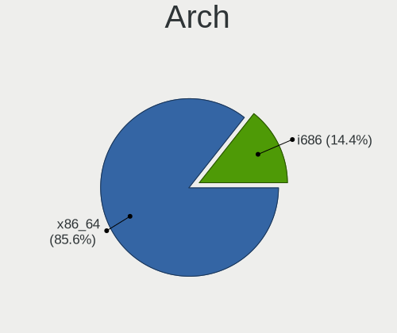

| Name   | Notebooks | Percent |
|--------|-----------|---------|
| x86_64 | 292       | 79.35%  |
| i686   | 76        | 20.65%  |

DE
--

Desktop Environment

| Name       | Notebooks | Percent |
|------------|-----------|---------|
| X-Cinnamon | 333       | 89.04%  |
| Cinnamon   | 23        | 6.15%   |
| MATE       | 7         | 1.87%   |
| Unknown    | 6         | 1.6%    |
| XFCE       | 2         | 0.53%   |
| Trinity    | 1         | 0.27%   |
| LXDE       | 1         | 0.27%   |
| KDE        | 1         | 0.27%   |

Display Server
--------------

X11 or Wayland

| Name | Notebooks | Percent |
|------|-----------|---------|
| X11  | 368       | 100%    |

Display Manager
---------------

SDDM, LightDM, etc.

| Name    | Notebooks | Percent |
|---------|-----------|---------|
| Unknown | 282       | 75.81%  |
| LightDM | 72        | 19.35%  |
| TDM     | 15        | 4.03%   |
| MDM     | 3         | 0.81%   |

OS Lang
-------

Language

| Lang    | Notebooks | Percent |
|---------|-----------|---------|
| en_US   | 113       | 30.46%  |
| de_DE   | 41        | 11.05%  |
| pt_BR   | 31        | 8.36%   |
| ru_RU   | 27        | 7.28%   |
| en_GB   | 19        | 5.12%   |
| pl_PL   | 12        | 3.23%   |
| es_ES   | 12        | 3.23%   |
| it_IT   | 11        | 2.96%   |
| fr_FR   | 11        | 2.96%   |
| es_MX   | 8         | 2.16%   |
| Unknown | 8         | 2.16%   |
| es_AR   | 6         | 1.62%   |
| en_AU   | 6         | 1.62%   |
| en_CA   | 5         | 1.35%   |
| de_CH   | 5         | 1.35%   |
| nl_NL   | 3         | 0.81%   |
| ja_JP   | 3         | 0.81%   |
| en_IN   | 3         | 0.81%   |
| el_GR   | 3         | 0.81%   |
| tr_TR   | 2         | 0.54%   |
| pt_PT   | 2         | 0.54%   |
| ko_KR   | 2         | 0.54%   |
| fr_BE   | 2         | 0.54%   |
| es_BO   | 2         | 0.54%   |
| en_ZA   | 2         | 0.54%   |
| en_PH   | 2         | 0.54%   |
| en_NZ   | 2         | 0.54%   |
| en_IE   | 2         | 0.54%   |
| de_AT   | 2         | 0.54%   |
| da_DK   | 2         | 0.54%   |
| bg_BG   | 2         | 0.54%   |
| zh_CN   | 1         | 0.27%   |
| unm_US  | 1         | 0.27%   |
| uk_UA   | 1         | 0.27%   |
| sk_SK   | 1         | 0.27%   |
| ru_UA   | 1         | 0.27%   |
| nn_NO   | 1         | 0.27%   |
| nl_BE   | 1         | 0.27%   |
| nl_AW   | 1         | 0.27%   |
| it_CH   | 1         | 0.27%   |

Boot Mode
---------

EFI or BIOS

| Mode | Notebooks | Percent |
|------|-----------|---------|
| BIOS | 211       | 56.87%  |
| EFI  | 160       | 43.13%  |

Filesystem
----------

Type of filesystem

| Type    | Notebooks | Percent |
|---------|-----------|---------|
| Ext4    | 345       | 93.75%  |
| Btrfs   | 7         | 1.9%    |
| Overlay | 6         | 1.63%   |
| Tmpfs   | 4         | 1.09%   |
| Unknown | 3         | 0.82%   |
| Xfs     | 2         | 0.54%   |
| Aufs    | 1         | 0.27%   |

Part. scheme
------------

Scheme of partitioning

| Type    | Notebooks | Percent |
|---------|-----------|---------|
| Unknown | 278       | 75.14%  |
| GPT     | 64        | 17.3%   |
| MBR     | 28        | 7.57%   |

Dual Boot with Linux/BSD
------------------------

Hosting more than one Linux/BSD

| Dual boot | Notebooks | Percent |
|-----------|-----------|---------|
| No        | 350       | 94.85%  |
| Yes       | 19        | 5.15%   |

Dual Boot (Win)
---------------

Hosting Linux and Windows

| Dual boot | Notebooks | Percent |
|-----------|-----------|---------|
| No        | 346       | 94.02%  |
| Yes       | 22        | 5.98%   |

Board
-----

Vendor
------

Motherboard manufacturer

| Name                           | Notebooks | Percent |
|--------------------------------|-----------|---------|
| Hewlett-Packard                | 86        | 23.37%  |
| Lenovo                         | 54        | 14.67%  |
| Dell                           | 51        | 13.86%  |
| Acer                           | 44        | 11.96%  |
| ASUSTek Computer               | 38        | 10.33%  |
| Toshiba                        | 12        | 3.26%   |
| Sony                           | 10        | 2.72%   |
| Samsung Electronics            | 8         | 2.17%   |
| Apple                          | 7         | 1.9%    |
| Fujitsu Siemens                | 5         | 1.36%   |
| MSI                            | 4         | 1.09%   |
| LG Electronics                 | 4         | 1.09%   |
| Unknown                        | 4         | 1.09%   |
| Positivo                       | 3         | 0.82%   |
| Packard Bell                   | 3         | 0.82%   |
| Medion                         | 3         | 0.82%   |
| Matsushita Electric Industrial | 2         | 0.54%   |
| Google                         | 2         | 0.54%   |
| Gateway                        | 2         | 0.54%   |
| Fujitsu                        | 2         | 0.54%   |
| Wortmann AG                    | 1         | 0.27%   |
| TUXEDO                         | 1         | 0.27%   |
| Semp Toshiba                   | 1         | 0.27%   |
| SAELITE                        | 1         | 0.27%   |
| Qbex                           | 1         | 0.27%   |
| Philco                         | 1         | 0.27%   |
| Notebook                       | 1         | 0.27%   |
| Multilaser                     | 1         | 0.27%   |
| Microtech                      | 1         | 0.27%   |
| Maibenben                      | 1         | 0.27%   |
| LincPlus                       | 1         | 0.27%   |
| Kruger&Matz                    | 1         | 0.27%   |
| Itautec                        | 1         | 0.27%   |
| IBM                            | 1         | 0.27%   |
| Howard Computers               | 1         | 0.27%   |
| Framework                      | 1         | 0.27%   |
| Exper                          | 1         | 0.27%   |
| Exo                            | 1         | 0.27%   |
| EVOO                           | 1         | 0.27%   |
| Dynabook                       | 1         | 0.27%   |

Model
-----

Motherboard model

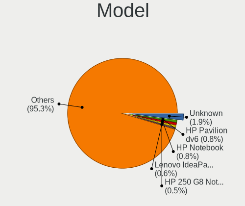

| Name                                        | Notebooks | Percent |
|---------------------------------------------|-----------|---------|
| Unknown                                     | 10        | 2.72%   |
| Lenovo IdeaPad 3 15ADA05 81W1               | 4         | 1.09%   |
| Samsung RV411/RV511/E3511/S3511/RV711/E3411 | 3         | 0.82%   |
| HP Pavilion dv6                             | 3         | 0.82%   |
| HP Notebook                                 | 3         | 0.82%   |
| Dell Latitude E6400                         | 3         | 0.82%   |
| Acer Aspire E1-570G                         | 3         | 0.82%   |
| Acer Aspire 5930                            | 3         | 0.82%   |
| Acer AOD270                                 | 3         | 0.82%   |
| Lenovo V145-15AST 81MT                      | 2         | 0.54%   |
| Lenovo G500 20236                           | 2         | 0.54%   |
| HP Pavilion dv7                             | 2         | 0.54%   |
| HP Laptop 15z-ef2xxx                        | 2         | 0.54%   |
| HP Laptop 15-dw3xxx                         | 2         | 0.54%   |
| HP Laptop 15-bw0xx                          | 2         | 0.54%   |
| HP Laptop 14-df0xxx                         | 2         | 0.54%   |
| HP EliteBook 8540w                          | 2         | 0.54%   |
| HP EliteBook 820 G3                         | 2         | 0.54%   |
| HP Compaq Presario CQ71                     | 2         | 0.54%   |
| HP 255 G7 Notebook PC                       | 2         | 0.54%   |
| HP 14                                       | 2         | 0.54%   |
| Dell Latitude E5540                         | 2         | 0.54%   |
| Dell Inspiron 5566                          | 2         | 0.54%   |
| Dell Inspiron 5559                          | 2         | 0.54%   |
| ASUS X101CH                                 | 2         | 0.54%   |
| Acer Aspire 5735                            | 2         | 0.54%   |
| Acer Aspire 3820                            | 2         | 0.54%   |
| Acer Aspire 3000                            | 2         | 0.54%   |
| Wortmann AG TERRA_MOBILE_1713A              | 1         | 0.27%   |
| TUXEDO BC1510 1710                          | 1         | 0.27%   |
| Toshiba Satellite U300                      | 1         | 0.27%   |
| Toshiba Satellite P300                      | 1         | 0.27%   |
| Toshiba Satellite M55                       | 1         | 0.27%   |
| Toshiba Satellite M100                      | 1         | 0.27%   |
| Toshiba Satellite L855D                     | 1         | 0.27%   |
| Toshiba Satellite L855                      | 1         | 0.27%   |
| Toshiba Satellite L750                      | 1         | 0.27%   |
| Toshiba Satellite L50-C                     | 1         | 0.27%   |
| Toshiba Satellite L455                      | 1         | 0.27%   |
| Toshiba Satellite C50-A-1DN                 | 1         | 0.27%   |

Model Family
------------

Motherboard model prefix

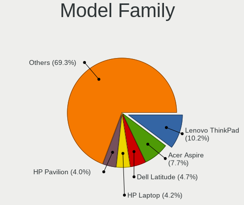

| Name                    | Notebooks | Percent |
|-------------------------|-----------|---------|
| Acer Aspire             | 36        | 9.78%   |
| Lenovo ThinkPad         | 23        | 6.25%   |
| Dell Latitude           | 20        | 5.43%   |
| HP Laptop               | 18        | 4.89%   |
| Dell Inspiron           | 17        | 4.62%   |
| Lenovo IdeaPad          | 15        | 4.08%   |
| HP Pavilion             | 14        | 3.8%    |
| Toshiba Satellite       | 11        | 2.99%   |
| HP EliteBook            | 11        | 2.99%   |
| Unknown                 | 10        | 2.72%   |
| HP Compaq               | 8         | 2.17%   |
| HP ProBook              | 6         | 1.63%   |
| ASUS VivoBook           | 6         | 1.63%   |
| Dell Precision          | 5         | 1.36%   |
| Samsung RV411           | 3         | 0.82%   |
| HP Presario             | 3         | 0.82%   |
| HP Notebook             | 3         | 0.82%   |
| HP 255                  | 3         | 0.82%   |
| Fujitsu Siemens ESPRIMO | 3         | 0.82%   |
| Dell XPS                | 3         | 0.82%   |
| Acer AOD270             | 3         | 0.82%   |
| Packard Bell EasyNote   | 2         | 0.54%   |
| Lenovo Yoga             | 2         | 0.54%   |
| Lenovo V145-15AST       | 2         | 0.54%   |
| Lenovo Legion           | 2         | 0.54%   |
| Lenovo G500             | 2         | 0.54%   |
| HP Mini                 | 2         | 0.54%   |
| HP ENVY                 | 2         | 0.54%   |
| HP 14                   | 2         | 0.54%   |
| Dell Vostro             | 2         | 0.54%   |
| Dell System             | 2         | 0.54%   |
| ASUS X101CH             | 2         | 0.54%   |
| ASUS ROG                | 2         | 0.54%   |
| Apple MacBookPro5       | 2         | 0.54%   |
| Acer Swift              | 2         | 0.54%   |
| Wortmann AG TERRA       | 1         | 0.27%   |
| TUXEDO BC1510           | 1         | 0.27%   |
| Toshiba dynabook        | 1         | 0.27%   |
| Sony VPCSB3M1R          | 1         | 0.27%   |
| Sony VPCS131FM          | 1         | 0.27%   |

MFG Year
--------

Motherboard manufacture year

| Year    | Notebooks | Percent |
|---------|-----------|---------|
| 2012    | 33        | 8.97%   |
| 2013    | 29        | 7.88%   |
| 2010    | 29        | 7.88%   |
| 2009    | 29        | 7.88%   |
| 2011    | 26        | 7.07%   |
| 2018    | 24        | 6.52%   |
| 2008    | 23        | 6.25%   |
| 2007    | 23        | 6.25%   |
| 2020    | 21        | 5.71%   |
| 2021    | 20        | 5.43%   |
| 2019    | 20        | 5.43%   |
| 2014    | 18        | 4.89%   |
| 2016    | 17        | 4.62%   |
| 2017    | 16        | 4.35%   |
| 2015    | 14        | 3.8%    |
| 2006    | 11        | 2.99%   |
| 2005    | 7         | 1.9%    |
| 2022    | 4         | 1.09%   |
| 2004    | 1         | 0.27%   |
| 2003    | 1         | 0.27%   |
| 2002    | 1         | 0.27%   |
| Unknown | 1         | 0.27%   |

Form Factor
-----------

Physical design of the computer

| Name     | Notebooks | Percent |
|----------|-----------|---------|
| Notebook | 368       | 100%    |

Secure Boot
-----------

Enabled or disabled

| State    | Notebooks | Percent |
|----------|-----------|---------|
| Disabled | 343       | 92.7%   |
| Enabled  | 27        | 7.3%    |

Coreboot
--------

Have coreboot on board

| Used | Notebooks | Percent |
|------|-----------|---------|
| No   | 366       | 99.46%  |
| Yes  | 2         | 0.54%   |

RAM Size
--------

Total RAM memory

| Size in GB  | Notebooks | Percent |
|-------------|-----------|---------|
| 3.01-4.0    | 103       | 27.91%  |
| 4.01-8.0    | 84        | 22.76%  |
| 2.01-3.0    | 44        | 11.92%  |
| 16.01-24.0  | 44        | 11.92%  |
| 1.01-2.0    | 37        | 10.03%  |
| 8.01-16.0   | 37        | 10.03%  |
| 0.51-1.0    | 9         | 2.44%   |
| 32.01-64.0  | 7         | 1.9%    |
| 64.01-256.0 | 3         | 0.81%   |
| 24.01-32.0  | 1         | 0.27%   |

RAM Used
--------

Used RAM memory

| Used GB    | Notebooks | Percent |
|------------|-----------|---------|
| 1.01-2.0   | 188       | 47.72%  |
| 2.01-3.0   | 86        | 21.83%  |
| 0.51-1.0   | 64        | 16.24%  |
| 3.01-4.0   | 32        | 8.12%   |
| 4.01-8.0   | 16        | 4.06%   |
| 8.01-16.0  | 4         | 1.02%   |
| 0.01-0.5   | 3         | 0.76%   |
| 32.01-64.0 | 1         | 0.25%   |

Total Drives
------------

Number of drives on board

| Drives | Notebooks | Percent |
|--------|-----------|---------|
| 1      | 276       | 73.6%   |
| 2      | 81        | 21.6%   |
| 3      | 9         | 2.4%    |
| 0      | 4         | 1.07%   |
| 4      | 3         | 0.8%    |
| 6      | 1         | 0.27%   |
| 5      | 1         | 0.27%   |

Has CD-ROM
----------

Has CD-ROM on board

| Presented | Notebooks | Percent |
|-----------|-----------|---------|
| No        | 186       | 50.13%  |
| Yes       | 185       | 49.87%  |

Has Ethernet
------------

Has Ethernet on board

| Presented | Notebooks | Percent |
|-----------|-----------|---------|
| Yes       | 325       | 88.32%  |
| No        | 43        | 11.68%  |

Has WiFi
--------

Has WiFi module

| Presented | Notebooks | Percent |
|-----------|-----------|---------|
| Yes       | 362       | 98.37%  |
| No        | 6         | 1.63%   |

Has Bluetooth
-------------

Has Bluetooth module

| Presented | Notebooks | Percent |
|-----------|-----------|---------|
| Yes       | 230       | 62.5%   |
| No        | 138       | 37.5%   |

Location
--------

Country
-------

Geographic location (country)

| Country      | Notebooks | Percent |
|--------------|-----------|---------|
| USA          | 46        | 12.43%  |
| Germany      | 45        | 12.16%  |
| Brazil       | 33        | 8.92%   |
| Russia       | 30        | 8.11%   |
| UK           | 17        | 4.59%   |
| Italy        | 15        | 4.05%   |
| Poland       | 14        | 3.78%   |
| France       | 14        | 3.78%   |
| Spain        | 11        | 2.97%   |
| Mexico       | 9         | 2.43%   |
| Canada       | 8         | 2.16%   |
| Switzerland  | 7         | 1.89%   |
| Australia    | 7         | 1.89%   |
| Ukraine      | 6         | 1.62%   |
| Netherlands  | 6         | 1.62%   |
| Bulgaria     | 6         | 1.62%   |
| Argentina    | 6         | 1.62%   |
| Turkey       | 4         | 1.08%   |
| Portugal     | 4         | 1.08%   |
| India        | 4         | 1.08%   |
| Belgium      | 4         | 1.08%   |
| Belarus      | 4         | 1.08%   |
| Austria      | 4         | 1.08%   |
| Romania      | 3         | 0.81%   |
| Philippines  | 3         | 0.81%   |
| Indonesia    | 3         | 0.81%   |
| Greece       | 3         | 0.81%   |
| Ecuador      | 3         | 0.81%   |
| Chile        | 3         | 0.81%   |
| Bahrain      | 3         | 0.81%   |
| Venezuela    | 2         | 0.54%   |
| Tunisia      | 2         | 0.54%   |
| Sweden       | 2         | 0.54%   |
| South Korea  | 2         | 0.54%   |
| South Africa | 2         | 0.54%   |
| New Zealand  | 2         | 0.54%   |
| Japan        | 2         | 0.54%   |
| Ireland      | 2         | 0.54%   |
| Hungary      | 2         | 0.54%   |
| Denmark      | 2         | 0.54%   |

City
----

Geographic location (city)

| City                 | Notebooks | Percent |
|----------------------|-----------|---------|
| Moscow               | 7         | 1.84%   |
| Sao Paulo            | 6         | 1.58%   |
| St Petersburg        | 5         | 1.32%   |
| Wroclaw              | 3         | 0.79%   |
| Wohlen               | 3         | 0.79%   |
| Seville              | 3         | 0.79%   |
| Poznan               | 3         | 0.79%   |
| Manama               | 3         | 0.79%   |
| Krakow               | 3         | 0.79%   |
| Guayaquil            | 3         | 0.79%   |
| Freiburg im Breisgau | 3         | 0.79%   |
| Berlin               | 3         | 0.79%   |
| Zurich               | 2         | 0.53%   |
| Voronezh             | 2         | 0.53%   |
| Stuttgart            | 2         | 0.53%   |
| Sofia                | 2         | 0.53%   |
| Rome                 | 2         | 0.53%   |
| Recife               | 2         | 0.53%   |
| Perth                | 2         | 0.53%   |
| Oruro                | 2         | 0.53%   |
| Nuremberg            | 2         | 0.53%   |
| Neasden              | 2         | 0.53%   |
| Minsk                | 2         | 0.53%   |
| Mexico City          | 2         | 0.53%   |
| Mannheim             | 2         | 0.53%   |
| London               | 2         | 0.53%   |
| Lisbon               | 2         | 0.53%   |
| Hyderabad            | 2         | 0.53%   |
| Glasgow              | 2         | 0.53%   |
| Frankfurt am Main    | 2         | 0.53%   |
| Foz do Iguau       | 2         | 0.53%   |
| Duisburg             | 2         | 0.53%   |
| Denver               | 2         | 0.53%   |
| Cologne              | 2         | 0.53%   |
| Chelyabinsk          | 2         | 0.53%   |
| Caroline             | 2         | 0.53%   |
| Bursa                | 2         | 0.53%   |
| Athens               | 2         | 0.53%   |
| Zoetermeer           | 1         | 0.26%   |
| Zhongshan            | 1         | 0.26%   |

Drives
------

Drive Vendor
------------

Hard drive vendors

| Vendor                         | Notebooks | Drives | Percent |
|--------------------------------|-----------|--------|---------|
| WDC                            | 68        | 76     | 15.04%  |
| Seagate                        | 56        | 73     | 12.39%  |
| Samsung Electronics            | 55        | 60     | 12.17%  |
| Toshiba                        | 28        | 30     | 6.19%   |
| Unknown                        | 26        | 31     | 5.75%   |
| Hitachi                        | 26        | 26     | 5.75%   |
| SanDisk                        | 22        | 29     | 4.87%   |
| Kingston                       | 21        | 23     | 4.65%   |
| Intel                          | 12        | 12     | 2.65%   |
| HGST                           | 12        | 13     | 2.65%   |
| SK hynix                       | 11        | 13     | 2.43%   |
| Crucial                        | 11        | 13     | 2.43%   |
| Micron Technology              | 8         | 9      | 1.77%   |
| Fujitsu                        | 8         | 8      | 1.77%   |
| China                          | 7         | 8      | 1.55%   |
| PNY                            | 5         | 5      | 1.11%   |
| Patriot                        | 5         | 6      | 1.11%   |
| Phison                         | 4         | 5      | 0.88%   |
| KingSpec                       | 4         | 5      | 0.88%   |
| Apple                          | 4         | 9      | 0.88%   |
| A-DATA Technology              | 4         | 6      | 0.88%   |
| Transcend                      | 3         | 4      | 0.66%   |
| KingDian                       | 3         | 4      | 0.66%   |
| GOODRAM                        | 3         | 3      | 0.66%   |
| Gigabyte Technology            | 3         | 5      | 0.66%   |
| Team                           | 2         | 2      | 0.44%   |
| KIOXIA                         | 2         | 5      | 0.44%   |
| JMicron Technology             | 2         | 3      | 0.44%   |
| Intenso                        | 2         | 2      | 0.44%   |
| IBM/Hitachi                    | 2         | 2      | 0.44%   |
| FORESEE                        | 2         | 2      | 0.44%   |
| Corsair                        | 2         | 2      | 0.44%   |
| USB30                          | 1         | 2      | 0.22%   |
| Union Memory                   | 1         | 1      | 0.22%   |
| UMIS                           | 1         | 1      | 0.22%   |
| SSD PHIS                       | 1         | 1      | 0.22%   |
| Solid State Storage Technology | 1         | 1      | 0.22%   |
| ShiJi                          | 1         | 1      | 0.22%   |
| SABRENT                        | 1         | 1      | 0.22%   |
| Plextor                        | 1         | 1      | 0.22%   |

Drive Model
-----------

Hard drive models

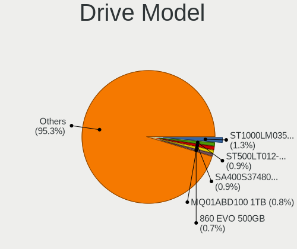

| Model                                | Notebooks | Percent |
|--------------------------------------|-----------|---------|
| Seagate ST500LT012-1DG142 500GB      | 7         | 1.52%   |
| Seagate ST1000LM035-1RK172 1TB       | 6         | 1.3%    |
| Samsung SSD 860 EVO 500GB            | 6         | 1.3%    |
| WDC WD3200BEVT-60ZCT1 320GB          | 5         | 1.08%   |
| Toshiba MQ01ABD100 1TB               | 5         | 1.08%   |
| SanDisk NVMe SSD Drive 256GB         | 5         | 1.08%   |
| Samsung SSD 860 EVO 1TB              | 5         | 1.08%   |
| Unknown SD/MMC/MS PRO 8GB            | 4         | 0.87%   |
| Unknown MMC Card  7GB                | 4         | 0.87%   |
| Unknown MMC Card  32GB               | 4         | 0.87%   |
| Toshiba MQ01ABF050 500GB             | 4         | 0.87%   |
| Samsung SSD 850 EVO 500GB            | 4         | 0.87%   |
| Kingston SA400S37480G 480GB SSD      | 4         | 0.87%   |
| Kingston SA400S37240G 240GB SSD      | 4         | 0.87%   |
| WDC WD5000LPVX-22V0TT0 500GB         | 3         | 0.65%   |
| WDC WD3200BPVT-22JJ5T0 320GB         | 3         | 0.65%   |
| Unknown MMC Card  64GB               | 3         | 0.65%   |
| Seagate ST9500325AS 500GB            | 3         | 0.65%   |
| Seagate ST9250315AS 250GB            | 3         | 0.65%   |
| Seagate ST1000LM024 HN-M101MBB 1TB   | 3         | 0.65%   |
| Kingston SA400S37120G 120GB SSD      | 3         | 0.65%   |
| HGST HTS545050A7E680 500GB           | 3         | 0.65%   |
| Gigabyte GP-GSTFS31120GNTD 120GB SSD | 3         | 0.65%   |
| WDC WDS240G2G0A-00JH30 240GB SSD     | 2         | 0.43%   |
| WDC WDBNCE5000PNC 500GB SSD          | 2         | 0.43%   |
| WDC WD7500BPVT-75HXZT3 752GB         | 2         | 0.43%   |
| WDC WD3200BEVT-22ZCT0 320GB          | 2         | 0.43%   |
| WDC WD2500BEVT-22ZCT0 250GB          | 2         | 0.43%   |
| WDC WD1600BEVT-60ZCT1 160GB          | 2         | 0.43%   |
| WDC WD1200BEVS-22UST0 120GB          | 2         | 0.43%   |
| WDC PC SN530 SDBPNPZ-256G-1006 256GB | 2         | 0.43%   |
| WDC PC SN530 NVMe 256GB              | 2         | 0.43%   |
| Unknown SC128  128GB                 | 2         | 0.43%   |
| Unknown MMC Card  4GB                | 2         | 0.43%   |
| Unknown MMC Card  16GB               | 2         | 0.43%   |
| Toshiba MQ04ABF100 1TB               | 2         | 0.43%   |
| Toshiba MQ01ABD032 320GB             | 2         | 0.43%   |
| Seagate ST9320423AS 320GB            | 2         | 0.43%   |
| Seagate ST9250827AS 250GB            | 2         | 0.43%   |
| Seagate ST9120821AS 120GB            | 2         | 0.43%   |

HDD Vendor
----------

Hard disk drive vendors

| Vendor              | Notebooks | Drives | Percent |
|---------------------|-----------|--------|---------|
| Seagate             | 55        | 71     | 28.8%   |
| WDC                 | 54        | 61     | 28.27%  |
| Hitachi             | 26        | 26     | 13.61%  |
| Toshiba             | 24        | 26     | 12.57%  |
| HGST                | 12        | 13     | 6.28%   |
| Fujitsu             | 8         | 8      | 4.19%   |
| Unknown             | 4         | 4      | 2.09%   |
| Samsung Electronics | 4         | 4      | 2.09%   |
| IBM/Hitachi         | 2         | 2      | 1.05%   |
| Initio              | 1         | 1      | 0.52%   |
| DAS                 | 1         | 4      | 0.52%   |

SSD Vendor
----------

Solid state drive vendors

| Vendor              | Notebooks | Drives | Percent |
|---------------------|-----------|--------|---------|
| Samsung Electronics | 39        | 44     | 23.35%  |
| Kingston            | 19        | 21     | 11.38%  |
| Crucial             | 11        | 13     | 6.59%   |
| SanDisk             | 10        | 14     | 5.99%   |
| WDC                 | 7         | 7      | 4.19%   |
| Intel               | 7         | 7      | 4.19%   |
| China               | 6         | 7      | 3.59%   |
| PNY                 | 5         | 5      | 2.99%   |
| Patriot             | 5         | 6      | 2.99%   |
| Micron Technology   | 4         | 5      | 2.4%    |
| A-DATA Technology   | 4         | 6      | 2.4%    |
| Transcend           | 3         | 4      | 1.8%    |
| Toshiba             | 3         | 3      | 1.8%    |
| KingSpec            | 3         | 3      | 1.8%    |
| KingDian            | 3         | 4      | 1.8%    |
| GOODRAM             | 3         | 3      | 1.8%    |
| Gigabyte Technology | 3         | 5      | 1.8%    |
| Apple               | 3         | 3      | 1.8%    |
| Team                | 2         | 2      | 1.2%    |
| SK hynix            | 2         | 3      | 1.2%    |
| FORESEE             | 2         | 2      | 1.2%    |
| Corsair             | 2         | 2      | 1.2%    |
| USB30               | 1         | 2      | 0.6%    |
| Unknown             | 1         | 1      | 0.6%    |
| SSD PHIS            | 1         | 1      | 0.6%    |
| Plextor             | 1         | 1      | 0.6%    |
| ORICO               | 1         | 1      | 0.6%    |
| Netac               | 1         | 1      | 0.6%    |
| Mushkin             | 1         | 1      | 0.6%    |
| Microtech           | 1         | 2      | 0.6%    |
| LITEON              | 1         | 1      | 0.6%    |
| Intenso             | 1         | 1      | 0.6%    |
| HXY                 | 1         | 1      | 0.6%    |
| Hikvision           | 1         | 1      | 0.6%    |
| Hewlett-Packard     | 1         | 2      | 0.6%    |
| GALAX               | 1         | 1      | 0.6%    |
| Drevo               | 1         | 2      | 0.6%    |
| BIWIN               | 1         | 1      | 0.6%    |
| BHT                 | 1         | 2      | 0.6%    |
| BAITITON            | 1         | 1      | 0.6%    |

Drive Kind
----------

HDD or SSD

| Kind    | Notebooks | Drives | Percent |
|---------|-----------|--------|---------|
| HDD     | 184       | 220    | 43.5%   |
| SSD     | 149       | 196    | 35.22%  |
| NVMe    | 58        | 77     | 13.71%  |
| MMC     | 21        | 25     | 4.96%   |
| Unknown | 11        | 15     | 2.6%    |

Drive Connector
---------------

SATA, SAS, NVMe, etc.

| Type | Notebooks | Drives | Percent |
|------|-----------|--------|---------|
| SATA | 309       | 396    | 75.37%  |
| NVMe | 57        | 76     | 13.9%   |
| SAS  | 23        | 36     | 5.61%   |
| MMC  | 21        | 25     | 5.12%   |

Drive Size
----------

Size of hard drive

| Size in TB | Notebooks | Drives | Percent |
|------------|-----------|--------|---------|
| 0.01-0.5   | 260       | 326    | 79.27%  |
| 0.51-1.0   | 62        | 83     | 18.9%   |
| 4.01-10.0  | 3         | 3      | 0.91%   |
| 1.01-2.0   | 2         | 3      | 0.61%   |
| 2.01-3.0   | 1         | 1      | 0.3%    |

Space Total
-----------

Amount of disk space available on the file system

| Size in GB     | Notebooks | Percent |
|----------------|-----------|---------|
| 101-250        | 146       | 38.93%  |
| 251-500        | 96        | 25.6%   |
| 501-1000       | 44        | 11.73%  |
| 51-100         | 37        | 9.87%   |
| 21-50          | 17        | 4.53%   |
| 1001-2000      | 14        | 3.73%   |
| More than 3000 | 8         | 2.13%   |
| 1-20           | 8         | 2.13%   |
| 2001-3000      | 4         | 1.07%   |
| Unknown        | 1         | 0.27%   |

Space Used
----------

Amount of used disk space

| Used GB        | Notebooks | Percent |
|----------------|-----------|---------|
| 1-20           | 190       | 48.59%  |
| 21-50          | 83        | 21.23%  |
| 101-250        | 44        | 11.25%  |
| 51-100         | 41        | 10.49%  |
| 251-500        | 12        | 3.07%   |
| 501-1000       | 11        | 2.81%   |
| 2001-3000      | 4         | 1.02%   |
| More than 3000 | 3         | 0.77%   |
| 1001-2000      | 2         | 0.51%   |
| Unknown        | 1         | 0.26%   |

Malfunc. Drives
---------------

Drive models with a malfunction

| Model                                 | Notebooks | Drives | Percent |
|---------------------------------------|-----------|--------|---------|
| WDC WD5000BEVT-22A0RT0 500GB          | 1         | 1      | 5.56%   |
| WDC WD3200BEVT-60ZCT1 320GB           | 1         | 1      | 5.56%   |
| WDC WD3200BEVT-26A23T0 320GB          | 1         | 1      | 5.56%   |
| SK hynix PC711 HFS512GDE9X073N 512GB  | 1         | 1      | 5.56%   |
| Seagate STM9120817AS 120GB            | 1         | 1      | 5.56%   |
| Seagate ST9640423AS 640GB             | 1         | 1      | 5.56%   |
| Seagate ST9120821AS 120GB             | 1         | 1      | 5.56%   |
| Seagate ST500LT032-1E9142 500GB       | 1         | 1      | 5.56%   |
| SanDisk SD9SN8W-128G-1006 128GB SSD   | 1         | 1      | 5.56%   |
| Samsung Electronics SSD 850 EVO 500GB | 1         | 1      | 5.56%   |
| Samsung Electronics MP0402H 40GB      | 1         | 1      | 5.56%   |
| Phison ES 512GB                       | 1         | 1      | 5.56%   |
| Kingston SV300S37A120G 120GB SSD      | 1         | 1      | 5.56%   |
| Intel SSDSCKKF256G8 SATA 256GB        | 1         | 1      | 5.56%   |
| Hitachi HTS547575A9E384 752GB         | 1         | 1      | 5.56%   |
| HGST HTS545050A7E680 500GB            | 1         | 1      | 5.56%   |
| Fujitsu MHZ2080BJ FFS G2 80GB         | 1         | 1      | 5.56%   |
| Crucial M4-CT256M4SSD2 256GB          | 1         | 1      | 5.56%   |

Malfunc. Drive Vendor
---------------------

Vendors of faulty drives

| Vendor              | Notebooks | Drives | Percent |
|---------------------|-----------|--------|---------|
| Seagate             | 4         | 4      | 23.53%  |
| WDC                 | 2         | 3      | 11.76%  |
| Samsung Electronics | 2         | 2      | 11.76%  |
| SK hynix            | 1         | 1      | 5.88%   |
| SanDisk             | 1         | 1      | 5.88%   |
| Phison              | 1         | 1      | 5.88%   |
| Kingston            | 1         | 1      | 5.88%   |
| Intel               | 1         | 1      | 5.88%   |
| Hitachi             | 1         | 1      | 5.88%   |
| HGST                | 1         | 1      | 5.88%   |
| Fujitsu             | 1         | 1      | 5.88%   |
| Crucial             | 1         | 1      | 5.88%   |

Malfunc. HDD Vendor
-------------------

Vendors of faulty HDD drives

| Vendor              | Notebooks | Drives | Percent |
|---------------------|-----------|--------|---------|
| Seagate             | 4         | 4      | 40%     |
| WDC                 | 2         | 3      | 20%     |
| Samsung Electronics | 1         | 1      | 10%     |
| Hitachi             | 1         | 1      | 10%     |
| HGST                | 1         | 1      | 10%     |
| Fujitsu             | 1         | 1      | 10%     |

Malfunc. Drive Kind
-------------------

Kinds of faulty drives

| Kind | Notebooks | Drives | Percent |
|------|-----------|--------|---------|
| HDD  | 10        | 11     | 58.82%  |
| SSD  | 5         | 5      | 29.41%  |
| NVMe | 2         | 2      | 11.76%  |

Failed Drives
-------------

Failed drive models

Zero info for selected period =(

Failed Drive Vendor
-------------------

Failed drive vendors

Zero info for selected period =(

Drive Status
------------

Number of failed and malfunc. drives

| Status   | Notebooks | Drives | Percent |
|----------|-----------|--------|---------|
| Detected | 288       | 420    | 75.79%  |
| Works    | 75        | 95     | 19.74%  |
| Malfunc  | 17        | 18     | 4.47%   |

Storage controller
------------------

Storage Vendor
--------------

Storage controller vendors

| Vendor                           | Notebooks | Percent |
|----------------------------------|-----------|---------|
| Intel                            | 276       | 68.66%  |
| AMD                              | 52        | 12.94%  |
| SanDisk                          | 16        | 3.98%   |
| Samsung Electronics              | 13        | 3.23%   |
| SK hynix                         | 9         | 2.24%   |
| Nvidia                           | 7         | 1.74%   |
| Silicon Integrated Systems [SiS] | 6         | 1.49%   |
| Phison Electronics               | 4         | 1%      |
| Micron Technology                | 4         | 1%      |
| KIOXIA                           | 3         | 0.75%   |
| Union Memory (Shenzhen)          | 2         | 0.5%    |
| Toshiba America Info Systems     | 2         | 0.5%    |
| Marvell Technology Group         | 2         | 0.5%    |
| Kingston Technology Company      | 2         | 0.5%    |
| VIA Technologies                 | 1         | 0.25%   |
| Solid State Storage Technology   | 1         | 0.25%   |
| Micron/Crucial Technology        | 1         | 0.25%   |
| Apple                            | 1         | 0.25%   |

Storage Model
-------------

Storage controller models

| Model                                                                            | Notebooks | Percent |
|----------------------------------------------------------------------------------|-----------|---------|
| AMD FCH SATA Controller [AHCI mode]                                              | 35        | 7.64%   |
| Intel Sunrise Point-LP SATA Controller [AHCI mode]                               | 26        | 5.68%   |
| Intel 7 Series Chipset Family 6-port SATA Controller [AHCI mode]                 | 26        | 5.68%   |
| Intel 82801IBM/IEM (ICH9M/ICH9M-E) 4 port SATA Controller [AHCI mode]            | 22        | 4.8%    |
| Intel 82801 Mobile SATA Controller [RAID mode]                                   | 21        | 4.59%   |
| Intel 82801GBM/GHM (ICH7-M Family) SATA Controller [AHCI mode]                   | 14        | 3.06%   |
| Intel 8 Series SATA Controller 1 [AHCI mode]                                     | 14        | 3.06%   |
| Intel 6 Series/C200 Series Chipset Family 6 port Mobile SATA AHCI Controller     | 14        | 3.06%   |
| Intel 82801G (ICH7 Family) IDE Controller                                        | 13        | 2.84%   |
| Intel 5 Series/3400 Series Chipset 4 port SATA AHCI Controller                   | 13        | 2.84%   |
| Intel NM10/ICH7 Family SATA Controller [AHCI mode]                               | 12        | 2.62%   |
| Intel 82801HM/HEM (ICH8M/ICH8M-E) SATA Controller [AHCI mode]                    | 10        | 2.18%   |
| Intel 82801HM/HEM (ICH8M/ICH8M-E) IDE Controller                                 | 10        | 2.18%   |
| AMD SB7x0/SB8x0/SB9x0 SATA Controller [AHCI mode]                                | 10        | 2.18%   |
| SanDisk Non-Volatile memory controller                                           | 9         | 1.97%   |
| Intel Volume Management Device NVMe RAID Controller                              | 9         | 1.97%   |
| Intel 82801GBM/GHM (ICH7-M Family) SATA Controller [IDE mode]                    | 9         | 1.97%   |
| Intel 8 Series/C220 Series Chipset Family 6-port SATA Controller 1 [AHCI mode]   | 8         | 1.75%   |
| Intel Atom Processor E3800 Series SATA AHCI Controller                           | 7         | 1.53%   |
| Intel 5 Series/3400 Series Chipset 6 port SATA AHCI Controller                   | 7         | 1.53%   |
| Silicon Integrated Systems [SiS] 5513 IDE Controller                             | 6         | 1.31%   |
| Samsung NVMe SSD Controller 980                                                  | 6         | 1.31%   |
| SK hynix BC501 NVMe Solid State Drive                                            | 5         | 1.09%   |
| SanDisk WD Blue SN550 NVMe SSD                                                   | 5         | 1.09%   |
| Intel Wildcat Point-LP SATA Controller [AHCI Mode]                               | 5         | 1.09%   |
| Intel Tiger Lake-LP SATA Controller                                              | 5         | 1.09%   |
| Intel Celeron/Pentium Silver Processor SATA Controller                           | 5         | 1.09%   |
| Intel Atom/Celeron/Pentium Processor x5-E8000/J3xxx/N3xxx Series SATA Controller | 5         | 1.09%   |
| Silicon Integrated Systems [SiS] SATA Controller / IDE mode                      | 4         | 0.87%   |
| Samsung NVMe SSD Controller SM981/PM981/PM983                                    | 4         | 0.87%   |
| Micron Non-Volatile memory controller                                            | 4         | 0.87%   |
| Intel US15W/US15X/US15L/UL11L SCH [Poulsbo] IDE Controller                       | 4         | 0.87%   |
| Intel Cannon Point-LP SATA Controller [AHCI Mode]                                | 4         | 0.87%   |
| AMD IXP SB4x0 IDE Controller                                                     | 4         | 0.87%   |
| SK hynix Gold P31/PC711 NVMe Solid State Drive                                   | 3         | 0.66%   |
| Nvidia MCP79 AHCI Controller                                                     | 3         | 0.66%   |
| KIOXIA NVMe SSD Controller BG4                                                   | 3         | 0.66%   |
| Intel SSD 660P Series                                                            | 3         | 0.66%   |
| Intel NM10/ICH7 Family SATA Controller [IDE mode]                                | 3         | 0.66%   |
| Intel HM170/QM170 Chipset SATA Controller [AHCI Mode]                            | 3         | 0.66%   |

Storage Kind
------------

Kind of storage controller (IDE, SATA, NVMe, SAS, ...)

| Kind | Notebooks | Percent |
|------|-----------|---------|
| SATA | 267       | 61.24%  |
| IDE  | 78        | 17.89%  |
| NVMe | 59        | 13.53%  |
| RAID | 32        | 7.34%   |

Processor
---------

CPU Vendor
----------

Processor vendors

| Vendor | Notebooks | Percent |
|--------|-----------|---------|
| Intel  | 300       | 81.52%  |
| AMD    | 68        | 18.48%  |

CPU Model
---------

Processor models

| Model                                         | Notebooks | Percent |
|-----------------------------------------------|-----------|---------|
| Intel Atom CPU N2600 @ 1.60GHz                | 10        | 2.72%   |
| Intel Atom CPU N270 @ 1.60GHz                 | 7         | 1.9%    |
| Intel 11th Gen Core i5-1135G7 @ 2.40GHz       | 6         | 1.63%   |
| Intel Core i5-6200U CPU @ 2.30GHz             | 5         | 1.36%   |
| Intel Core i5-3230M CPU @ 2.60GHz             | 5         | 1.36%   |
| Intel Core 2 Duo CPU T6600 @ 2.20GHz          | 5         | 1.36%   |
| Intel Core i5-8250U CPU @ 1.60GHz             | 4         | 1.09%   |
| Intel Core i5-4210U CPU @ 1.70GHz             | 4         | 1.09%   |
| Intel Core i3-8130U CPU @ 2.20GHz             | 4         | 1.09%   |
| Intel Core 2 Duo CPU P8700 @ 2.53GHz          | 4         | 1.09%   |
| Intel Celeron N4000 CPU @ 1.10GHz             | 4         | 1.09%   |
| Intel Celeron CPU N2830 @ 2.16GHz             | 4         | 1.09%   |
| AMD Ryzen 5 5500U with Radeon Graphics        | 4         | 1.09%   |
| Intel Pentium CPU N3710 @ 1.60GHz             | 3         | 0.82%   |
| Intel Genuine CPU T2300 @ 1.66GHz             | 3         | 0.82%   |
| Intel Core i7-8565U CPU @ 1.80GHz             | 3         | 0.82%   |
| Intel Core i7-8550U CPU @ 1.80GHz             | 3         | 0.82%   |
| Intel Core i7 CPU Q 720 @ 1.60GHz             | 3         | 0.82%   |
| Intel Core i5-8265U CPU @ 1.60GHz             | 3         | 0.82%   |
| Intel Core i5-3320M CPU @ 2.60GHz             | 3         | 0.82%   |
| Intel Core i5-3210M CPU @ 2.50GHz             | 3         | 0.82%   |
| Intel Core i5-10210U CPU @ 1.60GHz            | 3         | 0.82%   |
| Intel Core i3-6006U CPU @ 2.00GHz             | 3         | 0.82%   |
| Intel Core i3-3217U CPU @ 1.80GHz             | 3         | 0.82%   |
| Intel Core i3-3110M CPU @ 2.40GHz             | 3         | 0.82%   |
| Intel Core i3-2310M CPU @ 2.10GHz             | 3         | 0.82%   |
| Intel Core 2 Duo CPU T8300 @ 2.40GHz          | 3         | 0.82%   |
| Intel Core 2 Duo CPU P8600 @ 2.40GHz          | 3         | 0.82%   |
| Intel 11th Gen Core i7-1165G7 @ 2.80GHz       | 3         | 0.82%   |
| AMD Ryzen 5 3500U with Radeon Vega Mobile Gfx | 3         | 0.82%   |
| AMD A4-9125 RADEON R3, 4 COMPUTE CORES 2C+2G  | 3         | 0.82%   |
| Intel Pentium M processor 2.00GHz             | 2         | 0.54%   |
| Intel Pentium M processor 1.73GHz             | 2         | 0.54%   |
| Intel Pentium Dual-Core CPU T4300 @ 2.10GHz   | 2         | 0.54%   |
| Intel Pentium Dual-Core CPU T4200 @ 2.00GHz   | 2         | 0.54%   |
| Intel Pentium Dual CPU T3400 @ 2.16GHz        | 2         | 0.54%   |
| Intel Pentium CPU P6100 @ 2.00GHz             | 2         | 0.54%   |
| Intel Pentium CPU P6000 @ 1.87GHz             | 2         | 0.54%   |
| Intel Genuine CPU T2130 @ 1.86GHz             | 2         | 0.54%   |
| Intel Core i7-9750H CPU @ 2.60GHz             | 2         | 0.54%   |

CPU Model Family
----------------

Processor model prefix

| Model                          | Notebooks | Percent |
|--------------------------------|-----------|---------|
| Intel Core i5                  | 61        | 16.58%  |
| Intel Core i7                  | 50        | 13.59%  |
| Intel Core i3                  | 37        | 10.05%  |
| Intel Core 2 Duo               | 31        | 8.42%   |
| Intel Atom                     | 29        | 7.88%   |
| Intel Celeron                  | 23        | 6.25%   |
| Other                          | 18        | 4.89%   |
| Intel Pentium                  | 13        | 3.53%   |
| AMD Ryzen 5                    | 12        | 3.26%   |
| Intel Genuine                  | 8         | 2.17%   |
| AMD Ryzen 7                    | 8         | 2.17%   |
| Intel Core 2                   | 7         | 1.9%    |
| Intel Pentium M                | 6         | 1.63%   |
| Intel Pentium Dual             | 6         | 1.63%   |
| AMD A4                         | 6         | 1.63%   |
| Intel Pentium Dual-Core        | 5         | 1.36%   |
| AMD E2                         | 4         | 1.09%   |
| Intel Core Duo                 | 3         | 0.82%   |
| AMD Turion 64 X2 Mobile        | 3         | 0.82%   |
| AMD Ryzen 3                    | 3         | 0.82%   |
| AMD Athlon II                  | 3         | 0.82%   |
| Intel Pentium 4                | 2         | 0.54%   |
| Intel Celeron M                | 2         | 0.54%   |
| AMD Sempron                    | 2         | 0.54%   |
| AMD Mobile Sempron             | 2         | 0.54%   |
| AMD E1                         | 2         | 0.54%   |
| AMD E                          | 2         | 0.54%   |
| AMD Athlon                     | 2         | 0.54%   |
| AMD A8                         | 2         | 0.54%   |
| AMD A6                         | 2         | 0.54%   |
| AMD A10                        | 2         | 0.54%   |
| Intel Pentium Silver           | 1         | 0.27%   |
| Intel Pentium Gold             | 1         | 0.27%   |
| Intel Mobile Pentium 4         | 1         | 0.27%   |
| Intel Core i9                  | 1         | 0.27%   |
| Intel Core 2 Extreme           | 1         | 0.27%   |
| AMD Turion X2 Dual-Core Mobile | 1         | 0.27%   |
| AMD Turion 64 Mobile           | 1         | 0.27%   |
| AMD Ryzen 9                    | 1         | 0.27%   |
| AMD Phenom II                  | 1         | 0.27%   |

CPU Cores
---------

Number of processor cores

| Number | Notebooks | Percent |
|--------|-----------|---------|
| 2      | 235       | 63.69%  |
| 4      | 75        | 20.33%  |
| 1      | 40        | 10.84%  |
| 6      | 10        | 2.71%   |
| 8      | 9         | 2.44%   |

CPU Sockets
-----------

Number of sockets

| Number | Notebooks | Percent |
|--------|-----------|---------|
| 1      | 368       | 100%    |

CPU Threads
-----------

Threads per core (Hyper-Threading)

| Number | Notebooks | Percent |
|--------|-----------|---------|
| 2      | 221       | 60.05%  |
| 1      | 147       | 39.95%  |

CPU Op-Modes
------------

CPU Operation Modes (32-bit, 64-bit)

| Op mode        | Notebooks | Percent |
|----------------|-----------|---------|
| 32-bit, 64-bit | 326       | 88.59%  |
| 32-bit         | 42        | 11.41%  |

CPU Microcode
-------------

Microcode number

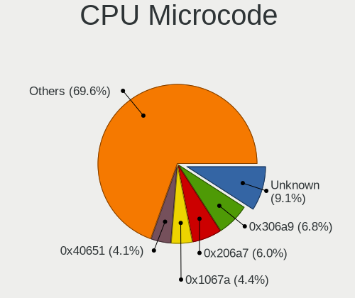

| Number     | Notebooks | Percent |
|------------|-----------|---------|
| 0x306a9    | 27        | 7.2%    |
| Unknown    | 25        | 6.67%   |
| 0x206a7    | 21        | 5.6%    |
| 0x1067a    | 20        | 5.33%   |
| 0x40651    | 16        | 4.27%   |
| 0x406e3    | 14        | 3.73%   |
| 0x6fd      | 13        | 3.47%   |
| 0x806c1    | 12        | 3.2%    |
| 0x30661    | 12        | 3.2%    |
| 0x106c2    | 12        | 3.2%    |
| 0x806ea    | 11        | 2.93%   |
| 0x20655    | 10        | 2.67%   |
| 0x06006705 | 10        | 2.67%   |
| 0x806ec    | 8         | 2.13%   |
| 0x6f6      | 8         | 2.13%   |
| 0x306c3    | 8         | 2.13%   |
| 0x806e9    | 7         | 1.87%   |
| 0x6ec      | 7         | 1.87%   |
| 0x20652    | 7         | 1.87%   |
| 0x10676    | 7         | 1.87%   |
| 0x30678    | 6         | 1.6%    |
| 0x08608103 | 6         | 1.6%    |
| 0x08108109 | 6         | 1.6%    |
| 0x706a1    | 5         | 1.33%   |
| 0x6e8      | 5         | 1.33%   |
| 0x306d4    | 5         | 1.33%   |
| 0x106e5    | 5         | 1.33%   |
| 0x806eb    | 4         | 1.07%   |
| 0x6d8      | 4         | 1.07%   |
| 0x506e3    | 4         | 1.07%   |
| 0x406c4    | 4         | 1.07%   |
| 0x08108102 | 4         | 1.07%   |
| 0x010000c8 | 4         | 1.07%   |
| 0x906ea    | 3         | 0.8%    |
| 0x706e5    | 3         | 0.8%    |
| 0x106ca    | 3         | 0.8%    |
| 0x0a50000c | 3         | 0.8%    |
| 0x06001119 | 3         | 0.8%    |
| 0xf29      | 2         | 0.53%   |
| 0xa0652    | 2         | 0.53%   |

CPU Microarch
-------------

Microarchitecture

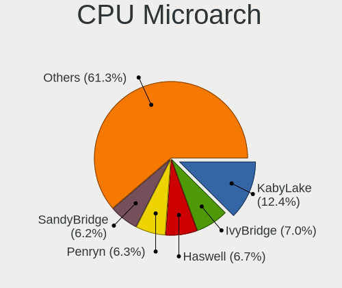

| Name            | Notebooks | Percent |
|-----------------|-----------|---------|
| KabyLake        | 37        | 10.03%  |
| Penryn          | 30        | 8.13%   |
| Bonnell         | 28        | 7.59%   |
| IvyBridge       | 27        | 7.32%   |
| Haswell         | 25        | 6.78%   |
| Core            | 25        | 6.78%   |
| SandyBridge     | 22        | 5.96%   |
| Skylake         | 18        | 4.88%   |
| P6              | 18        | 4.88%   |
| Westmere        | 17        | 4.61%   |
| Silvermont      | 14        | 3.79%   |
| TigerLake       | 12        | 3.25%   |
| Excavator       | 12        | 3.25%   |
| Zen+            | 10        | 2.71%   |
| K8 Hammer       | 9         | 2.44%   |
| Unknown         | 8         | 2.17%   |
| Goldmont plus   | 6         | 1.63%   |
| Broadwell       | 6         | 1.63%   |
| Zen 3           | 5         | 1.36%   |
| Nehalem         | 5         | 1.36%   |
| K10             | 5         | 1.36%   |
| Zen             | 4         | 1.08%   |
| Puma            | 4         | 1.08%   |
| IceLake         | 4         | 1.08%   |
| Piledriver      | 3         | 0.81%   |
| NetBurst        | 3         | 0.81%   |
| Bobcat          | 3         | 0.81%   |
| K8 & K10 hybrid | 2         | 0.54%   |
| Jaguar          | 2         | 0.54%   |
| CometLake       | 2         | 0.54%   |
| Zen 2           | 1         | 0.27%   |
| K10 Llano       | 1         | 0.27%   |
| Goldmont        | 1         | 0.27%   |

Graphics
--------

GPU Vendor
----------

Vendors of graphics cards

| Vendor                           | Notebooks | Percent |
|----------------------------------|-----------|---------|
| Intel                            | 242       | 55.76%  |
| AMD                              | 97        | 22.35%  |
| Nvidia                           | 89        | 20.51%  |
| Silicon Integrated Systems [SiS] | 5         | 1.15%   |
| VIA Technologies                 | 1         | 0.23%   |

GPU Model
---------

Graphics card models

| Model                                                                                    | Notebooks | Percent |
|------------------------------------------------------------------------------------------|-----------|---------|
| Intel 3rd Gen Core processor Graphics Controller                                         | 25        | 5.4%    |
| Intel Mobile 945GM/GMS/GME, 943/940GML Express Integrated Graphics Controller            | 18        | 3.89%   |
| Intel 2nd Generation Core Processor Family Integrated Graphics Controller                | 17        | 3.67%   |
| Intel Mobile 4 Series Chipset Integrated Graphics Controller                             | 16        | 3.46%   |
| Intel Haswell-ULT Integrated Graphics Controller                                         | 15        | 3.24%   |
| Intel Skylake GT2 [HD Graphics 520]                                                      | 13        | 2.81%   |
| Intel Core Processor Integrated Graphics Controller                                      | 13        | 2.81%   |
| Intel Atom Processor D2xxx/N2xxx Integrated Graphics Controller                          | 12        | 2.59%   |
| AMD Picasso/Raven 2 [Radeon Vega Series / Radeon Vega Mobile Series]                     | 12        | 2.59%   |
| Intel UHD Graphics 620                                                                   | 11        | 2.38%   |
| AMD Stoney [Radeon R2/R3/R4/R5 Graphics]                                                 | 11        | 2.38%   |
| Intel TigerLake-LP GT2 [Iris Xe Graphics]                                                | 9         | 1.94%   |
| Intel Mobile 945GSE Express Integrated Graphics Controller                               | 9         | 1.94%   |
| Intel Mobile 945GM/GMS, 943/940GML Express Integrated Graphics Controller                | 9         | 1.94%   |
| Intel 4th Gen Core Processor Integrated Graphics Controller                              | 9         | 1.94%   |
| Intel WhiskeyLake-U GT2 [UHD Graphics 620]                                               | 8         | 1.73%   |
| Intel Atom Processor Z36xxx/Z37xxx Series Graphics & Display                             | 8         | 1.73%   |
| Intel Mobile GM965/GL960 Integrated Graphics Controller (secondary)                      | 6         | 1.3%    |
| Intel Mobile GM965/GL960 Integrated Graphics Controller (primary)                        | 6         | 1.3%    |
| Intel Atom/Celeron/Pentium Processor x5-E8000/J3xxx/N3xxx Integrated Graphics Controller | 6         | 1.3%    |
| AMD Lucienne                                                                             | 6         | 1.3%    |
| Nvidia TU117M [GeForce GTX 1650 Mobile / Max-Q]                                          | 5         | 1.08%   |
| Intel HD Graphics 620                                                                    | 5         | 1.08%   |
| Intel GeminiLake [UHD Graphics 600]                                                      | 5         | 1.08%   |
| Intel CometLake-U GT2 [UHD Graphics]                                                     | 5         | 1.08%   |
| Intel CoffeeLake-H GT2 [UHD Graphics 630]                                                | 5         | 1.08%   |
| AMD RS880M [Mobility Radeon HD 4225/4250]                                                | 5         | 1.08%   |
| AMD Madison [Mobility Radeon HD 5650/5750 / 6530M/6550M]                                 | 5         | 1.08%   |
| Nvidia GM108M [GeForce 940MX]                                                            | 4         | 0.86%   |
| Nvidia GK208M [GeForce GT 740M]                                                          | 4         | 0.86%   |
| Intel US15W/US15X SCH [Poulsbo] Graphics Controller                                      | 4         | 0.86%   |
| Intel Mobile 915GM/GMS/910GML Express Graphics Controller                                | 4         | 0.86%   |
| Intel HD Graphics 5500                                                                   | 4         | 0.86%   |
| Intel HD Graphics 530                                                                    | 4         | 0.86%   |
| Silicon Integrated Systems [SiS] 771/671 PCIE VGA Display Adapter                        | 3         | 0.65%   |
| Nvidia GF108M [GeForce GT 525M]                                                          | 3         | 0.65%   |
| Nvidia GA106M [GeForce RTX 3060 Mobile / Max-Q]                                          | 3         | 0.65%   |
| Nvidia G96CM [GeForce 9600M GT]                                                          | 3         | 0.65%   |
| Nvidia C79 [GeForce 9400M]                                                               | 3         | 0.65%   |
| Intel Tiger Lake-LP GT2 [UHD Graphics G4]                                                | 3         | 0.65%   |

GPU Combo
---------

Combinations of graphics cards

| Name           | Notebooks | Percent |
|----------------|-----------|---------|
| 1 x Intel      | 179       | 48.64%  |
| 1 x AMD        | 76        | 20.65%  |
| Intel + Nvidia | 49        | 13.32%  |
| 1 x Nvidia     | 37        | 10.05%  |
| Intel + AMD    | 14        | 3.8%    |
| 1 x SiS        | 5         | 1.36%   |
| 2 x AMD        | 4         | 1.09%   |
| AMD + Nvidia   | 3         | 0.82%   |
| 1 x VIA        | 1         | 0.27%   |

GPU Driver
----------

Free vs proprietary

| Driver      | Notebooks | Percent |
|-------------|-----------|---------|
| Free        | 325       | 87.6%   |
| Unknown     | 26        | 7.01%   |
| Proprietary | 20        | 5.39%   |

GPU Memory
----------

Total video memory

| Size in GB | Notebooks | Percent |
|------------|-----------|---------|
| Unknown    | 232       | 62.53%  |
| 0.01-0.5   | 68        | 18.33%  |
| 1.01-2.0   | 36        | 9.7%    |
| 0.51-1.0   | 22        | 5.93%   |
| 3.01-4.0   | 8         | 2.16%   |
| 5.01-6.0   | 3         | 0.81%   |
| 2.01-3.0   | 2         | 0.54%   |

Monitor
-------

Monitor Vendor
--------------

Monitor vendors

| Vendor                  | Notebooks | Percent |
|-------------------------|-----------|---------|
| AU Optronics            | 69        | 19.22%  |
| LG Display              | 56        | 15.6%   |
| BOE                     | 44        | 12.26%  |
| Chimei Innolux          | 43        | 11.98%  |
| Samsung Electronics     | 39        | 10.86%  |
| Chi Mei Optoelectronics | 14        | 3.9%    |
| LG Philips              | 13        | 3.62%   |
| HannStar                | 9         | 2.51%   |
| Goldstar                | 9         | 2.51%   |
| Apple                   | 8         | 2.23%   |
| Lenovo                  | 7         | 1.95%   |
| InfoVision              | 6         | 1.67%   |
| BenQ                    | 4         | 1.11%   |
| Sony                    | 3         | 0.84%   |
| Quanta Display          | 3         | 0.84%   |
| PANDA                   | 3         | 0.84%   |
| Dell                    | 3         | 0.84%   |
| CPT                     | 3         | 0.84%   |
| Acer                    | 3         | 0.84%   |
| Sharp                   | 2         | 0.56%   |
| Philips                 | 2         | 0.56%   |
| AOC                     | 2         | 0.56%   |
| ViewSonic               | 1         | 0.28%   |
| Vestel Elektronik       | 1         | 0.28%   |
| Unknown                 | 1         | 0.28%   |
| TR_                     | 1         | 0.28%   |
| Seiko/Epson             | 1         | 0.28%   |
| Planar                  | 1         | 0.28%   |
| Panasonic               | 1         | 0.28%   |
| MLT                     | 1         | 0.28%   |
| Insignia                | 1         | 0.28%   |
| InnoLux Display         | 1         | 0.28%   |
| Hewlett-Packard         | 1         | 0.28%   |
| DENON                   | 1         | 0.28%   |
| BLS                     | 1         | 0.28%   |
| Belinea                 | 1         | 0.28%   |

Monitor Model
-------------

Monitor models

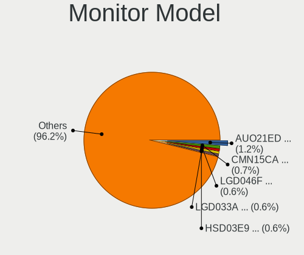

| Model                                                                    | Notebooks | Percent |
|--------------------------------------------------------------------------|-----------|---------|
| AU Optronics LCD Monitor AUO21ED 1920x1080 344x193mm 15.5-inch           | 7         | 1.93%   |
| LG Display LCD Monitor LGD0430 1366x768 345x194mm 15.6-inch              | 4         | 1.1%    |
| HannStar HSD101PFW2 HSD03E9 1024x600 222x125mm 10.0-inch                 | 4         | 1.1%    |
| Samsung Electronics LCD Monitor SEC5441 1366x768 344x194mm 15.5-inch     | 3         | 0.83%   |
| LG Display LCD Monitor LGD033A 1366x768 344x194mm 15.5-inch              | 3         | 0.83%   |
| LG Display LCD Monitor LGD02E9 1366x768 309x174mm 14.0-inch              | 3         | 0.83%   |
| InfoVision LCD Monitor IVO03F4 1920x1080 344x193mm 15.5-inch             | 3         | 0.83%   |
| Chimei Innolux LCD Monitor CMN15CA 1366x768 344x193mm 15.5-inch          | 3         | 0.83%   |
| Chimei Innolux LCD Monitor CMN15BF 1366x768 344x194mm 15.5-inch          | 3         | 0.83%   |
| Chi Mei Optoelectronics LCD Monitor CMO1018 1024x600 222x125mm 10.0-inch | 3         | 0.83%   |
| BOE LCD Monitor BOE06A4 1366x768 344x194mm 15.5-inch                     | 3         | 0.83%   |
| AU Optronics LCD Monitor AUO61D2 1024x600 220x130mm 10.1-inch            | 3         | 0.83%   |
| AU Optronics LCD Monitor AUO45EC 1366x768 344x193mm 15.5-inch            | 3         | 0.83%   |
| AU Optronics LCD Monitor AUO303C 1366x768 309x173mm 13.9-inch            | 3         | 0.83%   |
| AU Optronics LCD Monitor AUO139E 1600x900 382x214mm 17.2-inch            | 3         | 0.83%   |
| AU Optronics LCD Monitor AUO10EC 1366x768 344x193mm 15.5-inch            | 3         | 0.83%   |
| Samsung Electronics LCD Monitor SEC4542 1366x768 309x174mm 14.0-inch     | 2         | 0.55%   |
| Samsung Electronics LCD Monitor SEC3345 1280x800 331x207mm 15.4-inch     | 2         | 0.55%   |
| Samsung Electronics LCD Monitor SEC3052 1366x768 256x144mm 11.6-inch     | 2         | 0.55%   |
| Quanta Display LCD Monitor QDS0025 1024x768 304x228mm 15.0-inch          | 2         | 0.55%   |
| PANDA LCD Monitor NCP0035 1920x1080 344x194mm 15.5-inch                  | 2         | 0.55%   |
| LG Philips LCD Monitor LPL8D00 1280x800 304x190mm 14.1-inch              | 2         | 0.55%   |
| LG Philips LCD Monitor LPL3B01 1280x800 331x207mm 15.4-inch              | 2         | 0.55%   |
| LG Philips LCD Monitor LPL0140 1440x900 304x190mm 14.1-inch              | 2         | 0.55%   |
| LG Display LCD Monitor LGD046F 1920x1080 345x194mm 15.6-inch             | 2         | 0.55%   |
| LG Display LCD Monitor LGD027A 1600x900 382x215mm 17.3-inch              | 2         | 0.55%   |
| HannStar HSD121PHW1 HSD04B6 1366x768 270x150mm 12.2-inch                 | 2         | 0.55%   |
| HannStar HSD101PFW4A HSD03ED 1024x600 223x125mm 10.1-inch                | 2         | 0.55%   |
| CPT LCD Monitor CPT1415 1280x800 331x207mm 15.4-inch                     | 2         | 0.55%   |
| Chimei Innolux LCD Monitor CMN15E7 1920x1080 344x193mm 15.5-inch         | 2         | 0.55%   |
| Chimei Innolux LCD Monitor CMN15DB 1366x768 344x193mm 15.5-inch          | 2         | 0.55%   |
| Chimei Innolux LCD Monitor CMN15C6 1366x768 344x193mm 15.5-inch          | 2         | 0.55%   |
| Chimei Innolux LCD Monitor CMN153B 1920x1080 344x193mm 15.5-inch         | 2         | 0.55%   |
| Chimei Innolux LCD Monitor CMN14C3 1366x768 309x173mm 13.9-inch          | 2         | 0.55%   |
| Chimei Innolux LCD Monitor CMN14A1 1366x768 310x170mm 13.9-inch          | 2         | 0.55%   |
| Chimei Innolux LCD Monitor CMN1493 1366x768 309x173mm 13.9-inch          | 2         | 0.55%   |
| Chi Mei Optoelectronics LCD Monitor CMO1592 1366x768 344x193mm 15.5-inch | 2         | 0.55%   |
| Chi Mei Optoelectronics LCD Monitor CMO1558 1366x768 344x193mm 15.5-inch | 2         | 0.55%   |
| BOE LCD Monitor BOE0812 1920x1080 344x194mm 15.5-inch                    | 2         | 0.55%   |
| BOE LCD Monitor BOE072B 1920x1080 309x173mm 13.9-inch                    | 2         | 0.55%   |

Monitor Resolution
------------------

Monitor screen resolution

| Resolution         | Notebooks | Percent |
|--------------------|-----------|---------|
| 1366x768 (WXGA)    | 126       | 35.69%  |
| 1920x1080 (FHD)    | 113       | 32.01%  |
| 1280x800 (WXGA)    | 33        | 9.35%   |
| 1600x900 (HD+)     | 21        | 5.95%   |
| 1024x600           | 16        | 4.53%   |
| 1920x1200 (WUXGA)  | 8         | 2.27%   |
| 1440x900 (WXGA+)   | 8         | 2.27%   |
| 3840x2160 (4K)     | 7         | 1.98%   |
| 1280x1024 (SXGA)   | 3         | 0.85%   |
| 2560x1440 (QHD)    | 2         | 0.57%   |
| 1680x1050 (WSXGA+) | 2         | 0.57%   |
| 1280x768           | 2         | 0.57%   |
| 1024x768 (XGA)     | 2         | 0.57%   |
| 3840x1080          | 1         | 0.28%   |
| 2880x1800          | 1         | 0.28%   |
| 2560x1600          | 1         | 0.28%   |
| 2560x1080          | 1         | 0.28%   |
| 2256x1504          | 1         | 0.28%   |
| 1920x540           | 1         | 0.28%   |
| 1400x1050          | 1         | 0.28%   |
| 1360x768           | 1         | 0.28%   |
| 1280x720 (HD)      | 1         | 0.28%   |
| Unknown            | 1         | 0.28%   |

Monitor Diagonal
----------------

Diagonal size in inches

| Inches  | Notebooks | Percent |
|---------|-----------|---------|
| 15      | 172       | 47.91%  |
| 14      | 43        | 11.98%  |
| 13      | 40        | 11.14%  |
| 17      | 25        | 6.96%   |
| 10      | 15        | 4.18%   |
| 12      | 9         | 2.51%   |
| 24      | 7         | 1.95%   |
| Unknown | 7         | 1.95%   |
| 11      | 6         | 1.67%   |
| 27      | 5         | 1.39%   |
| 23      | 5         | 1.39%   |
| 18      | 5         | 1.39%   |
| 21      | 4         | 1.11%   |
| 72      | 3         | 0.84%   |
| 19      | 3         | 0.84%   |
| 34      | 2         | 0.56%   |
| 31      | 2         | 0.56%   |
| 8       | 2         | 0.56%   |
| 84      | 1         | 0.28%   |
| 48      | 1         | 0.28%   |
| 20      | 1         | 0.28%   |
| 16      | 1         | 0.28%   |

Monitor Width
-------------

Physical width

| Width in mm | Notebooks | Percent |
|-------------|-----------|---------|
| 301-350     | 234       | 65.73%  |
| 201-300     | 46        | 12.92%  |
| 351-400     | 32        | 8.99%   |
| 501-600     | 15        | 4.21%   |
| 401-500     | 11        | 3.09%   |
| Unknown     | 7         | 1.97%   |
| 1501-2000   | 4         | 1.12%   |
| 701-800     | 2         | 0.56%   |
| 601-700     | 2         | 0.56%   |
| 101-200     | 2         | 0.56%   |
| 1001-1500   | 1         | 0.28%   |

Aspect Ratio
------------

Proportional relationship between the width and the height

| Ratio   | Notebooks | Percent |
|---------|-----------|---------|
| 16/9    | 270       | 80.12%  |
| 16/10   | 52        | 15.43%  |
| 5/4     | 4         | 1.19%   |
| Unknown | 4         | 1.19%   |
| 4/3     | 3         | 0.89%   |
| 3/2     | 2         | 0.59%   |
| 32/9    | 1         | 0.3%    |
| 21/9    | 1         | 0.3%    |

Monitor Area
------------

Area in inch

| Area in inch | Notebooks | Percent |
|----------------|-----------|---------|
| 101-110        | 171       | 47.5%   |
| 81-90          | 70        | 19.44%  |
| 121-130        | 18        | 5%      |
| 41-50          | 15        | 4.17%   |
| 71-80          | 12        | 3.33%   |
| 201-250        | 12        | 3.33%   |
| 61-70          | 9         | 2.5%    |
| Unknown        | 7         | 1.94%   |
| 51-60          | 6         | 1.67%   |
| 141-150        | 6         | 1.67%   |
| 131-140        | 6         | 1.67%   |
| More than 1000 | 5         | 1.39%   |
| 301-350        | 5         | 1.39%   |
| 151-200        | 5         | 1.39%   |
| 91-100         | 4         | 1.11%   |
| 351-500        | 3         | 0.83%   |
| 251-300        | 3         | 0.83%   |
| 1-40           | 2         | 0.56%   |
| 501-1000       | 1         | 0.28%   |

Pixel Density
-------------

Pixels per inch

| Density       | Notebooks | Percent |
|---------------|-----------|---------|
| 101-120       | 154       | 43.5%   |
| 121-160       | 111       | 31.36%  |
| 51-100        | 63        | 17.8%   |
| 161-240       | 11        | 3.11%   |
| Unknown       | 7         | 1.98%   |
| 1-50          | 5         | 1.41%   |
| More than 240 | 3         | 0.85%   |

Multiple Monitors
-----------------

Total monitors connected

| Total | Notebooks | Percent |
|-------|-----------|---------|
| 1     | 317       | 84.99%  |
| 2     | 34        | 9.12%   |
| 0     | 21        | 5.63%   |
| 3     | 1         | 0.27%   |

Network
-------

Net Controller Vendor
---------------------

Controller vendors

| Vendor                                | Notebooks | Percent |
|---------------------------------------|-----------|---------|
| Realtek Semiconductor                 | 204       | 32.9%   |
| Intel                                 | 143       | 23.06%  |
| Qualcomm Atheros                      | 116       | 18.71%  |
| Broadcom                              | 60        | 9.68%   |
| Marvell Technology Group              | 14        | 2.26%   |
| Broadcom Limited                      | 13        | 2.1%    |
| Ralink                                | 7         | 1.13%   |
| Nvidia                                | 6         | 0.97%   |
| Silicon Integrated Systems [SiS]      | 5         | 0.81%   |
| Samsung Electronics                   | 5         | 0.81%   |
| Xiaomi                                | 3         | 0.48%   |
| TP-Link                               | 3         | 0.48%   |
| Ralink Technology                     | 3         | 0.48%   |
| MediaTek                              | 3         | 0.48%   |
| JMicron Technology                    | 3         | 0.48%   |
| Ericsson Business Mobile Networks     | 3         | 0.48%   |
| Lenovo                                | 2         | 0.32%   |
| Huawei Technologies                   | 2         | 0.32%   |
| Hewlett-Packard                       | 2         | 0.32%   |
| Dell                                  | 2         | 0.32%   |
| Attansic Technology                   | 2         | 0.32%   |
| AMD                                   | 2         | 0.32%   |
| ZTE WCDMA Technologies MSM            | 1         | 0.16%   |
| VIA Technologies                      | 1         | 0.16%   |
| ST-Ericsson                           | 1         | 0.16%   |
| Sierra Wireless                       | 1         | 0.16%   |
| OnePlus Technology (Shenzhen)         | 1         | 0.16%   |
| NetGear                               | 1         | 0.16%   |
| Manta                                 | 1         | 0.16%   |
| Linksys                               | 1         | 0.16%   |
| Intersil                              | 1         | 0.16%   |
| Google                                | 1         | 0.16%   |
| Gemtek                                | 1         | 0.16%   |
| Edimax Technology                     | 1         | 0.16%   |
| DisplayLink                           | 1         | 0.16%   |
| Davicom Semiconductor                 | 1         | 0.16%   |
| Cisco Aironet Wireless Communications | 1         | 0.16%   |
| ASUSTek Computer                      | 1         | 0.16%   |
| Askey Computer                        | 1         | 0.16%   |

Net Controller Model
--------------------

Controller models

| Model                                                                   | Notebooks | Percent |
|-------------------------------------------------------------------------|-----------|---------|
| Realtek RTL8111/8168/8411 PCI Express Gigabit Ethernet Controller       | 108       | 14.46%  |
| Realtek RTL810xE PCI Express Fast Ethernet controller                   | 54        | 7.23%   |
| Qualcomm Atheros AR9285 Wireless Network Adapter (PCI-Express)          | 23        | 3.08%   |
| Realtek RTL8821CE 802.11ac PCIe Wireless Network Adapter                | 21        | 2.81%   |
| Broadcom BCM4313 802.11bgn Wireless Network Adapter                     | 18        | 2.41%   |
| Qualcomm Atheros AR9485 Wireless Network Adapter                        | 16        | 2.14%   |
| Qualcomm Atheros QCA9565 / AR9565 Wireless Network Adapter              | 15        | 2.01%   |
| Qualcomm Atheros QCA9377 802.11ac Wireless Network Adapter              | 14        | 1.87%   |
| Intel PRO/Wireless 3945ABG [Golan] Network Connection                   | 13        | 1.74%   |
| Qualcomm Atheros AR242x / AR542x Wireless Network Adapter (PCI-Express) | 12        | 1.61%   |
| Intel WiFi Link 5100                                                    | 10        | 1.34%   |
| Realtek RTL-8100/8101L/8139 PCI Fast Ethernet Adapter                   | 9         | 1.2%    |
| Intel Wireless 8265 / 8275                                              | 9         | 1.2%    |
| Intel Wireless 7260                                                     | 9         | 1.2%    |
| Intel 82579LM Gigabit Network Connection (Lewisville)                   | 9         | 1.2%    |
| Realtek RTL8188CE 802.11b/g/n WiFi Adapter                              | 8         | 1.07%   |
| Qualcomm Atheros AR9462 Wireless Network Adapter                        | 6         | 0.8%    |
| Qualcomm Atheros AR8132 Fast Ethernet                                   | 6         | 0.8%    |
| Intel Wireless 8260                                                     | 6         | 0.8%    |
| Intel Wireless 3165                                                     | 6         | 0.8%    |
| Intel Centrino Ultimate-N 6300                                          | 6         | 0.8%    |
| Intel 82577LM Gigabit Network Connection                                | 6         | 0.8%    |
| Intel 82567LM Gigabit Network Connection                                | 6         | 0.8%    |
| Realtek RTL8822CE 802.11ac PCIe Wireless Network Adapter                | 5         | 0.67%   |
| Marvell Group 88E8071 PCI-E Gigabit Ethernet Controller                 | 5         | 0.67%   |
| Intel Wireless 3160                                                     | 5         | 0.67%   |
| Intel Wi-Fi 6 AX201                                                     | 5         | 0.67%   |
| Intel Wi-Fi 6 AX200                                                     | 5         | 0.67%   |
| Intel PRO/Wireless 4965 AG or AGN [Kedron] Network Connection           | 5         | 0.67%   |
| Intel Comet Lake PCH-LP CNVi WiFi                                       | 5         | 0.67%   |
| Broadcom NetXtreme BCM57786 Gigabit Ethernet PCIe                       | 5         | 0.67%   |
| Broadcom BCM43142 802.11b/g/n                                           | 5         | 0.67%   |
| Samsung Galaxy series, misc. (tethering mode)                           | 4         | 0.54%   |
| Realtek RTL8822BE 802.11a/b/g/n/ac WiFi adapter                         | 4         | 0.54%   |
| Realtek RTL8723DE Wireless Network Adapter                              | 4         | 0.54%   |
| Realtek RTL8723BE PCIe Wireless Network Adapter                         | 4         | 0.54%   |
| Realtek RTL8191SEvB Wireless LAN Controller                             | 4         | 0.54%   |
| Realtek RTL8188EUS 802.11n Wireless Network Adapter                     | 4         | 0.54%   |
| Realtek RTL8188EE Wireless Network Adapter                              | 4         | 0.54%   |
| Qualcomm Atheros AR928X Wireless Network Adapter (PCI-Express)          | 4         | 0.54%   |

Wireless Vendor
---------------

Wireless vendors

| Vendor                                | Notebooks | Percent |
|---------------------------------------|-----------|---------|
| Intel                                 | 127       | 33.25%  |
| Qualcomm Atheros                      | 100       | 26.18%  |
| Realtek Semiconductor                 | 78        | 20.42%  |
| Broadcom                              | 44        | 11.52%  |
| Broadcom Limited                      | 8         | 2.09%   |
| Ralink                                | 7         | 1.83%   |
| TP-Link                               | 3         | 0.79%   |
| Ralink Technology                     | 3         | 0.79%   |
| MediaTek                              | 2         | 0.52%   |
| Hewlett-Packard                       | 2         | 0.52%   |
| Xiaomi                                | 1         | 0.26%   |
| Sierra Wireless                       | 1         | 0.26%   |
| NetGear                               | 1         | 0.26%   |
| Linksys                               | 1         | 0.26%   |
| Edimax Technology                     | 1         | 0.26%   |
| Cisco Aironet Wireless Communications | 1         | 0.26%   |
| ASUSTek Computer                      | 1         | 0.26%   |
| Askey Computer                        | 1         | 0.26%   |

Wireless Model
--------------

Wireless models

| Model                                                                   | Notebooks | Percent |
|-------------------------------------------------------------------------|-----------|---------|
| Qualcomm Atheros AR9285 Wireless Network Adapter (PCI-Express)          | 23        | 5.91%   |
| Realtek RTL8821CE 802.11ac PCIe Wireless Network Adapter                | 21        | 5.4%    |
| Broadcom BCM4313 802.11bgn Wireless Network Adapter                     | 18        | 4.63%   |
| Qualcomm Atheros AR9485 Wireless Network Adapter                        | 16        | 4.11%   |
| Qualcomm Atheros QCA9565 / AR9565 Wireless Network Adapter              | 15        | 3.86%   |
| Qualcomm Atheros QCA9377 802.11ac Wireless Network Adapter              | 14        | 3.6%    |
| Intel PRO/Wireless 3945ABG [Golan] Network Connection                   | 13        | 3.34%   |
| Qualcomm Atheros AR242x / AR542x Wireless Network Adapter (PCI-Express) | 12        | 3.08%   |
| Intel WiFi Link 5100                                                    | 10        | 2.57%   |
| Intel Wireless 8265 / 8275                                              | 9         | 2.31%   |
| Intel Wireless 7260                                                     | 9         | 2.31%   |
| Realtek RTL8188CE 802.11b/g/n WiFi Adapter                              | 8         | 2.06%   |
| Qualcomm Atheros AR9462 Wireless Network Adapter                        | 6         | 1.54%   |
| Intel Wireless 8260                                                     | 6         | 1.54%   |
| Intel Wireless 3165                                                     | 6         | 1.54%   |
| Intel Centrino Ultimate-N 6300                                          | 6         | 1.54%   |
| Realtek RTL8822CE 802.11ac PCIe Wireless Network Adapter                | 5         | 1.29%   |
| Intel Wireless 3160                                                     | 5         | 1.29%   |
| Intel Wi-Fi 6 AX201                                                     | 5         | 1.29%   |
| Intel Wi-Fi 6 AX200                                                     | 5         | 1.29%   |
| Intel PRO/Wireless 4965 AG or AGN [Kedron] Network Connection           | 5         | 1.29%   |
| Intel Comet Lake PCH-LP CNVi WiFi                                       | 5         | 1.29%   |
| Broadcom BCM43142 802.11b/g/n                                           | 5         | 1.29%   |
| Realtek RTL8822BE 802.11a/b/g/n/ac WiFi adapter                         | 4         | 1.03%   |
| Realtek RTL8723DE Wireless Network Adapter                              | 4         | 1.03%   |
| Realtek RTL8723BE PCIe Wireless Network Adapter                         | 4         | 1.03%   |
| Realtek RTL8191SEvB Wireless LAN Controller                             | 4         | 1.03%   |
| Realtek RTL8188EUS 802.11n Wireless Network Adapter                     | 4         | 1.03%   |
| Realtek RTL8188EE Wireless Network Adapter                              | 4         | 1.03%   |
| Qualcomm Atheros AR928X Wireless Network Adapter (PCI-Express)          | 4         | 1.03%   |
| Intel Ultimate N WiFi Link 5300                                         | 4         | 1.03%   |
| Intel Cannon Point-LP CNVi [Wireless-AC]                                | 4         | 1.03%   |
| Broadcom BCM4311 802.11b/g WLAN                                         | 4         | 1.03%   |
| Realtek RTL8852AE 802.11ax PCIe Wireless Network Adapter                | 3         | 0.77%   |
| Ralink RT3090 Wireless 802.11n 1T/1R PCIe                               | 3         | 0.77%   |
| Qualcomm Atheros AR9287 Wireless Network Adapter (PCI-Express)          | 3         | 0.77%   |
| Intel Wireless 7265                                                     | 3         | 0.77%   |
| Intel Centrino Wireless-N 1030 [Rainbow Peak]                           | 3         | 0.77%   |
| Intel Centrino Advanced-N 6205 [Taylor Peak]                            | 3         | 0.77%   |
| Broadcom Limited BCM4360 802.11ac Wireless Network Adapter              | 3         | 0.77%   |

Ethernet Vendor
---------------

Ethernet vendors

| Vendor                           | Notebooks | Percent |
|----------------------------------|-----------|---------|
| Realtek Semiconductor            | 176       | 51.92%  |
| Intel                            | 57        | 16.81%  |
| Qualcomm Atheros                 | 32        | 9.44%   |
| Broadcom                         | 21        | 6.19%   |
| Marvell Technology Group         | 14        | 4.13%   |
| Nvidia                           | 6         | 1.77%   |
| Silicon Integrated Systems [SiS] | 5         | 1.47%   |
| Samsung Electronics              | 5         | 1.47%   |
| Broadcom Limited                 | 5         | 1.47%   |
| JMicron Technology               | 3         | 0.88%   |
| Xiaomi                           | 2         | 0.59%   |
| Lenovo                           | 2         | 0.59%   |
| Attansic Technology              | 2         | 0.59%   |
| ZTE WCDMA Technologies MSM       | 1         | 0.29%   |
| VIA Technologies                 | 1         | 0.29%   |
| OnePlus Technology (Shenzhen)    | 1         | 0.29%   |
| MediaTek                         | 1         | 0.29%   |
| Huawei Technologies              | 1         | 0.29%   |
| Google                           | 1         | 0.29%   |
| Gemtek                           | 1         | 0.29%   |
| DisplayLink                      | 1         | 0.29%   |
| Davicom Semiconductor            | 1         | 0.29%   |

Ethernet Model
--------------

Ethernet models

| Model                                                                          | Notebooks | Percent |
|--------------------------------------------------------------------------------|-----------|---------|
| Realtek RTL8111/8168/8411 PCI Express Gigabit Ethernet Controller              | 108       | 31.86%  |
| Realtek RTL810xE PCI Express Fast Ethernet controller                          | 54        | 15.93%  |
| Realtek RTL-8100/8101L/8139 PCI Fast Ethernet Adapter                          | 9         | 2.65%   |
| Intel 82579LM Gigabit Network Connection (Lewisville)                          | 9         | 2.65%   |
| Qualcomm Atheros AR8132 Fast Ethernet                                          | 6         | 1.77%   |
| Intel 82577LM Gigabit Network Connection                                       | 6         | 1.77%   |
| Intel 82567LM Gigabit Network Connection                                       | 6         | 1.77%   |
| Marvell Group 88E8071 PCI-E Gigabit Ethernet Controller                        | 5         | 1.47%   |
| Broadcom NetXtreme BCM57786 Gigabit Ethernet PCIe                              | 5         | 1.47%   |
| Samsung Galaxy series, misc. (tethering mode)                                  | 4         | 1.18%   |
| Qualcomm Atheros AR8162 Fast Ethernet                                          | 4         | 1.18%   |
| Intel Ethernet Connection I217-LM                                              | 4         | 1.18%   |
| Intel 82573L Gigabit Ethernet Controller                                       | 4         | 1.18%   |
| Silicon Integrated Systems [SiS] 191 Gigabit Ethernet Adapter                  | 3         | 0.88%   |
| Realtek RTL8153 Gigabit Ethernet Adapter                                       | 3         | 0.88%   |
| Qualcomm Atheros AR8152 v2.0 Fast Ethernet                                     | 3         | 0.88%   |
| Qualcomm Atheros AR8151 v2.0 Gigabit Ethernet                                  | 3         | 0.88%   |
| Qualcomm Atheros AR8151 v1.0 Gigabit Ethernet                                  | 3         | 0.88%   |
| Qualcomm Atheros AR8131 Gigabit Ethernet                                       | 3         | 0.88%   |
| Qualcomm Atheros AR8121/AR8113/AR8114 Gigabit or Fast Ethernet                 | 3         | 0.88%   |
| Nvidia MCP79 Ethernet                                                          | 3         | 0.88%   |
| JMicron JMC250 PCI Express Gigabit Ethernet Controller                         | 3         | 0.88%   |
| Intel 82566MM Gigabit Network Connection                                       | 3         | 0.88%   |
| Broadcom NetLink BCM57785 Gigabit Ethernet PCIe                                | 3         | 0.88%   |
| Broadcom Limited NetLink BCM5787M Gigabit Ethernet PCI Express                 | 3         | 0.88%   |
| Xiaomi Mi/Redmi series (RNDIS)                                                 | 2         | 0.59%   |
| Silicon Integrated Systems [SiS] SiS900 PCI Fast Ethernet                      | 2         | 0.59%   |
| Qualcomm Atheros QCA8172 Fast Ethernet                                         | 2         | 0.59%   |
| Qualcomm Atheros Killer E220x Gigabit Ethernet Controller                      | 2         | 0.59%   |
| Nvidia MCP67 Ethernet                                                          | 2         | 0.59%   |
| Marvell Group Yukon Optima 88E8059 [PCIe Gigabit Ethernet Controller with AVB] | 2         | 0.59%   |
| Marvell Group 88E8036 PCI-E Fast Ethernet Controller                           | 2         | 0.59%   |
| Lenovo ThinkPad Lan                                                            | 2         | 0.59%   |
| Intel PRO/100 VE Network Connection                                            | 2         | 0.59%   |
| Intel Ethernet Connection I219-V                                               | 2         | 0.59%   |
| Intel Ethernet Connection I219-LM                                              | 2         | 0.59%   |
| Intel Ethernet Connection I218-LM                                              | 2         | 0.59%   |
| Intel Ethernet Connection (6) I219-V                                           | 2         | 0.59%   |
| Intel Ethernet Connection (4) I219-V                                           | 2         | 0.59%   |
| Intel Ethernet Connection (3) I218-LM                                          | 2         | 0.59%   |

Net Controller Kind
-------------------

Ethernet, WiFi or modem

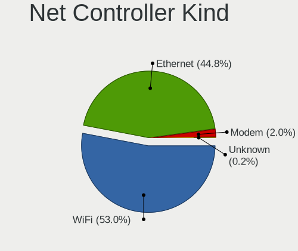

| Kind     | Notebooks | Percent |
|----------|-----------|---------|
| WiFi     | 362       | 51.35%  |
| Ethernet | 324       | 45.96%  |
| Modem    | 16        | 2.27%   |
| Unknown  | 3         | 0.43%   |

Used Controller
---------------

Currently used network controller

| Kind     | Notebooks | Percent |
|----------|-----------|---------|
| WiFi     | 285       | 76%     |
| Ethernet | 90        | 24%     |

NICs
----

Total network controllers on board

| Total | Notebooks | Percent |
|-------|-----------|---------|
| 2     | 304       | 82.61%  |
| 1     | 55        | 14.95%  |
| 0     | 6         | 1.63%   |
| 3     | 2         | 0.54%   |
| 4     | 1         | 0.27%   |

IPv6
----

IPv6 vs IPv4

| Used | Notebooks | Percent |
|------|-----------|---------|
| No   | 298       | 80.32%  |
| Yes  | 73        | 19.68%  |

Bluetooth
---------

Bluetooth Vendor
----------------

Controller vendors

| Vendor                          | Notebooks | Percent |
|---------------------------------|-----------|---------|
| Intel                           | 72        | 30.9%   |
| Realtek Semiconductor           | 40        | 17.17%  |
| Qualcomm Atheros Communications | 22        | 9.44%   |
| Broadcom                        | 18        | 7.73%   |
| Foxconn / Hon Hai               | 17        | 7.3%    |
| Hewlett-Packard                 | 13        | 5.58%   |
| Lite-On Technology              | 11        | 4.72%   |
| Dell                            | 8         | 3.43%   |
| IMC Networks                    | 7         | 3%      |
| Apple                           | 6         | 2.58%   |
| Cambridge Silicon Radio         | 4         | 1.72%   |
| Foxconn International           | 3         | 1.29%   |
| ASUSTek Computer                | 3         | 1.29%   |
| Toshiba                         | 2         | 0.86%   |
| Taiyo Yuden                     | 1         | 0.43%   |
| Realtek                         | 1         | 0.43%   |
| Ralink Technology               | 1         | 0.43%   |
| Ralink                          | 1         | 0.43%   |
| Qcom                            | 1         | 0.43%   |
| Askey Computer                  | 1         | 0.43%   |
| Alps Electric                   | 1         | 0.43%   |

Bluetooth Model
---------------

Controller models

| Model                                                                               | Notebooks | Percent |
|-------------------------------------------------------------------------------------|-----------|---------|
| Intel Bluetooth wireless interface                                                  | 36        | 15.45%  |
| Realtek Bluetooth Radio                                                             | 25        | 10.73%  |
| Realtek  Bluetooth 4.2 Adapter                                                      | 13        | 5.58%   |
| Intel Bluetooth 9460/9560 Jefferson Peak (JfP)                                      | 11        | 4.72%   |
| Qualcomm Atheros  Bluetooth Device                                                  | 10        | 4.29%   |
| Intel AX201 Bluetooth                                                               | 10        | 4.29%   |
| HP Bluetooth 2.0 Interface [Broadcom BCM2045]                                       | 7         | 3%      |
| Qualcomm Atheros AR3012 Bluetooth 4.0                                               | 6         | 2.58%   |
| Lite-On Qualcomm Atheros QCA9377 Bluetooth                                          | 5         | 2.15%   |
| Intel Centrino Advanced-N 6230 Bluetooth adapter                                    | 5         | 2.15%   |
| Intel AX200 Bluetooth                                                               | 5         | 2.15%   |
| HP Broadcom 2070 Bluetooth Combo                                                    | 5         | 2.15%   |
| Foxconn / Hon Hai Bluetooth Device                                                  | 4         | 1.72%   |
| Dell DW375 Bluetooth Module                                                         | 4         | 1.72%   |
| Cambridge Silicon Radio Bluetooth Dongle (HCI mode)                                 | 4         | 1.72%   |
| Broadcom BCM2070 Bluetooth 2.1 + EDR                                                | 4         | 1.72%   |
| Apple Bluetooth Host Controller                                                     | 4         | 1.72%   |
| Lite-On Atheros AR3012 Bluetooth                                                    | 3         | 1.29%   |
| IMC Networks Bluetooth Device                                                       | 3         | 1.29%   |
| Foxconn International BCM43142A0 Bluetooth module                                   | 3         | 1.29%   |
| Foxconn / Hon Hai Foxconn T77H114 BCM2070 [Single-Chip Bluetooth 2.1 + EDR Adapter] | 3         | 1.29%   |
| Foxconn / Hon Hai Acer Module                                                       | 3         | 1.29%   |
| Broadcom BCM2045B (BDC-2.1)                                                         | 3         | 1.29%   |
| Qualcomm Atheros QCA61x4 Bluetooth 4.0                                              | 2         | 0.86%   |
| Qualcomm Atheros AR9462 Bluetooth                                                   | 2         | 0.86%   |
| Lite-On Atheros Bluetooth                                                           | 2         | 0.86%   |
| Intel Wireless-AC 3168 Bluetooth                                                    | 2         | 0.86%   |
| Intel Centrino Bluetooth Wireless Transceiver                                       | 2         | 0.86%   |
| IMC Networks Bluetooth Radio                                                        | 2         | 0.86%   |
| Foxconn / Hon Hai Wireless_Device                                                   | 2         | 0.86%   |
| Foxconn / Hon Hai Bluetooth USB Host Controller                                     | 2         | 0.86%   |
| Dell Wireless 370 Bluetooth Mini-card                                               | 2         | 0.86%   |
| Broadcom HP Portable SoftSailing                                                    | 2         | 0.86%   |
| Broadcom Bluetooth                                                                  | 2         | 0.86%   |
| Broadcom BCM20702A0 Bluetooth 4.0                                                   | 2         | 0.86%   |
| Broadcom BCM2070 Bluetooth Device                                                   | 2         | 0.86%   |
| Broadcom BCM2045B (BDC-2) [Bluetooth Controller]                                    | 2         | 0.86%   |
| Apple Bluetooth USB Host Controller                                                 | 2         | 0.86%   |
| Toshiba Integrated Bluetooth HCI                                                    | 1         | 0.43%   |
| Toshiba Bluetooth Device                                                            | 1         | 0.43%   |

Sound
-----

Sound Vendor
------------

Sound card vendors

| Vendor                           | Notebooks | Percent |
|----------------------------------|-----------|---------|
| Intel                            | 286       | 66.51%  |
| AMD                              | 83        | 19.3%   |
| Nvidia                           | 43        | 10%     |
| Silicon Integrated Systems [SiS] | 6         | 1.4%    |
| Texas Instruments                | 2         | 0.47%   |
| C-Media Electronics              | 2         | 0.47%   |
| Yamaha                           | 1         | 0.23%   |
| VIA Technologies                 | 1         | 0.23%   |
| Tenx Technology                  | 1         | 0.23%   |
| Realtek Semiconductor            | 1         | 0.23%   |
| GN Netcom                        | 1         | 0.23%   |
| Generalplus Technology           | 1         | 0.23%   |
| Dell                             | 1         | 0.23%   |
| Audioengine                      | 1         | 0.23%   |

Sound Model
-----------

Sound card models

| Model                                                                                             | Notebooks | Percent |
|---------------------------------------------------------------------------------------------------|-----------|---------|
| Intel NM10/ICH7 Family High Definition Audio Controller                                           | 38        | 7.36%   |
| Intel Sunrise Point-LP HD Audio                                                                   | 32        | 6.2%    |
| Intel 7 Series/C216 Chipset Family High Definition Audio Controller                               | 32        | 6.2%    |
| Intel 82801I (ICH9 Family) HD Audio Controller                                                    | 28        | 5.43%   |
| AMD Family 17h/19h HD Audio Controller                                                            | 27        | 5.23%   |
| Intel 5 Series/3400 Series Chipset High Definition Audio                                          | 22        | 4.26%   |
| Intel 6 Series/C200 Series Chipset Family High Definition Audio Controller                        | 17        | 3.29%   |
| Intel Haswell-ULT HD Audio Controller                                                             | 16        | 3.1%    |
| Intel 8 Series HD Audio Controller                                                                | 16        | 3.1%    |
| AMD Raven/Raven2/Fenghuang HDMI/DP Audio Controller                                               | 14        | 2.71%   |
| AMD SBx00 Azalia (Intel HDA)                                                                      | 13        | 2.52%   |
| Intel Tiger Lake-LP Smart Sound Technology Audio Controller                                       | 12        | 2.33%   |
| AMD Family 15h (Models 60h-6fh) Audio Controller                                                  | 12        | 2.33%   |
| Intel 82801H (ICH8 Family) HD Audio Controller                                                    | 11        | 2.13%   |
| AMD High Definition Audio Controller                                                              | 11        | 2.13%   |
| Nvidia GF108 High Definition Audio Controller                                                     | 10        | 1.94%   |
| AMD Renoir Radeon High Definition Audio Controller                                                | 10        | 1.94%   |
| AMD FCH Azalia Controller                                                                         | 10        | 1.94%   |
| Intel 8 Series/C220 Series Chipset High Definition Audio Controller                               | 9         | 1.74%   |
| Intel Xeon E3-1200 v3/4th Gen Core Processor HD Audio Controller                                  | 8         | 1.55%   |
| Intel Cannon Point-LP High Definition Audio Controller                                            | 8         | 1.55%   |
| Intel Atom Processor Z36xxx/Z37xxx Series High Definition Audio Controller                        | 8         | 1.55%   |
| AMD Kabini HDMI/DP Audio                                                                          | 7         | 1.36%   |
| Intel Wildcat Point-LP High Definition Audio Controller                                           | 6         | 1.16%   |
| Intel Celeron/Pentium Silver Processor High Definition Audio                                      | 6         | 1.16%   |
| Intel Broadwell-U Audio Controller                                                                | 6         | 1.16%   |
| AMD Redwood HDMI Audio [Radeon HD 5000 Series]                                                    | 6         | 1.16%   |
| Intel Comet Lake PCH-LP cAVS                                                                      | 5         | 0.97%   |
| Intel Cannon Lake PCH cAVS                                                                        | 5         | 0.97%   |
| Intel Atom/Celeron/Pentium Processor x5-E8000/J3xxx/N3xxx Series High Definition Audio Controller | 5         | 0.97%   |
| Silicon Integrated Systems [SiS] Azalia Audio Controller                                          | 4         | 0.78%   |
| Nvidia TU107 GeForce GTX 1650 High Definition Audio Controller                                    | 4         | 0.78%   |
| Nvidia MCP79 High Definition Audio                                                                | 4         | 0.78%   |
| Intel US15W/US15X/US15L/UL11L SCH [Poulsbo] HD Audio Controller                                   | 4         | 0.78%   |
| AMD RV710/730 HDMI Audio [Radeon HD 4000 series]                                                  | 4         | 0.78%   |
| AMD RS880 HDMI Audio [Radeon HD 4200 Series]                                                      | 4         | 0.78%   |
| Nvidia GT216 HDMI Audio Controller                                                                | 3         | 0.58%   |
| Nvidia GM107 High Definition Audio Controller [GeForce 940MX]                                     | 3         | 0.58%   |
| Nvidia GK106 HDMI Audio Controller                                                                | 3         | 0.58%   |
| Nvidia GA106 High Definition Audio Controller                                                     | 3         | 0.58%   |

Memory
------

Memory Vendor
-------------

Memory module vendors

| Vendor                       | Notebooks | Percent |
|------------------------------|-----------|---------|
| SK hynix                     | 28        | 25.69%  |
| Samsung Electronics          | 28        | 25.69%  |
| Unknown                      | 15        | 13.76%  |
| Kingston                     | 11        | 10.09%  |
| Nanya Technology             | 4         | 3.67%   |
| Micron Technology            | 4         | 3.67%   |
| Ramaxel Technology           | 3         | 2.75%   |
| A-DATA Technology            | 3         | 2.75%   |
| Unknown (ABCD)               | 2         | 1.83%   |
| Smart                        | 2         | 1.83%   |
| G.Skill                      | 2         | 1.83%   |
| Crucial                      | 2         | 1.83%   |
| Transcend                    | 1         | 0.92%   |
| Patriot Memory (PDP Systems) | 1         | 0.92%   |
| Patriot                      | 1         | 0.92%   |
| Corsair                      | 1         | 0.92%   |
| Unknown                      | 1         | 0.92%   |

Memory Model
------------

Memory module models

| Model                                                            | Notebooks | Percent |
|------------------------------------------------------------------|-----------|---------|
| Samsung RAM M471A5244CB0-CTD 4GB SODIMM DDR4 3266MT/s            | 3         | 2.59%   |
| Unknown RAM Module 8GB SODIMM DDR4 2400MT/s                      | 2         | 1.72%   |
| Unknown (ABCD) RAM 123456789012345678 2GB SODIMM LPDDR4 2400MT/s | 2         | 1.72%   |
| SK hynix RAM HYMP125S64CP8-Y5 2GB SODIMM DDR2 667MT/s            | 2         | 1.72%   |
| SK hynix RAM HMAA1GS6CJR6N-XN 8GB SODIMM DDR4 3200MT/s           | 2         | 1.72%   |
| Samsung RAM M471B1G73DB0-YK0 8GB SODIMM DDR3 1600MT/s            | 2         | 1.72%   |
| Samsung RAM M471A5244CB0-CRC 4GB SODIMM DDR4 2667MT/s            | 2         | 1.72%   |
| Samsung RAM M471A1K43EB1-CWE 8GB SODIMM DDR4 3200MT/s            | 2         | 1.72%   |
| Samsung RAM M471A1K43DB1-CTD 8GB SODIMM DDR4 2667MT/s            | 2         | 1.72%   |
| Samsung RAM M471A1K43CB1-CTD 8GB SODIMM DDR4 2667MT/s            | 2         | 1.72%   |
| Samsung RAM M471A1K43CB1-CRC 8GB SODIMM DDR4 2667MT/s            | 2         | 1.72%   |
| Unknown RAM Module SODIMM DDR                                    | 1         | 0.86%   |
| Unknown RAM Module 8GB SODIMM DDR4 2667MT/s                      | 1         | 0.86%   |
| Unknown RAM Module 8GB SODIMM DDR3                               | 1         | 0.86%   |
| Unknown RAM Module 8192MB SODIMM DDR3 1600MT/s                   | 1         | 0.86%   |
| Unknown RAM Module 512MB SODIMM DDR                              | 1         | 0.86%   |
| Unknown RAM Module 4GB SODIMM DDR4 2667MT/s                      | 1         | 0.86%   |
| Unknown RAM Module 4096MB SODIMM DDR3                            | 1         | 0.86%   |
| Unknown RAM Module 2GB SODIMM SDRAM                              | 1         | 0.86%   |
| Unknown RAM Module 2GB SODIMM DDR3                               | 1         | 0.86%   |
| Unknown RAM Module 2GB SODIMM DDR2 667MT/s                       | 1         | 0.86%   |
| Unknown RAM Module 2GB Row Of Chips LPDDR4 4267MT/s              | 1         | 0.86%   |
| Unknown RAM Module 2048MB SODIMM DDR3                            | 1         | 0.86%   |
| Unknown RAM Module 1GB SODIMM DDR                                | 1         | 0.86%   |
| Unknown RAM Module 1024MB SODIMM DDR3                            | 1         | 0.86%   |
| Unknown RAM Module 1024MB SODIMM DDR2 533MT/s                    | 1         | 0.86%   |
| Transcend RAM JM800QSU-2G 2GB SODIMM DDR2 975MT/s                | 1         | 0.86%   |
| Smart RAM SH564128FJ8NWRNSQR 4GB SODIMM DDR3 1600MT/s            | 1         | 0.86%   |
| Smart RAM SH564128FJ8NWRNSQG 4GB SODIMM DDR3 1600MT/s            | 1         | 0.86%   |
| SK hynix RAM Module 8192MB SODIMM DDR4 2133MT/s                  | 1         | 0.86%   |
| SK hynix RAM Module 512MB SODIMM DDR 533MT/s                     | 1         | 0.86%   |
| SK hynix RAM Module 32GB SODIMM DDR4 3200MT/s                    | 1         | 0.86%   |
| SK hynix RAM Module 2GB SODIMM DDR3 1600MT/s                     | 1         | 0.86%   |
| SK hynix RAM Module 16GB SODIMM DDR4 2667MT/s                    | 1         | 0.86%   |
| SK hynix RAM HYMP125S64CP8-S6 2048MB SODIMM DDR 800MT/s          | 1         | 0.86%   |
| SK hynix RAM HMT451S6MFR8A-PB 4GB SODIMM DDR3 1600MT/s           | 1         | 0.86%   |
| SK hynix RAM HMT451S6BFR8A-PB 4GB SODIMM DDR3 1600MT/s           | 1         | 0.86%   |
| SK hynix RAM HMT425S6AFR6A-H9 2GB SODIMM DDR3 1333MT/s           | 1         | 0.86%   |
| SK hynix RAM HMT41GS6BFR8A-PB 8GB SODIMM DDR3 1600MT/s           | 1         | 0.86%   |
| SK hynix RAM HMT41GS6AFR8A-PB 8GB SODIMM DDR3 1600MT/s           | 1         | 0.86%   |

Memory Kind
-----------

Memory module kinds

| Kind   | Notebooks | Percent |
|--------|-----------|---------|
| DDR4   | 44        | 45.36%  |
| DDR3   | 34        | 35.05%  |
| DDR2   | 8         | 8.25%   |
| SDRAM  | 5         | 5.15%   |
| LPDDR4 | 3         | 3.09%   |
| DDR    | 3         | 3.09%   |

Memory Form Factor
------------------

Physical design of the memory module

| Name         | Notebooks | Percent |
|--------------|-----------|---------|
| SODIMM       | 94        | 97.92%  |
| Row Of Chips | 2         | 2.08%   |

Memory Size
-----------

Memory module size

| Size    | Notebooks | Percent |
|---------|-----------|---------|
| 8192    | 40        | 37.38%  |
| 4096    | 28        | 26.17%  |
| 2048    | 21        | 19.63%  |
| 16384   | 6         | 5.61%   |
| 1024    | 6         | 5.61%   |
| 32768   | 3         | 2.8%    |
| 512     | 2         | 1.87%   |
| Unknown | 1         | 0.93%   |

Memory Speed
------------

Memory module speed

| Speed   | Notebooks | Percent |
|---------|-----------|---------|
| 1600    | 22        | 21.36%  |
| 2667    | 21        | 20.39%  |
| 3200    | 17        | 16.5%   |
| 2400    | 9         | 8.74%   |
| Unknown | 7         | 6.8%    |
| 1333    | 5         | 4.85%   |
| 3266    | 3         | 2.91%   |
| 800     | 3         | 2.91%   |
| 667     | 3         | 2.91%   |
| 2048    | 2         | 1.94%   |
| 975     | 2         | 1.94%   |
| 533     | 2         | 1.94%   |
| 4267    | 1         | 0.97%   |
| 4199    | 1         | 0.97%   |
| 2267    | 1         | 0.97%   |
| 2133    | 1         | 0.97%   |
| 1334    | 1         | 0.97%   |
| 1200    | 1         | 0.97%   |
| 1067    | 1         | 0.97%   |

Printers & scanners
-------------------

Printer Vendor
--------------

Printer device vendors

| Vendor          | Notebooks | Percent |
|-----------------|-----------|---------|
| Seiko Epson     | 1         | 50%     |
| Hewlett-Packard | 1         | 50%     |

Printer Model
-------------

Printer device models

| Model                      | Notebooks | Percent |
|----------------------------|-----------|---------|
| Seiko Epson XP-3100 Series | 1         | 50%     |
| HP DeskJet 2700 series     | 1         | 50%     |

Scanner Vendor
--------------

Scanner device vendors

| Vendor | Notebooks | Percent |
|--------|-----------|---------|
| Canon  | 1         | 100%    |

Scanner Model
-------------

Scanner device models

| Model                         | Notebooks | Percent |
|-------------------------------|-----------|---------|
| Canon CanoScan N1240U/LiDE 30 | 1         | 100%    |

Camera
------

Camera Vendor
-------------

Camera device vendors

| Vendor                                 | Notebooks | Percent |
|----------------------------------------|-----------|---------|
| Chicony Electronics                    | 65        | 22.26%  |
| IMC Networks                           | 32        | 10.96%  |
| Suyin                                  | 24        | 8.22%   |
| Acer                                   | 24        | 8.22%   |
| Microdia                               | 23        | 7.88%   |
| Sunplus Innovation Technology          | 21        | 7.19%   |
| Quanta                                 | 20        | 6.85%   |
| Realtek Semiconductor                  | 17        | 5.82%   |
| Silicon Motion                         | 8         | 2.74%   |
| Cheng Uei Precision Industry (Foxlink) | 8         | 2.74%   |
| Apple                                  | 7         | 2.4%    |
| Ricoh                                  | 6         | 2.05%   |
| Syntek                                 | 5         | 1.71%   |
| Luxvisions Innotech Limited            | 4         | 1.37%   |
| Importek                               | 4         | 1.37%   |
| Alcor Micro                            | 4         | 1.37%   |
| Z-Star Microelectronics                | 3         | 1.03%   |
| Lenovo                                 | 3         | 1.03%   |
| ALi                                    | 3         | 1.03%   |
| Sunplus Technology                     | 2         | 0.68%   |
| Lite-On Technology                     | 2         | 0.68%   |
| USB Camera                             | 1         | 0.34%   |
| Samsung Electronics                    | 1         | 0.34%   |
| OmniVision Technologies                | 1         | 0.34%   |
| LG Electronics                         | 1         | 0.34%   |
| Intel                                  | 1         | 0.34%   |
| Generalplus Technology                 | 1         | 0.34%   |
| DJKANA19IDX53W                         | 1         | 0.34%   |

Camera Model
------------

Camera device models

| Model                                    | Notebooks | Percent |
|------------------------------------------|-----------|---------|
| Chicony Integrated Camera                | 11        | 3.75%   |
| Microdia Integrated_Webcam_HD            | 10        | 3.41%   |
| Chicony HD WebCam                        | 8         | 2.73%   |
| Quanta HP Webcam                         | 7         | 2.39%   |
| Acer Integrated Camera                   | 6         | 2.05%   |
| Suyin HP TrueVision HD                   | 5         | 1.71%   |
| Quanta HP TrueVision HD Camera           | 5         | 1.71%   |
| IMC Networks USB2.0 VGA UVC WebCam       | 5         | 1.71%   |
| IMC Networks USB2.0 HD UVC WebCam        | 5         | 1.71%   |
| IMC Networks Integrated Camera           | 5         | 1.71%   |
| Chicony HP TrueVision HD Camera          | 5         | 1.71%   |
| Sunplus HD WebCam                        | 4         | 1.37%   |
| Realtek Integrated_Webcam_HD             | 4         | 1.37%   |
| IMC Networks EasyCamera                  | 4         | 1.37%   |
| Chicony USB2.0 HD UVC WebCam             | 4         | 1.37%   |
| Apple iPhone 5/5C/5S/6/SE                | 4         | 1.37%   |
| Suyin HD Video WebCam                    | 3         | 1.02%   |
| Suyin Acer/HP Integrated Webcam [CN0314] | 3         | 1.02%   |
| Suyin 1.3M HD WebCam                     | 3         | 1.02%   |
| Sunplus Laptop_Integrated_Webcam_HD      | 3         | 1.02%   |
| Sunplus HP TrueVision HD Camera          | 3         | 1.02%   |
| Realtek USB2.0 VGA UVC WebCam            | 3         | 1.02%   |
| Realtek Lenovo EasyCamera                | 3         | 1.02%   |
| Quanta VGA WebCam                        | 3         | 1.02%   |
| Microdia Integrated Webcam HD            | 3         | 1.02%   |
| Chicony USB 2.0 Camera                   | 3         | 1.02%   |
| Chicony 2.0M UVC Webcam / CNF7129        | 3         | 1.02%   |
| Apple Built-in iSight                    | 3         | 1.02%   |
| Alcor Micro USB 2.0 Camera               | 3         | 1.02%   |
| Acer USB Camera                          | 3         | 1.02%   |
| Acer Lenovo EasyCamera                   | 3         | 1.02%   |
| Acer HD Webcam                           | 3         | 1.02%   |
| Syntek Sonix USB 2.0 Camera              | 2         | 0.68%   |
| Suyin HP Webcam                          | 2         | 0.68%   |
| Suyin HD WebCam                          | 2         | 0.68%   |
| Suyin Acer CrystalEye Webcam             | 2         | 0.68%   |
| Sunplus Laptop Integrated WebCam HD      | 2         | 0.68%   |
| Silicon Motion WebCam SCB-0385N          | 2         | 0.68%   |
| Silicon Motion WebCam SC-0311139N        | 2         | 0.68%   |
| Silicon Motion HP Webcam-101             | 2         | 0.68%   |

Security
--------

Fingerprint Vendor
------------------

Fingerprint sensor vendors

| Vendor                     | Notebooks | Percent |
|----------------------------|-----------|---------|
| Validity Sensors           | 19        | 42.22%  |
| AuthenTec                  | 10        | 22.22%  |
| STMicroelectronics         | 4         | 8.89%   |
| Synaptics                  | 3         | 6.67%   |
| Upek                       | 2         | 4.44%   |
| Shenzhen Goodix Technology | 2         | 4.44%   |
| LighTuning Technology      | 2         | 4.44%   |
| Elan Microelectronics      | 2         | 4.44%   |
| Focal-systems.Corp         | 1         | 2.22%   |

Fingerprint Model
-----------------

Fingerprint sensor models

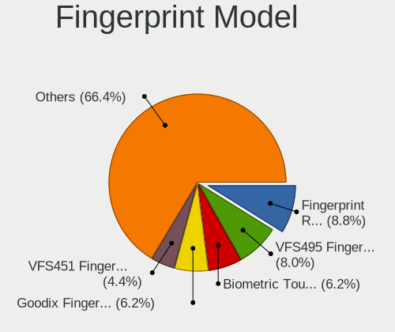

| Model                                                  | Notebooks | Percent |
|--------------------------------------------------------|-----------|---------|
| Validity Sensors VFS495 Fingerprint Reader             | 5         | 11.11%  |
| Validity Sensors VFS301 Fingerprint Reader             | 4         | 8.89%   |
| STMicroelectronics Fingerprint Reader                  | 4         | 8.89%   |
| AuthenTec AES2501 Fingerprint Sensor                   | 3         | 6.67%   |
| AuthenTec AES1600                                      | 3         | 6.67%   |
| Validity Sensors VFS491                                | 2         | 4.44%   |
| Validity Sensors VFS451 Fingerprint Reader             | 2         | 4.44%   |
| Validity Sensors Synaptics WBDI                        | 2         | 4.44%   |
| Upek Biometric Touchchip/Touchstrip Fingerprint Sensor | 2         | 4.44%   |
| Shenzhen Goodix  FingerPrint Device                    | 2         | 4.44%   |
| LighTuning EgisTec Touch Fingerprint Sensor            | 2         | 4.44%   |
| Elan ELAN:Fingerprint                                  | 2         | 4.44%   |
| AuthenTec Fingerprint Sensor                           | 2         | 4.44%   |
| AuthenTec AES2810                                      | 2         | 4.44%   |
| Unknown                                                | 2         | 4.44%   |
| Validity Sensors VFS5011 Fingerprint Reader            | 1         | 2.22%   |
| Validity Sensors VFS101 Fingerprint Reader             | 1         | 2.22%   |
| Validity Sensors Swipe Fingerprint Sensor              | 1         | 2.22%   |
| Validity Sensors Fingerprint scanner                   | 1         | 2.22%   |
| Synaptics Metallica MOH Touch Fingerprint Reader       | 1         | 2.22%   |
| Focal-systems.Corp FT9201Fingerprint.                  | 1         | 2.22%   |

Chipcard Vendor
---------------

Chipcard module vendors

| Vendor                | Notebooks | Percent |
|-----------------------|-----------|---------|
| Broadcom              | 13        | 65%     |
| O2 Micro              | 3         | 15%     |
| Alcor Micro           | 2         | 10%     |
| Lenovo                | 1         | 5%      |
| Gemalto (was Gemplus) | 1         | 5%      |

Chipcard Model
--------------

Chipcard module models

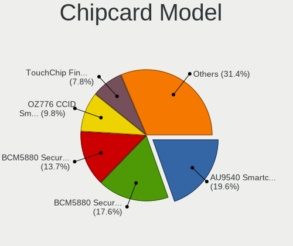

| Model                                                                        | Notebooks | Percent |
|------------------------------------------------------------------------------|-----------|---------|
| Broadcom BCM5880 Secure Applications Processor                               | 7         | 35%     |
| Broadcom BCM5880 Secure Applications Processor with fingerprint swipe sensor | 3         | 15%     |
| O2 Micro OZ776 CCID Smartcard Reader                                         | 2         | 10%     |
| Alcor Micro AU9540 Smartcard Reader                                          | 2         | 10%     |
| O2 Micro Oz776 SmartCard Reader                                              | 1         | 5%      |
| Lenovo Integrated Smart Card Reader                                          | 1         | 5%      |
| Gemalto (was Gemplus) Compact Smart Card Reader Writer                       | 1         | 5%      |
| Broadcom BCM5880 Secure Applications Processor with fingerprint touch sensor | 1         | 5%      |
| Broadcom 5880                                                                | 1         | 5%      |
| Broadcom 58200                                                               | 1         | 5%      |

Unsupported
-----------

Unsupported Devices
-------------------

Total unsupported devices on board

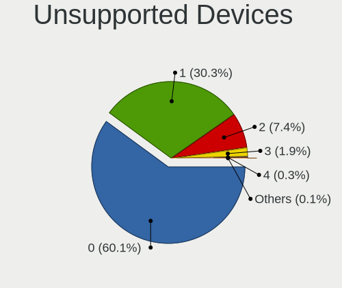

| Total | Notebooks | Percent |
|-------|-----------|---------|
| 0     | 236       | 63.1%   |
| 1     | 103       | 27.54%  |
| 2     | 25        | 6.68%   |
| 3     | 8         | 2.14%   |
| 6     | 1         | 0.27%   |
| 4     | 1         | 0.27%   |

Unsupported Device Types
------------------------

Types of unsupported devices

| Type                     | Notebooks | Percent |
|--------------------------|-----------|---------|
| Graphics card            | 45        | 25.28%  |
| Fingerprint reader       | 44        | 24.72%  |
| Net/wireless             | 34        | 19.1%   |
| Multimedia controller    | 18        | 10.11%  |
| Chipcard                 | 18        | 10.11%  |
| Storage                  | 6         | 3.37%   |
| Communication controller | 5         | 2.81%   |
| Flash memory             | 2         | 1.12%   |
| Sound                    | 1         | 0.56%   |
| Network                  | 1         | 0.56%   |
| Dvb card                 | 1         | 0.56%   |
| Card reader              | 1         | 0.56%   |
| Camera                   | 1         | 0.56%   |
| Bluetooth                | 1         | 0.56%   |

