LMDE - Tested Hardware & Statistics
-----------------------------------

A project to collect tested hardware configurations for LMDE.

Anyone can contribute to this report by the [hw-probe](https://github.com/linuxhw/hw-probe) tool:

    sudo -E hw-probe -all -upload

Please contribute! Especially if your hardware is rare.

This is a report for all computer types. See also reports for [desktops](/Dist/LMDE/Desktop/README.md) and [notebooks](/Dist/LMDE/Notebook/README.md).

Contents
--------

* [ Test Cases ](#test-cases)

* [ System ](#system)
  - [ OS                       ](#os)
  - [ OS Family                ](#os-family)
  - [ Kernel                   ](#kernel)
  - [ Kernel Family            ](#kernel-family)
  - [ Kernel Major Ver.        ](#kernel-major-ver)
  - [ Arch                     ](#arch)
  - [ DE                       ](#de)
  - [ Display Server           ](#display-server)
  - [ Display Manager          ](#display-manager)
  - [ OS Lang                  ](#os-lang)
  - [ Boot Mode                ](#boot-mode)
  - [ Filesystem               ](#filesystem)
  - [ Part. scheme             ](#part-scheme)
  - [ Dual Boot with Linux/BSD ](#dual-boot-with-linuxbsd)
  - [ Dual Boot (Win)          ](#dual-boot-win)

* [ Board ](#board)
  - [ Vendor                   ](#vendor)
  - [ Model                    ](#model)
  - [ Model Family             ](#model-family)
  - [ MFG Year                 ](#mfg-year)
  - [ Form Factor              ](#form-factor)
  - [ Secure Boot              ](#secure-boot)
  - [ Coreboot                 ](#coreboot)
  - [ RAM Size                 ](#ram-size)
  - [ RAM Used                 ](#ram-used)
  - [ Total Drives             ](#total-drives)
  - [ Has CD-ROM               ](#has-cd-rom)
  - [ Has Ethernet             ](#has-ethernet)
  - [ Has WiFi                 ](#has-wifi)
  - [ Has Bluetooth            ](#has-bluetooth)

* [ Location ](#location)
  - [ Country                  ](#country)
  - [ City                     ](#city)

* [ Drives ](#drives)
  - [ Drive Vendor             ](#drive-vendor)
  - [ Drive Model              ](#drive-model)
  - [ HDD Vendor               ](#hdd-vendor)
  - [ SSD Vendor               ](#ssd-vendor)
  - [ Drive Kind               ](#drive-kind)
  - [ Drive Connector          ](#drive-connector)
  - [ Drive Size               ](#drive-size)
  - [ Space Total              ](#space-total)
  - [ Space Used               ](#space-used)
  - [ Malfunc. Drives          ](#malfunc-drives)
  - [ Malfunc. Drive Vendor    ](#malfunc-drive-vendor)
  - [ Malfunc. HDD Vendor      ](#malfunc-hdd-vendor)
  - [ Malfunc. Drive Kind      ](#malfunc-drive-kind)
  - [ Failed Drives            ](#failed-drives)
  - [ Failed Drive Vendor      ](#failed-drive-vendor)
  - [ Drive Status             ](#drive-status)

* [ Storage controller ](#storage-controller)
  - [ Storage Vendor           ](#storage-vendor)
  - [ Storage Model            ](#storage-model)
  - [ Storage Kind             ](#storage-kind)

* [ Processor ](#processor)
  - [ CPU Vendor               ](#cpu-vendor)
  - [ CPU Model                ](#cpu-model)
  - [ CPU Model Family         ](#cpu-model-family)
  - [ CPU Cores                ](#cpu-cores)
  - [ CPU Sockets              ](#cpu-sockets)
  - [ CPU Threads              ](#cpu-threads)
  - [ CPU Op-Modes             ](#cpu-op-modes)
  - [ CPU Microcode            ](#cpu-microcode)
  - [ CPU Microarch            ](#cpu-microarch)

* [ Graphics ](#graphics)
  - [ GPU Vendor               ](#gpu-vendor)
  - [ GPU Model                ](#gpu-model)
  - [ GPU Combo                ](#gpu-combo)
  - [ GPU Driver               ](#gpu-driver)
  - [ GPU Memory               ](#gpu-memory)

* [ Monitor ](#monitor)
  - [ Monitor Vendor           ](#monitor-vendor)
  - [ Monitor Model            ](#monitor-model)
  - [ Monitor Resolution       ](#monitor-resolution)
  - [ Monitor Diagonal         ](#monitor-diagonal)
  - [ Monitor Width            ](#monitor-width)
  - [ Aspect Ratio             ](#aspect-ratio)
  - [ Monitor Area             ](#monitor-area)
  - [ Pixel Density            ](#pixel-density)
  - [ Multiple Monitors        ](#multiple-monitors)

* [ Network ](#network)
  - [ Net Controller Vendor    ](#net-controller-vendor)
  - [ Net Controller Model     ](#net-controller-model)
  - [ Wireless Vendor          ](#wireless-vendor)
  - [ Wireless Model           ](#wireless-model)
  - [ Ethernet Vendor          ](#ethernet-vendor)
  - [ Ethernet Model           ](#ethernet-model)
  - [ Net Controller Kind      ](#net-controller-kind)
  - [ Used Controller          ](#used-controller)
  - [ NICs                     ](#nics)
  - [ IPv6                     ](#ipv6)

* [ Bluetooth ](#bluetooth)
  - [ Bluetooth Vendor         ](#bluetooth-vendor)
  - [ Bluetooth Model          ](#bluetooth-model)

* [ Sound ](#sound)
  - [ Sound Vendor             ](#sound-vendor)
  - [ Sound Model              ](#sound-model)

* [ Memory ](#memory)
  - [ Memory Vendor            ](#memory-vendor)
  - [ Memory Model             ](#memory-model)
  - [ Memory Kind              ](#memory-kind)
  - [ Memory Form Factor       ](#memory-form-factor)
  - [ Memory Size              ](#memory-size)
  - [ Memory Speed             ](#memory-speed)

* [ Printers & scanners ](#printers--scanners)
  - [ Printer Vendor           ](#printer-vendor)
  - [ Printer Model            ](#printer-model)
  - [ Scanner Vendor           ](#scanner-vendor)
  - [ Scanner Model            ](#scanner-model)

* [ Camera ](#camera)
  - [ Camera Vendor            ](#camera-vendor)
  - [ Camera Model             ](#camera-model)

* [ Security ](#security)
  - [ Fingerprint Vendor       ](#fingerprint-vendor)
  - [ Fingerprint Model        ](#fingerprint-model)
  - [ Chipcard Vendor          ](#chipcard-vendor)
  - [ Chipcard Model           ](#chipcard-model)

* [ Unsupported ](#unsupported)
  - [ Unsupported Devices      ](#unsupported-devices)
  - [ Unsupported Device Types ](#unsupported-device-types)

Test Cases
----------

Total: 763

| Vendor        | Model                       | Form-Factor | Probe                                                      | Date         |
|---------------|-----------------------------|-------------|------------------------------------------------------------|--------------|
| HP            | Presario C500 (GF581UA#A... | Notebook    | [0e01914db4](https://linux-hardware.org/?probe=0e01914db4) | Apr 30, 2022 |
| HP            | EliteBook 840 G1            | Notebook    | [53bceed0aa](https://linux-hardware.org/?probe=53bceed0aa) | Apr 29, 2022 |
| ASUSTek       | PRIME H610M-A D4            | Desktop     | [e9376d24f0](https://linux-hardware.org/?probe=e9376d24f0) | Apr 29, 2022 |
| Acer          | AOD270                      | Notebook    | [d0fae524f9](https://linux-hardware.org/?probe=d0fae524f9) | Apr 29, 2022 |
| Acer          | AOD270                      | Notebook    | [44d897bc15](https://linux-hardware.org/?probe=44d897bc15) | Apr 29, 2022 |
| Acer          | Aspire E5-553G              | Notebook    | [00a648bda6](https://linux-hardware.org/?probe=00a648bda6) | Apr 28, 2022 |
| Acer          | Aspire E5-553G              | Notebook    | [4646f6cd23](https://linux-hardware.org/?probe=4646f6cd23) | Apr 28, 2022 |
| Samsung       | 730QDA                      | Convertible | [6d4573984e](https://linux-hardware.org/?probe=6d4573984e) | Apr 28, 2022 |
| HP            | ProBook 450 G8 Notebook ... | Notebook    | [ff8e46a260](https://linux-hardware.org/?probe=ff8e46a260) | Apr 27, 2022 |
| HP            | ProBook 450 G8 Notebook ... | Notebook    | [0a6534997e](https://linux-hardware.org/?probe=0a6534997e) | Apr 27, 2022 |
| Lenovo        | Yoga 7 15ITL5 82BJ          | Convertible | [ccb4d8201f](https://linux-hardware.org/?probe=ccb4d8201f) | Apr 24, 2022 |
| Dell          | 0XR1GT A00                  | Desktop     | [2a3b9ad6cf](https://linux-hardware.org/?probe=2a3b9ad6cf) | Apr 24, 2022 |
| Apple         | MacBookPro14,1              | Notebook    | [ce4f3d8ec8](https://linux-hardware.org/?probe=ce4f3d8ec8) | Apr 24, 2022 |
| Acer          | AOD270                      | Notebook    | [b53cedd40c](https://linux-hardware.org/?probe=b53cedd40c) | Apr 23, 2022 |
| Dixonsxp      | Unknown                     | Notebook    | [65e40dacf4](https://linux-hardware.org/?probe=65e40dacf4) | Apr 20, 2022 |
| ASRock        | A320M-DGS                   | Desktop     | [b7df060840](https://linux-hardware.org/?probe=b7df060840) | Apr 19, 2022 |
| ASRock        | A320M-DGS                   | Desktop     | [70fe08376f](https://linux-hardware.org/?probe=70fe08376f) | Apr 19, 2022 |
| Dell          | 0CU568 A00                  | Desktop     | [b544c48421](https://linux-hardware.org/?probe=b544c48421) | Apr 19, 2022 |
| Dell          | 0CU568 A00                  | Desktop     | [84f7029c22](https://linux-hardware.org/?probe=84f7029c22) | Apr 19, 2022 |
| Toshiba       | Satellite L455              | Notebook    | [7f0bad47af](https://linux-hardware.org/?probe=7f0bad47af) | Apr 19, 2022 |
| Toshiba       | Satellite L455              | Notebook    | [3a0c54144d](https://linux-hardware.org/?probe=3a0c54144d) | Apr 19, 2022 |
| Dell          | 0X574R                      | Notebook    | [6da5c2339f](https://linux-hardware.org/?probe=6da5c2339f) | Apr 18, 2022 |
| HP            | 14                          | Notebook    | [71f296bd93](https://linux-hardware.org/?probe=71f296bd93) | Apr 17, 2022 |
| Dell          | Latitude 3410               | Notebook    | [78396d572c](https://linux-hardware.org/?probe=78396d572c) | Apr 15, 2022 |
| ASUSTek       | N61Jv                       | Notebook    | [959c5f2238](https://linux-hardware.org/?probe=959c5f2238) | Apr 14, 2022 |
| Foxconn       | Cinema Series FAB           | Desktop     | [1e32228753](https://linux-hardware.org/?probe=1e32228753) | Apr 13, 2022 |
| Acer          | AOA110                      | Notebook    | [cba10fc182](https://linux-hardware.org/?probe=cba10fc182) | Apr 13, 2022 |
| ASUSTek       | PRIME B350M-A               | Desktop     | [ed40a9ddc1](https://linux-hardware.org/?probe=ed40a9ddc1) | Apr 12, 2022 |
| ASUSTek       | PRIME B350M-A               | Desktop     | [9a137f0540](https://linux-hardware.org/?probe=9a137f0540) | Apr 12, 2022 |
| MSI           | Z170A GAMING M5             | Desktop     | [8f2e10cbf3](https://linux-hardware.org/?probe=8f2e10cbf3) | Apr 12, 2022 |
| Howard Com... | R7X                         | Notebook    | [e0f3701b1b](https://linux-hardware.org/?probe=e0f3701b1b) | Apr 12, 2022 |
| Lenovo        | ThinkPad W541 20EGS24J00    | Notebook    | [6fbd04d8fd](https://linux-hardware.org/?probe=6fbd04d8fd) | Apr 11, 2022 |
| Lenovo        | 312A SDK0J40697 WIN 3305... | Desktop     | [2a33f087e6](https://linux-hardware.org/?probe=2a33f087e6) | Apr 11, 2022 |
| Lenovo        | 312A SDK0J40697 WIN 3305... | Desktop     | [05b9ec80c6](https://linux-hardware.org/?probe=05b9ec80c6) | Apr 11, 2022 |
| Howard Com... | R7X                         | Notebook    | [5885bbaa90](https://linux-hardware.org/?probe=5885bbaa90) | Apr 10, 2022 |
| Dell          | Vostro 3500                 | Notebook    | [5b1a24bf51](https://linux-hardware.org/?probe=5b1a24bf51) | Apr 10, 2022 |
| Dell          | Vostro 3500                 | Notebook    | [b2adbbe7d0](https://linux-hardware.org/?probe=b2adbbe7d0) | Apr 10, 2022 |
| Lenovo        | IdeaPad 5 15ARE05 81YQ      | Notebook    | [4d5998459b](https://linux-hardware.org/?probe=4d5998459b) | Apr 09, 2022 |
| Lenovo        | 102F SDK0J40705 WIN 3425... | Desktop     | [eb751efc1f](https://linux-hardware.org/?probe=eb751efc1f) | Apr 09, 2022 |
| HP            | Presario C500 (RY512EA#A... | Notebook    | [4ef049d490](https://linux-hardware.org/?probe=4ef049d490) | Apr 09, 2022 |
| Acer          | WG43M                       | Desktop     | [c7cb6ee141](https://linux-hardware.org/?probe=c7cb6ee141) | Apr 08, 2022 |
| ASUSTek       | P5G41T-M LX3                | Desktop     | [28371c08c2](https://linux-hardware.org/?probe=28371c08c2) | Apr 08, 2022 |
| Dell          | Inspiron 14 5410 2-in-1     | Notebook    | [613d6e7d3c](https://linux-hardware.org/?probe=613d6e7d3c) | Apr 07, 2022 |
| MSI           | X470 GAMING PLUS MAX        | Desktop     | [9f1a76acb8](https://linux-hardware.org/?probe=9f1a76acb8) | Apr 06, 2022 |
| Dell          | Latitude 5511               | Notebook    | [2cb0a3e451](https://linux-hardware.org/?probe=2cb0a3e451) | Apr 06, 2022 |
| MSI           | X470 GAMING PLUS MAX        | Desktop     | [18a4ba3137](https://linux-hardware.org/?probe=18a4ba3137) | Apr 06, 2022 |
| Dell          | Precision 7520              | Notebook    | [7404842400](https://linux-hardware.org/?probe=7404842400) | Apr 05, 2022 |
| ASUSTek       | P6T                         | Desktop     | [5ed6ed355f](https://linux-hardware.org/?probe=5ed6ed355f) | Apr 04, 2022 |
| Panasonic     | CF-H2BJJHZDE                | Tablet      | [50e0a85fd3](https://linux-hardware.org/?probe=50e0a85fd3) | Apr 04, 2022 |
| Lenovo        | IdeaPadFlex 5 14ITL05 82... | Convertible | [b5b25093ba](https://linux-hardware.org/?probe=b5b25093ba) | Apr 03, 2022 |
| Lenovo        | IdeaPadFlex 5 14ITL05 82... | Convertible | [6107c72fb2](https://linux-hardware.org/?probe=6107c72fb2) | Apr 03, 2022 |
| LincPlus      | LINNCPLUS P1                | Notebook    | [22406313dc](https://linux-hardware.org/?probe=22406313dc) | Apr 02, 2022 |
| Toshiba       | Satellite L455              | Notebook    | [699e7d272d](https://linux-hardware.org/?probe=699e7d272d) | Apr 02, 2022 |
| HP            | Pavilion Laptop 15-eh1xx... | Notebook    | [387b77f172](https://linux-hardware.org/?probe=387b77f172) | Apr 01, 2022 |
| ASUSTek       | 901                         | Notebook    | [d118ee90d5](https://linux-hardware.org/?probe=d118ee90d5) | Apr 01, 2022 |
| HP            | ProBook 6570b               | Notebook    | [0609df27fa](https://linux-hardware.org/?probe=0609df27fa) | Mar 31, 2022 |
| Lenovo        | IdeaPad S110 20126          | Notebook    | [9113320f2f](https://linux-hardware.org/?probe=9113320f2f) | Mar 31, 2022 |
| Lenovo        | IdeaPad S110 20126          | Notebook    | [7c5086f8c0](https://linux-hardware.org/?probe=7c5086f8c0) | Mar 31, 2022 |
| Acer          | EG43M                       | Desktop     | [28b4dd5236](https://linux-hardware.org/?probe=28b4dd5236) | Mar 31, 2022 |
| Lenovo        | IdeaPad S110 20126          | Notebook    | [d02cab0935](https://linux-hardware.org/?probe=d02cab0935) | Mar 30, 2022 |
| Packard Be... | DOT S                       | Notebook    | [85e7386152](https://linux-hardware.org/?probe=85e7386152) | Mar 28, 2022 |
| Packard Be... | DOT S                       | Notebook    | [edef12b9d5](https://linux-hardware.org/?probe=edef12b9d5) | Mar 28, 2022 |
| Lenovo        | IdeaPad 3 14ALC6 82KT       | Notebook    | [b2e70b8251](https://linux-hardware.org/?probe=b2e70b8251) | Mar 28, 2022 |
| ASUSTek       | PRIME H510M-D               | Desktop     | [1e0a28c8f3](https://linux-hardware.org/?probe=1e0a28c8f3) | Mar 28, 2022 |
| Toshiba       | Satellite L455              | Notebook    | [9213736f1c](https://linux-hardware.org/?probe=9213736f1c) | Mar 27, 2022 |
| Dell          | Latitude E6400              | Notebook    | [01815a09bb](https://linux-hardware.org/?probe=01815a09bb) | Mar 27, 2022 |
| Dell          | Latitude D620               | Notebook    | [172cd26e35](https://linux-hardware.org/?probe=172cd26e35) | Mar 26, 2022 |
| Toshiba       | Satellite L455              | Notebook    | [90334cf68d](https://linux-hardware.org/?probe=90334cf68d) | Mar 26, 2022 |
| Dell          | Precision M4400             | Notebook    | [5172327d82](https://linux-hardware.org/?probe=5172327d82) | Mar 25, 2022 |
| Medion        | E6220                       | Notebook    | [e739ef27a1](https://linux-hardware.org/?probe=e739ef27a1) | Mar 24, 2022 |
| HP            | ProBook 6465b               | Notebook    | [2e1792442b](https://linux-hardware.org/?probe=2e1792442b) | Mar 24, 2022 |
| HP            | ProBook 6465b               | Notebook    | [51a296abf8](https://linux-hardware.org/?probe=51a296abf8) | Mar 24, 2022 |
| Gigabyte      | X570 AORUS MASTER           | Desktop     | [346857be22](https://linux-hardware.org/?probe=346857be22) | Mar 24, 2022 |
| Acer          | Aspire 7745G                | Notebook    | [3f4c13ee47](https://linux-hardware.org/?probe=3f4c13ee47) | Mar 23, 2022 |
| HP            | 255 G7 Notebook PC          | Notebook    | [f8561c65dc](https://linux-hardware.org/?probe=f8561c65dc) | Mar 21, 2022 |
| ASUSTek       | P4P800                      | Desktop     | [0cb6a89491](https://linux-hardware.org/?probe=0cb6a89491) | Mar 19, 2022 |
| HP            | 0AA8h                       | Desktop     | [b3507722e3](https://linux-hardware.org/?probe=b3507722e3) | Mar 19, 2022 |
| Acer          | TravelMate 420              | Notebook    | [13cae0e399](https://linux-hardware.org/?probe=13cae0e399) | Mar 14, 2022 |
| HP            | 0AE8h C                     | Desktop     | [d3980b5b59](https://linux-hardware.org/?probe=d3980b5b59) | Mar 14, 2022 |
| Lenovo        | IdeaPad Z470                | Notebook    | [b1ca65b3e0](https://linux-hardware.org/?probe=b1ca65b3e0) | Mar 08, 2022 |
| ASUSTek       | X101CH                      | Notebook    | [486f5c28ad](https://linux-hardware.org/?probe=486f5c28ad) | Mar 07, 2022 |
| Dell          | Latitude D620               | Notebook    | [d4e50f40f3](https://linux-hardware.org/?probe=d4e50f40f3) | Mar 06, 2022 |
| Lenovo        | IdeaPad Z470                | Notebook    | [93b1d09d4f](https://linux-hardware.org/?probe=93b1d09d4f) | Mar 03, 2022 |
| HP            | ENVY 6                      | Notebook    | [23f60a7428](https://linux-hardware.org/?probe=23f60a7428) | Mar 02, 2022 |
| Lenovo        | IdeaPad Z470                | Notebook    | [d163816373](https://linux-hardware.org/?probe=d163816373) | Mar 02, 2022 |
| Apple         | Mac-F42786A9 DVT            | All in one  | [261e6c0463](https://linux-hardware.org/?probe=261e6c0463) | Mar 02, 2022 |
| Apple         | Mac-F42786A9 DVT            | All in one  | [25f6ef89f9](https://linux-hardware.org/?probe=25f6ef89f9) | Mar 02, 2022 |
| ASUSTek       | UX490UAR                    | Notebook    | [6b6c4bd7b7](https://linux-hardware.org/?probe=6b6c4bd7b7) | Feb 28, 2022 |
| ASUSTek       | UX490UAR                    | Notebook    | [544979fc4f](https://linux-hardware.org/?probe=544979fc4f) | Feb 27, 2022 |
| Fujitsu Si... | LIFEBOOK S7020              | Notebook    | [4bd308dadf](https://linux-hardware.org/?probe=4bd308dadf) | Feb 26, 2022 |
| Fujitsu Si... | LIFEBOOK S7020              | Notebook    | [ec2491adc1](https://linux-hardware.org/?probe=ec2491adc1) | Feb 26, 2022 |
| Dell          | 0HR330                      | Desktop     | [3533cd70af](https://linux-hardware.org/?probe=3533cd70af) | Feb 26, 2022 |
| Dell          | 0HR330                      | Desktop     | [e587783731](https://linux-hardware.org/?probe=e587783731) | Feb 26, 2022 |
| HP            | 0AA8h                       | Desktop     | [21de71cf71](https://linux-hardware.org/?probe=21de71cf71) | Feb 25, 2022 |
| Gigabyte      | Z77-D3H                     | Desktop     | [a0d52488b2](https://linux-hardware.org/?probe=a0d52488b2) | Feb 22, 2022 |
| Acer          | Swift SF315-52              | Notebook    | [74009233c2](https://linux-hardware.org/?probe=74009233c2) | Feb 19, 2022 |
| Lenovo        | ThinkPad W541 20EGS24J00    | Notebook    | [e2ab1c19df](https://linux-hardware.org/?probe=e2ab1c19df) | Feb 18, 2022 |
| HP            | Laptop 14-bs0xx             | Notebook    | [2b5b67148b](https://linux-hardware.org/?probe=2b5b67148b) | Feb 18, 2022 |
| EVOO          | EVC141-12                   | Notebook    | [25710a76b8](https://linux-hardware.org/?probe=25710a76b8) | Feb 18, 2022 |
| Gigabyte      | B550 AORUS ELITE AX V2      | Desktop     | [0731118682](https://linux-hardware.org/?probe=0731118682) | Feb 15, 2022 |
| Gigabyte      | B550 AORUS ELITE AX V2      | Desktop     | [5026ea812a](https://linux-hardware.org/?probe=5026ea812a) | Feb 15, 2022 |
| Samsung       | NC210/NC110                 | Notebook    | [bf2672168d](https://linux-hardware.org/?probe=bf2672168d) | Feb 14, 2022 |
| Samsung       | NC210/NC110                 | Notebook    | [bcbb1884aa](https://linux-hardware.org/?probe=bcbb1884aa) | Feb 13, 2022 |
| ASUSTek       | X101CH                      | Notebook    | [82661c6a9b](https://linux-hardware.org/?probe=82661c6a9b) | Feb 12, 2022 |
| ASUSTek       | 901                         | Notebook    | [77c14174fd](https://linux-hardware.org/?probe=77c14174fd) | Feb 06, 2022 |
| Dell          | 0Y2K8N A01                  | Desktop     | [e3922aecf0](https://linux-hardware.org/?probe=e3922aecf0) | Feb 04, 2022 |
| ASUSTek       | 901                         | Notebook    | [972a6c0937](https://linux-hardware.org/?probe=972a6c0937) | Feb 04, 2022 |
| ASUSTek       | 901                         | Notebook    | [27a497fdf8](https://linux-hardware.org/?probe=27a497fdf8) | Feb 04, 2022 |
| Acer          | Aspire 3820                 | Notebook    | [e6091c93a9](https://linux-hardware.org/?probe=e6091c93a9) | Feb 02, 2022 |
| EVGA          | 131-HE-E095                 | Desktop     | [6d45d47131](https://linux-hardware.org/?probe=6d45d47131) | Jan 31, 2022 |
| ASUSTek       | A68HM-K                     | Desktop     | [00cd805015](https://linux-hardware.org/?probe=00cd805015) | Jan 23, 2022 |
| Toshiba       | Satellite A200              | Notebook    | [9086ec49b6](https://linux-hardware.org/?probe=9086ec49b6) | Jan 21, 2022 |
| MSI           | Z97 PC Mate                 | Desktop     | [be068c5a3a](https://linux-hardware.org/?probe=be068c5a3a) | Jan 21, 2022 |
| Dell          | 0XR1GT A00                  | Desktop     | [a988797ac9](https://linux-hardware.org/?probe=a988797ac9) | Jan 16, 2022 |
| Wistron       | ProLiant ML110 G5           | Server      | [311d594372](https://linux-hardware.org/?probe=311d594372) | Jan 13, 2022 |
| Digma         | EVE 10 C301T ES1043EW       | Tablet      | [4fac8e2cb1](https://linux-hardware.org/?probe=4fac8e2cb1) | Jan 11, 2022 |
| Wistron       | ProLiant ML110 G5           | Server      | [ea55ac1aab](https://linux-hardware.org/?probe=ea55ac1aab) | Jan 11, 2022 |
| Wistron       | ProLiant ML110 G5           | Server      | [252df76aa8](https://linux-hardware.org/?probe=252df76aa8) | Jan 10, 2022 |
| Apple         | Mac-F226BEC8 PVT            | All in one  | [33457cde11](https://linux-hardware.org/?probe=33457cde11) | Jan 09, 2022 |
| LG Electro... | A530-T.BE76P1               | Notebook    | [9fdbf19ebf](https://linux-hardware.org/?probe=9fdbf19ebf) | Jan 09, 2022 |
| Google        | Falco                       | Notebook    | [f450676688](https://linux-hardware.org/?probe=f450676688) | Jan 09, 2022 |
| eMachines     | EMCP73VT-PM                 | Desktop     | [1d55cceee4](https://linux-hardware.org/?probe=1d55cceee4) | Jan 09, 2022 |
| ASUSTek       | Z97-K                       | Desktop     | [43b421ad06](https://linux-hardware.org/?probe=43b421ad06) | Jan 08, 2022 |
| ASRock        | N68-S3 UCC                  | Desktop     | [bfcf287c09](https://linux-hardware.org/?probe=bfcf287c09) | Jan 08, 2022 |
| Packard Be... | EasyNote TE69BM             | Notebook    | [526fc1b476](https://linux-hardware.org/?probe=526fc1b476) | Jan 05, 2022 |
| LG Electro... | E500-S.AP17B                | Notebook    | [675eb28882](https://linux-hardware.org/?probe=675eb28882) | Jan 05, 2022 |
| LG Electro... | E500-S.AP17B                | Notebook    | [203577c78f](https://linux-hardware.org/?probe=203577c78f) | Jan 05, 2022 |
| Dell          | System Inspiron N7110       | Notebook    | [41e93113b5](https://linux-hardware.org/?probe=41e93113b5) | Jan 05, 2022 |
| Dell          | System Inspiron N7110       | Notebook    | [c977f6d6af](https://linux-hardware.org/?probe=c977f6d6af) | Jan 05, 2022 |
| ASUSTek       | K46CA                       | Notebook    | [61978f9418](https://linux-hardware.org/?probe=61978f9418) | Jan 04, 2022 |
| Samsung       | RV411/RV511/E3511/S3511/... | Notebook    | [9d4bddea4d](https://linux-hardware.org/?probe=9d4bddea4d) | Jan 03, 2022 |
| OEM           | Unknown                     | Desktop     | [6adc4b5659](https://linux-hardware.org/?probe=6adc4b5659) | Jan 01, 2022 |
| ASUSTek       | UX360UAK                    | Convertible | [1ba0b3e854](https://linux-hardware.org/?probe=1ba0b3e854) | Jan 01, 2022 |
| Unknown       | K7VM2                       | Desktop     | [06f13210ad](https://linux-hardware.org/?probe=06f13210ad) | Dec 29, 2021 |
| Unknown       | K7VM2                       | Desktop     | [be785b672c](https://linux-hardware.org/?probe=be785b672c) | Dec 29, 2021 |
| Wistron       | ProLiant ML110 G5           | Server      | [c3bd5cbae8](https://linux-hardware.org/?probe=c3bd5cbae8) | Dec 27, 2021 |
| Wistron       | ProLiant ML110 G5           | Server      | [8526295a2f](https://linux-hardware.org/?probe=8526295a2f) | Dec 27, 2021 |
| Advent        | Monza T100                  | Notebook    | [7355d1ae53](https://linux-hardware.org/?probe=7355d1ae53) | Dec 23, 2021 |
| Acer          | Aspire V5-573G              | Notebook    | [4c03d73b65](https://linux-hardware.org/?probe=4c03d73b65) | Dec 18, 2021 |
| HP            | Pavilion 14                 | Notebook    | [be9e6368e4](https://linux-hardware.org/?probe=be9e6368e4) | Dec 17, 2021 |
| Acer          | Aspire 3820                 | Notebook    | [b2f24124da](https://linux-hardware.org/?probe=b2f24124da) | Dec 14, 2021 |
| Acer          | Aspire 3820                 | Notebook    | [c4ed088328](https://linux-hardware.org/?probe=c4ed088328) | Dec 14, 2021 |
| HP            | 2AE3                        | Desktop     | [fb02077f16](https://linux-hardware.org/?probe=fb02077f16) | Dec 14, 2021 |
| HP            | 2AE3                        | Desktop     | [18efa559b9](https://linux-hardware.org/?probe=18efa559b9) | Dec 14, 2021 |
| ECS           | G41T-M7                     | Desktop     | [5a8641a9aa](https://linux-hardware.org/?probe=5a8641a9aa) | Dec 13, 2021 |
| Sony          | VPCP116KG                   | Notebook    | [237c9f66e1](https://linux-hardware.org/?probe=237c9f66e1) | Dec 13, 2021 |
| Fujitsu       | STYLISTIC Q550              | Notebook    | [e5d7b73e7f](https://linux-hardware.org/?probe=e5d7b73e7f) | Dec 12, 2021 |
| Fujitsu       | STYLISTIC Q550              | Notebook    | [8138236f20](https://linux-hardware.org/?probe=8138236f20) | Dec 12, 2021 |
| Lenovo        | G40-30 80FY                 | Notebook    | [43ff865e00](https://linux-hardware.org/?probe=43ff865e00) | Nov 28, 2021 |
| HP            | Pavilion dv6                | Notebook    | [5300296119](https://linux-hardware.org/?probe=5300296119) | Nov 27, 2021 |
| Acer          | RS880M05                    | Desktop     | [2ce9c25975](https://linux-hardware.org/?probe=2ce9c25975) | Nov 25, 2021 |
| NEC Comput... | GA-8I945PM                  | Desktop     | [3d3711b8cc](https://linux-hardware.org/?probe=3d3711b8cc) | Nov 22, 2021 |
| Samsung       | RV411/RV511/E3511/S3511/... | Notebook    | [bb0a461d82](https://linux-hardware.org/?probe=bb0a461d82) | Nov 21, 2021 |
| Lenovo        | G50-45 80E3                 | Notebook    | [024686087f](https://linux-hardware.org/?probe=024686087f) | Nov 20, 2021 |
| ASUSTek       | A68HM-K                     | Desktop     | [b4b709eb1b](https://linux-hardware.org/?probe=b4b709eb1b) | Nov 18, 2021 |
| Samsung       | 305U1A                      | Notebook    | [c602ad4903](https://linux-hardware.org/?probe=c602ad4903) | Nov 18, 2021 |
| ASUSTek       | A68HM-K                     | Desktop     | [18236d5a16](https://linux-hardware.org/?probe=18236d5a16) | Nov 18, 2021 |
| Acer          | Aspire 3000                 | Notebook    | [86d2f89f59](https://linux-hardware.org/?probe=86d2f89f59) | Nov 12, 2021 |
| Lenovo        | ThinkPad E495 20NE001MRT    | Notebook    | [688e4047ce](https://linux-hardware.org/?probe=688e4047ce) | Nov 11, 2021 |
| Acer          | Aspire 3000                 | Notebook    | [dad287d5a1](https://linux-hardware.org/?probe=dad287d5a1) | Nov 11, 2021 |
| Toshiba       | Satellite L50-C             | Notebook    | [5a9ebbcad0](https://linux-hardware.org/?probe=5a9ebbcad0) | Nov 09, 2021 |
| Intel         | H61                         | Desktop     | [51f383b050](https://linux-hardware.org/?probe=51f383b050) | Nov 04, 2021 |
| Acer          | Aspire E5-411               | Notebook    | [0155c64e23](https://linux-hardware.org/?probe=0155c64e23) | Nov 04, 2021 |
| Intel         | H61                         | Desktop     | [c3f5ace673](https://linux-hardware.org/?probe=c3f5ace673) | Nov 02, 2021 |
| Acer          | Aspire E5-411               | Notebook    | [63287ab4e6](https://linux-hardware.org/?probe=63287ab4e6) | Nov 02, 2021 |
| Dell          | Latitude D630               | Notebook    | [ac9f57ab8f](https://linux-hardware.org/?probe=ac9f57ab8f) | Nov 02, 2021 |
| HP            | 843C                        | Desktop     | [e7df8fecdd](https://linux-hardware.org/?probe=e7df8fecdd) | Oct 30, 2021 |
| ASUSTek       | P7F-M                       | Desktop     | [f0983027ee](https://linux-hardware.org/?probe=f0983027ee) | Oct 26, 2021 |
| TUXEDO        | BC1510 1710                 | Notebook    | [90be7d16be](https://linux-hardware.org/?probe=90be7d16be) | Oct 24, 2021 |
| TUXEDO        | BC1510 1710                 | Notebook    | [49b52175c5](https://linux-hardware.org/?probe=49b52175c5) | Oct 24, 2021 |
| EVGA          | 132-BL-E758 Tylersburg      | Desktop     | [48187accde](https://linux-hardware.org/?probe=48187accde) | Oct 21, 2021 |
| Acer          | Aspire A315-55G             | Notebook    | [5b965ea234](https://linux-hardware.org/?probe=5b965ea234) | Oct 17, 2021 |
| Acer          | Aspire A315-55G             | Notebook    | [3a5976d4eb](https://linux-hardware.org/?probe=3a5976d4eb) | Oct 17, 2021 |
| ASUSTek       | Z97-K                       | Desktop     | [f1fcb9d1db](https://linux-hardware.org/?probe=f1fcb9d1db) | Oct 17, 2021 |
| EVGA          | 132-BL-E758 Tylersburg      | Desktop     | [a1820d8f0c](https://linux-hardware.org/?probe=a1820d8f0c) | Oct 17, 2021 |
| Gigabyte      | H61M-D2-B3                  | Desktop     | [138df954cb](https://linux-hardware.org/?probe=138df954cb) | Oct 15, 2021 |
| Gigabyte      | H61M-D2-B3                  | Desktop     | [dabe5d459a](https://linux-hardware.org/?probe=dabe5d459a) | Oct 15, 2021 |
| Acer          | Swift SF515-51T             | Notebook    | [203a3b399d](https://linux-hardware.org/?probe=203a3b399d) | Oct 13, 2021 |
| HP            | Pavilion dv6                | Notebook    | [b4200dd39c](https://linux-hardware.org/?probe=b4200dd39c) | Oct 13, 2021 |
| Medion        | P6670 MD99960               | Notebook    | [eaa186d207](https://linux-hardware.org/?probe=eaa186d207) | Oct 12, 2021 |
| Medion        | P6670 MD99960               | Notebook    | [d42f345fc5](https://linux-hardware.org/?probe=d42f345fc5) | Oct 12, 2021 |
| ASUSTek       | Z97-K                       | Desktop     | [940a27249a](https://linux-hardware.org/?probe=940a27249a) | Oct 12, 2021 |
| HP            | 520                         | Notebook    | [4aea2d24b1](https://linux-hardware.org/?probe=4aea2d24b1) | Oct 10, 2021 |
| LG Electro... | A530-T.BE76P1               | Notebook    | [393852d904](https://linux-hardware.org/?probe=393852d904) | Oct 10, 2021 |
| Dell          | Precision M2800             | Notebook    | [b046a9dfe3](https://linux-hardware.org/?probe=b046a9dfe3) | Oct 08, 2021 |
| HUAWEI        | MateBook HZ-W19             | Tablet      | [904decfd32](https://linux-hardware.org/?probe=904decfd32) | Sep 28, 2021 |
| Lenovo        | ThinkPad T530 2394BK7       | Notebook    | [6e927dafdd](https://linux-hardware.org/?probe=6e927dafdd) | Sep 28, 2021 |
| Lenovo        | ThinkPad T530 2394BK7       | Notebook    | [ccccaee5bb](https://linux-hardware.org/?probe=ccccaee5bb) | Sep 28, 2021 |
| Apple         | MacBookPro5,4               | Notebook    | [633c289440](https://linux-hardware.org/?probe=633c289440) | Sep 28, 2021 |
| ASUSTek       | Z97-K                       | Desktop     | [012056e32d](https://linux-hardware.org/?probe=012056e32d) | Sep 28, 2021 |
| Apple         | MacBookPro5,4               | Notebook    | [a6d07be7c9](https://linux-hardware.org/?probe=a6d07be7c9) | Sep 27, 2021 |
| Lenovo        | ThinkPad E495 20NE001MRT    | Notebook    | [759b25b6a9](https://linux-hardware.org/?probe=759b25b6a9) | Sep 27, 2021 |
| Biostar       | G41D3C                      | Desktop     | [16eb676e0c](https://linux-hardware.org/?probe=16eb676e0c) | Sep 25, 2021 |
| Apple         | MacBookPro5,4               | Notebook    | [d5625a9406](https://linux-hardware.org/?probe=d5625a9406) | Sep 24, 2021 |
| Sony          | VPCS131FM                   | Notebook    | [b5bba0e07f](https://linux-hardware.org/?probe=b5bba0e07f) | Sep 22, 2021 |
| Sony          | VPCS131FM                   | Notebook    | [54923e2372](https://linux-hardware.org/?probe=54923e2372) | Sep 22, 2021 |
| ASUSTek       | P5KPL-AM EPU                | Desktop     | [9c0ade7c9c](https://linux-hardware.org/?probe=9c0ade7c9c) | Sep 20, 2021 |
| Qbex          | UDPAIOQBEX01                | Notebook    | [34c385cfe4](https://linux-hardware.org/?probe=34c385cfe4) | Sep 13, 2021 |
| ASUSTek       | P5VD2-VM                    | Desktop     | [9eec34a3f2](https://linux-hardware.org/?probe=9eec34a3f2) | Sep 13, 2021 |
| Acer          | Aspire 4320                 | Notebook    | [fae514c059](https://linux-hardware.org/?probe=fae514c059) | Sep 12, 2021 |
| Foxconn       | 945 7MC Series              | Desktop     | [623cb095f2](https://linux-hardware.org/?probe=623cb095f2) | Sep 12, 2021 |
| Pegatron      | 2AB5                        | Desktop     | [3c335b37fa](https://linux-hardware.org/?probe=3c335b37fa) | Sep 10, 2021 |
| IBM           | ThinkPad T41 23737JY        | Notebook    | [86cf78a3cf](https://linux-hardware.org/?probe=86cf78a3cf) | Sep 09, 2021 |
| ASUSTek       | UN62                        | Desktop     | [0702f80222](https://linux-hardware.org/?probe=0702f80222) | Sep 09, 2021 |
| HP            | 250 G2                      | Notebook    | [64f9cfdbab](https://linux-hardware.org/?probe=64f9cfdbab) | Sep 09, 2021 |
| HP            | 250 G2                      | Notebook    | [4fb0a2eab3](https://linux-hardware.org/?probe=4fb0a2eab3) | Sep 09, 2021 |
| Acer          | Aspire A315-31              | Notebook    | [10052076e0](https://linux-hardware.org/?probe=10052076e0) | Sep 09, 2021 |
| Acer          | Aspire A315-31              | Notebook    | [8a0df29327](https://linux-hardware.org/?probe=8a0df29327) | Sep 09, 2021 |
| LG Electro... | A530-T.BE76P1               | Notebook    | [844d7b2492](https://linux-hardware.org/?probe=844d7b2492) | Sep 09, 2021 |
| Matsushita... | CF-19DDGZXVM                | Notebook    | [6f54a42d76](https://linux-hardware.org/?probe=6f54a42d76) | Sep 08, 2021 |
| ASUSTek       | P5VD2-VM                    | Desktop     | [9bab4b76ff](https://linux-hardware.org/?probe=9bab4b76ff) | Sep 07, 2021 |
| ASUSTek       | P5VD2-VM                    | Desktop     | [305d566f57](https://linux-hardware.org/?probe=305d566f57) | Sep 07, 2021 |
| Gigabyte      | H61M-S1                     | Desktop     | [d1773b3e3d](https://linux-hardware.org/?probe=d1773b3e3d) | Sep 06, 2021 |
| Gigabyte      | H61M-S1                     | Desktop     | [5d2cc7f4ca](https://linux-hardware.org/?probe=5d2cc7f4ca) | Sep 06, 2021 |
| Intel         | DG31PR AAD97573-302         | Desktop     | [7122e4bd16](https://linux-hardware.org/?probe=7122e4bd16) | Sep 04, 2021 |
| Gigabyte      | M52LT-D3P                   | Desktop     | [09cbb5b50e](https://linux-hardware.org/?probe=09cbb5b50e) | Sep 03, 2021 |
| Gigabyte      | M52LT-D3P                   | Desktop     | [949b2062ea](https://linux-hardware.org/?probe=949b2062ea) | Sep 03, 2021 |
| Fujitsu Si... | ESPRIMO Mobile V5515        | Notebook    | [fdb725803b](https://linux-hardware.org/?probe=fdb725803b) | Sep 01, 2021 |
| Lenovo        | Yoga 2 11 20428             | Notebook    | [52474e968d](https://linux-hardware.org/?probe=52474e968d) | Sep 01, 2021 |
| Lenovo        | Yoga 2 11 20428             | Notebook    | [c4e6145a5f](https://linux-hardware.org/?probe=c4e6145a5f) | Sep 01, 2021 |
| Dell          | XPS M1330                   | Notebook    | [9dbd1f4ad9](https://linux-hardware.org/?probe=9dbd1f4ad9) | Aug 28, 2021 |
| Dell          | XPS M1330                   | Notebook    | [f4e126fba9](https://linux-hardware.org/?probe=f4e126fba9) | Aug 28, 2021 |
| ASUSTek       | 1201HA                      | Notebook    | [eadb8752c9](https://linux-hardware.org/?probe=eadb8752c9) | Aug 28, 2021 |
| HP            | Pavilion dv2000 (RD665EA... | Notebook    | [3b6dfaf6db](https://linux-hardware.org/?probe=3b6dfaf6db) | Aug 25, 2021 |
| Fujitsu       | LIFEBOOK A556/G             | Notebook    | [7706314dbc](https://linux-hardware.org/?probe=7706314dbc) | Aug 24, 2021 |
| Itautec       | W7655                       | Notebook    | [82b2d38326](https://linux-hardware.org/?probe=82b2d38326) | Aug 24, 2021 |
| Itautec       | W7655                       | Notebook    | [5952ec3a0f](https://linux-hardware.org/?probe=5952ec3a0f) | Aug 24, 2021 |
| HP            | 14                          | Notebook    | [e6bbdc5a92](https://linux-hardware.org/?probe=e6bbdc5a92) | Aug 24, 2021 |
| ASRock        | G41M-S3                     | Desktop     | [c34caa75e2](https://linux-hardware.org/?probe=c34caa75e2) | Aug 23, 2021 |
| ASUSTek       | X101CH                      | Notebook    | [42ca8c45b4](https://linux-hardware.org/?probe=42ca8c45b4) | Aug 22, 2021 |
| ASRock        | G41M-S3                     | Desktop     | [48360885d9](https://linux-hardware.org/?probe=48360885d9) | Aug 22, 2021 |
| ASUSTek       | X101CH                      | Notebook    | [31ed530084](https://linux-hardware.org/?probe=31ed530084) | Aug 22, 2021 |
| ASUSTek       | M51Sn                       | Notebook    | [5acb8c28ad](https://linux-hardware.org/?probe=5acb8c28ad) | Aug 21, 2021 |
| MSI           | MS-7142                     | Desktop     | [2700c74bd9](https://linux-hardware.org/?probe=2700c74bd9) | Aug 21, 2021 |
| MSI           | MS-7142                     | Desktop     | [18ae0c1bb3](https://linux-hardware.org/?probe=18ae0c1bb3) | Aug 21, 2021 |
| Packard Be... | EasyNote_NJ66               | Notebook    | [03c09865f3](https://linux-hardware.org/?probe=03c09865f3) | Aug 19, 2021 |
| HP            | 0AA8h                       | Desktop     | [d9a8fd3722](https://linux-hardware.org/?probe=d9a8fd3722) | Aug 15, 2021 |
| ASUSTek       | N550JV                      | Notebook    | [f56a2bd3fa](https://linux-hardware.org/?probe=f56a2bd3fa) | Aug 14, 2021 |
| ASUSTek       | A7N8X-LA                    | Desktop     | [0e9fd81caf](https://linux-hardware.org/?probe=0e9fd81caf) | Aug 11, 2021 |
| ASUSTek       | A7N8X-LA                    | Desktop     | [f14c99bbce](https://linux-hardware.org/?probe=f14c99bbce) | Aug 11, 2021 |
| Toshiba       | Satellite M100              | Notebook    | [8dff0ec788](https://linux-hardware.org/?probe=8dff0ec788) | Aug 10, 2021 |
| Toshiba       | Satellite M100              | Notebook    | [06e766539d](https://linux-hardware.org/?probe=06e766539d) | Aug 10, 2021 |
| Gigabyte      | X570 AORUS ULTRA            | Desktop     | [b937ce5e88](https://linux-hardware.org/?probe=b937ce5e88) | Aug 10, 2021 |
| ASUSTek       | P7F-M                       | Desktop     | [cff87306ab](https://linux-hardware.org/?probe=cff87306ab) | Aug 07, 2021 |
| Lenovo        | ThinkPad E495 20NE001MRT    | Notebook    | [8648635717](https://linux-hardware.org/?probe=8648635717) | Aug 07, 2021 |
| Fujitsu Si... | ESPRIMO Mobile V5515        | Notebook    | [16bec20604](https://linux-hardware.org/?probe=16bec20604) | Aug 06, 2021 |
| Lenovo        | ThinkPad E495 20NE001MRT    | Notebook    | [dec7f65882](https://linux-hardware.org/?probe=dec7f65882) | Aug 06, 2021 |
| Fujitsu Si... | D2264-A1 S26361-D2264-A1    | Desktop     | [a1768aa578](https://linux-hardware.org/?probe=a1768aa578) | Aug 06, 2021 |
| Fujitsu Si... | D2264-A1 S26361-D2264-A1    | Desktop     | [52aa712b0c](https://linux-hardware.org/?probe=52aa712b0c) | Aug 05, 2021 |
| Fujitsu Si... | ESPRIMO Mobile V5515        | Notebook    | [322a210197](https://linux-hardware.org/?probe=322a210197) | Aug 05, 2021 |
| ASUSTek       | PRIME Z370-A                | Desktop     | [05c1703574](https://linux-hardware.org/?probe=05c1703574) | Aug 03, 2021 |
| Fujitsu Si... | ESPRIMO Mobile V5515        | Notebook    | [c930d1c587](https://linux-hardware.org/?probe=c930d1c587) | Aug 03, 2021 |
| Fujitsu Si... | ESPRIMO Mobile V5515        | Notebook    | [eb5ff22307](https://linux-hardware.org/?probe=eb5ff22307) | Aug 03, 2021 |
| ASUSTek       | PRIME Z370-A                | Desktop     | [faf304d157](https://linux-hardware.org/?probe=faf304d157) | Aug 02, 2021 |
| Fujitsu Si... | ESPRIMO Mobile V5515        | Notebook    | [2ffa81b543](https://linux-hardware.org/?probe=2ffa81b543) | Aug 01, 2021 |
| Fujitsu Si... | ESPRIMO Mobile V5515        | Notebook    | [53ee243536](https://linux-hardware.org/?probe=53ee243536) | Aug 01, 2021 |
| OEM           | 45CMX/45GMX/45CMX-K         | Desktop     | [65d8eb687e](https://linux-hardware.org/?probe=65d8eb687e) | Jul 30, 2021 |
| HP            | Pavilion Laptop 15-cw1xx... | Notebook    | [eafe3a403f](https://linux-hardware.org/?probe=eafe3a403f) | Jul 30, 2021 |
| ASUSTek       | P7F-M                       | Desktop     | [33a6186148](https://linux-hardware.org/?probe=33a6186148) | Jul 30, 2021 |
| Toshiba       | Satellite L855              | Notebook    | [354b3bf7c6](https://linux-hardware.org/?probe=354b3bf7c6) | Jul 30, 2021 |
| ASUSTek       | 1201NL                      | Notebook    | [1ff8ed5a66](https://linux-hardware.org/?probe=1ff8ed5a66) | Jul 29, 2021 |
| ASUSTek       | 1201NL                      | Notebook    | [78fb5dfca9](https://linux-hardware.org/?probe=78fb5dfca9) | Jul 29, 2021 |
| HP            | EliteBook 8470p             | Notebook    | [5ea0d9d644](https://linux-hardware.org/?probe=5ea0d9d644) | Jul 29, 2021 |
| Dell          | Inspiron 15-3567            | Notebook    | [19a4054ab4](https://linux-hardware.org/?probe=19a4054ab4) | Jul 28, 2021 |
| Dell          | Inspiron 15-3567            | Notebook    | [bc64d314a1](https://linux-hardware.org/?probe=bc64d314a1) | Jul 28, 2021 |
| Intel         | BTC-T37                     | Desktop     | [bb5051b598](https://linux-hardware.org/?probe=bb5051b598) | Jul 27, 2021 |
| ASRock        | FM2A85X Extreme4-M          | Desktop     | [aa0030f094](https://linux-hardware.org/?probe=aa0030f094) | Jul 26, 2021 |
| Gigabyte      | Z390 M GAMING-CF            | Desktop     | [763cb39ac0](https://linux-hardware.org/?probe=763cb39ac0) | Jul 25, 2021 |
| ASUSTek       | VivoBook 15_ASUS Laptop ... | Notebook    | [10ca362cf0](https://linux-hardware.org/?probe=10ca362cf0) | Jul 19, 2021 |
| Gigabyte      | X570 AORUS PRO              | Desktop     | [932c4de6ce](https://linux-hardware.org/?probe=932c4de6ce) | Jul 18, 2021 |
| ASUSTek       | PRIME A320M-K 2021-06-11    | Desktop     | [39037104b7](https://linux-hardware.org/?probe=39037104b7) | Jul 17, 2021 |
| ASUSTek       | PRIME A320M-K 2021-06-11    | Desktop     | [eef16a5b8f](https://linux-hardware.org/?probe=eef16a5b8f) | Jul 17, 2021 |
| Dell          | XPS M1330                   | Notebook    | [55de50364d](https://linux-hardware.org/?probe=55de50364d) | Jul 17, 2021 |
| Dell          | 08HPGT A01                  | Desktop     | [64d562d6ef](https://linux-hardware.org/?probe=64d562d6ef) | Jul 16, 2021 |
| ASUSTek       | PRIME A320M-K 2021-06-11    | Desktop     | [ab57bbf3d8](https://linux-hardware.org/?probe=ab57bbf3d8) | Jul 15, 2021 |
| HP            | Compaq nc6400 (RH478EA#A... | Notebook    | [a3f3785bc1](https://linux-hardware.org/?probe=a3f3785bc1) | Jul 15, 2021 |
| ASUSTek       | PRIME A320M-K 2021-06-11    | Desktop     | [a82245240b](https://linux-hardware.org/?probe=a82245240b) | Jul 15, 2021 |
| ASUSTek       | P7F-M                       | Desktop     | [3007b813c6](https://linux-hardware.org/?probe=3007b813c6) | Jul 13, 2021 |
| Dell          | Latitude E5520              | Notebook    | [9278405254](https://linux-hardware.org/?probe=9278405254) | Jul 13, 2021 |
| ASUSTek       | P7F-M                       | Desktop     | [5cfa1dcb4f](https://linux-hardware.org/?probe=5cfa1dcb4f) | Jul 12, 2021 |
| Fujitsu Si... | AMILO Pa 2510               | Notebook    | [a4303cc0cf](https://linux-hardware.org/?probe=a4303cc0cf) | Jul 12, 2021 |
| Qbex          | UDPAIOQBEX01                | Notebook    | [9b96573429](https://linux-hardware.org/?probe=9b96573429) | Jul 11, 2021 |
| Dell          | Inspiron 1526               | Notebook    | [515fc96089](https://linux-hardware.org/?probe=515fc96089) | Jul 11, 2021 |
| ASUSTek       | M6Ne                        | Notebook    | [ae1c7d3df6](https://linux-hardware.org/?probe=ae1c7d3df6) | Jul 11, 2021 |
| Dell          | Inspiron 7520               | Notebook    | [fbc1ae17b4](https://linux-hardware.org/?probe=fbc1ae17b4) | Jul 10, 2021 |
| Dell          | Inspiron 7520               | Notebook    | [e9bbf0622c](https://linux-hardware.org/?probe=e9bbf0622c) | Jul 10, 2021 |
| HP            | Laptop 14-df0xxx            | Notebook    | [ce0ac9c2fe](https://linux-hardware.org/?probe=ce0ac9c2fe) | Jul 10, 2021 |
| MSI           | H81M-E34                    | Desktop     | [14c2f8a49d](https://linux-hardware.org/?probe=14c2f8a49d) | Jul 05, 2021 |
| MSI           | A320M-A PRO                 | Desktop     | [9d356e787a](https://linux-hardware.org/?probe=9d356e787a) | Jul 01, 2021 |
| Samsung       | R59/R60/R61                 | Notebook    | [c0f5798a5b](https://linux-hardware.org/?probe=c0f5798a5b) | Jun 28, 2021 |
| HP            | Pavilion Laptop 15-cs0xx... | Notebook    | [f9a80b7b6b](https://linux-hardware.org/?probe=f9a80b7b6b) | Jun 28, 2021 |
| HP            | Pavilion Laptop 15-cs0xx... | Notebook    | [c7ddbbda0a](https://linux-hardware.org/?probe=c7ddbbda0a) | Jun 27, 2021 |
| Lenovo        | ThinkPad X100e 28762FP      | Notebook    | [95661d2e39](https://linux-hardware.org/?probe=95661d2e39) | Jun 27, 2021 |
| SAELITE       | ES1AU11                     | Notebook    | [267ea9c15e](https://linux-hardware.org/?probe=267ea9c15e) | Jun 26, 2021 |
| Acer          | Aspire 3000                 | Notebook    | [d0c68c57a8](https://linux-hardware.org/?probe=d0c68c57a8) | Jun 26, 2021 |
| Samsung       | RV413/RV513                 | Notebook    | [f6aab08062](https://linux-hardware.org/?probe=f6aab08062) | Jun 26, 2021 |
| Gateway       | M675                        | Notebook    | [ebdf5aa678](https://linux-hardware.org/?probe=ebdf5aa678) | Jun 25, 2021 |
| Acer          | Aspire one                  | Notebook    | [adae8c183d](https://linux-hardware.org/?probe=adae8c183d) | Jun 22, 2021 |
| HP            | 0A98h                       | Desktop     | [40990f73a5](https://linux-hardware.org/?probe=40990f73a5) | Jun 22, 2021 |
| HP            | Compaq nc6400 (RH478EA#A... | Notebook    | [b96ab4b06e](https://linux-hardware.org/?probe=b96ab4b06e) | Jun 18, 2021 |
| HP            | 0AA8h                       | Desktop     | [43103b39a5](https://linux-hardware.org/?probe=43103b39a5) | Jun 17, 2021 |
| HP            | Presario R4100 (EC375UA#... | Notebook    | [9072bce23d](https://linux-hardware.org/?probe=9072bce23d) | Jun 17, 2021 |
| HP            | Presario R4100 (EC375UA#... | Notebook    | [b557ccbf94](https://linux-hardware.org/?probe=b557ccbf94) | Jun 17, 2021 |
| Dell          | Latitude E6410              | Notebook    | [bd3a2db03c](https://linux-hardware.org/?probe=bd3a2db03c) | Jun 16, 2021 |
| HP            | Notebook                    | Notebook    | [611efdde0d](https://linux-hardware.org/?probe=611efdde0d) | Jun 15, 2021 |
| Intel         | H61                         | Desktop     | [6b0bdb5986](https://linux-hardware.org/?probe=6b0bdb5986) | Jun 14, 2021 |
| HP            | 0AA8h                       | Desktop     | [9154911bc9](https://linux-hardware.org/?probe=9154911bc9) | Jun 13, 2021 |
| ASUSTek       | X550LN                      | Notebook    | [67bbff8363](https://linux-hardware.org/?probe=67bbff8363) | Jun 11, 2021 |
| ASUSTek       | X550LN                      | Notebook    | [b37374d9f8](https://linux-hardware.org/?probe=b37374d9f8) | Jun 11, 2021 |
| Gateway       | LT40                        | Notebook    | [fe2551cb8b](https://linux-hardware.org/?probe=fe2551cb8b) | Jun 11, 2021 |
| ASUSTek       | Maximus VI HERO             | Desktop     | [699d10613e](https://linux-hardware.org/?probe=699d10613e) | Jun 11, 2021 |
| ASUSTek       | Z97-K                       | Desktop     | [f0b9aa22e5](https://linux-hardware.org/?probe=f0b9aa22e5) | Jun 10, 2021 |
| Acer          | Aspire 3000                 | Notebook    | [57f93cbf62](https://linux-hardware.org/?probe=57f93cbf62) | Jun 09, 2021 |
| Acer          | Aspire 3000                 | Notebook    | [f6a944ee4a](https://linux-hardware.org/?probe=f6a944ee4a) | Jun 09, 2021 |
| Sony          | VPCEB3L1E                   | Notebook    | [bc3c3b537b](https://linux-hardware.org/?probe=bc3c3b537b) | Jun 06, 2021 |
| HP            | Laptop 15-dw0xxx            | Notebook    | [4f752689ed](https://linux-hardware.org/?probe=4f752689ed) | Jun 03, 2021 |
| Gateway       | LT40                        | Notebook    | [9defd288c4](https://linux-hardware.org/?probe=9defd288c4) | Jun 01, 2021 |
| Gateway       | LT40                        | Notebook    | [6a966fe471](https://linux-hardware.org/?probe=6a966fe471) | Jun 01, 2021 |
| Unknown       | Unknown                     | Desktop     | [3e408e9ead](https://linux-hardware.org/?probe=3e408e9ead) | May 31, 2021 |
| Unknown       | Unknown                     | Desktop     | [39b2780acf](https://linux-hardware.org/?probe=39b2780acf) | May 31, 2021 |
| Dell          | 0HY9JP A01                  | Desktop     | [3f6ddbd81d](https://linux-hardware.org/?probe=3f6ddbd81d) | May 30, 2021 |
| ASUSTek       | H61M-A/BR                   | Desktop     | [7d2b37e6e1](https://linux-hardware.org/?probe=7d2b37e6e1) | May 29, 2021 |
| ASRock        | G41M-S3                     | Desktop     | [adc801308b](https://linux-hardware.org/?probe=adc801308b) | May 29, 2021 |
| MSI           | B450I GAMING PLUS AC        | Desktop     | [d03d2796a0](https://linux-hardware.org/?probe=d03d2796a0) | May 29, 2021 |
| MSI           | B450I GAMING PLUS AC        | Desktop     | [200072e2a7](https://linux-hardware.org/?probe=200072e2a7) | May 29, 2021 |
| ASRock        | G41M-S3                     | Desktop     | [47f6c3e962](https://linux-hardware.org/?probe=47f6c3e962) | May 28, 2021 |
| MSI           | Gamila/Giovani/Neon seri... | Desktop     | [cd3697bd15](https://linux-hardware.org/?probe=cd3697bd15) | May 25, 2021 |
| MSI           | Gamila/Giovani/Neon seri... | Desktop     | [7c520b0d6e](https://linux-hardware.org/?probe=7c520b0d6e) | May 25, 2021 |
| ASUSTek       | X555UJ                      | Notebook    | [9c148a1665](https://linux-hardware.org/?probe=9c148a1665) | May 25, 2021 |
| Gigabyte      | GA-78LMT-USB3               | Desktop     | [55d981b2ed](https://linux-hardware.org/?probe=55d981b2ed) | May 23, 2021 |
| Intel         | H61                         | Desktop     | [1954634de4](https://linux-hardware.org/?probe=1954634de4) | May 22, 2021 |
| ASUSTek       | P7F-M                       | Desktop     | [2ad3cb7346](https://linux-hardware.org/?probe=2ad3cb7346) | May 22, 2021 |
| Intel         | H61                         | Desktop     | [dad657a0bc](https://linux-hardware.org/?probe=dad657a0bc) | May 19, 2021 |
| HP            | Pavilion dv6                | Notebook    | [fb309a7f37](https://linux-hardware.org/?probe=fb309a7f37) | May 17, 2021 |
| Foxconn       | 945 7MC Series              | Desktop     | [f4634ec470](https://linux-hardware.org/?probe=f4634ec470) | May 17, 2021 |
| Dell          | 0FM586 A00                  | Desktop     | [8a955d2c5a](https://linux-hardware.org/?probe=8a955d2c5a) | May 16, 2021 |
| Intel         | H61                         | Desktop     | [76574dce75](https://linux-hardware.org/?probe=76574dce75) | May 16, 2021 |
| ASUSTek       | B150M-A                     | Desktop     | [ecc85d30a9](https://linux-hardware.org/?probe=ecc85d30a9) | May 13, 2021 |
| Dell          | 0XR1GT A00                  | Desktop     | [a502e8842e](https://linux-hardware.org/?probe=a502e8842e) | May 12, 2021 |
| Lenovo        | ThinkPad L450 20DSS00N18    | Notebook    | [85f3722d36](https://linux-hardware.org/?probe=85f3722d36) | May 12, 2021 |
| ASUSTek       | X550LN                      | Notebook    | [7023b380c0](https://linux-hardware.org/?probe=7023b380c0) | May 11, 2021 |
| ASUSTek       | X550LN                      | Notebook    | [4f117c46f3](https://linux-hardware.org/?probe=4f117c46f3) | May 09, 2021 |
| ASUSTek       | V-P7H55E                    | Desktop     | [3c0a297ede](https://linux-hardware.org/?probe=3c0a297ede) | May 08, 2021 |
| Acer          | Aspire E5-571               | Notebook    | [2c91167099](https://linux-hardware.org/?probe=2c91167099) | May 07, 2021 |
| Acer          | Aspire E5-571               | Notebook    | [c0b2f54ba4](https://linux-hardware.org/?probe=c0b2f54ba4) | May 07, 2021 |
| ASUSTek       | Crosshair V Formula         | Desktop     | [0fd87c485e](https://linux-hardware.org/?probe=0fd87c485e) | May 07, 2021 |
| HP            | 530                         | Notebook    | [e94b7216d1](https://linux-hardware.org/?probe=e94b7216d1) | May 06, 2021 |
| HP            | 530                         | Notebook    | [8e3d65488a](https://linux-hardware.org/?probe=8e3d65488a) | May 06, 2021 |
| Acer          | Aspire A515-41G             | Notebook    | [38e06153e9](https://linux-hardware.org/?probe=38e06153e9) | May 04, 2021 |
| ASUSTek       | P5KC                        | Desktop     | [80549acbba](https://linux-hardware.org/?probe=80549acbba) | May 03, 2021 |
| ASUSTek       | P5KC                        | Desktop     | [f2313ee72b](https://linux-hardware.org/?probe=f2313ee72b) | May 03, 2021 |
| Dell          | Inspiron 7520               | Notebook    | [3a72f19dd7](https://linux-hardware.org/?probe=3a72f19dd7) | May 01, 2021 |
| ASUSTek       | P5KC                        | Desktop     | [50505c9ede](https://linux-hardware.org/?probe=50505c9ede) | Apr 30, 2021 |
| ASUSTek       | P5KC                        | Desktop     | [b51106e072](https://linux-hardware.org/?probe=b51106e072) | Apr 30, 2021 |
| Toshiba       | dynabook Satellite J61 1... | Notebook    | [0b4c4a93f1](https://linux-hardware.org/?probe=0b4c4a93f1) | Apr 29, 2021 |
| ASUSTek       | P5KPL-AM SE                 | Desktop     | [2cd9e43be0](https://linux-hardware.org/?probe=2cd9e43be0) | Apr 27, 2021 |
| ASUSTek       | PRIME B350-PLUS             | Desktop     | [46b0bab7d8](https://linux-hardware.org/?probe=46b0bab7d8) | Apr 27, 2021 |
| Lenovo        | ThinkPad X60 1706AA7        | Notebook    | [34a54e1198](https://linux-hardware.org/?probe=34a54e1198) | Apr 27, 2021 |
| Lenovo        | ThinkPad SL510 28752NG      | Notebook    | [66346c1594](https://linux-hardware.org/?probe=66346c1594) | Apr 26, 2021 |
| Unknown       | Unknown                     | Notebook    | [e45a412c3d](https://linux-hardware.org/?probe=e45a412c3d) | Apr 26, 2021 |
| Unknown       | Phitronics N68C-M           | Desktop     | [3076a5bae3](https://linux-hardware.org/?probe=3076a5bae3) | Apr 24, 2021 |
| Unknown       | Phitronics N68C-M           | Desktop     | [d3a56832d9](https://linux-hardware.org/?probe=d3a56832d9) | Apr 23, 2021 |
| Fujitsu Si... | ESPRIMO Mobile V6535        | Notebook    | [f961a0339b](https://linux-hardware.org/?probe=f961a0339b) | Apr 22, 2021 |
| HP            | Pavilion dv7                | Notebook    | [662a781c83](https://linux-hardware.org/?probe=662a781c83) | Apr 22, 2021 |
| HP            | Pavilion dv7                | Notebook    | [edf38b6c4a](https://linux-hardware.org/?probe=edf38b6c4a) | Apr 21, 2021 |
| HP            | 255 G7 Notebook PC          | Notebook    | [b243c0380f](https://linux-hardware.org/?probe=b243c0380f) | Apr 21, 2021 |
| ASUSTek       | PRIME B450-PLUS             | Desktop     | [761a9ce0e9](https://linux-hardware.org/?probe=761a9ce0e9) | Apr 21, 2021 |
| ASUSTek       | P5Q DELUXE                  | Desktop     | [8ab143ec6b](https://linux-hardware.org/?probe=8ab143ec6b) | Apr 20, 2021 |
| Gigabyte      | GA-78LMT-USB3               | Desktop     | [2813977a91](https://linux-hardware.org/?probe=2813977a91) | Apr 20, 2021 |
| ASUSTek       | PRIME B350-PLUS             | Desktop     | [d6c3daff43](https://linux-hardware.org/?probe=d6c3daff43) | Apr 19, 2021 |
| HP            | Pavilion dv7                | Notebook    | [0c3668cad6](https://linux-hardware.org/?probe=0c3668cad6) | Apr 19, 2021 |
| ASUSTek       | V-P7H55E                    | Desktop     | [fb3b69b074](https://linux-hardware.org/?probe=fb3b69b074) | Apr 18, 2021 |
| Gigabyte      | M68MT-S2P                   | Desktop     | [47deff8a39](https://linux-hardware.org/?probe=47deff8a39) | Apr 17, 2021 |
| Toshiba       | NI 1403                     | Notebook    | [a3789d1a53](https://linux-hardware.org/?probe=a3789d1a53) | Apr 15, 2021 |
| HP            | Pavilion dv5                | Notebook    | [2df1512442](https://linux-hardware.org/?probe=2df1512442) | Apr 12, 2021 |
| HP            | Pavilion dv5                | Notebook    | [963a9c98df](https://linux-hardware.org/?probe=963a9c98df) | Apr 12, 2021 |
| Gigabyte      | Z97-D3H-CF                  | Desktop     | [16d03cb92f](https://linux-hardware.org/?probe=16d03cb92f) | Apr 12, 2021 |
| Toshiba       | NI 1403                     | Notebook    | [6587e3e02c](https://linux-hardware.org/?probe=6587e3e02c) | Apr 11, 2021 |
| Dell          | 0KP561                      | Desktop     | [3579bff9c4](https://linux-hardware.org/?probe=3579bff9c4) | Apr 08, 2021 |
| DFI           | LP BI P45-T2S Elite         | Desktop     | [01f0babd70](https://linux-hardware.org/?probe=01f0babd70) | Apr 08, 2021 |
| ASUSTek       | PRIME Z390-P                | Desktop     | [055066b50a](https://linux-hardware.org/?probe=055066b50a) | Apr 08, 2021 |
| ASUSTek       | P5KC                        | Desktop     | [b687d3a64f](https://linux-hardware.org/?probe=b687d3a64f) | Apr 06, 2021 |
| ASUSTek       | X101CH                      | Notebook    | [c1b96ff3fa](https://linux-hardware.org/?probe=c1b96ff3fa) | Apr 04, 2021 |
| Pegatron      | 2ADC                        | Desktop     | [e4bfddb8d9](https://linux-hardware.org/?probe=e4bfddb8d9) | Apr 04, 2021 |
| MSI           | MS-7267                     | Desktop     | [d16e8a4364](https://linux-hardware.org/?probe=d16e8a4364) | Apr 03, 2021 |
| Supermicro    | X8DT3                       | Server      | [f645c4227c](https://linux-hardware.org/?probe=f645c4227c) | Apr 02, 2021 |
| LG Electro... | X300-L.CR31B1               | Notebook    | [728ce1cec3](https://linux-hardware.org/?probe=728ce1cec3) | Apr 02, 2021 |
| HP            | Mini 210-1100               | Notebook    | [4b8539128d](https://linux-hardware.org/?probe=4b8539128d) | Apr 01, 2021 |
| HP            | Mini 210-1100               | Notebook    | [a2a1a61099](https://linux-hardware.org/?probe=a2a1a61099) | Apr 01, 2021 |
| LG Electro... | X300-L.CR31B1               | Notebook    | [2dee5439bd](https://linux-hardware.org/?probe=2dee5439bd) | Apr 01, 2021 |
| HP            | Compaq 6530b (GW688AV#AK... | Notebook    | [4644bc75a5](https://linux-hardware.org/?probe=4644bc75a5) | Mar 29, 2021 |
| HP            | Unknown                     | Notebook    | [984ec41c5f](https://linux-hardware.org/?probe=984ec41c5f) | Mar 28, 2021 |
| Intel         | H61                         | Desktop     | [724cdd1804](https://linux-hardware.org/?probe=724cdd1804) | Mar 27, 2021 |
| Intel         | H61                         | Desktop     | [d7c3f87e52](https://linux-hardware.org/?probe=d7c3f87e52) | Mar 26, 2021 |
| Gigabyte      | Z77-D3H                     | Desktop     | [6ab1c423db](https://linux-hardware.org/?probe=6ab1c423db) | Mar 25, 2021 |
| MSI           | Z77A-GD65                   | Desktop     | [a9c3672597](https://linux-hardware.org/?probe=a9c3672597) | Mar 25, 2021 |
| Gigabyte      | Z77-D3H                     | Desktop     | [3b4565a813](https://linux-hardware.org/?probe=3b4565a813) | Mar 20, 2021 |
| HP            | Unknown                     | Notebook    | [2f594364bb](https://linux-hardware.org/?probe=2f594364bb) | Mar 20, 2021 |
| ASUSTek       | M5A97 PRO                   | Desktop     | [3c9720e16b](https://linux-hardware.org/?probe=3c9720e16b) | Mar 18, 2021 |
| MSI           | MS-6785                     | Desktop     | [303c1ac636](https://linux-hardware.org/?probe=303c1ac636) | Mar 17, 2021 |
| Toshiba       | Satellite L750              | Notebook    | [06207199fa](https://linux-hardware.org/?probe=06207199fa) | Mar 16, 2021 |
| ASUSTek       | X542UAR                     | Notebook    | [4a2b4a2f3d](https://linux-hardware.org/?probe=4a2b4a2f3d) | Mar 15, 2021 |
| ASUSTek       | X542UAR                     | Notebook    | [824a5703c6](https://linux-hardware.org/?probe=824a5703c6) | Mar 15, 2021 |
| ASUSTek       | P7F-M                       | Desktop     | [faee1ed378](https://linux-hardware.org/?probe=faee1ed378) | Mar 13, 2021 |
| Sony          | VGN-FZ140E                  | Notebook    | [1d611ce57d](https://linux-hardware.org/?probe=1d611ce57d) | Mar 13, 2021 |
| Sony          | VGN-FZ140E                  | Notebook    | [3bfba9b2a3](https://linux-hardware.org/?probe=3bfba9b2a3) | Mar 13, 2021 |
| ASUSTek       | ROG STRIX H470-I GAMING     | Desktop     | [f8503ecc3b](https://linux-hardware.org/?probe=f8503ecc3b) | Mar 10, 2021 |
| ASUSTek       | K46CA                       | Notebook    | [553bb797b4](https://linux-hardware.org/?probe=553bb797b4) | Mar 09, 2021 |
| Fujitsu       | LIFEBOOK A556/G             | Notebook    | [6ce455b6ab](https://linux-hardware.org/?probe=6ce455b6ab) | Mar 08, 2021 |
| ECS           | A740GM-M                    | Desktop     | [442aa41981](https://linux-hardware.org/?probe=442aa41981) | Mar 08, 2021 |
| ASUSTek       | P7F-M                       | Desktop     | [a8d2e4fa56](https://linux-hardware.org/?probe=a8d2e4fa56) | Mar 07, 2021 |
| HP            | EliteBook 8540w             | Notebook    | [8589da1141](https://linux-hardware.org/?probe=8589da1141) | Mar 06, 2021 |
| Unknown       | Unknown                     | Desktop     | [79e6e8bbfc](https://linux-hardware.org/?probe=79e6e8bbfc) | Mar 06, 2021 |
| Lenovo        | ThinkPad T400 64741EG       | Notebook    | [1d54256d1d](https://linux-hardware.org/?probe=1d54256d1d) | Mar 04, 2021 |
| ASRock        | G31M-GS                     | Desktop     | [ea6fbcd94e](https://linux-hardware.org/?probe=ea6fbcd94e) | Mar 02, 2021 |
| HP            | Compaq Presario CQ71        | Notebook    | [fba2e0f27a](https://linux-hardware.org/?probe=fba2e0f27a) | Mar 01, 2021 |
| HP            | Compaq Presario CQ71        | Notebook    | [65e004cebd](https://linux-hardware.org/?probe=65e004cebd) | Mar 01, 2021 |
| HP            | Compaq nx7400 (EY294ET#A... | Notebook    | [b253d7d3fa](https://linux-hardware.org/?probe=b253d7d3fa) | Mar 01, 2021 |
| Acer          | EG43LMK                     | Desktop     | [249967a21a](https://linux-hardware.org/?probe=249967a21a) | Feb 28, 2021 |
| Dell          | Inspiron 5559               | Notebook    | [0ca0e1f04f](https://linux-hardware.org/?probe=0ca0e1f04f) | Feb 28, 2021 |
| Dell          | Inspiron 5559               | Notebook    | [0dcf8f701e](https://linux-hardware.org/?probe=0dcf8f701e) | Feb 27, 2021 |
| Samsung       | NC10                        | Notebook    | [968b0bf5ba](https://linux-hardware.org/?probe=968b0bf5ba) | Feb 26, 2021 |
| HP            | Pavilion dv6                | Notebook    | [1baf6f6c70](https://linux-hardware.org/?probe=1baf6f6c70) | Feb 26, 2021 |
| Lenovo        | Y50-70 20378                | Notebook    | [b0a6138136](https://linux-hardware.org/?probe=b0a6138136) | Feb 25, 2021 |
| Dell          | Inspiron 7520               | Notebook    | [6494901310](https://linux-hardware.org/?probe=6494901310) | Feb 24, 2021 |
| ASRock        | A320M-HDV R4.0              | Desktop     | [527b138b70](https://linux-hardware.org/?probe=527b138b70) | Feb 22, 2021 |
| Acer          | Aspire 7750G                | Notebook    | [68c2e2956e](https://linux-hardware.org/?probe=68c2e2956e) | Feb 21, 2021 |
| Toshiba       | NI 1403                     | Notebook    | [4e907477e1](https://linux-hardware.org/?probe=4e907477e1) | Feb 21, 2021 |
| Lenovo        | IdeaPad 330S-14AST 81F8     | Notebook    | [078eb9c9b9](https://linux-hardware.org/?probe=078eb9c9b9) | Feb 19, 2021 |
| Acer          | Aspire 6930ZG               | Notebook    | [5e2260251a](https://linux-hardware.org/?probe=5e2260251a) | Feb 19, 2021 |
| Acer          | EG43LMK                     | Desktop     | [1c1fdf43c0](https://linux-hardware.org/?probe=1c1fdf43c0) | Feb 17, 2021 |
| Google        | Gnawty                      | Notebook    | [f2d007d3b0](https://linux-hardware.org/?probe=f2d007d3b0) | Feb 16, 2021 |
| Google        | Gnawty                      | Notebook    | [cf74012060](https://linux-hardware.org/?probe=cf74012060) | Feb 16, 2021 |
| Google        | Gnawty                      | Notebook    | [802daa9713](https://linux-hardware.org/?probe=802daa9713) | Feb 16, 2021 |
| MSI           | MS-7267                     | Desktop     | [6bf114a22f](https://linux-hardware.org/?probe=6bf114a22f) | Feb 15, 2021 |
| MSI           | MS-7267                     | Desktop     | [78e4d03c89](https://linux-hardware.org/?probe=78e4d03c89) | Feb 15, 2021 |
| Dell          | Latitude E6520              | Notebook    | [132c1f74fc](https://linux-hardware.org/?probe=132c1f74fc) | Feb 14, 2021 |
| Intel         | DP55WB AAE64798-206         | Desktop     | [4b2befb0d2](https://linux-hardware.org/?probe=4b2befb0d2) | Feb 14, 2021 |
| Toshiba       | NI 1403                     | Notebook    | [509417cf38](https://linux-hardware.org/?probe=509417cf38) | Feb 13, 2021 |
| Unknown       | Unknown                     | Notebook    | [289d2b0685](https://linux-hardware.org/?probe=289d2b0685) | Feb 10, 2021 |
| LG Electro... | X120-G.C7VPG                | Notebook    | [349c20610a](https://linux-hardware.org/?probe=349c20610a) | Feb 10, 2021 |
| Dell          | Inspiron 7520               | Notebook    | [f4995bc45c](https://linux-hardware.org/?probe=f4995bc45c) | Feb 07, 2021 |
| ASUSTek       | SABERTOOTH 990FX R2.0       | Desktop     | [c8e67a7d41](https://linux-hardware.org/?probe=c8e67a7d41) | Feb 07, 2021 |
| Gigabyte      | H61M-DS2 DVI                | Desktop     | [6e605fd64d](https://linux-hardware.org/?probe=6e605fd64d) | Feb 06, 2021 |
| Toshiba       | NI 1403                     | Notebook    | [8dd19e0d5b](https://linux-hardware.org/?probe=8dd19e0d5b) | Feb 06, 2021 |
| Gigabyte      | H61M-DS2 DVI                | Desktop     | [ec667e7b35](https://linux-hardware.org/?probe=ec667e7b35) | Feb 05, 2021 |
| ASUSTek       | PRIME H310M-E R2.0/BR       | Desktop     | [b71d20e5de](https://linux-hardware.org/?probe=b71d20e5de) | Feb 05, 2021 |
| ASUSTek       | Z97-K                       | Desktop     | [3adb6d9dc1](https://linux-hardware.org/?probe=3adb6d9dc1) | Feb 05, 2021 |
| HP            | EliteBook 820 G3            | Notebook    | [b67948603a](https://linux-hardware.org/?probe=b67948603a) | Feb 04, 2021 |
| ASRock        | X570 Taichi                 | Desktop     | [9f77a9eea6](https://linux-hardware.org/?probe=9f77a9eea6) | Feb 04, 2021 |
| ASRock        | X570 Taichi                 | Desktop     | [9b6ea4cda5](https://linux-hardware.org/?probe=9b6ea4cda5) | Feb 04, 2021 |
| Acer          | Aspire 5630                 | Notebook    | [26e90cd431](https://linux-hardware.org/?probe=26e90cd431) | Feb 02, 2021 |
| Acer          | Aspire 5630                 | Notebook    | [61a1c29323](https://linux-hardware.org/?probe=61a1c29323) | Feb 02, 2021 |
| ASRock        | H61M-HVS                    | Desktop     | [05c23c4247](https://linux-hardware.org/?probe=05c23c4247) | Feb 02, 2021 |
| ASRock        | H61M-HVS                    | Desktop     | [8c45cfc073](https://linux-hardware.org/?probe=8c45cfc073) | Feb 02, 2021 |
| ASUSTek       | P5E3 Deluxe                 | Desktop     | [47324765ec](https://linux-hardware.org/?probe=47324765ec) | Feb 02, 2021 |
| Unknown       | Unknown                     | Desktop     | [94d77e9dd0](https://linux-hardware.org/?probe=94d77e9dd0) | Feb 02, 2021 |
| Maibenben     | XiaoMai5                    | Notebook    | [bd1f26e401](https://linux-hardware.org/?probe=bd1f26e401) | Feb 01, 2021 |
| ASUSTek       | P5KPL-AM EPU                | Desktop     | [9761a3446c](https://linux-hardware.org/?probe=9761a3446c) | Jan 30, 2021 |
| Dell          | 03NVJ6 A02                  | Desktop     | [9c930ede42](https://linux-hardware.org/?probe=9c930ede42) | Jan 28, 2021 |
| Toshiba       | Satellite C50-A-1DN         | Notebook    | [b5e359a765](https://linux-hardware.org/?probe=b5e359a765) | Jan 28, 2021 |
| Toshiba       | Satellite C50-A-1DN         | Notebook    | [701f078d13](https://linux-hardware.org/?probe=701f078d13) | Jan 28, 2021 |
| MSI           | B450M-A PRO MAX             | Desktop     | [e5bc80f882](https://linux-hardware.org/?probe=e5bc80f882) | Jan 26, 2021 |
| Lenovo        | IdeaPad 3 15ADA05 81W1      | Notebook    | [4845dac1e6](https://linux-hardware.org/?probe=4845dac1e6) | Jan 26, 2021 |
| Lenovo        | IdeaPad 3 15ADA05 81W1      | Notebook    | [f86be88365](https://linux-hardware.org/?probe=f86be88365) | Jan 26, 2021 |
| Lenovo        | IdeaPad 3 15ADA05 81W1      | Notebook    | [e6066c8531](https://linux-hardware.org/?probe=e6066c8531) | Jan 26, 2021 |
| ASUSTek       | F5N                         | Notebook    | [5a1b1f9f7a](https://linux-hardware.org/?probe=5a1b1f9f7a) | Jan 26, 2021 |
| Sony          | SVE1511N1ESI                | Notebook    | [aa8a372738](https://linux-hardware.org/?probe=aa8a372738) | Jan 23, 2021 |
| Sony          | SVE1511N1ESI                | Notebook    | [69689785e4](https://linux-hardware.org/?probe=69689785e4) | Jan 22, 2021 |
| Dell          | 0TT708 A01                  | Desktop     | [d04b2d493f](https://linux-hardware.org/?probe=d04b2d493f) | Jan 20, 2021 |
| Toshiba       | NI 1403                     | Notebook    | [c65b4686c1](https://linux-hardware.org/?probe=c65b4686c1) | Jan 16, 2021 |
| Dell          | 0TT708 A01                  | Desktop     | [08ac15e868](https://linux-hardware.org/?probe=08ac15e868) | Jan 15, 2021 |
| Dell          | 0TT708 A01                  | Desktop     | [d60611163e](https://linux-hardware.org/?probe=d60611163e) | Jan 15, 2021 |
| Matsushita... | CF-19CHB23BE                | Notebook    | [e9fa72450f](https://linux-hardware.org/?probe=e9fa72450f) | Jan 14, 2021 |
| Dell          | 0TT708 A01                  | Desktop     | [d0da7a44f7](https://linux-hardware.org/?probe=d0da7a44f7) | Jan 14, 2021 |
| Acer          | Aspire 5930                 | Notebook    | [0826a741c2](https://linux-hardware.org/?probe=0826a741c2) | Jan 13, 2021 |
| Acer          | Aspire 5930                 | Notebook    | [e9f548f926](https://linux-hardware.org/?probe=e9f548f926) | Jan 13, 2021 |
| Alienware     | 06G6JW A00                  | Desktop     | [992089d02a](https://linux-hardware.org/?probe=992089d02a) | Jan 12, 2021 |
| Toshiba       | NI 1403                     | Notebook    | [f2a6c004f5](https://linux-hardware.org/?probe=f2a6c004f5) | Jan 10, 2021 |
| Dell          | Inspiron 7520               | Notebook    | [f894e05226](https://linux-hardware.org/?probe=f894e05226) | Jan 09, 2021 |
| Unknown       | Unknown                     | Notebook    | [89562751d7](https://linux-hardware.org/?probe=89562751d7) | Jan 08, 2021 |
| Intel         | DP55WB AAE64798-206         | Desktop     | [51ec8a1510](https://linux-hardware.org/?probe=51ec8a1510) | Jan 06, 2021 |
| ASUSTek       | P5K                         | Desktop     | [22a568db8e](https://linux-hardware.org/?probe=22a568db8e) | Jan 02, 2021 |
| ASUSTek       | P5K                         | Desktop     | [4233bd7b15](https://linux-hardware.org/?probe=4233bd7b15) | Jan 02, 2021 |
| Exper         | E10IL1                      | Notebook    | [8a1f9ff144](https://linux-hardware.org/?probe=8a1f9ff144) | Dec 31, 2020 |
| MSI           | MS-6570                     | Desktop     | [f6bdec1638](https://linux-hardware.org/?probe=f6bdec1638) | Dec 28, 2020 |
| Dell          | Precision M4800             | Notebook    | [10bfd0b228](https://linux-hardware.org/?probe=10bfd0b228) | Dec 27, 2020 |
| Toshiba       | NI 1403                     | Notebook    | [d361c2fd53](https://linux-hardware.org/?probe=d361c2fd53) | Dec 27, 2020 |
| ASUSTek       | K55N                        | Notebook    | [e3edf30a97](https://linux-hardware.org/?probe=e3edf30a97) | Dec 26, 2020 |
| ASUSTek       | K55N                        | Notebook    | [d7630d7410](https://linux-hardware.org/?probe=d7630d7410) | Dec 26, 2020 |
| ASUSTek       | ROG STRIX X570-E GAMING     | Desktop     | [8396553751](https://linux-hardware.org/?probe=8396553751) | Dec 26, 2020 |
| Apple         | MacBookPro5,5               | Notebook    | [95d4d575bf](https://linux-hardware.org/?probe=95d4d575bf) | Dec 26, 2020 |
| Toshiba       | NI 1403                     | Notebook    | [6fd8e6692a](https://linux-hardware.org/?probe=6fd8e6692a) | Dec 26, 2020 |
| Lenovo        | ThinkPad X230 2325CN3       | Notebook    | [c0f1039074](https://linux-hardware.org/?probe=c0f1039074) | Dec 24, 2020 |
| Lenovo        | ThinkPad X230 2325CN3       | Notebook    | [5584ad5871](https://linux-hardware.org/?probe=5584ad5871) | Dec 24, 2020 |
| Toshiba       | NI 1403                     | Notebook    | [e3b15b9aab](https://linux-hardware.org/?probe=e3b15b9aab) | Dec 23, 2020 |
| MSI           | Z87 MPOWER MAX              | Desktop     | [5db0b2dedf](https://linux-hardware.org/?probe=5db0b2dedf) | Dec 23, 2020 |
| MSI           | MS-7541                     | Desktop     | [a6e134920c](https://linux-hardware.org/?probe=a6e134920c) | Dec 22, 2020 |
| MSI           | MS-7541                     | Desktop     | [a44769cfd2](https://linux-hardware.org/?probe=a44769cfd2) | Dec 22, 2020 |
| Dell          | Inspiron 1010               | Notebook    | [0b958b270d](https://linux-hardware.org/?probe=0b958b270d) | Dec 22, 2020 |
| Dell          | Inspiron 1010               | Notebook    | [94d64e448f](https://linux-hardware.org/?probe=94d64e448f) | Dec 21, 2020 |
| Acer          | Aspire 5735                 | Notebook    | [d1a973f77f](https://linux-hardware.org/?probe=d1a973f77f) | Dec 21, 2020 |
| Acer          | Aspire 5735                 | Notebook    | [a9ece8f5d0](https://linux-hardware.org/?probe=a9ece8f5d0) | Dec 21, 2020 |
| Lenovo        | Gardenia CRB                | All in one  | [53b3108cb8](https://linux-hardware.org/?probe=53b3108cb8) | Dec 21, 2020 |
| Lenovo        | ThinkPad T440p 20AWA1NAU... | Notebook    | [7f143b3e74](https://linux-hardware.org/?probe=7f143b3e74) | Dec 20, 2020 |
| Unknown       | Unknown                     | Notebook    | [64b25942e1](https://linux-hardware.org/?probe=64b25942e1) | Dec 20, 2020 |
| Toshiba       | NI 1403                     | Notebook    | [192f91ada6](https://linux-hardware.org/?probe=192f91ada6) | Dec 19, 2020 |
| ASUSTek       | Maximus VI HERO             | Desktop     | [862b159eb2](https://linux-hardware.org/?probe=862b159eb2) | Dec 19, 2020 |
| Toshiba       | STI 910123                  | Desktop     | [f9f7a69232](https://linux-hardware.org/?probe=f9f7a69232) | Dec 18, 2020 |
| Toshiba       | STI 910123                  | Desktop     | [ae79e069f3](https://linux-hardware.org/?probe=ae79e069f3) | Dec 18, 2020 |
| ASUSTek       | B150 PRO GAMING/AURA        | Desktop     | [fdc26c9f6d](https://linux-hardware.org/?probe=fdc26c9f6d) | Dec 18, 2020 |
| Exo           | Unknown                     | Notebook    | [a6c445344b](https://linux-hardware.org/?probe=a6c445344b) | Dec 17, 2020 |
| ASUSTek       | P8B75-V                     | Desktop     | [edb814f54a](https://linux-hardware.org/?probe=edb814f54a) | Dec 15, 2020 |
| Lenovo        | ThinkPad T440p 20AWA1NAU... | Notebook    | [1b627fe180](https://linux-hardware.org/?probe=1b627fe180) | Dec 15, 2020 |
| Acer          | Aspire one                  | Notebook    | [556332908d](https://linux-hardware.org/?probe=556332908d) | Dec 14, 2020 |
| HP            | Laptop 15-bw0xx             | Notebook    | [dc7e6d3f5d](https://linux-hardware.org/?probe=dc7e6d3f5d) | Dec 14, 2020 |
| ASUSTek       | Z97-K                       | Desktop     | [5b78a6b7ee](https://linux-hardware.org/?probe=5b78a6b7ee) | Dec 13, 2020 |
| Toshiba       | NI 1403                     | Notebook    | [73fff8bebf](https://linux-hardware.org/?probe=73fff8bebf) | Dec 13, 2020 |
| ASUSTek       | Z97-K                       | Desktop     | [e1afb118e5](https://linux-hardware.org/?probe=e1afb118e5) | Dec 12, 2020 |
| Toshiba       | NI 1403                     | Notebook    | [e8b1e86c0c](https://linux-hardware.org/?probe=e8b1e86c0c) | Dec 12, 2020 |
| Toshiba       | NI 1403                     | Notebook    | [761cc07d16](https://linux-hardware.org/?probe=761cc07d16) | Dec 11, 2020 |
| Toshiba       | NI 1403                     | Notebook    | [d811cc41d8](https://linux-hardware.org/?probe=d811cc41d8) | Dec 09, 2020 |
| Acer          | Aspire XC600 v1.0           | Desktop     | [5a3c92338e](https://linux-hardware.org/?probe=5a3c92338e) | Dec 08, 2020 |
| EVGA          | 131-HE-E095                 | Desktop     | [8fca80343b](https://linux-hardware.org/?probe=8fca80343b) | Dec 08, 2020 |
| HP            | Pavilion ze2000 (EA772AV... | Notebook    | [15284f8c6e](https://linux-hardware.org/?probe=15284f8c6e) | Dec 07, 2020 |
| Dell          | Precision M4600             | Notebook    | [690e349224](https://linux-hardware.org/?probe=690e349224) | Dec 06, 2020 |
| Dell          | Precision M4600             | Notebook    | [f2023ec8ae](https://linux-hardware.org/?probe=f2023ec8ae) | Dec 06, 2020 |
| HP            | 1496                        | Desktop     | [61eeea25ed](https://linux-hardware.org/?probe=61eeea25ed) | Dec 04, 2020 |
| Acer          | Extensa 4620                | Notebook    | [1bda4268f4](https://linux-hardware.org/?probe=1bda4268f4) | Dec 04, 2020 |
| Matsushita... | CF-19CHB23BE                | Notebook    | [26a940a651](https://linux-hardware.org/?probe=26a940a651) | Dec 01, 2020 |
| Dell          | 0XPDFK A01                  | Desktop     | [02ffa180c8](https://linux-hardware.org/?probe=02ffa180c8) | Nov 30, 2020 |
| ASRock        | X370 Taichi                 | Desktop     | [a229c68d0e](https://linux-hardware.org/?probe=a229c68d0e) | Nov 27, 2020 |
| Gigabyte      | 945GM-S2                    | Desktop     | [1bbf0f874b](https://linux-hardware.org/?probe=1bbf0f874b) | Nov 26, 2020 |
| MSI           | B85M-G43                    | Desktop     | [dee4fcacb7](https://linux-hardware.org/?probe=dee4fcacb7) | Nov 26, 2020 |
| Matsushita... | CF-19CHB23BE                | Notebook    | [a81d111827](https://linux-hardware.org/?probe=a81d111827) | Nov 25, 2020 |
| Gigabyte      | H81M-S2PV                   | Desktop     | [1c5cc4c12e](https://linux-hardware.org/?probe=1c5cc4c12e) | Nov 25, 2020 |
| Dell          | 0F6X5P A00                  | Desktop     | [458d498ed4](https://linux-hardware.org/?probe=458d498ed4) | Nov 24, 2020 |
| ASUSTek       | X550VX                      | Notebook    | [b22a35a959](https://linux-hardware.org/?probe=b22a35a959) | Nov 22, 2020 |
| Lenovo        | IdeaPad Y700 Touch-15ISK... | Notebook    | [18d99f9e4f](https://linux-hardware.org/?probe=18d99f9e4f) | Nov 22, 2020 |
| Lenovo        | IdeaPad Y700 Touch-15ISK... | Notebook    | [c17dc0982c](https://linux-hardware.org/?probe=c17dc0982c) | Nov 22, 2020 |
| Lenovo        | ThinkPad T60p 8742C4G       | Notebook    | [9d369e30fd](https://linux-hardware.org/?probe=9d369e30fd) | Nov 20, 2020 |
| MSI           | GT70 2PC                    | Notebook    | [dbac4eb570](https://linux-hardware.org/?probe=dbac4eb570) | Nov 20, 2020 |
| MSI           | GT70 2PC                    | Notebook    | [b070b2d112](https://linux-hardware.org/?probe=b070b2d112) | Nov 18, 2020 |
| HP            | Compaq Presario CQ60        | Notebook    | [c9f4c7eefd](https://linux-hardware.org/?probe=c9f4c7eefd) | Nov 16, 2020 |
| ASUSTek       | M4A785TD-V EVO              | Desktop     | [c03bf04e1e](https://linux-hardware.org/?probe=c03bf04e1e) | Nov 15, 2020 |
| HP            | Unknown                     | Notebook    | [b525a6fdd2](https://linux-hardware.org/?probe=b525a6fdd2) | Nov 15, 2020 |
| Toshiba       | NI 1403                     | Notebook    | [7c9600b0bb](https://linux-hardware.org/?probe=7c9600b0bb) | Nov 14, 2020 |
| ASUSTek       | N90SC                       | Notebook    | [219009d9ea](https://linux-hardware.org/?probe=219009d9ea) | Nov 13, 2020 |
| ASUSTek       | N90SC                       | Notebook    | [1b802fbae0](https://linux-hardware.org/?probe=1b802fbae0) | Nov 13, 2020 |
| HP            | Pavilion dv6000 (RV216UA... | Notebook    | [d07adf47aa](https://linux-hardware.org/?probe=d07adf47aa) | Nov 11, 2020 |
| Lenovo        | ThinkPad T420s 4174EK3      | Notebook    | [256f53a883](https://linux-hardware.org/?probe=256f53a883) | Nov 08, 2020 |
| Acer          | Aspire 5735                 | Notebook    | [3863a67ce4](https://linux-hardware.org/?probe=3863a67ce4) | Nov 07, 2020 |
| Acer          | Aspire 5735                 | Notebook    | [80c240fcef](https://linux-hardware.org/?probe=80c240fcef) | Nov 07, 2020 |
| HP            | Laptop 17-ca0xxx            | Notebook    | [ac476c2272](https://linux-hardware.org/?probe=ac476c2272) | Nov 05, 2020 |
| Dell          | Latitude 5400               | Notebook    | [014e9b7e76](https://linux-hardware.org/?probe=014e9b7e76) | Nov 04, 2020 |
| HP            | Laptop 17-ca0xxx            | Notebook    | [ab7e244449](https://linux-hardware.org/?probe=ab7e244449) | Nov 03, 2020 |
| HP            | Compaq 8510p                | Notebook    | [587f5db4a7](https://linux-hardware.org/?probe=587f5db4a7) | Nov 02, 2020 |
| Toshiba       | NI 1403                     | Notebook    | [07e61e6f8d](https://linux-hardware.org/?probe=07e61e6f8d) | Nov 02, 2020 |
| Gigabyte      | GA-880GM-UD2H               | Desktop     | [2fe3e165eb](https://linux-hardware.org/?probe=2fe3e165eb) | Oct 31, 2020 |
| Dell          | Latitude E6220              | Notebook    | [b3af9d8439](https://linux-hardware.org/?probe=b3af9d8439) | Oct 30, 2020 |
| Dell          | Latitude E6220              | Notebook    | [7df244c05f](https://linux-hardware.org/?probe=7df244c05f) | Oct 30, 2020 |
| Dell          | Inspiron 3521               | Notebook    | [c85f72911e](https://linux-hardware.org/?probe=c85f72911e) | Oct 29, 2020 |
| Dell          | 0DR845                      | Desktop     | [958876c9d6](https://linux-hardware.org/?probe=958876c9d6) | Oct 27, 2020 |
| HP            | 843B                        | Desktop     | [cf9214c9e8](https://linux-hardware.org/?probe=cf9214c9e8) | Oct 25, 2020 |
| HP            | EliteBook 8470p             | Notebook    | [dd6fd8b99c](https://linux-hardware.org/?probe=dd6fd8b99c) | Oct 24, 2020 |
| HP            | EliteBook 8470p             | Notebook    | [da38172964](https://linux-hardware.org/?probe=da38172964) | Oct 24, 2020 |
| Positivo      | DH8BW01                     | All in one  | [b8c805b52b](https://linux-hardware.org/?probe=b8c805b52b) | Oct 23, 2020 |
| ASUSTek       | X551MA                      | Notebook    | [bc2de7b987](https://linux-hardware.org/?probe=bc2de7b987) | Oct 23, 2020 |
| Lenovo        | SHARKBAY 0B98401 PRO        | Desktop     | [c637e2732a](https://linux-hardware.org/?probe=c637e2732a) | Oct 22, 2020 |
| ASUSTek       | X551MA                      | Notebook    | [ad50a3e36d](https://linux-hardware.org/?probe=ad50a3e36d) | Oct 22, 2020 |
| Unknown       | Unknown                     | Desktop     | [d5b1adf1cc](https://linux-hardware.org/?probe=d5b1adf1cc) | Oct 21, 2020 |
| Lenovo        | IdeaPad 330-15AST 81D6      | Notebook    | [c00341fecd](https://linux-hardware.org/?probe=c00341fecd) | Oct 21, 2020 |
| Lenovo        | IdeaPad 330-15AST 81D6      | Notebook    | [83c0ae72b0](https://linux-hardware.org/?probe=83c0ae72b0) | Oct 21, 2020 |
| Unknown       | Unknown                     | Notebook    | [f786cfb7ca](https://linux-hardware.org/?probe=f786cfb7ca) | Oct 18, 2020 |
| MSI           | Z97 GAMING 3                | Desktop     | [d70dc5679f](https://linux-hardware.org/?probe=d70dc5679f) | Oct 15, 2020 |
| ASUSTek       | P7F-M                       | Desktop     | [a931f70b33](https://linux-hardware.org/?probe=a931f70b33) | Oct 14, 2020 |
| ASUSTek       | GL503VM                     | Notebook    | [a6705573f8](https://linux-hardware.org/?probe=a6705573f8) | Oct 11, 2020 |
| HP            | EliteBook 8470p             | Notebook    | [27fe34d7e1](https://linux-hardware.org/?probe=27fe34d7e1) | Oct 09, 2020 |
| Acer          | Aspire 5680                 | Notebook    | [3ef4868294](https://linux-hardware.org/?probe=3ef4868294) | Oct 07, 2020 |
| Lenovo        | ThinkPad T530 2394BK7       | Notebook    | [0053b1ef76](https://linux-hardware.org/?probe=0053b1ef76) | Oct 07, 2020 |
| Lenovo        | ThinkPad T530 2394BK7       | Notebook    | [e63d95d346](https://linux-hardware.org/?probe=e63d95d346) | Oct 07, 2020 |
| HP            | 304Ah                       | Desktop     | [720e05d59c](https://linux-hardware.org/?probe=720e05d59c) | Oct 04, 2020 |
| Lenovo        | B71-80 80RJ                 | Notebook    | [a5135ffb54](https://linux-hardware.org/?probe=a5135ffb54) | Oct 04, 2020 |
| Dell          | Latitude E6400              | Notebook    | [5d51e1eab7](https://linux-hardware.org/?probe=5d51e1eab7) | Oct 04, 2020 |
| HP            | 304Ah                       | Desktop     | [e8bf5f6700](https://linux-hardware.org/?probe=e8bf5f6700) | Oct 04, 2020 |
| Dell          | 0YDJK3 A05                  | Server      | [8ebb392ed7](https://linux-hardware.org/?probe=8ebb392ed7) | Oct 03, 2020 |
| Dell          | 0YDJK3 A05                  | Server      | [825a44fd4e](https://linux-hardware.org/?probe=825a44fd4e) | Oct 03, 2020 |
| Lenovo        | B71-80 80RJ                 | Notebook    | [ac6a6e6885](https://linux-hardware.org/?probe=ac6a6e6885) | Oct 03, 2020 |
| Unknown       | Unknown                     | Notebook    | [fd16de3c7f](https://linux-hardware.org/?probe=fd16de3c7f) | Oct 03, 2020 |
| Lenovo        | B71-80 80RJ                 | Notebook    | [7f6ed6799f](https://linux-hardware.org/?probe=7f6ed6799f) | Oct 03, 2020 |
| HP            | 304Ah                       | Desktop     | [298b55e06b](https://linux-hardware.org/?probe=298b55e06b) | Sep 28, 2020 |
| HP            | 304Ah                       | Desktop     | [5a86fa2901](https://linux-hardware.org/?probe=5a86fa2901) | Sep 28, 2020 |
| HP            | 304Ah                       | Desktop     | [e72550a43e](https://linux-hardware.org/?probe=e72550a43e) | Sep 28, 2020 |
| HP            | 304Ah                       | Desktop     | [11dc9e4238](https://linux-hardware.org/?probe=11dc9e4238) | Sep 28, 2020 |
| Positivo      | H14CU01                     | Notebook    | [3a0013a489](https://linux-hardware.org/?probe=3a0013a489) | Sep 28, 2020 |
| Positivo      | H14CU01                     | Notebook    | [e0d8261056](https://linux-hardware.org/?probe=e0d8261056) | Sep 28, 2020 |
| Dell          | Inspiron 5566               | Notebook    | [a93a422684](https://linux-hardware.org/?probe=a93a422684) | Sep 23, 2020 |
| HP            | TouchSmart tm2              | Notebook    | [1a91d6cc06](https://linux-hardware.org/?probe=1a91d6cc06) | Sep 22, 2020 |
| ASUSTek       | P8H61-MX USB3               | Desktop     | [2def8c0128](https://linux-hardware.org/?probe=2def8c0128) | Sep 19, 2020 |
| ASUSTek       | GL503VM                     | Notebook    | [349cf8d805](https://linux-hardware.org/?probe=349cf8d805) | Sep 17, 2020 |
| Toshiba       | NI 1403                     | Notebook    | [d2f6023c70](https://linux-hardware.org/?probe=d2f6023c70) | Sep 17, 2020 |
| ASUSTek       | P5E3 Deluxe                 | Desktop     | [694576f25f](https://linux-hardware.org/?probe=694576f25f) | Sep 14, 2020 |
| Lenovo        | V145-15AST 81MT             | Notebook    | [401a915579](https://linux-hardware.org/?probe=401a915579) | Sep 10, 2020 |
| Fujitsu       | LIFEBOOK A556/G             | Notebook    | [9484700de9](https://linux-hardware.org/?probe=9484700de9) | Sep 10, 2020 |
| Microsoft     | Surface Pro 4               | Tablet      | [b200995d98](https://linux-hardware.org/?probe=b200995d98) | Sep 08, 2020 |
| Microsoft     | Surface Pro 4               | Tablet      | [afcf5f7b56](https://linux-hardware.org/?probe=afcf5f7b56) | Sep 08, 2020 |
| ASUSTek       | B150 PRO GAMING/AURA        | Desktop     | [e5260021d2](https://linux-hardware.org/?probe=e5260021d2) | Sep 06, 2020 |
| MSI           | FX610                       | Notebook    | [61fe175928](https://linux-hardware.org/?probe=61fe175928) | Sep 04, 2020 |
| Intel         | NUC7i7BNB J31145-309        | Mini pc     | [4b3e5c5cf9](https://linux-hardware.org/?probe=4b3e5c5cf9) | Sep 03, 2020 |
| Dell          | 0DR845                      | Desktop     | [f9dfefaf63](https://linux-hardware.org/?probe=f9dfefaf63) | Aug 31, 2020 |
| Gigabyte      | EP45C-DS3R                  | Desktop     | [3baa06afa2](https://linux-hardware.org/?probe=3baa06afa2) | Aug 24, 2020 |
| Acer          | Aspire A315-41              | Notebook    | [2f541fa7c6](https://linux-hardware.org/?probe=2f541fa7c6) | Aug 23, 2020 |
| HP            | EliteBook 2540p             | Notebook    | [682d1b7a8c](https://linux-hardware.org/?probe=682d1b7a8c) | Aug 22, 2020 |
| Acer          | Extensa 4620                | Notebook    | [9421ec33ce](https://linux-hardware.org/?probe=9421ec33ce) | Aug 18, 2020 |
| HP            | Laptop 15-bs0xx             | Notebook    | [f6678c3632](https://linux-hardware.org/?probe=f6678c3632) | Aug 17, 2020 |
| Acer          | Extensa 4620                | Notebook    | [a7701181d6](https://linux-hardware.org/?probe=a7701181d6) | Aug 17, 2020 |
| ECS           | KAM1-I                      | Desktop     | [cef51c9cd7](https://linux-hardware.org/?probe=cef51c9cd7) | Aug 15, 2020 |
| Lenovo        | ThinkPad T530 2394BK7       | Notebook    | [eed0bce682](https://linux-hardware.org/?probe=eed0bce682) | Aug 14, 2020 |
| Lenovo        | ThinkPad T530 2394BK7       | Notebook    | [532d54162a](https://linux-hardware.org/?probe=532d54162a) | Aug 14, 2020 |
| MSI           | D2414 S26361-D2414-A10      | Desktop     | [a0ea23eae8](https://linux-hardware.org/?probe=a0ea23eae8) | Aug 10, 2020 |
| Dell          | Latitude E5430 non-vPro     | Notebook    | [2a8cc9f92c](https://linux-hardware.org/?probe=2a8cc9f92c) | Aug 04, 2020 |
| Unknown       | P4M800Pro-8237              | Desktop     | [e632211d18](https://linux-hardware.org/?probe=e632211d18) | Aug 04, 2020 |
| Gigabyte      | Z77-D3H                     | Desktop     | [05331a0b70](https://linux-hardware.org/?probe=05331a0b70) | Aug 04, 2020 |
| Intel         | DG33FB AAD81072-309         | Desktop     | [217bfd48bd](https://linux-hardware.org/?probe=217bfd48bd) | Aug 04, 2020 |
| HP            | Laptop 15-bs0xx             | Notebook    | [467112cf04](https://linux-hardware.org/?probe=467112cf04) | Jul 31, 2020 |
| Dell          | 0DR845                      | Desktop     | [a70d949ebc](https://linux-hardware.org/?probe=a70d949ebc) | Jul 30, 2020 |
| Lenovo        | Board                       | All in one  | [03b15c1544](https://linux-hardware.org/?probe=03b15c1544) | Jul 21, 2020 |
| Positivo      | W310CZ-T                    | Notebook    | [0a1a913ef9](https://linux-hardware.org/?probe=0a1a913ef9) | Jul 19, 2020 |
| Acer          | Aspire 1640                 | Notebook    | [187a648c68](https://linux-hardware.org/?probe=187a648c68) | Jul 16, 2020 |
| Positivo      | POS-EIH61CE POSITIVO        | Desktop     | [4af42f19bb](https://linux-hardware.org/?probe=4af42f19bb) | Jul 14, 2020 |
| Lenovo        | ThinkPad T61 6457W9X        | Notebook    | [ccd11debcb](https://linux-hardware.org/?probe=ccd11debcb) | Jul 11, 2020 |
| HP            | 3396                        | Desktop     | [53167bce1a](https://linux-hardware.org/?probe=53167bce1a) | Jul 09, 2020 |
| HP            | ProBook 430 G5              | Notebook    | [ea27ca7285](https://linux-hardware.org/?probe=ea27ca7285) | Jul 01, 2020 |
| ASUSTek       | E402SA                      | Notebook    | [46b87025ae](https://linux-hardware.org/?probe=46b87025ae) | Jul 01, 2020 |
| Acer          | Aspire 5750G                | Notebook    | [1f45c104e4](https://linux-hardware.org/?probe=1f45c104e4) | Jun 26, 2020 |
| Acer          | Aspire 5750G                | Notebook    | [5613253a47](https://linux-hardware.org/?probe=5613253a47) | Jun 26, 2020 |
| ASUSTek       | G11DF                       | Desktop     | [73ddfc32aa](https://linux-hardware.org/?probe=73ddfc32aa) | Jun 23, 2020 |
| ASUSTek       | G11DF                       | Desktop     | [497ebd9b60](https://linux-hardware.org/?probe=497ebd9b60) | Jun 23, 2020 |
| Toshiba       | All In One PC MP            | All in one  | [b2175e7054](https://linux-hardware.org/?probe=b2175e7054) | Jun 21, 2020 |
| Biostar       | NF61S-M2A                   | Desktop     | [c071fa24d8](https://linux-hardware.org/?probe=c071fa24d8) | Jun 21, 2020 |
| HP            | Pavilion x360 Convertibl... | Convertible | [dc82478114](https://linux-hardware.org/?probe=dc82478114) | Jun 21, 2020 |
| HP            | Pavilion x360 Convertibl... | Convertible | [a2c192906d](https://linux-hardware.org/?probe=a2c192906d) | Jun 21, 2020 |
| Dell          | 0DR845                      | Desktop     | [9d1640a3a7](https://linux-hardware.org/?probe=9d1640a3a7) | Jun 20, 2020 |
| Dell          | Inspiron 3442               | Notebook    | [8c0a32e7f4](https://linux-hardware.org/?probe=8c0a32e7f4) | Jun 19, 2020 |
| Dell          | Inspiron 3442               | Notebook    | [8ed5aa8505](https://linux-hardware.org/?probe=8ed5aa8505) | Jun 19, 2020 |
| Lenovo        | ThinkPad X230 2325CN3       | Notebook    | [012f3cadc0](https://linux-hardware.org/?probe=012f3cadc0) | Jun 16, 2020 |
| ASUSTek       | K50C                        | Notebook    | [1d98006287](https://linux-hardware.org/?probe=1d98006287) | Jun 15, 2020 |
| ASUSTek       | K50C                        | Notebook    | [141d18f0ca](https://linux-hardware.org/?probe=141d18f0ca) | Jun 15, 2020 |
| HP            | 350 G2                      | Notebook    | [ac2b06957f](https://linux-hardware.org/?probe=ac2b06957f) | Jun 11, 2020 |
| PCWare        | IPMH81G1                    | Desktop     | [416c3e2997](https://linux-hardware.org/?probe=416c3e2997) | Jun 07, 2020 |
| Toshiba       | All In One PC MP            | All in one  | [7a08b12375](https://linux-hardware.org/?probe=7a08b12375) | Jun 04, 2020 |
| ASUSTek       | 1005PX                      | Notebook    | [8d5b0aa8df](https://linux-hardware.org/?probe=8d5b0aa8df) | Jun 03, 2020 |
| Dell          | 0200DY A03                  | Desktop     | [aebb17da40](https://linux-hardware.org/?probe=aebb17da40) | Jun 01, 2020 |
| Sony          | VGN-AW41MF_H                | Notebook    | [baf800f176](https://linux-hardware.org/?probe=baf800f176) | May 29, 2020 |
| Samsung       | RV411/RV511/E3511/S3511/... | Notebook    | [f4679ca184](https://linux-hardware.org/?probe=f4679ca184) | May 29, 2020 |
| HP            | 8430 1000                   | All in one  | [c05bc25888](https://linux-hardware.org/?probe=c05bc25888) | May 29, 2020 |
| HP            | 8430 1000                   | All in one  | [f7df6a95b7](https://linux-hardware.org/?probe=f7df6a95b7) | May 29, 2020 |
| Dell          | 0DR845                      | Desktop     | [4b8a511c08](https://linux-hardware.org/?probe=4b8a511c08) | May 29, 2020 |
| HP            | EliteBook 8540w             | Notebook    | [4fb041418f](https://linux-hardware.org/?probe=4fb041418f) | May 29, 2020 |
| HP            | EliteBook 8540w             | Notebook    | [7846423802](https://linux-hardware.org/?probe=7846423802) | May 28, 2020 |
| HP            | EliteBook 8540w             | Notebook    | [b36f5a9ddf](https://linux-hardware.org/?probe=b36f5a9ddf) | May 28, 2020 |
| ASUSTek       | K50IJ                       | Notebook    | [7f22ac48a8](https://linux-hardware.org/?probe=7f22ac48a8) | May 26, 2020 |
| ASUSTek       | K50IJ                       | Notebook    | [be86e3ea15](https://linux-hardware.org/?probe=be86e3ea15) | May 26, 2020 |
| HP            | Presario CQ61               | Notebook    | [28b3078708](https://linux-hardware.org/?probe=28b3078708) | May 25, 2020 |
| Acer          | Aspire 7551                 | Notebook    | [d9c150f3ee](https://linux-hardware.org/?probe=d9c150f3ee) | May 24, 2020 |
| Dell          | Inspiron N5110              | Notebook    | [e2ba0ca3f4](https://linux-hardware.org/?probe=e2ba0ca3f4) | May 22, 2020 |
| Dell          | 042P49 A00                  | Desktop     | [aca1fb8ea1](https://linux-hardware.org/?probe=aca1fb8ea1) | May 21, 2020 |
| Dell          | 042P49 A00                  | Desktop     | [ec868da9dd](https://linux-hardware.org/?probe=ec868da9dd) | May 20, 2020 |
| Acer          | Aspire 4830T                | Notebook    | [5494761310](https://linux-hardware.org/?probe=5494761310) | May 20, 2020 |
| ASUSTek       | X550LC                      | Notebook    | [9c46a8ee24](https://linux-hardware.org/?probe=9c46a8ee24) | May 20, 2020 |
| ASUSTek       | X550LC                      | Notebook    | [b7665aa8e1](https://linux-hardware.org/?probe=b7665aa8e1) | May 20, 2020 |
| Dell          | 042P49 A00                  | Desktop     | [6ba5e37491](https://linux-hardware.org/?probe=6ba5e37491) | May 20, 2020 |
| Dell          | 042P49 A00                  | Desktop     | [8e547a1414](https://linux-hardware.org/?probe=8e547a1414) | May 20, 2020 |
| ASRock        | EP2C602-4L/D16              | Desktop     | [cf5fe3dbce](https://linux-hardware.org/?probe=cf5fe3dbce) | May 17, 2020 |
| Fujitsu Si... | ESPRIMO Mobile V5535        | Notebook    | [4d4f673fb2](https://linux-hardware.org/?probe=4d4f673fb2) | May 16, 2020 |
| HP            | EliteBook 8570p             | Notebook    | [4ede694438](https://linux-hardware.org/?probe=4ede694438) | May 14, 2020 |
| HP            | EliteBook 8570p             | Notebook    | [530b229976](https://linux-hardware.org/?probe=530b229976) | May 14, 2020 |
| Dell          | G3 3590                     | Notebook    | [6b37af517b](https://linux-hardware.org/?probe=6b37af517b) | May 12, 2020 |
| Toshiba       | Satellite U300              | Notebook    | [ef95fa82d7](https://linux-hardware.org/?probe=ef95fa82d7) | May 11, 2020 |
| HP            | G61                         | Notebook    | [7393752623](https://linux-hardware.org/?probe=7393752623) | May 11, 2020 |
| ASRock        | B75M R2.0                   | Desktop     | [efd3354b61](https://linux-hardware.org/?probe=efd3354b61) | May 10, 2020 |
| Dell          | Latitude E5570              | Notebook    | [1c8dda10a4](https://linux-hardware.org/?probe=1c8dda10a4) | May 08, 2020 |
| Toshiba       | Satellite U300              | Notebook    | [8859e175ba](https://linux-hardware.org/?probe=8859e175ba) | May 06, 2020 |
| Dell          | Latitude E5570              | Notebook    | [20fc42be1b](https://linux-hardware.org/?probe=20fc42be1b) | May 06, 2020 |
| Dell          | Inspiron N411Z              | Notebook    | [246dd5ce2a](https://linux-hardware.org/?probe=246dd5ce2a) | May 05, 2020 |
| Dell          | Latitude E5570              | Notebook    | [a1b049e54c](https://linux-hardware.org/?probe=a1b049e54c) | May 05, 2020 |
| Toshiba       | Satellite U300              | Notebook    | [3bd62e1a59](https://linux-hardware.org/?probe=3bd62e1a59) | May 05, 2020 |
| Gigabyte      | Z390 DESIGNARE-CF           | Desktop     | [1a79fa9925](https://linux-hardware.org/?probe=1a79fa9925) | May 03, 2020 |
| HP            | Laptop 15-bs2xx             | Notebook    | [6d47f83eac](https://linux-hardware.org/?probe=6d47f83eac) | May 02, 2020 |
| Lenovo        | E41-25 81FS                 | Notebook    | [154605446a](https://linux-hardware.org/?probe=154605446a) | May 02, 2020 |
| Lenovo        | E41-25 81FS                 | Notebook    | [e9544d771b](https://linux-hardware.org/?probe=e9544d771b) | May 02, 2020 |
| HP            | G42                         | Notebook    | [be1ea8571f](https://linux-hardware.org/?probe=be1ea8571f) | Apr 28, 2020 |
| Lenovo        | ThinkPad E490 20N80017RT    | Notebook    | [7f84d5a0f2](https://linux-hardware.org/?probe=7f84d5a0f2) | Apr 28, 2020 |
| HP            | G42                         | Notebook    | [e1ec91bd2e](https://linux-hardware.org/?probe=e1ec91bd2e) | Apr 27, 2020 |
| HP            | G42                         | Notebook    | [8ea8320eac](https://linux-hardware.org/?probe=8ea8320eac) | Apr 27, 2020 |
| HP            | ProBook 430 G5              | Notebook    | [b314d76130](https://linux-hardware.org/?probe=b314d76130) | Apr 27, 2020 |
| HP            | ProBook 430 G5              | Notebook    | [7984248cab](https://linux-hardware.org/?probe=7984248cab) | Apr 26, 2020 |
| Acer          | Aspire E1-572               | Notebook    | [e64e2fe71c](https://linux-hardware.org/?probe=e64e2fe71c) | Apr 23, 2020 |
| ASRock        | J4205-ITX                   | Desktop     | [4fc5d5a325](https://linux-hardware.org/?probe=4fc5d5a325) | Apr 22, 2020 |
| ECS           | Nettle2                     | Desktop     | [ababaf523c](https://linux-hardware.org/?probe=ababaf523c) | Apr 19, 2020 |
| Unknown       | Unknown                     | Desktop     | [12c198a6f5](https://linux-hardware.org/?probe=12c198a6f5) | Apr 18, 2020 |
| HP            | Laptop 15-bs2xx             | Notebook    | [477c5d9ffa](https://linux-hardware.org/?probe=477c5d9ffa) | Apr 17, 2020 |
| Positivo      | MOBILE                      | Notebook    | [c7cc7cd357](https://linux-hardware.org/?probe=c7cc7cd357) | Apr 17, 2020 |
| Positivo      | MOBILE                      | Notebook    | [55b84972df](https://linux-hardware.org/?probe=55b84972df) | Apr 17, 2020 |
| Unknown       | Unknown                     | Desktop     | [cc77c3c7c4](https://linux-hardware.org/?probe=cc77c3c7c4) | Apr 16, 2020 |
| Unknown       | Unknown                     | Notebook    | [4d06bdc501](https://linux-hardware.org/?probe=4d06bdc501) | Apr 14, 2020 |
| Unknown       | Unknown                     | Notebook    | [d5bf1ee748](https://linux-hardware.org/?probe=d5bf1ee748) | Apr 14, 2020 |
| Unknown       | Unknown                     | Notebook    | [67167458d8](https://linux-hardware.org/?probe=67167458d8) | Apr 14, 2020 |
| Unknown       | Unknown                     | Desktop     | [5ca6d3f366](https://linux-hardware.org/?probe=5ca6d3f366) | Apr 14, 2020 |
| Unknown       | Unknown                     | Desktop     | [0d1b40e847](https://linux-hardware.org/?probe=0d1b40e847) | Apr 14, 2020 |
| Acer          | Aspire E1-572               | Notebook    | [941e12751c](https://linux-hardware.org/?probe=941e12751c) | Apr 14, 2020 |
| ASRock        | N68-GS3 UCC                 | Desktop     | [3cc8e9e496](https://linux-hardware.org/?probe=3cc8e9e496) | Apr 12, 2020 |
| ASRock        | N68-GS3 UCC                 | Desktop     | [8822c3378d](https://linux-hardware.org/?probe=8822c3378d) | Apr 12, 2020 |
| Acer          | Aspire E1-570G              | Notebook    | [e727c9003c](https://linux-hardware.org/?probe=e727c9003c) | Apr 10, 2020 |
| Acer          | Aspire E1-570G              | Notebook    | [fe1196d306](https://linux-hardware.org/?probe=fe1196d306) | Apr 09, 2020 |
| HP            | 8526 MVB, A                 | Desktop     | [30e90998e1](https://linux-hardware.org/?probe=30e90998e1) | Apr 08, 2020 |
| Dell          | Latitude E6510              | Notebook    | [5f62bf8564](https://linux-hardware.org/?probe=5f62bf8564) | Apr 07, 2020 |
| Toshiba       | Satellite P300              | Notebook    | [93b28f5a7c](https://linux-hardware.org/?probe=93b28f5a7c) | Apr 03, 2020 |
| ASUSTek       | ZenBook UX431FA             | Notebook    | [3251d5e710](https://linux-hardware.org/?probe=3251d5e710) | Apr 03, 2020 |
| Dell          | Latitude D610               | Notebook    | [44901c9eb2](https://linux-hardware.org/?probe=44901c9eb2) | Mar 30, 2020 |
| Dell          | Latitude D610               | Notebook    | [5bfecb6e64](https://linux-hardware.org/?probe=5bfecb6e64) | Mar 30, 2020 |
| Lenovo        | IdeaPad 520-15IKB 81BF      | Notebook    | [5c90c49af6](https://linux-hardware.org/?probe=5c90c49af6) | Mar 29, 2020 |
| HP            | Spectre x360 Convertible... | Convertible | [e710551f70](https://linux-hardware.org/?probe=e710551f70) | Mar 29, 2020 |
| HP            | Spectre x360 Convertible... | Convertible | [336b94c4dc](https://linux-hardware.org/?probe=336b94c4dc) | Mar 29, 2020 |
| Gigabyte      | B450M DS3H-CF               | Desktop     | [b660991573](https://linux-hardware.org/?probe=b660991573) | Mar 29, 2020 |
| MSI           | G31M2                       | Desktop     | [7534350893](https://linux-hardware.org/?probe=7534350893) | Mar 28, 2020 |
| Acer          | Aspire TC-605               | Desktop     | [495fffaa63](https://linux-hardware.org/?probe=495fffaa63) | Mar 26, 2020 |
| Gigabyte      | Z370 AORUS Gaming 7         | Desktop     | [fb006f397c](https://linux-hardware.org/?probe=fb006f397c) | Mar 24, 2020 |
| Dell          | 018D1Y A01                  | Desktop     | [5c7e0a86df](https://linux-hardware.org/?probe=5c7e0a86df) | Mar 24, 2020 |
| Dell          | 018D1Y A01                  | Desktop     | [c6a5cf98ee](https://linux-hardware.org/?probe=c6a5cf98ee) | Mar 24, 2020 |
| Gigabyte      | Z370 AORUS Gaming 7         | Desktop     | [0c52aebe31](https://linux-hardware.org/?probe=0c52aebe31) | Mar 23, 2020 |
| Dell          | Inspiron 3543               | Notebook    | [5055c4067a](https://linux-hardware.org/?probe=5055c4067a) | Mar 20, 2020 |
| HP            | EliteBook 820 G3            | Notebook    | [b2c3317256](https://linux-hardware.org/?probe=b2c3317256) | Mar 19, 2020 |
| HP            | EliteBook 820 G3            | Notebook    | [2cd8614e59](https://linux-hardware.org/?probe=2cd8614e59) | Mar 17, 2020 |
| HP            | EliteBook 820 G3            | Notebook    | [fcb4ff46b5](https://linux-hardware.org/?probe=fcb4ff46b5) | Mar 17, 2020 |
| Intel         | D34010WYK H14771-303        | Desktop     | [0c19bbe87a](https://linux-hardware.org/?probe=0c19bbe87a) | Feb 18, 2020 |
| Lenovo        | Y50-70 20378                | Notebook    | [7dbce6b0fc](https://linux-hardware.org/?probe=7dbce6b0fc) | Jan 15, 2020 |
| Lenovo        | Y50-70 20378                | Notebook    | [246feeef4f](https://linux-hardware.org/?probe=246feeef4f) | Jan 15, 2020 |
| Lenovo        | Y50-70 20378                | Notebook    | [11b0d93285](https://linux-hardware.org/?probe=11b0d93285) | Jan 15, 2020 |
| HP            | ProLiant MicroServer        | Desktop     | [363851a935](https://linux-hardware.org/?probe=363851a935) | Dec 19, 2019 |
| HP            | ProLiant MicroServer        | Desktop     | [708dff507f](https://linux-hardware.org/?probe=708dff507f) | Dec 19, 2019 |
| Dell          | Inspiron 3593               | Notebook    | [9f8af004d3](https://linux-hardware.org/?probe=9f8af004d3) | Nov 29, 2019 |
| Dell          | Inspiron 3593               | Notebook    | [7f4ce08df9](https://linux-hardware.org/?probe=7f4ce08df9) | Nov 29, 2019 |
| Dell          | Inspiron 3593               | Notebook    | [5c777d9843](https://linux-hardware.org/?probe=5c777d9843) | Nov 29, 2019 |
| Dell          | Inspiron 3593               | Notebook    | [a6ee735c5f](https://linux-hardware.org/?probe=a6ee735c5f) | Nov 29, 2019 |
| Dell          | Board                       | Desktop     | [21f221a304](https://linux-hardware.org/?probe=21f221a304) | May 17, 2019 |
| Dell          | Board                       | Desktop     | [3e9258a7c5](https://linux-hardware.org/?probe=3e9258a7c5) | Apr 15, 2019 |
| Dell          | Board                       | Desktop     | [82ce1c1f55](https://linux-hardware.org/?probe=82ce1c1f55) | Apr 15, 2019 |
| Dell          | Board                       | Desktop     | [87babb0fa3](https://linux-hardware.org/?probe=87babb0fa3) | Apr 15, 2019 |
| Gigabyte      | 945GCM-S2L                  | Desktop     | [d950de89e7](https://linux-hardware.org/?probe=d950de89e7) | Mar 26, 2019 |
| Acer          | Aspire V3-571G              | Notebook    | [9be63e6a28](https://linux-hardware.org/?probe=9be63e6a28) | Jan 09, 2019 |
| HP            | Pavilion dv7                | Notebook    | [4480bf8ff3](https://linux-hardware.org/?probe=4480bf8ff3) | Dec 24, 2018 |
| Acer          | Aspire V3-571               | Notebook    | [bb8f83433e](https://linux-hardware.org/?probe=bb8f83433e) | Nov 27, 2018 |
| Acer          | Aspire V3-571               | Notebook    | [1136588271](https://linux-hardware.org/?probe=1136588271) | Nov 27, 2018 |
| Gigabyte      | 970A-UD3P                   | Desktop     | [d425ca175b](https://linux-hardware.org/?probe=d425ca175b) | Oct 11, 2018 |
| HP            | ProBook 4510s               | Notebook    | [dbc607e890](https://linux-hardware.org/?probe=dbc607e890) | Sep 08, 2018 |
| Intel         | DG31PR AAD97573-205         | Desktop     | [693096a808](https://linux-hardware.org/?probe=693096a808) | Sep 06, 2018 |
| ASUSTek       | P8Z77-V                     | Desktop     | [bcdb9633d9](https://linux-hardware.org/?probe=bcdb9633d9) | Sep 05, 2018 |
| Dell          | Inspiron 11-3162            | Notebook    | [92dcc778ac](https://linux-hardware.org/?probe=92dcc778ac) | Mar 19, 2018 |
| Sony          | VPCEB1M1R                   | Notebook    | [25b5c0689e](https://linux-hardware.org/?probe=25b5c0689e) | Mar 16, 2018 |
| Foxconn       | 945 7MA Series              | Desktop     | [95d9e1dba9](https://linux-hardware.org/?probe=95d9e1dba9) | Nov 14, 2017 |
| ASUSTek       | H61M-K                      | Desktop     | [78a1c15c22](https://linux-hardware.org/?probe=78a1c15c22) | Sep 09, 2017 |
| Sony          | VPCSB3M1R                   | Notebook    | [155309a9eb](https://linux-hardware.org/?probe=155309a9eb) | Aug 23, 2017 |

System
------

OS
--

Installed operating systems

| Name   | Computers | Percent |
|--------|-----------|---------|
| LMDE 4 | 381       | 85.62%  |
| LMDE 5 | 45        | 10.11%  |
| LMDE 3 | 14        | 3.15%   |
| LMDE 2 | 5         | 1.12%   |

OS Family
---------

OS without a version

| Name | Computers | Percent |
|------|-----------|---------|
| LMDE | 445       | 100%    |

Kernel
------

Version of the Linux kernel

| Version              | Computers | Percent |
|----------------------|-----------|---------|
| 4.19.0-8-amd64       | 45        | 9.11%   |
| 4.19.0-18-amd64      | 45        | 9.11%   |
| 4.19.0-16-amd64      | 41        | 8.3%    |
| 4.19.0-17-amd64      | 40        | 8.1%    |
| 4.19.0-14-amd64      | 33        | 6.68%   |
| 4.19.0-13-amd64      | 30        | 6.07%   |
| 4.19.0-9-amd64       | 29        | 5.87%   |
| 5.10.0-13-amd64      | 24        | 4.86%   |
| 4.19.0-10-amd64      | 21        | 4.25%   |
| 4.19.0-12-amd64      | 20        | 4.05%   |
| 4.19.0-17-686        | 17        | 3.44%   |
| 4.19.0-8-686         | 16        | 3.24%   |
| 5.10.0-12-amd64      | 14        | 2.83%   |
| 4.19.0-16-686        | 14        | 2.83%   |
| 4.19.0-18-686        | 12        | 2.43%   |
| 4.19.0-11-amd64      | 11        | 2.23%   |
| 4.19.0-13-686        | 9         | 1.82%   |
| 4.9.0-8-amd64        | 8         | 1.62%   |
| 4.19.0-14-686        | 6         | 1.21%   |
| 4.19.0-12-686        | 6         | 1.21%   |
| 5.10.0-13-686        | 5         | 1.01%   |
| 4.19.0-19-686        | 5         | 1.01%   |
| 3.16.0-4-amd64       | 4         | 0.81%   |
| 5.4.0-0.bpo.4-amd64  | 3         | 0.61%   |
| 4.19.0-20-amd64      | 3         | 0.61%   |
| 5.10.0-0.bpo.5-amd64 | 2         | 0.4%    |
| 4.9.0-11-amd64       | 2         | 0.4%    |
| 4.19.0-9-686         | 2         | 0.4%    |
| 4.19.0-20-686        | 2         | 0.4%    |
| 5.9.12-davius        | 1         | 0.2%    |
| 5.9.0-0.bpo.5-amd64  | 1         | 0.2%    |
| 5.8.0-3-amd64        | 1         | 0.2%    |
| 5.8.0-0.bpo.2-amd64  | 1         | 0.2%    |
| 5.6.0-2-amd64        | 1         | 0.2%    |
| 5.6.0-2-686-pae      | 1         | 0.2%    |
| 5.6.0-0.bpo.2-amd64  | 1         | 0.2%    |
| 5.4.44-xanmod1       | 1         | 0.2%    |
| 5.16.0-0.bpo.3-amd64 | 1         | 0.2%    |
| 5.15.0-kali2-amd64   | 1         | 0.2%    |
| 5.15.0-0.bpo.3-amd64 | 1         | 0.2%    |
| 5.10.0-7-amd64       | 1         | 0.2%    |
| 5.10.0-11-686        | 1         | 0.2%    |
| 5.10.0-0.bpo.9-amd64 | 1         | 0.2%    |
| 5.10.0-0.bpo.3-amd64 | 1         | 0.2%    |
| 4.9.0-9-amd64        | 1         | 0.2%    |
| 4.9.0-17-amd64       | 1         | 0.2%    |
| 4.9.0-14-amd64       | 1         | 0.2%    |
| 4.19.0-19-amd64      | 1         | 0.2%    |
| 4.19.0-14-686-pae    | 1         | 0.2%    |
| 4.19.0-12-rt-amd64   | 1         | 0.2%    |
| 4.19.0-10-686        | 1         | 0.2%    |
| 4.19.0-0.bpo.8-amd64 | 1         | 0.2%    |
| 4.17.0-0.bpo.3-amd64 | 1         | 0.2%    |
| 3.16.0-5-amd64       | 1         | 0.2%    |

Kernel Family
-------------

Linux kernel without a distro release

| Version | Computers | Percent |
|---------|-----------|---------|
| 4.19.0  | 367       | 82.1%   |
| 5.10.0  | 48        | 10.74%  |
| 4.9.0   | 12        | 2.68%   |
| 3.16.0  | 5         | 1.12%   |
| 5.6.0   | 3         | 0.67%   |
| 5.4.0   | 3         | 0.67%   |
| 5.8.0   | 2         | 0.45%   |
| 5.15.0  | 2         | 0.45%   |
| 5.9.12  | 1         | 0.22%   |
| 5.9.0   | 1         | 0.22%   |
| 5.4.44  | 1         | 0.22%   |
| 5.16.0  | 1         | 0.22%   |
| 4.17.0  | 1         | 0.22%   |

Kernel Major Ver.
-----------------

Linux kernel major version

| Version | Computers | Percent |
|---------|-----------|---------|
| 4.19    | 367       | 82.1%   |
| 5.10    | 48        | 10.74%  |
| 4.9     | 12        | 2.68%   |
| 3.16    | 5         | 1.12%   |
| 5.4     | 4         | 0.89%   |
| 5.6     | 3         | 0.67%   |
| 5.9     | 2         | 0.45%   |
| 5.8     | 2         | 0.45%   |
| 5.15    | 2         | 0.45%   |
| 5.16    | 1         | 0.22%   |
| 4.17    | 1         | 0.22%   |

Arch
----

OS architecture (x86_64, i586, etc.)

| Name   | Computers | Percent |
|--------|-----------|---------|
| x86_64 | 351       | 78.88%  |
| i686   | 94        | 21.12%  |

DE
--

Desktop Environment

| Name       | Computers | Percent |
|------------|-----------|---------|
| X-Cinnamon | 393       | 87.14%  |
| Cinnamon   | 31        | 6.87%   |
| MATE       | 10        | 2.22%   |
| Unknown    | 8         | 1.77%   |
| XFCE       | 2         | 0.44%   |
| LXDE       | 2         | 0.44%   |
| GNOME      | 2         | 0.44%   |
| Trinity    | 1         | 0.22%   |
| LXQt       | 1         | 0.22%   |
| KDE        | 1         | 0.22%   |

Display Server
--------------

X11 or Wayland

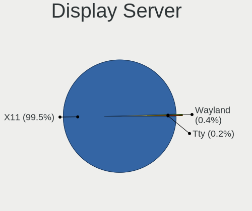

| Name | Computers | Percent |
|------|-----------|---------|
| X11  | 445       | 100%    |

Display Manager
---------------

SDDM, LightDM, etc.

| Name    | Computers | Percent |
|---------|-----------|---------|
| Unknown | 371       | 83%     |
| LightDM | 37        | 8.28%   |
| TDM     | 32        | 7.16%   |
| MDM     | 5         | 1.12%   |
| GDM3    | 1         | 0.22%   |
| GDM     | 1         | 0.22%   |

OS Lang
-------

Language

| Lang    | Computers | Percent |
|---------|-----------|---------|
| en_US   | 131       | 29.31%  |
| de_DE   | 44        | 9.84%   |
| pt_BR   | 43        | 9.62%   |
| ru_RU   | 23        | 5.15%   |
| en_GB   | 20        | 4.47%   |
| fr_FR   | 19        | 4.25%   |
| pl_PL   | 17        | 3.8%    |
| Unknown | 17        | 3.8%    |
| it_IT   | 12        | 2.68%   |
| es_ES   | 10        | 2.24%   |
| es_AR   | 9         | 2.01%   |
| en_CA   | 9         | 2.01%   |
| en_AU   | 9         | 2.01%   |
| es_MX   | 7         | 1.57%   |
| de_CH   | 5         | 1.12%   |
| nl_BE   | 4         | 0.89%   |
| el_GR   | 4         | 0.89%   |
| sv_SE   | 3         | 0.67%   |
| pt_PT   | 3         | 0.67%   |
| nl_NL   | 3         | 0.67%   |
| ja_JP   | 3         | 0.67%   |
| fr_CA   | 3         | 0.67%   |
| en_ZA   | 3         | 0.67%   |
| de_AT   | 3         | 0.67%   |
| bg_BG   | 3         | 0.67%   |
| unm_US  | 2         | 0.45%   |
| uk_UA   | 2         | 0.45%   |
| tr_TR   | 2         | 0.45%   |
| sk_SK   | 2         | 0.45%   |
| hu_HU   | 2         | 0.45%   |
| et_EE   | 2         | 0.45%   |
| es_CL   | 2         | 0.45%   |
| en_PH   | 2         | 0.45%   |
| en_IN   | 2         | 0.45%   |
| cs_CZ   | 2         | 0.45%   |
| ca_ES   | 2         | 0.45%   |
| zh_CN   | 1         | 0.22%   |
| ru_UA   | 1         | 0.22%   |
| ro_RO   | 1         | 0.22%   |
| nl_AW   | 1         | 0.22%   |
| nb_NO   | 1         | 0.22%   |
| ko_KR   | 1         | 0.22%   |
| it_CH   | 1         | 0.22%   |
| hr_HR   | 1         | 0.22%   |
| fr_BE   | 1         | 0.22%   |
| fi_FI   | 1         | 0.22%   |
| es_UY   | 1         | 0.22%   |
| es_PE   | 1         | 0.22%   |
| es_EC   | 1         | 0.22%   |
| es_CO   | 1         | 0.22%   |
| en_SG   | 1         | 0.22%   |
| en_NZ   | 1         | 0.22%   |
| da_DK   | 1         | 0.22%   |
| ar_EG   | 1         | 0.22%   |

Boot Mode
---------

EFI or BIOS

| Mode | Computers | Percent |
|------|-----------|---------|
| BIOS | 308       | 68.9%   |
| EFI  | 139       | 31.1%   |

Filesystem
----------

Type of filesystem

| Type    | Computers | Percent |
|---------|-----------|---------|
| Ext4    | 417       | 93.5%   |
| Btrfs   | 10        | 2.24%   |
| Unknown | 8         | 1.79%   |
| Tmpfs   | 5         | 1.12%   |
| Overlay | 4         | 0.9%    |
| Ext3    | 1         | 0.22%   |
| Aufs    | 1         | 0.22%   |

Part. scheme
------------

Scheme of partitioning

| Type    | Computers | Percent |
|---------|-----------|---------|
| Unknown | 367       | 82.1%   |
| GPT     | 45        | 10.07%  |
| MBR     | 35        | 7.83%   |

Dual Boot with Linux/BSD
------------------------

Hosting more than one Linux/BSD

| Dual boot | Computers | Percent |
|-----------|-----------|---------|
| No        | 423       | 94.63%  |
| Yes       | 24        | 5.37%   |

Dual Boot (Win)
---------------

Hosting Linux and Windows

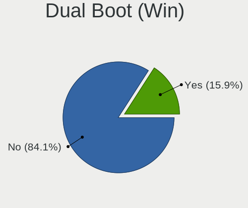

| Dual boot | Computers | Percent |
|-----------|-----------|---------|
| No        | 415       | 93.26%  |
| Yes       | 30        | 6.74%   |

Board
-----

Vendor
------

Motherboard manufacturer

| Name                           | Computers | Percent |
|--------------------------------|-----------|---------|
| Hewlett-Packard                | 72        | 16.18%  |
| ASUSTek Computer               | 67        | 15.06%  |
| Dell                           | 56        | 12.58%  |
| Acer                           | 39        | 8.76%   |
| Lenovo                         | 37        | 8.31%   |
| Gigabyte Technology            | 22        | 4.94%   |
| MSI                            | 21        | 4.72%   |
| ASRock                         | 13        | 2.92%   |
| Toshiba                        | 11        | 2.47%   |
| Unknown                        | 11        | 2.47%   |
| Samsung Electronics            | 8         | 1.8%    |
| Intel                          | 8         | 1.8%    |
| Sony                           | 7         | 1.57%   |
| Fujitsu Siemens                | 6         | 1.35%   |
| Positivo                       | 5         | 1.12%   |
| Apple                          | 5         | 1.12%   |
| LG Electronics                 | 4         | 0.9%    |
| ECS                            | 4         | 0.9%    |
| Packard Bell                   | 3         | 0.67%   |
| Foxconn                        | 3         | 0.67%   |
| Semp Toshiba                   | 2         | 0.45%   |
| Pegatron                       | 2         | 0.45%   |
| OEM                            | 2         | 0.45%   |
| Medion                         | 2         | 0.45%   |
| Matsushita Electric Industrial | 2         | 0.45%   |
| Gateway                        | 2         | 0.45%   |
| Fujitsu                        | 2         | 0.45%   |
| EVGA                           | 2         | 0.45%   |
| Biostar                        | 2         | 0.45%   |
| Wistron                        | 1         | 0.22%   |
| TUXEDO                         | 1         | 0.22%   |
| Supermicro                     | 1         | 0.22%   |
| SAELITE                        | 1         | 0.22%   |
| Qbex                           | 1         | 0.22%   |
| PCWare                         | 1         | 0.22%   |
| Panasonic                      | 1         | 0.22%   |
| NEC Computers                  | 1         | 0.22%   |
| Microsoft                      | 1         | 0.22%   |
| Maibenben                      | 1         | 0.22%   |
| LincPlus                       | 1         | 0.22%   |
| Itautec                        | 1         | 0.22%   |
| IBM                            | 1         | 0.22%   |
| HUAWEI                         | 1         | 0.22%   |
| Howard Computers               | 1         | 0.22%   |
| Google                         | 1         | 0.22%   |
| Exper                          | 1         | 0.22%   |
| Exo                            | 1         | 0.22%   |
| EVOO                           | 1         | 0.22%   |
| eMachines                      | 1         | 0.22%   |
| Dixonsxp                       | 1         | 0.22%   |
| Digma                          | 1         | 0.22%   |
| DFI                            | 1         | 0.22%   |
| Alienware                      | 1         | 0.22%   |
| Advent                         | 1         | 0.22%   |

Model
-----

Motherboard model

| Name                                        | Computers | Percent |
|---------------------------------------------|-----------|---------|
| Unknown                                     | 17        | 3.82%   |
| Samsung RV411/RV511/E3511/S3511/RV711/E3411 | 3         | 0.67%   |
| Dell Latitude E6400                         | 3         | 0.67%   |
| Lenovo IdeaPad 3 15ADA05 81W1               | 2         | 0.45%   |
| HP Pavilion dv7                             | 2         | 0.45%   |
| HP Pavilion dv6                             | 2         | 0.45%   |
| HP EliteBook 8540w                          | 2         | 0.45%   |
| HP 255 G7 Notebook PC                       | 2         | 0.45%   |
| HP 14                                       | 2         | 0.45%   |
| Dell OptiPlex 780                           | 2         | 0.45%   |
| ASUS X101CH                                 | 2         | 0.45%   |
| ASUS All Series                             | 2         | 0.45%   |
| Acer Aspire 5735                            | 2         | 0.45%   |
| Acer Aspire 3000                            | 2         | 0.45%   |
| Acer AOD270                                 | 2         | 0.45%   |
| Wistron ProLiant ML110 G5                   | 1         | 0.22%   |
| TUXEDO BC1510 1710                          | 1         | 0.22%   |
| Toshiba Satellite U300                      | 1         | 0.22%   |
| Toshiba Satellite P300                      | 1         | 0.22%   |
| Toshiba Satellite M100                      | 1         | 0.22%   |
| Toshiba Satellite L855                      | 1         | 0.22%   |
| Toshiba Satellite L750                      | 1         | 0.22%   |
| Toshiba Satellite L50-C                     | 1         | 0.22%   |
| Toshiba Satellite L455                      | 1         | 0.22%   |
| Toshiba Satellite C50-A-1DN                 | 1         | 0.22%   |
| Toshiba Satellite A200                      | 1         | 0.22%   |
| Toshiba LX835                               | 1         | 0.22%   |
| Toshiba dynabook Satellite J61 173C/5       | 1         | 0.22%   |
| Supermicro X8DT3                            | 1         | 0.22%   |
| Sony VPCSB3M1R                              | 1         | 0.22%   |
| Sony VPCS131FM                              | 1         | 0.22%   |
| Sony VPCP116KG                              | 1         | 0.22%   |
| Sony VPCEB1M1R                              | 1         | 0.22%   |
| Sony VGN-FZ140E                             | 1         | 0.22%   |
| Sony VGN-AW41MF_H                           | 1         | 0.22%   |
| Sony SVE1511N1ESI                           | 1         | 0.22%   |
| Semp Toshiba STI                            | 1         | 0.22%   |
| Semp Toshiba NI 1403                        | 1         | 0.22%   |
| Samsung RV413/RV513                         | 1         | 0.22%   |
| Samsung R59/R60/R61                         | 1         | 0.22%   |
| Samsung NC10                                | 1         | 0.22%   |
| Samsung 730QDA                              | 1         | 0.22%   |
| Samsung 305U1A                              | 1         | 0.22%   |
| SAELITE ES1AU11                             | 1         | 0.22%   |
| Qbex UDPAIOQBEX01                           | 1         | 0.22%   |
| Positivo W310CZ-T                           | 1         | 0.22%   |
| Positivo POS-EIH61CE                        | 1         | 0.22%   |
| Positivo MOBILE                             | 1         | 0.22%   |
| Positivo H14CU01                            | 1         | 0.22%   |
| Positivo DH8BW01                            | 1         | 0.22%   |
| Pegatron Elite 7300 Series MT               | 1         | 0.22%   |
| Pegatron 520-1188la                         | 1         | 0.22%   |
| PCWare IPMH81G1                             | 1         | 0.22%   |
| Panasonic CF-H2BJJHZDE                      | 1         | 0.22%   |
| Packard Bell EasyNote_NJ66                  | 1         | 0.22%   |
| Packard Bell EasyNote TE69BM                | 1         | 0.22%   |
| Packard Bell DOT S                          | 1         | 0.22%   |
| OEM 45CMX/45GMX/45CMX-K                     | 1         | 0.22%   |
| NEC Computers IMEDIA S9509                  | 1         | 0.22%   |
| MSI PX714AA-ABH t3040.nl                    | 1         | 0.22%   |

Model Family
------------

Motherboard model prefix

| Name                    | Computers | Percent |
|-------------------------|-----------|---------|
| Acer Aspire             | 30        | 6.74%   |
| Unknown                 | 17        | 3.82%   |
| Dell Latitude           | 16        | 3.6%    |
| Dell Inspiron           | 16        | 3.6%    |
| Lenovo ThinkPad         | 14        | 3.15%   |
| HP Pavilion             | 14        | 3.15%   |
| HP Compaq               | 11        | 2.47%   |
| Dell OptiPlex           | 10        | 2.25%   |
| Toshiba Satellite       | 9         | 2.02%   |
| Lenovo IdeaPad          | 9         | 2.02%   |
| Dell Precision          | 8         | 1.8%    |
| HP Laptop               | 7         | 1.57%   |
| HP EliteBook            | 7         | 1.57%   |
| ASUS PRIME              | 7         | 1.57%   |
| HP ProBook              | 5         | 1.12%   |
| Samsung RV411           | 3         | 0.67%   |
| Lenovo ThinkCentre      | 3         | 0.67%   |
| HP Presario             | 3         | 0.67%   |
| Gigabyte X570           | 3         | 0.67%   |
| Fujitsu Siemens ESPRIMO | 3         | 0.67%   |
| Packard Bell EasyNote   | 2         | 0.45%   |
| Lenovo Yoga             | 2         | 0.45%   |
| HP 255                  | 2         | 0.45%   |
| HP 14                   | 2         | 0.45%   |
| Gigabyte Z390           | 2         | 0.45%   |
| Foxconn 945             | 2         | 0.45%   |
| Dell XPS                | 2         | 0.45%   |
| ASUS X101CH             | 2         | 0.45%   |
| ASUS ROG                | 2         | 0.45%   |
| ASUS P5KPL-AM           | 2         | 0.45%   |
| ASUS All                | 2         | 0.45%   |
| Apple MacBookPro5       | 2         | 0.45%   |
| Acer Veriton            | 2         | 0.45%   |
| Acer Swift              | 2         | 0.45%   |
| Acer AOD270             | 2         | 0.45%   |
| Wistron ProLiant        | 1         | 0.22%   |
| TUXEDO BC1510           | 1         | 0.22%   |
| Toshiba LX835           | 1         | 0.22%   |
| Toshiba dynabook        | 1         | 0.22%   |
| Supermicro X8DT3        | 1         | 0.22%   |
| Sony VPCSB3M1R          | 1         | 0.22%   |
| Sony VPCS131FM          | 1         | 0.22%   |
| Sony VPCP116KG          | 1         | 0.22%   |
| Sony VPCEB1M1R          | 1         | 0.22%   |
| Sony VGN-FZ140E         | 1         | 0.22%   |
| Sony VGN-AW41MF         | 1         | 0.22%   |
| Sony SVE1511N1ESI       | 1         | 0.22%   |
| Semp Toshiba STI        | 1         | 0.22%   |
| Semp Toshiba NI         | 1         | 0.22%   |
| Samsung RV413           | 1         | 0.22%   |
| Samsung R59             | 1         | 0.22%   |
| Samsung NC10            | 1         | 0.22%   |
| Samsung 730QDA          | 1         | 0.22%   |
| Samsung 305U1A          | 1         | 0.22%   |
| SAELITE ES1AU11         | 1         | 0.22%   |
| Qbex UDPAIOQBEX01       | 1         | 0.22%   |
| Positivo W310CZ-T       | 1         | 0.22%   |
| Positivo POS-EIH61CE    | 1         | 0.22%   |
| Positivo MOBILE         | 1         | 0.22%   |
| Positivo H14CU01        | 1         | 0.22%   |

MFG Year
--------

Motherboard manufacture year

| Year    | Computers | Percent |
|---------|-----------|---------|
| 2012    | 45        | 10.11%  |
| 2010    | 41        | 9.21%   |
| 2009    | 39        | 8.76%   |
| 2007    | 38        | 8.54%   |
| 2011    | 36        | 8.09%   |
| 2008    | 32        | 7.19%   |
| 2018    | 29        | 6.52%   |
| 2013    | 28        | 6.29%   |
| 2014    | 26        | 5.84%   |
| 2019    | 23        | 5.17%   |
| 2020    | 18        | 4.04%   |
| 2017    | 17        | 3.82%   |
| 2016    | 16        | 3.6%    |
| 2006    | 16        | 3.6%    |
| 2015    | 13        | 2.92%   |
| 2005    | 10        | 2.25%   |
| 2021    | 9         | 2.02%   |
| 2003    | 5         | 1.12%   |
| 2004    | 2         | 0.45%   |
| 2002    | 1         | 0.22%   |
| Unknown | 1         | 0.22%   |

Form Factor
-----------

Physical design of the computer

| Name        | Computers | Percent |
|-------------|-----------|---------|
| Notebook    | 256       | 57.53%  |
| Desktop     | 168       | 37.75%  |
| All in one  | 7         | 1.57%   |
| Convertible | 6         | 1.35%   |
| Tablet      | 4         | 0.9%    |
| Server      | 3         | 0.67%   |
| Mini pc     | 1         | 0.22%   |

Secure Boot
-----------

Enabled or disabled

| State    | Computers | Percent |
|----------|-----------|---------|
| Disabled | 429       | 95.97%  |
| Enabled  | 18        | 4.03%   |

Coreboot
--------

Have coreboot on board

| Used | Computers | Percent |
|------|-----------|---------|
| No   | 444       | 99.78%  |
| Yes  | 1         | 0.22%   |

RAM Size
--------

Total RAM memory

| Size in GB  | Computers | Percent |
|-------------|-----------|---------|
| 3.01-4.0    | 126       | 28.06%  |
| 4.01-8.0    | 72        | 16.04%  |
| 8.01-16.0   | 64        | 14.25%  |
| 16.01-24.0  | 56        | 12.47%  |
| 2.01-3.0    | 54        | 12.03%  |
| 1.01-2.0    | 41        | 9.13%   |
| 32.01-64.0  | 16        | 3.56%   |
| 0.51-1.0    | 14        | 3.12%   |
| 24.01-32.0  | 3         | 0.67%   |
| 64.01-256.0 | 3         | 0.67%   |

RAM Used
--------

Used RAM memory

| Used GB    | Computers | Percent |
|------------|-----------|---------|
| 1.01-2.0   | 227       | 47.79%  |
| 2.01-3.0   | 90        | 18.95%  |
| 0.51-1.0   | 85        | 17.89%  |
| 3.01-4.0   | 46        | 9.68%   |
| 4.01-8.0   | 20        | 4.21%   |
| 8.01-16.0  | 3         | 0.63%   |
| 0.01-0.5   | 3         | 0.63%   |
| 32.01-64.0 | 1         | 0.21%   |

Total Drives
------------

Number of drives on board

| Drives | Computers | Percent |
|--------|-----------|---------|
| 1      | 279       | 61.32%  |
| 2      | 115       | 25.27%  |
| 3      | 27        | 5.93%   |
| 4      | 16        | 3.52%   |
| 7      | 5         | 1.1%    |
| 0      | 5         | 1.1%    |
| 6      | 4         | 0.88%   |
| 5      | 3         | 0.66%   |
| 8      | 1         | 0.22%   |

Has CD-ROM
----------

Has CD-ROM on board

| Presented | Computers | Percent |
|-----------|-----------|---------|
| Yes       | 251       | 55.65%  |
| No        | 200       | 44.35%  |

Has Ethernet
------------

Has Ethernet on board

| Presented | Computers | Percent |
|-----------|-----------|---------|
| Yes       | 418       | 93.93%  |
| No        | 27        | 6.07%   |

Has WiFi
--------

Has WiFi module

| Presented | Computers | Percent |
|-----------|-----------|---------|
| Yes       | 335       | 74.44%  |
| No        | 115       | 25.56%  |

Has Bluetooth
-------------

Has Bluetooth module

| Presented | Computers | Percent |
|-----------|-----------|---------|
| No        | 258       | 57.85%  |
| Yes       | 188       | 42.15%  |

Location
--------

Country
-------

Geographic location (country)

| Country             | Computers | Percent |
|---------------------|-----------|---------|
| USA                 | 63        | 14.16%  |
| Germany             | 49        | 11.01%  |
| Brazil              | 45        | 10.11%  |
| Russia              | 25        | 5.62%   |
| France              | 22        | 4.94%   |
| UK                  | 19        | 4.27%   |
| Canada              | 16        | 3.6%    |
| Poland              | 15        | 3.37%   |
| Italy               | 14        | 3.15%   |
| Spain               | 13        | 2.92%   |
| Ukraine             | 12        | 2.7%    |
| Netherlands         | 11        | 2.47%   |
| Australia           | 10        | 2.25%   |
| Bulgaria            | 9         | 2.02%   |
| Argentina           | 9         | 2.02%   |
| Mexico              | 8         | 1.8%    |
| Switzerland         | 6         | 1.35%   |
| Austria             | 6         | 1.35%   |
| Greece              | 5         | 1.12%   |
| Belgium             | 5         | 1.12%   |
| Turkey              | 4         | 0.9%    |
| Sweden              | 4         | 0.9%    |
| Romania             | 4         | 0.9%    |
| Portugal            | 4         | 0.9%    |
| Philippines         | 4         | 0.9%    |
| India               | 4         | 0.9%    |
| South Africa        | 3         | 0.67%   |
| Indonesia           | 3         | 0.67%   |
| Belarus             | 3         | 0.67%   |
| Bahrain             | 3         | 0.67%   |
| Venezuela           | 2         | 0.45%   |
| Tunisia             | 2         | 0.45%   |
| Puerto Rico         | 2         | 0.45%   |
| Luxembourg          | 2         | 0.45%   |
| Japan               | 2         | 0.45%   |
| Hungary             | 2         | 0.45%   |
| Finland             | 2         | 0.45%   |
| Estonia             | 2         | 0.45%   |
| Egypt               | 2         | 0.45%   |
| Czechia             | 2         | 0.45%   |
| Croatia             | 2         | 0.45%   |
| China               | 2         | 0.45%   |
| Chile               | 2         | 0.45%   |
| Bangladesh          | 2         | 0.45%   |
| Uruguay             | 1         | 0.22%   |
| Trinidad and Tobago | 1         | 0.22%   |
| South Korea         | 1         | 0.22%   |
| Slovakia            | 1         | 0.22%   |
| Singapore           | 1         | 0.22%   |
| Serbia              | 1         | 0.22%   |
| Peru                | 1         | 0.22%   |
| Pakistan            | 1         | 0.22%   |
| Norway              | 1         | 0.22%   |
| New Zealand         | 1         | 0.22%   |
| Myanmar             | 1         | 0.22%   |
| Latvia              | 1         | 0.22%   |
| Kenya               | 1         | 0.22%   |
| Ireland             | 1         | 0.22%   |
| Honduras            | 1         | 0.22%   |
| Ecuador             | 1         | 0.22%   |

City
----

Geographic location (city)

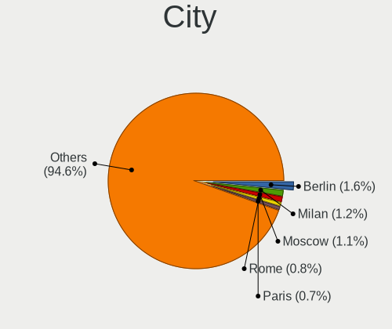

| City              | Computers | Percent |
|-------------------|-----------|---------|
| Paris             | 6         | 1.28%   |
| Zurich            | 5         | 1.07%   |
| Sofia             | 5         | 1.07%   |
| Sao Paulo         | 5         | 1.07%   |
| Moscow            | 5         | 1.07%   |
| Poznan            | 4         | 0.85%   |
| Perth             | 4         | 0.85%   |
| Montreal          | 4         | 0.85%   |
| Frankfurt am Main | 4         | 0.85%   |
| Athens            | 4         | 0.85%   |
| Wroclaw           | 3         | 0.64%   |
| St Petersburg     | 3         | 0.64%   |
| Seville           | 3         | 0.64%   |
| Rio de Janeiro    | 3         | 0.64%   |
| Manama            | 3         | 0.64%   |
| Madrid            | 3         | 0.64%   |
| Hamburg           | 3         | 0.64%   |
| Cape Town         | 3         | 0.64%   |
| Warsaw            | 2         | 0.43%   |
| Toronto           | 2         | 0.43%   |
| The Hague         | 2         | 0.43%   |
| So Lus    | 2         | 0.43%   |
| Sydney            | 2         | 0.43%   |
| Scarborough       | 2         | 0.43%   |
| Santa Rosa        | 2         | 0.43%   |
| San Juan          | 2         | 0.43%   |
| Rho               | 2         | 0.43%   |
| Rapla             | 2         | 0.43%   |
| Plovdiv           | 2         | 0.43%   |
| Penhold           | 2         | 0.43%   |
| Nottingham        | 2         | 0.43%   |
| Milan             | 2         | 0.43%   |
| Melbourne         | 2         | 0.43%   |
| Marseille         | 2         | 0.43%   |
| Marburg           | 2         | 0.43%   |
| Mannheim          | 2         | 0.43%   |
| Manila            | 2         | 0.43%   |
| Kyiv              | 2         | 0.43%   |
| Helsinki          | 2         | 0.43%   |
| Goinia        | 2         | 0.43%   |
| Glasgow           | 2         | 0.43%   |
| Florianpolis  | 2         | 0.43%   |
| Duisburg          | 2         | 0.43%   |
| Dhaka             | 2         | 0.43%   |
| Denver            | 2         | 0.43%   |
| Cologne           | 2         | 0.43%   |
| Chelyabinsk       | 2         | 0.43%   |
| Bursa             | 2         | 0.43%   |
| Buenos Aires      | 2         | 0.43%   |
| Berlin            | 2         | 0.43%   |
| Belo Horizonte    | 2         | 0.43%   |
| Barcelona         | 2         | 0.43%   |
| Angeles City      | 2         | 0.43%   |
| Zhukovskiy        | 1         | 0.21%   |
| Zhongshan         | 1         | 0.21%   |
| Zapopan           | 1         | 0.21%   |
| Zagreb            | 1         | 0.21%   |
| Yuzhno-Sakhalinsk | 1         | 0.21%   |
| Yokohama          | 1         | 0.21%   |
| Yevpatoriya       | 1         | 0.21%   |

Drives
------

Drive Vendor
------------

Hard drive vendors

| Vendor                         | Computers | Drives | Percent |
|--------------------------------|-----------|--------|---------|
| WDC                            | 123       | 186    | 20%     |
| Seagate                        | 97        | 145    | 15.77%  |
| Samsung Electronics            | 87        | 110    | 14.15%  |
| Hitachi                        | 37        | 41     | 6.02%   |
| Toshiba                        | 35        | 43     | 5.69%   |
| Kingston                       | 30        | 35     | 4.88%   |
| Unknown                        | 23        | 27     | 3.74%   |
| SanDisk                        | 20        | 28     | 3.25%   |
| Crucial                        | 17        | 22     | 2.76%   |
| Intel                          | 14        | 15     | 2.28%   |
| HGST                           | 12        | 13     | 1.95%   |
| Phison                         | 9         | 11     | 1.46%   |
| Fujitsu                        | 8         | 8      | 1.3%    |
| China                          | 8         | 9      | 1.3%    |
| SK Hynix                       | 7         | 11     | 1.14%   |
| A-DATA Technology              | 7         | 7      | 1.14%   |
| Micron Technology              | 6         | 7      | 0.98%   |
| Transcend                      | 5         | 7      | 0.81%   |
| Intenso                        | 5         | 6      | 0.81%   |
| KingSpec                       | 4         | 5      | 0.65%   |
| Patriot                        | 3         | 5      | 0.49%   |
| OCZ                            | 3         | 5      | 0.49%   |
| MAXTOR                         | 3         | 5      | 0.49%   |
| KingDian                       | 3         | 5      | 0.49%   |
| GOODRAM                        | 3         | 3      | 0.49%   |
| TCSUNBOW                       | 2         | 2      | 0.33%   |
| SABRENT                        | 2         | 2      | 0.33%   |
| PLEXTOR                        | 2         | 3      | 0.33%   |
| Mushkin                        | 2         | 2      | 0.33%   |
| JMicron                        | 2         | 3      | 0.33%   |
| IBM/Hitachi                    | 2         | 2      | 0.33%   |
| Hewlett-Packard                | 2         | 3      | 0.33%   |
| Gigabyte Technology            | 2         | 4      | 0.33%   |
| CT500MX5                       | 2         | 2      | 0.33%   |
| USB30                          | 1         | 2      | 0.16%   |
| Team                           | 1         | 2      | 0.16%   |
| Solid State Storage Technology | 1         | 1      | 0.16%   |
| Smartbuy                       | 1         | 1      | 0.16%   |
| Silicon Motion                 | 1         | 1      | 0.16%   |
| PNY                            | 1         | 1      | 0.16%   |
| Oyen                           | 1         | 1      | 0.16%   |
| OCZ-VERTEX                     | 1         | 1      | 0.16%   |
| Netac                          | 1         | 1      | 0.16%   |
| Micron/Crucial Technology      | 1         | 1      | 0.16%   |
| LITEON                         | 1         | 1      | 0.16%   |
| Kingmax                        | 1         | 1      | 0.16%   |
| KESU                           | 1         | 2      | 0.16%   |
| HUAWEI                         | 1         | 1      | 0.16%   |
| HPE                            | 1         | 5      | 0.16%   |
| Hikvision                      | 1         | 1      | 0.16%   |
| GALAX                          | 1         | 1      | 0.16%   |
| FORESEE                        | 1         | 1      | 0.16%   |
| ExcelStor                      | 1         | 1      | 0.16%   |
| DREVO                          | 1         | 2      | 0.16%   |
| Dogfish                        | 1         | 1      | 0.16%   |
| DAS                            | 1         | 4      | 0.16%   |
| CORSAIR                        | 1         | 1      | 0.16%   |
| BIWIN                          | 1         | 1      | 0.16%   |
| BAITITON                       | 1         | 1      | 0.16%   |
| ASUS-PHISON                    | 1         | 2      | 0.16%   |

Drive Model
-----------

Hard drive models

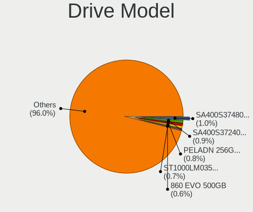

| Model                               | Computers | Percent |
|-------------------------------------|-----------|---------|
| Samsung SSD 860 EVO 500GB           | 9         | 1.34%   |
| Kingston SA400S37240G 240GB SSD     | 8         | 1.19%   |
| Seagate ST500LT012-1DG142 500GB     | 6         | 0.89%   |
| Unknown MMC Card  32GB              | 5         | 0.75%   |
| Samsung SSD 850 EVO 250GB           | 5         | 0.75%   |
| Kingston SA400S37120G 120GB SSD     | 5         | 0.75%   |
| WDC WD5000LPVX-22V0TT0 500GB        | 4         | 0.6%    |
| Unknown MMC Card  7GB               | 4         | 0.6%    |
| Toshiba MQ01ABF050 500GB            | 4         | 0.6%    |
| Toshiba MQ01ABD100 1TB              | 4         | 0.6%    |
| Toshiba DT01ACA100 1TB              | 4         | 0.6%    |
| Seagate ST1000DM010-2EP102 1TB      | 4         | 0.6%    |
| Seagate Expansion+ 2TB              | 4         | 0.6%    |
| Samsung SSD 860 EVO 1TB             | 4         | 0.6%    |
| Samsung SSD 850 EVO 500GB           | 4         | 0.6%    |
| Kingston SA400S37480G 480GB SSD     | 4         | 0.6%    |
| Crucial CT240BX500SSD1 240GB        | 4         | 0.6%    |
| WDC WDS120G2G0A-00JH30 120GB SSD    | 3         | 0.45%   |
| WDC WD3200BEVT-60ZCT1 320GB         | 3         | 0.45%   |
| WDC WD10EZEX-08WN4A0 1TB            | 3         | 0.45%   |
| Unknown SD/MMC/MS PRO 16GB          | 3         | 0.45%   |
| Unknown MMC Card  128GB             | 3         | 0.45%   |
| Seagate ST9500325AS 500GB           | 3         | 0.45%   |
| Seagate ST2000LX001-1RG174 2TB      | 3         | 0.45%   |
| Seagate ST2000DM008-2FR102 2TB      | 3         | 0.45%   |
| Seagate ST2000DM001-1ER164 2TB      | 3         | 0.45%   |
| Samsung SSD 970 EVO Plus 1TB        | 3         | 0.45%   |
| Samsung SSD 860 EVO 250GB           | 3         | 0.45%   |
| Samsung NVMe SSD Drive 256GB        | 3         | 0.45%   |
| Samsung HD322HJ 320GB               | 3         | 0.45%   |
| Samsung HD161HJ 160GB               | 3         | 0.45%   |
| Samsung HD103SJ 1TB                 | 3         | 0.45%   |
| Micron 1100_MTFDDAV256TBN 256GB SSD | 3         | 0.45%   |
| Kingston SV300S37A120G 120GB SSD    | 3         | 0.45%   |
| Hitachi HTS545032B9A300 320GB       | 3         | 0.45%   |
| China SATA SSD 120GB                | 3         | 0.45%   |
| WDC WDS240G2G0A-00JH30 240GB SSD    | 2         | 0.3%    |
| WDC WDBNCE5000PNC 500GB SSD         | 2         | 0.3%    |
| WDC WD7500BPVT-75HXZT3 752GB        | 2         | 0.3%    |
| WDC WD5000AAKX-75U6AA0 500GB        | 2         | 0.3%    |
| WDC WD5000AAKX-00U6AA0 500GB        | 2         | 0.3%    |
| WDC WD40EFRX-68N32N0 4TB            | 2         | 0.3%    |
| WDC WD3200BPVT-22JJ5T0 320GB        | 2         | 0.3%    |
| WDC WD3200AAKS-00L9A0 320GB         | 2         | 0.3%    |
| WDC WD2500BEVT-22ZCT0 250GB         | 2         | 0.3%    |
| WDC WD2500AAKX-753CA1 250GB         | 2         | 0.3%    |
| WDC WD1600BEVT-22ZCT0 160GB         | 2         | 0.3%    |
| WDC WD1600AABS-00PRA0 160GB         | 2         | 0.3%    |
| WDC WD1200BEVS-22UST0 120GB         | 2         | 0.3%    |
| WDC WD10EZEX-60WN4A0 1TB            | 2         | 0.3%    |
| WDC WD10EZEX-08M2NA0 1TB            | 2         | 0.3%    |
| WDC WD1003FZEX-00MK2A0 1TB          | 2         | 0.3%    |
| WDC PC SN530 NVMe 256GB             | 2         | 0.3%    |
| Unknown MMC Card  64GB              | 2         | 0.3%    |
| Unknown MMC Card  4GB               | 2         | 0.3%    |
| Unknown MMC Card  16GB              | 2         | 0.3%    |
| Toshiba MQ01ABD032 320GB            | 2         | 0.3%    |
| Toshiba HDWD110 1TB                 | 2         | 0.3%    |
| Seagate ST9320423AS 320GB           | 2         | 0.3%    |
| Seagate ST9250315AS 250GB           | 2         | 0.3%    |

HDD Vendor
----------

Hard disk drive vendors

| Vendor              | Computers | Drives | Percent |
|---------------------|-----------|--------|---------|
| WDC                 | 108       | 169    | 32.63%  |
| Seagate             | 96        | 143    | 29%     |
| Hitachi             | 37        | 41     | 11.18%  |
| Toshiba             | 29        | 32     | 8.76%   |
| Samsung Electronics | 27        | 35     | 8.16%   |
| HGST                | 12        | 13     | 3.63%   |
| Fujitsu             | 8         | 8      | 2.42%   |
| Unknown             | 3         | 3      | 0.91%   |
| MAXTOR              | 3         | 5      | 0.91%   |
| SABRENT             | 2         | 2      | 0.6%    |
| IBM/Hitachi         | 2         | 2      | 0.6%    |
| KESU                | 1         | 2      | 0.3%    |
| HPE                 | 1         | 5      | 0.3%    |
| ExcelStor           | 1         | 1      | 0.3%    |
| DAS                 | 1         | 4      | 0.3%    |

SSD Vendor
----------

Solid state drive vendors

| Vendor              | Computers | Drives | Percent |
|---------------------|-----------|--------|---------|
| Samsung Electronics | 48        | 56     | 22.54%  |
| Kingston            | 28        | 33     | 13.15%  |
| Crucial             | 17        | 22     | 7.98%   |
| SanDisk             | 16        | 24     | 7.51%   |
| WDC                 | 13        | 13     | 6.1%    |
| Intel               | 9         | 9      | 4.23%   |
| China               | 7         | 8      | 3.29%   |
| A-DATA Technology   | 7         | 7      | 3.29%   |
| Toshiba             | 6         | 11     | 2.82%   |
| Transcend           | 5         | 7      | 2.35%   |
| Micron Technology   | 5         | 6      | 2.35%   |
| Intenso             | 4         | 5      | 1.88%   |
| Patriot             | 3         | 5      | 1.41%   |
| OCZ                 | 3         | 5      | 1.41%   |
| KingSpec            | 3         | 4      | 1.41%   |
| KingDian            | 3         | 5      | 1.41%   |
| GOODRAM             | 3         | 3      | 1.41%   |
| Unknown             | 2         | 2      | 0.94%   |
| TCSUNBOW            | 2         | 2      | 0.94%   |
| SK Hynix            | 2         | 4      | 0.94%   |
| PLEXTOR             | 2         | 3      | 0.94%   |
| Hewlett-Packard     | 2         | 3      | 0.94%   |
| Gigabyte Technology | 2         | 4      | 0.94%   |
| CT500MX5            | 2         | 2      | 0.94%   |
| USB30               | 1         | 2      | 0.47%   |
| Team                | 1         | 2      | 0.47%   |
| Smartbuy            | 1         | 1      | 0.47%   |
| PNY                 | 1         | 1      | 0.47%   |
| OCZ-VERTEX          | 1         | 1      | 0.47%   |
| Netac               | 1         | 1      | 0.47%   |
| Mushkin             | 1         | 1      | 0.47%   |
| LITEON              | 1         | 1      | 0.47%   |
| Kingmax             | 1         | 1      | 0.47%   |
| Hikvision           | 1         | 1      | 0.47%   |
| GALAX               | 1         | 1      | 0.47%   |
| FORESEE             | 1         | 1      | 0.47%   |
| DREVO               | 1         | 2      | 0.47%   |
| Dogfish             | 1         | 1      | 0.47%   |
| CORSAIR             | 1         | 1      | 0.47%   |
| BIWIN               | 1         | 1      | 0.47%   |
| BAITITON            | 1         | 1      | 0.47%   |
| ASUS-PHISON         | 1         | 2      | 0.47%   |
| Acer                | 1         | 1      | 0.47%   |

Drive Kind
----------

HDD or SSD

| Kind    | Computers | Drives | Percent |
|---------|-----------|--------|---------|
| HDD     | 285       | 465    | 52.49%  |
| SSD     | 183       | 266    | 33.7%   |
| NVMe    | 48        | 60     | 8.84%   |
| MMC     | 19        | 22     | 3.5%    |
| Unknown | 8         | 10     | 1.47%   |

Drive Connector
---------------

SATA, SAS, NVMe, etc.

| Type | Computers | Drives | Percent |
|------|-----------|--------|---------|
| SATA | 407       | 695    | 81.08%  |
| NVMe | 48        | 60     | 9.56%   |
| SAS  | 28        | 46     | 5.58%   |
| MMC  | 19        | 22     | 3.78%   |

Drive Size
----------

Size of hard drive

| Size in TB | Computers | Drives | Percent |
|------------|-----------|--------|---------|
| 0.01-0.5   | 347       | 526    | 71.4%   |
| 0.51-1.0   | 95        | 134    | 19.55%  |
| 1.01-2.0   | 28        | 37     | 5.76%   |
| 3.01-4.0   | 8         | 17     | 1.65%   |
| 2.01-3.0   | 5         | 11     | 1.03%   |
| 4.01-10.0  | 3         | 6      | 0.62%   |

Space Total
-----------

Amount of disk space available on the file system

| Size in GB     | Computers | Percent |
|----------------|-----------|---------|
| 101-250        | 166       | 36.32%  |
| 251-500        | 105       | 22.98%  |
| 51-100         | 46        | 10.07%  |
| 501-1000       | 43        | 9.41%   |
| 1001-2000      | 31        | 6.78%   |
| More than 3000 | 26        | 5.69%   |
| 21-50          | 21        | 4.6%    |
| 2001-3000      | 10        | 2.19%   |
| 1-20           | 8         | 1.75%   |
| Unknown        | 1         | 0.22%   |

Space Used
----------

Amount of used disk space

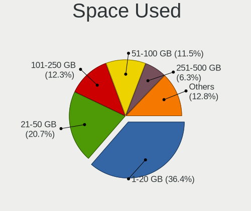

| Used GB        | Computers | Percent |
|----------------|-----------|---------|
| 1-20           | 210       | 44.03%  |
| 21-50          | 101       | 21.17%  |
| 101-250        | 50        | 10.48%  |
| 51-100         | 48        | 10.06%  |
| 251-500        | 20        | 4.19%   |
| 501-1000       | 15        | 3.14%   |
| 1001-2000      | 13        | 2.73%   |
| More than 3000 | 10        | 2.1%    |
| 2001-3000      | 9         | 1.89%   |
| Unknown        | 1         | 0.21%   |

Malfunc. Drives
---------------

Drive models with a malfunction

| Model                               | Computers | Drives | Percent |
|-------------------------------------|-----------|--------|---------|
| WDC WD3200BEVT-26A23T0 320GB        | 1         | 1      | 5.56%   |
| WDC WD2500BEVT-24A23T0 250GB        | 1         | 1      | 5.56%   |
| Seagate STM9120817AS 120GB          | 1         | 1      | 5.56%   |
| Seagate ST9640423AS 640GB           | 1         | 1      | 5.56%   |
| Seagate ST9320325AS 320GB           | 1         | 1      | 5.56%   |
| Seagate ST9120821AS 120GB           | 1         | 1      | 5.56%   |
| Seagate ST3250318AS 250GB           | 1         | 1      | 5.56%   |
| SanDisk SD9SN8W-128G-1006 128GB SSD | 1         | 1      | 5.56%   |
| Samsung Electronics SP2004C 200GB   | 1         | 1      | 5.56%   |
| Samsung Electronics MP0402H 40GB    | 1         | 1      | 5.56%   |
| Samsung Electronics HM500JI 500GB   | 1         | 1      | 5.56%   |
| Samsung Electronics HD103SJ 1TB     | 1         | 1      | 5.56%   |
| Phison ES 512GB                     | 1         | 1      | 5.56%   |
| Kingston SV300S37A120G 120GB SSD    | 1         | 1      | 5.56%   |
| Intel SSDSCKKF256G8 SATA 256GB      | 1         | 1      | 5.56%   |
| Hitachi HTS547575A9E384 752GB       | 1         | 1      | 5.56%   |
| Fujitsu MHZ2080BJ FFS G2 80GB       | 1         | 1      | 5.56%   |
| Crucial M4-CT256M4SSD2 256GB        | 1         | 1      | 5.56%   |

Malfunc. Drive Vendor
---------------------

Vendors of faulty drives

| Vendor              | Computers | Drives | Percent |
|---------------------|-----------|--------|---------|
| Seagate             | 5         | 5      | 27.78%  |
| Samsung Electronics | 4         | 4      | 22.22%  |
| WDC                 | 2         | 2      | 11.11%  |
| SanDisk             | 1         | 1      | 5.56%   |
| Phison              | 1         | 1      | 5.56%   |
| Kingston            | 1         | 1      | 5.56%   |
| Intel               | 1         | 1      | 5.56%   |
| Hitachi             | 1         | 1      | 5.56%   |
| Fujitsu             | 1         | 1      | 5.56%   |
| Crucial             | 1         | 1      | 5.56%   |

Malfunc. HDD Vendor
-------------------

Vendors of faulty HDD drives

| Vendor              | Computers | Drives | Percent |
|---------------------|-----------|--------|---------|
| Seagate             | 5         | 5      | 38.46%  |
| Samsung Electronics | 4         | 4      | 30.77%  |
| WDC                 | 2         | 2      | 15.38%  |
| Hitachi             | 1         | 1      | 7.69%   |
| Fujitsu             | 1         | 1      | 7.69%   |

Malfunc. Drive Kind
-------------------

Kinds of faulty drives

| Kind | Computers | Drives | Percent |
|------|-----------|--------|---------|
| HDD  | 13        | 13     | 72.22%  |
| SSD  | 4         | 4      | 22.22%  |
| NVMe | 1         | 1      | 5.56%   |

Failed Drives
-------------

Failed drive models

Zero info for selected period =(

Failed Drive Vendor
-------------------

Failed drive vendors

Zero info for selected period =(

Drive Status
------------

Number of failed and malfunc. drives

| Status   | Computers | Drives | Percent |
|----------|-----------|--------|---------|
| Detected | 372       | 689    | 81.22%  |
| Works    | 68        | 116    | 14.85%  |
| Malfunc  | 18        | 18     | 3.93%   |

Storage controller
------------------

Storage Vendor
--------------

Storage controller vendors

| Vendor                           | Computers | Percent |
|----------------------------------|-----------|---------|
| Intel                            | 333       | 65.04%  |
| AMD                              | 71        | 13.87%  |
| Nvidia                           | 17        | 3.32%   |
| Samsung Electronics              | 16        | 3.13%   |
| ASMedia Technology               | 10        | 1.95%   |
| Phison Electronics               | 9         | 1.76%   |
| JMicron Technology               | 9         | 1.76%   |
| Silicon Integrated Systems [SiS] | 8         | 1.56%   |
| Sandisk                          | 8         | 1.56%   |
| VIA Technologies                 | 7         | 1.37%   |
| SK Hynix                         | 5         | 0.98%   |
| Marvell Technology Group         | 4         | 0.78%   |
| Silicon Motion                   | 2         | 0.39%   |
| Silicon Image                    | 2         | 0.39%   |
| Kingston Technology Company      | 2         | 0.39%   |
| Broadcom / LSI                   | 2         | 0.39%   |
| Toshiba America Info Systems     | 1         | 0.2%    |
| Solid State Storage Technology   | 1         | 0.2%    |
| Micron/Crucial Technology        | 1         | 0.2%    |
| Micron Technology                | 1         | 0.2%    |
| LSI Logic / Symbios Logic        | 1         | 0.2%    |
| Integrated Technology Express    | 1         | 0.2%    |
| Apple                            | 1         | 0.2%    |

Storage Model
-------------

Storage controller models

| Model                                                                            | Computers | Percent |
|----------------------------------------------------------------------------------|-----------|---------|
| AMD FCH SATA Controller [AHCI mode]                                              | 39        | 6.02%   |
| Intel 82801G (ICH7 Family) IDE Controller                                        | 32        | 4.94%   |
| Intel NM10/ICH7 Family SATA Controller [IDE mode]                                | 20        | 3.09%   |
| Intel Sunrise Point-LP SATA Controller [AHCI mode]                               | 19        | 2.93%   |
| Intel 82801IBM/IEM (ICH9M/ICH9M-E) 4 port SATA Controller [AHCI mode]            | 19        | 2.93%   |
| Intel 7 Series Chipset Family 6-port SATA Controller [AHCI mode]                 | 17        | 2.62%   |
| Intel 82801 Mobile SATA Controller [RAID mode]                                   | 14        | 2.16%   |
| Intel 8 Series/C220 Series Chipset Family 6-port SATA Controller 1 [AHCI mode]   | 14        | 2.16%   |
| Intel 6 Series/C200 Series Chipset Family 6 port Mobile SATA AHCI Controller     | 14        | 2.16%   |
| Intel 6 Series/C200 Series Chipset Family 6 port Desktop SATA AHCI Controller    | 14        | 2.16%   |
| AMD SB7x0/SB8x0/SB9x0 SATA Controller [AHCI mode]                                | 14        | 2.16%   |
| Intel NM10/ICH7 Family SATA Controller [AHCI mode]                               | 12        | 1.85%   |
| Intel 82801GBM/GHM (ICH7-M Family) SATA Controller [AHCI mode]                   | 12        | 1.85%   |
| Intel 8 Series SATA Controller 1 [AHCI mode]                                     | 11        | 1.7%    |
| Intel 5 Series/3400 Series Chipset 4 port SATA AHCI Controller                   | 11        | 1.7%    |
| Intel 82801HM/HEM (ICH8M/ICH8M-E) SATA Controller [AHCI mode]                    | 10        | 1.54%   |
| Intel 82801HM/HEM (ICH8M/ICH8M-E) IDE Controller                                 | 10        | 1.54%   |
| Intel 82801GBM/GHM (ICH7-M Family) SATA Controller [IDE mode]                    | 10        | 1.54%   |
| Intel 5 Series/3400 Series Chipset 6 port SATA AHCI Controller                   | 10        | 1.54%   |
| ASMedia ASM1062 Serial ATA Controller                                            | 10        | 1.54%   |
| AMD SB7x0/SB8x0/SB9x0 IDE Controller                                             | 10        | 1.54%   |
| Samsung NVMe SSD Controller SM981/PM981/PM983                                    | 9         | 1.39%   |
| Intel 82801JI (ICH10 Family) SATA AHCI Controller                                | 8         | 1.23%   |
| Silicon Integrated Systems [SiS] 5513 IDE Controller                             | 7         | 1.08%   |
| Nvidia MCP61 SATA Controller                                                     | 7         | 1.08%   |
| Intel Cannon Lake PCH SATA AHCI Controller                                       | 7         | 1.08%   |
| Intel 82801I (ICH9 Family) 2 port SATA Controller [IDE mode]                     | 7         | 1.08%   |
| VIA VT82C586A/B/VT82C686/A/B/VT823x/A/C PIPC Bus Master IDE                      | 6         | 0.93%   |
| Intel Atom Processor E3800 Series SATA AHCI Controller                           | 6         | 0.93%   |
| Intel 7 Series/C210 Series Chipset Family 6-port SATA Controller [AHCI mode]     | 6         | 0.93%   |
| AMD SB7x0/SB8x0/SB9x0 SATA Controller [IDE mode]                                 | 6         | 0.93%   |
| AMD 400 Series Chipset SATA Controller                                           | 6         | 0.93%   |
| Phison E12 NVMe Controller                                                       | 5         | 0.77%   |
| Nvidia MCP61 IDE                                                                 | 5         | 0.77%   |
| JMicron JMB363 SATA/IDE Controller                                               | 5         | 0.77%   |
| Intel SATA Controller [RAID mode]                                                | 5         | 0.77%   |
| Intel Cannon Point-LP SATA Controller [AHCI Mode]                                | 5         | 0.77%   |
| Intel 82801JI (ICH10 Family) 4 port SATA IDE Controller #1                       | 5         | 0.77%   |
| Intel 82801JI (ICH10 Family) 2 port SATA IDE Controller #2                       | 5         | 0.77%   |
| SK Hynix BC501 NVMe Solid State Drive                                            | 4         | 0.62%   |
| Silicon Integrated Systems [SiS] SATA Controller / IDE mode                      | 4         | 0.62%   |
| Sandisk Non-Volatile memory controller                                           | 4         | 0.62%   |
| Samsung NVMe SSD Controller 980                                                  | 4         | 0.62%   |
| Intel Volume Management Device NVMe RAID Controller                              | 4         | 0.62%   |
| Intel US15W/US15X/US15L/UL11L SCH [Poulsbo] IDE Controller                       | 4         | 0.62%   |
| Intel Q170/Q150/B150/H170/H110/Z170/CM236 Chipset SATA Controller [AHCI Mode]    | 4         | 0.62%   |
| Intel Celeron/Pentium Silver Processor SATA Controller                           | 4         | 0.62%   |
| Intel Atom/Celeron/Pentium Processor x5-E8000/J3xxx/N3xxx Series SATA Controller | 4         | 0.62%   |
| Intel 9 Series Chipset Family SATA Controller [AHCI Mode]                        | 4         | 0.62%   |
| Intel 82801IR/IO/IH (ICH9R/DO/DH) 4 port SATA Controller [IDE mode]              | 4         | 0.62%   |
| Intel 82801IB (ICH9) 2 port SATA Controller [IDE mode]                           | 4         | 0.62%   |
| AMD IXP SB4x0 IDE Controller                                                     | 4         | 0.62%   |
| AMD FCH SATA Controller D                                                        | 4         | 0.62%   |
| VIA VIA VT6420 SATA RAID Controller                                              | 3         | 0.46%   |
| JMicron JMB368 IDE controller                                                    | 3         | 0.46%   |
| Intel Wildcat Point-LP SATA Controller [AHCI Mode]                               | 3         | 0.46%   |
| Intel HM170/QM170 Chipset SATA Controller [AHCI Mode]                            | 3         | 0.46%   |
| Intel 82Q35 Express PT IDER Controller                                           | 3         | 0.46%   |
| Intel 82801IR/IO/IH (ICH9R/DO/DH) 6 port SATA Controller [AHCI mode]             | 3         | 0.46%   |
| Intel 82801HM/HEM (ICH8M/ICH8M-E) SATA Controller [IDE mode]                     | 3         | 0.46%   |

Storage Kind
------------

Kind of storage controller (IDE, SATA, NVMe, SAS, ...)

| Kind | Computers | Percent |
|------|-----------|---------|
| SATA | 309       | 56.7%   |
| IDE  | 152       | 27.89%  |
| NVMe | 49        | 8.99%   |
| RAID | 31        | 5.69%   |
| SAS  | 2         | 0.37%   |
| SCSI | 2         | 0.37%   |

Processor
---------

CPU Vendor
----------

Processor vendors

| Vendor | Computers | Percent |
|--------|-----------|---------|
| Intel  | 354       | 79.55%  |
| AMD    | 91        | 20.45%  |

CPU Model
---------

Processor models

| Model                                        | Computers | Percent |
|----------------------------------------------|-----------|---------|
| Intel Atom CPU N2600 @ 1.60GHz               | 8         | 1.8%    |
| Intel Atom CPU N270 @ 1.60GHz                | 6         | 1.35%   |
| Intel Core 2 Duo CPU T6600 @ 2.20GHz         | 5         | 1.12%   |
| Intel Core i7-8565U CPU @ 1.80GHz            | 4         | 0.9%    |
| Intel Core i3-8100 CPU @ 3.60GHz             | 4         | 0.9%    |
| Intel Core 2 Duo CPU P8700 @ 2.53GHz         | 4         | 0.9%    |
| Intel Core 2 Duo CPU E7500 @ 2.93GHz         | 4         | 0.9%    |
| Intel Core 2 Duo CPU E4500 @ 2.20GHz         | 4         | 0.9%    |
| Intel Celeron CPU N2830 @ 2.16GHz            | 4         | 0.9%    |
| Intel Genuine CPU T2300 @ 1.66GHz            | 3         | 0.67%   |
| Intel Core i7-4790 CPU @ 3.60GHz             | 3         | 0.67%   |
| Intel Core i5-8250U CPU @ 1.60GHz            | 3         | 0.67%   |
| Intel Core i5-6200U CPU @ 2.30GHz            | 3         | 0.67%   |
| Intel Core i5-4210U CPU @ 1.70GHz            | 3         | 0.67%   |
| Intel Core i5-3210M CPU @ 2.50GHz            | 3         | 0.67%   |
| Intel Core i3-8130U CPU @ 2.20GHz            | 3         | 0.67%   |
| Intel Core i3-3110M CPU @ 2.40GHz            | 3         | 0.67%   |
| Intel Core 2 Quad CPU Q6600 @ 2.40GHz        | 3         | 0.67%   |
| Intel Core 2 Duo CPU T8300 @ 2.40GHz         | 3         | 0.67%   |
| Intel Core 2 Duo CPU P8600 @ 2.40GHz         | 3         | 0.67%   |
| Intel Core 2 Duo CPU E7400 @ 2.80GHz         | 3         | 0.67%   |
| Intel 11th Gen Core i5-1135G7 @ 2.40GHz      | 3         | 0.67%   |
| AMD A9-9425 RADEON R5, 5 COMPUTE CORES 2C+3G | 3         | 0.67%   |
| Intel Pentium M processor 2.00GHz            | 2         | 0.45%   |
| Intel Pentium Dual-Core CPU T4200 @ 2.00GHz  | 2         | 0.45%   |
| Intel Pentium Dual-Core CPU E5700 @ 3.00GHz  | 2         | 0.45%   |
| Intel Pentium Dual CPU T3400 @ 2.16GHz       | 2         | 0.45%   |
| Intel Pentium D CPU 3.00GHz                  | 2         | 0.45%   |
| Intel Pentium D CPU 2.80GHz                  | 2         | 0.45%   |
| Intel Pentium CPU P6100 @ 2.00GHz            | 2         | 0.45%   |
| Intel Pentium CPU N3710 @ 1.60GHz            | 2         | 0.45%   |
| Intel Pentium CPU G645 @ 2.90GHz             | 2         | 0.45%   |
| Intel Pentium CPU G2030 @ 3.00GHz            | 2         | 0.45%   |
| Intel Pentium 4 CPU 2.80GHz                  | 2         | 0.45%   |
| Intel Genuine CPU T2130 @ 1.86GHz            | 2         | 0.45%   |
| Intel Core i7-9700 CPU @ 3.00GHz             | 2         | 0.45%   |
| Intel Core i7-8700K CPU @ 3.70GHz            | 2         | 0.45%   |
| Intel Core i7-8550U CPU @ 1.80GHz            | 2         | 0.45%   |
| Intel Core i7-6820HQ CPU @ 2.70GHz           | 2         | 0.45%   |
| Intel Core i7-6700HQ CPU @ 2.60GHz           | 2         | 0.45%   |
| Intel Core i7-4810MQ CPU @ 2.80GHz           | 2         | 0.45%   |
| Intel Core i7-4800MQ CPU @ 2.70GHz           | 2         | 0.45%   |
| Intel Core i7-4770K CPU @ 3.50GHz            | 2         | 0.45%   |
| Intel Core i7-2670QM CPU @ 2.20GHz           | 2         | 0.45%   |
| Intel Core i7-2600 CPU @ 3.40GHz             | 2         | 0.45%   |
| Intel Core i7 CPU Q 720 @ 1.60GHz            | 2         | 0.45%   |
| Intel Core i7 CPU M 620 @ 2.67GHz            | 2         | 0.45%   |
| Intel Core i5-8265U CPU @ 1.60GHz            | 2         | 0.45%   |
| Intel Core i5-4200U CPU @ 1.60GHz            | 2         | 0.45%   |
| Intel Core i5-3570K CPU @ 3.40GHz            | 2         | 0.45%   |
| Intel Core i5-3470 CPU @ 3.20GHz             | 2         | 0.45%   |
| Intel Core i5-3320M CPU @ 2.60GHz            | 2         | 0.45%   |
| Intel Core i5-2450M CPU @ 2.50GHz            | 2         | 0.45%   |
| Intel Core i5-2410M CPU @ 2.30GHz            | 2         | 0.45%   |
| Intel Core i5-2400 CPU @ 3.10GHz             | 2         | 0.45%   |
| Intel Core i5 CPU 750 @ 2.67GHz              | 2         | 0.45%   |
| Intel Core i5 CPU 650 @ 3.20GHz              | 2         | 0.45%   |
| Intel Core i3-8145U CPU @ 2.10GHz            | 2         | 0.45%   |
| Intel Core i3-6006U CPU @ 2.00GHz            | 2         | 0.45%   |
| Intel Core i3-3217U CPU @ 1.80GHz            | 2         | 0.45%   |

CPU Model Family
----------------

Processor model prefix

| Model                          | Computers | Percent |
|--------------------------------|-----------|---------|
| Intel Core i5                  | 61        | 13.71%  |
| Intel Core i7                  | 54        | 12.13%  |
| Intel Core 2 Duo               | 45        | 10.11%  |
| Intel Core i3                  | 39        | 8.76%   |
| Intel Celeron                  | 27        | 6.07%   |
| Intel Atom                     | 24        | 5.39%   |
| Intel Pentium                  | 17        | 3.82%   |
| Other                          | 13        | 2.92%   |
| AMD Ryzen 5                    | 13        | 2.92%   |
| Intel Xeon                     | 12        | 2.7%    |
| Intel Core 2                   | 10        | 2.25%   |
| Intel Pentium Dual-Core        | 9         | 2.02%   |
| Intel Core 2 Quad              | 9         | 2.02%   |
| AMD Ryzen 7                    | 9         | 2.02%   |
| Intel Pentium Dual             | 8         | 1.8%    |
| Intel Genuine                  | 8         | 1.8%    |
| AMD Sempron                    | 6         | 1.35%   |
| Intel Pentium M                | 5         | 1.12%   |
| Intel Pentium D                | 5         | 1.12%   |
| Intel Pentium 4                | 5         | 1.12%   |
| AMD FX                         | 5         | 1.12%   |
| AMD Athlon 64 X2               | 5         | 1.12%   |
| AMD A4                         | 5         | 1.12%   |
| Intel Core Duo                 | 3         | 0.67%   |
| AMD Turion 64 X2 Mobile        | 3         | 0.67%   |
| AMD Ryzen 3                    | 3         | 0.67%   |
| AMD Phenom II X4               | 3         | 0.67%   |
| AMD Athlon XP                  | 3         | 0.67%   |
| AMD Athlon                     | 3         | 0.67%   |
| Intel Core i9                  | 2         | 0.45%   |
| Intel Celeron M                | 2         | 0.45%   |
| AMD Phenom II X6               | 2         | 0.45%   |
| AMD Mobile Sempron             | 2         | 0.45%   |
| AMD E2                         | 2         | 0.45%   |
| AMD E                          | 2         | 0.45%   |
| AMD Athlon II X4               | 2         | 0.45%   |
| AMD Athlon II                  | 2         | 0.45%   |
| AMD A8                         | 2         | 0.45%   |
| AMD A10                        | 2         | 0.45%   |
| Intel Mobile Pentium 4         | 1         | 0.22%   |
| Intel Core m5                  | 1         | 0.22%   |
| AMD Turion X2 Dual-Core Mobile | 1         | 0.22%   |
| AMD Turion II Neo              | 1         | 0.22%   |
| AMD Turion 64 Mobile           | 1         | 0.22%   |
| AMD Ryzen 9                    | 1         | 0.22%   |
| AMD Ryzen 5 PRO                | 1         | 0.22%   |
| AMD Phenom II X2               | 1         | 0.22%   |
| AMD Phenom II                  | 1         | 0.22%   |
| AMD E1                         | 1         | 0.22%   |
| AMD Athlon Neo                 | 1         | 0.22%   |
| AMD Athlon II X2               | 1         | 0.22%   |
| AMD A6                         | 1         | 0.22%   |

CPU Cores
---------

Number of processor cores

| Number | Computers | Percent |
|--------|-----------|---------|
| 2      | 249       | 55.83%  |
| 4      | 112       | 25.11%  |
| 1      | 49        | 10.99%  |
| 6      | 16        | 3.59%   |
| 8      | 13        | 2.91%   |
| 12     | 3         | 0.67%   |
| 3      | 2         | 0.45%   |
| 16     | 1         | 0.22%   |
| 10     | 1         | 0.22%   |

CPU Sockets
-----------

Number of sockets

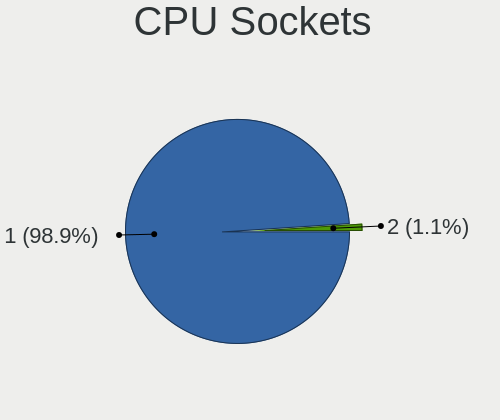

| Number | Computers | Percent |
|--------|-----------|---------|
| 1      | 440       | 98.88%  |
| 2      | 5         | 1.12%   |

CPU Threads
-----------

Threads per core (Hyper-Threading)

| Number | Computers | Percent |
|--------|-----------|---------|
| 1      | 231       | 51.91%  |
| 2      | 214       | 48.09%  |

CPU Op-Modes
------------

CPU Operation Modes (32-bit, 64-bit)

| Op mode        | Computers | Percent |
|----------------|-----------|---------|
| 32-bit, 64-bit | 399       | 89.66%  |
| 32-bit         | 46        | 10.34%  |

CPU Microcode
-------------

Microcode number

| Number     | Computers | Percent |
|------------|-----------|---------|
| 0x1067a    | 37        | 8.24%   |
| Unknown    | 37        | 8.24%   |
| 0x206a7    | 33        | 7.35%   |
| 0x306a9    | 27        | 6.01%   |
| 0x6fd      | 18        | 4.01%   |
| 0x306c3    | 18        | 4.01%   |
| 0x40651    | 11        | 2.45%   |
| 0x20655    | 11        | 2.45%   |
| 0x106c2    | 11        | 2.45%   |
| 0x406e3    | 10        | 2.23%   |
| 0x30661    | 10        | 2.23%   |
| 0x6f6      | 9         | 2%      |
| 0x806ea    | 8         | 1.78%   |
| 0x06006705 | 8         | 1.78%   |
| 0x010000c8 | 8         | 1.78%   |
| 0x6ec      | 7         | 1.56%   |
| 0x506e3    | 7         | 1.56%   |
| 0x10676    | 7         | 1.56%   |
| 0x806c1    | 6         | 1.34%   |
| 0x20652    | 6         | 1.34%   |
| 0x106e5    | 6         | 1.34%   |
| 0x08108109 | 6         | 1.34%   |
| 0x806e9    | 5         | 1.11%   |
| 0x6fb      | 5         | 1.11%   |
| 0x6e8      | 5         | 1.11%   |
| 0x30678    | 5         | 1.11%   |
| 0x10677    | 5         | 1.11%   |
| 0xf29      | 4         | 0.89%   |
| 0x906ed    | 4         | 0.89%   |
| 0x906eb    | 4         | 0.89%   |
| 0x906ea    | 4         | 0.89%   |
| 0x806ec    | 4         | 0.89%   |
| 0xf65      | 3         | 0.67%   |
| 0xf64      | 3         | 0.67%   |
| 0x806eb    | 3         | 0.67%   |
| 0x6d8      | 3         | 0.67%   |
| 0x406c4    | 3         | 0.67%   |
| 0x306d4    | 3         | 0.67%   |
| 0x206c2    | 3         | 0.67%   |
| 0x106a5    | 3         | 0.67%   |
| 0x10661    | 3         | 0.67%   |
| 0x08108102 | 3         | 0.67%   |
| 0x06001119 | 3         | 0.67%   |
| 0x706a8    | 2         | 0.45%   |
| 0x706a1    | 2         | 0.45%   |
| 0x6f2      | 2         | 0.45%   |
| 0x506c9    | 2         | 0.45%   |
| 0x406c3    | 2         | 0.45%   |
| 0x30673    | 2         | 0.45%   |
| 0x106ca    | 2         | 0.45%   |
| 0x08701021 | 2         | 0.45%   |
| 0x08701013 | 2         | 0.45%   |
| 0x08608103 | 2         | 0.45%   |
| 0x08200103 | 2         | 0.45%   |
| 0x08101016 | 2         | 0.45%   |
| 0x0810100b | 2         | 0.45%   |
| 0x0800820d | 2         | 0.45%   |
| 0x07030105 | 2         | 0.45%   |
| 0x06000852 | 2         | 0.45%   |
| 0x0600063e | 2         | 0.45%   |

CPU Microarch
-------------

Microarchitecture

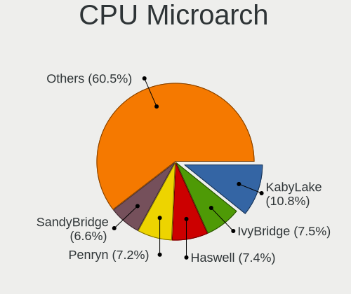

| Name            | Computers | Percent |
|-----------------|-----------|---------|
| Penryn          | 53        | 11.91%  |
| SandyBridge     | 38        | 8.54%   |
| Core            | 38        | 8.54%   |
| KabyLake        | 35        | 7.87%   |
| Haswell         | 31        | 6.97%   |
| IvyBridge       | 27        | 6.07%   |
| Bonnell         | 24        | 5.39%   |
| Westmere        | 20        | 4.49%   |
| Skylake         | 17        | 3.82%   |
| P6              | 17        | 3.82%   |
| K8 Hammer       | 16        | 3.6%    |
| K10             | 14        | 3.15%   |
| Zen+            | 12        | 2.7%    |
| Silvermont      | 12        | 2.7%    |
| NetBurst        | 12        | 2.7%    |
| Zen             | 10        | 2.25%   |
| Nehalem         | 9         | 2.02%   |
| Excavator       | 9         | 2.02%   |
| TigerLake       | 6         | 1.35%   |
| Piledriver      | 6         | 1.35%   |
| Zen 2           | 5         | 1.12%   |
| Goldmont plus   | 4         | 0.9%    |
| Broadwell       | 4         | 0.9%    |
| Puma            | 3         | 0.67%   |
| K6              | 3         | 0.67%   |
| CometLake       | 3         | 0.67%   |
| Bobcat          | 3         | 0.67%   |
| Unknown         | 3         | 0.67%   |
| Zen 3           | 2         | 0.45%   |
| K8 & K10 hybrid | 2         | 0.45%   |
| Goldmont        | 2         | 0.45%   |
| Bulldozer       | 2         | 0.45%   |
| K10 Llano       | 1         | 0.22%   |
| Jaguar          | 1         | 0.22%   |
| IceLake         | 1         | 0.22%   |

Graphics
--------

GPU Vendor
----------

Vendors of graphics cards

| Vendor                           | Computers | Percent |
|----------------------------------|-----------|---------|
| Intel                            | 238       | 47.98%  |
| Nvidia                           | 132       | 26.61%  |
| AMD                              | 110       | 22.18%  |
| VIA Technologies                 | 5         | 1.01%   |
| Silicon Integrated Systems [SiS] | 5         | 1.01%   |
| Matrox Electronics Systems       | 4         | 0.81%   |
| S3 Graphics                      | 1         | 0.2%    |
| ASPEED Technology                | 1         | 0.2%    |

GPU Model
---------

Graphics card models

| Model                                                                                      | Computers | Percent |
|--------------------------------------------------------------------------------------------|-----------|---------|
| Intel 2nd Generation Core Processor Family Integrated Graphics Controller                  | 31        | 5.88%   |
| Intel Mobile 945GM/GMS/GME, 943/940GML Express Integrated Graphics Controller              | 16        | 3.04%   |
| Intel 3rd Gen Core processor Graphics Controller                                           | 16        | 3.04%   |
| Intel Mobile 4 Series Chipset Integrated Graphics Controller                               | 14        | 2.66%   |
| Intel Core Processor Integrated Graphics Controller                                        | 13        | 2.47%   |
| Intel Haswell-ULT Integrated Graphics Controller                                           | 10        | 1.9%    |
| Intel Atom Processor D2xxx/N2xxx Integrated Graphics Controller                            | 10        | 1.9%    |
| AMD Picasso/Raven 2 [Radeon Vega Series / Radeon Vega Mobile Series]                       | 10        | 1.9%    |
| Intel WhiskeyLake-U GT2 [UHD Graphics 620]                                                 | 8         | 1.52%   |
| Intel UHD Graphics 620                                                                     | 8         | 1.52%   |
| Intel Skylake GT2 [HD Graphics 520]                                                        | 8         | 1.52%   |
| Intel Mobile 945GSE Express Integrated Graphics Controller                                 | 8         | 1.52%   |
| Intel Mobile 945GM/GMS, 943/940GML Express Integrated Graphics Controller                  | 8         | 1.52%   |
| AMD Stoney [Radeon R2/R3/R4/R5 Graphics]                                                   | 8         | 1.52%   |
| Nvidia GM206 [GeForce GTX 960]                                                             | 7         | 1.33%   |
| Intel CoffeeLake-S GT2 [UHD Graphics 630]                                                  | 7         | 1.33%   |
| Intel Atom Processor Z36xxx/Z37xxx Series Graphics & Display                               | 7         | 1.33%   |
| Intel 4th Gen Core Processor Integrated Graphics Controller                                | 7         | 1.33%   |
| Intel 4 Series Chipset Integrated Graphics Controller                                      | 7         | 1.33%   |
| Nvidia GT218 [GeForce 210]                                                                 | 6         | 1.14%   |
| Intel Xeon E3-1200 v3/4th Gen Core Processor Integrated Graphics Controller                | 6         | 1.14%   |
| Intel Xeon E3-1200 v2/3rd Gen Core processor Graphics Controller                           | 6         | 1.14%   |
| AMD Ellesmere [Radeon RX 470/480/570/570X/580/580X/590]                                    | 6         | 1.14%   |
| Intel TigerLake-LP GT2 [Iris Xe Graphics]                                                  | 5         | 0.95%   |
| Intel Mobile GM965/GL960 Integrated Graphics Controller (secondary)                        | 5         | 0.95%   |
| Intel Mobile GM965/GL960 Integrated Graphics Controller (primary)                          | 5         | 0.95%   |
| Intel Atom/Celeron/Pentium Processor x5-E8000/J3xxx/N3xxx Integrated Graphics Controller   | 5         | 0.95%   |
| AMD Raven Ridge [Radeon Vega Series / Radeon Vega Mobile Series]                           | 5         | 0.95%   |
| Nvidia GP107 [GeForce GTX 1050 Ti]                                                         | 4         | 0.76%   |
| Nvidia GK208B [GeForce GT 710]                                                             | 4         | 0.76%   |
| Intel US15W/US15X SCH [Poulsbo] Graphics Controller                                        | 4         | 0.76%   |
| Intel HD Graphics 530                                                                      | 4         | 0.76%   |
| Intel GeminiLake [UHD Graphics 600]                                                        | 4         | 0.76%   |
| AMD RS880M [Mobility Radeon HD 4225/4250]                                                  | 4         | 0.76%   |
| Silicon Integrated Systems [SiS] 771/671 PCIE VGA Display Adapter                          | 3         | 0.57%   |
| Nvidia GF108M [GeForce GT 525M]                                                            | 3         | 0.57%   |
| Intel Mobile 915GM/GMS/910GML Express Graphics Controller                                  | 3         | 0.57%   |
| Intel 82G33/G31 Express Integrated Graphics Controller                                     | 3         | 0.57%   |
| Intel 82945G/GZ Integrated Graphics Controller                                             | 3         | 0.57%   |
| AMD RV710/M92 [Mobility Radeon HD 4530/4570/545v]                                          | 3         | 0.57%   |
| AMD Madison [Mobility Radeon HD 5650/5750 / 6530M/6550M]                                   | 3         | 0.57%   |
| AMD Cedar [Radeon HD 5000/6000/7350/8350 Series]                                           | 3         | 0.57%   |
| VIA Technologies CN896/VN896/P4M900 [Chrome 9 HC]                                          | 2         | 0.38%   |
| Silicon Integrated Systems [SiS] 661/741/760 PCI/AGP or 662/761Gx PCIE VGA Display Adapter | 2         | 0.38%   |
| Nvidia TU106 [GeForce RTX 2070]                                                            | 2         | 0.38%   |
| Nvidia GT218M [NVS 3100M]                                                                  | 2         | 0.38%   |
| Nvidia GP108M [GeForce MX150]                                                              | 2         | 0.38%   |
| Nvidia GP107 [GeForce GTX 1050]                                                            | 2         | 0.38%   |
| Nvidia GP106 [GeForce GTX 1060 3GB]                                                        | 2         | 0.38%   |
| Nvidia GP104 [GeForce GTX 1070]                                                            | 2         | 0.38%   |
| Nvidia GM108M [GeForce 940MX]                                                              | 2         | 0.38%   |
| Nvidia GM107M [GeForce GTX 960M]                                                           | 2         | 0.38%   |
| Nvidia GK208B [GeForce GT 730]                                                             | 2         | 0.38%   |
| Nvidia GK107M [GeForce GT 750M]                                                            | 2         | 0.38%   |
| Nvidia GK106GLM [Quadro K2100M]                                                            | 2         | 0.38%   |
| Nvidia GK104 [GeForce GTX 760]                                                             | 2         | 0.38%   |
| Nvidia GF119M [NVS 4200M]                                                                  | 2         | 0.38%   |
| Nvidia GF116 [GeForce GTX 550 Ti]                                                          | 2         | 0.38%   |
| Nvidia GF114 [GeForce GTX 560 Ti]                                                          | 2         | 0.38%   |
| Nvidia GF108GLM [Quadro 1000M]                                                             | 2         | 0.38%   |

GPU Combo
---------

Combinations of graphics cards

| Name            | Computers | Percent |
|-----------------|-----------|---------|
| 1 x Intel       | 188       | 42.15%  |
| 1 x Nvidia      | 100       | 22.42%  |
| 1 x AMD         | 93        | 20.85%  |
| Intel + Nvidia  | 31        | 6.95%   |
| Intel + AMD     | 11        | 2.47%   |
| 2 x AMD         | 6         | 1.35%   |
| 1 x VIA         | 5         | 1.12%   |
| 1 x SiS         | 5         | 1.12%   |
| 1 x Matrox      | 4         | 0.9%    |
| 2 x Nvidia      | 1         | 0.22%   |
| 1 x S3 Graphics | 1         | 0.22%   |
| 1 x ASPEED      | 1         | 0.22%   |

GPU Driver
----------

Free vs proprietary

| Driver      | Computers | Percent |
|-------------|-----------|---------|
| Free        | 360       | 80.18%  |
| Unknown     | 47        | 10.47%  |
| Proprietary | 42        | 9.35%   |

GPU Memory
----------

Total video memory

| Size in GB | Computers | Percent |
|------------|-----------|---------|
| Unknown    | 257       | 57.37%  |
| 0.01-0.5   | 71        | 15.85%  |
| 0.51-1.0   | 44        | 9.82%   |
| 1.01-2.0   | 43        | 9.6%    |
| 3.01-4.0   | 18        | 4.02%   |
| 7.01-8.0   | 10        | 2.23%   |
| 2.01-3.0   | 3         | 0.67%   |
| 5.01-6.0   | 2         | 0.45%   |

Monitor
-------

Monitor Vendor
--------------

Monitor vendors

| Vendor                  | Computers | Percent |
|-------------------------|-----------|---------|
| Samsung Electronics     | 70        | 15.73%  |
| AU Optronics            | 48        | 10.79%  |
| LG Display              | 36        | 8.09%   |
| BOE                     | 30        | 6.74%   |
| Goldstar                | 26        | 5.84%   |
| Chimei Innolux          | 22        | 4.94%   |
| Dell                    | 21        | 4.72%   |
| Acer                    | 21        | 4.72%   |
| Chi Mei Optoelectronics | 13        | 2.92%   |
| Hewlett-Packard         | 11        | 2.47%   |
| AOC                     | 11        | 2.47%   |
| Ancor Communications    | 11        | 2.47%   |
| LG Philips              | 10        | 2.25%   |
| Lenovo                  | 10        | 2.25%   |
| BenQ                    | 10        | 2.25%   |
| Philips                 | 8         | 1.8%    |
| Unknown                 | 7         | 1.57%   |
| Sony                    | 7         | 1.57%   |
| HannStar                | 7         | 1.57%   |
| Apple                   | 6         | 1.35%   |
| Fujitsu Siemens         | 4         | 0.9%    |
| Quanta Display          | 3         | 0.67%   |
| PANDA                   | 3         | 0.67%   |
| Iiyama                  | 3         | 0.67%   |
| CPT                     | 3         | 0.67%   |
| Toshiba                 | 2         | 0.45%   |
| Sceptre Tech            | 2         | 0.45%   |
| NEC Computers           | 2         | 0.45%   |
| Medion                  | 2         | 0.45%   |
| LG Electronics          | 2         | 0.45%   |
| InfoVision              | 2         | 0.45%   |
| eMachines               | 2         | 0.45%   |
| Belinea                 | 2         | 0.45%   |
| ___                     | 1         | 0.22%   |
| ViewSonic               | 1         | 0.22%   |
| Vestel                  | 1         | 0.22%   |
| Targa Visionary         | 1         | 0.22%   |
| Sharp                   | 1         | 0.22%   |
| Seiko/Epson             | 1         | 0.22%   |
| RTK                     | 1         | 0.22%   |
| Planar                  | 1         | 0.22%   |
| Panasonic               | 1         | 0.22%   |
| OEM                     | 1         | 0.22%   |
| NCS                     | 1         | 0.22%   |
| MLT                     | 1         | 0.22%   |
| Mitsubishi              | 1         | 0.22%   |
| Microstep               | 1         | 0.22%   |
| InnoLux Display         | 1         | 0.22%   |
| IBM                     | 1         | 0.22%   |
| Hitachi                 | 1         | 0.22%   |
| ELSA International      | 1         | 0.22%   |
| Elo Touch               | 1         | 0.22%   |
| ELO                     | 1         | 0.22%   |
| Eizo                    | 1         | 0.22%   |
| DENON                   | 1         | 0.22%   |
| Compal                  | 1         | 0.22%   |
| BLS                     | 1         | 0.22%   |
| AUS                     | 1         | 0.22%   |
| ASUSTek Computer        | 1         | 0.22%   |
| AOpen                   | 1         | 0.22%   |

Monitor Model
-------------

Monitor models

| Model                                                                    | Computers | Percent |
|--------------------------------------------------------------------------|-----------|---------|
| AU Optronics LCD Monitor AUO21ED 1920x1080 344x194mm 15.5-inch           | 5         | 1.1%    |
| LG Display LCD Monitor LGD0430 1366x768 345x194mm 15.6-inch              | 3         | 0.66%   |
| LG Display LCD Monitor LGD02E9 1366x768 309x174mm 14.0-inch              | 3         | 0.66%   |
| Chimei Innolux LCD Monitor CMN15CA 1366x768 344x193mm 15.5-inch          | 3         | 0.66%   |
| Chi Mei Optoelectronics LCD Monitor CMO1018 1024x600 222x125mm 10.0-inch | 3         | 0.66%   |
| AU Optronics LCD Monitor AUO61D2 1024x600 222x125mm 10.0-inch            | 3         | 0.66%   |
| AU Optronics LCD Monitor AUO139E 1600x900 382x214mm 17.2-inch            | 3         | 0.66%   |
| AU Optronics LCD Monitor AUO10EC 1366x768 344x193mm 15.5-inch            | 3         | 0.66%   |
| Samsung Electronics SyncMaster SAM01CE 1024x768 304x228mm 15.0-inch      | 2         | 0.44%   |
| Samsung Electronics LCD Monitor SEC5441 1366x768 309x174mm 14.0-inch     | 2         | 0.44%   |
| Samsung Electronics LCD Monitor SEC4542 1366x768 309x174mm 14.0-inch     | 2         | 0.44%   |
| Samsung Electronics LCD Monitor SEC3345 1280x800 331x207mm 15.4-inch     | 2         | 0.44%   |
| Samsung Electronics LCD Monitor SEC3052 1366x768 256x144mm 11.6-inch     | 2         | 0.44%   |
| Quanta Display LCD Monitor QDS0025 1024x768 304x228mm 15.0-inch          | 2         | 0.44%   |
| PANDA LCD Monitor NCP0035 1920x1080 309x174mm 14.0-inch                  | 2         | 0.44%   |
| LG Philips LCD Monitor LPL0140 1440x900 304x190mm 14.1-inch              | 2         | 0.44%   |
| HannStar HSD121PHW1 HSD04B6 1366x768 270x150mm 12.2-inch                 | 2         | 0.44%   |
| HannStar HSD101PFW4B HSD03ED 1024x600 223x125mm 10.1-inch                | 2         | 0.44%   |
| HannStar HSD101PFW2 HSD03E9 1024x600 222x125mm 10.0-inch                 | 2         | 0.44%   |
| Goldstar W1943 GSM4BAD 1360x768 410x230mm 18.5-inch                      | 2         | 0.44%   |
| Dell 1707FP DEL4012 1280x1024 338x270mm 17.0-inch                        | 2         | 0.44%   |
| CPT LCD Monitor CPT1415 1280x800 331x207mm 15.4-inch                     | 2         | 0.44%   |
| Chimei Innolux LCD Monitor CMN14A1 1366x768 309x174mm 14.0-inch          | 2         | 0.44%   |
| Chimei Innolux LCD Monitor CMN1493 1366x768 309x173mm 13.9-inch          | 2         | 0.44%   |
| Chi Mei Optoelectronics LCD Monitor CMO1592 1366x768 344x193mm 15.5-inch | 2         | 0.44%   |
| Chi Mei Optoelectronics LCD Monitor CMO1558 1366x768 344x193mm 15.5-inch | 2         | 0.44%   |
| BOE LCD Monitor BOE0812 1920x1080 344x194mm 15.5-inch                    | 2         | 0.44%   |
| BOE LCD Monitor BOE06F9 1920x1080 344x193mm 15.5-inch                    | 2         | 0.44%   |
| BOE LCD Monitor BOE06A4 1366x768 344x194mm 15.5-inch                     | 2         | 0.44%   |
| BOE LCD Monitor BOE069C 1920x1080 344x193mm 15.5-inch                    | 2         | 0.44%   |
| BOE LCD Monitor BOE0687 1920x1080 344x193mm 15.5-inch                    | 2         | 0.44%   |
| AU Optronics LCD Monitor AUO71EC 1366x768 344x193mm 15.5-inch            | 2         | 0.44%   |
| AU Optronics LCD Monitor AUO303C 1366x768 309x173mm 13.9-inch            | 2         | 0.44%   |
| AU Optronics LCD Monitor AUO2174 1280x800 331x207mm 15.4-inch            | 2         | 0.44%   |
| AOC 2036 AOC2036 1600x900 443x249mm 20.0-inch                            | 2         | 0.44%   |
| ___ LCD Monitor ___A995 1600x1200 360x270mm 17.7-inch                    | 1         | 0.22%   |
| ViewSonic VX2457 VSCB931 1920x1080 521x293mm 23.5-inch                   | 1         | 0.22%   |
| Vestel LCD Monitor 58UHD_LCD_TV 3840x2160                                | 1         | 0.22%   |
| Unknown Monitor A995 1280x1024 360x270mm 17.7-inch                       | 1         | 0.22%   |
| Unknown LCD Monitor XXX AAA                                              | 1         | 0.22%   |
| Unknown LCD Monitor SAMSUNG 1920x1080                                    | 1         | 0.22%   |
| Unknown LCD Monitor SAMSUNG                                              | 1         | 0.22%   |
| Unknown LCD Monitor Mitsubishi NXM76LCD 1280x1024                        | 1         | 0.22%   |
| Unknown LCD Monitor GBT G34WQC 3440x1440                                 | 1         | 0.22%   |
| Unknown HV-734TB ___1770 1280x1024 338x270mm 17.0-inch                   | 1         | 0.22%   |
| Toshiba LCD Monitor TV 1920x1080                                         | 1         | 0.22%   |
| Toshiba LCD Monitor TOS508F 1920x1080 509x286mm 23.0-inch                | 1         | 0.22%   |
| Targa Visionary LCD19-4 TARA194 1280x1024 380x300mm 19.1-inch            | 1         | 0.22%   |
| Sony TV SNYA301 1920x1080 1600x900mm 72.3-inch                           | 1         | 0.22%   |
| Sony TV SNY4C03 1920x1080 1063x598mm 48.0-inch                           | 1         | 0.22%   |
| Sony TV SNY1B02 1360x768 1600x900mm 72.3-inch                            | 1         | 0.22%   |
| Sony TV *00 SNYF503 1920x1080 1439x809mm 65.0-inch                       | 1         | 0.22%   |
| Sony LCD Monitor TV 3840x1080                                            | 1         | 0.22%   |
| Sony LCD Monitor SNY05FA 1366x768 340x190mm 15.3-inch                    | 1         | 0.22%   |
| Sony AVAMP SNYF700 1920x540                                              | 1         | 0.22%   |
| Sharp LQ156M1JW01 SHP14C3 1920x1080 344x194mm 15.5-inch                  | 1         | 0.22%   |
| Seiko/Epson LCD Monitor 1920x1080                                        | 1         | 0.22%   |
| Sceptre Tech F27 SPT0ABF 1920x1080 409x230mm 18.5-inch                   | 1         | 0.22%   |
| Sceptre Tech F24 SPT0961 1920x1080 480x260mm 21.5-inch                   | 1         | 0.22%   |
| Samsung Electronics T27B300 SAM0933 1920x1080 598x336mm 27.0-inch        | 1         | 0.22%   |

Monitor Resolution
------------------

Monitor screen resolution

| Resolution         | Computers | Percent |
|--------------------|-----------|---------|
| 1920x1080 (FHD)    | 148       | 34.26%  |
| 1366x768 (WXGA)    | 98        | 22.69%  |
| 1280x1024 (SXGA)   | 35        | 8.1%    |
| 1280x800 (WXGA)    | 29        | 6.71%   |
| 1600x900 (HD+)     | 23        | 5.32%   |
| 1440x900 (WXGA+)   | 17        | 3.94%   |
| 1680x1050 (WSXGA+) | 16        | 3.7%    |
| 1024x600           | 14        | 3.24%   |
| 3840x2160 (4K)     | 9         | 2.08%   |
| 1920x1200 (WUXGA)  | 8         | 1.85%   |
| 1360x768           | 6         | 1.39%   |
| 1024x768 (XGA)     | 6         | 1.39%   |
| 2560x1440 (QHD)    | 5         | 1.16%   |
| Unknown            | 4         | 0.93%   |
| 3840x1080          | 2         | 0.46%   |
| 3440x1440          | 2         | 0.46%   |
| 2560x1080          | 2         | 0.46%   |
| 7680x2160          | 1         | 0.23%   |
| 4240x1440          | 1         | 0.23%   |
| 2880x1800          | 1         | 0.23%   |
| 2736x1824          | 1         | 0.23%   |
| 1920x540           | 1         | 0.23%   |
| 1600x1200          | 1         | 0.23%   |
| 1400x1050          | 1         | 0.23%   |
| 1280x768           | 1         | 0.23%   |

Monitor Diagonal
----------------

Diagonal size in inches

| Inches  | Computers | Percent |
|---------|-----------|---------|
| 15      | 125       | 28.34%  |
| 14      | 34        | 7.71%   |
| 17      | 33        | 7.48%   |
| Unknown | 27        | 6.12%   |
| 21      | 26        | 5.9%    |
| 13      | 26        | 5.9%    |
| 23      | 24        | 5.44%   |
| 19      | 23        | 5.22%   |
| 24      | 21        | 4.76%   |
| 18      | 18        | 4.08%   |
| 27      | 17        | 3.85%   |
| 10      | 12        | 2.72%   |
| 20      | 10        | 2.27%   |
| 22      | 8         | 1.81%   |
| 12      | 8         | 1.81%   |
| 11      | 5         | 1.13%   |
| 31      | 4         | 0.91%   |
| 72      | 3         | 0.68%   |
| 54      | 2         | 0.45%   |
| 48      | 2         | 0.45%   |
| 34      | 2         | 0.45%   |
| 32      | 2         | 0.45%   |
| 16      | 2         | 0.45%   |
| 8       | 2         | 0.45%   |
| 65      | 1         | 0.23%   |
| 52      | 1         | 0.23%   |
| 33      | 1         | 0.23%   |
| 28      | 1         | 0.23%   |
| 26      | 1         | 0.23%   |

Monitor Width
-------------

Physical width

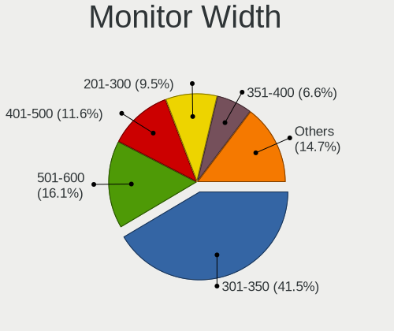

| Width in mm | Computers | Percent |
|-------------|-----------|---------|
| 301-350     | 184       | 42.4%   |
| 401-500     | 69        | 15.9%   |
| 501-600     | 55        | 12.67%  |
| 351-400     | 40        | 9.22%   |
| 201-300     | 37        | 8.53%   |
| Unknown     | 27        | 6.22%   |
| 601-700     | 6         | 1.38%   |
| 1001-1500   | 6         | 1.38%   |
| 701-800     | 5         | 1.15%   |
| 1501-2000   | 3         | 0.69%   |
| 101-200     | 2         | 0.46%   |

Aspect Ratio
------------

Proportional relationship between the width and the height

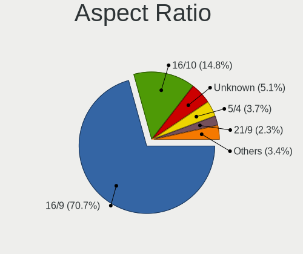

| Ratio   | Computers | Percent |
|---------|-----------|---------|
| 16/9    | 272       | 65.23%  |
| 16/10   | 70        | 16.79%  |
| 5/4     | 31        | 7.43%   |
| Unknown | 24        | 5.76%   |
| 4/3     | 13        | 3.12%   |
| 3/2     | 3         | 0.72%   |
| 21/9    | 3         | 0.72%   |
| 32/9    | 1         | 0.24%   |

Monitor Area
------------

Area in inch

| Area in inch | Computers | Percent |
|----------------|-----------|---------|
| 101-110        | 124       | 28.18%  |
| 201-250        | 62        | 14.09%  |
| 81-90          | 50        | 11.36%  |
| 151-200        | 44        | 10%     |
| 141-150        | 29        | 6.59%   |
| Unknown        | 27        | 6.14%   |
| 301-350        | 18        | 4.09%   |
| 121-130        | 13        | 2.95%   |
| 41-50          | 12        | 2.73%   |
| 251-300        | 10        | 2.27%   |
| 71-80          | 9         | 2.05%   |
| More than 1000 | 8         | 1.82%   |
| 351-500        | 8         | 1.82%   |
| 61-70          | 7         | 1.59%   |
| 51-60          | 5         | 1.14%   |
| 131-140        | 4         | 0.91%   |
| 111-120        | 3         | 0.68%   |
| 91-100         | 3         | 0.68%   |
| 1-40           | 2         | 0.45%   |
| 501-1000       | 2         | 0.45%   |

Pixel Density
-------------

Pixels per inch

| Density       | Computers | Percent |
|---------------|-----------|---------|
| 51-100        | 171       | 40.14%  |
| 101-120       | 137       | 32.16%  |
| 121-160       | 69        | 16.2%   |
| Unknown       | 27        | 6.34%   |
| 1-50          | 10        | 2.35%   |
| 161-240       | 7         | 1.64%   |
| More than 240 | 5         | 1.17%   |

Multiple Monitors
-----------------

Total monitors connected

| Total | Computers | Percent |
|-------|-----------|---------|
| 1     | 373       | 82.89%  |
| 2     | 50        | 11.11%  |
| 0     | 24        | 5.33%   |
| 3     | 3         | 0.67%   |

Network
-------

Net Controller Vendor
---------------------

Controller vendors

| Vendor                                | Computers | Percent |
|---------------------------------------|-----------|---------|
| Realtek Semiconductor                 | 250       | 34.82%  |
| Intel                                 | 154       | 21.45%  |
| Qualcomm Atheros                      | 112       | 15.6%   |
| Broadcom                              | 60        | 8.36%   |
| Marvell Technology Group              | 17        | 2.37%   |
| Ralink Technology                     | 15        | 2.09%   |
| Nvidia                                | 14        | 1.95%   |
| Broadcom Limited                      | 14        | 1.95%   |
| Ralink                                | 8         | 1.11%   |
| Samsung Electronics                   | 7         | 0.97%   |
| Silicon Integrated Systems [SiS]      | 6         | 0.84%   |
| VIA Technologies                      | 5         | 0.7%    |
| TP-Link                               | 5         | 0.7%    |
| JMicron Technology                    | 3         | 0.42%   |
| Huawei Technologies                   | 3         | 0.42%   |
| Ericsson Business Mobile Networks     | 3         | 0.42%   |
| ZTE WCDMA Technologies MSM            | 2         | 0.28%   |
| Sitecom Europe                        | 2         | 0.28%   |
| Microsoft                             | 2         | 0.28%   |
| MediaTek                              | 2         | 0.28%   |
| Linksys                               | 2         | 0.28%   |
| DisplayLink                           | 2         | 0.28%   |
| AVM                                   | 2         | 0.28%   |
| Attansic Technology                   | 2         | 0.28%   |
| ASUSTek Computer                      | 2         | 0.28%   |
| AMD                                   | 2         | 0.28%   |
| Xiaomi                                | 1         | 0.14%   |
| ST-Ericsson                           | 1         | 0.14%   |
| Sierra Wireless                       | 1         | 0.14%   |
| OnePlus Technology (Shenzhen)         | 1         | 0.14%   |
| NetGear                               | 1         | 0.14%   |
| Microchip Technology                  | 1         | 0.14%   |
| Mercucys                              | 1         | 0.14%   |
| Mellanox Technologies                 | 1         | 0.14%   |
| Manta                                 | 1         | 0.14%   |
| LSI                                   | 1         | 0.14%   |
| Lenovo                                | 1         | 0.14%   |
| Intersil                              | 1         | 0.14%   |
| Hewlett-Packard                       | 1         | 0.14%   |
| Gemtek                                | 1         | 0.14%   |
| Edimax Technology                     | 1         | 0.14%   |
| Dell                                  | 1         | 0.14%   |
| D-Link System                         | 1         | 0.14%   |
| Cisco Aironet Wireless Communications | 1         | 0.14%   |
| Belkin Components                     | 1         | 0.14%   |
| Askey Computer                        | 1         | 0.14%   |
| ADMtek                                | 1         | 0.14%   |
| 3Com                                  | 1         | 0.14%   |

Net Controller Model
--------------------

Controller models

| Model                                                                   | Computers | Percent |
|-------------------------------------------------------------------------|-----------|---------|
| Realtek RTL8111/8168/8411 PCI Express Gigabit Ethernet Controller       | 147       | 17.6%   |
| Realtek RTL810xE PCI Express Fast Ethernet controller                   | 52        | 6.23%   |
| Qualcomm Atheros AR9285 Wireless Network Adapter (PCI-Express)          | 18        | 2.16%   |
| Realtek RTL8821CE 802.11ac PCIe Wireless Network Adapter                | 15        | 1.8%    |
| Realtek RTL-8100/8101L/8139 PCI Fast Ethernet Adapter                   | 14        | 1.68%   |
| Qualcomm Atheros QCA9565 / AR9565 Wireless Network Adapter              | 14        | 1.68%   |
| Broadcom BCM4313 802.11bgn Wireless Network Adapter                     | 14        | 1.68%   |
| Qualcomm Atheros QCA9377 802.11ac Wireless Network Adapter              | 12        | 1.44%   |
| Qualcomm Atheros AR9485 Wireless Network Adapter                        | 12        | 1.44%   |
| Qualcomm Atheros AR242x / AR542x Wireless Network Adapter (PCI-Express) | 12        | 1.44%   |
| Intel PRO/Wireless 3945ABG [Golan] Network Connection                   | 12        | 1.44%   |
| Intel 82579LM Gigabit Network Connection (Lewisville)                   | 12        | 1.44%   |
| Realtek RTL8188EUS 802.11n Wireless Network Adapter                     | 8         | 0.96%   |
| Intel WiFi Link 5100                                                    | 8         | 0.96%   |
| Nvidia MCP61 Ethernet                                                   | 7         | 0.84%   |
| Intel Wireless 7260                                                     | 7         | 0.84%   |
| Intel I211 Gigabit Network Connection                                   | 7         | 0.84%   |
| Samsung Galaxy series, misc. (tethering mode)                           | 6         | 0.72%   |
| Intel Wireless 8265 / 8275                                              | 6         | 0.72%   |
| Intel Wi-Fi 6 AX200                                                     | 6         | 0.72%   |
| VIA VT6102/VT6103 [Rhine-II]                                            | 5         | 0.6%    |
| Realtek RTL8188CE 802.11b/g/n WiFi Adapter                              | 5         | 0.6%    |
| Ralink MT7601U Wireless Adapter                                         | 5         | 0.6%    |
| Qualcomm Atheros AR9287 Wireless Network Adapter (PCI-Express)          | 5         | 0.6%    |
| Qualcomm Atheros AR8152 v2.0 Fast Ethernet                              | 5         | 0.6%    |
| Intel Wireless 3160                                                     | 5         | 0.6%    |
| Intel Ethernet Connection I217-LM                                       | 5         | 0.6%    |
| Intel Centrino Ultimate-N 6300                                          | 5         | 0.6%    |
| Intel 82577LM Gigabit Network Connection                                | 5         | 0.6%    |
| Intel 82567LM Gigabit Network Connection                                | 5         | 0.6%    |
| Realtek RTL8191SEvB Wireless LAN Controller                             | 4         | 0.48%   |
| Realtek RTL8153 Gigabit Ethernet Adapter                                | 4         | 0.48%   |
| Ralink RT2870/RT3070 Wireless Adapter                                   | 4         | 0.48%   |
| Ralink RT3090 Wireless 802.11n 1T/1R PCIe                               | 4         | 0.48%   |
| Qualcomm Atheros Attansic L1 Gigabit Ethernet                           | 4         | 0.48%   |
| Qualcomm Atheros AR9462 Wireless Network Adapter                        | 4         | 0.48%   |
| Qualcomm Atheros AR928X Wireless Network Adapter (PCI-Express)          | 4         | 0.48%   |
| Qualcomm Atheros AR8132 Fast Ethernet                                   | 4         | 0.48%   |
| Qualcomm Atheros AR8121/AR8113/AR8114 Gigabit or Fast Ethernet          | 4         | 0.48%   |
| Marvell Group 88E8071 PCI-E Gigabit Ethernet Controller                 | 4         | 0.48%   |
| Intel Wireless 8260                                                     | 4         | 0.48%   |
| Intel Wi-Fi 6 AX201                                                     | 4         | 0.48%   |
| Intel PRO/Wireless 4965 AG or AGN [Kedron] Network Connection           | 4         | 0.48%   |
| Intel Dual Band Wireless-AC 3168NGW [Stone Peak]                        | 4         | 0.48%   |
| Intel Cannon Point-LP CNVi [Wireless-AC]                                | 4         | 0.48%   |
| Intel 82579V Gigabit Network Connection                                 | 4         | 0.48%   |
| Intel 82573L Gigabit Ethernet Controller                                | 4         | 0.48%   |
| Broadcom BCM4311 802.11b/g WLAN                                         | 4         | 0.48%   |
| Silicon Integrated Systems [SiS] SiS900 PCI Fast Ethernet               | 3         | 0.36%   |
| Silicon Integrated Systems [SiS] 191 Gigabit Ethernet Adapter           | 3         | 0.36%   |
| Realtek RTL8822BE 802.11a/b/g/n/ac WiFi adapter                         | 3         | 0.36%   |
| Realtek RTL8723BE PCIe Wireless Network Adapter                         | 3         | 0.36%   |
| Realtek RTL8192CU 802.11n WLAN Adapter                                  | 3         | 0.36%   |
| Realtek RTL8192CE PCIe Wireless Network Adapter                         | 3         | 0.36%   |
| Realtek RTL8188FTV 802.11b/g/n 1T1R 2.4G WLAN Adapter                   | 3         | 0.36%   |
| Realtek RTL8188CUS 802.11n WLAN Adapter                                 | 3         | 0.36%   |
| Realtek RTL8125 2.5GbE Controller                                       | 3         | 0.36%   |
| Realtek RTL-8110SC/8169SC Gigabit Ethernet                              | 3         | 0.36%   |
| Realtek 802.11ac NIC                                                    | 3         | 0.36%   |
| Qualcomm Atheros Killer E220x Gigabit Ethernet Controller               | 3         | 0.36%   |

Wireless Vendor
---------------

Wireless vendors

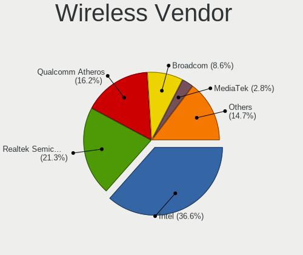

| Vendor                                | Computers | Percent |
|---------------------------------------|-----------|---------|
| Intel                                 | 100       | 28.09%  |
| Qualcomm Atheros                      | 89        | 25%     |
| Realtek Semiconductor                 | 72        | 20.22%  |
| Broadcom                              | 41        | 11.52%  |
| Ralink Technology                     | 15        | 4.21%   |
| Ralink                                | 8         | 2.25%   |
| Broadcom Limited                      | 6         | 1.69%   |
| TP-Link                               | 5         | 1.4%    |
| Sitecom Europe                        | 2         | 0.56%   |
| Microsoft                             | 2         | 0.56%   |
| Linksys                               | 2         | 0.56%   |
| AVM                                   | 2         | 0.56%   |
| ASUSTek Computer                      | 2         | 0.56%   |
| Sierra Wireless                       | 1         | 0.28%   |
| NetGear                               | 1         | 0.28%   |
| Mercucys                              | 1         | 0.28%   |
| MEDIATEK                              | 1         | 0.28%   |
| Marvell Technology Group              | 1         | 0.28%   |
| Edimax Technology                     | 1         | 0.28%   |
| D-Link System                         | 1         | 0.28%   |
| Cisco Aironet Wireless Communications | 1         | 0.28%   |
| Belkin Components                     | 1         | 0.28%   |
| Askey Computer                        | 1         | 0.28%   |

Wireless Model
--------------

Wireless models

| Model                                                                                         | Computers | Percent |
|-----------------------------------------------------------------------------------------------|-----------|---------|
| Qualcomm Atheros AR9285 Wireless Network Adapter (PCI-Express)                                | 18        | 4.96%   |
| Realtek RTL8821CE 802.11ac PCIe Wireless Network Adapter                                      | 15        | 4.13%   |
| Qualcomm Atheros QCA9565 / AR9565 Wireless Network Adapter                                    | 14        | 3.86%   |
| Broadcom BCM4313 802.11bgn Wireless Network Adapter                                           | 14        | 3.86%   |
| Qualcomm Atheros QCA9377 802.11ac Wireless Network Adapter                                    | 12        | 3.31%   |
| Qualcomm Atheros AR9485 Wireless Network Adapter                                              | 12        | 3.31%   |
| Qualcomm Atheros AR242x / AR542x Wireless Network Adapter (PCI-Express)                       | 12        | 3.31%   |
| Intel PRO/Wireless 3945ABG [Golan] Network Connection                                         | 12        | 3.31%   |
| Realtek RTL8188EUS 802.11n Wireless Network Adapter                                           | 8         | 2.2%    |
| Intel WiFi Link 5100                                                                          | 8         | 2.2%    |
| Intel Wireless 7260                                                                           | 7         | 1.93%   |
| Intel Wireless 8265 / 8275                                                                    | 6         | 1.65%   |
| Intel Wi-Fi 6 AX200                                                                           | 6         | 1.65%   |
| Realtek RTL8188CE 802.11b/g/n WiFi Adapter                                                    | 5         | 1.38%   |
| Ralink MT7601U Wireless Adapter                                                               | 5         | 1.38%   |
| Qualcomm Atheros AR9287 Wireless Network Adapter (PCI-Express)                                | 5         | 1.38%   |
| Intel Wireless 3160                                                                           | 5         | 1.38%   |
| Intel Centrino Ultimate-N 6300                                                                | 5         | 1.38%   |
| Realtek RTL8191SEvB Wireless LAN Controller                                                   | 4         | 1.1%    |
| Ralink RT2870/RT3070 Wireless Adapter                                                         | 4         | 1.1%    |
| Ralink RT3090 Wireless 802.11n 1T/1R PCIe                                                     | 4         | 1.1%    |
| Qualcomm Atheros AR9462 Wireless Network Adapter                                              | 4         | 1.1%    |
| Qualcomm Atheros AR928X Wireless Network Adapter (PCI-Express)                                | 4         | 1.1%    |
| Intel Wireless 8260                                                                           | 4         | 1.1%    |
| Intel Wi-Fi 6 AX201                                                                           | 4         | 1.1%    |
| Intel PRO/Wireless 4965 AG or AGN [Kedron] Network Connection                                 | 4         | 1.1%    |
| Intel Dual Band Wireless-AC 3168NGW [Stone Peak]                                              | 4         | 1.1%    |
| Intel Cannon Point-LP CNVi [Wireless-AC]                                                      | 4         | 1.1%    |
| Broadcom BCM4311 802.11b/g WLAN                                                               | 4         | 1.1%    |
| Realtek RTL8822BE 802.11a/b/g/n/ac WiFi adapter                                               | 3         | 0.83%   |
| Realtek RTL8723BE PCIe Wireless Network Adapter                                               | 3         | 0.83%   |
| Realtek RTL8192CU 802.11n WLAN Adapter                                                        | 3         | 0.83%   |
| Realtek RTL8192CE PCIe Wireless Network Adapter                                               | 3         | 0.83%   |
| Realtek RTL8188FTV 802.11b/g/n 1T1R 2.4G WLAN Adapter                                         | 3         | 0.83%   |
| Realtek RTL8188CUS 802.11n WLAN Adapter                                                       | 3         | 0.83%   |
| Realtek 802.11ac NIC                                                                          | 3         | 0.83%   |
| Intel Wireless 7265                                                                           | 3         | 0.83%   |
| Intel Ultimate N WiFi Link 5300                                                               | 3         | 0.83%   |
| Intel Centrino Wireless-N 1030 [Rainbow Peak]                                                 | 3         | 0.83%   |
| Intel Centrino Advanced-N 6205 [Taylor Peak]                                                  | 3         | 0.83%   |
| Broadcom BCM43228 802.11a/b/g/n                                                               | 3         | 0.83%   |
| Broadcom BCM4322 802.11a/b/g/n Wireless LAN Controller                                        | 3         | 0.83%   |
| TP-Link TL-WN823N v2/v3 [Realtek RTL8192EU]                                                   | 2         | 0.55%   |
| Realtek RTL88x2bu [AC1200 Techkey]                                                            | 2         | 0.55%   |
| Realtek RTL8822CE 802.11ac PCIe Wireless Network Adapter                                      | 2         | 0.55%   |
| Realtek RTL8811AU 802.11a/b/g/n/ac WLAN Adapter                                               | 2         | 0.55%   |
| Realtek RTL8723DE Wireless Network Adapter                                                    | 2         | 0.55%   |
| Realtek RTL8723AE PCIe Wireless Network Adapter                                               | 2         | 0.55%   |
| Realtek RTL8188EE Wireless Network Adapter                                                    | 2         | 0.55%   |
| Realtek RTL8187B Wireless 802.11g 54Mbps Network Adapter                                      | 2         | 0.55%   |
| Realtek RTL-8185 IEEE 802.11a/b/g Wireless LAN Controller                                     | 2         | 0.55%   |
| Realtek Realtek 8812AU/8821AU 802.11ac WLAN Adapter [USB Wireless Dual-Band Adapter 2.4/5Ghz] | 2         | 0.55%   |
| Ralink RT5370 Wireless Adapter                                                                | 2         | 0.55%   |
| Ralink MT7610U ("Archer T2U" 2.4G+5G WLAN Adapter                                             | 2         | 0.55%   |
| Qualcomm Atheros AR9227 Wireless Network Adapter                                              | 2         | 0.55%   |
| Qualcomm Atheros AR5212 802.11abg NIC                                                         | 2         | 0.55%   |
| Intel Gemini Lake PCH CNVi WiFi                                                               | 2         | 0.55%   |
| Intel Dual Band Wireless-AC 3165 Plus Bluetooth                                               | 2         | 0.55%   |
| Intel Comet Lake PCH CNVi WiFi                                                                | 2         | 0.55%   |
| Intel Centrino Wireless-N 2230                                                                | 2         | 0.55%   |

Ethernet Vendor
---------------

Ethernet vendors

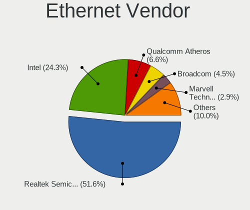

| Vendor                           | Computers | Percent |
|----------------------------------|-----------|---------|
| Realtek Semiconductor            | 222       | 49.66%  |
| Intel                            | 91        | 20.36%  |
| Qualcomm Atheros                 | 34        | 7.61%   |
| Broadcom                         | 24        | 5.37%   |
| Marvell Technology Group         | 16        | 3.58%   |
| Nvidia                           | 14        | 3.13%   |
| Broadcom Limited                 | 8         | 1.79%   |
| Samsung Electronics              | 7         | 1.57%   |
| Silicon Integrated Systems [SiS] | 6         | 1.34%   |
| VIA Technologies                 | 5         | 1.12%   |
| JMicron Technology               | 3         | 0.67%   |
| ZTE WCDMA Technologies MSM       | 2         | 0.45%   |
| Huawei Technologies              | 2         | 0.45%   |
| DisplayLink                      | 2         | 0.45%   |
| Attansic Technology              | 2         | 0.45%   |
| Xiaomi                           | 1         | 0.22%   |
| OnePlus Technology (Shenzhen)    | 1         | 0.22%   |
| Microchip Technology             | 1         | 0.22%   |
| MediaTek                         | 1         | 0.22%   |
| Lenovo                           | 1         | 0.22%   |
| Hewlett-Packard                  | 1         | 0.22%   |
| Gemtek                           | 1         | 0.22%   |
| ADMtek                           | 1         | 0.22%   |
| 3Com                             | 1         | 0.22%   |

Ethernet Model
--------------

Ethernet models

| Model                                                                          | Computers | Percent |
|--------------------------------------------------------------------------------|-----------|---------|
| Realtek RTL8111/8168/8411 PCI Express Gigabit Ethernet Controller              | 147       | 32.45%  |
| Realtek RTL810xE PCI Express Fast Ethernet controller                          | 52        | 11.48%  |
| Realtek RTL-8100/8101L/8139 PCI Fast Ethernet Adapter                          | 14        | 3.09%   |
| Intel 82579LM Gigabit Network Connection (Lewisville)                          | 12        | 2.65%   |
| Nvidia MCP61 Ethernet                                                          | 7         | 1.55%   |
| Intel I211 Gigabit Network Connection                                          | 7         | 1.55%   |
| Samsung Galaxy series, misc. (tethering mode)                                  | 6         | 1.32%   |
| VIA VT6102/VT6103 [Rhine-II]                                                   | 5         | 1.1%    |
| Qualcomm Atheros AR8152 v2.0 Fast Ethernet                                     | 5         | 1.1%    |
| Intel Ethernet Connection I217-LM                                              | 5         | 1.1%    |
| Intel 82577LM Gigabit Network Connection                                       | 5         | 1.1%    |
| Intel 82567LM Gigabit Network Connection                                       | 5         | 1.1%    |
| Realtek RTL8153 Gigabit Ethernet Adapter                                       | 4         | 0.88%   |
| Qualcomm Atheros Attansic L1 Gigabit Ethernet                                  | 4         | 0.88%   |
| Qualcomm Atheros AR8132 Fast Ethernet                                          | 4         | 0.88%   |
| Qualcomm Atheros AR8121/AR8113/AR8114 Gigabit or Fast Ethernet                 | 4         | 0.88%   |
| Marvell Group 88E8071 PCI-E Gigabit Ethernet Controller                        | 4         | 0.88%   |
| Intel 82579V Gigabit Network Connection                                        | 4         | 0.88%   |
| Intel 82573L Gigabit Ethernet Controller                                       | 4         | 0.88%   |
| Silicon Integrated Systems [SiS] SiS900 PCI Fast Ethernet                      | 3         | 0.66%   |
| Silicon Integrated Systems [SiS] 191 Gigabit Ethernet Adapter                  | 3         | 0.66%   |
| Realtek RTL8125 2.5GbE Controller                                              | 3         | 0.66%   |
| Realtek RTL-8110SC/8169SC Gigabit Ethernet                                     | 3         | 0.66%   |
| Qualcomm Atheros Killer E220x Gigabit Ethernet Controller                      | 3         | 0.66%   |
| Qualcomm Atheros AR8151 v2.0 Gigabit Ethernet                                  | 3         | 0.66%   |
| Qualcomm Atheros AR8131 Gigabit Ethernet                                       | 3         | 0.66%   |
| JMicron JMC250 PCI Express Gigabit Ethernet Controller                         | 3         | 0.66%   |
| Intel Ethernet Connection (7) I219-V                                           | 3         | 0.66%   |
| Intel 82566DM-2 Gigabit Network Connection                                     | 3         | 0.66%   |
| Broadcom NetXtreme BCM5761 Gigabit Ethernet PCIe                               | 3         | 0.66%   |
| Broadcom Limited NetLink BCM5787M Gigabit Ethernet PCI Express                 | 3         | 0.66%   |
| Qualcomm Atheros AR8161 Gigabit Ethernet                                       | 2         | 0.44%   |
| Qualcomm Atheros AR8151 v1.0 Gigabit Ethernet                                  | 2         | 0.44%   |
| Nvidia nForce2 Ethernet Controller                                             | 2         | 0.44%   |
| Nvidia MCP79 Ethernet                                                          | 2         | 0.44%   |
| Nvidia MCP67 Ethernet                                                          | 2         | 0.44%   |
| Marvell Group Yukon Optima 88E8059 [PCIe Gigabit Ethernet Controller with AVB] | 2         | 0.44%   |
| Marvell Group 88E8056 PCI-E Gigabit Ethernet Controller                        | 2         | 0.44%   |
| Intel PRO/100 VE Network Connection                                            | 2         | 0.44%   |
| Intel Ethernet Connection I217-V                                               | 2         | 0.44%   |
| Intel Ethernet Connection (2) I219-V                                           | 2         | 0.44%   |
| Intel Ethernet Connection (11) I219-V                                          | 2         | 0.44%   |
| Intel 82578DM Gigabit Network Connection                                       | 2         | 0.44%   |
| Intel 82574L Gigabit Network Connection                                        | 2         | 0.44%   |
| Intel 82567V-2 Gigabit Network Connection                                      | 2         | 0.44%   |
| Intel 82567LM-3 Gigabit Network Connection                                     | 2         | 0.44%   |
| Intel 82566MM Gigabit Network Connection                                       | 2         | 0.44%   |
| Intel 82566DC-2 Gigabit Network Connection                                     | 2         | 0.44%   |
| Intel 82562ET/EZ/GT/GZ - PRO/100 VE (LOM) Ethernet Controller Mobile           | 2         | 0.44%   |
| Broadcom NetXtreme BCM57786 Gigabit Ethernet PCIe                              | 2         | 0.44%   |
| Broadcom NetXtreme BCM5754 Gigabit Ethernet PCI Express                        | 2         | 0.44%   |
| Broadcom NetLink BCM57785 Gigabit Ethernet PCIe                                | 2         | 0.44%   |
| Broadcom BCM4401-B0 100Base-TX                                                 | 2         | 0.44%   |
| Attansic AR8152 v2.0 Fast Ethernet                                             | 2         | 0.44%   |
| ZTE WCDMA MSM ZTE MSM                                                          | 1         | 0.22%   |
| ZTE WCDMA MSM Z6201V                                                           | 1         | 0.22%   |
| Xiaomi Mi/Redmi series (RNDIS)                                                 | 1         | 0.22%   |
| Samsung GT-I9070 (network tethering, USB debugging enabled)                    | 1         | 0.22%   |
| Realtek RTL8169 PCI Gigabit Ethernet Controller                                | 1         | 0.22%   |
| Qualcomm Atheros QCA8171 Gigabit Ethernet                                      | 1         | 0.22%   |

Net Controller Kind
-------------------

Ethernet, WiFi or modem

| Kind     | Computers | Percent |
|----------|-----------|---------|
| Ethernet | 418       | 54.15%  |
| WiFi     | 335       | 43.39%  |
| Modem    | 15        | 1.94%   |
| Unknown  | 4         | 0.52%   |

Used Controller
---------------

Currently used network controller

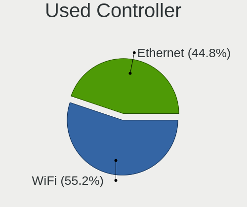

| Kind     | Computers | Percent |
|----------|-----------|---------|
| Ethernet | 365       | 55.64%  |
| WiFi     | 290       | 44.21%  |
| Modem    | 1         | 0.15%   |

NICs
----

Total network controllers on board

| Total | Computers | Percent |
|-------|-----------|---------|
| 2     | 272       | 61.12%  |
| 1     | 160       | 35.96%  |
| 3     | 6         | 1.35%   |
| 4     | 4         | 0.9%    |
| 0     | 3         | 0.67%   |

IPv6
----

IPv6 vs IPv4

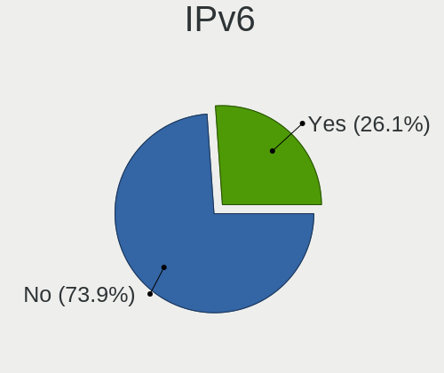

| Used | Computers | Percent |
|------|-----------|---------|
| No   | 382       | 84.14%  |
| Yes  | 72        | 15.86%  |

Bluetooth
---------

Bluetooth Vendor
----------------

Controller vendors

| Vendor                          | Computers | Percent |
|---------------------------------|-----------|---------|
| Intel                           | 52        | 27.23%  |
| Realtek Semiconductor           | 25        | 13.09%  |
| Qualcomm Atheros Communications | 20        | 10.47%  |
| Broadcom                        | 19        | 9.95%   |
| Cambridge Silicon Radio         | 12        | 6.28%   |
| Foxconn / Hon Hai               | 11        | 5.76%   |
| Hewlett-Packard                 | 9         | 4.71%   |
| Dell                            | 8         | 4.19%   |
| Lite-On Technology              | 7         | 3.66%   |
| IMC Networks                    | 5         | 2.62%   |
| ASUSTek Computer                | 5         | 2.62%   |
| Apple                           | 5         | 2.62%   |
| Toshiba                         | 3         | 1.57%   |
| Taiyo Yuden                     | 1         | 0.52%   |
| Realtek                         | 1         | 0.52%   |
| Ralink Technology               | 1         | 0.52%   |
| Ralink                          | 1         | 0.52%   |
| Qcom                            | 1         | 0.52%   |
| MediaTek                        | 1         | 0.52%   |
| Marvell Semiconductor           | 1         | 0.52%   |
| Foxconn International           | 1         | 0.52%   |
| Askey Computer                  | 1         | 0.52%   |
| Alps Electric                   | 1         | 0.52%   |

Bluetooth Model
---------------

Controller models

| Model                                                                               | Computers | Percent |
|-------------------------------------------------------------------------------------|-----------|---------|
| Intel Bluetooth wireless interface                                                  | 25        | 13.09%  |
| Realtek  Bluetooth 4.2 Adapter                                                      | 12        | 6.28%   |
| Realtek Bluetooth Radio                                                             | 12        | 6.28%   |
| Cambridge Silicon Radio Bluetooth Dongle (HCI mode)                                 | 12        | 6.28%   |
| Qualcomm Atheros  Bluetooth Device                                                  | 10        | 5.24%   |
| Intel Bluetooth Device                                                              | 6         | 3.14%   |
| Intel Bluetooth 9460/9560 Jefferson Peak (JfP)                                      | 6         | 3.14%   |
| Intel AX200 Bluetooth                                                               | 6         | 3.14%   |
| HP Bluetooth 2.0 Interface [Broadcom BCM2045]                                       | 6         | 3.14%   |
| Qualcomm Atheros AR3012 Bluetooth 4.0                                               | 4         | 2.09%   |
| Intel Wireless-AC 3168 Bluetooth                                                    | 4         | 2.09%   |
| Dell DW375 Bluetooth Module                                                         | 4         | 2.09%   |
| Lite-On Bluetooth Device                                                            | 3         | 1.57%   |
| Intel Centrino Advanced-N 6230 Bluetooth adapter                                    | 3         | 1.57%   |
| HP Broadcom 2070 Bluetooth Combo                                                    | 3         | 1.57%   |
| Foxconn / Hon Hai Foxconn T77H114 BCM2070 [Single-Chip Bluetooth 2.1 + EDR Adapter] | 3         | 1.57%   |
| Foxconn / Hon Hai Bluetooth Device                                                  | 3         | 1.57%   |
| Broadcom BCM2070 Bluetooth 2.1 + EDR                                                | 3         | 1.57%   |
| Qualcomm Atheros AR9462 Bluetooth                                                   | 2         | 1.05%   |
| Qualcomm Atheros AR3011 Bluetooth                                                   | 2         | 1.05%   |
| Lite-On Atheros Bluetooth                                                           | 2         | 1.05%   |
| Lite-On Atheros AR3012 Bluetooth                                                    | 2         | 1.05%   |
| Intel Centrino Bluetooth Wireless Transceiver                                       | 2         | 1.05%   |
| IMC Networks Bluetooth Device                                                       | 2         | 1.05%   |
| Foxconn / Hon Hai Acer Module                                                       | 2         | 1.05%   |
| Dell Wireless 370 Bluetooth Mini-card                                               | 2         | 1.05%   |
| Broadcom HP Portable SoftSailing                                                    | 2         | 1.05%   |
| Broadcom Bluetooth                                                                  | 2         | 1.05%   |
| Broadcom BCM20702A0 Bluetooth 4.0                                                   | 2         | 1.05%   |
| Broadcom BCM2070 Bluetooth Device                                                   | 2         | 1.05%   |
| Broadcom BCM2045B (BDC-2.1)                                                         | 2         | 1.05%   |
| ASUS Broadcom BCM20702A0 Bluetooth                                                  | 2         | 1.05%   |
| Apple Bluetooth Host Controller                                                     | 2         | 1.05%   |
| Apple Bluetooth HCI                                                                 | 2         | 1.05%   |
| Toshiba RT Bluetooth Radio                                                          | 1         | 0.52%   |
| Toshiba Integrated Bluetooth HCI                                                    | 1         | 0.52%   |
| Toshiba Bluetooth Device                                                            | 1         | 0.52%   |
| Taiyo Yuden Bluetooth Device(BC04-External)                                         | 1         | 0.52%   |
| Realtek RTL8822BE Bluetooth 4.2 Adapter                                             | 1         | 0.52%   |
| Realtek Bluetooth Radio                                                             | 1         | 0.52%   |
| Ralink CSR BS8510                                                                   | 1         | 0.52%   |
| Ralink RT3290 Bluetooth                                                             | 1         | 0.52%   |
| Qualcomm Atheros QCA61x4 Bluetooth 4.0                                              | 1         | 0.52%   |
| Qualcomm Atheros Bluetooth USB Host Controller                                      | 1         | 0.52%   |
| Qcom Broadcom Bluetooth USB                                                         | 1         | 0.52%   |
| MediaTek Wireless_Device                                                            | 1         | 0.52%   |
| Marvell Bluetooth and Wireless LAN Composite                                        | 1         | 0.52%   |
| IMC Networks Broadcom Bluetooth 2.1                                                 | 1         | 0.52%   |
| IMC Networks Bluetooth Radio                                                        | 1         | 0.52%   |
| IMC Networks Atheros AR3012 Bluetooth 4.0 Adapter                                   | 1         | 0.52%   |
| Foxconn International BCM43142A0 Bluetooth module                                   | 1         | 0.52%   |
| Foxconn / Hon Hai Bluetooth USB Host Controller                                     | 1         | 0.52%   |
| Foxconn / Hon Hai BCM20702A0                                                        | 1         | 0.52%   |
| Foxconn / Hon Hai Acer Bluetooth module                                             | 1         | 0.52%   |
| Dell Wireless 355 Bluetooth                                                         | 1         | 0.52%   |
| Dell BT Mini-Receiver                                                               | 1         | 0.52%   |
| Broadcom HP Bluethunder                                                             | 1         | 0.52%   |
| Broadcom Bluetooth 2.1 Device                                                       | 1         | 0.52%   |
| Broadcom BCM20702 Bluetooth 4.0 [ThinkPad]                                          | 1         | 0.52%   |
| Broadcom BCM2045B (BDC-2) [Bluetooth Controller]                                    | 1         | 0.52%   |

Sound
-----

Sound Vendor
------------

Sound card vendors

| Vendor                           | Computers | Percent |
|----------------------------------|-----------|---------|
| Intel                            | 326       | 55.92%  |
| AMD                              | 102       | 17.5%   |
| Nvidia                           | 93        | 15.95%  |
| C-Media Electronics              | 12        | 2.06%   |
| VIA Technologies                 | 9         | 1.54%   |
| Silicon Integrated Systems [SiS] | 8         | 1.37%   |
| Generalplus Technology           | 5         | 0.86%   |
| GN Netcom                        | 4         | 0.69%   |
| Creative Labs                    | 4         | 0.69%   |
| Logitech                         | 3         | 0.51%   |
| Texas Instruments                | 2         | 0.34%   |
| Tenx Technology                  | 2         | 0.34%   |
| JMTek                            | 2         | 0.34%   |
| Yamaha                           | 1         | 0.17%   |
| Xilinx                           | 1         | 0.17%   |
| Realtek Semiconductor            | 1         | 0.17%   |
| Plantronics                      | 1         | 0.17%   |
| M-Audio                          | 1         | 0.17%   |
| GYROCOM C&C                      | 1         | 0.17%   |
| Focusrite-Novation               | 1         | 0.17%   |
| Evolution Electronics            | 1         | 0.17%   |
| Dell                             | 1         | 0.17%   |
| Creative Technology              | 1         | 0.17%   |
| Audioengine                      | 1         | 0.17%   |

Sound Model
-----------

Sound card models

| Model                                                                                             | Computers | Percent |
|---------------------------------------------------------------------------------------------------|-----------|---------|
| Intel NM10/ICH7 Family High Definition Audio Controller                                           | 52        | 7.83%   |
| Intel 6 Series/C200 Series Chipset Family High Definition Audio Controller                        | 35        | 5.27%   |
| Intel 82801I (ICH9 Family) HD Audio Controller                                                    | 32        | 4.82%   |
| Intel 7 Series/C216 Chipset Family High Definition Audio Controller                               | 28        | 4.22%   |
| Intel Sunrise Point-LP HD Audio                                                                   | 23        | 3.46%   |
| AMD SBx00 Azalia (Intel HDA)                                                                      | 23        | 3.46%   |
| Intel 5 Series/3400 Series Chipset High Definition Audio                                          | 22        | 3.31%   |
| AMD Family 17h/19h HD Audio Controller                                                            | 19        | 2.86%   |
| Intel 8 Series/C220 Series Chipset High Definition Audio Controller                               | 15        | 2.26%   |
| AMD Raven/Raven2/Fenghuang HDMI/DP Audio Controller                                               | 15        | 2.26%   |
| Intel Xeon E3-1200 v3/4th Gen Core Processor HD Audio Controller                                  | 12        | 1.81%   |
| Intel 82801H (ICH8 Family) HD Audio Controller                                                    | 12        | 1.81%   |
| Intel Haswell-ULT HD Audio Controller                                                             | 11        | 1.66%   |
| Intel 8 Series HD Audio Controller                                                                | 11        | 1.66%   |
| Nvidia High Definition Audio Controller                                                           | 10        | 1.51%   |
| Nvidia GF108 High Definition Audio Controller                                                     | 10        | 1.51%   |
| Intel Cannon Lake PCH cAVS                                                                        | 10        | 1.51%   |
| Intel 82801JI (ICH10 Family) HD Audio Controller                                                  | 10        | 1.51%   |
| AMD Family 15h (Models 60h-6fh) Audio Controller                                                  | 9         | 1.36%   |
| Nvidia GK208 HDMI/DP Audio Controller                                                             | 8         | 1.2%    |
| Intel Cannon Point-LP High Definition Audio Controller                                            | 8         | 1.2%    |
| AMD High Definition Audio Controller                                                              | 8         | 1.2%    |
| AMD FCH Azalia Controller                                                                         | 8         | 1.2%    |
| Nvidia MCP61 High Definition Audio                                                                | 7         | 1.05%   |
| Nvidia GP107GL High Definition Audio Controller                                                   | 7         | 1.05%   |
| Nvidia GM206 High Definition Audio Controller                                                     | 7         | 1.05%   |
| Intel Atom Processor Z36xxx/Z37xxx Series High Definition Audio Controller                        | 7         | 1.05%   |
| Intel Tiger Lake-LP Smart Sound Technology Audio Controller                                       | 6         | 0.9%    |
| Intel 100 Series/C230 Series Chipset Family HD Audio Controller                                   | 6         | 0.9%    |
| AMD RV710/730 HDMI Audio [Radeon HD 4000 series]                                                  | 6         | 0.9%    |
| AMD Ellesmere HDMI Audio [Radeon RX 470/480 / 570/580/590]                                        | 6         | 0.9%    |
| Intel Atom/Celeron/Pentium Processor x5-E8000/J3xxx/N3xxx Series High Definition Audio Controller | 5         | 0.75%   |
| Generalplus Technology USB Audio Device                                                           | 5         | 0.75%   |
| C-Media Electronics CMI8788 [Oxygen HD Audio]                                                     | 5         | 0.75%   |
| AMD Starship/Matisse HD Audio Controller                                                          | 5         | 0.75%   |
| AMD RS880 HDMI Audio [Radeon HD 4200 Series]                                                      | 5         | 0.75%   |
| AMD Redwood HDMI Audio [Radeon HD 5000 Series]                                                    | 5         | 0.75%   |
| AMD Family 17h (Models 00h-0fh) HD Audio Controller                                               | 5         | 0.75%   |
| VIA Technologies VT8233/A/8235/8237 AC97 Audio Controller                                         | 4         | 0.6%    |
| Silicon Integrated Systems [SiS] SiS7012 AC'97 Sound Controller                                   | 4         | 0.6%    |
| Silicon Integrated Systems [SiS] Azalia Audio Controller                                          | 4         | 0.6%    |
| Nvidia GP106 High Definition Audio Controller                                                     | 4         | 0.6%    |
| Nvidia GK104 HDMI Audio Controller                                                                | 4         | 0.6%    |
| Nvidia GF116 High Definition Audio Controller                                                     | 4         | 0.6%    |
| Intel US15W/US15X/US15L/UL11L SCH [Poulsbo] HD Audio Controller                                   | 4         | 0.6%    |
| Intel Celeron/Pentium Silver Processor High Definition Audio                                      | 4         | 0.6%    |
| Intel 9 Series Chipset Family HD Audio Controller                                                 | 4         | 0.6%    |
| AMD Renoir Radeon High Definition Audio Controller                                                | 4         | 0.6%    |
| AMD Oland/Hainan/Cape Verde/Pitcairn HDMI Audio [Radeon HD 7000 Series]                           | 4         | 0.6%    |
| AMD Kabini HDMI/DP Audio                                                                          | 4         | 0.6%    |
| AMD Cedar HDMI Audio [Radeon HD 5400/6300/7300 Series]                                            | 4         | 0.6%    |
| Nvidia TU106 High Definition Audio Controller                                                     | 3         | 0.45%   |
| Nvidia MCP79 High Definition Audio                                                                | 3         | 0.45%   |
| Nvidia GM107 High Definition Audio Controller [GeForce 940MX]                                     | 3         | 0.45%   |
| Nvidia GF119 HDMI Audio Controller                                                                | 3         | 0.45%   |
| Intel Wildcat Point-LP High Definition Audio Controller                                           | 3         | 0.45%   |
| Intel Broadwell-U Audio Controller                                                                | 3         | 0.45%   |
| Intel 82801DB/DBL/DBM (ICH4/ICH4-L/ICH4-M) AC'97 Audio Controller                                 | 3         | 0.45%   |
| AMD Turks HDMI Audio [Radeon HD 6500/6600 / 6700M Series]                                         | 3         | 0.45%   |
| VIA Technologies VX900/VT8xxx High Definition Audio Controller                                    | 2         | 0.3%    |

Memory
------

Memory Vendor
-------------

Memory module vendors

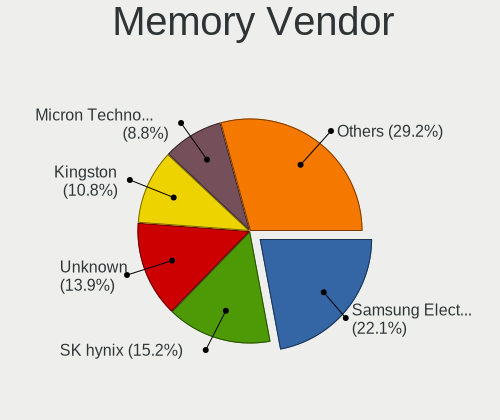

| Vendor              | Computers | Percent |
|---------------------|-----------|---------|
| Unknown             | 21        | 21.65%  |
| Samsung Electronics | 16        | 16.49%  |
| SK Hynix            | 15        | 15.46%  |
| Kingston            | 15        | 15.46%  |
| Crucial             | 6         | 6.19%   |
| Nanya Technology    | 4         | 4.12%   |
| A-DATA Technology   | 4         | 4.12%   |
| G.Skill             | 3         | 3.09%   |
| Unknown (ABCD)      | 2         | 2.06%   |
| Smart               | 2         | 2.06%   |
| Ramaxel Technology  | 2         | 2.06%   |
| Micron Technology   | 2         | 2.06%   |
| Transcend           | 1         | 1.03%   |
| PLEXHD              | 1         | 1.03%   |
| Patriot             | 1         | 1.03%   |
| Kingmax             | 1         | 1.03%   |
| Exceleram           | 1         | 1.03%   |

Memory Model
------------

Memory module models

| Model                                                            | Computers | Percent |
|------------------------------------------------------------------|-----------|---------|
| Unknown (ABCD) RAM 123456789012345678 3GB SODIMM LPDDR4 2400MT/s | 2         | 1.9%    |
| Samsung RAM M471A5244CB0-CWE 4GB Row Of Chips DDR4 3200MT/s      | 2         | 1.9%    |
| Unknown RAM Module SODIMM DDR                                    | 1         | 0.95%   |
| Unknown RAM Module 8192MB SODIMM DDR3 1600MT/s                   | 1         | 0.95%   |
| Unknown RAM Module 8192MB DIMM 1333MT/s                          | 1         | 0.95%   |
| Unknown RAM Module 512MB DIMM 667MT/s                            | 1         | 0.95%   |
| Unknown RAM Module 4096MB SODIMM DDR3                            | 1         | 0.95%   |
| Unknown RAM Module 4096MB DIMM DDR3 1600MT/s                     | 1         | 0.95%   |
| Unknown RAM Module 2GB SODIMM DDR3                               | 1         | 0.95%   |
| Unknown RAM Module 2GB DIMM DDR2 800MT/s                         | 1         | 0.95%   |
| Unknown RAM Module 2GB DIMM DDR 1333MT/s                         | 1         | 0.95%   |
| Unknown RAM Module 2GB DIMM 1333MT/s                             | 1         | 0.95%   |
| Unknown RAM Module 2048MB SODIMM DDR3                            | 1         | 0.95%   |
| Unknown RAM Module 2048MB DIMM DDR2 800MT/s                      | 1         | 0.95%   |
| Unknown RAM Module 2048MB DIMM DDR2 667MT/s                      | 1         | 0.95%   |
| Unknown RAM Module 2048MB DIMM DDR2 400MT/s                      | 1         | 0.95%   |
| Unknown RAM Module 2048MB DIMM DDR 800MT/s                       | 1         | 0.95%   |
| Unknown RAM Module 2048MB DIMM DDR 533MT/s                       | 1         | 0.95%   |
| Unknown RAM Module 2048MB DIMM 667MT/s                           | 1         | 0.95%   |
| Unknown RAM Module 1024MB SODIMM DDR3                            | 1         | 0.95%   |
| Unknown RAM Module 1024MB SODIMM DDR2 533MT/s                    | 1         | 0.95%   |
| Unknown RAM Module 1024MB DIMM SDRAM                             | 1         | 0.95%   |
| Unknown RAM Module 1024MB DIMM 667MT/s                           | 1         | 0.95%   |
| Unknown RAM Module 1024MB DIMM                                   | 1         | 0.95%   |
| Unknown RAM 4400 C19 Series 8GB DIMM DDR4 2133MT/s               | 1         | 0.95%   |
| Transcend RAM JM800QSU-2G 2GB SODIMM DDR 975MT/s                 | 1         | 0.95%   |
| Smart RAM SH564128FJ8NWRNSQR 4096MB SODIMM DDR3 1600MT/s         | 1         | 0.95%   |
| Smart RAM SH564128FJ8NWRNSQG 4GB SODIMM DDR3 1600MT/s            | 1         | 0.95%   |
| SK Hynix RAM Module 8192MB SODIMM DDR4 2133MT/s                  | 1         | 0.95%   |
| SK Hynix RAM Module 8192MB DIMM DDR4 2400MT/s                    | 1         | 0.95%   |
| SK Hynix RAM Module 512MB SODIMM DDR 533MT/s                     | 1         | 0.95%   |
| SK Hynix RAM HYMP125S64CP8-Y5 2048MB SODIMM DDR 667MT/s          | 1         | 0.95%   |
| SK Hynix RAM HYMP125S64CP8-S6 2GB SODIMM DDR 975MT/s             | 1         | 0.95%   |
| SK Hynix RAM HMT41GS6BFR8A-PB 8192MB SODIMM DDR3 1600MT/s        | 1         | 0.95%   |
| SK Hynix RAM HMT41GS6AFR8A-PB 8GB SODIMM DDR3 1600MT/s           | 1         | 0.95%   |
| SK Hynix RAM HMT351S6EFR8A-PB 4GB SODIMM DDR3 1600MT/s           | 1         | 0.95%   |
| SK Hynix RAM HMT351S6CFR8C-H9 4GB SODIMM DDR3 1333MT/s           | 1         | 0.95%   |
| SK Hynix RAM HMT351S6BFR8C-H9 4GB DIMM DDR3 1333MT/s             | 1         | 0.95%   |
| SK Hynix RAM HMT351S6BFR8C-H9 4096MB SODIMM DDR3 1333MT/s        | 1         | 0.95%   |
| SK Hynix RAM HMT325S6BFR8C-H9 2048MB SODIMM DDR3 1333MT/s        | 1         | 0.95%   |
| SK Hynix RAM HMP125S6EFR8C-S6 2048MB SODIMM DDR2 800MT/s         | 1         | 0.95%   |
| SK Hynix RAM HMP112S6EFR6C-S6 1024MB SODIMM DDR 800MT/s          | 1         | 0.95%   |
| SK Hynix RAM HMAA1GS6CJR6N-XN 8GB SODIMM DDR4 3200MT/s           | 1         | 0.95%   |
| SK Hynix RAM HMA82GU6JJR8N-VK 16GB DIMM DDR4 2667MT/s            | 1         | 0.95%   |
| SK Hynix RAM HMA81GS6CJR8N-XN 8GB SODIMM DDR4 3200MT/s           | 1         | 0.95%   |
| Samsung RAM M471B5773CHS-CH9 2GB SODIMM DDR3 4199MT/s            | 1         | 0.95%   |
| Samsung RAM M471B5173QH0-YK0 4GB SODIMM DDR3 1600MT/s            | 1         | 0.95%   |
| Samsung RAM M471B5173DB0-YK0 4096MB SODIMM DDR3 1600MT/s         | 1         | 0.95%   |
| Samsung RAM M471B1G73QH0-YK0 8GB SODIMM DDR3 1600MT/s            | 1         | 0.95%   |
| Samsung RAM M471A5244CB0-CTD 4096MB SODIMM DDR4 3266MT/s         | 1         | 0.95%   |
| Samsung RAM M471A5244CB0-CRC 4GB SODIMM DDR4 2667MT/s            | 1         | 0.95%   |
| Samsung RAM M471A1K43EB1-CWE 8GB SODIMM DDR4 3200MT/s            | 1         | 0.95%   |
| Samsung RAM M471A1K43DB1-CWE 8192MB SODIMM DDR4 3200MT/s         | 1         | 0.95%   |
| Samsung RAM M471A1K43DB1-CTD 8GB SODIMM DDR4 2667MT/s            | 1         | 0.95%   |
| Samsung RAM M471A1K43CB1-CTD 8192MB SODIMM DDR4 2667MT/s         | 1         | 0.95%   |
| Samsung RAM M471A1K43CB1-CRC 8GB SODIMM DDR4 2667MT/s            | 1         | 0.95%   |
| Samsung RAM M471A1G44AB0-CWE 8GB Row Of Chips DDR4 3200MT/s      | 1         | 0.95%   |
| Samsung RAM M4 70T5663QZ3-CF7 2GB SODIMM DDR2 2048MT/s           | 1         | 0.95%   |
| Samsung RAM M393B1K70CH0-CH9 8GB DIMM DDR3 1333MT/s              | 1         | 0.95%   |
| Samsung RAM M378A2K43CB1-CTD 16GB DIMM DDR4 2667MT/s             | 1         | 0.95%   |

Memory Kind
-----------

Memory module kinds

| Kind    | Computers | Percent |
|---------|-----------|---------|
| DDR4    | 31        | 34.44%  |
| DDR3    | 30        | 33.33%  |
| DDR2    | 10        | 11.11%  |
| SDRAM   | 7         | 7.78%   |
| DDR     | 5         | 5.56%   |
| Unknown | 5         | 5.56%   |
| LPDDR4  | 2         | 2.22%   |

Memory Form Factor
------------------

Physical design of the memory module

| Name         | Computers | Percent |
|--------------|-----------|---------|
| SODIMM       | 50        | 56.82%  |
| DIMM         | 36        | 40.91%  |
| Row Of Chips | 2         | 2.27%   |

Memory Size
-----------

Memory module size

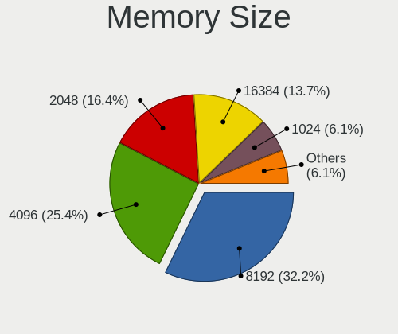

| Size    | Computers | Percent |
|---------|-----------|---------|
| 8192    | 33        | 34.38%  |
| 4096    | 24        | 25%     |
| 2048    | 21        | 21.88%  |
| 1024    | 9         | 9.38%   |
| 16384   | 5         | 5.21%   |
| 512     | 2         | 2.08%   |
| 32768   | 1         | 1.04%   |
| Unknown | 1         | 1.04%   |

Memory Speed
------------

Memory module speed

| Speed   | Computers | Percent |
|---------|-----------|---------|
| 1600    | 17        | 18.09%  |
| 2667    | 13        | 13.83%  |
| 1333    | 10        | 10.64%  |
| 3200    | 9         | 9.57%   |
| 2400    | 8         | 8.51%   |
| 800     | 8         | 8.51%   |
| Unknown | 6         | 6.38%   |
| 667     | 5         | 5.32%   |
| 533     | 3         | 3.19%   |
| 2133    | 2         | 2.13%   |
| 2048    | 2         | 2.13%   |
| 975     | 2         | 2.13%   |
| 4199    | 1         | 1.06%   |
| 4000    | 1         | 1.06%   |
| 3800    | 1         | 1.06%   |
| 3500    | 1         | 1.06%   |
| 3266    | 1         | 1.06%   |
| 2666    | 1         | 1.06%   |
| 1200    | 1         | 1.06%   |
| 1067    | 1         | 1.06%   |
| 400     | 1         | 1.06%   |

Printers & scanners
-------------------

Printer Vendor
--------------

Printer device vendors

| Vendor              | Computers | Percent |
|---------------------|-----------|---------|
| Hewlett-Packard     | 7         | 41.18%  |
| Brother Industries  | 3         | 17.65%  |
| Samsung Electronics | 2         | 11.76%  |
| Canon               | 2         | 11.76%  |
| Seiko Epson         | 1         | 5.88%   |
| Ricoh               | 1         | 5.88%   |
| Konica Minolta      | 1         | 5.88%   |

Printer Model
-------------

Printer device models

| Model                            | Computers | Percent |
|----------------------------------|-----------|---------|
| Brother MFC-L2685DW              | 2         | 11.76%  |
| Seiko Epson XP-3100 Series       | 1         | 5.88%   |
| Samsung SCX-3400 Series          | 1         | 5.88%   |
| Samsung ML-1670 Series           | 1         | 5.88%   |
| Ricoh SP C260SFNw                | 1         | 5.88%   |
| Konica Minolta 185               | 1         | 5.88%   |
| HP OfficeJet Pro 8730            | 1         | 5.88%   |
| HP LaserJet P1006                | 1         | 5.88%   |
| HP LaserJet 3050                 | 1         | 5.88%   |
| HP DeskJet F4200 series          | 1         | 5.88%   |
| HP DeskJet 2700 series           | 1         | 5.88%   |
| HP Deskjet 2540 series           | 1         | 5.88%   |
| HP Deskjet 1050 J410             | 1         | 5.88%   |
| Canon LaserShot LBP-1120 Printer | 1         | 5.88%   |
| Canon iP4200                     | 1         | 5.88%   |
| Brother HL-L2300D series         | 1         | 5.88%   |

Scanner Vendor
--------------

Scanner device vendors

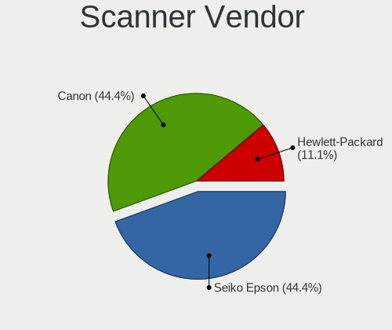

| Vendor          | Computers | Percent |
|-----------------|-----------|---------|
| Canon           | 2         | 50%     |
| Seiko Epson     | 1         | 25%     |
| Hewlett-Packard | 1         | 25%     |

Scanner Model
-------------

Scanner device models

| Model                                         | Computers | Percent |
|-----------------------------------------------|-----------|---------|
| Seiko Epson GT-8300UF [Perfection 1660 PHOTO] | 1         | 25%     |
| HP ScanJet 3800c                              | 1         | 25%     |
| Canon CanoScan N1240U/LiDE 30                 | 1         | 25%     |
| Canon CanoScan LiDE 110                       | 1         | 25%     |

Camera
------

Camera Vendor
-------------

Camera device vendors

| Vendor                                 | Computers | Percent |
|----------------------------------------|-----------|---------|
| Chicony Electronics                    | 49        | 21.21%  |
| IMC Networks                           | 18        | 7.79%   |
| Suyin                                  | 17        | 7.36%   |
| Sunplus Innovation Technology          | 17        | 7.36%   |
| Microdia                               | 15        | 6.49%   |
| Acer                                   | 14        | 6.06%   |
| Quanta                                 | 12        | 5.19%   |
| Realtek Semiconductor                  | 11        | 4.76%   |
| Logitech                               | 11        | 4.76%   |
| Silicon Motion                         | 7         | 3.03%   |
| Cheng Uei Precision Industry (Foxlink) | 7         | 3.03%   |
| Syntek                                 | 6         | 2.6%    |
| Ricoh                                  | 6         | 2.6%    |
| Apple                                  | 6         | 2.6%    |
| Z-Star Microelectronics                | 4         | 1.73%   |
| Microsoft                              | 3         | 1.3%    |
| Importek                               | 3         | 1.3%    |
| ALi                                    | 3         | 1.3%    |
| Sunplus Technology                     | 2         | 0.87%   |
| OmniVision Technologies                | 2         | 0.87%   |
| Luxvisions Innotech Limited            | 2         | 0.87%   |
| Lite-On Technology                     | 2         | 0.87%   |
| Generalplus Technology                 | 2         | 0.87%   |
| Xiongmai                               | 1         | 0.43%   |
| WCM_USB                                | 1         | 0.43%   |
| Unknown                                | 1         | 0.43%   |
| Service & Quality Technology           | 1         | 0.43%   |
| Samsung Electronics                    | 1         | 0.43%   |
| Nintendo                               | 1         | 0.43%   |
| MacroSilicon                           | 1         | 0.43%   |
| LG Electronics                         | 1         | 0.43%   |
| Lenovo                                 | 1         | 0.43%   |
| KYE Systems (Mouse Systems)            | 1         | 0.43%   |
| ARC International                      | 1         | 0.43%   |
| Alcor Micro                            | 1         | 0.43%   |

Camera Model
------------

Camera device models

| Model                                            | Computers | Percent |
|--------------------------------------------------|-----------|---------|
| Microdia Integrated_Webcam_HD                    | 6         | 2.59%   |
| Chicony HD WebCam                                | 6         | 2.59%   |
| Quanta HP Webcam                                 | 5         | 2.16%   |
| Chicony Integrated Camera                        | 5         | 2.16%   |
| Logitech Webcam C270                             | 4         | 1.72%   |
| Chicony USB2.0 HD UVC WebCam                     | 4         | 1.72%   |
| Chicony USB 2.0 Camera                           | 4         | 1.72%   |
| Chicony HP Truevision HD camera                  | 4         | 1.72%   |
| Suyin HP TrueVision HD                           | 3         | 1.29%   |
| Suyin Acer/HP Integrated Webcam [CN0314]         | 3         | 1.29%   |
| Suyin 1.3M HD WebCam                             | 3         | 1.29%   |
| Sunplus Laptop_Integrated_Webcam_HD              | 3         | 1.29%   |
| Realtek USB2.0 VGA UVC WebCam                    | 3         | 1.29%   |
| Realtek Integrated_Webcam_HD                     | 3         | 1.29%   |
| IMC Networks Integrated Camera                   | 3         | 1.29%   |
| Chicony 2.0M UVC Webcam / CNF7129                | 3         | 1.29%   |
| Apple iPhone 5/5C/5S/6/SE                        | 3         | 1.29%   |
| Apple Built-in iSight                            | 3         | 1.29%   |
| Acer Lenovo EasyCamera                           | 3         | 1.29%   |
| Syntek Sonix USB 2.0 Camera                      | 2         | 0.86%   |
| Syntek Integrated Camera                         | 2         | 0.86%   |
| Suyin HP Webcam                                  | 2         | 0.86%   |
| Suyin Acer CrystalEye Webcam                     | 2         | 0.86%   |
| Sunplus Laptop Integrated WebCam HD              | 2         | 0.86%   |
| Sunplus HP TrueVision HD Camera                  | 2         | 0.86%   |
| Silicon Motion WebCam SCB-0385N                  | 2         | 0.86%   |
| Silicon Motion WebCam SC-0311139N                | 2         | 0.86%   |
| Silicon Motion HP Webcam-101                     | 2         | 0.86%   |
| Ricoh Sony Visual Communication Camera           | 2         | 0.86%   |
| Quanta VGA WebCam                                | 2         | 0.86%   |
| Quanta HP TrueVision HD Camera                   | 2         | 0.86%   |
| Microsoft LifeCam HD-3000                        | 2         | 0.86%   |
| Microdia Sonix USB 2.0 Camera                    | 2         | 0.86%   |
| Microdia Integrated Webcam HD                    | 2         | 0.86%   |
| Logitech Webcam C310                             | 2         | 0.86%   |
| Importek TOSHIBA Web Camera - HD                 | 2         | 0.86%   |
| IMC Networks USB2.0 VGA UVC WebCam               | 2         | 0.86%   |
| IMC Networks USB2.0 HD UVC WebCam                | 2         | 0.86%   |
| IMC Networks USB 2.0 UVC VGA WebCam              | 2         | 0.86%   |
| IMC Networks EasyCamera                          | 2         | 0.86%   |
| Chicony TOSHIBA Web Camera - HD                  | 2         | 0.86%   |
| Chicony HD WebCam (Acer)                         | 2         | 0.86%   |
| Chicony EasyCamera                               | 2         | 0.86%   |
| Cheng Uei Precision Industry (Foxlink) HP Webcam | 2         | 0.86%   |
| ALi Gateway Webcam                               | 2         | 0.86%   |
| Acer USB HD Webcam                               | 2         | 0.86%   |
| Acer Integrated Camera                           | 2         | 0.86%   |
| Acer HD Webcam                                   | 2         | 0.86%   |
| Z-Star Venus USB2.0 Camera                       | 1         | 0.43%   |
| Z-Star Namuga 1.3M Webcam                        | 1         | 0.43%   |
| Z-Star Lenovo ThinkCentre Web Camera             | 1         | 0.43%   |
| Z-Star Lenovo EasyCamera                         | 1         | 0.43%   |
| Xiongmai web camera                              | 1         | 0.43%   |
| WCM_USB WEB CAM                                  | 1         | 0.43%   |
| Unknown 720p HD Camera                           | 1         | 0.43%   |
| Syntek Integrated Webcam                         | 1         | 0.43%   |
| Syntek HP Webcam                                 | 1         | 0.43%   |
| Suyin WebCam                                     | 1         | 0.43%   |
| Suyin HP TrueVision HD Integrated Webcam         | 1         | 0.43%   |
| Suyin HD WebCam                                  | 1         | 0.43%   |

Security
--------

Fingerprint Vendor
------------------

Fingerprint sensor vendors

| Vendor                | Computers | Percent |
|-----------------------|-----------|---------|
| Validity Sensors      | 13        | 38.24%  |
| AuthenTec             | 8         | 23.53%  |
| Synaptics             | 3         | 8.82%   |
| STMicroelectronics    | 3         | 8.82%   |
| LighTuning Technology | 3         | 8.82%   |
| Elan Microelectronics | 2         | 5.88%   |
| Upek                  | 1         | 2.94%   |
| Samsung Electronics   | 1         | 2.94%   |

Fingerprint Model
-----------------

Fingerprint sensor models

| Model                                                  | Computers | Percent |
|--------------------------------------------------------|-----------|---------|
| Validity Sensors VFS495 Fingerprint Reader             | 3         | 8.82%   |
| Validity Sensors VFS301 Fingerprint Reader             | 3         | 8.82%   |
| STMicroelectronics Fingerprint Reader                  | 3         | 8.82%   |
| Validity Sensors VFS491                                | 2         | 5.88%   |
| Validity Sensors VFS451 Fingerprint Reader             | 2         | 5.88%   |
| LighTuning EgisTec Touch Fingerprint Sensor            | 2         | 5.88%   |
| Elan ELAN:Fingerprint                                  | 2         | 5.88%   |
| AuthenTec Fingerprint Sensor                           | 2         | 5.88%   |
| AuthenTec AES2810                                      | 2         | 5.88%   |
| AuthenTec AES2501 Fingerprint Sensor                   | 2         | 5.88%   |
| AuthenTec AES1600                                      | 2         | 5.88%   |
| Unknown                                                | 2         | 5.88%   |
| Validity Sensors VFS5011 Fingerprint Reader            | 1         | 2.94%   |
| Validity Sensors VFS101 Fingerprint Reader             | 1         | 2.94%   |
| Validity Sensors Fingerprint scanner                   | 1         | 2.94%   |
| Upek Biometric Touchchip/Touchstrip Fingerprint Sensor | 1         | 2.94%   |
| Synaptics Metallica MOH Touch Fingerprint Reader       | 1         | 2.94%   |
| Samsung Fingerprint Sensor Device - 730B               | 1         | 2.94%   |
| LighTuning ES603 Swipe Fingerprint Sensor              | 1         | 2.94%   |

Chipcard Vendor
---------------

Chipcard module vendors

| Vendor                            | Computers | Percent |
|-----------------------------------|-----------|---------|
| Broadcom                          | 13        | 61.9%   |
| O2 Micro                          | 3         | 14.29%  |
| VASCO Data Security International | 1         | 4.76%   |
| OmniKey                           | 1         | 4.76%   |
| Jing-Mold Enterprise              | 1         | 4.76%   |
| Gemalto (was Gemplus)             | 1         | 4.76%   |
| Alcor Micro                       | 1         | 4.76%   |

Chipcard Model
--------------

Chipcard module models

| Model                                                                        | Computers | Percent |
|------------------------------------------------------------------------------|-----------|---------|
| Broadcom BCM5880 Secure Applications Processor                               | 7         | 33.33%  |
| Broadcom BCM5880 Secure Applications Processor with fingerprint swipe sensor | 3         | 14.29%  |
| O2 Micro OZ776 CCID Smartcard Reader                                         | 2         | 9.52%   |
| VASCO Data Security International DIGIPASS 870                               | 1         | 4.76%   |
| OmniKey CardMan 1021                                                         | 1         | 4.76%   |
| O2 Micro Oz776 SmartCard Reader                                              | 1         | 4.76%   |
| Jing-Mold Enterprise HP USB Business Slim Smartcard CCID Keyboard            | 1         | 4.76%   |
| Gemalto (was Gemplus) Compact Smart Card Reader Writer                       | 1         | 4.76%   |
| Broadcom BCM5880 Secure Applications Processor with fingerprint touch sensor | 1         | 4.76%   |
| Broadcom 5880                                                                | 1         | 4.76%   |
| Broadcom 58200                                                               | 1         | 4.76%   |
| Alcor Micro AU9540 Smartcard Reader                                          | 1         | 4.76%   |

Unsupported
-----------

Unsupported Devices
-------------------

Total unsupported devices on board

| Total | Computers | Percent |
|-------|-----------|---------|
| 0     | 291       | 64.38%  |
| 1     | 126       | 27.88%  |
| 2     | 22        | 4.87%   |
| 3     | 10        | 2.21%   |
| 4     | 2         | 0.44%   |
| 6     | 1         | 0.22%   |

Unsupported Device Types
------------------------

Types of unsupported devices

| Type                     | Computers | Percent |
|--------------------------|-----------|---------|
| Graphics card            | 64        | 32.16%  |
| Net/wireless             | 39        | 19.6%   |
| Fingerprint reader       | 34        | 17.09%  |
| Chipcard                 | 18        | 9.05%   |
| Multimedia controller    | 13        | 6.53%   |
| Communication controller | 10        | 5.03%   |
| Storage                  | 6         | 3.02%   |
| Network                  | 3         | 1.51%   |
| Unassigned class         | 2         | 1.01%   |
| Net/ethernet             | 2         | 1.01%   |
| Flash memory             | 2         | 1.01%   |
| Camera                   | 2         | 1.01%   |
| Storage/ide              | 1         | 0.5%    |
| Sound                    | 1         | 0.5%    |
| Modem                    | 1         | 0.5%    |
| Bluetooth                | 1         | 0.5%    |

