LMDE - Tested Hardware & Statistics
-----------------------------------

A project to collect tested hardware configurations for LMDE.

Anyone can contribute to this report by the [hw-probe](https://github.com/linuxhw/hw-probe) tool:

    sudo -E hw-probe -all -upload

Please contribute! Especially if your hardware is rare.

This is a report for all computer types. See also reports for [desktops](/Dist/LMDE/Desktop/README.md) and [notebooks](/Dist/LMDE/Notebook/README.md).

Contents
--------

* [ Test Cases ](#test-cases)

* [ System ](#system)
  - [ OS                       ](#os)
  - [ OS Family                ](#os-family)
  - [ Kernel                   ](#kernel)
  - [ Kernel Family            ](#kernel-family)
  - [ Kernel Major Ver.        ](#kernel-major-ver)
  - [ Arch                     ](#arch)
  - [ DE                       ](#de)
  - [ Display Server           ](#display-server)
  - [ Display Manager          ](#display-manager)
  - [ OS Lang                  ](#os-lang)
  - [ Boot Mode                ](#boot-mode)
  - [ Filesystem               ](#filesystem)
  - [ Part. scheme             ](#part-scheme)
  - [ Dual Boot with Linux/BSD ](#dual-boot-with-linuxbsd)
  - [ Dual Boot (Win)          ](#dual-boot-win)

* [ Board ](#board)
  - [ Vendor                   ](#vendor)
  - [ Model                    ](#model)
  - [ Model Family             ](#model-family)
  - [ MFG Year                 ](#mfg-year)
  - [ Form Factor              ](#form-factor)
  - [ Secure Boot              ](#secure-boot)
  - [ Coreboot                 ](#coreboot)
  - [ RAM Size                 ](#ram-size)
  - [ RAM Used                 ](#ram-used)
  - [ Total Drives             ](#total-drives)
  - [ Has CD-ROM               ](#has-cd-rom)
  - [ Has Ethernet             ](#has-ethernet)
  - [ Has WiFi                 ](#has-wifi)
  - [ Has Bluetooth            ](#has-bluetooth)

* [ Location ](#location)
  - [ Country                  ](#country)
  - [ City                     ](#city)

* [ Drives ](#drives)
  - [ Drive Vendor             ](#drive-vendor)
  - [ Drive Model              ](#drive-model)
  - [ HDD Vendor               ](#hdd-vendor)
  - [ SSD Vendor               ](#ssd-vendor)
  - [ Drive Kind               ](#drive-kind)
  - [ Drive Connector          ](#drive-connector)
  - [ Drive Size               ](#drive-size)
  - [ Space Total              ](#space-total)
  - [ Space Used               ](#space-used)
  - [ Malfunc. Drives          ](#malfunc-drives)
  - [ Malfunc. Drive Vendor    ](#malfunc-drive-vendor)
  - [ Malfunc. HDD Vendor      ](#malfunc-hdd-vendor)
  - [ Malfunc. Drive Kind      ](#malfunc-drive-kind)
  - [ Failed Drives            ](#failed-drives)
  - [ Failed Drive Vendor      ](#failed-drive-vendor)
  - [ Drive Status             ](#drive-status)

* [ Storage controller ](#storage-controller)
  - [ Storage Vendor           ](#storage-vendor)
  - [ Storage Model            ](#storage-model)
  - [ Storage Kind             ](#storage-kind)

* [ Processor ](#processor)
  - [ CPU Vendor               ](#cpu-vendor)
  - [ CPU Model                ](#cpu-model)
  - [ CPU Model Family         ](#cpu-model-family)
  - [ CPU Cores                ](#cpu-cores)
  - [ CPU Sockets              ](#cpu-sockets)
  - [ CPU Threads              ](#cpu-threads)
  - [ CPU Op-Modes             ](#cpu-op-modes)
  - [ CPU Microcode            ](#cpu-microcode)
  - [ CPU Microarch            ](#cpu-microarch)

* [ Graphics ](#graphics)
  - [ GPU Vendor               ](#gpu-vendor)
  - [ GPU Model                ](#gpu-model)
  - [ GPU Combo                ](#gpu-combo)
  - [ GPU Driver               ](#gpu-driver)
  - [ GPU Memory               ](#gpu-memory)

* [ Monitor ](#monitor)
  - [ Monitor Vendor           ](#monitor-vendor)
  - [ Monitor Model            ](#monitor-model)
  - [ Monitor Resolution       ](#monitor-resolution)
  - [ Monitor Diagonal         ](#monitor-diagonal)
  - [ Monitor Width            ](#monitor-width)
  - [ Aspect Ratio             ](#aspect-ratio)
  - [ Monitor Area             ](#monitor-area)
  - [ Pixel Density            ](#pixel-density)
  - [ Multiple Monitors        ](#multiple-monitors)

* [ Network ](#network)
  - [ Net Controller Vendor    ](#net-controller-vendor)
  - [ Net Controller Model     ](#net-controller-model)
  - [ Wireless Vendor          ](#wireless-vendor)
  - [ Wireless Model           ](#wireless-model)
  - [ Ethernet Vendor          ](#ethernet-vendor)
  - [ Ethernet Model           ](#ethernet-model)
  - [ Net Controller Kind      ](#net-controller-kind)
  - [ Used Controller          ](#used-controller)
  - [ NICs                     ](#nics)
  - [ IPv6                     ](#ipv6)

* [ Bluetooth ](#bluetooth)
  - [ Bluetooth Vendor         ](#bluetooth-vendor)
  - [ Bluetooth Model          ](#bluetooth-model)

* [ Sound ](#sound)
  - [ Sound Vendor             ](#sound-vendor)
  - [ Sound Model              ](#sound-model)

* [ Memory ](#memory)
  - [ Memory Vendor            ](#memory-vendor)
  - [ Memory Model             ](#memory-model)
  - [ Memory Kind              ](#memory-kind)
  - [ Memory Form Factor       ](#memory-form-factor)
  - [ Memory Size              ](#memory-size)
  - [ Memory Speed             ](#memory-speed)

* [ Printers & scanners ](#printers--scanners)
  - [ Printer Vendor           ](#printer-vendor)
  - [ Printer Model            ](#printer-model)
  - [ Scanner Vendor           ](#scanner-vendor)
  - [ Scanner Model            ](#scanner-model)

* [ Camera ](#camera)
  - [ Camera Vendor            ](#camera-vendor)
  - [ Camera Model             ](#camera-model)

* [ Security ](#security)
  - [ Fingerprint Vendor       ](#fingerprint-vendor)
  - [ Fingerprint Model        ](#fingerprint-model)
  - [ Chipcard Vendor          ](#chipcard-vendor)
  - [ Chipcard Model           ](#chipcard-model)

* [ Unsupported ](#unsupported)
  - [ Unsupported Devices      ](#unsupported-devices)
  - [ Unsupported Device Types ](#unsupported-device-types)

Test Cases
----------

Total: 1604

| Vendor        | Model                       | Form-Factor | Probe                                                      | Date         |
|---------------|-----------------------------|-------------|------------------------------------------------------------|--------------|
| HP            | ZBook Fury 17.3 inch G8 ... | Notebook    | [65ddbd761c](https://linux-hardware.org/?probe=65ddbd761c) | Jan 02, 2024 |
| Dell          | Latitude E6320              | Notebook    | [1833dcdd43](https://linux-hardware.org/?probe=1833dcdd43) | Dec 31, 2023 |
| ASUSTek       | H110M-A/M.2                 | Desktop     | [9e622b4006](https://linux-hardware.org/?probe=9e622b4006) | Dec 31, 2023 |
| Gigabyte      | Q87M-D2H                    | Desktop     | [0f440edfb5](https://linux-hardware.org/?probe=0f440edfb5) | Dec 31, 2023 |
| Gigabyte      | Q87M-D2H                    | Desktop     | [edbe61f4fa](https://linux-hardware.org/?probe=edbe61f4fa) | Dec 31, 2023 |
| ASUSTek       | ASUS BR1100CKA BR1100CKA... | Notebook    | [fc3a637b52](https://linux-hardware.org/?probe=fc3a637b52) | Dec 31, 2023 |
| Intel         | B75                         | Desktop     | [df9a51de80](https://linux-hardware.org/?probe=df9a51de80) | Dec 30, 2023 |
| ASUSTek       | ROG Strix G512LV_G512LV     | Notebook    | [86a499d322](https://linux-hardware.org/?probe=86a499d322) | Dec 30, 2023 |
| Sony          | VGN-FW21E                   | Notebook    | [52ff803e03](https://linux-hardware.org/?probe=52ff803e03) | Dec 29, 2023 |
| Apple         | Mac-F42786A9 DVT            | All in one  | [c2a3ce3927](https://linux-hardware.org/?probe=c2a3ce3927) | Dec 29, 2023 |
| Apple         | Mac-35C5E08120C7EEAF Mac... | Mini pc     | [05e0faf913](https://linux-hardware.org/?probe=05e0faf913) | Dec 29, 2023 |
| ASUSTek       | VivoBook_ASUSLaptop X160... | Notebook    | [242659bbee](https://linux-hardware.org/?probe=242659bbee) | Dec 27, 2023 |
| Dell          | 0RW199                      | Desktop     | [906719d239](https://linux-hardware.org/?probe=906719d239) | Dec 27, 2023 |
| Lenovo        | ThinkPad T14 Gen 3 21AHC... | Notebook    | [3673afc1cd](https://linux-hardware.org/?probe=3673afc1cd) | Dec 26, 2023 |
| Lenovo        | ThinkPad T14 Gen 3 21AHC... | Notebook    | [9b570f14f6](https://linux-hardware.org/?probe=9b570f14f6) | Dec 26, 2023 |
| HP            | ProBook 445 14 inch G9 N... | Notebook    | [d3e1c0dbdc](https://linux-hardware.org/?probe=d3e1c0dbdc) | Dec 25, 2023 |
| HP            | 090Ch                       | Desktop     | [06e9f893bc](https://linux-hardware.org/?probe=06e9f893bc) | Dec 25, 2023 |
| Gigabyte      | Q87M-D2H                    | Desktop     | [4b2ed8b976](https://linux-hardware.org/?probe=4b2ed8b976) | Dec 23, 2023 |
| ASUSTek       | X99-A II                    | Desktop     | [37e4430c0e](https://linux-hardware.org/?probe=37e4430c0e) | Dec 23, 2023 |
| ASRock        | Z97 Pro4                    | Desktop     | [f8e2df67b1](https://linux-hardware.org/?probe=f8e2df67b1) | Dec 23, 2023 |
| MSI           | MPG B550 GAMING PLUS        | Desktop     | [db8c00daf3](https://linux-hardware.org/?probe=db8c00daf3) | Dec 22, 2023 |
| Lenovo        | IdeaPad S540-14IML 81NF     | Notebook    | [942da4e853](https://linux-hardware.org/?probe=942da4e853) | Dec 20, 2023 |
| Lenovo        | 317C NOK                    | Desktop     | [87064e6d98](https://linux-hardware.org/?probe=87064e6d98) | Dec 20, 2023 |
| Medion        | TJ4125                      | Desktop     | [8fce958467](https://linux-hardware.org/?probe=8fce958467) | Dec 20, 2023 |
| Gigabyte      | GA-MA78LMT-US2H             | Desktop     | [a1f4076586](https://linux-hardware.org/?probe=a1f4076586) | Dec 19, 2023 |
| Sony          | SVE1511A1EW                 | Notebook    | [2f0fde3487](https://linux-hardware.org/?probe=2f0fde3487) | Dec 19, 2023 |
| Sony          | SVE1511A1EW                 | Notebook    | [e5531ecc00](https://linux-hardware.org/?probe=e5531ecc00) | Dec 19, 2023 |
| Medion        | TJ4125                      | Desktop     | [c7eeb77279](https://linux-hardware.org/?probe=c7eeb77279) | Dec 18, 2023 |
| Irbis         | NB264                       | Notebook    | [8c32d8fb0b](https://linux-hardware.org/?probe=8c32d8fb0b) | Dec 18, 2023 |
| Medion        | E6214                       | Notebook    | [1bc5839854](https://linux-hardware.org/?probe=1bc5839854) | Dec 17, 2023 |
| Medion        | E6214                       | Notebook    | [5269b6e576](https://linux-hardware.org/?probe=5269b6e576) | Dec 17, 2023 |
| Gigabyte      | Q87M-D2H                    | Desktop     | [378b82ce2f](https://linux-hardware.org/?probe=378b82ce2f) | Dec 17, 2023 |
| Gigabyte      | Q87M-D2H                    | Desktop     | [e7f9b37ee3](https://linux-hardware.org/?probe=e7f9b37ee3) | Dec 17, 2023 |
| Gigabyte      | Q87M-D2H                    | Desktop     | [935f688c90](https://linux-hardware.org/?probe=935f688c90) | Dec 17, 2023 |
| Gigabyte      | Q87M-D2H                    | Desktop     | [f53d129b3d](https://linux-hardware.org/?probe=f53d129b3d) | Dec 17, 2023 |
| Dell          | Inspiron 3542               | Notebook    | [6b3cd841db](https://linux-hardware.org/?probe=6b3cd841db) | Dec 17, 2023 |
| Medion        | TJ4125                      | Desktop     | [7556d73046](https://linux-hardware.org/?probe=7556d73046) | Dec 17, 2023 |
| Dell          | Latitude E6430              | Notebook    | [13af5c2dc4](https://linux-hardware.org/?probe=13af5c2dc4) | Dec 17, 2023 |
| Gigabyte      | A520M S2H                   | Desktop     | [0b4a9d3a4e](https://linux-hardware.org/?probe=0b4a9d3a4e) | Dec 16, 2023 |
| Lenovo        | ThinkPad X230 2325BA3       | Notebook    | [1c573f00c0](https://linux-hardware.org/?probe=1c573f00c0) | Dec 16, 2023 |
| Medion        | E6214                       | Notebook    | [806be57bd5](https://linux-hardware.org/?probe=806be57bd5) | Dec 16, 2023 |
| Apple         | Mac-F4208EAA PVT            | Mini pc     | [973e09e6eb](https://linux-hardware.org/?probe=973e09e6eb) | Dec 15, 2023 |
| ASUSTek       | VivoBook_ASUSLaptop X150... | Notebook    | [8f7755936c](https://linux-hardware.org/?probe=8f7755936c) | Dec 14, 2023 |
| ASUSTek       | M4A89GTD-PRO/USB3           | Desktop     | [9362181823](https://linux-hardware.org/?probe=9362181823) | Dec 14, 2023 |
| Sapphire      | PI-AM3RS760G2               | Desktop     | [e2c79fa4d1](https://linux-hardware.org/?probe=e2c79fa4d1) | Dec 13, 2023 |
| Acer          | Veriton M4630G V:1.0        | Desktop     | [91ec51ebf5](https://linux-hardware.org/?probe=91ec51ebf5) | Dec 12, 2023 |
| Lenovo        | 30BB SDK0J40709 WIN 3259... | All in one  | [9d9d96201b](https://linux-hardware.org/?probe=9d9d96201b) | Dec 12, 2023 |
| Acer          | Aspire Z3-615               | All in one  | [e71cda8b04](https://linux-hardware.org/?probe=e71cda8b04) | Dec 12, 2023 |
| Acer          | Aspire Z3-615               | All in one  | [c3d3cc14e8](https://linux-hardware.org/?probe=c3d3cc14e8) | Dec 12, 2023 |
| HP            | ProBook 650 G2              | Notebook    | [9936eed724](https://linux-hardware.org/?probe=9936eed724) | Dec 12, 2023 |
| Dell          | 0GXM1W A02                  | Desktop     | [3184d3c38b](https://linux-hardware.org/?probe=3184d3c38b) | Dec 11, 2023 |
| MSI           | GF63 Thin 11UC              | Notebook    | [78562df77d](https://linux-hardware.org/?probe=78562df77d) | Dec 11, 2023 |
| ASRock        | H310M-STX                   | Desktop     | [205a5c1696](https://linux-hardware.org/?probe=205a5c1696) | Dec 10, 2023 |
| Dell          | Precision 3550              | Notebook    | [0235a02831](https://linux-hardware.org/?probe=0235a02831) | Dec 10, 2023 |
| Gigabyte      | 970A-DS3P                   | Desktop     | [71de71e3f4](https://linux-hardware.org/?probe=71de71e3f4) | Dec 10, 2023 |
| Gigabyte      | 970A-DS3P                   | Desktop     | [64b0038221](https://linux-hardware.org/?probe=64b0038221) | Dec 10, 2023 |
| ASUSTek       | X505BP                      | Notebook    | [408ad7dd06](https://linux-hardware.org/?probe=408ad7dd06) | Dec 10, 2023 |
| Apple         | Mac-F42786A9 DVT            | All in one  | [eaedc51abc](https://linux-hardware.org/?probe=eaedc51abc) | Dec 10, 2023 |
| HUAWEI        | BOM-WXX9                    | Notebook    | [0d970bde9a](https://linux-hardware.org/?probe=0d970bde9a) | Dec 09, 2023 |
| MSI           | MPG X570 GAMING EDGE WIF... | Desktop     | [4525b7e30c](https://linux-hardware.org/?probe=4525b7e30c) | Dec 09, 2023 |
| ASUSTek       | P5G41T-M LX3                | Desktop     | [42a7acfe4b](https://linux-hardware.org/?probe=42a7acfe4b) | Dec 09, 2023 |
| ASUSTek       | PRIME A320M-K               | Desktop     | [b553ec2266](https://linux-hardware.org/?probe=b553ec2266) | Dec 08, 2023 |
| ASUSTek       | Rampage III Extreme         | Desktop     | [d4d934c9be](https://linux-hardware.org/?probe=d4d934c9be) | Dec 08, 2023 |
| Unknown       | Unknown                     | Desktop     | [7144bda606](https://linux-hardware.org/?probe=7144bda606) | Dec 07, 2023 |
| HP            | ENVY x360 Convertible 13... | Convertible | [748534900a](https://linux-hardware.org/?probe=748534900a) | Dec 04, 2023 |
| ASUSTek       | PRIME B350-PLUS             | Desktop     | [6fca6c7335](https://linux-hardware.org/?probe=6fca6c7335) | Dec 03, 2023 |
| Acer          | Aspire E5-575               | Notebook    | [e6fd8cf7f1](https://linux-hardware.org/?probe=e6fd8cf7f1) | Dec 02, 2023 |
| Lenovo        | IdeaPad 130-15IKB 81H7      | Notebook    | [e33632af4f](https://linux-hardware.org/?probe=e33632af4f) | Dec 02, 2023 |
| Lenovo        | IdeaPad 130-15IKB 81H7      | Notebook    | [f86dd8a709](https://linux-hardware.org/?probe=f86dd8a709) | Dec 02, 2023 |
| HP            | ProBook 450 G3              | Notebook    | [b53f576b27](https://linux-hardware.org/?probe=b53f576b27) | Dec 02, 2023 |
| Lenovo        | G50-80 80E5                 | Notebook    | [75dcedad41](https://linux-hardware.org/?probe=75dcedad41) | Nov 30, 2023 |
| Dell          | XPS 13 9360                 | Notebook    | [8a91691d0b](https://linux-hardware.org/?probe=8a91691d0b) | Nov 30, 2023 |
| Alienware     | 17                          | Notebook    | [1c23fa6051](https://linux-hardware.org/?probe=1c23fa6051) | Nov 29, 2023 |
| LETSUNG       | Unknown                     | Notebook    | [bfbf7dfeaa](https://linux-hardware.org/?probe=bfbf7dfeaa) | Nov 27, 2023 |
| ASUSTek       | PRIME B450M-K               | Desktop     | [9fa48c41da](https://linux-hardware.org/?probe=9fa48c41da) | Nov 27, 2023 |
| Lenovo        | ThinkPad W541 20EGS07C01    | Notebook    | [c05294f5f5](https://linux-hardware.org/?probe=c05294f5f5) | Nov 26, 2023 |
| Gigabyte      | B560M D3H                   | Desktop     | [8a894da286](https://linux-hardware.org/?probe=8a894da286) | Nov 26, 2023 |
| Lenovo        | ThinkPad W541 20EGS07C01    | Notebook    | [dc051898f5](https://linux-hardware.org/?probe=dc051898f5) | Nov 26, 2023 |
| Apple         | MacBookPro8,1               | Notebook    | [1a31182007](https://linux-hardware.org/?probe=1a31182007) | Nov 26, 2023 |
| Medion        | E6214                       | Notebook    | [83d5d32938](https://linux-hardware.org/?probe=83d5d32938) | Nov 26, 2023 |
| Shenzhen M... | F7BRC                       | Desktop     | [9ff2c76737](https://linux-hardware.org/?probe=9ff2c76737) | Nov 26, 2023 |
| HP            | Pavilion TS Sleekbook 15    | Notebook    | [3a3a75aa94](https://linux-hardware.org/?probe=3a3a75aa94) | Nov 26, 2023 |
| MSI           | MAG B760M MORTAR WIFI DD... | Desktop     | [b11fcf42c2](https://linux-hardware.org/?probe=b11fcf42c2) | Nov 25, 2023 |
| HP            | Pavilion TS Sleekbook 15    | Notebook    | [9c76ca1014](https://linux-hardware.org/?probe=9c76ca1014) | Nov 25, 2023 |
| HP            | 250 G7 Notebook PC          | Notebook    | [7fce567d9e](https://linux-hardware.org/?probe=7fce567d9e) | Nov 25, 2023 |
| HP            | 245 G7                      | Notebook    | [42ee8e6975](https://linux-hardware.org/?probe=42ee8e6975) | Nov 25, 2023 |
| ASUSTek       | VivoBook_ASUSLaptop M650... | Notebook    | [8131bff614](https://linux-hardware.org/?probe=8131bff614) | Nov 25, 2023 |
| Medion        | TJ4125                      | Desktop     | [512206df27](https://linux-hardware.org/?probe=512206df27) | Nov 24, 2023 |
| Pegatron      | 2ACF                        | Desktop     | [d89c55cb89](https://linux-hardware.org/?probe=d89c55cb89) | Nov 24, 2023 |
| ASUSTek       | PRIME A320M-K               | Desktop     | [81d1db42ea](https://linux-hardware.org/?probe=81d1db42ea) | Nov 23, 2023 |
| ASUSTek       | VivoBook_ASUSLaptop X515... | Notebook    | [a8b99ab7f3](https://linux-hardware.org/?probe=a8b99ab7f3) | Nov 23, 2023 |
| HP            | 829A                        | Mini pc     | [b8edb25d4c](https://linux-hardware.org/?probe=b8edb25d4c) | Nov 23, 2023 |
| ASUSTek       | P5G41T-M LX3                | Desktop     | [af55920808](https://linux-hardware.org/?probe=af55920808) | Nov 23, 2023 |
| Acer          | Aspire TC-780               | Desktop     | [dbce2ba706](https://linux-hardware.org/?probe=dbce2ba706) | Nov 23, 2023 |
| MSI           | PRO Z790-A WIFI             | Desktop     | [b564a39ed5](https://linux-hardware.org/?probe=b564a39ed5) | Nov 22, 2023 |
| Dell          | 0Y2YM6 A00                  | Desktop     | [ce96501574](https://linux-hardware.org/?probe=ce96501574) | Nov 22, 2023 |
| Gigabyte      | Q87M-D2H                    | Desktop     | [a0f12099c5](https://linux-hardware.org/?probe=a0f12099c5) | Nov 22, 2023 |
| Lenovo        | ThinkPad X1 Extreme 20MG... | Notebook    | [9f4829b792](https://linux-hardware.org/?probe=9f4829b792) | Nov 22, 2023 |
| HP            | 8158 A01                    | Mini pc     | [5132b64a8a](https://linux-hardware.org/?probe=5132b64a8a) | Nov 22, 2023 |
| Soyo          | SY-N3150L Quad              | Desktop     | [7fd72fcced](https://linux-hardware.org/?probe=7fd72fcced) | Nov 21, 2023 |
| HP            | Pavilion 15                 | Notebook    | [b12a3ea8d6](https://linux-hardware.org/?probe=b12a3ea8d6) | Nov 21, 2023 |
| HP            | Pavilion 15                 | Notebook    | [7239efa8fe](https://linux-hardware.org/?probe=7239efa8fe) | Nov 20, 2023 |
| Pegatron      | 2ADC                        | Desktop     | [683e6fe69e](https://linux-hardware.org/?probe=683e6fe69e) | Nov 20, 2023 |
| Pegatron      | 2ADC                        | Desktop     | [ff6ee5f1e5](https://linux-hardware.org/?probe=ff6ee5f1e5) | Nov 20, 2023 |
| Microsoft     | Surface Pro                 | Tablet      | [bff17ec47d](https://linux-hardware.org/?probe=bff17ec47d) | Nov 20, 2023 |
| Gigabyte      | Q87M-D2H                    | Desktop     | [085623428e](https://linux-hardware.org/?probe=085623428e) | Nov 19, 2023 |
| Acer          | Aspire X3400                | Desktop     | [26cedbdbde](https://linux-hardware.org/?probe=26cedbdbde) | Nov 19, 2023 |
| Acer          | Aspire X3400                | Desktop     | [83890ec21c](https://linux-hardware.org/?probe=83890ec21c) | Nov 19, 2023 |
| ASUSTek       | P5G41T-M LX3                | Desktop     | [e65cf40bcb](https://linux-hardware.org/?probe=e65cf40bcb) | Nov 19, 2023 |
| Intel         | NUC7i5DNB J57626-509        | Mini pc     | [672ed26145](https://linux-hardware.org/?probe=672ed26145) | Nov 17, 2023 |
| ASUSTek       | EB1035                      | All in one  | [c42d11074a](https://linux-hardware.org/?probe=c42d11074a) | Nov 17, 2023 |
| Acer          | Aspire E5-575G              | Notebook    | [41d4402bf3](https://linux-hardware.org/?probe=41d4402bf3) | Nov 17, 2023 |
| ASUSTek       | EB1035                      | All in one  | [04b01b0be5](https://linux-hardware.org/?probe=04b01b0be5) | Nov 17, 2023 |
| HP            | 250 G5 Notebook PC          | Notebook    | [f6d6d655df](https://linux-hardware.org/?probe=f6d6d655df) | Nov 16, 2023 |
| HP            | 8265                        | Desktop     | [d3f5c1d6ce](https://linux-hardware.org/?probe=d3f5c1d6ce) | Nov 15, 2023 |
| Dell          | XPS 13 9360                 | Notebook    | [b9f38bd221](https://linux-hardware.org/?probe=b9f38bd221) | Nov 15, 2023 |
| Toshiba       | Satellite Pro L100          | Notebook    | [429902b4e5](https://linux-hardware.org/?probe=429902b4e5) | Nov 15, 2023 |
| Acer          | AOA110                      | Notebook    | [a6b7a86c67](https://linux-hardware.org/?probe=a6b7a86c67) | Nov 14, 2023 |
| MSI           | Thin GF63 12HW              | Notebook    | [087220685a](https://linux-hardware.org/?probe=087220685a) | Nov 14, 2023 |
| Fujitsu       | D3400-A1 S26361-D3400-A1    | Desktop     | [c4b486ecb1](https://linux-hardware.org/?probe=c4b486ecb1) | Nov 13, 2023 |
| Toshiba       | Satellite Pro L100          | Notebook    | [ade0fd48dc](https://linux-hardware.org/?probe=ade0fd48dc) | Nov 12, 2023 |
| ASUSTek       | VivoBook_ASUSLaptop X160... | Notebook    | [c00b5e7c16](https://linux-hardware.org/?probe=c00b5e7c16) | Nov 12, 2023 |
| HUAWEI        | KLVL-WXX9                   | Notebook    | [e45cab7f2c](https://linux-hardware.org/?probe=e45cab7f2c) | Nov 12, 2023 |
| Medion        | TJ4125                      | Desktop     | [1e0f7cdf34](https://linux-hardware.org/?probe=1e0f7cdf34) | Nov 12, 2023 |
| ASUSTek       | ROG Strix G513QY_G513QY     | Notebook    | [feaa9f3eac](https://linux-hardware.org/?probe=feaa9f3eac) | Nov 11, 2023 |
| Medion        | TJ4125                      | Desktop     | [ab37177769](https://linux-hardware.org/?probe=ab37177769) | Nov 10, 2023 |
| Gigabyte      | Q87M-D2H                    | Desktop     | [80bba409c5](https://linux-hardware.org/?probe=80bba409c5) | Nov 10, 2023 |
| HP            | 250 G8 Notebook PC          | Notebook    | [54073a3305](https://linux-hardware.org/?probe=54073a3305) | Nov 09, 2023 |
| Toshiba       | Satellite L745              | Notebook    | [4dbd78f68d](https://linux-hardware.org/?probe=4dbd78f68d) | Nov 09, 2023 |
| HP            | Pavilion Laptop 15t-eg00... | Notebook    | [c594d3daae](https://linux-hardware.org/?probe=c594d3daae) | Nov 09, 2023 |
| IBM           | ThinkPad T40 23736G4        | Notebook    | [5c1d0bcbb2](https://linux-hardware.org/?probe=5c1d0bcbb2) | Nov 08, 2023 |
| Dell          | 0HH807                      | Desktop     | [300ee3d8f5](https://linux-hardware.org/?probe=300ee3d8f5) | Nov 08, 2023 |
| ASUSTek       | P5G41T-M LX3                | Desktop     | [8d5332d643](https://linux-hardware.org/?probe=8d5332d643) | Nov 07, 2023 |
| Acer          | Aspire A315-21              | Notebook    | [f51da852ca](https://linux-hardware.org/?probe=f51da852ca) | Nov 07, 2023 |
| Acer          | Aspire A315-21              | Notebook    | [35b7b043ff](https://linux-hardware.org/?probe=35b7b043ff) | Nov 07, 2023 |
| Google        | Akemi                       | Notebook    | [f19a7fb862](https://linux-hardware.org/?probe=f19a7fb862) | Nov 06, 2023 |
| HP            | Pavilion Laptop 15t-eg00... | Notebook    | [d86018bbd8](https://linux-hardware.org/?probe=d86018bbd8) | Nov 06, 2023 |
| MSI           | B75MA-P45                   | Desktop     | [bfe1423965](https://linux-hardware.org/?probe=bfe1423965) | Nov 06, 2023 |
| Dell          | XPS 17 9720                 | Notebook    | [39e8a692ae](https://linux-hardware.org/?probe=39e8a692ae) | Nov 05, 2023 |
| Gigabyte      | Q87M-D2H                    | Desktop     | [62a888f71c](https://linux-hardware.org/?probe=62a888f71c) | Nov 05, 2023 |
| Medion        | TJ4125                      | Desktop     | [65a059325e](https://linux-hardware.org/?probe=65a059325e) | Nov 05, 2023 |
| Gigabyte      | MZBSWAP-K4                  | Desktop     | [ef6c15830d](https://linux-hardware.org/?probe=ef6c15830d) | Nov 05, 2023 |
| HP            | 250 G8 Notebook PC          | Notebook    | [a2fbd58a8c](https://linux-hardware.org/?probe=a2fbd58a8c) | Nov 05, 2023 |
| Google        | Akemi                       | Notebook    | [350f53d84a](https://linux-hardware.org/?probe=350f53d84a) | Nov 05, 2023 |
| Apple         | Mac-AA95B1DDAB278B95 iMa... | All in one  | [b77c593ace](https://linux-hardware.org/?probe=b77c593ace) | Nov 04, 2023 |
| Apple         | Mac-AA95B1DDAB278B95 iMa... | All in one  | [1c80cbda1c](https://linux-hardware.org/?probe=1c80cbda1c) | Nov 04, 2023 |
| Medion        | E6214                       | Notebook    | [776be82bf6](https://linux-hardware.org/?probe=776be82bf6) | Nov 04, 2023 |
| Medion        | E6214                       | Notebook    | [65976063e7](https://linux-hardware.org/?probe=65976063e7) | Nov 04, 2023 |
| HP            | 246 G6 Notebook PC          | Notebook    | [cd997e5a97](https://linux-hardware.org/?probe=cd997e5a97) | Nov 03, 2023 |
| HP            | 255 G6 Notebook PC          | Notebook    | [b73e7cf536](https://linux-hardware.org/?probe=b73e7cf536) | Nov 03, 2023 |
| Multilaser    | PC13X                       | Notebook    | [1c6a314055](https://linux-hardware.org/?probe=1c6a314055) | Nov 03, 2023 |
| ASUSTek       | VivoBook_ASUSLaptop X160... | Notebook    | [a0c7507d6d](https://linux-hardware.org/?probe=a0c7507d6d) | Nov 03, 2023 |
| Google        | Akemi                       | Notebook    | [20ec65943c](https://linux-hardware.org/?probe=20ec65943c) | Nov 02, 2023 |
| ASUSTek       | P5G41T-M LX                 | Desktop     | [ae6c835796](https://linux-hardware.org/?probe=ae6c835796) | Nov 02, 2023 |
| ASUSTek       | X456UR                      | Notebook    | [9a0a4dfd02](https://linux-hardware.org/?probe=9a0a4dfd02) | Nov 02, 2023 |
| ASRock        | Z97 Pro4                    | Desktop     | [6fa2a70f99](https://linux-hardware.org/?probe=6fa2a70f99) | Nov 01, 2023 |
| Lenovo        | Legion 5 Pro 16ACH6H 82J... | Notebook    | [826dc000ff](https://linux-hardware.org/?probe=826dc000ff) | Nov 01, 2023 |
| HP            | Notebook                    | Notebook    | [b1491b73ae](https://linux-hardware.org/?probe=b1491b73ae) | Oct 31, 2023 |
| HP            | Pavilion Laptop 15-cs3xx... | Notebook    | [1107919053](https://linux-hardware.org/?probe=1107919053) | Oct 31, 2023 |
| HP            | 18EB                        | Desktop     | [83596ab9d9](https://linux-hardware.org/?probe=83596ab9d9) | Oct 31, 2023 |
| ASUSTek       | P5G41T-M LX                 | Desktop     | [e741e073e0](https://linux-hardware.org/?probe=e741e073e0) | Oct 30, 2023 |
| ASRock        | Z690M-ITX/ax                | Desktop     | [810297d46b](https://linux-hardware.org/?probe=810297d46b) | Oct 30, 2023 |
| Gigabyte      | MZBSWAP-K4                  | Desktop     | [aed94a16c1](https://linux-hardware.org/?probe=aed94a16c1) | Oct 30, 2023 |
| ASUSTek       | X540YA                      | Notebook    | [082e5b7e0b](https://linux-hardware.org/?probe=082e5b7e0b) | Oct 29, 2023 |
| ASUSTek       | VivoBook_ASUSLaptop X160... | Notebook    | [1267d6df00](https://linux-hardware.org/?probe=1267d6df00) | Oct 29, 2023 |
| Trigkey       | Green G4 10                 | Desktop     | [bb72f6af02](https://linux-hardware.org/?probe=bb72f6af02) | Oct 29, 2023 |
| ASUSTek       | VivoBook_ASUSLaptop X515... | Notebook    | [9f0452aba6](https://linux-hardware.org/?probe=9f0452aba6) | Oct 29, 2023 |
| Lenovo        | ThinkPad T420 4236W1Y       | Notebook    | [2ff5cba7a7](https://linux-hardware.org/?probe=2ff5cba7a7) | Oct 29, 2023 |
| Medion        | TJ4125                      | Desktop     | [f791cf88cb](https://linux-hardware.org/?probe=f791cf88cb) | Oct 27, 2023 |
| Dell          | 0HH807                      | Desktop     | [7f15d65c22](https://linux-hardware.org/?probe=7f15d65c22) | Oct 27, 2023 |
| Lenovo        | Yoga Slim 7 14ARE05 82A2    | Notebook    | [a899ecd171](https://linux-hardware.org/?probe=a899ecd171) | Oct 27, 2023 |
| Toshiba       | Satellite L745              | Notebook    | [c126c9e041](https://linux-hardware.org/?probe=c126c9e041) | Oct 27, 2023 |
| Avell High... | 1513 Mxti                   | Notebook    | [9f5d60c02b](https://linux-hardware.org/?probe=9f5d60c02b) | Oct 27, 2023 |
| Unknown       | P4M800CE-8237               | Desktop     | [bf22b887f8](https://linux-hardware.org/?probe=bf22b887f8) | Oct 26, 2023 |
| ASUSTek       | X505BP                      | Notebook    | [884529eef1](https://linux-hardware.org/?probe=884529eef1) | Oct 26, 2023 |
| ASUSTek       | X505BP                      | Notebook    | [f32e8922c8](https://linux-hardware.org/?probe=f32e8922c8) | Oct 26, 2023 |
| ASRock        | Z97 Pro4                    | Desktop     | [bcf737a9cd](https://linux-hardware.org/?probe=bcf737a9cd) | Oct 25, 2023 |
| Lenovo        | ThinkPad S1 Yoga 20CD000... | Notebook    | [4e393023d7](https://linux-hardware.org/?probe=4e393023d7) | Oct 25, 2023 |
| HP            | Pavilion dv7                | Notebook    | [c3e7ebfd20](https://linux-hardware.org/?probe=c3e7ebfd20) | Oct 23, 2023 |
| Unknown       | Unknown                     | Notebook    | [251baa33d7](https://linux-hardware.org/?probe=251baa33d7) | Oct 23, 2023 |
| Unknown       | Unknown                     | Notebook    | [a06cdb13fc](https://linux-hardware.org/?probe=a06cdb13fc) | Oct 23, 2023 |
| Framework     | Laptop                      | Notebook    | [f78c8c1b58](https://linux-hardware.org/?probe=f78c8c1b58) | Oct 22, 2023 |
| HP            | 250 G7 Notebook PC          | Notebook    | [b9698d48be](https://linux-hardware.org/?probe=b9698d48be) | Oct 22, 2023 |
| ASUSTek       | VivoBook_ASUSLaptop X515... | Notebook    | [77fb62615e](https://linux-hardware.org/?probe=77fb62615e) | Oct 22, 2023 |
| Gigabyte      | Q87M-D2H                    | Desktop     | [74d5de2172](https://linux-hardware.org/?probe=74d5de2172) | Oct 21, 2023 |
| HP            | Pavilion Laptop 15-cw1xx... | Notebook    | [21a31e5298](https://linux-hardware.org/?probe=21a31e5298) | Oct 21, 2023 |
| Gigabyte      | AB350M-DS3H V2-CF           | Desktop     | [4f2229b9fa](https://linux-hardware.org/?probe=4f2229b9fa) | Oct 21, 2023 |
| HP            | Pavilion dv7                | Notebook    | [3379c8b4e7](https://linux-hardware.org/?probe=3379c8b4e7) | Oct 21, 2023 |
| Gigabyte      | Q87M-D2H                    | Desktop     | [4633508fb0](https://linux-hardware.org/?probe=4633508fb0) | Oct 20, 2023 |
| HP            | Pavilion dv6                | Notebook    | [d5669e2ea8](https://linux-hardware.org/?probe=d5669e2ea8) | Oct 19, 2023 |
| Acer          | Predator G3-605             | Desktop     | [d3b59b34a0](https://linux-hardware.org/?probe=d3b59b34a0) | Oct 19, 2023 |
| Alienware     | 13                          | Notebook    | [15e7dfbbab](https://linux-hardware.org/?probe=15e7dfbbab) | Oct 19, 2023 |
| Intel         | DG31PR AAD97573-206         | Desktop     | [5064906065](https://linux-hardware.org/?probe=5064906065) | Oct 18, 2023 |
| HP            | Pavilion Sleekbook 14 PC    | Notebook    | [041aba02ce](https://linux-hardware.org/?probe=041aba02ce) | Oct 17, 2023 |
| HP            | 843B                        | Desktop     | [0e5a69e3ab](https://linux-hardware.org/?probe=0e5a69e3ab) | Oct 17, 2023 |
| HP            | EliteBook 840 G6            | Notebook    | [1d624b8227](https://linux-hardware.org/?probe=1d624b8227) | Oct 17, 2023 |
| Alienware     | 13                          | Notebook    | [24ce621e56](https://linux-hardware.org/?probe=24ce621e56) | Oct 16, 2023 |
| Lenovo        | ThinkPad T460s 20FAS2G90... | Notebook    | [36282033c6](https://linux-hardware.org/?probe=36282033c6) | Oct 15, 2023 |
| HP            | ENVY Laptop 17-cr0xxx       | Notebook    | [cf68d0c810](https://linux-hardware.org/?probe=cf68d0c810) | Oct 14, 2023 |
| HP            | ENVY dv7                    | Notebook    | [0972d8543e](https://linux-hardware.org/?probe=0972d8543e) | Oct 14, 2023 |
| ASRock        | H310M-STX                   | Desktop     | [b0bc91de7a](https://linux-hardware.org/?probe=b0bc91de7a) | Oct 14, 2023 |
| HP            | 250 G7 Notebook PC          | Notebook    | [809ff050d7](https://linux-hardware.org/?probe=809ff050d7) | Oct 13, 2023 |
| Lenovo        | IdeaPadFlex 5 14ALC05 82... | Convertible | [abfe76b2c9](https://linux-hardware.org/?probe=abfe76b2c9) | Oct 13, 2023 |
| Alienware     | m15                         | Notebook    | [9ac9acc336](https://linux-hardware.org/?probe=9ac9acc336) | Oct 12, 2023 |
| Alienware     | m15                         | Notebook    | [8b4a8c8fc9](https://linux-hardware.org/?probe=8b4a8c8fc9) | Oct 12, 2023 |
| Dell          | Latitude E6520              | Notebook    | [e29f6e9ba8](https://linux-hardware.org/?probe=e29f6e9ba8) | Oct 11, 2023 |
| Acer          | AOD270                      | Notebook    | [b45399c83c](https://linux-hardware.org/?probe=b45399c83c) | Oct 11, 2023 |
| Medion        | TJ4125                      | Desktop     | [e60adf45ac](https://linux-hardware.org/?probe=e60adf45ac) | Oct 10, 2023 |
| Lenovo        | ThinkPad T490 20N3S7DP00    | Notebook    | [eb9d7ec72c](https://linux-hardware.org/?probe=eb9d7ec72c) | Oct 10, 2023 |
| Lenovo        | IdeaPadFlex 5 14ALC05 82... | Convertible | [3727598ae7](https://linux-hardware.org/?probe=3727598ae7) | Oct 09, 2023 |
| Gigabyte      | A520M S2H                   | Desktop     | [d71ced0f1d](https://linux-hardware.org/?probe=d71ced0f1d) | Oct 08, 2023 |
| Dell          | 0WR7PY A03                  | Desktop     | [7bd89c0f18](https://linux-hardware.org/?probe=7bd89c0f18) | Oct 07, 2023 |
| ASUSTek       | ROG STRIX Z790-I GAMING ... | Desktop     | [04473f37e9](https://linux-hardware.org/?probe=04473f37e9) | Oct 07, 2023 |
| Lenovo        | ThinkPad T430 2349STC       | Notebook    | [53e8d1302b](https://linux-hardware.org/?probe=53e8d1302b) | Oct 05, 2023 |
| Gigabyte      | G31M-ES2L                   | Desktop     | [bfed98df15](https://linux-hardware.org/?probe=bfed98df15) | Oct 04, 2023 |
| Medion        | TJ4125                      | Desktop     | [626065ec1b](https://linux-hardware.org/?probe=626065ec1b) | Oct 03, 2023 |
| Gigabyte      | Q87M-D2H                    | Desktop     | [ee49b13b77](https://linux-hardware.org/?probe=ee49b13b77) | Oct 02, 2023 |
| Apple         | MacBookPro9,2               | Notebook    | [8008433230](https://linux-hardware.org/?probe=8008433230) | Oct 02, 2023 |
| Lenovo        | ThinkPad T420s 4176W23      | Notebook    | [0d27b7532c](https://linux-hardware.org/?probe=0d27b7532c) | Oct 02, 2023 |
| Acer          | Aspire E1-572G              | Notebook    | [271131f10a](https://linux-hardware.org/?probe=271131f10a) | Oct 01, 2023 |
| Acer          | Aspire E1-572G              | Notebook    | [438271a68c](https://linux-hardware.org/?probe=438271a68c) | Oct 01, 2023 |
| Acer          | Aspire E1-572G              | Notebook    | [f7375967ee](https://linux-hardware.org/?probe=f7375967ee) | Sep 30, 2023 |
| MSI           | B550M PRO-VDH WIFI          | Desktop     | [bc2e88dd9c](https://linux-hardware.org/?probe=bc2e88dd9c) | Sep 30, 2023 |
| Apple         | Mac-FFE5EF870D7BA81A iMa... | All in one  | [4d2f60a496](https://linux-hardware.org/?probe=4d2f60a496) | Sep 29, 2023 |
| Acer          | Aspire E1-572G              | Notebook    | [9fe3adb466](https://linux-hardware.org/?probe=9fe3adb466) | Sep 29, 2023 |
| Lenovo        | ThinkPad W541 20EGS24J00    | Notebook    | [99fb3ec5e9](https://linux-hardware.org/?probe=99fb3ec5e9) | Sep 29, 2023 |
| HP            | 250 G7 Notebook PC          | Notebook    | [7fb0e4c19c](https://linux-hardware.org/?probe=7fb0e4c19c) | Sep 28, 2023 |
| Microsoft     | Surface Pro 3               | Tablet      | [c93318bf50](https://linux-hardware.org/?probe=c93318bf50) | Sep 28, 2023 |
| Dell          | 0H19HD A01                  | Server      | [fb5fb07ca9](https://linux-hardware.org/?probe=fb5fb07ca9) | Sep 28, 2023 |
| Dell          | 0H19HD A01                  | Server      | [643dd60247](https://linux-hardware.org/?probe=643dd60247) | Sep 28, 2023 |
| Gigabyte      | Q87M-D2H                    | Desktop     | [1d749b29ad](https://linux-hardware.org/?probe=1d749b29ad) | Sep 28, 2023 |
| Dell          | Latitude E5570              | Notebook    | [150f9e624b](https://linux-hardware.org/?probe=150f9e624b) | Sep 28, 2023 |
| HP            | 620                         | Notebook    | [1bdfd56638](https://linux-hardware.org/?probe=1bdfd56638) | Sep 27, 2023 |
| Lenovo        | ThinkPad W541 20EGS24J00    | Notebook    | [e87c0e3c00](https://linux-hardware.org/?probe=e87c0e3c00) | Sep 27, 2023 |
| Lenovo        | ThinkPad T14 Gen 1 20S1S... | Notebook    | [b62d121676](https://linux-hardware.org/?probe=b62d121676) | Sep 26, 2023 |
| Dell          | Latitude 7390               | Notebook    | [7e142652b2](https://linux-hardware.org/?probe=7e142652b2) | Sep 25, 2023 |
| Gigabyte      | Q87M-D2H                    | Desktop     | [8bdc8129ff](https://linux-hardware.org/?probe=8bdc8129ff) | Sep 25, 2023 |
| Gigabyte      | Q87M-D2H                    | Desktop     | [87cba2e3a2](https://linux-hardware.org/?probe=87cba2e3a2) | Sep 24, 2023 |
| Acer          | Aspire A317-51G             | Notebook    | [16870a488b](https://linux-hardware.org/?probe=16870a488b) | Sep 24, 2023 |
| Medion        | TJ4125                      | Desktop     | [434dd057a6](https://linux-hardware.org/?probe=434dd057a6) | Sep 23, 2023 |
| Lenovo        | ThinkPad Edge E430c 3365... | Notebook    | [74351c4243](https://linux-hardware.org/?probe=74351c4243) | Sep 23, 2023 |
| ASUSTek       | P8H61-M LX                  | Desktop     | [48a5b6b71d](https://linux-hardware.org/?probe=48a5b6b71d) | Sep 23, 2023 |
| HP            | ENVY x360 2-in-1 Laptop ... | Convertible | [7afadf5612](https://linux-hardware.org/?probe=7afadf5612) | Sep 20, 2023 |
| HP            | 859C                        | Desktop     | [7de1553287](https://linux-hardware.org/?probe=7de1553287) | Sep 20, 2023 |
| Toshiba       | Satellite P505              | Notebook    | [2b70bd8027](https://linux-hardware.org/?probe=2b70bd8027) | Sep 19, 2023 |
| Toshiba       | Satellite P505              | Notebook    | [a18f0420ac](https://linux-hardware.org/?probe=a18f0420ac) | Sep 18, 2023 |
| Intel         | DG31PR AAD97573-206         | Desktop     | [da930461ec](https://linux-hardware.org/?probe=da930461ec) | Sep 18, 2023 |
| Gigabyte      | GA-880GM-UD2H               | Desktop     | [5fa6a632ae](https://linux-hardware.org/?probe=5fa6a632ae) | Sep 18, 2023 |
| HP            | 158B                        | Desktop     | [d56ff45f03](https://linux-hardware.org/?probe=d56ff45f03) | Sep 17, 2023 |
| HP            | Compaq Mini 311-1100        | Notebook    | [eefc7ef22f](https://linux-hardware.org/?probe=eefc7ef22f) | Sep 17, 2023 |
| ASRock        | X670E Pro RS                | Desktop     | [11d9d55772](https://linux-hardware.org/?probe=11d9d55772) | Sep 17, 2023 |
| IGEL Techn... | M330C                       | Notebook    | [ba678c25e1](https://linux-hardware.org/?probe=ba678c25e1) | Sep 17, 2023 |
| IGEL Techn... | M330C                       | Notebook    | [b056244ce9](https://linux-hardware.org/?probe=b056244ce9) | Sep 17, 2023 |
| Gigabyte      | B450 AORUS PRO-CF           | Desktop     | [807a40b618](https://linux-hardware.org/?probe=807a40b618) | Sep 15, 2023 |
| HP            | x2 210                      | Notebook    | [776f895eec](https://linux-hardware.org/?probe=776f895eec) | Sep 13, 2023 |
| Intel         | X79                         | Desktop     | [e9a4f4dc51](https://linux-hardware.org/?probe=e9a4f4dc51) | Sep 13, 2023 |
| ASRock        | H110M-DVS R3.0              | Desktop     | [b0305f4ba4](https://linux-hardware.org/?probe=b0305f4ba4) | Sep 10, 2023 |
| Acer          | Aspire E1-572G              | Notebook    | [d508e799c4](https://linux-hardware.org/?probe=d508e799c4) | Sep 10, 2023 |
| Acer          | Aspire E1-572G              | Notebook    | [7b302f492e](https://linux-hardware.org/?probe=7b302f492e) | Sep 10, 2023 |
| Medion        | TJ4125                      | Desktop     | [80a4e5fbff](https://linux-hardware.org/?probe=80a4e5fbff) | Sep 09, 2023 |
| HP            | 859C                        | Desktop     | [c113eb162e](https://linux-hardware.org/?probe=c113eb162e) | Sep 09, 2023 |
| Dell          | System Vostro 3750          | Notebook    | [00a11a78f5](https://linux-hardware.org/?probe=00a11a78f5) | Sep 09, 2023 |
| Dell          | Precision M4700             | Notebook    | [919035c3c7](https://linux-hardware.org/?probe=919035c3c7) | Sep 08, 2023 |
| Dell          | Precision M4700             | Notebook    | [2c666d6616](https://linux-hardware.org/?probe=2c666d6616) | Sep 07, 2023 |
| Lenovo        | ThinkPad T14 Gen 1 20S1S... | Notebook    | [1591677e7f](https://linux-hardware.org/?probe=1591677e7f) | Sep 07, 2023 |
| Gigabyte      | Q87M-D2H                    | Desktop     | [3389baa197](https://linux-hardware.org/?probe=3389baa197) | Sep 07, 2023 |
| HP            | Laptop 14-dk1xxx            | Notebook    | [c7bea10745](https://linux-hardware.org/?probe=c7bea10745) | Sep 07, 2023 |
| Dell          | Precision M4700             | Notebook    | [3e354770b6](https://linux-hardware.org/?probe=3e354770b6) | Sep 06, 2023 |
| Lenovo        | IdeaPad 310-15ISK 80UH      | Notebook    | [0deab6fc8b](https://linux-hardware.org/?probe=0deab6fc8b) | Sep 06, 2023 |
| Lenovo        | IdeaPad 310-15ISK 80UH      | Notebook    | [479d5ea49e](https://linux-hardware.org/?probe=479d5ea49e) | Sep 06, 2023 |
| Gigabyte      | Q87M-D2H                    | Desktop     | [f73f6d9301](https://linux-hardware.org/?probe=f73f6d9301) | Sep 05, 2023 |
| Gigabyte      | Q87M-D2H                    | Desktop     | [61c5e35c02](https://linux-hardware.org/?probe=61c5e35c02) | Sep 05, 2023 |
| Lenovo        | 3000 N200 0769EGG           | Notebook    | [44fd3c6e60](https://linux-hardware.org/?probe=44fd3c6e60) | Sep 04, 2023 |
| Gigabyte      | Q87M-D2H                    | Desktop     | [f5e7afad66](https://linux-hardware.org/?probe=f5e7afad66) | Sep 04, 2023 |
| Medion        | TJ4125                      | Desktop     | [e2e111051c](https://linux-hardware.org/?probe=e2e111051c) | Sep 03, 2023 |
| ASUSTek       | G10DK                       | Desktop     | [d6b74ca876](https://linux-hardware.org/?probe=d6b74ca876) | Sep 03, 2023 |
| Gigabyte      | B450 AORUS M                | Desktop     | [e58d4f8405](https://linux-hardware.org/?probe=e58d4f8405) | Sep 03, 2023 |
| MSI           | B560M PRO-E                 | Desktop     | [17eed28ecb](https://linux-hardware.org/?probe=17eed28ecb) | Sep 02, 2023 |
| Acer          | Aspire X3400                | Desktop     | [62a78b2a16](https://linux-hardware.org/?probe=62a78b2a16) | Sep 01, 2023 |
| Lenovo        | ThinkPad L390 20NR000FUS    | Notebook    | [b4d7adfb97](https://linux-hardware.org/?probe=b4d7adfb97) | Sep 01, 2023 |
| HP            | ENVY m6                     | Notebook    | [eea19d891e](https://linux-hardware.org/?probe=eea19d891e) | Aug 31, 2023 |
| Microsoft     | Surface Pro                 | Tablet      | [3d736730c7](https://linux-hardware.org/?probe=3d736730c7) | Aug 31, 2023 |
| MSI           | B450 TOMAHAWK MAX II        | Desktop     | [f7a484830d](https://linux-hardware.org/?probe=f7a484830d) | Aug 30, 2023 |
| Dell          | 0D28YY A00                  | Desktop     | [9f2585c0aa](https://linux-hardware.org/?probe=9f2585c0aa) | Aug 29, 2023 |
| HP            | 859C                        | Desktop     | [978d715b29](https://linux-hardware.org/?probe=978d715b29) | Aug 25, 2023 |
| Samsung       | 305E4A/305E5A/305E7A        | Notebook    | [decfff1e51](https://linux-hardware.org/?probe=decfff1e51) | Aug 25, 2023 |
| eMachines     | EL1852G                     | Desktop     | [68db025f09](https://linux-hardware.org/?probe=68db025f09) | Aug 25, 2023 |
| Pegatron      | 2ACF                        | Desktop     | [38f3df41d7](https://linux-hardware.org/?probe=38f3df41d7) | Aug 24, 2023 |
| eMachines     | EL1852G                     | Desktop     | [ea782989fd](https://linux-hardware.org/?probe=ea782989fd) | Aug 24, 2023 |
| Dell          | XPS 13 9310                 | Notebook    | [e6c72eb614](https://linux-hardware.org/?probe=e6c72eb614) | Aug 24, 2023 |
| Lenovo        | ThinkPad P51s 20HCS0660Y    | Notebook    | [e5c40536c3](https://linux-hardware.org/?probe=e5c40536c3) | Aug 23, 2023 |
| Lenovo        | YB1-X91F                    | Tablet      | [0122f2caab](https://linux-hardware.org/?probe=0122f2caab) | Aug 23, 2023 |
| HP            | 859C                        | Desktop     | [63f9e00825](https://linux-hardware.org/?probe=63f9e00825) | Aug 22, 2023 |
| Lenovo        | ThinkPad P51s 20HCS0660Y    | Notebook    | [0f2259e2b8](https://linux-hardware.org/?probe=0f2259e2b8) | Aug 22, 2023 |
| Positivo      | CHT14B                      | Notebook    | [28106aa94b](https://linux-hardware.org/?probe=28106aa94b) | Aug 19, 2023 |
| Gigabyte      | AB350M-DS3H V2-CF           | Desktop     | [cce6cb2878](https://linux-hardware.org/?probe=cce6cb2878) | Aug 18, 2023 |
| Gateway       | NE71B                       | Notebook    | [ba5e9df4ec](https://linux-hardware.org/?probe=ba5e9df4ec) | Aug 18, 2023 |
| Multilaser    | PC13X                       | Notebook    | [d79767b027](https://linux-hardware.org/?probe=d79767b027) | Aug 15, 2023 |
| Gigabyte      | AB350M-DS3H V2-CF           | Desktop     | [8803256d2e](https://linux-hardware.org/?probe=8803256d2e) | Aug 14, 2023 |
| Lenovo        | ThinkPad W520 4284CY1       | Notebook    | [61edf8f5ee](https://linux-hardware.org/?probe=61edf8f5ee) | Aug 14, 2023 |
| Medion        | TJ4125                      | Desktop     | [e24dc34df5](https://linux-hardware.org/?probe=e24dc34df5) | Aug 13, 2023 |
| Gigabyte      | Q87M-D2H                    | Desktop     | [6289a9e628](https://linux-hardware.org/?probe=6289a9e628) | Aug 12, 2023 |
| HP            | 859C                        | Desktop     | [24dd090f2c](https://linux-hardware.org/?probe=24dd090f2c) | Aug 09, 2023 |
| ASRock        | B550M-ITX/ac                | Desktop     | [c86495f999](https://linux-hardware.org/?probe=c86495f999) | Aug 08, 2023 |
| ASUSTek       | ROG STRIX B450-F GAMING     | Desktop     | [7fe1ce642a](https://linux-hardware.org/?probe=7fe1ce642a) | Aug 08, 2023 |
| HP            | Laptop 15-da0xxx            | Notebook    | [0cb4da66e3](https://linux-hardware.org/?probe=0cb4da66e3) | Aug 07, 2023 |
| Gigabyte      | Q87M-D2H                    | Desktop     | [dbcb2c4a80](https://linux-hardware.org/?probe=dbcb2c4a80) | Aug 07, 2023 |
| Medion        | TJ4125                      | Desktop     | [e35dc275ce](https://linux-hardware.org/?probe=e35dc275ce) | Aug 06, 2023 |
| Medion        | TJ4125                      | Desktop     | [0adec5cb7e](https://linux-hardware.org/?probe=0adec5cb7e) | Aug 04, 2023 |
| Gigabyte      | Q87M-D2H                    | Desktop     | [d3df0e8ee1](https://linux-hardware.org/?probe=d3df0e8ee1) | Aug 04, 2023 |
| ASUSTek       | H81M-K                      | Desktop     | [d946977ec8](https://linux-hardware.org/?probe=d946977ec8) | Aug 04, 2023 |
| HP            | Notebook                    | Notebook    | [499fc30d3a](https://linux-hardware.org/?probe=499fc30d3a) | Aug 03, 2023 |
| Gigabyte      | Q87M-D2H                    | Desktop     | [37725aaff8](https://linux-hardware.org/?probe=37725aaff8) | Aug 03, 2023 |
| Intel         | X79                         | Desktop     | [051316466a](https://linux-hardware.org/?probe=051316466a) | Aug 01, 2023 |
| Gigabyte      | AB350M-DS3H V2-CF           | Desktop     | [1bcc28bd33](https://linux-hardware.org/?probe=1bcc28bd33) | Jul 29, 2023 |
| Apple         | Mac-F221BEC8                | Desktop     | [12932af713](https://linux-hardware.org/?probe=12932af713) | Jul 29, 2023 |
| GPU Compan... | GWTN156-5                   | Notebook    | [9d7e65fc0f](https://linux-hardware.org/?probe=9d7e65fc0f) | Jul 29, 2023 |
| Medion        | TJ4125                      | Desktop     | [0882778c0a](https://linux-hardware.org/?probe=0882778c0a) | Jul 28, 2023 |
| Gateway       | NE71B                       | Notebook    | [341f524bc5](https://linux-hardware.org/?probe=341f524bc5) | Jul 26, 2023 |
| Gigabyte      | Q87M-D2H                    | Desktop     | [374c405364](https://linux-hardware.org/?probe=374c405364) | Jul 26, 2023 |
| ASUSTek       | PRIME A320M-K               | Desktop     | [199fe99179](https://linux-hardware.org/?probe=199fe99179) | Jul 25, 2023 |
| Gigabyte      | Q87M-D2H                    | Desktop     | [7aaa099507](https://linux-hardware.org/?probe=7aaa099507) | Jul 24, 2023 |
| Intel         | X79                         | Desktop     | [8037a9fc0e](https://linux-hardware.org/?probe=8037a9fc0e) | Jul 24, 2023 |
| Lenovo        | IdeaPadFlex 14D 20333       | Notebook    | [65dfd39fb4](https://linux-hardware.org/?probe=65dfd39fb4) | Jul 21, 2023 |
| Lenovo        | IdeaPadFlex 14D 20333       | Notebook    | [f7fcf9f782](https://linux-hardware.org/?probe=f7fcf9f782) | Jul 21, 2023 |
| Teclast       | F6 Pro                      | Notebook    | [d9f3a038e0](https://linux-hardware.org/?probe=d9f3a038e0) | Jul 17, 2023 |
| Lenovo        | ThinkPad W530 2447CN4       | Notebook    | [670e470556](https://linux-hardware.org/?probe=670e470556) | Jul 16, 2023 |
| Dell          | 00F82W A02                  | Desktop     | [53b13b667d](https://linux-hardware.org/?probe=53b13b667d) | Jul 16, 2023 |
| Dell          | 00F82W A02                  | Desktop     | [293fa24c88](https://linux-hardware.org/?probe=293fa24c88) | Jul 14, 2023 |
| Dell          | Inspiron 1525               | Notebook    | [d63b2efc8b](https://linux-hardware.org/?probe=d63b2efc8b) | Jul 13, 2023 |
| Medion        | TJ4125                      | Desktop     | [88fb5ecc29](https://linux-hardware.org/?probe=88fb5ecc29) | Jul 09, 2023 |
| Medion        | TJ4125                      | Desktop     | [efa563ec1f](https://linux-hardware.org/?probe=efa563ec1f) | Jul 09, 2023 |
| Fujitsu Si... | AMILO Pa 1510               | Notebook    | [b51a760728](https://linux-hardware.org/?probe=b51a760728) | Jul 09, 2023 |
| Gigabyte      | Q87M-D2H                    | Desktop     | [d660aa6f35](https://linux-hardware.org/?probe=d660aa6f35) | Jul 09, 2023 |
| Lenovo        | ThinkPad X240 20AMS3S919    | Notebook    | [63e13bb1f2](https://linux-hardware.org/?probe=63e13bb1f2) | Jul 08, 2023 |
| Gigabyte      | Q87M-D2H                    | Desktop     | [87872596c0](https://linux-hardware.org/?probe=87872596c0) | Jul 08, 2023 |
| Medion        | TJ4125                      | Desktop     | [38d2ffe2de](https://linux-hardware.org/?probe=38d2ffe2de) | Jul 08, 2023 |
| Medion        | TJ4125                      | Desktop     | [1de78b3365](https://linux-hardware.org/?probe=1de78b3365) | Jul 07, 2023 |
| HP            | ZBook Fury 17.3 inch G8 ... | Notebook    | [bdc65d0c9f](https://linux-hardware.org/?probe=bdc65d0c9f) | Jul 05, 2023 |
| Gigabyte      | B450M DS3H V2               | Desktop     | [919f65a256](https://linux-hardware.org/?probe=919f65a256) | Jul 05, 2023 |
| Gigabyte      | Q87M-D2H                    | Desktop     | [22a3b2defb](https://linux-hardware.org/?probe=22a3b2defb) | Jul 05, 2023 |
| Lenovo        | IdeaPad 3 15ITL6 82H8       | Notebook    | [da20e0f159](https://linux-hardware.org/?probe=da20e0f159) | Jul 05, 2023 |
| Lenovo        | IdeaPad 3 15ITL6 82H8       | Notebook    | [d8113bbdf6](https://linux-hardware.org/?probe=d8113bbdf6) | Jul 05, 2023 |
| Medion        | TJ4125                      | Desktop     | [8d8748e1dc](https://linux-hardware.org/?probe=8d8748e1dc) | Jul 02, 2023 |
| Gigabyte      | Q87M-D2H                    | Desktop     | [89c111d3ec](https://linux-hardware.org/?probe=89c111d3ec) | Jul 02, 2023 |
| AZW           | SER V1.0                    | Mini pc     | [8090e762fe](https://linux-hardware.org/?probe=8090e762fe) | Jul 02, 2023 |
| AZW           | SER V1.0                    | Mini pc     | [d305a15992](https://linux-hardware.org/?probe=d305a15992) | Jul 02, 2023 |
| Medion        | TJ4125                      | Desktop     | [e99bd03d75](https://linux-hardware.org/?probe=e99bd03d75) | Jul 01, 2023 |
| Gigabyte      | Q87M-D2H                    | Desktop     | [729fb2873e](https://linux-hardware.org/?probe=729fb2873e) | Jul 01, 2023 |
| Gigabyte      | Q87M-D2H                    | Desktop     | [633c55d4ba](https://linux-hardware.org/?probe=633c55d4ba) | Jun 30, 2023 |
| Medion        | TJ4125                      | Desktop     | [5cebe0a1d0](https://linux-hardware.org/?probe=5cebe0a1d0) | Jun 30, 2023 |
| Medion        | TJ4125                      | Desktop     | [327794cb1a](https://linux-hardware.org/?probe=327794cb1a) | Jun 30, 2023 |
| HP            | Laptop 15-da0xxx            | Notebook    | [703ae4bd0b](https://linux-hardware.org/?probe=703ae4bd0b) | Jun 30, 2023 |
| HP            | Laptop 15-da0xxx            | Notebook    | [bf3c982248](https://linux-hardware.org/?probe=bf3c982248) | Jun 30, 2023 |
| Acer          | Aspire xxxx                 | Notebook    | [67e8606837](https://linux-hardware.org/?probe=67e8606837) | Jun 29, 2023 |
| Gigabyte      | Q87M-D2H                    | Desktop     | [95e5472f48](https://linux-hardware.org/?probe=95e5472f48) | Jun 27, 2023 |
| ASUSTek       | VivoBook_ASUSLaptop X515... | Notebook    | [4ae6c879aa](https://linux-hardware.org/?probe=4ae6c879aa) | Jun 22, 2023 |
| ASUSTek       | VivoBook_ASUSLaptop X515... | Notebook    | [888133764a](https://linux-hardware.org/?probe=888133764a) | Jun 21, 2023 |
| HP            | EliteBook 820 G2            | Notebook    | [d4f506e331](https://linux-hardware.org/?probe=d4f506e331) | Jun 21, 2023 |
| Gigabyte      | Q87M-D2H                    | Desktop     | [67a44b0d84](https://linux-hardware.org/?probe=67a44b0d84) | Jun 20, 2023 |
| Intel         | X79                         | Desktop     | [8c50d3b5e8](https://linux-hardware.org/?probe=8c50d3b5e8) | Jun 20, 2023 |
| ASRock        | B450 Gaming K4              | Desktop     | [2344c78f90](https://linux-hardware.org/?probe=2344c78f90) | Jun 20, 2023 |
| HP            | Compaq 15                   | Notebook    | [d89a75cb42](https://linux-hardware.org/?probe=d89a75cb42) | Jun 20, 2023 |
| Lenovo        | SHARKBAY NOK                | Desktop     | [0173559ed0](https://linux-hardware.org/?probe=0173559ed0) | Jun 19, 2023 |
| Medion        | TJ4125                      | Desktop     | [4c6aec7e33](https://linux-hardware.org/?probe=4c6aec7e33) | Jun 18, 2023 |
| HP            | ZBook Fury 17.3 inch G8 ... | Notebook    | [e6e1708182](https://linux-hardware.org/?probe=e6e1708182) | Jun 18, 2023 |
| HP            | Compaq 15                   | Notebook    | [a60f50ade5](https://linux-hardware.org/?probe=a60f50ade5) | Jun 18, 2023 |
| Medion        | E6214                       | Notebook    | [5547ea042f](https://linux-hardware.org/?probe=5547ea042f) | Jun 17, 2023 |
| Medion        | E6214                       | Notebook    | [98ddb6700a](https://linux-hardware.org/?probe=98ddb6700a) | Jun 17, 2023 |
| Medion        | TJ4125                      | Desktop     | [fc102c077c](https://linux-hardware.org/?probe=fc102c077c) | Jun 16, 2023 |
| STONE COMP... | NOTCHA-286                  | Notebook    | [9536ebc16b](https://linux-hardware.org/?probe=9536ebc16b) | Jun 16, 2023 |
| STONE COMP... | NOTCHA-286                  | Notebook    | [00a14ade70](https://linux-hardware.org/?probe=00a14ade70) | Jun 16, 2023 |
| Gigabyte      | AB350M-DS3H V2-CF           | Desktop     | [64da6bc381](https://linux-hardware.org/?probe=64da6bc381) | Jun 14, 2023 |
| Gigabyte      | Q87M-D2H                    | Desktop     | [59b855f1a1](https://linux-hardware.org/?probe=59b855f1a1) | Jun 12, 2023 |
| Lenovo        | IdeaPad Gaming 3 15ACH6 ... | Notebook    | [3eb12fd9bc](https://linux-hardware.org/?probe=3eb12fd9bc) | Jun 10, 2023 |
| Gigabyte      | Q87M-D2H                    | Desktop     | [56421d7b0f](https://linux-hardware.org/?probe=56421d7b0f) | Jun 09, 2023 |
| Lenovo        | ThinkPad X270 W10DG 20K5... | Notebook    | [8a01610ae4](https://linux-hardware.org/?probe=8a01610ae4) | Jun 08, 2023 |
| AZW           | GK mini                     | Desktop     | [d9d37cb11a](https://linux-hardware.org/?probe=d9d37cb11a) | Jun 08, 2023 |
| Google        | Lick                        | Notebook    | [d220804cab](https://linux-hardware.org/?probe=d220804cab) | Jun 08, 2023 |
| MSI           | X470 GAMING PLUS MAX        | Desktop     | [a8724dfd68](https://linux-hardware.org/?probe=a8724dfd68) | Jun 08, 2023 |
| MSI           | PRO B550M-VC WIFI           | Desktop     | [ac442da472](https://linux-hardware.org/?probe=ac442da472) | Jun 08, 2023 |
| Dell          | G5 5587                     | Notebook    | [909f234c06](https://linux-hardware.org/?probe=909f234c06) | Jun 06, 2023 |
| Gigabyte      | Q87M-D2H                    | Desktop     | [05a3b3210a](https://linux-hardware.org/?probe=05a3b3210a) | Jun 06, 2023 |
| Gigabyte      | Q87M-D2H                    | Desktop     | [eeaf6dbd4c](https://linux-hardware.org/?probe=eeaf6dbd4c) | Jun 05, 2023 |
| Gigabyte      | F2A55M-DS2                  | Desktop     | [74b01a9071](https://linux-hardware.org/?probe=74b01a9071) | Jun 05, 2023 |
| Medion        | TJ4125                      | Desktop     | [3faed0102f](https://linux-hardware.org/?probe=3faed0102f) | Jun 04, 2023 |
| Gigabyte      | A520M S2H                   | Desktop     | [81caf6e8cf](https://linux-hardware.org/?probe=81caf6e8cf) | Jun 04, 2023 |
| Acer          | Spin SP111-32N              | Convertible | [e27deb35b8](https://linux-hardware.org/?probe=e27deb35b8) | Jun 03, 2023 |
| Acer          | Spin SP111-32N              | Convertible | [60f94ec7f1](https://linux-hardware.org/?probe=60f94ec7f1) | Jun 03, 2023 |
| Gigabyte      | A520M S2H                   | Desktop     | [0169222312](https://linux-hardware.org/?probe=0169222312) | Jun 03, 2023 |
| Acer          | Aspire 7745G                | Notebook    | [135ce50995](https://linux-hardware.org/?probe=135ce50995) | Jun 03, 2023 |
| Intel         | B75                         | Desktop     | [2387f30645](https://linux-hardware.org/?probe=2387f30645) | Jun 03, 2023 |
| Medion        | TJ4125                      | Desktop     | [6244ae0e43](https://linux-hardware.org/?probe=6244ae0e43) | Jun 02, 2023 |
| Unknown       | X99                         | Desktop     | [0ffca5934a](https://linux-hardware.org/?probe=0ffca5934a) | Jun 02, 2023 |
| Intel         | DB85FL AAG89861-202         | Desktop     | [8ededa47e6](https://linux-hardware.org/?probe=8ededa47e6) | Jun 02, 2023 |
| Intel         | DB85FL AAG89861-202         | Desktop     | [7bd893ebe1](https://linux-hardware.org/?probe=7bd893ebe1) | Jun 02, 2023 |
| Dell          | Inspiron N4030              | Notebook    | [1a01fbae46](https://linux-hardware.org/?probe=1a01fbae46) | Jun 02, 2023 |
| Apple         | Mac-F42386C8 PVT            | All in one  | [c418655a3f](https://linux-hardware.org/?probe=c418655a3f) | Jun 02, 2023 |
| Apple         | Mac-F42386C8 PVT            | All in one  | [309f368a92](https://linux-hardware.org/?probe=309f368a92) | Jun 02, 2023 |
| Gigabyte      | Q87M-D2H                    | Desktop     | [8f3525a119](https://linux-hardware.org/?probe=8f3525a119) | Jun 01, 2023 |
| Gigabyte      | Q87M-D2H                    | Desktop     | [7400ec0f1a](https://linux-hardware.org/?probe=7400ec0f1a) | May 31, 2023 |
| Alienware     | m15 Ryzen Ed. R5            | Notebook    | [ed1996aaeb](https://linux-hardware.org/?probe=ed1996aaeb) | May 30, 2023 |
| Alienware     | m15 Ryzen Ed. R5            | Notebook    | [3b8f9077db](https://linux-hardware.org/?probe=3b8f9077db) | May 30, 2023 |
| Gigabyte      | Q87M-D2H                    | Desktop     | [5e7eb5b41c](https://linux-hardware.org/?probe=5e7eb5b41c) | May 29, 2023 |
| Lenovo        | G50-45 80E3                 | Notebook    | [013d065e72](https://linux-hardware.org/?probe=013d065e72) | May 29, 2023 |
| Lenovo        | IdeaPad D330-10IGL 82H0     | Tablet      | [d38a3af9af](https://linux-hardware.org/?probe=d38a3af9af) | May 27, 2023 |
| Lenovo        | IdeaPad D330-10IGL 82H0     | Tablet      | [bca0574da6](https://linux-hardware.org/?probe=bca0574da6) | May 27, 2023 |
| Apple         | Mac-F4238CC8 PVT            | All in one  | [2be29f15b4](https://linux-hardware.org/?probe=2be29f15b4) | May 27, 2023 |
| ASUSTek       | A8N-E                       | Desktop     | [2baf5b889b](https://linux-hardware.org/?probe=2baf5b889b) | May 26, 2023 |
| Framework     | Laptop                      | Notebook    | [cdc855ea4c](https://linux-hardware.org/?probe=cdc855ea4c) | May 26, 2023 |
| ASUSTek       | ROG STRIX B450-F GAMING     | Desktop     | [bf6e9cf4d0](https://linux-hardware.org/?probe=bf6e9cf4d0) | May 26, 2023 |
| Gigabyte      | Q87M-D2H                    | Desktop     | [a3e5c89fe6](https://linux-hardware.org/?probe=a3e5c89fe6) | May 25, 2023 |
| Lenovo        | ThinkPad E495 20NES0RS00    | Notebook    | [6f507e12bc](https://linux-hardware.org/?probe=6f507e12bc) | May 25, 2023 |
| Dell          | Latitude E6520              | Notebook    | [bb8bc9b8ae](https://linux-hardware.org/?probe=bb8bc9b8ae) | May 24, 2023 |
| Lenovo        | ThinkPad Yoga 260 20FD00... | Convertible | [9abb9659a8](https://linux-hardware.org/?probe=9abb9659a8) | May 24, 2023 |
| Lenovo        | ThinkPad W541 20EGS24J00    | Notebook    | [d674d76da5](https://linux-hardware.org/?probe=d674d76da5) | May 24, 2023 |
| Lenovo        | ThinkPad W541 20EGS24J00    | Notebook    | [3b74b092c6](https://linux-hardware.org/?probe=3b74b092c6) | May 24, 2023 |
| Lenovo        | ThinkPad W520 4284CY1       | Notebook    | [91945b5bb5](https://linux-hardware.org/?probe=91945b5bb5) | May 23, 2023 |
| Gigabyte      | Q87M-D2H                    | Desktop     | [3c82eec4d2](https://linux-hardware.org/?probe=3c82eec4d2) | May 23, 2023 |
| Timi          | RedmiBook 14-APCS           | Notebook    | [04d3c59d2c](https://linux-hardware.org/?probe=04d3c59d2c) | May 22, 2023 |
| Gigabyte      | Q87M-D2H                    | Desktop     | [ee4eca623f](https://linux-hardware.org/?probe=ee4eca623f) | May 21, 2023 |
| Lenovo        | V15 G2 ALC 82KD             | Notebook    | [74274a1304](https://linux-hardware.org/?probe=74274a1304) | May 21, 2023 |
| MSI           | B350M BAZOOKA               | Desktop     | [49e536226c](https://linux-hardware.org/?probe=49e536226c) | May 19, 2023 |
| MSI           | B350M BAZOOKA               | Desktop     | [2abefd21ea](https://linux-hardware.org/?probe=2abefd21ea) | May 19, 2023 |
| Acer          | Aspire A515-56              | Notebook    | [feb9ed8589](https://linux-hardware.org/?probe=feb9ed8589) | May 19, 2023 |
| Acer          | Aspire Z3-615               | All in one  | [ce94bc6589](https://linux-hardware.org/?probe=ce94bc6589) | May 18, 2023 |
| Alienware     | 04VWF2 A00                  | Desktop     | [311799f80a](https://linux-hardware.org/?probe=311799f80a) | May 18, 2023 |
| Packard Be... | PT890-8237A                 | Desktop     | [b15e7cc105](https://linux-hardware.org/?probe=b15e7cc105) | May 18, 2023 |
| Gigabyte      | E2100N                      | Desktop     | [cce0e87f11](https://linux-hardware.org/?probe=cce0e87f11) | May 17, 2023 |
| Pegatron      | VIOLET                      | Desktop     | [197ec890d6](https://linux-hardware.org/?probe=197ec890d6) | May 16, 2023 |
| Pegatron      | VIOLET                      | Desktop     | [fa6dc417d4](https://linux-hardware.org/?probe=fa6dc417d4) | May 16, 2023 |
| Gigabyte      | Q87M-D2H                    | Desktop     | [98f104037a](https://linux-hardware.org/?probe=98f104037a) | May 15, 2023 |
| AZW           | MINI S                      | Desktop     | [72c9908514](https://linux-hardware.org/?probe=72c9908514) | May 14, 2023 |
| AZW           | MINI S                      | Desktop     | [788d932e58](https://linux-hardware.org/?probe=788d932e58) | May 14, 2023 |
| Gigabyte      | Q87M-D2H                    | Desktop     | [42db835c47](https://linux-hardware.org/?probe=42db835c47) | May 14, 2023 |
| Gigabyte      | Q87M-D2H                    | Desktop     | [3f4eafaf9c](https://linux-hardware.org/?probe=3f4eafaf9c) | May 13, 2023 |
| Acer          | Aspire A515-56              | Notebook    | [42d9eb5bf8](https://linux-hardware.org/?probe=42d9eb5bf8) | May 13, 2023 |
| Acer          | Aspire A515-56              | Notebook    | [7c946d461d](https://linux-hardware.org/?probe=7c946d461d) | May 13, 2023 |
| Medion        | TJ4125                      | Desktop     | [a0fcafbf70](https://linux-hardware.org/?probe=a0fcafbf70) | May 12, 2023 |
| Medion        | TJ4125                      | Desktop     | [4d7467c0bc](https://linux-hardware.org/?probe=4d7467c0bc) | May 12, 2023 |
| Lenovo        | ThinkPad Edge 02173BG       | Notebook    | [05f67c346b](https://linux-hardware.org/?probe=05f67c346b) | May 12, 2023 |
| Gigabyte      | Q87M-D2H                    | Desktop     | [99c9764b7e](https://linux-hardware.org/?probe=99c9764b7e) | May 12, 2023 |
| Dell          | Latitude 7400               | Notebook    | [14de9baf53](https://linux-hardware.org/?probe=14de9baf53) | May 12, 2023 |
| Gigabyte      | Q87M-D2H                    | Desktop     | [a70e02af94](https://linux-hardware.org/?probe=a70e02af94) | May 09, 2023 |
| ASRock        | 775Dual-VSTA                | Desktop     | [89ccdd7262](https://linux-hardware.org/?probe=89ccdd7262) | May 08, 2023 |
| AZW           | SEi                         | Notebook    | [4cd6ab54ba](https://linux-hardware.org/?probe=4cd6ab54ba) | May 08, 2023 |
| Gigabyte      | Q87M-D2H                    | Desktop     | [7d861acbd6](https://linux-hardware.org/?probe=7d861acbd6) | May 07, 2023 |
| Medion        | TJ4125                      | Desktop     | [583b49089e](https://linux-hardware.org/?probe=583b49089e) | May 07, 2023 |
| Dell          | Latitude 3190 2-in-1        | Convertible | [eb82f6baa1](https://linux-hardware.org/?probe=eb82f6baa1) | May 06, 2023 |
| Medion        | E6214                       | Notebook    | [869c63244c](https://linux-hardware.org/?probe=869c63244c) | May 06, 2023 |
| Medion        | E6214                       | Notebook    | [64eeb6e165](https://linux-hardware.org/?probe=64eeb6e165) | May 06, 2023 |
| Medion        | TJ4125                      | Desktop     | [2255946fa5](https://linux-hardware.org/?probe=2255946fa5) | May 05, 2023 |
| HP            | Compaq Presario CQ60        | Notebook    | [c8347acd5d](https://linux-hardware.org/?probe=c8347acd5d) | May 05, 2023 |
| Lenovo        | ThinkPad L470 W10DG 20JV... | Notebook    | [a15c5113a0](https://linux-hardware.org/?probe=a15c5113a0) | May 05, 2023 |
| Dell          | Latitude 7480               | Notebook    | [fd7043408f](https://linux-hardware.org/?probe=fd7043408f) | May 05, 2023 |
| Lenovo        | ThinkPad L470 W10DG 20JV... | Notebook    | [5b24260cc3](https://linux-hardware.org/?probe=5b24260cc3) | May 05, 2023 |
| ASRock        | B450M Pro4                  | Desktop     | [3c7546e88a](https://linux-hardware.org/?probe=3c7546e88a) | May 02, 2023 |
| Gigabyte      | Q87M-D2H                    | Desktop     | [ae586408c4](https://linux-hardware.org/?probe=ae586408c4) | May 02, 2023 |
| HUAWEI        | NBLB-WAX9N                  | Notebook    | [3e42d222a0](https://linux-hardware.org/?probe=3e42d222a0) | May 02, 2023 |
| Dell          | Studio 1555                 | Notebook    | [4f9f0dc9bf](https://linux-hardware.org/?probe=4f9f0dc9bf) | May 01, 2023 |
| Lenovo        | 4068AGJ                     | Notebook    | [6a2c3207b5](https://linux-hardware.org/?probe=6a2c3207b5) | May 01, 2023 |
| HP            | Compaq 15                   | Notebook    | [0c65bb3d3c](https://linux-hardware.org/?probe=0c65bb3d3c) | May 01, 2023 |
| ASUSTek       | P7Q57-M DO                  | Desktop     | [897fc61b8c](https://linux-hardware.org/?probe=897fc61b8c) | Apr 30, 2023 |
| ASUSTek       | P7Q57-M DO                  | Desktop     | [4f502dcb59](https://linux-hardware.org/?probe=4f502dcb59) | Apr 30, 2023 |
| Medion        | E6214                       | Notebook    | [7bb9f39d76](https://linux-hardware.org/?probe=7bb9f39d76) | Apr 30, 2023 |
| Medion        | E6214                       | Notebook    | [39747632e6](https://linux-hardware.org/?probe=39747632e6) | Apr 30, 2023 |
| Gigabyte      | Q87M-D2H                    | Desktop     | [16279b3c8b](https://linux-hardware.org/?probe=16279b3c8b) | Apr 30, 2023 |
| Medion        | TJ4125                      | Desktop     | [ad46974b2a](https://linux-hardware.org/?probe=ad46974b2a) | Apr 29, 2023 |
| ASRock        | B450M Pro4                  | Desktop     | [7c8260664a](https://linux-hardware.org/?probe=7c8260664a) | Apr 29, 2023 |
| Toshiba       | Satellite C850-D8K          | Notebook    | [a27eb72e94](https://linux-hardware.org/?probe=a27eb72e94) | Apr 29, 2023 |
| HP            | 250 G7 Notebook PC          | Notebook    | [e5fe9aa407](https://linux-hardware.org/?probe=e5fe9aa407) | Apr 29, 2023 |
| Insyde        | CherryTrail                 | Notebook    | [73e11e9235](https://linux-hardware.org/?probe=73e11e9235) | Apr 29, 2023 |
| Toshiba       | Satellite C850-D8K          | Notebook    | [f2f50094ba](https://linux-hardware.org/?probe=f2f50094ba) | Apr 28, 2023 |
| Medion        | TJ4125                      | Desktop     | [8f319cff50](https://linux-hardware.org/?probe=8f319cff50) | Apr 28, 2023 |
| ASRock        | B450M Pro4                  | Desktop     | [831cd8fa39](https://linux-hardware.org/?probe=831cd8fa39) | Apr 28, 2023 |
| Gigabyte      | Q87M-D2H                    | Desktop     | [6503ed5a4c](https://linux-hardware.org/?probe=6503ed5a4c) | Apr 28, 2023 |
| ASUSTek       | Z550SA                      | Notebook    | [7c6c0c9599](https://linux-hardware.org/?probe=7c6c0c9599) | Apr 28, 2023 |
| GPU Compan... | GWTN156-5                   | Notebook    | [60d207eb63](https://linux-hardware.org/?probe=60d207eb63) | Apr 27, 2023 |
| GPU Compan... | GWTN156-5                   | Notebook    | [df6b1e8e17](https://linux-hardware.org/?probe=df6b1e8e17) | Apr 26, 2023 |
| GPU Compan... | GWTN156-5                   | Notebook    | [a22605adc9](https://linux-hardware.org/?probe=a22605adc9) | Apr 25, 2023 |
| Acer          | Aspire A515-56              | Notebook    | [a3a13c5cb1](https://linux-hardware.org/?probe=a3a13c5cb1) | Apr 24, 2023 |
| Acer          | Aspire A515-56              | Notebook    | [1d5b5dcfc7](https://linux-hardware.org/?probe=1d5b5dcfc7) | Apr 24, 2023 |
| Gigabyte      | Q87M-D2H                    | Desktop     | [5827cd2604](https://linux-hardware.org/?probe=5827cd2604) | Apr 23, 2023 |
| Medion        | TJ4125                      | Desktop     | [faa241e4bc](https://linux-hardware.org/?probe=faa241e4bc) | Apr 23, 2023 |
| LG Electro... | A530-T.BE76P1               | Notebook    | [8bb0353706](https://linux-hardware.org/?probe=8bb0353706) | Apr 22, 2023 |
| LG Electro... | A530-T.BE76P1               | Notebook    | [b699c8ed48](https://linux-hardware.org/?probe=b699c8ed48) | Apr 22, 2023 |
| LG Electro... | A530-T.BE76P1               | Notebook    | [f5c282ca6c](https://linux-hardware.org/?probe=f5c282ca6c) | Apr 22, 2023 |
| MSI           | MPG X570 GAMING PLUS        | Desktop     | [93a6cb1a8a](https://linux-hardware.org/?probe=93a6cb1a8a) | Apr 22, 2023 |
| GPU Compan... | GWTN156-2BK                 | Notebook    | [3f172b49f2](https://linux-hardware.org/?probe=3f172b49f2) | Apr 21, 2023 |
| Lenovo        | ThinkPad T420 4180FP9       | Notebook    | [655c151267](https://linux-hardware.org/?probe=655c151267) | Apr 20, 2023 |
| Fujitsu Si... | AMILO Pro Edition V3505     | Notebook    | [ac404082b4](https://linux-hardware.org/?probe=ac404082b4) | Apr 18, 2023 |
| Apple         | MacBookPro9,2               | Notebook    | [9f2a7943c7](https://linux-hardware.org/?probe=9f2a7943c7) | Apr 17, 2023 |
| Gear          | Geranium                    | Notebook    | [5e67931961](https://linux-hardware.org/?probe=5e67931961) | Apr 17, 2023 |
| Gear          | Geranium                    | Notebook    | [fe70506e6c](https://linux-hardware.org/?probe=fe70506e6c) | Apr 17, 2023 |
| Medion        | E6214                       | Notebook    | [ff06e74c6d](https://linux-hardware.org/?probe=ff06e74c6d) | Apr 16, 2023 |
| Lenovo        | ThinkPad X270 W10DG 20K5... | Notebook    | [40ec2e0cba](https://linux-hardware.org/?probe=40ec2e0cba) | Apr 16, 2023 |
| Medion        | E6214                       | Notebook    | [ab33cd63b8](https://linux-hardware.org/?probe=ab33cd63b8) | Apr 16, 2023 |
| Gigabyte      | A520M DS3H                  | Desktop     | [c4b35f2a05](https://linux-hardware.org/?probe=c4b35f2a05) | Apr 16, 2023 |
| Apple         | MacBookPro11,1              | Notebook    | [12cb955c6f](https://linux-hardware.org/?probe=12cb955c6f) | Apr 15, 2023 |
| Unknown       | Unknown                     | Notebook    | [7bd7802e04](https://linux-hardware.org/?probe=7bd7802e04) | Apr 14, 2023 |
| Intel         | SHARKBAY                    | Desktop     | [3bb10a5574](https://linux-hardware.org/?probe=3bb10a5574) | Apr 12, 2023 |
| ASUSTek       | ROG STRIX B450-F GAMING     | Desktop     | [d6f8675bc9](https://linux-hardware.org/?probe=d6f8675bc9) | Apr 11, 2023 |
| Intel         | SHARKBAY                    | Desktop     | [4b50be64da](https://linux-hardware.org/?probe=4b50be64da) | Apr 11, 2023 |
| Gigabyte      | Q87M-D2H                    | Desktop     | [d041ee40cc](https://linux-hardware.org/?probe=d041ee40cc) | Apr 11, 2023 |
| Gigabyte      | Q87M-D2H                    | Desktop     | [2c83dbd3ef](https://linux-hardware.org/?probe=2c83dbd3ef) | Apr 08, 2023 |
| Dell          | 0KWVT8 A00                  | Desktop     | [d1e9eaed8b](https://linux-hardware.org/?probe=d1e9eaed8b) | Apr 08, 2023 |
| Dell          | 0KWVT8 A00                  | Desktop     | [82a96ca347](https://linux-hardware.org/?probe=82a96ca347) | Apr 08, 2023 |
| HP            | Pavilion x360 Convertibl... | Convertible | [05aaab32ca](https://linux-hardware.org/?probe=05aaab32ca) | Apr 08, 2023 |
| HP            | ZBook 15 G4                 | Notebook    | [816bb7a55c](https://linux-hardware.org/?probe=816bb7a55c) | Apr 06, 2023 |
| Dell          | Precision M4800             | Notebook    | [9283851416](https://linux-hardware.org/?probe=9283851416) | Apr 06, 2023 |
| Kruger&Mat... | KM1406                      | Notebook    | [1b536904d4](https://linux-hardware.org/?probe=1b536904d4) | Apr 05, 2023 |
| GPU Compan... | GWTN156-2BK                 | Notebook    | [3ebdd0188a](https://linux-hardware.org/?probe=3ebdd0188a) | Apr 05, 2023 |
| HP            | 250 G7 Notebook PC          | Notebook    | [3995abb8b8](https://linux-hardware.org/?probe=3995abb8b8) | Apr 04, 2023 |
| Toshiba       | Satellite L300D             | Notebook    | [9d90029e27](https://linux-hardware.org/?probe=9d90029e27) | Apr 04, 2023 |
| Gigabyte      | Q87M-D2H                    | Desktop     | [4552b7c999](https://linux-hardware.org/?probe=4552b7c999) | Apr 01, 2023 |
| Medion        | E6214                       | Notebook    | [79f326e572](https://linux-hardware.org/?probe=79f326e572) | Apr 01, 2023 |
| Gigabyte      | Q87M-D2H                    | Desktop     | [b627db43dd](https://linux-hardware.org/?probe=b627db43dd) | Apr 01, 2023 |
| Medion        | E6214                       | Notebook    | [5766389c97](https://linux-hardware.org/?probe=5766389c97) | Apr 01, 2023 |
| ASUSTek       | P7P55D                      | Desktop     | [b50f27ad05](https://linux-hardware.org/?probe=b50f27ad05) | Mar 31, 2023 |
| Acer          | Aspire A514-53              | Notebook    | [4bb2babc0a](https://linux-hardware.org/?probe=4bb2babc0a) | Mar 31, 2023 |
| Dell          | 00F82W A02                  | Desktop     | [8bf22304e0](https://linux-hardware.org/?probe=8bf22304e0) | Mar 31, 2023 |
| Medion        | E6214                       | Notebook    | [298e2f9c69](https://linux-hardware.org/?probe=298e2f9c69) | Mar 31, 2023 |
| HP            | Pavilion dm4                | Notebook    | [b7f2f9e2ab](https://linux-hardware.org/?probe=b7f2f9e2ab) | Mar 31, 2023 |
| Lenovo        | IdeaPad 100-14IBY 80MH      | Notebook    | [976d8a1a13](https://linux-hardware.org/?probe=976d8a1a13) | Mar 30, 2023 |
| HP            | Pavilion Notebook           | Notebook    | [3844e429b1](https://linux-hardware.org/?probe=3844e429b1) | Mar 30, 2023 |
| ASUSTek       | ZenBook UX333FA_UX333FA     | Notebook    | [e7e49e22ba](https://linux-hardware.org/?probe=e7e49e22ba) | Mar 30, 2023 |
| HP            | Pavilion Notebook           | Notebook    | [9cb1834208](https://linux-hardware.org/?probe=9cb1834208) | Mar 28, 2023 |
| ASUSTek       | P5GC-VM/SI                  | Desktop     | [b53d1202dc](https://linux-hardware.org/?probe=b53d1202dc) | Mar 28, 2023 |
| Gigabyte      | Q87M-D2H                    | Desktop     | [dd71be113d](https://linux-hardware.org/?probe=dd71be113d) | Mar 27, 2023 |
| Lenovo        | ThinkPad T14 Gen 3 21AJS... | Notebook    | [701b74ce3e](https://linux-hardware.org/?probe=701b74ce3e) | Mar 27, 2023 |
| ASUSTek       | P5GC-VM/SI                  | Desktop     | [e5cef530ff](https://linux-hardware.org/?probe=e5cef530ff) | Mar 27, 2023 |
| Lenovo        | ThinkPad X230 Tablet 343... | Notebook    | [6ac9c53a7e](https://linux-hardware.org/?probe=6ac9c53a7e) | Mar 26, 2023 |
| Medion        | E6214                       | Notebook    | [8ff346be04](https://linux-hardware.org/?probe=8ff346be04) | Mar 26, 2023 |
| Gigabyte      | Q87M-D2H                    | Desktop     | [8690ae647e](https://linux-hardware.org/?probe=8690ae647e) | Mar 26, 2023 |
| Haier         | S15                         | Notebook    | [497105206c](https://linux-hardware.org/?probe=497105206c) | Mar 25, 2023 |
| Acer          | Aspire E1-572G              | Notebook    | [ce4febfe16](https://linux-hardware.org/?probe=ce4febfe16) | Mar 25, 2023 |
| Haier         | S15                         | Notebook    | [083feb0355](https://linux-hardware.org/?probe=083feb0355) | Mar 25, 2023 |
| Toshiba       | Satellite Pro A50-C         | Notebook    | [2fe9003124](https://linux-hardware.org/?probe=2fe9003124) | Mar 24, 2023 |
| Toshiba       | Satellite Pro A50-C         | Notebook    | [95c5c45220](https://linux-hardware.org/?probe=95c5c45220) | Mar 24, 2023 |
| Star Labs     | StarBook                    | Notebook    | [b3957ad08f](https://linux-hardware.org/?probe=b3957ad08f) | Mar 22, 2023 |
| BESSTAR Te... | TH50                        | Desktop     | [7165e2c0d0](https://linux-hardware.org/?probe=7165e2c0d0) | Mar 21, 2023 |
| Gigabyte      | A520M DS3H                  | Desktop     | [79104099a5](https://linux-hardware.org/?probe=79104099a5) | Mar 20, 2023 |
| Gigabyte      | Q87M-D2H                    | Desktop     | [fb5c67c585](https://linux-hardware.org/?probe=fb5c67c585) | Mar 19, 2023 |
| Gigabyte      | Q87M-D2H                    | Desktop     | [7051e25dc0](https://linux-hardware.org/?probe=7051e25dc0) | Mar 18, 2023 |
| Dell          | Venue 11 Pro 7130 MS        | Notebook    | [2a3bb3e212](https://linux-hardware.org/?probe=2a3bb3e212) | Mar 18, 2023 |
| Dell          | Venue 11 Pro 7130 MS        | Notebook    | [56fab2cb17](https://linux-hardware.org/?probe=56fab2cb17) | Mar 18, 2023 |
| Lenovo        | IdeaPad 320-15AST 80XV      | Notebook    | [f7727e4bcb](https://linux-hardware.org/?probe=f7727e4bcb) | Mar 17, 2023 |
| ASRock        | B365M Pro4                  | Desktop     | [e237668eb2](https://linux-hardware.org/?probe=e237668eb2) | Mar 15, 2023 |
| ASUSTek       | ROG STRIX B450-F GAMING     | Desktop     | [29f50579db](https://linux-hardware.org/?probe=29f50579db) | Mar 15, 2023 |
| Gigabyte      | A320M-S2H-CF                | Desktop     | [bf2b5490ba](https://linux-hardware.org/?probe=bf2b5490ba) | Mar 15, 2023 |
| Acer          | Swift SF314-51              | Notebook    | [b410a4c017](https://linux-hardware.org/?probe=b410a4c017) | Mar 14, 2023 |
| HP            | Pavilion dv6                | Notebook    | [f649c78020](https://linux-hardware.org/?probe=f649c78020) | Mar 13, 2023 |
| Lenovo        | ThinkPad X230 2325Y2S       | Notebook    | [7f15f7ce79](https://linux-hardware.org/?probe=7f15f7ce79) | Mar 12, 2023 |
| Gigabyte      | Z87X-OC Force-CF            | Desktop     | [17deac9c67](https://linux-hardware.org/?probe=17deac9c67) | Mar 12, 2023 |
| SiYW          | V200 Series                 | Desktop     | [7c3751c888](https://linux-hardware.org/?probe=7c3751c888) | Mar 11, 2023 |
| Dell          | Inspiron 5515               | Notebook    | [22dd14abae](https://linux-hardware.org/?probe=22dd14abae) | Mar 11, 2023 |
| Dynabook      | Satellite Pro C50-G         | Notebook    | [835785f6a7](https://linux-hardware.org/?probe=835785f6a7) | Mar 10, 2023 |
| ASUSTek       | PRIME A320M-K               | Desktop     | [93875c7518](https://linux-hardware.org/?probe=93875c7518) | Mar 09, 2023 |
| MSI           | 970A-G46                    | Desktop     | [8c3d20fa95](https://linux-hardware.org/?probe=8c3d20fa95) | Mar 08, 2023 |
| Lenovo        | ThinkPad Z61m 9450HAG       | Notebook    | [5aa66edd35](https://linux-hardware.org/?probe=5aa66edd35) | Mar 04, 2023 |
| Acer          | Aspire 5732Z                | Notebook    | [bff68efdba](https://linux-hardware.org/?probe=bff68efdba) | Mar 03, 2023 |
| Dell          | 096JG8 A01                  | Desktop     | [fddb284e37](https://linux-hardware.org/?probe=fddb284e37) | Mar 03, 2023 |
| HP            | Pavilion Notebook           | Notebook    | [906cb4b50a](https://linux-hardware.org/?probe=906cb4b50a) | Mar 03, 2023 |
| HP            | Pavilion Notebook           | Notebook    | [2173dea5df](https://linux-hardware.org/?probe=2173dea5df) | Mar 02, 2023 |
| HIPER         | WORKBOOK                    | Notebook    | [85085220c9](https://linux-hardware.org/?probe=85085220c9) | Mar 01, 2023 |
| Supermicro    | X10SAE                      | Server      | [fff44d7132](https://linux-hardware.org/?probe=fff44d7132) | Feb 25, 2023 |
| Toshiba       | Satellite L300              | Notebook    | [c1b163bee0](https://linux-hardware.org/?probe=c1b163bee0) | Feb 25, 2023 |
| Toshiba       | Satellite L300              | Notebook    | [76e5b62eec](https://linux-hardware.org/?probe=76e5b62eec) | Feb 25, 2023 |
| Supermicro    | X10SAE                      | Server      | [b968ea6172](https://linux-hardware.org/?probe=b968ea6172) | Feb 25, 2023 |
| HP            | 2000                        | Notebook    | [2e234233cc](https://linux-hardware.org/?probe=2e234233cc) | Feb 25, 2023 |
| Lenovo        | ThinkPad X260 20F6S02A00    | Notebook    | [5ad40efe5c](https://linux-hardware.org/?probe=5ad40efe5c) | Feb 24, 2023 |
| HP            | 250 G8 Notebook PC          | Notebook    | [08d9bfbb41](https://linux-hardware.org/?probe=08d9bfbb41) | Feb 24, 2023 |
| Gigabyte      | Z590 GAMING X               | Desktop     | [d39a85e759](https://linux-hardware.org/?probe=d39a85e759) | Feb 24, 2023 |
| Lenovo        | ThinkBook 14 G2 ARE 20VF    | Notebook    | [7acab84e04](https://linux-hardware.org/?probe=7acab84e04) | Feb 22, 2023 |
| Medion        | MS-7800                     | Desktop     | [2f542347f9](https://linux-hardware.org/?probe=2f542347f9) | Feb 19, 2023 |
| Lenovo        | ThinkPad X260 20F6S02A00    | Notebook    | [aa5d23bc20](https://linux-hardware.org/?probe=aa5d23bc20) | Feb 19, 2023 |
| Dell          | 0NK70N A03                  | Desktop     | [3da6e11665](https://linux-hardware.org/?probe=3da6e11665) | Feb 18, 2023 |
| itel Mobil... | SPIRIT 2                    | Notebook    | [8c370ddf38](https://linux-hardware.org/?probe=8c370ddf38) | Feb 17, 2023 |
| ASUSTek       | P7P55D                      | Desktop     | [bcae3260be](https://linux-hardware.org/?probe=bcae3260be) | Feb 17, 2023 |
| Foxconn       | 2ABF                        | Desktop     | [2c98a8340f](https://linux-hardware.org/?probe=2c98a8340f) | Feb 17, 2023 |
| Lenovo        | ThinkPad E15 Gen 3 20YG0... | Notebook    | [392442adfb](https://linux-hardware.org/?probe=392442adfb) | Feb 16, 2023 |
| Dell          | 0MF24N A03                  | Desktop     | [e48d83d96d](https://linux-hardware.org/?probe=e48d83d96d) | Feb 15, 2023 |
| Gigabyte      | X570 AORUS MASTER           | Desktop     | [2d26056501](https://linux-hardware.org/?probe=2d26056501) | Feb 13, 2023 |
| Lenovo        | ThinkPad X260 20F6S02A00    | Notebook    | [da4802f871](https://linux-hardware.org/?probe=da4802f871) | Feb 12, 2023 |
| Fanless Mi... | Rev JSL8                    | Mini pc     | [861c0d497e](https://linux-hardware.org/?probe=861c0d497e) | Feb 12, 2023 |
| Compaq        | 420                         | Notebook    | [2028e7c97c](https://linux-hardware.org/?probe=2028e7c97c) | Feb 12, 2023 |
| HP            | ProBook 650 G2              | Notebook    | [b8854f5844](https://linux-hardware.org/?probe=b8854f5844) | Feb 12, 2023 |
| Gigabyte      | B450M S2H                   | Desktop     | [20bcead0e8](https://linux-hardware.org/?probe=20bcead0e8) | Feb 11, 2023 |
| Star Labs     | StarBook                    | Notebook    | [08e31c8ad5](https://linux-hardware.org/?probe=08e31c8ad5) | Feb 10, 2023 |
| HP            | 843C                        | Desktop     | [02ddbb64e8](https://linux-hardware.org/?probe=02ddbb64e8) | Feb 09, 2023 |
| Dell          | Precision M4800             | Notebook    | [3f97bef125](https://linux-hardware.org/?probe=3f97bef125) | Feb 08, 2023 |
| Lenovo        | ThinkPad X260 20F6S02A00    | Notebook    | [3e0851346e](https://linux-hardware.org/?probe=3e0851346e) | Feb 08, 2023 |
| TUXEDO        | N8xxEZ                      | Notebook    | [680bdf5ada](https://linux-hardware.org/?probe=680bdf5ada) | Feb 07, 2023 |
| Gigabyte      | B450 AORUS M                | Desktop     | [e96f495083](https://linux-hardware.org/?probe=e96f495083) | Feb 06, 2023 |
| ASUSTek       | M5A78L-M PLUS/USB3          | Desktop     | [4df21dd9fa](https://linux-hardware.org/?probe=4df21dd9fa) | Feb 05, 2023 |
| ASUSTek       | M5A78L-M PLUS/USB3          | Desktop     | [e42e3a74b4](https://linux-hardware.org/?probe=e42e3a74b4) | Feb 05, 2023 |
| ASUSTek       | P8H61-M LX R2.0             | Desktop     | [1985f76677](https://linux-hardware.org/?probe=1985f76677) | Feb 05, 2023 |
| Lenovo        | ThinkPad X260 20F6S02A00    | Notebook    | [3301121a5c](https://linux-hardware.org/?probe=3301121a5c) | Feb 04, 2023 |
| Samsung       | RV415/RV515                 | Notebook    | [ea50188d5c](https://linux-hardware.org/?probe=ea50188d5c) | Jan 31, 2023 |
| Gigabyte      | B560 DS3H AC-Y1             | Desktop     | [6c094e2027](https://linux-hardware.org/?probe=6c094e2027) | Jan 31, 2023 |
| ASUSTek       | P7P55D                      | Desktop     | [981ae95b2a](https://linux-hardware.org/?probe=981ae95b2a) | Jan 31, 2023 |
| Lenovo        | ThinkPad X270 W10DG 20K5... | Notebook    | [5e5231a159](https://linux-hardware.org/?probe=5e5231a159) | Jan 31, 2023 |
| Samsung       | RV415/RV515                 | Notebook    | [c5999dc406](https://linux-hardware.org/?probe=c5999dc406) | Jan 29, 2023 |
| Lenovo        | IdeaPad 320-15AST 80XV      | Notebook    | [a732875be3](https://linux-hardware.org/?probe=a732875be3) | Jan 29, 2023 |
| Acer          | Aspire 3810T                | Notebook    | [a7b93a7119](https://linux-hardware.org/?probe=a7b93a7119) | Jan 29, 2023 |
| Google        | Candy                       | Notebook    | [2b2368d61b](https://linux-hardware.org/?probe=2b2368d61b) | Jan 28, 2023 |
| Gigabyte      | X570 AORUS ULTRA            | Desktop     | [40152faf5b](https://linux-hardware.org/?probe=40152faf5b) | Jan 28, 2023 |
| Acer          | Aspire 3810T                | Notebook    | [c77f7df143](https://linux-hardware.org/?probe=c77f7df143) | Jan 27, 2023 |
| Kruger&Mat... | KM1406                      | Notebook    | [c944e8058f](https://linux-hardware.org/?probe=c944e8058f) | Jan 27, 2023 |
| Intel         | H61M-DS2V                   | Desktop     | [0591a32a07](https://linux-hardware.org/?probe=0591a32a07) | Jan 25, 2023 |
| Compaq        | 420                         | Notebook    | [9ed9e081c4](https://linux-hardware.org/?probe=9ed9e081c4) | Jan 24, 2023 |
| ASRock        | Z87 Pro3                    | Desktop     | [0ab0dbb821](https://linux-hardware.org/?probe=0ab0dbb821) | Jan 23, 2023 |
| HP            | Laptop 15s-eq3xxx           | Notebook    | [b871955b27](https://linux-hardware.org/?probe=b871955b27) | Jan 23, 2023 |
| Dell          | 0C27VV A01                  | Desktop     | [e43d24d2b6](https://linux-hardware.org/?probe=e43d24d2b6) | Jan 23, 2023 |
| Toshiba       | Satellite L305              | Notebook    | [d1a0c1ddf7](https://linux-hardware.org/?probe=d1a0c1ddf7) | Jan 23, 2023 |
| Dell          | Precision 5520              | Notebook    | [f2b0c15a6d](https://linux-hardware.org/?probe=f2b0c15a6d) | Jan 22, 2023 |
| Dell          | Precision 5520              | Notebook    | [c202a2fa19](https://linux-hardware.org/?probe=c202a2fa19) | Jan 22, 2023 |
| ASUSTek       | M5A78L-M PLUS/USB3          | Desktop     | [76a4c34a41](https://linux-hardware.org/?probe=76a4c34a41) | Jan 21, 2023 |
| Fujitsu       | M2010                       | Notebook    | [dec6151200](https://linux-hardware.org/?probe=dec6151200) | Jan 20, 2023 |
| Toshiba       | PORTEGE M780                | Notebook    | [cf65ef4cf0](https://linux-hardware.org/?probe=cf65ef4cf0) | Jan 20, 2023 |
| ASUSTek       | ROG CROSSHAIR VIII HERO     | Desktop     | [c5dd2e8482](https://linux-hardware.org/?probe=c5dd2e8482) | Jan 19, 2023 |
| Google        | Candy                       | Notebook    | [f1609bed25](https://linux-hardware.org/?probe=f1609bed25) | Jan 16, 2023 |
| Toshiba       | PORTEGE Z30-B               | Notebook    | [4c5c663576](https://linux-hardware.org/?probe=4c5c663576) | Jan 14, 2023 |
| Lenovo        | B50-70 20384                | Notebook    | [0153a9926a](https://linux-hardware.org/?probe=0153a9926a) | Jan 13, 2023 |
| Lenovo        | B560                        | Notebook    | [e5a272b9c1](https://linux-hardware.org/?probe=e5a272b9c1) | Jan 13, 2023 |
| Gigabyte      | H310M S2H                   | Desktop     | [9aec47cbf0](https://linux-hardware.org/?probe=9aec47cbf0) | Jan 12, 2023 |
| Gigabyte      | H310M S2H                   | Desktop     | [b3cccc4043](https://linux-hardware.org/?probe=b3cccc4043) | Jan 12, 2023 |
| ADVANSUS      | 945G                        | Desktop     | [3a9bdd2358](https://linux-hardware.org/?probe=3a9bdd2358) | Jan 12, 2023 |
| Gigabyte      | X470 AORUS ULTRA GAMING-... | Desktop     | [563d7aaba5](https://linux-hardware.org/?probe=563d7aaba5) | Jan 12, 2023 |
| ADVANSUS      | 945G                        | Desktop     | [db0f184e3f](https://linux-hardware.org/?probe=db0f184e3f) | Jan 11, 2023 |
| Intel         | B75                         | Desktop     | [ec08587a4a](https://linux-hardware.org/?probe=ec08587a4a) | Jan 09, 2023 |
| ASUSTek       | K54L                        | Notebook    | [5c67103146](https://linux-hardware.org/?probe=5c67103146) | Jan 09, 2023 |
| Fujitsu       | LIFEBOOK E736               | Notebook    | [96cf85d764](https://linux-hardware.org/?probe=96cf85d764) | Jan 08, 2023 |
| Dynabook      | Satellite Pro C50-G         | Notebook    | [978b828ce6](https://linux-hardware.org/?probe=978b828ce6) | Jan 08, 2023 |
| MSI           | FM2-A55M-E33                | Desktop     | [1ce8a2718b](https://linux-hardware.org/?probe=1ce8a2718b) | Jan 07, 2023 |
| Acer          | Aspire XC-780               | Desktop     | [66823871a5](https://linux-hardware.org/?probe=66823871a5) | Jan 07, 2023 |
| Chuwi         | GemiBook Pro                | Notebook    | [ed8c1ab25e](https://linux-hardware.org/?probe=ed8c1ab25e) | Jan 04, 2023 |
| Lenovo        | ThinkPad W541 20EGS24J00    | Notebook    | [fa19ac7348](https://linux-hardware.org/?probe=fa19ac7348) | Jan 03, 2023 |
| Fujitsu       | LIFEBOOK S751               | Notebook    | [5fbed33610](https://linux-hardware.org/?probe=5fbed33610) | Jan 03, 2023 |
| Dell          | Vostro 1700                 | Notebook    | [66199c3f54](https://linux-hardware.org/?probe=66199c3f54) | Jan 02, 2023 |
| Lenovo        | IdeaPad 3 15ITL6 82H8       | Notebook    | [fb967bb48d](https://linux-hardware.org/?probe=fb967bb48d) | Jan 01, 2023 |
| ASUSTek       | ROG STRIX Z490-H GAMING     | Desktop     | [12c1c0d9a0](https://linux-hardware.org/?probe=12c1c0d9a0) | Jan 01, 2023 |
| Fujitsu       | D3003-S2 S26361-D3003-S2    | Desktop     | [cb55beafca](https://linux-hardware.org/?probe=cb55beafca) | Dec 30, 2022 |
| Fujitsu       | D3003-S2 S26361-D3003-S2    | Desktop     | [938db016a2](https://linux-hardware.org/?probe=938db016a2) | Dec 30, 2022 |
| ASUSTek       | Z170M-PLUS                  | Desktop     | [6b61c9a811](https://linux-hardware.org/?probe=6b61c9a811) | Dec 28, 2022 |
| Google        | Ultima                      | Notebook    | [b389ad5a98](https://linux-hardware.org/?probe=b389ad5a98) | Dec 27, 2022 |
| Gigabyte      | GA-970A-D3                  | Desktop     | [82b0efdce8](https://linux-hardware.org/?probe=82b0efdce8) | Dec 25, 2022 |
| Dell          | Latitude E5530 non-vPro     | Notebook    | [9a2f55886f](https://linux-hardware.org/?probe=9a2f55886f) | Dec 25, 2022 |
| HP            | EliteBook 8440p             | Notebook    | [571afe8b70](https://linux-hardware.org/?probe=571afe8b70) | Dec 24, 2022 |
| ASUSTek       | PRIME B350M-A               | Desktop     | [b03e4717c0](https://linux-hardware.org/?probe=b03e4717c0) | Dec 22, 2022 |
| Fujitsu       | LIFEBOOK S751               | Notebook    | [f3dc3c0121](https://linux-hardware.org/?probe=f3dc3c0121) | Dec 22, 2022 |
| Lenovo        | ThinkPad T61 7661A16        | Notebook    | [bc0e60b586](https://linux-hardware.org/?probe=bc0e60b586) | Dec 21, 2022 |
| TUXEDO        | N8xxEZ                      | Notebook    | [2e8ecb2ca4](https://linux-hardware.org/?probe=2e8ecb2ca4) | Dec 20, 2022 |
| TUXEDO        | N8xxEZ                      | Notebook    | [1055ea57f9](https://linux-hardware.org/?probe=1055ea57f9) | Dec 20, 2022 |
| ASUSTek       | X550VC                      | Notebook    | [5d5f66f67a](https://linux-hardware.org/?probe=5d5f66f67a) | Dec 20, 2022 |
| Apple         | MacBookAir5,1               | Notebook    | [f80de6076d](https://linux-hardware.org/?probe=f80de6076d) | Dec 18, 2022 |
| HP            | Notebook                    | Notebook    | [ef017285ee](https://linux-hardware.org/?probe=ef017285ee) | Dec 18, 2022 |
| Dell          | 0C27VV A01                  | Desktop     | [91c790d54e](https://linux-hardware.org/?probe=91c790d54e) | Dec 18, 2022 |
| Dell          | Latitude E5530 non-vPro     | Notebook    | [917150ffce](https://linux-hardware.org/?probe=917150ffce) | Dec 18, 2022 |
| MSI           | PRO B660M-A DDR4            | Desktop     | [770334f093](https://linux-hardware.org/?probe=770334f093) | Dec 16, 2022 |
| Apple         | MacBookPro13,3              | Notebook    | [26a498297f](https://linux-hardware.org/?probe=26a498297f) | Dec 16, 2022 |
| HP            | Stream Laptop 14-ax0XX      | Notebook    | [76e4dff90a](https://linux-hardware.org/?probe=76e4dff90a) | Dec 13, 2022 |
| Dell          | 0T1D10 A01                  | Desktop     | [6988ab07fe](https://linux-hardware.org/?probe=6988ab07fe) | Dec 12, 2022 |
| Dell          | 0T1D10 A01                  | Desktop     | [6ec6d4563d](https://linux-hardware.org/?probe=6ec6d4563d) | Dec 12, 2022 |
| ASUSTek       | LEUCITE3                    | Desktop     | [b29a792d69](https://linux-hardware.org/?probe=b29a792d69) | Dec 12, 2022 |
| HP            | Laptop 15s-fq2xxx           | Notebook    | [129c077e02](https://linux-hardware.org/?probe=129c077e02) | Dec 11, 2022 |
| Lenovo        | ThinkPad T520 4243W19       | Notebook    | [86064a54c0](https://linux-hardware.org/?probe=86064a54c0) | Dec 10, 2022 |
| Acer          | TravelMate 4070             | Notebook    | [8f9e4c0e26](https://linux-hardware.org/?probe=8f9e4c0e26) | Dec 10, 2022 |
| HP            | Madoo                       | Notebook    | [6a38e78ecf](https://linux-hardware.org/?probe=6a38e78ecf) | Dec 10, 2022 |
| ASUSTek       | PN52                        | Mini pc     | [5a75bbfc48](https://linux-hardware.org/?probe=5a75bbfc48) | Dec 09, 2022 |
| HP            | 250 G8 Notebook PC          | Notebook    | [5a1593a360](https://linux-hardware.org/?probe=5a1593a360) | Dec 08, 2022 |
| HP            | Stream Laptop 14-ax0XX      | Notebook    | [6e40fd6fd3](https://linux-hardware.org/?probe=6e40fd6fd3) | Dec 08, 2022 |
| HP            | ZBook 15 G2                 | Notebook    | [83117100d0](https://linux-hardware.org/?probe=83117100d0) | Dec 08, 2022 |
| ASUSTek       | PRIME B450-PLUS             | Desktop     | [e810c5c2eb](https://linux-hardware.org/?probe=e810c5c2eb) | Dec 08, 2022 |
| Acer          | TravelMate 4070             | Notebook    | [ec589662a2](https://linux-hardware.org/?probe=ec589662a2) | Dec 08, 2022 |
| Lenovo        | IdeaPad 3 15ITL6 82MD       | Notebook    | [7ef192d30d](https://linux-hardware.org/?probe=7ef192d30d) | Dec 06, 2022 |
| HP            | Stream Laptop 14-ax0XX      | Notebook    | [bb589ef99d](https://linux-hardware.org/?probe=bb589ef99d) | Dec 04, 2022 |
| ASUSTek       | P7P55D                      | Desktop     | [a1d27bfc48](https://linux-hardware.org/?probe=a1d27bfc48) | Dec 04, 2022 |
| SiYW          | V200 Series                 | Desktop     | [c80a75c310](https://linux-hardware.org/?probe=c80a75c310) | Dec 03, 2022 |
| Acer          | Aspire E1-570G              | Notebook    | [b41442c5a1](https://linux-hardware.org/?probe=b41442c5a1) | Dec 01, 2022 |
| Apple         | MacBook6,1                  | Notebook    | [b8145a2349](https://linux-hardware.org/?probe=b8145a2349) | Dec 01, 2022 |
| Acer          | Aspire E1-570G              | Notebook    | [bbb8e289a9](https://linux-hardware.org/?probe=bbb8e289a9) | Nov 29, 2022 |
| Acer          | Aspire E1-570G              | Notebook    | [def1faf044](https://linux-hardware.org/?probe=def1faf044) | Nov 28, 2022 |
| HP            | Mini 110-1100               | Notebook    | [8f28854dfa](https://linux-hardware.org/?probe=8f28854dfa) | Nov 28, 2022 |
| HP            | Victus by Gaming Laptop ... | Notebook    | [e1dcd6d119](https://linux-hardware.org/?probe=e1dcd6d119) | Nov 28, 2022 |
| HP            | 8299                        | Desktop     | [8f6b89bf07](https://linux-hardware.org/?probe=8f6b89bf07) | Nov 25, 2022 |
| HP            | EliteBook 820 G3            | Notebook    | [3ca3320525](https://linux-hardware.org/?probe=3ca3320525) | Nov 24, 2022 |
| Kruger&Mat... | KM1406                      | Notebook    | [d639be7513](https://linux-hardware.org/?probe=d639be7513) | Nov 23, 2022 |
| Kruger&Mat... | KM1406                      | Notebook    | [a7e0207e4b](https://linux-hardware.org/?probe=a7e0207e4b) | Nov 23, 2022 |
| Lenovo        | G500 20236                  | Notebook    | [2bfa796e90](https://linux-hardware.org/?probe=2bfa796e90) | Nov 23, 2022 |
| Lenovo        | G500 20236                  | Notebook    | [afcb386e71](https://linux-hardware.org/?probe=afcb386e71) | Nov 23, 2022 |
| Lenovo        | ThinkPad W510 43192PU       | Notebook    | [98fac29e02](https://linux-hardware.org/?probe=98fac29e02) | Nov 22, 2022 |
| Lenovo        | ThinkPad W510 43192PU       | Notebook    | [53882f751e](https://linux-hardware.org/?probe=53882f751e) | Nov 22, 2022 |
| Gigabyte      | GA-78LMT-USB3               | Desktop     | [1ad4dcb28a](https://linux-hardware.org/?probe=1ad4dcb28a) | Nov 22, 2022 |
| Gigabyte      | B450 I AORUS PRO WIFI-CF    | Desktop     | [f2a00a7bb3](https://linux-hardware.org/?probe=f2a00a7bb3) | Nov 21, 2022 |
| MSI           | MAG X570S TOMAHAWK MAX W... | Desktop     | [d93b2b9778](https://linux-hardware.org/?probe=d93b2b9778) | Nov 21, 2022 |
| MSI           | A320M-A PRO MAX             | Desktop     | [486c850cd6](https://linux-hardware.org/?probe=486c850cd6) | Nov 20, 2022 |
| Lenovo        | G580 20150                  | Notebook    | [3f043b96c0](https://linux-hardware.org/?probe=3f043b96c0) | Nov 19, 2022 |
| Dell          | G15 5510                    | Notebook    | [5d9d96d71e](https://linux-hardware.org/?probe=5d9d96d71e) | Nov 16, 2022 |
| HP            | Laptop 15-dw3xxx            | Notebook    | [e656990178](https://linux-hardware.org/?probe=e656990178) | Nov 16, 2022 |
| HP            | Laptop 14-cf3xxx            | Notebook    | [21d31ce6b0](https://linux-hardware.org/?probe=21d31ce6b0) | Nov 15, 2022 |
| Dell          | 0C27VV A01                  | Desktop     | [5e87654e7a](https://linux-hardware.org/?probe=5e87654e7a) | Nov 14, 2022 |
| Sony          | SVF1532W4E                  | Notebook    | [33d278cd7a](https://linux-hardware.org/?probe=33d278cd7a) | Nov 12, 2022 |
| ASUSTek       | M5A78L-M PLUS/USB3          | Desktop     | [95f38cc8d9](https://linux-hardware.org/?probe=95f38cc8d9) | Nov 12, 2022 |
| ASUSTek       | K54LY                       | Notebook    | [721020a0fe](https://linux-hardware.org/?probe=721020a0fe) | Nov 11, 2022 |
| Lenovo        | ThinkBook 15 G2 ITL 20VE    | Notebook    | [b9f262d40b](https://linux-hardware.org/?probe=b9f262d40b) | Nov 10, 2022 |
| Dell          | 0C27VV A01                  | Desktop     | [9e5c4960c3](https://linux-hardware.org/?probe=9e5c4960c3) | Nov 10, 2022 |
| Dell          | 0C27VV A01                  | Desktop     | [a8c3b285d0](https://linux-hardware.org/?probe=a8c3b285d0) | Nov 10, 2022 |
| HP            | ProBook 650 G4              | Notebook    | [2aec71897b](https://linux-hardware.org/?probe=2aec71897b) | Nov 08, 2022 |
| HP            | EliteBook 850 G8 Noteboo... | Notebook    | [2e0c6e37a4](https://linux-hardware.org/?probe=2e0c6e37a4) | Nov 07, 2022 |
| HP            | Unknown                     | Notebook    | [fe07901ad1](https://linux-hardware.org/?probe=fe07901ad1) | Nov 06, 2022 |
| HP            | Unknown                     | Notebook    | [495b046a6b](https://linux-hardware.org/?probe=495b046a6b) | Nov 06, 2022 |
| Dell          | 0N826N A03                  | Desktop     | [2126bcff1e](https://linux-hardware.org/?probe=2126bcff1e) | Nov 06, 2022 |
| Apple         | Mac-F2218FC8                | All in one  | [8d633d6712](https://linux-hardware.org/?probe=8d633d6712) | Nov 05, 2022 |
| Apple         | Mac-F2218FC8                | All in one  | [d23c74b1f2](https://linux-hardware.org/?probe=d23c74b1f2) | Nov 05, 2022 |
| Toshiba       | Satellite L855D             | Notebook    | [8ac5a3b401](https://linux-hardware.org/?probe=8ac5a3b401) | Nov 03, 2022 |
| Lenovo        | V145-15AST 81MT             | Notebook    | [077d7d4379](https://linux-hardware.org/?probe=077d7d4379) | Nov 03, 2022 |
| Acer          | Aspire 3000                 | Notebook    | [02693e03ca](https://linux-hardware.org/?probe=02693e03ca) | Nov 01, 2022 |
| HP            | Pavilion dv6                | Notebook    | [ba31f00bbd](https://linux-hardware.org/?probe=ba31f00bbd) | Oct 31, 2022 |
| HP            | Laptop 15-da0xxx            | Notebook    | [554f0e2130](https://linux-hardware.org/?probe=554f0e2130) | Oct 30, 2022 |
| HP            | Laptop 15-dw3xxx            | Notebook    | [0c281b6b5e](https://linux-hardware.org/?probe=0c281b6b5e) | Oct 29, 2022 |
| Lenovo        | IdeaPad 3 15ADA05 81W1      | Notebook    | [c6031ce122](https://linux-hardware.org/?probe=c6031ce122) | Oct 28, 2022 |
| Unknown       | Unknown                     | Notebook    | [fcffee84e4](https://linux-hardware.org/?probe=fcffee84e4) | Oct 27, 2022 |
| HP            | Laptop 14-cf3xxx            | Notebook    | [a782c95632](https://linux-hardware.org/?probe=a782c95632) | Oct 25, 2022 |
| ASUSTek       | VivoBook_ASUSLaptop X571... | Notebook    | [7bf16d5a25](https://linux-hardware.org/?probe=7bf16d5a25) | Oct 25, 2022 |
| ASUSTek       | X510UQR                     | Notebook    | [c03f0f4b6a](https://linux-hardware.org/?probe=c03f0f4b6a) | Oct 24, 2022 |
| MSI           | A320M-A PRO MAX             | Desktop     | [774861eae7](https://linux-hardware.org/?probe=774861eae7) | Oct 21, 2022 |
| Lenovo        | Legion 5 Pro 16ACH6H 82J... | Notebook    | [3b8452c3c6](https://linux-hardware.org/?probe=3b8452c3c6) | Oct 21, 2022 |
| Lenovo        | IdeaPad 320-15IKB 80XL      | Notebook    | [a5d65724fa](https://linux-hardware.org/?probe=a5d65724fa) | Oct 21, 2022 |
| HP            | 8299                        | Desktop     | [2b4c3924e4](https://linux-hardware.org/?probe=2b4c3924e4) | Oct 20, 2022 |
| Dell          | XPS L701X                   | Notebook    | [53c5b7ea24](https://linux-hardware.org/?probe=53c5b7ea24) | Oct 18, 2022 |
| HP            | 8299                        | Desktop     | [bf86078a8f](https://linux-hardware.org/?probe=bf86078a8f) | Oct 18, 2022 |
| Toshiba       | Satellite L855D             | Notebook    | [09dcc1a805](https://linux-hardware.org/?probe=09dcc1a805) | Oct 18, 2022 |
| Toshiba       | Satellite L855D             | Notebook    | [ac86cf3035](https://linux-hardware.org/?probe=ac86cf3035) | Oct 18, 2022 |
| Lenovo        | IdeaPad S340-15APITouch ... | Notebook    | [aa65a51ac6](https://linux-hardware.org/?probe=aa65a51ac6) | Oct 18, 2022 |
| Sony          | SVF1532W4E                  | Notebook    | [e66750b690](https://linux-hardware.org/?probe=e66750b690) | Oct 18, 2022 |
| Samsung       | DT1234567890 SEC_SW_REVI... | Desktop     | [19d09fb082](https://linux-hardware.org/?probe=19d09fb082) | Oct 17, 2022 |
| Samsung       | DT1234567890 SEC_SW_REVI... | Desktop     | [9f3307c5d0](https://linux-hardware.org/?probe=9f3307c5d0) | Oct 17, 2022 |
| Dell          | 0D735T A00                  | Desktop     | [20d0bc0836](https://linux-hardware.org/?probe=20d0bc0836) | Oct 12, 2022 |
| MSI           | B550-A PRO                  | Desktop     | [0526dffee9](https://linux-hardware.org/?probe=0526dffee9) | Oct 11, 2022 |
| HP            | Laptop 14-cf3xxx            | Notebook    | [7664f462d0](https://linux-hardware.org/?probe=7664f462d0) | Oct 09, 2022 |
| AZW           | MINI S                      | Desktop     | [c5be5052a0](https://linux-hardware.org/?probe=c5be5052a0) | Oct 09, 2022 |
| ASUSTek       | Maximus VI HERO             | Desktop     | [2ee3173d51](https://linux-hardware.org/?probe=2ee3173d51) | Oct 08, 2022 |
| ASUSTek       | VivoBook_ASUSLaptop X705... | Notebook    | [36ad4bb59b](https://linux-hardware.org/?probe=36ad4bb59b) | Oct 06, 2022 |
| MSI           | B550-A PRO                  | Desktop     | [de85238b42](https://linux-hardware.org/?probe=de85238b42) | Oct 05, 2022 |
| ASRock        | A320M-HDV R4.0              | Desktop     | [b340ade9c9](https://linux-hardware.org/?probe=b340ade9c9) | Oct 05, 2022 |
| Samsung       | 355V4C/356V4C/3445VC/354... | Notebook    | [e31e511d7b](https://linux-hardware.org/?probe=e31e511d7b) | Oct 04, 2022 |
| HP            | Laptop 15-da0xxx            | Notebook    | [c62874f456](https://linux-hardware.org/?probe=c62874f456) | Oct 04, 2022 |
| ASUSTek       | ROG CROSSHAIR VIII HERO     | Desktop     | [bc6ad9af3e](https://linux-hardware.org/?probe=bc6ad9af3e) | Oct 03, 2022 |
| Fujitsu       | D3062-A1 S26361-D3062-A1    | Desktop     | [3915f19817](https://linux-hardware.org/?probe=3915f19817) | Oct 03, 2022 |
| ASUSTek       | K54LY                       | Notebook    | [230a36c236](https://linux-hardware.org/?probe=230a36c236) | Oct 03, 2022 |
| Unknown       | Unknown                     | Notebook    | [b9486c47c1](https://linux-hardware.org/?probe=b9486c47c1) | Oct 01, 2022 |
| Dell          | Inspiron 5420               | Notebook    | [71f7e67ca7](https://linux-hardware.org/?probe=71f7e67ca7) | Oct 01, 2022 |
| Acer          | Aspire XC-1660G V:1.1       | Desktop     | [f7f5368662](https://linux-hardware.org/?probe=f7f5368662) | Sep 28, 2022 |
| Acer          | Aspire XC-1660G V:1.1       | Desktop     | [fb983c65ac](https://linux-hardware.org/?probe=fb983c65ac) | Sep 28, 2022 |
| Dell          | 082WXT A01                  | Desktop     | [7b1ea76e92](https://linux-hardware.org/?probe=7b1ea76e92) | Sep 26, 2022 |
| Dell          | 082WXT A01                  | Desktop     | [7c4445ad04](https://linux-hardware.org/?probe=7c4445ad04) | Sep 26, 2022 |
| Lenovo        | ThinkPad X270 W10DG 20K5... | Notebook    | [d277bf47ec](https://linux-hardware.org/?probe=d277bf47ec) | Sep 25, 2022 |
| Lenovo        | ThinkPad E15 Gen 4 21EES... | Notebook    | [fb7029173f](https://linux-hardware.org/?probe=fb7029173f) | Sep 25, 2022 |
| HP            | Laptop 14-cf3xxx            | Notebook    | [9386d6b529](https://linux-hardware.org/?probe=9386d6b529) | Sep 23, 2022 |
| HP            | Pavilion x360 Convertibl... | Convertible | [8ff09bb4e1](https://linux-hardware.org/?probe=8ff09bb4e1) | Sep 22, 2022 |
| Gateway       | DX4870                      | Desktop     | [fd5b76e786](https://linux-hardware.org/?probe=fd5b76e786) | Sep 22, 2022 |
| HP            | Laptop 14-cf3xxx            | Notebook    | [3ba944192e](https://linux-hardware.org/?probe=3ba944192e) | Sep 22, 2022 |
| ASUSTek       | K56CB                       | Notebook    | [7a7717e793](https://linux-hardware.org/?probe=7a7717e793) | Sep 21, 2022 |
| Digiboard     | NM70-TI                     | Desktop     | [84e21c8253](https://linux-hardware.org/?probe=84e21c8253) | Sep 21, 2022 |
| Medion        | P15648                      | Notebook    | [e3d7873a30](https://linux-hardware.org/?probe=e3d7873a30) | Sep 19, 2022 |
| Dell          | 0XC837                      | Desktop     | [94ad27e346](https://linux-hardware.org/?probe=94ad27e346) | Sep 19, 2022 |
| HP            | EliteBook 850 G6            | Notebook    | [8b24c3dd3b](https://linux-hardware.org/?probe=8b24c3dd3b) | Sep 19, 2022 |
| Lenovo        | MIIX 520-12IKB 20M3         | Tablet      | [df362e9796](https://linux-hardware.org/?probe=df362e9796) | Sep 18, 2022 |
| Lenovo        | MIIX 520-12IKB 20M3         | Tablet      | [a251261add](https://linux-hardware.org/?probe=a251261add) | Sep 18, 2022 |
| MSI           | B360M MORTAR                | Desktop     | [cdcff8c15d](https://linux-hardware.org/?probe=cdcff8c15d) | Sep 18, 2022 |
| ASUSTek       | ROG Strix G513RM_G513RM     | Notebook    | [6b15cc63cc](https://linux-hardware.org/?probe=6b15cc63cc) | Sep 17, 2022 |
| HP            | G72                         | Notebook    | [d00cd9a9bd](https://linux-hardware.org/?probe=d00cd9a9bd) | Sep 14, 2022 |
| ASUSTek       | PRIME H610M-E D4            | Desktop     | [b8f2004ea5](https://linux-hardware.org/?probe=b8f2004ea5) | Sep 10, 2022 |
| ASRock        | G41M-S3                     | Desktop     | [2cdcaebd43](https://linux-hardware.org/?probe=2cdcaebd43) | Sep 10, 2022 |
| Dell          | 0FJ030                      | Desktop     | [bf789b5c5f](https://linux-hardware.org/?probe=bf789b5c5f) | Sep 10, 2022 |
| MSI           | B450I GAMING PLUS AC        | Desktop     | [acbb191061](https://linux-hardware.org/?probe=acbb191061) | Sep 09, 2022 |
| Lenovo        | IdeaPad 320-15IKB 80XL      | Notebook    | [65ef8d235d](https://linux-hardware.org/?probe=65ef8d235d) | Sep 08, 2022 |
| Pegatron      | 2A9Eh                       | Desktop     | [2c7b59f70b](https://linux-hardware.org/?probe=2c7b59f70b) | Sep 08, 2022 |
| ASUSTek       | P8H77-V                     | Desktop     | [c92f578a36](https://linux-hardware.org/?probe=c92f578a36) | Sep 07, 2022 |
| Lenovo        | Yoga 2 11 20332             | Notebook    | [9b6635c1db](https://linux-hardware.org/?probe=9b6635c1db) | Sep 06, 2022 |
| Dell          | Latitude E6430              | Notebook    | [b8b0464d70](https://linux-hardware.org/?probe=b8b0464d70) | Sep 05, 2022 |
| ASUSTek       | ROG CROSSHAIR VIII HERO     | Desktop     | [9842cac1de](https://linux-hardware.org/?probe=9842cac1de) | Sep 04, 2022 |
| eMachines     | EL1352G                     | Desktop     | [2547a277f7](https://linux-hardware.org/?probe=2547a277f7) | Sep 04, 2022 |
| Acer          | Aspire 5930                 | Notebook    | [db2b212059](https://linux-hardware.org/?probe=db2b212059) | Sep 03, 2022 |
| ASUSTek       | P5K-E                       | Desktop     | [632cd1e47d](https://linux-hardware.org/?probe=632cd1e47d) | Sep 03, 2022 |
| Acer          | Aspire F5-573G              | Notebook    | [98812c04d7](https://linux-hardware.org/?probe=98812c04d7) | Sep 03, 2022 |
| Acer          | Aspire F5-573G              | Notebook    | [6fe42dd16d](https://linux-hardware.org/?probe=6fe42dd16d) | Sep 03, 2022 |
| Lenovo        | G50-45 80E3                 | Notebook    | [8e05735fc7](https://linux-hardware.org/?probe=8e05735fc7) | Sep 02, 2022 |
| Dell          | 042P49 A00                  | Desktop     | [31efc1e75f](https://linux-hardware.org/?probe=31efc1e75f) | Sep 01, 2022 |
| ASUSTek       | PN41                        | Mini pc     | [3728476d21](https://linux-hardware.org/?probe=3728476d21) | Aug 31, 2022 |
| Lenovo        | ThinkPad T470 W10DG 20JM... | Notebook    | [9b23c4b82c](https://linux-hardware.org/?probe=9b23c4b82c) | Aug 30, 2022 |
| ASUSTek       | P5QPL-AM                    | Desktop     | [38e6481a65](https://linux-hardware.org/?probe=38e6481a65) | Aug 30, 2022 |
| Dell          | Latitude E6330              | Notebook    | [eb89774723](https://linux-hardware.org/?probe=eb89774723) | Aug 29, 2022 |
| Gigabyte      | B450M DS3H-CF               | Desktop     | [afde42fb41](https://linux-hardware.org/?probe=afde42fb41) | Aug 28, 2022 |
| Gigabyte      | B450M DS3H-CF               | Desktop     | [6c1db95864](https://linux-hardware.org/?probe=6c1db95864) | Aug 28, 2022 |
| MSI           | Z170A GAMING PRO            | Desktop     | [f86bc78c33](https://linux-hardware.org/?probe=f86bc78c33) | Aug 27, 2022 |
| Lenovo        | G500 20236                  | Notebook    | [da93b01660](https://linux-hardware.org/?probe=da93b01660) | Aug 22, 2022 |
| HP            | ZBook Fury 17.3 inch G8 ... | Notebook    | [8b1d8459e2](https://linux-hardware.org/?probe=8b1d8459e2) | Aug 20, 2022 |
| MSI           | B85I                        | Desktop     | [454972a062](https://linux-hardware.org/?probe=454972a062) | Aug 19, 2022 |
| Microtech     | ebookPro                    | Notebook    | [b6c6859a02](https://linux-hardware.org/?probe=b6c6859a02) | Aug 18, 2022 |
| Lenovo        | ThinkPad E14 Gen 2 20TAC... | Notebook    | [ee7cbda038](https://linux-hardware.org/?probe=ee7cbda038) | Aug 17, 2022 |
| Dell          | Vostro 5490                 | Notebook    | [3de3bd4b06](https://linux-hardware.org/?probe=3de3bd4b06) | Aug 15, 2022 |
| Dell          | Latitude E5540              | Notebook    | [7d8a8607f8](https://linux-hardware.org/?probe=7d8a8607f8) | Aug 13, 2022 |
| Acer          | Aspire 3820                 | Notebook    | [3b01398aeb](https://linux-hardware.org/?probe=3b01398aeb) | Aug 11, 2022 |
| HP            | Compaq Presario CQ71        | Notebook    | [68c8f97537](https://linux-hardware.org/?probe=68c8f97537) | Aug 11, 2022 |
| HP            | Notebook                    | Notebook    | [487cfc16fc](https://linux-hardware.org/?probe=487cfc16fc) | Aug 10, 2022 |
| Gigabyte      | H97-Gaming 3                | Desktop     | [2d464fc182](https://linux-hardware.org/?probe=2d464fc182) | Aug 10, 2022 |
| HP            | Laptop 14-cf3xxx            | Notebook    | [2f628ea3bb](https://linux-hardware.org/?probe=2f628ea3bb) | Aug 09, 2022 |
| Gigabyte      | B85M-DS3H-A                 | Desktop     | [527a0607d8](https://linux-hardware.org/?probe=527a0607d8) | Aug 08, 2022 |
| Wortmann      | TERRA_MOBILE_1713A          | Notebook    | [09f3eadbcf](https://linux-hardware.org/?probe=09f3eadbcf) | Aug 07, 2022 |
| HP            | Laptop 14-cf3xxx            | Notebook    | [2f565b89db](https://linux-hardware.org/?probe=2f565b89db) | Aug 06, 2022 |
| Dynabook      | Satellite Pro C50-G         | Notebook    | [755f865912](https://linux-hardware.org/?probe=755f865912) | Aug 05, 2022 |
| HP            | Laptop 14-cf3xxx            | Notebook    | [f6caa753ba](https://linux-hardware.org/?probe=f6caa753ba) | Aug 04, 2022 |
| Acer          | Aspire 3820                 | Notebook    | [5c3cec3fb9](https://linux-hardware.org/?probe=5c3cec3fb9) | Aug 03, 2022 |
| Acer          | Aspire 3820                 | Notebook    | [07f925d91c](https://linux-hardware.org/?probe=07f925d91c) | Aug 03, 2022 |
| Lenovo        | ThinkPad T470s 20HF0047U... | Notebook    | [dfe7ba57b8](https://linux-hardware.org/?probe=dfe7ba57b8) | Jul 31, 2022 |
| ASRock        | H61M-DGS                    | Desktop     | [683cd6273f](https://linux-hardware.org/?probe=683cd6273f) | Jul 30, 2022 |
| Framework     | Laptop                      | Notebook    | [426cf376b2](https://linux-hardware.org/?probe=426cf376b2) | Jul 30, 2022 |
| Dell          | Latitude E5540              | Notebook    | [67063fe669](https://linux-hardware.org/?probe=67063fe669) | Jul 30, 2022 |
| Dell          | 0CRWCR A01                  | All in one  | [e1cd0b697d](https://linux-hardware.org/?probe=e1cd0b697d) | Jul 29, 2022 |
| ASUSTek       | VivoBook_ASUSLaptop X515... | Notebook    | [21fc33de37](https://linux-hardware.org/?probe=21fc33de37) | Jul 28, 2022 |
| HP            | Laptop 15s-eq2xxx           | Notebook    | [0b664049a0](https://linux-hardware.org/?probe=0b664049a0) | Jul 28, 2022 |
| Microtech     | ebookPro                    | Notebook    | [12215b6984](https://linux-hardware.org/?probe=12215b6984) | Jul 27, 2022 |
| Lenovo        | ThinkPad T61 7661A16        | Notebook    | [df4af55b5b](https://linux-hardware.org/?probe=df4af55b5b) | Jul 26, 2022 |
| Lenovo        | ThinkPad T61 7661A16        | Notebook    | [892a11d89d](https://linux-hardware.org/?probe=892a11d89d) | Jul 26, 2022 |
| HP            | Laptop 14-cf3xxx            | Notebook    | [63722e3660](https://linux-hardware.org/?probe=63722e3660) | Jul 23, 2022 |
| ASUSTek       | VivoBook E14 E402YA_L402... | Notebook    | [47420083a3](https://linux-hardware.org/?probe=47420083a3) | Jul 23, 2022 |
| Acer          | Aspire A315-21              | Notebook    | [1754eeae39](https://linux-hardware.org/?probe=1754eeae39) | Jul 21, 2022 |
| HP            | Laptop 15-dy2xxx            | Notebook    | [a05a04fae5](https://linux-hardware.org/?probe=a05a04fae5) | Jul 21, 2022 |
| HP            | Laptop 15-dy2xxx            | Notebook    | [67c590c532](https://linux-hardware.org/?probe=67c590c532) | Jul 20, 2022 |
| Gigabyte      | B450 AORUS M                | Desktop     | [fdaa3bac93](https://linux-hardware.org/?probe=fdaa3bac93) | Jul 20, 2022 |
| Apple         | MacBookPro14,1              | Notebook    | [786f399d7a](https://linux-hardware.org/?probe=786f399d7a) | Jul 19, 2022 |
| Apple         | MacBookPro14,1              | Notebook    | [19d55ade50](https://linux-hardware.org/?probe=19d55ade50) | Jul 19, 2022 |
| HP            | 8433 11                     | Desktop     | [85ecad964d](https://linux-hardware.org/?probe=85ecad964d) | Jul 17, 2022 |
| HP            | 8433 11                     | Desktop     | [7f6ec63dc8](https://linux-hardware.org/?probe=7f6ec63dc8) | Jul 17, 2022 |
| HP            | Laptop 14-dk1xxx            | Notebook    | [cf03561efa](https://linux-hardware.org/?probe=cf03561efa) | Jul 17, 2022 |
| ASUSTek       | BM6820_BM6620_BP6320-8      | Desktop     | [8d8c845646](https://linux-hardware.org/?probe=8d8c845646) | Jul 17, 2022 |
| Lenovo        | IdeaPad 3 15ADA05 81W1      | Notebook    | [3d9f189ad0](https://linux-hardware.org/?probe=3d9f189ad0) | Jul 13, 2022 |
| Google        | Akemi                       | Notebook    | [d4a36d2743](https://linux-hardware.org/?probe=d4a36d2743) | Jul 13, 2022 |
| MSI           | GL73 8SE                    | Notebook    | [b39d9f7404](https://linux-hardware.org/?probe=b39d9f7404) | Jul 11, 2022 |
| ASUSTek       | ROG Flow X13 GV301QE_GV3... | Notebook    | [24cd72e0bf](https://linux-hardware.org/?probe=24cd72e0bf) | Jul 08, 2022 |
| Apple         | MacBookPro11,1              | Notebook    | [9be78f4466](https://linux-hardware.org/?probe=9be78f4466) | Jul 07, 2022 |
| ASUSTek       | P5B                         | Desktop     | [149ab02b84](https://linux-hardware.org/?probe=149ab02b84) | Jul 06, 2022 |
| Gigabyte      | B450 AORUS M                | Desktop     | [12e48a7c0a](https://linux-hardware.org/?probe=12e48a7c0a) | Jul 06, 2022 |
| AMI           | T3 MRD                      | Notebook    | [bf634565fd](https://linux-hardware.org/?probe=bf634565fd) | Jul 02, 2022 |
| ASUSTek       | P8H77-M PRO                 | Desktop     | [efc2332724](https://linux-hardware.org/?probe=efc2332724) | Jul 02, 2022 |
| Sony          | SVE1512G1RW                 | Notebook    | [cf5ff8285e](https://linux-hardware.org/?probe=cf5ff8285e) | Jul 02, 2022 |
| HP            | Pavilion 17                 | Notebook    | [1efb06e77e](https://linux-hardware.org/?probe=1efb06e77e) | Jul 01, 2022 |
| HP            | Compaq 15                   | Notebook    | [fb14abab4d](https://linux-hardware.org/?probe=fb14abab4d) | Jun 30, 2022 |
| Framework     | Laptop                      | Notebook    | [61a6480a38](https://linux-hardware.org/?probe=61a6480a38) | Jun 30, 2022 |
| Dell          | Inspiron 5370               | Notebook    | [e848f3258c](https://linux-hardware.org/?probe=e848f3258c) | Jun 26, 2022 |
| Unknown       | Unknown                     | Notebook    | [a8b7e4a9fe](https://linux-hardware.org/?probe=a8b7e4a9fe) | Jun 26, 2022 |
| HP            | Laptop 15z-ef2xxx           | Notebook    | [f54df47fa0](https://linux-hardware.org/?probe=f54df47fa0) | Jun 25, 2022 |
| Dell          | Inspiron 3505               | Notebook    | [1eaa95f069](https://linux-hardware.org/?probe=1eaa95f069) | Jun 24, 2022 |
| Dell          | 0XR1GT A00                  | Desktop     | [0d72ab6a71](https://linux-hardware.org/?probe=0d72ab6a71) | Jun 24, 2022 |
| HP            | Laptop 15z-ef2xxx           | Notebook    | [64e65ab80b](https://linux-hardware.org/?probe=64e65ab80b) | Jun 24, 2022 |
| HP            | Laptop 15z-ef2xxx           | Notebook    | [879d7a231f](https://linux-hardware.org/?probe=879d7a231f) | Jun 24, 2022 |
| Lenovo        | ThinkPad T450 20BUS0QT04    | Notebook    | [0c96d2bc24](https://linux-hardware.org/?probe=0c96d2bc24) | Jun 24, 2022 |
| HP            | Laptop 15-bw0xx             | Notebook    | [a55d01829f](https://linux-hardware.org/?probe=a55d01829f) | Jun 23, 2022 |
| HP            | EliteBook 8730w             | Notebook    | [14135356d6](https://linux-hardware.org/?probe=14135356d6) | Jun 20, 2022 |
| MSI           | U180                        | Notebook    | [7aa374e07e](https://linux-hardware.org/?probe=7aa374e07e) | Jun 20, 2022 |
| Acer          | Aspire 5930                 | Notebook    | [348ec06fd0](https://linux-hardware.org/?probe=348ec06fd0) | Jun 18, 2022 |
| ASUSTek       | 1005P                       | Notebook    | [4bd178fe29](https://linux-hardware.org/?probe=4bd178fe29) | Jun 14, 2022 |
| Apple         | MacBookPro14,1              | Notebook    | [88294cb5aa](https://linux-hardware.org/?probe=88294cb5aa) | Jun 12, 2022 |
| Apple         | MacBookPro14,1              | Notebook    | [281724432e](https://linux-hardware.org/?probe=281724432e) | Jun 12, 2022 |
| Acer          | Aspire One 522              | Notebook    | [7f4af0143d](https://linux-hardware.org/?probe=7f4af0143d) | Jun 11, 2022 |
| Apple         | MacBookAir6,1               | Notebook    | [f0883ab59b](https://linux-hardware.org/?probe=f0883ab59b) | Jun 10, 2022 |
| Lenovo        | 3731 NOK                    | Desktop     | [efd1e69f79](https://linux-hardware.org/?probe=efd1e69f79) | Jun 09, 2022 |
| Lenovo        | 3731 NOK                    | Desktop     | [1da6b9f6c0](https://linux-hardware.org/?probe=1da6b9f6c0) | Jun 09, 2022 |
| HP            | 255 G5 Notebook PC          | Notebook    | [519a18864f](https://linux-hardware.org/?probe=519a18864f) | Jun 09, 2022 |
| Sony          | SVE1713Y1RB                 | Notebook    | [4a1bc35dda](https://linux-hardware.org/?probe=4a1bc35dda) | Jun 09, 2022 |
| Lenovo        | Z50-70 20354                | Notebook    | [57582f68b6](https://linux-hardware.org/?probe=57582f68b6) | Jun 08, 2022 |
| Dell          | 0XR1GT A00                  | Desktop     | [8c3fd28612](https://linux-hardware.org/?probe=8c3fd28612) | Jun 08, 2022 |
| Multilaser    | PC150                       | Notebook    | [ee0a35cc62](https://linux-hardware.org/?probe=ee0a35cc62) | Jun 08, 2022 |
| Lenovo        | Z50-70 20354                | Notebook    | [870233669c](https://linux-hardware.org/?probe=870233669c) | Jun 07, 2022 |
| Alienware     | 14                          | Notebook    | [7dabcbc673](https://linux-hardware.org/?probe=7dabcbc673) | Jun 07, 2022 |
| Acer          | Swift SF515-51T             | Notebook    | [1d0b1a1c50](https://linux-hardware.org/?probe=1d0b1a1c50) | May 31, 2022 |
| MSI           | MPG Z390 GAMING PRO CARB... | Desktop     | [6f8785bd56](https://linux-hardware.org/?probe=6f8785bd56) | May 30, 2022 |
| Lenovo        | Legion 5 15ACH6H 82JU       | Notebook    | [0e59a69b8d](https://linux-hardware.org/?probe=0e59a69b8d) | May 30, 2022 |
| Lenovo        | MAHOBAY                     | Desktop     | [ba204646ba](https://linux-hardware.org/?probe=ba204646ba) | May 25, 2022 |
| HP            | Laptop 14-cf3xxx            | Notebook    | [9e4cd6dab4](https://linux-hardware.org/?probe=9e4cd6dab4) | May 25, 2022 |
| Acer          | Seawolf                     | Desktop     | [dccbcb7ef3](https://linux-hardware.org/?probe=dccbcb7ef3) | May 25, 2022 |
| ASUSTek       | VivoBook_ASUSLaptop X512... | Notebook    | [67aa7158d3](https://linux-hardware.org/?probe=67aa7158d3) | May 24, 2022 |
| HP            | Laptop 14-df0xxx            | Notebook    | [94992083bc](https://linux-hardware.org/?probe=94992083bc) | May 24, 2022 |
| Acer          | Aspire One 522              | Notebook    | [0ac567a5cf](https://linux-hardware.org/?probe=0ac567a5cf) | May 21, 2022 |
| Intel         | DQ77MK AAG39642-400         | Desktop     | [f694bcfbc5](https://linux-hardware.org/?probe=f694bcfbc5) | May 21, 2022 |
| Lenovo        | IdeaPad 3 15ITL6 82H8       | Notebook    | [48c8683aa8](https://linux-hardware.org/?probe=48c8683aa8) | May 21, 2022 |
| Lenovo        | IdeaPad 3 15ITL6 82H8       | Notebook    | [8d30966279](https://linux-hardware.org/?probe=8d30966279) | May 20, 2022 |
| HP            | ZBook Fury 17.3 inch G8 ... | Notebook    | [8757941b52](https://linux-hardware.org/?probe=8757941b52) | May 17, 2022 |
| Acer          | Aspire V3-571G              | Notebook    | [91700e1cb8](https://linux-hardware.org/?probe=91700e1cb8) | May 16, 2022 |
| MSI           | X470 GAMING PLUS MAX        | Desktop     | [63950495b3](https://linux-hardware.org/?probe=63950495b3) | May 15, 2022 |
| Dell          | XPS 13 9305                 | Notebook    | [e9310a7ede](https://linux-hardware.org/?probe=e9310a7ede) | May 15, 2022 |
| Dell          | XPS 13 9305                 | Notebook    | [3f8becd67d](https://linux-hardware.org/?probe=3f8becd67d) | May 15, 2022 |
| MSI           | 970A-G43 PLUS               | Desktop     | [399deea7b9](https://linux-hardware.org/?probe=399deea7b9) | May 15, 2022 |
| Dell          | Inspiron 5566               | Notebook    | [d01652f69f](https://linux-hardware.org/?probe=d01652f69f) | May 15, 2022 |
| Dell          | Inspiron 5559               | Notebook    | [4b0c466a88](https://linux-hardware.org/?probe=4b0c466a88) | May 15, 2022 |
| Howard Com... | R7X                         | Notebook    | [bc6d6a31eb](https://linux-hardware.org/?probe=bc6d6a31eb) | May 13, 2022 |
| HP            | Notebook                    | Notebook    | [200c1dabff](https://linux-hardware.org/?probe=200c1dabff) | May 09, 2022 |
| Lenovo        | IdeaPad 5 14ALC05 82LM      | Notebook    | [0d64940271](https://linux-hardware.org/?probe=0d64940271) | May 09, 2022 |
| HP            | ENVY 17                     | Notebook    | [a503de2c1f](https://linux-hardware.org/?probe=a503de2c1f) | May 08, 2022 |
| ASUSTek       | P5QL PRO                    | Desktop     | [9ea782b1d2](https://linux-hardware.org/?probe=9ea782b1d2) | May 08, 2022 |
| Apple         | MacBookAir7,2               | Notebook    | [54815db142](https://linux-hardware.org/?probe=54815db142) | May 07, 2022 |
| ASUSTek       | VivoBook E14 E402YA_L402... | Notebook    | [57e085245c](https://linux-hardware.org/?probe=57e085245c) | May 07, 2022 |
| Gigabyte      | Z68A-D3H-B3                 | Desktop     | [1441dfb79e](https://linux-hardware.org/?probe=1441dfb79e) | May 07, 2022 |
| HP            | 158B                        | Desktop     | [a613debdee](https://linux-hardware.org/?probe=a613debdee) | May 06, 2022 |
| HP            | 158B                        | Desktop     | [21f9c188f3](https://linux-hardware.org/?probe=21f9c188f3) | May 06, 2022 |
| Philco        | 10D                         | Notebook    | [d2f71d99cd](https://linux-hardware.org/?probe=d2f71d99cd) | May 05, 2022 |
| Philco        | 10D                         | Notebook    | [9882f4ca80](https://linux-hardware.org/?probe=9882f4ca80) | May 05, 2022 |
| HP            | 339A                        | Desktop     | [d58b95ebb1](https://linux-hardware.org/?probe=d58b95ebb1) | May 05, 2022 |
| Acer          | Aspire E1-532               | Notebook    | [a7305e2070](https://linux-hardware.org/?probe=a7305e2070) | May 04, 2022 |
| Lenovo        | ThinkPad T480 20L6S1RN00    | Notebook    | [eb55b73c5a](https://linux-hardware.org/?probe=eb55b73c5a) | May 03, 2022 |
| Toshiba       | Satellite M55               | Notebook    | [9d5733c6fc](https://linux-hardware.org/?probe=9d5733c6fc) | May 02, 2022 |
| Gigabyte      | H110M-S2H-CF                | Desktop     | [c45a37ce5d](https://linux-hardware.org/?probe=c45a37ce5d) | May 01, 2022 |
| HP            | Presario C500 (GF581UA#A... | Notebook    | [0e01914db4](https://linux-hardware.org/?probe=0e01914db4) | Apr 30, 2022 |
| HP            | EliteBook 840 G1            | Notebook    | [53bceed0aa](https://linux-hardware.org/?probe=53bceed0aa) | Apr 29, 2022 |
| ASUSTek       | PRIME H610M-A D4            | Desktop     | [e9376d24f0](https://linux-hardware.org/?probe=e9376d24f0) | Apr 29, 2022 |
| Acer          | AOD270                      | Notebook    | [d0fae524f9](https://linux-hardware.org/?probe=d0fae524f9) | Apr 29, 2022 |
| Acer          | AOD270                      | Notebook    | [44d897bc15](https://linux-hardware.org/?probe=44d897bc15) | Apr 29, 2022 |
| Acer          | Aspire E5-553G              | Notebook    | [00a648bda6](https://linux-hardware.org/?probe=00a648bda6) | Apr 28, 2022 |
| Acer          | Aspire E5-553G              | Notebook    | [4646f6cd23](https://linux-hardware.org/?probe=4646f6cd23) | Apr 28, 2022 |
| Samsung       | 730QDA                      | Convertible | [6d4573984e](https://linux-hardware.org/?probe=6d4573984e) | Apr 28, 2022 |
| HP            | ProBook 450 G8 Notebook ... | Notebook    | [ff8e46a260](https://linux-hardware.org/?probe=ff8e46a260) | Apr 27, 2022 |
| HP            | ProBook 450 G8 Notebook ... | Notebook    | [0a6534997e](https://linux-hardware.org/?probe=0a6534997e) | Apr 27, 2022 |
| Lenovo        | Yoga 7 15ITL5 82BJ          | Convertible | [ccb4d8201f](https://linux-hardware.org/?probe=ccb4d8201f) | Apr 24, 2022 |
| Dell          | 0XR1GT A00                  | Desktop     | [2a3b9ad6cf](https://linux-hardware.org/?probe=2a3b9ad6cf) | Apr 24, 2022 |
| Apple         | MacBookPro14,1              | Notebook    | [ce4f3d8ec8](https://linux-hardware.org/?probe=ce4f3d8ec8) | Apr 24, 2022 |
| Acer          | AOD270                      | Notebook    | [b53cedd40c](https://linux-hardware.org/?probe=b53cedd40c) | Apr 23, 2022 |
| Dixonsxp      | Unknown                     | Notebook    | [65e40dacf4](https://linux-hardware.org/?probe=65e40dacf4) | Apr 20, 2022 |
| ASRock        | A320M-DGS                   | Desktop     | [b7df060840](https://linux-hardware.org/?probe=b7df060840) | Apr 19, 2022 |
| ASRock        | A320M-DGS                   | Desktop     | [70fe08376f](https://linux-hardware.org/?probe=70fe08376f) | Apr 19, 2022 |
| Dell          | 0CU568 A00                  | Desktop     | [b544c48421](https://linux-hardware.org/?probe=b544c48421) | Apr 19, 2022 |
| Dell          | 0CU568 A00                  | Desktop     | [84f7029c22](https://linux-hardware.org/?probe=84f7029c22) | Apr 19, 2022 |
| Toshiba       | Satellite L455              | Notebook    | [7f0bad47af](https://linux-hardware.org/?probe=7f0bad47af) | Apr 19, 2022 |
| Toshiba       | Satellite L455              | Notebook    | [3a0c54144d](https://linux-hardware.org/?probe=3a0c54144d) | Apr 19, 2022 |
| Dell          | 0X574R                      | Notebook    | [6da5c2339f](https://linux-hardware.org/?probe=6da5c2339f) | Apr 18, 2022 |
| HP            | 14                          | Notebook    | [71f296bd93](https://linux-hardware.org/?probe=71f296bd93) | Apr 17, 2022 |
| Dell          | Latitude 3410               | Notebook    | [78396d572c](https://linux-hardware.org/?probe=78396d572c) | Apr 15, 2022 |
| ASUSTek       | N61Jv                       | Notebook    | [959c5f2238](https://linux-hardware.org/?probe=959c5f2238) | Apr 14, 2022 |
| Foxconn       | Cinema Series FAB           | Desktop     | [1e32228753](https://linux-hardware.org/?probe=1e32228753) | Apr 13, 2022 |
| Acer          | AOA110                      | Notebook    | [cba10fc182](https://linux-hardware.org/?probe=cba10fc182) | Apr 13, 2022 |
| ASUSTek       | PRIME B350M-A               | Desktop     | [ed40a9ddc1](https://linux-hardware.org/?probe=ed40a9ddc1) | Apr 12, 2022 |
| ASUSTek       | PRIME B350M-A               | Desktop     | [9a137f0540](https://linux-hardware.org/?probe=9a137f0540) | Apr 12, 2022 |
| MSI           | Z170A GAMING M5             | Desktop     | [8f2e10cbf3](https://linux-hardware.org/?probe=8f2e10cbf3) | Apr 12, 2022 |
| Howard Com... | R7X                         | Notebook    | [e0f3701b1b](https://linux-hardware.org/?probe=e0f3701b1b) | Apr 12, 2022 |
| Lenovo        | ThinkPad W541 20EGS24J00    | Notebook    | [6fbd04d8fd](https://linux-hardware.org/?probe=6fbd04d8fd) | Apr 11, 2022 |
| Lenovo        | 312A SDK0J40697 WIN 3305... | Desktop     | [2a33f087e6](https://linux-hardware.org/?probe=2a33f087e6) | Apr 11, 2022 |
| Lenovo        | 312A SDK0J40697 WIN 3305... | Desktop     | [05b9ec80c6](https://linux-hardware.org/?probe=05b9ec80c6) | Apr 11, 2022 |
| Howard Com... | R7X                         | Notebook    | [5885bbaa90](https://linux-hardware.org/?probe=5885bbaa90) | Apr 10, 2022 |
| Dell          | Vostro 3500                 | Notebook    | [5b1a24bf51](https://linux-hardware.org/?probe=5b1a24bf51) | Apr 10, 2022 |
| Dell          | Vostro 3500                 | Notebook    | [b2adbbe7d0](https://linux-hardware.org/?probe=b2adbbe7d0) | Apr 10, 2022 |
| Lenovo        | IdeaPad 5 15ARE05 81YQ      | Notebook    | [4d5998459b](https://linux-hardware.org/?probe=4d5998459b) | Apr 09, 2022 |
| Lenovo        | 102F SDK0J40705 WIN 3425... | Desktop     | [eb751efc1f](https://linux-hardware.org/?probe=eb751efc1f) | Apr 09, 2022 |
| HP            | Presario C500 (RY512EA#A... | Notebook    | [4ef049d490](https://linux-hardware.org/?probe=4ef049d490) | Apr 09, 2022 |
| Acer          | WG43M                       | Desktop     | [c7cb6ee141](https://linux-hardware.org/?probe=c7cb6ee141) | Apr 08, 2022 |
| ASUSTek       | P5G41T-M LX3                | Desktop     | [28371c08c2](https://linux-hardware.org/?probe=28371c08c2) | Apr 08, 2022 |
| Dell          | Inspiron 14 5410 2-in-1     | Notebook    | [613d6e7d3c](https://linux-hardware.org/?probe=613d6e7d3c) | Apr 07, 2022 |
| MSI           | X470 GAMING PLUS MAX        | Desktop     | [9f1a76acb8](https://linux-hardware.org/?probe=9f1a76acb8) | Apr 06, 2022 |
| Dell          | Latitude 5511               | Notebook    | [2cb0a3e451](https://linux-hardware.org/?probe=2cb0a3e451) | Apr 06, 2022 |
| MSI           | X470 GAMING PLUS MAX        | Desktop     | [18a4ba3137](https://linux-hardware.org/?probe=18a4ba3137) | Apr 06, 2022 |
| Dell          | Precision 7520              | Notebook    | [7404842400](https://linux-hardware.org/?probe=7404842400) | Apr 05, 2022 |
| ASUSTek       | P6T                         | Desktop     | [5ed6ed355f](https://linux-hardware.org/?probe=5ed6ed355f) | Apr 04, 2022 |
| Panasonic     | CF-H2BJJHZDE                | Tablet      | [50e0a85fd3](https://linux-hardware.org/?probe=50e0a85fd3) | Apr 04, 2022 |
| Lenovo        | IdeaPadFlex 5 14ITL05 82... | Convertible | [b5b25093ba](https://linux-hardware.org/?probe=b5b25093ba) | Apr 03, 2022 |
| Lenovo        | IdeaPadFlex 5 14ITL05 82... | Convertible | [6107c72fb2](https://linux-hardware.org/?probe=6107c72fb2) | Apr 03, 2022 |
| LincPlus      | LINNCPLUS P1                | Notebook    | [22406313dc](https://linux-hardware.org/?probe=22406313dc) | Apr 02, 2022 |
| Toshiba       | Satellite L455              | Notebook    | [699e7d272d](https://linux-hardware.org/?probe=699e7d272d) | Apr 02, 2022 |
| HP            | Pavilion Laptop 15-eh1xx... | Notebook    | [387b77f172](https://linux-hardware.org/?probe=387b77f172) | Apr 01, 2022 |
| ASUSTek       | 901                         | Notebook    | [d118ee90d5](https://linux-hardware.org/?probe=d118ee90d5) | Apr 01, 2022 |
| HP            | ProBook 6570b               | Notebook    | [0609df27fa](https://linux-hardware.org/?probe=0609df27fa) | Mar 31, 2022 |
| Lenovo        | IdeaPad S110 20126          | Notebook    | [9113320f2f](https://linux-hardware.org/?probe=9113320f2f) | Mar 31, 2022 |
| Acer          | EG43M                       | Desktop     | [28b4dd5236](https://linux-hardware.org/?probe=28b4dd5236) | Mar 31, 2022 |
| Lenovo        | IdeaPad S110 20126          | Notebook    | [d02cab0935](https://linux-hardware.org/?probe=d02cab0935) | Mar 30, 2022 |
| Packard Be... | DOT S                       | Notebook    | [85e7386152](https://linux-hardware.org/?probe=85e7386152) | Mar 28, 2022 |
| Packard Be... | DOT S                       | Notebook    | [edef12b9d5](https://linux-hardware.org/?probe=edef12b9d5) | Mar 28, 2022 |
| Lenovo        | IdeaPad 3 14ALC6 82KT       | Notebook    | [b2e70b8251](https://linux-hardware.org/?probe=b2e70b8251) | Mar 28, 2022 |
| ASUSTek       | PRIME H510M-D               | Desktop     | [1e0a28c8f3](https://linux-hardware.org/?probe=1e0a28c8f3) | Mar 28, 2022 |
| Dell          | Latitude E6400              | Notebook    | [01815a09bb](https://linux-hardware.org/?probe=01815a09bb) | Mar 27, 2022 |
| Dell          | Latitude D620               | Notebook    | [172cd26e35](https://linux-hardware.org/?probe=172cd26e35) | Mar 26, 2022 |
| Toshiba       | Satellite L455              | Notebook    | [90334cf68d](https://linux-hardware.org/?probe=90334cf68d) | Mar 26, 2022 |
| Dell          | Precision M4400             | Notebook    | [5172327d82](https://linux-hardware.org/?probe=5172327d82) | Mar 25, 2022 |
| Medion        | E6220                       | Notebook    | [e739ef27a1](https://linux-hardware.org/?probe=e739ef27a1) | Mar 24, 2022 |
| HP            | ProBook 6465b               | Notebook    | [2e1792442b](https://linux-hardware.org/?probe=2e1792442b) | Mar 24, 2022 |
| HP            | ProBook 6465b               | Notebook    | [51a296abf8](https://linux-hardware.org/?probe=51a296abf8) | Mar 24, 2022 |
| Gigabyte      | X570 AORUS MASTER           | Desktop     | [346857be22](https://linux-hardware.org/?probe=346857be22) | Mar 24, 2022 |
| Acer          | Aspire 7745G                | Notebook    | [3f4c13ee47](https://linux-hardware.org/?probe=3f4c13ee47) | Mar 23, 2022 |
| HP            | 255 G7 Notebook PC          | Notebook    | [f8561c65dc](https://linux-hardware.org/?probe=f8561c65dc) | Mar 21, 2022 |
| ASUSTek       | P4P800                      | Desktop     | [0cb6a89491](https://linux-hardware.org/?probe=0cb6a89491) | Mar 19, 2022 |
| HP            | 0AA8h                       | Desktop     | [b3507722e3](https://linux-hardware.org/?probe=b3507722e3) | Mar 19, 2022 |
| Acer          | TravelMate 420              | Notebook    | [13cae0e399](https://linux-hardware.org/?probe=13cae0e399) | Mar 14, 2022 |
| HP            | 0AE8h C                     | Desktop     | [d3980b5b59](https://linux-hardware.org/?probe=d3980b5b59) | Mar 14, 2022 |
| Lenovo        | IdeaPad Z470                | Notebook    | [b1ca65b3e0](https://linux-hardware.org/?probe=b1ca65b3e0) | Mar 08, 2022 |
| ASUSTek       | X101CH                      | Notebook    | [486f5c28ad](https://linux-hardware.org/?probe=486f5c28ad) | Mar 07, 2022 |
| Dell          | Latitude D620               | Notebook    | [d4e50f40f3](https://linux-hardware.org/?probe=d4e50f40f3) | Mar 06, 2022 |
| HP            | ENVY 6                      | Notebook    | [23f60a7428](https://linux-hardware.org/?probe=23f60a7428) | Mar 02, 2022 |
| Lenovo        | IdeaPad Z470                | Notebook    | [d163816373](https://linux-hardware.org/?probe=d163816373) | Mar 02, 2022 |
| Apple         | Mac-F42786A9 DVT            | All in one  | [261e6c0463](https://linux-hardware.org/?probe=261e6c0463) | Mar 02, 2022 |
| Apple         | Mac-F42786A9 DVT            | All in one  | [25f6ef89f9](https://linux-hardware.org/?probe=25f6ef89f9) | Mar 02, 2022 |
| ASUSTek       | UX490UAR                    | Notebook    | [6b6c4bd7b7](https://linux-hardware.org/?probe=6b6c4bd7b7) | Feb 28, 2022 |
| ASUSTek       | UX490UAR                    | Notebook    | [544979fc4f](https://linux-hardware.org/?probe=544979fc4f) | Feb 27, 2022 |
| Fujitsu Si... | LIFEBOOK S7020              | Notebook    | [4bd308dadf](https://linux-hardware.org/?probe=4bd308dadf) | Feb 26, 2022 |

...

See full list of test cases in the file [Test_Cases.md](</Dist/LMDE/All/Test_Cases.md>).

System
------

OS
--

Installed operating systems

| Name   | Computers | Percent |
|--------|-----------|---------|
| LMDE 5 | 448       | 45.07%  |
| LMDE 4 | 390       | 39.24%  |
| LMDE 6 | 137       | 13.78%  |
| LMDE 3 | 14        | 1.41%   |
| LMDE 2 | 5         | 0.5%    |

OS Family
---------

OS without a version

| Name | Computers | Percent |
|------|-----------|---------|
| LMDE | 976       | 100%    |

Kernel
------

Version of the Linux kernel

| Version         | Computers | Percent |
|-----------------|-----------|---------|
| 5.10.0-21-amd64 | 73        | 6.65%   |
| 6.1.0-13-amd64  | 67        | 6.11%   |
| 5.10.0-12-amd64 | 61        | 5.56%   |
| 5.10.0-23-amd64 | 52        | 4.74%   |
| 4.19.0-8-amd64  | 45        | 4.1%    |
| 4.19.0-18-amd64 | 45        | 4.1%    |
| 4.19.0-17-amd64 | 41        | 3.74%   |
| 4.19.0-16-amd64 | 40        | 3.65%   |
| 5.10.0-19-amd64 | 37        | 3.37%   |
| 6.1.0-12-amd64  | 36        | 3.28%   |
| 5.10.0-25-amd64 | 35        | 3.19%   |
| 4.19.0-14-amd64 | 31        | 2.83%   |
| 5.10.0-14-amd64 | 30        | 2.73%   |
| 4.19.0-9-amd64  | 30        | 2.73%   |
| 4.19.0-13-amd64 | 30        | 2.73%   |
| 5.10.0-20-amd64 | 29        | 2.64%   |
| 5.10.0-13-amd64 | 27        | 2.46%   |
| 5.10.0-18-amd64 | 25        | 2.28%   |
| 5.10.0-17-amd64 | 21        | 1.91%   |
| 4.19.0-10-amd64 | 20        | 1.82%   |
| 5.10.0-15-amd64 | 19        | 1.73%   |
| 4.19.0-12-amd64 | 19        | 1.73%   |
| 4.19.0-8-686    | 17        | 1.55%   |
| 4.19.0-17-686   | 17        | 1.55%   |
| 6.1.0-16-amd64  | 15        | 1.37%   |
| 5.10.0-16-amd64 | 14        | 1.28%   |
| 4.19.0-16-686   | 14        | 1.28%   |
| 5.10.0-22-amd64 | 13        | 1.19%   |
| 4.19.0-18-686   | 12        | 1.09%   |
| 4.19.0-11-amd64 | 11        | 1%      |
| 4.19.0-13-686   | 9         | 0.82%   |
| 6.1.0-15-amd64  | 8         | 0.73%   |
| 4.9.0-8-amd64   | 8         | 0.73%   |
| 5.10.0-26-amd64 | 6         | 0.55%   |
| 5.10.0-13-686   | 6         | 0.55%   |
| 4.19.0-14-686   | 6         | 0.55%   |
| 4.19.0-12-686   | 6         | 0.55%   |
| 4.19.0-19-686   | 5         | 0.46%   |
| 6.1.0-14-amd64  | 4         | 0.36%   |
| 6.1.0-12-686    | 4         | 0.36%   |

Kernel Family
-------------

Linux kernel without a distro release

| Version  | Computers | Percent |
|----------|-----------|---------|
| 5.10.0   | 422       | 41.99%  |
| 4.19.0   | 374       | 37.21%  |
| 6.1.0    | 144       | 14.33%  |
| 4.9.0    | 12        | 1.19%   |
| 5.18.0   | 6         | 0.6%    |
| 3.16.0   | 5         | 0.5%    |
| 6.5.0    | 4         | 0.4%    |
| 5.16.0   | 4         | 0.4%    |
| 5.6.0    | 3         | 0.3%    |
| 5.4.0    | 3         | 0.3%    |
| 5.19.0   | 3         | 0.3%    |
| 5.8.0    | 2         | 0.2%    |
| 5.15.59  | 2         | 0.2%    |
| 5.15.0   | 2         | 0.2%    |
| 6.6.2    | 1         | 0.1%    |
| 6.5.7    | 1         | 0.1%    |
| 6.5.11   | 1         | 0.1%    |
| 6.5.10   | 1         | 0.1%    |
| 6.4.12   | 1         | 0.1%    |
| 6.4.0    | 1         | 0.1%    |
| 6.1.11   | 1         | 0.1%    |
| 6.0.2    | 1         | 0.1%    |
| 6.0.0    | 1         | 0.1%    |
| 5.9.12   | 1         | 0.1%    |
| 5.9.0    | 1         | 0.1%    |
| 5.4.44   | 1         | 0.1%    |
| 5.19.10  | 1         | 0.1%    |
| 5.15.78  | 1         | 0.1%    |
| 5.15.70  | 1         | 0.1%    |
| 5.15.64  | 1         | 0.1%    |
| 5.15.56  | 1         | 0.1%    |
| 5.15.108 | 1         | 0.1%    |
| 4.17.0   | 1         | 0.1%    |

Kernel Major Ver.
-----------------

Linux kernel major version

| Version | Computers | Percent |
|---------|-----------|---------|
| 5.10    | 422       | 42.16%  |
| 4.19    | 374       | 37.36%  |
| 6.1     | 145       | 14.49%  |
| 4.9     | 12        | 1.2%    |
| 6.5     | 6         | 0.6%    |
| 5.18    | 6         | 0.6%    |
| 5.15    | 6         | 0.6%    |
| 3.16    | 5         | 0.5%    |
| 5.4     | 4         | 0.4%    |
| 5.19    | 4         | 0.4%    |
| 5.16    | 4         | 0.4%    |
| 5.6     | 3         | 0.3%    |
| 6.4     | 2         | 0.2%    |
| 6.0     | 2         | 0.2%    |
| 5.9     | 2         | 0.2%    |
| 5.8     | 2         | 0.2%    |
| 6.6     | 1         | 0.1%    |
| 4.17    | 1         | 0.1%    |

Arch
----

OS architecture (x86_64, i586, etc.)

| Name   | Computers | Percent |
|--------|-----------|---------|
| x86_64 | 865       | 88.63%  |
| i686   | 111       | 11.37%  |

DE
--

Desktop Environment

| Name       | Computers | Percent |
|------------|-----------|---------|
| X-Cinnamon | 861       | 87.06%  |
| Cinnamon   | 80        | 8.09%   |
| MATE       | 18        | 1.82%   |
| Unknown    | 11        | 1.11%   |
| XFCE       | 4         | 0.4%    |
| LXDE       | 4         | 0.4%    |
| GNOME      | 3         | 0.3%    |
| KDE5       | 2         | 0.2%    |
| KDE        | 2         | 0.2%    |
| Trinity    | 1         | 0.1%    |
| LXQt       | 1         | 0.1%    |
| i3         | 1         | 0.1%    |
| awesome    | 1         | 0.1%    |

Display Server
--------------

X11 or Wayland

| Name    | Computers | Percent |
|---------|-----------|---------|
| X11     | 974       | 99.8%   |
| Wayland | 1         | 0.1%    |
| Tty     | 1         | 0.1%    |

Display Manager
---------------

SDDM, LightDM, etc.

| Name    | Computers | Percent |
|---------|-----------|---------|
| Unknown | 673       | 68.32%  |
| LightDM | 268       | 27.21%  |
| TDM     | 32        | 3.25%   |
| MDM     | 5         | 0.51%   |
| GDM     | 3         | 0.3%    |
| SDDM    | 2         | 0.2%    |
| GDM3    | 2         | 0.2%    |

OS Lang
-------

Language

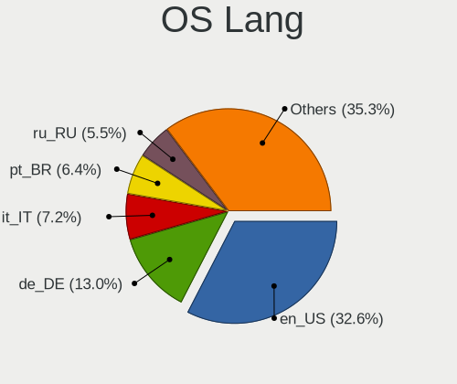

| Lang    | Computers | Percent |
|---------|-----------|---------|
| en_US   | 319       | 32.55%  |
| de_DE   | 123       | 12.55%  |
| pt_BR   | 78        | 7.96%   |
| ru_RU   | 59        | 6.02%   |
| en_GB   | 50        | 5.1%    |
| fr_FR   | 43        | 4.39%   |
| it_IT   | 37        | 3.78%   |
| pl_PL   | 34        | 3.47%   |
| es_ES   | 22        | 2.24%   |
| Unknown | 19        | 1.94%   |
| en_CA   | 14        | 1.43%   |
| en_AU   | 14        | 1.43%   |
| es_AR   | 12        | 1.22%   |
| es_MX   | 10        | 1.02%   |
| el_GR   | 7         | 0.71%   |
| de_CH   | 7         | 0.71%   |
| cs_CZ   | 7         | 0.71%   |
| sv_SE   | 6         | 0.61%   |
| hu_HU   | 6         | 0.61%   |
| tr_TR   | 5         | 0.51%   |
| pt_PT   | 5         | 0.51%   |
| nl_NL   | 5         | 0.51%   |
| nl_BE   | 5         | 0.51%   |
| fr_CA   | 5         | 0.51%   |
| es_BO   | 5         | 0.51%   |
| de_AT   | 5         | 0.51%   |
| ja_JP   | 4         | 0.41%   |
| en_ZA   | 4         | 0.41%   |
| en_NZ   | 4         | 0.41%   |
| sk_SK   | 3         | 0.31%   |
| ru_UA   | 3         | 0.31%   |
| ko_KR   | 3         | 0.31%   |
| fr_BE   | 3         | 0.31%   |
| es_EC   | 3         | 0.31%   |
| es_CL   | 3         | 0.31%   |
| en_IN   | 3         | 0.31%   |
| da_DK   | 3         | 0.31%   |
| bg_BG   | 3         | 0.31%   |
| zh_CN   | 2         | 0.2%    |
| unm_US  | 2         | 0.2%    |

Boot Mode
---------

EFI or BIOS

| Mode | Computers | Percent |
|------|-----------|---------|
| BIOS | 509       | 51.89%  |
| EFI  | 472       | 48.11%  |

Filesystem
----------

Type of filesystem

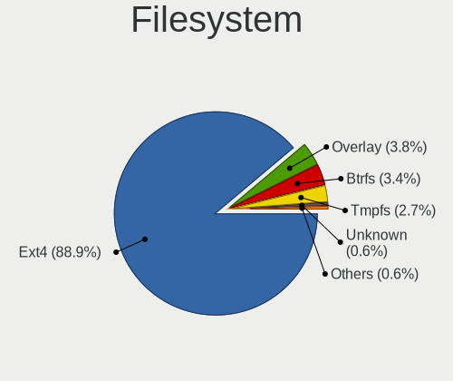

| Type    | Computers | Percent |
|---------|-----------|---------|
| Ext4    | 891       | 90.92%  |
| Overlay | 26        | 2.65%   |
| Btrfs   | 25        | 2.55%   |
| Tmpfs   | 24        | 2.45%   |
| Unknown | 8         | 0.82%   |
| Xfs     | 3         | 0.31%   |
| Zfs     | 1         | 0.1%    |
| Ext3    | 1         | 0.1%    |
| Aufs    | 1         | 0.1%    |

Part. scheme
------------

Scheme of partitioning

| Type    | Computers | Percent |
|---------|-----------|---------|
| Unknown | 667       | 67.72%  |
| GPT     | 216       | 21.93%  |
| MBR     | 102       | 10.36%  |

Dual Boot with Linux/BSD
------------------------

Hosting more than one Linux/BSD

| Dual boot | Computers | Percent |
|-----------|-----------|---------|
| No        | 907       | 92.27%  |
| Yes       | 76        | 7.73%   |

Dual Boot (Win)
---------------

Hosting Linux and Windows

| Dual boot | Computers | Percent |
|-----------|-----------|---------|
| No        | 871       | 88.7%   |
| Yes       | 111       | 11.3%   |

Board
-----

Vendor
------

Motherboard manufacturer

| Name                           | Computers | Percent |
|--------------------------------|-----------|---------|
| Hewlett-Packard                | 163       | 16.7%   |
| ASUSTek Computer               | 134       | 13.73%  |
| Lenovo                         | 117       | 11.99%  |
| Dell                           | 114       | 11.68%  |
| Acer                           | 71        | 7.27%   |
| Gigabyte Technology            | 54        | 5.53%   |
| MSI                            | 45        | 4.61%   |
| ASRock                         | 26        | 2.66%   |
| Apple                          | 25        | 2.56%   |
| Toshiba                        | 23        | 2.36%   |
| Intel                          | 17        | 1.74%   |
| Unknown                        | 14        | 1.43%   |
| Sony                           | 12        | 1.23%   |
| Samsung Electronics            | 12        | 1.23%   |
| Fujitsu Siemens                | 8         | 0.82%   |
| Fujitsu                        | 8         | 0.82%   |
| Positivo                       | 6         | 0.61%   |
| Pegatron                       | 6         | 0.61%   |
| Medion                         | 6         | 0.61%   |
| Alienware                      | 6         | 0.61%   |
| LG Electronics                 | 5         | 0.51%   |
| Google                         | 5         | 0.51%   |
| AZW                            | 5         | 0.51%   |
| Packard Bell                   | 4         | 0.41%   |
| HUAWEI                         | 4         | 0.41%   |
| Gateway                        | 4         | 0.41%   |
| Foxconn                        | 4         | 0.41%   |
| ECS                            | 4         | 0.41%   |
| Microsoft                      | 3         | 0.31%   |
| eMachines                      | 3         | 0.31%   |
| TUXEDO                         | 2         | 0.2%    |
| Supermicro                     | 2         | 0.2%    |
| Star Labs                      | 2         | 0.2%    |
| Semp Toshiba                   | 2         | 0.2%    |
| OEM                            | 2         | 0.2%    |
| Multilaser                     | 2         | 0.2%    |
| Matsushita Electric Industrial | 2         | 0.2%    |
| IBM                            | 2         | 0.2%    |
| GPU Company                    | 2         | 0.2%    |
| EVGA                           | 2         | 0.2%    |

Model
-----

Motherboard model

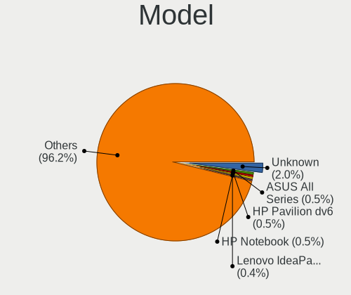

| Name                                        | Computers | Percent |
|---------------------------------------------|-----------|---------|
| Unknown                                     | 22        | 2.25%   |
| HP Pavilion dv6                             | 5         | 0.51%   |
| HP Notebook                                 | 5         | 0.51%   |
| ASUS All Series                             | 5         | 0.51%   |
| Lenovo IdeaPad 3 15ADA05 81W1               | 4         | 0.41%   |
| HP 250 G8 Notebook PC                       | 4         | 0.41%   |
| Samsung RV411/RV511/E3511/S3511/RV711/E3411 | 3         | 0.31%   |
| HP Pavilion dv7                             | 3         | 0.31%   |
| HP Pavilion Desktop 590-p0xxx               | 3         | 0.31%   |
| HP 250 G7 Notebook PC                       | 3         | 0.31%   |
| Dell OptiPlex 780                           | 3         | 0.31%   |
| Dell Latitude E6400                         | 3         | 0.31%   |
| ASUS VivoBook_ASUSLaptop X1605VA_X1605VA    | 3         | 0.31%   |
| Apple iMac5,1                               | 3         | 0.31%   |
| Acer Aspire E1-570G                         | 3         | 0.31%   |
| Acer Aspire 5930                            | 3         | 0.31%   |
| Acer AOD270                                 | 3         | 0.31%   |
| Star Labs StarBook                          | 2         | 0.2%    |
| MSI MS-7C95                                 | 2         | 0.2%    |
| MSI MS-7C52                                 | 2         | 0.2%    |
| MSI MS-7B79                                 | 2         | 0.2%    |
| MSI MS-7A38                                 | 2         | 0.2%    |
| LG A530-T.BE76P1                            | 2         | 0.2%    |
| Lenovo V145-15AST 81MT                      | 2         | 0.2%    |
| Lenovo Legion 5 Pro 16ACH6H 82JQ            | 2         | 0.2%    |
| Lenovo IdeaPadFlex 5 14ALC05 82HU           | 2         | 0.2%    |
| Lenovo IdeaPad 3 15ITL6 82H8                | 2         | 0.2%    |
| Lenovo G500 20236                           | 2         | 0.2%    |
| Lenovo G50-45 80E3                          | 2         | 0.2%    |
| Intel B75                                   | 2         | 0.2%    |
| HP Z820 Workstation                         | 2         | 0.2%    |
| HP ProDesk 400 G5 Desktop Mini              | 2         | 0.2%    |
| HP ProBook 650 G2                           | 2         | 0.2%    |
| HP Pavilion Notebook                        | 2         | 0.2%    |
| HP Pavilion Laptop 15-cw1xxx                | 2         | 0.2%    |
| HP Laptop 15z-ef2xxx                        | 2         | 0.2%    |
| HP Laptop 15-dw3xxx                         | 2         | 0.2%    |
| HP Laptop 15-da0xxx                         | 2         | 0.2%    |
| HP Laptop 15-bw0xx                          | 2         | 0.2%    |
| HP Laptop 14-dk1xxx                         | 2         | 0.2%    |

Model Family
------------

Motherboard model prefix

| Name                    | Computers | Percent |
|-------------------------|-----------|---------|
| Acer Aspire             | 55        | 5.64%   |
| Lenovo ThinkPad         | 52        | 5.33%   |
| HP Pavilion             | 31        | 3.18%   |
| Dell Latitude           | 29        | 2.97%   |
| Dell Inspiron           | 24        | 2.46%   |
| Lenovo IdeaPad          | 23        | 2.36%   |
| Unknown                 | 22        | 2.25%   |
| HP Laptop               | 21        | 2.15%   |
| Toshiba Satellite       | 19        | 1.95%   |
| Dell OptiPlex           | 19        | 1.95%   |
| Dell Precision          | 17        | 1.74%   |
| HP Compaq               | 16        | 1.64%   |
| HP EliteBook            | 14        | 1.43%   |
| ASUS VivoBook           | 13        | 1.33%   |
| ASUS PRIME              | 13        | 1.33%   |
| ASUS ROG                | 12        | 1.23%   |
| HP ProBook              | 10        | 1.02%   |
| HP 250                  | 8         | 0.82%   |
| Dell XPS                | 8         | 0.82%   |
| HP ENVY                 | 7         | 0.72%   |
| Dell Vostro             | 6         | 0.61%   |
| Lenovo ThinkCentre      | 5         | 0.51%   |
| HP Notebook             | 5         | 0.51%   |
| ASUS All                | 5         | 0.51%   |
| Lenovo Yoga             | 4         | 0.41%   |
| Lenovo IdeaPadFlex      | 4         | 0.41%   |
| HP 255                  | 4         | 0.41%   |
| Gigabyte X570           | 4         | 0.41%   |
| Gigabyte B450M          | 4         | 0.41%   |
| Gigabyte B450           | 4         | 0.41%   |
| Acer Veriton            | 4         | 0.41%   |
| Samsung RV411           | 3         | 0.31%   |
| Microsoft Surface       | 3         | 0.31%   |
| Lenovo Legion           | 3         | 0.31%   |
| HP ZBook                | 3         | 0.31%   |
| HP ProDesk              | 3         | 0.31%   |
| HP Presario             | 3         | 0.31%   |
| Gigabyte A520M          | 3         | 0.31%   |
| Fujitsu Siemens ESPRIMO | 3         | 0.31%   |
| Fujitsu Siemens AMILO   | 3         | 0.31%   |

MFG Year
--------

Motherboard manufacture year

| Year    | Computers | Percent |
|---------|-----------|---------|
| 2012    | 89        | 9.12%   |
| 2018    | 81        | 8.3%    |
| 2010    | 66        | 6.76%   |
| 2013    | 63        | 6.45%   |
| 2011    | 63        | 6.45%   |
| 2009    | 61        | 6.25%   |
| 2020    | 59        | 6.05%   |
| 2019    | 59        | 6.05%   |
| 2021    | 55        | 5.64%   |
| 2016    | 55        | 5.64%   |
| 2008    | 51        | 5.23%   |
| 2007    | 49        | 5.02%   |
| 2017    | 48        | 4.92%   |
| 2014    | 46        | 4.71%   |
| 2015    | 34        | 3.48%   |
| 2006    | 29        | 2.97%   |
| 2022    | 27        | 2.77%   |
| 2023    | 18        | 1.84%   |
| 2005    | 11        | 1.13%   |
| 2003    | 6         | 0.61%   |
| 2004    | 3         | 0.31%   |
| Unknown | 2         | 0.2%    |
| 2002    | 1         | 0.1%    |

Form Factor
-----------

Physical design of the computer

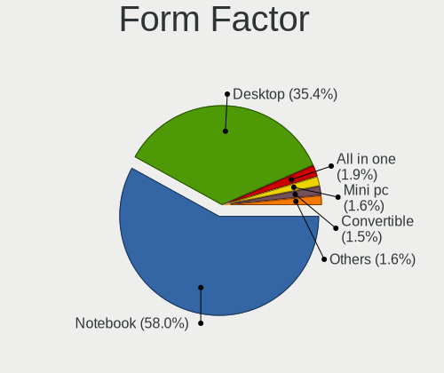

| Name        | Computers | Percent |
|-------------|-----------|---------|
| Notebook    | 573       | 58.71%  |
| Desktop     | 346       | 35.45%  |
| All in one  | 18        | 1.84%   |
| Convertible | 15        | 1.54%   |
| Mini pc     | 10        | 1.02%   |
| Tablet      | 9         | 0.92%   |
| Server      | 5         | 0.51%   |

Secure Boot
-----------

Enabled or disabled

| State    | Computers | Percent |
|----------|-----------|---------|
| Disabled | 920       | 93.69%  |
| Enabled  | 62        | 6.31%   |

Coreboot
--------

Have coreboot on board

| Used | Computers | Percent |
|------|-----------|---------|
| No   | 968       | 99.18%  |
| Yes  | 8         | 0.82%   |

RAM Size
--------

Total RAM memory

| Size in GB      | Computers | Percent |
|-----------------|-----------|---------|
| 3.01-4.0        | 217       | 21.96%  |
| 4.01-8.0        | 214       | 21.66%  |
| 16.01-24.0      | 157       | 15.89%  |
| 8.01-16.0       | 151       | 15.28%  |
| 32.01-64.0      | 67        | 6.78%   |
| 2.01-3.0        | 66        | 6.68%   |
| 1.01-2.0        | 65        | 6.58%   |
| 0.51-1.0        | 18        | 1.82%   |
| 64.01-256.0     | 17        | 1.72%   |
| 24.01-32.0      | 15        | 1.52%   |
| More than 256.0 | 1         | 0.1%    |

RAM Used
--------

Used RAM memory

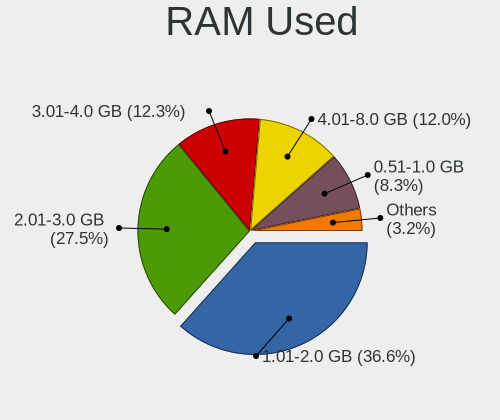

| Used GB    | Computers | Percent |
|------------|-----------|---------|
| 1.01-2.0   | 428       | 40.65%  |
| 2.01-3.0   | 279       | 26.5%   |
| 3.01-4.0   | 115       | 10.92%  |
| 0.51-1.0   | 108       | 10.26%  |
| 4.01-8.0   | 94        | 8.93%   |
| 8.01-16.0  | 17        | 1.61%   |
| 0.01-0.5   | 4         | 0.38%   |
| 32.01-64.0 | 3         | 0.28%   |
| 16.01-24.0 | 3         | 0.28%   |
| 24.01-32.0 | 2         | 0.19%   |

Total Drives
------------

Number of drives on board

| Drives | Computers | Percent |
|--------|-----------|---------|
| 1      | 620       | 61.88%  |
| 2      | 237       | 23.65%  |
| 3      | 65        | 6.49%   |
| 4      | 37        | 3.69%   |
| 5      | 15        | 1.5%    |
| 0      | 10        | 1%      |
| 6      | 8         | 0.8%    |
| 7      | 7         | 0.7%    |
| 11     | 1         | 0.1%    |
| 10     | 1         | 0.1%    |
| 8      | 1         | 0.1%    |

Has CD-ROM
----------

Has CD-ROM on board

| Presented | Computers | Percent |
|-----------|-----------|---------|
| No        | 544       | 55.17%  |
| Yes       | 442       | 44.83%  |

Has Ethernet
------------

Has Ethernet on board

| Presented | Computers | Percent |
|-----------|-----------|---------|
| Yes       | 868       | 88.93%  |
| No        | 108       | 11.07%  |

Has WiFi
--------

Has WiFi module

| Presented | Computers | Percent |
|-----------|-----------|---------|
| Yes       | 771       | 78.27%  |
| No        | 214       | 21.73%  |

Has Bluetooth
-------------

Has Bluetooth module

| Presented | Computers | Percent |
|-----------|-----------|---------|
| Yes       | 520       | 53.01%  |
| No        | 461       | 46.99%  |

Location
--------

Country
-------

Geographic location (country)

| Country      | Computers | Percent |
|--------------|-----------|---------|
| USA          | 159       | 16.22%  |
| Germany      | 144       | 14.69%  |
| Brazil       | 81        | 8.27%   |
| Russia       | 66        | 6.73%   |
| Italy        | 55        | 5.61%   |
| France       | 46        | 4.69%   |
| UK           | 36        | 3.67%   |
| Poland       | 36        | 3.67%   |
| Canada       | 28        | 2.86%   |
| Spain        | 26        | 2.65%   |
| Australia    | 18        | 1.84%   |
| Netherlands  | 17        | 1.73%   |
| Ukraine      | 14        | 1.43%   |
| Mexico       | 14        | 1.43%   |
| Argentina    | 12        | 1.22%   |
| Belgium      | 11        | 1.12%   |
| Austria      | 10        | 1.02%   |
| Sweden       | 9         | 0.92%   |
| Bulgaria     | 9         | 0.92%   |
| Turkey       | 8         | 0.82%   |
| Indonesia    | 8         | 0.82%   |
| India        | 8         | 0.82%   |
| Greece       | 8         | 0.82%   |
| Switzerland  | 7         | 0.71%   |
| Portugal     | 7         | 0.71%   |
| Hungary      | 7         | 0.71%   |
| Ecuador      | 7         | 0.71%   |
| Belarus      | 7         | 0.71%   |
| Romania      | 6         | 0.61%   |
| Czechia      | 6         | 0.61%   |
| Bolivia      | 6         | 0.61%   |
| South Africa | 5         | 0.51%   |
| Philippines  | 5         | 0.51%   |
| New Zealand  | 5         | 0.51%   |
| Chile        | 5         | 0.51%   |
| Japan        | 4         | 0.41%   |
| Finland      | 4         | 0.41%   |
| Venezuela    | 3         | 0.31%   |
| South Korea  | 3         | 0.31%   |
| Puerto Rico  | 3         | 0.31%   |

City
----

Geographic location (city)

| City                 | Computers | Percent |
|----------------------|-----------|---------|
| Berlin               | 14        | 1.36%   |
| Moscow               | 12        | 1.16%   |
| St Petersburg        | 7         | 0.68%   |
| Sao Paulo            | 7         | 0.68%   |
| Rio de Janeiro       | 7         | 0.68%   |
| Paris                | 7         | 0.68%   |
| Munich               | 7         | 0.68%   |
| Milan                | 7         | 0.68%   |
| Krakow               | 7         | 0.68%   |
| Montreal             | 6         | 0.58%   |
| Guayaquil            | 6         | 0.58%   |
| Frankfurt am Main    | 6         | 0.58%   |
| Wroclaw              | 5         | 0.48%   |
| Warsaw               | 5         | 0.48%   |
| Sydney               | 5         | 0.48%   |
| Rome                 | 5         | 0.48%   |
| New York             | 5         | 0.48%   |
| Madrid               | 5         | 0.48%   |
| Hamburg              | 5         | 0.48%   |
| Athens               | 5         | 0.48%   |
| Vienna               | 4         | 0.39%   |
| Sofia                | 4         | 0.39%   |
| Poznan               | 4         | 0.39%   |
| Perth                | 4         | 0.39%   |
| Oruro                | 4         | 0.39%   |
| Miami                | 4         | 0.39%   |
| Krefeld              | 4         | 0.39%   |
| Freiburg im Breisgau | 4         | 0.39%   |
| Delligsen            | 4         | 0.39%   |
| Bremen               | 4         | 0.39%   |
| Bologna              | 4         | 0.39%   |
| Auckland             | 4         | 0.39%   |
| Wohlen               | 3         | 0.29%   |
| Voronezh             | 3         | 0.29%   |
| Toronto              | 3         | 0.29%   |
| Seville              | 3         | 0.29%   |
| Rho                  | 3         | 0.29%   |
| Rennes               | 3         | 0.29%   |
| Porto Alegre         | 3         | 0.29%   |
| Parma                | 3         | 0.29%   |

Drives
------

Drive Vendor
------------

Hard drive vendors

| Vendor                    | Computers | Drives | Percent |
|---------------------------|-----------|--------|---------|
| WDC                       | 231       | 352    | 16.58%  |
| Samsung Electronics       | 200       | 269    | 14.36%  |
| Seagate                   | 189       | 276    | 13.57%  |
| Toshiba                   | 77        | 90     | 5.53%   |
| Kingston                  | 73        | 105    | 5.24%   |
| Unknown                   | 61        | 84     | 4.38%   |
| SanDisk                   | 59        | 84     | 4.24%   |
| Hitachi                   | 54        | 64     | 3.88%   |
| Crucial                   | 49        | 57     | 3.52%   |
| SK hynix                  | 28        | 31     | 2.01%   |
| Intel                     | 27        | 29     | 1.94%   |
| China                     | 25        | 28     | 1.79%   |
| A-DATA Technology         | 24        | 26     | 1.72%   |
| Micron Technology         | 19        | 21     | 1.36%   |
| HGST                      | 17        | 25     | 1.22%   |
| Phison                    | 14        | 24     | 1.01%   |
| Fujitsu                   | 14        | 14     | 1.01%   |
| Intenso                   | 10        | 11     | 0.72%   |
| Apple                     | 10        | 15     | 0.72%   |
| Unknown                   | 10        | 16     | 0.72%   |
| Transcend                 | 8         | 13     | 0.57%   |
| PNY                       | 8         | 12     | 0.57%   |
| Patriot                   | 8         | 11     | 0.57%   |
| GOODRAM                   | 8         | 8      | 0.57%   |
| SPCC                      | 7         | 8      | 0.5%    |
| Silicon Motion            | 7         | 8      | 0.5%    |
| KingSpec                  | 7         | 8      | 0.5%    |
| Hewlett-Packard           | 6         | 7      | 0.43%   |
| ADATA Technology          | 6         | 10     | 0.43%   |
| Team                      | 5         | 8      | 0.36%   |
| Maxtor                    | 5         | 7      | 0.36%   |
| JMicron Technology        | 5         | 6      | 0.36%   |
| Gigabyte Technology       | 5         | 8      | 0.36%   |
| Phison Electronics        | 4         | 4      | 0.29%   |
| OCZ                       | 4         | 6      | 0.29%   |
| SABRENT                   | 3         | 4      | 0.22%   |
| Netac                     | 3         | 3      | 0.22%   |
| Micron/Crucial Technology | 3         | 7      | 0.22%   |
| KIOXIA                    | 3         | 12     | 0.22%   |
| KingDian                  | 3         | 4      | 0.22%   |

Drive Model
-----------

Hard drive models

| Model                                               | Computers | Percent |
|-----------------------------------------------------|-----------|---------|
| Kingston SA400S37480G 480GB SSD                     | 16        | 1.05%   |
| Kingston SA400S37240G 240GB SSD                     | 13        | 0.85%   |
| Samsung SSD 850 EVO 500GB                           | 12        | 0.79%   |
| Samsung SSD 850 EVO 250GB                           | 11        | 0.72%   |
| Samsung NVMe SSD Controller SM981/PM981/PM983 512GB | 11        | 0.72%   |
| Kingston SA400S37120G 120GB SSD                     | 11        | 0.72%   |
| Seagate ST500LT012-1DG142 500GB                     | 10        | 0.66%   |
| Seagate ST1000LM035-1RK172 1TB                      | 10        | 0.66%   |
| Samsung SSD 860 EVO 500GB                           | 10        | 0.66%   |
| Unknown                                             | 10        | 0.66%   |
| Unknown SD/MMC/MS PRO 512GB                         | 9         | 0.59%   |
| Unknown MMC Card  64GB                              | 9         | 0.59%   |
| Toshiba MQ01ABD100 1TB                              | 8         | 0.53%   |
| Unknown MMC Card  32GB                              | 7         | 0.46%   |
| Unknown MMC Card  128GB                             | 7         | 0.46%   |
| Samsung SSD 860 EVO 1TB                             | 7         | 0.46%   |
| Crucial CT240BX500SSD1 240GB                        | 7         | 0.46%   |
| WDC WD10EZEX-08WN4A0 1TB                            | 6         | 0.39%   |
| Toshiba DT01ACA100 1TB                              | 6         | 0.39%   |
| Seagate ST500DM002-1BD142 500GB                     | 6         | 0.39%   |
| Seagate ST1000DM010-2EP102 1TB                      | 6         | 0.39%   |
| Seagate Expansion 2TB                               | 6         | 0.39%   |
| Samsung SSD 860 EVO 250GB                           | 6         | 0.39%   |
| Crucial CT1000BX500SSD1 1TB                         | 6         | 0.39%   |
| WDC WD5000LPVX-22V0TT0 500GB                        | 5         | 0.33%   |
| WDC WD3200BEVT-60ZCT1 320GB                         | 5         | 0.33%   |
| Unknown MMC Card  7GB                               | 5         | 0.33%   |
| Toshiba MQ04ABF100 1TB                              | 5         | 0.33%   |
| Toshiba MQ01ABF050 500GB                            | 5         | 0.33%   |
| Seagate ST9500325AS 500GB                           | 5         | 0.33%   |
| Seagate ST1000LM024 HN-M101MBB 1TB                  | 5         | 0.33%   |
| Seagate Expansion Desk 8TB                          | 5         | 0.33%   |
| SanDisk NVMe SSD Drive 256GB                        | 5         | 0.33%   |
| Samsung SSD 970 EVO 500GB                           | 5         | 0.33%   |
| Crucial CT500MX500SSD1 500GB                        | 5         | 0.33%   |
| China SATA SSD 120GB                                | 5         | 0.33%   |
| WDC WDS500G2B0A-00SM50 500GB SSD                    | 4         | 0.26%   |
| WDC WDS240G2G0A-00JH30 240GB SSD                    | 4         | 0.26%   |
| Toshiba HDWD110 1TB                                 | 4         | 0.26%   |
| Silicon Motion SM2262/SM2262EN SSD Controller 1TB   | 4         | 0.26%   |

HDD Vendor
----------

Hard disk drive vendors

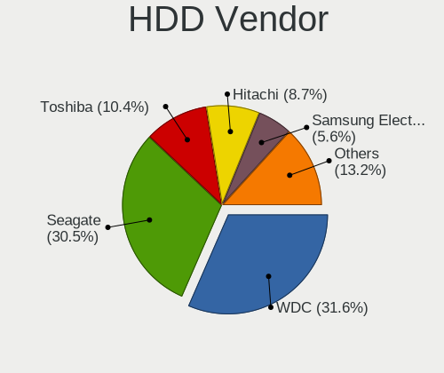

| Vendor              | Computers | Drives | Percent |
|---------------------|-----------|--------|---------|
| WDC                 | 193       | 302    | 31.95%  |
| Seagate             | 188       | 273    | 31.13%  |
| Toshiba             | 62        | 70     | 10.26%  |
| Hitachi             | 54        | 64     | 8.94%   |
| Samsung Electronics | 39        | 50     | 6.46%   |
| HGST                | 17        | 25     | 2.81%   |
| Fujitsu             | 14        | 14     | 2.32%   |
| Unknown             | 9         | 10     | 1.49%   |
| Maxtor              | 5         | 7      | 0.83%   |
| SABRENT             | 3         | 4      | 0.5%    |
| IBM/Hitachi         | 3         | 3      | 0.5%    |
| Apple               | 3         | 3      | 0.5%    |
| Intenso             | 2         | 2      | 0.33%   |
| ASMT                | 2         | 3      | 0.33%   |
| USB3.0              | 1         | 1      | 0.17%   |
| TO Exter            | 1         | 1      | 0.17%   |
| KESU                | 1         | 2      | 0.17%   |
| Initio              | 1         | 1      | 0.17%   |
| HPE                 | 1         | 4      | 0.17%   |
| ExcelStor           | 1         | 1      | 0.17%   |
| DC-624e             | 1         | 1      | 0.17%   |
| DAS                 | 1         | 4      | 0.17%   |
| ASMedia             | 1         | 1      | 0.17%   |
| Unknown             | 1         | 1      | 0.17%   |

SSD Vendor
----------

Solid state drive vendors

| Vendor              | Computers | Drives | Percent |
|---------------------|-----------|--------|---------|
| Samsung Electronics | 102       | 128    | 20.48%  |
| Kingston            | 62        | 90     | 12.45%  |
| Crucial             | 46        | 54     | 9.24%   |
| SanDisk             | 35        | 50     | 7.03%   |
| WDC                 | 26        | 32     | 5.22%   |
| China               | 23        | 26     | 4.62%   |
| A-DATA Technology   | 23        | 25     | 4.62%   |
| Intel               | 13        | 13     | 2.61%   |
| Toshiba             | 9         | 13     | 1.81%   |
| Transcend           | 8         | 13     | 1.61%   |
| PNY                 | 8         | 12     | 1.61%   |
| Patriot             | 8         | 11     | 1.61%   |
| Micron Technology   | 8         | 9      | 1.61%   |
| KingSpec            | 7         | 8      | 1.41%   |
| Intenso             | 7         | 8      | 1.41%   |
| GOODRAM             | 7         | 7      | 1.41%   |
| SPCC                | 6         | 7      | 1.2%    |
| Apple               | 6         | 6      | 1.2%    |
| Team                | 5         | 8      | 1%      |
| SK hynix            | 5         | 6      | 1%      |
| Hewlett-Packard     | 5         | 6      | 1%      |
| Gigabyte Technology | 5         | 8      | 1%      |
| OCZ                 | 4         | 6      | 0.8%    |
| Unknown             | 4         | 5      | 0.8%    |
| Netac               | 3         | 3      | 0.6%    |
| KingDian            | 3         | 4      | 0.6%    |
| Apacer              | 3         | 5      | 0.6%    |
| USB30               | 2         | 3      | 0.4%    |
| Unknown             | 2         | 2      | 0.4%    |
| TCSUNBOW            | 2         | 2      | 0.4%    |
| Plextor             | 2         | 3      | 0.4%    |
| Phison              | 2         | 10     | 0.4%    |
| JMicron Technology  | 2         | 2      | 0.4%    |
| FORESEE             | 2         | 4      | 0.4%    |
| Fanxiang            | 2         | 3      | 0.4%    |
| Emtec               | 2         | 2      | 0.4%    |
| CT500MX5            | 2         | 3      | 0.4%    |
| Corsair             | 2         | 2      | 0.4%    |
| WINTEC              | 1         | 1      | 0.2%    |
| Verbatim            | 1         | 2      | 0.2%    |

Drive Kind
----------

HDD or SSD

| Kind    | Computers | Drives | Percent |
|---------|-----------|--------|---------|
| HDD     | 512       | 847    | 41.06%  |
| SSD     | 438       | 642    | 35.12%  |
| NVMe    | 216       | 297    | 17.32%  |
| MMC     | 54        | 71     | 4.33%   |
| Unknown | 27        | 38     | 2.17%   |

Drive Connector
---------------

SATA, SAS, NVMe, etc.

| Type | Computers | Drives | Percent |
|------|-----------|--------|---------|
| SATA | 800       | 1417   | 70.3%   |
| NVMe | 215       | 296    | 18.89%  |
| SAS  | 69        | 111    | 6.06%   |
| MMC  | 54        | 71     | 4.75%   |

Drive Size
----------

Size of hard drive

| Size in TB | Computers | Drives | Percent |
|------------|-----------|--------|---------|
| 0.01-0.5   | 628       | 957    | 63.89%  |
| 0.51-1.0   | 235       | 337    | 23.91%  |
| 1.01-2.0   | 62        | 96     | 6.31%   |
| 4.01-10.0  | 23        | 37     | 2.34%   |
| 3.01-4.0   | 19        | 32     | 1.93%   |
| 2.01-3.0   | 12        | 25     | 1.22%   |
| 10.01-20.0 | 4         | 5      | 0.41%   |

Space Total
-----------

Amount of disk space available on the file system

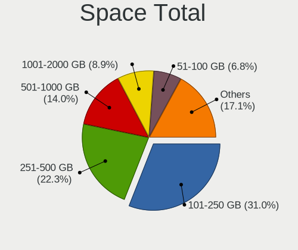

| Size in GB     | Computers | Percent |
|----------------|-----------|---------|
| 101-250        | 329       | 32.64%  |
| 251-500        | 233       | 23.12%  |
| 501-1000       | 132       | 13.1%   |
| 51-100         | 79        | 7.84%   |
| 1001-2000      | 78        | 7.74%   |
| More than 3000 | 51        | 5.06%   |
| 21-50          | 37        | 3.67%   |
| 1-20           | 35        | 3.47%   |
| 2001-3000      | 29        | 2.88%   |
| Unknown        | 5         | 0.5%    |

Space Used
----------

Amount of used disk space

| Used GB        | Computers | Percent |
|----------------|-----------|---------|
| 1-20           | 417       | 39.49%  |
| 21-50          | 224       | 21.21%  |
| 51-100         | 124       | 11.74%  |
| 101-250        | 116       | 10.98%  |
| 251-500        | 60        | 5.68%   |
| 501-1000       | 46        | 4.36%   |
| 1001-2000      | 27        | 2.56%   |
| More than 3000 | 21        | 1.99%   |
| 2001-3000      | 16        | 1.52%   |
| Unknown        | 5         | 0.47%   |

Malfunc. Drives
---------------

Drive models with a malfunction

| Model                                 | Computers | Drives | Percent |
|---------------------------------------|-----------|--------|---------|
| WINTEC 240GB SATA3 SF2281 SSD         | 1         | 1      | 1.54%   |
| WDC WD5000BEVT-22A0RT0 500GB          | 1         | 1      | 1.54%   |
| WDC WD3200BEVT-60ZCT1 320GB           | 1         | 1      | 1.54%   |
| WDC WD3200BEVT-26A23T0 320GB          | 1         | 1      | 1.54%   |
| WDC WD2500BEVT-24A23T0 250GB          | 1         | 1      | 1.54%   |
| WDC WD1600BEVT-22ZCT0 160GB           | 1         | 1      | 1.54%   |
| WDC WD1200BEVS-07LAT0 120GB           | 1         | 1      | 1.54%   |
| WDC WD10SPZX-24Z10 1TB                | 1         | 1      | 1.54%   |
| WDC WD10EZRZ-00HTKB0 1TB              | 1         | 1      | 1.54%   |
| WDC WD10EZEX-60WN4A0 1TB              | 1         | 1      | 1.54%   |
| WDC WD1002FAEX-00Y9A0 1TB             | 1         | 1      | 1.54%   |
| Transcend TS512GMTS430S 512GB SSD     | 1         | 1      | 1.54%   |
| Toshiba THNSNF128GCSS 128GB SSD       | 1         | 1      | 1.54%   |
| Toshiba MQ04ABF100 1TB                | 1         | 1      | 1.54%   |
| Toshiba MD04ACA400 4TB                | 1         | 1      | 1.54%   |
| Toshiba HDWD110 1TB                   | 1         | 1      | 1.54%   |
| SK hynix PC711 HFS512GDE9X073N 512GB  | 1         | 1      | 1.54%   |
| Seagate STM9120817AS 120GB            | 1         | 1      | 1.54%   |
| Seagate ST98823AS 80GB                | 1         | 1      | 1.54%   |
| Seagate ST9640423AS 640GB             | 1         | 1      | 1.54%   |
| Seagate ST9500325AS 500GB             | 1         | 1      | 1.54%   |
| Seagate ST9320325AS 320GB             | 1         | 1      | 1.54%   |
| Seagate ST9250315AS 250GB             | 1         | 1      | 1.54%   |
| Seagate ST9120821AS 120GB             | 1         | 1      | 1.54%   |
| Seagate ST500LT032-1E9142 500GB       | 1         | 1      | 1.54%   |
| Seagate ST500LT012-1DG142 500GB       | 1         | 1      | 1.54%   |
| Seagate ST500LM021-1KJ152 500GB       | 1         | 1      | 1.54%   |
| Seagate ST500DM002-1BD142 500GB       | 1         | 1      | 1.54%   |
| Seagate ST3250318AS 250GB             | 1         | 1      | 1.54%   |
| Seagate ST31000524AS 1TB              | 1         | 1      | 1.54%   |
| Seagate ST2000DX001-1CM164 2TB        | 1         | 1      | 1.54%   |
| Seagate ST1000LM048-2E7172 1TB        | 1         | 1      | 1.54%   |
| Seagate ST1000LM014-1EJ164 1TB        | 1         | 1      | 1.54%   |
| Seagate ST1000DM003-9YN162 1TB        | 1         | 1      | 1.54%   |
| SanDisk SD9SN8W-128G-1006 128GB SSD   | 1         | 1      | 1.54%   |
| Samsung Electronics SSD 980 PRO 1TB   | 1         | 1      | 1.54%   |
| Samsung Electronics SSD 980 500GB     | 1         | 1      | 1.54%   |
| Samsung Electronics SSD 970 EVO 500GB | 1         | 2      | 1.54%   |
| Samsung Electronics SSD 870 EVO 2TB   | 1         | 1      | 1.54%   |
| Samsung Electronics SSD 870 EVO 1TB   | 1         | 1      | 1.54%   |

Malfunc. Drive Vendor
---------------------

Vendors of faulty drives

| Vendor              | Computers | Drives | Percent |
|---------------------|-----------|--------|---------|
| Seagate             | 17        | 17     | 26.56%  |
| Samsung Electronics | 13        | 14     | 20.31%  |
| WDC                 | 9         | 10     | 14.06%  |
| Toshiba             | 4         | 4      | 6.25%   |
| Hitachi             | 4         | 4      | 6.25%   |
| Kingston            | 2         | 2      | 3.13%   |
| Intel               | 2         | 2      | 3.13%   |
| WINTEC              | 1         | 1      | 1.56%   |
| Transcend           | 1         | 1      | 1.56%   |
| SK hynix            | 1         | 1      | 1.56%   |
| SanDisk             | 1         | 1      | 1.56%   |
| Phison              | 1         | 1      | 1.56%   |
| Micron Technology   | 1         | 1      | 1.56%   |
| Maxtor              | 1         | 1      | 1.56%   |
| Intenso             | 1         | 1      | 1.56%   |
| IBM/Hitachi         | 1         | 1      | 1.56%   |
| HGST                | 1         | 1      | 1.56%   |
| Fujitsu             | 1         | 1      | 1.56%   |
| Crucial             | 1         | 1      | 1.56%   |
| A-DATA Technology   | 1         | 1      | 1.56%   |

Malfunc. HDD Vendor
-------------------

Vendors of faulty HDD drives

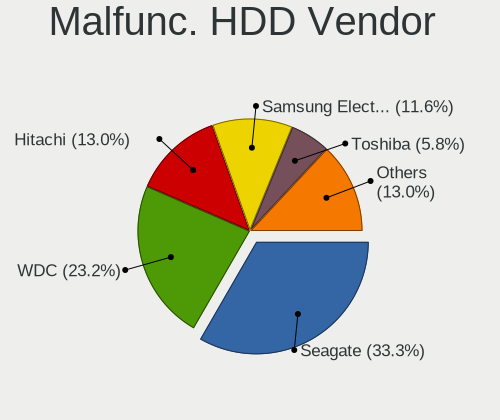

| Vendor              | Computers | Drives | Percent |
|---------------------|-----------|--------|---------|
| Seagate             | 17        | 17     | 38.64%  |
| WDC                 | 9         | 10     | 20.45%  |
| Samsung Electronics | 7         | 7      | 15.91%  |
| Hitachi             | 4         | 4      | 9.09%   |
| Toshiba             | 3         | 3      | 6.82%   |
| Maxtor              | 1         | 1      | 2.27%   |
| IBM/Hitachi         | 1         | 1      | 2.27%   |
| HGST                | 1         | 1      | 2.27%   |
| Fujitsu             | 1         | 1      | 2.27%   |

Malfunc. Drive Kind
-------------------

Kinds of faulty drives

| Kind | Computers | Drives | Percent |
|------|-----------|--------|---------|
| HDD  | 42        | 45     | 67.74%  |
| SSD  | 15        | 15     | 24.19%  |
| NVMe | 5         | 6      | 8.06%   |

Failed Drives
-------------

Failed drive models

Zero info for selected period =(

Failed Drive Vendor
-------------------

Failed drive vendors

Zero info for selected period =(

Drive Status
------------

Number of failed and malfunc. drives

| Status   | Computers | Drives | Percent |
|----------|-----------|--------|---------|
| Detected | 715       | 1357   | 68.42%  |
| Works    | 269       | 472    | 25.74%  |
| Malfunc  | 61        | 66     | 5.84%   |

Storage controller
------------------

Storage Vendor
--------------

Storage controller vendors

| Vendor                           | Computers | Percent |
|----------------------------------|-----------|---------|
| Intel                            | 684       | 58.26%  |
| AMD                              | 172       | 14.65%  |
| Samsung Electronics              | 74        | 6.3%    |
| SanDisk                          | 36        | 3.07%   |
| Nvidia                           | 25        | 2.13%   |
| SK hynix                         | 22        | 1.87%   |
| Phison Electronics               | 20        | 1.7%    |
| ASMedia Technology               | 18        | 1.53%   |
| JMicron Technology               | 15        | 1.28%   |
| Kingston Technology Company      | 13        | 1.11%   |
| Marvell Technology Group         | 12        | 1.02%   |
| VIA Technologies                 | 11        | 0.94%   |
| Micron Technology                | 11        | 0.94%   |
| Silicon Motion                   | 8         | 0.68%   |
| Silicon Integrated Systems [SiS] | 8         | 0.68%   |
| Toshiba America Info Systems     | 7         | 0.6%    |
| ADATA Technology                 | 7         | 0.6%    |
| Micron/Crucial Technology        | 6         | 0.51%   |
| Broadcom / LSI                   | 6         | 0.51%   |
| KIOXIA                           | 5         | 0.43%   |
| LSI Logic / Symbios Logic        | 3         | 0.26%   |
| Union Memory (Shenzhen)          | 2         | 0.17%   |
| Silicon Image                    | 2         | 0.17%   |
| Integrated Technology Express    | 2         | 0.17%   |
| Solid State Storage Technology   | 1         | 0.09%   |
| MAXIO Technology (Hangzhou)      | 1         | 0.09%   |
| INNOGRIT                         | 1         | 0.09%   |
| Biwin Storage Technology         | 1         | 0.09%   |
| Apple                            | 1         | 0.09%   |

Storage Model
-------------

Storage controller models

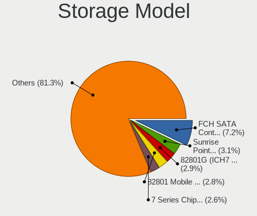

| Model                                                                            | Computers | Percent |
|----------------------------------------------------------------------------------|-----------|---------|
| AMD FCH SATA Controller [AHCI mode]                                              | 108       | 7.61%   |
| Intel Sunrise Point-LP SATA Controller [AHCI mode]                               | 53        | 3.73%   |
| Intel 82801G (ICH7 Family) IDE Controller                                        | 49        | 3.45%   |
| Intel 82801 Mobile SATA Controller [RAID mode]                                   | 43        | 3.03%   |
| Intel 7 Series Chipset Family 6-port SATA Controller [AHCI mode]                 | 41        | 2.89%   |
| Intel 8 Series/C220 Series Chipset Family 6-port SATA Controller 1 [AHCI mode]   | 34        | 2.39%   |
| Samsung NVMe SSD Controller SM981/PM981/PM983                                    | 32        | 2.25%   |
| Intel NM10/ICH7 Family SATA Controller [IDE mode]                                | 30        | 2.11%   |
| Intel 6 Series/C200 Series Chipset Family 6 port Mobile SATA AHCI Controller     | 30        | 2.11%   |
| Intel 82801IBM/IEM (ICH9M/ICH9M-E) 4 port SATA Controller [AHCI mode]            | 29        | 2.04%   |
| Intel 6 Series/C200 Series Chipset Family 6 port Desktop SATA AHCI Controller    | 24        | 1.69%   |
| Samsung NVMe SSD Controller 980 (DRAM-less)                                      | 23        | 1.62%   |
| Intel 8 Series SATA Controller 1 [AHCI mode]                                     | 23        | 1.62%   |
| AMD SB7x0/SB8x0/SB9x0 SATA Controller [AHCI mode]                                | 23        | 1.62%   |
| Intel Volume Management Device NVMe RAID Controller                              | 22        | 1.55%   |
| AMD 400 Series Chipset SATA Controller                                           | 21        | 1.48%   |
| Intel 5 Series/3400 Series Chipset 4 port SATA AHCI Controller                   | 20        | 1.41%   |
| Intel 7 Series/C210 Series Chipset Family 6-port SATA Controller [AHCI mode]     | 18        | 1.27%   |
| Intel Q170/Q150/B150/H170/H110/Z170/CM236 Chipset SATA Controller [AHCI Mode]    | 17        | 1.2%    |
| Intel 82801GBM/GHM (ICH7-M Family) SATA Controller [AHCI mode]                   | 17        | 1.2%    |
| Intel 5 Series/3400 Series Chipset 6 port SATA AHCI Controller                   | 17        | 1.2%    |
| ASMedia ASM1062 Serial ATA Controller                                            | 17        | 1.2%    |
| Intel NM10/ICH7 Family SATA Controller [AHCI mode]                               | 16        | 1.13%   |
| Intel 82801HM/HEM (ICH8M/ICH8M-E) SATA Controller [AHCI mode]                    | 16        | 1.13%   |
| Intel 82801HM/HEM (ICH8M/ICH8M-E) IDE Controller                                 | 16        | 1.13%   |
| AMD SB7x0/SB8x0/SB9x0 IDE Controller                                             | 16        | 1.13%   |
| Intel Tiger Lake-LP SATA Controller                                              | 15        | 1.06%   |
| Intel Cannon Lake PCH SATA AHCI Controller                                       | 15        | 1.06%   |
| Intel 82801GBM/GHM (ICH7-M Family) SATA Controller [IDE mode]                    | 15        | 1.06%   |
| SanDisk Ultra 3D / WD Blue SN550 NVMe SSD                                        | 11        | 0.77%   |
| Intel Celeron/Pentium Silver Processor SATA Controller                           | 11        | 0.77%   |
| Intel Atom/Celeron/Pentium Processor x5-E8000/J3xxx/N3xxx Series SATA Controller | 10        | 0.7%    |
| Intel 82801JI (ICH10 Family) SATA AHCI Controller                                | 10        | 0.7%    |
| AMD SB7x0/SB8x0/SB9x0 SATA Controller [IDE mode]                                 | 10        | 0.7%    |
| AMD FCH SATA Controller D                                                        | 10        | 0.7%    |
| VIA VT82C586A/B/VT82C686/A/B/VT823x/A/C PIPC Bus Master IDE                      | 9         | 0.63%   |
| SK hynix BC501 NVMe Solid State Drive                                            | 9         | 0.63%   |
| Phison PS5013-E13 PCIe3 NVMe Controller (DRAM-less)                              | 9         | 0.63%   |
| Phison E12 NVMe Controller                                                       | 9         | 0.63%   |
| JMicron JMB363 SATA/IDE Controller                                               | 9         | 0.63%   |

Storage Kind
------------

Kind of storage controller (IDE, SATA, NVMe, SAS, ...)

| Kind | Computers | Percent |
|------|-----------|---------|
| SATA | 689       | 55.79%  |
| IDE  | 223       | 18.06%  |
| NVMe | 217       | 17.57%  |
| RAID | 96        | 7.77%   |
| SAS  | 7         | 0.57%   |
| SCSI | 3         | 0.24%   |

Processor
---------

CPU Vendor
----------

Processor vendors

| Vendor       | Computers | Percent |
|--------------|-----------|---------|
| Intel        | 754       | 77.25%  |
| AMD          | 221       | 22.64%  |
| CentaurHauls | 1         | 0.1%    |

CPU Model
---------

Processor models

| Model                                       | Computers | Percent |
|---------------------------------------------|-----------|---------|
| Intel Core i5-6200U CPU @ 2.30GHz           | 12        | 1.23%   |
| Intel Atom CPU N270 @ 1.60GHz               | 10        | 1.02%   |
| Intel Atom CPU N2600 @ 1.60GHz              | 10        | 1.02%   |
| Intel 11th Gen Core i5-1135G7 @ 2.40GHz     | 10        | 1.02%   |
| Intel Core i5-3470 CPU @ 3.20GHz            | 9         | 0.92%   |
| Intel Core i5-8265U CPU @ 1.60GHz           | 8         | 0.82%   |
| Intel Core 2 Duo CPU T6600 @ 2.20GHz        | 8         | 0.82%   |
| AMD Ryzen 7 3700X 8-Core Processor          | 8         | 0.82%   |
| AMD Ryzen 5 5500U with Radeon Graphics      | 8         | 0.82%   |
| Intel Core i5-3320M CPU @ 2.60GHz           | 7         | 0.72%   |
| Intel Core i5-3230M CPU @ 2.60GHz           | 7         | 0.72%   |
| Intel 11th Gen Core i7-1165G7 @ 2.80GHz     | 7         | 0.72%   |
| Intel 11th Gen Core i3-1115G4 @ 3.00GHz     | 7         | 0.72%   |
| AMD Ryzen 5 5600G with Radeon Graphics      | 6         | 0.61%   |
| Intel Core i7-8565U CPU @ 1.80GHz           | 5         | 0.51%   |
| Intel Core i7-7500U CPU @ 2.70GHz           | 5         | 0.51%   |
| Intel Core i7-4790 CPU @ 3.60GHz            | 5         | 0.51%   |
| Intel Core i7-3770 CPU @ 3.40GHz            | 5         | 0.51%   |
| Intel Core i7-2600 CPU @ 3.40GHz            | 5         | 0.51%   |
| Intel Core i5-8250U CPU @ 1.60GHz           | 5         | 0.51%   |
| Intel Core i5-7200U CPU @ 2.50GHz           | 5         | 0.51%   |
| Intel Core i5-3210M CPU @ 2.50GHz           | 5         | 0.51%   |
| Intel Core i5-10210U CPU @ 1.60GHz          | 5         | 0.51%   |
| Intel Core i3-8130U CPU @ 2.20GHz           | 5         | 0.51%   |
| Intel Core i3-6006U CPU @ 2.00GHz           | 5         | 0.51%   |
| Intel Core i3-2310M CPU @ 2.10GHz           | 5         | 0.51%   |
| Intel Core 2 Duo CPU E4500 @ 2.20GHz        | 5         | 0.51%   |
| AMD Ryzen 5 2600 Six-Core Processor         | 5         | 0.51%   |
| AMD Ryzen 3 3200G with Radeon Vega Graphics | 5         | 0.51%   |
| Intel Core i7-8550U CPU @ 1.80GHz           | 4         | 0.41%   |
| Intel Core i7-4810MQ CPU @ 2.80GHz          | 4         | 0.41%   |
| Intel Core i5-6300U CPU @ 2.40GHz           | 4         | 0.41%   |
| Intel Core i5-5200U CPU @ 2.20GHz           | 4         | 0.41%   |
| Intel Core i5-4210U CPU @ 1.70GHz           | 4         | 0.41%   |
| Intel Core i5-4200U CPU @ 1.60GHz           | 4         | 0.41%   |
| Intel Core i5-2450M CPU @ 2.50GHz           | 4         | 0.41%   |
| Intel Core i5-2400 CPU @ 3.10GHz            | 4         | 0.41%   |
| Intel Core i3-8100 CPU @ 3.60GHz            | 4         | 0.41%   |
| Intel Core i3-1005G1 CPU @ 1.20GHz          | 4         | 0.41%   |
| Intel Core 2 Duo CPU P8700 @ 2.53GHz        | 4         | 0.41%   |

CPU Model Family
----------------

Processor model prefix

| Model                   | Computers | Percent |
|-------------------------|-----------|---------|
| Intel Core i5           | 174       | 17.81%  |
| Intel Core i7           | 134       | 13.72%  |
| Intel Core i3           | 79        | 8.09%   |
| Intel Core 2 Duo        | 64        | 6.55%   |
| Other                   | 58        | 5.94%   |
| Intel Celeron           | 54        | 5.53%   |
| AMD Ryzen 5             | 50        | 5.12%   |
| Intel Atom              | 38        | 3.89%   |
| AMD Ryzen 7             | 34        | 3.48%   |
| Intel Pentium           | 31        | 3.17%   |
| Intel Xeon              | 25        | 2.56%   |
| Intel Pentium Dual-Core | 16        | 1.64%   |
| Intel Core 2            | 16        | 1.64%   |
| AMD Ryzen 3             | 16        | 1.64%   |
| Intel Core 2 Quad       | 12        | 1.23%   |
| Intel Pentium Dual      | 11        | 1.13%   |
| AMD A4                  | 11        | 1.13%   |
| Intel Genuine           | 10        | 1.02%   |
| AMD FX                  | 9         | 0.92%   |
| Intel Pentium M         | 8         | 0.82%   |
| Intel Pentium D         | 8         | 0.82%   |
| AMD Ryzen 9             | 7         | 0.72%   |
| AMD E1                  | 7         | 0.72%   |
| AMD Athlon 64 X2        | 7         | 0.72%   |
| Intel Pentium 4         | 6         | 0.61%   |
| AMD Sempron             | 6         | 0.61%   |
| AMD E2                  | 6         | 0.61%   |
| AMD Phenom II X4        | 5         | 0.51%   |
| AMD Athlon II X2        | 5         | 0.51%   |
| AMD Athlon              | 5         | 0.51%   |
| AMD A8                  | 5         | 0.51%   |
| Intel Core i9           | 4         | 0.41%   |
| AMD Turion 64 X2 Mobile | 4         | 0.41%   |
| AMD Phenom II X6        | 4         | 0.41%   |
| AMD A10                 | 4         | 0.41%   |
| Intel Pentium Silver    | 3         | 0.31%   |
| Intel Pentium Gold      | 3         | 0.31%   |
| Intel Core Duo          | 3         | 0.31%   |
| Intel Celeron M         | 3         | 0.31%   |
| AMD E                   | 3         | 0.31%   |

CPU Cores
---------

Number of processor cores

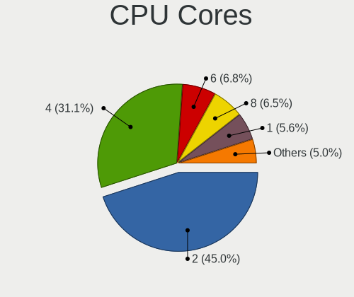

| Number | Computers | Percent |
|--------|-----------|---------|
| 2      | 483       | 49.34%  |
| 4      | 287       | 29.32%  |
| 6      | 64        | 6.54%   |
| 1      | 64        | 6.54%   |
| 8      | 51        | 5.21%   |
| 12     | 9         | 0.92%   |
| 16     | 8         | 0.82%   |
| 14     | 5         | 0.51%   |
| 10     | 5         | 0.51%   |
| 3      | 2         | 0.2%    |
| 24     | 1         | 0.1%    |

CPU Sockets
-----------

Number of sockets

| Number | Computers | Percent |
|--------|-----------|---------|
| 1      | 963       | 98.67%  |
| 2      | 13        | 1.33%   |

CPU Threads
-----------

Threads per core (Hyper-Threading)

| Number | Computers | Percent |
|--------|-----------|---------|
| 2      | 560       | 57.32%  |
| 1      | 417       | 42.68%  |

CPU Op-Modes
------------

CPU Operation Modes (32-bit, 64-bit)

| Op mode        | Computers | Percent |
|----------------|-----------|---------|
| 32-bit, 64-bit | 918       | 94.06%  |
| 32-bit         | 58        | 5.94%   |

CPU Microcode
-------------

Microcode number

| Number     | Computers | Percent |
|------------|-----------|---------|
| Unknown    | 75        | 7.56%   |
| 0x306a9    | 70        | 7.06%   |
| 0x206a7    | 65        | 6.55%   |
| 0x1067a    | 54        | 5.44%   |
| 0x306c3    | 41        | 4.13%   |
| 0x406e3    | 29        | 2.92%   |
| 0x6fd      | 26        | 2.62%   |
| 0x40651    | 26        | 2.62%   |
| 0x806c1    | 25        | 2.52%   |
| 0x20655    | 21        | 2.12%   |
| 0x08108109 | 21        | 2.12%   |
| 0x806ec    | 18        | 1.81%   |
| 0x806e9    | 17        | 1.71%   |
| 0x806ea    | 16        | 1.61%   |
| 0x106c2    | 16        | 1.61%   |
| 0x506e3    | 15        | 1.51%   |
| 0x010000c8 | 14        | 1.41%   |
| 0x906ea    | 13        | 1.31%   |
| 0x6f6      | 13        | 1.31%   |
| 0x406c4    | 13        | 1.31%   |
| 0x30661    | 12        | 1.21%   |
| 0x10676    | 12        | 1.21%   |
| 0x06006705 | 12        | 1.21%   |
| 0x906e9    | 10        | 1.01%   |
| 0x106e5    | 10        | 1.01%   |
| 0x0a50000d | 10        | 1.01%   |
| 0x08608103 | 10        | 1.01%   |
| 0x906ed    | 9         | 0.91%   |
| 0x706a8    | 9         | 0.91%   |
| 0x6fb      | 9         | 0.91%   |
| 0x306d4    | 8         | 0.81%   |
| 0x30678    | 8         | 0.81%   |
| 0x20652    | 8         | 0.81%   |
| 0x0a50000c | 8         | 0.81%   |
| 0x08701021 | 8         | 0.81%   |
| 0x0800820d | 8         | 0.81%   |
| 0x06001119 | 8         | 0.81%   |
| 0x906c0    | 7         | 0.71%   |
| 0x806eb    | 7         | 0.71%   |
| 0x706e5    | 7         | 0.71%   |

CPU Microarch
-------------

Microarchitecture

| Name             | Computers | Percent |
|------------------|-----------|---------|
| KabyLake         | 105       | 10.73%  |
| Penryn           | 75        | 7.66%   |
| SandyBridge      | 74        | 7.56%   |
| IvyBridge        | 74        | 7.56%   |
| Haswell          | 71        | 7.25%   |
| Core             | 57        | 5.82%   |
| Skylake          | 46        | 4.7%    |
| Westmere         | 35        | 3.58%   |
| Zen+             | 34        | 3.47%   |
| Bonnell          | 32        | 3.27%   |
| Silvermont       | 30        | 3.06%   |
| TigerLake        | 27        | 2.76%   |
| Zen 3            | 26        | 2.66%   |
| Unknown          | 25        | 2.55%   |
| K10              | 24        | 2.45%   |
| P6               | 22        | 2.25%   |
| Zen              | 20        | 2.04%   |
| K8 Hammer        | 19        | 1.94%   |
| Zen 2            | 18        | 1.84%   |
| NetBurst         | 18        | 1.84%   |
| Excavator        | 18        | 1.84%   |
| Piledriver       | 15        | 1.53%   |
| Nehalem          | 14        | 1.43%   |
| Goldmont plus    | 14        | 1.43%   |
| Broadwell        | 12        | 1.23%   |
| Alderlake Hybrid | 12        | 1.23%   |
| IceLake          | 10        | 1.02%   |
| Puma             | 8         | 0.82%   |
| CometLake        | 8         | 0.82%   |
| Tremont          | 7         | 0.72%   |
| Bobcat           | 7         | 0.72%   |
| Jaguar           | 5         | 0.51%   |
| Goldmont         | 4         | 0.41%   |
| K6               | 3         | 0.31%   |
| K10 Llano        | 3         | 0.31%   |
| Bulldozer        | 3         | 0.31%   |
| K8 & K10 hybrid  | 2         | 0.2%    |
| Gracemont        | 2         | 0.2%    |

Graphics
--------

GPU Vendor
----------

Vendors of graphics cards

| Vendor                           | Computers | Percent |
|----------------------------------|-----------|---------|
| Intel                            | 549       | 49.46%  |
| Nvidia                           | 291       | 26.22%  |
| AMD                              | 252       | 22.7%   |
| VIA Technologies                 | 6         | 0.54%   |
| Silicon Integrated Systems [SiS] | 5         | 0.45%   |
| Matrox Electronics Systems       | 5         | 0.45%   |
| S3 Graphics                      | 1         | 0.09%   |
| ASPEED Technology                | 1         | 0.09%   |

GPU Model
---------

Graphics card models

| Model                                                                                    | Computers | Percent |
|------------------------------------------------------------------------------------------|-----------|---------|
| Intel 2nd Generation Core Processor Family Integrated Graphics Controller                | 58        | 4.99%   |
| Intel 3rd Gen Core processor Graphics Controller                                         | 41        | 3.53%   |
| Intel Skylake GT2 [HD Graphics 520]                                                      | 28        | 2.41%   |
| AMD Picasso/Raven 2 [Radeon Vega Series / Radeon Vega Mobile Series]                     | 28        | 2.41%   |
| Intel Haswell-ULT Integrated Graphics Controller                                         | 24        | 2.06%   |
| Intel Core Processor Integrated Graphics Controller                                      | 24        | 2.06%   |
| Intel Mobile 945GM/GMS/GME, 943/940GML Express Integrated Graphics Controller            | 22        | 1.89%   |
| Intel Mobile 4 Series Chipset Integrated Graphics Controller                             | 20        | 1.72%   |
| Intel Atom/Celeron/Pentium Processor x5-E8000/J3xxx/N3xxx Integrated Graphics Controller | 20        | 1.72%   |
| Intel TigerLake-LP GT2 [Iris Xe Graphics]                                                | 19        | 1.63%   |
| Intel WhiskeyLake-U GT2 [UHD Graphics 620]                                               | 18        | 1.55%   |
| Intel UHD Graphics 620                                                                   | 16        | 1.38%   |
| Intel HD Graphics 620                                                                    | 16        | 1.38%   |
| AMD Stoney [Radeon R2/R3/R4/R5 Graphics]                                                 | 15        | 1.29%   |
| Intel Xeon E3-1200 v2/3rd Gen Core processor Graphics Controller                         | 14        | 1.2%    |
| AMD Cezanne [Radeon Vega Series / Radeon Vega Mobile Series]                             | 13        | 1.12%   |
| Intel Mobile 945GSE Express Integrated Graphics Controller                               | 12        | 1.03%   |
| Intel GeminiLake [UHD Graphics 600]                                                      | 12        | 1.03%   |
| Intel Atom Processor D2xxx/N2xxx Integrated Graphics Controller                          | 12        | 1.03%   |
| Intel 4th Gen Core Processor Integrated Graphics Controller                              | 12        | 1.03%   |
| AMD Lucienne                                                                             | 12        | 1.03%   |
| Nvidia GK208B [GeForce GT 710]                                                           | 11        | 0.95%   |
| Intel Xeon E3-1200 v3/4th Gen Core Processor Integrated Graphics Controller              | 11        | 0.95%   |
| Intel Mobile 945GM/GMS, 943/940GML Express Integrated Graphics Controller                | 11        | 0.95%   |
| Intel CometLake-U GT2 [UHD Graphics]                                                     | 11        | 0.95%   |
| Intel CoffeeLake-S GT2 [UHD Graphics 630]                                                | 11        | 0.95%   |
| Intel 4 Series Chipset Integrated Graphics Controller                                    | 11        | 0.95%   |
| AMD Ellesmere [Radeon RX 470/480/570/570X/580/580X/590]                                  | 11        | 0.95%   |
| Nvidia GM206 [GeForce GTX 960]                                                           | 10        | 0.86%   |
| Intel CoffeeLake-H GT2 [UHD Graphics 630]                                                | 10        | 0.86%   |
| Intel Atom Processor Z36xxx/Z37xxx Series Graphics & Display                             | 10        | 0.86%   |
| Nvidia GT218 [GeForce 210]                                                               | 9         | 0.77%   |
| AMD Raven Ridge [Radeon Vega Series / Radeon Vega Mobile Series]                         | 9         | 0.77%   |
| Nvidia GK208B [GeForce GT 730]                                                           | 8         | 0.69%   |
| Intel Tiger Lake-LP GT2 [UHD Graphics G4]                                                | 8         | 0.69%   |
| Intel Mobile GM965/GL960 Integrated Graphics Controller (secondary)                      | 8         | 0.69%   |
| Intel Mobile GM965/GL960 Integrated Graphics Controller (primary)                        | 8         | 0.69%   |
| Intel HD Graphics 5500                                                                   | 8         | 0.69%   |
| Nvidia TU117M [GeForce GTX 1650 Mobile / Max-Q]                                          | 7         | 0.6%    |
| Intel JasperLake [UHD Graphics]                                                          | 7         | 0.6%    |

GPU Combo
---------

Combinations of graphics cards

| Name            | Computers | Percent |
|-----------------|-----------|---------|
| 1 x Intel       | 426       | 43.47%  |
| 1 x AMD         | 203       | 20.71%  |
| 1 x Nvidia      | 193       | 19.69%  |
| Intel + Nvidia  | 87        | 8.88%   |
| Intel + AMD     | 22        | 2.24%   |
| 2 x AMD         | 18        | 1.84%   |
| AMD + Nvidia    | 9         | 0.92%   |
| 1 x VIA         | 6         | 0.61%   |
| 1 x SiS         | 5         | 0.51%   |
| 1 x Matrox      | 5         | 0.51%   |
| 2 x Nvidia      | 2         | 0.2%    |
| Other           | 1         | 0.1%    |
| 2 x Intel       | 1         | 0.1%    |
| 1 x S3 Graphics | 1         | 0.1%    |
| 1 x ASPEED      | 1         | 0.1%    |

GPU Driver
----------

Free vs proprietary

| Driver      | Computers | Percent |
|-------------|-----------|---------|
| Free        | 806       | 81.74%  |
| Proprietary | 106       | 10.75%  |
| Unknown     | 74        | 7.51%   |

GPU Memory
----------

Total video memory

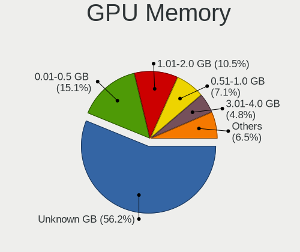

| Size in GB | Computers | Percent |
|------------|-----------|---------|
| Unknown    | 552       | 55.76%  |
| 0.01-0.5   | 153       | 15.45%  |
| 1.01-2.0   | 114       | 11.52%  |
| 0.51-1.0   | 76        | 7.68%   |
| 3.01-4.0   | 46        | 4.65%   |
| 7.01-8.0   | 21        | 2.12%   |
| 5.01-6.0   | 12        | 1.21%   |
| 2.01-3.0   | 8         | 0.81%   |
| 8.01-16.0  | 6         | 0.61%   |
| 16.01-24.0 | 2         | 0.2%    |

Monitor
-------

Monitor Vendor
--------------

Monitor vendors

| Vendor                  | Computers | Percent |
|-------------------------|-----------|---------|
| Samsung Electronics     | 128       | 13.07%  |
| AU Optronics            | 110       | 11.24%  |
| LG Display              | 95        | 9.7%    |
| BOE                     | 82        | 8.38%   |
| Chimei Innolux          | 74        | 7.56%   |
| Goldstar                | 49        | 5.01%   |
| Acer                    | 41        | 4.19%   |
| Dell                    | 38        | 3.88%   |
| Hewlett-Packard         | 25        | 2.55%   |
| Chi Mei Optoelectronics | 23        | 2.35%   |
| Philips                 | 22        | 2.25%   |
| Apple                   | 22        | 2.25%   |
| BenQ                    | 21        | 2.15%   |
| Lenovo                  | 19        | 1.94%   |
| AOC                     | 19        | 1.94%   |
| Ancor Communications    | 17        | 1.74%   |
| Unknown                 | 13        | 1.33%   |
| LG Philips              | 13        | 1.33%   |
| Sony                    | 11        | 1.12%   |
| Sharp                   | 11        | 1.12%   |
| InfoVision              | 11        | 1.12%   |
| HannStar                | 10        | 1.02%   |
| Iiyama                  | 9         | 0.92%   |
| PANDA                   | 7         | 0.72%   |
| Fujitsu Siemens         | 6         | 0.61%   |
| ViewSonic               | 5         | 0.51%   |
| Sceptre Tech            | 4         | 0.41%   |
| Quanta Display          | 4         | 0.41%   |
| NEC Computers           | 4         | 0.41%   |
| Eizo                    | 4         | 0.41%   |
| CPT                     | 4         | 0.41%   |
| Toshiba                 | 3         | 0.31%   |
| SLD                     | 3         | 0.31%   |
| Panasonic               | 3         | 0.31%   |
| DENON                   | 3         | 0.31%   |
| Belinea                 | 3         | 0.31%   |
| ASUSTek Computer        | 3         | 0.31%   |
| ___                     | 2         | 0.2%    |
| MStar                   | 2         | 0.2%    |
| Medion                  | 2         | 0.2%    |

Monitor Model
-------------

Monitor models

| Model                                                                    | Computers | Percent |
|--------------------------------------------------------------------------|-----------|---------|
| AU Optronics LCD Monitor AUO21ED 1920x1080 344x193mm 15.5-inch           | 7         | 0.7%    |
| Chimei Innolux LCD Monitor CMN15CA 1366x768 344x193mm 15.5-inch          | 5         | 0.5%    |
| Samsung Electronics LCD Monitor SEC5441 1366x768 344x194mm 15.5-inch     | 4         | 0.4%    |
| LG Display LCD Monitor LGD0430 1366x768 345x194mm 15.6-inch              | 4         | 0.4%    |
| LG Display LCD Monitor LGD033A 1366x768 344x194mm 15.5-inch              | 4         | 0.4%    |
| HannStar LCD Monitor HSD03E9 1024x600 220x129mm 10.0-inch                | 4         | 0.4%    |
| Goldstar FULL HD GSM5B55 1920x1080 480x270mm 21.7-inch                   | 4         | 0.4%    |
| Chimei Innolux LCD Monitor CMN15F5 1920x1080 344x193mm 15.5-inch         | 4         | 0.4%    |
| Chimei Innolux LCD Monitor CMN15E7 1920x1080 344x193mm 15.5-inch         | 4         | 0.4%    |
| Chimei Innolux LCD Monitor CMN15DB 1366x768 344x193mm 15.5-inch          | 4         | 0.4%    |
| AU Optronics LCD Monitor AUO45EC 1366x768 344x193mm 15.5-inch            | 4         | 0.4%    |
| SLD LCD Monitor SLD003C 1366x768 309x173mm 13.9-inch                     | 3         | 0.3%    |
| Philips PHL 242V8 PHLC219 1920x1080 527x296mm 23.8-inch                  | 3         | 0.3%    |
| Panasonic TDM13O56 MEI96A2 3000x2000 285x190mm 13.5-inch                 | 3         | 0.3%    |
| LG Display LCD Monitor LGD02E9 1366x768 309x174mm 14.0-inch              | 3         | 0.3%    |
| LG Display LCD Monitor LGD02D8 1366x768 277x156mm 12.5-inch              | 3         | 0.3%    |
| InfoVision LCD Monitor IVO03F4 1920x1080 309x173mm 13.9-inch             | 3         | 0.3%    |
| Chimei Innolux LCD Monitor CMN1618 1920x1200 344x215mm 16.0-inch         | 3         | 0.3%    |
| Chimei Innolux LCD Monitor CMN15BF 1366x768 344x194mm 15.5-inch          | 3         | 0.3%    |
| Chimei Innolux LCD Monitor CMN14C3 1366x768 309x173mm 13.9-inch          | 3         | 0.3%    |
| Chi Mei Optoelectronics LCD Monitor CMO15A2 1366x768 344x193mm 15.5-inch | 3         | 0.3%    |
| Chi Mei Optoelectronics LCD Monitor CMO1558 1366x768 344x193mm 15.5-inch | 3         | 0.3%    |
| Chi Mei Optoelectronics LCD Monitor CMO1018 1024x600 222x125mm 10.0-inch | 3         | 0.3%    |
| BOE LCD Monitor BOE06A5 1366x768 344x194mm 15.5-inch                     | 3         | 0.3%    |
| BOE LCD Monitor BOE06A4 1366x768 344x194mm 15.5-inch                     | 3         | 0.3%    |
| BOE LCD Monitor BOE069C 1920x1080 344x193mm 15.5-inch                    | 3         | 0.3%    |
| BOE LCD Monitor BOE0687 1920x1080 344x193mm 15.5-inch                    | 3         | 0.3%    |
| AU Optronics LCD Monitor AUO61D2 1024x600 222x125mm 10.0-inch            | 3         | 0.3%    |
| AU Optronics LCD Monitor AUO403D 1920x1080 309x173mm 13.9-inch           | 3         | 0.3%    |
| AU Optronics LCD Monitor AUO38ED 1920x1080 344x193mm 15.5-inch           | 3         | 0.3%    |
| AU Optronics LCD Monitor AUO3791 1920x1080 344x194mm 15.5-inch           | 3         | 0.3%    |
| AU Optronics LCD Monitor AUO303C 1366x768 309x173mm 13.9-inch            | 3         | 0.3%    |
| AU Optronics LCD Monitor AUO139E 1600x900 382x214mm 17.2-inch            | 3         | 0.3%    |
| AU Optronics LCD Monitor AUO10EC 1366x768 344x193mm 15.5-inch            | 3         | 0.3%    |
| Ancor Communications VE228 ACI22FA 1920x1080 480x270mm 21.7-inch         | 3         | 0.3%    |
| Acer V246HQL ACR0424 1920x1080 521x293mm 23.5-inch                       | 3         | 0.3%    |
| Unknown LCD Monitor SAMSUNG                                              | 2         | 0.2%    |
| Toshiba LCD Monitor TV 1920x1080                                         | 2         | 0.2%    |
| Sony LCD Monitor TV 3840x1080                                            | 2         | 0.2%    |
| Sceptre Tech Sceptre B34 SPT0D52 2560x1080 797x334mm 34.0-inch           | 2         | 0.2%    |

Monitor Resolution
------------------

Monitor screen resolution

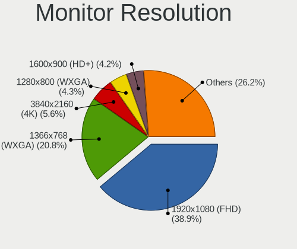

| Resolution         | Computers | Percent |
|--------------------|-----------|---------|
| 1920x1080 (FHD)    | 370       | 38.91%  |
| 1366x768 (WXGA)    | 221       | 23.24%  |
| 1280x1024 (SXGA)   | 47        | 4.94%   |
| 1600x900 (HD+)     | 43        | 4.52%   |
| 1280x800 (WXGA)    | 41        | 4.31%   |
| 3840x2160 (4K)     | 36        | 3.79%   |
| 1680x1050 (WSXGA+) | 29        | 3.05%   |
| 1440x900 (WXGA+)   | 27        | 2.84%   |
| 1920x1200 (WUXGA)  | 25        | 2.63%   |
| 2560x1440 (QHD)    | 18        | 1.89%   |
| 1024x600           | 18        | 1.89%   |
| 3440x1440          | 10        | 1.05%   |
| 1360x768           | 10        | 1.05%   |
| 1024x768 (XGA)     | 10        | 1.05%   |
| 2560x1080          | 8         | 0.84%   |
| Unknown            | 8         | 0.84%   |
| 3840x1080          | 4         | 0.42%   |
| 2560x1600          | 3         | 0.32%   |
| 1280x768           | 3         | 0.32%   |
| 2880x1800          | 2         | 0.21%   |
| 2736x1824          | 2         | 0.21%   |
| 2160x1440          | 2         | 0.21%   |
| 1600x1200          | 2         | 0.21%   |
| 7680x2160          | 1         | 0.11%   |
| 4480x1440          | 1         | 0.11%   |
| 4240x1440          | 1         | 0.11%   |
| 3840x2400          | 1         | 0.11%   |
| 3200x1800 (QHD+)   | 1         | 0.11%   |
| 3040x1050          | 1         | 0.11%   |
| 2256x1504          | 1         | 0.11%   |
| 1920x540           | 1         | 0.11%   |
| 1680x945           | 1         | 0.11%   |
| 1400x1050          | 1         | 0.11%   |
| 1280x720 (HD)      | 1         | 0.11%   |
| 1024x576           | 1         | 0.11%   |

Monitor Diagonal
----------------

Diagonal size in inches

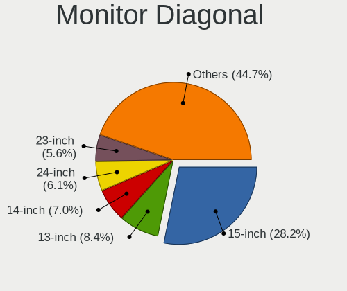

| Inches  | Computers | Percent |
|---------|-----------|---------|
| 15      | 283       | 28.94%  |
| 13      | 86        | 8.79%   |
| 14      | 66        | 6.75%   |
| 24      | 62        | 6.34%   |
| 17      | 60        | 6.13%   |
| Unknown | 60        | 6.13%   |
| 21      | 52        | 5.32%   |
| 23      | 47        | 4.81%   |
| 27      | 40        | 4.09%   |
| 19      | 33        | 3.37%   |
| 18      | 27        | 2.76%   |
| 12      | 20        | 2.04%   |
| 20      | 18        | 1.84%   |
| 10      | 18        | 1.84%   |
| 22      | 15        | 1.53%   |
| 11      | 15        | 1.53%   |
| 34      | 13        | 1.33%   |
| 31      | 12        | 1.23%   |
| 72      | 8         | 0.82%   |
| 16      | 6         | 0.61%   |
| 54      | 5         | 0.51%   |
| 32      | 5         | 0.51%   |
| 84      | 3         | 0.31%   |
| 52      | 3         | 0.31%   |
| 40      | 3         | 0.31%   |
| 8       | 3         | 0.31%   |
| 48      | 2         | 0.2%    |
| 33      | 2         | 0.2%    |
| 28      | 2         | 0.2%    |
| 26      | 2         | 0.2%    |
| 25      | 2         | 0.2%    |
| 65      | 1         | 0.1%    |
| 64      | 1         | 0.1%    |
| 46      | 1         | 0.1%    |
| 42      | 1         | 0.1%    |
| 7       | 1         | 0.1%    |

Monitor Width
-------------

Physical width

| Width in mm | Computers | Percent |
|-------------|-----------|---------|
| 301-350     | 408       | 42.46%  |
| 501-600     | 139       | 14.46%  |
| 401-500     | 120       | 12.49%  |
| 201-300     | 92        | 9.57%   |
| 351-400     | 73        | 7.6%    |
| Unknown     | 60        | 6.24%   |
| 701-800     | 20        | 2.08%   |
| 601-700     | 18        | 1.87%   |
| 1001-1500   | 12        | 1.25%   |
| 1501-2000   | 11        | 1.14%   |
| 101-200     | 4         | 0.42%   |
| 801-900     | 3         | 0.31%   |
| 901-1000    | 1         | 0.1%    |

Aspect Ratio
------------

Proportional relationship between the width and the height

| Ratio   | Computers | Percent |
|---------|-----------|---------|
| 16/9    | 653       | 71.13%  |
| 16/10   | 126       | 13.73%  |
| Unknown | 54        | 5.88%   |
| 5/4     | 41        | 4.47%   |
| 4/3     | 20        | 2.18%   |
| 21/9    | 16        | 1.74%   |
| 3/2     | 7         | 0.76%   |
| 32/9    | 1         | 0.11%   |

Monitor Area
------------

Area in inch

| Area in inch | Computers | Percent |
|----------------|-----------|---------|
| 101-110        | 281       | 28.97%  |
| 201-250        | 138       | 14.23%  |
| 81-90          | 121       | 12.47%  |
| 151-200        | 65        | 6.7%    |
| Unknown        | 60        | 6.19%   |
| 301-350        | 42        | 4.33%   |
| 141-150        | 42        | 4.33%   |
| 351-500        | 32        | 3.3%    |
| 71-80          | 31        | 3.2%    |
| 121-130        | 31        | 3.2%    |
| 251-300        | 24        | 2.47%   |
| More than 1000 | 21        | 2.16%   |
| 61-70          | 18        | 1.86%   |
| 41-50          | 18        | 1.86%   |
| 51-60          | 15        | 1.55%   |
| 131-140        | 9         | 0.93%   |
| 111-120        | 7         | 0.72%   |
| 501-1000       | 7         | 0.72%   |
| 1-40           | 4         | 0.41%   |
| 91-100         | 4         | 0.41%   |

Pixel Density
-------------

Pixels per inch

| Density       | Computers | Percent |
|---------------|-----------|---------|
| 51-100        | 324       | 34.11%  |
| 101-120       | 292       | 30.74%  |
| 121-160       | 211       | 22.21%  |
| Unknown       | 60        | 6.32%   |
| 161-240       | 32        | 3.37%   |
| 1-50          | 19        | 2%      |
| More than 240 | 12        | 1.26%   |

Multiple Monitors
-----------------

Total monitors connected

| Total | Computers | Percent |
|-------|-----------|---------|
| 1     | 831       | 83.6%   |
| 2     | 109       | 10.97%  |
| 0     | 48        | 4.83%   |
| 3     | 5         | 0.5%    |
| 4     | 1         | 0.1%    |

Network
-------

Net Controller Vendor
---------------------

Controller vendors

| Vendor                                | Computers | Percent |
|---------------------------------------|-----------|---------|
| Realtek Semiconductor                 | 539       | 35.86%  |
| Intel                                 | 394       | 26.21%  |
| Qualcomm Atheros                      | 196       | 13.04%  |
| Broadcom                              | 104       | 6.92%   |
| Marvell Technology Group              | 32        | 2.13%   |
| Broadcom Limited                      | 30        | 2%      |
| Ralink Technology                     | 22        | 1.46%   |
| Nvidia                                | 22        | 1.46%   |
| TP-Link                               | 18        | 1.2%    |
| MediaTek                              | 15        | 1%      |
| Ralink                                | 14        | 0.93%   |
| Samsung Electronics                   | 12        | 0.8%    |
| VIA Technologies                      | 8         | 0.53%   |
| Silicon Integrated Systems [SiS]      | 6         | 0.4%    |
| Huawei Technologies                   | 5         | 0.33%   |
| NetGear                               | 4         | 0.27%   |
| Lenovo                                | 4         | 0.27%   |
| JMicron Technology                    | 4         | 0.27%   |
| Ericsson Business Mobile Networks     | 4         | 0.27%   |
| Edimax Technology                     | 4         | 0.27%   |
| Dell                                  | 4         | 0.27%   |
| Xiaomi                                | 3         | 0.2%    |
| Microsoft                             | 3         | 0.2%    |
| Google                                | 3         | 0.2%    |
| DisplayLink                           | 3         | 0.2%    |
| AVM                                   | 3         | 0.2%    |
| ASUSTek Computer                      | 3         | 0.2%    |
| AMD                                   | 3         | 0.2%    |
| ZTE WCDMA Technologies MSM            | 2         | 0.13%   |
| Tenda                                 | 2         | 0.13%   |
| Spreadtrum Communications             | 2         | 0.13%   |
| Sitecom Europe                        | 2         | 0.13%   |
| Sierra Wireless                       | 2         | 0.13%   |
| Linksys                               | 2         | 0.13%   |
| Hewlett-Packard                       | 2         | 0.13%   |
| Cisco Aironet Wireless Communications | 2         | 0.13%   |
| Attansic Technology                   | 2         | 0.13%   |
| ASIX Electronics                      | 2         | 0.13%   |
| ST-Ericsson                           | 1         | 0.07%   |
| Qualcomm Atheros Communications       | 1         | 0.07%   |

Net Controller Model
--------------------

Controller models

| Model                                                                   | Computers | Percent |
|-------------------------------------------------------------------------|-----------|---------|
| Realtek RTL8111/8168/8411 PCI Express Gigabit Ethernet Controller       | 333       | 18.56%  |
| Realtek RTL810xE PCI Express Fast Ethernet controller                   | 89        | 4.96%   |
| Realtek RTL8821CE 802.11ac PCIe Wireless Network Adapter                | 42        | 2.34%   |
| Intel 82579LM Gigabit Network Connection (Lewisville)                   | 42        | 2.34%   |
| Qualcomm Atheros AR9285 Wireless Network Adapter (PCI-Express)          | 26        | 1.45%   |
| Qualcomm Atheros AR9485 Wireless Network Adapter                        | 25        | 1.39%   |
| Qualcomm Atheros QCA9565 / AR9565 Wireless Network Adapter              | 22        | 1.23%   |
| Broadcom BCM4313 802.11bgn Wireless Network Adapter                     | 22        | 1.23%   |
| Intel Wi-Fi 6 AX200                                                     | 21        | 1.17%   |
| Intel Wireless 8265 / 8275                                              | 20        | 1.11%   |
| Qualcomm Atheros QCA9377 802.11ac Wireless Network Adapter              | 19        | 1.06%   |
| Realtek RTL-8100/8101L/8139 PCI Fast Ethernet Adapter                   | 18        | 1%      |
| Intel Wireless 8260                                                     | 18        | 1%      |
| Qualcomm Atheros AR242x / AR542x Wireless Network Adapter (PCI-Express) | 17        | 0.95%   |
| Intel Wireless 3165                                                     | 17        | 0.95%   |
| Realtek RTL8188EUS 802.11n Wireless Network Adapter                     | 15        | 0.84%   |
| Intel Wireless 7260                                                     | 15        | 0.84%   |
| Intel PRO/Wireless 3945ABG [Golan] Network Connection                   | 15        | 0.84%   |
| Intel I211 Gigabit Network Connection                                   | 15        | 0.84%   |
| Intel Centrino Advanced-N 6205 [Taylor Peak]                            | 15        | 0.84%   |
| Realtek RTL8822CE 802.11ac PCIe Wireless Network Adapter                | 14        | 0.78%   |
| Realtek RTL8125 2.5GbE Controller                                       | 14        | 0.78%   |
| Realtek RTL88x2bu [AC1200 Techkey]                                      | 13        | 0.72%   |
| Intel Wireless 7265                                                     | 13        | 0.72%   |
| Intel Wi-Fi 6 AX201                                                     | 13        | 0.72%   |
| Intel WiFi Link 5100                                                    | 12        | 0.67%   |
| Intel Wi-Fi 6 AX210/AX211/AX411 160MHz                                  | 12        | 0.67%   |
| Realtek RTL8188CE 802.11b/g/n WiFi Adapter                              | 11        | 0.61%   |
| Intel Dual Band Wireless-AC 3168NGW [Stone Peak]                        | 11        | 0.61%   |
| Samsung Galaxy series, misc. (tethering mode)                           | 10        | 0.56%   |
| Realtek RTL8153 Gigabit Ethernet Adapter                                | 10        | 0.56%   |
| Qualcomm Atheros AR9462 Wireless Network Adapter                        | 10        | 0.56%   |
| Qualcomm Atheros AR8151 v2.0 Gigabit Ethernet                           | 10        | 0.56%   |
| Intel Ethernet Connection I217-LM                                       | 10        | 0.56%   |
| Intel Cannon Point-LP CNVi [Wireless-AC]                                | 10        | 0.56%   |
| Realtek RTL8723BE PCIe Wireless Network Adapter                         | 9         | 0.5%    |
| Qualcomm Atheros AR8131 Gigabit Ethernet                                | 9         | 0.5%    |
| Nvidia MCP61 Ethernet                                                   | 8         | 0.45%   |
| Intel Ethernet Connection I219-V                                        | 8         | 0.45%   |
| Intel Comet Lake PCH-LP CNVi WiFi                                       | 8         | 0.45%   |

Wireless Vendor
---------------

Wireless vendors

| Vendor                                | Computers | Percent |
|---------------------------------------|-----------|---------|
| Intel                                 | 287       | 35%     |
| Realtek Semiconductor                 | 184       | 22.44%  |
| Qualcomm Atheros                      | 148       | 18.05%  |
| Broadcom                              | 74        | 9.02%   |
| Ralink Technology                     | 22        | 2.68%   |
| Broadcom Limited                      | 18        | 2.2%    |
| TP-Link                               | 17        | 2.07%   |
| Ralink                                | 14        | 1.71%   |
| MediaTek                              | 13        | 1.59%   |
| NetGear                               | 4         | 0.49%   |
| Marvell Technology Group              | 4         | 0.49%   |
| Microsoft                             | 3         | 0.37%   |
| Edimax Technology                     | 3         | 0.37%   |
| Dell                                  | 3         | 0.37%   |
| AVM                                   | 3         | 0.37%   |
| ASUSTek Computer                      | 3         | 0.37%   |
| Tenda                                 | 2         | 0.24%   |
| Sitecom Europe                        | 2         | 0.24%   |
| Sierra Wireless                       | 2         | 0.24%   |
| Linksys                               | 2         | 0.24%   |
| Cisco Aironet Wireless Communications | 2         | 0.24%   |
| Xiaomi                                | 1         | 0.12%   |
| Qualcomm Atheros Communications       | 1         | 0.12%   |
| Mercucys                              | 1         | 0.12%   |
| IMC Networks                          | 1         | 0.12%   |
| Fibocom                               | 1         | 0.12%   |
| Ericsson Business Mobile Networks     | 1         | 0.12%   |
| D-Link System                         | 1         | 0.12%   |
| D-Link                                | 1         | 0.12%   |
| Belkin Components                     | 1         | 0.12%   |
| Askey Computer                        | 1         | 0.12%   |

Wireless Model
--------------

Wireless models

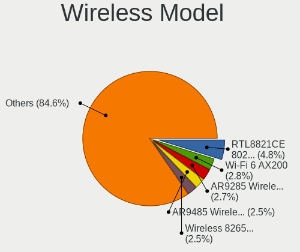

| Model                                                                   | Computers | Percent |
|-------------------------------------------------------------------------|-----------|---------|
| Realtek RTL8821CE 802.11ac PCIe Wireless Network Adapter                | 42        | 5.02%   |
| Qualcomm Atheros AR9285 Wireless Network Adapter (PCI-Express)          | 26        | 3.11%   |
| Qualcomm Atheros AR9485 Wireless Network Adapter                        | 25        | 2.99%   |
| Qualcomm Atheros QCA9565 / AR9565 Wireless Network Adapter              | 22        | 2.63%   |
| Broadcom BCM4313 802.11bgn Wireless Network Adapter                     | 22        | 2.63%   |
| Intel Wi-Fi 6 AX200                                                     | 21        | 2.51%   |
| Intel Wireless 8265 / 8275                                              | 20        | 2.39%   |
| Qualcomm Atheros QCA9377 802.11ac Wireless Network Adapter              | 19        | 2.27%   |
| Intel Wireless 8260                                                     | 18        | 2.15%   |
| Qualcomm Atheros AR242x / AR542x Wireless Network Adapter (PCI-Express) | 17        | 2.03%   |
| Intel Wireless 3165                                                     | 17        | 2.03%   |
| Realtek RTL8188EUS 802.11n Wireless Network Adapter                     | 15        | 1.79%   |
| Intel Wireless 7260                                                     | 15        | 1.79%   |
| Intel PRO/Wireless 3945ABG [Golan] Network Connection                   | 15        | 1.79%   |
| Intel Centrino Advanced-N 6205 [Taylor Peak]                            | 15        | 1.79%   |
| Realtek RTL8822CE 802.11ac PCIe Wireless Network Adapter                | 14        | 1.67%   |
| Realtek RTL88x2bu [AC1200 Techkey]                                      | 13        | 1.55%   |
| Intel Wireless 7265                                                     | 13        | 1.55%   |
| Intel Wi-Fi 6 AX201                                                     | 13        | 1.55%   |
| Intel WiFi Link 5100                                                    | 12        | 1.43%   |
| Intel Wi-Fi 6 AX210/AX211/AX411 160MHz                                  | 12        | 1.43%   |
| Realtek RTL8188CE 802.11b/g/n WiFi Adapter                              | 11        | 1.31%   |
| Intel Dual Band Wireless-AC 3168NGW [Stone Peak]                        | 11        | 1.31%   |
| Qualcomm Atheros AR9462 Wireless Network Adapter                        | 10        | 1.19%   |
| Intel Cannon Point-LP CNVi [Wireless-AC]                                | 10        | 1.19%   |
| Realtek RTL8723BE PCIe Wireless Network Adapter                         | 9         | 1.08%   |
| Intel Comet Lake PCH-LP CNVi WiFi                                       | 8         | 0.96%   |
| Intel Centrino Ultimate-N 6300                                          | 8         | 0.96%   |
| Realtek RTL8188FTV 802.11b/g/n 1T1R 2.4G WLAN Adapter                   | 7         | 0.84%   |
| Ralink MT7601U Wireless Adapter                                         | 7         | 0.84%   |
| Qualcomm Atheros QCA6174 802.11ac Wireless Network Adapter              | 7         | 0.84%   |
| Intel Wireless 3160                                                     | 7         | 0.84%   |
| Realtek RTL8191SEvB Wireless LAN Controller                             | 6         | 0.72%   |
| Realtek 802.11ac NIC                                                    | 6         | 0.72%   |
| Ralink RT2870/RT3070 Wireless Adapter                                   | 6         | 0.72%   |
| Qualcomm Atheros AR928X Wireless Network Adapter (PCI-Express)          | 6         | 0.72%   |
| Intel Wireless-AC 9260                                                  | 6         | 0.72%   |
| Intel Cannon Lake PCH CNVi WiFi                                         | 6         | 0.72%   |
| Broadcom Limited BCM4360 802.11ac Dual Band Wireless Network Adapter    | 6         | 0.72%   |
| Broadcom BCM4322 802.11a/b/g/n Wireless LAN Controller                  | 6         | 0.72%   |

Ethernet Vendor
---------------

Ethernet vendors

| Vendor                           | Computers | Percent |
|----------------------------------|-----------|---------|
| Realtek Semiconductor            | 469       | 50.98%  |
| Intel                            | 212       | 23.04%  |
| Qualcomm Atheros                 | 70        | 7.61%   |
| Broadcom                         | 42        | 4.57%   |
| Marvell Technology Group         | 28        | 3.04%   |
| Nvidia                           | 22        | 2.39%   |
| Broadcom Limited                 | 12        | 1.3%    |
| Samsung Electronics              | 10        | 1.09%   |
| VIA Technologies                 | 8         | 0.87%   |
| Silicon Integrated Systems [SiS] | 6         | 0.65%   |
| JMicron Technology               | 4         | 0.43%   |
| Huawei Technologies              | 4         | 0.43%   |
| Lenovo                           | 3         | 0.33%   |
| Google                           | 3         | 0.33%   |
| DisplayLink                      | 3         | 0.33%   |
| ZTE WCDMA Technologies MSM       | 2         | 0.22%   |
| Xiaomi                           | 2         | 0.22%   |
| Spreadtrum Communications        | 2         | 0.22%   |
| MediaTek                         | 2         | 0.22%   |
| Hewlett-Packard                  | 2         | 0.22%   |
| Attansic Technology              | 2         | 0.22%   |
| ASIX Electronics                 | 2         | 0.22%   |
| TP-Link                          | 1         | 0.11%   |
| Qualcomm                         | 1         | 0.11%   |
| OnePlus Technology (Shenzhen)    | 1         | 0.11%   |
| Microchip Technology             | 1         | 0.11%   |
| HTC (High Tech Computer)         | 1         | 0.11%   |
| Gemtek                           | 1         | 0.11%   |
| Edimax Technology                | 1         | 0.11%   |
| Davicom Semiconductor            | 1         | 0.11%   |
| ADMtek                           | 1         | 0.11%   |
| 3Com                             | 1         | 0.11%   |

Ethernet Model
--------------

Ethernet models

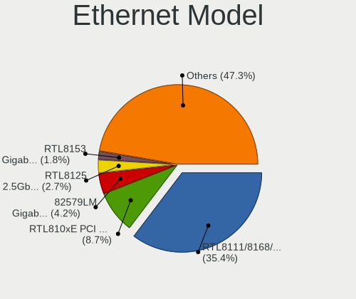

| Model                                                             | Computers | Percent |
|-------------------------------------------------------------------|-----------|---------|
| Realtek RTL8111/8168/8411 PCI Express Gigabit Ethernet Controller | 333       | 35.73%  |
| Realtek RTL810xE PCI Express Fast Ethernet controller             | 89        | 9.55%   |
| Intel 82579LM Gigabit Network Connection (Lewisville)             | 42        | 4.51%   |
| Realtek RTL-8100/8101L/8139 PCI Fast Ethernet Adapter             | 18        | 1.93%   |
| Intel I211 Gigabit Network Connection                             | 15        | 1.61%   |
| Realtek RTL8125 2.5GbE Controller                                 | 14        | 1.5%    |
| Samsung Galaxy series, misc. (tethering mode)                     | 10        | 1.07%   |
| Realtek RTL8153 Gigabit Ethernet Adapter                          | 10        | 1.07%   |
| Qualcomm Atheros AR8151 v2.0 Gigabit Ethernet                     | 10        | 1.07%   |
| Intel Ethernet Connection I217-LM                                 | 10        | 1.07%   |
| Qualcomm Atheros AR8131 Gigabit Ethernet                          | 9         | 0.97%   |
| Nvidia MCP61 Ethernet                                             | 8         | 0.86%   |
| Intel Ethernet Connection I219-V                                  | 8         | 0.86%   |
| VIA VT6102/VT6103 [Rhine-II]                                      | 7         | 0.75%   |
| Qualcomm Atheros AR8152 v2.0 Fast Ethernet                        | 7         | 0.75%   |
| Qualcomm Atheros AR8132 Fast Ethernet                             | 7         | 0.75%   |
| Intel Ethernet Connection I217-V                                  | 7         | 0.75%   |
| Intel 82579V Gigabit Network Connection                           | 7         | 0.75%   |
| Intel 82577LM Gigabit Network Connection                          | 7         | 0.75%   |
| Qualcomm Atheros Killer E220x Gigabit Ethernet Controller         | 6         | 0.64%   |
| Qualcomm Atheros AR8121/AR8113/AR8114 Gigabit or Fast Ethernet    | 6         | 0.64%   |
| Marvell Group 88E8071 PCI-E Gigabit Ethernet Controller           | 6         | 0.64%   |
| Intel Ethernet Connection I219-LM                                 | 6         | 0.64%   |
| Intel Ethernet Connection (7) I219-V                              | 6         | 0.64%   |
| Intel Ethernet Connection (2) I219-V                              | 6         | 0.64%   |
| Intel 82574L Gigabit Network Connection                           | 6         | 0.64%   |
| Intel 82573L Gigabit Ethernet Controller                          | 6         | 0.64%   |
| Intel 82567LM Gigabit Network Connection                          | 6         | 0.64%   |
| Broadcom NetXtreme BCM57786 Gigabit Ethernet PCIe                 | 6         | 0.64%   |
| Qualcomm Atheros Attansic L1 Gigabit Ethernet                     | 5         | 0.54%   |
| Qualcomm Atheros AR8151 v1.0 Gigabit Ethernet                     | 5         | 0.54%   |
| Nvidia MCP79 Ethernet                                             | 5         | 0.54%   |
| Qualcomm Atheros AR8162 Fast Ethernet                             | 4         | 0.43%   |
| Nvidia MCP77 Ethernet                                             | 4         | 0.43%   |
| Marvell Group 88E8053 PCI-E Gigabit Ethernet Controller           | 4         | 0.43%   |
| JMicron JMC250 PCI Express Gigabit Ethernet Controller            | 4         | 0.43%   |
| Intel Ethernet Connection (4) I219-LM                             | 4         | 0.43%   |
| Broadcom NetXtreme BCM5761 Gigabit Ethernet PCIe                  | 4         | 0.43%   |
| Silicon Integrated Systems [SiS] SiS900 PCI Fast Ethernet         | 3         | 0.32%   |
| Silicon Integrated Systems [SiS] 191 Gigabit Ethernet Adapter     | 3         | 0.32%   |

Net Controller Kind
-------------------

Ethernet, WiFi or modem

| Kind     | Computers | Percent |
|----------|-----------|---------|
| Ethernet | 868       | 52.19%  |
| WiFi     | 770       | 46.3%   |
| Modem    | 21        | 1.26%   |
| Unknown  | 4         | 0.24%   |

Used Controller
---------------

Currently used network controller

| Kind     | Computers | Percent |
|----------|-----------|---------|
| WiFi     | 560       | 55.01%  |
| Ethernet | 458       | 44.99%  |

NICs
----

Total network controllers on board

| Total | Computers | Percent |
|-------|-----------|---------|
| 2     | 574       | 58.63%  |
| 1     | 368       | 37.59%  |
| 3     | 18        | 1.84%   |
| 0     | 15        | 1.53%   |
| 4     | 4         | 0.41%   |

IPv6
----

IPv6 vs IPv4

| Used | Computers | Percent |
|------|-----------|---------|
| No   | 743       | 74.67%  |
| Yes  | 252       | 25.33%  |

Bluetooth
---------

Bluetooth Vendor
----------------

Controller vendors

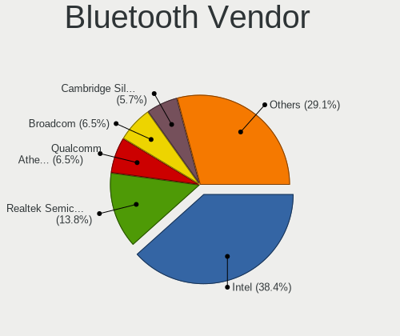

| Vendor                          | Computers | Percent |
|---------------------------------|-----------|---------|
| Intel                           | 201       | 38.36%  |
| Realtek Semiconductor           | 77        | 14.69%  |
| Broadcom                        | 38        | 7.25%   |
| Qualcomm Atheros Communications | 37        | 7.06%   |
| Cambridge Silicon Radio         | 29        | 5.53%   |
| Foxconn / Hon Hai               | 23        | 4.39%   |
| Apple                           | 23        | 4.39%   |
| Lite-On Technology              | 20        | 3.82%   |
| IMC Networks                    | 17        | 3.24%   |
| Hewlett-Packard                 | 13        | 2.48%   |
| Dell                            | 11        | 2.1%    |
| ASUSTek Computer                | 6         | 1.15%   |
| MediaTek                        | 4         | 0.76%   |
| Toshiba                         | 3         | 0.57%   |
| Realtek                         | 3         | 0.57%   |
| Ralink                          | 3         | 0.57%   |
| Marvell Semiconductor           | 3         | 0.57%   |
| Foxconn International           | 3         | 0.57%   |
| Askey Computer                  | 2         | 0.38%   |
| Taiyo Yuden                     | 1         | 0.19%   |
| Ralink Technology               | 1         | 0.19%   |
| Qcom                            | 1         | 0.19%   |
| Integrated System Solution      | 1         | 0.19%   |
| Dynex                           | 1         | 0.19%   |
| Chicony Electronics             | 1         | 0.19%   |
| Alps Electric                   | 1         | 0.19%   |
| Unknown                         | 1         | 0.19%   |

Bluetooth Model
---------------

Controller models

| Model                                                                               | Computers | Percent |
|-------------------------------------------------------------------------------------|-----------|---------|
| Intel Bluetooth wireless interface                                                  | 85        | 16.19%  |
| Realtek Bluetooth Radio                                                             | 47        | 8.95%   |
| Intel Bluetooth Device                                                              | 34        | 6.48%   |
| Intel Bluetooth 9460/9560 Jefferson Peak (JfP)                                      | 29        | 5.52%   |
| Cambridge Silicon Radio Bluetooth Dongle (HCI mode)                                 | 29        | 5.52%   |
| Realtek  Bluetooth 4.2 Adapter                                                      | 25        | 4.76%   |
| Intel AX200 Bluetooth                                                               | 20        | 3.81%   |
| Qualcomm Atheros  Bluetooth Device                                                  | 16        | 3.05%   |
| Intel Wireless-AC 3168 Bluetooth                                                    | 11        | 2.1%    |
| Intel AX210 Bluetooth                                                               | 10        | 1.9%    |
| Qualcomm Atheros AR3012 Bluetooth 4.0                                               | 9         | 1.71%   |
| Lite-On Qualcomm Atheros QCA9377 Bluetooth                                          | 7         | 1.33%   |
| HP Bluetooth 2.0 Interface [Broadcom BCM2045]                                       | 7         | 1.33%   |
| Apple Bluetooth Host Controller                                                     | 7         | 1.33%   |
| Apple Bluetooth HCI                                                                 | 7         | 1.33%   |
| Broadcom BCM2045B (BDC-2.1)                                                         | 6         | 1.14%   |
| Apple Bluetooth USB Host Controller                                                 | 6         | 1.14%   |
| Qualcomm Atheros QCA61x4 Bluetooth 4.0                                              | 5         | 0.95%   |
| Lite-On Atheros AR3012 Bluetooth                                                    | 5         | 0.95%   |
| Intel Wireless-AC 9260 Bluetooth Adapter                                            | 5         | 0.95%   |
| Intel Centrino Advanced-N 6230 Bluetooth adapter                                    | 5         | 0.95%   |
| IMC Networks Bluetooth Radio                                                        | 5         | 0.95%   |
| HP Broadcom 2070 Bluetooth Combo                                                    | 5         | 0.95%   |
| Foxconn / Hon Hai Bluetooth Device                                                  | 5         | 0.95%   |
| Dell DW375 Bluetooth Module                                                         | 5         | 0.95%   |
| Broadcom BCM20702A0 Bluetooth 4.0                                                   | 5         | 0.95%   |
| Broadcom BCM2070 Bluetooth 2.1 + EDR                                                | 5         | 0.95%   |
| Qualcomm Atheros AR3011 Bluetooth                                                   | 4         | 0.76%   |
| MediaTek Wireless_Device                                                            | 4         | 0.76%   |
| Lite-On Bluetooth Device                                                            | 4         | 0.76%   |
| IMC Networks Wireless_Device                                                        | 4         | 0.76%   |
| IMC Networks Bluetooth Device                                                       | 4         | 0.76%   |
| Foxconn / Hon Hai Wireless_Device                                                   | 4         | 0.76%   |
| Foxconn / Hon Hai Acer Module                                                       | 4         | 0.76%   |
| Broadcom BCM20702 Bluetooth 4.0 [ThinkPad]                                          | 4         | 0.76%   |
| Realtek Bluetooth Radio                                                             | 3         | 0.57%   |
| Ralink RT3290 Bluetooth                                                             | 3         | 0.57%   |
| Intel Centrino Bluetooth Wireless Transceiver                                       | 3         | 0.57%   |
| Foxconn International BCM43142A0 Bluetooth module                                   | 3         | 0.57%   |
| Foxconn / Hon Hai Foxconn T77H114 BCM2070 [Single-Chip Bluetooth 2.1 + EDR Adapter] | 3         | 0.57%   |

Sound
-----

Sound Vendor
------------

Sound card vendors

| Vendor                                       | Computers | Percent |
|----------------------------------------------|-----------|---------|
| Intel                                        | 706       | 54.39%  |
| AMD                                          | 255       | 19.65%  |
| Nvidia                                       | 217       | 16.72%  |
| C-Media Electronics                          | 24        | 1.85%   |
| VIA Technologies                             | 13        | 1%      |
| Silicon Integrated Systems [SiS]             | 8         | 0.62%   |
| Logitech                                     | 6         | 0.46%   |
| GN Netcom                                    | 6         | 0.46%   |
| Generalplus Technology                       | 6         | 0.46%   |
| Creative Labs                                | 6         | 0.46%   |
| Texas Instruments                            | 5         | 0.39%   |
| JMTek                                        | 5         | 0.39%   |
| Plantronics                                  | 3         | 0.23%   |
| Creative Technology                          | 3         | 0.23%   |
| Yamaha                                       | 2         | 0.15%   |
| Thesycon Systemsoftware & Consulting         | 2         | 0.15%   |
| Tenx Technology                              | 2         | 0.15%   |
| Micro Star International                     | 2         | 0.15%   |
| M-Audio                                      | 2         | 0.15%   |
| KTMicro                                      | 2         | 0.15%   |
| Focusrite-Novation                           | 2         | 0.15%   |
| Zoran Co. Personal Media Division (Nogatech) | 1         | 0.08%   |
| Xilinx                                       | 1         | 0.08%   |
| Turtle Beach                                 | 1         | 0.08%   |
| Sony                                         | 1         | 0.08%   |
| Sennheiser Communications                    | 1         | 0.08%   |
| SAVITECH                                     | 1         | 0.08%   |
| Realtek Semiconductor                        | 1         | 0.08%   |
| Razer USA                                    | 1         | 0.08%   |
| QinHeng Electronics                          | 1         | 0.08%   |
| Native Instruments                           | 1         | 0.08%   |
| GYROCOM C&C                                  | 1         | 0.08%   |
| Evolution Electronics                        | 1         | 0.08%   |
| Dell                                         | 1         | 0.08%   |
| DCMT Technology                              | 1         | 0.08%   |
| CMX Systems                                  | 1         | 0.08%   |
| BR23                                         | 1         | 0.08%   |
| Blue Microphones                             | 1         | 0.08%   |
| Audioengine                                  | 1         | 0.08%   |
| ASUSTek Computer                             | 1         | 0.08%   |

Sound Model
-----------

Sound card models

| Model                                                                                             | Computers | Percent |
|---------------------------------------------------------------------------------------------------|-----------|---------|
| AMD Family 17h/19h HD Audio Controller                                                            | 80        | 5.28%   |
| Intel NM10/ICH7 Family High Definition Audio Controller                                           | 74        | 4.88%   |
| Intel 7 Series/C216 Chipset Family High Definition Audio Controller                               | 74        | 4.88%   |
| Intel Sunrise Point-LP HD Audio                                                                   | 67        | 4.42%   |
| Intel 6 Series/C200 Series Chipset Family High Definition Audio Controller                        | 65        | 4.29%   |
| Intel 82801I (ICH9 Family) HD Audio Controller                                                    | 46        | 3.03%   |
| Intel 5 Series/3400 Series Chipset High Definition Audio                                          | 38        | 2.51%   |
| AMD SBx00 Azalia (Intel HDA)                                                                      | 37        | 2.44%   |
| AMD Raven/Raven2/Fenghuang HDMI/DP Audio Controller                                               | 37        | 2.44%   |
| Intel 8 Series/C220 Series Chipset High Definition Audio Controller                               | 36        | 2.37%   |
| AMD Renoir Radeon High Definition Audio Controller                                                | 35        | 2.31%   |
| Intel Tiger Lake-LP Smart Sound Technology Audio Controller                                       | 27        | 1.78%   |
| Intel Haswell-ULT HD Audio Controller                                                             | 26        | 1.72%   |
| Intel Cannon Lake PCH cAVS                                                                        | 26        | 1.72%   |
| Intel 8 Series HD Audio Controller                                                                | 26        | 1.72%   |
| AMD FCH Azalia Controller                                                                         | 26        | 1.72%   |
| Nvidia GK208 HDMI/DP Audio Controller                                                             | 24        | 1.58%   |
| Intel Xeon E3-1200 v3/4th Gen Core Processor HD Audio Controller                                  | 24        | 1.58%   |
| Nvidia GF108 High Definition Audio Controller                                                     | 19        | 1.25%   |
| Intel Cannon Point-LP High Definition Audio Controller                                            | 19        | 1.25%   |
| Intel 82801H (ICH8 Family) HD Audio Controller                                                    | 19        | 1.25%   |
| AMD Family 15h (Models 60h-6fh) Audio Controller                                                  | 18        | 1.19%   |
| Intel 100 Series/C230 Series Chipset Family HD Audio Controller                                   | 17        | 1.12%   |
| AMD Starship/Matisse HD Audio Controller                                                          | 16        | 1.06%   |
| Nvidia High Definition Audio Controller                                                           | 15        | 0.99%   |
| AMD Kabini HDMI/DP Audio                                                                          | 15        | 0.99%   |
| AMD High Definition Audio Controller                                                              | 15        | 0.99%   |
| Intel Celeron/Pentium Silver Processor High Definition Audio                                      | 14        | 0.92%   |
| Intel Atom/Celeron/Pentium Processor x5-E8000/J3xxx/N3xxx Series High Definition Audio Controller | 14        | 0.92%   |
| AMD Family 17h (Models 00h-0fh) HD Audio Controller                                               | 14        | 0.92%   |
| Nvidia GP107GL High Definition Audio Controller                                                   | 13        | 0.86%   |
| Nvidia GM206 High Definition Audio Controller                                                     | 12        | 0.79%   |
| Intel 82801JI (ICH10 Family) HD Audio Controller                                                  | 12        | 0.79%   |
| Intel Comet Lake PCH-LP cAVS                                                                      | 11        | 0.73%   |
| Intel Broadwell-U Audio Controller                                                                | 11        | 0.73%   |
| AMD RV710/730 HDMI Audio [Radeon HD 4000 series]                                                  | 11        | 0.73%   |
| AMD Ellesmere HDMI Audio [Radeon RX 470/480 / 570/580/590]                                        | 11        | 0.73%   |
| Nvidia TU106 High Definition Audio Controller                                                     | 10        | 0.66%   |
| Nvidia GM107 High Definition Audio Controller [GeForce 940MX]                                     | 10        | 0.66%   |
| Intel Wildcat Point-LP High Definition Audio Controller                                           | 10        | 0.66%   |

Memory
------

Memory Vendor
-------------

Memory module vendors

| Vendor                       | Computers | Percent |
|------------------------------|-----------|---------|
| Samsung Electronics          | 85        | 22.31%  |
| SK hynix                     | 69        | 18.11%  |
| Unknown                      | 59        | 15.49%  |
| Kingston                     | 39        | 10.24%  |
| Micron Technology            | 31        | 8.14%   |
| Crucial                      | 17        | 4.46%   |
| Corsair                      | 14        | 3.67%   |
| G.Skill                      | 11        | 2.89%   |
| Nanya Technology             | 6         | 1.57%   |
| Ramaxel Technology           | 5         | 1.31%   |
| A-DATA Technology            | 5         | 1.31%   |
| Unknown (ABCD)               | 4         | 1.05%   |
| Team                         | 4         | 1.05%   |
| Smart                        | 4         | 1.05%   |
| Elpida                       | 4         | 1.05%   |
| Unknown                      | 4         | 1.05%   |
| Patriot                      | 2         | 0.52%   |
| GSkill                       | 2         | 0.52%   |
| GeIL                         | 2         | 0.52%   |
| Transcend                    | 1         | 0.26%   |
| Super Talent                 | 1         | 0.26%   |
| Strontium                    | 1         | 0.26%   |
| PUSKILL                      | 1         | 0.26%   |
| PLEXHD                       | 1         | 0.26%   |
| Patriot Memory (PDP Systems) | 1         | 0.26%   |
| Lexar Co Limited             | 1         | 0.26%   |
| KLEVV                        | 1         | 0.26%   |
| Kingmax                      | 1         | 0.26%   |
| Exceleram                    | 1         | 0.26%   |
| CSX                          | 1         | 0.26%   |
| AVEXIR                       | 1         | 0.26%   |
| AMD                          | 1         | 0.26%   |
| 4ea5                         | 1         | 0.26%   |

Memory Model
------------

Memory module models

| Model                                                            | Computers | Percent |
|------------------------------------------------------------------|-----------|---------|
| Samsung RAM M471A1K43EB1-CWE 8GB SODIMM DDR4 3200MT/s            | 6         | 1.44%   |
| Samsung RAM M471A5244CB0-CTD 4GB SODIMM DDR4 3266MT/s            | 5         | 1.2%    |
| Samsung RAM M471A1K43CB1-CRC 8GB SODIMM DDR4 2667MT/s            | 4         | 0.96%   |
| Unknown                                                          | 4         | 0.96%   |
| Unknown (ABCD) RAM 123456789012345678 2GB SODIMM LPDDR4 2400MT/s | 3         | 0.72%   |
| SK hynix RAM HMT451S6BFR8A-PB 4GB SODIMM DDR3 1600MT/s           | 3         | 0.72%   |
| SK hynix RAM HMA851S6DJR6N-XN 4GB SODIMM DDR4 3200MT/s           | 3         | 0.72%   |
| SK hynix RAM HMA81GS6AFR8N-UH 8GB SODIMM DDR4 2667MT/s           | 3         | 0.72%   |
| Samsung RAM M471B5273CH0-CK0 4096MB SODIMM DDR3 1600MT/s         | 3         | 0.72%   |
| Samsung RAM M471B5173QH0-YK0 4GB SODIMM DDR3 1600MT/s            | 3         | 0.72%   |
| Samsung RAM M471B1G73QH0-YK0 8GB SODIMM DDR3 1867MT/s            | 3         | 0.72%   |
| Samsung RAM M471B1G73DB0-YK0 8GB SODIMM DDR3 1600MT/s            | 3         | 0.72%   |
| Samsung RAM M471A1K43DB1-CTD 8GB SODIMM DDR4 2667MT/s            | 3         | 0.72%   |
| Samsung RAM M471A1K43CB1-CTD 8192MB SODIMM DDR4 2667MT/s         | 3         | 0.72%   |
| Micron RAM 4ATF1G64HZ-3G2F1 8GB SODIMM DDR4 3200MT/s             | 3         | 0.72%   |
| Unknown RAM Module 8GB SODIMM DDR4 2400MT/s                      | 2         | 0.48%   |
| Unknown RAM Module 512MB SODIMM DDR                              | 2         | 0.48%   |
| Unknown RAM Module 4GB DIMM 1066MT/s                             | 2         | 0.48%   |
| Unknown RAM Module 2GB SODIMM DDR3 1600MT/s                      | 2         | 0.48%   |
| Unknown RAM Module 2GB SODIMM DDR2 533MT/s                       | 2         | 0.48%   |
| Unknown RAM Module 2GB SODIMM DDR2                               | 2         | 0.48%   |
| Unknown RAM Module 2GB Row Of Chips LPDDR4 4267MT/s              | 2         | 0.48%   |
| Smart RAM SH564128FJ8NWRNSQR 4GB SODIMM DDR3 1600MT/s            | 2         | 0.48%   |
| SK hynix RAM Module 2GB SODIMM DDR3 1600MT/s                     | 2         | 0.48%   |
| SK hynix RAM Module 16GB SODIMM DDR4 2667MT/s                    | 2         | 0.48%   |
| SK hynix RAM HYMP125S64CP8-Y5 2GB SODIMM DDR2 667MT/s            | 2         | 0.48%   |
| SK hynix RAM HMT451S6AFR8C-PB 4096MB SODIMM DDR3 1600MT/s        | 2         | 0.48%   |
| SK hynix RAM HMT41GS6BFR8A-PB 8GB SODIMM DDR3 1600MT/s           | 2         | 0.48%   |
| SK hynix RAM HMT351S6BFR8C-H9 4GB SODIMM DDR3 1333MT/s           | 2         | 0.48%   |
| SK hynix RAM HMAA1GS6CJR6N-XN 8GB SODIMM DDR4 3200MT/s           | 2         | 0.48%   |
| SK hynix RAM HMAA1GS6CJR6N-XN 8GB Row Of Chips DDR4 3200MT/s     | 2         | 0.48%   |
| SK hynix RAM HMA851S6CJR6N-XN 4GB SODIMM DDR4 3200MT/s           | 2         | 0.48%   |
| SK hynix RAM HMA81GS6JJR8N-VK 8GB SODIMM DDR4 2667MT/s           | 2         | 0.48%   |
| Samsung RAM Module 8GB SODIMM DDR4 2133MT/s                      | 2         | 0.48%   |
| Samsung RAM Module 2GB SODIMM DDR3 1600MT/s                      | 2         | 0.48%   |
| Samsung RAM M471B5773CHS-CH9 2GB SODIMM DDR3 4199MT/s            | 2         | 0.48%   |
| Samsung RAM M471B5273DH0-CK0 4GB SODIMM DDR3 1600MT/s            | 2         | 0.48%   |
| Samsung RAM M471B5173DB0-YK0 4GB SODIMM DDR3 1600MT/s            | 2         | 0.48%   |
| Samsung RAM M471A5244CB0-CWE 4GB SODIMM DDR4 3200MT/s            | 2         | 0.48%   |
| Samsung RAM M471A5244CB0-CWE 4GB Row Of Chips DDR4 3200MT/s      | 2         | 0.48%   |

Memory Kind
-----------

Memory module kinds

| Kind    | Computers | Percent |
|---------|-----------|---------|
| DDR4    | 143       | 42.56%  |
| DDR3    | 113       | 33.63%  |
| DDR2    | 30        | 8.93%   |
| SDRAM   | 12        | 3.57%   |
| LPDDR4  | 10        | 2.98%   |
| Unknown | 10        | 2.98%   |
| DDR     | 9         | 2.68%   |
| LPDDR3  | 3         | 0.89%   |
| LPDDR5  | 2         | 0.6%    |
| DRAM    | 2         | 0.6%    |
| DDR5    | 2         | 0.6%    |

Memory Form Factor
------------------

Physical design of the memory module

| Name         | Computers | Percent |
|--------------|-----------|---------|
| SODIMM       | 208       | 62.65%  |
| DIMM         | 103       | 31.02%  |
| Row Of Chips | 16        | 4.82%   |
| Chip         | 3         | 0.9%    |
| Unknown      | 2         | 0.6%    |

Memory Size
-----------

Memory module size

| Size    | Computers | Percent |
|---------|-----------|---------|
| 8192    | 130       | 35.14%  |
| 4096    | 93        | 25.14%  |
| 2048    | 64        | 17.3%   |
| 16384   | 40        | 10.81%  |
| 1024    | 21        | 5.68%   |
| 512     | 11        | 2.97%   |
| 32768   | 9         | 2.43%   |
| 16      | 1         | 0.27%   |
| Unknown | 1         | 0.27%   |

Memory Speed
------------

Memory module speed

| Speed   | Computers | Percent |
|---------|-----------|---------|
| 1600    | 66        | 18.38%  |
| 3200    | 57        | 15.88%  |
| 2667    | 51        | 14.21%  |
| 2400    | 26        | 7.24%   |
| 1333    | 24        | 6.69%   |
| 667     | 18        | 5.01%   |
| Unknown | 17        | 4.74%   |
| 2133    | 16        | 4.46%   |
| 1334    | 9         | 2.51%   |
| 800     | 9         | 2.51%   |
| 1067    | 8         | 2.23%   |
| 533     | 8         | 2.23%   |
| 3600    | 5         | 1.39%   |
| 3266    | 5         | 1.39%   |
| 1066    | 5         | 1.39%   |
| 1867    | 4         | 1.11%   |
| 3733    | 3         | 0.84%   |
| 1866    | 3         | 0.84%   |
| 4800    | 2         | 0.56%   |
| 4267    | 2         | 0.56%   |
| 4266    | 2         | 0.56%   |
| 4199    | 2         | 0.56%   |
| 2048    | 2         | 0.56%   |
| 1800    | 2         | 0.56%   |
| 975     | 2         | 0.56%   |
| 6400    | 1         | 0.28%   |
| 5500    | 1         | 0.28%   |
| 3800    | 1         | 0.28%   |
| 3533    | 1         | 0.28%   |
| 3500    | 1         | 0.28%   |
| 3400    | 1         | 0.28%   |
| 2666    | 1         | 0.28%   |
| 2267    | 1         | 0.28%   |
| 1200    | 1         | 0.28%   |
| 400     | 1         | 0.28%   |
| 266     | 1         | 0.28%   |

Printers & scanners
-------------------

Printer Vendor
--------------

Printer device vendors

| Vendor              | Computers | Percent |
|---------------------|-----------|---------|
| Hewlett-Packard     | 12        | 46.15%  |
| Seiko Epson         | 3         | 11.54%  |
| Canon               | 3         | 11.54%  |
| Brother Industries  | 3         | 11.54%  |
| Samsung Electronics | 2         | 7.69%   |
| Ricoh               | 1         | 3.85%   |
| Minolta             | 1         | 3.85%   |
| Konica Minolta      | 1         | 3.85%   |

Printer Model
-------------

Printer device models

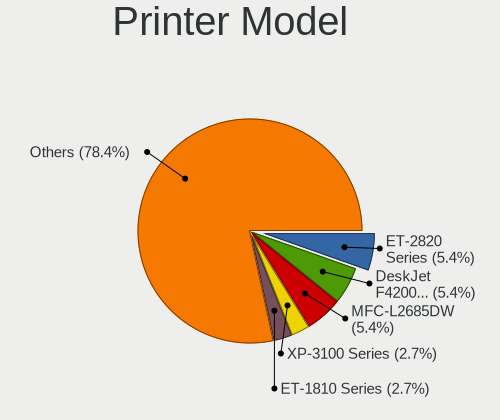

| Model                            | Computers | Percent |
|----------------------------------|-----------|---------|
| HP DeskJet F4200 series          | 2         | 7.69%   |
| Brother MFC-L2685DW              | 2         | 7.69%   |
| Seiko Epson XP-3100 Series       | 1         | 3.85%   |
| Seiko Epson ET-2820 Series       | 1         | 3.85%   |
| Seiko Epson ET-1810 Series       | 1         | 3.85%   |
| Samsung SCX-3400 Series          | 1         | 3.85%   |
| Samsung ML-1670 Series           | 1         | 3.85%   |
| Ricoh SP C260SFNw                | 1         | 3.85%   |
| Minolta PagePro 1200W            | 1         | 3.85%   |
| Konica Minolta 185               | 1         | 3.85%   |
| HP OfficeJet Pro 8730            | 1         | 3.85%   |
| HP OfficeJet 6200                | 1         | 3.85%   |
| HP LaserJet Pro M404-M405        | 1         | 3.85%   |
| HP LaserJet P1006                | 1         | 3.85%   |
| HP LaserJet 3050                 | 1         | 3.85%   |
| HP DeskJet 4100 series           | 1         | 3.85%   |
| HP DeskJet 2700 series           | 1         | 3.85%   |
| HP Deskjet 2540 series           | 1         | 3.85%   |
| HP DeskJet 2130 series           | 1         | 3.85%   |
| HP Deskjet 1050 J410             | 1         | 3.85%   |
| Canon TR4600 series              | 1         | 3.85%   |
| Canon LaserShot LBP-1120 Printer | 1         | 3.85%   |
| Canon iP4200                     | 1         | 3.85%   |
| Brother HL-L2300D series         | 1         | 3.85%   |

Scanner Vendor
--------------

Scanner device vendors

| Vendor          | Computers | Percent |
|-----------------|-----------|---------|
| Seiko Epson     | 2         | 40%     |
| Canon           | 2         | 40%     |
| Hewlett-Packard | 1         | 20%     |

Scanner Model
-------------

Scanner device models

| Model                                         | Computers | Percent |
|-----------------------------------------------|-----------|---------|
| Seiko Epson GT-X820 [Perfection V600 Photo]   | 1         | 20%     |
| Seiko Epson GT-8300UF [Perfection 1660 PHOTO] | 1         | 20%     |
| HP ScanJet 3800c                              | 1         | 20%     |
| Canon CanoScan N1240U/LiDE 30                 | 1         | 20%     |
| Canon CanoScan LiDE 110                       | 1         | 20%     |

Camera
------

Camera Vendor
-------------

Camera device vendors

| Vendor                                 | Computers | Percent |
|----------------------------------------|-----------|---------|
| Chicony Electronics                    | 115       | 20.8%   |
| IMC Networks                           | 47        | 8.5%    |
| Microdia                               | 41        | 7.41%   |
| Sunplus Innovation Technology          | 37        | 6.69%   |
| Bison Electronics                      | 35        | 6.33%   |
| Quanta                                 | 33        | 5.97%   |
| Suyin                                  | 32        | 5.79%   |
| Realtek Semiconductor                  | 31        | 5.61%   |
| Logitech                               | 24        | 4.34%   |
| Cheng Uei Precision Industry (Foxlink) | 19        | 3.44%   |
| Apple                                  | 19        | 3.44%   |
| Syntek                                 | 11        | 1.99%   |
| Silicon Motion                         | 10        | 1.81%   |
| Alcor Micro                            | 10        | 1.81%   |
| Luxvisions Innotech Limited            | 9         | 1.63%   |
| Ricoh                                  | 8         | 1.45%   |
| Acer                                   | 8         | 1.45%   |
| Z-Star Microelectronics                | 6         | 1.08%   |
| Lite-On Technology                     | 6         | 1.08%   |
| Importek                               | 6         | 1.08%   |
| Microsoft                              | 5         | 0.9%    |
| Sunplus Technology                     | 3         | 0.54%   |
| OmniVision Technologies                | 3         | 0.54%   |
| Lenovo                                 | 3         | 0.54%   |
| ALi                                    | 3         | 0.54%   |
| Sonix Technology                       | 2         | 0.36%   |
| Samsung Electronics                    | 2         | 0.36%   |
| MacroSilicon                           | 2         | 0.36%   |
| KYE Systems (Mouse Systems)            | 2         | 0.36%   |
| Huawei Technologies                    | 2         | 0.36%   |
| Generalplus Technology                 | 2         | 0.36%   |
| Creative Technology                    | 2         | 0.36%   |
| Xiongmai                               | 1         | 0.18%   |
| WCM_USB                                | 1         | 0.18%   |
| ShineTech                              | 1         | 0.18%   |
| Shenzhen Kingcome Optoelectronic       | 1         | 0.18%   |
| Service & Quality Technology           | 1         | 0.18%   |
| Razer USA                              | 1         | 0.18%   |
| Pixart Imaging                         | 1         | 0.18%   |
| Nintendo                               | 1         | 0.18%   |

Camera Model
------------

Camera device models

| Model                                                          | Computers | Percent |
|----------------------------------------------------------------|-----------|---------|
| Chicony integrated camera                                      | 27        | 4.83%   |
| Microdia Integrated_Webcam_HD                                  | 18        | 3.22%   |
| Bison Integrated Camera                                        | 11        | 1.97%   |
| Chicony HD WebCam                                              | 10        | 1.79%   |
| IMC Networks USB2.0 HD UVC WebCam                              | 9         | 1.61%   |
| IMC Networks Integrated Camera                                 | 9         | 1.61%   |
| Realtek Integrated_Webcam_HD                                   | 8         | 1.43%   |
| Quanta HP Webcam                                               | 8         | 1.43%   |
| IMC Networks USB2.0 VGA UVC WebCam                             | 8         | 1.43%   |
| Quanta HP TrueVision HD Camera                                 | 7         | 1.25%   |
| Logitech Webcam C270                                           | 7         | 1.25%   |
| Chicony HP TrueVision HD Camera                                | 7         | 1.25%   |
| Apple Built-in iSight                                          | 7         | 1.25%   |
| Suyin HP TrueVision HD                                         | 6         | 1.07%   |
| Realtek USB camera                                             | 6         | 1.07%   |
| Cheng Uei Precision Industry (Foxlink) HP TrueVision HD Camera | 6         | 1.07%   |
| Alcor Micro USB 2.0 Camera                                     | 6         | 1.07%   |
| Syntek Integrated Camera                                       | 5         | 0.89%   |
| Sunplus Integrated_Webcam_HD                                   | 5         | 0.89%   |
| Luxvisions Innotech Limited HP TrueVision HD Camera            | 5         | 0.89%   |
| Chicony USB2.0 HD UVC WebCam                                   | 5         | 0.89%   |
| Chicony HP HD Camera                                           | 5         | 0.89%   |
| Cheng Uei Precision Industry (Foxlink) HP Webcam               | 5         | 0.89%   |
| Sunplus Laptop_Integrated_Webcam_HD                            | 4         | 0.72%   |
| Sunplus HP TrueVision HD Camera                                | 4         | 0.72%   |
| Sunplus HD WebCam                                              | 4         | 0.72%   |
| Realtek Lenovo EasyCamera                                      | 4         | 0.72%   |
| Quanta VGA WebCam                                              | 4         | 0.72%   |
| Logitech Webcam C310                                           | 4         | 0.72%   |
| IMC Networks EasyCamera                                        | 4         | 0.72%   |
| Chicony USB 2.0 Camera                                         | 4         | 0.72%   |
| Bison Lenovo EasyCamera                                        | 4         | 0.72%   |
| Bison HD Webcam                                                | 4         | 0.72%   |
| Apple iPhone 5/5C/5S/6/SE                                      | 4         | 0.72%   |
| Suyin HD WebCam                                                | 3         | 0.54%   |
| Suyin HD Video WebCam                                          | 3         | 0.54%   |
| Suyin Acer/HP Integrated Webcam [CN0314]                       | 3         | 0.54%   |
| Suyin Acer CrystalEye Webcam                                   | 3         | 0.54%   |
| Suyin 1.3M HD WebCam                                           | 3         | 0.54%   |
| Sunplus Laptop_Integrated_Webcam_FHD                           | 3         | 0.54%   |

Security
--------

Fingerprint Vendor
------------------

Fingerprint sensor vendors

| Vendor                     | Computers | Percent |
|----------------------------|-----------|---------|
| Validity Sensors           | 34        | 37.78%  |
| Synaptics                  | 14        | 15.56%  |
| AuthenTec                  | 12        | 13.33%  |
| Shenzhen Goodix Technology | 7         | 7.78%   |
| Upek                       | 5         | 5.56%   |
| STMicroelectronics         | 5         | 5.56%   |
| Elan Microelectronics      | 5         | 5.56%   |
| LighTuning Technology      | 4         | 4.44%   |
| Focal-systems.Corp         | 2         | 2.22%   |
| Samsung Electronics        | 1         | 1.11%   |
| Microsoft                  | 1         | 1.11%   |

Fingerprint Model
-----------------

Fingerprint sensor models

| Model                                                    | Computers | Percent |
|----------------------------------------------------------|-----------|---------|
| Validity Sensors VFS495 Fingerprint Reader               | 6         | 6.67%   |
| Validity Sensors VFS301 Fingerprint Reader               | 5         | 5.56%   |
| Validity Sensors Fingerprint scanner                     | 5         | 5.56%   |
| Upek Biometric Touchchip/Touchstrip Fingerprint Sensor   | 5         | 5.56%   |
| STMicroelectronics Fingerprint Reader                    | 5         | 5.56%   |
| Shenzhen Goodix  Fingerprint Device                      | 4         | 4.44%   |
| Elan ELAN:Fingerprint                                    | 4         | 4.44%   |
| AuthenTec AES1600                                        | 4         | 4.44%   |
| Validity Sensors VFS5011 Fingerprint Reader              | 3         | 3.33%   |
| Validity Sensors VFS451 Fingerprint Reader               | 3         | 3.33%   |
| AuthenTec Fingerprint Sensor                             | 3         | 3.33%   |
| AuthenTec AES2501 Fingerprint Sensor                     | 3         | 3.33%   |
| Validity Sensors VFS7500 Touch Fingerprint Sensor        | 2         | 2.22%   |
| Validity Sensors VFS491                                  | 2         | 2.22%   |
| Validity Sensors VFS 5011 fingerprint sensor             | 2         | 2.22%   |
| Validity Sensors Synaptics WBDI                          | 2         | 2.22%   |
| Synaptics WBDI                                           | 2         | 2.22%   |
| Synaptics UWP WBDI Device                                | 2         | 2.22%   |
| Synaptics Prometheus MIS Touch Fingerprint Reader        | 2         | 2.22%   |
| Synaptics Metallica MOH Touch Fingerprint Reader         | 2         | 2.22%   |
| Synaptics FS7604 Touch Fingerprint Sensor with PurePrint | 2         | 2.22%   |
| Shenzhen Goodix Fingerprint Reader                       | 2         | 2.22%   |
| LighTuning EgisTec Touch Fingerprint Sensor              | 2         | 2.22%   |
| Focal-systems.Corp FT9201Fingerprint.                    | 2         | 2.22%   |
| AuthenTec AES2810                                        | 2         | 2.22%   |
| Validity Sensors VFS7552 Touch Fingerprint Sensor        | 1         | 1.11%   |
| Validity Sensors VFS101 Fingerprint Reader               | 1         | 1.11%   |
| Validity Sensors VFS Fingerprint sensor                  | 1         | 1.11%   |
| Validity Sensors Swipe Fingerprint Sensor                | 1         | 1.11%   |
| Synaptics WBDI Fingerprint Reader USB 102                | 1         | 1.11%   |
| Synaptics UWP WBDI                                       | 1         | 1.11%   |
| Synaptics Metallica MIS Touch Fingerprint Reader         | 1         | 1.11%   |
| Synaptics Fingerprint reader [HP G6]                     | 1         | 1.11%   |
| Shenzhen Goodix FingerPrint                              | 1         | 1.11%   |
| Samsung Fingerprint Sensor Device - 730B                 | 1         | 1.11%   |
| Microsoft Fingerprint Reader                             | 1         | 1.11%   |
| LighTuning Fingerprint Reader                            | 1         | 1.11%   |
| LighTuning ES603 Swipe Fingerprint Sensor                | 1         | 1.11%   |
| Elan ELAN:ARM-M4                                         | 1         | 1.11%   |

Chipcard Vendor
---------------

Chipcard module vendors

| Vendor                            | Computers | Percent |
|-----------------------------------|-----------|---------|
| Broadcom                          | 20        | 50%     |
| Alcor Micro                       | 6         | 15%     |
| O2 Micro                          | 5         | 12.5%   |
| Lenovo                            | 3         | 7.5%    |
| Upek                              | 2         | 5%      |
| VASCO Data Security International | 1         | 2.5%    |
| OmniKey                           | 1         | 2.5%    |
| Jing-Mold Enterprise              | 1         | 2.5%    |
| Gemalto (was Gemplus)             | 1         | 2.5%    |

Chipcard Model
--------------

Chipcard module models

| Model                                                                        | Computers | Percent |
|------------------------------------------------------------------------------|-----------|---------|
| Broadcom BCM5880 Secure Applications Processor                               | 8         | 20%     |
| Alcor Micro AU9540 Smartcard Reader                                          | 6         | 15%     |
| Broadcom BCM5880 Secure Applications Processor with fingerprint swipe sensor | 5         | 12.5%   |
| O2 Micro OZ776 CCID Smartcard Reader                                         | 4         | 10%     |
| Lenovo Integrated Smart Card Reader                                          | 3         | 7.5%    |
| Broadcom 5880                                                                | 3         | 7.5%    |
| Broadcom 58200                                                               | 3         | 7.5%    |
| Upek TouchChip Fingerprint Coprocessor (WBF advanced mode)                   | 2         | 5%      |
| VASCO Data Security International DIGIPASS 870                               | 1         | 2.5%    |
| OmniKey CardMan 1021                                                         | 1         | 2.5%    |
| O2 Micro Oz776 SmartCard Reader                                              | 1         | 2.5%    |
| Jing-Mold Enterprise HP USB Business Slim Smartcard CCID Keyboard            | 1         | 2.5%    |
| Gemalto (was Gemplus) Compact Smart Card Reader Writer                       | 1         | 2.5%    |
| Broadcom BCM5880 Secure Applications Processor with fingerprint touch sensor | 1         | 2.5%    |

Unsupported
-----------

Unsupported Devices
-------------------

Total unsupported devices on board

| Total | Computers | Percent |
|-------|-----------|---------|
| 0     | 650       | 65%     |
| 1     | 278       | 27.8%   |
| 2     | 52        | 5.2%    |
| 3     | 16        | 1.6%    |
| 4     | 3         | 0.3%    |
| 6     | 1         | 0.1%    |

Unsupported Device Types
------------------------

Types of unsupported devices

| Type                     | Computers | Percent |
|--------------------------|-----------|---------|
| Graphics card            | 128       | 29.56%  |
| Net/wireless             | 91        | 21.02%  |
| Fingerprint reader       | 89        | 20.55%  |
| Chipcard                 | 36        | 8.31%   |
| Multimedia controller    | 33        | 7.62%   |
| Communication controller | 15        | 3.46%   |
| Storage                  | 9         | 2.08%   |
| Bluetooth                | 6         | 1.39%   |
| Unassigned class         | 4         | 0.92%   |
| Camera                   | 4         | 0.92%   |
| Network                  | 3         | 0.69%   |
| Flash memory             | 3         | 0.69%   |
| Sound                    | 2         | 0.46%   |
| Net/ethernet             | 2         | 0.46%   |
| Modem                    | 2         | 0.46%   |
| Card reader              | 2         | 0.46%   |
| Storage/raid             | 1         | 0.23%   |
| Storage/nvme             | 1         | 0.23%   |
| Storage/ide              | 1         | 0.23%   |
| Dvb card                 | 1         | 0.23%   |

