LMDE - Tested Hardware & Statistics
-----------------------------------

A project to collect tested hardware configurations for LMDE.

Anyone can contribute to this report by the [hw-probe](https://github.com/linuxhw/hw-probe) tool:

    sudo -E hw-probe -all -upload

Please contribute! Especially if your hardware is rare.

This is a report for all computer types. See also reports for [desktops](/Dist/LMDE/Desktop/README.md) and [notebooks](/Dist/LMDE/Notebook/README.md).

Contents
--------

* [ Test Cases ](#test-cases)

* [ System ](#system)
  - [ OS                       ](#os)
  - [ OS Family                ](#os-family)
  - [ Kernel                   ](#kernel)
  - [ Kernel Family            ](#kernel-family)
  - [ Kernel Major Ver.        ](#kernel-major-ver)
  - [ Arch                     ](#arch)
  - [ DE                       ](#de)
  - [ Display Server           ](#display-server)
  - [ Display Manager          ](#display-manager)
  - [ OS Lang                  ](#os-lang)
  - [ Boot Mode                ](#boot-mode)
  - [ Filesystem               ](#filesystem)
  - [ Part. scheme             ](#part-scheme)
  - [ Dual Boot with Linux/BSD ](#dual-boot-with-linuxbsd)
  - [ Dual Boot (Win)          ](#dual-boot-win)

* [ Board ](#board)
  - [ Vendor                   ](#vendor)
  - [ Model                    ](#model)
  - [ Model Family             ](#model-family)
  - [ MFG Year                 ](#mfg-year)
  - [ Form Factor              ](#form-factor)
  - [ Secure Boot              ](#secure-boot)
  - [ Coreboot                 ](#coreboot)
  - [ RAM Size                 ](#ram-size)
  - [ RAM Used                 ](#ram-used)
  - [ Total Drives             ](#total-drives)
  - [ Has CD-ROM               ](#has-cd-rom)
  - [ Has Ethernet             ](#has-ethernet)
  - [ Has WiFi                 ](#has-wifi)
  - [ Has Bluetooth            ](#has-bluetooth)

* [ Location ](#location)
  - [ Country                  ](#country)
  - [ City                     ](#city)

* [ Drives ](#drives)
  - [ Drive Vendor             ](#drive-vendor)
  - [ Drive Model              ](#drive-model)
  - [ HDD Vendor               ](#hdd-vendor)
  - [ SSD Vendor               ](#ssd-vendor)
  - [ Drive Kind               ](#drive-kind)
  - [ Drive Connector          ](#drive-connector)
  - [ Drive Size               ](#drive-size)
  - [ Space Total              ](#space-total)
  - [ Space Used               ](#space-used)
  - [ Malfunc. Drives          ](#malfunc-drives)
  - [ Malfunc. Drive Vendor    ](#malfunc-drive-vendor)
  - [ Malfunc. HDD Vendor      ](#malfunc-hdd-vendor)
  - [ Malfunc. Drive Kind      ](#malfunc-drive-kind)
  - [ Failed Drives            ](#failed-drives)
  - [ Failed Drive Vendor      ](#failed-drive-vendor)
  - [ Drive Status             ](#drive-status)

* [ Storage controller ](#storage-controller)
  - [ Storage Vendor           ](#storage-vendor)
  - [ Storage Model            ](#storage-model)
  - [ Storage Kind             ](#storage-kind)

* [ Processor ](#processor)
  - [ CPU Vendor               ](#cpu-vendor)
  - [ CPU Model                ](#cpu-model)
  - [ CPU Model Family         ](#cpu-model-family)
  - [ CPU Cores                ](#cpu-cores)
  - [ CPU Sockets              ](#cpu-sockets)
  - [ CPU Threads              ](#cpu-threads)
  - [ CPU Op-Modes             ](#cpu-op-modes)
  - [ CPU Microcode            ](#cpu-microcode)
  - [ CPU Microarch            ](#cpu-microarch)

* [ Graphics ](#graphics)
  - [ GPU Vendor               ](#gpu-vendor)
  - [ GPU Model                ](#gpu-model)
  - [ GPU Combo                ](#gpu-combo)
  - [ GPU Driver               ](#gpu-driver)
  - [ GPU Memory               ](#gpu-memory)

* [ Monitor ](#monitor)
  - [ Monitor Vendor           ](#monitor-vendor)
  - [ Monitor Model            ](#monitor-model)
  - [ Monitor Resolution       ](#monitor-resolution)
  - [ Monitor Diagonal         ](#monitor-diagonal)
  - [ Monitor Width            ](#monitor-width)
  - [ Aspect Ratio             ](#aspect-ratio)
  - [ Monitor Area             ](#monitor-area)
  - [ Pixel Density            ](#pixel-density)
  - [ Multiple Monitors        ](#multiple-monitors)

* [ Network ](#network)
  - [ Net Controller Vendor    ](#net-controller-vendor)
  - [ Net Controller Model     ](#net-controller-model)
  - [ Wireless Vendor          ](#wireless-vendor)
  - [ Wireless Model           ](#wireless-model)
  - [ Ethernet Vendor          ](#ethernet-vendor)
  - [ Ethernet Model           ](#ethernet-model)
  - [ Net Controller Kind      ](#net-controller-kind)
  - [ Used Controller          ](#used-controller)
  - [ NICs                     ](#nics)
  - [ IPv6                     ](#ipv6)

* [ Bluetooth ](#bluetooth)
  - [ Bluetooth Vendor         ](#bluetooth-vendor)
  - [ Bluetooth Model          ](#bluetooth-model)

* [ Sound ](#sound)
  - [ Sound Vendor             ](#sound-vendor)
  - [ Sound Model              ](#sound-model)

* [ Memory ](#memory)
  - [ Memory Vendor            ](#memory-vendor)
  - [ Memory Model             ](#memory-model)
  - [ Memory Kind              ](#memory-kind)
  - [ Memory Form Factor       ](#memory-form-factor)
  - [ Memory Size              ](#memory-size)
  - [ Memory Speed             ](#memory-speed)

* [ Printers & scanners ](#printers--scanners)
  - [ Printer Vendor           ](#printer-vendor)
  - [ Printer Model            ](#printer-model)
  - [ Scanner Vendor           ](#scanner-vendor)
  - [ Scanner Model            ](#scanner-model)

* [ Camera ](#camera)
  - [ Camera Vendor            ](#camera-vendor)
  - [ Camera Model             ](#camera-model)

* [ Security ](#security)
  - [ Fingerprint Vendor       ](#fingerprint-vendor)
  - [ Fingerprint Model        ](#fingerprint-model)
  - [ Chipcard Vendor          ](#chipcard-vendor)
  - [ Chipcard Model           ](#chipcard-model)

* [ Unsupported ](#unsupported)
  - [ Unsupported Devices      ](#unsupported-devices)
  - [ Unsupported Device Types ](#unsupported-device-types)

Test Cases
----------

Total: 1144

| Vendor        | Model                       | Form-Factor | Probe                                                      | Date         |
|---------------|-----------------------------|-------------|------------------------------------------------------------|--------------|
| Lenovo        | 4068AGJ                     | Notebook    | [6a2c3207b5](https://linux-hardware.org/?probe=6a2c3207b5) | May 01, 2023 |
| HP            | Compaq 15                   | Notebook    | [0c65bb3d3c](https://linux-hardware.org/?probe=0c65bb3d3c) | May 01, 2023 |
| ASUSTek       | P7Q57-M DO                  | Desktop     | [897fc61b8c](https://linux-hardware.org/?probe=897fc61b8c) | Apr 30, 2023 |
| ASUSTek       | P7Q57-M DO                  | Desktop     | [4f502dcb59](https://linux-hardware.org/?probe=4f502dcb59) | Apr 30, 2023 |
| Medion        | E6214                       | Notebook    | [7bb9f39d76](https://linux-hardware.org/?probe=7bb9f39d76) | Apr 30, 2023 |
| Medion        | E6214                       | Notebook    | [39747632e6](https://linux-hardware.org/?probe=39747632e6) | Apr 30, 2023 |
| Gigabyte      | Q87M-D2H                    | Desktop     | [16279b3c8b](https://linux-hardware.org/?probe=16279b3c8b) | Apr 30, 2023 |
| Medion        | TJ4125                      | Desktop     | [ad46974b2a](https://linux-hardware.org/?probe=ad46974b2a) | Apr 29, 2023 |
| ASRock        | B450M Pro4                  | Desktop     | [7c8260664a](https://linux-hardware.org/?probe=7c8260664a) | Apr 29, 2023 |
| Toshiba       | Satellite C850-D8K          | Notebook    | [a27eb72e94](https://linux-hardware.org/?probe=a27eb72e94) | Apr 29, 2023 |
| HP            | 250 G7 Notebook PC          | Notebook    | [e5fe9aa407](https://linux-hardware.org/?probe=e5fe9aa407) | Apr 29, 2023 |
| Insyde        | CherryTrail                 | Notebook    | [73e11e9235](https://linux-hardware.org/?probe=73e11e9235) | Apr 29, 2023 |
| Toshiba       | Satellite C850-D8K          | Notebook    | [f2f50094ba](https://linux-hardware.org/?probe=f2f50094ba) | Apr 28, 2023 |
| Medion        | TJ4125                      | Desktop     | [8f319cff50](https://linux-hardware.org/?probe=8f319cff50) | Apr 28, 2023 |
| ASRock        | B450M Pro4                  | Desktop     | [831cd8fa39](https://linux-hardware.org/?probe=831cd8fa39) | Apr 28, 2023 |
| Gigabyte      | Q87M-D2H                    | Desktop     | [6503ed5a4c](https://linux-hardware.org/?probe=6503ed5a4c) | Apr 28, 2023 |
| ASUSTek       | Z550SA                      | Notebook    | [7c6c0c9599](https://linux-hardware.org/?probe=7c6c0c9599) | Apr 28, 2023 |
| GPU Compan... | GWTN156-5                   | Notebook    | [60d207eb63](https://linux-hardware.org/?probe=60d207eb63) | Apr 27, 2023 |
| GPU Compan... | GWTN156-5                   | Notebook    | [df6b1e8e17](https://linux-hardware.org/?probe=df6b1e8e17) | Apr 26, 2023 |
| GPU Compan... | GWTN156-5                   | Notebook    | [a22605adc9](https://linux-hardware.org/?probe=a22605adc9) | Apr 25, 2023 |
| Acer          | Aspire A515-56              | Notebook    | [a3a13c5cb1](https://linux-hardware.org/?probe=a3a13c5cb1) | Apr 24, 2023 |
| Acer          | Aspire A515-56              | Notebook    | [1d5b5dcfc7](https://linux-hardware.org/?probe=1d5b5dcfc7) | Apr 24, 2023 |
| Gigabyte      | Q87M-D2H                    | Desktop     | [5827cd2604](https://linux-hardware.org/?probe=5827cd2604) | Apr 23, 2023 |
| Medion        | TJ4125                      | Desktop     | [faa241e4bc](https://linux-hardware.org/?probe=faa241e4bc) | Apr 23, 2023 |
| LG Electro... | A530-T.BE76P1               | Notebook    | [8bb0353706](https://linux-hardware.org/?probe=8bb0353706) | Apr 22, 2023 |
| LG Electro... | A530-T.BE76P1               | Notebook    | [b699c8ed48](https://linux-hardware.org/?probe=b699c8ed48) | Apr 22, 2023 |
| LG Electro... | A530-T.BE76P1               | Notebook    | [f5c282ca6c](https://linux-hardware.org/?probe=f5c282ca6c) | Apr 22, 2023 |
| MSI           | MPG X570 GAMING PLUS        | Desktop     | [93a6cb1a8a](https://linux-hardware.org/?probe=93a6cb1a8a) | Apr 22, 2023 |
| GPU Compan... | GWTN156-2BK                 | Notebook    | [3f172b49f2](https://linux-hardware.org/?probe=3f172b49f2) | Apr 21, 2023 |
| Lenovo        | ThinkPad T420 4180FP9       | Notebook    | [655c151267](https://linux-hardware.org/?probe=655c151267) | Apr 20, 2023 |
| Fujitsu Si... | AMILO Pro Edition V3505     | Notebook    | [ac404082b4](https://linux-hardware.org/?probe=ac404082b4) | Apr 18, 2023 |
| Apple         | MacBookPro9,2               | Notebook    | [9f2a7943c7](https://linux-hardware.org/?probe=9f2a7943c7) | Apr 17, 2023 |
| Gear          | Geranium                    | Notebook    | [5e67931961](https://linux-hardware.org/?probe=5e67931961) | Apr 17, 2023 |
| Gear          | Geranium                    | Notebook    | [fe70506e6c](https://linux-hardware.org/?probe=fe70506e6c) | Apr 17, 2023 |
| Medion        | E6214                       | Notebook    | [ff06e74c6d](https://linux-hardware.org/?probe=ff06e74c6d) | Apr 16, 2023 |
| Lenovo        | ThinkPad X270 W10DG 20K5... | Notebook    | [40ec2e0cba](https://linux-hardware.org/?probe=40ec2e0cba) | Apr 16, 2023 |
| Medion        | E6214                       | Notebook    | [ab33cd63b8](https://linux-hardware.org/?probe=ab33cd63b8) | Apr 16, 2023 |
| Gigabyte      | A520M DS3H                  | Desktop     | [c4b35f2a05](https://linux-hardware.org/?probe=c4b35f2a05) | Apr 16, 2023 |
| Apple         | MacBookPro11,1              | Notebook    | [12cb955c6f](https://linux-hardware.org/?probe=12cb955c6f) | Apr 15, 2023 |
| Unknown       | Unknown                     | Notebook    | [7bd7802e04](https://linux-hardware.org/?probe=7bd7802e04) | Apr 14, 2023 |
| Intel         | SHARKBAY                    | Desktop     | [3bb10a5574](https://linux-hardware.org/?probe=3bb10a5574) | Apr 12, 2023 |
| ASUSTek       | ROG STRIX B450-F GAMING     | Desktop     | [d6f8675bc9](https://linux-hardware.org/?probe=d6f8675bc9) | Apr 11, 2023 |
| Intel         | SHARKBAY                    | Desktop     | [4b50be64da](https://linux-hardware.org/?probe=4b50be64da) | Apr 11, 2023 |
| Gigabyte      | Q87M-D2H                    | Desktop     | [d041ee40cc](https://linux-hardware.org/?probe=d041ee40cc) | Apr 11, 2023 |
| Gigabyte      | Q87M-D2H                    | Desktop     | [2c83dbd3ef](https://linux-hardware.org/?probe=2c83dbd3ef) | Apr 08, 2023 |
| Dell          | 0KWVT8 A00                  | Desktop     | [d1e9eaed8b](https://linux-hardware.org/?probe=d1e9eaed8b) | Apr 08, 2023 |
| Dell          | 0KWVT8 A00                  | Desktop     | [82a96ca347](https://linux-hardware.org/?probe=82a96ca347) | Apr 08, 2023 |
| HP            | Pavilion x360 Convertibl... | Convertible | [05aaab32ca](https://linux-hardware.org/?probe=05aaab32ca) | Apr 08, 2023 |
| HP            | ZBook 15 G4                 | Notebook    | [816bb7a55c](https://linux-hardware.org/?probe=816bb7a55c) | Apr 06, 2023 |
| Dell          | Precision M4800             | Notebook    | [9283851416](https://linux-hardware.org/?probe=9283851416) | Apr 06, 2023 |
| Kruger&Mat... | KM1406                      | Notebook    | [1b536904d4](https://linux-hardware.org/?probe=1b536904d4) | Apr 05, 2023 |
| GPU Compan... | GWTN156-2BK                 | Notebook    | [3ebdd0188a](https://linux-hardware.org/?probe=3ebdd0188a) | Apr 05, 2023 |
| HP            | 250 G7 Notebook PC          | Notebook    | [3995abb8b8](https://linux-hardware.org/?probe=3995abb8b8) | Apr 04, 2023 |
| Toshiba       | Satellite L300D             | Notebook    | [9d90029e27](https://linux-hardware.org/?probe=9d90029e27) | Apr 04, 2023 |
| Gigabyte      | Q87M-D2H                    | Desktop     | [4552b7c999](https://linux-hardware.org/?probe=4552b7c999) | Apr 01, 2023 |
| Medion        | E6214                       | Notebook    | [79f326e572](https://linux-hardware.org/?probe=79f326e572) | Apr 01, 2023 |
| Gigabyte      | Q87M-D2H                    | Desktop     | [b627db43dd](https://linux-hardware.org/?probe=b627db43dd) | Apr 01, 2023 |
| Medion        | E6214                       | Notebook    | [5766389c97](https://linux-hardware.org/?probe=5766389c97) | Apr 01, 2023 |
| ASUSTek       | P7P55D                      | Desktop     | [b50f27ad05](https://linux-hardware.org/?probe=b50f27ad05) | Mar 31, 2023 |
| Acer          | Aspire A514-53              | Notebook    | [4bb2babc0a](https://linux-hardware.org/?probe=4bb2babc0a) | Mar 31, 2023 |
| Dell          | 00F82W A02                  | Desktop     | [8bf22304e0](https://linux-hardware.org/?probe=8bf22304e0) | Mar 31, 2023 |
| Medion        | E6214                       | Notebook    | [298e2f9c69](https://linux-hardware.org/?probe=298e2f9c69) | Mar 31, 2023 |
| HP            | Pavilion dm4                | Notebook    | [b7f2f9e2ab](https://linux-hardware.org/?probe=b7f2f9e2ab) | Mar 31, 2023 |
| Lenovo        | IdeaPad 100-14IBY 80MH      | Notebook    | [976d8a1a13](https://linux-hardware.org/?probe=976d8a1a13) | Mar 30, 2023 |
| HP            | Pavilion Notebook           | Notebook    | [3844e429b1](https://linux-hardware.org/?probe=3844e429b1) | Mar 30, 2023 |
| ASUSTek       | ZenBook UX333FA_UX333FA     | Notebook    | [e7e49e22ba](https://linux-hardware.org/?probe=e7e49e22ba) | Mar 30, 2023 |
| HP            | Pavilion Notebook           | Notebook    | [9cb1834208](https://linux-hardware.org/?probe=9cb1834208) | Mar 28, 2023 |
| ASUSTek       | P5GC-VM/SI                  | Desktop     | [b53d1202dc](https://linux-hardware.org/?probe=b53d1202dc) | Mar 28, 2023 |
| Gigabyte      | Q87M-D2H                    | Desktop     | [dd71be113d](https://linux-hardware.org/?probe=dd71be113d) | Mar 27, 2023 |
| Lenovo        | ThinkPad T14 Gen 3 21AJS... | Notebook    | [701b74ce3e](https://linux-hardware.org/?probe=701b74ce3e) | Mar 27, 2023 |
| ASUSTek       | P5GC-VM/SI                  | Desktop     | [e5cef530ff](https://linux-hardware.org/?probe=e5cef530ff) | Mar 27, 2023 |
| Lenovo        | ThinkPad X230 Tablet 343... | Notebook    | [6ac9c53a7e](https://linux-hardware.org/?probe=6ac9c53a7e) | Mar 26, 2023 |
| Medion        | E6214                       | Notebook    | [8ff346be04](https://linux-hardware.org/?probe=8ff346be04) | Mar 26, 2023 |
| Gigabyte      | Q87M-D2H                    | Desktop     | [8690ae647e](https://linux-hardware.org/?probe=8690ae647e) | Mar 26, 2023 |
| Haier         | S15                         | Notebook    | [497105206c](https://linux-hardware.org/?probe=497105206c) | Mar 25, 2023 |
| Acer          | Aspire E1-572G              | Notebook    | [ce4febfe16](https://linux-hardware.org/?probe=ce4febfe16) | Mar 25, 2023 |
| Haier         | S15                         | Notebook    | [083feb0355](https://linux-hardware.org/?probe=083feb0355) | Mar 25, 2023 |
| Toshiba       | Satellite Pro A50-C         | Notebook    | [2fe9003124](https://linux-hardware.org/?probe=2fe9003124) | Mar 24, 2023 |
| Toshiba       | Satellite Pro A50-C         | Notebook    | [95c5c45220](https://linux-hardware.org/?probe=95c5c45220) | Mar 24, 2023 |
| Star Labs     | StarBook                    | Notebook    | [b3957ad08f](https://linux-hardware.org/?probe=b3957ad08f) | Mar 22, 2023 |
| BESSTAR Te... | TH50                        | Desktop     | [7165e2c0d0](https://linux-hardware.org/?probe=7165e2c0d0) | Mar 21, 2023 |
| Gigabyte      | A520M DS3H                  | Desktop     | [79104099a5](https://linux-hardware.org/?probe=79104099a5) | Mar 20, 2023 |
| Gigabyte      | Q87M-D2H                    | Desktop     | [fb5c67c585](https://linux-hardware.org/?probe=fb5c67c585) | Mar 19, 2023 |
| Gigabyte      | Q87M-D2H                    | Desktop     | [7051e25dc0](https://linux-hardware.org/?probe=7051e25dc0) | Mar 18, 2023 |
| Dell          | Venue 11 Pro 7130 MS        | Notebook    | [2a3bb3e212](https://linux-hardware.org/?probe=2a3bb3e212) | Mar 18, 2023 |
| Dell          | Venue 11 Pro 7130 MS        | Notebook    | [56fab2cb17](https://linux-hardware.org/?probe=56fab2cb17) | Mar 18, 2023 |
| Lenovo        | IdeaPad 320-15AST 80XV      | Notebook    | [f7727e4bcb](https://linux-hardware.org/?probe=f7727e4bcb) | Mar 17, 2023 |
| ASRock        | B365M Pro4                  | Desktop     | [e237668eb2](https://linux-hardware.org/?probe=e237668eb2) | Mar 15, 2023 |
| ASUSTek       | ROG STRIX B450-F GAMING     | Desktop     | [29f50579db](https://linux-hardware.org/?probe=29f50579db) | Mar 15, 2023 |
| Gigabyte      | A320M-S2H-CF                | Desktop     | [bf2b5490ba](https://linux-hardware.org/?probe=bf2b5490ba) | Mar 15, 2023 |
| Acer          | Swift SF314-51              | Notebook    | [b410a4c017](https://linux-hardware.org/?probe=b410a4c017) | Mar 14, 2023 |
| HP            | Pavilion dv6                | Notebook    | [f649c78020](https://linux-hardware.org/?probe=f649c78020) | Mar 13, 2023 |
| Lenovo        | ThinkPad X230 2325Y2S       | Notebook    | [7f15f7ce79](https://linux-hardware.org/?probe=7f15f7ce79) | Mar 12, 2023 |
| Gigabyte      | Z87X-OC Force-CF            | Desktop     | [17deac9c67](https://linux-hardware.org/?probe=17deac9c67) | Mar 12, 2023 |
| SiYW          | V200 Series                 | Desktop     | [7c3751c888](https://linux-hardware.org/?probe=7c3751c888) | Mar 11, 2023 |
| Dell          | Inspiron 5515               | Notebook    | [22dd14abae](https://linux-hardware.org/?probe=22dd14abae) | Mar 11, 2023 |
| Dynabook      | Satellite Pro C50-G         | Notebook    | [835785f6a7](https://linux-hardware.org/?probe=835785f6a7) | Mar 10, 2023 |
| ASUSTek       | PRIME A320M-K               | Desktop     | [93875c7518](https://linux-hardware.org/?probe=93875c7518) | Mar 09, 2023 |
| MSI           | 970A-G46                    | Desktop     | [8c3d20fa95](https://linux-hardware.org/?probe=8c3d20fa95) | Mar 08, 2023 |
| Lenovo        | ThinkPad Z61m 9450HAG       | Notebook    | [5aa66edd35](https://linux-hardware.org/?probe=5aa66edd35) | Mar 04, 2023 |
| Acer          | Aspire 5732Z                | Notebook    | [bff68efdba](https://linux-hardware.org/?probe=bff68efdba) | Mar 03, 2023 |
| Dell          | 096JG8 A01                  | Desktop     | [fddb284e37](https://linux-hardware.org/?probe=fddb284e37) | Mar 03, 2023 |
| HP            | Pavilion Notebook           | Notebook    | [906cb4b50a](https://linux-hardware.org/?probe=906cb4b50a) | Mar 03, 2023 |
| HP            | Pavilion Notebook           | Notebook    | [2173dea5df](https://linux-hardware.org/?probe=2173dea5df) | Mar 02, 2023 |
| HIPER         | WORKBOOK                    | Notebook    | [85085220c9](https://linux-hardware.org/?probe=85085220c9) | Mar 01, 2023 |
| Supermicro    | X10SAE                      | Server      | [fff44d7132](https://linux-hardware.org/?probe=fff44d7132) | Feb 25, 2023 |
| Toshiba       | Satellite L300              | Notebook    | [c1b163bee0](https://linux-hardware.org/?probe=c1b163bee0) | Feb 25, 2023 |
| Toshiba       | Satellite L300              | Notebook    | [76e5b62eec](https://linux-hardware.org/?probe=76e5b62eec) | Feb 25, 2023 |
| Supermicro    | X10SAE                      | Server      | [b968ea6172](https://linux-hardware.org/?probe=b968ea6172) | Feb 25, 2023 |
| HP            | 2000                        | Notebook    | [2e234233cc](https://linux-hardware.org/?probe=2e234233cc) | Feb 25, 2023 |
| Lenovo        | ThinkPad X260 20F6S02A00    | Notebook    | [5ad40efe5c](https://linux-hardware.org/?probe=5ad40efe5c) | Feb 24, 2023 |
| HP            | 250 G8 Notebook PC          | Notebook    | [08d9bfbb41](https://linux-hardware.org/?probe=08d9bfbb41) | Feb 24, 2023 |
| Gigabyte      | Z590 GAMING X               | Desktop     | [d39a85e759](https://linux-hardware.org/?probe=d39a85e759) | Feb 24, 2023 |
| Lenovo        | ThinkBook 14 G2 ARE 20VF    | Notebook    | [7acab84e04](https://linux-hardware.org/?probe=7acab84e04) | Feb 22, 2023 |
| Medion        | MS-7800                     | Desktop     | [2f542347f9](https://linux-hardware.org/?probe=2f542347f9) | Feb 19, 2023 |
| Lenovo        | ThinkPad X260 20F6S02A00    | Notebook    | [aa5d23bc20](https://linux-hardware.org/?probe=aa5d23bc20) | Feb 19, 2023 |
| Dell          | 0NK70N A03                  | Desktop     | [3da6e11665](https://linux-hardware.org/?probe=3da6e11665) | Feb 18, 2023 |
| itel Mobil... | SPIRIT 2                    | Notebook    | [8c370ddf38](https://linux-hardware.org/?probe=8c370ddf38) | Feb 17, 2023 |
| ASUSTek       | P7P55D                      | Desktop     | [bcae3260be](https://linux-hardware.org/?probe=bcae3260be) | Feb 17, 2023 |
| Foxconn       | 2ABF                        | Desktop     | [2c98a8340f](https://linux-hardware.org/?probe=2c98a8340f) | Feb 17, 2023 |
| Lenovo        | ThinkPad E15 Gen 3 20YG0... | Notebook    | [392442adfb](https://linux-hardware.org/?probe=392442adfb) | Feb 16, 2023 |
| Dell          | 0MF24N A03                  | Desktop     | [e48d83d96d](https://linux-hardware.org/?probe=e48d83d96d) | Feb 15, 2023 |
| Gigabyte      | X570 AORUS MASTER           | Desktop     | [2d26056501](https://linux-hardware.org/?probe=2d26056501) | Feb 13, 2023 |
| Lenovo        | ThinkPad X260 20F6S02A00    | Notebook    | [da4802f871](https://linux-hardware.org/?probe=da4802f871) | Feb 12, 2023 |
| Fanless Mi... | Rev JSL8                    | Mini pc     | [861c0d497e](https://linux-hardware.org/?probe=861c0d497e) | Feb 12, 2023 |
| Compaq        | 420                         | Notebook    | [2028e7c97c](https://linux-hardware.org/?probe=2028e7c97c) | Feb 12, 2023 |
| HP            | ProBook 650 G2              | Notebook    | [b8854f5844](https://linux-hardware.org/?probe=b8854f5844) | Feb 12, 2023 |
| Gigabyte      | B450M S2H                   | Desktop     | [20bcead0e8](https://linux-hardware.org/?probe=20bcead0e8) | Feb 11, 2023 |
| Star Labs     | StarBook                    | Notebook    | [08e31c8ad5](https://linux-hardware.org/?probe=08e31c8ad5) | Feb 10, 2023 |
| HP            | 843C                        | Desktop     | [02ddbb64e8](https://linux-hardware.org/?probe=02ddbb64e8) | Feb 09, 2023 |
| Dell          | Precision M4800             | Notebook    | [3f97bef125](https://linux-hardware.org/?probe=3f97bef125) | Feb 08, 2023 |
| Lenovo        | ThinkPad X260 20F6S02A00    | Notebook    | [3e0851346e](https://linux-hardware.org/?probe=3e0851346e) | Feb 08, 2023 |
| TUXEDO        | N8xxEZ                      | Notebook    | [680bdf5ada](https://linux-hardware.org/?probe=680bdf5ada) | Feb 07, 2023 |
| Gigabyte      | B450 AORUS M                | Desktop     | [e96f495083](https://linux-hardware.org/?probe=e96f495083) | Feb 06, 2023 |
| ASUSTek       | M5A78L-M PLUS/USB3          | Desktop     | [4df21dd9fa](https://linux-hardware.org/?probe=4df21dd9fa) | Feb 05, 2023 |
| ASUSTek       | M5A78L-M PLUS/USB3          | Desktop     | [e42e3a74b4](https://linux-hardware.org/?probe=e42e3a74b4) | Feb 05, 2023 |
| ASUSTek       | P8H61-M LX R2.0             | Desktop     | [1985f76677](https://linux-hardware.org/?probe=1985f76677) | Feb 05, 2023 |
| Lenovo        | ThinkPad X260 20F6S02A00    | Notebook    | [3301121a5c](https://linux-hardware.org/?probe=3301121a5c) | Feb 04, 2023 |
| Samsung       | RV415/RV515                 | Notebook    | [ea50188d5c](https://linux-hardware.org/?probe=ea50188d5c) | Jan 31, 2023 |
| Gigabyte      | B560 DS3H AC-Y1             | Desktop     | [6c094e2027](https://linux-hardware.org/?probe=6c094e2027) | Jan 31, 2023 |
| ASUSTek       | P7P55D                      | Desktop     | [981ae95b2a](https://linux-hardware.org/?probe=981ae95b2a) | Jan 31, 2023 |
| Lenovo        | ThinkPad X270 W10DG 20K5... | Notebook    | [5e5231a159](https://linux-hardware.org/?probe=5e5231a159) | Jan 31, 2023 |
| Samsung       | RV415/RV515                 | Notebook    | [c5999dc406](https://linux-hardware.org/?probe=c5999dc406) | Jan 29, 2023 |
| Lenovo        | IdeaPad 320-15AST 80XV      | Notebook    | [a732875be3](https://linux-hardware.org/?probe=a732875be3) | Jan 29, 2023 |
| Acer          | Aspire 3810T                | Notebook    | [a7b93a7119](https://linux-hardware.org/?probe=a7b93a7119) | Jan 29, 2023 |
| Google        | Candy                       | Notebook    | [2b2368d61b](https://linux-hardware.org/?probe=2b2368d61b) | Jan 28, 2023 |
| Gigabyte      | X570 AORUS ULTRA            | Desktop     | [40152faf5b](https://linux-hardware.org/?probe=40152faf5b) | Jan 28, 2023 |
| Acer          | Aspire 3810T                | Notebook    | [c77f7df143](https://linux-hardware.org/?probe=c77f7df143) | Jan 27, 2023 |
| Kruger&Mat... | KM1406                      | Notebook    | [c944e8058f](https://linux-hardware.org/?probe=c944e8058f) | Jan 27, 2023 |
| Intel         | H61M-DS2V                   | Desktop     | [0591a32a07](https://linux-hardware.org/?probe=0591a32a07) | Jan 25, 2023 |
| Compaq        | 420                         | Notebook    | [9ed9e081c4](https://linux-hardware.org/?probe=9ed9e081c4) | Jan 24, 2023 |
| ASRock        | Z87 Pro3                    | Desktop     | [0ab0dbb821](https://linux-hardware.org/?probe=0ab0dbb821) | Jan 23, 2023 |
| HP            | Laptop 15s-eq3xxx           | Notebook    | [b871955b27](https://linux-hardware.org/?probe=b871955b27) | Jan 23, 2023 |
| Dell          | 0C27VV A01                  | Desktop     | [e43d24d2b6](https://linux-hardware.org/?probe=e43d24d2b6) | Jan 23, 2023 |
| Toshiba       | Satellite L305              | Notebook    | [d1a0c1ddf7](https://linux-hardware.org/?probe=d1a0c1ddf7) | Jan 23, 2023 |
| Dell          | Precision 5520              | Notebook    | [f2b0c15a6d](https://linux-hardware.org/?probe=f2b0c15a6d) | Jan 22, 2023 |
| Dell          | Precision 5520              | Notebook    | [c202a2fa19](https://linux-hardware.org/?probe=c202a2fa19) | Jan 22, 2023 |
| ASUSTek       | M5A78L-M PLUS/USB3          | Desktop     | [76a4c34a41](https://linux-hardware.org/?probe=76a4c34a41) | Jan 21, 2023 |
| Fujitsu       | M2010                       | Notebook    | [dec6151200](https://linux-hardware.org/?probe=dec6151200) | Jan 20, 2023 |
| Toshiba       | PORTEGE M780                | Notebook    | [cf65ef4cf0](https://linux-hardware.org/?probe=cf65ef4cf0) | Jan 20, 2023 |
| ASUSTek       | ROG CROSSHAIR VIII HERO     | Desktop     | [c5dd2e8482](https://linux-hardware.org/?probe=c5dd2e8482) | Jan 19, 2023 |
| Google        | Candy                       | Notebook    | [f1609bed25](https://linux-hardware.org/?probe=f1609bed25) | Jan 16, 2023 |
| Toshiba       | PORTEGE Z30-B               | Notebook    | [4c5c663576](https://linux-hardware.org/?probe=4c5c663576) | Jan 14, 2023 |
| Lenovo        | B50-70 20384                | Notebook    | [0153a9926a](https://linux-hardware.org/?probe=0153a9926a) | Jan 13, 2023 |
| Lenovo        | B560                        | Notebook    | [e5a272b9c1](https://linux-hardware.org/?probe=e5a272b9c1) | Jan 13, 2023 |
| Gigabyte      | H310M S2H                   | Desktop     | [9aec47cbf0](https://linux-hardware.org/?probe=9aec47cbf0) | Jan 12, 2023 |
| Gigabyte      | H310M S2H                   | Desktop     | [b3cccc4043](https://linux-hardware.org/?probe=b3cccc4043) | Jan 12, 2023 |
| ADVANSUS      | 945G                        | Desktop     | [3a9bdd2358](https://linux-hardware.org/?probe=3a9bdd2358) | Jan 12, 2023 |
| Gigabyte      | X470 AORUS ULTRA GAMING-... | Desktop     | [563d7aaba5](https://linux-hardware.org/?probe=563d7aaba5) | Jan 12, 2023 |
| ADVANSUS      | 945G                        | Desktop     | [db0f184e3f](https://linux-hardware.org/?probe=db0f184e3f) | Jan 11, 2023 |
| Intel         | B75                         | Desktop     | [ec08587a4a](https://linux-hardware.org/?probe=ec08587a4a) | Jan 09, 2023 |
| ASUSTek       | K54L                        | Notebook    | [5c67103146](https://linux-hardware.org/?probe=5c67103146) | Jan 09, 2023 |
| Fujitsu       | LIFEBOOK E736               | Notebook    | [96cf85d764](https://linux-hardware.org/?probe=96cf85d764) | Jan 08, 2023 |
| Dynabook      | Satellite Pro C50-G         | Notebook    | [978b828ce6](https://linux-hardware.org/?probe=978b828ce6) | Jan 08, 2023 |
| MSI           | FM2-A55M-E33                | Desktop     | [1ce8a2718b](https://linux-hardware.org/?probe=1ce8a2718b) | Jan 07, 2023 |
| Acer          | Aspire XC-780               | Desktop     | [66823871a5](https://linux-hardware.org/?probe=66823871a5) | Jan 07, 2023 |
| Chuwi         | GemiBook Pro                | Notebook    | [ed8c1ab25e](https://linux-hardware.org/?probe=ed8c1ab25e) | Jan 04, 2023 |
| Lenovo        | ThinkPad W541 20EGS24J00    | Notebook    | [fa19ac7348](https://linux-hardware.org/?probe=fa19ac7348) | Jan 03, 2023 |
| Fujitsu       | LIFEBOOK S751               | Notebook    | [5fbed33610](https://linux-hardware.org/?probe=5fbed33610) | Jan 03, 2023 |
| Dell          | Vostro 1700                 | Notebook    | [66199c3f54](https://linux-hardware.org/?probe=66199c3f54) | Jan 02, 2023 |
| Lenovo        | IdeaPad 3 15ITL6 82H8       | Notebook    | [fb967bb48d](https://linux-hardware.org/?probe=fb967bb48d) | Jan 01, 2023 |
| ASUSTek       | ROG STRIX Z490-H GAMING     | Desktop     | [12c1c0d9a0](https://linux-hardware.org/?probe=12c1c0d9a0) | Jan 01, 2023 |
| Fujitsu       | D3003-S2 S26361-D3003-S2    | Desktop     | [cb55beafca](https://linux-hardware.org/?probe=cb55beafca) | Dec 30, 2022 |
| Fujitsu       | D3003-S2 S26361-D3003-S2    | Desktop     | [938db016a2](https://linux-hardware.org/?probe=938db016a2) | Dec 30, 2022 |
| ASUSTek       | Z170M-PLUS                  | Desktop     | [6b61c9a811](https://linux-hardware.org/?probe=6b61c9a811) | Dec 28, 2022 |
| Google        | Ultima                      | Notebook    | [b389ad5a98](https://linux-hardware.org/?probe=b389ad5a98) | Dec 27, 2022 |
| Gigabyte      | GA-970A-D3                  | Desktop     | [82b0efdce8](https://linux-hardware.org/?probe=82b0efdce8) | Dec 25, 2022 |
| Dell          | Latitude E5530 non-vPro     | Notebook    | [9a2f55886f](https://linux-hardware.org/?probe=9a2f55886f) | Dec 25, 2022 |
| HP            | EliteBook 8440p             | Notebook    | [571afe8b70](https://linux-hardware.org/?probe=571afe8b70) | Dec 24, 2022 |
| ASUSTek       | PRIME B350M-A               | Desktop     | [b03e4717c0](https://linux-hardware.org/?probe=b03e4717c0) | Dec 22, 2022 |
| Fujitsu       | LIFEBOOK S751               | Notebook    | [f3dc3c0121](https://linux-hardware.org/?probe=f3dc3c0121) | Dec 22, 2022 |
| Lenovo        | ThinkPad T61 7661A16        | Notebook    | [bc0e60b586](https://linux-hardware.org/?probe=bc0e60b586) | Dec 21, 2022 |
| TUXEDO        | N8xxEZ                      | Notebook    | [2e8ecb2ca4](https://linux-hardware.org/?probe=2e8ecb2ca4) | Dec 20, 2022 |
| TUXEDO        | N8xxEZ                      | Notebook    | [1055ea57f9](https://linux-hardware.org/?probe=1055ea57f9) | Dec 20, 2022 |
| ASUSTek       | X550VC                      | Notebook    | [5d5f66f67a](https://linux-hardware.org/?probe=5d5f66f67a) | Dec 20, 2022 |
| Apple         | MacBookAir5,1               | Notebook    | [f80de6076d](https://linux-hardware.org/?probe=f80de6076d) | Dec 18, 2022 |
| HP            | Notebook                    | Notebook    | [ef017285ee](https://linux-hardware.org/?probe=ef017285ee) | Dec 18, 2022 |
| Dell          | 0C27VV A01                  | Desktop     | [91c790d54e](https://linux-hardware.org/?probe=91c790d54e) | Dec 18, 2022 |
| Dell          | Latitude E5530 non-vPro     | Notebook    | [917150ffce](https://linux-hardware.org/?probe=917150ffce) | Dec 18, 2022 |
| MSI           | PRO B660M-A DDR4            | Desktop     | [770334f093](https://linux-hardware.org/?probe=770334f093) | Dec 16, 2022 |
| Apple         | MacBookPro13,3              | Notebook    | [26a498297f](https://linux-hardware.org/?probe=26a498297f) | Dec 16, 2022 |
| HP            | Stream Laptop 14-ax0XX      | Notebook    | [76e4dff90a](https://linux-hardware.org/?probe=76e4dff90a) | Dec 13, 2022 |
| Dell          | 0T1D10 A01                  | Desktop     | [6988ab07fe](https://linux-hardware.org/?probe=6988ab07fe) | Dec 12, 2022 |
| Dell          | 0T1D10 A01                  | Desktop     | [6ec6d4563d](https://linux-hardware.org/?probe=6ec6d4563d) | Dec 12, 2022 |
| ASUSTek       | LEUCITE3                    | Desktop     | [b29a792d69](https://linux-hardware.org/?probe=b29a792d69) | Dec 12, 2022 |
| HP            | Laptop 15s-fq2xxx           | Notebook    | [129c077e02](https://linux-hardware.org/?probe=129c077e02) | Dec 11, 2022 |
| Lenovo        | ThinkPad T520 4243W19       | Notebook    | [86064a54c0](https://linux-hardware.org/?probe=86064a54c0) | Dec 10, 2022 |
| Acer          | TravelMate 4070             | Notebook    | [8f9e4c0e26](https://linux-hardware.org/?probe=8f9e4c0e26) | Dec 10, 2022 |
| HP            | Madoo                       | Notebook    | [6a38e78ecf](https://linux-hardware.org/?probe=6a38e78ecf) | Dec 10, 2022 |
| ASUSTek       | PN52                        | Mini pc     | [5a75bbfc48](https://linux-hardware.org/?probe=5a75bbfc48) | Dec 09, 2022 |
| HP            | 250 G8 Notebook PC          | Notebook    | [5a1593a360](https://linux-hardware.org/?probe=5a1593a360) | Dec 08, 2022 |
| HP            | Stream Laptop 14-ax0XX      | Notebook    | [6e40fd6fd3](https://linux-hardware.org/?probe=6e40fd6fd3) | Dec 08, 2022 |
| HP            | ZBook 15 G2                 | Notebook    | [83117100d0](https://linux-hardware.org/?probe=83117100d0) | Dec 08, 2022 |
| ASUSTek       | PRIME B450-PLUS             | Desktop     | [e810c5c2eb](https://linux-hardware.org/?probe=e810c5c2eb) | Dec 08, 2022 |
| Acer          | TravelMate 4070             | Notebook    | [ec589662a2](https://linux-hardware.org/?probe=ec589662a2) | Dec 08, 2022 |
| Lenovo        | IdeaPad 3 15ITL6 82MD       | Notebook    | [7ef192d30d](https://linux-hardware.org/?probe=7ef192d30d) | Dec 06, 2022 |
| HP            | Stream Laptop 14-ax0XX      | Notebook    | [bb589ef99d](https://linux-hardware.org/?probe=bb589ef99d) | Dec 04, 2022 |
| ASUSTek       | P7P55D                      | Desktop     | [a1d27bfc48](https://linux-hardware.org/?probe=a1d27bfc48) | Dec 04, 2022 |
| SiYW          | V200 Series                 | Desktop     | [c80a75c310](https://linux-hardware.org/?probe=c80a75c310) | Dec 03, 2022 |
| Acer          | Aspire E1-570G              | Notebook    | [b41442c5a1](https://linux-hardware.org/?probe=b41442c5a1) | Dec 01, 2022 |
| Apple         | MacBook6,1                  | Notebook    | [b8145a2349](https://linux-hardware.org/?probe=b8145a2349) | Dec 01, 2022 |
| Acer          | Aspire E1-570G              | Notebook    | [bbb8e289a9](https://linux-hardware.org/?probe=bbb8e289a9) | Nov 29, 2022 |
| Acer          | Aspire E1-570G              | Notebook    | [def1faf044](https://linux-hardware.org/?probe=def1faf044) | Nov 28, 2022 |
| HP            | Mini 110-1100               | Notebook    | [8f28854dfa](https://linux-hardware.org/?probe=8f28854dfa) | Nov 28, 2022 |
| HP            | Victus by Gaming Laptop ... | Notebook    | [e1dcd6d119](https://linux-hardware.org/?probe=e1dcd6d119) | Nov 28, 2022 |
| HP            | 8299                        | Desktop     | [8f6b89bf07](https://linux-hardware.org/?probe=8f6b89bf07) | Nov 25, 2022 |
| HP            | EliteBook 820 G3            | Notebook    | [3ca3320525](https://linux-hardware.org/?probe=3ca3320525) | Nov 24, 2022 |
| Kruger&Mat... | KM1406                      | Notebook    | [d639be7513](https://linux-hardware.org/?probe=d639be7513) | Nov 23, 2022 |
| Kruger&Mat... | KM1406                      | Notebook    | [a7e0207e4b](https://linux-hardware.org/?probe=a7e0207e4b) | Nov 23, 2022 |
| Lenovo        | G500 20236                  | Notebook    | [2bfa796e90](https://linux-hardware.org/?probe=2bfa796e90) | Nov 23, 2022 |
| Lenovo        | G500 20236                  | Notebook    | [afcb386e71](https://linux-hardware.org/?probe=afcb386e71) | Nov 23, 2022 |
| Lenovo        | ThinkPad W510 43192PU       | Notebook    | [98fac29e02](https://linux-hardware.org/?probe=98fac29e02) | Nov 22, 2022 |
| Lenovo        | ThinkPad W510 43192PU       | Notebook    | [53882f751e](https://linux-hardware.org/?probe=53882f751e) | Nov 22, 2022 |
| Gigabyte      | GA-78LMT-USB3               | Desktop     | [1ad4dcb28a](https://linux-hardware.org/?probe=1ad4dcb28a) | Nov 22, 2022 |
| Gigabyte      | B450 I AORUS PRO WIFI-CF    | Desktop     | [f2a00a7bb3](https://linux-hardware.org/?probe=f2a00a7bb3) | Nov 21, 2022 |
| MSI           | MAG X570S TOMAHAWK MAX W... | Desktop     | [d93b2b9778](https://linux-hardware.org/?probe=d93b2b9778) | Nov 21, 2022 |
| MSI           | A320M-A PRO MAX             | Desktop     | [486c850cd6](https://linux-hardware.org/?probe=486c850cd6) | Nov 20, 2022 |
| Lenovo        | G580 20150                  | Notebook    | [3f043b96c0](https://linux-hardware.org/?probe=3f043b96c0) | Nov 19, 2022 |
| Dell          | G15 5510                    | Notebook    | [5d9d96d71e](https://linux-hardware.org/?probe=5d9d96d71e) | Nov 16, 2022 |
| HP            | Laptop 15-dw3xxx            | Notebook    | [e656990178](https://linux-hardware.org/?probe=e656990178) | Nov 16, 2022 |
| HP            | Laptop 14-cf3xxx            | Notebook    | [21d31ce6b0](https://linux-hardware.org/?probe=21d31ce6b0) | Nov 15, 2022 |
| Dell          | 0C27VV A01                  | Desktop     | [5e87654e7a](https://linux-hardware.org/?probe=5e87654e7a) | Nov 14, 2022 |
| Sony          | SVF1532W4E                  | Notebook    | [33d278cd7a](https://linux-hardware.org/?probe=33d278cd7a) | Nov 12, 2022 |
| ASUSTek       | M5A78L-M PLUS/USB3          | Desktop     | [95f38cc8d9](https://linux-hardware.org/?probe=95f38cc8d9) | Nov 12, 2022 |
| ASUSTek       | K54LY                       | Notebook    | [721020a0fe](https://linux-hardware.org/?probe=721020a0fe) | Nov 11, 2022 |
| Lenovo        | ThinkBook 15 G2 ITL 20VE    | Notebook    | [b9f262d40b](https://linux-hardware.org/?probe=b9f262d40b) | Nov 10, 2022 |
| Dell          | 0C27VV A01                  | Desktop     | [9e5c4960c3](https://linux-hardware.org/?probe=9e5c4960c3) | Nov 10, 2022 |
| Dell          | 0C27VV A01                  | Desktop     | [a8c3b285d0](https://linux-hardware.org/?probe=a8c3b285d0) | Nov 10, 2022 |
| HP            | ProBook 650 G4              | Notebook    | [2aec71897b](https://linux-hardware.org/?probe=2aec71897b) | Nov 08, 2022 |
| HP            | EliteBook 850 G8 Noteboo... | Notebook    | [2e0c6e37a4](https://linux-hardware.org/?probe=2e0c6e37a4) | Nov 07, 2022 |
| HP            | Unknown                     | Notebook    | [fe07901ad1](https://linux-hardware.org/?probe=fe07901ad1) | Nov 06, 2022 |
| HP            | Unknown                     | Notebook    | [495b046a6b](https://linux-hardware.org/?probe=495b046a6b) | Nov 06, 2022 |
| Dell          | 0N826N A03                  | Desktop     | [2126bcff1e](https://linux-hardware.org/?probe=2126bcff1e) | Nov 06, 2022 |
| Apple         | Mac-F2218FC8                | All in one  | [8d633d6712](https://linux-hardware.org/?probe=8d633d6712) | Nov 05, 2022 |
| Apple         | Mac-F2218FC8                | All in one  | [d23c74b1f2](https://linux-hardware.org/?probe=d23c74b1f2) | Nov 05, 2022 |
| Toshiba       | Satellite L855D             | Notebook    | [8ac5a3b401](https://linux-hardware.org/?probe=8ac5a3b401) | Nov 03, 2022 |
| Lenovo        | V145-15AST 81MT             | Notebook    | [077d7d4379](https://linux-hardware.org/?probe=077d7d4379) | Nov 03, 2022 |
| Acer          | Aspire 3000                 | Notebook    | [02693e03ca](https://linux-hardware.org/?probe=02693e03ca) | Nov 01, 2022 |
| HP            | Pavilion dv6                | Notebook    | [ba31f00bbd](https://linux-hardware.org/?probe=ba31f00bbd) | Oct 31, 2022 |
| HP            | Laptop 15-da0xxx            | Notebook    | [554f0e2130](https://linux-hardware.org/?probe=554f0e2130) | Oct 30, 2022 |
| HP            | Laptop 15-dw3xxx            | Notebook    | [0c281b6b5e](https://linux-hardware.org/?probe=0c281b6b5e) | Oct 29, 2022 |
| Lenovo        | IdeaPad 3 15ADA05 81W1      | Notebook    | [c6031ce122](https://linux-hardware.org/?probe=c6031ce122) | Oct 28, 2022 |
| Unknown       | Unknown                     | Notebook    | [fcffee84e4](https://linux-hardware.org/?probe=fcffee84e4) | Oct 27, 2022 |
| HP            | Laptop 14-cf3xxx            | Notebook    | [a782c95632](https://linux-hardware.org/?probe=a782c95632) | Oct 25, 2022 |
| ASUSTek       | VivoBook_ASUSLaptop X571... | Notebook    | [7bf16d5a25](https://linux-hardware.org/?probe=7bf16d5a25) | Oct 25, 2022 |
| ASUSTek       | X510UQR                     | Notebook    | [c03f0f4b6a](https://linux-hardware.org/?probe=c03f0f4b6a) | Oct 24, 2022 |
| MSI           | A320M-A PRO MAX             | Desktop     | [774861eae7](https://linux-hardware.org/?probe=774861eae7) | Oct 21, 2022 |
| Lenovo        | Legion 5 Pro 16ACH6H 82J... | Notebook    | [3b8452c3c6](https://linux-hardware.org/?probe=3b8452c3c6) | Oct 21, 2022 |
| Lenovo        | IdeaPad 320-15IKB 80XL      | Notebook    | [a5d65724fa](https://linux-hardware.org/?probe=a5d65724fa) | Oct 21, 2022 |
| HP            | 8299                        | Desktop     | [2b4c3924e4](https://linux-hardware.org/?probe=2b4c3924e4) | Oct 20, 2022 |
| Dell          | XPS L701X                   | Notebook    | [53c5b7ea24](https://linux-hardware.org/?probe=53c5b7ea24) | Oct 18, 2022 |
| HP            | 8299                        | Desktop     | [bf86078a8f](https://linux-hardware.org/?probe=bf86078a8f) | Oct 18, 2022 |
| Toshiba       | Satellite L855D             | Notebook    | [09dcc1a805](https://linux-hardware.org/?probe=09dcc1a805) | Oct 18, 2022 |
| Toshiba       | Satellite L855D             | Notebook    | [ac86cf3035](https://linux-hardware.org/?probe=ac86cf3035) | Oct 18, 2022 |
| Lenovo        | IdeaPad S340-15APITouch ... | Notebook    | [aa65a51ac6](https://linux-hardware.org/?probe=aa65a51ac6) | Oct 18, 2022 |
| Sony          | SVF1532W4E                  | Notebook    | [e66750b690](https://linux-hardware.org/?probe=e66750b690) | Oct 18, 2022 |
| Samsung       | DT1234567890 SEC_SW_REVI... | Desktop     | [19d09fb082](https://linux-hardware.org/?probe=19d09fb082) | Oct 17, 2022 |
| Samsung       | DT1234567890 SEC_SW_REVI... | Desktop     | [9f3307c5d0](https://linux-hardware.org/?probe=9f3307c5d0) | Oct 17, 2022 |
| Dell          | 0D735T A00                  | Desktop     | [20d0bc0836](https://linux-hardware.org/?probe=20d0bc0836) | Oct 12, 2022 |
| MSI           | B550-A PRO                  | Desktop     | [0526dffee9](https://linux-hardware.org/?probe=0526dffee9) | Oct 11, 2022 |
| HP            | Laptop 14-cf3xxx            | Notebook    | [7664f462d0](https://linux-hardware.org/?probe=7664f462d0) | Oct 09, 2022 |
| AZW           | MINI S                      | Desktop     | [c5be5052a0](https://linux-hardware.org/?probe=c5be5052a0) | Oct 09, 2022 |
| ASUSTek       | Maximus VI HERO             | Desktop     | [2ee3173d51](https://linux-hardware.org/?probe=2ee3173d51) | Oct 08, 2022 |
| ASUSTek       | VivoBook_ASUSLaptop X705... | Notebook    | [36ad4bb59b](https://linux-hardware.org/?probe=36ad4bb59b) | Oct 06, 2022 |
| MSI           | B550-A PRO                  | Desktop     | [de85238b42](https://linux-hardware.org/?probe=de85238b42) | Oct 05, 2022 |
| ASRock        | A320M-HDV R4.0              | Desktop     | [b340ade9c9](https://linux-hardware.org/?probe=b340ade9c9) | Oct 05, 2022 |
| Samsung       | 355V4C/356V4C/3445VC/354... | Notebook    | [e31e511d7b](https://linux-hardware.org/?probe=e31e511d7b) | Oct 04, 2022 |
| HP            | Laptop 15-da0xxx            | Notebook    | [c62874f456](https://linux-hardware.org/?probe=c62874f456) | Oct 04, 2022 |
| ASUSTek       | ROG CROSSHAIR VIII HERO     | Desktop     | [bc6ad9af3e](https://linux-hardware.org/?probe=bc6ad9af3e) | Oct 03, 2022 |
| Fujitsu       | D3062-A1 S26361-D3062-A1    | Desktop     | [3915f19817](https://linux-hardware.org/?probe=3915f19817) | Oct 03, 2022 |
| ASUSTek       | K54LY                       | Notebook    | [230a36c236](https://linux-hardware.org/?probe=230a36c236) | Oct 03, 2022 |
| Unknown       | Unknown                     | Notebook    | [b9486c47c1](https://linux-hardware.org/?probe=b9486c47c1) | Oct 01, 2022 |
| Dell          | Inspiron 5420               | Notebook    | [71f7e67ca7](https://linux-hardware.org/?probe=71f7e67ca7) | Oct 01, 2022 |
| Acer          | Aspire XC-1660G V:1.1       | Desktop     | [f7f5368662](https://linux-hardware.org/?probe=f7f5368662) | Sep 28, 2022 |
| Acer          | Aspire XC-1660G V:1.1       | Desktop     | [fb983c65ac](https://linux-hardware.org/?probe=fb983c65ac) | Sep 28, 2022 |
| Dell          | 082WXT A01                  | Desktop     | [7b1ea76e92](https://linux-hardware.org/?probe=7b1ea76e92) | Sep 26, 2022 |
| Dell          | 082WXT A01                  | Desktop     | [7c4445ad04](https://linux-hardware.org/?probe=7c4445ad04) | Sep 26, 2022 |
| Lenovo        | ThinkPad X270 W10DG 20K5... | Notebook    | [d277bf47ec](https://linux-hardware.org/?probe=d277bf47ec) | Sep 25, 2022 |
| Lenovo        | ThinkPad E15 Gen 4 21EES... | Notebook    | [fb7029173f](https://linux-hardware.org/?probe=fb7029173f) | Sep 25, 2022 |
| HP            | Laptop 14-cf3xxx            | Notebook    | [9386d6b529](https://linux-hardware.org/?probe=9386d6b529) | Sep 23, 2022 |
| HP            | Pavilion x360 Convertibl... | Convertible | [8ff09bb4e1](https://linux-hardware.org/?probe=8ff09bb4e1) | Sep 22, 2022 |
| Gateway       | DX4870                      | Desktop     | [fd5b76e786](https://linux-hardware.org/?probe=fd5b76e786) | Sep 22, 2022 |
| HP            | Laptop 14-cf3xxx            | Notebook    | [3ba944192e](https://linux-hardware.org/?probe=3ba944192e) | Sep 22, 2022 |
| ASUSTek       | K56CB                       | Notebook    | [7a7717e793](https://linux-hardware.org/?probe=7a7717e793) | Sep 21, 2022 |
| Digiboard     | NM70-TI                     | Desktop     | [84e21c8253](https://linux-hardware.org/?probe=84e21c8253) | Sep 21, 2022 |
| Medion        | P15648                      | Notebook    | [e3d7873a30](https://linux-hardware.org/?probe=e3d7873a30) | Sep 19, 2022 |
| Dell          | 0XC837                      | Desktop     | [94ad27e346](https://linux-hardware.org/?probe=94ad27e346) | Sep 19, 2022 |
| HP            | EliteBook 850 G6            | Notebook    | [8b24c3dd3b](https://linux-hardware.org/?probe=8b24c3dd3b) | Sep 19, 2022 |
| Lenovo        | MIIX 520-12IKB 20M3         | Tablet      | [df362e9796](https://linux-hardware.org/?probe=df362e9796) | Sep 18, 2022 |
| Lenovo        | MIIX 520-12IKB 20M3         | Tablet      | [a251261add](https://linux-hardware.org/?probe=a251261add) | Sep 18, 2022 |
| MSI           | B360M MORTAR                | Desktop     | [cdcff8c15d](https://linux-hardware.org/?probe=cdcff8c15d) | Sep 18, 2022 |
| ASUSTek       | ROG Strix G513RM_G513RM     | Notebook    | [6b15cc63cc](https://linux-hardware.org/?probe=6b15cc63cc) | Sep 17, 2022 |
| HP            | G72                         | Notebook    | [d00cd9a9bd](https://linux-hardware.org/?probe=d00cd9a9bd) | Sep 14, 2022 |
| ASUSTek       | PRIME H610M-E D4            | Desktop     | [b8f2004ea5](https://linux-hardware.org/?probe=b8f2004ea5) | Sep 10, 2022 |
| ASRock        | G41M-S3                     | Desktop     | [2cdcaebd43](https://linux-hardware.org/?probe=2cdcaebd43) | Sep 10, 2022 |
| Dell          | 0FJ030                      | Desktop     | [bf789b5c5f](https://linux-hardware.org/?probe=bf789b5c5f) | Sep 10, 2022 |
| MSI           | B450I GAMING PLUS AC        | Desktop     | [acbb191061](https://linux-hardware.org/?probe=acbb191061) | Sep 09, 2022 |
| Lenovo        | IdeaPad 320-15IKB 80XL      | Notebook    | [65ef8d235d](https://linux-hardware.org/?probe=65ef8d235d) | Sep 08, 2022 |
| Pegatron      | 2A9Eh                       | Desktop     | [2c7b59f70b](https://linux-hardware.org/?probe=2c7b59f70b) | Sep 08, 2022 |
| ASUSTek       | P8H77-V                     | Desktop     | [c92f578a36](https://linux-hardware.org/?probe=c92f578a36) | Sep 07, 2022 |
| Lenovo        | Yoga 2 11 20332             | Notebook    | [9b6635c1db](https://linux-hardware.org/?probe=9b6635c1db) | Sep 06, 2022 |
| Dell          | Latitude E6430              | Notebook    | [b8b0464d70](https://linux-hardware.org/?probe=b8b0464d70) | Sep 05, 2022 |
| ASUSTek       | ROG CROSSHAIR VIII HERO     | Desktop     | [9842cac1de](https://linux-hardware.org/?probe=9842cac1de) | Sep 04, 2022 |
| eMachines     | EL1352G                     | Desktop     | [2547a277f7](https://linux-hardware.org/?probe=2547a277f7) | Sep 04, 2022 |
| Acer          | Aspire 5930                 | Notebook    | [db2b212059](https://linux-hardware.org/?probe=db2b212059) | Sep 03, 2022 |
| ASUSTek       | P5K-E                       | Desktop     | [632cd1e47d](https://linux-hardware.org/?probe=632cd1e47d) | Sep 03, 2022 |
| Acer          | Aspire F5-573G              | Notebook    | [98812c04d7](https://linux-hardware.org/?probe=98812c04d7) | Sep 03, 2022 |
| Acer          | Aspire F5-573G              | Notebook    | [6fe42dd16d](https://linux-hardware.org/?probe=6fe42dd16d) | Sep 03, 2022 |
| Lenovo        | G50-45 80E3                 | Notebook    | [8e05735fc7](https://linux-hardware.org/?probe=8e05735fc7) | Sep 02, 2022 |
| Dell          | 042P49 A00                  | Desktop     | [31efc1e75f](https://linux-hardware.org/?probe=31efc1e75f) | Sep 01, 2022 |
| ASUSTek       | PN41                        | Mini pc     | [3728476d21](https://linux-hardware.org/?probe=3728476d21) | Aug 31, 2022 |
| Lenovo        | ThinkPad T470 W10DG 20JM... | Notebook    | [9b23c4b82c](https://linux-hardware.org/?probe=9b23c4b82c) | Aug 30, 2022 |
| ASUSTek       | P5QPL-AM                    | Desktop     | [38e6481a65](https://linux-hardware.org/?probe=38e6481a65) | Aug 30, 2022 |
| Dell          | Latitude E6330              | Notebook    | [eb89774723](https://linux-hardware.org/?probe=eb89774723) | Aug 29, 2022 |
| Gigabyte      | B450M DS3H-CF               | Desktop     | [afde42fb41](https://linux-hardware.org/?probe=afde42fb41) | Aug 28, 2022 |
| Gigabyte      | B450M DS3H-CF               | Desktop     | [6c1db95864](https://linux-hardware.org/?probe=6c1db95864) | Aug 28, 2022 |
| MSI           | Z170A GAMING PRO            | Desktop     | [f86bc78c33](https://linux-hardware.org/?probe=f86bc78c33) | Aug 27, 2022 |
| Lenovo        | G500 20236                  | Notebook    | [da93b01660](https://linux-hardware.org/?probe=da93b01660) | Aug 22, 2022 |
| HP            | ZBook Fury 17.3 inch G8 ... | Notebook    | [8b1d8459e2](https://linux-hardware.org/?probe=8b1d8459e2) | Aug 20, 2022 |
| MSI           | B85I                        | Desktop     | [454972a062](https://linux-hardware.org/?probe=454972a062) | Aug 19, 2022 |
| Microtech     | ebookPro                    | Notebook    | [b6c6859a02](https://linux-hardware.org/?probe=b6c6859a02) | Aug 18, 2022 |
| Lenovo        | ThinkPad E14 Gen 2 20TAC... | Notebook    | [ee7cbda038](https://linux-hardware.org/?probe=ee7cbda038) | Aug 17, 2022 |
| Dell          | Vostro 5490                 | Notebook    | [3de3bd4b06](https://linux-hardware.org/?probe=3de3bd4b06) | Aug 15, 2022 |
| Dell          | Latitude E5540              | Notebook    | [7d8a8607f8](https://linux-hardware.org/?probe=7d8a8607f8) | Aug 13, 2022 |
| Acer          | Aspire 3820                 | Notebook    | [3b01398aeb](https://linux-hardware.org/?probe=3b01398aeb) | Aug 11, 2022 |
| HP            | Compaq Presario CQ71        | Notebook    | [68c8f97537](https://linux-hardware.org/?probe=68c8f97537) | Aug 11, 2022 |
| HP            | Notebook                    | Notebook    | [487cfc16fc](https://linux-hardware.org/?probe=487cfc16fc) | Aug 10, 2022 |
| Gigabyte      | H97-Gaming 3                | Desktop     | [2d464fc182](https://linux-hardware.org/?probe=2d464fc182) | Aug 10, 2022 |
| HP            | Laptop 14-cf3xxx            | Notebook    | [2f628ea3bb](https://linux-hardware.org/?probe=2f628ea3bb) | Aug 09, 2022 |
| Gigabyte      | B85M-DS3H-A                 | Desktop     | [527a0607d8](https://linux-hardware.org/?probe=527a0607d8) | Aug 08, 2022 |
| Wortmann      | TERRA_MOBILE_1713A          | Notebook    | [09f3eadbcf](https://linux-hardware.org/?probe=09f3eadbcf) | Aug 07, 2022 |
| HP            | Laptop 14-cf3xxx            | Notebook    | [2f565b89db](https://linux-hardware.org/?probe=2f565b89db) | Aug 06, 2022 |
| Dynabook      | Satellite Pro C50-G         | Notebook    | [755f865912](https://linux-hardware.org/?probe=755f865912) | Aug 05, 2022 |
| HP            | Laptop 14-cf3xxx            | Notebook    | [f6caa753ba](https://linux-hardware.org/?probe=f6caa753ba) | Aug 04, 2022 |
| Acer          | Aspire 3820                 | Notebook    | [5c3cec3fb9](https://linux-hardware.org/?probe=5c3cec3fb9) | Aug 03, 2022 |
| Acer          | Aspire 3820                 | Notebook    | [07f925d91c](https://linux-hardware.org/?probe=07f925d91c) | Aug 03, 2022 |
| Lenovo        | ThinkPad T470s 20HF0047U... | Notebook    | [dfe7ba57b8](https://linux-hardware.org/?probe=dfe7ba57b8) | Jul 31, 2022 |
| ASRock        | H61M-DGS                    | Desktop     | [683cd6273f](https://linux-hardware.org/?probe=683cd6273f) | Jul 30, 2022 |
| Framework     | Laptop                      | Notebook    | [426cf376b2](https://linux-hardware.org/?probe=426cf376b2) | Jul 30, 2022 |
| Dell          | Latitude E5540              | Notebook    | [67063fe669](https://linux-hardware.org/?probe=67063fe669) | Jul 30, 2022 |
| Dell          | 0CRWCR A01                  | All in one  | [e1cd0b697d](https://linux-hardware.org/?probe=e1cd0b697d) | Jul 29, 2022 |
| ASUSTek       | VivoBook_ASUSLaptop X515... | Notebook    | [21fc33de37](https://linux-hardware.org/?probe=21fc33de37) | Jul 28, 2022 |
| HP            | Laptop 15s-eq2xxx           | Notebook    | [0b664049a0](https://linux-hardware.org/?probe=0b664049a0) | Jul 28, 2022 |
| Microtech     | ebookPro                    | Notebook    | [12215b6984](https://linux-hardware.org/?probe=12215b6984) | Jul 27, 2022 |
| Lenovo        | ThinkPad T61 7661A16        | Notebook    | [df4af55b5b](https://linux-hardware.org/?probe=df4af55b5b) | Jul 26, 2022 |
| Lenovo        | ThinkPad T61 7661A16        | Notebook    | [892a11d89d](https://linux-hardware.org/?probe=892a11d89d) | Jul 26, 2022 |
| HP            | Laptop 14-cf3xxx            | Notebook    | [63722e3660](https://linux-hardware.org/?probe=63722e3660) | Jul 23, 2022 |
| ASUSTek       | VivoBook E14 E402YA_L402... | Notebook    | [47420083a3](https://linux-hardware.org/?probe=47420083a3) | Jul 23, 2022 |
| Acer          | Aspire A315-21              | Notebook    | [1754eeae39](https://linux-hardware.org/?probe=1754eeae39) | Jul 21, 2022 |
| HP            | Laptop 15-dy2xxx            | Notebook    | [a05a04fae5](https://linux-hardware.org/?probe=a05a04fae5) | Jul 21, 2022 |
| HP            | Laptop 15-dy2xxx            | Notebook    | [67c590c532](https://linux-hardware.org/?probe=67c590c532) | Jul 20, 2022 |
| Gigabyte      | B450 AORUS M                | Desktop     | [fdaa3bac93](https://linux-hardware.org/?probe=fdaa3bac93) | Jul 20, 2022 |
| Apple         | MacBookPro14,1              | Notebook    | [786f399d7a](https://linux-hardware.org/?probe=786f399d7a) | Jul 19, 2022 |
| Apple         | MacBookPro14,1              | Notebook    | [19d55ade50](https://linux-hardware.org/?probe=19d55ade50) | Jul 19, 2022 |
| HP            | 8433 11                     | Desktop     | [85ecad964d](https://linux-hardware.org/?probe=85ecad964d) | Jul 17, 2022 |
| HP            | 8433 11                     | Desktop     | [7f6ec63dc8](https://linux-hardware.org/?probe=7f6ec63dc8) | Jul 17, 2022 |
| HP            | Laptop 14-dk1xxx            | Notebook    | [cf03561efa](https://linux-hardware.org/?probe=cf03561efa) | Jul 17, 2022 |
| ASUSTek       | BM6820_BM6620_BP6320-8      | Desktop     | [8d8c845646](https://linux-hardware.org/?probe=8d8c845646) | Jul 17, 2022 |
| Lenovo        | IdeaPad 3 15ADA05 81W1      | Notebook    | [3d9f189ad0](https://linux-hardware.org/?probe=3d9f189ad0) | Jul 13, 2022 |
| Google        | Akemi                       | Notebook    | [d4a36d2743](https://linux-hardware.org/?probe=d4a36d2743) | Jul 13, 2022 |
| MSI           | GL73 8SE                    | Notebook    | [b39d9f7404](https://linux-hardware.org/?probe=b39d9f7404) | Jul 11, 2022 |
| ASUSTek       | ROG Flow X13 GV301QE_GV3... | Notebook    | [24cd72e0bf](https://linux-hardware.org/?probe=24cd72e0bf) | Jul 08, 2022 |
| Apple         | MacBookPro11,1              | Notebook    | [9be78f4466](https://linux-hardware.org/?probe=9be78f4466) | Jul 07, 2022 |
| ASUSTek       | P5B                         | Desktop     | [149ab02b84](https://linux-hardware.org/?probe=149ab02b84) | Jul 06, 2022 |
| Gigabyte      | B450 AORUS M                | Desktop     | [12e48a7c0a](https://linux-hardware.org/?probe=12e48a7c0a) | Jul 06, 2022 |
| AMI           | T3 MRD                      | Notebook    | [bf634565fd](https://linux-hardware.org/?probe=bf634565fd) | Jul 02, 2022 |
| ASUSTek       | P8H77-M PRO                 | Desktop     | [efc2332724](https://linux-hardware.org/?probe=efc2332724) | Jul 02, 2022 |
| Sony          | SVE1512G1RW                 | Notebook    | [cf5ff8285e](https://linux-hardware.org/?probe=cf5ff8285e) | Jul 02, 2022 |
| HP            | Pavilion 17                 | Notebook    | [1efb06e77e](https://linux-hardware.org/?probe=1efb06e77e) | Jul 01, 2022 |
| HP            | Compaq 15                   | Notebook    | [fb14abab4d](https://linux-hardware.org/?probe=fb14abab4d) | Jun 30, 2022 |
| Framework     | Laptop                      | Notebook    | [61a6480a38](https://linux-hardware.org/?probe=61a6480a38) | Jun 30, 2022 |
| Dell          | Inspiron 5370               | Notebook    | [e848f3258c](https://linux-hardware.org/?probe=e848f3258c) | Jun 26, 2022 |
| Unknown       | Unknown                     | Notebook    | [a8b7e4a9fe](https://linux-hardware.org/?probe=a8b7e4a9fe) | Jun 26, 2022 |
| HP            | Laptop 15z-ef2xxx           | Notebook    | [f54df47fa0](https://linux-hardware.org/?probe=f54df47fa0) | Jun 25, 2022 |
| Dell          | Inspiron 3505               | Notebook    | [1eaa95f069](https://linux-hardware.org/?probe=1eaa95f069) | Jun 24, 2022 |
| Dell          | 0XR1GT A00                  | Desktop     | [0d72ab6a71](https://linux-hardware.org/?probe=0d72ab6a71) | Jun 24, 2022 |
| HP            | Laptop 15z-ef2xxx           | Notebook    | [64e65ab80b](https://linux-hardware.org/?probe=64e65ab80b) | Jun 24, 2022 |
| HP            | Laptop 15z-ef2xxx           | Notebook    | [879d7a231f](https://linux-hardware.org/?probe=879d7a231f) | Jun 24, 2022 |
| Lenovo        | ThinkPad T450 20BUS0QT04    | Notebook    | [0c96d2bc24](https://linux-hardware.org/?probe=0c96d2bc24) | Jun 24, 2022 |
| HP            | Laptop 15-bw0xx             | Notebook    | [a55d01829f](https://linux-hardware.org/?probe=a55d01829f) | Jun 23, 2022 |
| HP            | EliteBook 8730w             | Notebook    | [14135356d6](https://linux-hardware.org/?probe=14135356d6) | Jun 20, 2022 |
| MSI           | U180                        | Notebook    | [7aa374e07e](https://linux-hardware.org/?probe=7aa374e07e) | Jun 20, 2022 |
| Acer          | Aspire 5930                 | Notebook    | [348ec06fd0](https://linux-hardware.org/?probe=348ec06fd0) | Jun 18, 2022 |
| ASUSTek       | 1005P                       | Notebook    | [4bd178fe29](https://linux-hardware.org/?probe=4bd178fe29) | Jun 14, 2022 |
| Apple         | MacBookPro14,1              | Notebook    | [88294cb5aa](https://linux-hardware.org/?probe=88294cb5aa) | Jun 12, 2022 |
| Apple         | MacBookPro14,1              | Notebook    | [281724432e](https://linux-hardware.org/?probe=281724432e) | Jun 12, 2022 |
| Acer          | Aspire One 522              | Notebook    | [7f4af0143d](https://linux-hardware.org/?probe=7f4af0143d) | Jun 11, 2022 |
| Apple         | MacBookAir6,1               | Notebook    | [f0883ab59b](https://linux-hardware.org/?probe=f0883ab59b) | Jun 10, 2022 |
| Lenovo        | 3731 NOK                    | Desktop     | [efd1e69f79](https://linux-hardware.org/?probe=efd1e69f79) | Jun 09, 2022 |
| Lenovo        | 3731 NOK                    | Desktop     | [1da6b9f6c0](https://linux-hardware.org/?probe=1da6b9f6c0) | Jun 09, 2022 |
| HP            | 255 G5 Notebook PC          | Notebook    | [519a18864f](https://linux-hardware.org/?probe=519a18864f) | Jun 09, 2022 |
| Sony          | SVE1713Y1RB                 | Notebook    | [4a1bc35dda](https://linux-hardware.org/?probe=4a1bc35dda) | Jun 09, 2022 |
| Lenovo        | Z50-70 20354                | Notebook    | [57582f68b6](https://linux-hardware.org/?probe=57582f68b6) | Jun 08, 2022 |
| Dell          | 0XR1GT A00                  | Desktop     | [8c3fd28612](https://linux-hardware.org/?probe=8c3fd28612) | Jun 08, 2022 |
| Multilaser    | PC150                       | Notebook    | [ee0a35cc62](https://linux-hardware.org/?probe=ee0a35cc62) | Jun 08, 2022 |
| Lenovo        | Z50-70 20354                | Notebook    | [870233669c](https://linux-hardware.org/?probe=870233669c) | Jun 07, 2022 |
| Alienware     | 14                          | Notebook    | [7dabcbc673](https://linux-hardware.org/?probe=7dabcbc673) | Jun 07, 2022 |
| Acer          | Swift SF515-51T             | Notebook    | [1d0b1a1c50](https://linux-hardware.org/?probe=1d0b1a1c50) | May 31, 2022 |
| MSI           | MPG Z390 GAMING PRO CARB... | Desktop     | [6f8785bd56](https://linux-hardware.org/?probe=6f8785bd56) | May 30, 2022 |
| Lenovo        | Legion 5 15ACH6H 82JU       | Notebook    | [0e59a69b8d](https://linux-hardware.org/?probe=0e59a69b8d) | May 30, 2022 |
| Lenovo        | MAHOBAY                     | Desktop     | [ba204646ba](https://linux-hardware.org/?probe=ba204646ba) | May 25, 2022 |
| HP            | Laptop 14-cf3xxx            | Notebook    | [9e4cd6dab4](https://linux-hardware.org/?probe=9e4cd6dab4) | May 25, 2022 |
| Acer          | Seawolf                     | Desktop     | [dccbcb7ef3](https://linux-hardware.org/?probe=dccbcb7ef3) | May 25, 2022 |
| ASUSTek       | VivoBook_ASUSLaptop X512... | Notebook    | [67aa7158d3](https://linux-hardware.org/?probe=67aa7158d3) | May 24, 2022 |
| HP            | Laptop 14-df0xxx            | Notebook    | [94992083bc](https://linux-hardware.org/?probe=94992083bc) | May 24, 2022 |
| Acer          | Aspire One 522              | Notebook    | [0ac567a5cf](https://linux-hardware.org/?probe=0ac567a5cf) | May 21, 2022 |
| Intel         | DQ77MK AAG39642-400         | Desktop     | [f694bcfbc5](https://linux-hardware.org/?probe=f694bcfbc5) | May 21, 2022 |
| Lenovo        | IdeaPad 3 15ITL6 82H8       | Notebook    | [48c8683aa8](https://linux-hardware.org/?probe=48c8683aa8) | May 21, 2022 |
| Lenovo        | IdeaPad 3 15ITL6 82H8       | Notebook    | [8d30966279](https://linux-hardware.org/?probe=8d30966279) | May 20, 2022 |
| HP            | ZBook Fury 17.3 inch G8 ... | Notebook    | [8757941b52](https://linux-hardware.org/?probe=8757941b52) | May 17, 2022 |
| Acer          | Aspire V3-571G              | Notebook    | [91700e1cb8](https://linux-hardware.org/?probe=91700e1cb8) | May 16, 2022 |
| MSI           | X470 GAMING PLUS MAX        | Desktop     | [63950495b3](https://linux-hardware.org/?probe=63950495b3) | May 15, 2022 |
| Dell          | XPS 13 9305                 | Notebook    | [e9310a7ede](https://linux-hardware.org/?probe=e9310a7ede) | May 15, 2022 |
| Dell          | XPS 13 9305                 | Notebook    | [3f8becd67d](https://linux-hardware.org/?probe=3f8becd67d) | May 15, 2022 |
| MSI           | 970A-G43 PLUS               | Desktop     | [399deea7b9](https://linux-hardware.org/?probe=399deea7b9) | May 15, 2022 |
| Dell          | Inspiron 5566               | Notebook    | [d01652f69f](https://linux-hardware.org/?probe=d01652f69f) | May 15, 2022 |
| Dell          | Inspiron 5559               | Notebook    | [4b0c466a88](https://linux-hardware.org/?probe=4b0c466a88) | May 15, 2022 |
| Howard Com... | R7X                         | Notebook    | [bc6d6a31eb](https://linux-hardware.org/?probe=bc6d6a31eb) | May 13, 2022 |
| HP            | Notebook                    | Notebook    | [200c1dabff](https://linux-hardware.org/?probe=200c1dabff) | May 09, 2022 |
| Lenovo        | IdeaPad 5 14ALC05 82LM      | Notebook    | [0d64940271](https://linux-hardware.org/?probe=0d64940271) | May 09, 2022 |
| HP            | ENVY 17                     | Notebook    | [a503de2c1f](https://linux-hardware.org/?probe=a503de2c1f) | May 08, 2022 |
| ASUSTek       | P5QL PRO                    | Desktop     | [9ea782b1d2](https://linux-hardware.org/?probe=9ea782b1d2) | May 08, 2022 |
| Apple         | MacBookAir7,2               | Notebook    | [54815db142](https://linux-hardware.org/?probe=54815db142) | May 07, 2022 |
| ASUSTek       | VivoBook E14 E402YA_L402... | Notebook    | [57e085245c](https://linux-hardware.org/?probe=57e085245c) | May 07, 2022 |
| Gigabyte      | Z68A-D3H-B3                 | Desktop     | [1441dfb79e](https://linux-hardware.org/?probe=1441dfb79e) | May 07, 2022 |
| HP            | 158B                        | Desktop     | [a613debdee](https://linux-hardware.org/?probe=a613debdee) | May 06, 2022 |
| HP            | 158B                        | Desktop     | [21f9c188f3](https://linux-hardware.org/?probe=21f9c188f3) | May 06, 2022 |
| Philco        | 10D                         | Notebook    | [d2f71d99cd](https://linux-hardware.org/?probe=d2f71d99cd) | May 05, 2022 |
| Philco        | 10D                         | Notebook    | [9882f4ca80](https://linux-hardware.org/?probe=9882f4ca80) | May 05, 2022 |
| HP            | 339A                        | Desktop     | [d58b95ebb1](https://linux-hardware.org/?probe=d58b95ebb1) | May 05, 2022 |
| Acer          | Aspire E1-532               | Notebook    | [a7305e2070](https://linux-hardware.org/?probe=a7305e2070) | May 04, 2022 |
| Lenovo        | ThinkPad T480 20L6S1RN00    | Notebook    | [eb55b73c5a](https://linux-hardware.org/?probe=eb55b73c5a) | May 03, 2022 |
| Toshiba       | Satellite M55               | Notebook    | [9d5733c6fc](https://linux-hardware.org/?probe=9d5733c6fc) | May 02, 2022 |
| Gigabyte      | H110M-S2H-CF                | Desktop     | [c45a37ce5d](https://linux-hardware.org/?probe=c45a37ce5d) | May 01, 2022 |
| HP            | Presario C500 (GF581UA#A... | Notebook    | [0e01914db4](https://linux-hardware.org/?probe=0e01914db4) | Apr 30, 2022 |
| HP            | EliteBook 840 G1            | Notebook    | [53bceed0aa](https://linux-hardware.org/?probe=53bceed0aa) | Apr 29, 2022 |
| ASUSTek       | PRIME H610M-A D4            | Desktop     | [e9376d24f0](https://linux-hardware.org/?probe=e9376d24f0) | Apr 29, 2022 |
| Acer          | AOD270                      | Notebook    | [d0fae524f9](https://linux-hardware.org/?probe=d0fae524f9) | Apr 29, 2022 |
| Acer          | AOD270                      | Notebook    | [44d897bc15](https://linux-hardware.org/?probe=44d897bc15) | Apr 29, 2022 |
| Acer          | Aspire E5-553G              | Notebook    | [00a648bda6](https://linux-hardware.org/?probe=00a648bda6) | Apr 28, 2022 |
| Acer          | Aspire E5-553G              | Notebook    | [4646f6cd23](https://linux-hardware.org/?probe=4646f6cd23) | Apr 28, 2022 |
| Samsung       | 730QDA                      | Convertible | [6d4573984e](https://linux-hardware.org/?probe=6d4573984e) | Apr 28, 2022 |
| HP            | ProBook 450 G8 Notebook ... | Notebook    | [ff8e46a260](https://linux-hardware.org/?probe=ff8e46a260) | Apr 27, 2022 |
| HP            | ProBook 450 G8 Notebook ... | Notebook    | [0a6534997e](https://linux-hardware.org/?probe=0a6534997e) | Apr 27, 2022 |
| Lenovo        | Yoga 7 15ITL5 82BJ          | Convertible | [ccb4d8201f](https://linux-hardware.org/?probe=ccb4d8201f) | Apr 24, 2022 |
| Dell          | 0XR1GT A00                  | Desktop     | [2a3b9ad6cf](https://linux-hardware.org/?probe=2a3b9ad6cf) | Apr 24, 2022 |
| Apple         | MacBookPro14,1              | Notebook    | [ce4f3d8ec8](https://linux-hardware.org/?probe=ce4f3d8ec8) | Apr 24, 2022 |
| Acer          | AOD270                      | Notebook    | [b53cedd40c](https://linux-hardware.org/?probe=b53cedd40c) | Apr 23, 2022 |
| Dixonsxp      | Unknown                     | Notebook    | [65e40dacf4](https://linux-hardware.org/?probe=65e40dacf4) | Apr 20, 2022 |
| ASRock        | A320M-DGS                   | Desktop     | [b7df060840](https://linux-hardware.org/?probe=b7df060840) | Apr 19, 2022 |
| ASRock        | A320M-DGS                   | Desktop     | [70fe08376f](https://linux-hardware.org/?probe=70fe08376f) | Apr 19, 2022 |
| Dell          | 0CU568 A00                  | Desktop     | [b544c48421](https://linux-hardware.org/?probe=b544c48421) | Apr 19, 2022 |
| Dell          | 0CU568 A00                  | Desktop     | [84f7029c22](https://linux-hardware.org/?probe=84f7029c22) | Apr 19, 2022 |
| Toshiba       | Satellite L455              | Notebook    | [7f0bad47af](https://linux-hardware.org/?probe=7f0bad47af) | Apr 19, 2022 |
| Toshiba       | Satellite L455              | Notebook    | [3a0c54144d](https://linux-hardware.org/?probe=3a0c54144d) | Apr 19, 2022 |
| Dell          | 0X574R                      | Notebook    | [6da5c2339f](https://linux-hardware.org/?probe=6da5c2339f) | Apr 18, 2022 |
| HP            | 14                          | Notebook    | [71f296bd93](https://linux-hardware.org/?probe=71f296bd93) | Apr 17, 2022 |
| Dell          | Latitude 3410               | Notebook    | [78396d572c](https://linux-hardware.org/?probe=78396d572c) | Apr 15, 2022 |
| ASUSTek       | N61Jv                       | Notebook    | [959c5f2238](https://linux-hardware.org/?probe=959c5f2238) | Apr 14, 2022 |
| Foxconn       | Cinema Series FAB           | Desktop     | [1e32228753](https://linux-hardware.org/?probe=1e32228753) | Apr 13, 2022 |
| Acer          | AOA110                      | Notebook    | [cba10fc182](https://linux-hardware.org/?probe=cba10fc182) | Apr 13, 2022 |
| ASUSTek       | PRIME B350M-A               | Desktop     | [ed40a9ddc1](https://linux-hardware.org/?probe=ed40a9ddc1) | Apr 12, 2022 |
| ASUSTek       | PRIME B350M-A               | Desktop     | [9a137f0540](https://linux-hardware.org/?probe=9a137f0540) | Apr 12, 2022 |
| MSI           | Z170A GAMING M5             | Desktop     | [8f2e10cbf3](https://linux-hardware.org/?probe=8f2e10cbf3) | Apr 12, 2022 |
| Howard Com... | R7X                         | Notebook    | [e0f3701b1b](https://linux-hardware.org/?probe=e0f3701b1b) | Apr 12, 2022 |
| Lenovo        | ThinkPad W541 20EGS24J00    | Notebook    | [6fbd04d8fd](https://linux-hardware.org/?probe=6fbd04d8fd) | Apr 11, 2022 |
| Lenovo        | 312A SDK0J40697 WIN 3305... | Desktop     | [2a33f087e6](https://linux-hardware.org/?probe=2a33f087e6) | Apr 11, 2022 |
| Lenovo        | 312A SDK0J40697 WIN 3305... | Desktop     | [05b9ec80c6](https://linux-hardware.org/?probe=05b9ec80c6) | Apr 11, 2022 |
| Howard Com... | R7X                         | Notebook    | [5885bbaa90](https://linux-hardware.org/?probe=5885bbaa90) | Apr 10, 2022 |
| Dell          | Vostro 3500                 | Notebook    | [5b1a24bf51](https://linux-hardware.org/?probe=5b1a24bf51) | Apr 10, 2022 |
| Dell          | Vostro 3500                 | Notebook    | [b2adbbe7d0](https://linux-hardware.org/?probe=b2adbbe7d0) | Apr 10, 2022 |
| Lenovo        | IdeaPad 5 15ARE05 81YQ      | Notebook    | [4d5998459b](https://linux-hardware.org/?probe=4d5998459b) | Apr 09, 2022 |
| Lenovo        | 102F SDK0J40705 WIN 3425... | Desktop     | [eb751efc1f](https://linux-hardware.org/?probe=eb751efc1f) | Apr 09, 2022 |
| HP            | Presario C500 (RY512EA#A... | Notebook    | [4ef049d490](https://linux-hardware.org/?probe=4ef049d490) | Apr 09, 2022 |
| Acer          | WG43M                       | Desktop     | [c7cb6ee141](https://linux-hardware.org/?probe=c7cb6ee141) | Apr 08, 2022 |
| ASUSTek       | P5G41T-M LX3                | Desktop     | [28371c08c2](https://linux-hardware.org/?probe=28371c08c2) | Apr 08, 2022 |
| Dell          | Inspiron 14 5410 2-in-1     | Notebook    | [613d6e7d3c](https://linux-hardware.org/?probe=613d6e7d3c) | Apr 07, 2022 |
| MSI           | X470 GAMING PLUS MAX        | Desktop     | [9f1a76acb8](https://linux-hardware.org/?probe=9f1a76acb8) | Apr 06, 2022 |
| Dell          | Latitude 5511               | Notebook    | [2cb0a3e451](https://linux-hardware.org/?probe=2cb0a3e451) | Apr 06, 2022 |
| MSI           | X470 GAMING PLUS MAX        | Desktop     | [18a4ba3137](https://linux-hardware.org/?probe=18a4ba3137) | Apr 06, 2022 |
| Dell          | Precision 7520              | Notebook    | [7404842400](https://linux-hardware.org/?probe=7404842400) | Apr 05, 2022 |
| ASUSTek       | P6T                         | Desktop     | [5ed6ed355f](https://linux-hardware.org/?probe=5ed6ed355f) | Apr 04, 2022 |
| Panasonic     | CF-H2BJJHZDE                | Tablet      | [50e0a85fd3](https://linux-hardware.org/?probe=50e0a85fd3) | Apr 04, 2022 |
| Lenovo        | IdeaPadFlex 5 14ITL05 82... | Convertible | [b5b25093ba](https://linux-hardware.org/?probe=b5b25093ba) | Apr 03, 2022 |
| Lenovo        | IdeaPadFlex 5 14ITL05 82... | Convertible | [6107c72fb2](https://linux-hardware.org/?probe=6107c72fb2) | Apr 03, 2022 |
| LincPlus      | LINNCPLUS P1                | Notebook    | [22406313dc](https://linux-hardware.org/?probe=22406313dc) | Apr 02, 2022 |
| Toshiba       | Satellite L455              | Notebook    | [699e7d272d](https://linux-hardware.org/?probe=699e7d272d) | Apr 02, 2022 |
| HP            | Pavilion Laptop 15-eh1xx... | Notebook    | [387b77f172](https://linux-hardware.org/?probe=387b77f172) | Apr 01, 2022 |
| ASUSTek       | 901                         | Notebook    | [d118ee90d5](https://linux-hardware.org/?probe=d118ee90d5) | Apr 01, 2022 |
| HP            | ProBook 6570b               | Notebook    | [0609df27fa](https://linux-hardware.org/?probe=0609df27fa) | Mar 31, 2022 |
| Lenovo        | IdeaPad S110 20126          | Notebook    | [9113320f2f](https://linux-hardware.org/?probe=9113320f2f) | Mar 31, 2022 |
| Acer          | EG43M                       | Desktop     | [28b4dd5236](https://linux-hardware.org/?probe=28b4dd5236) | Mar 31, 2022 |
| Lenovo        | IdeaPad S110 20126          | Notebook    | [d02cab0935](https://linux-hardware.org/?probe=d02cab0935) | Mar 30, 2022 |
| Packard Be... | DOT S                       | Notebook    | [85e7386152](https://linux-hardware.org/?probe=85e7386152) | Mar 28, 2022 |
| Packard Be... | DOT S                       | Notebook    | [edef12b9d5](https://linux-hardware.org/?probe=edef12b9d5) | Mar 28, 2022 |
| Lenovo        | IdeaPad 3 14ALC6 82KT       | Notebook    | [b2e70b8251](https://linux-hardware.org/?probe=b2e70b8251) | Mar 28, 2022 |
| ASUSTek       | PRIME H510M-D               | Desktop     | [1e0a28c8f3](https://linux-hardware.org/?probe=1e0a28c8f3) | Mar 28, 2022 |
| Dell          | Latitude E6400              | Notebook    | [01815a09bb](https://linux-hardware.org/?probe=01815a09bb) | Mar 27, 2022 |
| Dell          | Latitude D620               | Notebook    | [172cd26e35](https://linux-hardware.org/?probe=172cd26e35) | Mar 26, 2022 |
| Toshiba       | Satellite L455              | Notebook    | [90334cf68d](https://linux-hardware.org/?probe=90334cf68d) | Mar 26, 2022 |
| Dell          | Precision M4400             | Notebook    | [5172327d82](https://linux-hardware.org/?probe=5172327d82) | Mar 25, 2022 |
| Medion        | E6220                       | Notebook    | [e739ef27a1](https://linux-hardware.org/?probe=e739ef27a1) | Mar 24, 2022 |
| HP            | ProBook 6465b               | Notebook    | [2e1792442b](https://linux-hardware.org/?probe=2e1792442b) | Mar 24, 2022 |
| HP            | ProBook 6465b               | Notebook    | [51a296abf8](https://linux-hardware.org/?probe=51a296abf8) | Mar 24, 2022 |
| Gigabyte      | X570 AORUS MASTER           | Desktop     | [346857be22](https://linux-hardware.org/?probe=346857be22) | Mar 24, 2022 |
| Acer          | Aspire 7745G                | Notebook    | [3f4c13ee47](https://linux-hardware.org/?probe=3f4c13ee47) | Mar 23, 2022 |
| HP            | 255 G7 Notebook PC          | Notebook    | [f8561c65dc](https://linux-hardware.org/?probe=f8561c65dc) | Mar 21, 2022 |
| ASUSTek       | P4P800                      | Desktop     | [0cb6a89491](https://linux-hardware.org/?probe=0cb6a89491) | Mar 19, 2022 |
| HP            | 0AA8h                       | Desktop     | [b3507722e3](https://linux-hardware.org/?probe=b3507722e3) | Mar 19, 2022 |
| Acer          | TravelMate 420              | Notebook    | [13cae0e399](https://linux-hardware.org/?probe=13cae0e399) | Mar 14, 2022 |
| HP            | 0AE8h C                     | Desktop     | [d3980b5b59](https://linux-hardware.org/?probe=d3980b5b59) | Mar 14, 2022 |
| Lenovo        | IdeaPad Z470                | Notebook    | [b1ca65b3e0](https://linux-hardware.org/?probe=b1ca65b3e0) | Mar 08, 2022 |
| ASUSTek       | X101CH                      | Notebook    | [486f5c28ad](https://linux-hardware.org/?probe=486f5c28ad) | Mar 07, 2022 |
| Dell          | Latitude D620               | Notebook    | [d4e50f40f3](https://linux-hardware.org/?probe=d4e50f40f3) | Mar 06, 2022 |
| HP            | ENVY 6                      | Notebook    | [23f60a7428](https://linux-hardware.org/?probe=23f60a7428) | Mar 02, 2022 |
| Lenovo        | IdeaPad Z470                | Notebook    | [d163816373](https://linux-hardware.org/?probe=d163816373) | Mar 02, 2022 |
| Apple         | Mac-F42786A9 DVT            | All in one  | [261e6c0463](https://linux-hardware.org/?probe=261e6c0463) | Mar 02, 2022 |
| Apple         | Mac-F42786A9 DVT            | All in one  | [25f6ef89f9](https://linux-hardware.org/?probe=25f6ef89f9) | Mar 02, 2022 |
| ASUSTek       | UX490UAR                    | Notebook    | [6b6c4bd7b7](https://linux-hardware.org/?probe=6b6c4bd7b7) | Feb 28, 2022 |
| ASUSTek       | UX490UAR                    | Notebook    | [544979fc4f](https://linux-hardware.org/?probe=544979fc4f) | Feb 27, 2022 |
| Fujitsu Si... | LIFEBOOK S7020              | Notebook    | [4bd308dadf](https://linux-hardware.org/?probe=4bd308dadf) | Feb 26, 2022 |
| Fujitsu Si... | LIFEBOOK S7020              | Notebook    | [ec2491adc1](https://linux-hardware.org/?probe=ec2491adc1) | Feb 26, 2022 |
| Dell          | 0HR330                      | Desktop     | [3533cd70af](https://linux-hardware.org/?probe=3533cd70af) | Feb 26, 2022 |
| Dell          | 0HR330                      | Desktop     | [e587783731](https://linux-hardware.org/?probe=e587783731) | Feb 26, 2022 |
| HP            | 0AA8h                       | Desktop     | [21de71cf71](https://linux-hardware.org/?probe=21de71cf71) | Feb 25, 2022 |
| Gigabyte      | Z77-D3H                     | Desktop     | [a0d52488b2](https://linux-hardware.org/?probe=a0d52488b2) | Feb 22, 2022 |
| Acer          | Swift SF315-52              | Notebook    | [74009233c2](https://linux-hardware.org/?probe=74009233c2) | Feb 19, 2022 |
| Lenovo        | ThinkPad W541 20EGS24J00    | Notebook    | [e2ab1c19df](https://linux-hardware.org/?probe=e2ab1c19df) | Feb 18, 2022 |
| HP            | Laptop 14-bs0xx             | Notebook    | [2b5b67148b](https://linux-hardware.org/?probe=2b5b67148b) | Feb 18, 2022 |
| EVOO          | EVC141-12                   | Notebook    | [25710a76b8](https://linux-hardware.org/?probe=25710a76b8) | Feb 18, 2022 |
| Gigabyte      | B550 AORUS ELITE AX V2      | Desktop     | [0731118682](https://linux-hardware.org/?probe=0731118682) | Feb 15, 2022 |
| Gigabyte      | B550 AORUS ELITE AX V2      | Desktop     | [5026ea812a](https://linux-hardware.org/?probe=5026ea812a) | Feb 15, 2022 |
| Samsung       | NC210/NC110                 | Notebook    | [bf2672168d](https://linux-hardware.org/?probe=bf2672168d) | Feb 14, 2022 |
| Samsung       | NC210/NC110                 | Notebook    | [bcbb1884aa](https://linux-hardware.org/?probe=bcbb1884aa) | Feb 13, 2022 |
| ASUSTek       | X101CH                      | Notebook    | [82661c6a9b](https://linux-hardware.org/?probe=82661c6a9b) | Feb 12, 2022 |
| Dell          | 0Y2K8N A01                  | Desktop     | [e3922aecf0](https://linux-hardware.org/?probe=e3922aecf0) | Feb 04, 2022 |
| ASUSTek       | 901                         | Notebook    | [27a497fdf8](https://linux-hardware.org/?probe=27a497fdf8) | Feb 04, 2022 |
| Acer          | Aspire 3820                 | Notebook    | [e6091c93a9](https://linux-hardware.org/?probe=e6091c93a9) | Feb 02, 2022 |
| EVGA          | 131-HE-E095                 | Desktop     | [6d45d47131](https://linux-hardware.org/?probe=6d45d47131) | Jan 31, 2022 |
| ASUSTek       | A68HM-K                     | Desktop     | [00cd805015](https://linux-hardware.org/?probe=00cd805015) | Jan 23, 2022 |
| Toshiba       | Satellite A200              | Notebook    | [9086ec49b6](https://linux-hardware.org/?probe=9086ec49b6) | Jan 21, 2022 |
| MSI           | Z97 PC Mate                 | Desktop     | [be068c5a3a](https://linux-hardware.org/?probe=be068c5a3a) | Jan 21, 2022 |
| Dell          | 0XR1GT A00                  | Desktop     | [a988797ac9](https://linux-hardware.org/?probe=a988797ac9) | Jan 16, 2022 |
| Wistron       | ProLiant ML110 G5           | Server      | [311d594372](https://linux-hardware.org/?probe=311d594372) | Jan 13, 2022 |
| Digma         | EVE 10 C301T ES1043EW       | Tablet      | [4fac8e2cb1](https://linux-hardware.org/?probe=4fac8e2cb1) | Jan 11, 2022 |
| Wistron       | ProLiant ML110 G5           | Server      | [ea55ac1aab](https://linux-hardware.org/?probe=ea55ac1aab) | Jan 11, 2022 |
| Apple         | Mac-F226BEC8 PVT            | All in one  | [33457cde11](https://linux-hardware.org/?probe=33457cde11) | Jan 09, 2022 |
| LG Electro... | A530-T.BE76P1               | Notebook    | [9fdbf19ebf](https://linux-hardware.org/?probe=9fdbf19ebf) | Jan 09, 2022 |
| Google        | Falco                       | Notebook    | [f450676688](https://linux-hardware.org/?probe=f450676688) | Jan 09, 2022 |
| eMachines     | EMCP73VT-PM                 | Desktop     | [1d55cceee4](https://linux-hardware.org/?probe=1d55cceee4) | Jan 09, 2022 |
| ASUSTek       | Z97-K                       | Desktop     | [43b421ad06](https://linux-hardware.org/?probe=43b421ad06) | Jan 08, 2022 |
| ASRock        | N68-S3 UCC                  | Desktop     | [bfcf287c09](https://linux-hardware.org/?probe=bfcf287c09) | Jan 08, 2022 |
| Packard Be... | EasyNote TE69BM             | Notebook    | [526fc1b476](https://linux-hardware.org/?probe=526fc1b476) | Jan 05, 2022 |
| LG Electro... | E500-S.AP17B                | Notebook    | [675eb28882](https://linux-hardware.org/?probe=675eb28882) | Jan 05, 2022 |
| LG Electro... | E500-S.AP17B                | Notebook    | [203577c78f](https://linux-hardware.org/?probe=203577c78f) | Jan 05, 2022 |
| Dell          | System Inspiron N7110       | Notebook    | [41e93113b5](https://linux-hardware.org/?probe=41e93113b5) | Jan 05, 2022 |
| Dell          | System Inspiron N7110       | Notebook    | [c977f6d6af](https://linux-hardware.org/?probe=c977f6d6af) | Jan 05, 2022 |
| ASUSTek       | K46CA                       | Notebook    | [61978f9418](https://linux-hardware.org/?probe=61978f9418) | Jan 04, 2022 |
| Samsung       | RV411/RV511/E3511/S3511/... | Notebook    | [9d4bddea4d](https://linux-hardware.org/?probe=9d4bddea4d) | Jan 03, 2022 |
| OEM           | Unknown                     | Desktop     | [6adc4b5659](https://linux-hardware.org/?probe=6adc4b5659) | Jan 01, 2022 |
| ASUSTek       | UX360UAK                    | Convertible | [1ba0b3e854](https://linux-hardware.org/?probe=1ba0b3e854) | Jan 01, 2022 |
| Unknown       | K7VM2                       | Desktop     | [06f13210ad](https://linux-hardware.org/?probe=06f13210ad) | Dec 29, 2021 |
| Unknown       | K7VM2                       | Desktop     | [be785b672c](https://linux-hardware.org/?probe=be785b672c) | Dec 29, 2021 |
| Wistron       | ProLiant ML110 G5           | Server      | [8526295a2f](https://linux-hardware.org/?probe=8526295a2f) | Dec 27, 2021 |
| Advent        | Monza T100                  | Notebook    | [7355d1ae53](https://linux-hardware.org/?probe=7355d1ae53) | Dec 23, 2021 |
| Acer          | Aspire V5-573G              | Notebook    | [4c03d73b65](https://linux-hardware.org/?probe=4c03d73b65) | Dec 18, 2021 |
| HP            | Pavilion 14                 | Notebook    | [be9e6368e4](https://linux-hardware.org/?probe=be9e6368e4) | Dec 17, 2021 |
| Acer          | Aspire 3820                 | Notebook    | [b2f24124da](https://linux-hardware.org/?probe=b2f24124da) | Dec 14, 2021 |
| Acer          | Aspire 3820                 | Notebook    | [c4ed088328](https://linux-hardware.org/?probe=c4ed088328) | Dec 14, 2021 |
| HP            | 2AE3                        | Desktop     | [fb02077f16](https://linux-hardware.org/?probe=fb02077f16) | Dec 14, 2021 |
| HP            | 2AE3                        | Desktop     | [18efa559b9](https://linux-hardware.org/?probe=18efa559b9) | Dec 14, 2021 |
| ECS           | G41T-M7                     | Desktop     | [5a8641a9aa](https://linux-hardware.org/?probe=5a8641a9aa) | Dec 13, 2021 |
| Sony          | VPCP116KG                   | Notebook    | [237c9f66e1](https://linux-hardware.org/?probe=237c9f66e1) | Dec 13, 2021 |
| Fujitsu       | STYLISTIC Q550              | Notebook    | [e5d7b73e7f](https://linux-hardware.org/?probe=e5d7b73e7f) | Dec 12, 2021 |
| Fujitsu       | STYLISTIC Q550              | Notebook    | [8138236f20](https://linux-hardware.org/?probe=8138236f20) | Dec 12, 2021 |
| Lenovo        | G40-30 80FY                 | Notebook    | [43ff865e00](https://linux-hardware.org/?probe=43ff865e00) | Nov 28, 2021 |
| HP            | Pavilion dv6                | Notebook    | [5300296119](https://linux-hardware.org/?probe=5300296119) | Nov 27, 2021 |
| Acer          | RS880M05                    | Desktop     | [2ce9c25975](https://linux-hardware.org/?probe=2ce9c25975) | Nov 25, 2021 |
| NEC Comput... | GA-8I945PM                  | Desktop     | [3d3711b8cc](https://linux-hardware.org/?probe=3d3711b8cc) | Nov 22, 2021 |
| Samsung       | RV411/RV511/E3511/S3511/... | Notebook    | [bb0a461d82](https://linux-hardware.org/?probe=bb0a461d82) | Nov 21, 2021 |
| Lenovo        | G50-45 80E3                 | Notebook    | [024686087f](https://linux-hardware.org/?probe=024686087f) | Nov 20, 2021 |
| ASUSTek       | A68HM-K                     | Desktop     | [b4b709eb1b](https://linux-hardware.org/?probe=b4b709eb1b) | Nov 18, 2021 |
| Samsung       | 305U1A                      | Notebook    | [c602ad4903](https://linux-hardware.org/?probe=c602ad4903) | Nov 18, 2021 |
| ASUSTek       | A68HM-K                     | Desktop     | [18236d5a16](https://linux-hardware.org/?probe=18236d5a16) | Nov 18, 2021 |
| Acer          | Aspire 3000                 | Notebook    | [86d2f89f59](https://linux-hardware.org/?probe=86d2f89f59) | Nov 12, 2021 |
| Lenovo        | ThinkPad E495 20NE001MRT    | Notebook    | [688e4047ce](https://linux-hardware.org/?probe=688e4047ce) | Nov 11, 2021 |
| Acer          | Aspire 3000                 | Notebook    | [dad287d5a1](https://linux-hardware.org/?probe=dad287d5a1) | Nov 11, 2021 |
| Toshiba       | Satellite L50-C             | Notebook    | [5a9ebbcad0](https://linux-hardware.org/?probe=5a9ebbcad0) | Nov 09, 2021 |
| Intel         | H61                         | Desktop     | [51f383b050](https://linux-hardware.org/?probe=51f383b050) | Nov 04, 2021 |
| Acer          | Aspire E5-411               | Notebook    | [0155c64e23](https://linux-hardware.org/?probe=0155c64e23) | Nov 04, 2021 |
| Acer          | Aspire E5-411               | Notebook    | [63287ab4e6](https://linux-hardware.org/?probe=63287ab4e6) | Nov 02, 2021 |
| Dell          | Latitude D630               | Notebook    | [ac9f57ab8f](https://linux-hardware.org/?probe=ac9f57ab8f) | Nov 02, 2021 |
| HP            | 843C                        | Desktop     | [e7df8fecdd](https://linux-hardware.org/?probe=e7df8fecdd) | Oct 30, 2021 |
| ASUSTek       | P7F-M                       | Desktop     | [f0983027ee](https://linux-hardware.org/?probe=f0983027ee) | Oct 26, 2021 |
| TUXEDO        | BC1510 1710                 | Notebook    | [90be7d16be](https://linux-hardware.org/?probe=90be7d16be) | Oct 24, 2021 |
| TUXEDO        | BC1510 1710                 | Notebook    | [49b52175c5](https://linux-hardware.org/?probe=49b52175c5) | Oct 24, 2021 |
| EVGA          | 132-BL-E758 Tylersburg      | Desktop     | [48187accde](https://linux-hardware.org/?probe=48187accde) | Oct 21, 2021 |
| Acer          | Aspire A315-55G             | Notebook    | [5b965ea234](https://linux-hardware.org/?probe=5b965ea234) | Oct 17, 2021 |
| Acer          | Aspire A315-55G             | Notebook    | [3a5976d4eb](https://linux-hardware.org/?probe=3a5976d4eb) | Oct 17, 2021 |
| ASUSTek       | Z97-K                       | Desktop     | [f1fcb9d1db](https://linux-hardware.org/?probe=f1fcb9d1db) | Oct 17, 2021 |
| EVGA          | 132-BL-E758 Tylersburg      | Desktop     | [a1820d8f0c](https://linux-hardware.org/?probe=a1820d8f0c) | Oct 17, 2021 |
| Gigabyte      | H61M-D2-B3                  | Desktop     | [138df954cb](https://linux-hardware.org/?probe=138df954cb) | Oct 15, 2021 |
| Gigabyte      | H61M-D2-B3                  | Desktop     | [dabe5d459a](https://linux-hardware.org/?probe=dabe5d459a) | Oct 15, 2021 |
| Acer          | Swift SF515-51T             | Notebook    | [203a3b399d](https://linux-hardware.org/?probe=203a3b399d) | Oct 13, 2021 |
| Medion        | P6670 MD99960               | Notebook    | [eaa186d207](https://linux-hardware.org/?probe=eaa186d207) | Oct 12, 2021 |
| Medion        | P6670 MD99960               | Notebook    | [d42f345fc5](https://linux-hardware.org/?probe=d42f345fc5) | Oct 12, 2021 |
| ASUSTek       | Z97-K                       | Desktop     | [940a27249a](https://linux-hardware.org/?probe=940a27249a) | Oct 12, 2021 |
| HP            | 520                         | Notebook    | [4aea2d24b1](https://linux-hardware.org/?probe=4aea2d24b1) | Oct 10, 2021 |
| Dell          | Precision M2800             | Notebook    | [b046a9dfe3](https://linux-hardware.org/?probe=b046a9dfe3) | Oct 08, 2021 |
| HUAWEI        | MateBook HZ-W19             | Tablet      | [904decfd32](https://linux-hardware.org/?probe=904decfd32) | Sep 28, 2021 |
| Lenovo        | ThinkPad T530 2394BK7       | Notebook    | [6e927dafdd](https://linux-hardware.org/?probe=6e927dafdd) | Sep 28, 2021 |
| Lenovo        | ThinkPad T530 2394BK7       | Notebook    | [ccccaee5bb](https://linux-hardware.org/?probe=ccccaee5bb) | Sep 28, 2021 |
| Apple         | MacBookPro5,4               | Notebook    | [633c289440](https://linux-hardware.org/?probe=633c289440) | Sep 28, 2021 |
| ASUSTek       | Z97-K                       | Desktop     | [012056e32d](https://linux-hardware.org/?probe=012056e32d) | Sep 28, 2021 |
| Apple         | MacBookPro5,4               | Notebook    | [a6d07be7c9](https://linux-hardware.org/?probe=a6d07be7c9) | Sep 27, 2021 |
| Biostar       | G41D3C                      | Desktop     | [16eb676e0c](https://linux-hardware.org/?probe=16eb676e0c) | Sep 25, 2021 |
| Apple         | MacBookPro5,4               | Notebook    | [d5625a9406](https://linux-hardware.org/?probe=d5625a9406) | Sep 24, 2021 |
| Sony          | VPCS131FM                   | Notebook    | [b5bba0e07f](https://linux-hardware.org/?probe=b5bba0e07f) | Sep 22, 2021 |
| Sony          | VPCS131FM                   | Notebook    | [54923e2372](https://linux-hardware.org/?probe=54923e2372) | Sep 22, 2021 |
| ASUSTek       | P5KPL-AM EPU                | Desktop     | [9c0ade7c9c](https://linux-hardware.org/?probe=9c0ade7c9c) | Sep 20, 2021 |
| Qbex          | UDPAIOQBEX01                | Notebook    | [34c385cfe4](https://linux-hardware.org/?probe=34c385cfe4) | Sep 13, 2021 |
| ASUSTek       | P5VD2-VM                    | Desktop     | [9eec34a3f2](https://linux-hardware.org/?probe=9eec34a3f2) | Sep 13, 2021 |
| Acer          | Aspire 4320                 | Notebook    | [fae514c059](https://linux-hardware.org/?probe=fae514c059) | Sep 12, 2021 |
| Foxconn       | 945 7MC Series              | Desktop     | [623cb095f2](https://linux-hardware.org/?probe=623cb095f2) | Sep 12, 2021 |
| Pegatron      | 2AB5                        | Desktop     | [3c335b37fa](https://linux-hardware.org/?probe=3c335b37fa) | Sep 10, 2021 |
| IBM           | ThinkPad T41 23737JY        | Notebook    | [86cf78a3cf](https://linux-hardware.org/?probe=86cf78a3cf) | Sep 09, 2021 |
| ASUSTek       | UN62                        | Desktop     | [0702f80222](https://linux-hardware.org/?probe=0702f80222) | Sep 09, 2021 |
| HP            | 250 G2                      | Notebook    | [64f9cfdbab](https://linux-hardware.org/?probe=64f9cfdbab) | Sep 09, 2021 |
| HP            | 250 G2                      | Notebook    | [4fb0a2eab3](https://linux-hardware.org/?probe=4fb0a2eab3) | Sep 09, 2021 |
| Acer          | Aspire A315-31              | Notebook    | [10052076e0](https://linux-hardware.org/?probe=10052076e0) | Sep 09, 2021 |
| Acer          | Aspire A315-31              | Notebook    | [8a0df29327](https://linux-hardware.org/?probe=8a0df29327) | Sep 09, 2021 |
| LG Electro... | A530-T.BE76P1               | Notebook    | [844d7b2492](https://linux-hardware.org/?probe=844d7b2492) | Sep 09, 2021 |
| Matsushita... | CF-19DDGZXVM                | Notebook    | [6f54a42d76](https://linux-hardware.org/?probe=6f54a42d76) | Sep 08, 2021 |
| ASUSTek       | P5VD2-VM                    | Desktop     | [305d566f57](https://linux-hardware.org/?probe=305d566f57) | Sep 07, 2021 |
| Gigabyte      | H61M-S1                     | Desktop     | [d1773b3e3d](https://linux-hardware.org/?probe=d1773b3e3d) | Sep 06, 2021 |
| Gigabyte      | H61M-S1                     | Desktop     | [5d2cc7f4ca](https://linux-hardware.org/?probe=5d2cc7f4ca) | Sep 06, 2021 |
| Intel         | DG31PR AAD97573-302         | Desktop     | [7122e4bd16](https://linux-hardware.org/?probe=7122e4bd16) | Sep 04, 2021 |
| Gigabyte      | M52LT-D3P                   | Desktop     | [09cbb5b50e](https://linux-hardware.org/?probe=09cbb5b50e) | Sep 03, 2021 |
| Gigabyte      | M52LT-D3P                   | Desktop     | [949b2062ea](https://linux-hardware.org/?probe=949b2062ea) | Sep 03, 2021 |
| Fujitsu Si... | ESPRIMO Mobile V5515        | Notebook    | [fdb725803b](https://linux-hardware.org/?probe=fdb725803b) | Sep 01, 2021 |
| Lenovo        | Yoga 2 11 20428             | Notebook    | [52474e968d](https://linux-hardware.org/?probe=52474e968d) | Sep 01, 2021 |
| Lenovo        | Yoga 2 11 20428             | Notebook    | [c4e6145a5f](https://linux-hardware.org/?probe=c4e6145a5f) | Sep 01, 2021 |
| Dell          | XPS M1330                   | Notebook    | [9dbd1f4ad9](https://linux-hardware.org/?probe=9dbd1f4ad9) | Aug 28, 2021 |
| ASUSTek       | 1201HA                      | Notebook    | [eadb8752c9](https://linux-hardware.org/?probe=eadb8752c9) | Aug 28, 2021 |
| HP            | Pavilion dv2000 (RD665EA... | Notebook    | [3b6dfaf6db](https://linux-hardware.org/?probe=3b6dfaf6db) | Aug 25, 2021 |
| Fujitsu       | LIFEBOOK A556/G             | Notebook    | [7706314dbc](https://linux-hardware.org/?probe=7706314dbc) | Aug 24, 2021 |
| Itautec       | W7655                       | Notebook    | [82b2d38326](https://linux-hardware.org/?probe=82b2d38326) | Aug 24, 2021 |
| Itautec       | W7655                       | Notebook    | [5952ec3a0f](https://linux-hardware.org/?probe=5952ec3a0f) | Aug 24, 2021 |
| HP            | 14                          | Notebook    | [e6bbdc5a92](https://linux-hardware.org/?probe=e6bbdc5a92) | Aug 24, 2021 |
| ASRock        | G41M-S3                     | Desktop     | [c34caa75e2](https://linux-hardware.org/?probe=c34caa75e2) | Aug 23, 2021 |
| ASUSTek       | M51Sn                       | Notebook    | [5acb8c28ad](https://linux-hardware.org/?probe=5acb8c28ad) | Aug 21, 2021 |
| MSI           | MS-7142                     | Desktop     | [2700c74bd9](https://linux-hardware.org/?probe=2700c74bd9) | Aug 21, 2021 |
| MSI           | MS-7142                     | Desktop     | [18ae0c1bb3](https://linux-hardware.org/?probe=18ae0c1bb3) | Aug 21, 2021 |
| Packard Be... | EasyNote_NJ66               | Notebook    | [03c09865f3](https://linux-hardware.org/?probe=03c09865f3) | Aug 19, 2021 |
| HP            | 0AA8h                       | Desktop     | [d9a8fd3722](https://linux-hardware.org/?probe=d9a8fd3722) | Aug 15, 2021 |
| ASUSTek       | N550JV                      | Notebook    | [f56a2bd3fa](https://linux-hardware.org/?probe=f56a2bd3fa) | Aug 14, 2021 |
| ASUSTek       | A7N8X-LA                    | Desktop     | [0e9fd81caf](https://linux-hardware.org/?probe=0e9fd81caf) | Aug 11, 2021 |
| ASUSTek       | A7N8X-LA                    | Desktop     | [f14c99bbce](https://linux-hardware.org/?probe=f14c99bbce) | Aug 11, 2021 |
| Toshiba       | Satellite M100              | Notebook    | [8dff0ec788](https://linux-hardware.org/?probe=8dff0ec788) | Aug 10, 2021 |
| Toshiba       | Satellite M100              | Notebook    | [06e766539d](https://linux-hardware.org/?probe=06e766539d) | Aug 10, 2021 |
| Gigabyte      | X570 AORUS ULTRA            | Desktop     | [b937ce5e88](https://linux-hardware.org/?probe=b937ce5e88) | Aug 10, 2021 |
| ASUSTek       | P7F-M                       | Desktop     | [cff87306ab](https://linux-hardware.org/?probe=cff87306ab) | Aug 07, 2021 |
| Lenovo        | ThinkPad E495 20NE001MRT    | Notebook    | [8648635717](https://linux-hardware.org/?probe=8648635717) | Aug 07, 2021 |
| Fujitsu Si... | ESPRIMO Mobile V5515        | Notebook    | [16bec20604](https://linux-hardware.org/?probe=16bec20604) | Aug 06, 2021 |
| Lenovo        | ThinkPad E495 20NE001MRT    | Notebook    | [dec7f65882](https://linux-hardware.org/?probe=dec7f65882) | Aug 06, 2021 |
| Fujitsu Si... | D2264-A1 S26361-D2264-A1    | Desktop     | [a1768aa578](https://linux-hardware.org/?probe=a1768aa578) | Aug 06, 2021 |
| Fujitsu Si... | D2264-A1 S26361-D2264-A1    | Desktop     | [52aa712b0c](https://linux-hardware.org/?probe=52aa712b0c) | Aug 05, 2021 |
| ASUSTek       | PRIME Z370-A                | Desktop     | [05c1703574](https://linux-hardware.org/?probe=05c1703574) | Aug 03, 2021 |
| ASUSTek       | PRIME Z370-A                | Desktop     | [faf304d157](https://linux-hardware.org/?probe=faf304d157) | Aug 02, 2021 |
| Fujitsu Si... | ESPRIMO Mobile V5515        | Notebook    | [53ee243536](https://linux-hardware.org/?probe=53ee243536) | Aug 01, 2021 |
| OEM           | 45CMX/45GMX/45CMX-K         | Desktop     | [65d8eb687e](https://linux-hardware.org/?probe=65d8eb687e) | Jul 30, 2021 |
| HP            | Pavilion Laptop 15-cw1xx... | Notebook    | [eafe3a403f](https://linux-hardware.org/?probe=eafe3a403f) | Jul 30, 2021 |
| ASUSTek       | P7F-M                       | Desktop     | [33a6186148](https://linux-hardware.org/?probe=33a6186148) | Jul 30, 2021 |
| Toshiba       | Satellite L855              | Notebook    | [354b3bf7c6](https://linux-hardware.org/?probe=354b3bf7c6) | Jul 30, 2021 |
| ASUSTek       | 1201NL                      | Notebook    | [1ff8ed5a66](https://linux-hardware.org/?probe=1ff8ed5a66) | Jul 29, 2021 |
| ASUSTek       | 1201NL                      | Notebook    | [78fb5dfca9](https://linux-hardware.org/?probe=78fb5dfca9) | Jul 29, 2021 |
| HP            | EliteBook 8470p             | Notebook    | [5ea0d9d644](https://linux-hardware.org/?probe=5ea0d9d644) | Jul 29, 2021 |
| Dell          | Inspiron 15-3567            | Notebook    | [19a4054ab4](https://linux-hardware.org/?probe=19a4054ab4) | Jul 28, 2021 |
| Dell          | Inspiron 15-3567            | Notebook    | [bc64d314a1](https://linux-hardware.org/?probe=bc64d314a1) | Jul 28, 2021 |
| Intel         | BTC-T37                     | Desktop     | [bb5051b598](https://linux-hardware.org/?probe=bb5051b598) | Jul 27, 2021 |
| ASRock        | FM2A85X Extreme4-M          | Desktop     | [aa0030f094](https://linux-hardware.org/?probe=aa0030f094) | Jul 26, 2021 |
| Gigabyte      | Z390 M GAMING-CF            | Desktop     | [763cb39ac0](https://linux-hardware.org/?probe=763cb39ac0) | Jul 25, 2021 |
| ASUSTek       | VivoBook 15_ASUS Laptop ... | Notebook    | [10ca362cf0](https://linux-hardware.org/?probe=10ca362cf0) | Jul 19, 2021 |
| Gigabyte      | X570 AORUS PRO              | Desktop     | [932c4de6ce](https://linux-hardware.org/?probe=932c4de6ce) | Jul 18, 2021 |
| ASUSTek       | PRIME A320M-K 2021-06-11    | Desktop     | [39037104b7](https://linux-hardware.org/?probe=39037104b7) | Jul 17, 2021 |
| Dell          | XPS M1330                   | Notebook    | [55de50364d](https://linux-hardware.org/?probe=55de50364d) | Jul 17, 2021 |
| Dell          | 08HPGT A01                  | Desktop     | [64d562d6ef](https://linux-hardware.org/?probe=64d562d6ef) | Jul 16, 2021 |
| HP            | Compaq nc6400 (RH478EA#A... | Notebook    | [a3f3785bc1](https://linux-hardware.org/?probe=a3f3785bc1) | Jul 15, 2021 |
| ASUSTek       | PRIME A320M-K 2021-06-11    | Desktop     | [a82245240b](https://linux-hardware.org/?probe=a82245240b) | Jul 15, 2021 |
| ASUSTek       | P7F-M                       | Desktop     | [3007b813c6](https://linux-hardware.org/?probe=3007b813c6) | Jul 13, 2021 |
| Dell          | Latitude E5520              | Notebook    | [9278405254](https://linux-hardware.org/?probe=9278405254) | Jul 13, 2021 |
| ASUSTek       | P7F-M                       | Desktop     | [5cfa1dcb4f](https://linux-hardware.org/?probe=5cfa1dcb4f) | Jul 12, 2021 |
| Fujitsu Si... | AMILO Pa 2510               | Notebook    | [a4303cc0cf](https://linux-hardware.org/?probe=a4303cc0cf) | Jul 12, 2021 |
| Qbex          | UDPAIOQBEX01                | Notebook    | [9b96573429](https://linux-hardware.org/?probe=9b96573429) | Jul 11, 2021 |
| Dell          | Inspiron 1526               | Notebook    | [515fc96089](https://linux-hardware.org/?probe=515fc96089) | Jul 11, 2021 |
| ASUSTek       | M6Ne                        | Notebook    | [ae1c7d3df6](https://linux-hardware.org/?probe=ae1c7d3df6) | Jul 11, 2021 |
| Dell          | Inspiron 7520               | Notebook    | [fbc1ae17b4](https://linux-hardware.org/?probe=fbc1ae17b4) | Jul 10, 2021 |
| Dell          | Inspiron 7520               | Notebook    | [e9bbf0622c](https://linux-hardware.org/?probe=e9bbf0622c) | Jul 10, 2021 |
| HP            | Laptop 14-df0xxx            | Notebook    | [ce0ac9c2fe](https://linux-hardware.org/?probe=ce0ac9c2fe) | Jul 10, 2021 |
| MSI           | H81M-E34                    | Desktop     | [14c2f8a49d](https://linux-hardware.org/?probe=14c2f8a49d) | Jul 05, 2021 |
| MSI           | A320M-A PRO                 | Desktop     | [9d356e787a](https://linux-hardware.org/?probe=9d356e787a) | Jul 01, 2021 |
| Samsung       | R59/R60/R61                 | Notebook    | [c0f5798a5b](https://linux-hardware.org/?probe=c0f5798a5b) | Jun 28, 2021 |
| HP            | Pavilion Laptop 15-cs0xx... | Notebook    | [f9a80b7b6b](https://linux-hardware.org/?probe=f9a80b7b6b) | Jun 28, 2021 |
| HP            | Pavilion Laptop 15-cs0xx... | Notebook    | [c7ddbbda0a](https://linux-hardware.org/?probe=c7ddbbda0a) | Jun 27, 2021 |
| Lenovo        | ThinkPad X100e 28762FP      | Notebook    | [95661d2e39](https://linux-hardware.org/?probe=95661d2e39) | Jun 27, 2021 |
| SAELITE       | ES1AU11                     | Notebook    | [267ea9c15e](https://linux-hardware.org/?probe=267ea9c15e) | Jun 26, 2021 |
| Acer          | Aspire 3000                 | Notebook    | [d0c68c57a8](https://linux-hardware.org/?probe=d0c68c57a8) | Jun 26, 2021 |
| Samsung       | RV413/RV513                 | Notebook    | [f6aab08062](https://linux-hardware.org/?probe=f6aab08062) | Jun 26, 2021 |
| Gateway       | M675                        | Notebook    | [ebdf5aa678](https://linux-hardware.org/?probe=ebdf5aa678) | Jun 25, 2021 |
| Acer          | Aspire one                  | Notebook    | [adae8c183d](https://linux-hardware.org/?probe=adae8c183d) | Jun 22, 2021 |
| HP            | 0A98h                       | Desktop     | [40990f73a5](https://linux-hardware.org/?probe=40990f73a5) | Jun 22, 2021 |
| HP            | Compaq nc6400 (RH478EA#A... | Notebook    | [b96ab4b06e](https://linux-hardware.org/?probe=b96ab4b06e) | Jun 18, 2021 |
| HP            | 0AA8h                       | Desktop     | [43103b39a5](https://linux-hardware.org/?probe=43103b39a5) | Jun 17, 2021 |
| HP            | Presario R4100 (EC375UA#... | Notebook    | [9072bce23d](https://linux-hardware.org/?probe=9072bce23d) | Jun 17, 2021 |
| HP            | Presario R4100 (EC375UA#... | Notebook    | [b557ccbf94](https://linux-hardware.org/?probe=b557ccbf94) | Jun 17, 2021 |
| Dell          | Latitude E6410              | Notebook    | [bd3a2db03c](https://linux-hardware.org/?probe=bd3a2db03c) | Jun 16, 2021 |
| HP            | Notebook                    | Notebook    | [611efdde0d](https://linux-hardware.org/?probe=611efdde0d) | Jun 15, 2021 |
| HP            | 0AA8h                       | Desktop     | [9154911bc9](https://linux-hardware.org/?probe=9154911bc9) | Jun 13, 2021 |
| ASUSTek       | X550LN                      | Notebook    | [67bbff8363](https://linux-hardware.org/?probe=67bbff8363) | Jun 11, 2021 |
| Gateway       | LT40                        | Notebook    | [fe2551cb8b](https://linux-hardware.org/?probe=fe2551cb8b) | Jun 11, 2021 |
| ASUSTek       | Maximus VI HERO             | Desktop     | [699d10613e](https://linux-hardware.org/?probe=699d10613e) | Jun 11, 2021 |
| Acer          | Aspire 3000                 | Notebook    | [f6a944ee4a](https://linux-hardware.org/?probe=f6a944ee4a) | Jun 09, 2021 |
| Sony          | VPCEB3L1E                   | Notebook    | [bc3c3b537b](https://linux-hardware.org/?probe=bc3c3b537b) | Jun 06, 2021 |
| HP            | Laptop 15-dw0xxx            | Notebook    | [4f752689ed](https://linux-hardware.org/?probe=4f752689ed) | Jun 03, 2021 |
| Gateway       | LT40                        | Notebook    | [6a966fe471](https://linux-hardware.org/?probe=6a966fe471) | Jun 01, 2021 |
| Unknown       | Unknown                     | Desktop     | [3e408e9ead](https://linux-hardware.org/?probe=3e408e9ead) | May 31, 2021 |
| Unknown       | Unknown                     | Desktop     | [39b2780acf](https://linux-hardware.org/?probe=39b2780acf) | May 31, 2021 |
| Dell          | 0HY9JP A01                  | Desktop     | [3f6ddbd81d](https://linux-hardware.org/?probe=3f6ddbd81d) | May 30, 2021 |
| ASUSTek       | H61M-A/BR                   | Desktop     | [7d2b37e6e1](https://linux-hardware.org/?probe=7d2b37e6e1) | May 29, 2021 |
| ASRock        | G41M-S3                     | Desktop     | [adc801308b](https://linux-hardware.org/?probe=adc801308b) | May 29, 2021 |
| MSI           | B450I GAMING PLUS AC        | Desktop     | [d03d2796a0](https://linux-hardware.org/?probe=d03d2796a0) | May 29, 2021 |
| MSI           | B450I GAMING PLUS AC        | Desktop     | [200072e2a7](https://linux-hardware.org/?probe=200072e2a7) | May 29, 2021 |
| ASRock        | G41M-S3                     | Desktop     | [47f6c3e962](https://linux-hardware.org/?probe=47f6c3e962) | May 28, 2021 |
| MSI           | Gamila/Giovani/Neon seri... | Desktop     | [cd3697bd15](https://linux-hardware.org/?probe=cd3697bd15) | May 25, 2021 |
| MSI           | Gamila/Giovani/Neon seri... | Desktop     | [7c520b0d6e](https://linux-hardware.org/?probe=7c520b0d6e) | May 25, 2021 |
| ASUSTek       | X555UJ                      | Notebook    | [9c148a1665](https://linux-hardware.org/?probe=9c148a1665) | May 25, 2021 |
| Gigabyte      | GA-78LMT-USB3               | Desktop     | [55d981b2ed](https://linux-hardware.org/?probe=55d981b2ed) | May 23, 2021 |
| Intel         | H61                         | Desktop     | [1954634de4](https://linux-hardware.org/?probe=1954634de4) | May 22, 2021 |
| HP            | Pavilion dv6                | Notebook    | [fb309a7f37](https://linux-hardware.org/?probe=fb309a7f37) | May 17, 2021 |
| Foxconn       | 945 7MC Series              | Desktop     | [f4634ec470](https://linux-hardware.org/?probe=f4634ec470) | May 17, 2021 |
| Dell          | 0FM586 A00                  | Desktop     | [8a955d2c5a](https://linux-hardware.org/?probe=8a955d2c5a) | May 16, 2021 |
| ASUSTek       | B150M-A                     | Desktop     | [ecc85d30a9](https://linux-hardware.org/?probe=ecc85d30a9) | May 13, 2021 |
| Dell          | 0XR1GT A00                  | Desktop     | [a502e8842e](https://linux-hardware.org/?probe=a502e8842e) | May 12, 2021 |
| Lenovo        | ThinkPad L450 20DSS00N18    | Notebook    | [85f3722d36](https://linux-hardware.org/?probe=85f3722d36) | May 12, 2021 |
| ASUSTek       | X550LN                      | Notebook    | [4f117c46f3](https://linux-hardware.org/?probe=4f117c46f3) | May 09, 2021 |
| ASUSTek       | V-P7H55E                    | Desktop     | [3c0a297ede](https://linux-hardware.org/?probe=3c0a297ede) | May 08, 2021 |
| Acer          | Aspire E5-571               | Notebook    | [2c91167099](https://linux-hardware.org/?probe=2c91167099) | May 07, 2021 |
| Acer          | Aspire E5-571               | Notebook    | [c0b2f54ba4](https://linux-hardware.org/?probe=c0b2f54ba4) | May 07, 2021 |
| ASUSTek       | Crosshair V Formula         | Desktop     | [0fd87c485e](https://linux-hardware.org/?probe=0fd87c485e) | May 07, 2021 |
| HP            | 530                         | Notebook    | [e94b7216d1](https://linux-hardware.org/?probe=e94b7216d1) | May 06, 2021 |
| HP            | 530                         | Notebook    | [8e3d65488a](https://linux-hardware.org/?probe=8e3d65488a) | May 06, 2021 |
| Acer          | Aspire A515-41G             | Notebook    | [38e06153e9](https://linux-hardware.org/?probe=38e06153e9) | May 04, 2021 |
| ASUSTek       | P5KC                        | Desktop     | [80549acbba](https://linux-hardware.org/?probe=80549acbba) | May 03, 2021 |
| ASUSTek       | P5KC                        | Desktop     | [f2313ee72b](https://linux-hardware.org/?probe=f2313ee72b) | May 03, 2021 |
| Dell          | Inspiron 7520               | Notebook    | [3a72f19dd7](https://linux-hardware.org/?probe=3a72f19dd7) | May 01, 2021 |
| Toshiba       | dynabook Satellite J61 1... | Notebook    | [0b4c4a93f1](https://linux-hardware.org/?probe=0b4c4a93f1) | Apr 29, 2021 |
| ASUSTek       | P5KPL-AM SE                 | Desktop     | [2cd9e43be0](https://linux-hardware.org/?probe=2cd9e43be0) | Apr 27, 2021 |
| ASUSTek       | PRIME B350-PLUS             | Desktop     | [46b0bab7d8](https://linux-hardware.org/?probe=46b0bab7d8) | Apr 27, 2021 |
| Lenovo        | ThinkPad X60 1706AA7        | Notebook    | [34a54e1198](https://linux-hardware.org/?probe=34a54e1198) | Apr 27, 2021 |
| Lenovo        | ThinkPad SL510 28752NG      | Notebook    | [66346c1594](https://linux-hardware.org/?probe=66346c1594) | Apr 26, 2021 |
| Unknown       | Unknown                     | Notebook    | [e45a412c3d](https://linux-hardware.org/?probe=e45a412c3d) | Apr 26, 2021 |
| Unknown       | Phitronics N68C-M           | Desktop     | [3076a5bae3](https://linux-hardware.org/?probe=3076a5bae3) | Apr 24, 2021 |
| Unknown       | Phitronics N68C-M           | Desktop     | [d3a56832d9](https://linux-hardware.org/?probe=d3a56832d9) | Apr 23, 2021 |
| Fujitsu Si... | ESPRIMO Mobile V6535        | Notebook    | [f961a0339b](https://linux-hardware.org/?probe=f961a0339b) | Apr 22, 2021 |
| HP            | Pavilion dv7                | Notebook    | [662a781c83](https://linux-hardware.org/?probe=662a781c83) | Apr 22, 2021 |
| HP            | Pavilion dv7                | Notebook    | [edf38b6c4a](https://linux-hardware.org/?probe=edf38b6c4a) | Apr 21, 2021 |
| HP            | 255 G7 Notebook PC          | Notebook    | [b243c0380f](https://linux-hardware.org/?probe=b243c0380f) | Apr 21, 2021 |
| ASUSTek       | PRIME B450-PLUS             | Desktop     | [761a9ce0e9](https://linux-hardware.org/?probe=761a9ce0e9) | Apr 21, 2021 |
| ASUSTek       | P5Q DELUXE                  | Desktop     | [8ab143ec6b](https://linux-hardware.org/?probe=8ab143ec6b) | Apr 20, 2021 |
| Gigabyte      | GA-78LMT-USB3               | Desktop     | [2813977a91](https://linux-hardware.org/?probe=2813977a91) | Apr 20, 2021 |
| ASUSTek       | PRIME B350-PLUS             | Desktop     | [d6c3daff43](https://linux-hardware.org/?probe=d6c3daff43) | Apr 19, 2021 |
| HP            | Pavilion dv7                | Notebook    | [0c3668cad6](https://linux-hardware.org/?probe=0c3668cad6) | Apr 19, 2021 |
| ASUSTek       | V-P7H55E                    | Desktop     | [fb3b69b074](https://linux-hardware.org/?probe=fb3b69b074) | Apr 18, 2021 |
| Gigabyte      | M68MT-S2P                   | Desktop     | [47deff8a39](https://linux-hardware.org/?probe=47deff8a39) | Apr 17, 2021 |
| Toshiba       | NI 1403                     | Notebook    | [a3789d1a53](https://linux-hardware.org/?probe=a3789d1a53) | Apr 15, 2021 |
| HP            | Pavilion dv5                | Notebook    | [2df1512442](https://linux-hardware.org/?probe=2df1512442) | Apr 12, 2021 |
| HP            | Pavilion dv5                | Notebook    | [963a9c98df](https://linux-hardware.org/?probe=963a9c98df) | Apr 12, 2021 |
| Gigabyte      | Z97-D3H-CF                  | Desktop     | [16d03cb92f](https://linux-hardware.org/?probe=16d03cb92f) | Apr 12, 2021 |
| Dell          | 0KP561                      | Desktop     | [3579bff9c4](https://linux-hardware.org/?probe=3579bff9c4) | Apr 08, 2021 |
| DFI           | LP BI P45-T2S Elite         | Desktop     | [01f0babd70](https://linux-hardware.org/?probe=01f0babd70) | Apr 08, 2021 |
| ASUSTek       | PRIME Z390-P                | Desktop     | [055066b50a](https://linux-hardware.org/?probe=055066b50a) | Apr 08, 2021 |
| ASUSTek       | P5KC                        | Desktop     | [b687d3a64f](https://linux-hardware.org/?probe=b687d3a64f) | Apr 06, 2021 |
| ASUSTek       | X101CH                      | Notebook    | [c1b96ff3fa](https://linux-hardware.org/?probe=c1b96ff3fa) | Apr 04, 2021 |
| Pegatron      | 2ADC                        | Desktop     | [e4bfddb8d9](https://linux-hardware.org/?probe=e4bfddb8d9) | Apr 04, 2021 |
| MSI           | MS-7267                     | Desktop     | [d16e8a4364](https://linux-hardware.org/?probe=d16e8a4364) | Apr 03, 2021 |
| Supermicro    | X8DT3                       | Server      | [f645c4227c](https://linux-hardware.org/?probe=f645c4227c) | Apr 02, 2021 |
| LG Electro... | X300-L.CR31B1               | Notebook    | [728ce1cec3](https://linux-hardware.org/?probe=728ce1cec3) | Apr 02, 2021 |
| HP            | Mini 210-1100               | Notebook    | [4b8539128d](https://linux-hardware.org/?probe=4b8539128d) | Apr 01, 2021 |
| HP            | Mini 210-1100               | Notebook    | [a2a1a61099](https://linux-hardware.org/?probe=a2a1a61099) | Apr 01, 2021 |
| LG Electro... | X300-L.CR31B1               | Notebook    | [2dee5439bd](https://linux-hardware.org/?probe=2dee5439bd) | Apr 01, 2021 |
| HP            | Compaq 6530b (GW688AV#AK... | Notebook    | [4644bc75a5](https://linux-hardware.org/?probe=4644bc75a5) | Mar 29, 2021 |
| HP            | Unknown                     | Notebook    | [984ec41c5f](https://linux-hardware.org/?probe=984ec41c5f) | Mar 28, 2021 |
| Intel         | H61                         | Desktop     | [d7c3f87e52](https://linux-hardware.org/?probe=d7c3f87e52) | Mar 26, 2021 |
| Gigabyte      | Z77-D3H                     | Desktop     | [6ab1c423db](https://linux-hardware.org/?probe=6ab1c423db) | Mar 25, 2021 |
| MSI           | Z77A-GD65                   | Desktop     | [a9c3672597](https://linux-hardware.org/?probe=a9c3672597) | Mar 25, 2021 |
| HP            | Unknown                     | Notebook    | [2f594364bb](https://linux-hardware.org/?probe=2f594364bb) | Mar 20, 2021 |
| ASUSTek       | M5A97 PRO                   | Desktop     | [3c9720e16b](https://linux-hardware.org/?probe=3c9720e16b) | Mar 18, 2021 |
| MSI           | MS-6785                     | Desktop     | [303c1ac636](https://linux-hardware.org/?probe=303c1ac636) | Mar 17, 2021 |
| Toshiba       | Satellite L750              | Notebook    | [06207199fa](https://linux-hardware.org/?probe=06207199fa) | Mar 16, 2021 |
| ASUSTek       | X542UAR                     | Notebook    | [4a2b4a2f3d](https://linux-hardware.org/?probe=4a2b4a2f3d) | Mar 15, 2021 |
| ASUSTek       | X542UAR                     | Notebook    | [824a5703c6](https://linux-hardware.org/?probe=824a5703c6) | Mar 15, 2021 |
| Sony          | VGN-FZ140E                  | Notebook    | [1d611ce57d](https://linux-hardware.org/?probe=1d611ce57d) | Mar 13, 2021 |
| Sony          | VGN-FZ140E                  | Notebook    | [3bfba9b2a3](https://linux-hardware.org/?probe=3bfba9b2a3) | Mar 13, 2021 |
| ASUSTek       | ROG STRIX H470-I GAMING     | Desktop     | [f8503ecc3b](https://linux-hardware.org/?probe=f8503ecc3b) | Mar 10, 2021 |
| ASUSTek       | K46CA                       | Notebook    | [553bb797b4](https://linux-hardware.org/?probe=553bb797b4) | Mar 09, 2021 |
| ECS           | A740GM-M                    | Desktop     | [442aa41981](https://linux-hardware.org/?probe=442aa41981) | Mar 08, 2021 |
| ASUSTek       | P7F-M                       | Desktop     | [a8d2e4fa56](https://linux-hardware.org/?probe=a8d2e4fa56) | Mar 07, 2021 |
| HP            | EliteBook 8540w             | Notebook    | [8589da1141](https://linux-hardware.org/?probe=8589da1141) | Mar 06, 2021 |
| MSI           | B450M PRO-VDH MAX           | Desktop     | [79e6e8bbfc](https://linux-hardware.org/?probe=79e6e8bbfc) | Mar 06, 2021 |
| Lenovo        | ThinkPad T400 64741EG       | Notebook    | [1d54256d1d](https://linux-hardware.org/?probe=1d54256d1d) | Mar 04, 2021 |
| ASRock        | G31M-GS                     | Desktop     | [ea6fbcd94e](https://linux-hardware.org/?probe=ea6fbcd94e) | Mar 02, 2021 |
| HP            | Compaq Presario CQ71        | Notebook    | [fba2e0f27a](https://linux-hardware.org/?probe=fba2e0f27a) | Mar 01, 2021 |
| HP            | Compaq Presario CQ71        | Notebook    | [65e004cebd](https://linux-hardware.org/?probe=65e004cebd) | Mar 01, 2021 |
| HP            | Compaq nx7400 (EY294ET#A... | Notebook    | [b253d7d3fa](https://linux-hardware.org/?probe=b253d7d3fa) | Mar 01, 2021 |
| Acer          | EG43LMK                     | Desktop     | [249967a21a](https://linux-hardware.org/?probe=249967a21a) | Feb 28, 2021 |
| Dell          | Inspiron 5559               | Notebook    | [0ca0e1f04f](https://linux-hardware.org/?probe=0ca0e1f04f) | Feb 28, 2021 |
| Dell          | Inspiron 5559               | Notebook    | [0dcf8f701e](https://linux-hardware.org/?probe=0dcf8f701e) | Feb 27, 2021 |
| Samsung       | NC10                        | Notebook    | [968b0bf5ba](https://linux-hardware.org/?probe=968b0bf5ba) | Feb 26, 2021 |
| HP            | Pavilion dv6                | Notebook    | [1baf6f6c70](https://linux-hardware.org/?probe=1baf6f6c70) | Feb 26, 2021 |
| Lenovo        | Y50-70 20378                | Notebook    | [b0a6138136](https://linux-hardware.org/?probe=b0a6138136) | Feb 25, 2021 |
| ASRock        | A320M-HDV R4.0              | Desktop     | [527b138b70](https://linux-hardware.org/?probe=527b138b70) | Feb 22, 2021 |
| Acer          | Aspire 7750G                | Notebook    | [68c2e2956e](https://linux-hardware.org/?probe=68c2e2956e) | Feb 21, 2021 |
| Lenovo        | IdeaPad 330S-14AST 81F8     | Notebook    | [078eb9c9b9](https://linux-hardware.org/?probe=078eb9c9b9) | Feb 19, 2021 |
| Acer          | Aspire 6930ZG               | Notebook    | [5e2260251a](https://linux-hardware.org/?probe=5e2260251a) | Feb 19, 2021 |
| Acer          | EG43LMK                     | Desktop     | [1c1fdf43c0](https://linux-hardware.org/?probe=1c1fdf43c0) | Feb 17, 2021 |
| Google        | Gnawty                      | Notebook    | [f2d007d3b0](https://linux-hardware.org/?probe=f2d007d3b0) | Feb 16, 2021 |
| Google        | Gnawty                      | Notebook    | [cf74012060](https://linux-hardware.org/?probe=cf74012060) | Feb 16, 2021 |
| Google        | Gnawty                      | Notebook    | [802daa9713](https://linux-hardware.org/?probe=802daa9713) | Feb 16, 2021 |
| MSI           | MS-7267                     | Desktop     | [6bf114a22f](https://linux-hardware.org/?probe=6bf114a22f) | Feb 15, 2021 |
| MSI           | MS-7267                     | Desktop     | [78e4d03c89](https://linux-hardware.org/?probe=78e4d03c89) | Feb 15, 2021 |
| Dell          | Latitude E6520              | Notebook    | [132c1f74fc](https://linux-hardware.org/?probe=132c1f74fc) | Feb 14, 2021 |
| Intel         | DP55WB AAE64798-206         | Desktop     | [4b2befb0d2](https://linux-hardware.org/?probe=4b2befb0d2) | Feb 14, 2021 |
| Notebook      | WID2010                     | Notebook    | [289d2b0685](https://linux-hardware.org/?probe=289d2b0685) | Feb 10, 2021 |
| LG Electro... | X120-G.C7VPG                | Notebook    | [349c20610a](https://linux-hardware.org/?probe=349c20610a) | Feb 10, 2021 |
| Dell          | Inspiron 7520               | Notebook    | [f4995bc45c](https://linux-hardware.org/?probe=f4995bc45c) | Feb 07, 2021 |
| ASUSTek       | SABERTOOTH 990FX R2.0       | Desktop     | [c8e67a7d41](https://linux-hardware.org/?probe=c8e67a7d41) | Feb 07, 2021 |
| Gigabyte      | H61M-DS2 DVI                | Desktop     | [6e605fd64d](https://linux-hardware.org/?probe=6e605fd64d) | Feb 06, 2021 |
| Gigabyte      | H61M-DS2 DVI                | Desktop     | [ec667e7b35](https://linux-hardware.org/?probe=ec667e7b35) | Feb 05, 2021 |
| ASUSTek       | PRIME H310M-E R2.0/BR       | Desktop     | [b71d20e5de](https://linux-hardware.org/?probe=b71d20e5de) | Feb 05, 2021 |
| ASUSTek       | Z97-K                       | Desktop     | [3adb6d9dc1](https://linux-hardware.org/?probe=3adb6d9dc1) | Feb 05, 2021 |
| HP            | EliteBook 820 G3            | Notebook    | [b67948603a](https://linux-hardware.org/?probe=b67948603a) | Feb 04, 2021 |
| ASRock        | X570 Taichi                 | Desktop     | [9f77a9eea6](https://linux-hardware.org/?probe=9f77a9eea6) | Feb 04, 2021 |
| ASRock        | X570 Taichi                 | Desktop     | [9b6ea4cda5](https://linux-hardware.org/?probe=9b6ea4cda5) | Feb 04, 2021 |
| Acer          | Aspire 5630                 | Notebook    | [26e90cd431](https://linux-hardware.org/?probe=26e90cd431) | Feb 02, 2021 |
| Acer          | Aspire 5630                 | Notebook    | [61a1c29323](https://linux-hardware.org/?probe=61a1c29323) | Feb 02, 2021 |
| ASRock        | H61M-HVS                    | Desktop     | [05c23c4247](https://linux-hardware.org/?probe=05c23c4247) | Feb 02, 2021 |
| ASRock        | H61M-HVS                    | Desktop     | [8c45cfc073](https://linux-hardware.org/?probe=8c45cfc073) | Feb 02, 2021 |
| ASUSTek       | P5E3 Deluxe                 | Desktop     | [47324765ec](https://linux-hardware.org/?probe=47324765ec) | Feb 02, 2021 |
| Unknown       | Unknown                     | Desktop     | [94d77e9dd0](https://linux-hardware.org/?probe=94d77e9dd0) | Feb 02, 2021 |
| Maibenben     | XiaoMai5                    | Notebook    | [bd1f26e401](https://linux-hardware.org/?probe=bd1f26e401) | Feb 01, 2021 |
| ASUSTek       | P5KPL-AM EPU                | Desktop     | [9761a3446c](https://linux-hardware.org/?probe=9761a3446c) | Jan 30, 2021 |
| Dell          | 03NVJ6 A02                  | Desktop     | [9c930ede42](https://linux-hardware.org/?probe=9c930ede42) | Jan 28, 2021 |
| Toshiba       | Satellite C50-A-1DN         | Notebook    | [b5e359a765](https://linux-hardware.org/?probe=b5e359a765) | Jan 28, 2021 |
| Toshiba       | Satellite C50-A-1DN         | Notebook    | [701f078d13](https://linux-hardware.org/?probe=701f078d13) | Jan 28, 2021 |
| MSI           | B450M-A PRO MAX             | Desktop     | [e5bc80f882](https://linux-hardware.org/?probe=e5bc80f882) | Jan 26, 2021 |
| Lenovo        | IdeaPad 3 15ADA05 81W1      | Notebook    | [4845dac1e6](https://linux-hardware.org/?probe=4845dac1e6) | Jan 26, 2021 |
| Lenovo        | IdeaPad 3 15ADA05 81W1      | Notebook    | [f86be88365](https://linux-hardware.org/?probe=f86be88365) | Jan 26, 2021 |
| Lenovo        | IdeaPad 3 15ADA05 81W1      | Notebook    | [e6066c8531](https://linux-hardware.org/?probe=e6066c8531) | Jan 26, 2021 |
| ASUSTek       | F5N                         | Notebook    | [5a1b1f9f7a](https://linux-hardware.org/?probe=5a1b1f9f7a) | Jan 26, 2021 |
| Sony          | SVE1511N1ESI                | Notebook    | [aa8a372738](https://linux-hardware.org/?probe=aa8a372738) | Jan 23, 2021 |
| Sony          | SVE1511N1ESI                | Notebook    | [69689785e4](https://linux-hardware.org/?probe=69689785e4) | Jan 22, 2021 |
| Dell          | 0TT708 A01                  | Desktop     | [d04b2d493f](https://linux-hardware.org/?probe=d04b2d493f) | Jan 20, 2021 |
| Dell          | 0TT708 A01                  | Desktop     | [08ac15e868](https://linux-hardware.org/?probe=08ac15e868) | Jan 15, 2021 |
| Matsushita... | CF-19CHB23BE                | Notebook    | [e9fa72450f](https://linux-hardware.org/?probe=e9fa72450f) | Jan 14, 2021 |
| Dell          | 0TT708 A01                  | Desktop     | [d0da7a44f7](https://linux-hardware.org/?probe=d0da7a44f7) | Jan 14, 2021 |
| Acer          | Aspire 5930                 | Notebook    | [0826a741c2](https://linux-hardware.org/?probe=0826a741c2) | Jan 13, 2021 |
| Acer          | Aspire 5930                 | Notebook    | [e9f548f926](https://linux-hardware.org/?probe=e9f548f926) | Jan 13, 2021 |
| Alienware     | 06G6JW A00                  | Desktop     | [992089d02a](https://linux-hardware.org/?probe=992089d02a) | Jan 12, 2021 |
| Dell          | Inspiron 7520               | Notebook    | [f894e05226](https://linux-hardware.org/?probe=f894e05226) | Jan 09, 2021 |
| Acer          | AOD270                      | Notebook    | [89562751d7](https://linux-hardware.org/?probe=89562751d7) | Jan 08, 2021 |
| Intel         | DP55WB AAE64798-206         | Desktop     | [51ec8a1510](https://linux-hardware.org/?probe=51ec8a1510) | Jan 06, 2021 |
| ASUSTek       | P5K                         | Desktop     | [22a568db8e](https://linux-hardware.org/?probe=22a568db8e) | Jan 02, 2021 |
| ASUSTek       | P5K                         | Desktop     | [4233bd7b15](https://linux-hardware.org/?probe=4233bd7b15) | Jan 02, 2021 |
| Exper         | E10IL1                      | Notebook    | [8a1f9ff144](https://linux-hardware.org/?probe=8a1f9ff144) | Dec 31, 2020 |
| MSI           | MS-6570                     | Desktop     | [f6bdec1638](https://linux-hardware.org/?probe=f6bdec1638) | Dec 28, 2020 |
| Dell          | Precision M4800             | Notebook    | [10bfd0b228](https://linux-hardware.org/?probe=10bfd0b228) | Dec 27, 2020 |
| ASUSTek       | K55N                        | Notebook    | [e3edf30a97](https://linux-hardware.org/?probe=e3edf30a97) | Dec 26, 2020 |
| ASUSTek       | K55N                        | Notebook    | [d7630d7410](https://linux-hardware.org/?probe=d7630d7410) | Dec 26, 2020 |
| ASUSTek       | ROG STRIX X570-E GAMING     | Desktop     | [8396553751](https://linux-hardware.org/?probe=8396553751) | Dec 26, 2020 |
| Apple         | MacBookPro5,5               | Notebook    | [95d4d575bf](https://linux-hardware.org/?probe=95d4d575bf) | Dec 26, 2020 |
| Lenovo        | ThinkPad X230 2325CN3       | Notebook    | [c0f1039074](https://linux-hardware.org/?probe=c0f1039074) | Dec 24, 2020 |
| Lenovo        | ThinkPad X230 2325CN3       | Notebook    | [5584ad5871](https://linux-hardware.org/?probe=5584ad5871) | Dec 24, 2020 |
| MSI           | Z87 MPOWER MAX              | Desktop     | [5db0b2dedf](https://linux-hardware.org/?probe=5db0b2dedf) | Dec 23, 2020 |
| MSI           | MS-7541                     | Desktop     | [a6e134920c](https://linux-hardware.org/?probe=a6e134920c) | Dec 22, 2020 |
| MSI           | MS-7541                     | Desktop     | [a44769cfd2](https://linux-hardware.org/?probe=a44769cfd2) | Dec 22, 2020 |
| Dell          | Inspiron 1010               | Notebook    | [0b958b270d](https://linux-hardware.org/?probe=0b958b270d) | Dec 22, 2020 |
| Dell          | Inspiron 1010               | Notebook    | [94d64e448f](https://linux-hardware.org/?probe=94d64e448f) | Dec 21, 2020 |
| Acer          | Aspire 5735                 | Notebook    | [d1a973f77f](https://linux-hardware.org/?probe=d1a973f77f) | Dec 21, 2020 |
| Acer          | Aspire 5735                 | Notebook    | [a9ece8f5d0](https://linux-hardware.org/?probe=a9ece8f5d0) | Dec 21, 2020 |
| Lenovo        | Gardenia CRB                | All in one  | [53b3108cb8](https://linux-hardware.org/?probe=53b3108cb8) | Dec 21, 2020 |
| Lenovo        | ThinkPad T440p 20AWA1NAU... | Notebook    | [7f143b3e74](https://linux-hardware.org/?probe=7f143b3e74) | Dec 20, 2020 |
| Unknown       | Unknown                     | Notebook    | [64b25942e1](https://linux-hardware.org/?probe=64b25942e1) | Dec 20, 2020 |
| Toshiba       | NI 1403                     | Notebook    | [192f91ada6](https://linux-hardware.org/?probe=192f91ada6) | Dec 19, 2020 |
| ASUSTek       | Maximus VI HERO             | Desktop     | [862b159eb2](https://linux-hardware.org/?probe=862b159eb2) | Dec 19, 2020 |
| Toshiba       | STI 910123                  | Desktop     | [f9f7a69232](https://linux-hardware.org/?probe=f9f7a69232) | Dec 18, 2020 |
| Toshiba       | STI 910123                  | Desktop     | [ae79e069f3](https://linux-hardware.org/?probe=ae79e069f3) | Dec 18, 2020 |
| ASUSTek       | B150 PRO GAMING/AURA        | Desktop     | [fdc26c9f6d](https://linux-hardware.org/?probe=fdc26c9f6d) | Dec 18, 2020 |
| Exo           | Unknown                     | Notebook    | [a6c445344b](https://linux-hardware.org/?probe=a6c445344b) | Dec 17, 2020 |
| ASUSTek       | P8B75-V                     | Desktop     | [edb814f54a](https://linux-hardware.org/?probe=edb814f54a) | Dec 15, 2020 |
| Lenovo        | ThinkPad T440p 20AWA1NAU... | Notebook    | [1b627fe180](https://linux-hardware.org/?probe=1b627fe180) | Dec 15, 2020 |
| Acer          | Aspire one                  | Notebook    | [556332908d](https://linux-hardware.org/?probe=556332908d) | Dec 14, 2020 |
| HP            | Laptop 15-bw0xx             | Notebook    | [dc7e6d3f5d](https://linux-hardware.org/?probe=dc7e6d3f5d) | Dec 14, 2020 |
| ASUSTek       | Z97-K                       | Desktop     | [5b78a6b7ee](https://linux-hardware.org/?probe=5b78a6b7ee) | Dec 13, 2020 |
| ASUSTek       | Z97-K                       | Desktop     | [e1afb118e5](https://linux-hardware.org/?probe=e1afb118e5) | Dec 12, 2020 |
| Acer          | Aspire XC600 v1.0           | Desktop     | [5a3c92338e](https://linux-hardware.org/?probe=5a3c92338e) | Dec 08, 2020 |
| EVGA          | 131-HE-E095                 | Desktop     | [8fca80343b](https://linux-hardware.org/?probe=8fca80343b) | Dec 08, 2020 |
| HP            | Pavilion ze2000 (EA772AV... | Notebook    | [15284f8c6e](https://linux-hardware.org/?probe=15284f8c6e) | Dec 07, 2020 |
| Dell          | Precision M4600             | Notebook    | [690e349224](https://linux-hardware.org/?probe=690e349224) | Dec 06, 2020 |
| Dell          | Precision M4600             | Notebook    | [f2023ec8ae](https://linux-hardware.org/?probe=f2023ec8ae) | Dec 06, 2020 |
| HP            | 1496                        | Desktop     | [61eeea25ed](https://linux-hardware.org/?probe=61eeea25ed) | Dec 04, 2020 |
| Acer          | Extensa 4620                | Notebook    | [1bda4268f4](https://linux-hardware.org/?probe=1bda4268f4) | Dec 04, 2020 |
| Dell          | 0XPDFK A01                  | Desktop     | [02ffa180c8](https://linux-hardware.org/?probe=02ffa180c8) | Nov 30, 2020 |
| ASRock        | X370 Taichi                 | Desktop     | [a229c68d0e](https://linux-hardware.org/?probe=a229c68d0e) | Nov 27, 2020 |
| Gigabyte      | 945GM-S2                    | Desktop     | [1bbf0f874b](https://linux-hardware.org/?probe=1bbf0f874b) | Nov 26, 2020 |
| MSI           | B85M-G43                    | Desktop     | [dee4fcacb7](https://linux-hardware.org/?probe=dee4fcacb7) | Nov 26, 2020 |
| Matsushita... | CF-19CHB23BE                | Notebook    | [a81d111827](https://linux-hardware.org/?probe=a81d111827) | Nov 25, 2020 |
| Gigabyte      | H81M-S2PV                   | Desktop     | [1c5cc4c12e](https://linux-hardware.org/?probe=1c5cc4c12e) | Nov 25, 2020 |
| Dell          | 0F6X5P A00                  | Desktop     | [458d498ed4](https://linux-hardware.org/?probe=458d498ed4) | Nov 24, 2020 |
| ASUSTek       | X550VX                      | Notebook    | [b22a35a959](https://linux-hardware.org/?probe=b22a35a959) | Nov 22, 2020 |
| Lenovo        | IdeaPad Y700 Touch-15ISK... | Notebook    | [18d99f9e4f](https://linux-hardware.org/?probe=18d99f9e4f) | Nov 22, 2020 |
| Lenovo        | IdeaPad Y700 Touch-15ISK... | Notebook    | [c17dc0982c](https://linux-hardware.org/?probe=c17dc0982c) | Nov 22, 2020 |
| Lenovo        | ThinkPad T60p 8742C4G       | Notebook    | [9d369e30fd](https://linux-hardware.org/?probe=9d369e30fd) | Nov 20, 2020 |
| MSI           | GT70 2PC                    | Notebook    | [dbac4eb570](https://linux-hardware.org/?probe=dbac4eb570) | Nov 20, 2020 |
| MSI           | GT70 2PC                    | Notebook    | [b070b2d112](https://linux-hardware.org/?probe=b070b2d112) | Nov 18, 2020 |
| HP            | Compaq Presario CQ60        | Notebook    | [c9f4c7eefd](https://linux-hardware.org/?probe=c9f4c7eefd) | Nov 16, 2020 |
| ASUSTek       | M4A785TD-V EVO              | Desktop     | [c03bf04e1e](https://linux-hardware.org/?probe=c03bf04e1e) | Nov 15, 2020 |
| HP            | Unknown                     | Notebook    | [b525a6fdd2](https://linux-hardware.org/?probe=b525a6fdd2) | Nov 15, 2020 |
| ASUSTek       | N90SC                       | Notebook    | [219009d9ea](https://linux-hardware.org/?probe=219009d9ea) | Nov 13, 2020 |
| ASUSTek       | N90SC                       | Notebook    | [1b802fbae0](https://linux-hardware.org/?probe=1b802fbae0) | Nov 13, 2020 |
| HP            | Pavilion dv6000 (RV216UA... | Notebook    | [d07adf47aa](https://linux-hardware.org/?probe=d07adf47aa) | Nov 11, 2020 |
| Lenovo        | ThinkPad T420s 4174EK3      | Notebook    | [256f53a883](https://linux-hardware.org/?probe=256f53a883) | Nov 08, 2020 |
| Acer          | Aspire 5735                 | Notebook    | [3863a67ce4](https://linux-hardware.org/?probe=3863a67ce4) | Nov 07, 2020 |
| Acer          | Aspire 5735                 | Notebook    | [80c240fcef](https://linux-hardware.org/?probe=80c240fcef) | Nov 07, 2020 |
| HP            | Laptop 17-ca0xxx            | Notebook    | [ac476c2272](https://linux-hardware.org/?probe=ac476c2272) | Nov 05, 2020 |
| Dell          | Latitude 5400               | Notebook    | [014e9b7e76](https://linux-hardware.org/?probe=014e9b7e76) | Nov 04, 2020 |
| HP            | Laptop 17-ca0xxx            | Notebook    | [ab7e244449](https://linux-hardware.org/?probe=ab7e244449) | Nov 03, 2020 |
| HP            | Compaq 8510p                | Notebook    | [587f5db4a7](https://linux-hardware.org/?probe=587f5db4a7) | Nov 02, 2020 |
| Gigabyte      | GA-880GM-UD2H               | Desktop     | [2fe3e165eb](https://linux-hardware.org/?probe=2fe3e165eb) | Oct 31, 2020 |
| Dell          | Latitude E6220              | Notebook    | [b3af9d8439](https://linux-hardware.org/?probe=b3af9d8439) | Oct 30, 2020 |
| Dell          | Latitude E6220              | Notebook    | [7df244c05f](https://linux-hardware.org/?probe=7df244c05f) | Oct 30, 2020 |
| Dell          | Inspiron 3521               | Notebook    | [c85f72911e](https://linux-hardware.org/?probe=c85f72911e) | Oct 29, 2020 |
| Dell          | 0DR845                      | Desktop     | [958876c9d6](https://linux-hardware.org/?probe=958876c9d6) | Oct 27, 2020 |
| HP            | 843B                        | Desktop     | [cf9214c9e8](https://linux-hardware.org/?probe=cf9214c9e8) | Oct 25, 2020 |
| HP            | EliteBook 8470p             | Notebook    | [dd6fd8b99c](https://linux-hardware.org/?probe=dd6fd8b99c) | Oct 24, 2020 |
| Positivo      | DH8BW01                     | All in one  | [b8c805b52b](https://linux-hardware.org/?probe=b8c805b52b) | Oct 23, 2020 |
| ASUSTek       | X551MA                      | Notebook    | [bc2de7b987](https://linux-hardware.org/?probe=bc2de7b987) | Oct 23, 2020 |
| Lenovo        | SHARKBAY 0B98401 PRO        | Desktop     | [c637e2732a](https://linux-hardware.org/?probe=c637e2732a) | Oct 22, 2020 |
| ASUSTek       | X551MA                      | Notebook    | [ad50a3e36d](https://linux-hardware.org/?probe=ad50a3e36d) | Oct 22, 2020 |
| Gigabyte      | G33M-S2                     | Desktop     | [d5b1adf1cc](https://linux-hardware.org/?probe=d5b1adf1cc) | Oct 21, 2020 |
| Lenovo        | IdeaPad 330-15AST 81D6      | Notebook    | [c00341fecd](https://linux-hardware.org/?probe=c00341fecd) | Oct 21, 2020 |
| Lenovo        | IdeaPad 330-15AST 81D6      | Notebook    | [83c0ae72b0](https://linux-hardware.org/?probe=83c0ae72b0) | Oct 21, 2020 |
| Unknown       | Unknown                     | Notebook    | [f786cfb7ca](https://linux-hardware.org/?probe=f786cfb7ca) | Oct 18, 2020 |
| MSI           | Z97 GAMING 3                | Desktop     | [d70dc5679f](https://linux-hardware.org/?probe=d70dc5679f) | Oct 15, 2020 |
| ASUSTek       | P7F-M                       | Desktop     | [a931f70b33](https://linux-hardware.org/?probe=a931f70b33) | Oct 14, 2020 |
| ASUSTek       | GL503VM                     | Notebook    | [a6705573f8](https://linux-hardware.org/?probe=a6705573f8) | Oct 11, 2020 |
| HP            | EliteBook 8470p             | Notebook    | [27fe34d7e1](https://linux-hardware.org/?probe=27fe34d7e1) | Oct 09, 2020 |
| Acer          | Aspire 5680                 | Notebook    | [3ef4868294](https://linux-hardware.org/?probe=3ef4868294) | Oct 07, 2020 |
| Lenovo        | ThinkPad T530 2394BK7       | Notebook    | [0053b1ef76](https://linux-hardware.org/?probe=0053b1ef76) | Oct 07, 2020 |
| HP            | 304Ah                       | Desktop     | [720e05d59c](https://linux-hardware.org/?probe=720e05d59c) | Oct 04, 2020 |
| Lenovo        | B71-80 80RJ                 | Notebook    | [a5135ffb54](https://linux-hardware.org/?probe=a5135ffb54) | Oct 04, 2020 |
| Dell          | Latitude E6400              | Notebook    | [5d51e1eab7](https://linux-hardware.org/?probe=5d51e1eab7) | Oct 04, 2020 |
| HP            | 304Ah                       | Desktop     | [e8bf5f6700](https://linux-hardware.org/?probe=e8bf5f6700) | Oct 04, 2020 |
| Dell          | 0YDJK3 A05                  | Server      | [8ebb392ed7](https://linux-hardware.org/?probe=8ebb392ed7) | Oct 03, 2020 |
| Dell          | 0YDJK3 A05                  | Server      | [825a44fd4e](https://linux-hardware.org/?probe=825a44fd4e) | Oct 03, 2020 |
| Unknown       | Unknown                     | Notebook    | [fd16de3c7f](https://linux-hardware.org/?probe=fd16de3c7f) | Oct 03, 2020 |
| Lenovo        | B71-80 80RJ                 | Notebook    | [7f6ed6799f](https://linux-hardware.org/?probe=7f6ed6799f) | Oct 03, 2020 |
| HP            | 304Ah                       | Desktop     | [11dc9e4238](https://linux-hardware.org/?probe=11dc9e4238) | Sep 28, 2020 |
| Positivo      | H14CU01                     | Notebook    | [3a0013a489](https://linux-hardware.org/?probe=3a0013a489) | Sep 28, 2020 |
| Positivo      | H14CU01                     | Notebook    | [e0d8261056](https://linux-hardware.org/?probe=e0d8261056) | Sep 28, 2020 |
| Dell          | Inspiron 5566               | Notebook    | [a93a422684](https://linux-hardware.org/?probe=a93a422684) | Sep 23, 2020 |
| HP            | TouchSmart tm2              | Notebook    | [1a91d6cc06](https://linux-hardware.org/?probe=1a91d6cc06) | Sep 22, 2020 |
| ASUSTek       | P8H61-MX USB3               | Desktop     | [2def8c0128](https://linux-hardware.org/?probe=2def8c0128) | Sep 19, 2020 |
| ASUSTek       | GL503VM                     | Notebook    | [349cf8d805](https://linux-hardware.org/?probe=349cf8d805) | Sep 17, 2020 |
| Toshiba       | NI 1403                     | Notebook    | [d2f6023c70](https://linux-hardware.org/?probe=d2f6023c70) | Sep 17, 2020 |
| ASUSTek       | P5E3 Deluxe                 | Desktop     | [694576f25f](https://linux-hardware.org/?probe=694576f25f) | Sep 14, 2020 |
| Lenovo        | V145-15AST 81MT             | Notebook    | [401a915579](https://linux-hardware.org/?probe=401a915579) | Sep 10, 2020 |
| Fujitsu       | LIFEBOOK A556/G             | Notebook    | [9484700de9](https://linux-hardware.org/?probe=9484700de9) | Sep 10, 2020 |
| Microsoft     | Surface Pro 4               | Tablet      | [b200995d98](https://linux-hardware.org/?probe=b200995d98) | Sep 08, 2020 |
| Microsoft     | Surface Pro 4               | Tablet      | [afcf5f7b56](https://linux-hardware.org/?probe=afcf5f7b56) | Sep 08, 2020 |
| ASUSTek       | B150 PRO GAMING/AURA        | Desktop     | [e5260021d2](https://linux-hardware.org/?probe=e5260021d2) | Sep 06, 2020 |
| MSI           | FX610                       | Notebook    | [61fe175928](https://linux-hardware.org/?probe=61fe175928) | Sep 04, 2020 |

...

See full list of test cases in the file [Test_Cases.md](</Dist/LMDE/All/Test_Cases.md>).

System
------

OS
--

Installed operating systems

| Name   | Computers | Percent |
|--------|-----------|---------|
| LMDE 4 | 387       | 52.02%  |
| LMDE 5 | 338       | 45.43%  |
| LMDE 3 | 14        | 1.88%   |
| LMDE 2 | 5         | 0.67%   |

OS Family
---------

OS without a version

| Name | Computers | Percent |
|------|-----------|---------|
| LMDE | 739       | 100%    |

Kernel
------

Version of the Linux kernel

| Version                | Computers | Percent |
|------------------------|-----------|---------|
| 5.10.0-21-amd64        | 72        | 8.82%   |
| 5.10.0-12-amd64        | 51        | 6.25%   |
| 4.19.0-8-amd64         | 45        | 5.51%   |
| 4.19.0-18-amd64        | 45        | 5.51%   |
| 4.19.0-17-amd64        | 41        | 5.02%   |
| 4.19.0-16-amd64        | 40        | 4.9%    |
| 5.10.0-19-amd64        | 37        | 4.53%   |
| 4.19.0-14-amd64        | 31        | 3.8%    |
| 5.10.0-14-amd64        | 30        | 3.68%   |
| 4.19.0-13-amd64        | 30        | 3.68%   |
| 5.10.0-20-amd64        | 29        | 3.55%   |
| 4.19.0-9-amd64         | 29        | 3.55%   |
| 5.10.0-13-amd64        | 27        | 3.31%   |
| 5.10.0-18-amd64        | 25        | 3.06%   |
| 5.10.0-17-amd64        | 21        | 2.57%   |
| 4.19.0-10-amd64        | 20        | 2.45%   |
| 5.10.0-15-amd64        | 19        | 2.33%   |
| 4.19.0-12-amd64        | 19        | 2.33%   |
| 4.19.0-8-686           | 17        | 2.08%   |
| 4.19.0-17-686          | 17        | 2.08%   |
| 5.10.0-16-amd64        | 14        | 1.72%   |
| 4.19.0-16-686          | 14        | 1.72%   |
| 4.19.0-18-686          | 12        | 1.47%   |
| 4.19.0-11-amd64        | 11        | 1.35%   |
| 4.19.0-13-686          | 9         | 1.1%    |
| 4.9.0-8-amd64          | 8         | 0.98%   |
| 5.10.0-13-686          | 6         | 0.74%   |
| 4.19.0-14-686          | 6         | 0.74%   |
| 4.19.0-12-686          | 6         | 0.74%   |
| 4.19.0-19-686          | 5         | 0.61%   |
| 5.18.0-0.bpo.1-amd64   | 4         | 0.49%   |
| 3.16.0-4-amd64         | 4         | 0.49%   |
| 5.4.0-0.bpo.4-amd64    | 3         | 0.37%   |
| 5.19.0-0.deb11.2-amd64 | 3         | 0.37%   |
| 5.16.0-0.bpo.4-amd64   | 3         | 0.37%   |
| 4.19.0-20-amd64        | 3         | 0.37%   |
| 5.15.59-xanmod1        | 2         | 0.25%   |
| 5.10.0-22-amd64        | 2         | 0.25%   |
| 5.10.0-12-686          | 2         | 0.25%   |
| 5.10.0-0.bpo.5-amd64   | 2         | 0.25%   |

Kernel Family
-------------

Linux kernel without a distro release

| Version | Computers | Percent |
|---------|-----------|---------|
| 4.19.0  | 371       | 49.34%  |
| 5.10.0  | 326       | 43.35%  |
| 4.9.0   | 12        | 1.6%    |
| 5.18.0  | 6         | 0.8%    |
| 3.16.0  | 5         | 0.66%   |
| 5.6.0   | 3         | 0.4%    |
| 5.4.0   | 3         | 0.4%    |
| 5.19.0  | 3         | 0.4%    |
| 5.16.0  | 3         | 0.4%    |
| 6.1.0   | 2         | 0.27%   |
| 5.8.0   | 2         | 0.27%   |
| 5.15.59 | 2         | 0.27%   |
| 5.15.0  | 2         | 0.27%   |
| 6.1.11  | 1         | 0.13%   |
| 6.0.2   | 1         | 0.13%   |
| 6.0.0   | 1         | 0.13%   |
| 5.9.12  | 1         | 0.13%   |
| 5.9.0   | 1         | 0.13%   |
| 5.4.44  | 1         | 0.13%   |
| 5.19.10 | 1         | 0.13%   |
| 5.15.78 | 1         | 0.13%   |
| 5.15.70 | 1         | 0.13%   |
| 5.15.64 | 1         | 0.13%   |
| 5.15.56 | 1         | 0.13%   |
| 4.17.0  | 1         | 0.13%   |

Kernel Major Ver.
-----------------

Linux kernel major version

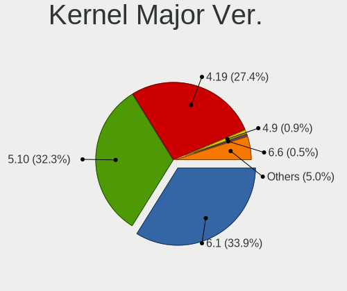

| Version | Computers | Percent |
|---------|-----------|---------|
| 4.19    | 371       | 49.53%  |
| 5.10    | 326       | 43.52%  |
| 4.9     | 12        | 1.6%    |
| 5.18    | 6         | 0.8%    |
| 5.15    | 5         | 0.67%   |
| 3.16    | 5         | 0.67%   |
| 5.4     | 4         | 0.53%   |
| 5.19    | 4         | 0.53%   |
| 6.1     | 3         | 0.4%    |
| 5.6     | 3         | 0.4%    |
| 5.16    | 3         | 0.4%    |
| 6.0     | 2         | 0.27%   |
| 5.9     | 2         | 0.27%   |
| 5.8     | 2         | 0.27%   |
| 4.17    | 1         | 0.13%   |

Arch
----

OS architecture (x86_64, i586, etc.)

| Name   | Computers | Percent |
|--------|-----------|---------|
| x86_64 | 636       | 86.06%  |
| i686   | 103       | 13.94%  |

DE
--

Desktop Environment

| Name       | Computers | Percent |
|------------|-----------|---------|
| X-Cinnamon | 643       | 85.96%  |
| Cinnamon   | 67        | 8.96%   |
| MATE       | 15        | 2.01%   |
| Unknown    | 9         | 1.2%    |
| XFCE       | 4         | 0.53%   |
| LXDE       | 2         | 0.27%   |
| KDE        | 2         | 0.27%   |
| GNOME      | 2         | 0.27%   |
| Trinity    | 1         | 0.13%   |
| LXQt       | 1         | 0.13%   |
| KDE5       | 1         | 0.13%   |
| awesome    | 1         | 0.13%   |

Display Server
--------------

X11 or Wayland

| Name | Computers | Percent |
|------|-----------|---------|
| X11  | 739       | 100%    |

Display Manager
---------------

SDDM, LightDM, etc.

| Name    | Computers | Percent |
|---------|-----------|---------|
| Unknown | 546       | 73.49%  |
| LightDM | 155       | 20.86%  |
| TDM     | 32        | 4.31%   |
| MDM     | 5         | 0.67%   |
| SDDM    | 2         | 0.27%   |
| GDM     | 2         | 0.27%   |
| GDM3    | 1         | 0.13%   |

OS Lang
-------

Language

| Lang    | Computers | Percent |
|---------|-----------|---------|
| en_US   | 229       | 30.86%  |
| de_DE   | 91        | 12.26%  |
| pt_BR   | 63        | 8.49%   |
| ru_RU   | 52        | 7.01%   |
| en_GB   | 32        | 4.31%   |
| fr_FR   | 31        | 4.18%   |
| pl_PL   | 25        | 3.37%   |
| it_IT   | 22        | 2.96%   |
| es_ES   | 20        | 2.7%    |
| Unknown | 17        | 2.29%   |
| en_CA   | 13        | 1.75%   |
| en_AU   | 10        | 1.35%   |
| es_MX   | 9         | 1.21%   |
| es_AR   | 9         | 1.21%   |
| sv_SE   | 6         | 0.81%   |
| de_CH   | 6         | 0.81%   |
| pt_PT   | 5         | 0.67%   |
| el_GR   | 5         | 0.67%   |
| de_AT   | 5         | 0.67%   |
| cs_CZ   | 5         | 0.67%   |
| tr_TR   | 4         | 0.54%   |
| nl_BE   | 4         | 0.54%   |
| ja_JP   | 4         | 0.54%   |
| fr_CA   | 4         | 0.54%   |
| en_ZA   | 4         | 0.54%   |
| sk_SK   | 3         | 0.4%    |
| nl_NL   | 3         | 0.4%    |
| hu_HU   | 3         | 0.4%    |
| fr_BE   | 3         | 0.4%    |
| es_CL   | 3         | 0.4%    |
| en_NZ   | 3         | 0.4%    |
| en_IN   | 3         | 0.4%    |
| da_DK   | 3         | 0.4%    |
| bg_BG   | 3         | 0.4%    |
| unm_US  | 2         | 0.27%   |
| uk_UA   | 2         | 0.27%   |
| ru_UA   | 2         | 0.27%   |
| ko_KR   | 2         | 0.27%   |
| it_CH   | 2         | 0.27%   |
| et_EE   | 2         | 0.27%   |

Boot Mode
---------

EFI or BIOS

| Mode | Computers | Percent |
|------|-----------|---------|
| BIOS | 424       | 57.07%  |
| EFI  | 319       | 42.93%  |

Filesystem
----------

Type of filesystem

| Type    | Computers | Percent |
|---------|-----------|---------|
| Ext4    | 687       | 92.71%  |
| Btrfs   | 19        | 2.56%   |
| Tmpfs   | 12        | 1.62%   |
| Overlay | 11        | 1.48%   |
| Unknown | 8         | 1.08%   |
| Xfs     | 2         | 0.27%   |
| Ext3    | 1         | 0.13%   |
| Aufs    | 1         | 0.13%   |

Part. scheme
------------

Scheme of partitioning

| Type    | Computers | Percent |
|---------|-----------|---------|
| Unknown | 542       | 72.95%  |
| GPT     | 129       | 17.36%  |
| MBR     | 72        | 9.69%   |

Dual Boot with Linux/BSD
------------------------

Hosting more than one Linux/BSD

| Dual boot | Computers | Percent |
|-----------|-----------|---------|
| No        | 693       | 93.4%   |
| Yes       | 49        | 6.6%    |

Dual Boot (Win)
---------------

Hosting Linux and Windows

| Dual boot | Computers | Percent |
|-----------|-----------|---------|
| No        | 675       | 91.22%  |
| Yes       | 65        | 8.78%   |

Board
-----

Vendor
------

Motherboard manufacturer

| Name                           | Computers | Percent |
|--------------------------------|-----------|---------|
| Hewlett-Packard                | 125       | 16.91%  |
| ASUSTek Computer               | 105       | 14.21%  |
| Dell                           | 88        | 11.91%  |
| Lenovo                         | 80        | 10.83%  |
| Acer                           | 59        | 7.98%   |
| Gigabyte Technology            | 41        | 5.55%   |
| MSI                            | 33        | 4.47%   |
| Toshiba                        | 20        | 2.71%   |
| ASRock                         | 18        | 2.44%   |
| Apple                          | 14        | 1.89%   |
| Intel                          | 12        | 1.62%   |
| Samsung Electronics            | 11        | 1.49%   |
| Sony                           | 10        | 1.35%   |
| Unknown                        | 10        | 1.35%   |
| Fujitsu Siemens                | 7         | 0.95%   |
| Fujitsu                        | 7         | 0.95%   |
| Medion                         | 6         | 0.81%   |
| Positivo                       | 5         | 0.68%   |
| LG Electronics                 | 5         | 0.68%   |
| Google                         | 4         | 0.54%   |
| Foxconn                        | 4         | 0.54%   |
| ECS                            | 4         | 0.54%   |
| Pegatron                       | 3         | 0.41%   |
| Packard Bell                   | 3         | 0.41%   |
| Gateway                        | 3         | 0.41%   |
| TUXEDO                         | 2         | 0.27%   |
| Supermicro                     | 2         | 0.27%   |
| Star Labs                      | 2         | 0.27%   |
| Semp Toshiba                   | 2         | 0.27%   |
| OEM                            | 2         | 0.27%   |
| Matsushita Electric Industrial | 2         | 0.27%   |
| EVGA                           | 2         | 0.27%   |
| eMachines                      | 2         | 0.27%   |
| Compaq                         | 2         | 0.27%   |
| Biostar                        | 2         | 0.27%   |
| Alienware                      | 2         | 0.27%   |
| Wortmann AG                    | 1         | 0.14%   |
| Wistron                        | 1         | 0.14%   |
| SiYW                           | 1         | 0.14%   |
| SAELITE                        | 1         | 0.14%   |

Model
-----

Motherboard model

| Name                                        | Computers | Percent |
|---------------------------------------------|-----------|---------|
| Unknown                                     | 17        | 2.3%    |
| Lenovo IdeaPad 3 15ADA05 81W1               | 4         | 0.54%   |
| HP Pavilion dv6                             | 4         | 0.54%   |
| HP Notebook                                 | 4         | 0.54%   |
| Samsung RV411/RV511/E3511/S3511/RV711/E3411 | 3         | 0.41%   |
| Dell OptiPlex 780                           | 3         | 0.41%   |
| Dell Latitude E6400                         | 3         | 0.41%   |
| ASUS All Series                             | 3         | 0.41%   |
| Acer Aspire E1-570G                         | 3         | 0.41%   |
| Acer Aspire 5930                            | 3         | 0.41%   |
| Acer AOD270                                 | 3         | 0.41%   |
| Star Labs StarBook                          | 2         | 0.27%   |
| MSI MS-7C52                                 | 2         | 0.27%   |
| LG A530-T.BE76P1                            | 2         | 0.27%   |
| Lenovo V145-15AST 81MT                      | 2         | 0.27%   |
| Lenovo IdeaPad 3 15ITL6 82H8                | 2         | 0.27%   |
| Lenovo G500 20236                           | 2         | 0.27%   |
| HP Pavilion Notebook                        | 2         | 0.27%   |
| HP Pavilion dv7                             | 2         | 0.27%   |
| HP Pavilion Desktop 590-p0xxx               | 2         | 0.27%   |
| HP Laptop 15z-ef2xxx                        | 2         | 0.27%   |
| HP Laptop 15-dw3xxx                         | 2         | 0.27%   |
| HP Laptop 15-bw0xx                          | 2         | 0.27%   |
| HP Laptop 14-df0xxx                         | 2         | 0.27%   |
| HP EliteBook 8540w                          | 2         | 0.27%   |
| HP EliteBook 820 G3                         | 2         | 0.27%   |
| HP Compaq Presario CQ71                     | 2         | 0.27%   |
| HP 290 G2 MT Business PC                    | 2         | 0.27%   |
| HP 255 G7 Notebook PC                       | 2         | 0.27%   |
| HP 250 G8 Notebook PC                       | 2         | 0.27%   |
| HP 250 G7 Notebook PC                       | 2         | 0.27%   |
| HP 14                                       | 2         | 0.27%   |
| Gigabyte X570 AORUS ULTRA                   | 2         | 0.27%   |
| Gigabyte B450M DS3H                         | 2         | 0.27%   |
| Gigabyte B450 AORUS M                       | 2         | 0.27%   |
| Dell Precision M4800                        | 2         | 0.27%   |
| Dell OptiPlex 3010                          | 2         | 0.27%   |
| Dell Latitude E5540                         | 2         | 0.27%   |
| Dell Inspiron 5566                          | 2         | 0.27%   |
| Dell Inspiron 5559                          | 2         | 0.27%   |

Model Family
------------

Motherboard model prefix

| Name                    | Computers | Percent |
|-------------------------|-----------|---------|
| Acer Aspire             | 47        | 6.36%   |
| Lenovo ThinkPad         | 31        | 4.19%   |
| HP Pavilion             | 23        | 3.11%   |
| Dell Inspiron           | 22        | 2.98%   |
| Dell Latitude           | 21        | 2.84%   |
| Lenovo IdeaPad          | 19        | 2.57%   |
| HP Laptop               | 19        | 2.57%   |
| Unknown                 | 17        | 2.3%    |
| Toshiba Satellite       | 16        | 2.17%   |
| Dell OptiPlex           | 15        | 2.03%   |
| HP Compaq               | 14        | 1.89%   |
| Dell Precision          | 14        | 1.89%   |
| HP EliteBook            | 12        | 1.62%   |
| ASUS PRIME              | 10        | 1.35%   |
| HP ProBook              | 7         | 0.95%   |
| ASUS ROG                | 7         | 0.95%   |
| ASUS VivoBook           | 6         | 0.81%   |
| HP 250                  | 5         | 0.68%   |
| Dell Vostro             | 5         | 0.68%   |
| Lenovo ThinkCentre      | 4         | 0.54%   |
| HP Notebook             | 4         | 0.54%   |
| Gigabyte X570           | 4         | 0.54%   |
| Dell XPS                | 4         | 0.54%   |
| Samsung RV411           | 3         | 0.41%   |
| Lenovo Yoga             | 3         | 0.41%   |
| HP ZBook                | 3         | 0.41%   |
| HP Presario             | 3         | 0.41%   |
| HP 255                  | 3         | 0.41%   |
| Gigabyte B450M          | 3         | 0.41%   |
| Gigabyte B450           | 3         | 0.41%   |
| Fujitsu Siemens ESPRIMO | 3         | 0.41%   |
| Fujitsu LIFEBOOK        | 3         | 0.41%   |
| ASUS All                | 3         | 0.41%   |
| Acer Veriton            | 3         | 0.41%   |
| Acer AOD270             | 3         | 0.41%   |
| Toshiba PORTEGE         | 2         | 0.27%   |
| Star Labs StarBook      | 2         | 0.27%   |
| Packard Bell EasyNote   | 2         | 0.27%   |
| MSI MS-7C52             | 2         | 0.27%   |
| LG A530-T.BE76P1        | 2         | 0.27%   |

MFG Year
--------

Motherboard manufacture year

| Year    | Computers | Percent |
|---------|-----------|---------|
| 2012    | 71        | 9.61%   |
| 2018    | 61        | 8.25%   |
| 2009    | 56        | 7.58%   |
| 2010    | 54        | 7.31%   |
| 2013    | 52        | 7.04%   |
| 2011    | 50        | 6.77%   |
| 2007    | 42        | 5.68%   |
| 2008    | 41        | 5.55%   |
| 2021    | 40        | 5.41%   |
| 2019    | 40        | 5.41%   |
| 2020    | 38        | 5.14%   |
| 2014    | 36        | 4.87%   |
| 2017    | 33        | 4.47%   |
| 2016    | 33        | 4.47%   |
| 2015    | 29        | 3.92%   |
| 2006    | 25        | 3.38%   |
| 2022    | 16        | 2.17%   |
| 2005    | 10        | 1.35%   |
| 2003    | 5         | 0.68%   |
| 2023    | 3         | 0.41%   |
| 2004    | 2         | 0.27%   |
| 2002    | 1         | 0.14%   |
| Unknown | 1         | 0.14%   |

Form Factor
-----------

Physical design of the computer

| Name        | Computers | Percent |
|-------------|-----------|---------|
| Notebook    | 448       | 60.62%  |
| Desktop     | 261       | 35.32%  |
| All in one  | 9         | 1.22%   |
| Convertible | 8         | 1.08%   |
| Tablet      | 5         | 0.68%   |
| Mini pc     | 4         | 0.54%   |
| Server      | 4         | 0.54%   |

Secure Boot
-----------

Enabled or disabled

| State    | Computers | Percent |
|----------|-----------|---------|
| Disabled | 697       | 93.81%  |
| Enabled  | 46        | 6.19%   |

Coreboot
--------

Have coreboot on board

| Used | Computers | Percent |
|------|-----------|---------|
| No   | 732       | 99.05%  |
| Yes  | 7         | 0.95%   |

RAM Size
--------

Total RAM memory

| Size in GB      | Computers | Percent |
|-----------------|-----------|---------|
| 3.01-4.0        | 179       | 24.03%  |
| 4.01-8.0        | 150       | 20.13%  |
| 8.01-16.0       | 115       | 15.44%  |
| 16.01-24.0      | 114       | 15.3%   |
| 2.01-3.0        | 61        | 8.19%   |
| 1.01-2.0        | 53        | 7.11%   |
| 32.01-64.0      | 43        | 5.77%   |
| 0.51-1.0        | 16        | 2.15%   |
| 64.01-256.0     | 8         | 1.07%   |
| 24.01-32.0      | 5         | 0.67%   |
| More than 256.0 | 1         | 0.13%   |

RAM Used
--------

Used RAM memory

| Used GB    | Computers | Percent |
|------------|-----------|---------|
| 1.01-2.0   | 359       | 45.39%  |
| 2.01-3.0   | 195       | 24.65%  |
| 0.51-1.0   | 97        | 12.26%  |
| 3.01-4.0   | 75        | 9.48%   |
| 4.01-8.0   | 51        | 6.45%   |
| 8.01-16.0  | 8         | 1.01%   |
| 0.01-0.5   | 3         | 0.38%   |
| 32.01-64.0 | 2         | 0.25%   |
| 24.01-32.0 | 1         | 0.13%   |

Total Drives
------------

Number of drives on board

| Drives | Computers | Percent |
|--------|-----------|---------|
| 1      | 479       | 63.36%  |
| 2      | 176       | 23.28%  |
| 3      | 50        | 6.61%   |
| 4      | 24        | 3.17%   |
| 5      | 9         | 1.19%   |
| 6      | 6         | 0.79%   |
| 0      | 6         | 0.79%   |
| 7      | 5         | 0.66%   |
| 8      | 1         | 0.13%   |

Has CD-ROM
----------

Has CD-ROM on board

| Presented | Computers | Percent |
|-----------|-----------|---------|
| No        | 386       | 51.67%  |
| Yes       | 361       | 48.33%  |

Has Ethernet
------------

Has Ethernet on board

| Presented | Computers | Percent |
|-----------|-----------|---------|
| Yes       | 665       | 89.99%  |
| No        | 74        | 10.01%  |

Has WiFi
--------

Has WiFi module

| Presented | Computers | Percent |
|-----------|-----------|---------|
| Yes       | 576       | 77.32%  |
| No        | 169       | 22.68%  |

Has Bluetooth
-------------

Has Bluetooth module

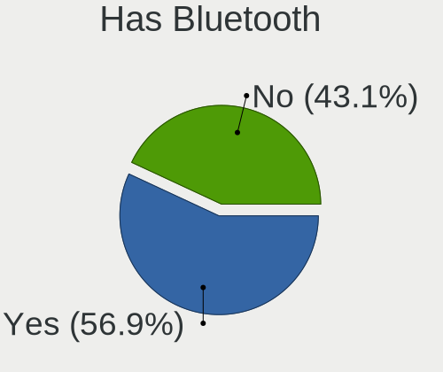

| Presented | Computers | Percent |
|-----------|-----------|---------|
| No        | 381       | 51.35%  |
| Yes       | 361       | 48.65%  |

Location
--------

Country
-------

Geographic location (country)

| Country      | Computers | Percent |
|--------------|-----------|---------|
| USA          | 115       | 15.52%  |
| Germany      | 100       | 13.5%   |
| Brazil       | 66        | 8.91%   |
| Russia       | 57        | 7.69%   |
| France       | 34        | 4.59%   |
| Italy        | 31        | 4.18%   |
| UK           | 27        | 3.64%   |
| Poland       | 25        | 3.37%   |
| Canada       | 24        | 3.24%   |
| Spain        | 23        | 3.1%    |
| Netherlands  | 13        | 1.75%   |
| Australia    | 13        | 1.75%   |
| Ukraine      | 12        | 1.62%   |
| Mexico       | 11        | 1.48%   |
| Bulgaria     | 9         | 1.21%   |
| Argentina    | 9         | 1.21%   |
| Sweden       | 8         | 1.08%   |
| Belgium      | 8         | 1.08%   |
| Austria      | 8         | 1.08%   |
| Turkey       | 7         | 0.94%   |
| Switzerland  | 7         | 0.94%   |
| Portugal     | 7         | 0.94%   |
| Greece       | 7         | 0.94%   |
| Belarus      | 7         | 0.94%   |
| South Africa | 5         | 0.67%   |
| Romania      | 5         | 0.67%   |
| Indonesia    | 5         | 0.67%   |
| India        | 5         | 0.67%   |
| Chile        | 5         | 0.67%   |
| Philippines  | 4         | 0.54%   |
| Japan        | 4         | 0.54%   |
| Hungary      | 4         | 0.54%   |
| Ecuador      | 4         | 0.54%   |
| Czechia      | 4         | 0.54%   |
| Venezuela    | 3         | 0.4%    |
| New Zealand  | 3         | 0.4%    |
| Finland      | 3         | 0.4%    |
| Denmark      | 3         | 0.4%    |
| Bolivia      | 3         | 0.4%    |
| Bahrain      | 3         | 0.4%    |

City
----

Geographic location (city)

| City                 | Computers | Percent |
|----------------------|-----------|---------|
| Moscow               | 12        | 1.55%   |
| Berlin               | 8         | 1.03%   |
| St Petersburg        | 7         | 0.91%   |
| Sao Paulo            | 7         | 0.91%   |
| Frankfurt am Main    | 6         | 0.78%   |
| Paris                | 5         | 0.65%   |
| Montreal             | 5         | 0.65%   |
| Madrid               | 5         | 0.65%   |
| Hamburg              | 5         | 0.65%   |
| Wroclaw              | 4         | 0.52%   |
| Sofia                | 4         | 0.52%   |
| Rio de Janeiro       | 4         | 0.52%   |
| Poznan               | 4         | 0.52%   |
| Perth                | 4         | 0.52%   |
| Munich               | 4         | 0.52%   |
| Milan                | 4         | 0.52%   |
| Miami                | 4         | 0.52%   |
| London               | 4         | 0.52%   |
| Krakow               | 4         | 0.52%   |
| Guayaquil            | 4         | 0.52%   |
| Athens               | 4         | 0.52%   |
| Wohlen               | 3         | 0.39%   |
| Warsaw               | 3         | 0.39%   |
| Voronezh             | 3         | 0.39%   |
| Toronto              | 3         | 0.39%   |
| Seville              | 3         | 0.39%   |
| Rome                 | 3         | 0.39%   |
| Oxford               | 3         | 0.39%   |
| Nuremberg            | 3         | 0.39%   |
| Melbourne            | 3         | 0.39%   |
| Mannheim             | 3         | 0.39%   |
| Manama               | 3         | 0.39%   |
| Lisbon               | 3         | 0.39%   |
| Gruenenplan          | 3         | 0.39%   |
| Glasgow              | 3         | 0.39%   |
| Freiburg im Breisgau | 3         | 0.39%   |
| Florianpolis       | 3         | 0.39%   |
| Duisburg             | 3         | 0.39%   |
| Zurich               | 2         | 0.26%   |
| Vienna               | 2         | 0.26%   |

Drives
------

Drive Vendor
------------

Hard drive vendors

| Vendor              | Computers | Drives | Percent |
|---------------------|-----------|--------|---------|
| WDC                 | 176       | 258    | 17.12%  |
| Seagate             | 150       | 217    | 14.59%  |
| Samsung Electronics | 145       | 200    | 14.11%  |
| Kingston            | 56        | 68     | 5.45%   |
| Toshiba             | 55        | 66     | 5.35%   |
| Unknown             | 45        | 58     | 4.38%   |
| Hitachi             | 45        | 49     | 4.38%   |
| SanDisk             | 43        | 56     | 4.18%   |
| Crucial             | 34        | 42     | 3.31%   |
| Intel               | 21        | 23     | 2.04%   |
| SK hynix            | 19        | 22     | 1.85%   |
| A-DATA Technology   | 16        | 18     | 1.56%   |
| China               | 15        | 16     | 1.46%   |
| HGST                | 14        | 18     | 1.36%   |
| Phison              | 12        | 14     | 1.17%   |
| Micron Technology   | 12        | 13     | 1.17%   |
| Fujitsu             | 11        | 11     | 1.07%   |
| Intenso             | 8         | 9      | 0.78%   |
| Apple               | 8         | 13     | 0.78%   |
| PNY                 | 7         | 8      | 0.68%   |
| Patriot             | 7         | 8      | 0.68%   |
| Transcend           | 6         | 9      | 0.58%   |
| KingSpec            | 6         | 7      | 0.58%   |
| GOODRAM             | 6         | 6      | 0.58%   |
| Gigabyte Technology | 5         | 8      | 0.49%   |
| SPCC                | 4         | 4      | 0.39%   |
| OCZ                 | 4         | 6      | 0.39%   |
| Unknown             | 4         | 5      | 0.39%   |
| Team                | 3         | 4      | 0.29%   |
| Silicon Motion      | 3         | 3      | 0.29%   |
| Maxtor              | 3         | 5      | 0.29%   |
| KingDian            | 3         | 4      | 0.29%   |
| Hewlett-Packard     | 3         | 4      | 0.29%   |
| TCSUNBOW            | 2         | 2      | 0.19%   |
| Star Drive          | 2         | 2      | 0.19%   |
| SABRENT             | 2         | 2      | 0.19%   |
| Plextor             | 2         | 3      | 0.19%   |
| Phison Electronics  | 2         | 2      | 0.19%   |
| Netac               | 2         | 2      | 0.19%   |
| Mushkin             | 2         | 2      | 0.19%   |

Drive Model
-----------

Hard drive models

| Model                                             | Computers | Percent |
|---------------------------------------------------|-----------|---------|
| Samsung SSD 850 EVO 250GB                         | 11        | 0.98%   |
| Kingston SA400S37240G 240GB SSD                   | 11        | 0.98%   |
| Kingston SA400S37120G 120GB SSD                   | 11        | 0.98%   |
| Samsung SSD 860 EVO 500GB                         | 10        | 0.89%   |
| Kingston SA400S37480G 480GB SSD                   | 10        | 0.89%   |
| Seagate ST500LT012-1DG142 500GB                   | 9         | 0.8%    |
| Samsung SSD 850 EVO 500GB                         | 9         | 0.8%    |
| Seagate ST1000LM035-1RK172 970GB                  | 8         | 0.71%   |
| Unknown SD/MMC/MS PRO 249GB                       | 7         | 0.63%   |
| Unknown MMC Card  32GB                            | 7         | 0.63%   |
| Toshiba MQ01ABD100 1TB                            | 6         | 0.54%   |
| WDC WD5000LPVX-22V0TT0 500GB                      | 5         | 0.45%   |
| WDC WD3200BEVT-60ZCT1 320GB                       | 5         | 0.45%   |
| Unknown MMC Card  7GB                             | 5         | 0.45%   |
| Unknown MMC Card  128GB                           | 5         | 0.45%   |
| Toshiba MQ01ABF050 500GB                          | 5         | 0.45%   |
| Toshiba DT01ACA100 1TB                            | 5         | 0.45%   |
| Seagate ST500DM002-1BD142 500GB                   | 5         | 0.45%   |
| Seagate ST1000DM010-2EP102 1TB                    | 5         | 0.45%   |
| SanDisk NVMe SSD Drive 256GB                      | 5         | 0.45%   |
| Samsung SSD 860 EVO 250GB                         | 5         | 0.45%   |
| Samsung SSD 860 EVO 1TB                           | 5         | 0.45%   |
| Samsung NVMe SSD Controller SM981/PM981/PM983 1TB | 5         | 0.45%   |
| Crucial CT240BX500SSD1 240GB                      | 5         | 0.45%   |
| WDC WDS240G2G0A-00JH30 240GB SSD                  | 4         | 0.36%   |
| WDC WD10EZEX-08WN4A0 1TB                          | 4         | 0.36%   |
| Unknown MMC Card  64GB                            | 4         | 0.36%   |
| Seagate ST9250315AS 250GB                         | 4         | 0.36%   |
| Seagate ST1000LM024 HN-M101MBB 1TB                | 4         | 0.36%   |
| Seagate Expansion 4TB                             | 4         | 0.36%   |
| Samsung SSD 980 PRO 1TB                           | 4         | 0.36%   |
| Samsung SSD 970 EVO 500GB                         | 4         | 0.36%   |
| Samsung NVMe SSD Drive 500GB                      | 4         | 0.36%   |
| Micron 1100_MTFDDAV256TBN 256GB SSD               | 4         | 0.36%   |
| Gigabyte GP-GSTFS31120GNTD 120GB SSD              | 4         | 0.36%   |
| Crucial CT480BX500SSD1 480GB                      | 4         | 0.36%   |
| China SATA SSD 120GB                              | 4         | 0.36%   |
| A-DATA SU650 240GB SSD                            | 4         | 0.36%   |
| Unknown                                           | 4         | 0.36%   |
| WDC WDS120G2G0A-00JH30 120GB SSD                  | 3         | 0.27%   |

HDD Vendor
----------

Hard disk drive vendors

| Vendor              | Computers | Drives | Percent |
|---------------------|-----------|--------|---------|
| WDC                 | 151       | 228    | 32.13%  |
| Seagate             | 149       | 214    | 31.7%   |
| Toshiba             | 45        | 52     | 9.57%   |
| Hitachi             | 45        | 49     | 9.57%   |
| Samsung Electronics | 34        | 45     | 7.23%   |
| HGST                | 14        | 18     | 2.98%   |
| Fujitsu             | 11        | 11     | 2.34%   |
| Unknown             | 7         | 7      | 1.49%   |
| Maxtor              | 3         | 5      | 0.64%   |
| Intenso             | 2         | 2      | 0.43%   |
| IBM/Hitachi         | 2         | 2      | 0.43%   |
| KESU                | 1         | 2      | 0.21%   |
| HPE                 | 1         | 4      | 0.21%   |
| ExcelStor           | 1         | 1      | 0.21%   |
| DAS                 | 1         | 4      | 0.21%   |
| ASMT                | 1         | 1      | 0.21%   |
| ASMedia             | 1         | 1      | 0.21%   |
| Apple               | 1         | 1      | 0.21%   |

SSD Vendor
----------

Solid state drive vendors

| Vendor              | Computers | Drives | Percent |
|---------------------|-----------|--------|---------|
| Samsung Electronics | 78        | 98     | 20.74%  |
| Kingston            | 49        | 61     | 13.03%  |
| Crucial             | 33        | 41     | 8.78%   |
| SanDisk             | 26        | 36     | 6.91%   |
| WDC                 | 17        | 18     | 4.52%   |
| A-DATA Technology   | 16        | 18     | 4.26%   |
| China               | 13        | 14     | 3.46%   |
| Intel               | 12        | 12     | 3.19%   |
| Toshiba             | 9         | 13     | 2.39%   |
| PNY                 | 7         | 8      | 1.86%   |
| Patriot             | 7         | 8      | 1.86%   |
| Micron Technology   | 7         | 8      | 1.86%   |
| Transcend           | 6         | 9      | 1.6%    |
| KingSpec            | 6         | 7      | 1.6%    |
| GOODRAM             | 6         | 6      | 1.6%    |
| Apple               | 6         | 6      | 1.6%    |
| SK hynix            | 5         | 6      | 1.33%   |
| Intenso             | 5         | 6      | 1.33%   |
| Gigabyte Technology | 5         | 8      | 1.33%   |
| OCZ                 | 4         | 6      | 1.06%   |
| Team                | 3         | 4      | 0.8%    |
| SPCC                | 3         | 3      | 0.8%    |
| KingDian            | 3         | 4      | 0.8%    |
| Hewlett-Packard     | 3         | 4      | 0.8%    |
| Unknown             | 3         | 4      | 0.8%    |
| Unknown             | 2         | 2      | 0.53%   |
| TCSUNBOW            | 2         | 2      | 0.53%   |
| Plextor             | 2         | 3      | 0.53%   |
| Netac               | 2         | 2      | 0.53%   |
| FORESEE             | 2         | 4      | 0.53%   |
| CT500MX5            | 2         | 3      | 0.53%   |
| Corsair             | 2         | 2      | 0.53%   |
| WINTEC              | 1         | 1      | 0.27%   |
| USB30               | 1         | 2      | 0.27%   |
| TakeMS              | 1         | 1      | 0.27%   |
| SSD PHIS            | 1         | 1      | 0.27%   |
| Smartbuy            | 1         | 1      | 0.27%   |
| SCCTS-603-001T      | 1         | 1      | 0.27%   |
| Phison              | 1         | 1      | 0.27%   |
| ORICO               | 1         | 1      | 0.27%   |

Drive Kind
----------

HDD or SSD

| Kind    | Computers | Drives | Percent |
|---------|-----------|--------|---------|
| HDD     | 409       | 647    | 44.26%  |
| SSD     | 326       | 461    | 35.28%  |
| NVMe    | 131       | 172    | 14.18%  |
| MMC     | 38        | 49     | 4.11%   |
| Unknown | 20        | 24     | 2.16%   |

Drive Connector
---------------

SATA, SAS, NVMe, etc.

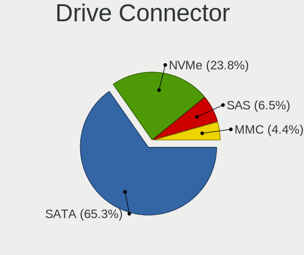

| Type | Computers | Drives | Percent |
|------|-----------|--------|---------|
| SATA | 630       | 1062   | 74.64%  |
| NVMe | 129       | 170    | 15.28%  |
| SAS  | 47        | 72     | 5.57%   |
| MMC  | 38        | 49     | 4.5%    |

Drive Size
----------

Size of hard drive

| Size in TB | Computers | Drives | Percent |
|------------|-----------|--------|---------|
| 0.01-0.5   | 517       | 767    | 69.03%  |
| 0.51-1.0   | 161       | 235    | 21.5%   |
| 1.01-2.0   | 38        | 51     | 5.07%   |
| 3.01-4.0   | 14        | 22     | 1.87%   |
| 2.01-3.0   | 9         | 19     | 1.2%    |
| 4.01-10.0  | 9         | 13     | 1.2%    |
| 10.01-20.0 | 1         | 1      | 0.13%   |

Space Total
-----------

Amount of disk space available on the file system

| Size in GB     | Computers | Percent |
|----------------|-----------|---------|
| 101-250        | 268       | 35.5%   |
| 251-500        | 180       | 23.84%  |
| 501-1000       | 82        | 10.86%  |
| 51-100         | 62        | 8.21%   |
| 1001-2000      | 59        | 7.81%   |
| More than 3000 | 34        | 4.5%    |
| 21-50          | 30        | 3.97%   |
| 2001-3000      | 21        | 2.78%   |
| 1-20           | 18        | 2.38%   |
| Unknown        | 1         | 0.13%   |

Space Used
----------

Amount of used disk space

| Used GB        | Computers | Percent |
|----------------|-----------|---------|
| 1-20           | 331       | 41.95%  |
| 21-50          | 168       | 21.29%  |
| 51-100         | 86        | 10.9%   |
| 101-250        | 83        | 10.52%  |
| 251-500        | 42        | 5.32%   |
| 501-1000       | 35        | 4.44%   |
| 1001-2000      | 19        | 2.41%   |
| More than 3000 | 12        | 1.52%   |
| 2001-3000      | 12        | 1.52%   |
| Unknown        | 1         | 0.13%   |

Malfunc. Drives
---------------

Drive models with a malfunction

| Model                                 | Computers | Drives | Percent |
|---------------------------------------|-----------|--------|---------|
| WINTEC 240GB SATA3 SF2281 SSD         | 1         | 1      | 2.56%   |
| WDC WD5000BEVT-22A0RT0 500GB          | 1         | 1      | 2.56%   |
| WDC WD3200BEVT-60ZCT1 320GB           | 1         | 1      | 2.56%   |
| WDC WD3200BEVT-26A23T0 320GB          | 1         | 1      | 2.56%   |
| WDC WD2500BEVT-24A23T0 250GB          | 1         | 1      | 2.56%   |
| Toshiba THNSNF128GCSS 128GB SSD       | 1         | 1      | 2.56%   |
| SK hynix PC711 HFS512GDE9X073N 512GB  | 1         | 1      | 2.56%   |
| Seagate STM9120817AS 120GB            | 1         | 1      | 2.56%   |
| Seagate ST98823AS 80GB                | 1         | 1      | 2.56%   |
| Seagate ST9640423AS 640GB             | 1         | 1      | 2.56%   |
| Seagate ST9320325AS 320GB             | 1         | 1      | 2.56%   |
| Seagate ST9250315AS 250GB             | 1         | 1      | 2.56%   |
| Seagate ST9120821AS 120GB             | 1         | 1      | 2.56%   |
| Seagate ST500LT032-1E9142 500GB       | 1         | 1      | 2.56%   |
| Seagate ST500LT012-1DG142 500GB       | 1         | 1      | 2.56%   |
| Seagate ST3250318AS 250GB             | 1         | 1      | 2.56%   |
| Seagate ST2000DX001-1CM164 2TB        | 1         | 1      | 2.56%   |
| Seagate ST1000LM048-2E7172 1TB        | 1         | 1      | 2.56%   |
| SanDisk SD9SN8W-128G-1006 128GB SSD   | 1         | 1      | 2.56%   |
| Samsung Electronics SSD 980 PRO 1TB   | 1         | 1      | 2.56%   |
| Samsung Electronics SSD 970 EVO 500GB | 1         | 2      | 2.56%   |
| Samsung Electronics SSD 870 EVO 1TB   | 1         | 1      | 2.56%   |
| Samsung Electronics SSD 850 EVO 500GB | 1         | 1      | 2.56%   |
| Samsung Electronics SP2004C 200GB     | 1         | 1      | 2.56%   |
| Samsung Electronics MP0402H 40GB      | 1         | 1      | 2.56%   |
| Samsung Electronics HM500JI 500GB     | 1         | 1      | 2.56%   |
| Samsung Electronics HM160HC 160GB     | 1         | 1      | 2.56%   |
| Samsung Electronics HD153WI 1TB       | 1         | 1      | 2.56%   |
| Samsung Electronics HD103SJ 1TB       | 1         | 1      | 2.56%   |
| Phison ES 512GB                       | 1         | 1      | 2.56%   |
| Kingston SV300S37A120G 120GB SSD      | 1         | 1      | 2.56%   |
| Intenso SSD 256GB                     | 1         | 1      | 2.56%   |
| Intel SSDSCKKF256G8 SATA 256GB        | 1         | 1      | 2.56%   |
| Intel SSDSC2CT240A3 240GB             | 1         | 1      | 2.56%   |
| Hitachi HTS547575A9E384 752GB         | 1         | 1      | 2.56%   |
| Hitachi HTS545050A7E380 500GB         | 1         | 1      | 2.56%   |
| HGST HTS545050A7E680 500GB            | 1         | 1      | 2.56%   |
| Fujitsu MHZ2080BJ FFS G2 80GB         | 1         | 1      | 2.56%   |
| Crucial M4-CT256M4SSD2 256GB          | 1         | 1      | 2.56%   |

Malfunc. Drive Vendor
---------------------

Vendors of faulty drives

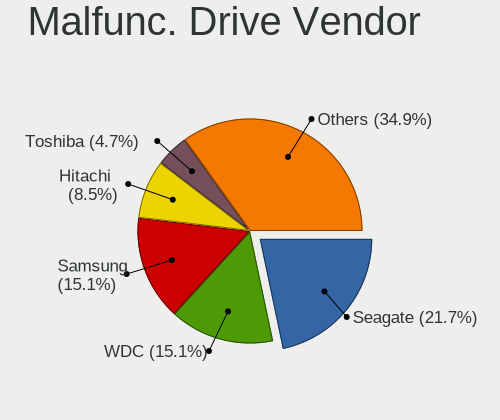

| Vendor              | Computers | Drives | Percent |
|---------------------|-----------|--------|---------|
| Seagate             | 11        | 11     | 28.95%  |
| Samsung Electronics | 10        | 11     | 26.32%  |
| WDC                 | 3         | 4      | 7.89%   |
| Intel               | 2         | 2      | 5.26%   |
| Hitachi             | 2         | 2      | 5.26%   |
| WINTEC              | 1         | 1      | 2.63%   |
| Toshiba             | 1         | 1      | 2.63%   |
| SK hynix            | 1         | 1      | 2.63%   |
| SanDisk             | 1         | 1      | 2.63%   |
| Phison              | 1         | 1      | 2.63%   |
| Kingston            | 1         | 1      | 2.63%   |
| Intenso             | 1         | 1      | 2.63%   |
| HGST                | 1         | 1      | 2.63%   |
| Fujitsu             | 1         | 1      | 2.63%   |
| Crucial             | 1         | 1      | 2.63%   |

Malfunc. HDD Vendor
-------------------

Vendors of faulty HDD drives

| Vendor              | Computers | Drives | Percent |
|---------------------|-----------|--------|---------|
| Seagate             | 11        | 11     | 45.83%  |
| Samsung Electronics | 6         | 6      | 25%     |
| WDC                 | 3         | 4      | 12.5%   |
| Hitachi             | 2         | 2      | 8.33%   |
| HGST                | 1         | 1      | 4.17%   |
| Fujitsu             | 1         | 1      | 4.17%   |

Malfunc. Drive Kind
-------------------

Kinds of faulty drives

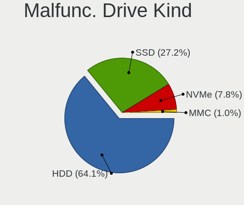

| Kind | Computers | Drives | Percent |
|------|-----------|--------|---------|
| HDD  | 24        | 25     | 63.16%  |
| SSD  | 10        | 10     | 26.32%  |
| NVMe | 4         | 5      | 10.53%  |

Failed Drives
-------------

Failed drive models

Zero info for selected period =(

Failed Drive Vendor
-------------------

Failed drive vendors

Zero info for selected period =(

Drive Status
------------

Number of failed and malfunc. drives

| Status   | Computers | Drives | Percent |
|----------|-----------|--------|---------|
| Detected | 568       | 1023   | 73.01%  |
| Works    | 172       | 290    | 22.11%  |
| Malfunc  | 38        | 40     | 4.88%   |

Storage controller
------------------

Storage Vendor
--------------

Storage controller vendors

| Vendor                           | Computers | Percent |
|----------------------------------|-----------|---------|
| Intel                            | 538       | 61.49%  |
| AMD                              | 124       | 14.17%  |
| Samsung Electronics              | 45        | 5.14%   |
| SanDisk                          | 25        | 2.86%   |
| Nvidia                           | 21        | 2.4%    |
| Phison Electronics               | 17        | 1.94%   |
| SK hynix                         | 14        | 1.6%    |
| ASMedia Technology               | 14        | 1.6%    |
| JMicron Technology               | 13        | 1.49%   |
| Marvell Technology Group         | 9         | 1.03%   |
| Silicon Integrated Systems [SiS] | 8         | 0.91%   |
| VIA Technologies                 | 7         | 0.8%    |
| Kingston Technology Company      | 7         | 0.8%    |
| Micron Technology                | 5         | 0.57%   |
| Broadcom / LSI                   | 5         | 0.57%   |
| Silicon Motion                   | 4         | 0.46%   |
| Micron/Crucial Technology        | 3         | 0.34%   |
| KIOXIA                           | 3         | 0.34%   |
| Union Memory (Shenzhen)          | 2         | 0.23%   |
| Toshiba America Info Systems     | 2         | 0.23%   |
| Silicon Image                    | 2         | 0.23%   |
| LSI Logic / Symbios Logic        | 2         | 0.23%   |
| ADATA Technology                 | 2         | 0.23%   |
| Solid State Storage Technology   | 1         | 0.11%   |
| Integrated Technology Express    | 1         | 0.11%   |
| Apple                            | 1         | 0.11%   |

Storage Model
-------------

Storage controller models

| Model                                                                            | Computers | Percent |
|----------------------------------------------------------------------------------|-----------|---------|
| AMD FCH SATA Controller [AHCI mode]                                              | 77        | 7.19%   |
| Intel 82801G (ICH7 Family) IDE Controller                                        | 41        | 3.83%   |
| Intel Sunrise Point-LP SATA Controller [AHCI mode]                               | 38        | 3.55%   |
| Intel 7 Series Chipset Family 6-port SATA Controller [AHCI mode]                 | 34        | 3.17%   |
| Intel 82801 Mobile SATA Controller [RAID mode]                                   | 28        | 2.61%   |
| Intel 82801IBM/IEM (ICH9M/ICH9M-E) 4 port SATA Controller [AHCI mode]            | 25        | 2.33%   |
| Intel 8 Series/C220 Series Chipset Family 6-port SATA Controller 1 [AHCI mode]   | 25        | 2.33%   |
| Intel NM10/ICH7 Family SATA Controller [IDE mode]                                | 24        | 2.24%   |
| Intel 6 Series/C200 Series Chipset Family 6 port Mobile SATA AHCI Controller     | 22        | 2.05%   |
| Samsung NVMe SSD Controller SM981/PM981/PM983                                    | 21        | 1.96%   |
| Intel 6 Series/C200 Series Chipset Family 6 port Desktop SATA AHCI Controller    | 21        | 1.96%   |
| AMD SB7x0/SB8x0/SB9x0 SATA Controller [AHCI mode]                                | 20        | 1.87%   |
| Intel 8 Series SATA Controller 1 [AHCI mode]                                     | 19        | 1.77%   |
| Intel Volume Management Device NVMe RAID Controller                              | 17        | 1.59%   |
| Intel NM10/ICH7 Family SATA Controller [AHCI mode]                               | 16        | 1.49%   |
| Intel 82801GBM/GHM (ICH7-M Family) SATA Controller [AHCI mode]                   | 16        | 1.49%   |
| Intel 5 Series/3400 Series Chipset 6 port SATA AHCI Controller                   | 16        | 1.49%   |
| Intel 5 Series/3400 Series Chipset 4 port SATA AHCI Controller                   | 16        | 1.49%   |
| Intel 7 Series/C210 Series Chipset Family 6-port SATA Controller [AHCI mode]     | 14        | 1.31%   |
| ASMedia ASM1062 Serial ATA Controller                                            | 14        | 1.31%   |
| AMD 400 Series Chipset SATA Controller                                           | 14        | 1.31%   |
| Samsung NVMe SSD Controller 980                                                  | 13        | 1.21%   |
| Intel 82801HM/HEM (ICH8M/ICH8M-E) SATA Controller [AHCI mode]                    | 13        | 1.21%   |
| Intel 82801HM/HEM (ICH8M/ICH8M-E) IDE Controller                                 | 13        | 1.21%   |
| AMD SB7x0/SB8x0/SB9x0 IDE Controller                                             | 13        | 1.21%   |
| Intel Tiger Lake-LP SATA Controller                                              | 12        | 1.12%   |
| Intel 82801GBM/GHM (ICH7-M Family) SATA Controller [IDE mode]                    | 12        | 1.12%   |
| Intel Q170/Q150/B150/H170/H110/Z170/CM236 Chipset SATA Controller [AHCI Mode]    | 11        | 1.03%   |
| Intel Cannon Lake PCH SATA AHCI Controller                                       | 11        | 1.03%   |
| Intel Atom/Celeron/Pentium Processor x5-E8000/J3xxx/N3xxx Series SATA Controller | 9         | 0.84%   |
| AMD SB7x0/SB8x0/SB9x0 SATA Controller [IDE mode]                                 | 9         | 0.84%   |
| SanDisk WD Blue SN550 NVMe SSD                                                   | 8         | 0.75%   |
| Phison E12 NVMe Controller                                                       | 8         | 0.75%   |
| Nvidia MCP61 SATA Controller                                                     | 8         | 0.75%   |
| JMicron JMB363 SATA/IDE Controller                                               | 8         | 0.75%   |
| Intel Celeron/Pentium Silver Processor SATA Controller                           | 8         | 0.75%   |
| Intel Atom Processor E3800 Series SATA AHCI Controller                           | 8         | 0.75%   |
| Intel 82801JI (ICH10 Family) SATA AHCI Controller                                | 8         | 0.75%   |
| Intel 82801I (ICH9 Family) 2 port SATA Controller [IDE mode]                     | 8         | 0.75%   |
| AMD FCH SATA Controller D                                                        | 8         | 0.75%   |

Storage Kind
------------

Kind of storage controller (IDE, SATA, NVMe, SAS, ...)

| Kind | Computers | Percent |
|------|-----------|---------|
| SATA | 534       | 57.61%  |
| IDE  | 191       | 20.6%   |
| NVMe | 131       | 14.13%  |
| RAID | 63        | 6.8%    |
| SAS  | 5         | 0.54%   |
| SCSI | 3         | 0.32%   |

Processor
---------

CPU Vendor
----------

Processor vendors

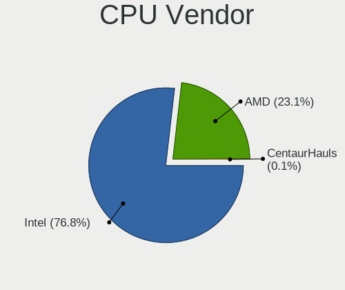

| Vendor | Computers | Percent |
|--------|-----------|---------|
| Intel  | 581       | 78.62%  |
| AMD    | 158       | 21.38%  |

CPU Model
---------

Processor models

| Model                                       | Computers | Percent |
|---------------------------------------------|-----------|---------|
| Intel Atom CPU N2600 @ 1.60GHz              | 10        | 1.35%   |
| Intel 11th Gen Core i5-1135G7 @ 2.40GHz     | 9         | 1.22%   |
| Intel Core i5-6200U CPU @ 2.30GHz           | 8         | 1.08%   |
| Intel Core i5-3470 CPU @ 3.20GHz            | 8         | 1.08%   |
| Intel Atom CPU N270 @ 1.60GHz               | 8         | 1.08%   |
| Intel Core i5-3230M CPU @ 2.60GHz           | 7         | 0.95%   |
| Intel Core i5-8265U CPU @ 1.60GHz           | 6         | 0.81%   |
| AMD Ryzen 7 3700X 8-Core Processor          | 6         | 0.81%   |
| Intel Core i7-8565U CPU @ 1.80GHz           | 5         | 0.68%   |
| Intel Core i5-8250U CPU @ 1.60GHz           | 5         | 0.68%   |
| Intel Core i5-3320M CPU @ 2.60GHz           | 5         | 0.68%   |
| Intel Core i3-8130U CPU @ 2.20GHz           | 5         | 0.68%   |
| Intel Core i3-2310M CPU @ 2.10GHz           | 5         | 0.68%   |
| Intel Core 2 Duo CPU T6600 @ 2.20GHz        | 5         | 0.68%   |
| Intel 11th Gen Core i7-1165G7 @ 2.80GHz     | 5         | 0.68%   |
| Intel 11th Gen Core i3-1115G4 @ 3.00GHz     | 5         | 0.68%   |
| AMD Ryzen 5 5500U with Radeon Graphics      | 5         | 0.68%   |
| Intel Core i7-8550U CPU @ 1.80GHz           | 4         | 0.54%   |
| Intel Core i7-2600 CPU @ 3.40GHz            | 4         | 0.54%   |
| Intel Core i5-4210U CPU @ 1.70GHz           | 4         | 0.54%   |
| Intel Core i5-3210M CPU @ 2.50GHz           | 4         | 0.54%   |
| Intel Core i5-10210U CPU @ 1.60GHz          | 4         | 0.54%   |
| Intel Core i3-8100 CPU @ 3.60GHz            | 4         | 0.54%   |
| Intel Core i3-1005G1 CPU @ 1.20GHz          | 4         | 0.54%   |
| Intel Core 2 Duo CPU P8700 @ 2.53GHz        | 4         | 0.54%   |
| Intel Core 2 Duo CPU E7500 @ 2.93GHz        | 4         | 0.54%   |
| Intel Core 2 Duo CPU E7400 @ 2.80GHz        | 4         | 0.54%   |
| Intel Core 2 Duo CPU E4500 @ 2.20GHz        | 4         | 0.54%   |
| Intel Celeron N4000 CPU @ 1.10GHz           | 4         | 0.54%   |
| Intel Celeron CPU N2830 @ 2.16GHz           | 4         | 0.54%   |
| AMD Ryzen 5 2600 Six-Core Processor         | 4         | 0.54%   |
| Intel Pentium M processor 1.73GHz           | 3         | 0.41%   |
| Intel Pentium Dual-Core CPU T4300 @ 2.10GHz | 3         | 0.41%   |
| Intel Pentium Dual CPU T3400 @ 2.16GHz      | 3         | 0.41%   |
| Intel Pentium D CPU 2.80GHz                 | 3         | 0.41%   |
| Intel Pentium CPU P6100 @ 2.00GHz           | 3         | 0.41%   |
| Intel Pentium CPU N3710 @ 1.60GHz           | 3         | 0.41%   |
| Intel Pentium CPU N3700 @ 1.60GHz           | 3         | 0.41%   |
| Intel Pentium CPU G645 @ 2.90GHz            | 3         | 0.41%   |
| Intel Genuine CPU T2300 @ 1.66GHz           | 3         | 0.41%   |

CPU Model Family
----------------

Processor model prefix

| Model                   | Computers | Percent |
|-------------------------|-----------|---------|
| Intel Core i5           | 122       | 16.49%  |
| Intel Core i7           | 96        | 12.97%  |
| Intel Core i3           | 66        | 8.92%   |
| Intel Core 2 Duo        | 55        | 7.43%   |
| Intel Celeron           | 43        | 5.81%   |
| Other                   | 37        | 5%      |
| Intel Atom              | 32        | 4.32%   |
| AMD Ryzen 5             | 30        | 4.05%   |
| Intel Pentium           | 28        | 3.78%   |
| AMD Ryzen 7             | 24        | 3.24%   |
| Intel Xeon              | 19        | 2.57%   |
| Intel Core 2            | 13        | 1.76%   |
| Intel Core 2 Quad       | 12        | 1.62%   |
| Intel Pentium Dual-Core | 11        | 1.49%   |
| Intel Pentium Dual      | 10        | 1.35%   |
| Intel Genuine           | 10        | 1.35%   |
| AMD Ryzen 3             | 8         | 1.08%   |
| AMD FX                  | 8         | 1.08%   |
| AMD A4                  | 8         | 1.08%   |
| Intel Pentium M         | 7         | 0.95%   |
| Intel Pentium D         | 7         | 0.95%   |
| AMD Sempron             | 6         | 0.81%   |
| AMD Athlon 64 X2        | 6         | 0.81%   |
| Intel Pentium 4         | 5         | 0.68%   |
| AMD Athlon              | 5         | 0.68%   |
| AMD Phenom II X4        | 4         | 0.54%   |
| AMD E2                  | 4         | 0.54%   |
| AMD A8                  | 4         | 0.54%   |
| AMD A10                 | 4         | 0.54%   |
| Intel Pentium Silver    | 3         | 0.41%   |
| Intel Pentium Gold      | 3         | 0.41%   |
| Intel Core i9           | 3         | 0.41%   |
| Intel Core Duo          | 3         | 0.41%   |
| AMD Turion 64 X2 Mobile | 3         | 0.41%   |
| AMD Ryzen 9             | 3         | 0.41%   |
| AMD Phenom II X6        | 3         | 0.41%   |
| AMD E1                  | 3         | 0.41%   |
| AMD E                   | 3         | 0.41%   |
| AMD Athlon XP           | 3         | 0.41%   |
| AMD Athlon II X2        | 3         | 0.41%   |

CPU Cores
---------

Number of processor cores

| Number | Computers | Percent |
|--------|-----------|---------|
| 2      | 388       | 52.36%  |
| 4      | 212       | 28.61%  |
| 1      | 56        | 7.56%   |
| 8      | 36        | 4.86%   |
| 6      | 34        | 4.59%   |
| 16     | 6         | 0.81%   |
| 12     | 5         | 0.67%   |
| 10     | 2         | 0.27%   |
| 3      | 2         | 0.27%   |

CPU Sockets
-----------

Number of sockets

| Number | Computers | Percent |
|--------|-----------|---------|
| 1      | 729       | 98.65%  |
| 2      | 10        | 1.35%   |

CPU Threads
-----------

Threads per core (Hyper-Threading)

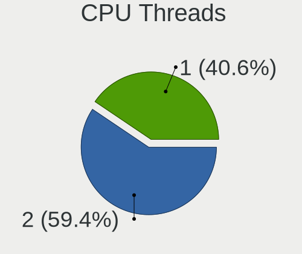

| Number | Computers | Percent |
|--------|-----------|---------|
| 2      | 404       | 54.59%  |
| 1      | 336       | 45.41%  |

CPU Op-Modes
------------

CPU Operation Modes (32-bit, 64-bit)

| Op mode        | Computers | Percent |
|----------------|-----------|---------|
| 32-bit, 64-bit | 687       | 92.96%  |
| 32-bit         | 52        | 7.04%   |

CPU Microcode
-------------

Microcode number

| Number     | Computers | Percent |
|------------|-----------|---------|
| 0x306a9    | 56        | 7.46%   |
| Unknown    | 53        | 7.06%   |
| 0x206a7    | 51        | 6.79%   |
| 0x1067a    | 45        | 5.99%   |
| 0x306c3    | 31        | 4.13%   |
| 0x6fd      | 24        | 3.2%    |
| 0x40651    | 22        | 2.93%   |
| 0x806c1    | 20        | 2.66%   |
| 0x406e3    | 20        | 2.66%   |
| 0x20655    | 16        | 2.13%   |
| 0x806ea    | 15        | 2%      |
| 0x106c2    | 14        | 1.86%   |
| 0x08108109 | 14        | 1.86%   |
| 0x506e3    | 12        | 1.6%    |
| 0x30661    | 12        | 1.6%    |
| 0x06006705 | 12        | 1.6%    |
| 0x806ec    | 11        | 1.46%   |
| 0x6f6      | 11        | 1.46%   |
| 0x010000c8 | 11        | 1.46%   |
| 0x806e9    | 10        | 1.33%   |
| 0x406c4    | 10        | 1.33%   |
| 0x106e5    | 10        | 1.33%   |
| 0x10676    | 9         | 1.2%    |
| 0x906ed    | 8         | 1.07%   |
| 0x906ea    | 8         | 1.07%   |
| 0x30678    | 8         | 1.07%   |
| 0x20652    | 8         | 1.07%   |
| 0x08608103 | 8         | 1.07%   |
| 0x6fb      | 7         | 0.93%   |
| 0x6ec      | 7         | 0.93%   |
| 0x0800820d | 7         | 0.93%   |
| 0x806eb    | 6         | 0.8%    |
| 0x6e8      | 6         | 0.8%    |
| 0x306d4    | 6         | 0.8%    |
| 0x08701021 | 6         | 0.8%    |
| 0x06001119 | 6         | 0.8%    |
| 0x906e9    | 5         | 0.67%   |
| 0x906c0    | 5         | 0.67%   |
| 0x706e5    | 5         | 0.67%   |
| 0x706a1    | 5         | 0.67%   |

CPU Microarch
-------------

Microarchitecture

| Name             | Computers | Percent |
|------------------|-----------|---------|
| KabyLake         | 69        | 9.31%   |
| Penryn           | 63        | 8.5%    |
| SandyBridge      | 59        | 7.96%   |
| IvyBridge        | 58        | 7.83%   |
| Haswell          | 55        | 7.42%   |
| Core             | 50        | 6.75%   |
| Skylake          | 32        | 4.32%   |
| Bonnell          | 30        | 4.05%   |
| Westmere         | 28        | 3.78%   |
| Zen+             | 25        | 3.37%   |
| Silvermont       | 24        | 3.24%   |
| TigerLake        | 22        | 2.97%   |
| P6               | 20        | 2.7%    |
| K10              | 19        | 2.56%   |
| K8 Hammer        | 17        | 2.29%   |
| Unknown          | 17        | 2.29%   |
| NetBurst         | 15        | 2.02%   |
| Excavator        | 15        | 2.02%   |
| Zen              | 14        | 1.89%   |
| Zen 3            | 13        | 1.75%   |
| Nehalem          | 13        | 1.75%   |
| Piledriver       | 12        | 1.62%   |
| Zen 2            | 11        | 1.48%   |
| Goldmont plus    | 9         | 1.21%   |
| Broadwell        | 8         | 1.08%   |
| IceLake          | 6         | 0.81%   |
| Bobcat           | 6         | 0.81%   |
| Tremont          | 5         | 0.67%   |
| Puma             | 5         | 0.67%   |
| CometLake        | 5         | 0.67%   |
| K6               | 3         | 0.4%    |
| Jaguar           | 3         | 0.4%    |
| Goldmont         | 3         | 0.4%    |
| Bulldozer        | 3         | 0.4%    |
| K8 & K10 hybrid  | 2         | 0.27%   |
| K10 Llano        | 1         | 0.13%   |
| Alderlake Hybrid | 1         | 0.13%   |

Graphics
--------

GPU Vendor
----------

Vendors of graphics cards

| Vendor                           | Computers | Percent |
|----------------------------------|-----------|---------|
| Intel                            | 413       | 49.28%  |
| Nvidia                           | 230       | 27.45%  |
| AMD                              | 179       | 21.36%  |
| VIA Technologies                 | 5         | 0.6%    |
| Silicon Integrated Systems [SiS] | 5         | 0.6%    |
| Matrox Electronics Systems       | 4         | 0.48%   |
| S3 Graphics                      | 1         | 0.12%   |
| ASPEED Technology                | 1         | 0.12%   |

GPU Model
---------

Graphics card models

| Model                                                                                    | Computers | Percent |
|------------------------------------------------------------------------------------------|-----------|---------|
| Intel 2nd Generation Core Processor Family Integrated Graphics Controller                | 46        | 5.22%   |
| Intel 3rd Gen Core processor Graphics Controller                                         | 32        | 3.63%   |
| Intel Mobile 945GM/GMS/GME, 943/940GML Express Integrated Graphics Controller            | 21        | 2.38%   |
| Intel Haswell-ULT Integrated Graphics Controller                                         | 20        | 2.27%   |
| AMD Picasso/Raven 2 [Radeon Vega Series / Radeon Vega Mobile Series]                     | 20        | 2.27%   |
| Intel Core Processor Integrated Graphics Controller                                      | 19        | 2.16%   |
| Intel Skylake GT2 [HD Graphics 520]                                                      | 18        | 2.04%   |
| Intel Mobile 4 Series Chipset Integrated Graphics Controller                             | 18        | 2.04%   |
| Intel TigerLake-LP GT2 [Iris Xe Graphics]                                                | 16        | 1.82%   |
| Intel UHD Graphics 620                                                                   | 15        | 1.7%    |
| Intel Atom/Celeron/Pentium Processor x5-E8000/J3xxx/N3xxx Integrated Graphics Controller | 14        | 1.59%   |
| Intel WhiskeyLake-U GT2 [UHD Graphics 620]                                               | 13        | 1.48%   |
| AMD Stoney [Radeon R2/R3/R4/R5 Graphics]                                                 | 13        | 1.48%   |
| Intel Xeon E3-1200 v2/3rd Gen Core processor Graphics Controller                         | 12        | 1.36%   |
| Intel Atom Processor D2xxx/N2xxx Integrated Graphics Controller                          | 12        | 1.36%   |
| Intel Mobile 945GSE Express Integrated Graphics Controller                               | 11        | 1.25%   |
| Intel Mobile 945GM/GMS, 943/940GML Express Integrated Graphics Controller                | 10        | 1.14%   |
| Intel Atom Processor Z36xxx/Z37xxx Series Graphics & Display                             | 10        | 1.14%   |
| Intel 4th Gen Core Processor Integrated Graphics Controller                              | 10        | 1.14%   |
| Nvidia GT218 [GeForce 210]                                                               | 9         | 1.02%   |
| Nvidia GM206 [GeForce GTX 960]                                                           | 9         | 1.02%   |
| Nvidia GK208B [GeForce GT 710]                                                           | 9         | 1.02%   |
| Intel Xeon E3-1200 v3/4th Gen Core Processor Integrated Graphics Controller              | 9         | 1.02%   |
| AMD Ellesmere [Radeon RX 470/480/570/570X/580/580X/590]                                  | 9         | 1.02%   |
| Intel 4 Series Chipset Integrated Graphics Controller                                    | 8         | 0.91%   |
| AMD Lucienne                                                                             | 8         | 0.91%   |
| Nvidia GK208B [GeForce GT 730]                                                           | 7         | 0.79%   |
| Intel Mobile GM965/GL960 Integrated Graphics Controller (secondary)                      | 7         | 0.79%   |
| Intel Mobile GM965/GL960 Integrated Graphics Controller (primary)                        | 7         | 0.79%   |
| Intel HD Graphics 620                                                                    | 7         | 0.79%   |
| Intel GeminiLake [UHD Graphics 600]                                                      | 7         | 0.79%   |
| Intel CoffeeLake-S GT2 [UHD Graphics 630]                                                | 7         | 0.79%   |
| AMD Raven Ridge [Radeon Vega Series / Radeon Vega Mobile Series]                         | 7         | 0.79%   |
| Intel Tiger Lake-LP GT2 [UHD Graphics G4]                                                | 6         | 0.68%   |
| Intel HD Graphics 530                                                                    | 6         | 0.68%   |
| Intel CometLake-U GT2 [UHD Graphics]                                                     | 6         | 0.68%   |
| Intel CoffeeLake-H GT2 [UHD Graphics 630]                                                | 6         | 0.68%   |
| Nvidia TU117M [GeForce GTX 1650 Mobile / Max-Q]                                          | 5         | 0.57%   |
| Intel Mobile 915GM/GMS/910GML Express Graphics Controller                                | 5         | 0.57%   |
| Intel JasperLake [UHD Graphics]                                                          | 5         | 0.57%   |

GPU Combo
---------

Combinations of graphics cards

| Name            | Computers | Percent |
|-----------------|-----------|---------|
| 1 x Intel       | 324       | 43.67%  |
| 1 x Nvidia      | 159       | 21.43%  |
| 1 x AMD         | 144       | 19.41%  |
| Intel + Nvidia  | 63        | 8.49%   |
| Intel + AMD     | 17        | 2.29%   |
| 2 x AMD         | 11        | 1.48%   |
| AMD + Nvidia    | 7         | 0.94%   |
| 1 x VIA         | 5         | 0.67%   |
| 1 x SiS         | 5         | 0.67%   |
| 1 x Matrox      | 4         | 0.54%   |
| 2 x Nvidia      | 1         | 0.13%   |
| 1 x S3 Graphics | 1         | 0.13%   |
| 1 x ASPEED      | 1         | 0.13%   |

GPU Driver
----------

Free vs proprietary

| Driver      | Computers | Percent |
|-------------|-----------|---------|
| Free        | 598       | 80.16%  |
| Proprietary | 82        | 10.99%  |
| Unknown     | 66        | 8.85%   |

GPU Memory
----------

Total video memory

| Size in GB | Computers | Percent |
|------------|-----------|---------|
| Unknown    | 420       | 56.22%  |
| 0.01-0.5   | 116       | 15.53%  |
| 1.01-2.0   | 85        | 11.38%  |
| 0.51-1.0   | 62        | 8.3%    |
| 3.01-4.0   | 32        | 4.28%   |
| 7.01-8.0   | 16        | 2.14%   |
| 5.01-6.0   | 8         | 1.07%   |
| 2.01-3.0   | 5         | 0.67%   |
| 8.01-16.0  | 2         | 0.27%   |
| 16.01-24.0 | 1         | 0.13%   |

Monitor
-------

Monitor Vendor
--------------

Monitor vendors

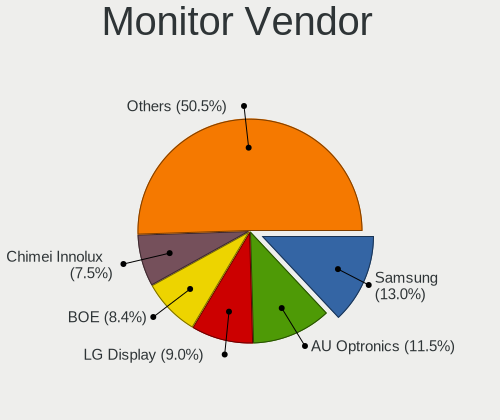

| Vendor                  | Computers | Percent |
|-------------------------|-----------|---------|
| Samsung Electronics     | 97        | 13.27%  |
| AU Optronics            | 87        | 11.9%   |
| LG Display              | 71        | 9.71%   |
| Chimei Innolux          | 56        | 7.66%   |
| BOE                     | 54        | 7.39%   |
| Goldstar                | 40        | 5.47%   |
| Dell                    | 29        | 3.97%   |
| Acer                    | 28        | 3.83%   |
| Chi Mei Optoelectronics | 18        | 2.46%   |
| BenQ                    | 18        | 2.46%   |
| Hewlett-Packard         | 17        | 2.33%   |
| Lenovo                  | 15        | 2.05%   |
| Apple                   | 15        | 2.05%   |
| AOC                     | 14        | 1.92%   |
| Philips                 | 13        | 1.78%   |
| LG Philips              | 13        | 1.78%   |
| Unknown                 | 12        | 1.64%   |
| Ancor Communications    | 12        | 1.64%   |
| HannStar                | 10        | 1.37%   |
| Sony                    | 9         | 1.23%   |
| InfoVision              | 7         | 0.96%   |
| Sharp                   | 5         | 0.68%   |
| Iiyama                  | 5         | 0.68%   |
| Sceptre Tech            | 4         | 0.55%   |
| PANDA                   | 4         | 0.55%   |
| Fujitsu Siemens         | 4         | 0.55%   |
| CPT                     | 4         | 0.55%   |
| ViewSonic               | 3         | 0.41%   |
| Quanta Display          | 3         | 0.41%   |
| NEC Computers           | 3         | 0.41%   |
| ___                     | 2         | 0.27%   |
| Toshiba                 | 2         | 0.27%   |
| SLD                     | 2         | 0.27%   |
| Panasonic               | 2         | 0.27%   |
| Medion                  | 2         | 0.27%   |
| LG Electronics          | 2         | 0.27%   |
| Insignia                | 2         | 0.27%   |
| IBM                     | 2         | 0.27%   |
| eMachines               | 2         | 0.27%   |
| DENON                   | 2         | 0.27%   |

Monitor Model
-------------

Monitor models

| Model                                                                    | Computers | Percent |
|--------------------------------------------------------------------------|-----------|---------|
| AU Optronics LCD Monitor AUO21ED 1920x1080 344x193mm 15.5-inch           | 7         | 0.93%   |
| Chimei Innolux LCD Monitor CMN15CA 1366x768 344x193mm 15.5-inch          | 5         | 0.67%   |
| LG Display LCD Monitor LGD0430 1366x768 345x194mm 15.6-inch              | 4         | 0.53%   |
| LG Display LCD Monitor LGD033A 1366x768 344x194mm 15.5-inch              | 4         | 0.53%   |
| HannStar LCD Monitor HSD03E9 1024x600 220x129mm 10.0-inch                | 4         | 0.53%   |
| Chimei Innolux LCD Monitor CMN15DB 1366x768 344x193mm 15.5-inch          | 4         | 0.53%   |
| Samsung Electronics LCD Monitor SEC5441 1366x768 344x194mm 15.5-inch     | 3         | 0.4%    |
| LG Display LCD Monitor LGD02E9 1366x768 309x174mm 14.0-inch              | 3         | 0.4%    |
| LG Display LCD Monitor LGD02D8 1366x768 277x156mm 12.5-inch              | 3         | 0.4%    |
| InfoVision LCD Monitor IVO03F4 1024x600 223x125mm 10.1-inch              | 3         | 0.4%    |
| Goldstar FULL HD GSM5B55 1920x1080 480x270mm 21.7-inch                   | 3         | 0.4%    |
| Chimei Innolux LCD Monitor CMN15E7 1920x1080 344x193mm 15.5-inch         | 3         | 0.4%    |
| Chimei Innolux LCD Monitor CMN15BF 1366x768 344x193mm 15.5-inch          | 3         | 0.4%    |
| Chi Mei Optoelectronics LCD Monitor CMO15A2 1366x768 344x193mm 15.5-inch | 3         | 0.4%    |
| Chi Mei Optoelectronics LCD Monitor CMO1018 1024x600 222x125mm 10.0-inch | 3         | 0.4%    |
| BOE LCD Monitor BOE06A4 1366x768 344x194mm 15.5-inch                     | 3         | 0.4%    |
| AU Optronics LCD Monitor AUO61D2 1024x600 222x125mm 10.0-inch            | 3         | 0.4%    |
| AU Optronics LCD Monitor AUO45EC 1366x768 344x193mm 15.5-inch            | 3         | 0.4%    |
| AU Optronics LCD Monitor AUO403D 1920x1080 309x174mm 14.0-inch           | 3         | 0.4%    |
| AU Optronics LCD Monitor AUO38ED 1920x1080 344x193mm 15.5-inch           | 3         | 0.4%    |
| AU Optronics LCD Monitor AUO3791 1920x1080 344x194mm 15.5-inch           | 3         | 0.4%    |
| AU Optronics LCD Monitor AUO303C 1366x768 309x173mm 13.9-inch            | 3         | 0.4%    |
| AU Optronics LCD Monitor AUO139E 1600x900 382x214mm 17.2-inch            | 3         | 0.4%    |
| AU Optronics LCD Monitor AUO10EC 1366x768 344x193mm 15.5-inch            | 3         | 0.4%    |
| Unknown LCD Monitor SAMSUNG                                              | 2         | 0.27%   |
| Sony LCD Monitor TV 3840x1080                                            | 2         | 0.27%   |
| SLD LCD Monitor SLD003C 1366x768 309x173mm 13.9-inch                     | 2         | 0.27%   |
| Sceptre Tech Sceptre B34 SPT0D52 2560x1080 797x334mm 34.0-inch           | 2         | 0.27%   |
| Samsung Electronics SyncMaster SAM01CE 1024x768 304x228mm 15.0-inch      | 2         | 0.27%   |
| Samsung Electronics S22D300 SAM0B3F 1920x1080 477x268mm 21.5-inch        | 2         | 0.27%   |
| Samsung Electronics LCD Monitor SEC4542 1280x800 303x190mm 14.1-inch     | 2         | 0.27%   |
| Samsung Electronics LCD Monitor SEC3741 1280x800 331x207mm 15.4-inch     | 2         | 0.27%   |
| Samsung Electronics LCD Monitor SEC3345 1280x800 331x207mm 15.4-inch     | 2         | 0.27%   |
| Samsung Electronics LCD Monitor SEC3052 1366x768 256x144mm 11.6-inch     | 2         | 0.27%   |
| Samsung Electronics LCD Monitor SDC4C48 1920x1080 344x194mm 15.5-inch    | 2         | 0.27%   |
| Quanta Display LCD Monitor QDS0025 1024x768 304x228mm 15.0-inch          | 2         | 0.27%   |
| Philips PHL 242V8 PHLC219 1920x1080 527x296mm 23.8-inch                  | 2         | 0.27%   |
| PANDA LCD Monitor NCP0035 1920x1080 309x174mm 14.0-inch                  | 2         | 0.27%   |
| Panasonic VVY13F001G10 MEI96A2 1920x1080 344x193mm 15.5-inch             | 2         | 0.27%   |
| LG Philips LCD Monitor LPL8D00 1280x800 304x190mm 14.1-inch              | 2         | 0.27%   |

Monitor Resolution
------------------

Monitor screen resolution

| Resolution         | Computers | Percent |
|--------------------|-----------|---------|
| 1920x1080 (FHD)    | 267       | 37.5%   |
| 1366x768 (WXGA)    | 173       | 24.3%   |
| 1280x1024 (SXGA)   | 40        | 5.62%   |
| 1280x800 (WXGA)    | 37        | 5.2%    |
| 1600x900 (HD+)     | 33        | 4.63%   |
| 1680x1050 (WSXGA+) | 24        | 3.37%   |
| 1440x900 (WXGA+)   | 21        | 2.95%   |
| 3840x2160 (4K)     | 20        | 2.81%   |
| 1024x600           | 17        | 2.39%   |
| 1920x1200 (WUXGA)  | 16        | 2.25%   |
| 1360x768           | 9         | 1.26%   |
| 2560x1440 (QHD)    | 8         | 1.12%   |
| 3440x1440          | 7         | 0.98%   |
| 1024x768 (XGA)     | 7         | 0.98%   |
| Unknown            | 7         | 0.98%   |
| 2560x1080          | 6         | 0.84%   |
| 3840x1080          | 4         | 0.56%   |
| 2880x1800          | 2         | 0.28%   |
| 2560x1600          | 2         | 0.28%   |
| 1280x768           | 2         | 0.28%   |
| 7680x2160          | 1         | 0.14%   |
| 4480x1440          | 1         | 0.14%   |
| 4240x1440          | 1         | 0.14%   |
| 2736x1824          | 1         | 0.14%   |
| 2256x1504          | 1         | 0.14%   |
| 1920x540           | 1         | 0.14%   |
| 1600x1200          | 1         | 0.14%   |
| 1400x1050          | 1         | 0.14%   |
| 1280x720 (HD)      | 1         | 0.14%   |
| 1024x576           | 1         | 0.14%   |

Monitor Diagonal
----------------

Diagonal size in inches

| Inches  | Computers | Percent |
|---------|-----------|---------|
| 15      | 226       | 31.09%  |
| 13      | 58        | 7.98%   |
| Unknown | 53        | 7.29%   |
| 14      | 51        | 7.02%   |
| 17      | 45        | 6.19%   |
| 24      | 39        | 5.36%   |
| 21      | 37        | 5.09%   |
| 23      | 33        | 4.54%   |
| 19      | 26        | 3.58%   |
| 18      | 24        | 3.3%    |
| 27      | 23        | 3.16%   |
| 10      | 17        | 2.34%   |
| 12      | 14        | 1.93%   |
| 20      | 13        | 1.79%   |
| 22      | 12        | 1.65%   |
| 11      | 10        | 1.38%   |
| 34      | 9         | 1.24%   |
| 31      | 8         | 1.1%    |
| 72      | 6         | 0.83%   |
| 54      | 3         | 0.41%   |
| 32      | 3         | 0.41%   |
| 52      | 2         | 0.28%   |
| 48      | 2         | 0.28%   |
| 33      | 2         | 0.28%   |
| 16      | 2         | 0.28%   |
| 8       | 2         | 0.28%   |
| 84      | 1         | 0.14%   |
| 65      | 1         | 0.14%   |
| 64      | 1         | 0.14%   |
| 40      | 1         | 0.14%   |
| 28      | 1         | 0.14%   |
| 26      | 1         | 0.14%   |
| 25      | 1         | 0.14%   |

Monitor Width
-------------

Physical width

| Width in mm | Computers | Percent |
|-------------|-----------|---------|
| 301-350     | 319       | 44.68%  |
| 401-500     | 91        | 12.75%  |
| 501-600     | 88        | 12.32%  |
| 201-300     | 67        | 9.38%   |
| 351-400     | 53        | 7.42%   |
| Unknown     | 53        | 7.42%   |
| 701-800     | 14        | 1.96%   |
| 601-700     | 11        | 1.54%   |
| 1001-1500   | 8         | 1.12%   |
| 1501-2000   | 7         | 0.98%   |
| 101-200     | 2         | 0.28%   |
| 801-900     | 1         | 0.14%   |

Aspect Ratio
------------

Proportional relationship between the width and the height

| Ratio   | Computers | Percent |
|---------|-----------|---------|
| 16/9    | 471       | 68.76%  |
| 16/10   | 101       | 14.74%  |
| Unknown | 48        | 7.01%   |
| 5/4     | 35        | 5.11%   |
| 4/3     | 14        | 2.04%   |
| 21/9    | 11        | 1.61%   |
| 3/2     | 4         | 0.58%   |
| 32/9    | 1         | 0.15%   |

Monitor Area
------------

Area in inch

| Area in inch | Computers | Percent |
|----------------|-----------|---------|
| 101-110        | 224       | 30.94%  |
| 201-250        | 97        | 13.4%   |
| 81-90          | 87        | 12.02%  |
| Unknown        | 53        | 7.32%   |
| 151-200        | 50        | 6.91%   |
| 141-150        | 37        | 5.11%   |
| 301-350        | 24        | 3.31%   |
| 71-80          | 21        | 2.9%    |
| 351-500        | 21        | 2.9%    |
| 121-130        | 21        | 2.9%    |
| 41-50          | 17        | 2.35%   |
| 251-300        | 17        | 2.35%   |
| More than 1000 | 14        | 1.93%   |
| 61-70          | 13        | 1.8%    |
| 51-60          | 10        | 1.38%   |
| 131-140        | 6         | 0.83%   |
| 91-100         | 4         | 0.55%   |
| 111-120        | 3         | 0.41%   |
| 501-1000       | 3         | 0.41%   |
| 1-40           | 2         | 0.28%   |

Pixel Density
-------------

Pixels per inch

| Density       | Computers | Percent |
|---------------|-----------|---------|
| 51-100        | 243       | 34.32%  |
| 101-120       | 223       | 31.5%   |
| 121-160       | 150       | 21.19%  |
| Unknown       | 53        | 7.49%   |
| 161-240       | 19        | 2.68%   |
| 1-50          | 13        | 1.84%   |
| More than 240 | 7         | 0.99%   |

Multiple Monitors
-----------------

Total monitors connected

| Total | Computers | Percent |
|-------|-----------|---------|
| 1     | 625       | 83.11%  |
| 2     | 80        | 10.64%  |
| 0     | 43        | 5.72%   |
| 3     | 4         | 0.53%   |

Network
-------

Net Controller Vendor
---------------------

Controller vendors

| Vendor                            | Computers | Percent |
|-----------------------------------|-----------|---------|
| Realtek Semiconductor             | 403       | 35.14%  |
| Intel                             | 295       | 25.72%  |
| Qualcomm Atheros                  | 159       | 13.86%  |
| Broadcom                          | 85        | 7.41%   |
| Marvell Technology Group          | 22        | 1.92%   |
| Broadcom Limited                  | 22        | 1.92%   |
| Ralink Technology                 | 18        | 1.57%   |
| Nvidia                            | 18        | 1.57%   |
| TP-Link                           | 13        | 1.13%   |
| Ralink                            | 11        | 0.96%   |
| Samsung Electronics               | 10        | 0.87%   |
| MediaTek                          | 9         | 0.78%   |
| Silicon Integrated Systems [SiS]  | 6         | 0.52%   |
| VIA Technologies                  | 5         | 0.44%   |
| Huawei Technologies               | 5         | 0.44%   |
| JMicron Technology                | 4         | 0.35%   |
| Xiaomi                            | 3         | 0.26%   |
| NetGear                           | 3         | 0.26%   |
| Ericsson Business Mobile Networks | 3         | 0.26%   |
| Dell                              | 3         | 0.26%   |
| ZTE WCDMA Technologies MSM        | 2         | 0.17%   |
| Sitecom Europe                    | 2         | 0.17%   |
| Sierra Wireless                   | 2         | 0.17%   |
| Microsoft                         | 2         | 0.17%   |
| Linksys                           | 2         | 0.17%   |
| Lenovo                            | 2         | 0.17%   |
| Hewlett-Packard                   | 2         | 0.17%   |
| Google                            | 2         | 0.17%   |
| Edimax Technology                 | 2         | 0.17%   |
| DisplayLink                       | 2         | 0.17%   |
| AVM                               | 2         | 0.17%   |
| Attansic Technology               | 2         | 0.17%   |
| ASUSTek Computer                  | 2         | 0.17%   |
| AMD                               | 2         | 0.17%   |
| ST-Ericsson                       | 1         | 0.09%   |
| Spreadtrum Communications         | 1         | 0.09%   |
| Qualcomm Atheros Communications   | 1         | 0.09%   |
| Qualcomm                          | 1         | 0.09%   |
| OnePlus Technology (Shenzhen)     | 1         | 0.09%   |
| Microchip Technology              | 1         | 0.09%   |

Net Controller Model
--------------------

Controller models

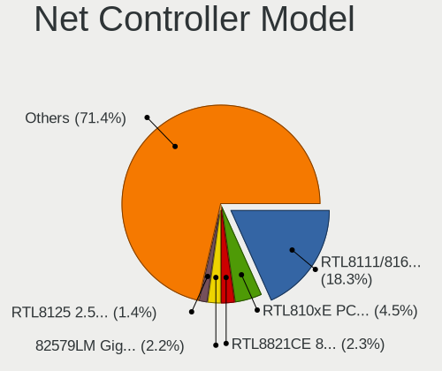

| Model                                                                   | Computers | Percent |
|-------------------------------------------------------------------------|-----------|---------|
| Realtek RTL8111/8168/8411 PCI Express Gigabit Ethernet Controller       | 240       | 17.66%  |
| Realtek RTL810xE PCI Express Fast Ethernet controller                   | 76        | 5.59%   |
| Realtek RTL8821CE 802.11ac PCIe Wireless Network Adapter                | 29        | 2.13%   |
| Intel 82579LM Gigabit Network Connection (Lewisville)                   | 29        | 2.13%   |
| Qualcomm Atheros AR9285 Wireless Network Adapter (PCI-Express)          | 25        | 1.84%   |
| Qualcomm Atheros AR9485 Wireless Network Adapter                        | 19        | 1.4%    |
| Broadcom BCM4313 802.11bgn Wireless Network Adapter                     | 19        | 1.4%    |
| Qualcomm Atheros QCA9565 / AR9565 Wireless Network Adapter              | 17        | 1.25%   |
| Realtek RTL-8100/8101L/8139 PCI Fast Ethernet Adapter                   | 15        | 1.1%    |
| Qualcomm Atheros QCA9377 802.11ac Wireless Network Adapter              | 15        | 1.1%    |
| Intel Wi-Fi 6 AX200                                                     | 15        | 1.1%    |
| Intel PRO/Wireless 3945ABG [Golan] Network Connection                   | 15        | 1.1%    |
| Qualcomm Atheros AR242x / AR542x Wireless Network Adapter (PCI-Express) | 14        | 1.03%   |
| Intel Wireless 8265 / 8275                                              | 14        | 1.03%   |
| Intel Wireless 8260                                                     | 13        | 0.96%   |
| Intel I211 Gigabit Network Connection                                   | 13        | 0.96%   |
| Realtek RTL8188EUS 802.11n Wireless Network Adapter                     | 12        | 0.88%   |
| Intel Wireless 7260                                                     | 11        | 0.81%   |
| Intel Wireless 3165                                                     | 11        | 0.81%   |
| Intel Wi-Fi 6 AX201                                                     | 11        | 0.81%   |
| Qualcomm Atheros AR9462 Wireless Network Adapter                        | 10        | 0.74%   |
| Intel WiFi Link 5100                                                    | 10        | 0.74%   |
| Samsung Galaxy series, misc. (tethering mode)                           | 9         | 0.66%   |
| Realtek RTL8125 2.5GbE Controller                                       | 9         | 0.66%   |
| Intel Wireless 7265                                                     | 9         | 0.66%   |
| Intel Ethernet Connection I217-LM                                       | 9         | 0.66%   |
| Realtek RTL8188CE 802.11b/g/n WiFi Adapter                              | 8         | 0.59%   |
| Nvidia MCP61 Ethernet                                                   | 8         | 0.59%   |
| Intel Centrino Advanced-N 6205 [Taylor Peak]                            | 8         | 0.59%   |
| Realtek RTL8822CE 802.11ac PCIe Wireless Network Adapter                | 7         | 0.52%   |
| Realtek RTL8723BE PCIe Wireless Network Adapter                         | 7         | 0.52%   |
| Realtek RTL8153 Gigabit Ethernet Adapter                                | 7         | 0.52%   |
| Qualcomm Atheros AR8151 v2.0 Gigabit Ethernet                           | 7         | 0.52%   |
| Qualcomm Atheros AR8132 Fast Ethernet                                   | 7         | 0.52%   |
| Intel Cannon Point-LP CNVi [Wireless-AC]                                | 7         | 0.52%   |
| Intel 82579V Gigabit Network Connection                                 | 7         | 0.52%   |
| Intel 82577LM Gigabit Network Connection                                | 7         | 0.52%   |
| Realtek RTL88x2bu [AC1200 Techkey]                                      | 6         | 0.44%   |
| Ralink RT2870/RT3070 Wireless Adapter                                   | 6         | 0.44%   |
| Qualcomm Atheros AR8152 v2.0 Fast Ethernet                              | 6         | 0.44%   |

Wireless Vendor
---------------

Wireless vendors

| Vendor                                | Computers | Percent |
|---------------------------------------|-----------|---------|
| Intel                                 | 206       | 33.88%  |
| Realtek Semiconductor                 | 133       | 21.88%  |
| Qualcomm Atheros                      | 121       | 19.9%   |
| Broadcom                              | 59        | 9.7%    |
| Ralink Technology                     | 18        | 2.96%   |
| TP-Link                               | 13        | 2.14%   |
| Broadcom Limited                      | 12        | 1.97%   |
| Ralink                                | 11        | 1.81%   |
| MediaTek                              | 7         | 1.15%   |
| NetGear                               | 3         | 0.49%   |
| Sitecom Europe                        | 2         | 0.33%   |
| Sierra Wireless                       | 2         | 0.33%   |
| Microsoft                             | 2         | 0.33%   |
| Linksys                               | 2         | 0.33%   |
| Edimax Technology                     | 2         | 0.33%   |
| AVM                                   | 2         | 0.33%   |
| ASUSTek Computer                      | 2         | 0.33%   |
| Xiaomi                                | 1         | 0.16%   |
| Qualcomm Atheros Communications       | 1         | 0.16%   |
| Mercucys                              | 1         | 0.16%   |
| Marvell Technology Group              | 1         | 0.16%   |
| IMC Networks                          | 1         | 0.16%   |
| FIBOCOM                               | 1         | 0.16%   |
| Dell                                  | 1         | 0.16%   |
| D-Link System                         | 1         | 0.16%   |
| Cisco Aironet Wireless Communications | 1         | 0.16%   |
| Belkin Components                     | 1         | 0.16%   |
| Askey Computer                        | 1         | 0.16%   |

Wireless Model
--------------

Wireless models

| Model                                                                   | Computers | Percent |
|-------------------------------------------------------------------------|-----------|---------|
| Realtek RTL8821CE 802.11ac PCIe Wireless Network Adapter                | 29        | 4.68%   |
| Qualcomm Atheros AR9285 Wireless Network Adapter (PCI-Express)          | 25        | 4.03%   |
| Qualcomm Atheros AR9485 Wireless Network Adapter                        | 19        | 3.06%   |
| Broadcom BCM4313 802.11bgn Wireless Network Adapter                     | 19        | 3.06%   |
| Qualcomm Atheros QCA9565 / AR9565 Wireless Network Adapter              | 17        | 2.74%   |
| Qualcomm Atheros QCA9377 802.11ac Wireless Network Adapter              | 15        | 2.42%   |
| Intel Wi-Fi 6 AX200                                                     | 15        | 2.42%   |
| Intel PRO/Wireless 3945ABG [Golan] Network Connection                   | 15        | 2.42%   |
| Qualcomm Atheros AR242x / AR542x Wireless Network Adapter (PCI-Express) | 14        | 2.26%   |
| Intel Wireless 8265 / 8275                                              | 14        | 2.26%   |
| Intel Wireless 8260                                                     | 13        | 2.1%    |
| Realtek RTL8188EUS 802.11n Wireless Network Adapter                     | 12        | 1.94%   |
| Intel Wireless 7260                                                     | 11        | 1.77%   |
| Intel Wireless 3165                                                     | 11        | 1.77%   |
| Intel Wi-Fi 6 AX201                                                     | 11        | 1.77%   |
| Qualcomm Atheros AR9462 Wireless Network Adapter                        | 10        | 1.61%   |
| Intel WiFi Link 5100                                                    | 10        | 1.61%   |
| Intel Wireless 7265                                                     | 9         | 1.45%   |
| Realtek RTL8188CE 802.11b/g/n WiFi Adapter                              | 8         | 1.29%   |
| Intel Centrino Advanced-N 6205 [Taylor Peak]                            | 8         | 1.29%   |
| Realtek RTL8822CE 802.11ac PCIe Wireless Network Adapter                | 7         | 1.13%   |
| Realtek RTL8723BE PCIe Wireless Network Adapter                         | 7         | 1.13%   |
| Intel Cannon Point-LP CNVi [Wireless-AC]                                | 7         | 1.13%   |
| Realtek RTL88x2bu [AC1200 Techkey]                                      | 6         | 0.97%   |
| Ralink RT2870/RT3070 Wireless Adapter                                   | 6         | 0.97%   |
| Intel Wireless 3160                                                     | 6         | 0.97%   |
| Intel Wi-Fi 6 AX210/AX211/AX411 160MHz                                  | 6         | 0.97%   |
| Intel Dual Band Wireless-AC 3168NGW [Stone Peak]                        | 6         | 0.97%   |
| Intel Centrino Ultimate-N 6300                                          | 6         | 0.97%   |
| Realtek RTL8822BE 802.11a/b/g/n/ac WiFi adapter                         | 5         | 0.81%   |
| Realtek RTL8723BU 802.11b/g/n WLAN Adapter                              | 5         | 0.81%   |
| Realtek RTL8191SEvB Wireless LAN Controller                             | 5         | 0.81%   |
| Realtek RTL8188FTV 802.11b/g/n 1T1R 2.4G WLAN Adapter                   | 5         | 0.81%   |
| Realtek RTL8188EE Wireless Network Adapter                              | 5         | 0.81%   |
| Ralink MT7601U Wireless Adapter                                         | 5         | 0.81%   |
| Ralink RT3090 Wireless 802.11n 1T/1R PCIe                               | 5         | 0.81%   |
| Qualcomm Atheros AR928X Wireless Network Adapter (PCI-Express)          | 5         | 0.81%   |
| Qualcomm Atheros AR9287 Wireless Network Adapter (PCI-Express)          | 5         | 0.81%   |
| Intel PRO/Wireless 4965 AG or AGN [Kedron] Network Connection           | 5         | 0.81%   |
| Intel Comet Lake PCH-LP CNVi WiFi                                       | 5         | 0.81%   |

Ethernet Vendor
---------------

Ethernet vendors

| Vendor                           | Computers | Percent |
|----------------------------------|-----------|---------|
| Realtek Semiconductor            | 352       | 49.86%  |
| Intel                            | 161       | 22.8%   |
| Qualcomm Atheros                 | 57        | 8.07%   |
| Broadcom                         | 34        | 4.82%   |
| Marvell Technology Group         | 21        | 2.97%   |
| Nvidia                           | 18        | 2.55%   |
| Broadcom Limited                 | 10        | 1.42%   |
| Samsung Electronics              | 9         | 1.27%   |
| Silicon Integrated Systems [SiS] | 6         | 0.85%   |
| VIA Technologies                 | 5         | 0.71%   |
| JMicron Technology               | 4         | 0.57%   |
| Huawei Technologies              | 4         | 0.57%   |
| ZTE WCDMA Technologies MSM       | 2         | 0.28%   |
| Xiaomi                           | 2         | 0.28%   |
| MediaTek                         | 2         | 0.28%   |
| Lenovo                           | 2         | 0.28%   |
| Hewlett-Packard                  | 2         | 0.28%   |
| Google                           | 2         | 0.28%   |
| DisplayLink                      | 2         | 0.28%   |
| Attansic Technology              | 2         | 0.28%   |
| Spreadtrum Communications        | 1         | 0.14%   |
| Qualcomm                         | 1         | 0.14%   |
| OnePlus Technology (Shenzhen)    | 1         | 0.14%   |
| Microchip Technology             | 1         | 0.14%   |
| HTC (High Tech Computer)         | 1         | 0.14%   |
| Gemtek                           | 1         | 0.14%   |
| Davicom Semiconductor            | 1         | 0.14%   |
| ADMtek                           | 1         | 0.14%   |
| 3Com                             | 1         | 0.14%   |

Ethernet Model
--------------

Ethernet models

| Model                                                             | Computers | Percent |
|-------------------------------------------------------------------|-----------|---------|
| Realtek RTL8111/8168/8411 PCI Express Gigabit Ethernet Controller | 240       | 33.47%  |
| Realtek RTL810xE PCI Express Fast Ethernet controller             | 76        | 10.6%   |
| Intel 82579LM Gigabit Network Connection (Lewisville)             | 29        | 4.04%   |
| Realtek RTL-8100/8101L/8139 PCI Fast Ethernet Adapter             | 15        | 2.09%   |
| Intel I211 Gigabit Network Connection                             | 13        | 1.81%   |
| Samsung Galaxy series, misc. (tethering mode)                     | 9         | 1.26%   |
| Realtek RTL8125 2.5GbE Controller                                 | 9         | 1.26%   |
| Intel Ethernet Connection I217-LM                                 | 9         | 1.26%   |
| Nvidia MCP61 Ethernet                                             | 8         | 1.12%   |
| Realtek RTL8153 Gigabit Ethernet Adapter                          | 7         | 0.98%   |
| Qualcomm Atheros AR8151 v2.0 Gigabit Ethernet                     | 7         | 0.98%   |
| Qualcomm Atheros AR8132 Fast Ethernet                             | 7         | 0.98%   |
| Intel 82579V Gigabit Network Connection                           | 7         | 0.98%   |
| Intel 82577LM Gigabit Network Connection                          | 7         | 0.98%   |
| Qualcomm Atheros AR8152 v2.0 Fast Ethernet                        | 6         | 0.84%   |
| Qualcomm Atheros AR8131 Gigabit Ethernet                          | 6         | 0.84%   |
| Qualcomm Atheros AR8121/AR8113/AR8114 Gigabit or Fast Ethernet    | 6         | 0.84%   |
| Marvell Group 88E8071 PCI-E Gigabit Ethernet Controller           | 6         | 0.84%   |
| Intel Ethernet Connection I219-V                                  | 6         | 0.84%   |
| Intel 82573L Gigabit Ethernet Controller                          | 6         | 0.84%   |
| Intel 82567LM Gigabit Network Connection                          | 6         | 0.84%   |
| Broadcom NetXtreme BCM57786 Gigabit Ethernet PCIe                 | 6         | 0.84%   |
| VIA VT6102/VT6103 [Rhine-II]                                      | 5         | 0.7%    |
| Qualcomm Atheros Attansic L1 Gigabit Ethernet                     | 5         | 0.7%    |
| Intel Ethernet Connection I217-V                                  | 5         | 0.7%    |
| Intel Ethernet Connection (7) I219-V                              | 5         | 0.7%    |
| Intel Ethernet Connection (2) I219-V                              | 5         | 0.7%    |
| Qualcomm Atheros Killer E220x Gigabit Ethernet Controller         | 4         | 0.56%   |
| Qualcomm Atheros AR8162 Fast Ethernet                             | 4         | 0.56%   |
| Nvidia MCP79 Ethernet                                             | 4         | 0.56%   |
| JMicron JMC250 PCI Express Gigabit Ethernet Controller            | 4         | 0.56%   |
| Intel 82574L Gigabit Network Connection                           | 4         | 0.56%   |
| Broadcom NetXtreme BCM5761 Gigabit Ethernet PCIe                  | 4         | 0.56%   |
| Silicon Integrated Systems [SiS] SiS900 PCI Fast Ethernet         | 3         | 0.42%   |
| Silicon Integrated Systems [SiS] 191 Gigabit Ethernet Adapter     | 3         | 0.42%   |
| Realtek RTL-8110SC/8169SC Gigabit Ethernet                        | 3         | 0.42%   |
| Qualcomm Atheros AR8161 Gigabit Ethernet                          | 3         | 0.42%   |
| Qualcomm Atheros AR8151 v1.0 Gigabit Ethernet                     | 3         | 0.42%   |
| Marvell Group 88E8056 PCI-E Gigabit Ethernet Controller           | 3         | 0.42%   |
| Intel I210 Gigabit Network Connection                             | 3         | 0.42%   |

Net Controller Kind
-------------------

Ethernet, WiFi or modem

| Kind     | Computers | Percent |
|----------|-----------|---------|
| Ethernet | 664       | 52.61%  |
| WiFi     | 576       | 45.64%  |
| Modem    | 18        | 1.43%   |
| Unknown  | 4         | 0.32%   |

Used Controller
---------------

Currently used network controller

| Kind     | Computers | Percent |
|----------|-----------|---------|
| WiFi     | 412       | 54.21%  |
| Ethernet | 348       | 45.79%  |

NICs
----

Total network controllers on board

| Total | Computers | Percent |
|-------|-----------|---------|
| 2     | 441       | 59.68%  |
| 1     | 273       | 36.94%  |
| 0     | 12        | 1.62%   |
| 3     | 9         | 1.22%   |
| 4     | 4         | 0.54%   |

IPv6
----

IPv6 vs IPv4

| Used | Computers | Percent |
|------|-----------|---------|
| No   | 591       | 78.38%  |
| Yes  | 163       | 21.62%  |

Bluetooth
---------

Bluetooth Vendor
----------------

Controller vendors

| Vendor                          | Computers | Percent |
|---------------------------------|-----------|---------|
| Intel                           | 133       | 36.44%  |
| Realtek Semiconductor           | 54        | 14.79%  |
| Broadcom                        | 28        | 7.67%   |
| Qualcomm Atheros Communications | 26        | 7.12%   |
| Cambridge Silicon Radio         | 21        | 5.75%   |
| Foxconn / Hon Hai               | 20        | 5.48%   |
| Lite-On Technology              | 15        | 4.11%   |
| Hewlett-Packard                 | 13        | 3.56%   |
| Apple                           | 13        | 3.56%   |
| Dell                            | 10        | 2.74%   |
| IMC Networks                    | 8         | 2.19%   |
| ASUSTek Computer                | 5         | 1.37%   |
| Toshiba                         | 3         | 0.82%   |
| Foxconn International           | 3         | 0.82%   |
| MediaTek                        | 2         | 0.55%   |
| Askey Computer                  | 2         | 0.55%   |
| Taiyo Yuden                     | 1         | 0.27%   |
| Realtek                         | 1         | 0.27%   |
| Ralink Technology               | 1         | 0.27%   |
| Ralink                          | 1         | 0.27%   |
| Qcom                            | 1         | 0.27%   |
| Marvell Semiconductor           | 1         | 0.27%   |
| Dynex                           | 1         | 0.27%   |
| Chicony Electronics             | 1         | 0.27%   |
| Alps Electric                   | 1         | 0.27%   |

Bluetooth Model
---------------

Controller models

| Model                                                                               | Computers | Percent |
|-------------------------------------------------------------------------------------|-----------|---------|
| Intel Bluetooth wireless interface                                                  | 60        | 16.44%  |
| Realtek Bluetooth Radio                                                             | 30        | 8.22%   |
| Cambridge Silicon Radio Bluetooth Dongle (HCI mode)                                 | 21        | 5.75%   |
| Realtek  Bluetooth 4.2 Adapter                                                      | 19        | 5.21%   |
| Intel Bluetooth 9460/9560 Jefferson Peak (JfP)                                      | 19        | 5.21%   |
| Intel AX201 Bluetooth                                                               | 18        | 4.93%   |
| Qualcomm Atheros  Bluetooth Device                                                  | 14        | 3.84%   |
| Intel AX200 Bluetooth                                                               | 14        | 3.84%   |
| HP Bluetooth 2.0 Interface [Broadcom BCM2045]                                       | 7         | 1.92%   |
| Qualcomm Atheros AR3012 Bluetooth 4.0                                               | 6         | 1.64%   |
| Intel Wireless-AC 3168 Bluetooth                                                    | 6         | 1.64%   |
| Lite-On Qualcomm Atheros QCA9377 Bluetooth                                          | 5         | 1.37%   |
| Intel Centrino Advanced-N 6230 Bluetooth adapter                                    | 5         | 1.37%   |
| Intel AX210 Bluetooth                                                               | 5         | 1.37%   |
| HP Broadcom 2070 Bluetooth Combo                                                    | 5         | 1.37%   |
| Foxconn / Hon Hai Bluetooth Device                                                  | 5         | 1.37%   |
| Broadcom BCM2045B (BDC-2.1)                                                         | 5         | 1.37%   |
| Apple Bluetooth Host Controller                                                     | 5         | 1.37%   |
| Lite-On Atheros AR3012 Bluetooth                                                    | 4         | 1.1%    |
| Foxconn / Hon Hai Wireless_Device                                                   | 4         | 1.1%    |
| Dell DW375 Bluetooth Module                                                         | 4         | 1.1%    |
| Broadcom BCM2070 Bluetooth 2.1 + EDR                                                | 4         | 1.1%    |
| Apple Bluetooth USB Host Controller                                                 | 4         | 1.1%    |
| Qualcomm Atheros AR3011 Bluetooth                                                   | 3         | 0.82%   |
| Lite-On Bluetooth Device                                                            | 3         | 0.82%   |
| Intel Centrino Bluetooth Wireless Transceiver                                       | 3         | 0.82%   |
| IMC Networks Bluetooth Device                                                       | 3         | 0.82%   |
| Foxconn International BCM43142A0 Bluetooth module                                   | 3         | 0.82%   |
| Foxconn / Hon Hai Foxconn T77H114 BCM2070 [Single-Chip Bluetooth 2.1 + EDR Adapter] | 3         | 0.82%   |
| Foxconn / Hon Hai Acer Module                                                       | 3         | 0.82%   |
| Broadcom BCM20702A0 Bluetooth 4.0                                                   | 3         | 0.82%   |
| Broadcom BCM2045B (BDC-2) [Bluetooth Controller]                                    | 3         | 0.82%   |
| Realtek RTL8822BE Bluetooth 4.2 Adapter                                             | 2         | 0.55%   |
| Realtek RTL8821A Bluetooth                                                          | 2         | 0.55%   |
| Qualcomm Atheros AR9462 Bluetooth                                                   | 2         | 0.55%   |
| MediaTek Wireless_Device                                                            | 2         | 0.55%   |
| Lite-On Atheros Bluetooth                                                           | 2         | 0.55%   |
| Intel Wireless-AC 9260 Bluetooth Adapter                                            | 2         | 0.55%   |
| IMC Networks Bluetooth Radio                                                        | 2         | 0.55%   |
| IMC Networks Atheros AR3012 Bluetooth 4.0 Adapter                                   | 2         | 0.55%   |

Sound
-----

Sound Vendor
------------

Sound card vendors

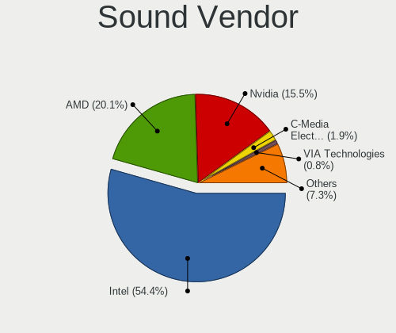

| Vendor                               | Computers | Percent |
|--------------------------------------|-----------|---------|
| Intel                                | 546       | 56.29%  |
| AMD                                  | 180       | 18.56%  |
| Nvidia                               | 165       | 17.01%  |
| C-Media Electronics                  | 17        | 1.75%   |
| VIA Technologies                     | 9         | 0.93%   |
| Silicon Integrated Systems [SiS]     | 8         | 0.82%   |
| Generalplus Technology               | 6         | 0.62%   |
| GN Netcom                            | 5         | 0.52%   |
| Logitech                             | 4         | 0.41%   |
| JMTek                                | 4         | 0.41%   |
| Creative Labs                        | 4         | 0.41%   |
| Texas Instruments                    | 3         | 0.31%   |
| Yamaha                               | 2         | 0.21%   |
| Tenx Technology                      | 2         | 0.21%   |
| Plantronics                          | 2         | 0.21%   |
| Xilinx                               | 1         | 0.1%    |
| Thesycon Systemsoftware & Consulting | 1         | 0.1%    |
| Sony                                 | 1         | 0.1%    |
| Realtek Semiconductor                | 1         | 0.1%    |
| Native Instruments                   | 1         | 0.1%    |
| Micro Star International             | 1         | 0.1%    |
| M-Audio                              | 1         | 0.1%    |
| GYROCOM C&C                          | 1         | 0.1%    |
| Focusrite-Novation                   | 1         | 0.1%    |
| Evolution Electronics                | 1         | 0.1%    |
| Dell                                 | 1         | 0.1%    |
| Creative Technology                  | 1         | 0.1%    |
| Audioengine                          | 1         | 0.1%    |

Sound Model
-----------

Sound card models

| Model                                                                                             | Computers | Percent |
|---------------------------------------------------------------------------------------------------|-----------|---------|
| Intel NM10/ICH7 Family High Definition Audio Controller                                           | 66        | 5.88%   |
| Intel 7 Series/C216 Chipset Family High Definition Audio Controller                               | 58        | 5.16%   |
| Intel 6 Series/C200 Series Chipset Family High Definition Audio Controller                        | 52        | 4.63%   |
| AMD Family 17h/19h HD Audio Controller                                                            | 49        | 4.36%   |
| Intel Sunrise Point-LP HD Audio                                                                   | 45        | 4.01%   |
| Intel 82801I (ICH9 Family) HD Audio Controller                                                    | 41        | 3.65%   |
| Intel 5 Series/3400 Series Chipset High Definition Audio                                          | 33        | 2.94%   |
| AMD SBx00 Azalia (Intel HDA)                                                                      | 33        | 2.94%   |
| AMD Raven/Raven2/Fenghuang HDMI/DP Audio Controller                                               | 27        | 2.4%    |
| Intel 8 Series/C220 Series Chipset High Definition Audio Controller                               | 26        | 2.32%   |
| Intel Tiger Lake-LP Smart Sound Technology Audio Controller                                       | 22        | 1.96%   |
| Intel Haswell-ULT HD Audio Controller                                                             | 22        | 1.96%   |
| Intel 8 Series HD Audio Controller                                                                | 22        | 1.96%   |
| Nvidia GK208 HDMI/DP Audio Controller                                                             | 20        | 1.78%   |
| Intel Xeon E3-1200 v3/4th Gen Core Processor HD Audio Controller                                  | 18        | 1.6%    |
| AMD Renoir Radeon High Definition Audio Controller                                                | 18        | 1.6%    |
| Intel Cannon Lake PCH cAVS                                                                        | 17        | 1.51%   |
| Intel 82801H (ICH8 Family) HD Audio Controller                                                    | 16        | 1.42%   |
| AMD FCH Azalia Controller                                                                         | 16        | 1.42%   |
| AMD Family 15h (Models 60h-6fh) Audio Controller                                                  | 15        | 1.34%   |
| Nvidia High Definition Audio Controller                                                           | 14        | 1.25%   |
| Nvidia GF108 High Definition Audio Controller                                                     | 13        | 1.16%   |
| Intel Cannon Point-LP High Definition Audio Controller                                            | 13        | 1.16%   |
| AMD High Definition Audio Controller                                                              | 13        | 1.16%   |
| Intel Atom/Celeron/Pentium Processor x5-E8000/J3xxx/N3xxx Series High Definition Audio Controller | 12        | 1.07%   |
| Nvidia GM206 High Definition Audio Controller                                                     | 11        | 0.98%   |
| Intel 82801JI (ICH10 Family) HD Audio Controller                                                  | 11        | 0.98%   |
| Intel 100 Series/C230 Series Chipset Family HD Audio Controller                                   | 11        | 0.98%   |
| AMD Starship/Matisse HD Audio Controller                                                          | 11        | 0.98%   |
| Nvidia GP107GL High Definition Audio Controller                                                   | 10        | 0.89%   |
| Intel Atom Processor Z36xxx/Z37xxx Series High Definition Audio Controller                        | 10        | 0.89%   |
| AMD Family 17h (Models 00h-0fh) HD Audio Controller                                               | 10        | 0.89%   |
| Intel Celeron/Pentium Silver Processor High Definition Audio                                      | 9         | 0.8%    |
| AMD RV710/730 HDMI Audio [Radeon HD 4000 series]                                                  | 9         | 0.8%    |
| AMD Kabini HDMI/DP Audio                                                                          | 9         | 0.8%    |
| AMD Ellesmere HDMI Audio [Radeon RX 470/480 / 570/580/590]                                        | 9         | 0.8%    |
| Nvidia MCP61 High Definition Audio                                                                | 8         | 0.71%   |
| Nvidia GM107 High Definition Audio Controller [GeForce 940MX]                                     | 7         | 0.62%   |
| Intel Wildcat Point-LP High Definition Audio Controller                                           | 7         | 0.62%   |
| Intel Broadwell-U Audio Controller                                                                | 7         | 0.62%   |

Memory
------

Memory Vendor
-------------

Memory module vendors

| Vendor                       | Computers | Percent |
|------------------------------|-----------|---------|
| Samsung Electronics          | 52        | 21.49%  |
| Unknown                      | 42        | 17.36%  |
| SK hynix                     | 40        | 16.53%  |
| Kingston                     | 26        | 10.74%  |
| Micron Technology            | 17        | 7.02%   |
| Crucial                      | 13        | 5.37%   |
| G.Skill                      | 8         | 3.31%   |
| Corsair                      | 7         | 2.89%   |
| Nanya Technology             | 5         | 2.07%   |
| A-DATA Technology            | 5         | 2.07%   |
| Unknown (ABCD)               | 4         | 1.65%   |
| Ramaxel Technology           | 4         | 1.65%   |
| Smart                        | 3         | 1.24%   |
| GSkill                       | 2         | 0.83%   |
| Transcend                    | 1         | 0.41%   |
| Strontium                    | 1         | 0.41%   |
| PLEXHD                       | 1         | 0.41%   |
| Patriot Memory (PDP Systems) | 1         | 0.41%   |
| Patriot                      | 1         | 0.41%   |
| Lexar Co Limited             | 1         | 0.41%   |
| KLEVV                        | 1         | 0.41%   |
| Kingmax                      | 1         | 0.41%   |
| GeIL                         | 1         | 0.41%   |
| Exceleram                    | 1         | 0.41%   |
| Elpida                       | 1         | 0.41%   |
| AVEXIR                       | 1         | 0.41%   |
| AMD                          | 1         | 0.41%   |
| Unknown                      | 1         | 0.41%   |

Memory Model
------------

Memory module models

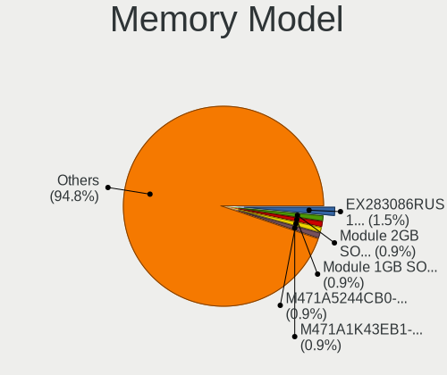

| Model                                                            | Computers | Percent |
|------------------------------------------------------------------|-----------|---------|
| Unknown (ABCD) RAM 123456789012345678 3GB SODIMM LPDDR4 2400MT/s | 3         | 1.15%   |
| Samsung RAM M471B5173QH0-YK0 4GB SODIMM DDR3 1600MT/s            | 3         | 1.15%   |
| Samsung RAM M471A5244CB0-CTD 4GB SODIMM DDR4 3266MT/s            | 3         | 1.15%   |
| Unknown RAM Module 8GB SODIMM DDR4 2400MT/s                      | 2         | 0.76%   |
| Unknown RAM Module 2GB SODIMM DDR2 533MT/s                       | 2         | 0.76%   |
| Smart RAM SH564128FJ8NWRNSQR 4GB SODIMM DDR3 1600MT/s            | 2         | 0.76%   |
| SK hynix RAM Module 2GB SODIMM DDR3 1600MT/s                     | 2         | 0.76%   |
| SK hynix RAM HYMP125S64CP8-Y5 2048MB SODIMM DDR 667MT/s          | 2         | 0.76%   |
| SK hynix RAM HMT41GS6BFR8A-PB 8GB SODIMM DDR3 1600MT/s           | 2         | 0.76%   |
| SK hynix RAM HMAA1GS6CJR6N-XN 8GB SODIMM DDR4 3200MT/s           | 2         | 0.76%   |
| SK hynix RAM HMA851S6DJR6N-XN 4GB SODIMM DDR4 3200MT/s           | 2         | 0.76%   |
| Samsung RAM M471B5773CHS-CH9 2GB SODIMM DDR3 4199MT/s            | 2         | 0.76%   |
| Samsung RAM M471B5173DB0-YK0 4GB SODIMM DDR3 1600MT/s            | 2         | 0.76%   |
| Samsung RAM M471B1G73QH0-YK0 8GB SODIMM DDR3 1867MT/s            | 2         | 0.76%   |
| Samsung RAM M471B1G73DB0-YK0 8GB SODIMM DDR3 1600MT/s            | 2         | 0.76%   |
| Samsung RAM M471A5244CB0-CWE 4GB SODIMM DDR4 3200MT/s            | 2         | 0.76%   |
| Samsung RAM M471A5244CB0-CWE 4GB Row Of Chips DDR4 3200MT/s      | 2         | 0.76%   |
| Samsung RAM M471A5244CB0-CRC 4GB SODIMM DDR4 2667MT/s            | 2         | 0.76%   |
| Samsung RAM M471A1K43EB1-CWE 8GB SODIMM DDR4 3200MT/s            | 2         | 0.76%   |
| Samsung RAM M471A1K43DB1-CTD 8GB SODIMM DDR4 2667MT/s            | 2         | 0.76%   |
| Samsung RAM M471A1K43CB1-CTD 8GB SODIMM DDR4 2667MT/s            | 2         | 0.76%   |
| Samsung RAM M471A1K43CB1-CRC 8GB SODIMM DDR4 2667MT/s            | 2         | 0.76%   |
| GSkill RAM F4-3200C22-16GRS 16GB SODIMM DDR4 3200MT/s            | 2         | 0.76%   |
| Corsair RAM CMZ16GX3M2A1600C10 8GB DIMM DDR3 1600MT/s            | 2         | 0.76%   |
| Unknown RAM Module SODIMM DDR                                    | 1         | 0.38%   |
| Unknown RAM Module 8GB SODIMM DDR4 2667MT/s                      | 1         | 0.38%   |
| Unknown RAM Module 8GB SODIMM DDR3                               | 1         | 0.38%   |
| Unknown RAM Module 8GB DIMM 1333MT/s                             | 1         | 0.38%   |
| Unknown RAM Module 8192MB SODIMM DDR3 1600MT/s                   | 1         | 0.38%   |
| Unknown RAM Module 8192MB DIMM 1333MT/s                          | 1         | 0.38%   |
| Unknown RAM Module 512MB SODIMM DDR2 533MT/s                     | 1         | 0.38%   |
| Unknown RAM Module 512MB SODIMM DDR2                             | 1         | 0.38%   |
| Unknown RAM Module 512MB SODIMM DDR                              | 1         | 0.38%   |
| Unknown RAM Module 512MB DIMM DDR2 266MT/s                       | 1         | 0.38%   |
| Unknown RAM Module 512MB DIMM 667MT/s                            | 1         | 0.38%   |
| Unknown RAM Module 4GB SODIMM DDR4 2667MT/s                      | 1         | 0.38%   |
| Unknown RAM Module 4GB DIMM DDR3 1066MT/s                        | 1         | 0.38%   |
| Unknown RAM Module 4GB DIMM 1333MT/s                             | 1         | 0.38%   |
| Unknown RAM Module 4096MB SODIMM DDR3                            | 1         | 0.38%   |
| Unknown RAM Module 4096MB DIMM DDR3 1600MT/s                     | 1         | 0.38%   |

Memory Kind
-----------

Memory module kinds

| Kind    | Computers | Percent |
|---------|-----------|---------|
| DDR4    | 83        | 38.6%   |
| DDR3    | 79        | 36.74%  |
| DDR2    | 23        | 10.7%   |
| SDRAM   | 10        | 4.65%   |
| LPDDR4  | 6         | 2.79%   |
| DDR     | 6         | 2.79%   |
| Unknown | 6         | 2.79%   |
| LPDDR3  | 2         | 0.93%   |

Memory Form Factor
------------------

Physical design of the memory module

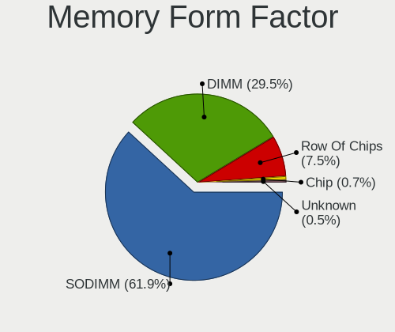

| Name         | Computers | Percent |
|--------------|-----------|---------|
| SODIMM       | 140       | 66.04%  |
| DIMM         | 65        | 30.66%  |
| Row Of Chips | 6         | 2.83%   |
| Unknown      | 1         | 0.47%   |

Memory Size
-----------

Memory module size

| Size    | Computers | Percent |
|---------|-----------|---------|
| 8192    | 78        | 33.48%  |
| 4096    | 61        | 26.18%  |
| 2048    | 48        | 20.6%   |
| 16384   | 21        | 9.01%   |
| 1024    | 14        | 6.01%   |
| 512     | 6         | 2.58%   |
| 32768   | 4         | 1.72%   |
| Unknown | 1         | 0.43%   |

Memory Speed
------------

Memory module speed

| Speed   | Computers | Percent |
|---------|-----------|---------|
| 1600    | 48        | 21.05%  |
| 3200    | 33        | 14.47%  |
| 2667    | 32        | 14.04%  |
| 2400    | 17        | 7.46%   |
| 1333    | 17        | 7.46%   |
| Unknown | 12        | 5.26%   |
| 667     | 10        | 4.39%   |
| 800     | 9         | 3.95%   |
| 2133    | 7         | 3.07%   |
| 1067    | 6         | 2.63%   |
| 533     | 6         | 2.63%   |
| 3600    | 4         | 1.75%   |
| 1334    | 4         | 1.75%   |
| 3266    | 3         | 1.32%   |
| 4199    | 2         | 0.88%   |
| 2048    | 2         | 0.88%   |
| 1867    | 2         | 0.88%   |
| 1866    | 2         | 0.88%   |
| 975     | 2         | 0.88%   |
| 4267    | 1         | 0.44%   |
| 4266    | 1         | 0.44%   |
| 3800    | 1         | 0.44%   |
| 3733    | 1         | 0.44%   |
| 3500    | 1         | 0.44%   |
| 2267    | 1         | 0.44%   |
| 1200    | 1         | 0.44%   |
| 1066    | 1         | 0.44%   |
| 400     | 1         | 0.44%   |
| 266     | 1         | 0.44%   |

Printers & scanners
-------------------

Printer Vendor
--------------

Printer device vendors

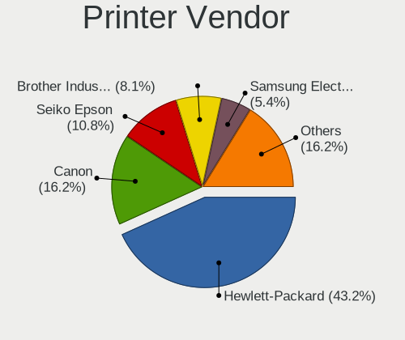

| Vendor              | Computers | Percent |
|---------------------|-----------|---------|
| Hewlett-Packard     | 8         | 42.11%  |
| Brother Industries  | 3         | 15.79%  |
| Seiko Epson         | 2         | 10.53%  |
| Samsung Electronics | 2         | 10.53%  |
| Canon               | 2         | 10.53%  |
| Ricoh               | 1         | 5.26%   |
| Konica Minolta      | 1         | 5.26%   |

Printer Model
-------------

Printer device models

| Model                            | Computers | Percent |
|----------------------------------|-----------|---------|
| Brother MFC-L2685DW              | 2         | 10.53%  |
| Seiko Epson XP-3100 Series       | 1         | 5.26%   |
| Seiko Epson ET-2820 Series       | 1         | 5.26%   |
| Samsung SCX-3400 Series          | 1         | 5.26%   |
| Samsung ML-1670 Series           | 1         | 5.26%   |
| Ricoh SP C260SFNw                | 1         | 5.26%   |
| Konica Minolta 185               | 1         | 5.26%   |
| HP OfficeJet Pro 8730            | 1         | 5.26%   |
| HP LaserJet P1006                | 1         | 5.26%   |
| HP LaserJet 3050                 | 1         | 5.26%   |
| HP DeskJet F4200 series          | 1         | 5.26%   |
| HP DeskJet 2700 series           | 1         | 5.26%   |
| HP Deskjet 2540 series           | 1         | 5.26%   |
| HP DeskJet 2130 series           | 1         | 5.26%   |
| HP Deskjet 1050 J410             | 1         | 5.26%   |
| Canon LaserShot LBP-1120 Printer | 1         | 5.26%   |
| Canon iP4200                     | 1         | 5.26%   |
| Brother HL-L2300D series         | 1         | 5.26%   |

Scanner Vendor
--------------

Scanner device vendors

| Vendor          | Computers | Percent |
|-----------------|-----------|---------|
| Canon           | 2         | 50%     |
| Seiko Epson     | 1         | 25%     |
| Hewlett-Packard | 1         | 25%     |

Scanner Model
-------------

Scanner device models

| Model                                         | Computers | Percent |
|-----------------------------------------------|-----------|---------|
| Seiko Epson GT-8300UF [Perfection 1660 PHOTO] | 1         | 25%     |
| HP ScanJet 3800c                              | 1         | 25%     |
| Canon CanoScan N1240U/LiDE 30                 | 1         | 25%     |
| Canon CanoScan LiDE 110                       | 1         | 25%     |

Camera
------

Camera Vendor
-------------

Camera device vendors

| Vendor                                 | Computers | Percent |
|----------------------------------------|-----------|---------|
| Chicony Electronics                    | 87        | 20.96%  |
| IMC Networks                           | 35        | 8.43%   |
| Microdia                               | 31        | 7.47%   |
| Suyin                                  | 28        | 6.75%   |
| Sunplus Innovation Technology          | 26        | 6.27%   |
| Realtek Semiconductor                  | 24        | 5.78%   |
| Quanta                                 | 24        | 5.78%   |
| Logitech                               | 17        | 4.1%    |
| Acer                                   | 16        | 3.86%   |
| Cheng Uei Precision Industry (Foxlink) | 15        | 3.61%   |
| Bison Electronics                      | 13        | 3.13%   |
| Apple                                  | 11        | 2.65%   |
| Syntek                                 | 9         | 2.17%   |
| Silicon Motion                         | 9         | 2.17%   |
| Luxvisions Innotech Limited            | 8         | 1.93%   |
| Z-Star Microelectronics                | 6         | 1.45%   |
| Ricoh                                  | 6         | 1.45%   |
| Importek                               | 6         | 1.45%   |
| Alcor Micro                            | 6         | 1.45%   |
| Microsoft                              | 3         | 0.72%   |
| Lite-On Technology                     | 3         | 0.72%   |
| Lenovo                                 | 3         | 0.72%   |
| ALi                                    | 3         | 0.72%   |
| Sunplus Technology                     | 2         | 0.48%   |
| Samsung Electronics                    | 2         | 0.48%   |
| OmniVision Technologies                | 2         | 0.48%   |
| Huawei Technologies                    | 2         | 0.48%   |
| Generalplus Technology                 | 2         | 0.48%   |
| Creative Technology                    | 2         | 0.48%   |
| Xiongmai                               | 1         | 0.24%   |
| WCM_USB                                | 1         | 0.24%   |
| Shenzhen Kingcome Optoelectronic       | 1         | 0.24%   |
| Service & Quality Technology           | 1         | 0.24%   |
| Pixart Imaging                         | 1         | 0.24%   |
| Nintendo                               | 1         | 0.24%   |
| MacroSilicon                           | 1         | 0.24%   |
| LG Electronics                         | 1         | 0.24%   |
| KYE Systems (Mouse Systems)            | 1         | 0.24%   |
| Intel                                  | 1         | 0.24%   |
| icSpring                               | 1         | 0.24%   |

Camera Model
------------

Camera device models

| Model                                                          | Computers | Percent |
|----------------------------------------------------------------|-----------|---------|
| Chicony integrated camera                                      | 17        | 4.07%   |
| Microdia Integrated_Webcam_HD                                  | 12        | 2.87%   |
| Chicony HD Webcam                                              | 9         | 2.15%   |
| Quanta HP Webcam                                               | 7         | 1.67%   |
| Quanta HP TrueVision HD Camera                                 | 6         | 1.44%   |
| Logitech Webcam C270                                           | 6         | 1.44%   |
| IMC Networks Integrated Camera                                 | 6         | 1.44%   |
| Chicony HP TrueVision HD Camera                                | 6         | 1.44%   |
| Suyin HP TrueVision HD                                         | 5         | 1.2%    |
| IMC Networks USB2.0 VGA UVC WebCam                             | 5         | 1.2%    |
| IMC Networks USB2.0 HD UVC WebCam                              | 5         | 1.2%    |
| Chicony USB2.0 HD UVC WebCam                                   | 5         | 1.2%    |
| Apple Built-in iSight                                          | 5         | 1.2%    |
| Syntek Integrated Camera                                       | 4         | 0.96%   |
| Sunplus HD WebCam                                              | 4         | 0.96%   |
| Realtek USB2.0 camera                                          | 4         | 0.96%   |
| Realtek Lenovo EasyCamera                                      | 4         | 0.96%   |
| Realtek Integrated_Webcam_HD                                   | 4         | 0.96%   |
| Microdia USB 2.0 Camera                                        | 4         | 0.96%   |
| Luxvisions Innotech Limited HP TrueVision HD Camera            | 4         | 0.96%   |
| IMC Networks EasyCamera                                        | 4         | 0.96%   |
| Chicony USB 2.0 Camera                                         | 4         | 0.96%   |
| Cheng Uei Precision Industry (Foxlink) HP Webcam               | 4         | 0.96%   |
| Cheng Uei Precision Industry (Foxlink) HP TrueVision HD Camera | 4         | 0.96%   |
| Bison Integrated Camera                                        | 4         | 0.96%   |
| Bison HD Webcam                                                | 4         | 0.96%   |
| Apple iPhone 5/5C/5S/6/SE/7/8/X                                | 4         | 0.96%   |
| Acer Integrated Camera                                         | 4         | 0.96%   |
| Suyin HD WebCam                                                | 3         | 0.72%   |
| Suyin HD Video WebCam                                          | 3         | 0.72%   |
| Suyin Acer/HP Integrated Webcam [CN0314]                       | 3         | 0.72%   |
| Suyin 1.3M HD WebCam                                           | 3         | 0.72%   |
| Sunplus Laptop_Integrated_Webcam_HD                            | 3         | 0.72%   |
| Sunplus HP TrueVision HD Camera                                | 3         | 0.72%   |
| Sunplus FHD Camera Microphone                                  | 3         | 0.72%   |
| Silicon Motion WebCam SC-0311139N                              | 3         | 0.72%   |
| Realtek USB2.0 VGA UVC WebCam                                  | 3         | 0.72%   |
| Quanta VGA WebCam                                              | 3         | 0.72%   |
| Microdia Sonix USB 2.0 Camera                                  | 3         | 0.72%   |
| Microdia Integrated Webcam HD                                  | 3         | 0.72%   |

Security
--------

Fingerprint Vendor
------------------

Fingerprint sensor vendors

| Vendor                     | Computers | Percent |
|----------------------------|-----------|---------|
| Validity Sensors           | 25        | 39.68%  |
| AuthenTec                  | 12        | 19.05%  |
| Synaptics                  | 6         | 9.52%   |
| STMicroelectronics         | 5         | 7.94%   |
| LighTuning Technology      | 4         | 6.35%   |
| Upek                       | 3         | 4.76%   |
| Elan Microelectronics      | 3         | 4.76%   |
| Shenzhen Goodix Technology | 2         | 3.17%   |
| Samsung Electronics        | 1         | 1.59%   |
| Microsoft                  | 1         | 1.59%   |
| Focal-systems.Corp         | 1         | 1.59%   |

Fingerprint Model
-----------------

Fingerprint sensor models

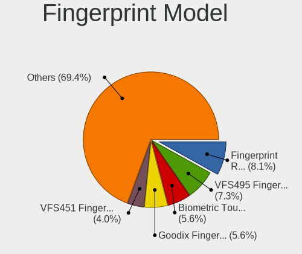

| Model                                                    | Computers | Percent |
|----------------------------------------------------------|-----------|---------|
| Validity Sensors VFS495 Fingerprint Reader               | 5         | 7.94%   |
| STMicroelectronics Fingerprint Reader                    | 5         | 7.94%   |
| Validity Sensors VFS301 Fingerprint Reader               | 4         | 6.35%   |
| AuthenTec AES1600                                        | 4         | 6.35%   |
| Validity Sensors VFS451 Fingerprint Reader               | 3         | 4.76%   |
| Validity Sensors Fingerprint scanner                     | 3         | 4.76%   |
| Upek Biometric Touchchip/Touchstrip Fingerprint Sensor   | 3         | 4.76%   |
| Elan ELAN:Fingerprint                                    | 3         | 4.76%   |
| AuthenTec Fingerprint Sensor                             | 3         | 4.76%   |
| AuthenTec AES2501 Fingerprint Sensor                     | 3         | 4.76%   |
| Validity Sensors VFS5011 Fingerprint Reader              | 2         | 3.17%   |
| Validity Sensors VFS491                                  | 2         | 3.17%   |
| Validity Sensors Synaptics WBDI                          | 2         | 3.17%   |
| Synaptics FS7604 Touch Fingerprint Sensor with PurePrint | 2         | 3.17%   |
| Shenzhen Goodix  FingerPrint Device                      | 2         | 3.17%   |
| LighTuning EgisTec Touch Fingerprint Sensor              | 2         | 3.17%   |
| AuthenTec AES2810                                        | 2         | 3.17%   |
| Validity Sensors VFS101 Fingerprint Reader               | 1         | 1.59%   |
| Validity Sensors VFS Fingerprint sensor                  | 1         | 1.59%   |
| Validity Sensors VFS 5011 fingerprint sensor             | 1         | 1.59%   |
| Validity Sensors Swipe Fingerprint Sensor                | 1         | 1.59%   |
| Synaptics WBDI Fingerprint Reader USB 102                | 1         | 1.59%   |
| Synaptics WBDI                                           | 1         | 1.59%   |
| Synaptics UWP WBDI Device                                | 1         | 1.59%   |
| Synaptics Metallica MOH Touch Fingerprint Reader         | 1         | 1.59%   |
| Samsung Fingerprint Sensor Device - 730B                 | 1         | 1.59%   |
| Microsoft Fingerprint Reader                             | 1         | 1.59%   |
| LighTuning Fingerprint Reader                            | 1         | 1.59%   |
| LighTuning ES603 Swipe Fingerprint Sensor                | 1         | 1.59%   |
| Focal-systems.Corp FT9201Fingerprint.                    | 1         | 1.59%   |

Chipcard Vendor
---------------

Chipcard module vendors

| Vendor                            | Computers | Percent |
|-----------------------------------|-----------|---------|
| Broadcom                          | 13        | 48.15%  |
| O2 Micro                          | 5         | 18.52%  |
| Alcor Micro                       | 3         | 11.11%  |
| VASCO Data Security International | 1         | 3.7%    |
| Upek                              | 1         | 3.7%    |
| OmniKey                           | 1         | 3.7%    |
| Lenovo                            | 1         | 3.7%    |
| Jing-Mold Enterprise              | 1         | 3.7%    |
| Gemalto (was Gemplus)             | 1         | 3.7%    |

Chipcard Model
--------------

Chipcard module models

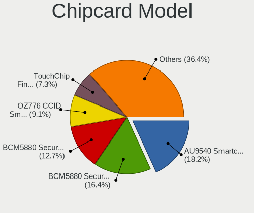

| Model                                                                        | Computers | Percent |
|------------------------------------------------------------------------------|-----------|---------|
| Broadcom BCM5880 Secure Applications Processor                               | 7         | 25.93%  |
| O2 Micro OZ776 CCID Smartcard Reader                                         | 4         | 14.81%  |
| Broadcom BCM5880 Secure Applications Processor with fingerprint swipe sensor | 3         | 11.11%  |
| Alcor Micro AU9540 Smartcard Reader                                          | 3         | 11.11%  |
| VASCO Data Security International DIGIPASS 870                               | 1         | 3.7%    |
| Upek TouchChip Fingerprint Coprocessor (WBF advanced mode)                   | 1         | 3.7%    |
| OmniKey CardMan 1021                                                         | 1         | 3.7%    |
| O2 Micro Oz776 SmartCard Reader                                              | 1         | 3.7%    |
| Lenovo Integrated Smart Card Reader                                          | 1         | 3.7%    |
| Jing-Mold Enterprise HP USB Business Slim Smartcard CCID Keyboard            | 1         | 3.7%    |
| Gemalto (was Gemplus) Compact Smart Card Reader Writer                       | 1         | 3.7%    |
| Broadcom BCM5880 Secure Applications Processor with fingerprint touch sensor | 1         | 3.7%    |
| Broadcom 5880                                                                | 1         | 3.7%    |
| Broadcom 58200                                                               | 1         | 3.7%    |

Unsupported
-----------

Unsupported Devices
-------------------

Total unsupported devices on board

| Total | Computers | Percent |
|-------|-----------|---------|
| 0     | 498       | 66.05%  |
| 1     | 202       | 26.79%  |
| 2     | 37        | 4.91%   |
| 3     | 12        | 1.59%   |
| 4     | 4         | 0.53%   |
| 6     | 1         | 0.13%   |

Unsupported Device Types
------------------------

Types of unsupported devices

| Type                     | Computers | Percent |
|--------------------------|-----------|---------|
| Graphics card            | 102       | 31.97%  |
| Net/wireless             | 65        | 20.38%  |
| Fingerprint reader       | 62        | 19.44%  |
| Multimedia controller    | 26        | 8.15%   |
| Chipcard                 | 23        | 7.21%   |
| Communication controller | 13        | 4.08%   |
| Storage                  | 6         | 1.88%   |
| Unassigned class         | 3         | 0.94%   |
| Network                  | 3         | 0.94%   |
| Flash memory             | 3         | 0.94%   |
| Bluetooth                | 3         | 0.94%   |
| Net/ethernet             | 2         | 0.63%   |
| Camera                   | 2         | 0.63%   |
| Storage/raid             | 1         | 0.31%   |
| Storage/ide              | 1         | 0.31%   |
| Sound                    | 1         | 0.31%   |
| Modem                    | 1         | 0.31%   |
| Dvb card                 | 1         | 0.31%   |
| Card reader              | 1         | 0.31%   |

