LMDE - Tested Hardware & Statistics
-----------------------------------

A project to collect tested hardware configurations for LMDE.

Anyone can contribute to this report by the [hw-probe](https://github.com/linuxhw/hw-probe) tool:

    sudo -E hw-probe -all -upload

Please contribute! Especially if your hardware is rare.

This is a report for all computer types. See also reports for [desktops](/Dist/LMDE/Desktop/README.md) and [notebooks](/Dist/LMDE/Notebook/README.md).

Contents
--------

* [ Test Cases ](#test-cases)

* [ System ](#system)
  - [ OS                       ](#os)
  - [ OS Family                ](#os-family)
  - [ Kernel                   ](#kernel)
  - [ Kernel Family            ](#kernel-family)
  - [ Kernel Major Ver.        ](#kernel-major-ver)
  - [ Arch                     ](#arch)
  - [ DE                       ](#de)
  - [ Display Server           ](#display-server)
  - [ Display Manager          ](#display-manager)
  - [ OS Lang                  ](#os-lang)
  - [ Boot Mode                ](#boot-mode)
  - [ Filesystem               ](#filesystem)
  - [ Part. scheme             ](#part-scheme)
  - [ Dual Boot with Linux/BSD ](#dual-boot-with-linuxbsd)
  - [ Dual Boot (Win)          ](#dual-boot-win)

* [ Board ](#board)
  - [ Vendor                   ](#vendor)
  - [ Model                    ](#model)
  - [ Model Family             ](#model-family)
  - [ MFG Year                 ](#mfg-year)
  - [ Form Factor              ](#form-factor)
  - [ Secure Boot              ](#secure-boot)
  - [ Coreboot                 ](#coreboot)
  - [ RAM Size                 ](#ram-size)
  - [ RAM Used                 ](#ram-used)
  - [ Total Drives             ](#total-drives)
  - [ Has CD-ROM               ](#has-cd-rom)
  - [ Has Ethernet             ](#has-ethernet)
  - [ Has WiFi                 ](#has-wifi)
  - [ Has Bluetooth            ](#has-bluetooth)

* [ Location ](#location)
  - [ Country                  ](#country)
  - [ City                     ](#city)

* [ Drives ](#drives)
  - [ Drive Vendor             ](#drive-vendor)
  - [ Drive Model              ](#drive-model)
  - [ HDD Vendor               ](#hdd-vendor)
  - [ SSD Vendor               ](#ssd-vendor)
  - [ Drive Kind               ](#drive-kind)
  - [ Drive Connector          ](#drive-connector)
  - [ Drive Size               ](#drive-size)
  - [ Space Total              ](#space-total)
  - [ Space Used               ](#space-used)
  - [ Malfunc. Drives          ](#malfunc-drives)
  - [ Malfunc. Drive Vendor    ](#malfunc-drive-vendor)
  - [ Malfunc. HDD Vendor      ](#malfunc-hdd-vendor)
  - [ Malfunc. Drive Kind      ](#malfunc-drive-kind)
  - [ Failed Drives            ](#failed-drives)
  - [ Failed Drive Vendor      ](#failed-drive-vendor)
  - [ Drive Status             ](#drive-status)

* [ Storage controller ](#storage-controller)
  - [ Storage Vendor           ](#storage-vendor)
  - [ Storage Model            ](#storage-model)
  - [ Storage Kind             ](#storage-kind)

* [ Processor ](#processor)
  - [ CPU Vendor               ](#cpu-vendor)
  - [ CPU Model                ](#cpu-model)
  - [ CPU Model Family         ](#cpu-model-family)
  - [ CPU Cores                ](#cpu-cores)
  - [ CPU Sockets              ](#cpu-sockets)
  - [ CPU Threads              ](#cpu-threads)
  - [ CPU Op-Modes             ](#cpu-op-modes)
  - [ CPU Microcode            ](#cpu-microcode)
  - [ CPU Microarch            ](#cpu-microarch)

* [ Graphics ](#graphics)
  - [ GPU Vendor               ](#gpu-vendor)
  - [ GPU Model                ](#gpu-model)
  - [ GPU Combo                ](#gpu-combo)
  - [ GPU Driver               ](#gpu-driver)
  - [ GPU Memory               ](#gpu-memory)

* [ Monitor ](#monitor)
  - [ Monitor Vendor           ](#monitor-vendor)
  - [ Monitor Model            ](#monitor-model)
  - [ Monitor Resolution       ](#monitor-resolution)
  - [ Monitor Diagonal         ](#monitor-diagonal)
  - [ Monitor Width            ](#monitor-width)
  - [ Aspect Ratio             ](#aspect-ratio)
  - [ Monitor Area             ](#monitor-area)
  - [ Pixel Density            ](#pixel-density)
  - [ Multiple Monitors        ](#multiple-monitors)

* [ Network ](#network)
  - [ Net Controller Vendor    ](#net-controller-vendor)
  - [ Net Controller Model     ](#net-controller-model)
  - [ Wireless Vendor          ](#wireless-vendor)
  - [ Wireless Model           ](#wireless-model)
  - [ Ethernet Vendor          ](#ethernet-vendor)
  - [ Ethernet Model           ](#ethernet-model)
  - [ Net Controller Kind      ](#net-controller-kind)
  - [ Used Controller          ](#used-controller)
  - [ NICs                     ](#nics)
  - [ IPv6                     ](#ipv6)

* [ Bluetooth ](#bluetooth)
  - [ Bluetooth Vendor         ](#bluetooth-vendor)
  - [ Bluetooth Model          ](#bluetooth-model)

* [ Sound ](#sound)
  - [ Sound Vendor             ](#sound-vendor)
  - [ Sound Model              ](#sound-model)

* [ Memory ](#memory)
  - [ Memory Vendor            ](#memory-vendor)
  - [ Memory Model             ](#memory-model)
  - [ Memory Kind              ](#memory-kind)
  - [ Memory Form Factor       ](#memory-form-factor)
  - [ Memory Size              ](#memory-size)
  - [ Memory Speed             ](#memory-speed)

* [ Printers & scanners ](#printers--scanners)
  - [ Printer Vendor           ](#printer-vendor)
  - [ Printer Model            ](#printer-model)
  - [ Scanner Vendor           ](#scanner-vendor)
  - [ Scanner Model            ](#scanner-model)

* [ Camera ](#camera)
  - [ Camera Vendor            ](#camera-vendor)
  - [ Camera Model             ](#camera-model)

* [ Security ](#security)
  - [ Fingerprint Vendor       ](#fingerprint-vendor)
  - [ Fingerprint Model        ](#fingerprint-model)
  - [ Chipcard Vendor          ](#chipcard-vendor)
  - [ Chipcard Model           ](#chipcard-model)

* [ Unsupported ](#unsupported)
  - [ Unsupported Devices      ](#unsupported-devices)
  - [ Unsupported Device Types ](#unsupported-device-types)

Test Cases
----------

Total: 2166

| Vendor        | Model                       | Form-Factor | Probe                                                      | Date         |
|---------------|-----------------------------|-------------|------------------------------------------------------------|--------------|
| PELADN        | WI-6                        | Desktop     | [537a11ae44](https://linux-hardware.org/?probe=537a11ae44) | Jan 06, 2025 |
| Medion        | E6214                       | Notebook    | [e72344f20c](https://linux-hardware.org/?probe=e72344f20c) | Jan 05, 2025 |
| Medion        | E6214                       | Notebook    | [1abed4b52d](https://linux-hardware.org/?probe=1abed4b52d) | Jan 05, 2025 |
| Apple         | MacBookAir6,2               | Notebook    | [2a0e5e8dee](https://linux-hardware.org/?probe=2a0e5e8dee) | Jan 04, 2025 |
| ASUSTek       | PRIME Z390-P                | Desktop     | [d6e8f1ee6c](https://linux-hardware.org/?probe=d6e8f1ee6c) | Jan 04, 2025 |
| HP            | Laptop 15-ef3xxx            | Notebook    | [990ef26285](https://linux-hardware.org/?probe=990ef26285) | Jan 04, 2025 |
| MSI           | B450 TOMAHAWK MAX           | Desktop     | [88d10a1126](https://linux-hardware.org/?probe=88d10a1126) | Jan 04, 2025 |
| Apple         | MacBookAir6,2               | Notebook    | [ba9cefc697](https://linux-hardware.org/?probe=ba9cefc697) | Jan 03, 2025 |
| Acer          | Aspire XC600 v1.0           | Desktop     | [2f22befa4d](https://linux-hardware.org/?probe=2f22befa4d) | Jan 01, 2025 |
| Acer          | Aspire XC600 v1.0           | Desktop     | [cad98a7856](https://linux-hardware.org/?probe=cad98a7856) | Jan 01, 2025 |
| PELADN        | WI-6                        | Desktop     | [ed403a09ce](https://linux-hardware.org/?probe=ed403a09ce) | Jan 01, 2025 |
| PELADN        | WI-6                        | Desktop     | [9961c80013](https://linux-hardware.org/?probe=9961c80013) | Dec 31, 2024 |
| PELADN        | WI-6                        | Desktop     | [ad75e2844c](https://linux-hardware.org/?probe=ad75e2844c) | Dec 31, 2024 |
| PELADN        | WI-6                        | Desktop     | [a4d452eb65](https://linux-hardware.org/?probe=a4d452eb65) | Dec 31, 2024 |
| Acer          | Aspire A515-57              | Notebook    | [a91c16b9c4](https://linux-hardware.org/?probe=a91c16b9c4) | Dec 31, 2024 |
| Intel         | NUC13ANBi5 M89647-202       | Mini pc     | [176c7dc908](https://linux-hardware.org/?probe=176c7dc908) | Dec 29, 2024 |
| Dell          | 0MWYPT A02                  | Desktop     | [3a7c58054c](https://linux-hardware.org/?probe=3a7c58054c) | Dec 29, 2024 |
| ASUSTek       | PRIME Z390-P                | Desktop     | [f680af729c](https://linux-hardware.org/?probe=f680af729c) | Dec 28, 2024 |
| ASUSTek       | Vivobook Go E1404FA_E140... | Notebook    | [0ac54971da](https://linux-hardware.org/?probe=0ac54971da) | Dec 28, 2024 |
| Dell          | Inspiron 5577               | Notebook    | [dabaffa853](https://linux-hardware.org/?probe=dabaffa853) | Dec 25, 2024 |
| Dell          | 0DT021 A02                  | Server      | [5de4c4a538](https://linux-hardware.org/?probe=5de4c4a538) | Dec 23, 2024 |
| ASRock        | H110M-HDV R3.0              | Desktop     | [43e003f874](https://linux-hardware.org/?probe=43e003f874) | Dec 22, 2024 |
| ASUSTek       | ROG STRIX B450-F GAMING     | Desktop     | [8144311954](https://linux-hardware.org/?probe=8144311954) | Dec 22, 2024 |
| HP            | 2820h                       | Desktop     | [64ccd9e1f2](https://linux-hardware.org/?probe=64ccd9e1f2) | Dec 22, 2024 |
| Acer          | Aspire 5738                 | Notebook    | [edb35a4953](https://linux-hardware.org/?probe=edb35a4953) | Dec 17, 2024 |
| Sony          | VPCM12M1E                   | Notebook    | [eca3984533](https://linux-hardware.org/?probe=eca3984533) | Dec 16, 2024 |
| ASUSTek       | VivoBook_ASUSLaptop S540... | Notebook    | [68a46993af](https://linux-hardware.org/?probe=68a46993af) | Dec 15, 2024 |
| ASUSTek       | PRIME B250M-C               | Desktop     | [ebcaaa33b0](https://linux-hardware.org/?probe=ebcaaa33b0) | Dec 15, 2024 |
| ASUSTek       | PRIME B250M-C               | Desktop     | [787e3a402c](https://linux-hardware.org/?probe=787e3a402c) | Dec 14, 2024 |
| ASUSTek       | N551JK                      | Notebook    | [10b918146d](https://linux-hardware.org/?probe=10b918146d) | Dec 13, 2024 |
| Dell          | Precision 3551              | Notebook    | [598abdb472](https://linux-hardware.org/?probe=598abdb472) | Dec 13, 2024 |
| Acer          | Extensa 5220                | Notebook    | [864e664760](https://linux-hardware.org/?probe=864e664760) | Dec 10, 2024 |
| Lenovo        | ThinkPad E495 20NE0002US    | Notebook    | [690a841928](https://linux-hardware.org/?probe=690a841928) | Dec 10, 2024 |
| Lenovo        | IdeaPad Slim 3 14IAH8 83... | Notebook    | [132e6e2862](https://linux-hardware.org/?probe=132e6e2862) | Dec 09, 2024 |
| Sony          | VPCM12M1E                   | Notebook    | [e7896a9326](https://linux-hardware.org/?probe=e7896a9326) | Dec 08, 2024 |
| ASUSTek       | H81M-K                      | Desktop     | [4c7c8cc298](https://linux-hardware.org/?probe=4c7c8cc298) | Dec 08, 2024 |
| Lenovo        | Yoga Slim 6 14IAP8 82WU     | Notebook    | [ecbb2dfb26](https://linux-hardware.org/?probe=ecbb2dfb26) | Dec 07, 2024 |
| Acer          | Aspire 5738                 | Notebook    | [041abf44b0](https://linux-hardware.org/?probe=041abf44b0) | Dec 07, 2024 |
| Lenovo        | ThinkPad X240 20AM001JUS    | Notebook    | [1ac27908e6](https://linux-hardware.org/?probe=1ac27908e6) | Dec 06, 2024 |
| Acer          | Aspire E1-572G              | Notebook    | [5fd88a9482](https://linux-hardware.org/?probe=5fd88a9482) | Dec 04, 2024 |
| ASUSTek       | ASUS TUF Gaming A16 FA61... | Notebook    | [8456ee2251](https://linux-hardware.org/?probe=8456ee2251) | Dec 03, 2024 |
| ASUSTek       | NUC13ANB-M 60AS0040-MB3A... | Mini pc     | [d085327361](https://linux-hardware.org/?probe=d085327361) | Dec 02, 2024 |
| Lenovo        | ThinkPad T60 2007YQY        | Notebook    | [8d792cc626](https://linux-hardware.org/?probe=8d792cc626) | Dec 02, 2024 |
| Gigabyte      | B550M DS3H                  | Desktop     | [146d9d897a](https://linux-hardware.org/?probe=146d9d897a) | Dec 02, 2024 |
| ASUSTek       | NUC13ANB-M 60AS0040-MB3A... | Mini pc     | [5dd8a1851e](https://linux-hardware.org/?probe=5dd8a1851e) | Dec 02, 2024 |
| Insyde        | BayTrail                    | Notebook    | [101b76beeb](https://linux-hardware.org/?probe=101b76beeb) | Dec 02, 2024 |
| ASUSTek       | VivoBook_ASUSLaptop X515... | Notebook    | [fb5d35bd4b](https://linux-hardware.org/?probe=fb5d35bd4b) | Dec 01, 2024 |
| Lenovo        | ThinkCentre M58p 7220AVG    | Desktop     | [9d47a500ed](https://linux-hardware.org/?probe=9d47a500ed) | Dec 01, 2024 |
| Acer          | Aspire AV15-51              | Notebook    | [c98b2b5898](https://linux-hardware.org/?probe=c98b2b5898) | Dec 01, 2024 |
| Unknown       | Unknown                     | Notebook    | [678e33b8ed](https://linux-hardware.org/?probe=678e33b8ed) | Dec 01, 2024 |
| Fujitsu       | LIFEBOOK E753               | Notebook    | [e36fbc49ec](https://linux-hardware.org/?probe=e36fbc49ec) | Dec 01, 2024 |
| Lenovo        | ThinkPad X270 20HN001MUS    | Notebook    | [6c580a86e2](https://linux-hardware.org/?probe=6c580a86e2) | Nov 30, 2024 |
| Notebook      | W65_67SZ                    | Notebook    | [245be0630e](https://linux-hardware.org/?probe=245be0630e) | Nov 29, 2024 |
| ASRock        | B450 Pro4                   | Desktop     | [ca8808db77](https://linux-hardware.org/?probe=ca8808db77) | Nov 29, 2024 |
| Acer          | Spin SP514-51N              | Convertible | [ff213eb067](https://linux-hardware.org/?probe=ff213eb067) | Nov 29, 2024 |
| ASRock        | B450 Pro4                   | Desktop     | [fb2858b084](https://linux-hardware.org/?probe=fb2858b084) | Nov 28, 2024 |
| Lenovo        | ThinkPad neo 14 21DN0009... | Notebook    | [63a0ee38c2](https://linux-hardware.org/?probe=63a0ee38c2) | Nov 27, 2024 |
| Intel         | NUC12WSBi5 M46425-303       | Mini pc     | [612c9b02a8](https://linux-hardware.org/?probe=612c9b02a8) | Nov 26, 2024 |
| Notebook      | W65_67SZ                    | Notebook    | [7cf2df4c2d](https://linux-hardware.org/?probe=7cf2df4c2d) | Nov 25, 2024 |
| PELADN        | WI-6                        | Desktop     | [deec076d09](https://linux-hardware.org/?probe=deec076d09) | Nov 24, 2024 |
| PELADN        | WI-6                        | Desktop     | [f1daf75b91](https://linux-hardware.org/?probe=f1daf75b91) | Nov 24, 2024 |
| HP            | Laptop 17z-cp300            | Notebook    | [be49e0c290](https://linux-hardware.org/?probe=be49e0c290) | Nov 23, 2024 |
| HP            | Laptop 17z-cp300            | Notebook    | [4090b82a10](https://linux-hardware.org/?probe=4090b82a10) | Nov 23, 2024 |
| Unknown       | Unknown                     | Notebook    | [f3f336f89e](https://linux-hardware.org/?probe=f3f336f89e) | Nov 23, 2024 |
| PLEXHD        | X79 Turbo                   | Desktop     | [e1891a209b](https://linux-hardware.org/?probe=e1891a209b) | Nov 22, 2024 |
| Acer          | Aspire A315-510P            | Notebook    | [99993b0f3e](https://linux-hardware.org/?probe=99993b0f3e) | Nov 21, 2024 |
| TUXEDO        | InfinityBook S Gen8         | Notebook    | [ac4e85e111](https://linux-hardware.org/?probe=ac4e85e111) | Nov 21, 2024 |
| Notebook      | W65_67SZ                    | Notebook    | [c7eb463249](https://linux-hardware.org/?probe=c7eb463249) | Nov 20, 2024 |
| Toshiba       | Satellite P105              | Notebook    | [74a9b7015c](https://linux-hardware.org/?probe=74a9b7015c) | Nov 18, 2024 |
| ASUSTek       | PRIME Z390-P                | Desktop     | [a087a2818f](https://linux-hardware.org/?probe=a087a2818f) | Nov 18, 2024 |
| Dell          | 00V62H A01                  | Desktop     | [3f6a95ad11](https://linux-hardware.org/?probe=3f6a95ad11) | Nov 18, 2024 |
| Fujitsu Si... | AMILO Li 2735               | Notebook    | [afbab1e78c](https://linux-hardware.org/?probe=afbab1e78c) | Nov 17, 2024 |
| Dell          | Inspiron N5110              | Notebook    | [da064fe75f](https://linux-hardware.org/?probe=da064fe75f) | Nov 16, 2024 |
| Dell          | 073MMW A03                  | Desktop     | [715ccc808c](https://linux-hardware.org/?probe=715ccc808c) | Nov 16, 2024 |
| Toshiba       | Satellite M100              | Notebook    | [655a407dd2](https://linux-hardware.org/?probe=655a407dd2) | Nov 15, 2024 |
| ASRock        | A320M-HDV R4.0              | Desktop     | [bd75bc63f7](https://linux-hardware.org/?probe=bd75bc63f7) | Nov 15, 2024 |
| ASUSTek       | TUF Gaming X670E-PLUS WI... | Desktop     | [7ac1792400](https://linux-hardware.org/?probe=7ac1792400) | Nov 14, 2024 |
| Lenovo        | ThinkPad T450 20BUS1110E    | Notebook    | [c6bc9a84e4](https://linux-hardware.org/?probe=c6bc9a84e4) | Nov 14, 2024 |
| Gigabyte      | A520M S2H                   | Desktop     | [53fa642cd5](https://linux-hardware.org/?probe=53fa642cd5) | Nov 13, 2024 |
| Lenovo        | ThinkBook 15-IIL 20SM       | Notebook    | [70007038ab](https://linux-hardware.org/?probe=70007038ab) | Nov 13, 2024 |
| ASUSTek       | Zenbook UX3402ZA_UX3402Z... | Notebook    | [97617e7ac0](https://linux-hardware.org/?probe=97617e7ac0) | Nov 10, 2024 |
| ASUSTek       | T101HA                      | Tablet      | [2aa1d5261d](https://linux-hardware.org/?probe=2aa1d5261d) | Nov 09, 2024 |
| HP            | EliteBook 8440p             | Notebook    | [5ed52c1fdc](https://linux-hardware.org/?probe=5ed52c1fdc) | Nov 09, 2024 |
| ASUSTek       | PRIME Z390-P                | Desktop     | [acecc3bec2](https://linux-hardware.org/?probe=acecc3bec2) | Nov 09, 2024 |
| HP            | ProBook 450 G2              | Notebook    | [db16e5b334](https://linux-hardware.org/?probe=db16e5b334) | Nov 09, 2024 |
| ASUSTek       | TUF Gaming X570-PLUS        | Desktop     | [01063d0f9e](https://linux-hardware.org/?probe=01063d0f9e) | Nov 08, 2024 |
| Gigabyte      | B360 AORUS GAMING 3 WIFI... | Desktop     | [856f712b05](https://linux-hardware.org/?probe=856f712b05) | Nov 08, 2024 |
| HP            | Laptop 15s-fq2xxx           | Notebook    | [40be935ed5](https://linux-hardware.org/?probe=40be935ed5) | Nov 06, 2024 |
| Conectar I... | SF20GM7                     | Notebook    | [1c43877e91](https://linux-hardware.org/?probe=1c43877e91) | Nov 06, 2024 |
| HP            | Laptop 15-bs2xx             | Notebook    | [fb25b57170](https://linux-hardware.org/?probe=fb25b57170) | Nov 06, 2024 |
| ASUSTek       | P8H67-M                     | Desktop     | [d7ef318b8e](https://linux-hardware.org/?probe=d7ef318b8e) | Nov 06, 2024 |
| PLEXHD        | X79 Turbo                   | Desktop     | [898dc2c319](https://linux-hardware.org/?probe=898dc2c319) | Nov 04, 2024 |
| MSI           | Prestige 15 A12SC           | Notebook    | [403f475ebb](https://linux-hardware.org/?probe=403f475ebb) | Nov 03, 2024 |
| ASUSTek       | X450LN                      | Notebook    | [029f170b3e](https://linux-hardware.org/?probe=029f170b3e) | Nov 02, 2024 |
| Conectar I... | SF20GM7                     | Notebook    | [95da818f37](https://linux-hardware.org/?probe=95da818f37) | Nov 02, 2024 |
| Intel         | H110D4-P1                   | Desktop     | [65e304fcef](https://linux-hardware.org/?probe=65e304fcef) | Nov 02, 2024 |
| AZW           | MINI S 10                   | Desktop     | [a76f3d4f56](https://linux-hardware.org/?probe=a76f3d4f56) | Nov 01, 2024 |
| AZW           | MINI S 10                   | Desktop     | [eae99fa9a9](https://linux-hardware.org/?probe=eae99fa9a9) | Nov 01, 2024 |
| HP            | Pavilion dv6000 (RY645EA... | Notebook    | [a9cb45608f](https://linux-hardware.org/?probe=a9cb45608f) | Nov 01, 2024 |
| ASUSTek       | NUC13ANB-M 60AS0040-MB3A... | Mini pc     | [159bac7506](https://linux-hardware.org/?probe=159bac7506) | Nov 01, 2024 |
| ASUSTek       | NUC13ANB-M 60AS0040-MB3A... | Mini pc     | [bd1050484e](https://linux-hardware.org/?probe=bd1050484e) | Oct 31, 2024 |
| Lenovo        | Unknown                     | Notebook    | [0fdc4e7dac](https://linux-hardware.org/?probe=0fdc4e7dac) | Oct 31, 2024 |
| HP            | 2820h                       | Desktop     | [940082e5de](https://linux-hardware.org/?probe=940082e5de) | Oct 30, 2024 |
| ASUSTek       | VivoBook_ASUSLaptop E210... | Notebook    | [cb80f674ac](https://linux-hardware.org/?probe=cb80f674ac) | Oct 30, 2024 |
| HP            | Laptop 15-dy2xxx            | Notebook    | [9cc00f993a](https://linux-hardware.org/?probe=9cc00f993a) | Oct 29, 2024 |
| HP            | 1906                        | Desktop     | [2d314c1b57](https://linux-hardware.org/?probe=2d314c1b57) | Oct 28, 2024 |
| Lenovo        | ThinkPad T550 20CK004QUS    | Notebook    | [d4d5181e4f](https://linux-hardware.org/?probe=d4d5181e4f) | Oct 28, 2024 |
| Lenovo        | ThinkPad T550 20CK004QUS    | Notebook    | [c7b77b3285](https://linux-hardware.org/?probe=c7b77b3285) | Oct 27, 2024 |
| ASRock        | A320M-HDV                   | Desktop     | [7ae06e5667](https://linux-hardware.org/?probe=7ae06e5667) | Oct 27, 2024 |
| Gigabyte      | Z77X-D3H                    | Desktop     | [91631ac2c3](https://linux-hardware.org/?probe=91631ac2c3) | Oct 27, 2024 |
| Dell          | Latitude D820               | Notebook    | [e8052d5ecd](https://linux-hardware.org/?probe=e8052d5ecd) | Oct 26, 2024 |
| HP            | EliteBook 850 G3            | Notebook    | [a62e77d2a5](https://linux-hardware.org/?probe=a62e77d2a5) | Oct 26, 2024 |
| Dell          | Latitude D820               | Notebook    | [69777b44d3](https://linux-hardware.org/?probe=69777b44d3) | Oct 25, 2024 |
| Dell          | Latitude E6430              | Notebook    | [7aa1bdef3c](https://linux-hardware.org/?probe=7aa1bdef3c) | Oct 25, 2024 |
| HP            | EliteBook 840 G7 Noteboo... | Notebook    | [38e3efc950](https://linux-hardware.org/?probe=38e3efc950) | Oct 24, 2024 |
| ASUSTek       | TUF Gaming FX505GD_FX505... | Notebook    | [60f87c4f6d](https://linux-hardware.org/?probe=60f87c4f6d) | Oct 24, 2024 |
| HP            | 2AFB                        | Desktop     | [c7b44337e2](https://linux-hardware.org/?probe=c7b44337e2) | Oct 23, 2024 |
| HP            | 2AFB                        | Desktop     | [cedecd78de](https://linux-hardware.org/?probe=cedecd78de) | Oct 23, 2024 |
| Lenovo        | ThinkPad T400s 28153VG      | Notebook    | [312c0a0fb9](https://linux-hardware.org/?probe=312c0a0fb9) | Oct 22, 2024 |
| Dell          | Latitude 5350               | Notebook    | [58f8fa615d](https://linux-hardware.org/?probe=58f8fa615d) | Oct 21, 2024 |
| Dell          | Latitude 5350               | Notebook    | [b2d8fecadb](https://linux-hardware.org/?probe=b2d8fecadb) | Oct 21, 2024 |
| ASUSTek       | ASUS EXPERTBOOK B5402FEA... | Convertible | [9477b439b9](https://linux-hardware.org/?probe=9477b439b9) | Oct 20, 2024 |
| ASUSTek       | ASUS EXPERTBOOK B5402FEA... | Convertible | [c7769abd75](https://linux-hardware.org/?probe=c7769abd75) | Oct 20, 2024 |
| Acer          | Aspire 5738                 | Notebook    | [ca83f1cc2d](https://linux-hardware.org/?probe=ca83f1cc2d) | Oct 19, 2024 |
| ASUSTek       | Crosshair IV Formula        | Desktop     | [50d12895aa](https://linux-hardware.org/?probe=50d12895aa) | Oct 18, 2024 |
| ASUSTek       | ROG CROSSHAIR VII HERO      | Desktop     | [2c7a8f6c86](https://linux-hardware.org/?probe=2c7a8f6c86) | Oct 17, 2024 |
| Fujitsu       | LIFEBOOK U759               | Notebook    | [fed82bdfb6](https://linux-hardware.org/?probe=fed82bdfb6) | Oct 17, 2024 |
| eMachines     | eM350                       | Notebook    | [2e70a62535](https://linux-hardware.org/?probe=2e70a62535) | Oct 16, 2024 |
| AZW           | GTR V01                     | Mini pc     | [e9502fa314](https://linux-hardware.org/?probe=e9502fa314) | Oct 13, 2024 |
| Toshiba       | Satellite L50D-B            | Notebook    | [a2287ef876](https://linux-hardware.org/?probe=a2287ef876) | Oct 12, 2024 |
| Acer          | Aspire 5738                 | Notebook    | [eb50a1a3c6](https://linux-hardware.org/?probe=eb50a1a3c6) | Oct 12, 2024 |
| PELADN        | WI-6                        | Desktop     | [475cbc4d32](https://linux-hardware.org/?probe=475cbc4d32) | Oct 12, 2024 |
| PELADN        | WI-6                        | Desktop     | [26845b5304](https://linux-hardware.org/?probe=26845b5304) | Oct 12, 2024 |
| PELADN        | WI-6                        | Desktop     | [0531287d03](https://linux-hardware.org/?probe=0531287d03) | Oct 12, 2024 |
| PELADN        | WI-6                        | Desktop     | [ab803d1e89](https://linux-hardware.org/?probe=ab803d1e89) | Oct 12, 2024 |
| Acer          | Aspire 5738                 | Notebook    | [b7da389696](https://linux-hardware.org/?probe=b7da389696) | Oct 12, 2024 |
| HP            | Laptop 15-dy2xxx            | Notebook    | [cc8c1d6778](https://linux-hardware.org/?probe=cc8c1d6778) | Oct 11, 2024 |
| Medion        | TJ4125                      | Desktop     | [a371c066fd](https://linux-hardware.org/?probe=a371c066fd) | Oct 11, 2024 |
| Fujitsu       | D3427-A1 S26361-D3427-A1    | Desktop     | [31774f82cc](https://linux-hardware.org/?probe=31774f82cc) | Oct 11, 2024 |
| ASUSTek       | ASUS EXPERTBOOK B5402FEA... | Convertible | [6e7991ae99](https://linux-hardware.org/?probe=6e7991ae99) | Oct 11, 2024 |
| Lenovo        | B50-70 80EU                 | Notebook    | [5c0fd8834f](https://linux-hardware.org/?probe=5c0fd8834f) | Oct 11, 2024 |
| Fujitsu       | D3427-A1 S26361-D3427-A1    | Desktop     | [f42bacdfa7](https://linux-hardware.org/?probe=f42bacdfa7) | Oct 11, 2024 |
| Dell          | Inspiron 5570               | Notebook    | [46275a960a](https://linux-hardware.org/?probe=46275a960a) | Oct 11, 2024 |
| AZW           | GTR V01                     | Mini pc     | [df73bf01cd](https://linux-hardware.org/?probe=df73bf01cd) | Oct 10, 2024 |
| Acer          | Aspire E5-521G              | Notebook    | [63755713f4](https://linux-hardware.org/?probe=63755713f4) | Oct 10, 2024 |
| Dell          | Inspiron 5570               | Notebook    | [c1fdcf2050](https://linux-hardware.org/?probe=c1fdcf2050) | Oct 10, 2024 |
| Lenovo        | ThinkPad T480 20L6S0EY00    | Notebook    | [123b9ee07a](https://linux-hardware.org/?probe=123b9ee07a) | Oct 09, 2024 |
| Medion        | TJ4125                      | Desktop     | [24e446e7a7](https://linux-hardware.org/?probe=24e446e7a7) | Oct 08, 2024 |
| ASUSTek       | NUC13ANB-M 60AS0040-MB3A... | Mini pc     | [5aadf01aae](https://linux-hardware.org/?probe=5aadf01aae) | Oct 06, 2024 |
| Chuwi         | CoreBook X                  | Notebook    | [c2905b1bd7](https://linux-hardware.org/?probe=c2905b1bd7) | Oct 06, 2024 |
| Lenovo        | ThinkPad T460p 20FXS09D0... | Notebook    | [aff398dad9](https://linux-hardware.org/?probe=aff398dad9) | Oct 05, 2024 |
| ASUSTek       | NUC13ANB-M 60AS0040-MB3A... | Mini pc     | [b0bd2a93c2](https://linux-hardware.org/?probe=b0bd2a93c2) | Oct 04, 2024 |
| MSI           | PRO B550M-P GEN3            | Desktop     | [f216dafbba](https://linux-hardware.org/?probe=f216dafbba) | Oct 04, 2024 |
| Lenovo        | ThinkPad X61 Tablet 7764... | Notebook    | [4a002c0f20](https://linux-hardware.org/?probe=4a002c0f20) | Oct 04, 2024 |
| Lenovo        | ThinkPad X1 Nano Gen 1 2... | Notebook    | [060b69d0b3](https://linux-hardware.org/?probe=060b69d0b3) | Oct 01, 2024 |
| ASUSTek       | PRIME X570-PRO              | Desktop     | [bc7fdf7279](https://linux-hardware.org/?probe=bc7fdf7279) | Oct 01, 2024 |
| Apple         | Mac-F226BEC8 PVT            | All in one  | [df3520af77](https://linux-hardware.org/?probe=df3520af77) | Oct 01, 2024 |
| Lenovo        | ThinkPad T400s 28153VG      | Notebook    | [508b12a75b](https://linux-hardware.org/?probe=508b12a75b) | Oct 01, 2024 |
| HP            | ZBook Fury 17.3 inch G8 ... | Notebook    | [1eafc27f9d](https://linux-hardware.org/?probe=1eafc27f9d) | Sep 30, 2024 |
| Gigabyte      | Z77X-D3H                    | Desktop     | [e9bbaa808d](https://linux-hardware.org/?probe=e9bbaa808d) | Sep 30, 2024 |
| Notebook      | N2x0WU                      | Notebook    | [7e061af782](https://linux-hardware.org/?probe=7e061af782) | Sep 29, 2024 |
| Gigabyte      | Z77X-D3H                    | Desktop     | [51fe2ae08f](https://linux-hardware.org/?probe=51fe2ae08f) | Sep 29, 2024 |
| Dell          | XPS 13 9360                 | Notebook    | [4559019bac](https://linux-hardware.org/?probe=4559019bac) | Sep 28, 2024 |
| Lenovo        | ThinkPad X230 2330A17       | Notebook    | [ce28e0de6c](https://linux-hardware.org/?probe=ce28e0de6c) | Sep 27, 2024 |
| HP            | Laptop 15-fd0xxx            | Notebook    | [dc7fdc65d6](https://linux-hardware.org/?probe=dc7fdc65d6) | Sep 26, 2024 |
| ASRock        | A320M-HDV                   | Desktop     | [23c6bbe37a](https://linux-hardware.org/?probe=23c6bbe37a) | Sep 25, 2024 |
| ASUSTek       | ZenBook UX434FAC_UX433FA... | Notebook    | [76bce69bcf](https://linux-hardware.org/?probe=76bce69bcf) | Sep 24, 2024 |
| Lenovo        | ThinkPad X230 2330A17       | Notebook    | [4c04674392](https://linux-hardware.org/?probe=4c04674392) | Sep 23, 2024 |
| ASUSTek       | P5G41T-M LE                 | Desktop     | [d2315eef29](https://linux-hardware.org/?probe=d2315eef29) | Sep 22, 2024 |
| HP            | Pavilion dv5000 (RG937EA... | Notebook    | [a022208bc5](https://linux-hardware.org/?probe=a022208bc5) | Sep 22, 2024 |
| HP            | Pavilion dv5000 (RG937EA... | Notebook    | [ce20a826eb](https://linux-hardware.org/?probe=ce20a826eb) | Sep 22, 2024 |
| Biostar       | P31-A7                      | Desktop     | [8f249ff212](https://linux-hardware.org/?probe=8f249ff212) | Sep 22, 2024 |
| HUAWEI        | NBLK-WAX9X                  | Notebook    | [10e3fce76a](https://linux-hardware.org/?probe=10e3fce76a) | Sep 21, 2024 |
| HP            | Laptop                      | Notebook    | [fa20696672](https://linux-hardware.org/?probe=fa20696672) | Sep 21, 2024 |
| MSI           | B350 TOMAHAWK               | Desktop     | [f87173b8b2](https://linux-hardware.org/?probe=f87173b8b2) | Sep 20, 2024 |
| Toshiba       | Satellite L745              | Notebook    | [b60f22f240](https://linux-hardware.org/?probe=b60f22f240) | Sep 19, 2024 |
| Lenovo        | ThinkPad E14 Gen 5 21JKC... | Notebook    | [186c21f29f](https://linux-hardware.org/?probe=186c21f29f) | Sep 19, 2024 |
| Dell          | 0T568R A00                  | Desktop     | [1e475fbe85](https://linux-hardware.org/?probe=1e475fbe85) | Sep 18, 2024 |
| ASRock        | B650M Pro RS WiFi           | Desktop     | [8f68843f40](https://linux-hardware.org/?probe=8f68843f40) | Sep 18, 2024 |
| Lenovo        | ThinkPad T480s 20L8S9JE0... | Notebook    | [9ef5814db9](https://linux-hardware.org/?probe=9ef5814db9) | Sep 17, 2024 |
| ASUSTek       | V241EA                      | All in one  | [e02555bd07](https://linux-hardware.org/?probe=e02555bd07) | Sep 15, 2024 |
| Acer          | Aspire A315-59              | Notebook    | [af848409fc](https://linux-hardware.org/?probe=af848409fc) | Sep 15, 2024 |
| Apple         | Mac-F65AE981FFA204ED Mac... | Mini pc     | [4815c901f0](https://linux-hardware.org/?probe=4815c901f0) | Sep 15, 2024 |
| Lenovo        | Yoga 500-14IBD 80N4         | Notebook    | [09dda9115e](https://linux-hardware.org/?probe=09dda9115e) | Sep 12, 2024 |
| Acer          | Aspire A315-59              | Notebook    | [60a485333f](https://linux-hardware.org/?probe=60a485333f) | Sep 11, 2024 |
| Apple         | Mac-F60DEB81FF30ACF6 Mac... | Desktop     | [47ffb7c0c0](https://linux-hardware.org/?probe=47ffb7c0c0) | Sep 11, 2024 |
| Fujitsu       | LIFEBOOK U7512              | Notebook    | [fefdfd4982](https://linux-hardware.org/?probe=fefdfd4982) | Sep 10, 2024 |
| Dell          | Latitude 5550               | Notebook    | [b409cdf8ab](https://linux-hardware.org/?probe=b409cdf8ab) | Sep 09, 2024 |
| PELADN        | WI-6                        | Desktop     | [1a20712dde](https://linux-hardware.org/?probe=1a20712dde) | Sep 08, 2024 |
| PELADN        | WI-6                        | Desktop     | [c250dba9ae](https://linux-hardware.org/?probe=c250dba9ae) | Sep 07, 2024 |
| Acer          | Spin SP514-51N              | Convertible | [0bf8c23be2](https://linux-hardware.org/?probe=0bf8c23be2) | Sep 07, 2024 |
| Dell          | XPS 15 9510                 | Notebook    | [c36d4de7b4](https://linux-hardware.org/?probe=c36d4de7b4) | Sep 06, 2024 |
| HP            | Pavilion dv2700             | Notebook    | [dae4a490a7](https://linux-hardware.org/?probe=dae4a490a7) | Sep 06, 2024 |
| HP            | Pavilion dv2700             | Notebook    | [3dd25c19fb](https://linux-hardware.org/?probe=3dd25c19fb) | Sep 06, 2024 |
| HP            | Notebook                    | Notebook    | [03bdb73471](https://linux-hardware.org/?probe=03bdb73471) | Sep 05, 2024 |
| Lenovo        | ThinkPad T520 4243W63       | Notebook    | [3e79035d31](https://linux-hardware.org/?probe=3e79035d31) | Sep 03, 2024 |
| Microsoft     | Surface Go 2                | Tablet      | [fcdcfb0dc3](https://linux-hardware.org/?probe=fcdcfb0dc3) | Sep 03, 2024 |
| HP            | 829A                        | Mini pc     | [3183148718](https://linux-hardware.org/?probe=3183148718) | Sep 02, 2024 |
| Acer          | Aspire E1-572G              | Notebook    | [386d564b97](https://linux-hardware.org/?probe=386d564b97) | Aug 31, 2024 |
| Acer          | Aspire E1-572G              | Notebook    | [db7197814c](https://linux-hardware.org/?probe=db7197814c) | Aug 31, 2024 |
| Lenovo        | ThinkPad T460p 20FXS09D0... | Notebook    | [0ff2303573](https://linux-hardware.org/?probe=0ff2303573) | Aug 31, 2024 |
| Lenovo        | Slim 7 16IAH7 82VB          | Notebook    | [f45acc7e20](https://linux-hardware.org/?probe=f45acc7e20) | Aug 31, 2024 |
| MSI           | A68HM GRENADE               | Desktop     | [d823f74970](https://linux-hardware.org/?probe=d823f74970) | Aug 29, 2024 |
| MSI           | A68HM GRENADE               | Desktop     | [10f8a9b965](https://linux-hardware.org/?probe=10f8a9b965) | Aug 29, 2024 |
| Apple         | MacBookPro9,2               | Notebook    | [a33c000c3c](https://linux-hardware.org/?probe=a33c000c3c) | Aug 29, 2024 |
| ASUSTek       | G11CD-K                     | Desktop     | [97151fcf68](https://linux-hardware.org/?probe=97151fcf68) | Aug 27, 2024 |
| MSI           | GP60 2QE                    | Notebook    | [fe42ba85a4](https://linux-hardware.org/?probe=fe42ba85a4) | Aug 24, 2024 |
| Framework     | Laptop                      | Notebook    | [ec6fd2129b](https://linux-hardware.org/?probe=ec6fd2129b) | Aug 23, 2024 |
| Samsung       | 370E4J/370E4Q               | Notebook    | [5627935947](https://linux-hardware.org/?probe=5627935947) | Aug 21, 2024 |
| Acer          | Aspire 5732Z                | Notebook    | [1782abff4d](https://linux-hardware.org/?probe=1782abff4d) | Aug 20, 2024 |
| Apple         | MacBookAir6,2               | Notebook    | [29bb2038d4](https://linux-hardware.org/?probe=29bb2038d4) | Aug 20, 2024 |
| Apple         | MacBookAir6,2               | Notebook    | [bc5d967ee2](https://linux-hardware.org/?probe=bc5d967ee2) | Aug 20, 2024 |
| ASUSTek       | ROG STRIX B550-A GAMING     | Desktop     | [c771260335](https://linux-hardware.org/?probe=c771260335) | Aug 19, 2024 |
| Acer          | Swift SF315-52G             | Notebook    | [7e4cececee](https://linux-hardware.org/?probe=7e4cececee) | Aug 16, 2024 |
| PELADN        | WI-6                        | Desktop     | [862128760a](https://linux-hardware.org/?probe=862128760a) | Aug 15, 2024 |
| Acer          | Aspire 5732Z                | Notebook    | [399dfa9617](https://linux-hardware.org/?probe=399dfa9617) | Aug 15, 2024 |
| ASUSTek       | VivoBook_ASUSLaptop M150... | Notebook    | [1647e0bf63](https://linux-hardware.org/?probe=1647e0bf63) | Aug 14, 2024 |
| Shenzhen M... | DNBIB                       | Desktop     | [b96a88e34c](https://linux-hardware.org/?probe=b96a88e34c) | Aug 13, 2024 |
| PELADN        | WI-6                        | Desktop     | [e23677d993](https://linux-hardware.org/?probe=e23677d993) | Aug 13, 2024 |
| Apple         | MacBookAir6,2               | Notebook    | [586288c72b](https://linux-hardware.org/?probe=586288c72b) | Aug 13, 2024 |
| HP            | Pro x2 612 G2               | Tablet      | [801e7f0d37](https://linux-hardware.org/?probe=801e7f0d37) | Aug 12, 2024 |
| ASRock        | X370 Killer SLI             | Desktop     | [e2b748b24a](https://linux-hardware.org/?probe=e2b748b24a) | Aug 11, 2024 |
| MACHINIST     | X99 PR9                     | Desktop     | [fd08f80e3b](https://linux-hardware.org/?probe=fd08f80e3b) | Aug 10, 2024 |
| Olidata       | REGLO LIVE                  | Other       | [4fd22e0e76](https://linux-hardware.org/?probe=4fd22e0e76) | Aug 09, 2024 |
| Acer          | Aspire 5750G                | Notebook    | [f351efafd1](https://linux-hardware.org/?probe=f351efafd1) | Aug 08, 2024 |
| Fujitsu       | CELSIUS H7510               | Notebook    | [ece1093c90](https://linux-hardware.org/?probe=ece1093c90) | Aug 08, 2024 |
| HP            | ENVY 15                     | Notebook    | [969779119a](https://linux-hardware.org/?probe=969779119a) | Aug 08, 2024 |
| Olidata       | REGLO LIVE                  | Other       | [335ce4e028](https://linux-hardware.org/?probe=335ce4e028) | Aug 08, 2024 |
| Lenovo        | ThinkPad X13 Gen 1 20T20... | Notebook    | [57987db9cf](https://linux-hardware.org/?probe=57987db9cf) | Aug 08, 2024 |
| MSI           | X670E GAMING PLUS WIFI      | Desktop     | [ac8d4298ad](https://linux-hardware.org/?probe=ac8d4298ad) | Aug 06, 2024 |
| HP            | ProBook 4720s               | Notebook    | [f017d85cdb](https://linux-hardware.org/?probe=f017d85cdb) | Aug 06, 2024 |
| Gigabyte      | B760M DS3H DDR4             | Desktop     | [f65ee4168b](https://linux-hardware.org/?probe=f65ee4168b) | Aug 06, 2024 |
| HP            | x2 210 G2                   | Tablet      | [b4f46406f5](https://linux-hardware.org/?probe=b4f46406f5) | Aug 04, 2024 |
| Acer          | Aspire E1-572G              | Notebook    | [8902556150](https://linux-hardware.org/?probe=8902556150) | Aug 04, 2024 |
| Acer          | Aspire E1-572G              | Notebook    | [da35f8a43c](https://linux-hardware.org/?probe=da35f8a43c) | Aug 04, 2024 |
| GEEKOM        | A7                          | Desktop     | [a642de18b4](https://linux-hardware.org/?probe=a642de18b4) | Aug 03, 2024 |
| GEEKOM        | A7                          | Desktop     | [5e4d479deb](https://linux-hardware.org/?probe=5e4d479deb) | Aug 03, 2024 |
| ASUSTek       | X540LA                      | Notebook    | [802e2c494e](https://linux-hardware.org/?probe=802e2c494e) | Aug 01, 2024 |
| ASUSTek       | X540LA                      | Notebook    | [5db4299943](https://linux-hardware.org/?probe=5db4299943) | Aug 01, 2024 |
| ASRock        | Z68M-ITX/HT                 | Desktop     | [ec4ca88b8b](https://linux-hardware.org/?probe=ec4ca88b8b) | Aug 01, 2024 |
| MSI           | B560M PRO-E                 | Desktop     | [e822834efe](https://linux-hardware.org/?probe=e822834efe) | Jul 31, 2024 |
| Lenovo        | ThinkPad T520 4243W63       | Notebook    | [59769429e0](https://linux-hardware.org/?probe=59769429e0) | Jul 31, 2024 |
| Lenovo        | ThinkPad T520 4243W63       | Notebook    | [1e8c2ea6ef](https://linux-hardware.org/?probe=1e8c2ea6ef) | Jul 31, 2024 |
| ASRock        | Z68 Extreme3 Gen3           | Desktop     | [a7c539d689](https://linux-hardware.org/?probe=a7c539d689) | Jul 27, 2024 |
| AWOW          | PC BOX                      | Mini pc     | [e529565d58](https://linux-hardware.org/?probe=e529565d58) | Jul 27, 2024 |
| ASUSTek       | ProArt B550-CREATOR         | Desktop     | [9a733fe6d3](https://linux-hardware.org/?probe=9a733fe6d3) | Jul 26, 2024 |
| Medion        | TJ4125                      | Desktop     | [8a4a376199](https://linux-hardware.org/?probe=8a4a376199) | Jul 25, 2024 |
| MSI           | MPG B550 GAMING PLUS        | Desktop     | [5261c040c3](https://linux-hardware.org/?probe=5261c040c3) | Jul 25, 2024 |
| MSI           | MPG B550 GAMING PLUS        | Desktop     | [9f6655b549](https://linux-hardware.org/?probe=9f6655b549) | Jul 25, 2024 |
| Unknown       | Unknown                     | Desktop     | [9f21efbdc8](https://linux-hardware.org/?probe=9f21efbdc8) | Jul 24, 2024 |
| Acer          | Aspire E1-531               | Notebook    | [07ce6ddc7c](https://linux-hardware.org/?probe=07ce6ddc7c) | Jul 24, 2024 |
| Lenovo        | 334A NOK                    | Mini pc     | [96bc976697](https://linux-hardware.org/?probe=96bc976697) | Jul 24, 2024 |
| ASUSTek       | P5K SE                      | Desktop     | [b860e6df76](https://linux-hardware.org/?probe=b860e6df76) | Jul 24, 2024 |
| ASUSTek       | P5K SE                      | Desktop     | [6f0ebdcb04](https://linux-hardware.org/?probe=6f0ebdcb04) | Jul 24, 2024 |
| MSI           | MAG Z790 TOMAHAWK WIFI      | Desktop     | [c031d1b6ab](https://linux-hardware.org/?probe=c031d1b6ab) | Jul 22, 2024 |
| MSI           | MAG Z790 TOMAHAWK WIFI      | Desktop     | [ae9443b715](https://linux-hardware.org/?probe=ae9443b715) | Jul 21, 2024 |
| ASUSTek       | ROG STRIX B550-F GAMING     | Desktop     | [a0300a1940](https://linux-hardware.org/?probe=a0300a1940) | Jul 21, 2024 |
| Medion        | TJ4125                      | Desktop     | [50af4fbfc4](https://linux-hardware.org/?probe=50af4fbfc4) | Jul 20, 2024 |
| Toshiba       | TECRA X40-D                 | Notebook    | [cf856c7d5f](https://linux-hardware.org/?probe=cf856c7d5f) | Jul 18, 2024 |
| Intel         | H81                         | Desktop     | [22d5bf41a9](https://linux-hardware.org/?probe=22d5bf41a9) | Jul 17, 2024 |
| Fujitsu       | D3062-A1 S26361-D3062-A1    | Desktop     | [ae5c5e7f74](https://linux-hardware.org/?probe=ae5c5e7f74) | Jul 16, 2024 |
| ASUSTek       | Zenbook 15 UM3504DA_UM35... | Notebook    | [b0be759962](https://linux-hardware.org/?probe=b0be759962) | Jul 16, 2024 |
| ASRock        | H270M Pro4                  | Desktop     | [0098f75d27](https://linux-hardware.org/?probe=0098f75d27) | Jul 16, 2024 |
| Samsung       | N150P/N210P/N220P           | Notebook    | [95700ccdf3](https://linux-hardware.org/?probe=95700ccdf3) | Jul 14, 2024 |
| Samsung       | N150P/N210P/N220P           | Notebook    | [885ee058e5](https://linux-hardware.org/?probe=885ee058e5) | Jul 13, 2024 |
| ASUSTek       | ASUS TUF Gaming F15 FX50... | Notebook    | [af6036e896](https://linux-hardware.org/?probe=af6036e896) | Jul 11, 2024 |
| PELADN        | WI-6                        | Desktop     | [5bf72a6fb4](https://linux-hardware.org/?probe=5bf72a6fb4) | Jul 07, 2024 |
| Medion        | TJ4125                      | Desktop     | [d6eea34c91](https://linux-hardware.org/?probe=d6eea34c91) | Jul 06, 2024 |
| PELADN        | WI-6                        | Desktop     | [bf8f9bc3b3](https://linux-hardware.org/?probe=bf8f9bc3b3) | Jul 06, 2024 |
| Medion        | TJ4125                      | Desktop     | [01eef112d6](https://linux-hardware.org/?probe=01eef112d6) | Jul 06, 2024 |
| ASUSTek       | X551CA                      | Notebook    | [c1d5a9a08d](https://linux-hardware.org/?probe=c1d5a9a08d) | Jul 06, 2024 |
| HP            | Laptop 15-fc0xxx            | Notebook    | [11c7e97835](https://linux-hardware.org/?probe=11c7e97835) | Jul 05, 2024 |
| Acer          | Aspire E1-572G              | Notebook    | [b5c7b17e9f](https://linux-hardware.org/?probe=b5c7b17e9f) | Jul 05, 2024 |
| Acer          | Aspire E1-572G              | Notebook    | [873d00bade](https://linux-hardware.org/?probe=873d00bade) | Jul 04, 2024 |
| Lenovo        | ThinkPad E15 Gen 2 20T80... | Notebook    | [f600a1f5e7](https://linux-hardware.org/?probe=f600a1f5e7) | Jul 04, 2024 |
| HP            | Laptop 15-fc0xxx            | Notebook    | [7e78c3299d](https://linux-hardware.org/?probe=7e78c3299d) | Jul 03, 2024 |
| Dell          | 0YXT71 A02                  | Desktop     | [a0f01e0864](https://linux-hardware.org/?probe=a0f01e0864) | Jul 01, 2024 |
| HP            | ENVY Laptop 17-cr0xxx       | Notebook    | [6773aae4ed](https://linux-hardware.org/?probe=6773aae4ed) | Jun 30, 2024 |
| Intel         | H61                         | Desktop     | [0373caa5cc](https://linux-hardware.org/?probe=0373caa5cc) | Jun 28, 2024 |
| MSI           | MAG Z790 TOMAHAWK WIFI      | Desktop     | [4070fa9d3e](https://linux-hardware.org/?probe=4070fa9d3e) | Jun 28, 2024 |
| ASUSTek       | PRIME N100I-D D4            | Desktop     | [3ef6295470](https://linux-hardware.org/?probe=3ef6295470) | Jun 27, 2024 |
| Gigabyte      | AB350M-DS3H V2-CF           | Desktop     | [e58ec4ab82](https://linux-hardware.org/?probe=e58ec4ab82) | Jun 27, 2024 |
| Dell          | 0T568R A00                  | Desktop     | [be28ff899b](https://linux-hardware.org/?probe=be28ff899b) | Jun 25, 2024 |
| Apple         | MacBook5,1                  | Notebook    | [250352499d](https://linux-hardware.org/?probe=250352499d) | Jun 24, 2024 |
| Lenovo        | 30D0 SDK0J40697 WIN 3305... | Desktop     | [75050a724c](https://linux-hardware.org/?probe=75050a724c) | Jun 24, 2024 |
| LG Electro... | A530-T.BE76P1               | Notebook    | [d1cb475d5e](https://linux-hardware.org/?probe=d1cb475d5e) | Jun 24, 2024 |
| Notebook      | W65_67SZ                    | Notebook    | [3b720bff42](https://linux-hardware.org/?probe=3b720bff42) | Jun 22, 2024 |
| ASUSTek       | TUF Gaming B550-PLUS        | Desktop     | [31708d14fb](https://linux-hardware.org/?probe=31708d14fb) | Jun 22, 2024 |
| ASUSTek       | K50IJ                       | Notebook    | [2eb9b0bf9b](https://linux-hardware.org/?probe=2eb9b0bf9b) | Jun 22, 2024 |
| ASUSTek       | M4A88TD-V EVO/USB3          | Desktop     | [286891ce23](https://linux-hardware.org/?probe=286891ce23) | Jun 22, 2024 |
| ASUSTek       | M4A88TD-V EVO/USB3          | Desktop     | [43ddc59145](https://linux-hardware.org/?probe=43ddc59145) | Jun 22, 2024 |
| Dell          | 048DY8 A01                  | Desktop     | [b044c0600b](https://linux-hardware.org/?probe=b044c0600b) | Jun 22, 2024 |
| Lenovo        | ThinkCentre M71e 3133A8S    | Desktop     | [e73d8477a0](https://linux-hardware.org/?probe=e73d8477a0) | Jun 21, 2024 |
| ASUSTek       | STRIX H270F GAMING          | Desktop     | [fcc5c05273](https://linux-hardware.org/?probe=fcc5c05273) | Jun 20, 2024 |
| HP            | 3397                        | Desktop     | [6156808fc9](https://linux-hardware.org/?probe=6156808fc9) | Jun 20, 2024 |
| HP            | 3397                        | Desktop     | [28f359e68a](https://linux-hardware.org/?probe=28f359e68a) | Jun 20, 2024 |
| ASUSTek       | SABERTOOTH 990FX R2.0       | Desktop     | [86fb4cb7e8](https://linux-hardware.org/?probe=86fb4cb7e8) | Jun 18, 2024 |
| ASUSTek       | P7P55 LX                    | Desktop     | [a8754caf68](https://linux-hardware.org/?probe=a8754caf68) | Jun 17, 2024 |
| Gigabyte      | B650 GAMING X AX            | Desktop     | [cb0f2121d5](https://linux-hardware.org/?probe=cb0f2121d5) | Jun 14, 2024 |
| Shenzhen M... | F7BRC                       | Desktop     | [c5fa0bb59b](https://linux-hardware.org/?probe=c5fa0bb59b) | Jun 10, 2024 |
| HP            | Pavilion dv6                | Notebook    | [0010ed731f](https://linux-hardware.org/?probe=0010ed731f) | Jun 08, 2024 |
| HP            | ENVY Laptop 13-aq1xxx       | Notebook    | [3ef8d7d35a](https://linux-hardware.org/?probe=3ef8d7d35a) | Jun 08, 2024 |
| Dell          | Inspiron 3501               | Notebook    | [7bd7c51885](https://linux-hardware.org/?probe=7bd7c51885) | Jun 07, 2024 |
| Lenovo        | SHARKBAY SDK0E50510 WIN     | Desktop     | [55b98015cb](https://linux-hardware.org/?probe=55b98015cb) | Jun 06, 2024 |
| Lenovo        | 500w Gen 3 82J3             | Convertible | [bec9de1440](https://linux-hardware.org/?probe=bec9de1440) | Jun 06, 2024 |
| Lenovo        | 500w Gen 3 82J3             | Convertible | [d82bb98114](https://linux-hardware.org/?probe=d82bb98114) | Jun 06, 2024 |
| ASUSTek       | A7F                         | Notebook    | [d2c993325b](https://linux-hardware.org/?probe=d2c993325b) | Jun 05, 2024 |
| Lenovo        | Y70-70 Touch 80DU           | Notebook    | [7c63ac7810](https://linux-hardware.org/?probe=7c63ac7810) | Jun 04, 2024 |
| Prestigio     | PSB141C03                   | Notebook    | [c7612dfd34](https://linux-hardware.org/?probe=c7612dfd34) | Jun 03, 2024 |
| HP            | EliteBook 8440p             | Notebook    | [0707d81b82](https://linux-hardware.org/?probe=0707d81b82) | Jun 03, 2024 |
| TENKU         | Mobile S10                  | Convertible | [e9016f6223](https://linux-hardware.org/?probe=e9016f6223) | Jun 02, 2024 |
| ASUSTek       | TUF Gaming FX505DD_FX505... | Notebook    | [187d6649ae](https://linux-hardware.org/?probe=187d6649ae) | Jun 02, 2024 |
| Medion        | E6214                       | Notebook    | [a67672f4f1](https://linux-hardware.org/?probe=a67672f4f1) | Jun 01, 2024 |
| Medion        | E6214                       | Notebook    | [3e6d7287eb](https://linux-hardware.org/?probe=3e6d7287eb) | Jun 01, 2024 |
| Dell          | 0YXT71 A02                  | Desktop     | [ab3b880704](https://linux-hardware.org/?probe=ab3b880704) | May 28, 2024 |
| ASUSTek       | Zenbook UX3402ZA_UX3402Z... | Notebook    | [b56aaa479c](https://linux-hardware.org/?probe=b56aaa479c) | May 28, 2024 |
| ASUSTek       | 1201N                       | Notebook    | [6466d5ce59](https://linux-hardware.org/?probe=6466d5ce59) | May 27, 2024 |
| HP            | EliteBook 840 G1            | Notebook    | [02fb324096](https://linux-hardware.org/?probe=02fb324096) | May 23, 2024 |
| ASUSTek       | Vivobook Go E1504FA_E150... | Notebook    | [7c07d6eceb](https://linux-hardware.org/?probe=7c07d6eceb) | May 23, 2024 |
| MSI           | A320M-A PRO MAX             | Desktop     | [ee19bbcc37](https://linux-hardware.org/?probe=ee19bbcc37) | May 19, 2024 |
| ASUSTek       | 900                         | Notebook    | [9d033691b4](https://linux-hardware.org/?probe=9d033691b4) | May 19, 2024 |
| Dell          | Latitude 5590               | Notebook    | [4b5982bff4](https://linux-hardware.org/?probe=4b5982bff4) | May 19, 2024 |
| Notebook      | W65_67SZ                    | Notebook    | [47bb1315ce](https://linux-hardware.org/?probe=47bb1315ce) | May 19, 2024 |
| ASUSTek       | P8H61-M                     | Desktop     | [451e286c21](https://linux-hardware.org/?probe=451e286c21) | May 18, 2024 |
| ASUSTek       | M4A78LT-M                   | Desktop     | [2736095341](https://linux-hardware.org/?probe=2736095341) | May 18, 2024 |
| ASUSTek       | M4A78LT-M                   | Desktop     | [9ae2bfab73](https://linux-hardware.org/?probe=9ae2bfab73) | May 18, 2024 |
| ASUSTek       | 900                         | Notebook    | [770a3f0d8d](https://linux-hardware.org/?probe=770a3f0d8d) | May 17, 2024 |
| HP            | Laptop 15-dw1xxx            | Notebook    | [f0f7c823e6](https://linux-hardware.org/?probe=f0f7c823e6) | May 17, 2024 |
| Notebook      | P65xHP                      | Notebook    | [809f680e12](https://linux-hardware.org/?probe=809f680e12) | May 16, 2024 |
| Gigabyte      | Q87M-D2H                    | Desktop     | [57e0f5eb29](https://linux-hardware.org/?probe=57e0f5eb29) | May 13, 2024 |
| Samsung       | RV415/RV515                 | Notebook    | [9ae57537b3](https://linux-hardware.org/?probe=9ae57537b3) | May 13, 2024 |
| PELADN        | WI-6                        | Desktop     | [4cabf19872](https://linux-hardware.org/?probe=4cabf19872) | May 13, 2024 |
| Dell          | Latitude E6510              | Notebook    | [c1d8e78181](https://linux-hardware.org/?probe=c1d8e78181) | May 12, 2024 |
| HP            | Laptop 15-dy2xxx            | Notebook    | [180ba77304](https://linux-hardware.org/?probe=180ba77304) | May 12, 2024 |
| Notebook      | W250EGQ / W270EGQ           | Notebook    | [50c20659c5](https://linux-hardware.org/?probe=50c20659c5) | May 11, 2024 |
| ASUSTek       | PRIME B250M-C               | Desktop     | [1f7c62ca20](https://linux-hardware.org/?probe=1f7c62ca20) | May 11, 2024 |
| ASUSTek       | P5Q SE2                     | Desktop     | [0a49b531a8](https://linux-hardware.org/?probe=0a49b531a8) | May 10, 2024 |
| Maibenben     | Perfectum Series            | Notebook    | [d6d3c7760c](https://linux-hardware.org/?probe=d6d3c7760c) | May 10, 2024 |
| Acer          | Aspire AL14-31P             | Notebook    | [2f7ab2437f](https://linux-hardware.org/?probe=2f7ab2437f) | May 09, 2024 |
| ASUSTek       | PRIME B250M-C               | Desktop     | [0a6d61d9f6](https://linux-hardware.org/?probe=0a6d61d9f6) | May 09, 2024 |
| GEEKOM        | Mini Air12                  | Server      | [c02c2be45e](https://linux-hardware.org/?probe=c02c2be45e) | May 08, 2024 |
| Acer          | Aspire AL14-31P             | Notebook    | [fc4db570af](https://linux-hardware.org/?probe=fc4db570af) | May 08, 2024 |
| ASUSTek       | P5Q SE2                     | Desktop     | [cf126cd087](https://linux-hardware.org/?probe=cf126cd087) | May 08, 2024 |
| PELADN        | WI-6                        | Desktop     | [73069ab9f5](https://linux-hardware.org/?probe=73069ab9f5) | May 07, 2024 |
| Dell          | 0YXT71 A02                  | Desktop     | [4da89e5d1d](https://linux-hardware.org/?probe=4da89e5d1d) | May 05, 2024 |
| ASUSTek       | TUF Gaming B550-PLUS WIF... | Desktop     | [9176ad5eb1](https://linux-hardware.org/?probe=9176ad5eb1) | May 04, 2024 |
| Dell          | 0V0D45 A01                  | All in one  | [8ac266bc9b](https://linux-hardware.org/?probe=8ac266bc9b) | May 03, 2024 |
| HP            | Laptop 15-dy2xxx            | Notebook    | [2837d61bc4](https://linux-hardware.org/?probe=2837d61bc4) | May 03, 2024 |
| ASUSTek       | M5A99X EVO                  | Desktop     | [9d375acdb0](https://linux-hardware.org/?probe=9d375acdb0) | May 03, 2024 |
| Star Labs     | StarBook                    | Notebook    | [637a8da717](https://linux-hardware.org/?probe=637a8da717) | May 02, 2024 |
| Apple         | Mac-27ADBB7B4CEE8E61 iMa... | All in one  | [1ae07ba421](https://linux-hardware.org/?probe=1ae07ba421) | May 01, 2024 |
| HP            | Compaq 6730s                | Notebook    | [ab6d479788](https://linux-hardware.org/?probe=ab6d479788) | May 01, 2024 |
| Gigabyte      | GA-A75-D3H                  | Desktop     | [9fbe4e85f5](https://linux-hardware.org/?probe=9fbe4e85f5) | May 01, 2024 |
| ASUSTek       | H81-PLUS                    | Desktop     | [efe7c01899](https://linux-hardware.org/?probe=efe7c01899) | May 01, 2024 |
| ASUSTek       | H81-PLUS                    | Desktop     | [512660cdbc](https://linux-hardware.org/?probe=512660cdbc) | May 01, 2024 |
| Unknown       | Unknown                     | Notebook    | [a677f40065](https://linux-hardware.org/?probe=a677f40065) | Apr 30, 2024 |
| HP            | ProBook 450 G1              | Notebook    | [5f5030ef83](https://linux-hardware.org/?probe=5f5030ef83) | Apr 29, 2024 |
| Medion        | TJ4125                      | Desktop     | [5107c56945](https://linux-hardware.org/?probe=5107c56945) | Apr 29, 2024 |
| Fujitsu       | D3171-A1 S26361-D3171-A1    | Desktop     | [a52ce5dea5](https://linux-hardware.org/?probe=a52ce5dea5) | Apr 27, 2024 |
| Intel         | DQ77MK AAG39642-302         | Desktop     | [0e7e9ec585](https://linux-hardware.org/?probe=0e7e9ec585) | Apr 26, 2024 |
| ASUSTek       | VivoBook_ASUSLaptop X150... | Notebook    | [bc0e0ae6b8](https://linux-hardware.org/?probe=bc0e0ae6b8) | Apr 25, 2024 |
| ASUSTek       | X541UVK                     | Notebook    | [422fd329a8](https://linux-hardware.org/?probe=422fd329a8) | Apr 25, 2024 |
| Pegatron      | 2A94                        | Desktop     | [3673d4e290](https://linux-hardware.org/?probe=3673d4e290) | Apr 25, 2024 |
| Lenovo        | V15 G4 IAH 83FS             | Notebook    | [b922fc6d5e](https://linux-hardware.org/?probe=b922fc6d5e) | Apr 24, 2024 |
| Acer          | TravelMate 4070             | Notebook    | [99e797eb28](https://linux-hardware.org/?probe=99e797eb28) | Apr 23, 2024 |
| Samsung       | N150P/N210P/N220P           | Notebook    | [b7a4824162](https://linux-hardware.org/?probe=b7a4824162) | Apr 23, 2024 |
| Gigabyte      | GA-A75-D3H                  | Desktop     | [741937c8be](https://linux-hardware.org/?probe=741937c8be) | Apr 23, 2024 |
| HP            | 8876 11                     | Desktop     | [b15b96ee62](https://linux-hardware.org/?probe=b15b96ee62) | Apr 23, 2024 |
| AMI           | Intel                       | Desktop     | [7f5a03f6a3](https://linux-hardware.org/?probe=7f5a03f6a3) | Apr 23, 2024 |
| Unknown       | Unknown                     | Desktop     | [2be166cff9](https://linux-hardware.org/?probe=2be166cff9) | Apr 22, 2024 |
| Unknown       | Unknown                     | Desktop     | [9bce7f48fb](https://linux-hardware.org/?probe=9bce7f48fb) | Apr 22, 2024 |
| Packard Be... | EasyNote_MX45               | Notebook    | [2af5864c3c](https://linux-hardware.org/?probe=2af5864c3c) | Apr 22, 2024 |
| ASUSTek       | PRIME B250M-C               | Desktop     | [46d23f3585](https://linux-hardware.org/?probe=46d23f3585) | Apr 21, 2024 |
| HP            | 1495                        | Desktop     | [0eb85fb716](https://linux-hardware.org/?probe=0eb85fb716) | Apr 20, 2024 |
| Apple         | MacBookAir7,2               | Notebook    | [4aabe77962](https://linux-hardware.org/?probe=4aabe77962) | Apr 20, 2024 |
| HP            | 1495                        | Desktop     | [f3b383fe91](https://linux-hardware.org/?probe=f3b383fe91) | Apr 20, 2024 |
| Acer          | Aspire E1-571G              | Notebook    | [cfb1f06070](https://linux-hardware.org/?probe=cfb1f06070) | Apr 20, 2024 |
| ASUSTek       | T101HA                      | Tablet      | [703372f7ac](https://linux-hardware.org/?probe=703372f7ac) | Apr 19, 2024 |
| Medion        | E6214                       | Notebook    | [fef41424b0](https://linux-hardware.org/?probe=fef41424b0) | Apr 19, 2024 |
| Lenovo        | ThinkPad X140e 20BLS0040... | Notebook    | [028ee7ca9d](https://linux-hardware.org/?probe=028ee7ca9d) | Apr 19, 2024 |
| Medion        | E6214                       | Notebook    | [f6e648f8a4](https://linux-hardware.org/?probe=f6e648f8a4) | Apr 19, 2024 |
| Gigabyte      | AB350M-DS3H V2-CF           | Desktop     | [7cfe6d651b](https://linux-hardware.org/?probe=7cfe6d651b) | Apr 18, 2024 |
| Medion        | TJ4125                      | Desktop     | [283e08c36b](https://linux-hardware.org/?probe=283e08c36b) | Apr 18, 2024 |
| MSI           | MAG Z790 TOMAHAWK WIFI      | Desktop     | [0bf4de97cf](https://linux-hardware.org/?probe=0bf4de97cf) | Apr 17, 2024 |
| Acer          | Aspire E1-572G              | Notebook    | [39e93654ec](https://linux-hardware.org/?probe=39e93654ec) | Apr 13, 2024 |
| Acer          | Aspire E1-572G              | Notebook    | [562a3aa8fe](https://linux-hardware.org/?probe=562a3aa8fe) | Apr 13, 2024 |
| MSI           | MPG B550 GAMING PLUS        | Desktop     | [a996f7b2e9](https://linux-hardware.org/?probe=a996f7b2e9) | Apr 12, 2024 |
| GMKtec        | M5 Pro                      | Mini pc     | [1545f1ad9f](https://linux-hardware.org/?probe=1545f1ad9f) | Apr 11, 2024 |
| ASUSTek       | PN53-G                      | Mini pc     | [d3be5bf008](https://linux-hardware.org/?probe=d3be5bf008) | Apr 10, 2024 |
| HP            | EliteBook 840 G3            | Notebook    | [cbc8162b5a](https://linux-hardware.org/?probe=cbc8162b5a) | Apr 10, 2024 |
| Gigabyte      | Q87M-D2H                    | Desktop     | [3d748511c8](https://linux-hardware.org/?probe=3d748511c8) | Apr 08, 2024 |
| ASUSTek       | G752VSK                     | Notebook    | [49116bb834](https://linux-hardware.org/?probe=49116bb834) | Apr 08, 2024 |
| Dell          | Latitude E7250              | Notebook    | [3979d6a4a1](https://linux-hardware.org/?probe=3979d6a4a1) | Apr 07, 2024 |
| PELADN        | WI-6                        | Desktop     | [16b9fe150d](https://linux-hardware.org/?probe=16b9fe150d) | Apr 07, 2024 |
| Google        | Voxel                       | Notebook    | [5242e65363](https://linux-hardware.org/?probe=5242e65363) | Apr 06, 2024 |
| Medion        | E6214                       | Notebook    | [5ddeb441b9](https://linux-hardware.org/?probe=5ddeb441b9) | Apr 06, 2024 |
| Medion        | E6214                       | Notebook    | [20d0838443](https://linux-hardware.org/?probe=20d0838443) | Apr 06, 2024 |
| PELADN        | WI-6                        | Desktop     | [e3e158c12c](https://linux-hardware.org/?probe=e3e158c12c) | Apr 05, 2024 |
| Medion        | TJ4125                      | Desktop     | [9d159ef9de](https://linux-hardware.org/?probe=9d159ef9de) | Apr 04, 2024 |
| Medion        | TJ4125                      | Desktop     | [3133554055](https://linux-hardware.org/?probe=3133554055) | Apr 04, 2024 |
| ASUSTek       | PRIME Z370-P II             | Desktop     | [e075d81601](https://linux-hardware.org/?probe=e075d81601) | Apr 04, 2024 |
| HP            | Laptop 15-dw1xxx            | Notebook    | [43a27413f2](https://linux-hardware.org/?probe=43a27413f2) | Mar 31, 2024 |
| AZW           | SER V2.0                    | Mini pc     | [1dd2fa7d48](https://linux-hardware.org/?probe=1dd2fa7d48) | Mar 31, 2024 |
| HP            | Pavilion 15                 | Notebook    | [69bc35a5b1](https://linux-hardware.org/?probe=69bc35a5b1) | Mar 30, 2024 |
| HP            | Pavilion 15                 | Notebook    | [69293f7635](https://linux-hardware.org/?probe=69293f7635) | Mar 30, 2024 |
| Lenovo        | 3746 WIN SDK0T76465 3422... | All in one  | [e9064cfefc](https://linux-hardware.org/?probe=e9064cfefc) | Mar 29, 2024 |
| Quanta        | 2AC7 011                    | Desktop     | [ee7988e621](https://linux-hardware.org/?probe=ee7988e621) | Mar 29, 2024 |
| Lenovo        | V15 G4 IAH 83FS             | Notebook    | [ec668db660](https://linux-hardware.org/?probe=ec668db660) | Mar 28, 2024 |
| ASRock        | J3455-ITX                   | Desktop     | [a0f0f8fc52](https://linux-hardware.org/?probe=a0f0f8fc52) | Mar 26, 2024 |
| Gigabyte      | Q87M-D2H                    | Desktop     | [14cbf1cf7d](https://linux-hardware.org/?probe=14cbf1cf7d) | Mar 25, 2024 |
| ASUSTek       | VivoBook_ASUSLaptop X150... | Notebook    | [0cee79fd45](https://linux-hardware.org/?probe=0cee79fd45) | Mar 24, 2024 |
| PELADN        | WI-6                        | Desktop     | [76b4088a9e](https://linux-hardware.org/?probe=76b4088a9e) | Mar 23, 2024 |
| Lenovo        | 500w Gen 3 82J3             | Convertible | [e88e880d21](https://linux-hardware.org/?probe=e88e880d21) | Mar 23, 2024 |
| Samsung       | N150P/N210P/N220P           | Notebook    | [153847bfc0](https://linux-hardware.org/?probe=153847bfc0) | Mar 23, 2024 |
| Lenovo        | 500w Gen 3 82J3             | Convertible | [c5e27f31fa](https://linux-hardware.org/?probe=c5e27f31fa) | Mar 23, 2024 |
| HP            | ProBook 470 G0              | Notebook    | [7947b2c132](https://linux-hardware.org/?probe=7947b2c132) | Mar 22, 2024 |
| Fujitsu       | D3161-A1 S26361-D3161-A1    | Desktop     | [07889f98fc](https://linux-hardware.org/?probe=07889f98fc) | Mar 22, 2024 |
| ASUSTek       | K30BF_M32BF_A_F_K31BF_6     | Desktop     | [dfa8ff45b7](https://linux-hardware.org/?probe=dfa8ff45b7) | Mar 21, 2024 |
| ASUSTek       | K30BF_M32BF_A_F_K31BF_6     | Desktop     | [5c0de1313b](https://linux-hardware.org/?probe=5c0de1313b) | Mar 21, 2024 |
| Lenovo        | IdeaPad Pro 5 16IRH8 83A... | Notebook    | [a4c78f511d](https://linux-hardware.org/?probe=a4c78f511d) | Mar 21, 2024 |
| Apple         | MacBookAir4,2               | Notebook    | [3d42d3e1f9](https://linux-hardware.org/?probe=3d42d3e1f9) | Mar 19, 2024 |
| Gigabyte      | Z170-HD3P-CF                | Desktop     | [230ed44a0f](https://linux-hardware.org/?probe=230ed44a0f) | Mar 18, 2024 |
| Dell          | Latitude E6500              | Notebook    | [e623a98775](https://linux-hardware.org/?probe=e623a98775) | Mar 18, 2024 |
| Dell          | Inspiron 3585               | Notebook    | [2378788f88](https://linux-hardware.org/?probe=2378788f88) | Mar 18, 2024 |
| Lenovo        | IdeaPad U160 08946JG        | Notebook    | [62adedc3dc](https://linux-hardware.org/?probe=62adedc3dc) | Mar 17, 2024 |
| HUAWEI        | CREM-WXX9                   | Notebook    | [d1f4d3e711](https://linux-hardware.org/?probe=d1f4d3e711) | Mar 16, 2024 |
| ASUSTek       | VivoBook_ASUSLaptop X509... | Notebook    | [25c1a0e7d3](https://linux-hardware.org/?probe=25c1a0e7d3) | Mar 16, 2024 |
| ASUSTek       | T103HAF                     | Tablet      | [cae2c37148](https://linux-hardware.org/?probe=cae2c37148) | Mar 14, 2024 |
| ASUSTek       | PRIME B450M-A II            | Desktop     | [e5bf526b80](https://linux-hardware.org/?probe=e5bf526b80) | Mar 13, 2024 |
| Lenovo        | IdeaPad U160 08946JG        | Notebook    | [0d6bea90e0](https://linux-hardware.org/?probe=0d6bea90e0) | Mar 11, 2024 |
| Microsoft     | Surface Pro                 | Tablet      | [64e9cf77dc](https://linux-hardware.org/?probe=64e9cf77dc) | Mar 11, 2024 |
| Unknown       | G31T-M7                     | Desktop     | [1bf4ded8e3](https://linux-hardware.org/?probe=1bf4ded8e3) | Mar 09, 2024 |
| ASUSTek       | VivoBook_ASUSLaptop X515... | Notebook    | [1dda71290f](https://linux-hardware.org/?probe=1dda71290f) | Mar 08, 2024 |
| Dell          | Latitude E6500              | Notebook    | [e03e94f299](https://linux-hardware.org/?probe=e03e94f299) | Mar 08, 2024 |
| Samsung       | 300E5EV/300E4EV/270E5EV/... | Notebook    | [c7b2c1d469](https://linux-hardware.org/?probe=c7b2c1d469) | Mar 08, 2024 |
| ASUSTek       | M3702WFA                    | All in one  | [9d1db96cef](https://linux-hardware.org/?probe=9d1db96cef) | Mar 07, 2024 |
| Monster       | TULPAR T7 V20.3             | Notebook    | [df8b4e385a](https://linux-hardware.org/?probe=df8b4e385a) | Mar 06, 2024 |
| Clevo         | W240HU/W250HUQ              | Notebook    | [b4f3b9c879](https://linux-hardware.org/?probe=b4f3b9c879) | Mar 06, 2024 |
| HP            | EliteBook 845 G8 Noteboo... | Notebook    | [5f7a226ed8](https://linux-hardware.org/?probe=5f7a226ed8) | Mar 06, 2024 |
| Acer          | Aspire 5570Z                | Notebook    | [16e46c8657](https://linux-hardware.org/?probe=16e46c8657) | Mar 05, 2024 |
| Acer          | Aspire 5570Z                | Notebook    | [4471c4987a](https://linux-hardware.org/?probe=4471c4987a) | Mar 05, 2024 |
| ASUSTek       | ASUS BR1100CKA BR1100CKA... | Notebook    | [fc21a2b0e2](https://linux-hardware.org/?probe=fc21a2b0e2) | Mar 04, 2024 |
| Samsung       | N150P/N210P/N220P           | Notebook    | [10852897a2](https://linux-hardware.org/?probe=10852897a2) | Mar 04, 2024 |
| Acer          | Veriton M480                | Desktop     | [c8ed2099cb](https://linux-hardware.org/?probe=c8ed2099cb) | Mar 02, 2024 |
| ASUSTek       | T101HA                      | Tablet      | [08453be623](https://linux-hardware.org/?probe=08453be623) | Feb 28, 2024 |
| ASUSTek       | T101HA                      | Tablet      | [8bb6693e8a](https://linux-hardware.org/?probe=8bb6693e8a) | Feb 28, 2024 |
| HP            | EliteBook 8470p             | Notebook    | [d67a754532](https://linux-hardware.org/?probe=d67a754532) | Feb 27, 2024 |
| Lenovo        | ThinkPad T480 20L6S2CB00    | Notebook    | [eff836bcb1](https://linux-hardware.org/?probe=eff836bcb1) | Feb 27, 2024 |
| Lenovo        | ThinkPad T480 20L6S2CB00    | Notebook    | [a78eb227db](https://linux-hardware.org/?probe=a78eb227db) | Feb 26, 2024 |
| Dell          | Vostro 1510                 | Notebook    | [c2b1496073](https://linux-hardware.org/?probe=c2b1496073) | Feb 24, 2024 |
| Gigabyte      | AB350M-Gaming 3-CF          | Desktop     | [0eb252845c](https://linux-hardware.org/?probe=0eb252845c) | Feb 24, 2024 |
| Gigabyte      | AB350M-Gaming 3-CF          | Desktop     | [70e8bb7037](https://linux-hardware.org/?probe=70e8bb7037) | Feb 23, 2024 |
| HUAWEI        | CREM-WXX9                   | Notebook    | [9f6a95d5b4](https://linux-hardware.org/?probe=9f6a95d5b4) | Feb 23, 2024 |
| HP            | EliteBook 845 14 inch G1... | Notebook    | [dad4fdcceb](https://linux-hardware.org/?probe=dad4fdcceb) | Feb 22, 2024 |
| ASUSTek       | ZenBook UX434FL_UX434FL     | Notebook    | [309bc99f27](https://linux-hardware.org/?probe=309bc99f27) | Feb 22, 2024 |
| Apple         | MacBookPro5,1               | Notebook    | [6bbe163c4b](https://linux-hardware.org/?probe=6bbe163c4b) | Feb 21, 2024 |
| Gigabyte      | A320M-H-CF                  | Desktop     | [954a5c5822](https://linux-hardware.org/?probe=954a5c5822) | Feb 20, 2024 |
| Gigabyte      | Q87M-D2H                    | Desktop     | [54eb218a18](https://linux-hardware.org/?probe=54eb218a18) | Feb 20, 2024 |
| HP            | ZBook Fury 17.3 inch G8 ... | Notebook    | [383bb58584](https://linux-hardware.org/?probe=383bb58584) | Feb 20, 2024 |
| Lenovo        | ThinkPad E470 20H2S00500    | Notebook    | [3c24c9be66](https://linux-hardware.org/?probe=3c24c9be66) | Feb 20, 2024 |
| MSI           | B450M PRO-VDH MAX           | Desktop     | [373d3866b8](https://linux-hardware.org/?probe=373d3866b8) | Feb 20, 2024 |
| MSI           | Z370-A PRO                  | Desktop     | [3715fac015](https://linux-hardware.org/?probe=3715fac015) | Feb 20, 2024 |
| Gigabyte      | AB350M-DS3H V2-CF           | Desktop     | [29958a239f](https://linux-hardware.org/?probe=29958a239f) | Feb 19, 2024 |
| MSI           | Z170A SLI PLUS              | Desktop     | [5dff40d28c](https://linux-hardware.org/?probe=5dff40d28c) | Feb 19, 2024 |
| ASRock        | B760M Pro RS/D4             | Desktop     | [f0f36877ea](https://linux-hardware.org/?probe=f0f36877ea) | Feb 19, 2024 |
| Fujitsu       | LIFEBOOK A530               | Notebook    | [5cc2223e2a](https://linux-hardware.org/?probe=5cc2223e2a) | Feb 18, 2024 |
| Dell          | XPS 13 9310                 | Notebook    | [0867cf376f](https://linux-hardware.org/?probe=0867cf376f) | Feb 18, 2024 |
| Gigabyte      | Q87M-D2H                    | Desktop     | [741292eb40](https://linux-hardware.org/?probe=741292eb40) | Feb 18, 2024 |
| HP            | Pavilion 15                 | Notebook    | [55af31fd66](https://linux-hardware.org/?probe=55af31fd66) | Feb 17, 2024 |
| Gigabyte      | B560M D3H                   | Desktop     | [dd40636963](https://linux-hardware.org/?probe=dd40636963) | Feb 17, 2024 |
| HP            | Pavilion 15                 | Notebook    | [7dbe71cc73](https://linux-hardware.org/?probe=7dbe71cc73) | Feb 17, 2024 |
| ASUSTek       | BU201LA                     | Notebook    | [7d7e9ee7df](https://linux-hardware.org/?probe=7d7e9ee7df) | Feb 14, 2024 |
| ASUSTek       | BU201LA                     | Notebook    | [420cd60b3b](https://linux-hardware.org/?probe=420cd60b3b) | Feb 14, 2024 |
| Acer          | Aspire A315-44P             | Notebook    | [ffb90b8b62](https://linux-hardware.org/?probe=ffb90b8b62) | Feb 13, 2024 |
| ASUSTek       | K52JU                       | Notebook    | [d9ff2db026](https://linux-hardware.org/?probe=d9ff2db026) | Feb 13, 2024 |
| ASUSTek       | K52JU                       | Notebook    | [15af146ca8](https://linux-hardware.org/?probe=15af146ca8) | Feb 13, 2024 |
| Inventec      | VXC Class A02               | Desktop     | [f5467a7fcc](https://linux-hardware.org/?probe=f5467a7fcc) | Feb 12, 2024 |
| Samsung       | N150P/N210P/N220P           | Notebook    | [042003f9b0](https://linux-hardware.org/?probe=042003f9b0) | Feb 12, 2024 |
| Fujitsu       | D3041-A1 S26361-D3041-A1    | Desktop     | [b342dc33d2](https://linux-hardware.org/?probe=b342dc33d2) | Feb 11, 2024 |
| Toshiba       | Satellite A135              | Notebook    | [42cf20d3d4](https://linux-hardware.org/?probe=42cf20d3d4) | Feb 11, 2024 |
| Dell          | XPS 13 9360                 | Notebook    | [ccf721c85c](https://linux-hardware.org/?probe=ccf721c85c) | Feb 10, 2024 |
| Inventec      | VXC Class A02               | Desktop     | [cd813cc599](https://linux-hardware.org/?probe=cd813cc599) | Feb 10, 2024 |
| Dell          | Inspiron 7415 2-in-1        | Convertible | [5488b51445](https://linux-hardware.org/?probe=5488b51445) | Feb 10, 2024 |
| Fujitsu       | LIFEBOOK AH530              | Notebook    | [f810a582b9](https://linux-hardware.org/?probe=f810a582b9) | Feb 07, 2024 |
| Fujitsu       | LIFEBOOK AH530              | Notebook    | [5b65435343](https://linux-hardware.org/?probe=5b65435343) | Feb 06, 2024 |
| Toshiba       | Satellite Pro C850-1DQ      | Notebook    | [ecd1214308](https://linux-hardware.org/?probe=ecd1214308) | Feb 06, 2024 |
| Toshiba       | Satellite Pro C850-1DQ      | Notebook    | [af5799035c](https://linux-hardware.org/?probe=af5799035c) | Feb 06, 2024 |
| HP            | ProBook 440 G8 Notebook ... | Notebook    | [df7b813324](https://linux-hardware.org/?probe=df7b813324) | Feb 05, 2024 |
| Fujitsu Si... | AMILO Li3910                | Notebook    | [ecde56e2bb](https://linux-hardware.org/?probe=ecde56e2bb) | Feb 04, 2024 |
| Fujitsu Si... | AMILO Pro Edition V3505     | Notebook    | [3e0e2fd80a](https://linux-hardware.org/?probe=3e0e2fd80a) | Feb 03, 2024 |
| Intel         | B75                         | Desktop     | [23e52718b5](https://linux-hardware.org/?probe=23e52718b5) | Feb 03, 2024 |
| HP            | 212B                        | Desktop     | [ada937137f](https://linux-hardware.org/?probe=ada937137f) | Feb 03, 2024 |
| Gigabyte      | Q87M-D2H                    | Desktop     | [32b5d46627](https://linux-hardware.org/?probe=32b5d46627) | Feb 02, 2024 |
| Lenovo        | ThinkPad T540p 20BE0060M... | Notebook    | [71296d9e0f](https://linux-hardware.org/?probe=71296d9e0f) | Feb 02, 2024 |
| Gigabyte      | Q87M-D2H                    | Desktop     | [4c5e48c75f](https://linux-hardware.org/?probe=4c5e48c75f) | Feb 02, 2024 |
| Inventec      | DQ Class A02                | Desktop     | [4cb447dae2](https://linux-hardware.org/?probe=4cb447dae2) | Feb 02, 2024 |
| MSI           | Thin GF63 12HW              | Notebook    | [b5b16477c3](https://linux-hardware.org/?probe=b5b16477c3) | Feb 02, 2024 |
| Dell          | Latitude 7280               | Notebook    | [c94b45b8f4](https://linux-hardware.org/?probe=c94b45b8f4) | Feb 02, 2024 |
| Acer          | TravelMate 4220             | Notebook    | [73e17ddd6d](https://linux-hardware.org/?probe=73e17ddd6d) | Feb 01, 2024 |
| Gigabyte      | Q87M-D2H                    | Desktop     | [78ef1fbd6c](https://linux-hardware.org/?probe=78ef1fbd6c) | Jan 31, 2024 |
| Medion        | TJ4125                      | Desktop     | [2705de4986](https://linux-hardware.org/?probe=2705de4986) | Jan 31, 2024 |
| Acer          | Aspire E1-572G              | Notebook    | [78a08c286e](https://linux-hardware.org/?probe=78a08c286e) | Jan 30, 2024 |
| Acer          | Aspire E1-572G              | Notebook    | [a23343d32d](https://linux-hardware.org/?probe=a23343d32d) | Jan 30, 2024 |
| MSI           | MS-7345                     | Desktop     | [3453f85c21](https://linux-hardware.org/?probe=3453f85c21) | Jan 30, 2024 |
| MSI           | MAG B560 TORPEDO            | Desktop     | [429541ce17](https://linux-hardware.org/?probe=429541ce17) | Jan 29, 2024 |
| ASUSTek       | TUF Gaming X670E-PLUS WI... | Desktop     | [c7a52fe756](https://linux-hardware.org/?probe=c7a52fe756) | Jan 29, 2024 |
| HP            | 805D                        | Desktop     | [81113f9b0d](https://linux-hardware.org/?probe=81113f9b0d) | Jan 29, 2024 |
| Fanless Mi... | Rev JSL62                   | Mini pc     | [f0e620b88a](https://linux-hardware.org/?probe=f0e620b88a) | Jan 29, 2024 |
| Medion        | P7612                       | Notebook    | [875d083de0](https://linux-hardware.org/?probe=875d083de0) | Jan 29, 2024 |
| HP            | Compaq 615                  | Notebook    | [907b046dda](https://linux-hardware.org/?probe=907b046dda) | Jan 29, 2024 |
| Lenovo        | IdeaPad 3 15ADA05 81W1      | Notebook    | [79381fe2e8](https://linux-hardware.org/?probe=79381fe2e8) | Jan 29, 2024 |
| Lenovo        | ThinkPad X230 2325SU3       | Notebook    | [664fffd47e](https://linux-hardware.org/?probe=664fffd47e) | Jan 29, 2024 |
| Lenovo        | ThinkPad X230 2325SU3       | Notebook    | [cc42f2d5e4](https://linux-hardware.org/?probe=cc42f2d5e4) | Jan 29, 2024 |
| ASUSTek       | PRIME X670-P                | Desktop     | [08b5799cfd](https://linux-hardware.org/?probe=08b5799cfd) | Jan 27, 2024 |
| Acer          | Aspire E5-575               | Notebook    | [6764984d72](https://linux-hardware.org/?probe=6764984d72) | Jan 26, 2024 |
| MSI           | MAG B560 TORPEDO            | Desktop     | [30954e841f](https://linux-hardware.org/?probe=30954e841f) | Jan 26, 2024 |
| ASUSTek       | CROSSHAIR V FORMULA-Z       | Desktop     | [56bd222ae5](https://linux-hardware.org/?probe=56bd222ae5) | Jan 24, 2024 |
| TUXEDO        | Pulse 14 Gen1               | Notebook    | [7cd83ff81e](https://linux-hardware.org/?probe=7cd83ff81e) | Jan 23, 2024 |
| Gigabyte      | B450 AORUS M                | Desktop     | [ed52617ade](https://linux-hardware.org/?probe=ed52617ade) | Jan 23, 2024 |
| TUXEDO        | Pulse 14 Gen1               | Notebook    | [b8a8ce8fc0](https://linux-hardware.org/?probe=b8a8ce8fc0) | Jan 23, 2024 |
| Dell          | Latitude D610               | Notebook    | [b1f24babef](https://linux-hardware.org/?probe=b1f24babef) | Jan 22, 2024 |
| ASRock        | Z690 Pro RS                 | Desktop     | [4083a31da9](https://linux-hardware.org/?probe=4083a31da9) | Jan 21, 2024 |
| ASUSTek       | TUF Gaming FX505DT_FX505... | Notebook    | [61f93014cf](https://linux-hardware.org/?probe=61f93014cf) | Jan 21, 2024 |
| ASRock        | X670E Taichi Carrara        | Desktop     | [52318f5ae6](https://linux-hardware.org/?probe=52318f5ae6) | Jan 20, 2024 |
| Lenovo        | ThinkPad Z13 Gen 1 21D20... | Notebook    | [b2d419f7dc](https://linux-hardware.org/?probe=b2d419f7dc) | Jan 18, 2024 |
| Lenovo        | ThinkPad X1 Carbon 3rd 2... | Notebook    | [d40c2f48dd](https://linux-hardware.org/?probe=d40c2f48dd) | Jan 18, 2024 |
| Lenovo        | ThinkPad T16 Gen 1 21CHC... | Notebook    | [323c35348f](https://linux-hardware.org/?probe=323c35348f) | Jan 16, 2024 |
| ASUSTek       | P7P55D-E                    | Desktop     | [bb8785aa08](https://linux-hardware.org/?probe=bb8785aa08) | Jan 15, 2024 |
| Lenovo        | ThinkPad X61 76754BJ        | Notebook    | [42f1380b4e](https://linux-hardware.org/?probe=42f1380b4e) | Jan 15, 2024 |
| MSI           | MEG X670E ACE               | Desktop     | [08ee758712](https://linux-hardware.org/?probe=08ee758712) | Jan 15, 2024 |
| ASRock        | Z97 Pro4                    | Desktop     | [e3ef5ae05b](https://linux-hardware.org/?probe=e3ef5ae05b) | Jan 14, 2024 |
| Lenovo        | ThinkPad T400 6474EU3       | Notebook    | [0d9d328c8d](https://linux-hardware.org/?probe=0d9d328c8d) | Jan 14, 2024 |
| Dell          | Inspiron 15-3552            | Notebook    | [2a9bde666e](https://linux-hardware.org/?probe=2a9bde666e) | Jan 13, 2024 |
| Dell          | Inspiron 15-3552            | Notebook    | [87e8f38d79](https://linux-hardware.org/?probe=87e8f38d79) | Jan 13, 2024 |
| HP            | Dragonfly 13.5 inch G4 N... | Notebook    | [516c8f6f9c](https://linux-hardware.org/?probe=516c8f6f9c) | Jan 13, 2024 |
| Gigabyte      | GA-78LMT-S2P 78LMT2         | Desktop     | [b81e3342c6](https://linux-hardware.org/?probe=b81e3342c6) | Jan 13, 2024 |
| ASUSTek       | TUF B450M-PLUS GAMING       | Desktop     | [70dedc5c9d](https://linux-hardware.org/?probe=70dedc5c9d) | Jan 12, 2024 |
| ASUSTek       | P5G41T-M LX3                | Desktop     | [a358114f21](https://linux-hardware.org/?probe=a358114f21) | Jan 12, 2024 |
| Lenovo        | ThinkPad X1 Carbon 34601... | Notebook    | [bdfab62447](https://linux-hardware.org/?probe=bdfab62447) | Jan 12, 2024 |
| Gigabyte      | B450 AORUS M                | Desktop     | [6b5cc546b5](https://linux-hardware.org/?probe=6b5cc546b5) | Jan 12, 2024 |
| MSI           | Z390-A PRO                  | Desktop     | [538119eb86](https://linux-hardware.org/?probe=538119eb86) | Jan 11, 2024 |
| MSI           | B350M BAZOOKA               | Desktop     | [fab33560f3](https://linux-hardware.org/?probe=fab33560f3) | Jan 10, 2024 |
| VALE          | Notebook Classic C171V      | Notebook    | [8ecf376e28](https://linux-hardware.org/?probe=8ecf376e28) | Jan 10, 2024 |
| Sapphire      | PI-AM3RS760G2               | Desktop     | [ec094665df](https://linux-hardware.org/?probe=ec094665df) | Jan 09, 2024 |
| Fujitsu       | D3183-A1 S26361-D3183-A1    | Desktop     | [c9096376d8](https://linux-hardware.org/?probe=c9096376d8) | Jan 09, 2024 |
| Lenovo        | ThinkPad Z13 Gen 1 21D20... | Notebook    | [702eef24cf](https://linux-hardware.org/?probe=702eef24cf) | Jan 09, 2024 |
| Lenovo        | IdeaPad Y530                | Notebook    | [344509ac97](https://linux-hardware.org/?probe=344509ac97) | Jan 08, 2024 |
| Notebook      | W35xSTQ_370ST               | Notebook    | [a2f670a8f0](https://linux-hardware.org/?probe=a2f670a8f0) | Jan 08, 2024 |
| Dell          | Latitude E6320              | Notebook    | [75e562d28a](https://linux-hardware.org/?probe=75e562d28a) | Jan 07, 2024 |
| Apple         | Mac-F60DEB81FF30ACF6 Mac... | Desktop     | [e15da7350e](https://linux-hardware.org/?probe=e15da7350e) | Jan 07, 2024 |
| Lenovo        | IdeaPad 3 15IML05 82BS      | Notebook    | [2c36dcaa22](https://linux-hardware.org/?probe=2c36dcaa22) | Jan 07, 2024 |
| MSI           | B550-A PRO                  | Desktop     | [e2e58f59b7](https://linux-hardware.org/?probe=e2e58f59b7) | Jan 06, 2024 |
| MSI           | MAG X570 TOMAHAWK WIFI      | Desktop     | [ff9686f03c](https://linux-hardware.org/?probe=ff9686f03c) | Jan 06, 2024 |
| Sapphire      | PI-AM3RS760G2               | Desktop     | [b98b78a3df](https://linux-hardware.org/?probe=b98b78a3df) | Jan 05, 2024 |
| Google        | Swanky                      | Notebook    | [1b6173f1e0](https://linux-hardware.org/?probe=1b6173f1e0) | Jan 05, 2024 |
| Apple         | Mac-81E3E92DD6088272 iMa... | All in one  | [de8842c748](https://linux-hardware.org/?probe=de8842c748) | Jan 04, 2024 |
| Apple         | MacBookAir7,1               | Notebook    | [5596e9e3a7](https://linux-hardware.org/?probe=5596e9e3a7) | Jan 04, 2024 |
| Lenovo        | IdeaPad 330S-15IKB 81F5     | Notebook    | [a04f45ddfb](https://linux-hardware.org/?probe=a04f45ddfb) | Jan 03, 2024 |
| Dell          | Latitude E6320              | Notebook    | [e6fec1134a](https://linux-hardware.org/?probe=e6fec1134a) | Jan 03, 2024 |
| Sapphire      | PI-AM3RS760G2               | Desktop     | [243e9d1b27](https://linux-hardware.org/?probe=243e9d1b27) | Jan 02, 2024 |
| Medion        | TJ4125                      | Desktop     | [ca0e4105c2](https://linux-hardware.org/?probe=ca0e4105c2) | Jan 02, 2024 |
| Gigabyte      | Q87M-D2H                    | Desktop     | [26f77fa950](https://linux-hardware.org/?probe=26f77fa950) | Jan 02, 2024 |
| HP            | ZBook Fury 17.3 inch G8 ... | Notebook    | [65ddbd761c](https://linux-hardware.org/?probe=65ddbd761c) | Jan 02, 2024 |
| Dell          | Latitude E6320              | Notebook    | [1833dcdd43](https://linux-hardware.org/?probe=1833dcdd43) | Dec 31, 2023 |
| ASUSTek       | H110M-A/M.2                 | Desktop     | [9e622b4006](https://linux-hardware.org/?probe=9e622b4006) | Dec 31, 2023 |
| Gigabyte      | Q87M-D2H                    | Desktop     | [0f440edfb5](https://linux-hardware.org/?probe=0f440edfb5) | Dec 31, 2023 |
| Gigabyte      | Q87M-D2H                    | Desktop     | [edbe61f4fa](https://linux-hardware.org/?probe=edbe61f4fa) | Dec 31, 2023 |
| ASUSTek       | ASUS BR1100CKA BR1100CKA... | Notebook    | [fc3a637b52](https://linux-hardware.org/?probe=fc3a637b52) | Dec 31, 2023 |
| Intel         | B75                         | Desktop     | [df9a51de80](https://linux-hardware.org/?probe=df9a51de80) | Dec 30, 2023 |
| ASUSTek       | ROG Strix G512LV_G512LV     | Notebook    | [86a499d322](https://linux-hardware.org/?probe=86a499d322) | Dec 30, 2023 |
| Sony          | VGN-FW21E                   | Notebook    | [52ff803e03](https://linux-hardware.org/?probe=52ff803e03) | Dec 29, 2023 |
| Apple         | Mac-F42786A9 DVT            | All in one  | [c2a3ce3927](https://linux-hardware.org/?probe=c2a3ce3927) | Dec 29, 2023 |
| Apple         | Mac-35C5E08120C7EEAF Mac... | Mini pc     | [05e0faf913](https://linux-hardware.org/?probe=05e0faf913) | Dec 29, 2023 |
| ASUSTek       | VivoBook_ASUSLaptop X160... | Notebook    | [242659bbee](https://linux-hardware.org/?probe=242659bbee) | Dec 27, 2023 |
| Dell          | 0RW199                      | Desktop     | [906719d239](https://linux-hardware.org/?probe=906719d239) | Dec 27, 2023 |
| Lenovo        | ThinkPad T14 Gen 3 21AHC... | Notebook    | [3673afc1cd](https://linux-hardware.org/?probe=3673afc1cd) | Dec 26, 2023 |
| Lenovo        | ThinkPad T14 Gen 3 21AHC... | Notebook    | [9b570f14f6](https://linux-hardware.org/?probe=9b570f14f6) | Dec 26, 2023 |
| HP            | ProBook 445 14 inch G9 N... | Notebook    | [d3e1c0dbdc](https://linux-hardware.org/?probe=d3e1c0dbdc) | Dec 25, 2023 |
| HP            | 090Ch                       | Desktop     | [06e9f893bc](https://linux-hardware.org/?probe=06e9f893bc) | Dec 25, 2023 |
| Gigabyte      | Q87M-D2H                    | Desktop     | [4b2ed8b976](https://linux-hardware.org/?probe=4b2ed8b976) | Dec 23, 2023 |
| ASUSTek       | X99-A II                    | Desktop     | [37e4430c0e](https://linux-hardware.org/?probe=37e4430c0e) | Dec 23, 2023 |
| ASRock        | Z97 Pro4                    | Desktop     | [f8e2df67b1](https://linux-hardware.org/?probe=f8e2df67b1) | Dec 23, 2023 |
| MSI           | MPG B550 GAMING PLUS        | Desktop     | [db8c00daf3](https://linux-hardware.org/?probe=db8c00daf3) | Dec 22, 2023 |
| Lenovo        | IdeaPad S540-14IML 81NF     | Notebook    | [942da4e853](https://linux-hardware.org/?probe=942da4e853) | Dec 20, 2023 |
| Lenovo        | 317C NOK                    | Desktop     | [87064e6d98](https://linux-hardware.org/?probe=87064e6d98) | Dec 20, 2023 |
| Medion        | TJ4125                      | Desktop     | [8fce958467](https://linux-hardware.org/?probe=8fce958467) | Dec 20, 2023 |
| Gigabyte      | GA-MA78LMT-US2H             | Desktop     | [a1f4076586](https://linux-hardware.org/?probe=a1f4076586) | Dec 19, 2023 |
| Sony          | SVE1511A1EW                 | Notebook    | [2f0fde3487](https://linux-hardware.org/?probe=2f0fde3487) | Dec 19, 2023 |
| Sony          | SVE1511A1EW                 | Notebook    | [e5531ecc00](https://linux-hardware.org/?probe=e5531ecc00) | Dec 19, 2023 |
| Medion        | TJ4125                      | Desktop     | [c7eeb77279](https://linux-hardware.org/?probe=c7eeb77279) | Dec 18, 2023 |
| Irbis         | NB264                       | Notebook    | [8c32d8fb0b](https://linux-hardware.org/?probe=8c32d8fb0b) | Dec 18, 2023 |
| Medion        | E6214                       | Notebook    | [1bc5839854](https://linux-hardware.org/?probe=1bc5839854) | Dec 17, 2023 |
| Medion        | E6214                       | Notebook    | [5269b6e576](https://linux-hardware.org/?probe=5269b6e576) | Dec 17, 2023 |
| Gigabyte      | Q87M-D2H                    | Desktop     | [378b82ce2f](https://linux-hardware.org/?probe=378b82ce2f) | Dec 17, 2023 |
| Gigabyte      | Q87M-D2H                    | Desktop     | [e7f9b37ee3](https://linux-hardware.org/?probe=e7f9b37ee3) | Dec 17, 2023 |
| Gigabyte      | Q87M-D2H                    | Desktop     | [935f688c90](https://linux-hardware.org/?probe=935f688c90) | Dec 17, 2023 |
| Gigabyte      | Q87M-D2H                    | Desktop     | [f53d129b3d](https://linux-hardware.org/?probe=f53d129b3d) | Dec 17, 2023 |
| Dell          | Inspiron 3542               | Notebook    | [6b3cd841db](https://linux-hardware.org/?probe=6b3cd841db) | Dec 17, 2023 |
| Medion        | TJ4125                      | Desktop     | [7556d73046](https://linux-hardware.org/?probe=7556d73046) | Dec 17, 2023 |
| Dell          | Latitude E6430              | Notebook    | [13af5c2dc4](https://linux-hardware.org/?probe=13af5c2dc4) | Dec 17, 2023 |
| Gigabyte      | A520M S2H                   | Desktop     | [0b4a9d3a4e](https://linux-hardware.org/?probe=0b4a9d3a4e) | Dec 16, 2023 |
| Lenovo        | ThinkPad X230 2325BA3       | Notebook    | [1c573f00c0](https://linux-hardware.org/?probe=1c573f00c0) | Dec 16, 2023 |
| Medion        | E6214                       | Notebook    | [806be57bd5](https://linux-hardware.org/?probe=806be57bd5) | Dec 16, 2023 |
| Apple         | Mac-F4208EAA PVT            | Mini pc     | [973e09e6eb](https://linux-hardware.org/?probe=973e09e6eb) | Dec 15, 2023 |
| ASUSTek       | VivoBook_ASUSLaptop X150... | Notebook    | [8f7755936c](https://linux-hardware.org/?probe=8f7755936c) | Dec 14, 2023 |
| ASUSTek       | M4A89GTD-PRO/USB3           | Desktop     | [9362181823](https://linux-hardware.org/?probe=9362181823) | Dec 14, 2023 |
| Sapphire      | PI-AM3RS760G2               | Desktop     | [e2c79fa4d1](https://linux-hardware.org/?probe=e2c79fa4d1) | Dec 13, 2023 |
| Acer          | Veriton M4630G V:1.0        | Desktop     | [91ec51ebf5](https://linux-hardware.org/?probe=91ec51ebf5) | Dec 12, 2023 |
| Lenovo        | 30BB SDK0J40709 WIN 3259... | All in one  | [9d9d96201b](https://linux-hardware.org/?probe=9d9d96201b) | Dec 12, 2023 |
| Acer          | Aspire Z3-615               | All in one  | [e71cda8b04](https://linux-hardware.org/?probe=e71cda8b04) | Dec 12, 2023 |
| Acer          | Aspire Z3-615               | All in one  | [c3d3cc14e8](https://linux-hardware.org/?probe=c3d3cc14e8) | Dec 12, 2023 |
| HP            | ProBook 650 G2              | Notebook    | [9936eed724](https://linux-hardware.org/?probe=9936eed724) | Dec 12, 2023 |
| Dell          | 0GXM1W A02                  | Desktop     | [3184d3c38b](https://linux-hardware.org/?probe=3184d3c38b) | Dec 11, 2023 |
| MSI           | GF63 Thin 11UC              | Notebook    | [78562df77d](https://linux-hardware.org/?probe=78562df77d) | Dec 11, 2023 |
| ASRock        | H310M-STX                   | Desktop     | [205a5c1696](https://linux-hardware.org/?probe=205a5c1696) | Dec 10, 2023 |
| Dell          | Precision 3550              | Notebook    | [0235a02831](https://linux-hardware.org/?probe=0235a02831) | Dec 10, 2023 |
| Gigabyte      | 970A-DS3P                   | Desktop     | [71de71e3f4](https://linux-hardware.org/?probe=71de71e3f4) | Dec 10, 2023 |
| Gigabyte      | 970A-DS3P                   | Desktop     | [64b0038221](https://linux-hardware.org/?probe=64b0038221) | Dec 10, 2023 |
| ASUSTek       | X505BP                      | Notebook    | [408ad7dd06](https://linux-hardware.org/?probe=408ad7dd06) | Dec 10, 2023 |
| Apple         | Mac-F42786A9 DVT            | All in one  | [eaedc51abc](https://linux-hardware.org/?probe=eaedc51abc) | Dec 10, 2023 |
| HUAWEI        | BOM-WXX9                    | Notebook    | [0d970bde9a](https://linux-hardware.org/?probe=0d970bde9a) | Dec 09, 2023 |
| MSI           | MPG X570 GAMING EDGE WIF... | Desktop     | [4525b7e30c](https://linux-hardware.org/?probe=4525b7e30c) | Dec 09, 2023 |
| ASUSTek       | P5G41T-M LX3                | Desktop     | [42a7acfe4b](https://linux-hardware.org/?probe=42a7acfe4b) | Dec 09, 2023 |
| ASUSTek       | PRIME A320M-K               | Desktop     | [b553ec2266](https://linux-hardware.org/?probe=b553ec2266) | Dec 08, 2023 |
| ASUSTek       | Rampage III Extreme         | Desktop     | [d4d934c9be](https://linux-hardware.org/?probe=d4d934c9be) | Dec 08, 2023 |
| Unknown       | Unknown                     | Desktop     | [7144bda606](https://linux-hardware.org/?probe=7144bda606) | Dec 07, 2023 |
| HP            | ENVY x360 Convertible 13... | Convertible | [748534900a](https://linux-hardware.org/?probe=748534900a) | Dec 04, 2023 |
| ASUSTek       | PRIME B350-PLUS             | Desktop     | [6fca6c7335](https://linux-hardware.org/?probe=6fca6c7335) | Dec 03, 2023 |
| Acer          | Aspire E5-575               | Notebook    | [e6fd8cf7f1](https://linux-hardware.org/?probe=e6fd8cf7f1) | Dec 02, 2023 |
| Lenovo        | IdeaPad 130-15IKB 81H7      | Notebook    | [e33632af4f](https://linux-hardware.org/?probe=e33632af4f) | Dec 02, 2023 |
| Lenovo        | IdeaPad 130-15IKB 81H7      | Notebook    | [f86dd8a709](https://linux-hardware.org/?probe=f86dd8a709) | Dec 02, 2023 |
| HP            | ProBook 450 G3              | Notebook    | [b53f576b27](https://linux-hardware.org/?probe=b53f576b27) | Dec 02, 2023 |
| Lenovo        | G50-80 80E5                 | Notebook    | [75dcedad41](https://linux-hardware.org/?probe=75dcedad41) | Nov 30, 2023 |
| Dell          | XPS 13 9360                 | Notebook    | [8a91691d0b](https://linux-hardware.org/?probe=8a91691d0b) | Nov 30, 2023 |
| Alienware     | 17                          | Notebook    | [1c23fa6051](https://linux-hardware.org/?probe=1c23fa6051) | Nov 29, 2023 |
| LETSUNG       | Unknown                     | Notebook    | [bfbf7dfeaa](https://linux-hardware.org/?probe=bfbf7dfeaa) | Nov 27, 2023 |
| ASUSTek       | PRIME B450M-K               | Desktop     | [9fa48c41da](https://linux-hardware.org/?probe=9fa48c41da) | Nov 27, 2023 |
| Lenovo        | ThinkPad W541 20EGS07C01    | Notebook    | [c05294f5f5](https://linux-hardware.org/?probe=c05294f5f5) | Nov 26, 2023 |
| Gigabyte      | B560M D3H                   | Desktop     | [8a894da286](https://linux-hardware.org/?probe=8a894da286) | Nov 26, 2023 |
| Lenovo        | ThinkPad W541 20EGS07C01    | Notebook    | [dc051898f5](https://linux-hardware.org/?probe=dc051898f5) | Nov 26, 2023 |
| Apple         | MacBookPro8,1               | Notebook    | [1a31182007](https://linux-hardware.org/?probe=1a31182007) | Nov 26, 2023 |
| Medion        | E6214                       | Notebook    | [83d5d32938](https://linux-hardware.org/?probe=83d5d32938) | Nov 26, 2023 |
| Shenzhen M... | F7BRC                       | Desktop     | [9ff2c76737](https://linux-hardware.org/?probe=9ff2c76737) | Nov 26, 2023 |
| HP            | Pavilion TS Sleekbook 15    | Notebook    | [3a3a75aa94](https://linux-hardware.org/?probe=3a3a75aa94) | Nov 26, 2023 |
| MSI           | MAG B760M MORTAR WIFI DD... | Desktop     | [b11fcf42c2](https://linux-hardware.org/?probe=b11fcf42c2) | Nov 25, 2023 |
| HP            | Pavilion TS Sleekbook 15    | Notebook    | [9c76ca1014](https://linux-hardware.org/?probe=9c76ca1014) | Nov 25, 2023 |
| HP            | 250 G7 Notebook PC          | Notebook    | [7fce567d9e](https://linux-hardware.org/?probe=7fce567d9e) | Nov 25, 2023 |
| HP            | 245 G7                      | Notebook    | [42ee8e6975](https://linux-hardware.org/?probe=42ee8e6975) | Nov 25, 2023 |
| ASUSTek       | VivoBook_ASUSLaptop M650... | Notebook    | [8131bff614](https://linux-hardware.org/?probe=8131bff614) | Nov 25, 2023 |
| Medion        | TJ4125                      | Desktop     | [512206df27](https://linux-hardware.org/?probe=512206df27) | Nov 24, 2023 |
| Pegatron      | 2ACF                        | Desktop     | [d89c55cb89](https://linux-hardware.org/?probe=d89c55cb89) | Nov 24, 2023 |
| ASUSTek       | PRIME A320M-K               | Desktop     | [81d1db42ea](https://linux-hardware.org/?probe=81d1db42ea) | Nov 23, 2023 |
| ASUSTek       | VivoBook_ASUSLaptop X515... | Notebook    | [a8b99ab7f3](https://linux-hardware.org/?probe=a8b99ab7f3) | Nov 23, 2023 |
| HP            | 829A                        | Mini pc     | [b8edb25d4c](https://linux-hardware.org/?probe=b8edb25d4c) | Nov 23, 2023 |
| ASUSTek       | P5G41T-M LX3                | Desktop     | [af55920808](https://linux-hardware.org/?probe=af55920808) | Nov 23, 2023 |
| Acer          | Aspire TC-780               | Desktop     | [dbce2ba706](https://linux-hardware.org/?probe=dbce2ba706) | Nov 23, 2023 |
| MSI           | PRO Z790-A WIFI             | Desktop     | [b564a39ed5](https://linux-hardware.org/?probe=b564a39ed5) | Nov 22, 2023 |
| Dell          | 0Y2YM6 A00                  | Desktop     | [ce96501574](https://linux-hardware.org/?probe=ce96501574) | Nov 22, 2023 |
| Gigabyte      | Q87M-D2H                    | Desktop     | [a0f12099c5](https://linux-hardware.org/?probe=a0f12099c5) | Nov 22, 2023 |
| Lenovo        | ThinkPad X1 Extreme 20MG... | Notebook    | [9f4829b792](https://linux-hardware.org/?probe=9f4829b792) | Nov 22, 2023 |
| HP            | 8158 A01                    | Mini pc     | [5132b64a8a](https://linux-hardware.org/?probe=5132b64a8a) | Nov 22, 2023 |
| Soyo          | SY-N3150L Quad              | Desktop     | [7fd72fcced](https://linux-hardware.org/?probe=7fd72fcced) | Nov 21, 2023 |
| HP            | Pavilion 15                 | Notebook    | [b12a3ea8d6](https://linux-hardware.org/?probe=b12a3ea8d6) | Nov 21, 2023 |
| HP            | Pavilion 15                 | Notebook    | [7239efa8fe](https://linux-hardware.org/?probe=7239efa8fe) | Nov 20, 2023 |
| Pegatron      | 2ADC                        | Desktop     | [683e6fe69e](https://linux-hardware.org/?probe=683e6fe69e) | Nov 20, 2023 |
| Pegatron      | 2ADC                        | Desktop     | [ff6ee5f1e5](https://linux-hardware.org/?probe=ff6ee5f1e5) | Nov 20, 2023 |
| Microsoft     | Surface Pro                 | Tablet      | [bff17ec47d](https://linux-hardware.org/?probe=bff17ec47d) | Nov 20, 2023 |
| Gigabyte      | Q87M-D2H                    | Desktop     | [085623428e](https://linux-hardware.org/?probe=085623428e) | Nov 19, 2023 |
| Acer          | Aspire X3400                | Desktop     | [26cedbdbde](https://linux-hardware.org/?probe=26cedbdbde) | Nov 19, 2023 |
| Acer          | Aspire X3400                | Desktop     | [83890ec21c](https://linux-hardware.org/?probe=83890ec21c) | Nov 19, 2023 |
| ASUSTek       | P5G41T-M LX3                | Desktop     | [e65cf40bcb](https://linux-hardware.org/?probe=e65cf40bcb) | Nov 19, 2023 |
| Intel         | NUC7i5DNB J57626-509        | Mini pc     | [672ed26145](https://linux-hardware.org/?probe=672ed26145) | Nov 17, 2023 |
| ASUSTek       | EB1035                      | All in one  | [c42d11074a](https://linux-hardware.org/?probe=c42d11074a) | Nov 17, 2023 |
| Acer          | Aspire E5-575G              | Notebook    | [41d4402bf3](https://linux-hardware.org/?probe=41d4402bf3) | Nov 17, 2023 |
| ASUSTek       | EB1035                      | All in one  | [04b01b0be5](https://linux-hardware.org/?probe=04b01b0be5) | Nov 17, 2023 |
| HP            | 250 G5 Notebook PC          | Notebook    | [f6d6d655df](https://linux-hardware.org/?probe=f6d6d655df) | Nov 16, 2023 |
| HP            | 8265                        | Desktop     | [d3f5c1d6ce](https://linux-hardware.org/?probe=d3f5c1d6ce) | Nov 15, 2023 |
| Dell          | XPS 13 9360                 | Notebook    | [b9f38bd221](https://linux-hardware.org/?probe=b9f38bd221) | Nov 15, 2023 |
| Toshiba       | Satellite Pro L100          | Notebook    | [429902b4e5](https://linux-hardware.org/?probe=429902b4e5) | Nov 15, 2023 |
| Acer          | AOA110                      | Notebook    | [a6b7a86c67](https://linux-hardware.org/?probe=a6b7a86c67) | Nov 14, 2023 |
| MSI           | Thin GF63 12HW              | Notebook    | [087220685a](https://linux-hardware.org/?probe=087220685a) | Nov 14, 2023 |
| Fujitsu       | D3400-A1 S26361-D3400-A1    | Desktop     | [c4b486ecb1](https://linux-hardware.org/?probe=c4b486ecb1) | Nov 13, 2023 |
| Toshiba       | Satellite Pro L100          | Notebook    | [ade0fd48dc](https://linux-hardware.org/?probe=ade0fd48dc) | Nov 12, 2023 |
| ASUSTek       | VivoBook_ASUSLaptop X160... | Notebook    | [c00b5e7c16](https://linux-hardware.org/?probe=c00b5e7c16) | Nov 12, 2023 |
| HUAWEI        | KLVL-WXX9                   | Notebook    | [e45cab7f2c](https://linux-hardware.org/?probe=e45cab7f2c) | Nov 12, 2023 |
| Medion        | TJ4125                      | Desktop     | [1e0f7cdf34](https://linux-hardware.org/?probe=1e0f7cdf34) | Nov 12, 2023 |
| ASUSTek       | ROG Strix G513QY_G513QY     | Notebook    | [feaa9f3eac](https://linux-hardware.org/?probe=feaa9f3eac) | Nov 11, 2023 |
| Medion        | TJ4125                      | Desktop     | [ab37177769](https://linux-hardware.org/?probe=ab37177769) | Nov 10, 2023 |
| Gigabyte      | Q87M-D2H                    | Desktop     | [80bba409c5](https://linux-hardware.org/?probe=80bba409c5) | Nov 10, 2023 |
| HP            | 250 G8 Notebook PC          | Notebook    | [54073a3305](https://linux-hardware.org/?probe=54073a3305) | Nov 09, 2023 |
| Toshiba       | Satellite L745              | Notebook    | [4dbd78f68d](https://linux-hardware.org/?probe=4dbd78f68d) | Nov 09, 2023 |
| HP            | Pavilion Laptop 15t-eg00... | Notebook    | [c594d3daae](https://linux-hardware.org/?probe=c594d3daae) | Nov 09, 2023 |
| IBM           | ThinkPad T40 23736G4        | Notebook    | [5c1d0bcbb2](https://linux-hardware.org/?probe=5c1d0bcbb2) | Nov 08, 2023 |
| Dell          | 0HH807                      | Desktop     | [300ee3d8f5](https://linux-hardware.org/?probe=300ee3d8f5) | Nov 08, 2023 |
| ASUSTek       | P5G41T-M LX3                | Desktop     | [8d5332d643](https://linux-hardware.org/?probe=8d5332d643) | Nov 07, 2023 |
| Acer          | Aspire A315-21              | Notebook    | [f51da852ca](https://linux-hardware.org/?probe=f51da852ca) | Nov 07, 2023 |
| Acer          | Aspire A315-21              | Notebook    | [35b7b043ff](https://linux-hardware.org/?probe=35b7b043ff) | Nov 07, 2023 |
| Google        | Akemi                       | Notebook    | [f19a7fb862](https://linux-hardware.org/?probe=f19a7fb862) | Nov 06, 2023 |
| HP            | Pavilion Laptop 15t-eg00... | Notebook    | [d86018bbd8](https://linux-hardware.org/?probe=d86018bbd8) | Nov 06, 2023 |
| MSI           | B75MA-P45                   | Desktop     | [bfe1423965](https://linux-hardware.org/?probe=bfe1423965) | Nov 06, 2023 |
| Dell          | XPS 17 9720                 | Notebook    | [39e8a692ae](https://linux-hardware.org/?probe=39e8a692ae) | Nov 05, 2023 |
| Gigabyte      | Q87M-D2H                    | Desktop     | [62a888f71c](https://linux-hardware.org/?probe=62a888f71c) | Nov 05, 2023 |
| Medion        | TJ4125                      | Desktop     | [65a059325e](https://linux-hardware.org/?probe=65a059325e) | Nov 05, 2023 |
| Gigabyte      | MZBSWAP-K4                  | Desktop     | [ef6c15830d](https://linux-hardware.org/?probe=ef6c15830d) | Nov 05, 2023 |
| HP            | 250 G8 Notebook PC          | Notebook    | [a2fbd58a8c](https://linux-hardware.org/?probe=a2fbd58a8c) | Nov 05, 2023 |
| Google        | Akemi                       | Notebook    | [350f53d84a](https://linux-hardware.org/?probe=350f53d84a) | Nov 05, 2023 |
| Apple         | Mac-AA95B1DDAB278B95 iMa... | All in one  | [b77c593ace](https://linux-hardware.org/?probe=b77c593ace) | Nov 04, 2023 |
| Apple         | Mac-AA95B1DDAB278B95 iMa... | All in one  | [1c80cbda1c](https://linux-hardware.org/?probe=1c80cbda1c) | Nov 04, 2023 |
| Medion        | E6214                       | Notebook    | [776be82bf6](https://linux-hardware.org/?probe=776be82bf6) | Nov 04, 2023 |
| Medion        | E6214                       | Notebook    | [65976063e7](https://linux-hardware.org/?probe=65976063e7) | Nov 04, 2023 |
| HP            | 246 G6 Notebook PC          | Notebook    | [cd997e5a97](https://linux-hardware.org/?probe=cd997e5a97) | Nov 03, 2023 |
| HP            | 255 G6 Notebook PC          | Notebook    | [b73e7cf536](https://linux-hardware.org/?probe=b73e7cf536) | Nov 03, 2023 |
| Multilaser    | PC13X                       | Notebook    | [1c6a314055](https://linux-hardware.org/?probe=1c6a314055) | Nov 03, 2023 |
| ASUSTek       | VivoBook_ASUSLaptop X160... | Notebook    | [a0c7507d6d](https://linux-hardware.org/?probe=a0c7507d6d) | Nov 03, 2023 |
| Google        | Akemi                       | Notebook    | [20ec65943c](https://linux-hardware.org/?probe=20ec65943c) | Nov 02, 2023 |
| ASUSTek       | P5G41T-M LX                 | Desktop     | [ae6c835796](https://linux-hardware.org/?probe=ae6c835796) | Nov 02, 2023 |
| ASUSTek       | X456UR                      | Notebook    | [9a0a4dfd02](https://linux-hardware.org/?probe=9a0a4dfd02) | Nov 02, 2023 |
| ASRock        | Z97 Pro4                    | Desktop     | [6fa2a70f99](https://linux-hardware.org/?probe=6fa2a70f99) | Nov 01, 2023 |
| Lenovo        | Legion 5 Pro 16ACH6H 82J... | Notebook    | [826dc000ff](https://linux-hardware.org/?probe=826dc000ff) | Nov 01, 2023 |
| HP            | Notebook                    | Notebook    | [b1491b73ae](https://linux-hardware.org/?probe=b1491b73ae) | Oct 31, 2023 |
| HP            | Pavilion Laptop 15-cs3xx... | Notebook    | [1107919053](https://linux-hardware.org/?probe=1107919053) | Oct 31, 2023 |
| HP            | 18EB                        | Desktop     | [83596ab9d9](https://linux-hardware.org/?probe=83596ab9d9) | Oct 31, 2023 |
| ASUSTek       | P5G41T-M LX                 | Desktop     | [e741e073e0](https://linux-hardware.org/?probe=e741e073e0) | Oct 30, 2023 |
| ASRock        | Z690M-ITX/ax                | Desktop     | [810297d46b](https://linux-hardware.org/?probe=810297d46b) | Oct 30, 2023 |
| Gigabyte      | MZBSWAP-K4                  | Desktop     | [aed94a16c1](https://linux-hardware.org/?probe=aed94a16c1) | Oct 30, 2023 |
| ASUSTek       | X540YA                      | Notebook    | [082e5b7e0b](https://linux-hardware.org/?probe=082e5b7e0b) | Oct 29, 2023 |
| ASUSTek       | VivoBook_ASUSLaptop X160... | Notebook    | [1267d6df00](https://linux-hardware.org/?probe=1267d6df00) | Oct 29, 2023 |
| Trigkey       | Green G4 10                 | Desktop     | [bb72f6af02](https://linux-hardware.org/?probe=bb72f6af02) | Oct 29, 2023 |
| ASUSTek       | VivoBook_ASUSLaptop X515... | Notebook    | [9f0452aba6](https://linux-hardware.org/?probe=9f0452aba6) | Oct 29, 2023 |
| Lenovo        | ThinkPad T420 4236W1Y       | Notebook    | [2ff5cba7a7](https://linux-hardware.org/?probe=2ff5cba7a7) | Oct 29, 2023 |
| Medion        | TJ4125                      | Desktop     | [f791cf88cb](https://linux-hardware.org/?probe=f791cf88cb) | Oct 27, 2023 |
| Dell          | 0HH807                      | Desktop     | [7f15d65c22](https://linux-hardware.org/?probe=7f15d65c22) | Oct 27, 2023 |
| Lenovo        | Yoga Slim 7 14ARE05 82A2    | Notebook    | [a899ecd171](https://linux-hardware.org/?probe=a899ecd171) | Oct 27, 2023 |
| Toshiba       | Satellite L745              | Notebook    | [c126c9e041](https://linux-hardware.org/?probe=c126c9e041) | Oct 27, 2023 |
| Avell High... | 1513 Mxti                   | Notebook    | [9f5d60c02b](https://linux-hardware.org/?probe=9f5d60c02b) | Oct 27, 2023 |
| Unknown       | P4M800CE-8237               | Desktop     | [bf22b887f8](https://linux-hardware.org/?probe=bf22b887f8) | Oct 26, 2023 |
| ASUSTek       | X505BP                      | Notebook    | [884529eef1](https://linux-hardware.org/?probe=884529eef1) | Oct 26, 2023 |
| ASUSTek       | X505BP                      | Notebook    | [f32e8922c8](https://linux-hardware.org/?probe=f32e8922c8) | Oct 26, 2023 |
| ASRock        | Z97 Pro4                    | Desktop     | [bcf737a9cd](https://linux-hardware.org/?probe=bcf737a9cd) | Oct 25, 2023 |
| Lenovo        | ThinkPad S1 Yoga 20CD000... | Notebook    | [4e393023d7](https://linux-hardware.org/?probe=4e393023d7) | Oct 25, 2023 |
| HP            | Pavilion dv7                | Notebook    | [c3e7ebfd20](https://linux-hardware.org/?probe=c3e7ebfd20) | Oct 23, 2023 |
| Unknown       | Unknown                     | Notebook    | [251baa33d7](https://linux-hardware.org/?probe=251baa33d7) | Oct 23, 2023 |
| Unknown       | Unknown                     | Notebook    | [a06cdb13fc](https://linux-hardware.org/?probe=a06cdb13fc) | Oct 23, 2023 |
| Framework     | Laptop                      | Notebook    | [f78c8c1b58](https://linux-hardware.org/?probe=f78c8c1b58) | Oct 22, 2023 |
| HP            | 250 G7 Notebook PC          | Notebook    | [b9698d48be](https://linux-hardware.org/?probe=b9698d48be) | Oct 22, 2023 |
| ASUSTek       | VivoBook_ASUSLaptop X515... | Notebook    | [77fb62615e](https://linux-hardware.org/?probe=77fb62615e) | Oct 22, 2023 |
| Gigabyte      | Q87M-D2H                    | Desktop     | [74d5de2172](https://linux-hardware.org/?probe=74d5de2172) | Oct 21, 2023 |
| HP            | Pavilion Laptop 15-cw1xx... | Notebook    | [21a31e5298](https://linux-hardware.org/?probe=21a31e5298) | Oct 21, 2023 |
| Gigabyte      | AB350M-DS3H V2-CF           | Desktop     | [4f2229b9fa](https://linux-hardware.org/?probe=4f2229b9fa) | Oct 21, 2023 |
| HP            | Pavilion dv7                | Notebook    | [3379c8b4e7](https://linux-hardware.org/?probe=3379c8b4e7) | Oct 21, 2023 |
| Gigabyte      | Q87M-D2H                    | Desktop     | [4633508fb0](https://linux-hardware.org/?probe=4633508fb0) | Oct 20, 2023 |
| HP            | Pavilion dv6                | Notebook    | [d5669e2ea8](https://linux-hardware.org/?probe=d5669e2ea8) | Oct 19, 2023 |
| Acer          | Predator G3-605             | Desktop     | [d3b59b34a0](https://linux-hardware.org/?probe=d3b59b34a0) | Oct 19, 2023 |
| Alienware     | 13                          | Notebook    | [15e7dfbbab](https://linux-hardware.org/?probe=15e7dfbbab) | Oct 19, 2023 |
| Intel         | DG31PR AAD97573-206         | Desktop     | [5064906065](https://linux-hardware.org/?probe=5064906065) | Oct 18, 2023 |
| HP            | Pavilion Sleekbook 14 PC    | Notebook    | [041aba02ce](https://linux-hardware.org/?probe=041aba02ce) | Oct 17, 2023 |
| HP            | 843B                        | Desktop     | [0e5a69e3ab](https://linux-hardware.org/?probe=0e5a69e3ab) | Oct 17, 2023 |
| HP            | EliteBook 840 G6            | Notebook    | [1d624b8227](https://linux-hardware.org/?probe=1d624b8227) | Oct 17, 2023 |
| Alienware     | 13                          | Notebook    | [24ce621e56](https://linux-hardware.org/?probe=24ce621e56) | Oct 16, 2023 |
| Lenovo        | ThinkPad T460s 20FAS2G90... | Notebook    | [36282033c6](https://linux-hardware.org/?probe=36282033c6) | Oct 15, 2023 |
| HP            | ENVY Laptop 17-cr0xxx       | Notebook    | [cf68d0c810](https://linux-hardware.org/?probe=cf68d0c810) | Oct 14, 2023 |
| HP            | ENVY dv7                    | Notebook    | [0972d8543e](https://linux-hardware.org/?probe=0972d8543e) | Oct 14, 2023 |
| ASRock        | H310M-STX                   | Desktop     | [b0bc91de7a](https://linux-hardware.org/?probe=b0bc91de7a) | Oct 14, 2023 |
| HP            | 250 G7 Notebook PC          | Notebook    | [809ff050d7](https://linux-hardware.org/?probe=809ff050d7) | Oct 13, 2023 |
| Lenovo        | IdeaPadFlex 5 14ALC05 82... | Convertible | [abfe76b2c9](https://linux-hardware.org/?probe=abfe76b2c9) | Oct 13, 2023 |
| Alienware     | m15                         | Notebook    | [9ac9acc336](https://linux-hardware.org/?probe=9ac9acc336) | Oct 12, 2023 |
| Alienware     | m15                         | Notebook    | [8b4a8c8fc9](https://linux-hardware.org/?probe=8b4a8c8fc9) | Oct 12, 2023 |
| Dell          | Latitude E6520              | Notebook    | [e29f6e9ba8](https://linux-hardware.org/?probe=e29f6e9ba8) | Oct 11, 2023 |
| Acer          | AOD270                      | Notebook    | [b45399c83c](https://linux-hardware.org/?probe=b45399c83c) | Oct 11, 2023 |
| Medion        | TJ4125                      | Desktop     | [e60adf45ac](https://linux-hardware.org/?probe=e60adf45ac) | Oct 10, 2023 |
| Lenovo        | ThinkPad T490 20N3S7DP00    | Notebook    | [eb9d7ec72c](https://linux-hardware.org/?probe=eb9d7ec72c) | Oct 10, 2023 |
| Lenovo        | IdeaPadFlex 5 14ALC05 82... | Convertible | [3727598ae7](https://linux-hardware.org/?probe=3727598ae7) | Oct 09, 2023 |
| Gigabyte      | A520M S2H                   | Desktop     | [d71ced0f1d](https://linux-hardware.org/?probe=d71ced0f1d) | Oct 08, 2023 |
| Dell          | 0WR7PY A03                  | Desktop     | [7bd89c0f18](https://linux-hardware.org/?probe=7bd89c0f18) | Oct 07, 2023 |
| ASUSTek       | ROG STRIX Z790-I GAMING ... | Desktop     | [04473f37e9](https://linux-hardware.org/?probe=04473f37e9) | Oct 07, 2023 |
| Lenovo        | ThinkPad T430 2349STC       | Notebook    | [53e8d1302b](https://linux-hardware.org/?probe=53e8d1302b) | Oct 05, 2023 |
| Gigabyte      | G31M-ES2L                   | Desktop     | [bfed98df15](https://linux-hardware.org/?probe=bfed98df15) | Oct 04, 2023 |
| Medion        | TJ4125                      | Desktop     | [626065ec1b](https://linux-hardware.org/?probe=626065ec1b) | Oct 03, 2023 |
| Gigabyte      | Q87M-D2H                    | Desktop     | [ee49b13b77](https://linux-hardware.org/?probe=ee49b13b77) | Oct 02, 2023 |
| Apple         | MacBookPro9,2               | Notebook    | [8008433230](https://linux-hardware.org/?probe=8008433230) | Oct 02, 2023 |
| Lenovo        | ThinkPad T420s 4176W23      | Notebook    | [0d27b7532c](https://linux-hardware.org/?probe=0d27b7532c) | Oct 02, 2023 |
| Acer          | Aspire E1-572G              | Notebook    | [271131f10a](https://linux-hardware.org/?probe=271131f10a) | Oct 01, 2023 |
| Acer          | Aspire E1-572G              | Notebook    | [438271a68c](https://linux-hardware.org/?probe=438271a68c) | Oct 01, 2023 |
| Acer          | Aspire E1-572G              | Notebook    | [f7375967ee](https://linux-hardware.org/?probe=f7375967ee) | Sep 30, 2023 |
| MSI           | B550M PRO-VDH WIFI          | Desktop     | [bc2e88dd9c](https://linux-hardware.org/?probe=bc2e88dd9c) | Sep 30, 2023 |
| Apple         | Mac-FFE5EF870D7BA81A iMa... | All in one  | [4d2f60a496](https://linux-hardware.org/?probe=4d2f60a496) | Sep 29, 2023 |
| Acer          | Aspire E1-572G              | Notebook    | [9fe3adb466](https://linux-hardware.org/?probe=9fe3adb466) | Sep 29, 2023 |
| Lenovo        | ThinkPad W541 20EGS24J00    | Notebook    | [99fb3ec5e9](https://linux-hardware.org/?probe=99fb3ec5e9) | Sep 29, 2023 |
| HP            | 250 G7 Notebook PC          | Notebook    | [7fb0e4c19c](https://linux-hardware.org/?probe=7fb0e4c19c) | Sep 28, 2023 |
| Microsoft     | Surface Pro 3               | Tablet      | [c93318bf50](https://linux-hardware.org/?probe=c93318bf50) | Sep 28, 2023 |
| Dell          | 0H19HD A01                  | Server      | [fb5fb07ca9](https://linux-hardware.org/?probe=fb5fb07ca9) | Sep 28, 2023 |
| Dell          | 0H19HD A01                  | Server      | [643dd60247](https://linux-hardware.org/?probe=643dd60247) | Sep 28, 2023 |
| Gigabyte      | Q87M-D2H                    | Desktop     | [1d749b29ad](https://linux-hardware.org/?probe=1d749b29ad) | Sep 28, 2023 |
| Dell          | Latitude E5570              | Notebook    | [150f9e624b](https://linux-hardware.org/?probe=150f9e624b) | Sep 28, 2023 |
| HP            | 620                         | Notebook    | [1bdfd56638](https://linux-hardware.org/?probe=1bdfd56638) | Sep 27, 2023 |
| Lenovo        | ThinkPad W541 20EGS24J00    | Notebook    | [e87c0e3c00](https://linux-hardware.org/?probe=e87c0e3c00) | Sep 27, 2023 |
| Lenovo        | ThinkPad T14 Gen 1 20S1S... | Notebook    | [b62d121676](https://linux-hardware.org/?probe=b62d121676) | Sep 26, 2023 |
| Dell          | Latitude 7390               | Notebook    | [7e142652b2](https://linux-hardware.org/?probe=7e142652b2) | Sep 25, 2023 |
| Gigabyte      | Q87M-D2H                    | Desktop     | [8bdc8129ff](https://linux-hardware.org/?probe=8bdc8129ff) | Sep 25, 2023 |
| Gigabyte      | Q87M-D2H                    | Desktop     | [87cba2e3a2](https://linux-hardware.org/?probe=87cba2e3a2) | Sep 24, 2023 |
| Acer          | Aspire A317-51G             | Notebook    | [16870a488b](https://linux-hardware.org/?probe=16870a488b) | Sep 24, 2023 |
| Medion        | TJ4125                      | Desktop     | [434dd057a6](https://linux-hardware.org/?probe=434dd057a6) | Sep 23, 2023 |
| Lenovo        | ThinkPad Edge E430c 3365... | Notebook    | [74351c4243](https://linux-hardware.org/?probe=74351c4243) | Sep 23, 2023 |
| ASUSTek       | P8H61-M LX                  | Desktop     | [48a5b6b71d](https://linux-hardware.org/?probe=48a5b6b71d) | Sep 23, 2023 |
| HP            | ENVY x360 2-in-1 Laptop ... | Convertible | [7afadf5612](https://linux-hardware.org/?probe=7afadf5612) | Sep 20, 2023 |
| HP            | 859C                        | Desktop     | [7de1553287](https://linux-hardware.org/?probe=7de1553287) | Sep 20, 2023 |
| Toshiba       | Satellite P505              | Notebook    | [2b70bd8027](https://linux-hardware.org/?probe=2b70bd8027) | Sep 19, 2023 |
| Toshiba       | Satellite P505              | Notebook    | [a18f0420ac](https://linux-hardware.org/?probe=a18f0420ac) | Sep 18, 2023 |
| Intel         | DG31PR AAD97573-206         | Desktop     | [da930461ec](https://linux-hardware.org/?probe=da930461ec) | Sep 18, 2023 |
| Gigabyte      | GA-880GM-UD2H               | Desktop     | [5fa6a632ae](https://linux-hardware.org/?probe=5fa6a632ae) | Sep 18, 2023 |
| HP            | 158B                        | Desktop     | [d56ff45f03](https://linux-hardware.org/?probe=d56ff45f03) | Sep 17, 2023 |
| HP            | Compaq Mini 311-1100        | Notebook    | [eefc7ef22f](https://linux-hardware.org/?probe=eefc7ef22f) | Sep 17, 2023 |
| ASRock        | X670E Pro RS                | Desktop     | [11d9d55772](https://linux-hardware.org/?probe=11d9d55772) | Sep 17, 2023 |
| IGEL Techn... | M330C                       | Notebook    | [ba678c25e1](https://linux-hardware.org/?probe=ba678c25e1) | Sep 17, 2023 |
| IGEL Techn... | M330C                       | Notebook    | [b056244ce9](https://linux-hardware.org/?probe=b056244ce9) | Sep 17, 2023 |
| Gigabyte      | B450 AORUS PRO-CF           | Desktop     | [807a40b618](https://linux-hardware.org/?probe=807a40b618) | Sep 15, 2023 |
| HP            | x2 210                      | Notebook    | [776f895eec](https://linux-hardware.org/?probe=776f895eec) | Sep 13, 2023 |
| Intel         | X79                         | Desktop     | [e9a4f4dc51](https://linux-hardware.org/?probe=e9a4f4dc51) | Sep 13, 2023 |
| ASRock        | H110M-DVS R3.0              | Desktop     | [b0305f4ba4](https://linux-hardware.org/?probe=b0305f4ba4) | Sep 10, 2023 |
| Acer          | Aspire E1-572G              | Notebook    | [d508e799c4](https://linux-hardware.org/?probe=d508e799c4) | Sep 10, 2023 |
| Acer          | Aspire E1-572G              | Notebook    | [7b302f492e](https://linux-hardware.org/?probe=7b302f492e) | Sep 10, 2023 |
| Medion        | TJ4125                      | Desktop     | [80a4e5fbff](https://linux-hardware.org/?probe=80a4e5fbff) | Sep 09, 2023 |
| HP            | 859C                        | Desktop     | [c113eb162e](https://linux-hardware.org/?probe=c113eb162e) | Sep 09, 2023 |
| Dell          | System Vostro 3750          | Notebook    | [00a11a78f5](https://linux-hardware.org/?probe=00a11a78f5) | Sep 09, 2023 |
| Dell          | Precision M4700             | Notebook    | [919035c3c7](https://linux-hardware.org/?probe=919035c3c7) | Sep 08, 2023 |
| Dell          | Precision M4700             | Notebook    | [2c666d6616](https://linux-hardware.org/?probe=2c666d6616) | Sep 07, 2023 |
| Lenovo        | ThinkPad T14 Gen 1 20S1S... | Notebook    | [1591677e7f](https://linux-hardware.org/?probe=1591677e7f) | Sep 07, 2023 |
| Gigabyte      | Q87M-D2H                    | Desktop     | [3389baa197](https://linux-hardware.org/?probe=3389baa197) | Sep 07, 2023 |
| HP            | Laptop 14-dk1xxx            | Notebook    | [c7bea10745](https://linux-hardware.org/?probe=c7bea10745) | Sep 07, 2023 |
| Dell          | Precision M4700             | Notebook    | [3e354770b6](https://linux-hardware.org/?probe=3e354770b6) | Sep 06, 2023 |
| Lenovo        | IdeaPad 310-15ISK 80UH      | Notebook    | [0deab6fc8b](https://linux-hardware.org/?probe=0deab6fc8b) | Sep 06, 2023 |
| Lenovo        | IdeaPad 310-15ISK 80UH      | Notebook    | [479d5ea49e](https://linux-hardware.org/?probe=479d5ea49e) | Sep 06, 2023 |
| Gigabyte      | Q87M-D2H                    | Desktop     | [f73f6d9301](https://linux-hardware.org/?probe=f73f6d9301) | Sep 05, 2023 |
| Gigabyte      | Q87M-D2H                    | Desktop     | [61c5e35c02](https://linux-hardware.org/?probe=61c5e35c02) | Sep 05, 2023 |
| Lenovo        | 3000 N200 0769EGG           | Notebook    | [44fd3c6e60](https://linux-hardware.org/?probe=44fd3c6e60) | Sep 04, 2023 |
| Gigabyte      | Q87M-D2H                    | Desktop     | [f5e7afad66](https://linux-hardware.org/?probe=f5e7afad66) | Sep 04, 2023 |
| Medion        | TJ4125                      | Desktop     | [e2e111051c](https://linux-hardware.org/?probe=e2e111051c) | Sep 03, 2023 |
| ASUSTek       | G10DK                       | Desktop     | [d6b74ca876](https://linux-hardware.org/?probe=d6b74ca876) | Sep 03, 2023 |
| Gigabyte      | B450 AORUS M                | Desktop     | [e58d4f8405](https://linux-hardware.org/?probe=e58d4f8405) | Sep 03, 2023 |
| MSI           | B560M PRO-E                 | Desktop     | [17eed28ecb](https://linux-hardware.org/?probe=17eed28ecb) | Sep 02, 2023 |
| Acer          | Aspire X3400                | Desktop     | [62a78b2a16](https://linux-hardware.org/?probe=62a78b2a16) | Sep 01, 2023 |
| Lenovo        | ThinkPad L390 20NR000FUS    | Notebook    | [b4d7adfb97](https://linux-hardware.org/?probe=b4d7adfb97) | Sep 01, 2023 |
| HP            | ENVY m6                     | Notebook    | [eea19d891e](https://linux-hardware.org/?probe=eea19d891e) | Aug 31, 2023 |
| Microsoft     | Surface Pro                 | Tablet      | [3d736730c7](https://linux-hardware.org/?probe=3d736730c7) | Aug 31, 2023 |
| MSI           | B450 TOMAHAWK MAX II        | Desktop     | [f7a484830d](https://linux-hardware.org/?probe=f7a484830d) | Aug 30, 2023 |
| Dell          | 0D28YY A00                  | Desktop     | [9f2585c0aa](https://linux-hardware.org/?probe=9f2585c0aa) | Aug 29, 2023 |
| HP            | 859C                        | Desktop     | [978d715b29](https://linux-hardware.org/?probe=978d715b29) | Aug 25, 2023 |
| Samsung       | 305E4A/305E5A/305E7A        | Notebook    | [decfff1e51](https://linux-hardware.org/?probe=decfff1e51) | Aug 25, 2023 |
| eMachines     | EL1852G                     | Desktop     | [68db025f09](https://linux-hardware.org/?probe=68db025f09) | Aug 25, 2023 |
| Pegatron      | 2ACF                        | Desktop     | [38f3df41d7](https://linux-hardware.org/?probe=38f3df41d7) | Aug 24, 2023 |
| eMachines     | EL1852G                     | Desktop     | [ea782989fd](https://linux-hardware.org/?probe=ea782989fd) | Aug 24, 2023 |
| Dell          | XPS 13 9310                 | Notebook    | [e6c72eb614](https://linux-hardware.org/?probe=e6c72eb614) | Aug 24, 2023 |
| Lenovo        | ThinkPad P51s 20HCS0660Y    | Notebook    | [e5c40536c3](https://linux-hardware.org/?probe=e5c40536c3) | Aug 23, 2023 |
| Lenovo        | YB1-X91F                    | Tablet      | [0122f2caab](https://linux-hardware.org/?probe=0122f2caab) | Aug 23, 2023 |
| HP            | 859C                        | Desktop     | [63f9e00825](https://linux-hardware.org/?probe=63f9e00825) | Aug 22, 2023 |
| Lenovo        | ThinkPad P51s 20HCS0660Y    | Notebook    | [0f2259e2b8](https://linux-hardware.org/?probe=0f2259e2b8) | Aug 22, 2023 |
| Positivo      | CHT14B                      | Notebook    | [28106aa94b](https://linux-hardware.org/?probe=28106aa94b) | Aug 19, 2023 |
| Gigabyte      | AB350M-DS3H V2-CF           | Desktop     | [cce6cb2878](https://linux-hardware.org/?probe=cce6cb2878) | Aug 18, 2023 |
| Gateway       | NE71B                       | Notebook    | [ba5e9df4ec](https://linux-hardware.org/?probe=ba5e9df4ec) | Aug 18, 2023 |
| Multilaser    | PC13X                       | Notebook    | [d79767b027](https://linux-hardware.org/?probe=d79767b027) | Aug 15, 2023 |
| Gigabyte      | AB350M-DS3H V2-CF           | Desktop     | [8803256d2e](https://linux-hardware.org/?probe=8803256d2e) | Aug 14, 2023 |
| Lenovo        | ThinkPad W520 4284CY1       | Notebook    | [61edf8f5ee](https://linux-hardware.org/?probe=61edf8f5ee) | Aug 14, 2023 |
| Medion        | TJ4125                      | Desktop     | [e24dc34df5](https://linux-hardware.org/?probe=e24dc34df5) | Aug 13, 2023 |
| Gigabyte      | Q87M-D2H                    | Desktop     | [6289a9e628](https://linux-hardware.org/?probe=6289a9e628) | Aug 12, 2023 |
| HP            | 859C                        | Desktop     | [24dd090f2c](https://linux-hardware.org/?probe=24dd090f2c) | Aug 09, 2023 |
| ASRock        | B550M-ITX/ac                | Desktop     | [c86495f999](https://linux-hardware.org/?probe=c86495f999) | Aug 08, 2023 |
| ASUSTek       | ROG STRIX B450-F GAMING     | Desktop     | [7fe1ce642a](https://linux-hardware.org/?probe=7fe1ce642a) | Aug 08, 2023 |
| HP            | Laptop 15-da0xxx            | Notebook    | [0cb4da66e3](https://linux-hardware.org/?probe=0cb4da66e3) | Aug 07, 2023 |
| Gigabyte      | Q87M-D2H                    | Desktop     | [dbcb2c4a80](https://linux-hardware.org/?probe=dbcb2c4a80) | Aug 07, 2023 |
| Medion        | TJ4125                      | Desktop     | [e35dc275ce](https://linux-hardware.org/?probe=e35dc275ce) | Aug 06, 2023 |
| Medion        | TJ4125                      | Desktop     | [0adec5cb7e](https://linux-hardware.org/?probe=0adec5cb7e) | Aug 04, 2023 |
| Gigabyte      | Q87M-D2H                    | Desktop     | [d3df0e8ee1](https://linux-hardware.org/?probe=d3df0e8ee1) | Aug 04, 2023 |
| ASUSTek       | H81M-K                      | Desktop     | [d946977ec8](https://linux-hardware.org/?probe=d946977ec8) | Aug 04, 2023 |
| HP            | Notebook                    | Notebook    | [499fc30d3a](https://linux-hardware.org/?probe=499fc30d3a) | Aug 03, 2023 |
| Gigabyte      | Q87M-D2H                    | Desktop     | [37725aaff8](https://linux-hardware.org/?probe=37725aaff8) | Aug 03, 2023 |
| Intel         | X79                         | Desktop     | [051316466a](https://linux-hardware.org/?probe=051316466a) | Aug 01, 2023 |
| Gigabyte      | AB350M-DS3H V2-CF           | Desktop     | [1bcc28bd33](https://linux-hardware.org/?probe=1bcc28bd33) | Jul 29, 2023 |
| Apple         | Mac-F221BEC8                | Desktop     | [12932af713](https://linux-hardware.org/?probe=12932af713) | Jul 29, 2023 |
| GPU Compan... | GWTN156-5                   | Notebook    | [9d7e65fc0f](https://linux-hardware.org/?probe=9d7e65fc0f) | Jul 29, 2023 |
| Medion        | TJ4125                      | Desktop     | [0882778c0a](https://linux-hardware.org/?probe=0882778c0a) | Jul 28, 2023 |
| Gateway       | NE71B                       | Notebook    | [341f524bc5](https://linux-hardware.org/?probe=341f524bc5) | Jul 26, 2023 |
| Gigabyte      | Q87M-D2H                    | Desktop     | [374c405364](https://linux-hardware.org/?probe=374c405364) | Jul 26, 2023 |
| ASUSTek       | PRIME A320M-K               | Desktop     | [199fe99179](https://linux-hardware.org/?probe=199fe99179) | Jul 25, 2023 |
| Gigabyte      | Q87M-D2H                    | Desktop     | [7aaa099507](https://linux-hardware.org/?probe=7aaa099507) | Jul 24, 2023 |
| Intel         | X79                         | Desktop     | [8037a9fc0e](https://linux-hardware.org/?probe=8037a9fc0e) | Jul 24, 2023 |
| Lenovo        | IdeaPadFlex 14D 20333       | Notebook    | [65dfd39fb4](https://linux-hardware.org/?probe=65dfd39fb4) | Jul 21, 2023 |
| Lenovo        | IdeaPadFlex 14D 20333       | Notebook    | [f7fcf9f782](https://linux-hardware.org/?probe=f7fcf9f782) | Jul 21, 2023 |
| Teclast       | F6 Pro                      | Notebook    | [d9f3a038e0](https://linux-hardware.org/?probe=d9f3a038e0) | Jul 17, 2023 |
| Lenovo        | ThinkPad W530 2447CN4       | Notebook    | [670e470556](https://linux-hardware.org/?probe=670e470556) | Jul 16, 2023 |
| Dell          | 00F82W A02                  | Desktop     | [53b13b667d](https://linux-hardware.org/?probe=53b13b667d) | Jul 16, 2023 |
| Dell          | 00F82W A02                  | Desktop     | [293fa24c88](https://linux-hardware.org/?probe=293fa24c88) | Jul 14, 2023 |
| Dell          | Inspiron 1525               | Notebook    | [d63b2efc8b](https://linux-hardware.org/?probe=d63b2efc8b) | Jul 13, 2023 |
| Medion        | TJ4125                      | Desktop     | [88fb5ecc29](https://linux-hardware.org/?probe=88fb5ecc29) | Jul 09, 2023 |
| Medion        | TJ4125                      | Desktop     | [efa563ec1f](https://linux-hardware.org/?probe=efa563ec1f) | Jul 09, 2023 |
| Fujitsu Si... | AMILO Pa 1510               | Notebook    | [b51a760728](https://linux-hardware.org/?probe=b51a760728) | Jul 09, 2023 |
| Gigabyte      | Q87M-D2H                    | Desktop     | [d660aa6f35](https://linux-hardware.org/?probe=d660aa6f35) | Jul 09, 2023 |
| Lenovo        | ThinkPad X240 20AMS3S919    | Notebook    | [63e13bb1f2](https://linux-hardware.org/?probe=63e13bb1f2) | Jul 08, 2023 |
| Gigabyte      | Q87M-D2H                    | Desktop     | [87872596c0](https://linux-hardware.org/?probe=87872596c0) | Jul 08, 2023 |
| Medion        | TJ4125                      | Desktop     | [38d2ffe2de](https://linux-hardware.org/?probe=38d2ffe2de) | Jul 08, 2023 |
| Medion        | TJ4125                      | Desktop     | [1de78b3365](https://linux-hardware.org/?probe=1de78b3365) | Jul 07, 2023 |
| HP            | ZBook Fury 17.3 inch G8 ... | Notebook    | [bdc65d0c9f](https://linux-hardware.org/?probe=bdc65d0c9f) | Jul 05, 2023 |
| Gigabyte      | B450M DS3H V2               | Desktop     | [919f65a256](https://linux-hardware.org/?probe=919f65a256) | Jul 05, 2023 |
| Gigabyte      | Q87M-D2H                    | Desktop     | [22a3b2defb](https://linux-hardware.org/?probe=22a3b2defb) | Jul 05, 2023 |
| Lenovo        | IdeaPad 3 15ITL6 82H8       | Notebook    | [da20e0f159](https://linux-hardware.org/?probe=da20e0f159) | Jul 05, 2023 |
| Lenovo        | IdeaPad 3 15ITL6 82H8       | Notebook    | [d8113bbdf6](https://linux-hardware.org/?probe=d8113bbdf6) | Jul 05, 2023 |
| Medion        | TJ4125                      | Desktop     | [8d8748e1dc](https://linux-hardware.org/?probe=8d8748e1dc) | Jul 02, 2023 |
| Gigabyte      | Q87M-D2H                    | Desktop     | [89c111d3ec](https://linux-hardware.org/?probe=89c111d3ec) | Jul 02, 2023 |
| AZW           | SER V1.0                    | Mini pc     | [8090e762fe](https://linux-hardware.org/?probe=8090e762fe) | Jul 02, 2023 |
| AZW           | SER V1.0                    | Mini pc     | [d305a15992](https://linux-hardware.org/?probe=d305a15992) | Jul 02, 2023 |
| Medion        | TJ4125                      | Desktop     | [e99bd03d75](https://linux-hardware.org/?probe=e99bd03d75) | Jul 01, 2023 |
| Gigabyte      | Q87M-D2H                    | Desktop     | [729fb2873e](https://linux-hardware.org/?probe=729fb2873e) | Jul 01, 2023 |
| Gigabyte      | Q87M-D2H                    | Desktop     | [633c55d4ba](https://linux-hardware.org/?probe=633c55d4ba) | Jun 30, 2023 |
| Medion        | TJ4125                      | Desktop     | [5cebe0a1d0](https://linux-hardware.org/?probe=5cebe0a1d0) | Jun 30, 2023 |
| Medion        | TJ4125                      | Desktop     | [327794cb1a](https://linux-hardware.org/?probe=327794cb1a) | Jun 30, 2023 |
| HP            | Laptop 15-da0xxx            | Notebook    | [703ae4bd0b](https://linux-hardware.org/?probe=703ae4bd0b) | Jun 30, 2023 |
| HP            | Laptop 15-da0xxx            | Notebook    | [bf3c982248](https://linux-hardware.org/?probe=bf3c982248) | Jun 30, 2023 |
| Acer          | Aspire xxxx                 | Notebook    | [67e8606837](https://linux-hardware.org/?probe=67e8606837) | Jun 29, 2023 |
| Gigabyte      | Q87M-D2H                    | Desktop     | [95e5472f48](https://linux-hardware.org/?probe=95e5472f48) | Jun 27, 2023 |
| ASUSTek       | VivoBook_ASUSLaptop X515... | Notebook    | [4ae6c879aa](https://linux-hardware.org/?probe=4ae6c879aa) | Jun 22, 2023 |
| ASUSTek       | VivoBook_ASUSLaptop X515... | Notebook    | [888133764a](https://linux-hardware.org/?probe=888133764a) | Jun 21, 2023 |
| HP            | EliteBook 820 G2            | Notebook    | [d4f506e331](https://linux-hardware.org/?probe=d4f506e331) | Jun 21, 2023 |
| Gigabyte      | Q87M-D2H                    | Desktop     | [67a44b0d84](https://linux-hardware.org/?probe=67a44b0d84) | Jun 20, 2023 |
| Intel         | X79                         | Desktop     | [8c50d3b5e8](https://linux-hardware.org/?probe=8c50d3b5e8) | Jun 20, 2023 |
| ASRock        | B450 Gaming K4              | Desktop     | [2344c78f90](https://linux-hardware.org/?probe=2344c78f90) | Jun 20, 2023 |
| HP            | Compaq 15                   | Notebook    | [d89a75cb42](https://linux-hardware.org/?probe=d89a75cb42) | Jun 20, 2023 |
| Lenovo        | SHARKBAY NOK                | Desktop     | [0173559ed0](https://linux-hardware.org/?probe=0173559ed0) | Jun 19, 2023 |
| Medion        | TJ4125                      | Desktop     | [4c6aec7e33](https://linux-hardware.org/?probe=4c6aec7e33) | Jun 18, 2023 |
| HP            | ZBook Fury 17.3 inch G8 ... | Notebook    | [e6e1708182](https://linux-hardware.org/?probe=e6e1708182) | Jun 18, 2023 |
| HP            | Compaq 15                   | Notebook    | [a60f50ade5](https://linux-hardware.org/?probe=a60f50ade5) | Jun 18, 2023 |
| Medion        | E6214                       | Notebook    | [5547ea042f](https://linux-hardware.org/?probe=5547ea042f) | Jun 17, 2023 |
| Medion        | E6214                       | Notebook    | [98ddb6700a](https://linux-hardware.org/?probe=98ddb6700a) | Jun 17, 2023 |
| Medion        | TJ4125                      | Desktop     | [fc102c077c](https://linux-hardware.org/?probe=fc102c077c) | Jun 16, 2023 |
| STONE COMP... | NOTCHA-286                  | Notebook    | [9536ebc16b](https://linux-hardware.org/?probe=9536ebc16b) | Jun 16, 2023 |
| STONE COMP... | NOTCHA-286                  | Notebook    | [00a14ade70](https://linux-hardware.org/?probe=00a14ade70) | Jun 16, 2023 |
| Gigabyte      | AB350M-DS3H V2-CF           | Desktop     | [64da6bc381](https://linux-hardware.org/?probe=64da6bc381) | Jun 14, 2023 |
| Gigabyte      | Q87M-D2H                    | Desktop     | [59b855f1a1](https://linux-hardware.org/?probe=59b855f1a1) | Jun 12, 2023 |
| Lenovo        | IdeaPad Gaming 3 15ACH6 ... | Notebook    | [3eb12fd9bc](https://linux-hardware.org/?probe=3eb12fd9bc) | Jun 10, 2023 |
| Gigabyte      | Q87M-D2H                    | Desktop     | [56421d7b0f](https://linux-hardware.org/?probe=56421d7b0f) | Jun 09, 2023 |
| Lenovo        | ThinkPad X270 W10DG 20K5... | Notebook    | [8a01610ae4](https://linux-hardware.org/?probe=8a01610ae4) | Jun 08, 2023 |
| AZW           | GK mini                     | Desktop     | [d9d37cb11a](https://linux-hardware.org/?probe=d9d37cb11a) | Jun 08, 2023 |
| Google        | Lick                        | Notebook    | [d220804cab](https://linux-hardware.org/?probe=d220804cab) | Jun 08, 2023 |
| MSI           | X470 GAMING PLUS MAX        | Desktop     | [a8724dfd68](https://linux-hardware.org/?probe=a8724dfd68) | Jun 08, 2023 |
| MSI           | PRO B550M-VC WIFI           | Desktop     | [ac442da472](https://linux-hardware.org/?probe=ac442da472) | Jun 08, 2023 |
| Dell          | G5 5587                     | Notebook    | [909f234c06](https://linux-hardware.org/?probe=909f234c06) | Jun 06, 2023 |
| Gigabyte      | Q87M-D2H                    | Desktop     | [05a3b3210a](https://linux-hardware.org/?probe=05a3b3210a) | Jun 06, 2023 |
| Gigabyte      | Q87M-D2H                    | Desktop     | [eeaf6dbd4c](https://linux-hardware.org/?probe=eeaf6dbd4c) | Jun 05, 2023 |
| Gigabyte      | F2A55M-DS2                  | Desktop     | [74b01a9071](https://linux-hardware.org/?probe=74b01a9071) | Jun 05, 2023 |
| Medion        | TJ4125                      | Desktop     | [3faed0102f](https://linux-hardware.org/?probe=3faed0102f) | Jun 04, 2023 |
| Gigabyte      | A520M S2H                   | Desktop     | [81caf6e8cf](https://linux-hardware.org/?probe=81caf6e8cf) | Jun 04, 2023 |
| Acer          | Spin SP111-32N              | Convertible | [e27deb35b8](https://linux-hardware.org/?probe=e27deb35b8) | Jun 03, 2023 |
| Acer          | Spin SP111-32N              | Convertible | [60f94ec7f1](https://linux-hardware.org/?probe=60f94ec7f1) | Jun 03, 2023 |
| Gigabyte      | A520M S2H                   | Desktop     | [0169222312](https://linux-hardware.org/?probe=0169222312) | Jun 03, 2023 |
| Acer          | Aspire 7745G                | Notebook    | [135ce50995](https://linux-hardware.org/?probe=135ce50995) | Jun 03, 2023 |
| Intel         | B75                         | Desktop     | [2387f30645](https://linux-hardware.org/?probe=2387f30645) | Jun 03, 2023 |
| Medion        | TJ4125                      | Desktop     | [6244ae0e43](https://linux-hardware.org/?probe=6244ae0e43) | Jun 02, 2023 |
| Unknown       | X99                         | Desktop     | [0ffca5934a](https://linux-hardware.org/?probe=0ffca5934a) | Jun 02, 2023 |
| Intel         | DB85FL AAG89861-202         | Desktop     | [8ededa47e6](https://linux-hardware.org/?probe=8ededa47e6) | Jun 02, 2023 |
| Intel         | DB85FL AAG89861-202         | Desktop     | [7bd893ebe1](https://linux-hardware.org/?probe=7bd893ebe1) | Jun 02, 2023 |
| Dell          | Inspiron N4030              | Notebook    | [1a01fbae46](https://linux-hardware.org/?probe=1a01fbae46) | Jun 02, 2023 |
| Apple         | Mac-F42386C8 PVT            | All in one  | [c418655a3f](https://linux-hardware.org/?probe=c418655a3f) | Jun 02, 2023 |
| Apple         | Mac-F42386C8 PVT            | All in one  | [309f368a92](https://linux-hardware.org/?probe=309f368a92) | Jun 02, 2023 |
| Gigabyte      | Q87M-D2H                    | Desktop     | [8f3525a119](https://linux-hardware.org/?probe=8f3525a119) | Jun 01, 2023 |
| Gigabyte      | Q87M-D2H                    | Desktop     | [7400ec0f1a](https://linux-hardware.org/?probe=7400ec0f1a) | May 31, 2023 |
| Alienware     | m15 Ryzen Ed. R5            | Notebook    | [ed1996aaeb](https://linux-hardware.org/?probe=ed1996aaeb) | May 30, 2023 |
| Alienware     | m15 Ryzen Ed. R5            | Notebook    | [3b8f9077db](https://linux-hardware.org/?probe=3b8f9077db) | May 30, 2023 |
| Gigabyte      | Q87M-D2H                    | Desktop     | [5e7eb5b41c](https://linux-hardware.org/?probe=5e7eb5b41c) | May 29, 2023 |
| Lenovo        | G50-45 80E3                 | Notebook    | [013d065e72](https://linux-hardware.org/?probe=013d065e72) | May 29, 2023 |
| Lenovo        | IdeaPad D330-10IGL 82H0     | Tablet      | [d38a3af9af](https://linux-hardware.org/?probe=d38a3af9af) | May 27, 2023 |
| Lenovo        | IdeaPad D330-10IGL 82H0     | Tablet      | [bca0574da6](https://linux-hardware.org/?probe=bca0574da6) | May 27, 2023 |
| Apple         | Mac-F4238CC8 PVT            | All in one  | [2be29f15b4](https://linux-hardware.org/?probe=2be29f15b4) | May 27, 2023 |
| ASUSTek       | A8N-E                       | Desktop     | [2baf5b889b](https://linux-hardware.org/?probe=2baf5b889b) | May 26, 2023 |
| Framework     | Laptop                      | Notebook    | [cdc855ea4c](https://linux-hardware.org/?probe=cdc855ea4c) | May 26, 2023 |
| ASUSTek       | ROG STRIX B450-F GAMING     | Desktop     | [bf6e9cf4d0](https://linux-hardware.org/?probe=bf6e9cf4d0) | May 26, 2023 |
| Gigabyte      | Q87M-D2H                    | Desktop     | [a3e5c89fe6](https://linux-hardware.org/?probe=a3e5c89fe6) | May 25, 2023 |
| Lenovo        | ThinkPad E495 20NES0RS00    | Notebook    | [6f507e12bc](https://linux-hardware.org/?probe=6f507e12bc) | May 25, 2023 |
| Dell          | Latitude E6520              | Notebook    | [bb8bc9b8ae](https://linux-hardware.org/?probe=bb8bc9b8ae) | May 24, 2023 |
| Lenovo        | ThinkPad Yoga 260 20FD00... | Convertible | [9abb9659a8](https://linux-hardware.org/?probe=9abb9659a8) | May 24, 2023 |
| Lenovo        | ThinkPad W541 20EGS24J00    | Notebook    | [d674d76da5](https://linux-hardware.org/?probe=d674d76da5) | May 24, 2023 |
| Lenovo        | ThinkPad W541 20EGS24J00    | Notebook    | [3b74b092c6](https://linux-hardware.org/?probe=3b74b092c6) | May 24, 2023 |
| Lenovo        | ThinkPad W520 4284CY1       | Notebook    | [91945b5bb5](https://linux-hardware.org/?probe=91945b5bb5) | May 23, 2023 |
| Gigabyte      | Q87M-D2H                    | Desktop     | [3c82eec4d2](https://linux-hardware.org/?probe=3c82eec4d2) | May 23, 2023 |
| Timi          | RedmiBook 14-APCS           | Notebook    | [04d3c59d2c](https://linux-hardware.org/?probe=04d3c59d2c) | May 22, 2023 |
| Gigabyte      | Q87M-D2H                    | Desktop     | [ee4eca623f](https://linux-hardware.org/?probe=ee4eca623f) | May 21, 2023 |
| Lenovo        | V15 G2 ALC 82KD             | Notebook    | [74274a1304](https://linux-hardware.org/?probe=74274a1304) | May 21, 2023 |
| MSI           | B350M BAZOOKA               | Desktop     | [49e536226c](https://linux-hardware.org/?probe=49e536226c) | May 19, 2023 |
| MSI           | B350M BAZOOKA               | Desktop     | [2abefd21ea](https://linux-hardware.org/?probe=2abefd21ea) | May 19, 2023 |
| Acer          | Aspire A515-56              | Notebook    | [feb9ed8589](https://linux-hardware.org/?probe=feb9ed8589) | May 19, 2023 |
| Acer          | Aspire Z3-615               | All in one  | [ce94bc6589](https://linux-hardware.org/?probe=ce94bc6589) | May 18, 2023 |
| Alienware     | 04VWF2 A00                  | Desktop     | [311799f80a](https://linux-hardware.org/?probe=311799f80a) | May 18, 2023 |
| Packard Be... | PT890-8237A                 | Desktop     | [b15e7cc105](https://linux-hardware.org/?probe=b15e7cc105) | May 18, 2023 |
| Gigabyte      | E2100N                      | Desktop     | [cce0e87f11](https://linux-hardware.org/?probe=cce0e87f11) | May 17, 2023 |
| Pegatron      | VIOLET                      | Desktop     | [197ec890d6](https://linux-hardware.org/?probe=197ec890d6) | May 16, 2023 |
| Pegatron      | VIOLET                      | Desktop     | [fa6dc417d4](https://linux-hardware.org/?probe=fa6dc417d4) | May 16, 2023 |
| Gigabyte      | Q87M-D2H                    | Desktop     | [98f104037a](https://linux-hardware.org/?probe=98f104037a) | May 15, 2023 |
| AZW           | MINI S                      | Desktop     | [72c9908514](https://linux-hardware.org/?probe=72c9908514) | May 14, 2023 |
| AZW           | MINI S                      | Desktop     | [788d932e58](https://linux-hardware.org/?probe=788d932e58) | May 14, 2023 |
| Gigabyte      | Q87M-D2H                    | Desktop     | [42db835c47](https://linux-hardware.org/?probe=42db835c47) | May 14, 2023 |
| Gigabyte      | Q87M-D2H                    | Desktop     | [3f4eafaf9c](https://linux-hardware.org/?probe=3f4eafaf9c) | May 13, 2023 |
| Acer          | Aspire A515-56              | Notebook    | [42d9eb5bf8](https://linux-hardware.org/?probe=42d9eb5bf8) | May 13, 2023 |
| Acer          | Aspire A515-56              | Notebook    | [7c946d461d](https://linux-hardware.org/?probe=7c946d461d) | May 13, 2023 |
| Medion        | TJ4125                      | Desktop     | [a0fcafbf70](https://linux-hardware.org/?probe=a0fcafbf70) | May 12, 2023 |

...

See full list of test cases in the file [Test_Cases.md](</Dist/LMDE/All/Test_Cases.md>).

System
------

OS
--

Installed operating systems

| Name   | Computers | Percent |
|--------|-----------|---------|
| LMDE 6 | 474       | 35.01%  |
| LMDE 5 | 470       | 34.71%  |
| LMDE 4 | 391       | 28.88%  |
| LMDE 3 | 14        | 1.03%   |
| LMDE 2 | 5         | 0.37%   |

OS Family
---------

OS without a version

| Name | Computers | Percent |
|------|-----------|---------|
| LMDE | 1329      | 100%    |

Kernel
------

Version of the Linux kernel

| Version         | Computers | Percent |
|-----------------|-----------|---------|
| 6.1.0-12-amd64  | 77        | 5.11%   |
| 5.10.0-21-amd64 | 74        | 4.91%   |
| 6.1.0-13-amd64  | 70        | 4.64%   |
| 5.10.0-12-amd64 | 62        | 4.11%   |
| 5.10.0-23-amd64 | 52        | 3.45%   |
| 6.1.0-17-amd64  | 47        | 3.12%   |
| 4.19.0-8-amd64  | 45        | 2.99%   |
| 4.19.0-18-amd64 | 44        | 2.92%   |
| 6.1.0-18-amd64  | 43        | 2.85%   |
| 4.19.0-17-amd64 | 41        | 2.72%   |
| 4.19.0-16-amd64 | 40        | 2.65%   |
| 6.1.0-23-amd64  | 37        | 2.46%   |
| 5.10.0-19-amd64 | 37        | 2.46%   |
| 5.10.0-25-amd64 | 35        | 2.32%   |
| 6.1.0-21-amd64  | 32        | 2.12%   |
| 6.1.0-26-amd64  | 31        | 2.06%   |
| 4.19.0-14-amd64 | 31        | 2.06%   |
| 5.10.0-14-amd64 | 30        | 1.99%   |
| 4.19.0-9-amd64  | 30        | 1.99%   |
| 4.19.0-13-amd64 | 30        | 1.99%   |
| 5.10.0-20-amd64 | 29        | 1.92%   |
| 6.1.0-25-amd64  | 27        | 1.79%   |
| 5.10.0-13-amd64 | 27        | 1.79%   |
| 6.1.0-28-amd64  | 25        | 1.66%   |
| 5.10.0-18-amd64 | 25        | 1.66%   |
| 6.1.0-20-amd64  | 22        | 1.46%   |
| 5.10.0-17-amd64 | 21        | 1.39%   |
| 4.19.0-10-amd64 | 20        | 1.33%   |
| 6.1.0-16-amd64  | 19        | 1.26%   |
| 5.10.0-15-amd64 | 19        | 1.26%   |
| 4.19.0-12-amd64 | 19        | 1.26%   |
| 4.19.0-8-686    | 17        | 1.13%   |
| 4.19.0-17-686   | 17        | 1.13%   |
| 5.10.0-16-amd64 | 14        | 0.93%   |
| 4.19.0-16-686   | 14        | 0.93%   |
| 5.10.0-22-amd64 | 13        | 0.86%   |
| 6.1.0-12-686    | 12        | 0.8%    |
| 4.19.0-18-686   | 12        | 0.8%    |
| 4.19.0-11-amd64 | 11        | 0.73%   |
| 6.1.0-27-amd64  | 10        | 0.66%   |

Kernel Family
-------------

Linux kernel without a distro release

| Version | Computers | Percent |
|---------|-----------|---------|
| 6.1.0   | 461       | 33.7%   |
| 5.10.0  | 441       | 32.24%  |
| 4.19.0  | 374       | 27.34%  |
| 4.9.0   | 12        | 0.88%   |
| 5.18.0  | 6         | 0.44%   |
| 6.5.0   | 5         | 0.37%   |
| 3.16.0  | 5         | 0.37%   |
| 6.10.11 | 4         | 0.29%   |
| 5.16.0  | 4         | 0.29%   |
| 6.9.7   | 3         | 0.22%   |
| 6.6.13  | 3         | 0.22%   |
| 5.6.0   | 3         | 0.22%   |
| 5.4.0   | 3         | 0.22%   |
| 5.19.0  | 3         | 0.22%   |
| 6.9.5   | 2         | 0.15%   |
| 6.11.5  | 2         | 0.15%   |
| 6.11.10 | 2         | 0.15%   |
| 6.10.6  | 2         | 0.15%   |
| 5.8.0   | 2         | 0.15%   |
| 5.15.59 | 2         | 0.15%   |
| 5.15.0  | 2         | 0.15%   |
| 6.7.6   | 1         | 0.07%   |
| 6.7.12  | 1         | 0.07%   |
| 6.7.10  | 1         | 0.07%   |
| 6.6.2   | 1         | 0.07%   |
| 6.6.15  | 1         | 0.07%   |
| 6.6.11  | 1         | 0.07%   |
| 6.6.10  | 1         | 0.07%   |
| 6.5.7   | 1         | 0.07%   |
| 6.5.11  | 1         | 0.07%   |
| 6.5.10  | 1         | 0.07%   |
| 6.4.12  | 1         | 0.07%   |
| 6.4.0   | 1         | 0.07%   |
| 6.12.6  | 1         | 0.07%   |
| 6.10.5  | 1         | 0.07%   |
| 6.1.11  | 1         | 0.07%   |
| 6.0.2   | 1         | 0.07%   |
| 6.0.0   | 1         | 0.07%   |
| 5.9.12  | 1         | 0.07%   |
| 5.9.0   | 1         | 0.07%   |

Kernel Major Ver.
-----------------

Linux kernel major version

| Version | Computers | Percent |
|---------|-----------|---------|
| 6.1     | 462       | 33.87%  |
| 5.10    | 441       | 32.33%  |
| 4.19    | 374       | 27.42%  |
| 4.9     | 12        | 0.88%   |
| 6.6     | 7         | 0.51%   |
| 6.5     | 7         | 0.51%   |
| 6.10    | 7         | 0.51%   |
| 5.18    | 6         | 0.44%   |
| 5.15    | 6         | 0.44%   |
| 6.9     | 5         | 0.37%   |
| 3.16    | 5         | 0.37%   |
| 6.11    | 4         | 0.29%   |
| 5.4     | 4         | 0.29%   |
| 5.19    | 4         | 0.29%   |
| 5.16    | 4         | 0.29%   |
| 6.7     | 3         | 0.22%   |
| 5.6     | 3         | 0.22%   |
| 6.4     | 2         | 0.15%   |
| 6.0     | 2         | 0.15%   |
| 5.9     | 2         | 0.15%   |
| 5.8     | 2         | 0.15%   |
| 6.12    | 1         | 0.07%   |
| 4.17    | 1         | 0.07%   |

Arch
----

OS architecture (x86_64, i586, etc.)

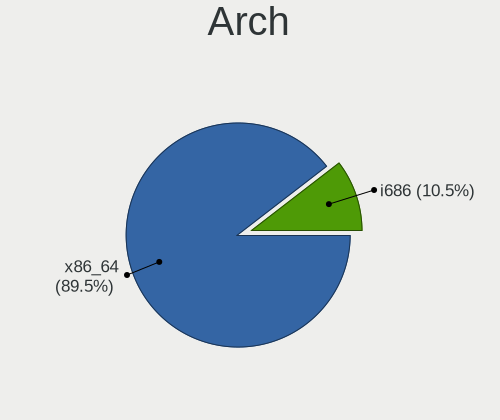

| Name   | Computers | Percent |
|--------|-----------|---------|
| x86_64 | 1191      | 89.55%  |
| i686   | 139       | 10.45%  |

DE
--

Desktop Environment

| Name       | Computers | Percent |
|------------|-----------|---------|
| X-Cinnamon | 1188      | 88.33%  |
| Cinnamon   | 87        | 6.47%   |
| Unknown    | 23        | 1.71%   |
| MATE       | 19        | 1.41%   |
| XFCE       | 7         | 0.52%   |
| LXDE       | 6         | 0.45%   |
| KDE5       | 5         | 0.37%   |
| GNOME      | 4         | 0.3%    |
| KDE        | 2         | 0.15%   |
| Trinity    | 1         | 0.07%   |
| LXQt       | 1         | 0.07%   |
| i3         | 1         | 0.07%   |
| awesome    | 1         | 0.07%   |

Display Server
--------------

X11 or Wayland

| Name    | Computers | Percent |
|---------|-----------|---------|
| X11     | 1322      | 99.47%  |
| Wayland | 5         | 0.38%   |
| Tty     | 2         | 0.15%   |

Display Manager
---------------

SDDM, LightDM, etc.

| Name    | Computers | Percent |
|---------|-----------|---------|
| Unknown | 760       | 56.72%  |
| LightDM | 532       | 39.7%   |
| TDM     | 32        | 2.39%   |
| MDM     | 5         | 0.37%   |
| SDDM    | 4         | 0.3%    |
| GDM3    | 4         | 0.3%    |
| GDM     | 3         | 0.22%   |

OS Lang
-------

Language

| Lang    | Computers | Percent |
|---------|-----------|---------|
| en_US   | 435       | 32.58%  |
| de_DE   | 173       | 12.96%  |
| it_IT   | 96        | 7.19%   |
| pt_BR   | 86        | 6.44%   |
| ru_RU   | 74        | 5.54%   |
| en_GB   | 67        | 5.02%   |
| fr_FR   | 59        | 4.42%   |
| pl_PL   | 40        | 3%      |
| Unknown | 29        | 2.17%   |
| es_ES   | 28        | 2.1%    |
| en_AU   | 18        | 1.35%   |
| en_CA   | 17        | 1.27%   |
| es_AR   | 14        | 1.05%   |
| es_MX   | 11        | 0.82%   |
| cs_CZ   | 11        | 0.82%   |
| sv_SE   | 10        | 0.75%   |
| nl_NL   | 9         | 0.67%   |
| de_CH   | 9         | 0.67%   |
| el_GR   | 8         | 0.6%    |
| tr_TR   | 7         | 0.52%   |
| hu_HU   | 7         | 0.52%   |
| de_AT   | 7         | 0.52%   |
| pt_PT   | 6         | 0.45%   |
| nl_BE   | 6         | 0.45%   |
| ja_JP   | 5         | 0.37%   |
| fr_CA   | 5         | 0.37%   |
| es_BO   | 5         | 0.37%   |
| en_ZA   | 5         | 0.37%   |
| en_NZ   | 5         | 0.37%   |
| sk_SK   | 4         | 0.3%    |
| es_CL   | 4         | 0.3%    |
| en_IN   | 4         | 0.3%    |
| ru_UA   | 3         | 0.22%   |
| ko_KR   | 3         | 0.22%   |
| it_CH   | 3         | 0.22%   |
| fr_BE   | 3         | 0.22%   |
| fi_FI   | 3         | 0.22%   |
| es_UY   | 3         | 0.22%   |
| es_EC   | 3         | 0.22%   |
| en_SG   | 3         | 0.22%   |

Boot Mode
---------

EFI or BIOS

| Mode | Computers | Percent |
|------|-----------|---------|
| EFI  | 717       | 53.71%  |
| BIOS | 618       | 46.29%  |

Filesystem
----------

Type of filesystem

| Type    | Computers | Percent |
|---------|-----------|---------|
| Ext4    | 1191      | 88.88%  |
| Overlay | 51        | 3.81%   |
| Btrfs   | 46        | 3.43%   |
| Tmpfs   | 36        | 2.69%   |
| Unknown | 8         | 0.6%    |
| Xfs     | 4         | 0.3%    |
| Zfs     | 2         | 0.15%   |
| Ext3    | 1         | 0.07%   |
| Aufs    | 1         | 0.07%   |

Part. scheme
------------

Scheme of partitioning

| Type    | Computers | Percent |
|---------|-----------|---------|
| Unknown | 743       | 55.45%  |
| GPT     | 427       | 31.87%  |
| MBR     | 170       | 12.69%  |

Dual Boot with Linux/BSD
------------------------

Hosting more than one Linux/BSD

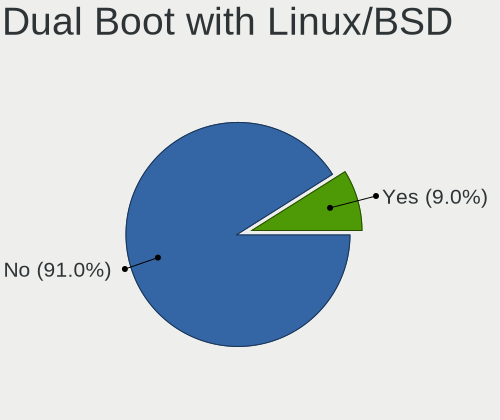

| Dual boot | Computers | Percent |
|-----------|-----------|---------|
| No        | 1220      | 91.04%  |
| Yes       | 120       | 8.96%   |

Dual Boot (Win)
---------------

Hosting Linux and Windows

| Dual boot | Computers | Percent |
|-----------|-----------|---------|
| No        | 1126      | 84.09%  |
| Yes       | 213       | 15.91%  |

Board
-----

Vendor
------

Motherboard manufacturer

| Name                                 | Computers | Percent |
|--------------------------------------|-----------|---------|
| Hewlett-Packard                      | 210       | 15.8%   |
| ASUSTek Computer                     | 208       | 15.65%  |
| Lenovo                               | 165       | 12.42%  |
| Dell                                 | 143       | 10.76%  |
| Acer                                 | 91        | 6.85%   |
| MSI                                  | 64        | 4.82%   |
| Gigabyte Technology                  | 64        | 4.82%   |
| ASRock                               | 40        | 3.01%   |
| Apple                                | 39        | 2.93%   |
| Toshiba                              | 29        | 2.18%   |
| Intel                                | 23        | 1.73%   |
| Fujitsu                              | 20        | 1.5%    |
| Unknown                              | 18        | 1.35%   |
| Samsung Electronics                  | 15        | 1.13%   |
| Sony                                 | 13        | 0.98%   |
| Fujitsu Siemens                      | 10        | 0.75%   |
| AZW                                  | 8         | 0.6%    |
| Pegatron                             | 7         | 0.53%   |
| Medion                               | 7         | 0.53%   |
| HUAWEI                               | 7         | 0.53%   |
| Google                               | 7         | 0.53%   |
| Positivo                             | 6         | 0.45%   |
| Alienware                            | 6         | 0.45%   |
| Packard Bell                         | 5         | 0.38%   |
| Notebook                             | 5         | 0.38%   |
| LG Electronics                       | 5         | 0.38%   |
| TUXEDO                               | 4         | 0.3%    |
| Microsoft                            | 4         | 0.3%    |
| Gateway                              | 4         | 0.3%    |
| Foxconn                              | 4         | 0.3%    |
| eMachines                            | 4         | 0.3%    |
| ECS                                  | 4         | 0.3%    |
| Shenzhen Meigao Electronic Equipment | 3         | 0.23%   |
| Biostar                              | 3         | 0.23%   |
| Supermicro                           | 2         | 0.15%   |
| Star Labs                            | 2         | 0.15%   |
| Semp Toshiba                         | 2         | 0.15%   |
| OEM                                  | 2         | 0.15%   |
| Multilaser                           | 2         | 0.15%   |
| Matsushita Electric Industrial       | 2         | 0.15%   |

Model
-----

Motherboard model

| Name                                                | Computers | Percent |
|-----------------------------------------------------|-----------|---------|
| Unknown                                             | 27        | 2.03%   |
| ASUS All Series                                     | 7         | 0.53%   |
| HP Pavilion dv6                                     | 6         | 0.45%   |
| HP Notebook                                         | 6         | 0.45%   |
| Lenovo IdeaPad 3 15ADA05 81W1                       | 5         | 0.38%   |
| MSI MS-7A38                                         | 4         | 0.3%    |
| HP 250 G8 Notebook PC                               | 4         | 0.3%    |
| Dell XPS 13 9360                                    | 4         | 0.3%    |
| Samsung RV411/RV511/E3511/S3511/RV711/E3411         | 3         | 0.23%   |
| MSI MS-7C52                                         | 3         | 0.23%   |
| Intel B75                                           | 3         | 0.23%   |
| HP Pavilion dv7                                     | 3         | 0.23%   |
| HP Pavilion Desktop 590-p0xxx                       | 3         | 0.23%   |
| HP Laptop 15-dy2xxx                                 | 3         | 0.23%   |
| HP EliteBook 8440p                                  | 3         | 0.23%   |
| HP 250 G7 Notebook PC                               | 3         | 0.23%   |
| Dell OptiPlex 780                                   | 3         | 0.23%   |
| Dell OptiPlex 7010                                  | 3         | 0.23%   |
| Dell Latitude E6430                                 | 3         | 0.23%   |
| Dell Latitude E6400                                 | 3         | 0.23%   |
| AZW MINI S                                          | 3         | 0.23%   |
| ASUS VivoBook_ASUSLaptop X1605VA_X1605VA            | 3         | 0.23%   |
| ASUS ROG STRIX B450-F GAMING                        | 3         | 0.23%   |
| ASRock A320M-HDV R4.0                               | 3         | 0.23%   |
| Apple MacBookPro9,2                                 | 3         | 0.23%   |
| Apple iMac5,1                                       | 3         | 0.23%   |
| Acer Aspire E1-570G                                 | 3         | 0.23%   |
| Acer Aspire 5930                                    | 3         | 0.23%   |
| Acer AOD270                                         | 3         | 0.23%   |
| Toshiba Satellite M100                              | 2         | 0.15%   |
| Star Labs StarBook                                  | 2         | 0.15%   |
| Shenzhen Meigao Electronic Equipment Mercury series | 2         | 0.15%   |
| MSI MS-7D91                                         | 2         | 0.15%   |
| MSI MS-7D22                                         | 2         | 0.15%   |
| MSI MS-7C95                                         | 2         | 0.15%   |
| MSI MS-7C02                                         | 2         | 0.15%   |
| MSI MS-7B79                                         | 2         | 0.15%   |
| LG A530-T.BE76P1                                    | 2         | 0.15%   |
| Lenovo V145-15AST 81MT                              | 2         | 0.15%   |
| Lenovo Legion 5 Pro 16ACH6H 82JQ                    | 2         | 0.15%   |

Model Family
------------

Motherboard model prefix

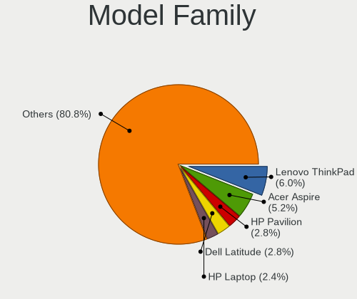

| Name                  | Computers | Percent |
|-----------------------|-----------|---------|
| Lenovo ThinkPad       | 80        | 6.02%   |
| Acer Aspire           | 69        | 5.19%   |
| HP Pavilion           | 37        | 2.78%   |
| Dell Latitude         | 37        | 2.78%   |
| HP Laptop             | 32        | 2.41%   |
| Dell Inspiron         | 31        | 2.33%   |
| Lenovo IdeaPad        | 30        | 2.26%   |
| Unknown               | 27        | 2.03%   |
| Toshiba Satellite     | 24        | 1.81%   |
| HP EliteBook          | 22        | 1.66%   |
| HP Compaq             | 22        | 1.66%   |
| Dell OptiPlex         | 22        | 1.66%   |
| ASUS VivoBook         | 22        | 1.66%   |
| Dell Precision        | 21        | 1.58%   |
| ASUS PRIME            | 20        | 1.5%    |
| ASUS ROG              | 16        | 1.2%    |
| HP ProBook            | 15        | 1.13%   |
| Dell XPS              | 12        | 0.9%    |
| HP ENVY               | 9         | 0.68%   |
| Lenovo ThinkCentre    | 8         | 0.6%    |
| HP 250                | 8         | 0.6%    |
| Fujitsu LIFEBOOK      | 8         | 0.6%    |
| ASUS TUF              | 8         | 0.6%    |
| Dell Vostro           | 7         | 0.53%   |
| ASUS ZenBook          | 7         | 0.53%   |
| ASUS All              | 7         | 0.53%   |
| Lenovo Yoga           | 6         | 0.45%   |
| HP Notebook           | 6         | 0.45%   |
| ASUS ASUS             | 6         | 0.45%   |
| Fujitsu Siemens AMILO | 5         | 0.38%   |
| Fujitsu ESPRIMO       | 5         | 0.38%   |
| Acer Veriton          | 5         | 0.38%   |
| MSI MS-7A38           | 4         | 0.3%    |
| Microsoft Surface     | 4         | 0.3%    |
| Lenovo IdeaPadFlex    | 4         | 0.3%    |
| HP ProDesk            | 4         | 0.3%    |
| HP 255                | 4         | 0.3%    |
| Gigabyte X570         | 4         | 0.3%    |
| Gigabyte B450M        | 4         | 0.3%    |
| Gigabyte B450         | 4         | 0.3%    |

MFG Year
--------

Motherboard manufacture year

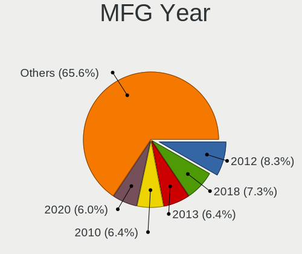

| Year    | Computers | Percent |
|---------|-----------|---------|
| 2012    | 110       | 8.28%   |
| 2018    | 97        | 7.3%    |
| 2013    | 85        | 6.4%    |
| 2010    | 85        | 6.4%    |
| 2020    | 80        | 6.02%   |
| 2019    | 78        | 5.87%   |
| 2017    | 75        | 5.64%   |
| 2011    | 75        | 5.64%   |
| 2009    | 73        | 5.49%   |
| 2021    | 70        | 5.27%   |
| 2016    | 70        | 5.27%   |
| 2008    | 69        | 5.19%   |
| 2022    | 67        | 5.04%   |
| 2014    | 63        | 4.74%   |
| 2007    | 61        | 4.59%   |
| 2023    | 47        | 3.54%   |
| 2015    | 47        | 3.54%   |
| 2006    | 38        | 2.86%   |
| 2024    | 13        | 0.98%   |
| 2005    | 12        | 0.9%    |
| 2003    | 6         | 0.45%   |
| Unknown | 4         | 0.3%    |
| 2004    | 3         | 0.23%   |
| 2002    | 1         | 0.08%   |

Form Factor
-----------

Physical design of the computer

| Name        | Computers | Percent |
|-------------|-----------|---------|
| Notebook    | 771       | 58.01%  |
| Desktop     | 471       | 35.44%  |
| All in one  | 25        | 1.88%   |
| Mini pc     | 21        | 1.58%   |
| Convertible | 20        | 1.5%    |
| Tablet      | 13        | 0.98%   |
| Server      | 7         | 0.53%   |
| Other       | 1         | 0.08%   |

Secure Boot
-----------

Enabled or disabled

| State    | Computers | Percent |
|----------|-----------|---------|
| Disabled | 1242      | 92.96%  |
| Enabled  | 94        | 7.04%   |

Coreboot
--------

Have coreboot on board

| Used | Computers | Percent |
|------|-----------|---------|
| No   | 1319      | 99.25%  |
| Yes  | 10        | 0.75%   |

RAM Size
--------

Total RAM memory

| Size in GB      | Computers | Percent |
|-----------------|-----------|---------|
| 4.01-8.0        | 307       | 22.83%  |
| 3.01-4.0        | 264       | 19.63%  |
| 16.01-24.0      | 227       | 16.88%  |
| 8.01-16.0       | 200       | 14.87%  |
| 32.01-64.0      | 114       | 8.48%   |
| 2.01-3.0        | 78        | 5.8%    |
| 1.01-2.0        | 72        | 5.35%   |
| 64.01-256.0     | 34        | 2.53%   |
| 24.01-32.0      | 27        | 2.01%   |
| 0.51-1.0        | 21        | 1.56%   |
| More than 256.0 | 1         | 0.07%   |

RAM Used
--------

Used RAM memory

| Used GB    | Computers | Percent |
|------------|-----------|---------|
| 1.01-2.0   | 523       | 36.62%  |
| 2.01-3.0   | 392       | 27.45%  |
| 3.01-4.0   | 176       | 12.32%  |
| 4.01-8.0   | 172       | 12.04%  |
| 0.51-1.0   | 119       | 8.33%   |
| 8.01-16.0  | 31        | 2.17%   |
| 0.01-0.5   | 5         | 0.35%   |
| 16.01-24.0 | 4         | 0.28%   |
| 32.01-64.0 | 3         | 0.21%   |
| 24.01-32.0 | 3         | 0.21%   |

Total Drives
------------

Number of drives on board

| Drives | Computers | Percent |
|--------|-----------|---------|
| 1      | 843       | 61.62%  |
| 2      | 321       | 23.46%  |
| 3      | 91        | 6.65%   |
| 4      | 53        | 3.87%   |
| 5      | 21        | 1.54%   |
| 0      | 13        | 0.95%   |
| 6      | 12        | 0.88%   |
| 7      | 9         | 0.66%   |
| 8      | 3         | 0.22%   |
| 11     | 1         | 0.07%   |
| 10     | 1         | 0.07%   |

Has CD-ROM
----------

Has CD-ROM on board

| Presented | Computers | Percent |
|-----------|-----------|---------|
| No        | 774       | 57.8%   |
| Yes       | 565       | 42.2%   |

Has Ethernet
------------

Has Ethernet on board

| Presented | Computers | Percent |
|-----------|-----------|---------|
| Yes       | 1163      | 87.51%  |
| No        | 166       | 12.49%  |

Has WiFi
--------

Has WiFi module

| Presented | Computers | Percent |
|-----------|-----------|---------|
| Yes       | 1052      | 78.62%  |
| No        | 286       | 21.38%  |

Has Bluetooth
-------------

Has Bluetooth module

| Presented | Computers | Percent |
|-----------|-----------|---------|
| Yes       | 760       | 56.93%  |
| No        | 575       | 43.07%  |

Location
--------

Country
-------

Geographic location (country)

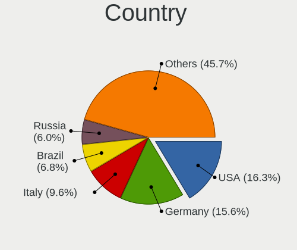

| Country      | Computers | Percent |
|--------------|-----------|---------|
| USA          | 218       | 16.34%  |
| Germany      | 208       | 15.59%  |
| Italy        | 128       | 9.6%    |
| Brazil       | 91        | 6.82%   |
| Russia       | 80        | 6%      |
| France       | 60        | 4.5%    |
| UK           | 45        | 3.37%   |
| Poland       | 43        | 3.22%   |
| Spain        | 34        | 2.55%   |
| Canada       | 34        | 2.55%   |
| Australia    | 22        | 1.65%   |
| Netherlands  | 21        | 1.57%   |
| Argentina    | 17        | 1.27%   |
| Mexico       | 16        | 1.2%    |
| Ukraine      | 15        | 1.12%   |
| Sweden       | 15        | 1.12%   |
| Belgium      | 13        | 0.97%   |
| Turkey       | 12        | 0.9%    |
| Switzerland  | 12        | 0.9%    |
| Austria      | 11        | 0.82%   |
| Portugal     | 10        | 0.75%   |
| India        | 10        | 0.75%   |
| Greece       | 10        | 0.75%   |
| Czechia      | 10        | 0.75%   |
| Romania      | 9         | 0.67%   |
| Hungary      | 9         | 0.67%   |
| Bulgaria     | 9         | 0.67%   |
| Indonesia    | 8         | 0.6%    |
| Belarus      | 8         | 0.6%    |
| Malaysia     | 7         | 0.52%   |
| Ecuador      | 7         | 0.52%   |
| South Africa | 6         | 0.45%   |
| New Zealand  | 6         | 0.45%   |
| Japan        | 6         | 0.45%   |
| Finland      | 6         | 0.45%   |
| Chile        | 6         | 0.45%   |
| Bolivia      | 6         | 0.45%   |
| Philippines  | 5         | 0.37%   |
| Norway       | 5         | 0.37%   |
| Denmark      | 5         | 0.37%   |

City
----

Geographic location (city)

| City              | Computers | Percent |
|-------------------|-----------|---------|
| Berlin            | 23        | 1.63%   |
| Milan             | 17        | 1.2%    |
| Moscow            | 15        | 1.06%   |
| Rome              | 11        | 0.78%   |
| Paris             | 10        | 0.71%   |
| St Petersburg     | 9         | 0.64%   |
| Bologna           | 9         | 0.64%   |
| Traunstein        | 8         | 0.57%   |
| Sydney            | 8         | 0.57%   |
| Sao Paulo         | 8         | 0.57%   |
| Madrid            | 8         | 0.57%   |
| Hamburg           | 8         | 0.57%   |
| Rio de Janeiro    | 7         | 0.5%    |
| Munich            | 7         | 0.5%    |
| Montreal          | 7         | 0.5%    |
| Krakow            | 7         | 0.5%    |
| Wroclaw           | 6         | 0.43%   |
| New York          | 6         | 0.43%   |
| Guayaquil         | 6         | 0.43%   |
| Frankfurt am Main | 6         | 0.43%   |
| Cologne           | 6         | 0.43%   |
| Athens            | 6         | 0.43%   |
| Warsaw            | 5         | 0.35%   |
| Turin             | 5         | 0.35%   |
| Toronto           | 5         | 0.35%   |
| Rho               | 5         | 0.35%   |
| Mannheim          | 5         | 0.35%   |
| Lisbon            | 5         | 0.35%   |
| Florence          | 5         | 0.35%   |
| Delligsen         | 5         | 0.35%   |
| Bremen            | 5         | 0.35%   |
| Auckland          | 5         | 0.35%   |
| Vienna            | 4         | 0.28%   |
| Stockholm         | 4         | 0.28%   |
| Sofia             | 4         | 0.28%   |
| San Antonio       | 4         | 0.28%   |
| Poznan            | 4         | 0.28%   |
| Perth             | 4         | 0.28%   |
| Oruro             | 4         | 0.28%   |
| Milano            | 4         | 0.28%   |

Drives
------

Drive Vendor
------------

Hard drive vendors

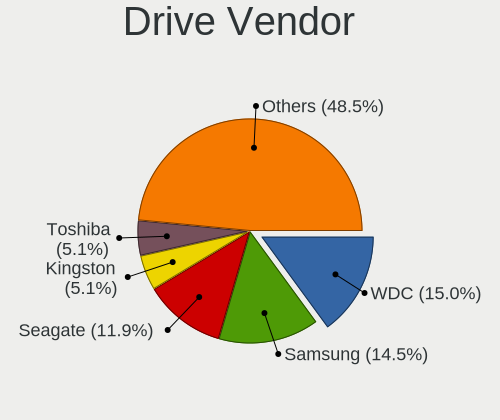

| Vendor                      | Computers | Drives | Percent |
|-----------------------------|-----------|--------|---------|
| WDC                         | 290       | 431    | 14.96%  |
| Samsung Electronics         | 282       | 394    | 14.54%  |
| Seagate                     | 230       | 347    | 11.86%  |
| Kingston                    | 99        | 150    | 5.11%   |
| Toshiba                     | 98        | 115    | 5.05%   |
| SanDisk                     | 90        | 125    | 4.64%   |
| Unknown                     | 78        | 113    | 4.02%   |
| Crucial                     | 78        | 92     | 4.02%   |
| Hitachi                     | 65        | 76     | 3.35%   |
| SK hynix                    | 38        | 41     | 1.96%   |
| Intel                       | 38        | 41     | 1.96%   |
| Micron Technology           | 34        | 38     | 1.75%   |
| China                       | 34        | 37     | 1.75%   |
| A-DATA Technology           | 31        | 34     | 1.6%    |
| HGST                        | 23        | 31     | 1.19%   |
| Fujitsu                     | 18        | 18     | 0.93%   |
| Apple                       | 18        | 24     | 0.93%   |
| Phison                      | 17        | 31     | 0.88%   |
| Intenso                     | 17        | 18     | 0.88%   |
| Unknown                     | 17        | 32     | 0.88%   |
| SPCC                        | 16        | 17     | 0.83%   |
| PNY                         | 15        | 22     | 0.77%   |
| Patriot                     | 12        | 15     | 0.62%   |
| GOODRAM                     | 11        | 11     | 0.57%   |
| Phison Electronics          | 10        | 11     | 0.52%   |
| Gigabyte Technology         | 10        | 13     | 0.52%   |
| Transcend                   | 9         | 14     | 0.46%   |
| Silicon Motion              | 9         | 10     | 0.46%   |
| KIOXIA                      | 9         | 22     | 0.46%   |
| JMicron Technology          | 9         | 10     | 0.46%   |
| Micron/Crucial Technology   | 8         | 13     | 0.41%   |
| Lexar                       | 8         | 8      | 0.41%   |
| KingSpec                    | 8         | 9      | 0.41%   |
| ADATA Technology            | 8         | 17     | 0.41%   |
| Team                        | 7         | 11     | 0.36%   |
| OCZ                         | 7         | 9      | 0.36%   |
| Hewlett-Packard             | 7         | 8      | 0.36%   |
| Apacer                      | 7         | 10     | 0.36%   |
| SABRENT                     | 6         | 7      | 0.31%   |
| Kingston Technology Company | 6         | 6      | 0.31%   |

Drive Model
-----------

Hard drive models

| Model                                               | Computers | Percent |
|-----------------------------------------------------|-----------|---------|
| Kingston SA400S37480G 480GB SSD                     | 21        | 0.99%   |
| Kingston SA400S37240G 240GB SSD                     | 19        | 0.89%   |
| Unknown                                             | 17        | 0.8%    |
| Seagate ST1000LM035-1RK172 1TB                      | 14        | 0.66%   |
| Samsung SSD 860 EVO 500GB                           | 13        | 0.61%   |
| Samsung SSD 850 EVO 500GB                           | 13        | 0.61%   |
| Samsung SSD 850 EVO 250GB                           | 13        | 0.61%   |
| Samsung NVMe SSD Controller SM981/PM981/PM983 512GB | 13        | 0.61%   |
| Unknown SD/MMC/MS PRO 128GB                         | 12        | 0.57%   |
| SanDisk NVMe SSD Drive 1TB                          | 12        | 0.57%   |
| Kingston SA400S37120G 120GB SSD                     | 12        | 0.57%   |
| Crucial CT500MX500SSD1 500GB                        | 12        | 0.57%   |
| Seagate ST500LT012-1DG142 500GB                     | 11        | 0.52%   |
| Unknown MMC Card  64GB                              | 10        | 0.47%   |
| Toshiba MQ01ABD100 1TB                              | 10        | 0.47%   |
| Samsung SSD 860 EVO 250GB                           | 10        | 0.47%   |
| Unknown MMC Card  128GB                             | 9         | 0.42%   |
| Sandisk WD Blue SN550 NVMe SSD 256GB                | 9         | 0.42%   |
| Crucial CT1000MX500SSD1 1TB                         | 9         | 0.42%   |
| WDC WD10EZEX-08WN4A0 1TB                            | 8         | 0.38%   |
| Unknown MMC Card  32GB                              | 8         | 0.38%   |
| Toshiba DT01ACA100 1TB                              | 8         | 0.38%   |
| Seagate ST500DM002-1BD142 500GB                     | 8         | 0.38%   |
| Seagate Expansion 1TB                               | 8         | 0.38%   |
| Samsung SSD 980 1TB                                 | 8         | 0.38%   |
| Samsung SSD 860 EVO 1TB                             | 8         | 0.38%   |
| Crucial CT240BX500SSD1 240GB                        | 8         | 0.38%   |
| Seagate ST1000DM010-2EP102 1TB                      | 7         | 0.33%   |
| Crucial CT1000BX500SSD1 1TB                         | 7         | 0.33%   |
| WDC WDS500G2B0A-00SM50 500GB SSD                    | 6         | 0.28%   |
| Toshiba MQ04ABF100 1TB                              | 6         | 0.28%   |
| Toshiba MQ01ABF050 500GB                            | 6         | 0.28%   |
| Seagate ST9500325AS 500GB                           | 6         | 0.28%   |
| Seagate ST2000DM006-2DM164 2TB                      | 6         | 0.28%   |
| SanDisk NVMe SSD Drive 512GB                        | 6         | 0.28%   |
| SanDisk NVMe SSD Drive 2TB                          | 6         | 0.28%   |
| Samsung SSD 980 PRO 1TB                             | 6         | 0.28%   |
| Samsung SSD 970 EVO 500GB                           | 6         | 0.28%   |
| SABRENT Disk 2TB                                    | 6         | 0.28%   |
| Phison PS5013 E13 NVMe Controller 512GB             | 6         | 0.28%   |

HDD Vendor
----------

Hard disk drive vendors

| Vendor              | Computers | Drives | Percent |
|---------------------|-----------|--------|---------|
| WDC                 | 236       | 358    | 31.55%  |
| Seagate             | 228       | 342    | 30.48%  |
| Toshiba             | 78        | 89     | 10.43%  |
| Hitachi             | 65        | 76     | 8.69%   |
| Samsung Electronics | 42        | 57     | 5.61%   |
| HGST                | 23        | 31     | 3.07%   |
| Fujitsu             | 18        | 18     | 2.41%   |
| Unknown             | 12        | 13     | 1.6%    |
| SABRENT             | 6         | 7      | 0.8%    |
| Apple               | 6         | 6      | 0.8%    |
| Maxtor              | 5         | 7      | 0.67%   |
| JMicron Technology  | 5         | 5      | 0.67%   |
| Intenso             | 4         | 4      | 0.53%   |
| TO Exter            | 3         | 3      | 0.4%    |
| IBM/Hitachi         | 3         | 3      | 0.4%    |
| External            | 2         | 2      | 0.27%   |
| ASMT                | 2         | 3      | 0.27%   |
| ASMedia             | 2         | 2      | 0.27%   |
| USB3.0              | 1         | 1      | 0.13%   |
| KESU                | 1         | 2      | 0.13%   |
| Initio              | 1         | 1      | 0.13%   |
| HPE                 | 1         | 4      | 0.13%   |
| ExcelStor           | 1         | 1      | 0.13%   |
| DC-624e             | 1         | 1      | 0.13%   |
| DAS                 | 1         | 4      | 0.13%   |
| Unknown             | 1         | 1      | 0.13%   |

SSD Vendor
----------

Solid state drive vendors

| Vendor              | Computers | Drives | Percent |
|---------------------|-----------|--------|---------|
| Samsung Electronics | 144       | 182    | 20.6%   |
| Kingston            | 82        | 125    | 11.73%  |
| Crucial             | 66        | 79     | 9.44%   |
| SanDisk             | 43        | 59     | 6.15%   |
| WDC                 | 36        | 45     | 5.15%   |
| China               | 32        | 35     | 4.58%   |
| A-DATA Technology   | 28        | 31     | 4.01%   |
| Intel               | 17        | 18     | 2.43%   |
| PNY                 | 15        | 22     | 2.15%   |
| SPCC                | 13        | 14     | 1.86%   |
| Toshiba             | 11        | 15     | 1.57%   |
| Patriot             | 11        | 14     | 1.57%   |
| Micron Technology   | 11        | 13     | 1.57%   |
| Apple               | 11        | 11     | 1.57%   |
| Intenso             | 10        | 11     | 1.43%   |
| GOODRAM             | 10        | 10     | 1.43%   |
| Transcend           | 9         | 14     | 1.29%   |
| Unknown             | 9         | 21     | 1.29%   |
| KingSpec            | 8         | 9      | 1.14%   |
| Gigabyte Technology | 8         | 11     | 1.14%   |
| Team                | 7         | 11     | 1%      |
| SK hynix            | 7         | 8      | 1%      |
| OCZ                 | 7         | 9      | 1%      |
| Hewlett-Packard     | 6         | 7      | 0.86%   |
| KingDian            | 5         | 6      | 0.72%   |
| Apacer              | 5         | 8      | 0.72%   |
| Verbatim            | 3         | 4      | 0.43%   |
| T-FORCE             | 3         | 3      | 0.43%   |
| Phison              | 3         | 15     | 0.43%   |
| Netac               | 3         | 3      | 0.43%   |
| LITEONIT            | 3         | 4      | 0.43%   |
| Lexar               | 3         | 3      | 0.43%   |
| FORESEE             | 3         | 5      | 0.43%   |
| Fanxiang            | 3         | 5      | 0.43%   |
| XrayDisk            | 2         | 2      | 0.29%   |
| USB30               | 2         | 3      | 0.29%   |
| Unknown             | 2         | 2      | 0.29%   |
| TCSUNBOW            | 2         | 2      | 0.29%   |
| Plextor             | 2         | 3      | 0.29%   |
| Integral            | 2         | 2      | 0.29%   |

Drive Kind
----------

HDD or SSD

| Kind    | Computers | Drives | Percent |
|---------|-----------|--------|---------|
| HDD     | 636       | 1041   | 36.72%  |
| SSD     | 609       | 906    | 35.16%  |
| NVMe    | 380       | 536    | 21.94%  |
| MMC     | 70        | 96     | 4.04%   |
| Unknown | 37        | 51     | 2.14%   |

Drive Connector
---------------

SATA, SAS, NVMe, etc.

| Type | Computers | Drives | Percent |
|------|-----------|--------|---------|
| SATA | 1037      | 1844   | 65.3%   |
| NVMe | 378       | 533    | 23.8%   |
| SAS  | 103       | 157    | 6.49%   |
| MMC  | 70        | 96     | 4.41%   |

Drive Size
----------

Size of hard drive

| Size in TB | Computers | Drives | Percent |
|------------|-----------|--------|---------|
| 0.01-0.5   | 815       | 1240   | 63.18%  |
| 0.51-1.0   | 309       | 438    | 23.95%  |
| 1.01-2.0   | 89        | 141    | 6.9%    |
| 3.01-4.0   | 30        | 46     | 2.33%   |
| 4.01-10.0  | 27        | 45     | 2.09%   |
| 2.01-3.0   | 16        | 32     | 1.24%   |
| 10.01-20.0 | 4         | 5      | 0.31%   |

Space Total
-----------

Amount of disk space available on the file system

| Size in GB     | Computers | Percent |
|----------------|-----------|---------|
| 101-250        | 426       | 30.96%  |
| 251-500        | 307       | 22.31%  |
| 501-1000       | 193       | 14.03%  |
| 1001-2000      | 122       | 8.87%   |
| 51-100         | 93        | 6.76%   |
| More than 3000 | 78        | 5.67%   |
| 1-20           | 59        | 4.29%   |
| 2001-3000      | 43        | 3.13%   |
| 21-50          | 40        | 2.91%   |
| Unknown        | 15        | 1.09%   |

Space Used
----------

Amount of used disk space

| Used GB        | Computers | Percent |
|----------------|-----------|---------|
| 1-20           | 522       | 36.38%  |
| 21-50          | 297       | 20.7%   |
| 101-250        | 176       | 12.26%  |
| 51-100         | 165       | 11.5%   |
| 251-500        | 91        | 6.34%   |
| 501-1000       | 75        | 5.23%   |
| 1001-2000      | 42        | 2.93%   |
| More than 3000 | 30        | 2.09%   |
| 2001-3000      | 22        | 1.53%   |
| Unknown        | 15        | 1.05%   |

Malfunc. Drives
---------------

Drive models with a malfunction

| Model                                 | Computers | Drives | Percent |
|---------------------------------------|-----------|--------|---------|
| Seagate ST9500325AS 500GB             | 2         | 2      | 1.87%   |
| Samsung Electronics SSD 970 EVO 500GB | 2         | 3      | 1.87%   |
| WINTEC 240GB SATA3 SF2281 SSD         | 1         | 1      | 0.93%   |
| WDC WD7500BPVT-00HXZT3 752GB          | 1         | 1      | 0.93%   |
| WDC WD5000LPVX-60V0TT0 500GB          | 1         | 1      | 0.93%   |
| WDC WD5000BEVT-22A0RT0 500GB          | 1         | 1      | 0.93%   |
| WDC WD3200BEVT-60ZCT1 320GB           | 1         | 1      | 0.93%   |
| WDC WD3200BEVT-26A23T0 320GB          | 1         | 1      | 0.93%   |
| WDC WD3200BEVT-22A23T0 320GB          | 1         | 1      | 0.93%   |
| WDC WD3200AAKS-00L9A0 320GB           | 1         | 1      | 0.93%   |
| WDC WD2500BEVT-24A23T0 250GB          | 1         | 1      | 0.93%   |
| WDC WD1600BEVT-22ZCT0 160GB           | 1         | 1      | 0.93%   |
| WDC WD15EADS-00P8B0 1TB               | 1         | 1      | 0.93%   |
| WDC WD1200BEVS-07LAT0 120GB           | 1         | 1      | 0.93%   |
| WDC WD10SPZX-24Z10 1TB                | 1         | 1      | 0.93%   |
| WDC WD10EZRZ-00HTKB0 1TB              | 1         | 1      | 0.93%   |
| WDC WD10EZEX-75M2NA0 1TB              | 1         | 1      | 0.93%   |
| WDC WD10EZEX-60WN4A0 1TB              | 1         | 1      | 0.93%   |
| WDC WD10EFRX-68PJCN0 1TB              | 1         | 1      | 0.93%   |
| WDC WD1002FAEX-00Y9A0 1TB             | 1         | 1      | 0.93%   |
| Unknown MMC Card  128GB               | 1         | 1      | 0.93%   |
| Transcend TS512GMTS430S 512GB SSD     | 1         | 1      | 0.93%   |
| Toshiba THNSNF128GCSS 128GB SSD       | 1         | 1      | 0.93%   |
| Toshiba MQ04ABF100 1TB                | 1         | 1      | 0.93%   |
| Toshiba MK1652GSX 160GB               | 1         | 1      | 0.93%   |
| Toshiba MD04ACA400 4TB                | 1         | 1      | 0.93%   |
| Toshiba HDWD110 1TB                   | 1         | 1      | 0.93%   |
| Solid SSD0256S00 256GB                | 1         | 1      | 0.93%   |
| SK hynix PC711 HFS512GDE9X073N 512GB  | 1         | 1      | 0.93%   |
| SK hynix HFS256G39TND-N210A 256GB SSD | 1         | 1      | 0.93%   |
| SK hynix HFS060G32MNB-2000A 64GB SSD  | 1         | 1      | 0.93%   |
| Seagate STM9120817AS 120GB            | 1         | 1      | 0.93%   |
| Seagate ST98823AS 80GB                | 1         | 2      | 0.93%   |
| Seagate ST9640423AS 640GB             | 1         | 1      | 0.93%   |
| Seagate ST9320325AS 320GB             | 1         | 1      | 0.93%   |
| Seagate ST9250315AS 250GB             | 1         | 1      | 0.93%   |
| Seagate ST9120821AS 120GB             | 1         | 1      | 0.93%   |
| Seagate ST910021AS 100GB              | 1         | 1      | 0.93%   |
| Seagate ST500LT032-1E9142 500GB       | 1         | 1      | 0.93%   |
| Seagate ST500LT012-1DG142 500GB       | 1         | 1      | 0.93%   |

Malfunc. Drive Vendor
---------------------

Vendors of faulty drives

| Vendor              | Computers | Drives | Percent |
|---------------------|-----------|--------|---------|
| Seagate             | 23        | 24     | 21.7%   |
| WDC                 | 16        | 17     | 15.09%  |
| Samsung Electronics | 16        | 17     | 15.09%  |
| Hitachi             | 9         | 9      | 8.49%   |
| Toshiba             | 5         | 5      | 4.72%   |
| Kingston            | 4         | 4      | 3.77%   |
| Fujitsu             | 4         | 4      | 3.77%   |
| SK hynix            | 3         | 3      | 2.83%   |
| Intel               | 3         | 3      | 2.83%   |
| Micron Technology   | 2         | 2      | 1.89%   |
| HGST                | 2         | 2      | 1.89%   |
| Crucial             | 2         | 3      | 1.89%   |
| China               | 2         | 2      | 1.89%   |
| Apple               | 2         | 2      | 1.89%   |
| A-DATA Technology   | 2         | 2      | 1.89%   |
| WINTEC              | 1         | 1      | 0.94%   |
| Unknown             | 1         | 1      | 0.94%   |
| Transcend           | 1         | 1      | 0.94%   |
| Solid               | 1         | 1      | 0.94%   |
| SanDisk             | 1         | 1      | 0.94%   |
| Phison              | 1         | 1      | 0.94%   |
| Maxtor              | 1         | 1      | 0.94%   |
| Lexar               | 1         | 1      | 0.94%   |
| KUU                 | 1         | 1      | 0.94%   |
| Intenso             | 1         | 1      | 0.94%   |
| IBM/Hitachi         | 1         | 1      | 0.94%   |

Malfunc. HDD Vendor
-------------------

Vendors of faulty HDD drives

| Vendor              | Computers | Drives | Percent |
|---------------------|-----------|--------|---------|
| Seagate             | 23        | 24     | 33.33%  |
| WDC                 | 16        | 17     | 23.19%  |
| Hitachi             | 9         | 9      | 13.04%  |
| Samsung Electronics | 8         | 8      | 11.59%  |
| Toshiba             | 4         | 4      | 5.8%    |
| Fujitsu             | 4         | 4      | 5.8%    |
| HGST                | 2         | 2      | 2.9%    |
| Maxtor              | 1         | 1      | 1.45%   |
| IBM/Hitachi         | 1         | 1      | 1.45%   |
| Apple               | 1         | 1      | 1.45%   |

Malfunc. Drive Kind
-------------------

Kinds of faulty drives

| Kind | Computers | Drives | Percent |
|------|-----------|--------|---------|
| HDD  | 66        | 71     | 64.08%  |
| SSD  | 28        | 29     | 27.18%  |
| NVMe | 8         | 9      | 7.77%   |
| MMC  | 1         | 1      | 0.97%   |

Failed Drives
-------------

Failed drive models

Zero info for selected period =(

Failed Drive Vendor
-------------------

Failed drive vendors

Zero info for selected period =(

Drive Status
------------

Number of failed and malfunc. drives

| Status   | Computers | Drives | Percent |
|----------|-----------|--------|---------|
| Detected | 848       | 1657   | 58.48%  |
| Works    | 500       | 863    | 34.48%  |
| Malfunc  | 102       | 110    | 7.03%   |

Storage controller
------------------

Storage Vendor
--------------

Storage controller vendors

| Vendor                                  | Computers | Percent |
|-----------------------------------------|-----------|---------|
| Intel                                   | 907       | 54.47%  |
| AMD                                     | 236       | 14.17%  |
| Samsung Electronics                     | 119       | 7.15%   |
| SanDisk                                 | 66        | 3.96%   |
| Phison Electronics                      | 35        | 2.1%    |
| SK hynix                                | 30        | 1.8%    |
| Nvidia                                  | 28        | 1.68%   |
| ASMedia Technology                      | 28        | 1.68%   |
| Kingston Technology Company             | 25        | 1.5%    |
| Micron Technology                       | 24        | 1.44%   |
| JMicron Technology                      | 20        | 1.2%    |
| Marvell Technology Group                | 19        | 1.14%   |
| Micron/Crucial Technology               | 18        | 1.08%   |
| VIA Technologies                        | 13        | 0.78%   |
| Silicon Motion                          | 13        | 0.78%   |
| KIOXIA                                  | 12        | 0.72%   |
| ADATA Technology                        | 11        | 0.66%   |
| Toshiba America Info Systems            | 10        | 0.6%    |
| Silicon Integrated Systems [SiS]        | 8         | 0.48%   |
| MAXIO Technology (Hangzhou)             | 8         | 0.48%   |
| Broadcom / LSI                          | 6         | 0.36%   |
| LSI Logic / Symbios Logic               | 4         | 0.24%   |
| Union Memory (Shenzhen)                 | 3         | 0.18%   |
| Silicon Image                           | 3         | 0.18%   |
| Shenzhen Longsys Electronics            | 3         | 0.18%   |
| Hosin Global Electronics                | 3         | 0.18%   |
| Realtek Semiconductor                   | 2         | 0.12%   |
| Integrated Technology Express           | 2         | 0.12%   |
| Apple                                   | 2         | 0.12%   |
| Solidigm                                | 1         | 0.06%   |
| Solid State Storage Technology          | 1         | 0.06%   |
| Shenzhen Unionmemory Information System | 1         | 0.06%   |
| Seagate Technology                      | 1         | 0.06%   |
| INNOGRIT                                | 1         | 0.06%   |
| Dell                                    | 1         | 0.06%   |
| Biwin Storage Technology                | 1         | 0.06%   |

Storage Model
-------------

Storage controller models

| Model                                                                          | Computers | Percent |
|--------------------------------------------------------------------------------|-----------|---------|
| AMD FCH SATA Controller [AHCI mode]                                            | 142       | 7.2%    |
| Intel Sunrise Point-LP SATA Controller [AHCI mode]                             | 62        | 3.15%   |
| Intel 82801G (ICH7 Family) IDE Controller                                      | 57        | 2.89%   |
| Intel 82801 Mobile SATA Controller [RAID mode]                                 | 55        | 2.79%   |
| Intel 7 Series Chipset Family 6-port SATA Controller [AHCI mode]               | 52        | 2.64%   |
| Samsung NVMe SSD Controller SM981/PM981/PM983                                  | 49        | 2.49%   |
| Intel 8 Series/C220 Series Chipset Family 6-port SATA Controller 1 [AHCI mode] | 47        | 2.38%   |
| Intel 82801IBM/IEM (ICH9M/ICH9M-E) 4 port SATA Controller [AHCI mode]          | 38        | 1.93%   |
| Intel Volume Management Device NVMe RAID Controller                            | 37        | 1.88%   |
| Intel NM10/ICH7 Family SATA Controller [IDE mode]                              | 35        | 1.78%   |
| Intel 6 Series/C200 Series Chipset Family 6 port Mobile SATA AHCI Controller   | 35        | 1.78%   |
| Samsung NVMe SSD Controller 980 (DRAM-less)                                    | 34        | 1.73%   |
| Intel 6 Series/C200 Series Chipset Family 6 port Desktop SATA AHCI Controller  | 33        | 1.67%   |
| Intel 8 Series SATA Controller 1 [AHCI mode]                                   | 31        | 1.57%   |
| AMD SB7x0/SB8x0/SB9x0 SATA Controller [AHCI mode]                              | 29        | 1.47%   |
| AMD 400 Series Chipset SATA Controller                                         | 28        | 1.42%   |
| Intel Q170/Q150/B150/H170/H110/Z170/CM236 Chipset SATA Controller [AHCI Mode]  | 26        | 1.32%   |
| Intel 7 Series/C210 Series Chipset Family 6-port SATA Controller [AHCI mode]   | 26        | 1.32%   |
| ASMedia ASM1061/ASM1062 Serial ATA Controller                                  | 26        | 1.32%   |
| Intel 5 Series/3400 Series Chipset 4 port SATA AHCI Controller                 | 24        | 1.22%   |
| Intel 82801HM/HEM (ICH8M/ICH8M-E) IDE Controller                               | 23        | 1.17%   |
| Intel 82801HM/HEM (ICH8M/ICH8M-E) SATA Controller [AHCI mode]                  | 22        | 1.12%   |
| Intel 82801GBM/GHM (ICH7-M Family) SATA Controller [IDE mode]                  | 22        | 1.12%   |
| Intel 5 Series/3400 Series Chipset 6 port SATA AHCI Controller                 | 22        | 1.12%   |
| Intel 82801GBM/GHM (ICH7-M Family) SATA Controller [AHCI mode]                 | 21        | 1.07%   |
| AMD SB7x0/SB8x0/SB9x0 IDE Controller                                           | 20        | 1.01%   |
| Intel Tiger Lake-LP SATA Controller                                            | 18        | 0.91%   |
| Intel SATA Controller [RAID mode]                                              | 18        | 0.91%   |
| Intel NM10/ICH7 Family SATA Controller [AHCI mode]                             | 18        | 0.91%   |
| SanDisk Ultra 3D / WD PC SN530, IX SN530, Blue SN550 NVMe SSD (DRAM-less)      | 17        | 0.86%   |
| AMD 500 Series Chipset SATA Controller                                         | 17        | 0.86%   |
| Intel Cannon Lake PCH SATA AHCI Controller                                     | 16        | 0.81%   |
| SK hynix Gold P31/BC711/PC711 NVMe Solid State Drive                           | 14        | 0.71%   |
| Phison PS5013-E13 PCIe3 NVMe Controller (DRAM-less)                            | 14        | 0.71%   |
| Intel Wildcat Point-LP SATA Controller [AHCI Mode]                             | 14        | 0.71%   |
| Intel Celeron/Pentium Silver Processor SATA Controller                         | 14        | 0.71%   |
| AMD SB7x0/SB8x0/SB9x0 SATA Controller [IDE mode]                               | 14        | 0.71%   |
| AMD A320 Chipset SATA Controller [AHCI mode]                                   | 14        | 0.71%   |
| Phison E12 NVMe Controller                                                     | 13        | 0.66%   |
| JMicron JMB363 SATA/IDE Controller                                             | 13        | 0.66%   |

Storage Kind
------------

Kind of storage controller (IDE, SATA, NVMe, SAS, ...)

| Kind | Computers | Percent |
|------|-----------|---------|
| SATA | 917       | 53.63%  |
| NVMe | 377       | 22.05%  |
| IDE  | 271       | 15.85%  |
| RAID | 135       | 7.89%   |
| SAS  | 7         | 0.41%   |
| SCSI | 3         | 0.18%   |

Processor
---------

CPU Vendor
----------

Processor vendors

| Vendor       | Computers | Percent |
|--------------|-----------|---------|
| Intel        | 1021      | 76.82%  |
| AMD          | 307       | 23.1%   |
| CentaurHauls | 1         | 0.08%   |

CPU Model
---------

Processor models

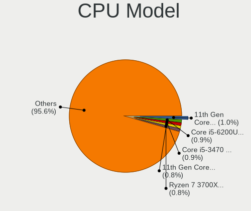

| Model                                         | Computers | Percent |
|-----------------------------------------------|-----------|---------|
| Intel 11th Gen Core i5-1135G7 @ 2.40GHz       | 13        | 0.98%   |
| Intel Core i5-6200U CPU @ 2.30GHz             | 12        | 0.9%    |
| Intel Core i5-3470 CPU @ 3.20GHz              | 12        | 0.9%    |
| Intel 11th Gen Core i3-1115G4 @ 3.00GHz       | 11        | 0.83%   |
| AMD Ryzen 7 3700X 8-Core Processor            | 11        | 0.83%   |
| Intel Core i5-3230M CPU @ 2.60GHz             | 10        | 0.75%   |
| Intel Atom CPU N270 @ 1.60GHz                 | 10        | 0.75%   |
| Intel Atom CPU N2600 @ 1.60GHz                | 10        | 0.75%   |
| Intel N100                                    | 9         | 0.68%   |
| Intel Core i5-8250U CPU @ 1.60GHz             | 9         | 0.68%   |
| Intel Core i5-3320M CPU @ 2.60GHz             | 9         | 0.68%   |
| AMD Ryzen 5 5500U with Radeon Graphics        | 9         | 0.68%   |
| Intel Core i7-7500U CPU @ 2.70GHz             | 8         | 0.6%    |
| Intel Core i5-8265U CPU @ 1.60GHz             | 8         | 0.6%    |
| Intel Core 2 Duo CPU T6600 @ 2.20GHz          | 8         | 0.6%    |
| Intel Core i7-8565U CPU @ 1.80GHz             | 7         | 0.53%   |
| Intel Core i7-4790 CPU @ 3.60GHz              | 7         | 0.53%   |
| Intel Core i7-3770 CPU @ 3.40GHz              | 7         | 0.53%   |
| Intel Core i7-2600 CPU @ 3.40GHz              | 7         | 0.53%   |
| Intel Core i5-10210U CPU @ 1.60GHz            | 7         | 0.53%   |
| Intel Atom x5-Z8350 CPU @ 1.44GHz             | 7         | 0.53%   |
| Intel 11th Gen Core i7-1165G7 @ 2.80GHz       | 7         | 0.53%   |
| AMD Ryzen 7 5700U with Radeon Graphics        | 7         | 0.53%   |
| Intel Genuine CPU T2300 @ 1.66GHz             | 6         | 0.45%   |
| Intel Core i7-8550U CPU @ 1.80GHz             | 6         | 0.45%   |
| Intel Core i7-10510U CPU @ 1.80GHz            | 6         | 0.45%   |
| Intel Core i5-7200U CPU @ 2.50GHz             | 6         | 0.45%   |
| AMD Ryzen 7 5800H with Radeon Graphics        | 6         | 0.45%   |
| AMD Ryzen 5 5600G with Radeon Graphics        | 6         | 0.45%   |
| AMD Ryzen 5 3500U with Radeon Vega Mobile Gfx | 6         | 0.45%   |
| AMD Ryzen 3 3200G with Radeon Vega Graphics   | 6         | 0.45%   |
| Intel Core i7-7700HQ CPU @ 2.80GHz            | 5         | 0.38%   |
| Intel Core i7-4810MQ CPU @ 2.80GHz            | 5         | 0.38%   |
| Intel Core i7-4770 CPU @ 3.40GHz              | 5         | 0.38%   |
| Intel Core i5-6500 CPU @ 3.20GHz              | 5         | 0.38%   |
| Intel Core i5-6300U CPU @ 2.40GHz             | 5         | 0.38%   |
| Intel Core i5-5200U CPU @ 2.20GHz             | 5         | 0.38%   |
| Intel Core i5-4210U CPU @ 1.70GHz             | 5         | 0.38%   |
| Intel Core i5-4200U CPU @ 1.60GHz             | 5         | 0.38%   |
| Intel Core i5-3210M CPU @ 2.50GHz             | 5         | 0.38%   |

CPU Model Family
----------------

Processor model prefix

| Model                   | Computers | Percent |
|-------------------------|-----------|---------|
| Intel Core i5           | 242       | 18.18%  |
| Intel Core i7           | 184       | 13.82%  |
| Other                   | 109       | 8.19%   |
| Intel Core i3           | 96        | 7.21%   |
| Intel Core 2 Duo        | 80        | 6.01%   |
| AMD Ryzen 5             | 69        | 5.18%   |
| Intel Celeron           | 63        | 4.73%   |
| AMD Ryzen 7             | 61        | 4.58%   |
| Intel Atom              | 46        | 3.46%   |
| Intel Pentium           | 37        | 2.78%   |
| Intel Xeon              | 35        | 2.63%   |
| Intel Pentium Dual-Core | 21        | 1.58%   |
| AMD Ryzen 3             | 21        | 1.58%   |
| Intel Genuine           | 20        | 1.5%    |
| AMD Ryzen 9             | 17        | 1.28%   |
| Intel Core 2 Quad       | 16        | 1.2%    |
| Intel Core 2            | 16        | 1.2%    |
| AMD A4                  | 12        | 0.9%    |
| Intel Pentium Dual      | 11        | 0.83%   |
| AMD FX                  | 11        | 0.83%   |
| Intel Pentium M         | 10        | 0.75%   |
| AMD A8                  | 10        | 0.75%   |
| Intel Pentium D         | 8         | 0.6%    |
| AMD Sempron             | 8         | 0.6%    |
| Intel Pentium 4         | 7         | 0.53%   |
| AMD Phenom II X6        | 7         | 0.53%   |
| AMD E1                  | 7         | 0.53%   |
| AMD Athlon 64 X2        | 7         | 0.53%   |
| Intel Pentium Silver    | 6         | 0.45%   |
| Intel Core Duo          | 6         | 0.45%   |
| AMD E2                  | 6         | 0.45%   |
| AMD Athlon              | 6         | 0.45%   |
| Intel Core i9           | 5         | 0.38%   |
| AMD Phenom II X4        | 5         | 0.38%   |
| AMD Athlon II X2        | 5         | 0.38%   |
| AMD A10                 | 5         | 0.38%   |
| Intel Celeron M         | 4         | 0.3%    |
| AMD Turion 64 X2 Mobile | 4         | 0.3%    |
| AMD E                   | 4         | 0.3%    |
| Intel Pentium Gold      | 3         | 0.23%   |

CPU Cores
---------

Number of processor cores

| Number | Computers | Percent |
|--------|-----------|---------|
| 2      | 600       | 45.01%  |
| 4      | 415       | 31.13%  |
| 6      | 91        | 6.83%   |
| 8      | 86        | 6.45%   |
| 1      | 75        | 5.63%   |
| 12     | 28        | 2.1%    |
| 16     | 13        | 0.98%   |
| 10     | 11        | 0.83%   |
| 14     | 9         | 0.68%   |
| 3      | 3         | 0.23%   |
| 24     | 2         | 0.15%   |

CPU Sockets
-----------

Number of sockets

| Number | Computers | Percent |
|--------|-----------|---------|
| 1      | 1315      | 98.95%  |
| 2      | 14        | 1.05%   |

CPU Threads
-----------

Threads per core (Hyper-Threading)

| Number | Computers | Percent |
|--------|-----------|---------|
| 2      | 791       | 59.43%  |
| 1      | 540       | 40.57%  |

CPU Op-Modes
------------

CPU Operation Modes (32-bit, 64-bit)

| Op mode        | Computers | Percent |
|----------------|-----------|---------|
| 32-bit, 64-bit | 1256      | 94.51%  |
| 32-bit         | 73        | 5.49%   |

CPU Microcode
-------------

Microcode number

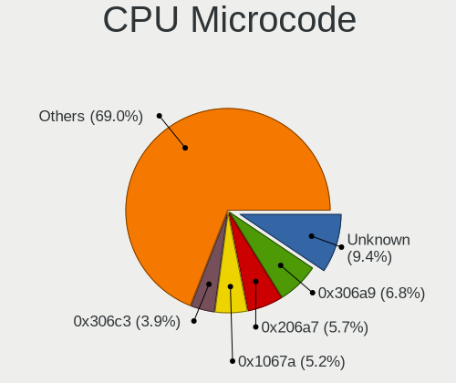

| Number     | Computers | Percent |
|------------|-----------|---------|
| Unknown    | 127       | 9.43%   |
| 0x306a9    | 91        | 6.76%   |
| 0x206a7    | 77        | 5.72%   |
| 0x1067a    | 70        | 5.2%    |
| 0x306c3    | 52        | 3.86%   |
| 0x40651    | 37        | 2.75%   |
| 0x806c1    | 30        | 2.23%   |
| 0x6fd      | 30        | 2.23%   |
| 0x406e3    | 30        | 2.23%   |
| 0x20655    | 29        | 2.15%   |
| 0x08108109 | 28        | 2.08%   |
| 0x806ec    | 26        | 1.93%   |
| 0x506e3    | 24        | 1.78%   |
| 0x806ea    | 23        | 1.71%   |
| 0x806e9    | 23        | 1.71%   |
| 0x106c2    | 17        | 1.26%   |
| 0x906e9    | 16        | 1.19%   |
| 0x406c4    | 16        | 1.19%   |
| 0x906ea    | 15        | 1.11%   |
| 0x306d4    | 15        | 1.11%   |
| 0x10676    | 15        | 1.11%   |
| 0x010000c8 | 15        | 1.11%   |
| 0x6f6      | 14        | 1.04%   |
| 0x6ec      | 13        | 0.97%   |
| 0x08608103 | 13        | 0.97%   |
| 0x6e8      | 12        | 0.89%   |
| 0x30661    | 12        | 0.89%   |
| 0x0a50000c | 12        | 0.89%   |
| 0x06006705 | 12        | 0.89%   |
| 0xb06e0    | 11        | 0.82%   |
| 0x906a3    | 11        | 0.82%   |
| 0x706a8    | 11        | 0.82%   |
| 0x30678    | 11        | 0.82%   |
| 0x106e5    | 11        | 0.82%   |
| 0x906ed    | 10        | 0.74%   |
| 0x906c0    | 10        | 0.74%   |
| 0x6fb      | 10        | 0.74%   |
| 0x20652    | 10        | 0.74%   |
| 0x0a50000d | 10        | 0.74%   |
| 0x08701021 | 10        | 0.74%   |

CPU Microarch
-------------

Microarchitecture

| Name             | Computers | Percent |
|------------------|-----------|---------|
| KabyLake         | 144       | 10.8%   |
| IvyBridge        | 100       | 7.5%    |
| Haswell          | 99        | 7.43%   |
| Penryn           | 96        | 7.2%    |
| SandyBridge      | 88        | 6.6%    |
| Core             | 66        | 4.95%   |
| Skylake          | 59        | 4.43%   |
| Unknown          | 55        | 4.13%   |
| Zen+             | 46        | 3.45%   |
| Westmere         | 45        | 3.38%   |
| Zen 3            | 42        | 3.15%   |
| TigerLake        | 38        | 2.85%   |
| Alderlake Hybrid | 38        | 2.85%   |
| Silvermont       | 37        | 2.78%   |
| P6               | 37        | 2.78%   |
| Bonnell          | 36        | 2.7%    |
| K10              | 29        | 2.18%   |
| Zen              | 27        | 2.03%   |
| Zen 2            | 25        | 1.88%   |
| Broadwell        | 21        | 1.58%   |
| Excavator        | 20        | 1.5%    |
| NetBurst         | 19        | 1.43%   |
| K8 Hammer        | 19        | 1.43%   |
| Piledriver       | 18        | 1.35%   |
| Goldmont plus    | 17        | 1.28%   |
| Nehalem          | 16        | 1.2%    |
| IceLake          | 15        | 1.13%   |
| CometLake        | 13        | 0.98%   |
| Gracemont        | 12        | 0.9%    |
| Tremont          | 10        | 0.75%   |
| Puma             | 10        | 0.75%   |
| Bobcat           | 9         | 0.68%   |
| Jaguar           | 7         | 0.53%   |
| Goldmont         | 6         | 0.45%   |
| K10 Llano        | 4         | 0.3%    |
| K8 & K10 hybrid  | 3         | 0.23%   |
| K6               | 3         | 0.23%   |
| Bulldozer        | 3         | 0.23%   |
| Steamroller      | 1         | 0.08%   |

Graphics
--------

GPU Vendor
----------

Vendors of graphics cards

| Vendor                           | Computers | Percent |
|----------------------------------|-----------|---------|
| Intel                            | 762       | 50.77%  |
| Nvidia                           | 373       | 24.85%  |
| AMD                              | 348       | 23.18%  |
| VIA Technologies                 | 6         | 0.4%    |
| Silicon Integrated Systems [SiS] | 5         | 0.33%   |
| Matrox Electronics Systems       | 5         | 0.33%   |
| S3 Graphics                      | 1         | 0.07%   |
| ASPEED Technology                | 1         | 0.07%   |

GPU Model
---------

Graphics card models

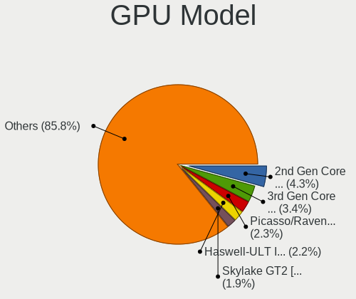

| Model                                                                                    | Computers | Percent |
|------------------------------------------------------------------------------------------|-----------|---------|
| Intel 2nd Generation Core Processor Family Integrated Graphics Controller                | 68        | 4.31%   |
| Intel 3rd Gen Core processor Graphics Controller                                         | 54        | 3.42%   |
| AMD Picasso/Raven 2 [Radeon Vega Series / Radeon Vega Mobile Series]                     | 37        | 2.34%   |
| Intel Haswell-ULT Integrated Graphics Controller                                         | 35        | 2.22%   |
| Intel Skylake GT2 [HD Graphics 520]                                                      | 30        | 1.9%    |
| Intel Core Processor Integrated Graphics Controller                                      | 30        | 1.9%    |
| Intel Mobile 945GM/GMS/GME, 943/940GML Express Integrated Graphics Controller            | 29        | 1.84%   |
| Intel Mobile 4 Series Chipset Integrated Graphics Controller                             | 26        | 1.65%   |
| Intel TigerLake-LP GT2 [Iris Xe Graphics]                                                | 25        | 1.58%   |
| Intel UHD Graphics 620                                                                   | 24        | 1.52%   |
| Intel Atom/Celeron/Pentium Processor x5-E8000/J3xxx/N3xxx Integrated Graphics Controller | 24        | 1.52%   |
| Intel HD Graphics 620                                                                    | 22        | 1.39%   |
| Intel Xeon E3-1200 v2/3rd Gen Core processor Graphics Controller                         | 21        | 1.33%   |
| Intel WhiskeyLake-U GT2 [UHD Graphics 620]                                               | 20        | 1.27%   |
| Intel 4th Gen Core Processor Integrated Graphics Controller                              | 19        | 1.2%    |
| Intel Mobile 945GM/GMS, 943/940GML Express Integrated Graphics Controller                | 18        | 1.14%   |
| Intel CometLake-U GT2 [UHD Graphics]                                                     | 18        | 1.14%   |
| AMD Lucienne                                                                             | 17        | 1.08%   |
| AMD Cezanne [Radeon Vega Series / Radeon Vega Mobile Series]                             | 17        | 1.08%   |
| Intel Xeon E3-1200 v3/4th Gen Core Processor Integrated Graphics Controller              | 16        | 1.01%   |
| Intel HD Graphics 530                                                                    | 15        | 0.95%   |
| AMD Stoney [Radeon R2/R3/R4/R5 Graphics]                                                 | 15        | 0.95%   |
| Intel Mobile GM965/GL960 Integrated Graphics Controller (secondary)                      | 14        | 0.89%   |
| Intel Mobile GM965/GL960 Integrated Graphics Controller (primary)                        | 14        | 0.89%   |
| Intel HD Graphics 5500                                                                   | 14        | 0.89%   |
| Intel 4 Series Chipset Integrated Graphics Controller                                    | 14        | 0.89%   |
| Nvidia GK208B [GeForce GT 710]                                                           | 13        | 0.82%   |
| Intel GeminiLake [UHD Graphics 600]                                                      | 13        | 0.82%   |
| Intel Atom Processor Z36xxx/Z37xxx Series Graphics & Display                             | 13        | 0.82%   |
| Intel Alder Lake-P GT2 [Iris Xe Graphics]                                                | 13        | 0.82%   |
| Intel Alder Lake-N [UHD Graphics]                                                        | 13        | 0.82%   |
| AMD Ellesmere [Radeon RX 470/480/570/570X/580/580X/590]                                  | 13        | 0.82%   |
| Intel Tiger Lake-LP GT2 [UHD Graphics G4]                                                | 12        | 0.76%   |
| Intel Mobile 945GSE Express Integrated Graphics Controller                               | 12        | 0.76%   |
| Intel CoffeeLake-S GT2 [UHD Graphics 630]                                                | 12        | 0.76%   |
| Intel Atom Processor D2xxx/N2xxx Integrated Graphics Controller                          | 12        | 0.76%   |
| Nvidia GM206 [GeForce GTX 960]                                                           | 11        | 0.7%    |
| Intel CoffeeLake-H GT2 [UHD Graphics 630]                                                | 11        | 0.7%    |
| AMD Raven Ridge [Radeon Vega Series / Radeon Vega Mobile Series]                         | 11        | 0.7%    |
| Nvidia GK208B [GeForce GT 730]                                                           | 10        | 0.63%   |

GPU Combo
---------

Combinations of graphics cards

| Name            | Computers | Percent |
|-----------------|-----------|---------|
| 1 x Intel       | 583       | 43.7%   |
| 1 x AMD         | 284       | 21.29%  |
| 1 x Nvidia      | 240       | 17.99%  |
| Intel + Nvidia  | 117       | 8.77%   |
| 2 x AMD         | 27        | 2.02%   |
| Intel + AMD     | 26        | 1.95%   |
| 2 x Intel       | 23        | 1.72%   |
| AMD + Nvidia    | 12        | 0.9%    |
| 1 x VIA         | 6         | 0.45%   |
| 1 x SiS         | 5         | 0.37%   |
| 1 x Matrox      | 5         | 0.37%   |
| 2 x Nvidia      | 3         | 0.22%   |
| Other           | 1         | 0.07%   |
| 1 x S3 Graphics | 1         | 0.07%   |
| 1 x ASPEED      | 1         | 0.07%   |

GPU Driver
----------

Free vs proprietary

| Driver      | Computers | Percent |
|-------------|-----------|---------|
| Free        | 1117      | 83.42%  |
| Proprietary | 144       | 10.75%  |
| Unknown     | 78        | 5.83%   |

GPU Memory
----------

Total video memory

| Size in GB | Computers | Percent |
|------------|-----------|---------|
| Unknown    | 756       | 56.17%  |
| 0.01-0.5   | 203       | 15.08%  |
| 1.01-2.0   | 141       | 10.48%  |
| 0.51-1.0   | 95        | 7.06%   |
| 3.01-4.0   | 64        | 4.75%   |
| 7.01-8.0   | 38        | 2.82%   |
| 5.01-6.0   | 22        | 1.63%   |
| 2.01-3.0   | 12        | 0.89%   |
| 8.01-16.0  | 12        | 0.89%   |
| 16.01-24.0 | 3         | 0.22%   |

Monitor
-------

Monitor Vendor
--------------

Monitor vendors

| Vendor                  | Computers | Percent |
|-------------------------|-----------|---------|
| Samsung Electronics     | 178       | 13.01%  |
| AU Optronics            | 158       | 11.55%  |
| LG Display              | 123       | 8.99%   |
| BOE                     | 115       | 8.41%   |
| Chimei Innolux          | 103       | 7.53%   |
| Goldstar                | 71        | 5.19%   |
| Dell                    | 51        | 3.73%   |
| Acer                    | 48        | 3.51%   |
| Hewlett-Packard         | 37        | 2.7%    |
| Apple                   | 35        | 2.56%   |
| AOC                     | 32        | 2.34%   |
| Philips                 | 30        | 2.19%   |
| BenQ                    | 30        | 2.19%   |
| Lenovo                  | 28        | 2.05%   |
| Chi Mei Optoelectronics | 28        | 2.05%   |
| Ancor Communications    | 23        | 1.68%   |
| LG Philips              | 18        | 1.32%   |
| Sharp                   | 15        | 1.1%    |
| Iiyama                  | 14        | 1.02%   |
| Unknown                 | 13        | 0.95%   |
| HannStar                | 13        | 0.95%   |
| Sony                    | 12        | 0.88%   |
| PANDA                   | 12        | 0.88%   |
| InfoVision              | 12        | 0.88%   |
| ASUSTek Computer        | 11        | 0.8%    |
| Eizo                    | 10        | 0.73%   |
| HUAWEI                  | 8         | 0.58%   |
| ViewSonic               | 7         | 0.51%   |
| Fujitsu Siemens         | 7         | 0.51%   |
| Quanta Display          | 6         | 0.44%   |
| Toshiba                 | 5         | 0.37%   |
| Panasonic               | 5         | 0.37%   |
| NEC Computers           | 5         | 0.37%   |
| CPT                     | 5         | 0.37%   |
| Sceptre Tech            | 4         | 0.29%   |
| MSI                     | 4         | 0.29%   |
| Hitachi                 | 4         | 0.29%   |
| Belinea                 | 4         | 0.29%   |
| SLD                     | 3         | 0.22%   |
| Mi                      | 3         | 0.22%   |

Monitor Model
-------------

Monitor models

| Model                                                                    | Computers | Percent |
|--------------------------------------------------------------------------|-----------|---------|
| AU Optronics LCD Monitor AUO21ED 1920x1080 344x193mm 15.5-inch           | 10        | 0.71%   |
| HUAWEI ZQE-CBA HWV6A25 3440x1440 797x334mm 34.0-inch                     | 7         | 0.5%    |
| Goldstar FULL HD GSM5B55 1920x1080 480x270mm 21.7-inch                   | 6         | 0.43%   |
| Chimei Innolux LCD Monitor CMN15CA 1366x768 344x193mm 15.5-inch          | 6         | 0.43%   |
| LG Display LCD Monitor LGD046F 1920x1080 344x194mm 15.5-inch             | 5         | 0.36%   |
| LG Display LCD Monitor LGD033A 1366x768 340x190mm 15.3-inch              | 5         | 0.36%   |
| HannStar LCD Monitor HSD03E9 1024x600 220x129mm 10.0-inch                | 5         | 0.36%   |
| Chimei Innolux LCD Monitor CMN15F5 1920x1080 344x193mm 15.5-inch         | 5         | 0.36%   |
| Chimei Innolux LCD Monitor CMN15E7 1920x1080 344x193mm 15.5-inch         | 5         | 0.36%   |
| Chimei Innolux LCD Monitor CMN15DB 1366x768 344x193mm 15.5-inch          | 5         | 0.36%   |
| AU Optronics LCD Monitor AUO45EC 1366x768 344x193mm 15.5-inch            | 5         | 0.36%   |
| Samsung Electronics LCD Monitor SEC5441 1280x800 286x179mm 13.3-inch     | 4         | 0.29%   |
| Panasonic LCD Monitor MEI96A2 2560x1440 309x173mm 13.9-inch              | 4         | 0.29%   |
| LG Display LCD Monitor LGD0430 1366x768 345x194mm 15.6-inch              | 4         | 0.29%   |
| Chimei Innolux LCD Monitor CMN1618 1920x1200 344x215mm 16.0-inch         | 4         | 0.29%   |
| AU Optronics LCD Monitor AUO38ED 1920x1080 344x193mm 15.5-inch           | 4         | 0.29%   |
| AU Optronics LCD Monitor AUO3791 1920x1080 344x194mm 15.5-inch           | 4         | 0.29%   |
| AU Optronics LCD Monitor AUO10EC 1366x768 344x193mm 15.5-inch            | 4         | 0.29%   |
| AU Optronics LCD Monitor AUO106C 1366x768 277x156mm 12.5-inch            | 4         | 0.29%   |
| SLD LCD Monitor SLD003C 1366x768 309x173mm 13.9-inch                     | 3         | 0.21%   |
| Sharp LCD Monitor SHP1449 1920x1080 294x165mm 13.3-inch                  | 3         | 0.21%   |
| Samsung Electronics S27F350 SAM0D22 1920x1080 598x336mm 27.0-inch        | 3         | 0.21%   |
| Samsung Electronics LCD Monitor SEC3345 1280x800 331x207mm 15.4-inch     | 3         | 0.21%   |
| Samsung Electronics LCD Monitor SEC3052 1024x600 223x125mm 10.1-inch     | 3         | 0.21%   |
| Samsung Electronics C24F390 SAM0D2C 1920x1080 521x293mm 23.5-inch        | 3         | 0.21%   |
| Philips PHL 242V8 PHLC219 1920x1080 527x296mm 23.8-inch                  | 3         | 0.21%   |
| LG Display LCD Monitor LGD02E9 1366x768 309x174mm 14.0-inch              | 3         | 0.21%   |
| LG Display LCD Monitor LGD02D8 1366x768 277x156mm 12.5-inch              | 3         | 0.21%   |
| Lenovo LCD Monitor LEN40B1 1600x900 344x193mm 15.5-inch                  | 3         | 0.21%   |
| InfoVision LCD Monitor IVO03F4 1920x1080 309x173mm 13.9-inch             | 3         | 0.21%   |
| HannStar HSD121PHW1 HSD04B6 1366x768 270x150mm 12.2-inch                 | 3         | 0.21%   |
| Chimei Innolux LCD Monitor CMN15C3 1920x1080 344x193mm 15.5-inch         | 3         | 0.21%   |
| Chimei Innolux LCD Monitor CMN15BF 1366x768 344x193mm 15.5-inch          | 3         | 0.21%   |
| Chimei Innolux LCD Monitor CMN15BE 1366x768 344x193mm 15.5-inch          | 3         | 0.21%   |
| Chimei Innolux LCD Monitor CMN153B 1920x1080 344x193mm 15.5-inch         | 3         | 0.21%   |
| Chimei Innolux LCD Monitor CMN14C3 1366x768 309x173mm 13.9-inch          | 3         | 0.21%   |
| Chi Mei Optoelectronics LCD Monitor CMO15A2 1366x768 344x193mm 15.5-inch | 3         | 0.21%   |
| Chi Mei Optoelectronics LCD Monitor CMO1558 1366x768 344x193mm 15.5-inch | 3         | 0.21%   |
| Chi Mei Optoelectronics LCD Monitor CMO1018 1024x600 222x125mm 10.0-inch | 3         | 0.21%   |
| BOE LCD Monitor BOE06A5 1366x768 344x194mm 15.5-inch                     | 3         | 0.21%   |

Monitor Resolution
------------------

Monitor screen resolution

| Resolution         | Computers | Percent |
|--------------------|-----------|---------|
| 1920x1080 (FHD)    | 517       | 38.9%   |
| 1366x768 (WXGA)    | 277       | 20.84%  |
| 3840x2160 (4K)     | 74        | 5.57%   |
| 1280x800 (WXGA)    | 57        | 4.29%   |
| 1600x900 (HD+)     | 56        | 4.21%   |
| 1280x1024 (SXGA)   | 53        | 3.99%   |
| 1680x1050 (WSXGA+) | 43        | 3.24%   |
| 1440x900 (WXGA+)   | 41        | 3.09%   |
| 1920x1200 (WUXGA)  | 36        | 2.71%   |
| 2560x1440 (QHD)    | 32        | 2.41%   |
| 1024x600           | 20        | 1.5%    |
| 1360x768           | 15        | 1.13%   |
| 3440x1440          | 13        | 0.98%   |
| 2560x1080          | 12        | 0.9%    |
| 1024x768 (XGA)     | 12        | 0.9%    |
| Unknown            | 12        | 0.9%    |
| 2560x1600          | 9         | 0.68%   |
| 3840x1080          | 8         | 0.6%    |
| 2880x1800          | 4         | 0.3%    |
| 2160x1440          | 3         | 0.23%   |
| 1920x1280          | 3         | 0.23%   |
| 1280x768           | 3         | 0.23%   |
| 3840x2400          | 2         | 0.15%   |
| 2520x1680          | 2         | 0.15%   |
| 2256x1504          | 2         | 0.15%   |
| 1920x540           | 2         | 0.15%   |
| 1680x945           | 2         | 0.15%   |
| 1600x1200          | 2         | 0.15%   |
| 1400x1050          | 2         | 0.15%   |
| 1280x720 (HD)      | 2         | 0.15%   |
| 9600x2160          | 1         | 0.08%   |
| 7680x2160          | 1         | 0.08%   |
| 4480x1440          | 1         | 0.08%   |
| 4240x1440          | 1         | 0.08%   |
| 3200x1800 (QHD+)   | 1         | 0.08%   |
| 3040x1050          | 1         | 0.08%   |
| 2880x1920          | 1         | 0.08%   |
| 2880x1620          | 1         | 0.08%   |
| 2736x1824          | 1         | 0.08%   |
| 2240x1400          | 1         | 0.08%   |

Monitor Diagonal
----------------

Diagonal size in inches

| Inches  | Computers | Percent |
|---------|-----------|---------|
| 15      | 385       | 28.18%  |
| 13      | 115       | 8.42%   |
| 14      | 95        | 6.95%   |
| 24      | 84        | 6.15%   |
| 23      | 76        | 5.56%   |
| 17      | 73        | 5.34%   |
| Unknown | 73        | 5.34%   |
| 27      | 72        | 5.27%   |
| 21      | 58        | 4.25%   |
| 19      | 45        | 3.29%   |
| 18      | 36        | 2.64%   |
| 31      | 33        | 2.42%   |
| 12      | 28        | 2.05%   |
| 34      | 25        | 1.83%   |
| 22      | 25        | 1.83%   |
| 20      | 22        | 1.61%   |
| 11      | 21        | 1.54%   |
| 10      | 21        | 1.54%   |
| 16      | 14        | 1.02%   |
| 72      | 10        | 0.73%   |
| 32      | 8         | 0.59%   |
| 54      | 7         | 0.51%   |
| 84      | 6         | 0.44%   |
| 26      | 5         | 0.37%   |
| 52      | 3         | 0.22%   |
| 40      | 3         | 0.22%   |
| 8       | 3         | 0.22%   |
| 86      | 2         | 0.15%   |
| 48      | 2         | 0.15%   |
| 42      | 2         | 0.15%   |
| 33      | 2         | 0.15%   |
| 28      | 2         | 0.15%   |
| 25      | 2         | 0.15%   |
| 95      | 1         | 0.07%   |
| 65      | 1         | 0.07%   |
| 64      | 1         | 0.07%   |
| 60      | 1         | 0.07%   |
| 57      | 1         | 0.07%   |
| 46      | 1         | 0.07%   |
| 38      | 1         | 0.07%   |

Monitor Width
-------------

Physical width

| Width in mm | Computers | Percent |
|-------------|-----------|---------|
| 301-350     | 559       | 41.47%  |
| 501-600     | 217       | 16.1%   |
| 401-500     | 157       | 11.65%  |
| 201-300     | 128       | 9.5%    |
| 351-400     | 89        | 6.6%    |
| Unknown     | 73        | 5.42%   |
| 601-700     | 45        | 3.34%   |
| 701-800     | 35        | 2.6%    |
| 1501-2000   | 18        | 1.34%   |
| 1001-1500   | 16        | 1.19%   |
| 801-900     | 6         | 0.45%   |
| 101-200     | 3         | 0.22%   |
| 901-1000    | 2         | 0.15%   |

Aspect Ratio
------------

Proportional relationship between the width and the height

| Ratio   | Computers | Percent |
|---------|-----------|---------|
| 16/9    | 906       | 70.73%  |
| 16/10   | 189       | 14.75%  |
| Unknown | 65        | 5.07%   |
| 5/4     | 48        | 3.75%   |
| 21/9    | 29        | 2.26%   |
| 4/3     | 24        | 1.87%   |
| 3/2     | 16        | 1.25%   |
| 32/9    | 2         | 0.16%   |
| 0.56    | 2         | 0.16%   |

Monitor Area
------------

Area in inch

| Area in inch | Computers | Percent |
|----------------|-----------|---------|
| 101-110        | 380       | 28%     |
| 201-250        | 192       | 14.15%  |
| 81-90          | 166       | 12.23%  |
| 151-200        | 88        | 6.48%   |
| 301-350        | 75        | 5.53%   |
| Unknown        | 73        | 5.38%   |
| 351-500        | 69        | 5.08%   |
| 141-150        | 51        | 3.76%   |
| 71-80          | 41        | 3.02%   |
| 121-130        | 40        | 2.95%   |
| More than 1000 | 33        | 2.43%   |
| 251-300        | 33        | 2.43%   |
| 61-70          | 27        | 1.99%   |
| 51-60          | 22        | 1.62%   |
| 41-50          | 20        | 1.47%   |
| 111-120        | 16        | 1.18%   |
| 131-140        | 11        | 0.81%   |
| 501-1000       | 9         | 0.66%   |
| 91-100         | 8         | 0.59%   |
| 1-40           | 3         | 0.22%   |

Pixel Density
-------------

Pixels per inch

| Density       | Computers | Percent |
|---------------|-----------|---------|
| 51-100        | 459       | 34.77%  |
| 101-120       | 377       | 28.56%  |
| 121-160       | 311       | 23.56%  |
| Unknown       | 73        | 5.53%   |
| 161-240       | 63        | 4.77%   |
| 1-50          | 25        | 1.89%   |
| More than 240 | 12        | 0.91%   |

Multiple Monitors
-----------------

Total monitors connected

| Total | Computers | Percent |
|-------|-----------|---------|
| 1     | 1137      | 84.22%  |
| 2     | 153       | 11.33%  |
| 0     | 50        | 3.7%    |
| 3     | 8         | 0.59%   |
| 4     | 2         | 0.15%   |

Network
-------

Net Controller Vendor
---------------------

Controller vendors

| Vendor                            | Computers | Percent |
|-----------------------------------|-----------|---------|
| Realtek Semiconductor             | 727       | 35.74%  |
| Intel                             | 556       | 27.34%  |
| Qualcomm Atheros                  | 238       | 11.7%   |
| Broadcom                          | 133       | 6.54%   |
| Broadcom Limited                  | 41        | 2.02%   |
| Marvell Technology Group          | 40        | 1.97%   |
| MediaTek                          | 38        | 1.87%   |
| TP-Link                           | 30        | 1.47%   |
| Ralink Technology                 | 26        | 1.28%   |
| Nvidia                            | 24        | 1.18%   |
| Ralink                            | 20        | 0.98%   |
| Samsung Electronics               | 15        | 0.74%   |
| VIA Technologies                  | 9         | 0.44%   |
| ASIX Electronics                  | 8         | 0.39%   |
| JMicron Technology                | 7         | 0.34%   |
| Ericsson Business Mobile Networks | 7         | 0.34%   |
| Silicon Integrated Systems [SiS]  | 6         | 0.29%   |
| NetGear                           | 6         | 0.29%   |
| Xiaomi                            | 5         | 0.25%   |
| Qualcomm                          | 5         | 0.25%   |
| Microsoft                         | 5         | 0.25%   |
| Huawei Technologies               | 5         | 0.25%   |
| Edimax Technology                 | 5         | 0.25%   |
| Sierra Wireless                   | 4         | 0.2%    |
| Lenovo                            | 4         | 0.2%    |
| Dell                              | 4         | 0.2%    |
| AVM                               | 4         | 0.2%    |
| ASUSTek Computer                  | 4         | 0.2%    |
| ZTE WCDMA Technologies MSM        | 3         | 0.15%   |
| Mercucys                          | 3         | 0.15%   |
| Hewlett-Packard                   | 3         | 0.15%   |
| Google                            | 3         | 0.15%   |
| DisplayLink                       | 3         | 0.15%   |
| AMD                               | 3         | 0.15%   |
| Tenda                             | 2         | 0.1%    |
| Spreadtrum Communications         | 2         | 0.1%    |
| Sitecom Europe                    | 2         | 0.1%    |
| QinHeng Electronics               | 2         | 0.1%    |
| Linksys                           | 2         | 0.1%    |
| D-Link System                     | 2         | 0.1%    |

Net Controller Model
--------------------

Controller models

| Model                                                                   | Computers | Percent |
|-------------------------------------------------------------------------|-----------|---------|
| Realtek RTL8111/8168/8211/8411 PCI Express Gigabit Ethernet Controller  | 444       | 18.27%  |
| Realtek RTL810xE PCI Express Fast Ethernet controller                   | 109       | 4.49%   |
| Realtek RTL8821CE 802.11ac PCIe Wireless Network Adapter                | 55        | 2.26%   |
| Intel 82579LM Gigabit Network Connection (Lewisville)                   | 53        | 2.18%   |
| Realtek RTL8125 2.5GbE Controller                                       | 34        | 1.4%    |
| Intel Wi-Fi 6 AX200                                                     | 32        | 1.32%   |
| Qualcomm Atheros AR9285 Wireless Network Adapter (PCI-Express)          | 31        | 1.28%   |
| Qualcomm Atheros AR9485 Wireless Network Adapter                        | 29        | 1.19%   |
| Intel Wireless 8265 / 8275                                              | 28        | 1.15%   |
| Qualcomm Atheros QCA9565 / AR9565 Wireless Network Adapter              | 27        | 1.11%   |
| Qualcomm Atheros QCA9377 802.11ac Wireless Network Adapter              | 27        | 1.11%   |
| Broadcom BCM4313 802.11bgn Wireless Network Adapter                     | 26        | 1.07%   |
| Intel PRO/Wireless 3945ABG [Golan] Network Connection                   | 25        | 1.03%   |
| Realtek RTL8153 Gigabit Ethernet Adapter                                | 22        | 0.91%   |
| Realtek RTL-8100/8101L/8139 PCI Fast Ethernet Adapter                   | 22        | 0.91%   |
| Intel Wireless 7260                                                     | 22        | 0.91%   |
| Realtek RTL8822CE 802.11ac PCIe Wireless Network Adapter                | 21        | 0.86%   |
| Intel Wireless 8260                                                     | 21        | 0.86%   |
| Intel Wireless 7265                                                     | 21        | 0.86%   |
| Qualcomm Atheros AR242x / AR542x Wireless Network Adapter (PCI-Express) | 19        | 0.78%   |
| Intel Wireless 3165                                                     | 19        | 0.78%   |
| Intel I211 Gigabit Network Connection                                   | 19        | 0.78%   |
| Realtek RTL8188EUS 802.11n Wireless Network Adapter                     | 18        | 0.74%   |
| Intel Wi-Fi 6 AX201                                                     | 18        | 0.74%   |
| Intel Centrino Advanced-N 6205 [Taylor Peak]                            | 18        | 0.74%   |
| Intel Wi-Fi 6E(802.11ax) AX210/AX1675* 2x2 [Typhoon Peak]               | 17        | 0.7%    |
| Intel Alder Lake-P PCH CNVi WiFi                                        | 17        | 0.7%    |
| Intel Ethernet Connection I217-LM                                       | 16        | 0.66%   |
| Realtek RTL88x2bu [AC1200 Techkey]                                      | 15        | 0.62%   |
| Intel WiFi Link 5100                                                    | 13        | 0.53%   |
| Intel Comet Lake PCH-LP CNVi WiFi                                       | 13        | 0.53%   |
| Samsung Galaxy series, misc. (tethering mode)                           | 12        | 0.49%   |
| Realtek RTL8723BE PCIe Wireless Network Adapter                         | 12        | 0.49%   |
| Qualcomm Atheros AR8151 v2.0 Gigabit Ethernet                           | 12        | 0.49%   |
| MediaTek MT7922 802.11ax PCI Express Wireless Network Adapter           | 12        | 0.49%   |
| Intel Dual Band Wireless-AC 3168NGW [Stone Peak]                        | 12        | 0.49%   |
| Intel Cannon Point-LP CNVi [Wireless-AC]                                | 12        | 0.49%   |
| Realtek RTL8852BE PCIe 802.11ax Wireless Network Controller             | 11        | 0.45%   |
| Realtek RTL8188CE 802.11b/g/n WiFi Adapter                              | 11        | 0.45%   |
| Qualcomm Atheros AR9462 Wireless Network Adapter                        | 11        | 0.45%   |

Wireless Vendor
---------------

Wireless vendors

| Vendor                                | Computers | Percent |
|---------------------------------------|-----------|---------|
| Intel                                 | 409       | 36.55%  |
| Realtek Semiconductor                 | 238       | 21.27%  |
| Qualcomm Atheros                      | 181       | 16.18%  |
| Broadcom                              | 96        | 8.58%   |
| MediaTek                              | 31        | 2.77%   |
| TP-Link                               | 29        | 2.59%   |
| Broadcom Limited                      | 27        | 2.41%   |
| Ralink Technology                     | 26        | 2.32%   |
| Ralink                                | 20        | 1.79%   |
| NetGear                               | 6         | 0.54%   |
| Microsoft                             | 5         | 0.45%   |
| Edimax Technology                     | 5         | 0.45%   |
| Sierra Wireless                       | 4         | 0.36%   |
| Qualcomm                              | 4         | 0.36%   |
| Marvell Technology Group              | 4         | 0.36%   |
| AVM                                   | 4         | 0.36%   |
| ASUSTek Computer                      | 4         | 0.36%   |
| Mercucys                              | 3         | 0.27%   |
| Tenda                                 | 2         | 0.18%   |
| Sitecom Europe                        | 2         | 0.18%   |
| Linksys                               | 2         | 0.18%   |
| Dell                                  | 2         | 0.18%   |
| D-Link System                         | 2         | 0.18%   |
| D-Link                                | 2         | 0.18%   |
| Cisco Aironet Wireless Communications | 2         | 0.18%   |
| Belkin Components                     | 2         | 0.18%   |
| ZTE WCDMA Technologies MSM            | 1         | 0.09%   |
| Xiaomi                                | 1         | 0.09%   |
| Qualcomm Atheros Communications       | 1         | 0.09%   |
| IMC Networks                          | 1         | 0.09%   |
| Hewlett-Packard                       | 1         | 0.09%   |
| Fibocom                               | 1         | 0.09%   |
| Askey Computer                        | 1         | 0.09%   |

Wireless Model
--------------

Wireless models

| Model                                                                   | Computers | Percent |
|-------------------------------------------------------------------------|-----------|---------|
| Realtek RTL8821CE 802.11ac PCIe Wireless Network Adapter                | 55        | 4.83%   |
| Intel Wi-Fi 6 AX200                                                     | 32        | 2.81%   |
| Qualcomm Atheros AR9285 Wireless Network Adapter (PCI-Express)          | 31        | 2.72%   |
| Qualcomm Atheros AR9485 Wireless Network Adapter                        | 29        | 2.55%   |
| Intel Wireless 8265 / 8275                                              | 28        | 2.46%   |
| Qualcomm Atheros QCA9565 / AR9565 Wireless Network Adapter              | 27        | 2.37%   |
| Qualcomm Atheros QCA9377 802.11ac Wireless Network Adapter              | 27        | 2.37%   |
| Broadcom BCM4313 802.11bgn Wireless Network Adapter                     | 26        | 2.28%   |
| Intel PRO/Wireless 3945ABG [Golan] Network Connection                   | 25        | 2.19%   |
| Intel Wireless 7260                                                     | 22        | 1.93%   |
| Realtek RTL8822CE 802.11ac PCIe Wireless Network Adapter                | 21        | 1.84%   |
| Intel Wireless 8260                                                     | 21        | 1.84%   |
| Intel Wireless 7265                                                     | 21        | 1.84%   |
| Qualcomm Atheros AR242x / AR542x Wireless Network Adapter (PCI-Express) | 19        | 1.67%   |
| Intel Wireless 3165                                                     | 19        | 1.67%   |
| Realtek RTL8188EUS 802.11n Wireless Network Adapter                     | 18        | 1.58%   |
| Intel Wi-Fi 6 AX201                                                     | 18        | 1.58%   |
| Intel Centrino Advanced-N 6205 [Taylor Peak]                            | 18        | 1.58%   |
| Intel Wi-Fi 6E(802.11ax) AX210/AX1675* 2x2 [Typhoon Peak]               | 17        | 1.49%   |
| Intel Alder Lake-P PCH CNVi WiFi                                        | 17        | 1.49%   |
| Realtek RTL88x2bu [AC1200 Techkey]                                      | 15        | 1.32%   |
| Intel WiFi Link 5100                                                    | 13        | 1.14%   |
| Intel Comet Lake PCH-LP CNVi WiFi                                       | 13        | 1.14%   |
| Realtek RTL8723BE PCIe Wireless Network Adapter                         | 12        | 1.05%   |
| Intel Dual Band Wireless-AC 3168NGW [Stone Peak]                        | 12        | 1.05%   |
| Intel Cannon Point-LP CNVi [Wireless-AC]                                | 12        | 1.05%   |
| Realtek RTL8188CE 802.11b/g/n WiFi Adapter                              | 11        | 0.97%   |
| Qualcomm Atheros AR9462 Wireless Network Adapter                        | 11        | 0.97%   |
| Intel Centrino Ultimate-N 6300                                          | 11        | 0.97%   |
| Realtek RTL8852BE PCIe 802.11ax Wireless Network Controller             | 10        | 0.88%   |
| Qualcomm Atheros QCA6174 802.11ac Wireless Network Adapter              | 10        | 0.88%   |
| Broadcom Limited BCM4360 802.11ac Dual Band Wireless Network Adapter    | 10        | 0.88%   |
| Intel Wireless 3160                                                     | 9         | 0.79%   |
| Intel Wi-Fi 5(802.11ac) Wireless-AC 9x6x [Thunder Peak]                 | 9         | 0.79%   |
| Realtek 802.11ac NIC                                                    | 8         | 0.7%    |
| Ralink MT7601U Wireless Adapter                                         | 8         | 0.7%    |
| MediaTek Wi-Fi 6E MT7902 Wireless Network Adapter                       | 8         | 0.7%    |
| MediaTek MT7922 802.11ax PCI Express Wireless Network Adapter           | 8         | 0.7%    |
| MediaTek MT7921 802.11ax PCI Express Wireless Network Adapter           | 8         | 0.7%    |
| Intel Cannon Lake PCH CNVi WiFi                                         | 8         | 0.7%    |

Ethernet Vendor
---------------

Ethernet vendors

| Vendor                           | Computers | Percent |
|----------------------------------|-----------|---------|
| Realtek Semiconductor            | 637       | 51.62%  |
| Intel                            | 300       | 24.31%  |
| Qualcomm Atheros                 | 82        | 6.65%   |
| Broadcom                         | 56        | 4.54%   |
| Marvell Technology Group         | 36        | 2.92%   |
| Nvidia                           | 24        | 1.94%   |
| Broadcom Limited                 | 14        | 1.13%   |
| Samsung Electronics              | 12        | 0.97%   |
| VIA Technologies                 | 9         | 0.73%   |
| ASIX Electronics                 | 8         | 0.65%   |
| MediaTek                         | 7         | 0.57%   |
| JMicron Technology               | 7         | 0.57%   |
| Silicon Integrated Systems [SiS] | 6         | 0.49%   |
| Xiaomi                           | 4         | 0.32%   |
| Huawei Technologies              | 4         | 0.32%   |
| Lenovo                           | 3         | 0.24%   |
| Google                           | 3         | 0.24%   |
| DisplayLink                      | 3         | 0.24%   |
| Spreadtrum Communications        | 2         | 0.16%   |
| Hewlett-Packard                  | 2         | 0.16%   |
| Attansic Technology              | 2         | 0.16%   |
| ADMtek                           | 2         | 0.16%   |
| ZTE WCDMA Technologies MSM       | 1         | 0.08%   |
| TP-Link                          | 1         | 0.08%   |
| Qualcomm                         | 1         | 0.08%   |
| OnePlus Technology (Shenzhen)    | 1         | 0.08%   |
| Motorola PCS                     | 1         | 0.08%   |
| Microchip Technology             | 1         | 0.08%   |
| HTC (High Tech Computer)         | 1         | 0.08%   |
| Gemtek                           | 1         | 0.08%   |
| Davicom Semiconductor            | 1         | 0.08%   |
| Aquantia                         | 1         | 0.08%   |
| 3Com                             | 1         | 0.08%   |

Ethernet Model
--------------

Ethernet models

| Model                                                                  | Computers | Percent |
|------------------------------------------------------------------------|-----------|---------|
| Realtek RTL8111/8168/8211/8411 PCI Express Gigabit Ethernet Controller | 444       | 35.35%  |
| Realtek RTL810xE PCI Express Fast Ethernet controller                  | 109       | 8.68%   |
| Intel 82579LM Gigabit Network Connection (Lewisville)                  | 53        | 4.22%   |
| Realtek RTL8125 2.5GbE Controller                                      | 34        | 2.71%   |
| Realtek RTL8153 Gigabit Ethernet Adapter                               | 22        | 1.75%   |
| Realtek RTL-8100/8101L/8139 PCI Fast Ethernet Adapter                  | 22        | 1.75%   |
| Intel I211 Gigabit Network Connection                                  | 19        | 1.51%   |
| Intel Ethernet Connection I217-LM                                      | 16        | 1.27%   |
| Samsung Galaxy series, misc. (tethering mode)                          | 12        | 0.96%   |
| Qualcomm Atheros AR8151 v2.0 Gigabit Ethernet                          | 12        | 0.96%   |
| Qualcomm Atheros AR8131 Gigabit Ethernet                               | 11        | 0.88%   |
| Intel Ethernet Connection (2) I219-V                                   | 11        | 0.88%   |
| Qualcomm Atheros AR8132 Fast Ethernet                                  | 10        | 0.8%    |
| Intel 82577LM Gigabit Network Connection                               | 10        | 0.8%    |
| Intel 82579V Gigabit Network Connection                                | 9         | 0.72%   |
| Intel 82567LM Gigabit Network Connection                               | 9         | 0.72%   |
| Nvidia MCP61 Ethernet                                                  | 8         | 0.64%   |
| Intel Ethernet Controller I225-V                                       | 8         | 0.64%   |
| Intel Ethernet Connection I219-V                                       | 8         | 0.64%   |
| Intel Ethernet Connection I219-LM                                      | 8         | 0.64%   |
| Intel Ethernet Connection (7) I219-V                                   | 8         | 0.64%   |
| Intel 82573L Gigabit Ethernet Controller                               | 8         | 0.64%   |
| VIA VT6102/VT6103 [Rhine-II]                                           | 7         | 0.56%   |
| Qualcomm Atheros Killer E220x Gigabit Ethernet Controller              | 7         | 0.56%   |
| Qualcomm Atheros AR8152 v2.0 Fast Ethernet                             | 7         | 0.56%   |
| Qualcomm Atheros AR8121/AR8113/AR8114 Gigabit or Fast Ethernet         | 7         | 0.56%   |
| Nvidia MCP79 Ethernet                                                  | 7         | 0.56%   |
| Marvell Group 88E8071 PCI-E Gigabit Ethernet Controller                | 7         | 0.56%   |
| Intel Ethernet Connection I217-V                                       | 7         | 0.56%   |
| Intel Ethernet Connection (2) I219-LM                                  | 7         | 0.56%   |
| ASIX AX88179 Gigabit Ethernet                                          | 7         | 0.56%   |
| Qualcomm Atheros Attansic L1 Gigabit Ethernet                          | 6         | 0.48%   |
| JMicron JMC250 PCI Express Gigabit Ethernet Controller                 | 6         | 0.48%   |
| Intel Ethernet Connection (4) I219-LM                                  | 6         | 0.48%   |
| Intel Ethernet Connection (3) I218-LM                                  | 6         | 0.48%   |
| Intel 82574L Gigabit Network Connection                                | 6         | 0.48%   |
| Broadcom NetXtreme BCM57786 Gigabit Ethernet PCIe                      | 6         | 0.48%   |
| Broadcom NetXtreme BCM57766 Gigabit Ethernet PCIe                      | 6         | 0.48%   |
| Broadcom NetLink BCM57785 Gigabit Ethernet PCIe                        | 6         | 0.48%   |
| Qualcomm Atheros AR8151 v1.0 Gigabit Ethernet                          | 5         | 0.4%    |

Net Controller Kind
-------------------

Ethernet, WiFi or modem

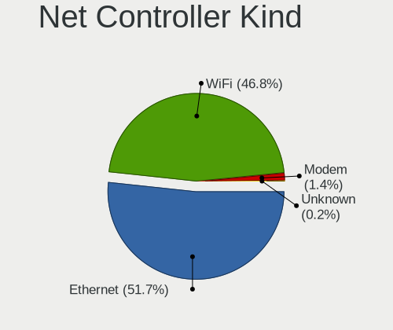

| Kind     | Computers | Percent |
|----------|-----------|---------|
| Ethernet | 1162      | 51.69%  |
| WiFi     | 1051      | 46.75%  |
| Modem    | 31        | 1.38%   |
| Unknown  | 4         | 0.18%   |

Used Controller
---------------

Currently used network controller

| Kind     | Computers | Percent |
|----------|-----------|---------|
| WiFi     | 763       | 55.17%  |
| Ethernet | 620       | 44.83%  |

NICs
----

Total network controllers on board

| Total | Computers | Percent |
|-------|-----------|---------|
| 2     | 765       | 57.43%  |
| 1     | 519       | 38.96%  |
| 3     | 27        | 2.03%   |
| 0     | 17        | 1.28%   |
| 4     | 4         | 0.3%    |

IPv6
----

IPv6 vs IPv4

| Used | Computers | Percent |
|------|-----------|---------|
| No   | 1004      | 73.88%  |
| Yes  | 355       | 26.12%  |

Bluetooth
---------

Bluetooth Vendor
----------------

Controller vendors

| Vendor                          | Computers | Percent |
|---------------------------------|-----------|---------|
| Intel                           | 295       | 38.36%  |
| Realtek Semiconductor           | 106       | 13.78%  |
| Qualcomm Atheros Communications | 50        | 6.5%    |
| Broadcom                        | 50        | 6.5%    |
| Cambridge Silicon Radio         | 44        | 5.72%   |
| IMC Networks                    | 40        | 5.2%    |
| Apple                           | 39        | 5.07%   |
| Foxconn / Hon Hai               | 28        | 3.64%   |
| Lite-On Technology              | 23        | 2.99%   |
| Hewlett-Packard                 | 18        | 2.34%   |
| Dell                            | 14        | 1.82%   |
| MediaTek                        | 10        | 1.3%    |
| ASUSTek Computer                | 9         | 1.17%   |
| Ralink                          | 6         | 0.78%   |
| Toshiba                         | 5         | 0.65%   |
| Realtek                         | 5         | 0.65%   |
| Askey Computer                  | 4         | 0.52%   |
| Marvell Semiconductor           | 3         | 0.39%   |
| Foxconn International           | 3         | 0.39%   |
| USI                             | 2         | 0.26%   |
| TP-Link                         | 2         | 0.26%   |
| Integrated System Solution      | 2         | 0.26%   |
| Unknown                         | 2         | 0.26%   |
| Taiyo Yuden                     | 1         | 0.13%   |
| SiW                             | 1         | 0.13%   |
| Ralink Technology               | 1         | 0.13%   |
| Qcom                            | 1         | 0.13%   |
| Logitech                        | 1         | 0.13%   |
| Dynex                           | 1         | 0.13%   |
| D-Link                          | 1         | 0.13%   |
| Chicony Electronics             | 1         | 0.13%   |
| Alps Electric                   | 1         | 0.13%   |

Bluetooth Model
---------------

Controller models

| Model                                               | Computers | Percent |
|-----------------------------------------------------|-----------|---------|
| Intel Bluetooth wireless interface                  | 112       | 14.55%  |
| Realtek Bluetooth Radio                             | 66        | 8.57%   |
| Cambridge Silicon Radio Bluetooth Dongle (HCI mode) | 44        | 5.71%   |
| Intel AX201 Bluetooth                               | 43        | 5.58%   |
| Intel Bluetooth 9460/9560 Jefferson Peak (JfP)      | 41        | 5.32%   |
| Intel AX200 Bluetooth                               | 31        | 4.03%   |
| Realtek  Bluetooth 4.2 Adapter                      | 28        | 3.64%   |
| Intel AX211 Bluetooth                               | 25        | 3.25%   |
| Qualcomm Atheros  Bluetooth Device                  | 22        | 2.86%   |
| Intel AX210 Bluetooth                               | 15        | 1.95%   |
| Apple Bluetooth Host Controller                     | 15        | 1.95%   |
| IMC Networks Wireless_Device                        | 14        | 1.82%   |
| IMC Networks Bluetooth Radio                        | 13        | 1.69%   |
| Qualcomm Atheros AR3012 Bluetooth 4.0               | 12        | 1.56%   |
| Intel Wireless-AC 3168 Bluetooth                    | 12        | 1.56%   |
| Apple Bluetooth USB Host Controller                 | 12        | 1.56%   |
| MediaTek Wireless_Device                            | 10        | 1.3%    |
| HP Bluetooth 2.0 Interface [Broadcom BCM2045]       | 9         | 1.17%   |
| Lite-On Qualcomm Atheros QCA9377 Bluetooth          | 8         | 1.04%   |
| Intel Wireless-AC 9260 Bluetooth Adapter            | 8         | 1.04%   |
| IMC Networks Bluetooth Device                       | 8         | 1.04%   |
| HP Broadcom 2070 Bluetooth Combo                    | 8         | 1.04%   |
| Apple Bluetooth HCI                                 | 8         | 1.04%   |
| Qualcomm Atheros QCA61x4 Bluetooth 4.0              | 7         | 0.91%   |
| Foxconn / Hon Hai Wireless_Device                   | 7         | 0.91%   |
| Broadcom BCM20702A0 Bluetooth 4.0                   | 7         | 0.91%   |
| Broadcom BCM2045B (BDC-2.1)                         | 7         | 0.91%   |
| Realtek 802.11ac WLAN Adapter                       | 6         | 0.78%   |
| Ralink RT3290 Bluetooth                             | 6         | 0.78%   |
| Foxconn / Hon Hai Bluetooth Device                  | 6         | 0.78%   |
| Broadcom BCM20702 Bluetooth 4.0 [ThinkPad]          | 6         | 0.78%   |
| Broadcom BCM2045B (BDC-2) [Bluetooth Controller]    | 6         | 0.78%   |
| Realtek Bluetooth Radio                             | 5         | 0.65%   |
| Qualcomm Atheros AR3011 Bluetooth                   | 5         | 0.65%   |
| Lite-On Atheros AR3012 Bluetooth                    | 5         | 0.65%   |
| Intel Centrino Advanced-N 6230 Bluetooth adapter    | 5         | 0.65%   |
| Dell DW375 Bluetooth Module                         | 5         | 0.65%   |
| Broadcom BCM2070 Bluetooth 2.1 + EDR                | 5         | 0.65%   |
| Lite-On Bluetooth Device                            | 4         | 0.52%   |
| Intel Centrino Bluetooth Wireless Transceiver       | 4         | 0.52%   |

Sound
-----

Sound Vendor
------------

Sound card vendors

| Vendor                                       | Computers | Percent |
|----------------------------------------------|-----------|---------|
| Intel                                        | 964       | 54.37%  |
| AMD                                          | 357       | 20.14%  |
| Nvidia                                       | 275       | 15.51%  |
| C-Media Electronics                          | 34        | 1.92%   |
| VIA Technologies                             | 14        | 0.79%   |
| Logitech                                     | 9         | 0.51%   |
| Creative Labs                                | 9         | 0.51%   |
| Texas Instruments                            | 8         | 0.45%   |
| Silicon Integrated Systems [SiS]             | 8         | 0.45%   |
| JMTek                                        | 8         | 0.45%   |
| GN Netcom                                    | 8         | 0.45%   |
| Generalplus Technology                       | 8         | 0.45%   |
| Creative Technology                          | 7         | 0.39%   |
| Micro Star International                     | 5         | 0.28%   |
| Plantronics                                  | 4         | 0.23%   |
| Zoran Co. Personal Media Division (Nogatech) | 3         | 0.17%   |
| Thesycon Systemsoftware & Consulting         | 3         | 0.17%   |
| KTMicro                                      | 3         | 0.17%   |
| Fujitsu                                      | 3         | 0.17%   |
| Yamaha                                       | 2         | 0.11%   |
| Tenx Technology                              | 2         | 0.11%   |
| Realtek Semiconductor                        | 2         | 0.11%   |
| Razer USA                                    | 2         | 0.11%   |
| M-Audio                                      | 2         | 0.11%   |
| Hewlett-Packard                              | 2         | 0.11%   |
| Focusrite-Novation                           | 2         | 0.11%   |
| Apple                                        | 2         | 0.11%   |
| ZOOM                                         | 1         | 0.06%   |
| Xilinx                                       | 1         | 0.06%   |
| Walmart                                      | 1         | 0.06%   |
| Turtle Beach                                 | 1         | 0.06%   |
| Sony                                         | 1         | 0.06%   |
| SAVITECH                                     | 1         | 0.06%   |
| Samson Technologies                          | 1         | 0.06%   |
| QinHeng Electronics                          | 1         | 0.06%   |
| Native Instruments                           | 1         | 0.06%   |
| Kingston Technology                          | 1         | 0.06%   |
| Jieli Technology                             | 1         | 0.06%   |
| JBL                                          | 1         | 0.06%   |
| GYROCOM C&C                                  | 1         | 0.06%   |

Sound Model
-----------

Sound card models

| Model                                                                                             | Computers | Percent |
|---------------------------------------------------------------------------------------------------|-----------|---------|
| AMD Family 17h/19h/1ah HD Audio Controller                                                        | 130       | 6.21%   |
| Intel 7 Series/C216 Chipset Family High Definition Audio Controller                               | 96        | 4.59%   |
| Intel NM10/ICH7 Family High Definition Audio Controller                                           | 93        | 4.45%   |
| Intel Sunrise Point-LP HD Audio                                                                   | 85        | 4.06%   |
| Intel 6 Series/C200 Series Chipset Family High Definition Audio Controller                        | 81        | 3.87%   |
| Intel 82801I (ICH9 Family) HD Audio Controller                                                    | 60        | 2.87%   |
| Intel 8 Series/C220 Series Chipset High Definition Audio Controller                               | 53        | 2.53%   |
| AMD Renoir Radeon High Definition Audio Controller                                                | 51        | 2.44%   |
| Intel 5 Series/3400 Series Chipset High Definition Audio                                          | 50        | 2.39%   |
| AMD SBx00 Azalia (Intel HDA)                                                                      | 47        | 2.25%   |
| AMD Raven/Raven2/Fenghuang HDMI/DP Audio Controller                                               | 46        | 2.2%    |
| Intel Tiger Lake-LP Smart Sound Technology Audio Controller                                       | 38        | 1.82%   |
| Intel Haswell-ULT HD Audio Controller                                                             | 37        | 1.77%   |
| Intel 8 Series HD Audio Controller                                                                | 37        | 1.77%   |
| Intel Xeon E3-1200 v3/4th Gen Core Processor HD Audio Controller                                  | 36        | 1.72%   |
| AMD FCH Azalia Controller                                                                         | 33        | 1.58%   |
| Intel Cannon Lake PCH cAVS                                                                        | 30        | 1.43%   |
| Nvidia GK208 HDMI/DP Audio Controller                                                             | 29        | 1.39%   |
| AMD Starship/Matisse HD Audio Controller                                                          | 27        | 1.29%   |
| Intel 82801H (ICH8 Family) HD Audio Controller                                                    | 26        | 1.24%   |
| Intel 100 Series/C230 Series Chipset Family HD Audio Controller                                   | 25        | 1.2%    |
| Nvidia GF108 High Definition Audio Controller                                                     | 24        | 1.15%   |
| Intel Alder Lake PCH-P High Definition Audio Controller                                           | 23        | 1.1%    |
| AMD Rembrandt Radeon High Definition Audio Controller                                             | 23        | 1.1%    |
| Intel Cannon Point-LP High Definition Audio Controller                                            | 22        | 1.05%   |
| AMD Kabini HDMI/DP Audio                                                                          | 21        | 1%      |
| AMD Family 17h (Models 00h-0fh) HD Audio Controller                                               | 20        | 0.96%   |
| AMD Family 15h (Models 60h-6fh) Audio Controller                                                  | 20        | 0.96%   |
| Nvidia GP107GL High Definition Audio Controller                                                   | 19        | 0.91%   |
| Intel Broadwell-U Audio Controller                                                                | 19        | 0.91%   |
| Intel Wildcat Point-LP High Definition Audio Controller                                           | 18        | 0.86%   |
| Intel Comet Lake PCH-LP cAVS                                                                      | 18        | 0.86%   |
| Nvidia High Definition Audio Controller                                                           | 17        | 0.81%   |
| Intel Celeron/Pentium Silver Processor High Definition Audio                                      | 17        | 0.81%   |
| Intel Atom/Celeron/Pentium Processor x5-E8000/J3xxx/N3xxx Series High Definition Audio Controller | 15        | 0.72%   |
| AMD High Definition Audio Controller                                                              | 15        | 0.72%   |
| Intel 82801JI (ICH10 Family) HD Audio Controller                                                  | 14        | 0.67%   |
| Nvidia GP106 High Definition Audio Controller                                                     | 13        | 0.62%   |
| Nvidia GM206 High Definition Audio Controller                                                     | 13        | 0.62%   |
| Intel Alder Lake-N PCH High Definition Audio Controller                                           | 13        | 0.62%   |

Memory
------

Memory Vendor
-------------

Memory module vendors

| Vendor                       | Computers | Percent |
|------------------------------|-----------|---------|
| Samsung Electronics          | 151       | 22.08%  |
| SK hynix                     | 104       | 15.2%   |
| Unknown                      | 95        | 13.89%  |
| Kingston                     | 74        | 10.82%  |
| Micron Technology            | 60        | 8.77%   |
| Crucial                      | 34        | 4.97%   |
| Corsair                      | 31        | 4.53%   |
| G.Skill                      | 30        | 4.39%   |
| A-DATA Technology            | 12        | 1.75%   |
| Unknown                      | 11        | 1.61%   |
| Elpida                       | 10        | 1.46%   |
| Nanya Technology             | 9         | 1.32%   |
| Team                         | 7         | 1.02%   |
| Ramaxel Technology           | 7         | 1.02%   |
| Patriot                      | 6         | 0.88%   |
| Unknown (ABCD)               | 4         | 0.58%   |
| Smart                        | 4         | 0.58%   |
| GeIL                         | 3         | 0.44%   |
| Silicon Power                | 2         | 0.29%   |
| PNY                          | 2         | 0.29%   |
| GSkill                       | 2         | 0.29%   |
| Avant                        | 2         | 0.29%   |
| V-Color                      | 1         | 0.15%   |
| Unknown (0x0E9D)             | 1         | 0.15%   |
| Unknown (0x0CC7)             | 1         | 0.15%   |
| Transcend                    | 1         | 0.15%   |
| Timetec                      | 1         | 0.15%   |
| Super Talent                 | 1         | 0.15%   |
| Strontium                    | 1         | 0.15%   |
| Shenzhen Longsys             | 1         | 0.15%   |
| Qimonda                      | 1         | 0.15%   |
| PUSKILL                      | 1         | 0.15%   |
| PLEXHD                       | 1         | 0.15%   |
| Patriot Memory (PDP Systems) | 1         | 0.15%   |
| Mushkin                      | 1         | 0.15%   |
| Lexar Co Limited             | 1         | 0.15%   |
| KLEVV                        | 1         | 0.15%   |
| Kingmax                      | 1         | 0.15%   |
| Goldkey                      | 1         | 0.15%   |
| Exceleram                    | 1         | 0.15%   |

Memory Model
------------

Memory module models

| Model                                                            | Computers | Percent |
|------------------------------------------------------------------|-----------|---------|
| Unknown                                                          | 11        | 1.47%   |
| Unknown RAM Module 2GB SODIMM DDR2 667MT/s                       | 7         | 0.93%   |
| Unknown RAM Module 1GB SODIMM DDR2                               | 7         | 0.93%   |
| Samsung RAM M471A5244CB0-CTD 4GB SODIMM DDR4 3266MT/s            | 7         | 0.93%   |
| Samsung RAM M471A1K43EB1-CWE 8GB SODIMM DDR4 3200MT/s            | 7         | 0.93%   |
| Samsung RAM M471A1K43DB1-CTD 8GB SODIMM DDR4 2667MT/s            | 6         | 0.8%    |
| Unknown RAM Module 2GB SODIMM DDR2                               | 5         | 0.67%   |
| SK hynix RAM HMA851S6DJR6N-XN 4GB SODIMM DDR4 3200MT/s           | 5         | 0.67%   |
| Samsung RAM M471A5244CB0-CWE 4096MB SODIMM DDR4 3200MT/s         | 5         | 0.67%   |
| Samsung RAM M471A1K43CB1-CRC 8GB SODIMM DDR4 2667MT/s            | 5         | 0.67%   |
| Micron RAM 4ATF1G64HZ-3G2F1 8GB SODIMM DDR4 3200MT/s             | 5         | 0.67%   |
| Unknown RAM Module 512MB SODIMM DDR2                             | 4         | 0.53%   |
| Unknown RAM Module 2GB SODIMM DDR2 533MT/s                       | 4         | 0.53%   |
| Unknown RAM Module 1GB SODIMM DDR2 533MT/s                       | 4         | 0.53%   |
| Samsung RAM M471B5173DB0-YK0 4GB SODIMM DDR3 1600MT/s            | 4         | 0.53%   |
| Samsung RAM M471B1G73DB0-YK0 8GB SODIMM DDR3 1600MT/s            | 4         | 0.53%   |
| Samsung RAM M471A1K43CB1-CTD 8GB SODIMM DDR4 2667MT/s            | 4         | 0.53%   |
| Samsung RAM M471A1G44BB0-CWE 8GB SODIMM DDR4 3200MT/s            | 4         | 0.53%   |
| Samsung RAM M471A1G44AB0-CWE 8GB Row Of Chips DDR4 3200MT/s      | 4         | 0.53%   |
| Unknown (ABCD) RAM 123456789012345678 2GB SODIMM LPDDR3 2400MT/s | 3         | 0.4%    |
| SK hynix RAM HMT451S6AFR8C-PB 4GB SODIMM DDR3 1600MT/s           | 3         | 0.4%    |
| SK hynix RAM HMT41GS6BFR8A-PB 8GB SODIMM DDR3 1600MT/s           | 3         | 0.4%    |
| SK hynix RAM HMAA1GS6CJR6N-XN 8GB SODIMM DDR4 3200MT/s           | 3         | 0.4%    |
| SK hynix RAM HMA81GS6AFR8N-UH 8GB SODIMM DDR4 2667MT/s           | 3         | 0.4%    |
| Samsung RAM M471B5273CH0-CK0 4GB SODIMM DDR3 1600MT/s            | 3         | 0.4%    |
| Samsung RAM M471B5273CH0-CH9 4GB SODIMM DDR3 1334MT/s            | 3         | 0.4%    |
| Samsung RAM M471B5173QH0-YK0 4GB SODIMM DDR3 1600MT/s            | 3         | 0.4%    |
| Samsung RAM M471B1G73QH0-YK0 8GB SODIMM DDR3 1600MT/s            | 3         | 0.4%    |
| Micron RAM MT62F1G32D4DR-031 2GB Row Of Chips LPDDR5 6400MT/s    | 3         | 0.4%    |
| Micron RAM Module 4GB SODIMM DDR3 1600MT/s                       | 3         | 0.4%    |
| Micron RAM 16JSF51264HZ-1G4D1 4GB SODIMM DDR3 1334MT/s           | 3         | 0.4%    |
| Kingston RAM KNWMX1-ETB 4GB SODIMM DDR3 1600MT/s                 | 3         | 0.4%    |
| Kingston RAM KF3200C16D4/8GX 8GB DIMM DDR4 3600MT/s              | 3         | 0.4%    |
| Crucial RAM CT16G4SFRA32A.C16FT 16GB SODIMM DDR4 3200MT/s        | 3         | 0.4%    |
| Corsair RAM CMK16GX4M2B3200C16 8GB DIMM DDR4 3600MT/s            | 3         | 0.4%    |
| Unknown RAM Module 8GB SODIMM DDR4 2400MT/s                      | 2         | 0.27%   |
| Unknown RAM Module 512MB SODIMM DDR                              | 2         | 0.27%   |
| Unknown RAM Module 4GB SODIMM DDR2 667MT/s                       | 2         | 0.27%   |
| Unknown RAM Module 4GB DIMM 1066MT/s                             | 2         | 0.27%   |
| Unknown RAM Module 2GB SODIMM SDRAM                              | 2         | 0.27%   |

Memory Kind
-----------

Memory module kinds

| Kind    | Computers | Percent |
|---------|-----------|---------|
| DDR4    | 254       | 41.57%  |
| DDR3    | 186       | 30.44%  |
| DDR2    | 54        | 8.84%   |
| SDRAM   | 23        | 3.76%   |
| LPDDR5  | 23        | 3.76%   |
| DDR5    | 17        | 2.78%   |
| LPDDR4  | 15        | 2.45%   |
| Unknown | 15        | 2.45%   |
| DDR     | 12        | 1.96%   |
| LPDDR3  | 9         | 1.47%   |
| DRAM    | 2         | 0.33%   |
| RAM     | 1         | 0.16%   |

Memory Form Factor
------------------

Physical design of the memory module

| Name         | Computers | Percent |
|--------------|-----------|---------|
| SODIMM       | 373       | 61.86%  |
| DIMM         | 178       | 29.52%  |
| Row Of Chips | 45        | 7.46%   |
| Chip         | 4         | 0.66%   |
| Unknown      | 3         | 0.5%    |

Memory Size
-----------

Memory module size

| Size    | Computers | Percent |
|---------|-----------|---------|
| 8192    | 216       | 32.24%  |
| 4096    | 170       | 25.37%  |
| 2048    | 110       | 16.42%  |
| 16384   | 92        | 13.73%  |
| 1024    | 41        | 6.12%   |
| 32768   | 22        | 3.28%   |
| 512     | 15        | 2.24%   |
| 49152   | 2         | 0.3%    |
| 16      | 1         | 0.15%   |
| Unknown | 1         | 0.15%   |

Memory Speed
------------

Memory module speed

| Speed   | Computers | Percent |
|---------|-----------|---------|
| 1600    | 113       | 17.41%  |
| 3200    | 111       | 17.1%   |
| 2667    | 74        | 11.4%   |
| 1333    | 38        | 5.86%   |
| 2400    | 35        | 5.39%   |
| Unknown | 30        | 4.62%   |
| 667     | 28        | 4.31%   |
| 2133    | 26        | 4.01%   |
| 6400    | 20        | 3.08%   |
| 3600    | 18        | 2.77%   |
| 1334    | 16        | 2.47%   |
| 533     | 13        | 2%      |
| 1067    | 12        | 1.85%   |
| 800     | 12        | 1.85%   |
| 1867    | 9         | 1.39%   |
| 4800    | 8         | 1.23%   |
| 1066    | 8         | 1.23%   |
| 3266    | 7         | 1.08%   |
| 5600    | 6         | 0.92%   |
| 2048    | 6         | 0.92%   |
| 4267    | 5         | 0.77%   |
| 4199    | 5         | 0.77%   |
| 3733    | 5         | 0.77%   |
| 2800    | 4         | 0.62%   |
| 1866    | 4         | 0.62%   |
| 1800    | 4         | 0.62%   |
| 3400    | 3         | 0.46%   |
| 2666    | 3         | 0.46%   |
| 975     | 3         | 0.46%   |
| 6000    | 2         | 0.31%   |
| 5500    | 2         | 0.31%   |
| 4266    | 2         | 0.31%   |
| 3500    | 2         | 0.31%   |
| 1639    | 2         | 0.31%   |
| 400     | 2         | 0.31%   |
| 7467    | 1         | 0.15%   |
| 7400    | 1         | 0.15%   |
| 3800    | 1         | 0.15%   |
| 3466    | 1         | 0.15%   |
| 3066    | 1         | 0.15%   |

Printers & scanners
-------------------

Printer Vendor
--------------

Printer device vendors

| Vendor                | Computers | Percent |
|-----------------------|-----------|---------|
| Hewlett-Packard       | 16        | 43.24%  |
| Canon                 | 6         | 16.22%  |
| Seiko Epson           | 4         | 10.81%  |
| Brother Industries    | 3         | 8.11%   |
| Samsung Electronics   | 2         | 5.41%   |
| Ricoh                 | 1         | 2.7%    |
| QinHeng Electronics   | 1         | 2.7%    |
| Prolific Technology   | 1         | 2.7%    |
| Minolta               | 1         | 2.7%    |
| Lexmark International | 1         | 2.7%    |
| Konica Minolta        | 1         | 2.7%    |

Printer Model
-------------

Printer device models

| Model                            | Computers | Percent |
|----------------------------------|-----------|---------|
| Seiko Epson ET-2820 Series       | 2         | 5.41%   |
| HP DeskJet F4200 series          | 2         | 5.41%   |
| Brother MFC-L2685DW              | 2         | 5.41%   |
| Seiko Epson XP-3100 Series       | 1         | 2.7%    |
| Seiko Epson ET-1810 Series       | 1         | 2.7%    |
| Samsung SCX-3400 Series          | 1         | 2.7%    |
| Samsung ML-1670 Series           | 1         | 2.7%    |
| Ricoh SP C260SFNw                | 1         | 2.7%    |
| QinHeng CH340S                   | 1         | 2.7%    |
| Prolific PL2305 Parallel Port    | 1         | 2.7%    |
| Minolta PagePro 1200W            | 1         | 2.7%    |
| Lexmark International MX310dn    | 1         | 2.7%    |
| Konica Minolta 185               | 1         | 2.7%    |
| HP OfficeJet Pro 8730            | 1         | 2.7%    |
| HP OfficeJet 6200                | 1         | 2.7%    |
| HP LaserJet P2015 series         | 1         | 2.7%    |
| HP LaserJet P1006                | 1         | 2.7%    |
| HP LaserJet P1005                | 1         | 2.7%    |
| HP LaserJet 3050                 | 1         | 2.7%    |
| HP HP LaserJet Pro M404-M405     | 1         | 2.7%    |
| HP ENVY 5000 series              | 1         | 2.7%    |
| HP ENVY 4520 series              | 1         | 2.7%    |
| HP DeskJet 4100 series           | 1         | 2.7%    |
| HP DeskJet 2700 series           | 1         | 2.7%    |
| HP Deskjet 2540 series           | 1         | 2.7%    |
| HP DeskJet 2130 series           | 1         | 2.7%    |
| HP Deskjet 1050 J410             | 1         | 2.7%    |
| Canon TS9100 series              | 1         | 2.7%    |
| Canon TR4600 series              | 1         | 2.7%    |
| Canon PIXMA MG3500 Series        | 1         | 2.7%    |
| Canon LaserShot LBP-1120 Printer | 1         | 2.7%    |
| Canon iP4200                     | 1         | 2.7%    |
| Canon CanoScan LiDE 300          | 1         | 2.7%    |
| Brother HL-L2300D series         | 1         | 2.7%    |

Scanner Vendor
--------------

Scanner device vendors

| Vendor          | Computers | Percent |
|-----------------|-----------|---------|
| Seiko Epson     | 4         | 44.44%  |
| Canon           | 4         | 44.44%  |
| Hewlett-Packard | 1         | 11.11%  |

Scanner Model
-------------

Scanner device models

| Model                                         | Computers | Percent |
|-----------------------------------------------|-----------|---------|
| Seiko Epson GT-8300UF [Perfection 1660 PHOTO] | 2         | 22.22%  |
| Seiko Epson GT-X820 [Perfection V600 Photo]   | 1         | 11.11%  |
| Seiko Epson CC-570L [Stylus CX3100/CX3200]    | 1         | 11.11%  |
| HP ScanJet 3800c                              | 1         | 11.11%  |
| Canon CanoScan N1240U/LiDE 30                 | 1         | 11.11%  |
| Canon CanoScan LIDE 25                        | 1         | 11.11%  |
| Canon CanoScan LiDE 210                       | 1         | 11.11%  |
| Canon CanoScan LiDE 110                       | 1         | 11.11%  |

Camera
------

Camera Vendor
-------------

Camera device vendors

| Vendor                                 | Computers | Percent |
|----------------------------------------|-----------|---------|
| Chicony Electronics                    | 160       | 21.56%  |
| IMC Networks                           | 68        | 9.16%   |
| Microdia                               | 52        | 7.01%   |
| Quanta                                 | 46        | 6.2%    |
| Sunplus Innovation Technology          | 45        | 6.06%   |
| Bison Electronics                      | 44        | 5.93%   |
| Realtek Semiconductor                  | 40        | 5.39%   |
| Suyin                                  | 36        | 4.85%   |
| Logitech                               | 32        | 4.31%   |
| Apple                                  | 28        | 3.77%   |
| Cheng Uei Precision Industry (Foxlink) | 25        | 3.37%   |
| Luxvisions Innotech Limited            | 22        | 2.96%   |
| Syntek                                 | 14        | 1.89%   |
| Silicon Motion                         | 12        | 1.62%   |
| Alcor Micro                            | 11        | 1.48%   |
| Ricoh                                  | 9         | 1.21%   |
| Lite-On Technology                     | 8         | 1.08%   |
| Acer                                   | 8         | 1.08%   |
| Z-Star Microelectronics                | 7         | 0.94%   |
| Microsoft                              | 7         | 0.94%   |
| Importek                               | 6         | 0.81%   |
| Sonix Technology                       | 5         | 0.67%   |
| ShineTech                              | 5         | 0.67%   |
| MacroSilicon                           | 5         | 0.67%   |
| Lenovo                                 | 4         | 0.54%   |
| ALi                                    | 4         | 0.54%   |
| Sunplus Technology                     | 3         | 0.4%    |
| OmniVision Technologies                | 3         | 0.4%    |
| Shine-optics                           | 2         | 0.27%   |
| Samsung Electronics                    | 2         | 0.27%   |
| KYE Systems (Mouse Systems)            | 2         | 0.27%   |
| Huawei Technologies                    | 2         | 0.27%   |
| Generalplus Technology                 | 2         | 0.27%   |
| Creative Technology                    | 2         | 0.27%   |
| Xiongmai                               | 1         | 0.13%   |
| Web Camera                             | 1         | 0.13%   |
| WCM_USB                                | 1         | 0.13%   |
| SunplusIT                              | 1         | 0.13%   |
| Shenzhen Kingcome Optoelectronic       | 1         | 0.13%   |
| Service & Quality Technology           | 1         | 0.13%   |

Camera Model
------------

Camera device models

| Model                                                          | Computers | Percent |
|----------------------------------------------------------------|-----------|---------|
| Chicony Integrated Camera                                      | 38        | 5.07%   |
| Microdia Integrated_Webcam_HD                                  | 21        | 2.8%    |
| IMC Networks USB2.0 HD UVC WebCam                              | 19        | 2.53%   |
| Chicony HD WebCam                                              | 16        | 2.13%   |
| Bison Integrated Camera                                        | 16        | 2.13%   |
| IMC Networks USB2.0 VGA UVC WebCam                             | 11        | 1.47%   |
| IMC Networks Integrated Camera                                 | 11        | 1.47%   |
| Realtek Integrated_Webcam_HD                                   | 10        | 1.33%   |
| Luxvisions Innotech Limited HP TrueVision HD Camera            | 10        | 1.33%   |
| Apple Built-in iSight                                          | 10        | 1.33%   |
| Quanta HP Webcam                                               | 9         | 1.2%    |
| Quanta HP TrueVision HD Camera                                 | 9         | 1.2%    |
| Sunplus HD WebCam                                              | 8         | 1.07%   |
| Syntek Integrated Camera                                       | 7         | 0.93%   |
| Suyin HP Truevision HD                                         | 7         | 0.93%   |
| Logitech Webcam C270                                           | 7         | 0.93%   |
| Chicony USB2.0 HD UVC WebCam                                   | 7         | 0.93%   |
| Chicony HP TrueVision HD Camera                                | 7         | 0.93%   |
| Alcor Micro USB 2.0 Camera                                     | 7         | 0.93%   |
| Chicony HP HD Camera                                           | 6         | 0.8%    |
| Cheng Uei Precision Industry (Foxlink) HP TrueVision HD Camera | 6         | 0.8%    |
| Suyin Acer/HP Integrated Webcam [CN0314]                       | 5         | 0.67%   |
| Realtek USB2.0 camera                                          | 5         | 0.67%   |
| Realtek Lenovo EasyCamera                                      | 5         | 0.67%   |
| Quanta HP HD Camera                                            | 5         | 0.67%   |
| Microdia USB 2.0 Camera                                        | 5         | 0.67%   |
| Microdia Sonix USB 2.0 Camera                                  | 5         | 0.67%   |
| Logitech HD Pro Webcam C920                                    | 5         | 0.67%   |
| Chicony USB2.0 Camera                                          | 5         | 0.67%   |
| Chicony USB 2.0 Camera                                         | 5         | 0.67%   |
| Chicony TOSHIBA Web Camera - HD                                | 5         | 0.67%   |
| Cheng Uei Precision Industry (Foxlink) HP Webcam               | 5         | 0.67%   |
| Cheng Uei Precision Industry (Foxlink) HP TrueVision HD        | 5         | 0.67%   |
| Bison ThinkPad Integrated Camera                               | 5         | 0.67%   |
| Apple FaceTime HD Camera (Built-in)                            | 5         | 0.67%   |
| Suyin 1.3M HD WebCam                                           | 4         | 0.53%   |
| Sunplus Laptop_Integrated_Webcam_HD                            | 4         | 0.53%   |
| Sunplus Integrated_Webcam_HD                                   | 4         | 0.53%   |
| Sunplus HP TrueVision HD Camera                                | 4         | 0.53%   |
| Sonix USB2.0 HD UVC WebCam                                     | 4         | 0.53%   |

Security
--------

Fingerprint Vendor
------------------

Fingerprint sensor vendors

| Vendor                     | Computers | Percent |
|----------------------------|-----------|---------|
| Validity Sensors           | 45        | 36.29%  |
| Synaptics                  | 20        | 16.13%  |
| AuthenTec                  | 12        | 9.68%   |
| Shenzhen Goodix Technology | 11        | 8.87%   |
| STMicroelectronics         | 10        | 8.06%   |
| LighTuning Technology      | 8         | 6.45%   |
| Upek                       | 7         | 5.65%   |
| Elan Microelectronics      | 7         | 5.65%   |
| Focal-systems.Corp         | 2         | 1.61%   |
| Samsung Electronics        | 1         | 0.81%   |
| Microsoft                  | 1         | 0.81%   |

Fingerprint Model
-----------------

Fingerprint sensor models

| Model                                                    | Computers | Percent |
|----------------------------------------------------------|-----------|---------|
| STMicroelectronics Fingerprint Reader                    | 10        | 8.06%   |
| Validity Sensors VFS495 Fingerprint Reader               | 9         | 7.26%   |
| Upek Biometric Touchchip/Touchstrip Fingerprint Sensor   | 7         | 5.65%   |
| Shenzhen Goodix  FingerPrint Device                      | 7         | 5.65%   |
| Validity Sensors VFS451 Fingerprint Reader               | 5         | 4.03%   |
| Validity Sensors VFS301 Fingerprint Reader               | 5         | 4.03%   |
| Validity Sensors VFS 5011 fingerprint sensor             | 5         | 4.03%   |
| Validity Sensors Fingerprint scanner                     | 5         | 4.03%   |
| Synaptics Prometheus MIS Touch Fingerprint Reader        | 4         | 3.23%   |
| Synaptics FS7604 Touch Fingerprint Sensor with PurePrint | 4         | 3.23%   |
| Elan ELAN:Fingerprint                                    | 4         | 3.23%   |
| AuthenTec AES1600                                        | 4         | 3.23%   |
| Validity Sensors VFS7500 Touch Fingerprint Sensor        | 3         | 2.42%   |
| Validity Sensors VFS5011 Fingerprint Reader              | 3         | 2.42%   |
| LighTuning ES603 Swipe Fingerprint Sensor                | 3         | 2.42%   |
| LighTuning EgisTec Touch Fingerprint Sensor              | 3         | 2.42%   |
| AuthenTec Fingerprint Sensor                             | 3         | 2.42%   |
| AuthenTec AES2501 Fingerprint Sensor                     | 3         | 2.42%   |
| Validity Sensors VFS491                                  | 2         | 1.61%   |
| Validity Sensors VFS Fingerprint sensor                  | 2         | 1.61%   |
| Validity Sensors Synaptics WBDI                          | 2         | 1.61%   |
| Validity Sensors Swipe Fingerprint Sensor                | 2         | 1.61%   |
| Synaptics WBDI                                           | 2         | 1.61%   |
| Synaptics UWP WBDI Device                                | 2         | 1.61%   |
| Synaptics UWP WBDI                                       | 2         | 1.61%   |
| Synaptics Metallica MOH Touch Fingerprint Reader         | 2         | 1.61%   |
| Synaptics Metallica MIS Touch Fingerprint Reader         | 2         | 1.61%   |
| Shenzhen Goodix Fingerprint Reader                       | 2         | 1.61%   |
| Shenzhen Goodix FingerPrint                              | 2         | 1.61%   |
| Focal-systems.Corp FT9201Fingerprint.                | 2         | 1.61%   |
| Elan ELAN:ARM-M4                                         | 2         | 1.61%   |
| AuthenTec AES2810                                        | 2         | 1.61%   |
| Validity Sensors VFS7552 Touch Fingerprint Sensor        | 1         | 0.81%   |
| Validity Sensors VFS101 Fingerprint Reader               | 1         | 0.81%   |
| Synaptics WBDI Fingerprint Reader USB 102                | 1         | 0.81%   |
| Synaptics Fingerprint reader [HP G6]                     | 1         | 0.81%   |
| Samsung Fingerprint Sensor Device - 730B                 | 1         | 0.81%   |
| Microsoft Fingerprint Reader                             | 1         | 0.81%   |
| LighTuning Fingerprint Sensor                            | 1         | 0.81%   |
| LighTuning Fingerprint Reader                            | 1         | 0.81%   |

Chipcard Vendor
---------------

Chipcard module vendors

| Vendor                            | Computers | Percent |
|-----------------------------------|-----------|---------|
| Broadcom                          | 25        | 45.45%  |
| Alcor Micro                       | 10        | 18.18%  |
| O2 Micro                          | 7         | 12.73%  |
| Upek                              | 4         | 7.27%   |
| Lenovo                            | 4         | 7.27%   |
| VASCO Data Security International | 1         | 1.82%   |
| Swissbit                          | 1         | 1.82%   |
| OmniKey                           | 1         | 1.82%   |
| Jing-Mold Enterprise              | 1         | 1.82%   |
| Gemalto (was Gemplus)             | 1         | 1.82%   |

Chipcard Model
--------------

Chipcard module models

| Model                                                                        | Computers | Percent |
|------------------------------------------------------------------------------|-----------|---------|
| Alcor Micro AU9540 Smartcard Reader                                          | 10        | 18.18%  |
| Broadcom BCM5880 Secure Applications Processor                               | 9         | 16.36%  |
| Broadcom BCM5880 Secure Applications Processor with fingerprint swipe sensor | 7         | 12.73%  |
| O2 Micro OZ776 CCID Smartcard Reader                                         | 5         | 9.09%   |
| Upek TouchChip Fingerprint Coprocessor (WBF advanced mode)                   | 4         | 7.27%   |
| Lenovo Integrated Smart Card Reader                                          | 4         | 7.27%   |
| Broadcom 5880                                                                | 4         | 7.27%   |
| Broadcom 58200                                                               | 4         | 7.27%   |
| O2 Micro Oz776 SmartCard Reader                                              | 2         | 3.64%   |
| VASCO Data Security International DIGIPASS 870                               | 1         | 1.82%   |
| Swissbit iShield Key Pro                                                     | 1         | 1.82%   |
| OmniKey CardMan 1021                                                         | 1         | 1.82%   |
| Jing-Mold Enterprise HP USB Business Slim Smartcard CCID Keyboard            | 1         | 1.82%   |
| Gemalto (was Gemplus) Compact Smart Card Reader Writer                       | 1         | 1.82%   |
| Broadcom BCM5880 Secure Applications Processor with fingerprint touch sensor | 1         | 1.82%   |

Unsupported
-----------

Unsupported Devices
-------------------

Total unsupported devices on board

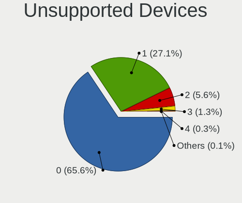

| Total | Computers | Percent |
|-------|-----------|---------|
| 0     | 894       | 65.64%  |
| 1     | 369       | 27.09%  |
| 2     | 76        | 5.58%   |
| 3     | 18        | 1.32%   |
| 4     | 4         | 0.29%   |
| 6     | 1         | 0.07%   |

Unsupported Device Types
------------------------

Types of unsupported devices

| Type                     | Computers | Percent |
|--------------------------|-----------|---------|
| Graphics card            | 164       | 28.47%  |
| Fingerprint reader       | 123       | 21.35%  |
| Net/wireless             | 122       | 21.18%  |
| Chipcard                 | 50        | 8.68%   |
| Multimedia controller    | 44        | 7.64%   |
| Communication controller | 17        | 2.95%   |
| Storage                  | 10        | 1.74%   |
| Bluetooth                | 10        | 1.74%   |
| Camera                   | 8         | 1.39%   |
| Unassigned class         | 5         | 0.87%   |
| Network                  | 4         | 0.69%   |
| Card reader              | 4         | 0.69%   |
| Sound                    | 3         | 0.52%   |
| Flash memory             | 3         | 0.52%   |
| Net/ethernet             | 2         | 0.35%   |
| Modem                    | 2         | 0.35%   |
| Tv card                  | 1         | 0.17%   |
| Storage/raid             | 1         | 0.17%   |
| Storage/nvme             | 1         | 0.17%   |
| Storage/ide              | 1         | 0.17%   |
| Dvb card                 | 1         | 0.17%   |

