LMDE 4 - Tested Hardware & Statistics
-------------------------------------

A project to collect tested hardware configurations for LMDE 4.

Anyone can contribute to this report by the [hw-probe](https://github.com/linuxhw/hw-probe) tool:

    sudo -E hw-probe -all -upload

Please submit a probe of your configuration if it's not presented on the page or is rare.

This is a report for all computer types. See also reports for [desktops](/Dist/LMDE_4/Desktop/README.md) and [notebooks](/Dist/LMDE_4/Notebook/README.md).

Full-feature report is available here: https://linux-hardware.org/?view=trends&rel=lmde-4

Contents
--------

* [ Test Cases ](#test-cases)

* [ System ](#system)
  - [ Kernel                   ](#kernel)
  - [ Kernel Family            ](#kernel-family)
  - [ Kernel Major Ver.        ](#kernel-major-ver)
  - [ Arch                     ](#arch)
  - [ DE                       ](#de)
  - [ Display Server           ](#display-server)
  - [ Display Manager          ](#display-manager)
  - [ OS Lang                  ](#os-lang)
  - [ Boot Mode                ](#boot-mode)
  - [ Filesystem               ](#filesystem)
  - [ Part. scheme             ](#part-scheme)
  - [ Dual Boot with Linux/BSD ](#dual-boot-with-linuxbsd)
  - [ Dual Boot (Win)          ](#dual-boot-win)

* [ Board ](#board)
  - [ Vendor                   ](#vendor)
  - [ Model                    ](#model)
  - [ Model Family             ](#model-family)
  - [ MFG Year                 ](#mfg-year)
  - [ Form Factor              ](#form-factor)
  - [ Secure Boot              ](#secure-boot)
  - [ Coreboot                 ](#coreboot)
  - [ RAM Size                 ](#ram-size)
  - [ RAM Used                 ](#ram-used)
  - [ Total Drives             ](#total-drives)
  - [ Has CD-ROM               ](#has-cd-rom)
  - [ Has Ethernet             ](#has-ethernet)
  - [ Has WiFi                 ](#has-wifi)
  - [ Has Bluetooth            ](#has-bluetooth)

* [ Location ](#location)
  - [ Country                  ](#country)
  - [ City                     ](#city)

* [ Drives ](#drives)
  - [ Drive Vendor             ](#drive-vendor)
  - [ Drive Model              ](#drive-model)
  - [ HDD Vendor               ](#hdd-vendor)
  - [ SSD Vendor               ](#ssd-vendor)
  - [ Drive Kind               ](#drive-kind)
  - [ Drive Connector          ](#drive-connector)
  - [ Drive Size               ](#drive-size)
  - [ Space Total              ](#space-total)
  - [ Space Used               ](#space-used)
  - [ Malfunc. Drives          ](#malfunc-drives)
  - [ Malfunc. Drive Vendor    ](#malfunc-drive-vendor)
  - [ Malfunc. HDD Vendor      ](#malfunc-hdd-vendor)
  - [ Malfunc. Drive Kind      ](#malfunc-drive-kind)
  - [ Failed Drives            ](#failed-drives)
  - [ Failed Drive Vendor      ](#failed-drive-vendor)
  - [ Drive Status             ](#drive-status)

* [ Storage controller ](#storage-controller)
  - [ Storage Vendor           ](#storage-vendor)
  - [ Storage Model            ](#storage-model)
  - [ Storage Kind             ](#storage-kind)

* [ Processor ](#processor)
  - [ CPU Vendor               ](#cpu-vendor)
  - [ CPU Model                ](#cpu-model)
  - [ CPU Model Family         ](#cpu-model-family)
  - [ CPU Cores                ](#cpu-cores)
  - [ CPU Sockets              ](#cpu-sockets)
  - [ CPU Threads              ](#cpu-threads)
  - [ CPU Op-Modes             ](#cpu-op-modes)
  - [ CPU Microcode            ](#cpu-microcode)
  - [ CPU Microarch            ](#cpu-microarch)

* [ Graphics ](#graphics)
  - [ GPU Vendor               ](#gpu-vendor)
  - [ GPU Model                ](#gpu-model)
  - [ GPU Combo                ](#gpu-combo)
  - [ GPU Driver               ](#gpu-driver)
  - [ GPU Memory               ](#gpu-memory)

* [ Monitor ](#monitor)
  - [ Monitor Vendor           ](#monitor-vendor)
  - [ Monitor Model            ](#monitor-model)
  - [ Monitor Resolution       ](#monitor-resolution)
  - [ Monitor Diagonal         ](#monitor-diagonal)
  - [ Monitor Width            ](#monitor-width)
  - [ Aspect Ratio             ](#aspect-ratio)
  - [ Monitor Area             ](#monitor-area)
  - [ Pixel Density            ](#pixel-density)
  - [ Multiple Monitors        ](#multiple-monitors)

* [ Network ](#network)
  - [ Net Controller Vendor    ](#net-controller-vendor)
  - [ Net Controller Model     ](#net-controller-model)
  - [ Wireless Vendor          ](#wireless-vendor)
  - [ Wireless Model           ](#wireless-model)
  - [ Ethernet Vendor          ](#ethernet-vendor)
  - [ Ethernet Model           ](#ethernet-model)
  - [ Net Controller Kind      ](#net-controller-kind)
  - [ Used Controller          ](#used-controller)
  - [ NICs                     ](#nics)
  - [ IPv6                     ](#ipv6)

* [ Bluetooth ](#bluetooth)
  - [ Bluetooth Vendor         ](#bluetooth-vendor)
  - [ Bluetooth Model          ](#bluetooth-model)

* [ Sound ](#sound)
  - [ Sound Vendor             ](#sound-vendor)
  - [ Sound Model              ](#sound-model)

* [ Memory ](#memory)
  - [ Memory Vendor            ](#memory-vendor)
  - [ Memory Model             ](#memory-model)
  - [ Memory Kind              ](#memory-kind)
  - [ Memory Form Factor       ](#memory-form-factor)
  - [ Memory Size              ](#memory-size)
  - [ Memory Speed             ](#memory-speed)

* [ Printers & scanners ](#printers--scanners)
  - [ Printer Vendor           ](#printer-vendor)
  - [ Printer Model            ](#printer-model)
  - [ Scanner Vendor           ](#scanner-vendor)
  - [ Scanner Model            ](#scanner-model)

* [ Camera ](#camera)
  - [ Camera Vendor            ](#camera-vendor)
  - [ Camera Model             ](#camera-model)

* [ Security ](#security)
  - [ Fingerprint Vendor       ](#fingerprint-vendor)
  - [ Fingerprint Model        ](#fingerprint-model)
  - [ Chipcard Vendor          ](#chipcard-vendor)
  - [ Chipcard Model           ](#chipcard-model)

* [ Unsupported ](#unsupported)
  - [ Unsupported Devices      ](#unsupported-devices)
  - [ Unsupported Device Types ](#unsupported-device-types)

Test Cases
----------

| Vendor        | Model                       | Form-Factor | Probe                                                      | Date         |
|---------------|-----------------------------|-------------|------------------------------------------------------------|--------------|
| HP            | 843C                        | Desktop     | [e7df8fecdd](https://linux-hardware.org/?probe=e7df8fecdd) | Oct 30, 2021 |
| ASUSTek       | P7F-M                       | Desktop     | [f0983027ee](https://linux-hardware.org/?probe=f0983027ee) | Oct 26, 2021 |
| TUXEDO        | BC1510 1710                 | Notebook    | [90be7d16be](https://linux-hardware.org/?probe=90be7d16be) | Oct 24, 2021 |
| TUXEDO        | BC1510 1710                 | Notebook    | [49b52175c5](https://linux-hardware.org/?probe=49b52175c5) | Oct 24, 2021 |
| EVGA          | 132-BL-E758 Tylersburg      | Desktop     | [48187accde](https://linux-hardware.org/?probe=48187accde) | Oct 21, 2021 |
| Acer          | Aspire A315-55G             | Notebook    | [5b965ea234](https://linux-hardware.org/?probe=5b965ea234) | Oct 17, 2021 |
| Acer          | Aspire A315-55G             | Notebook    | [3a5976d4eb](https://linux-hardware.org/?probe=3a5976d4eb) | Oct 17, 2021 |
| ASUSTek       | Z97-K                       | Desktop     | [f1fcb9d1db](https://linux-hardware.org/?probe=f1fcb9d1db) | Oct 17, 2021 |
| EVGA          | 132-BL-E758 Tylersburg      | Desktop     | [a1820d8f0c](https://linux-hardware.org/?probe=a1820d8f0c) | Oct 17, 2021 |
| Gigabyte      | H61M-D2-B3                  | Desktop     | [138df954cb](https://linux-hardware.org/?probe=138df954cb) | Oct 15, 2021 |
| Gigabyte      | H61M-D2-B3                  | Desktop     | [dabe5d459a](https://linux-hardware.org/?probe=dabe5d459a) | Oct 15, 2021 |
| Acer          | Swift SF515-51T             | Notebook    | [203a3b399d](https://linux-hardware.org/?probe=203a3b399d) | Oct 13, 2021 |
| HP            | Pavilion dv6                | Notebook    | [b4200dd39c](https://linux-hardware.org/?probe=b4200dd39c) | Oct 13, 2021 |
| Medion        | P6670 MD99960               | Notebook    | [eaa186d207](https://linux-hardware.org/?probe=eaa186d207) | Oct 12, 2021 |
| Medion        | P6670 MD99960               | Notebook    | [d42f345fc5](https://linux-hardware.org/?probe=d42f345fc5) | Oct 12, 2021 |
| ASUSTek       | Z97-K                       | Desktop     | [940a27249a](https://linux-hardware.org/?probe=940a27249a) | Oct 12, 2021 |
| HP            | 520                         | Notebook    | [4aea2d24b1](https://linux-hardware.org/?probe=4aea2d24b1) | Oct 10, 2021 |
| LG Electro... | A530-T.BE76P1               | Notebook    | [393852d904](https://linux-hardware.org/?probe=393852d904) | Oct 10, 2021 |
| Dell          | Precision M2800             | Notebook    | [b046a9dfe3](https://linux-hardware.org/?probe=b046a9dfe3) | Oct 08, 2021 |
| HUAWEI        | MateBook HZ-W19             | Tablet      | [904decfd32](https://linux-hardware.org/?probe=904decfd32) | Sep 28, 2021 |
| Lenovo        | ThinkPad T530 2394BK7       | Notebook    | [6e927dafdd](https://linux-hardware.org/?probe=6e927dafdd) | Sep 28, 2021 |
| Lenovo        | ThinkPad T530 2394BK7       | Notebook    | [ccccaee5bb](https://linux-hardware.org/?probe=ccccaee5bb) | Sep 28, 2021 |
| Apple         | MacBookPro5,4               | Notebook    | [633c289440](https://linux-hardware.org/?probe=633c289440) | Sep 28, 2021 |
| ASUSTek       | Z97-K                       | Desktop     | [012056e32d](https://linux-hardware.org/?probe=012056e32d) | Sep 28, 2021 |
| Apple         | MacBookPro5,4               | Notebook    | [a6d07be7c9](https://linux-hardware.org/?probe=a6d07be7c9) | Sep 27, 2021 |
| Lenovo        | ThinkPad E495 20NE001MRT    | Notebook    | [759b25b6a9](https://linux-hardware.org/?probe=759b25b6a9) | Sep 27, 2021 |
| Biostar       | G41D3C                      | Desktop     | [16eb676e0c](https://linux-hardware.org/?probe=16eb676e0c) | Sep 25, 2021 |
| Apple         | MacBookPro5,4               | Notebook    | [d5625a9406](https://linux-hardware.org/?probe=d5625a9406) | Sep 24, 2021 |
| Sony          | VPCS131FM                   | Notebook    | [b5bba0e07f](https://linux-hardware.org/?probe=b5bba0e07f) | Sep 22, 2021 |
| Sony          | VPCS131FM                   | Notebook    | [54923e2372](https://linux-hardware.org/?probe=54923e2372) | Sep 22, 2021 |
| ASUSTek       | P5KPL-AM EPU                | Desktop     | [9c0ade7c9c](https://linux-hardware.org/?probe=9c0ade7c9c) | Sep 20, 2021 |
| Qbex          | UDPAIOQBEX01                | Notebook    | [34c385cfe4](https://linux-hardware.org/?probe=34c385cfe4) | Sep 13, 2021 |
| ASUSTek       | P5VD2-VM                    | Desktop     | [9eec34a3f2](https://linux-hardware.org/?probe=9eec34a3f2) | Sep 13, 2021 |
| Acer          | Aspire 4320                 | Notebook    | [fae514c059](https://linux-hardware.org/?probe=fae514c059) | Sep 12, 2021 |
| Foxconn       | 945 7MC Series              | Desktop     | [623cb095f2](https://linux-hardware.org/?probe=623cb095f2) | Sep 12, 2021 |
| Pegatron      | 2AB5                        | Desktop     | [3c335b37fa](https://linux-hardware.org/?probe=3c335b37fa) | Sep 10, 2021 |
| IBM           | ThinkPad T41 23737JY        | Notebook    | [86cf78a3cf](https://linux-hardware.org/?probe=86cf78a3cf) | Sep 09, 2021 |
| ASUSTek       | UN62                        | Desktop     | [0702f80222](https://linux-hardware.org/?probe=0702f80222) | Sep 09, 2021 |
| HP            | 250 G2                      | Notebook    | [64f9cfdbab](https://linux-hardware.org/?probe=64f9cfdbab) | Sep 09, 2021 |
| HP            | 250 G2                      | Notebook    | [4fb0a2eab3](https://linux-hardware.org/?probe=4fb0a2eab3) | Sep 09, 2021 |
| Acer          | Aspire A315-31              | Notebook    | [10052076e0](https://linux-hardware.org/?probe=10052076e0) | Sep 09, 2021 |
| Acer          | Aspire A315-31              | Notebook    | [8a0df29327](https://linux-hardware.org/?probe=8a0df29327) | Sep 09, 2021 |
| LG Electro... | A530-T.BE76P1               | Notebook    | [844d7b2492](https://linux-hardware.org/?probe=844d7b2492) | Sep 09, 2021 |
| Matsushita... | CF-19DDGZXVM                | Notebook    | [6f54a42d76](https://linux-hardware.org/?probe=6f54a42d76) | Sep 08, 2021 |
| ASUSTek       | P5VD2-VM                    | Desktop     | [9bab4b76ff](https://linux-hardware.org/?probe=9bab4b76ff) | Sep 07, 2021 |
| ASUSTek       | P5VD2-VM                    | Desktop     | [305d566f57](https://linux-hardware.org/?probe=305d566f57) | Sep 07, 2021 |
| Gigabyte      | H61M-S1                     | Desktop     | [d1773b3e3d](https://linux-hardware.org/?probe=d1773b3e3d) | Sep 06, 2021 |
| Gigabyte      | H61M-S1                     | Desktop     | [5d2cc7f4ca](https://linux-hardware.org/?probe=5d2cc7f4ca) | Sep 06, 2021 |
| Intel         | DG31PR AAD97573-302         | Desktop     | [7122e4bd16](https://linux-hardware.org/?probe=7122e4bd16) | Sep 04, 2021 |
| Gigabyte      | M52LT-D3P                   | Desktop     | [09cbb5b50e](https://linux-hardware.org/?probe=09cbb5b50e) | Sep 03, 2021 |
| Gigabyte      | M52LT-D3P                   | Desktop     | [949b2062ea](https://linux-hardware.org/?probe=949b2062ea) | Sep 03, 2021 |
| Fujitsu Si... | ESPRIMO Mobile V5515        | Notebook    | [fdb725803b](https://linux-hardware.org/?probe=fdb725803b) | Sep 01, 2021 |
| Lenovo        | Yoga 2 11 20428             | Notebook    | [52474e968d](https://linux-hardware.org/?probe=52474e968d) | Sep 01, 2021 |
| Lenovo        | Yoga 2 11 20428             | Notebook    | [c4e6145a5f](https://linux-hardware.org/?probe=c4e6145a5f) | Sep 01, 2021 |
| Unknown       | Unknown                     | Notebook    | [9dbd1f4ad9](https://linux-hardware.org/?probe=9dbd1f4ad9) | Aug 28, 2021 |
| Unknown       | Unknown                     | Notebook    | [f4e126fba9](https://linux-hardware.org/?probe=f4e126fba9) | Aug 28, 2021 |
| ASUSTek       | 1201HA                      | Notebook    | [eadb8752c9](https://linux-hardware.org/?probe=eadb8752c9) | Aug 28, 2021 |
| HP            | Pavilion dv2000 (RD665EA... | Notebook    | [3b6dfaf6db](https://linux-hardware.org/?probe=3b6dfaf6db) | Aug 25, 2021 |
| Fujitsu       | LIFEBOOK A556/G             | Notebook    | [7706314dbc](https://linux-hardware.org/?probe=7706314dbc) | Aug 24, 2021 |
| Itautec       | W7655                       | Notebook    | [82b2d38326](https://linux-hardware.org/?probe=82b2d38326) | Aug 24, 2021 |
| Itautec       | W7655                       | Notebook    | [5952ec3a0f](https://linux-hardware.org/?probe=5952ec3a0f) | Aug 24, 2021 |
| HP            | 14                          | Notebook    | [e6bbdc5a92](https://linux-hardware.org/?probe=e6bbdc5a92) | Aug 24, 2021 |
| ASRock        | G41M-S3                     | Desktop     | [c34caa75e2](https://linux-hardware.org/?probe=c34caa75e2) | Aug 23, 2021 |
| ASUSTek       | X101CH                      | Notebook    | [42ca8c45b4](https://linux-hardware.org/?probe=42ca8c45b4) | Aug 22, 2021 |
| ASRock        | G41M-S3                     | Desktop     | [48360885d9](https://linux-hardware.org/?probe=48360885d9) | Aug 22, 2021 |
| ASUSTek       | X101CH                      | Notebook    | [31ed530084](https://linux-hardware.org/?probe=31ed530084) | Aug 22, 2021 |
| Unknown       | Unknown                     | Notebook    | [5acb8c28ad](https://linux-hardware.org/?probe=5acb8c28ad) | Aug 21, 2021 |
| MSI           | MS-7142                     | Desktop     | [2700c74bd9](https://linux-hardware.org/?probe=2700c74bd9) | Aug 21, 2021 |
| MSI           | MS-7142                     | Desktop     | [18ae0c1bb3](https://linux-hardware.org/?probe=18ae0c1bb3) | Aug 21, 2021 |
| Packard Be... | EASYNOTE_NJ66               | Notebook    | [03c09865f3](https://linux-hardware.org/?probe=03c09865f3) | Aug 19, 2021 |
| HP            | 0AA8h                       | Desktop     | [d9a8fd3722](https://linux-hardware.org/?probe=d9a8fd3722) | Aug 15, 2021 |
| ASUSTek       | N550JV                      | Notebook    | [f56a2bd3fa](https://linux-hardware.org/?probe=f56a2bd3fa) | Aug 14, 2021 |
| ASUSTek       | A7N8X-LA                    | Desktop     | [0e9fd81caf](https://linux-hardware.org/?probe=0e9fd81caf) | Aug 11, 2021 |
| ASUSTek       | A7N8X-LA                    | Desktop     | [f14c99bbce](https://linux-hardware.org/?probe=f14c99bbce) | Aug 11, 2021 |
| Toshiba       | Satellite M100              | Notebook    | [8dff0ec788](https://linux-hardware.org/?probe=8dff0ec788) | Aug 10, 2021 |
| Toshiba       | Satellite M100              | Notebook    | [06e766539d](https://linux-hardware.org/?probe=06e766539d) | Aug 10, 2021 |
| Gigabyte      | X570 AORUS ULTRA            | Desktop     | [b937ce5e88](https://linux-hardware.org/?probe=b937ce5e88) | Aug 10, 2021 |
| ASUSTek       | P7F-M                       | Desktop     | [cff87306ab](https://linux-hardware.org/?probe=cff87306ab) | Aug 07, 2021 |
| Lenovo        | ThinkPad E495 20NE001MRT    | Notebook    | [8648635717](https://linux-hardware.org/?probe=8648635717) | Aug 07, 2021 |
| Fujitsu Si... | ESPRIMO Mobile V5515        | Notebook    | [16bec20604](https://linux-hardware.org/?probe=16bec20604) | Aug 06, 2021 |
| Lenovo        | ThinkPad E495 20NE001MRT    | Notebook    | [dec7f65882](https://linux-hardware.org/?probe=dec7f65882) | Aug 06, 2021 |
| Fujitsu Si... | D2264-A1 S26361-D2264-A1    | Desktop     | [a1768aa578](https://linux-hardware.org/?probe=a1768aa578) | Aug 06, 2021 |
| Fujitsu Si... | D2264-A1 S26361-D2264-A1    | Desktop     | [52aa712b0c](https://linux-hardware.org/?probe=52aa712b0c) | Aug 05, 2021 |
| Fujitsu Si... | ESPRIMO Mobile V5515        | Notebook    | [322a210197](https://linux-hardware.org/?probe=322a210197) | Aug 05, 2021 |
| ASUSTek       | PRIME Z370-A                | Desktop     | [05c1703574](https://linux-hardware.org/?probe=05c1703574) | Aug 03, 2021 |
| Fujitsu Si... | ESPRIMO Mobile V5515        | Notebook    | [c930d1c587](https://linux-hardware.org/?probe=c930d1c587) | Aug 03, 2021 |
| Fujitsu Si... | ESPRIMO Mobile V5515        | Notebook    | [eb5ff22307](https://linux-hardware.org/?probe=eb5ff22307) | Aug 03, 2021 |
| ASUSTek       | PRIME Z370-A                | Desktop     | [faf304d157](https://linux-hardware.org/?probe=faf304d157) | Aug 02, 2021 |
| Fujitsu Si... | ESPRIMO Mobile V5515        | Notebook    | [2ffa81b543](https://linux-hardware.org/?probe=2ffa81b543) | Aug 01, 2021 |
| Fujitsu Si... | ESPRIMO Mobile V5515        | Notebook    | [53ee243536](https://linux-hardware.org/?probe=53ee243536) | Aug 01, 2021 |
| OEM           | 45CMX/45GMX/45CMX-K         | Desktop     | [65d8eb687e](https://linux-hardware.org/?probe=65d8eb687e) | Jul 30, 2021 |
| HP            | Pavilion Laptop 15-cw1xx... | Notebook    | [eafe3a403f](https://linux-hardware.org/?probe=eafe3a403f) | Jul 30, 2021 |
| ASUSTek       | P7F-M                       | Desktop     | [33a6186148](https://linux-hardware.org/?probe=33a6186148) | Jul 30, 2021 |
| Toshiba       | Satellite L855              | Notebook    | [354b3bf7c6](https://linux-hardware.org/?probe=354b3bf7c6) | Jul 30, 2021 |
| ASUSTek       | 1201NL                      | Notebook    | [1ff8ed5a66](https://linux-hardware.org/?probe=1ff8ed5a66) | Jul 29, 2021 |
| ASUSTek       | 1201NL                      | Notebook    | [78fb5dfca9](https://linux-hardware.org/?probe=78fb5dfca9) | Jul 29, 2021 |
| HP            | EliteBook 8470p             | Notebook    | [5ea0d9d644](https://linux-hardware.org/?probe=5ea0d9d644) | Jul 29, 2021 |
| Dell          | Inspiron 15-3567            | Notebook    | [19a4054ab4](https://linux-hardware.org/?probe=19a4054ab4) | Jul 28, 2021 |
| Dell          | Inspiron 15-3567            | Notebook    | [bc64d314a1](https://linux-hardware.org/?probe=bc64d314a1) | Jul 28, 2021 |
| Intel         | BTC-T37                     | Desktop     | [bb5051b598](https://linux-hardware.org/?probe=bb5051b598) | Jul 27, 2021 |
| ASRock        | FM2A85X Extreme4-M          | Desktop     | [aa0030f094](https://linux-hardware.org/?probe=aa0030f094) | Jul 26, 2021 |
| Gigabyte      | Z390 M GAMING-CF            | Desktop     | [763cb39ac0](https://linux-hardware.org/?probe=763cb39ac0) | Jul 25, 2021 |
| ASUSTek       | VivoBook 15_ASUS Laptop ... | Notebook    | [10ca362cf0](https://linux-hardware.org/?probe=10ca362cf0) | Jul 19, 2021 |
| Gigabyte      | X570 AORUS PRO              | Desktop     | [932c4de6ce](https://linux-hardware.org/?probe=932c4de6ce) | Jul 18, 2021 |
| ASUSTek       | PRIME A320M-K 2021-06-11    | Desktop     | [39037104b7](https://linux-hardware.org/?probe=39037104b7) | Jul 17, 2021 |
| ASUSTek       | PRIME A320M-K 2021-06-11    | Desktop     | [eef16a5b8f](https://linux-hardware.org/?probe=eef16a5b8f) | Jul 17, 2021 |
| Unknown       | Unknown                     | Notebook    | [55de50364d](https://linux-hardware.org/?probe=55de50364d) | Jul 17, 2021 |
| Dell          | 08HPGT A01                  | Desktop     | [64d562d6ef](https://linux-hardware.org/?probe=64d562d6ef) | Jul 16, 2021 |
| ASUSTek       | PRIME A320M-K 2021-06-11    | Desktop     | [ab57bbf3d8](https://linux-hardware.org/?probe=ab57bbf3d8) | Jul 15, 2021 |
| HP            | Compaq nc6400 (RH478EA#A... | Notebook    | [a3f3785bc1](https://linux-hardware.org/?probe=a3f3785bc1) | Jul 15, 2021 |
| ASUSTek       | PRIME A320M-K 2021-06-11    | Desktop     | [a82245240b](https://linux-hardware.org/?probe=a82245240b) | Jul 15, 2021 |
| ASUSTek       | P7F-M                       | Desktop     | [3007b813c6](https://linux-hardware.org/?probe=3007b813c6) | Jul 13, 2021 |
| Dell          | Latitude E5520              | Notebook    | [9278405254](https://linux-hardware.org/?probe=9278405254) | Jul 13, 2021 |
| ASUSTek       | P7F-M                       | Desktop     | [5cfa1dcb4f](https://linux-hardware.org/?probe=5cfa1dcb4f) | Jul 12, 2021 |
| Fujitsu Si... | AMILO Pa 2510               | Notebook    | [a4303cc0cf](https://linux-hardware.org/?probe=a4303cc0cf) | Jul 12, 2021 |
| Qbex          | UDPAIOQBEX01                | Notebook    | [9b96573429](https://linux-hardware.org/?probe=9b96573429) | Jul 11, 2021 |
| Dell          | Inspiron 1526               | Notebook    | [515fc96089](https://linux-hardware.org/?probe=515fc96089) | Jul 11, 2021 |
| ASUSTek       | M6Ne                        | Notebook    | [ae1c7d3df6](https://linux-hardware.org/?probe=ae1c7d3df6) | Jul 11, 2021 |
| Dell          | Inspiron 7520               | Notebook    | [fbc1ae17b4](https://linux-hardware.org/?probe=fbc1ae17b4) | Jul 10, 2021 |
| Dell          | Inspiron 7520               | Notebook    | [e9bbf0622c](https://linux-hardware.org/?probe=e9bbf0622c) | Jul 10, 2021 |
| HP            | Laptop 14-df0xxx            | Notebook    | [ce0ac9c2fe](https://linux-hardware.org/?probe=ce0ac9c2fe) | Jul 10, 2021 |
| MSI           | H81M-E34                    | Desktop     | [14c2f8a49d](https://linux-hardware.org/?probe=14c2f8a49d) | Jul 05, 2021 |
| MSI           | A320M-A PRO                 | Desktop     | [9d356e787a](https://linux-hardware.org/?probe=9d356e787a) | Jul 01, 2021 |
| Samsung       | R59/R60/R61                 | Notebook    | [c0f5798a5b](https://linux-hardware.org/?probe=c0f5798a5b) | Jun 28, 2021 |
| HP            | Pavilion Laptop 15-cs0xx... | Notebook    | [f9a80b7b6b](https://linux-hardware.org/?probe=f9a80b7b6b) | Jun 28, 2021 |
| HP            | Pavilion Laptop 15-cs0xx... | Notebook    | [c7ddbbda0a](https://linux-hardware.org/?probe=c7ddbbda0a) | Jun 27, 2021 |
| Lenovo        | ThinkPad X100e 28762FP      | Notebook    | [95661d2e39](https://linux-hardware.org/?probe=95661d2e39) | Jun 27, 2021 |
| Unknown       | Unknown                     | Notebook    | [267ea9c15e](https://linux-hardware.org/?probe=267ea9c15e) | Jun 26, 2021 |
| Acer          | Aspire 3000                 | Notebook    | [d0c68c57a8](https://linux-hardware.org/?probe=d0c68c57a8) | Jun 26, 2021 |
| Samsung       | RV413/RV513                 | Notebook    | [f6aab08062](https://linux-hardware.org/?probe=f6aab08062) | Jun 26, 2021 |
| Gateway       | M675                        | Notebook    | [ebdf5aa678](https://linux-hardware.org/?probe=ebdf5aa678) | Jun 25, 2021 |
| Acer          | Aspire one                  | Notebook    | [adae8c183d](https://linux-hardware.org/?probe=adae8c183d) | Jun 22, 2021 |
| HP            | 0A98h                       | Desktop     | [40990f73a5](https://linux-hardware.org/?probe=40990f73a5) | Jun 22, 2021 |
| HP            | Compaq nc6400 (RH478EA#A... | Notebook    | [b96ab4b06e](https://linux-hardware.org/?probe=b96ab4b06e) | Jun 18, 2021 |
| HP            | 0AA8h                       | Desktop     | [43103b39a5](https://linux-hardware.org/?probe=43103b39a5) | Jun 17, 2021 |
| HP            | Presario R4100 (EC375UA#... | Notebook    | [9072bce23d](https://linux-hardware.org/?probe=9072bce23d) | Jun 17, 2021 |
| HP            | Presario R4100 (EC375UA#... | Notebook    | [b557ccbf94](https://linux-hardware.org/?probe=b557ccbf94) | Jun 17, 2021 |
| Dell          | Latitude E6410              | Notebook    | [bd3a2db03c](https://linux-hardware.org/?probe=bd3a2db03c) | Jun 16, 2021 |
| HP            | Notebook                    | Notebook    | [611efdde0d](https://linux-hardware.org/?probe=611efdde0d) | Jun 15, 2021 |
| Intel         | H61                         | Desktop     | [6b0bdb5986](https://linux-hardware.org/?probe=6b0bdb5986) | Jun 14, 2021 |
| HP            | 0AA8h                       | Desktop     | [9154911bc9](https://linux-hardware.org/?probe=9154911bc9) | Jun 13, 2021 |
| ASUSTek       | X550LN                      | Notebook    | [67bbff8363](https://linux-hardware.org/?probe=67bbff8363) | Jun 11, 2021 |
| ASUSTek       | X550LN                      | Notebook    | [b37374d9f8](https://linux-hardware.org/?probe=b37374d9f8) | Jun 11, 2021 |
| Gateway       | LT40                        | Notebook    | [fe2551cb8b](https://linux-hardware.org/?probe=fe2551cb8b) | Jun 11, 2021 |
| ASUSTek       | Maximus VI HERO             | Desktop     | [699d10613e](https://linux-hardware.org/?probe=699d10613e) | Jun 11, 2021 |
| ASUSTek       | Z97-K                       | Desktop     | [f0b9aa22e5](https://linux-hardware.org/?probe=f0b9aa22e5) | Jun 10, 2021 |
| Acer          | Aspire 3000                 | Notebook    | [57f93cbf62](https://linux-hardware.org/?probe=57f93cbf62) | Jun 09, 2021 |
| Acer          | Aspire 3000                 | Notebook    | [f6a944ee4a](https://linux-hardware.org/?probe=f6a944ee4a) | Jun 09, 2021 |
| Sony          | VPCEB3L1E                   | Notebook    | [bc3c3b537b](https://linux-hardware.org/?probe=bc3c3b537b) | Jun 06, 2021 |
| HP            | Laptop 15-dw0xxx            | Notebook    | [4f752689ed](https://linux-hardware.org/?probe=4f752689ed) | Jun 03, 2021 |
| Gateway       | LT40                        | Notebook    | [9defd288c4](https://linux-hardware.org/?probe=9defd288c4) | Jun 01, 2021 |
| Gateway       | LT40                        | Notebook    | [6a966fe471](https://linux-hardware.org/?probe=6a966fe471) | Jun 01, 2021 |
| Unknown       | Unknown                     | Desktop     | [3e408e9ead](https://linux-hardware.org/?probe=3e408e9ead) | May 31, 2021 |
| Unknown       | Unknown                     | Desktop     | [39b2780acf](https://linux-hardware.org/?probe=39b2780acf) | May 31, 2021 |
| Dell          | 0HY9JP A01                  | Desktop     | [3f6ddbd81d](https://linux-hardware.org/?probe=3f6ddbd81d) | May 30, 2021 |
| ASUSTek       | H61M-A/BR                   | Desktop     | [7d2b37e6e1](https://linux-hardware.org/?probe=7d2b37e6e1) | May 29, 2021 |
| ASRock        | G41M-S3                     | Desktop     | [adc801308b](https://linux-hardware.org/?probe=adc801308b) | May 29, 2021 |
| MSI           | B450I GAMING PLUS AC        | Desktop     | [d03d2796a0](https://linux-hardware.org/?probe=d03d2796a0) | May 29, 2021 |
| MSI           | B450I GAMING PLUS AC        | Desktop     | [200072e2a7](https://linux-hardware.org/?probe=200072e2a7) | May 29, 2021 |
| ASRock        | G41M-S3                     | Desktop     | [47f6c3e962](https://linux-hardware.org/?probe=47f6c3e962) | May 28, 2021 |
| MSI           | Gamila/Giovani/Neon seri... | Desktop     | [cd3697bd15](https://linux-hardware.org/?probe=cd3697bd15) | May 25, 2021 |
| MSI           | Gamila/Giovani/Neon seri... | Desktop     | [7c520b0d6e](https://linux-hardware.org/?probe=7c520b0d6e) | May 25, 2021 |
| ASUSTek       | X555UJ                      | Notebook    | [9c148a1665](https://linux-hardware.org/?probe=9c148a1665) | May 25, 2021 |
| Gigabyte      | GA-78LMT-USB3               | Desktop     | [55d981b2ed](https://linux-hardware.org/?probe=55d981b2ed) | May 23, 2021 |
| Intel         | H61                         | Desktop     | [1954634de4](https://linux-hardware.org/?probe=1954634de4) | May 22, 2021 |
| ASUSTek       | P7F-M                       | Desktop     | [2ad3cb7346](https://linux-hardware.org/?probe=2ad3cb7346) | May 22, 2021 |
| Intel         | H61                         | Desktop     | [dad657a0bc](https://linux-hardware.org/?probe=dad657a0bc) | May 19, 2021 |
| HP            | Pavilion dv6                | Notebook    | [fb309a7f37](https://linux-hardware.org/?probe=fb309a7f37) | May 17, 2021 |
| Foxconn       | 945 7MC Series              | Desktop     | [f4634ec470](https://linux-hardware.org/?probe=f4634ec470) | May 17, 2021 |
| Dell          | 0FM586 A00                  | Desktop     | [8a955d2c5a](https://linux-hardware.org/?probe=8a955d2c5a) | May 16, 2021 |
| Intel         | H61                         | Desktop     | [76574dce75](https://linux-hardware.org/?probe=76574dce75) | May 16, 2021 |
| ASUSTek       | B150M-A                     | Desktop     | [ecc85d30a9](https://linux-hardware.org/?probe=ecc85d30a9) | May 13, 2021 |
| Dell          | 0XR1GT A00                  | Desktop     | [a502e8842e](https://linux-hardware.org/?probe=a502e8842e) | May 12, 2021 |
| Lenovo        | ThinkPad L450 20DSS00N18    | Notebook    | [85f3722d36](https://linux-hardware.org/?probe=85f3722d36) | May 12, 2021 |
| ASUSTek       | X550LN                      | Notebook    | [7023b380c0](https://linux-hardware.org/?probe=7023b380c0) | May 11, 2021 |
| ASUSTek       | X550LN                      | Notebook    | [4f117c46f3](https://linux-hardware.org/?probe=4f117c46f3) | May 09, 2021 |
| ASUSTek       | V-P7H55E                    | Desktop     | [3c0a297ede](https://linux-hardware.org/?probe=3c0a297ede) | May 08, 2021 |
| Acer          | Aspire E5-571               | Notebook    | [2c91167099](https://linux-hardware.org/?probe=2c91167099) | May 07, 2021 |
| Acer          | Aspire E5-571               | Notebook    | [c0b2f54ba4](https://linux-hardware.org/?probe=c0b2f54ba4) | May 07, 2021 |
| ASUSTek       | Crosshair V Formula         | Desktop     | [0fd87c485e](https://linux-hardware.org/?probe=0fd87c485e) | May 07, 2021 |
| HP            | 530                         | Notebook    | [e94b7216d1](https://linux-hardware.org/?probe=e94b7216d1) | May 06, 2021 |
| HP            | 530                         | Notebook    | [8e3d65488a](https://linux-hardware.org/?probe=8e3d65488a) | May 06, 2021 |
| Acer          | Aspire A515-41G             | Notebook    | [38e06153e9](https://linux-hardware.org/?probe=38e06153e9) | May 04, 2021 |
| ASUSTek       | P5KC                        | Desktop     | [80549acbba](https://linux-hardware.org/?probe=80549acbba) | May 03, 2021 |
| ASUSTek       | P5KC                        | Desktop     | [f2313ee72b](https://linux-hardware.org/?probe=f2313ee72b) | May 03, 2021 |
| Dell          | Inspiron 7520               | Notebook    | [3a72f19dd7](https://linux-hardware.org/?probe=3a72f19dd7) | May 01, 2021 |
| ASUSTek       | P5KC                        | Desktop     | [50505c9ede](https://linux-hardware.org/?probe=50505c9ede) | Apr 30, 2021 |
| ASUSTek       | P5KC                        | Desktop     | [b51106e072](https://linux-hardware.org/?probe=b51106e072) | Apr 30, 2021 |
| Toshiba       | dynabook Satellite J61 1... | Notebook    | [0b4c4a93f1](https://linux-hardware.org/?probe=0b4c4a93f1) | Apr 29, 2021 |
| ASUSTek       | P5KPL-AM SE                 | Desktop     | [2cd9e43be0](https://linux-hardware.org/?probe=2cd9e43be0) | Apr 27, 2021 |
| ASUSTek       | PRIME B350-PLUS             | Desktop     | [46b0bab7d8](https://linux-hardware.org/?probe=46b0bab7d8) | Apr 27, 2021 |
| Lenovo        | ThinkPad X60 1706AA7        | Notebook    | [34a54e1198](https://linux-hardware.org/?probe=34a54e1198) | Apr 27, 2021 |
| Lenovo        | ThinkPad SL510 28752NG      | Notebook    | [66346c1594](https://linux-hardware.org/?probe=66346c1594) | Apr 26, 2021 |
| Unknown       | Unknown                     | Notebook    | [e45a412c3d](https://linux-hardware.org/?probe=e45a412c3d) | Apr 26, 2021 |
| Unknown       | Phitronics N68C-M           | Desktop     | [3076a5bae3](https://linux-hardware.org/?probe=3076a5bae3) | Apr 24, 2021 |
| Unknown       | Phitronics N68C-M           | Desktop     | [d3a56832d9](https://linux-hardware.org/?probe=d3a56832d9) | Apr 23, 2021 |
| Fujitsu Si... | ESPRIMO Mobile V6535        | Notebook    | [f961a0339b](https://linux-hardware.org/?probe=f961a0339b) | Apr 22, 2021 |
| HP            | Pavilion dv7                | Notebook    | [662a781c83](https://linux-hardware.org/?probe=662a781c83) | Apr 22, 2021 |
| HP            | Pavilion dv7                | Notebook    | [edf38b6c4a](https://linux-hardware.org/?probe=edf38b6c4a) | Apr 21, 2021 |
| HP            | 255 G7 Notebook PC          | Notebook    | [b243c0380f](https://linux-hardware.org/?probe=b243c0380f) | Apr 21, 2021 |
| ASUSTek       | PRIME B450-PLUS             | Desktop     | [761a9ce0e9](https://linux-hardware.org/?probe=761a9ce0e9) | Apr 21, 2021 |
| ASUSTek       | P5Q DELUXE                  | Desktop     | [8ab143ec6b](https://linux-hardware.org/?probe=8ab143ec6b) | Apr 20, 2021 |
| Gigabyte      | GA-78LMT-USB3               | Desktop     | [2813977a91](https://linux-hardware.org/?probe=2813977a91) | Apr 20, 2021 |
| ASUSTek       | PRIME B350-PLUS             | Desktop     | [d6c3daff43](https://linux-hardware.org/?probe=d6c3daff43) | Apr 19, 2021 |
| HP            | Pavilion dv7                | Notebook    | [0c3668cad6](https://linux-hardware.org/?probe=0c3668cad6) | Apr 19, 2021 |
| ASUSTek       | V-P7H55E                    | Desktop     | [fb3b69b074](https://linux-hardware.org/?probe=fb3b69b074) | Apr 18, 2021 |
| Gigabyte      | M68MT-S2P                   | Desktop     | [47deff8a39](https://linux-hardware.org/?probe=47deff8a39) | Apr 17, 2021 |
| Toshiba       | NI 1403                     | Notebook    | [a3789d1a53](https://linux-hardware.org/?probe=a3789d1a53) | Apr 15, 2021 |
| HP            | Pavilion dv5                | Notebook    | [2df1512442](https://linux-hardware.org/?probe=2df1512442) | Apr 12, 2021 |
| HP            | Pavilion dv5                | Notebook    | [963a9c98df](https://linux-hardware.org/?probe=963a9c98df) | Apr 12, 2021 |
| Gigabyte      | Z97-D3H-CF                  | Desktop     | [16d03cb92f](https://linux-hardware.org/?probe=16d03cb92f) | Apr 12, 2021 |
| Toshiba       | NI 1403                     | Notebook    | [6587e3e02c](https://linux-hardware.org/?probe=6587e3e02c) | Apr 11, 2021 |
| Dell          | 0KP561                      | Desktop     | [3579bff9c4](https://linux-hardware.org/?probe=3579bff9c4) | Apr 08, 2021 |
| DFI           | LP BI P45-T2S Elite         | Desktop     | [01f0babd70](https://linux-hardware.org/?probe=01f0babd70) | Apr 08, 2021 |
| ASUSTek       | PRIME Z390-P                | Desktop     | [055066b50a](https://linux-hardware.org/?probe=055066b50a) | Apr 08, 2021 |
| ASUSTek       | P5KC                        | Desktop     | [b687d3a64f](https://linux-hardware.org/?probe=b687d3a64f) | Apr 06, 2021 |
| ASUSTek       | X101CH                      | Notebook    | [c1b96ff3fa](https://linux-hardware.org/?probe=c1b96ff3fa) | Apr 04, 2021 |
| Pegatron      | 2ADC                        | Desktop     | [e4bfddb8d9](https://linux-hardware.org/?probe=e4bfddb8d9) | Apr 04, 2021 |
| MSI           | MS-7267                     | Desktop     | [d16e8a4364](https://linux-hardware.org/?probe=d16e8a4364) | Apr 03, 2021 |
| Supermicro    | X8DT3                       | Server      | [f645c4227c](https://linux-hardware.org/?probe=f645c4227c) | Apr 02, 2021 |
| LG Electro... | X300-L.CR31B1               | Notebook    | [728ce1cec3](https://linux-hardware.org/?probe=728ce1cec3) | Apr 02, 2021 |
| HP            | Mini 210-1100               | Notebook    | [4b8539128d](https://linux-hardware.org/?probe=4b8539128d) | Apr 01, 2021 |
| HP            | Mini 210-1100               | Notebook    | [a2a1a61099](https://linux-hardware.org/?probe=a2a1a61099) | Apr 01, 2021 |
| LG Electro... | X300-L.CR31B1               | Notebook    | [2dee5439bd](https://linux-hardware.org/?probe=2dee5439bd) | Apr 01, 2021 |
| HP            | Compaq 6530b (GW688AV#AK... | Notebook    | [4644bc75a5](https://linux-hardware.org/?probe=4644bc75a5) | Mar 29, 2021 |
| HP            | Unknown                     | Notebook    | [984ec41c5f](https://linux-hardware.org/?probe=984ec41c5f) | Mar 28, 2021 |
| Intel         | H61                         | Desktop     | [724cdd1804](https://linux-hardware.org/?probe=724cdd1804) | Mar 27, 2021 |
| Intel         | H61                         | Desktop     | [d7c3f87e52](https://linux-hardware.org/?probe=d7c3f87e52) | Mar 26, 2021 |
| Gigabyte      | Z77-D3H                     | Desktop     | [6ab1c423db](https://linux-hardware.org/?probe=6ab1c423db) | Mar 25, 2021 |
| MSI           | Z77A-GD65                   | Desktop     | [a9c3672597](https://linux-hardware.org/?probe=a9c3672597) | Mar 25, 2021 |
| Gigabyte      | Z77-D3H                     | Desktop     | [3b4565a813](https://linux-hardware.org/?probe=3b4565a813) | Mar 20, 2021 |
| HP            | Unknown                     | Notebook    | [2f594364bb](https://linux-hardware.org/?probe=2f594364bb) | Mar 20, 2021 |
| ASUSTek       | M5A97 PRO                   | Desktop     | [3c9720e16b](https://linux-hardware.org/?probe=3c9720e16b) | Mar 18, 2021 |
| MSI           | MS-6785                     | Desktop     | [303c1ac636](https://linux-hardware.org/?probe=303c1ac636) | Mar 17, 2021 |
| Toshiba       | Satellite L750              | Notebook    | [06207199fa](https://linux-hardware.org/?probe=06207199fa) | Mar 16, 2021 |
| ASUSTek       | X542UAR                     | Notebook    | [4a2b4a2f3d](https://linux-hardware.org/?probe=4a2b4a2f3d) | Mar 15, 2021 |
| ASUSTek       | X542UAR                     | Notebook    | [824a5703c6](https://linux-hardware.org/?probe=824a5703c6) | Mar 15, 2021 |
| ASUSTek       | P7F-M                       | Desktop     | [faee1ed378](https://linux-hardware.org/?probe=faee1ed378) | Mar 13, 2021 |
| Sony          | VGN-FZ140E                  | Notebook    | [1d611ce57d](https://linux-hardware.org/?probe=1d611ce57d) | Mar 13, 2021 |
| Sony          | VGN-FZ140E                  | Notebook    | [3bfba9b2a3](https://linux-hardware.org/?probe=3bfba9b2a3) | Mar 13, 2021 |
| ASUSTek       | ROG STRIX H470-I GAMING     | Desktop     | [f8503ecc3b](https://linux-hardware.org/?probe=f8503ecc3b) | Mar 10, 2021 |
| ASUSTek       | K46CA                       | Notebook    | [553bb797b4](https://linux-hardware.org/?probe=553bb797b4) | Mar 09, 2021 |
| Fujitsu       | LIFEBOOK A556/G             | Notebook    | [6ce455b6ab](https://linux-hardware.org/?probe=6ce455b6ab) | Mar 08, 2021 |
| ECS           | A740GM-M                    | Desktop     | [442aa41981](https://linux-hardware.org/?probe=442aa41981) | Mar 08, 2021 |
| ASUSTek       | P7F-M                       | Desktop     | [a8d2e4fa56](https://linux-hardware.org/?probe=a8d2e4fa56) | Mar 07, 2021 |
| HP            | EliteBook 8540w             | Notebook    | [8589da1141](https://linux-hardware.org/?probe=8589da1141) | Mar 06, 2021 |
| Unknown       | Unknown                     | Desktop     | [79e6e8bbfc](https://linux-hardware.org/?probe=79e6e8bbfc) | Mar 06, 2021 |
| Lenovo        | ThinkPad T400 64741EG       | Notebook    | [1d54256d1d](https://linux-hardware.org/?probe=1d54256d1d) | Mar 04, 2021 |
| ASRock        | G31M-GS                     | Desktop     | [ea6fbcd94e](https://linux-hardware.org/?probe=ea6fbcd94e) | Mar 02, 2021 |
| HP            | Compaq Presario CQ71        | Notebook    | [fba2e0f27a](https://linux-hardware.org/?probe=fba2e0f27a) | Mar 01, 2021 |
| HP            | Compaq Presario CQ71        | Notebook    | [65e004cebd](https://linux-hardware.org/?probe=65e004cebd) | Mar 01, 2021 |
| HP            | Compaq nx7400 (EY294ET#A... | Notebook    | [b253d7d3fa](https://linux-hardware.org/?probe=b253d7d3fa) | Mar 01, 2021 |
| Acer          | EG43LMK                     | Desktop     | [249967a21a](https://linux-hardware.org/?probe=249967a21a) | Feb 28, 2021 |
| Dell          | Inspiron 5559               | Notebook    | [0ca0e1f04f](https://linux-hardware.org/?probe=0ca0e1f04f) | Feb 28, 2021 |
| Dell          | Inspiron 5559               | Notebook    | [0dcf8f701e](https://linux-hardware.org/?probe=0dcf8f701e) | Feb 27, 2021 |
| Samsung       | NC10                        | Notebook    | [968b0bf5ba](https://linux-hardware.org/?probe=968b0bf5ba) | Feb 26, 2021 |
| HP            | Pavilion dv6                | Notebook    | [1baf6f6c70](https://linux-hardware.org/?probe=1baf6f6c70) | Feb 26, 2021 |
| Lenovo        | Y50-70 20378                | Notebook    | [b0a6138136](https://linux-hardware.org/?probe=b0a6138136) | Feb 25, 2021 |
| Dell          | Inspiron 7520               | Notebook    | [6494901310](https://linux-hardware.org/?probe=6494901310) | Feb 24, 2021 |
| ASRock        | A320M-HDV R4.0              | Desktop     | [527b138b70](https://linux-hardware.org/?probe=527b138b70) | Feb 22, 2021 |
| Acer          | Aspire 7750G                | Notebook    | [68c2e2956e](https://linux-hardware.org/?probe=68c2e2956e) | Feb 21, 2021 |
| Toshiba       | NI 1403                     | Notebook    | [4e907477e1](https://linux-hardware.org/?probe=4e907477e1) | Feb 21, 2021 |
| Lenovo        | IdeaPad 330S-14AST 81F8     | Notebook    | [078eb9c9b9](https://linux-hardware.org/?probe=078eb9c9b9) | Feb 19, 2021 |
| Acer          | Aspire 6930ZG               | Notebook    | [5e2260251a](https://linux-hardware.org/?probe=5e2260251a) | Feb 19, 2021 |
| Acer          | EG43LMK                     | Desktop     | [1c1fdf43c0](https://linux-hardware.org/?probe=1c1fdf43c0) | Feb 17, 2021 |
| Google        | Gnawty                      | Notebook    | [f2d007d3b0](https://linux-hardware.org/?probe=f2d007d3b0) | Feb 16, 2021 |
| Google        | Gnawty                      | Notebook    | [cf74012060](https://linux-hardware.org/?probe=cf74012060) | Feb 16, 2021 |
| Google        | Gnawty                      | Notebook    | [802daa9713](https://linux-hardware.org/?probe=802daa9713) | Feb 16, 2021 |
| MSI           | MS-7267                     | Desktop     | [6bf114a22f](https://linux-hardware.org/?probe=6bf114a22f) | Feb 15, 2021 |
| MSI           | MS-7267                     | Desktop     | [78e4d03c89](https://linux-hardware.org/?probe=78e4d03c89) | Feb 15, 2021 |
| Dell          | Latitude E6520              | Notebook    | [132c1f74fc](https://linux-hardware.org/?probe=132c1f74fc) | Feb 14, 2021 |
| Intel         | DP55WB AAE64798-206         | Desktop     | [4b2befb0d2](https://linux-hardware.org/?probe=4b2befb0d2) | Feb 14, 2021 |
| Toshiba       | NI 1403                     | Notebook    | [509417cf38](https://linux-hardware.org/?probe=509417cf38) | Feb 13, 2021 |
| Unknown       | Unknown                     | Notebook    | [289d2b0685](https://linux-hardware.org/?probe=289d2b0685) | Feb 10, 2021 |
| LG Electro... | X120-G.C7VPG                | Notebook    | [349c20610a](https://linux-hardware.org/?probe=349c20610a) | Feb 10, 2021 |
| Dell          | Inspiron 7520               | Notebook    | [f4995bc45c](https://linux-hardware.org/?probe=f4995bc45c) | Feb 07, 2021 |
| ASUSTek       | SABERTOOTH 990FX R2.0       | Desktop     | [c8e67a7d41](https://linux-hardware.org/?probe=c8e67a7d41) | Feb 07, 2021 |
| Gigabyte      | H61M-DS2 DVI                | Desktop     | [6e605fd64d](https://linux-hardware.org/?probe=6e605fd64d) | Feb 06, 2021 |
| Toshiba       | NI 1403                     | Notebook    | [8dd19e0d5b](https://linux-hardware.org/?probe=8dd19e0d5b) | Feb 06, 2021 |
| Gigabyte      | H61M-DS2 DVI                | Desktop     | [ec667e7b35](https://linux-hardware.org/?probe=ec667e7b35) | Feb 05, 2021 |
| ASUSTek       | PRIME H310M-E R2.0/BR       | Desktop     | [b71d20e5de](https://linux-hardware.org/?probe=b71d20e5de) | Feb 05, 2021 |
| ASUSTek       | Z97-K                       | Desktop     | [3adb6d9dc1](https://linux-hardware.org/?probe=3adb6d9dc1) | Feb 05, 2021 |
| ASRock        | X570 Taichi                 | Desktop     | [9f77a9eea6](https://linux-hardware.org/?probe=9f77a9eea6) | Feb 04, 2021 |
| ASRock        | X570 Taichi                 | Desktop     | [9b6ea4cda5](https://linux-hardware.org/?probe=9b6ea4cda5) | Feb 04, 2021 |
| Acer          | Aspire 5630                 | Notebook    | [26e90cd431](https://linux-hardware.org/?probe=26e90cd431) | Feb 02, 2021 |
| Acer          | Aspire 5630                 | Notebook    | [61a1c29323](https://linux-hardware.org/?probe=61a1c29323) | Feb 02, 2021 |
| ASRock        | H61M-HVS                    | Desktop     | [05c23c4247](https://linux-hardware.org/?probe=05c23c4247) | Feb 02, 2021 |
| ASRock        | H61M-HVS                    | Desktop     | [8c45cfc073](https://linux-hardware.org/?probe=8c45cfc073) | Feb 02, 2021 |
| ASUSTek       | P5E3 Deluxe                 | Desktop     | [47324765ec](https://linux-hardware.org/?probe=47324765ec) | Feb 02, 2021 |
| Unknown       | Unknown                     | Desktop     | [94d77e9dd0](https://linux-hardware.org/?probe=94d77e9dd0) | Feb 02, 2021 |
| Maibenben     | XiaoMai5                    | Notebook    | [bd1f26e401](https://linux-hardware.org/?probe=bd1f26e401) | Feb 01, 2021 |
| ASUSTek       | P5KPL-AM EPU                | Desktop     | [9761a3446c](https://linux-hardware.org/?probe=9761a3446c) | Jan 30, 2021 |
| Dell          | 03NVJ6 A02                  | Desktop     | [9c930ede42](https://linux-hardware.org/?probe=9c930ede42) | Jan 28, 2021 |
| Toshiba       | Satellite C50-A-1DN         | Notebook    | [b5e359a765](https://linux-hardware.org/?probe=b5e359a765) | Jan 28, 2021 |
| Toshiba       | Satellite C50-A-1DN         | Notebook    | [701f078d13](https://linux-hardware.org/?probe=701f078d13) | Jan 28, 2021 |
| MSI           | B450M-A PRO MAX             | Desktop     | [e5bc80f882](https://linux-hardware.org/?probe=e5bc80f882) | Jan 26, 2021 |
| Lenovo        | IdeaPad 3 15ADA05 81W1      | Notebook    | [4845dac1e6](https://linux-hardware.org/?probe=4845dac1e6) | Jan 26, 2021 |
| Lenovo        | IdeaPad 3 15ADA05 81W1      | Notebook    | [f86be88365](https://linux-hardware.org/?probe=f86be88365) | Jan 26, 2021 |
| Lenovo        | IdeaPad 3 15ADA05 81W1      | Notebook    | [e6066c8531](https://linux-hardware.org/?probe=e6066c8531) | Jan 26, 2021 |
| ASUSTek       | F5N                         | Notebook    | [5a1b1f9f7a](https://linux-hardware.org/?probe=5a1b1f9f7a) | Jan 26, 2021 |
| Sony          | SVE1511N1ESI                | Notebook    | [aa8a372738](https://linux-hardware.org/?probe=aa8a372738) | Jan 23, 2021 |
| Sony          | SVE1511N1ESI                | Notebook    | [69689785e4](https://linux-hardware.org/?probe=69689785e4) | Jan 22, 2021 |
| Dell          | 0TT708 A01                  | Desktop     | [d04b2d493f](https://linux-hardware.org/?probe=d04b2d493f) | Jan 20, 2021 |
| Toshiba       | NI 1403                     | Notebook    | [c65b4686c1](https://linux-hardware.org/?probe=c65b4686c1) | Jan 16, 2021 |
| Dell          | 0TT708 A01                  | Desktop     | [08ac15e868](https://linux-hardware.org/?probe=08ac15e868) | Jan 15, 2021 |
| Dell          | 0TT708 A01                  | Desktop     | [d60611163e](https://linux-hardware.org/?probe=d60611163e) | Jan 15, 2021 |
| Matsushita... | CF-19CHB23BE                | Notebook    | [e9fa72450f](https://linux-hardware.org/?probe=e9fa72450f) | Jan 14, 2021 |
| Dell          | 0TT708 A01                  | Desktop     | [d0da7a44f7](https://linux-hardware.org/?probe=d0da7a44f7) | Jan 14, 2021 |
| Acer          | Aspire 5930                 | Notebook    | [0826a741c2](https://linux-hardware.org/?probe=0826a741c2) | Jan 13, 2021 |
| Acer          | Aspire 5930                 | Notebook    | [e9f548f926](https://linux-hardware.org/?probe=e9f548f926) | Jan 13, 2021 |
| Alienware     | 06G6JW A00                  | Desktop     | [992089d02a](https://linux-hardware.org/?probe=992089d02a) | Jan 12, 2021 |
| Toshiba       | NI 1403                     | Notebook    | [f2a6c004f5](https://linux-hardware.org/?probe=f2a6c004f5) | Jan 10, 2021 |
| Dell          | Inspiron 7520               | Notebook    | [f894e05226](https://linux-hardware.org/?probe=f894e05226) | Jan 09, 2021 |
| Unknown       | Unknown                     | Notebook    | [89562751d7](https://linux-hardware.org/?probe=89562751d7) | Jan 08, 2021 |
| Intel         | DP55WB AAE64798-206         | Desktop     | [51ec8a1510](https://linux-hardware.org/?probe=51ec8a1510) | Jan 06, 2021 |
| ASUSTek       | P5K                         | Desktop     | [22a568db8e](https://linux-hardware.org/?probe=22a568db8e) | Jan 02, 2021 |
| ASUSTek       | P5K                         | Desktop     | [4233bd7b15](https://linux-hardware.org/?probe=4233bd7b15) | Jan 02, 2021 |
| Exper         | E10IL1                      | Notebook    | [8a1f9ff144](https://linux-hardware.org/?probe=8a1f9ff144) | Dec 31, 2020 |
| MSI           | MS-6570                     | Desktop     | [f6bdec1638](https://linux-hardware.org/?probe=f6bdec1638) | Dec 28, 2020 |
| Dell          | Precision M4800             | Notebook    | [10bfd0b228](https://linux-hardware.org/?probe=10bfd0b228) | Dec 27, 2020 |
| Toshiba       | NI 1403                     | Notebook    | [d361c2fd53](https://linux-hardware.org/?probe=d361c2fd53) | Dec 27, 2020 |
| ASUSTek       | K55N                        | Notebook    | [e3edf30a97](https://linux-hardware.org/?probe=e3edf30a97) | Dec 26, 2020 |
| ASUSTek       | K55N                        | Notebook    | [d7630d7410](https://linux-hardware.org/?probe=d7630d7410) | Dec 26, 2020 |
| ASUSTek       | ROG STRIX X570-E GAMING     | Desktop     | [8396553751](https://linux-hardware.org/?probe=8396553751) | Dec 26, 2020 |
| Apple         | MacBookPro5,5               | Notebook    | [95d4d575bf](https://linux-hardware.org/?probe=95d4d575bf) | Dec 26, 2020 |
| Toshiba       | NI 1403                     | Notebook    | [6fd8e6692a](https://linux-hardware.org/?probe=6fd8e6692a) | Dec 26, 2020 |
| Lenovo        | ThinkPad X230 2325CN3       | Notebook    | [c0f1039074](https://linux-hardware.org/?probe=c0f1039074) | Dec 24, 2020 |
| Lenovo        | ThinkPad X230 2325CN3       | Notebook    | [5584ad5871](https://linux-hardware.org/?probe=5584ad5871) | Dec 24, 2020 |
| Toshiba       | NI 1403                     | Notebook    | [e3b15b9aab](https://linux-hardware.org/?probe=e3b15b9aab) | Dec 23, 2020 |
| MSI           | Z87 MPOWER MAX              | Desktop     | [5db0b2dedf](https://linux-hardware.org/?probe=5db0b2dedf) | Dec 23, 2020 |
| MSI           | MS-7541                     | Desktop     | [a6e134920c](https://linux-hardware.org/?probe=a6e134920c) | Dec 22, 2020 |
| MSI           | MS-7541                     | Desktop     | [a44769cfd2](https://linux-hardware.org/?probe=a44769cfd2) | Dec 22, 2020 |
| Dell          | Inspiron 1010               | Notebook    | [0b958b270d](https://linux-hardware.org/?probe=0b958b270d) | Dec 22, 2020 |
| Dell          | Inspiron 1010               | Notebook    | [94d64e448f](https://linux-hardware.org/?probe=94d64e448f) | Dec 21, 2020 |
| Acer          | Aspire 5735                 | Notebook    | [d1a973f77f](https://linux-hardware.org/?probe=d1a973f77f) | Dec 21, 2020 |
| Acer          | Aspire 5735                 | Notebook    | [a9ece8f5d0](https://linux-hardware.org/?probe=a9ece8f5d0) | Dec 21, 2020 |
| Lenovo        | Gardenia CRB                | All in one  | [53b3108cb8](https://linux-hardware.org/?probe=53b3108cb8) | Dec 21, 2020 |
| Lenovo        | ThinkPad T440p 20AWA1NAU... | Notebook    | [7f143b3e74](https://linux-hardware.org/?probe=7f143b3e74) | Dec 20, 2020 |
| Unknown       | Unknown                     | Notebook    | [64b25942e1](https://linux-hardware.org/?probe=64b25942e1) | Dec 20, 2020 |
| Toshiba       | NI 1403                     | Notebook    | [192f91ada6](https://linux-hardware.org/?probe=192f91ada6) | Dec 19, 2020 |
| ASUSTek       | Maximus VI HERO             | Desktop     | [862b159eb2](https://linux-hardware.org/?probe=862b159eb2) | Dec 19, 2020 |
| Toshiba       | STI 910123                  | Desktop     | [f9f7a69232](https://linux-hardware.org/?probe=f9f7a69232) | Dec 18, 2020 |
| Toshiba       | STI 910123                  | Desktop     | [ae79e069f3](https://linux-hardware.org/?probe=ae79e069f3) | Dec 18, 2020 |
| ASUSTek       | B150 PRO GAMING/AURA        | Desktop     | [fdc26c9f6d](https://linux-hardware.org/?probe=fdc26c9f6d) | Dec 18, 2020 |
| Exo           | Unknown                     | Notebook    | [a6c445344b](https://linux-hardware.org/?probe=a6c445344b) | Dec 17, 2020 |
| ASUSTek       | P8B75-V                     | Desktop     | [edb814f54a](https://linux-hardware.org/?probe=edb814f54a) | Dec 15, 2020 |
| Lenovo        | ThinkPad T440p 20AWA1NAU... | Notebook    | [1b627fe180](https://linux-hardware.org/?probe=1b627fe180) | Dec 15, 2020 |
| Acer          | Aspire one                  | Notebook    | [556332908d](https://linux-hardware.org/?probe=556332908d) | Dec 14, 2020 |
| HP            | Laptop 15-bw0xx             | Notebook    | [dc7e6d3f5d](https://linux-hardware.org/?probe=dc7e6d3f5d) | Dec 14, 2020 |
| ASUSTek       | Z97-K                       | Desktop     | [5b78a6b7ee](https://linux-hardware.org/?probe=5b78a6b7ee) | Dec 13, 2020 |
| Toshiba       | NI 1403                     | Notebook    | [73fff8bebf](https://linux-hardware.org/?probe=73fff8bebf) | Dec 13, 2020 |
| ASUSTek       | Z97-K                       | Desktop     | [e1afb118e5](https://linux-hardware.org/?probe=e1afb118e5) | Dec 12, 2020 |
| Toshiba       | NI 1403                     | Notebook    | [e8b1e86c0c](https://linux-hardware.org/?probe=e8b1e86c0c) | Dec 12, 2020 |
| Toshiba       | NI 1403                     | Notebook    | [761cc07d16](https://linux-hardware.org/?probe=761cc07d16) | Dec 11, 2020 |
| Toshiba       | NI 1403                     | Notebook    | [d811cc41d8](https://linux-hardware.org/?probe=d811cc41d8) | Dec 09, 2020 |
| Acer          | Aspire XC600 v1.0           | Desktop     | [5a3c92338e](https://linux-hardware.org/?probe=5a3c92338e) | Dec 08, 2020 |
| EVGA          | 131-HE-E095                 | Desktop     | [8fca80343b](https://linux-hardware.org/?probe=8fca80343b) | Dec 08, 2020 |
| HP            | Pavilion ze2000 (EA772AV... | Notebook    | [15284f8c6e](https://linux-hardware.org/?probe=15284f8c6e) | Dec 07, 2020 |
| Dell          | Precision M4600             | Notebook    | [690e349224](https://linux-hardware.org/?probe=690e349224) | Dec 06, 2020 |
| Dell          | Precision M4600             | Notebook    | [f2023ec8ae](https://linux-hardware.org/?probe=f2023ec8ae) | Dec 06, 2020 |
| HP            | 1496                        | Desktop     | [61eeea25ed](https://linux-hardware.org/?probe=61eeea25ed) | Dec 04, 2020 |
| Acer          | Extensa 4620                | Notebook    | [1bda4268f4](https://linux-hardware.org/?probe=1bda4268f4) | Dec 04, 2020 |
| Matsushita... | CF-19CHB23BE                | Notebook    | [26a940a651](https://linux-hardware.org/?probe=26a940a651) | Dec 01, 2020 |
| Dell          | 0XPDFK A01                  | Desktop     | [02ffa180c8](https://linux-hardware.org/?probe=02ffa180c8) | Nov 30, 2020 |
| ASRock        | X370 Taichi                 | Desktop     | [a229c68d0e](https://linux-hardware.org/?probe=a229c68d0e) | Nov 27, 2020 |
| Gigabyte      | 945GM-S2                    | Desktop     | [1bbf0f874b](https://linux-hardware.org/?probe=1bbf0f874b) | Nov 26, 2020 |
| MSI           | B85M-G43                    | Desktop     | [dee4fcacb7](https://linux-hardware.org/?probe=dee4fcacb7) | Nov 26, 2020 |
| Matsushita... | CF-19CHB23BE                | Notebook    | [a81d111827](https://linux-hardware.org/?probe=a81d111827) | Nov 25, 2020 |
| Gigabyte      | H81M-S2PV                   | Desktop     | [1c5cc4c12e](https://linux-hardware.org/?probe=1c5cc4c12e) | Nov 25, 2020 |
| Dell          | 0F6X5P A00                  | Desktop     | [458d498ed4](https://linux-hardware.org/?probe=458d498ed4) | Nov 24, 2020 |
| ASUSTek       | X550VX                      | Notebook    | [b22a35a959](https://linux-hardware.org/?probe=b22a35a959) | Nov 22, 2020 |
| Lenovo        | IdeaPad Y700 Touch-15ISK... | Notebook    | [18d99f9e4f](https://linux-hardware.org/?probe=18d99f9e4f) | Nov 22, 2020 |
| Lenovo        | IdeaPad Y700 Touch-15ISK... | Notebook    | [c17dc0982c](https://linux-hardware.org/?probe=c17dc0982c) | Nov 22, 2020 |
| Lenovo        | ThinkPad T60p 8742C4G       | Notebook    | [9d369e30fd](https://linux-hardware.org/?probe=9d369e30fd) | Nov 20, 2020 |
| MSI           | GT70 2PC                    | Notebook    | [dbac4eb570](https://linux-hardware.org/?probe=dbac4eb570) | Nov 20, 2020 |
| MSI           | GT70 2PC                    | Notebook    | [b070b2d112](https://linux-hardware.org/?probe=b070b2d112) | Nov 18, 2020 |
| HP            | Compaq Presario CQ60        | Notebook    | [c9f4c7eefd](https://linux-hardware.org/?probe=c9f4c7eefd) | Nov 16, 2020 |
| ASUSTek       | M4A785TD-V EVO              | Desktop     | [c03bf04e1e](https://linux-hardware.org/?probe=c03bf04e1e) | Nov 15, 2020 |
| HP            | Unknown                     | Notebook    | [b525a6fdd2](https://linux-hardware.org/?probe=b525a6fdd2) | Nov 15, 2020 |
| Toshiba       | NI 1403                     | Notebook    | [7c9600b0bb](https://linux-hardware.org/?probe=7c9600b0bb) | Nov 14, 2020 |
| ASUSTek       | N90SC                       | Notebook    | [219009d9ea](https://linux-hardware.org/?probe=219009d9ea) | Nov 13, 2020 |
| ASUSTek       | N90SC                       | Notebook    | [1b802fbae0](https://linux-hardware.org/?probe=1b802fbae0) | Nov 13, 2020 |
| HP            | Pavilion dv6000 (RV216UA... | Notebook    | [d07adf47aa](https://linux-hardware.org/?probe=d07adf47aa) | Nov 11, 2020 |
| Lenovo        | ThinkPad T420s 4174EK3      | Notebook    | [256f53a883](https://linux-hardware.org/?probe=256f53a883) | Nov 08, 2020 |
| Acer          | Aspire 5735                 | Notebook    | [3863a67ce4](https://linux-hardware.org/?probe=3863a67ce4) | Nov 07, 2020 |
| Acer          | Aspire 5735                 | Notebook    | [80c240fcef](https://linux-hardware.org/?probe=80c240fcef) | Nov 07, 2020 |
| HP            | Laptop 17-ca0xxx            | Notebook    | [ac476c2272](https://linux-hardware.org/?probe=ac476c2272) | Nov 05, 2020 |
| Dell          | Latitude 5400               | Notebook    | [014e9b7e76](https://linux-hardware.org/?probe=014e9b7e76) | Nov 04, 2020 |
| HP            | Laptop 17-ca0xxx            | Notebook    | [ab7e244449](https://linux-hardware.org/?probe=ab7e244449) | Nov 03, 2020 |
| HP            | Compaq 8510p                | Notebook    | [587f5db4a7](https://linux-hardware.org/?probe=587f5db4a7) | Nov 02, 2020 |
| Toshiba       | NI 1403                     | Notebook    | [07e61e6f8d](https://linux-hardware.org/?probe=07e61e6f8d) | Nov 02, 2020 |
| Gigabyte      | GA-880GM-UD2H               | Desktop     | [2fe3e165eb](https://linux-hardware.org/?probe=2fe3e165eb) | Oct 31, 2020 |
| Dell          | Latitude E6220              | Notebook    | [b3af9d8439](https://linux-hardware.org/?probe=b3af9d8439) | Oct 30, 2020 |
| Dell          | Latitude E6220              | Notebook    | [7df244c05f](https://linux-hardware.org/?probe=7df244c05f) | Oct 30, 2020 |
| Dell          | Inspiron 3521               | Notebook    | [c85f72911e](https://linux-hardware.org/?probe=c85f72911e) | Oct 29, 2020 |
| Dell          | 0DR845                      | Desktop     | [958876c9d6](https://linux-hardware.org/?probe=958876c9d6) | Oct 27, 2020 |
| HP            | 843B                        | Desktop     | [cf9214c9e8](https://linux-hardware.org/?probe=cf9214c9e8) | Oct 25, 2020 |
| HP            | EliteBook 8470p             | Notebook    | [dd6fd8b99c](https://linux-hardware.org/?probe=dd6fd8b99c) | Oct 24, 2020 |
| HP            | EliteBook 8470p             | Notebook    | [da38172964](https://linux-hardware.org/?probe=da38172964) | Oct 24, 2020 |
| Positivo      | DH8BW01                     | All in one  | [b8c805b52b](https://linux-hardware.org/?probe=b8c805b52b) | Oct 23, 2020 |
| ASUSTek       | X551MA                      | Notebook    | [bc2de7b987](https://linux-hardware.org/?probe=bc2de7b987) | Oct 23, 2020 |
| Lenovo        | SHARKBAY 0B98401 PRO        | Desktop     | [c637e2732a](https://linux-hardware.org/?probe=c637e2732a) | Oct 22, 2020 |
| ASUSTek       | X551MA                      | Notebook    | [ad50a3e36d](https://linux-hardware.org/?probe=ad50a3e36d) | Oct 22, 2020 |
| Unknown       | Unknown                     | Desktop     | [d5b1adf1cc](https://linux-hardware.org/?probe=d5b1adf1cc) | Oct 21, 2020 |
| Lenovo        | IdeaPad 330-15AST 81D6      | Notebook    | [c00341fecd](https://linux-hardware.org/?probe=c00341fecd) | Oct 21, 2020 |
| Lenovo        | IdeaPad 330-15AST 81D6      | Notebook    | [83c0ae72b0](https://linux-hardware.org/?probe=83c0ae72b0) | Oct 21, 2020 |
| Unknown       | Unknown                     | Notebook    | [f786cfb7ca](https://linux-hardware.org/?probe=f786cfb7ca) | Oct 18, 2020 |
| MSI           | Z97 GAMING 3                | Desktop     | [d70dc5679f](https://linux-hardware.org/?probe=d70dc5679f) | Oct 15, 2020 |
| ASUSTek       | P7F-M                       | Desktop     | [a931f70b33](https://linux-hardware.org/?probe=a931f70b33) | Oct 14, 2020 |
| ASUSTek       | GL503VM                     | Notebook    | [a6705573f8](https://linux-hardware.org/?probe=a6705573f8) | Oct 11, 2020 |
| HP            | EliteBook 8470p             | Notebook    | [27fe34d7e1](https://linux-hardware.org/?probe=27fe34d7e1) | Oct 09, 2020 |
| Acer          | Aspire 5680                 | Notebook    | [3ef4868294](https://linux-hardware.org/?probe=3ef4868294) | Oct 07, 2020 |
| Lenovo        | ThinkPad T530 2394BK7       | Notebook    | [0053b1ef76](https://linux-hardware.org/?probe=0053b1ef76) | Oct 07, 2020 |
| Lenovo        | ThinkPad T530 2394BK7       | Notebook    | [e63d95d346](https://linux-hardware.org/?probe=e63d95d346) | Oct 07, 2020 |
| HP            | 304Ah                       | Desktop     | [720e05d59c](https://linux-hardware.org/?probe=720e05d59c) | Oct 04, 2020 |
| Lenovo        | B71-80 80RJ                 | Notebook    | [a5135ffb54](https://linux-hardware.org/?probe=a5135ffb54) | Oct 04, 2020 |
| Dell          | Latitude E6400              | Notebook    | [5d51e1eab7](https://linux-hardware.org/?probe=5d51e1eab7) | Oct 04, 2020 |
| HP            | 304Ah                       | Desktop     | [e8bf5f6700](https://linux-hardware.org/?probe=e8bf5f6700) | Oct 04, 2020 |
| Dell          | 0YDJK3 A05                  | Server      | [8ebb392ed7](https://linux-hardware.org/?probe=8ebb392ed7) | Oct 03, 2020 |
| Dell          | 0YDJK3 A05                  | Server      | [825a44fd4e](https://linux-hardware.org/?probe=825a44fd4e) | Oct 03, 2020 |
| Lenovo        | B71-80 80RJ                 | Notebook    | [ac6a6e6885](https://linux-hardware.org/?probe=ac6a6e6885) | Oct 03, 2020 |
| Unknown       | Unknown                     | Notebook    | [fd16de3c7f](https://linux-hardware.org/?probe=fd16de3c7f) | Oct 03, 2020 |
| Lenovo        | B71-80 80RJ                 | Notebook    | [7f6ed6799f](https://linux-hardware.org/?probe=7f6ed6799f) | Oct 03, 2020 |
| HP            | 304Ah                       | Desktop     | [298b55e06b](https://linux-hardware.org/?probe=298b55e06b) | Sep 28, 2020 |
| HP            | 304Ah                       | Desktop     | [5a86fa2901](https://linux-hardware.org/?probe=5a86fa2901) | Sep 28, 2020 |
| HP            | 304Ah                       | Desktop     | [e72550a43e](https://linux-hardware.org/?probe=e72550a43e) | Sep 28, 2020 |
| HP            | 304Ah                       | Desktop     | [11dc9e4238](https://linux-hardware.org/?probe=11dc9e4238) | Sep 28, 2020 |
| Positivo      | H14CU01                     | Notebook    | [3a0013a489](https://linux-hardware.org/?probe=3a0013a489) | Sep 28, 2020 |
| Positivo      | H14CU01                     | Notebook    | [e0d8261056](https://linux-hardware.org/?probe=e0d8261056) | Sep 28, 2020 |
| Dell          | Inspiron 5566               | Notebook    | [a93a422684](https://linux-hardware.org/?probe=a93a422684) | Sep 23, 2020 |
| HP            | TouchSmart tm2              | Notebook    | [1a91d6cc06](https://linux-hardware.org/?probe=1a91d6cc06) | Sep 22, 2020 |
| ASUSTek       | P8H61-MX USB3               | Desktop     | [2def8c0128](https://linux-hardware.org/?probe=2def8c0128) | Sep 19, 2020 |
| ASUSTek       | GL503VM                     | Notebook    | [349cf8d805](https://linux-hardware.org/?probe=349cf8d805) | Sep 17, 2020 |
| Toshiba       | NI 1403                     | Notebook    | [d2f6023c70](https://linux-hardware.org/?probe=d2f6023c70) | Sep 17, 2020 |
| ASUSTek       | P5E3 Deluxe                 | Desktop     | [694576f25f](https://linux-hardware.org/?probe=694576f25f) | Sep 14, 2020 |
| Lenovo        | V145-15AST 81MT             | Notebook    | [401a915579](https://linux-hardware.org/?probe=401a915579) | Sep 10, 2020 |
| Fujitsu       | LIFEBOOK A556/G             | Notebook    | [9484700de9](https://linux-hardware.org/?probe=9484700de9) | Sep 10, 2020 |
| Microsoft     | Surface Pro 4               | Tablet      | [b200995d98](https://linux-hardware.org/?probe=b200995d98) | Sep 08, 2020 |
| Microsoft     | Surface Pro 4               | Tablet      | [afcf5f7b56](https://linux-hardware.org/?probe=afcf5f7b56) | Sep 08, 2020 |
| ASUSTek       | B150 PRO GAMING/AURA        | Desktop     | [e5260021d2](https://linux-hardware.org/?probe=e5260021d2) | Sep 06, 2020 |
| MSI           | FX610                       | Notebook    | [61fe175928](https://linux-hardware.org/?probe=61fe175928) | Sep 04, 2020 |
| Intel         | NUC7i7BNB J31145-309        | Mini pc     | [4b3e5c5cf9](https://linux-hardware.org/?probe=4b3e5c5cf9) | Sep 03, 2020 |
| Dell          | 0DR845                      | Desktop     | [f9dfefaf63](https://linux-hardware.org/?probe=f9dfefaf63) | Aug 31, 2020 |
| Gigabyte      | EP45C-DS3R                  | Desktop     | [3baa06afa2](https://linux-hardware.org/?probe=3baa06afa2) | Aug 24, 2020 |
| Acer          | Aspire A315-41              | Notebook    | [2f541fa7c6](https://linux-hardware.org/?probe=2f541fa7c6) | Aug 23, 2020 |
| HP            | EliteBook 2540p             | Notebook    | [682d1b7a8c](https://linux-hardware.org/?probe=682d1b7a8c) | Aug 22, 2020 |
| Acer          | Extensa 4620                | Notebook    | [9421ec33ce](https://linux-hardware.org/?probe=9421ec33ce) | Aug 18, 2020 |
| HP            | Laptop 15-bs0xx             | Notebook    | [f6678c3632](https://linux-hardware.org/?probe=f6678c3632) | Aug 17, 2020 |
| Acer          | Extensa 4620                | Notebook    | [a7701181d6](https://linux-hardware.org/?probe=a7701181d6) | Aug 17, 2020 |
| ECS           | KAM1-I                      | Desktop     | [cef51c9cd7](https://linux-hardware.org/?probe=cef51c9cd7) | Aug 15, 2020 |
| Lenovo        | ThinkPad T530 2394BK7       | Notebook    | [eed0bce682](https://linux-hardware.org/?probe=eed0bce682) | Aug 14, 2020 |
| Lenovo        | ThinkPad T530 2394BK7       | Notebook    | [532d54162a](https://linux-hardware.org/?probe=532d54162a) | Aug 14, 2020 |
| MSI           | D2414 S26361-D2414-A10      | Desktop     | [a0ea23eae8](https://linux-hardware.org/?probe=a0ea23eae8) | Aug 10, 2020 |
| Dell          | Latitude E5430 non-vPro     | Notebook    | [2a8cc9f92c](https://linux-hardware.org/?probe=2a8cc9f92c) | Aug 04, 2020 |
| Unknown       | P4M800Pro-8237              | Desktop     | [e632211d18](https://linux-hardware.org/?probe=e632211d18) | Aug 04, 2020 |
| Gigabyte      | Z77-D3H                     | Desktop     | [05331a0b70](https://linux-hardware.org/?probe=05331a0b70) | Aug 04, 2020 |
| Intel         | DG33FB AAD81072-309         | Desktop     | [217bfd48bd](https://linux-hardware.org/?probe=217bfd48bd) | Aug 04, 2020 |
| HP            | Laptop 15-bs0xx             | Notebook    | [467112cf04](https://linux-hardware.org/?probe=467112cf04) | Jul 31, 2020 |
| Dell          | 0DR845                      | Desktop     | [a70d949ebc](https://linux-hardware.org/?probe=a70d949ebc) | Jul 30, 2020 |
| Lenovo        | Board                       | All in one  | [03b15c1544](https://linux-hardware.org/?probe=03b15c1544) | Jul 21, 2020 |
| Positivo      | W310CZ-T                    | Notebook    | [0a1a913ef9](https://linux-hardware.org/?probe=0a1a913ef9) | Jul 19, 2020 |
| Acer          | Aspire 1640                 | Notebook    | [187a648c68](https://linux-hardware.org/?probe=187a648c68) | Jul 16, 2020 |
| Positivo      | POS-EIH61CE POSITIVO        | Desktop     | [4af42f19bb](https://linux-hardware.org/?probe=4af42f19bb) | Jul 14, 2020 |
| Lenovo        | ThinkPad T61 6457W9X        | Notebook    | [ccd11debcb](https://linux-hardware.org/?probe=ccd11debcb) | Jul 11, 2020 |
| HP            | 3396                        | Desktop     | [53167bce1a](https://linux-hardware.org/?probe=53167bce1a) | Jul 09, 2020 |
| HP            | ProBook 430 G5              | Notebook    | [ea27ca7285](https://linux-hardware.org/?probe=ea27ca7285) | Jul 01, 2020 |
| ASUSTek       | E402SA                      | Notebook    | [46b87025ae](https://linux-hardware.org/?probe=46b87025ae) | Jul 01, 2020 |
| Acer          | Aspire 5750G                | Notebook    | [1f45c104e4](https://linux-hardware.org/?probe=1f45c104e4) | Jun 26, 2020 |
| Acer          | Aspire 5750G                | Notebook    | [5613253a47](https://linux-hardware.org/?probe=5613253a47) | Jun 26, 2020 |
| ASUSTek       | G11DF                       | Desktop     | [73ddfc32aa](https://linux-hardware.org/?probe=73ddfc32aa) | Jun 23, 2020 |
| ASUSTek       | G11DF                       | Desktop     | [497ebd9b60](https://linux-hardware.org/?probe=497ebd9b60) | Jun 23, 2020 |
| Toshiba       | All In One PC MP            | All in one  | [b2175e7054](https://linux-hardware.org/?probe=b2175e7054) | Jun 21, 2020 |
| Biostar       | NF61S-M2A                   | Desktop     | [c071fa24d8](https://linux-hardware.org/?probe=c071fa24d8) | Jun 21, 2020 |
| HP            | Pavilion x360 Convertibl... | Convertible | [dc82478114](https://linux-hardware.org/?probe=dc82478114) | Jun 21, 2020 |
| HP            | Pavilion x360 Convertibl... | Convertible | [a2c192906d](https://linux-hardware.org/?probe=a2c192906d) | Jun 21, 2020 |
| Dell          | 0DR845                      | Desktop     | [9d1640a3a7](https://linux-hardware.org/?probe=9d1640a3a7) | Jun 20, 2020 |
| Dell          | Inspiron 3442               | Notebook    | [8c0a32e7f4](https://linux-hardware.org/?probe=8c0a32e7f4) | Jun 19, 2020 |
| Dell          | Inspiron 3442               | Notebook    | [8ed5aa8505](https://linux-hardware.org/?probe=8ed5aa8505) | Jun 19, 2020 |
| Lenovo        | ThinkPad X230 2325CN3       | Notebook    | [012f3cadc0](https://linux-hardware.org/?probe=012f3cadc0) | Jun 16, 2020 |
| ASUSTek       | K50C                        | Notebook    | [1d98006287](https://linux-hardware.org/?probe=1d98006287) | Jun 15, 2020 |
| ASUSTek       | K50C                        | Notebook    | [141d18f0ca](https://linux-hardware.org/?probe=141d18f0ca) | Jun 15, 2020 |
| HP            | 350 G2                      | Notebook    | [ac2b06957f](https://linux-hardware.org/?probe=ac2b06957f) | Jun 11, 2020 |
| PCWare        | IPMH81G1                    | Desktop     | [416c3e2997](https://linux-hardware.org/?probe=416c3e2997) | Jun 07, 2020 |
| Toshiba       | All In One PC MP            | All in one  | [7a08b12375](https://linux-hardware.org/?probe=7a08b12375) | Jun 04, 2020 |
| ASUSTek       | 1005PX                      | Notebook    | [8d5b0aa8df](https://linux-hardware.org/?probe=8d5b0aa8df) | Jun 03, 2020 |
| Dell          | 0200DY A03                  | Desktop     | [aebb17da40](https://linux-hardware.org/?probe=aebb17da40) | Jun 01, 2020 |
| Sony          | VGN-AW41MF_H                | Notebook    | [baf800f176](https://linux-hardware.org/?probe=baf800f176) | May 29, 2020 |
| Samsung       | RV411/RV511/E3511/S3511/... | Notebook    | [f4679ca184](https://linux-hardware.org/?probe=f4679ca184) | May 29, 2020 |
| HP            | 8430 1000                   | All in one  | [c05bc25888](https://linux-hardware.org/?probe=c05bc25888) | May 29, 2020 |
| HP            | 8430 1000                   | All in one  | [f7df6a95b7](https://linux-hardware.org/?probe=f7df6a95b7) | May 29, 2020 |
| Dell          | 0DR845                      | Desktop     | [4b8a511c08](https://linux-hardware.org/?probe=4b8a511c08) | May 29, 2020 |
| HP            | EliteBook 8540w             | Notebook    | [4fb041418f](https://linux-hardware.org/?probe=4fb041418f) | May 29, 2020 |
| HP            | EliteBook 8540w             | Notebook    | [7846423802](https://linux-hardware.org/?probe=7846423802) | May 28, 2020 |
| HP            | EliteBook 8540w             | Notebook    | [b36f5a9ddf](https://linux-hardware.org/?probe=b36f5a9ddf) | May 28, 2020 |
| ASUSTek       | K50IJ                       | Notebook    | [7f22ac48a8](https://linux-hardware.org/?probe=7f22ac48a8) | May 26, 2020 |
| ASUSTek       | K50IJ                       | Notebook    | [be86e3ea15](https://linux-hardware.org/?probe=be86e3ea15) | May 26, 2020 |
| HP            | Presario CQ61               | Notebook    | [28b3078708](https://linux-hardware.org/?probe=28b3078708) | May 25, 2020 |
| Acer          | Aspire 7551                 | Notebook    | [d9c150f3ee](https://linux-hardware.org/?probe=d9c150f3ee) | May 24, 2020 |
| Dell          | Inspiron N5110              | Notebook    | [e2ba0ca3f4](https://linux-hardware.org/?probe=e2ba0ca3f4) | May 22, 2020 |
| Dell          | 042P49 A00                  | Desktop     | [aca1fb8ea1](https://linux-hardware.org/?probe=aca1fb8ea1) | May 21, 2020 |
| Dell          | 042P49 A00                  | Desktop     | [ec868da9dd](https://linux-hardware.org/?probe=ec868da9dd) | May 20, 2020 |
| Acer          | Aspire 4830T                | Notebook    | [5494761310](https://linux-hardware.org/?probe=5494761310) | May 20, 2020 |
| ASUSTek       | X550LC                      | Notebook    | [9c46a8ee24](https://linux-hardware.org/?probe=9c46a8ee24) | May 20, 2020 |
| ASUSTek       | X550LC                      | Notebook    | [b7665aa8e1](https://linux-hardware.org/?probe=b7665aa8e1) | May 20, 2020 |
| Dell          | 042P49 A00                  | Desktop     | [6ba5e37491](https://linux-hardware.org/?probe=6ba5e37491) | May 20, 2020 |
| Dell          | 042P49 A00                  | Desktop     | [8e547a1414](https://linux-hardware.org/?probe=8e547a1414) | May 20, 2020 |
| Unknown       | Unknown                     | Desktop     | [cf5fe3dbce](https://linux-hardware.org/?probe=cf5fe3dbce) | May 17, 2020 |
| Fujitsu Si... | ESPRIMO Mobile V5535        | Notebook    | [4d4f673fb2](https://linux-hardware.org/?probe=4d4f673fb2) | May 16, 2020 |
| HP            | EliteBook 8570p             | Notebook    | [4ede694438](https://linux-hardware.org/?probe=4ede694438) | May 14, 2020 |
| HP            | EliteBook 8570p             | Notebook    | [530b229976](https://linux-hardware.org/?probe=530b229976) | May 14, 2020 |
| Dell          | G3 3590                     | Notebook    | [6b37af517b](https://linux-hardware.org/?probe=6b37af517b) | May 12, 2020 |
| Toshiba       | Satellite U300              | Notebook    | [ef95fa82d7](https://linux-hardware.org/?probe=ef95fa82d7) | May 11, 2020 |
| HP            | G61                         | Notebook    | [7393752623](https://linux-hardware.org/?probe=7393752623) | May 11, 2020 |
| ASRock        | B75M R2.0                   | Desktop     | [efd3354b61](https://linux-hardware.org/?probe=efd3354b61) | May 10, 2020 |
| Dell          | Latitude E5570              | Notebook    | [1c8dda10a4](https://linux-hardware.org/?probe=1c8dda10a4) | May 08, 2020 |
| Toshiba       | Satellite U300              | Notebook    | [8859e175ba](https://linux-hardware.org/?probe=8859e175ba) | May 06, 2020 |
| Dell          | Latitude E5570              | Notebook    | [20fc42be1b](https://linux-hardware.org/?probe=20fc42be1b) | May 06, 2020 |
| Dell          | Inspiron N411Z              | Notebook    | [246dd5ce2a](https://linux-hardware.org/?probe=246dd5ce2a) | May 05, 2020 |
| Dell          | Latitude E5570              | Notebook    | [a1b049e54c](https://linux-hardware.org/?probe=a1b049e54c) | May 05, 2020 |
| Toshiba       | Satellite U300              | Notebook    | [3bd62e1a59](https://linux-hardware.org/?probe=3bd62e1a59) | May 05, 2020 |
| Gigabyte      | Z390 DESIGNARE-CF           | Desktop     | [1a79fa9925](https://linux-hardware.org/?probe=1a79fa9925) | May 03, 2020 |
| HP            | Laptop 15-bs2xx             | Notebook    | [6d47f83eac](https://linux-hardware.org/?probe=6d47f83eac) | May 02, 2020 |
| Lenovo        | E41-25 81FS                 | Notebook    | [154605446a](https://linux-hardware.org/?probe=154605446a) | May 02, 2020 |
| Lenovo        | E41-25 81FS                 | Notebook    | [e9544d771b](https://linux-hardware.org/?probe=e9544d771b) | May 02, 2020 |
| HP            | G42                         | Notebook    | [be1ea8571f](https://linux-hardware.org/?probe=be1ea8571f) | Apr 28, 2020 |
| Lenovo        | ThinkPad E490 20N80017RT    | Notebook    | [7f84d5a0f2](https://linux-hardware.org/?probe=7f84d5a0f2) | Apr 28, 2020 |
| HP            | G42                         | Notebook    | [e1ec91bd2e](https://linux-hardware.org/?probe=e1ec91bd2e) | Apr 27, 2020 |
| HP            | G42                         | Notebook    | [8ea8320eac](https://linux-hardware.org/?probe=8ea8320eac) | Apr 27, 2020 |
| HP            | ProBook 430 G5              | Notebook    | [b314d76130](https://linux-hardware.org/?probe=b314d76130) | Apr 27, 2020 |
| HP            | ProBook 430 G5              | Notebook    | [7984248cab](https://linux-hardware.org/?probe=7984248cab) | Apr 26, 2020 |
| Acer          | Aspire E1-572               | Notebook    | [e64e2fe71c](https://linux-hardware.org/?probe=e64e2fe71c) | Apr 23, 2020 |
| ASRock        | J4205-ITX                   | Desktop     | [4fc5d5a325](https://linux-hardware.org/?probe=4fc5d5a325) | Apr 22, 2020 |
| ECS           | Nettle2                     | Desktop     | [ababaf523c](https://linux-hardware.org/?probe=ababaf523c) | Apr 19, 2020 |
| Unknown       | Unknown                     | Desktop     | [12c198a6f5](https://linux-hardware.org/?probe=12c198a6f5) | Apr 18, 2020 |
| HP            | Laptop 15-bs2xx             | Notebook    | [477c5d9ffa](https://linux-hardware.org/?probe=477c5d9ffa) | Apr 17, 2020 |
| Positivo      | MOBILE                      | Notebook    | [c7cc7cd357](https://linux-hardware.org/?probe=c7cc7cd357) | Apr 17, 2020 |
| Positivo      | MOBILE                      | Notebook    | [55b84972df](https://linux-hardware.org/?probe=55b84972df) | Apr 17, 2020 |
| Unknown       | Unknown                     | Desktop     | [cc77c3c7c4](https://linux-hardware.org/?probe=cc77c3c7c4) | Apr 16, 2020 |
| Unknown       | Unknown                     | Notebook    | [4d06bdc501](https://linux-hardware.org/?probe=4d06bdc501) | Apr 14, 2020 |
| Unknown       | Unknown                     | Notebook    | [d5bf1ee748](https://linux-hardware.org/?probe=d5bf1ee748) | Apr 14, 2020 |
| Unknown       | Unknown                     | Notebook    | [67167458d8](https://linux-hardware.org/?probe=67167458d8) | Apr 14, 2020 |
| Unknown       | Unknown                     | Desktop     | [5ca6d3f366](https://linux-hardware.org/?probe=5ca6d3f366) | Apr 14, 2020 |
| Unknown       | Unknown                     | Desktop     | [0d1b40e847](https://linux-hardware.org/?probe=0d1b40e847) | Apr 14, 2020 |
| Acer          | Aspire E1-572               | Notebook    | [941e12751c](https://linux-hardware.org/?probe=941e12751c) | Apr 14, 2020 |
| ASRock        | N68-GS3 UCC                 | Desktop     | [3cc8e9e496](https://linux-hardware.org/?probe=3cc8e9e496) | Apr 12, 2020 |
| ASRock        | N68-GS3 UCC                 | Desktop     | [8822c3378d](https://linux-hardware.org/?probe=8822c3378d) | Apr 12, 2020 |
| Acer          | Aspire E1-570G              | Notebook    | [e727c9003c](https://linux-hardware.org/?probe=e727c9003c) | Apr 10, 2020 |
| Acer          | Aspire E1-570G              | Notebook    | [fe1196d306](https://linux-hardware.org/?probe=fe1196d306) | Apr 09, 2020 |
| HP            | 8526 MVB, A                 | Desktop     | [30e90998e1](https://linux-hardware.org/?probe=30e90998e1) | Apr 08, 2020 |
| Dell          | Latitude E6510              | Notebook    | [5f62bf8564](https://linux-hardware.org/?probe=5f62bf8564) | Apr 07, 2020 |
| Toshiba       | Satellite P300              | Notebook    | [93b28f5a7c](https://linux-hardware.org/?probe=93b28f5a7c) | Apr 03, 2020 |
| ASUSTek       | ZenBook UX431FA             | Notebook    | [3251d5e710](https://linux-hardware.org/?probe=3251d5e710) | Apr 03, 2020 |
| Dell          | Latitude D610               | Notebook    | [44901c9eb2](https://linux-hardware.org/?probe=44901c9eb2) | Mar 30, 2020 |
| Dell          | Latitude D610               | Notebook    | [5bfecb6e64](https://linux-hardware.org/?probe=5bfecb6e64) | Mar 30, 2020 |
| HP            | Spectre x360 Convertible... | Convertible | [e710551f70](https://linux-hardware.org/?probe=e710551f70) | Mar 29, 2020 |
| HP            | Spectre x360 Convertible... | Convertible | [336b94c4dc](https://linux-hardware.org/?probe=336b94c4dc) | Mar 29, 2020 |
| Gigabyte      | B450M DS3H-CF               | Desktop     | [b660991573](https://linux-hardware.org/?probe=b660991573) | Mar 29, 2020 |
| MSI           | G31M2                       | Desktop     | [7534350893](https://linux-hardware.org/?probe=7534350893) | Mar 28, 2020 |
| Acer          | Aspire TC-605               | Desktop     | [495fffaa63](https://linux-hardware.org/?probe=495fffaa63) | Mar 26, 2020 |
| Gigabyte      | Z370 AORUS Gaming 7         | Desktop     | [fb006f397c](https://linux-hardware.org/?probe=fb006f397c) | Mar 24, 2020 |
| Dell          | 018D1Y A01                  | Desktop     | [5c7e0a86df](https://linux-hardware.org/?probe=5c7e0a86df) | Mar 24, 2020 |
| Dell          | 018D1Y A01                  | Desktop     | [c6a5cf98ee](https://linux-hardware.org/?probe=c6a5cf98ee) | Mar 24, 2020 |
| Gigabyte      | Z370 AORUS Gaming 7         | Desktop     | [0c52aebe31](https://linux-hardware.org/?probe=0c52aebe31) | Mar 23, 2020 |
| Dell          | Inspiron 3543               | Notebook    | [5055c4067a](https://linux-hardware.org/?probe=5055c4067a) | Mar 20, 2020 |

System
------

Kernel
------

Version of the Linux kernel

| Version              | Computers | Percent |
|----------------------|-----------|---------|
| 4.19.0-8-amd64       | 43        | 11.94%  |
| 4.19.0-16-amd64      | 41        | 11.39%  |
| 4.19.0-17-amd64      | 40        | 11.11%  |
| 4.19.0-14-amd64      | 33        | 9.17%   |
| 4.19.0-13-amd64      | 30        | 8.33%   |
| 4.19.0-9-amd64       | 29        | 8.06%   |
| 4.19.0-10-amd64      | 21        | 5.83%   |
| 4.19.0-12-amd64      | 20        | 5.56%   |
| 4.19.0-17-686        | 16        | 4.44%   |
| 4.19.0-16-686        | 14        | 3.89%   |
| 4.19.0-8-686         | 12        | 3.33%   |
| 4.19.0-11-amd64      | 11        | 3.06%   |
| 4.19.0-13-686        | 9         | 2.5%    |
| 4.19.0-18-amd64      | 8         | 2.22%   |
| 4.19.0-14-686        | 6         | 1.67%   |
| 4.19.0-12-686        | 6         | 1.67%   |
| 5.4.0-0.bpo.4-amd64  | 3         | 0.83%   |
| 5.10.0-0.bpo.5-amd64 | 2         | 0.56%   |
| 4.19.0-9-686         | 2         | 0.56%   |
| 5.9.12-davius        | 1         | 0.28%   |
| 5.9.0-0.bpo.5-amd64  | 1         | 0.28%   |
| 5.8.0-3-amd64        | 1         | 0.28%   |
| 5.8.0-0.bpo.2-amd64  | 1         | 0.28%   |
| 5.6.0-2-amd64        | 1         | 0.28%   |
| 5.6.0-2-686-pae      | 1         | 0.28%   |
| 5.6.0-0.bpo.2-amd64  | 1         | 0.28%   |
| 5.4.44-xanmod1       | 1         | 0.28%   |
| 5.10.0-7-amd64       | 1         | 0.28%   |
| 5.10.0-0.bpo.3-amd64 | 1         | 0.28%   |
| 4.19.0-18-686        | 1         | 0.28%   |
| 4.19.0-14-686-pae    | 1         | 0.28%   |
| 4.19.0-12-rt-amd64   | 1         | 0.28%   |
| 4.19.0-10-686        | 1         | 0.28%   |

Kernel Family
-------------

Linux kernel without a distro release

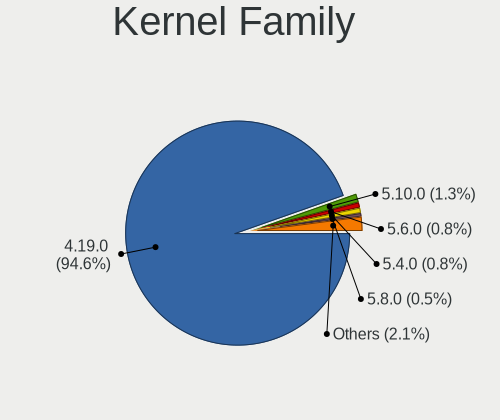

| Version | Computers | Percent |
|---------|-----------|---------|
| 4.19.0  | 311       | 95.4%   |
| 5.10.0  | 4         | 1.23%   |
| 5.6.0   | 3         | 0.92%   |
| 5.4.0   | 3         | 0.92%   |
| 5.8.0   | 2         | 0.61%   |
| 5.9.12  | 1         | 0.31%   |
| 5.9.0   | 1         | 0.31%   |
| 5.4.44  | 1         | 0.31%   |

Kernel Major Ver.
-----------------

Linux kernel major version

| Version | Computers | Percent |
|---------|-----------|---------|
| 4.19    | 311       | 95.4%   |
| 5.4     | 4         | 1.23%   |
| 5.10    | 4         | 1.23%   |
| 5.6     | 3         | 0.92%   |
| 5.9     | 2         | 0.61%   |
| 5.8     | 2         | 0.61%   |

Arch
----

OS architecture (x86_64, i586, etc.)

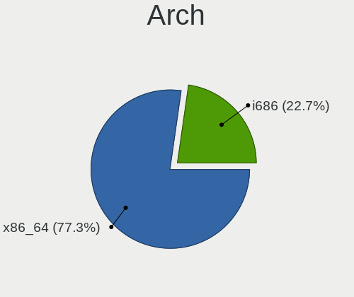

| Name   | Computers | Percent |
|--------|-----------|---------|
| x86_64 | 258       | 79.38%  |
| i686   | 67        | 20.62%  |

DE
--

Desktop Environment

| Name       | Computers | Percent |
|------------|-----------|---------|
| X-Cinnamon | 294       | 89.91%  |
| Cinnamon   | 15        | 4.59%   |
| Unknown    | 7         | 2.14%   |
| MATE       | 4         | 1.22%   |
| XFCE       | 2         | 0.61%   |
| Trinity    | 1         | 0.31%   |
| LXQt       | 1         | 0.31%   |
| LXDE       | 1         | 0.31%   |
| KDE        | 1         | 0.31%   |
| GNOME      | 1         | 0.31%   |

Display Server
--------------

X11 or Wayland

| Name | Computers | Percent |
|------|-----------|---------|
| X11  | 325       | 100%    |

Display Manager
---------------

SDDM, LightDM, etc.

| Name    | Computers | Percent |
|---------|-----------|---------|
| Unknown | 293       | 90.15%  |
| TDM     | 20        | 6.15%   |
| LightDM | 11        | 3.38%   |
| GDM     | 1         | 0.31%   |

OS Lang
-------

Language

| Lang    | Computers | Percent |
|---------|-----------|---------|
| en_US   | 92        | 28.13%  |
| pt_BR   | 35        | 10.7%   |
| de_DE   | 35        | 10.7%   |
| fr_FR   | 16        | 4.89%   |
| pl_PL   | 14        | 4.28%   |
| ru_RU   | 12        | 3.67%   |
| en_GB   | 12        | 3.67%   |
| es_AR   | 9         | 2.75%   |
| it_IT   | 8         | 2.45%   |
| en_CA   | 7         | 2.14%   |
| en_AU   | 7         | 2.14%   |
| es_MX   | 6         | 1.83%   |
| es_ES   | 6         | 1.83%   |
| de_CH   | 5         | 1.53%   |
| nl_BE   | 4         | 1.22%   |
| sv_SE   | 3         | 0.92%   |
| pt_PT   | 3         | 0.92%   |
| nl_NL   | 3         | 0.92%   |
| ja_JP   | 3         | 0.92%   |
| el_GR   | 3         | 0.92%   |
| de_AT   | 3         | 0.92%   |
| bg_BG   | 3         | 0.92%   |
| unm_US  | 2         | 0.61%   |
| uk_UA   | 2         | 0.61%   |
| tr_TR   | 2         | 0.61%   |
| sk_SK   | 2         | 0.61%   |
| hu_HU   | 2         | 0.61%   |
| et_EE   | 2         | 0.61%   |
| es_CL   | 2         | 0.61%   |
| en_ZA   | 2         | 0.61%   |
| en_IN   | 2         | 0.61%   |
| ca_ES   | 2         | 0.61%   |
| zh_CN   | 1         | 0.31%   |
| ru_UA   | 1         | 0.31%   |
| ro_RO   | 1         | 0.31%   |
| nb_NO   | 1         | 0.31%   |
| it_CH   | 1         | 0.31%   |
| hr_HR   | 1         | 0.31%   |
| fr_CA   | 1         | 0.31%   |
| fr_BE   | 1         | 0.31%   |
| fi_FI   | 1         | 0.31%   |
| es_UY   | 1         | 0.31%   |
| es_CO   | 1         | 0.31%   |
| en_SG   | 1         | 0.31%   |
| en_PH   | 1         | 0.31%   |
| en_NZ   | 1         | 0.31%   |
| da_DK   | 1         | 0.31%   |
| cs_CZ   | 1         | 0.31%   |
| ar_EG   | 1         | 0.31%   |
| Unknown | 1         | 0.31%   |

Boot Mode
---------

EFI or BIOS

| Mode | Computers | Percent |
|------|-----------|---------|
| BIOS | 227       | 69.42%  |
| EFI  | 100       | 30.58%  |

Filesystem
----------

Type of filesystem

| Type    | Computers | Percent |
|---------|-----------|---------|
| Ext4    | 313       | 96.01%  |
| Btrfs   | 7         | 2.15%   |
| Tmpfs   | 3         | 0.92%   |
| Unknown | 2         | 0.61%   |
| Ext3    | 1         | 0.31%   |

Part. scheme
------------

Scheme of partitioning

| Type    | Computers | Percent |
|---------|-----------|---------|
| Unknown | 287       | 87.77%  |
| GPT     | 24        | 7.34%   |
| MBR     | 16        | 4.89%   |

Dual Boot with Linux/BSD
------------------------

Hosting more than one Linux/BSD

| Dual boot | Computers | Percent |
|-----------|-----------|---------|
| No        | 311       | 95.11%  |
| Yes       | 16        | 4.89%   |

Dual Boot (Win)
---------------

Hosting Linux and Windows

| Dual boot | Computers | Percent |
|-----------|-----------|---------|
| No        | 310       | 95.38%  |
| Yes       | 15        | 4.62%   |

Board
-----

Vendor
------

Motherboard manufacturer

| Name                           | Computers | Percent |
|--------------------------------|-----------|---------|
| Hewlett-Packard                | 54        | 16.62%  |
| ASUSTek Computer               | 52        | 16%     |
| Dell                           | 38        | 11.69%  |
| Lenovo                         | 26        | 8%      |
| Acer                           | 24        | 7.38%   |
| MSI                            | 18        | 5.54%   |
| Gigabyte Technology            | 18        | 5.54%   |
| Unknown                        | 14        | 4.31%   |
| ASRock                         | 10        | 3.08%   |
| Toshiba                        | 8         | 2.46%   |
| Intel                          | 6         | 1.85%   |
| Positivo                       | 5         | 1.54%   |
| Fujitsu Siemens                | 5         | 1.54%   |
| Sony                           | 4         | 1.23%   |
| Samsung Electronics            | 4         | 1.23%   |
| LG Electronics                 | 3         | 0.92%   |
| ECS                            | 3         | 0.92%   |
| Semp Toshiba                   | 2         | 0.62%   |
| Pegatron                       | 2         | 0.62%   |
| Matsushita Electric Industrial | 2         | 0.62%   |
| Gateway                        | 2         | 0.62%   |
| EVGA                           | 2         | 0.62%   |
| Biostar                        | 2         | 0.62%   |
| Apple                          | 2         | 0.62%   |
| TUXEDO                         | 1         | 0.31%   |
| Supermicro                     | 1         | 0.31%   |
| Qbex                           | 1         | 0.31%   |
| PCWare                         | 1         | 0.31%   |
| Packard Bell                   | 1         | 0.31%   |
| OEM                            | 1         | 0.31%   |
| Microsoft                      | 1         | 0.31%   |
| Medion                         | 1         | 0.31%   |
| Maibenben                      | 1         | 0.31%   |
| Itautec                        | 1         | 0.31%   |
| IBM                            | 1         | 0.31%   |
| HUAWEI                         | 1         | 0.31%   |
| Google                         | 1         | 0.31%   |
| Fujitsu                        | 1         | 0.31%   |
| Foxconn                        | 1         | 0.31%   |
| Exper                          | 1         | 0.31%   |
| Exo                            | 1         | 0.31%   |
| DFI                            | 1         | 0.31%   |
| Alienware                      | 1         | 0.31%   |

Model
-----

Motherboard model

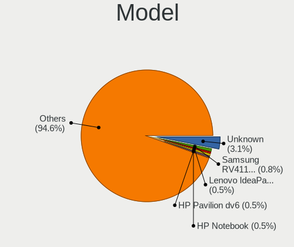

| Name                                        | Computers | Percent |
|---------------------------------------------|-----------|---------|
| Unknown                                     | 18        | 5.54%   |
| Lenovo IdeaPad 3 15ADA05 81W1               | 2         | 0.62%   |
| HP Pavilion dv6                             | 2         | 0.62%   |
| HP EliteBook 8540w                          | 2         | 0.62%   |
| Dell OptiPlex 780                           | 2         | 0.62%   |
| ASUS All Series                             | 2         | 0.62%   |
| Acer Aspire 5735                            | 2         | 0.62%   |
| TUXEDO BC1510 1710                          | 1         | 0.31%   |
| Toshiba Satellite U300                      | 1         | 0.31%   |
| Toshiba Satellite P300                      | 1         | 0.31%   |
| Toshiba Satellite M100                      | 1         | 0.31%   |
| Toshiba Satellite L855                      | 1         | 0.31%   |
| Toshiba Satellite L750                      | 1         | 0.31%   |
| Toshiba Satellite C50-A-1DN                 | 1         | 0.31%   |
| Toshiba LX835                               | 1         | 0.31%   |
| Toshiba dynabook Satellite J61 173C/5       | 1         | 0.31%   |
| Supermicro X8DT3                            | 1         | 0.31%   |
| Sony VPCS131FM                              | 1         | 0.31%   |
| Sony VGN-FZ140E                             | 1         | 0.31%   |
| Sony VGN-AW41MF_H                           | 1         | 0.31%   |
| Sony SVE1511N1ESI                           | 1         | 0.31%   |
| Semp Toshiba STI                            | 1         | 0.31%   |
| Semp Toshiba NI 1403                        | 1         | 0.31%   |
| Samsung RV413/RV513                         | 1         | 0.31%   |
| Samsung RV411/RV511/E3511/S3511/RV711/E3411 | 1         | 0.31%   |
| Samsung R59/R60/R61                         | 1         | 0.31%   |
| Samsung NC10                                | 1         | 0.31%   |
| Qbex UDPAIOQBEX01                           | 1         | 0.31%   |
| Positivo W310CZ-T                           | 1         | 0.31%   |
| Positivo POS-EIH61CE                        | 1         | 0.31%   |
| Positivo MOBILE                             | 1         | 0.31%   |
| Positivo H14CU01                            | 1         | 0.31%   |
| Positivo DH8BW01                            | 1         | 0.31%   |
| Pegatron Elite 7300 Series MT               | 1         | 0.31%   |
| Pegatron 520-1188la                         | 1         | 0.31%   |
| PCWare IPMH81G1                             | 1         | 0.31%   |
| Packard Bell EASYNOTE_NJ66                  | 1         | 0.31%   |
| OEM 45CMX/45GMX/45CMX-K                     | 1         | 0.31%   |
| MSI PX714AA-ABH t3040.nl                    | 1         | 0.31%   |
| MSI MS-7C52                                 | 1         | 0.31%   |
| MSI MS-7C51                                 | 1         | 0.31%   |
| MSI MS-7A40                                 | 1         | 0.31%   |
| MSI MS-7918                                 | 1         | 0.31%   |
| MSI MS-7823                                 | 1         | 0.31%   |
| MSI MS-7817                                 | 1         | 0.31%   |
| MSI MS-7815                                 | 1         | 0.31%   |
| MSI MS-7751                                 | 1         | 0.31%   |
| MSI MS-7383                                 | 1         | 0.31%   |
| MSI MS-7267                                 | 1         | 0.31%   |
| MSI MS-7142                                 | 1         | 0.31%   |
| MSI MS-6785                                 | 1         | 0.31%   |
| MSI MS-6570                                 | 1         | 0.31%   |
| MSI GT70 2PC                                | 1         | 0.31%   |
| MSI FX610                                   | 1         | 0.31%   |
| MSI ESPRIMO P2440                           | 1         | 0.31%   |
| MSI *MF                                     | 1         | 0.31%   |
| Microsoft Surface Pro 4                     | 1         | 0.31%   |
| Medion P6670 MD99960                        | 1         | 0.31%   |
| Matsushita Electric Industrial CF-19DDGZXVM | 1         | 0.31%   |
| Matsushita Electric Industrial CF-19CHB23BE | 1         | 0.31%   |

Model Family
------------

Motherboard model prefix

| Name                    | Computers | Percent |
|-------------------------|-----------|---------|
| Acer Aspire             | 21        | 6.46%   |
| Unknown                 | 18        | 5.54%   |
| Lenovo ThinkPad         | 13        | 4%      |
| Dell Inspiron           | 13        | 4%      |
| HP Pavilion             | 11        | 3.38%   |
| HP Compaq               | 10        | 3.08%   |
| Dell Latitude           | 10        | 3.08%   |
| Dell OptiPlex           | 8         | 2.46%   |
| Toshiba Satellite       | 6         | 1.85%   |
| HP Laptop               | 6         | 1.85%   |
| Lenovo IdeaPad          | 5         | 1.54%   |
| HP EliteBook            | 5         | 1.54%   |
| Dell Precision          | 5         | 1.54%   |
| ASUS PRIME              | 4         | 1.23%   |
| Fujitsu Siemens ESPRIMO | 3         | 0.92%   |
| Lenovo ThinkCentre      | 2         | 0.62%   |
| HP Presario             | 2         | 0.62%   |
| Gigabyte Z390           | 2         | 0.62%   |
| Gigabyte X570           | 2         | 0.62%   |
| ASUS ROG                | 2         | 0.62%   |
| ASUS P5KPL-AM           | 2         | 0.62%   |
| ASUS All                | 2         | 0.62%   |
| Apple MacBookPro5       | 2         | 0.62%   |
| TUXEDO BC1510           | 1         | 0.31%   |
| Toshiba LX835           | 1         | 0.31%   |
| Toshiba dynabook        | 1         | 0.31%   |
| Supermicro X8DT3        | 1         | 0.31%   |
| Sony VPCS131FM          | 1         | 0.31%   |
| Sony VGN-FZ140E         | 1         | 0.31%   |
| Sony VGN-AW41MF         | 1         | 0.31%   |
| Sony SVE1511N1ESI       | 1         | 0.31%   |
| Semp Toshiba STI        | 1         | 0.31%   |
| Semp Toshiba NI         | 1         | 0.31%   |
| Samsung RV413           | 1         | 0.31%   |
| Samsung RV411           | 1         | 0.31%   |
| Samsung R59             | 1         | 0.31%   |
| Samsung NC10            | 1         | 0.31%   |
| Qbex UDPAIOQBEX01       | 1         | 0.31%   |
| Positivo W310CZ-T       | 1         | 0.31%   |
| Positivo POS-EIH61CE    | 1         | 0.31%   |
| Positivo MOBILE         | 1         | 0.31%   |
| Positivo H14CU01        | 1         | 0.31%   |
| Positivo DH8BW01        | 1         | 0.31%   |
| Pegatron Elite          | 1         | 0.31%   |
| Pegatron 520-1188la     | 1         | 0.31%   |
| PCWare IPMH81G1         | 1         | 0.31%   |
| Packard Bell EASYNOTE   | 1         | 0.31%   |
| OEM 45CMX               | 1         | 0.31%   |
| MSI PX714AA-ABH         | 1         | 0.31%   |
| MSI MS-7C52             | 1         | 0.31%   |
| MSI MS-7C51             | 1         | 0.31%   |
| MSI MS-7A40             | 1         | 0.31%   |
| MSI MS-7918             | 1         | 0.31%   |
| MSI MS-7823             | 1         | 0.31%   |
| MSI MS-7817             | 1         | 0.31%   |
| MSI MS-7815             | 1         | 0.31%   |
| MSI MS-7751             | 1         | 0.31%   |
| MSI MS-7383             | 1         | 0.31%   |
| MSI MS-7267             | 1         | 0.31%   |
| MSI MS-7142             | 1         | 0.31%   |

MFG Year
--------

Motherboard manufacture year

| Year    | Computers | Percent |
|---------|-----------|---------|
| 2019    | 38        | 11.69%  |
| 2012    | 29        | 8.92%   |
| 2010    | 29        | 8.92%   |
| 2009    | 28        | 8.62%   |
| 2020    | 24        | 7.38%   |
| 2007    | 23        | 7.08%   |
| 2008    | 22        | 6.77%   |
| 2013    | 20        | 6.15%   |
| 2011    | 19        | 5.85%   |
| 2018    | 17        | 5.23%   |
| 2014    | 17        | 5.23%   |
| 2015    | 15        | 4.62%   |
| 2016    | 14        | 4.31%   |
| 2006    | 7         | 2.15%   |
| 2005    | 7         | 2.15%   |
| 2017    | 6         | 1.85%   |
| 2021    | 5         | 1.54%   |
| 2003    | 3         | 0.92%   |
| 2004    | 1         | 0.31%   |
| Unknown | 1         | 0.31%   |

Form Factor
-----------

Physical design of the computer

| Name        | Computers | Percent |
|-------------|-----------|---------|
| Notebook    | 185       | 56.92%  |
| Desktop     | 128       | 39.38%  |
| All in one  | 5         | 1.54%   |
| Tablet      | 2         | 0.62%   |
| Convertible | 2         | 0.62%   |
| Server      | 2         | 0.62%   |
| Mini pc     | 1         | 0.31%   |

Secure Boot
-----------

Enabled or disabled

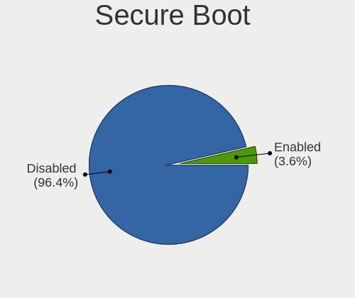

| State    | Computers | Percent |
|----------|-----------|---------|
| Disabled | 317       | 97.24%  |
| Enabled  | 9         | 2.76%   |

Coreboot
--------

Have coreboot on board

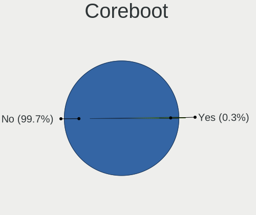

| Used | Computers | Percent |
|------|-----------|---------|
| No   | 324       | 99.69%  |
| Yes  | 1         | 0.31%   |

RAM Size
--------

Total RAM memory

| Size in GB  | Computers | Percent |
|-------------|-----------|---------|
| 3.01-4.0    | 91        | 27.66%  |
| 4.01-8.0    | 53        | 16.11%  |
| 16.01-24.0  | 47        | 14.29%  |
| 8.01-16.0   | 45        | 13.68%  |
| 2.01-3.0    | 38        | 11.55%  |
| 1.01-2.0    | 30        | 9.12%   |
| 32.01-64.0  | 12        | 3.65%   |
| 0.51-1.0    | 9         | 2.74%   |
| 24.01-32.0  | 2         | 0.61%   |
| 64.01-256.0 | 2         | 0.61%   |

RAM Used
--------

Used RAM memory

| Used GB   | Computers | Percent |
|-----------|-----------|---------|
| 1.01-2.0  | 172       | 49.57%  |
| 2.01-3.0  | 61        | 17.58%  |
| 0.51-1.0  | 60        | 17.29%  |
| 3.01-4.0  | 33        | 9.51%   |
| 4.01-8.0  | 15        | 4.32%   |
| 8.01-16.0 | 3         | 0.86%   |
| 0.01-0.5  | 3         | 0.86%   |

Total Drives
------------

Number of drives on board

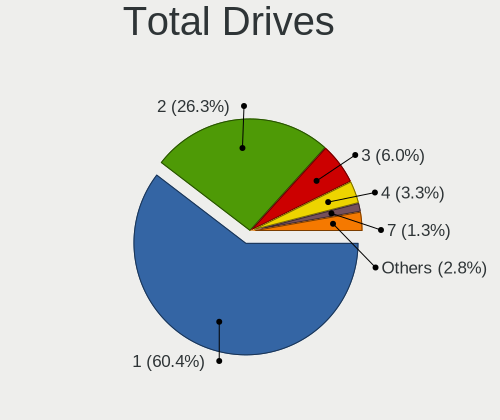

| Drives | Computers | Percent |
|--------|-----------|---------|
| 1      | 198       | 59.28%  |
| 2      | 91        | 27.25%  |
| 3      | 22        | 6.59%   |
| 4      | 9         | 2.69%   |
| 7      | 5         | 1.5%    |
| 5      | 3         | 0.9%    |
| 0      | 3         | 0.9%    |
| 6      | 2         | 0.6%    |
| 8      | 1         | 0.3%    |

Has CD-ROM
----------

Has CD-ROM on board

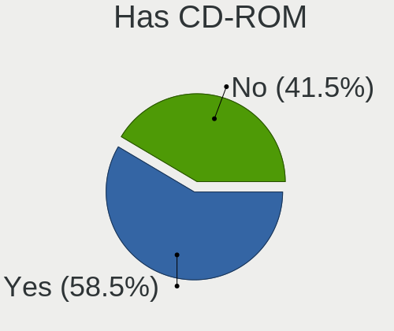

| Presented | Computers | Percent |
|-----------|-----------|---------|
| Yes       | 200       | 60.61%  |
| No        | 130       | 39.39%  |

Has Ethernet
------------

Has Ethernet on board

| Presented | Computers | Percent |
|-----------|-----------|---------|
| Yes       | 312       | 96%     |
| No        | 13        | 4%      |

Has WiFi
--------

Has WiFi module

| Presented | Computers | Percent |
|-----------|-----------|---------|
| Yes       | 242       | 73.78%  |
| No        | 86        | 26.22%  |

Has Bluetooth
-------------

Has Bluetooth module

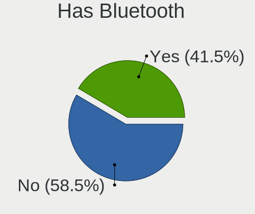

| Presented | Computers | Percent |
|-----------|-----------|---------|
| No        | 190       | 58.28%  |
| Yes       | 136       | 41.72%  |

Location
--------

Country
-------

Geographic location (country)

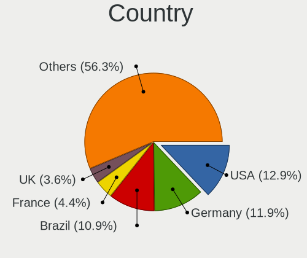

| Country             | Computers | Percent |
|---------------------|-----------|---------|
| USA                 | 43        | 13.23%  |
| Germany             | 40        | 12.31%  |
| Brazil              | 36        | 11.08%  |
| France              | 15        | 4.62%   |
| Poland              | 14        | 4.31%   |
| UK                  | 11        | 3.38%   |
| Canada              | 11        | 3.38%   |
| Netherlands         | 9         | 2.77%   |
| Italy               | 9         | 2.77%   |
| Bulgaria            | 9         | 2.77%   |
| Argentina           | 9         | 2.77%   |
| Ukraine             | 8         | 2.46%   |
| Spain               | 8         | 2.46%   |
| Mexico              | 7         | 2.15%   |
| Australia           | 7         | 2.15%   |
| Switzerland         | 6         | 1.85%   |
| Russia              | 6         | 1.85%   |
| Austria             | 5         | 1.54%   |
| India               | 4         | 1.23%   |
| Greece              | 4         | 1.23%   |
| Belgium             | 4         | 1.23%   |
| Turkey              | 3         | 0.92%   |
| Romania             | 3         | 0.92%   |
| Portugal            | 3         | 0.92%   |
| Philippines         | 3         | 0.92%   |
| Belarus             | 3         | 0.92%   |
| Bahrain             | 3         | 0.92%   |
| Tunisia             | 2         | 0.62%   |
| Sweden              | 2         | 0.62%   |
| South Africa        | 2         | 0.62%   |
| Luxembourg          | 2         | 0.62%   |
| Japan               | 2         | 0.62%   |
| Indonesia           | 2         | 0.62%   |
| Hungary             | 2         | 0.62%   |
| Finland             | 2         | 0.62%   |
| Estonia             | 2         | 0.62%   |
| Egypt               | 2         | 0.62%   |
| Croatia             | 2         | 0.62%   |
| China               | 2         | 0.62%   |
| Chile               | 2         | 0.62%   |
| Venezuela           | 1         | 0.31%   |
| Uruguay             | 1         | 0.31%   |
| Trinidad and Tobago | 1         | 0.31%   |
| Slovakia            | 1         | 0.31%   |
| Singapore           | 1         | 0.31%   |
| Serbia              | 1         | 0.31%   |
| Puerto Rico         | 1         | 0.31%   |
| Norway              | 1         | 0.31%   |
| New Zealand         | 1         | 0.31%   |
| Ireland             | 1         | 0.31%   |
| Honduras            | 1         | 0.31%   |
| Dominican Republic  | 1         | 0.31%   |
| Denmark             | 1         | 0.31%   |
| Czechia             | 1         | 0.31%   |
| Colombia            | 1         | 0.31%   |
| Bangladesh          | 1         | 0.31%   |

City
----

Geographic location (city)

| City              | Computers | Percent |
|-------------------|-----------|---------|
| Zurich            | 5         | 1.46%   |
| Sofia             | 5         | 1.46%   |
| Paris             | 5         | 1.46%   |
| Poznan            | 4         | 1.17%   |
| Perth             | 4         | 1.17%   |
| So Paulo        | 3         | 0.87%   |
| Rio de Janeiro    | 3         | 0.87%   |
| Manama            | 3         | 0.87%   |
| Frankfurt am Main | 3         | 0.87%   |
| Florian??polis    | 3         | 0.87%   |
| Wroclaw           | 2         | 0.58%   |
| Warsaw            | 2         | 0.58%   |
| Toronto           | 2         | 0.58%   |
| The Hague         | 2         | 0.58%   |
| So Lus        | 2         | 0.58%   |
| Seville           | 2         | 0.58%   |
| Santa Rosa        | 2         | 0.58%   |
| Rapla             | 2         | 0.58%   |
| Plovdiv           | 2         | 0.58%   |
| Penhold           | 2         | 0.58%   |
| Montreal          | 2         | 0.58%   |
| Milan             | 2         | 0.58%   |
| Marburg           | 2         | 0.58%   |
| Madrid            | 2         | 0.58%   |
| Kyiv              | 2         | 0.58%   |
| Helsinki          | 2         | 0.58%   |
| Hamburg           | 2         | 0.58%   |
| Goinia          | 2         | 0.58%   |
| Foz do Iguau    | 2         | 0.58%   |
| Denver            | 2         | 0.58%   |
| Cologne           | 2         | 0.58%   |
| Cape Town         | 2         | 0.58%   |
| Buenos Aires      | 2         | 0.58%   |
| Braunschweig      | 2         | 0.58%   |
| Berlin            | 2         | 0.58%   |
| Belo Horizonte    | 2         | 0.58%   |
| Barcelona         | 2         | 0.58%   |
| Athens            | 2         | 0.58%   |
| Angeles City      | 2         | 0.58%   |
| Zhukovskiy        | 1         | 0.29%   |
| Zhongshan         | 1         | 0.29%   |
| Zapopan           | 1         | 0.29%   |
| Zagreb            | 1         | 0.29%   |
| Yokohama          | 1         | 0.29%   |
| Yevpatoriya       | 1         | 0.29%   |
| Yalta             | 1         | 0.29%   |
| Wnnenberg       | 1         | 0.29%   |
| Wernberg-Koblitz  | 1         | 0.29%   |
| Wellington        | 1         | 0.29%   |
| Weatherford       | 1         | 0.29%   |
| Voluntari         | 1         | 0.29%   |
| Vitebsk           | 1         | 0.29%   |
| Vienna            | 1         | 0.29%   |
| Victoria          | 1         | 0.29%   |
| Vicosa            | 1         | 0.29%   |
| Verona            | 1         | 0.29%   |
| Ulm               | 1         | 0.29%   |
| Ukhta             | 1         | 0.29%   |
| Turin             | 1         | 0.29%   |
| Tunis             | 1         | 0.29%   |

Drives
------

Drive Vendor
------------

Hard drive vendors

| Vendor              | Computers | Drives | Percent |
|---------------------|-----------|--------|---------|
| WDC                 | 90        | 130    | 19.57%  |
| Seagate             | 75        | 116    | 16.3%   |
| Samsung Electronics | 70        | 91     | 15.22%  |
| Hitachi             | 29        | 32     | 6.3%    |
| Toshiba             | 23        | 30     | 5%      |
| Kingston            | 22        | 26     | 4.78%   |
| Unknown             | 19        | 21     | 4.13%   |
| SanDisk             | 16        | 22     | 3.48%   |
| Crucial             | 14        | 18     | 3.04%   |
| Intel               | 10        | 11     | 2.17%   |
| HGST                | 10        | 10     | 2.17%   |
| Phison              | 8         | 10     | 1.74%   |
| Fujitsu             | 6         | 6      | 1.3%    |
| China               | 6         | 6      | 1.3%    |
| A-DATA Technology   | 6         | 6      | 1.3%    |
| SK Hynix            | 5         | 8      | 1.09%   |
| Intenso             | 5         | 6      | 1.09%   |
| Micron Technology   | 4         | 4      | 0.87%   |
| MAXTOR              | 3         | 5      | 0.65%   |
| GOODRAM             | 3         | 3      | 0.65%   |
| Transcend           | 2         | 2      | 0.43%   |
| TCSUNBOW            | 2         | 2      | 0.43%   |
| Patriot             | 2         | 4      | 0.43%   |
| OCZ                 | 2         | 3      | 0.43%   |
| Mushkin             | 2         | 2      | 0.43%   |
| KingDian            | 2         | 3      | 0.43%   |
| IBM/Hitachi         | 2         | 2      | 0.43%   |
| Hewlett-Packard     | 2         | 3      | 0.43%   |
| USB30               | 1         | 2      | 0.22%   |
| Team                | 1         | 2      | 0.22%   |
| Silicon Motion      | 1         | 1      | 0.22%   |
| SABRENT             | 1         | 1      | 0.22%   |
| PNY                 | 1         | 1      | 0.22%   |
| Netac               | 1         | 1      | 0.22%   |
| KingSpec            | 1         | 1      | 0.22%   |
| Kingmax             | 1         | 1      | 0.22%   |
| KESU                | 1         | 2      | 0.22%   |
| JMicron             | 1         | 2      | 0.22%   |
| HUAWEI              | 1         | 1      | 0.22%   |
| HPE                 | 1         | 5      | 0.22%   |
| Hikvision           | 1         | 1      | 0.22%   |
| Gigabyte Technology | 1         | 2      | 0.22%   |
| GALAX               | 1         | 1      | 0.22%   |
| FORESEE             | 1         | 1      | 0.22%   |
| ExcelStor           | 1         | 1      | 0.22%   |
| Dogfish             | 1         | 1      | 0.22%   |
| DAS                 | 1         | 4      | 0.22%   |
| BAITITON            | 1         | 1      | 0.22%   |

Drive Model
-----------

Hard drive models

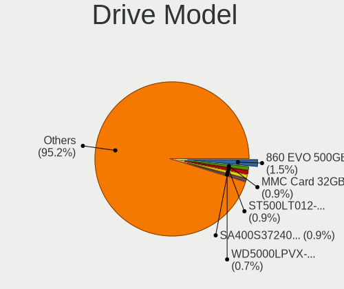

| Model                               | Computers | Percent |
|-------------------------------------|-----------|---------|
| Samsung SSD 860 EVO 500GB           | 9         | 1.79%   |
| Kingston SA400S37240G 240GB SSD     | 5         | 0.99%   |
| Unknown MMC Card  32GB              | 4         | 0.79%   |
| Toshiba DT01ACA100 1TB              | 4         | 0.79%   |
| Seagate ST1000DM010-2EP102 1TB      | 4         | 0.79%   |
| Seagate Expansion 1TB               | 4         | 0.79%   |
| Samsung SSD 860 EVO 1TB             | 4         | 0.79%   |
| Samsung SSD 850 EVO 500GB           | 4         | 0.79%   |
| Kingston SA400S37120G 120GB SSD     | 4         | 0.79%   |
| WDC WD3200BEVT-60ZCT1 320GB         | 3         | 0.6%    |
| Unknown SD/MMC/MS PRO 128GB         | 3         | 0.6%    |
| Unknown MMC Card  7GB               | 3         | 0.6%    |
| Toshiba MQ01ABD100 1TB              | 3         | 0.6%    |
| Seagate ST9500325AS 500GB           | 3         | 0.6%    |
| Seagate ST500LT012-1DG142 500GB     | 3         | 0.6%    |
| Samsung SSD 860 EVO 250GB           | 3         | 0.6%    |
| Samsung SSD 850 EVO 250GB           | 3         | 0.6%    |
| Samsung HD322HJ 320GB               | 3         | 0.6%    |
| Samsung HD103SJ 1TB                 | 3         | 0.6%    |
| Micron 1100_MTFDDAV256TBN 256GB SSD | 3         | 0.6%    |
| Kingston SV300S37A120G 120GB SSD    | 3         | 0.6%    |
| Crucial CT240BX500SSD1 240GB        | 3         | 0.6%    |
| China SATA SSD 120GB                | 3         | 0.6%    |
| WDC WDS120G2G0A-00JH30 120GB SSD    | 2         | 0.4%    |
| WDC WD7500BPVT-75HXZT3 752GB        | 2         | 0.4%    |
| WDC WD5000AAKX-75U6AA0 500GB        | 2         | 0.4%    |
| WDC WD5000AAKX-00U6AA0 500GB        | 2         | 0.4%    |
| WDC WD40EFRX-68N32N0 4TB            | 2         | 0.4%    |
| WDC WD3200AAKS-00L9A0 320GB         | 2         | 0.4%    |
| WDC WD2500BEVT-22ZCT0 250GB         | 2         | 0.4%    |
| WDC WD2500AAKX-753CA1 250GB         | 2         | 0.4%    |
| WDC WD1600AABS-00PRA0 160GB         | 2         | 0.4%    |
| WDC WD1200BEVS-22UST0 120GB         | 2         | 0.4%    |
| WDC WD10EZEX-60WN4A0 1TB            | 2         | 0.4%    |
| WDC WD10EZEX-08WN4A0 1TB            | 2         | 0.4%    |
| WDC WD10EZEX-08M2NA0 1TB            | 2         | 0.4%    |
| Unknown MMC Card  64GB              | 2         | 0.4%    |
| Unknown MMC Card  16GB              | 2         | 0.4%    |
| Unknown MMC Card  128GB             | 2         | 0.4%    |
| Seagate ST9250315AS 250GB           | 2         | 0.4%    |
| Seagate ST9120821AS 120GB           | 2         | 0.4%    |
| Seagate ST2000LX001-1RG174 2TB      | 2         | 0.4%    |
| Seagate ST2000DM001-9YN164 2TB      | 2         | 0.4%    |
| Seagate ST2000DM001-1ER164 2TB      | 2         | 0.4%    |
| Seagate ST1000LM024 HN-M101MBB 1TB  | 2         | 0.4%    |
| Sandisk NVMe SSD Drive 256GB        | 2         | 0.4%    |
| Samsung SP0802N 80GB                | 2         | 0.4%    |
| Samsung NVMe SSD Drive 500GB        | 2         | 0.4%    |
| Samsung NVMe SSD Drive 2TB          | 2         | 0.4%    |
| Samsung NVMe SSD Drive 256GB        | 2         | 0.4%    |
| Samsung HD161HJ 160GB               | 2         | 0.4%    |
| Phison NVMe SSD Drive 500GB         | 2         | 0.4%    |
| Phison NVMe SSD Drive 256GB         | 2         | 0.4%    |
| Kingston SV300S37A240G 240GB SSD    | 2         | 0.4%    |
| Kingston SA400S37480G 480GB SSD     | 2         | 0.4%    |
| Intenso SSD SATAIII 120GB           | 2         | 0.4%    |
| Hitachi HTS725050A9A364 500GB       | 2         | 0.4%    |
| Hitachi HTS545032B9A300 320GB       | 2         | 0.4%    |
| Hitachi HTS543216L9A300 160GB       | 2         | 0.4%    |
| HGST HTS721010A9E630 1TB            | 2         | 0.4%    |

HDD Vendor
----------

Hard disk drive vendors

| Vendor              | Computers | Drives | Percent |
|---------------------|-----------|--------|---------|
| WDC                 | 81        | 120    | 31.76%  |
| Seagate             | 74        | 115    | 29.02%  |
| Hitachi             | 29        | 32     | 11.37%  |
| Samsung Electronics | 24        | 32     | 9.41%   |
| Toshiba             | 20        | 23     | 7.84%   |
| HGST                | 10        | 10     | 3.92%   |
| Fujitsu             | 6         | 6      | 2.35%   |
| Unknown             | 3         | 3      | 1.18%   |
| MAXTOR              | 3         | 5      | 1.18%   |
| IBM/Hitachi         | 2         | 2      | 0.78%   |
| SABRENT             | 1         | 1      | 0.39%   |
| KESU                | 1         | 2      | 0.39%   |
| HPE                 | 1         | 5      | 0.39%   |

SSD Vendor
----------

Solid state drive vendors

| Vendor              | Computers | Drives | Percent |
|---------------------|-----------|--------|---------|
| Samsung Electronics | 41        | 48     | 25.79%  |
| Kingston            | 20        | 24     | 12.58%  |
| Crucial             | 14        | 18     | 8.81%   |
| SanDisk             | 13        | 19     | 8.18%   |
| WDC                 | 9         | 9      | 5.66%   |
| Intel               | 7         | 7      | 4.4%    |
| China               | 6         | 6      | 3.77%   |
| A-DATA Technology   | 6         | 6      | 3.77%   |
| Micron Technology   | 4         | 4      | 2.52%   |
| Intenso             | 4         | 5      | 2.52%   |
| Toshiba             | 3         | 7      | 1.89%   |
| GOODRAM             | 3         | 3      | 1.89%   |
| Unknown             | 2         | 2      | 1.26%   |
| Transcend           | 2         | 2      | 1.26%   |
| TCSUNBOW            | 2         | 2      | 1.26%   |
| SK Hynix            | 2         | 4      | 1.26%   |
| Patriot             | 2         | 4      | 1.26%   |
| OCZ                 | 2         | 3      | 1.26%   |
| KingDian            | 2         | 3      | 1.26%   |
| Hewlett-Packard     | 2         | 3      | 1.26%   |
| USB30               | 1         | 2      | 0.63%   |
| Team                | 1         | 2      | 0.63%   |
| PNY                 | 1         | 1      | 0.63%   |
| Netac               | 1         | 1      | 0.63%   |
| Mushkin             | 1         | 1      | 0.63%   |
| KingSpec            | 1         | 1      | 0.63%   |
| Kingmax             | 1         | 1      | 0.63%   |
| Hikvision           | 1         | 1      | 0.63%   |
| Gigabyte Technology | 1         | 2      | 0.63%   |
| GALAX               | 1         | 1      | 0.63%   |
| FORESEE             | 1         | 1      | 0.63%   |
| Dogfish             | 1         | 1      | 0.63%   |
| BAITITON            | 1         | 1      | 0.63%   |

Drive Kind
----------

HDD or SSD

| Kind    | Computers | Drives | Percent |
|---------|-----------|--------|---------|
| HDD     | 216       | 356    | 53.87%  |
| SSD     | 135       | 195    | 33.67%  |
| NVMe    | 29        | 37     | 7.23%   |
| MMC     | 15        | 16     | 3.74%   |
| Unknown | 6         | 10     | 1.5%    |

Drive Connector
---------------

SATA, SAS, NVMe, etc.

| Type | Computers | Drives | Percent |
|------|-----------|--------|---------|
| SATA | 305       | 522    | 81.77%  |
| NVMe | 29        | 37     | 7.77%   |
| SAS  | 24        | 39     | 6.43%   |
| MMC  | 15        | 16     | 4.02%   |

Drive Size
----------

Size of hard drive

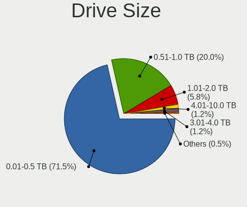

| Size in TB | Computers | Drives | Percent |
|------------|-----------|--------|---------|
| 0.01-0.5   | 261       | 399    | 71.12%  |
| 0.51-1.0   | 76        | 105    | 20.71%  |
| 1.01-2.0   | 20        | 29     | 5.45%   |
| 3.01-4.0   | 5         | 10     | 1.36%   |
| 4.01-10.0  | 3         | 6      | 0.82%   |
| 2.01-3.0   | 2         | 2      | 0.54%   |

Space Total
-----------

Amount of disk space available on the file system

| Size in GB     | Computers | Percent |
|----------------|-----------|---------|
| 101-250        | 126       | 37.61%  |
| 251-500        | 71        | 21.19%  |
| 501-1000       | 35        | 10.45%  |
| 51-100         | 30        | 8.96%   |
| 1001-2000      | 24        | 7.16%   |
| More than 3000 | 20        | 5.97%   |
| 21-50          | 17        | 5.07%   |
| 2001-3000      | 10        | 2.99%   |
| 1-20           | 1         | 0.3%    |
| Unknown        | 1         | 0.3%    |

Space Used
----------

Amount of used disk space

| Used GB        | Computers | Percent |
|----------------|-----------|---------|
| 1-20           | 138       | 39.43%  |
| 21-50          | 78        | 22.29%  |
| 51-100         | 40        | 11.43%  |
| 101-250        | 37        | 10.57%  |
| 251-500        | 16        | 4.57%   |
| 501-1000       | 13        | 3.71%   |
| 1001-2000      | 12        | 3.43%   |
| More than 3000 | 8         | 2.29%   |
| 2001-3000      | 7         | 2%      |
| Unknown        | 1         | 0.29%   |

Malfunc. Drives
---------------

Drive models with a malfunction

| Model                               | Computers | Drives | Percent |
|-------------------------------------|-----------|--------|---------|
| Seagate STM9120817AS 120GB          | 1         | 1      | 12.5%   |
| Seagate ST9120821AS 120GB           | 1         | 1      | 12.5%   |
| SanDisk SD9SN8W-128G-1006 128GB SSD | 1         | 1      | 12.5%   |
| Samsung Electronics MP0402H 40GB    | 1         | 1      | 12.5%   |
| Samsung Electronics HM500JI 500GB   | 1         | 1      | 12.5%   |
| Samsung Electronics HD103SJ 1TB     | 1         | 1      | 12.5%   |
| Kingston SV300S37A120G 120GB SSD    | 1         | 1      | 12.5%   |
| Crucial M4-CT256M4SSD2 256GB        | 1         | 1      | 12.5%   |

Malfunc. Drive Vendor
---------------------

Vendors of faulty drives

| Vendor              | Computers | Drives | Percent |
|---------------------|-----------|--------|---------|
| Samsung Electronics | 3         | 3      | 37.5%   |
| Seagate             | 2         | 2      | 25%     |
| SanDisk             | 1         | 1      | 12.5%   |
| Kingston            | 1         | 1      | 12.5%   |
| Crucial             | 1         | 1      | 12.5%   |

Malfunc. HDD Vendor
-------------------

Vendors of faulty HDD drives

| Vendor              | Computers | Drives | Percent |
|---------------------|-----------|--------|---------|
| Samsung Electronics | 3         | 3      | 60%     |
| Seagate             | 2         | 2      | 40%     |

Malfunc. Drive Kind
-------------------

Kinds of faulty drives

| Kind | Computers | Drives | Percent |
|------|-----------|--------|---------|
| HDD  | 5         | 5      | 62.5%   |
| SSD  | 3         | 3      | 37.5%   |

Failed Drives
-------------

Failed drive models

Zero info for selected period =(

Failed Drive Vendor
-------------------

Failed drive vendors

Zero info for selected period =(

Drive Status
------------

Number of failed and malfunc. drives

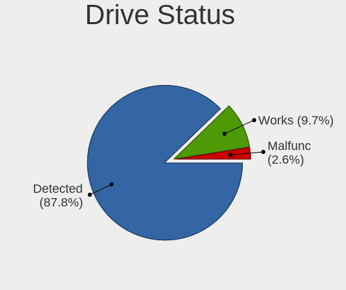

| Status   | Computers | Drives | Percent |
|----------|-----------|--------|---------|
| Detected | 290       | 547    | 87.61%  |
| Works    | 33        | 59     | 9.97%   |
| Malfunc  | 8         | 8      | 2.42%   |

Storage controller
------------------

Storage Vendor
--------------

Storage controller vendors

| Vendor                           | Computers | Percent |
|----------------------------------|-----------|---------|
| Intel                            | 241       | 64.61%  |
| AMD                              | 51        | 13.67%  |
| Nvidia                           | 15        | 4.02%   |
| Samsung Electronics              | 9         | 2.41%   |
| ASMedia Technology               | 9         | 2.41%   |
| Phison Electronics               | 8         | 2.14%   |
| JMicron Technology               | 8         | 2.14%   |
| Silicon Integrated Systems [SiS] | 7         | 1.88%   |
| VIA Technologies                 | 5         | 1.34%   |
| Sandisk                          | 4         | 1.07%   |
| Marvell Technology Group         | 4         | 1.07%   |
| SK Hynix                         | 3         | 0.8%    |
| Silicon Motion                   | 2         | 0.54%   |
| Kingston Technology Company      | 2         | 0.54%   |
| Broadcom / LSI                   | 2         | 0.54%   |
| Toshiba America Info Systems     | 1         | 0.27%   |
| Silicon Image                    | 1         | 0.27%   |
| LSI Logic / Symbios Logic        | 1         | 0.27%   |

Storage Model
-------------

Storage controller models

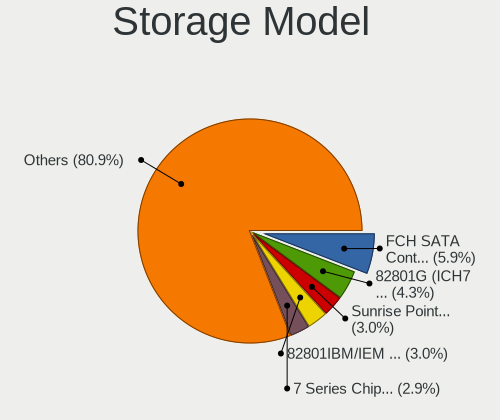

| Model                                                                                   | Computers | Percent |
|-----------------------------------------------------------------------------------------|-----------|---------|
| AMD FCH SATA Controller [AHCI mode]                                                     | 29        | 6.14%   |
| Intel 82801G (ICH7 Family) IDE Controller                                               | 21        | 4.45%   |
| Intel 82801IBM/IEM (ICH9M/ICH9M-E) 4 port SATA Controller [AHCI mode]                   | 17        | 3.6%    |
| Intel Sunrise Point-LP SATA Controller [AHCI mode]                                      | 14        | 2.97%   |
| Intel 7 Series Chipset Family 6-port SATA Controller [AHCI mode]                        | 14        | 2.97%   |
| Intel NM10/ICH7 Family SATA Controller [IDE mode]                                       | 13        | 2.75%   |
| Intel 8 Series/C220 Series Chipset Family 6-port SATA Controller 1 [AHCI mode]          | 13        | 2.75%   |
| Intel 6 Series/C200 Series Chipset Family 6 port Mobile SATA AHCI Controller            | 13        | 2.75%   |
| Intel 6 Series/C200 Series Chipset Family 6 port Desktop SATA AHCI Controller           | 13        | 2.75%   |
| Intel 82801GBM/GHM (ICH7-M Family) SATA Controller [AHCI mode]                          | 10        | 2.12%   |
| Intel 82801 Mobile SATA Controller [RAID mode]                                          | 10        | 2.12%   |
| Intel 5 Series/3400 Series Chipset 6 port SATA AHCI Controller                          | 10        | 2.12%   |
| AMD SB7x0/SB8x0/SB9x0 SATA Controller [AHCI mode]                                       | 10        | 2.12%   |
| ASMedia ASM1062 Serial ATA Controller                                                   | 9         | 1.91%   |
| Intel 82801HM/HEM (ICH8M/ICH8M-E) SATA Controller [AHCI mode]                           | 7         | 1.48%   |
| Intel 82801HM/HEM (ICH8M/ICH8M-E) IDE Controller                                        | 7         | 1.48%   |
| Intel 82801GBM/GHM (ICH7-M Family) SATA Controller [IDE mode]                           | 7         | 1.48%   |
| Intel 8 Series SATA Controller 1 [AHCI mode]                                            | 7         | 1.48%   |
| AMD SB7x0/SB8x0/SB9x0 IDE Controller                                                    | 7         | 1.48%   |
| Silicon Integrated Systems [SiS] 5513 IDE Controller                                    | 6         | 1.27%   |
| Samsung NVMe SSD Controller SM981/PM981/PM983                                           | 6         | 1.27%   |
| Nvidia MCP61 SATA Controller                                                            | 6         | 1.27%   |
| Intel NM10/ICH7 Family SATA Controller [AHCI mode]                                      | 6         | 1.27%   |
| VIA VT82C586A/B/VT82C686/A/B/VT823x/A/C PIPC Bus Master IDE                             | 5         | 1.06%   |
| Phison E12 NVMe Controller                                                              | 5         | 1.06%   |
| Intel SATA Controller [RAID mode]                                                       | 5         | 1.06%   |
| Intel Cannon Point-LP SATA Controller [AHCI Mode]                                       | 5         | 1.06%   |
| Intel Cannon Lake PCH SATA AHCI Controller                                              | 5         | 1.06%   |
| Intel 82801JI (ICH10 Family) SATA AHCI Controller                                       | 5         | 1.06%   |
| Intel 82801I (ICH9 Family) 2 port SATA Controller [IDE mode]                            | 5         | 1.06%   |
| Intel 7 Series/C210 Series Chipset Family 6-port SATA Controller [AHCI mode]            | 5         | 1.06%   |
| AMD SB7x0/SB8x0/SB9x0 SATA Controller [IDE mode]                                        | 5         | 1.06%   |
| AMD 400 Series Chipset SATA Controller                                                  | 5         | 1.06%   |
| Silicon Integrated Systems [SiS] SATA Controller / IDE mode                             | 4         | 0.85%   |
| Nvidia MCP61 IDE                                                                        | 4         | 0.85%   |
| JMicron JMB363 SATA/IDE Controller                                                      | 4         | 0.85%   |
| Intel 82801JI (ICH10 Family) 4 port SATA IDE Controller #1                              | 4         | 0.85%   |
| Intel 82801JI (ICH10 Family) 2 port SATA IDE Controller #2                              | 4         | 0.85%   |
| Intel 82801IB (ICH9) 2 port SATA Controller [IDE mode]                                  | 4         | 0.85%   |
| VIA VIA VT6420 SATA RAID Controller                                                     | 3         | 0.64%   |
| SK Hynix BC501 NVMe Solid State Drive                                                   | 3         | 0.64%   |
| Sandisk Non-Volatile memory controller                                                  | 3         | 0.64%   |
| JMicron JMB368 IDE controller                                                           | 3         | 0.64%   |
| Intel Wildcat Point-LP SATA Controller [AHCI Mode]                                      | 3         | 0.64%   |
| Intel US15W/US15X/US15L/UL11L SCH [Poulsbo] IDE Controller                              | 3         | 0.64%   |
| Intel HM170/QM170 Chipset SATA Controller [AHCI Mode]                                   | 3         | 0.64%   |
| Intel Celeron/Pentium Silver Processor SATA Controller                                  | 3         | 0.64%   |
| Intel 9 Series Chipset Family SATA Controller [AHCI Mode]                               | 3         | 0.64%   |
| Intel 6 Series/C200 Series Chipset Family Desktop SATA Controller (IDE mode, ports 4-5) | 3         | 0.64%   |
| Intel 6 Series/C200 Series Chipset Family Desktop SATA Controller (IDE mode, ports 0-3) | 3         | 0.64%   |
| Intel 5 Series/3400 Series Chipset 4 port SATA AHCI Controller                          | 3         | 0.64%   |
| AMD SB600 Non-Raid-5 SATA                                                               | 3         | 0.64%   |
| AMD SB600 IDE                                                                           | 3         | 0.64%   |
| AMD IXP SB4x0 IDE Controller                                                            | 3         | 0.64%   |
| AMD FCH SATA Controller D                                                               | 3         | 0.64%   |
| Samsung NVMe SSD Controller SM951/PM951                                                 | 2         | 0.42%   |
| Nvidia nForce2 IDE                                                                      | 2         | 0.42%   |
| Nvidia MCP79 AHCI Controller                                                            | 2         | 0.42%   |
| Nvidia MCP67 IDE Controller                                                             | 2         | 0.42%   |
| Nvidia MCP67 AHCI Controller                                                            | 2         | 0.42%   |

Storage Kind
------------

Kind of storage controller (IDE, SATA, NVMe, SAS, ...)

| Kind | Computers | Percent |
|------|-----------|---------|
| SATA | 227       | 57.76%  |
| IDE  | 112       | 28.5%   |
| NVMe | 30        | 7.63%   |
| RAID | 20        | 5.09%   |
| SAS  | 2         | 0.51%   |
| SCSI | 2         | 0.51%   |

Processor
---------

CPU Vendor
----------

Processor vendors

| Vendor | Computers | Percent |
|--------|-----------|---------|
| Intel  | 257       | 79.08%  |
| AMD    | 68        | 20.92%  |

CPU Model
---------

Processor models

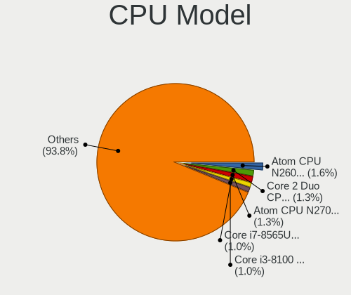

| Model                                         | Computers | Percent |
|-----------------------------------------------|-----------|---------|
| Intel Core 2 Duo CPU T6600 @ 2.20GHz          | 5         | 1.54%   |
| Intel Core i7-8565U CPU @ 1.80GHz             | 4         | 1.23%   |
| Intel Core i3-8100 CPU @ 3.60GHz              | 4         | 1.23%   |
| Intel Atom CPU N270 @ 1.60GHz                 | 4         | 1.23%   |
| Intel Atom CPU N2600 @ 1.60GHz                | 4         | 1.23%   |
| Intel Core i7-4790 CPU @ 3.60GHz              | 3         | 0.92%   |
| Intel Core i5-6200U CPU @ 2.30GHz             | 3         | 0.92%   |
| Intel Core i5-3210M CPU @ 2.50GHz             | 3         | 0.92%   |
| Intel Core 2 Quad CPU Q6600 @ 2.40GHz         | 3         | 0.92%   |
| Intel Core 2 Duo CPU T8300 @ 2.40GHz          | 3         | 0.92%   |
| Intel Core 2 Duo CPU P8700 @ 2.53GHz          | 3         | 0.92%   |
| Intel Core 2 Duo CPU E7500 @ 2.93GHz          | 3         | 0.92%   |
| Intel Core 2 Duo CPU E7400 @ 2.80GHz          | 3         | 0.92%   |
| Intel Core 2 Duo CPU E4500 @ 2.20GHz          | 3         | 0.92%   |
| Intel Celeron CPU N2830 @ 2.16GHz             | 3         | 0.92%   |
| AMD A9-9425 RADEON R5, 5 COMPUTE CORES 2C+3G  | 3         | 0.92%   |
| Intel Pentium Dual-Core CPU T4200 @ 2.00GHz   | 2         | 0.62%   |
| Intel Pentium CPU G645 @ 2.90GHz              | 2         | 0.62%   |
| Intel Pentium CPU G2030 @ 3.00GHz             | 2         | 0.62%   |
| Intel Genuine CPU T2300 @ 1.66GHz             | 2         | 0.62%   |
| Intel Genuine CPU T2130 @ 1.86GHz             | 2         | 0.62%   |
| Intel Core i7-8700K CPU @ 3.70GHz             | 2         | 0.62%   |
| Intel Core i7-6700HQ CPU @ 2.60GHz            | 2         | 0.62%   |
| Intel Core i7-4800MQ CPU @ 2.70GHz            | 2         | 0.62%   |
| Intel Core i7-4770K CPU @ 3.50GHz             | 2         | 0.62%   |
| Intel Core i7-2670QM CPU @ 2.20GHz            | 2         | 0.62%   |
| Intel Core i7-2600 CPU @ 3.40GHz              | 2         | 0.62%   |
| Intel Core i7 CPU M 620 @ 2.67GHz             | 2         | 0.62%   |
| Intel Core i5-8265U CPU @ 1.60GHz             | 2         | 0.62%   |
| Intel Core i5-8250U CPU @ 1.60GHz             | 2         | 0.62%   |
| Intel Core i5-4210U CPU @ 1.70GHz             | 2         | 0.62%   |
| Intel Core i5-4200U CPU @ 1.60GHz             | 2         | 0.62%   |
| Intel Core i5-3470 CPU @ 3.20GHz              | 2         | 0.62%   |
| Intel Core i5-3320M CPU @ 2.60GHz             | 2         | 0.62%   |
| Intel Core i5-2450M CPU @ 2.50GHz             | 2         | 0.62%   |
| Intel Core i5-2410M CPU @ 2.30GHz             | 2         | 0.62%   |
| Intel Core i5-2400 CPU @ 3.10GHz              | 2         | 0.62%   |
| Intel Core i5 CPU 750 @ 2.67GHz               | 2         | 0.62%   |
| Intel Core i5 CPU 650 @ 3.20GHz               | 2         | 0.62%   |
| Intel Core i3-8145U CPU @ 2.10GHz             | 2         | 0.62%   |
| Intel Core i3-8130U CPU @ 2.20GHz             | 2         | 0.62%   |
| Intel Core i3-3217U CPU @ 1.80GHz             | 2         | 0.62%   |
| Intel Core i3-3110M CPU @ 2.40GHz             | 2         | 0.62%   |
| Intel Core i3-2370M CPU @ 2.40GHz             | 2         | 0.62%   |
| Intel Core i3-2120 CPU @ 3.30GHz              | 2         | 0.62%   |
| Intel Core i3-2100 CPU @ 3.10GHz              | 2         | 0.62%   |
| Intel Core Duo CPU T2400 @ 1.83GHz            | 2         | 0.62%   |
| Intel Core 2 Quad CPU Q9450 @ 2.66GHz         | 2         | 0.62%   |
| Intel Core 2 Quad CPU Q8200 @ 2.33GHz         | 2         | 0.62%   |
| Intel Core 2 Duo CPU P8600 @ 2.40GHz          | 2         | 0.62%   |
| Intel Core 2 Duo CPU E8400 @ 3.00GHz          | 2         | 0.62%   |
| Intel Core 2 CPU T5600 @ 1.83GHz              | 2         | 0.62%   |
| Intel Celeron N4000 CPU @ 1.10GHz             | 2         | 0.62%   |
| Intel Celeron CPU 900 @ 2.20GHz               | 2         | 0.62%   |
| AMD Sempron Processor 3200+                   | 2         | 0.62%   |
| AMD Sempron Processor 3000+                   | 2         | 0.62%   |
| AMD Ryzen 7 3700X 8-Core Processor            | 2         | 0.62%   |
| AMD Ryzen 5 2600 Six-Core Processor           | 2         | 0.62%   |
| AMD Ryzen 5 2500U with Radeon Vega Mobile Gfx | 2         | 0.62%   |
| AMD Ryzen 3 3200G with Radeon Vega Graphics   | 2         | 0.62%   |

CPU Model Family
----------------

Processor model prefix

| Model                          | Computers | Percent |
|--------------------------------|-----------|---------|
| Intel Core i5                  | 46        | 14.15%  |
| Intel Core i7                  | 44        | 13.54%  |
| Intel Core 2 Duo               | 33        | 10.15%  |
| Intel Core i3                  | 29        | 8.92%   |
| Intel Celeron                  | 18        | 5.54%   |
| Intel Atom                     | 15        | 4.62%   |
| Intel Pentium                  | 12        | 3.69%   |
| Intel Core 2 Quad              | 9         | 2.77%   |
| Intel Xeon                     | 8         | 2.46%   |
| Intel Core 2                   | 8         | 2.46%   |
| AMD Ryzen 5                    | 8         | 2.46%   |
| Intel Pentium Dual-Core        | 7         | 2.15%   |
| Intel Genuine                  | 7         | 2.15%   |
| Other                          | 6         | 1.85%   |
| AMD Sempron                    | 6         | 1.85%   |
| AMD Ryzen 7                    | 6         | 1.85%   |
| Intel Pentium Dual             | 5         | 1.54%   |
| AMD Athlon 64 X2               | 5         | 1.54%   |
| Intel Pentium M                | 4         | 1.23%   |
| AMD FX                         | 4         | 1.23%   |
| Intel Pentium 4                | 3         | 0.92%   |
| Intel Core Duo                 | 3         | 0.92%   |
| AMD Turion 64 X2 Mobile        | 3         | 0.92%   |
| AMD Phenom II X4               | 3         | 0.92%   |
| Intel Pentium D                | 2         | 0.62%   |
| Intel Core i9                  | 2         | 0.62%   |
| AMD Ryzen 3                    | 2         | 0.62%   |
| AMD Phenom II X6               | 2         | 0.62%   |
| AMD Mobile Sempron             | 2         | 0.62%   |
| AMD E2                         | 2         | 0.62%   |
| AMD Athlon XP                  | 2         | 0.62%   |
| AMD Athlon II                  | 2         | 0.62%   |
| AMD Athlon                     | 2         | 0.62%   |
| AMD A8                         | 2         | 0.62%   |
| AMD A4                         | 2         | 0.62%   |
| Intel Mobile Pentium 4         | 1         | 0.31%   |
| Intel Core m5                  | 1         | 0.31%   |
| AMD Turion X2 Dual-Core Mobile | 1         | 0.31%   |
| AMD Ryzen 9                    | 1         | 0.31%   |
| AMD Ryzen 5 PRO                | 1         | 0.31%   |
| AMD Phenom II                  | 1         | 0.31%   |
| AMD E                          | 1         | 0.31%   |
| AMD Athlon Neo                 | 1         | 0.31%   |
| AMD Athlon II X2               | 1         | 0.31%   |
| AMD A6                         | 1         | 0.31%   |
| AMD A10                        | 1         | 0.31%   |

CPU Cores
---------

Number of processor cores

| Number | Computers | Percent |
|--------|-----------|---------|
| 2      | 181       | 55.52%  |
| 4      | 86        | 26.38%  |
| 1      | 36        | 11.04%  |
| 6      | 9         | 2.76%   |
| 8      | 8         | 2.45%   |
| 12     | 3         | 0.92%   |
| 16     | 1         | 0.31%   |
| 10     | 1         | 0.31%   |
| 3      | 1         | 0.31%   |

CPU Sockets
-----------

Number of sockets

| Number | Computers | Percent |
|--------|-----------|---------|
| 1      | 321       | 98.77%  |
| 2      | 4         | 1.23%   |

CPU Threads
-----------

Threads per core (Hyper-Threading)

| Number | Computers | Percent |
|--------|-----------|---------|
| 1      | 173       | 53.23%  |
| 2      | 152       | 46.77%  |

CPU Op-Modes
------------

CPU Operation Modes (32-bit, 64-bit)

| Op mode        | Computers | Percent |
|----------------|-----------|---------|
| 32-bit, 64-bit | 292       | 89.85%  |
| 32-bit         | 33        | 10.15%  |

CPU Microcode
-------------

Microcode number

| Number     | Computers | Percent |
|------------|-----------|---------|
| Unknown    | 31        | 9.45%   |
| 0x1067a    | 30        | 9.15%   |
| 0x206a7    | 27        | 8.23%   |
| 0x306a9    | 23        | 7.01%   |
| 0x306c3    | 16        | 4.88%   |
| 0x6fd      | 12        | 3.66%   |
| 0x406e3    | 8         | 2.44%   |
| 0x20655    | 8         | 2.44%   |
| 0x106c2    | 8         | 2.44%   |
| 0x06006705 | 8         | 2.44%   |
| 0x40651    | 7         | 2.13%   |
| 0x6f6      | 6         | 1.83%   |
| 0x6ec      | 6         | 1.83%   |
| 0x806ea    | 5         | 1.52%   |
| 0x506e3    | 5         | 1.52%   |
| 0x30661    | 5         | 1.52%   |
| 0x106e5    | 5         | 1.52%   |
| 0x10677    | 5         | 1.52%   |
| 0x10676    | 5         | 1.52%   |
| 0x010000c8 | 5         | 1.52%   |
| 0x906eb    | 4         | 1.22%   |
| 0x6fb      | 4         | 1.22%   |
| 0x6e8      | 4         | 1.22%   |
| 0x08108109 | 4         | 1.22%   |
| 0xf29      | 3         | 0.91%   |
| 0x906ed    | 3         | 0.91%   |
| 0x906ea    | 3         | 0.91%   |
| 0x806ec    | 3         | 0.91%   |
| 0x806eb    | 3         | 0.91%   |
| 0x806e9    | 3         | 0.91%   |
| 0x306d4    | 3         | 0.91%   |
| 0x30678    | 3         | 0.91%   |
| 0xf65      | 2         | 0.61%   |
| 0x706a1    | 2         | 0.61%   |
| 0x6f2      | 2         | 0.61%   |
| 0x6d8      | 2         | 0.61%   |
| 0x406c4    | 2         | 0.61%   |
| 0x206c2    | 2         | 0.61%   |
| 0x20652    | 2         | 0.61%   |
| 0x106ca    | 2         | 0.61%   |
| 0x106a5    | 2         | 0.61%   |
| 0x10661    | 2         | 0.61%   |
| 0x08701021 | 2         | 0.61%   |
| 0x08200103 | 2         | 0.61%   |
| 0x08108102 | 2         | 0.61%   |
| 0x08101016 | 2         | 0.61%   |
| 0x0800820d | 2         | 0.61%   |
| 0x06001119 | 2         | 0.61%   |
| 0x06000852 | 2         | 0.61%   |
| 0x0600063e | 2         | 0.61%   |
| 0x02000032 | 2         | 0.61%   |
| 0x010000dc | 2         | 0.61%   |
| 0xf64      | 1         | 0.3%    |
| 0xa0655    | 1         | 0.3%    |
| 0x906e9    | 1         | 0.3%    |
| 0x706a8    | 1         | 0.3%    |
| 0x6d6      | 1         | 0.3%    |
| 0x695      | 1         | 0.3%    |
| 0x506c9    | 1         | 0.3%    |
| 0x406c3    | 1         | 0.3%    |

CPU Microarch
-------------

Microarchitecture

| Name            | Computers | Percent |
|-----------------|-----------|---------|
| Penryn          | 42        | 12.92%  |
| SandyBridge     | 32        | 9.85%   |
| KabyLake        | 27        | 8.31%   |
| Core            | 26        | 8%      |
| Haswell         | 25        | 7.69%   |
| IvyBridge       | 23        | 7.08%   |
| K8 Hammer       | 15        | 4.62%   |
| Bonnell         | 15        | 4.62%   |
| P6              | 14        | 4.31%   |
| Skylake         | 13        | 4%      |
| Westmere        | 12        | 3.69%   |
| K10             | 10        | 3.08%   |
| Zen+            | 9         | 2.77%   |
| Zen             | 8         | 2.46%   |
| Excavator       | 8         | 2.46%   |
| NetBurst        | 7         | 2.15%   |
| Nehalem         | 7         | 2.15%   |
| Silvermont      | 6         | 1.85%   |
| Piledriver      | 4         | 1.23%   |
| Zen 2           | 3         | 0.92%   |
| Goldmont plus   | 3         | 0.92%   |
| Broadwell       | 3         | 0.92%   |
| Puma            | 2         | 0.62%   |
| K8 & K10 hybrid | 2         | 0.62%   |
| K6              | 2         | 0.62%   |
| Bulldozer       | 2         | 0.62%   |
| Zen 3           | 1         | 0.31%   |
| Jaguar          | 1         | 0.31%   |
| Goldmont        | 1         | 0.31%   |
| CometLake       | 1         | 0.31%   |
| Bobcat          | 1         | 0.31%   |

Graphics
--------

GPU Vendor
----------

Vendors of graphics cards

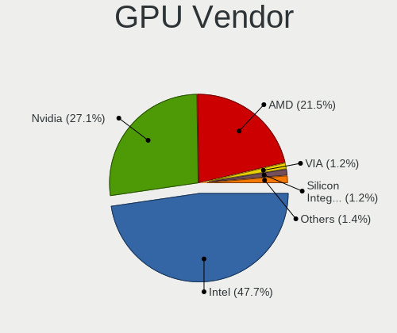

| Vendor                           | Computers | Percent |
|----------------------------------|-----------|---------|
| Intel                            | 171       | 46.98%  |
| Nvidia                           | 102       | 28.02%  |
| AMD                              | 79        | 21.7%   |
| VIA Technologies                 | 5         | 1.37%   |
| Silicon Integrated Systems [SiS] | 4         | 1.1%    |
| Matrox Electronics Systems       | 2         | 0.55%   |
| ASPEED Technology                | 1         | 0.27%   |

GPU Model
---------

Graphics card models

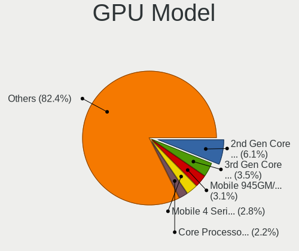

| Model                                                                                    | Computers | Percent |
|------------------------------------------------------------------------------------------|-----------|---------|
| Intel 2nd Generation Core Processor Family Integrated Graphics Controller                | 25        | 6.46%   |
| Intel 3rd Gen Core processor Graphics Controller                                         | 14        | 3.62%   |
| Intel Mobile 4 Series Chipset Integrated Graphics Controller                             | 13        | 3.36%   |
| Intel Mobile 945GM/GMS/GME, 943/940GML Express Integrated Graphics Controller            | 12        | 3.1%    |
| Intel WhiskeyLake-U GT2 [UHD Graphics 620]                                               | 8         | 2.07%   |
| AMD Stoney [Radeon R2/R3/R4/R5 Graphics]                                                 | 8         | 2.07%   |
| AMD Picasso                                                                              | 8         | 2.07%   |
| Intel Xeon E3-1200 v2/3rd Gen Core processor Graphics Controller                         | 7         | 1.81%   |
| Intel Core Processor Integrated Graphics Controller                                      | 7         | 1.81%   |
| Nvidia GM206 [GeForce GTX 960]                                                           | 6         | 1.55%   |
| Intel Xeon E3-1200 v3/4th Gen Core Processor Integrated Graphics Controller              | 6         | 1.55%   |
| Intel Skylake GT2 [HD Graphics 520]                                                      | 6         | 1.55%   |
| Intel Mobile 945GSE Express Integrated Graphics Controller                               | 6         | 1.55%   |
| Intel Mobile 945GM/GMS, 943/940GML Express Integrated Graphics Controller                | 6         | 1.55%   |
| Intel Haswell-ULT Integrated Graphics Controller                                         | 6         | 1.55%   |
| Intel 4th Gen Core Processor Integrated Graphics Controller                              | 6         | 1.55%   |
| Intel 4 Series Chipset Integrated Graphics Controller                                    | 6         | 1.55%   |
| AMD Ellesmere [Radeon RX 470/480/570/570X/580/580X/590]                                  | 6         | 1.55%   |
| Intel UHD Graphics 620                                                                   | 5         | 1.29%   |
| Intel Atom Processor D2xxx/N2xxx Integrated Graphics Controller                          | 5         | 1.29%   |
| Nvidia GT218 [GeForce 210]                                                               | 4         | 1.03%   |
| Nvidia GP107 [GeForce GTX 1050 Ti]                                                       | 4         | 1.03%   |
| Intel Mobile GM965/GL960 Integrated Graphics Controller (secondary)                      | 4         | 1.03%   |
| Intel Mobile GM965/GL960 Integrated Graphics Controller (primary)                        | 4         | 1.03%   |
| Intel CoffeeLake-S GT2 [UHD Graphics 630]                                                | 4         | 1.03%   |
| AMD RS880M [Mobility Radeon HD 4225/4250]                                                | 4         | 1.03%   |
| AMD Raven Ridge [Radeon Vega Series / Radeon Vega Mobile Series]                         | 4         | 1.03%   |
| Silicon Integrated Systems [SiS] 771/671 PCIE VGA Display Adapter                        | 3         | 0.78%   |
| Nvidia GK208B [GeForce GT 710]                                                           | 3         | 0.78%   |
| Intel US15W/US15X SCH [Poulsbo] Graphics Controller                                      | 3         | 0.78%   |
| Intel HD Graphics 530                                                                    | 3         | 0.78%   |
| Intel GeminiLake [UHD Graphics 600]                                                      | 3         | 0.78%   |
| Intel Atom/Celeron/Pentium Processor x5-E8000/J3xxx/N3xxx Integrated Graphics Controller | 3         | 0.78%   |
| Intel Atom Processor Z36xxx/Z37xxx Series Graphics & Display                             | 3         | 0.78%   |
| AMD RV710/M92 [Mobility Radeon HD 4530/4570/545v]                                        | 3         | 0.78%   |
| AMD Cedar [Radeon HD 5000/6000/7350/8350 Series]                                         | 3         | 0.78%   |
| VIA Technologies CN896/VN896/P4M900 [Chrome 9 HC]                                        | 2         | 0.52%   |
| Nvidia TU106 [GeForce RTX 2070]                                                          | 2         | 0.52%   |
| Nvidia GT218M [NVS 3100M]                                                                | 2         | 0.52%   |
| Nvidia GP107 [GeForce GTX 1050]                                                          | 2         | 0.52%   |
| Nvidia GP104 [GeForce GTX 1070]                                                          | 2         | 0.52%   |
| Nvidia GM108M [GeForce 940MX]                                                            | 2         | 0.52%   |
| Nvidia GM107M [GeForce GTX 960M]                                                         | 2         | 0.52%   |
| Nvidia GK104 [GeForce GTX 760]                                                           | 2         | 0.52%   |
| Nvidia GF119M [NVS 4200M]                                                                | 2         | 0.52%   |
| Nvidia GF108M [GeForce GT 525M]                                                          | 2         | 0.52%   |
| Nvidia GF108GLM [Quadro 1000M]                                                           | 2         | 0.52%   |
| Nvidia GF104 [GeForce GTX 460]                                                           | 2         | 0.52%   |
| Nvidia G96CM [GeForce 9600M GT]                                                          | 2         | 0.52%   |
| Nvidia G86 [GeForce 8400 GS]                                                             | 2         | 0.52%   |
| Nvidia C79 [GeForce 9400M]                                                               | 2         | 0.52%   |
| Nvidia C61 [GeForce 7025 / nForce 630a]                                                  | 2         | 0.52%   |
| Matrox Electronics Systems MGA G200eW WPCM450                                            | 2         | 0.52%   |
| Intel Mobile 915GM/GMS/910GML Express Graphics Controller                                | 2         | 0.52%   |
| Intel HD Graphics 5500                                                                   | 2         | 0.52%   |
| Intel HD Graphics 510                                                                    | 2         | 0.52%   |
| Intel CometLake-S GT2 [UHD Graphics 630]                                                 | 2         | 0.52%   |
| Intel CoffeeLake-H GT2 [UHD Graphics 630]                                                | 2         | 0.52%   |
| Intel Atom Processor D4xx/D5xx/N4xx/N5xx Integrated Graphics Controller                  | 2         | 0.52%   |
| AMD Sun XT [Radeon HD 8670A/8670M/8690M / R5 M330 / M430 / Radeon 520 Mobile]            | 2         | 0.52%   |

GPU Combo
---------

Combinations of graphics cards

| Name           | Computers | Percent |
|----------------|-----------|---------|
| 1 x Intel      | 133       | 40.8%   |
| 1 x Nvidia     | 77        | 23.62%  |
| 1 x AMD        | 67        | 20.55%  |
| Intel + Nvidia | 24        | 7.36%   |
| Intel + AMD    | 8         | 2.45%   |
| 1 x VIA        | 5         | 1.53%   |
| 2 x AMD        | 4         | 1.23%   |
| 1 x SiS        | 4         | 1.23%   |
| 1 x Matrox     | 2         | 0.61%   |
| 2 x Nvidia     | 1         | 0.31%   |
| 1 x ASPEED     | 1         | 0.31%   |

GPU Driver
----------

Free vs proprietary

| Driver      | Computers | Percent |
|-------------|-----------|---------|
| Free        | 256       | 78.05%  |
| Unknown     | 37        | 11.28%  |
| Proprietary | 35        | 10.67%  |

GPU Memory
----------

Total video memory

| Size in GB | Computers | Percent |
|------------|-----------|---------|
| Unknown    | 193       | 58.84%  |
| 0.01-0.5   | 52        | 15.85%  |
| 0.51-1.0   | 32        | 9.76%   |
| 1.01-2.0   | 26        | 7.93%   |
| 3.01-4.0   | 12        | 3.66%   |
| 7.01-8.0   | 9         | 2.74%   |
| 5.01-6.0   | 2         | 0.61%   |
| 2.01-3.0   | 2         | 0.61%   |

Monitor
-------

Monitor Vendor
--------------

Monitor vendors

| Vendor                  | Computers | Percent |
|-------------------------|-----------|---------|
| Samsung Electronics     | 53        | 16.51%  |
| AU Optronics            | 30        | 9.35%   |
| LG Display              | 25        | 7.79%   |
| BOE                     | 20        | 6.23%   |
| Goldstar                | 18        | 5.61%   |
| Dell                    | 16        | 4.98%   |
| Chimei Innolux          | 16        | 4.98%   |
| Acer                    | 13        | 4.05%   |
| Chi Mei Optoelectronics | 10        | 3.12%   |
| Lenovo                  | 9         | 2.8%    |
| Ancor Communications    | 9         | 2.8%    |
| AOC                     | 8         | 2.49%   |
| Unknown                 | 7         | 2.18%   |
| Philips                 | 7         | 2.18%   |
| LG Philips              | 7         | 2.18%   |
| Hewlett-Packard         | 7         | 2.18%   |
| BenQ                    | 7         | 2.18%   |
| Sony                    | 5         | 1.56%   |
| HannStar                | 5         | 1.56%   |
| Iiyama                  | 3         | 0.93%   |
| CPT                     | 3         | 0.93%   |
| Apple                   | 3         | 0.93%   |
| Toshiba                 | 2         | 0.62%   |
| Quanta Display          | 2         | 0.62%   |
| NEC Computers           | 2         | 0.62%   |
| LG Electronics          | 2         | 0.62%   |
| InfoVision              | 2         | 0.62%   |
| Fujitsu Siemens         | 2         | 0.62%   |
| Belinea                 | 2         | 0.62%   |
| ___                     | 1         | 0.31%   |
| ViewSonic               | 1         | 0.31%   |
| Vestel                  | 1         | 0.31%   |
| Targa Visionary         | 1         | 0.31%   |
| Seiko/Epson             | 1         | 0.31%   |
| Sceptre Tech            | 1         | 0.31%   |
| RTK                     | 1         | 0.31%   |
| PANDA                   | 1         | 0.31%   |
| OEM                     | 1         | 0.31%   |
| NCS                     | 1         | 0.31%   |
| MLT                     | 1         | 0.31%   |
| Microstep               | 1         | 0.31%   |
| Medion                  | 1         | 0.31%   |
| InnoLux Display         | 1         | 0.31%   |
| IBM                     | 1         | 0.31%   |
| Hitachi                 | 1         | 0.31%   |
| eMachines               | 1         | 0.31%   |
| ELSA International      | 1         | 0.31%   |
| Elo Touch               | 1         | 0.31%   |
| Eizo                    | 1         | 0.31%   |
| DENON                   | 1         | 0.31%   |
| Compal                  | 1         | 0.31%   |
| AUS                     | 1         | 0.31%   |
| ASUSTek Computer        | 1         | 0.31%   |
| AOpen                   | 1         | 0.31%   |
| AGO                     | 1         | 0.31%   |

Monitor Model
-------------

Monitor models

| Model                                                                    | Computers | Percent |
|--------------------------------------------------------------------------|-----------|---------|
| AU Optronics LCD Monitor AUO21ED 1920x1080 344x194mm 15.5-inch           | 4         | 1.22%   |
| Chimei Innolux LCD Monitor CMN15CA 1366x768 340x190mm 15.3-inch          | 3         | 0.91%   |
| AU Optronics LCD Monitor AUO10EC 1366x768 340x190mm 15.3-inch            | 3         | 0.91%   |
| Samsung Electronics SyncMaster SAM01CE 1024x768 304x228mm 15.0-inch      | 2         | 0.61%   |
| Samsung Electronics LCD Monitor SEC5441 1366x768 344x194mm 15.5-inch     | 2         | 0.61%   |
| Samsung Electronics LCD Monitor SEC3345 1280x800 331x207mm 15.4-inch     | 2         | 0.61%   |
| Quanta Display LCD Monitor QDS0025 1024x768 304x228mm 15.0-inch          | 2         | 0.61%   |
| LG Display LCD Monitor LGD0430 1366x768 345x194mm 15.6-inch              | 2         | 0.61%   |
| HannStar LCD Monitor HSD03E9 1024x600 220x129mm 10.0-inch                | 2         | 0.61%   |
| HannStar HSD121PHW1 HSD04B6 1366x768 270x150mm 12.2-inch                 | 2         | 0.61%   |
| Dell 1707FP DEL4012 1280x1024 338x270mm 17.0-inch                        | 2         | 0.61%   |
| CPT LCD Monitor CPT1415 1280x800 331x207mm 15.4-inch                     | 2         | 0.61%   |
| Chi Mei Optoelectronics LCD Monitor CMO1558 1366x768 344x193mm 15.5-inch | 2         | 0.61%   |
| BOE LCD Monitor BOE0812 1920x1080 344x194mm 15.5-inch                    | 2         | 0.61%   |
| BOE LCD Monitor BOE06F9 1920x1080 344x193mm 15.5-inch                    | 2         | 0.61%   |
| BOE LCD Monitor BOE06A4 1366x768 344x194mm 15.5-inch                     | 2         | 0.61%   |
| BOE LCD Monitor BOE069C 1920x1080 344x193mm 15.5-inch                    | 2         | 0.61%   |
| AU Optronics LCD Monitor AUO303C 1366x768 309x173mm 13.9-inch            | 2         | 0.61%   |
| AU Optronics LCD Monitor AUO139E 1600x900 382x214mm 17.2-inch            | 2         | 0.61%   |
| ___ LCD Monitor ___A995 1600x1200 360x270mm 17.7-inch                    | 1         | 0.3%    |
| ViewSonic VX2457 VSCB931 1920x1080 520x290mm 23.4-inch                   | 1         | 0.3%    |
| Vestel LCD Monitor 58UHD_LCD_TV 3840x2160                                | 1         | 0.3%    |
| Unknown Monitor A995 1280x1024 360x270mm 17.7-inch                       | 1         | 0.3%    |
| Unknown LCD Monitor XXX AAA                                              | 1         | 0.3%    |
| Unknown LCD Monitor SAMSUNG 1920x1080                                    | 1         | 0.3%    |
| Unknown LCD Monitor SAMSUNG                                              | 1         | 0.3%    |
| Unknown LCD Monitor Mitsubishi NXM76LCD 1280x1024                        | 1         | 0.3%    |
| Unknown LCD Monitor GBT G34WQC 3440x1440                                 | 1         | 0.3%    |
| Unknown HV-734TB ___1770 1280x1024 338x270mm 17.0-inch                   | 1         | 0.3%    |
| Toshiba LCD Monitor TV 1920x1080                                         | 1         | 0.3%    |
| Toshiba LCD Monitor TOS508F 1920x1080 509x286mm 23.0-inch                | 1         | 0.3%    |
| Targa Visionary LCD19-4 TARA194 1280x1024 376x301mm 19.0-inch            | 1         | 0.3%    |
| Sony TV SNYA301 1920x1080 1600x900mm 72.3-inch                           | 1         | 0.3%    |
| Sony TV SNY4C03 1920x1080 1063x598mm 48.0-inch                           | 1         | 0.3%    |
| Sony TV SNY1B02 1360x768 1600x900mm 72.3-inch                            | 1         | 0.3%    |
| Sony LCD Monitor TV 3840x1080                                            | 1         | 0.3%    |
| Sony AVAMP SNYF700 1920x540                                              | 1         | 0.3%    |
| Seiko/Epson LCD Monitor 1920x1080                                        | 1         | 0.3%    |
| Sceptre Tech E275W-1920 SPT0ABF 1920x1080 443x249mm 20.0-inch            | 1         | 0.3%    |
| Samsung Electronics T27B300 SAM0933 1920x1080 598x336mm 27.0-inch        | 1         | 0.3%    |
| Samsung Electronics T23B350 SAM093B 1920x1080 510x287mm 23.0-inch        | 1         | 0.3%    |
| Samsung Electronics SyncMaster SAM0497 1600x900 443x249mm 20.0-inch      | 1         | 0.3%    |
| Samsung Electronics SyncMaster SAM03D7 1680x1050 459x296mm 21.5-inch     | 1         | 0.3%    |
| Samsung Electronics SyncMaster SAM034F 1440x900 428x255mm 19.6-inch      | 1         | 0.3%    |
| Samsung Electronics SyncMaster SAM0303 1680x1050 494x320mm 23.2-inch     | 1         | 0.3%    |
| Samsung Electronics SyncMaster SAM0217 1280x1024 376x301mm 19.0-inch     | 1         | 0.3%    |
| Samsung Electronics SyncMaster SAM006E 1280x1024 338x270mm 17.0-inch     | 1         | 0.3%    |
| Samsung Electronics SMS22A200/460 SAM0831 1920x1080 477x268mm 21.5-inch  | 1         | 0.3%    |
| Samsung Electronics SMB2230H SAM0648 1920x1080                           | 1         | 0.3%    |
| Samsung Electronics SMB2230 SAM063E 1920x1080 477x268mm 21.5-inch        | 1         | 0.3%    |
| Samsung Electronics SA300/350/360 SAM07D6 1920x1080 531x299mm 24.0-inch  | 1         | 0.3%    |
| Samsung Electronics S24R35x SAM100E 1920x1080 530x300mm 24.0-inch        | 1         | 0.3%    |
| Samsung Electronics S24F350 SAM0D21 1680x1050 520x290mm 23.4-inch        | 1         | 0.3%    |
| Samsung Electronics S24F350 SAM0D20 1920x1080 521x293mm 23.5-inch        | 1         | 0.3%    |
| Samsung Electronics S24D300 SAM0B43 1920x1080 531x299mm 24.0-inch        | 1         | 0.3%    |
| Samsung Electronics S22D390 SAM0B63 1920x1080 477x268mm 21.5-inch        | 1         | 0.3%    |
| Samsung Electronics S22D300 SAM0B3F 1920x1080 477x268mm 21.5-inch        | 1         | 0.3%    |
| Samsung Electronics S22B300 SAM08AC 1680x1050 480x270mm 21.7-inch        | 1         | 0.3%    |
| Samsung Electronics S16B110 SAM097E 1366x768 360x210mm 16.4-inch         | 1         | 0.3%    |
| Samsung Electronics LCD Monitor SEC5742 1366x768 309x174mm 14.0-inch     | 1         | 0.3%    |

Monitor Resolution
------------------

Monitor screen resolution

| Resolution         | Computers | Percent |
|--------------------|-----------|---------|
| 1920x1080 (FHD)    | 110       | 34.92%  |
| 1366x768 (WXGA)    | 69        | 21.9%   |
| 1280x800 (WXGA)    | 25        | 7.94%   |
| 1280x1024 (SXGA)   | 25        | 7.94%   |
| 1600x900 (HD+)     | 16        | 5.08%   |
| 1440x900 (WXGA+)   | 13        | 4.13%   |
| 1680x1050 (WSXGA+) | 10        | 3.17%   |
| 1024x600           | 7         | 2.22%   |
| 3840x2160 (4K)     | 6         | 1.9%    |
| 1920x1200 (WUXGA)  | 6         | 1.9%    |
| 1024x768 (XGA)     | 6         | 1.9%    |
| 1360x768           | 5         | 1.59%   |
| Unknown            | 4         | 1.27%   |
| 3840x1080          | 2         | 0.63%   |
| 3440x1440          | 2         | 0.63%   |
| 2560x1440 (QHD)    | 2         | 0.63%   |
| 7680x2160          | 1         | 0.32%   |
| 4240x1440          | 1         | 0.32%   |
| 2736x1824          | 1         | 0.32%   |
| 1920x540           | 1         | 0.32%   |
| 1600x1200          | 1         | 0.32%   |
| 1400x1050          | 1         | 0.32%   |
| 1280x768           | 1         | 0.32%   |

Monitor Diagonal
----------------

Diagonal size in inches

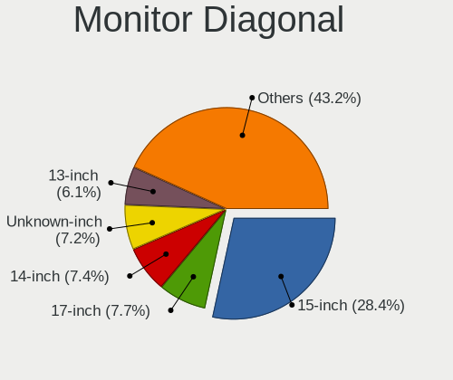

| Inches  | Computers | Percent |
|---------|-----------|---------|
| 15      | 94        | 29.65%  |
| Unknown | 25        | 7.89%   |
| 17      | 24        | 7.57%   |
| 14      | 19        | 5.99%   |
| 23      | 18        | 5.68%   |
| 21      | 18        | 5.68%   |
| 24      | 16        | 5.05%   |
| 19      | 16        | 5.05%   |
| 13      | 16        | 5.05%   |
| 18      | 13        | 4.1%    |
| 27      | 12        | 3.79%   |
| 12      | 7         | 2.21%   |
| 10      | 7         | 2.21%   |
| 22      | 6         | 1.89%   |
| 20      | 5         | 1.58%   |
| 11      | 5         | 1.58%   |
| 31      | 4         | 1.26%   |
| 72      | 3         | 0.95%   |
| 54      | 2         | 0.63%   |
| 48      | 2         | 0.63%   |
| 52      | 1         | 0.32%   |
| 33      | 1         | 0.32%   |
| 32      | 1         | 0.32%   |
| 26      | 1         | 0.32%   |
| 16      | 1         | 0.32%   |

Monitor Width
-------------

Physical width

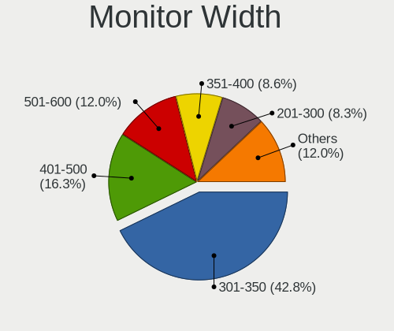

| Width in mm | Computers | Percent |
|-------------|-----------|---------|
| 301-350     | 131       | 41.72%  |
| 401-500     | 50        | 15.92%  |
| 501-600     | 41        | 13.06%  |
| 351-400     | 27        | 8.6%    |
| 201-300     | 25        | 7.96%   |
| Unknown     | 25        | 7.96%   |
| 601-700     | 5         | 1.59%   |
| 1001-1500   | 5         | 1.59%   |
| 1501-2000   | 3         | 0.96%   |
| 701-800     | 2         | 0.64%   |

Aspect Ratio
------------

Proportional relationship between the width and the height

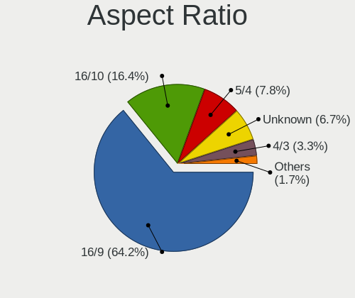

| Ratio   | Computers | Percent |
|---------|-----------|---------|
| 16/9    | 189       | 62.58%  |
| 16/10   | 53        | 17.55%  |
| 5/4     | 22        | 7.28%   |
| Unknown | 22        | 7.28%   |
| 4/3     | 11        | 3.64%   |
| 3/2     | 3         | 0.99%   |
| 32/9    | 1         | 0.33%   |
| 21/9    | 1         | 0.33%   |

Monitor Area
------------

Area in inch

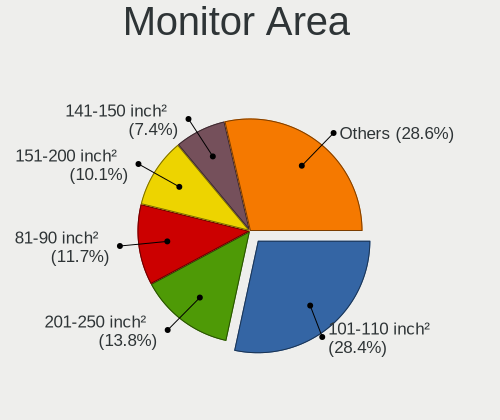

| Area in inch | Computers | Percent |
|----------------|-----------|---------|
| 101-110        | 95        | 29.97%  |
| 201-250        | 44        | 13.88%  |
| 151-200        | 32        | 10.09%  |
| 81-90          | 31        | 9.78%   |
| Unknown        | 25        | 7.89%   |
| 141-150        | 21        | 6.62%   |
| 301-350        | 13        | 4.1%    |
| 121-130        | 8         | 2.52%   |
| More than 1000 | 7         | 2.21%   |
| 41-50          | 7         | 2.21%   |
| 251-300        | 7         | 2.21%   |
| 61-70          | 6         | 1.89%   |
| 351-500        | 6         | 1.89%   |
| 51-60          | 5         | 1.58%   |
| 71-80          | 3         | 0.95%   |
| 131-140        | 3         | 0.95%   |
| 91-100         | 2         | 0.63%   |
| 111-120        | 1         | 0.32%   |
| 501-1000       | 1         | 0.32%   |

Pixel Density
-------------

Pixels per inch

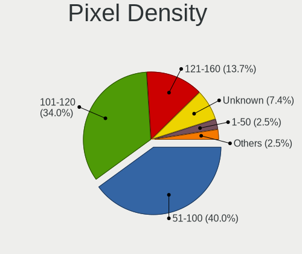

| Density       | Computers | Percent |
|---------------|-----------|---------|
| 51-100        | 126       | 41.18%  |
| 101-120       | 97        | 31.7%   |
| 121-160       | 45        | 14.71%  |
| Unknown       | 25        | 8.17%   |
| 1-50          | 8         | 2.61%   |
| 161-240       | 3         | 0.98%   |
| More than 240 | 2         | 0.65%   |

Multiple Monitors
-----------------

Total monitors connected

| Total | Computers | Percent |
|-------|-----------|---------|
| 1     | 271       | 82.37%  |
| 2     | 37        | 11.25%  |
| 0     | 20        | 6.08%   |
| 3     | 1         | 0.3%    |

Network
-------

Net Controller Vendor
---------------------

Controller vendors

| Vendor                                | Computers | Percent |
|---------------------------------------|-----------|---------|
| Realtek Semiconductor                 | 183       | 34.99%  |
| Intel                                 | 115       | 21.99%  |
| Qualcomm Atheros                      | 84        | 16.06%  |
| Broadcom                              | 37        | 7.07%   |
| Nvidia                                | 13        | 2.49%   |
| Marvell Technology Group              | 12        | 2.29%   |
| Broadcom Limited                      | 10        | 1.91%   |
| Ralink Technology                     | 8         | 1.53%   |
| Samsung Electronics                   | 6         | 1.15%   |
| Ralink                                | 6         | 1.15%   |
| Silicon Integrated Systems [SiS]      | 5         | 0.96%   |
| VIA Technologies                      | 4         | 0.76%   |
| TP-Link                               | 3         | 0.57%   |
| Huawei Technologies                   | 3         | 0.57%   |
| Ericsson Business Mobile Networks     | 3         | 0.57%   |
| Realtek                               | 2         | 0.38%   |
| Linksys                               | 2         | 0.38%   |
| JMicron Technology                    | 2         | 0.38%   |
| AVM                                   | 2         | 0.38%   |
| AMD                                   | 2         | 0.38%   |
| ZTE WCDMA Technologies MSM            | 1         | 0.19%   |
| Xiaomi                                | 1         | 0.19%   |
| ST-Ericsson                           | 1         | 0.19%   |
| Sitecom Europe                        | 1         | 0.19%   |
| NetGear                               | 1         | 0.19%   |
| Microsoft                             | 1         | 0.19%   |
| Mellanox Technologies                 | 1         | 0.19%   |
| MediaTek                              | 1         | 0.19%   |
| Manta                                 | 1         | 0.19%   |
| LSI                                   | 1         | 0.19%   |
| Lenovo                                | 1         | 0.19%   |
| Intersil                              | 1         | 0.19%   |
| Gemtek                                | 1         | 0.19%   |
| Edimax Technology                     | 1         | 0.19%   |
| DisplayLink                           | 1         | 0.19%   |
| Dell                                  | 1         | 0.19%   |
| Cisco Aironet Wireless Communications | 1         | 0.19%   |
| Belkin Components                     | 1         | 0.19%   |
| Attansic Technology                   | 1         | 0.19%   |
| ASUSTek Computer                      | 1         | 0.19%   |
| ADMtek                                | 1         | 0.19%   |

Net Controller Model
--------------------

Controller models

| Model                                                                   | Computers | Percent |
|-------------------------------------------------------------------------|-----------|---------|
| Realtek RTL8111/8168/8411 PCI Express Gigabit Ethernet Controller       | 114       | 18.57%  |
| Realtek RTL810xE PCI Express Fast Ethernet controller                   | 36        | 5.86%   |
| Realtek RTL8821CE 802.11ac PCIe Wireless Network Adapter                | 12        | 1.95%   |
| Realtek RTL-8100/8101L/8139 PCI Fast Ethernet Adapter                   | 12        | 1.95%   |
| Qualcomm Atheros QCA9565 / AR9565 Wireless Network Adapter              | 12        | 1.95%   |
| Qualcomm Atheros AR9285 Wireless Network Adapter (PCI-Express)          | 12        | 1.95%   |
| Intel PRO/Wireless 3945ABG [Golan] Network Connection                   | 12        | 1.95%   |
| Intel 82579LM Gigabit Network Connection (Lewisville)                   | 11        | 1.79%   |
| Qualcomm Atheros AR242x / AR542x Wireless Network Adapter (PCI-Express) | 10        | 1.63%   |
| Qualcomm Atheros AR9485 Wireless Network Adapter                        | 9         | 1.47%   |
| Qualcomm Atheros QCA9377 802.11ac Wireless Network Adapter              | 8         | 1.3%    |
| Realtek RTL8188EUS 802.11n Wireless Network Adapter                     | 7         | 1.14%   |
| Nvidia MCP61 Ethernet                                                   | 6         | 0.98%   |
| Intel WiFi Link 5100                                                    | 6         | 0.98%   |
| Intel I211 Gigabit Network Connection                                   | 6         | 0.98%   |
| Broadcom BCM4313 802.11bgn Wireless Network Adapter                     | 6         | 0.98%   |
| Samsung Galaxy series, misc. (tethering mode)                           | 5         | 0.81%   |
| Qualcomm Atheros AR9287 Wireless Network Adapter (PCI-Express)          | 5         | 0.81%   |
| Intel Wireless 7260                                                     | 5         | 0.81%   |
| Intel Centrino Ultimate-N 6300                                          | 5         | 0.81%   |
| Intel 82577LM Gigabit Network Connection                                | 5         | 0.81%   |
| VIA VT6102/VT6103 [Rhine-II]                                            | 4         | 0.65%   |
| Realtek RTL8188CE 802.11b/g/n WiFi Adapter                              | 4         | 0.65%   |
| Ralink MT7601U Wireless Adapter                                         | 4         | 0.65%   |
| Ralink RT3090 Wireless 802.11n 1T/1R PCIe                               | 4         | 0.65%   |
| Qualcomm Atheros Attansic L1 Gigabit Ethernet                           | 4         | 0.65%   |
| Qualcomm Atheros AR8152 v2.0 Fast Ethernet                              | 4         | 0.65%   |
| Qualcomm Atheros AR8132 Fast Ethernet                                   | 4         | 0.65%   |
| Marvell Group 88E8071 PCI-E Gigabit Ethernet Controller                 | 4         | 0.65%   |
| Intel Wireless 8265 / 8275                                              | 4         | 0.65%   |
| Intel Wi-Fi 6 AX200                                                     | 4         | 0.65%   |
| Intel PRO/Wireless 4965 AG or AGN [Kedron] Network Connection           | 4         | 0.65%   |
| Intel Ethernet Connection I217-LM                                       | 4         | 0.65%   |
| Intel Cannon Point-LP CNVi [Wireless-AC]                                | 4         | 0.65%   |
| Intel 82573L Gigabit Ethernet Controller                                | 4         | 0.65%   |
| Silicon Integrated Systems [SiS] 191 Gigabit Ethernet Adapter           | 3         | 0.49%   |
| Realtek RTL8822BE 802.11a/b/g/n/ac WiFi adapter                         | 3         | 0.49%   |
| Realtek RTL8723BE PCIe Wireless Network Adapter                         | 3         | 0.49%   |
| Realtek RTL8191SEvB Wireless LAN Controller                             | 3         | 0.49%   |
| Realtek RTL8188CUS 802.11n WLAN Adapter                                 | 3         | 0.49%   |
| Realtek RTL-8110SC/8169SC Gigabit Ethernet                              | 3         | 0.49%   |
| Qualcomm Atheros Killer E220x Gigabit Ethernet Controller               | 3         | 0.49%   |
| Qualcomm Atheros AR928X Wireless Network Adapter (PCI-Express)          | 3         | 0.49%   |
| Qualcomm Atheros AR8121/AR8113/AR8114 Gigabit or Fast Ethernet          | 3         | 0.49%   |
| Intel Dual Band Wireless-AC 3168NGW [Stone Peak]                        | 3         | 0.49%   |
| Intel Centrino Advanced-N 6205 [Taylor Peak]                            | 3         | 0.49%   |
| Broadcom NetXtreme BCM5761 Gigabit Ethernet PCIe                        | 3         | 0.49%   |
| Broadcom Limited NetLink BCM5787M Gigabit Ethernet PCI Express          | 3         | 0.49%   |
| Broadcom BCM4322 802.11a/b/g/n Wireless LAN Controller                  | 3         | 0.49%   |
| Silicon Integrated Systems [SiS] SiS900 PCI Fast Ethernet               | 2         | 0.33%   |
| Realtek RTL8822CE 802.11ac PCIe Wireless Network Adapter                | 2         | 0.33%   |
| Realtek RTL8723AE PCIe Wireless Network Adapter                         | 2         | 0.33%   |
| Realtek RTL8192CE PCIe Wireless Network Adapter                         | 2         | 0.33%   |
| Realtek RTL8188EE Wireless Network Adapter                              | 2         | 0.33%   |
| Realtek RTL8187B Wireless 802.11g 54Mbps Network Adapter                | 2         | 0.33%   |
| Realtek RTL-8185 IEEE 802.11a/b/g Wireless LAN Controller               | 2         | 0.33%   |
| Realtek 802.11n NIC                                                     | 2         | 0.33%   |
| Ralink RT2870/RT3070 Wireless Adapter                                   | 2         | 0.33%   |
| Qualcomm Atheros AR9462 Wireless Network Adapter                        | 2         | 0.33%   |
| Qualcomm Atheros AR8161 Gigabit Ethernet                                | 2         | 0.33%   |

Wireless Vendor
---------------

Wireless vendors

| Vendor                                | Computers | Percent |
|---------------------------------------|-----------|---------|
| Intel                                 | 76        | 29.57%  |
| Qualcomm Atheros                      | 67        | 26.07%  |
| Realtek Semiconductor                 | 54        | 21.01%  |
| Broadcom                              | 25        | 9.73%   |
| Ralink Technology                     | 8         | 3.11%   |
| Ralink                                | 6         | 2.33%   |
| Broadcom Limited                      | 4         | 1.56%   |
| TP-Link                               | 3         | 1.17%   |
| Realtek                               | 2         | 0.78%   |
| Linksys                               | 2         | 0.78%   |
| AVM                                   | 2         | 0.78%   |
| Sitecom Europe                        | 1         | 0.39%   |
| NetGear                               | 1         | 0.39%   |
| Microsoft                             | 1         | 0.39%   |
| Marvell Technology Group              | 1         | 0.39%   |
| Edimax Technology                     | 1         | 0.39%   |
| Cisco Aironet Wireless Communications | 1         | 0.39%   |
| Belkin Components                     | 1         | 0.39%   |
| ASUSTek Computer                      | 1         | 0.39%   |

Wireless Model
--------------

Wireless models

| Model                                                                   | Computers | Percent |
|-------------------------------------------------------------------------|-----------|---------|
| Realtek RTL8821CE 802.11ac PCIe Wireless Network Adapter                | 12        | 4.62%   |
| Qualcomm Atheros QCA9565 / AR9565 Wireless Network Adapter              | 12        | 4.62%   |
| Qualcomm Atheros AR9285 Wireless Network Adapter (PCI-Express)          | 12        | 4.62%   |
| Intel PRO/Wireless 3945ABG [Golan] Network Connection                   | 12        | 4.62%   |
| Qualcomm Atheros AR242x / AR542x Wireless Network Adapter (PCI-Express) | 10        | 3.85%   |
| Qualcomm Atheros AR9485 Wireless Network Adapter                        | 9         | 3.46%   |
| Qualcomm Atheros QCA9377 802.11ac Wireless Network Adapter              | 8         | 3.08%   |
| Realtek RTL8188EUS 802.11n Wireless Network Adapter                     | 7         | 2.69%   |
| Intel WiFi Link 5100                                                    | 6         | 2.31%   |
| Broadcom BCM4313 802.11bgn Wireless Network Adapter                     | 6         | 2.31%   |
| Qualcomm Atheros AR9287 Wireless Network Adapter (PCI-Express)          | 5         | 1.92%   |
| Intel Wireless 7260                                                     | 5         | 1.92%   |
| Intel Centrino Ultimate-N 6300                                          | 5         | 1.92%   |
| Realtek RTL8188CE 802.11b/g/n WiFi Adapter                              | 4         | 1.54%   |
| Ralink MT7601U Wireless Adapter                                         | 4         | 1.54%   |
| Ralink RT3090 Wireless 802.11n 1T/1R PCIe                               | 4         | 1.54%   |
| Intel Wireless 8265 / 8275                                              | 4         | 1.54%   |
| Intel Wi-Fi 6 AX200                                                     | 4         | 1.54%   |
| Intel PRO/Wireless 4965 AG or AGN [Kedron] Network Connection           | 4         | 1.54%   |
| Intel Cannon Point-LP CNVi [Wireless-AC]                                | 4         | 1.54%   |
| Realtek RTL8822BE 802.11a/b/g/n/ac WiFi adapter                         | 3         | 1.15%   |
| Realtek RTL8723BE PCIe Wireless Network Adapter                         | 3         | 1.15%   |
| Realtek RTL8191SEvB Wireless LAN Controller                             | 3         | 1.15%   |
| Realtek RTL8188CUS 802.11n WLAN Adapter                                 | 3         | 1.15%   |
| Qualcomm Atheros AR928X Wireless Network Adapter (PCI-Express)          | 3         | 1.15%   |
| Intel Dual Band Wireless-AC 3168NGW [Stone Peak]                        | 3         | 1.15%   |
| Intel Centrino Advanced-N 6205 [Taylor Peak]                            | 3         | 1.15%   |
| Broadcom BCM4322 802.11a/b/g/n Wireless LAN Controller                  | 3         | 1.15%   |
| Realtek RTL8822CE 802.11ac PCIe Wireless Network Adapter                | 2         | 0.77%   |
| Realtek RTL8723AE PCIe Wireless Network Adapter                         | 2         | 0.77%   |
| Realtek RTL8192CE PCIe Wireless Network Adapter                         | 2         | 0.77%   |
| Realtek RTL8188EE Wireless Network Adapter                              | 2         | 0.77%   |
| Realtek RTL8187B Wireless 802.11g 54Mbps Network Adapter                | 2         | 0.77%   |
| Realtek RTL-8185 IEEE 802.11a/b/g Wireless LAN Controller               | 2         | 0.77%   |
| Realtek 802.11n NIC                                                     | 2         | 0.77%   |
| Ralink RT2870/RT3070 Wireless Adapter                                   | 2         | 0.77%   |
| Qualcomm Atheros AR9462 Wireless Network Adapter                        | 2         | 0.77%   |
| Qualcomm Atheros AR5212 802.11abg NIC                                   | 2         | 0.77%   |
| Intel Wireless 8260                                                     | 2         | 0.77%   |
| Intel Wireless 7265                                                     | 2         | 0.77%   |
| Intel Wireless 3160                                                     | 2         | 0.77%   |
| Intel Gemini Lake PCH CNVi WiFi                                         | 2         | 0.77%   |
| Intel Dual Band Wireless-AC 3165 Plus Bluetooth                         | 2         | 0.77%   |
| Intel Centrino Wireless-N 2230                                          | 2         | 0.77%   |
| Intel Centrino Wireless-N 1030 [Rainbow Peak]                           | 2         | 0.77%   |
| Intel Centrino Wireless-N 1000 [Condor Peak]                            | 2         | 0.77%   |
| Broadcom BCM43228 802.11a/b/g/n                                         | 2         | 0.77%   |
| Broadcom BCM4318 [AirForce One 54g] 802.11g Wireless LAN Controller     | 2         | 0.77%   |
| Broadcom BCM4311 802.11b/g WLAN                                         | 2         | 0.77%   |
| TP-Link TL-WN722N v2/v3 [Realtek RTL8188EUS]                            | 1         | 0.38%   |
| TP-Link 802.11n NIC                                                     | 1         | 0.38%   |
| TP-Link 802.11ac WLAN Adapter                                           | 1         | 0.38%   |
| Sitecom Europe RTL8188S WLAN Adapter                                    | 1         | 0.38%   |
| Realtek RTL88x2bu [AC1200 Techkey]                                      | 1         | 0.38%   |
| Realtek RTL8821AE 802.11ac PCIe Wireless Network Adapter                | 1         | 0.38%   |
| Realtek RTL8811AU 802.11a/b/g/n/ac WLAN Adapter                         | 1         | 0.38%   |
| Realtek RTL8723DE Wireless Network Adapter                              | 1         | 0.38%   |
| Realtek RTL8191SU 802.11n WLAN Adapter                                  | 1         | 0.38%   |
| Realtek RTL8191SEvA Wireless LAN Controller                             | 1         | 0.38%   |
| Realtek RTL8188FTV 802.11b/g/n 1T1R 2.4G WLAN Adapter                   | 1         | 0.38%   |

Ethernet Vendor
---------------

Ethernet vendors

| Vendor                           | Computers | Percent |
|----------------------------------|-----------|---------|
| Realtek Semiconductor            | 166       | 50%     |
| Intel                            | 67        | 20.18%  |
| Qualcomm Atheros                 | 26        | 7.83%   |
| Broadcom                         | 16        | 4.82%   |
| Nvidia                           | 13        | 3.92%   |
| Marvell Technology Group         | 11        | 3.31%   |
| Samsung Electronics              | 6         | 1.81%   |
| Broadcom Limited                 | 6         | 1.81%   |
| Silicon Integrated Systems [SiS] | 5         | 1.51%   |
| VIA Technologies                 | 4         | 1.2%    |
| JMicron Technology               | 2         | 0.6%    |
| Huawei Technologies              | 2         | 0.6%    |
| ZTE WCDMA Technologies MSM       | 1         | 0.3%    |
| Xiaomi                           | 1         | 0.3%    |
| MediaTek                         | 1         | 0.3%    |
| Lenovo                           | 1         | 0.3%    |
| Gemtek                           | 1         | 0.3%    |
| DisplayLink                      | 1         | 0.3%    |
| Attansic Technology              | 1         | 0.3%    |
| ADMtek                           | 1         | 0.3%    |

Ethernet Model
--------------

Ethernet models

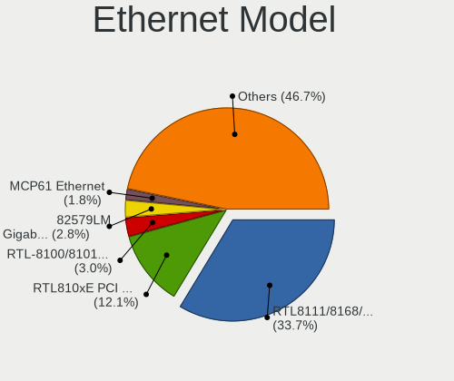

| Model                                                                | Computers | Percent |
|----------------------------------------------------------------------|-----------|---------|
| Realtek RTL8111/8168/8411 PCI Express Gigabit Ethernet Controller    | 114       | 33.83%  |
| Realtek RTL810xE PCI Express Fast Ethernet controller                | 36        | 10.68%  |
| Realtek RTL-8100/8101L/8139 PCI Fast Ethernet Adapter                | 12        | 3.56%   |
| Intel 82579LM Gigabit Network Connection (Lewisville)                | 11        | 3.26%   |
| Nvidia MCP61 Ethernet                                                | 6         | 1.78%   |
| Intel I211 Gigabit Network Connection                                | 6         | 1.78%   |
| Samsung Galaxy series, misc. (tethering mode)                        | 5         | 1.48%   |
| Intel 82577LM Gigabit Network Connection                             | 5         | 1.48%   |
| VIA VT6102/VT6103 [Rhine-II]                                         | 4         | 1.19%   |
| Qualcomm Atheros Attansic L1 Gigabit Ethernet                        | 4         | 1.19%   |
| Qualcomm Atheros AR8152 v2.0 Fast Ethernet                           | 4         | 1.19%   |
| Qualcomm Atheros AR8132 Fast Ethernet                                | 4         | 1.19%   |
| Marvell Group 88E8071 PCI-E Gigabit Ethernet Controller              | 4         | 1.19%   |
| Intel Ethernet Connection I217-LM                                    | 4         | 1.19%   |
| Intel 82573L Gigabit Ethernet Controller                             | 4         | 1.19%   |
| Silicon Integrated Systems [SiS] 191 Gigabit Ethernet Adapter        | 3         | 0.89%   |
| Realtek RTL-8110SC/8169SC Gigabit Ethernet                           | 3         | 0.89%   |
| Qualcomm Atheros Killer E220x Gigabit Ethernet Controller            | 3         | 0.89%   |
| Qualcomm Atheros AR8121/AR8113/AR8114 Gigabit or Fast Ethernet       | 3         | 0.89%   |
| Broadcom NetXtreme BCM5761 Gigabit Ethernet PCIe                     | 3         | 0.89%   |
| Broadcom Limited NetLink BCM5787M Gigabit Ethernet PCI Express       | 3         | 0.89%   |
| Silicon Integrated Systems [SiS] SiS900 PCI Fast Ethernet            | 2         | 0.59%   |
| Qualcomm Atheros AR8161 Gigabit Ethernet                             | 2         | 0.59%   |
| Qualcomm Atheros AR8151 v2.0 Gigabit Ethernet                        | 2         | 0.59%   |
| Nvidia nForce2 Ethernet Controller                                   | 2         | 0.59%   |
| Nvidia MCP79 Ethernet                                                | 2         | 0.59%   |
| Nvidia MCP67 Ethernet                                                | 2         | 0.59%   |
| Marvell Group 88E8056 PCI-E Gigabit Ethernet Controller              | 2         | 0.59%   |
| JMicron JMC250 PCI Express Gigabit Ethernet Controller               | 2         | 0.59%   |
| Intel PRO/100 VE Network Connection                                  | 2         | 0.59%   |
| Intel Ethernet Connection I217-V                                     | 2         | 0.59%   |
| Intel Ethernet Connection (7) I219-V                                 | 2         | 0.59%   |
| Intel Ethernet Connection (2) I219-V                                 | 2         | 0.59%   |
| Intel 82579V Gigabit Network Connection                              | 2         | 0.59%   |
| Intel 82578DM Gigabit Network Connection                             | 2         | 0.59%   |
| Intel 82574L Gigabit Network Connection                              | 2         | 0.59%   |
| Intel 82567LM-3 Gigabit Network Connection                           | 2         | 0.59%   |
| Intel 82567LM Gigabit Network Connection                             | 2         | 0.59%   |
| Intel 82566MM Gigabit Network Connection                             | 2         | 0.59%   |
| Intel 82566DM-2 Gigabit Network Connection                           | 2         | 0.59%   |
| Intel 82562ET/EZ/GT/GZ - PRO/100 VE (LOM) Ethernet Controller Mobile | 2         | 0.59%   |
| Broadcom NetXtreme BCM57786 Gigabit Ethernet PCIe                    | 2         | 0.59%   |
| Broadcom BCM4401-B0 100Base-TX                                       | 2         | 0.59%   |
| ZTE WCDMA MSM Z6201V                                                 | 1         | 0.3%    |
| Xiaomi Mi/Redmi series (RNDIS)                                       | 1         | 0.3%    |
| Samsung GT-I9070 (network tethering, USB debugging enabled)          | 1         | 0.3%    |
| Realtek RTL8169 PCI Gigabit Ethernet Controller                      | 1         | 0.3%    |
| Realtek RTL8153 Gigabit Ethernet Adapter                             | 1         | 0.3%    |
| Realtek RTL8125 2.5GbE Controller                                    | 1         | 0.3%    |
| Qualcomm Atheros QCA8171 Gigabit Ethernet                            | 1         | 0.3%    |
| Qualcomm Atheros Killer E2500 Gigabit Ethernet Controller            | 1         | 0.3%    |
| Qualcomm Atheros AR8162 Fast Ethernet                                | 1         | 0.3%    |
| Qualcomm Atheros AR8131 Gigabit Ethernet                             | 1         | 0.3%    |
| Nvidia MCP77 Ethernet                                                | 1         | 0.3%    |
| MediaTek Le                                                          | 1         | 0.3%    |
| Marvell Group 88E8057 PCI-E Gigabit Ethernet Controller              | 1         | 0.3%    |
| Marvell Group 88E8040T PCI-E Fast Ethernet Controller                | 1         | 0.3%    |
| Marvell Group 88E8040 PCI-E Fast Ethernet Controller                 | 1         | 0.3%    |
| Marvell Group 88E8039 PCI-E Fast Ethernet Controller                 | 1         | 0.3%    |
| Marvell Group 88E8036 PCI-E Fast Ethernet Controller                 | 1         | 0.3%    |

Net Controller Kind
-------------------

Ethernet, WiFi or modem

| Kind     | Computers | Percent |
|----------|-----------|---------|
| Ethernet | 312       | 54.64%  |
| WiFi     | 242       | 42.38%  |
| Modem    | 13        | 2.28%   |
| Unknown  | 4         | 0.7%    |

Used Controller
---------------

Currently used network controller

| Kind     | Computers | Percent |
|----------|-----------|---------|
| Ethernet | 293       | 57.68%  |
| WiFi     | 214       | 42.13%  |
| Modem    | 1         | 0.2%    |

NICs
----

Total network controllers on board

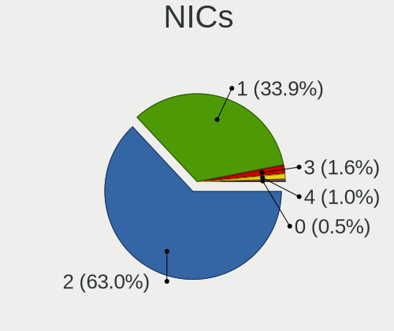

| Total | Computers | Percent |
|-------|-----------|---------|
| 2     | 209       | 64.31%  |
| 1     | 107       | 32.92%  |
| 3     | 5         | 1.54%   |
| 4     | 4         | 1.23%   |

IPv6
----

IPv6 vs IPv4

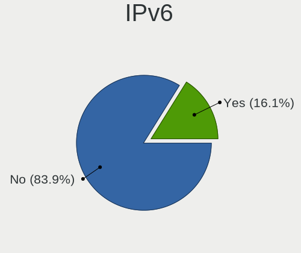

| Used | Computers | Percent |
|------|-----------|---------|
| No   | 286       | 86.14%  |
| Yes  | 46        | 13.86%  |

Bluetooth
---------

Bluetooth Vendor
----------------

Controller vendors

| Vendor                          | Computers | Percent |
|---------------------------------|-----------|---------|
| Intel                           | 33        | 23.74%  |
| Realtek Semiconductor           | 19        | 13.67%  |
| Broadcom                        | 16        | 11.51%  |
| Qualcomm Atheros Communications | 13        | 9.35%   |
| Cambridge Silicon Radio         | 10        | 7.19%   |
| Hewlett-Packard                 | 8         | 5.76%   |
| Lite-On Technology              | 6         | 4.32%   |
| IMC Networks                    | 5         | 3.6%    |
| Foxconn / Hon Hai               | 5         | 3.6%    |
| Dell                            | 5         | 3.6%    |
| ASUSTek Computer                | 4         | 2.88%   |
| Toshiba                         | 3         | 2.16%   |
| Apple                           | 3         | 2.16%   |
| Taiyo Yuden                     | 1         | 0.72%   |
| Realtek                         | 1         | 0.72%   |
| Ralink Technology               | 1         | 0.72%   |
| Ralink                          | 1         | 0.72%   |
| Qcom                            | 1         | 0.72%   |
| Marvell Semiconductor           | 1         | 0.72%   |
| Foxconn International           | 1         | 0.72%   |
| Askey Computer                  | 1         | 0.72%   |
| Alps Electric                   | 1         | 0.72%   |

Bluetooth Model
---------------

Controller models

| Model                                                                               | Computers | Percent |
|-------------------------------------------------------------------------------------|-----------|---------|
| Realtek  Bluetooth 4.2 Adapter                                                      | 10        | 7.19%   |
| Intel Bluetooth wireless interface                                                  | 10        | 7.19%   |
| Intel Bluetooth Device                                                              | 10        | 7.19%   |
| Cambridge Silicon Radio Bluetooth Dongle (HCI mode)                                 | 10        | 7.19%   |
| Realtek Bluetooth Radio                                                             | 8         | 5.76%   |
| Qualcomm Atheros  Bluetooth Device                                                  | 7         | 5.04%   |
| Intel Bluetooth 9460/9560 Jefferson Peak (JfP)                                      | 5         | 3.6%    |
| HP Bluetooth 2.0 Interface [Broadcom BCM2045]                                       | 5         | 3.6%    |
| Intel AX200 Bluetooth                                                               | 4         | 2.88%   |
| Dell DW375 Bluetooth Module                                                         | 4         | 2.88%   |
| Intel Wireless-AC 3168 Bluetooth                                                    | 3         | 2.16%   |
| HP Broadcom 2070 Bluetooth Combo                                                    | 3         | 2.16%   |
| Broadcom BCM2070 Bluetooth 2.1 + EDR                                                | 3         | 2.16%   |
| Qualcomm Atheros AR9462 Bluetooth                                                   | 2         | 1.44%   |
| Qualcomm Atheros AR3012 Bluetooth 4.0                                               | 2         | 1.44%   |
| Lite-On Bluetooth Device                                                            | 2         | 1.44%   |
| Lite-On Atheros Bluetooth                                                           | 2         | 1.44%   |
| Lite-On Atheros AR3012 Bluetooth                                                    | 2         | 1.44%   |
| IMC Networks Bluetooth Device                                                       | 2         | 1.44%   |
| Foxconn / Hon Hai Bluetooth Device                                                  | 2         | 1.44%   |
| Broadcom Bluetooth                                                                  | 2         | 1.44%   |
| Broadcom BCM20702A0 Bluetooth 4.0                                                   | 2         | 1.44%   |
| Broadcom BCM2045B (BDC-2.1)                                                         | 2         | 1.44%   |
| ASUS Broadcom BCM20702A0 Bluetooth                                                  | 2         | 1.44%   |
| Apple Bluetooth Host Controller                                                     | 2         | 1.44%   |
| Toshiba RT Bluetooth Radio                                                          | 1         | 0.72%   |
| Toshiba Integrated Bluetooth HCI                                                    | 1         | 0.72%   |
| Toshiba Bluetooth Device                                                            | 1         | 0.72%   |
| Taiyo Yuden Bluetooth Device(BC04-External)                                         | 1         | 0.72%   |
| Realtek RTL8822BE Bluetooth 4.2 Adapter                                             | 1         | 0.72%   |
| Realtek Bluetooth Radio                                                             | 1         | 0.72%   |
| Ralink CSR BS8510                                                                   | 1         | 0.72%   |
| Ralink RT3290 Bluetooth                                                             | 1         | 0.72%   |
| Qualcomm Atheros Bluetooth USB Host Controller                                      | 1         | 0.72%   |
| Qualcomm Atheros AR3011 Bluetooth                                                   | 1         | 0.72%   |
| Qcom Broadcom Bluetooth USB                                                         | 1         | 0.72%   |
| Marvell Bluetooth and Wireless LAN Composite                                        | 1         | 0.72%   |
| Intel AX201 Bluetooth                                                               | 1         | 0.72%   |
| IMC Networks Broadcom Bluetooth 2.1                                                 | 1         | 0.72%   |
| IMC Networks Bluetooth Radio                                                        | 1         | 0.72%   |
| IMC Networks Atheros AR3012 Bluetooth 4.0 Adapter                                   | 1         | 0.72%   |
| Foxconn International BCM43142A0 Bluetooth module                                   | 1         | 0.72%   |
| Foxconn / Hon Hai Foxconn T77H114 BCM2070 [Single-Chip Bluetooth 2.1 + EDR Adapter] | 1         | 0.72%   |
| Foxconn / Hon Hai Bluetooth USB Host Controller                                     | 1         | 0.72%   |
| Foxconn / Hon Hai Acer Module                                                       | 1         | 0.72%   |
| Dell Wireless 355 Bluetooth                                                         | 1         | 0.72%   |
| Broadcom HP Portable SoftSailing                                                    | 1         | 0.72%   |
| Broadcom HP Bluethunder                                                             | 1         | 0.72%   |
| Broadcom Bluetooth 2.1 Device                                                       | 1         | 0.72%   |
| Broadcom BCM20702 Bluetooth 4.0 [ThinkPad]                                          | 1         | 0.72%   |
| Broadcom BCM2045B (BDC-2) [Bluetooth Controller]                                    | 1         | 0.72%   |
| Broadcom BCM2045A0                                                                  | 1         | 0.72%   |
| Broadcom BCM2045 Bluetooth                                                          | 1         | 0.72%   |
| ASUS BT-253 Bluetooth Adapter                                                       | 1         | 0.72%   |
| ASUS BT-183 Bluetooth 2.0+EDR adapter                                               | 1         | 0.72%   |
| Askey Bluetooth Device                                                              | 1         | 0.72%   |
| Apple Bluetooth USB Host Controller                                                 | 1         | 0.72%   |
| Alps Electric BCM2046 Bluetooth Device                                              | 1         | 0.72%   |

Sound
-----

Sound Vendor
------------

Sound card vendors

| Vendor                           | Computers | Percent |
|----------------------------------|-----------|---------|
| Intel                            | 232       | 55.24%  |
| AMD                              | 72        | 17.14%  |
| Nvidia                           | 71        | 16.9%   |
| C-Media Electronics              | 11        | 2.62%   |
| VIA Technologies                 | 7         | 1.67%   |
| Silicon Integrated Systems [SiS] | 7         | 1.67%   |
| Creative Labs                    | 4         | 0.95%   |
| Logitech                         | 3         | 0.71%   |
| JMTek                            | 2         | 0.48%   |
| GN Netcom                        | 2         | 0.48%   |
| Xilinx                           | 1         | 0.24%   |
| Tenx Technology                  | 1         | 0.24%   |
| M-Audio                          | 1         | 0.24%   |
| GYROCOM C&C                      | 1         | 0.24%   |
| Generalplus Technology           | 1         | 0.24%   |
| Focusrite-Novation               | 1         | 0.24%   |
| Evolution Electronics            | 1         | 0.24%   |
| Dell                             | 1         | 0.24%   |
| Creative Technology              | 1         | 0.24%   |

Sound Model
-----------

Sound card models

| Model                                                                                             | Computers | Percent |
|---------------------------------------------------------------------------------------------------|-----------|---------|
| Intel NM10/ICH7 Family High Definition Audio Controller                                           | 35        | 7.28%   |
| Intel 6 Series/C200 Series Chipset Family High Definition Audio Controller                        | 30        | 6.24%   |
| Intel 82801I (ICH9 Family) HD Audio Controller                                                    | 25        | 5.2%    |
| Intel 7 Series/C216 Chipset Family High Definition Audio Controller                               | 23        | 4.78%   |
| AMD SBx00 Azalia (Intel HDA)                                                                      | 18        | 3.74%   |
| Intel Sunrise Point-LP HD Audio                                                                   | 16        | 3.33%   |
| Intel 8 Series/C220 Series Chipset High Definition Audio Controller                               | 14        | 2.91%   |
| Intel 5 Series/3400 Series Chipset High Definition Audio                                          | 14        | 2.91%   |
| AMD Raven/Raven2/Fenghuang HDMI/DP Audio Controller                                               | 12        | 2.49%   |
| Intel Xeon E3-1200 v3/4th Gen Core Processor HD Audio Controller                                  | 11        | 2.29%   |
| AMD Family 17h (Models 10h-1fh) HD Audio Controller                                               | 11        | 2.29%   |
| Nvidia High Definition Audio Controller                                                           | 8         | 1.66%   |
| Nvidia GF108 High Definition Audio Controller                                                     | 8         | 1.66%   |
| Intel Cannon Point-LP High Definition Audio Controller                                            | 8         | 1.66%   |
| Intel Cannon Lake PCH cAVS                                                                        | 8         | 1.66%   |
| AMD High Definition Audio Controller                                                              | 8         | 1.66%   |
| AMD Family 15h (Models 60h-6fh) Audio Controller                                                  | 8         | 1.66%   |
| Intel Haswell-ULT HD Audio Controller                                                             | 7         | 1.46%   |
| Intel 82801H (ICH8 Family) HD Audio Controller                                                    | 7         | 1.46%   |
| Intel 8 Series HD Audio Controller                                                                | 7         | 1.46%   |
| Nvidia MCP61 High Definition Audio                                                                | 6         | 1.25%   |
| Nvidia GP107GL High Definition Audio Controller                                                   | 6         | 1.25%   |
| Nvidia GM206 High Definition Audio Controller                                                     | 6         | 1.25%   |
| Intel 82801JI (ICH10 Family) HD Audio Controller                                                  | 6         | 1.25%   |
| AMD Ellesmere HDMI Audio [Radeon RX 470/480 / 570/580/590]                                        | 6         | 1.25%   |
| Nvidia GK208 HDMI/DP Audio Controller                                                             | 5         | 1.04%   |
| Intel 100 Series/C230 Series Chipset Family HD Audio Controller                                   | 5         | 1.04%   |
| C-Media Electronics CMI8788 [Oxygen HD Audio]                                                     | 5         | 1.04%   |
| AMD FCH Azalia Controller                                                                         | 5         | 1.04%   |
| Silicon Integrated Systems [SiS] Azalia Audio Controller                                          | 4         | 0.83%   |
| Nvidia GK104 HDMI Audio Controller                                                                | 4         | 0.83%   |
| AMD Starship/Matisse HD Audio Controller                                                          | 4         | 0.83%   |
| AMD RV710/730 HDMI Audio [Radeon HD 4000 series]                                                  | 4         | 0.83%   |
| AMD RS880 HDMI Audio [Radeon HD 4200 Series]                                                      | 4         | 0.83%   |
| AMD Family 17h (Models 00h-0fh) HD Audio Controller                                               | 4         | 0.83%   |
| AMD Cedar HDMI Audio [Radeon HD 5400/6300/7300 Series]                                            | 4         | 0.83%   |
| VIA Technologies VT8233/A/8235/8237 AC97 Audio Controller                                         | 3         | 0.62%   |
| Silicon Integrated Systems [SiS] SiS7012 AC'97 Sound Controller                                   | 3         | 0.62%   |
| Nvidia TU106 High Definition Audio Controller                                                     | 3         | 0.62%   |
| Nvidia MCP79 High Definition Audio                                                                | 3         | 0.62%   |
| Nvidia GP106 High Definition Audio Controller                                                     | 3         | 0.62%   |
| Nvidia GF116 High Definition Audio Controller                                                     | 3         | 0.62%   |
| Intel Wildcat Point-LP High Definition Audio Controller                                           | 3         | 0.62%   |
| Intel US15W/US15X/US15L/UL11L SCH [Poulsbo] HD Audio Controller                                   | 3         | 0.62%   |
| Intel Celeron/Pentium Silver Processor High Definition Audio                                      | 3         | 0.62%   |
| Intel Broadwell-U Audio Controller                                                                | 3         | 0.62%   |
| Intel Atom/Celeron/Pentium Processor x5-E8000/J3xxx/N3xxx Series High Definition Audio Controller | 3         | 0.62%   |
| Intel Atom Processor Z36xxx/Z37xxx Series High Definition Audio Controller                        | 3         | 0.62%   |
| Intel 9 Series Chipset Family HD Audio Controller                                                 | 3         | 0.62%   |
| Intel 82801DB/DBL/DBM (ICH4/ICH4-L/ICH4-M) AC'97 Audio Controller                                 | 3         | 0.62%   |
| AMD Turks HDMI Audio [Radeon HD 6500/6600 / 6700M Series]                                         | 3         | 0.62%   |
| VIA Technologies VX900/VT8xxx High Definition Audio Controller                                    | 2         | 0.42%   |
| Nvidia nForce2 AC97 Audio Controler (MCP)                                                         | 2         | 0.42%   |
| Nvidia GP104 High Definition Audio Controller                                                     | 2         | 0.42%   |
| Nvidia GM107 High Definition Audio Controller [GeForce 940MX]                                     | 2         | 0.42%   |
| Nvidia GF119 HDMI Audio Controller                                                                | 2         | 0.42%   |
| Nvidia GF104 High Definition Audio Controller                                                     | 2         | 0.42%   |
| JMTek USB PnP Audio Device                                                                        | 2         | 0.42%   |
| Intel 82801JD/DO (ICH10 Family) HD Audio Controller                                               | 2         | 0.42%   |
| Intel 82801EB/ER (ICH5/ICH5R) AC'97 Audio Controller                                              | 2         | 0.42%   |

Memory
------

Memory Vendor
-------------

Memory module vendors

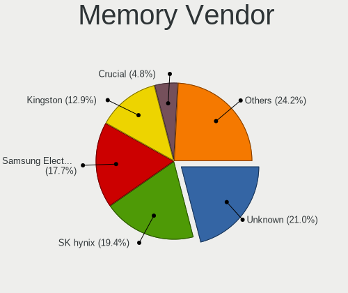

| Vendor              | Computers | Percent |
|---------------------|-----------|---------|
| Unknown             | 13        | 25%     |
| Samsung Electronics | 10        | 19.23%  |
| SK Hynix            | 8         | 15.38%  |
| Kingston            | 7         | 13.46%  |
| Crucial             | 3         | 5.77%   |
| Ramaxel Technology  | 2         | 3.85%   |
| Nanya Technology    | 2         | 3.85%   |
| Micron Technology   | 2         | 3.85%   |
| G.Skill             | 2         | 3.85%   |
| Smart               | 1         | 1.92%   |
| Exceleram           | 1         | 1.92%   |
| A-DATA Technology   | 1         | 1.92%   |

Memory Model
------------

Memory module models

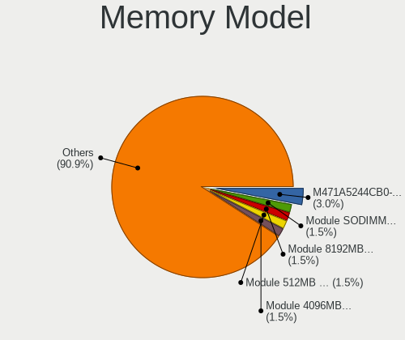

| Model                                                        | Computers | Percent |
|--------------------------------------------------------------|-----------|---------|
| Unknown SODIMM 2048MB SODIMM DDR2 667MT/s                    | 1         | 1.82%   |
| Unknown RAM Module SODIMM DDR                                | 1         | 1.82%   |
| Unknown RAM Module 8192MB SODIMM DDR3 1600MT/s               | 1         | 1.82%   |
| Unknown RAM Module 512MB DIMM 667MT/s                        | 1         | 1.82%   |
| Unknown RAM Module 4096MB DIMM DDR3 1600MT/s                 | 1         | 1.82%   |
| Unknown RAM Module 2GB SODIMM DDR3                           | 1         | 1.82%   |
| Unknown RAM Module 2GB DIMM DDR2 800MT/s                     | 1         | 1.82%   |
| Unknown RAM Module 2GB DIMM DDR 1333MT/s                     | 1         | 1.82%   |
| Unknown RAM Module 2048MB DIMM DDR2 800MT/s                  | 1         | 1.82%   |
| Unknown RAM Module 2048MB DIMM DDR2 667MT/s                  | 1         | 1.82%   |
| Unknown RAM Module 2048MB DIMM DDR2 400MT/s                  | 1         | 1.82%   |
| Unknown RAM Module 1024MB SODIMM DDR2 533MT/s                | 1         | 1.82%   |
| Unknown RAM Module 1024MB DIMM 667MT/s                       | 1         | 1.82%   |
| Unknown RAM Module 1024MB DIMM                               | 1         | 1.82%   |
| Smart RAM SH564128FJ8NWRNSQG 4GB SODIMM DDR3 1600MT/s        | 1         | 1.82%   |
| SK Hynix RAM Module 8192MB DIMM DDR4 2400MT/s                | 1         | 1.82%   |
| SK Hynix RAM Module 512MB SODIMM DDR 533MT/s                 | 1         | 1.82%   |
| SK Hynix RAM HYMP125S64CP8-S6 2GB SODIMM DDR2 975MT/s        | 1         | 1.82%   |
| SK Hynix RAM HMT41GS6AFR8A-PB 8GB SODIMM DDR3 1600MT/s       | 1         | 1.82%   |
| SK Hynix RAM HMT351S6EFR8A-PB 4096MB SODIMM DDR3 1600MT/s    | 1         | 1.82%   |
| SK Hynix RAM HMT351S6CFR8C-H9 4GB SODIMM DDR3 1333MT/s       | 1         | 1.82%   |
| SK Hynix RAM HMT351S6BFR8C-H9 4GB DIMM DDR3 1333MT/s         | 1         | 1.82%   |
| SK Hynix RAM HMP125S6EFR8C-S6 2GB SODIMM DDR2 800MT/s        | 1         | 1.82%   |
| SK Hynix RAM HMP112S6EFR6C-S6 1024MB SODIMM DDR2 800MT/s     | 1         | 1.82%   |
| Samsung RAM M471B5173QH0-YK0 4GB SODIMM DDR3 1600MT/s        | 1         | 1.82%   |
| Samsung RAM M471B5173DB0-YK0 4GB SODIMM DDR3 1600MT/s        | 1         | 1.82%   |
| Samsung RAM M471B1G73QH0-YK0 8GB SODIMM DDR3 2667MT/s        | 1         | 1.82%   |
| Samsung RAM M471A5244CB0-CTD 4GB SODIMM DDR4 3266MT/s        | 1         | 1.82%   |
| Samsung RAM M471A1K43DB1-CTD 8192MB SODIMM DDR4 2667MT/s     | 1         | 1.82%   |
| Samsung RAM M471A1K43CB1-CTD 8GB SODIMM DDR4 2667MT/s        | 1         | 1.82%   |
| Samsung RAM M471A1K43CB1-CRC 8GB SODIMM DDR4 2667MT/s        | 1         | 1.82%   |
| Samsung RAM M4 70T5663QZ3-CF7 2048MB SODIMM DDR2 2048MT/s    | 1         | 1.82%   |
| Samsung RAM M393B1K70CH0-CH9 8192MB DIMM DDR3 1333MT/s       | 1         | 1.82%   |
| Samsung RAM M378A1K43CB2-CRC 8GB DIMM DDR4 3500MT/s          | 1         | 1.82%   |
| Samsung RAM K4AAG165WB-MCTD 8GB SODIMM DDR4 2667MT/s         | 1         | 1.82%   |
| Ramaxel RAM RMSA3260MF68H9F-2666 4096MB SODIMM DDR4 2400MT/s | 1         | 1.82%   |
| Ramaxel RAM RMN1150EC48D7W-800 1024MB SODIMM DDR2 800MT/s    | 1         | 1.82%   |
| Nanya RAM NT2GC64B88G0NS-CG 2GB SODIMM DDR3 1600MT/s         | 1         | 1.82%   |
| Nanya RAM Module 1024MB SODIMM DDR 533MT/s                   | 1         | 1.82%   |
| Micron RAM 8JTF51264AZ-1G6E1 4GB DIMM DDR3 1600MT/s          | 1         | 1.82%   |
| Micron RAM 4ATS1G64HZ-2G6E1 8GB SODIMM DDR4 2667MT/s         | 1         | 1.82%   |
| Kingston RAM KP223C-ELD 2048MB DIMM DDR3 1333MT/s            | 1         | 1.82%   |
| Kingston RAM KHX3600C17D4/16GX 16GB DIMM DDR4 3800MT/s       | 1         | 1.82%   |
| Kingston RAM HP536726-H41-HYA 4096MB DIMM DDR3 1333MT/s      | 1         | 1.82%   |
| Kingston RAM 9905711-016.A00G 4096MB SODIMM DDR4 2667MT/s    | 1         | 1.82%   |
| Kingston RAM 9905700-024.A00G 8192MB SODIMM DDR4 2400MT/s    | 1         | 1.82%   |
| Kingston RAM 9905624-059.A00G 8192MB SODIMM DDR4 2667MT/s    | 1         | 1.82%   |
| Kingston RAM 9905428-155.A00LF 8GB SODIMM DDR3 1600MT/s      | 1         | 1.82%   |
| G.Skill RAM F4-3200C16-16GTZSK 16GB DIMM DDR4 3200MT/s       | 1         | 1.82%   |
| G.Skill RAM F3-10666CL9-8GBSQ 8192MB SODIMM DDR3 1333MT/s    | 1         | 1.82%   |
| Exceleram RAM E30144A 4096MB DIMM DDR3 800MT/s               | 1         | 1.82%   |
| Crucial RAM CT102464BF160B.M16 8GB SODIMM DDR3 1600MT/s      | 1         | 1.82%   |
| Crucial RAM BLT8G4D26BFT4K.C8FD 8GB DIMM DDR4 2666MT/s       | 1         | 1.82%   |
| Crucial RAM BLS8G3D1609DS1S00. 8192MB DIMM DDR3 1600MT/s     | 1         | 1.82%   |
| A-DATA RAM AO1P26KC8T1-BXPS 8GB SODIMM DDR4 2667MT/s         | 1         | 1.82%   |

Memory Kind
-----------

Memory module kinds

| Kind    | Computers | Percent |
|---------|-----------|---------|
| DDR3    | 19        | 39.58%  |
| DDR4    | 14        | 29.17%  |
| DDR2    | 9         | 18.75%  |
| DDR     | 3         | 6.25%   |
| Unknown | 2         | 4.17%   |
| SDRAM   | 1         | 2.08%   |

Memory Form Factor
------------------

Physical design of the memory module

| Name   | Computers | Percent |
|--------|-----------|---------|
| SODIMM | 28        | 59.57%  |
| DIMM   | 19        | 40.43%  |

Memory Size
-----------

Memory module size

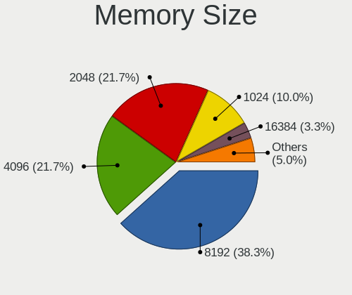

| Size    | Computers | Percent |
|---------|-----------|---------|
| 8192    | 18        | 35.29%  |
| 2048    | 12        | 23.53%  |
| 4096    | 10        | 19.61%  |
| 1024    | 6         | 11.76%  |
| 16384   | 2         | 3.92%   |
| 512     | 2         | 3.92%   |
| Unknown | 1         | 1.96%   |

Memory Speed
------------

Memory module speed

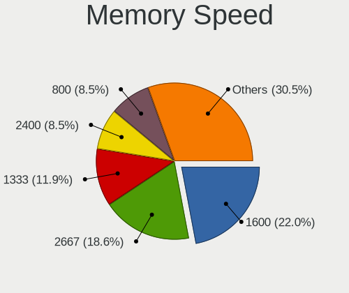

| Speed   | Computers | Percent |
|---------|-----------|---------|
| 1600    | 11        | 22%     |
| 2667    | 9         | 18%     |
| 1333    | 6         | 12%     |
| 800     | 5         | 10%     |
| 2400    | 3         | 6%      |
| 667     | 3         | 6%      |
| Unknown | 3         | 6%      |
| 533     | 2         | 4%      |
| 3800    | 1         | 2%      |
| 3500    | 1         | 2%      |
| 3266    | 1         | 2%      |
| 3200    | 1         | 2%      |
| 2666    | 1         | 2%      |
| 2048    | 1         | 2%      |
| 975     | 1         | 2%      |
| 400     | 1         | 2%      |

Printers & scanners
-------------------

Printer Vendor
--------------

Printer device vendors

| Vendor              | Computers | Percent |
|---------------------|-----------|---------|
| Hewlett-Packard     | 6         | 46.15%  |
| Samsung Electronics | 2         | 15.38%  |
| Brother Industries  | 2         | 15.38%  |
| Seiko Epson         | 1         | 7.69%   |
| Ricoh               | 1         | 7.69%   |
| Canon               | 1         | 7.69%   |

Printer Model
-------------

Printer device models

| Model                      | Computers | Percent |
|----------------------------|-----------|---------|
| Seiko Epson XP-3100 Series | 1         | 7.69%   |
| Samsung SCX-3400 Series    | 1         | 7.69%   |
| Samsung ML-1670 Series     | 1         | 7.69%   |
| Ricoh SP C260SFNw          | 1         | 7.69%   |
| HP LaserJet P1006          | 1         | 7.69%   |
| HP LaserJet 3050           | 1         | 7.69%   |
| HP DeskJet F4200 series    | 1         | 7.69%   |
| HP DeskJet 2700 series     | 1         | 7.69%   |
| HP Deskjet 2540 series     | 1         | 7.69%   |
| HP Deskjet 1050 J410       | 1         | 7.69%   |
| Canon iP4200               | 1         | 7.69%   |
| Brother MFC-L2685DW        | 1         | 7.69%   |
| Brother HL-L2300D series   | 1         | 7.69%   |

Scanner Vendor
--------------

Scanner device vendors

| Vendor          | Computers | Percent |
|-----------------|-----------|---------|
| Seiko Epson     | 1         | 33.33%  |
| Hewlett-Packard | 1         | 33.33%  |
| Canon           | 1         | 33.33%  |

Scanner Model
-------------

Scanner device models

| Model                                         | Computers | Percent |
|-----------------------------------------------|-----------|---------|
| Seiko Epson GT-8300UF [Perfection 1660 PHOTO] | 1         | 33.33%  |
| HP ScanJet 3800c                              | 1         | 33.33%  |
| Canon CanoScan N1240U/LiDE 30                 | 1         | 33.33%  |

Camera
------

Camera Vendor
-------------

Camera device vendors

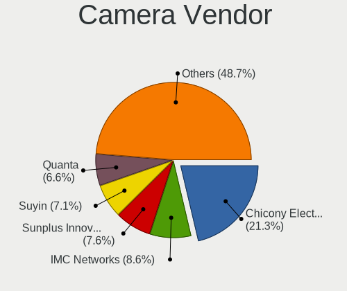

| Vendor                                 | Computers | Percent |
|----------------------------------------|-----------|---------|
| Chicony Electronics                    | 33        | 20.5%   |
| IMC Networks                           | 14        | 8.7%    |
| Sunplus Innovation Technology          | 12        | 7.45%   |
| Quanta                                 | 12        | 7.45%   |
| Suyin                                  | 10        | 6.21%   |
| Microdia                               | 9         | 5.59%   |
| Acer                                   | 9         | 5.59%   |
| Realtek Semiconductor                  | 8         | 4.97%   |
| Syntek                                 | 5         | 3.11%   |
| Ricoh                                  | 5         | 3.11%   |
| Logitech                               | 5         | 3.11%   |
| Cheng Uei Precision Industry (Foxlink) | 5         | 3.11%   |
| Apple                                  | 5         | 3.11%   |
| Silicon Motion                         | 4         | 2.48%   |
| Microsoft                              | 3         | 1.86%   |
| Importek                               | 3         | 1.86%   |
| Z-Star Microelectronics                | 2         | 1.24%   |
| Sunplus Technology                     | 2         | 1.24%   |
| Lite-On Technology                     | 2         | 1.24%   |
| Generalplus Technology                 | 2         | 1.24%   |
| ALi                                    | 2         | 1.24%   |
| Xiongmai                               | 1         | 0.62%   |
| Service & Quality Technology           | 1         | 0.62%   |
| Samsung Electronics                    | 1         | 0.62%   |
| OmniVision Technologies                | 1         | 0.62%   |
| Nintendo                               | 1         | 0.62%   |
| LG Electronics                         | 1         | 0.62%   |
| Lenovo                                 | 1         | 0.62%   |
| KYE Systems (Mouse Systems)            | 1         | 0.62%   |
| Alcor Micro                            | 1         | 0.62%   |

Camera Model
------------

Camera device models

| Model                                               | Computers | Percent |
|-----------------------------------------------------|-----------|---------|
| Quanta HP Webcam                                    | 5         | 3.09%   |
| Chicony Integrated Camera                           | 5         | 3.09%   |
| Suyin Acer/HP Integrated Webcam [CN0314]            | 3         | 1.85%   |
| Realtek USB2.0 VGA UVC WebCam                       | 3         | 1.85%   |
| Chicony USB2.0 HD UVC WebCam                        | 3         | 1.85%   |
| Chicony USB 2.0 Camera                              | 3         | 1.85%   |
| Apple iPhone 5/5C/5S/6/SE                           | 3         | 1.85%   |
| Syntek Sonix USB 2.0 Camera                         | 2         | 1.23%   |
| Suyin 1.3M HD WebCam                                | 2         | 1.23%   |
| Sunplus Laptop_Integrated_Webcam_HD                 | 2         | 1.23%   |
| Sunplus HD WebCam                                   | 2         | 1.23%   |
| Silicon Motion HP Webcam-101                        | 2         | 1.23%   |
| Realtek Integrated_Webcam_HD                        | 2         | 1.23%   |
| Quanta VGA WebCam                                   | 2         | 1.23%   |
| Quanta HP TrueVision HD Camera                      | 2         | 1.23%   |
| Microsoft LifeCam HD-3000                           | 2         | 1.23%   |
| Microdia Sonix USB 2.0 Camera                       | 2         | 1.23%   |
| Microdia Integrated Webcam HD                       | 2         | 1.23%   |
| Logitech Webcam C270                                | 2         | 1.23%   |
| Importek TOSHIBA Web Camera - HD                    | 2         | 1.23%   |
| IMC Networks USB2.0 HD UVC WebCam                   | 2         | 1.23%   |
| IMC Networks Integrated Camera                      | 2         | 1.23%   |
| IMC Networks EasyCamera                             | 2         | 1.23%   |
| Chicony HP Truevision HD camera                     | 2         | 1.23%   |
| Chicony HD WebCam                                   | 2         | 1.23%   |
| Chicony 2.0M UVC Webcam / CNF7129                   | 2         | 1.23%   |
| Cheng Uei Precision Industry (Foxlink) HP Webcam    | 2         | 1.23%   |
| Apple Built-in iSight                               | 2         | 1.23%   |
| Acer USB HD Webcam                                  | 2         | 1.23%   |
| Acer Lenovo EasyCamera                              | 2         | 1.23%   |
| Z-Star Namuga 1.3M Webcam                           | 1         | 0.62%   |
| Z-Star Lenovo ThinkCentre Web Camera                | 1         | 0.62%   |
| Xiongmai web camera                                 | 1         | 0.62%   |
| Syntek Integrated Webcam                            | 1         | 0.62%   |
| Syntek Integrated Camera                            | 1         | 0.62%   |
| Syntek HP Webcam                                    | 1         | 0.62%   |
| Suyin HP Webcam                                     | 1         | 0.62%   |
| Suyin HP TrueVision HD Integrated Webcam            | 1         | 0.62%   |
| Suyin HP Truevision HD                              | 1         | 0.62%   |
| Suyin HD Video WebCam                               | 1         | 0.62%   |
| Suyin Acer CrystalEye Webcam                        | 1         | 0.62%   |
| Sunplus 1.3M WebCam                                 | 1         | 0.62%   |
| Sunplus 1.3M HD WebCam                              | 1         | 0.62%   |
| Sunplus Lenovo EasyCamera                           | 1         | 0.62%   |
| Sunplus Laptop_Integrated_Webcam_FHD                | 1         | 0.62%   |
| Sunplus Integrated_Webcam_HD                        | 1         | 0.62%   |
| Sunplus Integrated Webcam                           | 1         | 0.62%   |
| Sunplus HP TrueVision HD Camera                     | 1         | 0.62%   |
| Sunplus Full HD webcam                              | 1         | 0.62%   |
| Sunplus Dell HD Webcam                              | 1         | 0.62%   |
| Sunplus Asus Webcam                                 | 1         | 0.62%   |
| Silicon Motion WebCam SCB-0385N                     | 1         | 0.62%   |
| Silicon Motion WebCam SC-0311139N                   | 1         | 0.62%   |
| Service & Quality USB PC Camera                     | 1         | 0.62%   |
| Samsung Galaxy A5 (MTP)                             | 1         | 0.62%   |
| Ricoh Visual Communication Camera VGP-VCC9 [R5U870] | 1         | 0.62%   |
| Ricoh Visual Communication Camera VGP-VCC4 [R5U870] | 1         | 0.62%   |
| Ricoh USB2.0 Camera                                 | 1         | 0.62%   |
| Ricoh Sony Visual Communication Camera              | 1         | 0.62%   |
| Ricoh HD Webcam                                     | 1         | 0.62%   |

Security
--------

Fingerprint Vendor
------------------

Fingerprint sensor vendors

| Vendor                | Computers | Percent |
|-----------------------|-----------|---------|
| Validity Sensors      | 9         | 37.5%   |
| AuthenTec             | 7         | 29.17%  |
| STMicroelectronics    | 3         | 12.5%   |
| Synaptics             | 2         | 8.33%   |
| LighTuning Technology | 2         | 8.33%   |
| Upek                  | 1         | 4.17%   |

Fingerprint Model
-----------------

Fingerprint sensor models

| Model                                                  | Computers | Percent |
|--------------------------------------------------------|-----------|---------|
| STMicroelectronics Fingerprint Reader                  | 3         | 12.5%   |
| Validity Sensors VFS451 Fingerprint Reader             | 2         | 8.33%   |
| Validity Sensors VFS301 Fingerprint Reader             | 2         | 8.33%   |
| AuthenTec AES2810                                      | 2         | 8.33%   |
| AuthenTec AES2501 Fingerprint Sensor                   | 2         | 8.33%   |
| AuthenTec AES1600                                      | 2         | 8.33%   |
| Validity Sensors VFS5011 Fingerprint Reader            | 1         | 4.17%   |
| Validity Sensors VFS495 Fingerprint Reader             | 1         | 4.17%   |
| Validity Sensors VFS491                                | 1         | 4.17%   |
| Validity Sensors VFS101 Fingerprint Reader             | 1         | 4.17%   |
| Validity Sensors Fingerprint scanner                   | 1         | 4.17%   |
| Upek Biometric Touchchip/Touchstrip Fingerprint Sensor | 1         | 4.17%   |
| Synaptics Metallica MOH Touch Fingerprint Reader       | 1         | 4.17%   |
| LighTuning ES603 Swipe Fingerprint Sensor              | 1         | 4.17%   |
| LighTuning EgisTec Touch Fingerprint Sensor            | 1         | 4.17%   |
| AuthenTec Fingerprint Sensor                           | 1         | 4.17%   |
| Unknown                                                | 1         | 4.17%   |

Chipcard Vendor
---------------

Chipcard module vendors

| Vendor                            | Computers | Percent |
|-----------------------------------|-----------|---------|
| Broadcom                          | 8         | 61.54%  |
| VASCO Data Security International | 1         | 7.69%   |
| OmniKey                           | 1         | 7.69%   |
| Jing-Mold Enterprise              | 1         | 7.69%   |
| Gemalto (was Gemplus)             | 1         | 7.69%   |
| Alcor Micro                       | 1         | 7.69%   |

Chipcard Model
--------------

Chipcard module models

| Model                                                                        | Computers | Percent |
|------------------------------------------------------------------------------|-----------|---------|
| Broadcom BCM5880 Secure Applications Processor                               | 4         | 30.77%  |
| Broadcom BCM5880 Secure Applications Processor with fingerprint swipe sensor | 3         | 23.08%  |
| VASCO Data Security International DIGIPASS 870                               | 1         | 7.69%   |
| OmniKey CardMan 1021                                                         | 1         | 7.69%   |
| Jing-Mold Enterprise HP USB Business Slim Smartcard CCID Keyboard            | 1         | 7.69%   |
| Gemalto (was Gemplus) Compact Smart Card Reader Writer                       | 1         | 7.69%   |
| Broadcom BCM5880 Secure Applications Processor with fingerprint touch sensor | 1         | 7.69%   |
| Alcor Micro AU9540 Smartcard Reader                                          | 1         | 7.69%   |

Unsupported
-----------

Unsupported Devices
-------------------

Total unsupported devices on board

| Total | Computers | Percent |
|-------|-----------|---------|
| 0     | 215       | 65.55%  |
| 1     | 85        | 25.91%  |
| 2     | 18        | 5.49%   |
| 3     | 8         | 2.44%   |
| 4     | 2         | 0.61%   |

Unsupported Device Types
------------------------

Types of unsupported devices

| Type                     | Computers | Percent |
|--------------------------|-----------|---------|
| Graphics card            | 51        | 36.43%  |
| Net/wireless             | 26        | 18.57%  |
| Fingerprint reader       | 24        | 17.14%  |
| Chipcard                 | 10        | 7.14%   |
| Multimedia controller    | 7         | 5%      |
| Communication controller | 6         | 4.29%   |
| Storage                  | 5         | 3.57%   |
| Network                  | 2         | 1.43%   |
| Net/ethernet             | 2         | 1.43%   |
| Flash memory             | 2         | 1.43%   |
| Unassigned class         | 1         | 0.71%   |
| Storage/ide              | 1         | 0.71%   |
| Modem                    | 1         | 0.71%   |
| Camera                   | 1         | 0.71%   |
| Bluetooth                | 1         | 0.71%   |

