LMDE 4 - Tested Hardware & Statistics (Desktops)
------------------------------------------------

A project to collect tested hardware configurations for LMDE 4.

Anyone can contribute to this report by the [hw-probe](https://github.com/linuxhw/hw-probe) tool:

    sudo -E hw-probe -all -upload

Please submit a probe of your configuration if it's not presented on the page or is rare.

Full-feature report is available here: https://linux-hardware.org/?view=trends&rel=lmde-4

Contents
--------

* [ Test Cases ](#test-cases)

* [ System ](#system)
  - [ Kernel                   ](#kernel)
  - [ Kernel Family            ](#kernel-family)
  - [ Kernel Major Ver.        ](#kernel-major-ver)
  - [ Arch                     ](#arch)
  - [ DE                       ](#de)
  - [ Display Server           ](#display-server)
  - [ Display Manager          ](#display-manager)
  - [ OS Lang                  ](#os-lang)
  - [ Boot Mode                ](#boot-mode)
  - [ Filesystem               ](#filesystem)
  - [ Part. scheme             ](#part-scheme)
  - [ Dual Boot with Linux/BSD ](#dual-boot-with-linuxbsd)
  - [ Dual Boot (Win)          ](#dual-boot-win)

* [ Board ](#board)
  - [ Vendor                   ](#vendor)
  - [ Model                    ](#model)
  - [ Model Family             ](#model-family)
  - [ MFG Year                 ](#mfg-year)
  - [ Form Factor              ](#form-factor)
  - [ Secure Boot              ](#secure-boot)
  - [ Coreboot                 ](#coreboot)
  - [ RAM Size                 ](#ram-size)
  - [ RAM Used                 ](#ram-used)
  - [ Total Drives             ](#total-drives)
  - [ Has CD-ROM               ](#has-cd-rom)
  - [ Has Ethernet             ](#has-ethernet)
  - [ Has WiFi                 ](#has-wifi)
  - [ Has Bluetooth            ](#has-bluetooth)

* [ Location ](#location)
  - [ Country                  ](#country)
  - [ City                     ](#city)

* [ Drives ](#drives)
  - [ Drive Vendor             ](#drive-vendor)
  - [ Drive Model              ](#drive-model)
  - [ HDD Vendor               ](#hdd-vendor)
  - [ SSD Vendor               ](#ssd-vendor)
  - [ Drive Kind               ](#drive-kind)
  - [ Drive Connector          ](#drive-connector)
  - [ Drive Size               ](#drive-size)
  - [ Space Total              ](#space-total)
  - [ Space Used               ](#space-used)
  - [ Malfunc. Drives          ](#malfunc-drives)
  - [ Malfunc. Drive Vendor    ](#malfunc-drive-vendor)
  - [ Malfunc. HDD Vendor      ](#malfunc-hdd-vendor)
  - [ Malfunc. Drive Kind      ](#malfunc-drive-kind)
  - [ Failed Drives            ](#failed-drives)
  - [ Failed Drive Vendor      ](#failed-drive-vendor)
  - [ Drive Status             ](#drive-status)

* [ Storage controller ](#storage-controller)
  - [ Storage Vendor           ](#storage-vendor)
  - [ Storage Model            ](#storage-model)
  - [ Storage Kind             ](#storage-kind)

* [ Processor ](#processor)
  - [ CPU Vendor               ](#cpu-vendor)
  - [ CPU Model                ](#cpu-model)
  - [ CPU Model Family         ](#cpu-model-family)
  - [ CPU Cores                ](#cpu-cores)
  - [ CPU Sockets              ](#cpu-sockets)
  - [ CPU Threads              ](#cpu-threads)
  - [ CPU Op-Modes             ](#cpu-op-modes)
  - [ CPU Microcode            ](#cpu-microcode)
  - [ CPU Microarch            ](#cpu-microarch)

* [ Graphics ](#graphics)
  - [ GPU Vendor               ](#gpu-vendor)
  - [ GPU Model                ](#gpu-model)
  - [ GPU Combo                ](#gpu-combo)
  - [ GPU Driver               ](#gpu-driver)
  - [ GPU Memory               ](#gpu-memory)

* [ Monitor ](#monitor)
  - [ Monitor Vendor           ](#monitor-vendor)
  - [ Monitor Model            ](#monitor-model)
  - [ Monitor Resolution       ](#monitor-resolution)
  - [ Monitor Diagonal         ](#monitor-diagonal)
  - [ Monitor Width            ](#monitor-width)
  - [ Aspect Ratio             ](#aspect-ratio)
  - [ Monitor Area             ](#monitor-area)
  - [ Pixel Density            ](#pixel-density)
  - [ Multiple Monitors        ](#multiple-monitors)

* [ Network ](#network)
  - [ Net Controller Vendor    ](#net-controller-vendor)
  - [ Net Controller Model     ](#net-controller-model)
  - [ Wireless Vendor          ](#wireless-vendor)
  - [ Wireless Model           ](#wireless-model)
  - [ Ethernet Vendor          ](#ethernet-vendor)
  - [ Ethernet Model           ](#ethernet-model)
  - [ Net Controller Kind      ](#net-controller-kind)
  - [ Used Controller          ](#used-controller)
  - [ NICs                     ](#nics)
  - [ IPv6                     ](#ipv6)

* [ Bluetooth ](#bluetooth)
  - [ Bluetooth Vendor         ](#bluetooth-vendor)
  - [ Bluetooth Model          ](#bluetooth-model)

* [ Sound ](#sound)
  - [ Sound Vendor             ](#sound-vendor)
  - [ Sound Model              ](#sound-model)

* [ Memory ](#memory)
  - [ Memory Vendor            ](#memory-vendor)
  - [ Memory Model             ](#memory-model)
  - [ Memory Kind              ](#memory-kind)
  - [ Memory Form Factor       ](#memory-form-factor)
  - [ Memory Size              ](#memory-size)
  - [ Memory Speed             ](#memory-speed)

* [ Printers & scanners ](#printers--scanners)
  - [ Printer Vendor           ](#printer-vendor)
  - [ Printer Model            ](#printer-model)
  - [ Scanner Vendor           ](#scanner-vendor)
  - [ Scanner Model            ](#scanner-model)

* [ Camera ](#camera)
  - [ Camera Vendor            ](#camera-vendor)
  - [ Camera Model             ](#camera-model)

* [ Security ](#security)
  - [ Fingerprint Vendor       ](#fingerprint-vendor)
  - [ Fingerprint Model        ](#fingerprint-model)
  - [ Chipcard Vendor          ](#chipcard-vendor)
  - [ Chipcard Model           ](#chipcard-model)

* [ Unsupported ](#unsupported)
  - [ Unsupported Devices      ](#unsupported-devices)
  - [ Unsupported Device Types ](#unsupported-device-types)

Test Cases
----------

| Vendor        | Model                       | Probe                                                      | Date         |
|---------------|-----------------------------|------------------------------------------------------------|--------------|
| ASUSTek       | UN62                        | [0702f80222](https://linux-hardware.org/?probe=0702f80222) | Sep 09, 2021 |
| ASUSTek       | P5VD2-VM                    | [9bab4b76ff](https://linux-hardware.org/?probe=9bab4b76ff) | Sep 07, 2021 |
| ASUSTek       | P5VD2-VM                    | [305d566f57](https://linux-hardware.org/?probe=305d566f57) | Sep 07, 2021 |
| Gigabyte      | H61M-S1                     | [d1773b3e3d](https://linux-hardware.org/?probe=d1773b3e3d) | Sep 06, 2021 |
| Gigabyte      | H61M-S1                     | [5d2cc7f4ca](https://linux-hardware.org/?probe=5d2cc7f4ca) | Sep 06, 2021 |
| Intel         | DG31PR AAD97573-302         | [7122e4bd16](https://linux-hardware.org/?probe=7122e4bd16) | Sep 04, 2021 |
| Gigabyte      | M52LT-D3P                   | [09cbb5b50e](https://linux-hardware.org/?probe=09cbb5b50e) | Sep 03, 2021 |
| Gigabyte      | M52LT-D3P                   | [949b2062ea](https://linux-hardware.org/?probe=949b2062ea) | Sep 03, 2021 |
| ASRock        | G41M-S3                     | [c34caa75e2](https://linux-hardware.org/?probe=c34caa75e2) | Aug 23, 2021 |
| ASRock        | G41M-S3                     | [48360885d9](https://linux-hardware.org/?probe=48360885d9) | Aug 22, 2021 |
| MSI           | MS-7142                     | [2700c74bd9](https://linux-hardware.org/?probe=2700c74bd9) | Aug 21, 2021 |
| MSI           | MS-7142                     | [18ae0c1bb3](https://linux-hardware.org/?probe=18ae0c1bb3) | Aug 21, 2021 |
| HP            | 0AA8h                       | [d9a8fd3722](https://linux-hardware.org/?probe=d9a8fd3722) | Aug 15, 2021 |
| ASUSTek       | A7N8X-LA                    | [0e9fd81caf](https://linux-hardware.org/?probe=0e9fd81caf) | Aug 11, 2021 |
| ASUSTek       | A7N8X-LA                    | [f14c99bbce](https://linux-hardware.org/?probe=f14c99bbce) | Aug 11, 2021 |
| Gigabyte      | X570 AORUS ULTRA            | [b937ce5e88](https://linux-hardware.org/?probe=b937ce5e88) | Aug 10, 2021 |
| Unknown       | Unknown                     | [cff87306ab](https://linux-hardware.org/?probe=cff87306ab) | Aug 07, 2021 |
| Fujitsu Si... | D2264-A1 S26361-D2264-A1    | [a1768aa578](https://linux-hardware.org/?probe=a1768aa578) | Aug 06, 2021 |
| Fujitsu Si... | D2264-A1 S26361-D2264-A1    | [52aa712b0c](https://linux-hardware.org/?probe=52aa712b0c) | Aug 05, 2021 |
| ASUSTek       | PRIME Z370-A                | [05c1703574](https://linux-hardware.org/?probe=05c1703574) | Aug 03, 2021 |
| ASUSTek       | PRIME Z370-A                | [faf304d157](https://linux-hardware.org/?probe=faf304d157) | Aug 02, 2021 |
| OEM           | 45CMX/45GMX/45CMX-K         | [65d8eb687e](https://linux-hardware.org/?probe=65d8eb687e) | Jul 30, 2021 |
| Unknown       | Unknown                     | [33a6186148](https://linux-hardware.org/?probe=33a6186148) | Jul 30, 2021 |
| Intel         | BTC-T37                     | [bb5051b598](https://linux-hardware.org/?probe=bb5051b598) | Jul 27, 2021 |
| ASRock        | FM2A85X Extreme4-M          | [aa0030f094](https://linux-hardware.org/?probe=aa0030f094) | Jul 26, 2021 |
| Gigabyte      | Z390 M GAMING-CF            | [763cb39ac0](https://linux-hardware.org/?probe=763cb39ac0) | Jul 25, 2021 |
| Gigabyte      | X570 AORUS PRO              | [932c4de6ce](https://linux-hardware.org/?probe=932c4de6ce) | Jul 18, 2021 |
| ASUSTek       | PRIME A320M-K 2021-06-11    | [39037104b7](https://linux-hardware.org/?probe=39037104b7) | Jul 17, 2021 |
| ASUSTek       | PRIME A320M-K 2021-06-11    | [eef16a5b8f](https://linux-hardware.org/?probe=eef16a5b8f) | Jul 17, 2021 |
| Dell          | 08HPGT A01                  | [64d562d6ef](https://linux-hardware.org/?probe=64d562d6ef) | Jul 16, 2021 |
| ASUSTek       | PRIME A320M-K 2021-06-11    | [ab57bbf3d8](https://linux-hardware.org/?probe=ab57bbf3d8) | Jul 15, 2021 |
| ASUSTek       | PRIME A320M-K 2021-06-11    | [a82245240b](https://linux-hardware.org/?probe=a82245240b) | Jul 15, 2021 |
| Unknown       | Unknown                     | [3007b813c6](https://linux-hardware.org/?probe=3007b813c6) | Jul 13, 2021 |
| Unknown       | Unknown                     | [5cfa1dcb4f](https://linux-hardware.org/?probe=5cfa1dcb4f) | Jul 12, 2021 |
| MSI           | H81M-E34                    | [14c2f8a49d](https://linux-hardware.org/?probe=14c2f8a49d) | Jul 05, 2021 |
| MSI           | A320M-A PRO                 | [9d356e787a](https://linux-hardware.org/?probe=9d356e787a) | Jul 01, 2021 |
| HP            | 0A98h                       | [40990f73a5](https://linux-hardware.org/?probe=40990f73a5) | Jun 22, 2021 |
| HP            | 0AA8h                       | [43103b39a5](https://linux-hardware.org/?probe=43103b39a5) | Jun 17, 2021 |
| Intel         | H61                         | [6b0bdb5986](https://linux-hardware.org/?probe=6b0bdb5986) | Jun 14, 2021 |
| HP            | 0AA8h                       | [9154911bc9](https://linux-hardware.org/?probe=9154911bc9) | Jun 13, 2021 |
| ASUSTek       | Maximus VI HERO             | [699d10613e](https://linux-hardware.org/?probe=699d10613e) | Jun 11, 2021 |
| ASUSTek       | Z97-K                       | [f0b9aa22e5](https://linux-hardware.org/?probe=f0b9aa22e5) | Jun 10, 2021 |
| Unknown       | Unknown                     | [3e408e9ead](https://linux-hardware.org/?probe=3e408e9ead) | May 31, 2021 |
| Unknown       | Unknown                     | [39b2780acf](https://linux-hardware.org/?probe=39b2780acf) | May 31, 2021 |
| Dell          | 0HY9JP A01                  | [3f6ddbd81d](https://linux-hardware.org/?probe=3f6ddbd81d) | May 30, 2021 |
| ASUSTek       | H61M-A/BR                   | [7d2b37e6e1](https://linux-hardware.org/?probe=7d2b37e6e1) | May 29, 2021 |
| ASRock        | G41M-S3                     | [adc801308b](https://linux-hardware.org/?probe=adc801308b) | May 29, 2021 |
| MSI           | B450I GAMING PLUS AC        | [d03d2796a0](https://linux-hardware.org/?probe=d03d2796a0) | May 29, 2021 |
| MSI           | B450I GAMING PLUS AC        | [200072e2a7](https://linux-hardware.org/?probe=200072e2a7) | May 29, 2021 |
| ASRock        | G41M-S3                     | [47f6c3e962](https://linux-hardware.org/?probe=47f6c3e962) | May 28, 2021 |
| MSI           | Gamila/Giovani/Neon seri... | [cd3697bd15](https://linux-hardware.org/?probe=cd3697bd15) | May 25, 2021 |
| MSI           | Gamila/Giovani/Neon seri... | [7c520b0d6e](https://linux-hardware.org/?probe=7c520b0d6e) | May 25, 2021 |
| Gigabyte      | GA-78LMT-USB3               | [55d981b2ed](https://linux-hardware.org/?probe=55d981b2ed) | May 23, 2021 |
| Intel         | H61                         | [1954634de4](https://linux-hardware.org/?probe=1954634de4) | May 22, 2021 |
| Unknown       | Unknown                     | [2ad3cb7346](https://linux-hardware.org/?probe=2ad3cb7346) | May 22, 2021 |
| Intel         | H61                         | [dad657a0bc](https://linux-hardware.org/?probe=dad657a0bc) | May 19, 2021 |
| Foxconn       | 945 7MC Series              | [f4634ec470](https://linux-hardware.org/?probe=f4634ec470) | May 17, 2021 |
| Dell          | 0FM586 A00                  | [8a955d2c5a](https://linux-hardware.org/?probe=8a955d2c5a) | May 16, 2021 |
| Intel         | H61                         | [76574dce75](https://linux-hardware.org/?probe=76574dce75) | May 16, 2021 |
| ASUSTek       | B150M-A                     | [ecc85d30a9](https://linux-hardware.org/?probe=ecc85d30a9) | May 13, 2021 |
| Dell          | 0XR1GT A00                  | [a502e8842e](https://linux-hardware.org/?probe=a502e8842e) | May 12, 2021 |
| ASUSTek       | V-P7H55E                    | [3c0a297ede](https://linux-hardware.org/?probe=3c0a297ede) | May 08, 2021 |
| ASUSTek       | Crosshair V Formula         | [0fd87c485e](https://linux-hardware.org/?probe=0fd87c485e) | May 07, 2021 |
| ASUSTek       | P5KC                        | [80549acbba](https://linux-hardware.org/?probe=80549acbba) | May 03, 2021 |
| ASUSTek       | P5KC                        | [f2313ee72b](https://linux-hardware.org/?probe=f2313ee72b) | May 03, 2021 |
| ASUSTek       | P5KC                        | [50505c9ede](https://linux-hardware.org/?probe=50505c9ede) | Apr 30, 2021 |
| ASUSTek       | P5KC                        | [b51106e072](https://linux-hardware.org/?probe=b51106e072) | Apr 30, 2021 |
| ASUSTek       | P5KPL-AM SE                 | [2cd9e43be0](https://linux-hardware.org/?probe=2cd9e43be0) | Apr 27, 2021 |
| ASUSTek       | PRIME B350-PLUS             | [46b0bab7d8](https://linux-hardware.org/?probe=46b0bab7d8) | Apr 27, 2021 |
| Unknown       | Phitronics N68C-M           | [3076a5bae3](https://linux-hardware.org/?probe=3076a5bae3) | Apr 24, 2021 |
| Unknown       | Phitronics N68C-M           | [d3a56832d9](https://linux-hardware.org/?probe=d3a56832d9) | Apr 23, 2021 |
| ASUSTek       | PRIME B450-PLUS             | [761a9ce0e9](https://linux-hardware.org/?probe=761a9ce0e9) | Apr 21, 2021 |
| ASUSTek       | P5Q DELUXE                  | [8ab143ec6b](https://linux-hardware.org/?probe=8ab143ec6b) | Apr 20, 2021 |
| Gigabyte      | GA-78LMT-USB3               | [2813977a91](https://linux-hardware.org/?probe=2813977a91) | Apr 20, 2021 |
| ASUSTek       | PRIME B350-PLUS             | [d6c3daff43](https://linux-hardware.org/?probe=d6c3daff43) | Apr 19, 2021 |
| ASUSTek       | V-P7H55E                    | [fb3b69b074](https://linux-hardware.org/?probe=fb3b69b074) | Apr 18, 2021 |
| Gigabyte      | M68MT-S2P                   | [47deff8a39](https://linux-hardware.org/?probe=47deff8a39) | Apr 17, 2021 |
| Gigabyte      | Z97-D3H-CF                  | [16d03cb92f](https://linux-hardware.org/?probe=16d03cb92f) | Apr 12, 2021 |
| Dell          | 0KP561                      | [3579bff9c4](https://linux-hardware.org/?probe=3579bff9c4) | Apr 08, 2021 |
| DFI           | LP BI P45-T2S Elite         | [01f0babd70](https://linux-hardware.org/?probe=01f0babd70) | Apr 08, 2021 |
| ASUSTek       | PRIME Z390-P                | [055066b50a](https://linux-hardware.org/?probe=055066b50a) | Apr 08, 2021 |
| ASUSTek       | P5KC                        | [b687d3a64f](https://linux-hardware.org/?probe=b687d3a64f) | Apr 06, 2021 |
| Pegatron      | 2ADC                        | [e4bfddb8d9](https://linux-hardware.org/?probe=e4bfddb8d9) | Apr 04, 2021 |
| MSI           | MS-7267                     | [d16e8a4364](https://linux-hardware.org/?probe=d16e8a4364) | Apr 03, 2021 |
| Intel         | H61                         | [724cdd1804](https://linux-hardware.org/?probe=724cdd1804) | Mar 27, 2021 |
| Intel         | H61                         | [d7c3f87e52](https://linux-hardware.org/?probe=d7c3f87e52) | Mar 26, 2021 |
| Gigabyte      | Z77-D3H                     | [6ab1c423db](https://linux-hardware.org/?probe=6ab1c423db) | Mar 25, 2021 |
| MSI           | Z77A-GD65                   | [a9c3672597](https://linux-hardware.org/?probe=a9c3672597) | Mar 25, 2021 |
| Gigabyte      | Z77-D3H                     | [3b4565a813](https://linux-hardware.org/?probe=3b4565a813) | Mar 20, 2021 |
| ASUSTek       | M5A97 PRO                   | [3c9720e16b](https://linux-hardware.org/?probe=3c9720e16b) | Mar 18, 2021 |
| MSI           | MS-6785                     | [303c1ac636](https://linux-hardware.org/?probe=303c1ac636) | Mar 17, 2021 |
| Unknown       | Unknown                     | [faee1ed378](https://linux-hardware.org/?probe=faee1ed378) | Mar 13, 2021 |
| ASUSTek       | ROG STRIX H470-I GAMING     | [f8503ecc3b](https://linux-hardware.org/?probe=f8503ecc3b) | Mar 10, 2021 |
| ECS           | A740GM-M                    | [442aa41981](https://linux-hardware.org/?probe=442aa41981) | Mar 08, 2021 |
| Unknown       | Unknown                     | [a8d2e4fa56](https://linux-hardware.org/?probe=a8d2e4fa56) | Mar 07, 2021 |
| Unknown       | Unknown                     | [79e6e8bbfc](https://linux-hardware.org/?probe=79e6e8bbfc) | Mar 06, 2021 |
| ASRock        | G31M-GS                     | [ea6fbcd94e](https://linux-hardware.org/?probe=ea6fbcd94e) | Mar 02, 2021 |
| Acer          | EG43LMK                     | [249967a21a](https://linux-hardware.org/?probe=249967a21a) | Feb 28, 2021 |
| ASRock        | A320M-HDV R4.0              | [527b138b70](https://linux-hardware.org/?probe=527b138b70) | Feb 22, 2021 |
| Acer          | EG43LMK                     | [1c1fdf43c0](https://linux-hardware.org/?probe=1c1fdf43c0) | Feb 17, 2021 |
| MSI           | MS-7267                     | [6bf114a22f](https://linux-hardware.org/?probe=6bf114a22f) | Feb 15, 2021 |
| MSI           | MS-7267                     | [78e4d03c89](https://linux-hardware.org/?probe=78e4d03c89) | Feb 15, 2021 |
| Intel         | DP55WB AAE64798-206         | [4b2befb0d2](https://linux-hardware.org/?probe=4b2befb0d2) | Feb 14, 2021 |
| ASUSTek       | SABERTOOTH 990FX R2.0       | [c8e67a7d41](https://linux-hardware.org/?probe=c8e67a7d41) | Feb 07, 2021 |
| Gigabyte      | H61M-DS2 DVI                | [6e605fd64d](https://linux-hardware.org/?probe=6e605fd64d) | Feb 06, 2021 |
| Gigabyte      | H61M-DS2 DVI                | [ec667e7b35](https://linux-hardware.org/?probe=ec667e7b35) | Feb 05, 2021 |
| ASUSTek       | PRIME H310M-E R2.0/BR       | [b71d20e5de](https://linux-hardware.org/?probe=b71d20e5de) | Feb 05, 2021 |
| ASUSTek       | Z97-K                       | [3adb6d9dc1](https://linux-hardware.org/?probe=3adb6d9dc1) | Feb 05, 2021 |
| ASRock        | X570 Taichi                 | [9f77a9eea6](https://linux-hardware.org/?probe=9f77a9eea6) | Feb 04, 2021 |
| ASRock        | X570 Taichi                 | [9b6ea4cda5](https://linux-hardware.org/?probe=9b6ea4cda5) | Feb 04, 2021 |
| ASRock        | H61M-HVS                    | [05c23c4247](https://linux-hardware.org/?probe=05c23c4247) | Feb 02, 2021 |
| ASRock        | H61M-HVS                    | [8c45cfc073](https://linux-hardware.org/?probe=8c45cfc073) | Feb 02, 2021 |
| ASUSTek       | P5E3 Deluxe                 | [47324765ec](https://linux-hardware.org/?probe=47324765ec) | Feb 02, 2021 |
| Unknown       | Unknown                     | [94d77e9dd0](https://linux-hardware.org/?probe=94d77e9dd0) | Feb 02, 2021 |
| ASUSTek       | P5KPL-AM EPU                | [9761a3446c](https://linux-hardware.org/?probe=9761a3446c) | Jan 30, 2021 |
| Dell          | 03NVJ6 A02                  | [9c930ede42](https://linux-hardware.org/?probe=9c930ede42) | Jan 28, 2021 |
| MSI           | B450M-A PRO MAX             | [e5bc80f882](https://linux-hardware.org/?probe=e5bc80f882) | Jan 26, 2021 |
| Dell          | 0TT708 A01                  | [d04b2d493f](https://linux-hardware.org/?probe=d04b2d493f) | Jan 20, 2021 |
| Dell          | 0TT708 A01                  | [08ac15e868](https://linux-hardware.org/?probe=08ac15e868) | Jan 15, 2021 |
| Dell          | 0TT708 A01                  | [d60611163e](https://linux-hardware.org/?probe=d60611163e) | Jan 15, 2021 |
| Dell          | 0TT708 A01                  | [d0da7a44f7](https://linux-hardware.org/?probe=d0da7a44f7) | Jan 14, 2021 |
| Alienware     | 06G6JW A00                  | [992089d02a](https://linux-hardware.org/?probe=992089d02a) | Jan 12, 2021 |
| Intel         | DP55WB AAE64798-206         | [51ec8a1510](https://linux-hardware.org/?probe=51ec8a1510) | Jan 06, 2021 |
| ASUSTek       | P5K                         | [22a568db8e](https://linux-hardware.org/?probe=22a568db8e) | Jan 02, 2021 |
| ASUSTek       | P5K                         | [4233bd7b15](https://linux-hardware.org/?probe=4233bd7b15) | Jan 02, 2021 |
| MSI           | MS-6570                     | [f6bdec1638](https://linux-hardware.org/?probe=f6bdec1638) | Dec 28, 2020 |
| ASUSTek       | ROG STRIX X570-E GAMING     | [8396553751](https://linux-hardware.org/?probe=8396553751) | Dec 26, 2020 |
| MSI           | Z87 MPOWER MAX              | [5db0b2dedf](https://linux-hardware.org/?probe=5db0b2dedf) | Dec 23, 2020 |
| MSI           | MS-7541                     | [a6e134920c](https://linux-hardware.org/?probe=a6e134920c) | Dec 22, 2020 |
| MSI           | MS-7541                     | [a44769cfd2](https://linux-hardware.org/?probe=a44769cfd2) | Dec 22, 2020 |
| ASUSTek       | Maximus VI HERO             | [862b159eb2](https://linux-hardware.org/?probe=862b159eb2) | Dec 19, 2020 |
| Toshiba       | STI 910123                  | [f9f7a69232](https://linux-hardware.org/?probe=f9f7a69232) | Dec 18, 2020 |
| Toshiba       | STI 910123                  | [ae79e069f3](https://linux-hardware.org/?probe=ae79e069f3) | Dec 18, 2020 |
| ASUSTek       | B150 PRO GAMING/AURA        | [fdc26c9f6d](https://linux-hardware.org/?probe=fdc26c9f6d) | Dec 18, 2020 |
| ASUSTek       | P8B75-V                     | [edb814f54a](https://linux-hardware.org/?probe=edb814f54a) | Dec 15, 2020 |
| ASUSTek       | Z97-K                       | [5b78a6b7ee](https://linux-hardware.org/?probe=5b78a6b7ee) | Dec 13, 2020 |
| ASUSTek       | Z97-K                       | [e1afb118e5](https://linux-hardware.org/?probe=e1afb118e5) | Dec 12, 2020 |
| Acer          | Aspire XC600 v1.0           | [5a3c92338e](https://linux-hardware.org/?probe=5a3c92338e) | Dec 08, 2020 |
| EVGA          | 131-HE-E095                 | [8fca80343b](https://linux-hardware.org/?probe=8fca80343b) | Dec 08, 2020 |
| HP            | 1496                        | [61eeea25ed](https://linux-hardware.org/?probe=61eeea25ed) | Dec 04, 2020 |
| Dell          | 0XPDFK A01                  | [02ffa180c8](https://linux-hardware.org/?probe=02ffa180c8) | Nov 30, 2020 |
| ASRock        | X370 Taichi                 | [a229c68d0e](https://linux-hardware.org/?probe=a229c68d0e) | Nov 27, 2020 |
| Gigabyte      | 945GM-S2                    | [1bbf0f874b](https://linux-hardware.org/?probe=1bbf0f874b) | Nov 26, 2020 |
| MSI           | B85M-G43                    | [dee4fcacb7](https://linux-hardware.org/?probe=dee4fcacb7) | Nov 26, 2020 |
| Gigabyte      | H81M-S2PV                   | [1c5cc4c12e](https://linux-hardware.org/?probe=1c5cc4c12e) | Nov 25, 2020 |
| Dell          | 0F6X5P A00                  | [458d498ed4](https://linux-hardware.org/?probe=458d498ed4) | Nov 24, 2020 |
| ASUSTek       | M4A785TD-V EVO              | [c03bf04e1e](https://linux-hardware.org/?probe=c03bf04e1e) | Nov 15, 2020 |
| Gigabyte      | GA-880GM-UD2H               | [2fe3e165eb](https://linux-hardware.org/?probe=2fe3e165eb) | Oct 31, 2020 |
| Dell          | 0DR845                      | [958876c9d6](https://linux-hardware.org/?probe=958876c9d6) | Oct 27, 2020 |
| HP            | 843B                        | [cf9214c9e8](https://linux-hardware.org/?probe=cf9214c9e8) | Oct 25, 2020 |
| Lenovo        | SHARKBAY 0B98401 PRO        | [c637e2732a](https://linux-hardware.org/?probe=c637e2732a) | Oct 22, 2020 |
| Unknown       | Unknown                     | [d5b1adf1cc](https://linux-hardware.org/?probe=d5b1adf1cc) | Oct 21, 2020 |
| MSI           | Z97 GAMING 3                | [d70dc5679f](https://linux-hardware.org/?probe=d70dc5679f) | Oct 15, 2020 |
| Unknown       | Unknown                     | [a931f70b33](https://linux-hardware.org/?probe=a931f70b33) | Oct 14, 2020 |
| HP            | 304Ah                       | [720e05d59c](https://linux-hardware.org/?probe=720e05d59c) | Oct 04, 2020 |
| HP            | 304Ah                       | [e8bf5f6700](https://linux-hardware.org/?probe=e8bf5f6700) | Oct 04, 2020 |
| HP            | 304Ah                       | [298b55e06b](https://linux-hardware.org/?probe=298b55e06b) | Sep 28, 2020 |
| HP            | 304Ah                       | [5a86fa2901](https://linux-hardware.org/?probe=5a86fa2901) | Sep 28, 2020 |
| HP            | 304Ah                       | [e72550a43e](https://linux-hardware.org/?probe=e72550a43e) | Sep 28, 2020 |
| HP            | 304Ah                       | [11dc9e4238](https://linux-hardware.org/?probe=11dc9e4238) | Sep 28, 2020 |
| ASUSTek       | P8H61-MX USB3               | [2def8c0128](https://linux-hardware.org/?probe=2def8c0128) | Sep 19, 2020 |
| ASUSTek       | P5E3 Deluxe                 | [694576f25f](https://linux-hardware.org/?probe=694576f25f) | Sep 14, 2020 |
| ASUSTek       | B150 PRO GAMING/AURA        | [e5260021d2](https://linux-hardware.org/?probe=e5260021d2) | Sep 06, 2020 |
| Dell          | 0DR845                      | [f9dfefaf63](https://linux-hardware.org/?probe=f9dfefaf63) | Aug 31, 2020 |
| Gigabyte      | EP45C-DS3R                  | [3baa06afa2](https://linux-hardware.org/?probe=3baa06afa2) | Aug 24, 2020 |
| ECS           | KAM1-I                      | [cef51c9cd7](https://linux-hardware.org/?probe=cef51c9cd7) | Aug 15, 2020 |
| MSI           | D2414 S26361-D2414-A10      | [a0ea23eae8](https://linux-hardware.org/?probe=a0ea23eae8) | Aug 10, 2020 |
| Unknown       | P4M800Pro-8237              | [e632211d18](https://linux-hardware.org/?probe=e632211d18) | Aug 04, 2020 |
| Gigabyte      | Z77-D3H                     | [05331a0b70](https://linux-hardware.org/?probe=05331a0b70) | Aug 04, 2020 |
| Intel         | DG33FB AAD81072-309         | [217bfd48bd](https://linux-hardware.org/?probe=217bfd48bd) | Aug 04, 2020 |
| Dell          | 0DR845                      | [a70d949ebc](https://linux-hardware.org/?probe=a70d949ebc) | Jul 30, 2020 |
| Positivo      | POS-EIH61CE POSITIVO        | [4af42f19bb](https://linux-hardware.org/?probe=4af42f19bb) | Jul 14, 2020 |
| HP            | 3396                        | [53167bce1a](https://linux-hardware.org/?probe=53167bce1a) | Jul 09, 2020 |
| ASUSTek       | G11DF                       | [73ddfc32aa](https://linux-hardware.org/?probe=73ddfc32aa) | Jun 23, 2020 |
| ASUSTek       | G11DF                       | [497ebd9b60](https://linux-hardware.org/?probe=497ebd9b60) | Jun 23, 2020 |
| Biostar       | NF61S-M2A                   | [c071fa24d8](https://linux-hardware.org/?probe=c071fa24d8) | Jun 21, 2020 |
| Dell          | 0DR845                      | [9d1640a3a7](https://linux-hardware.org/?probe=9d1640a3a7) | Jun 20, 2020 |
| PCWare        | IPMH81G1                    | [416c3e2997](https://linux-hardware.org/?probe=416c3e2997) | Jun 07, 2020 |
| Dell          | 0200DY A03                  | [aebb17da40](https://linux-hardware.org/?probe=aebb17da40) | Jun 01, 2020 |
| Dell          | 0DR845                      | [4b8a511c08](https://linux-hardware.org/?probe=4b8a511c08) | May 29, 2020 |
| Dell          | 042P49 A00                  | [aca1fb8ea1](https://linux-hardware.org/?probe=aca1fb8ea1) | May 21, 2020 |
| Dell          | 042P49 A00                  | [ec868da9dd](https://linux-hardware.org/?probe=ec868da9dd) | May 20, 2020 |
| Dell          | 042P49 A00                  | [6ba5e37491](https://linux-hardware.org/?probe=6ba5e37491) | May 20, 2020 |
| Dell          | 042P49 A00                  | [8e547a1414](https://linux-hardware.org/?probe=8e547a1414) | May 20, 2020 |
| Unknown       | Unknown                     | [cf5fe3dbce](https://linux-hardware.org/?probe=cf5fe3dbce) | May 17, 2020 |
| ASRock        | B75M R2.0                   | [efd3354b61](https://linux-hardware.org/?probe=efd3354b61) | May 10, 2020 |
| Gigabyte      | Z390 DESIGNARE-CF           | [1a79fa9925](https://linux-hardware.org/?probe=1a79fa9925) | May 03, 2020 |
| ASRock        | J4205-ITX                   | [4fc5d5a325](https://linux-hardware.org/?probe=4fc5d5a325) | Apr 22, 2020 |
| ECS           | Nettle2                     | [ababaf523c](https://linux-hardware.org/?probe=ababaf523c) | Apr 19, 2020 |
| Unknown       | Unknown                     | [12c198a6f5](https://linux-hardware.org/?probe=12c198a6f5) | Apr 18, 2020 |
| Unknown       | Unknown                     | [cc77c3c7c4](https://linux-hardware.org/?probe=cc77c3c7c4) | Apr 16, 2020 |
| Unknown       | Unknown                     | [5ca6d3f366](https://linux-hardware.org/?probe=5ca6d3f366) | Apr 14, 2020 |
| Unknown       | Unknown                     | [0d1b40e847](https://linux-hardware.org/?probe=0d1b40e847) | Apr 14, 2020 |
| ASRock        | N68-GS3 UCC                 | [3cc8e9e496](https://linux-hardware.org/?probe=3cc8e9e496) | Apr 12, 2020 |
| ASRock        | N68-GS3 UCC                 | [8822c3378d](https://linux-hardware.org/?probe=8822c3378d) | Apr 12, 2020 |
| HP            | 8526 MVB, A                 | [30e90998e1](https://linux-hardware.org/?probe=30e90998e1) | Apr 08, 2020 |
| Gigabyte      | B450M DS3H-CF               | [b660991573](https://linux-hardware.org/?probe=b660991573) | Mar 29, 2020 |
| MSI           | G31M2                       | [7534350893](https://linux-hardware.org/?probe=7534350893) | Mar 28, 2020 |
| Acer          | Aspire TC-605               | [495fffaa63](https://linux-hardware.org/?probe=495fffaa63) | Mar 26, 2020 |
| Gigabyte      | Z370 AORUS Gaming 7         | [fb006f397c](https://linux-hardware.org/?probe=fb006f397c) | Mar 24, 2020 |
| Dell          | 018D1Y A01                  | [5c7e0a86df](https://linux-hardware.org/?probe=5c7e0a86df) | Mar 24, 2020 |
| Dell          | 018D1Y A01                  | [c6a5cf98ee](https://linux-hardware.org/?probe=c6a5cf98ee) | Mar 24, 2020 |
| Gigabyte      | Z370 AORUS Gaming 7         | [0c52aebe31](https://linux-hardware.org/?probe=0c52aebe31) | Mar 23, 2020 |

System
------

Kernel
------

Version of the Linux kernel

| Version             | Desktops | Percent |
|---------------------|----------|---------|
| 4.19.0-16-amd64     | 24       | 17.65%  |
| 4.19.0-14-amd64     | 18       | 13.24%  |
| 4.19.0-13-amd64     | 17       | 12.5%   |
| 4.19.0-17-amd64     | 16       | 11.76%  |
| 4.19.0-8-amd64      | 14       | 10.29%  |
| 4.19.0-12-amd64     | 9        | 6.62%   |
| 4.19.0-10-amd64     | 8        | 5.88%   |
| 4.19.0-9-amd64      | 7        | 5.15%   |
| 4.19.0-11-amd64     | 4        | 2.94%   |
| 4.19.0-17-686       | 3        | 2.21%   |
| 4.19.0-16-686       | 3        | 2.21%   |
| 4.19.0-14-686       | 3        | 2.21%   |
| 4.19.0-8-686        | 2        | 1.47%   |
| 4.19.0-13-686       | 2        | 1.47%   |
| 5.8.0-3-amd64       | 1        | 0.74%   |
| 5.6.0-0.bpo.2-amd64 | 1        | 0.74%   |
| 5.4.0-0.bpo.4-amd64 | 1        | 0.74%   |
| 5.10.0-7-amd64      | 1        | 0.74%   |
| 4.19.0-9-686        | 1        | 0.74%   |
| 4.19.0-12-686       | 1        | 0.74%   |

Kernel Family
-------------

Linux kernel without a distro release

| Version | Desktops | Percent |
|---------|----------|---------|
| 4.19.0  | 119      | 96.75%  |
| 5.8.0   | 1        | 0.81%   |
| 5.6.0   | 1        | 0.81%   |
| 5.4.0   | 1        | 0.81%   |
| 5.10.0  | 1        | 0.81%   |

Kernel Major Ver.
-----------------

Linux kernel major version

| Version | Desktops | Percent |
|---------|----------|---------|
| 4.19    | 119      | 96.75%  |
| 5.8     | 1        | 0.81%   |
| 5.6     | 1        | 0.81%   |
| 5.4     | 1        | 0.81%   |
| 5.10    | 1        | 0.81%   |

Arch
----

OS architecture (x86_64, i586, etc.)

| Name   | Desktops | Percent |
|--------|----------|---------|
| x86_64 | 108      | 87.8%   |
| i686   | 15       | 12.2%   |

DE
--

Desktop Environment

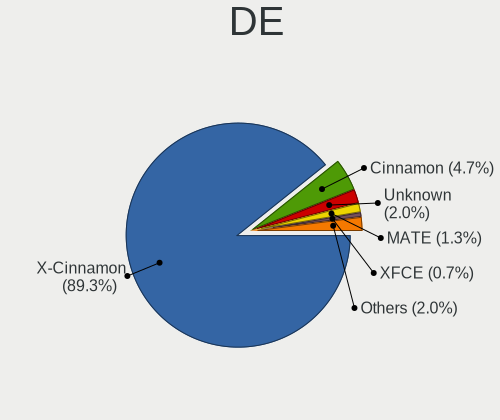

| Name       | Desktops | Percent |
|------------|----------|---------|
| X-Cinnamon | 110      | 88.71%  |
| Cinnamon   | 6        | 4.84%   |
| Unknown    | 3        | 2.42%   |
| MATE       | 2        | 1.61%   |
| XFCE       | 1        | 0.81%   |
| LXDE       | 1        | 0.81%   |
| GNOME      | 1        | 0.81%   |

Display Server
--------------

X11 or Wayland

| Name | Desktops | Percent |
|------|----------|---------|
| X11  | 123      | 100%    |

Display Manager
---------------

SDDM, LightDM, etc.

| Name    | Desktops | Percent |
|---------|----------|---------|
| Unknown | 111      | 90.24%  |
| TDM     | 8        | 6.5%    |
| LightDM | 3        | 2.44%   |
| GDM     | 1        | 0.81%   |

OS Lang
-------

Language

| Lang   | Desktops | Percent |
|--------|----------|---------|
| en_US  | 31       | 25.2%   |
| pt_BR  | 14       | 11.38%  |
| de_DE  | 13       | 10.57%  |
| fr_FR  | 12       | 9.76%   |
| pl_PL  | 6        | 4.88%   |
| ru_RU  | 5        | 4.07%   |
| en_GB  | 4        | 3.25%   |
| sv_SE  | 3        | 2.44%   |
| nl_BE  | 3        | 2.44%   |
| es_AR  | 3        | 2.44%   |
| en_AU  | 3        | 2.44%   |
| pt_PT  | 2        | 1.63%   |
| it_IT  | 2        | 1.63%   |
| hu_HU  | 2        | 1.63%   |
| en_CA  | 2        | 1.63%   |
| unm_US | 1        | 0.81%   |
| uk_UA  | 1        | 0.81%   |
| tr_TR  | 1        | 0.81%   |
| sk_SK  | 1        | 0.81%   |
| nb_NO  | 1        | 0.81%   |
| fr_CA  | 1        | 0.81%   |
| fi_FI  | 1        | 0.81%   |
| et_EE  | 1        | 0.81%   |
| es_UY  | 1        | 0.81%   |
| es_MX  | 1        | 0.81%   |
| es_ES  | 1        | 0.81%   |
| es_CL  | 1        | 0.81%   |
| en_ZA  | 1        | 0.81%   |
| el_GR  | 1        | 0.81%   |
| de_AT  | 1        | 0.81%   |
| ca_ES  | 1        | 0.81%   |
| bg_BG  | 1        | 0.81%   |
| ar_EG  | 1        | 0.81%   |

Boot Mode
---------

EFI or BIOS

| Mode | Desktops | Percent |
|------|----------|---------|
| BIOS | 85       | 69.11%  |
| EFI  | 38       | 30.89%  |

Filesystem
----------

Type of filesystem

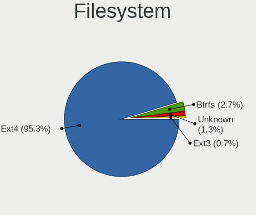

| Type    | Desktops | Percent |
|---------|----------|---------|
| Ext4    | 117      | 94.35%  |
| Btrfs   | 4        | 3.23%   |
| Unknown | 2        | 1.61%   |
| Ext3    | 1        | 0.81%   |

Part. scheme
------------

Scheme of partitioning

| Type    | Desktops | Percent |
|---------|----------|---------|
| Unknown | 110      | 88.71%  |
| GPT     | 10       | 8.06%   |
| MBR     | 4        | 3.23%   |

Dual Boot with Linux/BSD
------------------------

Hosting more than one Linux/BSD

| Dual boot | Desktops | Percent |
|-----------|----------|---------|
| No        | 119      | 95.97%  |
| Yes       | 5        | 4.03%   |

Dual Boot (Win)
---------------

Hosting Linux and Windows

| Dual boot | Desktops | Percent |
|-----------|----------|---------|
| No        | 117      | 95.12%  |
| Yes       | 6        | 4.88%   |

Board
-----

Vendor
------

Motherboard manufacturer

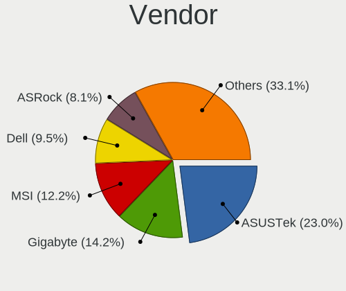

| Name                | Desktops | Percent |
|---------------------|----------|---------|
| ASUSTek Computer    | 29       | 23.58%  |
| Gigabyte Technology | 17       | 13.82%  |
| MSI                 | 16       | 13.01%  |
| Dell                | 13       | 10.57%  |
| ASRock              | 10       | 8.13%   |
| Unknown             | 8        | 6.5%    |
| Hewlett-Packard     | 7        | 5.69%   |
| Intel               | 5        | 4.07%   |
| ECS                 | 3        | 2.44%   |
| Acer                | 3        | 2.44%   |
| Semp Toshiba        | 1        | 0.81%   |
| Positivo            | 1        | 0.81%   |
| Pegatron            | 1        | 0.81%   |
| PCWare              | 1        | 0.81%   |
| OEM                 | 1        | 0.81%   |
| Lenovo              | 1        | 0.81%   |
| Fujitsu Siemens     | 1        | 0.81%   |
| Foxconn             | 1        | 0.81%   |
| EVGA                | 1        | 0.81%   |
| DFI                 | 1        | 0.81%   |
| Biostar             | 1        | 0.81%   |
| Alienware           | 1        | 0.81%   |

Model
-----

Motherboard model

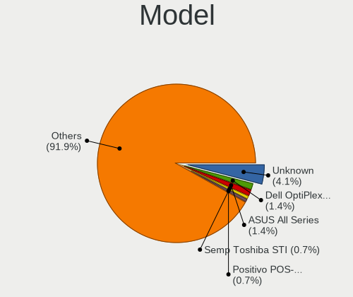

| Name                               | Desktops | Percent |
|------------------------------------|----------|---------|
| Unknown                            | 8        | 6.5%    |
| Dell OptiPlex 780                  | 2        | 1.63%   |
| ASUS All Series                    | 2        | 1.63%   |
| Semp Toshiba STI                   | 1        | 0.81%   |
| Positivo POS-EIH61CE               | 1        | 0.81%   |
| Pegatron 520-1188la                | 1        | 0.81%   |
| PCWare IPMH81G1                    | 1        | 0.81%   |
| OEM 45CMX/45GMX/45CMX-K            | 1        | 0.81%   |
| MSI PX714AA-ABH t3040.nl           | 1        | 0.81%   |
| MSI MS-7C52                        | 1        | 0.81%   |
| MSI MS-7C51                        | 1        | 0.81%   |
| MSI MS-7A40                        | 1        | 0.81%   |
| MSI MS-7918                        | 1        | 0.81%   |
| MSI MS-7823                        | 1        | 0.81%   |
| MSI MS-7817                        | 1        | 0.81%   |
| MSI MS-7815                        | 1        | 0.81%   |
| MSI MS-7751                        | 1        | 0.81%   |
| MSI MS-7383                        | 1        | 0.81%   |
| MSI MS-7267                        | 1        | 0.81%   |
| MSI MS-7142                        | 1        | 0.81%   |
| MSI MS-6785                        | 1        | 0.81%   |
| MSI MS-6570                        | 1        | 0.81%   |
| MSI ESPRIMO P2440                  | 1        | 0.81%   |
| MSI *MF                            | 1        | 0.81%   |
| Lenovo ThinkCentre M93p 10AB0010US | 1        | 0.81%   |
| Intel H61                          | 1        | 0.81%   |
| Intel DP55WB AAE64798-206          | 1        | 0.81%   |
| Intel DG33FB AAD81072-309          | 1        | 0.81%   |
| Intel DG31PR AAD97573-302          | 1        | 0.81%   |
| Intel BTC-T37                      | 1        | 0.81%   |
| HP xw8600 Workstation              | 1        | 0.81%   |
| HP Pavilion Desktop 590-p0xxx      | 1        | 0.81%   |
| HP Desktop 190-0xxx                | 1        | 0.81%   |
| HP Compaq Elite 8300 CMT           | 1        | 0.81%   |
| HP Compaq dc7800 Small Form Factor | 1        | 0.81%   |
| HP Compaq 8200 Elite USDT PC       | 1        | 0.81%   |
| HP Compaq 8100 Elite SFF PC        | 1        | 0.81%   |
| Gigabyte Z97-D3H                   | 1        | 0.81%   |
| Gigabyte Z77-D3H                   | 1        | 0.81%   |
| Gigabyte Z390 M GAMING             | 1        | 0.81%   |
| Gigabyte Z390 DESIGNARE            | 1        | 0.81%   |
| Gigabyte Z370 AORUS Gaming 7       | 1        | 0.81%   |
| Gigabyte X570 AORUS ULTRA          | 1        | 0.81%   |
| Gigabyte X570 AORUS PRO            | 1        | 0.81%   |
| Gigabyte M68MT-S2P                 | 1        | 0.81%   |
| Gigabyte M52LT-D3P                 | 1        | 0.81%   |
| Gigabyte H81M-S2PV                 | 1        | 0.81%   |
| Gigabyte H61M-S1                   | 1        | 0.81%   |
| Gigabyte H61M-DS2 DVI              | 1        | 0.81%   |
| Gigabyte GA-880GM-UD2H             | 1        | 0.81%   |
| Gigabyte GA-78LMT-USB3 6.0         | 1        | 0.81%   |
| Gigabyte EP45C-DS3R                | 1        | 0.81%   |
| Gigabyte B450M DS3H                | 1        | 0.81%   |
| Gigabyte 945GM-S2                  | 1        | 0.81%   |
| Fujitsu Siemens D2264-A1           | 1        | 0.81%   |
| Foxconn 945 7MC Series             | 1        | 0.81%   |
| EVGA 131-HE-E095                   | 1        | 0.81%   |
| ECS KAM1-I                         | 1        | 0.81%   |
| ECS D5468AT-ABA ALONPAV            | 1        | 0.81%   |
| ECS A740GM-M                       | 1        | 0.81%   |

Model Family
------------

Motherboard model prefix

| Name                     | Desktops | Percent |
|--------------------------|----------|---------|
| Dell OptiPlex            | 8        | 6.5%    |
| Unknown                  | 8        | 6.5%    |
| HP Compaq                | 4        | 3.25%   |
| ASUS PRIME               | 4        | 3.25%   |
| Dell Inspiron            | 3        | 2.44%   |
| Gigabyte Z390            | 2        | 1.63%   |
| Gigabyte X570            | 2        | 1.63%   |
| Dell Precision           | 2        | 1.63%   |
| ASUS ROG                 | 2        | 1.63%   |
| ASUS P5KPL-AM            | 2        | 1.63%   |
| ASUS All                 | 2        | 1.63%   |
| Acer Aspire              | 2        | 1.63%   |
| Semp Toshiba STI         | 1        | 0.81%   |
| Positivo POS-EIH61CE     | 1        | 0.81%   |
| Pegatron 520-1188la      | 1        | 0.81%   |
| PCWare IPMH81G1          | 1        | 0.81%   |
| OEM 45CMX                | 1        | 0.81%   |
| MSI PX714AA-ABH          | 1        | 0.81%   |
| MSI MS-7C52              | 1        | 0.81%   |
| MSI MS-7C51              | 1        | 0.81%   |
| MSI MS-7A40              | 1        | 0.81%   |
| MSI MS-7918              | 1        | 0.81%   |
| MSI MS-7823              | 1        | 0.81%   |
| MSI MS-7817              | 1        | 0.81%   |
| MSI MS-7815              | 1        | 0.81%   |
| MSI MS-7751              | 1        | 0.81%   |
| MSI MS-7383              | 1        | 0.81%   |
| MSI MS-7267              | 1        | 0.81%   |
| MSI MS-7142              | 1        | 0.81%   |
| MSI MS-6785              | 1        | 0.81%   |
| MSI MS-6570              | 1        | 0.81%   |
| MSI ESPRIMO              | 1        | 0.81%   |
| MSI *MF                  | 1        | 0.81%   |
| Lenovo ThinkCentre       | 1        | 0.81%   |
| Intel H61                | 1        | 0.81%   |
| Intel DP55WB             | 1        | 0.81%   |
| Intel DG33FB             | 1        | 0.81%   |
| Intel DG31PR             | 1        | 0.81%   |
| Intel BTC-T37            | 1        | 0.81%   |
| HP xw8600                | 1        | 0.81%   |
| HP Pavilion              | 1        | 0.81%   |
| HP Desktop               | 1        | 0.81%   |
| Gigabyte Z97-D3H         | 1        | 0.81%   |
| Gigabyte Z77-D3H         | 1        | 0.81%   |
| Gigabyte Z370            | 1        | 0.81%   |
| Gigabyte M68MT-S2P       | 1        | 0.81%   |
| Gigabyte M52LT-D3P       | 1        | 0.81%   |
| Gigabyte H81M-S2PV       | 1        | 0.81%   |
| Gigabyte H61M-S1         | 1        | 0.81%   |
| Gigabyte H61M-DS2        | 1        | 0.81%   |
| Gigabyte GA-880GM-UD2H   | 1        | 0.81%   |
| Gigabyte GA-78LMT-USB3   | 1        | 0.81%   |
| Gigabyte EP45C-DS3R      | 1        | 0.81%   |
| Gigabyte B450M           | 1        | 0.81%   |
| Gigabyte 945GM-S2        | 1        | 0.81%   |
| Fujitsu Siemens D2264-A1 | 1        | 0.81%   |
| Foxconn 945              | 1        | 0.81%   |
| EVGA 131-HE-E095         | 1        | 0.81%   |
| ECS KAM1-I               | 1        | 0.81%   |
| ECS D5468AT-ABA          | 1        | 0.81%   |

MFG Year
--------

Motherboard manufacture year

| Year | Desktops | Percent |
|------|----------|---------|
| 2012 | 13       | 10.57%  |
| 2010 | 13       | 10.57%  |
| 2019 | 11       | 8.94%   |
| 2007 | 11       | 8.94%   |
| 2018 | 9        | 7.32%   |
| 2008 | 9        | 7.32%   |
| 2020 | 8        | 6.5%    |
| 2014 | 8        | 6.5%    |
| 2013 | 7        | 5.69%   |
| 2011 | 7        | 5.69%   |
| 2021 | 5        | 4.07%   |
| 2016 | 5        | 4.07%   |
| 2015 | 5        | 4.07%   |
| 2009 | 5        | 4.07%   |
| 2005 | 3        | 2.44%   |
| 2003 | 2        | 1.63%   |
| 2017 | 1        | 0.81%   |
| 2004 | 1        | 0.81%   |

Form Factor
-----------

Physical design of the computer

| Name    | Desktops | Percent |
|---------|----------|---------|
| Desktop | 123      | 100%    |

Secure Boot
-----------

Enabled or disabled

| State    | Desktops | Percent |
|----------|----------|---------|
| Disabled | 121      | 98.37%  |
| Enabled  | 2        | 1.63%   |

Coreboot
--------

Have coreboot on board

| Used | Desktops | Percent |
|------|----------|---------|
| No   | 123      | 100%    |

RAM Size
--------

Total RAM memory

| Size in GB  | Desktops | Percent |
|-------------|----------|---------|
| 8.01-16.0   | 33       | 26.19%  |
| 3.01-4.0    | 29       | 23.02%  |
| 16.01-24.0  | 22       | 17.46%  |
| 4.01-8.0    | 16       | 12.7%   |
| 32.01-64.0  | 9        | 7.14%   |
| 2.01-3.0    | 8        | 6.35%   |
| 1.01-2.0    | 6        | 4.76%   |
| 0.51-1.0    | 2        | 1.59%   |
| 64.01-256.0 | 1        | 0.79%   |

RAM Used
--------

Used RAM memory

| Used GB  | Desktops | Percent |
|----------|----------|---------|
| 1.01-2.0 | 61       | 46.21%  |
| 2.01-3.0 | 26       | 19.7%   |
| 3.01-4.0 | 19       | 14.39%  |
| 0.51-1.0 | 16       | 12.12%  |
| 4.01-8.0 | 10       | 7.58%   |

Total Drives
------------

Number of drives on board

| Drives | Desktops | Percent |
|--------|----------|---------|
| 1      | 59       | 46.09%  |
| 2      | 41       | 32.03%  |
| 3      | 13       | 10.16%  |
| 4      | 7        | 5.47%   |
| 7      | 4        | 3.13%   |
| 5      | 2        | 1.56%   |
| 8      | 1        | 0.78%   |
| 6      | 1        | 0.78%   |

Has CD-ROM
----------

Has CD-ROM on board

| Presented | Desktops | Percent |
|-----------|----------|---------|
| Yes       | 74       | 59.2%   |
| No        | 51       | 40.8%   |

Has Ethernet
------------

Has Ethernet on board

| Presented | Desktops | Percent |
|-----------|----------|---------|
| Yes       | 123      | 100%    |

Has WiFi
--------

Has WiFi module

| Presented | Desktops | Percent |
|-----------|----------|---------|
| No        | 77       | 61.6%   |
| Yes       | 48       | 38.4%   |

Has Bluetooth
-------------

Has Bluetooth module

| Presented | Desktops | Percent |
|-----------|----------|---------|
| No        | 99       | 79.84%  |
| Yes       | 25       | 20.16%  |

Location
--------

Country
-------

Geographic location (country)

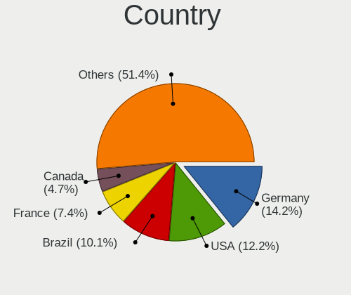

| Country      | Desktops | Percent |
|--------------|----------|---------|
| Germany      | 16       | 13.01%  |
| USA          | 14       | 11.38%  |
| Brazil       | 14       | 11.38%  |
| France       | 11       | 8.94%   |
| Poland       | 5        | 4.07%   |
| Canada       | 5        | 4.07%   |
| Ukraine      | 4        | 3.25%   |
| Netherlands  | 4        | 3.25%   |
| UK           | 3        | 2.44%   |
| Russia       | 3        | 2.44%   |
| Bulgaria     | 3        | 2.44%   |
| Belgium      | 3        | 2.44%   |
| Argentina    | 3        | 2.44%   |
| Sweden       | 2        | 1.63%   |
| Spain        | 2        | 1.63%   |
| Portugal     | 2        | 1.63%   |
| Italy        | 2        | 1.63%   |
| Hungary      | 2        | 1.63%   |
| Greece       | 2        | 1.63%   |
| Finland      | 2        | 1.63%   |
| Austria      | 2        | 1.63%   |
| Australia    | 2        | 1.63%   |
| Uruguay      | 1        | 0.81%   |
| Turkey       | 1        | 0.81%   |
| South Africa | 1        | 0.81%   |
| Slovakia     | 1        | 0.81%   |
| Serbia       | 1        | 0.81%   |
| Romania      | 1        | 0.81%   |
| Puerto Rico  | 1        | 0.81%   |
| Philippines  | 1        | 0.81%   |
| Norway       | 1        | 0.81%   |
| Mexico       | 1        | 0.81%   |
| Luxembourg   | 1        | 0.81%   |
| India        | 1        | 0.81%   |
| Estonia      | 1        | 0.81%   |
| Egypt        | 1        | 0.81%   |
| Croatia      | 1        | 0.81%   |
| Chile        | 1        | 0.81%   |
| Belarus      | 1        | 0.81%   |

City
----

Geographic location (city)

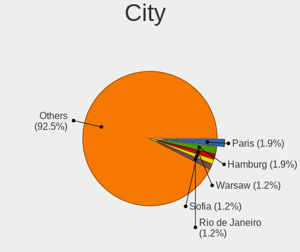

| City                          | Desktops | Percent |
|-------------------------------|----------|---------|
| Paris                         | 4        | 3.13%   |
| Toronto                       | 2        | 1.56%   |
| Sofia                         | 2        | 1.56%   |
| Rio de Janeiro                | 2        | 1.56%   |
| Perth                         | 2        | 1.56%   |
| Helsinki                      | 2        | 1.56%   |
| Hamburg                       | 2        | 1.56%   |
| Florian??polis                | 2        | 1.56%   |
| Braunschweig                  | 2        | 1.56%   |
| Belo Horizonte                | 2        | 1.56%   |
| Yalta                         | 1        | 0.78%   |
| Wroclaw                       | 1        | 0.78%   |
| Wernberg-Koblitz              | 1        | 0.78%   |
| Warsaw                        | 1        | 0.78%   |
| Vienna                        | 1        | 0.78%   |
| Ulm                           | 1        | 0.78%   |
| Ukhta                         | 1        | 0.78%   |
| Trpinja                       | 1        | 0.78%   |
| Tires                         | 1        | 0.78%   |
| Timioara                    | 1        | 0.78%   |
| Thornton                      | 1        | 0.78%   |
| The Hague                     | 1        | 0.78%   |
| Thaur                         | 1        | 0.78%   |
| Taby                          | 1        | 0.78%   |
| So Lus                    | 1        | 0.78%   |
| Stroud                        | 1        | 0.78%   |
| Souda                         | 1        | 0.78%   |
| Shimla                        | 1        | 0.78%   |
| Sherbrooke                    | 1        | 0.78%   |
| Seibersbach                   | 1        | 0.78%   |
| Santiago                      | 1        | 0.78%   |
| Santa Rosa                    | 1        | 0.78%   |
| San Juan                      | 1        | 0.78%   |
| San Giorgio della Richinvelda | 1        | 0.78%   |
| San Antonio                   | 1        | 0.78%   |
| Salem                         | 1        | 0.78%   |
| Saint-Brice-Courcelles        | 1        | 0.78%   |
| Rotterdam                     | 1        | 0.78%   |
| Ribeiro Preto               | 1        | 0.78%   |
| Rhyl                          | 1        | 0.78%   |
| Rapla                         | 1        | 0.78%   |
| Radom                         | 1        | 0.78%   |
| Puerto Vallarta               | 1        | 0.78%   |
| Presidente Prudente           | 1        | 0.78%   |
| Poznan                        | 1        | 0.78%   |
| Plovdiv                       | 1        | 0.78%   |
| Partiznske                  | 1        | 0.78%   |
| Park City                     | 1        | 0.78%   |
| Paracin                       | 1        | 0.78%   |
| Osasco                        | 1        | 0.78%   |
| Offenburg                     | 1        | 0.78%   |
| Novokuybyshevsk               | 1        | 0.78%   |
| Niagara Falls                 | 1        | 0.78%   |
| Munich                        | 1        | 0.78%   |
| Montreal                      | 1        | 0.78%   |
| Montevideo                    | 1        | 0.78%   |
| Mogilev                       | 1        | 0.78%   |
| Minya                         | 1        | 0.78%   |
| Milan                         | 1        | 0.78%   |
| Marseille                     | 1        | 0.78%   |

Drives
------

Drive Vendor
------------

Hard drive vendors

| Vendor              | Desktops | Drives | Percent |
|---------------------|----------|--------|---------|
| WDC                 | 46       | 75     | 22.77%  |
| Seagate             | 35       | 59     | 17.33%  |
| Samsung Electronics | 33       | 48     | 16.34%  |
| Kingston            | 11       | 13     | 5.45%   |
| Toshiba             | 10       | 13     | 4.95%   |
| Hitachi             | 10       | 12     | 4.95%   |
| SanDisk             | 8        | 11     | 3.96%   |
| Phison              | 6        | 7      | 2.97%   |
| Crucial             | 6        | 8      | 2.97%   |
| A-DATA Technology   | 6        | 6      | 2.97%   |
| Intel               | 4        | 4      | 1.98%   |
| MAXTOR              | 3        | 5      | 1.49%   |
| Intenso             | 3        | 4      | 1.49%   |
| China               | 3        | 3      | 1.49%   |
| TCSUNBOW            | 2        | 2      | 0.99%   |
| OCZ                 | 2        | 3      | 0.99%   |
| Micron Technology   | 2        | 2      | 0.99%   |
| Unknown             | 1        | 2      | 0.5%    |
| Team                | 1        | 2      | 0.5%    |
| Silicon Motion      | 1        | 1      | 0.5%    |
| SABRENT             | 1        | 1      | 0.5%    |
| Patriot             | 1        | 1      | 0.5%    |
| Mushkin             | 1        | 1      | 0.5%    |
| Kingmax             | 1        | 1      | 0.5%    |
| KESU                | 1        | 2      | 0.5%    |
| HPE                 | 1        | 4      | 0.5%    |
| Fujitsu             | 1        | 1      | 0.5%    |
| ExcelStor           | 1        | 1      | 0.5%    |
| Dogfish             | 1        | 1      | 0.5%    |

Drive Model
-----------

Hard drive models

| Model                               | Desktops | Percent |
|-------------------------------------|----------|---------|
| Toshiba DT01ACA100 1TB              | 4        | 1.67%   |
| Seagate ST1000DM010-2EP102 1TB      | 4        | 1.67%   |
| Samsung HD322HJ 320GB               | 3        | 1.25%   |
| Samsung HD103SJ 1TB                 | 3        | 1.25%   |
| Kingston SA400S37120G 120GB SSD     | 3        | 1.25%   |
| WDC WD5000AAKX-00U6AA0 500GB        | 2        | 0.83%   |
| WDC WD40EFRX-68N32N0 4TB            | 2        | 0.83%   |
| WDC WD3200AAKS-00L9A0 320GB         | 2        | 0.83%   |
| WDC WD2500AAKX-753CA1 250GB         | 2        | 0.83%   |
| WDC WD1600AABS-00PRA0 160GB         | 2        | 0.83%   |
| WDC WD10EZEX-60WN4A0 1TB            | 2        | 0.83%   |
| WDC WD10EZEX-08WN4A0 1TB            | 2        | 0.83%   |
| Seagate ST2000LX001-1RG174 2TB      | 2        | 0.83%   |
| Seagate ST2000DM001-9YN164 2TB      | 2        | 0.83%   |
| Seagate ST2000DM001-1ER164 2TB      | 2        | 0.83%   |
| Seagate Expansion 1TB               | 2        | 0.83%   |
| Samsung SSD 860 EVO 500GB           | 2        | 0.83%   |
| Samsung SSD 850 EVO 500GB           | 2        | 0.83%   |
| Samsung SSD 850 EVO 250GB           | 2        | 0.83%   |
| Samsung SP0802N 80GB                | 2        | 0.83%   |
| Samsung NVMe SSD Drive 2TB          | 2        | 0.83%   |
| Samsung NVMe SSD Drive 256GB        | 2        | 0.83%   |
| Samsung HD161HJ 160GB               | 2        | 0.83%   |
| Micron 1100_MTFDDAV256TBN 256GB SSD | 2        | 0.83%   |
| Kingston SV300S37A120G 120GB SSD    | 2        | 0.83%   |
| Kingston SA400S37240G 240GB SSD     | 2        | 0.83%   |
| Crucial CT500MX500SSD1 500GB        | 2        | 0.83%   |
| A-DATA SU650 240GB SSD              | 2        | 0.83%   |
| WDC WDS500G2B0B-00YS70 500GB SSD    | 1        | 0.42%   |
| WDC WDS500G2B0A-00SM50 500GB SSD    | 1        | 0.42%   |
| WDC WDS120G2G0A-00JH30 120GB SSD    | 1        | 0.42%   |
| WDC WDS120G1G0A-00SS50 120GB SSD    | 1        | 0.42%   |
| WDC WDBNCE2500PNC 250GB SSD         | 1        | 0.42%   |
| WDC WD6400AAKS-07A7B0 640GB         | 1        | 0.42%   |
| WDC WD6002FRYZ-01WD5B1 6TB          | 1        | 0.42%   |
| WDC WD5000LPVX-22V0TT0 500GB        | 1        | 0.42%   |
| WDC WD5000LPLX-60ZNTT1 500GB        | 1        | 0.42%   |
| WDC WD5000BEVT-60ZAT1 500GB         | 1        | 0.42%   |
| WDC WD5000AAVS-32ZTB0 500GB         | 1        | 0.42%   |
| WDC WD5000AAKX-75U6AA0 500GB        | 1        | 0.42%   |
| WDC WD5000AAKX-60U6AA0 500GB        | 1        | 0.42%   |
| WDC WD5000AAKX-003CA0 500GB         | 1        | 0.42%   |
| WDC WD5000AAKX-001CA0 500GB         | 1        | 0.42%   |
| WDC WD5000AAKS-75A7B0 500GB         | 1        | 0.42%   |
| WDC WD5000AAKS-22A7B0 500GB         | 1        | 0.42%   |
| WDC WD5000AAKS-07A7B2 500GB         | 1        | 0.42%   |
| WDC WD5000AADS-00S9B0 500GB         | 1        | 0.42%   |
| WDC WD40EFRX-68WT0N0 4TB            | 1        | 0.42%   |
| WDC WD400EB-00CPF0 40GB             | 1        | 0.42%   |
| WDC WD360ADFD-00NLR5 37GB           | 1        | 0.42%   |
| WDC WD3200AVJS-63N9A0 320GB         | 1        | 0.42%   |
| WDC WD3200AAJS-22L7A0 320GB         | 1        | 0.42%   |
| WDC WD3200AAJS-00VWA0 320GB         | 1        | 0.42%   |
| WDC WD3200AAJS-00L7A0 320GB         | 1        | 0.42%   |
| WDC WD32 00BEKT-60V5T1 320GB        | 1        | 0.42%   |
| WDC WD30EZRX-00D8PB0 3TB            | 1        | 0.42%   |
| WDC WD3000HLFS-01G6U1 304GB         | 1        | 0.42%   |
| WDC WD3000GLFS-01F8U0 304GB         | 1        | 0.42%   |
| WDC WD2500JS-75NCB3 250GB           | 1        | 0.42%   |
| WDC WD2500AAKX-75U6AA0 250GB        | 1        | 0.42%   |

HDD Vendor
----------

Hard disk drive vendors

| Vendor              | Desktops | Drives | Percent |
|---------------------|----------|--------|---------|
| WDC                 | 42       | 70     | 34.71%  |
| Seagate             | 35       | 59     | 28.93%  |
| Samsung Electronics | 20       | 25     | 16.53%  |
| Hitachi             | 10       | 12     | 8.26%   |
| Toshiba             | 8        | 9      | 6.61%   |
| Maxtor              | 3        | 5      | 2.48%   |
| KESU                | 1        | 2      | 0.83%   |
| HPE                 | 1        | 4      | 0.83%   |
| Fujitsu             | 1        | 1      | 0.83%   |

SSD Vendor
----------

Solid state drive vendors

| Vendor              | Desktops | Drives | Percent |
|---------------------|----------|--------|---------|
| Samsung Electronics | 11       | 15     | 15.94%  |
| Kingston            | 10       | 12     | 14.49%  |
| SanDisk             | 8        | 11     | 11.59%  |
| Crucial             | 6        | 8      | 8.7%    |
| A-DATA Technology   | 6        | 6      | 8.7%    |
| WDC                 | 5        | 5      | 7.25%   |
| Intenso             | 3        | 4      | 4.35%   |
| Intel               | 3        | 3      | 4.35%   |
| China               | 3        | 3      | 4.35%   |
| Toshiba             | 2        | 4      | 2.9%    |
| TCSUNBOW            | 2        | 2      | 2.9%    |
| OCZ                 | 2        | 3      | 2.9%    |
| Micron Technology   | 2        | 2      | 2.9%    |
| Unknown             | 1        | 1      | 1.45%   |
| Team                | 1        | 2      | 1.45%   |
| SABRENT             | 1        | 1      | 1.45%   |
| Patriot             | 1        | 1      | 1.45%   |
| Kingmax             | 1        | 1      | 1.45%   |
| Dogfish             | 1        | 1      | 1.45%   |

Drive Kind
----------

HDD or SSD

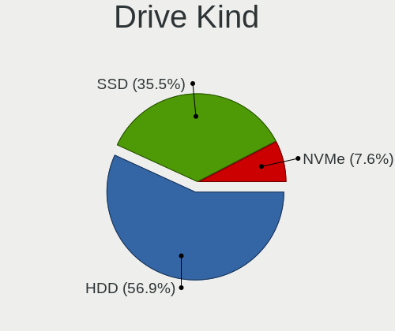

| Kind    | Desktops | Drives | Percent |
|---------|----------|--------|---------|
| HDD     | 95       | 187    | 57.23%  |
| SSD     | 55       | 85     | 33.13%  |
| NVMe    | 14       | 19     | 8.43%   |
| Unknown | 2        | 2      | 1.2%    |

Drive Connector
---------------

SATA, SAS, NVMe, etc.

| Type | Desktops | Drives | Percent |
|------|----------|--------|---------|
| SATA | 117      | 261    | 84.17%  |
| NVMe | 14       | 19     | 10.07%  |
| SAS  | 8        | 13     | 5.76%   |

Drive Size
----------

Size of hard drive

| Size in TB | Desktops | Drives | Percent |
|------------|----------|--------|---------|
| 0.01-0.5   | 100      | 182    | 60.98%  |
| 0.51-1.0   | 40       | 57     | 24.39%  |
| 1.01-2.0   | 17       | 24     | 10.37%  |
| 3.01-4.0   | 3        | 5      | 1.83%   |
| 2.01-3.0   | 2        | 2      | 1.22%   |
| 4.01-10.0  | 2        | 2      | 1.22%   |

Space Total
-----------

Amount of disk space available on the file system

| Size in GB     | Desktops | Percent |
|----------------|----------|---------|
| 101-250        | 39       | 30.71%  |
| 251-500        | 26       | 20.47%  |
| 1001-2000      | 16       | 12.6%   |
| More than 3000 | 13       | 10.24%  |
| 501-1000       | 10       | 7.87%   |
| 2001-3000      | 8        | 6.3%    |
| 51-100         | 8        | 6.3%    |
| 21-50          | 7        | 5.51%   |

Space Used
----------

Amount of used disk space

| Used GB        | Desktops | Percent |
|----------------|----------|---------|
| 1-20           | 40       | 30.53%  |
| 21-50          | 32       | 24.43%  |
| 51-100         | 16       | 12.21%  |
| 251-500        | 10       | 7.63%   |
| 1001-2000      | 10       | 7.63%   |
| 501-1000       | 8        | 6.11%   |
| 101-250        | 7        | 5.34%   |
| More than 3000 | 4        | 3.05%   |
| 2001-3000      | 4        | 3.05%   |

Malfunc. Drives
---------------

Drive models with a malfunction

| Model                           | Desktops | Drives | Percent |
|---------------------------------|----------|--------|---------|
| Samsung Electronics HD103SJ 1TB | 1        | 1      | 100%    |

Malfunc. Drive Vendor
---------------------

Vendors of faulty drives

| Vendor              | Desktops | Drives | Percent |
|---------------------|----------|--------|---------|
| Samsung Electronics | 1        | 1      | 100%    |

Malfunc. HDD Vendor
-------------------

Vendors of faulty HDD drives

| Vendor              | Desktops | Drives | Percent |
|---------------------|----------|--------|---------|
| Samsung Electronics | 1        | 1      | 100%    |

Malfunc. Drive Kind
-------------------

Kinds of faulty drives

| Kind | Desktops | Drives | Percent |
|------|----------|--------|---------|
| HDD  | 1        | 1      | 100%    |

Failed Drives
-------------

Failed drive models

Zero info for selected period =(

Failed Drive Vendor
-------------------

Failed drive vendors

Zero info for selected period =(

Drive Status
------------

Number of failed and malfunc. drives

| Status   | Desktops | Drives | Percent |
|----------|----------|--------|---------|
| Detected | 111      | 261    | 88.1%   |
| Works    | 14       | 31     | 11.11%  |
| Malfunc  | 1        | 1      | 0.79%   |

Storage controller
------------------

Storage Vendor
--------------

Storage controller vendors

| Vendor                           | Desktops | Percent |
|----------------------------------|----------|---------|
| Intel                            | 84       | 52.17%  |
| AMD                              | 25       | 15.53%  |
| Nvidia                           | 9        | 5.59%   |
| ASMedia Technology               | 9        | 5.59%   |
| JMicron Technology               | 7        | 4.35%   |
| Samsung Electronics              | 6        | 3.73%   |
| Phison Electronics               | 6        | 3.73%   |
| VIA Technologies                 | 4        | 2.48%   |
| Marvell Technology Group         | 4        | 2.48%   |
| Silicon Motion                   | 2        | 1.24%   |
| Silicon Integrated Systems [SiS] | 2        | 1.24%   |
| Silicon Image                    | 1        | 0.62%   |
| Kingston Technology Company      | 1        | 0.62%   |
| Broadcom / LSI                   | 1        | 0.62%   |

Storage Model
-------------

Storage controller models

| Model                                                                                   | Desktops | Percent |
|-----------------------------------------------------------------------------------------|----------|---------|
| AMD FCH SATA Controller [AHCI mode]                                                     | 16       | 7.34%   |
| Intel 6 Series/C200 Series Chipset Family 6 port Desktop SATA AHCI Controller           | 11       | 5.05%   |
| Intel NM10/ICH7 Family SATA Controller [IDE mode]                                       | 10       | 4.59%   |
| Intel 82801G (ICH7 Family) IDE Controller                                               | 10       | 4.59%   |
| ASMedia ASM1062 Serial ATA Controller                                                   | 9        | 4.13%   |
| Intel 8 Series/C220 Series Chipset Family 6-port SATA Controller 1 [AHCI mode]          | 8        | 3.67%   |
| Nvidia MCP61 SATA Controller                                                            | 6        | 2.75%   |
| Intel 82801I (ICH9 Family) 2 port SATA Controller [IDE mode]                            | 5        | 2.29%   |
| Intel 7 Series/C210 Series Chipset Family 6-port SATA Controller [AHCI mode]            | 5        | 2.29%   |
| AMD SB7x0/SB8x0/SB9x0 SATA Controller [IDE mode]                                        | 5        | 2.29%   |
| AMD SB7x0/SB8x0/SB9x0 IDE Controller                                                    | 5        | 2.29%   |
| AMD 400 Series Chipset SATA Controller                                                  | 5        | 2.29%   |
| VIA VT82C586A/B/VT82C686/A/B/VT823x/A/C PIPC Bus Master IDE                             | 4        | 1.83%   |
| Samsung NVMe SSD Controller SM981/PM981/PM983                                           | 4        | 1.83%   |
| Nvidia MCP61 IDE                                                                        | 4        | 1.83%   |
| Intel SATA Controller [RAID mode]                                                       | 4        | 1.83%   |
| Intel Cannon Lake PCH SATA AHCI Controller                                              | 4        | 1.83%   |
| Intel 82801JI (ICH10 Family) SATA AHCI Controller                                       | 4        | 1.83%   |
| Intel 5 Series/3400 Series Chipset 6 port SATA AHCI Controller                          | 4        | 1.83%   |
| VIA VIA VT6420 SATA RAID Controller                                                     | 3        | 1.38%   |
| Phison E12 NVMe Controller                                                              | 3        | 1.38%   |
| JMicron JMB368 IDE controller                                                           | 3        | 1.38%   |
| JMicron JMB363 SATA/IDE Controller                                                      | 3        | 1.38%   |
| Intel 9 Series Chipset Family SATA Controller [AHCI Mode]                               | 3        | 1.38%   |
| Intel 82801JI (ICH10 Family) 4 port SATA IDE Controller #1                              | 3        | 1.38%   |
| Intel 82801JI (ICH10 Family) 2 port SATA IDE Controller #2                              | 3        | 1.38%   |
| Intel 82801IB (ICH9) 2 port SATA Controller [IDE mode]                                  | 3        | 1.38%   |
| Intel 6 Series/C200 Series Chipset Family Desktop SATA Controller (IDE mode, ports 4-5) | 3        | 1.38%   |
| Intel 6 Series/C200 Series Chipset Family Desktop SATA Controller (IDE mode, ports 0-3) | 3        | 1.38%   |
| AMD SB7x0/SB8x0/SB9x0 SATA Controller [AHCI mode]                                       | 3        | 1.38%   |
| AMD FCH SATA Controller D                                                               | 3        | 1.38%   |
| Nvidia nForce2 IDE                                                                      | 2        | 0.92%   |
| Intel Q170/Q150/B150/H170/H110/Z170/CM236 Chipset SATA Controller [AHCI Mode]           | 2        | 0.92%   |
| Intel C602 chipset 4-Port SATA Storage Control Unit                                     | 2        | 0.92%   |
| Intel C600/X79 series chipset 6-Port SATA AHCI Controller                               | 2        | 0.92%   |
| Intel 82Q35 Express PT IDER Controller                                                  | 2        | 0.92%   |
| Intel 82801IR/IO/IH (ICH9R/DO/DH) 6 port SATA Controller [AHCI mode]                    | 2        | 0.92%   |
| Intel 82801IR/IO/IH (ICH9R/DO/DH) 4 port SATA Controller [IDE mode]                     | 2        | 0.92%   |
| Intel 4 Series Chipset PT IDER Controller                                               | 2        | 0.92%   |
| Intel 200 Series PCH SATA controller [AHCI mode]                                        | 2        | 0.92%   |
| AMD 300 Series Chipset SATA Controller                                                  | 2        | 0.92%   |
| VIA Serial ATA Controller                                                               | 1        | 0.46%   |
| Silicon Motion SM2263EN/SM2263XT SSD Controller                                         | 1        | 0.46%   |
| Silicon Motion SM2262/SM2262EN SSD Controller                                           | 1        | 0.46%   |
| Silicon Integrated Systems [SiS] 5513 IDE Controller                                    | 1        | 0.46%   |
| Silicon Integrated Systems [SiS] 182 SATA/RAID Controller                               | 1        | 0.46%   |
| Silicon Image SiI 3132 Serial ATA Raid II Controller                                    | 1        | 0.46%   |
| Samsung NVMe SSD Controller SM951/PM951                                                 | 1        | 0.46%   |
| Samsung NVMe Controller                                                                 | 1        | 0.46%   |
| Phison PS5013 E13 NVMe Controller                                                       | 1        | 0.46%   |
| Phison E7 NVMe Controller                                                               | 1        | 0.46%   |
| Phison E16 PCIe4 NVMe Controller                                                        | 1        | 0.46%   |
| Nvidia MCP51 Serial ATA Controller                                                      | 1        | 0.46%   |
| Marvell Group 88SX7042 PCI-e 4-port SATA-II                                             | 1        | 0.46%   |
| Marvell Group 88SE9230 PCIe 2.0 x2 4-port SATA 6 Gb/s RAID Controller                   | 1        | 0.46%   |
| Marvell Group 88SE6111/6121 SATA II / PATA Controller                                   | 1        | 0.46%   |
| Marvell Group 88SE6101/6102 single-port PATA133 interface                               | 1        | 0.46%   |
| Kingston Company A2000 NVMe SSD                                                         | 1        | 0.46%   |
| JMicron JMB362 SATA Controller                                                          | 1        | 0.46%   |
| Intel Non-Volatile memory controller                                                    | 1        | 0.46%   |

Storage Kind
------------

Kind of storage controller (IDE, SATA, NVMe, SAS, ...)

| Kind | Desktops | Percent |
|------|----------|---------|
| SATA | 81       | 51.59%  |
| IDE  | 52       | 33.12%  |
| NVMe | 14       | 8.92%   |
| RAID | 7        | 4.46%   |
| SAS  | 2        | 1.27%   |
| SCSI | 1        | 0.64%   |

Processor
---------

CPU Vendor
----------

Processor vendors

| Vendor | Desktops | Percent |
|--------|----------|---------|
| Intel  | 87       | 70.73%  |
| AMD    | 36       | 29.27%  |

CPU Model
---------

Processor models

| Model                                       | Desktops | Percent |
|---------------------------------------------|----------|---------|
| Intel Core i7-4790 CPU @ 3.60GHz            | 3        | 2.44%   |
| Intel Core i3-8100 CPU @ 3.60GHz            | 3        | 2.44%   |
| Intel Core 2 Quad CPU Q6600 @ 2.40GHz       | 3        | 2.44%   |
| Intel Core 2 Duo CPU E7400 @ 2.80GHz        | 3        | 2.44%   |
| Intel Core 2 Duo CPU E4500 @ 2.20GHz        | 3        | 2.44%   |
| Intel Pentium CPU G645 @ 2.90GHz            | 2        | 1.63%   |
| Intel Pentium CPU G2030 @ 3.00GHz           | 2        | 1.63%   |
| Intel Core i7-8700K CPU @ 3.70GHz           | 2        | 1.63%   |
| Intel Core i7-4770K CPU @ 3.50GHz           | 2        | 1.63%   |
| Intel Core i5-3470 CPU @ 3.20GHz            | 2        | 1.63%   |
| Intel Core i5 CPU 750 @ 2.67GHz             | 2        | 1.63%   |
| Intel Core i3-2120 CPU @ 3.30GHz            | 2        | 1.63%   |
| Intel Core i3-2100 CPU @ 3.10GHz            | 2        | 1.63%   |
| Intel Core 2 Quad CPU Q9450 @ 2.66GHz       | 2        | 1.63%   |
| Intel Core 2 Quad CPU Q8200 @ 2.33GHz       | 2        | 1.63%   |
| Intel Core 2 Duo CPU E8400 @ 3.00GHz        | 2        | 1.63%   |
| Intel Core 2 Duo CPU E7500 @ 2.93GHz        | 2        | 1.63%   |
| AMD Sempron Processor 3000+                 | 2        | 1.63%   |
| AMD Ryzen 7 3700X 8-Core Processor          | 2        | 1.63%   |
| AMD Ryzen 5 2600 Six-Core Processor         | 2        | 1.63%   |
| AMD Ryzen 3 3200G with Radeon Vega Graphics | 2        | 1.63%   |
| Intel Xeon CPU X3430 @ 2.40GHz              | 1        | 0.81%   |
| Intel Xeon CPU W3520 @ 2.67GHz              | 1        | 0.81%   |
| Intel Xeon CPU E5472 @ 3.00GHz              | 1        | 0.81%   |
| Intel Xeon CPU E5450 @ 3.00GHz              | 1        | 0.81%   |
| Intel Xeon CPU E5-2670 0 @ 2.60GHz          | 1        | 0.81%   |
| Intel Xeon CPU E5-1620 0 @ 3.60GHz          | 1        | 0.81%   |
| Intel Pentium Dual-Core CPU E5800 @ 3.20GHz | 1        | 0.81%   |
| Intel Pentium Dual-Core CPU E5500 @ 2.80GHz | 1        | 0.81%   |
| Intel Pentium Dual-Core CPU E5300 @ 2.60GHz | 1        | 0.81%   |
| Intel Pentium D CPU 3.20GHz                 | 1        | 0.81%   |
| Intel Pentium D CPU 2.80GHz                 | 1        | 0.81%   |
| Intel Pentium CPU J4205 @ 1.50GHz           | 1        | 0.81%   |
| Intel Pentium CPU G4400 @ 3.30GHz           | 1        | 0.81%   |
| Intel Pentium CPU G3258 @ 3.20GHz           | 1        | 0.81%   |
| Intel Pentium 4 CPU 3.20GHz                 | 1        | 0.81%   |
| Intel Pentium 4 CPU 3.00GHz                 | 1        | 0.81%   |
| Intel Core i9-9900K CPU @ 3.60GHz           | 1        | 0.81%   |
| Intel Core i9-10900T CPU @ 1.90GHz          | 1        | 0.81%   |
| Intel Core i7-9700 CPU @ 3.00GHz            | 1        | 0.81%   |
| Intel Core i7-8565U CPU @ 1.80GHz           | 1        | 0.81%   |
| Intel Core i7-5820K CPU @ 3.30GHz           | 1        | 0.81%   |
| Intel Core i7-4770 CPU @ 3.40GHz            | 1        | 0.81%   |
| Intel Core i7-3770 CPU @ 3.40GHz            | 1        | 0.81%   |
| Intel Core i7-2600 CPU @ 3.40GHz            | 1        | 0.81%   |
| Intel Core i5-6500 CPU @ 3.20GHz            | 1        | 0.81%   |
| Intel Core i5-4570T CPU @ 2.90GHz           | 1        | 0.81%   |
| Intel Core i5-4460 CPU @ 3.20GHz            | 1        | 0.81%   |
| Intel Core i5-4440 CPU @ 3.10GHz            | 1        | 0.81%   |
| Intel Core i5-3570K CPU @ 3.40GHz           | 1        | 0.81%   |
| Intel Core i5-3450S CPU @ 2.80GHz           | 1        | 0.81%   |
| Intel Core i5-3330 CPU @ 3.00GHz            | 1        | 0.81%   |
| Intel Core i5-2400S CPU @ 2.50GHz           | 1        | 0.81%   |
| Intel Core i5-2400 CPU @ 3.10GHz            | 1        | 0.81%   |
| Intel Core i5 CPU 650 @ 3.20GHz             | 1        | 0.81%   |
| Intel Core i3-4030U CPU @ 1.90GHz           | 1        | 0.81%   |
| Intel Core i3-2130 CPU @ 3.40GHz            | 1        | 0.81%   |
| Intel Core i3-2120T CPU @ 2.60GHz           | 1        | 0.81%   |
| Intel Core 2 Quad CPU Q9400 @ 2.66GHz       | 1        | 0.81%   |
| Intel Core 2 Quad CPU Q9300 @ 2.50GHz       | 1        | 0.81%   |

CPU Model Family
----------------

Processor model prefix

| Model                   | Desktops | Percent |
|-------------------------|----------|---------|
| Intel Core i5           | 14       | 11.38%  |
| Intel Core i7           | 13       | 10.57%  |
| Intel Core 2 Duo        | 12       | 9.76%   |
| Intel Core i3           | 10       | 8.13%   |
| Intel Core 2 Quad       | 9        | 7.32%   |
| Intel Pentium           | 7        | 5.69%   |
| Intel Xeon              | 6        | 4.88%   |
| Intel Celeron           | 5        | 4.07%   |
| AMD Ryzen 7             | 5        | 4.07%   |
| AMD Ryzen 5             | 5        | 4.07%   |
| AMD Sempron             | 4        | 3.25%   |
| AMD FX                  | 4        | 3.25%   |
| AMD Athlon 64 X2        | 4        | 3.25%   |
| Intel Pentium Dual-Core | 3        | 2.44%   |
| AMD Phenom II X4        | 3        | 2.44%   |
| Intel Pentium D         | 2        | 1.63%   |
| Intel Pentium 4         | 2        | 1.63%   |
| Intel Core i9           | 2        | 1.63%   |
| Intel Core 2            | 2        | 1.63%   |
| AMD Ryzen 3             | 2        | 1.63%   |
| AMD Phenom II X6        | 2        | 1.63%   |
| AMD Athlon XP           | 2        | 1.63%   |
| AMD Ryzen 9             | 1        | 0.81%   |
| AMD Ryzen 5 PRO         | 1        | 0.81%   |
| AMD Athlon II X2        | 1        | 0.81%   |
| AMD Athlon              | 1        | 0.81%   |
| AMD A10                 | 1        | 0.81%   |

CPU Cores
---------

Number of processor cores

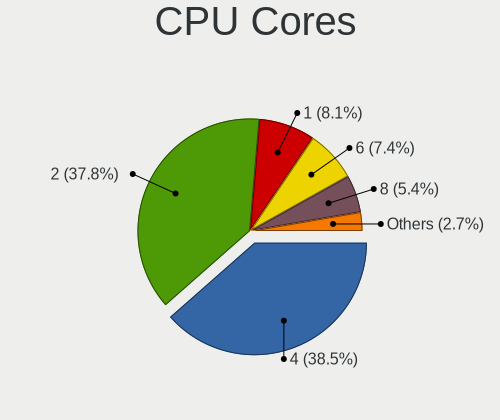

| Number | Desktops | Percent |
|--------|----------|---------|
| 4      | 50       | 40.65%  |
| 2      | 45       | 36.59%  |
| 8      | 8        | 6.5%    |
| 6      | 8        | 6.5%    |
| 1      | 8        | 6.5%    |
| 16     | 1        | 0.81%   |
| 12     | 1        | 0.81%   |
| 10     | 1        | 0.81%   |
| 3      | 1        | 0.81%   |

CPU Sockets
-----------

Number of sockets

| Number | Desktops | Percent |
|--------|----------|---------|
| 1      | 121      | 98.37%  |
| 2      | 2        | 1.63%   |

CPU Threads
-----------

Threads per core (Hyper-Threading)

| Number | Desktops | Percent |
|--------|----------|---------|
| 1      | 77       | 62.6%   |
| 2      | 46       | 37.4%   |

CPU Op-Modes
------------

CPU Operation Modes (32-bit, 64-bit)

| Op mode        | Desktops | Percent |
|----------------|----------|---------|
| 32-bit, 64-bit | 119      | 96.75%  |
| 32-bit         | 4        | 3.25%   |

CPU Microcode
-------------

Microcode number

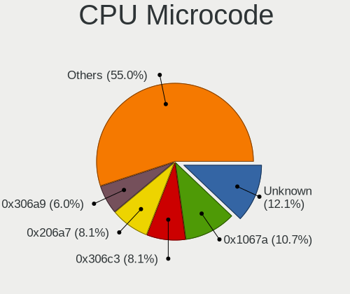

| Number     | Desktops | Percent |
|------------|----------|---------|
| Unknown    | 14       | 11.29%  |
| 0x1067a    | 13       | 10.48%  |
| 0x306c3    | 11       | 8.87%   |
| 0x206a7    | 11       | 8.87%   |
| 0x306a9    | 9        | 7.26%   |
| 0x10677    | 5        | 4.03%   |
| 0x6fd      | 4        | 3.23%   |
| 0x08108109 | 4        | 3.23%   |
| 0x906eb    | 3        | 2.42%   |
| 0x6fb      | 3        | 2.42%   |
| 0x106e5    | 3        | 2.42%   |
| 0xf65      | 2        | 1.61%   |
| 0x906ed    | 2        | 1.61%   |
| 0x906ea    | 2        | 1.61%   |
| 0x6f2      | 2        | 1.61%   |
| 0x506e3    | 2        | 1.61%   |
| 0x08701021 | 2        | 1.61%   |
| 0x0800820d | 2        | 1.61%   |
| 0x06000852 | 2        | 1.61%   |
| 0x0600063e | 2        | 1.61%   |
| 0x010000dc | 2        | 1.61%   |
| 0x010000c8 | 2        | 1.61%   |
| 0xf64      | 1        | 0.81%   |
| 0xf29      | 1        | 0.81%   |
| 0xa0655    | 1        | 0.81%   |
| 0x706a8    | 1        | 0.81%   |
| 0x506c9    | 1        | 0.81%   |
| 0x40651    | 1        | 0.81%   |
| 0x306f2    | 1        | 0.81%   |
| 0x206d7    | 1        | 0.81%   |
| 0x20655    | 1        | 0.81%   |
| 0x106a5    | 1        | 0.81%   |
| 0x10676    | 1        | 0.81%   |
| 0x0a201009 | 1        | 0.81%   |
| 0x08701013 | 1        | 0.81%   |
| 0x08101102 | 1        | 0.81%   |
| 0x08101016 | 1        | 0.81%   |
| 0x0800820c | 1        | 0.81%   |
| 0x08001129 | 1        | 0.81%   |
| 0x08001126 | 1        | 0.81%   |
| 0x0700010f | 1        | 0.81%   |
| 0x06001119 | 1        | 0.81%   |
| 0x010000db | 1        | 0.81%   |
| 0x010000c7 | 1        | 0.81%   |

CPU Microarch
-------------

Microarchitecture

| Name          | Desktops | Percent |
|---------------|----------|---------|
| Penryn        | 19       | 15.45%  |
| SandyBridge   | 14       | 11.38%  |
| Haswell       | 13       | 10.57%  |
| IvyBridge     | 9        | 7.32%   |
| Core          | 9        | 7.32%   |
| KabyLake      | 8        | 6.5%    |
| Zen+          | 7        | 5.69%   |
| K8 Hammer     | 7        | 5.69%   |
| K10           | 6        | 4.88%   |
| NetBurst      | 5        | 4.07%   |
| Zen           | 4        | 3.25%   |
| Nehalem       | 4        | 3.25%   |
| Zen 2         | 3        | 2.44%   |
| Piledriver    | 3        | 2.44%   |
| Skylake       | 2        | 1.63%   |
| K6            | 2        | 1.63%   |
| Bulldozer     | 2        | 1.63%   |
| Zen 3         | 1        | 0.81%   |
| Westmere      | 1        | 0.81%   |
| Jaguar        | 1        | 0.81%   |
| Goldmont plus | 1        | 0.81%   |
| Goldmont      | 1        | 0.81%   |
| CometLake     | 1        | 0.81%   |

Graphics
--------

GPU Vendor
----------

Vendors of graphics cards

| Vendor            | Desktops | Percent |
|-------------------|----------|---------|
| Nvidia            | 55       | 41.35%  |
| Intel             | 45       | 33.83%  |
| AMD               | 28       | 21.05%  |
| VIA Technologies  | 4        | 3.01%   |
| ASPEED Technology | 1        | 0.75%   |

GPU Model
---------

Graphics card models

| Model                                                                              | Desktops | Percent |
|------------------------------------------------------------------------------------|----------|---------|
| Intel 2nd Generation Core Processor Family Integrated Graphics Controller          | 12       | 8.76%   |
| Intel Xeon E3-1200 v2/3rd Gen Core processor Graphics Controller                   | 7        | 5.11%   |
| Nvidia GM206 [GeForce GTX 960]                                                     | 6        | 4.38%   |
| Intel Xeon E3-1200 v3/4th Gen Core Processor Integrated Graphics Controller        | 6        | 4.38%   |
| AMD Ellesmere [Radeon RX 470/480/570/570X/580/580X/590]                            | 6        | 4.38%   |
| Intel 4 Series Chipset Integrated Graphics Controller                              | 5        | 3.65%   |
| Nvidia GP107 [GeForce GTX 1050 Ti]                                                 | 4        | 2.92%   |
| AMD Picasso                                                                        | 4        | 2.92%   |
| Nvidia GT218 [GeForce 210]                                                         | 3        | 2.19%   |
| Nvidia GK208B [GeForce GT 710]                                                     | 3        | 2.19%   |
| Intel CoffeeLake-S GT2 [UHD Graphics 630]                                          | 3        | 2.19%   |
| Nvidia TU106 [GeForce RTX 2070]                                                    | 2        | 1.46%   |
| Nvidia GP107 [GeForce GTX 1050]                                                    | 2        | 1.46%   |
| Nvidia GP104 [GeForce GTX 1070]                                                    | 2        | 1.46%   |
| Nvidia GK104 [GeForce GTX 760]                                                     | 2        | 1.46%   |
| Nvidia GF104 [GeForce GTX 460]                                                     | 2        | 1.46%   |
| Nvidia G86 [GeForce 8400 GS]                                                       | 2        | 1.46%   |
| Nvidia C61 [GeForce 7025 / nForce 630a]                                            | 2        | 1.46%   |
| Intel CometLake-S GT2 [UHD Graphics 630]                                           | 2        | 1.46%   |
| AMD Raven Ridge [Radeon Vega Series / Radeon Vega Mobile Series]                   | 2        | 1.46%   |
| AMD Cedar [Radeon HD 5000/6000/7350/8350 Series]                                   | 2        | 1.46%   |
| VIA Technologies P4M890 [S3 UniChrome Pro]                                         | 1        | 0.73%   |
| VIA Technologies K8M800/K8N800/K8N800A [S3 UniChrome Pro]                          | 1        | 0.73%   |
| VIA Technologies CN896/VN896/P4M900 [Chrome 9 HC]                                  | 1        | 0.73%   |
| VIA Technologies CN700/P4M800 Pro/P4M800 CE/VN800 Graphics [S3 UniChrome Pro]      | 1        | 0.73%   |
| Nvidia TU106 [GeForce RTX 2070 Rev. A]                                             | 1        | 0.73%   |
| Nvidia NV43 [GeForce 6600]                                                         | 1        | 0.73%   |
| Nvidia NV36 [GeForce FX 5700VE]                                                    | 1        | 0.73%   |
| Nvidia NV34 [GeForce FX 5200]                                                      | 1        | 0.73%   |
| Nvidia GT218 [GeForce 8400 GS Rev. 3]                                              | 1        | 0.73%   |
| Nvidia GT218 [GeForce 310]                                                         | 1        | 0.73%   |
| Nvidia GT200 [GeForce GTX 260]                                                     | 1        | 0.73%   |
| Nvidia GP106 [GeForce GTX 1060 6GB]                                                | 1        | 0.73%   |
| Nvidia GP106 [GeForce GTX 1060 3GB]                                                | 1        | 0.73%   |
| Nvidia GM107 [GeForce GTX 750 Ti]                                                  | 1        | 0.73%   |
| Nvidia GK208B [GeForce GT 730]                                                     | 1        | 0.73%   |
| Nvidia GK107 [GeForce GTX 650]                                                     | 1        | 0.73%   |
| Nvidia GK104 [GeForce GTX 660 OEM]                                                 | 1        | 0.73%   |
| Nvidia GF116 [GeForce GTX 550 Ti]                                                  | 1        | 0.73%   |
| Nvidia GF116 [GeForce GTS 450 Rev. 2]                                              | 1        | 0.73%   |
| Nvidia GF114 [GeForce GTX 560 Ti]                                                  | 1        | 0.73%   |
| Nvidia GF108 [GeForce GT 730]                                                      | 1        | 0.73%   |
| Nvidia GF108 [GeForce GT 630]                                                      | 1        | 0.73%   |
| Nvidia GF108 [GeForce GT 420]                                                      | 1        | 0.73%   |
| Nvidia G96GL [Quadro FX 380]                                                       | 1        | 0.73%   |
| Nvidia G96C [GeForce 9500 GT]                                                      | 1        | 0.73%   |
| Nvidia G96C [GeForce 9400 GT]                                                      | 1        | 0.73%   |
| Nvidia G94 [GeForce 9600 GT]                                                       | 1        | 0.73%   |
| Nvidia G92 [GeForce GTS 250]                                                       | 1        | 0.73%   |
| Nvidia G73 [GeForce 7600 GS]                                                       | 1        | 0.73%   |
| Nvidia C61 [GeForce 6100 nForce 405]                                               | 1        | 0.73%   |
| Intel WhiskeyLake-U GT2 [UHD Graphics 620]                                         | 1        | 0.73%   |
| Intel HD Graphics 510                                                              | 1        | 0.73%   |
| Intel Haswell-ULT Integrated Graphics Controller                                   | 1        | 0.73%   |
| Intel GeminiLake [UHD Graphics 600]                                                | 1        | 0.73%   |
| Intel Core Processor Integrated Graphics Controller                                | 1        | 0.73%   |
| Intel Celeron N3350/Pentium N4200/Atom E3900 Series Integrated Graphics Controller | 1        | 0.73%   |
| Intel 82Q35 Express Integrated Graphics Controller                                 | 1        | 0.73%   |
| Intel 82G33/G31 Express Integrated Graphics Controller                             | 1        | 0.73%   |
| Intel 82945G/GZ Integrated Graphics Controller                                     | 1        | 0.73%   |

GPU Combo
---------

Combinations of graphics cards

| Name           | Desktops | Percent |
|----------------|----------|---------|
| 1 x Nvidia     | 51       | 41.13%  |
| 1 x Intel      | 36       | 29.03%  |
| 1 x AMD        | 25       | 20.16%  |
| 1 x VIA        | 4        | 3.23%   |
| 2 x AMD        | 3        | 2.42%   |
| Intel + Nvidia | 3        | 2.42%   |
| 2 x Nvidia     | 1        | 0.81%   |
| 1 x ASPEED     | 1        | 0.81%   |

GPU Driver
----------

Free vs proprietary

| Driver      | Desktops | Percent |
|-------------|----------|---------|
| Free        | 80       | 64.52%  |
| Proprietary | 25       | 20.16%  |
| Unknown     | 19       | 15.32%  |

GPU Memory
----------

Total video memory

| Size in GB | Desktops | Percent |
|------------|----------|---------|
| Unknown    | 57       | 45.6%   |
| 0.51-1.0   | 18       | 14.4%   |
| 0.01-0.5   | 15       | 12%     |
| 1.01-2.0   | 13       | 10.4%   |
| 3.01-4.0   | 11       | 8.8%    |
| 7.01-8.0   | 9        | 7.2%    |
| 5.01-6.0   | 1        | 0.8%    |
| 2.01-3.0   | 1        | 0.8%    |

Monitor
-------

Monitor Vendor
--------------

Monitor vendors

| Vendor                  | Desktops | Percent |
|-------------------------|----------|---------|
| Samsung Electronics     | 24       | 18.32%  |
| Goldstar                | 14       | 10.69%  |
| Dell                    | 13       | 9.92%   |
| Acer                    | 10       | 7.63%   |
| AOC                     | 7        | 5.34%   |
| Ancor Communications    | 7        | 5.34%   |
| Unknown                 | 6        | 4.58%   |
| Philips                 | 6        | 4.58%   |
| Hewlett-Packard         | 5        | 3.82%   |
| BenQ                    | 5        | 3.82%   |
| Sony                    | 3        | 2.29%   |
| NEC Computers           | 2        | 1.53%   |
| LG Electronics          | 2        | 1.53%   |
| Iiyama                  | 2        | 1.53%   |
| ___                     | 1        | 0.76%   |
| Vestel                  | 1        | 0.76%   |
| Toshiba                 | 1        | 0.76%   |
| Targa Visionary         | 1        | 0.76%   |
| Sceptre Tech            | 1        | 0.76%   |
| OEM                     | 1        | 0.76%   |
| NCS                     | 1        | 0.76%   |
| Microstep               | 1        | 0.76%   |
| Medion                  | 1        | 0.76%   |
| Lenovo                  | 1        | 0.76%   |
| IBM                     | 1        | 0.76%   |
| Hitachi                 | 1        | 0.76%   |
| Fujitsu Siemens         | 1        | 0.76%   |
| eMachines               | 1        | 0.76%   |
| ELSA International      | 1        | 0.76%   |
| Elo Touch               | 1        | 0.76%   |
| Eizo                    | 1        | 0.76%   |
| DENON                   | 1        | 0.76%   |
| Compal                  | 1        | 0.76%   |
| Chi Mei Optoelectronics | 1        | 0.76%   |
| Belinea                 | 1        | 0.76%   |
| AUS                     | 1        | 0.76%   |
| ASUSTek Computer        | 1        | 0.76%   |
| AOpen                   | 1        | 0.76%   |
| AGO                     | 1        | 0.76%   |

Monitor Model
-------------

Monitor models

| Model                                                                   | Desktops | Percent |
|-------------------------------------------------------------------------|----------|---------|
| Samsung Electronics SyncMaster SAM01CE 1024x768 304x228mm 15.0-inch     | 2        | 1.47%   |
| ___ LCD Monitor ___A995 1600x1200 360x270mm 17.7-inch                   | 1        | 0.74%   |
| Vestel LCD Monitor 58UHD_LCD_TV 3840x2160                               | 1        | 0.74%   |
| Unknown Monitor A995 1280x1024 360x270mm 17.7-inch                      | 1        | 0.74%   |
| Unknown LCD Monitor SAMSUNG 1920x1080                                   | 1        | 0.74%   |
| Unknown LCD Monitor SAMSUNG                                             | 1        | 0.74%   |
| Unknown LCD Monitor Mitsubishi NXM76LCD 1280x1024                       | 1        | 0.74%   |
| Unknown LCD Monitor GBT G34WQC 3440x1440                                | 1        | 0.74%   |
| Unknown HV-734TB ___1770 1280x1024 338x270mm 17.0-inch                  | 1        | 0.74%   |
| Toshiba LCD Monitor TV 1920x1080                                        | 1        | 0.74%   |
| Targa Visionary LCD19-4 TARA194 1280x1024 376x301mm 19.0-inch           | 1        | 0.74%   |
| Sony TV SNY4C03 1920x1080 1063x598mm 48.0-inch                          | 1        | 0.74%   |
| Sony TV SNY1B02 1360x768 1600x900mm 72.3-inch                           | 1        | 0.74%   |
| Sony LCD Monitor TV 3840x1080                                           | 1        | 0.74%   |
| Sceptre Tech E275W-1920 SPT0ABF 1920x1080 443x249mm 20.0-inch           | 1        | 0.74%   |
| Samsung Electronics T27B300 SAM0933 1920x1080 598x336mm 27.0-inch       | 1        | 0.74%   |
| Samsung Electronics T23B350 SAM093B 1920x1080 510x287mm 23.0-inch       | 1        | 0.74%   |
| Samsung Electronics SyncMaster SAM0497 1600x900 443x249mm 20.0-inch     | 1        | 0.74%   |
| Samsung Electronics SyncMaster SAM03D7 1680x1050 459x296mm 21.5-inch    | 1        | 0.74%   |
| Samsung Electronics SyncMaster SAM034F 1440x900 428x255mm 19.6-inch     | 1        | 0.74%   |
| Samsung Electronics SyncMaster SAM0303 1680x1050 494x320mm 23.2-inch    | 1        | 0.74%   |
| Samsung Electronics SyncMaster SAM0217 1280x1024 376x301mm 19.0-inch    | 1        | 0.74%   |
| Samsung Electronics SyncMaster SAM006E 1280x1024 338x270mm 17.0-inch    | 1        | 0.74%   |
| Samsung Electronics SMS22A200/460 SAM0831 1920x1080 477x268mm 21.5-inch | 1        | 0.74%   |
| Samsung Electronics SMB2230 SAM063E 1920x1080 477x268mm 21.5-inch       | 1        | 0.74%   |
| Samsung Electronics SA300/350/360 SAM07D6 1920x1080 531x299mm 24.0-inch | 1        | 0.74%   |
| Samsung Electronics S24R35x SAM100E 1920x1080 530x300mm 24.0-inch       | 1        | 0.74%   |
| Samsung Electronics S24F350 SAM0D21 1680x1050 520x290mm 23.4-inch       | 1        | 0.74%   |
| Samsung Electronics S24F350 SAM0D20 1920x1080 521x293mm 23.5-inch       | 1        | 0.74%   |
| Samsung Electronics S24D300 SAM0B43 1920x1080 531x299mm 24.0-inch       | 1        | 0.74%   |
| Samsung Electronics S22D390 SAM0B63 1920x1080 477x268mm 21.5-inch       | 1        | 0.74%   |
| Samsung Electronics S22D300 SAM0B3F 1920x1080 477x268mm 21.5-inch       | 1        | 0.74%   |
| Samsung Electronics S22B300 SAM08AC 1680x1050 480x270mm 21.7-inch       | 1        | 0.74%   |
| Samsung Electronics S16B110 SAM097E 1366x768 360x210mm 16.4-inch        | 1        | 0.74%   |
| Samsung Electronics LCD Monitor SAM0F39 1920x1080 1210x680mm 54.6-inch  | 1        | 0.74%   |
| Samsung Electronics LCD Monitor SAM08FE 1920x1080                       | 1        | 0.74%   |
| Samsung Electronics LCD Monitor SA300/SA350 1920x1080                   | 1        | 0.74%   |
| Samsung Electronics LCD Monitor S22B350 1920x1080                       | 1        | 0.74%   |
| Philips PHL 288E2 PHLC231 3840x2160 620x340mm 27.8-inch                 | 1        | 0.74%   |
| Philips PHL 246V5 PHLC0C5 1920x1080 530x300mm 24.0-inch                 | 1        | 0.74%   |
| Philips PHL 223V5 PHLC0CF 1920x1080 480x270mm 21.7-inch                 | 1        | 0.74%   |
| Philips LCD Monitor PHL 498P9 1920x1080                                 | 1        | 0.74%   |
| Philips 273EL PHLC07C 1920x1080 598x336mm 27.0-inch                     | 1        | 0.74%   |
| Philips 170B PHL081D 1280x1024 338x270mm 17.0-inch                      | 1        | 0.74%   |
| OEM LCD Monitor 46W_LCD_TV 1920x1080                                    | 1        | 0.74%   |
| NEC Computers LCD73V NEC66C2 1280x1024 338x270mm 17.0-inch              | 1        | 0.74%   |
| NEC Computers LCD1810X NEC6594 1280x1024 359x287mm 18.1-inch            | 1        | 0.74%   |
| NCS LCD Monitor NCS2275 1920x1080 300x230mm 14.9-inch                   | 1        | 0.74%   |
| Microstep LCD Monitor MSI PS341WU 7680x2160                             | 1        | 0.74%   |
| Medion MD 20144 MED3636 1920x1080 510x287mm 23.0-inch                   | 1        | 0.74%   |
| LG Electronics LCD Monitor LG TV 1360x768                               | 1        | 0.74%   |
| LG Electronics LCD Monitor 27EA53 1920x1080                             | 1        | 0.74%   |
| Lenovo L24i-10 LEN65D6 1920x1080 527x296mm 23.8-inch                    | 1        | 0.74%   |
| Iiyama PLX2783H IVM6611 1920x1080 598x336mm 27.0-inch                   | 1        | 0.74%   |
| Iiyama PLE2403WS IVM5604 1920x1200 519x324mm 24.1-inch                  | 1        | 0.74%   |
| Iiyama PL2278H IVM5624 1920x1080 477x268mm 21.5-inch                    | 1        | 0.74%   |
| IBM E74 IBM18BC 1280x1024 306x230mm 15.1-inch                           | 1        | 0.74%   |
| Hitachi HDMI HEC0029 1920x1080 1150x650mm 52.0-inch                     | 1        | 0.74%   |
| Hewlett-Packard LP2465 HWP2676 1920x1200 520x330mm 24.2-inch            | 1        | 0.74%   |
| Hewlett-Packard LCD Monitor Z24s                                        | 1        | 0.74%   |

Monitor Resolution
------------------

Monitor screen resolution

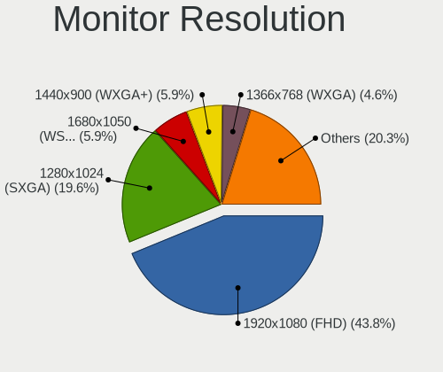

| Resolution         | Desktops | Percent |
|--------------------|----------|---------|
| 1920x1080 (FHD)    | 57       | 45.24%  |
| 1280x1024 (SXGA)   | 22       | 17.46%  |
| 1440x900 (WXGA+)   | 8        | 6.35%   |
| 1680x1050 (WSXGA+) | 6        | 4.76%   |
| 1920x1200 (WUXGA)  | 5        | 3.97%   |
| 3840x2160 (4K)     | 4        | 3.17%   |
| 1360x768           | 4        | 3.17%   |
| 1024x768 (XGA)     | 4        | 3.17%   |
| 1600x900 (HD+)     | 3        | 2.38%   |
| 1366x768 (WXGA)    | 3        | 2.38%   |
| Unknown            | 3        | 2.38%   |
| 3440x1440          | 2        | 1.59%   |
| 7680x2160          | 1        | 0.79%   |
| 4240x1440          | 1        | 0.79%   |
| 3840x1080          | 1        | 0.79%   |
| 2560x1440 (QHD)    | 1        | 0.79%   |
| 1600x1200          | 1        | 0.79%   |

Monitor Diagonal
----------------

Diagonal size in inches

| Inches  | Desktops | Percent |
|---------|----------|---------|
| Unknown | 21       | 16.41%  |
| 24      | 14       | 10.94%  |
| 19      | 13       | 10.16%  |
| 23      | 12       | 9.38%   |
| 21      | 12       | 9.38%   |
| 17      | 12       | 9.38%   |
| 27      | 10       | 7.81%   |
| 18      | 8        | 6.25%   |
| 15      | 6        | 4.69%   |
| 22      | 4        | 3.13%   |
| 31      | 3        | 2.34%   |
| 20      | 3        | 2.34%   |
| 72      | 1        | 0.78%   |
| 54      | 1        | 0.78%   |
| 52      | 1        | 0.78%   |
| 48      | 1        | 0.78%   |
| 33      | 1        | 0.78%   |
| 32      | 1        | 0.78%   |
| 26      | 1        | 0.78%   |
| 16      | 1        | 0.78%   |
| 14      | 1        | 0.78%   |
| 12      | 1        | 0.78%   |

Monitor Width
-------------

Physical width

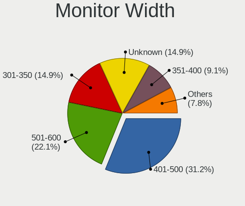

| Width in mm | Desktops | Percent |
|-------------|----------|---------|
| 401-500     | 33       | 26.4%   |
| 501-600     | 32       | 25.6%   |
| Unknown     | 21       | 16.8%   |
| 301-350     | 17       | 13.6%   |
| 351-400     | 10       | 8%      |
| 601-700     | 4        | 3.2%    |
| 1001-1500   | 3        | 2.4%    |
| 701-800     | 2        | 1.6%    |
| 201-300     | 2        | 1.6%    |
| 1501-2000   | 1        | 0.8%    |

Aspect Ratio
------------

Proportional relationship between the width and the height

| Ratio   | Desktops | Percent |
|---------|----------|---------|
| 16/9    | 57       | 45.97%  |
| Unknown | 20       | 16.13%  |
| 5/4     | 19       | 15.32%  |
| 16/10   | 18       | 14.52%  |
| 4/3     | 8        | 6.45%   |
| 3/2     | 1        | 0.81%   |
| 21/9    | 1        | 0.81%   |

Monitor Area
------------

Area in inch

| Area in inch | Desktops | Percent |
|----------------|----------|---------|
| 201-250        | 33       | 25.98%  |
| 151-200        | 22       | 17.32%  |
| Unknown        | 21       | 16.54%  |
| 141-150        | 16       | 12.6%   |
| 301-350        | 11       | 8.66%   |
| 101-110        | 7        | 5.51%   |
| 251-300        | 6        | 4.72%   |
| 351-500        | 5        | 3.94%   |
| More than 1000 | 3        | 2.36%   |
| 71-80          | 1        | 0.79%   |
| 111-120        | 1        | 0.79%   |
| 501-1000       | 1        | 0.79%   |

Pixel Density
-------------

Pixels per inch

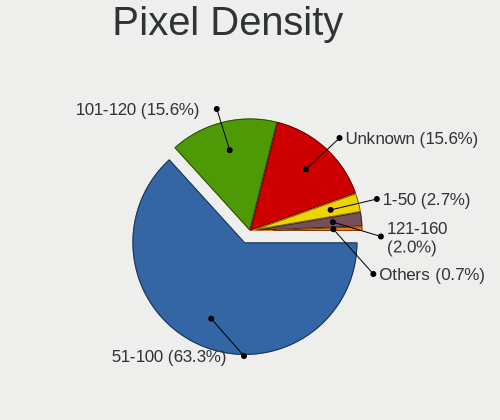

| Density | Desktops | Percent |
|---------|----------|---------|
| 51-100  | 78       | 63.93%  |
| Unknown | 21       | 17.21%  |
| 101-120 | 15       | 12.3%   |
| 1-50    | 4        | 3.28%   |
| 121-160 | 3        | 2.46%   |
| 161-240 | 1        | 0.82%   |

Multiple Monitors
-----------------

Total monitors connected

| Total | Desktops | Percent |
|-------|----------|---------|
| 1     | 101      | 80.8%   |
| 2     | 18       | 14.4%   |
| 0     | 5        | 4%      |
| 3     | 1        | 0.8%    |

Network
-------

Net Controller Vendor
---------------------

Controller vendors

| Vendor                           | Desktops | Percent |
|----------------------------------|----------|---------|
| Realtek Semiconductor            | 72       | 42.6%   |
| Intel                            | 36       | 21.3%   |
| Qualcomm Atheros                 | 17       | 10.06%  |
| Nvidia                           | 8        | 4.73%   |
| Ralink Technology                | 7        | 4.14%   |
| Broadcom                         | 6        | 3.55%   |
| VIA Technologies                 | 3        | 1.78%   |
| TP-Link                          | 3        | 1.78%   |
| Marvell Technology Group         | 3        | 1.78%   |
| Broadcom Limited                 | 2        | 1.18%   |
| Sitecom Europe                   | 1        | 0.59%   |
| Silicon Integrated Systems [SiS] | 1        | 0.59%   |
| Ralink                           | 1        | 0.59%   |
| Microsoft                        | 1        | 0.59%   |
| Mellanox Technologies            | 1        | 0.59%   |
| LSI                              | 1        | 0.59%   |
| JMicron Technology               | 1        | 0.59%   |
| Huawei Technologies              | 1        | 0.59%   |
| Belkin Components                | 1        | 0.59%   |
| AVM                              | 1        | 0.59%   |
| ASUSTek Computer                 | 1        | 0.59%   |
| ADMtek                           | 1        | 0.59%   |

Net Controller Model
--------------------

Controller models

| Model                                                             | Desktops | Percent |
|-------------------------------------------------------------------|----------|---------|
| Realtek RTL8111/8168/8411 PCI Express Gigabit Ethernet Controller | 55       | 29.1%   |
| Nvidia MCP61 Ethernet                                             | 6        | 3.17%   |
| Intel I211 Gigabit Network Connection                             | 6        | 3.17%   |
| Realtek RTL810xE PCI Express Fast Ethernet controller             | 5        | 2.65%   |
| Realtek RTL-8100/8101L/8139 PCI Fast Ethernet Adapter             | 5        | 2.65%   |
| Ralink MT7601U Wireless Adapter                                   | 4        | 2.12%   |
| Intel 82579LM Gigabit Network Connection (Lewisville)             | 4        | 2.12%   |
| VIA VT6102/VT6103 [Rhine-II]                                      | 3        | 1.59%   |
| Realtek RTL8821CE 802.11ac PCIe Wireless Network Adapter          | 3        | 1.59%   |
| Realtek RTL8188EUS 802.11n Wireless Network Adapter               | 3        | 1.59%   |
| Realtek RTL-8110SC/8169SC Gigabit Ethernet                        | 3        | 1.59%   |
| Qualcomm Atheros Attansic L1 Gigabit Ethernet                     | 3        | 1.59%   |
| Intel Wi-Fi 6 AX200                                               | 3        | 1.59%   |
| Realtek RTL8192CE PCIe Wireless Network Adapter                   | 2        | 1.06%   |
| Realtek RTL8188CUS 802.11n WLAN Adapter                           | 2        | 1.06%   |
| Qualcomm Atheros Killer E220x Gigabit Ethernet Controller         | 2        | 1.06%   |
| Qualcomm Atheros AR9485 Wireless Network Adapter                  | 2        | 1.06%   |
| Qualcomm Atheros AR9287 Wireless Network Adapter (PCI-Express)    | 2        | 1.06%   |
| Nvidia nForce2 Ethernet Controller                                | 2        | 1.06%   |
| Marvell Group 88E8056 PCI-E Gigabit Ethernet Controller           | 2        | 1.06%   |
| Intel Ethernet Connection I217-V                                  | 2        | 1.06%   |
| Intel Ethernet Connection (7) I219-V                              | 2        | 1.06%   |
| Intel Ethernet Connection (2) I219-V                              | 2        | 1.06%   |
| Intel Dual Band Wireless-AC 3168NGW [Stone Peak]                  | 2        | 1.06%   |
| Intel 82579V Gigabit Network Connection                           | 2        | 1.06%   |
| Intel 82574L Gigabit Network Connection                           | 2        | 1.06%   |
| Intel 82567LM-3 Gigabit Network Connection                        | 2        | 1.06%   |
| Intel 82566DM-2 Gigabit Network Connection                        | 2        | 1.06%   |
| TP-Link TL-WN823N v2/v3 [Realtek RTL8192EU]                       | 1        | 0.53%   |
| TP-Link TL-WN722N v2/v3 [Realtek RTL8188EUS]                      | 1        | 0.53%   |
| TP-Link 802.11n NIC                                               | 1        | 0.53%   |
| Sitecom Europe RTL8188S WLAN Adapter                              | 1        | 0.53%   |
| Silicon Integrated Systems [SiS] SiS900 PCI Fast Ethernet         | 1        | 0.53%   |
| Realtek RTL8811AU 802.11a/b/g/n/ac WLAN Adapter                   | 1        | 0.53%   |
| Realtek RTL8191SU 802.11n WLAN Adapter                            | 1        | 0.53%   |
| Realtek RTL8169 PCI Gigabit Ethernet Controller                   | 1        | 0.53%   |
| Realtek RTL8125 2.5GbE Controller                                 | 1        | 0.53%   |
| Realtek RTL-8185 IEEE 802.11a/b/g Wireless LAN Controller         | 1        | 0.53%   |
| Ralink RT5370 Wireless Adapter                                    | 1        | 0.53%   |
| Ralink RT2870/RT3070 Wireless Adapter                             | 1        | 0.53%   |
| Ralink MT7610U ("Archer T2U" 2.4G+5G WLAN Adapter                 | 1        | 0.53%   |
| Ralink RT3090 Wireless 802.11n 1T/1R PCIe                         | 1        | 0.53%   |
| Qualcomm Atheros QCA9565 / AR9565 Wireless Network Adapter        | 1        | 0.53%   |
| Qualcomm Atheros QCA9377 802.11ac Wireless Network Adapter        | 1        | 0.53%   |
| Qualcomm Atheros Killer E2500 Gigabit Ethernet Controller         | 1        | 0.53%   |
| Qualcomm Atheros AR9462 Wireless Network Adapter                  | 1        | 0.53%   |
| Qualcomm Atheros AR9227 Wireless Network Adapter                  | 1        | 0.53%   |
| Qualcomm Atheros AR8161 Gigabit Ethernet                          | 1        | 0.53%   |
| Qualcomm Atheros AR8152 v2.0 Fast Ethernet                        | 1        | 0.53%   |
| Qualcomm Atheros AR8121/AR8113/AR8114 Gigabit or Fast Ethernet    | 1        | 0.53%   |
| Microsoft Xbox 360 Wireless Adapter                               | 1        | 0.53%   |
| Mellanox MT23108 InfiniHost                                       | 1        | 0.53%   |
| Marvell Group 88E8071 PCI-E Gigabit Ethernet Controller           | 1        | 0.53%   |
| Marvell Group 88E8001 Gigabit Ethernet Controller                 | 1        | 0.53%   |
| LSI 56k WinModem                                                  | 1        | 0.53%   |
| JMicron JMC250 PCI Express Gigabit Ethernet Controller            | 1        | 0.53%   |
| Intel Wireless 8265 / 8275                                        | 1        | 0.53%   |
| Intel Wireless 7265                                               | 1        | 0.53%   |
| Intel Ethernet Connection I217-LM                                 | 1        | 0.53%   |
| Intel Ethernet Connection (2) I218-V                              | 1        | 0.53%   |

Wireless Vendor
---------------

Wireless vendors

| Vendor                | Desktops | Percent |
|-----------------------|----------|---------|
| Realtek Semiconductor | 13       | 25.49%  |
| Intel                 | 10       | 19.61%  |
| Qualcomm Atheros      | 8        | 15.69%  |
| Ralink Technology     | 7        | 13.73%  |
| TP-Link               | 3        | 5.88%   |
| Broadcom              | 3        | 5.88%   |
| Sitecom Europe        | 1        | 1.96%   |
| Ralink                | 1        | 1.96%   |
| Microsoft             | 1        | 1.96%   |
| Broadcom Limited      | 1        | 1.96%   |
| Belkin Components     | 1        | 1.96%   |
| AVM                   | 1        | 1.96%   |
| ASUSTek Computer      | 1        | 1.96%   |

Wireless Model
--------------

Wireless models

| Model                                                                       | Desktops | Percent |
|-----------------------------------------------------------------------------|----------|---------|
| Ralink MT7601U Wireless Adapter                                             | 4        | 7.84%   |
| Realtek RTL8821CE 802.11ac PCIe Wireless Network Adapter                    | 3        | 5.88%   |
| Realtek RTL8188EUS 802.11n Wireless Network Adapter                         | 3        | 5.88%   |
| Intel Wi-Fi 6 AX200                                                         | 3        | 5.88%   |
| Realtek RTL8192CE PCIe Wireless Network Adapter                             | 2        | 3.92%   |
| Realtek RTL8188CUS 802.11n WLAN Adapter                                     | 2        | 3.92%   |
| Qualcomm Atheros AR9485 Wireless Network Adapter                            | 2        | 3.92%   |
| Qualcomm Atheros AR9287 Wireless Network Adapter (PCI-Express)              | 2        | 3.92%   |
| Intel Dual Band Wireless-AC 3168NGW [Stone Peak]                            | 2        | 3.92%   |
| TP-Link TL-WN823N v2/v3 [Realtek RTL8192EU]                                 | 1        | 1.96%   |
| TP-Link TL-WN722N v2/v3 [Realtek RTL8188EUS]                                | 1        | 1.96%   |
| TP-Link 802.11n NIC                                                         | 1        | 1.96%   |
| Sitecom Europe RTL8188S WLAN Adapter                                        | 1        | 1.96%   |
| Realtek RTL8811AU 802.11a/b/g/n/ac WLAN Adapter                             | 1        | 1.96%   |
| Realtek RTL8191SU 802.11n WLAN Adapter                                      | 1        | 1.96%   |
| Realtek RTL-8185 IEEE 802.11a/b/g Wireless LAN Controller                   | 1        | 1.96%   |
| Ralink RT5370 Wireless Adapter                                              | 1        | 1.96%   |
| Ralink RT2870/RT3070 Wireless Adapter                                       | 1        | 1.96%   |
| Ralink MT7610U ("Archer T2U" 2.4G+5G WLAN Adapter                           | 1        | 1.96%   |
| Ralink RT3090 Wireless 802.11n 1T/1R PCIe                                   | 1        | 1.96%   |
| Qualcomm Atheros QCA9565 / AR9565 Wireless Network Adapter                  | 1        | 1.96%   |
| Qualcomm Atheros QCA9377 802.11ac Wireless Network Adapter                  | 1        | 1.96%   |
| Qualcomm Atheros AR9462 Wireless Network Adapter                            | 1        | 1.96%   |
| Qualcomm Atheros AR9227 Wireless Network Adapter                            | 1        | 1.96%   |
| Microsoft Xbox 360 Wireless Adapter                                         | 1        | 1.96%   |
| Intel Wireless 8265 / 8275                                                  | 1        | 1.96%   |
| Intel Wireless 7265                                                         | 1        | 1.96%   |
| Intel Comet Lake PCH CNVi WiFi                                              | 1        | 1.96%   |
| Intel Centrino Wireless-N 2230                                              | 1        | 1.96%   |
| Intel Centrino Wireless-N 105                                               | 1        | 1.96%   |
| Broadcom Limited BCM4360 802.11ac Wireless Network Adapter                  | 1        | 1.96%   |
| Broadcom BCM4360 802.11ac Wireless Network Adapter                          | 1        | 1.96%   |
| Broadcom BCM43225 802.11b/g/n                                               | 1        | 1.96%   |
| Broadcom BCM4318 [AirForce One 54g] 802.11g Wireless LAN Controller         | 1        | 1.96%   |
| Belkin Components F9L1101v2 802.11abgn Wireless Adapter [Realtek RTL8192DU] | 1        | 1.96%   |
| AVM FRITZ!WLAN AC 860                                                       | 1        | 1.96%   |
| ASUS USB-AC56 802.11a/b/g/n/ac Wireless Adapter [Realtek RTL8812AU]         | 1        | 1.96%   |

Ethernet Vendor
---------------

Ethernet vendors

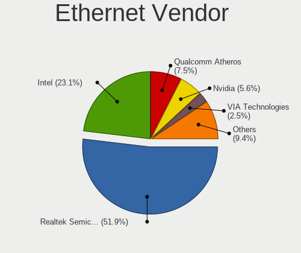

| Vendor                           | Desktops | Percent |
|----------------------------------|----------|---------|
| Realtek Semiconductor            | 68       | 51.91%  |
| Intel                            | 32       | 24.43%  |
| Qualcomm Atheros                 | 9        | 6.87%   |
| Nvidia                           | 8        | 6.11%   |
| VIA Technologies                 | 3        | 2.29%   |
| Marvell Technology Group         | 3        | 2.29%   |
| Broadcom                         | 3        | 2.29%   |
| Silicon Integrated Systems [SiS] | 1        | 0.76%   |
| JMicron Technology               | 1        | 0.76%   |
| Huawei Technologies              | 1        | 0.76%   |
| Broadcom Limited                 | 1        | 0.76%   |
| ADMtek                           | 1        | 0.76%   |

Ethernet Model
--------------

Ethernet models

| Model                                                             | Desktops | Percent |
|-------------------------------------------------------------------|----------|---------|
| Realtek RTL8111/8168/8411 PCI Express Gigabit Ethernet Controller | 55       | 40.44%  |
| Nvidia MCP61 Ethernet                                             | 6        | 4.41%   |
| Intel I211 Gigabit Network Connection                             | 6        | 4.41%   |
| Realtek RTL810xE PCI Express Fast Ethernet controller             | 5        | 3.68%   |
| Realtek RTL-8100/8101L/8139 PCI Fast Ethernet Adapter             | 5        | 3.68%   |
| Intel 82579LM Gigabit Network Connection (Lewisville)             | 4        | 2.94%   |
| VIA VT6102/VT6103 [Rhine-II]                                      | 3        | 2.21%   |
| Realtek RTL-8110SC/8169SC Gigabit Ethernet                        | 3        | 2.21%   |
| Qualcomm Atheros Attansic L1 Gigabit Ethernet                     | 3        | 2.21%   |
| Qualcomm Atheros Killer E220x Gigabit Ethernet Controller         | 2        | 1.47%   |
| Nvidia nForce2 Ethernet Controller                                | 2        | 1.47%   |
| Marvell Group 88E8056 PCI-E Gigabit Ethernet Controller           | 2        | 1.47%   |
| Intel Ethernet Connection I217-V                                  | 2        | 1.47%   |
| Intel Ethernet Connection (7) I219-V                              | 2        | 1.47%   |
| Intel Ethernet Connection (2) I219-V                              | 2        | 1.47%   |
| Intel 82579V Gigabit Network Connection                           | 2        | 1.47%   |
| Intel 82574L Gigabit Network Connection                           | 2        | 1.47%   |
| Intel 82567LM-3 Gigabit Network Connection                        | 2        | 1.47%   |
| Intel 82566DM-2 Gigabit Network Connection                        | 2        | 1.47%   |
| Silicon Integrated Systems [SiS] SiS900 PCI Fast Ethernet         | 1        | 0.74%   |
| Realtek RTL8169 PCI Gigabit Ethernet Controller                   | 1        | 0.74%   |
| Realtek RTL8125 2.5GbE Controller                                 | 1        | 0.74%   |
| Qualcomm Atheros Killer E2500 Gigabit Ethernet Controller         | 1        | 0.74%   |
| Qualcomm Atheros AR8161 Gigabit Ethernet                          | 1        | 0.74%   |
| Qualcomm Atheros AR8152 v2.0 Fast Ethernet                        | 1        | 0.74%   |
| Qualcomm Atheros AR8121/AR8113/AR8114 Gigabit or Fast Ethernet    | 1        | 0.74%   |
| Marvell Group 88E8071 PCI-E Gigabit Ethernet Controller           | 1        | 0.74%   |
| Marvell Group 88E8001 Gigabit Ethernet Controller                 | 1        | 0.74%   |
| JMicron JMC250 PCI Express Gigabit Ethernet Controller            | 1        | 0.74%   |
| Intel Ethernet Connection I217-LM                                 | 1        | 0.74%   |
| Intel Ethernet Connection (2) I218-V                              | 1        | 0.74%   |
| Intel Ethernet Connection (11) I219-V                             | 1        | 0.74%   |
| Intel 82583V Gigabit Network Connection                           | 1        | 0.74%   |
| Intel 82578DM Gigabit Network Connection                          | 1        | 0.74%   |
| Intel 82578DC Gigabit Network Connection                          | 1        | 0.74%   |
| Intel 82566DC-2 Gigabit Network Connection                        | 1        | 0.74%   |
| Intel 82562V-2 10/100 Network Connection                          | 1        | 0.74%   |
| Intel 82557/8/9/0/1 Ethernet Pro 100                              | 1        | 0.74%   |
| Intel 82544EI Gigabit Ethernet Controller (Copper)                | 1        | 0.74%   |
| Huawei VOG-L09                                                    | 1        | 0.74%   |
| Broadcom NetXtreme BCM5761 Gigabit Ethernet PCIe                  | 1        | 0.74%   |
| Broadcom NetXtreme BCM5755 Gigabit Ethernet PCI Express           | 1        | 0.74%   |
| Broadcom NetXtreme BCM5754 Gigabit Ethernet PCI Express           | 1        | 0.74%   |
| Broadcom Limited NetLink BCM5787 Gigabit Ethernet PCI Express     | 1        | 0.74%   |
| ADMtek ADM8515 Pegasus II Ethernet                                | 1        | 0.74%   |

Net Controller Kind
-------------------

Ethernet, WiFi or modem

| Kind     | Desktops | Percent |
|----------|----------|---------|
| Ethernet | 123      | 71.1%   |
| WiFi     | 48       | 27.75%  |
| Modem    | 1        | 0.58%   |
| Unknown  | 1        | 0.58%   |

Used Controller
---------------

Currently used network controller

| Kind     | Desktops | Percent |
|----------|----------|---------|
| Ethernet | 120      | 76.43%  |
| WiFi     | 37       | 23.57%  |

NICs
----

Total network controllers on board

| Total | Desktops | Percent |
|-------|----------|---------|
| 1     | 81       | 65.85%  |
| 2     | 38       | 30.89%  |
| 3     | 3        | 2.44%   |
| 4     | 1        | 0.81%   |

IPv6
----

IPv6 vs IPv4

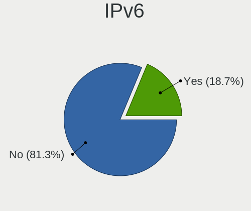

| Used | Desktops | Percent |
|------|----------|---------|
| No   | 108      | 85.04%  |
| Yes  | 19       | 14.96%  |

Bluetooth
---------

Bluetooth Vendor
----------------

Controller vendors

| Vendor                          | Desktops | Percent |
|---------------------------------|----------|---------|
| Intel                           | 9        | 34.62%  |
| Cambridge Silicon Radio         | 7        | 26.92%  |
| Realtek Semiconductor           | 3        | 11.54%  |
| Qualcomm Atheros Communications | 2        | 7.69%   |
| Broadcom                        | 2        | 7.69%   |
| ASUSTek Computer                | 2        | 7.69%   |
| Apple                           | 1        | 3.85%   |

Bluetooth Model
---------------

Controller models

| Model                                               | Desktops | Percent |
|-----------------------------------------------------|----------|---------|
| Cambridge Silicon Radio Bluetooth Dongle (HCI mode) | 7        | 26.92%  |
| Intel Bluetooth Device                              | 6        | 23.08%  |
| Realtek  Bluetooth 4.2 Adapter                      | 2        | 7.69%   |
| Intel Wireless-AC 3168 Bluetooth                    | 2        | 7.69%   |
| ASUS Broadcom BCM20702A0 Bluetooth                  | 2        | 7.69%   |
| Realtek Bluetooth Radio                             | 1        | 3.85%   |
| Qualcomm Atheros  Bluetooth Device                  | 1        | 3.85%   |
| Qualcomm Atheros AR3011 Bluetooth                   | 1        | 3.85%   |
| Intel Centrino Bluetooth Wireless Transceiver       | 1        | 3.85%   |
| Broadcom HP Bluethunder                             | 1        | 3.85%   |
| Broadcom BCM2045 Bluetooth                          | 1        | 3.85%   |
| Apple Bluetooth USB Host Controller                 | 1        | 3.85%   |

Sound
-----

Sound Vendor
------------

Sound card vendors

| Vendor                           | Desktops | Percent |
|----------------------------------|----------|---------|
| Intel                            | 75       | 40.11%  |
| Nvidia                           | 48       | 25.67%  |
| AMD                              | 33       | 17.65%  |
| C-Media Electronics              | 9        | 4.81%   |
| VIA Technologies                 | 6        | 3.21%   |
| Creative Labs                    | 3        | 1.6%    |
| Silicon Integrated Systems [SiS] | 2        | 1.07%   |
| Logitech                         | 2        | 1.07%   |
| GN Netcom                        | 2        | 1.07%   |
| Xilinx                           | 1        | 0.53%   |
| M-Audio                          | 1        | 0.53%   |
| JMTek                            | 1        | 0.53%   |
| GYROCOM C&C                      | 1        | 0.53%   |
| Generalplus Technology           | 1        | 0.53%   |
| Focusrite-Novation               | 1        | 0.53%   |
| Creative Technology              | 1        | 0.53%   |

Sound Model
-----------

Sound card models

| Model                                                                       | Desktops | Percent |
|-----------------------------------------------------------------------------|----------|---------|
| Intel 6 Series/C200 Series Chipset Family High Definition Audio Controller  | 15       | 7.14%   |
| Intel NM10/ICH7 Family High Definition Audio Controller                     | 10       | 4.76%   |
| Intel 8 Series/C220 Series Chipset High Definition Audio Controller         | 8        | 3.81%   |
| AMD SBx00 Azalia (Intel HDA)                                                | 8        | 3.81%   |
| Nvidia MCP61 High Definition Audio                                          | 6        | 2.86%   |
| Nvidia GP107GL High Definition Audio Controller                             | 6        | 2.86%   |
| Nvidia GM206 High Definition Audio Controller                               | 6        | 2.86%   |
| Intel Xeon E3-1200 v3/4th Gen Core Processor HD Audio Controller            | 6        | 2.86%   |
| Intel 82801I (ICH9 Family) HD Audio Controller                              | 6        | 2.86%   |
| Intel 7 Series/C216 Chipset Family High Definition Audio Controller         | 6        | 2.86%   |
| AMD Raven/Raven2/Fenghuang HDMI/DP Audio Controller                         | 6        | 2.86%   |
| AMD Ellesmere HDMI Audio [Radeon RX 470/480 / 570/580/590]                  | 6        | 2.86%   |
| Nvidia High Definition Audio Controller                                     | 5        | 2.38%   |
| Intel Cannon Lake PCH cAVS                                                  | 5        | 2.38%   |
| Intel 82801JI (ICH10 Family) HD Audio Controller                            | 5        | 2.38%   |
| C-Media Electronics CMI8788 [Oxygen HD Audio]                               | 5        | 2.38%   |
| AMD Family 17h (Models 10h-1fh) HD Audio Controller                         | 5        | 2.38%   |
| Nvidia GK208 HDMI/DP Audio Controller                                       | 4        | 1.9%    |
| AMD Starship/Matisse HD Audio Controller                                    | 4        | 1.9%    |
| AMD Family 17h (Models 00h-0fh) HD Audio Controller                         | 4        | 1.9%    |
| VIA Technologies VT8233/A/8235/8237 AC97 Audio Controller                   | 3        | 1.43%   |
| Nvidia TU106 High Definition Audio Controller                               | 3        | 1.43%   |
| Nvidia GK104 HDMI Audio Controller                                          | 3        | 1.43%   |
| Nvidia GF108 High Definition Audio Controller                               | 3        | 1.43%   |
| Intel 9 Series Chipset Family HD Audio Controller                           | 3        | 1.43%   |
| Intel 5 Series/3400 Series Chipset High Definition Audio                    | 3        | 1.43%   |
| Silicon Integrated Systems [SiS] SiS7012 AC'97 Sound Controller             | 2        | 0.95%   |
| Nvidia nForce2 AC97 Audio Controler (MCP)                                   | 2        | 0.95%   |
| Nvidia GP106 High Definition Audio Controller                               | 2        | 0.95%   |
| Nvidia GP104 High Definition Audio Controller                               | 2        | 0.95%   |
| Nvidia GF116 High Definition Audio Controller                               | 2        | 0.95%   |
| Nvidia GF104 High Definition Audio Controller                               | 2        | 0.95%   |
| Intel 82801JD/DO (ICH10 Family) HD Audio Controller                         | 2        | 0.95%   |
| Intel 200 Series PCH HD Audio                                               | 2        | 0.95%   |
| Intel 100 Series/C230 Series Chipset Family HD Audio Controller             | 2        | 0.95%   |
| AMD FCH Azalia Controller                                                   | 2        | 0.95%   |
| AMD Cedar HDMI Audio [Radeon HD 5400/6300/7300 Series]                      | 2        | 0.95%   |
| Xilinx RME Hammerfall DSP                                                   | 1        | 0.48%   |
| VIA Technologies VX900/VT8xxx High Definition Audio Controller              | 1        | 0.48%   |
| VIA Technologies VT1720/24 [Envy24PT/HT] PCI Multi-Channel Audio Controller | 1        | 0.48%   |
| VIA Technologies ICE1712 [Envy24] PCI Multi-Channel I/O Controller          | 1        | 0.48%   |
| Nvidia MCP51 High Definition Audio                                          | 1        | 0.48%   |
| Nvidia GM107 High Definition Audio Controller [GeForce 940MX]               | 1        | 0.48%   |
| Nvidia GK107 HDMI Audio Controller                                          | 1        | 0.48%   |
| Nvidia GF114 HDMI Audio Controller                                          | 1        | 0.48%   |
| M-Audio M-Audio Fast Track                                                  | 1        | 0.48%   |
| Logitech QuickCam Fusion                                                    | 1        | 0.48%   |
| Logitech G430 Surround Sound Gaming Headset                                 | 1        | 0.48%   |
| JMTek USB PnP Audio Device                                                  | 1        | 0.48%   |
| Intel Haswell-ULT HD Audio Controller                                       | 1        | 0.48%   |
| Intel Comet Lake PCH cAVS                                                   | 1        | 0.48%   |
| Intel Celeron/Pentium Silver Processor High Definition Audio                | 1        | 0.48%   |
| Intel Celeron N3350/Pentium N4200/Atom E3900 Series Audio Cluster           | 1        | 0.48%   |
| Intel Cannon Point-LP High Definition Audio Controller                      | 1        | 0.48%   |
| Intel C610/X99 series chipset HD Audio Controller                           | 1        | 0.48%   |
| Intel C600/X79 series chipset High Definition Audio Controller              | 1        | 0.48%   |
| Intel 82801DB/DBL/DBM (ICH4/ICH4-L/ICH4-M) AC'97 Audio Controller           | 1        | 0.48%   |
| Intel 8 Series HD Audio Controller                                          | 1        | 0.48%   |
| GYROCOM C&C Fiio E10                                                        | 1        | 0.48%   |
| GN Netcom Jabra UC Voice 750 MS                                             | 1        | 0.48%   |

Memory
------

Memory Vendor
-------------

Memory module vendors

| Vendor              | Desktops | Percent |
|---------------------|----------|---------|
| Unknown             | 7        | 38.89%  |
| Crucial             | 3        | 16.67%  |
| Samsung Electronics | 2        | 11.11%  |
| Kingston            | 2        | 11.11%  |
| SK Hynix            | 1        | 5.56%   |
| Micron Technology   | 1        | 5.56%   |
| G.Skill             | 1        | 5.56%   |
| Exceleram           | 1        | 5.56%   |

Memory Model
------------

Memory module models

| Model                                                      | Desktops | Percent |
|------------------------------------------------------------|----------|---------|
| Unknown RAM Module 512MB DIMM 667MT/s                      | 1        | 5%      |
| Unknown RAM Module 4096MB DIMM DDR3 1600MT/s               | 1        | 5%      |
| Unknown RAM Module 2GB DIMM DDR 1333MT/s                   | 1        | 5%      |
| Unknown RAM Module 2048MB DIMM DDR2 800MT/s                | 1        | 5%      |
| Unknown RAM Module 2048MB DIMM DDR2 667MT/s                | 1        | 5%      |
| Unknown RAM Module 2048MB DIMM DDR2 400MT/s                | 1        | 5%      |
| Unknown RAM Module 1024MB DIMM 667MT/s                     | 1        | 5%      |
| Unknown RAM Module 1024MB DIMM                             | 1        | 5%      |
| SK Hynix RAM Module 8192MB DIMM DDR4 2400MT/s              | 1        | 5%      |
| Samsung RAM M471B5173QH0-YK0 4096MB SODIMM DDR3 1600MT/s   | 1        | 5%      |
| Samsung RAM M471B5173DB0-YK0 4GB SODIMM DDR3 1600MT/s      | 1        | 5%      |
| Samsung RAM M378A1K43CB2-CRC 8GB DIMM DDR4 3500MT/s        | 1        | 5%      |
| Micron RAM 8JTF51264AZ-1G6E1 4096MB DIMM DDR3 1600MT/s     | 1        | 5%      |
| Kingston RAM KP223C-ELD 2048MB DIMM DDR3 1333MT/s          | 1        | 5%      |
| Kingston RAM KHX3600C17D4/16GX 16GB DIMM DDR4 3800MT/s     | 1        | 5%      |
| G.Skill RAM F4-3200C16-16GTZSK 16GB DIMM DDR4 3200MT/s     | 1        | 5%      |
| Exceleram RAM E30144A 4096MB DIMM DDR3 800MT/s             | 1        | 5%      |
| Crucial RAM CT102464BF160B.M16 8192MB SODIMM DDR3 1600MT/s | 1        | 5%      |
| Crucial RAM BLT8G4D26BFT4K.C8FD 8GB DIMM DDR4 2666MT/s     | 1        | 5%      |
| Crucial RAM BLS8G3D1609DS1S00. 8192MB DIMM DDR3 1600MT/s   | 1        | 5%      |

Memory Kind
-----------

Memory module kinds

| Kind    | Desktops | Percent |
|---------|----------|---------|
| DDR3    | 7        | 38.89%  |
| DDR4    | 5        | 27.78%  |
| DDR2    | 3        | 16.67%  |
| Unknown | 2        | 11.11%  |
| DDR     | 1        | 5.56%   |

Memory Form Factor
------------------

Physical design of the memory module

| Name   | Desktops | Percent |
|--------|----------|---------|
| DIMM   | 16       | 88.89%  |
| SODIMM | 2        | 11.11%  |

Memory Size
-----------

Memory module size

| Size  | Desktops | Percent |
|-------|----------|---------|
| 8192  | 5        | 26.32%  |
| 2048  | 5        | 26.32%  |
| 4096  | 4        | 21.05%  |
| 16384 | 2        | 10.53%  |
| 1024  | 2        | 10.53%  |
| 512   | 1        | 5.26%   |

Memory Speed
------------

Memory module speed

| Speed   | Desktops | Percent |
|---------|----------|---------|
| 1600    | 5        | 27.78%  |
| 1333    | 2        | 11.11%  |
| 800     | 2        | 11.11%  |
| 667     | 2        | 11.11%  |
| 3800    | 1        | 5.56%   |
| 3500    | 1        | 5.56%   |
| 3200    | 1        | 5.56%   |
| 2666    | 1        | 5.56%   |
| 2400    | 1        | 5.56%   |
| 400     | 1        | 5.56%   |
| Unknown | 1        | 5.56%   |

Printers & scanners
-------------------

Printer Vendor
--------------

Printer device vendors

| Vendor              | Desktops | Percent |
|---------------------|----------|---------|
| Hewlett-Packard     | 4        | 40%     |
| Samsung Electronics | 2        | 20%     |
| Brother Industries  | 2        | 20%     |
| Ricoh               | 1        | 10%     |
| Canon               | 1        | 10%     |

Printer Model
-------------

Printer device models

| Model                    | Desktops | Percent |
|--------------------------|----------|---------|
| Samsung SCX-3400 Series  | 1        | 10%     |
| Samsung ML-1670 Series   | 1        | 10%     |
| Ricoh SP C260SFNw        | 1        | 10%     |
| HP LaserJet P1006        | 1        | 10%     |
| HP DeskJet F4200 series  | 1        | 10%     |
| HP Deskjet 2540 series   | 1        | 10%     |
| HP Deskjet 1050 J410     | 1        | 10%     |
| Canon iP4200             | 1        | 10%     |
| Brother MFC-L2685DW      | 1        | 10%     |
| Brother HL-L2300D series | 1        | 10%     |

Scanner Vendor
--------------

Scanner device vendors

| Vendor          | Desktops | Percent |
|-----------------|----------|---------|
| Hewlett-Packard | 1        | 100%    |

Scanner Model
-------------

Scanner device models

| Model            | Desktops | Percent |
|------------------|----------|---------|
| HP ScanJet 3800c | 1        | 100%    |

Camera
------

Camera Vendor
-------------

Camera device vendors

| Vendor                        | Desktops | Percent |
|-------------------------------|----------|---------|
| Logitech                      | 5        | 33.33%  |
| Microsoft                     | 3        | 20%     |
| Xiongmai                      | 1        | 6.67%   |
| Sunplus Innovation Technology | 1        | 6.67%   |
| Service & Quality Technology  | 1        | 6.67%   |
| Nintendo                      | 1        | 6.67%   |
| Microdia                      | 1        | 6.67%   |
| KYE Systems (Mouse Systems)   | 1        | 6.67%   |
| Chicony Electronics           | 1        | 6.67%   |

Camera Model
------------

Camera device models

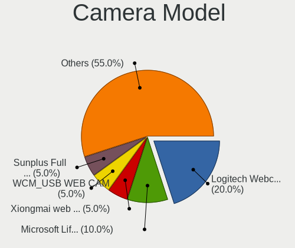

| Model                                              | Desktops | Percent |
|----------------------------------------------------|----------|---------|
| Microsoft LifeCam HD-3000                          | 2        | 13.33%  |
| Logitech Webcam C270                               | 2        | 13.33%  |
| Xiongmai web camera                                | 1        | 6.67%   |
| Sunplus Full HD webcam                             | 1        | 6.67%   |
| Service & Quality USB PC Camera                    | 1        | 6.67%   |
| Nintendo USB Camera                                | 1        | 6.67%   |
| Microsoft Microsoft? LifeCam VX-5500              | 1        | 6.67%   |
| Microdia Webcam Vitade AF                          | 1        | 6.67%   |
| Logitech Webcam Pro 9000                           | 1        | 6.67%   |
| Logitech Webcam C310                               | 1        | 6.67%   |
| Logitech HD Pro Webcam C920                        | 1        | 6.67%   |
| KYE Systems (Mouse Systems) Genius iSlim 2000AF V2 | 1        | 6.67%   |
| Chicony HP High Definition 1MP Webcam              | 1        | 6.67%   |

Security
--------

Fingerprint Vendor
------------------

Fingerprint sensor vendors

| Vendor                | Desktops | Percent |
|-----------------------|----------|---------|
| LighTuning Technology | 1        | 100%    |

Fingerprint Model
-----------------

Fingerprint sensor models

| Model                                     | Desktops | Percent |
|-------------------------------------------|----------|---------|
| LighTuning ES603 Swipe Fingerprint Sensor | 1        | 100%    |

Chipcard Vendor
---------------

Chipcard module vendors

| Vendor                            | Desktops | Percent |
|-----------------------------------|----------|---------|
| VASCO Data Security International | 1        | 33.33%  |
| OmniKey                           | 1        | 33.33%  |
| Jing-Mold Enterprise              | 1        | 33.33%  |

Chipcard Model
--------------

Chipcard module models

| Model                                                             | Desktops | Percent |
|-------------------------------------------------------------------|----------|---------|
| VASCO Data Security International DIGIPASS 870                    | 1        | 33.33%  |
| OmniKey CardMan 1021                                              | 1        | 33.33%  |
| Jing-Mold Enterprise HP USB Business Slim Smartcard CCID Keyboard | 1        | 33.33%  |

Unsupported
-----------

Unsupported Devices
-------------------

Total unsupported devices on board

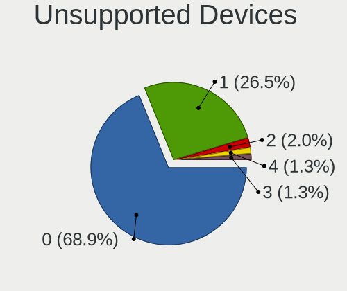

| Total | Desktops | Percent |
|-------|----------|---------|
| 0     | 88       | 70.97%  |
| 1     | 31       | 25%     |
| 2     | 3        | 2.42%   |
| 4     | 2        | 1.61%   |

Unsupported Device Types
------------------------

Types of unsupported devices

| Type                     | Desktops | Percent |
|--------------------------|----------|---------|
| Graphics card            | 21       | 50%     |
| Net/wireless             | 10       | 23.81%  |
| Communication controller | 3        | 7.14%   |
| Net/ethernet             | 2        | 4.76%   |
| Unassigned class         | 1        | 2.38%   |
| Storage/ide              | 1        | 2.38%   |
| Network                  | 1        | 2.38%   |
| Modem                    | 1        | 2.38%   |
| Fingerprint reader       | 1        | 2.38%   |
| Chipcard                 | 1        | 2.38%   |

