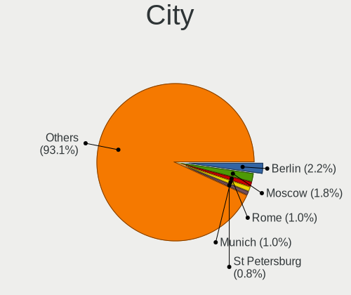
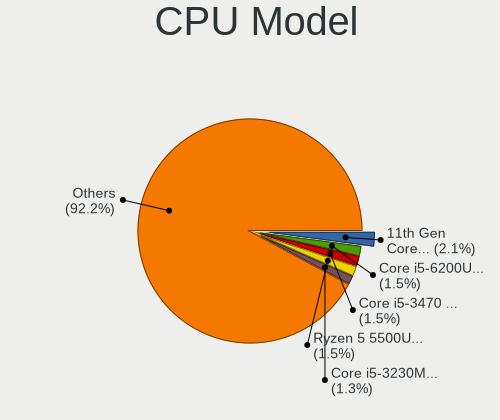
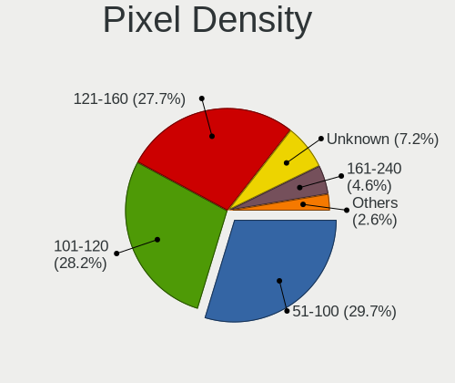
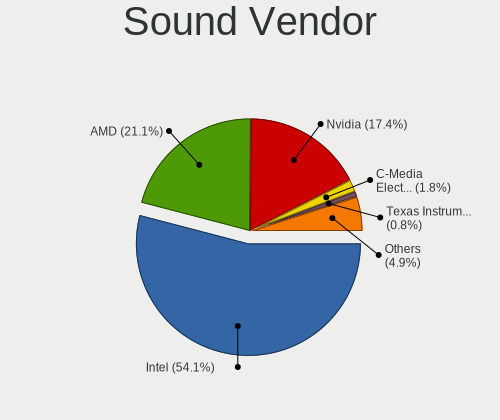

LMDE 5 - Tested Hardware & Statistics
-------------------------------------

A project to collect tested hardware configurations for LMDE 5.

Anyone can contribute to this report by the [hw-probe](https://github.com/linuxhw/hw-probe) tool:

    sudo -E hw-probe -all -upload

Please contribute! Especially if your hardware is rare.

This is a report for all computer types. See also reports for [desktops](/Dist/LMDE_5/Desktop/README.md) and [notebooks](/Dist/LMDE_5/Notebook/README.md).

Contents
--------

* [ Test Cases ](#test-cases)

* [ System ](#system)
  - [ Kernel                   ](#kernel)
  - [ Kernel Family            ](#kernel-family)
  - [ Kernel Major Ver.        ](#kernel-major-ver)
  - [ Arch                     ](#arch)
  - [ DE                       ](#de)
  - [ Display Server           ](#display-server)
  - [ Display Manager          ](#display-manager)
  - [ OS Lang                  ](#os-lang)
  - [ Boot Mode                ](#boot-mode)
  - [ Filesystem               ](#filesystem)
  - [ Part. scheme             ](#part-scheme)
  - [ Dual Boot with Linux/BSD ](#dual-boot-with-linuxbsd)
  - [ Dual Boot (Win)          ](#dual-boot-win)

* [ Board ](#board)
  - [ Vendor                   ](#vendor)
  - [ Model                    ](#model)
  - [ Model Family             ](#model-family)
  - [ MFG Year                 ](#mfg-year)
  - [ Form Factor              ](#form-factor)
  - [ Secure Boot              ](#secure-boot)
  - [ Coreboot                 ](#coreboot)
  - [ RAM Size                 ](#ram-size)
  - [ RAM Used                 ](#ram-used)
  - [ Total Drives             ](#total-drives)
  - [ Has CD-ROM               ](#has-cd-rom)
  - [ Has Ethernet             ](#has-ethernet)
  - [ Has WiFi                 ](#has-wifi)
  - [ Has Bluetooth            ](#has-bluetooth)

* [ Location ](#location)
  - [ Country                  ](#country)
  - [ City                     ](#city)

* [ Drives ](#drives)
  - [ Drive Vendor             ](#drive-vendor)
  - [ Drive Model              ](#drive-model)
  - [ HDD Vendor               ](#hdd-vendor)
  - [ SSD Vendor               ](#ssd-vendor)
  - [ Drive Kind               ](#drive-kind)
  - [ Drive Connector          ](#drive-connector)
  - [ Drive Size               ](#drive-size)
  - [ Space Total              ](#space-total)
  - [ Space Used               ](#space-used)
  - [ Malfunc. Drives          ](#malfunc-drives)
  - [ Malfunc. Drive Vendor    ](#malfunc-drive-vendor)
  - [ Malfunc. HDD Vendor      ](#malfunc-hdd-vendor)
  - [ Malfunc. Drive Kind      ](#malfunc-drive-kind)
  - [ Failed Drives            ](#failed-drives)
  - [ Failed Drive Vendor      ](#failed-drive-vendor)
  - [ Drive Status             ](#drive-status)

* [ Storage controller ](#storage-controller)
  - [ Storage Vendor           ](#storage-vendor)
  - [ Storage Model            ](#storage-model)
  - [ Storage Kind             ](#storage-kind)

* [ Processor ](#processor)
  - [ CPU Vendor               ](#cpu-vendor)
  - [ CPU Model                ](#cpu-model)
  - [ CPU Model Family         ](#cpu-model-family)
  - [ CPU Cores                ](#cpu-cores)
  - [ CPU Sockets              ](#cpu-sockets)
  - [ CPU Threads              ](#cpu-threads)
  - [ CPU Op-Modes             ](#cpu-op-modes)
  - [ CPU Microcode            ](#cpu-microcode)
  - [ CPU Microarch            ](#cpu-microarch)

* [ Graphics ](#graphics)
  - [ GPU Vendor               ](#gpu-vendor)
  - [ GPU Model                ](#gpu-model)
  - [ GPU Combo                ](#gpu-combo)
  - [ GPU Driver               ](#gpu-driver)
  - [ GPU Memory               ](#gpu-memory)

* [ Monitor ](#monitor)
  - [ Monitor Vendor           ](#monitor-vendor)
  - [ Monitor Model            ](#monitor-model)
  - [ Monitor Resolution       ](#monitor-resolution)
  - [ Monitor Diagonal         ](#monitor-diagonal)
  - [ Monitor Width            ](#monitor-width)
  - [ Aspect Ratio             ](#aspect-ratio)
  - [ Monitor Area             ](#monitor-area)
  - [ Pixel Density            ](#pixel-density)
  - [ Multiple Monitors        ](#multiple-monitors)

* [ Network ](#network)
  - [ Net Controller Vendor    ](#net-controller-vendor)
  - [ Net Controller Model     ](#net-controller-model)
  - [ Wireless Vendor          ](#wireless-vendor)
  - [ Wireless Model           ](#wireless-model)
  - [ Ethernet Vendor          ](#ethernet-vendor)
  - [ Ethernet Model           ](#ethernet-model)
  - [ Net Controller Kind      ](#net-controller-kind)
  - [ Used Controller          ](#used-controller)
  - [ NICs                     ](#nics)
  - [ IPv6                     ](#ipv6)

* [ Bluetooth ](#bluetooth)
  - [ Bluetooth Vendor         ](#bluetooth-vendor)
  - [ Bluetooth Model          ](#bluetooth-model)

* [ Sound ](#sound)
  - [ Sound Vendor             ](#sound-vendor)
  - [ Sound Model              ](#sound-model)

* [ Memory ](#memory)
  - [ Memory Vendor            ](#memory-vendor)
  - [ Memory Model             ](#memory-model)
  - [ Memory Kind              ](#memory-kind)
  - [ Memory Form Factor       ](#memory-form-factor)
  - [ Memory Size              ](#memory-size)
  - [ Memory Speed             ](#memory-speed)

* [ Printers & scanners ](#printers--scanners)
  - [ Printer Vendor           ](#printer-vendor)
  - [ Printer Model            ](#printer-model)
  - [ Scanner Vendor           ](#scanner-vendor)
  - [ Scanner Model            ](#scanner-model)

* [ Camera ](#camera)
  - [ Camera Vendor            ](#camera-vendor)
  - [ Camera Model             ](#camera-model)

* [ Security ](#security)
  - [ Fingerprint Vendor       ](#fingerprint-vendor)
  - [ Fingerprint Model        ](#fingerprint-model)
  - [ Chipcard Vendor          ](#chipcard-vendor)
  - [ Chipcard Model           ](#chipcard-model)

* [ Unsupported ](#unsupported)
  - [ Unsupported Devices      ](#unsupported-devices)
  - [ Unsupported Device Types ](#unsupported-device-types)

Test Cases
----------

Total: 448

| Vendor        | Model                       | Form-Factor | Probe                                                      | Date         |
|---------------|-----------------------------|-------------|------------------------------------------------------------|--------------|
| Gigabyte      | Q87M-D2H                    | Desktop     | [b627db43dd](https://linux-hardware.org/?probe=b627db43dd) | Apr 01, 2023 |
| Medion        | E6214                       | Notebook    | [5766389c97](https://linux-hardware.org/?probe=5766389c97) | Apr 01, 2023 |
| ASUSTek       | P7P55D                      | Desktop     | [b50f27ad05](https://linux-hardware.org/?probe=b50f27ad05) | Mar 31, 2023 |
| Acer          | Aspire A514-53              | Notebook    | [4bb2babc0a](https://linux-hardware.org/?probe=4bb2babc0a) | Mar 31, 2023 |
| Dell          | 00F82W A02                  | Desktop     | [8bf22304e0](https://linux-hardware.org/?probe=8bf22304e0) | Mar 31, 2023 |
| Medion        | E6214                       | Notebook    | [298e2f9c69](https://linux-hardware.org/?probe=298e2f9c69) | Mar 31, 2023 |
| HP            | Pavilion dm4                | Notebook    | [b7f2f9e2ab](https://linux-hardware.org/?probe=b7f2f9e2ab) | Mar 31, 2023 |
| Lenovo        | IdeaPad 100-14IBY 80MH      | Notebook    | [976d8a1a13](https://linux-hardware.org/?probe=976d8a1a13) | Mar 30, 2023 |
| HP            | Pavilion Notebook           | Notebook    | [3844e429b1](https://linux-hardware.org/?probe=3844e429b1) | Mar 30, 2023 |
| ASUSTek       | ZenBook UX333FA_UX333FA     | Notebook    | [e7e49e22ba](https://linux-hardware.org/?probe=e7e49e22ba) | Mar 30, 2023 |
| HP            | Pavilion Notebook           | Notebook    | [9cb1834208](https://linux-hardware.org/?probe=9cb1834208) | Mar 28, 2023 |
| ASUSTek       | P5GC-VM/SI                  | Desktop     | [b53d1202dc](https://linux-hardware.org/?probe=b53d1202dc) | Mar 28, 2023 |
| Gigabyte      | Q87M-D2H                    | Desktop     | [dd71be113d](https://linux-hardware.org/?probe=dd71be113d) | Mar 27, 2023 |
| Lenovo        | ThinkPad T14 Gen 3 21AJS... | Notebook    | [701b74ce3e](https://linux-hardware.org/?probe=701b74ce3e) | Mar 27, 2023 |
| ASUSTek       | P5GC-VM/SI                  | Desktop     | [e5cef530ff](https://linux-hardware.org/?probe=e5cef530ff) | Mar 27, 2023 |
| Lenovo        | ThinkPad X230 Tablet 343... | Notebook    | [6ac9c53a7e](https://linux-hardware.org/?probe=6ac9c53a7e) | Mar 26, 2023 |
| Medion        | E6214                       | Notebook    | [8ff346be04](https://linux-hardware.org/?probe=8ff346be04) | Mar 26, 2023 |
| Gigabyte      | Q87M-D2H                    | Desktop     | [8690ae647e](https://linux-hardware.org/?probe=8690ae647e) | Mar 26, 2023 |
| Haier         | S15                         | Notebook    | [497105206c](https://linux-hardware.org/?probe=497105206c) | Mar 25, 2023 |
| Acer          | Aspire E1-572G              | Notebook    | [ce4febfe16](https://linux-hardware.org/?probe=ce4febfe16) | Mar 25, 2023 |
| Haier         | S15                         | Notebook    | [083feb0355](https://linux-hardware.org/?probe=083feb0355) | Mar 25, 2023 |
| Toshiba       | Satellite Pro A50-C         | Notebook    | [2fe9003124](https://linux-hardware.org/?probe=2fe9003124) | Mar 24, 2023 |
| Toshiba       | Satellite Pro A50-C         | Notebook    | [95c5c45220](https://linux-hardware.org/?probe=95c5c45220) | Mar 24, 2023 |
| Star Labs     | StarBook                    | Notebook    | [b3957ad08f](https://linux-hardware.org/?probe=b3957ad08f) | Mar 22, 2023 |
| BESSTAR Te... | TH50                        | Desktop     | [7165e2c0d0](https://linux-hardware.org/?probe=7165e2c0d0) | Mar 21, 2023 |
| Gigabyte      | A520M DS3H                  | Desktop     | [79104099a5](https://linux-hardware.org/?probe=79104099a5) | Mar 20, 2023 |
| Gigabyte      | Q87M-D2H                    | Desktop     | [fb5c67c585](https://linux-hardware.org/?probe=fb5c67c585) | Mar 19, 2023 |
| Gigabyte      | Q87M-D2H                    | Desktop     | [7051e25dc0](https://linux-hardware.org/?probe=7051e25dc0) | Mar 18, 2023 |
| Dell          | Venue 11 Pro 7130 MS        | Notebook    | [2a3bb3e212](https://linux-hardware.org/?probe=2a3bb3e212) | Mar 18, 2023 |
| Dell          | Venue 11 Pro 7130 MS        | Notebook    | [56fab2cb17](https://linux-hardware.org/?probe=56fab2cb17) | Mar 18, 2023 |
| Lenovo        | IdeaPad 320-15AST 80XV      | Notebook    | [f7727e4bcb](https://linux-hardware.org/?probe=f7727e4bcb) | Mar 17, 2023 |
| ASRock        | B365M Pro4                  | Desktop     | [e237668eb2](https://linux-hardware.org/?probe=e237668eb2) | Mar 15, 2023 |
| ASUSTek       | ROG STRIX B450-F GAMING     | Desktop     | [29f50579db](https://linux-hardware.org/?probe=29f50579db) | Mar 15, 2023 |
| Gigabyte      | A320M-S2H-CF                | Desktop     | [bf2b5490ba](https://linux-hardware.org/?probe=bf2b5490ba) | Mar 15, 2023 |
| Acer          | Swift SF314-51              | Notebook    | [b410a4c017](https://linux-hardware.org/?probe=b410a4c017) | Mar 14, 2023 |
| HP            | Pavilion dv6                | Notebook    | [f649c78020](https://linux-hardware.org/?probe=f649c78020) | Mar 13, 2023 |
| Lenovo        | ThinkPad X230 2325Y2S       | Notebook    | [7f15f7ce79](https://linux-hardware.org/?probe=7f15f7ce79) | Mar 12, 2023 |
| Gigabyte      | Z87X-OC Force-CF            | Desktop     | [17deac9c67](https://linux-hardware.org/?probe=17deac9c67) | Mar 12, 2023 |
| SiYW          | V200 Series                 | Desktop     | [7c3751c888](https://linux-hardware.org/?probe=7c3751c888) | Mar 11, 2023 |
| Dell          | Inspiron 5515               | Notebook    | [22dd14abae](https://linux-hardware.org/?probe=22dd14abae) | Mar 11, 2023 |
| Dynabook      | Satellite Pro C50-G         | Notebook    | [835785f6a7](https://linux-hardware.org/?probe=835785f6a7) | Mar 10, 2023 |
| ASUSTek       | PRIME A320M-K               | Desktop     | [93875c7518](https://linux-hardware.org/?probe=93875c7518) | Mar 09, 2023 |
| MSI           | 970A-G46                    | Desktop     | [8c3d20fa95](https://linux-hardware.org/?probe=8c3d20fa95) | Mar 08, 2023 |
| Lenovo        | ThinkPad Z61m 9450HAG       | Notebook    | [5aa66edd35](https://linux-hardware.org/?probe=5aa66edd35) | Mar 04, 2023 |
| Acer          | Aspire 5732Z                | Notebook    | [bff68efdba](https://linux-hardware.org/?probe=bff68efdba) | Mar 03, 2023 |
| Dell          | 096JG8 A01                  | Desktop     | [fddb284e37](https://linux-hardware.org/?probe=fddb284e37) | Mar 03, 2023 |
| HP            | Pavilion Notebook           | Notebook    | [906cb4b50a](https://linux-hardware.org/?probe=906cb4b50a) | Mar 03, 2023 |
| HP            | Pavilion Notebook           | Notebook    | [2173dea5df](https://linux-hardware.org/?probe=2173dea5df) | Mar 02, 2023 |
| HIPER         | WORKBOOK                    | Notebook    | [85085220c9](https://linux-hardware.org/?probe=85085220c9) | Mar 01, 2023 |
| Supermicro    | X10SAE                      | Server      | [fff44d7132](https://linux-hardware.org/?probe=fff44d7132) | Feb 25, 2023 |
| Toshiba       | Satellite L300              | Notebook    | [c1b163bee0](https://linux-hardware.org/?probe=c1b163bee0) | Feb 25, 2023 |
| Toshiba       | Satellite L300              | Notebook    | [76e5b62eec](https://linux-hardware.org/?probe=76e5b62eec) | Feb 25, 2023 |
| Supermicro    | X10SAE                      | Server      | [b968ea6172](https://linux-hardware.org/?probe=b968ea6172) | Feb 25, 2023 |
| HP            | 2000                        | Notebook    | [2e234233cc](https://linux-hardware.org/?probe=2e234233cc) | Feb 25, 2023 |
| Lenovo        | ThinkPad X260 20F6S02A00    | Notebook    | [5ad40efe5c](https://linux-hardware.org/?probe=5ad40efe5c) | Feb 24, 2023 |
| HP            | 250 G8 Notebook PC          | Notebook    | [08d9bfbb41](https://linux-hardware.org/?probe=08d9bfbb41) | Feb 24, 2023 |
| Gigabyte      | Z590 GAMING X               | Desktop     | [d39a85e759](https://linux-hardware.org/?probe=d39a85e759) | Feb 24, 2023 |
| Lenovo        | ThinkBook 14 G2 ARE 20VF    | Notebook    | [7acab84e04](https://linux-hardware.org/?probe=7acab84e04) | Feb 22, 2023 |
| Medion        | MS-7800                     | Desktop     | [2f542347f9](https://linux-hardware.org/?probe=2f542347f9) | Feb 19, 2023 |
| Lenovo        | ThinkPad X260 20F6S02A00    | Notebook    | [aa5d23bc20](https://linux-hardware.org/?probe=aa5d23bc20) | Feb 19, 2023 |
| Dell          | 0NK70N A03                  | Desktop     | [3da6e11665](https://linux-hardware.org/?probe=3da6e11665) | Feb 18, 2023 |
| itel Mobil... | SPIRIT 2                    | Notebook    | [8c370ddf38](https://linux-hardware.org/?probe=8c370ddf38) | Feb 17, 2023 |
| ASUSTek       | P7P55D                      | Desktop     | [bcae3260be](https://linux-hardware.org/?probe=bcae3260be) | Feb 17, 2023 |
| Foxconn       | 2ABF                        | Desktop     | [2c98a8340f](https://linux-hardware.org/?probe=2c98a8340f) | Feb 17, 2023 |
| Lenovo        | ThinkPad E15 Gen 3 20YG0... | Notebook    | [392442adfb](https://linux-hardware.org/?probe=392442adfb) | Feb 16, 2023 |
| Dell          | 0MF24N A03                  | Desktop     | [e48d83d96d](https://linux-hardware.org/?probe=e48d83d96d) | Feb 15, 2023 |
| Lenovo        | ThinkPad X260 20F6S02A00    | Notebook    | [da4802f871](https://linux-hardware.org/?probe=da4802f871) | Feb 12, 2023 |
| Fanless Mi... | Rev JSL8                    | Mini pc     | [861c0d497e](https://linux-hardware.org/?probe=861c0d497e) | Feb 12, 2023 |
| Compaq        | 420                         | Notebook    | [2028e7c97c](https://linux-hardware.org/?probe=2028e7c97c) | Feb 12, 2023 |
| HP            | ProBook 650 G2              | Notebook    | [b8854f5844](https://linux-hardware.org/?probe=b8854f5844) | Feb 12, 2023 |
| Gigabyte      | B450M S2H                   | Desktop     | [20bcead0e8](https://linux-hardware.org/?probe=20bcead0e8) | Feb 11, 2023 |
| Star Labs     | StarBook                    | Notebook    | [08e31c8ad5](https://linux-hardware.org/?probe=08e31c8ad5) | Feb 10, 2023 |
| HP            | 843C                        | Desktop     | [02ddbb64e8](https://linux-hardware.org/?probe=02ddbb64e8) | Feb 09, 2023 |
| Dell          | Precision M4800             | Notebook    | [3f97bef125](https://linux-hardware.org/?probe=3f97bef125) | Feb 08, 2023 |
| Lenovo        | ThinkPad X260 20F6S02A00    | Notebook    | [3e0851346e](https://linux-hardware.org/?probe=3e0851346e) | Feb 08, 2023 |
| TUXEDO        | N8xxEZ                      | Notebook    | [680bdf5ada](https://linux-hardware.org/?probe=680bdf5ada) | Feb 07, 2023 |
| Gigabyte      | B450 AORUS M                | Desktop     | [e96f495083](https://linux-hardware.org/?probe=e96f495083) | Feb 06, 2023 |
| ASUSTek       | M5A78L-M PLUS/USB3          | Desktop     | [4df21dd9fa](https://linux-hardware.org/?probe=4df21dd9fa) | Feb 05, 2023 |
| ASUSTek       | M5A78L-M PLUS/USB3          | Desktop     | [e42e3a74b4](https://linux-hardware.org/?probe=e42e3a74b4) | Feb 05, 2023 |
| ASUSTek       | P8H61-M LX R2.0             | Desktop     | [1985f76677](https://linux-hardware.org/?probe=1985f76677) | Feb 05, 2023 |
| Lenovo        | ThinkPad X260 20F6S02A00    | Notebook    | [3301121a5c](https://linux-hardware.org/?probe=3301121a5c) | Feb 04, 2023 |
| Samsung       | RV415/RV515                 | Notebook    | [ea50188d5c](https://linux-hardware.org/?probe=ea50188d5c) | Jan 31, 2023 |
| Gigabyte      | B560 DS3H AC-Y1             | Desktop     | [6c094e2027](https://linux-hardware.org/?probe=6c094e2027) | Jan 31, 2023 |
| ASUSTek       | P7P55D                      | Desktop     | [981ae95b2a](https://linux-hardware.org/?probe=981ae95b2a) | Jan 31, 2023 |
| Lenovo        | ThinkPad X270 W10DG 20K5... | Notebook    | [5e5231a159](https://linux-hardware.org/?probe=5e5231a159) | Jan 31, 2023 |
| Samsung       | RV415/RV515                 | Notebook    | [c5999dc406](https://linux-hardware.org/?probe=c5999dc406) | Jan 29, 2023 |
| Lenovo        | IdeaPad 320-15AST 80XV      | Notebook    | [a732875be3](https://linux-hardware.org/?probe=a732875be3) | Jan 29, 2023 |
| Acer          | Aspire 3810T                | Notebook    | [a7b93a7119](https://linux-hardware.org/?probe=a7b93a7119) | Jan 29, 2023 |
| Google        | Candy                       | Notebook    | [2b2368d61b](https://linux-hardware.org/?probe=2b2368d61b) | Jan 28, 2023 |
| Gigabyte      | X570 AORUS ULTRA            | Desktop     | [40152faf5b](https://linux-hardware.org/?probe=40152faf5b) | Jan 28, 2023 |
| Acer          | Aspire 3810T                | Notebook    | [c77f7df143](https://linux-hardware.org/?probe=c77f7df143) | Jan 27, 2023 |
| Kruger&Mat... | KM1406                      | Notebook    | [c944e8058f](https://linux-hardware.org/?probe=c944e8058f) | Jan 27, 2023 |
| Intel         | H61M-DS2V                   | Desktop     | [0591a32a07](https://linux-hardware.org/?probe=0591a32a07) | Jan 25, 2023 |
| Compaq        | 420                         | Notebook    | [9ed9e081c4](https://linux-hardware.org/?probe=9ed9e081c4) | Jan 24, 2023 |
| ASRock        | Z87 Pro3                    | Desktop     | [0ab0dbb821](https://linux-hardware.org/?probe=0ab0dbb821) | Jan 23, 2023 |
| HP            | Laptop 15s-eq3xxx           | Notebook    | [b871955b27](https://linux-hardware.org/?probe=b871955b27) | Jan 23, 2023 |
| Dell          | 0C27VV A01                  | Desktop     | [e43d24d2b6](https://linux-hardware.org/?probe=e43d24d2b6) | Jan 23, 2023 |
| Toshiba       | Satellite L305              | Notebook    | [d1a0c1ddf7](https://linux-hardware.org/?probe=d1a0c1ddf7) | Jan 23, 2023 |
| Dell          | Precision 5520              | Notebook    | [f2b0c15a6d](https://linux-hardware.org/?probe=f2b0c15a6d) | Jan 22, 2023 |
| Dell          | Precision 5520              | Notebook    | [c202a2fa19](https://linux-hardware.org/?probe=c202a2fa19) | Jan 22, 2023 |
| ASUSTek       | M5A78L-M PLUS/USB3          | Desktop     | [76a4c34a41](https://linux-hardware.org/?probe=76a4c34a41) | Jan 21, 2023 |
| Fujitsu       | M2010                       | Notebook    | [dec6151200](https://linux-hardware.org/?probe=dec6151200) | Jan 20, 2023 |
| Toshiba       | PORTEGE M780                | Notebook    | [cf65ef4cf0](https://linux-hardware.org/?probe=cf65ef4cf0) | Jan 20, 2023 |
| ASUSTek       | ROG CROSSHAIR VIII HERO     | Desktop     | [c5dd2e8482](https://linux-hardware.org/?probe=c5dd2e8482) | Jan 19, 2023 |
| Google        | Candy                       | Notebook    | [f1609bed25](https://linux-hardware.org/?probe=f1609bed25) | Jan 16, 2023 |
| Toshiba       | PORTEGE Z30-B               | Notebook    | [4c5c663576](https://linux-hardware.org/?probe=4c5c663576) | Jan 14, 2023 |
| Lenovo        | B50-70 20384                | Notebook    | [0153a9926a](https://linux-hardware.org/?probe=0153a9926a) | Jan 13, 2023 |
| Lenovo        | B560                        | Notebook    | [e5a272b9c1](https://linux-hardware.org/?probe=e5a272b9c1) | Jan 13, 2023 |
| Gigabyte      | H310M S2H                   | Desktop     | [9aec47cbf0](https://linux-hardware.org/?probe=9aec47cbf0) | Jan 12, 2023 |
| Gigabyte      | H310M S2H                   | Desktop     | [b3cccc4043](https://linux-hardware.org/?probe=b3cccc4043) | Jan 12, 2023 |
| ADVANSUS      | 945G                        | Desktop     | [3a9bdd2358](https://linux-hardware.org/?probe=3a9bdd2358) | Jan 12, 2023 |
| Gigabyte      | X470 AORUS ULTRA GAMING-... | Desktop     | [563d7aaba5](https://linux-hardware.org/?probe=563d7aaba5) | Jan 12, 2023 |
| ADVANSUS      | 945G                        | Desktop     | [db0f184e3f](https://linux-hardware.org/?probe=db0f184e3f) | Jan 11, 2023 |
| Intel         | B75                         | Desktop     | [ec08587a4a](https://linux-hardware.org/?probe=ec08587a4a) | Jan 09, 2023 |
| ASUSTek       | K54L                        | Notebook    | [5c67103146](https://linux-hardware.org/?probe=5c67103146) | Jan 09, 2023 |
| Fujitsu       | LIFEBOOK E736               | Notebook    | [96cf85d764](https://linux-hardware.org/?probe=96cf85d764) | Jan 08, 2023 |
| Dynabook      | Satellite Pro C50-G         | Notebook    | [978b828ce6](https://linux-hardware.org/?probe=978b828ce6) | Jan 08, 2023 |
| MSI           | FM2-A55M-E33                | Desktop     | [1ce8a2718b](https://linux-hardware.org/?probe=1ce8a2718b) | Jan 07, 2023 |
| Acer          | Aspire XC-780               | Desktop     | [66823871a5](https://linux-hardware.org/?probe=66823871a5) | Jan 07, 2023 |
| Chuwi         | GemiBook Pro                | Notebook    | [ed8c1ab25e](https://linux-hardware.org/?probe=ed8c1ab25e) | Jan 04, 2023 |
| Lenovo        | ThinkPad W541 20EGS24J00    | Notebook    | [fa19ac7348](https://linux-hardware.org/?probe=fa19ac7348) | Jan 03, 2023 |
| Fujitsu       | LIFEBOOK S751               | Notebook    | [5fbed33610](https://linux-hardware.org/?probe=5fbed33610) | Jan 03, 2023 |
| Dell          | Vostro 1700                 | Notebook    | [66199c3f54](https://linux-hardware.org/?probe=66199c3f54) | Jan 02, 2023 |
| Lenovo        | IdeaPad 3 15ITL6 82H8       | Notebook    | [fb967bb48d](https://linux-hardware.org/?probe=fb967bb48d) | Jan 01, 2023 |
| ASUSTek       | ROG STRIX Z490-H GAMING     | Desktop     | [12c1c0d9a0](https://linux-hardware.org/?probe=12c1c0d9a0) | Jan 01, 2023 |
| Fujitsu       | D3003-S2 S26361-D3003-S2    | Desktop     | [cb55beafca](https://linux-hardware.org/?probe=cb55beafca) | Dec 30, 2022 |
| Fujitsu       | D3003-S2 S26361-D3003-S2    | Desktop     | [938db016a2](https://linux-hardware.org/?probe=938db016a2) | Dec 30, 2022 |
| ASUSTek       | Z170M-PLUS                  | Desktop     | [6b61c9a811](https://linux-hardware.org/?probe=6b61c9a811) | Dec 28, 2022 |
| Google        | Ultima                      | Notebook    | [b389ad5a98](https://linux-hardware.org/?probe=b389ad5a98) | Dec 27, 2022 |
| Gigabyte      | GA-970A-D3                  | Desktop     | [82b0efdce8](https://linux-hardware.org/?probe=82b0efdce8) | Dec 25, 2022 |
| Dell          | Latitude E5530 non-vPro     | Notebook    | [9a2f55886f](https://linux-hardware.org/?probe=9a2f55886f) | Dec 25, 2022 |
| HP            | EliteBook 8440p             | Notebook    | [571afe8b70](https://linux-hardware.org/?probe=571afe8b70) | Dec 24, 2022 |
| ASUSTek       | PRIME B350M-A               | Desktop     | [b03e4717c0](https://linux-hardware.org/?probe=b03e4717c0) | Dec 22, 2022 |
| Fujitsu       | LIFEBOOK S751               | Notebook    | [f3dc3c0121](https://linux-hardware.org/?probe=f3dc3c0121) | Dec 22, 2022 |
| Lenovo        | ThinkPad T61 7661A16        | Notebook    | [bc0e60b586](https://linux-hardware.org/?probe=bc0e60b586) | Dec 21, 2022 |
| TUXEDO        | N8xxEZ                      | Notebook    | [2e8ecb2ca4](https://linux-hardware.org/?probe=2e8ecb2ca4) | Dec 20, 2022 |
| TUXEDO        | N8xxEZ                      | Notebook    | [1055ea57f9](https://linux-hardware.org/?probe=1055ea57f9) | Dec 20, 2022 |
| ASUSTek       | X550VC                      | Notebook    | [5d5f66f67a](https://linux-hardware.org/?probe=5d5f66f67a) | Dec 20, 2022 |
| Apple         | MacBookAir5,1               | Notebook    | [f80de6076d](https://linux-hardware.org/?probe=f80de6076d) | Dec 18, 2022 |
| HP            | Notebook                    | Notebook    | [ef017285ee](https://linux-hardware.org/?probe=ef017285ee) | Dec 18, 2022 |
| Dell          | 0C27VV A01                  | Desktop     | [91c790d54e](https://linux-hardware.org/?probe=91c790d54e) | Dec 18, 2022 |
| Dell          | Latitude E5530 non-vPro     | Notebook    | [917150ffce](https://linux-hardware.org/?probe=917150ffce) | Dec 18, 2022 |
| MSI           | PRO B660M-A DDR4            | Desktop     | [770334f093](https://linux-hardware.org/?probe=770334f093) | Dec 16, 2022 |
| Apple         | MacBookPro13,3              | Notebook    | [26a498297f](https://linux-hardware.org/?probe=26a498297f) | Dec 16, 2022 |
| HP            | Stream Laptop 14-ax0XX      | Notebook    | [76e4dff90a](https://linux-hardware.org/?probe=76e4dff90a) | Dec 13, 2022 |
| Dell          | 0T1D10 A01                  | Desktop     | [6988ab07fe](https://linux-hardware.org/?probe=6988ab07fe) | Dec 12, 2022 |
| Dell          | 0T1D10 A01                  | Desktop     | [6ec6d4563d](https://linux-hardware.org/?probe=6ec6d4563d) | Dec 12, 2022 |
| ASUSTek       | LEUCITE3                    | Desktop     | [b29a792d69](https://linux-hardware.org/?probe=b29a792d69) | Dec 12, 2022 |
| HP            | Laptop 15s-fq2xxx           | Notebook    | [129c077e02](https://linux-hardware.org/?probe=129c077e02) | Dec 11, 2022 |
| Lenovo        | ThinkPad T520 4243W19       | Notebook    | [86064a54c0](https://linux-hardware.org/?probe=86064a54c0) | Dec 10, 2022 |
| Acer          | TravelMate 4070             | Notebook    | [8f9e4c0e26](https://linux-hardware.org/?probe=8f9e4c0e26) | Dec 10, 2022 |
| HP            | Madoo                       | Notebook    | [6a38e78ecf](https://linux-hardware.org/?probe=6a38e78ecf) | Dec 10, 2022 |
| ASUSTek       | PN52                        | Mini pc     | [5a75bbfc48](https://linux-hardware.org/?probe=5a75bbfc48) | Dec 09, 2022 |
| HP            | 250 G8 Notebook PC          | Notebook    | [5a1593a360](https://linux-hardware.org/?probe=5a1593a360) | Dec 08, 2022 |
| HP            | Stream Laptop 14-ax0XX      | Notebook    | [6e40fd6fd3](https://linux-hardware.org/?probe=6e40fd6fd3) | Dec 08, 2022 |
| HP            | ZBook 15 G2                 | Notebook    | [83117100d0](https://linux-hardware.org/?probe=83117100d0) | Dec 08, 2022 |
| ASUSTek       | PRIME B450-PLUS             | Desktop     | [e810c5c2eb](https://linux-hardware.org/?probe=e810c5c2eb) | Dec 08, 2022 |
| Acer          | TravelMate 4070             | Notebook    | [ec589662a2](https://linux-hardware.org/?probe=ec589662a2) | Dec 08, 2022 |
| Lenovo        | IdeaPad 3 15ITL6 82MD       | Notebook    | [7ef192d30d](https://linux-hardware.org/?probe=7ef192d30d) | Dec 06, 2022 |
| HP            | Stream Laptop 14-ax0XX      | Notebook    | [bb589ef99d](https://linux-hardware.org/?probe=bb589ef99d) | Dec 04, 2022 |
| ASUSTek       | P7P55D                      | Desktop     | [a1d27bfc48](https://linux-hardware.org/?probe=a1d27bfc48) | Dec 04, 2022 |
| SiYW          | V200 Series                 | Desktop     | [c80a75c310](https://linux-hardware.org/?probe=c80a75c310) | Dec 03, 2022 |
| Acer          | Aspire E1-570G              | Notebook    | [b41442c5a1](https://linux-hardware.org/?probe=b41442c5a1) | Dec 01, 2022 |
| Apple         | MacBook6,1                  | Notebook    | [b8145a2349](https://linux-hardware.org/?probe=b8145a2349) | Dec 01, 2022 |
| Acer          | Aspire E1-570G              | Notebook    | [bbb8e289a9](https://linux-hardware.org/?probe=bbb8e289a9) | Nov 29, 2022 |
| Acer          | Aspire E1-570G              | Notebook    | [def1faf044](https://linux-hardware.org/?probe=def1faf044) | Nov 28, 2022 |
| HP            | Mini 110-1100               | Notebook    | [8f28854dfa](https://linux-hardware.org/?probe=8f28854dfa) | Nov 28, 2022 |
| HP            | Victus by Gaming Laptop ... | Notebook    | [e1dcd6d119](https://linux-hardware.org/?probe=e1dcd6d119) | Nov 28, 2022 |
| HP            | 8299                        | Desktop     | [8f6b89bf07](https://linux-hardware.org/?probe=8f6b89bf07) | Nov 25, 2022 |
| HP            | EliteBook 820 G3            | Notebook    | [3ca3320525](https://linux-hardware.org/?probe=3ca3320525) | Nov 24, 2022 |
| Kruger&Mat... | KM1406                      | Notebook    | [d639be7513](https://linux-hardware.org/?probe=d639be7513) | Nov 23, 2022 |
| Kruger&Mat... | KM1406                      | Notebook    | [a7e0207e4b](https://linux-hardware.org/?probe=a7e0207e4b) | Nov 23, 2022 |
| Lenovo        | G500 20236                  | Notebook    | [2bfa796e90](https://linux-hardware.org/?probe=2bfa796e90) | Nov 23, 2022 |
| Lenovo        | G500 20236                  | Notebook    | [afcb386e71](https://linux-hardware.org/?probe=afcb386e71) | Nov 23, 2022 |
| Lenovo        | ThinkPad W510 43192PU       | Notebook    | [98fac29e02](https://linux-hardware.org/?probe=98fac29e02) | Nov 22, 2022 |
| Lenovo        | ThinkPad W510 43192PU       | Notebook    | [53882f751e](https://linux-hardware.org/?probe=53882f751e) | Nov 22, 2022 |
| Gigabyte      | GA-78LMT-USB3               | Desktop     | [1ad4dcb28a](https://linux-hardware.org/?probe=1ad4dcb28a) | Nov 22, 2022 |
| Gigabyte      | B450 I AORUS PRO WIFI-CF    | Desktop     | [f2a00a7bb3](https://linux-hardware.org/?probe=f2a00a7bb3) | Nov 21, 2022 |
| MSI           | MAG X570S TOMAHAWK MAX W... | Desktop     | [d93b2b9778](https://linux-hardware.org/?probe=d93b2b9778) | Nov 21, 2022 |
| MSI           | A320M-A PRO MAX             | Desktop     | [486c850cd6](https://linux-hardware.org/?probe=486c850cd6) | Nov 20, 2022 |
| Lenovo        | G580 20150                  | Notebook    | [3f043b96c0](https://linux-hardware.org/?probe=3f043b96c0) | Nov 19, 2022 |
| Dell          | G15 5510                    | Notebook    | [5d9d96d71e](https://linux-hardware.org/?probe=5d9d96d71e) | Nov 16, 2022 |
| HP            | Laptop 15-dw3xxx            | Notebook    | [e656990178](https://linux-hardware.org/?probe=e656990178) | Nov 16, 2022 |
| HP            | Laptop 14-cf3xxx            | Notebook    | [21d31ce6b0](https://linux-hardware.org/?probe=21d31ce6b0) | Nov 15, 2022 |
| Dell          | 0C27VV A01                  | Desktop     | [5e87654e7a](https://linux-hardware.org/?probe=5e87654e7a) | Nov 14, 2022 |
| Sony          | SVF1532W4E                  | Notebook    | [33d278cd7a](https://linux-hardware.org/?probe=33d278cd7a) | Nov 12, 2022 |
| ASUSTek       | M5A78L-M PLUS/USB3          | Desktop     | [95f38cc8d9](https://linux-hardware.org/?probe=95f38cc8d9) | Nov 12, 2022 |
| ASUSTek       | K54LY                       | Notebook    | [721020a0fe](https://linux-hardware.org/?probe=721020a0fe) | Nov 11, 2022 |
| Lenovo        | ThinkBook 15 G2 ITL 20VE    | Notebook    | [b9f262d40b](https://linux-hardware.org/?probe=b9f262d40b) | Nov 10, 2022 |
| Dell          | 0C27VV A01                  | Desktop     | [9e5c4960c3](https://linux-hardware.org/?probe=9e5c4960c3) | Nov 10, 2022 |
| Dell          | 0C27VV A01                  | Desktop     | [a8c3b285d0](https://linux-hardware.org/?probe=a8c3b285d0) | Nov 10, 2022 |
| HP            | ProBook 650 G4              | Notebook    | [2aec71897b](https://linux-hardware.org/?probe=2aec71897b) | Nov 08, 2022 |
| HP            | EliteBook 850 G8 Noteboo... | Notebook    | [2e0c6e37a4](https://linux-hardware.org/?probe=2e0c6e37a4) | Nov 07, 2022 |
| HP            | Unknown                     | Notebook    | [fe07901ad1](https://linux-hardware.org/?probe=fe07901ad1) | Nov 06, 2022 |
| HP            | Unknown                     | Notebook    | [495b046a6b](https://linux-hardware.org/?probe=495b046a6b) | Nov 06, 2022 |
| Dell          | 0N826N A03                  | Desktop     | [2126bcff1e](https://linux-hardware.org/?probe=2126bcff1e) | Nov 06, 2022 |
| Apple         | Mac-F2218FC8                | All in one  | [8d633d6712](https://linux-hardware.org/?probe=8d633d6712) | Nov 05, 2022 |
| Apple         | Mac-F2218FC8                | All in one  | [d23c74b1f2](https://linux-hardware.org/?probe=d23c74b1f2) | Nov 05, 2022 |
| Toshiba       | Satellite L855D             | Notebook    | [8ac5a3b401](https://linux-hardware.org/?probe=8ac5a3b401) | Nov 03, 2022 |
| Lenovo        | V145-15AST 81MT             | Notebook    | [077d7d4379](https://linux-hardware.org/?probe=077d7d4379) | Nov 03, 2022 |
| HP            | Pavilion dv6                | Notebook    | [ba31f00bbd](https://linux-hardware.org/?probe=ba31f00bbd) | Oct 31, 2022 |
| HP            | Laptop 15-dw3xxx            | Notebook    | [0c281b6b5e](https://linux-hardware.org/?probe=0c281b6b5e) | Oct 29, 2022 |
| Lenovo        | IdeaPad 3 15ADA05 81W1      | Notebook    | [c6031ce122](https://linux-hardware.org/?probe=c6031ce122) | Oct 28, 2022 |
| Unknown       | Unknown                     | Notebook    | [fcffee84e4](https://linux-hardware.org/?probe=fcffee84e4) | Oct 27, 2022 |
| HP            | Laptop 14-cf3xxx            | Notebook    | [a782c95632](https://linux-hardware.org/?probe=a782c95632) | Oct 25, 2022 |
| ASUSTek       | VivoBook_ASUSLaptop X571... | Notebook    | [7bf16d5a25](https://linux-hardware.org/?probe=7bf16d5a25) | Oct 25, 2022 |
| ASUSTek       | X510UQR                     | Notebook    | [c03f0f4b6a](https://linux-hardware.org/?probe=c03f0f4b6a) | Oct 24, 2022 |
| MSI           | A320M-A PRO MAX             | Desktop     | [774861eae7](https://linux-hardware.org/?probe=774861eae7) | Oct 21, 2022 |
| Lenovo        | Legion 5 Pro 16ACH6H 82J... | Notebook    | [3b8452c3c6](https://linux-hardware.org/?probe=3b8452c3c6) | Oct 21, 2022 |
| Lenovo        | IdeaPad 320-15IKB 80XL      | Notebook    | [a5d65724fa](https://linux-hardware.org/?probe=a5d65724fa) | Oct 21, 2022 |
| HP            | 8299                        | Desktop     | [2b4c3924e4](https://linux-hardware.org/?probe=2b4c3924e4) | Oct 20, 2022 |
| Dell          | XPS L701X                   | Notebook    | [53c5b7ea24](https://linux-hardware.org/?probe=53c5b7ea24) | Oct 18, 2022 |
| HP            | 8299                        | Desktop     | [bf86078a8f](https://linux-hardware.org/?probe=bf86078a8f) | Oct 18, 2022 |
| Toshiba       | Satellite L855D             | Notebook    | [09dcc1a805](https://linux-hardware.org/?probe=09dcc1a805) | Oct 18, 2022 |
| Toshiba       | Satellite L855D             | Notebook    | [ac86cf3035](https://linux-hardware.org/?probe=ac86cf3035) | Oct 18, 2022 |
| Lenovo        | IdeaPad S340-15APITouch ... | Notebook    | [aa65a51ac6](https://linux-hardware.org/?probe=aa65a51ac6) | Oct 18, 2022 |
| Sony          | SVF1532W4E                  | Notebook    | [e66750b690](https://linux-hardware.org/?probe=e66750b690) | Oct 18, 2022 |
| Samsung       | DT1234567890 SEC_SW_REVI... | Desktop     | [19d09fb082](https://linux-hardware.org/?probe=19d09fb082) | Oct 17, 2022 |
| Samsung       | DT1234567890 SEC_SW_REVI... | Desktop     | [9f3307c5d0](https://linux-hardware.org/?probe=9f3307c5d0) | Oct 17, 2022 |
| Dell          | 0D735T A00                  | Desktop     | [20d0bc0836](https://linux-hardware.org/?probe=20d0bc0836) | Oct 12, 2022 |
| MSI           | B550-A PRO                  | Desktop     | [0526dffee9](https://linux-hardware.org/?probe=0526dffee9) | Oct 11, 2022 |
| HP            | Laptop 14-cf3xxx            | Notebook    | [7664f462d0](https://linux-hardware.org/?probe=7664f462d0) | Oct 09, 2022 |
| AZW           | MINI S                      | Desktop     | [c5be5052a0](https://linux-hardware.org/?probe=c5be5052a0) | Oct 09, 2022 |
| ASUSTek       | Maximus VI HERO             | Desktop     | [2ee3173d51](https://linux-hardware.org/?probe=2ee3173d51) | Oct 08, 2022 |
| ASUSTek       | VivoBook_ASUSLaptop X705... | Notebook    | [36ad4bb59b](https://linux-hardware.org/?probe=36ad4bb59b) | Oct 06, 2022 |
| MSI           | B550-A PRO                  | Desktop     | [de85238b42](https://linux-hardware.org/?probe=de85238b42) | Oct 05, 2022 |
| ASRock        | A320M-HDV R4.0              | Desktop     | [b340ade9c9](https://linux-hardware.org/?probe=b340ade9c9) | Oct 05, 2022 |
| Samsung       | 355V4C/356V4C/3445VC/354... | Notebook    | [e31e511d7b](https://linux-hardware.org/?probe=e31e511d7b) | Oct 04, 2022 |
| ASUSTek       | ROG CROSSHAIR VIII HERO     | Desktop     | [bc6ad9af3e](https://linux-hardware.org/?probe=bc6ad9af3e) | Oct 03, 2022 |
| Fujitsu       | D3062-A1 S26361-D3062-A1    | Desktop     | [3915f19817](https://linux-hardware.org/?probe=3915f19817) | Oct 03, 2022 |
| ASUSTek       | K54LY                       | Notebook    | [230a36c236](https://linux-hardware.org/?probe=230a36c236) | Oct 03, 2022 |
| Unknown       | Unknown                     | Notebook    | [b9486c47c1](https://linux-hardware.org/?probe=b9486c47c1) | Oct 01, 2022 |
| Dell          | Inspiron 5420               | Notebook    | [71f7e67ca7](https://linux-hardware.org/?probe=71f7e67ca7) | Oct 01, 2022 |
| Acer          | Aspire XC-1660G V:1.1       | Desktop     | [f7f5368662](https://linux-hardware.org/?probe=f7f5368662) | Sep 28, 2022 |
| Acer          | Aspire XC-1660G V:1.1       | Desktop     | [fb983c65ac](https://linux-hardware.org/?probe=fb983c65ac) | Sep 28, 2022 |
| Dell          | 082WXT A01                  | Desktop     | [7b1ea76e92](https://linux-hardware.org/?probe=7b1ea76e92) | Sep 26, 2022 |
| Dell          | 082WXT A01                  | Desktop     | [7c4445ad04](https://linux-hardware.org/?probe=7c4445ad04) | Sep 26, 2022 |
| Lenovo        | ThinkPad X270 W10DG 20K5... | Notebook    | [d277bf47ec](https://linux-hardware.org/?probe=d277bf47ec) | Sep 25, 2022 |
| Lenovo        | ThinkPad E15 Gen 4 21EES... | Notebook    | [fb7029173f](https://linux-hardware.org/?probe=fb7029173f) | Sep 25, 2022 |
| HP            | Laptop 14-cf3xxx            | Notebook    | [9386d6b529](https://linux-hardware.org/?probe=9386d6b529) | Sep 23, 2022 |
| HP            | Pavilion x360 Convertibl... | Convertible | [8ff09bb4e1](https://linux-hardware.org/?probe=8ff09bb4e1) | Sep 22, 2022 |
| Gateway       | DX4870                      | Desktop     | [fd5b76e786](https://linux-hardware.org/?probe=fd5b76e786) | Sep 22, 2022 |
| HP            | Laptop 14-cf3xxx            | Notebook    | [3ba944192e](https://linux-hardware.org/?probe=3ba944192e) | Sep 22, 2022 |
| Digiboard     | NM70-TI                     | Desktop     | [84e21c8253](https://linux-hardware.org/?probe=84e21c8253) | Sep 21, 2022 |
| Medion        | P15648                      | Notebook    | [e3d7873a30](https://linux-hardware.org/?probe=e3d7873a30) | Sep 19, 2022 |
| Dell          | 0XC837                      | Desktop     | [94ad27e346](https://linux-hardware.org/?probe=94ad27e346) | Sep 19, 2022 |
| HP            | EliteBook 850 G6            | Notebook    | [8b24c3dd3b](https://linux-hardware.org/?probe=8b24c3dd3b) | Sep 19, 2022 |
| Lenovo        | MIIX 520-12IKB 20M3         | Tablet      | [df362e9796](https://linux-hardware.org/?probe=df362e9796) | Sep 18, 2022 |
| Lenovo        | MIIX 520-12IKB 20M3         | Tablet      | [a251261add](https://linux-hardware.org/?probe=a251261add) | Sep 18, 2022 |
| MSI           | B360M MORTAR                | Desktop     | [cdcff8c15d](https://linux-hardware.org/?probe=cdcff8c15d) | Sep 18, 2022 |
| ASUSTek       | ROG Strix G513RM_G513RM     | Notebook    | [6b15cc63cc](https://linux-hardware.org/?probe=6b15cc63cc) | Sep 17, 2022 |
| HP            | G72                         | Notebook    | [d00cd9a9bd](https://linux-hardware.org/?probe=d00cd9a9bd) | Sep 14, 2022 |
| ASUSTek       | PRIME H610M-E D4            | Desktop     | [b8f2004ea5](https://linux-hardware.org/?probe=b8f2004ea5) | Sep 10, 2022 |
| Dell          | 0FJ030                      | Desktop     | [bf789b5c5f](https://linux-hardware.org/?probe=bf789b5c5f) | Sep 10, 2022 |
| MSI           | B450I GAMING PLUS AC        | Desktop     | [acbb191061](https://linux-hardware.org/?probe=acbb191061) | Sep 09, 2022 |
| Lenovo        | IdeaPad 320-15IKB 80XL      | Notebook    | [65ef8d235d](https://linux-hardware.org/?probe=65ef8d235d) | Sep 08, 2022 |
| Pegatron      | 2A9Eh                       | Desktop     | [2c7b59f70b](https://linux-hardware.org/?probe=2c7b59f70b) | Sep 08, 2022 |
| ASUSTek       | P8H77-V                     | Desktop     | [c92f578a36](https://linux-hardware.org/?probe=c92f578a36) | Sep 07, 2022 |
| Lenovo        | Yoga 2 11 20332             | Notebook    | [9b6635c1db](https://linux-hardware.org/?probe=9b6635c1db) | Sep 06, 2022 |
| Dell          | Latitude E6430              | Notebook    | [b8b0464d70](https://linux-hardware.org/?probe=b8b0464d70) | Sep 05, 2022 |
| ASUSTek       | ROG CROSSHAIR VIII HERO     | Desktop     | [9842cac1de](https://linux-hardware.org/?probe=9842cac1de) | Sep 04, 2022 |
| eMachines     | EL1352G                     | Desktop     | [2547a277f7](https://linux-hardware.org/?probe=2547a277f7) | Sep 04, 2022 |
| Acer          | Aspire 5930                 | Notebook    | [db2b212059](https://linux-hardware.org/?probe=db2b212059) | Sep 03, 2022 |
| ASUSTek       | P5K-E                       | Desktop     | [632cd1e47d](https://linux-hardware.org/?probe=632cd1e47d) | Sep 03, 2022 |
| Acer          | Aspire F5-573G              | Notebook    | [98812c04d7](https://linux-hardware.org/?probe=98812c04d7) | Sep 03, 2022 |
| Acer          | Aspire F5-573G              | Notebook    | [6fe42dd16d](https://linux-hardware.org/?probe=6fe42dd16d) | Sep 03, 2022 |
| Lenovo        | G50-45 80E3                 | Notebook    | [8e05735fc7](https://linux-hardware.org/?probe=8e05735fc7) | Sep 02, 2022 |
| Dell          | 042P49 A00                  | Desktop     | [31efc1e75f](https://linux-hardware.org/?probe=31efc1e75f) | Sep 01, 2022 |
| ASUSTek       | PN41                        | Mini pc     | [3728476d21](https://linux-hardware.org/?probe=3728476d21) | Aug 31, 2022 |
| Lenovo        | ThinkPad T470 W10DG 20JM... | Notebook    | [9b23c4b82c](https://linux-hardware.org/?probe=9b23c4b82c) | Aug 30, 2022 |
| ASUSTek       | P5QPL-AM                    | Desktop     | [38e6481a65](https://linux-hardware.org/?probe=38e6481a65) | Aug 30, 2022 |
| Dell          | Latitude E6330              | Notebook    | [eb89774723](https://linux-hardware.org/?probe=eb89774723) | Aug 29, 2022 |
| Gigabyte      | B450M DS3H-CF               | Desktop     | [afde42fb41](https://linux-hardware.org/?probe=afde42fb41) | Aug 28, 2022 |
| Gigabyte      | B450M DS3H-CF               | Desktop     | [6c1db95864](https://linux-hardware.org/?probe=6c1db95864) | Aug 28, 2022 |
| MSI           | Z170A GAMING PRO            | Desktop     | [f86bc78c33](https://linux-hardware.org/?probe=f86bc78c33) | Aug 27, 2022 |
| Lenovo        | G500 20236                  | Notebook    | [da93b01660](https://linux-hardware.org/?probe=da93b01660) | Aug 22, 2022 |
| HP            | ZBook Fury 17.3 inch G8 ... | Notebook    | [8b1d8459e2](https://linux-hardware.org/?probe=8b1d8459e2) | Aug 20, 2022 |
| MSI           | B85I                        | Desktop     | [454972a062](https://linux-hardware.org/?probe=454972a062) | Aug 19, 2022 |
| Microtech     | ebookPro                    | Notebook    | [b6c6859a02](https://linux-hardware.org/?probe=b6c6859a02) | Aug 18, 2022 |
| Lenovo        | ThinkPad E14 Gen 2 20TAC... | Notebook    | [ee7cbda038](https://linux-hardware.org/?probe=ee7cbda038) | Aug 17, 2022 |
| Dell          | Vostro 5490                 | Notebook    | [3de3bd4b06](https://linux-hardware.org/?probe=3de3bd4b06) | Aug 15, 2022 |
| Dell          | Latitude E5540              | Notebook    | [7d8a8607f8](https://linux-hardware.org/?probe=7d8a8607f8) | Aug 13, 2022 |
| Acer          | Aspire 3820                 | Notebook    | [3b01398aeb](https://linux-hardware.org/?probe=3b01398aeb) | Aug 11, 2022 |
| HP            | Compaq Presario CQ71        | Notebook    | [68c8f97537](https://linux-hardware.org/?probe=68c8f97537) | Aug 11, 2022 |
| Gigabyte      | H97-Gaming 3                | Desktop     | [2d464fc182](https://linux-hardware.org/?probe=2d464fc182) | Aug 10, 2022 |
| Gigabyte      | B85M-DS3H-A                 | Desktop     | [527a0607d8](https://linux-hardware.org/?probe=527a0607d8) | Aug 08, 2022 |
| Wortmann      | TERRA_MOBILE_1713A          | Notebook    | [09f3eadbcf](https://linux-hardware.org/?probe=09f3eadbcf) | Aug 07, 2022 |
| Dynabook      | Satellite Pro C50-G         | Notebook    | [755f865912](https://linux-hardware.org/?probe=755f865912) | Aug 05, 2022 |
| Acer          | Aspire 3820                 | Notebook    | [5c3cec3fb9](https://linux-hardware.org/?probe=5c3cec3fb9) | Aug 03, 2022 |
| Acer          | Aspire 3820                 | Notebook    | [07f925d91c](https://linux-hardware.org/?probe=07f925d91c) | Aug 03, 2022 |
| Lenovo        | ThinkPad T470s 20HF0047U... | Notebook    | [dfe7ba57b8](https://linux-hardware.org/?probe=dfe7ba57b8) | Jul 31, 2022 |
| ASRock        | H61M-DGS                    | Desktop     | [683cd6273f](https://linux-hardware.org/?probe=683cd6273f) | Jul 30, 2022 |
| Framework     | Laptop                      | Notebook    | [426cf376b2](https://linux-hardware.org/?probe=426cf376b2) | Jul 30, 2022 |
| Dell          | Latitude E5540              | Notebook    | [67063fe669](https://linux-hardware.org/?probe=67063fe669) | Jul 30, 2022 |
| Dell          | 0CRWCR A01                  | All in one  | [e1cd0b697d](https://linux-hardware.org/?probe=e1cd0b697d) | Jul 29, 2022 |
| ASUSTek       | VivoBook_ASUSLaptop X515... | Notebook    | [21fc33de37](https://linux-hardware.org/?probe=21fc33de37) | Jul 28, 2022 |
| HP            | Laptop 15s-eq2xxx           | Notebook    | [0b664049a0](https://linux-hardware.org/?probe=0b664049a0) | Jul 28, 2022 |
| Microtech     | ebookPro                    | Notebook    | [12215b6984](https://linux-hardware.org/?probe=12215b6984) | Jul 27, 2022 |
| Lenovo        | ThinkPad T61 7661A16        | Notebook    | [df4af55b5b](https://linux-hardware.org/?probe=df4af55b5b) | Jul 26, 2022 |
| Lenovo        | ThinkPad T61 7661A16        | Notebook    | [892a11d89d](https://linux-hardware.org/?probe=892a11d89d) | Jul 26, 2022 |
| ASUSTek       | VivoBook E14 E402YA_L402... | Notebook    | [47420083a3](https://linux-hardware.org/?probe=47420083a3) | Jul 23, 2022 |
| Acer          | Aspire A315-21              | Notebook    | [1754eeae39](https://linux-hardware.org/?probe=1754eeae39) | Jul 21, 2022 |
| HP            | Laptop 15-dy2xxx            | Notebook    | [a05a04fae5](https://linux-hardware.org/?probe=a05a04fae5) | Jul 21, 2022 |
| HP            | Laptop 15-dy2xxx            | Notebook    | [67c590c532](https://linux-hardware.org/?probe=67c590c532) | Jul 20, 2022 |
| Gigabyte      | B450 AORUS M                | Desktop     | [fdaa3bac93](https://linux-hardware.org/?probe=fdaa3bac93) | Jul 20, 2022 |
| Apple         | MacBookPro14,1              | Notebook    | [786f399d7a](https://linux-hardware.org/?probe=786f399d7a) | Jul 19, 2022 |
| Apple         | MacBookPro14,1              | Notebook    | [19d55ade50](https://linux-hardware.org/?probe=19d55ade50) | Jul 19, 2022 |
| HP            | 8433 11                     | Desktop     | [85ecad964d](https://linux-hardware.org/?probe=85ecad964d) | Jul 17, 2022 |
| HP            | 8433 11                     | Desktop     | [7f6ec63dc8](https://linux-hardware.org/?probe=7f6ec63dc8) | Jul 17, 2022 |
| HP            | Laptop 14-dk1xxx            | Notebook    | [cf03561efa](https://linux-hardware.org/?probe=cf03561efa) | Jul 17, 2022 |
| ASUSTek       | BM6820_BM6620_BP6320-8      | Desktop     | [8d8c845646](https://linux-hardware.org/?probe=8d8c845646) | Jul 17, 2022 |
| Lenovo        | IdeaPad 3 15ADA05 81W1      | Notebook    | [3d9f189ad0](https://linux-hardware.org/?probe=3d9f189ad0) | Jul 13, 2022 |
| Google        | Akemi                       | Notebook    | [d4a36d2743](https://linux-hardware.org/?probe=d4a36d2743) | Jul 13, 2022 |
| MSI           | GL73 8SE                    | Notebook    | [b39d9f7404](https://linux-hardware.org/?probe=b39d9f7404) | Jul 11, 2022 |
| ASUSTek       | ROG Flow X13 GV301QE_GV3... | Notebook    | [24cd72e0bf](https://linux-hardware.org/?probe=24cd72e0bf) | Jul 08, 2022 |
| Apple         | MacBookPro11,1              | Notebook    | [9be78f4466](https://linux-hardware.org/?probe=9be78f4466) | Jul 07, 2022 |
| Gigabyte      | B450 AORUS M                | Desktop     | [12e48a7c0a](https://linux-hardware.org/?probe=12e48a7c0a) | Jul 06, 2022 |
| AMI           | T3 MRD                      | Notebook    | [bf634565fd](https://linux-hardware.org/?probe=bf634565fd) | Jul 02, 2022 |
| ASUSTek       | P8H77-M PRO                 | Desktop     | [efc2332724](https://linux-hardware.org/?probe=efc2332724) | Jul 02, 2022 |
| Sony          | SVE1512G1RW                 | Notebook    | [cf5ff8285e](https://linux-hardware.org/?probe=cf5ff8285e) | Jul 02, 2022 |
| HP            | Pavilion 17                 | Notebook    | [1efb06e77e](https://linux-hardware.org/?probe=1efb06e77e) | Jul 01, 2022 |
| HP            | Compaq 15                   | Notebook    | [fb14abab4d](https://linux-hardware.org/?probe=fb14abab4d) | Jun 30, 2022 |
| Framework     | Laptop                      | Notebook    | [61a6480a38](https://linux-hardware.org/?probe=61a6480a38) | Jun 30, 2022 |
| Dell          | Inspiron 5370               | Notebook    | [e848f3258c](https://linux-hardware.org/?probe=e848f3258c) | Jun 26, 2022 |
| Unknown       | Unknown                     | Notebook    | [a8b7e4a9fe](https://linux-hardware.org/?probe=a8b7e4a9fe) | Jun 26, 2022 |
| HP            | Laptop 15z-ef2xxx           | Notebook    | [f54df47fa0](https://linux-hardware.org/?probe=f54df47fa0) | Jun 25, 2022 |
| Dell          | Inspiron 3505               | Notebook    | [1eaa95f069](https://linux-hardware.org/?probe=1eaa95f069) | Jun 24, 2022 |
| Dell          | 0XR1GT A00                  | Desktop     | [0d72ab6a71](https://linux-hardware.org/?probe=0d72ab6a71) | Jun 24, 2022 |
| HP            | Laptop 15z-ef2xxx           | Notebook    | [64e65ab80b](https://linux-hardware.org/?probe=64e65ab80b) | Jun 24, 2022 |
| HP            | Laptop 15z-ef2xxx           | Notebook    | [879d7a231f](https://linux-hardware.org/?probe=879d7a231f) | Jun 24, 2022 |
| Lenovo        | ThinkPad T450 20BUS0QT04    | Notebook    | [0c96d2bc24](https://linux-hardware.org/?probe=0c96d2bc24) | Jun 24, 2022 |
| HP            | Laptop 15-bw0xx             | Notebook    | [a55d01829f](https://linux-hardware.org/?probe=a55d01829f) | Jun 23, 2022 |
| HP            | EliteBook 8730w             | Notebook    | [14135356d6](https://linux-hardware.org/?probe=14135356d6) | Jun 20, 2022 |
| MSI           | U180                        | Notebook    | [7aa374e07e](https://linux-hardware.org/?probe=7aa374e07e) | Jun 20, 2022 |
| Acer          | Aspire 5930                 | Notebook    | [348ec06fd0](https://linux-hardware.org/?probe=348ec06fd0) | Jun 18, 2022 |
| ASUSTek       | 1005P                       | Notebook    | [4bd178fe29](https://linux-hardware.org/?probe=4bd178fe29) | Jun 14, 2022 |
| Apple         | MacBookPro14,1              | Notebook    | [88294cb5aa](https://linux-hardware.org/?probe=88294cb5aa) | Jun 12, 2022 |
| Apple         | MacBookPro14,1              | Notebook    | [281724432e](https://linux-hardware.org/?probe=281724432e) | Jun 12, 2022 |
| Acer          | Aspire One 522              | Notebook    | [7f4af0143d](https://linux-hardware.org/?probe=7f4af0143d) | Jun 11, 2022 |
| Apple         | MacBookAir6,1               | Notebook    | [f0883ab59b](https://linux-hardware.org/?probe=f0883ab59b) | Jun 10, 2022 |
| Lenovo        | 3731 NOK                    | Desktop     | [efd1e69f79](https://linux-hardware.org/?probe=efd1e69f79) | Jun 09, 2022 |
| Lenovo        | 3731 NOK                    | Desktop     | [1da6b9f6c0](https://linux-hardware.org/?probe=1da6b9f6c0) | Jun 09, 2022 |
| HP            | 255 G5 Notebook PC          | Notebook    | [519a18864f](https://linux-hardware.org/?probe=519a18864f) | Jun 09, 2022 |
| Sony          | SVE1713Y1RB                 | Notebook    | [4a1bc35dda](https://linux-hardware.org/?probe=4a1bc35dda) | Jun 09, 2022 |
| Lenovo        | Z50-70 20354                | Notebook    | [57582f68b6](https://linux-hardware.org/?probe=57582f68b6) | Jun 08, 2022 |
| Dell          | 0XR1GT A00                  | Desktop     | [8c3fd28612](https://linux-hardware.org/?probe=8c3fd28612) | Jun 08, 2022 |
| Multilaser    | PC150                       | Notebook    | [ee0a35cc62](https://linux-hardware.org/?probe=ee0a35cc62) | Jun 08, 2022 |
| Lenovo        | Z50-70 20354                | Notebook    | [870233669c](https://linux-hardware.org/?probe=870233669c) | Jun 07, 2022 |
| Alienware     | 14                          | Notebook    | [7dabcbc673](https://linux-hardware.org/?probe=7dabcbc673) | Jun 07, 2022 |
| Acer          | Swift SF515-51T             | Notebook    | [1d0b1a1c50](https://linux-hardware.org/?probe=1d0b1a1c50) | May 31, 2022 |
| MSI           | MPG Z390 GAMING PRO CARB... | Desktop     | [6f8785bd56](https://linux-hardware.org/?probe=6f8785bd56) | May 30, 2022 |
| Lenovo        | Legion 5 15ACH6H 82JU       | Notebook    | [0e59a69b8d](https://linux-hardware.org/?probe=0e59a69b8d) | May 30, 2022 |
| Lenovo        | MAHOBAY                     | Desktop     | [ba204646ba](https://linux-hardware.org/?probe=ba204646ba) | May 25, 2022 |
| HP            | Laptop 14-cf3xxx            | Notebook    | [9e4cd6dab4](https://linux-hardware.org/?probe=9e4cd6dab4) | May 25, 2022 |
| Acer          | Seawolf                     | Desktop     | [dccbcb7ef3](https://linux-hardware.org/?probe=dccbcb7ef3) | May 25, 2022 |
| ASUSTek       | VivoBook_ASUSLaptop X512... | Notebook    | [67aa7158d3](https://linux-hardware.org/?probe=67aa7158d3) | May 24, 2022 |
| HP            | Laptop 14-df0xxx            | Notebook    | [94992083bc](https://linux-hardware.org/?probe=94992083bc) | May 24, 2022 |
| Acer          | Aspire One 522              | Notebook    | [0ac567a5cf](https://linux-hardware.org/?probe=0ac567a5cf) | May 21, 2022 |
| Intel         | DQ77MK AAG39642-400         | Desktop     | [f694bcfbc5](https://linux-hardware.org/?probe=f694bcfbc5) | May 21, 2022 |
| Lenovo        | IdeaPad 3 15ITL6 82H8       | Notebook    | [48c8683aa8](https://linux-hardware.org/?probe=48c8683aa8) | May 21, 2022 |
| Lenovo        | IdeaPad 3 15ITL6 82H8       | Notebook    | [8d30966279](https://linux-hardware.org/?probe=8d30966279) | May 20, 2022 |
| HP            | ZBook Fury 17.3 inch G8 ... | Notebook    | [8757941b52](https://linux-hardware.org/?probe=8757941b52) | May 17, 2022 |
| Acer          | Aspire V3-571G              | Notebook    | [91700e1cb8](https://linux-hardware.org/?probe=91700e1cb8) | May 16, 2022 |
| MSI           | X470 GAMING PLUS MAX        | Desktop     | [63950495b3](https://linux-hardware.org/?probe=63950495b3) | May 15, 2022 |
| Dell          | XPS 13 9305                 | Notebook    | [e9310a7ede](https://linux-hardware.org/?probe=e9310a7ede) | May 15, 2022 |
| Dell          | XPS 13 9305                 | Notebook    | [3f8becd67d](https://linux-hardware.org/?probe=3f8becd67d) | May 15, 2022 |
| MSI           | 970A-G43 PLUS               | Desktop     | [399deea7b9](https://linux-hardware.org/?probe=399deea7b9) | May 15, 2022 |
| Dell          | Inspiron 5566               | Notebook    | [d01652f69f](https://linux-hardware.org/?probe=d01652f69f) | May 15, 2022 |
| Dell          | Inspiron 5559               | Notebook    | [4b0c466a88](https://linux-hardware.org/?probe=4b0c466a88) | May 15, 2022 |
| Howard Com... | R7X                         | Notebook    | [bc6d6a31eb](https://linux-hardware.org/?probe=bc6d6a31eb) | May 13, 2022 |
| HP            | Notebook                    | Notebook    | [200c1dabff](https://linux-hardware.org/?probe=200c1dabff) | May 09, 2022 |
| Lenovo        | IdeaPad 5 14ALC05 82LM      | Notebook    | [0d64940271](https://linux-hardware.org/?probe=0d64940271) | May 09, 2022 |
| HP            | ENVY 17                     | Notebook    | [a503de2c1f](https://linux-hardware.org/?probe=a503de2c1f) | May 08, 2022 |
| Apple         | MacBookAir7,2               | Notebook    | [54815db142](https://linux-hardware.org/?probe=54815db142) | May 07, 2022 |
| ASUSTek       | VivoBook E14 E402YA_L402... | Notebook    | [57e085245c](https://linux-hardware.org/?probe=57e085245c) | May 07, 2022 |
| Gigabyte      | Z68A-D3H-B3                 | Desktop     | [1441dfb79e](https://linux-hardware.org/?probe=1441dfb79e) | May 07, 2022 |
| HP            | 158B                        | Desktop     | [a613debdee](https://linux-hardware.org/?probe=a613debdee) | May 06, 2022 |
| HP            | 158B                        | Desktop     | [21f9c188f3](https://linux-hardware.org/?probe=21f9c188f3) | May 06, 2022 |
| Philco        | 10D                         | Notebook    | [d2f71d99cd](https://linux-hardware.org/?probe=d2f71d99cd) | May 05, 2022 |
| Philco        | 10D                         | Notebook    | [9882f4ca80](https://linux-hardware.org/?probe=9882f4ca80) | May 05, 2022 |
| HP            | 339A                        | Desktop     | [d58b95ebb1](https://linux-hardware.org/?probe=d58b95ebb1) | May 05, 2022 |
| Acer          | Aspire E1-532               | Notebook    | [a7305e2070](https://linux-hardware.org/?probe=a7305e2070) | May 04, 2022 |
| Lenovo        | ThinkPad T480 20L6S1RN00    | Notebook    | [eb55b73c5a](https://linux-hardware.org/?probe=eb55b73c5a) | May 03, 2022 |
| Toshiba       | Satellite M55               | Notebook    | [9d5733c6fc](https://linux-hardware.org/?probe=9d5733c6fc) | May 02, 2022 |
| Gigabyte      | H110M-S2H-CF                | Desktop     | [c45a37ce5d](https://linux-hardware.org/?probe=c45a37ce5d) | May 01, 2022 |
| HP            | Presario C500 (GF581UA#A... | Notebook    | [0e01914db4](https://linux-hardware.org/?probe=0e01914db4) | Apr 30, 2022 |
| HP            | EliteBook 840 G1            | Notebook    | [53bceed0aa](https://linux-hardware.org/?probe=53bceed0aa) | Apr 29, 2022 |
| ASUSTek       | PRIME H610M-A D4            | Desktop     | [e9376d24f0](https://linux-hardware.org/?probe=e9376d24f0) | Apr 29, 2022 |
| Acer          | AOD270                      | Notebook    | [d0fae524f9](https://linux-hardware.org/?probe=d0fae524f9) | Apr 29, 2022 |
| Acer          | AOD270                      | Notebook    | [44d897bc15](https://linux-hardware.org/?probe=44d897bc15) | Apr 29, 2022 |
| Acer          | Aspire E5-553G              | Notebook    | [00a648bda6](https://linux-hardware.org/?probe=00a648bda6) | Apr 28, 2022 |
| Acer          | Aspire E5-553G              | Notebook    | [4646f6cd23](https://linux-hardware.org/?probe=4646f6cd23) | Apr 28, 2022 |
| Samsung       | 730QDA                      | Convertible | [6d4573984e](https://linux-hardware.org/?probe=6d4573984e) | Apr 28, 2022 |
| HP            | ProBook 450 G8 Notebook ... | Notebook    | [ff8e46a260](https://linux-hardware.org/?probe=ff8e46a260) | Apr 27, 2022 |
| HP            | ProBook 450 G8 Notebook ... | Notebook    | [0a6534997e](https://linux-hardware.org/?probe=0a6534997e) | Apr 27, 2022 |
| Lenovo        | Yoga 7 15ITL5 82BJ          | Convertible | [ccb4d8201f](https://linux-hardware.org/?probe=ccb4d8201f) | Apr 24, 2022 |
| Apple         | MacBookPro14,1              | Notebook    | [ce4f3d8ec8](https://linux-hardware.org/?probe=ce4f3d8ec8) | Apr 24, 2022 |
| Dixonsxp      | Unknown                     | Notebook    | [65e40dacf4](https://linux-hardware.org/?probe=65e40dacf4) | Apr 20, 2022 |
| ASRock        | A320M-DGS                   | Desktop     | [b7df060840](https://linux-hardware.org/?probe=b7df060840) | Apr 19, 2022 |
| ASRock        | A320M-DGS                   | Desktop     | [70fe08376f](https://linux-hardware.org/?probe=70fe08376f) | Apr 19, 2022 |
| Dell          | 0CU568 A00                  | Desktop     | [b544c48421](https://linux-hardware.org/?probe=b544c48421) | Apr 19, 2022 |
| Dell          | 0CU568 A00                  | Desktop     | [84f7029c22](https://linux-hardware.org/?probe=84f7029c22) | Apr 19, 2022 |
| Toshiba       | Satellite L455              | Notebook    | [7f0bad47af](https://linux-hardware.org/?probe=7f0bad47af) | Apr 19, 2022 |
| Toshiba       | Satellite L455              | Notebook    | [3a0c54144d](https://linux-hardware.org/?probe=3a0c54144d) | Apr 19, 2022 |
| Dell          | 0X574R                      | Notebook    | [6da5c2339f](https://linux-hardware.org/?probe=6da5c2339f) | Apr 18, 2022 |
| HP            | 14                          | Notebook    | [71f296bd93](https://linux-hardware.org/?probe=71f296bd93) | Apr 17, 2022 |
| Dell          | Latitude 3410               | Notebook    | [78396d572c](https://linux-hardware.org/?probe=78396d572c) | Apr 15, 2022 |
| ASUSTek       | N61Jv                       | Notebook    | [959c5f2238](https://linux-hardware.org/?probe=959c5f2238) | Apr 14, 2022 |
| Acer          | AOA110                      | Notebook    | [cba10fc182](https://linux-hardware.org/?probe=cba10fc182) | Apr 13, 2022 |
| ASUSTek       | PRIME B350M-A               | Desktop     | [ed40a9ddc1](https://linux-hardware.org/?probe=ed40a9ddc1) | Apr 12, 2022 |
| ASUSTek       | PRIME B350M-A               | Desktop     | [9a137f0540](https://linux-hardware.org/?probe=9a137f0540) | Apr 12, 2022 |
| MSI           | Z170A GAMING M5             | Desktop     | [8f2e10cbf3](https://linux-hardware.org/?probe=8f2e10cbf3) | Apr 12, 2022 |
| Howard Com... | R7X                         | Notebook    | [e0f3701b1b](https://linux-hardware.org/?probe=e0f3701b1b) | Apr 12, 2022 |
| Lenovo        | 312A SDK0J40697 WIN 3305... | Desktop     | [2a33f087e6](https://linux-hardware.org/?probe=2a33f087e6) | Apr 11, 2022 |
| Lenovo        | 312A SDK0J40697 WIN 3305... | Desktop     | [05b9ec80c6](https://linux-hardware.org/?probe=05b9ec80c6) | Apr 11, 2022 |
| Howard Com... | R7X                         | Notebook    | [5885bbaa90](https://linux-hardware.org/?probe=5885bbaa90) | Apr 10, 2022 |
| Dell          | Vostro 3500                 | Notebook    | [5b1a24bf51](https://linux-hardware.org/?probe=5b1a24bf51) | Apr 10, 2022 |
| Dell          | Vostro 3500                 | Notebook    | [b2adbbe7d0](https://linux-hardware.org/?probe=b2adbbe7d0) | Apr 10, 2022 |
| Lenovo        | IdeaPad 5 15ARE05 81YQ      | Notebook    | [4d5998459b](https://linux-hardware.org/?probe=4d5998459b) | Apr 09, 2022 |
| HP            | Presario C500 (RY512EA#A... | Notebook    | [4ef049d490](https://linux-hardware.org/?probe=4ef049d490) | Apr 09, 2022 |
| Acer          | WG43M                       | Desktop     | [c7cb6ee141](https://linux-hardware.org/?probe=c7cb6ee141) | Apr 08, 2022 |
| ASUSTek       | P5G41T-M LX3                | Desktop     | [28371c08c2](https://linux-hardware.org/?probe=28371c08c2) | Apr 08, 2022 |
| Dell          | Inspiron 14 5410 2-in-1     | Notebook    | [613d6e7d3c](https://linux-hardware.org/?probe=613d6e7d3c) | Apr 07, 2022 |
| MSI           | X470 GAMING PLUS MAX        | Desktop     | [9f1a76acb8](https://linux-hardware.org/?probe=9f1a76acb8) | Apr 06, 2022 |
| Dell          | Latitude 5511               | Notebook    | [2cb0a3e451](https://linux-hardware.org/?probe=2cb0a3e451) | Apr 06, 2022 |
| MSI           | X470 GAMING PLUS MAX        | Desktop     | [18a4ba3137](https://linux-hardware.org/?probe=18a4ba3137) | Apr 06, 2022 |
| Dell          | Precision 7520              | Notebook    | [7404842400](https://linux-hardware.org/?probe=7404842400) | Apr 05, 2022 |
| ASUSTek       | P6T                         | Desktop     | [5ed6ed355f](https://linux-hardware.org/?probe=5ed6ed355f) | Apr 04, 2022 |
| Panasonic     | CF-H2BJJHZDE                | Tablet      | [50e0a85fd3](https://linux-hardware.org/?probe=50e0a85fd3) | Apr 04, 2022 |
| Lenovo        | IdeaPadFlex 5 14ITL05 82... | Convertible | [b5b25093ba](https://linux-hardware.org/?probe=b5b25093ba) | Apr 03, 2022 |
| Lenovo        | IdeaPadFlex 5 14ITL05 82... | Convertible | [6107c72fb2](https://linux-hardware.org/?probe=6107c72fb2) | Apr 03, 2022 |
| LincPlus      | LINNCPLUS P1                | Notebook    | [22406313dc](https://linux-hardware.org/?probe=22406313dc) | Apr 02, 2022 |
| Toshiba       | Satellite L455              | Notebook    | [699e7d272d](https://linux-hardware.org/?probe=699e7d272d) | Apr 02, 2022 |
| HP            | Pavilion Laptop 15-eh1xx... | Notebook    | [387b77f172](https://linux-hardware.org/?probe=387b77f172) | Apr 01, 2022 |
| HP            | ProBook 6570b               | Notebook    | [0609df27fa](https://linux-hardware.org/?probe=0609df27fa) | Mar 31, 2022 |
| Packard Be... | DOT S                       | Notebook    | [85e7386152](https://linux-hardware.org/?probe=85e7386152) | Mar 28, 2022 |
| Packard Be... | DOT S                       | Notebook    | [edef12b9d5](https://linux-hardware.org/?probe=edef12b9d5) | Mar 28, 2022 |
| Lenovo        | IdeaPad 3 14ALC6 82KT       | Notebook    | [b2e70b8251](https://linux-hardware.org/?probe=b2e70b8251) | Mar 28, 2022 |
| ASUSTek       | PRIME H510M-D               | Desktop     | [1e0a28c8f3](https://linux-hardware.org/?probe=1e0a28c8f3) | Mar 28, 2022 |
| Dell          | Latitude E6400              | Notebook    | [01815a09bb](https://linux-hardware.org/?probe=01815a09bb) | Mar 27, 2022 |
| Toshiba       | Satellite L455              | Notebook    | [90334cf68d](https://linux-hardware.org/?probe=90334cf68d) | Mar 26, 2022 |
| Dell          | Precision M4400             | Notebook    | [5172327d82](https://linux-hardware.org/?probe=5172327d82) | Mar 25, 2022 |
| Medion        | E6220                       | Notebook    | [e739ef27a1](https://linux-hardware.org/?probe=e739ef27a1) | Mar 24, 2022 |
| Acer          | Aspire 7745G                | Notebook    | [3f4c13ee47](https://linux-hardware.org/?probe=3f4c13ee47) | Mar 23, 2022 |
| HP            | 255 G7 Notebook PC          | Notebook    | [f8561c65dc](https://linux-hardware.org/?probe=f8561c65dc) | Mar 21, 2022 |
| HP            | 0AE8h C                     | Desktop     | [d3980b5b59](https://linux-hardware.org/?probe=d3980b5b59) | Mar 14, 2022 |
| Apple         | Mac-F42786A9 DVT            | All in one  | [261e6c0463](https://linux-hardware.org/?probe=261e6c0463) | Mar 02, 2022 |
| Apple         | Mac-F42786A9 DVT            | All in one  | [25f6ef89f9](https://linux-hardware.org/?probe=25f6ef89f9) | Mar 02, 2022 |

System
------

Kernel
------

Version of the Linux kernel

| Version                  | Computers | Percent |
|--------------------------|-----------|---------|
| 5.10.0-21-amd64          | 59        | 17.3%   |
| 5.10.0-12-amd64          | 46        | 13.49%  |
| 5.10.0-19-amd64          | 37        | 10.85%  |
| 5.10.0-14-amd64          | 30        | 8.8%    |
| 5.10.0-20-amd64          | 29        | 8.5%    |
| 5.10.0-13-amd64          | 27        | 7.92%   |
| 5.10.0-18-amd64          | 25        | 7.33%   |
| 5.10.0-17-amd64          | 21        | 6.16%   |
| 5.10.0-15-amd64          | 19        | 5.57%   |
| 5.10.0-16-amd64          | 14        | 4.11%   |
| 5.10.0-13-686            | 6         | 1.76%   |
| 5.18.0-0.bpo.1-amd64     | 4         | 1.17%   |
| 5.19.0-0.deb11.2-amd64   | 3         | 0.88%   |
| 5.16.0-0.bpo.4-amd64     | 3         | 0.88%   |
| 5.10.0-12-686            | 2         | 0.59%   |
| 6.1.11-x64v1-xanmod1     | 1         | 0.29%   |
| 6.0.2-x64v2-rt11-xanmod1 | 1         | 0.29%   |
| 6.0.0-0.deb11.2-amd64    | 1         | 0.29%   |
| 5.19.10-xanmod1          | 1         | 0.29%   |
| 5.18.0-4-amd64           | 1         | 0.29%   |
| 5.18.0-3-amd64           | 1         | 0.29%   |
| 5.16.0-0.bpo.3-amd64     | 1         | 0.29%   |
| 5.15.78-xanmod1          | 1         | 0.29%   |
| 5.15.70-xanmod1          | 1         | 0.29%   |
| 5.15.0-0.bpo.3-amd64     | 1         | 0.29%   |
| 5.10.0-20-686            | 1         | 0.29%   |
| 5.10.0-19-686            | 1         | 0.29%   |
| 5.10.0-17-686            | 1         | 0.29%   |
| 5.10.0-14-686            | 1         | 0.29%   |
| 5.10.0-11-686            | 1         | 0.29%   |
| 4.19.0-23-amd64          | 1         | 0.29%   |

Kernel Family
-------------

Linux kernel without a distro release

| Version | Computers | Percent |
|---------|-----------|---------|
| 5.10.0  | 300       | 93.75%  |
| 5.18.0  | 6         | 1.88%   |
| 5.19.0  | 3         | 0.94%   |
| 5.16.0  | 3         | 0.94%   |
| 6.1.11  | 1         | 0.31%   |
| 6.0.2   | 1         | 0.31%   |
| 6.0.0   | 1         | 0.31%   |
| 5.19.10 | 1         | 0.31%   |
| 5.15.78 | 1         | 0.31%   |
| 5.15.70 | 1         | 0.31%   |
| 5.15.0  | 1         | 0.31%   |
| 4.19.0  | 1         | 0.31%   |

Kernel Major Ver.
-----------------

Linux kernel major version

| Version | Computers | Percent |
|---------|-----------|---------|
| 5.10    | 300       | 94.04%  |
| 5.18    | 6         | 1.88%   |
| 5.19    | 4         | 1.25%   |
| 5.16    | 3         | 0.94%   |
| 6.0     | 2         | 0.63%   |
| 5.15    | 2         | 0.63%   |
| 6.1     | 1         | 0.31%   |
| 4.19    | 1         | 0.31%   |

Arch
----

OS architecture (x86_64, i586, etc.)

| Name   | Computers | Percent |
|--------|-----------|---------|
| x86_64 | 303       | 95.89%  |
| i686   | 13        | 4.11%   |

DE
--

Desktop Environment

| Name       | Computers | Percent |
|------------|-----------|---------|
| X-Cinnamon | 277       | 87.11%  |
| Cinnamon   | 30        | 9.43%   |
| MATE       | 5         | 1.57%   |
| XFCE       | 2         | 0.63%   |
| KDE5       | 1         | 0.31%   |
| KDE        | 1         | 0.31%   |
| awesome    | 1         | 0.31%   |
| Unknown    | 1         | 0.31%   |

Display Server
--------------

X11 or Wayland

| Name | Computers | Percent |
|------|-----------|---------|
| X11  | 316       | 100%    |

Display Manager
---------------

SDDM, LightDM, etc.

| Name    | Computers | Percent |
|---------|-----------|---------|
| Unknown | 192       | 60.38%  |
| LightDM | 123       | 38.68%  |
| SDDM    | 2         | 0.63%   |
| GDM     | 1         | 0.31%   |

OS Lang
-------

Language

| Lang  | Computers | Percent |
|-------|-----------|---------|
| en_US | 110       | 34.7%   |
| de_DE | 48        | 15.14%  |
| ru_RU | 30        | 9.46%   |
| pt_BR | 20        | 6.31%   |
| en_GB | 15        | 4.73%   |
| fr_FR | 14        | 4.42%   |
| it_IT | 12        | 3.79%   |
| pl_PL | 9         | 2.84%   |
| es_ES | 9         | 2.84%   |
| en_CA | 4         | 1.26%   |
| fr_CA | 3         | 0.95%   |
| es_MX | 3         | 0.95%   |
| tr_TR | 2         | 0.63%   |
| sv_SE | 2         | 0.63%   |
| pt_PT | 2         | 0.63%   |
| ko_KR | 2         | 0.63%   |
| fr_BE | 2         | 0.63%   |
| es_BO | 2         | 0.63%   |
| en_NZ | 2         | 0.63%   |
| en_IE | 2         | 0.63%   |
| de_AT | 2         | 0.63%   |
| da_DK | 2         | 0.63%   |
| cs_CZ | 2         | 0.63%   |
| sk_SK | 1         | 0.32%   |
| ru_UA | 1         | 0.32%   |
| nn_NO | 1         | 0.32%   |
| nl_AW | 1         | 0.32%   |
| it_CH | 1         | 0.32%   |
| hu_HU | 1         | 0.32%   |
| es_VE | 1         | 0.32%   |
| es_PE | 1         | 0.32%   |
| es_NI | 1         | 0.32%   |
| es_EC | 1         | 0.32%   |
| es_CR | 1         | 0.32%   |
| en_ZA | 1         | 0.32%   |
| en_SG | 1         | 0.32%   |
| en_IN | 1         | 0.32%   |
| en_AU | 1         | 0.32%   |
| el_GR | 1         | 0.32%   |
| de_CH | 1         | 0.32%   |

Boot Mode
---------

EFI or BIOS

| Mode | Computers | Percent |
|------|-----------|---------|
| EFI  | 187       | 58.99%  |
| BIOS | 130       | 41.01%  |

Filesystem
----------

Type of filesystem

| Type    | Computers | Percent |
|---------|-----------|---------|
| Ext4    | 291       | 92.09%  |
| Overlay | 8         | 2.53%   |
| Btrfs   | 8         | 2.53%   |
| Tmpfs   | 7         | 2.22%   |
| Xfs     | 2         | 0.63%   |

Part. scheme
------------

Scheme of partitioning

| Type    | Computers | Percent |
|---------|-----------|---------|
| Unknown | 192       | 60.38%  |
| GPT     | 88        | 27.67%  |
| MBR     | 38        | 11.95%  |

Dual Boot with Linux/BSD
------------------------

Hosting more than one Linux/BSD

| Dual boot | Computers | Percent |
|-----------|-----------|---------|
| No        | 290       | 91.48%  |
| Yes       | 27        | 8.52%   |

Dual Boot (Win)
---------------

Hosting Linux and Windows

| Dual boot | Computers | Percent |
|-----------|-----------|---------|
| No        | 278       | 87.7%   |
| Yes       | 39        | 12.3%   |

Board
-----

Vendor
------

Motherboard manufacturer

| Name                | Computers | Percent |
|---------------------|-----------|---------|
| Hewlett-Packard     | 55        | 17.41%  |
| Lenovo              | 46        | 14.56%  |
| Dell                | 42        | 13.29%  |
| ASUSTek Computer    | 40        | 12.66%  |
| Acer                | 23        | 7.28%   |
| Gigabyte Technology | 18        | 5.7%    |
| MSI                 | 14        | 4.43%   |
| Apple               | 9         | 2.85%   |
| Toshiba             | 8         | 2.53%   |
| Fujitsu             | 5         | 1.58%   |
| ASRock              | 5         | 1.58%   |
| Samsung Electronics | 4         | 1.27%   |
| Medion              | 4         | 1.27%   |
| Sony                | 3         | 0.95%   |
| Intel               | 3         | 0.95%   |
| Google              | 3         | 0.95%   |
| Star Labs           | 2         | 0.63%   |
| Compaq              | 2         | 0.63%   |
| Unknown             | 2         | 0.63%   |
| Wortmann AG         | 1         | 0.32%   |
| TUXEDO              | 1         | 0.32%   |
| Supermicro          | 1         | 0.32%   |
| SiYW                | 1         | 0.32%   |
| Philco              | 1         | 0.32%   |
| Pegatron            | 1         | 0.32%   |
| Panasonic           | 1         | 0.32%   |
| Packard Bell        | 1         | 0.32%   |
| Multilaser          | 1         | 0.32%   |
| Microtech           | 1         | 0.32%   |
| LincPlus            | 1         | 0.32%   |
| Kruger&Matz         | 1         | 0.32%   |
| itel Mobile Limited | 1         | 0.32%   |
| Howard Computers    | 1         | 0.32%   |
| HIPER               | 1         | 0.32%   |
| Gateway             | 1         | 0.32%   |
| Framework           | 1         | 0.32%   |
| Foxconn             | 1         | 0.32%   |
| Fanless Mini PC     | 1         | 0.32%   |
| eMachines           | 1         | 0.32%   |
| Dynabook            | 1         | 0.32%   |

Model
-----

Motherboard model

| Name                                | Computers | Percent |
|-------------------------------------|-----------|---------|
| Unknown                             | 4         | 1.27%   |
| Star Labs StarBook                  | 2         | 0.63%   |
| Lenovo IdeaPad 3 15ITL6 82H8        | 2         | 0.63%   |
| Lenovo IdeaPad 3 15ADA05 81W1       | 2         | 0.63%   |
| Lenovo G500 20236                   | 2         | 0.63%   |
| HP Pavilion Notebook                | 2         | 0.63%   |
| HP Pavilion dv6                     | 2         | 0.63%   |
| HP Notebook                         | 2         | 0.63%   |
| HP Laptop 15z-ef2xxx                | 2         | 0.63%   |
| HP Laptop 15-dw3xxx                 | 2         | 0.63%   |
| HP 250 G8 Notebook PC               | 2         | 0.63%   |
| Gigabyte B450 AORUS M               | 2         | 0.63%   |
| Dell Latitude E6400                 | 2         | 0.63%   |
| Dell Latitude E5540                 | 2         | 0.63%   |
| Compaq 420                          | 2         | 0.63%   |
| ASUS PRIME B350M-A                  | 2         | 0.63%   |
| Acer Aspire E1-570G                 | 2         | 0.63%   |
| Acer Aspire 5930                    | 2         | 0.63%   |
| Wortmann AG TERRA_MOBILE_1713A      | 1         | 0.32%   |
| TUXEDO N8xxEZ                       | 1         | 0.32%   |
| Toshiba Satellite Pro A50-C         | 1         | 0.32%   |
| Toshiba Satellite M55               | 1         | 0.32%   |
| Toshiba Satellite L855D             | 1         | 0.32%   |
| Toshiba Satellite L455              | 1         | 0.32%   |
| Toshiba Satellite L305              | 1         | 0.32%   |
| Toshiba Satellite L300              | 1         | 0.32%   |
| Toshiba PORTEGE Z30-B               | 1         | 0.32%   |
| Toshiba PORTEGE M780                | 1         | 0.32%   |
| Supermicro X10SAE                   | 1         | 0.32%   |
| Sony SVF1532W4E                     | 1         | 0.32%   |
| Sony SVE1713Y1RB                    | 1         | 0.32%   |
| Sony SVE1512G1RW                    | 1         | 0.32%   |
| SiYW V200 Series                    | 1         | 0.32%   |
| Samsung RV415/RV515                 | 1         | 0.32%   |
| Samsung DeskTop System              | 1         | 0.32%   |
| Samsung 730QDA                      | 1         | 0.32%   |
| Samsung 355V4C/356V4C/3445VC/3545VC | 1         | 0.32%   |
| Philco 10D                          | 1         | 0.32%   |
| Pegatron Pro 3015 Microtower PC     | 1         | 0.32%   |
| Panasonic CF-H2BJJHZDE              | 1         | 0.32%   |

Model Family
------------

Motherboard model prefix

| Name               | Computers | Percent |
|--------------------|-----------|---------|
| Acer Aspire        | 19        | 6.01%   |
| Lenovo ThinkPad    | 17        | 5.38%   |
| Lenovo IdeaPad     | 11        | 3.48%   |
| HP Laptop          | 11        | 3.48%   |
| HP Pavilion        | 9         | 2.85%   |
| Dell Latitude      | 9         | 2.85%   |
| Dell Inspiron      | 9         | 2.85%   |
| Dell Precision     | 8         | 2.53%   |
| ASUS PRIME         | 7         | 2.22%   |
| Toshiba Satellite  | 6         | 1.9%    |
| HP EliteBook       | 6         | 1.9%    |
| Dell Vostro        | 5         | 1.58%   |
| Dell OptiPlex      | 5         | 1.58%   |
| ASUS VivoBook      | 5         | 1.58%   |
| ASUS ROG           | 5         | 1.58%   |
| HP ProBook         | 4         | 1.27%   |
| Unknown            | 4         | 1.27%   |
| HP Compaq          | 3         | 0.95%   |
| Gigabyte B450      | 3         | 0.95%   |
| Dell XPS           | 3         | 0.95%   |
| Toshiba PORTEGE    | 2         | 0.63%   |
| Star Labs StarBook | 2         | 0.63%   |
| Lenovo Yoga        | 2         | 0.63%   |
| Lenovo ThinkCentre | 2         | 0.63%   |
| Lenovo ThinkBook   | 2         | 0.63%   |
| Lenovo Legion      | 2         | 0.63%   |
| Lenovo G500        | 2         | 0.63%   |
| HP ZBook           | 2         | 0.63%   |
| HP Notebook        | 2         | 0.63%   |
| HP 255             | 2         | 0.63%   |
| HP 250             | 2         | 0.63%   |
| Gigabyte B450M     | 2         | 0.63%   |
| Fujitsu LIFEBOOK   | 2         | 0.63%   |
| Compaq 420         | 2         | 0.63%   |
| Wortmann AG TERRA  | 1         | 0.32%   |
| TUXEDO N8xxEZ      | 1         | 0.32%   |
| Supermicro X10SAE  | 1         | 0.32%   |
| Sony SVF1532W4E    | 1         | 0.32%   |
| Sony SVE1713Y1RB   | 1         | 0.32%   |
| Sony SVE1512G1RW   | 1         | 0.32%   |

MFG Year
--------

Motherboard manufacture year

| Year | Computers | Percent |
|------|-----------|---------|
| 2021 | 36        | 11.39%  |
| 2018 | 31        | 9.81%   |
| 2012 | 29        | 9.18%   |
| 2020 | 25        | 7.91%   |
| 2013 | 24        | 7.59%   |
| 2019 | 18        | 5.7%    |
| 2017 | 18        | 5.7%    |
| 2010 | 18        | 5.7%    |
| 2016 | 17        | 5.38%   |
| 2015 | 17        | 5.38%   |
| 2009 | 17        | 5.38%   |
| 2022 | 16        | 5.06%   |
| 2011 | 13        | 4.11%   |
| 2014 | 10        | 3.16%   |
| 2008 | 10        | 3.16%   |
| 2007 | 9         | 2.85%   |
| 2006 | 6         | 1.9%    |
| 2023 | 2         | 0.63%   |

Form Factor
-----------

Physical design of the computer

| Name        | Computers | Percent |
|-------------|-----------|---------|
| Notebook    | 201       | 63.61%  |
| Desktop     | 102       | 32.28%  |
| Convertible | 4         | 1.27%   |
| Mini pc     | 3         | 0.95%   |
| All in one  | 3         | 0.95%   |
| Tablet      | 2         | 0.63%   |
| Server      | 1         | 0.32%   |

Secure Boot
-----------

Enabled or disabled

| State    | Computers | Percent |
|----------|-----------|---------|
| Disabled | 288       | 90.57%  |
| Enabled  | 30        | 9.43%   |

Coreboot
--------

Have coreboot on board

| Used | Computers | Percent |
|------|-----------|---------|
| No   | 310       | 98.1%   |
| Yes  | 6         | 1.9%    |

RAM Size
--------

Total RAM memory

| Size in GB      | Computers | Percent |
|-----------------|-----------|---------|
| 4.01-8.0        | 81        | 25.47%  |
| 3.01-4.0        | 59        | 18.55%  |
| 16.01-24.0      | 59        | 18.55%  |
| 8.01-16.0       | 56        | 17.61%  |
| 32.01-64.0      | 30        | 9.43%   |
| 1.01-2.0        | 16        | 5.03%   |
| 2.01-3.0        | 8         | 2.52%   |
| 64.01-256.0     | 4         | 1.26%   |
| 24.01-32.0      | 3         | 0.94%   |
| More than 256.0 | 1         | 0.31%   |
| 0.51-1.0        | 1         | 0.31%   |

RAM Used
--------

Used RAM memory

| Used GB    | Computers | Percent |
|------------|-----------|---------|
| 1.01-2.0   | 139       | 41.49%  |
| 2.01-3.0   | 107       | 31.94%  |
| 4.01-8.0   | 33        | 9.85%   |
| 3.01-4.0   | 33        | 9.85%   |
| 0.51-1.0   | 17        | 5.07%   |
| 8.01-16.0  | 4         | 1.19%   |
| 32.01-64.0 | 1         | 0.3%    |
| 24.01-32.0 | 1         | 0.3%    |

Total Drives
------------

Number of drives on board

| Drives | Computers | Percent |
|--------|-----------|---------|
| 1      | 212       | 66.25%  |
| 2      | 62        | 19.38%  |
| 3      | 28        | 8.75%   |
| 4      | 9         | 2.81%   |
| 5      | 6         | 1.88%   |
| 6      | 3         | 0.94%   |

Has CD-ROM
----------

Has CD-ROM on board

| Presented | Computers | Percent |
|-----------|-----------|---------|
| No        | 202       | 63.52%  |
| Yes       | 116       | 36.48%  |

Has Ethernet
------------

Has Ethernet on board

| Presented | Computers | Percent |
|-----------|-----------|---------|
| Yes       | 265       | 83.86%  |
| No        | 51        | 16.14%  |

Has WiFi
--------

Has WiFi module

| Presented | Computers | Percent |
|-----------|-----------|---------|
| Yes       | 258       | 81.39%  |
| No        | 59        | 18.61%  |

Has Bluetooth
-------------

Has Bluetooth module

| Presented | Computers | Percent |
|-----------|-----------|---------|
| Yes       | 179       | 56.47%  |
| No        | 138       | 43.53%  |

Location
--------

Country
-------

Geographic location (country)

| Country      | Computers | Percent |
|--------------|-----------|---------|
| USA          | 62        | 19.5%   |
| Germany      | 53        | 16.67%  |
| Russia       | 30        | 9.43%   |
| Brazil       | 21        | 6.6%    |
| Italy        | 19        | 5.97%   |
| France       | 16        | 5.03%   |
| UK           | 11        | 3.46%   |
| Poland       | 11        | 3.46%   |
| Spain        | 10        | 3.14%   |
| Canada       | 10        | 3.14%   |
| Sweden       | 4         | 1.26%   |
| Mexico       | 4         | 1.26%   |
| Belgium      | 4         | 1.26%   |
| Belarus      | 4         | 1.26%   |
| Turkey       | 3         | 0.94%   |
| Portugal     | 3         | 0.94%   |
| Bolivia      | 3         | 0.94%   |
| Austria      | 3         | 0.94%   |
| Australia    | 3         | 0.94%   |
| Vietnam      | 2         | 0.63%   |
| Venezuela    | 2         | 0.63%   |
| South Korea  | 2         | 0.63%   |
| South Africa | 2         | 0.63%   |
| Romania      | 2         | 0.63%   |
| New Zealand  | 2         | 0.63%   |
| Kazakhstan   | 2         | 0.63%   |
| Indonesia    | 2         | 0.63%   |
| Hungary      | 2         | 0.63%   |
| Greece       | 2         | 0.63%   |
| Denmark      | 2         | 0.63%   |
| Chile        | 2         | 0.63%   |
| Ukraine      | 1         | 0.31%   |
| Slovenia     | 1         | 0.31%   |
| Slovakia     | 1         | 0.31%   |
| Serbia       | 1         | 0.31%   |
| Peru         | 1         | 0.31%   |
| Paraguay     | 1         | 0.31%   |
| Norway       | 1         | 0.31%   |
| Nicaragua    | 1         | 0.31%   |
| Netherlands  | 1         | 0.31%   |

City
----

Geographic location (city)

| City                 | Computers | Percent |
|----------------------|-----------|---------|
| Moscow               | 8         | 2.47%   |
| Berlin               | 6         | 1.85%   |
| St Petersburg        | 4         | 1.23%   |
| Rome                 | 3         | 0.93%   |
| Munich               | 3         | 0.93%   |
| Montreal             | 3         | 0.93%   |
| Miami                | 3         | 0.93%   |
| Madrid               | 3         | 0.93%   |
| Krakow               | 3         | 0.93%   |
| Frankfurt am Main    | 3         | 0.93%   |
| Vancouver            | 2         | 0.62%   |
| Sao Paulo            | 2         | 0.62%   |
| San Jose             | 2         | 0.62%   |
| Oruro                | 2         | 0.62%   |
| Nuremberg            | 2         | 0.62%   |
| Neasden              | 2         | 0.62%   |
| Milan                | 2         | 0.62%   |
| Melbourne            | 2         | 0.62%   |
| Mannheim             | 2         | 0.62%   |
| London               | 2         | 0.62%   |
| Lisbon               | 2         | 0.62%   |
| Hrodna               | 2         | 0.62%   |
| Hamburg              | 2         | 0.62%   |
| Gruenenplan          | 2         | 0.62%   |
| Freiburg im Breisgau | 2         | 0.62%   |
| Bergamo              | 2         | 0.62%   |
| Bend                 | 2         | 0.62%   |
| Belm               | 2         | 0.62%   |
| Auckland             | 2         | 0.62%   |
| Astana               | 2         | 0.62%   |
| Zaragoza             | 1         | 0.31%   |
| Yekaterinburg        | 1         | 0.31%   |
| Wroclaw              | 1         | 0.31%   |
| West Hartford        | 1         | 0.31%   |
| Weimar               | 1         | 0.31%   |
| Washington           | 1         | 0.31%   |
| Warsaw               | 1         | 0.31%   |
| Voronezh             | 1         | 0.31%   |
| Volta Redonda        | 1         | 0.31%   |
| Volos                | 1         | 0.31%   |

Drives
------

Drive Vendor
------------

Hard drive vendors

| Vendor                    | Computers | Drives | Percent |
|---------------------------|-----------|--------|---------|
| WDC                       | 62        | 89     | 13.9%   |
| Seagate                   | 61        | 79     | 13.68%  |
| Samsung Electronics       | 60        | 88     | 13.45%  |
| Kingston                  | 27        | 34     | 6.05%   |
| SanDisk                   | 26        | 30     | 5.83%   |
| Unknown                   | 21        | 29     | 4.71%   |
| Toshiba                   | 21        | 24     | 4.71%   |
| Crucial                   | 18        | 20     | 4.04%   |
| Hitachi                   | 13        | 14     | 2.91%   |
| SK hynix                  | 12        | 13     | 2.69%   |
| Intel                     | 9         | 10     | 2.02%   |
| China                     | 8         | 9      | 1.79%   |
| A-DATA Technology         | 8         | 9      | 1.79%   |
| Micron Technology         | 7         | 7      | 1.57%   |
| Apple                     | 7         | 12     | 1.57%   |
| PNY                       | 6         | 7      | 1.35%   |
| SPCC                      | 4         | 4      | 0.9%    |
| Patriot                   | 4         | 4      | 0.9%    |
| HGST                      | 4         | 5      | 0.9%    |
| Transcend                 | 3         | 4      | 0.67%   |
| Phison                    | 3         | 3      | 0.67%   |
| GOODRAM                   | 3         | 3      | 0.67%   |
| Unknown                   | 3         | 4      | 0.67%   |
| Team                      | 2         | 2      | 0.45%   |
| Star Drive                | 2         | 2      | 0.45%   |
| Silicon Motion            | 2         | 2      | 0.45%   |
| Micron/Crucial Technology | 2         | 3      | 0.45%   |
| KIOXIA                    | 2         | 5      | 0.45%   |
| KingSpec                  | 2         | 2      | 0.45%   |
| Intenso                   | 2         | 2      | 0.45%   |
| Gigabyte Technology       | 2         | 4      | 0.45%   |
| Fujitsu                   | 2         | 2      | 0.45%   |
| Emtec                     | 2         | 2      | 0.45%   |
| ADATA Technology          | 2         | 2      | 0.45%   |
| XrayDisk                  | 1         | 2      | 0.22%   |
| WINTEC                    | 1         | 1      | 0.22%   |
| WALRAM                    | 1         | 1      | 0.22%   |
| Union Memory              | 1         | 1      | 0.22%   |
| UMIS                      | 1         | 1      | 0.22%   |
| TGT                       | 1         | 1      | 0.22%   |

Drive Model
-----------

Hard drive models

| Model                                               | Computers | Percent |
|-----------------------------------------------------|-----------|---------|
| Seagate ST1000LM035-1RK172 1TB                      | 8         | 1.65%   |
| Samsung SSD 850 EVO 250GB                           | 7         | 1.44%   |
| Kingston SA400S37120G 120GB SSD                     | 7         | 1.44%   |
| Kingston SA400S37240G 240GB SSD                     | 6         | 1.24%   |
| Samsung SSD 850 EVO 500GB                           | 5         | 1.03%   |
| Samsung NVMe SSD Controller SM981/PM981/PM983 250GB | 5         | 1.03%   |
| Unknown SD/MMC/MS PRO 64GB                          | 4         | 0.82%   |
| Seagate ST500LT012-1DG142 500GB                     | 4         | 0.82%   |
| Kingston SA400S37480G 480GB SSD                     | 4         | 0.82%   |
| Seagate ST500DM002-1BD142 500GB                     | 3         | 0.62%   |
| Sandisk WD Blue SN550 NVMe SSD 256GB                | 3         | 0.62%   |
| SanDisk NVMe SSD Drive 256GB                        | 3         | 0.62%   |
| Samsung SSD 980 PRO 1TB                             | 3         | 0.62%   |
| Samsung SSD 980 1TB                                 | 3         | 0.62%   |
| Samsung SSD 970 EVO 500GB                           | 3         | 0.62%   |
| Micron NVMe SSD Drive 512GB                         | 3         | 0.62%   |
| Crucial CT480BX500SSD1 480GB                        | 3         | 0.62%   |
| Unknown                                             | 3         | 0.62%   |
| WDC WDS240G2G0A-00JH30 240GB SSD                    | 2         | 0.41%   |
| WDC WD3200BPVT-22JJ5T0 320GB                        | 2         | 0.41%   |
| WDC WD3200BEVT-60ZCT1 320GB                         | 2         | 0.41%   |
| WDC WD3003FZEX-00Z4SA0 3TB                          | 2         | 0.41%   |
| WDC WD10EZEX-08WN4A0 1TB                            | 2         | 0.41%   |
| WDC PC SN530 SDBPNPZ-256G-1006 256GB                | 2         | 0.41%   |
| Unknown SC128  128GB                                | 2         | 0.41%   |
| Unknown MMC Card  64GB                              | 2         | 0.41%   |
| Unknown MMC Card  32GB                              | 2         | 0.41%   |
| Unknown MMC Card  128GB                             | 2         | 0.41%   |
| Toshiba MQ01ACF050 500GB                            | 2         | 0.41%   |
| Toshiba MQ01ABD100 1TB                              | 2         | 0.41%   |
| Star Drive PCIe SSD 480GB                           | 2         | 0.41%   |
| SK hynix BC511 HFM256GDJTNI-82A0A 256GB             | 2         | 0.41%   |
| Silicon Motion SM2262/SM2262EN SSD Controller 1TB   | 2         | 0.41%   |
| Seagate ST9250315AS 250GB                           | 2         | 0.41%   |
| Seagate ST500LM012 HN-M500MBB 500GB                 | 2         | 0.41%   |
| Seagate ST3320418AS 320GB                           | 2         | 0.41%   |
| Seagate ST3250318AS 250GB                           | 2         | 0.41%   |
| Seagate ST31500341AS 1TB                            | 2         | 0.41%   |
| Seagate ST2000LX001-1RG174 2TB                      | 2         | 0.41%   |
| Seagate ST2000DM008-2FR102 2TB                      | 2         | 0.41%   |

HDD Vendor
----------

Hard disk drive vendors

| Vendor              | Computers | Drives | Percent |
|---------------------|-----------|--------|---------|
| Seagate             | 61        | 78     | 37.42%  |
| WDC                 | 49        | 74     | 30.06%  |
| Toshiba             | 17        | 20     | 10.43%  |
| Hitachi             | 13        | 14     | 7.98%   |
| Samsung Electronics | 7         | 9      | 4.29%   |
| Unknown             | 4         | 4      | 2.45%   |
| HGST                | 4         | 5      | 2.45%   |
| Intenso             | 2         | 2      | 1.23%   |
| Fujitsu             | 2         | 2      | 1.23%   |
| SABRENT             | 1         | 1      | 0.61%   |
| ASMT                | 1         | 1      | 0.61%   |
| ASMedia             | 1         | 1      | 0.61%   |
| Apple               | 1         | 1      | 0.61%   |

SSD Vendor
----------

Solid state drive vendors

| Vendor              | Computers | Drives | Percent |
|---------------------|-----------|--------|---------|
| Samsung Electronics | 29        | 40     | 17.58%  |
| Kingston            | 23        | 30     | 13.94%  |
| Crucial             | 17        | 19     | 10.3%   |
| SanDisk             | 12        | 13     | 7.27%   |
| A-DATA Technology   | 8         | 9      | 4.85%   |
| China               | 7         | 8      | 4.24%   |
| WDC                 | 6         | 6      | 3.64%   |
| PNY                 | 6         | 7      | 3.64%   |
| Apple               | 5         | 5      | 3.03%   |
| Patriot             | 4         | 4      | 2.42%   |
| Intel               | 4         | 4      | 2.42%   |
| Transcend           | 3         | 4      | 1.82%   |
| Toshiba             | 3         | 3      | 1.82%   |
| SPCC                | 3         | 3      | 1.82%   |
| GOODRAM             | 3         | 3      | 1.82%   |
| Unknown             | 3         | 4      | 1.82%   |
| Team                | 2         | 2      | 1.21%   |
| SK hynix            | 2         | 2      | 1.21%   |
| Micron Technology   | 2         | 2      | 1.21%   |
| KingSpec            | 2         | 2      | 1.21%   |
| Gigabyte Technology | 2         | 4      | 1.21%   |
| WINTEC              | 1         | 1      | 0.61%   |
| TakeMS              | 1         | 1      | 0.61%   |
| SSD PHIS            | 1         | 1      | 0.61%   |
| ORICO               | 1         | 1      | 0.61%   |
| OCZ-VERTEX          | 1         | 1      | 0.61%   |
| Netac               | 1         | 1      | 0.61%   |
| Microtech           | 1         | 2      | 0.61%   |
| LITEON              | 1         | 1      | 0.61%   |
| Lexar               | 1         | 1      | 0.61%   |
| Initio              | 1         | 1      | 0.61%   |
| HXY                 | 1         | 1      | 0.61%   |
| Hewlett-Packard     | 1         | 1      | 0.61%   |
| FORESEE             | 1         | 3      | 0.61%   |
| Emtec               | 1         | 1      | 0.61%   |
| Corsair             | 1         | 1      | 0.61%   |
| BHT                 | 1         | 2      | 0.61%   |
| Apacer              | 1         | 1      | 0.61%   |
| Acer                | 1         | 1      | 0.61%   |
| 2.5''               | 1         | 1      | 0.61%   |

Drive Kind
----------

HDD or SSD

| Kind    | Computers | Drives | Percent |
|---------|-----------|--------|---------|
| SSD     | 145       | 197    | 35.54%  |
| HDD     | 142       | 212    | 34.8%   |
| NVMe    | 91        | 120    | 22.3%   |
| MMC     | 17        | 24     | 4.17%   |
| Unknown | 13        | 15     | 3.19%   |

Drive Connector
---------------

SATA, SAS, NVMe, etc.

| Type | Computers | Drives | Percent |
|------|-----------|--------|---------|
| SATA | 240       | 398    | 65.57%  |
| NVMe | 91        | 120    | 24.86%  |
| SAS  | 18        | 26     | 4.92%   |
| MMC  | 17        | 24     | 4.64%   |

Drive Size
----------

Size of hard drive

| Size in TB | Computers | Drives | Percent |
|------------|-----------|--------|---------|
| 0.01-0.5   | 184       | 259    | 64.11%  |
| 0.51-1.0   | 72        | 108    | 25.09%  |
| 1.01-2.0   | 14        | 16     | 4.88%   |
| 2.01-3.0   | 7         | 13     | 2.44%   |
| 3.01-4.0   | 5         | 7      | 1.74%   |
| 4.01-10.0  | 5         | 6      | 1.74%   |

Space Total
-----------

Amount of disk space available on the file system

| Size in GB     | Computers | Percent |
|----------------|-----------|---------|
| 101-250        | 102       | 31.78%  |
| 251-500        | 82        | 25.55%  |
| 501-1000       | 42        | 13.08%  |
| 1001-2000      | 31        | 9.66%   |
| 51-100         | 17        | 5.3%    |
| 1-20           | 14        | 4.36%   |
| More than 3000 | 11        | 3.43%   |
| 21-50          | 11        | 3.43%   |
| 2001-3000      | 11        | 3.43%   |

Space Used
----------

Amount of used disk space

| Used GB        | Computers | Percent |
|----------------|-----------|---------|
| 1-20           | 139       | 41.99%  |
| 21-50          | 63        | 19.03%  |
| 101-250        | 38        | 11.48%  |
| 51-100         | 35        | 10.57%  |
| 251-500        | 22        | 6.65%   |
| 501-1000       | 20        | 6.04%   |
| 1001-2000      | 7         | 2.11%   |
| 2001-3000      | 4         | 1.21%   |
| More than 3000 | 3         | 0.91%   |

Malfunc. Drives
---------------

Drive models with a malfunction

| Model                                 | Computers | Drives | Percent |
|---------------------------------------|-----------|--------|---------|
| WINTEC 240GB SATA3 SF2281 SSD         | 1         | 1      | 4.55%   |
| WDC WD5000BEVT-22A0RT0 500GB          | 1         | 1      | 4.55%   |
| WDC WD3200BEVT-60ZCT1 320GB           | 1         | 1      | 4.55%   |
| Toshiba THNSNF128GCSS 128GB SSD       | 1         | 1      | 4.55%   |
| SK hynix PC711 HFS512GDE9X073N 512GB  | 1         | 1      | 4.55%   |
| Seagate ST9250315AS 250GB             | 1         | 1      | 4.55%   |
| Seagate ST500LT032-1E9142 500GB       | 1         | 1      | 4.55%   |
| Seagate ST500LT012-1DG142 500GB       | 1         | 1      | 4.55%   |
| Seagate ST3250318AS 250GB             | 1         | 1      | 4.55%   |
| Seagate ST2000DX001-1CM164 2TB        | 1         | 1      | 4.55%   |
| Seagate ST1000LM048-2E7172 1TB        | 1         | 1      | 4.55%   |
| Samsung Electronics SSD 970 EVO 500GB | 1         | 2      | 4.55%   |
| Samsung Electronics SSD 870 EVO 1TB   | 1         | 1      | 4.55%   |
| Samsung Electronics SSD 850 EVO 500GB | 1         | 1      | 4.55%   |
| Samsung Electronics HM160HC 160GB     | 1         | 1      | 4.55%   |
| Samsung Electronics HD153WI 1TB       | 1         | 1      | 4.55%   |
| Phison ES 512GB                       | 1         | 1      | 4.55%   |
| Intel SSDSCKKF256G8 SATA 256GB        | 1         | 1      | 4.55%   |
| Intel SSDSC2CT240A3 240GB             | 1         | 1      | 4.55%   |
| Hitachi HTS547575A9E384 752GB         | 1         | 1      | 4.55%   |
| Hitachi HTS545050A7E380 500GB         | 1         | 1      | 4.55%   |
| HGST HTS545050A7E680 500GB            | 1         | 1      | 4.55%   |

Malfunc. Drive Vendor
---------------------

Vendors of faulty drives

| Vendor              | Computers | Drives | Percent |
|---------------------|-----------|--------|---------|
| Seagate             | 6         | 6      | 28.57%  |
| Samsung Electronics | 5         | 6      | 23.81%  |
| Intel               | 2         | 2      | 9.52%   |
| Hitachi             | 2         | 2      | 9.52%   |
| WINTEC              | 1         | 1      | 4.76%   |
| WDC                 | 1         | 2      | 4.76%   |
| Toshiba             | 1         | 1      | 4.76%   |
| SK hynix            | 1         | 1      | 4.76%   |
| Phison              | 1         | 1      | 4.76%   |
| HGST                | 1         | 1      | 4.76%   |

Malfunc. HDD Vendor
-------------------

Vendors of faulty HDD drives

| Vendor              | Computers | Drives | Percent |
|---------------------|-----------|--------|---------|
| Seagate             | 6         | 6      | 50%     |
| Samsung Electronics | 2         | 2      | 16.67%  |
| Hitachi             | 2         | 2      | 16.67%  |
| WDC                 | 1         | 2      | 8.33%   |
| HGST                | 1         | 1      | 8.33%   |

Malfunc. Drive Kind
-------------------

Kinds of faulty drives

| Kind | Computers | Drives | Percent |
|------|-----------|--------|---------|
| HDD  | 12        | 13     | 57.14%  |
| SSD  | 6         | 6      | 28.57%  |
| NVMe | 3         | 4      | 14.29%  |

Failed Drives
-------------

Failed drive models

Zero info for selected period =(

Failed Drive Vendor
-------------------

Failed drive vendors

Zero info for selected period =(

Drive Status
------------

Number of failed and malfunc. drives

| Status   | Computers | Drives | Percent |
|----------|-----------|--------|---------|
| Detected | 211       | 364    | 61.16%  |
| Works    | 113       | 181    | 32.75%  |
| Malfunc  | 21        | 23     | 6.09%   |

Storage controller
------------------

Storage Vendor
--------------

Storage controller vendors

| Vendor                         | Computers | Percent |
|--------------------------------|-----------|---------|
| Intel                          | 219       | 56.01%  |
| AMD                            | 61        | 15.6%   |
| Samsung Electronics            | 31        | 7.93%   |
| SanDisk                        | 19        | 4.86%   |
| SK hynix                       | 10        | 2.56%   |
| Phison Electronics             | 8         | 2.05%   |
| Micron Technology              | 5         | 1.28%   |
| Nvidia                         | 4         | 1.02%   |
| Marvell Technology Group       | 4         | 1.02%   |
| Kingston Technology Company    | 4         | 1.02%   |
| ASMedia Technology             | 4         | 1.02%   |
| Micron/Crucial Technology      | 3         | 0.77%   |
| KIOXIA                         | 3         | 0.77%   |
| JMicron Technology             | 3         | 0.77%   |
| Broadcom / LSI                 | 3         | 0.77%   |
| Union Memory (Shenzhen)        | 2         | 0.51%   |
| Silicon Motion                 | 2         | 0.51%   |
| ADATA Technology               | 2         | 0.51%   |
| Toshiba America Info Systems   | 1         | 0.26%   |
| Solid State Storage Technology | 1         | 0.26%   |
| LSI Logic / Symbios Logic      | 1         | 0.26%   |
| Apple                          | 1         | 0.26%   |

Storage Model
-------------

Storage controller models

| Model                                                                            | Computers | Percent |
|----------------------------------------------------------------------------------|-----------|---------|
| AMD FCH SATA Controller [AHCI mode]                                              | 45        | 9.85%   |
| Intel Sunrise Point-LP SATA Controller [AHCI mode]                               | 18        | 3.94%   |
| Intel Volume Management Device NVMe RAID Controller                              | 16        | 3.5%    |
| Intel 7 Series Chipset Family 6-port SATA Controller [AHCI mode]                 | 15        | 3.28%   |
| Samsung NVMe SSD Controller SM981/PM981/PM983                                    | 14        | 3.06%   |
| Intel 82801 Mobile SATA Controller [RAID mode]                                   | 14        | 3.06%   |
| Samsung NVMe SSD Controller 980                                                  | 11        | 2.41%   |
| Intel Tiger Lake-LP SATA Controller                                              | 11        | 2.41%   |
| Intel 82801G (ICH7 Family) IDE Controller                                        | 11        | 2.41%   |
| Intel 8 Series/C220 Series Chipset Family 6-port SATA Controller 1 [AHCI mode]   | 11        | 2.41%   |
| AMD 400 Series Chipset SATA Controller                                           | 10        | 2.19%   |
| Intel 8 Series SATA Controller 1 [AHCI mode]                                     | 9         | 1.97%   |
| Intel 7 Series/C210 Series Chipset Family 6-port SATA Controller [AHCI mode]     | 9         | 1.97%   |
| SanDisk WD Blue SN550 NVMe SSD                                                   | 8         | 1.75%   |
| Intel Q170/Q150/B150/H170/H110/Z170/CM236 Chipset SATA Controller [AHCI Mode]    | 8         | 1.75%   |
| Intel 5 Series/3400 Series Chipset 4 port SATA AHCI Controller                   | 8         | 1.75%   |
| Intel 82801IBM/IEM (ICH9M/ICH9M-E) 4 port SATA Controller [AHCI mode]            | 7         | 1.53%   |
| Intel 6 Series/C200 Series Chipset Family 6 port Desktop SATA AHCI Controller    | 7         | 1.53%   |
| Intel NM10/ICH7 Family SATA Controller [AHCI mode]                               | 6         | 1.31%   |
| Intel 6 Series/C200 Series Chipset Family 6 port Mobile SATA AHCI Controller     | 6         | 1.31%   |
| AMD SB7x0/SB8x0/SB9x0 SATA Controller [AHCI mode]                                | 6         | 1.31%   |
| SK hynix Gold P31/PC711 NVMe Solid State Drive                                   | 5         | 1.09%   |
| Phison PS5013 E13 NVMe Controller                                                | 5         | 1.09%   |
| Micron NVMe Storage Controller                                                   | 5         | 1.09%   |
| Intel NM10/ICH7 Family SATA Controller [IDE mode]                                | 5         | 1.09%   |
| Intel Comet Lake SATA AHCI Controller                                            | 5         | 1.09%   |
| Intel Cannon Lake PCH SATA AHCI Controller                                       | 5         | 1.09%   |
| Intel 82801GBM/GHM (ICH7-M Family) SATA Controller [AHCI mode]                   | 5         | 1.09%   |
| Intel 5 Series/3400 Series Chipset 6 port SATA AHCI Controller                   | 5         | 1.09%   |
| AMD FCH SATA Controller D                                                        | 5         | 1.09%   |
| SanDisk NVMe Controller                                                          | 4         | 0.88%   |
| Intel Atom/Celeron/Pentium Processor x5-E8000/J3xxx/N3xxx Series SATA Controller | 4         | 0.88%   |
| ASMedia ASM1062 Serial ATA Controller                                            | 4         | 0.88%   |
| SanDisk Non-Volatile memory controller                                           | 3         | 0.66%   |
| Samsung NVMe SSD Controller SM961/PM961/SM963                                    | 3         | 0.66%   |
| Samsung NVMe SSD Controller PM9A1/PM9A3/980PRO                                   | 3         | 0.66%   |
| Phison E12 NVMe Controller                                                       | 3         | 0.66%   |
| KIOXIA NVMe SSD Controller BG4                                                   | 3         | 0.66%   |
| JMicron JMB363 SATA/IDE Controller                                               | 3         | 0.66%   |
| Intel Jasper Lake SATA AHCI Controller                                           | 3         | 0.66%   |

Storage Kind
------------

Kind of storage controller (IDE, SATA, NVMe, SAS, ...)

| Kind | Computers | Percent |
|------|-----------|---------|
| SATA | 239       | 57.87%  |
| NVMe | 92        | 22.28%  |
| IDE  | 42        | 10.17%  |
| RAID | 36        | 8.72%   |
| SAS  | 3         | 0.73%   |
| SCSI | 1         | 0.24%   |

Processor
---------

CPU Vendor
----------

Processor vendors

| Vendor | Computers | Percent |
|--------|-----------|---------|
| Intel  | 242       | 76.58%  |
| AMD    | 74        | 23.42%  |

CPU Model
---------

Processor models

| Model                                       | Computers | Percent |
|---------------------------------------------|-----------|---------|
| Intel 11th Gen Core i5-1135G7 @ 2.40GHz     | 9         | 2.84%   |
| Intel Core i5-3470 CPU @ 3.20GHz            | 6         | 1.89%   |
| Intel Core i5-3230M CPU @ 2.60GHz           | 6         | 1.89%   |
| Intel Core i5-6200U CPU @ 2.30GHz           | 5         | 1.58%   |
| Intel 11th Gen Core i7-1165G7 @ 2.80GHz     | 5         | 1.58%   |
| AMD Ryzen 5 5500U with Radeon Graphics      | 5         | 1.58%   |
| Intel Core i5-10210U CPU @ 1.60GHz          | 4         | 1.26%   |
| Intel Atom CPU N2600 @ 1.60GHz              | 4         | 1.26%   |
| Intel 11th Gen Core i3-1115G4 @ 3.00GHz     | 4         | 1.26%   |
| AMD Ryzen 7 3700X 8-Core Processor          | 4         | 1.26%   |
| Intel Core i7-9700K CPU @ 3.60GHz           | 3         | 0.95%   |
| Intel Core i5-8265U CPU @ 1.60GHz           | 3         | 0.95%   |
| Intel Core i5-3320M CPU @ 2.60GHz           | 3         | 0.95%   |
| Intel Core i3-2310M CPU @ 2.10GHz           | 3         | 0.95%   |
| Intel Core i3-1005G1 CPU @ 1.20GHz          | 3         | 0.95%   |
| AMD Ryzen 7 5700U with Radeon Graphics      | 3         | 0.95%   |
| Intel Xeon CPU E5-2687W 0 @ 3.10GHz         | 2         | 0.63%   |
| Intel Pentium M processor 1.73GHz           | 2         | 0.63%   |
| Intel Pentium Dual-Core CPU T4300 @ 2.10GHz | 2         | 0.63%   |
| Intel Pentium Dual-Core CPU E5700 @ 3.00GHz | 2         | 0.63%   |
| Intel Pentium CPU P6000 @ 1.87GHz           | 2         | 0.63%   |
| Intel Pentium CPU N3700 @ 1.60GHz           | 2         | 0.63%   |
| Intel Pentium CPU G645 @ 2.90GHz            | 2         | 0.63%   |
| Intel Core i7-8750H CPU @ 2.20GHz           | 2         | 0.63%   |
| Intel Core i7-8550U CPU @ 1.80GHz           | 2         | 0.63%   |
| Intel Core i7-7500U CPU @ 2.70GHz           | 2         | 0.63%   |
| Intel Core i7-4810MQ CPU @ 2.80GHz          | 2         | 0.63%   |
| Intel Core i7-3770 CPU @ 3.40GHz            | 2         | 0.63%   |
| Intel Core i7-3612QM CPU @ 2.10GHz          | 2         | 0.63%   |
| Intel Core i7-2600 CPU @ 3.40GHz            | 2         | 0.63%   |
| Intel Core i7 CPU Q 720 @ 1.60GHz           | 2         | 0.63%   |
| Intel Core i5-6600K CPU @ 3.50GHz           | 2         | 0.63%   |
| Intel Core i3-4010U CPU @ 1.70GHz           | 2         | 0.63%   |
| Intel Core i3 CPU M 330 @ 2.13GHz           | 2         | 0.63%   |
| Intel Core 2 Duo CPU T7250 @ 2.00GHz        | 2         | 0.63%   |
| Intel Celeron N5105 @ 2.00GHz               | 2         | 0.63%   |
| Intel Celeron N4000 CPU @ 1.10GHz           | 2         | 0.63%   |
| Intel Celeron CPU N3060 @ 1.60GHz           | 2         | 0.63%   |
| Intel Atom CPU N270 @ 1.60GHz               | 2         | 0.63%   |
| Intel 12th Gen Core i7-1260P                | 2         | 0.63%   |

CPU Model Family
----------------

Processor model prefix

| Model                   | Computers | Percent |
|-------------------------|-----------|---------|
| Intel Core i5           | 63        | 19.87%  |
| Intel Core i7           | 41        | 12.93%  |
| Other                   | 30        | 9.46%   |
| Intel Core i3           | 26        | 8.2%    |
| AMD Ryzen 7             | 18        | 5.68%   |
| AMD Ryzen 5             | 18        | 5.68%   |
| Intel Celeron           | 15        | 4.73%   |
| Intel Core 2 Duo        | 13        | 4.1%    |
| Intel Pentium           | 12        | 3.79%   |
| Intel Xeon              | 9         | 2.84%   |
| Intel Atom              | 9         | 2.84%   |
| AMD Ryzen 3             | 7         | 2.21%   |
| Intel Pentium Dual-Core | 4         | 1.26%   |
| Intel Core 2            | 4         | 1.26%   |
| Intel Pentium Gold      | 3         | 0.95%   |
| Intel Core 2 Quad       | 3         | 0.95%   |
| AMD FX                  | 3         | 0.95%   |
| AMD Athlon              | 3         | 0.95%   |
| AMD A4                  | 3         | 0.95%   |
| AMD A10                 | 3         | 0.95%   |
| Intel Pentium Silver    | 2         | 0.63%   |
| Intel Pentium M         | 2         | 0.63%   |
| Intel Pentium Dual      | 2         | 0.63%   |
| Intel Pentium D         | 2         | 0.63%   |
| Intel Celeron M         | 2         | 0.63%   |
| AMD Ryzen 9             | 2         | 0.63%   |
| AMD E2                  | 2         | 0.63%   |
| AMD E1                  | 2         | 0.63%   |
| AMD Athlon II X2        | 2         | 0.63%   |
| AMD A8                  | 2         | 0.63%   |
| Intel Genuine           | 1         | 0.32%   |
| Intel Core i9           | 1         | 0.32%   |
| Intel Core 2 Extreme    | 1         | 0.32%   |
| AMD Phenom II X6        | 1         | 0.32%   |
| AMD Phenom II X4        | 1         | 0.32%   |
| AMD G                   | 1         | 0.32%   |
| AMD E                   | 1         | 0.32%   |
| AMD C-50                | 1         | 0.32%   |
| AMD Athlon II           | 1         | 0.32%   |
| AMD A6                  | 1         | 0.32%   |

CPU Cores
---------

Number of processor cores

| Number | Computers | Percent |
|--------|-----------|---------|
| 2      | 148       | 46.69%  |
| 4      | 104       | 32.81%  |
| 8      | 27        | 8.52%   |
| 6      | 21        | 6.62%   |
| 1      | 9         | 2.84%   |
| 16     | 5         | 1.58%   |
| 12     | 2         | 0.63%   |
| 10     | 1         | 0.32%   |

CPU Sockets
-----------

Number of sockets

| Number | Computers | Percent |
|--------|-----------|---------|
| 1      | 310       | 98.1%   |
| 2      | 6         | 1.9%    |

CPU Threads
-----------

Threads per core (Hyper-Threading)

| Number | Computers | Percent |
|--------|-----------|---------|
| 2      | 206       | 64.98%  |
| 1      | 111       | 35.02%  |

CPU Op-Modes
------------

CPU Operation Modes (32-bit, 64-bit)

| Op mode        | Computers | Percent |
|----------------|-----------|---------|
| 32-bit, 64-bit | 309       | 97.78%  |
| 32-bit         | 7         | 2.22%   |

CPU Microcode
-------------

Microcode number

| Number     | Computers | Percent |
|------------|-----------|---------|
| 0x306a9    | 28        | 8.7%    |
| 0x806c1    | 19        | 5.9%    |
| 0x206a7    | 17        | 5.28%   |
| 0x306c3    | 13        | 4.04%   |
| Unknown    | 13        | 4.04%   |
| 0x1067a    | 12        | 3.73%   |
| 0x40651    | 11        | 3.42%   |
| 0x08108109 | 11        | 3.42%   |
| 0x406e3    | 10        | 3.11%   |
| 0x6fd      | 8         | 2.48%   |
| 0x08608103 | 8         | 2.48%   |
| 0x806ec    | 7         | 2.17%   |
| 0x506e3    | 7         | 2.17%   |
| 0x806e9    | 6         | 1.86%   |
| 0x906ea    | 5         | 1.55%   |
| 0x806ea    | 5         | 1.55%   |
| 0x406c4    | 5         | 1.55%   |
| 0x106e5    | 5         | 1.55%   |
| 0x906ed    | 4         | 1.24%   |
| 0x906c0    | 4         | 1.24%   |
| 0x6f6      | 4         | 1.24%   |
| 0x30661    | 4         | 1.24%   |
| 0x20655    | 4         | 1.24%   |
| 0x20652    | 4         | 1.24%   |
| 0x0a50000c | 4         | 1.24%   |
| 0x08701021 | 4         | 1.24%   |
| 0x0800820d | 4         | 1.24%   |
| 0x06006705 | 4         | 1.24%   |
| 0xa0671    | 3         | 0.93%   |
| 0x906e9    | 3         | 0.93%   |
| 0x806eb    | 3         | 0.93%   |
| 0x706e5    | 3         | 0.93%   |
| 0x706a1    | 3         | 0.93%   |
| 0x30678    | 3         | 0.93%   |
| 0x106c2    | 3         | 0.93%   |
| 0x10676    | 3         | 0.93%   |
| 0x0a50000d | 3         | 0.93%   |
| 0x06001119 | 3         | 0.93%   |
| 0x010000c8 | 3         | 0.93%   |
| 0xa0652    | 2         | 0.62%   |

CPU Microarch
-------------

Microarchitecture

| Name             | Computers | Percent |
|------------------|-----------|---------|
| KabyLake         | 33        | 10.38%  |
| IvyBridge        | 30        | 9.43%   |
| Haswell          | 24        | 7.55%   |
| TigerLake        | 21        | 6.6%    |
| SandyBridge      | 20        | 6.29%   |
| Skylake          | 17        | 5.35%   |
| Unknown          | 17        | 5.35%   |
| Zen+             | 16        | 5.03%   |
| Penryn           | 15        | 4.72%   |
| Core             | 14        | 4.4%    |
| Zen 3            | 11        | 3.46%   |
| Silvermont       | 11        | 3.46%   |
| Westmere         | 10        | 3.14%   |
| Bonnell          | 8         | 2.52%   |
| Excavator        | 7         | 2.2%    |
| Zen 2            | 6         | 1.89%   |
| Zen              | 6         | 1.89%   |
| Piledriver       | 6         | 1.89%   |
| Nehalem          | 6         | 1.89%   |
| K10              | 5         | 1.57%   |
| Tremont          | 4         | 1.26%   |
| IceLake          | 4         | 1.26%   |
| Goldmont plus    | 4         | 1.26%   |
| CometLake        | 4         | 1.26%   |
| P6               | 3         | 0.94%   |
| NetBurst         | 3         | 0.94%   |
| Broadwell        | 3         | 0.94%   |
| Bobcat           | 3         | 0.94%   |
| Puma             | 2         | 0.63%   |
| Jaguar           | 2         | 0.63%   |
| Goldmont         | 1         | 0.31%   |
| Bulldozer        | 1         | 0.31%   |
| Alderlake Hybrid | 1         | 0.31%   |

Graphics
--------

GPU Vendor
----------

Vendors of graphics cards

| Vendor | Computers | Percent |
|--------|-----------|---------|
| Intel  | 182       | 50.14%  |
| Nvidia | 103       | 28.37%  |
| AMD    | 78        | 21.49%  |

GPU Model
---------

Graphics card models

| Model                                                                                    | Computers | Percent |
|------------------------------------------------------------------------------------------|-----------|---------|
| Intel TigerLake-LP GT2 [Iris Xe Graphics]                                                | 16        | 4.24%   |
| Intel 3rd Gen Core processor Graphics Controller                                         | 15        | 3.98%   |
| Intel 2nd Generation Core Processor Family Integrated Graphics Controller                | 14        | 3.71%   |
| AMD Picasso/Raven 2 [Radeon Vega Series / Radeon Vega Mobile Series]                     | 12        | 3.18%   |
| Intel Skylake GT2 [HD Graphics 520]                                                      | 10        | 2.65%   |
| Intel Haswell-ULT Integrated Graphics Controller                                         | 10        | 2.65%   |
| Intel Core Processor Integrated Graphics Controller                                      | 8         | 2.12%   |
| AMD Lucienne                                                                             | 8         | 2.12%   |
| Intel Atom/Celeron/Pentium Processor x5-E8000/J3xxx/N3xxx Integrated Graphics Controller | 7         | 1.86%   |
| Intel Xeon E3-1200 v2/3rd Gen Core processor Graphics Controller                         | 6         | 1.59%   |
| Intel CometLake-U GT2 [UHD Graphics]                                                     | 6         | 1.59%   |
| Nvidia GT218 [GeForce 210]                                                               | 5         | 1.33%   |
| Nvidia GK208B [GeForce GT 730]                                                           | 5         | 1.33%   |
| Nvidia GK208B [GeForce GT 710]                                                           | 5         | 1.33%   |
| Intel UHD Graphics 620                                                                   | 5         | 1.33%   |
| Intel Tiger Lake-LP GT2 [UHD Graphics G4]                                                | 5         | 1.33%   |
| Intel Mobile 945GM/GMS/GME, 943/940GML Express Integrated Graphics Controller            | 5         | 1.33%   |
| Intel Mobile 4 Series Chipset Integrated Graphics Controller                             | 5         | 1.33%   |
| Intel HD Graphics 620                                                                    | 5         | 1.33%   |
| AMD Stoney [Radeon R2/R3/R4/R5 Graphics]                                                 | 5         | 1.33%   |
| AMD Cezanne [Radeon Vega Series / Radeon Vega Mobile Series]                             | 5         | 1.33%   |
| Nvidia TU117M [GeForce GTX 1650 Mobile / Max-Q]                                          | 4         | 1.06%   |
| Nvidia GP108 [GeForce GT 1030]                                                           | 4         | 1.06%   |
| Nvidia GM204 [GeForce GTX 970]                                                           | 4         | 1.06%   |
| Intel WhiskeyLake-U GT2 [UHD Graphics 620]                                               | 4         | 1.06%   |
| Intel JasperLake [UHD Graphics]                                                          | 4         | 1.06%   |
| Intel CoffeeLake-H GT2 [UHD Graphics 630]                                                | 4         | 1.06%   |
| Intel Atom Processor Z36xxx/Z37xxx Series Graphics & Display                             | 4         | 1.06%   |
| Intel Atom Processor D2xxx/N2xxx Integrated Graphics Controller                          | 4         | 1.06%   |
| Intel 4th Gen Core Processor Integrated Graphics Controller                              | 4         | 1.06%   |
| AMD Ellesmere [Radeon RX 470/480/570/570X/580/580X/590]                                  | 4         | 1.06%   |
| Nvidia GK208M [GeForce GT 740M]                                                          | 3         | 0.8%    |
| Nvidia GA106M [GeForce RTX 3060 Mobile / Max-Q]                                          | 3         | 0.8%    |
| Intel Xeon E3-1200 v3/4th Gen Core Processor Integrated Graphics Controller              | 3         | 0.8%    |
| Intel Mobile 945GSE Express Integrated Graphics Controller                               | 3         | 0.8%    |
| Intel Iris Plus Graphics G1 (Ice Lake)                                                   | 3         | 0.8%    |
| Intel HD Graphics 530                                                                    | 3         | 0.8%    |
| Intel GeminiLake [UHD Graphics 600]                                                      | 3         | 0.8%    |
| AMD Topaz XT [Radeon R7 M260/M265 / M340/M360 / M440/M445 / 530/535 / 620/625 Mobile]    | 3         | 0.8%    |
| AMD Raven Ridge [Radeon Vega Series / Radeon Vega Mobile Series]                         | 3         | 0.8%    |

GPU Combo
---------

Combinations of graphics cards

| Name           | Computers | Percent |
|----------------|-----------|---------|
| 1 x Intel      | 142       | 44.65%  |
| 1 x Nvidia     | 66        | 20.75%  |
| 1 x AMD        | 59        | 18.55%  |
| Intel + Nvidia | 32        | 10.06%  |
| 2 x AMD        | 7         | 2.2%    |
| Intel + AMD    | 6         | 1.89%   |
| AMD + Nvidia   | 6         | 1.89%   |

GPU Driver
----------

Free vs proprietary

| Driver      | Computers | Percent |
|-------------|-----------|---------|
| Free        | 262       | 82.13%  |
| Proprietary | 37        | 11.6%   |
| Unknown     | 20        | 6.27%   |

GPU Memory
----------

Total video memory

| Size in GB | Computers | Percent |
|------------|-----------|---------|
| Unknown    | 169       | 52.65%  |
| 0.01-0.5   | 50        | 15.58%  |
| 1.01-2.0   | 46        | 14.33%  |
| 0.51-1.0   | 20        | 6.23%   |
| 3.01-4.0   | 18        | 5.61%   |
| 7.01-8.0   | 7         | 2.18%   |
| 5.01-6.0   | 6         | 1.87%   |
| 2.01-3.0   | 2         | 0.62%   |
| 8.01-16.0  | 2         | 0.62%   |
| 16.01-24.0 | 1         | 0.31%   |

Monitor
-------

Monitor Vendor
--------------

Monitor vendors

| Vendor                  | Computers | Percent |
|-------------------------|-----------|---------|
| AU Optronics            | 44        | 14.1%   |
| LG Display              | 34        | 10.9%   |
| Samsung Electronics     | 32        | 10.26%  |
| Chimei Innolux          | 31        | 9.94%   |
| BOE                     | 28        | 8.97%   |
| Goldstar                | 14        | 4.49%   |
| Dell                    | 11        | 3.53%   |
| Acer                    | 10        | 3.21%   |
| Apple                   | 9         | 2.88%   |
| Hewlett-Packard         | 8         | 2.56%   |
| BenQ                    | 7         | 2.24%   |
| Philips                 | 6         | 1.92%   |
| Chi Mei Optoelectronics | 6         | 1.92%   |
| Unknown                 | 5         | 1.6%    |
| Sharp                   | 5         | 1.6%    |
| LG Philips              | 5         | 1.6%    |
| InfoVision              | 5         | 1.6%    |
| Lenovo                  | 4         | 1.28%   |
| HannStar                | 4         | 1.28%   |
| Sony                    | 3         | 0.96%   |
| AOC                     | 3         | 0.96%   |
| Ancor Communications    | 3         | 0.96%   |
| ViewSonic               | 2         | 0.64%   |
| SLD                     | 2         | 0.64%   |
| Sceptre Tech            | 2         | 0.64%   |
| PANDA                   | 2         | 0.64%   |
| Insignia                | 2         | 0.64%   |
| Iiyama                  | 2         | 0.64%   |
| ___                     | 1         | 0.32%   |
| Vestel Elektronik       | 1         | 0.32%   |
| Unknown (XXX)           | 1         | 0.32%   |
| TR_                     | 1         | 0.32%   |
| SKY                     | 1         | 0.32%   |
| Quanta Display          | 1         | 0.32%   |
| PLN                     | 1         | 0.32%   |
| Planar                  | 1         | 0.32%   |
| Panasonic               | 1         | 0.32%   |
| Packard Bell            | 1         | 0.32%   |
| Nixeus                  | 1         | 0.32%   |
| MStar                   | 1         | 0.32%   |

Monitor Model
-------------

Monitor models

| Model                                                                    | Computers | Percent |
|--------------------------------------------------------------------------|-----------|---------|
| LG Display LCD Monitor LGD033A 1366x768 344x194mm 15.5-inch              | 3         | 0.93%   |
| Goldstar FULL HD GSM5B55 1920x1080 480x270mm 21.7-inch                   | 3         | 0.93%   |
| Chimei Innolux LCD Monitor CMN15DB 1366x768 344x193mm 15.5-inch          | 3         | 0.93%   |
| AU Optronics LCD Monitor AUO403D 1920x1080 309x173mm 13.9-inch           | 3         | 0.93%   |
| AU Optronics LCD Monitor AUO3791 1920x1080 344x194mm 15.5-inch           | 3         | 0.93%   |
| AU Optronics LCD Monitor AUO21ED 1920x1080 344x194mm 15.5-inch           | 3         | 0.93%   |
| SLD LCD Monitor SLD003C 1366x768 309x173mm 13.9-inch                     | 2         | 0.62%   |
| Sceptre Tech Sceptre B34 SPT0D52 2560x1080 797x334mm 34.0-inch           | 2         | 0.62%   |
| Samsung Electronics LCD Monitor SEC3741 1280x800 331x207mm 15.4-inch     | 2         | 0.62%   |
| Philips PHL 242V8 PHLC219 1920x1080 527x296mm 23.8-inch                  | 2         | 0.62%   |
| LG Philips LCD Monitor LPL0140 1440x900 304x190mm 14.1-inch              | 2         | 0.62%   |
| LG Display LCD Monitor LGD046F 1920x1080 344x194mm 15.5-inch             | 2         | 0.62%   |
| LG Display LCD Monitor LGD02D8 1366x768 277x156mm 12.5-inch              | 2         | 0.62%   |
| InfoVision LCD Monitor IVO03F4 1920x1080 344x193mm 15.5-inch             | 2         | 0.62%   |
| HannStar LCD Monitor HSD03E9 1024x600 220x129mm 10.0-inch                | 2         | 0.62%   |
| Goldstar IPS FULLHD GSM5AB8 1920x1080 480x270mm 21.7-inch                | 2         | 0.62%   |
| Chimei Innolux LCD Monitor CMN15F5 1920x1080 344x193mm 15.5-inch         | 2         | 0.62%   |
| Chimei Innolux LCD Monitor CMN15E7 1920x1080 344x193mm 15.5-inch         | 2         | 0.62%   |
| Chimei Innolux LCD Monitor CMN15BF 1366x768 344x193mm 15.5-inch          | 2         | 0.62%   |
| Chimei Innolux LCD Monitor CMN153B 1920x1080 344x193mm 15.5-inch         | 2         | 0.62%   |
| Chi Mei Optoelectronics LCD Monitor CMO15A2 1366x768 344x193mm 15.5-inch | 2         | 0.62%   |
| BOE LCD Monitor BOE0696 1366x768 309x173mm 13.9-inch                     | 2         | 0.62%   |
| AU Optronics LCD Monitor AUOE48D 1920x1080 344x194mm 15.5-inch           | 2         | 0.62%   |
| AU Optronics LCD Monitor AUO45EC 1366x768 344x193mm 15.5-inch            | 2         | 0.62%   |
| AU Optronics LCD Monitor AUO38ED 1920x1080 344x193mm 15.5-inch           | 2         | 0.62%   |
| AU Optronics LCD Monitor AUO32EC 1366x768 344x193mm 15.5-inch            | 2         | 0.62%   |
| ___ LCDTV16 ___0101 1360x768                                             | 1         | 0.31%   |
| ViewSonic VX3276-FHD VSCE735 1920x1080 698x393mm 31.5-inch               | 1         | 0.31%   |
| ViewSonic VG2230wm VSCA21E 1680x1050 474x296mm 22.0-inch                 | 1         | 0.31%   |
| Vestel Elektronik 55UHD_LCD_TV VES3700 3840x2160 1872x1053mm 84.6-inch   | 1         | 0.31%   |
| Unknown LCDTV14 0101 1360x768 1600x900mm 72.3-inch                       | 1         | 0.31%   |
| Unknown LCD Monitor SAMSUNG 3840x2160                                    | 1         | 0.31%   |
| Unknown LCD Monitor SAMSUNG 1366x768                                     | 1         | 0.31%   |
| Unknown LCD Monitor SAMSUNG                                              | 1         | 0.31%   |
| Unknown LCD Monitor Dell SE2717H/HX 1920x1080                            | 1         | 0.31%   |
| Unknown (XXX) Union TV XXX2841 1920x1080 1209x680mm 54.6-inch            | 1         | 0.31%   |
| TR_ LCD Monitor TR_5511 1366x768 518x333mm 24.2-inch                     | 1         | 0.31%   |
| Sony TV SNY8E01 1360x768                                                 | 1         | 0.31%   |
| Sony LCD Monitor TV 3840x1080                                            | 1         | 0.31%   |
| Sony LCD Monitor TV  *00 1920x1080                                       | 1         | 0.31%   |

Monitor Resolution
------------------

Monitor screen resolution

| Resolution         | Computers | Percent |
|--------------------|-----------|---------|
| 1920x1080 (FHD)    | 130       | 43.05%  |
| 1366x768 (WXGA)    | 75        | 24.83%  |
| 1600x900 (HD+)     | 12        | 3.97%   |
| 3840x2160 (4K)     | 10        | 3.31%   |
| 1920x1200 (WUXGA)  | 10        | 3.31%   |
| 1680x1050 (WSXGA+) | 10        | 3.31%   |
| 1440x900 (WXGA+)   | 7         | 2.32%   |
| 1280x800 (WXGA)    | 7         | 2.32%   |
| 1024x600           | 6         | 1.99%   |
| 3440x1440          | 5         | 1.66%   |
| 2560x1440 (QHD)    | 5         | 1.66%   |
| 2560x1080          | 5         | 1.66%   |
| 1280x1024 (SXGA)   | 4         | 1.32%   |
| 1360x768           | 3         | 0.99%   |
| Unknown            | 3         | 0.99%   |
| 3840x1080          | 2         | 0.66%   |
| 2880x1800          | 2         | 0.66%   |
| 4480x1440          | 1         | 0.33%   |
| 2560x1600          | 1         | 0.33%   |
| 2256x1504          | 1         | 0.33%   |
| 1280x768           | 1         | 0.33%   |
| 1280x720 (HD)      | 1         | 0.33%   |
| 1024x768 (XGA)     | 1         | 0.33%   |

Monitor Diagonal
----------------

Diagonal size in inches

| Inches  | Computers | Percent |
|---------|-----------|---------|
| 15      | 103       | 32.8%   |
| 13      | 33        | 10.51%  |
| Unknown | 25        | 7.96%   |
| 14      | 22        | 7.01%   |
| 24      | 21        | 6.69%   |
| 21      | 15        | 4.78%   |
| 17      | 15        | 4.78%   |
| 23      | 11        | 3.5%    |
| 27      | 9         | 2.87%   |
| 34      | 7         | 2.23%   |
| 18      | 6         | 1.91%   |
| 12      | 6         | 1.91%   |
| 10      | 6         | 1.91%   |
| 22      | 5         | 1.59%   |
| 31      | 4         | 1.27%   |
| 20      | 4         | 1.27%   |
| 19      | 4         | 1.27%   |
| 11      | 4         | 1.27%   |
| 72      | 2         | 0.64%   |
| 32      | 2         | 0.64%   |
| 84      | 1         | 0.32%   |
| 64      | 1         | 0.32%   |
| 54      | 1         | 0.32%   |
| 52      | 1         | 0.32%   |
| 40      | 1         | 0.32%   |
| 33      | 1         | 0.32%   |
| 28      | 1         | 0.32%   |
| 25      | 1         | 0.32%   |
| 16      | 1         | 0.32%   |
| 8       | 1         | 0.32%   |

Monitor Width
-------------

Physical width

| Width in mm | Computers | Percent |
|-------------|-----------|---------|
| 301-350     | 142       | 46.56%  |
| 501-600     | 39        | 12.79%  |
| 201-300     | 31        | 10.16%  |
| 401-500     | 28        | 9.18%   |
| Unknown     | 25        | 8.2%    |
| 351-400     | 17        | 5.57%   |
| 701-800     | 10        | 3.28%   |
| 601-700     | 6         | 1.97%   |
| 1501-2000   | 3         | 0.98%   |
| 1001-1500   | 2         | 0.66%   |
| 801-900     | 1         | 0.33%   |
| 101-200     | 1         | 0.33%   |

Aspect Ratio
------------

Proportional relationship between the width and the height

| Ratio   | Computers | Percent |
|---------|-----------|---------|
| 16/9    | 215       | 74.39%  |
| 16/10   | 37        | 12.8%   |
| Unknown | 22        | 7.61%   |
| 21/9    | 9         | 3.11%   |
| 5/4     | 4         | 1.38%   |
| 4/3     | 1         | 0.35%   |
| 3/2     | 1         | 0.35%   |

Monitor Area
------------

Area in inch

| Area in inch | Computers | Percent |
|----------------|-----------|---------|
| 101-110        | 103       | 33.12%  |
| 81-90          | 41        | 13.18%  |
| 201-250        | 41        | 13.18%  |
| Unknown        | 25        | 8.04%   |
| 71-80          | 14        | 4.5%    |
| 351-500        | 14        | 4.5%    |
| 251-300        | 11        | 3.54%   |
| 121-130        | 10        | 3.22%   |
| 301-350        | 9         | 2.89%   |
| 151-200        | 8         | 2.57%   |
| 141-150        | 8         | 2.57%   |
| 61-70          | 6         | 1.93%   |
| 41-50          | 6         | 1.93%   |
| More than 1000 | 5         | 1.61%   |
| 51-60          | 4         | 1.29%   |
| 131-140        | 3         | 0.96%   |
| 1-40           | 1         | 0.32%   |
| 501-1000       | 1         | 0.32%   |
| 91-100         | 1         | 0.32%   |

Pixel Density
-------------

Pixels per inch

| Density       | Computers | Percent |
|---------------|-----------|---------|
| 101-120       | 91        | 29.55%  |
| 121-160       | 89        | 28.9%   |
| 51-100        | 84        | 27.27%  |
| Unknown       | 25        | 8.12%   |
| 161-240       | 13        | 4.22%   |
| More than 240 | 3         | 0.97%   |
| 1-50          | 3         | 0.97%   |

Multiple Monitors
-----------------

Total monitors connected

| Total | Computers | Percent |
|-------|-----------|---------|
| 1     | 265       | 82.55%  |
| 2     | 34        | 10.59%  |
| 0     | 19        | 5.92%   |
| 3     | 3         | 0.93%   |

Network
-------

Net Controller Vendor
---------------------

Controller vendors

| Vendor                          | Computers | Percent |
|---------------------------------|-----------|---------|
| Realtek Semiconductor           | 164       | 35.12%  |
| Intel                           | 150       | 32.12%  |
| Qualcomm Atheros                | 54        | 11.56%  |
| Broadcom                        | 31        | 6.64%   |
| TP-Link                         | 8         | 1.71%   |
| Broadcom Limited                | 8         | 1.71%   |
| Ralink Technology               | 6         | 1.28%   |
| MediaTek                        | 6         | 1.28%   |
| Marvell Technology Group        | 5         | 1.07%   |
| Nvidia                          | 4         | 0.86%   |
| Samsung Electronics             | 3         | 0.64%   |
| Ralink                          | 3         | 0.64%   |
| Xiaomi                          | 2         | 0.43%   |
| NetGear                         | 2         | 0.43%   |
| Huawei Technologies             | 2         | 0.43%   |
| Dell                            | 2         | 0.43%   |
| Spreadtrum Communications       | 1         | 0.21%   |
| Sierra Wireless                 | 1         | 0.21%   |
| Qualcomm Atheros Communications | 1         | 0.21%   |
| Qualcomm                        | 1         | 0.21%   |
| OnePlus Technology (Shenzhen)   | 1         | 0.21%   |
| Microchip Technology            | 1         | 0.21%   |
| Mercucys                        | 1         | 0.21%   |
| Lenovo                          | 1         | 0.21%   |
| JMicron Technology              | 1         | 0.21%   |
| IMC Networks                    | 1         | 0.21%   |
| HTC (High Tech Computer)        | 1         | 0.21%   |
| Hewlett-Packard                 | 1         | 0.21%   |
| Google                          | 1         | 0.21%   |
| FIBOCOM                         | 1         | 0.21%   |
| Edimax Technology               | 1         | 0.21%   |
| Davicom Semiconductor           | 1         | 0.21%   |
| Belkin Components               | 1         | 0.21%   |

Net Controller Model
--------------------

Controller models

| Model                                                             | Computers | Percent |
|-------------------------------------------------------------------|-----------|---------|
| Realtek RTL8111/8168/8411 PCI Express Gigabit Ethernet Controller | 97        | 17.05%  |
| Realtek RTL810xE PCI Express Fast Ethernet controller             | 24        | 4.22%   |
| Intel 82579LM Gigabit Network Connection (Lewisville)             | 17        | 2.99%   |
| Realtek RTL8821CE 802.11ac PCIe Wireless Network Adapter          | 15        | 2.64%   |
| Intel Wi-Fi 6 AX201                                               | 11        | 1.93%   |
| Qualcomm Atheros AR9485 Wireless Network Adapter                  | 9         | 1.58%   |
| Intel Wi-Fi 6 AX200                                               | 9         | 1.58%   |
| Qualcomm Atheros AR9285 Wireless Network Adapter (PCI-Express)    | 8         | 1.41%   |
| Intel Wireless 8265 / 8275                                        | 8         | 1.41%   |
| Intel Wireless 8260                                               | 8         | 1.41%   |
| Intel Wireless 3165                                               | 8         | 1.41%   |
| Broadcom BCM4313 802.11bgn Wireless Network Adapter               | 7         | 1.23%   |
| Realtek RTL8125 2.5GbE Controller                                 | 6         | 1.05%   |
| Qualcomm Atheros AR9462 Wireless Network Adapter                  | 6         | 1.05%   |
| Intel Wireless 7260                                               | 6         | 1.05%   |
| Intel Ethernet Connection I219-V                                  | 6         | 1.05%   |
| Realtek RTL8822CE 802.11ac PCIe Wireless Network Adapter          | 5         | 0.88%   |
| Realtek RTL8188EUS 802.11n Wireless Network Adapter               | 5         | 0.88%   |
| Realtek RTL8153 Gigabit Ethernet Adapter                          | 5         | 0.88%   |
| Qualcomm Atheros QCA9377 802.11ac Wireless Network Adapter        | 5         | 0.88%   |
| Qualcomm Atheros AR8131 Gigabit Ethernet                          | 5         | 0.88%   |
| Intel Wireless 7265                                               | 5         | 0.88%   |
| Intel Wi-Fi 6 AX210/AX211/AX411 160MHz                            | 5         | 0.88%   |
| Intel I211 Gigabit Network Connection                             | 5         | 0.88%   |
| Intel Ethernet Connection I217-LM                                 | 5         | 0.88%   |
| Intel Comet Lake PCH-LP CNVi WiFi                                 | 5         | 0.88%   |
| Realtek RTL88x2bu [AC1200 Techkey]                                | 4         | 0.7%    |
| Realtek RTL8723BU 802.11b/g/n WLAN Adapter                        | 4         | 0.7%    |
| Ralink RT2870/RT3070 Wireless Adapter                             | 4         | 0.7%    |
| Qualcomm Atheros AR8151 v2.0 Gigabit Ethernet                     | 4         | 0.7%    |
| Intel Centrino Advanced-N 6205 [Taylor Peak]                      | 4         | 0.7%    |
| Intel 82579V Gigabit Network Connection                           | 4         | 0.7%    |
| Intel 82567LM Gigabit Network Connection                          | 4         | 0.7%    |
| Broadcom NetXtreme BCM57786 Gigabit Ethernet PCIe                 | 4         | 0.7%    |
| Samsung Galaxy series, misc. (tethering mode)                     | 3         | 0.53%   |
| Realtek RTL8852AE 802.11ax PCIe Wireless Network Adapter          | 3         | 0.53%   |
| Realtek RTL8723BE PCIe Wireless Network Adapter                   | 3         | 0.53%   |
| Realtek RTL8192CU 802.11n WLAN Adapter                            | 3         | 0.53%   |
| Realtek RTL8188CE 802.11b/g/n WiFi Adapter                        | 3         | 0.53%   |
| Realtek RTL-8100/8101L/8139 PCI Fast Ethernet Adapter             | 3         | 0.53%   |

Wireless Vendor
---------------

Wireless vendors

| Vendor                          | Computers | Percent |
|---------------------------------|-----------|---------|
| Intel                           | 109       | 39.93%  |
| Realtek Semiconductor           | 65        | 23.81%  |
| Qualcomm Atheros                | 37        | 13.55%  |
| Broadcom                        | 23        | 8.42%   |
| TP-Link                         | 8         | 2.93%   |
| Ralink Technology               | 6         | 2.2%    |
| Broadcom Limited                | 6         | 2.2%    |
| MediaTek                        | 5         | 1.83%   |
| Ralink                          | 3         | 1.1%    |
| NetGear                         | 2         | 0.73%   |
| Xiaomi                          | 1         | 0.37%   |
| Sierra Wireless                 | 1         | 0.37%   |
| Qualcomm Atheros Communications | 1         | 0.37%   |
| Mercucys                        | 1         | 0.37%   |
| IMC Networks                    | 1         | 0.37%   |
| FIBOCOM                         | 1         | 0.37%   |
| Edimax Technology               | 1         | 0.37%   |
| Dell                            | 1         | 0.37%   |
| Belkin Components               | 1         | 0.37%   |

Wireless Model
--------------

Wireless models

| Model                                                          | Computers | Percent |
|----------------------------------------------------------------|-----------|---------|
| Realtek RTL8821CE 802.11ac PCIe Wireless Network Adapter       | 15        | 5.34%   |
| Intel Wi-Fi 6 AX201                                            | 11        | 3.91%   |
| Qualcomm Atheros AR9485 Wireless Network Adapter               | 9         | 3.2%    |
| Intel Wi-Fi 6 AX200                                            | 9         | 3.2%    |
| Qualcomm Atheros AR9285 Wireless Network Adapter (PCI-Express) | 8         | 2.85%   |
| Intel Wireless 8265 / 8275                                     | 8         | 2.85%   |
| Intel Wireless 8260                                            | 8         | 2.85%   |
| Intel Wireless 3165                                            | 8         | 2.85%   |
| Broadcom BCM4313 802.11bgn Wireless Network Adapter            | 7         | 2.49%   |
| Qualcomm Atheros AR9462 Wireless Network Adapter               | 6         | 2.14%   |
| Intel Wireless 7260                                            | 6         | 2.14%   |
| Realtek RTL8822CE 802.11ac PCIe Wireless Network Adapter       | 5         | 1.78%   |
| Realtek RTL8188EUS 802.11n Wireless Network Adapter            | 5         | 1.78%   |
| Qualcomm Atheros QCA9377 802.11ac Wireless Network Adapter     | 5         | 1.78%   |
| Intel Wireless 7265                                            | 5         | 1.78%   |
| Intel Wi-Fi 6 AX210/AX211/AX411 160MHz                         | 5         | 1.78%   |
| Intel Comet Lake PCH-LP CNVi WiFi                              | 5         | 1.78%   |
| Realtek RTL88x2bu [AC1200 Techkey]                             | 4         | 1.42%   |
| Realtek RTL8723BU 802.11b/g/n WLAN Adapter                     | 4         | 1.42%   |
| Ralink RT2870/RT3070 Wireless Adapter                          | 4         | 1.42%   |
| Intel Centrino Advanced-N 6205 [Taylor Peak]                   | 4         | 1.42%   |
| Realtek RTL8852AE 802.11ax PCIe Wireless Network Adapter       | 3         | 1.07%   |
| Realtek RTL8723BE PCIe Wireless Network Adapter                | 3         | 1.07%   |
| Realtek RTL8192CU 802.11n WLAN Adapter                         | 3         | 1.07%   |
| Realtek RTL8188CE 802.11b/g/n WiFi Adapter                     | 3         | 1.07%   |
| Qualcomm Atheros QCA9565 / AR9565 Wireless Network Adapter     | 3         | 1.07%   |
| MediaTek MT7922 802.11ax PCI Express Wireless Network Adapter  | 3         | 1.07%   |
| Intel WiFi Link 5100                                           | 3         | 1.07%   |
| Intel Wi-Fi 6 AX201 160MHz                                     | 3         | 1.07%   |
| Intel Ultimate N WiFi Link 5300                                | 3         | 1.07%   |
| Intel Cannon Point-LP CNVi [Wireless-AC]                       | 3         | 1.07%   |
| Intel Cannon Lake PCH CNVi WiFi                                | 3         | 1.07%   |
| Broadcom Limited BCM4360 802.11ac Wireless Network Adapter     | 3         | 1.07%   |
| Broadcom BCM43228 802.11a/b/g/n                                | 3         | 1.07%   |
| Broadcom BCM43142 802.11b/g/n                                  | 3         | 1.07%   |
| TP-Link TL-WN821N v5/v6 [RTL8192EU]                            | 2         | 0.71%   |
| TP-Link TL-WN722N v2/v3 [Realtek RTL8188EUS]                   | 2         | 0.71%   |
| TP-Link Archer T2U PLUS [RTL8821AU]                            | 2         | 0.71%   |
| Realtek RTL8822BE 802.11a/b/g/n/ac WiFi adapter                | 2         | 0.71%   |
| Realtek RTL8821AE 802.11ac PCIe Wireless Network Adapter       | 2         | 0.71%   |

Ethernet Vendor
---------------

Ethernet vendors

| Vendor                        | Computers | Percent |
|-------------------------------|-----------|---------|
| Realtek Semiconductor         | 137       | 48.93%  |
| Intel                         | 80        | 28.57%  |
| Qualcomm Atheros              | 26        | 9.29%   |
| Broadcom                      | 9         | 3.21%   |
| Marvell Technology Group      | 5         | 1.79%   |
| Nvidia                        | 4         | 1.43%   |
| Samsung Electronics           | 3         | 1.07%   |
| Huawei Technologies           | 2         | 0.71%   |
| Broadcom Limited              | 2         | 0.71%   |
| Xiaomi                        | 1         | 0.36%   |
| Spreadtrum Communications     | 1         | 0.36%   |
| Qualcomm                      | 1         | 0.36%   |
| OnePlus Technology (Shenzhen) | 1         | 0.36%   |
| Microchip Technology          | 1         | 0.36%   |
| MediaTek                      | 1         | 0.36%   |
| Lenovo                        | 1         | 0.36%   |
| JMicron Technology            | 1         | 0.36%   |
| HTC (High Tech Computer)      | 1         | 0.36%   |
| Hewlett-Packard               | 1         | 0.36%   |
| Google                        | 1         | 0.36%   |
| Davicom Semiconductor         | 1         | 0.36%   |

Ethernet Model
--------------

Ethernet models

| Model                                                             | Computers | Percent |
|-------------------------------------------------------------------|-----------|---------|
| Realtek RTL8111/8168/8411 PCI Express Gigabit Ethernet Controller | 97        | 33.92%  |
| Realtek RTL810xE PCI Express Fast Ethernet controller             | 24        | 8.39%   |
| Intel 82579LM Gigabit Network Connection (Lewisville)             | 17        | 5.94%   |
| Realtek RTL8125 2.5GbE Controller                                 | 6         | 2.1%    |
| Intel Ethernet Connection I219-V                                  | 6         | 2.1%    |
| Realtek RTL8153 Gigabit Ethernet Adapter                          | 5         | 1.75%   |
| Qualcomm Atheros AR8131 Gigabit Ethernet                          | 5         | 1.75%   |
| Intel I211 Gigabit Network Connection                             | 5         | 1.75%   |
| Intel Ethernet Connection I217-LM                                 | 5         | 1.75%   |
| Qualcomm Atheros AR8151 v2.0 Gigabit Ethernet                     | 4         | 1.4%    |
| Intel 82579V Gigabit Network Connection                           | 4         | 1.4%    |
| Intel 82567LM Gigabit Network Connection                          | 4         | 1.4%    |
| Broadcom NetXtreme BCM57786 Gigabit Ethernet PCIe                 | 4         | 1.4%    |
| Samsung Galaxy series, misc. (tethering mode)                     | 3         | 1.05%   |
| Realtek RTL-8100/8101L/8139 PCI Fast Ethernet Adapter             | 3         | 1.05%   |
| Qualcomm Atheros AR8162 Fast Ethernet                             | 3         | 1.05%   |
| Qualcomm Atheros AR8132 Fast Ethernet                             | 3         | 1.05%   |
| Intel I210 Gigabit Network Connection                             | 3         | 1.05%   |
| Intel Ethernet Connection I217-V                                  | 3         | 1.05%   |
| Intel Ethernet Connection (7) I219-V                              | 3         | 1.05%   |
| Intel Ethernet Connection (2) I219-V                              | 3         | 1.05%   |
| Qualcomm Atheros QCA8172 Fast Ethernet                            | 2         | 0.7%    |
| Qualcomm Atheros Killer E2400 Gigabit Ethernet Controller         | 2         | 0.7%    |
| Qualcomm Atheros AR8151 v1.0 Gigabit Ethernet                     | 2         | 0.7%    |
| Nvidia MCP79 Ethernet                                             | 2         | 0.7%    |
| Marvell Group 88E8071 PCI-E Gigabit Ethernet Controller           | 2         | 0.7%    |
| Intel Ethernet Controller I225-V                                  | 2         | 0.7%    |
| Intel Ethernet Connection I218-LM                                 | 2         | 0.7%    |
| Intel Ethernet Connection (5) I219-LM                             | 2         | 0.7%    |
| Intel Ethernet Connection (4) I219-V                              | 2         | 0.7%    |
| Intel 82577LM Gigabit Network Connection                          | 2         | 0.7%    |
| Intel 82574L Gigabit Network Connection                           | 2         | 0.7%    |
| Intel 82573L Gigabit Ethernet Controller                          | 2         | 0.7%    |
| Huawei ANA-NX9                                                    | 2         | 0.7%    |
| Xiaomi Mi/Redmi series (RNDIS)                                    | 1         | 0.35%   |
| Spreadtrum Nokia G21                                              | 1         | 0.35%   |
| Realtek RTL8169 PCI Gigabit Ethernet Controller                   | 1         | 0.35%   |
| Realtek RTL8152 Fast Ethernet Adapter                             | 1         | 0.35%   |
| Qualcomm Atheros Killer E220x Gigabit Ethernet Controller         | 1         | 0.35%   |
| Qualcomm Atheros Attansic L1 Gigabit Ethernet                     | 1         | 0.35%   |

Net Controller Kind
-------------------

Ethernet, WiFi or modem

| Kind     | Computers | Percent |
|----------|-----------|---------|
| Ethernet | 264       | 50.38%  |
| WiFi     | 258       | 49.24%  |
| Modem    | 2         | 0.38%   |

Used Controller
---------------

Currently used network controller

| Kind     | Computers | Percent |
|----------|-----------|---------|
| WiFi     | 181       | 55.02%  |
| Ethernet | 148       | 44.98%  |

NICs
----

Total network controllers on board

| Total | Computers | Percent |
|-------|-----------|---------|
| 2     | 178       | 56.33%  |
| 1     | 126       | 39.87%  |
| 0     | 9         | 2.85%   |
| 3     | 3         | 0.95%   |

IPv6
----

IPv6 vs IPv4

| Used | Computers | Percent |
|------|-----------|---------|
| No   | 226       | 71.07%  |
| Yes  | 92        | 28.93%  |

Bluetooth
---------

Bluetooth Vendor
----------------

Controller vendors

| Vendor                          | Computers | Percent |
|---------------------------------|-----------|---------|
| Intel                           | 83        | 46.11%  |
| Realtek Semiconductor           | 31        | 17.22%  |
| Foxconn / Hon Hai               | 10        | 5.56%   |
| Broadcom                        | 9         | 5%      |
| Lite-On Technology              | 8         | 4.44%   |
| Cambridge Silicon Radio         | 8         | 4.44%   |
| Qualcomm Atheros Communications | 7         | 3.89%   |
| Apple                           | 7         | 3.89%   |
| Dell                            | 5         | 2.78%   |
| Hewlett-Packard                 | 4         | 2.22%   |
| IMC Networks                    | 3         | 1.67%   |
| Foxconn International           | 2         | 1.11%   |
| MediaTek                        | 1         | 0.56%   |
| Dynex                           | 1         | 0.56%   |
| Chicony Electronics             | 1         | 0.56%   |

Bluetooth Model
---------------

Controller models

| Model                                                       | Computers | Percent |
|-------------------------------------------------------------|-----------|---------|
| Intel Bluetooth wireless interface                          | 33        | 18.33%  |
| Realtek Bluetooth Radio                                     | 21        | 11.67%  |
| Intel AX201 Bluetooth                                       | 17        | 9.44%   |
| Intel Bluetooth 9460/9560 Jefferson Peak (JfP)              | 14        | 7.78%   |
| Intel AX200 Bluetooth                                       | 8         | 4.44%   |
| Cambridge Silicon Radio Bluetooth Dongle (HCI mode)         | 8         | 4.44%   |
| Realtek  Bluetooth 4.2 Adapter                              | 6         | 3.33%   |
| Intel AX210 Bluetooth                                       | 4         | 2.22%   |
| Foxconn / Hon Hai Wireless_Device                           | 4         | 2.22%   |
| Lite-On Qualcomm Atheros QCA9377 Bluetooth                  | 3         | 1.67%   |
| Lite-On Bluetooth Device                                    | 3         | 1.67%   |
| Realtek RTL8821A Bluetooth                                  | 2         | 1.11%   |
| Qualcomm Atheros  Bluetooth Device                          | 2         | 1.11%   |
| Qualcomm Atheros QCA61x4 Bluetooth 4.0                      | 2         | 1.11%   |
| Qualcomm Atheros AR3012 Bluetooth 4.0                       | 2         | 1.11%   |
| Lite-On Atheros AR3012 Bluetooth                            | 2         | 1.11%   |
| Intel Wireless-AC 9260 Bluetooth Adapter                    | 2         | 1.11%   |
| Intel Wireless-AC 3168 Bluetooth                            | 2         | 1.11%   |
| Intel Centrino Advanced-N 6230 Bluetooth adapter            | 2         | 1.11%   |
| HP Broadcom 2070 Bluetooth Combo                            | 2         | 1.11%   |
| Foxconn International BCM43142A0 Bluetooth module           | 2         | 1.11%   |
| Foxconn / Hon Hai Bluetooth Device                          | 2         | 1.11%   |
| Dell Wireless 370 Bluetooth Mini-card                       | 2         | 1.11%   |
| Broadcom BCM2045B (BDC-2.1)                                 | 2         | 1.11%   |
| Broadcom BCM2045B (BDC-2) [Bluetooth Controller]            | 2         | 1.11%   |
| Apple Built-in Bluetooth 2.0+EDR HCI                        | 2         | 1.11%   |
| Apple Bluetooth USB Host Controller                         | 2         | 1.11%   |
| Apple Bluetooth Host Controller                             | 2         | 1.11%   |
| Realtek RTL8822BE Bluetooth 4.2 Adapter                     | 1         | 0.56%   |
| Realtek RTL8723B Bluetooth                                  | 1         | 0.56%   |
| Qualcomm Atheros AR3011 Bluetooth                           | 1         | 0.56%   |
| MediaTek Wireless_Device                                    | 1         | 0.56%   |
| Intel Bluetooth Device                                      | 1         | 0.56%   |
| IMC Networks Bluetooth Radio                                | 1         | 0.56%   |
| IMC Networks Bluetooth Device                               | 1         | 0.56%   |
| IMC Networks Atheros AR3012 Bluetooth 4.0 Adapter           | 1         | 0.56%   |
| HP Integrated Module with Bluetooth 2.1 Wireless technology | 1         | 0.56%   |
| HP Bluetooth 2.0 Interface [Broadcom BCM2045]               | 1         | 0.56%   |
| Foxconn / Hon Hai Bluetooth USB Host Controller             | 1         | 0.56%   |
| Foxconn / Hon Hai BCM43142A0                                | 1         | 0.56%   |

Sound
-----

Sound Vendor
------------

Sound card vendors

| Vendor                               | Computers | Percent |
|--------------------------------------|-----------|---------|
| Intel                                | 236       | 56.46%  |
| AMD                                  | 86        | 20.57%  |
| Nvidia                               | 75        | 17.94%  |
| C-Media Electronics                  | 5         | 1.2%    |
| Texas Instruments                    | 3         | 0.72%   |
| JMTek                                | 2         | 0.48%   |
| GN Netcom                            | 2         | 0.48%   |
| Yamaha                               | 1         | 0.24%   |
| Thesycon Systemsoftware & Consulting | 1         | 0.24%   |
| Sony                                 | 1         | 0.24%   |
| Realtek Semiconductor                | 1         | 0.24%   |
| Native Instruments                   | 1         | 0.24%   |
| Micro Star International             | 1         | 0.24%   |
| Logitech                             | 1         | 0.24%   |
| Generalplus Technology               | 1         | 0.24%   |
| Audioengine                          | 1         | 0.24%   |

Sound Model
-----------

Sound card models

| Model                                                                                             | Computers | Percent |
|---------------------------------------------------------------------------------------------------|-----------|---------|
| AMD Family 17h/19h HD Audio Controller                                                            | 36        | 7.2%    |
| Intel 7 Series/C216 Chipset Family High Definition Audio Controller                               | 29        | 5.8%    |
| Intel Tiger Lake-LP Smart Sound Technology Audio Controller                                       | 21        | 4.2%    |
| Intel Sunrise Point-LP HD Audio                                                                   | 21        | 4.2%    |
| Intel NM10/ICH7 Family High Definition Audio Controller                                           | 18        | 3.6%    |
| AMD Renoir Radeon High Definition Audio Controller                                                | 17        | 3.4%    |
| Intel 6 Series/C200 Series Chipset Family High Definition Audio Controller                        | 16        | 3.2%    |
| AMD Raven/Raven2/Fenghuang HDMI/DP Audio Controller                                               | 15        | 3%      |
| Intel 82801I (ICH9 Family) HD Audio Controller                                                    | 14        | 2.8%    |
| Intel 5 Series/3400 Series Chipset High Definition Audio                                          | 13        | 2.6%    |
| Intel 8 Series/C220 Series Chipset High Definition Audio Controller                               | 12        | 2.4%    |
| Nvidia GK208 HDMI/DP Audio Controller                                                             | 11        | 2.2%    |
| Intel Haswell-ULT HD Audio Controller                                                             | 11        | 2.2%    |
| Intel 8 Series HD Audio Controller                                                                | 11        | 2.2%    |
| AMD SBx00 Azalia (Intel HDA)                                                                      | 9         | 1.8%    |
| Intel Cannon Lake PCH cAVS                                                                        | 8         | 1.6%    |
| AMD FCH Azalia Controller                                                                         | 8         | 1.6%    |
| Intel Xeon E3-1200 v3/4th Gen Core Processor HD Audio Controller                                  | 7         | 1.4%    |
| AMD Family 15h (Models 60h-6fh) Audio Controller                                                  | 7         | 1.4%    |
| Nvidia High Definition Audio Controller                                                           | 6         | 1.2%    |
| Intel Comet Lake PCH-LP cAVS                                                                      | 6         | 1.2%    |
| Intel Atom/Celeron/Pentium Processor x5-E8000/J3xxx/N3xxx Series High Definition Audio Controller | 6         | 1.2%    |
| Intel 100 Series/C230 Series Chipset Family HD Audio Controller                                   | 6         | 1.2%    |
| AMD Starship/Matisse HD Audio Controller                                                          | 6         | 1.2%    |
| AMD Kabini HDMI/DP Audio                                                                          | 6         | 1.2%    |
| AMD Family 17h (Models 00h-0fh) HD Audio Controller                                               | 6         | 1.2%    |
| Nvidia GM107 High Definition Audio Controller [GeForce 940MX]                                     | 5         | 1%      |
| AMD High Definition Audio Controller                                                              | 5         | 1%      |
| Nvidia TU116 High Definition Audio Controller                                                     | 4         | 0.8%    |
| Nvidia GP108 High Definition Audio Controller                                                     | 4         | 0.8%    |
| Nvidia GM204 High Definition Audio Controller                                                     | 4         | 0.8%    |
| Nvidia GK106 HDMI Audio Controller                                                                | 4         | 0.8%    |
| Intel Tiger Lake-H HD Audio Controller                                                            | 4         | 0.8%    |
| Intel Jasper Lake HD Audio                                                                        | 4         | 0.8%    |
| Intel Celeron/Pentium Silver Processor High Definition Audio                                      | 4         | 0.8%    |
| Intel Cannon Point-LP High Definition Audio Controller                                            | 4         | 0.8%    |
| Intel C600/X79 series chipset High Definition Audio Controller                                    | 4         | 0.8%    |
| Intel Atom Processor Z36xxx/Z37xxx Series High Definition Audio Controller                        | 4         | 0.8%    |
| AMD Trinity HDMI Audio Controller                                                                 | 4         | 0.8%    |
| AMD Ellesmere HDMI Audio [Radeon RX 470/480 / 570/580/590]                                        | 4         | 0.8%    |

Memory
------

Memory Vendor
-------------

Memory module vendors

| Vendor                       | Computers | Percent |
|------------------------------|-----------|---------|
| Samsung Electronics          | 39        | 26.35%  |
| SK hynix                     | 24        | 16.22%  |
| Unknown                      | 19        | 12.84%  |
| Micron Technology            | 13        | 8.78%   |
| Kingston                     | 11        | 7.43%   |
| Crucial                      | 7         | 4.73%   |
| G.Skill                      | 6         | 4.05%   |
| Corsair                      | 6         | 4.05%   |
| A-DATA Technology            | 4         | 2.7%    |
| Nanya Technology             | 3         | 2.03%   |
| Unknown (ABCD)               | 2         | 1.35%   |
| Ramaxel Technology           | 2         | 1.35%   |
| GSkill                       | 2         | 1.35%   |
| Strontium                    | 1         | 0.68%   |
| Smart                        | 1         | 0.68%   |
| Patriot Memory (PDP Systems) | 1         | 0.68%   |
| Lexar Co Limited             | 1         | 0.68%   |
| KLEVV                        | 1         | 0.68%   |
| GeIL                         | 1         | 0.68%   |
| Elpida                       | 1         | 0.68%   |
| AVEXIR                       | 1         | 0.68%   |
| AMD                          | 1         | 0.68%   |
| Unknown                      | 1         | 0.68%   |

Memory Model
------------

Memory module models

| Model                                                            | Computers | Percent |
|------------------------------------------------------------------|-----------|---------|
| Unknown RAM Module 8GB SODIMM DDR4 2400MT/s                      | 2         | 1.25%   |
| Unknown (ABCD) RAM 123456789012345678 2GB SODIMM LPDDR4 2400MT/s | 2         | 1.25%   |
| SK hynix RAM Module 2GB SODIMM DDR3 1600MT/s                     | 2         | 1.25%   |
| SK hynix RAM HMAA1GS6CJR6N-XN 8GB SODIMM DDR4 3200MT/s           | 2         | 1.25%   |
| Samsung RAM M471B5773CHS-CH9 2GB SODIMM DDR3 4199MT/s            | 2         | 1.25%   |
| Samsung RAM M471B5173QH0-YK0 4GB SODIMM DDR3 1600MT/s            | 2         | 1.25%   |
| Samsung RAM M471B1G73DB0-YK0 8GB SODIMM DDR3 1600MT/s            | 2         | 1.25%   |
| Samsung RAM M471A5244CB0-CWE 4GB Row Of Chips DDR4 3200MT/s      | 2         | 1.25%   |
| Samsung RAM M471A1K43EB1-CWE 8GB SODIMM DDR4 3200MT/s            | 2         | 1.25%   |
| GSkill RAM F4-3200C22-16GRS 16GB SODIMM DDR4 3200MT/s            | 2         | 1.25%   |
| Corsair RAM CMZ16GX3M2A1600C10 8GB DIMM DDR3 1600MT/s            | 2         | 1.25%   |
| Unknown RAM Module 8GB SODIMM DDR4 2667MT/s                      | 1         | 0.63%   |
| Unknown RAM Module 8GB SODIMM DDR3                               | 1         | 0.63%   |
| Unknown RAM Module 8GB DIMM 1333MT/s                             | 1         | 0.63%   |
| Unknown RAM Module 512MB SODIMM DDR                              | 1         | 0.63%   |
| Unknown RAM Module 512MB DIMM DDR2 266MT/s                       | 1         | 0.63%   |
| Unknown RAM Module 4GB SODIMM DDR4 2667MT/s                      | 1         | 0.63%   |
| Unknown RAM Module 4GB DIMM DDR3 1066MT/s                        | 1         | 0.63%   |
| Unknown RAM Module 4GB DIMM 1333MT/s                             | 1         | 0.63%   |
| Unknown RAM Module 2GB SODIMM SDRAM                              | 1         | 0.63%   |
| Unknown RAM Module 2GB SODIMM DDR2 667MT/s                       | 1         | 0.63%   |
| Unknown RAM Module 2GB SODIMM DDR2 533MT/s                       | 1         | 0.63%   |
| Unknown RAM Module 2GB SODIMM DDR2                               | 1         | 0.63%   |
| Unknown RAM Module 2GB Row Of Chips LPDDR4 4267MT/s              | 1         | 0.63%   |
| Unknown RAM Module 2GB DIMM DDR3 1066MT/s                        | 1         | 0.63%   |
| Unknown RAM Module 2GB DIMM DDR2 667MT/s                         | 1         | 0.63%   |
| Unknown RAM Module 2GB DIMM 1333MT/s                             | 1         | 0.63%   |
| Unknown RAM Module 1GB SODIMM DDR2                               | 1         | 0.63%   |
| Unknown RAM Module 1GB SODIMM DDR                                | 1         | 0.63%   |
| Unknown RAM Module 1GB DIMM DDR2 533MT/s                         | 1         | 0.63%   |
| Unknown RAM Module 1GB DIMM DDR2 266MT/s                         | 1         | 0.63%   |
| Unknown RAM D4 8G 8GB DIMM DDR4 2666MT/s                         | 1         | 0.63%   |
| Strontium RAM SRT4G86S0-H9H 4GB SODIMM DDR3 1067MT/s             | 1         | 0.63%   |
| Smart RAM SH564128FJ8NWRNSQR 4GB SODIMM DDR3 1600MT/s            | 1         | 0.63%   |
| SK hynix RAM Module 32GB SODIMM DDR4 3200MT/s                    | 1         | 0.63%   |
| SK hynix RAM Module 16GB SODIMM DDR4 2667MT/s                    | 1         | 0.63%   |
| SK hynix RAM HYMP125S64CP8-Y5 2GB SODIMM DDR2 667MT/s            | 1         | 0.63%   |
| SK hynix RAM HMT451S6MFR8C-PB 4GB SODIMM DDR3 1600MT/s           | 1         | 0.63%   |
| SK hynix RAM HMT451S6MFR8A-PB 4096MB SODIMM DDR3 1600MT/s        | 1         | 0.63%   |
| SK hynix RAM HMT451S6BFR8A-PB 4GB SODIMM DDR3 1600MT/s           | 1         | 0.63%   |

Memory Kind
-----------

Memory module kinds

| Kind    | Computers | Percent |
|---------|-----------|---------|
| DDR4    | 58        | 44.62%  |
| DDR3    | 46        | 35.38%  |
| DDR2    | 11        | 8.46%   |
| SDRAM   | 6         | 4.62%   |
| LPDDR4  | 4         | 3.08%   |
| LPDDR3  | 2         | 1.54%   |
| Unknown | 2         | 1.54%   |
| DDR     | 1         | 0.77%   |

Memory Form Factor
------------------

Physical design of the memory module

| Name         | Computers | Percent |
|--------------|-----------|---------|
| SODIMM       | 90        | 69.23%  |
| DIMM         | 33        | 25.38%  |
| Row Of Chips | 6         | 4.62%   |
| Unknown      | 1         | 0.77%   |

Memory Size
-----------

Memory module size

| Size  | Computers | Percent |
|-------|-----------|---------|
| 8192  | 50        | 34.97%  |
| 4096  | 37        | 25.87%  |
| 2048  | 28        | 19.58%  |
| 16384 | 16        | 11.19%  |
| 1024  | 6         | 4.2%    |
| 32768 | 4         | 2.8%    |
| 512   | 2         | 1.4%    |

Memory Speed
------------

Memory module speed

| Speed   | Computers | Percent |
|---------|-----------|---------|
| 3200    | 31        | 22.46%  |
| 1600    | 30        | 21.74%  |
| 2667    | 15        | 10.87%  |
| 2400    | 10        | 7.25%   |
| 1333    | 6         | 4.35%   |
| 667     | 6         | 4.35%   |
| 1067    | 5         | 3.62%   |
| Unknown | 5         | 3.62%   |
| 2133    | 4         | 2.9%    |
| 1334    | 4         | 2.9%    |
| 3600    | 3         | 2.17%   |
| 4199    | 2         | 1.45%   |
| 1867    | 2         | 1.45%   |
| 1866    | 2         | 1.45%   |
| 533     | 2         | 1.45%   |
| 4267    | 1         | 0.72%   |
| 3733    | 1         | 0.72%   |
| 3400    | 1         | 0.72%   |
| 3266    | 1         | 0.72%   |
| 2666    | 1         | 0.72%   |
| 2267    | 1         | 0.72%   |
| 2048    | 1         | 0.72%   |
| 1200    | 1         | 0.72%   |
| 1066    | 1         | 0.72%   |
| 800     | 1         | 0.72%   |
| 266     | 1         | 0.72%   |

Printers & scanners
-------------------

Printer Vendor
--------------

Printer device vendors

| Vendor             | Computers | Percent |
|--------------------|-----------|---------|
| Hewlett-Packard    | 2         | 40%     |
| Seiko Epson        | 1         | 20%     |
| Konica Minolta     | 1         | 20%     |
| Brother Industries | 1         | 20%     |

Printer Model
-------------

Printer device models

| Model                      | Computers | Percent |
|----------------------------|-----------|---------|
| Seiko Epson ET-2820 Series | 1         | 20%     |
| Konica Minolta 185         | 1         | 20%     |
| HP OfficeJet Pro 8730      | 1         | 20%     |
| HP DeskJet 2130 series     | 1         | 20%     |
| Brother MFC-L2685DW        | 1         | 20%     |

Scanner Vendor
--------------

Scanner device vendors

| Vendor | Computers | Percent |
|--------|-----------|---------|
| Canon  | 1         | 100%    |

Scanner Model
-------------

Scanner device models

| Model                   | Computers | Percent |
|-------------------------|-----------|---------|
| Canon CanoScan LiDE 110 | 1         | 100%    |

Camera
------

Camera Vendor
-------------

Camera device vendors

| Vendor                                 | Computers | Percent |
|----------------------------------------|-----------|---------|
| Chicony Electronics                    | 37        | 18.78%  |
| Microdia                               | 21        | 10.66%  |
| IMC Networks                           | 17        | 8.63%   |
| Suyin                                  | 13        | 6.6%    |
| Realtek Semiconductor                  | 13        | 6.6%    |
| Acer                                   | 13        | 6.6%    |
| Quanta                                 | 11        | 5.58%   |
| Sunplus Innovation Technology          | 10        | 5.08%   |
| Luxvisions Innotech Limited            | 8         | 4.06%   |
| Logitech                               | 7         | 3.55%   |
| Cheng Uei Precision Industry (Foxlink) | 7         | 3.55%   |
| Alcor Micro                            | 5         | 2.54%   |
| Apple                                  | 4         | 2.03%   |
| Syntek                                 | 3         | 1.52%   |
| Importek                               | 3         | 1.52%   |
| Bison Electronics                      | 3         | 1.52%   |
| Z-Star Microelectronics                | 2         | 1.02%   |
| Silicon Motion                         | 2         | 1.02%   |
| Lenovo                                 | 2         | 1.02%   |
| Huawei Technologies                    | 2         | 1.02%   |
| Creative Technology                    | 2         | 1.02%   |
| USB Camera                             | 1         | 0.51%   |
| Shenzhen Kingcome Optoelectronic       | 1         | 0.51%   |
| Samsung Electronics                    | 1         | 0.51%   |
| Pixart Imaging                         | 1         | 0.51%   |
| OmniVision Technologies                | 1         | 0.51%   |
| MacroSilicon                           | 1         | 0.51%   |
| Lite-On Technology                     | 1         | 0.51%   |
| Intel                                  | 1         | 0.51%   |
| eMPIA Technology                       | 1         | 0.51%   |
| ARC International                      | 1         | 0.51%   |
| Alpha Imaging Technology               | 1         | 0.51%   |
| ALi                                    | 1         | 0.51%   |

Camera Model
------------

Camera device models

| Model                                                   | Computers | Percent |
|---------------------------------------------------------|-----------|---------|
| Microdia Integrated_Webcam_HD                           | 11        | 5.58%   |
| Chicony Integrated Camera                               | 11        | 5.58%   |
| Acer Integrated Camera                                  | 8         | 4.06%   |
| Realtek USB2.0 camera                                   | 4         | 2.03%   |
| Luxvisions Innotech Limited HP TrueVision HD Camera     | 4         | 2.03%   |
| IMC Networks Integrated Camera                          | 4         | 2.03%   |
| Chicony HP TrueVision HD Camera                         | 4         | 2.03%   |
| Chicony HD WebCam                                       | 4         | 2.03%   |
| Syntek Integrated Camera                                | 3         | 1.52%   |
| Realtek Lenovo EasyCamera                               | 3         | 1.52%   |
| Quanta HP TrueVision HD Camera                          | 3         | 1.52%   |
| Microdia USB 2.0 Camera                                 | 3         | 1.52%   |
| Luxvisions Innotech Limited HP Wide Vision HD Camera    | 3         | 1.52%   |
| IMC Networks USB2.0 VGA UVC WebCam                      | 3         | 1.52%   |
| IMC Networks USB2.0 HD UVC WebCam                       | 3         | 1.52%   |
| Suyin HP TrueVision HD                                  | 2         | 1.02%   |
| Suyin HD WebCam                                         | 2         | 1.02%   |
| Suyin Acer HD Crystal Eye webcam                        | 2         | 1.02%   |
| Sunplus WEMISS CM-A1                                    | 2         | 1.02%   |
| Sunplus USB Camera                                      | 2         | 1.02%   |
| Sunplus HD WebCam                                       | 2         | 1.02%   |
| Quanta HP Webcam                                        | 2         | 1.02%   |
| Quanta HP HD Camera                                     | 2         | 1.02%   |
| Microdia Laptop_Integrated_Webcam_E4HD                  | 2         | 1.02%   |
| IMC Networks EasyCamera                                 | 2         | 1.02%   |
| Huawei UVC Camera                                       | 2         | 1.02%   |
| Chicony TOSHIBA Web Camera - FHD                        | 2         | 1.02%   |
| Chicony HP HD Camera                                    | 2         | 1.02%   |
| Cheng Uei Precision Industry (Foxlink) HP Webcam        | 2         | 1.02%   |
| Cheng Uei Precision Industry (Foxlink) HP Truevision HD | 2         | 1.02%   |
| Bison USB2.0 Camera                                     | 2         | 1.02%   |
| Apple Built-in iSight                                   | 2         | 1.02%   |
| Alcor Micro USB 2.0 Camera                              | 2         | 1.02%   |
| Z-Star WebCam SC-03FFL11739P                            | 1         | 0.51%   |
| Z-Star Venus USB2.0 Camera                              | 1         | 0.51%   |
| USB Camera USB Camera                                   | 1         | 0.51%   |
| Suyin Lenovo EasyCamera                                 | 1         | 0.51%   |
| Suyin Integrated_Webcam_HD                              | 1         | 0.51%   |
| Suyin HP Webcam-101                                     | 1         | 0.51%   |
| Suyin HP TrueVision HD Integrated Webcam                | 1         | 0.51%   |

Security
--------

Fingerprint Vendor
------------------

Fingerprint sensor vendors

| Vendor                     | Computers | Percent |
|----------------------------|-----------|---------|
| Validity Sensors           | 14        | 45.16%  |
| Synaptics                  | 4         | 12.9%   |
| AuthenTec                  | 3         | 9.68%   |
| STMicroelectronics         | 2         | 6.45%   |
| Shenzhen Goodix Technology | 2         | 6.45%   |
| Upek                       | 1         | 3.23%   |
| Samsung Electronics        | 1         | 3.23%   |
| Microsoft                  | 1         | 3.23%   |
| LighTuning Technology      | 1         | 3.23%   |
| Focal-systems.Corp         | 1         | 3.23%   |
| Elan Microelectronics      | 1         | 3.23%   |

Fingerprint Model
-----------------

Fingerprint sensor models

| Model                                                    | Computers | Percent |
|----------------------------------------------------------|-----------|---------|
| Validity Sensors VFS495 Fingerprint Reader               | 3         | 9.68%   |
| Validity Sensors Synaptics WBDI                          | 2         | 6.45%   |
| Validity Sensors Fingerprint scanner                     | 2         | 6.45%   |
| Synaptics FS7604 Touch Fingerprint Sensor with PurePrint | 2         | 6.45%   |
| STMicroelectronics Fingerprint Reader                    | 2         | 6.45%   |
| Shenzhen Goodix  FingerPrint Device                      | 2         | 6.45%   |
| AuthenTec AES1600                                        | 2         | 6.45%   |
| Validity Sensors VFS5011 Fingerprint Reader              | 1         | 3.23%   |
| Validity Sensors VFS491                                  | 1         | 3.23%   |
| Validity Sensors VFS451 Fingerprint Reader               | 1         | 3.23%   |
| Validity Sensors VFS301 Fingerprint Reader               | 1         | 3.23%   |
| Validity Sensors VFS Fingerprint sensor                  | 1         | 3.23%   |
| Validity Sensors VFS 5011 fingerprint sensor             | 1         | 3.23%   |
| Validity Sensors Swipe Fingerprint Sensor                | 1         | 3.23%   |
| Upek Biometric Touchchip/Touchstrip Fingerprint Sensor   | 1         | 3.23%   |
| Synaptics WBDI                                           | 1         | 3.23%   |
| Synaptics UWP WBDI Device                                | 1         | 3.23%   |
| Samsung Fingerprint Sensor Device - 730B                 | 1         | 3.23%   |
| Microsoft Fingerprint Reader                             | 1         | 3.23%   |
| LighTuning Fingerprint Reader                            | 1         | 3.23%   |
| Focal-systems.Corp FT9201Fingerprint.                    | 1         | 3.23%   |
| Elan ELAN:Fingerprint                                    | 1         | 3.23%   |
| AuthenTec AES2501 Fingerprint Sensor                     | 1         | 3.23%   |

Chipcard Vendor
---------------

Chipcard module vendors

| Vendor      | Computers | Percent |
|-------------|-----------|---------|
| Broadcom    | 5         | 45.45%  |
| O2 Micro    | 2         | 18.18%  |
| Alcor Micro | 2         | 18.18%  |
| Upek        | 1         | 9.09%   |
| Lenovo      | 1         | 9.09%   |

Chipcard Model
--------------

Chipcard module models

| Model                                                      | Computers | Percent |
|------------------------------------------------------------|-----------|---------|
| Broadcom BCM5880 Secure Applications Processor             | 3         | 27.27%  |
| O2 Micro OZ776 CCID Smartcard Reader                       | 2         | 18.18%  |
| Alcor Micro AU9540 Smartcard Reader                        | 2         | 18.18%  |
| Upek TouchChip Fingerprint Coprocessor (WBF advanced mode) | 1         | 9.09%   |
| Lenovo Integrated Smart Card Reader                        | 1         | 9.09%   |
| Broadcom 5880                                              | 1         | 9.09%   |
| Broadcom 58200                                             | 1         | 9.09%   |

Unsupported
-----------

Unsupported Devices
-------------------

Total unsupported devices on board

| Total | Computers | Percent |
|-------|-----------|---------|
| 0     | 220       | 68.11%  |
| 1     | 87        | 26.93%  |
| 2     | 13        | 4.02%   |
| 4     | 2         | 0.62%   |
| 3     | 1         | 0.31%   |

Unsupported Device Types
------------------------

Types of unsupported devices

| Type                     | Computers | Percent |
|--------------------------|-----------|---------|
| Fingerprint reader       | 30        | 24.39%  |
| Graphics card            | 29        | 23.58%  |
| Net/wireless             | 28        | 22.76%  |
| Multimedia controller    | 16        | 13.01%  |
| Chipcard                 | 10        | 8.13%   |
| Communication controller | 3         | 2.44%   |
| Bluetooth                | 2         | 1.63%   |
| Unassigned class         | 1         | 0.81%   |
| Storage/raid             | 1         | 0.81%   |
| Dvb card                 | 1         | 0.81%   |
| Card reader              | 1         | 0.81%   |
| Camera                   | 1         | 0.81%   |

