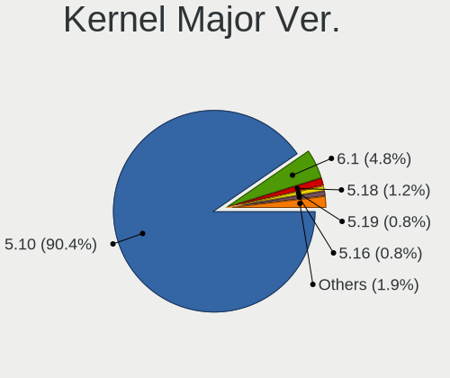
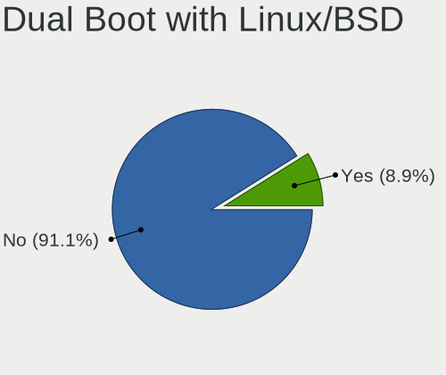
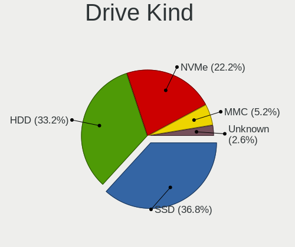
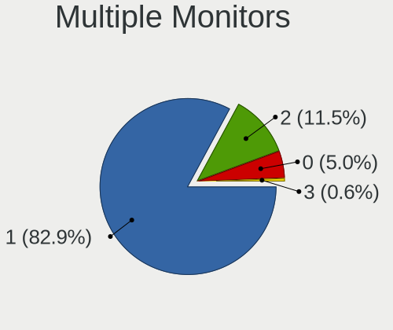
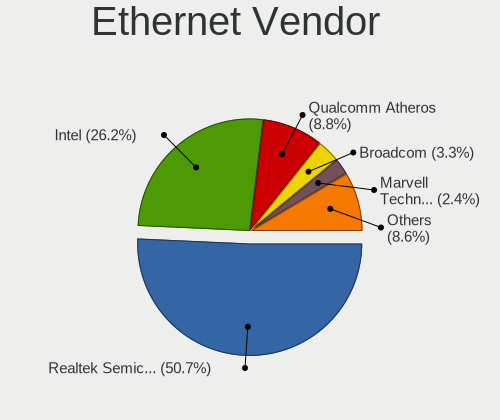
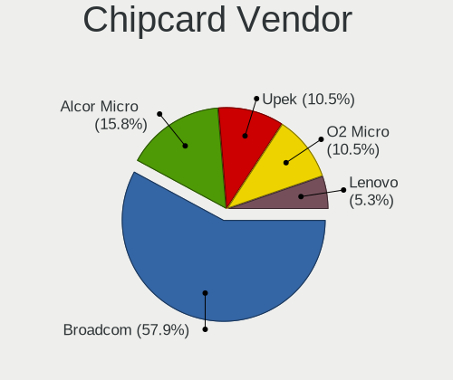

LMDE 5 - Tested Hardware & Statistics
-------------------------------------

A project to collect tested hardware configurations for LMDE 5.

Anyone can contribute to this report by the [hw-probe](https://github.com/linuxhw/hw-probe) tool:

    sudo -E hw-probe -all -upload

Please contribute! Especially if your hardware is rare.

This is a report for all computer types. See also reports for [desktops](/Dist/LMDE_5/Desktop/README.md) and [notebooks](/Dist/LMDE_5/Notebook/README.md).

Contents
--------

* [ Test Cases ](#test-cases)

* [ System ](#system)
  - [ Kernel                   ](#kernel)
  - [ Kernel Family            ](#kernel-family)
  - [ Kernel Major Ver.        ](#kernel-major-ver)
  - [ Arch                     ](#arch)
  - [ DE                       ](#de)
  - [ Display Server           ](#display-server)
  - [ Display Manager          ](#display-manager)
  - [ OS Lang                  ](#os-lang)
  - [ Boot Mode                ](#boot-mode)
  - [ Filesystem               ](#filesystem)
  - [ Part. scheme             ](#part-scheme)
  - [ Dual Boot with Linux/BSD ](#dual-boot-with-linuxbsd)
  - [ Dual Boot (Win)          ](#dual-boot-win)

* [ Board ](#board)
  - [ Vendor                   ](#vendor)
  - [ Model                    ](#model)
  - [ Model Family             ](#model-family)
  - [ MFG Year                 ](#mfg-year)
  - [ Form Factor              ](#form-factor)
  - [ Secure Boot              ](#secure-boot)
  - [ Coreboot                 ](#coreboot)
  - [ RAM Size                 ](#ram-size)
  - [ RAM Used                 ](#ram-used)
  - [ Total Drives             ](#total-drives)
  - [ Has CD-ROM               ](#has-cd-rom)
  - [ Has Ethernet             ](#has-ethernet)
  - [ Has WiFi                 ](#has-wifi)
  - [ Has Bluetooth            ](#has-bluetooth)

* [ Location ](#location)
  - [ Country                  ](#country)
  - [ City                     ](#city)

* [ Drives ](#drives)
  - [ Drive Vendor             ](#drive-vendor)
  - [ Drive Model              ](#drive-model)
  - [ HDD Vendor               ](#hdd-vendor)
  - [ SSD Vendor               ](#ssd-vendor)
  - [ Drive Kind               ](#drive-kind)
  - [ Drive Connector          ](#drive-connector)
  - [ Drive Size               ](#drive-size)
  - [ Space Total              ](#space-total)
  - [ Space Used               ](#space-used)
  - [ Malfunc. Drives          ](#malfunc-drives)
  - [ Malfunc. Drive Vendor    ](#malfunc-drive-vendor)
  - [ Malfunc. HDD Vendor      ](#malfunc-hdd-vendor)
  - [ Malfunc. Drive Kind      ](#malfunc-drive-kind)
  - [ Failed Drives            ](#failed-drives)
  - [ Failed Drive Vendor      ](#failed-drive-vendor)
  - [ Drive Status             ](#drive-status)

* [ Storage controller ](#storage-controller)
  - [ Storage Vendor           ](#storage-vendor)
  - [ Storage Model            ](#storage-model)
  - [ Storage Kind             ](#storage-kind)

* [ Processor ](#processor)
  - [ CPU Vendor               ](#cpu-vendor)
  - [ CPU Model                ](#cpu-model)
  - [ CPU Model Family         ](#cpu-model-family)
  - [ CPU Cores                ](#cpu-cores)
  - [ CPU Sockets              ](#cpu-sockets)
  - [ CPU Threads              ](#cpu-threads)
  - [ CPU Op-Modes             ](#cpu-op-modes)
  - [ CPU Microcode            ](#cpu-microcode)
  - [ CPU Microarch            ](#cpu-microarch)

* [ Graphics ](#graphics)
  - [ GPU Vendor               ](#gpu-vendor)
  - [ GPU Model                ](#gpu-model)
  - [ GPU Combo                ](#gpu-combo)
  - [ GPU Driver               ](#gpu-driver)
  - [ GPU Memory               ](#gpu-memory)

* [ Monitor ](#monitor)
  - [ Monitor Vendor           ](#monitor-vendor)
  - [ Monitor Model            ](#monitor-model)
  - [ Monitor Resolution       ](#monitor-resolution)
  - [ Monitor Diagonal         ](#monitor-diagonal)
  - [ Monitor Width            ](#monitor-width)
  - [ Aspect Ratio             ](#aspect-ratio)
  - [ Monitor Area             ](#monitor-area)
  - [ Pixel Density            ](#pixel-density)
  - [ Multiple Monitors        ](#multiple-monitors)

* [ Network ](#network)
  - [ Net Controller Vendor    ](#net-controller-vendor)
  - [ Net Controller Model     ](#net-controller-model)
  - [ Wireless Vendor          ](#wireless-vendor)
  - [ Wireless Model           ](#wireless-model)
  - [ Ethernet Vendor          ](#ethernet-vendor)
  - [ Ethernet Model           ](#ethernet-model)
  - [ Net Controller Kind      ](#net-controller-kind)
  - [ Used Controller          ](#used-controller)
  - [ NICs                     ](#nics)
  - [ IPv6                     ](#ipv6)

* [ Bluetooth ](#bluetooth)
  - [ Bluetooth Vendor         ](#bluetooth-vendor)
  - [ Bluetooth Model          ](#bluetooth-model)

* [ Sound ](#sound)
  - [ Sound Vendor             ](#sound-vendor)
  - [ Sound Model              ](#sound-model)

* [ Memory ](#memory)
  - [ Memory Vendor            ](#memory-vendor)
  - [ Memory Model             ](#memory-model)
  - [ Memory Kind              ](#memory-kind)
  - [ Memory Form Factor       ](#memory-form-factor)
  - [ Memory Size              ](#memory-size)
  - [ Memory Speed             ](#memory-speed)

* [ Printers & scanners ](#printers--scanners)
  - [ Printer Vendor           ](#printer-vendor)
  - [ Printer Model            ](#printer-model)
  - [ Scanner Vendor           ](#scanner-vendor)
  - [ Scanner Model            ](#scanner-model)

* [ Camera ](#camera)
  - [ Camera Vendor            ](#camera-vendor)
  - [ Camera Model             ](#camera-model)

* [ Security ](#security)
  - [ Fingerprint Vendor       ](#fingerprint-vendor)
  - [ Fingerprint Model        ](#fingerprint-model)
  - [ Chipcard Vendor          ](#chipcard-vendor)
  - [ Chipcard Model           ](#chipcard-model)

* [ Unsupported ](#unsupported)
  - [ Unsupported Devices      ](#unsupported-devices)
  - [ Unsupported Device Types ](#unsupported-device-types)

Test Cases
----------

Total: 162

| Vendor        | Model                       | Form-Factor | Probe                                                      | Date         |
|---------------|-----------------------------|-------------|------------------------------------------------------------|--------------|
| Lenovo        | ThinkPad T470s 20HF0047U... | Notebook    | [dfe7ba57b8](https://linux-hardware.org/?probe=dfe7ba57b8) | Jul 31, 2022 |
| ASRock        | H61M-DGS                    | Desktop     | [683cd6273f](https://linux-hardware.org/?probe=683cd6273f) | Jul 30, 2022 |
| Framework     | Laptop                      | Notebook    | [426cf376b2](https://linux-hardware.org/?probe=426cf376b2) | Jul 30, 2022 |
| Dell          | Latitude E5540              | Notebook    | [67063fe669](https://linux-hardware.org/?probe=67063fe669) | Jul 30, 2022 |
| Dell          | 0CRWCR A01                  | All in one  | [e1cd0b697d](https://linux-hardware.org/?probe=e1cd0b697d) | Jul 29, 2022 |
| ASUSTek       | VivoBook_ASUSLaptop X515... | Notebook    | [21fc33de37](https://linux-hardware.org/?probe=21fc33de37) | Jul 28, 2022 |
| HP            | Laptop 15s-eq2xxx           | Notebook    | [0b664049a0](https://linux-hardware.org/?probe=0b664049a0) | Jul 28, 2022 |
| Microtech     | ebookPro                    | Notebook    | [12215b6984](https://linux-hardware.org/?probe=12215b6984) | Jul 27, 2022 |
| Lenovo        | ThinkPad T61 7661A16        | Notebook    | [df4af55b5b](https://linux-hardware.org/?probe=df4af55b5b) | Jul 26, 2022 |
| Lenovo        | ThinkPad T61 7661A16        | Notebook    | [892a11d89d](https://linux-hardware.org/?probe=892a11d89d) | Jul 26, 2022 |
| ASUSTek       | VivoBook E14 E402YA_L402... | Notebook    | [47420083a3](https://linux-hardware.org/?probe=47420083a3) | Jul 23, 2022 |
| Acer          | Aspire A315-21              | Notebook    | [1754eeae39](https://linux-hardware.org/?probe=1754eeae39) | Jul 21, 2022 |
| HP            | Laptop 15-dy2xxx            | Notebook    | [a05a04fae5](https://linux-hardware.org/?probe=a05a04fae5) | Jul 21, 2022 |
| HP            | Laptop 15-dy2xxx            | Notebook    | [67c590c532](https://linux-hardware.org/?probe=67c590c532) | Jul 20, 2022 |
| Gigabyte      | B450 AORUS M                | Desktop     | [fdaa3bac93](https://linux-hardware.org/?probe=fdaa3bac93) | Jul 20, 2022 |
| Apple         | MacBookPro14,1              | Notebook    | [786f399d7a](https://linux-hardware.org/?probe=786f399d7a) | Jul 19, 2022 |
| Apple         | MacBookPro14,1              | Notebook    | [19d55ade50](https://linux-hardware.org/?probe=19d55ade50) | Jul 19, 2022 |
| Gigabyte      | B450 AORUS M                | Desktop     | [aca8d98967](https://linux-hardware.org/?probe=aca8d98967) | Jul 18, 2022 |
| HP            | 8433 11                     | Desktop     | [85ecad964d](https://linux-hardware.org/?probe=85ecad964d) | Jul 17, 2022 |
| HP            | 8433 11                     | Desktop     | [7f6ec63dc8](https://linux-hardware.org/?probe=7f6ec63dc8) | Jul 17, 2022 |
| HP            | Laptop 14-dk1xxx            | Notebook    | [cf03561efa](https://linux-hardware.org/?probe=cf03561efa) | Jul 17, 2022 |
| ASUSTek       | BM6820_BM6620_BP6320-8      | Desktop     | [8d8c845646](https://linux-hardware.org/?probe=8d8c845646) | Jul 17, 2022 |
| Framework     | Laptop                      | Notebook    | [80ad33bb18](https://linux-hardware.org/?probe=80ad33bb18) | Jul 16, 2022 |
| Framework     | Laptop                      | Notebook    | [439e4aafa7](https://linux-hardware.org/?probe=439e4aafa7) | Jul 16, 2022 |
| Lenovo        | IdeaPad 3 15ADA05 81W1      | Notebook    | [3d9f189ad0](https://linux-hardware.org/?probe=3d9f189ad0) | Jul 13, 2022 |
| Google        | Akemi                       | Notebook    | [d4a36d2743](https://linux-hardware.org/?probe=d4a36d2743) | Jul 13, 2022 |
| MSI           | GL73 8SE                    | Notebook    | [b39d9f7404](https://linux-hardware.org/?probe=b39d9f7404) | Jul 11, 2022 |
| ASUSTek       | ROG Flow X13 GV301QE_GV3... | Notebook    | [24cd72e0bf](https://linux-hardware.org/?probe=24cd72e0bf) | Jul 08, 2022 |
| Apple         | MacBookPro11,1              | Notebook    | [9be78f4466](https://linux-hardware.org/?probe=9be78f4466) | Jul 07, 2022 |
| Gigabyte      | B450 AORUS M                | Desktop     | [12e48a7c0a](https://linux-hardware.org/?probe=12e48a7c0a) | Jul 06, 2022 |
| AMI           | T3 MRD                      | Notebook    | [bf634565fd](https://linux-hardware.org/?probe=bf634565fd) | Jul 02, 2022 |
| ASUSTek       | P8H77-M PRO                 | Desktop     | [efc2332724](https://linux-hardware.org/?probe=efc2332724) | Jul 02, 2022 |
| Sony          | SVE1512G1RW                 | Notebook    | [cf5ff8285e](https://linux-hardware.org/?probe=cf5ff8285e) | Jul 02, 2022 |
| HP            | Pavilion 17                 | Notebook    | [1efb06e77e](https://linux-hardware.org/?probe=1efb06e77e) | Jul 01, 2022 |
| HP            | Compaq 15                   | Notebook    | [fb14abab4d](https://linux-hardware.org/?probe=fb14abab4d) | Jun 30, 2022 |
| Framework     | Laptop                      | Notebook    | [8a44001ebb](https://linux-hardware.org/?probe=8a44001ebb) | Jun 30, 2022 |
| Framework     | Laptop                      | Notebook    | [61a6480a38](https://linux-hardware.org/?probe=61a6480a38) | Jun 30, 2022 |
| Dell          | Inspiron 5370               | Notebook    | [e848f3258c](https://linux-hardware.org/?probe=e848f3258c) | Jun 26, 2022 |
| Unknown       | Unknown                     | Notebook    | [a8b7e4a9fe](https://linux-hardware.org/?probe=a8b7e4a9fe) | Jun 26, 2022 |
| HP            | Laptop 15z-ef2xxx           | Notebook    | [f54df47fa0](https://linux-hardware.org/?probe=f54df47fa0) | Jun 25, 2022 |
| Dell          | Inspiron 3505               | Notebook    | [1eaa95f069](https://linux-hardware.org/?probe=1eaa95f069) | Jun 24, 2022 |
| Dell          | 0XR1GT A00                  | Desktop     | [0d72ab6a71](https://linux-hardware.org/?probe=0d72ab6a71) | Jun 24, 2022 |
| HP            | Laptop 15z-ef2xxx           | Notebook    | [64e65ab80b](https://linux-hardware.org/?probe=64e65ab80b) | Jun 24, 2022 |
| HP            | Laptop 15z-ef2xxx           | Notebook    | [879d7a231f](https://linux-hardware.org/?probe=879d7a231f) | Jun 24, 2022 |
| Lenovo        | ThinkPad T450 20BUS0QT04    | Notebook    | [0c96d2bc24](https://linux-hardware.org/?probe=0c96d2bc24) | Jun 24, 2022 |
| HP            | Laptop 15-bw0xx             | Notebook    | [a55d01829f](https://linux-hardware.org/?probe=a55d01829f) | Jun 23, 2022 |
| HP            | EliteBook 8730w             | Notebook    | [14135356d6](https://linux-hardware.org/?probe=14135356d6) | Jun 20, 2022 |
| MSI           | U180                        | Notebook    | [7aa374e07e](https://linux-hardware.org/?probe=7aa374e07e) | Jun 20, 2022 |
| Acer          | Aspire 5930                 | Notebook    | [348ec06fd0](https://linux-hardware.org/?probe=348ec06fd0) | Jun 18, 2022 |
| ASUSTek       | 1005P                       | Notebook    | [4bd178fe29](https://linux-hardware.org/?probe=4bd178fe29) | Jun 14, 2022 |
| Apple         | MacBookPro14,1              | Notebook    | [88294cb5aa](https://linux-hardware.org/?probe=88294cb5aa) | Jun 12, 2022 |
| Apple         | MacBookPro14,1              | Notebook    | [281724432e](https://linux-hardware.org/?probe=281724432e) | Jun 12, 2022 |
| Acer          | Aspire One 522              | Notebook    | [7f4af0143d](https://linux-hardware.org/?probe=7f4af0143d) | Jun 11, 2022 |
| Apple         | MacBookAir6,1               | Notebook    | [f0883ab59b](https://linux-hardware.org/?probe=f0883ab59b) | Jun 10, 2022 |
| Lenovo        | 3731 NOK                    | Desktop     | [efd1e69f79](https://linux-hardware.org/?probe=efd1e69f79) | Jun 09, 2022 |
| Lenovo        | 3731 NOK                    | Desktop     | [1da6b9f6c0](https://linux-hardware.org/?probe=1da6b9f6c0) | Jun 09, 2022 |
| HP            | 255 G5 Notebook PC          | Notebook    | [519a18864f](https://linux-hardware.org/?probe=519a18864f) | Jun 09, 2022 |
| Sony          | SVE1713Y1RB                 | Notebook    | [4a1bc35dda](https://linux-hardware.org/?probe=4a1bc35dda) | Jun 09, 2022 |
| Lenovo        | Z50-70 20354                | Notebook    | [57582f68b6](https://linux-hardware.org/?probe=57582f68b6) | Jun 08, 2022 |
| Dell          | 0XR1GT A00                  | Desktop     | [8c3fd28612](https://linux-hardware.org/?probe=8c3fd28612) | Jun 08, 2022 |
| Multilaser    | PC150                       | Notebook    | [ee0a35cc62](https://linux-hardware.org/?probe=ee0a35cc62) | Jun 08, 2022 |
| Lenovo        | Z50-70 20354                | Notebook    | [870233669c](https://linux-hardware.org/?probe=870233669c) | Jun 07, 2022 |
| Alienware     | 14                          | Notebook    | [7dabcbc673](https://linux-hardware.org/?probe=7dabcbc673) | Jun 07, 2022 |
| Acer          | Swift SF515-51T             | Notebook    | [1d0b1a1c50](https://linux-hardware.org/?probe=1d0b1a1c50) | May 31, 2022 |
| MSI           | MPG Z390 GAMING PRO CARB... | Desktop     | [6f8785bd56](https://linux-hardware.org/?probe=6f8785bd56) | May 30, 2022 |
| Lenovo        | Legion 5 15ACH6H 82JU       | Notebook    | [0e59a69b8d](https://linux-hardware.org/?probe=0e59a69b8d) | May 30, 2022 |
| Lenovo        | MAHOBAY                     | Desktop     | [ba204646ba](https://linux-hardware.org/?probe=ba204646ba) | May 25, 2022 |
| HP            | Laptop 14-cf3xxx            | Notebook    | [9e4cd6dab4](https://linux-hardware.org/?probe=9e4cd6dab4) | May 25, 2022 |
| Acer          | Seawolf                     | Desktop     | [dccbcb7ef3](https://linux-hardware.org/?probe=dccbcb7ef3) | May 25, 2022 |
| ASUSTek       | VivoBook_ASUSLaptop X512... | Notebook    | [67aa7158d3](https://linux-hardware.org/?probe=67aa7158d3) | May 24, 2022 |
| HP            | Laptop 14-df0xxx            | Notebook    | [94992083bc](https://linux-hardware.org/?probe=94992083bc) | May 24, 2022 |
| Acer          | Aspire One 522              | Notebook    | [0ac567a5cf](https://linux-hardware.org/?probe=0ac567a5cf) | May 21, 2022 |
| Intel         | DQ77MK AAG39642-400         | Desktop     | [f694bcfbc5](https://linux-hardware.org/?probe=f694bcfbc5) | May 21, 2022 |
| Lenovo        | IdeaPad 3 15ITL6 82H8       | Notebook    | [48c8683aa8](https://linux-hardware.org/?probe=48c8683aa8) | May 21, 2022 |
| Lenovo        | IdeaPad 3 15ITL6 82H8       | Notebook    | [8d30966279](https://linux-hardware.org/?probe=8d30966279) | May 20, 2022 |
| HP            | ZBook Fury 17.3 inch G8 ... | Notebook    | [8757941b52](https://linux-hardware.org/?probe=8757941b52) | May 17, 2022 |
| Acer          | Aspire V3-571G              | Notebook    | [91700e1cb8](https://linux-hardware.org/?probe=91700e1cb8) | May 16, 2022 |
| MSI           | X470 GAMING PLUS MAX        | Desktop     | [63950495b3](https://linux-hardware.org/?probe=63950495b3) | May 15, 2022 |
| Dell          | XPS 13 9305                 | Notebook    | [e9310a7ede](https://linux-hardware.org/?probe=e9310a7ede) | May 15, 2022 |
| Dell          | XPS 13 9305                 | Notebook    | [3f8becd67d](https://linux-hardware.org/?probe=3f8becd67d) | May 15, 2022 |
| MSI           | 970A-G43 PLUS               | Desktop     | [399deea7b9](https://linux-hardware.org/?probe=399deea7b9) | May 15, 2022 |
| Dell          | Inspiron 5566               | Notebook    | [d01652f69f](https://linux-hardware.org/?probe=d01652f69f) | May 15, 2022 |
| Dell          | Inspiron 5559               | Notebook    | [4b0c466a88](https://linux-hardware.org/?probe=4b0c466a88) | May 15, 2022 |
| Howard Com... | R7X                         | Notebook    | [bc6d6a31eb](https://linux-hardware.org/?probe=bc6d6a31eb) | May 13, 2022 |
| HP            | Notebook                    | Notebook    | [200c1dabff](https://linux-hardware.org/?probe=200c1dabff) | May 09, 2022 |
| Lenovo        | IdeaPad 5 14ALC05 82LM      | Notebook    | [0d64940271](https://linux-hardware.org/?probe=0d64940271) | May 09, 2022 |
| HP            | ENVY 17                     | Notebook    | [a503de2c1f](https://linux-hardware.org/?probe=a503de2c1f) | May 08, 2022 |
| Apple         | MacBookAir7,2               | Notebook    | [54815db142](https://linux-hardware.org/?probe=54815db142) | May 07, 2022 |
| ASUSTek       | VivoBook E14 E402YA_L402... | Notebook    | [57e085245c](https://linux-hardware.org/?probe=57e085245c) | May 07, 2022 |
| Gigabyte      | Z68A-D3H-B3                 | Desktop     | [1441dfb79e](https://linux-hardware.org/?probe=1441dfb79e) | May 07, 2022 |
| HP            | 158B                        | Desktop     | [a613debdee](https://linux-hardware.org/?probe=a613debdee) | May 06, 2022 |
| HP            | 158B                        | Desktop     | [21f9c188f3](https://linux-hardware.org/?probe=21f9c188f3) | May 06, 2022 |
| Philco        | 10D                         | Notebook    | [d2f71d99cd](https://linux-hardware.org/?probe=d2f71d99cd) | May 05, 2022 |
| Philco        | 10D                         | Notebook    | [9882f4ca80](https://linux-hardware.org/?probe=9882f4ca80) | May 05, 2022 |
| HP            | 339A                        | Desktop     | [d58b95ebb1](https://linux-hardware.org/?probe=d58b95ebb1) | May 05, 2022 |
| Acer          | Aspire E1-532               | Notebook    | [a7305e2070](https://linux-hardware.org/?probe=a7305e2070) | May 04, 2022 |
| Lenovo        | ThinkPad T480 20L6S1RN00    | Notebook    | [eb55b73c5a](https://linux-hardware.org/?probe=eb55b73c5a) | May 03, 2022 |
| Toshiba       | Satellite M55               | Notebook    | [9d5733c6fc](https://linux-hardware.org/?probe=9d5733c6fc) | May 02, 2022 |
| Gigabyte      | H110M-S2H-CF                | Desktop     | [c45a37ce5d](https://linux-hardware.org/?probe=c45a37ce5d) | May 01, 2022 |
| HP            | Presario C500 (GF581UA#A... | Notebook    | [0e01914db4](https://linux-hardware.org/?probe=0e01914db4) | Apr 30, 2022 |
| HP            | EliteBook 840 G1            | Notebook    | [53bceed0aa](https://linux-hardware.org/?probe=53bceed0aa) | Apr 29, 2022 |
| ASUSTek       | PRIME H610M-A D4            | Desktop     | [e9376d24f0](https://linux-hardware.org/?probe=e9376d24f0) | Apr 29, 2022 |
| Acer          | AOD270                      | Notebook    | [d0fae524f9](https://linux-hardware.org/?probe=d0fae524f9) | Apr 29, 2022 |
| Acer          | AOD270                      | Notebook    | [44d897bc15](https://linux-hardware.org/?probe=44d897bc15) | Apr 29, 2022 |
| Acer          | Aspire E5-553G              | Notebook    | [00a648bda6](https://linux-hardware.org/?probe=00a648bda6) | Apr 28, 2022 |
| Acer          | Aspire E5-553G              | Notebook    | [4646f6cd23](https://linux-hardware.org/?probe=4646f6cd23) | Apr 28, 2022 |
| Samsung       | 730QDA                      | Convertible | [6d4573984e](https://linux-hardware.org/?probe=6d4573984e) | Apr 28, 2022 |
| HP            | ProBook 450 G8 Notebook ... | Notebook    | [ff8e46a260](https://linux-hardware.org/?probe=ff8e46a260) | Apr 27, 2022 |
| HP            | ProBook 450 G8 Notebook ... | Notebook    | [0a6534997e](https://linux-hardware.org/?probe=0a6534997e) | Apr 27, 2022 |
| Lenovo        | Yoga 7 15ITL5 82BJ          | Convertible | [ccb4d8201f](https://linux-hardware.org/?probe=ccb4d8201f) | Apr 24, 2022 |
| Apple         | MacBookPro14,1              | Notebook    | [ce4f3d8ec8](https://linux-hardware.org/?probe=ce4f3d8ec8) | Apr 24, 2022 |
| Dixonsxp      | Unknown                     | Notebook    | [65e40dacf4](https://linux-hardware.org/?probe=65e40dacf4) | Apr 20, 2022 |
| ASRock        | A320M-DGS                   | Desktop     | [b7df060840](https://linux-hardware.org/?probe=b7df060840) | Apr 19, 2022 |
| ASRock        | A320M-DGS                   | Desktop     | [70fe08376f](https://linux-hardware.org/?probe=70fe08376f) | Apr 19, 2022 |
| Dell          | 0CU568 A00                  | Desktop     | [b544c48421](https://linux-hardware.org/?probe=b544c48421) | Apr 19, 2022 |
| Dell          | 0CU568 A00                  | Desktop     | [84f7029c22](https://linux-hardware.org/?probe=84f7029c22) | Apr 19, 2022 |
| Toshiba       | Satellite L455              | Notebook    | [7f0bad47af](https://linux-hardware.org/?probe=7f0bad47af) | Apr 19, 2022 |
| Toshiba       | Satellite L455              | Notebook    | [3a0c54144d](https://linux-hardware.org/?probe=3a0c54144d) | Apr 19, 2022 |
| Dell          | 0X574R                      | Notebook    | [6da5c2339f](https://linux-hardware.org/?probe=6da5c2339f) | Apr 18, 2022 |
| HP            | 14                          | Notebook    | [71f296bd93](https://linux-hardware.org/?probe=71f296bd93) | Apr 17, 2022 |
| Dell          | Latitude 3410               | Notebook    | [78396d572c](https://linux-hardware.org/?probe=78396d572c) | Apr 15, 2022 |
| ASUSTek       | N61Jv                       | Notebook    | [959c5f2238](https://linux-hardware.org/?probe=959c5f2238) | Apr 14, 2022 |
| Acer          | AOA110                      | Notebook    | [cba10fc182](https://linux-hardware.org/?probe=cba10fc182) | Apr 13, 2022 |
| ASUSTek       | PRIME B350M-A               | Desktop     | [ed40a9ddc1](https://linux-hardware.org/?probe=ed40a9ddc1) | Apr 12, 2022 |
| ASUSTek       | PRIME B350M-A               | Desktop     | [9a137f0540](https://linux-hardware.org/?probe=9a137f0540) | Apr 12, 2022 |
| MSI           | Z170A GAMING M5             | Desktop     | [8f2e10cbf3](https://linux-hardware.org/?probe=8f2e10cbf3) | Apr 12, 2022 |
| Howard Com... | R7X                         | Notebook    | [e0f3701b1b](https://linux-hardware.org/?probe=e0f3701b1b) | Apr 12, 2022 |
| Lenovo        | 312A SDK0J40697 WIN 3305... | Desktop     | [2a33f087e6](https://linux-hardware.org/?probe=2a33f087e6) | Apr 11, 2022 |
| Lenovo        | 312A SDK0J40697 WIN 3305... | Desktop     | [05b9ec80c6](https://linux-hardware.org/?probe=05b9ec80c6) | Apr 11, 2022 |
| Howard Com... | R7X                         | Notebook    | [5885bbaa90](https://linux-hardware.org/?probe=5885bbaa90) | Apr 10, 2022 |
| Dell          | Vostro 3500                 | Notebook    | [5b1a24bf51](https://linux-hardware.org/?probe=5b1a24bf51) | Apr 10, 2022 |
| Dell          | Vostro 3500                 | Notebook    | [b2adbbe7d0](https://linux-hardware.org/?probe=b2adbbe7d0) | Apr 10, 2022 |
| Lenovo        | IdeaPad 5 15ARE05 81YQ      | Notebook    | [4d5998459b](https://linux-hardware.org/?probe=4d5998459b) | Apr 09, 2022 |
| HP            | Presario C500 (RY512EA#A... | Notebook    | [4ef049d490](https://linux-hardware.org/?probe=4ef049d490) | Apr 09, 2022 |
| Acer          | WG43M                       | Desktop     | [c7cb6ee141](https://linux-hardware.org/?probe=c7cb6ee141) | Apr 08, 2022 |
| ASUSTek       | P5G41T-M LX3                | Desktop     | [28371c08c2](https://linux-hardware.org/?probe=28371c08c2) | Apr 08, 2022 |
| Dell          | Inspiron 14 5410 2-in-1     | Notebook    | [613d6e7d3c](https://linux-hardware.org/?probe=613d6e7d3c) | Apr 07, 2022 |
| MSI           | X470 GAMING PLUS MAX        | Desktop     | [9f1a76acb8](https://linux-hardware.org/?probe=9f1a76acb8) | Apr 06, 2022 |
| Dell          | Latitude 5511               | Notebook    | [2cb0a3e451](https://linux-hardware.org/?probe=2cb0a3e451) | Apr 06, 2022 |
| MSI           | X470 GAMING PLUS MAX        | Desktop     | [18a4ba3137](https://linux-hardware.org/?probe=18a4ba3137) | Apr 06, 2022 |
| Dell          | Precision 7520              | Notebook    | [7404842400](https://linux-hardware.org/?probe=7404842400) | Apr 05, 2022 |
| ASUSTek       | P6T                         | Desktop     | [5ed6ed355f](https://linux-hardware.org/?probe=5ed6ed355f) | Apr 04, 2022 |
| Panasonic     | CF-H2BJJHZDE                | Tablet      | [50e0a85fd3](https://linux-hardware.org/?probe=50e0a85fd3) | Apr 04, 2022 |
| Lenovo        | IdeaPadFlex 5 14ITL05 82... | Convertible | [b5b25093ba](https://linux-hardware.org/?probe=b5b25093ba) | Apr 03, 2022 |
| Lenovo        | IdeaPadFlex 5 14ITL05 82... | Convertible | [6107c72fb2](https://linux-hardware.org/?probe=6107c72fb2) | Apr 03, 2022 |
| LincPlus      | LINNCPLUS P1                | Notebook    | [22406313dc](https://linux-hardware.org/?probe=22406313dc) | Apr 02, 2022 |
| Toshiba       | Satellite L455              | Notebook    | [699e7d272d](https://linux-hardware.org/?probe=699e7d272d) | Apr 02, 2022 |
| HP            | Pavilion Laptop 15-eh1xx... | Notebook    | [387b77f172](https://linux-hardware.org/?probe=387b77f172) | Apr 01, 2022 |
| HP            | ProBook 6570b               | Notebook    | [0609df27fa](https://linux-hardware.org/?probe=0609df27fa) | Mar 31, 2022 |
| Packard Be... | DOT S                       | Notebook    | [85e7386152](https://linux-hardware.org/?probe=85e7386152) | Mar 28, 2022 |
| Packard Be... | DOT S                       | Notebook    | [edef12b9d5](https://linux-hardware.org/?probe=edef12b9d5) | Mar 28, 2022 |
| Lenovo        | IdeaPad 3 14ALC6 82KT       | Notebook    | [b2e70b8251](https://linux-hardware.org/?probe=b2e70b8251) | Mar 28, 2022 |
| ASUSTek       | PRIME H510M-D               | Desktop     | [1e0a28c8f3](https://linux-hardware.org/?probe=1e0a28c8f3) | Mar 28, 2022 |
| Dell          | Latitude E6400              | Notebook    | [01815a09bb](https://linux-hardware.org/?probe=01815a09bb) | Mar 27, 2022 |
| Toshiba       | Satellite L455              | Notebook    | [90334cf68d](https://linux-hardware.org/?probe=90334cf68d) | Mar 26, 2022 |
| Dell          | Precision M4400             | Notebook    | [5172327d82](https://linux-hardware.org/?probe=5172327d82) | Mar 25, 2022 |
| Medion        | E6220                       | Notebook    | [e739ef27a1](https://linux-hardware.org/?probe=e739ef27a1) | Mar 24, 2022 |
| Acer          | Aspire 7745G                | Notebook    | [3f4c13ee47](https://linux-hardware.org/?probe=3f4c13ee47) | Mar 23, 2022 |
| HP            | 255 G7 Notebook PC          | Notebook    | [f8561c65dc](https://linux-hardware.org/?probe=f8561c65dc) | Mar 21, 2022 |
| HP            | 0AE8h C                     | Desktop     | [d3980b5b59](https://linux-hardware.org/?probe=d3980b5b59) | Mar 14, 2022 |
| Apple         | Mac-F42786A9 DVT            | All in one  | [261e6c0463](https://linux-hardware.org/?probe=261e6c0463) | Mar 02, 2022 |
| Apple         | Mac-F42786A9 DVT            | All in one  | [25f6ef89f9](https://linux-hardware.org/?probe=25f6ef89f9) | Mar 02, 2022 |

System
------

Kernel
------

Version of the Linux kernel

| Version              | Computers | Percent |
|----------------------|-----------|---------|
| 5.10.0-14-amd64      | 29        | 23.58%  |
| 5.10.0-13-amd64      | 27        | 21.95%  |
| 5.10.0-12-amd64      | 22        | 17.89%  |
| 5.10.0-15-amd64      | 18        | 14.63%  |
| 5.10.0-16-amd64      | 11        | 8.94%   |
| 5.10.0-13-686        | 6         | 4.88%   |
| 5.18.0-0.bpo.1-amd64 | 3         | 2.44%   |
| 5.16.0-0.bpo.4-amd64 | 3         | 2.44%   |
| 5.16.0-0.bpo.3-amd64 | 1         | 0.81%   |
| 5.15.0-0.bpo.3-amd64 | 1         | 0.81%   |
| 5.10.0-14-686        | 1         | 0.81%   |
| 5.10.0-11-686        | 1         | 0.81%   |

Kernel Family
-------------

Linux kernel without a distro release

| Version | Computers | Percent |
|---------|-----------|---------|
| 5.10.0  | 111       | 94.07%  |
| 5.18.0  | 3         | 2.54%   |
| 5.16.0  | 3         | 2.54%   |
| 5.15.0  | 1         | 0.85%   |

Kernel Major Ver.
-----------------

Linux kernel major version

| Version | Computers | Percent |
|---------|-----------|---------|
| 5.10    | 111       | 94.07%  |
| 5.18    | 3         | 2.54%   |
| 5.16    | 3         | 2.54%   |
| 5.15    | 1         | 0.85%   |

Arch
----

OS architecture (x86_64, i586, etc.)

| Name   | Computers | Percent |
|--------|-----------|---------|
| x86_64 | 110       | 93.22%  |
| i686   | 8         | 6.78%   |

DE
--

Desktop Environment

| Name       | Computers | Percent |
|------------|-----------|---------|
| X-Cinnamon | 107       | 90.68%  |
| Cinnamon   | 8         | 6.78%   |
| XFCE       | 1         | 0.85%   |
| MATE       | 1         | 0.85%   |
| Unknown    | 1         | 0.85%   |

Display Server
--------------

X11 or Wayland

| Name | Computers | Percent |
|------|-----------|---------|
| X11  | 118       | 100%    |

Display Manager
---------------

SDDM, LightDM, etc.

| Name    | Computers | Percent |
|---------|-----------|---------|
| Unknown | 73        | 61.86%  |
| LightDM | 45        | 38.14%  |

OS Lang
-------

Language

| Lang  | Computers | Percent |
|-------|-----------|---------|
| en_US | 49        | 41.53%  |
| de_DE | 10        | 8.47%   |
| ru_RU | 9         | 7.63%   |
| pt_BR | 8         | 6.78%   |
| en_GB | 8         | 6.78%   |
| es_ES | 5         | 4.24%   |
| fr_FR | 4         | 3.39%   |
| es_MX | 3         | 2.54%   |
| pl_PL | 2         | 1.69%   |
| it_IT | 2         | 1.69%   |
| fr_CA | 2         | 1.69%   |
| es_BO | 2         | 1.69%   |
| en_IE | 2         | 1.69%   |
| en_CA | 2         | 1.69%   |
| pt_PT | 1         | 0.85%   |
| nl_AW | 1         | 0.85%   |
| ko_KR | 1         | 0.85%   |
| hu_HU | 1         | 0.85%   |
| fr_BE | 1         | 0.85%   |
| es_PE | 1         | 0.85%   |
| es_NI | 1         | 0.85%   |
| es_EC | 1         | 0.85%   |
| en_AU | 1         | 0.85%   |
| ar_EG | 1         | 0.85%   |

Boot Mode
---------

EFI or BIOS

| Mode | Computers | Percent |
|------|-----------|---------|
| EFI  | 73        | 61.86%  |
| BIOS | 45        | 38.14%  |

Filesystem
----------

Type of filesystem

| Type    | Computers | Percent |
|---------|-----------|---------|
| Ext4    | 109       | 92.37%  |
| Overlay | 5         | 4.24%   |
| Tmpfs   | 3         | 2.54%   |
| Xfs     | 1         | 0.85%   |

Part. scheme
------------

Scheme of partitioning

| Type    | Computers | Percent |
|---------|-----------|---------|
| Unknown | 72        | 61.02%  |
| GPT     | 37        | 31.36%  |
| MBR     | 9         | 7.63%   |

Dual Boot with Linux/BSD
------------------------

Hosting more than one Linux/BSD

| Dual boot | Computers | Percent |
|-----------|-----------|---------|
| No        | 108       | 91.53%  |
| Yes       | 10        | 8.47%   |

Dual Boot (Win)
---------------

Hosting Linux and Windows

| Dual boot | Computers | Percent |
|-----------|-----------|---------|
| No        | 104       | 88.14%  |
| Yes       | 14        | 11.86%  |

Board
-----

Vendor
------

Motherboard manufacturer

| Name                | Computers | Percent |
|---------------------|-----------|---------|
| Hewlett-Packard     | 26        | 22.03%  |
| Dell                | 17        | 14.41%  |
| Lenovo              | 15        | 12.71%  |
| ASUSTek Computer    | 13        | 11.02%  |
| Acer                | 11        | 9.32%   |
| MSI                 | 6         | 5.08%   |
| Apple               | 5         | 4.24%   |
| Gigabyte Technology | 3         | 2.54%   |
| Toshiba             | 2         | 1.69%   |
| Sony                | 2         | 1.69%   |
| ASRock              | 2         | 1.69%   |
| Samsung Electronics | 1         | 0.85%   |
| Philco              | 1         | 0.85%   |
| Panasonic           | 1         | 0.85%   |
| Packard Bell        | 1         | 0.85%   |
| Multilaser          | 1         | 0.85%   |
| Microtech           | 1         | 0.85%   |
| Medion              | 1         | 0.85%   |
| LincPlus            | 1         | 0.85%   |
| Intel               | 1         | 0.85%   |
| Howard Computers    | 1         | 0.85%   |
| Google              | 1         | 0.85%   |
| Framework           | 1         | 0.85%   |
| Dixonsxp            | 1         | 0.85%   |
| AMI                 | 1         | 0.85%   |
| Alienware           | 1         | 0.85%   |
| Unknown             | 1         | 0.85%   |

Model
-----

Motherboard model

| Name                                             | Computers | Percent |
|--------------------------------------------------|-----------|---------|
| HP Laptop 15z-ef2xxx                             | 2         | 1.69%   |
| Dell Latitude E6400                              | 2         | 1.69%   |
| Unknown                                          | 2         | 1.69%   |
| Toshiba Satellite M55                            | 1         | 0.85%   |
| Toshiba Satellite L455                           | 1         | 0.85%   |
| Sony SVE1713Y1RB                                 | 1         | 0.85%   |
| Sony SVE1512G1RW                                 | 1         | 0.85%   |
| Samsung 730QDA                                   | 1         | 0.85%   |
| Philco 10D                                       | 1         | 0.85%   |
| Panasonic CF-H2BJJHZDE                           | 1         | 0.85%   |
| Packard Bell DOT S                               | 1         | 0.85%   |
| Multilaser PC150                                 | 1         | 0.85%   |
| MSI U180                                         | 1         | 0.85%   |
| MSI MS-7B79                                      | 1         | 0.85%   |
| MSI MS-7B17                                      | 1         | 0.85%   |
| MSI MS-7977                                      | 1         | 0.85%   |
| MSI MS-7974                                      | 1         | 0.85%   |
| MSI GL73 8SE                                     | 1         | 0.85%   |
| Microtech ebookPro                               | 1         | 0.85%   |
| Medion E6220                                     | 1         | 0.85%   |
| LincPlus LINNCPLUS P1                            | 1         | 0.85%   |
| Lenovo Z50-70 20354                              | 1         | 0.85%   |
| Lenovo Yoga 7 15ITL5 82BJ                        | 1         | 0.85%   |
| Lenovo V55t-15ARE 11KJ0036TX                     | 1         | 0.85%   |
| Lenovo ThinkPad T61 7661A16                      | 1         | 0.85%   |
| Lenovo ThinkPad T480 20L6S1RN00                  | 1         | 0.85%   |
| Lenovo ThinkPad T470s 20HF0047UK                 | 1         | 0.85%   |
| Lenovo ThinkPad T450 20BUS0QT04                  | 1         | 0.85%   |
| Lenovo ThinkCentre M92p 3238E9U                  | 1         | 0.85%   |
| Lenovo ThinkCentre M720s 10SUS9KW00              | 1         | 0.85%   |
| Lenovo Legion 5 15ACH6H 82JU                     | 1         | 0.85%   |
| Lenovo IdeaPadFlex 5 14ITL05 82HS                | 1         | 0.85%   |
| Lenovo IdeaPad 5 14ALC05 82LM                    | 1         | 0.85%   |
| Lenovo IdeaPad 3 15ITL6 82H8                     | 1         | 0.85%   |
| Lenovo IdeaPad 3 15ADA05 81W1                    | 1         | 0.85%   |
| Lenovo IdeaPad 3 14ALC6 82KT                     | 1         | 0.85%   |
| Intel DQ77MK AAG39642-400                        | 1         | 0.85%   |
| Howard Computers R7X                             | 1         | 0.85%   |
| HP ZBook Fury 17.3 inch G8 Mobile Workstation PC | 1         | 0.85%   |
| HP Z820 Workstation                              | 1         | 0.85%   |
| HP Z600 Workstation                              | 1         | 0.85%   |
| HP ProBook 6570b                                 | 1         | 0.85%   |
| HP ProBook 450 G8 Notebook PC                    | 1         | 0.85%   |
| HP Presario C500 (GF581UA#ABA)                   | 1         | 0.85%   |
| HP Pavilion Laptop 15-eh1xxx                     | 1         | 0.85%   |
| HP Pavilion Desktop 590-p0xxx                    | 1         | 0.85%   |
| HP Pavilion 17                                   | 1         | 0.85%   |
| HP Notebook                                      | 1         | 0.85%   |
| HP Laptop 15s-eq2xxx                             | 1         | 0.85%   |
| HP Laptop 15-dy2xxx                              | 1         | 0.85%   |
| HP Laptop 15-bw0xx                               | 1         | 0.85%   |
| HP Laptop 14-dk1xxx                              | 1         | 0.85%   |
| HP Laptop 14-df0xxx                              | 1         | 0.85%   |
| HP Laptop 14-cf3xxx                              | 1         | 0.85%   |
| HP ENVY 17                                       | 1         | 0.85%   |
| HP EliteBook 8730w                               | 1         | 0.85%   |
| HP EliteBook 840 G1                              | 1         | 0.85%   |
| HP Compaq Pro 6300 SFF                           | 1         | 0.85%   |
| HP Compaq 15                                     | 1         | 0.85%   |
| HP 255 G7 Notebook PC                            | 1         | 0.85%   |

Model Family
------------

Motherboard model prefix

| Name                   | Computers | Percent |
|------------------------|-----------|---------|
| HP Laptop              | 8         | 6.78%   |
| Acer Aspire            | 8         | 6.78%   |
| Dell Inspiron          | 6         | 5.08%   |
| Dell Latitude          | 5         | 4.24%   |
| Lenovo ThinkPad        | 4         | 3.39%   |
| Lenovo IdeaPad         | 4         | 3.39%   |
| HP Pavilion            | 3         | 2.54%   |
| ASUS VivoBook          | 3         | 2.54%   |
| ASUS PRIME             | 3         | 2.54%   |
| Toshiba Satellite      | 2         | 1.69%   |
| Lenovo ThinkCentre     | 2         | 1.69%   |
| HP ProBook             | 2         | 1.69%   |
| HP EliteBook           | 2         | 1.69%   |
| HP Compaq              | 2         | 1.69%   |
| HP 255                 | 2         | 1.69%   |
| Dell XPS               | 2         | 1.69%   |
| Dell Precision         | 2         | 1.69%   |
| Unknown                | 2         | 1.69%   |
| Sony SVE1713Y1RB       | 1         | 0.85%   |
| Sony SVE1512G1RW       | 1         | 0.85%   |
| Samsung 730QDA         | 1         | 0.85%   |
| Philco 10D             | 1         | 0.85%   |
| Panasonic CF-H2BJJHZDE | 1         | 0.85%   |
| Packard Bell DOT       | 1         | 0.85%   |
| Multilaser PC150       | 1         | 0.85%   |
| MSI U180               | 1         | 0.85%   |
| MSI MS-7B79            | 1         | 0.85%   |
| MSI MS-7B17            | 1         | 0.85%   |
| MSI MS-7977            | 1         | 0.85%   |
| MSI MS-7974            | 1         | 0.85%   |
| MSI GL73               | 1         | 0.85%   |
| Microtech ebookPro     | 1         | 0.85%   |
| Medion E6220           | 1         | 0.85%   |
| LincPlus LINNCPLUS     | 1         | 0.85%   |
| Lenovo Z50-70          | 1         | 0.85%   |
| Lenovo Yoga            | 1         | 0.85%   |
| Lenovo V55t-15ARE      | 1         | 0.85%   |
| Lenovo Legion          | 1         | 0.85%   |
| Lenovo IdeaPadFlex     | 1         | 0.85%   |
| Intel DQ77MK           | 1         | 0.85%   |
| Howard Computers R7X   | 1         | 0.85%   |
| HP ZBook               | 1         | 0.85%   |
| HP Z820                | 1         | 0.85%   |
| HP Z600                | 1         | 0.85%   |
| HP Presario            | 1         | 0.85%   |
| HP Notebook            | 1         | 0.85%   |
| HP ENVY                | 1         | 0.85%   |
| HP 14                  | 1         | 0.85%   |
| Google Akemi           | 1         | 0.85%   |
| Gigabyte Z68A-D3H-B3   | 1         | 0.85%   |
| Gigabyte H110M-S2H     | 1         | 0.85%   |
| Gigabyte B450          | 1         | 0.85%   |
| Framework Laptop       | 1         | 0.85%   |
| Dell Vostro            | 1         | 0.85%   |
| Dell OptiPlex          | 1         | 0.85%   |
| ASUS ROG               | 1         | 0.85%   |
| ASUS P8H77-M           | 1         | 0.85%   |
| ASUS P6T               | 1         | 0.85%   |
| ASUS P5G41T-M          | 1         | 0.85%   |
| ASUS N61Jv             | 1         | 0.85%   |

MFG Year
--------

Motherboard manufacture year

| Year | Computers | Percent |
|------|-----------|---------|
| 2021 | 19        | 16.1%   |
| 2012 | 13        | 11.02%  |
| 2020 | 11        | 9.32%   |
| 2018 | 10        | 8.47%   |
| 2013 | 8         | 6.78%   |
| 2019 | 7         | 5.93%   |
| 2017 | 7         | 5.93%   |
| 2016 | 6         | 5.08%   |
| 2015 | 6         | 5.08%   |
| 2014 | 5         | 4.24%   |
| 2010 | 5         | 4.24%   |
| 2009 | 5         | 4.24%   |
| 2008 | 5         | 4.24%   |
| 2007 | 5         | 4.24%   |
| 2011 | 4         | 3.39%   |
| 2022 | 1         | 0.85%   |
| 2006 | 1         | 0.85%   |

Form Factor
-----------

Physical design of the computer

| Name        | Computers | Percent |
|-------------|-----------|---------|
| Notebook    | 84        | 71.19%  |
| Desktop     | 28        | 23.73%  |
| Convertible | 3         | 2.54%   |
| All in one  | 2         | 1.69%   |
| Tablet      | 1         | 0.85%   |

Secure Boot
-----------

Enabled or disabled

| State    | Computers | Percent |
|----------|-----------|---------|
| Disabled | 107       | 89.17%  |
| Enabled  | 13        | 10.83%  |

Coreboot
--------

Have coreboot on board

| Used | Computers | Percent |
|------|-----------|---------|
| No   | 117       | 99.15%  |
| Yes  | 1         | 0.85%   |

RAM Size
--------

Total RAM memory

| Size in GB  | Computers | Percent |
|-------------|-----------|---------|
| 4.01-8.0    | 34        | 28.57%  |
| 3.01-4.0    | 25        | 21.01%  |
| 16.01-24.0  | 17        | 14.29%  |
| 8.01-16.0   | 17        | 14.29%  |
| 1.01-2.0    | 10        | 8.4%    |
| 32.01-64.0  | 7         | 5.88%   |
| 2.01-3.0    | 4         | 3.36%   |
| 24.01-32.0  | 3         | 2.52%   |
| 64.01-256.0 | 2         | 1.68%   |

RAM Used
--------

Used RAM memory

| Used GB   | Computers | Percent |
|-----------|-----------|---------|
| 1.01-2.0  | 46        | 38.02%  |
| 2.01-3.0  | 42        | 34.71%  |
| 3.01-4.0  | 15        | 12.4%   |
| 4.01-8.0  | 9         | 7.44%   |
| 0.51-1.0  | 8         | 6.61%   |
| 8.01-16.0 | 1         | 0.83%   |

Total Drives
------------

Number of drives on board

| Drives | Computers | Percent |
|--------|-----------|---------|
| 1      | 80        | 67.8%   |
| 2      | 25        | 21.19%  |
| 3      | 8         | 6.78%   |
| 4      | 4         | 3.39%   |
| 6      | 1         | 0.85%   |

Has CD-ROM
----------

Has CD-ROM on board

| Presented | Computers | Percent |
|-----------|-----------|---------|
| No        | 78        | 66.1%   |
| Yes       | 40        | 33.9%   |

Has Ethernet
------------

Has Ethernet on board

| Presented | Computers | Percent |
|-----------|-----------|---------|
| Yes       | 93        | 78.81%  |
| No        | 25        | 21.19%  |

Has WiFi
--------

Has WiFi module

| Presented | Computers | Percent |
|-----------|-----------|---------|
| Yes       | 101       | 85.59%  |
| No        | 17        | 14.41%  |

Has Bluetooth
-------------

Has Bluetooth module

| Presented | Computers | Percent |
|-----------|-----------|---------|
| Yes       | 68        | 57.63%  |
| No        | 50        | 42.37%  |

Location
--------

Country
-------

Geographic location (country)

| Country     | Computers | Percent |
|-------------|-----------|---------|
| USA         | 23        | 19.33%  |
| UK          | 11        | 9.24%   |
| Russia      | 10        | 8.4%    |
| Germany     | 10        | 8.4%    |
| Brazil      | 9         | 7.56%   |
| Canada      | 7         | 5.88%   |
| Spain       | 5         | 4.2%    |
| France      | 5         | 4.2%    |
| Poland      | 4         | 3.36%   |
| Mexico      | 4         | 3.36%   |
| Italy       | 4         | 3.36%   |
| Romania     | 2         | 1.68%   |
| Chile       | 2         | 1.68%   |
| Bolivia     | 2         | 1.68%   |
| Belgium     | 2         | 1.68%   |
| Australia   | 2         | 1.68%   |
| Venezuela   | 1         | 0.84%   |
| Turkey      | 1         | 0.84%   |
| Sweden      | 1         | 0.84%   |
| South Korea | 1         | 0.84%   |
| Portugal    | 1         | 0.84%   |
| Peru        | 1         | 0.84%   |
| Paraguay    | 1         | 0.84%   |
| Nicaragua   | 1         | 0.84%   |
| Malaysia    | 1         | 0.84%   |
| Lithuania   | 1         | 0.84%   |
| Latvia      | 1         | 0.84%   |
| Kenya       | 1         | 0.84%   |
| Ireland     | 1         | 0.84%   |
| Hungary     | 1         | 0.84%   |
| Ecuador     | 1         | 0.84%   |
| Belarus     | 1         | 0.84%   |
| Austria     | 1         | 0.84%   |

City
----

Geographic location (city)

| City                     | Computers | Percent |
|--------------------------|-----------|---------|
| Moscow                   | 4         | 3.36%   |
| Oruro                    | 2         | 1.68%   |
| Neasden                  | 2         | 1.68%   |
| Montreal                 | 2         | 1.68%   |
| Melbourne                | 2         | 1.68%   |
| Zaragoza                 | 1         | 0.84%   |
| Wroclaw                  | 1         | 0.84%   |
| Voronezh                 | 1         | 0.84%   |
| Vitória da Conquista    | 1         | 0.84%   |
| Vincennes                | 1         | 0.84%   |
| Vilnius                  | 1         | 0.84%   |
| Vicente Guerrero         | 1         | 0.84%   |
| Veurne                   | 1         | 0.84%   |
| Vaslui                   | 1         | 0.84%   |
| Vancouver                | 1         | 0.84%   |
| Uiwang                   | 1         | 0.84%   |
| Tula                     | 1         | 0.84%   |
| Troisdorf                | 1         | 0.84%   |
| Trieste                  | 1         | 0.84%   |
| Toulouse                 | 1         | 0.84%   |
| Toronto                  | 1         | 0.84%   |
| Toledo                   | 1         | 0.84%   |
| Tipton                   | 1         | 0.84%   |
| Tacoma                   | 1         | 0.84%   |
| Stockbridge              | 1         | 0.84%   |
| Spruce Grove             | 1         | 0.84%   |
| Spearfish                | 1         | 0.84%   |
| Scarborough              | 1         | 0.84%   |
| Saratov                  | 1         | 0.84%   |
| Santiago                 | 1         | 0.84%   |
| Sant Feliu de Llobregat  | 1         | 0.84%   |
| San Jose                 | 1         | 0.84%   |
| San Antonio de Los Altos | 1         | 0.84%   |
| Rottenburg               | 1         | 0.84%   |
| Rome                     | 1         | 0.84%   |
| Rochester                | 1         | 0.84%   |
| Riga                     | 1         | 0.84%   |
| Recife                   | 1         | 0.84%   |
| Queens                   | 1         | 0.84%   |
| Providencia              | 1         | 0.84%   |
| Prestatyn                | 1         | 0.84%   |
| Porto Uniao              | 1         | 0.84%   |
| Porto Alegre             | 1         | 0.84%   |
| Peterborough             | 1         | 0.84%   |
| Petaling Jaya            | 1         | 0.84%   |
| Ordonnac                 | 1         | 0.84%   |
| Nuremberg                | 1         | 0.84%   |
| Nottingham               | 1         | 0.84%   |
| National City            | 1         | 0.84%   |
| Nairobi                  | 1         | 0.84%   |
| Murphy                   | 1         | 0.84%   |
| Mosonmagyaróvár        | 1         | 0.84%   |
| Monaca                   | 1         | 0.84%   |
| Minsk                    | 1         | 0.84%   |
| Mieuxce                  | 1         | 0.84%   |
| Mexico City              | 1         | 0.84%   |
| Marrero                  | 1         | 0.84%   |
| Mannheim                 | 1         | 0.84%   |
| Managua                  | 1         | 0.84%   |
| Mammoth Lakes            | 1         | 0.84%   |

Drives
------

Drive Vendor
------------

Hard drive vendors

| Vendor                         | Computers | Drives | Percent |
|--------------------------------|-----------|--------|---------|
| WDC                            | 23        | 32     | 14.65%  |
| Seagate                        | 20        | 23     | 12.74%  |
| Samsung Electronics            | 19        | 21     | 12.1%   |
| Kingston                       | 9         | 9      | 5.73%   |
| Hitachi                        | 9         | 10     | 5.73%   |
| Unknown                        | 8         | 10     | 5.1%    |
| SanDisk                        | 8         | 8      | 5.1%    |
| Toshiba                        | 7         | 8      | 4.46%   |
| Intel                          | 5         | 5      | 3.18%   |
| Crucial                        | 5         | 5      | 3.18%   |
| Apple                          | 4         | 9      | 2.55%   |
| Patriot                        | 3         | 3      | 1.91%   |
| Micron Technology              | 3         | 3      | 1.91%   |
| A-DATA Technology              | 3         | 3      | 1.91%   |
| Team                           | 2         | 2      | 1.27%   |
| SK hynix                       | 2         | 2      | 1.27%   |
| PNY                            | 2         | 2      | 1.27%   |
| Phison                         | 2         | 2      | 1.27%   |
| HGST                           | 2         | 2      | 1.27%   |
| XrayDisk                       | 1         | 2      | 0.64%   |
| Transcend                      | 1         | 2      | 0.64%   |
| SSD PHIS                       | 1         | 1      | 0.64%   |
| Solid State Storage Technology | 1         | 1      | 0.64%   |
| ShiJi                          | 1         | 1      | 0.64%   |
| SABRENT                        | 1         | 1      | 0.64%   |
| Oyen                           | 1         | 1      | 0.64%   |
| ORICO                          | 1         | 1      | 0.64%   |
| OCZ-VERTEX                     | 1         | 1      | 0.64%   |
| Microtech                      | 1         | 1      | 0.64%   |
| Micron/Crucial Technology      | 1         | 2      | 0.64%   |
| LITEON                         | 1         | 1      | 0.64%   |
| KIOXIA                         | 1         | 2      | 0.64%   |
| KingSpec                       | 1         | 1      | 0.64%   |
| Initio                         | 1         | 1      | 0.64%   |
| Hewlett-Packard                | 1         | 1      | 0.64%   |
| Fujitsu                        | 1         | 1      | 0.64%   |
| China                          | 1         | 2      | 0.64%   |
| BHT                            | 1         | 2      | 0.64%   |
| Acer                           | 1         | 1      | 0.64%   |
| 2.5''                          | 1         | 1      | 0.64%   |

Drive Model
-----------

Hard drive models

| Model                                    | Computers | Percent |
|------------------------------------------|-----------|---------|
| Seagate ST500LT012-1DG142 500GB          | 3         | 1.8%    |
| SanDisk NVMe SSD Drive 256GB             | 3         | 1.8%    |
| Micron NVMe SSD Drive 512GB              | 3         | 1.8%    |
| Kingston SA400S37240G 240GB SSD          | 3         | 1.8%    |
| Kingston SA400S37120G 120GB SSD          | 3         | 1.8%    |
| Crucial CT480BX500SSD1 480GB             | 3         | 1.8%    |
| WDC WD3200BPVT-22JJ5T0 320GB             | 2         | 1.2%    |
| WDC PC SN530 SDBPNPZ-256G-1006 256GB     | 2         | 1.2%    |
| Unknown SD/MMC/MS PRO 64GB               | 2         | 1.2%    |
| Toshiba MQ01ABD100 1TB                   | 2         | 1.2%    |
| Seagate ST2000DM008-2FR102 2TB           | 2         | 1.2%    |
| Seagate ST1000LM035-1RK172 1TB           | 2         | 1.2%    |
| Samsung SSD 970 EVO Plus 1TB             | 2         | 1.2%    |
| Samsung SSD 850 EVO 250GB                | 2         | 1.2%    |
| Samsung PM991a NVMe 512GB                | 2         | 1.2%    |
| Patriot Burst 240GB SSD                  | 2         | 1.2%    |
| Apple SSD SD0128F 121GB                  | 2         | 1.2%    |
| A-DATA SU650 120GB SSD                   | 2         | 1.2%    |
| XrayDisk 480GB                           | 1         | 0.6%    |
| XrayDisk 1TB                             | 1         | 0.6%    |
| WDC WDS100T3X0C-00SJG0 1TB               | 1         | 0.6%    |
| WDC WDBNCE5000PNC 500GB SSD              | 1         | 0.6%    |
| WDC WD7500BPVT-22HXZT3 752GB             | 1         | 0.6%    |
| WDC WD60EZAZ-00ZGHB0 6TB                 | 1         | 0.6%    |
| WDC WD5000BPVX-00JC3T0 500GB             | 1         | 0.6%    |
| WDC WD5000AAKX-75U6AA0 500GB             | 1         | 0.6%    |
| WDC WD5000AAKX-22ERMA0 500GB             | 1         | 0.6%    |
| WDC WD3200BEVT-22ZCT0 320GB              | 1         | 0.6%    |
| WDC WD3200AAJS-22B4A0 320GB              | 1         | 0.6%    |
| WDC WD30EFRX-68EUZN0 3TB                 | 1         | 0.6%    |
| WDC WD3003FZEX-00Z4SA0 3TB               | 1         | 0.6%    |
| WDC WD30 EFRX-68EUZN0 3TB                | 1         | 0.6%    |
| WDC WD1600BEVT-22ZCT0 160GB              | 1         | 0.6%    |
| WDC WD10SPZX-60Z10T1 1TB                 | 1         | 0.6%    |
| WDC WD10JPVT-55A1YT0 1TB                 | 1         | 0.6%    |
| WDC WD10EZEX-08WN4A0 1TB                 | 1         | 0.6%    |
| WDC WD10EFRX-68JCSN0 1TB                 | 1         | 0.6%    |
| WDC WD10EFRX-68FYTN0 1TB                 | 1         | 0.6%    |
| WDC WD10EAVS-00D7B0 1TB                  | 1         | 0.6%    |
| WDC WD1003FZEX-00MK2A0 1TB               | 1         | 0.6%    |
| WDC PC SN530 SDBPMPZ-512G-1101 512GB     | 1         | 0.6%    |
| WDC PC SN530 NVMe 256GB                  | 1         | 0.6%    |
| Unknown USB DISK 3.2 1TB                 | 1         | 0.6%    |
| Unknown SP32G  32GB                      | 1         | 0.6%    |
| Unknown SC128  128GB                     | 1         | 0.6%    |
| Unknown MMC Card  64GB                   | 1         | 0.6%    |
| Unknown MMC Card  32GB                   | 1         | 0.6%    |
| Unknown Biwin  64GB                      | 1         | 0.6%    |
| Unknown Biwin  32GB                      | 1         | 0.6%    |
| Transcend TS480GSSD220S 480GB            | 1         | 0.6%    |
| Transcend TS240GSSD220S 240GB            | 1         | 0.6%    |
| Toshiba MQ04ABF100 1TB                   | 1         | 0.6%    |
| Toshiba MQ01ABF032 320GB                 | 1         | 0.6%    |
| Toshiba MK3275GSX 320GB                  | 1         | 0.6%    |
| Toshiba MK3252GSX 320GB                  | 1         | 0.6%    |
| Toshiba DT01ACA050 500GB                 | 1         | 0.6%    |
| Team TM8PS7256G 256GB SSD                | 1         | 0.6%    |
| Team T253X6512G 512GB SSD                | 1         | 0.6%    |
| SSD PHIS ON 256GB PS3110 SSD             | 1         | 0.6%    |
| Solid State Storage NVMe SSD Drive 256GB | 1         | 0.6%    |

HDD Vendor
----------

Hard disk drive vendors

| Vendor              | Computers | Drives | Percent |
|---------------------|-----------|--------|---------|
| Seagate             | 20        | 23     | 33.33%  |
| WDC                 | 17        | 25     | 28.33%  |
| Hitachi             | 9         | 10     | 15%     |
| Toshiba             | 7         | 8      | 11.67%  |
| Unknown             | 2         | 2      | 3.33%   |
| HGST                | 2         | 2      | 3.33%   |
| Samsung Electronics | 1         | 1      | 1.67%   |
| SABRENT             | 1         | 1      | 1.67%   |
| Fujitsu             | 1         | 1      | 1.67%   |

SSD Vendor
----------

Solid state drive vendors

| Vendor              | Computers | Drives | Percent |
|---------------------|-----------|--------|---------|
| Samsung Electronics | 8         | 9      | 15.38%  |
| Kingston            | 8         | 8      | 15.38%  |
| Crucial             | 5         | 5      | 9.62%   |
| Patriot             | 3         | 3      | 5.77%   |
| Apple               | 3         | 3      | 5.77%   |
| A-DATA Technology   | 3         | 3      | 5.77%   |
| Team                | 2         | 2      | 3.85%   |
| SanDisk             | 2         | 2      | 3.85%   |
| PNY                 | 2         | 2      | 3.85%   |
| Intel               | 2         | 2      | 3.85%   |
| WDC                 | 1         | 1      | 1.92%   |
| Transcend           | 1         | 2      | 1.92%   |
| SSD PHIS            | 1         | 1      | 1.92%   |
| SK hynix            | 1         | 1      | 1.92%   |
| ORICO               | 1         | 1      | 1.92%   |
| OCZ-VERTEX          | 1         | 1      | 1.92%   |
| Microtech           | 1         | 1      | 1.92%   |
| LITEON              | 1         | 1      | 1.92%   |
| KingSpec            | 1         | 1      | 1.92%   |
| Hewlett-Packard     | 1         | 1      | 1.92%   |
| China               | 1         | 2      | 1.92%   |
| BHT                 | 1         | 2      | 1.92%   |
| Acer                | 1         | 1      | 1.92%   |
| 2.5''               | 1         | 1      | 1.92%   |

Drive Kind
----------

HDD or SSD

| Kind    | Computers | Drives | Percent |
|---------|-----------|--------|---------|
| HDD     | 53        | 73     | 37.06%  |
| SSD     | 47        | 56     | 32.87%  |
| NVMe    | 32        | 43     | 22.38%  |
| MMC     | 6         | 7      | 4.2%    |
| Unknown | 5         | 7      | 3.5%    |

Drive Connector
---------------

SATA, SAS, NVMe, etc.

| Type | Computers | Drives | Percent |
|------|-----------|--------|---------|
| SATA | 87        | 126    | 66.41%  |
| NVMe | 32        | 43     | 24.43%  |
| SAS  | 6         | 10     | 4.58%   |
| MMC  | 6         | 7      | 4.58%   |

Drive Size
----------

Size of hard drive

| Size in TB | Computers | Drives | Percent |
|------------|-----------|--------|---------|
| 0.01-0.5   | 68        | 85     | 67.33%  |
| 0.51-1.0   | 24        | 31     | 23.76%  |
| 1.01-2.0   | 4         | 5      | 3.96%   |
| 2.01-3.0   | 3         | 6      | 2.97%   |
| 4.01-10.0  | 2         | 2      | 1.98%   |

Space Total
-----------

Amount of disk space available on the file system

| Size in GB     | Computers | Percent |
|----------------|-----------|---------|
| 101-250        | 36        | 30.51%  |
| 251-500        | 28        | 23.73%  |
| 501-1000       | 12        | 10.17%  |
| 51-100         | 12        | 10.17%  |
| 1001-2000      | 9         | 7.63%   |
| 1-20           | 8         | 6.78%   |
| 21-50          | 6         | 5.08%   |
| More than 3000 | 4         | 3.39%   |
| 2001-3000      | 3         | 2.54%   |

Space Used
----------

Amount of used disk space

| Used GB   | Computers | Percent |
|-----------|-----------|---------|
| 1-20      | 58        | 47.54%  |
| 21-50     | 26        | 21.31%  |
| 51-100    | 13        | 10.66%  |
| 101-250   | 10        | 8.2%    |
| 501-1000  | 6         | 4.92%   |
| 251-500   | 4         | 3.28%   |
| 1001-2000 | 3         | 2.46%   |
| 2001-3000 | 2         | 1.64%   |

Malfunc. Drives
---------------

Drive models with a malfunction

| Model                           | Computers | Drives | Percent |
|---------------------------------|-----------|--------|---------|
| Seagate ST500LT012-1DG142 500GB | 1         | 1      | 16.67%  |
| Seagate ST3250318AS 250GB       | 1         | 1      | 16.67%  |
| Phison ES 512GB                 | 1         | 1      | 16.67%  |
| Intel SSDSCKKF256G8 SATA 256GB  | 1         | 1      | 16.67%  |
| Hitachi HTS547575A9E384 752GB   | 1         | 1      | 16.67%  |
| HGST HTS545050A7E680 500GB      | 1         | 1      | 16.67%  |

Malfunc. Drive Vendor
---------------------

Vendors of faulty drives

| Vendor  | Computers | Drives | Percent |
|---------|-----------|--------|---------|
| Seagate | 2         | 2      | 33.33%  |
| Phison  | 1         | 1      | 16.67%  |
| Intel   | 1         | 1      | 16.67%  |
| Hitachi | 1         | 1      | 16.67%  |
| HGST    | 1         | 1      | 16.67%  |

Malfunc. HDD Vendor
-------------------

Vendors of faulty HDD drives

| Vendor  | Computers | Drives | Percent |
|---------|-----------|--------|---------|
| Seagate | 2         | 2      | 50%     |
| Hitachi | 1         | 1      | 25%     |
| HGST    | 1         | 1      | 25%     |

Malfunc. Drive Kind
-------------------

Kinds of faulty drives

| Kind | Computers | Drives | Percent |
|------|-----------|--------|---------|
| HDD  | 4         | 4      | 66.67%  |
| NVMe | 1         | 1      | 16.67%  |
| SSD  | 1         | 1      | 16.67%  |

Failed Drives
-------------

Failed drive models

Zero info for selected period =(

Failed Drive Vendor
-------------------

Failed drive vendors

Zero info for selected period =(

Drive Status
------------

Number of failed and malfunc. drives

| Status   | Computers | Drives | Percent |
|----------|-----------|--------|---------|
| Detected | 78        | 119    | 61.42%  |
| Works    | 43        | 61     | 33.86%  |
| Malfunc  | 6         | 6      | 4.72%   |

Storage controller
------------------

Storage Vendor
--------------

Storage controller vendors

| Vendor                         | Computers | Percent |
|--------------------------------|-----------|---------|
| Intel                          | 79        | 55.63%  |
| AMD                            | 25        | 17.61%  |
| Samsung Electronics            | 11        | 7.75%   |
| SanDisk                        | 9         | 6.34%   |
| Micron Technology              | 3         | 2.11%   |
| Marvell Technology Group       | 3         | 2.11%   |
| Phison Electronics             | 2         | 1.41%   |
| Toshiba America Info Systems   | 1         | 0.7%    |
| Solid State Storage Technology | 1         | 0.7%    |
| SK hynix                       | 1         | 0.7%    |
| Micron/Crucial Technology      | 1         | 0.7%    |
| KIOXIA                         | 1         | 0.7%    |
| Kingston Technology Company    | 1         | 0.7%    |
| JMicron Technology             | 1         | 0.7%    |
| Broadcom / LSI                 | 1         | 0.7%    |
| ASMedia Technology             | 1         | 0.7%    |
| Apple                          | 1         | 0.7%    |

Storage Model
-------------

Storage controller models

| Model                                                                                   | Computers | Percent |
|-----------------------------------------------------------------------------------------|-----------|---------|
| AMD FCH SATA Controller [AHCI mode]                                                     | 21        | 12.88%  |
| Intel Volume Management Device NVMe RAID Controller                                     | 7         | 4.29%   |
| Samsung NVMe SSD Controller 980                                                         | 6         | 3.68%   |
| SanDisk WD Blue SN550 NVMe SSD                                                          | 5         | 3.07%   |
| Intel Sunrise Point-LP SATA Controller [AHCI mode]                                      | 5         | 3.07%   |
| Intel 82801 Mobile SATA Controller [RAID mode]                                          | 5         | 3.07%   |
| Intel 7 Series/C210 Series Chipset Family 6-port SATA Controller [AHCI mode]            | 5         | 3.07%   |
| Intel NM10/ICH7 Family SATA Controller [AHCI mode]                                      | 4         | 2.45%   |
| Intel 82801G (ICH7 Family) IDE Controller                                               | 4         | 2.45%   |
| Intel 8 Series SATA Controller 1 [AHCI mode]                                            | 4         | 2.45%   |
| Intel 7 Series Chipset Family 6-port SATA Controller [AHCI mode]                        | 4         | 2.45%   |
| SanDisk Non-Volatile memory controller                                                  | 3         | 1.84%   |
| Samsung NVMe SSD Controller SM981/PM981/PM983                                           | 3         | 1.84%   |
| Micron Non-Volatile memory controller                                                   | 3         | 1.84%   |
| Intel Q170/Q150/B150/H170/H110/Z170/CM236 Chipset SATA Controller [AHCI Mode]           | 3         | 1.84%   |
| Intel 82801IBM/IEM (ICH9M/ICH9M-E) 4 port SATA Controller [AHCI mode]                   | 3         | 1.84%   |
| Intel 5 Series/3400 Series Chipset 4 port SATA AHCI Controller                          | 3         | 1.84%   |
| Phison PS5013 E13 NVMe Controller                                                       | 2         | 1.23%   |
| Marvell Group 88SS9183 PCIe SSD Controller                                              | 2         | 1.23%   |
| Intel Tiger Lake-LP SATA Controller                                                     | 2         | 1.23%   |
| Intel SSD 600P Series                                                                   | 2         | 1.23%   |
| Intel NM10/ICH7 Family SATA Controller [IDE mode]                                       | 2         | 1.23%   |
| Intel Comet Lake SATA AHCI Controller                                                   | 2         | 1.23%   |
| Intel Celeron/Pentium Silver Processor SATA Controller                                  | 2         | 1.23%   |
| Intel Cannon Lake PCH SATA AHCI Controller                                              | 2         | 1.23%   |
| Intel 82801JI (ICH10 Family) SATA AHCI Controller                                       | 2         | 1.23%   |
| Intel 82801GBM/GHM (ICH7-M Family) SATA Controller [AHCI mode]                          | 2         | 1.23%   |
| Intel 8 Series/C220 Series Chipset Family 6-port SATA Controller 1 [AHCI mode]          | 2         | 1.23%   |
| Intel 6 Series/C200 Series Chipset Family Desktop SATA Controller (IDE mode, ports 4-5) | 2         | 1.23%   |
| Intel 6 Series/C200 Series Chipset Family Desktop SATA Controller (IDE mode, ports 0-3) | 2         | 1.23%   |
| Intel 6 Series/C200 Series Chipset Family 6 port Desktop SATA AHCI Controller           | 2         | 1.23%   |
| AMD SB7x0/SB8x0/SB9x0 SATA Controller [AHCI mode]                                       | 2         | 1.23%   |
| AMD 400 Series Chipset SATA Controller                                                  | 2         | 1.23%   |
| AMD 300 Series Chipset SATA Controller                                                  | 2         | 1.23%   |
| Toshiba America Info Systems XG6 NVMe SSD Controller                                    | 1         | 0.61%   |
| Solid State Storage Non-Volatile memory controller                                      | 1         | 0.61%   |
| SK hynix BC511                                                                          | 1         | 0.61%   |
| SanDisk WD Black SN750 / PC SN730 NVMe SSD                                              | 1         | 0.61%   |
| Samsung NVMe SSD Controller PM9A1/PM9A3/980PRO                                          | 1         | 0.61%   |
| Samsung Electronics SATA controller                                                     | 1         | 0.61%   |
| Micron/Crucial NVMe Controller                                                          | 1         | 0.61%   |
| Marvell Group 88SE9172 SATA III 6Gb/s RAID Controller                                   | 1         | 0.61%   |
| KIOXIA NVMe SSD Controller BG4                                                          | 1         | 0.61%   |
| Kingston Company U-SNS8154P3 NVMe SSD                                                   | 1         | 0.61%   |
| JMicron JMB363 SATA/IDE Controller                                                      | 1         | 0.61%   |
| Intel Wildcat Point-LP SATA Controller [AHCI Mode]                                      | 1         | 0.61%   |
| Intel SSD 660P Series                                                                   | 1         | 0.61%   |
| Intel Mobile 4 Series Chipset PT IDER Controller                                        | 1         | 0.61%   |
| Intel Celeron N3350/Pentium N4200/Atom E3900 Series SATA AHCI Controller                | 1         | 0.61%   |
| Intel Cannon Lake Mobile PCH SATA AHCI Controller                                       | 1         | 0.61%   |
| Intel C602 chipset 4-Port SATA Storage Control Unit                                     | 1         | 0.61%   |
| Intel C600/X79 series chipset SATA RAID Controller                                      | 1         | 0.61%   |
| Intel C600/X79 series chipset IDE-r Controller                                          | 1         | 0.61%   |
| Intel Atom Processor E3800 Series SATA AHCI Controller                                  | 1         | 0.61%   |
| Intel Alder Lake-S PCH SATA Controller [AHCI Mode]                                      | 1         | 0.61%   |
| Intel 82801JI (ICH10 Family) 4 port SATA IDE Controller #1                              | 1         | 0.61%   |
| Intel 82801JI (ICH10 Family) 2 port SATA IDE Controller #2                              | 1         | 0.61%   |
| Intel 82801IR/IO/IH (ICH9R/DO/DH) 6 port SATA Controller [AHCI mode]                    | 1         | 0.61%   |
| Intel 82801HM/HEM (ICH8M/ICH8M-E) SATA Controller [AHCI mode]                           | 1         | 0.61%   |
| Intel 82801HM/HEM (ICH8M/ICH8M-E) IDE Controller                                        | 1         | 0.61%   |

Storage Kind
------------

Kind of storage controller (IDE, SATA, NVMe, SAS, ...)

| Kind | Computers | Percent |
|------|-----------|---------|
| SATA | 83        | 56.46%  |
| NVMe | 33        | 22.45%  |
| IDE  | 17        | 11.56%  |
| RAID | 13        | 8.84%   |
| SAS  | 1         | 0.68%   |

Processor
---------

CPU Vendor
----------

Processor vendors

| Vendor | Computers | Percent |
|--------|-----------|---------|
| Intel  | 88        | 74.58%  |
| AMD    | 30        | 25.42%  |

CPU Model
---------

Processor models

| Model                                       | Computers | Percent |
|---------------------------------------------|-----------|---------|
| Intel Atom CPU N2600 @ 1.60GHz              | 4         | 3.39%   |
| Intel 11th Gen Core i7-1165G7 @ 2.80GHz     | 4         | 3.39%   |
| Intel 11th Gen Core i5-1135G7 @ 2.40GHz     | 4         | 3.39%   |
| AMD Ryzen 5 5500U with Radeon Graphics      | 4         | 3.39%   |
| Intel Pentium Dual-Core CPU E5700 @ 3.00GHz | 2         | 1.69%   |
| Intel Pentium CPU G645 @ 2.90GHz            | 2         | 1.69%   |
| Intel Core i7-2600 CPU @ 3.40GHz            | 2         | 1.69%   |
| Intel Core i5-3470 CPU @ 3.20GHz            | 2         | 1.69%   |
| Intel Core i3-1005G1 CPU @ 1.20GHz          | 2         | 1.69%   |
| Intel 11th Gen Core i3-1115G4 @ 3.00GHz     | 2         | 1.69%   |
| AMD Ryzen 7 5700U with Radeon Graphics      | 2         | 1.69%   |
| Intel Xeon CPU X5675 @ 3.07GHz              | 1         | 0.85%   |
| Intel Xeon CPU X5570 @ 2.93GHz              | 1         | 0.85%   |
| Intel Xeon CPU E5-2687W 0 @ 3.10GHz         | 1         | 0.85%   |
| Intel Pentium Silver N5000 CPU @ 1.10GHz    | 1         | 0.85%   |
| Intel Pentium M processor 1.73GHz           | 1         | 0.85%   |
| Intel Pentium CPU P6000 @ 1.87GHz           | 1         | 0.85%   |
| Intel Pentium CPU G4400 @ 3.30GHz           | 1         | 0.85%   |
| Intel Pentium CPU B980 @ 2.40GHz            | 1         | 0.85%   |
| Intel Core i7-9700K CPU @ 3.60GHz           | 1         | 0.85%   |
| Intel Core i7-8750H CPU @ 2.20GHz           | 1         | 0.85%   |
| Intel Core i7-7500U CPU @ 2.70GHz           | 1         | 0.85%   |
| Intel Core i7-6820HQ CPU @ 2.70GHz          | 1         | 0.85%   |
| Intel Core i7-6700K CPU @ 4.00GHz           | 1         | 0.85%   |
| Intel Core i7-6500U CPU @ 2.50GHz           | 1         | 0.85%   |
| Intel Core i7-4710MQ CPU @ 2.50GHz          | 1         | 0.85%   |
| Intel Core i7-4700MQ CPU @ 2.40GHz          | 1         | 0.85%   |
| Intel Core i7-3770 CPU @ 3.40GHz            | 1         | 0.85%   |
| Intel Core i7-3632QM CPU @ 2.20GHz          | 1         | 0.85%   |
| Intel Core i7 CPU Q 720 @ 1.60GHz           | 1         | 0.85%   |
| Intel Core i5-8400 CPU @ 2.80GHz            | 1         | 0.85%   |
| Intel Core i5-7360U CPU @ 2.30GHz           | 1         | 0.85%   |
| Intel Core i5-7300U CPU @ 2.60GHz           | 1         | 0.85%   |
| Intel Core i5-5300U CPU @ 2.30GHz           | 1         | 0.85%   |
| Intel Core i5-5250U CPU @ 1.60GHz           | 1         | 0.85%   |
| Intel Core i5-4310U CPU @ 2.00GHz           | 1         | 0.85%   |
| Intel Core i5-4300U CPU @ 1.90GHz           | 1         | 0.85%   |
| Intel Core i5-4278U CPU @ 2.60GHz           | 1         | 0.85%   |
| Intel Core i5-4260U CPU @ 1.40GHz           | 1         | 0.85%   |
| Intel Core i5-4210U CPU @ 1.70GHz           | 1         | 0.85%   |
| Intel Core i5-3550S CPU @ 3.00GHz           | 1         | 0.85%   |
| Intel Core i5-3470S CPU @ 2.90GHz           | 1         | 0.85%   |
| Intel Core i5-3330 CPU @ 3.00GHz            | 1         | 0.85%   |
| Intel Core i5-3230M CPU @ 2.60GHz           | 1         | 0.85%   |
| Intel Core i5-2557M CPU @ 1.70GHz           | 1         | 0.85%   |
| Intel Core i5-10400 CPU @ 2.90GHz           | 1         | 0.85%   |
| Intel Core i5-10300H CPU @ 2.50GHz          | 1         | 0.85%   |
| Intel Core i5-10210U CPU @ 1.60GHz          | 1         | 0.85%   |
| Intel Core i3-8130U CPU @ 2.20GHz           | 1         | 0.85%   |
| Intel Core i3-6100U CPU @ 2.30GHz           | 1         | 0.85%   |
| Intel Core i3-6006U CPU @ 2.00GHz           | 1         | 0.85%   |
| Intel Core i3-3110M CPU @ 2.40GHz           | 1         | 0.85%   |
| Intel Core i3-10110U CPU @ 2.10GHz          | 1         | 0.85%   |
| Intel Core i3 CPU M 330 @ 2.13GHz           | 1         | 0.85%   |
| Intel Core 2 Extreme CPU X9100 @ 3.06GHz    | 1         | 0.85%   |
| Intel Core 2 Duo CPU T7250 @ 2.00GHz        | 1         | 0.85%   |
| Intel Core 2 Duo CPU T7100 @ 1.80GHz        | 1         | 0.85%   |
| Intel Core 2 Duo CPU T5800 @ 2.00GHz        | 1         | 0.85%   |
| Intel Core 2 Duo CPU P8700 @ 2.53GHz        | 1         | 0.85%   |
| Intel Core 2 Duo CPU P8600 @ 2.40GHz        | 1         | 0.85%   |

CPU Model Family
----------------

Processor model prefix

| Model                   | Computers | Percent |
|-------------------------|-----------|---------|
| Intel Core i5           | 20        | 16.95%  |
| Other                   | 13        | 11.02%  |
| Intel Core i7           | 13        | 11.02%  |
| AMD Ryzen 5             | 9         | 7.63%   |
| Intel Core i3           | 8         | 6.78%   |
| Intel Core 2 Duo        | 7         | 5.93%   |
| Intel Atom              | 7         | 5.93%   |
| Intel Pentium           | 5         | 4.24%   |
| Intel Celeron           | 5         | 4.24%   |
| AMD Ryzen 7             | 5         | 4.24%   |
| Intel Xeon              | 3         | 2.54%   |
| AMD Ryzen 3             | 3         | 2.54%   |
| Intel Pentium Dual-Core | 2         | 1.69%   |
| Intel Celeron M         | 2         | 1.69%   |
| AMD E2                  | 2         | 1.69%   |
| AMD E1                  | 2         | 1.69%   |
| AMD Athlon              | 2         | 1.69%   |
| Intel Pentium Silver    | 1         | 0.85%   |
| Intel Pentium M         | 1         | 0.85%   |
| Intel Core 2 Extreme    | 1         | 0.85%   |
| Intel Core 2            | 1         | 0.85%   |
| AMD Ryzen 9             | 1         | 0.85%   |
| AMD FX                  | 1         | 0.85%   |
| AMD C-50                | 1         | 0.85%   |
| AMD A6                  | 1         | 0.85%   |
| AMD A4                  | 1         | 0.85%   |
| AMD A10                 | 1         | 0.85%   |

CPU Cores
---------

Number of processor cores

| Number | Computers | Percent |
|--------|-----------|---------|
| 2      | 61        | 51.69%  |
| 4      | 33        | 27.97%  |
| 8      | 9         | 7.63%   |
| 6      | 9         | 7.63%   |
| 1      | 5         | 4.24%   |
| 16     | 1         | 0.85%   |

CPU Sockets
-----------

Number of sockets

| Number | Computers | Percent |
|--------|-----------|---------|
| 1      | 116       | 98.31%  |
| 2      | 2         | 1.69%   |

CPU Threads
-----------

Threads per core (Hyper-Threading)

| Number | Computers | Percent |
|--------|-----------|---------|
| 2      | 74        | 62.71%  |
| 1      | 44        | 37.29%  |

CPU Op-Modes
------------

CPU Operation Modes (32-bit, 64-bit)

| Op mode        | Computers | Percent |
|----------------|-----------|---------|
| 32-bit, 64-bit | 114       | 96.61%  |
| 32-bit         | 4         | 3.39%   |

CPU Microcode
-------------

Microcode number

| Number     | Computers | Percent |
|------------|-----------|---------|
| 0x806c1    | 10        | 8.47%   |
| 0x306a9    | 8         | 6.78%   |
| 0x40651    | 6         | 5.08%   |
| 0x206a7    | 6         | 5.08%   |
| 0x08608103 | 6         | 5.08%   |
| 0x08108109 | 6         | 5.08%   |
| 0x6fd      | 4         | 3.39%   |
| 0x30661    | 4         | 3.39%   |
| 0x1067a    | 4         | 3.39%   |
| 0x806e9    | 3         | 2.54%   |
| 0x506e3    | 3         | 2.54%   |
| 0x406e3    | 3         | 2.54%   |
| Unknown    | 3         | 2.54%   |
| 0x906ea    | 2         | 1.69%   |
| 0x806ec    | 2         | 1.69%   |
| 0x706e5    | 2         | 1.69%   |
| 0x706a1    | 2         | 1.69%   |
| 0x6f6      | 2         | 1.69%   |
| 0x306c3    | 2         | 1.69%   |
| 0x20652    | 2         | 1.69%   |
| 0x10676    | 2         | 1.69%   |
| 0x06006705 | 2         | 1.69%   |
| 0xa0653    | 1         | 0.85%   |
| 0xa0652    | 1         | 0.85%   |
| 0x906ed    | 1         | 0.85%   |
| 0x90675    | 1         | 0.85%   |
| 0x806ea    | 1         | 0.85%   |
| 0x806d1    | 1         | 0.85%   |
| 0x706a8    | 1         | 0.85%   |
| 0x6ec      | 1         | 0.85%   |
| 0x6d8      | 1         | 0.85%   |
| 0x506c9    | 1         | 0.85%   |
| 0x406c4    | 1         | 0.85%   |
| 0x306d4    | 1         | 0.85%   |
| 0x30673    | 1         | 0.85%   |
| 0x206d7    | 1         | 0.85%   |
| 0x206c2    | 1         | 0.85%   |
| 0x106e5    | 1         | 0.85%   |
| 0x106ca    | 1         | 0.85%   |
| 0x106c2    | 1         | 0.85%   |
| 0x106a5    | 1         | 0.85%   |
| 0x0a50000c | 1         | 0.85%   |
| 0x0a50000b | 1         | 0.85%   |
| 0x08600103 | 1         | 0.85%   |
| 0x08108102 | 1         | 0.85%   |
| 0x08101016 | 1         | 0.85%   |
| 0x0810100b | 1         | 0.85%   |
| 0x08001137 | 1         | 0.85%   |
| 0x07030106 | 1         | 0.85%   |
| 0x07030105 | 1         | 0.85%   |
| 0x07000110 | 1         | 0.85%   |
| 0x0700010f | 1         | 0.85%   |
| 0x06006704 | 1         | 0.85%   |
| 0x0600611a | 1         | 0.85%   |
| 0x06000852 | 1         | 0.85%   |
| 0x05000029 | 1         | 0.85%   |

CPU Microarch
-------------

Microarchitecture

| Name          | Computers | Percent |
|---------------|-----------|---------|
| TigerLake     | 10        | 8.47%   |
| KabyLake      | 9         | 7.63%   |
| IvyBridge     | 9         | 7.63%   |
| Haswell       | 8         | 6.78%   |
| Zen+          | 7         | 5.93%   |
| SandyBridge   | 7         | 5.93%   |
| Unknown       | 7         | 5.93%   |
| Skylake       | 6         | 5.08%   |
| Penryn        | 6         | 5.08%   |
| Core          | 6         | 5.08%   |
| Bonnell       | 6         | 5.08%   |
| Excavator     | 4         | 3.39%   |
| Zen 3         | 3         | 2.54%   |
| Zen           | 3         | 2.54%   |
| Westmere      | 3         | 2.54%   |
| IceLake       | 3         | 2.54%   |
| Goldmont plus | 3         | 2.54%   |
| Silvermont    | 2         | 1.69%   |
| Puma          | 2         | 1.69%   |
| P6            | 2         | 1.69%   |
| Nehalem       | 2         | 1.69%   |
| Jaguar        | 2         | 1.69%   |
| CometLake     | 2         | 1.69%   |
| Broadwell     | 2         | 1.69%   |
| Zen 2         | 1         | 0.85%   |
| Piledriver    | 1         | 0.85%   |
| Goldmont      | 1         | 0.85%   |
| Bobcat        | 1         | 0.85%   |

Graphics
--------

GPU Vendor
----------

Vendors of graphics cards

| Vendor | Computers | Percent |
|--------|-----------|---------|
| Intel  | 65        | 50%     |
| AMD    | 34        | 26.15%  |
| Nvidia | 31        | 23.85%  |

GPU Model
---------

Graphics card models

| Model                                                                         | Computers | Percent |
|-------------------------------------------------------------------------------|-----------|---------|
| Intel TigerLake-LP GT2 [Iris Xe Graphics]                                     | 8         | 5.93%   |
| AMD Picasso/Raven 2 [Radeon Vega Series / Radeon Vega Mobile Series]          | 7         | 5.19%   |
| Intel Haswell-ULT Integrated Graphics Controller                              | 6         | 4.44%   |
| AMD Lucienne                                                                  | 6         | 4.44%   |
| Intel 2nd Generation Core Processor Family Integrated Graphics Controller     | 5         | 3.7%    |
| Intel Atom Processor D2xxx/N2xxx Integrated Graphics Controller               | 4         | 2.96%   |
| Nvidia GT218 [GeForce 210]                                                    | 3         | 2.22%   |
| Nvidia GK208B [GeForce GT 730]                                                | 3         | 2.22%   |
| Intel Xeon E3-1200 v2/3rd Gen Core processor Graphics Controller              | 3         | 2.22%   |
| Intel Skylake GT2 [HD Graphics 520]                                           | 3         | 2.22%   |
| AMD Stoney [Radeon R2/R3/R4/R5 Graphics]                                      | 3         | 2.22%   |
| Nvidia G98M [Quadro NVS 160M]                                                 | 2         | 1.48%   |
| Intel Tiger Lake UHD Graphics                                                 | 2         | 1.48%   |
| Intel Mobile 945GM/GMS/GME, 943/940GML Express Integrated Graphics Controller | 2         | 1.48%   |
| Intel Iris Plus Graphics G1 (Ice Lake)                                        | 2         | 1.48%   |
| Intel HD Graphics 620                                                         | 2         | 1.48%   |
| Intel GeminiLake [UHD Graphics 600]                                           | 2         | 1.48%   |
| Intel Core Processor Integrated Graphics Controller                           | 2         | 1.48%   |
| Intel CometLake-U GT2 [UHD Graphics]                                          | 2         | 1.48%   |
| Intel 4th Gen Core Processor Integrated Graphics Controller                   | 2         | 1.48%   |
| Intel 3rd Gen Core processor Graphics Controller                              | 2         | 1.48%   |
| AMD Raven Ridge [Radeon Vega Series / Radeon Vega Mobile Series]              | 2         | 1.48%   |
| AMD Cezanne                                                                   | 2         | 1.48%   |
| Nvidia TU116 [GeForce GTX 1650 SUPER]                                         | 1         | 0.74%   |
| Nvidia TU106M [GeForce RTX 2060 Mobile]                                       | 1         | 0.74%   |
| Nvidia GT216M [GeForce GT 325M]                                               | 1         | 0.74%   |
| Nvidia GP108 [GeForce GT 1030]                                                | 1         | 0.74%   |
| Nvidia GM204 [GeForce GTX 970]                                                | 1         | 0.74%   |
| Nvidia GM108M [GeForce 840M]                                                  | 1         | 0.74%   |
| Nvidia GM107GLM [Quadro M1200 Mobile]                                         | 1         | 0.74%   |
| Nvidia GM107GL [Quadro K620]                                                  | 1         | 0.74%   |
| Nvidia GM107 [GeForce GTX 750 Ti]                                             | 1         | 0.74%   |
| Nvidia GK208B [GeForce GT 710]                                                | 1         | 0.74%   |
| Nvidia GK107 [GeForce GT 640]                                                 | 1         | 0.74%   |
| Nvidia GK106M [GeForce GTX 765M]                                              | 1         | 0.74%   |
| Nvidia GK106 [GeForce GTX 650 Ti]                                             | 1         | 0.74%   |
| Nvidia GF117M [GeForce 610M/710M/810M/820M / GT 620M/625M/630M/720M]          | 1         | 0.74%   |
| Nvidia GF116 [GeForce GTX 550 Ti]                                             | 1         | 0.74%   |
| Nvidia GF114 [GeForce GTX 560 Ti]                                             | 1         | 0.74%   |
| Nvidia GF108M [GeForce GT 620M/630M/635M/640M LE]                             | 1         | 0.74%   |
| Nvidia GA107M [GeForce RTX 3050 Ti Mobile]                                    | 1         | 0.74%   |
| Nvidia GA107GLM [RTX A2000 Mobile]                                            | 1         | 0.74%   |
| Nvidia GA106M [GeForce RTX 3060 Mobile / Max-Q]                               | 1         | 0.74%   |
| Nvidia G96GLM [Quadro FX 1700M]                                               | 1         | 0.74%   |
| Nvidia G96CM [GeForce 9600M GT]                                               | 1         | 0.74%   |
| Nvidia G94GLM [Quadro FX 2700M]                                               | 1         | 0.74%   |
| Intel UHD Graphics 620                                                        | 1         | 0.74%   |
| Intel Mobile GM965/GL960 Integrated Graphics Controller (secondary)           | 1         | 0.74%   |
| Intel Mobile GM965/GL960 Integrated Graphics Controller (primary)             | 1         | 0.74%   |
| Intel Mobile 945GSE Express Integrated Graphics Controller                    | 1         | 0.74%   |
| Intel Mobile 945GM/GMS, 943/940GML Express Integrated Graphics Controller     | 1         | 0.74%   |
| Intel Mobile 915GM/GMS/910GML Express Graphics Controller                     | 1         | 0.74%   |
| Intel Mobile 4 Series Chipset Integrated Graphics Controller                  | 1         | 0.74%   |
| Intel Iris Plus Graphics 640                                                  | 1         | 0.74%   |
| Intel HD Graphics 6000                                                        | 1         | 0.74%   |
| Intel HD Graphics 5500                                                        | 1         | 0.74%   |
| Intel HD Graphics 530                                                         | 1         | 0.74%   |
| Intel HD Graphics 500                                                         | 1         | 0.74%   |
| Intel GeminiLake [UHD Graphics 605]                                           | 1         | 0.74%   |
| Intel CometLake-S GT2 [UHD Graphics 630]                                      | 1         | 0.74%   |

GPU Combo
---------

Combinations of graphics cards

| Name           | Computers | Percent |
|----------------|-----------|---------|
| 1 x Intel      | 56        | 47.06%  |
| 1 x AMD        | 28        | 23.53%  |
| 1 x Nvidia     | 22        | 18.49%  |
| Intel + Nvidia | 7         | 5.88%   |
| AMD + Nvidia   | 3         | 2.52%   |
| 2 x AMD        | 2         | 1.68%   |
| Intel + AMD    | 1         | 0.84%   |

GPU Driver
----------

Free vs proprietary

| Driver      | Computers | Percent |
|-------------|-----------|---------|
| Free        | 108       | 91.53%  |
| Proprietary | 6         | 5.08%   |
| Unknown     | 4         | 3.39%   |

GPU Memory
----------

Total video memory

| Size in GB | Computers | Percent |
|------------|-----------|---------|
| Unknown    | 60        | 50.85%  |
| 0.01-0.5   | 24        | 20.34%  |
| 1.01-2.0   | 19        | 16.1%   |
| 0.51-1.0   | 7         | 5.93%   |
| 3.01-4.0   | 6         | 5.08%   |
| 5.01-6.0   | 2         | 1.69%   |

Monitor
-------

Monitor Vendor
--------------

Monitor vendors

| Vendor                  | Computers | Percent |
|-------------------------|-----------|---------|
| AU Optronics            | 22        | 18.49%  |
| BOE                     | 17        | 14.29%  |
| Chimei Innolux          | 13        | 10.92%  |
| Samsung Electronics     | 10        | 8.4%    |
| LG Display              | 9         | 7.56%   |
| Apple                   | 5         | 4.2%    |
| Philips                 | 3         | 2.52%   |
| LG Philips              | 3         | 2.52%   |
| InfoVision              | 3         | 2.52%   |
| Dell                    | 3         | 2.52%   |
| Ancor Communications    | 3         | 2.52%   |
| Acer                    | 3         | 2.52%   |
| Sharp                   | 2         | 1.68%   |
| PANDA                   | 2         | 1.68%   |
| Lenovo                  | 2         | 1.68%   |
| Hewlett-Packard         | 2         | 1.68%   |
| HannStar                | 2         | 1.68%   |
| Goldstar                | 2         | 1.68%   |
| ___                     | 1         | 0.84%   |
| Unknown                 | 1         | 0.84%   |
| TR_                     | 1         | 0.84%   |
| Quanta Display          | 1         | 0.84%   |
| Planar                  | 1         | 0.84%   |
| MStar                   | 1         | 0.84%   |
| Medion                  | 1         | 0.84%   |
| Insignia                | 1         | 0.84%   |
| DENON                   | 1         | 0.84%   |
| Chi Mei Optoelectronics | 1         | 0.84%   |
| BenQ                    | 1         | 0.84%   |
| ASUSTek Computer        | 1         | 0.84%   |
| AOC                     | 1         | 0.84%   |

Monitor Model
-------------

Monitor models

| Model                                                                 | Computers | Percent |
|-----------------------------------------------------------------------|-----------|---------|
| AU Optronics LCD Monitor AUO21ED 1920x1080 344x194mm 15.5-inch        | 3         | 2.46%   |
| LG Philips LCD Monitor LPL0140 1440x900 304x190mm 14.1-inch           | 2         | 1.64%   |
| InfoVision LCD Monitor IVO03F4 1024x600 223x125mm 10.1-inch           | 2         | 1.64%   |
| AU Optronics LCD Monitor AUO45EC 1366x768 344x193mm 15.5-inch         | 2         | 1.64%   |
| AU Optronics LCD Monitor AUO3791 1920x1080 344x194mm 15.5-inch        | 2         | 1.64%   |
| ___ LCD TV ___0101 1360x768                                           | 1         | 0.82%   |
| Unknown LCDTV14 0101 1360x768 1600x900mm 72.3-inch                    | 1         | 0.82%   |
| TR_ LCD Monitor TR_5511 1366x768 518x333mm 24.2-inch                  | 1         | 0.82%   |
| Sharp LQ156M1JW01 SHP14C3 1920x1080 344x194mm 15.5-inch               | 1         | 0.82%   |
| Sharp LQ134N1JW52 SHP151E 1920x1200 288x180mm 13.4-inch               | 1         | 0.82%   |
| Samsung Electronics SyncMaster SAM0259 1280x1024 380x300mm 19.1-inch  | 1         | 0.82%   |
| Samsung Electronics SMB2330H SAM064A 1920x1080 509x286mm 23.0-inch    | 1         | 0.82%   |
| Samsung Electronics S22D300 SAM0B3F 1920x1080 477x268mm 21.5-inch     | 1         | 0.82%   |
| Samsung Electronics LCD Monitor SMBX2331 1920x1080                    | 1         | 0.82%   |
| Samsung Electronics LCD Monitor SEC5443 1920x1200 331x207mm 15.4-inch | 1         | 0.82%   |
| Samsung Electronics LCD Monitor SEC325A 1366x768 344x194mm 15.5-inch  | 1         | 0.82%   |
| Samsung Electronics LCD Monitor SDC3654 1600x900 382x215mm 17.3-inch  | 1         | 0.82%   |
| Samsung Electronics LCD Monitor SAM065D 1920x1080                     | 1         | 0.82%   |
| Samsung Electronics LC24RG50 SAM0F90 1920x1080 530x300mm 24.0-inch    | 1         | 0.82%   |
| Samsung Electronics C27F390 SAM0D32 1920x1080 598x336mm 27.0-inch     | 1         | 0.82%   |
| Quanta Display LCD Monitor QDS004B 1280x800 331x207mm 15.4-inch       | 1         | 0.82%   |
| Planar PLL2210W PLN2210 1920x1080 476x268mm 21.5-inch                 | 1         | 0.82%   |
| Philips PHL BDM3270 PHL08E7 2560x1440 708x398mm 32.0-inch             | 1         | 0.82%   |
| Philips PHL 242V8 PHLC219 1920x1080 527x296mm 23.8-inch               | 1         | 0.82%   |
| Philips LCD Monitor PHL 242V8 1920x1080                               | 1         | 0.82%   |
| PANDA LCD Monitor NCP0035 1920x1080 309x174mm 14.0-inch               | 1         | 0.82%   |
| PANDA LC133LF2L03 NCP0015 1920x1080 294x165mm 13.3-inch               | 1         | 0.82%   |
| MStar OptiPlex 9010 MST1111 1920x1080 510x286mm 23.0-inch             | 1         | 0.82%   |
| Medion MD20328 MED3942 1600x900 462x272mm 21.1-inch                   | 1         | 0.82%   |
| LG Philips LCD Monitor LPL0001 1280x768 305x183mm 14.0-inch           | 1         | 0.82%   |
| LG Display LCD Monitor LGD3A01 1920x1200 367x230mm 17.1-inch          | 1         | 0.82%   |
| LG Display LCD Monitor LGD06FF 1920x1080 344x194mm 15.5-inch          | 1         | 0.82%   |
| LG Display LCD Monitor LGD069C 1920x1080 309x174mm 14.0-inch          | 1         | 0.82%   |
| LG Display LCD Monitor LGD068D 1920x1080 309x174mm 14.0-inch          | 1         | 0.82%   |
| LG Display LCD Monitor LGD064C 1920x1080 344x194mm 15.5-inch          | 1         | 0.82%   |
| LG Display LCD Monitor LGD04DA 1920x1080 344x194mm 15.5-inch          | 1         | 0.82%   |
| LG Display LCD Monitor LGD046F 1920x1080 345x194mm 15.6-inch          | 1         | 0.82%   |
| LG Display LCD Monitor LGD03FB 1920x1080 382x215mm 17.3-inch          | 1         | 0.82%   |
| LG Display LCD Monitor LGD03EA 1920x1080 309x174mm 14.0-inch          | 1         | 0.82%   |
| Lenovo LCD Monitor LEN4033 1440x900 303x190mm 14.1-inch               | 1         | 0.82%   |
| Lenovo C24-20 LEN62A8 1920x1080 527x296mm 23.8-inch                   | 1         | 0.82%   |
| Insignia NS-32F202NA22 BBY3292 1920x1080 697x392mm 31.5-inch          | 1         | 0.82%   |
| InfoVision LCD Monitor IVO0536 1920x1080 294x165mm 13.3-inch          | 1         | 0.82%   |
| Hewlett-Packard W2072a HWP3000 1600x900 443x249mm 20.0-inch           | 1         | 0.82%   |
| Hewlett-Packard E232 HWP327B 1920x1080 509x286mm 23.0-inch            | 1         | 0.82%   |
| Hewlett-Packard E232 HWP327A 1920x1080 509x286mm 23.0-inch            | 1         | 0.82%   |
| Hewlett-Packard E232 HWP3279 1920x1080 509x286mm 23.0-inch            | 1         | 0.82%   |
| HannStar HSD160PHW1 HSD0640 1366x768 353x199mm 16.0-inch              | 1         | 0.82%   |
| HannStar HSD101PFW2 HSD03E9 1024x600 222x125mm 10.0-inch              | 1         | 0.82%   |
| Goldstar MX278M GSM57BF 1920x1080 598x336mm 27.0-inch                 | 1         | 0.82%   |
| Goldstar IPS FULLHD GSM5AB8 1920x1080 480x270mm 21.7-inch             | 1         | 0.82%   |
| DENON AVR DON005F 1920x1080                                           | 1         | 0.82%   |
| Dell U2415 DELA0B8 1920x1200 520x320mm 24.0-inch                      | 1         | 0.82%   |
| Dell S2721D DELA199 2560x1440 597x336mm 27.0-inch                     | 1         | 0.82%   |
| Dell P2219H DELA115 1920x1080 480x270mm 21.7-inch                     | 1         | 0.82%   |
| Dell 2007WFP DELA019 1680x1050 434x270mm 20.1-inch                    | 1         | 0.82%   |
| Chimei Innolux LCD Monitor CMN1747 1920x1080 381x214mm 17.2-inch      | 1         | 0.82%   |
| Chimei Innolux LCD Monitor CMN15F5 1920x1080 344x193mm 15.5-inch      | 1         | 0.82%   |
| Chimei Innolux LCD Monitor CMN15C6 1366x768 344x193mm 15.5-inch       | 1         | 0.82%   |
| Chimei Innolux LCD Monitor CMN15BF 1366x768 344x194mm 15.5-inch       | 1         | 0.82%   |

Monitor Resolution
------------------

Monitor screen resolution

| Resolution         | Computers | Percent |
|--------------------|-----------|---------|
| 1920x1080 (FHD)    | 55        | 48.67%  |
| 1366x768 (WXGA)    | 22        | 19.47%  |
| 1920x1200 (WUXGA)  | 6         | 5.31%   |
| 1600x900 (HD+)     | 6         | 5.31%   |
| 1440x900 (WXGA+)   | 5         | 4.42%   |
| 1024x600           | 4         | 3.54%   |
| 1280x800 (WXGA)    | 3         | 2.65%   |
| 2560x1440 (QHD)    | 2         | 1.77%   |
| 1680x1050 (WSXGA+) | 2         | 1.77%   |
| 3840x2160 (4K)     | 1         | 0.88%   |
| 2880x1800          | 1         | 0.88%   |
| 2560x1600          | 1         | 0.88%   |
| 2560x1080          | 1         | 0.88%   |
| 2256x1504          | 1         | 0.88%   |
| 1280x768           | 1         | 0.88%   |
| 1280x720 (HD)      | 1         | 0.88%   |
| 1280x1024 (SXGA)   | 1         | 0.88%   |

Monitor Diagonal
----------------

Diagonal size in inches

| Inches  | Computers | Percent |
|---------|-----------|---------|
| 15      | 39        | 32.5%   |
| 13      | 18        | 15%     |
| 14      | 13        | 10.83%  |
| 24      | 7         | 5.83%   |
| 17      | 7         | 5.83%   |
| 21      | 6         | 5%      |
| 27      | 4         | 3.33%   |
| 23      | 4         | 3.33%   |
| 10      | 4         | 3.33%   |
| Unknown | 4         | 3.33%   |
| 20      | 3         | 2.5%    |
| 72      | 2         | 1.67%   |
| 32      | 1         | 0.83%   |
| 31      | 1         | 0.83%   |
| 28      | 1         | 0.83%   |
| 22      | 1         | 0.83%   |
| 19      | 1         | 0.83%   |
| 18      | 1         | 0.83%   |
| 16      | 1         | 0.83%   |
| 11      | 1         | 0.83%   |
| 8       | 1         | 0.83%   |

Monitor Width
-------------

Physical width

| Width in mm | Computers | Percent |
|-------------|-----------|---------|
| 301-350     | 60        | 50.85%  |
| 201-300     | 15        | 12.71%  |
| 501-600     | 14        | 11.86%  |
| 401-500     | 10        | 8.47%   |
| 351-400     | 9         | 7.63%   |
| Unknown     | 4         | 3.39%   |
| 601-700     | 2         | 1.69%   |
| 1501-2000   | 2         | 1.69%   |
| 701-800     | 1         | 0.85%   |
| 101-200     | 1         | 0.85%   |

Aspect Ratio
------------

Proportional relationship between the width and the height

| Ratio   | Computers | Percent |
|---------|-----------|---------|
| 16/9    | 87        | 79.09%  |
| 16/10   | 17        | 15.45%  |
| Unknown | 3         | 2.73%   |
| 5/4     | 1         | 0.91%   |
| 3/2     | 1         | 0.91%   |
| 21/9    | 1         | 0.91%   |

Monitor Area
------------

Area in inch²

| Area in inch² | Computers | Percent |
|----------------|-----------|---------|
| 101-110        | 39        | 32.77%  |
| 81-90          | 22        | 18.49%  |
| 201-250        | 14        | 11.76%  |
| 71-80          | 9         | 7.56%   |
| 121-130        | 5         | 4.2%    |
| 41-50          | 4         | 3.36%   |
| 301-350        | 4         | 3.36%   |
| 251-300        | 4         | 3.36%   |
| 151-200        | 4         | 3.36%   |
| Unknown        | 4         | 3.36%   |
| More than 1000 | 2         | 1.68%   |
| 351-500        | 2         | 1.68%   |
| 131-140        | 2         | 1.68%   |
| 51-60          | 1         | 0.84%   |
| 1-40           | 1         | 0.84%   |
| 141-150        | 1         | 0.84%   |
| 91-100         | 1         | 0.84%   |

Pixel Density
-------------

Pixels per inch

| Density       | Computers | Percent |
|---------------|-----------|---------|
| 121-160       | 43        | 36.13%  |
| 101-120       | 33        | 27.73%  |
| 51-100        | 28        | 23.53%  |
| 161-240       | 8         | 6.72%   |
| Unknown       | 4         | 3.36%   |
| 1-50          | 2         | 1.68%   |
| More than 240 | 1         | 0.84%   |

Multiple Monitors
-----------------

Total monitors connected

| Total | Computers | Percent |
|-------|-----------|---------|
| 1     | 105       | 88.98%  |
| 2     | 8         | 6.78%   |
| 3     | 3         | 2.54%   |
| 0     | 2         | 1.69%   |

Network
-------

Net Controller Vendor
---------------------

Controller vendors

| Vendor                        | Computers | Percent |
|-------------------------------|-----------|---------|
| Realtek Semiconductor         | 63        | 37.28%  |
| Intel                         | 51        | 30.18%  |
| Qualcomm Atheros              | 22        | 13.02%  |
| Broadcom                      | 11        | 6.51%   |
| Ralink Technology             | 4         | 2.37%   |
| Broadcom Limited              | 4         | 2.37%   |
| Marvell Technology Group      | 3         | 1.78%   |
| Xiaomi                        | 1         | 0.59%   |
| TP-Link                       | 1         | 0.59%   |
| Samsung Electronics           | 1         | 0.59%   |
| Ralink                        | 1         | 0.59%   |
| OnePlus Technology (Shenzhen) | 1         | 0.59%   |
| Microchip Technology          | 1         | 0.59%   |
| Mercucys                      | 1         | 0.59%   |
| JMicron Technology            | 1         | 0.59%   |
| Google                        | 1         | 0.59%   |
| Davicom Semiconductor         | 1         | 0.59%   |
| Belkin Components             | 1         | 0.59%   |

Net Controller Model
--------------------

Controller models

| Model                                                                                         | Computers | Percent |
|-----------------------------------------------------------------------------------------------|-----------|---------|
| Realtek RTL8111/8168/8411 PCI Express Gigabit Ethernet Controller                             | 31        | 14.49%  |
| Realtek RTL8821CE 802.11ac PCIe Wireless Network Adapter                                      | 11        | 5.14%   |
| Realtek RTL810xE PCI Express Fast Ethernet controller                                         | 11        | 5.14%   |
| Intel 82579LM Gigabit Network Connection (Lewisville)                                         | 7         | 3.27%   |
| Qualcomm Atheros AR9485 Wireless Network Adapter                                              | 6         | 2.8%    |
| Intel Wi-Fi 6 AX201                                                                           | 5         | 2.34%   |
| Qualcomm Atheros QCA9377 802.11ac Wireless Network Adapter                                    | 4         | 1.87%   |
| Intel Wireless 8265 / 8275                                                                    | 4         | 1.87%   |
| Intel Wireless 3165                                                                           | 4         | 1.87%   |
| Intel Wi-Fi 6 AX200                                                                           | 4         | 1.87%   |
| Intel 82567LM Gigabit Network Connection                                                      | 4         | 1.87%   |
| Ralink RT2870/RT3070 Wireless Adapter                                                         | 3         | 1.4%    |
| Qualcomm Atheros AR9285 Wireless Network Adapter (PCI-Express)                                | 3         | 1.4%    |
| Intel Wireless 7260                                                                           | 3         | 1.4%    |
| Intel Ultimate N WiFi Link 5300                                                               | 3         | 1.4%    |
| Broadcom Limited BCM4360 802.11ac Wireless Network Adapter                                    | 3         | 1.4%    |
| Realtek RTL88x2bu [AC1200 Techkey]                                                            | 2         | 0.93%   |
| Realtek RTL8852AE 802.11ax PCIe Wireless Network Adapter                                      | 2         | 0.93%   |
| Realtek RTL8192CU 802.11n WLAN Adapter                                                        | 2         | 0.93%   |
| Realtek RTL8188EUS 802.11n Wireless Network Adapter                                           | 2         | 0.93%   |
| Realtek RTL8188CE 802.11b/g/n WiFi Adapter                                                    | 2         | 0.93%   |
| Realtek RTL8153 Gigabit Ethernet Adapter                                                      | 2         | 0.93%   |
| Realtek RTL-8100/8101L/8139 PCI Fast Ethernet Adapter                                         | 2         | 0.93%   |
| Realtek 802.11ac NIC                                                                          | 2         | 0.93%   |
| Qualcomm Atheros Killer E2400 Gigabit Ethernet Controller                                     | 2         | 0.93%   |
| Qualcomm Atheros AR9462 Wireless Network Adapter                                              | 2         | 0.93%   |
| Qualcomm Atheros AR8131 Gigabit Ethernet                                                      | 2         | 0.93%   |
| Intel WiFi Link 5100                                                                          | 2         | 0.93%   |
| Intel Ethernet Connection I218-LM                                                             | 2         | 0.93%   |
| Intel Ethernet Connection (7) I219-V                                                          | 2         | 0.93%   |
| Intel Comet Lake PCH-LP CNVi WiFi                                                             | 2         | 0.93%   |
| Intel Cannon Lake PCH CNVi WiFi                                                               | 2         | 0.93%   |
| Intel 82579V Gigabit Network Connection                                                       | 2         | 0.93%   |
| Intel 82574L Gigabit Network Connection                                                       | 2         | 0.93%   |
| Broadcom BCM43228 802.11a/b/g/n                                                               | 2         | 0.93%   |
| Broadcom BCM4313 802.11bgn Wireless Network Adapter                                           | 2         | 0.93%   |
| Xiaomi Mi/Redmi series (RNDIS)                                                                | 1         | 0.47%   |
| TP-Link Archer T2U PLUS [RTL8821AU]                                                           | 1         | 0.47%   |
| Samsung Galaxy series, misc. (tethering mode)                                                 | 1         | 0.47%   |
| Realtek RTL8822CE 802.11ac PCIe Wireless Network Adapter                                      | 1         | 0.47%   |
| Realtek RTL8822BE 802.11a/b/g/n/ac WiFi adapter                                               | 1         | 0.47%   |
| Realtek RTL8812AU 802.11a/b/g/n/ac 2T2R DB WLAN Adapter                                       | 1         | 0.47%   |
| Realtek RTL8812AE 802.11ac PCIe Wireless Network Adapter                                      | 1         | 0.47%   |
| Realtek RTL8811AU 802.11a/b/g/n/ac WLAN Adapter                                               | 1         | 0.47%   |
| Realtek RTL8723DE Wireless Network Adapter                                                    | 1         | 0.47%   |
| Realtek RTL8723BU 802.11b/g/n WLAN Adapter                                                    | 1         | 0.47%   |
| Realtek RTL8723BE PCIe Wireless Network Adapter                                               | 1         | 0.47%   |
| Realtek RTL8192CE PCIe Wireless Network Adapter                                               | 1         | 0.47%   |
| Realtek RTL8191SEvB Wireless LAN Controller                                                   | 1         | 0.47%   |
| Realtek RTL8188SU 802.11n WLAN Adapter                                                        | 1         | 0.47%   |
| Realtek RTL8188FTV 802.11b/g/n 1T1R 2.4G WLAN Adapter                                         | 1         | 0.47%   |
| Realtek RTL8188EE Wireless Network Adapter                                                    | 1         | 0.47%   |
| Realtek RTL8187B Wireless Adapter                                                             | 1         | 0.47%   |
| Realtek RTL8152 Fast Ethernet Adapter                                                         | 1         | 0.47%   |
| Realtek Realtek 8812AU/8821AU 802.11ac WLAN Adapter [USB Wireless Dual-Band Adapter 2.4/5Ghz] | 1         | 0.47%   |
| Realtek 802.11n WLAN Adapter                                                                  | 1         | 0.47%   |
| Ralink RT5372 Wireless Adapter                                                                | 1         | 0.47%   |
| Ralink RT2561/RT61 rev B 802.11g                                                              | 1         | 0.47%   |
| Qualcomm Atheros QCA9565 / AR9565 Wireless Network Adapter                                    | 1         | 0.47%   |
| Qualcomm Atheros QCA6174 802.11ac Wireless Network Adapter                                    | 1         | 0.47%   |

Wireless Vendor
---------------

Wireless vendors

| Vendor                | Computers | Percent |
|-----------------------|-----------|---------|
| Intel                 | 37        | 33.94%  |
| Realtek Semiconductor | 35        | 32.11%  |
| Qualcomm Atheros      | 17        | 15.6%   |
| Broadcom              | 8         | 7.34%   |
| Ralink Technology     | 4         | 3.67%   |
| Broadcom Limited      | 4         | 3.67%   |
| TP-Link               | 1         | 0.92%   |
| Ralink                | 1         | 0.92%   |
| Mercucys              | 1         | 0.92%   |
| Belkin Components     | 1         | 0.92%   |

Wireless Model
--------------

Wireless models

| Model                                                                                         | Computers | Percent |
|-----------------------------------------------------------------------------------------------|-----------|---------|
| Realtek RTL8821CE 802.11ac PCIe Wireless Network Adapter                                      | 11        | 9.73%   |
| Qualcomm Atheros AR9485 Wireless Network Adapter                                              | 6         | 5.31%   |
| Intel Wi-Fi 6 AX201                                                                           | 5         | 4.42%   |
| Qualcomm Atheros QCA9377 802.11ac Wireless Network Adapter                                    | 4         | 3.54%   |
| Intel Wireless 8265 / 8275                                                                    | 4         | 3.54%   |
| Intel Wireless 3165                                                                           | 4         | 3.54%   |
| Intel Wi-Fi 6 AX200                                                                           | 4         | 3.54%   |
| Ralink RT2870/RT3070 Wireless Adapter                                                         | 3         | 2.65%   |
| Qualcomm Atheros AR9285 Wireless Network Adapter (PCI-Express)                                | 3         | 2.65%   |
| Intel Wireless 7260                                                                           | 3         | 2.65%   |
| Intel Ultimate N WiFi Link 5300                                                               | 3         | 2.65%   |
| Broadcom Limited BCM4360 802.11ac Wireless Network Adapter                                    | 3         | 2.65%   |
| Realtek RTL88x2bu [AC1200 Techkey]                                                            | 2         | 1.77%   |
| Realtek RTL8852AE 802.11ax PCIe Wireless Network Adapter                                      | 2         | 1.77%   |
| Realtek RTL8192CU 802.11n WLAN Adapter                                                        | 2         | 1.77%   |
| Realtek RTL8188EUS 802.11n Wireless Network Adapter                                           | 2         | 1.77%   |
| Realtek RTL8188CE 802.11b/g/n WiFi Adapter                                                    | 2         | 1.77%   |
| Realtek 802.11ac NIC                                                                          | 2         | 1.77%   |
| Qualcomm Atheros AR9462 Wireless Network Adapter                                              | 2         | 1.77%   |
| Intel WiFi Link 5100                                                                          | 2         | 1.77%   |
| Intel Comet Lake PCH-LP CNVi WiFi                                                             | 2         | 1.77%   |
| Intel Cannon Lake PCH CNVi WiFi                                                               | 2         | 1.77%   |
| Broadcom BCM43228 802.11a/b/g/n                                                               | 2         | 1.77%   |
| Broadcom BCM4313 802.11bgn Wireless Network Adapter                                           | 2         | 1.77%   |
| TP-Link Archer T2U PLUS [RTL8821AU]                                                           | 1         | 0.88%   |
| Realtek RTL8822CE 802.11ac PCIe Wireless Network Adapter                                      | 1         | 0.88%   |
| Realtek RTL8822BE 802.11a/b/g/n/ac WiFi adapter                                               | 1         | 0.88%   |
| Realtek RTL8812AU 802.11a/b/g/n/ac 2T2R DB WLAN Adapter                                       | 1         | 0.88%   |
| Realtek RTL8812AE 802.11ac PCIe Wireless Network Adapter                                      | 1         | 0.88%   |
| Realtek RTL8811AU 802.11a/b/g/n/ac WLAN Adapter                                               | 1         | 0.88%   |
| Realtek RTL8723DE Wireless Network Adapter                                                    | 1         | 0.88%   |
| Realtek RTL8723BU 802.11b/g/n WLAN Adapter                                                    | 1         | 0.88%   |
| Realtek RTL8723BE PCIe Wireless Network Adapter                                               | 1         | 0.88%   |
| Realtek RTL8192CE PCIe Wireless Network Adapter                                               | 1         | 0.88%   |
| Realtek RTL8191SEvB Wireless LAN Controller                                                   | 1         | 0.88%   |
| Realtek RTL8188SU 802.11n WLAN Adapter                                                        | 1         | 0.88%   |
| Realtek RTL8188FTV 802.11b/g/n 1T1R 2.4G WLAN Adapter                                         | 1         | 0.88%   |
| Realtek RTL8188EE Wireless Network Adapter                                                    | 1         | 0.88%   |
| Realtek RTL8187B Wireless Adapter                                                             | 1         | 0.88%   |
| Realtek Realtek 8812AU/8821AU 802.11ac WLAN Adapter [USB Wireless Dual-Band Adapter 2.4/5Ghz] | 1         | 0.88%   |
| Realtek 802.11n WLAN Adapter                                                                  | 1         | 0.88%   |
| Ralink RT5372 Wireless Adapter                                                                | 1         | 0.88%   |
| Ralink RT2561/RT61 rev B 802.11g                                                              | 1         | 0.88%   |
| Qualcomm Atheros QCA9565 / AR9565 Wireless Network Adapter                                    | 1         | 0.88%   |
| Qualcomm Atheros QCA6174 802.11ac Wireless Network Adapter                                    | 1         | 0.88%   |
| Mercucys MW300UM RTL8192EU wifi                                                               | 1         | 0.88%   |
| Intel Wireless 7265                                                                           | 1         | 0.88%   |
| Intel Wireless 3160                                                                           | 1         | 0.88%   |
| Intel Wi-Fi 6 AX210/AX211/AX411 160MHz                                                        | 1         | 0.88%   |
| Intel Tiger Lake PCH CNVi WiFi                                                                | 1         | 0.88%   |
| Intel PRO/Wireless 4965 AG or AGN [Kedron] Network Connection                                 | 1         | 0.88%   |
| Intel PRO/Wireless 2200BG [Calexico2] Network Connection                                      | 1         | 0.88%   |
| Intel Ice Lake-LP PCH CNVi WiFi                                                               | 1         | 0.88%   |
| Intel Comet Lake PCH CNVi WiFi                                                                | 1         | 0.88%   |
| Broadcom Limited BCM4321 802.11a/b/g/n                                                        | 1         | 0.88%   |
| Broadcom BCM4350 802.11ac Wireless Network Adapter                                            | 1         | 0.88%   |
| Broadcom BCM43225 802.11b/g/n                                                                 | 1         | 0.88%   |
| Broadcom BCM4321 802.11a/b/g/n                                                                | 1         | 0.88%   |
| Broadcom BCM4311 802.11b/g WLAN                                                               | 1         | 0.88%   |
| Belkin Components F9L1101v2 802.11abgn Wireless Adapter [Realtek RTL8192DU]                   | 1         | 0.88%   |

Ethernet Vendor
---------------

Ethernet vendors

| Vendor                        | Computers | Percent |
|-------------------------------|-----------|---------|
| Realtek Semiconductor         | 47        | 48.45%  |
| Intel                         | 28        | 28.87%  |
| Qualcomm Atheros              | 9         | 9.28%   |
| Marvell Technology Group      | 3         | 3.09%   |
| Broadcom                      | 3         | 3.09%   |
| Xiaomi                        | 1         | 1.03%   |
| Samsung Electronics           | 1         | 1.03%   |
| OnePlus Technology (Shenzhen) | 1         | 1.03%   |
| Microchip Technology          | 1         | 1.03%   |
| JMicron Technology            | 1         | 1.03%   |
| Google                        | 1         | 1.03%   |
| Davicom Semiconductor         | 1         | 1.03%   |

Ethernet Model
--------------

Ethernet models

| Model                                                             | Computers | Percent |
|-------------------------------------------------------------------|-----------|---------|
| Realtek RTL8111/8168/8411 PCI Express Gigabit Ethernet Controller | 31        | 31%     |
| Realtek RTL810xE PCI Express Fast Ethernet controller             | 11        | 11%     |
| Intel 82579LM Gigabit Network Connection (Lewisville)             | 7         | 7%      |
| Intel 82567LM Gigabit Network Connection                          | 4         | 4%      |
| Realtek RTL8153 Gigabit Ethernet Adapter                          | 2         | 2%      |
| Realtek RTL-8100/8101L/8139 PCI Fast Ethernet Adapter             | 2         | 2%      |
| Qualcomm Atheros Killer E2400 Gigabit Ethernet Controller         | 2         | 2%      |
| Qualcomm Atheros AR8131 Gigabit Ethernet                          | 2         | 2%      |
| Intel Ethernet Connection I218-LM                                 | 2         | 2%      |
| Intel Ethernet Connection (7) I219-V                              | 2         | 2%      |
| Intel 82579V Gigabit Network Connection                           | 2         | 2%      |
| Intel 82574L Gigabit Network Connection                           | 2         | 2%      |
| Xiaomi Mi/Redmi series (RNDIS)                                    | 1         | 1%      |
| Samsung Galaxy series, misc. (tethering mode)                     | 1         | 1%      |
| Realtek RTL8152 Fast Ethernet Adapter                             | 1         | 1%      |
| Qualcomm Atheros Killer E220x Gigabit Ethernet Controller         | 1         | 1%      |
| Qualcomm Atheros AR8152 v2.0 Fast Ethernet                        | 1         | 1%      |
| Qualcomm Atheros AR8151 v2.0 Gigabit Ethernet                     | 1         | 1%      |
| Qualcomm Atheros AR8151 v1.0 Gigabit Ethernet                     | 1         | 1%      |
| Qualcomm Atheros AR8132 Fast Ethernet                             | 1         | 1%      |
| OnePlus (Shenzhen) OnePlus                                        | 1         | 1%      |
| Microchip LAN9500/LAN9500i                                        | 1         | 1%      |
| Marvell Group 88E8071 PCI-E Gigabit Ethernet Controller           | 1         | 1%      |
| Marvell Group 88E8053 PCI-E Gigabit Ethernet Controller           | 1         | 1%      |
| Marvell Group 88E8036 PCI-E Fast Ethernet Controller              | 1         | 1%      |
| JMicron JMC250 PCI Express Gigabit Ethernet Controller            | 1         | 1%      |
| Intel I210 Gigabit Fiber Network Connection                       | 1         | 1%      |
| Intel Ethernet Connection (5) I219-LM                             | 1         | 1%      |
| Intel Ethernet Connection (4) I219-V                              | 1         | 1%      |
| Intel Ethernet Connection (4) I219-LM                             | 1         | 1%      |
| Intel Ethernet Connection (3) I218-LM                             | 1         | 1%      |
| Intel Ethernet Connection (17) I219-V                             | 1         | 1%      |
| Intel Ethernet Connection (14) I219-V                             | 1         | 1%      |
| Intel Ethernet Connection (14) I219-LM                            | 1         | 1%      |
| Intel Ethernet Connection (11) I219-V                             | 1         | 1%      |
| Intel 82567V-2 Gigabit Network Connection                         | 1         | 1%      |
| Intel 82566MM Gigabit Network Connection                          | 1         | 1%      |
| Intel 82566DC-2 Gigabit Network Connection                        | 1         | 1%      |
| Google Nexus/Pixel Device (tether)                                | 1         | 1%      |
| Davicom DM9621A USB To FastEther                                  | 1         | 1%      |
| Broadcom NetXtreme BCM57786 Gigabit Ethernet PCIe                 | 1         | 1%      |
| Broadcom NetXtreme BCM5764M Gigabit Ethernet PCIe                 | 1         | 1%      |
| Broadcom NetLink BCM57785 Gigabit Ethernet PCIe                   | 1         | 1%      |

Net Controller Kind
-------------------

Ethernet, WiFi or modem

| Kind     | Computers | Percent |
|----------|-----------|---------|
| WiFi     | 101       | 52.06%  |
| Ethernet | 92        | 47.42%  |
| Modem    | 1         | 0.52%   |

Used Controller
---------------

Currently used network controller

| Kind     | Computers | Percent |
|----------|-----------|---------|
| WiFi     | 80        | 66.12%  |
| Ethernet | 41        | 33.88%  |

NICs
----

Total network controllers on board

| Total | Computers | Percent |
|-------|-----------|---------|
| 2     | 66        | 55.93%  |
| 1     | 48        | 40.68%  |
| 0     | 4         | 3.39%   |

IPv6
----

IPv6 vs IPv4

| Used | Computers | Percent |
|------|-----------|---------|
| No   | 88        | 73.95%  |
| Yes  | 31        | 26.05%  |

Bluetooth
---------

Bluetooth Vendor
----------------

Controller vendors

| Vendor                          | Computers | Percent |
|---------------------------------|-----------|---------|
| Intel                           | 29        | 42.03%  |
| Realtek Semiconductor           | 18        | 26.09%  |
| Qualcomm Atheros Communications | 4         | 5.8%    |
| Apple                           | 4         | 5.8%    |
| Foxconn / Hon Hai               | 3         | 4.35%   |
| Dell                            | 3         | 4.35%   |
| Lite-On Technology              | 2         | 2.9%    |
| Cambridge Silicon Radio         | 2         | 2.9%    |
| Broadcom                        | 2         | 2.9%    |
| IMC Networks                    | 1         | 1.45%   |
| Hewlett-Packard                 | 1         | 1.45%   |

Bluetooth Model
---------------

Controller models

| Model                                               | Computers | Percent |
|-----------------------------------------------------|-----------|---------|
| Intel Bluetooth wireless interface                  | 12        | 17.39%  |
| Realtek Bluetooth Radio                             | 11        | 15.94%  |
| Intel AX201 Bluetooth                               | 7         | 10.14%  |
| Realtek  Bluetooth 4.2 Adapter                      | 6         | 8.7%    |
| Intel Bluetooth 9460/9560 Jefferson Peak (JfP)      | 5         | 7.25%   |
| Intel AX200 Bluetooth                               | 4         | 5.8%    |
| Qualcomm Atheros  Bluetooth Device                  | 3         | 4.35%   |
| Lite-On Qualcomm Atheros QCA9377 Bluetooth          | 2         | 2.9%    |
| Dell Wireless 370 Bluetooth Mini-card               | 2         | 2.9%    |
| Cambridge Silicon Radio Bluetooth Dongle (HCI mode) | 2         | 2.9%    |
| Apple Bluetooth USB Host Controller                 | 2         | 2.9%    |
| Realtek RTL8723B Bluetooth                          | 1         | 1.45%   |
| Qualcomm Atheros AR3012 Bluetooth 4.0               | 1         | 1.45%   |
| Intel AX210 Bluetooth                               | 1         | 1.45%   |
| IMC Networks Bluetooth Device                       | 1         | 1.45%   |
| HP Bluetooth 2.0 Interface [Broadcom BCM2045]       | 1         | 1.45%   |
| Foxconn / Hon Hai Bluetooth USB Host Controller     | 1         | 1.45%   |
| Foxconn / Hon Hai Bluetooth Device                  | 1         | 1.45%   |
| Foxconn / Hon Hai Acer Bluetooth module             | 1         | 1.45%   |
| Dell BT Mini-Receiver                               | 1         | 1.45%   |
| Broadcom HP Portable SoftSailing                    | 1         | 1.45%   |
| Broadcom BCM2045B (BDC-2) [Bluetooth Controller]    | 1         | 1.45%   |
| Apple Bluetooth Host Controller                     | 1         | 1.45%   |
| Apple Bluetooth HCI                                 | 1         | 1.45%   |

Sound
-----

Sound Vendor
------------

Sound card vendors

| Vendor                | Computers | Percent |
|-----------------------|-----------|---------|
| Intel                 | 85        | 56.67%  |
| AMD                   | 34        | 22.67%  |
| Nvidia                | 23        | 15.33%  |
| Texas Instruments     | 2         | 1.33%   |
| C-Media Electronics   | 2         | 1.33%   |
| Yamaha                | 1         | 0.67%   |
| Realtek Semiconductor | 1         | 0.67%   |
| GN Netcom             | 1         | 0.67%   |
| Audioengine           | 1         | 0.67%   |

Sound Model
-----------

Sound card models

| Model                                                                      | Computers | Percent |
|----------------------------------------------------------------------------|-----------|---------|
| AMD Family 17h/19h HD Audio Controller                                     | 19        | 10.05%  |
| Intel Tiger Lake-LP Smart Sound Technology Audio Controller                | 10        | 5.29%   |
| Intel 7 Series/C216 Chipset Family High Definition Audio Controller        | 10        | 5.29%   |
| Intel NM10/ICH7 Family High Definition Audio Controller                    | 9         | 4.76%   |
| AMD Renoir Radeon High Definition Audio Controller                         | 9         | 4.76%   |
| AMD Raven/Raven2/Fenghuang HDMI/DP Audio Controller                        | 9         | 4.76%   |
| Intel Sunrise Point-LP HD Audio                                            | 7         | 3.7%    |
| Intel 82801I (ICH9 Family) HD Audio Controller                             | 7         | 3.7%    |
| Intel Haswell-ULT HD Audio Controller                                      | 6         | 3.17%   |
| Intel 8 Series HD Audio Controller                                         | 6         | 3.17%   |
| AMD Kabini HDMI/DP Audio                                                   | 5         | 2.65%   |
| Nvidia GK208 HDMI/DP Audio Controller                                      | 4         | 2.12%   |
| Intel 6 Series/C200 Series Chipset Family High Definition Audio Controller | 4         | 2.12%   |
| AMD FCH Azalia Controller                                                  | 4         | 2.12%   |
| AMD Family 15h (Models 60h-6fh) Audio Controller                           | 4         | 2.12%   |
| Nvidia High Definition Audio Controller                                    | 3         | 1.59%   |
| Nvidia GM107 High Definition Audio Controller [GeForce 940MX]              | 3         | 1.59%   |
| Intel Celeron/Pentium Silver Processor High Definition Audio               | 3         | 1.59%   |
| Intel Cannon Lake PCH cAVS                                                 | 3         | 1.59%   |
| Intel 82801JI (ICH10 Family) HD Audio Controller                           | 3         | 1.59%   |
| Intel 5 Series/3400 Series Chipset High Definition Audio                   | 3         | 1.59%   |
| AMD High Definition Audio Controller                                       | 3         | 1.59%   |
| Nvidia GK106 HDMI Audio Controller                                         | 2         | 1.06%   |
| Intel Xeon E3-1200 v3/4th Gen Core Processor HD Audio Controller           | 2         | 1.06%   |
| Intel Wildcat Point-LP High Definition Audio Controller                    | 2         | 1.06%   |
| Intel Ice Lake-LP Smart Sound Technology Audio Controller                  | 2         | 1.06%   |
| Intel Comet Lake PCH-LP cAVS                                               | 2         | 1.06%   |
| Intel Broadwell-U Audio Controller                                         | 2         | 1.06%   |
| Intel 8 Series/C220 Series Chipset High Definition Audio Controller        | 2         | 1.06%   |
| Intel 100 Series/C230 Series Chipset Family HD Audio Controller            | 2         | 1.06%   |
| AMD SBx00 Azalia (Intel HDA)                                               | 2         | 1.06%   |
| AMD Baffin HDMI/DP Audio [Radeon RX 550 640SP / RX 560/560X]               | 2         | 1.06%   |
| Yamaha Steinberg UR22mkII                                                  | 1         | 0.53%   |
| Texas Instruments PCM2704 16-bit stereo audio DAC                          | 1         | 0.53%   |
| Texas Instruments PCM2702 16-bit stereo audio DAC                          | 1         | 0.53%   |
| Realtek Semiconductor USB Audio                                            | 1         | 0.53%   |
| Nvidia TU116 High Definition Audio Controller                              | 1         | 0.53%   |
| Nvidia TU106 High Definition Audio Controller                              | 1         | 0.53%   |
| Nvidia GT216 HDMI Audio Controller                                         | 1         | 0.53%   |
| Nvidia GP108 High Definition Audio Controller                              | 1         | 0.53%   |
| Nvidia GM204 High Definition Audio Controller                              | 1         | 0.53%   |
| Nvidia GK107 HDMI Audio Controller                                         | 1         | 0.53%   |
| Nvidia GF116 High Definition Audio Controller                              | 1         | 0.53%   |
| Nvidia GF114 HDMI Audio Controller                                         | 1         | 0.53%   |
| Nvidia GF108 High Definition Audio Controller                              | 1         | 0.53%   |
| Nvidia GA106 High Definition Audio Controller                              | 1         | 0.53%   |
| Nvidia Audio device                                                        | 1         | 0.53%   |
| Intel Tiger Lake-H HD Audio Controller                                     | 1         | 0.53%   |
| Intel Comet Lake PCH cAVS                                                  | 1         | 0.53%   |
| Intel CM238 HD Audio Controller                                            | 1         | 0.53%   |
| Intel Celeron N3350/Pentium N4200/Atom E3900 Series Audio Cluster          | 1         | 0.53%   |
| Intel C600/X79 series chipset High Definition Audio Controller             | 1         | 0.53%   |
| Intel Audio device                                                         | 1         | 0.53%   |
| Intel Atom Processor Z36xxx/Z37xxx Series High Definition Audio Controller | 1         | 0.53%   |
| Intel Alder Lake-S HD Audio Controller                                     | 1         | 0.53%   |
| Intel 82801H (ICH8 Family) HD Audio Controller                             | 1         | 0.53%   |
| Intel 82801FB/FBM/FR/FW/FRW (ICH6 Family) AC'97 Audio Controller           | 1         | 0.53%   |
| GN Netcom Jabra EVOLVE 20 MS                                               | 1         | 0.53%   |
| C-Media Electronics REIYIN Audio                                           | 1         | 0.53%   |
| C-Media Electronics CM102-A+/102S+ Audio Controller                        | 1         | 0.53%   |

Memory
------

Memory Vendor
-------------

Memory module vendors

| Vendor                       | Computers | Percent |
|------------------------------|-----------|---------|
| Samsung Electronics          | 14        | 28%     |
| SK hynix                     | 11        | 22%     |
| Unknown                      | 5         | 10%     |
| Micron Technology            | 5         | 10%     |
| A-DATA Technology            | 3         | 6%      |
| Unknown (ABCD)               | 2         | 4%      |
| Nanya Technology             | 2         | 4%      |
| Kingston                     | 2         | 4%      |
| Crucial                      | 2         | 4%      |
| Corsair                      | 2         | 4%      |
| Patriot Memory (PDP Systems) | 1         | 2%      |
| G.Skill                      | 1         | 2%      |

Memory Model
------------

Memory module models

| Model                                                                    | Computers | Percent |
|--------------------------------------------------------------------------|-----------|---------|
| Unknown (ABCD) RAM 123456789012345678 4GB SODIMM LPDDR4 2400MT/s         | 2         | 3.77%   |
| Samsung RAM M471B1G73DB0-YK0 8GB SODIMM DDR3 1600MT/s                    | 2         | 3.77%   |
| Samsung RAM M471A5244CB0-CWE 4096MB Row Of Chips DDR4 3200MT/s           | 2         | 3.77%   |
| Samsung RAM M471A1K43EB1-CWE 8192MB SODIMM DDR4 3200MT/s                 | 2         | 3.77%   |
| Unknown RAM Module 8GB SODIMM DDR4 2400MT/s                              | 1         | 1.89%   |
| Unknown RAM Module 512MB SODIMM DDR                                      | 1         | 1.89%   |
| Unknown RAM Module 4GB SODIMM DDR4 2667MT/s                              | 1         | 1.89%   |
| Unknown RAM Module 2GB Row Of Chips LPDDR4 4267MT/s                      | 1         | 1.89%   |
| Unknown RAM Module 2GB DIMM 1333MT/s                                     | 1         | 1.89%   |
| Unknown RAM Module 1GB SODIMM DDR                                        | 1         | 1.89%   |
| SK hynix RAM Module 32GB SODIMM DDR4 3200MT/s                            | 1         | 1.89%   |
| SK hynix RAM Module 2GB SODIMM DDR3 1600MT/s                             | 1         | 1.89%   |
| SK hynix RAM HMT451S6BFR8A-PB 4GB SODIMM DDR3 1600MT/s                   | 1         | 1.89%   |
| SK hynix RAM HMT351S6CFR8A-PB 4GB SODIMM DDR3 1600MT/s                   | 1         | 1.89%   |
| SK hynix RAM HMT325S6EFR8A-PB 2GB SODIMM DDR3 1600MT/s                   | 1         | 1.89%   |
| SK hynix RAM HMAA1GS6CJR6N-XN 8GB SODIMM DDR4 3200MT/s                   | 1         | 1.89%   |
| SK hynix RAM HMA851S6DJR6N-XN 4GB SODIMM DDR4 3200MT/s                   | 1         | 1.89%   |
| SK hynix RAM HMA851S6CJR6N-XN 4GB SODIMM DDR4 3200MT/s                   | 1         | 1.89%   |
| SK hynix RAM HMA81GU6CJR8N-VK 8GB DIMM DDR4 2666MT/s                     | 1         | 1.89%   |
| SK hynix RAM HMA81GS6CJR8N-XN 8GB SODIMM DDR4 3200MT/s                   | 1         | 1.89%   |
| SK hynix RAM HMA81GS6AFR8N-UH 8192MB SODIMM DDR4 2400MT/s                | 1         | 1.89%   |
| Samsung RAM Module 2GB SODIMM DDR3 1600MT/s                              | 1         | 1.89%   |
| Samsung RAM M471B5773CHS-CH9 2GB SODIMM DDR3 4199MT/s                    | 1         | 1.89%   |
| Samsung RAM M471B5173QH0-YK0 4GB SODIMM DDR3 1600MT/s                    | 1         | 1.89%   |
| Samsung RAM M471A5244CB0-CWE 4GB SODIMM DDR4 3200MT/s                    | 1         | 1.89%   |
| Samsung RAM M471A5244CB0-CRC 4GB SODIMM DDR4 2667MT/s                    | 1         | 1.89%   |
| Samsung RAM M471A1K43DB1-CWE 8GB SODIMM DDR4 3200MT/s                    | 1         | 1.89%   |
| Samsung RAM M471A1K43BB1-CRC 8GB SODIMM DDR4 2667MT/s                    | 1         | 1.89%   |
| Samsung RAM M471A1G44AB0-CWE 8GB Row Of Chips DDR4 3200MT/s              | 1         | 1.89%   |
| Samsung RAM M471A1G44AB0-CWE 8192MB SODIMM DDR4 3200MT/s                 | 1         | 1.89%   |
| Samsung RAM M378A2K43CB1-CTD 16384MB DIMM DDR4 2667MT/s                  | 1         | 1.89%   |
| Patriot Memory (PDP Systems) RAM PSD432G32002S 32GB SODIMM DDR4 3200MT/s | 1         | 1.89%   |
| Nanya RAM NT2GT64U8HD0BN-AD 2GB SODIMM DDR2 2048MT/s                     | 1         | 1.89%   |
| Nanya RAM NT1GT64U8HB0BY-3C 1GB DIMM DDR2 667MT/s                        | 1         | 1.89%   |
| Micron RAM Module 4GB SODIMM DDR3 1600MT/s                               | 1         | 1.89%   |
| Micron RAM CT102464BF160B.M16 8GB SODIMM DDR3 1600MT/s                   | 1         | 1.89%   |
| Micron RAM 4ATF51264HZ-2G3A1 4GB SODIMM DDR4 2400MT/s                    | 1         | 1.89%   |
| Micron RAM 18JSF1G72PZ-1G9E1 8GB DIMM DDR3 1866MT/s                      | 1         | 1.89%   |
| Micron RAM 16JTF51264AZ-1G6M1 4GB DIMM DDR3 1600MT/s                     | 1         | 1.89%   |
| Kingston RAM MSI26D4S9D8ME-16 16GB SODIMM DDR4 2667MT/s                  | 1         | 1.89%   |
| Kingston RAM KMKYF9-MIB 8192MB SODIMM DDR4 2400MT/s                      | 1         | 1.89%   |
| G.Skill RAM F4-3000C16-16GVRB 16GB DIMM DDR4 3200MT/s                    | 1         | 1.89%   |
| Crucial RAM CT8G4SFD8213.C16FBR2 8GB SODIMM DDR4 2267MT/s                | 1         | 1.89%   |
| Crucial RAM CT51264BA160BJ.M8F 4GB DIMM DDR3 1600MT/s                    | 1         | 1.89%   |
| Corsair RAM CMZ16GX3M2A1600C10 8192MB DIMM DDR3 1600MT/s                 | 1         | 1.89%   |
| Corsair RAM CMSX32GX4M2A3200C22 16GB SODIMM DDR4 3200MT/s                | 1         | 1.89%   |
| A-DATA RAM Module 8GB SODIMM DDR4 1200MT/s                               | 1         | 1.89%   |
| A-DATA RAM DDR4 3200 8GB DIMM DDR4 3400MT/s                              | 1         | 1.89%   |
| A-DATA RAM AO1P32NC8T1-BBVS 8192MB SODIMM DDR4 3200MT/s                  | 1         | 1.89%   |

Memory Kind
-----------

Memory module kinds

| Kind    | Computers | Percent |
|---------|-----------|---------|
| DDR4    | 26        | 55.32%  |
| DDR3    | 13        | 27.66%  |
| SDRAM   | 3         | 6.38%   |
| LPDDR4  | 3         | 6.38%   |
| DDR     | 1         | 2.13%   |
| Unknown | 1         | 2.13%   |

Memory Form Factor
------------------

Physical design of the memory module

| Name         | Computers | Percent |
|--------------|-----------|---------|
| SODIMM       | 36        | 75%     |
| DIMM         | 9         | 18.75%  |
| Row Of Chips | 3         | 6.25%   |

Memory Size
-----------

Memory module size

| Size  | Computers | Percent |
|-------|-----------|---------|
| 8192  | 19        | 37.25%  |
| 4096  | 15        | 29.41%  |
| 2048  | 7         | 13.73%  |
| 16384 | 4         | 7.84%   |
| 32768 | 3         | 5.88%   |
| 1024  | 2         | 3.92%   |
| 512   | 1         | 1.96%   |

Memory Speed
------------

Memory module speed

| Speed   | Computers | Percent |
|---------|-----------|---------|
| 3200    | 15        | 31.25%  |
| 1600    | 12        | 25%     |
| 2667    | 5         | 10.42%  |
| 2400    | 5         | 10.42%  |
| 4267    | 1         | 2.08%   |
| 4199    | 1         | 2.08%   |
| 3400    | 1         | 2.08%   |
| 2666    | 1         | 2.08%   |
| 2267    | 1         | 2.08%   |
| 2048    | 1         | 2.08%   |
| 1866    | 1         | 2.08%   |
| 1333    | 1         | 2.08%   |
| 1200    | 1         | 2.08%   |
| 667     | 1         | 2.08%   |
| Unknown | 1         | 2.08%   |

Printers & scanners
-------------------

Printer Vendor
--------------

Printer device vendors

| Vendor             | Computers | Percent |
|--------------------|-----------|---------|
| Konica Minolta     | 1         | 33.33%  |
| Hewlett-Packard    | 1         | 33.33%  |
| Brother Industries | 1         | 33.33%  |

Printer Model
-------------

Printer device models

| Model                 | Computers | Percent |
|-----------------------|-----------|---------|
| Konica Minolta 185    | 1         | 33.33%  |
| HP OfficeJet Pro 8730 | 1         | 33.33%  |
| Brother MFC-L2685DW   | 1         | 33.33%  |

Scanner Vendor
--------------

Scanner device vendors

| Vendor | Computers | Percent |
|--------|-----------|---------|
| Canon  | 1         | 100%    |

Scanner Model
-------------

Scanner device models

| Model                   | Computers | Percent |
|-------------------------|-----------|---------|
| Canon CanoScan LiDE 110 | 1         | 100%    |

Camera
------

Camera Vendor
-------------

Camera device vendors

| Vendor                                 | Computers | Percent |
|----------------------------------------|-----------|---------|
| Chicony Electronics                    | 12        | 14.81%  |
| Microdia                               | 11        | 13.58%  |
| IMC Networks                           | 8         | 9.88%   |
| Acer                                   | 7         | 8.64%   |
| Suyin                                  | 6         | 7.41%   |
| Quanta                                 | 6         | 7.41%   |
| Sunplus Innovation Technology          | 5         | 6.17%   |
| Realtek Semiconductor                  | 4         | 4.94%   |
| Logitech                               | 3         | 3.7%    |
| Cheng Uei Precision Industry (Foxlink) | 2         | 2.47%   |
| Alcor Micro                            | 2         | 2.47%   |
| Z-Star Microelectronics                | 1         | 1.23%   |
| Unknown                                | 1         | 1.23%   |
| Syntek                                 | 1         | 1.23%   |
| OmniVision Technologies                | 1         | 1.23%   |
| MacroSilicon                           | 1         | 1.23%   |
| Luxvisions Innotech Limited            | 1         | 1.23%   |
| Lite-On Technology                     | 1         | 1.23%   |
| Lenovo                                 | 1         | 1.23%   |
| Intel                                  | 1         | 1.23%   |
| icSpring                               | 1         | 1.23%   |
| DJJHNA29IE70D3                         | 1         | 1.23%   |
| Creative Technology                    | 1         | 1.23%   |
| ARC International                      | 1         | 1.23%   |
| Apple                                  | 1         | 1.23%   |
| ALi                                    | 1         | 1.23%   |

Camera Model
------------

Camera device models

| Model                                                          | Computers | Percent |
|----------------------------------------------------------------|-----------|---------|
| Microdia Integrated_Webcam_HD                                  | 8         | 9.88%   |
| Acer Integrated Camera                                         | 4         | 4.94%   |
| Quanta HP TrueVision HD Camera                                 | 3         | 3.7%    |
| Chicony Integrated Camera                                      | 3         | 3.7%    |
| Chicony HP TrueVision HD Camera                                | 3         | 3.7%    |
| Suyin HP TrueVision HD                                         | 2         | 2.47%   |
| IMC Networks USB2.0 VGA UVC WebCam                             | 2         | 2.47%   |
| IMC Networks USB2.0 HD UVC WebCam                              | 2         | 2.47%   |
| IMC Networks Integrated Camera                                 | 2         | 2.47%   |
| Chicony HD Webcam                                              | 2         | 2.47%   |
| Alcor Micro USB 2.0 PC cam                                     | 2         | 2.47%   |
| Acer USB2.0 Camera                                             | 2         | 2.47%   |
| Z-Star Venus USB2.0 Camera                                     | 1         | 1.23%   |
| Unknown 720p HD Camera                                         | 1         | 1.23%   |
| Syntek Integrated Camera                                       | 1         | 1.23%   |
| Suyin HD WebCam                                                | 1         | 1.23%   |
| Suyin HD Video WebCam                                          | 1         | 1.23%   |
| Suyin Acer CrystalEye Webcam                                   | 1         | 1.23%   |
| Suyin 1.3M HD WebCam                                           | 1         | 1.23%   |
| Sunplus Laptop Integrated Webcam FHD                           | 1         | 1.23%   |
| Sunplus HP TrueVision HD Camera                                | 1         | 1.23%   |
| Sunplus HD Webcam                                              | 1         | 1.23%   |
| Sunplus Aukey-PC-LM1E Camera                                   | 1         | 1.23%   |
| Sunplus 1.3M HD WebCam                                         | 1         | 1.23%   |
| Realtek MTD camera                                             | 1         | 1.23%   |
| Realtek HP Truevision HD integrated webcam                     | 1         | 1.23%   |
| Realtek HP Truevision HD                                       | 1         | 1.23%   |
| Realtek HP "Truevision HD" laptop camera                       | 1         | 1.23%   |
| Quanta VGA WebCam                                              | 1         | 1.23%   |
| Quanta HP Webcam                                               | 1         | 1.23%   |
| Quanta HP HD Camera                                            | 1         | 1.23%   |
| OmniVision Integrated Webcam for Dell XPS 2010                 | 1         | 1.23%   |
| Microdia Lenovo EasyCamera                                     | 1         | 1.23%   |
| Microdia Laptop_Integrated_Webcam_HD                           | 1         | 1.23%   |
| Microdia Integrated Webcam HD                                  | 1         | 1.23%   |
| MacroSilicon USB3.0 HD VIDEO                                   | 1         | 1.23%   |
| Luxvisions Innotech Limited HP Wide Vision HD Camera           | 1         | 1.23%   |
| Logitech Webcam C925e                                          | 1         | 1.23%   |
| Logitech Webcam C270                                           | 1         | 1.23%   |
| Logitech Webcam C210                                           | 1         | 1.23%   |
| Lite-On HP TrueVision HD Camera                                | 1         | 1.23%   |
| Lenovo Integrated Webcam                                       | 1         | 1.23%   |
| Intel RealSense 3D Camera (Front F200)                         | 1         | 1.23%   |
| IMC Networks Integrated Webcam                                 | 1         | 1.23%   |
| IMC Networks 2M Integrated Webcam                              | 1         | 1.23%   |
| icSpring camera                                                | 1         | 1.23%   |
| DJJHNA29IE70D3 HP HD Camera                                    | 1         | 1.23%   |
| Creative Live! Cam Sync HD [VF0770]                            | 1         | 1.23%   |
| Chicony Integrated HP HD Webcam                                | 1         | 1.23%   |
| Chicony Integrated Camera (1280x720@30)                        | 1         | 1.23%   |
| Chicony CKA7216                                                | 1         | 1.23%   |
| Chicony 1.3M Webcam                                            | 1         | 1.23%   |
| Cheng Uei Precision Industry (Foxlink) HP TrueVision HD Camera | 1         | 1.23%   |
| Cheng Uei Precision Industry (Foxlink) HP HD Webcam            | 1         | 1.23%   |
| ARC International Camera                                       | 1         | 1.23%   |
| Apple iPhone 5/5C/5S/6/SE                                      | 1         | 1.23%   |
| ALi Gateway Webcam                                             | 1         | 1.23%   |
| Acer HD Webcam                                                 | 1         | 1.23%   |

Security
--------

Fingerprint Vendor
------------------

Fingerprint sensor vendors

| Vendor                     | Computers | Percent |
|----------------------------|-----------|---------|
| Validity Sensors           | 5         | 41.67%  |
| Synaptics                  | 2         | 16.67%  |
| STMicroelectronics         | 1         | 8.33%   |
| Shenzhen Goodix Technology | 1         | 8.33%   |
| Samsung Electronics        | 1         | 8.33%   |
| Focal-systems.Corp         | 1         | 8.33%   |
| Elan Microelectronics      | 1         | 8.33%   |

Fingerprint Model
-----------------

Fingerprint sensor models

| Model                                      | Computers | Percent |
|--------------------------------------------|-----------|---------|
| Validity Sensors VFS495 Fingerprint Reader | 2         | 16.67%  |
| Unknown                                    | 2         | 16.67%  |
| Validity Sensors VFS491                    | 1         | 8.33%   |
| Validity Sensors Synaptics WBDI            | 1         | 8.33%   |
| Validity Sensors Swipe Fingerprint Sensor  | 1         | 8.33%   |
| STMicroelectronics Fingerprint Reader      | 1         | 8.33%   |
| Shenzhen Goodix  Fingerprint Device        | 1         | 8.33%   |
| Samsung Fingerprint Sensor Device - 730B   | 1         | 8.33%   |
| Focal-systems.Corp FT9201Fingerprint.      | 1         | 8.33%   |
| Elan ELAN:Fingerprint                      | 1         | 8.33%   |

Chipcard Vendor
---------------

Chipcard module vendors

| Vendor      | Computers | Percent |
|-------------|-----------|---------|
| Broadcom    | 5         | 71.43%  |
| Lenovo      | 1         | 14.29%  |
| Alcor Micro | 1         | 14.29%  |

Chipcard Model
--------------

Chipcard module models

| Model                                          | Computers | Percent |
|------------------------------------------------|-----------|---------|
| Broadcom BCM5880 Secure Applications Processor | 3         | 42.86%  |
| Lenovo Integrated Smart Card Reader            | 1         | 14.29%  |
| Broadcom 5880                                  | 1         | 14.29%  |
| Broadcom 58200                                 | 1         | 14.29%  |
| Alcor Micro AU9540 Smartcard Reader            | 1         | 14.29%  |

Unsupported
-----------

Unsupported Devices
-------------------

Total unsupported devices on board

| Total | Computers | Percent |
|-------|-----------|---------|
| 0     | 78        | 65%     |
| 1     | 37        | 30.83%  |
| 2     | 4         | 3.33%   |
| 3     | 1         | 0.83%   |

Unsupported Device Types
------------------------

Types of unsupported devices

| Type                  | Computers | Percent |
|-----------------------|-----------|---------|
| Net/wireless          | 12        | 24.49%  |
| Fingerprint reader    | 11        | 22.45%  |
| Multimedia controller | 10        | 20.41%  |
| Graphics card         | 8         | 16.33%  |
| Chipcard              | 6         | 12.24%  |
| Dvb card              | 1         | 2.04%   |
| Camera                | 1         | 2.04%   |

